<div align="center">


</div>

# Station (rain, Pmax24h): 24035410

Probable Maximum Precipitation (PMP) is the greatest amount of rainfall for a specific duration that is meteorologically possible for a given location, acting as a "worst-case" scenario for extreme storms, crucial for designing safety-critical infrastructure like bridges, river deviations, dams, spillways, and nuclear plants to prevent catastrophic failure. PMP is calculated by hydrologists using meteorological data to determine the upper limit of extreme rainfall, often leading to the Probable Maximum Flood (PMF) for flood control design, and is increasingly being studied for climate change impacts.

<div align="center">

</img>

</div>


## A. General information


### 1. General running parameters

• app_version: _v20251225_. • runtime: _2025-12-26 14:29:50.888910_. • Python version: _3.14.0_. • SciPy version: _1.16.3_. • Pandas version: _2.3.3_. • NumPy version: _2.3.5_. • Stations dataset (station_dataset_file): _dataset/pmax24h_in/automatic_colombia.csv_. • Stations catalog (station_catalog_file): _dataset/CNE_IDEAM.xls_. • Plot only fit distributions with Δo > Δ (plot_only_fit): _True_. • Eval low extreme values, if False, evaluates high extreme values (low_extreme): _False_. • Eval every SciPy distribution as logarithmic (pdist_logarithmic_on): _True_. • Standard deviation normalized (ddof): _1.0_. • Return periods to eval in years (Tr): _[2, 2.33, 5, 10, 15, 20, 25, 50, 75, 100, 200, 250, 500, 750, 1000]_. • Minimum data sample per station, 0 means any (minimum_sample): _5_. • Z-Score threshold to adjust a value, 0 means disable (zscore): _3.5_. • Avoid zeros, e.g. rain = 0 (avoid_zeros): _True_. • Avoid null values (avoid_nans): _True_. [:file_folder:Dataset file.](../../dataset/pmax24h_in/automatic_colombia.csv)


### 2. Station info and location

|   id |   CODIGO | NOMBRE                    | CATEGORIA              | TECNOLOGIA                | ESTADO   | FECHA_INSTALACION   |   FECHA_SUSPENSION |   ALTITUD |   LATITUD |   LONGITUD | DEPARTAMENTO   | MUNICIPIO   | AREA_OPERATIVA                              | ENTIDAD                                                     | AREA_HIDROGRAFICA   | ZONA_HIDROGRAFICA   | SUBZONA_HIDROGRAFICA   |   CORRIENTE |   OBSERVACION | SUBRED                                                   | Catalogo   |
|-----:|---------:|:--------------------------|:-----------------------|:--------------------------|:---------|:--------------------|-------------------:|----------:|----------:|-----------:|:---------------|:------------|:--------------------------------------------|:------------------------------------------------------------|:--------------------|:--------------------|:-----------------------|------------:|--------------:|:---------------------------------------------------------|:-----------|
|    0 | 24035410 | SOGAMOSO - AUT [24035410] | Meteorológica Especial | Automática con Telemetría | Activa   | 06/12/2007          |                nan |      2495 |   5.72647 |   -72.9207 | Boyacá         | Sogamoso    | Area Operativa 06 - Boyacá-Casanare-Vichada | INSTITUTO DE HIDROLOGIA METEOROLOGIA Y ESTUDIOS AMBIENTALES | Magdalena Cauca     | Sogamoso            | Río Chicamocha         |         nan |           nan | Radiación Ultravioleta,Radición Global,Radiación Visible | CNE_IDEAM  |

<div align="center">

Map location in: [:earth_americas:Google](http://maps.google.com/maps?q=5.72647,-72.92067) [:earth_americas:OSM](https://www.openstreetmap.org/#map=18/5.72647/-72.92067&layers=P) [:earth_americas:Bing](https://www.bing.com/maps?cp=5.72647~-72.92067&lvl=18) [:earth_americas:Apple](https://maps.apple.com/frame?center=5.72647%2C-72.92067&span=0.003%2C0.006)

</div>


<div align="center">

```geojson
{
  "type": "Feature",
  "geometry": {
    "type": "Point", 
    "coordinates": [-72.92067, 5.72647]
  }, 
  "properties": {
    "Name": "24035410"
  }
}
```

</div>


### 3. Discrete values table and plot

|               |           0 |           1 |           2 |           3 |           4 |           5 |          6 |           7 |           8 |           9 |         10 |          11 |          12 |          13 |          14 |          15 |          16 |          17 |
|:--------------|------------:|------------:|------------:|------------:|------------:|------------:|-----------:|------------:|------------:|------------:|-----------:|------------:|------------:|------------:|------------:|------------:|------------:|------------:|
| Date          | 2008        | 2009        | 2010        | 2011        | 2012        | 2013        | 2014       | 2015        | 2016        | 2017        | 2018       | 2019        | 2020        | 2021        | 2022        | 2023        | 2024        | 2025        |
| Value         |   21.5      |   27.2      |   33.4      |   28.2      |   29.8      |   54.4      |   19.1     |   24.3      |   27.6      |   28.4      |   38.5889  |   20.9      |   22.9      |   19        |   21.3      |   31.2      |   64.4      |   22.6      |
| Value_initial |   21.5      |   27.2      |   33.4      |   28.2      |   29.8      |   54.4      |   19.1     |   24.3      |   27.6      |   28.4      |  198.4     |   20.9      |   22.9      |   19        |   21.3      |   31.2      |   64.4      |   22.6      |
| count         |   18        |   18        |   18        |   18        |   18        |   18        |   18       |   18        |   18        |   18        |   18       |   18        |   18        |   18        |   18        |   18        |   18        |   18        |
| mean          |   38.5889   |   38.5889   |   38.5889   |   38.5889   |   38.5889   |   38.5889   |   38.5889  |   38.5889   |   38.5889   |   38.5889   |   38.5889  |   38.5889   |   38.5889   |   38.5889   |   38.5889   |   38.5889   |   38.5889   |   38.5889   |
| std           |   41.6216   |   41.6216   |   41.6216   |   41.6216   |   41.6216   |   41.6216   |   41.6216  |   41.6216   |   41.6216   |   41.6216   |   41.6216  |   41.6216   |   41.6216   |   41.6216   |   41.6216   |   41.6216   |   41.6216   |   41.6216   |
| zscore        |   -0.410577 |   -0.273629 |   -0.124668 |   -0.249603 |   -0.211162 |    0.379877 |   -0.46824 |   -0.343305 |   -0.264019 |   -0.244798 |    3.83962 |   -0.424993 |   -0.376941 |   -0.470642 |   -0.415382 |   -0.177525 |    0.620137 |   -0.384149 |

<div align="center">

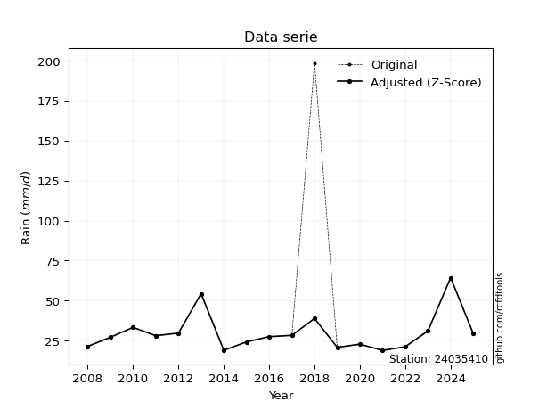</img>

</div>

> If Z-Score is active, values out of range or outliers are replaced with the station mean value.


### 4. Active continuous probability distributions from SciPy (45 of 104 available)

[scipy.stats](https://docs.scipy.org/doc/scipy/reference/stats.html) is a Python´s powerful submodule within the SciPy library for comprehensive statistical analysis, offering over 130 probability distributions (like Normal, Poisson), functions for descriptive stats (mean, variance), hypothesis testing (t-tests, chi-square), random variable generation, and statistical tests, making it essential for data science, modeling, and research. It provides tools to explore, model, and draw conclusions from data efficiently, working seamlessly with NumPy.

<div align="center">

|   id | p_dist             |   n_parameter | fit_method   | label                                                                       | active   | ref                                                                                                        |
|-----:|:-------------------|--------------:|:-------------|:----------------------------------------------------------------------------|:---------|:-----------------------------------------------------------------------------------------------------------|
|    0 | alpha              |             3 | MLE          | Alpha                                                                       | True     | [:mortar_board:](https://docs.scipy.org/doc/scipy/reference/generated/scipy.stats.alpha.html)              |
|    1 | betaprime          |             4 | MLE          | Beta prime                                                                  | True     | [:mortar_board:](https://docs.scipy.org/doc/scipy/reference/generated/scipy.stats.betaprime.html)          |
|    2 | chi2               |             3 | MLE          | Chi²                                                                        | True     | [:mortar_board:](https://docs.scipy.org/doc/scipy/reference/generated/scipy.stats.chi2.html)               |
|    3 | crystalball        |             4 | MLE          | Crystalball                                                                 | True     | [:mortar_board:](https://docs.scipy.org/doc/scipy/reference/generated/scipy.stats.crystalball.html)        |
|    4 | erlang             |             3 | MLE          | Erlang                                                                      | True     | [:mortar_board:](https://docs.scipy.org/doc/scipy/reference/generated/scipy.stats.erlang.html)             |
|    5 | expon              |             2 | MLE          | Exponential                                                                 | True     | [:mortar_board:](https://docs.scipy.org/doc/scipy/reference/generated/scipy.stats.expon.html)              |
|    6 | exponnorm          |             3 | MLE          | Exponentially modified Normal                                               | True     | [:mortar_board:](https://docs.scipy.org/doc/scipy/reference/generated/scipy.stats.exponnorm.html)          |
|    7 | f                  |             4 | MLE          | F                                                                           | True     | [:mortar_board:](https://docs.scipy.org/doc/scipy/reference/generated/scipy.stats.f.html)                  |
|    8 | fatiguelife        |             3 | MLE          | Fatigue-life (Birnbaum-Saunders)                                            | True     | [:mortar_board:](https://docs.scipy.org/doc/scipy/reference/generated/scipy.stats.fatiguelife.html)        |
|    9 | fisk               |             3 | MLE          | Fisk                                                                        | True     | [:mortar_board:](https://docs.scipy.org/doc/scipy/reference/generated/scipy.stats.fisk.html)               |
|   10 | gamma              |             3 | MLE          | Gamma                                                                       | True     | [:mortar_board:](https://docs.scipy.org/doc/scipy/reference/generated/scipy.stats.gamma.html)              |
|   11 | genexpon           |             5 | MLE          | Generalized exponential                                                     | True     | [:mortar_board:](https://docs.scipy.org/doc/scipy/reference/generated/scipy.stats.genexpon.html)           |
|   12 | genlogistic        |             3 | MLE          | Generalized logistic                                                        | True     | [:mortar_board:](https://docs.scipy.org/doc/scipy/reference/generated/scipy.stats.genlogistic.html)        |
|   13 | gibrat             |             2 | MM           | Gibrat                                                                      | True     | [:mortar_board:](https://docs.scipy.org/doc/scipy/reference/generated/scipy.stats.gibrat.html)             |
|   14 | gompertz           |             3 | MLE          | Gompertz (or truncated Gumbel)                                              | True     | [:mortar_board:](https://docs.scipy.org/doc/scipy/reference/generated/scipy.stats.gompertz.html)           |
|   15 | gumbel_l           |             2 | MM           | Gumbel Left Skew                                                            | True     | [:mortar_board:](https://docs.scipy.org/doc/scipy/reference/generated/scipy.stats.gumbel_l.html)           |
|   16 | gumbel_r           |             2 | MM           | Gumbel Right Skew                                                           | True     | [:mortar_board:](https://docs.scipy.org/doc/scipy/reference/generated/scipy.stats.gumbel_r.html)           |
|   17 | halflogistic       |             2 | MM           | Half-logistic                                                               | True     | [:mortar_board:](https://docs.scipy.org/doc/scipy/reference/generated/scipy.stats.halflogistic.html)       |
|   18 | halfnorm           |             2 | MM           | Half Normal                                                                 | True     | [:mortar_board:](https://docs.scipy.org/doc/scipy/reference/generated/scipy.stats.halfnorm.html)           |
|   19 | hypsecant          |             2 | MM           | hyperbolic secant                                                           | True     | [:mortar_board:](https://docs.scipy.org/doc/scipy/reference/generated/scipy.stats.hypsecant.html)          |
|   20 | invgamma           |             3 | MLE          | Inverted gamma                                                              | True     | [:mortar_board:](https://docs.scipy.org/doc/scipy/reference/generated/scipy.stats.invgamma.html)           |
|   21 | invgauss           |             3 | MLE          | Inverse Gaussian                                                            | True     | [:mortar_board:](https://docs.scipy.org/doc/scipy/reference/generated/scipy.stats.invgauss.html)           |
|   22 | invweibull         |             3 | MLE          | Inverted Weibull                                                            | True     | [:mortar_board:](https://docs.scipy.org/doc/scipy/reference/generated/scipy.stats.invweibull.html)         |
|   23 | johnsonsu          |             4 | MLE          | Johnson Su                                                                  | True     | [:mortar_board:](https://docs.scipy.org/doc/scipy/reference/generated/scipy.stats.johnsonsu.html)          |
|   24 | kstwobign          |             2 | MLE          | Limiting distribution of scaled Kolmogorov-Smirnov two-sided test statistic | True     | [:mortar_board:](https://docs.scipy.org/doc/scipy/reference/generated/scipy.stats.kstwobign.html)          |
|   25 | laplace            |             2 | MM           | Laplace                                                                     | True     | [:mortar_board:](https://docs.scipy.org/doc/scipy/reference/generated/scipy.stats.laplace.html)            |
|   26 | laplace_asymmetric |             3 | MLE          | Asymmetric Laplace                                                          | True     | [:mortar_board:](https://docs.scipy.org/doc/scipy/reference/generated/scipy.stats.laplace_asymmetric.html) |
|   27 | loggamma           |             3 | MLE          | Log gamma                                                                   | True     | [:mortar_board:](https://docs.scipy.org/doc/scipy/reference/generated/scipy.stats.loggamma.html)           |
|   28 | logistic           |             2 | MM           | Logistic (or Sech-squared)                                                  | True     | [:mortar_board:](https://docs.scipy.org/doc/scipy/reference/generated/scipy.stats.logistic.html)           |
|   29 | lognorm            |             3 | MLE          | Log Normal                                                                  | True     | [:mortar_board:](https://docs.scipy.org/doc/scipy/reference/generated/scipy.stats.lognorm.html)            |
|   30 | maxwell            |             2 | MM           | Maxwell                                                                     | True     | [:mortar_board:](https://docs.scipy.org/doc/scipy/reference/generated/scipy.stats.maxwell.html)            |
|   31 | mielke             |             4 | MLE          | Mielke Beta-Kappa / Dagum                                                   | True     | [:mortar_board:](https://docs.scipy.org/doc/scipy/reference/generated/scipy.stats.mielke.html)             |
|   32 | moyal              |             2 | MM           | Moyal                                                                       | True     | [:mortar_board:](https://docs.scipy.org/doc/scipy/reference/generated/scipy.stats.moyal.html)              |
|   33 | nakagami           |             3 | MLE          | Nakagami                                                                    | True     | [:mortar_board:](https://docs.scipy.org/doc/scipy/reference/generated/scipy.stats.nakagami.html)           |
|   34 | ncf                |             5 | MLE          | Non-central F distribution                                                  | True     | [:mortar_board:](https://docs.scipy.org/doc/scipy/reference/generated/scipy.stats.ncf.html)                |
|   35 | nct                |             4 | MLE          | Non-central Student’s t                                                     | True     | [:mortar_board:](https://docs.scipy.org/doc/scipy/reference/generated/scipy.stats.nct.html)                |
|   36 | norm               |             2 | MM           | Normal                                                                      | True     | [:mortar_board:](https://docs.scipy.org/doc/scipy/reference/generated/scipy.stats.norm.html)               |
|   37 | pareto             |             3 | MLE          | Pareto                                                                      | True     | [:mortar_board:](https://docs.scipy.org/doc/scipy/reference/generated/scipy.stats.pareto.html)             |
|   38 | pearson3           |             3 | MM           | Pearson type III                                                            | True     | [:mortar_board:](https://docs.scipy.org/doc/scipy/reference/generated/scipy.stats.pearson3.html)           |
|   39 | rayleigh           |             2 | MM           | Rayleigh                                                                    | True     | [:mortar_board:](https://docs.scipy.org/doc/scipy/reference/generated/scipy.stats.rayleigh.html)           |
|   40 | rice               |             3 | MLE          | Rice                                                                        | True     | [:mortar_board:](https://docs.scipy.org/doc/scipy/reference/generated/scipy.stats.rice.html)               |
|   41 | t                  |             3 | MLE          | Student’s t                                                                 | True     | [:mortar_board:](https://docs.scipy.org/doc/scipy/reference/generated/scipy.stats.t.html)                  |
|   42 | truncnorm          |             4 | MLE          | Truncated normal                                                            | True     | [:mortar_board:](https://docs.scipy.org/doc/scipy/reference/generated/scipy.stats.truncnorm.html)          |
|   43 | wald               |             2 | MM           | Wald                                                                        | True     | [:mortar_board:](https://docs.scipy.org/doc/scipy/reference/generated/scipy.stats.wald.html)               |
|   44 | weibull_min        |             3 | MLE          | Weibull minimum                                                             | True     | [:mortar_board:](https://docs.scipy.org/doc/scipy/reference/generated/scipy.stats.weibull_min.html)        |

</div>

> **n_parameter:** # arguments & localization & scale.
>
> **Fit methods:** (MLE) maximum likelihood, (MM) L-moments.
>
>**Inactive:** foldnorm, gennorm, norminvgauss, powernorm, powerlognorm, skewnorm, genextreme, anglit, arcsine, argus, beta, bradford, burr, burr12, cauchy, cosine, halfcauchy, foldcauchy, skewcauchy, wrapcauchy, dgamma, gengamma, exponweib, exponpow, truncexpon, gausshyper, genhalflogistic, genhyperbolic, geninvgauss, halfgennorm, johnsonsb, kappa4, kappa3, ksone, kstwo, loglaplace, levy, levy_l, levy_stable, ncx2, genpareto, truncpareto, lomax, powerlaw, rdist, rel_breitwigner, recipinvgauss, semicircular, studentized_range, trapezoid, triang, truncweibull_min, tukeylambda, uniform, loguniform, vonmises, vonmises_line, weibull_max, dweibull, 


## B. Probability distributions vs. Empirical distributions

A continuous probability distribution (CPD) describes probabilities for variables that can take any value within a range (like rain any time), unlike discrete variables with specific outcomes (like temperature). It uses a Probability Density Function (PDF), a curve where the total area under it equals 1, and the probability of the variable falling within an interval (a to b) is found by calculating the area under the curve between those points. A key feature is that the probability of hitting any single exact value is zero, so probabilities are always expressed for ranges, e.g., $P(a ≤ X ≤ b)$.

<div align="center">

Distributions parameters
|    |   station | p_dist                |   n |             loc |         scale | shape                  | shape1             | shape2                 | shape3   |
|---:|----------:|:----------------------|----:|----------------:|--------------:|:-----------------------|:-------------------|:-----------------------|:---------|
|  0 |  24035410 | alpha                 |  18 |    10.3336      |  35.003       | 2.2745753029576727     |                    |                        |          |
|  1 |  24035410 | betaprime             |  18 |    -0.972615    |   1.96174     | 171.88427388584068     | 12.113333426161901 |                        |          |
|  2 |  24035410 | chi2                  |  18 |    19           |   5.07102     | 1.1730139524516852     |                    |                        |          |
|  3 |  24035410 | crystalball           |  18 |    29.7105      |  11.7654      | 1879.0889537630117     | 2574.513548474789  |                        |          |
|  4 |  24035410 | erlang                |  18 |    19           |  14.2185      | 0.7209084779359387     |                    |                        |          |
|  5 |  24035410 | expon                 |  18 |    19           |  10.7105      |                        |                    |                        |          |
|  6 |  24035410 | exponnorm             |  18 |    18.9859      |   0.00501526  | 2140.796526140275      |                    |                        |          |
|  7 |  24035410 | f                     |  18 |    18.9953      |   8.18763     | 1.6990949766856693     | 8.425473047917627  |                        |          |
|  8 |  24035410 | fatiguelife           |  18 |    17.7058      |   7.71358     | 1.0494684229347633     |                    |                        |          |
|  9 |  24035410 | fisk                  |  18 |    18.4247      |   7.05145     | 1.5529994431719119     |                    |                        |          |
| 10 |  24035410 | gamma                 |  18 |    19           |  12.7757      | 0.7248481619615929     |                    |                        |          |
| 11 |  24035410 | genexpon              |  18 |    19           |  19.8674      | 1.8549489869948728     | 2.201851880555356  | 2.941110712638433e-10  |          |
| 12 |  24035410 | genlogistic           |  18 |   -24.2335      |   6.82963     | 1361.8832304848015     |                    |                        |          |
| 13 |  24035410 | gibrat                |  18 |    20.735       |   5.44391     |                        |                    |                        |          |
| 14 |  24035410 | gompertz              |  18 |    19           |   8.65372e+12 | 778322831252.1443      |                    |                        |          |
| 15 |  24035410 | gumbel_l              |  18 |    35.0055      |   9.17344     |                        |                    |                        |          |
| 16 |  24035410 | gumbel_r              |  18 |    24.4154      |   9.17344     |                        |                    |                        |          |
| 17 |  24035410 | halflogistic          |  18 |    15.7658      |  10.059       |                        |                    |                        |          |
| 18 |  24035410 | halfnorm              |  18 |    14.1377      |  19.5176      |                        |                    |                        |          |
| 19 |  24035410 | hypsecant             |  18 |    29.7105      |   7.49008     |                        |                    |                        |          |
| 20 |  24035410 | invgamma              |  18 |    15.5231      |  20.1031      | 2.33270976684783       |                    |                        |          |
| 21 |  24035410 | invgauss              |  18 |    17.1497      |  11.7201      | 1.0717311991297351     |                    |                        |          |
| 22 |  24035410 | invweibull            |  18 |    13.4459      |  10.0741      | 2.0297688991778067     |                    |                        |          |
| 23 |  24035410 | johnsonsu             |  18 |    17.9216      |   0.0467981   | -5.7846902823030035    | 1.0027608623510336 |                        |          |
| 24 |  24035410 | kstwobign             |  18 |    -1.22322     |  36.1406      |                        |                    |                        |          |
| 25 |  24035410 | laplace               |  18 |    29.7105      |   8.31939     |                        |                    |                        |          |
| 26 |  24035410 | laplace_asymmetric    |  18 |    19           |   0.204846    | 0.01909169689447253    |                    |                        |          |
| 27 |  24035410 | loggamma              |  18 | -3498.89        | 481.358       | 1526.960523959619      |                    |                        |          |
| 28 |  24035410 | logistic              |  18 |    29.7105      |   6.4866      |                        |                    |                        |          |
| 29 |  24035410 | lognorm               |  18 |    19           |   0.88241     | 8.145790143691174      |                    |                        |          |
| 30 |  24035410 | maxwell               |  18 |     1.83145     |  17.4706      |                        |                    |                        |          |
| 31 |  24035410 | mielke                |  18 |     3.93464     |   4.22329     | 757.2042746824416      | 3.4436545825269613 |                        |          |
| 32 |  24035410 | moyal                 |  18 |    22.9823      |   5.29629     |                        |                    |                        |          |
| 33 |  24035410 | nakagami              |  18 |    19           |  20.6852      | 0.22536307452247678    |                    |                        |          |
| 34 |  24035410 | ncf                   |  18 |    15.5251      |   5.23367     | 8476.021320089623      | 4.665419627580897  | 5478.980838026913      |          |
| 35 |  24035410 | nct                   |  18 |     0.271205    |   0.672055    | 6.721010373542551      | 37.910305797802536 |                        |          |
| 36 |  24035410 | norm                  |  18 |    29.7105      |  11.7654      |                        |                    |                        |          |
| 37 |  24035410 | pareto                |  18 |   -54.7228      |  73.7228      | 7.864275337384668      |                    |                        |          |
| 38 |  24035410 | pearson3              |  18 |    29.7105      |  11.7654      | 1.7883933539622254     |                    |                        |          |
| 39 |  24035410 | rayleigh              |  18 |     7.20261     |  17.9587      |                        |                    |                        |          |
| 40 |  24035410 | rice                  |  18 |    12.4547      |  14.768       | 0.0002213717881029895  |                    |                        |          |
| 41 |  24035410 | t                     |  18 |    25.7895      |   5.16626     | 1.783488119247262      |                    |                        |          |
| 42 |  24035410 | truncnorm             |  18 | -4263.55        | 225.401       | 18.99967147163105      | 19.20109269781453  |                        |          |
| 43 |  24035410 | wald                  |  18 |    17.9451      |  11.7654      |                        |                    |                        |          |
| 44 |  24035410 | weibull_min           |  18 |    19           |  12.3569      | 0.7476648557737261     |                    |                        |          |
| 45 |  24035410 | logalpha              |  18 |     2.28435     |   3.61299     | 3.7452859494562785     |                    |                        |          |
| 46 |  24035410 | logbetaprime          |  18 |     1.35313     |   0.27355     | 347.4630332768281      | 49.59868929415673  |                        |          |
| 47 |  24035410 | logchi2               |  18 |     2.94444     |   0.961085    | 1.0604098390428311     |                    |                        |          |
| 48 |  24035410 | logcrystalball        |  18 |     3.33138     |   0.326507    | 238.07416132923038     | 32.38488329404107  |                        |          |
| 49 |  24035410 | logerlang             |  18 |     2.94444     |   0.418089    | 0.8015516998730096     |                    |                        |          |
| 50 |  24035410 | logexpon              |  18 |     2.94444     |   0.386943    |                        |                    |                        |          |
| 51 |  24035410 | logexponnorm          |  18 |     2.96437     |   0.0543754   | 6.749592013285422      |                    |                        |          |
| 52 |  24035410 | logf                  |  18 |     2.66624     |   0.540133    | 520.1761185688184      | 10.242174014701796 |                        |          |
| 53 |  24035410 | logfatiguelife        |  18 |     2.82291     |   0.411351    | 0.6853496296898514     |                    |                        |          |
| 54 |  24035410 | logfisk               |  18 |     2.85334     |   0.387281    | 2.3796021584901457     |                    |                        |          |
| 55 |  24035410 | loggamma              |  18 |     2.94444     |   0.334558    | 0.9187491219280017     |                    |                        |          |
| 56 |  24035410 | loggenexpon           |  18 |     2.94432     |   0.0346322   | 0.0707471180625514     | 2.0337308770821387 | 0.0009707836099477822  |          |
| 57 |  24035410 | loggenlogistic        |  18 |     1.50988     |   0.23154     | 1407.387061462995      |                    |                        |          |
| 58 |  24035410 | loggibrat             |  18 |     3.08228     |   0.151083    |                        |                    |                        |          |
| 59 |  24035410 | loggompertz           |  18 |     2.94444     |   0.772908    | 1.2027658137545916     |                    |                        |          |
| 60 |  24035410 | loggumbel_l           |  18 |     3.47833     |   0.254576    |                        |                    |                        |          |
| 61 |  24035410 | loggumbel_r           |  18 |     3.18444     |   0.254576    |                        |                    |                        |          |
| 62 |  24035410 | loghalflogistic       |  18 |     2.9444      |   0.279152    |                        |                    |                        |          |
| 63 |  24035410 | loghalfnorm           |  18 |     2.89921     |   0.541641    |                        |                    |                        |          |
| 64 |  24035410 | loghypsecant          |  18 |     3.33138     |   0.207861    |                        |                    |                        |          |
| 65 |  24035410 | loginvgamma           |  18 |     2.66098     |   2.78728     | 5.1204382018976755     |                    |                        |          |
| 66 |  24035410 | loginvgauss           |  18 |     2.79606     |   1.22109     | 0.4383965392454219     |                    |                        |          |
| 67 |  24035410 | loginvweibull         |  18 |     2.11875     |   1.04545     | 4.981138015162125      |                    |                        |          |
| 68 |  24035410 | logjohnsonsu          |  18 |     2.8195      |   0.00818038  | -7.120055247882373     | 1.5383491489124577 |                        |          |
| 69 |  24035410 | logkstwobign          |  18 |     2.35184     |   1.1312      |                        |                    |                        |          |
| 70 |  24035410 | loglaplace            |  18 |     3.33138     |   0.230875    |                        |                    |                        |          |
| 71 |  24035410 | loglaplace_asymmetric |  18 |     3.30322     |   0.240873    | 0.9432015502262241     |                    |                        |          |
| 72 |  24035410 | logloggamma           |  18 |  -113.92        |  15.3625      | 2064.1621804370084     |                    |                        |          |
| 73 |  24035410 | loglogistic           |  18 |     3.33138     |   0.180013    |                        |                    |                        |          |
| 74 |  24035410 | loglognorm            |  18 |     2.81946     |   0.41892     | 0.6497652253705598     |                    |                        |          |
| 75 |  24035410 | logmaxwell            |  18 |     2.5577      |   0.484834    |                        |                    |                        |          |
| 76 |  24035410 | logmielke             |  18 |     2.21731     |   0.474041    | 112.96258168079783     | 4.6094425242361385 |                        |          |
| 77 |  24035410 | logmoyal              |  18 |     3.14466     |   0.14698     |                        |                    |                        |          |
| 78 |  24035410 | lognakagami           |  18 |     2.94444     |   0.474171    | 0.3212727956661683     |                    |                        |          |
| 79 |  24035410 | logncf                |  18 |    -2.55103     |   5.88193     | 534.2046696557675      | 1336.0154993198976 | 0.00023993649949741004 |          |
| 80 |  24035410 | lognct                |  18 |    -0.0342056   |   0.043876    | 62.77841716872068      | 75.71733947377587  |                        |          |
| 81 |  24035410 | lognorm               |  18 |     3.33138     |   0.326507    |                        |                    |                        |          |
| 82 |  24035410 | logpareto             |  18 |    -6.71089e+07 |   6.71089e+07 | 173433651.4710082      |                    |                        |          |
| 83 |  24035410 | logpearson3           |  18 |     3.33138     |   0.326507    | 1.1435602030175218     |                    |                        |          |
| 84 |  24035410 | lograyleigh           |  18 |     2.70676     |   0.49838     |                        |                    |                        |          |
| 85 |  24035410 | logrice               |  18 |     2.80057     |   0.44066     | 0.00018907272691646355 |                    |                        |          |
| 86 |  24035410 | logt                  |  18 |     3.26732     |   0.233129    | 3.468139646597442      |                    |                        |          |
| 87 |  24035410 | logtruncnorm          |  18 |    -0.128382    |   1.2183      | 2.522221623701141      | 4.047141577788837  |                        |          |
| 88 |  24035410 | logwald               |  18 |     3.00492     |   0.326459    |                        |                    |                        |          |
| 89 |  24035410 | logweibull_min        |  18 |     2.94444     |   0.33674     | 0.8516557514211793     |                    |                        |          |

</div>

> **loc** (Location parameter): This shifts the distribution along the x-axis. For many common distributions, like the normal (Gaussian) distribution, loc represents the mean $μ$. For others, like the uniform distribution, it might represent the minimum value, or for the beta distribution, the left end of the support interval.
>
> **scale** (Scale parameter): This determines the width or spread of the distribution. For the normal distribution, scale represents the standard deviation $σ$. For a uniform distribution, it defines the length of the interval (from $loc$ to $loc + scale$).
>
> **shape** (Shape parameters): Refers to parameters that define the specific form of a probability distribution, distinct from its location (loc) and scale (scale). These parameters are required arguments for most distribution functions. For example, a normal (Gaussian) distribution is fully defined by its location (mean) and scale (standard deviation), so it has no specific shape parameters beyond loc and scale. However, other distributions have intrinsic properties that need specification, as Gamma distribution that takes a shape parameter, often named $a$ or $alpha$.


### 0. Cumulative distribution values - CDF (90 evaluated)

> Ordered by x ascending and calculating $log(f(x))$ separately. 

|   id |   Station |   date |       x |   count |    mean |     std |    zscore |   Value_initial |   station |   m |     alpha |   alpha_pdf |   betaprime |   betaprime_pdf |        chi2 |         chi2_pdf |   crystalball |   crystalball_pdf |      erlang |    erlang_pdf |      expon |   expon_pdf |   exponnorm |   exponnorm_pdf |          f |      f_pdf |   fatiguelife |   fatiguelife_pdf |      fisk |   fisk_pdf |       gamma |     gamma_pdf |    genexpon |   genexpon_pdf |   genlogistic |   genlogistic_pdf |      gibrat |   gibrat_pdf |   gompertz |   gompertz_pdf |   gumbel_l |   gumbel_l_pdf |   gumbel_r |   gumbel_r_pdf |   halflogistic |   halflogistic_pdf |   halfnorm |   halfnorm_pdf |   hypsecant |   hypsecant_pdf |   invgamma |   invgamma_pdf |   invgauss |   invgauss_pdf |   invweibull |   invweibull_pdf |   johnsonsu |   johnsonsu_pdf |   kstwobign |   kstwobign_pdf |   laplace |   laplace_pdf |   laplace_asymmetric |   laplace_asymmetric_pdf |   loggamma |   loggamma_pdf |   logistic |   logistic_pdf |   lognorm |   lognorm_pdf |   maxwell |   maxwell_pdf |   mielke |   mielke_pdf |    moyal |   moyal_pdf |    nakagami |   nakagami_pdf |       ncf |    ncf_pdf |       nct |     nct_pdf |     norm |   norm_pdf |      pareto |   pareto_pdf |   pearson3 |   pearson3_pdf |   rayleigh |   rayleigh_pdf |      rice |   rice_pdf |        t |       t_pdf |   truncnorm |   truncnorm_pdf |       wald |   wald_pdf |   weibull_min |   weibull_min_pdf |   logalpha |   logalpha_pdf |   logbetaprime |   logbetaprime_pdf |     logchi2 |   logchi2_pdf |   logcrystalball |   logcrystalball_pdf |   logerlang |   logerlang_pdf |   logexpon |   logexpon_pdf |   logexponnorm |   logexponnorm_pdf |      logf |   logf_pdf |   logfatiguelife |   logfatiguelife_pdf |   logfisk |   logfisk_pdf |   loggenexpon |   loggenexpon_pdf |   loggenlogistic |   loggenlogistic_pdf |   loggibrat |   loggibrat_pdf |   loggompertz |   loggompertz_pdf |   loggumbel_l |   loggumbel_l_pdf |   loggumbel_r |   loggumbel_r_pdf |   loghalflogistic |   loghalflogistic_pdf |   loghalfnorm |   loghalfnorm_pdf |   loghypsecant |   loghypsecant_pdf |   loginvgamma |   loginvgamma_pdf |   loginvgauss |   loginvgauss_pdf |   loginvweibull |   loginvweibull_pdf |   logjohnsonsu |   logjohnsonsu_pdf |   logkstwobign |   logkstwobign_pdf |   loglaplace |   loglaplace_pdf |   loglaplace_asymmetric |   loglaplace_asymmetric_pdf |   logloggamma |   logloggamma_pdf |   loglogistic |   loglogistic_pdf |   loglognorm |   loglognorm_pdf |   logmaxwell |   logmaxwell_pdf |   logmielke |   logmielke_pdf |   logmoyal |   logmoyal_pdf |   lognakagami |   lognakagami_pdf |   logncf |   logncf_pdf |    lognct |   lognct_pdf |   logpareto |   logpareto_pdf |   logpearson3 |   logpearson3_pdf |   lograyleigh |   lograyleigh_pdf |   logrice |   logrice_pdf |     logt |   logt_pdf |   logtruncnorm |   logtruncnorm_pdf |    logwald |   logwald_pdf |   logweibull_min |   logweibull_min_pdf |
|-----:|----------:|-------:|--------:|--------:|--------:|--------:|----------:|----------------:|----------:|----:|----------:|------------:|------------:|----------------:|------------:|-----------------:|--------------:|------------------:|------------:|--------------:|-----------:|------------:|------------:|----------------:|-----------:|-----------:|--------------:|------------------:|----------:|-----------:|------------:|--------------:|------------:|---------------:|--------------:|------------------:|------------:|-------------:|-----------:|---------------:|-----------:|---------------:|-----------:|---------------:|---------------:|-------------------:|-----------:|---------------:|------------:|----------------:|-----------:|---------------:|-----------:|---------------:|-------------:|-----------------:|------------:|----------------:|------------:|----------------:|----------:|--------------:|---------------------:|-------------------------:|-----------:|---------------:|-----------:|---------------:|----------:|--------------:|----------:|--------------:|---------:|-------------:|---------:|------------:|------------:|---------------:|----------:|-----------:|----------:|------------:|---------:|-----------:|------------:|-------------:|-----------:|---------------:|-----------:|---------------:|----------:|-----------:|---------:|------------:|------------:|----------------:|-----------:|-----------:|--------------:|------------------:|-----------:|---------------:|---------------:|-------------------:|------------:|--------------:|-----------------:|---------------------:|------------:|----------------:|-----------:|---------------:|---------------:|-------------------:|----------:|-----------:|-----------------:|---------------------:|----------:|--------------:|--------------:|------------------:|-----------------:|---------------------:|------------:|----------------:|--------------:|------------------:|--------------:|------------------:|--------------:|------------------:|------------------:|----------------------:|--------------:|------------------:|---------------:|-------------------:|--------------:|------------------:|--------------:|------------------:|----------------:|--------------------:|---------------:|-------------------:|---------------:|-------------------:|-------------:|-----------------:|------------------------:|----------------------------:|--------------:|------------------:|--------------:|------------------:|-------------:|-----------------:|-------------:|-----------------:|------------:|----------------:|-----------:|---------------:|--------------:|------------------:|---------:|-------------:|----------:|-------------:|------------:|----------------:|--------------:|------------------:|--------------:|------------------:|----------:|--------------:|---------:|-----------:|---------------:|-------------------:|-----------:|--------------:|-----------------:|---------------------:|
|    0 |  24035410 |   2021 | 19      |      18 | 38.5889 | 41.6216 | -0.470642 |            19   |  24035410 |   1 | 0.039286  |  0.0396619  |    0.104773 |     0.0335639   | 9.65619e-10 | 159411           |      0.181322 |        0.0224053  | 6.19178e-12 | 1256.42       | 0          |  0.0933664  |  0.00131013 |      0.0927833  | 0.00160939 | 0.28891    |     0.0264377 |        0.064277   | 0.0199967 | 0.0529017  | 5.80285e-12 | 1183.94       | 2.22062e-11 |     0.0933662  |     0.0885594 |       0.031405    | 0           |   0          | 2.4029e-13 |     0.0899408  |   0.160279 |    0.0159904   |   0.16454  |     0.0323684  |       0.159392 |         0.0484439  |   0.196734 |     0.0396312  |    0.149543 |     0.0192391   |  0.0333626 |     0.0446511  |  0.0284851 |     0.0542572  |    0.0351266 |       0.0429891  |   0.0260045 |      0.0561131  |   0.0871164 |     0.0296375   |  0.137992 |   0.0165868   |          0.000364426 |               0.0931661  | 2.2169e-14 |     45.8642    |   0.160951 |    0.0208191   |  0.117989 |     0.605402  |  0.190454 |   0.0272132   |      nan |          nan | 0.145289 |  0.0379871  | 6.14479e-08 |    7.79578e+06 | 0.0333626 | 0.0446511  | 0.0778979 | 0.0347378   | 0.181322 | 0.0224053  | 1.77636e-15 |   0.106674   |   0.125373 |     0.0576674  |   0.19408  |     0.0294801  | 0.0935473 | 0.0272039  | 0.166233 | 0.0263034   | 1.00177e-07 |      0.0863483  | 0.00219309 | 0.0124267  |   2.40038e-12 |      505.156      |  0.0419817 |      0.743146  |      0.0985311 |          0.751839  | 5.77216e-09 |   6.89147e+06 |         0.11799  |            0.605403  | 1.06759e-12 |    1926.93      |  0         |       2.58436  |      0.0331321 |           0.882377 | 0.0362969 |  0.794972  |        0.0292915 |            0.954355  | 0.0309556 |     0.78356   |   0.000244204 |         2.04251   |        0.0569509 |            0.704113  |   0         |       0         |   3.31663e-07 |          1.55616  |      0.115563 |       0.426641    |     0.0767666 |         0.774066  |       7.83092e-05 |             1.79114   |     0.0665421 |         1.46796   |      0.0981654 |           0.464815 |     0.0362979 |         0.794964  |     0.0309601 |         0.898615  |       0.0391741 |            0.765638 |      0.031554  |          0.871691  |      0.053402  |          0.72008   |    0.0935621 |        0.40525   |               0.0970509 |                   0.427177  |      0.126705 |         0.609388  |      0.104375 |         0.519302  |    0.0313383 |        0.868709  |     0.111923 |        0.761785  |   0.0410255 |        0.778713 |  0.0481419 |      0.761201  |   1.71211e-10 |    247722         | 0.177866 |     0.64798  | 0.0949626 |    0.674117  |   0         |        2.58436  |     0.0718497 |         0.918836  |      0.107495 |         0.854062  | 0.0518975 |     0.702426  | 0.124226 |  0.596007  |     1.2598e-09 |           2.344    | 0          |     0         |      2.12575e-13 |           407.668    |
|    1 |  24035410 |   2014 | 19.1    |      18 | 38.5889 | 41.6216 | -0.46824  |            19.1 |  24035410 |   2 | 0.0433692 |  0.0420002  |    0.108157 |     0.0341226   | 0.0743729   |      0.433498    |      0.183571 |        0.0225785  | 0.0306445   |    0.220017   | 0.00929319 |  0.0924987  |  0.0105683  |      0.0921546  | 0.0222295  | 0.179051   |     0.0331669 |        0.0701603  | 0.0255038 | 0.0571564  | 0.0324351   |    0.23404    | 0.00929317  |     0.0924986  |     0.0917325 |       0.0320582   | 0           |   0          | 0.00895376 |     0.0891355  |   0.161885 |    0.0161347   |   0.167791 |     0.03265    |       0.164233 |         0.0483661  |   0.200695 |     0.0395802  |    0.151478 |     0.0194691   |  0.0379836 |     0.0477522  |  0.034139  |     0.0587595  |    0.0395704 |       0.0458789  |   0.0318541 |      0.0607962  |   0.0901063 |     0.0301609   |  0.139661 |   0.0167874   |          0.00963775  |               0.0923018  | 0.0225404  |      3.91287   |   0.163043 |    0.0210373   |  0.121198 |     0.616968  |  0.193184 |   0.0273763   |      nan |          nan | 0.149107 |  0.038384   | 0.0708795   |    0.319471    | 0.0379835 | 0.0477522  | 0.0814144 | 0.0355923   | 0.183571 | 0.0225785  | 0.0106035   |   0.1054     |   0.131142 |     0.0576982  |   0.197035 |     0.0296209  | 0.0962843 | 0.0275361  | 0.16889  | 0.0268393   | 0.00859864  |      0.0856235  | 0.00368458 | 0.0175071  |   0.0269179   |        0.198522   |  0.0459988 |      0.787409  |      0.102527  |          0.770802  | 0.0492157   |   4.9621      |         0.121198 |            0.616968  | 0.031943    |       4.84364   |  0.0134746 |       2.54954  |      0.0379902 |           0.96886  | 0.0406135 |  0.849622  |        0.0345167 |            1.03588   | 0.0352147 |     0.839098  |   0.0109312   |         2.02922   |        0.0607253 |            0.733983  |   0         |       0         |   0.00816345  |          1.55397  |      0.117823 |       0.434417    |     0.0808956 |         0.799052  |       0.00948036  |             1.79098   |     0.0742447 |         1.46671   |      0.100635  |           0.476121 |     0.0406144 |         0.849614  |     0.0358676 |         0.970795  |       0.0433232 |            0.815237 |      0.0363073 |          0.939054  |      0.0572613 |          0.750284  |    0.0957138 |        0.41457   |               0.0993194 |                   0.437162  |      0.129932 |         0.620194  |      0.107133 |         0.531381  |    0.036076  |        0.936107  |     0.115959 |        0.77583   |   0.0452427 |        0.8281   |  0.0522415 |      0.800746  |   0.0429824   |         5.26109   | 0.181286 |     0.655251 | 0.0985448 |    0.690685  |   0.0134746 |        2.54954  |     0.0767462 |         0.946596  |      0.112016 |         0.868503  | 0.0556447 |     0.725179  | 0.127396 |  0.611589  |     0.0122378  |           2.31864  | 0          |     0         |      0.0284864   |             4.55517  |
|    2 |  24035410 |   2019 | 20.9    |      18 | 38.5889 | 41.6216 | -0.424993 |            20.9 |  24035410 |   3 | 0.151347  |  0.0738179  |    0.17783  |     0.0428144   | 0.39228     |      0.107437    |      0.226974 |        0.0256173  | 0.242957    |    0.0852289  | 0.162552   |  0.0781895  |  0.163287   |      0.0779305  | 0.236647   | 0.0929636  |     0.192819  |        0.0897504  | 0.164407  | 0.0861907  | 0.258601    |    0.0904171  | 0.162552    |     0.0781894  |     0.159489  |       0.0428412   | 0.000235738 |   0.00535572 | 0.157084   |     0.0758126  |   0.193366 |    0.0188952   |   0.230616 |     0.0368797  |       0.249806 |         0.0466049  |   0.271011 |     0.0384988  |    0.190454 |     0.0239373   |  0.160358  |     0.0805627  |  0.177613  |     0.0871763  |    0.158344  |       0.079465   |   0.177539  |      0.0875695  |   0.152193  |     0.0384188   |  0.173396 |   0.0208424   |          0.162593    |               0.0780464  | 0.285243   |      2.36205   |   0.204523 |    0.0250815   |  0.185878 |     0.819937  |  0.244907 |   0.0299892   |      nan |          nan | 0.223516 |  0.0437094  | 0.267139    |    0.0632736   | 0.160358  | 0.0805628  | 0.158113  | 0.0488333   | 0.226974 | 0.0256173  | 0.181361    |   0.0851331  |   0.233704 |     0.0555965  |   0.252386 |     0.0317516  | 0.150846  | 0.032882   | 0.227015 | 0.038315    | 0.151597    |      0.0735671  | 0.113885   | 0.0882168  |   0.218564    |        0.0758365  |  0.149745  |      1.47463   |      0.186211  |          1.07954   | 0.22524     |   1.21291     |         0.185878 |            0.819938  | 0.297112    |       2.19668   |  0.218325  |       2.02013  |      0.182631  |           2.00139  | 0.15465   |  1.60133   |        0.170987  |            1.79743   | 0.149317  |     1.62148   |   0.183259    |         1.79658   |        0.149677  |            1.22694   |   0         |       0         |   0.146023    |          1.50333  |      0.163534 |       0.58673     |     0.171128  |         1.18668   |       0.169151    |             1.73989   |     0.20472   |         1.42433   |      0.153471  |           0.710063 |     0.154651  |         1.60134   |     0.165163  |         1.74222   |       0.152569  |            1.55141  |      0.161722  |          1.71017   |      0.146655  |          1.2092    |    0.141379  |        0.612363  |               0.147636  |                   0.649831  |      0.194254 |         0.808287  |      0.165196 |         0.766091  |    0.161288  |        1.70878   |     0.195978 |        0.992396  |   0.155537  |        1.56211  |  0.153034  |      1.39731   |   0.276003    |         1.84251   | 0.245687 |     0.771941 | 0.173524  |    0.971024  |   0.218325  |        2.02013  |     0.179772  |         1.30182   |      0.200057 |         1.07244   | 0.136962  |     1.06301   | 0.196025 |  0.92655   |     0.20255    |           1.91838  | 0.00571521 |     0.832734  |      0.289168    |             2.16797  |
|    3 |  24035410 |   2022 | 21.3    |      18 | 38.5889 | 41.6216 | -0.415382 |            21.3 |  24035410 |   4 | 0.181583  |  0.0771245  |    0.195263 |     0.0443189   | 0.432757    |      0.0954367   |      0.237351 |        0.0262627  | 0.275669    |    0.0785619  | 0.193251   |  0.0753232  |  0.193886   |      0.0750806  | 0.272435   | 0.0861519  |     0.227994  |        0.0860161  | 0.198903  | 0.086063   | 0.293264    |    0.0831424  | 0.193251    |     0.0753231  |     0.177034  |       0.0448522   | 0.0117419   |   0.0542505  | 0.18687    |     0.0731336  |   0.201054 |    0.0195492   |   0.245513 |     0.0375867  |       0.268354 |         0.0461272  |   0.286355 |     0.0382184  |    0.200242 |     0.0250056   |  0.192958  |     0.0821688  |  0.212245  |     0.0857687  |    0.190622  |       0.0816522  |   0.212308  |      0.0860828  |   0.16786   |     0.0398936   |  0.181936 |   0.021869    |          0.193236    |               0.0751904  | 0.328452   |      2.19927   |   0.214739 |    0.025996    |  0.201823 |     0.862128  |  0.257003 |   0.0304811   |      nan |          nan | 0.241147 |  0.04442    | 0.291115    |    0.0569197   | 0.192958  | 0.0821689  | 0.178097  | 0.0510362   | 0.237351 | 0.0262627  | 0.21463     |   0.0812437  |   0.255769 |     0.0547164  |   0.265161 |     0.0321204  | 0.164204  | 0.0338977  | 0.242934 | 0.0412991   | 0.180533    |      0.0711268  | 0.149813   | 0.0908969  |   0.247603    |        0.0695817  |  0.178674  |      1.57377   |      0.207217  |          1.13583   | 0.247147    |   1.10289     |         0.201824 |            0.862128  | 0.337086    |       2.02507   |  0.255699  |       1.92354  |      0.220757  |           2.01047  | 0.18586   |  1.68655   |        0.205409  |            1.8288    | 0.181013  |     1.71775   |   0.216849    |         1.74706   |        0.173764  |            1.31255   |   0         |       0         |   0.174393    |          1.48948  |      0.175003 |       0.623424    |     0.194241  |         1.25029   |       0.201935    |             1.7181    |     0.231595  |         1.41059   |      0.167487  |           0.769097 |     0.185861  |         1.68656   |     0.198712  |         1.79182   |       0.182924  |            1.64667  |      0.194767  |          1.77077   |      0.170279  |          1.28127   |    0.153478  |        0.664769  |               0.160484  |                   0.706383  |      0.209947 |         0.847104  |      0.180236 |         0.82078   |    0.19431   |        1.76973   |     0.215156 |        1.03032   |   0.18609   |        1.65676  |  0.180358  |      1.4823    |   0.309699    |         1.71704   | 0.260531 |     0.793841 | 0.192452  |    1.02539   |   0.255699  |        1.92354  |     0.204889  |         1.34631   |      0.220696 |         1.10426   | 0.157661  |     1.11975   | 0.214302 |  1.00196   |     0.238192   |           1.84208  | 0.0349857  |     2.19939   |      0.328569    |             1.99342  |
|    4 |  24035410 |   2008 | 21.5    |      18 | 38.5889 | 41.6216 | -0.410577 |            21.5 |  24035410 |   5 | 0.197127  |  0.0782634  |    0.204196 |     0.0450056   | 0.451331    |      0.0904019   |      0.242635 |        0.0265799  | 0.291089    |    0.0756827  | 0.208176   |  0.0739298  |  0.208763   |      0.0736949  | 0.289357   | 0.0831004  |     0.244993  |        0.0839671  | 0.216068  | 0.0855369  | 0.309573    |    0.0799944  | 0.208176    |     0.0739297  |     0.186099  |       0.0457899   | 0.0248574   |   0.0760358  | 0.201366   |     0.0718298  |   0.204997 |    0.0198815   |   0.253062 |     0.037907   |       0.277554 |         0.0458775  |   0.293984 |     0.038073   |    0.205297 |     0.0255481   |  0.209422  |     0.0824171  |  0.229291  |     0.0846515  |    0.20701   |       0.0821673  |   0.229416  |      0.0849606  |   0.175908  |     0.0405763   |  0.186363 |   0.0224011   |          0.208135    |               0.0738018  | 0.348656   |      2.12506   |   0.219984 |    0.0264531   |  0.209976 |     0.882623  |  0.263122 |   0.0307142   |      nan |          nan | 0.250061 |  0.0447131  | 0.302236    |    0.0543441   | 0.209422  | 0.0824172  | 0.188404  | 0.0520204   | 0.242635 | 0.0265799  | 0.230691    |   0.0793734  |   0.266666 |     0.0542442  |   0.271603 |     0.0322906  | 0.171032  | 0.0343809  | 0.251347 | 0.0428361   | 0.194639    |      0.0699371  | 0.168032   | 0.0911968  |   0.261247    |        0.0668975  |  0.193578  |      1.6147    |      0.217955  |          1.16191   | 0.257239    |   1.05775     |         0.209977 |            0.882623  | 0.355655    |       1.94965   |  0.273461  |       1.87764  |      0.239483  |           1.99515  | 0.201776  |  1.71846   |        0.222528  |            1.83364   | 0.197246  |     1.75483   |   0.233063    |         1.72265   |        0.186212  |            1.351     |   0         |       0         |   0.18828     |          1.48224  |      0.180916 |       0.642101    |     0.20606   |         1.27856   |       0.217936    |             1.70607   |     0.244744  |         1.40323   |      0.174816  |           0.799379 |     0.201777  |         1.71847   |     0.215527  |         1.80533   |       0.198494  |            1.68415  |      0.21141   |          1.78979   |      0.182403  |          1.31287   |    0.159819  |        0.692231  |               0.167224  |                   0.736047  |      0.217952 |         0.865936  |      0.188034 |         0.848148  |    0.210944  |        1.78892   |     0.224868 |        1.04784   |   0.201752  |        1.69386  |  0.194379  |      1.51753   |   0.325496    |         1.66417   | 0.267998 |     0.804205 | 0.202156  |    1.05112   |   0.273461  |        1.87764  |     0.217559  |         1.36452   |      0.231083 |         1.11847   | 0.168248  |     1.14571   | 0.223842 |  1.03973   |     0.255236   |           1.80543  | 0.0578779  |     2.67206   |      0.346837    |             1.9167   |
|    5 |  24035410 |   2025 | 22.6    |      18 | 38.5889 | 41.6216 | -0.384149 |            22.6 |  24035410 |   6 | 0.284559  |  0.0793953  |    0.255463 |     0.0479791   | 0.538529    |      0.0697578   |      0.272803 |        0.0282482  | 0.367075    |    0.0632703  | 0.285462   |  0.0667138  |  0.285813   |      0.0665186  | 0.372757   | 0.0692492  |     0.330972  |        0.0724244  | 0.307071  | 0.0791429  | 0.389607    |    0.0663885  | 0.285462    |     0.0667138  |     0.238957  |       0.0500584   | 0.142029    |   0.120516   | 0.276596   |     0.0650636  |   0.227896 |    0.0217687   |   0.295572 |     0.0392716  |       0.327216 |         0.0443846  |   0.335401 |     0.0372129  |    0.235074 |     0.0286086   |  0.298888  |     0.0791692  |  0.317934  |     0.0760516  |    0.296836  |       0.0799415  |   0.318459  |      0.07649    |   0.222344  |     0.0436643   |  0.212708 |   0.0255677   |          0.285294    |               0.0666106  | 0.445775   |      1.78088   |   0.250456 |    0.0289409   |  0.256658 |     0.986804  |  0.297551 |   0.0318391   |      nan |          nan | 0.299853 |  0.0456259  | 0.355994    |    0.0443234   | 0.298888  | 0.0791693  | 0.24804   | 0.0560067   | 0.272803 | 0.0282482  | 0.312672    |   0.0699062  |   0.324794 |     0.0513808  |   0.30757  |     0.0330578  | 0.210195  | 0.0367402  | 0.303244 | 0.0515556   | 0.268108    |      0.0637397  | 0.266222   | 0.0858783  |   0.32813     |        0.0554926  |  0.277989  |      1.74418   |      0.279019  |          1.27921   | 0.305201    |   0.878874    |         0.256659 |            0.986804  | 0.444229    |       1.61771   |  0.361361  |       1.65048  |      0.334786  |           1.80606  | 0.289926  |  1.78855   |        0.313082  |            1.77645   | 0.287743  |     1.84306   |   0.315774    |         1.59283   |        0.257904  |            1.50875   |   0.0744175 |       3.94549   |   0.261193    |          1.43906  |      0.215557 |       0.748098    |     0.272957  |         1.39219   |       0.30122     |             1.62862   |     0.313668  |         1.35774   |      0.218945  |           0.972209 |     0.289927  |         1.78856   |     0.305672  |         1.78558   |       0.285696  |            1.78432  |      0.301452  |          1.7954    |      0.251312  |          1.4366    |    0.198375  |        0.859233  |               0.208295  |                   0.916827  |      0.263583 |         0.961492  |      0.234038 |         0.995843  |    0.300962  |        1.79529   |     0.279233 |        1.12712   |   0.289366  |        1.79081  |  0.273458  |      1.63189   |   0.402673    |         1.4433    | 0.30941  |     0.854103 | 0.257769  |    1.1734    |   0.361361  |        1.65048  |     0.287368  |         1.42321   |      0.288489 |         1.1779    | 0.228457  |     1.26103   | 0.280775 |  1.24125   |     0.340626   |           1.62012  | 0.215063   |     3.23574   |      0.433641    |             1.58045  |
|    6 |  24035410 |   2020 | 22.9    |      18 | 38.5889 | 41.6216 | -0.376941 |            22.9 |  24035410 |   7 | 0.308255  |  0.0785108  |    0.269945 |     0.0485532   | 0.55881     |      0.0655198   |      0.281342 |        0.0286776  | 0.385647    |    0.0605808  | 0.305198   |  0.0648711  |  0.305493   |      0.0646857  | 0.393056   | 0.0661183  |     0.352249  |        0.0694419  | 0.330464  | 0.0767799  | 0.409074    |    0.0634352  | 0.305198    |     0.0648711  |     0.254111  |       0.0509476   | 0.178241    |   0.120456   | 0.295854   |     0.0633315  |   0.234506 |    0.0222998   |   0.307393 |     0.0395282  |       0.340466 |         0.0439449  |   0.346527 |     0.0369614  |    0.243783 |     0.0294577   |  0.322377  |     0.0773813  |  0.340354  |     0.0734049  |    0.32058   |       0.0783     |   0.341016  |      0.0738834  |   0.235542  |     0.0443105   |  0.220518 |   0.0265065   |          0.305001    |               0.064774   | 0.468734   |      1.70189   |   0.259238 |    0.0296047   |  0.269841 |     1.01238   |  0.307142 |   0.0320988   |      nan |          nan | 0.313551 |  0.0456841  | 0.368992    |    0.0423667   | 0.322377  | 0.0773813  | 0.264947  | 0.0566811   | 0.281342 | 0.0286776  | 0.333288    |   0.0675473  |   0.340084 |     0.050546   |   0.317512 |     0.033218   | 0.221301  | 0.0372947  | 0.319065 | 0.0539091   | 0.28699     |      0.0621467  | 0.291612   | 0.0833471  |   0.344408    |        0.0530654  |  0.30107   |      1.75481   |      0.296051  |          1.30339   | 0.316553    |   0.843338    |         0.269841 |            1.01238   | 0.465076    |       1.54486   |  0.382759  |       1.59518  |      0.358205  |           1.74576  | 0.313485  |  1.78312   |        0.336307  |            1.74524   | 0.312031  |     1.83884   |   0.336554    |         1.55878   |        0.277988  |            1.53629   |   0.129442  |       4.31745   |   0.280087    |          1.42639  |      0.225617 |       0.777766    |     0.291448  |         1.41146   |       0.322541    |             1.6048    |     0.331483  |         1.34405   |      0.232081  |           1.0202   |     0.313487  |         1.78313   |     0.329066  |         1.76132   |       0.309245  |            1.78573  |      0.325008  |          1.77607   |      0.270396  |          1.4569    |    0.210036  |        0.909739  |               0.220743  |                   0.971617  |      0.276418 |         0.984926  |      0.247425 |         1.03441   |    0.324518  |        1.77612   |     0.294208 |        1.14384   |   0.312993  |        1.79108  |  0.295057  |      1.6427    |   0.421393    |         1.39649   | 0.32075  |     0.865614 | 0.273425  |    1.20075   |   0.382759  |        1.59518  |     0.306177  |         1.42879   |      0.304097 |         1.18901   | 0.245247  |     1.28485   | 0.297481 |  1.29225   |     0.361685   |           1.57397  | 0.257051   |     3.12496   |      0.453993    |             1.50719  |
|    7 |  24035410 |   2015 | 24.3    |      18 | 38.5889 | 41.6216 | -0.343305 |            24.3 |  24035410 |   8 | 0.413139  |  0.0705021  |    0.339135 |     0.0499468   | 0.639134    |      0.0502737   |      0.322807 |        0.0305058  | 0.462942    |    0.0503958  | 0.390333   |  0.0569224  |  0.390397   |      0.0567778  | 0.476703   | 0.0539769  |     0.440559  |        0.0571813  | 0.429624  | 0.0647726  | 0.489627    |    0.0522499  | 0.390332    |     0.0569224  |     0.327532  |       0.0535068   | 0.336024    |   0.102315   | 0.379163   |     0.0558386  |   0.267502 |    0.0248568   |   0.36325  |     0.0400995  |       0.40047  |         0.041735   |   0.397406 |     0.0356981  |    0.287795 |     0.0333984   |  0.423675  |     0.0669742  |  0.434557  |     0.0613547  |    0.423357  |       0.0680496  |   0.435964  |      0.0619067  |   0.299143  |     0.0462628   |  0.260932 |   0.0313643   |          0.390017    |               0.0568504  | 0.560228   |      1.39368   |   0.302778 |    0.0325446   |  0.333033 |     1.11321   |  0.35279  |   0.0330374   |      nan |          nan | 0.377222 |  0.0450396  | 0.423174    |    0.0355557   | 0.423676  | 0.0669742  | 0.345405  | 0.0577055   | 0.322807 | 0.0305058  | 0.420722    |   0.0576493  |   0.408043 |     0.0465148  |   0.364403 |     0.0336948  | 0.275067  | 0.0393733  | 0.401556 | 0.0633588   | 0.369053    |      0.055222   | 0.399189   | 0.0702315  |   0.412011    |        0.0440487  |  0.404429  |      1.70498   |      0.375793  |          1.37358   | 0.362648    |   0.718264    |         0.333033 |            1.11321   | 0.54819     |       1.26901   |  0.470515  |       1.36838  |      0.453979  |           1.4877   | 0.416638  |  1.67411   |        0.434753  |            1.56489   | 0.418251  |     1.7174    |   0.424553    |         1.4079    |        0.371257  |            1.58821   |   0.369218  |       3.48742   |   0.362899    |          1.36304  |      0.275885 |       0.918186    |     0.376607  |         1.44466   |       0.414279    |             1.48373   |     0.409243  |         1.27479   |      0.299072  |           1.23627  |     0.416641  |         1.67412   |     0.429091  |         1.59872   |       0.41325   |            1.69733  |      0.426346  |          1.62565   |      0.358291  |          1.49069   |    0.271591  |        1.17636   |               0.286629  |                   1.26162   |      0.337722 |         1.07743   |      0.313727 |         1.19604   |    0.425876  |        1.6262    |     0.363822 |        1.19612   |   0.41715   |        1.69706  |  0.392169  |      1.61055   |   0.498787    |         1.21972   | 0.373444 |     0.907663 | 0.347681  |    1.29335   |   0.470515  |        1.36838  |     0.390764  |         1.41143   |      0.375635 |         1.21594   | 0.323922  |     1.35751   | 0.380302 |  1.48756   |     0.449221   |           1.38002  | 0.422014   |     2.42076   |      0.534882    |             1.2324   |
|    8 |  24035410 |   2009 | 27.2    |      18 | 38.5889 | 41.6216 | -0.273629 |            27.2 |  24035410 |   9 | 0.585687  |  0.0486808  |    0.481629 |     0.0472686   | 0.754889    |      0.0315346   |      0.415515 |        0.0331449  | 0.587122    |    0.0363846  | 0.534947   |  0.0434203  |  0.534689   |      0.0433385  | 0.606675   | 0.037071   |     0.578582  |        0.0394715  | 0.584106  | 0.0429916  | 0.617094    |    0.0369277  | 0.534947    |     0.0434203  |     0.481862  |       0.051498    | 0.568243    |   0.0608032  | 0.521699   |     0.0430188  |   0.34756  |    0.030372    |   0.477975 |     0.0384632  |       0.514153 |         0.0365666  |   0.496669 |     0.0326778  |    0.395254 |     0.0402172   |  0.585781  |     0.0456817  |  0.582294  |     0.0418784  |    0.587705  |       0.0461001  |   0.584955  |      0.0421335  |   0.433682  |     0.0456091   |  0.369756 |   0.0444451   |          0.534482    |               0.0433863  | 0.69158    |      0.964945  |   0.404433 |    0.037133    |  0.46563  |     1.21731   |  0.449807 |   0.0335545   |      nan |          nan | 0.501874 |  0.0403725  | 0.513236    |    0.027406    | 0.585782  | 0.0456817  | 0.506072  | 0.0517264   | 0.415515 | 0.0331449  | 0.563692    |   0.0418839  |   0.530802 |     0.0382376  |   0.462037 |     0.0333562  | 0.392537  | 0.0410706  | 0.593426 | 0.0637662   | 0.511101    |      0.0432297  | 0.56737    | 0.0472158  |   0.520946    |        0.0321456  |  0.579003  |      1.36132   |      0.530532  |          1.33665   | 0.434384    |   0.567345    |         0.46563  |            1.21731   | 0.668932    |       0.899172  |  0.604345  |       1.02252  |      0.598393  |           1.09426  | 0.584846  |  1.29425   |        0.589542  |            1.18482   | 0.588199  |     1.28121   |   0.56778     |         1.13701   |        0.543902  |            1.43024   |   0.648037  |       1.67993   |   0.508606    |          1.21641  |      0.395078 |       1.19441     |     0.534116  |         1.31578   |       0.566735    |             1.21585   |     0.544264  |         1.11537   |      0.457001  |           1.51741  |     0.584848  |         1.29424   |     0.587839  |         1.21652   |       0.584531  |            1.31991  |      0.58802   |          1.23756   |      0.52096   |          1.36256   |    0.442578  |        1.91696   |               0.470795  |                   2.07224   |      0.465769 |         1.17466   |      0.460965 |         1.38033   |    0.587638  |        1.23844   |     0.499714 |        1.19301   |   0.587881  |        1.31139  |  0.559816  |      1.33528   |   0.621347    |         0.966905  | 0.478161 |     0.938998 | 0.49683   |    1.31985   |   0.604345  |        1.02252  |     0.541769  |         1.24601   |      0.511379 |         1.17337   | 0.478241  |     1.35058   | 0.556914 |  1.56963   |     0.58656    |           1.06793  | 0.631331   |     1.39345   |      0.651973    |             0.871965 |
|    9 |  24035410 |   2016 | 27.6    |      18 | 38.5889 | 41.6216 | -0.264019 |            27.6 |  24035410 |  10 | 0.60461   |  0.0459553  |    0.500379 |     0.0464667   | 0.767137    |      0.0297239   |      0.428819 |        0.0333669  | 0.601378    |    0.0349081  | 0.551995   |  0.0418286  |  0.551706   |      0.0417536  | 0.621149   | 0.0353166  |     0.594     |        0.0376384  | 0.600818  | 0.0405943  | 0.631541    |    0.0353234  | 0.551994    |     0.0418286  |     0.502291  |       0.0506291   | 0.591706    |   0.0565705  | 0.538601   |     0.0414986  |   0.35986  |    0.0311275   |   0.49327  |     0.0380003  |       0.52863  |         0.0358162  |   0.50965  |     0.0322259  |    0.411473 |     0.0408645   |  0.603559  |     0.0432271  |  0.598624  |     0.0397929  |    0.605632  |       0.0435542  |   0.601376  |      0.0399912  |   0.451834  |     0.045135    |  0.387969 |   0.0466343   |          0.551517    |               0.0417986  | 0.705342   |      0.920755  |   0.41937  |    0.0375387   |  0.483429 |     1.2208    |  0.463215 |   0.0334801   |      nan |          nan | 0.517854 |  0.0395193  | 0.524036    |    0.026604    | 0.603559  | 0.0432271  | 0.526497  | 0.050385    | 0.428819 | 0.0333669  | 0.580089    |   0.040114   |   0.545879 |     0.0371529  |   0.475345 |     0.0331817  | 0.408962  | 0.0410441  | 0.618499 | 0.0615301   | 0.528104    |      0.0417936  | 0.585754   | 0.0447277  |   0.533558    |        0.0309254  |  0.598491  |      1.30835   |      0.549911  |          1.31773   | 0.442558    |   0.552601    |         0.48343  |            1.2208    | 0.681781    |       0.861471  |  0.618994  |       0.984657 |      0.614055  |           1.05159  | 0.603359  |  1.24213   |        0.606502  |            1.13886   | 0.606475  |     1.22272   |   0.584136    |         1.10387   |        0.564519  |            1.39378   |   0.671484  |       1.5348    |   0.52621     |          1.19519  |      0.412761 |       1.22793     |     0.553115  |         1.28664   |       0.584222    |             1.1798    |     0.560382  |         1.09278   |      0.479241  |           1.52811  |     0.603362  |         1.24212   |     0.60525   |         1.16884   |       0.603408  |            1.26628  |      0.605724  |          1.18791   |      0.540647  |          1.33412   |    0.471467  |        2.04209   |               0.500199  |                   1.9571    |      0.482947 |         1.1783    |      0.481169 |         1.38682   |    0.605354  |        1.18879   |     0.517064 |        1.18354   |   0.606629  |        1.25715  |  0.578988  |      1.29118   |   0.635256    |         0.93877   | 0.491865 |     0.938208 | 0.516026  |    1.30944   |   0.618994  |        0.984657 |     0.559749  |         1.21699   |      0.528414 |         1.16018   | 0.497866  |     1.33754   | 0.579669 |  1.54657   |     0.60189    |           1.03242  | 0.650991   |     1.3012    |      0.664436    |             0.83578  |
|   10 |  24035410 |   2011 | 28.2    |      18 | 38.5889 | 41.6216 | -0.249603 |            28.2 |  24035410 |  11 | 0.631014  |  0.0421062  |    0.527865 |     0.0451283   | 0.784214    |      0.0272459   |      0.448922 |        0.0336298  | 0.621694    |    0.0328417  | 0.576402   |  0.0395498  |  0.576071   |      0.0394843  | 0.641597   | 0.0328798  |     0.615809  |        0.0350981  | 0.624161  | 0.0372683  | 0.652054    |    0.0330832  | 0.576402    |     0.0395498  |     0.532231  |       0.0491372   | 0.623894    |   0.0508436  | 0.56284    |     0.0393185  |   0.378873 |    0.0322445   |   0.515841 |     0.0372231  |       0.54978  |         0.0346825  |   0.528779 |     0.0315349  |    0.436238 |     0.0416478   |  0.62845   |     0.0397918  |  0.621617  |     0.0368963  |    0.630681  |       0.0399947  |   0.624463  |      0.0370104  |   0.478669  |     0.0442931   |  0.416983 |   0.0501218   |          0.575908    |               0.0395254  | 0.724477   |      0.859509  |   0.442046 |    0.0380232   |  0.509701 |     1.22149   |  0.483255 |   0.0333061   |      nan |          nan | 0.541169 |  0.0381887  | 0.53966     |    0.0254927   | 0.62845   | 0.0397918  | 0.556094  | 0.048251    | 0.448922 | 0.0336298  | 0.603398    |   0.0376131  |   0.567691 |     0.0355616  |   0.495163 |     0.0328675  | 0.43355   | 0.040895   | 0.654244 | 0.0575077   | 0.552556    |      0.0397283  | 0.611539   | 0.0412772  |   0.551596    |        0.0292278  |  0.625788  |      1.23032   |      0.577909  |          1.28511   | 0.454221    |   0.532263    |         0.509701 |            1.22149   | 0.69974     |       0.809234  |  0.639593  |       0.931423 |      0.636021  |           0.991738 | 0.629258  |  1.1667    |        0.630286  |            1.07344   | 0.631865  |     1.13898   |   0.60736     |         1.05598   |        0.593883  |            1.33627   |   0.702427  |       1.34771   |   0.551571    |          1.16314  |      0.43968  |       1.27492     |     0.580296  |         1.24052   |       0.609025    |             1.12679   |     0.583521  |         1.05892   |      0.512157  |           1.53025  |     0.62926   |         1.16669   |     0.629649  |         1.10068   |       0.6298    |            1.18835  |      0.630501  |          1.11674   |      0.568861  |          1.28921   |    0.516904  |        2.09246   |               0.540565  |                   1.79904   |      0.508311 |         1.17967   |      0.511026 |         1.38812   |    0.63015   |        1.11762   |     0.542338 |        1.16624   |   0.632817  |        1.17854  |  0.606051  |      1.2255    |   0.655012    |         0.898695  | 0.512012 |     0.935041 | 0.543977  |    1.28897   |   0.639593  |        0.931423 |     0.585446  |         1.17247   |      0.553133 |         1.13806   | 0.526387  |     1.31402   | 0.612454 |  1.49997   |     0.623547   |           0.981977 | 0.677628   |     1.17843   |      0.681866    |             0.785812 |
|   11 |  24035410 |   2017 | 28.4    |      18 | 38.5889 | 41.6216 | -0.244798 |            28.4 |  24035410 |  12 | 0.639313  |  0.0408887  |    0.536843 |     0.0446508   | 0.789586    |      0.0264774   |      0.455655 |        0.0336984  | 0.628197    |    0.0321892  | 0.584239   |  0.0388181  |  0.583894   |      0.0387556  | 0.648096   | 0.0321154  |     0.622748  |        0.0343026  | 0.63151   | 0.0362286  | 0.658599    |    0.0323772  | 0.584238    |     0.0388181  |     0.542005  |       0.048596    | 0.633886    |   0.0490881  | 0.570633   |     0.0386176  |   0.385359 |    0.0326111   |   0.523258 |     0.036944   |       0.556678 |         0.0343031  |   0.535062 |     0.0313013  |    0.444589 |     0.0418552   |  0.6363    |     0.0387109  |  0.628906  |     0.0359887  |    0.638567  |       0.0388761  |   0.631771  |      0.0360754  |   0.487497  |     0.043981    |  0.427129 |   0.0513413   |          0.58374     |               0.0387955  | 0.730484   |      0.840331  |   0.449663 |    0.0381504   |  0.518331 |     1.22056   |  0.489908 |   0.0332319   |      nan |          nan | 0.548761 |  0.0377346  | 0.544723    |    0.025144    | 0.6363    | 0.0387109  | 0.56567   | 0.0475148   | 0.455655 | 0.0336984  | 0.610841    |   0.0368185  |   0.574751 |     0.0350412  |   0.501725 |     0.0327493  | 0.441722  | 0.040817   | 0.665599 | 0.056036    | 0.560435    |      0.0390627  | 0.619686   | 0.0401977  |   0.557388    |        0.0286941  |  0.634393  |      1.20485   |      0.58695   |          1.27326   | 0.45796     |   0.525909    |         0.518331 |            1.22056   | 0.705401    |       0.792874  |  0.646116  |       0.914566 |      0.642962  |           0.972824 | 0.637417  |  1.14238   |        0.637798  |            1.05256   | 0.639819  |     1.11222   |   0.614768    |         1.04049   |        0.603257  |            1.31657   |   0.711754  |       1.2924    |   0.559753    |          1.1524   |      0.448743 |       1.28961     |     0.589007  |         1.22467   |       0.616927    |             1.10944   |     0.590965  |         1.04766   |      0.522962  |           1.52738  |     0.637419  |         1.14237   |     0.637351  |         1.07887   |       0.638109  |            1.16316  |      0.638313  |          1.09393   |      0.577918  |          1.27379   |    0.531468  |        2.02938   |               0.553105  |                   1.74994   |      0.516646 |         1.17908   |      0.52083  |         1.38638   |    0.637968  |        1.09481   |     0.550557 |        1.15972   |   0.641056  |        1.15317  |  0.614635  |      1.20388   |   0.661318    |         0.885858  | 0.518615 |     0.933487 | 0.553059  |    1.28098   |   0.646116  |        0.914566 |     0.59368   |         1.15747   |      0.561148 |         1.13013   | 0.535643  |     1.30524   | 0.622991 |  1.48166   |     0.63043    |           0.96588  | 0.685824   |     1.14121   |      0.687364    |             0.770202 |
|   12 |  24035410 |   2012 | 29.8    |      18 | 38.5889 | 41.6216 | -0.211162 |            29.8 |  24035410 |  13 | 0.691046  |  0.0332782  |    0.596843 |     0.0409811   | 0.823234    |      0.0217768   |      0.503035 |        0.0339071  | 0.670288    |    0.0280621  | 0.635182   |  0.0340617  |  0.634764   |      0.0340177  | 0.689608   | 0.0273489  |     0.66719   |        0.0293559  | 0.677577  | 0.0298259  | 0.700718    |    0.0279291  | 0.635182    |     0.0340617  |     0.607148  |       0.044351    | 0.694947    |   0.0386439  | 0.621432   |     0.0340487  |   0.432755 |    0.0350586   |   0.573494 |     0.0347598  |       0.60284  |         0.0316425  |   0.577719 |     0.0296265  |    0.503804 |     0.0424945   |  0.685621  |     0.0319844  |  0.675206  |     0.0303538  |    0.68796   |       0.0319362  |   0.678066  |      0.0302647  |   0.547357  |     0.0414373   |  0.505351 |   0.0594574   |          0.634659    |               0.0340498  | 0.767975   |      0.721101  |   0.50345  |    0.0385392   |  0.576654 |     1.19923   |  0.535961 |   0.0324967   |      nan |          nan | 0.599318 |  0.0344727  | 0.578344    |    0.0229534   | 0.685621  | 0.0319844  | 0.628481  | 0.0421794   | 0.503035 | 0.0339071  | 0.658743    |   0.0317517  |   0.621332 |     0.031546   |   0.546907 |     0.0317465  | 0.498298  | 0.0399012  | 0.736401 | 0.0450187   | 0.612012    |      0.0347049  | 0.67112    | 0.0335239  |   0.595141    |        0.0253431  |  0.688283  |      1.03689   |      0.646058  |          1.18019   | 0.48229     |   0.486371    |         0.576654 |            1.19922   | 0.741038    |       0.690995  |  0.687497  |       0.80762  |      0.686835  |           0.853284 | 0.688535  |  0.984727  |        0.685171  |            0.918887  | 0.689155  |     0.94196   |   0.662355    |         0.938387  |        0.663261  |            1.17598   |   0.766047  |       0.981806  |   0.613406    |          1.07696  |      0.512987 |       1.37636     |     0.645226  |         1.11051   |       0.667498    |             0.993093  |     0.63951   |         0.969735  |      0.595217  |           1.46336  |     0.688536  |         0.984715  |     0.685835  |         0.938813  |       0.690082  |            0.999476 |      0.68736   |          0.947226  |      0.636575  |          1.16268   |    0.619615  |        1.64758   |               0.629853  |                   1.44941   |      0.573053 |         1.16148   |      0.586783 |         1.34695   |    0.687056  |        0.948062  |     0.605122 |        1.10544   |   0.692529  |        0.988853 |  0.669055  |      1.05891   |   0.701909    |         0.802358  | 0.563167 |     0.916356 | 0.613132  |    1.2118    |   0.687497  |        0.80762  |     0.646862  |         1.05226   |      0.614097 |         1.06854   | 0.596799  |     1.23325   | 0.690733 |  1.32593   |     0.674374   |           0.862304 | 0.735255   |     0.922826  |      0.722033    |             0.673401 |
|   13 |  24035410 |   2023 | 31.2    |      18 | 38.5889 | 41.6216 | -0.177525 |            31.2 |  24035410 |  14 | 0.733184  |  0.0271464  |    0.651433 |     0.0369718   | 0.851007    |      0.0180366   |      0.550372 |        0.0336375  | 0.707071    |    0.0245801  | 0.679883   |  0.0298881  |  0.679414   |      0.029859   | 0.725071   | 0.0234371  |     0.705363  |        0.0253083  | 0.715636  | 0.0247382  | 0.737138    |    0.0242048  | 0.679883    |     0.0298881  |     0.665969  |       0.0396338   | 0.743295    |   0.0307912  | 0.666222   |     0.0300203  |   0.483378 |    0.0371943   |   0.62045  |     0.0322831  |       0.64529  |         0.0290089  |   0.617991 |     0.0278975  |    0.562887 |     0.0416708   |  0.726462  |     0.0265555  |  0.714391  |     0.025781   |    0.728631  |       0.0263724  |   0.717023  |      0.025551   |   0.60331   |     0.0384378   |  0.581964 |   0.0502484   |          0.67935     |               0.0298846  | 0.798788   |      0.623695  |   0.557156 |    0.0380374   |  0.630791 |     1.15558   |  0.580738 |   0.0314164   |      nan |          nan | 0.645275 |  0.0311887  | 0.609152    |    0.021106    | 0.726462  | 0.0265555  | 0.68377   | 0.0368326   | 0.550372 | 0.0336375  | 0.700102    |   0.0274488  |   0.663206 |     0.0283197  |   0.590488 |     0.0304706  | 0.553174  | 0.0384051  | 0.791981 | 0.0346439   | 0.657834    |      0.030832   | 0.714161   | 0.0281552  |   0.628606    |        0.0225441  |  0.732455  |      0.88994   |      0.697902  |          1.07646   | 0.503853    |   0.453709    |         0.630791 |            1.15558   | 0.770795    |       0.607315  |  0.72246   |       0.717264 |      0.723658  |           0.752952 | 0.730578  |  0.849483  |        0.724696  |            0.805188  | 0.729075  |     0.800625  |   0.703309    |         0.846693  |        0.714089  |            1.03843   |   0.805952  |       0.76756   |   0.661134    |          1.00178  |      0.577534 |       1.42989     |     0.693604  |         0.996785  |       0.710626    |             0.886635  |     0.682298  |         0.894194  |      0.659805  |           1.3424   |     0.73058   |         0.849471  |     0.726142  |         0.81944   |       0.732678  |            0.858915 |      0.727921  |          0.822256  |      0.687406  |          1.05133   |    0.688209  |        1.35047   |               0.690757  |                   1.21092   |      0.62558  |         1.12344   |      0.646963 |         1.26881   |    0.727654  |        0.823031  |     0.654414 |        1.03993   |   0.734638  |        0.848421 |  0.714634  |      0.928273  |   0.737027    |         0.728343  | 0.604667 |     0.889992 | 0.666859  |    1.12608   |   0.72246   |        0.717264 |     0.692827  |         0.950206  |      0.661602 |         0.999547  | 0.651518  |     1.14828   | 0.747547 |  1.14624   |     0.711873   |           0.772731 | 0.773751   |     0.760666  |      0.75109     |             0.594381 |
|   14 |  24035410 |   2010 | 33.4    |      18 | 38.5889 | 41.6216 | -0.124668 |            33.4 |  24035410 |  15 | 0.784496  |  0.0199343  |    0.72572  |     0.0305953   | 0.885494    |      0.0135574   |      0.623084 |        0.0322812  | 0.756028    |    0.0201044  | 0.739324   |  0.0243384  |  0.738811   |      0.0243269  | 0.77105    | 0.0185925  |     0.755263  |        0.0202911  | 0.763085  | 0.0187483  | 0.784957    |    0.0194672  | 0.739323    |     0.0243384  |     0.744849  |       0.0321232   | 0.800761    |   0.0220545  | 0.726143   |     0.024631   |   0.568047 |    0.0395269   |   0.686923 |     0.0281205  |       0.704682 |         0.0250235  |   0.676318 |     0.0251195  |    0.650814 |     0.0378161   |  0.777353  |     0.0200733  |  0.764669  |     0.0202102  |    0.778991  |       0.0197908  |   0.766617  |      0.0198323  |   0.682254  |     0.0332794   |  0.679101 |   0.0385724   |          0.738794    |               0.0243444  | 0.837039   |      0.503477  |   0.638484 |    0.0355845   |  0.70631  |     1.05458   |  0.647467 |   0.0291423   |      nan |          nan | 0.708402 |  0.0262687  | 0.65283     |    0.018684    | 0.777354  | 0.0200733  | 0.756075  | 0.0290738   | 0.623084 | 0.0322812  | 0.754176    |   0.0219379  |   0.720412 |     0.023796   |   0.654923 |     0.0280301  | 0.634239  | 0.0351271  | 0.853671 | 0.0222939   | 0.71973     |      0.0255985  | 0.768615   | 0.0216949  |   0.674113    |        0.0189713  |  0.786473  |      0.70179   |      0.765613  |          0.909725  | 0.533312    |   0.412209    |         0.70631  |            1.05458   | 0.808499    |       0.502968  |  0.767272  |       0.601455 |      0.770481  |           0.625371 | 0.782422  |  0.678019  |        0.774462  |            0.660066  | 0.777513  |     0.628249  |   0.756656    |         0.721342  |        0.778095  |            0.843102  |   0.85019   |       0.546512  |   0.725479    |          0.886347 |      0.675698 |       1.4345      |     0.755828  |         0.831137  |       0.765965    |             0.740274  |     0.739407  |         0.782359  |      0.743405  |           1.10504  |     0.782422  |         0.678008  |     0.77663   |         0.667331  |       0.784939  |            0.681231 |      0.778371  |          0.663794  |      0.7534    |          0.886612  |    0.767892  |        1.00534   |               0.763176  |                   0.927347  |      0.699265 |         1.03328   |      0.727947 |         1.10015   |    0.778153  |        0.664462  |     0.721455 |        0.925071  |   0.786215  |        0.671757 |  0.771822  |      0.754708  |   0.783157    |         0.627375  | 0.663538 |     0.835161 | 0.738593  |    0.976215  |   0.767272  |        0.601455 |     0.752507  |         0.802939  |      0.725867 |         0.884925  | 0.724906  |     1.00299   | 0.816267 |  0.873683  |     0.760414   |           0.654933 | 0.819073   |     0.579693  |      0.788133    |             0.496356 |
|   15 |  24035410 |   2018 | 38.5889 |      18 | 38.5889 | 41.6216 |  3.83962  |           198.4 |  24035410 |  16 | 0.859701  |  0.0103483  |    0.84963  |     0.0178996   | 0.937311    |      0.00715681  |      0.774761 |        0.0255064  | 0.839816    |    0.0128085  | 0.839417   |  0.0149931  |  0.838911   |      0.0150037  | 0.846529   | 0.0112473  |     0.838601  |        0.0125785  | 0.836402  | 0.0105386  | 0.864611    |    0.0119163  | 0.839416    |     0.0149931  |     0.87127   |       0.0175789   | 0.882529    |   0.011037   | 0.828272   |     0.0154454  |   0.771884 |    0.036751    |   0.807913 |     0.0187856  |       0.812541 |         0.0168892  |   0.789713 |     0.0186514  |    0.811165 |     0.0237583   |  0.85524   |     0.0110569  |  0.845948  |     0.012002   |    0.855364  |       0.010788   |   0.845579  |      0.0115329  |   0.823518  |     0.0214726   |  0.828014 |   0.020673    |          0.838952    |               0.0150097  | 0.895563   |      0.32098   |   0.797175 |    0.0249263   |  0.837668 |     0.752265  |  0.781073 |   0.0221041   |      nan |          nan | 0.818748 |  0.0168138  | 0.737954    |    0.0143787   | 0.85524   | 0.0110569  | 0.869082  | 0.0156555   | 0.774761 | 0.0255064  | 0.843247    |   0.0132111  |   0.821111 |     0.0155428  |   0.78286  |     0.0211314  | 0.791086  | 0.0250342  | 0.926767 | 0.00847487  | 0.827237    |      0.0165008  | 0.854346   | 0.0124038  |   0.756165    |        0.0131341  |  0.865586  |      0.41775   |      0.871915  |          0.572303  | 0.58762     |   0.343548    |         0.837668 |            0.752264  | 0.868574    |       0.340323  |  0.839761  |       0.414117 |      0.845141  |           0.421945 | 0.86003   |  0.417798  |        0.852111  |            0.431263  | 0.848797  |     0.381929  |   0.84405     |         0.498696  |        0.874168  |            0.507709  |   0.908076  |       0.289057  |   0.835588    |          0.639888 |      0.862721 |       1.0708      |     0.85321   |         0.532049  |       0.853566    |             0.486159  |     0.835958  |         0.559383  |      0.86648   |           0.62368  |     0.860029  |         0.41779   |     0.854605  |         0.429749  |       0.86244   |            0.414385 |      0.855288  |          0.420101  |      0.858181  |          0.576192  |    0.875821  |        0.537861  |               0.865462  |                   0.526819  |      0.829361 |         0.755375  |      0.856491 |         0.682809  |    0.855151  |        0.420551  |     0.835614 |        0.654678  |   0.862579  |        0.408176 |  0.859167  |      0.474084  |   0.860075    |         0.44473   | 0.773156 |     0.675691 | 0.855101  |    0.64079   |   0.839761  |        0.414117 |     0.84813   |         0.532762  |      0.835078 |         0.628266  | 0.846007  |     0.675976  | 0.907875 |  0.434568  |     0.839899   |           0.456531 | 0.88382    |     0.342197  |      0.848056    |             0.344135 |
|   16 |  24035410 |   2013 | 54.4    |      18 | 38.5889 | 41.6216 |  0.379877 |            54.4 |  24035410 |  17 | 0.941391  |  0.00243225 |    0.977672 |     0.00265051  | 0.989102    |      0.0011787   |      0.982069 |        0.00375029 | 0.953251    |    0.00357136 | 0.963307   |  0.00342589 |  0.963059   |      0.00344066 | 0.944577   | 0.00315962 |     0.949642  |        0.0035548  | 0.926271  | 0.00294812 | 0.965185    |    0.0029373  | 0.963307    |     0.0034259  |     0.986482  |       0.00196582  | 0.96577     |   0.00225373 | 0.958576   |     0.00372567 |   0.999747 |    0.000228256 |   0.962657 |     0.00399385 |       0.957949 |         0.00409256 |   0.960875 |     0.00486918 |    0.976443 |     0.00314222  |  0.945791  |     0.00276675 |  0.949306  |     0.00327128 |    0.943617  |       0.00271416 |   0.943788  |      0.00311102 |   0.982479  |     0.00298452  |  0.974289 |   0.00309044  |          0.963104    |               0.00343873 | 0.963491   |      0.111368  |   0.978252 |    0.00327989  |  0.979158 |     0.153566  |  0.971417 |   0.00447132  |      nan |          nan | 0.958921 |  0.00387471 | 0.896509    |    0.00657176  | 0.945791  | 0.00276674 | 0.977849  | 0.00229303  | 0.982069 | 0.00375029 | 0.954227    |   0.00329875 |   0.955862 |     0.00396019 |   0.968365 |     0.00462959 | 0.98229   | 0.00340616 | 0.980091 | 0.00119062  | 0.970938    |      0.00431498 | 0.956896   | 0.00305467 |   0.88882     |        0.005158   |  0.949052  |      0.129234  |      0.976981  |          0.125177  | 0.68589     |   0.238654    |         0.979158 |            0.153566  | 0.945441    |       0.138395  |  0.93403   |       0.17049  |      0.939245  |           0.16554  | 0.946371  |  0.139509  |        0.945259  |            0.157171  | 0.929262  |     0.136849  |   0.952697    |         0.177352  |        0.969942  |            0.127847  |   0.964077  |       0.0863573 |   0.969442    |          0.185463 |      0.999525 |       0.0142866   |     0.959638  |         0.155303  |       0.954866    |             0.158033  |     0.957195  |         0.189347  |      0.974043  |           0.124739 |     0.946369  |         0.139509  |     0.946359  |         0.15292   |       0.947327  |            0.13599  |      0.944096  |          0.14729   |      0.970808  |          0.150067  |    0.97194   |        0.121537  |               0.964936  |                   0.137302  |      0.97604  |         0.169205  |      0.975733 |         0.131534  |    0.944054  |        0.14744   |     0.968002 |        0.177452  |   0.946378  |        0.134988 |  0.956003  |      0.149518  |   0.958654    |         0.162776  | 0.933398 |     0.276576 | 0.974842  |    0.143161  |   0.93403   |        0.17049  |     0.957955  |         0.165466  |      0.96484  |         0.182552  | 0.974825  |     0.155031  | 0.978568 |  0.0798167 |     0.943304   |           0.182924 | 0.954619   |     0.116615  |      0.92851     |             0.152698 |
|   17 |  24035410 |   2024 | 64.4    |      18 | 38.5889 | 41.6216 |  0.620137 |            64.4 |  24035410 |  18 | 0.959147  |  0.00128598 |    0.992979 |     0.000789202 | 0.996268    |      0.000396747 |      0.998403 |        0.00043912 | 0.978092    |    0.00164904 | 0.985576   |  0.00134675 |  0.985445   |      0.00135564 | 0.967509   | 0.00162791 |     0.974834  |        0.00171908 | 0.948421  | 0.00165244 | 0.984933    |    0.00125395 | 0.985576    |     0.00134676 |     0.996858  |       0.000459403 | 0.981331    |   0.00104582 | 0.983148   |     0.00151564 |   1        |    5.35574e-11 |   0.987287 |     0.00137701 |       0.98423  |         0.00155535 |   0.989983 |     0.001484   |    0.993799 |     0.000827874 |  0.96586   |     0.00143418 |  0.972752  |     0.0016329  |    0.963437  |       0.00142953 |   0.966399  |      0.00161211 |   0.997263  |     0.000550028 |  0.992272 |   0.000928951 |          0.985472    |               0.00135405 | 0.978167   |      0.0664437 |   0.995264 |    0.000726622 |  0.994668 |     0.0468974 |  0.994972 |   0.000960647 |      nan |          nan | 0.984012 |  0.00150914 | 0.947076    |    0.00374548  | 0.96586   | 0.00143418 | 0.991668  | 0.000768594 | 0.998403 | 0.00043912 | 0.977031    |   0.00151636 |   0.982096 |     0.00162343 |   0.99373  |     0.00111203 | 0.997942  | 0.00049011 | 0.988141 | 0.000535286 | 0.999999    |      0.00184267 | 0.978223   | 0.00143738 |   0.929044    |        0.00309158 |  0.966031  |      0.0771775 |      0.991049  |          0.0513851 | 0.723116    |   0.203838    |         0.994668 |            0.0468975 | 0.964388    |       0.0897445 |  0.957347  |       0.11023  |      0.961638  |           0.104524 | 0.9649    |  0.0851118 |        0.966218  |            0.0962741 | 0.947999  |     0.0894269 |   0.975439    |         0.0986945 |        0.985383  |            0.0626665 |   0.975552  |       0.0529721 |   0.990271    |          0.073451 |      1        |       2.07994e-05 |     0.978991  |         0.0816532 |       0.975087    |             0.0881354 |     0.980569  |         0.0959635 |      0.988469  |           0.055463 |     0.964897  |         0.0851126 |     0.966705  |         0.0932952 |       0.965368  |            0.082822 |      0.963773  |          0.0908669 |      0.988273  |          0.0664718 |    0.98649   |        0.0585162 |               0.981891  |                   0.0709092 |      0.993528 |         0.0547526 |      0.990354 |         0.0530681 |    0.96375   |        0.0909523 |     0.98823  |        0.0742289 |   0.964342  |        0.0828   |  0.975211  |      0.0843013 |   0.979425    |         0.0892289 | 0.968474 |     0.148437 | 0.990742  |    0.0568519 |   0.957347  |        0.11023  |     0.978633  |         0.0872113 |      0.986176 |         0.0811688 | 0.991724  |     0.0581561 | 0.988097 |  0.038787  |     0.967875   |           0.113355 | 0.97028    |     0.0728642 |      0.949942    |             0.104585 |

An Empirical Distribution Function (EDF) is a step-function estimate of a true cumulative distribution function (CDF) based on observed sample data, representing the proportion of data points less than or equal to a given value. It is calculated by ordering your data and jumping up by $1/n$ (where $n$ is sample size) at each unique data point, allowing analysis without assuming an underlying population distribution, and it gets closer to the true CDF as the sample size grows.


### 1. Empirical - EDF California (1923)

California´s estimates the true probability distribution of water-related data (like rainfall, streamflow) using observed samples, crucial for risk assessment.

<div align="center">


$P=m/n$


</div>


**1.1. Empirical values**

<div align="center">

|                | 0                   | 1                  | 2                   | 3                  | 4                  | 5                  | 6                  | 7                  | 8              | 9                  | 10                 | 11                 | 12                 | 13                 | 14                 | 15                 | 16                 | 17             |
|:---------------|:--------------------|:-------------------|:--------------------|:-------------------|:-------------------|:-------------------|:-------------------|:-------------------|:---------------|:-------------------|:-------------------|:-------------------|:-------------------|:-------------------|:-------------------|:-------------------|:-------------------|:---------------|
| date           | 2021                | 2014               | 2019                | 2022               | 2008               | 2025               | 2020               | 2015               | 2009           | 2016               | 2011               | 2017               | 2012               | 2023               | 2010               | 2018               | 2013               | 2024           |
| x              | 19.0                | 19.1               | 20.9                | 21.3               | 21.5               | 22.6               | 22.9               | 24.3               | 27.2           | 27.6               | 28.2               | 28.4               | 29.8               | 31.2               | 33.4               | 38.58888888888889  | 54.4               | 64.4           |
| m              | 1                   | 2                  | 3                   | 4                  | 5                  | 6                  | 7                  | 8                  | 9              | 10                 | 11                 | 12                 | 13                 | 14                 | 15                 | 16                 | 17                 | 18             |
| empirical_dist | edf_california      | edf_california     | edf_california      | edf_california     | edf_california     | edf_california     | edf_california     | edf_california     | edf_california | edf_california     | edf_california     | edf_california     | edf_california     | edf_california     | edf_california     | edf_california     | edf_california     | edf_california |
| empirical      | 0.05555555555555555 | 0.1111111111111111 | 0.16666666666666666 | 0.2222222222222222 | 0.2777777777777778 | 0.3333333333333333 | 0.3888888888888889 | 0.4444444444444444 | 0.5            | 0.5555555555555556 | 0.6111111111111112 | 0.6666666666666666 | 0.7222222222222222 | 0.7777777777777778 | 0.8333333333333334 | 0.8888888888888888 | 0.9444444444444444 | 1.0            |
| empirical_tr   | 1.0588235294117647  | 1.125              | 1.2                 | 1.2857142857142856 | 1.3846153846153846 | 1.4999999999999998 | 1.6363636363636362 | 1.7999999999999998 | 2.0            | 2.25               | 2.5714285714285716 | 2.9999999999999996 | 3.5999999999999996 | 4.5                | 6.000000000000002  | 8.999999999999996  | 17.999999999999993 | inf            |

</div>


**1.2. Kolmogorov-Smirnov fit test (sorted by Δ)**


<div align="center">

|                | 0                   | 1                   | 2                   | 3                   | 4                   | 5                   | 6                   | 7                   | 8                   | 9                   | 10                  | 11                  | 12                  | 13                  | 14                  | 15                  | 16                  | 17                  | 18                  | 19                  | 20                  | 21                  | 22                  | 23                  | 24                  | 25                  | 26                  | 27                  | 28                  | 29                  | 30                  | 31                  | 32                  | 33                  | 34                  | 35                  | 36                  | 37                  | 38                  | 39                  | 40                  | 41                  | 42                  | 43                  | 44                  | 45                  | 46                  | 47                  | 48                  | 49                  | 50                  | 51                  | 52                  | 53                  | 54                  | 55                  | 56                  | 57                  | 58                  | 59                  | 60                  | 61                  | 62                  | 63                  | 64                  | 65                  | 66                    | 67                  | 68                  | 69                  | 70                  | 71                  | 72                  | 73                  | 74                  | 75                  | 76                  | 77                  | 78                  | 79                  | 80                  | 81                  | 82                  | 83                  | 84                  | 85                  | 86                  | 87                  | 88                  | 89                  |
|:---------------|:--------------------|:--------------------|:--------------------|:--------------------|:--------------------|:--------------------|:--------------------|:--------------------|:--------------------|:--------------------|:--------------------|:--------------------|:--------------------|:--------------------|:--------------------|:--------------------|:--------------------|:--------------------|:--------------------|:--------------------|:--------------------|:--------------------|:--------------------|:--------------------|:--------------------|:--------------------|:--------------------|:--------------------|:--------------------|:--------------------|:--------------------|:--------------------|:--------------------|:--------------------|:--------------------|:--------------------|:--------------------|:--------------------|:--------------------|:--------------------|:--------------------|:--------------------|:--------------------|:--------------------|:--------------------|:--------------------|:--------------------|:--------------------|:--------------------|:--------------------|:--------------------|:--------------------|:--------------------|:--------------------|:--------------------|:--------------------|:--------------------|:--------------------|:--------------------|:--------------------|:--------------------|:--------------------|:--------------------|:--------------------|:--------------------|:--------------------|:----------------------|:--------------------|:--------------------|:--------------------|:--------------------|:--------------------|:--------------------|:--------------------|:--------------------|:--------------------|:--------------------|:--------------------|:--------------------|:--------------------|:--------------------|:--------------------|:--------------------|:--------------------|:--------------------|:--------------------|:--------------------|:--------------------|:--------------------|:--------------------|
| station        | 24035410            | 24035410            | 24035410            | 24035410            | 24035410            | 24035410            | 24035410            | 24035410            | 24035410            | 24035410            | 24035410            | 24035410            | 24035410            | 24035410            | 24035410            | 24035410            | 24035410            | 24035410            | 24035410            | 24035410            | 24035410            | 24035410            | 24035410            | 24035410            | 24035410            | 24035410            | 24035410            | 24035410            | 24035410            | 24035410            | 24035410            | 24035410            | 24035410            | 24035410            | 24035410            | 24035410            | 24035410            | 24035410            | 24035410            | 24035410            | 24035410            | 24035410            | 24035410            | 24035410            | 24035410            | 24035410            | 24035410            | 24035410            | 24035410            | 24035410            | 24035410            | 24035410            | 24035410            | 24035410            | 24035410            | 24035410            | 24035410            | 24035410            | 24035410            | 24035410            | 24035410            | 24035410            | 24035410            | 24035410            | 24035410            | 24035410            | 24035410              | 24035410            | 24035410            | 24035410            | 24035410            | 24035410            | 24035410            | 24035410            | 24035410            | 24035410            | 24035410            | 24035410            | 24035410            | 24035410            | 24035410            | 24035410            | 24035410            | 24035410            | 24035410            | 24035410            | 24035410            | 24035410            | 24035410            | 24035410            |
| empirical_dist | edf_california      | edf_california      | edf_california      | edf_california      | edf_california      | edf_california      | edf_california      | edf_california      | edf_california      | edf_california      | edf_california      | edf_california      | edf_california      | edf_california      | edf_california      | edf_california      | edf_california      | edf_california      | edf_california      | edf_california      | edf_california      | edf_california      | edf_california      | edf_california      | edf_california      | edf_california      | edf_california      | edf_california      | edf_california      | edf_california      | edf_california      | edf_california      | edf_california      | edf_california      | edf_california      | edf_california      | edf_california      | edf_california      | edf_california      | edf_california      | edf_california      | edf_california      | edf_california      | edf_california      | edf_california      | edf_california      | edf_california      | edf_california      | edf_california      | edf_california      | edf_california      | edf_california      | edf_california      | edf_california      | edf_california      | edf_california      | edf_california      | edf_california      | edf_california      | edf_california      | edf_california      | edf_california      | edf_california      | edf_california      | edf_california      | edf_california      | edf_california        | edf_california      | edf_california      | edf_california      | edf_california      | edf_california      | edf_california      | edf_california      | edf_california      | edf_california      | edf_california      | edf_california      | edf_california      | edf_california      | edf_california      | edf_california      | edf_california      | edf_california      | edf_california      | edf_california      | edf_california      | edf_california      | edf_california      | edf_california      |
| p_dist         | fatiguelife         | invgauss            | loginvweibull       | logf                | loginvgamma         | logpearson3         | johnsonsu           | fisk                | alpha               | invgamma            | ncf                 | erlang              | loglognorm          | invweibull          | logalpha            | loginvgauss         | logmielke           | logjohnsonsu        | logfisk             | logfatiguelife      | logt                | logbetaprime        | logmoyal            | loghalfnorm         | loggumbel_r         | logexponnorm        | logtruncnorm        | loggenexpon         | pareto              | exponnorm           | laplace_asymmetric  | loghalflogistic     | expon               | genexpon            | logexpon            | logpareto           | f                   | wald                | t                   | loggenlogistic      | gompertz            | pearson3            | lognct              | lograyleigh         | loggompertz         | gamma               | logkstwobign        | truncnorm           | lognakagami         | logmaxwell          | nct                 | betaprime           | halflogistic        | moyal               | genlogistic         | logrice             | loglogistic         | logcrystalball      | lognorm             | lognorm             | logweibull_min      | logloggamma         | loghypsecant        | gumbel_r            | weibull_min         | halfnorm            | loglaplace_asymmetric | logerlang           | logncf              | loglaplace          | kstwobign           | nakagami            | rayleigh            | loggamma            | loggamma            | maxwell             | loggumbel_l         | logwald             | logistic            | hypsecant           | rice                | crystalball         | norm                | laplace             | gibrat              | chi2                | loggibrat           | gumbel_l            | logchi2             | mielke              |
| delta          | 0.07858166859743143 | 0.08229415728403977 | 0.08453129863525055 | 0.08484561665189705 | 0.08484833124210045 | 0.0849511706010675  | 0.08495549313729223 | 0.08560726338732187 | 0.08568731033650012 | 0.08578146309099233 | 0.08578175032840496 | 0.0871218036835818  | 0.08763750460601172 | 0.08770533366700495 | 0.08781921129081949 | 0.08783941778056592 | 0.08788082978004219 | 0.08802038384026967 | 0.08819921921046026 | 0.08954205682450211 | 0.09140743330971662 | 0.09283801821205023 | 0.09383189883809456 | 0.09547929328520854 | 0.09744113237803265 | 0.09839336417923727 | 0.09887326415822086 | 0.100179903116817   | 0.10050759389302105 | 0.10054282431101674 | 0.10147335677368502 | 0.10163074735449347 | 0.1018179245206086  | 0.1018179382808077  | 0.10434493344731299 | 0.10434494192412724 | 0.10667501265794732 | 0.10974567434277063 | 0.11067785314332121 | 0.11090084102364728 | 0.11155616322217043 | 0.1145717176510006  | 0.11546346796041451 | 0.11617543262554009 | 0.11664394318603855 | 0.11709393675146051 | 0.11849315647103659 | 0.11994336577486941 | 0.12134709292684087 | 0.1233636829468574  | 0.12394188627698532 | 0.1298237155386216  | 0.13248776253665373 | 0.13250246489195017 | 0.13477775852620155 | 0.14364232001329386 | 0.14583631754466564 | 0.148335738154576   | 0.14833609940054993 | 0.14833609940054993 | 0.15197257123148922 | 0.1521982418697766  | 0.1568080401365997  | 0.15732815603089534 | 0.15922076113695738 | 0.15978672966929808 | 0.16814565893055036   | 0.16893194361441388 | 0.17311100925954082 | 0.17885284205014443 | 0.1791695906194961  | 0.18050296165410218 | 0.1872900245283977  | 0.19158003374866495 | 0.19158003374866495 | 0.19703969274109756 | 0.21792414707129082 | 0.2198999236915141  | 0.22062166902654878 | 0.22207741089793365 | 0.2249450030974856  | 0.22740600811279965 | 0.22740602527835052 | 0.2395380183857746  | 0.25292034225248444 | 0.254889347883439   | 0.2777777777777778  | 0.29440005660403235 | 0.3012689120763673  | nan                 |
| deltao         | 0.32102346734599996 | 0.32102346734599996 | 0.32102346734599996 | 0.32102346734599996 | 0.32102346734599996 | 0.32102346734599996 | 0.32102346734599996 | 0.32102346734599996 | 0.32102346734599996 | 0.32102346734599996 | 0.32102346734599996 | 0.32102346734599996 | 0.32102346734599996 | 0.32102346734599996 | 0.32102346734599996 | 0.32102346734599996 | 0.32102346734599996 | 0.32102346734599996 | 0.32102346734599996 | 0.32102346734599996 | 0.32102346734599996 | 0.32102346734599996 | 0.32102346734599996 | 0.32102346734599996 | 0.32102346734599996 | 0.32102346734599996 | 0.32102346734599996 | 0.32102346734599996 | 0.32102346734599996 | 0.32102346734599996 | 0.32102346734599996 | 0.32102346734599996 | 0.32102346734599996 | 0.32102346734599996 | 0.32102346734599996 | 0.32102346734599996 | 0.32102346734599996 | 0.32102346734599996 | 0.32102346734599996 | 0.32102346734599996 | 0.32102346734599996 | 0.32102346734599996 | 0.32102346734599996 | 0.32102346734599996 | 0.32102346734599996 | 0.32102346734599996 | 0.32102346734599996 | 0.32102346734599996 | 0.32102346734599996 | 0.32102346734599996 | 0.32102346734599996 | 0.32102346734599996 | 0.32102346734599996 | 0.32102346734599996 | 0.32102346734599996 | 0.32102346734599996 | 0.32102346734599996 | 0.32102346734599996 | 0.32102346734599996 | 0.32102346734599996 | 0.32102346734599996 | 0.32102346734599996 | 0.32102346734599996 | 0.32102346734599996 | 0.32102346734599996 | 0.32102346734599996 | 0.32102346734599996   | 0.32102346734599996 | 0.32102346734599996 | 0.32102346734599996 | 0.32102346734599996 | 0.32102346734599996 | 0.32102346734599996 | 0.32102346734599996 | 0.32102346734599996 | 0.32102346734599996 | 0.32102346734599996 | 0.32102346734599996 | 0.32102346734599996 | 0.32102346734599996 | 0.32102346734599996 | 0.32102346734599996 | 0.32102346734599996 | 0.32102346734599996 | 0.32102346734599996 | 0.32102346734599996 | 0.32102346734599996 | 0.32102346734599996 | 0.32102346734599996 | 0.32102346734599996 |
| eval           | Δo > Δ              | Δo > Δ              | Δo > Δ              | Δo > Δ              | Δo > Δ              | Δo > Δ              | Δo > Δ              | Δo > Δ              | Δo > Δ              | Δo > Δ              | Δo > Δ              | Δo > Δ              | Δo > Δ              | Δo > Δ              | Δo > Δ              | Δo > Δ              | Δo > Δ              | Δo > Δ              | Δo > Δ              | Δo > Δ              | Δo > Δ              | Δo > Δ              | Δo > Δ              | Δo > Δ              | Δo > Δ              | Δo > Δ              | Δo > Δ              | Δo > Δ              | Δo > Δ              | Δo > Δ              | Δo > Δ              | Δo > Δ              | Δo > Δ              | Δo > Δ              | Δo > Δ              | Δo > Δ              | Δo > Δ              | Δo > Δ              | Δo > Δ              | Δo > Δ              | Δo > Δ              | Δo > Δ              | Δo > Δ              | Δo > Δ              | Δo > Δ              | Δo > Δ              | Δo > Δ              | Δo > Δ              | Δo > Δ              | Δo > Δ              | Δo > Δ              | Δo > Δ              | Δo > Δ              | Δo > Δ              | Δo > Δ              | Δo > Δ              | Δo > Δ              | Δo > Δ              | Δo > Δ              | Δo > Δ              | Δo > Δ              | Δo > Δ              | Δo > Δ              | Δo > Δ              | Δo > Δ              | Δo > Δ              | Δo > Δ                | Δo > Δ              | Δo > Δ              | Δo > Δ              | Δo > Δ              | Δo > Δ              | Δo > Δ              | Δo > Δ              | Δo > Δ              | Δo > Δ              | Δo > Δ              | Δo > Δ              | Δo > Δ              | Δo > Δ              | Δo > Δ              | Δo > Δ              | Δo > Δ              | Δo > Δ              | Δo > Δ              | Δo > Δ              | Δo > Δ              | Δo > Δ              | Δo > Δ              | Δo <= Δ             |
| fit            | 1                   | 1                   | 1                   | 1                   | 1                   | 1                   | 1                   | 1                   | 1                   | 1                   | 1                   | 1                   | 1                   | 1                   | 1                   | 1                   | 1                   | 1                   | 1                   | 1                   | 1                   | 1                   | 1                   | 1                   | 1                   | 1                   | 1                   | 1                   | 1                   | 1                   | 1                   | 1                   | 1                   | 1                   | 1                   | 1                   | 1                   | 1                   | 1                   | 1                   | 1                   | 1                   | 1                   | 1                   | 1                   | 1                   | 1                   | 1                   | 1                   | 1                   | 1                   | 1                   | 1                   | 1                   | 1                   | 1                   | 1                   | 1                   | 1                   | 1                   | 1                   | 1                   | 1                   | 1                   | 1                   | 1                   | 1                     | 1                   | 1                   | 1                   | 1                   | 1                   | 1                   | 1                   | 1                   | 1                   | 1                   | 1                   | 1                   | 1                   | 1                   | 1                   | 1                   | 1                   | 1                   | 1                   | 1                   | 1                   | 1                   | 0                   |
| n              | 18                  | 18                  | 18                  | 18                  | 18                  | 18                  | 18                  | 18                  | 18                  | 18                  | 18                  | 18                  | 18                  | 18                  | 18                  | 18                  | 18                  | 18                  | 18                  | 18                  | 18                  | 18                  | 18                  | 18                  | 18                  | 18                  | 18                  | 18                  | 18                  | 18                  | 18                  | 18                  | 18                  | 18                  | 18                  | 18                  | 18                  | 18                  | 18                  | 18                  | 18                  | 18                  | 18                  | 18                  | 18                  | 18                  | 18                  | 18                  | 18                  | 18                  | 18                  | 18                  | 18                  | 18                  | 18                  | 18                  | 18                  | 18                  | 18                  | 18                  | 18                  | 18                  | 18                  | 18                  | 18                  | 18                  | 18                    | 18                  | 18                  | 18                  | 18                  | 18                  | 18                  | 18                  | 18                  | 18                  | 18                  | 18                  | 18                  | 18                  | 18                  | 18                  | 18                  | 18                  | 18                  | 18                  | 18                  | 18                  | 18                  | 18                  |
| best_fit       | 1                   | 0                   | 0                   | 0                   | 0                   | 0                   | 0                   | 0                   | 0                   | 0                   | 0                   | 0                   | 0                   | 0                   | 0                   | 0                   | 0                   | 0                   | 0                   | 0                   | 0                   | 0                   | 0                   | 0                   | 0                   | 0                   | 0                   | 0                   | 0                   | 0                   | 0                   | 0                   | 0                   | 0                   | 0                   | 0                   | 0                   | 0                   | 0                   | 0                   | 0                   | 0                   | 0                   | 0                   | 0                   | 0                   | 0                   | 0                   | 0                   | 0                   | 0                   | 0                   | 0                   | 0                   | 0                   | 0                   | 0                   | 0                   | 0                   | 0                   | 0                   | 0                   | 0                   | 0                   | 0                   | 0                   | 0                     | 0                   | 0                   | 0                   | 0                   | 0                   | 0                   | 0                   | 0                   | 0                   | 0                   | 0                   | 0                   | 0                   | 0                   | 0                   | 0                   | 0                   | 0                   | 0                   | 0                   | 0                   | 0                   | 0                   |
| best_fit_sort  | 1                   | 2                   | 3                   | 4                   | 5                   | 6                   | 7                   | 8                   | 9                   | 10                  | 11                  | 12                  | 13                  | 14                  | 15                  | 16                  | 17                  | 18                  | 19                  | 20                  | 21                  | 22                  | 23                  | 24                  | 25                  | 26                  | 27                  | 28                  | 29                  | 30                  | 31                  | 32                  | 33                  | 34                  | 35                  | 36                  | 37                  | 38                  | 39                  | 40                  | 41                  | 42                  | 43                  | 44                  | 45                  | 46                  | 47                  | 48                  | 49                  | 50                  | 51                  | 52                  | 53                  | 54                  | 55                  | 56                  | 57                  | 58                  | 59                  | 60                  | 61                  | 62                  | 63                  | 64                  | 65                  | 66                  | 67                    | 68                  | 69                  | 70                  | 71                  | 72                  | 73                  | 74                  | 75                  | 76                  | 77                  | 78                  | 79                  | 80                  | 81                  | 82                  | 83                  | 84                  | 85                  | 86                  | 87                  | 88                  | 89                  | 90                  |

</div>


<div align="center">

</img>

</div>


**1.3. Best fit**

<div align="center">

|   id |   station | empirical_dist   | p_dist      |     delta |   deltao | eval   |   fit |   n |   best_fit |   best_fit_sort |
|-----:|----------:|:-----------------|:------------|----------:|---------:|:-------|------:|----:|-----------:|----------------:|
|    0 |  24035410 | edf_california   | fatiguelife | 0.0785817 | 0.321023 | Δo > Δ |     1 |  18 |          1 |               1 |

</div>


<div align="center">

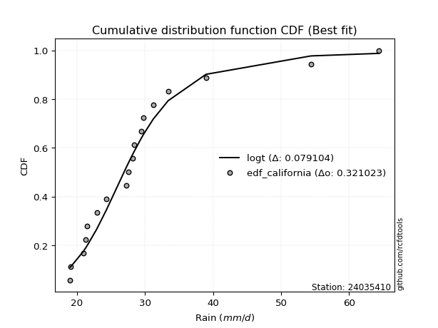</img>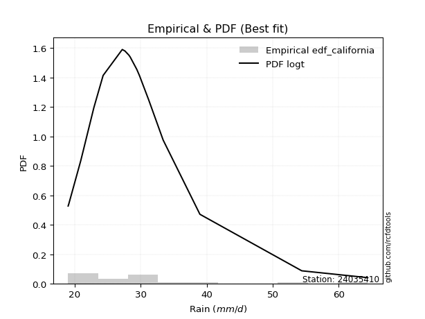</img>

</div>


### 2. Empirical - EDF Hazen (1930)

Hazen method for plotting positions is a formula used to estimate the empirical cumulative probability distribution of flood events or other hydrological data. This formula often results in biased estimations, particularly when extrapolating to extreme events (high return periods).

<div align="center">


$P=(m-0.5)/n$


</div>


**2.1. Empirical values**

<div align="center">

|                | 0                    | 1                   | 2                  | 3                   | 4                  | 5                  | 6                  | 7                  | 8                  | 9                  | 10                 | 11                 | 12                 | 13        | 14                 | 15                 | 16                 | 17                 |
|:---------------|:---------------------|:--------------------|:-------------------|:--------------------|:-------------------|:-------------------|:-------------------|:-------------------|:-------------------|:-------------------|:-------------------|:-------------------|:-------------------|:----------|:-------------------|:-------------------|:-------------------|:-------------------|
| date           | 2021                 | 2014                | 2019               | 2022                | 2008               | 2025               | 2020               | 2015               | 2009               | 2016               | 2011               | 2017               | 2012               | 2023      | 2010               | 2018               | 2013               | 2024               |
| x              | 19.0                 | 19.1                | 20.9               | 21.3                | 21.5               | 22.6               | 22.9               | 24.3               | 27.2               | 27.6               | 28.2               | 28.4               | 29.8               | 31.2      | 33.4               | 38.58888888888889  | 54.4               | 64.4               |
| m              | 1                    | 2                   | 3                  | 4                   | 5                  | 6                  | 7                  | 8                  | 9                  | 10                 | 11                 | 12                 | 13                 | 14        | 15                 | 16                 | 17                 | 18                 |
| empirical_dist | edf_hazen            | edf_hazen           | edf_hazen          | edf_hazen           | edf_hazen          | edf_hazen          | edf_hazen          | edf_hazen          | edf_hazen          | edf_hazen          | edf_hazen          | edf_hazen          | edf_hazen          | edf_hazen | edf_hazen          | edf_hazen          | edf_hazen          | edf_hazen          |
| empirical      | 0.027777777777777776 | 0.08333333333333333 | 0.1388888888888889 | 0.19444444444444445 | 0.25               | 0.3055555555555556 | 0.3611111111111111 | 0.4166666666666667 | 0.4722222222222222 | 0.5277777777777778 | 0.5833333333333334 | 0.6388888888888888 | 0.6944444444444444 | 0.75      | 0.8055555555555556 | 0.8611111111111112 | 0.9166666666666666 | 0.9722222222222222 |
| empirical_tr   | 1.0285714285714287   | 1.090909090909091   | 1.161290322580645  | 1.2413793103448276  | 1.3333333333333333 | 1.44               | 1.565217391304348  | 1.7142857142857144 | 1.894736842105263  | 2.1176470588235294 | 2.4000000000000004 | 2.7692307692307687 | 3.2727272727272725 | 4.0       | 5.142857142857143  | 7.200000000000003  | 11.999999999999995 | 35.999999999999986 |

</div>


**2.2. Kolmogorov-Smirnov fit test (sorted by Δ)**


<div align="center">

|                | 0                   | 1                   | 2                   | 3                   | 4                   | 5                   | 6                   | 7                   | 8                   | 9                   | 10                  | 11                  | 12                  | 13                  | 14                  | 15                  | 16                  | 17                  | 18                  | 19                  | 20                  | 21                  | 22                  | 23                  | 24                  | 25                  | 26                  | 27                  | 28                  | 29                  | 30                  | 31                  | 32                  | 33                  | 34                  | 35                  | 36                  | 37                  | 38                  | 39                  | 40                  | 41                  | 42                  | 43                  | 44                  | 45                  | 46                  | 47                  | 48                  | 49                  | 50                  | 51                  | 52                  | 53                  | 54                  | 55                  | 56                  | 57                  | 58                  | 59                  | 60                  | 61                  | 62                    | 63                  | 64                  | 65                  | 66                  | 67                  | 68                  | 69                  | 70                  | 71                  | 72                  | 73                  | 74                  | 75                  | 76                  | 77                  | 78                  | 79                  | 80                  | 81                  | 82                  | 83                  | 84                  | 85                  | 86                  | 87                  | 88                  | 89                  |
|:---------------|:--------------------|:--------------------|:--------------------|:--------------------|:--------------------|:--------------------|:--------------------|:--------------------|:--------------------|:--------------------|:--------------------|:--------------------|:--------------------|:--------------------|:--------------------|:--------------------|:--------------------|:--------------------|:--------------------|:--------------------|:--------------------|:--------------------|:--------------------|:--------------------|:--------------------|:--------------------|:--------------------|:--------------------|:--------------------|:--------------------|:--------------------|:--------------------|:--------------------|:--------------------|:--------------------|:--------------------|:--------------------|:--------------------|:--------------------|:--------------------|:--------------------|:--------------------|:--------------------|:--------------------|:--------------------|:--------------------|:--------------------|:--------------------|:--------------------|:--------------------|:--------------------|:--------------------|:--------------------|:--------------------|:--------------------|:--------------------|:--------------------|:--------------------|:--------------------|:--------------------|:--------------------|:--------------------|:----------------------|:--------------------|:--------------------|:--------------------|:--------------------|:--------------------|:--------------------|:--------------------|:--------------------|:--------------------|:--------------------|:--------------------|:--------------------|:--------------------|:--------------------|:--------------------|:--------------------|:--------------------|:--------------------|:--------------------|:--------------------|:--------------------|:--------------------|:--------------------|:--------------------|:--------------------|:--------------------|:--------------------|
| station        | 24035410            | 24035410            | 24035410            | 24035410            | 24035410            | 24035410            | 24035410            | 24035410            | 24035410            | 24035410            | 24035410            | 24035410            | 24035410            | 24035410            | 24035410            | 24035410            | 24035410            | 24035410            | 24035410            | 24035410            | 24035410            | 24035410            | 24035410            | 24035410            | 24035410            | 24035410            | 24035410            | 24035410            | 24035410            | 24035410            | 24035410            | 24035410            | 24035410            | 24035410            | 24035410            | 24035410            | 24035410            | 24035410            | 24035410            | 24035410            | 24035410            | 24035410            | 24035410            | 24035410            | 24035410            | 24035410            | 24035410            | 24035410            | 24035410            | 24035410            | 24035410            | 24035410            | 24035410            | 24035410            | 24035410            | 24035410            | 24035410            | 24035410            | 24035410            | 24035410            | 24035410            | 24035410            | 24035410              | 24035410            | 24035410            | 24035410            | 24035410            | 24035410            | 24035410            | 24035410            | 24035410            | 24035410            | 24035410            | 24035410            | 24035410            | 24035410            | 24035410            | 24035410            | 24035410            | 24035410            | 24035410            | 24035410            | 24035410            | 24035410            | 24035410            | 24035410            | 24035410            | 24035410            | 24035410            | 24035410            |
| empirical_dist | edf_hazen           | edf_hazen           | edf_hazen           | edf_hazen           | edf_hazen           | edf_hazen           | edf_hazen           | edf_hazen           | edf_hazen           | edf_hazen           | edf_hazen           | edf_hazen           | edf_hazen           | edf_hazen           | edf_hazen           | edf_hazen           | edf_hazen           | edf_hazen           | edf_hazen           | edf_hazen           | edf_hazen           | edf_hazen           | edf_hazen           | edf_hazen           | edf_hazen           | edf_hazen           | edf_hazen           | edf_hazen           | edf_hazen           | edf_hazen           | edf_hazen           | edf_hazen           | edf_hazen           | edf_hazen           | edf_hazen           | edf_hazen           | edf_hazen           | edf_hazen           | edf_hazen           | edf_hazen           | edf_hazen           | edf_hazen           | edf_hazen           | edf_hazen           | edf_hazen           | edf_hazen           | edf_hazen           | edf_hazen           | edf_hazen           | edf_hazen           | edf_hazen           | edf_hazen           | edf_hazen           | edf_hazen           | edf_hazen           | edf_hazen           | edf_hazen           | edf_hazen           | edf_hazen           | edf_hazen           | edf_hazen           | edf_hazen           | edf_hazen             | edf_hazen           | edf_hazen           | edf_hazen           | edf_hazen           | edf_hazen           | edf_hazen           | edf_hazen           | edf_hazen           | edf_hazen           | edf_hazen           | edf_hazen           | edf_hazen           | edf_hazen           | edf_hazen           | edf_hazen           | edf_hazen           | edf_hazen           | edf_hazen           | edf_hazen           | edf_hazen           | edf_hazen           | edf_hazen           | edf_hazen           | edf_hazen           | edf_hazen           | edf_hazen           | edf_hazen           |
| p_dist         | logpearson3         | loggumbel_r         | logbetaprime        | loghalfnorm         | exponnorm           | laplace_asymmetric  | expon               | genexpon            | loggenlogistic      | gompertz            | logmoyal            | lognct              | lograyleigh         | loggompertz         | logkstwobign        | pareto              | truncnorm           | loghalflogistic     | wald                | loggenexpon         | logmaxwell          | nct                 | logt                | pearson3            | betaprime           | fatiguelife         | logalpha            | genlogistic         | invgauss            | fisk                | loginvweibull       | logf                | loginvgamma         | johnsonsu           | alpha               | invgamma            | ncf                 | logtruncnorm        | erlang              | loglognorm          | invweibull          | loginvgauss         | logmielke           | logjohnsonsu        | logrice             | logfisk             | logfatiguelife      | moyal               | loglogistic         | logcrystalball      | lognorm             | lognorm             | logloggamma         | logexponnorm        | loghypsecant        | weibull_min         | halflogistic        | logexpon            | logpareto           | f                   | gumbel_r            | t                   | loglaplace_asymmetric | gamma               | lognakagami         | logncf              | loglaplace          | kstwobign           | nakagami            | rayleigh            | halfnorm            | maxwell             | logweibull_min      | loggumbel_l         | logwald             | logistic            | hypsecant           | logerlang           | rice                | crystalball         | norm                | laplace             | loggamma            | loggamma            | gibrat              | loggibrat           | gumbel_l            | logchi2             | chi2                | mielke              |
| delta          | 0.06954694503914394 | 0.06966335460025486 | 0.07075327602583442 | 0.07204145015554897 | 0.07276504653323897 | 0.07369557899590724 | 0.07404014674283083 | 0.07404016050302992 | 0.08312306324586949 | 0.08377838544439264 | 0.08759342485521371 | 0.08768569018263672 | 0.0883976548477623  | 0.08886616540826076 | 0.0907153786932588  | 0.09147024878181731 | 0.09216558799709162 | 0.09451321328350837 | 0.09514805639581558 | 0.09555768959194089 | 0.09558590516907961 | 0.09616410849920753 | 0.0964485481477575  | 0.09759566496584694 | 0.10204593776084381 | 0.10635944637520922 | 0.10678096881471988 | 0.10699998074842376 | 0.11007193506181756 | 0.11188377755443235 | 0.11230907641302834 | 0.11262339442967484 | 0.11262610901987824 | 0.11273327091507002 | 0.11346508811427791 | 0.11355924086877012 | 0.11355952810618275 | 0.11433764668325996 | 0.11489958146135959 | 0.11541528238378951 | 0.11548311144478274 | 0.11561719555834371 | 0.11565860755781998 | 0.11579816161804746 | 0.11586454223551607 | 0.11597699698823805 | 0.1173198346022799  | 0.11751107511131405 | 0.11805853976688785 | 0.12055796037679822 | 0.12055832162277214 | 0.12055832162277214 | 0.1244204640919988  | 0.12617114195701506 | 0.12903026235882192 | 0.1314429833591796  | 0.13161457425048295 | 0.13212271122509078 | 0.13212271970190503 | 0.1344527904357251  | 0.13676239571957927 | 0.13845563092109897 | 0.14036788115277257   | 0.1448717145292383  | 0.14912487070461866 | 0.15008803641431495 | 0.15107506427236664 | 0.15139181284171832 | 0.1527251838763244  | 0.16630211474057882 | 0.168956551550901   | 0.16926191496331977 | 0.179750349009267   | 0.19014636929351303 | 0.1921221459137363  | 0.192843891248771   | 0.19429963312015586 | 0.19670972139219167 | 0.19716722531970782 | 0.19962823033502186 | 0.19962824750057273 | 0.2117602406079968  | 0.21935781152644274 | 0.21935781152644274 | 0.22514256447470665 | 0.25                | 0.26662227882625456 | 0.2734911342985896  | 0.28266712566121677 | nan                 |
| deltao         | 0.32102346734599996 | 0.32102346734599996 | 0.32102346734599996 | 0.32102346734599996 | 0.32102346734599996 | 0.32102346734599996 | 0.32102346734599996 | 0.32102346734599996 | 0.32102346734599996 | 0.32102346734599996 | 0.32102346734599996 | 0.32102346734599996 | 0.32102346734599996 | 0.32102346734599996 | 0.32102346734599996 | 0.32102346734599996 | 0.32102346734599996 | 0.32102346734599996 | 0.32102346734599996 | 0.32102346734599996 | 0.32102346734599996 | 0.32102346734599996 | 0.32102346734599996 | 0.32102346734599996 | 0.32102346734599996 | 0.32102346734599996 | 0.32102346734599996 | 0.32102346734599996 | 0.32102346734599996 | 0.32102346734599996 | 0.32102346734599996 | 0.32102346734599996 | 0.32102346734599996 | 0.32102346734599996 | 0.32102346734599996 | 0.32102346734599996 | 0.32102346734599996 | 0.32102346734599996 | 0.32102346734599996 | 0.32102346734599996 | 0.32102346734599996 | 0.32102346734599996 | 0.32102346734599996 | 0.32102346734599996 | 0.32102346734599996 | 0.32102346734599996 | 0.32102346734599996 | 0.32102346734599996 | 0.32102346734599996 | 0.32102346734599996 | 0.32102346734599996 | 0.32102346734599996 | 0.32102346734599996 | 0.32102346734599996 | 0.32102346734599996 | 0.32102346734599996 | 0.32102346734599996 | 0.32102346734599996 | 0.32102346734599996 | 0.32102346734599996 | 0.32102346734599996 | 0.32102346734599996 | 0.32102346734599996   | 0.32102346734599996 | 0.32102346734599996 | 0.32102346734599996 | 0.32102346734599996 | 0.32102346734599996 | 0.32102346734599996 | 0.32102346734599996 | 0.32102346734599996 | 0.32102346734599996 | 0.32102346734599996 | 0.32102346734599996 | 0.32102346734599996 | 0.32102346734599996 | 0.32102346734599996 | 0.32102346734599996 | 0.32102346734599996 | 0.32102346734599996 | 0.32102346734599996 | 0.32102346734599996 | 0.32102346734599996 | 0.32102346734599996 | 0.32102346734599996 | 0.32102346734599996 | 0.32102346734599996 | 0.32102346734599996 | 0.32102346734599996 | 0.32102346734599996 |
| eval           | Δo > Δ              | Δo > Δ              | Δo > Δ              | Δo > Δ              | Δo > Δ              | Δo > Δ              | Δo > Δ              | Δo > Δ              | Δo > Δ              | Δo > Δ              | Δo > Δ              | Δo > Δ              | Δo > Δ              | Δo > Δ              | Δo > Δ              | Δo > Δ              | Δo > Δ              | Δo > Δ              | Δo > Δ              | Δo > Δ              | Δo > Δ              | Δo > Δ              | Δo > Δ              | Δo > Δ              | Δo > Δ              | Δo > Δ              | Δo > Δ              | Δo > Δ              | Δo > Δ              | Δo > Δ              | Δo > Δ              | Δo > Δ              | Δo > Δ              | Δo > Δ              | Δo > Δ              | Δo > Δ              | Δo > Δ              | Δo > Δ              | Δo > Δ              | Δo > Δ              | Δo > Δ              | Δo > Δ              | Δo > Δ              | Δo > Δ              | Δo > Δ              | Δo > Δ              | Δo > Δ              | Δo > Δ              | Δo > Δ              | Δo > Δ              | Δo > Δ              | Δo > Δ              | Δo > Δ              | Δo > Δ              | Δo > Δ              | Δo > Δ              | Δo > Δ              | Δo > Δ              | Δo > Δ              | Δo > Δ              | Δo > Δ              | Δo > Δ              | Δo > Δ                | Δo > Δ              | Δo > Δ              | Δo > Δ              | Δo > Δ              | Δo > Δ              | Δo > Δ              | Δo > Δ              | Δo > Δ              | Δo > Δ              | Δo > Δ              | Δo > Δ              | Δo > Δ              | Δo > Δ              | Δo > Δ              | Δo > Δ              | Δo > Δ              | Δo > Δ              | Δo > Δ              | Δo > Δ              | Δo > Δ              | Δo > Δ              | Δo > Δ              | Δo > Δ              | Δo > Δ              | Δo > Δ              | Δo > Δ              | Δo <= Δ             |
| fit            | 1                   | 1                   | 1                   | 1                   | 1                   | 1                   | 1                   | 1                   | 1                   | 1                   | 1                   | 1                   | 1                   | 1                   | 1                   | 1                   | 1                   | 1                   | 1                   | 1                   | 1                   | 1                   | 1                   | 1                   | 1                   | 1                   | 1                   | 1                   | 1                   | 1                   | 1                   | 1                   | 1                   | 1                   | 1                   | 1                   | 1                   | 1                   | 1                   | 1                   | 1                   | 1                   | 1                   | 1                   | 1                   | 1                   | 1                   | 1                   | 1                   | 1                   | 1                   | 1                   | 1                   | 1                   | 1                   | 1                   | 1                   | 1                   | 1                   | 1                   | 1                   | 1                   | 1                     | 1                   | 1                   | 1                   | 1                   | 1                   | 1                   | 1                   | 1                   | 1                   | 1                   | 1                   | 1                   | 1                   | 1                   | 1                   | 1                   | 1                   | 1                   | 1                   | 1                   | 1                   | 1                   | 1                   | 1                   | 1                   | 1                   | 0                   |
| n              | 18                  | 18                  | 18                  | 18                  | 18                  | 18                  | 18                  | 18                  | 18                  | 18                  | 18                  | 18                  | 18                  | 18                  | 18                  | 18                  | 18                  | 18                  | 18                  | 18                  | 18                  | 18                  | 18                  | 18                  | 18                  | 18                  | 18                  | 18                  | 18                  | 18                  | 18                  | 18                  | 18                  | 18                  | 18                  | 18                  | 18                  | 18                  | 18                  | 18                  | 18                  | 18                  | 18                  | 18                  | 18                  | 18                  | 18                  | 18                  | 18                  | 18                  | 18                  | 18                  | 18                  | 18                  | 18                  | 18                  | 18                  | 18                  | 18                  | 18                  | 18                  | 18                  | 18                    | 18                  | 18                  | 18                  | 18                  | 18                  | 18                  | 18                  | 18                  | 18                  | 18                  | 18                  | 18                  | 18                  | 18                  | 18                  | 18                  | 18                  | 18                  | 18                  | 18                  | 18                  | 18                  | 18                  | 18                  | 18                  | 18                  | 18                  |
| best_fit       | 1                   | 0                   | 0                   | 0                   | 0                   | 0                   | 0                   | 0                   | 0                   | 0                   | 0                   | 0                   | 0                   | 0                   | 0                   | 0                   | 0                   | 0                   | 0                   | 0                   | 0                   | 0                   | 0                   | 0                   | 0                   | 0                   | 0                   | 0                   | 0                   | 0                   | 0                   | 0                   | 0                   | 0                   | 0                   | 0                   | 0                   | 0                   | 0                   | 0                   | 0                   | 0                   | 0                   | 0                   | 0                   | 0                   | 0                   | 0                   | 0                   | 0                   | 0                   | 0                   | 0                   | 0                   | 0                   | 0                   | 0                   | 0                   | 0                   | 0                   | 0                   | 0                   | 0                     | 0                   | 0                   | 0                   | 0                   | 0                   | 0                   | 0                   | 0                   | 0                   | 0                   | 0                   | 0                   | 0                   | 0                   | 0                   | 0                   | 0                   | 0                   | 0                   | 0                   | 0                   | 0                   | 0                   | 0                   | 0                   | 0                   | 0                   |
| best_fit_sort  | 1                   | 2                   | 3                   | 4                   | 5                   | 6                   | 7                   | 8                   | 9                   | 10                  | 11                  | 12                  | 13                  | 14                  | 15                  | 16                  | 17                  | 18                  | 19                  | 20                  | 21                  | 22                  | 23                  | 24                  | 25                  | 26                  | 27                  | 28                  | 29                  | 30                  | 31                  | 32                  | 33                  | 34                  | 35                  | 36                  | 37                  | 38                  | 39                  | 40                  | 41                  | 42                  | 43                  | 44                  | 45                  | 46                  | 47                  | 48                  | 49                  | 50                  | 51                  | 52                  | 53                  | 54                  | 55                  | 56                  | 57                  | 58                  | 59                  | 60                  | 61                  | 62                  | 63                    | 64                  | 65                  | 66                  | 67                  | 68                  | 69                  | 70                  | 71                  | 72                  | 73                  | 74                  | 75                  | 76                  | 77                  | 78                  | 79                  | 80                  | 81                  | 82                  | 83                  | 84                  | 85                  | 86                  | 87                  | 88                  | 89                  | 90                  |

</div>


<div align="center">

</img>

</div>


**2.3. Best fit**

<div align="center">

|   id |   station | empirical_dist   | p_dist      |     delta |   deltao | eval   |   fit |   n |   best_fit |   best_fit_sort |
|-----:|----------:|:-----------------|:------------|----------:|---------:|:-------|------:|----:|-----------:|----------------:|
|    0 |  24035410 | edf_hazen        | logpearson3 | 0.0695469 | 0.321023 | Δo > Δ |     1 |  18 |          1 |               1 |

</div>


<div align="center">

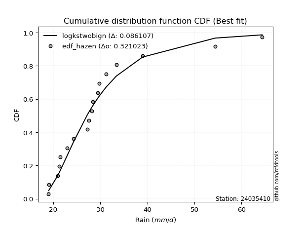</img>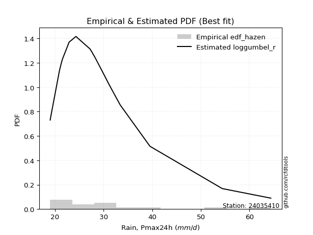</img>

</div>


### 3. Empirical - EDF Weibull (1939)

Weibull plotting position formula is an empirical method used to estimate the non-exceedance probability or plotting position for a set of observed data, is often recommended or widely used in practice, particularly in flood frequency analysis.

<div align="center">


$P=m/(n+1)$


</div>


**3.1. Empirical values**

<div align="center">

|                | 0                   | 1                   | 2                   | 3                   | 4                  | 5                  | 6                  | 7                   | 8                   | 9                  | 10                 | 11                | 12                 | 13                 | 14                 | 15                 | 16                 | 17                 |
|:---------------|:--------------------|:--------------------|:--------------------|:--------------------|:-------------------|:-------------------|:-------------------|:--------------------|:--------------------|:-------------------|:-------------------|:------------------|:-------------------|:-------------------|:-------------------|:-------------------|:-------------------|:-------------------|
| date           | 2021                | 2014                | 2019                | 2022                | 2008               | 2025               | 2020               | 2015                | 2009                | 2016               | 2011               | 2017              | 2012               | 2023               | 2010               | 2018               | 2013               | 2024               |
| x              | 19.0                | 19.1                | 20.9                | 21.3                | 21.5               | 22.6               | 22.9               | 24.3                | 27.2                | 27.6               | 28.2               | 28.4              | 29.8               | 31.2               | 33.4               | 38.58888888888889  | 54.4               | 64.4               |
| m              | 1                   | 2                   | 3                   | 4                   | 5                  | 6                  | 7                  | 8                   | 9                   | 10                 | 11                 | 12                | 13                 | 14                 | 15                 | 16                 | 17                 | 18                 |
| empirical_dist | edf_weibull         | edf_weibull         | edf_weibull         | edf_weibull         | edf_weibull        | edf_weibull        | edf_weibull        | edf_weibull         | edf_weibull         | edf_weibull        | edf_weibull        | edf_weibull       | edf_weibull        | edf_weibull        | edf_weibull        | edf_weibull        | edf_weibull        | edf_weibull        |
| empirical      | 0.05263157894736842 | 0.10526315789473684 | 0.15789473684210525 | 0.21052631578947367 | 0.2631578947368421 | 0.3157894736842105 | 0.3684210526315789 | 0.42105263157894735 | 0.47368421052631576 | 0.5263157894736842 | 0.5789473684210527 | 0.631578947368421 | 0.6842105263157895 | 0.7368421052631579 | 0.7894736842105263 | 0.8421052631578947 | 0.8947368421052632 | 0.9473684210526315 |
| empirical_tr   | 1.0555555555555556  | 1.1176470588235294  | 1.1875              | 1.2666666666666666  | 1.357142857142857  | 1.4615384615384615 | 1.5833333333333335 | 1.7272727272727273  | 1.8999999999999997  | 2.111111111111111  | 2.375              | 2.714285714285714 | 3.166666666666667  | 3.7999999999999994 | 4.75               | 6.333333333333331  | 9.5                | 18.999999999999982 |

</div>


**3.2. Kolmogorov-Smirnov fit test (sorted by Δ)**


<div align="center">

|                | 0                   | 1                   | 2                   | 3                   | 4                   | 5                   | 6                   | 7                   | 8                   | 9                   | 10                  | 11                  | 12                  | 13                  | 14                  | 15                  | 16                  | 17                  | 18                  | 19                  | 20                  | 21                  | 22                  | 23                  | 24                  | 25                  | 26                  | 27                  | 28                  | 29                  | 30                  | 31                  | 32                  | 33                  | 34                  | 35                  | 36                  | 37                  | 38                  | 39                  | 40                  | 41                  | 42                  | 43                  | 44                  | 45                  | 46                  | 47                  | 48                  | 49                  | 50                  | 51                  | 52                  | 53                  | 54                  | 55                  | 56                  | 57                  | 58                  | 59                  | 60                  | 61                  | 62                  | 63                  | 64                  | 65                  | 66                  | 67                  | 68                  | 69                    | 70                  | 71                  | 72                  | 73                  | 74                  | 75                  | 76                  | 77                  | 78                  | 79                  | 80                  | 81                  | 82                  | 83                  | 84                  | 85                  | 86                  | 87                  | 88                  | 89                  |
|:---------------|:--------------------|:--------------------|:--------------------|:--------------------|:--------------------|:--------------------|:--------------------|:--------------------|:--------------------|:--------------------|:--------------------|:--------------------|:--------------------|:--------------------|:--------------------|:--------------------|:--------------------|:--------------------|:--------------------|:--------------------|:--------------------|:--------------------|:--------------------|:--------------------|:--------------------|:--------------------|:--------------------|:--------------------|:--------------------|:--------------------|:--------------------|:--------------------|:--------------------|:--------------------|:--------------------|:--------------------|:--------------------|:--------------------|:--------------------|:--------------------|:--------------------|:--------------------|:--------------------|:--------------------|:--------------------|:--------------------|:--------------------|:--------------------|:--------------------|:--------------------|:--------------------|:--------------------|:--------------------|:--------------------|:--------------------|:--------------------|:--------------------|:--------------------|:--------------------|:--------------------|:--------------------|:--------------------|:--------------------|:--------------------|:--------------------|:--------------------|:--------------------|:--------------------|:--------------------|:----------------------|:--------------------|:--------------------|:--------------------|:--------------------|:--------------------|:--------------------|:--------------------|:--------------------|:--------------------|:--------------------|:--------------------|:--------------------|:--------------------|:--------------------|:--------------------|:--------------------|:--------------------|:--------------------|:--------------------|:--------------------|
| station        | 24035410            | 24035410            | 24035410            | 24035410            | 24035410            | 24035410            | 24035410            | 24035410            | 24035410            | 24035410            | 24035410            | 24035410            | 24035410            | 24035410            | 24035410            | 24035410            | 24035410            | 24035410            | 24035410            | 24035410            | 24035410            | 24035410            | 24035410            | 24035410            | 24035410            | 24035410            | 24035410            | 24035410            | 24035410            | 24035410            | 24035410            | 24035410            | 24035410            | 24035410            | 24035410            | 24035410            | 24035410            | 24035410            | 24035410            | 24035410            | 24035410            | 24035410            | 24035410            | 24035410            | 24035410            | 24035410            | 24035410            | 24035410            | 24035410            | 24035410            | 24035410            | 24035410            | 24035410            | 24035410            | 24035410            | 24035410            | 24035410            | 24035410            | 24035410            | 24035410            | 24035410            | 24035410            | 24035410            | 24035410            | 24035410            | 24035410            | 24035410            | 24035410            | 24035410            | 24035410              | 24035410            | 24035410            | 24035410            | 24035410            | 24035410            | 24035410            | 24035410            | 24035410            | 24035410            | 24035410            | 24035410            | 24035410            | 24035410            | 24035410            | 24035410            | 24035410            | 24035410            | 24035410            | 24035410            | 24035410            |
| empirical_dist | edf_weibull         | edf_weibull         | edf_weibull         | edf_weibull         | edf_weibull         | edf_weibull         | edf_weibull         | edf_weibull         | edf_weibull         | edf_weibull         | edf_weibull         | edf_weibull         | edf_weibull         | edf_weibull         | edf_weibull         | edf_weibull         | edf_weibull         | edf_weibull         | edf_weibull         | edf_weibull         | edf_weibull         | edf_weibull         | edf_weibull         | edf_weibull         | edf_weibull         | edf_weibull         | edf_weibull         | edf_weibull         | edf_weibull         | edf_weibull         | edf_weibull         | edf_weibull         | edf_weibull         | edf_weibull         | edf_weibull         | edf_weibull         | edf_weibull         | edf_weibull         | edf_weibull         | edf_weibull         | edf_weibull         | edf_weibull         | edf_weibull         | edf_weibull         | edf_weibull         | edf_weibull         | edf_weibull         | edf_weibull         | edf_weibull         | edf_weibull         | edf_weibull         | edf_weibull         | edf_weibull         | edf_weibull         | edf_weibull         | edf_weibull         | edf_weibull         | edf_weibull         | edf_weibull         | edf_weibull         | edf_weibull         | edf_weibull         | edf_weibull         | edf_weibull         | edf_weibull         | edf_weibull         | edf_weibull         | edf_weibull         | edf_weibull         | edf_weibull           | edf_weibull         | edf_weibull         | edf_weibull         | edf_weibull         | edf_weibull         | edf_weibull         | edf_weibull         | edf_weibull         | edf_weibull         | edf_weibull         | edf_weibull         | edf_weibull         | edf_weibull         | edf_weibull         | edf_weibull         | edf_weibull         | edf_weibull         | edf_weibull         | edf_weibull         | edf_weibull         |
| p_dist         | logpearson3         | loghalfnorm         | lograyleigh         | pearson3            | loggumbel_r         | logbetaprime        | logmaxwell          | logt                | logmoyal            | loggenlogistic      | moyal               | loggenexpon         | pareto              | exponnorm           | lognct              | laplace_asymmetric  | loghalflogistic     | expon               | genexpon            | gompertz            | truncnorm           | loggompertz         | logkstwobign        | betaprime           | wald                | nct                 | fatiguelife         | logalpha            | halflogistic        | invgauss            | fisk                | loginvweibull       | logf                | loginvgamma         | johnsonsu           | alpha               | invgamma            | ncf                 | logtruncnorm        | logcrystalball      | lognorm             | lognorm             | erlang              | loglognorm          | invweibull          | loginvgauss         | logmielke           | genlogistic         | logjohnsonsu        | logfisk             | logloggamma         | weibull_min         | logfatiguelife      | gumbel_r            | t                   | loglogistic         | logrice             | logexponnorm        | logexpon            | logpareto           | logncf              | f                   | loghypsecant        | nakagami            | gamma               | kstwobign           | halfnorm            | rayleigh            | lognakagami         | loglaplace_asymmetric | maxwell             | loglaplace          | logweibull_min      | logistic            | loggumbel_l         | crystalball         | norm                | hypsecant           | rice                | logerlang           | laplace             | logwald             | loggamma            | loggamma            | gibrat              | gumbel_l            | logchi2             | loggibrat           | chi2                | mielke              |
| delta          | 0.06808495673505038 | 0.07057946185145542 | 0.07523976011092015 | 0.0758089170912461  | 0.07697329612072268 | 0.08224455184386248 | 0.08242801043223746 | 0.08383108697348829 | 0.08613143655112016 | 0.09043300476633731 | 0.0926572739417234  | 0.09433194990044273 | 0.09465964067664678 | 0.09469487109464247 | 0.09499563170310454 | 0.09562540355731075 | 0.0957827941381192  | 0.09596997130423433 | 0.09596998506443342 | 0.09630940150847146 | 0.09666451683271107 | 0.09709970599158199 | 0.09802532021372662 | 0.09847598421065168 | 0.10157857412996439 | 0.10347405001967536 | 0.10489745807111567 | 0.10531898051062633 | 0.10676077308089232 | 0.10860994675772401 | 0.1104217892503388  | 0.11084708810893479 | 0.11116140612558129 | 0.11116412071578469 | 0.11127128261097646 | 0.11200309981018436 | 0.11209725256467656 | 0.1120975398020892  | 0.11287565837916641 | 0.1132480188563304  | 0.11324838010230431 | 0.11324838010230431 | 0.11343759315726604 | 0.11395329407969595 | 0.11402112314068918 | 0.11415520725425016 | 0.11419661925372643 | 0.11430992226889158 | 0.1143361733139539  | 0.11451500868414449 | 0.11493302776179504 | 0.11536111201415034 | 0.11585784629818635 | 0.1163924835162754  | 0.11974160595777078 | 0.12099594449669487 | 0.12317448375598389 | 0.12470915365292151 | 0.13066072292099723 | 0.13066073139781148 | 0.13217533674492088 | 0.13299080213163156 | 0.13634020387928975 | 0.13664331253129514 | 0.14340972622514475 | 0.1440818713212505  | 0.14410275038131037 | 0.14635435201377778 | 0.1476628824005251  | 0.1476778226732404    | 0.15610402022647762 | 0.15838500579283446 | 0.17828836070517345 | 0.18191557506453504 | 0.1828364277730452  | 0.18647033559817972 | 0.18647035276373058 | 0.18698969159968803 | 0.18985728379924    | 0.19524773308809812 | 0.20445029908752899 | 0.2052800406505784  | 0.21789582322234918 | 0.21789582322234918 | 0.23830045921154874 | 0.2534643840894124  | 0.25616157752587343 | 0.2631578947368421  | 0.2812051373571232  | nan                 |
| deltao         | 0.32102346734599996 | 0.32102346734599996 | 0.32102346734599996 | 0.32102346734599996 | 0.32102346734599996 | 0.32102346734599996 | 0.32102346734599996 | 0.32102346734599996 | 0.32102346734599996 | 0.32102346734599996 | 0.32102346734599996 | 0.32102346734599996 | 0.32102346734599996 | 0.32102346734599996 | 0.32102346734599996 | 0.32102346734599996 | 0.32102346734599996 | 0.32102346734599996 | 0.32102346734599996 | 0.32102346734599996 | 0.32102346734599996 | 0.32102346734599996 | 0.32102346734599996 | 0.32102346734599996 | 0.32102346734599996 | 0.32102346734599996 | 0.32102346734599996 | 0.32102346734599996 | 0.32102346734599996 | 0.32102346734599996 | 0.32102346734599996 | 0.32102346734599996 | 0.32102346734599996 | 0.32102346734599996 | 0.32102346734599996 | 0.32102346734599996 | 0.32102346734599996 | 0.32102346734599996 | 0.32102346734599996 | 0.32102346734599996 | 0.32102346734599996 | 0.32102346734599996 | 0.32102346734599996 | 0.32102346734599996 | 0.32102346734599996 | 0.32102346734599996 | 0.32102346734599996 | 0.32102346734599996 | 0.32102346734599996 | 0.32102346734599996 | 0.32102346734599996 | 0.32102346734599996 | 0.32102346734599996 | 0.32102346734599996 | 0.32102346734599996 | 0.32102346734599996 | 0.32102346734599996 | 0.32102346734599996 | 0.32102346734599996 | 0.32102346734599996 | 0.32102346734599996 | 0.32102346734599996 | 0.32102346734599996 | 0.32102346734599996 | 0.32102346734599996 | 0.32102346734599996 | 0.32102346734599996 | 0.32102346734599996 | 0.32102346734599996 | 0.32102346734599996   | 0.32102346734599996 | 0.32102346734599996 | 0.32102346734599996 | 0.32102346734599996 | 0.32102346734599996 | 0.32102346734599996 | 0.32102346734599996 | 0.32102346734599996 | 0.32102346734599996 | 0.32102346734599996 | 0.32102346734599996 | 0.32102346734599996 | 0.32102346734599996 | 0.32102346734599996 | 0.32102346734599996 | 0.32102346734599996 | 0.32102346734599996 | 0.32102346734599996 | 0.32102346734599996 | 0.32102346734599996 |
| eval           | Δo > Δ              | Δo > Δ              | Δo > Δ              | Δo > Δ              | Δo > Δ              | Δo > Δ              | Δo > Δ              | Δo > Δ              | Δo > Δ              | Δo > Δ              | Δo > Δ              | Δo > Δ              | Δo > Δ              | Δo > Δ              | Δo > Δ              | Δo > Δ              | Δo > Δ              | Δo > Δ              | Δo > Δ              | Δo > Δ              | Δo > Δ              | Δo > Δ              | Δo > Δ              | Δo > Δ              | Δo > Δ              | Δo > Δ              | Δo > Δ              | Δo > Δ              | Δo > Δ              | Δo > Δ              | Δo > Δ              | Δo > Δ              | Δo > Δ              | Δo > Δ              | Δo > Δ              | Δo > Δ              | Δo > Δ              | Δo > Δ              | Δo > Δ              | Δo > Δ              | Δo > Δ              | Δo > Δ              | Δo > Δ              | Δo > Δ              | Δo > Δ              | Δo > Δ              | Δo > Δ              | Δo > Δ              | Δo > Δ              | Δo > Δ              | Δo > Δ              | Δo > Δ              | Δo > Δ              | Δo > Δ              | Δo > Δ              | Δo > Δ              | Δo > Δ              | Δo > Δ              | Δo > Δ              | Δo > Δ              | Δo > Δ              | Δo > Δ              | Δo > Δ              | Δo > Δ              | Δo > Δ              | Δo > Δ              | Δo > Δ              | Δo > Δ              | Δo > Δ              | Δo > Δ                | Δo > Δ              | Δo > Δ              | Δo > Δ              | Δo > Δ              | Δo > Δ              | Δo > Δ              | Δo > Δ              | Δo > Δ              | Δo > Δ              | Δo > Δ              | Δo > Δ              | Δo > Δ              | Δo > Δ              | Δo > Δ              | Δo > Δ              | Δo > Δ              | Δo > Δ              | Δo > Δ              | Δo > Δ              | Δo <= Δ             |
| fit            | 1                   | 1                   | 1                   | 1                   | 1                   | 1                   | 1                   | 1                   | 1                   | 1                   | 1                   | 1                   | 1                   | 1                   | 1                   | 1                   | 1                   | 1                   | 1                   | 1                   | 1                   | 1                   | 1                   | 1                   | 1                   | 1                   | 1                   | 1                   | 1                   | 1                   | 1                   | 1                   | 1                   | 1                   | 1                   | 1                   | 1                   | 1                   | 1                   | 1                   | 1                   | 1                   | 1                   | 1                   | 1                   | 1                   | 1                   | 1                   | 1                   | 1                   | 1                   | 1                   | 1                   | 1                   | 1                   | 1                   | 1                   | 1                   | 1                   | 1                   | 1                   | 1                   | 1                   | 1                   | 1                   | 1                   | 1                   | 1                   | 1                   | 1                     | 1                   | 1                   | 1                   | 1                   | 1                   | 1                   | 1                   | 1                   | 1                   | 1                   | 1                   | 1                   | 1                   | 1                   | 1                   | 1                   | 1                   | 1                   | 1                   | 0                   |
| n              | 18                  | 18                  | 18                  | 18                  | 18                  | 18                  | 18                  | 18                  | 18                  | 18                  | 18                  | 18                  | 18                  | 18                  | 18                  | 18                  | 18                  | 18                  | 18                  | 18                  | 18                  | 18                  | 18                  | 18                  | 18                  | 18                  | 18                  | 18                  | 18                  | 18                  | 18                  | 18                  | 18                  | 18                  | 18                  | 18                  | 18                  | 18                  | 18                  | 18                  | 18                  | 18                  | 18                  | 18                  | 18                  | 18                  | 18                  | 18                  | 18                  | 18                  | 18                  | 18                  | 18                  | 18                  | 18                  | 18                  | 18                  | 18                  | 18                  | 18                  | 18                  | 18                  | 18                  | 18                  | 18                  | 18                  | 18                  | 18                  | 18                  | 18                    | 18                  | 18                  | 18                  | 18                  | 18                  | 18                  | 18                  | 18                  | 18                  | 18                  | 18                  | 18                  | 18                  | 18                  | 18                  | 18                  | 18                  | 18                  | 18                  | 18                  |
| best_fit       | 1                   | 0                   | 0                   | 0                   | 0                   | 0                   | 0                   | 0                   | 0                   | 0                   | 0                   | 0                   | 0                   | 0                   | 0                   | 0                   | 0                   | 0                   | 0                   | 0                   | 0                   | 0                   | 0                   | 0                   | 0                   | 0                   | 0                   | 0                   | 0                   | 0                   | 0                   | 0                   | 0                   | 0                   | 0                   | 0                   | 0                   | 0                   | 0                   | 0                   | 0                   | 0                   | 0                   | 0                   | 0                   | 0                   | 0                   | 0                   | 0                   | 0                   | 0                   | 0                   | 0                   | 0                   | 0                   | 0                   | 0                   | 0                   | 0                   | 0                   | 0                   | 0                   | 0                   | 0                   | 0                   | 0                   | 0                   | 0                   | 0                   | 0                     | 0                   | 0                   | 0                   | 0                   | 0                   | 0                   | 0                   | 0                   | 0                   | 0                   | 0                   | 0                   | 0                   | 0                   | 0                   | 0                   | 0                   | 0                   | 0                   | 0                   |
| best_fit_sort  | 1                   | 2                   | 3                   | 4                   | 5                   | 6                   | 7                   | 8                   | 9                   | 10                  | 11                  | 12                  | 13                  | 14                  | 15                  | 16                  | 17                  | 18                  | 19                  | 20                  | 21                  | 22                  | 23                  | 24                  | 25                  | 26                  | 27                  | 28                  | 29                  | 30                  | 31                  | 32                  | 33                  | 34                  | 35                  | 36                  | 37                  | 38                  | 39                  | 40                  | 41                  | 42                  | 43                  | 44                  | 45                  | 46                  | 47                  | 48                  | 49                  | 50                  | 51                  | 52                  | 53                  | 54                  | 55                  | 56                  | 57                  | 58                  | 59                  | 60                  | 61                  | 62                  | 63                  | 64                  | 65                  | 66                  | 67                  | 68                  | 69                  | 70                    | 71                  | 72                  | 73                  | 74                  | 75                  | 76                  | 77                  | 78                  | 79                  | 80                  | 81                  | 82                  | 83                  | 84                  | 85                  | 86                  | 87                  | 88                  | 89                  | 90                  |

</div>


<div align="center">

</img>

</div>


**3.3. Best fit**

<div align="center">

|   id |   station | empirical_dist   | p_dist      |    delta |   deltao | eval   |   fit |   n |   best_fit |   best_fit_sort |
|-----:|----------:|:-----------------|:------------|---------:|---------:|:-------|------:|----:|-----------:|----------------:|
|    0 |  24035410 | edf_weibull      | logpearson3 | 0.068085 | 0.321023 | Δo > Δ |     1 |  18 |          1 |               1 |

</div>


<div align="center">

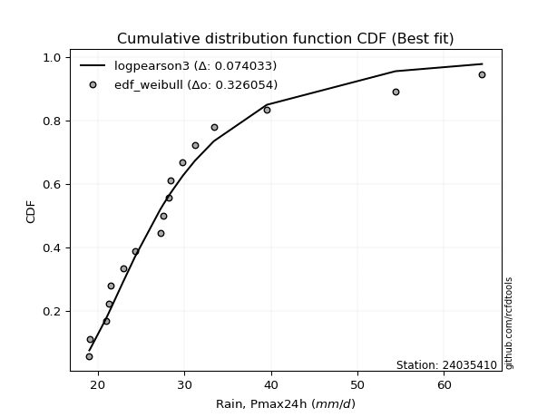</img>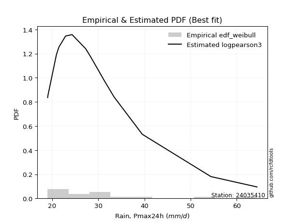</img>

</div>


### 4. Empirical - EDF Beard (1943)

The Beard formula (or Beard´s plotting position formula) in hydrology is used to estimate the empirical non-exceedance probability _(P)_ of a flood event (or other extreme hydrological data point) within a given dataset.

<div align="center">


$P=(m-0.31)/(n+0.38)$


</div>


**4.1. Empirical values**

<div align="center">

|                | 0                   | 1                   | 2                   | 3                   | 4                  | 5                   | 6                  | 7                  | 8                   | 9                  | 10                 | 11                 | 12                | 13                 | 14                 | 15                 | 16                 | 17                 |
|:---------------|:--------------------|:--------------------|:--------------------|:--------------------|:-------------------|:--------------------|:-------------------|:-------------------|:--------------------|:-------------------|:-------------------|:-------------------|:------------------|:-------------------|:-------------------|:-------------------|:-------------------|:-------------------|
| date           | 2021                | 2014                | 2019                | 2022                | 2008               | 2025                | 2020               | 2015               | 2009                | 2016               | 2011               | 2017               | 2012              | 2023               | 2010               | 2018               | 2013               | 2024               |
| x              | 19.0                | 19.1                | 20.9                | 21.3                | 21.5               | 22.6                | 22.9               | 24.3               | 27.2                | 27.6               | 28.2               | 28.4               | 29.8              | 31.2               | 33.4               | 38.58888888888889  | 54.4               | 64.4               |
| m              | 1                   | 2                   | 3                   | 4                   | 5                  | 6                   | 7                  | 8                  | 9                   | 10                 | 11                 | 12                 | 13                | 14                 | 15                 | 16                 | 17                 | 18                 |
| empirical_dist | edf_beard           | edf_beard           | edf_beard           | edf_beard           | edf_beard          | edf_beard           | edf_beard          | edf_beard          | edf_beard           | edf_beard          | edf_beard          | edf_beard          | edf_beard         | edf_beard          | edf_beard          | edf_beard          | edf_beard          | edf_beard          |
| empirical      | 0.03754080522306855 | 0.09194776931447225 | 0.14635473340587596 | 0.20076169749727965 | 0.2551686615886834 | 0.30957562568008706 | 0.3639825897714908 | 0.4183895538628945 | 0.47279651795429817 | 0.5272034820457019 | 0.5816104461371056 | 0.6360174102285092 | 0.690424374319913 | 0.7448313384113167 | 0.7992383025027203 | 0.8536452665941241 | 0.9080522306855279 | 0.9624591947769315 |
| empirical_tr   | 1.0390050876201244  | 1.1012582384661473  | 1.17144678138942    | 1.2511912865895167  | 1.3425858290723158 | 1.4483845547675334  | 1.572284003421728  | 1.7193638914873717 | 1.896800825593395   | 2.1150747986191027 | 2.390117035110533  | 2.747384155455904  | 3.230228471001758 | 3.9189765458422174 | 4.981029810298102  | 6.832713754646843  | 10.875739644970428 | 26.637681159420353 |

</div>


**4.2. Kolmogorov-Smirnov fit test (sorted by Δ)**


<div align="center">

|                | 0                   | 1                   | 2                   | 3                   | 4                   | 5                   | 6                   | 7                   | 8                   | 9                   | 10                  | 11                  | 12                  | 13                  | 14                  | 15                  | 16                  | 17                  | 18                  | 19                  | 20                  | 21                  | 22                  | 23                  | 24                  | 25                  | 26                  | 27                  | 28                  | 29                  | 30                  | 31                  | 32                  | 33                  | 34                  | 35                  | 36                  | 37                  | 38                  | 39                  | 40                  | 41                  | 42                  | 43                  | 44                  | 45                  | 46                  | 47                  | 48                  | 49                  | 50                  | 51                  | 52                  | 53                  | 54                  | 55                  | 56                  | 57                  | 58                  | 59                  | 60                  | 61                  | 62                  | 63                    | 64                  | 65                  | 66                  | 67                  | 68                  | 69                  | 70                  | 71                  | 72                  | 73                  | 74                  | 75                  | 76                  | 77                  | 78                  | 79                  | 80                  | 81                  | 82                  | 83                  | 84                  | 85                  | 86                  | 87                  | 88                  | 89                  |
|:---------------|:--------------------|:--------------------|:--------------------|:--------------------|:--------------------|:--------------------|:--------------------|:--------------------|:--------------------|:--------------------|:--------------------|:--------------------|:--------------------|:--------------------|:--------------------|:--------------------|:--------------------|:--------------------|:--------------------|:--------------------|:--------------------|:--------------------|:--------------------|:--------------------|:--------------------|:--------------------|:--------------------|:--------------------|:--------------------|:--------------------|:--------------------|:--------------------|:--------------------|:--------------------|:--------------------|:--------------------|:--------------------|:--------------------|:--------------------|:--------------------|:--------------------|:--------------------|:--------------------|:--------------------|:--------------------|:--------------------|:--------------------|:--------------------|:--------------------|:--------------------|:--------------------|:--------------------|:--------------------|:--------------------|:--------------------|:--------------------|:--------------------|:--------------------|:--------------------|:--------------------|:--------------------|:--------------------|:--------------------|:----------------------|:--------------------|:--------------------|:--------------------|:--------------------|:--------------------|:--------------------|:--------------------|:--------------------|:--------------------|:--------------------|:--------------------|:--------------------|:--------------------|:--------------------|:--------------------|:--------------------|:--------------------|:--------------------|:--------------------|:--------------------|:--------------------|:--------------------|:--------------------|:--------------------|:--------------------|:--------------------|
| station        | 24035410            | 24035410            | 24035410            | 24035410            | 24035410            | 24035410            | 24035410            | 24035410            | 24035410            | 24035410            | 24035410            | 24035410            | 24035410            | 24035410            | 24035410            | 24035410            | 24035410            | 24035410            | 24035410            | 24035410            | 24035410            | 24035410            | 24035410            | 24035410            | 24035410            | 24035410            | 24035410            | 24035410            | 24035410            | 24035410            | 24035410            | 24035410            | 24035410            | 24035410            | 24035410            | 24035410            | 24035410            | 24035410            | 24035410            | 24035410            | 24035410            | 24035410            | 24035410            | 24035410            | 24035410            | 24035410            | 24035410            | 24035410            | 24035410            | 24035410            | 24035410            | 24035410            | 24035410            | 24035410            | 24035410            | 24035410            | 24035410            | 24035410            | 24035410            | 24035410            | 24035410            | 24035410            | 24035410            | 24035410              | 24035410            | 24035410            | 24035410            | 24035410            | 24035410            | 24035410            | 24035410            | 24035410            | 24035410            | 24035410            | 24035410            | 24035410            | 24035410            | 24035410            | 24035410            | 24035410            | 24035410            | 24035410            | 24035410            | 24035410            | 24035410            | 24035410            | 24035410            | 24035410            | 24035410            | 24035410            |
| empirical_dist | edf_beard           | edf_beard           | edf_beard           | edf_beard           | edf_beard           | edf_beard           | edf_beard           | edf_beard           | edf_beard           | edf_beard           | edf_beard           | edf_beard           | edf_beard           | edf_beard           | edf_beard           | edf_beard           | edf_beard           | edf_beard           | edf_beard           | edf_beard           | edf_beard           | edf_beard           | edf_beard           | edf_beard           | edf_beard           | edf_beard           | edf_beard           | edf_beard           | edf_beard           | edf_beard           | edf_beard           | edf_beard           | edf_beard           | edf_beard           | edf_beard           | edf_beard           | edf_beard           | edf_beard           | edf_beard           | edf_beard           | edf_beard           | edf_beard           | edf_beard           | edf_beard           | edf_beard           | edf_beard           | edf_beard           | edf_beard           | edf_beard           | edf_beard           | edf_beard           | edf_beard           | edf_beard           | edf_beard           | edf_beard           | edf_beard           | edf_beard           | edf_beard           | edf_beard           | edf_beard           | edf_beard           | edf_beard           | edf_beard           | edf_beard             | edf_beard           | edf_beard           | edf_beard           | edf_beard           | edf_beard           | edf_beard           | edf_beard           | edf_beard           | edf_beard           | edf_beard           | edf_beard           | edf_beard           | edf_beard           | edf_beard           | edf_beard           | edf_beard           | edf_beard           | edf_beard           | edf_beard           | edf_beard           | edf_beard           | edf_beard           | edf_beard           | edf_beard           | edf_beard           | edf_beard           |
| p_dist         | logbetaprime        | logpearson3         | loghalfnorm         | loggumbel_r         | exponnorm           | laplace_asymmetric  | expon               | genexpon            | gompertz            | lograyleigh         | loggompertz         | loggenlogistic      | logt                | truncnorm           | logmoyal            | pearson3            | logmaxwell          | lognct              | pareto              | logkstwobign        | loghalflogistic     | wald                | loggenexpon         | nct                 | betaprime           | fatiguelife         | logalpha            | moyal               | invgauss            | genlogistic         | fisk                | loginvweibull       | logf                | loginvgamma         | johnsonsu           | alpha               | invgamma            | ncf                 | logtruncnorm        | erlang              | loglognorm          | invweibull          | loginvgauss         | logmielke           | logjohnsonsu        | logfisk             | loglogistic         | logfatiguelife      | logcrystalball      | lognorm             | lognorm             | logrice             | logloggamma         | halflogistic        | weibull_min         | logexponnorm        | gumbel_r            | t                   | logexpon            | logpareto           | loghypsecant        | f                   | logncf              | loglaplace_asymmetric | gamma               | nakagami            | kstwobign           | lognakagami         | loglaplace          | rayleigh            | halfnorm            | maxwell             | logweibull_min      | loggumbel_l         | logistic            | hypsecant           | rice                | crystalball         | norm                | logerlang           | logwald             | laplace             | loggamma            | loggamma            | gibrat              | loggibrat           | gumbel_l            | logchi2             | chi2                | mielke              |
| delta          | 0.06892916326359777 | 0.06897264930706798 | 0.07146715442347301 | 0.07253483326063453 | 0.08137948251437789 | 0.08231001497704617 | 0.08265458272396975 | 0.08265459648416884 | 0.08299401292820688 | 0.08322899325907895 | 0.08389525750992238 | 0.08599454190624917 | 0.08668552070246671 | 0.08699692640840828 | 0.08701912912313775 | 0.08783263752055617 | 0.09041724358039627 | 0.0905571688430164  | 0.09089595304974135 | 0.09358685735363848 | 0.09393891755143241 | 0.09457376066373963 | 0.09498339385986493 | 0.09903558715958721 | 0.09917445910046419 | 0.10578515064313326 | 0.10620667308264392 | 0.10774804766602328 | 0.1094976393297416  | 0.10987145940880344 | 0.1113094818223564  | 0.11173478068095238 | 0.11204909869759888 | 0.11205181328780228 | 0.11215897518299406 | 0.11289079238220195 | 0.11298494513669416 | 0.11298523237410679 | 0.113763350951184   | 0.11432528572928363 | 0.11484098665171355 | 0.11490881571270678 | 0.11504289982626775 | 0.11508431182574402 | 0.1152238658859715  | 0.11540270125616209 | 0.11655748163660673 | 0.11674553887020395 | 0.1176864817164186  | 0.11768684296239251 | 0.11768684296239251 | 0.11873602089589574 | 0.11937149062188324 | 0.1218515468051922  | 0.12512573030634433 | 0.1255968462249391  | 0.12699936827428848 | 0.12869260347580821 | 0.13154841549301483 | 0.13154842396982908 | 0.1319017410192016  | 0.13387849470364915 | 0.1403250089690242  | 0.14323935981315225   | 0.14429741879716235 | 0.14640793082348913 | 0.1485203341813387  | 0.1485505749725427  | 0.15394654293274632 | 0.15653908729528804 | 0.15919352410561025 | 0.16409325337463643 | 0.17917605327719105 | 0.1872748906331334  | 0.18767522966008765 | 0.19142815445977623 | 0.1942957466593282  | 0.19445956874633852 | 0.1944595859118894  | 0.19613542566011571 | 0.1972908075024197  | 0.20888876194761719 | 0.21878351579436678 | 0.21878351579436678 | 0.23031122606339005 | 0.2551686615886834  | 0.2614536172375712  | 0.26602528978160256 | 0.2820928299291408  | nan                 |
| deltao         | 0.32102346734599996 | 0.32102346734599996 | 0.32102346734599996 | 0.32102346734599996 | 0.32102346734599996 | 0.32102346734599996 | 0.32102346734599996 | 0.32102346734599996 | 0.32102346734599996 | 0.32102346734599996 | 0.32102346734599996 | 0.32102346734599996 | 0.32102346734599996 | 0.32102346734599996 | 0.32102346734599996 | 0.32102346734599996 | 0.32102346734599996 | 0.32102346734599996 | 0.32102346734599996 | 0.32102346734599996 | 0.32102346734599996 | 0.32102346734599996 | 0.32102346734599996 | 0.32102346734599996 | 0.32102346734599996 | 0.32102346734599996 | 0.32102346734599996 | 0.32102346734599996 | 0.32102346734599996 | 0.32102346734599996 | 0.32102346734599996 | 0.32102346734599996 | 0.32102346734599996 | 0.32102346734599996 | 0.32102346734599996 | 0.32102346734599996 | 0.32102346734599996 | 0.32102346734599996 | 0.32102346734599996 | 0.32102346734599996 | 0.32102346734599996 | 0.32102346734599996 | 0.32102346734599996 | 0.32102346734599996 | 0.32102346734599996 | 0.32102346734599996 | 0.32102346734599996 | 0.32102346734599996 | 0.32102346734599996 | 0.32102346734599996 | 0.32102346734599996 | 0.32102346734599996 | 0.32102346734599996 | 0.32102346734599996 | 0.32102346734599996 | 0.32102346734599996 | 0.32102346734599996 | 0.32102346734599996 | 0.32102346734599996 | 0.32102346734599996 | 0.32102346734599996 | 0.32102346734599996 | 0.32102346734599996 | 0.32102346734599996   | 0.32102346734599996 | 0.32102346734599996 | 0.32102346734599996 | 0.32102346734599996 | 0.32102346734599996 | 0.32102346734599996 | 0.32102346734599996 | 0.32102346734599996 | 0.32102346734599996 | 0.32102346734599996 | 0.32102346734599996 | 0.32102346734599996 | 0.32102346734599996 | 0.32102346734599996 | 0.32102346734599996 | 0.32102346734599996 | 0.32102346734599996 | 0.32102346734599996 | 0.32102346734599996 | 0.32102346734599996 | 0.32102346734599996 | 0.32102346734599996 | 0.32102346734599996 | 0.32102346734599996 | 0.32102346734599996 | 0.32102346734599996 |
| eval           | Δo > Δ              | Δo > Δ              | Δo > Δ              | Δo > Δ              | Δo > Δ              | Δo > Δ              | Δo > Δ              | Δo > Δ              | Δo > Δ              | Δo > Δ              | Δo > Δ              | Δo > Δ              | Δo > Δ              | Δo > Δ              | Δo > Δ              | Δo > Δ              | Δo > Δ              | Δo > Δ              | Δo > Δ              | Δo > Δ              | Δo > Δ              | Δo > Δ              | Δo > Δ              | Δo > Δ              | Δo > Δ              | Δo > Δ              | Δo > Δ              | Δo > Δ              | Δo > Δ              | Δo > Δ              | Δo > Δ              | Δo > Δ              | Δo > Δ              | Δo > Δ              | Δo > Δ              | Δo > Δ              | Δo > Δ              | Δo > Δ              | Δo > Δ              | Δo > Δ              | Δo > Δ              | Δo > Δ              | Δo > Δ              | Δo > Δ              | Δo > Δ              | Δo > Δ              | Δo > Δ              | Δo > Δ              | Δo > Δ              | Δo > Δ              | Δo > Δ              | Δo > Δ              | Δo > Δ              | Δo > Δ              | Δo > Δ              | Δo > Δ              | Δo > Δ              | Δo > Δ              | Δo > Δ              | Δo > Δ              | Δo > Δ              | Δo > Δ              | Δo > Δ              | Δo > Δ                | Δo > Δ              | Δo > Δ              | Δo > Δ              | Δo > Δ              | Δo > Δ              | Δo > Δ              | Δo > Δ              | Δo > Δ              | Δo > Δ              | Δo > Δ              | Δo > Δ              | Δo > Δ              | Δo > Δ              | Δo > Δ              | Δo > Δ              | Δo > Δ              | Δo > Δ              | Δo > Δ              | Δo > Δ              | Δo > Δ              | Δo > Δ              | Δo > Δ              | Δo > Δ              | Δo > Δ              | Δo > Δ              | Δo <= Δ             |
| fit            | 1                   | 1                   | 1                   | 1                   | 1                   | 1                   | 1                   | 1                   | 1                   | 1                   | 1                   | 1                   | 1                   | 1                   | 1                   | 1                   | 1                   | 1                   | 1                   | 1                   | 1                   | 1                   | 1                   | 1                   | 1                   | 1                   | 1                   | 1                   | 1                   | 1                   | 1                   | 1                   | 1                   | 1                   | 1                   | 1                   | 1                   | 1                   | 1                   | 1                   | 1                   | 1                   | 1                   | 1                   | 1                   | 1                   | 1                   | 1                   | 1                   | 1                   | 1                   | 1                   | 1                   | 1                   | 1                   | 1                   | 1                   | 1                   | 1                   | 1                   | 1                   | 1                   | 1                   | 1                     | 1                   | 1                   | 1                   | 1                   | 1                   | 1                   | 1                   | 1                   | 1                   | 1                   | 1                   | 1                   | 1                   | 1                   | 1                   | 1                   | 1                   | 1                   | 1                   | 1                   | 1                   | 1                   | 1                   | 1                   | 1                   | 0                   |
| n              | 18                  | 18                  | 18                  | 18                  | 18                  | 18                  | 18                  | 18                  | 18                  | 18                  | 18                  | 18                  | 18                  | 18                  | 18                  | 18                  | 18                  | 18                  | 18                  | 18                  | 18                  | 18                  | 18                  | 18                  | 18                  | 18                  | 18                  | 18                  | 18                  | 18                  | 18                  | 18                  | 18                  | 18                  | 18                  | 18                  | 18                  | 18                  | 18                  | 18                  | 18                  | 18                  | 18                  | 18                  | 18                  | 18                  | 18                  | 18                  | 18                  | 18                  | 18                  | 18                  | 18                  | 18                  | 18                  | 18                  | 18                  | 18                  | 18                  | 18                  | 18                  | 18                  | 18                  | 18                    | 18                  | 18                  | 18                  | 18                  | 18                  | 18                  | 18                  | 18                  | 18                  | 18                  | 18                  | 18                  | 18                  | 18                  | 18                  | 18                  | 18                  | 18                  | 18                  | 18                  | 18                  | 18                  | 18                  | 18                  | 18                  | 18                  |
| best_fit       | 1                   | 0                   | 0                   | 0                   | 0                   | 0                   | 0                   | 0                   | 0                   | 0                   | 0                   | 0                   | 0                   | 0                   | 0                   | 0                   | 0                   | 0                   | 0                   | 0                   | 0                   | 0                   | 0                   | 0                   | 0                   | 0                   | 0                   | 0                   | 0                   | 0                   | 0                   | 0                   | 0                   | 0                   | 0                   | 0                   | 0                   | 0                   | 0                   | 0                   | 0                   | 0                   | 0                   | 0                   | 0                   | 0                   | 0                   | 0                   | 0                   | 0                   | 0                   | 0                   | 0                   | 0                   | 0                   | 0                   | 0                   | 0                   | 0                   | 0                   | 0                   | 0                   | 0                   | 0                     | 0                   | 0                   | 0                   | 0                   | 0                   | 0                   | 0                   | 0                   | 0                   | 0                   | 0                   | 0                   | 0                   | 0                   | 0                   | 0                   | 0                   | 0                   | 0                   | 0                   | 0                   | 0                   | 0                   | 0                   | 0                   | 0                   |
| best_fit_sort  | 1                   | 2                   | 3                   | 4                   | 5                   | 6                   | 7                   | 8                   | 9                   | 10                  | 11                  | 12                  | 13                  | 14                  | 15                  | 16                  | 17                  | 18                  | 19                  | 20                  | 21                  | 22                  | 23                  | 24                  | 25                  | 26                  | 27                  | 28                  | 29                  | 30                  | 31                  | 32                  | 33                  | 34                  | 35                  | 36                  | 37                  | 38                  | 39                  | 40                  | 41                  | 42                  | 43                  | 44                  | 45                  | 46                  | 47                  | 48                  | 49                  | 50                  | 51                  | 52                  | 53                  | 54                  | 55                  | 56                  | 57                  | 58                  | 59                  | 60                  | 61                  | 62                  | 63                  | 64                    | 65                  | 66                  | 67                  | 68                  | 69                  | 70                  | 71                  | 72                  | 73                  | 74                  | 75                  | 76                  | 77                  | 78                  | 79                  | 80                  | 81                  | 82                  | 83                  | 84                  | 85                  | 86                  | 87                  | 88                  | 89                  | 90                  |

</div>


<div align="center">

</img>

</div>


**4.3. Best fit**

<div align="center">

|   id |   station | empirical_dist   | p_dist       |     delta |   deltao | eval   |   fit |   n |   best_fit |   best_fit_sort |
|-----:|----------:|:-----------------|:-------------|----------:|---------:|:-------|------:|----:|-----------:|----------------:|
|    0 |  24035410 | edf_beard        | logbetaprime | 0.0689292 | 0.321023 | Δo > Δ |     1 |  18 |          1 |               1 |

</div>


<div align="center">

</img>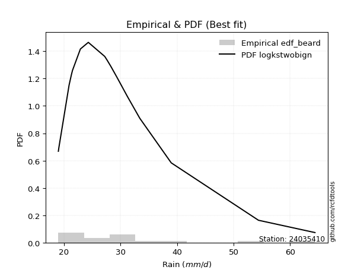</img>

</div>


### 5. Empirical - EDF Chegodayev (1955)

The Chegodayev formula is an empirical plotting position formula used in hydrological frequency analysis to estimate the exceedance probability or return period of a specific event from a set of observed data. It is primarily used for plotting observed data points on probability paper to fit a theoretical distribution, particularly for analyzing extreme events like maximum flood flows or rainfall intensities. The constant _b_ value in the generalized plotting position formula is 0.3.

<div align="center">


$P=(m-b)/(n+1-2b)$


</div>


**5.1. Empirical values**

<div align="center">

|                | 0                   | 1                  | 2                   | 3                   | 4                  | 5                  | 6                   | 7                   | 8                   | 9                  | 10                 | 11                 | 12                 | 13                 | 14                 | 15                 | 16                | 17                 |
|:---------------|:--------------------|:-------------------|:--------------------|:--------------------|:-------------------|:-------------------|:--------------------|:--------------------|:--------------------|:-------------------|:-------------------|:-------------------|:-------------------|:-------------------|:-------------------|:-------------------|:------------------|:-------------------|
| date           | 2021                | 2014               | 2019                | 2022                | 2008               | 2025               | 2020                | 2015                | 2009                | 2016               | 2011               | 2017               | 2012               | 2023               | 2010               | 2018               | 2013              | 2024               |
| x              | 19.0                | 19.1               | 20.9                | 21.3                | 21.5               | 22.6               | 22.9                | 24.3                | 27.2                | 27.6               | 28.2               | 28.4               | 29.8               | 31.2               | 33.4               | 38.58888888888889  | 54.4              | 64.4               |
| m              | 1                   | 2                  | 3                   | 4                   | 5                  | 6                  | 7                   | 8                   | 9                   | 10                 | 11                 | 12                 | 13                 | 14                 | 15                 | 16                 | 17                | 18                 |
| empirical_dist | edf_chegodayev      | edf_chegodayev     | edf_chegodayev      | edf_chegodayev      | edf_chegodayev     | edf_chegodayev     | edf_chegodayev      | edf_chegodayev      | edf_chegodayev      | edf_chegodayev     | edf_chegodayev     | edf_chegodayev     | edf_chegodayev     | edf_chegodayev     | edf_chegodayev     | edf_chegodayev     | edf_chegodayev    | edf_chegodayev     |
| empirical      | 0.03804347826086957 | 0.0923913043478261 | 0.14673913043478262 | 0.20108695652173916 | 0.2554347826086957 | 0.3097826086956522 | 0.36413043478260876 | 0.41847826086956524 | 0.47282608695652173 | 0.5271739130434783 | 0.5815217391304348 | 0.6358695652173914 | 0.6902173913043479 | 0.7445652173913043 | 0.7989130434782609 | 0.8532608695652174 | 0.907608695652174 | 0.9619565217391305 |
| empirical_tr   | 1.03954802259887    | 1.1017964071856288 | 1.1719745222929936  | 1.251700680272109   | 1.343065693430657  | 1.4488188976377954 | 1.5726495726495728  | 1.719626168224299   | 1.8969072164948453  | 2.1149425287356323 | 2.38961038961039   | 2.7462686567164183 | 3.228070175438597  | 3.914893617021276  | 4.972972972972973  | 6.814814814814816  | 10.82352941176471 | 26.285714285714324 |

</div>


**5.2. Kolmogorov-Smirnov fit test (sorted by Δ)**


<div align="center">

|                | 0                   | 1                   | 2                   | 3                   | 4                   | 5                   | 6                   | 7                   | 8                   | 9                   | 10                  | 11                  | 12                  | 13                  | 14                  | 15                  | 16                  | 17                  | 18                  | 19                  | 20                  | 21                  | 22                  | 23                  | 24                  | 25                  | 26                  | 27                  | 28                  | 29                  | 30                  | 31                  | 32                  | 33                  | 34                  | 35                  | 36                  | 37                  | 38                  | 39                  | 40                  | 41                  | 42                  | 43                  | 44                  | 45                  | 46                  | 47                  | 48                  | 49                  | 50                  | 51                  | 52                  | 53                  | 54                  | 55                  | 56                  | 57                  | 58                  | 59                  | 60                  | 61                  | 62                  | 63                    | 64                  | 65                  | 66                  | 67                  | 68                  | 69                  | 70                  | 71                  | 72                  | 73                  | 74                  | 75                  | 76                  | 77                  | 78                  | 79                  | 80                  | 81                  | 82                  | 83                  | 84                  | 85                  | 86                  | 87                  | 88                  | 89                  |
|:---------------|:--------------------|:--------------------|:--------------------|:--------------------|:--------------------|:--------------------|:--------------------|:--------------------|:--------------------|:--------------------|:--------------------|:--------------------|:--------------------|:--------------------|:--------------------|:--------------------|:--------------------|:--------------------|:--------------------|:--------------------|:--------------------|:--------------------|:--------------------|:--------------------|:--------------------|:--------------------|:--------------------|:--------------------|:--------------------|:--------------------|:--------------------|:--------------------|:--------------------|:--------------------|:--------------------|:--------------------|:--------------------|:--------------------|:--------------------|:--------------------|:--------------------|:--------------------|:--------------------|:--------------------|:--------------------|:--------------------|:--------------------|:--------------------|:--------------------|:--------------------|:--------------------|:--------------------|:--------------------|:--------------------|:--------------------|:--------------------|:--------------------|:--------------------|:--------------------|:--------------------|:--------------------|:--------------------|:--------------------|:----------------------|:--------------------|:--------------------|:--------------------|:--------------------|:--------------------|:--------------------|:--------------------|:--------------------|:--------------------|:--------------------|:--------------------|:--------------------|:--------------------|:--------------------|:--------------------|:--------------------|:--------------------|:--------------------|:--------------------|:--------------------|:--------------------|:--------------------|:--------------------|:--------------------|:--------------------|:--------------------|
| station        | 24035410            | 24035410            | 24035410            | 24035410            | 24035410            | 24035410            | 24035410            | 24035410            | 24035410            | 24035410            | 24035410            | 24035410            | 24035410            | 24035410            | 24035410            | 24035410            | 24035410            | 24035410            | 24035410            | 24035410            | 24035410            | 24035410            | 24035410            | 24035410            | 24035410            | 24035410            | 24035410            | 24035410            | 24035410            | 24035410            | 24035410            | 24035410            | 24035410            | 24035410            | 24035410            | 24035410            | 24035410            | 24035410            | 24035410            | 24035410            | 24035410            | 24035410            | 24035410            | 24035410            | 24035410            | 24035410            | 24035410            | 24035410            | 24035410            | 24035410            | 24035410            | 24035410            | 24035410            | 24035410            | 24035410            | 24035410            | 24035410            | 24035410            | 24035410            | 24035410            | 24035410            | 24035410            | 24035410            | 24035410              | 24035410            | 24035410            | 24035410            | 24035410            | 24035410            | 24035410            | 24035410            | 24035410            | 24035410            | 24035410            | 24035410            | 24035410            | 24035410            | 24035410            | 24035410            | 24035410            | 24035410            | 24035410            | 24035410            | 24035410            | 24035410            | 24035410            | 24035410            | 24035410            | 24035410            | 24035410            |
| empirical_dist | edf_chegodayev      | edf_chegodayev      | edf_chegodayev      | edf_chegodayev      | edf_chegodayev      | edf_chegodayev      | edf_chegodayev      | edf_chegodayev      | edf_chegodayev      | edf_chegodayev      | edf_chegodayev      | edf_chegodayev      | edf_chegodayev      | edf_chegodayev      | edf_chegodayev      | edf_chegodayev      | edf_chegodayev      | edf_chegodayev      | edf_chegodayev      | edf_chegodayev      | edf_chegodayev      | edf_chegodayev      | edf_chegodayev      | edf_chegodayev      | edf_chegodayev      | edf_chegodayev      | edf_chegodayev      | edf_chegodayev      | edf_chegodayev      | edf_chegodayev      | edf_chegodayev      | edf_chegodayev      | edf_chegodayev      | edf_chegodayev      | edf_chegodayev      | edf_chegodayev      | edf_chegodayev      | edf_chegodayev      | edf_chegodayev      | edf_chegodayev      | edf_chegodayev      | edf_chegodayev      | edf_chegodayev      | edf_chegodayev      | edf_chegodayev      | edf_chegodayev      | edf_chegodayev      | edf_chegodayev      | edf_chegodayev      | edf_chegodayev      | edf_chegodayev      | edf_chegodayev      | edf_chegodayev      | edf_chegodayev      | edf_chegodayev      | edf_chegodayev      | edf_chegodayev      | edf_chegodayev      | edf_chegodayev      | edf_chegodayev      | edf_chegodayev      | edf_chegodayev      | edf_chegodayev      | edf_chegodayev        | edf_chegodayev      | edf_chegodayev      | edf_chegodayev      | edf_chegodayev      | edf_chegodayev      | edf_chegodayev      | edf_chegodayev      | edf_chegodayev      | edf_chegodayev      | edf_chegodayev      | edf_chegodayev      | edf_chegodayev      | edf_chegodayev      | edf_chegodayev      | edf_chegodayev      | edf_chegodayev      | edf_chegodayev      | edf_chegodayev      | edf_chegodayev      | edf_chegodayev      | edf_chegodayev      | edf_chegodayev      | edf_chegodayev      | edf_chegodayev      | edf_chegodayev      | edf_chegodayev      |
| p_dist         | logpearson3         | logbetaprime        | loghalfnorm         | loggumbel_r         | exponnorm           | laplace_asymmetric  | lograyleigh         | expon               | genexpon            | gompertz            | loggompertz         | loggenlogistic      | logt                | truncnorm           | logmoyal            | pearson3            | logmaxwell          | lognct              | pareto              | logkstwobign        | loghalflogistic     | wald                | loggenexpon         | betaprime           | nct                 | fatiguelife         | logalpha            | moyal               | invgauss            | genlogistic         | fisk                | loginvweibull       | logf                | loginvgamma         | johnsonsu           | alpha               | invgamma            | ncf                 | logtruncnorm        | erlang              | loglognorm          | invweibull          | loginvgauss         | logmielke           | logjohnsonsu        | logfisk             | loglogistic         | logfatiguelife      | logcrystalball      | lognorm             | lognorm             | logrice             | logloggamma         | halflogistic        | weibull_min         | logexponnorm        | gumbel_r            | t                   | logexpon            | logpareto           | loghypsecant        | f                   | logncf              | loglaplace_asymmetric | gamma               | nakagami            | kstwobign           | lognakagami         | loglaplace          | rayleigh            | halfnorm            | maxwell             | logweibull_min      | loggumbel_l         | logistic            | hypsecant           | rice                | crystalball         | norm                | logerlang           | logwald             | laplace             | loggamma            | loggamma            | gibrat              | loggibrat           | gumbel_l            | logchi2             | chi2                | mielke              |
| delta          | 0.06894308030484442 | 0.0693726982969517  | 0.07143758542124945 | 0.07268267827175251 | 0.08182301754773173 | 0.08275355001040001 | 0.08296287223906662 | 0.08309811775732359 | 0.08309813151752268 | 0.08343754796156072 | 0.08422785244467125 | 0.08614238691736714 | 0.0861828476646657  | 0.08673080538839595 | 0.08698956012091419 | 0.08732996448275515 | 0.09015112256038393 | 0.09070501385413438 | 0.09086638404751779 | 0.09373470236475645 | 0.09390934854920885 | 0.09454419166151606 | 0.09495382485764137 | 0.09902661408934632 | 0.09918343217070519 | 0.1057555816409097  | 0.10617710408042036 | 0.10724537462822226 | 0.10946807032751804 | 0.11001930441992142 | 0.11127991282013283 | 0.11170521167872882 | 0.11201952969537532 | 0.11202224428557872 | 0.1121294061807705  | 0.11286122337997839 | 0.1129553761344706  | 0.11295566337188323 | 0.11373378194896044 | 0.11429571672706007 | 0.11481141764948999 | 0.11487924671048322 | 0.11501333082404419 | 0.11505474282352046 | 0.11519429688374794 | 0.11537313225393853 | 0.1167053266477247  | 0.11671596986798038 | 0.11753863670530074 | 0.11753899795127465 | 0.11753899795127465 | 0.11888386590701372 | 0.11922364561076537 | 0.12134887376739117 | 0.12480047128188487 | 0.12556727722271555 | 0.12649669523648746 | 0.1281899304380072  | 0.13151884649079126 | 0.13151885496760551 | 0.13204958603031958 | 0.1338489257014256  | 0.13989844887306735 | 0.14338720482427023   | 0.14426784979493879 | 0.14608267179902967 | 0.14837248917022083 | 0.14852100597031914 | 0.1540943879438643  | 0.15603641425748702 | 0.15869085106780922 | 0.1638271323546241  | 0.1791464842749675  | 0.18712704562201554 | 0.18740910864007532 | 0.19128030944865837 | 0.19414790164821033 | 0.19419344772632618 | 0.19419346489187705 | 0.19610585665789215 | 0.19755692852243198 | 0.20874091693649932 | 0.21875394679214322 | 0.21875394679214322 | 0.23057734708340233 | 0.2554347826086957  | 0.2611874962175589  | 0.26564089275269587 | 0.28206326092691725 | nan                 |
| deltao         | 0.32102346734599996 | 0.32102346734599996 | 0.32102346734599996 | 0.32102346734599996 | 0.32102346734599996 | 0.32102346734599996 | 0.32102346734599996 | 0.32102346734599996 | 0.32102346734599996 | 0.32102346734599996 | 0.32102346734599996 | 0.32102346734599996 | 0.32102346734599996 | 0.32102346734599996 | 0.32102346734599996 | 0.32102346734599996 | 0.32102346734599996 | 0.32102346734599996 | 0.32102346734599996 | 0.32102346734599996 | 0.32102346734599996 | 0.32102346734599996 | 0.32102346734599996 | 0.32102346734599996 | 0.32102346734599996 | 0.32102346734599996 | 0.32102346734599996 | 0.32102346734599996 | 0.32102346734599996 | 0.32102346734599996 | 0.32102346734599996 | 0.32102346734599996 | 0.32102346734599996 | 0.32102346734599996 | 0.32102346734599996 | 0.32102346734599996 | 0.32102346734599996 | 0.32102346734599996 | 0.32102346734599996 | 0.32102346734599996 | 0.32102346734599996 | 0.32102346734599996 | 0.32102346734599996 | 0.32102346734599996 | 0.32102346734599996 | 0.32102346734599996 | 0.32102346734599996 | 0.32102346734599996 | 0.32102346734599996 | 0.32102346734599996 | 0.32102346734599996 | 0.32102346734599996 | 0.32102346734599996 | 0.32102346734599996 | 0.32102346734599996 | 0.32102346734599996 | 0.32102346734599996 | 0.32102346734599996 | 0.32102346734599996 | 0.32102346734599996 | 0.32102346734599996 | 0.32102346734599996 | 0.32102346734599996 | 0.32102346734599996   | 0.32102346734599996 | 0.32102346734599996 | 0.32102346734599996 | 0.32102346734599996 | 0.32102346734599996 | 0.32102346734599996 | 0.32102346734599996 | 0.32102346734599996 | 0.32102346734599996 | 0.32102346734599996 | 0.32102346734599996 | 0.32102346734599996 | 0.32102346734599996 | 0.32102346734599996 | 0.32102346734599996 | 0.32102346734599996 | 0.32102346734599996 | 0.32102346734599996 | 0.32102346734599996 | 0.32102346734599996 | 0.32102346734599996 | 0.32102346734599996 | 0.32102346734599996 | 0.32102346734599996 | 0.32102346734599996 | 0.32102346734599996 |
| eval           | Δo > Δ              | Δo > Δ              | Δo > Δ              | Δo > Δ              | Δo > Δ              | Δo > Δ              | Δo > Δ              | Δo > Δ              | Δo > Δ              | Δo > Δ              | Δo > Δ              | Δo > Δ              | Δo > Δ              | Δo > Δ              | Δo > Δ              | Δo > Δ              | Δo > Δ              | Δo > Δ              | Δo > Δ              | Δo > Δ              | Δo > Δ              | Δo > Δ              | Δo > Δ              | Δo > Δ              | Δo > Δ              | Δo > Δ              | Δo > Δ              | Δo > Δ              | Δo > Δ              | Δo > Δ              | Δo > Δ              | Δo > Δ              | Δo > Δ              | Δo > Δ              | Δo > Δ              | Δo > Δ              | Δo > Δ              | Δo > Δ              | Δo > Δ              | Δo > Δ              | Δo > Δ              | Δo > Δ              | Δo > Δ              | Δo > Δ              | Δo > Δ              | Δo > Δ              | Δo > Δ              | Δo > Δ              | Δo > Δ              | Δo > Δ              | Δo > Δ              | Δo > Δ              | Δo > Δ              | Δo > Δ              | Δo > Δ              | Δo > Δ              | Δo > Δ              | Δo > Δ              | Δo > Δ              | Δo > Δ              | Δo > Δ              | Δo > Δ              | Δo > Δ              | Δo > Δ                | Δo > Δ              | Δo > Δ              | Δo > Δ              | Δo > Δ              | Δo > Δ              | Δo > Δ              | Δo > Δ              | Δo > Δ              | Δo > Δ              | Δo > Δ              | Δo > Δ              | Δo > Δ              | Δo > Δ              | Δo > Δ              | Δo > Δ              | Δo > Δ              | Δo > Δ              | Δo > Δ              | Δo > Δ              | Δo > Δ              | Δo > Δ              | Δo > Δ              | Δo > Δ              | Δo > Δ              | Δo > Δ              | Δo <= Δ             |
| fit            | 1                   | 1                   | 1                   | 1                   | 1                   | 1                   | 1                   | 1                   | 1                   | 1                   | 1                   | 1                   | 1                   | 1                   | 1                   | 1                   | 1                   | 1                   | 1                   | 1                   | 1                   | 1                   | 1                   | 1                   | 1                   | 1                   | 1                   | 1                   | 1                   | 1                   | 1                   | 1                   | 1                   | 1                   | 1                   | 1                   | 1                   | 1                   | 1                   | 1                   | 1                   | 1                   | 1                   | 1                   | 1                   | 1                   | 1                   | 1                   | 1                   | 1                   | 1                   | 1                   | 1                   | 1                   | 1                   | 1                   | 1                   | 1                   | 1                   | 1                   | 1                   | 1                   | 1                   | 1                     | 1                   | 1                   | 1                   | 1                   | 1                   | 1                   | 1                   | 1                   | 1                   | 1                   | 1                   | 1                   | 1                   | 1                   | 1                   | 1                   | 1                   | 1                   | 1                   | 1                   | 1                   | 1                   | 1                   | 1                   | 1                   | 0                   |
| n              | 18                  | 18                  | 18                  | 18                  | 18                  | 18                  | 18                  | 18                  | 18                  | 18                  | 18                  | 18                  | 18                  | 18                  | 18                  | 18                  | 18                  | 18                  | 18                  | 18                  | 18                  | 18                  | 18                  | 18                  | 18                  | 18                  | 18                  | 18                  | 18                  | 18                  | 18                  | 18                  | 18                  | 18                  | 18                  | 18                  | 18                  | 18                  | 18                  | 18                  | 18                  | 18                  | 18                  | 18                  | 18                  | 18                  | 18                  | 18                  | 18                  | 18                  | 18                  | 18                  | 18                  | 18                  | 18                  | 18                  | 18                  | 18                  | 18                  | 18                  | 18                  | 18                  | 18                  | 18                    | 18                  | 18                  | 18                  | 18                  | 18                  | 18                  | 18                  | 18                  | 18                  | 18                  | 18                  | 18                  | 18                  | 18                  | 18                  | 18                  | 18                  | 18                  | 18                  | 18                  | 18                  | 18                  | 18                  | 18                  | 18                  | 18                  |
| best_fit       | 1                   | 0                   | 0                   | 0                   | 0                   | 0                   | 0                   | 0                   | 0                   | 0                   | 0                   | 0                   | 0                   | 0                   | 0                   | 0                   | 0                   | 0                   | 0                   | 0                   | 0                   | 0                   | 0                   | 0                   | 0                   | 0                   | 0                   | 0                   | 0                   | 0                   | 0                   | 0                   | 0                   | 0                   | 0                   | 0                   | 0                   | 0                   | 0                   | 0                   | 0                   | 0                   | 0                   | 0                   | 0                   | 0                   | 0                   | 0                   | 0                   | 0                   | 0                   | 0                   | 0                   | 0                   | 0                   | 0                   | 0                   | 0                   | 0                   | 0                   | 0                   | 0                   | 0                   | 0                     | 0                   | 0                   | 0                   | 0                   | 0                   | 0                   | 0                   | 0                   | 0                   | 0                   | 0                   | 0                   | 0                   | 0                   | 0                   | 0                   | 0                   | 0                   | 0                   | 0                   | 0                   | 0                   | 0                   | 0                   | 0                   | 0                   |
| best_fit_sort  | 1                   | 2                   | 3                   | 4                   | 5                   | 6                   | 7                   | 8                   | 9                   | 10                  | 11                  | 12                  | 13                  | 14                  | 15                  | 16                  | 17                  | 18                  | 19                  | 20                  | 21                  | 22                  | 23                  | 24                  | 25                  | 26                  | 27                  | 28                  | 29                  | 30                  | 31                  | 32                  | 33                  | 34                  | 35                  | 36                  | 37                  | 38                  | 39                  | 40                  | 41                  | 42                  | 43                  | 44                  | 45                  | 46                  | 47                  | 48                  | 49                  | 50                  | 51                  | 52                  | 53                  | 54                  | 55                  | 56                  | 57                  | 58                  | 59                  | 60                  | 61                  | 62                  | 63                  | 64                    | 65                  | 66                  | 67                  | 68                  | 69                  | 70                  | 71                  | 72                  | 73                  | 74                  | 75                  | 76                  | 77                  | 78                  | 79                  | 80                  | 81                  | 82                  | 83                  | 84                  | 85                  | 86                  | 87                  | 88                  | 89                  | 90                  |

</div>


<div align="center">

</img>

</div>


**5.3. Best fit**

<div align="center">

|   id |   station | empirical_dist   | p_dist      |     delta |   deltao | eval   |   fit |   n |   best_fit |   best_fit_sort |
|-----:|----------:|:-----------------|:------------|----------:|---------:|:-------|------:|----:|-----------:|----------------:|
|    0 |  24035410 | edf_chegodayev   | logpearson3 | 0.0689431 | 0.321023 | Δo > Δ |     1 |  18 |          1 |               1 |

</div>


<div align="center">

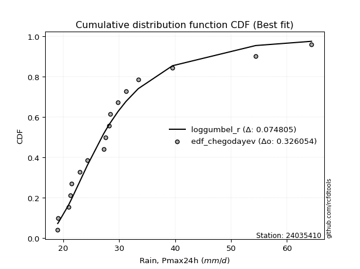</img>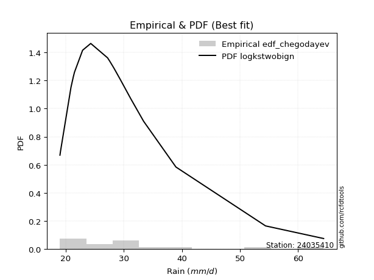</img>

</div>


### 6. Empirical - EDF Blom (1958)

The Blom formula is a specific "plotting position" formula used in hydrology and statistical analysis to estimate the empirical cumulative probability (or non-exceedance probability) of a data series. It is particularly recommended for data that are approximately normally distributed. The constant _a_ is set to 0.375 (or 3/8).

<div align="center">


$P=(m-a)/(n+1-2a)$


</div>


**6.1. Empirical values**

<div align="center">

|                | 0                   | 1                   | 2                   | 3                   | 4                  | 5                  | 6                  | 7                  | 8                  | 9                  | 10                 | 11                 | 12                 | 13                 | 14                 | 15                 | 16                 | 17                 |
|:---------------|:--------------------|:--------------------|:--------------------|:--------------------|:-------------------|:-------------------|:-------------------|:-------------------|:-------------------|:-------------------|:-------------------|:-------------------|:-------------------|:-------------------|:-------------------|:-------------------|:-------------------|:-------------------|
| date           | 2021                | 2014                | 2019                | 2022                | 2008               | 2025               | 2020               | 2015               | 2009               | 2016               | 2011               | 2017               | 2012               | 2023               | 2010               | 2018               | 2013               | 2024               |
| x              | 19.0                | 19.1                | 20.9                | 21.3                | 21.5               | 22.6               | 22.9               | 24.3               | 27.2               | 27.6               | 28.2               | 28.4               | 29.8               | 31.2               | 33.4               | 38.58888888888889  | 54.4               | 64.4               |
| m              | 1                   | 2                   | 3                   | 4                   | 5                  | 6                  | 7                  | 8                  | 9                  | 10                 | 11                 | 12                 | 13                 | 14                 | 15                 | 16                 | 17                 | 18                 |
| empirical_dist | edf_blom            | edf_blom            | edf_blom            | edf_blom            | edf_blom           | edf_blom           | edf_blom           | edf_blom           | edf_blom           | edf_blom           | edf_blom           | edf_blom           | edf_blom           | edf_blom           | edf_blom           | edf_blom           | edf_blom           | edf_blom           |
| empirical      | 0.03424657534246575 | 0.08904109589041095 | 0.14383561643835616 | 0.19863013698630136 | 0.2534246575342466 | 0.3082191780821918 | 0.363013698630137  | 0.4178082191780822 | 0.4726027397260274 | 0.5273972602739726 | 0.5821917808219178 | 0.636986301369863  | 0.6917808219178082 | 0.7465753424657534 | 0.8013698630136986 | 0.8561643835616438 | 0.910958904109589  | 0.9657534246575342 |
| empirical_tr   | 1.0354609929078014  | 1.0977443609022557  | 1.168               | 1.2478632478632479  | 1.3394495412844036 | 1.4455445544554455 | 1.5698924731182795 | 1.7176470588235295 | 1.896103896103896  | 2.1159420289855073 | 2.3934426229508197 | 2.7547169811320753 | 3.2444444444444445 | 3.9459459459459456 | 5.0344827586206895 | 6.952380952380952  | 11.230769230769228 | 29.199999999999978 |

</div>


**6.2. Kolmogorov-Smirnov fit test (sorted by Δ)**


<div align="center">

|                | 0                   | 1                   | 2                   | 3                   | 4                   | 5                   | 6                   | 7                   | 8                   | 9                   | 10                  | 11                  | 12                  | 13                  | 14                  | 15                  | 16                  | 17                  | 18                  | 19                  | 20                  | 21                  | 22                  | 23                  | 24                  | 25                  | 26                  | 27                  | 28                  | 29                  | 30                  | 31                  | 32                  | 33                  | 34                  | 35                  | 36                  | 37                  | 38                  | 39                  | 40                  | 41                  | 42                  | 43                  | 44                  | 45                  | 46                  | 47                  | 48                  | 49                  | 50                  | 51                  | 52                  | 53                  | 54                  | 55                  | 56                  | 57                  | 58                  | 59                  | 60                  | 61                  | 62                    | 63                  | 64                  | 65                  | 66                  | 67                  | 68                  | 69                  | 70                  | 71                  | 72                  | 73                  | 74                  | 75                  | 76                  | 77                  | 78                  | 79                  | 80                  | 81                  | 82                  | 83                  | 84                  | 85                  | 86                  | 87                  | 88                  | 89                  |
|:---------------|:--------------------|:--------------------|:--------------------|:--------------------|:--------------------|:--------------------|:--------------------|:--------------------|:--------------------|:--------------------|:--------------------|:--------------------|:--------------------|:--------------------|:--------------------|:--------------------|:--------------------|:--------------------|:--------------------|:--------------------|:--------------------|:--------------------|:--------------------|:--------------------|:--------------------|:--------------------|:--------------------|:--------------------|:--------------------|:--------------------|:--------------------|:--------------------|:--------------------|:--------------------|:--------------------|:--------------------|:--------------------|:--------------------|:--------------------|:--------------------|:--------------------|:--------------------|:--------------------|:--------------------|:--------------------|:--------------------|:--------------------|:--------------------|:--------------------|:--------------------|:--------------------|:--------------------|:--------------------|:--------------------|:--------------------|:--------------------|:--------------------|:--------------------|:--------------------|:--------------------|:--------------------|:--------------------|:----------------------|:--------------------|:--------------------|:--------------------|:--------------------|:--------------------|:--------------------|:--------------------|:--------------------|:--------------------|:--------------------|:--------------------|:--------------------|:--------------------|:--------------------|:--------------------|:--------------------|:--------------------|:--------------------|:--------------------|:--------------------|:--------------------|:--------------------|:--------------------|:--------------------|:--------------------|:--------------------|:--------------------|
| station        | 24035410            | 24035410            | 24035410            | 24035410            | 24035410            | 24035410            | 24035410            | 24035410            | 24035410            | 24035410            | 24035410            | 24035410            | 24035410            | 24035410            | 24035410            | 24035410            | 24035410            | 24035410            | 24035410            | 24035410            | 24035410            | 24035410            | 24035410            | 24035410            | 24035410            | 24035410            | 24035410            | 24035410            | 24035410            | 24035410            | 24035410            | 24035410            | 24035410            | 24035410            | 24035410            | 24035410            | 24035410            | 24035410            | 24035410            | 24035410            | 24035410            | 24035410            | 24035410            | 24035410            | 24035410            | 24035410            | 24035410            | 24035410            | 24035410            | 24035410            | 24035410            | 24035410            | 24035410            | 24035410            | 24035410            | 24035410            | 24035410            | 24035410            | 24035410            | 24035410            | 24035410            | 24035410            | 24035410              | 24035410            | 24035410            | 24035410            | 24035410            | 24035410            | 24035410            | 24035410            | 24035410            | 24035410            | 24035410            | 24035410            | 24035410            | 24035410            | 24035410            | 24035410            | 24035410            | 24035410            | 24035410            | 24035410            | 24035410            | 24035410            | 24035410            | 24035410            | 24035410            | 24035410            | 24035410            | 24035410            |
| empirical_dist | edf_blom            | edf_blom            | edf_blom            | edf_blom            | edf_blom            | edf_blom            | edf_blom            | edf_blom            | edf_blom            | edf_blom            | edf_blom            | edf_blom            | edf_blom            | edf_blom            | edf_blom            | edf_blom            | edf_blom            | edf_blom            | edf_blom            | edf_blom            | edf_blom            | edf_blom            | edf_blom            | edf_blom            | edf_blom            | edf_blom            | edf_blom            | edf_blom            | edf_blom            | edf_blom            | edf_blom            | edf_blom            | edf_blom            | edf_blom            | edf_blom            | edf_blom            | edf_blom            | edf_blom            | edf_blom            | edf_blom            | edf_blom            | edf_blom            | edf_blom            | edf_blom            | edf_blom            | edf_blom            | edf_blom            | edf_blom            | edf_blom            | edf_blom            | edf_blom            | edf_blom            | edf_blom            | edf_blom            | edf_blom            | edf_blom            | edf_blom            | edf_blom            | edf_blom            | edf_blom            | edf_blom            | edf_blom            | edf_blom              | edf_blom            | edf_blom            | edf_blom            | edf_blom            | edf_blom            | edf_blom            | edf_blom            | edf_blom            | edf_blom            | edf_blom            | edf_blom            | edf_blom            | edf_blom            | edf_blom            | edf_blom            | edf_blom            | edf_blom            | edf_blom            | edf_blom            | edf_blom            | edf_blom            | edf_blom            | edf_blom            | edf_blom            | edf_blom            | edf_blom            | edf_blom            |
| p_dist         | logbetaprime        | logpearson3         | loggumbel_r         | loghalfnorm         | exponnorm           | laplace_asymmetric  | expon               | genexpon            | gompertz            | lograyleigh         | loggenlogistic      | loggompertz         | logmoyal            | truncnorm           | lognct              | logt                | pareto              | pearson3            | logmaxwell          | logkstwobign        | loghalflogistic     | wald                | loggenexpon         | nct                 | betaprime           | fatiguelife         | logalpha            | genlogistic         | invgauss            | moyal               | fisk                | loginvweibull       | logf                | loginvgamma         | johnsonsu           | alpha               | invgamma            | ncf                 | logtruncnorm        | erlang              | loglognorm          | invweibull          | loginvgauss         | logmielke           | logjohnsonsu        | logfisk             | loglogistic         | logfatiguelife      | logrice             | logcrystalball      | lognorm             | lognorm             | logloggamma         | halflogistic        | logexponnorm        | weibull_min         | gumbel_r            | loghypsecant        | logexpon            | logpareto           | t                   | f                   | loglaplace_asymmetric | logncf              | gamma               | nakagami            | lognakagami         | kstwobign           | loglaplace          | rayleigh            | halfnorm            | maxwell             | logweibull_min      | loggumbel_l         | logistic            | hypsecant           | rice                | logwald             | crystalball         | norm                | logerlang           | laplace             | loggamma            | loggamma            | gibrat              | loggibrat           | gumbel_l            | logchi2             | chi2                | mielke              |
| delta          | 0.06696282795329833 | 0.06916642753533875 | 0.07156594211928075 | 0.07166093265174378 | 0.07847280909031659 | 0.07940334155298487 | 0.07974790929990845 | 0.07974792306010754 | 0.08035372791014606 | 0.08497299731351571 | 0.08502565076489538 | 0.08544150787401417 | 0.08721290735140852 | 0.08874093046284504 | 0.08958827770166261 | 0.08997975058306952 | 0.09108973127801212 | 0.09112686740115897 | 0.09216124763483302 | 0.09261796621228469 | 0.09413269577970318 | 0.0947675388920104  | 0.0951771720881357  | 0.09806669601823342 | 0.10014335024181797 | 0.10597892887140403 | 0.10640045131091469 | 0.10890256826744965 | 0.10969141755801237 | 0.11104227754662607 | 0.11150326005062716 | 0.11192855890922315 | 0.11224287692586965 | 0.11224559151607305 | 0.11235275341126483 | 0.11308457061047272 | 0.11317872336496493 | 0.11317901060237756 | 0.11395712917945477 | 0.1145190639575544  | 0.11503476487998432 | 0.11510259394097755 | 0.11523667805453852 | 0.11527809005401479 | 0.11541764411424227 | 0.11559647948443286 | 0.11615595224786202 | 0.11693931709847472 | 0.11776712975454195 | 0.11865537285777239 | 0.1186557341037463  | 0.1186557341037463  | 0.12099580655775222 | 0.125145776685795   | 0.12579062445320988 | 0.12725729081732262 | 0.13029359815489128 | 0.1309328498778478  | 0.1317421937212856  | 0.13174220219809984 | 0.131986833356411   | 0.13407227293191992 | 0.14227046867179846   | 0.143619238849627   | 0.14449119702543312 | 0.14853949133446742 | 0.14874435320081347 | 0.1494892253226925  | 0.15297765179139253 | 0.15983331717589083 | 0.16248775398621304 | 0.16583725742907318 | 0.17936983150546182 | 0.1882437817744872  | 0.1894192337145244  | 0.19239704560113002 | 0.19526463780068198 | 0.1955468034479829  | 0.19620357280077527 | 0.19620358996632614 | 0.19632920388838648 | 0.20985765308897097 | 0.21897729402263755 | 0.21897729402263755 | 0.22856722200895324 | 0.2534246575342466  | 0.26319762129200797 | 0.2685444067491223  | 0.2822866081574116  | nan                 |
| deltao         | 0.32102346734599996 | 0.32102346734599996 | 0.32102346734599996 | 0.32102346734599996 | 0.32102346734599996 | 0.32102346734599996 | 0.32102346734599996 | 0.32102346734599996 | 0.32102346734599996 | 0.32102346734599996 | 0.32102346734599996 | 0.32102346734599996 | 0.32102346734599996 | 0.32102346734599996 | 0.32102346734599996 | 0.32102346734599996 | 0.32102346734599996 | 0.32102346734599996 | 0.32102346734599996 | 0.32102346734599996 | 0.32102346734599996 | 0.32102346734599996 | 0.32102346734599996 | 0.32102346734599996 | 0.32102346734599996 | 0.32102346734599996 | 0.32102346734599996 | 0.32102346734599996 | 0.32102346734599996 | 0.32102346734599996 | 0.32102346734599996 | 0.32102346734599996 | 0.32102346734599996 | 0.32102346734599996 | 0.32102346734599996 | 0.32102346734599996 | 0.32102346734599996 | 0.32102346734599996 | 0.32102346734599996 | 0.32102346734599996 | 0.32102346734599996 | 0.32102346734599996 | 0.32102346734599996 | 0.32102346734599996 | 0.32102346734599996 | 0.32102346734599996 | 0.32102346734599996 | 0.32102346734599996 | 0.32102346734599996 | 0.32102346734599996 | 0.32102346734599996 | 0.32102346734599996 | 0.32102346734599996 | 0.32102346734599996 | 0.32102346734599996 | 0.32102346734599996 | 0.32102346734599996 | 0.32102346734599996 | 0.32102346734599996 | 0.32102346734599996 | 0.32102346734599996 | 0.32102346734599996 | 0.32102346734599996   | 0.32102346734599996 | 0.32102346734599996 | 0.32102346734599996 | 0.32102346734599996 | 0.32102346734599996 | 0.32102346734599996 | 0.32102346734599996 | 0.32102346734599996 | 0.32102346734599996 | 0.32102346734599996 | 0.32102346734599996 | 0.32102346734599996 | 0.32102346734599996 | 0.32102346734599996 | 0.32102346734599996 | 0.32102346734599996 | 0.32102346734599996 | 0.32102346734599996 | 0.32102346734599996 | 0.32102346734599996 | 0.32102346734599996 | 0.32102346734599996 | 0.32102346734599996 | 0.32102346734599996 | 0.32102346734599996 | 0.32102346734599996 | 0.32102346734599996 |
| eval           | Δo > Δ              | Δo > Δ              | Δo > Δ              | Δo > Δ              | Δo > Δ              | Δo > Δ              | Δo > Δ              | Δo > Δ              | Δo > Δ              | Δo > Δ              | Δo > Δ              | Δo > Δ              | Δo > Δ              | Δo > Δ              | Δo > Δ              | Δo > Δ              | Δo > Δ              | Δo > Δ              | Δo > Δ              | Δo > Δ              | Δo > Δ              | Δo > Δ              | Δo > Δ              | Δo > Δ              | Δo > Δ              | Δo > Δ              | Δo > Δ              | Δo > Δ              | Δo > Δ              | Δo > Δ              | Δo > Δ              | Δo > Δ              | Δo > Δ              | Δo > Δ              | Δo > Δ              | Δo > Δ              | Δo > Δ              | Δo > Δ              | Δo > Δ              | Δo > Δ              | Δo > Δ              | Δo > Δ              | Δo > Δ              | Δo > Δ              | Δo > Δ              | Δo > Δ              | Δo > Δ              | Δo > Δ              | Δo > Δ              | Δo > Δ              | Δo > Δ              | Δo > Δ              | Δo > Δ              | Δo > Δ              | Δo > Δ              | Δo > Δ              | Δo > Δ              | Δo > Δ              | Δo > Δ              | Δo > Δ              | Δo > Δ              | Δo > Δ              | Δo > Δ                | Δo > Δ              | Δo > Δ              | Δo > Δ              | Δo > Δ              | Δo > Δ              | Δo > Δ              | Δo > Δ              | Δo > Δ              | Δo > Δ              | Δo > Δ              | Δo > Δ              | Δo > Δ              | Δo > Δ              | Δo > Δ              | Δo > Δ              | Δo > Δ              | Δo > Δ              | Δo > Δ              | Δo > Δ              | Δo > Δ              | Δo > Δ              | Δo > Δ              | Δo > Δ              | Δo > Δ              | Δo > Δ              | Δo > Δ              | Δo <= Δ             |
| fit            | 1                   | 1                   | 1                   | 1                   | 1                   | 1                   | 1                   | 1                   | 1                   | 1                   | 1                   | 1                   | 1                   | 1                   | 1                   | 1                   | 1                   | 1                   | 1                   | 1                   | 1                   | 1                   | 1                   | 1                   | 1                   | 1                   | 1                   | 1                   | 1                   | 1                   | 1                   | 1                   | 1                   | 1                   | 1                   | 1                   | 1                   | 1                   | 1                   | 1                   | 1                   | 1                   | 1                   | 1                   | 1                   | 1                   | 1                   | 1                   | 1                   | 1                   | 1                   | 1                   | 1                   | 1                   | 1                   | 1                   | 1                   | 1                   | 1                   | 1                   | 1                   | 1                   | 1                     | 1                   | 1                   | 1                   | 1                   | 1                   | 1                   | 1                   | 1                   | 1                   | 1                   | 1                   | 1                   | 1                   | 1                   | 1                   | 1                   | 1                   | 1                   | 1                   | 1                   | 1                   | 1                   | 1                   | 1                   | 1                   | 1                   | 0                   |
| n              | 18                  | 18                  | 18                  | 18                  | 18                  | 18                  | 18                  | 18                  | 18                  | 18                  | 18                  | 18                  | 18                  | 18                  | 18                  | 18                  | 18                  | 18                  | 18                  | 18                  | 18                  | 18                  | 18                  | 18                  | 18                  | 18                  | 18                  | 18                  | 18                  | 18                  | 18                  | 18                  | 18                  | 18                  | 18                  | 18                  | 18                  | 18                  | 18                  | 18                  | 18                  | 18                  | 18                  | 18                  | 18                  | 18                  | 18                  | 18                  | 18                  | 18                  | 18                  | 18                  | 18                  | 18                  | 18                  | 18                  | 18                  | 18                  | 18                  | 18                  | 18                  | 18                  | 18                    | 18                  | 18                  | 18                  | 18                  | 18                  | 18                  | 18                  | 18                  | 18                  | 18                  | 18                  | 18                  | 18                  | 18                  | 18                  | 18                  | 18                  | 18                  | 18                  | 18                  | 18                  | 18                  | 18                  | 18                  | 18                  | 18                  | 18                  |
| best_fit       | 1                   | 0                   | 0                   | 0                   | 0                   | 0                   | 0                   | 0                   | 0                   | 0                   | 0                   | 0                   | 0                   | 0                   | 0                   | 0                   | 0                   | 0                   | 0                   | 0                   | 0                   | 0                   | 0                   | 0                   | 0                   | 0                   | 0                   | 0                   | 0                   | 0                   | 0                   | 0                   | 0                   | 0                   | 0                   | 0                   | 0                   | 0                   | 0                   | 0                   | 0                   | 0                   | 0                   | 0                   | 0                   | 0                   | 0                   | 0                   | 0                   | 0                   | 0                   | 0                   | 0                   | 0                   | 0                   | 0                   | 0                   | 0                   | 0                   | 0                   | 0                   | 0                   | 0                     | 0                   | 0                   | 0                   | 0                   | 0                   | 0                   | 0                   | 0                   | 0                   | 0                   | 0                   | 0                   | 0                   | 0                   | 0                   | 0                   | 0                   | 0                   | 0                   | 0                   | 0                   | 0                   | 0                   | 0                   | 0                   | 0                   | 0                   |
| best_fit_sort  | 1                   | 2                   | 3                   | 4                   | 5                   | 6                   | 7                   | 8                   | 9                   | 10                  | 11                  | 12                  | 13                  | 14                  | 15                  | 16                  | 17                  | 18                  | 19                  | 20                  | 21                  | 22                  | 23                  | 24                  | 25                  | 26                  | 27                  | 28                  | 29                  | 30                  | 31                  | 32                  | 33                  | 34                  | 35                  | 36                  | 37                  | 38                  | 39                  | 40                  | 41                  | 42                  | 43                  | 44                  | 45                  | 46                  | 47                  | 48                  | 49                  | 50                  | 51                  | 52                  | 53                  | 54                  | 55                  | 56                  | 57                  | 58                  | 59                  | 60                  | 61                  | 62                  | 63                    | 64                  | 65                  | 66                  | 67                  | 68                  | 69                  | 70                  | 71                  | 72                  | 73                  | 74                  | 75                  | 76                  | 77                  | 78                  | 79                  | 80                  | 81                  | 82                  | 83                  | 84                  | 85                  | 86                  | 87                  | 88                  | 89                  | 90                  |

</div>


<div align="center">

</img>

</div>


**6.3. Best fit**

<div align="center">

|   id |   station | empirical_dist   | p_dist       |     delta |   deltao | eval   |   fit |   n |   best_fit |   best_fit_sort |
|-----:|----------:|:-----------------|:-------------|----------:|---------:|:-------|------:|----:|-----------:|----------------:|
|    0 |  24035410 | edf_blom         | logbetaprime | 0.0669628 | 0.321023 | Δo > Δ |     1 |  18 |          1 |               1 |

</div>


<div align="center">

</img></img>

</div>


### 7. Empirical - EDF Tukey (1962)

In hydrology, the Tukey formula is used as a plotting position formula to estimate the empirical probability or frequency of a flood event (or other hydrological data). The formula parameter is given as _c=0.333_ (or 1/3).

<div align="center">


$P=(m-c)/(n+1-2c)$


</div>


**7.1. Empirical values**

<div align="center">

|                | 0                   | 1                   | 2                   | 3         | 4                  | 5                  | 6                   | 7                   | 8                  | 9                  | 10                 | 11                 | 12                 | 13                 | 14                | 15                 | 16                 | 17                 |
|:---------------|:--------------------|:--------------------|:--------------------|:----------|:-------------------|:-------------------|:--------------------|:--------------------|:-------------------|:-------------------|:-------------------|:-------------------|:-------------------|:-------------------|:------------------|:-------------------|:-------------------|:-------------------|
| date           | 2021                | 2014                | 2019                | 2022      | 2008               | 2025               | 2020                | 2015                | 2009               | 2016               | 2011               | 2017               | 2012               | 2023               | 2010              | 2018               | 2013               | 2024               |
| x              | 19.0                | 19.1                | 20.9                | 21.3      | 21.5               | 22.6               | 22.9                | 24.3                | 27.2               | 27.6               | 28.2               | 28.4               | 29.8               | 31.2               | 33.4              | 38.58888888888889  | 54.4               | 64.4               |
| m              | 1                   | 2                   | 3                   | 4         | 5                  | 6                  | 7                   | 8                   | 9                  | 10                 | 11                 | 12                 | 13                 | 14                 | 15                | 16                 | 17                 | 18                 |
| empirical_dist | edf_tukey           | edf_tukey           | edf_tukey           | edf_tukey | edf_tukey          | edf_tukey          | edf_tukey           | edf_tukey           | edf_tukey          | edf_tukey          | edf_tukey          | edf_tukey          | edf_tukey          | edf_tukey          | edf_tukey         | edf_tukey          | edf_tukey          | edf_tukey          |
| empirical      | 0.03636363636363636 | 0.09090909090909091 | 0.14545454545454545 | 0.2       | 0.2545454545454545 | 0.3090909090909091 | 0.36363636363636365 | 0.41818181818181815 | 0.4727272727272727 | 0.5272727272727272 | 0.5818181818181818 | 0.6363636363636364 | 0.6909090909090909 | 0.7454545454545455 | 0.8               | 0.8545454545454545 | 0.9090909090909091 | 0.9636363636363636 |
| empirical_tr   | 1.0377358490566038  | 1.1                 | 1.1702127659574468  | 1.25      | 1.3414634146341462 | 1.4473684210526316 | 1.5714285714285714  | 1.71875             | 1.8965517241379308 | 2.115384615384615  | 2.391304347826087  | 2.75               | 3.235294117647059  | 3.928571428571429  | 5.000000000000001 | 6.874999999999997  | 10.999999999999996 | 27.49999999999999  |

</div>


**7.2. Kolmogorov-Smirnov fit test (sorted by Δ)**


<div align="center">

|                | 0                   | 1                   | 2                   | 3                   | 4                   | 5                   | 6                   | 7                   | 8                   | 9                   | 10                  | 11                  | 12                  | 13                  | 14                  | 15                  | 16                  | 17                  | 18                  | 19                  | 20                  | 21                  | 22                  | 23                  | 24                  | 25                  | 26                  | 27                  | 28                  | 29                  | 30                  | 31                  | 32                  | 33                  | 34                  | 35                  | 36                  | 37                  | 38                  | 39                  | 40                  | 41                  | 42                  | 43                  | 44                  | 45                  | 46                  | 47                  | 48                  | 49                  | 50                  | 51                  | 52                  | 53                  | 54                  | 55                  | 56                  | 57                  | 58                  | 59                  | 60                  | 61                  | 62                  | 63                    | 64                  | 65                  | 66                  | 67                  | 68                  | 69                  | 70                  | 71                  | 72                  | 73                  | 74                  | 75                  | 76                  | 77                  | 78                  | 79                  | 80                  | 81                  | 82                  | 83                  | 84                  | 85                  | 86                  | 87                  | 88                  | 89                  |
|:---------------|:--------------------|:--------------------|:--------------------|:--------------------|:--------------------|:--------------------|:--------------------|:--------------------|:--------------------|:--------------------|:--------------------|:--------------------|:--------------------|:--------------------|:--------------------|:--------------------|:--------------------|:--------------------|:--------------------|:--------------------|:--------------------|:--------------------|:--------------------|:--------------------|:--------------------|:--------------------|:--------------------|:--------------------|:--------------------|:--------------------|:--------------------|:--------------------|:--------------------|:--------------------|:--------------------|:--------------------|:--------------------|:--------------------|:--------------------|:--------------------|:--------------------|:--------------------|:--------------------|:--------------------|:--------------------|:--------------------|:--------------------|:--------------------|:--------------------|:--------------------|:--------------------|:--------------------|:--------------------|:--------------------|:--------------------|:--------------------|:--------------------|:--------------------|:--------------------|:--------------------|:--------------------|:--------------------|:--------------------|:----------------------|:--------------------|:--------------------|:--------------------|:--------------------|:--------------------|:--------------------|:--------------------|:--------------------|:--------------------|:--------------------|:--------------------|:--------------------|:--------------------|:--------------------|:--------------------|:--------------------|:--------------------|:--------------------|:--------------------|:--------------------|:--------------------|:--------------------|:--------------------|:--------------------|:--------------------|:--------------------|
| station        | 24035410            | 24035410            | 24035410            | 24035410            | 24035410            | 24035410            | 24035410            | 24035410            | 24035410            | 24035410            | 24035410            | 24035410            | 24035410            | 24035410            | 24035410            | 24035410            | 24035410            | 24035410            | 24035410            | 24035410            | 24035410            | 24035410            | 24035410            | 24035410            | 24035410            | 24035410            | 24035410            | 24035410            | 24035410            | 24035410            | 24035410            | 24035410            | 24035410            | 24035410            | 24035410            | 24035410            | 24035410            | 24035410            | 24035410            | 24035410            | 24035410            | 24035410            | 24035410            | 24035410            | 24035410            | 24035410            | 24035410            | 24035410            | 24035410            | 24035410            | 24035410            | 24035410            | 24035410            | 24035410            | 24035410            | 24035410            | 24035410            | 24035410            | 24035410            | 24035410            | 24035410            | 24035410            | 24035410            | 24035410              | 24035410            | 24035410            | 24035410            | 24035410            | 24035410            | 24035410            | 24035410            | 24035410            | 24035410            | 24035410            | 24035410            | 24035410            | 24035410            | 24035410            | 24035410            | 24035410            | 24035410            | 24035410            | 24035410            | 24035410            | 24035410            | 24035410            | 24035410            | 24035410            | 24035410            | 24035410            |
| empirical_dist | edf_tukey           | edf_tukey           | edf_tukey           | edf_tukey           | edf_tukey           | edf_tukey           | edf_tukey           | edf_tukey           | edf_tukey           | edf_tukey           | edf_tukey           | edf_tukey           | edf_tukey           | edf_tukey           | edf_tukey           | edf_tukey           | edf_tukey           | edf_tukey           | edf_tukey           | edf_tukey           | edf_tukey           | edf_tukey           | edf_tukey           | edf_tukey           | edf_tukey           | edf_tukey           | edf_tukey           | edf_tukey           | edf_tukey           | edf_tukey           | edf_tukey           | edf_tukey           | edf_tukey           | edf_tukey           | edf_tukey           | edf_tukey           | edf_tukey           | edf_tukey           | edf_tukey           | edf_tukey           | edf_tukey           | edf_tukey           | edf_tukey           | edf_tukey           | edf_tukey           | edf_tukey           | edf_tukey           | edf_tukey           | edf_tukey           | edf_tukey           | edf_tukey           | edf_tukey           | edf_tukey           | edf_tukey           | edf_tukey           | edf_tukey           | edf_tukey           | edf_tukey           | edf_tukey           | edf_tukey           | edf_tukey           | edf_tukey           | edf_tukey           | edf_tukey             | edf_tukey           | edf_tukey           | edf_tukey           | edf_tukey           | edf_tukey           | edf_tukey           | edf_tukey           | edf_tukey           | edf_tukey           | edf_tukey           | edf_tukey           | edf_tukey           | edf_tukey           | edf_tukey           | edf_tukey           | edf_tukey           | edf_tukey           | edf_tukey           | edf_tukey           | edf_tukey           | edf_tukey           | edf_tukey           | edf_tukey           | edf_tukey           | edf_tukey           | edf_tukey           |
| p_dist         | logbetaprime        | logpearson3         | loghalfnorm         | loggumbel_r         | exponnorm           | laplace_asymmetric  | expon               | genexpon            | gompertz            | lograyleigh         | loggompertz         | loggenlogistic      | logmoyal            | truncnorm           | logt                | pearson3            | lognct              | pareto              | logmaxwell          | logkstwobign        | loghalflogistic     | wald                | loggenexpon         | nct                 | betaprime           | fatiguelife         | logalpha            | moyal               | genlogistic         | invgauss            | fisk                | loginvweibull       | logf                | loginvgamma         | johnsonsu           | alpha               | invgamma            | ncf                 | logtruncnorm        | erlang              | loglognorm          | invweibull          | loginvgauss         | logmielke           | logjohnsonsu        | logfisk             | loglogistic         | logfatiguelife      | logcrystalball      | lognorm             | lognorm             | logrice             | logloggamma         | halflogistic        | logexponnorm        | weibull_min         | gumbel_r            | t                   | loghypsecant        | logexpon            | logpareto           | f                   | logncf              | loglaplace_asymmetric | gamma               | nakagami            | lognakagami         | kstwobign           | loglaplace          | rayleigh            | halfnorm            | maxwell             | logweibull_min      | loggumbel_l         | logistic            | hypsecant           | rice                | crystalball         | norm                | logerlang           | logwald             | laplace             | loggamma            | loggamma            | gibrat              | loggibrat           | gumbel_l            | logchi2             | chi2                | mielke              |
| delta          | 0.06789048485821658 | 0.06904189453409343 | 0.07153639965049846 | 0.0721886071255074  | 0.08034080410899655 | 0.08127133657166483 | 0.08161590431858841 | 0.0816159180787875  | 0.08195533452282554 | 0.08385220030230778 | 0.08432071086280624 | 0.08564831577112203 | 0.0870883743501632  | 0.0876201334516371  | 0.08786268956189891 | 0.08900980637998836 | 0.09021094270788926 | 0.0909651982767668  | 0.09104045062362509 | 0.09324063121851134 | 0.09400816277845786 | 0.09464300589076508 | 0.09505263908689038 | 0.09868936102446008 | 0.09952068523559132 | 0.10585439587015871 | 0.10627591830966937 | 0.10892521652545546 | 0.1095252332736763  | 0.10956688455676705 | 0.11137872704938184 | 0.11180402590797783 | 0.11211834392462433 | 0.11212105851482773 | 0.11222822041001951 | 0.1129600376092274  | 0.11305419036371961 | 0.11305447760113224 | 0.11383259617820946 | 0.11439453095630908 | 0.114910231878739   | 0.11497806093973223 | 0.1151121450532932  | 0.11515355705276947 | 0.11529311111299695 | 0.11547194648318754 | 0.1162112555014796  | 0.1168147840972294  | 0.11803270785154574 | 0.11803306909751965 | 0.11803306909751965 | 0.11838979476076861 | 0.11987500954654429 | 0.12302871566462438 | 0.12566609145196456 | 0.12588742780362405 | 0.12817653713372068 | 0.12986977233524039 | 0.13155551488407446 | 0.13161766072004027 | 0.13161766919685453 | 0.1339477399306746  | 0.14150217782845637 | 0.1428931336780251    | 0.1443666640241878  | 0.14716962832076885 | 0.14861982019956815 | 0.14886656031646583 | 0.15360031679761918 | 0.15771625615472024 | 0.16037069296504242 | 0.16471646041786525 | 0.1792452985042165  | 0.18762111676826054 | 0.18829843670331647 | 0.19177438059490337 | 0.19464197279445533 | 0.19508277578956734 | 0.1950827929551182  | 0.19620467088714116 | 0.19666760045919082 | 0.20923498808274432 | 0.21885276102139223 | 0.21885276102139223 | 0.22968801902016117 | 0.2545454545454545  | 0.26207682428080004 | 0.26692547773293296 | 0.28216207515616626 | nan                 |
| deltao         | 0.32102346734599996 | 0.32102346734599996 | 0.32102346734599996 | 0.32102346734599996 | 0.32102346734599996 | 0.32102346734599996 | 0.32102346734599996 | 0.32102346734599996 | 0.32102346734599996 | 0.32102346734599996 | 0.32102346734599996 | 0.32102346734599996 | 0.32102346734599996 | 0.32102346734599996 | 0.32102346734599996 | 0.32102346734599996 | 0.32102346734599996 | 0.32102346734599996 | 0.32102346734599996 | 0.32102346734599996 | 0.32102346734599996 | 0.32102346734599996 | 0.32102346734599996 | 0.32102346734599996 | 0.32102346734599996 | 0.32102346734599996 | 0.32102346734599996 | 0.32102346734599996 | 0.32102346734599996 | 0.32102346734599996 | 0.32102346734599996 | 0.32102346734599996 | 0.32102346734599996 | 0.32102346734599996 | 0.32102346734599996 | 0.32102346734599996 | 0.32102346734599996 | 0.32102346734599996 | 0.32102346734599996 | 0.32102346734599996 | 0.32102346734599996 | 0.32102346734599996 | 0.32102346734599996 | 0.32102346734599996 | 0.32102346734599996 | 0.32102346734599996 | 0.32102346734599996 | 0.32102346734599996 | 0.32102346734599996 | 0.32102346734599996 | 0.32102346734599996 | 0.32102346734599996 | 0.32102346734599996 | 0.32102346734599996 | 0.32102346734599996 | 0.32102346734599996 | 0.32102346734599996 | 0.32102346734599996 | 0.32102346734599996 | 0.32102346734599996 | 0.32102346734599996 | 0.32102346734599996 | 0.32102346734599996 | 0.32102346734599996   | 0.32102346734599996 | 0.32102346734599996 | 0.32102346734599996 | 0.32102346734599996 | 0.32102346734599996 | 0.32102346734599996 | 0.32102346734599996 | 0.32102346734599996 | 0.32102346734599996 | 0.32102346734599996 | 0.32102346734599996 | 0.32102346734599996 | 0.32102346734599996 | 0.32102346734599996 | 0.32102346734599996 | 0.32102346734599996 | 0.32102346734599996 | 0.32102346734599996 | 0.32102346734599996 | 0.32102346734599996 | 0.32102346734599996 | 0.32102346734599996 | 0.32102346734599996 | 0.32102346734599996 | 0.32102346734599996 | 0.32102346734599996 |
| eval           | Δo > Δ              | Δo > Δ              | Δo > Δ              | Δo > Δ              | Δo > Δ              | Δo > Δ              | Δo > Δ              | Δo > Δ              | Δo > Δ              | Δo > Δ              | Δo > Δ              | Δo > Δ              | Δo > Δ              | Δo > Δ              | Δo > Δ              | Δo > Δ              | Δo > Δ              | Δo > Δ              | Δo > Δ              | Δo > Δ              | Δo > Δ              | Δo > Δ              | Δo > Δ              | Δo > Δ              | Δo > Δ              | Δo > Δ              | Δo > Δ              | Δo > Δ              | Δo > Δ              | Δo > Δ              | Δo > Δ              | Δo > Δ              | Δo > Δ              | Δo > Δ              | Δo > Δ              | Δo > Δ              | Δo > Δ              | Δo > Δ              | Δo > Δ              | Δo > Δ              | Δo > Δ              | Δo > Δ              | Δo > Δ              | Δo > Δ              | Δo > Δ              | Δo > Δ              | Δo > Δ              | Δo > Δ              | Δo > Δ              | Δo > Δ              | Δo > Δ              | Δo > Δ              | Δo > Δ              | Δo > Δ              | Δo > Δ              | Δo > Δ              | Δo > Δ              | Δo > Δ              | Δo > Δ              | Δo > Δ              | Δo > Δ              | Δo > Δ              | Δo > Δ              | Δo > Δ                | Δo > Δ              | Δo > Δ              | Δo > Δ              | Δo > Δ              | Δo > Δ              | Δo > Δ              | Δo > Δ              | Δo > Δ              | Δo > Δ              | Δo > Δ              | Δo > Δ              | Δo > Δ              | Δo > Δ              | Δo > Δ              | Δo > Δ              | Δo > Δ              | Δo > Δ              | Δo > Δ              | Δo > Δ              | Δo > Δ              | Δo > Δ              | Δo > Δ              | Δo > Δ              | Δo > Δ              | Δo > Δ              | Δo <= Δ             |
| fit            | 1                   | 1                   | 1                   | 1                   | 1                   | 1                   | 1                   | 1                   | 1                   | 1                   | 1                   | 1                   | 1                   | 1                   | 1                   | 1                   | 1                   | 1                   | 1                   | 1                   | 1                   | 1                   | 1                   | 1                   | 1                   | 1                   | 1                   | 1                   | 1                   | 1                   | 1                   | 1                   | 1                   | 1                   | 1                   | 1                   | 1                   | 1                   | 1                   | 1                   | 1                   | 1                   | 1                   | 1                   | 1                   | 1                   | 1                   | 1                   | 1                   | 1                   | 1                   | 1                   | 1                   | 1                   | 1                   | 1                   | 1                   | 1                   | 1                   | 1                   | 1                   | 1                   | 1                   | 1                     | 1                   | 1                   | 1                   | 1                   | 1                   | 1                   | 1                   | 1                   | 1                   | 1                   | 1                   | 1                   | 1                   | 1                   | 1                   | 1                   | 1                   | 1                   | 1                   | 1                   | 1                   | 1                   | 1                   | 1                   | 1                   | 0                   |
| n              | 18                  | 18                  | 18                  | 18                  | 18                  | 18                  | 18                  | 18                  | 18                  | 18                  | 18                  | 18                  | 18                  | 18                  | 18                  | 18                  | 18                  | 18                  | 18                  | 18                  | 18                  | 18                  | 18                  | 18                  | 18                  | 18                  | 18                  | 18                  | 18                  | 18                  | 18                  | 18                  | 18                  | 18                  | 18                  | 18                  | 18                  | 18                  | 18                  | 18                  | 18                  | 18                  | 18                  | 18                  | 18                  | 18                  | 18                  | 18                  | 18                  | 18                  | 18                  | 18                  | 18                  | 18                  | 18                  | 18                  | 18                  | 18                  | 18                  | 18                  | 18                  | 18                  | 18                  | 18                    | 18                  | 18                  | 18                  | 18                  | 18                  | 18                  | 18                  | 18                  | 18                  | 18                  | 18                  | 18                  | 18                  | 18                  | 18                  | 18                  | 18                  | 18                  | 18                  | 18                  | 18                  | 18                  | 18                  | 18                  | 18                  | 18                  |
| best_fit       | 1                   | 0                   | 0                   | 0                   | 0                   | 0                   | 0                   | 0                   | 0                   | 0                   | 0                   | 0                   | 0                   | 0                   | 0                   | 0                   | 0                   | 0                   | 0                   | 0                   | 0                   | 0                   | 0                   | 0                   | 0                   | 0                   | 0                   | 0                   | 0                   | 0                   | 0                   | 0                   | 0                   | 0                   | 0                   | 0                   | 0                   | 0                   | 0                   | 0                   | 0                   | 0                   | 0                   | 0                   | 0                   | 0                   | 0                   | 0                   | 0                   | 0                   | 0                   | 0                   | 0                   | 0                   | 0                   | 0                   | 0                   | 0                   | 0                   | 0                   | 0                   | 0                   | 0                   | 0                     | 0                   | 0                   | 0                   | 0                   | 0                   | 0                   | 0                   | 0                   | 0                   | 0                   | 0                   | 0                   | 0                   | 0                   | 0                   | 0                   | 0                   | 0                   | 0                   | 0                   | 0                   | 0                   | 0                   | 0                   | 0                   | 0                   |
| best_fit_sort  | 1                   | 2                   | 3                   | 4                   | 5                   | 6                   | 7                   | 8                   | 9                   | 10                  | 11                  | 12                  | 13                  | 14                  | 15                  | 16                  | 17                  | 18                  | 19                  | 20                  | 21                  | 22                  | 23                  | 24                  | 25                  | 26                  | 27                  | 28                  | 29                  | 30                  | 31                  | 32                  | 33                  | 34                  | 35                  | 36                  | 37                  | 38                  | 39                  | 40                  | 41                  | 42                  | 43                  | 44                  | 45                  | 46                  | 47                  | 48                  | 49                  | 50                  | 51                  | 52                  | 53                  | 54                  | 55                  | 56                  | 57                  | 58                  | 59                  | 60                  | 61                  | 62                  | 63                  | 64                    | 65                  | 66                  | 67                  | 68                  | 69                  | 70                  | 71                  | 72                  | 73                  | 74                  | 75                  | 76                  | 77                  | 78                  | 79                  | 80                  | 81                  | 82                  | 83                  | 84                  | 85                  | 86                  | 87                  | 88                  | 89                  | 90                  |

</div>


<div align="center">

</img>

</div>


**7.3. Best fit**

<div align="center">

|   id |   station | empirical_dist   | p_dist       |     delta |   deltao | eval   |   fit |   n |   best_fit |   best_fit_sort |
|-----:|----------:|:-----------------|:-------------|----------:|---------:|:-------|------:|----:|-----------:|----------------:|
|    0 |  24035410 | edf_tukey        | logbetaprime | 0.0678905 | 0.321023 | Δo > Δ |     1 |  18 |          1 |               1 |

</div>


<div align="center">

</img>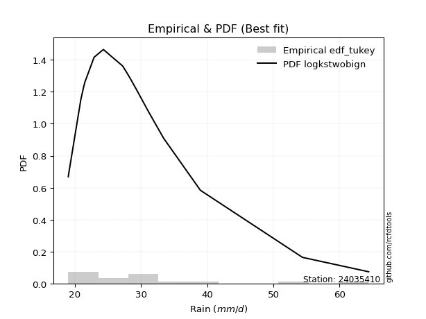</img>

</div>


### 8. Empirical - EDF Gringorten (1963)

Gringorten plotting position formula is essential for estimating the probability and return periods of extreme events like floods and heavy rainfall. The constant _a=0.44_.

<div align="center">


$P=(m-a)/(n+1-2a)$


</div>


**8.1. Empirical values**

<div align="center">

|                | 0                   | 1                   | 2                  | 3                   | 4                  | 5                  | 6                   | 7                  | 8                   | 9                  | 10                 | 11                 | 12                 | 13                 | 14                 | 15                 | 16                 | 17                 |
|:---------------|:--------------------|:--------------------|:-------------------|:--------------------|:-------------------|:-------------------|:--------------------|:-------------------|:--------------------|:-------------------|:-------------------|:-------------------|:-------------------|:-------------------|:-------------------|:-------------------|:-------------------|:-------------------|
| date           | 2021                | 2014                | 2019               | 2022                | 2008               | 2025               | 2020                | 2015               | 2009                | 2016               | 2011               | 2017               | 2012               | 2023               | 2010               | 2018               | 2013               | 2024               |
| x              | 19.0                | 19.1                | 20.9               | 21.3                | 21.5               | 22.6               | 22.9                | 24.3               | 27.2                | 27.6               | 28.2               | 28.4               | 29.8               | 31.2               | 33.4               | 38.58888888888889  | 54.4               | 64.4               |
| m              | 1                   | 2                   | 3                  | 4                   | 5                  | 6                  | 7                   | 8                  | 9                   | 10                 | 11                 | 12                 | 13                 | 14                 | 15                 | 16                 | 17                 | 18                 |
| empirical_dist | edf_gringorten      | edf_gringorten      | edf_gringorten     | edf_gringorten      | edf_gringorten     | edf_gringorten     | edf_gringorten      | edf_gringorten     | edf_gringorten      | edf_gringorten     | edf_gringorten     | edf_gringorten     | edf_gringorten     | edf_gringorten     | edf_gringorten     | edf_gringorten     | edf_gringorten     | edf_gringorten     |
| empirical      | 0.03090507726269316 | 0.08609271523178808 | 0.141280353200883  | 0.19646799116997793 | 0.2516556291390728 | 0.3068432671081677 | 0.36203090507726265 | 0.4172185430463576 | 0.47240618101545256 | 0.5275938189845475 | 0.5827814569536424 | 0.6379690949227373 | 0.6931567328918322 | 0.7483443708609271 | 0.8035320088300221 | 0.8587196467991169 | 0.9139072847682118 | 0.9690949227373067 |
| empirical_tr   | 1.031890660592255   | 1.0942028985507246  | 1.1645244215938304 | 1.2445054945054945  | 1.3362831858407078 | 1.4426751592356688 | 1.5674740484429064  | 1.7159090909090906 | 1.8953974895397487  | 2.1168224299065423 | 2.3968253968253967 | 2.76219512195122   | 3.2589928057553954 | 3.9736842105263146 | 5.089887640449438  | 7.078124999999997  | 11.6153846153846   | 32.35714285714269  |

</div>


**8.2. Kolmogorov-Smirnov fit test (sorted by Δ)**


<div align="center">

|                | 0                   | 1                   | 2                   | 3                   | 4                   | 5                   | 6                   | 7                   | 8                   | 9                   | 10                  | 11                  | 12                  | 13                  | 14                  | 15                  | 16                  | 17                  | 18                  | 19                  | 20                  | 21                  | 22                  | 23                  | 24                  | 25                  | 26                  | 27                  | 28                  | 29                  | 30                  | 31                  | 32                  | 33                  | 34                  | 35                  | 36                  | 37                  | 38                  | 39                  | 40                  | 41                  | 42                  | 43                  | 44                  | 45                  | 46                  | 47                  | 48                  | 49                  | 50                  | 51                  | 52                  | 53                  | 54                  | 55                  | 56                  | 57                  | 58                  | 59                  | 60                  | 61                  | 62                    | 63                  | 64                  | 65                  | 66                  | 67                  | 68                  | 69                  | 70                  | 71                  | 72                  | 73                  | 74                  | 75                  | 76                  | 77                  | 78                  | 79                  | 80                  | 81                  | 82                  | 83                  | 84                  | 85                  | 86                  | 87                  | 88                  | 89                  |
|:---------------|:--------------------|:--------------------|:--------------------|:--------------------|:--------------------|:--------------------|:--------------------|:--------------------|:--------------------|:--------------------|:--------------------|:--------------------|:--------------------|:--------------------|:--------------------|:--------------------|:--------------------|:--------------------|:--------------------|:--------------------|:--------------------|:--------------------|:--------------------|:--------------------|:--------------------|:--------------------|:--------------------|:--------------------|:--------------------|:--------------------|:--------------------|:--------------------|:--------------------|:--------------------|:--------------------|:--------------------|:--------------------|:--------------------|:--------------------|:--------------------|:--------------------|:--------------------|:--------------------|:--------------------|:--------------------|:--------------------|:--------------------|:--------------------|:--------------------|:--------------------|:--------------------|:--------------------|:--------------------|:--------------------|:--------------------|:--------------------|:--------------------|:--------------------|:--------------------|:--------------------|:--------------------|:--------------------|:----------------------|:--------------------|:--------------------|:--------------------|:--------------------|:--------------------|:--------------------|:--------------------|:--------------------|:--------------------|:--------------------|:--------------------|:--------------------|:--------------------|:--------------------|:--------------------|:--------------------|:--------------------|:--------------------|:--------------------|:--------------------|:--------------------|:--------------------|:--------------------|:--------------------|:--------------------|:--------------------|:--------------------|
| station        | 24035410            | 24035410            | 24035410            | 24035410            | 24035410            | 24035410            | 24035410            | 24035410            | 24035410            | 24035410            | 24035410            | 24035410            | 24035410            | 24035410            | 24035410            | 24035410            | 24035410            | 24035410            | 24035410            | 24035410            | 24035410            | 24035410            | 24035410            | 24035410            | 24035410            | 24035410            | 24035410            | 24035410            | 24035410            | 24035410            | 24035410            | 24035410            | 24035410            | 24035410            | 24035410            | 24035410            | 24035410            | 24035410            | 24035410            | 24035410            | 24035410            | 24035410            | 24035410            | 24035410            | 24035410            | 24035410            | 24035410            | 24035410            | 24035410            | 24035410            | 24035410            | 24035410            | 24035410            | 24035410            | 24035410            | 24035410            | 24035410            | 24035410            | 24035410            | 24035410            | 24035410            | 24035410            | 24035410              | 24035410            | 24035410            | 24035410            | 24035410            | 24035410            | 24035410            | 24035410            | 24035410            | 24035410            | 24035410            | 24035410            | 24035410            | 24035410            | 24035410            | 24035410            | 24035410            | 24035410            | 24035410            | 24035410            | 24035410            | 24035410            | 24035410            | 24035410            | 24035410            | 24035410            | 24035410            | 24035410            |
| empirical_dist | edf_gringorten      | edf_gringorten      | edf_gringorten      | edf_gringorten      | edf_gringorten      | edf_gringorten      | edf_gringorten      | edf_gringorten      | edf_gringorten      | edf_gringorten      | edf_gringorten      | edf_gringorten      | edf_gringorten      | edf_gringorten      | edf_gringorten      | edf_gringorten      | edf_gringorten      | edf_gringorten      | edf_gringorten      | edf_gringorten      | edf_gringorten      | edf_gringorten      | edf_gringorten      | edf_gringorten      | edf_gringorten      | edf_gringorten      | edf_gringorten      | edf_gringorten      | edf_gringorten      | edf_gringorten      | edf_gringorten      | edf_gringorten      | edf_gringorten      | edf_gringorten      | edf_gringorten      | edf_gringorten      | edf_gringorten      | edf_gringorten      | edf_gringorten      | edf_gringorten      | edf_gringorten      | edf_gringorten      | edf_gringorten      | edf_gringorten      | edf_gringorten      | edf_gringorten      | edf_gringorten      | edf_gringorten      | edf_gringorten      | edf_gringorten      | edf_gringorten      | edf_gringorten      | edf_gringorten      | edf_gringorten      | edf_gringorten      | edf_gringorten      | edf_gringorten      | edf_gringorten      | edf_gringorten      | edf_gringorten      | edf_gringorten      | edf_gringorten      | edf_gringorten        | edf_gringorten      | edf_gringorten      | edf_gringorten      | edf_gringorten      | edf_gringorten      | edf_gringorten      | edf_gringorten      | edf_gringorten      | edf_gringorten      | edf_gringorten      | edf_gringorten      | edf_gringorten      | edf_gringorten      | edf_gringorten      | edf_gringorten      | edf_gringorten      | edf_gringorten      | edf_gringorten      | edf_gringorten      | edf_gringorten      | edf_gringorten      | edf_gringorten      | edf_gringorten      | edf_gringorten      | edf_gringorten      | edf_gringorten      | edf_gringorten      |
| p_dist         | logbetaprime        | logpearson3         | loggumbel_r         | loghalfnorm         | exponnorm           | laplace_asymmetric  | expon               | genexpon            | gompertz            | loggenlogistic      | lograyleigh         | loggompertz         | logmoyal            | lognct              | truncnorm           | pareto              | logkstwobign        | logt                | logmaxwell          | loghalflogistic     | pearson3            | wald                | loggenexpon         | nct                 | betaprime           | fatiguelife         | logalpha            | genlogistic         | invgauss            | fisk                | loginvweibull       | logf                | loginvgamma         | johnsonsu           | alpha               | invgamma            | ncf                 | logtruncnorm        | moyal               | erlang              | loglognorm          | invweibull          | loginvgauss         | logmielke           | logjohnsonsu        | logfisk             | logrice             | logfatiguelife      | loglogistic         | logcrystalball      | lognorm             | lognorm             | logloggamma         | logexponnorm        | halflogistic        | weibull_min         | loghypsecant        | logexpon            | logpareto           | gumbel_r            | f                   | t                   | loglaplace_asymmetric | gamma               | logncf              | lognakagami         | kstwobign           | nakagami            | loglaplace          | rayleigh            | halfnorm            | maxwell             | logweibull_min      | loggumbel_l         | logistic            | hypsecant           | logwald             | rice                | logerlang           | crystalball         | norm                | laplace             | loggamma            | loggamma            | gibrat              | loggibrat           | gumbel_l            | logchi2             | chi2                | mielke              |
| delta          | 0.06762597654091904 | 0.06936298624591358 | 0.0705831485664064  | 0.07185749136231862 | 0.07552442843169371 | 0.07645496089436199 | 0.07679952864128557 | 0.07679954240148466 | 0.08212275630531973 | 0.08404285721202104 | 0.08674202570868939 | 0.08721053626918784 | 0.08740946606198335 | 0.08860548414878827 | 0.09050995885801871 | 0.09128628998858695 | 0.09163517265941035 | 0.09332124866284211 | 0.0939302760300067  | 0.09432925449027801 | 0.09446836548093156 | 0.09496409760258523 | 0.09537373079871053 | 0.09708390246535908 | 0.10112614379469231 | 0.10617548758197887 | 0.10659701002148952 | 0.10791977471457531 | 0.1098879762685872  | 0.111699818761202   | 0.11212511761979799 | 0.11243943563644448 | 0.11244215022664789 | 0.11254931212183966 | 0.11328112932104756 | 0.11337528207553976 | 0.1133755693129524  | 0.11415368789002961 | 0.11438377562639866 | 0.11471562266812924 | 0.11523132359055915 | 0.11529915265155238 | 0.11543323676511336 | 0.11547464876458963 | 0.1156142028248171  | 0.11579303819500769 | 0.11678433620166762 | 0.11713587580904955 | 0.11713874580073635 | 0.11963816641064673 | 0.11963852765662064 | 0.11963852765662064 | 0.1227648349529259  | 0.1259871831637847  | 0.1284872747655676  | 0.12941943663364608 | 0.12995005632497347 | 0.13193875243186043 | 0.13193876090867468 | 0.13363509623466388 | 0.13426883164249476 | 0.1353283314361836  | 0.14128767511892412   | 0.14468775573600795 | 0.1469607369293996  | 0.1489409119113883  | 0.15047201887556683 | 0.15070163715079088 | 0.1519948582385182  | 0.16317481525566344 | 0.16582925206598564 | 0.16760628582424686 | 0.17956639021603665 | 0.18922657532736153 | 0.19118826210969808 | 0.19337983915400436 | 0.1937777750528091  | 0.19624743135355632 | 0.19652576259896132 | 0.19797260119594895 | 0.19797261836149982 | 0.2108404466418453  | 0.21917385273321238 | 0.21917385273321238 | 0.22679819361377945 | 0.2516556291390728  | 0.26496664968718164 | 0.2710996699865954  | 0.2824831668679864  | nan                 |
| deltao         | 0.32102346734599996 | 0.32102346734599996 | 0.32102346734599996 | 0.32102346734599996 | 0.32102346734599996 | 0.32102346734599996 | 0.32102346734599996 | 0.32102346734599996 | 0.32102346734599996 | 0.32102346734599996 | 0.32102346734599996 | 0.32102346734599996 | 0.32102346734599996 | 0.32102346734599996 | 0.32102346734599996 | 0.32102346734599996 | 0.32102346734599996 | 0.32102346734599996 | 0.32102346734599996 | 0.32102346734599996 | 0.32102346734599996 | 0.32102346734599996 | 0.32102346734599996 | 0.32102346734599996 | 0.32102346734599996 | 0.32102346734599996 | 0.32102346734599996 | 0.32102346734599996 | 0.32102346734599996 | 0.32102346734599996 | 0.32102346734599996 | 0.32102346734599996 | 0.32102346734599996 | 0.32102346734599996 | 0.32102346734599996 | 0.32102346734599996 | 0.32102346734599996 | 0.32102346734599996 | 0.32102346734599996 | 0.32102346734599996 | 0.32102346734599996 | 0.32102346734599996 | 0.32102346734599996 | 0.32102346734599996 | 0.32102346734599996 | 0.32102346734599996 | 0.32102346734599996 | 0.32102346734599996 | 0.32102346734599996 | 0.32102346734599996 | 0.32102346734599996 | 0.32102346734599996 | 0.32102346734599996 | 0.32102346734599996 | 0.32102346734599996 | 0.32102346734599996 | 0.32102346734599996 | 0.32102346734599996 | 0.32102346734599996 | 0.32102346734599996 | 0.32102346734599996 | 0.32102346734599996 | 0.32102346734599996   | 0.32102346734599996 | 0.32102346734599996 | 0.32102346734599996 | 0.32102346734599996 | 0.32102346734599996 | 0.32102346734599996 | 0.32102346734599996 | 0.32102346734599996 | 0.32102346734599996 | 0.32102346734599996 | 0.32102346734599996 | 0.32102346734599996 | 0.32102346734599996 | 0.32102346734599996 | 0.32102346734599996 | 0.32102346734599996 | 0.32102346734599996 | 0.32102346734599996 | 0.32102346734599996 | 0.32102346734599996 | 0.32102346734599996 | 0.32102346734599996 | 0.32102346734599996 | 0.32102346734599996 | 0.32102346734599996 | 0.32102346734599996 | 0.32102346734599996 |
| eval           | Δo > Δ              | Δo > Δ              | Δo > Δ              | Δo > Δ              | Δo > Δ              | Δo > Δ              | Δo > Δ              | Δo > Δ              | Δo > Δ              | Δo > Δ              | Δo > Δ              | Δo > Δ              | Δo > Δ              | Δo > Δ              | Δo > Δ              | Δo > Δ              | Δo > Δ              | Δo > Δ              | Δo > Δ              | Δo > Δ              | Δo > Δ              | Δo > Δ              | Δo > Δ              | Δo > Δ              | Δo > Δ              | Δo > Δ              | Δo > Δ              | Δo > Δ              | Δo > Δ              | Δo > Δ              | Δo > Δ              | Δo > Δ              | Δo > Δ              | Δo > Δ              | Δo > Δ              | Δo > Δ              | Δo > Δ              | Δo > Δ              | Δo > Δ              | Δo > Δ              | Δo > Δ              | Δo > Δ              | Δo > Δ              | Δo > Δ              | Δo > Δ              | Δo > Δ              | Δo > Δ              | Δo > Δ              | Δo > Δ              | Δo > Δ              | Δo > Δ              | Δo > Δ              | Δo > Δ              | Δo > Δ              | Δo > Δ              | Δo > Δ              | Δo > Δ              | Δo > Δ              | Δo > Δ              | Δo > Δ              | Δo > Δ              | Δo > Δ              | Δo > Δ                | Δo > Δ              | Δo > Δ              | Δo > Δ              | Δo > Δ              | Δo > Δ              | Δo > Δ              | Δo > Δ              | Δo > Δ              | Δo > Δ              | Δo > Δ              | Δo > Δ              | Δo > Δ              | Δo > Δ              | Δo > Δ              | Δo > Δ              | Δo > Δ              | Δo > Δ              | Δo > Δ              | Δo > Δ              | Δo > Δ              | Δo > Δ              | Δo > Δ              | Δo > Δ              | Δo > Δ              | Δo > Δ              | Δo > Δ              | Δo <= Δ             |
| fit            | 1                   | 1                   | 1                   | 1                   | 1                   | 1                   | 1                   | 1                   | 1                   | 1                   | 1                   | 1                   | 1                   | 1                   | 1                   | 1                   | 1                   | 1                   | 1                   | 1                   | 1                   | 1                   | 1                   | 1                   | 1                   | 1                   | 1                   | 1                   | 1                   | 1                   | 1                   | 1                   | 1                   | 1                   | 1                   | 1                   | 1                   | 1                   | 1                   | 1                   | 1                   | 1                   | 1                   | 1                   | 1                   | 1                   | 1                   | 1                   | 1                   | 1                   | 1                   | 1                   | 1                   | 1                   | 1                   | 1                   | 1                   | 1                   | 1                   | 1                   | 1                   | 1                   | 1                     | 1                   | 1                   | 1                   | 1                   | 1                   | 1                   | 1                   | 1                   | 1                   | 1                   | 1                   | 1                   | 1                   | 1                   | 1                   | 1                   | 1                   | 1                   | 1                   | 1                   | 1                   | 1                   | 1                   | 1                   | 1                   | 1                   | 0                   |
| n              | 18                  | 18                  | 18                  | 18                  | 18                  | 18                  | 18                  | 18                  | 18                  | 18                  | 18                  | 18                  | 18                  | 18                  | 18                  | 18                  | 18                  | 18                  | 18                  | 18                  | 18                  | 18                  | 18                  | 18                  | 18                  | 18                  | 18                  | 18                  | 18                  | 18                  | 18                  | 18                  | 18                  | 18                  | 18                  | 18                  | 18                  | 18                  | 18                  | 18                  | 18                  | 18                  | 18                  | 18                  | 18                  | 18                  | 18                  | 18                  | 18                  | 18                  | 18                  | 18                  | 18                  | 18                  | 18                  | 18                  | 18                  | 18                  | 18                  | 18                  | 18                  | 18                  | 18                    | 18                  | 18                  | 18                  | 18                  | 18                  | 18                  | 18                  | 18                  | 18                  | 18                  | 18                  | 18                  | 18                  | 18                  | 18                  | 18                  | 18                  | 18                  | 18                  | 18                  | 18                  | 18                  | 18                  | 18                  | 18                  | 18                  | 18                  |
| best_fit       | 1                   | 0                   | 0                   | 0                   | 0                   | 0                   | 0                   | 0                   | 0                   | 0                   | 0                   | 0                   | 0                   | 0                   | 0                   | 0                   | 0                   | 0                   | 0                   | 0                   | 0                   | 0                   | 0                   | 0                   | 0                   | 0                   | 0                   | 0                   | 0                   | 0                   | 0                   | 0                   | 0                   | 0                   | 0                   | 0                   | 0                   | 0                   | 0                   | 0                   | 0                   | 0                   | 0                   | 0                   | 0                   | 0                   | 0                   | 0                   | 0                   | 0                   | 0                   | 0                   | 0                   | 0                   | 0                   | 0                   | 0                   | 0                   | 0                   | 0                   | 0                   | 0                   | 0                     | 0                   | 0                   | 0                   | 0                   | 0                   | 0                   | 0                   | 0                   | 0                   | 0                   | 0                   | 0                   | 0                   | 0                   | 0                   | 0                   | 0                   | 0                   | 0                   | 0                   | 0                   | 0                   | 0                   | 0                   | 0                   | 0                   | 0                   |
| best_fit_sort  | 1                   | 2                   | 3                   | 4                   | 5                   | 6                   | 7                   | 8                   | 9                   | 10                  | 11                  | 12                  | 13                  | 14                  | 15                  | 16                  | 17                  | 18                  | 19                  | 20                  | 21                  | 22                  | 23                  | 24                  | 25                  | 26                  | 27                  | 28                  | 29                  | 30                  | 31                  | 32                  | 33                  | 34                  | 35                  | 36                  | 37                  | 38                  | 39                  | 40                  | 41                  | 42                  | 43                  | 44                  | 45                  | 46                  | 47                  | 48                  | 49                  | 50                  | 51                  | 52                  | 53                  | 54                  | 55                  | 56                  | 57                  | 58                  | 59                  | 60                  | 61                  | 62                  | 63                    | 64                  | 65                  | 66                  | 67                  | 68                  | 69                  | 70                  | 71                  | 72                  | 73                  | 74                  | 75                  | 76                  | 77                  | 78                  | 79                  | 80                  | 81                  | 82                  | 83                  | 84                  | 85                  | 86                  | 87                  | 88                  | 89                  | 90                  |

</div>


<div align="center">

</img>

</div>


**8.3. Best fit**

<div align="center">

|   id |   station | empirical_dist   | p_dist       |    delta |   deltao | eval   |   fit |   n |   best_fit |   best_fit_sort |
|-----:|----------:|:-----------------|:-------------|---------:|---------:|:-------|------:|----:|-----------:|----------------:|
|    0 |  24035410 | edf_gringorten   | logbetaprime | 0.067626 | 0.321023 | Δo > Δ |     1 |  18 |          1 |               1 |

</div>


<div align="center">

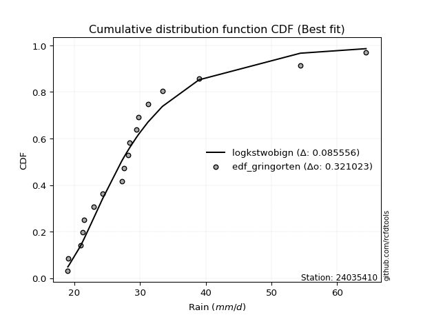</img></img>

</div>


### 9. Empirical - EDF Filliben (1975)

The specific values of the constants (0.3175) (often denoted as $alpha$) and (0.365) are derived from a method proposed by James J. Filliben in a 1975 paper. This particular formula is the mean value of the $i$-th order statistic of the normal distribution and is considered a robust and effective plotting position formula for the normal probability plot correlation coefficient test for normality.

<div align="center">


$P=(m-0.3175)/(n+0.365)$


</div>


**9.1. Empirical values**

<div align="center">

|                | 0                  | 1                  | 2                   | 3                   | 4                   | 5                  | 6                   | 7                  | 8                   | 9                  | 10                | 11                 | 12                 | 13                 | 14                 | 15                 | 16                 | 17                 |
|:---------------|:-------------------|:-------------------|:--------------------|:--------------------|:--------------------|:-------------------|:--------------------|:-------------------|:--------------------|:-------------------|:------------------|:-------------------|:-------------------|:-------------------|:-------------------|:-------------------|:-------------------|:-------------------|
| date           | 2021               | 2014               | 2019                | 2022                | 2008                | 2025               | 2020                | 2015               | 2009                | 2016               | 2011              | 2017               | 2012               | 2023               | 2010               | 2018               | 2013               | 2024               |
| x              | 19.0               | 19.1               | 20.9                | 21.3                | 21.5                | 22.6               | 22.9                | 24.3               | 27.2                | 27.6               | 28.2              | 28.4               | 29.8               | 31.2               | 33.4               | 38.58888888888889  | 54.4               | 64.4               |
| m              | 1                  | 2                  | 3                   | 4                   | 5                   | 6                  | 7                   | 8                  | 9                   | 10                 | 11                | 12                 | 13                 | 14                 | 15                 | 16                 | 17                 | 18                 |
| empirical_dist | edf_filliben       | edf_filliben       | edf_filliben        | edf_filliben        | edf_filliben        | edf_filliben       | edf_filliben        | edf_filliben       | edf_filliben        | edf_filliben       | edf_filliben      | edf_filliben       | edf_filliben       | edf_filliben       | edf_filliben       | edf_filliben       | edf_filliben       | edf_filliben       |
| empirical      | 0.0371630819493602 | 0.0916144840729649 | 0.14606588619656957 | 0.20051728832017426 | 0.25496869044377896 | 0.3094200925673836 | 0.36387149469098834 | 0.418322896814593  | 0.47277429893819767 | 0.5272257010618023 | 0.581677103185407 | 0.6361285053090118 | 0.6905799074326164 | 0.7450313095562211 | 0.7994827116798258 | 0.8539341138034304 | 0.9083855159270352 | 0.96283691805064   |
| empirical_tr   | 1.03859748338753   | 1.100854188520905  | 1.1710505340347521  | 1.2508087859696917  | 1.3422254704915038  | 1.4480583481174847 | 1.5720094157928526  | 1.7191668616896794 | 1.8967208882003614  | 2.1151742009789807 | 2.390497884803124 | 2.7482229704451933 | 3.2318521777386717 | 3.9220501868659907 | 4.987101154107265  | 6.846225535880707  | 10.915304606240722 | 26.908424908425033 |

</div>


**9.2. Kolmogorov-Smirnov fit test (sorted by Δ)**


<div align="center">

|                | 0                   | 1                   | 2                   | 3                   | 4                   | 5                   | 6                   | 7                   | 8                   | 9                   | 10                  | 11                  | 12                  | 13                  | 14                  | 15                  | 16                  | 17                  | 18                  | 19                  | 20                  | 21                  | 22                  | 23                  | 24                  | 25                  | 26                  | 27                  | 28                  | 29                  | 30                  | 31                  | 32                  | 33                  | 34                  | 35                  | 36                  | 37                  | 38                  | 39                  | 40                  | 41                  | 42                  | 43                  | 44                  | 45                  | 46                  | 47                  | 48                  | 49                  | 50                  | 51                  | 52                  | 53                  | 54                  | 55                  | 56                  | 57                  | 58                  | 59                  | 60                  | 61                  | 62                  | 63                    | 64                  | 65                  | 66                  | 67                  | 68                  | 69                  | 70                  | 71                  | 72                  | 73                  | 74                  | 75                  | 76                  | 77                  | 78                  | 79                  | 80                  | 81                  | 82                  | 83                  | 84                  | 85                  | 86                  | 87                  | 88                  | 89                  |
|:---------------|:--------------------|:--------------------|:--------------------|:--------------------|:--------------------|:--------------------|:--------------------|:--------------------|:--------------------|:--------------------|:--------------------|:--------------------|:--------------------|:--------------------|:--------------------|:--------------------|:--------------------|:--------------------|:--------------------|:--------------------|:--------------------|:--------------------|:--------------------|:--------------------|:--------------------|:--------------------|:--------------------|:--------------------|:--------------------|:--------------------|:--------------------|:--------------------|:--------------------|:--------------------|:--------------------|:--------------------|:--------------------|:--------------------|:--------------------|:--------------------|:--------------------|:--------------------|:--------------------|:--------------------|:--------------------|:--------------------|:--------------------|:--------------------|:--------------------|:--------------------|:--------------------|:--------------------|:--------------------|:--------------------|:--------------------|:--------------------|:--------------------|:--------------------|:--------------------|:--------------------|:--------------------|:--------------------|:--------------------|:----------------------|:--------------------|:--------------------|:--------------------|:--------------------|:--------------------|:--------------------|:--------------------|:--------------------|:--------------------|:--------------------|:--------------------|:--------------------|:--------------------|:--------------------|:--------------------|:--------------------|:--------------------|:--------------------|:--------------------|:--------------------|:--------------------|:--------------------|:--------------------|:--------------------|:--------------------|:--------------------|
| station        | 24035410            | 24035410            | 24035410            | 24035410            | 24035410            | 24035410            | 24035410            | 24035410            | 24035410            | 24035410            | 24035410            | 24035410            | 24035410            | 24035410            | 24035410            | 24035410            | 24035410            | 24035410            | 24035410            | 24035410            | 24035410            | 24035410            | 24035410            | 24035410            | 24035410            | 24035410            | 24035410            | 24035410            | 24035410            | 24035410            | 24035410            | 24035410            | 24035410            | 24035410            | 24035410            | 24035410            | 24035410            | 24035410            | 24035410            | 24035410            | 24035410            | 24035410            | 24035410            | 24035410            | 24035410            | 24035410            | 24035410            | 24035410            | 24035410            | 24035410            | 24035410            | 24035410            | 24035410            | 24035410            | 24035410            | 24035410            | 24035410            | 24035410            | 24035410            | 24035410            | 24035410            | 24035410            | 24035410            | 24035410              | 24035410            | 24035410            | 24035410            | 24035410            | 24035410            | 24035410            | 24035410            | 24035410            | 24035410            | 24035410            | 24035410            | 24035410            | 24035410            | 24035410            | 24035410            | 24035410            | 24035410            | 24035410            | 24035410            | 24035410            | 24035410            | 24035410            | 24035410            | 24035410            | 24035410            | 24035410            |
| empirical_dist | edf_filliben        | edf_filliben        | edf_filliben        | edf_filliben        | edf_filliben        | edf_filliben        | edf_filliben        | edf_filliben        | edf_filliben        | edf_filliben        | edf_filliben        | edf_filliben        | edf_filliben        | edf_filliben        | edf_filliben        | edf_filliben        | edf_filliben        | edf_filliben        | edf_filliben        | edf_filliben        | edf_filliben        | edf_filliben        | edf_filliben        | edf_filliben        | edf_filliben        | edf_filliben        | edf_filliben        | edf_filliben        | edf_filliben        | edf_filliben        | edf_filliben        | edf_filliben        | edf_filliben        | edf_filliben        | edf_filliben        | edf_filliben        | edf_filliben        | edf_filliben        | edf_filliben        | edf_filliben        | edf_filliben        | edf_filliben        | edf_filliben        | edf_filliben        | edf_filliben        | edf_filliben        | edf_filliben        | edf_filliben        | edf_filliben        | edf_filliben        | edf_filliben        | edf_filliben        | edf_filliben        | edf_filliben        | edf_filliben        | edf_filliben        | edf_filliben        | edf_filliben        | edf_filliben        | edf_filliben        | edf_filliben        | edf_filliben        | edf_filliben        | edf_filliben          | edf_filliben        | edf_filliben        | edf_filliben        | edf_filliben        | edf_filliben        | edf_filliben        | edf_filliben        | edf_filliben        | edf_filliben        | edf_filliben        | edf_filliben        | edf_filliben        | edf_filliben        | edf_filliben        | edf_filliben        | edf_filliben        | edf_filliben        | edf_filliben        | edf_filliben        | edf_filliben        | edf_filliben        | edf_filliben        | edf_filliben        | edf_filliben        | edf_filliben        | edf_filliben        |
| p_dist         | logbetaprime        | logpearson3         | loghalfnorm         | loggumbel_r         | exponnorm           | laplace_asymmetric  | expon               | genexpon            | gompertz            | lograyleigh         | loggompertz         | loggenlogistic      | logmoyal            | logt                | truncnorm           | pearson3            | lognct              | logmaxwell          | pareto              | logkstwobign        | loghalflogistic     | wald                | loggenexpon         | nct                 | betaprime           | fatiguelife         | logalpha            | moyal               | invgauss            | genlogistic         | fisk                | loginvweibull       | logf                | loginvgamma         | johnsonsu           | alpha               | invgamma            | ncf                 | logtruncnorm        | erlang              | loglognorm          | invweibull          | loginvgauss         | logmielke           | logjohnsonsu        | logfisk             | loglogistic         | logfatiguelife      | logcrystalball      | lognorm             | lognorm             | logrice             | logloggamma         | halflogistic        | weibull_min         | logexponnorm        | gumbel_r            | t                   | logexpon            | logpareto           | loghypsecant        | f                   | logncf              | loglaplace_asymmetric | gamma               | nakagami            | lognakagami         | kstwobign           | loglaplace          | rayleigh            | halfnorm            | maxwell             | logweibull_min      | loggumbel_l         | logistic            | hypsecant           | rice                | crystalball         | norm                | logerlang           | logwald             | laplace             | loggamma            | loggamma            | gibrat              | loggibrat           | gumbel_l            | logchi2             | chi2                | mielke              |
| delta          | 0.06859587802209044 | 0.06899486832316848 | 0.07148937343957351 | 0.07242373818013209 | 0.08104619727287053 | 0.08197672973553881 | 0.08232129748246239 | 0.08232131124266148 | 0.08266072768669952 | 0.0834289644039834  | 0.08389747496448186 | 0.08588344682574672 | 0.08704134813923825 | 0.08706324397617507 | 0.08719689755331272 | 0.08821036079426452 | 0.09044607376251396 | 0.09061721472530071 | 0.09091817206584185 | 0.09347576227313603 | 0.09396113656753291 | 0.09459597967984013 | 0.09500561287596543 | 0.09892449207908477 | 0.09928555418096674 | 0.10580736965923376 | 0.10622889209874442 | 0.10812577093973162 | 0.1095198583458421  | 0.109760364328301   | 0.11133170083845689 | 0.11175699969705288 | 0.11207131771369938 | 0.11207403230390278 | 0.11218119419909456 | 0.11291301139830245 | 0.11300716415279466 | 0.11300745139020729 | 0.1137855699672845  | 0.11434750474538413 | 0.11486320566781405 | 0.11493103472880728 | 0.11506511884236825 | 0.11510653084184452 | 0.115246084902072   | 0.11542492027226259 | 0.11644638655610429 | 0.11676775788630445 | 0.11779757679692116 | 0.11779793804289507 | 0.11779793804289507 | 0.1186249258153933  | 0.11948258570238579 | 0.12222927007890054 | 0.12537013948344977 | 0.1256190652410396  | 0.1273770915479968  | 0.12907032674951657 | 0.13157063450911533 | 0.13157064298592958 | 0.13179064593869916 | 0.13390071371974965 | 0.14070273224273255 | 0.1431282647326498    | 0.14431963781326285 | 0.14665234000059457 | 0.1485727939886432  | 0.14863142926184125 | 0.15383544785224387 | 0.15691681056899637 | 0.1595712473793186  | 0.16429322451954087 | 0.17919827229329155 | 0.18738598571363596 | 0.1878752008049921  | 0.1915392495402788  | 0.19440684173983075 | 0.19465953989124296 | 0.19465955705679383 | 0.19615764467621621 | 0.19709083635751526 | 0.20899985702811974 | 0.21880573481046728 | 0.21880573481046728 | 0.2301112549184856  | 0.25496869044377896 | 0.26165358838247565 | 0.2663141369909089  | 0.2821150489452413  | nan                 |
| deltao         | 0.32102346734599996 | 0.32102346734599996 | 0.32102346734599996 | 0.32102346734599996 | 0.32102346734599996 | 0.32102346734599996 | 0.32102346734599996 | 0.32102346734599996 | 0.32102346734599996 | 0.32102346734599996 | 0.32102346734599996 | 0.32102346734599996 | 0.32102346734599996 | 0.32102346734599996 | 0.32102346734599996 | 0.32102346734599996 | 0.32102346734599996 | 0.32102346734599996 | 0.32102346734599996 | 0.32102346734599996 | 0.32102346734599996 | 0.32102346734599996 | 0.32102346734599996 | 0.32102346734599996 | 0.32102346734599996 | 0.32102346734599996 | 0.32102346734599996 | 0.32102346734599996 | 0.32102346734599996 | 0.32102346734599996 | 0.32102346734599996 | 0.32102346734599996 | 0.32102346734599996 | 0.32102346734599996 | 0.32102346734599996 | 0.32102346734599996 | 0.32102346734599996 | 0.32102346734599996 | 0.32102346734599996 | 0.32102346734599996 | 0.32102346734599996 | 0.32102346734599996 | 0.32102346734599996 | 0.32102346734599996 | 0.32102346734599996 | 0.32102346734599996 | 0.32102346734599996 | 0.32102346734599996 | 0.32102346734599996 | 0.32102346734599996 | 0.32102346734599996 | 0.32102346734599996 | 0.32102346734599996 | 0.32102346734599996 | 0.32102346734599996 | 0.32102346734599996 | 0.32102346734599996 | 0.32102346734599996 | 0.32102346734599996 | 0.32102346734599996 | 0.32102346734599996 | 0.32102346734599996 | 0.32102346734599996 | 0.32102346734599996   | 0.32102346734599996 | 0.32102346734599996 | 0.32102346734599996 | 0.32102346734599996 | 0.32102346734599996 | 0.32102346734599996 | 0.32102346734599996 | 0.32102346734599996 | 0.32102346734599996 | 0.32102346734599996 | 0.32102346734599996 | 0.32102346734599996 | 0.32102346734599996 | 0.32102346734599996 | 0.32102346734599996 | 0.32102346734599996 | 0.32102346734599996 | 0.32102346734599996 | 0.32102346734599996 | 0.32102346734599996 | 0.32102346734599996 | 0.32102346734599996 | 0.32102346734599996 | 0.32102346734599996 | 0.32102346734599996 | 0.32102346734599996 |
| eval           | Δo > Δ              | Δo > Δ              | Δo > Δ              | Δo > Δ              | Δo > Δ              | Δo > Δ              | Δo > Δ              | Δo > Δ              | Δo > Δ              | Δo > Δ              | Δo > Δ              | Δo > Δ              | Δo > Δ              | Δo > Δ              | Δo > Δ              | Δo > Δ              | Δo > Δ              | Δo > Δ              | Δo > Δ              | Δo > Δ              | Δo > Δ              | Δo > Δ              | Δo > Δ              | Δo > Δ              | Δo > Δ              | Δo > Δ              | Δo > Δ              | Δo > Δ              | Δo > Δ              | Δo > Δ              | Δo > Δ              | Δo > Δ              | Δo > Δ              | Δo > Δ              | Δo > Δ              | Δo > Δ              | Δo > Δ              | Δo > Δ              | Δo > Δ              | Δo > Δ              | Δo > Δ              | Δo > Δ              | Δo > Δ              | Δo > Δ              | Δo > Δ              | Δo > Δ              | Δo > Δ              | Δo > Δ              | Δo > Δ              | Δo > Δ              | Δo > Δ              | Δo > Δ              | Δo > Δ              | Δo > Δ              | Δo > Δ              | Δo > Δ              | Δo > Δ              | Δo > Δ              | Δo > Δ              | Δo > Δ              | Δo > Δ              | Δo > Δ              | Δo > Δ              | Δo > Δ                | Δo > Δ              | Δo > Δ              | Δo > Δ              | Δo > Δ              | Δo > Δ              | Δo > Δ              | Δo > Δ              | Δo > Δ              | Δo > Δ              | Δo > Δ              | Δo > Δ              | Δo > Δ              | Δo > Δ              | Δo > Δ              | Δo > Δ              | Δo > Δ              | Δo > Δ              | Δo > Δ              | Δo > Δ              | Δo > Δ              | Δo > Δ              | Δo > Δ              | Δo > Δ              | Δo > Δ              | Δo > Δ              | Δo <= Δ             |
| fit            | 1                   | 1                   | 1                   | 1                   | 1                   | 1                   | 1                   | 1                   | 1                   | 1                   | 1                   | 1                   | 1                   | 1                   | 1                   | 1                   | 1                   | 1                   | 1                   | 1                   | 1                   | 1                   | 1                   | 1                   | 1                   | 1                   | 1                   | 1                   | 1                   | 1                   | 1                   | 1                   | 1                   | 1                   | 1                   | 1                   | 1                   | 1                   | 1                   | 1                   | 1                   | 1                   | 1                   | 1                   | 1                   | 1                   | 1                   | 1                   | 1                   | 1                   | 1                   | 1                   | 1                   | 1                   | 1                   | 1                   | 1                   | 1                   | 1                   | 1                   | 1                   | 1                   | 1                   | 1                     | 1                   | 1                   | 1                   | 1                   | 1                   | 1                   | 1                   | 1                   | 1                   | 1                   | 1                   | 1                   | 1                   | 1                   | 1                   | 1                   | 1                   | 1                   | 1                   | 1                   | 1                   | 1                   | 1                   | 1                   | 1                   | 0                   |
| n              | 18                  | 18                  | 18                  | 18                  | 18                  | 18                  | 18                  | 18                  | 18                  | 18                  | 18                  | 18                  | 18                  | 18                  | 18                  | 18                  | 18                  | 18                  | 18                  | 18                  | 18                  | 18                  | 18                  | 18                  | 18                  | 18                  | 18                  | 18                  | 18                  | 18                  | 18                  | 18                  | 18                  | 18                  | 18                  | 18                  | 18                  | 18                  | 18                  | 18                  | 18                  | 18                  | 18                  | 18                  | 18                  | 18                  | 18                  | 18                  | 18                  | 18                  | 18                  | 18                  | 18                  | 18                  | 18                  | 18                  | 18                  | 18                  | 18                  | 18                  | 18                  | 18                  | 18                  | 18                    | 18                  | 18                  | 18                  | 18                  | 18                  | 18                  | 18                  | 18                  | 18                  | 18                  | 18                  | 18                  | 18                  | 18                  | 18                  | 18                  | 18                  | 18                  | 18                  | 18                  | 18                  | 18                  | 18                  | 18                  | 18                  | 18                  |
| best_fit       | 1                   | 0                   | 0                   | 0                   | 0                   | 0                   | 0                   | 0                   | 0                   | 0                   | 0                   | 0                   | 0                   | 0                   | 0                   | 0                   | 0                   | 0                   | 0                   | 0                   | 0                   | 0                   | 0                   | 0                   | 0                   | 0                   | 0                   | 0                   | 0                   | 0                   | 0                   | 0                   | 0                   | 0                   | 0                   | 0                   | 0                   | 0                   | 0                   | 0                   | 0                   | 0                   | 0                   | 0                   | 0                   | 0                   | 0                   | 0                   | 0                   | 0                   | 0                   | 0                   | 0                   | 0                   | 0                   | 0                   | 0                   | 0                   | 0                   | 0                   | 0                   | 0                   | 0                   | 0                     | 0                   | 0                   | 0                   | 0                   | 0                   | 0                   | 0                   | 0                   | 0                   | 0                   | 0                   | 0                   | 0                   | 0                   | 0                   | 0                   | 0                   | 0                   | 0                   | 0                   | 0                   | 0                   | 0                   | 0                   | 0                   | 0                   |
| best_fit_sort  | 1                   | 2                   | 3                   | 4                   | 5                   | 6                   | 7                   | 8                   | 9                   | 10                  | 11                  | 12                  | 13                  | 14                  | 15                  | 16                  | 17                  | 18                  | 19                  | 20                  | 21                  | 22                  | 23                  | 24                  | 25                  | 26                  | 27                  | 28                  | 29                  | 30                  | 31                  | 32                  | 33                  | 34                  | 35                  | 36                  | 37                  | 38                  | 39                  | 40                  | 41                  | 42                  | 43                  | 44                  | 45                  | 46                  | 47                  | 48                  | 49                  | 50                  | 51                  | 52                  | 53                  | 54                  | 55                  | 56                  | 57                  | 58                  | 59                  | 60                  | 61                  | 62                  | 63                  | 64                    | 65                  | 66                  | 67                  | 68                  | 69                  | 70                  | 71                  | 72                  | 73                  | 74                  | 75                  | 76                  | 77                  | 78                  | 79                  | 80                  | 81                  | 82                  | 83                  | 84                  | 85                  | 86                  | 87                  | 88                  | 89                  | 90                  |

</div>


<div align="center">

</img>

</div>


**9.3. Best fit**

<div align="center">

|   id |   station | empirical_dist   | p_dist       |     delta |   deltao | eval   |   fit |   n |   best_fit |   best_fit_sort |
|-----:|----------:|:-----------------|:-------------|----------:|---------:|:-------|------:|----:|-----------:|----------------:|
|    0 |  24035410 | edf_filliben     | logbetaprime | 0.0685959 | 0.321023 | Δo > Δ |     1 |  18 |          1 |               1 |

</div>


<div align="center">

</img></img>

</div>


### 10. Empirical - EDF Jenkinson (1977)

The Jenkinson formula in hydrology is an empirical plotting position formula used to estimate the non-exceedance probability _(P)_ or return period _(T)_ of a given ordered observation within a sample. It is a widely used method in the frequency analysis of extreme events such as floods and rainfall, as it provides a distribution-free way to plot data. _a≈0.31_ and _b≈0.38_ are constants derived to approximate the median of the probability distribution for the given rank.

<div align="center">


$P=(m-a)/(n+b)$


</div>


**10.1. Empirical values**

<div align="center">

|                | 0                   | 1                   | 2                   | 3                   | 4                  | 5                   | 6                  | 7                  | 8                   | 9                  | 10                 | 11                 | 12                | 13                 | 14                 | 15                 | 16                 | 17                 |
|:---------------|:--------------------|:--------------------|:--------------------|:--------------------|:-------------------|:--------------------|:-------------------|:-------------------|:--------------------|:-------------------|:-------------------|:-------------------|:------------------|:-------------------|:-------------------|:-------------------|:-------------------|:-------------------|
| date           | 2021                | 2014                | 2019                | 2022                | 2008               | 2025                | 2020               | 2015               | 2009                | 2016               | 2011               | 2017               | 2012              | 2023               | 2010               | 2018               | 2013               | 2024               |
| x              | 19.0                | 19.1                | 20.9                | 21.3                | 21.5               | 22.6                | 22.9               | 24.3               | 27.2                | 27.6               | 28.2               | 28.4               | 29.8              | 31.2               | 33.4               | 38.58888888888889  | 54.4               | 64.4               |
| m              | 1                   | 2                   | 3                   | 4                   | 5                  | 6                   | 7                  | 8                  | 9                   | 10                 | 11                 | 12                 | 13                | 14                 | 15                 | 16                 | 17                 | 18                 |
| empirical_dist | edf_jenkinson       | edf_jenkinson       | edf_jenkinson       | edf_jenkinson       | edf_jenkinson      | edf_jenkinson       | edf_jenkinson      | edf_jenkinson      | edf_jenkinson       | edf_jenkinson      | edf_jenkinson      | edf_jenkinson      | edf_jenkinson     | edf_jenkinson      | edf_jenkinson      | edf_jenkinson      | edf_jenkinson      | edf_jenkinson      |
| empirical      | 0.03754080522306855 | 0.09194776931447225 | 0.14635473340587596 | 0.20076169749727965 | 0.2551686615886834 | 0.30957562568008706 | 0.3639825897714908 | 0.4183895538628945 | 0.47279651795429817 | 0.5272034820457019 | 0.5816104461371056 | 0.6360174102285092 | 0.690424374319913 | 0.7448313384113167 | 0.7992383025027203 | 0.8536452665941241 | 0.9080522306855279 | 0.9624591947769315 |
| empirical_tr   | 1.0390050876201244  | 1.1012582384661473  | 1.17144678138942    | 1.2511912865895167  | 1.3425858290723158 | 1.4483845547675334  | 1.572284003421728  | 1.7193638914873717 | 1.896800825593395   | 2.1150747986191027 | 2.390117035110533  | 2.747384155455904  | 3.230228471001758 | 3.9189765458422174 | 4.981029810298102  | 6.832713754646843  | 10.875739644970428 | 26.637681159420353 |

</div>


**10.2. Kolmogorov-Smirnov fit test (sorted by Δ)**


<div align="center">

|                | 0                   | 1                   | 2                   | 3                   | 4                   | 5                   | 6                   | 7                   | 8                   | 9                   | 10                  | 11                  | 12                  | 13                  | 14                  | 15                  | 16                  | 17                  | 18                  | 19                  | 20                  | 21                  | 22                  | 23                  | 24                  | 25                  | 26                  | 27                  | 28                  | 29                  | 30                  | 31                  | 32                  | 33                  | 34                  | 35                  | 36                  | 37                  | 38                  | 39                  | 40                  | 41                  | 42                  | 43                  | 44                  | 45                  | 46                  | 47                  | 48                  | 49                  | 50                  | 51                  | 52                  | 53                  | 54                  | 55                  | 56                  | 57                  | 58                  | 59                  | 60                  | 61                  | 62                  | 63                    | 64                  | 65                  | 66                  | 67                  | 68                  | 69                  | 70                  | 71                  | 72                  | 73                  | 74                  | 75                  | 76                  | 77                  | 78                  | 79                  | 80                  | 81                  | 82                  | 83                  | 84                  | 85                  | 86                  | 87                  | 88                  | 89                  |
|:---------------|:--------------------|:--------------------|:--------------------|:--------------------|:--------------------|:--------------------|:--------------------|:--------------------|:--------------------|:--------------------|:--------------------|:--------------------|:--------------------|:--------------------|:--------------------|:--------------------|:--------------------|:--------------------|:--------------------|:--------------------|:--------------------|:--------------------|:--------------------|:--------------------|:--------------------|:--------------------|:--------------------|:--------------------|:--------------------|:--------------------|:--------------------|:--------------------|:--------------------|:--------------------|:--------------------|:--------------------|:--------------------|:--------------------|:--------------------|:--------------------|:--------------------|:--------------------|:--------------------|:--------------------|:--------------------|:--------------------|:--------------------|:--------------------|:--------------------|:--------------------|:--------------------|:--------------------|:--------------------|:--------------------|:--------------------|:--------------------|:--------------------|:--------------------|:--------------------|:--------------------|:--------------------|:--------------------|:--------------------|:----------------------|:--------------------|:--------------------|:--------------------|:--------------------|:--------------------|:--------------------|:--------------------|:--------------------|:--------------------|:--------------------|:--------------------|:--------------------|:--------------------|:--------------------|:--------------------|:--------------------|:--------------------|:--------------------|:--------------------|:--------------------|:--------------------|:--------------------|:--------------------|:--------------------|:--------------------|:--------------------|
| station        | 24035410            | 24035410            | 24035410            | 24035410            | 24035410            | 24035410            | 24035410            | 24035410            | 24035410            | 24035410            | 24035410            | 24035410            | 24035410            | 24035410            | 24035410            | 24035410            | 24035410            | 24035410            | 24035410            | 24035410            | 24035410            | 24035410            | 24035410            | 24035410            | 24035410            | 24035410            | 24035410            | 24035410            | 24035410            | 24035410            | 24035410            | 24035410            | 24035410            | 24035410            | 24035410            | 24035410            | 24035410            | 24035410            | 24035410            | 24035410            | 24035410            | 24035410            | 24035410            | 24035410            | 24035410            | 24035410            | 24035410            | 24035410            | 24035410            | 24035410            | 24035410            | 24035410            | 24035410            | 24035410            | 24035410            | 24035410            | 24035410            | 24035410            | 24035410            | 24035410            | 24035410            | 24035410            | 24035410            | 24035410              | 24035410            | 24035410            | 24035410            | 24035410            | 24035410            | 24035410            | 24035410            | 24035410            | 24035410            | 24035410            | 24035410            | 24035410            | 24035410            | 24035410            | 24035410            | 24035410            | 24035410            | 24035410            | 24035410            | 24035410            | 24035410            | 24035410            | 24035410            | 24035410            | 24035410            | 24035410            |
| empirical_dist | edf_jenkinson       | edf_jenkinson       | edf_jenkinson       | edf_jenkinson       | edf_jenkinson       | edf_jenkinson       | edf_jenkinson       | edf_jenkinson       | edf_jenkinson       | edf_jenkinson       | edf_jenkinson       | edf_jenkinson       | edf_jenkinson       | edf_jenkinson       | edf_jenkinson       | edf_jenkinson       | edf_jenkinson       | edf_jenkinson       | edf_jenkinson       | edf_jenkinson       | edf_jenkinson       | edf_jenkinson       | edf_jenkinson       | edf_jenkinson       | edf_jenkinson       | edf_jenkinson       | edf_jenkinson       | edf_jenkinson       | edf_jenkinson       | edf_jenkinson       | edf_jenkinson       | edf_jenkinson       | edf_jenkinson       | edf_jenkinson       | edf_jenkinson       | edf_jenkinson       | edf_jenkinson       | edf_jenkinson       | edf_jenkinson       | edf_jenkinson       | edf_jenkinson       | edf_jenkinson       | edf_jenkinson       | edf_jenkinson       | edf_jenkinson       | edf_jenkinson       | edf_jenkinson       | edf_jenkinson       | edf_jenkinson       | edf_jenkinson       | edf_jenkinson       | edf_jenkinson       | edf_jenkinson       | edf_jenkinson       | edf_jenkinson       | edf_jenkinson       | edf_jenkinson       | edf_jenkinson       | edf_jenkinson       | edf_jenkinson       | edf_jenkinson       | edf_jenkinson       | edf_jenkinson       | edf_jenkinson         | edf_jenkinson       | edf_jenkinson       | edf_jenkinson       | edf_jenkinson       | edf_jenkinson       | edf_jenkinson       | edf_jenkinson       | edf_jenkinson       | edf_jenkinson       | edf_jenkinson       | edf_jenkinson       | edf_jenkinson       | edf_jenkinson       | edf_jenkinson       | edf_jenkinson       | edf_jenkinson       | edf_jenkinson       | edf_jenkinson       | edf_jenkinson       | edf_jenkinson       | edf_jenkinson       | edf_jenkinson       | edf_jenkinson       | edf_jenkinson       | edf_jenkinson       | edf_jenkinson       |
| p_dist         | logbetaprime        | logpearson3         | loghalfnorm         | loggumbel_r         | exponnorm           | laplace_asymmetric  | expon               | genexpon            | gompertz            | lograyleigh         | loggompertz         | loggenlogistic      | logt                | truncnorm           | logmoyal            | pearson3            | logmaxwell          | lognct              | pareto              | logkstwobign        | loghalflogistic     | wald                | loggenexpon         | nct                 | betaprime           | fatiguelife         | logalpha            | moyal               | invgauss            | genlogistic         | fisk                | loginvweibull       | logf                | loginvgamma         | johnsonsu           | alpha               | invgamma            | ncf                 | logtruncnorm        | erlang              | loglognorm          | invweibull          | loginvgauss         | logmielke           | logjohnsonsu        | logfisk             | loglogistic         | logfatiguelife      | logcrystalball      | lognorm             | lognorm             | logrice             | logloggamma         | halflogistic        | weibull_min         | logexponnorm        | gumbel_r            | t                   | logexpon            | logpareto           | loghypsecant        | f                   | logncf              | loglaplace_asymmetric | gamma               | nakagami            | kstwobign           | lognakagami         | loglaplace          | rayleigh            | halfnorm            | maxwell             | logweibull_min      | loggumbel_l         | logistic            | hypsecant           | rice                | crystalball         | norm                | logerlang           | logwald             | laplace             | loggamma            | loggamma            | gibrat              | loggibrat           | gumbel_l            | logchi2             | chi2                | mielke              |
| delta          | 0.06892916326359777 | 0.06897264930706798 | 0.07146715442347301 | 0.07253483326063453 | 0.08137948251437789 | 0.08231001497704617 | 0.08265458272396975 | 0.08265459648416884 | 0.08299401292820688 | 0.08322899325907895 | 0.08389525750992238 | 0.08599454190624917 | 0.08668552070246671 | 0.08699692640840828 | 0.08701912912313775 | 0.08783263752055617 | 0.09041724358039627 | 0.0905571688430164  | 0.09089595304974135 | 0.09358685735363848 | 0.09393891755143241 | 0.09457376066373963 | 0.09498339385986493 | 0.09903558715958721 | 0.09917445910046419 | 0.10578515064313326 | 0.10620667308264392 | 0.10774804766602328 | 0.1094976393297416  | 0.10987145940880344 | 0.1113094818223564  | 0.11173478068095238 | 0.11204909869759888 | 0.11205181328780228 | 0.11215897518299406 | 0.11289079238220195 | 0.11298494513669416 | 0.11298523237410679 | 0.113763350951184   | 0.11432528572928363 | 0.11484098665171355 | 0.11490881571270678 | 0.11504289982626775 | 0.11508431182574402 | 0.1152238658859715  | 0.11540270125616209 | 0.11655748163660673 | 0.11674553887020395 | 0.1176864817164186  | 0.11768684296239251 | 0.11768684296239251 | 0.11873602089589574 | 0.11937149062188324 | 0.1218515468051922  | 0.12512573030634433 | 0.1255968462249391  | 0.12699936827428848 | 0.12869260347580821 | 0.13154841549301483 | 0.13154842396982908 | 0.1319017410192016  | 0.13387849470364915 | 0.1403250089690242  | 0.14323935981315225   | 0.14429741879716235 | 0.14640793082348913 | 0.1485203341813387  | 0.1485505749725427  | 0.15394654293274632 | 0.15653908729528804 | 0.15919352410561025 | 0.16409325337463643 | 0.17917605327719105 | 0.1872748906331334  | 0.18767522966008765 | 0.19142815445977623 | 0.1942957466593282  | 0.19445956874633852 | 0.1944595859118894  | 0.19613542566011571 | 0.1972908075024197  | 0.20888876194761719 | 0.21878351579436678 | 0.21878351579436678 | 0.23031122606339005 | 0.2551686615886834  | 0.2614536172375712  | 0.26602528978160256 | 0.2820928299291408  | nan                 |
| deltao         | 0.32102346734599996 | 0.32102346734599996 | 0.32102346734599996 | 0.32102346734599996 | 0.32102346734599996 | 0.32102346734599996 | 0.32102346734599996 | 0.32102346734599996 | 0.32102346734599996 | 0.32102346734599996 | 0.32102346734599996 | 0.32102346734599996 | 0.32102346734599996 | 0.32102346734599996 | 0.32102346734599996 | 0.32102346734599996 | 0.32102346734599996 | 0.32102346734599996 | 0.32102346734599996 | 0.32102346734599996 | 0.32102346734599996 | 0.32102346734599996 | 0.32102346734599996 | 0.32102346734599996 | 0.32102346734599996 | 0.32102346734599996 | 0.32102346734599996 | 0.32102346734599996 | 0.32102346734599996 | 0.32102346734599996 | 0.32102346734599996 | 0.32102346734599996 | 0.32102346734599996 | 0.32102346734599996 | 0.32102346734599996 | 0.32102346734599996 | 0.32102346734599996 | 0.32102346734599996 | 0.32102346734599996 | 0.32102346734599996 | 0.32102346734599996 | 0.32102346734599996 | 0.32102346734599996 | 0.32102346734599996 | 0.32102346734599996 | 0.32102346734599996 | 0.32102346734599996 | 0.32102346734599996 | 0.32102346734599996 | 0.32102346734599996 | 0.32102346734599996 | 0.32102346734599996 | 0.32102346734599996 | 0.32102346734599996 | 0.32102346734599996 | 0.32102346734599996 | 0.32102346734599996 | 0.32102346734599996 | 0.32102346734599996 | 0.32102346734599996 | 0.32102346734599996 | 0.32102346734599996 | 0.32102346734599996 | 0.32102346734599996   | 0.32102346734599996 | 0.32102346734599996 | 0.32102346734599996 | 0.32102346734599996 | 0.32102346734599996 | 0.32102346734599996 | 0.32102346734599996 | 0.32102346734599996 | 0.32102346734599996 | 0.32102346734599996 | 0.32102346734599996 | 0.32102346734599996 | 0.32102346734599996 | 0.32102346734599996 | 0.32102346734599996 | 0.32102346734599996 | 0.32102346734599996 | 0.32102346734599996 | 0.32102346734599996 | 0.32102346734599996 | 0.32102346734599996 | 0.32102346734599996 | 0.32102346734599996 | 0.32102346734599996 | 0.32102346734599996 | 0.32102346734599996 |
| eval           | Δo > Δ              | Δo > Δ              | Δo > Δ              | Δo > Δ              | Δo > Δ              | Δo > Δ              | Δo > Δ              | Δo > Δ              | Δo > Δ              | Δo > Δ              | Δo > Δ              | Δo > Δ              | Δo > Δ              | Δo > Δ              | Δo > Δ              | Δo > Δ              | Δo > Δ              | Δo > Δ              | Δo > Δ              | Δo > Δ              | Δo > Δ              | Δo > Δ              | Δo > Δ              | Δo > Δ              | Δo > Δ              | Δo > Δ              | Δo > Δ              | Δo > Δ              | Δo > Δ              | Δo > Δ              | Δo > Δ              | Δo > Δ              | Δo > Δ              | Δo > Δ              | Δo > Δ              | Δo > Δ              | Δo > Δ              | Δo > Δ              | Δo > Δ              | Δo > Δ              | Δo > Δ              | Δo > Δ              | Δo > Δ              | Δo > Δ              | Δo > Δ              | Δo > Δ              | Δo > Δ              | Δo > Δ              | Δo > Δ              | Δo > Δ              | Δo > Δ              | Δo > Δ              | Δo > Δ              | Δo > Δ              | Δo > Δ              | Δo > Δ              | Δo > Δ              | Δo > Δ              | Δo > Δ              | Δo > Δ              | Δo > Δ              | Δo > Δ              | Δo > Δ              | Δo > Δ                | Δo > Δ              | Δo > Δ              | Δo > Δ              | Δo > Δ              | Δo > Δ              | Δo > Δ              | Δo > Δ              | Δo > Δ              | Δo > Δ              | Δo > Δ              | Δo > Δ              | Δo > Δ              | Δo > Δ              | Δo > Δ              | Δo > Δ              | Δo > Δ              | Δo > Δ              | Δo > Δ              | Δo > Δ              | Δo > Δ              | Δo > Δ              | Δo > Δ              | Δo > Δ              | Δo > Δ              | Δo > Δ              | Δo <= Δ             |
| fit            | 1                   | 1                   | 1                   | 1                   | 1                   | 1                   | 1                   | 1                   | 1                   | 1                   | 1                   | 1                   | 1                   | 1                   | 1                   | 1                   | 1                   | 1                   | 1                   | 1                   | 1                   | 1                   | 1                   | 1                   | 1                   | 1                   | 1                   | 1                   | 1                   | 1                   | 1                   | 1                   | 1                   | 1                   | 1                   | 1                   | 1                   | 1                   | 1                   | 1                   | 1                   | 1                   | 1                   | 1                   | 1                   | 1                   | 1                   | 1                   | 1                   | 1                   | 1                   | 1                   | 1                   | 1                   | 1                   | 1                   | 1                   | 1                   | 1                   | 1                   | 1                   | 1                   | 1                   | 1                     | 1                   | 1                   | 1                   | 1                   | 1                   | 1                   | 1                   | 1                   | 1                   | 1                   | 1                   | 1                   | 1                   | 1                   | 1                   | 1                   | 1                   | 1                   | 1                   | 1                   | 1                   | 1                   | 1                   | 1                   | 1                   | 0                   |
| n              | 18                  | 18                  | 18                  | 18                  | 18                  | 18                  | 18                  | 18                  | 18                  | 18                  | 18                  | 18                  | 18                  | 18                  | 18                  | 18                  | 18                  | 18                  | 18                  | 18                  | 18                  | 18                  | 18                  | 18                  | 18                  | 18                  | 18                  | 18                  | 18                  | 18                  | 18                  | 18                  | 18                  | 18                  | 18                  | 18                  | 18                  | 18                  | 18                  | 18                  | 18                  | 18                  | 18                  | 18                  | 18                  | 18                  | 18                  | 18                  | 18                  | 18                  | 18                  | 18                  | 18                  | 18                  | 18                  | 18                  | 18                  | 18                  | 18                  | 18                  | 18                  | 18                  | 18                  | 18                    | 18                  | 18                  | 18                  | 18                  | 18                  | 18                  | 18                  | 18                  | 18                  | 18                  | 18                  | 18                  | 18                  | 18                  | 18                  | 18                  | 18                  | 18                  | 18                  | 18                  | 18                  | 18                  | 18                  | 18                  | 18                  | 18                  |
| best_fit       | 1                   | 0                   | 0                   | 0                   | 0                   | 0                   | 0                   | 0                   | 0                   | 0                   | 0                   | 0                   | 0                   | 0                   | 0                   | 0                   | 0                   | 0                   | 0                   | 0                   | 0                   | 0                   | 0                   | 0                   | 0                   | 0                   | 0                   | 0                   | 0                   | 0                   | 0                   | 0                   | 0                   | 0                   | 0                   | 0                   | 0                   | 0                   | 0                   | 0                   | 0                   | 0                   | 0                   | 0                   | 0                   | 0                   | 0                   | 0                   | 0                   | 0                   | 0                   | 0                   | 0                   | 0                   | 0                   | 0                   | 0                   | 0                   | 0                   | 0                   | 0                   | 0                   | 0                   | 0                     | 0                   | 0                   | 0                   | 0                   | 0                   | 0                   | 0                   | 0                   | 0                   | 0                   | 0                   | 0                   | 0                   | 0                   | 0                   | 0                   | 0                   | 0                   | 0                   | 0                   | 0                   | 0                   | 0                   | 0                   | 0                   | 0                   |
| best_fit_sort  | 1                   | 2                   | 3                   | 4                   | 5                   | 6                   | 7                   | 8                   | 9                   | 10                  | 11                  | 12                  | 13                  | 14                  | 15                  | 16                  | 17                  | 18                  | 19                  | 20                  | 21                  | 22                  | 23                  | 24                  | 25                  | 26                  | 27                  | 28                  | 29                  | 30                  | 31                  | 32                  | 33                  | 34                  | 35                  | 36                  | 37                  | 38                  | 39                  | 40                  | 41                  | 42                  | 43                  | 44                  | 45                  | 46                  | 47                  | 48                  | 49                  | 50                  | 51                  | 52                  | 53                  | 54                  | 55                  | 56                  | 57                  | 58                  | 59                  | 60                  | 61                  | 62                  | 63                  | 64                    | 65                  | 66                  | 67                  | 68                  | 69                  | 70                  | 71                  | 72                  | 73                  | 74                  | 75                  | 76                  | 77                  | 78                  | 79                  | 80                  | 81                  | 82                  | 83                  | 84                  | 85                  | 86                  | 87                  | 88                  | 89                  | 90                  |

</div>


<div align="center">

</img>

</div>


**10.3. Best fit**

<div align="center">

|   id |   station | empirical_dist   | p_dist       |     delta |   deltao | eval   |   fit |   n |   best_fit |   best_fit_sort |
|-----:|----------:|:-----------------|:-------------|----------:|---------:|:-------|------:|----:|-----------:|----------------:|
|    0 |  24035410 | edf_jenkinson    | logbetaprime | 0.0689292 | 0.321023 | Δo > Δ |     1 |  18 |          1 |               1 |

</div>


<div align="center">

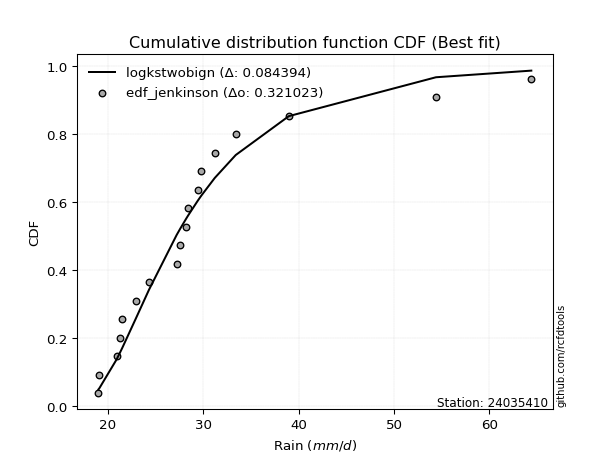</img></img>

</div>


### 11. Empirical - EDF Cunnane (1978)

Cunnane´s work in statistical hydrology has focused on the performance and evaluation of different probability distributions (such as GEV, Gumbel, Lognormal) for flood frequency estimation. _b_ is a constant, typically set to 0.4.

<div align="center">


$P=(m-b)/(n+1-2b)$


</div>


**11.1. Empirical values**

<div align="center">

|                | 0                   | 1                   | 2                   | 3                   | 4                   | 5                  | 6                  | 7                  | 8                  | 9                  | 10                 | 11                 | 12                 | 13                 | 14                 | 15                 | 16                 | 17                 |
|:---------------|:--------------------|:--------------------|:--------------------|:--------------------|:--------------------|:-------------------|:-------------------|:-------------------|:-------------------|:-------------------|:-------------------|:-------------------|:-------------------|:-------------------|:-------------------|:-------------------|:-------------------|:-------------------|
| date           | 2021                | 2014                | 2019                | 2022                | 2008                | 2025               | 2020               | 2015               | 2009               | 2016               | 2011               | 2017               | 2012               | 2023               | 2010               | 2018               | 2013               | 2024               |
| x              | 19.0                | 19.1                | 20.9                | 21.3                | 21.5                | 22.6               | 22.9               | 24.3               | 27.2               | 27.6               | 28.2               | 28.4               | 29.8               | 31.2               | 33.4               | 38.58888888888889  | 54.4               | 64.4               |
| m              | 1                   | 2                   | 3                   | 4                   | 5                   | 6                  | 7                  | 8                  | 9                  | 10                 | 11                 | 12                 | 13                 | 14                 | 15                 | 16                 | 17                 | 18                 |
| empirical_dist | edf_cunnane         | edf_cunnane         | edf_cunnane         | edf_cunnane         | edf_cunnane         | edf_cunnane        | edf_cunnane        | edf_cunnane        | edf_cunnane        | edf_cunnane        | edf_cunnane        | edf_cunnane        | edf_cunnane        | edf_cunnane        | edf_cunnane        | edf_cunnane        | edf_cunnane        | edf_cunnane        |
| empirical      | 0.03296703296703297 | 0.08791208791208792 | 0.14285714285714288 | 0.19780219780219782 | 0.25274725274725274 | 0.3076923076923077 | 0.3626373626373626 | 0.4175824175824176 | 0.4725274725274725 | 0.5274725274725275 | 0.5824175824175825 | 0.6373626373626373 | 0.6923076923076923 | 0.7472527472527473 | 0.8021978021978022 | 0.8571428571428572 | 0.9120879120879122 | 0.9670329670329672 |
| empirical_tr   | 1.0340909090909092  | 1.0963855421686748  | 1.1666666666666667  | 1.2465753424657533  | 1.338235294117647   | 1.4444444444444444 | 1.5689655172413794 | 1.716981132075472  | 1.8958333333333333 | 2.116279069767442  | 2.3947368421052633 | 2.7575757575757573 | 3.25               | 3.956521739130435  | 5.055555555555556  | 7.0000000000000036 | 11.375000000000012 | 30.333333333333442 |

</div>


**11.2. Kolmogorov-Smirnov fit test (sorted by Δ)**


<div align="center">

|                | 0                   | 1                   | 2                   | 3                   | 4                   | 5                   | 6                   | 7                   | 8                   | 9                   | 10                  | 11                  | 12                  | 13                  | 14                  | 15                  | 16                  | 17                  | 18                  | 19                  | 20                  | 21                  | 22                  | 23                  | 24                  | 25                  | 26                  | 27                  | 28                  | 29                  | 30                  | 31                  | 32                  | 33                  | 34                  | 35                  | 36                  | 37                  | 38                  | 39                  | 40                  | 41                  | 42                  | 43                  | 44                  | 45                  | 46                  | 47                  | 48                  | 49                  | 50                  | 51                  | 52                  | 53                  | 54                  | 55                  | 56                  | 57                  | 58                  | 59                  | 60                  | 61                  | 62                    | 63                  | 64                  | 65                  | 66                  | 67                  | 68                  | 69                  | 70                  | 71                  | 72                  | 73                  | 74                  | 75                  | 76                  | 77                  | 78                  | 79                  | 80                  | 81                  | 82                  | 83                  | 84                  | 85                  | 86                  | 87                  | 88                  | 89                  |
|:---------------|:--------------------|:--------------------|:--------------------|:--------------------|:--------------------|:--------------------|:--------------------|:--------------------|:--------------------|:--------------------|:--------------------|:--------------------|:--------------------|:--------------------|:--------------------|:--------------------|:--------------------|:--------------------|:--------------------|:--------------------|:--------------------|:--------------------|:--------------------|:--------------------|:--------------------|:--------------------|:--------------------|:--------------------|:--------------------|:--------------------|:--------------------|:--------------------|:--------------------|:--------------------|:--------------------|:--------------------|:--------------------|:--------------------|:--------------------|:--------------------|:--------------------|:--------------------|:--------------------|:--------------------|:--------------------|:--------------------|:--------------------|:--------------------|:--------------------|:--------------------|:--------------------|:--------------------|:--------------------|:--------------------|:--------------------|:--------------------|:--------------------|:--------------------|:--------------------|:--------------------|:--------------------|:--------------------|:----------------------|:--------------------|:--------------------|:--------------------|:--------------------|:--------------------|:--------------------|:--------------------|:--------------------|:--------------------|:--------------------|:--------------------|:--------------------|:--------------------|:--------------------|:--------------------|:--------------------|:--------------------|:--------------------|:--------------------|:--------------------|:--------------------|:--------------------|:--------------------|:--------------------|:--------------------|:--------------------|:--------------------|
| station        | 24035410            | 24035410            | 24035410            | 24035410            | 24035410            | 24035410            | 24035410            | 24035410            | 24035410            | 24035410            | 24035410            | 24035410            | 24035410            | 24035410            | 24035410            | 24035410            | 24035410            | 24035410            | 24035410            | 24035410            | 24035410            | 24035410            | 24035410            | 24035410            | 24035410            | 24035410            | 24035410            | 24035410            | 24035410            | 24035410            | 24035410            | 24035410            | 24035410            | 24035410            | 24035410            | 24035410            | 24035410            | 24035410            | 24035410            | 24035410            | 24035410            | 24035410            | 24035410            | 24035410            | 24035410            | 24035410            | 24035410            | 24035410            | 24035410            | 24035410            | 24035410            | 24035410            | 24035410            | 24035410            | 24035410            | 24035410            | 24035410            | 24035410            | 24035410            | 24035410            | 24035410            | 24035410            | 24035410              | 24035410            | 24035410            | 24035410            | 24035410            | 24035410            | 24035410            | 24035410            | 24035410            | 24035410            | 24035410            | 24035410            | 24035410            | 24035410            | 24035410            | 24035410            | 24035410            | 24035410            | 24035410            | 24035410            | 24035410            | 24035410            | 24035410            | 24035410            | 24035410            | 24035410            | 24035410            | 24035410            |
| empirical_dist | edf_cunnane         | edf_cunnane         | edf_cunnane         | edf_cunnane         | edf_cunnane         | edf_cunnane         | edf_cunnane         | edf_cunnane         | edf_cunnane         | edf_cunnane         | edf_cunnane         | edf_cunnane         | edf_cunnane         | edf_cunnane         | edf_cunnane         | edf_cunnane         | edf_cunnane         | edf_cunnane         | edf_cunnane         | edf_cunnane         | edf_cunnane         | edf_cunnane         | edf_cunnane         | edf_cunnane         | edf_cunnane         | edf_cunnane         | edf_cunnane         | edf_cunnane         | edf_cunnane         | edf_cunnane         | edf_cunnane         | edf_cunnane         | edf_cunnane         | edf_cunnane         | edf_cunnane         | edf_cunnane         | edf_cunnane         | edf_cunnane         | edf_cunnane         | edf_cunnane         | edf_cunnane         | edf_cunnane         | edf_cunnane         | edf_cunnane         | edf_cunnane         | edf_cunnane         | edf_cunnane         | edf_cunnane         | edf_cunnane         | edf_cunnane         | edf_cunnane         | edf_cunnane         | edf_cunnane         | edf_cunnane         | edf_cunnane         | edf_cunnane         | edf_cunnane         | edf_cunnane         | edf_cunnane         | edf_cunnane         | edf_cunnane         | edf_cunnane         | edf_cunnane           | edf_cunnane         | edf_cunnane         | edf_cunnane         | edf_cunnane         | edf_cunnane         | edf_cunnane         | edf_cunnane         | edf_cunnane         | edf_cunnane         | edf_cunnane         | edf_cunnane         | edf_cunnane         | edf_cunnane         | edf_cunnane         | edf_cunnane         | edf_cunnane         | edf_cunnane         | edf_cunnane         | edf_cunnane         | edf_cunnane         | edf_cunnane         | edf_cunnane         | edf_cunnane         | edf_cunnane         | edf_cunnane         | edf_cunnane         | edf_cunnane         |
| p_dist         | logbetaprime        | logpearson3         | loggumbel_r         | loghalfnorm         | exponnorm           | laplace_asymmetric  | expon               | genexpon            | gompertz            | loggenlogistic      | lograyleigh         | loggompertz         | logmoyal            | lognct              | truncnorm           | pareto              | logt                | logkstwobign        | pearson3            | logmaxwell          | loghalflogistic     | wald                | loggenexpon         | nct                 | betaprime           | fatiguelife         | logalpha            | genlogistic         | invgauss            | fisk                | loginvweibull       | logf                | loginvgamma         | moyal               | johnsonsu           | alpha               | invgamma            | ncf                 | logtruncnorm        | erlang              | loglognorm          | invweibull          | loginvgauss         | logmielke           | logjohnsonsu        | logfisk             | loglogistic         | logfatiguelife      | logrice             | logcrystalball      | lognorm             | lognorm             | logloggamma         | logexponnorm        | halflogistic        | weibull_min         | loghypsecant        | gumbel_r            | logexpon            | logpareto           | t                   | f                   | loglaplace_asymmetric | gamma               | logncf              | lognakagami         | nakagami            | kstwobign           | loglaplace          | rayleigh            | halfnorm            | maxwell             | logweibull_min      | loggumbel_l         | logistic            | hypsecant           | logwald             | rice                | logerlang           | crystalball         | norm                | laplace             | loggamma            | loggamma            | gibrat              | loggibrat           | gumbel_l            | logchi2             | chi2                | mielke              |
| delta          | 0.06658649196052396 | 0.06924169473389363 | 0.07118960612650638 | 0.07173619985029867 | 0.07734380111199356 | 0.07827433357466183 | 0.07861890132158542 | 0.07861891508178451 | 0.08103113269713991 | 0.08464931477212101 | 0.08565040210050956 | 0.08611891266100802 | 0.0872881745499634  | 0.08921194170888824 | 0.08941833524983889 | 0.091164998476567   | 0.0912592929585023  | 0.09224163021951032 | 0.09240640977659176 | 0.09283865242182687 | 0.09420796297825806 | 0.09484280609056528 | 0.09525243928669058 | 0.09769036002545906 | 0.10051968623459229 | 0.10605419606995892 | 0.10647571850946957 | 0.10852623227467528 | 0.10976668475656726 | 0.11157852724918205 | 0.11200382610777804 | 0.11231814412442453 | 0.11232085871462794 | 0.11232181992205886 | 0.11242802060981971 | 0.11315983780902761 | 0.11325399056351981 | 0.11325427780093245 | 0.11403239637800966 | 0.11459433115610929 | 0.1151100320785392  | 0.11517786113953243 | 0.1153119452530934  | 0.11535335725256968 | 0.11549291131279715 | 0.11567174668298774 | 0.11653228824063633 | 0.1170145842970296  | 0.11739079376176759 | 0.1190317088505467  | 0.11903207009652061 | 0.11903207009652061 | 0.12167321134474607 | 0.12586589165176476 | 0.12642531906122778 | 0.12808523000142624 | 0.13055651388507344 | 0.13157314053032407 | 0.13181746091984048 | 0.13181746939665473 | 0.1332663757318438  | 0.1341475401304748  | 0.1418941326790241    | 0.144566464223988   | 0.14489878122505978 | 0.14881962039936836 | 0.14936743051857104 | 0.1498655613154668  | 0.15260131579861816 | 0.16111285955132362 | 0.16376729636164583 | 0.16651466221606703 | 0.1794450987040167  | 0.1886201177672615  | 0.19009663850151826 | 0.19277338159390434 | 0.19486939866098904 | 0.1956409737934563  | 0.19640447108694137 | 0.19688097758776912 | 0.19688099475332    | 0.2102339890817453  | 0.21905256122119243 | 0.21905256122119243 | 0.2278898172219594  | 0.25274725274725274 | 0.2638750260790018  | 0.26952288033033567 | 0.28236187535596646 | nan                 |
| deltao         | 0.32102346734599996 | 0.32102346734599996 | 0.32102346734599996 | 0.32102346734599996 | 0.32102346734599996 | 0.32102346734599996 | 0.32102346734599996 | 0.32102346734599996 | 0.32102346734599996 | 0.32102346734599996 | 0.32102346734599996 | 0.32102346734599996 | 0.32102346734599996 | 0.32102346734599996 | 0.32102346734599996 | 0.32102346734599996 | 0.32102346734599996 | 0.32102346734599996 | 0.32102346734599996 | 0.32102346734599996 | 0.32102346734599996 | 0.32102346734599996 | 0.32102346734599996 | 0.32102346734599996 | 0.32102346734599996 | 0.32102346734599996 | 0.32102346734599996 | 0.32102346734599996 | 0.32102346734599996 | 0.32102346734599996 | 0.32102346734599996 | 0.32102346734599996 | 0.32102346734599996 | 0.32102346734599996 | 0.32102346734599996 | 0.32102346734599996 | 0.32102346734599996 | 0.32102346734599996 | 0.32102346734599996 | 0.32102346734599996 | 0.32102346734599996 | 0.32102346734599996 | 0.32102346734599996 | 0.32102346734599996 | 0.32102346734599996 | 0.32102346734599996 | 0.32102346734599996 | 0.32102346734599996 | 0.32102346734599996 | 0.32102346734599996 | 0.32102346734599996 | 0.32102346734599996 | 0.32102346734599996 | 0.32102346734599996 | 0.32102346734599996 | 0.32102346734599996 | 0.32102346734599996 | 0.32102346734599996 | 0.32102346734599996 | 0.32102346734599996 | 0.32102346734599996 | 0.32102346734599996 | 0.32102346734599996   | 0.32102346734599996 | 0.32102346734599996 | 0.32102346734599996 | 0.32102346734599996 | 0.32102346734599996 | 0.32102346734599996 | 0.32102346734599996 | 0.32102346734599996 | 0.32102346734599996 | 0.32102346734599996 | 0.32102346734599996 | 0.32102346734599996 | 0.32102346734599996 | 0.32102346734599996 | 0.32102346734599996 | 0.32102346734599996 | 0.32102346734599996 | 0.32102346734599996 | 0.32102346734599996 | 0.32102346734599996 | 0.32102346734599996 | 0.32102346734599996 | 0.32102346734599996 | 0.32102346734599996 | 0.32102346734599996 | 0.32102346734599996 | 0.32102346734599996 |
| eval           | Δo > Δ              | Δo > Δ              | Δo > Δ              | Δo > Δ              | Δo > Δ              | Δo > Δ              | Δo > Δ              | Δo > Δ              | Δo > Δ              | Δo > Δ              | Δo > Δ              | Δo > Δ              | Δo > Δ              | Δo > Δ              | Δo > Δ              | Δo > Δ              | Δo > Δ              | Δo > Δ              | Δo > Δ              | Δo > Δ              | Δo > Δ              | Δo > Δ              | Δo > Δ              | Δo > Δ              | Δo > Δ              | Δo > Δ              | Δo > Δ              | Δo > Δ              | Δo > Δ              | Δo > Δ              | Δo > Δ              | Δo > Δ              | Δo > Δ              | Δo > Δ              | Δo > Δ              | Δo > Δ              | Δo > Δ              | Δo > Δ              | Δo > Δ              | Δo > Δ              | Δo > Δ              | Δo > Δ              | Δo > Δ              | Δo > Δ              | Δo > Δ              | Δo > Δ              | Δo > Δ              | Δo > Δ              | Δo > Δ              | Δo > Δ              | Δo > Δ              | Δo > Δ              | Δo > Δ              | Δo > Δ              | Δo > Δ              | Δo > Δ              | Δo > Δ              | Δo > Δ              | Δo > Δ              | Δo > Δ              | Δo > Δ              | Δo > Δ              | Δo > Δ                | Δo > Δ              | Δo > Δ              | Δo > Δ              | Δo > Δ              | Δo > Δ              | Δo > Δ              | Δo > Δ              | Δo > Δ              | Δo > Δ              | Δo > Δ              | Δo > Δ              | Δo > Δ              | Δo > Δ              | Δo > Δ              | Δo > Δ              | Δo > Δ              | Δo > Δ              | Δo > Δ              | Δo > Δ              | Δo > Δ              | Δo > Δ              | Δo > Δ              | Δo > Δ              | Δo > Δ              | Δo > Δ              | Δo > Δ              | Δo <= Δ             |
| fit            | 1                   | 1                   | 1                   | 1                   | 1                   | 1                   | 1                   | 1                   | 1                   | 1                   | 1                   | 1                   | 1                   | 1                   | 1                   | 1                   | 1                   | 1                   | 1                   | 1                   | 1                   | 1                   | 1                   | 1                   | 1                   | 1                   | 1                   | 1                   | 1                   | 1                   | 1                   | 1                   | 1                   | 1                   | 1                   | 1                   | 1                   | 1                   | 1                   | 1                   | 1                   | 1                   | 1                   | 1                   | 1                   | 1                   | 1                   | 1                   | 1                   | 1                   | 1                   | 1                   | 1                   | 1                   | 1                   | 1                   | 1                   | 1                   | 1                   | 1                   | 1                   | 1                   | 1                     | 1                   | 1                   | 1                   | 1                   | 1                   | 1                   | 1                   | 1                   | 1                   | 1                   | 1                   | 1                   | 1                   | 1                   | 1                   | 1                   | 1                   | 1                   | 1                   | 1                   | 1                   | 1                   | 1                   | 1                   | 1                   | 1                   | 0                   |
| n              | 18                  | 18                  | 18                  | 18                  | 18                  | 18                  | 18                  | 18                  | 18                  | 18                  | 18                  | 18                  | 18                  | 18                  | 18                  | 18                  | 18                  | 18                  | 18                  | 18                  | 18                  | 18                  | 18                  | 18                  | 18                  | 18                  | 18                  | 18                  | 18                  | 18                  | 18                  | 18                  | 18                  | 18                  | 18                  | 18                  | 18                  | 18                  | 18                  | 18                  | 18                  | 18                  | 18                  | 18                  | 18                  | 18                  | 18                  | 18                  | 18                  | 18                  | 18                  | 18                  | 18                  | 18                  | 18                  | 18                  | 18                  | 18                  | 18                  | 18                  | 18                  | 18                  | 18                    | 18                  | 18                  | 18                  | 18                  | 18                  | 18                  | 18                  | 18                  | 18                  | 18                  | 18                  | 18                  | 18                  | 18                  | 18                  | 18                  | 18                  | 18                  | 18                  | 18                  | 18                  | 18                  | 18                  | 18                  | 18                  | 18                  | 18                  |
| best_fit       | 1                   | 0                   | 0                   | 0                   | 0                   | 0                   | 0                   | 0                   | 0                   | 0                   | 0                   | 0                   | 0                   | 0                   | 0                   | 0                   | 0                   | 0                   | 0                   | 0                   | 0                   | 0                   | 0                   | 0                   | 0                   | 0                   | 0                   | 0                   | 0                   | 0                   | 0                   | 0                   | 0                   | 0                   | 0                   | 0                   | 0                   | 0                   | 0                   | 0                   | 0                   | 0                   | 0                   | 0                   | 0                   | 0                   | 0                   | 0                   | 0                   | 0                   | 0                   | 0                   | 0                   | 0                   | 0                   | 0                   | 0                   | 0                   | 0                   | 0                   | 0                   | 0                   | 0                     | 0                   | 0                   | 0                   | 0                   | 0                   | 0                   | 0                   | 0                   | 0                   | 0                   | 0                   | 0                   | 0                   | 0                   | 0                   | 0                   | 0                   | 0                   | 0                   | 0                   | 0                   | 0                   | 0                   | 0                   | 0                   | 0                   | 0                   |
| best_fit_sort  | 1                   | 2                   | 3                   | 4                   | 5                   | 6                   | 7                   | 8                   | 9                   | 10                  | 11                  | 12                  | 13                  | 14                  | 15                  | 16                  | 17                  | 18                  | 19                  | 20                  | 21                  | 22                  | 23                  | 24                  | 25                  | 26                  | 27                  | 28                  | 29                  | 30                  | 31                  | 32                  | 33                  | 34                  | 35                  | 36                  | 37                  | 38                  | 39                  | 40                  | 41                  | 42                  | 43                  | 44                  | 45                  | 46                  | 47                  | 48                  | 49                  | 50                  | 51                  | 52                  | 53                  | 54                  | 55                  | 56                  | 57                  | 58                  | 59                  | 60                  | 61                  | 62                  | 63                    | 64                  | 65                  | 66                  | 67                  | 68                  | 69                  | 70                  | 71                  | 72                  | 73                  | 74                  | 75                  | 76                  | 77                  | 78                  | 79                  | 80                  | 81                  | 82                  | 83                  | 84                  | 85                  | 86                  | 87                  | 88                  | 89                  | 90                  |

</div>


<div align="center">

</img>

</div>


**11.3. Best fit**

<div align="center">

|   id |   station | empirical_dist   | p_dist       |     delta |   deltao | eval   |   fit |   n |   best_fit |   best_fit_sort |
|-----:|----------:|:-----------------|:-------------|----------:|---------:|:-------|------:|----:|-----------:|----------------:|
|    0 |  24035410 | edf_cunnane      | logbetaprime | 0.0665865 | 0.321023 | Δo > Δ |     1 |  18 |          1 |               1 |

</div>


<div align="center">

</img></img>

</div>


### 12. Empirical - EDF Adamowski (1981)

The Adamowski formula in hydrology refers to a specific plotting position formula used for estimating the non-parametric empirical distribution of hydrological events (like flood peaks) to calculate their return periods. This formula provides an alternative to traditional parametric methods (like the Gumbel or Log Pearson Type III distributions). 

<div align="center">


$P=(m-0.25)/(n+0.5)$


</div>


**12.1. Empirical values**

<div align="center">

|                | 0                   | 1                  | 2                   | 3                   | 4                   | 5                  | 6                   | 7                  | 8                   | 9                 | 10                | 11                 | 12                 | 13                 | 14                 | 15                 | 16                 | 17                 |
|:---------------|:--------------------|:-------------------|:--------------------|:--------------------|:--------------------|:-------------------|:--------------------|:-------------------|:--------------------|:------------------|:------------------|:-------------------|:-------------------|:-------------------|:-------------------|:-------------------|:-------------------|:-------------------|
| date           | 2021                | 2014               | 2019                | 2022                | 2008                | 2025               | 2020                | 2015               | 2009                | 2016              | 2011              | 2017               | 2012               | 2023               | 2010               | 2018               | 2013               | 2024               |
| x              | 19.0                | 19.1               | 20.9                | 21.3                | 21.5                | 22.6               | 22.9                | 24.3               | 27.2                | 27.6              | 28.2              | 28.4               | 29.8               | 31.2               | 33.4               | 38.58888888888889  | 54.4               | 64.4               |
| m              | 1                   | 2                  | 3                   | 4                   | 5                   | 6                  | 7                   | 8                  | 9                   | 10                | 11                | 12                 | 13                 | 14                 | 15                 | 16                 | 17                 | 18                 |
| empirical_dist | edf_adamowski       | edf_adamowski      | edf_adamowski       | edf_adamowski       | edf_adamowski       | edf_adamowski      | edf_adamowski       | edf_adamowski      | edf_adamowski       | edf_adamowski     | edf_adamowski     | edf_adamowski      | edf_adamowski      | edf_adamowski      | edf_adamowski      | edf_adamowski      | edf_adamowski      | edf_adamowski      |
| empirical      | 0.04054054054054054 | 0.0945945945945946 | 0.14864864864864866 | 0.20270270270270271 | 0.25675675675675674 | 0.3108108108108108 | 0.36486486486486486 | 0.4189189189189189 | 0.47297297297297297 | 0.527027027027027 | 0.581081081081081 | 0.6351351351351351 | 0.6891891891891891 | 0.7432432432432432 | 0.7972972972972973 | 0.8513513513513513 | 0.9054054054054054 | 0.9594594594594594 |
| empirical_tr   | 1.0422535211267605  | 1.1044776119402986 | 1.1746031746031746  | 1.2542372881355932  | 1.3454545454545455  | 1.4509803921568627 | 1.574468085106383   | 1.7209302325581393 | 1.8974358974358976  | 2.114285714285714 | 2.387096774193548 | 2.7407407407407405 | 3.2173913043478257 | 3.8947368421052624 | 4.933333333333333  | 6.727272727272726  | 10.571428571428568 | 24.66666666666665  |

</div>


**12.2. Kolmogorov-Smirnov fit test (sorted by Δ)**


<div align="center">

|                | 0                   | 1                   | 2                   | 3                   | 4                   | 5                   | 6                   | 7                   | 8                   | 9                   | 10                  | 11                  | 12                  | 13                  | 14                  | 15                  | 16                  | 17                  | 18                  | 19                  | 20                  | 21                  | 22                  | 23                  | 24                  | 25                  | 26                  | 27                  | 28                  | 29                  | 30                  | 31                  | 32                  | 33                  | 34                  | 35                  | 36                  | 37                  | 38                  | 39                  | 40                  | 41                  | 42                  | 43                  | 44                  | 45                  | 46                  | 47                  | 48                  | 49                  | 50                  | 51                  | 52                  | 53                  | 54                  | 55                  | 56                  | 57                  | 58                  | 59                  | 60                  | 61                  | 62                  | 63                  | 64                    | 65                  | 66                  | 67                  | 68                  | 69                  | 70                  | 71                  | 72                  | 73                  | 74                  | 75                  | 76                  | 77                  | 78                  | 79                  | 80                  | 81                  | 82                  | 83                  | 84                  | 85                  | 86                  | 87                  | 88                  | 89                  |
|:---------------|:--------------------|:--------------------|:--------------------|:--------------------|:--------------------|:--------------------|:--------------------|:--------------------|:--------------------|:--------------------|:--------------------|:--------------------|:--------------------|:--------------------|:--------------------|:--------------------|:--------------------|:--------------------|:--------------------|:--------------------|:--------------------|:--------------------|:--------------------|:--------------------|:--------------------|:--------------------|:--------------------|:--------------------|:--------------------|:--------------------|:--------------------|:--------------------|:--------------------|:--------------------|:--------------------|:--------------------|:--------------------|:--------------------|:--------------------|:--------------------|:--------------------|:--------------------|:--------------------|:--------------------|:--------------------|:--------------------|:--------------------|:--------------------|:--------------------|:--------------------|:--------------------|:--------------------|:--------------------|:--------------------|:--------------------|:--------------------|:--------------------|:--------------------|:--------------------|:--------------------|:--------------------|:--------------------|:--------------------|:--------------------|:----------------------|:--------------------|:--------------------|:--------------------|:--------------------|:--------------------|:--------------------|:--------------------|:--------------------|:--------------------|:--------------------|:--------------------|:--------------------|:--------------------|:--------------------|:--------------------|:--------------------|:--------------------|:--------------------|:--------------------|:--------------------|:--------------------|:--------------------|:--------------------|:--------------------|:--------------------|
| station        | 24035410            | 24035410            | 24035410            | 24035410            | 24035410            | 24035410            | 24035410            | 24035410            | 24035410            | 24035410            | 24035410            | 24035410            | 24035410            | 24035410            | 24035410            | 24035410            | 24035410            | 24035410            | 24035410            | 24035410            | 24035410            | 24035410            | 24035410            | 24035410            | 24035410            | 24035410            | 24035410            | 24035410            | 24035410            | 24035410            | 24035410            | 24035410            | 24035410            | 24035410            | 24035410            | 24035410            | 24035410            | 24035410            | 24035410            | 24035410            | 24035410            | 24035410            | 24035410            | 24035410            | 24035410            | 24035410            | 24035410            | 24035410            | 24035410            | 24035410            | 24035410            | 24035410            | 24035410            | 24035410            | 24035410            | 24035410            | 24035410            | 24035410            | 24035410            | 24035410            | 24035410            | 24035410            | 24035410            | 24035410            | 24035410              | 24035410            | 24035410            | 24035410            | 24035410            | 24035410            | 24035410            | 24035410            | 24035410            | 24035410            | 24035410            | 24035410            | 24035410            | 24035410            | 24035410            | 24035410            | 24035410            | 24035410            | 24035410            | 24035410            | 24035410            | 24035410            | 24035410            | 24035410            | 24035410            | 24035410            |
| empirical_dist | edf_adamowski       | edf_adamowski       | edf_adamowski       | edf_adamowski       | edf_adamowski       | edf_adamowski       | edf_adamowski       | edf_adamowski       | edf_adamowski       | edf_adamowski       | edf_adamowski       | edf_adamowski       | edf_adamowski       | edf_adamowski       | edf_adamowski       | edf_adamowski       | edf_adamowski       | edf_adamowski       | edf_adamowski       | edf_adamowski       | edf_adamowski       | edf_adamowski       | edf_adamowski       | edf_adamowski       | edf_adamowski       | edf_adamowski       | edf_adamowski       | edf_adamowski       | edf_adamowski       | edf_adamowski       | edf_adamowski       | edf_adamowski       | edf_adamowski       | edf_adamowski       | edf_adamowski       | edf_adamowski       | edf_adamowski       | edf_adamowski       | edf_adamowski       | edf_adamowski       | edf_adamowski       | edf_adamowski       | edf_adamowski       | edf_adamowski       | edf_adamowski       | edf_adamowski       | edf_adamowski       | edf_adamowski       | edf_adamowski       | edf_adamowski       | edf_adamowski       | edf_adamowski       | edf_adamowski       | edf_adamowski       | edf_adamowski       | edf_adamowski       | edf_adamowski       | edf_adamowski       | edf_adamowski       | edf_adamowski       | edf_adamowski       | edf_adamowski       | edf_adamowski       | edf_adamowski       | edf_adamowski         | edf_adamowski       | edf_adamowski       | edf_adamowski       | edf_adamowski       | edf_adamowski       | edf_adamowski       | edf_adamowski       | edf_adamowski       | edf_adamowski       | edf_adamowski       | edf_adamowski       | edf_adamowski       | edf_adamowski       | edf_adamowski       | edf_adamowski       | edf_adamowski       | edf_adamowski       | edf_adamowski       | edf_adamowski       | edf_adamowski       | edf_adamowski       | edf_adamowski       | edf_adamowski       | edf_adamowski       | edf_adamowski       |
| p_dist         | logpearson3         | loghalfnorm         | logbetaprime        | loggumbel_r         | lograyleigh         | logt                | exponnorm           | laplace_asymmetric  | pearson3            | expon               | genexpon            | gompertz            | truncnorm           | loggompertz         | logmoyal            | loggenlogistic      | logmaxwell          | pareto              | lognct              | loghalflogistic     | wald                | logkstwobign        | loggenexpon         | betaprime           | nct                 | moyal               | fatiguelife         | logalpha            | invgauss            | genlogistic         | fisk                | loginvweibull       | logf                | loginvgamma         | johnsonsu           | alpha               | invgamma            | ncf                 | logtruncnorm        | erlang              | loglognorm          | invweibull          | loginvgauss         | logmielke           | logjohnsonsu        | logfisk             | logfatiguelife      | logcrystalball      | lognorm             | lognorm             | loglogistic         | logloggamma         | halflogistic        | logrice             | weibull_min         | gumbel_r            | logexponnorm        | t                   | logexpon            | logpareto           | loghypsecant        | f                   | logncf              | gamma               | loglaplace_asymmetric | nakagami            | kstwobign           | lognakagami         | rayleigh            | loglaplace          | halfnorm            | maxwell             | logweibull_min      | logistic            | loggumbel_l         | hypsecant           | crystalball         | norm                | rice                | logerlang           | logwald             | laplace             | loggamma            | loggamma            | gibrat              | loggibrat           | gumbel_l            | logchi2             | chi2                | mielke              |
| delta          | 0.06879619428839318 | 0.07129069940479821 | 0.07157598854372027 | 0.07341710835400861 | 0.0816408980910055  | 0.08394059961232342 | 0.08402630779450024 | 0.08495684025716851 | 0.0850550052847027  | 0.0853014080040921  | 0.08530142176429119 | 0.08564083820832923 | 0.08599595353256884 | 0.08643114269143976 | 0.08684267410446295 | 0.08687681699962324 | 0.08882914841232281 | 0.09071949803106655 | 0.09143944393639047 | 0.0937624625327576  | 0.09439730564506482 | 0.09446913244701255 | 0.09480693884119012 | 0.09829218400709006 | 0.09991786225296129 | 0.10474831234855128 | 0.10560869562445846 | 0.10603021806396912 | 0.1093211843110668  | 0.11075373450217751 | 0.11113302680368159 | 0.11155832566227758 | 0.11187264367892408 | 0.11187535826912748 | 0.11198252016431925 | 0.11271433736352715 | 0.11280849011801936 | 0.11280877735543199 | 0.1135868959325092  | 0.11414883071060883 | 0.11466453163303875 | 0.11473236069403198 | 0.11486644480759295 | 0.11490785680706922 | 0.1150474108672967  | 0.11522624623748728 | 0.11656908385152914 | 0.11680420662304447 | 0.11680456786901838 | 0.11680456786901838 | 0.1174397567299808  | 0.1184892155285091  | 0.1188518114877202  | 0.11961829598926982 | 0.12318472510092127 | 0.12399963295681649 | 0.1254203912062643  | 0.12569286815833622 | 0.13137196047434002 | 0.13137196895115427 | 0.13278401611257568 | 0.13370203968497435 | 0.13857647472500623 | 0.14412096377848754 | 0.14412163490652632   | 0.14446692561806607 | 0.14763805908796457 | 0.1483741199538679  | 0.15353935197781604 | 0.1548288180261204  | 0.15619378878813825 | 0.16250515820656297 | 0.17899959825851625 | 0.1860871344920142  | 0.18639261553975928 | 0.1905458793664021  | 0.19287147357826506 | 0.19287149074381593 | 0.19341347156595406 | 0.1959589706414409  | 0.19887890267049305 | 0.20800648685424306 | 0.21860706077569197 | 0.21860706077569197 | 0.2318993212314634  | 0.25675675675675674 | 0.25986552206949776 | 0.26398519061264436 | 0.281916374910466   | nan                 |
| deltao         | 0.32102346734599996 | 0.32102346734599996 | 0.32102346734599996 | 0.32102346734599996 | 0.32102346734599996 | 0.32102346734599996 | 0.32102346734599996 | 0.32102346734599996 | 0.32102346734599996 | 0.32102346734599996 | 0.32102346734599996 | 0.32102346734599996 | 0.32102346734599996 | 0.32102346734599996 | 0.32102346734599996 | 0.32102346734599996 | 0.32102346734599996 | 0.32102346734599996 | 0.32102346734599996 | 0.32102346734599996 | 0.32102346734599996 | 0.32102346734599996 | 0.32102346734599996 | 0.32102346734599996 | 0.32102346734599996 | 0.32102346734599996 | 0.32102346734599996 | 0.32102346734599996 | 0.32102346734599996 | 0.32102346734599996 | 0.32102346734599996 | 0.32102346734599996 | 0.32102346734599996 | 0.32102346734599996 | 0.32102346734599996 | 0.32102346734599996 | 0.32102346734599996 | 0.32102346734599996 | 0.32102346734599996 | 0.32102346734599996 | 0.32102346734599996 | 0.32102346734599996 | 0.32102346734599996 | 0.32102346734599996 | 0.32102346734599996 | 0.32102346734599996 | 0.32102346734599996 | 0.32102346734599996 | 0.32102346734599996 | 0.32102346734599996 | 0.32102346734599996 | 0.32102346734599996 | 0.32102346734599996 | 0.32102346734599996 | 0.32102346734599996 | 0.32102346734599996 | 0.32102346734599996 | 0.32102346734599996 | 0.32102346734599996 | 0.32102346734599996 | 0.32102346734599996 | 0.32102346734599996 | 0.32102346734599996 | 0.32102346734599996 | 0.32102346734599996   | 0.32102346734599996 | 0.32102346734599996 | 0.32102346734599996 | 0.32102346734599996 | 0.32102346734599996 | 0.32102346734599996 | 0.32102346734599996 | 0.32102346734599996 | 0.32102346734599996 | 0.32102346734599996 | 0.32102346734599996 | 0.32102346734599996 | 0.32102346734599996 | 0.32102346734599996 | 0.32102346734599996 | 0.32102346734599996 | 0.32102346734599996 | 0.32102346734599996 | 0.32102346734599996 | 0.32102346734599996 | 0.32102346734599996 | 0.32102346734599996 | 0.32102346734599996 | 0.32102346734599996 | 0.32102346734599996 |
| eval           | Δo > Δ              | Δo > Δ              | Δo > Δ              | Δo > Δ              | Δo > Δ              | Δo > Δ              | Δo > Δ              | Δo > Δ              | Δo > Δ              | Δo > Δ              | Δo > Δ              | Δo > Δ              | Δo > Δ              | Δo > Δ              | Δo > Δ              | Δo > Δ              | Δo > Δ              | Δo > Δ              | Δo > Δ              | Δo > Δ              | Δo > Δ              | Δo > Δ              | Δo > Δ              | Δo > Δ              | Δo > Δ              | Δo > Δ              | Δo > Δ              | Δo > Δ              | Δo > Δ              | Δo > Δ              | Δo > Δ              | Δo > Δ              | Δo > Δ              | Δo > Δ              | Δo > Δ              | Δo > Δ              | Δo > Δ              | Δo > Δ              | Δo > Δ              | Δo > Δ              | Δo > Δ              | Δo > Δ              | Δo > Δ              | Δo > Δ              | Δo > Δ              | Δo > Δ              | Δo > Δ              | Δo > Δ              | Δo > Δ              | Δo > Δ              | Δo > Δ              | Δo > Δ              | Δo > Δ              | Δo > Δ              | Δo > Δ              | Δo > Δ              | Δo > Δ              | Δo > Δ              | Δo > Δ              | Δo > Δ              | Δo > Δ              | Δo > Δ              | Δo > Δ              | Δo > Δ              | Δo > Δ                | Δo > Δ              | Δo > Δ              | Δo > Δ              | Δo > Δ              | Δo > Δ              | Δo > Δ              | Δo > Δ              | Δo > Δ              | Δo > Δ              | Δo > Δ              | Δo > Δ              | Δo > Δ              | Δo > Δ              | Δo > Δ              | Δo > Δ              | Δo > Δ              | Δo > Δ              | Δo > Δ              | Δo > Δ              | Δo > Δ              | Δo > Δ              | Δo > Δ              | Δo > Δ              | Δo > Δ              | Δo <= Δ             |
| fit            | 1                   | 1                   | 1                   | 1                   | 1                   | 1                   | 1                   | 1                   | 1                   | 1                   | 1                   | 1                   | 1                   | 1                   | 1                   | 1                   | 1                   | 1                   | 1                   | 1                   | 1                   | 1                   | 1                   | 1                   | 1                   | 1                   | 1                   | 1                   | 1                   | 1                   | 1                   | 1                   | 1                   | 1                   | 1                   | 1                   | 1                   | 1                   | 1                   | 1                   | 1                   | 1                   | 1                   | 1                   | 1                   | 1                   | 1                   | 1                   | 1                   | 1                   | 1                   | 1                   | 1                   | 1                   | 1                   | 1                   | 1                   | 1                   | 1                   | 1                   | 1                   | 1                   | 1                   | 1                   | 1                     | 1                   | 1                   | 1                   | 1                   | 1                   | 1                   | 1                   | 1                   | 1                   | 1                   | 1                   | 1                   | 1                   | 1                   | 1                   | 1                   | 1                   | 1                   | 1                   | 1                   | 1                   | 1                   | 1                   | 1                   | 0                   |
| n              | 18                  | 18                  | 18                  | 18                  | 18                  | 18                  | 18                  | 18                  | 18                  | 18                  | 18                  | 18                  | 18                  | 18                  | 18                  | 18                  | 18                  | 18                  | 18                  | 18                  | 18                  | 18                  | 18                  | 18                  | 18                  | 18                  | 18                  | 18                  | 18                  | 18                  | 18                  | 18                  | 18                  | 18                  | 18                  | 18                  | 18                  | 18                  | 18                  | 18                  | 18                  | 18                  | 18                  | 18                  | 18                  | 18                  | 18                  | 18                  | 18                  | 18                  | 18                  | 18                  | 18                  | 18                  | 18                  | 18                  | 18                  | 18                  | 18                  | 18                  | 18                  | 18                  | 18                  | 18                  | 18                    | 18                  | 18                  | 18                  | 18                  | 18                  | 18                  | 18                  | 18                  | 18                  | 18                  | 18                  | 18                  | 18                  | 18                  | 18                  | 18                  | 18                  | 18                  | 18                  | 18                  | 18                  | 18                  | 18                  | 18                  | 18                  |
| best_fit       | 1                   | 0                   | 0                   | 0                   | 0                   | 0                   | 0                   | 0                   | 0                   | 0                   | 0                   | 0                   | 0                   | 0                   | 0                   | 0                   | 0                   | 0                   | 0                   | 0                   | 0                   | 0                   | 0                   | 0                   | 0                   | 0                   | 0                   | 0                   | 0                   | 0                   | 0                   | 0                   | 0                   | 0                   | 0                   | 0                   | 0                   | 0                   | 0                   | 0                   | 0                   | 0                   | 0                   | 0                   | 0                   | 0                   | 0                   | 0                   | 0                   | 0                   | 0                   | 0                   | 0                   | 0                   | 0                   | 0                   | 0                   | 0                   | 0                   | 0                   | 0                   | 0                   | 0                   | 0                   | 0                     | 0                   | 0                   | 0                   | 0                   | 0                   | 0                   | 0                   | 0                   | 0                   | 0                   | 0                   | 0                   | 0                   | 0                   | 0                   | 0                   | 0                   | 0                   | 0                   | 0                   | 0                   | 0                   | 0                   | 0                   | 0                   |
| best_fit_sort  | 1                   | 2                   | 3                   | 4                   | 5                   | 6                   | 7                   | 8                   | 9                   | 10                  | 11                  | 12                  | 13                  | 14                  | 15                  | 16                  | 17                  | 18                  | 19                  | 20                  | 21                  | 22                  | 23                  | 24                  | 25                  | 26                  | 27                  | 28                  | 29                  | 30                  | 31                  | 32                  | 33                  | 34                  | 35                  | 36                  | 37                  | 38                  | 39                  | 40                  | 41                  | 42                  | 43                  | 44                  | 45                  | 46                  | 47                  | 48                  | 49                  | 50                  | 51                  | 52                  | 53                  | 54                  | 55                  | 56                  | 57                  | 58                  | 59                  | 60                  | 61                  | 62                  | 63                  | 64                  | 65                    | 66                  | 67                  | 68                  | 69                  | 70                  | 71                  | 72                  | 73                  | 74                  | 75                  | 76                  | 77                  | 78                  | 79                  | 80                  | 81                  | 82                  | 83                  | 84                  | 85                  | 86                  | 87                  | 88                  | 89                  | 90                  |

</div>


<div align="center">

</img>

</div>


**12.3. Best fit**

<div align="center">

|   id |   station | empirical_dist   | p_dist      |     delta |   deltao | eval   |   fit |   n |   best_fit |   best_fit_sort |
|-----:|----------:|:-----------------|:------------|----------:|---------:|:-------|------:|----:|-----------:|----------------:|
|    0 |  24035410 | edf_adamowski    | logpearson3 | 0.0687962 | 0.321023 | Δo > Δ |     1 |  18 |          1 |               1 |

</div>


<div align="center">

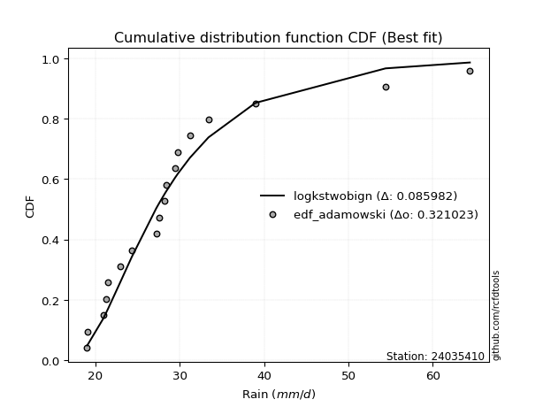</img>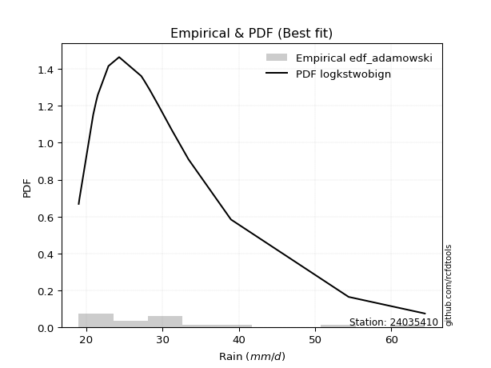</img>

</div>


## C. Best fit & Estimate extreme values for specific return periods - Tr


### 1. Best fit (ordered by delta Δ)

<div align="center">

|   id |   station | empirical_dist   | p_dist       |     delta |   deltao | eval   |   fit |   n |   best_fit |   best_fit_sort |
|-----:|----------:|:-----------------|:-------------|----------:|---------:|:-------|------:|----:|-----------:|----------------:|
|    0 |  24035410 | edf_cunnane      | logbetaprime | 0.0665865 | 0.321023 | Δo > Δ |     1 |  18 |          1 |               1 |
|    1 |  24035410 | edf_blom         | logbetaprime | 0.0669628 | 0.321023 | Δo > Δ |     1 |  18 |          1 |               2 |
|    2 |  24035410 | edf_gringorten   | logbetaprime | 0.067626  | 0.321023 | Δo > Δ |     1 |  18 |          1 |               3 |
|    3 |  24035410 | edf_tukey        | logbetaprime | 0.0678905 | 0.321023 | Δo > Δ |     1 |  18 |          1 |               4 |
|    4 |  24035410 | edf_weibull      | logpearson3  | 0.068085  | 0.321023 | Δo > Δ |     1 |  18 |          1 |               5 |
|    5 |  24035410 | edf_filliben     | logbetaprime | 0.0685959 | 0.321023 | Δo > Δ |     1 |  18 |          1 |               6 |
|    6 |  24035410 | edf_adamowski    | logpearson3  | 0.0687962 | 0.321023 | Δo > Δ |     1 |  18 |          1 |               7 |
|    7 |  24035410 | edf_jenkinson    | logbetaprime | 0.0689292 | 0.321023 | Δo > Δ |     1 |  18 |          1 |               8 |
|    8 |  24035410 | edf_beard        | logbetaprime | 0.0689292 | 0.321023 | Δo > Δ |     1 |  18 |          1 |               9 |
|    9 |  24035410 | edf_chegodayev   | logpearson3  | 0.0689431 | 0.321023 | Δo > Δ |     1 |  18 |          1 |              10 |
|   10 |  24035410 | edf_hazen        | logpearson3  | 0.0695469 | 0.321023 | Δo > Δ |     1 |  18 |          1 |              11 |
|   11 |  24035410 | edf_california   | fatiguelife  | 0.0785817 | 0.321023 | Δo > Δ |     1 |  18 |          1 |              12 |

</div>

:file_folder:Tables: [bestfit_24035410.csv](table/bestfit_24035410.csv) | [extreme_24035410.csv](table/extreme_24035410.csv)


### 2. Extreme values

In hydrology, a return period (or recurrence interval $Tr$) is the statistical average time between extreme events like floods or droughts of a specific magnitude, indicating how rare an event is, with a 100-year flood, for example, having a 1% chance of occurring in any given year, not that it happens exactly every century. It is a key tool for infrastructure design (like bridges or dams) and risk assessment, calculated from historical data to determine the probability of future events, although it is important to remember it is statistical average, and events can cluster or be missed.

> risk_rate: assuming the return period as the project useful life.

|   id |      tr |   prob_l |     prob_g |     alpha |   betaprime |    chi2 |   crystalball |   erlang |   expon |   exponnorm |        f |   fatiguelife |     fisk |   gamma |   genexpon |   genlogistic |   gibrat |   gompertz |   gumbel_l |   gumbel_r |   halflogistic |   halfnorm |   hypsecant |   invgamma |   invgauss |   invweibull |   johnsonsu |   kstwobign |   laplace |   laplace_asymmetric |   loggamma |   logistic |   lognorm |   maxwell |   mielke |   moyal |   nakagami |      ncf |     nct |    norm |   pareto |   pearson3 |   rayleigh |    rice |        t |   truncnorm |     wald |   weibull_min |   logalpha |   logbetaprime |     logchi2 |   logcrystalball |   logerlang |   logexpon |   logexponnorm |     logf |   logfatiguelife |    logfisk |   loggenexpon |   loggenlogistic |   loggibrat |   loggompertz |   loggumbel_l |   loggumbel_r |   loghalflogistic |   loghalfnorm |   loghypsecant |   loginvgamma |   loginvgauss |   loginvweibull |   logjohnsonsu |   logkstwobign |   loglaplace |   loglaplace_asymmetric |   logloggamma |   loglogistic |   loglognorm |   logmaxwell |   logmielke |   logmoyal |   lognakagami |   logncf |   lognct |   logpareto |   logpearson3 |   lograyleigh |   logrice |     logt |   logtruncnorm |   logwald |   logweibull_min |   station |   n |   risk_rate |
|-----:|--------:|---------:|-----------:|----------:|------------:|--------:|--------------:|---------:|--------:|------------:|---------:|--------------:|---------:|--------:|-----------:|--------------:|---------:|-----------:|-----------:|-----------:|---------------:|-----------:|------------:|-----------:|-----------:|-------------:|------------:|------------:|----------:|---------------------:|-----------:|-----------:|----------:|----------:|---------:|--------:|-----------:|---------:|--------:|--------:|---------:|-----------:|-----------:|--------:|---------:|------------:|---------:|--------------:|-----------:|---------------:|------------:|-----------------:|------------:|-----------:|---------------:|---------:|-----------------:|-----------:|--------------:|-----------------:|------------:|--------------:|--------------:|--------------:|------------------:|--------------:|---------------:|--------------:|--------------:|----------------:|---------------:|---------------:|-------------:|------------------------:|--------------:|--------------:|-------------:|-------------:|------------:|-----------:|--------------:|---------:|---------:|------------:|--------------:|--------------:|----------:|---------:|---------------:|----------:|-----------------:|----------:|----:|------------:|
|    0 |    2    | 0.5      | 0.5        |   25.6258 |     27.5918 | 22.0787 |       29.7105 |  25.07   | 26.4239 |     26.428  |  24.7449 |       25.4194 |  25.4762 | 24.5011 |    26.424  |       27.5548 |  26.1789 |    26.7067 |    31.6434 |    27.7776 |        26.8167 |    27.3021 |     29.7105 |    25.5288 |    25.4502 |      25.5137 |     25.4125 |     28.6858 |   29.7105 |              26.4333 |    23.3386 |    29.7105 |   27.977  |   28.7042 |  26.416  | 27.1536 |    26.7258 |  25.5288 | 27.083  | 29.7105 |  25.7928 |    26.4166 |    28.3474 | 29.8427 |  25.7895 |     26.9459 |  25.8966 |       26.5686 |    25.7644 |        26.5913 |     30.9378 |          27.977  |     23.4451 |    24.8448 |        25.0981 |  25.6036 |          25.3875 |    25.5496 |       25.7094 |          26.3967 |     25.3649 |       27.009  |       29.5186 |       26.5158 |           25.8181 |       26.1682 |        27.977  |       25.6035 |       25.4595 |         25.6368 |        25.4848 |        26.789  |      27.977  |                 27.5972 |       28.002  |       27.977  |      25.4924 |      27.2065 |     25.5741 |    26.0606 |       24.3242 |  27.8405 |  27.2654 |     24.8448 |       26.3246 |       26.9384 |   27.6441 |  26.241  |        25.2514 |   25.1676 |          23.6512 |  24035410 |  18 |    0.75     |
|    1 |    2.33 | 0.570815 | 0.429185   |   26.901  |     29.1778 | 23.0867 |       31.81   |  26.7621 | 28.0597 |     28.0677 |  26.2862 |       27.0055 |  26.8975 | 26.0283 |    28.0597 |       29.0035 |  27.2425 |    28.4047 |    33.47   |    29.7231 |        28.8169 |    29.5681 |     31.3908 |    26.8796 |    26.9306 |      26.8428 |     26.8716 |     30.3743 |   30.981  |              28.0719 |    24.4877 |    31.5603 |   29.6555 |   30.8855 |  27.8461 | 28.9953 |    29.4753 |  26.8796 | 28.5087 | 31.81   |  27.3716 |    28.2881 |    30.5609 | 31.6629 |  26.8499 |     28.6688 |  27.2733 |       28.8782 |    27.0382 |        28.0453 |     36.7975 |          29.6555 |     24.7501 |    26.3572 |        26.545  |  26.911  |          26.7822 |    26.8409 |       27.2729 |          27.7255 |     26.1248 |       28.6757 |       31.0535 |       27.9867 |           27.2917 |       27.8666 |        29.3124 |       26.9109 |       26.8289 |         26.9228 |        26.8314 |        28.2428 |      28.981  |                 28.6948 |       29.7427 |       29.4507 |      26.8397 |      28.9043 |     26.8546 |    27.4271 |       25.8818 |  30.0503 |  28.7991 |     26.3572 |       27.8541 |       28.6451 |   29.1871 |  27.443  |        26.8085 |   26.1476 |          25.0554 |  24035410 |  18 |    0.729209 |
|    2 |    5    | 0.8      | 0.2        |   34.2219 |     36.1676 | 28.8047 |       39.6125 |  35.8316 | 36.2379 |     36.2659 |  35.0944 |       35.8761 |  35.6416 | 34.2032 |    36.2379 |       35.2969 |  33.3656 |    36.8944 |    39.371  |    38.175  |        37.8676 |    39.1505 |     38.1307 |    34.6139 |    35.3323 |      34.539  |     35.2614 |     37.5466 |   37.3335 |              36.2647 |    31.2609 |    38.7028 |   36.825  |   39.4709 |  35.1881 | 37.5258 |    43.4281 |  34.6139 | 35.0587 | 39.6125 |  35.7423 |    37.3023 |    39.4227 | 38.9503 |  31.4369 |     37.0438 |  34.9801 |       42.3526 |    34.0736 |        34.7621 |    101.671  |          36.825  |     32.8529 |    35.4173 |        35.1309 |  34.3182 |          34.8003 |    34.7028 |       35.6438 |          34.3194 |     30.9637 |       36.6313 |       36.5791 |       35.3849 |           35.0843 |       36.3559 |        35.3414 |       34.3182 |       34.6598 |         34.1769 |        34.5686 |        35.3512 |      34.5681 |                 34.8731 |       37.1886 |       35.907  |      34.58   |      36.6805 |     34.1185 |    34.7531 |       34.338  |  40.2157 |  35.7705 |     35.4173 |       35.6217 |       36.6315 |   36.2766 |  32.8072 |        35.6592 |   32.3819 |          34.2347 |  24035410 |  18 |    0.67232  |
|    3 |   10    | 0.9      | 0.1        |   43.678  |     41.983  | 34.5497 |       44.7885 |  44.552  | 43.6618 |     43.708  |  44.7584 |       44.8978 |  47.4469 | 42.0549 |    43.6618 |       40.4223 |  40.3452 |    44.6011 |    42.6565 |    45.059  |        45.3839 |    46.2413 |     43.5127 |    43.81   |    44.381  |      43.9742 |     44.8108 |     43.0074 |   43.1    |              43.7019 |    39.138  |    43.963  |   42.5133 |   45.5128 |  42.8008 | 44.953  |    54.9388 |  43.8099 | 40.8541 | 44.7885 |  44.0777 |    45.2215 |    45.7414 | 44.1463 |  36.0741 |     44.1098 |  43.1587 |       56.7027 |    42.5441 |        40.7392 |    289.44   |          42.5133 |     42.9023 |    46.3123 |        45.3076 |  43.2948 |          44.1468 |    45.9892 |       44.1402 |          40.8323 |     37.5818 |       43.4318 |       40.071  |       42.8337 |           43.2216 |       44.2624 |        41.0345 |       43.2951 |       43.8335 |         43.0026 |        43.9242 |        41.9407 |      40.5672 |                 41.6262 |       43.1041 |       41.5505 |      43.9381 |      43.3765 |     43.0649 |    42.7079 |       42.7432 |  49.12   |  41.8312 |     46.3123 |       43.3443 |       43.6525 |   42.3605 |  37.9258 |        45.3245 |   40.6313 |          46.5741 |  24035410 |  18 |    0.651322 |
|    4 |   15    | 0.933333 | 0.0666667  |   51.4375 |     45.323  | 38.0509 |       47.3714 |  49.7753 | 48.0046 |     48.0613 |  51.2316 |       50.4592 |  56.9981 | 46.7559 |    48.0046 |       43.314  |  45.1594 |    49.1092 |    44.1444 |    48.9429 |        49.6374 |    49.9313 |     46.5842 |    50.5174 |    50.2353 |      51.0548 |     51.3918 |     45.9064 |   46.4733 |              48.0524 |    44.6703 |    46.829  |   45.6725 |   48.6128 |  47.8865 | 49.2635 |    61.0789 |  50.5173 | 44.329  | 47.3714 |  49.3052 |    49.7891 |    48.997  | 46.8235 |  39.4184 |     47.8775 |  48.4107 |       65.8368 |    49.0973 |        44.3335 |    550.862  |          45.6725 |     50.2742 |    54.1793 |        52.5773 |  50.1059 |          50.7964 |    56.1121 |       49.55   |          45.038  |     42.9539 |       47.266  |       41.7602 |       47.7085 |           48.6368 |       49.0352 |        44.6856 |       50.1065 |       50.4214 |         49.7483 |        50.9162 |        45.9243 |      44.5482 |                 46.1675 |       46.3909 |       44.9902 |      50.9314 |      47.2735 |     49.9814 |    48.1348 |       47.9605 |  54.3873 |  45.4176 |     54.1793 |       48.2987 |       47.7801 |   45.8833 |  41.3737 |        51.7072 |   47.0056 |          56.2129 |  24035410 |  18 |    0.644736 |
|    5 |   20    | 0.95     | 0.05       |   58.4642 |     47.6916 | 40.5804 |       49.0628 |  53.5207 | 51.0858 |     51.1501 |  56.2289 |       54.5011 |  65.3803 | 50.1262 |    51.0858 |       45.3386 |  48.9358 |    52.3078 |    45.0705 |    51.6623 |        52.6175 |    52.3915 |     48.751  |    56.0107 |    54.6137 |      56.9689 |     56.5515 |     47.8593 |   48.8666 |              51.1391 |    49.0756 |    48.8099 |   47.8675 |   50.6702 |  51.8382 | 52.3162 |    65.1996 |  56.0106 | 46.8589 | 49.0628 |  53.1811 |    53.009  |    51.1609 | 48.603  |  42.2011 |     50.337  |  52.3245 |       72.6082 |    54.8052 |        46.9546 |    878.552  |          47.8675 |     56.3052 |    60.5588 |        58.4322 |  55.8935 |          56.1449 |    65.8982 |       53.5988 |          48.238  |     47.7    |       49.9316 |       42.8474 |       51.4483 |           52.8303 |       52.4999 |        47.455  |       55.8945 |       55.7597 |         55.5136 |        56.7689 |        48.8191 |      47.6075 |                 49.687  |       48.6749 |       47.5327 |      56.7847 |      50.0511 |     55.9433 |    52.3903 |       51.7998 |  58.183  |  48.007  |     60.5588 |       52.0438 |       50.7374 |   48.3854 |  44.1259 |        56.5415 |   52.3977 |          64.4355 |  24035410 |  18 |    0.641514 |
|    6 |   25    | 0.96     | 0.04       |   65.0764 |     49.5349 | 42.564  |       50.308  |  56.4446 | 53.4757 |     53.5459 |  60.3524 |       57.6828 |  73.0027 | 52.7569 |    53.4758 |       46.8981 |  52.084  |    54.7888 |    45.7296 |    53.757  |        54.9136 |    54.2219 |     50.4279 |    60.7525 |    58.1286 |      62.1511 |     60.8515 |     49.3221 |   50.723  |              53.5334 |    52.7957 |    50.3253 |   49.5505 |   52.1976 |  55.1226 | 54.6823 |    68.2738 |  60.7524 | 48.8657 | 50.308  |  56.2867 |    55.4965 |    52.7687 | 49.9251 |  44.6475 |     52.1043 |  55.4593 |       78.0151 |    60.0286 |        49.0359 |   1267.99   |          49.5505 |     61.5002 |    66.0201 |        63.419  |  61.0576 |          60.6974 |    75.6259 |       56.8645 |          50.857  |     52.0551 |       51.9706 |       43.6383 |       54.5276 |           56.3061 |       55.2357 |        49.7156 |       61.059  |       60.3313 |         60.6824 |        61.9198 |        51.1062 |      50.1245 |                 52.6007 |       50.4261 |       49.5742 |      61.9359 |      52.2182 |     61.3255 |    55.9459 |       54.8581 |  61.169  |  50.0485 |     66.0201 |       55.0924 |       53.0524 |   50.3324 |  46.4802 |        60.4478 |   57.1596 |          71.7476 |  24035410 |  18 |    0.639603 |
|    7 |   50    | 0.98     | 0.02       |   95.3646 |     55.3296 | 48.8228 |       53.8737 |  65.6117 | 60.8997 |     60.988  |  74.6718 |       67.7782 | 104.846  | 61.0035 |    60.8997 |       51.7021 |  63.1816 |    62.4955 |    47.5186 |    60.2096 |        61.988  |    59.5424 |     55.627  |    78.6867 |    69.6429 |      82.3233 |     76.0002 |     53.6175 |   56.4896 |              60.9706 |    66.2827 |    54.9552 |   54.7044 |   56.6274 |  66.7236 | 62.0279 |    77.2272 |  78.6866 | 55.3922 | 53.8737 |  66.515  |    63.1786 |    57.4358 | 53.763  |  54.3237 |     56.7133 |  65.6946 |       95.6029 |    82.9279 |        55.8176 |   4051.01   |          54.7044 |     81.0343 |    86.3291 |        81.7902 |  82.1663 |          77.4579 |   126.578  |       67.7434 |          59.8527 |     70.8304 |       58.162  |       45.8595 |       65.2207 |           68.5203 |       64.0241 |        57.432  |       82.1698 |       77.3704 |         82.0237 |        82.2942 |        58.4606 |      58.8234 |                 62.7867 |       55.789  |       56.3712 |      82.3095 |      59.0488 |     83.8851 |    68.5961 |       64.8217 |  70.7236 |  56.6152 |     86.3291 |       65.4503 |       60.3885 |   56.4394 |  55.4273 |        73.2118 |   75.9328 |         100.995  |  24035410 |  18 |    0.63583  |
|    8 |   75    | 0.986667 | 0.0133333  |  123.788  |     58.7892 | 52.539  |       55.7869 |  71.0221 | 65.2424 |     65.3413 |  84.2214 |       73.805  | 131.12   | 65.8699 |    65.2425 |       54.4944 |  70.6769 |    67.0037 |    48.4233 |    63.9602 |        66.1004 |    62.4386 |     58.6653 |    91.9038 |    76.7504 |      97.6929 |     86.2253 |     55.9808 |   59.8628 |              65.321  |    75.74   |    57.6292 |   57.6874 |   59.0357 |  74.6391 | 66.3234 |    82.1024 |  91.9038 | 59.4468 | 55.7869 |  72.9297 |    67.6467 |    59.9748 | 55.8509 |  61.8855 |     58.7628 |  71.9929 |      106.404  |   103.901  |        60.0402 |   8091.07   |          57.6874 |     95.315  |   100.994  |        94.9136 |  99.4897 |          89.4278 |   184.343  |       74.6511 |          65.7954 |     87.2086 |       61.6946 |       47.0254 |       72.3749 |           76.8039 |       69.3825 |        62.4846 |       99.4956 |       89.7264 |         99.7581 |        98.2653 |        62.949  |      64.5959 |                 69.6366 |       58.8926 |       60.7136 |      98.2778 |      63.1302 |    102.997  |    77.2806 |       70.9872 |  76.5379 |  60.6424 |    100.994  |       72.2018 |       64.7971 |   60.0675 |  62.2252 |        80.8362 |   90.4331 |         123.987  |  24035410 |  18 |    0.634587 |
|    9 |  100    | 0.99     | 0.01       |  151.496  |     61.2832 | 55.1958 |       57.0809 |  74.8784 | 68.3236 |     68.43   |  91.5813 |       78.1255 | 154.349  | 69.3381 |    68.3237 |       56.4707 |  76.4832 |    70.2022 |    49.015  |    66.6146 |        69.0111 |    64.4117 |     60.8206 |   102.768  |    81.9407 |     110.602  |     94.1433 |     57.6001 |   62.2561 |              68.4078 |    83.2666 |    59.5172 |   59.7967 |   60.6762 |  80.8372 | 69.3709 |    85.4214 | 102.768  | 62.4434 | 57.0809 |  77.6858 |    70.8075 |    61.7046 | 57.2734 |  68.3599 |     59.9392 |  76.5849 |      114.279  |   124.542  |        63.1655 |  13277.6    |          59.7967 |    106.986  |   112.886  |       105.483  | 114.96   |          99.0689 |   250.712  |       79.8092 |          70.3548 |    102.457  |       64.1652 |       47.8041 |       77.9077 |           83.2651 |       73.2874 |        66.3359 |      114.968  |       99.7829 |        115.737  |       112.024  |        66.2217 |      69.032  |                 74.9452 |       61.0868 |       63.9794 |     112.033  |      66.0706 |    120.464  |    84.1008 |       75.5184 |  80.7755 |  63.5946 |    112.886  |       77.3364 |       67.9835 |   62.6719 |  68.0141 |        86.14   |  102.722  |         143.706  |  24035410 |  18 |    0.633968 |
|   10 |  200    | 0.995    | 0.005      |  259.896  |     67.4489 | 61.6537 |       60.0161 |  84.2195 | 75.7476 |     75.8721 | 111.536  |       88.6619 | 231.506  | 77.7386 |    75.7477 |       61.2218 |  92.28   |    77.9089 |    50.3012 |    72.9963 |        76.0087 |    68.9242 |     66.0128 |   135.142  |    94.8925 |     150.318  |    115.674  |     61.3296 |   68.0227 |              75.845  |   104.651  |    64.046  |   64.8714 |   64.4293 |  98.0532 | 76.7133 |    93.0015 | 135.142  | 70.1168 | 60.0161 |  89.8859 |    78.3963 |    65.6626 | 60.5281 |  88.906  |     61.9593 |  88.0233 |      133.932  |   212.224  |        71.1865 |  44354.5    |          64.8714 |    141.461  |   147.611  |       136.039  | 168.35   |         126.955  |   623.32   |       93.1615 |          82.6508 |    158.832  |       70.0074 |       49.5412 |       93.0023 |          101.111  |       83.0646 |        76.6173 |      168.369  |      129.343  |        171.725  |       156.508  |        74.4213 |      81.0123 |                 89.4583 |       66.3645 |       72.5476 |     156.499  |      73.3232 |    183.23   |   103.108  |       86.9906 |  91.4029 |  71.0684 |    147.611  |       91.0072 |       75.8763 |   69.0639 |  86.6458 |        97.8617 |  141.092  |         206.409  |  24035410 |  18 |    0.633042 |
|   11 |  250    | 0.996    | 0.004      |  313.547  |     69.486  | 63.7475 |       60.9131 |  87.2396 | 78.1376 |     78.2679 | 118.694  |       92.0867 | 264.59   | 80.4543 |    78.1377 |       62.7492 |  97.9479 |    80.3899 |    50.6797 |    75.0478 |        78.2583 |    70.3125 |     67.6842 |   147.778  |    99.1834 |     166.261  |    123.396  |     62.4838 |   69.8791 |              78.2392 |   112.652  |    65.5    |   66.5065 |   65.5846 | 104.369  | 79.077  |    95.3296 | 147.778  | 72.7351 | 60.9131 |  94.0479 |    80.8323 |    66.8809 | 61.53   |  97.3877 |     62.4086 |  91.8074 |      140.452  |   261.581  |        73.9294 |  65614.3    |          66.5066 |    154.811  |   160.923  |       147.649  | 192.431  |         137.557  |   887.887  |       97.7507 |          87.0435 |    185.888  |       71.8575 |       50.0642 |       98.451  |          107.625  |       86.3272 |        80.2548 |      192.456  |      140.751  |        197.336  |       175.317  |        77.159  |      85.2953 |                 94.7042 |       68.0646 |       75.5347 |     175.297  |      75.7122 |    212.635  |   110.098  |       90.8558 |  94.9578 |  73.5921 |    160.923  |       95.8342 |       78.4856 |   71.1597 |  94.5713 |       101.153  |  156.712  |         232.351  |  24035410 |  18 |    0.632858 |
|   12 |  500    | 0.998    | 0.002      |  580.416  |     75.9953 | 70.2894 |       63.5732 |  96.6544 | 85.5615 |     85.71   | 143.517  |      102.81   | 403.572  | 88.9199 |    85.5616 |       67.49   | 117.536  |    88.0966 |    51.7645 |    81.4156 |        85.2408 |    74.4516 |     72.876  |   195.692  |   112.842  |     228.569  |    150.072  |     65.9427 |   75.6457 |              85.6764 |   141.648  |    70.0092 |   71.6018 |   69.032  | 126.798  | 86.4193 |   102.259  | 195.692  | 81.3772 | 63.5732 | 107.756  |    88.381  |    70.5161 | 64.5193 | 131.59   |     63.3624 | 103.84   |      161.265  |   593.027  |        83.0058 | 223332      |          71.6019 |    205.001  |   210.426  |       190.42   | 302.744  |         176.653  |  3374.73   |      112.964  |         102.22   |    320.144  |       77.5183 |       51.5944 |      117.481  |          130.638  |       96.8352 |        92.6924 |      302.8    |      183.526  |        316.826  |       254.217  |        85.9814 |     100.098  |                113.043  |       73.3604 |       85.6037 |     254.141  |      83.3135 |    354.356  |   134.981  |      103.418  | 106.447  |  81.8356 |    210.426  |      112.31   |       86.8166 |   77.7988 | 128.596  |       109.468  |  218.826  |         337.385  |  24035410 |  18 |    0.632489 |
|   13 |  750    | 0.998667 | 0.00133333 |  846.591  |     79.9401 | 74.1394 |       65.0509 | 102.182  | 89.9043 |     90.0634 | 160.053  |      109.134  | 518.691  | 93.8901 |    89.9044 |       70.2615 | 130.491  |    92.6048 |    52.3443 |    85.1382 |        89.3227 |    76.7639 |     75.913  |   231.067  |   121.041  |     276.178  |    167.705  |     67.8858 |   79.0189 |              90.0269 |   161.978  |    72.6436 |   74.5991 |   70.9602 | 142.164  | 90.7142 |   106.122  | 231.067  | 86.8189 | 65.0509 | 116.352  |    92.7855 |    72.5489 | 66.191  | 158.673  |     63.6984 | 111.054  |      173.815  |  1129.14   |        88.7395 | 459597      |          74.5992 |    241.699  |   246.171  |       220.974  | 406.274  |         204.62   |  8999.88   |      122.568  |         112.291  |    458.652  |       80.7736 |       52.4313 |      130.266  |          146.307  |      103.253  |       100.843  |      406.367  |      214.738  |        431.502  |       320.367  |        91.3731 |     109.921  |                125.376  |       76.4742 |       92.0966 |     320.23   |      87.893  |    495.958  |   152.067  |      111.17   | 113.498  |  86.9635 |    246.171  |      123.088  |       91.8549 |   81.7777 | 158.382  |       112.979  |  267.322  |         421.087  |  24035410 |  18 |    0.632366 |
|   14 | 1000    | 0.999    | 0.001      | 1112.57   |     82.8048 | 76.8802 |       66.0683 | 106.112  | 92.9855 |     93.1521 | 172.791  |      113.642  | 620.63   | 97.4236 |    92.9856 |       72.2274 | 140.404  |    95.8033 |    52.7345 |    87.7787 |        92.2182 |    78.3608 |     78.0677 |   260.166  |   126.942  |     316.208  |    181.195  |     69.232  |   81.4122 |              93.1136 |   178.157  |    74.5119 |   76.7354 |   72.2929 | 154.215  | 93.7615 |   108.786  | 260.166  | 90.867  | 66.0683 | 122.726  |    95.9061 |    73.9537 | 67.3461 | 181.976  |     63.87   | 116.243  |      182.878  |  1981.85   |        93.0146 | 768485      |          76.7354 |    271.698  |   275.157  |       245.581  | 507.758  |         227.169  | 20117.2    |      129.714  |         120.03   |    603.903  |       83.06   |       53.0021 |      140.17   |          158.548  |      107.932  |       107.057  |      507.892  |      240.235  |        545.755  |       379.95   |        95.3053 |     117.47   |                134.934  |       78.6929 |       96.9974 |     379.751  |      91.2045 |    641.336  |   165.486  |      116.856  | 118.656  |  90.7494 |    275.158  |      131.295  |       95.5065 |   84.6456 | 186.334  |       114.927  |  308.724  |         493.502  |  24035410 |  18 |    0.632305 |

<div align="center">

</img>

</div>


<div align="center">

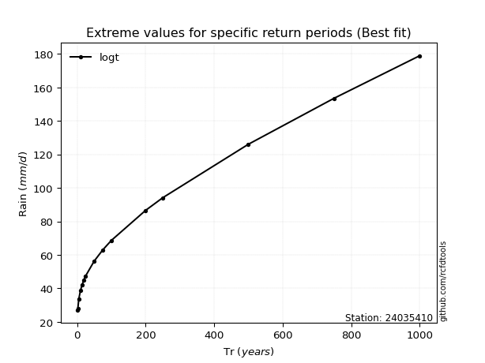</img>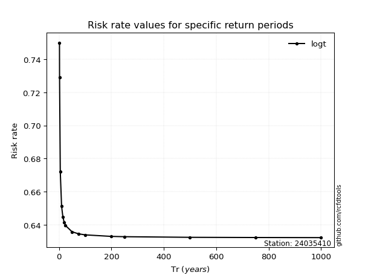</img>

</div>


<sub>**APP DISCLAIMER**: NO WARRANTY - This software is provided by [github.com/rcfdtools](https://github.com/rcfdtools) "as is", without any express or implied warranty, including warranties of merchantability, fitness for a particular purpose, or non-infringement. There is no guarantee that the software will be error-free or operate without interruption. LIMITATION OF LIABILITY - Neither the authors nor copyright holders will be liable for claims or damages arising from the software or its use. You are responsible for determining if the software is appropriate for your use and assume all associated risks, including errors, legal compliance, and data loss. NO PROFESSIONAL ADVICE - The software provides general information and does not offer professional advice. It should not replace consultation with professional advisors.</sub>