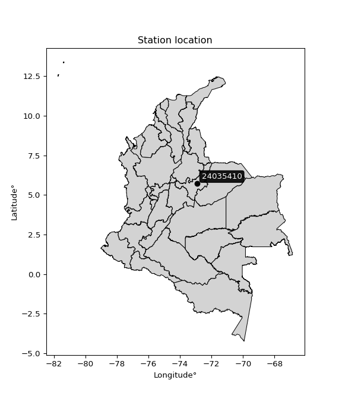

<div align="center">


</div>

# PMax24h Station (Rain, Pmax24h): 24035410

Maximum Precipitation in 24 hours (PMax24h) is the greatest amount of rainfall for a specific duration that is meteorologically possible for a given location, acting as a "worst-case" scenario for extreme storms, crucial for designing safety-critical infrastructure like bridges, river deviations, dams, spillways, and nuclear plants to prevent catastrophic failure. The PMax24h is related with the Probable Maximum Precipitation (PMP) and it is calculated by hydrologists using meteorological data to determine the upper limit of extreme rainfall, often leading to the Probable Maximum Flood (PMF) for flood control design, and is increasingly being studied for climate change impacts. Probable Maximum Precipitation (PMP) is the theoretical upper limit of rainfall, a deterministic estimate for extreme events, while probability distributions (like GEV, Gumbel) describe the likelihood and frequency of various precipitation amounts, including rare ones, showing how often events occur, with PMP representing the extreme end of these distributions, used for critical infrastructure design to ensure safety against the worst conceivable weather, unlike standard statistical forecasts which cover typical probabilities.

The most common probability distributions in hydrology, used for analyzing floods, rainfall, and streamflow, include the Normal, Log-Normal, Gumbel, Gamma (including Log-Pearson Type III), and Generalized Extreme Value (GEV) distributions, often chosen based on the data´s skewness and whether modeling extremes or general conditions, with Gumbel and GEV popular for extreme events like floods, while the Normal distribution serves as a baseline, though often requiring transformations for skewed hydrological data. These distributions help in designing water infrastructure, managing water resources, and forecasting hydrologic events.

> Hydrological data often isn´t perfectly normal (it´s skewed), so different distributions are needed for different applications, such as: **Flood Frequency Analysis**: Using Gumbel, GEV, or Log-Pearson Type III for predicting extreme flood magnitudes and their return periods, **Rainfall Analysis**: Normal for annual totals, but Log-Normal, Weibull, or GEV for intensity or extreme daily rainfall, **Streamflow Modeling**: Gamma and Log-Normal for maximum flows, GEV for minimum flows, and Kappa for daily flows.

<div align="center">

</img>

</div>


## A. General information


### 1. General running parameters

• app_version: _v20260225_. • runtime: _2026-02-27 14:50:08.749431_. • Python version: _3.14.0_. • SciPy version: _1.16.3_. • Pandas version: _2.3.3_. • NumPy version: _2.3.5_. • Stations dataset (station_dataset_file): _dataset/pmax24h_in/automatic_colombia_2003_2025.csv_. • Stations catalog (station_catalog_file): _dataset/CNE.xls_. • Minimum year to eval til year_max (date_min): _1900_. • Maximum year to eval since year_min (date_max): _2025_. • Creates, save and include plots into reports (create_plot): _False_. • Plot only fit distributions with Δo > Δ (plot_only_fit): _True_. • Plot only simple graphs avoiding multiple CDFs and multiple Extreme values plots (plot_only_simple): _False_. • Eval low extreme values, if False, evaluates high extreme values (low_extreme): _False_. • Eval every SciPy distribution as logarithmic (pdist_logarithmic_on): _True_. • Standard deviation normalized (ddof): _1.0_. • Return periods to eval in years (Tr): _[2, 2.33, 5, 10, 15, 20, 25, 50, 75, 100, 200, 250, 500, 750, 1000]_. • Minimum data sample per station, 0 means any (minimum_sample): _5_. • Z-Score maximum threshold to adjust a value, 0 means disable (zscore_max): _3.5_. • Z-Score minimum threshold to adjust a value, 0 means disable (zscore_min): _-2.5_. • Avoid zeros, e.g. rain = 0 (avoid_zeros): _True_. • Avoid null values (avoid_nans): _True_. 

:file_folder:Table: [dataset.csv](../../dataset/pmax24h_in/automatic_colombia_2003_2025.csv)

> Delta Degrees of Freedom (DDOF): is a parameter used in the formulas for calculating variance and standard deviation. When ddof=0, the divisor is $N$ (the total number of observations) and this is used when your data set is the entire population. When ddof=1, the divisor is $N-1$ and this is used when your data set is a sample drawn from a larger population. Using $N-1$ provides an unbiased estimate of the population variance (known as Bessel´s correction).


### 2. Station info and location

|   id |   CODIGO | NOMBRE                    | CATEGORIA              | TECNOLOGIA                | ESTADO   | FECHA_INSTALACION   |   FECHA_SUSPENSION |   ALTITUD |   LATITUD |   LONGITUD | DEPARTAMENTO   | MUNICIPIO   | AREA_OPERATIVA                              | ENTIDAD                                                     | AREA_HIDROGRAFICA   | ZONA_HIDROGRAFICA   | SUBZONA_HIDROGRAFICA   |   CORRIENTE | Catalogo   |   Version |
|-----:|---------:|:--------------------------|:-----------------------|:--------------------------|:---------|:--------------------|-------------------:|----------:|----------:|-----------:|:---------------|:------------|:--------------------------------------------|:------------------------------------------------------------|:--------------------|:--------------------|:-----------------------|------------:|:-----------|----------:|
|    0 | 24035410 | SOGAMOSO - AUT [24035410] | Meteorológica Especial | Automática con Telemetría | Activa   | 06/12/2007          |                nan |      2495 |   5.72647 |   -72.9207 | Boyacá         | Sogamoso    | Area Operativa 06 - Boyacá-Casanare-Vichada | INSTITUTO DE HIDROLOGIA METEOROLOGIA Y ESTUDIOS AMBIENTALES | Magdalena Cauca     | Sogamoso            | Río Chicamocha         |         nan | CNE_IDEAM  |  20251226 |

<div align="center">

Dynamic map: [:earth_americas:Google](http://maps.google.com/maps?q=5.72647,-72.92067) [:earth_americas:OSM](https://www.openstreetmap.org/#map=18/5.72647/-72.92067&layers=P) [:earth_americas:Bing](https://www.bing.com/maps?cp=5.72647~-72.92067&lvl=18) [:earth_americas:Apple](https://maps.apple.com/frame?center=5.72647%2C-72.92067&span=0.003%2C0.006)

</div>


<div align="center">

```geojson
{
  "type": "Feature",
  "geometry": {
    "type": "Point", 
    "coordinates": [-72.92067, 5.72647]
  }, 
  "properties": {
    "Name": "24035410"
  }
}
```

</div>


### 3. Discrete values table and plot

<div align="center">

|               |           0 |           1 |           2 |           3 |           4 |         5 |           6 |           7 |           8 |           9 |         10 |          11 |          12 |         13 |          14 |          15 |          16 |         17 |
|:--------------|------------:|------------:|------------:|------------:|------------:|----------:|------------:|------------:|------------:|------------:|-----------:|------------:|------------:|-----------:|------------:|------------:|------------:|-----------:|
| Date          | 2008        | 2009        | 2010        | 2011        | 2012        | 2013      | 2014        | 2015        | 2016        | 2017        | 2018       | 2019        | 2020        | 2021       | 2022        | 2023        | 2024        | 2025       |
| Value         |   21.5      |   27.2      |   33.4      |   28.2      |   29.8      |   54.4    |   19.1      |   24.3      |   27.6      |   28.4      |   38.9667  |   20.9      |   22.9      |   19       |   21.3      |   31.2      |   64.4      |   29.4     |
| Value_initial |   21.5      |   27.2      |   33.4      |   28.2      |   29.8      |   54.4    |   19.1      |   24.3      |   27.6      |   28.4      |  198.4     |   20.9      |   22.9      |   19       |   21.3      |   31.2      |   64.4      |   29.4     |
| count         |   18        |   18        |   18        |   18        |   18        |   18      |   18        |   18        |   18        |   18        |   18       |   18        |   18        |   18       |   18        |   18        |   18        |   18       |
| mean          |   38.9667   |   38.9667   |   38.9667   |   38.9667   |   38.9667   |   38.9667 |   38.9667   |   38.9667   |   38.9667   |   38.9667   |   38.9667  |   38.9667   |   38.9667   |   38.9667  |   38.9667   |   38.9667   |   38.9667   |   38.9667  |
| std           |   41.4986   |   41.4986   |   41.4986   |   41.4986   |   41.4986   |   41.4986 |   41.4986   |   41.4986   |   41.4986   |   41.4986   |   41.4986  |   41.4986   |   41.4986   |   41.4986  |   41.4986   |   41.4986   |   41.4986   |   41.4986  |
| zscore        |   -0.420897 |   -0.283543 |   -0.134141 |   -0.259446 |   -0.220891 |    0.3719 |   -0.478731 |   -0.353425 |   -0.273905 |   -0.254627 |    3.84189 |   -0.435356 |   -0.387161 |   -0.48114 |   -0.425717 |   -0.187155 |    0.612872 |   -0.23053 |


</div>


> The initial value (value_initial) correspond to the initial obtained or null completed value, and value (value) is adjusted only when the initial value is outside the valid range (outlier) definite through the Z-Score value. If Z-Score is active, values out of range or outliers are replaced with the station mean value. A Z-Score (or standard score) measures how many standard deviations a data point is from the mean of a dataset, indicating its relative position; positive scores mean above the mean, negative mean below, and a score of zero is exactly at the mean, allowing for comparison of values from different distributions. It´s calculated using the formula $z=(x–μ)/σ$, where $x$ is the data point, $μ$ is the mean, and $σ$ is the standard deviation, helping identify outliers and understand probability.
>
> <sub>**Note**: In this study, "completing" (filling gaps in) and "extending" (forecasting or lengthening the historical record) rainfall data series are avoided for certain critical analyses because they introduce artificial bias and uncertainty, which can distort the statistics of rare events (extremes), alter day-to-day variability, and compromise the integrity and homogeneity of the original data. Some reasons against Completing/Extending rainfall data are: **Distortion of Extremes and Variability**: The primary issue is that most gap-filling or extension methods rely on averaging or regression with nearby stations, which inherently smooths the data. Rainfall is highly variable in space and time, with a large percentage of zero values and occasional large storms. Infilling methods often underestimate the highest values and overestimate the lowest (zero) values, which severely distorts analyses focused on flood frequency, drought severity, and intensity-duration-frequency (IDF) curves, **Loss of Data Homogeneity**: Infilled or extended data are synthetic estimates, not actual measurements. Combining these estimates with observed data can violate the assumption of data homogeneity, which requires that the data properties do not change over time. Inhomogeneity can lead to incorrect conclusions about long-term trends or changes in climate patterns, **Propagation of Errors**: Errors and biases from the original data (e.g., wind-induced undercatch, instrument errors, site changes) or the data used for imputation can propagate through the analysis, leading to unreliable hydrological models and inaccurate predictions, **Compromised Statistical Integrity**: For statistical analyses, especially those involving the frequency of events, using artificial data can introduce time bias or autocorrelation that doesn´t exist in reality, making it difficult to assess the true probability of events, **Difficulty in Validation**: It is difficult to accurately validate the quality of filled or extended data, especially for past periods where ground-truth measurements are unavailable. The reliability of imputation techniques heavily depends on the density of the surrounding station network and the complexity of the local topography.</sub>


### 4. Active continuous probability distributions from SciPy (80 of 104 available)

A Probability Density Function (PDF) describes the relative likelihood of a continuous random variable falling within a specific range, where the total area under its curve equals 1, and the area over any interval gives the actual probability for that range. Unlike discrete probabilities (like rolling a die), a PDF shows density, not direct probability for a single point (which is zero), with higher points indicating higher likelihood, often visualized as a bell curve for normal distributions.

A log of a probability density function (log-PDF) is simply the logarithm of the PDF´s value, denoted as $log(f(x))$, useful for converting multiplication of probabilities into addition, improving numerical stability with tiny numbers, and connecting to information theory concepts like entropy. Instead of dealing with very small probabilities (e.g., 0.000001), log-PDFs use negative numbers (e.g., $log(0.00001) ≈ -11.51$ that are easier for computers to handle, preventing underflow errors and simplifying complex calculations. In this study, each active probability distribution from SciPy is also evaluated in the $log$ form.

[scipy.stats](https://docs.scipy.org/doc/scipy/reference/stats.html) is a Python´s powerful submodule within the SciPy library for comprehensive statistical analysis, offering over 130 probability distributions (like Normal, Poisson, etc.), functions for descriptive stats (mean, variance), hypothesis testing (t-tests, chi-square), random variable generation, and statistical tests, making it essential for data science, modeling, and research. It provides tools to explore, model, and draw conclusions from data efficiently, working seamlessly with [NumPy](https://numpy.org/).

<div align="center">

|   id | p_dist           |   n_parameter | fit_method   | label                                                                       | active   | ref                                                                                                      |
|-----:|:-----------------|--------------:|:-------------|:----------------------------------------------------------------------------|:---------|:---------------------------------------------------------------------------------------------------------|
|    0 | alpha            |             3 | MLE          | Alpha                                                                       | True     | [:mortar_board:](https://docs.scipy.org/doc/scipy/reference/generated/scipy.stats.alpha.html)            |
|    1 | anglit           |             2 | MM           | Anglit                                                                      | True     | [:mortar_board:](https://docs.scipy.org/doc/scipy/reference/generated/scipy.stats.anglit.html)           |
|    2 | arcsine          |             2 | MM           | Arcsine                                                                     | True     | [:mortar_board:](https://docs.scipy.org/doc/scipy/reference/generated/scipy.stats.arcsine.html)          |
|    3 | argus            |             3 | MLE          | Argus                                                                       | True     | [:mortar_board:](https://docs.scipy.org/doc/scipy/reference/generated/scipy.stats.argus.html)            |
|    4 | beta             |             4 | MLE          | Beta                                                                        | True     | [:mortar_board:](https://docs.scipy.org/doc/scipy/reference/generated/scipy.stats.beta.html)             |
|    5 | betaprime        |             4 | MLE          | Beta prime                                                                  | True     | [:mortar_board:](https://docs.scipy.org/doc/scipy/reference/generated/scipy.stats.betaprime.html)        |
|    6 | bradford         |             3 | MLE          | Bradford                                                                    | True     | [:mortar_board:](https://docs.scipy.org/doc/scipy/reference/generated/scipy.stats.bradford.html)         |
|    7 | burr             |             4 | MLE          | Burr (Type III)                                                             | True     | [:mortar_board:](https://docs.scipy.org/doc/scipy/reference/generated/scipy.stats.burr.html)             |
|    8 | burr12           |             4 | MLE          | Burr (Type III) 12                                                          | True     | [:mortar_board:](https://docs.scipy.org/doc/scipy/reference/generated/scipy.stats.burr12.html)           |
|    9 | cosine           |             2 | MLE          | Cosine                                                                      | True     | [:mortar_board:](https://docs.scipy.org/doc/scipy/reference/generated/scipy.stats.cosine.html)           |
|   10 | crystalball      |             4 | MLE          | Crystalball                                                                 | True     | [:mortar_board:](https://docs.scipy.org/doc/scipy/reference/generated/scipy.stats.crystalball.html)      |
|   11 | dgamma           |             3 | MLE          | Double gamma                                                                | True     | [:mortar_board:](https://docs.scipy.org/doc/scipy/reference/generated/scipy.stats.dgamma.html)           |
|   12 | dweibull         |             3 | MLE          | Double Weibull                                                              | True     | [:mortar_board:](https://docs.scipy.org/doc/scipy/reference/generated/scipy.stats.dweibull.html)         |
|   13 | erlang           |             3 | MLE          | Erlang                                                                      | True     | [:mortar_board:](https://docs.scipy.org/doc/scipy/reference/generated/scipy.stats.erlang.html)           |
|   14 | exponnorm        |             3 | MLE          | Exponentially modified Normal                                               | True     | [:mortar_board:](https://docs.scipy.org/doc/scipy/reference/generated/scipy.stats.exponnorm.html)        |
|   15 | exponpow         |             3 | MLE          | Exponential power                                                           | True     | [:mortar_board:](https://docs.scipy.org/doc/scipy/reference/generated/scipy.stats.exponpow.html)         |
|   16 | exponweib        |             4 | MLE          | Exponentiated Weibull                                                       | True     | [:mortar_board:](https://docs.scipy.org/doc/scipy/reference/generated/scipy.stats.exponweib.html)        |
|   17 | f                |             4 | MLE          | F                                                                           | True     | [:mortar_board:](https://docs.scipy.org/doc/scipy/reference/generated/scipy.stats.f.html)                |
|   18 | fatiguelife      |             3 | MLE          | Fatigue-life (Birnbaum-Saunders)                                            | True     | [:mortar_board:](https://docs.scipy.org/doc/scipy/reference/generated/scipy.stats.fatiguelife.html)      |
|   19 | foldnorm         |             3 | MM           | Fold Normal                                                                 | True     | [:mortar_board:](https://docs.scipy.org/doc/scipy/reference/generated/scipy.stats.foldnorm.html)         |
|   20 | gamma            |             3 | MLE          | Gamma                                                                       | True     | [:mortar_board:](https://docs.scipy.org/doc/scipy/reference/generated/scipy.stats.gamma.html)            |
|   21 | gausshyper       |             6 | MLE          | Gauss hypergeometric                                                        | True     | [:mortar_board:](https://docs.scipy.org/doc/scipy/reference/generated/scipy.stats.gausshyper.html)       |
|   22 | genexpon         |             5 | MLE          | Generalized exponential                                                     | True     | [:mortar_board:](https://docs.scipy.org/doc/scipy/reference/generated/scipy.stats.genexpon.html)         |
|   23 | genextreme       |             3 | MLE          | Generalized exponential                                                     | True     | [:mortar_board:](https://docs.scipy.org/doc/scipy/reference/generated/scipy.stats.genextreme.html)       |
|   24 | gengamma         |             4 | MLE          | Generalized gamma                                                           | True     | [:mortar_board:](https://docs.scipy.org/doc/scipy/reference/generated/scipy.stats.gengamma.html)         |
|   25 | genhalflogistic  |             3 | MLE          | Generalized half-logistic                                                   | True     | [:mortar_board:](https://docs.scipy.org/doc/scipy/reference/generated/scipy.stats.genhalflogistic.html)  |
|   26 | genlogistic      |             3 | MLE          | Generalized logistic                                                        | True     | [:mortar_board:](https://docs.scipy.org/doc/scipy/reference/generated/scipy.stats.genlogistic.html)      |
|   27 | gennorm          |             3 | MLE          | Generalized Normal                                                          | True     | [:mortar_board:](https://docs.scipy.org/doc/scipy/reference/generated/scipy.stats.gennorm.html)          |
|   28 | genpareto        |             3 | MLE          | Generalized Pareto                                                          | True     | [:mortar_board:](https://docs.scipy.org/doc/scipy/reference/generated/scipy.stats.genpareto.html)        |
|   29 | gompertz         |             3 | MLE          | Gompertz (or truncated Gumbel)                                              | True     | [:mortar_board:](https://docs.scipy.org/doc/scipy/reference/generated/scipy.stats.gompertz.html)         |
|   30 | gumbel_l         |             2 | MM           | Gumbel Left Skew                                                            | True     | [:mortar_board:](https://docs.scipy.org/doc/scipy/reference/generated/scipy.stats.gumbel_l.html)         |
|   31 | gumbel_r         |             2 | MM           | Gumbel Right Skew                                                           | True     | [:mortar_board:](https://docs.scipy.org/doc/scipy/reference/generated/scipy.stats.gumbel_r.html)         |
|   32 | halfgennorm      |             3 | MLE          | Upper half of a generalized normal                                          | True     | [:mortar_board:](https://docs.scipy.org/doc/scipy/reference/generated/scipy.stats.halfgennorm.html)      |
|   33 | halflogistic     |             2 | MM           | Half-logistic                                                               | True     | [:mortar_board:](https://docs.scipy.org/doc/scipy/reference/generated/scipy.stats.halflogistic.html)     |
|   34 | halfnorm         |             2 | MM           | Half Normal                                                                 | True     | [:mortar_board:](https://docs.scipy.org/doc/scipy/reference/generated/scipy.stats.halfnorm.html)         |
|   35 | hypsecant        |             2 | MM           | hyperbolic secant                                                           | True     | [:mortar_board:](https://docs.scipy.org/doc/scipy/reference/generated/scipy.stats.hypsecant.html)        |
|   36 | invgamma         |             3 | MLE          | Inverted gamma                                                              | True     | [:mortar_board:](https://docs.scipy.org/doc/scipy/reference/generated/scipy.stats.invgamma.html)         |
|   37 | invgauss         |             3 | MLE          | Inverse Gaussian                                                            | True     | [:mortar_board:](https://docs.scipy.org/doc/scipy/reference/generated/scipy.stats.invgauss.html)         |
|   38 | invweibull       |             3 | MLE          | Inverted Weibull                                                            | True     | [:mortar_board:](https://docs.scipy.org/doc/scipy/reference/generated/scipy.stats.invweibull.html)       |
|   39 | johnsonsb        |             4 | MLE          | Johnson SB                                                                  | True     | [:mortar_board:](https://docs.scipy.org/doc/scipy/reference/generated/scipy.stats.johnsonsb.html)        |
|   40 | johnsonsu        |             4 | MLE          | Johnson Su                                                                  | True     | [:mortar_board:](https://docs.scipy.org/doc/scipy/reference/generated/scipy.stats.johnsonsu.html)        |
|   41 | kappa3           |             3 | MLE          | Kappa 3                                                                     | True     | [:mortar_board:](https://docs.scipy.org/doc/scipy/reference/generated/scipy.stats.kappa3.html)           |
|   42 | kappa4           |             4 | MLE          | Kappa 4                                                                     | True     | [:mortar_board:](https://docs.scipy.org/doc/scipy/reference/generated/scipy.stats.kappa4.html)           |
|   43 | ksone            |             3 | MLE          | Kolmogorov-Smirnov one-sided test statistic distribution                    | True     | [:mortar_board:](https://docs.scipy.org/doc/scipy/reference/generated/scipy.stats.ksone.html)            |
|   44 | kstwobign        |             2 | MLE          | Limiting distribution of scaled Kolmogorov-Smirnov two-sided test statistic | True     | [:mortar_board:](https://docs.scipy.org/doc/scipy/reference/generated/scipy.stats.kstwobign.html)        |
|   45 | laplace          |             2 | MM           | Laplace                                                                     | True     | [:mortar_board:](https://docs.scipy.org/doc/scipy/reference/generated/scipy.stats.laplace.html)          |
|   46 | levy_l           |             2 | MLE          | Left-skewed Levy                                                            | True     | [:mortar_board:](https://docs.scipy.org/doc/scipy/reference/generated/scipy.stats.levy_l.html)           |
|   47 | loggamma         |             3 | MLE          | Log gamma                                                                   | True     | [:mortar_board:](https://docs.scipy.org/doc/scipy/reference/generated/scipy.stats.loggamma.html)         |
|   48 | logistic         |             2 | MM           | Logistic (or Sech-squared)                                                  | True     | [:mortar_board:](https://docs.scipy.org/doc/scipy/reference/generated/scipy.stats.logistic.html)         |
|   49 | loglaplace       |             3 | MLE          | Log-Laplace                                                                 | True     | [:mortar_board:](https://docs.scipy.org/doc/scipy/reference/generated/scipy.stats.loglaplace.html)       |
|   50 | lomax            |             3 | MLE          | Lomax (Pareto of the second kind)                                           | True     | [:mortar_board:](https://docs.scipy.org/doc/scipy/reference/generated/scipy.stats.lomax.html)            |
|   51 | maxwell          |             2 | MM           | Maxwell                                                                     | True     | [:mortar_board:](https://docs.scipy.org/doc/scipy/reference/generated/scipy.stats.maxwell.html)          |
|   52 | mielke           |             4 | MLE          | Mielke Beta-Kappa / Dagum                                                   | True     | [:mortar_board:](https://docs.scipy.org/doc/scipy/reference/generated/scipy.stats.mielke.html)           |
|   53 | moyal            |             2 | MM           | Moyal                                                                       | True     | [:mortar_board:](https://docs.scipy.org/doc/scipy/reference/generated/scipy.stats.moyal.html)            |
|   54 | nakagami         |             3 | MLE          | Nakagami                                                                    | True     | [:mortar_board:](https://docs.scipy.org/doc/scipy/reference/generated/scipy.stats.nakagami.html)         |
|   55 | ncf              |             5 | MLE          | Non-central F distribution                                                  | True     | [:mortar_board:](https://docs.scipy.org/doc/scipy/reference/generated/scipy.stats.ncf.html)              |
|   56 | nct              |             4 | MLE          | Non-central Student’s t                                                     | True     | [:mortar_board:](https://docs.scipy.org/doc/scipy/reference/generated/scipy.stats.nct.html)              |
|   57 | norm             |             2 | MM           | Normal                                                                      | True     | [:mortar_board:](https://docs.scipy.org/doc/scipy/reference/generated/scipy.stats.norm.html)             |
|   58 | pearson3         |             3 | MM           | Pearson type III                                                            | True     | [:mortar_board:](https://docs.scipy.org/doc/scipy/reference/generated/scipy.stats.pearson3.html)         |
|   59 | powerlaw         |             3 | MLE          | Power-function                                                              | True     | [:mortar_board:](https://docs.scipy.org/doc/scipy/reference/generated/scipy.stats.powerlaw.html)         |
|   60 | rayleigh         |             2 | MM           | Rayleigh                                                                    | True     | [:mortar_board:](https://docs.scipy.org/doc/scipy/reference/generated/scipy.stats.rayleigh.html)         |
|   61 | rdist            |             3 | MLE          | R-distributed (symmetric beta)                                              | True     | [:mortar_board:](https://docs.scipy.org/doc/scipy/reference/generated/scipy.stats.rdist.html)            |
|   62 | rice             |             3 | MLE          | Rice                                                                        | True     | [:mortar_board:](https://docs.scipy.org/doc/scipy/reference/generated/scipy.stats.rice.html)             |
|   63 | semicircular     |             2 | MM           | Semicircular                                                                | True     | [:mortar_board:](https://docs.scipy.org/doc/scipy/reference/generated/scipy.stats.semicircular.html)     |
|   64 | skewnorm         |             3 | MLE          | Skew normal                                                                 | True     | [:mortar_board:](https://docs.scipy.org/doc/scipy/reference/generated/scipy.stats.skewnorm.html)         |
|   65 | t                |             3 | MLE          | Student’s t                                                                 | True     | [:mortar_board:](https://docs.scipy.org/doc/scipy/reference/generated/scipy.stats.t.html)                |
|   66 | trapezoid        |             4 | MLE          | Trapezoid                                                                   | True     | [:mortar_board:](https://docs.scipy.org/doc/scipy/reference/generated/scipy.stats.trapezoid.html)        |
|   67 | triang           |             3 | MLE          | Triangular                                                                  | True     | [:mortar_board:](https://docs.scipy.org/doc/scipy/reference/generated/scipy.stats.triang.html)           |
|   68 | truncexpon       |             3 | MLE          | Truncated exponential                                                       | True     | [:mortar_board:](https://docs.scipy.org/doc/scipy/reference/generated/scipy.stats.truncexpon.html)       |
|   69 | truncnorm        |             4 | MLE          | Truncated normal                                                            | True     | [:mortar_board:](https://docs.scipy.org/doc/scipy/reference/generated/scipy.stats.truncnorm.html)        |
|   70 | truncpareto      |             4 | MLE          | Upper truncated Pareto                                                      | True     | [:mortar_board:](https://docs.scipy.org/doc/scipy/reference/generated/scipy.stats.truncpareto.html)      |
|   71 | truncweibull_min |             5 | MLE          | Doubly truncated Weibull minimum                                            | True     | [:mortar_board:](https://docs.scipy.org/doc/scipy/reference/generated/scipy.stats.truncweibull_min.html) |
|   72 | tukeylambda      |             3 | MLE          | Tukey-Lamdba                                                                | True     | [:mortar_board:](https://docs.scipy.org/doc/scipy/reference/generated/scipy.stats.tukeylambda.html)      |
|   73 | uniform          |             2 | MLE          | Uniform                                                                     | True     | [:mortar_board:](https://docs.scipy.org/doc/scipy/reference/generated/scipy.stats.uniform.html)          |
|   74 | vonmises         |             3 | MLE          | Von Mises                                                                   | True     | [:mortar_board:](https://docs.scipy.org/doc/scipy/reference/generated/scipy.stats.vonmises.html)         |
|   75 | vonmises_line    |             3 | MLE          | Von Mises line                                                              | True     | [:mortar_board:](https://docs.scipy.org/doc/scipy/reference/generated/scipy.stats.vonmises_line.html)    |
|   76 | wald             |             2 | MM           | Wald                                                                        | True     | [:mortar_board:](https://docs.scipy.org/doc/scipy/reference/generated/scipy.stats.wald.html)             |
|   77 | weibull_max      |             3 | MLE          | Weibull maximum                                                             | True     | [:mortar_board:](https://docs.scipy.org/doc/scipy/reference/generated/scipy.stats.weibull_max.html)      |
|   78 | weibull_min      |             3 | MLE          | Weibull minimum                                                             | True     | [:mortar_board:](https://docs.scipy.org/doc/scipy/reference/generated/scipy.stats.weibull_min.html)      |
|   79 | wrapcauchy       |             3 | MLE          | Wrapped  Cauchy                                                             | True     | [:mortar_board:](https://docs.scipy.org/doc/scipy/reference/generated/scipy.stats.wrapcauchy.html)       |

</div>

> **n_parameter:** # arguments & localization & scale.
>
> **Fit methods:** (MLE) maximum likelihood, (MM) L-moments.
>
>**Inactive** (With the only purpose of prevent loops, zero divisions, infinite values, over high estimated values or horizontal trending for recurrence intervals estimations, the follow distributions were disabled.)**:** lognorm, norminvgauss, powernorm, powerlognorm, cauchy, halfcauchy, foldcauchy, skewcauchy, chi2, expon, fisk, genhyperbolic, geninvgauss, gibrat, kstwo, laplace_asymmetric, levy, levy_stable, ncx2, pareto, rel_breitwigner, recipinvgauss, studentized_range, loguniform, 


## B. Probability (PDF) vs. Empirical (EDF) distributions functions

A continuous probability distribution (CPD) describes probabilities for variables that can take any value within a range (like rain any time), unlike discrete variables with specific outcomes (like temperature). It uses a Probability Density Function (PDF), a curve where the total area under it equals 1, and the probability of the variable falling within an interval (a to b) is found by calculating the area under the curve between those points. A key feature is that the probability of hitting any single exact value is zero, so probabilities are always expressed for ranges, e.g., $P(a ≤ X ≤ b)$.

<div align="center">

Distributions parameters from station values
|     |   station | p_dist              |   n |             loc |         scale | shape                  | shape1                | shape2              | shape3             |
|----:|----------:|:--------------------|----:|----------------:|--------------:|:-----------------------|:----------------------|:--------------------|:-------------------|
|   0 |  24035410 | alpha               |  18 |     7.58495     |  50.0096      | 2.6545482304237185     |                       |                     |                    |
|   1 |  24035410 | anglit              |  18 |    30.1093      |  34.096       |                        |                       |                     |                    |
|   2 |  24035410 | arcsine             |  18 |    13.6264      |  32.9658      |                        |                       |                     |                    |
|   3 |  24035410 | argus               |  18 |    -1.86333     |  67.3607      | 3.2288381923400735e-06 |                       |                     |                    |
|   4 |  24035410 | beta                |  18 |    19           |  55.6202      | 0.3399662241396135     | 0.9221785787020123    |                     |                    |
|   5 |  24035410 | betaprime           |  18 |     0.325684    |   3.0273      | 106.78721624624626     | 11.961697554884864    |                     |                    |
|   6 |  24035410 | bradford            |  18 |    19           |  54.6829      | 10.764285855082093     |                       |                     |                    |
|   7 |  24035410 | burr                |  18 |     0.487931    |   9.18638     | 4.15264484625027       | 55.64159754572387     |                     |                    |
|   8 |  24035410 | burr12              |  18 |     0.444341    |  18.4731      | 571.5407873534779      | 0.004229367826144169  |                     |                    |
|   9 |  24035410 | cosine              |  18 |    27.1433      |   4.62759     |                        |                       |                     |                    |
|  10 |  24035410 | crystalball         |  18 |    30.1093      |  11.6552      | 1874.7072067020417     | 2777.2860706655383    |                     |                    |
|  11 |  24035410 | dgamma              |  18 |    27.6         |   9.13841     | 0.829640149834395      |                       |                     |                    |
|  12 |  24035410 | dweibull            |  18 |    28.4         |   7.40095     | 0.8272888860536365     |                       |                     |                    |
|  13 |  24035410 | erlang              |  18 |    19           |  15.8242      | 0.442403295962822      |                       |                     |                    |
|  14 |  24035410 | exponnorm           |  18 |    18.9841      |   0.00582265  | 1896.2592512214615     |                       |                     |                    |
|  15 |  24035410 | exponpow            |  18 |    19           |  21.4801      | 0.7900824221365947     |                       |                     |                    |
|  16 |  24035410 | exponweib           |  18 |    19           |  13.5715      | 0.7670641388305647     | 0.8806662856684778    |                     |                    |
|  17 |  24035410 | f                   |  18 |    14.5382      |  10.3158      | 1755.6830553054729     | 5.545807367297238     |                     |                    |
|  18 |  24035410 | fatiguelife         |  18 |    17.376       |   8.59817     | 0.9753090291067361     |                       |                     |                    |
|  19 |  24035410 | foldnorm            |  18 |    13.7294      |  20.2892      | 0.0742002093584404     |                       |                     |                    |
|  20 |  24035410 | gamma               |  18 |    19           |  10.0263      | 0.8610427949177355     |                       |                     |                    |
|  21 |  24035410 | gausshyper          |  18 |    19           |  47.7528      | 0.7544630042833547     | 1.3593489630291424    | 1.1581994442833632  | 0.7215900674797535 |
|  22 |  24035410 | genexpon            |  18 |    19           |  19.491       | 1.754685727391972      | 8.781697549679005e-08 | 1.5772337564497487  |                    |
|  23 |  24035410 | genextreme          |  18 |    24.0878      |   5.42878     | -0.41063639929794016   |                       |                     |                    |
|  24 |  24035410 | gengamma            |  18 |    19           |  12.56        | 0.8637522106425446     | 0.8910149202848716    |                     |                    |
|  25 |  24035410 | genhalflogistic     |  18 |    18.3781      |   8.47314     | 6.978643119160914e-10  |                       |                     |                    |
|  26 |  24035410 | genlogistic         |  18 |   -24.7637      |   6.96516     | 1352.0695237660966     |                       |                     |                    |
|  27 |  24035410 | gennorm             |  18 |    28.2         |   2.02519     | 0.5654392447143568     |                       |                     |                    |
|  28 |  24035410 | genpareto           |  18 |    19           |  10.1892      | 0.09237657110009936    |                       |                     |                    |
|  29 |  24035410 | gompertz            |  18 |    19           |   2.76611e+12 | 217664508936.45078     |                       |                     |                    |
|  30 |  24035410 | gumbel_l            |  18 |    35.3547      |   9.08748     |                        |                       |                     |                    |
|  31 |  24035410 | gumbel_r            |  18 |    24.8638      |   9.08748     |                        |                       |                     |                    |
|  32 |  24035410 | halfgennorm         |  18 |    19           |  11.2832      | 0.9876185499754786     |                       |                     |                    |
|  33 |  24035410 | halflogistic        |  18 |    16.2952      |   9.96474     |                        |                       |                     |                    |
|  34 |  24035410 | halfnorm            |  18 |    14.6824      |  19.3347      |                        |                       |                     |                    |
|  35 |  24035410 | hypsecant           |  18 |    30.1093      |   7.4199      |                        |                       |                     |                    |
|  36 |  24035410 | invgamma            |  18 |    14.522       |  28.6334      | 2.772897483718295      |                       |                     |                    |
|  37 |  24035410 | invgauss            |  18 |    16.7071      |  14.9363      | 0.8972929942832462     |                       |                     |                    |
|  38 |  24035410 | invweibull          |  18 |    10.8679      |  13.2199      | 2.4351346480816867     |                       |                     |                    |
|  39 |  24035410 | johnsonsb           |  18 |    19           |  45.4         | 0.5406019734214838     | 0.21753759149170282   |                     |                    |
|  40 |  24035410 | johnsonsu           |  18 |    17.5244      |   0.0663747   | -6.038100378907888     | 1.0881151128461717    |                     |                    |
|  41 |  24035410 | kappa3              |  18 |    19           |   9.56741     | 2.2783867549742935     |                       |                     |                    |
|  42 |  24035410 | kappa4              |  18 |    14.3188      |  50.354       | 1.102517765401142      | 1.0042472692042912    |                     |                    |
|  43 |  24035410 | ksone               |  18 |    14.46        |  54.48        | 1.0                    |                       |                     |                    |
|  44 |  24035410 | kstwobign           |  18 |    -1.11627     |  36.441       |                        |                       |                     |                    |
|  45 |  24035410 | laplace             |  18 |    30.1093      |   8.24144     |                        |                       |                     |                    |
|  46 |  24035410 | levy_l              |  18 |    68.0107      |  24.2383      |                        |                       |                     |                    |
|  47 |  24035410 | loggamma            |  18 | -4262.46        | 559.313       | 2153.555712290241      |                       |                     |                    |
|  48 |  24035410 | logistic            |  18 |    30.1093      |   6.42582     |                        |                       |                     |                    |
|  49 |  24035410 | loglaplace          |  18 |    -0.0730335   |  27.673       | 4.264777195653799      |                       |                     |                    |
|  50 |  24035410 | lomax               |  18 |    19           |   2.63622e+10 | 1097157170.898975      |                       |                     |                    |
|  51 |  24035410 | maxwell             |  18 |     2.49144     |  17.3069      |                        |                       |                     |                    |
|  52 |  24035410 | mielke              |  18 |     7.64791     |   4.00895     | 233.78984736346666     | 3.052206798298889     |                     |                    |
|  53 |  24035410 | moyal               |  18 |    23.4441      |   5.24666     |                        |                       |                     |                    |
|  54 |  24035410 | nakagami            |  18 |    19           |  25.2933      | 0.24257356050554887    |                       |                     |                    |
|  55 |  24035410 | ncf                 |  18 |    14.6229      |   9.96182     | 277.7292211085888      | 5.54660243322787      | 8.374965143053402   |                    |
|  56 |  24035410 | nct                 |  18 |    -0.16897     |   0.755351    | 6.363496521334298      | 34.79951905992321     |                     |                    |
|  57 |  24035410 | norm                |  18 |    30.1093      |  11.6552      |                        |                       |                     |                    |
|  58 |  24035410 | pearson3            |  18 |    30.1093      |  11.6551      | 1.7528332676819964     |                       |                     |                    |
|  59 |  24035410 | powerlaw            |  18 |    19           |  45.4         | 0.2576913097853807     |                       |                     |                    |
|  60 |  24035410 | rayleigh            |  18 |     7.81227     |  17.7904      |                        |                       |                     |                    |
|  61 |  24035410 | rdist               |  18 |    28.9833      |   9.98333     | 1.2288544556583876     |                       |                     |                    |
|  62 |  24035410 | rice                |  18 |    12.794       |  14.7591      | 0.0002079855419365199  |                       |                     |                    |
|  63 |  24035410 | semicircular        |  18 |    30.1093      |  23.3103      |                        |                       |                     |                    |
|  64 |  24035410 | skewnorm            |  18 |    19           |  16.1007      | 15115335.861461421     |                       |                     |                    |
|  65 |  24035410 | t                   |  18 |    26.6606      |   5.18888     | 1.79717612311785       |                       |                     |                    |
|  66 |  24035410 | trapezoid           |  18 |    14.46        |  54.48        | 1.0                    | 1.0                   |                     |                    |
|  67 |  24035410 | triang              |  18 |    19           |  49.8502      | 6.344688237512749e-07  |                       |                     |                    |
|  68 |  24035410 | truncexpon          |  18 |    18.9979      |  37.7304      | 1.2033292851028161     |                       |                     |                    |
|  69 |  24035410 | truncnorm           |  18 | -4222.49        | 223.2         | 19.00304412285037      | 19.20644985088062     |                     |                    |
|  70 |  24035410 | truncpareto         |  18 |  -149.091       | 168.091       | 14.187561985212469     | 1.2700919521378724    |                     |                    |
|  71 |  24035410 | truncweibull_min    |  18 |    18.9595      |  42.8912      | 0.6882109693974763     | 0.0009448719277905956 | 1.05943734857       |                    |
|  72 |  24035410 | tukeylambda         |  18 |    29.0825      |  10.9275      | 1.083809576965927      |                       |                     |                    |
|  73 |  24035410 | uniform             |  18 |    19           |  45.4         |                        |                       |                     |                    |
|  74 |  24035410 | vonmises            |  18 |     2.5721      |   1           | 0.47326929803533374    |                       |                     |                    |
|  75 |  24035410 | vonmises_line       |  18 |    28.9833      |   3.1778      | 0.2585210006270042     |                       |                     |                    |
|  76 |  24035410 | wald                |  18 |    18.4541      |  11.6552      |                        |                       |                     |                    |
|  77 |  24035410 | weibull_max         |  18 |    64.4         |   1.57253     | 0.2522290652067467     |                       |                     |                    |
|  78 |  24035410 | weibull_min         |  18 |    19           |  12.2304      | 0.8509848396142934     |                       |                     |                    |
|  79 |  24035410 | wrapcauchy          |  18 |    18.9999      |   7.22565     | 0.3795060442930333     |                       |                     |                    |
|  80 |  24035410 | logalpha            |  18 |     2.10483     |   5.09267     | 4.350414835851197      |                       |                     |                    |
|  81 |  24035410 | loganglit           |  18 |     3.34654     |   0.944921    |                        |                       |                     |                    |
|  82 |  24035410 | logarcsine          |  18 |     2.88971     |   0.913642    |                        |                       |                     |                    |
|  83 |  24035410 | logargus            |  18 |     2.52017     |   1.67416     | 0.00011230676220240646 |                       |                     |                    |
|  84 |  24035410 | logbeta             |  18 |     2.94444     |   2.15108     | 0.6595465975790069     | 3.486212776195405     |                     |                    |
|  85 |  24035410 | logbetaprime        |  18 |     2.25742     |   0.0831747   | 168.68753548989076     | 14.121895345611549    |                     |                    |
|  86 |  24035410 | logbradford         |  18 |     2.94443     |   1.22153     | 6.145686151900335      |                       |                     |                    |
|  87 |  24035410 | logburr             |  18 |     0.246587    |   1.73231     | 12.86328247752239      | 930.4259108614876     |                     |                    |
|  88 |  24035410 | logburr12           |  18 |    -0.944357    |   3.93337     | 85.35159474226327      | 0.1338323801665786    |                     |                    |
|  89 |  24035410 | logcosine           |  18 |     3.40721     |   0.297937    |                        |                       |                     |                    |
|  90 |  24035410 | logcrystalball      |  18 |     3.34654     |   0.323011    | 7.616425799071055      | 3287.531564014109     |                     |                    |
|  91 |  24035410 | logdgamma           |  18 |     3.31782     |   0.245183    | 0.9336591343689166     |                       |                     |                    |
|  92 |  24035410 | logdweibull         |  18 |     3.33932     |   0.239571    | 0.9602961105709881     |                       |                     |                    |
|  93 |  24035410 | logerlang           |  18 |     2.94444     |   0.426121    | 0.7588645178155151     |                       |                     |                    |
|  94 |  24035410 | logexponnorm        |  18 |     3.03255     |   0.126587    | 2.480411104866767      |                       |                     |                    |
|  95 |  24035410 | logexponpow         |  18 |     2.94444     |   0.849147    | 0.7083249608345517     |                       |                     |                    |
|  96 |  24035410 | logexponweib        |  18 |     2.94444     |   0.604752    | 0.49977551658918534    | 1.539463288621349     |                     |                    |
|  97 |  24035410 | logf                |  18 |     2.56623     |   0.671037    | 726.6245008210707      | 13.932561447117108    |                     |                    |
|  98 |  24035410 | logfatiguelife      |  18 |     2.77564     |   0.484649    | 0.595474237502311      |                       |                     |                    |
|  99 |  24035410 | logfoldnorm         |  18 |     2.87049     |   0.406556    | 1.005683559453007      |                       |                     |                    |
| 100 |  24035410 | loggamma            |  18 |     2.94444     |   0.647435    | 0.41138720644132964    |                       |                     |                    |
| 101 |  24035410 | loggausshyper       |  18 |     2.94444     |   1.24692     | 0.615413274033477      | 0.9965439019981996    | 1.1347738275763966  | 1.3838443287471416 |
| 102 |  24035410 | loggenexpon         |  18 |     2.94412     |   0.307267    | 0.543795413619997      | 6.071871126993123     | 0.03470029943861319 |                    |
| 103 |  24035410 | loggenextreme       |  18 |     3.18782     |   0.22542     | -0.11954975649331354   |                       |                     |                    |
| 104 |  24035410 | loggengamma         |  18 |     2.94444     |   0.674805    | 0.4990608218974405     | 1.4661941754983978    |                     |                    |
| 105 |  24035410 | loggenhalflogistic  |  18 |     2.93094     |   1.27963     | 1.0368316404027245     |                       |                     |                    |
| 106 |  24035410 | loggenlogistic      |  18 |     1.58595     |   0.237625    | 900.8052329069667      |                       |                     |                    |
| 107 |  24035410 | loggennorm          |  18 |     3.33932     |   0.231969    | 0.9838578785513049     |                       |                     |                    |
| 108 |  24035410 | loggenpareto        |  18 |    -0.00249151  |   9.00075     | -2.159693250763345     |                       |                     |                    |
| 109 |  24035410 | loggompertz         |  18 |     2.94444     |   1.24821     | 2.3171699159743238     |                       |                     |                    |
| 110 |  24035410 | loggumbel_l         |  18 |     3.49191     |   0.251851    |                        |                       |                     |                    |
| 111 |  24035410 | loggumbel_r         |  18 |     3.20116     |   0.251851    |                        |                       |                     |                    |
| 112 |  24035410 | loghalfgennorm      |  18 |     2.94444     |   0.548081    | 1.3585425744884736     |                       |                     |                    |
| 113 |  24035410 | loghalflogistic     |  18 |     2.96372     |   0.276147    |                        |                       |                     |                    |
| 114 |  24035410 | loghalfnorm         |  18 |     2.919       |   0.535843    |                        |                       |                     |                    |
| 115 |  24035410 | loghypsecant        |  18 |     3.34654     |   0.205635    |                        |                       |                     |                    |
| 116 |  24035410 | loginvgamma         |  18 |     2.55987     |   4.71188     | 6.965460829793615      |                       |                     |                    |
| 117 |  24035410 | loginvgauss         |  18 |     2.74491     |   1.8338      | 0.3280780202089666     |                       |                     |                    |
| 118 |  24035410 | loginvweibull       |  18 |     1.3027      |   1.88512     | 8.36278424347752       |                       |                     |                    |
| 119 |  24035410 | logjohnsonsb        |  18 |     2.94444     |   1.22067     | -0.2798459215955712    | 0.11699224103084735   |                     |                    |
| 120 |  24035410 | logjohnsonsu        |  18 |     2.76104     |   0.0125809   | -7.888551656941125     | 1.799188914902036     |                     |                    |
| 121 |  24035410 | logkappa3           |  18 |     2.94444     |   1.06089     | 26.7603048396264       |                       |                     |                    |
| 122 |  24035410 | logkappa4           |  18 |     2.65963     |   1.39976     | 1.2513323272014332     | 0.8801537935679892    |                     |                    |
| 123 |  24035410 | logksone            |  18 |     2.82237     |   1.46481     | 1.0                    |                       |                     |                    |
| 124 |  24035410 | logkstwobign        |  18 |     2.34772     |   1.15212     |                        |                       |                     |                    |
| 125 |  24035410 | loglaplace          |  18 |     3.34654     |   0.228404    |                        |                       |                     |                    |
| 126 |  24035410 | loglevy_l           |  18 |     4.24779     |   0.54649     |                        |                       |                     |                    |
| 127 |  24035410 | logloggamma         |  18 |  -102.145       |  14.0726      | 1801.9004023996836     |                       |                     |                    |
| 128 |  24035410 | loglogistic         |  18 |     3.34654     |   0.178086    |                        |                       |                     |                    |
| 129 |  24035410 | logloglaplace       |  18 |    -0.0385263   |   3.35634     | 14.597672941969382     |                       |                     |                    |
| 130 |  24035410 | loglomax            |  18 |     2.94444     |   6.32701     | 16.30735936175585      |                       |                     |                    |
| 131 |  24035410 | logmaxwell          |  18 |     2.58114     |   0.479644    |                        |                       |                     |                    |
| 132 |  24035410 | logmielke           |  18 |     1.4421      |   0.974881    | 745.936556390704       | 7.824485947556102     |                     |                    |
| 133 |  24035410 | logmoyal            |  18 |     3.16182     |   0.145406    |                        |                       |                     |                    |
| 134 |  24035410 | lognakagami         |  18 |     2.94444     |   0.408625    | 0.398456528770458      |                       |                     |                    |
| 135 |  24035410 | logncf              |  18 |    -3.31937     |   6.64481     | 615.9028999254574      | 535.1849184806706     | 0.08841930571994501 |                    |
| 136 |  24035410 | lognct              |  18 |    -0.101121    |   0.0576395   | 66.83532820773809      | 59.11301909715382     |                     |                    |
| 137 |  24035410 | lognorm             |  18 |     3.34654     |   0.323011    |                        |                       |                     |                    |
| 138 |  24035410 | logpearson3         |  18 |     3.34654     |   0.323012    | 1.0616061384982847     |                       |                     |                    |
| 139 |  24035410 | logpowerlaw         |  18 |     2.94444     |   1.22067     | 0.2964769485134931     |                       |                     |                    |
| 140 |  24035410 | lograyleigh         |  18 |     2.7286      |   0.493044    |                        |                       |                     |                    |
| 141 |  24035410 | logrdist            |  18 |     3.55478     |   0.610337    | 1.143645463285061      |                       |                     |                    |
| 142 |  24035410 | logrice             |  18 |     2.80793     |   0.444092    | 0.00010492943658577846 |                       |                     |                    |
| 143 |  24035410 | logsemicircular     |  18 |     3.34654     |   0.64598     |                        |                       |                     |                    |
| 144 |  24035410 | logskewnorm         |  18 |     2.94444     |   0.515741    | 33782309.11799201      |                       |                     |                    |
| 145 |  24035410 | logt                |  18 |     3.29248     |   0.233777    | 3.576728687905795      |                       |                     |                    |
| 146 |  24035410 | logtrapezoid        |  18 |     2.82237     |   1.46481     | 1.0                    | 1.0                   |                     |                    |
| 147 |  24035410 | logtriang           |  18 |     2.93267     |   1.37842     | 0.008536844498812719   |                       |                     |                    |
| 148 |  24035410 | logtruncexpon       |  18 |     2.94433     |   1.10448     | 1.1053067299555375     |                       |                     |                    |
| 149 |  24035410 | logtruncnorm        |  18 |    -0.128172    |   1.24404     | 2.469860880062086      | 3.986889727367326     |                     |                    |
| 150 |  24035410 | logtruncpareto      |  18 |    -3.35544e+07 |   3.35544e+07 | 66957144.73001161      | 1.0000000363864117    |                     |                    |
| 151 |  24035410 | logtruncweibull_min |  18 |     2.94201     |   1.34836     | 0.6904304199946039     | 0.0018010411081229147 | 0.9071069831306195  |                    |
| 152 |  24035410 | logtukeylambda      |  18 |     3.55495     |   0.695766    | 1.1396516417743563     |                       |                     |                    |
| 153 |  24035410 | loguniform          |  18 |     2.94444     |   1.22067     |                        |                       |                     |                    |
| 154 |  24035410 | logvonmises         |  18 |    -2.94271     |   1           | 10.167331199403712     |                       |                     |                    |
| 155 |  24035410 | logvonmises_line    |  18 |     7.19862     |   1.17089e-29 | 1.3053444361335744     |                       |                     |                    |
| 156 |  24035410 | logwald             |  18 |     3.0235      |   0.32303     |                        |                       |                     |                    |
| 157 |  24035410 | logweibull_max      |  18 |     1.32071e+07 |   1.32071e+07 | 55494081.44058333      |                       |                     |                    |
| 158 |  24035410 | logweibull_min      |  18 |     2.94444     |   0.37973     | 0.8902605175117427     |                       |                     |                    |
| 159 |  24035410 | logwrapcauchy       |  18 |     2.94444     |   0.194291    | 0.09519532016458887    |                       |                     |                    |

</div>

> **loc** (Location parameter): This shifts the distribution along the x-axis. For many common distributions, like the normal (Gaussian) distribution, loc represents the mean $μ$. For others, like the uniform distribution, it might represent the minimum value, or for the beta distribution, the left end of the support interval.
>
> **scale** (Scale parameter): This determines the width or spread of the distribution. For the normal distribution, scale represents the standard deviation $σ$. For a uniform distribution, it defines the length of the interval (from $loc$ to $loc + scale$).
>
> **shape** (Shape parameters): Refers to parameters that define the specific form of a probability distribution, distinct from its location (loc) and scale (scale). These parameters are required arguments for most distribution functions. For example, a normal (Gaussian) distribution is fully defined by its location (mean) and scale (standard deviation), so it has no specific shape parameters beyond loc and scale. However, other distributions have intrinsic properties that need specification, as Gamma distribution that takes a shape parameter, often named $a$ or $alpha$.


### 0. Cumulative distribution values - CDF (160 evaluated)

Cumulative Distribution Function (CDF), denoted as $F$<sub>$X$</sub>$(x)$, is a function that gives the probability that a random variable $X$ will take a value less than or equal to a specific value, $x$ (i.e., $(P(X≥x)$. It essentially "accumulates" probabilities from a given point up to the far right (positive infinity), providing a complete picture of the distribution´s probabilities for both discrete (like rain) and continuous (like temperature) variables, helping to find probabilities over ranges or above certain values. Each station is evaluated separately ordering the $x$ values ascending, calculating the CDF and PDF values for the activated distributions and their logarithmic forms.

<div align="center">

CDF ordered by x ascending and calculating $log(f(x))$ separately
|   id |   Station |   date |       x |   count |    mean |     std |    zscore |   Value_initial |   station |   m |     alpha |   alpha_pdf |   anglit |   anglit_pdf |   arcsine |   arcsine_pdf |    argus |   argus_pdf |        beta |    beta_pdf |   betaprime |   betaprime_pdf |    bradford |   bradford_pdf |      burr |   burr_pdf |    burr12 |   burr12_pdf |    cosine |   cosine_pdf |   crystalball |   crystalball_pdf |   dgamma |   dgamma_pdf |   dweibull |   dweibull_pdf |      erlang |   erlang_pdf |   exponnorm |   exponnorm_pdf |    exponpow |   exponpow_pdf |   exponweib |   exponweib_pdf |         f |      f_pdf |   fatiguelife |   fatiguelife_pdf |   foldnorm |   foldnorm_pdf |       gamma |    gamma_pdf |   gausshyper |   gausshyper_pdf |    genexpon |   genexpon_pdf |   genextreme |   genextreme_pdf |    gengamma |   gengamma_pdf |   genhalflogistic |   genhalflogistic_pdf |   genlogistic |   genlogistic_pdf |   gennorm |   gennorm_pdf |   genpareto |   genpareto_pdf |    gompertz |   gompertz_pdf |   gumbel_l |   gumbel_l_pdf |   gumbel_r |   gumbel_r_pdf |   halfgennorm |   halfgennorm_pdf |   halflogistic |   halflogistic_pdf |   halfnorm |   halfnorm_pdf |   hypsecant |   hypsecant_pdf |   invgamma |   invgamma_pdf |   invgauss |   invgauss_pdf |   invweibull |   invweibull_pdf |   johnsonsb |   johnsonsb_pdf |   johnsonsu |   johnsonsu_pdf |      kappa3 |   kappa3_pdf |      kappa4 |   kappa4_pdf |     ksone |   ksone_pdf |   kstwobign |   kstwobign_pdf |   laplace |   laplace_pdf |   levy_l |   levy_l_pdf |    loggamma |   loggamma_pdf |   logistic |   logistic_pdf |   loglaplace |   loglaplace_pdf |       lomax |   lomax_pdf |   maxwell |   maxwell_pdf |    mielke |   mielke_pdf |    moyal |   moyal_pdf |   nakagami |   nakagami_pdf |       ncf |    ncf_pdf |       nct |    nct_pdf |     norm |    norm_pdf |   pearson3 |   pearson3_pdf |    powerlaw |   powerlaw_pdf |   rayleigh |   rayleigh_pdf |       rdist |     rdist_pdf |      rice |    rice_pdf |   semicircular |   semicircular_pdf |   skewnorm |   skewnorm_pdf |        t |      t_pdf |   trapezoid |   trapezoid_pdf |      triang |   triang_pdf |   truncexpon |   truncexpon_pdf |   truncnorm |   truncnorm_pdf |   truncpareto |   truncpareto_pdf |   truncweibull_min |   truncweibull_min_pdf |   tukeylambda |   tukeylambda_pdf |    uniform |   uniform_pdf |   vonmises |   vonmises_pdf |   vonmises_line |   vonmises_line_pdf |        wald |    wald_pdf |   weibull_max |   weibull_max_pdf |   weibull_min |   weibull_min_pdf |   wrapcauchy |   wrapcauchy_pdf |   logalpha |   logalpha_pdf |   loganglit |   loganglit_pdf |   logarcsine |   logarcsine_pdf |   logargus |   logargus_pdf |     logbeta |   logbeta_pdf |   logbetaprime |   logbetaprime_pdf |   logbradford |   logbradford_pdf |   logburr |   logburr_pdf |   logburr12 |   logburr12_pdf |   logcosine |   logcosine_pdf |   logcrystalball |   logcrystalball_pdf |   logdgamma |   logdgamma_pdf |   logdweibull |   logdweibull_pdf |   logerlang |   logerlang_pdf |   logexponnorm |   logexponnorm_pdf |   logexponpow |   logexponpow_pdf |   logexponweib |   logexponweib_pdf |      logf |   logf_pdf |   logfatiguelife |   logfatiguelife_pdf |   logfoldnorm |   logfoldnorm_pdf |   loggausshyper |   loggausshyper_pdf |   loggenexpon |   loggenexpon_pdf |   loggenextreme |   loggenextreme_pdf |   loggengamma |   loggengamma_pdf |   loggenhalflogistic |   loggenhalflogistic_pdf |   loggenlogistic |   loggenlogistic_pdf |   loggennorm |   loggennorm_pdf |   loggenpareto |   loggenpareto_pdf |   loggompertz |   loggompertz_pdf |   loggumbel_l |   loggumbel_l_pdf |   loggumbel_r |   loggumbel_r_pdf |   loghalfgennorm |   loghalfgennorm_pdf |   loghalflogistic |   loghalflogistic_pdf |   loghalfnorm |   loghalfnorm_pdf |   loghypsecant |   loghypsecant_pdf |   loginvgamma |   loginvgamma_pdf |   loginvgauss |   loginvgauss_pdf |   loginvweibull |   loginvweibull_pdf |   logjohnsonsb |   logjohnsonsb_pdf |   logjohnsonsu |   logjohnsonsu_pdf |   logkappa3 |   logkappa3_pdf |   logkappa4 |   logkappa4_pdf |   logksone |   logksone_pdf |   logkstwobign |   logkstwobign_pdf |   loglevy_l |   loglevy_l_pdf |   logloggamma |   logloggamma_pdf |   loglogistic |   loglogistic_pdf |   logloglaplace |   logloglaplace_pdf |    loglomax |   loglomax_pdf |   logmaxwell |   logmaxwell_pdf |   logmielke |   logmielke_pdf |   logmoyal |   logmoyal_pdf |   lognakagami |   lognakagami_pdf |   logncf |   logncf_pdf |    lognct |   lognct_pdf |   lognorm |   lognorm_pdf |   logpearson3 |   logpearson3_pdf |   logpowerlaw |   logpowerlaw_pdf |   lograyleigh |   lograyleigh_pdf |    logrdist |   logrdist_pdf |   logrice |   logrice_pdf |   logsemicircular |   logsemicircular_pdf |   logskewnorm |   logskewnorm_pdf |     logt |   logt_pdf |   logtrapezoid |   logtrapezoid_pdf |   logtriang |   logtriang_pdf |   logtruncexpon |   logtruncexpon_pdf |   logtruncnorm |   logtruncnorm_pdf |   logtruncpareto |   logtruncpareto_pdf |   logtruncweibull_min |   logtruncweibull_min_pdf |   logtukeylambda |   logtukeylambda_pdf |   loguniform |   loguniform_pdf |   logvonmises |   logvonmises_pdf |   logvonmises_line |   logvonmises_line_pdf |     logwald |   logwald_pdf |   logweibull_max |   logweibull_max_pdf |   logweibull_min |   logweibull_min_pdf |   logwrapcauchy |   logwrapcauchy_pdf |
|-----:|----------:|-------:|--------:|--------:|--------:|--------:|----------:|----------------:|----------:|----:|----------:|------------:|---------:|-------------:|----------:|--------------:|---------:|------------:|------------:|------------:|------------:|----------------:|------------:|---------------:|----------:|-----------:|----------:|-------------:|----------:|-------------:|--------------:|------------------:|---------:|-------------:|-----------:|---------------:|------------:|-------------:|------------:|----------------:|------------:|---------------:|------------:|----------------:|----------:|-----------:|--------------:|------------------:|-----------:|---------------:|------------:|-------------:|-------------:|-----------------:|------------:|---------------:|-------------:|-----------------:|------------:|---------------:|------------------:|----------------------:|--------------:|------------------:|----------:|--------------:|------------:|----------------:|------------:|---------------:|-----------:|---------------:|-----------:|---------------:|--------------:|------------------:|---------------:|-------------------:|-----------:|---------------:|------------:|----------------:|-----------:|---------------:|-----------:|---------------:|-------------:|-----------------:|------------:|----------------:|------------:|----------------:|------------:|-------------:|------------:|-------------:|----------:|------------:|------------:|----------------:|----------:|--------------:|---------:|-------------:|------------:|---------------:|-----------:|---------------:|-------------:|-----------------:|------------:|------------:|----------:|--------------:|----------:|-------------:|---------:|------------:|-----------:|---------------:|----------:|-----------:|----------:|-----------:|---------:|------------:|-----------:|---------------:|------------:|---------------:|-----------:|---------------:|------------:|--------------:|----------:|------------:|---------------:|-------------------:|-----------:|---------------:|---------:|-----------:|------------:|----------------:|------------:|-------------:|-------------:|-----------------:|------------:|----------------:|--------------:|------------------:|-------------------:|-----------------------:|--------------:|------------------:|-----------:|--------------:|-----------:|---------------:|----------------:|--------------------:|------------:|------------:|--------------:|------------------:|--------------:|------------------:|-------------:|-----------------:|-----------:|---------------:|------------:|----------------:|-------------:|-----------------:|-----------:|---------------:|------------:|--------------:|---------------:|-------------------:|--------------:|------------------:|----------:|--------------:|------------:|----------------:|------------:|----------------:|-----------------:|---------------------:|------------:|----------------:|--------------:|------------------:|------------:|----------------:|---------------:|-------------------:|--------------:|------------------:|---------------:|-------------------:|----------:|-----------:|-----------------:|---------------------:|--------------:|------------------:|----------------:|--------------------:|--------------:|------------------:|----------------:|--------------------:|--------------:|------------------:|---------------------:|-------------------------:|-----------------:|---------------------:|-------------:|-----------------:|---------------:|-------------------:|--------------:|------------------:|--------------:|------------------:|--------------:|------------------:|-----------------:|---------------------:|------------------:|----------------------:|--------------:|------------------:|---------------:|-------------------:|--------------:|------------------:|--------------:|------------------:|----------------:|--------------------:|---------------:|-------------------:|---------------:|-------------------:|------------:|----------------:|------------:|----------------:|-----------:|---------------:|---------------:|-------------------:|------------:|----------------:|--------------:|------------------:|--------------:|------------------:|----------------:|--------------------:|------------:|---------------:|-------------:|-----------------:|------------:|----------------:|-----------:|---------------:|--------------:|------------------:|---------:|-------------:|----------:|-------------:|----------:|--------------:|--------------:|------------------:|--------------:|------------------:|--------------:|------------------:|------------:|---------------:|----------:|--------------:|------------------:|----------------------:|--------------:|------------------:|---------:|-----------:|---------------:|-------------------:|------------:|----------------:|----------------:|--------------------:|---------------:|-------------------:|-----------------:|---------------------:|----------------------:|--------------------------:|-----------------:|---------------------:|-------------:|-----------------:|--------------:|------------------:|-------------------:|-----------------------:|------------:|--------------:|-----------------:|---------------------:|-----------------:|---------------------:|----------------:|--------------------:|
|    0 |  24035410 |   2021 | 19      |      18 | 38.9667 | 41.4986 | -0.48114  |            19   |  24035410 |   1 | 0.042299  |  0.0346323  | 0.196752 |   0.0233191  |  0.26458  |     0.0261411 | 0.140387 |   0.0131157 | 3.00807e-06 | 2.87848e+08 |   0.0884883 |     0.0309205   | 2.79618e-12 |     0.0798555  | 0.052229  | 0.0336857  | 0.0110393 |   0.119497   | 0.0636066 |    0.0279331 |      0.170254 |        0.0217325  | 0.157003 |  0.0190475   |   0.147803 |     0.0158533  | 1.34778e-07 |  1.67833e+07 |  0.00143798 |      0.0901506  | 3.39885e-13 |    75.5866     | 2.97772e-11 |   5661.96       | 0.0358285 | 0.0390602  |     0.0278356 |        0.0552114  |   0.204412 |     0.0379233  | 5.23744e-14 | 12.6936      |  1.10514e-12 |     234.871      | 1.01921e-10 |     0.0900256  |    0.0382014 |       0.0373471  | 1.13768e-12 |   246.452      |         0.036679  |            0.0589306  |     0.0802647 |       0.0290407   |  0.129552 |   0.0143706   | 1.10182e-12 |      0.0981435  | 2.92981e-13 |     0.0786898  |   0.152402 |    0.0154223   |   0.148601 |     0.0311755  |    9.5333e-10 |        0.0881545  |       0.134892 |         0.0492639  |   0.176704 |     0.0402508  |    0.140136 |     0.0182823   |  0.0358286 |     0.0390603  |  0.0301936 |     0.047374   |    0.0382005 |       0.0373472  | 1.97121e-06 |    889.701      |   0.0281602 |      0.0475568  | 8.10981e-12 |   0.0728183  | 3.38026e-15 |    0.604904  | 0.0833333 |   0.0183554 |   0.0792288 |     0.027952    |  0.129883 |   0.0157597   | 0.518096 |   0.00447027 | 6.51717e-07 |    6.03726e+08 |   0.150735 |    0.0199218   |    0.0859821 |        0.376448  | 5.40316e-10 |  0.0416185  |  0.176955 |   0.0266149   | 0.043709  |   0.0360444  | 0.126681 |  0.0361756  |  1.592e-08 |    2.17398e+06 | 0.035827  | 0.0390613  | 0.0772174 | 0.0329352  | 0.170254 | 0.0217325   |   0.102279 |     0.0553172  | 7.07125e-05 |    5.12903e+09 |   0.179412 |     0.0290065  | 1.09952e-10 | 30475.9       | 0.0846097 | 0.0260795   |       0.208511 |          0.0240096 | 0          |    0.049556    | 0.145472 | 0.0221524  |  0.00694444 |      0.00305923 | 6.83436e-07 |   0.0401202  |  7.89214e-05 |        0.037871  |  1.8125e-06 |      0.0871432  |   3.53909e-09 |        0.0873421  |        1.61091e-06 |             0.218588   |   7.10543e-15 |         0.0859114 | 0          |     0.0220264 |    3.07033 |      0.105511  |     6.48573e-07 |           0.0380358 | 1.0175e-05  | 0.000207206 |     0.0967673 |       0.00125556  |   6.00277e-14 |       14.3785     |  5.66922e-06 |        0.0489699 |  0.0431664 |       0.662166 |    0.124006 |        0.6976   |     0.157404 |         1.4682   |  0.094768  |       0.439287 | 1.10624e-10 | 164296        |      0.0697672 |          0.778383  |   2.64263e-05 |          2.55828  | 0.0444757 |     0.658996  |   0.042009  |        0.771989 |   0.0936611 |       0.543559  |         0.106595 |            0.569109  |   0.0987563 |       0.414707  |     0.0993551 |         0.39043   | 7.84828e-12 |    6705.61      |      0.0481313 |          0.621278  |   1.49873e-11 |      23904.8      |    2.27002e-12 |        3932.81     | 0.0387553 |   0.699119 |        0.0318323 |            0.812178  |     0.0875291 |         1.18369   |      4.5871e-10 |       637974        |   0.000562413 |          1.76949  |       0.0416995 |           0.674857  |   8.78434e-12 |     14473.8       |           0.00530529 |                 0.395048 |        0.0518916 |            0.645026  |    0.0947694 |        0.395829  |       0.433666 |        0.214823    |   1.26702e-10 |          1.85639  |      0.107516 |        0.403083   |     0.0625742 |         0.688575  |      7.22551e-09 |             1.99193  |          0        |             0         |     0.0378712 |          1.48735  |      0.0894934 |          0.429493  |     0.0387563 |         0.699125  |     0.0333956 |         0.778236  |       0.0417005 |           0.674899  |      0.0102038 |    96327.8         |      0.0345011 |          0.747386  |  1.5613e-10 |        0.833653 | 1.77794e-13 |     1113.74     |  0.0833333 |       0.682683 |      0.048697  |          0.669016  |    0.482711 |        0.160716 |      0.112337 |         0.570275  |     0.0946711 |         0.481277  |       0.0893926 |           0.437459  | 5.25328e-11 |       2.57742  |    0.0975792 |        0.716375  |   0.0415896 |        0.677429 |  0.0347132 |      0.623229  |   9.28503e-13 |      1666.19      | 0.238744 |     0.592593 | 0.084779  |    0.619939  |  0.106595 |     0.569109  |     0.0621123 |         0.800152  |   2.64639e-05 |       1.76675e+10 |     0.0913753 |          0.806768 | 5.07618e-10 |    2.14185e+06 | 0.0461468 |     0.660243  |          0.131061 |              0.771308 |    0          |         1.54706   | 0.10945  |  0.528271  |     0.00694444 |           0.11378  |  0.00853698 |        1.45094  |      0.00015405 |            1.35345  |     9.3162e-09 |           2.25814  |        0         |             2.18678  |           2.38293e-09 |                  6.01282  |      7.10543e-15 |             1.42223  |   0          |         0.819219 |       1.10785 |         0.571606  |                  0 |                      0 | 0           |     0         |        0.0516408 |            0.643025  |      5.08892e-14 |           102.017    |     2.52251e-09 |            0.991524 |
|    1 |  24035410 |   2014 | 19.1    |      18 | 38.9667 | 41.4986 | -0.478731 |            19.1 |  24035410 |   2 | 0.0458466 |  0.0363177  | 0.199089 |   0.023423   |  0.267185 |     0.0259482 | 0.141701 |   0.0131719 | 0.112372    | 0.382067    |   0.0916101 |     0.0315149   | 0.00790797  |     0.0783139  | 0.0556612 | 0.0349564  | 0.0235091 |   0.12607    | 0.0664364 |    0.0286645 |      0.172436 |        0.0219101  | 0.15892  |  0.0192955   |   0.149399 |     0.016054   | 0.11991     |  0.528164    |  0.0104406  |      0.0896238  | 0.0143709   |     0.113534   | 0.0360702   |      0.242055   | 0.0398481 | 0.0413243  |     0.033577  |        0.059536   |   0.208202 |     0.0378745  | 0.0198454   |  0.169963    |  0.0155021   |       0.116791   | 0.00896216  |     0.0892188  |    0.0420394 |       0.0394096  | 0.0253638   |     0.193795   |         0.0425707 |            0.0589031  |     0.0832004 |       0.0296746   |  0.130999 |   0.0145805   | 0.00976194  |      0.0970974  | 0.0078381   |     0.078073   |   0.153952 |    0.0155644   |   0.151734 |     0.0314844  |    0.00877391 |        0.08733    |       0.139815 |         0.0491961  |   0.180727 |     0.0402038  |    0.141975 |     0.0185062   |  0.0398482 |     0.0413244  |  0.0350992 |     0.0507035  |    0.0420385 |       0.0394097  | 0.214812    |      0.636703   |   0.0330854 |      0.0509061  | 0.00728179  |   0.0728169  | 0.00387102  |    0.0351108 | 0.0851689 |   0.0183554 |   0.0820504 |     0.02848     |  0.131468 |   0.0159521   | 0.518543 |   0.00448172 | 0.155221    |   12.0948      |   0.152738 |    0.0201389   |    0.0879811 |        0.3852    | 0.0041532   |  0.0414457  |  0.179625 |   0.0267898   | 0.0473995 |   0.0377629  | 0.130321 |  0.0366302  |  0.053321  |    0.258685    | 0.0398467 | 0.0413253  | 0.0805495 | 0.0337054  | 0.172436 | 0.0219101   |   0.107821 |     0.055522   | 0.206681    |    0.532598    |   0.18232  |     0.029162   | 0.0269827   |     0.165988  | 0.0872349 | 0.0264238   |       0.210915 |          0.0240728 | 0.00495583 |    0.0495551   | 0.147709 | 0.0226005  |  0.00725374 |      0.00312661 | 0.00400868  |   0.0400397  |  0.003861    |        0.0377707 |  0.00867914 |      0.0864044  |   0.00869488  |        0.0865568  |        0.0173223   |             0.146691   |   0.00572544  |         0.0555201 | 0.00220264 |     0.0220264 |    3.08106 |      0.109044  |     0.00380439  |           0.0380407 | 5.71822e-05 | 0.00083707  |     0.0968931 |       0.00125927  |   0.0165956   |        0.140047   |  0.00490235  |        0.0489606 |  0.0467339 |       0.697133 |    0.127691 |        0.706399 |     0.164946 |         1.40678  |  0.0970873 |       0.444342 | 0.0462185   |      5.78582  |      0.0739253 |          0.805834  |   0.0132815   |          2.49246  | 0.0480233 |     0.692699  |   0.0462215 |        0.833323 |   0.0965391 |       0.552968  |         0.109613 |            0.580662  |   0.100958  |       0.42408   |     0.101426  |         0.398782  | 0.038405    |       5.51317   |      0.0514745 |          0.652575  |   0.0272485   |          3.67588  |    0.0259334   |           3.79973  | 0.0425328 |   0.740126 |        0.0362483 |            0.870113  |     0.0937427 |         1.18369   |      0.0509438  |            5.94819  |   0.00983853  |          1.76467  |       0.0453398 |           0.712166  |   0.0322925   |         4.49891   |           0.00738348 |                 0.396743 |        0.055351  |            0.673043  |    0.0968703 |        0.404665  |       0.434795 |        0.215321    |   0.00971784  |          1.8461   |      0.109651 |        0.410588   |     0.0662556 |         0.714046  |      0.0104483   |             1.98833  |          0        |             0         |     0.0456769 |          1.48659  |      0.0917758 |          0.440146  |     0.0425338 |         0.740134  |     0.0376195 |         0.830955  |       0.0453411 |           0.712211  |      0.179614  |        5.8654      |      0.0385516 |          0.795781  |  0.00437614 |        0.833653 | 0.0134804   |        2.05166  |  0.086917  |       0.682683 |      0.0522855 |          0.698179  |    0.483557 |        0.161555 |      0.115359 |         0.581239  |     0.0972278 |         0.492879  |       0.0917167 |           0.448044  | 0.0134331   |       2.54069  |    0.101378  |        0.731097  |   0.0452448 |        0.71526  |  0.0380874 |      0.662433  |   0.0242957   |         3.6882    | 0.241865 |     0.596293 | 0.0880756 |    0.63609   |  0.109613 |     0.580662  |     0.0663841 |         0.827325  |   0.198788    |      11.2273      |     0.0956517 |          0.8225   | 0.0299096   |    3.26194     | 0.0496728 |     0.683097  |          0.135126 |              0.77761  |    0.00812107 |         1.54698   | 0.11226  |  0.542382  |     0.00755456 |           0.118673 |  0.0161388  |        1.44536  |      0.00724194 |            1.34703  |     0.0117922  |           2.23471  |        0.0114193 |             2.16399  |           0.0254745   |                  4.14578  |      0.00530644  |             0.97087  |   0.00430037 |         0.819219 |       1.11088 |         0.583421  |                  0 |                      0 | 0           |     0         |        0.0550896 |            0.671004  |      0.0218718   |             3.66846  |     0.00520472  |            0.99144  |
|    2 |  24035410 |   2019 | 20.9    |      18 | 38.9667 | 41.4986 | -0.435356 |            20.9 |  24035410 |   3 | 0.135918  |  0.0616064  | 0.242848 |   0.0251527  |  0.311294 |     0.0232849 | 0.166309 |   0.0141649 | 0.305965    | 0.0548572   |   0.157312  |     0.0410666   | 0.128895    |     0.0581184  | 0.137399  | 0.0545042  | 0.218413  |   0.0923606  | 0.130013  |    0.0419532 |      0.214722 |        0.0250508  | 0.198092 |  0.0244684   |   0.181917 |     0.0202883  | 0.426282    |  0.0912724   |  0.1593     |      0.0761417  | 0.14662     |     0.0605056  | 0.247818    |      0.080541   | 0.143336  | 0.0690987  |     0.172292  |        0.0817675  |   0.275499 |     0.0368557  | 0.230846    |  0.0943398   |  0.140221    |       0.0541925  | 0.157219    |     0.0758718  |    0.14114   |       0.0670795  | 0.226108    |     0.0827715  |         0.147726  |            0.0577222  |     0.146513  |       0.0403723   |  0.161127 |   0.0191771   | 0.1688      |      0.0801954  | 0.138871    |     0.0677621  |   0.184375 |    0.0182916   |   0.212929 |     0.036243   |    0.153786   |        0.0742133  |       0.227029 |         0.0475907  |   0.252227 |     0.0391875  |    0.179132 |     0.0228879   |  0.143337  |     0.0690989  |  0.158723  |     0.077449   |    0.14114   |       0.0670798  | 0.444137    |      0.0472032  |   0.156593  |      0.0773164  | 0.13769     |   0.0716772  | 0.055938    |    0.0267059 | 0.118209  |   0.0183554 |   0.141275  |     0.0369597   |  0.163559 |   0.0198459   | 0.526801 |   0.00469634 | 0.491686    |    1.9103      |   0.192606 |    0.0242006   |    0.130507  |        0.571388  | 0.0760295   |  0.0384543  |  0.230491 |   0.0296244   | 0.139908  |   0.0625693  | 0.202534 |  0.0430202  |  0.222416  |    0.0567293   | 0.143336  | 0.0690981  | 0.152638  | 0.0457066  | 0.214722 | 0.0250508   |   0.208552 |     0.0554622  | 0.441391    |    0.0598645   |   0.237078 |     0.031548   | 0.167012    |     0.0553259 | 0.139999  | 0.0320027   |       0.255194 |          0.0250889 | 0.0939386  |    0.0492122   | 0.196707 | 0.0324074  |  0.0139733  |      0.00433952 | 0.0747764   |   0.038591   |  0.0702521   |        0.0360111 |  0.152874   |      0.074125   |   0.152534    |        0.0736353  |        0.162483    |             0.0585874  |   0.0990262   |         0.0504167 | 0.0418502  |     0.0220264 |    3.37651 |      0.227004  |     0.0733771   |           0.0397805 | 0.0728155   | 0.0804432   |     0.0992218 |       0.00132923  |   0.185378    |        0.0748075  |  0.0910234   |        0.0458618 |  0.136381  |       1.27385  |    0.197669 |        0.842909 |     0.265621 |         0.940415 |  0.140938  |       0.528666 | 0.300067    |      1.93833  |      0.166495  |          1.22879   |   0.199212    |          1.72916  | 0.136315  |     1.24967   |   0.168948  |        1.78494  |   0.153526  |       0.711046  |         0.171114 |            0.786703  |   0.147548  |       0.623816  |     0.144778  |         0.5752    | 0.317087    |       2.21827   |      0.136215  |          1.23084   |   0.210749    |          1.54086  |    0.237866    |           1.86486  | 0.139169  |   1.36602  |        0.150284  |            1.55334   |     0.200299  |         1.18185   |      0.291115   |            1.75227  |   0.164235    |          1.65652  |       0.137792  |           1.31479   |   0.264449    |         1.95459   |           0.0444804  |                 0.42767  |        0.137778  |            1.14799   |    0.14119   |        0.591477  |       0.454588 |        0.224409    |   0.16795     |          1.66717  |      0.153013 |        0.558501   |     0.149836  |         1.12932   |      0.18259     |             1.81526  |          0.1368   |             1.77675   |     0.178295  |          1.4517   |      0.14086   |          0.662859  |     0.139172  |         1.36605   |     0.146663  |         1.5032    |       0.137799  |           1.31486   |      0.284791  |        0.451869    |      0.143067  |          1.45658   |  0.0794557  |        0.833653 | 0.136202    |        1.13606  |  0.1484    |       0.682683 |      0.136591  |          1.15246   |    0.498792 |        0.177152 |      0.17641  |         0.775769  |     0.151524  |         0.721926  |       0.14148   |           0.670921  | 0.216373    |       1.98976  |    0.178008  |        0.962841  |   0.138396  |        1.32662  |  0.128114  |      1.31184   |   0.243335    |         2.00325   | 0.298216 |     0.652781 | 0.158026  |    0.916258  |  0.171114 |     0.786703  |     0.159385  |         1.20784   |   0.46953     |       1.46055     |     0.180559  |          1.04886  | 0.158818    |    0.974323    | 0.127374  |     1.02574   |          0.209442 |              0.867277 |    0.146616   |         1.52087   | 0.17355  |  0.833909  |     0.0220225  |           0.20262  |  0.142004   |        1.34975  |      0.123743   |            1.24155  |     0.195904   |           1.86336  |        0.189802  |             1.80804  |           0.232108    |                  1.64777  |      0.084789    |             0.847342 |   0.0780799  |         0.819219 |       1.17288 |         0.795632  |                  0 |                      0 | 2.18486e-05 |     0.0139605 |        0.137311  |            1.14555   |      0.253313    |             2.03733  |     0.0936455   |            0.965057 |
|    3 |  24035410 |   2022 | 21.3    |      18 | 38.9667 | 41.4986 | -0.425717 |            21.3 |  24035410 |   4 | 0.161293  |  0.0651184  | 0.252979 |   0.0254997  |  0.320519 |     0.0228485 | 0.172019 |   0.0143808 | 0.326546    | 0.048386    |   0.17409   |     0.0427963   | 0.151501    |     0.0549684  | 0.159823  | 0.0575226  | 0.254157  |   0.0864463  | 0.147371  |    0.0448215 |      0.224877 |        0.0257242  | 0.208149 |  0.0258326   |   0.190256 |     0.0214201  | 0.460429    |  0.080001    |  0.189211   |      0.0734326  | 0.170281    |     0.057887   | 0.278584    |      0.073552   | 0.171514  | 0.0715917  |     0.204665  |        0.079946   |   0.290189 |     0.0365942  | 0.26734     |  0.0882752   |  0.161278    |       0.0511979  | 0.187028    |     0.0731883  |    0.168607  |       0.0700629  | 0.257926    |     0.076522   |         0.17073   |            0.0572899  |     0.16308   |       0.0424325   |  0.16905  |   0.02046     | 0.200212    |      0.0768906  | 0.165553    |     0.0656624  |   0.19182  |    0.0189402   |   0.227595 |     0.0370711  |    0.182947   |        0.0716071  |       0.245977 |         0.047141   |   0.267849 |     0.0389193  |    0.188498 |     0.0239454   |  0.171515  |     0.0715918  |  0.189771  |     0.0775893  |    0.168606  |       0.0700631  | 0.461396    |      0.0395599  |   0.187613  |      0.077588   | 0.166243    |   0.0710676  | 0.0665232   |    0.0262366 | 0.125551  |   0.0183554 |   0.156374  |     0.0385119   |  0.171693 |   0.0208329   | 0.52869  |   0.00474633 | 0.525491    |    1.66729     |   0.202472 |    0.0251294   |    0.141802  |        0.620838  | 0.0912839   |  0.0378194  |  0.24245  |   0.0301668   | 0.165612  |   0.0658013  | 0.219935 |  0.0439545  |  0.243987  |    0.0513821   | 0.171513  | 0.0715908  | 0.171335  | 0.0477382  | 0.224877 | 0.0257242   |   0.23062  |     0.0548562  | 0.463666    |    0.051949    |   0.249783 |     0.0319708  | 0.188413    |     0.0518424 | 0.153017  | 0.0330736   |       0.265269 |          0.0252853 | 0.113593   |    0.049053    | 0.210194 | 0.0350514  |  0.015763   |      0.00460906 | 0.0901484   |   0.0382691  |  0.0845804   |        0.0356314 |  0.182025   |      0.0716419  |   0.181468    |        0.0710532  |        0.18504     |             0.0543657  |   0.11913     |         0.0501134 | 0.0506608  |     0.0220264 |    3.47062 |      0.240909  |     0.0894448   |           0.0405825 | 0.106683    | 0.0880649   |     0.0997567 |       0.00134566  |   0.214339    |        0.0701229  |  0.109113    |        0.0445569 |  0.161462  |       1.36994  |    0.213888 |        0.8679   |     0.283027 |         0.897306 |  0.151123  |       0.545782 | 0.335267    |      1.78074  |      0.190452  |          1.29703   |   0.23098     |          1.62444  | 0.160914  |     1.34337   |   0.203564  |        1.85776  |   0.167307  |       0.74274   |         0.186443 |            0.83037   |   0.159872  |       0.677129  |     0.156119  |         0.62187   | 0.357312    |       2.03093   |      0.160615  |          1.34159   |   0.239076    |          1.45064  |    0.272232    |           1.7634   | 0.165958  |   1.45709  |        0.18036   |            1.61539   |     0.222694  |         1.18065   |      0.322831   |            1.59969  |   0.195375    |          1.62844  |       0.163651  |           1.41064   |   0.300286    |         1.82984   |           0.052654   |                 0.434652 |        0.160369  |            1.23397   |    0.152865  |        0.640814  |       0.458861 |        0.226465    |   0.199196    |          1.62912  |      0.163939 |        0.594398   |     0.171946  |         1.202     |      0.216566    |             1.76874  |          0.170313 |             1.75811   |     0.205701  |          1.43927  |      0.153961  |          0.719855  |     0.165961  |         1.45712   |     0.175874  |         1.57456   |       0.163659  |           1.4107    |      0.29272   |        0.388348    |      0.171474  |          1.53662   |  0.09526    |        0.833653 | 0.15732     |        1.09329  |  0.161342  |       0.682683 |      0.159157  |          1.22649   |    0.502184 |        0.180752 |      0.191507 |         0.81684   |     0.165724  |         0.776365  |       0.154746  |           0.729339  | 0.253149    |       1.8908   |    0.196662  |        1.00458   |   0.16449   |        1.42344  |  0.153997  |      1.41587   |   0.280431    |         1.91257   | 0.310687 |     0.662782 | 0.175932  |    0.972394  |  0.186443 |     0.83037   |     0.182822  |         1.26313   |   0.495475    |       1.28555     |     0.200795  |          1.08529  | 0.176633    |    0.908088    | 0.147382  |     1.08418   |          0.226027 |              0.882274 |    0.175344   |         1.50955   | 0.190037 |  0.905953  |     0.0260313  |           0.220291 |  0.167401   |        1.32962  |      0.147079   |            1.22042  |     0.230552   |           1.79223  |        0.223438  |             1.74092  |           0.262159    |                  1.52695  |      0.100781    |             0.839976 |   0.0936106  |         0.819219 |       1.1884  |         0.84091   |                  0 |                      0 | 0.00636274  |     0.898884  |        0.159856  |            1.23153   |      0.290581    |             1.89749  |     0.111841    |            0.954237 |
|    4 |  24035410 |   2008 | 21.5    |      18 | 38.9667 | 41.4986 | -0.420897 |            21.5 |  24035410 |   5 | 0.174462  |  0.0665436  | 0.258096 |   0.0256679  |  0.325069 |     0.0226461 | 0.174905 |   0.0144881 | 0.335959    | 0.0458085   |   0.18273   |     0.0435974   | 0.162348    |     0.053518   | 0.17146   | 0.0588176  | 0.271167  |   0.0836723  | 0.156476  |    0.0462277 |      0.230055 |        0.0260562  | 0.213387 |  0.0265498   |   0.194599 |     0.0220175  | 0.47596     |  0.0754075   |  0.203766   |      0.0721144  | 0.181744    |     0.0567544  | 0.292992    |      0.0705817  | 0.185919  | 0.0724097  |     0.220537  |        0.0787485  |   0.297494 |     0.0364588  | 0.284718    |  0.0855349   |  0.171387    |       0.049912   | 0.201535    |     0.0718823  |    0.182731  |       0.071137   | 0.272955    |     0.0738012  |         0.182164  |            0.0570518  |     0.171664  |       0.0434035   |  0.17321  |   0.0211462   | 0.21543     |      0.0752939  | 0.178583    |     0.0646371  |   0.195641 |    0.0192701   |   0.235048 |     0.0374517  |    0.197142   |        0.0703406  |       0.255381 |         0.0469044  |   0.275619 |     0.0387797  |    0.193341 |     0.0244842   |  0.18592   |     0.0724099  |  0.205259  |     0.0772486  |    0.182731  |       0.0711372  | 0.469007    |      0.036626   |   0.203108  |      0.077326   | 0.180422    |   0.0707103  | 0.07175     |    0.0260345 | 0.129222  |   0.0183554 |   0.164149  |     0.039236    |  0.175911 |   0.0213447   | 0.529641 |   0.00477165 | 0.540605    |    1.56908     |   0.207544 |    0.0255951   |    0.147724  |        0.646769  | 0.0988164   |  0.0375059  |  0.248509 |   0.0304252   | 0.178904  |   0.067082   | 0.228766 |  0.0443555  |  0.254041  |    0.049205    | 0.185918  | 0.0724087  | 0.180976  | 0.0486535  | 0.230055 | 0.0260562   |   0.241557 |     0.0545051  | 0.473736    |    0.0488311   |   0.256197 |     0.0321675  | 0.198636    |     0.0504231 | 0.159683  | 0.0335849   |       0.270336 |          0.0253797 | 0.123394   |    0.0489622   | 0.217342 | 0.0364341  |  0.0166983  |      0.00474382 | 0.0977861   |   0.0381082  |  0.0916879   |        0.035443  |  0.196232   |      0.0704316  |   0.195553    |        0.0697985  |        0.195732    |             0.0525793  |   0.12914     |         0.0499839 | 0.0550661  |     0.0220264 |    3.51893 |      0.241402  |     0.0976062   |           0.0410375 | 0.124525    | 0.0902042   |     0.100027  |       0.001354    |   0.228153    |        0.0680393  |  0.117954    |        0.043847  |  0.174466  |       1.41217  |    0.222055 |        0.879709 |     0.291326 |         0.879011 |  0.156263  |       0.55413  | 0.351592    |      1.714    |      0.202717  |          1.32715   |   0.24594     |          1.57735  | 0.173665  |     1.38476   |   0.221014  |        1.87458  |   0.174321  |       0.758062  |         0.194303 |            0.851701  |   0.16633   |       0.705154  |     0.162044  |         0.646341  | 0.375908    |       1.94956   |      0.173391  |          1.39195   |   0.252451    |          1.41224  |    0.288502    |           1.71886  | 0.179758  |   1.49526  |        0.195563  |            1.63709   |     0.233724  |         1.17989   |      0.337479   |            1.53604  |   0.210528    |          1.61402  |       0.177031  |           1.45199   |   0.31713     |         1.77553   |           0.0567326  |                 0.438158 |        0.172087  |            1.27316   |    0.158974  |        0.666652  |       0.460983 |        0.227499    |   0.214334    |          1.61034  |      0.169579 |        0.612708   |     0.183335  |         1.23492   |      0.232987    |             1.74521  |          0.186695 |             1.74752   |     0.219121  |          1.43252  |      0.160825  |          0.749237  |     0.179761  |         1.49529   |     0.190719  |         1.60125   |       0.177039  |           1.45205   |      0.296233  |        0.364044    |      0.185986  |          1.56812   |  0.103051   |        0.833653 | 0.167452    |        1.07512  |  0.167722  |       0.682683 |      0.170775  |          1.25935   |    0.503882 |        0.182572 |      0.199235 |         0.836894  |     0.173107  |         0.803778  |       0.161704  |           0.759839  | 0.2706      |       1.84394  |    0.206142  |        1.02403   |   0.177991  |        1.4651   |  0.167442  |      1.46062   |   0.298115    |         1.87232   | 0.316903 |     0.667446 | 0.185146  |    0.999225  |  0.194303 |     0.851701  |     0.19474   |         1.28699   |   0.507159    |       1.21638     |     0.211016  |          1.10174  | 0.184992    |    0.881224    | 0.157641  |     1.11105   |          0.234306 |              0.889227 |    0.189423   |         1.50326   | 0.198674 |  0.942471  |     0.0281308  |           0.229002 |  0.179782   |        1.3197   |      0.158437   |            1.21014  |     0.247141   |           1.75802  |        0.239557  |             1.70875  |           0.276188    |                  1.476    |      0.108616    |             0.836834 |   0.101267   |         0.819219 |       1.19636 |         0.863055  |                  0 |                      0 | 0.0181963   |     1.62952   |        0.171551  |            1.27073   |      0.308019    |             1.83495  |     0.120732    |            0.948371 |
|    5 |  24035410 |   2020 | 22.9    |      18 | 38.9667 | 41.4986 | -0.387161 |            22.9 |  24035410 |   6 | 0.271731  |  0.0708649  | 0.294806 |   0.0267454  |  0.355907 |     0.0214745 | 0.195708 |   0.0152261 | 0.39099     | 0.0342279   |   0.247068  |     0.0479391   | 0.231104    |     0.0451745  | 0.258197  | 0.0639955  | 0.376195  |   0.06715    | 0.22773   |    0.0553113 |      0.268107 |        0.0282691  | 0.254444 |  0.0323508   |   0.228689 |     0.0269081  | 0.564788    |  0.0538649   |  0.298587   |      0.0635265  | 0.256672    |     0.050719   | 0.380326    |      0.0555022  | 0.288137  | 0.0721082  |     0.323708  |        0.0683334  |   0.347832 |     0.0354291  | 0.392929    |  0.0699303   |  0.236207    |       0.0432246  | 0.296087    |     0.0633702  |    0.28432   |       0.0723686  | 0.365403    |     0.059355   |         0.260677  |            0.0550001  |     0.23657   |       0.0489345   |  0.206673 |   0.0269944   | 0.313499    |      0.0650746  | 0.264269    |     0.0578946  |   0.224286 |    0.0216792   |   0.289029 |     0.0394775  |    0.28973    |        0.0621075  |       0.319786 |         0.0450457  |   0.329177 |     0.0377031  |    0.230337 |     0.0284039   |  0.288138  |     0.0721084  |  0.309373  |     0.0705741  |    0.28432   |       0.0723683  | 0.510446    |      0.0243354  |   0.30772   |      0.071176   | 0.277187    |   0.067253   | 0.107403    |    0.0249833 | 0.154919  |   0.0183554 |   0.222128  |     0.0432931   |  0.208482 |   0.0252967   | 0.536449 |   0.00495526 | 0.623815    |    1.11667     |   0.245655 |    0.0288381   |    0.194716  |        0.852509  | 0.149824    |  0.0353831  |  0.292248 |   0.0319855   | 0.27627   |   0.0705253  | 0.29224  |  0.0459908  |  0.315     |    0.0390035   | 0.288134  | 0.0721071  | 0.252624  | 0.0531442  | 0.268107 | 0.0282691   |   0.315814 |     0.0514242  | 0.531255    |    0.0351025   |   0.302059 |     0.0332713  | 0.264103    |     0.0438688 | 0.208977  | 0.0366986   |       0.306296 |          0.0259717 | 0.191395   |    0.0481233   | 0.275597 | 0.0470022  |  0.024      |      0.0056872  | 0.150349    |   0.0369814  |  0.140399    |        0.034152  |  0.289182   |      0.062512   |   0.287442    |        0.0616505  |        0.262488    |             0.0435993  |   0.19862     |         0.049335  | 0.0859031  |     0.0220264 |    3.80883 |      0.157329  |     0.157758    |           0.0451494 | 0.251776    | 0.0879894   |     0.101964  |       0.0014149   |   0.31483     |        0.056526   |  0.175511    |        0.0382497 |  0.270373  |       1.59975  |    0.279859 |        0.950196 |     0.343707 |         0.790143 |  0.192961  |       0.608842 | 0.448252    |      1.37694  |      0.291404  |          1.46551   |   0.336818    |          1.31921  | 0.267792  |     1.57228   |   0.33753   |        1.77117  |   0.225264  |       0.854992  |         0.252435 |            0.988849  |   0.217551  |       0.92985   |     0.208671  |         0.841113  | 0.484487    |       1.52217   |      0.269755  |          1.63129   |   0.334867    |          1.21497  |    0.388818    |           1.47471  | 0.279631  |   1.63906  |        0.300645  |            1.66386   |     0.307915  |         1.17105   |      0.423702   |            1.22512  |   0.309079    |          1.50811  |       0.275026  |           1.62378   |   0.41938     |         1.48368   |           0.0851461  |                 0.463011 |        0.259302  |            1.47179   |    0.207184  |        0.87105   |       0.475563 |        0.23485     |   0.311917    |          1.48343  |      0.212361 |        0.74656    |     0.266988  |         1.39992   |      0.337919    |             1.58024  |          0.294177 |             1.65394   |     0.307822  |          1.37679  |      0.214799  |          0.96707   |     0.279636  |         1.63909   |     0.294593  |         1.6602    |       0.275039  |           1.62382   |      0.315579  |        0.263006    |      0.288832  |          1.65995   |  0.155641   |        0.833653 | 0.232144    |        0.983007 |  0.210789  |       0.682683 |      0.255749  |          1.41562   |    0.515805 |        0.195682 |      0.256168 |         0.965853  |     0.229784  |         0.993812  |       0.216854  |           0.998709  | 0.37764     |       1.55811  |    0.2744    |        1.13341   |   0.276811  |        1.636    |  0.266454  |      1.64432   |   0.408706    |         1.64333   | 0.359894 |     0.694062 | 0.253459  |    1.15992   |  0.252435 |     0.988849  |     0.279727  |         1.39132   |   0.573106    |       0.910094    |     0.283434  |          1.18657  | 0.236266    |    0.757573    | 0.232675  |     1.25753   |          0.291722 |              0.929107 |    0.282647   |         1.44895   | 0.266118 |  1.19637   |     0.0444319  |           0.287804 |  0.260921   |        1.25272  |      0.232638   |            1.14296  |     0.35108    |           1.54129  |        0.340843  |             1.50664  |           0.360633    |                  1.22233  |      0.160867    |             0.821018 |   0.152947   |         0.819219 |       1.25538 |         1.00573   |                  0 |                      0 | 0.201256    |     3.29495   |        0.258619  |            1.46962   |      0.412276    |             1.48954  |     0.179146    |            0.901912 |
|    6 |  24035410 |   2015 | 24.3    |      18 | 38.9667 | 41.4986 | -0.353425 |            24.3 |  24035410 |   7 | 0.369396  |  0.0677274  | 0.332899 |   0.0276426  |  0.385352 |     0.0206356 | 0.217527 |   0.0159401 | 0.434191    | 0.0280145   |   0.315909  |     0.0500409   | 0.289877    |     0.0390816  | 0.347966  | 0.0634558  | 0.461038  |   0.0546122  | 0.310458  |    0.0624949 |      0.309091 |        0.0302305  | 0.304842 |  0.0400482   |   0.270733 |     0.0335129  | 0.630919    |  0.0415532   |  0.382117   |      0.0559613  | 0.324532    |     0.0464054  | 0.450838    |      0.0458214  | 0.384997  | 0.0656605  |     0.411974  |        0.05797    |   0.396633 |     0.0342658  | 0.482331    |  0.0582791   |  0.293405    |       0.0387266  | 0.379442    |     0.0558661  |    0.382144  |       0.0666444  | 0.441234    |     0.049502   |         0.335886  |            0.0523525  |     0.307542  |       0.0520416   |  0.250025 |   0.0355151   | 0.398332    |      0.0563425  | 0.341016    |     0.0518553  |   0.256415 |    0.0242426   |   0.34507  |     0.0404025  |    0.371506   |        0.0548691  |       0.381365 |         0.0428792  |   0.381112 |     0.0364648  |    0.272928 |     0.0324389   |  0.384998  |     0.0656605  |  0.401719  |     0.0612577  |    0.382143  |       0.0666439  | 0.539978    |      0.0184456  |   0.401106  |      0.0620859  | 0.368038    |   0.0623199  | 0.141863    |    0.0242841 | 0.180617  |   0.0183554 |   0.284545  |     0.0455901   |  0.247083 |   0.0299806   | 0.543522 |   0.00515071 | 0.682111    |    0.866102    |   0.288219 |    0.0319257   |    0.252483  |        1.10542   | 0.197945    |  0.0333803  |  0.337857 |   0.0330929   | 0.37312   |   0.0669908  | 0.3567   |  0.0458291  |  0.365195  |    0.0331435   | 0.384993  | 0.0656598  | 0.328296  | 0.0544706  | 0.309091 | 0.0302305   |   0.385264 |     0.0477285  | 0.574951    |    0.0279547   |   0.349137 |     0.0339061  | 0.322843    |     0.0403701 | 0.26205   | 0.0389792   |       0.343003 |          0.026449  | 0.25798    |    0.0469425   | 0.349066 | 0.0577628  |  0.0326224  |      0.00663057 | 0.201334    |   0.0358547  |  0.187335    |        0.032908  |  0.37168    |      0.0554807  |   0.368644    |        0.0545084  |        0.319296    |             0.0379112  |   0.267396    |         0.0489476 | 0.11674    |     0.0220264 |    3.97517 |      0.0953622 |     0.224612    |           0.0505061 | 0.366355    | 0.0752209   |     0.103991  |       0.00148053  |   0.387897    |        0.0482418  |  0.22499     |        0.0324952 |  0.366753  |       1.62669  |    0.337829 |        1.00108  |     0.389024 |         0.741397 |  0.230546  |       0.657441 | 0.523236    |      1.16142  |      0.379687  |          1.4947    |   0.409629    |          1.14322  | 0.362728  |     1.60641   |   0.435859  |        1.53685  |   0.278389  |       0.93316   |         0.314498 |            1.09902   |   0.280758  |       1.21491   |     0.265458  |         1.08436   | 0.565998    |       1.23903   |      0.368654  |          1.67285   |   0.40289     |          1.08348  |    0.47085     |           1.29571  | 0.376968  |   1.62106  |        0.396858  |            1.56545   |     0.376968  |         1.15484   |      0.490498   |            1.0375   |   0.395341    |          1.39796  |       0.372205  |           1.62957   |   0.501069    |         1.2772    |           0.113365   |                 0.488429 |        0.349356  |            1.54525   |    0.265984  |        1.12155   |       0.48972  |        0.242423    |   0.396413    |          1.36463  |      0.260765 |        0.886841   |     0.352273  |         1.45937   |      0.426997    |             1.42227  |          0.38896  |             1.5367    |     0.387594  |          1.30968  |      0.278753  |          1.18883   |     0.376975  |         1.62108   |     0.391235  |         1.58154   |       0.372219  |           1.62958   |      0.329644  |        0.215582    |      0.386145  |          1.60219   |  0.20511    |        0.833653 | 0.288629    |        0.923767 |  0.251299  |       0.682683 |      0.341618  |          1.46389   |    0.527818 |        0.209488 |      0.316674 |         1.06986   |     0.293941  |         1.16539   |       0.284287  |           1.2852    | 0.463196    |       1.33178  |    0.343763  |        1.19797   |   0.374602  |        1.63764  |  0.364855  |      1.64902   |   0.500727    |         1.4614    | 0.401619 |     0.710897 | 0.325719  |    1.26746   |  0.314498 |     1.09902   |     0.363145  |         1.4085    |   0.621972    |       0.749481    |     0.355183  |          1.22516  | 0.279074    |    0.690387    | 0.30997   |     1.33847   |          0.347709 |              0.956318 |    0.366678   |         1.38067   | 0.343808 |  1.41441   |     0.0631511  |           0.343115 |  0.333388   |        1.18973  |      0.298671   |            1.08317  |     0.437024   |           1.35868  |        0.425156  |             1.33839  |           0.428231    |                  1.06488  |      0.20928     |             0.811317 |   0.201559   |         0.819219 |       1.31858 |         1.1202    |                  0 |                      0 | 0.379633    |     2.65165   |        0.348558  |            1.5436    |      0.493145    |             1.24626  |     0.231214    |            0.852672 |
|    7 |  24035410 |   2009 | 27.2    |      18 | 38.9667 | 41.4986 | -0.283543 |            27.2 |  24035410 |   8 | 0.54397   |  0.0517748  | 0.415088 |   0.0289029  |  0.443522 |     0.0196196 | 0.265805 |   0.017335  | 0.504196    | 0.0211003   |   0.460261  |     0.0483371   | 0.389825    |     0.0305472  | 0.518206  | 0.0526471  | 0.591568  |   0.0369001  | 0.503898  |    0.0687827 |      0.401444 |        0.0331789  | 0.461084 |  0.0788006   |   0.400457 |     0.0612895  | 0.728151    |  0.0271225   |  0.524842   |      0.0430348  | 0.448787    |     0.0395987  | 0.563642    |      0.0331189  | 0.549998  | 0.0481532  |     0.554388  |        0.041341   |   0.492097 |     0.0314982  | 0.624626    |  0.0410733   |  0.395852    |       0.0323909  | 0.522031    |     0.0430294  |    0.550126  |       0.049019   | 0.563481    |     0.0359139  |         0.478146  |            0.0455189  |     0.459464  |       0.0512867   |  0.40012  |   0.0772844   | 0.539879    |      0.042033   | 0.475472    |     0.041275   |   0.334786 |    0.0298402   |   0.461483 |     0.0392704  |    0.51191    |        0.0424985  |       0.498396 |         0.0377131  |   0.482637 |     0.0334646  |    0.378274 |     0.0398007   |  0.549999  |     0.0481532  |  0.552984  |     0.0438652  |    0.550124  |       0.0490184  | 0.583809    |      0.0126304  |   0.554553  |      0.0444438  | 0.530578    |   0.0494357  | 0.210786    |    0.0233255 | 0.233847  |   0.0183554 |   0.418097  |     0.0455727   |  0.351287 |   0.0426245   | 0.559093 |   0.00559798 | 0.762173    |    0.582793    |   0.388708 |    0.036978    |    0.413619  |        1.81092   | 0.289134    |  0.0295852  |  0.435493 |   0.0339139   | 0.545828  |   0.0513855  | 0.484477 |  0.0416336  |  0.450016  |    0.0260836   | 0.549994  | 0.0481536  | 0.481493  | 0.0499056  | 0.401444 | 0.0331789   |   0.511963 |     0.0396638  | 0.643388    |    0.020219    |   0.447784 |     0.033827   | 0.434314    |     0.0371424 | 0.378962  | 0.0410717   |       0.420753 |          0.0270971 | 0.389456   |    0.0435284   | 0.536184 | 0.0667138  |  0.0546846  |      0.0085847  | 0.301928    |   0.0335207  |  0.279193    |        0.0304734 |  0.514225   |      0.0433254  |   0.508331    |        0.04237    |        0.4175      |             0.0304804  |   0.408674    |         0.0485563 | 0.180617   |     0.0220264 |    4.38033 |      0.227893  |     0.387745    |           0.0613085 | 0.546647    | 0.0505164   |     0.1085    |       0.00163393  |   0.509151    |        0.0362496  |  0.30438     |        0.0228943 |  0.540161  |       1.40751  |    0.454219 |        1.05384  |     0.46977  |         0.699947 |  0.309484  |       0.740802 | 0.637063    |      0.877698 |      0.541801  |          1.34599   |   0.524505    |          0.912053 | 0.534995  |     1.40779   |   0.584409  |        1.11605  |   0.390015  |       1.03617   |         0.446657 |            1.22401   |   0.464173  |       2.22149   |     0.425022  |         1.83659   | 0.683218    |       0.868311  |      0.544644  |          1.39848   |   0.513997    |          0.897301 |    0.600855    |           1.02156  | 0.546688  |   1.35822  |        0.556678  |            1.25818   |     0.504177  |         1.09474   |      0.593384   |            0.807164 |   0.540437    |          1.17424  |       0.544197  |           1.38417   |   0.627201    |         0.975526  |           0.171426   |                 0.543066 |        0.519691  |            1.43093   |    0.428648  |        1.8232    |       0.517954 |        0.258965    |   0.537737    |          1.1439   |      0.376705 |        1.16995    |     0.51333   |         1.35917   |      0.570914    |             1.13514  |          0.547431 |             1.26802   |     0.526651  |          1.15148  |      0.433435  |          1.51421   |     0.546696  |         1.35822   |     0.553685  |         1.28403   |       0.544209  |           1.38414   |      0.351089  |        0.171252    |      0.551676  |          1.31239   |  0.299096   |        0.833653 | 0.388018    |        0.84452  |  0.328265  |       0.682683 |      0.502774  |          1.36145   |    0.553122 |        0.240555 |      0.445202 |         1.19062   |     0.439485  |         1.38326   |       0.46917   |           2.04947   | 0.593208    |       0.992209 |    0.48101   |        1.21399   |   0.546968  |        1.38309  |  0.538591  |      1.39652   |   0.647641    |         1.15035   | 0.482556 |     0.719866 | 0.473774  |    1.32627   |  0.446657 |     1.22401   |     0.516579  |         1.28674   |   0.695571    |       0.574786    |     0.492947  |          1.19857  | 0.352409    |    0.619165    | 0.463093  |     1.34838   |          0.457339 |              0.983291 |    0.513355   |         1.21457   | 0.517087 |  1.59049   |     0.107758   |           0.448201 |  0.460771   |        1.07003  |      0.414763   |            0.978063 |     0.572918   |           1.06253  |        0.560278  |             1.06876  |           0.536163    |                  0.865326 |      0.300043    |             0.799967 |   0.293918   |         0.819219 |       1.45332 |         1.24685   |                  0 |                      0 | 0.608752    |     1.51689   |        0.518779  |            1.43057   |      0.61354     |             0.911699 |     0.32224     |            0.765129 |
|    8 |  24035410 |   2016 | 27.6    |      18 | 38.9667 | 41.4986 | -0.273905 |            27.6 |  24035410 |   9 | 0.564203  |  0.0493966  | 0.426672 |   0.0290118  |  0.451353 |     0.0195393 | 0.272776 |   0.0175178 | 0.512507    | 0.0204608   |   0.479454  |     0.047615    | 0.401863    |     0.029654   | 0.538886  | 0.0507474  | 0.605959  |   0.0350755  | 0.531386  |    0.068618  |      0.41477  |        0.0334447  | 0.5      | 18.1162      |   0.426611 |     0.0700285  | 0.738723    |  0.0257524   |  0.541748   |      0.0415036  | 0.464462    |     0.0387785  | 0.576627    |      0.0318175  | 0.568805  | 0.045891   |     0.570559  |        0.0395283  |   0.504613 |     0.0310849  | 0.640679    |  0.0392066   |  0.40867     |       0.0317001  | 0.538937    |     0.0415075  |    0.569263  |       0.0466785  | 0.577558    |     0.0344843  |         0.496147  |            0.044484   |     0.47984   |       0.0505734   |  0.433684 |   0.0914526   | 0.556362    |      0.040391   | 0.491725    |     0.0399961  |   0.346877 |    0.0306162   |   0.47711  |     0.0388518  |    0.528614   |        0.041031   |       0.51333  |         0.0369549  |   0.495933 |     0.0330123  |    0.394349 |     0.0405581   |  0.568806  |     0.0458909  |  0.570127  |     0.0418674  |    0.569261  |       0.046678   | 0.588761    |      0.0121401  |   0.571915  |      0.042381   | 0.549979    |   0.0475732  | 0.220095    |    0.0232234 | 0.241189  |   0.0183554 |   0.436249  |     0.0451714   |  0.368758 |   0.0447443   | 0.561345 |   0.00566463 | 0.770488    |    0.556577    |   0.403598 |    0.0374593   |    0.44092   |        1.93044   | 0.30087     |  0.0290967  |  0.449052 |   0.0338751   | 0.565924  |   0.049103   | 0.500965 |  0.0408018  |  0.460309  |    0.025387    | 0.5688    | 0.0458914  | 0.501234  | 0.0487832  | 0.41477  | 0.0334447   |   0.527611 |     0.0385781  | 0.651333    |    0.0195166   |   0.461286 |     0.0336807  | 0.449132    |     0.0369561 | 0.395398  | 0.041095    |       0.431603 |          0.027152  | 0.406755   |    0.0429678   | 0.562665 | 0.0655964  |  0.0581723  |      0.00885424 | 0.315272    |   0.0331988  |  0.291318    |        0.030152  |  0.531263   |      0.0418719  |   0.52499     |        0.0409364  |        0.429537    |             0.029715   |   0.428092    |         0.048532  | 0.189427   |     0.0220264 |    4.47468 |      0.241126  |     0.412467    |           0.0622687 | 0.566306    | 0.0478083   |     0.109159  |       0.00165718  |   0.523389    |        0.0349492  |  0.313331    |        0.0218703 |  0.560401  |       1.36498  |    0.469623 |        1.05633  |     0.479975 |         0.698175 |  0.320371  |       0.750626 | 0.649662    |      0.848432 |      0.561219  |          1.31392   |   0.537649    |          0.888781 | 0.555257  |     1.36777   |   0.600363  |        1.06991  |   0.405205  |       1.04451   |         0.464575 |            1.2302    |   0.5       |      18.5875    |     0.452968  |         1.99804   | 0.69562     |       0.831036  |      0.564692  |          1.34781   |   0.526946    |          0.876834 |    0.61554     |           0.990384 | 0.566197  |   1.31436  |        0.574737  |            1.21586   |     0.52008   |         1.08373   |      0.605001   |            0.784598 |   0.557365    |          1.14482  |       0.564085  |           1.34033   |   0.641199    |         0.942397  |           0.179411   |                 0.550829 |        0.540353  |            1.39922   |    0.456134  |        1.94379   |       0.521752 |        0.261352    |   0.554233    |          1.11606  |      0.394044 |        1.20529    |     0.532975  |         1.3317    |      0.58723     |             1.10015  |          0.565675 |             1.23125   |     0.543296  |          1.12879  |      0.455686  |          1.53296   |     0.566205  |         1.31435   |     0.572118  |         1.24129   |       0.564098  |           1.3403    |      0.353564  |        0.167815    |      0.570516  |          1.26864   |  0.311267   |        0.833653 | 0.400286    |        0.836168 |  0.338231  |       0.682683 |      0.522465  |          1.33577   |    0.556667 |        0.245126 |      0.462633 |         1.19712   |     0.459769  |         1.39473   |       0.499995  |           2.17462   | 0.607423    |       0.955451 |    0.49868   |        1.20642   |   0.566834  |        1.33833  |  0.558657  |      1.35235   |   0.664157    |         1.11234   | 0.493059 |     0.718825 | 0.493092  |    1.31978   |  0.464575 |     1.2302    |     0.535179  |         1.26109   |   0.703844    |       0.558882    |     0.510361  |          1.18681  | 0.361404    |    0.613149    | 0.482701  |     1.33743   |          0.471703 |              0.984535 |    0.530911   |         1.19041   | 0.540245 |  1.58074   |     0.1144     |           0.461809 |  0.476279   |        1.05453  |      0.428947   |            0.96522  |     0.588181   |           1.02862  |        0.575656  |             1.03807  |           0.548648    |                  0.845282 |      0.311714    |             0.798951 |   0.305877   |         0.819219 |       1.47157 |         1.25241   |                  0 |                      0 | 0.630135    |     1.41396   |        0.539437  |            1.39903   |      0.626595    |             0.877054 |     0.333338    |            0.755441 |
|    9 |  24035410 |   2011 | 28.2    |      18 | 38.9667 | 41.4986 | -0.259446 |            28.2 |  24035410 |  10 | 0.592791  |  0.0459164  | 0.44412  |   0.0291452  |  0.463046 |     0.0194424 | 0.283367 |   0.0177873 | 0.524517    | 0.0195895   |   0.50766   |     0.0463741   | 0.419276    |     0.0284081  | 0.568471  | 0.0478696  | 0.626235  |   0.0325514  | 0.572368  |    0.0678926 |      0.434939 |        0.0337726  | 0.553945 |  0.0719492   |   0.475415 |     0.0991513  | 0.753602    |  0.0238791   |  0.565985   |      0.0393084  | 0.487369    |     0.0375829  | 0.595166    |      0.0300065  | 0.595358  | 0.0426517  |     0.593504  |        0.0369912  |   0.523075 |     0.0304529  | 0.663406    |  0.0365847   |  0.427393    |       0.0307212  | 0.563181    |     0.0393249  |    0.596253  |       0.0433186  | 0.59764     |     0.0324848  |         0.522366  |            0.0429082  |     0.509814  |       0.0492998   |  0.5      |   0.151166    | 0.579889    |      0.0380569  | 0.515165    |     0.0381516  |   0.365594 |    0.0317686   |   0.50021  |     0.0381304  |    0.552596   |        0.0389257  |       0.535159 |         0.0358065  |   0.515533 |     0.0323194  |    0.418983 |     0.0415174   |  0.595359  |     0.0426517  |  0.594393  |     0.0390533  |    0.59625   |       0.0433181  | 0.595845    |      0.0114874  |   0.596459  |      0.0394672  | 0.577691    |   0.0448055  | 0.233986    |    0.0230797 | 0.252203  |   0.0183554 |   0.463137  |     0.044431    |  0.396606 |   0.0481234   | 0.564774 |   0.00576704 | 0.782069    |    0.520935    |   0.426261 |    0.0380593   |    0.484454  |        2.12104   | 0.318112    |  0.0283792  |  0.469344 |   0.0337511   | 0.594379  |   0.0457667  | 0.525056 |  0.0394888  |  0.475247  |    0.0244215   | 0.595354  | 0.0426523  | 0.529967  | 0.0469719  | 0.434939 | 0.0337726   |   0.550276 |     0.0369766  | 0.662752    |    0.0185636   |   0.481415 |     0.0334054  | 0.471244    |     0.0367683 | 0.420038  | 0.0410177   |       0.447915 |          0.0272189 | 0.432275   |    0.0420918   | 0.601276 | 0.0629241  |  0.0636062  |      0.00925854 | 0.335047    |   0.0327159  |  0.309266    |        0.0296763 |  0.555754   |      0.0397824  |   0.54893     |        0.0388821  |        0.447041    |             0.0286462  |   0.457203    |         0.0485068 | 0.202643   |     0.0220264 |    4.61746 |      0.228395  |     0.450162    |           0.0632918 | 0.593847    | 0.0440522   |     0.110164  |       0.00169312  |   0.543802    |        0.0331178  |  0.326022    |        0.02046   |  0.58906   |       1.29979  |    0.492364 |        1.05817  |     0.494973 |         0.69688  |  0.336666  |       0.764654 | 0.667464    |      0.807597 |      0.58894   |          1.2635    |   0.556413    |          0.856584 | 0.584014  |     1.30603   |   0.622673  |        1.00548  |   0.427781  |       1.05457   |         0.49109  |            1.23476   |   0.550753  |       2.10498   |     0.5       |         7.70649   | 0.712932    |       0.779536  |      0.592865  |          1.27217   |   0.545489    |          0.847768 |    0.636359    |           0.945918 | 0.593758  |   1.24858  |        0.60022   |            1.15413   |     0.5432    |         1.0661    |      0.621536   |            0.753501 |   0.581521    |          1.10158  |       0.5922    |           1.274     |   0.660959    |         0.895579  |           0.191383   |                 0.562582 |        0.569904  |            1.34813   |    0.5       |        2.14038   |       0.527411 |        0.264985    |   0.577797    |          1.07543  |      0.420509 |        1.2554     |     0.561145  |         1.28733   |      0.610345    |             1.04972  |          0.591571 |             1.17699   |     0.567207  |          1.09468  |      0.488835  |          1.54698   |     0.593766  |         1.24858   |     0.598138  |         1.17857   |       0.592212  |           1.27397   |      0.357124  |        0.163386    |      0.597104  |          1.20397   |  0.329196   |        0.833653 | 0.418141    |        0.824423 |  0.352913  |       0.682683 |      0.550756  |          1.29464   |    0.562013 |        0.252122 |      0.488446 |         1.20251   |     0.489874  |         1.40324   |       0.544507  |           1.96845   | 0.627412    |       0.903902 |    0.524474  |        1.19165   |   0.594892  |        1.27079  |  0.587028  |      1.28583   |   0.687485    |         1.05724   | 0.508494 |     0.716395 | 0.521326  |    1.3048    |  0.49109  |     1.23476   |     0.56187   |         1.22065   |   0.715628    |       0.537291    |     0.535673  |          1.16653  | 0.374503    |    0.605248    | 0.511252  |     1.31691   |          0.492889 |              0.985448 |    0.556122   |         1.15401   | 0.573965 |  1.55248   |     0.124548   |           0.481855 |  0.498713   |        1.0317   |      0.449505   |            0.946607 |     0.60978    |           0.980377 |        0.597509  |             0.994465 |           0.566524    |                  0.817483 |      0.328881    |             0.797601 |   0.323496   |         0.819219 |       1.49855 |         1.25567   |                  0 |                      0 | 0.659043    |     1.27722   |        0.568986  |            1.34816   |      0.644933    |             0.828872 |     0.349439    |            0.742078 |
|   10 |  24035410 |   2017 | 28.4    |      18 | 38.9667 | 41.4986 | -0.254627 |            28.4 |  24035410 |  11 | 0.601861  |  0.0447867  | 0.449953 |   0.0291817  |  0.466932 |     0.0194162 | 0.286934 |   0.0178759 | 0.528408    | 0.0193199   |   0.51689   |     0.0459235   | 0.424919    |     0.0280157  | 0.577949  | 0.0469114  | 0.632666  |   0.0317625  | 0.585911  |    0.0675249 |      0.441703 |        0.0338627  | 0.567821 |  0.067025    |   0.5      |    21.9312     | 0.758319    |  0.0232982   |  0.573776   |      0.0386028  | 0.494846    |     0.0371926  | 0.60111     |      0.029437   | 0.603784  | 0.0416153  |     0.600822  |        0.0361909  |   0.529145 |     0.0302392  | 0.67064     |  0.0357552   |  0.433506    |       0.0304089  | 0.570975    |     0.0386232  |    0.604809  |       0.0422421  | 0.604074    |     0.0318538  |         0.530894  |            0.0423781  |     0.519627  |       0.0488271   |  0.525502 |   0.115399    | 0.587425    |      0.0373117  | 0.522735    |     0.0375559  |   0.371985 |    0.0321483   |   0.50781  |     0.0378671  |    0.560313   |        0.0382486  |       0.542281 |         0.0354214  |   0.521974 |     0.0320848  |    0.427314 |     0.0417859   |  0.603785  |     0.0416153  |  0.602114  |     0.0381623  |    0.604805  |       0.0422416  | 0.598123    |      0.0112892  |   0.604259  |      0.038543   | 0.58656     |   0.0438941  | 0.238597    |    0.0230342 | 0.255874  |   0.0183554 |   0.471996  |     0.0441507   |  0.406348 |   0.0493055   | 0.565931 |   0.00580185 | 0.785711    |    0.509928    |   0.43389  |    0.0382254   |    0.499678  |        2.1877    | 0.323765    |  0.0281439  |  0.476088 |   0.0336926   | 0.603424  |   0.0446839  | 0.532909 |  0.0390371  |  0.480101  |    0.0241186   | 0.60378   | 0.0416159  | 0.539299  | 0.0463407  | 0.441703 | 0.0338627   |   0.557618 |     0.0364507  | 0.666435    |    0.0182696   |   0.488086 |     0.0332991  | 0.478593    |     0.0367293 | 0.428236  | 0.0409628   |       0.453361 |          0.0272371 | 0.440664   |    0.0417908   | 0.613751 | 0.0618045  |  0.0654714  |      0.00939331 | 0.341574    |   0.0325549  |  0.315186    |        0.0295194 |  0.563642   |      0.0391093  |   0.55664     |        0.038222   |        0.452737    |             0.0283091  |   0.466904    |         0.0485013 | 0.207048   |     0.0220264 |    4.66201 |      0.21661   |     0.462843    |           0.0635118 | 0.602539    | 0.0428776   |     0.110504  |       0.0017054   |   0.550367    |        0.0325368  |  0.33007     |        0.0200218 |  0.598169  |       1.27791  |    0.499843 |        1.05829  |     0.499898 |         0.696793 |  0.342085  |       0.769145 | 0.673126    |      0.794727 |      0.597809  |          1.24626   |   0.562431    |          0.846506 | 0.593171  |     1.28521   |   0.629707  |        0.985205 |   0.435244  |       1.05729   |         0.499818 |            1.23507   |   0.565274  |       2.00698   |     0.51668   |         2.22823   | 0.718384    |       0.763442  |      0.601768  |          1.24734   |   0.551447    |          0.838478 |    0.642993    |           0.931671 | 0.602505  |   1.22683  |        0.608305  |            1.13408   |     0.550713  |         1.05994   |      0.626827   |            0.743795 |   0.589256    |          1.08741  |       0.601126  |           1.25193   |   0.667235    |         0.880685  |           0.195372   |                 0.566529 |        0.579369  |            1.33038   |    0.514883  |        2.07249   |       0.529288 |        0.26621     |   0.585351    |          1.06219  |      0.429437 |        1.27123    |     0.570189  |         1.27188   |      0.617706    |             1.03344  |          0.599826 |             1.15918   |     0.574903  |          1.08332  |      0.499772  |          1.54793   |     0.602513  |         1.22682   |     0.606395  |         1.15812   |       0.601137  |           1.2519    |      0.358274  |        0.162081    |      0.605538  |          1.18279   |  0.335087   |        0.833653 | 0.423954    |        0.820696 |  0.357738  |       0.682683 |      0.559855  |          1.28038   |    0.563803 |        0.254492 |      0.496947 |         1.20318   |     0.499793  |         1.40382   |       0.558194  |           1.90532   | 0.633742    |       0.887612 |    0.532876  |        1.18589   |   0.603794  |        1.24837  |  0.596037  |      1.26378   |   0.694893    |         1.03938   | 0.513553 |     0.715367 | 0.530525  |    1.29853   |  0.499818 |     1.23507   |     0.570448  |         1.20678   |   0.719401    |       0.530628    |     0.543891  |          1.15915  | 0.378772    |    0.602883    | 0.520532  |     1.30909   |          0.499853 |              0.98551  |    0.564235   |         1.14186   | 0.584893 |  1.53976   |     0.127976   |           0.488443 |  0.505977   |        1.0242   |      0.456173   |            0.940569 |     0.616654   |           0.964961 |        0.604487  |             0.980539 |           0.572271    |                  0.808761 |      0.334517    |             0.797194 |   0.329285   |         0.819219 |       1.50742 |         1.25546   |                  0 |                      0 | 0.667922    |     1.23583   |        0.578451  |            1.33049   |      0.650737    |             0.813738 |     0.354669    |            0.737934 |
|   11 |  24035410 |   2025 | 29.4    |      18 | 38.9667 | 41.4986 | -0.23053  |            29.4 |  24035410 |  12 | 0.643923  |  0.039419   | 0.479204 |   0.0293036  |  0.486299 |     0.0193294 | 0.305028 |   0.0183091 | 0.547102    | 0.0181036   |   0.561603  |     0.0434467   | 0.452009    |     0.0262059  | 0.622491  | 0.0422019  | 0.662584  |   0.0281679  | 0.652186  |    0.0647763 |      0.475738 |        0.0341655  | 0.626645 |  0.0523257   |   0.5869   |     0.065247   | 0.780268    |  0.0206726   |  0.610682   |      0.0352602  | 0.531083    |     0.0352947  | 0.629206    |      0.0268142  | 0.642929  | 0.0367681  |     0.635126  |        0.0324998  |   0.558842 |     0.029151   | 0.704431    |  0.0319096   |  0.463168    |       0.0289391  | 0.607911    |     0.0352981  |    0.644483  |       0.0372035  | 0.634437    |     0.0289352  |         0.571939  |            0.039707   |     0.567162  |       0.0461692   |  0.61478  |   0.0718534   | 0.622958    |      0.0338158  | 0.558852    |     0.0347139  |   0.405066 |    0.0339975   |   0.544964 |     0.0364031  |    0.596933   |        0.0350381  |       0.576736 |         0.0334868  |   0.553463 |     0.0308874  |    0.469619 |     0.0427042   |  0.64293   |     0.0367681  |  0.63817   |     0.0340386  |    0.64448   |       0.0372031  | 0.608961    |      0.010418   |   0.640614  |      0.0342582  | 0.628218    |   0.0394599  | 0.261523    |    0.0228212 | 0.274229  |   0.0183554 |   0.515366  |     0.0425335   |  0.45877  |   0.0556662   | 0.571822 |   0.00598112 | 0.802481    |    0.460451    |   0.472434 |    0.0387873   |    0.570018  |        1.88255   | 0.351331    |  0.0269966  |  0.50959  |   0.0332766   | 0.645495  |   0.0395348  | 0.570789 |  0.0367065  |  0.503507  |    0.0227241   | 0.642926  | 0.0367688  | 0.584008  | 0.0430463  | 0.475738 | 0.0341655   |   0.592778 |     0.0338876  | 0.684025    |    0.0169488   |   0.521082 |     0.032666   | 0.515287    |     0.0367055 | 0.468987  | 0.0404811   |       0.480633 |          0.027298  | 0.48168    |    0.0402249   | 0.672289 | 0.0549905  |  0.0752016  |      0.0100671  | 0.373726    |   0.0317501  |  0.344317    |        0.0287473 |  0.60113    |      0.0359102  |   0.593275    |        0.0350958  |        0.480249    |             0.0267484  |   0.515399    |         0.0484949 | 0.229075   |     0.0220264 |    4.84125 |      0.142017  |     0.526558    |           0.0636469 | 0.642674    | 0.037535    |     0.11224   |       0.00176908  |   0.581524    |        0.0298294  |  0.349077    |        0.0180503 |  0.640516  |       1.1693   |    0.536434 |        1.05548  |     0.524034 |         0.698784 |  0.369072  |       0.79025  | 0.699583    |      0.735242 |      0.63943   |          1.15841   |   0.590912    |          0.800398 | 0.635854  |     1.18125   |   0.662158  |        0.891937 |   0.472008  |       1.06631   |         0.542478 |            1.22806   |   0.628194  |       1.65342   |     0.585052  |         1.78288   | 0.743508    |       0.690014  |      0.642854  |          1.12804   |   0.579697    |          0.794662 |    0.674058    |           0.864385 | 0.643119  |   1.12068  |        0.645881  |            1.03827   |     0.586838  |         1.02718   |      0.651785   |            0.699526 |   0.625691    |          1.01852  |       0.642574  |           1.14357   |   0.696491    |         0.811042  |           0.21532    |                 0.586493 |        0.623838  |            1.23846   |    0.581381  |        1.77942   |       0.538608 |        0.272456    |   0.620997    |          0.998169 |      0.474698 |        1.34278    |     0.612832  |         1.19151   |      0.652118    |             0.955978 |          0.638438 |             1.07261   |     0.611418  |          1.02679  |      0.553091  |          1.52645   |     0.643127  |         1.12067   |     0.644762  |         1.05988   |       0.642584  |           1.14353   |      0.363784  |        0.156637    |      0.644691  |          1.08054   |  0.363936   |        0.833653 | 0.45205     |        0.803284 |  0.381362  |       0.682683 |      0.602903  |          1.2065    |    0.572817 |        0.266637 |      0.538541 |         1.19857   |     0.548223  |         1.39076   |       0.619156  |           1.62579   | 0.663133    |       0.812206 |    0.57335   |        1.1517    |   0.645092  |        1.13857  |  0.637901  |      1.15588   |   0.72937     |         0.953711  | 0.538201 |     0.708728 | 0.574817  |    1.2589    |  0.542478 |     1.22806   |     0.610991  |         1.13558   |   0.737234    |       0.500676    |     0.583318  |          1.11826  | 0.399454    |    0.592797    | 0.565081  |     1.26377   |          0.533941 |              0.984107 |    0.602705   |         1.08124   | 0.636821 |  1.45567   |     0.145437   |           0.520699 |  0.540784   |        0.987458 |      0.488217   |            0.911556 |     0.648779   |           0.892484 |        0.637274  |             0.915114 |           0.599553    |                  0.76869  |      0.362073    |             0.795439 |   0.357635   |         0.819219 |       1.55074 |         1.24525   |                  0 |                      0 | 0.707466    |     1.05536   |        0.62293   |            1.23889   |      0.677673    |             0.744206 |     0.379877    |            0.719492 |
|   12 |  24035410 |   2012 | 29.8    |      18 | 38.9667 | 41.4986 | -0.220891 |            29.8 |  24035410 |  13 | 0.659287  |  0.0374164  | 0.49093  |   0.0293241  |  0.494027 |     0.0193149 | 0.312385 |   0.0184777 | 0.554256    | 0.0176704   |   0.578768  |     0.0423724   | 0.462358    |     0.0255458  | 0.639006  | 0.0403795  | 0.673591  |   0.0268778  | 0.677803  |    0.0632716 |      0.489416 |        0.0342168  | 0.646768 |  0.0484014   |   0.611454 |     0.0579042  | 0.788348    |  0.0197369   |  0.624534   |      0.0340057  | 0.545053    |     0.0345577  | 0.639739    |      0.0258589  | 0.657277  | 0.0349851  |     0.647854  |        0.0311559  |   0.570414 |     0.0287074  | 0.716911    |  0.0305013   |  0.474633    |       0.0283897  | 0.621779    |     0.0340496  |    0.658991  |       0.0353504  | 0.645796    |     0.0278674  |         0.587607  |            0.0386349  |     0.585397  |       0.0449951   |  0.641676 |   0.063006    | 0.636223    |      0.0325183  | 0.572521    |     0.0336382  |   0.418808 |    0.0347068   |   0.559397 |     0.0357581  |    0.610705   |        0.0338316  |       0.589976 |         0.0327117  |   0.56572  |     0.0303983  |    0.486737 |     0.0428622   |  0.657278  |     0.0349851  |  0.651482  |     0.0325345  |    0.658987  |       0.03535    | 0.613067    |      0.0101175  |   0.654002  |      0.0326933  | 0.64366     |   0.0377569  | 0.270635    |    0.0227424 | 0.281571  |   0.0183554 |   0.532234  |     0.0418002   |  0.481585 |   0.0584346   | 0.574229 |   0.00605535 | 0.808584    |    0.44292     |   0.48797  |    0.038883    |    0.594721  |        1.7744    | 0.36204     |  0.0265509  |  0.522857 |   0.0330547   | 0.660921  |   0.0376099  | 0.585281 |  0.0357528  |  0.512494  |    0.0222152   | 0.657274  | 0.0349858  | 0.600955  | 0.0416881  | 0.489416 | 0.0342168   |   0.606134 |     0.0328955  | 0.690709    |    0.0164805   |   0.53409  |     0.0323676  | 0.529982    |     0.0367759 | 0.485124  | 0.0401963   |       0.491554 |          0.0273082 | 0.49764    |    0.0395724   | 0.693673 | 0.0519106  |  0.0792824  |      0.0103367  | 0.386362    |   0.0314282  |  0.355756    |        0.0284442 |  0.615251   |      0.0347049  |   0.607078    |        0.0339227  |        0.490833    |             0.0261759  |   0.534798    |         0.0485021 | 0.237885   |     0.0220264 |    4.89318 |      0.118831  |     0.551946    |           0.0632491 | 0.657302    | 0.0356249   |     0.112953  |       0.00179568  |   0.593254    |        0.0288307  |  0.356156    |        0.0173559 |  0.656031  |       1.12684  |    0.55068  |        1.05284  |     0.533489 |         0.700668 |  0.379804  |       0.798078 | 0.709371    |      0.713475 |      0.654846  |          1.12306   |   0.601615    |          0.783728 | 0.65154   |     1.14034   |   0.673981  |        0.858102 |   0.48643   |       1.06789   |         0.559032 |            1.22153   |   0.649791  |       1.54476   |     0.608327  |         1.66421   | 0.752652    |       0.663578  |      0.657793  |          1.08311   |   0.590325    |          0.778244 |    0.685568    |           0.839179 | 0.657988  |   1.07985  |        0.659667  |            1.00209   |     0.600625  |         1.01324   |      0.66113    |            0.683571 |   0.639275    |          0.991903 |       0.657744  |           1.10165   |   0.707276    |         0.78525   |           0.2233     |                 0.594588 |        0.640321  |            1.20095   |    0.604734  |        1.67783   |       0.542307 |        0.275011    |   0.634319    |          0.973565 |      0.493013 |        1.3674     |     0.628712  |         1.15852   |      0.664839    |             0.926757 |          0.652708 |             1.03925   |     0.625142  |          1.00438  |      0.573593  |          1.50675   |     0.657995  |         1.07984   |     0.658833  |         1.02263   |       0.657753  |           1.10161   |      0.365889  |        0.154897    |      0.65903   |          1.04161   |  0.375202   |        0.833653 | 0.462861    |        0.796824 |  0.390588  |       0.682683 |      0.619003  |          1.17621   |    0.576454 |        0.271637 |      0.554705 |         1.19324   |     0.56694   |         1.37866   |       0.640464  |           1.52879   | 0.673921    |       0.784627 |    0.588808  |        1.13583   |   0.660192  |        1.09621  |  0.65324   |      1.1143    |   0.742038    |         0.921108  | 0.547757 |     0.705429 | 0.591702  |    1.23972   |  0.559032 |     1.22153   |     0.626142  |         1.10666   |   0.743927    |       0.490052    |     0.598311  |          1.10036  | 0.407442    |    0.589481    | 0.582022  |     1.24318   |          0.547232 |              0.982789 |    0.617154   |         1.05716   | 0.656218 |  1.41435   |     0.152559   |           0.533295 |  0.554032   |        0.97311  |      0.500461   |            0.900471 |     0.660656   |           0.865501 |        0.649476  |             0.890766 |           0.609842    |                  0.754121 |      0.372818    |             0.794856 |   0.368705   |         0.819219 |       1.56751 |         1.23719   |                  0 |                      0 | 0.721306    |     0.993787  |        0.63942   |            1.20149   |      0.687558    |             0.718973 |     0.389557    |            0.71315  |
|   13 |  24035410 |   2023 | 31.2    |      18 | 38.9667 | 41.4986 | -0.187155 |            31.2 |  24035410 |  14 | 0.707121  |  0.0310979  | 0.531968 |   0.0292689  |  0.521079 |     0.019354  | 0.338655 |   0.0190457 | 0.578035    | 0.0163448   |   0.635329  |     0.038383    | 0.496633    |     0.0234761  | 0.691272  | 0.0343963  | 0.708356  |   0.0229219  | 0.761844  |    0.0563953 |      0.53728  |        0.0340793  | 0.706889 |  0.0381846   |   0.680383 |     0.0422578  | 0.813909    |  0.0168787   |  0.669247   |      0.029956   | 0.591672    |     0.0320614  | 0.673787    |      0.022867   | 0.702238  | 0.0294134  |     0.688452  |        0.0269657  |   0.609501 |     0.0271243  | 0.756431    |  0.0260808   |  0.513109    |       0.0266115  | 0.666567    |     0.0300175  |    0.70431   |       0.0295696  | 0.682396    |     0.0245103  |         0.63908   |            0.0349089  |     0.645339  |       0.0405733   |  0.714663 |   0.0433657   | 0.678785    |      0.0283856  | 0.617113    |     0.0301293  |   0.469036 |    0.0369885   |   0.607771 |     0.0333034  |    0.655282   |        0.0299306  |       0.633881 |         0.0300156  |   0.60706  |     0.0286499  |    0.546625 |     0.0424401   |  0.702239  |     0.0294134  |  0.69365   |     0.0278493  |    0.704306  |       0.0295693  | 0.626585    |      0.00923363 |   0.696256  |      0.0278189  | 0.692546    |   0.0321868  | 0.302294    |    0.0224898 | 0.307269  |   0.0183554 |   0.588802  |     0.0389462   |  0.561982 |   0.0531482   | 0.582895 |   0.00632728 | 0.827661    |    0.389672    |   0.542334 |    0.0386266   |    0.668518  |        1.4513    | 0.398149    |  0.0250481  |  0.568469 |   0.0320482   | 0.70919   |   0.0315113  | 0.632985 |  0.0323974  |  0.542442  |    0.0206108   | 0.702236  | 0.0294141  | 0.655967  | 0.0369069  | 0.53728  | 0.0340793   |   0.649839 |     0.0295824  | 0.712749    |    0.0150549   |   0.578577 |     0.0311411  | 0.581835    |     0.0374029 | 0.540504  | 0.038826    |       0.529778 |          0.0272807 | 0.551389   |    0.0371894   | 0.758633 | 0.0409613  |  0.0944141  |      0.0112801  | 0.429573    |   0.0303014  |  0.394848    |        0.0274081 |  0.661047   |      0.0307954  |   0.651862    |        0.0301351  |        0.526179    |             0.0243647  |   0.602742    |         0.0485734 | 0.268722   |     0.0220264 |    5.0335  |      0.0966071 |     0.638556    |           0.0600505 | 0.702959    | 0.0298109   |     0.115535  |       0.00189435  |   0.631343    |        0.0256606  |  0.378946    |        0.0152898 |  0.704501  |       0.985833 |    0.598701 |        1.03747  |     0.565886 |         0.711991 |  0.417023  |       0.822833 | 0.740521    |      0.644873 |      0.703622  |          1.00173   |   0.63638     |          0.731939 | 0.700732  |     1.00347   |   0.710909  |        0.753043 |   0.53544   |       1.06507   |         0.614339 |            1.18399   |   0.713424  |       1.24173   |     0.676915  |         1.34018   | 0.781198    |       0.582009  |      0.704176  |          0.940123  |   0.624817    |          0.725011 |    0.722201    |           0.757761 | 0.70446   |   0.946152 |        0.702954  |            0.885325  |     0.645977  |         0.961309  |      0.691351   |            0.634135 |   0.682765    |          0.903128 |       0.705123  |           0.963775  |   0.741409    |         0.703049  |           0.251251   |                 0.623429 |        0.692475  |            1.07068   |    0.674597  |        1.37614   |       0.555141 |        0.284233    |   0.677127    |          0.891801 |      0.557403 |        1.43243    |     0.679262  |         1.04309   |      0.705183    |             0.831937 |          0.697865 |             0.928825  |     0.669491  |          0.92744  |      0.640522  |          1.39953   |     0.704467  |         0.946138  |     0.702975  |         0.901964  |       0.705131  |           0.963736  |      0.372889  |        0.150391    |      0.703909  |          0.915142  |  0.413475   |        0.833653 | 0.49896     |        0.776074 |  0.42193   |       0.682683 |      0.670578  |          1.06992   |    0.589335 |        0.289807 |      0.608824 |         1.16075   |     0.628823  |         1.31063   |       0.703842  |           1.24268   | 0.707916    |       0.698098 |    0.639558  |        1.07282   |   0.707296  |        0.957335 |  0.701233  |      0.977929  |   0.781848    |         0.8142    | 0.579837 |     0.691404 | 0.646893  |    1.16148   |  0.614339 |     1.18399   |     0.674647  |         1.00591   |   0.765662    |       0.457683    |     0.647313  |          1.03273  | 0.434286    |    0.580537    | 0.637314  |     1.16316   |          0.592193 |              0.975047 |    0.663791   |         0.974279  | 0.717481 |  1.24926   |     0.178025   |           0.576088 |  0.597588   |        0.924369 |      0.540954   |            0.863809 |     0.698377   |           0.779092 |        0.688553  |             0.812788 |           0.643395    |                  0.708516 |      0.409271    |             0.793267 |   0.406316   |         0.819219 |       1.6234  |         1.19356   |                  0 |                      0 | 0.762664    |     0.815174  |        0.691606  |            1.07156   |      0.718722    |             0.640398 |     0.421866    |            0.69534  |
|   14 |  24035410 |   2010 | 33.4    |      18 | 38.9667 | 41.4986 | -0.134141 |            33.4 |  24035410 |  15 | 0.766456  |  0.0232387  | 0.595916 |   0.0287843  |  0.563979 |     0.0197083 | 0.381474 |   0.0198648 | 0.612112    | 0.01471     |   0.712635  |     0.0319084   | 0.545248    |     0.0208248  | 0.757863  | 0.0264457  | 0.753212  |   0.0181016  | 0.870545  |    0.0418565 |      0.611159 |        0.0328914  | 0.778481 |  0.0276725   |   0.757337 |     0.0290262  | 0.847016    |  0.0133909   |  0.729      |      0.0245443  | 0.658087    |     0.0283563  | 0.719719    |      0.0190441  | 0.758978  | 0.0225118  |     0.74172   |        0.0216939  |   0.66638  |     0.024575   | 0.807366    |  0.0204654   |  0.568911    |       0.0241822  | 0.726477    |     0.0246241  |    0.761134  |       0.0224527  | 0.731389    |     0.0202019  |         0.709631  |            0.029294   |     0.726605  |       0.033313    |  0.790603 |   0.0274973   | 0.735081    |      0.0229977  | 0.677977    |     0.0253399  |   0.553565 |    0.0396185   |   0.676456 |     0.029097   |    0.715187   |        0.0246975  |       0.695363 |         0.0259149  |   0.666997 |     0.0258283  |    0.636758 |     0.0390006   |  0.758979  |     0.0225118  |  0.748189  |     0.0220048  |    0.761129  |       0.0224525  | 0.645725    |      0.00823065 |   0.750472  |      0.0217584  | 0.754917    |   0.0247972  | 0.351388    |    0.0221519 | 0.347651  |   0.0183554 |   0.669041  |     0.033933    |  0.664603 |   0.0406965   | 0.597321 |   0.00679632 | 0.851928    |    0.325152    |   0.625301 |    0.0364622   |    0.75402   |        1.07696   | 0.450808    |  0.0228566  |  0.636675 |   0.0298438   | 0.769673  |   0.0238406  | 0.6986   |  0.027316   |  0.585395  |    0.0185092   | 0.758978  | 0.0225125  | 0.729185  | 0.0297778  | 0.611159 | 0.0328914   |   0.709649 |     0.0248973  | 0.74386     |    0.0133115   |   0.644537 |     0.0287378  | 0.666456    |     0.0398944 | 0.622667  | 0.0356944   |       0.589573 |          0.0270371 | 0.628878   |    0.03322     | 0.832111 | 0.0266543  |  0.120861   |      0.0127625  | 0.494288    |   0.0285308  |  0.453421    |        0.0258557 |  0.722813   |      0.0255202  |   0.7124      |        0.0250653  |        0.577082    |             0.021994   |   0.70987     |         0.0488542 | 0.317181   |     0.0220264 |    5.36156 |      0.223279  |     0.761772    |           0.0516027 | 0.760468    | 0.0228501   |     0.11989   |       0.00206916  |   0.683076    |        0.0215214  |  0.409842    |        0.0129582 |  0.765001  |       0.794236 |    0.668122 |        0.996671 |     0.615406 |         0.74524  |  0.474187  |       0.853873 | 0.781353    |      0.555967 |      0.765858  |          0.827027  |   0.683956    |          0.666565 | 0.76256   |     0.815025  |   0.757595  |        0.621813 |   0.607236  |       1.03777   |         0.692022 |            1.08908   |   0.786191  |       0.913269  |     0.755702  |         0.99285   | 0.817287    |       0.480844  |      0.761831  |          0.758257  |   0.6717      |          0.652222 |    0.770026    |           0.648148 | 0.762691  |   0.767433 |        0.757891  |            0.731066  |     0.708531  |         0.872726  |      0.732374   |            0.571946 |   0.739975    |          0.777499 |       0.764338  |           0.778775  |   0.785544    |         0.59504   |           0.295302   |                 0.670445 |        0.7589    |            0.880955  |    0.755915  |        1.02809   |       0.575022 |        0.29971     |   0.733913    |          0.77619  |      0.656419 |        1.45744    |     0.744477  |         0.872244  |      0.757426    |             0.704087 |          0.755866 |             0.776158  |     0.728776  |          0.812898 |      0.728266  |          1.16668   |     0.762697  |         0.767416  |     0.758848  |         0.742043  |       0.764343  |           0.77874   |      0.383004  |        0.147161    |      0.760407  |          0.747436  |  0.470278   |        0.833653 | 0.550868    |        0.747999 |  0.468446  |       0.682683 |      0.738023  |          0.910194  |    0.610103 |        0.320626 |      0.685233 |         1.07518   |     0.712956  |         1.14917   |       0.776871  |           0.918267  | 0.751611    |       0.587794 |    0.708897  |        0.959175  |   0.766052  |        0.771946 |  0.761494  |      0.795261  |   0.832245    |         0.667602  | 0.626035 |     0.663209 | 0.721291  |    1.0181    |  0.692022 |     1.08908   |     0.738058  |         0.855991  |   0.795448    |       0.418055    |     0.713851  |          0.918104 | 0.473553    |    0.573131    | 0.711919  |     1.02343   |          0.65798  |              0.954009 |    0.725956   |         0.850578  | 0.793311 |  0.975582  |     0.219442   |           0.6396   |  0.658108   |        0.852029 |      0.598033   |            0.812129 |     0.747479   |           0.664819 |        0.740335  |             0.709459 |           0.689622    |                  0.650001 |      0.46327     |             0.791931 |   0.462135   |         0.819219 |       1.70138 |         1.08806   |                  0 |                      0 | 0.811081    |     0.617261  |        0.758103  |            0.882156  |      0.758872    |             0.541284 |     0.468641    |            0.679797 |
|   15 |  24035410 |   2018 | 38.9667 |      18 | 38.9667 | 41.4986 |  3.84189  |           198.4 |  24035410 |  16 | 0.859057  |  0.0115854  | 0.748248 |   0.0254587  |  0.680582 |     0.0228987 | 0.496861 |   0.0214709 | 0.685726    | 0.0119903   |   0.849177  |     0.0179906   | 0.647213    |     0.0161965  | 0.864964  | 0.013524   | 0.83077   |   0.0106191  | 0.994736  |    0.00575   |      0.77636  |        0.0256438  | 0.887406 |  0.0134189   |   0.869415 |     0.0137263  | 0.904485    |  0.00785032  |  0.836314   |      0.0148249  | 0.791956    |     0.0199704  | 0.805773    |      0.0124541  | 0.851407  | 0.0119948  |     0.835894  |        0.0130138  |   0.785195 |     0.0181698  | 0.892905    |  0.0112246   |  0.689363    |       0.0193439  | 0.834289    |     0.0149182  |    0.852627  |       0.011781   | 0.821363    |     0.0127896  |         0.838152  |            0.0175556  |     0.866212  |       0.0178608   |  0.890644 |   0.0115462   | 0.834883    |      0.0137213  | 0.792199    |     0.0163518  |   0.774187 |    0.0369762   |   0.80909  |     0.0188613  |    0.82412    |        0.0152101  |       0.813599 |         0.0169626  |   0.790882 |     0.018752   |    0.812652 |     0.0238167   |  0.851407  |     0.0119948  |  0.841888  |     0.0126798  |    0.852623  |       0.0117811  | 0.68721     |      0.00688792 |   0.842079  |      0.0122417  | 0.855704    |   0.012808   | 0.472792    |    0.0215061 | 0.449829  |   0.0183554 |   0.822235  |     0.0214174   |  0.829307 |   0.0207116   | 0.639036 |   0.00826719 | 0.893502    |    0.222294    |   0.798735 |    0.0250174   |    0.874746  |        0.548391  | 0.564379    |  0.0181299  |  0.782458 |   0.0222207   | 0.865741  |   0.0121524  | 0.819801 |  0.0168778  |  0.676722  |    0.014548    | 0.851409  | 0.0119952  | 0.853872  | 0.0161584  | 0.77636  | 0.0256438   |   0.821098 |     0.0157549  | 0.809224    |    0.0104439   |   0.784185 |     0.0212437  | 0.999999    |    92.3338    | 0.792442  | 0.0249384   |       0.735947 |          0.0252622 | 0.785067   |    0.0229693   | 0.922433 | 0.00925648 |  0.202346   |      0.0165135  | 0.64064     |   0.0240507  |  0.587237    |        0.022309  |  0.83586    |      0.015857   |   0.824303    |        0.0158811  |        0.686539    |             0.0176403  |   0.988886    |         0.0543131 | 0.439794   |     0.0220264 |    6.21965 |      0.170574  |     0.999998    |           0.0380358 | 0.855122    | 0.0124418   |     0.132937  |       0.00266031  |   0.780754    |        0.0141806  |  0.47266     |        0.0101948 |  0.860256  |       0.466477 |    0.810178 |        0.830038 |     0.743319 |         0.965367 |  0.60949   |       0.893863 | 0.85417     |      0.397189 |      0.866718  |          0.500265  |   0.777542    |          0.554518 | 0.860983  |     0.485226  |   0.835671  |        0.407439 |   0.756842  |       0.883707  |         0.836166 |            0.764972  |   0.888683  |       0.468258  |     0.868271  |         0.521768  | 0.877741    |       0.315935  |      0.854224  |          0.464271  |   0.760866    |          0.509133 |    0.853489    |           0.444386 | 0.855792  |   0.463122 |        0.848651  |            0.464478  |     0.825573  |         0.641596  |      0.811843   |            0.465682 |   0.840008    |          0.529582 |       0.858338  |           0.464639  |   0.861572    |         0.402206  |           0.408169   |                 0.799942 |        0.865697  |            0.525371  |    0.872209  |        0.534915  |       0.624548 |        0.346025    |   0.835121    |          0.544182 |      0.860581 |        1.0907     |     0.852147  |         0.541355  |      0.846974    |             0.470087 |          0.852603 |             0.494425  |     0.834841  |          0.568333 |      0.865233  |          0.635965  |     0.855796  |         0.463108  |     0.850519  |         0.466275  |       0.858339  |           0.464618  |      0.405929  |        0.153469    |      0.851965  |          0.461118  |  0.598786   |        0.833652 | 0.661756    |        0.691989 |  0.573682  |       0.682683 |      0.852316  |          0.584513  |    0.666184 |        0.413095 |      0.828931 |         0.772054  |     0.855126  |         0.695652  |       0.880088  |           0.472933  | 0.826838    |       0.40081  |    0.834307  |        0.665499  |   0.859095  |        0.459375 |  0.85822   |      0.482368  |   0.913142    |         0.396588  | 0.721777 |     0.574114 | 0.850476  |    0.659425  |  0.836166 |     0.764972  |     0.845855  |         0.554506  |   0.85451     |       0.352713    |     0.833824  |          0.638549 | 0.561985    |    0.579552    | 0.843137  |     0.679871  |          0.798657 |              0.859401 |    0.836286   |         0.586587  | 0.901634 |  0.472138  |     0.329111   |           0.783286 |  0.776835   |        0.688372 |      0.714879   |            0.706336 |     0.833253   |           0.459256 |        0.834478  |             0.521599 |           0.781401    |                  0.546282 |      0.585361    |             0.793081 |   0.588419   |         0.819219 |       1.84367 |         0.744071  |                  0 |                      0 | 0.883115    |     0.348294  |        0.865106  |            0.526729  |      0.828597    |             0.3747   |     0.573605    |            0.693285 |
|   16 |  24035410 |   2013 | 54.4    |      18 | 38.9667 | 41.4986 |  0.3719   |            54.4 |  24035410 |  17 | 0.947428  |  0.00259714 | 0.994684 |   0.00426545 |  1        |     0         | 0.833749 |   0.0204545 | 0.839936    | 0.00858715  |   0.976601  |     0.00277973  | 0.841961    |     0.0100214  | 0.964841  | 0.0026591  | 0.92505   |   0.00335783 | 1         |    0         |      0.981425 |        0.00390122 | 0.981284 |  0.00214192  |   0.970427 |     0.00266085 | 0.971411    |  0.00215104  |  0.959546   |      0.00366388 | 0.966971    |     0.00482462 | 0.924212    |      0.00443988 | 0.947623  | 0.00297814 |     0.948821  |        0.00372004 |   0.954397 |     0.00531773 | 0.978394    |  0.00222386  |  0.913743    |       0.010377   | 0.958701    |     0.003718   |    0.946578  |       0.00290719 | 0.937893    |     0.00409839 |         0.971909  |            0.00326876 |     0.984457  |       0.00221416  |  0.972521 |   0.00215043  | 0.950864    |      0.00365073 | 0.938309    |     0.00485444 |   0.999706 |    0.000263134 |   0.961975 |     0.00410369 |    0.953525   |        0.00399795 |       0.957252 |         0.00419828 |   0.960045 |     0.00500364 |    0.975906 |     0.00324412  |  0.947623  |     0.00297813 |  0.949222  |     0.0034752  |    0.946574  |       0.00290728 | 0.792635    |      0.00798088 |   0.94442   |      0.0033098  | 0.953114    |   0.00279032 | 0.795718    |    0.0204687 | 0.733113  |   0.0183554 |   0.98072   |     0.00322409  |  0.973762 |   0.00318369  | 0.817952 |   0.016056   | 0.945541    |    0.106067    |   0.97769  |    0.00339441  |    0.970935  |        0.127251  | 0.770831    |  0.00953768 |  0.970653 |   0.00461688  | 0.958419  |   0.00265666 | 0.95826  |  0.0039741  |  0.844287  |    0.00783524  | 0.947627  | 0.00297812 | 0.970796  | 0.00282089 | 0.981425 | 0.00390122  |   0.955381 |     0.00407902 | 0.937898    |    0.00682735  |   0.967574 |     0.00477304 | 1           |     0         | 0.981191  | 0.00359259  |       1        |          0         | 0.972099   |    0.00441952  | 0.979182 | 0.00128965 |  0.537455   |      0.0269131  | 0.915974    |   0.0116297  |  0.869817    |        0.0148196 |  0.971649   |      0.00422516 |   0.966058    |        0.00479341 |        0.901659    |             0.0110967  |   1           |         0         | 0.779736   |     0.0220264 |    8.8218  |      0.151202  |     1           |           0         | 0.956376    | 0.00312517  |     0.202998  |       0.00816445  |   0.915457    |        0.00502088 |  0.658293    |        0.018797  |  0.951355  |       0.14363  |    0.990486 |        0.205462 |     1        |         0        |  0.895032  |       0.745338 | 0.946768    |      0.180445 |      0.963019  |          0.143202  |   0.935337    |          0.406585 | 0.955862  |     0.148018  |   0.926065  |        0.170935 |   0.960896  |       0.322902  |         0.977878 |            0.163246  |   0.972365  |       0.11481   |     0.964136  |         0.138111  | 0.947789    |       0.131699  |      0.949628  |          0.160425  |   0.889424    |          0.277468 |    0.950879    |           0.172916 | 0.94878   |   0.152162 |        0.94598   |            0.167254  |     0.961022  |         0.207989  |      0.941506   |            0.326235 |   0.952649    |          0.188638 |       0.950709  |           0.149205  |   0.949934    |         0.159674  |           0.744068   |                 1.27558  |        0.9652    |            0.143868  |    0.968183  |        0.13209   |       0.773449 |        0.621629    |   0.953346    |          0.201167 |      0.999396 |        0.017787   |     0.958357  |         0.161857  |      0.948027    |             0.176295 |          0.953571 |             0.16423   |     0.955633  |          0.197277 |      0.97301   |          0.131096  |     0.94878   |         0.152157  |     0.94725   |         0.164152  |       0.950706  |           0.149203  |      0.473787  |        0.320259    |      0.946445  |          0.158632  |  0.87598    |        0.808661 | 0.873729    |        0.575592 |  0.801464  |       0.682683 |      0.9667    |          0.165437  |    0.859599 |        0.789046 |      0.975459 |         0.176254  |     0.974642  |         0.138783  |       0.965986  |           0.12306   | 0.918577    |       0.179944 |    0.966533  |        0.186366  | nan         |      nan        |  0.954772  |      0.155357  |   0.984862    |         0.0896536 | 0.873962 |     0.337547 | 0.972687  |    0.155728  |  0.977878 |     0.163246  |     0.95753   |         0.17372   |   0.956848    |       0.26968     |     0.96333   |          0.191239 | 0.777573    |    0.785272    | 0.972146  |     0.167851  |          1        |              0        |    0.958614   |         0.193263  | 0.977187 |  0.088576  |     0.642345   |           1.09429  |  0.947419   |        0.334137 |      0.918285   |            0.522171 |     0.936944   |           0.195657 |        0.96155   |             0.268028 |           0.937045    |                  0.399582 |      0.853622    |             0.824697 |   0.861757   |         0.819219 |       1.97862 |         0.152289  |                  0 |                      0 | 0.953645    |     0.120691  |        0.964966  |            0.144598  |      0.916016    |             0.176067 |     0.837083    |            0.91602  |
|   17 |  24035410 |   2024 | 64.4    |      18 | 38.9667 | 41.4986 |  0.612872 |            64.4 |  24035410 |  18 | 0.965831  |  0.00128567 | 1        |   0          |  1        |     0         | 0.994191 |   0.0078757 | 0.920691    | 0.00768407  |   0.992645  |     0.000826621 | 0.93152     |     0.00803621 | 0.982495  | 0.00112716 | 0.950309  |   0.00187811 | 1         |    0         |      0.99837  |        0.00045161 | 0.994002 |  0.000679363 |   0.987655 |     0.00105005 | 0.986364    |  0.000995287 |  0.983646   |      0.00148116 | 0.993829    |     0.00118092 | 0.957359    |      0.00241172 | 0.968818  | 0.00147853 |     0.974966  |        0.00176457 |   0.987247 |     0.00176412 | 0.992256    |  0.000792386 |  0.991777    |       0.00482522 | 0.983213    |     0.00151124 |    0.967363  |       0.00146019 | 0.967525    |     0.00207195 |         0.991285  |            0.00102405 |     0.996279  |       0.000533178 |  0.986846 |   0.000916341 | 0.976049    |      0.00166521 | 0.971915    |     0.00221001 |   1        |    6.54404e-11 |   0.987184 |     0.00140122 |    0.980316   |        0.00168905 |       0.984114 |         0.00158154 |   0.989872 |     0.00151281 |    0.993737 |     0.000844048 |  0.968819  |     0.00147853 |  0.973787  |     0.00167943 |    0.96736   |       0.00146026 | 0.999998    |      6.17687    |   0.968137  |      0.00166021 | 0.972502    |   0.00131852 | 0.998773    |    0.0204355 | 0.916667  |   0.0183554 |   0.996885  |     0.000614729 |  0.992202 |   0.000946165 | 0.990428 |   0.00997915 | 0.960639    |    0.0748775   |   0.99521  |    0.000741878 |    0.986117  |        0.0607849 | 0.84885     |  0.00629065 |  0.9949   |   0.000982292 | 0.976767  |   0.0012347  | 0.983899 |  0.00153415 |  0.90807   |    0.0050742   | 0.968823  | 0.00147847 | 0.988289  | 0.00101098 | 0.99837  | 0.000451609 |   0.982225 |     0.00164559 | 1           |    0.00567602  |   0.993646 |     0.00113597 | 1           |     0         | 0.997786  | 0.000524511 |       1        |          0         | 0.995194   |    0.000930137 | 0.987807 | 0.00056656 |  0.840278   |      0.0336515  | 0.992031    |   0.00358157 |  1           |        0.0113692 |  1          |      0.00178882 |   1           |        0.00231324 |        1           |             0.00871943 |   1           |         0         | 1          |     0.0220264 |   10.2745  |      0.194179  |     1           |           0         | 0.978116    | 0.00145878  |     0.999713  |       5.09039e+09 |   0.952786    |        0.00270193 |  1           |        0.0489699 |  0.969857  |       0.081972 |    1        |        0        |     1        |         0        |  0.993562  |       0.327539 | 0.971243    |      0.113339 |      0.980708  |          0.0739477 |   0.999698    |          0.358249 | 0.9747    |     0.0819916 |   0.949622  |        0.112625 |   0.994435  |       0.0926293 |         0.994365 |            0.0497886 |   0.986276  |       0.0568423 |     0.981218  |         0.0716775 | 0.965828    |       0.0855099 |      0.970571  |          0.0937273 |   0.928937    |          0.194321 |    0.973444    |           0.100089 | 0.968585  |   0.08868  |        0.967963  |            0.0991532 |     0.985309  |         0.0915756 |      0.992645   |            0.282389 |   0.976494    |          0.101432 |       0.970049  |           0.0861875 |   0.971114    |         0.0961441 |           1          |                 5.76372  |        0.982739  |            0.0720077 |    0.984193  |        0.0654335 |       1        |        4.10089e+07 |   0.978594    |          0.105659 |      0.999999 |        2.9479e-05 |     0.97847   |         0.0845588 |      0.971037    |             0.102413 |          0.97453  |             0.0910605 |     0.979956  |          0.099667 |      0.988114  |          0.0577864 |     0.968585  |         0.0886779 |     0.968746  |         0.0966055 |       0.970046  |           0.0861883 |      0.999959  |        7.41793e+10 |      0.967239  |          0.0937685 |  0.981984   |        0.309904 | 0.96403     |        0.483774 |  0.916667  |       0.682683 |      0.986205  |          0.0755493 |    0.989859 |        0.455298 |      0.993537 |         0.0558483 |     0.990014  |         0.0555139 |       0.981297  |           0.0649493 | 0.943687    |       0.121668 |    0.987754  |        0.0777144 | nan         |      nan        |  0.974674  |      0.0870568 |   0.994753    |         0.0348335 | 0.921788 |     0.232693 | 0.989996  |    0.0618746 |  0.994365 |     0.0497886 |     0.97903   |         0.0894808 |   1           |       0.24288     |     0.985656  |          0.084763 | 0.999994    | 2032.88        | 0.990626  |     0.0645067 |          1        |              0        |    0.982059   |         0.0939874 | 0.987652 |  0.0420335 |     0.840278   |           1.25158  |  0.988688   |        0.154981 |      1          |            0.448186 |     0.963463   |           0.123648 |        0.999952  |             0.191398 |           1           |                  0.348409 |      0.999622    |             1.07852  |   1          |         0.819219 |       1.99412 |         0.0479388 |                  0 |                      0 | 0.969805    |     0.0749366 |        0.982603  |            0.0724583 |      0.940867    |             0.121962 |     0.999906    |            0.991524 |


</div>

An Empirical Distribution Function (EDF) is a step-function estimate of a true cumulative distribution function (CDF) based on observed sample data, representing the proportion of data points less than or equal to a given value. It is calculated by ordering your data and jumping up by $1/n$ (where $n$ is sample size) at each unique data point, allowing analysis without assuming an underlying population distribution, and it gets closer to the true CDF as the sample size grows. For the empirical probability calculations, the parameter $m$ correspond to the order number which means the position of the $x$ values in an ascending order list.

The Kolmogorov-Smirnov (K-S) test is a non-parametric statistical test used to determine if a sample data set comes from a specific theoretical distribution (one-sample) or if two different samples come from the same underlying distribution (two-sample), by comparing their cumulative distribution functions (CDFs). It calculates the maximum vertical difference (D statistic) between these functions, with a small p-value indicating a significant difference and rejection of the null hypothesis (that the data/samples match).


### 1. EDF California (1923)

California´s estimates the true probability distribution of water-related data (like rainfall, streamflow) using observed samples, crucial for risk assessment.

<div align="center">


$P=m/n$


</div>


**1.1. Empirical values**

<div align="center">

|                | 0                   | 1                  | 2                   | 3                  | 4                  | 5                  | 6                  | 7                  | 8              | 9                  | 10                 | 11                 | 12                 | 13                 | 14                 | 15                 | 16                 | 17             |
|:---------------|:--------------------|:-------------------|:--------------------|:-------------------|:-------------------|:-------------------|:-------------------|:-------------------|:---------------|:-------------------|:-------------------|:-------------------|:-------------------|:-------------------|:-------------------|:-------------------|:-------------------|:---------------|
| date           | 2021                | 2014               | 2019                | 2022               | 2008               | 2020               | 2015               | 2009               | 2016           | 2011               | 2017               | 2025               | 2012               | 2023               | 2010               | 2018               | 2013               | 2024           |
| x              | 19.0                | 19.1               | 20.9                | 21.3               | 21.5               | 22.9               | 24.3               | 27.2               | 27.6           | 28.2               | 28.4               | 29.4               | 29.8               | 31.2               | 33.4               | 38.96666666666667  | 54.4               | 64.4           |
| m              | 1                   | 2                  | 3                   | 4                  | 5                  | 6                  | 7                  | 8                  | 9              | 10                 | 11                 | 12                 | 13                 | 14                 | 15                 | 16                 | 17                 | 18             |
| empirical_dist | edf_california      | edf_california     | edf_california      | edf_california     | edf_california     | edf_california     | edf_california     | edf_california     | edf_california | edf_california     | edf_california     | edf_california     | edf_california     | edf_california     | edf_california     | edf_california     | edf_california     | edf_california |
| empirical      | 0.05555555555555555 | 0.1111111111111111 | 0.16666666666666666 | 0.2222222222222222 | 0.2777777777777778 | 0.3333333333333333 | 0.3888888888888889 | 0.4444444444444444 | 0.5            | 0.5555555555555556 | 0.6111111111111112 | 0.6666666666666666 | 0.7222222222222222 | 0.7777777777777778 | 0.8333333333333334 | 0.8888888888888888 | 0.9444444444444444 | 1.0            |
| empirical_tr   | 1.0588235294117647  | 1.125              | 1.2                 | 1.2857142857142856 | 1.3846153846153846 | 1.4999999999999998 | 1.6363636363636362 | 1.7999999999999998 | 2.0            | 2.25               | 2.5714285714285716 | 2.9999999999999996 | 3.5999999999999996 | 4.5                | 6.000000000000002  | 8.999999999999996  | 17.999999999999993 | inf            |

</div>


**1.2. Kolmogorov-Smirnov fit test (sorted by Δ)**


<div align="center">

|                | 0                   | 1                   | 2                   | 3                   | 4                   | 5                   | 6                   | 7                   | 8                   | 9                   | 10                  | 11                  | 12                  | 13                  | 14                  | 15                  | 16                  | 17                  | 18                  | 19                  | 20                  | 21                  | 22                  | 23                  | 24                  | 25                  | 26                  | 27                  | 28                  | 29                  | 30                  | 31                  | 32                  | 33                  | 34                  | 35                  | 36                  | 37                  | 38                  | 39                  | 40                  | 41                  | 42                  | 43                  | 44                  | 45                  | 46                  | 47                  | 48                  | 49                  | 50                  | 51                  | 52                  | 53                  | 54                  | 55                  | 56                  | 57                  | 58                  | 59                  | 60                  | 61                  | 62                  | 63                  | 64                  | 65                  | 66                  | 67                  | 68                  | 69                  | 70                  | 71                  | 72                  | 73                  | 74                  | 75                  | 76                  | 77                  | 78                  | 79                  | 80                  | 81                  | 82                  | 83                  | 84                  | 85                  | 86                  | 87                  | 88                  | 89                  | 90                  | 91                  | 92                  | 93                  | 94                  | 95                  | 96                  | 97                  | 98                  | 99                  | 100                 | 101                 | 102                 | 103                 | 104                 | 105                 | 106                 | 107                 | 108                 | 109                 | 110                 | 111                 | 112                 | 113                 | 114                 | 115                 | 116                 | 117                 | 118                 | 119                 | 120                 | 121                 | 122                 | 123                 | 124                 | 125                 | 126                 | 127                 | 128                 | 129                 | 130                 | 131                 | 132                 | 133                 | 134                 | 135                 | 136                 | 137                 | 138                 | 139                 | 140                 | 141                 | 142                 | 143                 | 144                 | 145                 | 146                 | 147                 | 148                 | 149                 | 150                 | 151                 | 152                 | 153                 | 154                 | 155                 | 156                 | 157                 | 158                 | 159                 |
|:---------------|:--------------------|:--------------------|:--------------------|:--------------------|:--------------------|:--------------------|:--------------------|:--------------------|:--------------------|:--------------------|:--------------------|:--------------------|:--------------------|:--------------------|:--------------------|:--------------------|:--------------------|:--------------------|:--------------------|:--------------------|:--------------------|:--------------------|:--------------------|:--------------------|:--------------------|:--------------------|:--------------------|:--------------------|:--------------------|:--------------------|:--------------------|:--------------------|:--------------------|:--------------------|:--------------------|:--------------------|:--------------------|:--------------------|:--------------------|:--------------------|:--------------------|:--------------------|:--------------------|:--------------------|:--------------------|:--------------------|:--------------------|:--------------------|:--------------------|:--------------------|:--------------------|:--------------------|:--------------------|:--------------------|:--------------------|:--------------------|:--------------------|:--------------------|:--------------------|:--------------------|:--------------------|:--------------------|:--------------------|:--------------------|:--------------------|:--------------------|:--------------------|:--------------------|:--------------------|:--------------------|:--------------------|:--------------------|:--------------------|:--------------------|:--------------------|:--------------------|:--------------------|:--------------------|:--------------------|:--------------------|:--------------------|:--------------------|:--------------------|:--------------------|:--------------------|:--------------------|:--------------------|:--------------------|:--------------------|:--------------------|:--------------------|:--------------------|:--------------------|:--------------------|:--------------------|:--------------------|:--------------------|:--------------------|:--------------------|:--------------------|:--------------------|:--------------------|:--------------------|:--------------------|:--------------------|:--------------------|:--------------------|:--------------------|:--------------------|:--------------------|:--------------------|:--------------------|:--------------------|:--------------------|:--------------------|:--------------------|:--------------------|:--------------------|:--------------------|:--------------------|:--------------------|:--------------------|:--------------------|:--------------------|:--------------------|:--------------------|:--------------------|:--------------------|:--------------------|:--------------------|:--------------------|:--------------------|:--------------------|:--------------------|:--------------------|:--------------------|:--------------------|:--------------------|:--------------------|:--------------------|:--------------------|:--------------------|:--------------------|:--------------------|:--------------------|:--------------------|:--------------------|:--------------------|:--------------------|:--------------------|:--------------------|:--------------------|:--------------------|:--------------------|:--------------------|:--------------------|:--------------------|:--------------------|:--------------------|:--------------------|
| station        | 24035410            | 24035410            | 24035410            | 24035410            | 24035410            | 24035410            | 24035410            | 24035410            | 24035410            | 24035410            | 24035410            | 24035410            | 24035410            | 24035410            | 24035410            | 24035410            | 24035410            | 24035410            | 24035410            | 24035410            | 24035410            | 24035410            | 24035410            | 24035410            | 24035410            | 24035410            | 24035410            | 24035410            | 24035410            | 24035410            | 24035410            | 24035410            | 24035410            | 24035410            | 24035410            | 24035410            | 24035410            | 24035410            | 24035410            | 24035410            | 24035410            | 24035410            | 24035410            | 24035410            | 24035410            | 24035410            | 24035410            | 24035410            | 24035410            | 24035410            | 24035410            | 24035410            | 24035410            | 24035410            | 24035410            | 24035410            | 24035410            | 24035410            | 24035410            | 24035410            | 24035410            | 24035410            | 24035410            | 24035410            | 24035410            | 24035410            | 24035410            | 24035410            | 24035410            | 24035410            | 24035410            | 24035410            | 24035410            | 24035410            | 24035410            | 24035410            | 24035410            | 24035410            | 24035410            | 24035410            | 24035410            | 24035410            | 24035410            | 24035410            | 24035410            | 24035410            | 24035410            | 24035410            | 24035410            | 24035410            | 24035410            | 24035410            | 24035410            | 24035410            | 24035410            | 24035410            | 24035410            | 24035410            | 24035410            | 24035410            | 24035410            | 24035410            | 24035410            | 24035410            | 24035410            | 24035410            | 24035410            | 24035410            | 24035410            | 24035410            | 24035410            | 24035410            | 24035410            | 24035410            | 24035410            | 24035410            | 24035410            | 24035410            | 24035410            | 24035410            | 24035410            | 24035410            | 24035410            | 24035410            | 24035410            | 24035410            | 24035410            | 24035410            | 24035410            | 24035410            | 24035410            | 24035410            | 24035410            | 24035410            | 24035410            | 24035410            | 24035410            | 24035410            | 24035410            | 24035410            | 24035410            | 24035410            | 24035410            | 24035410            | 24035410            | 24035410            | 24035410            | 24035410            | 24035410            | 24035410            | 24035410            | 24035410            | 24035410            | 24035410            | 24035410            | 24035410            | 24035410            | 24035410            | 24035410            | 24035410            |
| empirical_dist | edf_california      | edf_california      | edf_california      | edf_california      | edf_california      | edf_california      | edf_california      | edf_california      | edf_california      | edf_california      | edf_california      | edf_california      | edf_california      | edf_california      | edf_california      | edf_california      | edf_california      | edf_california      | edf_california      | edf_california      | edf_california      | edf_california      | edf_california      | edf_california      | edf_california      | edf_california      | edf_california      | edf_california      | edf_california      | edf_california      | edf_california      | edf_california      | edf_california      | edf_california      | edf_california      | edf_california      | edf_california      | edf_california      | edf_california      | edf_california      | edf_california      | edf_california      | edf_california      | edf_california      | edf_california      | edf_california      | edf_california      | edf_california      | edf_california      | edf_california      | edf_california      | edf_california      | edf_california      | edf_california      | edf_california      | edf_california      | edf_california      | edf_california      | edf_california      | edf_california      | edf_california      | edf_california      | edf_california      | edf_california      | edf_california      | edf_california      | edf_california      | edf_california      | edf_california      | edf_california      | edf_california      | edf_california      | edf_california      | edf_california      | edf_california      | edf_california      | edf_california      | edf_california      | edf_california      | edf_california      | edf_california      | edf_california      | edf_california      | edf_california      | edf_california      | edf_california      | edf_california      | edf_california      | edf_california      | edf_california      | edf_california      | edf_california      | edf_california      | edf_california      | edf_california      | edf_california      | edf_california      | edf_california      | edf_california      | edf_california      | edf_california      | edf_california      | edf_california      | edf_california      | edf_california      | edf_california      | edf_california      | edf_california      | edf_california      | edf_california      | edf_california      | edf_california      | edf_california      | edf_california      | edf_california      | edf_california      | edf_california      | edf_california      | edf_california      | edf_california      | edf_california      | edf_california      | edf_california      | edf_california      | edf_california      | edf_california      | edf_california      | edf_california      | edf_california      | edf_california      | edf_california      | edf_california      | edf_california      | edf_california      | edf_california      | edf_california      | edf_california      | edf_california      | edf_california      | edf_california      | edf_california      | edf_california      | edf_california      | edf_california      | edf_california      | edf_california      | edf_california      | edf_california      | edf_california      | edf_california      | edf_california      | edf_california      | edf_california      | edf_california      | edf_california      | edf_california      | edf_california      | edf_california      | edf_california      | edf_california      |
| p_dist         | logt                | t                   | logbetaprime        | loggumbel_r         | loginvweibull       | loggenextreme       | loggenexpon         | genpareto           | mielke              | loggompertz         | dgamma              | logf                | loginvgamma         | logmielke           | logpearson3         | logalpha            | alpha               | kappa3              | logburr             | logexponnorm        | ncf                 | f                   | invgamma            | invweibull          | genextreme          | loggenlogistic      | logweibull_max      | burr                | logkstwobign        | logjohnsonsu        | loghalfnorm         | exponnorm           | invgauss            | loginvgauss         | fatiguelife         | johnsonsu           | logmoyal            | loghalflogistic     | genexpon            | logfatiguelife      | logskewnorm         | logdgamma           | logtruncpareto      | logloglaplace       | truncnorm           | dweibull            | gengamma            | exponweib           | cosine              | nct                 | halfgennorm         | logdweibull         | truncpareto         | loggennorm          | loghalfgennorm      | pearson3            | logtruncnorm        | lograyleigh         | lognct              | logfoldnorm         | genlogistic         | logmaxwell          | loglaplace          | loglaplace          | genhalflogistic     | gennorm             | logburr12           | logrice             | betaprime           | logtruncweibull_min | halflogistic        | moyal               | burr12              | loghypsecant        | loglomax            | loggausshyper       | logbradford         | weibull_min         | wald                | loglogistic         | logexponweib        | gompertz            | logexponpow         | logcrystalball      | lognorm             | foldnorm            | logloggamma         | logweibull_min      | gumbel_r            | halfnorm            | loganglit           | vonmises_line       | gamma               | logtriang           | loggengamma         | logsemicircular     | exponpow            | tukeylambda         | kstwobign           | logbeta             | rdist               | rayleigh            | lognakagami         | logncf              | maxwell             | logarcsine          | beta                | skewnorm            | loggumbel_l         | logistic            | hypsecant           | logtruncexpon       | rice                | logerlang           | norm                | crystalball         | laplace             | logcosine           | anglit              | nakagami            | semicircular        | truncweibull_min    | logwald             | gausshyper          | arcsine             | powerlaw            | johnsonsb           | logkappa4           | erlang              | bradford            | logpowerlaw         | gumbel_l            | loggamma            | loggamma            | triang              | logrdist            | logargus            | logkappa3           | logwrapcauchy       | logksone            | logtukeylambda      | loguniform          | loggenpareto        | lomax               | truncexpon          | wrapcauchy          | loglevy_l           | argus               | levy_l              | kappa4              | logjohnsonsb        | ksone               | uniform             | loggenhalflogistic  | logtrapezoid        | trapezoid           | weibull_max         | logvonmises_line    | logvonmises         | vonmises            |
| delta          | 0.07910376886551584 | 0.09173945112247517 | 0.09735662480588636 | 0.09851535946613277 | 0.1007383062065263  | 0.10074710738846779 | 0.10127258561015223 | 0.1013491694192182  | 0.10138320102282194 | 0.10139327192989156 | 0.10144745464622981 | 0.10224311876425052 | 0.10225120505289409 | 0.10252330905203222 | 0.10313126804225903 | 0.10331217740910892 | 0.10331541823903037 | 0.10382932254810188 | 0.10411307715713372 | 0.10438652906807261 | 0.10554951819739289 | 0.10555388626436146 | 0.10555491433666742 | 0.10567930692005478 | 0.10568174565603361 | 0.10569127277908125 | 0.10622722987897923 | 0.10631797992915401 | 0.10720015697474616 | 0.10723156592733696 | 0.10828711120328449 | 0.10853034352167756 | 0.1085398342119529  | 0.10924047340408427 | 0.10994363277707575 | 0.1101088798255303  | 0.11033566563462249 | 0.1111111111111111  | 0.11121098892847148 | 0.1122337992649104  | 0.11398718675927244 | 0.11578207035925153 | 0.11583388483254486 | 0.11647893186204172 | 0.11673070466262214 | 0.11815615954296682 | 0.11903661340714855 | 0.11919765508408475 | 0.12130187508155277 | 0.12181039979783936 | 0.12249563757059834 | 0.12466215158052382 | 0.12591542018398327 | 0.12614921606489954 | 0.12647004810790408 | 0.1279389234656395  | 0.12847353046168442 | 0.1304652622722059  | 0.13088488138405074 | 0.1318007703784495  | 0.13682539643489655 | 0.1382196612001355  | 0.13861722458890652 | 0.13861722458890652 | 0.13869749813911625 | 0.13886371999565555 | 0.13996490939484008 | 0.14046340647257372 | 0.14345410601790254 | 0.14371092205814628 | 0.14389696985479117 | 0.14479325425917755 | 0.1471230844135516  | 0.14862929769122513 | 0.14876381841219177 | 0.14893936847119493 | 0.14937771079708073 | 0.15025783139174964 | 0.15325230107966098 | 0.15528245712414546 | 0.1564109817992656  | 0.16066467825920683 | 0.16163378047828558 | 0.16343912199634458 | 0.1634391229367671  | 0.1682764078505542  | 0.16895405767834393 | 0.16909554278864958 | 0.17000646513594175 | 0.17071755327085547 | 0.17907719589225835 | 0.18017158233014413 | 0.18018166059603724 | 0.18018975005980564 | 0.18275617082105866 | 0.1855846506275325  | 0.1861058211635106  | 0.18742420154500017 | 0.18998821799458232 | 0.1926190270633581  | 0.19594248616029553 | 0.1992004183704421  | 0.20319701489484476 | 0.20729878964255877 | 0.2093084908302183  | 0.21792705143932323 | 0.22122149491062637 | 0.2263882841894055  | 0.2292096331363621  | 0.23544353216695202 | 0.23548544508138003 | 0.23682409040477814 | 0.23727361121812807 | 0.23877380268180592 | 0.24049741756861265 | 0.24049742416226538 | 0.24063701426892925 | 0.2423373215567769  | 0.2458092812628747  | 0.2479379709217634  | 0.24799989911887843 | 0.256251611106182   | 0.2595814308661089  | 0.2646689595915189  | 0.2693540618884097  | 0.2747243473711539  | 0.27747054698024054 | 0.2824656316571893  | 0.2837069293916237  | 0.28808572640988006 | 0.3028634449549147  | 0.3087419682100817  | 0.32501889044437193 | 0.32501889044437193 | 0.34820514195448793 | 0.3597802022791307  | 0.36075486727564654 | 0.36430311107030444 | 0.36469207381957186 | 0.364887199881903   | 0.37006328208100336 | 0.3714622095413591  | 0.3781100071090786  | 0.3825256912432744  | 0.3829300931231652  | 0.42349125391393333 | 0.4271557450071246  | 0.4518591215117749  | 0.46254019019295467 | 0.4819451674124927  | 0.4829596649412966  | 0.48568281938326    | 0.5161527165932454  | 0.5380315468253272  | 0.613891553387738   | 0.7124724534835832  | 0.7559521473807123  | 1.0                 | 1.0522902124912732  | 9.274474620362216   |
| deltao         | 0.32102346734599996 | 0.32102346734599996 | 0.32102346734599996 | 0.32102346734599996 | 0.32102346734599996 | 0.32102346734599996 | 0.32102346734599996 | 0.32102346734599996 | 0.32102346734599996 | 0.32102346734599996 | 0.32102346734599996 | 0.32102346734599996 | 0.32102346734599996 | 0.32102346734599996 | 0.32102346734599996 | 0.32102346734599996 | 0.32102346734599996 | 0.32102346734599996 | 0.32102346734599996 | 0.32102346734599996 | 0.32102346734599996 | 0.32102346734599996 | 0.32102346734599996 | 0.32102346734599996 | 0.32102346734599996 | 0.32102346734599996 | 0.32102346734599996 | 0.32102346734599996 | 0.32102346734599996 | 0.32102346734599996 | 0.32102346734599996 | 0.32102346734599996 | 0.32102346734599996 | 0.32102346734599996 | 0.32102346734599996 | 0.32102346734599996 | 0.32102346734599996 | 0.32102346734599996 | 0.32102346734599996 | 0.32102346734599996 | 0.32102346734599996 | 0.32102346734599996 | 0.32102346734599996 | 0.32102346734599996 | 0.32102346734599996 | 0.32102346734599996 | 0.32102346734599996 | 0.32102346734599996 | 0.32102346734599996 | 0.32102346734599996 | 0.32102346734599996 | 0.32102346734599996 | 0.32102346734599996 | 0.32102346734599996 | 0.32102346734599996 | 0.32102346734599996 | 0.32102346734599996 | 0.32102346734599996 | 0.32102346734599996 | 0.32102346734599996 | 0.32102346734599996 | 0.32102346734599996 | 0.32102346734599996 | 0.32102346734599996 | 0.32102346734599996 | 0.32102346734599996 | 0.32102346734599996 | 0.32102346734599996 | 0.32102346734599996 | 0.32102346734599996 | 0.32102346734599996 | 0.32102346734599996 | 0.32102346734599996 | 0.32102346734599996 | 0.32102346734599996 | 0.32102346734599996 | 0.32102346734599996 | 0.32102346734599996 | 0.32102346734599996 | 0.32102346734599996 | 0.32102346734599996 | 0.32102346734599996 | 0.32102346734599996 | 0.32102346734599996 | 0.32102346734599996 | 0.32102346734599996 | 0.32102346734599996 | 0.32102346734599996 | 0.32102346734599996 | 0.32102346734599996 | 0.32102346734599996 | 0.32102346734599996 | 0.32102346734599996 | 0.32102346734599996 | 0.32102346734599996 | 0.32102346734599996 | 0.32102346734599996 | 0.32102346734599996 | 0.32102346734599996 | 0.32102346734599996 | 0.32102346734599996 | 0.32102346734599996 | 0.32102346734599996 | 0.32102346734599996 | 0.32102346734599996 | 0.32102346734599996 | 0.32102346734599996 | 0.32102346734599996 | 0.32102346734599996 | 0.32102346734599996 | 0.32102346734599996 | 0.32102346734599996 | 0.32102346734599996 | 0.32102346734599996 | 0.32102346734599996 | 0.32102346734599996 | 0.32102346734599996 | 0.32102346734599996 | 0.32102346734599996 | 0.32102346734599996 | 0.32102346734599996 | 0.32102346734599996 | 0.32102346734599996 | 0.32102346734599996 | 0.32102346734599996 | 0.32102346734599996 | 0.32102346734599996 | 0.32102346734599996 | 0.32102346734599996 | 0.32102346734599996 | 0.32102346734599996 | 0.32102346734599996 | 0.32102346734599996 | 0.32102346734599996 | 0.32102346734599996 | 0.32102346734599996 | 0.32102346734599996 | 0.32102346734599996 | 0.32102346734599996 | 0.32102346734599996 | 0.32102346734599996 | 0.32102346734599996 | 0.32102346734599996 | 0.32102346734599996 | 0.32102346734599996 | 0.32102346734599996 | 0.32102346734599996 | 0.32102346734599996 | 0.32102346734599996 | 0.32102346734599996 | 0.32102346734599996 | 0.32102346734599996 | 0.32102346734599996 | 0.32102346734599996 | 0.32102346734599996 | 0.32102346734599996 | 0.32102346734599996 | 0.32102346734599996 | 0.32102346734599996 | 0.32102346734599996 |
| eval           | Δo > Δ              | Δo > Δ              | Δo > Δ              | Δo > Δ              | Δo > Δ              | Δo > Δ              | Δo > Δ              | Δo > Δ              | Δo > Δ              | Δo > Δ              | Δo > Δ              | Δo > Δ              | Δo > Δ              | Δo > Δ              | Δo > Δ              | Δo > Δ              | Δo > Δ              | Δo > Δ              | Δo > Δ              | Δo > Δ              | Δo > Δ              | Δo > Δ              | Δo > Δ              | Δo > Δ              | Δo > Δ              | Δo > Δ              | Δo > Δ              | Δo > Δ              | Δo > Δ              | Δo > Δ              | Δo > Δ              | Δo > Δ              | Δo > Δ              | Δo > Δ              | Δo > Δ              | Δo > Δ              | Δo > Δ              | Δo > Δ              | Δo > Δ              | Δo > Δ              | Δo > Δ              | Δo > Δ              | Δo > Δ              | Δo > Δ              | Δo > Δ              | Δo > Δ              | Δo > Δ              | Δo > Δ              | Δo > Δ              | Δo > Δ              | Δo > Δ              | Δo > Δ              | Δo > Δ              | Δo > Δ              | Δo > Δ              | Δo > Δ              | Δo > Δ              | Δo > Δ              | Δo > Δ              | Δo > Δ              | Δo > Δ              | Δo > Δ              | Δo > Δ              | Δo > Δ              | Δo > Δ              | Δo > Δ              | Δo > Δ              | Δo > Δ              | Δo > Δ              | Δo > Δ              | Δo > Δ              | Δo > Δ              | Δo > Δ              | Δo > Δ              | Δo > Δ              | Δo > Δ              | Δo > Δ              | Δo > Δ              | Δo > Δ              | Δo > Δ              | Δo > Δ              | Δo > Δ              | Δo > Δ              | Δo > Δ              | Δo > Δ              | Δo > Δ              | Δo > Δ              | Δo > Δ              | Δo > Δ              | Δo > Δ              | Δo > Δ              | Δo > Δ              | Δo > Δ              | Δo > Δ              | Δo > Δ              | Δo > Δ              | Δo > Δ              | Δo > Δ              | Δo > Δ              | Δo > Δ              | Δo > Δ              | Δo > Δ              | Δo > Δ              | Δo > Δ              | Δo > Δ              | Δo > Δ              | Δo > Δ              | Δo > Δ              | Δo > Δ              | Δo > Δ              | Δo > Δ              | Δo > Δ              | Δo > Δ              | Δo > Δ              | Δo > Δ              | Δo > Δ              | Δo > Δ              | Δo > Δ              | Δo > Δ              | Δo > Δ              | Δo > Δ              | Δo > Δ              | Δo > Δ              | Δo > Δ              | Δo > Δ              | Δo > Δ              | Δo > Δ              | Δo > Δ              | Δo > Δ              | Δo > Δ              | Δo > Δ              | Δo > Δ              | Δo <= Δ             | Δo <= Δ             | Δo <= Δ             | Δo <= Δ             | Δo <= Δ             | Δo <= Δ             | Δo <= Δ             | Δo <= Δ             | Δo <= Δ             | Δo <= Δ             | Δo <= Δ             | Δo <= Δ             | Δo <= Δ             | Δo <= Δ             | Δo <= Δ             | Δo <= Δ             | Δo <= Δ             | Δo <= Δ             | Δo <= Δ             | Δo <= Δ             | Δo <= Δ             | Δo <= Δ             | Δo <= Δ             | Δo <= Δ             | Δo <= Δ             | Δo <= Δ             | Δo <= Δ             | Δo <= Δ             |
| fit            | 1                   | 1                   | 1                   | 1                   | 1                   | 1                   | 1                   | 1                   | 1                   | 1                   | 1                   | 1                   | 1                   | 1                   | 1                   | 1                   | 1                   | 1                   | 1                   | 1                   | 1                   | 1                   | 1                   | 1                   | 1                   | 1                   | 1                   | 1                   | 1                   | 1                   | 1                   | 1                   | 1                   | 1                   | 1                   | 1                   | 1                   | 1                   | 1                   | 1                   | 1                   | 1                   | 1                   | 1                   | 1                   | 1                   | 1                   | 1                   | 1                   | 1                   | 1                   | 1                   | 1                   | 1                   | 1                   | 1                   | 1                   | 1                   | 1                   | 1                   | 1                   | 1                   | 1                   | 1                   | 1                   | 1                   | 1                   | 1                   | 1                   | 1                   | 1                   | 1                   | 1                   | 1                   | 1                   | 1                   | 1                   | 1                   | 1                   | 1                   | 1                   | 1                   | 1                   | 1                   | 1                   | 1                   | 1                   | 1                   | 1                   | 1                   | 1                   | 1                   | 1                   | 1                   | 1                   | 1                   | 1                   | 1                   | 1                   | 1                   | 1                   | 1                   | 1                   | 1                   | 1                   | 1                   | 1                   | 1                   | 1                   | 1                   | 1                   | 1                   | 1                   | 1                   | 1                   | 1                   | 1                   | 1                   | 1                   | 1                   | 1                   | 1                   | 1                   | 1                   | 1                   | 1                   | 1                   | 1                   | 1                   | 1                   | 1                   | 1                   | 0                   | 0                   | 0                   | 0                   | 0                   | 0                   | 0                   | 0                   | 0                   | 0                   | 0                   | 0                   | 0                   | 0                   | 0                   | 0                   | 0                   | 0                   | 0                   | 0                   | 0                   | 0                   | 0                   | 0                   | 0                   | 0                   | 0                   | 0                   |
| n              | 18                  | 18                  | 18                  | 18                  | 18                  | 18                  | 18                  | 18                  | 18                  | 18                  | 18                  | 18                  | 18                  | 18                  | 18                  | 18                  | 18                  | 18                  | 18                  | 18                  | 18                  | 18                  | 18                  | 18                  | 18                  | 18                  | 18                  | 18                  | 18                  | 18                  | 18                  | 18                  | 18                  | 18                  | 18                  | 18                  | 18                  | 18                  | 18                  | 18                  | 18                  | 18                  | 18                  | 18                  | 18                  | 18                  | 18                  | 18                  | 18                  | 18                  | 18                  | 18                  | 18                  | 18                  | 18                  | 18                  | 18                  | 18                  | 18                  | 18                  | 18                  | 18                  | 18                  | 18                  | 18                  | 18                  | 18                  | 18                  | 18                  | 18                  | 18                  | 18                  | 18                  | 18                  | 18                  | 18                  | 18                  | 18                  | 18                  | 18                  | 18                  | 18                  | 18                  | 18                  | 18                  | 18                  | 18                  | 18                  | 18                  | 18                  | 18                  | 18                  | 18                  | 18                  | 18                  | 18                  | 18                  | 18                  | 18                  | 18                  | 18                  | 18                  | 18                  | 18                  | 18                  | 18                  | 18                  | 18                  | 18                  | 18                  | 18                  | 18                  | 18                  | 18                  | 18                  | 18                  | 18                  | 18                  | 18                  | 18                  | 18                  | 18                  | 18                  | 18                  | 18                  | 18                  | 18                  | 18                  | 18                  | 18                  | 18                  | 18                  | 18                  | 18                  | 18                  | 18                  | 18                  | 18                  | 18                  | 18                  | 18                  | 18                  | 18                  | 18                  | 18                  | 18                  | 18                  | 18                  | 18                  | 18                  | 18                  | 18                  | 18                  | 18                  | 18                  | 18                  | 18                  | 18                  | 18                  | 18                  |
| best_fit       | 1                   | 0                   | 0                   | 0                   | 0                   | 0                   | 0                   | 0                   | 0                   | 0                   | 0                   | 0                   | 0                   | 0                   | 0                   | 0                   | 0                   | 0                   | 0                   | 0                   | 0                   | 0                   | 0                   | 0                   | 0                   | 0                   | 0                   | 0                   | 0                   | 0                   | 0                   | 0                   | 0                   | 0                   | 0                   | 0                   | 0                   | 0                   | 0                   | 0                   | 0                   | 0                   | 0                   | 0                   | 0                   | 0                   | 0                   | 0                   | 0                   | 0                   | 0                   | 0                   | 0                   | 0                   | 0                   | 0                   | 0                   | 0                   | 0                   | 0                   | 0                   | 0                   | 0                   | 0                   | 0                   | 0                   | 0                   | 0                   | 0                   | 0                   | 0                   | 0                   | 0                   | 0                   | 0                   | 0                   | 0                   | 0                   | 0                   | 0                   | 0                   | 0                   | 0                   | 0                   | 0                   | 0                   | 0                   | 0                   | 0                   | 0                   | 0                   | 0                   | 0                   | 0                   | 0                   | 0                   | 0                   | 0                   | 0                   | 0                   | 0                   | 0                   | 0                   | 0                   | 0                   | 0                   | 0                   | 0                   | 0                   | 0                   | 0                   | 0                   | 0                   | 0                   | 0                   | 0                   | 0                   | 0                   | 0                   | 0                   | 0                   | 0                   | 0                   | 0                   | 0                   | 0                   | 0                   | 0                   | 0                   | 0                   | 0                   | 0                   | 0                   | 0                   | 0                   | 0                   | 0                   | 0                   | 0                   | 0                   | 0                   | 0                   | 0                   | 0                   | 0                   | 0                   | 0                   | 0                   | 0                   | 0                   | 0                   | 0                   | 0                   | 0                   | 0                   | 0                   | 0                   | 0                   | 0                   | 0                   |
| best_fit_sort  | 1                   | 2                   | 3                   | 4                   | 5                   | 6                   | 7                   | 8                   | 9                   | 10                  | 11                  | 12                  | 13                  | 14                  | 15                  | 16                  | 17                  | 18                  | 19                  | 20                  | 21                  | 22                  | 23                  | 24                  | 25                  | 26                  | 27                  | 28                  | 29                  | 30                  | 31                  | 32                  | 33                  | 34                  | 35                  | 36                  | 37                  | 38                  | 39                  | 40                  | 41                  | 42                  | 43                  | 44                  | 45                  | 46                  | 47                  | 48                  | 49                  | 50                  | 51                  | 52                  | 53                  | 54                  | 55                  | 56                  | 57                  | 58                  | 59                  | 60                  | 61                  | 62                  | 63                  | 64                  | 65                  | 66                  | 67                  | 68                  | 69                  | 70                  | 71                  | 72                  | 73                  | 74                  | 75                  | 76                  | 77                  | 78                  | 79                  | 80                  | 81                  | 82                  | 83                  | 84                  | 85                  | 86                  | 87                  | 88                  | 89                  | 90                  | 91                  | 92                  | 93                  | 94                  | 95                  | 96                  | 97                  | 98                  | 99                  | 100                 | 101                 | 102                 | 103                 | 104                 | 105                 | 106                 | 107                 | 108                 | 109                 | 110                 | 111                 | 112                 | 113                 | 114                 | 115                 | 116                 | 117                 | 118                 | 119                 | 120                 | 121                 | 122                 | 123                 | 124                 | 125                 | 126                 | 127                 | 128                 | 129                 | 130                 | 131                 | 132                 | 133                 | 134                 | 135                 | 136                 | 137                 | 138                 | 139                 | 140                 | 141                 | 142                 | 143                 | 144                 | 145                 | 146                 | 147                 | 148                 | 149                 | 150                 | 151                 | 152                 | 153                 | 154                 | 155                 | 156                 | 157                 | 158                 | 159                 | 160                 |

</div>


**1.3. Best fit**

<div align="center">

|   id |   station | empirical_dist   | p_dist   |     delta |   deltao | eval   |   fit |   n |   best_fit |   best_fit_sort |
|-----:|----------:|:-----------------|:---------|----------:|---------:|:-------|------:|----:|-----------:|----------------:|
|    0 |  24035410 | edf_california   | logt     | 0.0791038 | 0.321023 | Δo > Δ |     1 |  18 |          1 |               1 |

</div>


### 2. EDF Hazen (1930)

Hazen method for plotting positions is a formula used to estimate the empirical cumulative probability distribution of flood events or other hydrological data. This formula often results in biased estimations, particularly when extrapolating to extreme events (high return periods).

<div align="center">


$P=(m-0.5)/n$


</div>


**2.1. Empirical values**

<div align="center">

|                | 0                    | 1                   | 2                  | 3                   | 4                  | 5                  | 6                  | 7                  | 8                  | 9                  | 10                 | 11                 | 12                 | 13        | 14                 | 15                 | 16                 | 17                 |
|:---------------|:---------------------|:--------------------|:-------------------|:--------------------|:-------------------|:-------------------|:-------------------|:-------------------|:-------------------|:-------------------|:-------------------|:-------------------|:-------------------|:----------|:-------------------|:-------------------|:-------------------|:-------------------|
| date           | 2021                 | 2014                | 2019               | 2022                | 2008               | 2020               | 2015               | 2009               | 2016               | 2011               | 2017               | 2025               | 2012               | 2023      | 2010               | 2018               | 2013               | 2024               |
| x              | 19.0                 | 19.1                | 20.9               | 21.3                | 21.5               | 22.9               | 24.3               | 27.2               | 27.6               | 28.2               | 28.4               | 29.4               | 29.8               | 31.2      | 33.4               | 38.96666666666667  | 54.4               | 64.4               |
| m              | 1                    | 2                   | 3                  | 4                   | 5                  | 6                  | 7                  | 8                  | 9                  | 10                 | 11                 | 12                 | 13                 | 14        | 15                 | 16                 | 17                 | 18                 |
| empirical_dist | edf_hazen            | edf_hazen           | edf_hazen          | edf_hazen           | edf_hazen          | edf_hazen          | edf_hazen          | edf_hazen          | edf_hazen          | edf_hazen          | edf_hazen          | edf_hazen          | edf_hazen          | edf_hazen | edf_hazen          | edf_hazen          | edf_hazen          | edf_hazen          |
| empirical      | 0.027777777777777776 | 0.08333333333333333 | 0.1388888888888889 | 0.19444444444444445 | 0.25               | 0.3055555555555556 | 0.3611111111111111 | 0.4166666666666667 | 0.4722222222222222 | 0.5277777777777778 | 0.5833333333333334 | 0.6388888888888888 | 0.6944444444444444 | 0.75      | 0.8055555555555556 | 0.8611111111111112 | 0.9166666666666666 | 0.9722222222222222 |
| empirical_tr   | 1.0285714285714287   | 1.090909090909091   | 1.161290322580645  | 1.2413793103448276  | 1.3333333333333333 | 1.44               | 1.565217391304348  | 1.7142857142857144 | 1.894736842105263  | 2.1176470588235294 | 2.4000000000000004 | 2.7692307692307687 | 3.2727272727272725 | 4.0       | 5.142857142857143  | 7.200000000000003  | 11.999999999999995 | 35.999999999999986 |

</div>


**2.2. Kolmogorov-Smirnov fit test (sorted by Δ)**


<div align="center">

|                | 0                   | 1                   | 2                   | 3                   | 4                   | 5                   | 6                   | 7                   | 8                   | 9                   | 10                  | 11                  | 12                  | 13                  | 14                  | 15                  | 16                  | 17                  | 18                  | 19                  | 20                  | 21                  | 22                  | 23                  | 24                  | 25                  | 26                  | 27                  | 28                  | 29                  | 30                  | 31                  | 32                  | 33                  | 34                  | 35                  | 36                  | 37                  | 38                  | 39                  | 40                  | 41                  | 42                  | 43                  | 44                  | 45                  | 46                  | 47                  | 48                  | 49                  | 50                  | 51                  | 52                  | 53                  | 54                  | 55                  | 56                  | 57                  | 58                  | 59                  | 60                  | 61                  | 62                  | 63                  | 64                  | 65                  | 66                  | 67                  | 68                  | 69                  | 70                  | 71                  | 72                  | 73                  | 74                  | 75                  | 76                  | 77                  | 78                  | 79                  | 80                  | 81                  | 82                  | 83                  | 84                  | 85                  | 86                  | 87                  | 88                  | 89                  | 90                  | 91                  | 92                  | 93                  | 94                  | 95                  | 96                  | 97                  | 98                  | 99                  | 100                 | 101                 | 102                 | 103                 | 104                 | 105                 | 106                 | 107                 | 108                 | 109                 | 110                 | 111                 | 112                 | 113                 | 114                 | 115                 | 116                 | 117                 | 118                 | 119                 | 120                 | 121                 | 122                 | 123                 | 124                 | 125                 | 126                 | 127                 | 128                 | 129                 | 130                 | 131                 | 132                 | 133                 | 134                 | 135                 | 136                 | 137                 | 138                 | 139                 | 140                 | 141                 | 142                 | 143                 | 144                 | 145                 | 146                 | 147                 | 148                 | 149                 | 150                 | 151                 | 152                 | 153                 | 154                 | 155                 | 156                 | 157                 | 158                 | 159                 |
|:---------------|:--------------------|:--------------------|:--------------------|:--------------------|:--------------------|:--------------------|:--------------------|:--------------------|:--------------------|:--------------------|:--------------------|:--------------------|:--------------------|:--------------------|:--------------------|:--------------------|:--------------------|:--------------------|:--------------------|:--------------------|:--------------------|:--------------------|:--------------------|:--------------------|:--------------------|:--------------------|:--------------------|:--------------------|:--------------------|:--------------------|:--------------------|:--------------------|:--------------------|:--------------------|:--------------------|:--------------------|:--------------------|:--------------------|:--------------------|:--------------------|:--------------------|:--------------------|:--------------------|:--------------------|:--------------------|:--------------------|:--------------------|:--------------------|:--------------------|:--------------------|:--------------------|:--------------------|:--------------------|:--------------------|:--------------------|:--------------------|:--------------------|:--------------------|:--------------------|:--------------------|:--------------------|:--------------------|:--------------------|:--------------------|:--------------------|:--------------------|:--------------------|:--------------------|:--------------------|:--------------------|:--------------------|:--------------------|:--------------------|:--------------------|:--------------------|:--------------------|:--------------------|:--------------------|:--------------------|:--------------------|:--------------------|:--------------------|:--------------------|:--------------------|:--------------------|:--------------------|:--------------------|:--------------------|:--------------------|:--------------------|:--------------------|:--------------------|:--------------------|:--------------------|:--------------------|:--------------------|:--------------------|:--------------------|:--------------------|:--------------------|:--------------------|:--------------------|:--------------------|:--------------------|:--------------------|:--------------------|:--------------------|:--------------------|:--------------------|:--------------------|:--------------------|:--------------------|:--------------------|:--------------------|:--------------------|:--------------------|:--------------------|:--------------------|:--------------------|:--------------------|:--------------------|:--------------------|:--------------------|:--------------------|:--------------------|:--------------------|:--------------------|:--------------------|:--------------------|:--------------------|:--------------------|:--------------------|:--------------------|:--------------------|:--------------------|:--------------------|:--------------------|:--------------------|:--------------------|:--------------------|:--------------------|:--------------------|:--------------------|:--------------------|:--------------------|:--------------------|:--------------------|:--------------------|:--------------------|:--------------------|:--------------------|:--------------------|:--------------------|:--------------------|:--------------------|:--------------------|:--------------------|:--------------------|:--------------------|:--------------------|
| station        | 24035410            | 24035410            | 24035410            | 24035410            | 24035410            | 24035410            | 24035410            | 24035410            | 24035410            | 24035410            | 24035410            | 24035410            | 24035410            | 24035410            | 24035410            | 24035410            | 24035410            | 24035410            | 24035410            | 24035410            | 24035410            | 24035410            | 24035410            | 24035410            | 24035410            | 24035410            | 24035410            | 24035410            | 24035410            | 24035410            | 24035410            | 24035410            | 24035410            | 24035410            | 24035410            | 24035410            | 24035410            | 24035410            | 24035410            | 24035410            | 24035410            | 24035410            | 24035410            | 24035410            | 24035410            | 24035410            | 24035410            | 24035410            | 24035410            | 24035410            | 24035410            | 24035410            | 24035410            | 24035410            | 24035410            | 24035410            | 24035410            | 24035410            | 24035410            | 24035410            | 24035410            | 24035410            | 24035410            | 24035410            | 24035410            | 24035410            | 24035410            | 24035410            | 24035410            | 24035410            | 24035410            | 24035410            | 24035410            | 24035410            | 24035410            | 24035410            | 24035410            | 24035410            | 24035410            | 24035410            | 24035410            | 24035410            | 24035410            | 24035410            | 24035410            | 24035410            | 24035410            | 24035410            | 24035410            | 24035410            | 24035410            | 24035410            | 24035410            | 24035410            | 24035410            | 24035410            | 24035410            | 24035410            | 24035410            | 24035410            | 24035410            | 24035410            | 24035410            | 24035410            | 24035410            | 24035410            | 24035410            | 24035410            | 24035410            | 24035410            | 24035410            | 24035410            | 24035410            | 24035410            | 24035410            | 24035410            | 24035410            | 24035410            | 24035410            | 24035410            | 24035410            | 24035410            | 24035410            | 24035410            | 24035410            | 24035410            | 24035410            | 24035410            | 24035410            | 24035410            | 24035410            | 24035410            | 24035410            | 24035410            | 24035410            | 24035410            | 24035410            | 24035410            | 24035410            | 24035410            | 24035410            | 24035410            | 24035410            | 24035410            | 24035410            | 24035410            | 24035410            | 24035410            | 24035410            | 24035410            | 24035410            | 24035410            | 24035410            | 24035410            | 24035410            | 24035410            | 24035410            | 24035410            | 24035410            | 24035410            |
| empirical_dist | edf_hazen           | edf_hazen           | edf_hazen           | edf_hazen           | edf_hazen           | edf_hazen           | edf_hazen           | edf_hazen           | edf_hazen           | edf_hazen           | edf_hazen           | edf_hazen           | edf_hazen           | edf_hazen           | edf_hazen           | edf_hazen           | edf_hazen           | edf_hazen           | edf_hazen           | edf_hazen           | edf_hazen           | edf_hazen           | edf_hazen           | edf_hazen           | edf_hazen           | edf_hazen           | edf_hazen           | edf_hazen           | edf_hazen           | edf_hazen           | edf_hazen           | edf_hazen           | edf_hazen           | edf_hazen           | edf_hazen           | edf_hazen           | edf_hazen           | edf_hazen           | edf_hazen           | edf_hazen           | edf_hazen           | edf_hazen           | edf_hazen           | edf_hazen           | edf_hazen           | edf_hazen           | edf_hazen           | edf_hazen           | edf_hazen           | edf_hazen           | edf_hazen           | edf_hazen           | edf_hazen           | edf_hazen           | edf_hazen           | edf_hazen           | edf_hazen           | edf_hazen           | edf_hazen           | edf_hazen           | edf_hazen           | edf_hazen           | edf_hazen           | edf_hazen           | edf_hazen           | edf_hazen           | edf_hazen           | edf_hazen           | edf_hazen           | edf_hazen           | edf_hazen           | edf_hazen           | edf_hazen           | edf_hazen           | edf_hazen           | edf_hazen           | edf_hazen           | edf_hazen           | edf_hazen           | edf_hazen           | edf_hazen           | edf_hazen           | edf_hazen           | edf_hazen           | edf_hazen           | edf_hazen           | edf_hazen           | edf_hazen           | edf_hazen           | edf_hazen           | edf_hazen           | edf_hazen           | edf_hazen           | edf_hazen           | edf_hazen           | edf_hazen           | edf_hazen           | edf_hazen           | edf_hazen           | edf_hazen           | edf_hazen           | edf_hazen           | edf_hazen           | edf_hazen           | edf_hazen           | edf_hazen           | edf_hazen           | edf_hazen           | edf_hazen           | edf_hazen           | edf_hazen           | edf_hazen           | edf_hazen           | edf_hazen           | edf_hazen           | edf_hazen           | edf_hazen           | edf_hazen           | edf_hazen           | edf_hazen           | edf_hazen           | edf_hazen           | edf_hazen           | edf_hazen           | edf_hazen           | edf_hazen           | edf_hazen           | edf_hazen           | edf_hazen           | edf_hazen           | edf_hazen           | edf_hazen           | edf_hazen           | edf_hazen           | edf_hazen           | edf_hazen           | edf_hazen           | edf_hazen           | edf_hazen           | edf_hazen           | edf_hazen           | edf_hazen           | edf_hazen           | edf_hazen           | edf_hazen           | edf_hazen           | edf_hazen           | edf_hazen           | edf_hazen           | edf_hazen           | edf_hazen           | edf_hazen           | edf_hazen           | edf_hazen           | edf_hazen           | edf_hazen           | edf_hazen           | edf_hazen           | edf_hazen           | edf_hazen           |
| p_dist         | logkstwobign        | logdgamma           | logloglaplace       | nct                 | halfgennorm         | loggumbel_r         | logskewnorm         | logdweibull         | truncnorm           | truncpareto         | loggennorm          | logpearson3         | pearson3            | logt                | burr                | logweibull_max      | lograyleigh         | loggenlogistic      | lognct              | logfoldnorm         | genexpon            | exponnorm           | genlogistic         | loghalfnorm         | logmaxwell          | loglaplace          | loglaplace          | genhalflogistic     | gennorm             | logrice             | kappa3              | betaprime           | halflogistic        | moyal               | logburr             | logtruncweibull_min | t                   | dweibull            | loghypsecant        | loggompertz         | logbradford         | logmoyal            | weibull_min         | genpareto           | logalpha            | loggenexpon         | logbetaprime        | alpha               | loglogistic         | loggenextreme       | loginvweibull       | logexponnorm        | mielke              | dgamma              | wald                | logf                | loginvgamma         | logmielke           | loghalflogistic     | gompertz            | ncf                 | f                   | invgamma            | invweibull          | genextreme          | cosine              | logexponpow         | logjohnsonsu        | logcrystalball      | lognorm             | invgauss            | loginvgauss         | fatiguelife         | johnsonsu           | logfatiguelife      | logloggamma         | gumbel_r            | logtruncpareto      | gengamma            | exponweib           | halfnorm            | loganglit           | vonmises_line       | logtriang           | loghalfgennorm      | logtruncnorm        | logsemicircular     | exponpow            | tukeylambda         | kstwobign           | logburr12           | rdist               | rayleigh            | burr12              | loglomax            | foldnorm            | loggausshyper       | maxwell             | logexponweib        | logarcsine          | beta                | logweibull_min      | skewnorm            | loggumbel_l         | logistic            | hypsecant           | gamma               | logtruncexpon       | rice                | loggengamma         | logncf              | norm                | crystalball         | laplace             | logcosine           | anglit              | nakagami            | semicircular        | logbeta             | truncweibull_min    | lognakagami         | logwald             | gausshyper          | arcsine             | logkappa4           | bradford            | logerlang           | gumbel_l            | powerlaw            | johnsonsb           | erlang              | triang              | logpowerlaw         | logrdist            | logargus            | logkappa3           | logwrapcauchy       | logksone            | logtukeylambda      | loguniform          | loggamma            | loggamma            | lomax               | truncexpon          | wrapcauchy          | loggenpareto        | argus               | kappa4              | loglevy_l           | logjohnsonsb        | ksone               | uniform             | levy_l              | loggenhalflogistic  | logtrapezoid        | trapezoid           | weibull_max         | logvonmises_line    | logvonmises         | vonmises            |
| delta          | 0.0861074049708917  | 0.0880042925814738  | 0.08870115408426399 | 0.09403262202006157 | 0.09524355979914584 | 0.09666363302628495 | 0.09668839254692446 | 0.09688437380274609 | 0.09755804947086127 | 0.09813764240620548 | 0.0983714382871218  | 0.09991263509937226 | 0.10016114568786172 | 0.10042051497536336 | 0.10153931785522691 | 0.1021123529373496  | 0.1026874844944281  | 0.10302426494298739 | 0.10310710360627295 | 0.10402299260067172 | 0.10536470129019798 | 0.10817503512056886 | 0.10904761865711876 | 0.10998453340064557 | 0.11044188342235772 | 0.11083944681112878 | 0.11083944681112878 | 0.11091972036133846 | 0.11108594221787776 | 0.11268562869479593 | 0.11391084611293317 | 0.11567632824012475 | 0.11611919207701338 | 0.11701547648139976 | 0.11832865582943147 | 0.11949609189135363 | 0.1195172289002529  | 0.12002545123156881 | 0.12085151991344734 | 0.12107021531107681 | 0.12159993301930294 | 0.12192395909485348 | 0.12248005361397185 | 0.12321269685958908 | 0.1234947897825685  | 0.12377068864216195 | 0.1251344025836641  | 0.12730369834118221 | 0.12750467934636767 | 0.12752993703699317 | 0.127542687979945   | 0.12797759838574935 | 0.12916097880059968 | 0.12922523242400757 | 0.1299803257926046  | 0.13002089654202825 | 0.13002898283067182 | 0.13030108682980995 | 0.13076478927662832 | 0.13288690048142904 | 0.13332729597517062 | 0.1333316640421392  | 0.13333269211444515 | 0.13345708469783252 | 0.13345952343381134 | 0.13362536498525468 | 0.1338560027005078  | 0.1350093437051147  | 0.1356613442185668  | 0.1356613451589893  | 0.13631761198973064 | 0.137018251181862   | 0.13772141055485349 | 0.13788665760330804 | 0.14001157704268813 | 0.14117627990056614 | 0.14222868735816396 | 0.1436116626103226  | 0.14681439118492629 | 0.1469754328618625  | 0.1489265232667632  | 0.15129941811448055 | 0.15239380455236634 | 0.15241197228202785 | 0.1542478258856818  | 0.15625130823946215 | 0.1578068728497547  | 0.1583280433857328  | 0.15964642376722238 | 0.16221044021680453 | 0.1677426871726178  | 0.16816470838251774 | 0.17142264059266432 | 0.17490086219132933 | 0.1765415961899695  | 0.17663403410969586 | 0.17671714624897267 | 0.1815307130524405  | 0.18418875957704334 | 0.19014927366154544 | 0.19344371713284858 | 0.1968733205664273  | 0.1986105064116277  | 0.20143185535858432 | 0.20766575438917423 | 0.20770766730360224 | 0.20795943837381498 | 0.20904631262700035 | 0.20949583344035028 | 0.2105339485988364  | 0.21096662169226332 | 0.21271963979083486 | 0.2127196463844876  | 0.21285923649115146 | 0.2145595437789991  | 0.21803150348509692 | 0.2201601931439856  | 0.22022212134110064 | 0.22039680484113583 | 0.2284738333284042  | 0.2309747926726225  | 0.2318036530883311  | 0.23689118181374114 | 0.24157628411063192 | 0.2546878538794115  | 0.26030794863210227 | 0.26655158045958366 | 0.2809641904323039  | 0.30250212514893166 | 0.3052483247580183  | 0.3114847071694014  | 0.32042736417671014 | 0.3306412227326924  | 0.3320024245013529  | 0.33297708949786875 | 0.33652533329252665 | 0.33691429604179407 | 0.3371094221041252  | 0.3422855043032256  | 0.3436844317635813  | 0.35279666822214967 | 0.35279666822214967 | 0.3547479134654966  | 0.35515231534538744 | 0.39571347613615554 | 0.4058877848868564  | 0.4240813437339971  | 0.4541673896347149  | 0.4549335227849024  | 0.45518188716351893 | 0.45790504160548223 | 0.48837493881546756 | 0.49031796797073246 | 0.5102537690475495  | 0.5861137756099603  | 0.6846946757058054  | 0.7281743696029346  | 0.9722222222222222  | 1.080067990269051   | 9.302252398139995   |
| deltao         | 0.32102346734599996 | 0.32102346734599996 | 0.32102346734599996 | 0.32102346734599996 | 0.32102346734599996 | 0.32102346734599996 | 0.32102346734599996 | 0.32102346734599996 | 0.32102346734599996 | 0.32102346734599996 | 0.32102346734599996 | 0.32102346734599996 | 0.32102346734599996 | 0.32102346734599996 | 0.32102346734599996 | 0.32102346734599996 | 0.32102346734599996 | 0.32102346734599996 | 0.32102346734599996 | 0.32102346734599996 | 0.32102346734599996 | 0.32102346734599996 | 0.32102346734599996 | 0.32102346734599996 | 0.32102346734599996 | 0.32102346734599996 | 0.32102346734599996 | 0.32102346734599996 | 0.32102346734599996 | 0.32102346734599996 | 0.32102346734599996 | 0.32102346734599996 | 0.32102346734599996 | 0.32102346734599996 | 0.32102346734599996 | 0.32102346734599996 | 0.32102346734599996 | 0.32102346734599996 | 0.32102346734599996 | 0.32102346734599996 | 0.32102346734599996 | 0.32102346734599996 | 0.32102346734599996 | 0.32102346734599996 | 0.32102346734599996 | 0.32102346734599996 | 0.32102346734599996 | 0.32102346734599996 | 0.32102346734599996 | 0.32102346734599996 | 0.32102346734599996 | 0.32102346734599996 | 0.32102346734599996 | 0.32102346734599996 | 0.32102346734599996 | 0.32102346734599996 | 0.32102346734599996 | 0.32102346734599996 | 0.32102346734599996 | 0.32102346734599996 | 0.32102346734599996 | 0.32102346734599996 | 0.32102346734599996 | 0.32102346734599996 | 0.32102346734599996 | 0.32102346734599996 | 0.32102346734599996 | 0.32102346734599996 | 0.32102346734599996 | 0.32102346734599996 | 0.32102346734599996 | 0.32102346734599996 | 0.32102346734599996 | 0.32102346734599996 | 0.32102346734599996 | 0.32102346734599996 | 0.32102346734599996 | 0.32102346734599996 | 0.32102346734599996 | 0.32102346734599996 | 0.32102346734599996 | 0.32102346734599996 | 0.32102346734599996 | 0.32102346734599996 | 0.32102346734599996 | 0.32102346734599996 | 0.32102346734599996 | 0.32102346734599996 | 0.32102346734599996 | 0.32102346734599996 | 0.32102346734599996 | 0.32102346734599996 | 0.32102346734599996 | 0.32102346734599996 | 0.32102346734599996 | 0.32102346734599996 | 0.32102346734599996 | 0.32102346734599996 | 0.32102346734599996 | 0.32102346734599996 | 0.32102346734599996 | 0.32102346734599996 | 0.32102346734599996 | 0.32102346734599996 | 0.32102346734599996 | 0.32102346734599996 | 0.32102346734599996 | 0.32102346734599996 | 0.32102346734599996 | 0.32102346734599996 | 0.32102346734599996 | 0.32102346734599996 | 0.32102346734599996 | 0.32102346734599996 | 0.32102346734599996 | 0.32102346734599996 | 0.32102346734599996 | 0.32102346734599996 | 0.32102346734599996 | 0.32102346734599996 | 0.32102346734599996 | 0.32102346734599996 | 0.32102346734599996 | 0.32102346734599996 | 0.32102346734599996 | 0.32102346734599996 | 0.32102346734599996 | 0.32102346734599996 | 0.32102346734599996 | 0.32102346734599996 | 0.32102346734599996 | 0.32102346734599996 | 0.32102346734599996 | 0.32102346734599996 | 0.32102346734599996 | 0.32102346734599996 | 0.32102346734599996 | 0.32102346734599996 | 0.32102346734599996 | 0.32102346734599996 | 0.32102346734599996 | 0.32102346734599996 | 0.32102346734599996 | 0.32102346734599996 | 0.32102346734599996 | 0.32102346734599996 | 0.32102346734599996 | 0.32102346734599996 | 0.32102346734599996 | 0.32102346734599996 | 0.32102346734599996 | 0.32102346734599996 | 0.32102346734599996 | 0.32102346734599996 | 0.32102346734599996 | 0.32102346734599996 | 0.32102346734599996 | 0.32102346734599996 | 0.32102346734599996 | 0.32102346734599996 |
| eval           | Δo > Δ              | Δo > Δ              | Δo > Δ              | Δo > Δ              | Δo > Δ              | Δo > Δ              | Δo > Δ              | Δo > Δ              | Δo > Δ              | Δo > Δ              | Δo > Δ              | Δo > Δ              | Δo > Δ              | Δo > Δ              | Δo > Δ              | Δo > Δ              | Δo > Δ              | Δo > Δ              | Δo > Δ              | Δo > Δ              | Δo > Δ              | Δo > Δ              | Δo > Δ              | Δo > Δ              | Δo > Δ              | Δo > Δ              | Δo > Δ              | Δo > Δ              | Δo > Δ              | Δo > Δ              | Δo > Δ              | Δo > Δ              | Δo > Δ              | Δo > Δ              | Δo > Δ              | Δo > Δ              | Δo > Δ              | Δo > Δ              | Δo > Δ              | Δo > Δ              | Δo > Δ              | Δo > Δ              | Δo > Δ              | Δo > Δ              | Δo > Δ              | Δo > Δ              | Δo > Δ              | Δo > Δ              | Δo > Δ              | Δo > Δ              | Δo > Δ              | Δo > Δ              | Δo > Δ              | Δo > Δ              | Δo > Δ              | Δo > Δ              | Δo > Δ              | Δo > Δ              | Δo > Δ              | Δo > Δ              | Δo > Δ              | Δo > Δ              | Δo > Δ              | Δo > Δ              | Δo > Δ              | Δo > Δ              | Δo > Δ              | Δo > Δ              | Δo > Δ              | Δo > Δ              | Δo > Δ              | Δo > Δ              | Δo > Δ              | Δo > Δ              | Δo > Δ              | Δo > Δ              | Δo > Δ              | Δo > Δ              | Δo > Δ              | Δo > Δ              | Δo > Δ              | Δo > Δ              | Δo > Δ              | Δo > Δ              | Δo > Δ              | Δo > Δ              | Δo > Δ              | Δo > Δ              | Δo > Δ              | Δo > Δ              | Δo > Δ              | Δo > Δ              | Δo > Δ              | Δo > Δ              | Δo > Δ              | Δo > Δ              | Δo > Δ              | Δo > Δ              | Δo > Δ              | Δo > Δ              | Δo > Δ              | Δo > Δ              | Δo > Δ              | Δo > Δ              | Δo > Δ              | Δo > Δ              | Δo > Δ              | Δo > Δ              | Δo > Δ              | Δo > Δ              | Δo > Δ              | Δo > Δ              | Δo > Δ              | Δo > Δ              | Δo > Δ              | Δo > Δ              | Δo > Δ              | Δo > Δ              | Δo > Δ              | Δo > Δ              | Δo > Δ              | Δo > Δ              | Δo > Δ              | Δo > Δ              | Δo > Δ              | Δo > Δ              | Δo > Δ              | Δo > Δ              | Δo > Δ              | Δo > Δ              | Δo > Δ              | Δo > Δ              | Δo <= Δ             | Δo <= Δ             | Δo <= Δ             | Δo <= Δ             | Δo <= Δ             | Δo <= Δ             | Δo <= Δ             | Δo <= Δ             | Δo <= Δ             | Δo <= Δ             | Δo <= Δ             | Δo <= Δ             | Δo <= Δ             | Δo <= Δ             | Δo <= Δ             | Δo <= Δ             | Δo <= Δ             | Δo <= Δ             | Δo <= Δ             | Δo <= Δ             | Δo <= Δ             | Δo <= Δ             | Δo <= Δ             | Δo <= Δ             | Δo <= Δ             | Δo <= Δ             | Δo <= Δ             | Δo <= Δ             |
| fit            | 1                   | 1                   | 1                   | 1                   | 1                   | 1                   | 1                   | 1                   | 1                   | 1                   | 1                   | 1                   | 1                   | 1                   | 1                   | 1                   | 1                   | 1                   | 1                   | 1                   | 1                   | 1                   | 1                   | 1                   | 1                   | 1                   | 1                   | 1                   | 1                   | 1                   | 1                   | 1                   | 1                   | 1                   | 1                   | 1                   | 1                   | 1                   | 1                   | 1                   | 1                   | 1                   | 1                   | 1                   | 1                   | 1                   | 1                   | 1                   | 1                   | 1                   | 1                   | 1                   | 1                   | 1                   | 1                   | 1                   | 1                   | 1                   | 1                   | 1                   | 1                   | 1                   | 1                   | 1                   | 1                   | 1                   | 1                   | 1                   | 1                   | 1                   | 1                   | 1                   | 1                   | 1                   | 1                   | 1                   | 1                   | 1                   | 1                   | 1                   | 1                   | 1                   | 1                   | 1                   | 1                   | 1                   | 1                   | 1                   | 1                   | 1                   | 1                   | 1                   | 1                   | 1                   | 1                   | 1                   | 1                   | 1                   | 1                   | 1                   | 1                   | 1                   | 1                   | 1                   | 1                   | 1                   | 1                   | 1                   | 1                   | 1                   | 1                   | 1                   | 1                   | 1                   | 1                   | 1                   | 1                   | 1                   | 1                   | 1                   | 1                   | 1                   | 1                   | 1                   | 1                   | 1                   | 1                   | 1                   | 1                   | 1                   | 1                   | 1                   | 0                   | 0                   | 0                   | 0                   | 0                   | 0                   | 0                   | 0                   | 0                   | 0                   | 0                   | 0                   | 0                   | 0                   | 0                   | 0                   | 0                   | 0                   | 0                   | 0                   | 0                   | 0                   | 0                   | 0                   | 0                   | 0                   | 0                   | 0                   |
| n              | 18                  | 18                  | 18                  | 18                  | 18                  | 18                  | 18                  | 18                  | 18                  | 18                  | 18                  | 18                  | 18                  | 18                  | 18                  | 18                  | 18                  | 18                  | 18                  | 18                  | 18                  | 18                  | 18                  | 18                  | 18                  | 18                  | 18                  | 18                  | 18                  | 18                  | 18                  | 18                  | 18                  | 18                  | 18                  | 18                  | 18                  | 18                  | 18                  | 18                  | 18                  | 18                  | 18                  | 18                  | 18                  | 18                  | 18                  | 18                  | 18                  | 18                  | 18                  | 18                  | 18                  | 18                  | 18                  | 18                  | 18                  | 18                  | 18                  | 18                  | 18                  | 18                  | 18                  | 18                  | 18                  | 18                  | 18                  | 18                  | 18                  | 18                  | 18                  | 18                  | 18                  | 18                  | 18                  | 18                  | 18                  | 18                  | 18                  | 18                  | 18                  | 18                  | 18                  | 18                  | 18                  | 18                  | 18                  | 18                  | 18                  | 18                  | 18                  | 18                  | 18                  | 18                  | 18                  | 18                  | 18                  | 18                  | 18                  | 18                  | 18                  | 18                  | 18                  | 18                  | 18                  | 18                  | 18                  | 18                  | 18                  | 18                  | 18                  | 18                  | 18                  | 18                  | 18                  | 18                  | 18                  | 18                  | 18                  | 18                  | 18                  | 18                  | 18                  | 18                  | 18                  | 18                  | 18                  | 18                  | 18                  | 18                  | 18                  | 18                  | 18                  | 18                  | 18                  | 18                  | 18                  | 18                  | 18                  | 18                  | 18                  | 18                  | 18                  | 18                  | 18                  | 18                  | 18                  | 18                  | 18                  | 18                  | 18                  | 18                  | 18                  | 18                  | 18                  | 18                  | 18                  | 18                  | 18                  | 18                  |
| best_fit       | 1                   | 0                   | 0                   | 0                   | 0                   | 0                   | 0                   | 0                   | 0                   | 0                   | 0                   | 0                   | 0                   | 0                   | 0                   | 0                   | 0                   | 0                   | 0                   | 0                   | 0                   | 0                   | 0                   | 0                   | 0                   | 0                   | 0                   | 0                   | 0                   | 0                   | 0                   | 0                   | 0                   | 0                   | 0                   | 0                   | 0                   | 0                   | 0                   | 0                   | 0                   | 0                   | 0                   | 0                   | 0                   | 0                   | 0                   | 0                   | 0                   | 0                   | 0                   | 0                   | 0                   | 0                   | 0                   | 0                   | 0                   | 0                   | 0                   | 0                   | 0                   | 0                   | 0                   | 0                   | 0                   | 0                   | 0                   | 0                   | 0                   | 0                   | 0                   | 0                   | 0                   | 0                   | 0                   | 0                   | 0                   | 0                   | 0                   | 0                   | 0                   | 0                   | 0                   | 0                   | 0                   | 0                   | 0                   | 0                   | 0                   | 0                   | 0                   | 0                   | 0                   | 0                   | 0                   | 0                   | 0                   | 0                   | 0                   | 0                   | 0                   | 0                   | 0                   | 0                   | 0                   | 0                   | 0                   | 0                   | 0                   | 0                   | 0                   | 0                   | 0                   | 0                   | 0                   | 0                   | 0                   | 0                   | 0                   | 0                   | 0                   | 0                   | 0                   | 0                   | 0                   | 0                   | 0                   | 0                   | 0                   | 0                   | 0                   | 0                   | 0                   | 0                   | 0                   | 0                   | 0                   | 0                   | 0                   | 0                   | 0                   | 0                   | 0                   | 0                   | 0                   | 0                   | 0                   | 0                   | 0                   | 0                   | 0                   | 0                   | 0                   | 0                   | 0                   | 0                   | 0                   | 0                   | 0                   | 0                   |
| best_fit_sort  | 1                   | 2                   | 3                   | 4                   | 5                   | 6                   | 7                   | 8                   | 9                   | 10                  | 11                  | 12                  | 13                  | 14                  | 15                  | 16                  | 17                  | 18                  | 19                  | 20                  | 21                  | 22                  | 23                  | 24                  | 25                  | 26                  | 27                  | 28                  | 29                  | 30                  | 31                  | 32                  | 33                  | 34                  | 35                  | 36                  | 37                  | 38                  | 39                  | 40                  | 41                  | 42                  | 43                  | 44                  | 45                  | 46                  | 47                  | 48                  | 49                  | 50                  | 51                  | 52                  | 53                  | 54                  | 55                  | 56                  | 57                  | 58                  | 59                  | 60                  | 61                  | 62                  | 63                  | 64                  | 65                  | 66                  | 67                  | 68                  | 69                  | 70                  | 71                  | 72                  | 73                  | 74                  | 75                  | 76                  | 77                  | 78                  | 79                  | 80                  | 81                  | 82                  | 83                  | 84                  | 85                  | 86                  | 87                  | 88                  | 89                  | 90                  | 91                  | 92                  | 93                  | 94                  | 95                  | 96                  | 97                  | 98                  | 99                  | 100                 | 101                 | 102                 | 103                 | 104                 | 105                 | 106                 | 107                 | 108                 | 109                 | 110                 | 111                 | 112                 | 113                 | 114                 | 115                 | 116                 | 117                 | 118                 | 119                 | 120                 | 121                 | 122                 | 123                 | 124                 | 125                 | 126                 | 127                 | 128                 | 129                 | 130                 | 131                 | 132                 | 133                 | 134                 | 135                 | 136                 | 137                 | 138                 | 139                 | 140                 | 141                 | 142                 | 143                 | 144                 | 145                 | 146                 | 147                 | 148                 | 149                 | 150                 | 151                 | 152                 | 153                 | 154                 | 155                 | 156                 | 157                 | 158                 | 159                 | 160                 |

</div>


**2.3. Best fit**

<div align="center">

|   id |   station | empirical_dist   | p_dist       |     delta |   deltao | eval   |   fit |   n |   best_fit |   best_fit_sort |
|-----:|----------:|:-----------------|:-------------|----------:|---------:|:-------|------:|----:|-----------:|----------------:|
|    0 |  24035410 | edf_hazen        | logkstwobign | 0.0861074 | 0.321023 | Δo > Δ |     1 |  18 |          1 |               1 |

</div>


### 3. EDF Weibull (1939)

Weibull plotting position formula is an empirical method used to estimate the non-exceedance probability or plotting position for a set of observed data, is often recommended or widely used in practice, particularly in flood frequency analysis.

<div align="center">


$P=m/(n+1)$


</div>


**3.1. Empirical values**

<div align="center">

|                | 0                   | 1                   | 2                   | 3                   | 4                  | 5                  | 6                  | 7                   | 8                   | 9                  | 10                 | 11                | 12                 | 13                 | 14                 | 15                 | 16                 | 17                 |
|:---------------|:--------------------|:--------------------|:--------------------|:--------------------|:-------------------|:-------------------|:-------------------|:--------------------|:--------------------|:-------------------|:-------------------|:------------------|:-------------------|:-------------------|:-------------------|:-------------------|:-------------------|:-------------------|
| date           | 2021                | 2014                | 2019                | 2022                | 2008               | 2020               | 2015               | 2009                | 2016                | 2011               | 2017               | 2025              | 2012               | 2023               | 2010               | 2018               | 2013               | 2024               |
| x              | 19.0                | 19.1                | 20.9                | 21.3                | 21.5               | 22.9               | 24.3               | 27.2                | 27.6                | 28.2               | 28.4               | 29.4              | 29.8               | 31.2               | 33.4               | 38.96666666666667  | 54.4               | 64.4               |
| m              | 1                   | 2                   | 3                   | 4                   | 5                  | 6                  | 7                  | 8                   | 9                   | 10                 | 11                 | 12                | 13                 | 14                 | 15                 | 16                 | 17                 | 18                 |
| empirical_dist | edf_weibull         | edf_weibull         | edf_weibull         | edf_weibull         | edf_weibull        | edf_weibull        | edf_weibull        | edf_weibull         | edf_weibull         | edf_weibull        | edf_weibull        | edf_weibull       | edf_weibull        | edf_weibull        | edf_weibull        | edf_weibull        | edf_weibull        | edf_weibull        |
| empirical      | 0.05263157894736842 | 0.10526315789473684 | 0.15789473684210525 | 0.21052631578947367 | 0.2631578947368421 | 0.3157894736842105 | 0.3684210526315789 | 0.42105263157894735 | 0.47368421052631576 | 0.5263157894736842 | 0.5789473684210527 | 0.631578947368421 | 0.6842105263157895 | 0.7368421052631579 | 0.7894736842105263 | 0.8421052631578947 | 0.8947368421052632 | 0.9473684210526315 |
| empirical_tr   | 1.0555555555555556  | 1.1176470588235294  | 1.1875              | 1.2666666666666666  | 1.357142857142857  | 1.4615384615384615 | 1.5833333333333335 | 1.7272727272727273  | 1.8999999999999997  | 2.111111111111111  | 2.375              | 2.714285714285714 | 3.166666666666667  | 3.7999999999999994 | 4.75               | 6.333333333333331  | 9.5                | 18.999999999999982 |

</div>


**3.2. Kolmogorov-Smirnov fit test (sorted by Δ)**


<div align="center">

|                | 0                   | 1                   | 2                   | 3                   | 4                   | 5                   | 6                   | 7                   | 8                   | 9                   | 10                  | 11                  | 12                  | 13                  | 14                  | 15                  | 16                  | 17                  | 18                  | 19                  | 20                  | 21                  | 22                  | 23                  | 24                  | 25                  | 26                  | 27                  | 28                  | 29                  | 30                  | 31                  | 32                  | 33                  | 34                  | 35                  | 36                  | 37                  | 38                  | 39                  | 40                  | 41                  | 42                  | 43                  | 44                  | 45                  | 46                  | 47                  | 48                  | 49                  | 50                  | 51                  | 52                  | 53                  | 54                  | 55                  | 56                  | 57                  | 58                  | 59                  | 60                  | 61                  | 62                  | 63                  | 64                  | 65                  | 66                  | 67                  | 68                  | 69                  | 70                  | 71                  | 72                  | 73                  | 74                  | 75                  | 76                  | 77                  | 78                  | 79                  | 80                  | 81                  | 82                  | 83                  | 84                  | 85                  | 86                  | 87                  | 88                  | 89                  | 90                  | 91                  | 92                  | 93                  | 94                  | 95                  | 96                  | 97                  | 98                  | 99                  | 100                 | 101                 | 102                 | 103                 | 104                 | 105                 | 106                 | 107                 | 108                 | 109                 | 110                 | 111                 | 112                 | 113                 | 114                 | 115                 | 116                 | 117                 | 118                 | 119                 | 120                 | 121                 | 122                 | 123                 | 124                 | 125                 | 126                 | 127                 | 128                 | 129                 | 130                 | 131                 | 132                 | 133                 | 134                 | 135                 | 136                 | 137                 | 138                 | 139                 | 140                 | 141                 | 142                 | 143                 | 144                 | 145                 | 146                 | 147                 | 148                 | 149                 | 150                 | 151                 | 152                 | 153                 | 154                 | 155                 | 156                 | 157                 | 158                 | 159                 |
|:---------------|:--------------------|:--------------------|:--------------------|:--------------------|:--------------------|:--------------------|:--------------------|:--------------------|:--------------------|:--------------------|:--------------------|:--------------------|:--------------------|:--------------------|:--------------------|:--------------------|:--------------------|:--------------------|:--------------------|:--------------------|:--------------------|:--------------------|:--------------------|:--------------------|:--------------------|:--------------------|:--------------------|:--------------------|:--------------------|:--------------------|:--------------------|:--------------------|:--------------------|:--------------------|:--------------------|:--------------------|:--------------------|:--------------------|:--------------------|:--------------------|:--------------------|:--------------------|:--------------------|:--------------------|:--------------------|:--------------------|:--------------------|:--------------------|:--------------------|:--------------------|:--------------------|:--------------------|:--------------------|:--------------------|:--------------------|:--------------------|:--------------------|:--------------------|:--------------------|:--------------------|:--------------------|:--------------------|:--------------------|:--------------------|:--------------------|:--------------------|:--------------------|:--------------------|:--------------------|:--------------------|:--------------------|:--------------------|:--------------------|:--------------------|:--------------------|:--------------------|:--------------------|:--------------------|:--------------------|:--------------------|:--------------------|:--------------------|:--------------------|:--------------------|:--------------------|:--------------------|:--------------------|:--------------------|:--------------------|:--------------------|:--------------------|:--------------------|:--------------------|:--------------------|:--------------------|:--------------------|:--------------------|:--------------------|:--------------------|:--------------------|:--------------------|:--------------------|:--------------------|:--------------------|:--------------------|:--------------------|:--------------------|:--------------------|:--------------------|:--------------------|:--------------------|:--------------------|:--------------------|:--------------------|:--------------------|:--------------------|:--------------------|:--------------------|:--------------------|:--------------------|:--------------------|:--------------------|:--------------------|:--------------------|:--------------------|:--------------------|:--------------------|:--------------------|:--------------------|:--------------------|:--------------------|:--------------------|:--------------------|:--------------------|:--------------------|:--------------------|:--------------------|:--------------------|:--------------------|:--------------------|:--------------------|:--------------------|:--------------------|:--------------------|:--------------------|:--------------------|:--------------------|:--------------------|:--------------------|:--------------------|:--------------------|:--------------------|:--------------------|:--------------------|:--------------------|:--------------------|:--------------------|:--------------------|:--------------------|:--------------------|
| station        | 24035410            | 24035410            | 24035410            | 24035410            | 24035410            | 24035410            | 24035410            | 24035410            | 24035410            | 24035410            | 24035410            | 24035410            | 24035410            | 24035410            | 24035410            | 24035410            | 24035410            | 24035410            | 24035410            | 24035410            | 24035410            | 24035410            | 24035410            | 24035410            | 24035410            | 24035410            | 24035410            | 24035410            | 24035410            | 24035410            | 24035410            | 24035410            | 24035410            | 24035410            | 24035410            | 24035410            | 24035410            | 24035410            | 24035410            | 24035410            | 24035410            | 24035410            | 24035410            | 24035410            | 24035410            | 24035410            | 24035410            | 24035410            | 24035410            | 24035410            | 24035410            | 24035410            | 24035410            | 24035410            | 24035410            | 24035410            | 24035410            | 24035410            | 24035410            | 24035410            | 24035410            | 24035410            | 24035410            | 24035410            | 24035410            | 24035410            | 24035410            | 24035410            | 24035410            | 24035410            | 24035410            | 24035410            | 24035410            | 24035410            | 24035410            | 24035410            | 24035410            | 24035410            | 24035410            | 24035410            | 24035410            | 24035410            | 24035410            | 24035410            | 24035410            | 24035410            | 24035410            | 24035410            | 24035410            | 24035410            | 24035410            | 24035410            | 24035410            | 24035410            | 24035410            | 24035410            | 24035410            | 24035410            | 24035410            | 24035410            | 24035410            | 24035410            | 24035410            | 24035410            | 24035410            | 24035410            | 24035410            | 24035410            | 24035410            | 24035410            | 24035410            | 24035410            | 24035410            | 24035410            | 24035410            | 24035410            | 24035410            | 24035410            | 24035410            | 24035410            | 24035410            | 24035410            | 24035410            | 24035410            | 24035410            | 24035410            | 24035410            | 24035410            | 24035410            | 24035410            | 24035410            | 24035410            | 24035410            | 24035410            | 24035410            | 24035410            | 24035410            | 24035410            | 24035410            | 24035410            | 24035410            | 24035410            | 24035410            | 24035410            | 24035410            | 24035410            | 24035410            | 24035410            | 24035410            | 24035410            | 24035410            | 24035410            | 24035410            | 24035410            | 24035410            | 24035410            | 24035410            | 24035410            | 24035410            | 24035410            |
| empirical_dist | edf_weibull         | edf_weibull         | edf_weibull         | edf_weibull         | edf_weibull         | edf_weibull         | edf_weibull         | edf_weibull         | edf_weibull         | edf_weibull         | edf_weibull         | edf_weibull         | edf_weibull         | edf_weibull         | edf_weibull         | edf_weibull         | edf_weibull         | edf_weibull         | edf_weibull         | edf_weibull         | edf_weibull         | edf_weibull         | edf_weibull         | edf_weibull         | edf_weibull         | edf_weibull         | edf_weibull         | edf_weibull         | edf_weibull         | edf_weibull         | edf_weibull         | edf_weibull         | edf_weibull         | edf_weibull         | edf_weibull         | edf_weibull         | edf_weibull         | edf_weibull         | edf_weibull         | edf_weibull         | edf_weibull         | edf_weibull         | edf_weibull         | edf_weibull         | edf_weibull         | edf_weibull         | edf_weibull         | edf_weibull         | edf_weibull         | edf_weibull         | edf_weibull         | edf_weibull         | edf_weibull         | edf_weibull         | edf_weibull         | edf_weibull         | edf_weibull         | edf_weibull         | edf_weibull         | edf_weibull         | edf_weibull         | edf_weibull         | edf_weibull         | edf_weibull         | edf_weibull         | edf_weibull         | edf_weibull         | edf_weibull         | edf_weibull         | edf_weibull         | edf_weibull         | edf_weibull         | edf_weibull         | edf_weibull         | edf_weibull         | edf_weibull         | edf_weibull         | edf_weibull         | edf_weibull         | edf_weibull         | edf_weibull         | edf_weibull         | edf_weibull         | edf_weibull         | edf_weibull         | edf_weibull         | edf_weibull         | edf_weibull         | edf_weibull         | edf_weibull         | edf_weibull         | edf_weibull         | edf_weibull         | edf_weibull         | edf_weibull         | edf_weibull         | edf_weibull         | edf_weibull         | edf_weibull         | edf_weibull         | edf_weibull         | edf_weibull         | edf_weibull         | edf_weibull         | edf_weibull         | edf_weibull         | edf_weibull         | edf_weibull         | edf_weibull         | edf_weibull         | edf_weibull         | edf_weibull         | edf_weibull         | edf_weibull         | edf_weibull         | edf_weibull         | edf_weibull         | edf_weibull         | edf_weibull         | edf_weibull         | edf_weibull         | edf_weibull         | edf_weibull         | edf_weibull         | edf_weibull         | edf_weibull         | edf_weibull         | edf_weibull         | edf_weibull         | edf_weibull         | edf_weibull         | edf_weibull         | edf_weibull         | edf_weibull         | edf_weibull         | edf_weibull         | edf_weibull         | edf_weibull         | edf_weibull         | edf_weibull         | edf_weibull         | edf_weibull         | edf_weibull         | edf_weibull         | edf_weibull         | edf_weibull         | edf_weibull         | edf_weibull         | edf_weibull         | edf_weibull         | edf_weibull         | edf_weibull         | edf_weibull         | edf_weibull         | edf_weibull         | edf_weibull         | edf_weibull         | edf_weibull         | edf_weibull         | edf_weibull         |
| p_dist         | nct                 | lograyleigh         | logfoldnorm         | pearson3            | loggumbel_r         | logkstwobign        | lognct              | logpearson3         | logt                | halfgennorm         | truncpareto         | truncnorm           | logskewnorm         | burr                | logmaxwell          | dweibull            | logweibull_max      | genhalflogistic     | logdgamma           | loggenlogistic      | genlogistic         | genexpon            | logloglaplace       | halflogistic        | exponnorm           | moyal               | dgamma              | betaprime           | logrice             | logbradford         | loghalfnorm         | weibull_min         | logdweibull         | loggennorm          | kappa3              | loghypsecant        | logburr             | logtruncweibull_min | t                   | loggompertz         | loglogistic         | logmoyal            | logexponpow         | gennorm             | genpareto           | logalpha            | loggenexpon         | gompertz            | logbetaprime        | loglaplace          | loglaplace          | alpha               | loggenextreme       | loginvweibull       | logexponnorm        | mielke              | logcrystalball      | lognorm             | logf                | loginvgamma         | logmielke           | loghalflogistic     | ncf                 | f                   | invgamma            | gumbel_r            | invweibull          | genextreme          | logloggamma         | halfnorm            | logjohnsonsu        | invgauss            | loginvgauss         | fatiguelife         | johnsonsu           | logfatiguelife      | loganglit           | wald                | logtruncpareto      | logtriang           | gengamma            | exponweib           | logsemicircular     | exponpow            | tukeylambda         | loghalfgennorm      | foldnorm            | logtruncnorm        | kstwobign           | cosine              | rdist               | rayleigh            | logburr12           | vonmises_line       | maxwell             | burr12              | loglomax            | loggausshyper       | logarcsine          | beta                | logexponweib        | logncf              | skewnorm            | loggumbel_l         | logweibull_min      | logtruncexpon       | logistic            | hypsecant           | rice                | norm                | crystalball         | logcosine           | laplace             | gamma               | nakagami            | anglit              | loggengamma         | semicircular        | truncweibull_min    | logbeta             | gausshyper          | arcsine             | lognakagami         | logkappa4           | bradford            | logwald             | logerlang           | gumbel_l            | powerlaw            | johnsonsb           | erlang              | triang              | logpowerlaw         | logrdist            | logargus            | logwrapcauchy       | logksone            | logkappa3           | logtukeylambda      | loguniform          | lomax               | loggamma            | loggamma            | truncexpon          | wrapcauchy          | loggenpareto        | argus               | loglevy_l           | logjohnsonsb        | kappa4              | ksone               | levy_l              | uniform             | loggenhalflogistic  | logtrapezoid        | trapezoid           | weibull_max         | logvonmises_line    | logvonmises         | vonmises            |
| delta          | 0.08325519943465454 | 0.08952958975758596 | 0.09086509786382957 | 0.09091028008723812 | 0.09227766811400429 | 0.09238333271698002 | 0.09250831909658686 | 0.0955266701870916  | 0.0960345500630827  | 0.09648925162807538 | 0.09656827325267359 | 0.0965840167388655  | 0.0971420904729271  | 0.09715335294294625 | 0.09728398868551558 | 0.09768832328565685 | 0.09772638802506894 | 0.09776182562449631 | 0.09823821071012873 | 0.09863830003070673 | 0.09881370052846383 | 0.10097873637791732 | 0.10145396676853555 | 0.10296129734017123 | 0.1037890702082882  | 0.10385758174455761 | 0.10437143125441695 | 0.10544241011146982 | 0.10551672941166887 | 0.10551806167427369 | 0.10559856848836491 | 0.1063981822689426  | 0.10711829193140102 | 0.10860535641577673 | 0.10952488120065251 | 0.11061760178479241 | 0.11394269091715081 | 0.11511012697907297 | 0.11513126398797224 | 0.11668425039879615 | 0.11727076121771274 | 0.11753799418257282 | 0.11777413135547854 | 0.11839588373834559 | 0.11882673194730842 | 0.11910882487028784 | 0.11938472372988129 | 0.11972900574458689 | 0.12074843767138344 | 0.12107336493978371 | 0.12107336493978371 | 0.12291773342890155 | 0.12314397212471251 | 0.12315672306766434 | 0.12359163347346869 | 0.12477501388831902 | 0.12517873848216576 | 0.12517873947286995 | 0.1256349316297476  | 0.12564301791839116 | 0.1259151219175293  | 0.12637882436434766 | 0.12894133106288996 | 0.12894569912985854 | 0.1289467272021645  | 0.12907079262132182 | 0.12907111978555186 | 0.12907355852153068 | 0.12950565870957154 | 0.12978188075623553 | 0.13062337879283403 | 0.13193164707744998 | 0.13263228626958135 | 0.13333544564257283 | 0.13350069269102738 | 0.13562561213040747 | 0.1381415233776384  | 0.13863241803872528 | 0.13922569769804194 | 0.1392540775451857  | 0.14242842627264563 | 0.14258946794958183 | 0.14464897811291255 | 0.14517014864889066 | 0.14941250563856745 | 0.14986186097340115 | 0.15178023294010523 | 0.1518653433271815  | 0.1519765220881496  | 0.15263121293847115 | 0.15789360262521923 | 0.15826474585582218 | 0.16335672226033715 | 0.16555169928920843 | 0.16837281831559836 | 0.17051489727904867 | 0.17215563127768885 | 0.172331181336692   | 0.17406740231651618 | 0.17736184578781933 | 0.17980279466476268 | 0.18611282052267267 | 0.18657085836503445 | 0.1911979372299294  | 0.19248735565414665 | 0.1958884178901582  | 0.19624009914635354 | 0.1974737491749473  | 0.19908681820247476 | 0.1995617450539927  | 0.19956175164764545 | 0.20140164904215696 | 0.20262531836249653 | 0.20357347346153432 | 0.20407832179895635 | 0.20487360874825478 | 0.20614798368655574 | 0.2070642266042585  | 0.21239196198337496 | 0.21601083992885517 | 0.223733287076899   | 0.22549441276560267 | 0.22658882776034184 | 0.23860598253438225 | 0.24422607728707302 | 0.24496154782517318 | 0.262165615547303   | 0.26780629569546177 | 0.2834962771957153  | 0.2862424768048019  | 0.30709874225712075 | 0.307269469439868   | 0.31163537477947606 | 0.31592055315632367 | 0.3198191947610266  | 0.3208324246967648  | 0.32102755075909595 | 0.3233674385556845  | 0.32757136983791246 | 0.3305265370267392  | 0.33869284690666523 | 0.3411206783663213  | 0.3411206783663213  | 0.3419944206085453  | 0.3796316047911263  | 0.38103398371726577 | 0.40799947238896783 | 0.43007972161531177 | 0.43617603921030246 | 0.43808551828968567 | 0.441823170260453   | 0.46546416680114183 | 0.4722930674704383  | 0.4941718977025202  | 0.570031904264931   | 0.6686128043607762  | 0.7091685216497181  | 0.9473684210526315  | 1.0838828521020232  | 9.327106199309585   |
| deltao         | 0.32102346734599996 | 0.32102346734599996 | 0.32102346734599996 | 0.32102346734599996 | 0.32102346734599996 | 0.32102346734599996 | 0.32102346734599996 | 0.32102346734599996 | 0.32102346734599996 | 0.32102346734599996 | 0.32102346734599996 | 0.32102346734599996 | 0.32102346734599996 | 0.32102346734599996 | 0.32102346734599996 | 0.32102346734599996 | 0.32102346734599996 | 0.32102346734599996 | 0.32102346734599996 | 0.32102346734599996 | 0.32102346734599996 | 0.32102346734599996 | 0.32102346734599996 | 0.32102346734599996 | 0.32102346734599996 | 0.32102346734599996 | 0.32102346734599996 | 0.32102346734599996 | 0.32102346734599996 | 0.32102346734599996 | 0.32102346734599996 | 0.32102346734599996 | 0.32102346734599996 | 0.32102346734599996 | 0.32102346734599996 | 0.32102346734599996 | 0.32102346734599996 | 0.32102346734599996 | 0.32102346734599996 | 0.32102346734599996 | 0.32102346734599996 | 0.32102346734599996 | 0.32102346734599996 | 0.32102346734599996 | 0.32102346734599996 | 0.32102346734599996 | 0.32102346734599996 | 0.32102346734599996 | 0.32102346734599996 | 0.32102346734599996 | 0.32102346734599996 | 0.32102346734599996 | 0.32102346734599996 | 0.32102346734599996 | 0.32102346734599996 | 0.32102346734599996 | 0.32102346734599996 | 0.32102346734599996 | 0.32102346734599996 | 0.32102346734599996 | 0.32102346734599996 | 0.32102346734599996 | 0.32102346734599996 | 0.32102346734599996 | 0.32102346734599996 | 0.32102346734599996 | 0.32102346734599996 | 0.32102346734599996 | 0.32102346734599996 | 0.32102346734599996 | 0.32102346734599996 | 0.32102346734599996 | 0.32102346734599996 | 0.32102346734599996 | 0.32102346734599996 | 0.32102346734599996 | 0.32102346734599996 | 0.32102346734599996 | 0.32102346734599996 | 0.32102346734599996 | 0.32102346734599996 | 0.32102346734599996 | 0.32102346734599996 | 0.32102346734599996 | 0.32102346734599996 | 0.32102346734599996 | 0.32102346734599996 | 0.32102346734599996 | 0.32102346734599996 | 0.32102346734599996 | 0.32102346734599996 | 0.32102346734599996 | 0.32102346734599996 | 0.32102346734599996 | 0.32102346734599996 | 0.32102346734599996 | 0.32102346734599996 | 0.32102346734599996 | 0.32102346734599996 | 0.32102346734599996 | 0.32102346734599996 | 0.32102346734599996 | 0.32102346734599996 | 0.32102346734599996 | 0.32102346734599996 | 0.32102346734599996 | 0.32102346734599996 | 0.32102346734599996 | 0.32102346734599996 | 0.32102346734599996 | 0.32102346734599996 | 0.32102346734599996 | 0.32102346734599996 | 0.32102346734599996 | 0.32102346734599996 | 0.32102346734599996 | 0.32102346734599996 | 0.32102346734599996 | 0.32102346734599996 | 0.32102346734599996 | 0.32102346734599996 | 0.32102346734599996 | 0.32102346734599996 | 0.32102346734599996 | 0.32102346734599996 | 0.32102346734599996 | 0.32102346734599996 | 0.32102346734599996 | 0.32102346734599996 | 0.32102346734599996 | 0.32102346734599996 | 0.32102346734599996 | 0.32102346734599996 | 0.32102346734599996 | 0.32102346734599996 | 0.32102346734599996 | 0.32102346734599996 | 0.32102346734599996 | 0.32102346734599996 | 0.32102346734599996 | 0.32102346734599996 | 0.32102346734599996 | 0.32102346734599996 | 0.32102346734599996 | 0.32102346734599996 | 0.32102346734599996 | 0.32102346734599996 | 0.32102346734599996 | 0.32102346734599996 | 0.32102346734599996 | 0.32102346734599996 | 0.32102346734599996 | 0.32102346734599996 | 0.32102346734599996 | 0.32102346734599996 | 0.32102346734599996 | 0.32102346734599996 | 0.32102346734599996 | 0.32102346734599996 | 0.32102346734599996 |
| eval           | Δo > Δ              | Δo > Δ              | Δo > Δ              | Δo > Δ              | Δo > Δ              | Δo > Δ              | Δo > Δ              | Δo > Δ              | Δo > Δ              | Δo > Δ              | Δo > Δ              | Δo > Δ              | Δo > Δ              | Δo > Δ              | Δo > Δ              | Δo > Δ              | Δo > Δ              | Δo > Δ              | Δo > Δ              | Δo > Δ              | Δo > Δ              | Δo > Δ              | Δo > Δ              | Δo > Δ              | Δo > Δ              | Δo > Δ              | Δo > Δ              | Δo > Δ              | Δo > Δ              | Δo > Δ              | Δo > Δ              | Δo > Δ              | Δo > Δ              | Δo > Δ              | Δo > Δ              | Δo > Δ              | Δo > Δ              | Δo > Δ              | Δo > Δ              | Δo > Δ              | Δo > Δ              | Δo > Δ              | Δo > Δ              | Δo > Δ              | Δo > Δ              | Δo > Δ              | Δo > Δ              | Δo > Δ              | Δo > Δ              | Δo > Δ              | Δo > Δ              | Δo > Δ              | Δo > Δ              | Δo > Δ              | Δo > Δ              | Δo > Δ              | Δo > Δ              | Δo > Δ              | Δo > Δ              | Δo > Δ              | Δo > Δ              | Δo > Δ              | Δo > Δ              | Δo > Δ              | Δo > Δ              | Δo > Δ              | Δo > Δ              | Δo > Δ              | Δo > Δ              | Δo > Δ              | Δo > Δ              | Δo > Δ              | Δo > Δ              | Δo > Δ              | Δo > Δ              | Δo > Δ              | Δo > Δ              | Δo > Δ              | Δo > Δ              | Δo > Δ              | Δo > Δ              | Δo > Δ              | Δo > Δ              | Δo > Δ              | Δo > Δ              | Δo > Δ              | Δo > Δ              | Δo > Δ              | Δo > Δ              | Δo > Δ              | Δo > Δ              | Δo > Δ              | Δo > Δ              | Δo > Δ              | Δo > Δ              | Δo > Δ              | Δo > Δ              | Δo > Δ              | Δo > Δ              | Δo > Δ              | Δo > Δ              | Δo > Δ              | Δo > Δ              | Δo > Δ              | Δo > Δ              | Δo > Δ              | Δo > Δ              | Δo > Δ              | Δo > Δ              | Δo > Δ              | Δo > Δ              | Δo > Δ              | Δo > Δ              | Δo > Δ              | Δo > Δ              | Δo > Δ              | Δo > Δ              | Δo > Δ              | Δo > Δ              | Δo > Δ              | Δo > Δ              | Δo > Δ              | Δo > Δ              | Δo > Δ              | Δo > Δ              | Δo > Δ              | Δo > Δ              | Δo > Δ              | Δo > Δ              | Δo > Δ              | Δo > Δ              | Δo > Δ              | Δo > Δ              | Δo > Δ              | Δo > Δ              | Δo > Δ              | Δo <= Δ             | Δo <= Δ             | Δo <= Δ             | Δo <= Δ             | Δo <= Δ             | Δo <= Δ             | Δo <= Δ             | Δo <= Δ             | Δo <= Δ             | Δo <= Δ             | Δo <= Δ             | Δo <= Δ             | Δo <= Δ             | Δo <= Δ             | Δo <= Δ             | Δo <= Δ             | Δo <= Δ             | Δo <= Δ             | Δo <= Δ             | Δo <= Δ             | Δo <= Δ             | Δo <= Δ             | Δo <= Δ             | Δo <= Δ             |
| fit            | 1                   | 1                   | 1                   | 1                   | 1                   | 1                   | 1                   | 1                   | 1                   | 1                   | 1                   | 1                   | 1                   | 1                   | 1                   | 1                   | 1                   | 1                   | 1                   | 1                   | 1                   | 1                   | 1                   | 1                   | 1                   | 1                   | 1                   | 1                   | 1                   | 1                   | 1                   | 1                   | 1                   | 1                   | 1                   | 1                   | 1                   | 1                   | 1                   | 1                   | 1                   | 1                   | 1                   | 1                   | 1                   | 1                   | 1                   | 1                   | 1                   | 1                   | 1                   | 1                   | 1                   | 1                   | 1                   | 1                   | 1                   | 1                   | 1                   | 1                   | 1                   | 1                   | 1                   | 1                   | 1                   | 1                   | 1                   | 1                   | 1                   | 1                   | 1                   | 1                   | 1                   | 1                   | 1                   | 1                   | 1                   | 1                   | 1                   | 1                   | 1                   | 1                   | 1                   | 1                   | 1                   | 1                   | 1                   | 1                   | 1                   | 1                   | 1                   | 1                   | 1                   | 1                   | 1                   | 1                   | 1                   | 1                   | 1                   | 1                   | 1                   | 1                   | 1                   | 1                   | 1                   | 1                   | 1                   | 1                   | 1                   | 1                   | 1                   | 1                   | 1                   | 1                   | 1                   | 1                   | 1                   | 1                   | 1                   | 1                   | 1                   | 1                   | 1                   | 1                   | 1                   | 1                   | 1                   | 1                   | 1                   | 1                   | 1                   | 1                   | 1                   | 1                   | 1                   | 1                   | 0                   | 0                   | 0                   | 0                   | 0                   | 0                   | 0                   | 0                   | 0                   | 0                   | 0                   | 0                   | 0                   | 0                   | 0                   | 0                   | 0                   | 0                   | 0                   | 0                   | 0                   | 0                   | 0                   | 0                   |
| n              | 18                  | 18                  | 18                  | 18                  | 18                  | 18                  | 18                  | 18                  | 18                  | 18                  | 18                  | 18                  | 18                  | 18                  | 18                  | 18                  | 18                  | 18                  | 18                  | 18                  | 18                  | 18                  | 18                  | 18                  | 18                  | 18                  | 18                  | 18                  | 18                  | 18                  | 18                  | 18                  | 18                  | 18                  | 18                  | 18                  | 18                  | 18                  | 18                  | 18                  | 18                  | 18                  | 18                  | 18                  | 18                  | 18                  | 18                  | 18                  | 18                  | 18                  | 18                  | 18                  | 18                  | 18                  | 18                  | 18                  | 18                  | 18                  | 18                  | 18                  | 18                  | 18                  | 18                  | 18                  | 18                  | 18                  | 18                  | 18                  | 18                  | 18                  | 18                  | 18                  | 18                  | 18                  | 18                  | 18                  | 18                  | 18                  | 18                  | 18                  | 18                  | 18                  | 18                  | 18                  | 18                  | 18                  | 18                  | 18                  | 18                  | 18                  | 18                  | 18                  | 18                  | 18                  | 18                  | 18                  | 18                  | 18                  | 18                  | 18                  | 18                  | 18                  | 18                  | 18                  | 18                  | 18                  | 18                  | 18                  | 18                  | 18                  | 18                  | 18                  | 18                  | 18                  | 18                  | 18                  | 18                  | 18                  | 18                  | 18                  | 18                  | 18                  | 18                  | 18                  | 18                  | 18                  | 18                  | 18                  | 18                  | 18                  | 18                  | 18                  | 18                  | 18                  | 18                  | 18                  | 18                  | 18                  | 18                  | 18                  | 18                  | 18                  | 18                  | 18                  | 18                  | 18                  | 18                  | 18                  | 18                  | 18                  | 18                  | 18                  | 18                  | 18                  | 18                  | 18                  | 18                  | 18                  | 18                  | 18                  |
| best_fit       | 1                   | 0                   | 0                   | 0                   | 0                   | 0                   | 0                   | 0                   | 0                   | 0                   | 0                   | 0                   | 0                   | 0                   | 0                   | 0                   | 0                   | 0                   | 0                   | 0                   | 0                   | 0                   | 0                   | 0                   | 0                   | 0                   | 0                   | 0                   | 0                   | 0                   | 0                   | 0                   | 0                   | 0                   | 0                   | 0                   | 0                   | 0                   | 0                   | 0                   | 0                   | 0                   | 0                   | 0                   | 0                   | 0                   | 0                   | 0                   | 0                   | 0                   | 0                   | 0                   | 0                   | 0                   | 0                   | 0                   | 0                   | 0                   | 0                   | 0                   | 0                   | 0                   | 0                   | 0                   | 0                   | 0                   | 0                   | 0                   | 0                   | 0                   | 0                   | 0                   | 0                   | 0                   | 0                   | 0                   | 0                   | 0                   | 0                   | 0                   | 0                   | 0                   | 0                   | 0                   | 0                   | 0                   | 0                   | 0                   | 0                   | 0                   | 0                   | 0                   | 0                   | 0                   | 0                   | 0                   | 0                   | 0                   | 0                   | 0                   | 0                   | 0                   | 0                   | 0                   | 0                   | 0                   | 0                   | 0                   | 0                   | 0                   | 0                   | 0                   | 0                   | 0                   | 0                   | 0                   | 0                   | 0                   | 0                   | 0                   | 0                   | 0                   | 0                   | 0                   | 0                   | 0                   | 0                   | 0                   | 0                   | 0                   | 0                   | 0                   | 0                   | 0                   | 0                   | 0                   | 0                   | 0                   | 0                   | 0                   | 0                   | 0                   | 0                   | 0                   | 0                   | 0                   | 0                   | 0                   | 0                   | 0                   | 0                   | 0                   | 0                   | 0                   | 0                   | 0                   | 0                   | 0                   | 0                   | 0                   |
| best_fit_sort  | 1                   | 2                   | 3                   | 4                   | 5                   | 6                   | 7                   | 8                   | 9                   | 10                  | 11                  | 12                  | 13                  | 14                  | 15                  | 16                  | 17                  | 18                  | 19                  | 20                  | 21                  | 22                  | 23                  | 24                  | 25                  | 26                  | 27                  | 28                  | 29                  | 30                  | 31                  | 32                  | 33                  | 34                  | 35                  | 36                  | 37                  | 38                  | 39                  | 40                  | 41                  | 42                  | 43                  | 44                  | 45                  | 46                  | 47                  | 48                  | 49                  | 50                  | 51                  | 52                  | 53                  | 54                  | 55                  | 56                  | 57                  | 58                  | 59                  | 60                  | 61                  | 62                  | 63                  | 64                  | 65                  | 66                  | 67                  | 68                  | 69                  | 70                  | 71                  | 72                  | 73                  | 74                  | 75                  | 76                  | 77                  | 78                  | 79                  | 80                  | 81                  | 82                  | 83                  | 84                  | 85                  | 86                  | 87                  | 88                  | 89                  | 90                  | 91                  | 92                  | 93                  | 94                  | 95                  | 96                  | 97                  | 98                  | 99                  | 100                 | 101                 | 102                 | 103                 | 104                 | 105                 | 106                 | 107                 | 108                 | 109                 | 110                 | 111                 | 112                 | 113                 | 114                 | 115                 | 116                 | 117                 | 118                 | 119                 | 120                 | 121                 | 122                 | 123                 | 124                 | 125                 | 126                 | 127                 | 128                 | 129                 | 130                 | 131                 | 132                 | 133                 | 134                 | 135                 | 136                 | 137                 | 138                 | 139                 | 140                 | 141                 | 142                 | 143                 | 144                 | 145                 | 146                 | 147                 | 148                 | 149                 | 150                 | 151                 | 152                 | 153                 | 154                 | 155                 | 156                 | 157                 | 158                 | 159                 | 160                 |

</div>


**3.3. Best fit**

<div align="center">

|   id |   station | empirical_dist   | p_dist   |     delta |   deltao | eval   |   fit |   n |   best_fit |   best_fit_sort |
|-----:|----------:|:-----------------|:---------|----------:|---------:|:-------|------:|----:|-----------:|----------------:|
|    0 |  24035410 | edf_weibull      | nct      | 0.0832552 | 0.321023 | Δo > Δ |     1 |  18 |          1 |               1 |

</div>


### 4. EDF Beard (1943)

The Beard formula (or Beard´s plotting position formula) in hydrology is used to estimate the empirical non-exceedance probability _(P)_ of a flood event (or other extreme hydrological data point) within a given dataset.

<div align="center">


$P=(m-0.31)/(n+0.38)$


</div>


**4.1. Empirical values**

<div align="center">

|                | 0                   | 1                   | 2                   | 3                   | 4                  | 5                   | 6                  | 7                  | 8                   | 9                  | 10                 | 11                 | 12                | 13                 | 14                 | 15                 | 16                 | 17                 |
|:---------------|:--------------------|:--------------------|:--------------------|:--------------------|:-------------------|:--------------------|:-------------------|:-------------------|:--------------------|:-------------------|:-------------------|:-------------------|:------------------|:-------------------|:-------------------|:-------------------|:-------------------|:-------------------|
| date           | 2021                | 2014                | 2019                | 2022                | 2008               | 2020                | 2015               | 2009               | 2016                | 2011               | 2017               | 2025               | 2012              | 2023               | 2010               | 2018               | 2013               | 2024               |
| x              | 19.0                | 19.1                | 20.9                | 21.3                | 21.5               | 22.9                | 24.3               | 27.2               | 27.6                | 28.2               | 28.4               | 29.4               | 29.8              | 31.2               | 33.4               | 38.96666666666667  | 54.4               | 64.4               |
| m              | 1                   | 2                   | 3                   | 4                   | 5                  | 6                   | 7                  | 8                  | 9                   | 10                 | 11                 | 12                 | 13                | 14                 | 15                 | 16                 | 17                 | 18                 |
| empirical_dist | edf_beard           | edf_beard           | edf_beard           | edf_beard           | edf_beard          | edf_beard           | edf_beard          | edf_beard          | edf_beard           | edf_beard          | edf_beard          | edf_beard          | edf_beard         | edf_beard          | edf_beard          | edf_beard          | edf_beard          | edf_beard          |
| empirical      | 0.03754080522306855 | 0.09194776931447225 | 0.14635473340587596 | 0.20076169749727965 | 0.2551686615886834 | 0.30957562568008706 | 0.3639825897714908 | 0.4183895538628945 | 0.47279651795429817 | 0.5272034820457019 | 0.5816104461371056 | 0.6360174102285092 | 0.690424374319913 | 0.7448313384113167 | 0.7992383025027203 | 0.8536452665941241 | 0.9080522306855279 | 0.9624591947769315 |
| empirical_tr   | 1.0390050876201244  | 1.1012582384661473  | 1.17144678138942    | 1.2511912865895167  | 1.3425858290723158 | 1.4483845547675334  | 1.572284003421728  | 1.7193638914873717 | 1.896800825593395   | 2.1150747986191027 | 2.390117035110533  | 2.747384155455904  | 3.230228471001758 | 3.9189765458422174 | 4.981029810298102  | 6.832713754646843  | 10.875739644970428 | 26.637681159420353 |

</div>


**4.2. Kolmogorov-Smirnov fit test (sorted by Δ)**


<div align="center">

|                | 0                   | 1                   | 2                   | 3                   | 4                   | 5                   | 6                   | 7                   | 8                   | 9                   | 10                  | 11                  | 12                  | 13                  | 14                  | 15                  | 16                  | 17                  | 18                  | 19                  | 20                  | 21                  | 22                  | 23                  | 24                  | 25                  | 26                  | 27                  | 28                  | 29                  | 30                  | 31                  | 32                  | 33                  | 34                  | 35                  | 36                  | 37                  | 38                  | 39                  | 40                  | 41                  | 42                  | 43                  | 44                  | 45                  | 46                  | 47                  | 48                  | 49                  | 50                  | 51                  | 52                  | 53                  | 54                  | 55                  | 56                  | 57                  | 58                  | 59                  | 60                  | 61                  | 62                  | 63                  | 64                  | 65                  | 66                  | 67                  | 68                  | 69                  | 70                  | 71                  | 72                  | 73                  | 74                  | 75                  | 76                  | 77                  | 78                  | 79                  | 80                  | 81                  | 82                  | 83                  | 84                  | 85                  | 86                  | 87                  | 88                  | 89                  | 90                  | 91                  | 92                  | 93                  | 94                  | 95                  | 96                  | 97                  | 98                  | 99                  | 100                 | 101                 | 102                 | 103                 | 104                 | 105                 | 106                 | 107                 | 108                 | 109                 | 110                 | 111                 | 112                 | 113                 | 114                 | 115                 | 116                 | 117                 | 118                 | 119                 | 120                 | 121                 | 122                 | 123                 | 124                 | 125                 | 126                 | 127                 | 128                 | 129                 | 130                 | 131                 | 132                 | 133                 | 134                 | 135                 | 136                 | 137                 | 138                 | 139                 | 140                 | 141                 | 142                 | 143                 | 144                 | 145                 | 146                 | 147                 | 148                 | 149                 | 150                 | 151                 | 152                 | 153                 | 154                 | 155                 | 156                 | 157                 | 158                 | 159                 |
|:---------------|:--------------------|:--------------------|:--------------------|:--------------------|:--------------------|:--------------------|:--------------------|:--------------------|:--------------------|:--------------------|:--------------------|:--------------------|:--------------------|:--------------------|:--------------------|:--------------------|:--------------------|:--------------------|:--------------------|:--------------------|:--------------------|:--------------------|:--------------------|:--------------------|:--------------------|:--------------------|:--------------------|:--------------------|:--------------------|:--------------------|:--------------------|:--------------------|:--------------------|:--------------------|:--------------------|:--------------------|:--------------------|:--------------------|:--------------------|:--------------------|:--------------------|:--------------------|:--------------------|:--------------------|:--------------------|:--------------------|:--------------------|:--------------------|:--------------------|:--------------------|:--------------------|:--------------------|:--------------------|:--------------------|:--------------------|:--------------------|:--------------------|:--------------------|:--------------------|:--------------------|:--------------------|:--------------------|:--------------------|:--------------------|:--------------------|:--------------------|:--------------------|:--------------------|:--------------------|:--------------------|:--------------------|:--------------------|:--------------------|:--------------------|:--------------------|:--------------------|:--------------------|:--------------------|:--------------------|:--------------------|:--------------------|:--------------------|:--------------------|:--------------------|:--------------------|:--------------------|:--------------------|:--------------------|:--------------------|:--------------------|:--------------------|:--------------------|:--------------------|:--------------------|:--------------------|:--------------------|:--------------------|:--------------------|:--------------------|:--------------------|:--------------------|:--------------------|:--------------------|:--------------------|:--------------------|:--------------------|:--------------------|:--------------------|:--------------------|:--------------------|:--------------------|:--------------------|:--------------------|:--------------------|:--------------------|:--------------------|:--------------------|:--------------------|:--------------------|:--------------------|:--------------------|:--------------------|:--------------------|:--------------------|:--------------------|:--------------------|:--------------------|:--------------------|:--------------------|:--------------------|:--------------------|:--------------------|:--------------------|:--------------------|:--------------------|:--------------------|:--------------------|:--------------------|:--------------------|:--------------------|:--------------------|:--------------------|:--------------------|:--------------------|:--------------------|:--------------------|:--------------------|:--------------------|:--------------------|:--------------------|:--------------------|:--------------------|:--------------------|:--------------------|:--------------------|:--------------------|:--------------------|:--------------------|:--------------------|:--------------------|
| station        | 24035410            | 24035410            | 24035410            | 24035410            | 24035410            | 24035410            | 24035410            | 24035410            | 24035410            | 24035410            | 24035410            | 24035410            | 24035410            | 24035410            | 24035410            | 24035410            | 24035410            | 24035410            | 24035410            | 24035410            | 24035410            | 24035410            | 24035410            | 24035410            | 24035410            | 24035410            | 24035410            | 24035410            | 24035410            | 24035410            | 24035410            | 24035410            | 24035410            | 24035410            | 24035410            | 24035410            | 24035410            | 24035410            | 24035410            | 24035410            | 24035410            | 24035410            | 24035410            | 24035410            | 24035410            | 24035410            | 24035410            | 24035410            | 24035410            | 24035410            | 24035410            | 24035410            | 24035410            | 24035410            | 24035410            | 24035410            | 24035410            | 24035410            | 24035410            | 24035410            | 24035410            | 24035410            | 24035410            | 24035410            | 24035410            | 24035410            | 24035410            | 24035410            | 24035410            | 24035410            | 24035410            | 24035410            | 24035410            | 24035410            | 24035410            | 24035410            | 24035410            | 24035410            | 24035410            | 24035410            | 24035410            | 24035410            | 24035410            | 24035410            | 24035410            | 24035410            | 24035410            | 24035410            | 24035410            | 24035410            | 24035410            | 24035410            | 24035410            | 24035410            | 24035410            | 24035410            | 24035410            | 24035410            | 24035410            | 24035410            | 24035410            | 24035410            | 24035410            | 24035410            | 24035410            | 24035410            | 24035410            | 24035410            | 24035410            | 24035410            | 24035410            | 24035410            | 24035410            | 24035410            | 24035410            | 24035410            | 24035410            | 24035410            | 24035410            | 24035410            | 24035410            | 24035410            | 24035410            | 24035410            | 24035410            | 24035410            | 24035410            | 24035410            | 24035410            | 24035410            | 24035410            | 24035410            | 24035410            | 24035410            | 24035410            | 24035410            | 24035410            | 24035410            | 24035410            | 24035410            | 24035410            | 24035410            | 24035410            | 24035410            | 24035410            | 24035410            | 24035410            | 24035410            | 24035410            | 24035410            | 24035410            | 24035410            | 24035410            | 24035410            | 24035410            | 24035410            | 24035410            | 24035410            | 24035410            | 24035410            |
| empirical_dist | edf_beard           | edf_beard           | edf_beard           | edf_beard           | edf_beard           | edf_beard           | edf_beard           | edf_beard           | edf_beard           | edf_beard           | edf_beard           | edf_beard           | edf_beard           | edf_beard           | edf_beard           | edf_beard           | edf_beard           | edf_beard           | edf_beard           | edf_beard           | edf_beard           | edf_beard           | edf_beard           | edf_beard           | edf_beard           | edf_beard           | edf_beard           | edf_beard           | edf_beard           | edf_beard           | edf_beard           | edf_beard           | edf_beard           | edf_beard           | edf_beard           | edf_beard           | edf_beard           | edf_beard           | edf_beard           | edf_beard           | edf_beard           | edf_beard           | edf_beard           | edf_beard           | edf_beard           | edf_beard           | edf_beard           | edf_beard           | edf_beard           | edf_beard           | edf_beard           | edf_beard           | edf_beard           | edf_beard           | edf_beard           | edf_beard           | edf_beard           | edf_beard           | edf_beard           | edf_beard           | edf_beard           | edf_beard           | edf_beard           | edf_beard           | edf_beard           | edf_beard           | edf_beard           | edf_beard           | edf_beard           | edf_beard           | edf_beard           | edf_beard           | edf_beard           | edf_beard           | edf_beard           | edf_beard           | edf_beard           | edf_beard           | edf_beard           | edf_beard           | edf_beard           | edf_beard           | edf_beard           | edf_beard           | edf_beard           | edf_beard           | edf_beard           | edf_beard           | edf_beard           | edf_beard           | edf_beard           | edf_beard           | edf_beard           | edf_beard           | edf_beard           | edf_beard           | edf_beard           | edf_beard           | edf_beard           | edf_beard           | edf_beard           | edf_beard           | edf_beard           | edf_beard           | edf_beard           | edf_beard           | edf_beard           | edf_beard           | edf_beard           | edf_beard           | edf_beard           | edf_beard           | edf_beard           | edf_beard           | edf_beard           | edf_beard           | edf_beard           | edf_beard           | edf_beard           | edf_beard           | edf_beard           | edf_beard           | edf_beard           | edf_beard           | edf_beard           | edf_beard           | edf_beard           | edf_beard           | edf_beard           | edf_beard           | edf_beard           | edf_beard           | edf_beard           | edf_beard           | edf_beard           | edf_beard           | edf_beard           | edf_beard           | edf_beard           | edf_beard           | edf_beard           | edf_beard           | edf_beard           | edf_beard           | edf_beard           | edf_beard           | edf_beard           | edf_beard           | edf_beard           | edf_beard           | edf_beard           | edf_beard           | edf_beard           | edf_beard           | edf_beard           | edf_beard           | edf_beard           | edf_beard           | edf_beard           | edf_beard           |
| p_dist         | logkstwobign        | nct                 | logdgamma           | truncpareto         | logloglaplace       | halfgennorm         | loggumbel_r         | logskewnorm         | pearson3            | truncnorm           | lograyleigh         | logpearson3         | logt                | lognct              | logfoldnorm         | burr                | logweibull_max      | logdweibull         | loggenlogistic      | loggennorm          | genexpon            | genlogistic         | logmaxwell          | genhalflogistic     | exponnorm           | loghalfnorm         | logrice             | dweibull            | halflogistic        | betaprime           | moyal               | kappa3              | gennorm             | loglaplace          | loglaplace          | logbradford         | weibull_min         | logburr             | loghypsecant        | logtruncweibull_min | t                   | loggompertz         | dgamma              | logmoyal            | genpareto           | logalpha            | loggenexpon         | logbetaprime        | loglogistic         | alpha               | loggenextreme       | loginvweibull       | logexponnorm        | mielke              | logexponpow         | gompertz            | logf                | loginvgamma         | logmielke           | loghalflogistic     | wald                | logcrystalball      | lognorm             | ncf                 | f                   | invgamma            | invweibull          | genextreme          | logjohnsonsu        | invgauss            | loginvgauss         | fatiguelife         | logloggamma         | johnsonsu           | gumbel_r            | logfatiguelife      | halfnorm            | cosine              | logtruncpareto      | gengamma            | exponweib           | loganglit           | logtriang           | loghalfgennorm      | logsemicircular     | exponpow            | logtruncnorm        | tukeylambda         | vonmises_line       | kstwobign           | rdist               | logburr12           | rayleigh            | foldnorm            | burr12              | loglomax            | loggausshyper       | maxwell             | logexponweib        | logarcsine          | beta                | skewnorm            | logweibull_min      | loggumbel_l         | logncf              | logistic            | hypsecant           | logtruncexpon       | rice                | gamma               | norm                | crystalball         | loggengamma         | laplace             | logcosine           | anglit              | nakagami            | semicircular        | logbeta             | truncweibull_min    | lognakagami         | gausshyper          | arcsine             | logwald             | logkappa4           | bradford            | logerlang           | gumbel_l            | powerlaw            | johnsonsb           | erlang              | triang              | logpowerlaw         | logrdist            | logargus            | logwrapcauchy       | logksone            | logkappa3           | logtukeylambda      | loguniform          | loggamma            | loggamma            | lomax               | truncexpon          | wrapcauchy          | loggenpareto        | argus               | loglevy_l           | logjohnsonsb        | kappa4              | ksone               | levy_l              | uniform             | loggenhalflogistic  | logtrapezoid        | trapezoid           | weibull_max         | logvonmises_line    | logvonmises         | vonmises            |
| delta          | 0.08439409956882132 | 0.08946904743877804 | 0.09202436270600528 | 0.09296898081752214 | 0.09346473362037686 | 0.09352067260291802 | 0.09494074583005713 | 0.09496550535069664 | 0.09499248409917838 | 0.09583516227463346 | 0.09751882290574476 | 0.09818974790314444 | 0.09869762777913554 | 0.09872216710071036 | 0.09885433101198837 | 0.09981643065899909 | 0.10038946574112179 | 0.10090444392727757 | 0.10130137774675957 | 0.10239150841165329 | 0.10364181409397016 | 0.10502754853258733 | 0.10527322183367438 | 0.10575105877265512 | 0.10645214792434105 | 0.10826164620441775 | 0.10840214032954609 | 0.11026242378627804 | 0.11095053048833003 | 0.11165625811559332 | 0.11184681489271642 | 0.11218795891670535 | 0.11395742087825744 | 0.11485951693566027 | 0.11485951693566027 | 0.11528267996646768 | 0.11616280056113659 | 0.11660576863320365 | 0.11683144978891591 | 0.11777320469512581 | 0.11779434170402509 | 0.119347328114849   | 0.11946220497871682 | 0.12020107189862567 | 0.12148980966336126 | 0.12177190258634069 | 0.12204780144593413 | 0.12341151538743628 | 0.12348460922183624 | 0.1255808111449544  | 0.12580704984076535 | 0.12581980078371718 | 0.12625471118952153 | 0.12743809160437186 | 0.12753874964767253 | 0.1277182388927457  | 0.12829800934580043 | 0.128306095634444   | 0.12857819963358214 | 0.1290419020804005  | 0.1306431848905666  | 0.13139258648628926 | 0.13139258747699345 | 0.1316044087789428  | 0.13160877684591138 | 0.13160980491821733 | 0.1317341975016047  | 0.13173663623758353 | 0.13328645650888687 | 0.13459472479350282 | 0.1352953639856342  | 0.13599852335862567 | 0.1360076183118828  | 0.13616377040708022 | 0.13706002576948062 | 0.1382886898464603  | 0.13916349582147242 | 0.14109120950224174 | 0.14188877541409478 | 0.14509150398869847 | 0.14525254566563467 | 0.1461307565257972  | 0.1472433106933445  | 0.152524938689454   | 0.15263821126107135 | 0.15315938179704947 | 0.15452842104323433 | 0.15562635364269095 | 0.15756246614104974 | 0.1581903700922731  | 0.1629960467938344  | 0.16601979997639    | 0.16625397900398098 | 0.1668710066644051  | 0.1731779749951015  | 0.1748187089937417  | 0.17499425905274485 | 0.17636205146375716 | 0.18246587238081552 | 0.18383202060871018 | 0.18712646408001332 | 0.19344184482294435 | 0.1951504333701995  | 0.1974117852340529  | 0.20120359424697254 | 0.20249709280049089 | 0.2036875971790708  | 0.203877651038317   | 0.20530066620659826 | 0.20623655117758716 | 0.20755097820215151 | 0.20755098479580425 | 0.20881106140260858 | 0.20883916636662003 | 0.20939088219031576 | 0.21286284189641358 | 0.21384294009115035 | 0.2150534597524173  | 0.218673917644908   | 0.22215658027556895 | 0.22925190547639468 | 0.2317225202250578  | 0.23525903105779666 | 0.2369723146770145  | 0.24837060082657625 | 0.253990695579267   | 0.26482869326335584 | 0.2757955288436206  | 0.2950362806319446  | 0.2977824802410312  | 0.3097618199731736  | 0.3152587025880268  | 0.32317537821570536 | 0.32568517144851766 | 0.3278084279091854  | 0.3305970429889588  | 0.33079216905128994 | 0.3313566717038433  | 0.3359682512503903  | 0.338515770174898   | 0.3453308237051626  | 0.3453308237051626  | 0.34843066041266135 | 0.3499836537567041  | 0.3893962230833203  | 0.3961247574415656  | 0.4177640906811618  | 0.4451704953396116  | 0.44771604264653186 | 0.44785013658187967 | 0.451587788552647   | 0.4805549405254417  | 0.4820576857626323  | 0.5039365159947142  | 0.579796522557125   | 0.6783774226529702  | 0.7207085250859475  | 0.9624591947769315  | 1.0705674635217584  | 9.312015425585285   |
| deltao         | 0.32102346734599996 | 0.32102346734599996 | 0.32102346734599996 | 0.32102346734599996 | 0.32102346734599996 | 0.32102346734599996 | 0.32102346734599996 | 0.32102346734599996 | 0.32102346734599996 | 0.32102346734599996 | 0.32102346734599996 | 0.32102346734599996 | 0.32102346734599996 | 0.32102346734599996 | 0.32102346734599996 | 0.32102346734599996 | 0.32102346734599996 | 0.32102346734599996 | 0.32102346734599996 | 0.32102346734599996 | 0.32102346734599996 | 0.32102346734599996 | 0.32102346734599996 | 0.32102346734599996 | 0.32102346734599996 | 0.32102346734599996 | 0.32102346734599996 | 0.32102346734599996 | 0.32102346734599996 | 0.32102346734599996 | 0.32102346734599996 | 0.32102346734599996 | 0.32102346734599996 | 0.32102346734599996 | 0.32102346734599996 | 0.32102346734599996 | 0.32102346734599996 | 0.32102346734599996 | 0.32102346734599996 | 0.32102346734599996 | 0.32102346734599996 | 0.32102346734599996 | 0.32102346734599996 | 0.32102346734599996 | 0.32102346734599996 | 0.32102346734599996 | 0.32102346734599996 | 0.32102346734599996 | 0.32102346734599996 | 0.32102346734599996 | 0.32102346734599996 | 0.32102346734599996 | 0.32102346734599996 | 0.32102346734599996 | 0.32102346734599996 | 0.32102346734599996 | 0.32102346734599996 | 0.32102346734599996 | 0.32102346734599996 | 0.32102346734599996 | 0.32102346734599996 | 0.32102346734599996 | 0.32102346734599996 | 0.32102346734599996 | 0.32102346734599996 | 0.32102346734599996 | 0.32102346734599996 | 0.32102346734599996 | 0.32102346734599996 | 0.32102346734599996 | 0.32102346734599996 | 0.32102346734599996 | 0.32102346734599996 | 0.32102346734599996 | 0.32102346734599996 | 0.32102346734599996 | 0.32102346734599996 | 0.32102346734599996 | 0.32102346734599996 | 0.32102346734599996 | 0.32102346734599996 | 0.32102346734599996 | 0.32102346734599996 | 0.32102346734599996 | 0.32102346734599996 | 0.32102346734599996 | 0.32102346734599996 | 0.32102346734599996 | 0.32102346734599996 | 0.32102346734599996 | 0.32102346734599996 | 0.32102346734599996 | 0.32102346734599996 | 0.32102346734599996 | 0.32102346734599996 | 0.32102346734599996 | 0.32102346734599996 | 0.32102346734599996 | 0.32102346734599996 | 0.32102346734599996 | 0.32102346734599996 | 0.32102346734599996 | 0.32102346734599996 | 0.32102346734599996 | 0.32102346734599996 | 0.32102346734599996 | 0.32102346734599996 | 0.32102346734599996 | 0.32102346734599996 | 0.32102346734599996 | 0.32102346734599996 | 0.32102346734599996 | 0.32102346734599996 | 0.32102346734599996 | 0.32102346734599996 | 0.32102346734599996 | 0.32102346734599996 | 0.32102346734599996 | 0.32102346734599996 | 0.32102346734599996 | 0.32102346734599996 | 0.32102346734599996 | 0.32102346734599996 | 0.32102346734599996 | 0.32102346734599996 | 0.32102346734599996 | 0.32102346734599996 | 0.32102346734599996 | 0.32102346734599996 | 0.32102346734599996 | 0.32102346734599996 | 0.32102346734599996 | 0.32102346734599996 | 0.32102346734599996 | 0.32102346734599996 | 0.32102346734599996 | 0.32102346734599996 | 0.32102346734599996 | 0.32102346734599996 | 0.32102346734599996 | 0.32102346734599996 | 0.32102346734599996 | 0.32102346734599996 | 0.32102346734599996 | 0.32102346734599996 | 0.32102346734599996 | 0.32102346734599996 | 0.32102346734599996 | 0.32102346734599996 | 0.32102346734599996 | 0.32102346734599996 | 0.32102346734599996 | 0.32102346734599996 | 0.32102346734599996 | 0.32102346734599996 | 0.32102346734599996 | 0.32102346734599996 | 0.32102346734599996 | 0.32102346734599996 | 0.32102346734599996 |
| eval           | Δo > Δ              | Δo > Δ              | Δo > Δ              | Δo > Δ              | Δo > Δ              | Δo > Δ              | Δo > Δ              | Δo > Δ              | Δo > Δ              | Δo > Δ              | Δo > Δ              | Δo > Δ              | Δo > Δ              | Δo > Δ              | Δo > Δ              | Δo > Δ              | Δo > Δ              | Δo > Δ              | Δo > Δ              | Δo > Δ              | Δo > Δ              | Δo > Δ              | Δo > Δ              | Δo > Δ              | Δo > Δ              | Δo > Δ              | Δo > Δ              | Δo > Δ              | Δo > Δ              | Δo > Δ              | Δo > Δ              | Δo > Δ              | Δo > Δ              | Δo > Δ              | Δo > Δ              | Δo > Δ              | Δo > Δ              | Δo > Δ              | Δo > Δ              | Δo > Δ              | Δo > Δ              | Δo > Δ              | Δo > Δ              | Δo > Δ              | Δo > Δ              | Δo > Δ              | Δo > Δ              | Δo > Δ              | Δo > Δ              | Δo > Δ              | Δo > Δ              | Δo > Δ              | Δo > Δ              | Δo > Δ              | Δo > Δ              | Δo > Δ              | Δo > Δ              | Δo > Δ              | Δo > Δ              | Δo > Δ              | Δo > Δ              | Δo > Δ              | Δo > Δ              | Δo > Δ              | Δo > Δ              | Δo > Δ              | Δo > Δ              | Δo > Δ              | Δo > Δ              | Δo > Δ              | Δo > Δ              | Δo > Δ              | Δo > Δ              | Δo > Δ              | Δo > Δ              | Δo > Δ              | Δo > Δ              | Δo > Δ              | Δo > Δ              | Δo > Δ              | Δo > Δ              | Δo > Δ              | Δo > Δ              | Δo > Δ              | Δo > Δ              | Δo > Δ              | Δo > Δ              | Δo > Δ              | Δo > Δ              | Δo > Δ              | Δo > Δ              | Δo > Δ              | Δo > Δ              | Δo > Δ              | Δo > Δ              | Δo > Δ              | Δo > Δ              | Δo > Δ              | Δo > Δ              | Δo > Δ              | Δo > Δ              | Δo > Δ              | Δo > Δ              | Δo > Δ              | Δo > Δ              | Δo > Δ              | Δo > Δ              | Δo > Δ              | Δo > Δ              | Δo > Δ              | Δo > Δ              | Δo > Δ              | Δo > Δ              | Δo > Δ              | Δo > Δ              | Δo > Δ              | Δo > Δ              | Δo > Δ              | Δo > Δ              | Δo > Δ              | Δo > Δ              | Δo > Δ              | Δo > Δ              | Δo > Δ              | Δo > Δ              | Δo > Δ              | Δo > Δ              | Δo > Δ              | Δo > Δ              | Δo > Δ              | Δo > Δ              | Δo > Δ              | Δo <= Δ             | Δo <= Δ             | Δo <= Δ             | Δo <= Δ             | Δo <= Δ             | Δo <= Δ             | Δo <= Δ             | Δo <= Δ             | Δo <= Δ             | Δo <= Δ             | Δo <= Δ             | Δo <= Δ             | Δo <= Δ             | Δo <= Δ             | Δo <= Δ             | Δo <= Δ             | Δo <= Δ             | Δo <= Δ             | Δo <= Δ             | Δo <= Δ             | Δo <= Δ             | Δo <= Δ             | Δo <= Δ             | Δo <= Δ             | Δo <= Δ             | Δo <= Δ             | Δo <= Δ             | Δo <= Δ             |
| fit            | 1                   | 1                   | 1                   | 1                   | 1                   | 1                   | 1                   | 1                   | 1                   | 1                   | 1                   | 1                   | 1                   | 1                   | 1                   | 1                   | 1                   | 1                   | 1                   | 1                   | 1                   | 1                   | 1                   | 1                   | 1                   | 1                   | 1                   | 1                   | 1                   | 1                   | 1                   | 1                   | 1                   | 1                   | 1                   | 1                   | 1                   | 1                   | 1                   | 1                   | 1                   | 1                   | 1                   | 1                   | 1                   | 1                   | 1                   | 1                   | 1                   | 1                   | 1                   | 1                   | 1                   | 1                   | 1                   | 1                   | 1                   | 1                   | 1                   | 1                   | 1                   | 1                   | 1                   | 1                   | 1                   | 1                   | 1                   | 1                   | 1                   | 1                   | 1                   | 1                   | 1                   | 1                   | 1                   | 1                   | 1                   | 1                   | 1                   | 1                   | 1                   | 1                   | 1                   | 1                   | 1                   | 1                   | 1                   | 1                   | 1                   | 1                   | 1                   | 1                   | 1                   | 1                   | 1                   | 1                   | 1                   | 1                   | 1                   | 1                   | 1                   | 1                   | 1                   | 1                   | 1                   | 1                   | 1                   | 1                   | 1                   | 1                   | 1                   | 1                   | 1                   | 1                   | 1                   | 1                   | 1                   | 1                   | 1                   | 1                   | 1                   | 1                   | 1                   | 1                   | 1                   | 1                   | 1                   | 1                   | 1                   | 1                   | 1                   | 1                   | 0                   | 0                   | 0                   | 0                   | 0                   | 0                   | 0                   | 0                   | 0                   | 0                   | 0                   | 0                   | 0                   | 0                   | 0                   | 0                   | 0                   | 0                   | 0                   | 0                   | 0                   | 0                   | 0                   | 0                   | 0                   | 0                   | 0                   | 0                   |
| n              | 18                  | 18                  | 18                  | 18                  | 18                  | 18                  | 18                  | 18                  | 18                  | 18                  | 18                  | 18                  | 18                  | 18                  | 18                  | 18                  | 18                  | 18                  | 18                  | 18                  | 18                  | 18                  | 18                  | 18                  | 18                  | 18                  | 18                  | 18                  | 18                  | 18                  | 18                  | 18                  | 18                  | 18                  | 18                  | 18                  | 18                  | 18                  | 18                  | 18                  | 18                  | 18                  | 18                  | 18                  | 18                  | 18                  | 18                  | 18                  | 18                  | 18                  | 18                  | 18                  | 18                  | 18                  | 18                  | 18                  | 18                  | 18                  | 18                  | 18                  | 18                  | 18                  | 18                  | 18                  | 18                  | 18                  | 18                  | 18                  | 18                  | 18                  | 18                  | 18                  | 18                  | 18                  | 18                  | 18                  | 18                  | 18                  | 18                  | 18                  | 18                  | 18                  | 18                  | 18                  | 18                  | 18                  | 18                  | 18                  | 18                  | 18                  | 18                  | 18                  | 18                  | 18                  | 18                  | 18                  | 18                  | 18                  | 18                  | 18                  | 18                  | 18                  | 18                  | 18                  | 18                  | 18                  | 18                  | 18                  | 18                  | 18                  | 18                  | 18                  | 18                  | 18                  | 18                  | 18                  | 18                  | 18                  | 18                  | 18                  | 18                  | 18                  | 18                  | 18                  | 18                  | 18                  | 18                  | 18                  | 18                  | 18                  | 18                  | 18                  | 18                  | 18                  | 18                  | 18                  | 18                  | 18                  | 18                  | 18                  | 18                  | 18                  | 18                  | 18                  | 18                  | 18                  | 18                  | 18                  | 18                  | 18                  | 18                  | 18                  | 18                  | 18                  | 18                  | 18                  | 18                  | 18                  | 18                  | 18                  |
| best_fit       | 1                   | 0                   | 0                   | 0                   | 0                   | 0                   | 0                   | 0                   | 0                   | 0                   | 0                   | 0                   | 0                   | 0                   | 0                   | 0                   | 0                   | 0                   | 0                   | 0                   | 0                   | 0                   | 0                   | 0                   | 0                   | 0                   | 0                   | 0                   | 0                   | 0                   | 0                   | 0                   | 0                   | 0                   | 0                   | 0                   | 0                   | 0                   | 0                   | 0                   | 0                   | 0                   | 0                   | 0                   | 0                   | 0                   | 0                   | 0                   | 0                   | 0                   | 0                   | 0                   | 0                   | 0                   | 0                   | 0                   | 0                   | 0                   | 0                   | 0                   | 0                   | 0                   | 0                   | 0                   | 0                   | 0                   | 0                   | 0                   | 0                   | 0                   | 0                   | 0                   | 0                   | 0                   | 0                   | 0                   | 0                   | 0                   | 0                   | 0                   | 0                   | 0                   | 0                   | 0                   | 0                   | 0                   | 0                   | 0                   | 0                   | 0                   | 0                   | 0                   | 0                   | 0                   | 0                   | 0                   | 0                   | 0                   | 0                   | 0                   | 0                   | 0                   | 0                   | 0                   | 0                   | 0                   | 0                   | 0                   | 0                   | 0                   | 0                   | 0                   | 0                   | 0                   | 0                   | 0                   | 0                   | 0                   | 0                   | 0                   | 0                   | 0                   | 0                   | 0                   | 0                   | 0                   | 0                   | 0                   | 0                   | 0                   | 0                   | 0                   | 0                   | 0                   | 0                   | 0                   | 0                   | 0                   | 0                   | 0                   | 0                   | 0                   | 0                   | 0                   | 0                   | 0                   | 0                   | 0                   | 0                   | 0                   | 0                   | 0                   | 0                   | 0                   | 0                   | 0                   | 0                   | 0                   | 0                   | 0                   |
| best_fit_sort  | 1                   | 2                   | 3                   | 4                   | 5                   | 6                   | 7                   | 8                   | 9                   | 10                  | 11                  | 12                  | 13                  | 14                  | 15                  | 16                  | 17                  | 18                  | 19                  | 20                  | 21                  | 22                  | 23                  | 24                  | 25                  | 26                  | 27                  | 28                  | 29                  | 30                  | 31                  | 32                  | 33                  | 34                  | 35                  | 36                  | 37                  | 38                  | 39                  | 40                  | 41                  | 42                  | 43                  | 44                  | 45                  | 46                  | 47                  | 48                  | 49                  | 50                  | 51                  | 52                  | 53                  | 54                  | 55                  | 56                  | 57                  | 58                  | 59                  | 60                  | 61                  | 62                  | 63                  | 64                  | 65                  | 66                  | 67                  | 68                  | 69                  | 70                  | 71                  | 72                  | 73                  | 74                  | 75                  | 76                  | 77                  | 78                  | 79                  | 80                  | 81                  | 82                  | 83                  | 84                  | 85                  | 86                  | 87                  | 88                  | 89                  | 90                  | 91                  | 92                  | 93                  | 94                  | 95                  | 96                  | 97                  | 98                  | 99                  | 100                 | 101                 | 102                 | 103                 | 104                 | 105                 | 106                 | 107                 | 108                 | 109                 | 110                 | 111                 | 112                 | 113                 | 114                 | 115                 | 116                 | 117                 | 118                 | 119                 | 120                 | 121                 | 122                 | 123                 | 124                 | 125                 | 126                 | 127                 | 128                 | 129                 | 130                 | 131                 | 132                 | 133                 | 134                 | 135                 | 136                 | 137                 | 138                 | 139                 | 140                 | 141                 | 142                 | 143                 | 144                 | 145                 | 146                 | 147                 | 148                 | 149                 | 150                 | 151                 | 152                 | 153                 | 154                 | 155                 | 156                 | 157                 | 158                 | 159                 | 160                 |

</div>


**4.3. Best fit**

<div align="center">

|   id |   station | empirical_dist   | p_dist       |     delta |   deltao | eval   |   fit |   n |   best_fit |   best_fit_sort |
|-----:|----------:|:-----------------|:-------------|----------:|---------:|:-------|------:|----:|-----------:|----------------:|
|    0 |  24035410 | edf_beard        | logkstwobign | 0.0843941 | 0.321023 | Δo > Δ |     1 |  18 |          1 |               1 |

</div>


### 5. EDF Chegodayev (1955)

The Chegodayev formula is an empirical plotting position formula used in hydrological frequency analysis to estimate the exceedance probability or return period of a specific event from a set of observed data. It is primarily used for plotting observed data points on probability paper to fit a theoretical distribution, particularly for analyzing extreme events like maximum flood flows or rainfall intensities. The constant _b_ value in the generalized plotting position formula is 0.3.

<div align="center">


$P=(m-b)/(n+1-2b)$


</div>


**5.1. Empirical values**

<div align="center">

|                | 0                   | 1                  | 2                   | 3                   | 4                  | 5                  | 6                   | 7                   | 8                   | 9                  | 10                 | 11                 | 12                 | 13                 | 14                 | 15                 | 16                | 17                 |
|:---------------|:--------------------|:-------------------|:--------------------|:--------------------|:-------------------|:-------------------|:--------------------|:--------------------|:--------------------|:-------------------|:-------------------|:-------------------|:-------------------|:-------------------|:-------------------|:-------------------|:------------------|:-------------------|
| date           | 2021                | 2014               | 2019                | 2022                | 2008               | 2020               | 2015                | 2009                | 2016                | 2011               | 2017               | 2025               | 2012               | 2023               | 2010               | 2018               | 2013              | 2024               |
| x              | 19.0                | 19.1               | 20.9                | 21.3                | 21.5               | 22.9               | 24.3                | 27.2                | 27.6                | 28.2               | 28.4               | 29.4               | 29.8               | 31.2               | 33.4               | 38.96666666666667  | 54.4              | 64.4               |
| m              | 1                   | 2                  | 3                   | 4                   | 5                  | 6                  | 7                   | 8                   | 9                   | 10                 | 11                 | 12                 | 13                 | 14                 | 15                 | 16                 | 17                | 18                 |
| empirical_dist | edf_chegodayev      | edf_chegodayev     | edf_chegodayev      | edf_chegodayev      | edf_chegodayev     | edf_chegodayev     | edf_chegodayev      | edf_chegodayev      | edf_chegodayev      | edf_chegodayev     | edf_chegodayev     | edf_chegodayev     | edf_chegodayev     | edf_chegodayev     | edf_chegodayev     | edf_chegodayev     | edf_chegodayev    | edf_chegodayev     |
| empirical      | 0.03804347826086957 | 0.0923913043478261 | 0.14673913043478262 | 0.20108695652173916 | 0.2554347826086957 | 0.3097826086956522 | 0.36413043478260876 | 0.41847826086956524 | 0.47282608695652173 | 0.5271739130434783 | 0.5815217391304348 | 0.6358695652173914 | 0.6902173913043479 | 0.7445652173913043 | 0.7989130434782609 | 0.8532608695652174 | 0.907608695652174 | 0.9619565217391305 |
| empirical_tr   | 1.03954802259887    | 1.1017964071856288 | 1.1719745222929936  | 1.251700680272109   | 1.343065693430657  | 1.4488188976377954 | 1.5726495726495728  | 1.719626168224299   | 1.8969072164948453  | 2.1149425287356323 | 2.38961038961039   | 2.7462686567164183 | 3.228070175438597  | 3.914893617021276  | 4.972972972972973  | 6.814814814814816  | 10.82352941176471 | 26.285714285714324 |

</div>


**5.2. Kolmogorov-Smirnov fit test (sorted by Δ)**


<div align="center">

|                | 0                   | 1                   | 2                   | 3                   | 4                   | 5                   | 6                   | 7                   | 8                   | 9                   | 10                  | 11                  | 12                  | 13                  | 14                  | 15                  | 16                  | 17                  | 18                  | 19                  | 20                  | 21                  | 22                  | 23                  | 24                  | 25                  | 26                  | 27                  | 28                  | 29                  | 30                  | 31                  | 32                  | 33                  | 34                  | 35                  | 36                  | 37                  | 38                  | 39                  | 40                  | 41                  | 42                  | 43                  | 44                  | 45                  | 46                  | 47                  | 48                  | 49                  | 50                  | 51                  | 52                  | 53                  | 54                  | 55                  | 56                  | 57                  | 58                  | 59                  | 60                  | 61                  | 62                  | 63                  | 64                  | 65                  | 66                  | 67                  | 68                  | 69                  | 70                  | 71                  | 72                  | 73                  | 74                  | 75                  | 76                  | 77                  | 78                  | 79                  | 80                  | 81                  | 82                  | 83                  | 84                  | 85                  | 86                  | 87                  | 88                  | 89                  | 90                  | 91                  | 92                  | 93                  | 94                  | 95                  | 96                  | 97                  | 98                  | 99                  | 100                 | 101                 | 102                 | 103                 | 104                 | 105                 | 106                 | 107                 | 108                 | 109                 | 110                 | 111                 | 112                 | 113                 | 114                 | 115                 | 116                 | 117                 | 118                 | 119                 | 120                 | 121                 | 122                 | 123                 | 124                 | 125                 | 126                 | 127                 | 128                 | 129                 | 130                 | 131                 | 132                 | 133                 | 134                 | 135                 | 136                 | 137                 | 138                 | 139                 | 140                 | 141                 | 142                 | 143                 | 144                 | 145                 | 146                 | 147                 | 148                 | 149                 | 150                 | 151                 | 152                 | 153                 | 154                 | 155                 | 156                 | 157                 | 158                 | 159                 |
|:---------------|:--------------------|:--------------------|:--------------------|:--------------------|:--------------------|:--------------------|:--------------------|:--------------------|:--------------------|:--------------------|:--------------------|:--------------------|:--------------------|:--------------------|:--------------------|:--------------------|:--------------------|:--------------------|:--------------------|:--------------------|:--------------------|:--------------------|:--------------------|:--------------------|:--------------------|:--------------------|:--------------------|:--------------------|:--------------------|:--------------------|:--------------------|:--------------------|:--------------------|:--------------------|:--------------------|:--------------------|:--------------------|:--------------------|:--------------------|:--------------------|:--------------------|:--------------------|:--------------------|:--------------------|:--------------------|:--------------------|:--------------------|:--------------------|:--------------------|:--------------------|:--------------------|:--------------------|:--------------------|:--------------------|:--------------------|:--------------------|:--------------------|:--------------------|:--------------------|:--------------------|:--------------------|:--------------------|:--------------------|:--------------------|:--------------------|:--------------------|:--------------------|:--------------------|:--------------------|:--------------------|:--------------------|:--------------------|:--------------------|:--------------------|:--------------------|:--------------------|:--------------------|:--------------------|:--------------------|:--------------------|:--------------------|:--------------------|:--------------------|:--------------------|:--------------------|:--------------------|:--------------------|:--------------------|:--------------------|:--------------------|:--------------------|:--------------------|:--------------------|:--------------------|:--------------------|:--------------------|:--------------------|:--------------------|:--------------------|:--------------------|:--------------------|:--------------------|:--------------------|:--------------------|:--------------------|:--------------------|:--------------------|:--------------------|:--------------------|:--------------------|:--------------------|:--------------------|:--------------------|:--------------------|:--------------------|:--------------------|:--------------------|:--------------------|:--------------------|:--------------------|:--------------------|:--------------------|:--------------------|:--------------------|:--------------------|:--------------------|:--------------------|:--------------------|:--------------------|:--------------------|:--------------------|:--------------------|:--------------------|:--------------------|:--------------------|:--------------------|:--------------------|:--------------------|:--------------------|:--------------------|:--------------------|:--------------------|:--------------------|:--------------------|:--------------------|:--------------------|:--------------------|:--------------------|:--------------------|:--------------------|:--------------------|:--------------------|:--------------------|:--------------------|:--------------------|:--------------------|:--------------------|:--------------------|:--------------------|:--------------------|
| station        | 24035410            | 24035410            | 24035410            | 24035410            | 24035410            | 24035410            | 24035410            | 24035410            | 24035410            | 24035410            | 24035410            | 24035410            | 24035410            | 24035410            | 24035410            | 24035410            | 24035410            | 24035410            | 24035410            | 24035410            | 24035410            | 24035410            | 24035410            | 24035410            | 24035410            | 24035410            | 24035410            | 24035410            | 24035410            | 24035410            | 24035410            | 24035410            | 24035410            | 24035410            | 24035410            | 24035410            | 24035410            | 24035410            | 24035410            | 24035410            | 24035410            | 24035410            | 24035410            | 24035410            | 24035410            | 24035410            | 24035410            | 24035410            | 24035410            | 24035410            | 24035410            | 24035410            | 24035410            | 24035410            | 24035410            | 24035410            | 24035410            | 24035410            | 24035410            | 24035410            | 24035410            | 24035410            | 24035410            | 24035410            | 24035410            | 24035410            | 24035410            | 24035410            | 24035410            | 24035410            | 24035410            | 24035410            | 24035410            | 24035410            | 24035410            | 24035410            | 24035410            | 24035410            | 24035410            | 24035410            | 24035410            | 24035410            | 24035410            | 24035410            | 24035410            | 24035410            | 24035410            | 24035410            | 24035410            | 24035410            | 24035410            | 24035410            | 24035410            | 24035410            | 24035410            | 24035410            | 24035410            | 24035410            | 24035410            | 24035410            | 24035410            | 24035410            | 24035410            | 24035410            | 24035410            | 24035410            | 24035410            | 24035410            | 24035410            | 24035410            | 24035410            | 24035410            | 24035410            | 24035410            | 24035410            | 24035410            | 24035410            | 24035410            | 24035410            | 24035410            | 24035410            | 24035410            | 24035410            | 24035410            | 24035410            | 24035410            | 24035410            | 24035410            | 24035410            | 24035410            | 24035410            | 24035410            | 24035410            | 24035410            | 24035410            | 24035410            | 24035410            | 24035410            | 24035410            | 24035410            | 24035410            | 24035410            | 24035410            | 24035410            | 24035410            | 24035410            | 24035410            | 24035410            | 24035410            | 24035410            | 24035410            | 24035410            | 24035410            | 24035410            | 24035410            | 24035410            | 24035410            | 24035410            | 24035410            | 24035410            |
| empirical_dist | edf_chegodayev      | edf_chegodayev      | edf_chegodayev      | edf_chegodayev      | edf_chegodayev      | edf_chegodayev      | edf_chegodayev      | edf_chegodayev      | edf_chegodayev      | edf_chegodayev      | edf_chegodayev      | edf_chegodayev      | edf_chegodayev      | edf_chegodayev      | edf_chegodayev      | edf_chegodayev      | edf_chegodayev      | edf_chegodayev      | edf_chegodayev      | edf_chegodayev      | edf_chegodayev      | edf_chegodayev      | edf_chegodayev      | edf_chegodayev      | edf_chegodayev      | edf_chegodayev      | edf_chegodayev      | edf_chegodayev      | edf_chegodayev      | edf_chegodayev      | edf_chegodayev      | edf_chegodayev      | edf_chegodayev      | edf_chegodayev      | edf_chegodayev      | edf_chegodayev      | edf_chegodayev      | edf_chegodayev      | edf_chegodayev      | edf_chegodayev      | edf_chegodayev      | edf_chegodayev      | edf_chegodayev      | edf_chegodayev      | edf_chegodayev      | edf_chegodayev      | edf_chegodayev      | edf_chegodayev      | edf_chegodayev      | edf_chegodayev      | edf_chegodayev      | edf_chegodayev      | edf_chegodayev      | edf_chegodayev      | edf_chegodayev      | edf_chegodayev      | edf_chegodayev      | edf_chegodayev      | edf_chegodayev      | edf_chegodayev      | edf_chegodayev      | edf_chegodayev      | edf_chegodayev      | edf_chegodayev      | edf_chegodayev      | edf_chegodayev      | edf_chegodayev      | edf_chegodayev      | edf_chegodayev      | edf_chegodayev      | edf_chegodayev      | edf_chegodayev      | edf_chegodayev      | edf_chegodayev      | edf_chegodayev      | edf_chegodayev      | edf_chegodayev      | edf_chegodayev      | edf_chegodayev      | edf_chegodayev      | edf_chegodayev      | edf_chegodayev      | edf_chegodayev      | edf_chegodayev      | edf_chegodayev      | edf_chegodayev      | edf_chegodayev      | edf_chegodayev      | edf_chegodayev      | edf_chegodayev      | edf_chegodayev      | edf_chegodayev      | edf_chegodayev      | edf_chegodayev      | edf_chegodayev      | edf_chegodayev      | edf_chegodayev      | edf_chegodayev      | edf_chegodayev      | edf_chegodayev      | edf_chegodayev      | edf_chegodayev      | edf_chegodayev      | edf_chegodayev      | edf_chegodayev      | edf_chegodayev      | edf_chegodayev      | edf_chegodayev      | edf_chegodayev      | edf_chegodayev      | edf_chegodayev      | edf_chegodayev      | edf_chegodayev      | edf_chegodayev      | edf_chegodayev      | edf_chegodayev      | edf_chegodayev      | edf_chegodayev      | edf_chegodayev      | edf_chegodayev      | edf_chegodayev      | edf_chegodayev      | edf_chegodayev      | edf_chegodayev      | edf_chegodayev      | edf_chegodayev      | edf_chegodayev      | edf_chegodayev      | edf_chegodayev      | edf_chegodayev      | edf_chegodayev      | edf_chegodayev      | edf_chegodayev      | edf_chegodayev      | edf_chegodayev      | edf_chegodayev      | edf_chegodayev      | edf_chegodayev      | edf_chegodayev      | edf_chegodayev      | edf_chegodayev      | edf_chegodayev      | edf_chegodayev      | edf_chegodayev      | edf_chegodayev      | edf_chegodayev      | edf_chegodayev      | edf_chegodayev      | edf_chegodayev      | edf_chegodayev      | edf_chegodayev      | edf_chegodayev      | edf_chegodayev      | edf_chegodayev      | edf_chegodayev      | edf_chegodayev      | edf_chegodayev      | edf_chegodayev      | edf_chegodayev      | edf_chegodayev      |
| p_dist         | logkstwobign        | nct                 | logdgamma           | truncpareto         | halfgennorm         | logloglaplace       | pearson3            | loggumbel_r         | logskewnorm         | truncnorm           | lograyleigh         | logpearson3         | lognct              | logfoldnorm         | logt                | burr                | logweibull_max      | logdweibull         | loggenlogistic      | loggennorm          | genexpon            | genlogistic         | logmaxwell          | genhalflogistic     | exponnorm           | loghalfnorm         | logrice             | dweibull            | halflogistic        | betaprime           | moyal               | kappa3              | gennorm             | logbradford         | loglaplace          | loglaplace          | weibull_min         | logburr             | loghypsecant        | logtruncweibull_min | t                   | dgamma              | loggompertz         | logmoyal            | genpareto           | logalpha            | loggenexpon         | loglogistic         | logbetaprime        | alpha               | loggenextreme       | loginvweibull       | logexponnorm        | logexponpow         | mielke              | gompertz            | logf                | loginvgamma         | logmielke           | loghalflogistic     | wald                | logcrystalball      | lognorm             | ncf                 | f                   | invgamma            | invweibull          | genextreme          | logjohnsonsu        | invgauss            | loginvgauss         | logloggamma         | fatiguelife         | johnsonsu           | gumbel_r            | logfatiguelife      | halfnorm            | cosine              | logtruncpareto      | gengamma            | exponweib           | loganglit           | logtriang           | logsemicircular     | loghalfgennorm      | exponpow            | logtruncnorm        | tukeylambda         | vonmises_line       | kstwobign           | rdist               | logburr12           | rayleigh            | foldnorm            | burr12              | loglomax            | loggausshyper       | maxwell             | logexponweib        | logarcsine          | beta                | skewnorm            | logweibull_min      | loggumbel_l         | logncf              | logistic            | hypsecant           | logtruncexpon       | rice                | gamma               | norm                | crystalball         | laplace             | loggengamma         | logcosine           | anglit              | nakagami            | semicircular        | logbeta             | truncweibull_min    | lognakagami         | gausshyper          | arcsine             | logwald             | logkappa4           | bradford            | logerlang           | gumbel_l            | powerlaw            | johnsonsb           | erlang              | triang              | logpowerlaw         | logrdist            | logargus            | logwrapcauchy       | logksone            | logkappa3           | logtukeylambda      | loguniform          | loggamma            | loggamma            | lomax               | truncexpon          | wrapcauchy          | loggenpareto        | argus               | loglevy_l           | logjohnsonsb        | kappa4              | ksone               | levy_l              | uniform             | loggenhalflogistic  | logtrapezoid        | trapezoid           | weibull_max         | logvonmises_line    | logvonmises         | vonmises            |
| delta          | 0.0846602205888336  | 0.08926206442321294 | 0.09223134572157043 | 0.0927028597975098  | 0.09343196559624728 | 0.09373085464038913 | 0.09472636307916604 | 0.09485203882338639 | 0.0948767983440259  | 0.09574645526796272 | 0.09725270188573243 | 0.0981010408964737  | 0.09851518408514526 | 0.09858820999197604 | 0.0986089207724648  | 0.09972772365232835 | 0.10030075873445105 | 0.10111142694284272 | 0.10121267074008883 | 0.10259849142721844 | 0.10355310708729942 | 0.10482056551702224 | 0.10500710081366205 | 0.10548493775264278 | 0.1063634409176703  | 0.10817293919774701 | 0.108195157313981   | 0.10975975074847702 | 0.1106844094683177  | 0.11144927510002822 | 0.11158069387270408 | 0.11209925191003461 | 0.11410526588937542 | 0.11495742094200823 | 0.11506649995122542 | 0.11506649995122542 | 0.11583754153667714 | 0.11651706162653291 | 0.11662446677335081 | 0.11768449768845507 | 0.11770563469735434 | 0.1189595319409158  | 0.11925862110817825 | 0.12011236489195493 | 0.12140110265669052 | 0.12168319557966994 | 0.1219590944392634  | 0.12327762620627114 | 0.12332280838076554 | 0.12549210413828366 | 0.1257183428340946  | 0.12573109377704644 | 0.1261660041828508  | 0.12721349062321308 | 0.12734938459770112 | 0.12745211787273336 | 0.1282093023391297  | 0.12821738862777327 | 0.1284894926269114  | 0.12895319507372976 | 0.13090930591057887 | 0.13118560347072417 | 0.13118560446142835 | 0.13151570177227206 | 0.13152006983924064 | 0.1315210979115466  | 0.13164549049493396 | 0.13164792923091279 | 0.13319774950221613 | 0.13450601778683208 | 0.13520665697896345 | 0.13574149729187046 | 0.13590981635195493 | 0.13607506340040948 | 0.1367939047494683  | 0.13819998283978957 | 0.1386608227836714  | 0.14147560653114843 | 0.14180006840742404 | 0.14500279698202773 | 0.14516383865896393 | 0.14586463550578488 | 0.14697718967333218 | 0.15237209024105902 | 0.15243623168278325 | 0.15289326077703713 | 0.1544397140365636  | 0.15541937062712585 | 0.15782858716106202 | 0.157983387076708   | 0.16272992577382206 | 0.16593109296971925 | 0.16598785798396865 | 0.16636833362660408 | 0.17308926798843077 | 0.17473000198707095 | 0.1749055520460741  | 0.17609593044374483 | 0.18237716537414478 | 0.18350676158425072 | 0.18680120505555387 | 0.19317572380293202 | 0.19506172636352875 | 0.1972048022184878  | 0.20070092120917152 | 0.20224696413491194 | 0.2034806141635057  | 0.20361153001830468 | 0.20509368319103316 | 0.20614784417091642 | 0.20728485718213918 | 0.20728486377579192 | 0.20863218335105493 | 0.20872235439593784 | 0.20912476117030343 | 0.21259672087640125 | 0.2135176810666909  | 0.21478733873240496 | 0.21858521063823727 | 0.2218313212511095  | 0.22916319846972394 | 0.23145639920504546 | 0.2349337720333372  | 0.23723843569702677 | 0.2480453418021168  | 0.25366543655480756 | 0.2647399862566851  | 0.27552940782360824 | 0.29465188360303796 | 0.2973980832121246  | 0.30967311296650285 | 0.31499258156801446 | 0.3227909811867987  | 0.3253599124240582  | 0.3275423068891731  | 0.33027178396449935 | 0.3304669100268305  | 0.331090550683831   | 0.33564299222593086 | 0.33824964915488565 | 0.34494642667625597 | 0.34494642667625597 | 0.3481054013882019  | 0.34971753273669176 | 0.3890709640588608  | 0.3956220844037646  | 0.41743883165670237 | 0.4446678223018106  | 0.4473316456176252  | 0.4475248775574202  | 0.4512625295281875  | 0.4800522674876407  | 0.48173242673817285 | 0.5036112569702547  | 0.5794712635326655  | 0.6780521636285107  | 0.7203241280570408  | 0.9619565217391305  | 1.0710109985551122  | 9.312518098623086   |
| deltao         | 0.32102346734599996 | 0.32102346734599996 | 0.32102346734599996 | 0.32102346734599996 | 0.32102346734599996 | 0.32102346734599996 | 0.32102346734599996 | 0.32102346734599996 | 0.32102346734599996 | 0.32102346734599996 | 0.32102346734599996 | 0.32102346734599996 | 0.32102346734599996 | 0.32102346734599996 | 0.32102346734599996 | 0.32102346734599996 | 0.32102346734599996 | 0.32102346734599996 | 0.32102346734599996 | 0.32102346734599996 | 0.32102346734599996 | 0.32102346734599996 | 0.32102346734599996 | 0.32102346734599996 | 0.32102346734599996 | 0.32102346734599996 | 0.32102346734599996 | 0.32102346734599996 | 0.32102346734599996 | 0.32102346734599996 | 0.32102346734599996 | 0.32102346734599996 | 0.32102346734599996 | 0.32102346734599996 | 0.32102346734599996 | 0.32102346734599996 | 0.32102346734599996 | 0.32102346734599996 | 0.32102346734599996 | 0.32102346734599996 | 0.32102346734599996 | 0.32102346734599996 | 0.32102346734599996 | 0.32102346734599996 | 0.32102346734599996 | 0.32102346734599996 | 0.32102346734599996 | 0.32102346734599996 | 0.32102346734599996 | 0.32102346734599996 | 0.32102346734599996 | 0.32102346734599996 | 0.32102346734599996 | 0.32102346734599996 | 0.32102346734599996 | 0.32102346734599996 | 0.32102346734599996 | 0.32102346734599996 | 0.32102346734599996 | 0.32102346734599996 | 0.32102346734599996 | 0.32102346734599996 | 0.32102346734599996 | 0.32102346734599996 | 0.32102346734599996 | 0.32102346734599996 | 0.32102346734599996 | 0.32102346734599996 | 0.32102346734599996 | 0.32102346734599996 | 0.32102346734599996 | 0.32102346734599996 | 0.32102346734599996 | 0.32102346734599996 | 0.32102346734599996 | 0.32102346734599996 | 0.32102346734599996 | 0.32102346734599996 | 0.32102346734599996 | 0.32102346734599996 | 0.32102346734599996 | 0.32102346734599996 | 0.32102346734599996 | 0.32102346734599996 | 0.32102346734599996 | 0.32102346734599996 | 0.32102346734599996 | 0.32102346734599996 | 0.32102346734599996 | 0.32102346734599996 | 0.32102346734599996 | 0.32102346734599996 | 0.32102346734599996 | 0.32102346734599996 | 0.32102346734599996 | 0.32102346734599996 | 0.32102346734599996 | 0.32102346734599996 | 0.32102346734599996 | 0.32102346734599996 | 0.32102346734599996 | 0.32102346734599996 | 0.32102346734599996 | 0.32102346734599996 | 0.32102346734599996 | 0.32102346734599996 | 0.32102346734599996 | 0.32102346734599996 | 0.32102346734599996 | 0.32102346734599996 | 0.32102346734599996 | 0.32102346734599996 | 0.32102346734599996 | 0.32102346734599996 | 0.32102346734599996 | 0.32102346734599996 | 0.32102346734599996 | 0.32102346734599996 | 0.32102346734599996 | 0.32102346734599996 | 0.32102346734599996 | 0.32102346734599996 | 0.32102346734599996 | 0.32102346734599996 | 0.32102346734599996 | 0.32102346734599996 | 0.32102346734599996 | 0.32102346734599996 | 0.32102346734599996 | 0.32102346734599996 | 0.32102346734599996 | 0.32102346734599996 | 0.32102346734599996 | 0.32102346734599996 | 0.32102346734599996 | 0.32102346734599996 | 0.32102346734599996 | 0.32102346734599996 | 0.32102346734599996 | 0.32102346734599996 | 0.32102346734599996 | 0.32102346734599996 | 0.32102346734599996 | 0.32102346734599996 | 0.32102346734599996 | 0.32102346734599996 | 0.32102346734599996 | 0.32102346734599996 | 0.32102346734599996 | 0.32102346734599996 | 0.32102346734599996 | 0.32102346734599996 | 0.32102346734599996 | 0.32102346734599996 | 0.32102346734599996 | 0.32102346734599996 | 0.32102346734599996 | 0.32102346734599996 | 0.32102346734599996 | 0.32102346734599996 |
| eval           | Δo > Δ              | Δo > Δ              | Δo > Δ              | Δo > Δ              | Δo > Δ              | Δo > Δ              | Δo > Δ              | Δo > Δ              | Δo > Δ              | Δo > Δ              | Δo > Δ              | Δo > Δ              | Δo > Δ              | Δo > Δ              | Δo > Δ              | Δo > Δ              | Δo > Δ              | Δo > Δ              | Δo > Δ              | Δo > Δ              | Δo > Δ              | Δo > Δ              | Δo > Δ              | Δo > Δ              | Δo > Δ              | Δo > Δ              | Δo > Δ              | Δo > Δ              | Δo > Δ              | Δo > Δ              | Δo > Δ              | Δo > Δ              | Δo > Δ              | Δo > Δ              | Δo > Δ              | Δo > Δ              | Δo > Δ              | Δo > Δ              | Δo > Δ              | Δo > Δ              | Δo > Δ              | Δo > Δ              | Δo > Δ              | Δo > Δ              | Δo > Δ              | Δo > Δ              | Δo > Δ              | Δo > Δ              | Δo > Δ              | Δo > Δ              | Δo > Δ              | Δo > Δ              | Δo > Δ              | Δo > Δ              | Δo > Δ              | Δo > Δ              | Δo > Δ              | Δo > Δ              | Δo > Δ              | Δo > Δ              | Δo > Δ              | Δo > Δ              | Δo > Δ              | Δo > Δ              | Δo > Δ              | Δo > Δ              | Δo > Δ              | Δo > Δ              | Δo > Δ              | Δo > Δ              | Δo > Δ              | Δo > Δ              | Δo > Δ              | Δo > Δ              | Δo > Δ              | Δo > Δ              | Δo > Δ              | Δo > Δ              | Δo > Δ              | Δo > Δ              | Δo > Δ              | Δo > Δ              | Δo > Δ              | Δo > Δ              | Δo > Δ              | Δo > Δ              | Δo > Δ              | Δo > Δ              | Δo > Δ              | Δo > Δ              | Δo > Δ              | Δo > Δ              | Δo > Δ              | Δo > Δ              | Δo > Δ              | Δo > Δ              | Δo > Δ              | Δo > Δ              | Δo > Δ              | Δo > Δ              | Δo > Δ              | Δo > Δ              | Δo > Δ              | Δo > Δ              | Δo > Δ              | Δo > Δ              | Δo > Δ              | Δo > Δ              | Δo > Δ              | Δo > Δ              | Δo > Δ              | Δo > Δ              | Δo > Δ              | Δo > Δ              | Δo > Δ              | Δo > Δ              | Δo > Δ              | Δo > Δ              | Δo > Δ              | Δo > Δ              | Δo > Δ              | Δo > Δ              | Δo > Δ              | Δo > Δ              | Δo > Δ              | Δo > Δ              | Δo > Δ              | Δo > Δ              | Δo > Δ              | Δo > Δ              | Δo > Δ              | Δo > Δ              | Δo <= Δ             | Δo <= Δ             | Δo <= Δ             | Δo <= Δ             | Δo <= Δ             | Δo <= Δ             | Δo <= Δ             | Δo <= Δ             | Δo <= Δ             | Δo <= Δ             | Δo <= Δ             | Δo <= Δ             | Δo <= Δ             | Δo <= Δ             | Δo <= Δ             | Δo <= Δ             | Δo <= Δ             | Δo <= Δ             | Δo <= Δ             | Δo <= Δ             | Δo <= Δ             | Δo <= Δ             | Δo <= Δ             | Δo <= Δ             | Δo <= Δ             | Δo <= Δ             | Δo <= Δ             | Δo <= Δ             |
| fit            | 1                   | 1                   | 1                   | 1                   | 1                   | 1                   | 1                   | 1                   | 1                   | 1                   | 1                   | 1                   | 1                   | 1                   | 1                   | 1                   | 1                   | 1                   | 1                   | 1                   | 1                   | 1                   | 1                   | 1                   | 1                   | 1                   | 1                   | 1                   | 1                   | 1                   | 1                   | 1                   | 1                   | 1                   | 1                   | 1                   | 1                   | 1                   | 1                   | 1                   | 1                   | 1                   | 1                   | 1                   | 1                   | 1                   | 1                   | 1                   | 1                   | 1                   | 1                   | 1                   | 1                   | 1                   | 1                   | 1                   | 1                   | 1                   | 1                   | 1                   | 1                   | 1                   | 1                   | 1                   | 1                   | 1                   | 1                   | 1                   | 1                   | 1                   | 1                   | 1                   | 1                   | 1                   | 1                   | 1                   | 1                   | 1                   | 1                   | 1                   | 1                   | 1                   | 1                   | 1                   | 1                   | 1                   | 1                   | 1                   | 1                   | 1                   | 1                   | 1                   | 1                   | 1                   | 1                   | 1                   | 1                   | 1                   | 1                   | 1                   | 1                   | 1                   | 1                   | 1                   | 1                   | 1                   | 1                   | 1                   | 1                   | 1                   | 1                   | 1                   | 1                   | 1                   | 1                   | 1                   | 1                   | 1                   | 1                   | 1                   | 1                   | 1                   | 1                   | 1                   | 1                   | 1                   | 1                   | 1                   | 1                   | 1                   | 1                   | 1                   | 0                   | 0                   | 0                   | 0                   | 0                   | 0                   | 0                   | 0                   | 0                   | 0                   | 0                   | 0                   | 0                   | 0                   | 0                   | 0                   | 0                   | 0                   | 0                   | 0                   | 0                   | 0                   | 0                   | 0                   | 0                   | 0                   | 0                   | 0                   |
| n              | 18                  | 18                  | 18                  | 18                  | 18                  | 18                  | 18                  | 18                  | 18                  | 18                  | 18                  | 18                  | 18                  | 18                  | 18                  | 18                  | 18                  | 18                  | 18                  | 18                  | 18                  | 18                  | 18                  | 18                  | 18                  | 18                  | 18                  | 18                  | 18                  | 18                  | 18                  | 18                  | 18                  | 18                  | 18                  | 18                  | 18                  | 18                  | 18                  | 18                  | 18                  | 18                  | 18                  | 18                  | 18                  | 18                  | 18                  | 18                  | 18                  | 18                  | 18                  | 18                  | 18                  | 18                  | 18                  | 18                  | 18                  | 18                  | 18                  | 18                  | 18                  | 18                  | 18                  | 18                  | 18                  | 18                  | 18                  | 18                  | 18                  | 18                  | 18                  | 18                  | 18                  | 18                  | 18                  | 18                  | 18                  | 18                  | 18                  | 18                  | 18                  | 18                  | 18                  | 18                  | 18                  | 18                  | 18                  | 18                  | 18                  | 18                  | 18                  | 18                  | 18                  | 18                  | 18                  | 18                  | 18                  | 18                  | 18                  | 18                  | 18                  | 18                  | 18                  | 18                  | 18                  | 18                  | 18                  | 18                  | 18                  | 18                  | 18                  | 18                  | 18                  | 18                  | 18                  | 18                  | 18                  | 18                  | 18                  | 18                  | 18                  | 18                  | 18                  | 18                  | 18                  | 18                  | 18                  | 18                  | 18                  | 18                  | 18                  | 18                  | 18                  | 18                  | 18                  | 18                  | 18                  | 18                  | 18                  | 18                  | 18                  | 18                  | 18                  | 18                  | 18                  | 18                  | 18                  | 18                  | 18                  | 18                  | 18                  | 18                  | 18                  | 18                  | 18                  | 18                  | 18                  | 18                  | 18                  | 18                  |
| best_fit       | 1                   | 0                   | 0                   | 0                   | 0                   | 0                   | 0                   | 0                   | 0                   | 0                   | 0                   | 0                   | 0                   | 0                   | 0                   | 0                   | 0                   | 0                   | 0                   | 0                   | 0                   | 0                   | 0                   | 0                   | 0                   | 0                   | 0                   | 0                   | 0                   | 0                   | 0                   | 0                   | 0                   | 0                   | 0                   | 0                   | 0                   | 0                   | 0                   | 0                   | 0                   | 0                   | 0                   | 0                   | 0                   | 0                   | 0                   | 0                   | 0                   | 0                   | 0                   | 0                   | 0                   | 0                   | 0                   | 0                   | 0                   | 0                   | 0                   | 0                   | 0                   | 0                   | 0                   | 0                   | 0                   | 0                   | 0                   | 0                   | 0                   | 0                   | 0                   | 0                   | 0                   | 0                   | 0                   | 0                   | 0                   | 0                   | 0                   | 0                   | 0                   | 0                   | 0                   | 0                   | 0                   | 0                   | 0                   | 0                   | 0                   | 0                   | 0                   | 0                   | 0                   | 0                   | 0                   | 0                   | 0                   | 0                   | 0                   | 0                   | 0                   | 0                   | 0                   | 0                   | 0                   | 0                   | 0                   | 0                   | 0                   | 0                   | 0                   | 0                   | 0                   | 0                   | 0                   | 0                   | 0                   | 0                   | 0                   | 0                   | 0                   | 0                   | 0                   | 0                   | 0                   | 0                   | 0                   | 0                   | 0                   | 0                   | 0                   | 0                   | 0                   | 0                   | 0                   | 0                   | 0                   | 0                   | 0                   | 0                   | 0                   | 0                   | 0                   | 0                   | 0                   | 0                   | 0                   | 0                   | 0                   | 0                   | 0                   | 0                   | 0                   | 0                   | 0                   | 0                   | 0                   | 0                   | 0                   | 0                   |
| best_fit_sort  | 1                   | 2                   | 3                   | 4                   | 5                   | 6                   | 7                   | 8                   | 9                   | 10                  | 11                  | 12                  | 13                  | 14                  | 15                  | 16                  | 17                  | 18                  | 19                  | 20                  | 21                  | 22                  | 23                  | 24                  | 25                  | 26                  | 27                  | 28                  | 29                  | 30                  | 31                  | 32                  | 33                  | 34                  | 35                  | 36                  | 37                  | 38                  | 39                  | 40                  | 41                  | 42                  | 43                  | 44                  | 45                  | 46                  | 47                  | 48                  | 49                  | 50                  | 51                  | 52                  | 53                  | 54                  | 55                  | 56                  | 57                  | 58                  | 59                  | 60                  | 61                  | 62                  | 63                  | 64                  | 65                  | 66                  | 67                  | 68                  | 69                  | 70                  | 71                  | 72                  | 73                  | 74                  | 75                  | 76                  | 77                  | 78                  | 79                  | 80                  | 81                  | 82                  | 83                  | 84                  | 85                  | 86                  | 87                  | 88                  | 89                  | 90                  | 91                  | 92                  | 93                  | 94                  | 95                  | 96                  | 97                  | 98                  | 99                  | 100                 | 101                 | 102                 | 103                 | 104                 | 105                 | 106                 | 107                 | 108                 | 109                 | 110                 | 111                 | 112                 | 113                 | 114                 | 115                 | 116                 | 117                 | 118                 | 119                 | 120                 | 121                 | 122                 | 123                 | 124                 | 125                 | 126                 | 127                 | 128                 | 129                 | 130                 | 131                 | 132                 | 133                 | 134                 | 135                 | 136                 | 137                 | 138                 | 139                 | 140                 | 141                 | 142                 | 143                 | 144                 | 145                 | 146                 | 147                 | 148                 | 149                 | 150                 | 151                 | 152                 | 153                 | 154                 | 155                 | 156                 | 157                 | 158                 | 159                 | 160                 |

</div>


**5.3. Best fit**

<div align="center">

|   id |   station | empirical_dist   | p_dist       |     delta |   deltao | eval   |   fit |   n |   best_fit |   best_fit_sort |
|-----:|----------:|:-----------------|:-------------|----------:|---------:|:-------|------:|----:|-----------:|----------------:|
|    0 |  24035410 | edf_chegodayev   | logkstwobign | 0.0846602 | 0.321023 | Δo > Δ |     1 |  18 |          1 |               1 |

</div>


### 6. EDF Blom (1958)

The Blom formula is a specific "plotting position" formula used in hydrology and statistical analysis to estimate the empirical cumulative probability (or non-exceedance probability) of a data series. It is particularly recommended for data that are approximately normally distributed. The constant _a_ is set to 0.375 (or 3/8).

<div align="center">


$P=(m-a)/(n+1-2a)$


</div>


**6.1. Empirical values**

<div align="center">

|                | 0                   | 1                   | 2                   | 3                   | 4                  | 5                  | 6                  | 7                  | 8                  | 9                  | 10                 | 11                 | 12                 | 13                 | 14                 | 15                 | 16                 | 17                 |
|:---------------|:--------------------|:--------------------|:--------------------|:--------------------|:-------------------|:-------------------|:-------------------|:-------------------|:-------------------|:-------------------|:-------------------|:-------------------|:-------------------|:-------------------|:-------------------|:-------------------|:-------------------|:-------------------|
| date           | 2021                | 2014                | 2019                | 2022                | 2008               | 2020               | 2015               | 2009               | 2016               | 2011               | 2017               | 2025               | 2012               | 2023               | 2010               | 2018               | 2013               | 2024               |
| x              | 19.0                | 19.1                | 20.9                | 21.3                | 21.5               | 22.9               | 24.3               | 27.2               | 27.6               | 28.2               | 28.4               | 29.4               | 29.8               | 31.2               | 33.4               | 38.96666666666667  | 54.4               | 64.4               |
| m              | 1                   | 2                   | 3                   | 4                   | 5                  | 6                  | 7                  | 8                  | 9                  | 10                 | 11                 | 12                 | 13                 | 14                 | 15                 | 16                 | 17                 | 18                 |
| empirical_dist | edf_blom            | edf_blom            | edf_blom            | edf_blom            | edf_blom           | edf_blom           | edf_blom           | edf_blom           | edf_blom           | edf_blom           | edf_blom           | edf_blom           | edf_blom           | edf_blom           | edf_blom           | edf_blom           | edf_blom           | edf_blom           |
| empirical      | 0.03424657534246575 | 0.08904109589041095 | 0.14383561643835616 | 0.19863013698630136 | 0.2534246575342466 | 0.3082191780821918 | 0.363013698630137  | 0.4178082191780822 | 0.4726027397260274 | 0.5273972602739726 | 0.5821917808219178 | 0.636986301369863  | 0.6917808219178082 | 0.7465753424657534 | 0.8013698630136986 | 0.8561643835616438 | 0.910958904109589  | 0.9657534246575342 |
| empirical_tr   | 1.0354609929078014  | 1.0977443609022557  | 1.168               | 1.2478632478632479  | 1.3394495412844036 | 1.4455445544554455 | 1.5698924731182795 | 1.7176470588235295 | 1.896103896103896  | 2.1159420289855073 | 2.3934426229508197 | 2.7547169811320753 | 3.2444444444444445 | 3.9459459459459456 | 5.0344827586206895 | 6.952380952380952  | 11.230769230769228 | 29.199999999999978 |

</div>


**6.2. Kolmogorov-Smirnov fit test (sorted by Δ)**


<div align="center">

|                | 0                   | 1                   | 2                   | 3                   | 4                   | 5                   | 6                   | 7                   | 8                   | 9                   | 10                  | 11                  | 12                  | 13                  | 14                  | 15                  | 16                  | 17                  | 18                  | 19                  | 20                  | 21                  | 22                  | 23                  | 24                  | 25                  | 26                  | 27                  | 28                  | 29                  | 30                  | 31                  | 32                  | 33                  | 34                  | 35                  | 36                  | 37                  | 38                  | 39                  | 40                  | 41                  | 42                  | 43                  | 44                  | 45                  | 46                  | 47                  | 48                  | 49                  | 50                  | 51                  | 52                  | 53                  | 54                  | 55                  | 56                  | 57                  | 58                  | 59                  | 60                  | 61                  | 62                  | 63                  | 64                  | 65                  | 66                  | 67                  | 68                  | 69                  | 70                  | 71                  | 72                  | 73                  | 74                  | 75                  | 76                  | 77                  | 78                  | 79                  | 80                  | 81                  | 82                  | 83                  | 84                  | 85                  | 86                  | 87                  | 88                  | 89                  | 90                  | 91                  | 92                  | 93                  | 94                  | 95                  | 96                  | 97                  | 98                  | 99                  | 100                 | 101                 | 102                 | 103                 | 104                 | 105                 | 106                 | 107                 | 108                 | 109                 | 110                 | 111                 | 112                 | 113                 | 114                 | 115                 | 116                 | 117                 | 118                 | 119                 | 120                 | 121                 | 122                 | 123                 | 124                 | 125                 | 126                 | 127                 | 128                 | 129                 | 130                 | 131                 | 132                 | 133                 | 134                 | 135                 | 136                 | 137                 | 138                 | 139                 | 140                 | 141                 | 142                 | 143                 | 144                 | 145                 | 146                 | 147                 | 148                 | 149                 | 150                 | 151                 | 152                 | 153                 | 154                 | 155                 | 156                 | 157                 | 158                 | 159                 |
|:---------------|:--------------------|:--------------------|:--------------------|:--------------------|:--------------------|:--------------------|:--------------------|:--------------------|:--------------------|:--------------------|:--------------------|:--------------------|:--------------------|:--------------------|:--------------------|:--------------------|:--------------------|:--------------------|:--------------------|:--------------------|:--------------------|:--------------------|:--------------------|:--------------------|:--------------------|:--------------------|:--------------------|:--------------------|:--------------------|:--------------------|:--------------------|:--------------------|:--------------------|:--------------------|:--------------------|:--------------------|:--------------------|:--------------------|:--------------------|:--------------------|:--------------------|:--------------------|:--------------------|:--------------------|:--------------------|:--------------------|:--------------------|:--------------------|:--------------------|:--------------------|:--------------------|:--------------------|:--------------------|:--------------------|:--------------------|:--------------------|:--------------------|:--------------------|:--------------------|:--------------------|:--------------------|:--------------------|:--------------------|:--------------------|:--------------------|:--------------------|:--------------------|:--------------------|:--------------------|:--------------------|:--------------------|:--------------------|:--------------------|:--------------------|:--------------------|:--------------------|:--------------------|:--------------------|:--------------------|:--------------------|:--------------------|:--------------------|:--------------------|:--------------------|:--------------------|:--------------------|:--------------------|:--------------------|:--------------------|:--------------------|:--------------------|:--------------------|:--------------------|:--------------------|:--------------------|:--------------------|:--------------------|:--------------------|:--------------------|:--------------------|:--------------------|:--------------------|:--------------------|:--------------------|:--------------------|:--------------------|:--------------------|:--------------------|:--------------------|:--------------------|:--------------------|:--------------------|:--------------------|:--------------------|:--------------------|:--------------------|:--------------------|:--------------------|:--------------------|:--------------------|:--------------------|:--------------------|:--------------------|:--------------------|:--------------------|:--------------------|:--------------------|:--------------------|:--------------------|:--------------------|:--------------------|:--------------------|:--------------------|:--------------------|:--------------------|:--------------------|:--------------------|:--------------------|:--------------------|:--------------------|:--------------------|:--------------------|:--------------------|:--------------------|:--------------------|:--------------------|:--------------------|:--------------------|:--------------------|:--------------------|:--------------------|:--------------------|:--------------------|:--------------------|:--------------------|:--------------------|:--------------------|:--------------------|:--------------------|:--------------------|
| station        | 24035410            | 24035410            | 24035410            | 24035410            | 24035410            | 24035410            | 24035410            | 24035410            | 24035410            | 24035410            | 24035410            | 24035410            | 24035410            | 24035410            | 24035410            | 24035410            | 24035410            | 24035410            | 24035410            | 24035410            | 24035410            | 24035410            | 24035410            | 24035410            | 24035410            | 24035410            | 24035410            | 24035410            | 24035410            | 24035410            | 24035410            | 24035410            | 24035410            | 24035410            | 24035410            | 24035410            | 24035410            | 24035410            | 24035410            | 24035410            | 24035410            | 24035410            | 24035410            | 24035410            | 24035410            | 24035410            | 24035410            | 24035410            | 24035410            | 24035410            | 24035410            | 24035410            | 24035410            | 24035410            | 24035410            | 24035410            | 24035410            | 24035410            | 24035410            | 24035410            | 24035410            | 24035410            | 24035410            | 24035410            | 24035410            | 24035410            | 24035410            | 24035410            | 24035410            | 24035410            | 24035410            | 24035410            | 24035410            | 24035410            | 24035410            | 24035410            | 24035410            | 24035410            | 24035410            | 24035410            | 24035410            | 24035410            | 24035410            | 24035410            | 24035410            | 24035410            | 24035410            | 24035410            | 24035410            | 24035410            | 24035410            | 24035410            | 24035410            | 24035410            | 24035410            | 24035410            | 24035410            | 24035410            | 24035410            | 24035410            | 24035410            | 24035410            | 24035410            | 24035410            | 24035410            | 24035410            | 24035410            | 24035410            | 24035410            | 24035410            | 24035410            | 24035410            | 24035410            | 24035410            | 24035410            | 24035410            | 24035410            | 24035410            | 24035410            | 24035410            | 24035410            | 24035410            | 24035410            | 24035410            | 24035410            | 24035410            | 24035410            | 24035410            | 24035410            | 24035410            | 24035410            | 24035410            | 24035410            | 24035410            | 24035410            | 24035410            | 24035410            | 24035410            | 24035410            | 24035410            | 24035410            | 24035410            | 24035410            | 24035410            | 24035410            | 24035410            | 24035410            | 24035410            | 24035410            | 24035410            | 24035410            | 24035410            | 24035410            | 24035410            | 24035410            | 24035410            | 24035410            | 24035410            | 24035410            | 24035410            |
| empirical_dist | edf_blom            | edf_blom            | edf_blom            | edf_blom            | edf_blom            | edf_blom            | edf_blom            | edf_blom            | edf_blom            | edf_blom            | edf_blom            | edf_blom            | edf_blom            | edf_blom            | edf_blom            | edf_blom            | edf_blom            | edf_blom            | edf_blom            | edf_blom            | edf_blom            | edf_blom            | edf_blom            | edf_blom            | edf_blom            | edf_blom            | edf_blom            | edf_blom            | edf_blom            | edf_blom            | edf_blom            | edf_blom            | edf_blom            | edf_blom            | edf_blom            | edf_blom            | edf_blom            | edf_blom            | edf_blom            | edf_blom            | edf_blom            | edf_blom            | edf_blom            | edf_blom            | edf_blom            | edf_blom            | edf_blom            | edf_blom            | edf_blom            | edf_blom            | edf_blom            | edf_blom            | edf_blom            | edf_blom            | edf_blom            | edf_blom            | edf_blom            | edf_blom            | edf_blom            | edf_blom            | edf_blom            | edf_blom            | edf_blom            | edf_blom            | edf_blom            | edf_blom            | edf_blom            | edf_blom            | edf_blom            | edf_blom            | edf_blom            | edf_blom            | edf_blom            | edf_blom            | edf_blom            | edf_blom            | edf_blom            | edf_blom            | edf_blom            | edf_blom            | edf_blom            | edf_blom            | edf_blom            | edf_blom            | edf_blom            | edf_blom            | edf_blom            | edf_blom            | edf_blom            | edf_blom            | edf_blom            | edf_blom            | edf_blom            | edf_blom            | edf_blom            | edf_blom            | edf_blom            | edf_blom            | edf_blom            | edf_blom            | edf_blom            | edf_blom            | edf_blom            | edf_blom            | edf_blom            | edf_blom            | edf_blom            | edf_blom            | edf_blom            | edf_blom            | edf_blom            | edf_blom            | edf_blom            | edf_blom            | edf_blom            | edf_blom            | edf_blom            | edf_blom            | edf_blom            | edf_blom            | edf_blom            | edf_blom            | edf_blom            | edf_blom            | edf_blom            | edf_blom            | edf_blom            | edf_blom            | edf_blom            | edf_blom            | edf_blom            | edf_blom            | edf_blom            | edf_blom            | edf_blom            | edf_blom            | edf_blom            | edf_blom            | edf_blom            | edf_blom            | edf_blom            | edf_blom            | edf_blom            | edf_blom            | edf_blom            | edf_blom            | edf_blom            | edf_blom            | edf_blom            | edf_blom            | edf_blom            | edf_blom            | edf_blom            | edf_blom            | edf_blom            | edf_blom            | edf_blom            | edf_blom            | edf_blom            | edf_blom            |
| p_dist         | logkstwobign        | logdgamma           | nct                 | logloglaplace       | halfgennorm         | truncpareto         | loggumbel_r         | logskewnorm         | truncnorm           | pearson3            | logpearson3         | lograyleigh         | logt                | logdweibull         | lognct              | burr                | logfoldnorm         | logweibull_max      | loggennorm          | loggenlogistic      | genexpon            | genlogistic         | logmaxwell          | exponnorm           | genhalflogistic     | loghalfnorm         | logrice             | halflogistic        | kappa3              | gennorm             | betaprime           | loglaplace          | loglaplace          | dweibull            | moyal               | logburr             | logbradford         | loghypsecant        | weibull_min         | logtruncweibull_min | t                   | loggompertz         | logmoyal            | genpareto           | logalpha            | loggenexpon         | dgamma              | logbetaprime        | loglogistic         | alpha               | loggenextreme       | loginvweibull       | logexponnorm        | mielke              | logf                | loginvgamma         | wald                | logmielke           | gompertz            | loghalflogistic     | logexponpow         | ncf                 | f                   | invgamma            | invweibull          | genextreme          | logcrystalball      | lognorm             | logjohnsonsu        | invgauss            | loginvgauss         | fatiguelife         | johnsonsu           | logloggamma         | cosine              | gumbel_r            | logfatiguelife      | halfnorm            | logtruncpareto      | gengamma            | exponweib           | loganglit           | logtriang           | loghalfgennorm      | logsemicircular     | exponpow            | logtruncnorm        | vonmises_line       | tukeylambda         | kstwobign           | rdist               | logburr12           | rayleigh            | foldnorm            | burr12              | loglomax            | loggausshyper       | maxwell             | logexponweib        | logarcsine          | beta                | skewnorm            | logweibull_min      | loggumbel_l         | logistic            | logncf              | hypsecant           | logtruncexpon       | rice                | gamma               | norm                | crystalball         | loggengamma         | laplace             | logcosine           | anglit              | nakagami            | semicircular        | logbeta             | truncweibull_min    | lognakagami         | gausshyper          | logwald             | arcsine             | logkappa4           | bradford            | logerlang           | gumbel_l            | powerlaw            | johnsonsb           | erlang              | triang              | logpowerlaw         | logrdist            | logargus            | logwrapcauchy       | logksone            | logkappa3           | logtukeylambda      | loguniform          | loggamma            | loggamma            | lomax               | truncexpon          | wrapcauchy          | loggenpareto        | argus               | loglevy_l           | kappa4              | logjohnsonsb        | ksone               | levy_l              | uniform             | loggenhalflogistic  | logtrapezoid        | trapezoid           | weibull_max         | logvonmises_line    | logvonmises         | vonmises            |
| delta          | 0.08496585245947619 | 0.09066791510811001 | 0.09082549503667325 | 0.09172072956594005 | 0.09410200728773033 | 0.0947129848719589  | 0.09552208051486943 | 0.09554684003550895 | 0.09641649695944576 | 0.09673648815361513 | 0.09877108258795675 | 0.09926282696018152 | 0.09927896246394785 | 0.0995479963293823  | 0.10007861469860557 | 0.1003977653438114  | 0.10059833506642513 | 0.10097080042593409 | 0.10103506081375802 | 0.10188271243157188 | 0.10422314877878247 | 0.10638399613048255 | 0.10701722588811113 | 0.10703348260915335 | 0.10749506282709187 | 0.10884298088923006 | 0.10975858792744131 | 0.11269453454276679 | 0.11276929360151766 | 0.11298852973690365 | 0.11301270571348854 | 0.113503069337765   | 0.113503069337765   | 0.11355665366688084 | 0.11359081894715317 | 0.11718710331801596 | 0.11741424047744597 | 0.11818789738681112 | 0.11829436107211488 | 0.11835453937993812 | 0.11837567638883739 | 0.1199286627996613  | 0.12078240658343797 | 0.12207114434817357 | 0.12235323727115299 | 0.12262913613074644 | 0.12275643485931961 | 0.12399285007224858 | 0.12484105681973146 | 0.1261621458297667  | 0.12638838452557766 | 0.1264011354685295  | 0.12683604587433384 | 0.12801942628918417 | 0.12887934403061274 | 0.1288874303192563  | 0.12889918083612978 | 0.12915953431839444 | 0.12946224294718245 | 0.1296232367652128  | 0.12967031015865083 | 0.1321857434637551  | 0.1321901115307237  | 0.13219113960302964 | 0.132315532186417   | 0.13231797092239583 | 0.13274903408418448 | 0.13274903507488867 | 0.13386779119369918 | 0.13517605947831512 | 0.1358766986704465  | 0.13657985804343797 | 0.13674510509189253 | 0.13775162236631955 | 0.13857209253472202 | 0.13880402982391737 | 0.13887002453127262 | 0.1424577257020752  | 0.1424701100989071  | 0.14567283867351077 | 0.14583388035044698 | 0.14787476058023397 | 0.14898731474778126 | 0.1531062733742663  | 0.1543822153155081  | 0.15490338585148622 | 0.15510975572804664 | 0.15581846208661293 | 0.15698280124058617 | 0.15954681769016832 | 0.16474005084827115 | 0.1666011346612023  | 0.16799798305841773 | 0.1701652365450079  | 0.17375930967991382 | 0.175400043678554   | 0.17557559373755716 | 0.17810605551819392 | 0.18304720706562783 | 0.18596358111968847 | 0.1892580245909916  | 0.1951858488773811  | 0.1957317680550118  | 0.1987682328319481  | 0.20424109685492764 | 0.20449782412757533 | 0.20504404477696603 | 0.20562165509275376 | 0.20665711380449348 | 0.20681788586239946 | 0.20929498225658827 | 0.209294988850241   | 0.20939239608742088 | 0.21019561396451525 | 0.21113488624475252 | 0.21460684595085033 | 0.21597450060212864 | 0.21679746380685405 | 0.21925525232972032 | 0.22428814078654724 | 0.229833240161207   | 0.23346652427949455 | 0.23522831062257768 | 0.23739059156877496 | 0.25050216133755454 | 0.2561222560902453  | 0.26541002794816815 | 0.27753953289805733 | 0.29755539759946437 | 0.300301597208551   | 0.3103431546579859  | 0.31700270664246355 | 0.32569449518322513 | 0.32781673195949596 | 0.32955243196362216 | 0.3327286034999371  | 0.33292372956226823 | 0.33310067575828006 | 0.3380998117613686  | 0.34025977422933473 | 0.3478499406726824  | 0.3478499406726824  | 0.35056222092363964 | 0.35172765781114085 | 0.3915277835942986  | 0.3994189873221684  | 0.4198956511921401  | 0.4484647252202144  | 0.44998169709285796 | 0.4502351596140516  | 0.45371934906362527 | 0.48384917040604447 | 0.4841892462736106  | 0.5060680765056924  | 0.5819280830681033  | 0.6805089831639485  | 0.7232276420534672  | 0.9657534246575342  | 1.073599192704363   | 9.308721195704683   |
| deltao         | 0.32102346734599996 | 0.32102346734599996 | 0.32102346734599996 | 0.32102346734599996 | 0.32102346734599996 | 0.32102346734599996 | 0.32102346734599996 | 0.32102346734599996 | 0.32102346734599996 | 0.32102346734599996 | 0.32102346734599996 | 0.32102346734599996 | 0.32102346734599996 | 0.32102346734599996 | 0.32102346734599996 | 0.32102346734599996 | 0.32102346734599996 | 0.32102346734599996 | 0.32102346734599996 | 0.32102346734599996 | 0.32102346734599996 | 0.32102346734599996 | 0.32102346734599996 | 0.32102346734599996 | 0.32102346734599996 | 0.32102346734599996 | 0.32102346734599996 | 0.32102346734599996 | 0.32102346734599996 | 0.32102346734599996 | 0.32102346734599996 | 0.32102346734599996 | 0.32102346734599996 | 0.32102346734599996 | 0.32102346734599996 | 0.32102346734599996 | 0.32102346734599996 | 0.32102346734599996 | 0.32102346734599996 | 0.32102346734599996 | 0.32102346734599996 | 0.32102346734599996 | 0.32102346734599996 | 0.32102346734599996 | 0.32102346734599996 | 0.32102346734599996 | 0.32102346734599996 | 0.32102346734599996 | 0.32102346734599996 | 0.32102346734599996 | 0.32102346734599996 | 0.32102346734599996 | 0.32102346734599996 | 0.32102346734599996 | 0.32102346734599996 | 0.32102346734599996 | 0.32102346734599996 | 0.32102346734599996 | 0.32102346734599996 | 0.32102346734599996 | 0.32102346734599996 | 0.32102346734599996 | 0.32102346734599996 | 0.32102346734599996 | 0.32102346734599996 | 0.32102346734599996 | 0.32102346734599996 | 0.32102346734599996 | 0.32102346734599996 | 0.32102346734599996 | 0.32102346734599996 | 0.32102346734599996 | 0.32102346734599996 | 0.32102346734599996 | 0.32102346734599996 | 0.32102346734599996 | 0.32102346734599996 | 0.32102346734599996 | 0.32102346734599996 | 0.32102346734599996 | 0.32102346734599996 | 0.32102346734599996 | 0.32102346734599996 | 0.32102346734599996 | 0.32102346734599996 | 0.32102346734599996 | 0.32102346734599996 | 0.32102346734599996 | 0.32102346734599996 | 0.32102346734599996 | 0.32102346734599996 | 0.32102346734599996 | 0.32102346734599996 | 0.32102346734599996 | 0.32102346734599996 | 0.32102346734599996 | 0.32102346734599996 | 0.32102346734599996 | 0.32102346734599996 | 0.32102346734599996 | 0.32102346734599996 | 0.32102346734599996 | 0.32102346734599996 | 0.32102346734599996 | 0.32102346734599996 | 0.32102346734599996 | 0.32102346734599996 | 0.32102346734599996 | 0.32102346734599996 | 0.32102346734599996 | 0.32102346734599996 | 0.32102346734599996 | 0.32102346734599996 | 0.32102346734599996 | 0.32102346734599996 | 0.32102346734599996 | 0.32102346734599996 | 0.32102346734599996 | 0.32102346734599996 | 0.32102346734599996 | 0.32102346734599996 | 0.32102346734599996 | 0.32102346734599996 | 0.32102346734599996 | 0.32102346734599996 | 0.32102346734599996 | 0.32102346734599996 | 0.32102346734599996 | 0.32102346734599996 | 0.32102346734599996 | 0.32102346734599996 | 0.32102346734599996 | 0.32102346734599996 | 0.32102346734599996 | 0.32102346734599996 | 0.32102346734599996 | 0.32102346734599996 | 0.32102346734599996 | 0.32102346734599996 | 0.32102346734599996 | 0.32102346734599996 | 0.32102346734599996 | 0.32102346734599996 | 0.32102346734599996 | 0.32102346734599996 | 0.32102346734599996 | 0.32102346734599996 | 0.32102346734599996 | 0.32102346734599996 | 0.32102346734599996 | 0.32102346734599996 | 0.32102346734599996 | 0.32102346734599996 | 0.32102346734599996 | 0.32102346734599996 | 0.32102346734599996 | 0.32102346734599996 | 0.32102346734599996 | 0.32102346734599996 | 0.32102346734599996 |
| eval           | Δo > Δ              | Δo > Δ              | Δo > Δ              | Δo > Δ              | Δo > Δ              | Δo > Δ              | Δo > Δ              | Δo > Δ              | Δo > Δ              | Δo > Δ              | Δo > Δ              | Δo > Δ              | Δo > Δ              | Δo > Δ              | Δo > Δ              | Δo > Δ              | Δo > Δ              | Δo > Δ              | Δo > Δ              | Δo > Δ              | Δo > Δ              | Δo > Δ              | Δo > Δ              | Δo > Δ              | Δo > Δ              | Δo > Δ              | Δo > Δ              | Δo > Δ              | Δo > Δ              | Δo > Δ              | Δo > Δ              | Δo > Δ              | Δo > Δ              | Δo > Δ              | Δo > Δ              | Δo > Δ              | Δo > Δ              | Δo > Δ              | Δo > Δ              | Δo > Δ              | Δo > Δ              | Δo > Δ              | Δo > Δ              | Δo > Δ              | Δo > Δ              | Δo > Δ              | Δo > Δ              | Δo > Δ              | Δo > Δ              | Δo > Δ              | Δo > Δ              | Δo > Δ              | Δo > Δ              | Δo > Δ              | Δo > Δ              | Δo > Δ              | Δo > Δ              | Δo > Δ              | Δo > Δ              | Δo > Δ              | Δo > Δ              | Δo > Δ              | Δo > Δ              | Δo > Δ              | Δo > Δ              | Δo > Δ              | Δo > Δ              | Δo > Δ              | Δo > Δ              | Δo > Δ              | Δo > Δ              | Δo > Δ              | Δo > Δ              | Δo > Δ              | Δo > Δ              | Δo > Δ              | Δo > Δ              | Δo > Δ              | Δo > Δ              | Δo > Δ              | Δo > Δ              | Δo > Δ              | Δo > Δ              | Δo > Δ              | Δo > Δ              | Δo > Δ              | Δo > Δ              | Δo > Δ              | Δo > Δ              | Δo > Δ              | Δo > Δ              | Δo > Δ              | Δo > Δ              | Δo > Δ              | Δo > Δ              | Δo > Δ              | Δo > Δ              | Δo > Δ              | Δo > Δ              | Δo > Δ              | Δo > Δ              | Δo > Δ              | Δo > Δ              | Δo > Δ              | Δo > Δ              | Δo > Δ              | Δo > Δ              | Δo > Δ              | Δo > Δ              | Δo > Δ              | Δo > Δ              | Δo > Δ              | Δo > Δ              | Δo > Δ              | Δo > Δ              | Δo > Δ              | Δo > Δ              | Δo > Δ              | Δo > Δ              | Δo > Δ              | Δo > Δ              | Δo > Δ              | Δo > Δ              | Δo > Δ              | Δo > Δ              | Δo > Δ              | Δo > Δ              | Δo > Δ              | Δo > Δ              | Δo > Δ              | Δo > Δ              | Δo > Δ              | Δo <= Δ             | Δo <= Δ             | Δo <= Δ             | Δo <= Δ             | Δo <= Δ             | Δo <= Δ             | Δo <= Δ             | Δo <= Δ             | Δo <= Δ             | Δo <= Δ             | Δo <= Δ             | Δo <= Δ             | Δo <= Δ             | Δo <= Δ             | Δo <= Δ             | Δo <= Δ             | Δo <= Δ             | Δo <= Δ             | Δo <= Δ             | Δo <= Δ             | Δo <= Δ             | Δo <= Δ             | Δo <= Δ             | Δo <= Δ             | Δo <= Δ             | Δo <= Δ             | Δo <= Δ             | Δo <= Δ             |
| fit            | 1                   | 1                   | 1                   | 1                   | 1                   | 1                   | 1                   | 1                   | 1                   | 1                   | 1                   | 1                   | 1                   | 1                   | 1                   | 1                   | 1                   | 1                   | 1                   | 1                   | 1                   | 1                   | 1                   | 1                   | 1                   | 1                   | 1                   | 1                   | 1                   | 1                   | 1                   | 1                   | 1                   | 1                   | 1                   | 1                   | 1                   | 1                   | 1                   | 1                   | 1                   | 1                   | 1                   | 1                   | 1                   | 1                   | 1                   | 1                   | 1                   | 1                   | 1                   | 1                   | 1                   | 1                   | 1                   | 1                   | 1                   | 1                   | 1                   | 1                   | 1                   | 1                   | 1                   | 1                   | 1                   | 1                   | 1                   | 1                   | 1                   | 1                   | 1                   | 1                   | 1                   | 1                   | 1                   | 1                   | 1                   | 1                   | 1                   | 1                   | 1                   | 1                   | 1                   | 1                   | 1                   | 1                   | 1                   | 1                   | 1                   | 1                   | 1                   | 1                   | 1                   | 1                   | 1                   | 1                   | 1                   | 1                   | 1                   | 1                   | 1                   | 1                   | 1                   | 1                   | 1                   | 1                   | 1                   | 1                   | 1                   | 1                   | 1                   | 1                   | 1                   | 1                   | 1                   | 1                   | 1                   | 1                   | 1                   | 1                   | 1                   | 1                   | 1                   | 1                   | 1                   | 1                   | 1                   | 1                   | 1                   | 1                   | 1                   | 1                   | 0                   | 0                   | 0                   | 0                   | 0                   | 0                   | 0                   | 0                   | 0                   | 0                   | 0                   | 0                   | 0                   | 0                   | 0                   | 0                   | 0                   | 0                   | 0                   | 0                   | 0                   | 0                   | 0                   | 0                   | 0                   | 0                   | 0                   | 0                   |
| n              | 18                  | 18                  | 18                  | 18                  | 18                  | 18                  | 18                  | 18                  | 18                  | 18                  | 18                  | 18                  | 18                  | 18                  | 18                  | 18                  | 18                  | 18                  | 18                  | 18                  | 18                  | 18                  | 18                  | 18                  | 18                  | 18                  | 18                  | 18                  | 18                  | 18                  | 18                  | 18                  | 18                  | 18                  | 18                  | 18                  | 18                  | 18                  | 18                  | 18                  | 18                  | 18                  | 18                  | 18                  | 18                  | 18                  | 18                  | 18                  | 18                  | 18                  | 18                  | 18                  | 18                  | 18                  | 18                  | 18                  | 18                  | 18                  | 18                  | 18                  | 18                  | 18                  | 18                  | 18                  | 18                  | 18                  | 18                  | 18                  | 18                  | 18                  | 18                  | 18                  | 18                  | 18                  | 18                  | 18                  | 18                  | 18                  | 18                  | 18                  | 18                  | 18                  | 18                  | 18                  | 18                  | 18                  | 18                  | 18                  | 18                  | 18                  | 18                  | 18                  | 18                  | 18                  | 18                  | 18                  | 18                  | 18                  | 18                  | 18                  | 18                  | 18                  | 18                  | 18                  | 18                  | 18                  | 18                  | 18                  | 18                  | 18                  | 18                  | 18                  | 18                  | 18                  | 18                  | 18                  | 18                  | 18                  | 18                  | 18                  | 18                  | 18                  | 18                  | 18                  | 18                  | 18                  | 18                  | 18                  | 18                  | 18                  | 18                  | 18                  | 18                  | 18                  | 18                  | 18                  | 18                  | 18                  | 18                  | 18                  | 18                  | 18                  | 18                  | 18                  | 18                  | 18                  | 18                  | 18                  | 18                  | 18                  | 18                  | 18                  | 18                  | 18                  | 18                  | 18                  | 18                  | 18                  | 18                  | 18                  |
| best_fit       | 1                   | 0                   | 0                   | 0                   | 0                   | 0                   | 0                   | 0                   | 0                   | 0                   | 0                   | 0                   | 0                   | 0                   | 0                   | 0                   | 0                   | 0                   | 0                   | 0                   | 0                   | 0                   | 0                   | 0                   | 0                   | 0                   | 0                   | 0                   | 0                   | 0                   | 0                   | 0                   | 0                   | 0                   | 0                   | 0                   | 0                   | 0                   | 0                   | 0                   | 0                   | 0                   | 0                   | 0                   | 0                   | 0                   | 0                   | 0                   | 0                   | 0                   | 0                   | 0                   | 0                   | 0                   | 0                   | 0                   | 0                   | 0                   | 0                   | 0                   | 0                   | 0                   | 0                   | 0                   | 0                   | 0                   | 0                   | 0                   | 0                   | 0                   | 0                   | 0                   | 0                   | 0                   | 0                   | 0                   | 0                   | 0                   | 0                   | 0                   | 0                   | 0                   | 0                   | 0                   | 0                   | 0                   | 0                   | 0                   | 0                   | 0                   | 0                   | 0                   | 0                   | 0                   | 0                   | 0                   | 0                   | 0                   | 0                   | 0                   | 0                   | 0                   | 0                   | 0                   | 0                   | 0                   | 0                   | 0                   | 0                   | 0                   | 0                   | 0                   | 0                   | 0                   | 0                   | 0                   | 0                   | 0                   | 0                   | 0                   | 0                   | 0                   | 0                   | 0                   | 0                   | 0                   | 0                   | 0                   | 0                   | 0                   | 0                   | 0                   | 0                   | 0                   | 0                   | 0                   | 0                   | 0                   | 0                   | 0                   | 0                   | 0                   | 0                   | 0                   | 0                   | 0                   | 0                   | 0                   | 0                   | 0                   | 0                   | 0                   | 0                   | 0                   | 0                   | 0                   | 0                   | 0                   | 0                   | 0                   |
| best_fit_sort  | 1                   | 2                   | 3                   | 4                   | 5                   | 6                   | 7                   | 8                   | 9                   | 10                  | 11                  | 12                  | 13                  | 14                  | 15                  | 16                  | 17                  | 18                  | 19                  | 20                  | 21                  | 22                  | 23                  | 24                  | 25                  | 26                  | 27                  | 28                  | 29                  | 30                  | 31                  | 32                  | 33                  | 34                  | 35                  | 36                  | 37                  | 38                  | 39                  | 40                  | 41                  | 42                  | 43                  | 44                  | 45                  | 46                  | 47                  | 48                  | 49                  | 50                  | 51                  | 52                  | 53                  | 54                  | 55                  | 56                  | 57                  | 58                  | 59                  | 60                  | 61                  | 62                  | 63                  | 64                  | 65                  | 66                  | 67                  | 68                  | 69                  | 70                  | 71                  | 72                  | 73                  | 74                  | 75                  | 76                  | 77                  | 78                  | 79                  | 80                  | 81                  | 82                  | 83                  | 84                  | 85                  | 86                  | 87                  | 88                  | 89                  | 90                  | 91                  | 92                  | 93                  | 94                  | 95                  | 96                  | 97                  | 98                  | 99                  | 100                 | 101                 | 102                 | 103                 | 104                 | 105                 | 106                 | 107                 | 108                 | 109                 | 110                 | 111                 | 112                 | 113                 | 114                 | 115                 | 116                 | 117                 | 118                 | 119                 | 120                 | 121                 | 122                 | 123                 | 124                 | 125                 | 126                 | 127                 | 128                 | 129                 | 130                 | 131                 | 132                 | 133                 | 134                 | 135                 | 136                 | 137                 | 138                 | 139                 | 140                 | 141                 | 142                 | 143                 | 144                 | 145                 | 146                 | 147                 | 148                 | 149                 | 150                 | 151                 | 152                 | 153                 | 154                 | 155                 | 156                 | 157                 | 158                 | 159                 | 160                 |

</div>


**6.3. Best fit**

<div align="center">

|   id |   station | empirical_dist   | p_dist       |     delta |   deltao | eval   |   fit |   n |   best_fit |   best_fit_sort |
|-----:|----------:|:-----------------|:-------------|----------:|---------:|:-------|------:|----:|-----------:|----------------:|
|    0 |  24035410 | edf_blom         | logkstwobign | 0.0849659 | 0.321023 | Δo > Δ |     1 |  18 |          1 |               1 |

</div>


### 7. EDF Tukey (1962)

In hydrology, the Tukey formula is used as a plotting position formula to estimate the empirical probability or frequency of a flood event (or other hydrological data). The formula parameter is given as _c=0.333_ (or 1/3).

<div align="center">


$P=(m-c)/(n+1-2c)$


</div>


**7.1. Empirical values**

<div align="center">

|                | 0                   | 1                   | 2                   | 3         | 4                  | 5                  | 6                   | 7                   | 8                  | 9                  | 10                 | 11                 | 12                 | 13                 | 14                | 15                 | 16                 | 17                 |
|:---------------|:--------------------|:--------------------|:--------------------|:----------|:-------------------|:-------------------|:--------------------|:--------------------|:-------------------|:-------------------|:-------------------|:-------------------|:-------------------|:-------------------|:------------------|:-------------------|:-------------------|:-------------------|
| date           | 2021                | 2014                | 2019                | 2022      | 2008               | 2020               | 2015                | 2009                | 2016               | 2011               | 2017               | 2025               | 2012               | 2023               | 2010              | 2018               | 2013               | 2024               |
| x              | 19.0                | 19.1                | 20.9                | 21.3      | 21.5               | 22.9               | 24.3                | 27.2                | 27.6               | 28.2               | 28.4               | 29.4               | 29.8               | 31.2               | 33.4              | 38.96666666666667  | 54.4               | 64.4               |
| m              | 1                   | 2                   | 3                   | 4         | 5                  | 6                  | 7                   | 8                   | 9                  | 10                 | 11                 | 12                 | 13                 | 14                 | 15                | 16                 | 17                 | 18                 |
| empirical_dist | edf_tukey           | edf_tukey           | edf_tukey           | edf_tukey | edf_tukey          | edf_tukey          | edf_tukey           | edf_tukey           | edf_tukey          | edf_tukey          | edf_tukey          | edf_tukey          | edf_tukey          | edf_tukey          | edf_tukey         | edf_tukey          | edf_tukey          | edf_tukey          |
| empirical      | 0.03636363636363636 | 0.09090909090909091 | 0.14545454545454545 | 0.2       | 0.2545454545454545 | 0.3090909090909091 | 0.36363636363636365 | 0.41818181818181815 | 0.4727272727272727 | 0.5272727272727272 | 0.5818181818181818 | 0.6363636363636364 | 0.6909090909090909 | 0.7454545454545455 | 0.8               | 0.8545454545454545 | 0.9090909090909091 | 0.9636363636363636 |
| empirical_tr   | 1.0377358490566038  | 1.1                 | 1.1702127659574468  | 1.25      | 1.3414634146341462 | 1.4473684210526316 | 1.5714285714285714  | 1.71875             | 1.8965517241379308 | 2.115384615384615  | 2.391304347826087  | 2.75               | 3.235294117647059  | 3.928571428571429  | 5.000000000000001 | 6.874999999999997  | 10.999999999999996 | 27.49999999999999  |

</div>


**7.2. Kolmogorov-Smirnov fit test (sorted by Δ)**


<div align="center">

|                | 0                   | 1                   | 2                   | 3                   | 4                   | 5                   | 6                   | 7                   | 8                   | 9                   | 10                  | 11                  | 12                  | 13                  | 14                  | 15                  | 16                  | 17                  | 18                  | 19                  | 20                  | 21                  | 22                  | 23                  | 24                  | 25                  | 26                  | 27                  | 28                  | 29                  | 30                  | 31                  | 32                  | 33                  | 34                  | 35                  | 36                  | 37                  | 38                  | 39                  | 40                  | 41                  | 42                  | 43                  | 44                  | 45                  | 46                  | 47                  | 48                  | 49                  | 50                  | 51                  | 52                  | 53                  | 54                  | 55                  | 56                  | 57                  | 58                  | 59                  | 60                  | 61                  | 62                  | 63                  | 64                  | 65                  | 66                  | 67                  | 68                  | 69                  | 70                  | 71                  | 72                  | 73                  | 74                  | 75                  | 76                  | 77                  | 78                  | 79                  | 80                  | 81                  | 82                  | 83                  | 84                  | 85                  | 86                  | 87                  | 88                  | 89                  | 90                  | 91                  | 92                  | 93                  | 94                  | 95                  | 96                  | 97                  | 98                  | 99                  | 100                 | 101                 | 102                 | 103                 | 104                 | 105                 | 106                 | 107                 | 108                 | 109                 | 110                 | 111                 | 112                 | 113                 | 114                 | 115                 | 116                 | 117                 | 118                 | 119                 | 120                 | 121                 | 122                 | 123                 | 124                 | 125                 | 126                 | 127                 | 128                 | 129                 | 130                 | 131                 | 132                 | 133                 | 134                 | 135                 | 136                 | 137                 | 138                 | 139                 | 140                 | 141                 | 142                 | 143                 | 144                 | 145                 | 146                 | 147                 | 148                 | 149                 | 150                 | 151                 | 152                 | 153                 | 154                 | 155                 | 156                 | 157                 | 158                 | 159                 |
|:---------------|:--------------------|:--------------------|:--------------------|:--------------------|:--------------------|:--------------------|:--------------------|:--------------------|:--------------------|:--------------------|:--------------------|:--------------------|:--------------------|:--------------------|:--------------------|:--------------------|:--------------------|:--------------------|:--------------------|:--------------------|:--------------------|:--------------------|:--------------------|:--------------------|:--------------------|:--------------------|:--------------------|:--------------------|:--------------------|:--------------------|:--------------------|:--------------------|:--------------------|:--------------------|:--------------------|:--------------------|:--------------------|:--------------------|:--------------------|:--------------------|:--------------------|:--------------------|:--------------------|:--------------------|:--------------------|:--------------------|:--------------------|:--------------------|:--------------------|:--------------------|:--------------------|:--------------------|:--------------------|:--------------------|:--------------------|:--------------------|:--------------------|:--------------------|:--------------------|:--------------------|:--------------------|:--------------------|:--------------------|:--------------------|:--------------------|:--------------------|:--------------------|:--------------------|:--------------------|:--------------------|:--------------------|:--------------------|:--------------------|:--------------------|:--------------------|:--------------------|:--------------------|:--------------------|:--------------------|:--------------------|:--------------------|:--------------------|:--------------------|:--------------------|:--------------------|:--------------------|:--------------------|:--------------------|:--------------------|:--------------------|:--------------------|:--------------------|:--------------------|:--------------------|:--------------------|:--------------------|:--------------------|:--------------------|:--------------------|:--------------------|:--------------------|:--------------------|:--------------------|:--------------------|:--------------------|:--------------------|:--------------------|:--------------------|:--------------------|:--------------------|:--------------------|:--------------------|:--------------------|:--------------------|:--------------------|:--------------------|:--------------------|:--------------------|:--------------------|:--------------------|:--------------------|:--------------------|:--------------------|:--------------------|:--------------------|:--------------------|:--------------------|:--------------------|:--------------------|:--------------------|:--------------------|:--------------------|:--------------------|:--------------------|:--------------------|:--------------------|:--------------------|:--------------------|:--------------------|:--------------------|:--------------------|:--------------------|:--------------------|:--------------------|:--------------------|:--------------------|:--------------------|:--------------------|:--------------------|:--------------------|:--------------------|:--------------------|:--------------------|:--------------------|:--------------------|:--------------------|:--------------------|:--------------------|:--------------------|:--------------------|
| station        | 24035410            | 24035410            | 24035410            | 24035410            | 24035410            | 24035410            | 24035410            | 24035410            | 24035410            | 24035410            | 24035410            | 24035410            | 24035410            | 24035410            | 24035410            | 24035410            | 24035410            | 24035410            | 24035410            | 24035410            | 24035410            | 24035410            | 24035410            | 24035410            | 24035410            | 24035410            | 24035410            | 24035410            | 24035410            | 24035410            | 24035410            | 24035410            | 24035410            | 24035410            | 24035410            | 24035410            | 24035410            | 24035410            | 24035410            | 24035410            | 24035410            | 24035410            | 24035410            | 24035410            | 24035410            | 24035410            | 24035410            | 24035410            | 24035410            | 24035410            | 24035410            | 24035410            | 24035410            | 24035410            | 24035410            | 24035410            | 24035410            | 24035410            | 24035410            | 24035410            | 24035410            | 24035410            | 24035410            | 24035410            | 24035410            | 24035410            | 24035410            | 24035410            | 24035410            | 24035410            | 24035410            | 24035410            | 24035410            | 24035410            | 24035410            | 24035410            | 24035410            | 24035410            | 24035410            | 24035410            | 24035410            | 24035410            | 24035410            | 24035410            | 24035410            | 24035410            | 24035410            | 24035410            | 24035410            | 24035410            | 24035410            | 24035410            | 24035410            | 24035410            | 24035410            | 24035410            | 24035410            | 24035410            | 24035410            | 24035410            | 24035410            | 24035410            | 24035410            | 24035410            | 24035410            | 24035410            | 24035410            | 24035410            | 24035410            | 24035410            | 24035410            | 24035410            | 24035410            | 24035410            | 24035410            | 24035410            | 24035410            | 24035410            | 24035410            | 24035410            | 24035410            | 24035410            | 24035410            | 24035410            | 24035410            | 24035410            | 24035410            | 24035410            | 24035410            | 24035410            | 24035410            | 24035410            | 24035410            | 24035410            | 24035410            | 24035410            | 24035410            | 24035410            | 24035410            | 24035410            | 24035410            | 24035410            | 24035410            | 24035410            | 24035410            | 24035410            | 24035410            | 24035410            | 24035410            | 24035410            | 24035410            | 24035410            | 24035410            | 24035410            | 24035410            | 24035410            | 24035410            | 24035410            | 24035410            | 24035410            |
| empirical_dist | edf_tukey           | edf_tukey           | edf_tukey           | edf_tukey           | edf_tukey           | edf_tukey           | edf_tukey           | edf_tukey           | edf_tukey           | edf_tukey           | edf_tukey           | edf_tukey           | edf_tukey           | edf_tukey           | edf_tukey           | edf_tukey           | edf_tukey           | edf_tukey           | edf_tukey           | edf_tukey           | edf_tukey           | edf_tukey           | edf_tukey           | edf_tukey           | edf_tukey           | edf_tukey           | edf_tukey           | edf_tukey           | edf_tukey           | edf_tukey           | edf_tukey           | edf_tukey           | edf_tukey           | edf_tukey           | edf_tukey           | edf_tukey           | edf_tukey           | edf_tukey           | edf_tukey           | edf_tukey           | edf_tukey           | edf_tukey           | edf_tukey           | edf_tukey           | edf_tukey           | edf_tukey           | edf_tukey           | edf_tukey           | edf_tukey           | edf_tukey           | edf_tukey           | edf_tukey           | edf_tukey           | edf_tukey           | edf_tukey           | edf_tukey           | edf_tukey           | edf_tukey           | edf_tukey           | edf_tukey           | edf_tukey           | edf_tukey           | edf_tukey           | edf_tukey           | edf_tukey           | edf_tukey           | edf_tukey           | edf_tukey           | edf_tukey           | edf_tukey           | edf_tukey           | edf_tukey           | edf_tukey           | edf_tukey           | edf_tukey           | edf_tukey           | edf_tukey           | edf_tukey           | edf_tukey           | edf_tukey           | edf_tukey           | edf_tukey           | edf_tukey           | edf_tukey           | edf_tukey           | edf_tukey           | edf_tukey           | edf_tukey           | edf_tukey           | edf_tukey           | edf_tukey           | edf_tukey           | edf_tukey           | edf_tukey           | edf_tukey           | edf_tukey           | edf_tukey           | edf_tukey           | edf_tukey           | edf_tukey           | edf_tukey           | edf_tukey           | edf_tukey           | edf_tukey           | edf_tukey           | edf_tukey           | edf_tukey           | edf_tukey           | edf_tukey           | edf_tukey           | edf_tukey           | edf_tukey           | edf_tukey           | edf_tukey           | edf_tukey           | edf_tukey           | edf_tukey           | edf_tukey           | edf_tukey           | edf_tukey           | edf_tukey           | edf_tukey           | edf_tukey           | edf_tukey           | edf_tukey           | edf_tukey           | edf_tukey           | edf_tukey           | edf_tukey           | edf_tukey           | edf_tukey           | edf_tukey           | edf_tukey           | edf_tukey           | edf_tukey           | edf_tukey           | edf_tukey           | edf_tukey           | edf_tukey           | edf_tukey           | edf_tukey           | edf_tukey           | edf_tukey           | edf_tukey           | edf_tukey           | edf_tukey           | edf_tukey           | edf_tukey           | edf_tukey           | edf_tukey           | edf_tukey           | edf_tukey           | edf_tukey           | edf_tukey           | edf_tukey           | edf_tukey           | edf_tukey           | edf_tukey           | edf_tukey           | edf_tukey           |
| p_dist         | logkstwobign        | nct                 | logdgamma           | logloglaplace       | truncpareto         | halfgennorm         | loggumbel_r         | logskewnorm         | pearson3            | truncnorm           | lograyleigh         | logpearson3         | logt                | lognct              | logfoldnorm         | burr                | logdweibull         | logweibull_max      | loggenlogistic      | loggennorm          | genexpon            | genlogistic         | logmaxwell          | genhalflogistic     | exponnorm           | loghalfnorm         | logrice             | dweibull            | halflogistic        | betaprime           | kappa3              | moyal               | gennorm             | loglaplace          | loglaplace          | logbradford         | logburr             | weibull_min         | loghypsecant        | logtruncweibull_min | t                   | loggompertz         | logmoyal            | dgamma              | genpareto           | logalpha            | loggenexpon         | logbetaprime        | loglogistic         | alpha               | loggenextreme       | loginvweibull       | logexponnorm        | mielke              | logexponpow         | gompertz            | logf                | loginvgamma         | logmielke           | loghalflogistic     | wald                | ncf                 | f                   | invgamma            | logcrystalball      | lognorm             | invweibull          | genextreme          | logjohnsonsu        | invgauss            | loginvgauss         | fatiguelife         | johnsonsu           | logloggamma         | gumbel_r            | logfatiguelife      | cosine              | halfnorm            | logtruncpareto      | gengamma            | exponweib           | loganglit           | logtriang           | loghalfgennorm      | logsemicircular     | exponpow            | logtruncnorm        | tukeylambda         | vonmises_line       | kstwobign           | rdist               | logburr12           | rayleigh            | foldnorm            | burr12              | loglomax            | loggausshyper       | maxwell             | logexponweib        | logarcsine          | beta                | skewnorm            | logweibull_min      | loggumbel_l         | logncf              | logistic            | hypsecant           | logtruncexpon       | rice                | gamma               | norm                | crystalball         | loggengamma         | laplace             | logcosine           | anglit              | nakagami            | semicircular        | logbeta             | truncweibull_min    | lognakagami         | gausshyper          | arcsine             | logwald             | logkappa4           | bradford            | logerlang           | gumbel_l            | powerlaw            | johnsonsb           | erlang              | triang              | logpowerlaw         | logrdist            | logargus            | logwrapcauchy       | logksone            | logkappa3           | logtukeylambda      | loguniform          | loggamma            | loggamma            | lomax               | truncexpon          | wrapcauchy          | loggenpareto        | argus               | loglevy_l           | kappa4              | logjohnsonsb        | ksone               | levy_l              | uniform             | loggenhalflogistic  | logtrapezoid        | trapezoid           | weibull_max         | logvonmises_line    | logvonmises         | vonmises            |
| delta          | 0.08459225345574023 | 0.08995376402795596 | 0.0915396461168273  | 0.09284152657714798 | 0.09359218786075096 | 0.09372840828399437 | 0.09514848151113348 | 0.09517324103177299 | 0.0956156911424072  | 0.0960428979557098  | 0.09814202994897359 | 0.09839748358422079 | 0.09890536346021189 | 0.09920688368988828 | 0.0994775380552172  | 0.10002416634007544 | 0.10041972733809959 | 0.10059720142219813 | 0.10150911342783592 | 0.1019067918224753  | 0.10384954977504651 | 0.10551226512176526 | 0.1058964288769032  | 0.10637426581588394 | 0.1066598836054174  | 0.1084693818854941  | 0.10888685691872402 | 0.11143959264571023 | 0.11157373753155886 | 0.11214097470477125 | 0.1123956945977817  | 0.11247002193594524 | 0.1136111947431303  | 0.11437480034648229 | 0.11437480034648229 | 0.1160443774637474  | 0.11681350431428    | 0.11692449805841632 | 0.11731616637809383 | 0.11798094037620216 | 0.11800207738510143 | 0.11955506379592534 | 0.12040880757970202 | 0.120639373838149   | 0.12169754534443761 | 0.12197963826741703 | 0.12225553712701048 | 0.12361925106851263 | 0.12396932581101416 | 0.12578854682603074 | 0.1260147855218417  | 0.12602753646479353 | 0.12646244687059788 | 0.1276458272854482  | 0.12830044714495226 | 0.12834144593597452 | 0.12850574502687678 | 0.12851383131552035 | 0.12878593531465848 | 0.12924963776147685 | 0.1300199778473377  | 0.13181214446001915 | 0.13181651252698773 | 0.13181754059929368 | 0.1318773030754672  | 0.13187730406617137 | 0.13194193318268105 | 0.13194437191865988 | 0.13349419218996322 | 0.13480246047457917 | 0.13550309966671054 | 0.13620625903970202 | 0.13637150608815657 | 0.13663082535511162 | 0.13768323281270944 | 0.13849642552753666 | 0.14019102155091134 | 0.14034066468090461 | 0.14209651109517113 | 0.14529923966977482 | 0.14546028134671102 | 0.14675396356902604 | 0.14786651773657333 | 0.15273267437053034 | 0.15326141830430018 | 0.1537825888402783  | 0.15473615672431068 | 0.15611107023186888 | 0.15693925909782086 | 0.15867508668145103 | 0.16361925383706322 | 0.16622753565746634 | 0.1668771860472098  | 0.16804817552383727 | 0.17338571067617786 | 0.17502644467481804 | 0.1752019947338212  | 0.176985258506986   | 0.18267360806189187 | 0.1845937181059899  | 0.18788816157729304 | 0.19406505186617318 | 0.19535816905127584 | 0.19789650182323082 | 0.20238076310640474 | 0.2031202998437197  | 0.20417231376824874 | 0.20450085808154583 | 0.20578538279577618 | 0.2064442868586635  | 0.20817418524538034 | 0.20817419183903307 | 0.20901879708368493 | 0.20932388295579796 | 0.2100140892335446  | 0.2134860489396424  | 0.21460463758843007 | 0.21567666679564612 | 0.21888165332598436 | 0.22291827777284867 | 0.22945964115747103 | 0.23234572726828662 | 0.2360207285550764  | 0.2363491076337856  | 0.24913229832385597 | 0.25475239307654673 | 0.2650364289444322  | 0.2764187358868494  | 0.2959364685832751  | 0.2986826681923617  | 0.30996955565424994 | 0.3158819096312556  | 0.32407556616703587 | 0.3264468689457974  | 0.32843163495241423 | 0.33135874048623853 | 0.33155386654856966 | 0.33197987874707213 | 0.33672994874767004 | 0.3391389772181268  | 0.3462310116564931  | 0.3462310116564931  | 0.3491923579099411  | 0.3506068607999329  | 0.3901579205806     | 0.3973019263009978  | 0.41852578817844155 | 0.4463476641990438  | 0.4486118340791594  | 0.44861623059786226 | 0.4523494860499267  | 0.4817321093848739  | 0.482819383259912   | 0.504698213491994   | 0.5805582200544047  | 0.6791391201502499  | 0.7216087130372779  | 0.9636363636363636  | 1.0714821316831924  | 9.310838256725853   |
| deltao         | 0.32102346734599996 | 0.32102346734599996 | 0.32102346734599996 | 0.32102346734599996 | 0.32102346734599996 | 0.32102346734599996 | 0.32102346734599996 | 0.32102346734599996 | 0.32102346734599996 | 0.32102346734599996 | 0.32102346734599996 | 0.32102346734599996 | 0.32102346734599996 | 0.32102346734599996 | 0.32102346734599996 | 0.32102346734599996 | 0.32102346734599996 | 0.32102346734599996 | 0.32102346734599996 | 0.32102346734599996 | 0.32102346734599996 | 0.32102346734599996 | 0.32102346734599996 | 0.32102346734599996 | 0.32102346734599996 | 0.32102346734599996 | 0.32102346734599996 | 0.32102346734599996 | 0.32102346734599996 | 0.32102346734599996 | 0.32102346734599996 | 0.32102346734599996 | 0.32102346734599996 | 0.32102346734599996 | 0.32102346734599996 | 0.32102346734599996 | 0.32102346734599996 | 0.32102346734599996 | 0.32102346734599996 | 0.32102346734599996 | 0.32102346734599996 | 0.32102346734599996 | 0.32102346734599996 | 0.32102346734599996 | 0.32102346734599996 | 0.32102346734599996 | 0.32102346734599996 | 0.32102346734599996 | 0.32102346734599996 | 0.32102346734599996 | 0.32102346734599996 | 0.32102346734599996 | 0.32102346734599996 | 0.32102346734599996 | 0.32102346734599996 | 0.32102346734599996 | 0.32102346734599996 | 0.32102346734599996 | 0.32102346734599996 | 0.32102346734599996 | 0.32102346734599996 | 0.32102346734599996 | 0.32102346734599996 | 0.32102346734599996 | 0.32102346734599996 | 0.32102346734599996 | 0.32102346734599996 | 0.32102346734599996 | 0.32102346734599996 | 0.32102346734599996 | 0.32102346734599996 | 0.32102346734599996 | 0.32102346734599996 | 0.32102346734599996 | 0.32102346734599996 | 0.32102346734599996 | 0.32102346734599996 | 0.32102346734599996 | 0.32102346734599996 | 0.32102346734599996 | 0.32102346734599996 | 0.32102346734599996 | 0.32102346734599996 | 0.32102346734599996 | 0.32102346734599996 | 0.32102346734599996 | 0.32102346734599996 | 0.32102346734599996 | 0.32102346734599996 | 0.32102346734599996 | 0.32102346734599996 | 0.32102346734599996 | 0.32102346734599996 | 0.32102346734599996 | 0.32102346734599996 | 0.32102346734599996 | 0.32102346734599996 | 0.32102346734599996 | 0.32102346734599996 | 0.32102346734599996 | 0.32102346734599996 | 0.32102346734599996 | 0.32102346734599996 | 0.32102346734599996 | 0.32102346734599996 | 0.32102346734599996 | 0.32102346734599996 | 0.32102346734599996 | 0.32102346734599996 | 0.32102346734599996 | 0.32102346734599996 | 0.32102346734599996 | 0.32102346734599996 | 0.32102346734599996 | 0.32102346734599996 | 0.32102346734599996 | 0.32102346734599996 | 0.32102346734599996 | 0.32102346734599996 | 0.32102346734599996 | 0.32102346734599996 | 0.32102346734599996 | 0.32102346734599996 | 0.32102346734599996 | 0.32102346734599996 | 0.32102346734599996 | 0.32102346734599996 | 0.32102346734599996 | 0.32102346734599996 | 0.32102346734599996 | 0.32102346734599996 | 0.32102346734599996 | 0.32102346734599996 | 0.32102346734599996 | 0.32102346734599996 | 0.32102346734599996 | 0.32102346734599996 | 0.32102346734599996 | 0.32102346734599996 | 0.32102346734599996 | 0.32102346734599996 | 0.32102346734599996 | 0.32102346734599996 | 0.32102346734599996 | 0.32102346734599996 | 0.32102346734599996 | 0.32102346734599996 | 0.32102346734599996 | 0.32102346734599996 | 0.32102346734599996 | 0.32102346734599996 | 0.32102346734599996 | 0.32102346734599996 | 0.32102346734599996 | 0.32102346734599996 | 0.32102346734599996 | 0.32102346734599996 | 0.32102346734599996 | 0.32102346734599996 | 0.32102346734599996 |
| eval           | Δo > Δ              | Δo > Δ              | Δo > Δ              | Δo > Δ              | Δo > Δ              | Δo > Δ              | Δo > Δ              | Δo > Δ              | Δo > Δ              | Δo > Δ              | Δo > Δ              | Δo > Δ              | Δo > Δ              | Δo > Δ              | Δo > Δ              | Δo > Δ              | Δo > Δ              | Δo > Δ              | Δo > Δ              | Δo > Δ              | Δo > Δ              | Δo > Δ              | Δo > Δ              | Δo > Δ              | Δo > Δ              | Δo > Δ              | Δo > Δ              | Δo > Δ              | Δo > Δ              | Δo > Δ              | Δo > Δ              | Δo > Δ              | Δo > Δ              | Δo > Δ              | Δo > Δ              | Δo > Δ              | Δo > Δ              | Δo > Δ              | Δo > Δ              | Δo > Δ              | Δo > Δ              | Δo > Δ              | Δo > Δ              | Δo > Δ              | Δo > Δ              | Δo > Δ              | Δo > Δ              | Δo > Δ              | Δo > Δ              | Δo > Δ              | Δo > Δ              | Δo > Δ              | Δo > Δ              | Δo > Δ              | Δo > Δ              | Δo > Δ              | Δo > Δ              | Δo > Δ              | Δo > Δ              | Δo > Δ              | Δo > Δ              | Δo > Δ              | Δo > Δ              | Δo > Δ              | Δo > Δ              | Δo > Δ              | Δo > Δ              | Δo > Δ              | Δo > Δ              | Δo > Δ              | Δo > Δ              | Δo > Δ              | Δo > Δ              | Δo > Δ              | Δo > Δ              | Δo > Δ              | Δo > Δ              | Δo > Δ              | Δo > Δ              | Δo > Δ              | Δo > Δ              | Δo > Δ              | Δo > Δ              | Δo > Δ              | Δo > Δ              | Δo > Δ              | Δo > Δ              | Δo > Δ              | Δo > Δ              | Δo > Δ              | Δo > Δ              | Δo > Δ              | Δo > Δ              | Δo > Δ              | Δo > Δ              | Δo > Δ              | Δo > Δ              | Δo > Δ              | Δo > Δ              | Δo > Δ              | Δo > Δ              | Δo > Δ              | Δo > Δ              | Δo > Δ              | Δo > Δ              | Δo > Δ              | Δo > Δ              | Δo > Δ              | Δo > Δ              | Δo > Δ              | Δo > Δ              | Δo > Δ              | Δo > Δ              | Δo > Δ              | Δo > Δ              | Δo > Δ              | Δo > Δ              | Δo > Δ              | Δo > Δ              | Δo > Δ              | Δo > Δ              | Δo > Δ              | Δo > Δ              | Δo > Δ              | Δo > Δ              | Δo > Δ              | Δo > Δ              | Δo > Δ              | Δo > Δ              | Δo > Δ              | Δo > Δ              | Δo > Δ              | Δo <= Δ             | Δo <= Δ             | Δo <= Δ             | Δo <= Δ             | Δo <= Δ             | Δo <= Δ             | Δo <= Δ             | Δo <= Δ             | Δo <= Δ             | Δo <= Δ             | Δo <= Δ             | Δo <= Δ             | Δo <= Δ             | Δo <= Δ             | Δo <= Δ             | Δo <= Δ             | Δo <= Δ             | Δo <= Δ             | Δo <= Δ             | Δo <= Δ             | Δo <= Δ             | Δo <= Δ             | Δo <= Δ             | Δo <= Δ             | Δo <= Δ             | Δo <= Δ             | Δo <= Δ             | Δo <= Δ             |
| fit            | 1                   | 1                   | 1                   | 1                   | 1                   | 1                   | 1                   | 1                   | 1                   | 1                   | 1                   | 1                   | 1                   | 1                   | 1                   | 1                   | 1                   | 1                   | 1                   | 1                   | 1                   | 1                   | 1                   | 1                   | 1                   | 1                   | 1                   | 1                   | 1                   | 1                   | 1                   | 1                   | 1                   | 1                   | 1                   | 1                   | 1                   | 1                   | 1                   | 1                   | 1                   | 1                   | 1                   | 1                   | 1                   | 1                   | 1                   | 1                   | 1                   | 1                   | 1                   | 1                   | 1                   | 1                   | 1                   | 1                   | 1                   | 1                   | 1                   | 1                   | 1                   | 1                   | 1                   | 1                   | 1                   | 1                   | 1                   | 1                   | 1                   | 1                   | 1                   | 1                   | 1                   | 1                   | 1                   | 1                   | 1                   | 1                   | 1                   | 1                   | 1                   | 1                   | 1                   | 1                   | 1                   | 1                   | 1                   | 1                   | 1                   | 1                   | 1                   | 1                   | 1                   | 1                   | 1                   | 1                   | 1                   | 1                   | 1                   | 1                   | 1                   | 1                   | 1                   | 1                   | 1                   | 1                   | 1                   | 1                   | 1                   | 1                   | 1                   | 1                   | 1                   | 1                   | 1                   | 1                   | 1                   | 1                   | 1                   | 1                   | 1                   | 1                   | 1                   | 1                   | 1                   | 1                   | 1                   | 1                   | 1                   | 1                   | 1                   | 1                   | 0                   | 0                   | 0                   | 0                   | 0                   | 0                   | 0                   | 0                   | 0                   | 0                   | 0                   | 0                   | 0                   | 0                   | 0                   | 0                   | 0                   | 0                   | 0                   | 0                   | 0                   | 0                   | 0                   | 0                   | 0                   | 0                   | 0                   | 0                   |
| n              | 18                  | 18                  | 18                  | 18                  | 18                  | 18                  | 18                  | 18                  | 18                  | 18                  | 18                  | 18                  | 18                  | 18                  | 18                  | 18                  | 18                  | 18                  | 18                  | 18                  | 18                  | 18                  | 18                  | 18                  | 18                  | 18                  | 18                  | 18                  | 18                  | 18                  | 18                  | 18                  | 18                  | 18                  | 18                  | 18                  | 18                  | 18                  | 18                  | 18                  | 18                  | 18                  | 18                  | 18                  | 18                  | 18                  | 18                  | 18                  | 18                  | 18                  | 18                  | 18                  | 18                  | 18                  | 18                  | 18                  | 18                  | 18                  | 18                  | 18                  | 18                  | 18                  | 18                  | 18                  | 18                  | 18                  | 18                  | 18                  | 18                  | 18                  | 18                  | 18                  | 18                  | 18                  | 18                  | 18                  | 18                  | 18                  | 18                  | 18                  | 18                  | 18                  | 18                  | 18                  | 18                  | 18                  | 18                  | 18                  | 18                  | 18                  | 18                  | 18                  | 18                  | 18                  | 18                  | 18                  | 18                  | 18                  | 18                  | 18                  | 18                  | 18                  | 18                  | 18                  | 18                  | 18                  | 18                  | 18                  | 18                  | 18                  | 18                  | 18                  | 18                  | 18                  | 18                  | 18                  | 18                  | 18                  | 18                  | 18                  | 18                  | 18                  | 18                  | 18                  | 18                  | 18                  | 18                  | 18                  | 18                  | 18                  | 18                  | 18                  | 18                  | 18                  | 18                  | 18                  | 18                  | 18                  | 18                  | 18                  | 18                  | 18                  | 18                  | 18                  | 18                  | 18                  | 18                  | 18                  | 18                  | 18                  | 18                  | 18                  | 18                  | 18                  | 18                  | 18                  | 18                  | 18                  | 18                  | 18                  |
| best_fit       | 1                   | 0                   | 0                   | 0                   | 0                   | 0                   | 0                   | 0                   | 0                   | 0                   | 0                   | 0                   | 0                   | 0                   | 0                   | 0                   | 0                   | 0                   | 0                   | 0                   | 0                   | 0                   | 0                   | 0                   | 0                   | 0                   | 0                   | 0                   | 0                   | 0                   | 0                   | 0                   | 0                   | 0                   | 0                   | 0                   | 0                   | 0                   | 0                   | 0                   | 0                   | 0                   | 0                   | 0                   | 0                   | 0                   | 0                   | 0                   | 0                   | 0                   | 0                   | 0                   | 0                   | 0                   | 0                   | 0                   | 0                   | 0                   | 0                   | 0                   | 0                   | 0                   | 0                   | 0                   | 0                   | 0                   | 0                   | 0                   | 0                   | 0                   | 0                   | 0                   | 0                   | 0                   | 0                   | 0                   | 0                   | 0                   | 0                   | 0                   | 0                   | 0                   | 0                   | 0                   | 0                   | 0                   | 0                   | 0                   | 0                   | 0                   | 0                   | 0                   | 0                   | 0                   | 0                   | 0                   | 0                   | 0                   | 0                   | 0                   | 0                   | 0                   | 0                   | 0                   | 0                   | 0                   | 0                   | 0                   | 0                   | 0                   | 0                   | 0                   | 0                   | 0                   | 0                   | 0                   | 0                   | 0                   | 0                   | 0                   | 0                   | 0                   | 0                   | 0                   | 0                   | 0                   | 0                   | 0                   | 0                   | 0                   | 0                   | 0                   | 0                   | 0                   | 0                   | 0                   | 0                   | 0                   | 0                   | 0                   | 0                   | 0                   | 0                   | 0                   | 0                   | 0                   | 0                   | 0                   | 0                   | 0                   | 0                   | 0                   | 0                   | 0                   | 0                   | 0                   | 0                   | 0                   | 0                   | 0                   |
| best_fit_sort  | 1                   | 2                   | 3                   | 4                   | 5                   | 6                   | 7                   | 8                   | 9                   | 10                  | 11                  | 12                  | 13                  | 14                  | 15                  | 16                  | 17                  | 18                  | 19                  | 20                  | 21                  | 22                  | 23                  | 24                  | 25                  | 26                  | 27                  | 28                  | 29                  | 30                  | 31                  | 32                  | 33                  | 34                  | 35                  | 36                  | 37                  | 38                  | 39                  | 40                  | 41                  | 42                  | 43                  | 44                  | 45                  | 46                  | 47                  | 48                  | 49                  | 50                  | 51                  | 52                  | 53                  | 54                  | 55                  | 56                  | 57                  | 58                  | 59                  | 60                  | 61                  | 62                  | 63                  | 64                  | 65                  | 66                  | 67                  | 68                  | 69                  | 70                  | 71                  | 72                  | 73                  | 74                  | 75                  | 76                  | 77                  | 78                  | 79                  | 80                  | 81                  | 82                  | 83                  | 84                  | 85                  | 86                  | 87                  | 88                  | 89                  | 90                  | 91                  | 92                  | 93                  | 94                  | 95                  | 96                  | 97                  | 98                  | 99                  | 100                 | 101                 | 102                 | 103                 | 104                 | 105                 | 106                 | 107                 | 108                 | 109                 | 110                 | 111                 | 112                 | 113                 | 114                 | 115                 | 116                 | 117                 | 118                 | 119                 | 120                 | 121                 | 122                 | 123                 | 124                 | 125                 | 126                 | 127                 | 128                 | 129                 | 130                 | 131                 | 132                 | 133                 | 134                 | 135                 | 136                 | 137                 | 138                 | 139                 | 140                 | 141                 | 142                 | 143                 | 144                 | 145                 | 146                 | 147                 | 148                 | 149                 | 150                 | 151                 | 152                 | 153                 | 154                 | 155                 | 156                 | 157                 | 158                 | 159                 | 160                 |

</div>


**7.3. Best fit**

<div align="center">

|   id |   station | empirical_dist   | p_dist       |     delta |   deltao | eval   |   fit |   n |   best_fit |   best_fit_sort |
|-----:|----------:|:-----------------|:-------------|----------:|---------:|:-------|------:|----:|-----------:|----------------:|
|    0 |  24035410 | edf_tukey        | logkstwobign | 0.0845923 | 0.321023 | Δo > Δ |     1 |  18 |          1 |               1 |

</div>


### 8. EDF Gringorten (1963)

Gringorten plotting position formula is essential for estimating the probability and return periods of extreme events like floods and heavy rainfall. The constant _a=0.44_.

<div align="center">


$P=(m-a)/(n+1-2a)$


</div>


**8.1. Empirical values**

<div align="center">

|                | 0                   | 1                   | 2                  | 3                   | 4                  | 5                  | 6                   | 7                  | 8                   | 9                  | 10                 | 11                 | 12                 | 13                 | 14                 | 15                 | 16                 | 17                 |
|:---------------|:--------------------|:--------------------|:-------------------|:--------------------|:-------------------|:-------------------|:--------------------|:-------------------|:--------------------|:-------------------|:-------------------|:-------------------|:-------------------|:-------------------|:-------------------|:-------------------|:-------------------|:-------------------|
| date           | 2021                | 2014                | 2019               | 2022                | 2008               | 2020               | 2015                | 2009               | 2016                | 2011               | 2017               | 2025               | 2012               | 2023               | 2010               | 2018               | 2013               | 2024               |
| x              | 19.0                | 19.1                | 20.9               | 21.3                | 21.5               | 22.9               | 24.3                | 27.2               | 27.6                | 28.2               | 28.4               | 29.4               | 29.8               | 31.2               | 33.4               | 38.96666666666667  | 54.4               | 64.4               |
| m              | 1                   | 2                   | 3                  | 4                   | 5                  | 6                  | 7                   | 8                  | 9                   | 10                 | 11                 | 12                 | 13                 | 14                 | 15                 | 16                 | 17                 | 18                 |
| empirical_dist | edf_gringorten      | edf_gringorten      | edf_gringorten     | edf_gringorten      | edf_gringorten     | edf_gringorten     | edf_gringorten      | edf_gringorten     | edf_gringorten      | edf_gringorten     | edf_gringorten     | edf_gringorten     | edf_gringorten     | edf_gringorten     | edf_gringorten     | edf_gringorten     | edf_gringorten     | edf_gringorten     |
| empirical      | 0.03090507726269316 | 0.08609271523178808 | 0.141280353200883  | 0.19646799116997793 | 0.2516556291390728 | 0.3068432671081677 | 0.36203090507726265 | 0.4172185430463576 | 0.47240618101545256 | 0.5275938189845475 | 0.5827814569536424 | 0.6379690949227373 | 0.6931567328918322 | 0.7483443708609271 | 0.8035320088300221 | 0.8587196467991169 | 0.9139072847682118 | 0.9690949227373067 |
| empirical_tr   | 1.031890660592255   | 1.0942028985507246  | 1.1645244215938304 | 1.2445054945054945  | 1.3362831858407078 | 1.4426751592356688 | 1.5674740484429064  | 1.7159090909090906 | 1.8953974895397487  | 2.1168224299065423 | 2.3968253968253967 | 2.76219512195122   | 3.2589928057553954 | 3.9736842105263146 | 5.089887640449438  | 7.078124999999997  | 11.6153846153846   | 32.35714285714269  |

</div>


**8.2. Kolmogorov-Smirnov fit test (sorted by Δ)**


<div align="center">

|                | 0                   | 1                   | 2                   | 3                   | 4                   | 5                   | 6                   | 7                   | 8                   | 9                   | 10                  | 11                  | 12                  | 13                  | 14                  | 15                  | 16                  | 17                  | 18                  | 19                  | 20                  | 21                  | 22                  | 23                  | 24                  | 25                  | 26                  | 27                  | 28                  | 29                  | 30                  | 31                  | 32                  | 33                  | 34                  | 35                  | 36                  | 37                  | 38                  | 39                  | 40                  | 41                  | 42                  | 43                  | 44                  | 45                  | 46                  | 47                  | 48                  | 49                  | 50                  | 51                  | 52                  | 53                  | 54                  | 55                  | 56                  | 57                  | 58                  | 59                  | 60                  | 61                  | 62                  | 63                  | 64                  | 65                  | 66                  | 67                  | 68                  | 69                  | 70                  | 71                  | 72                  | 73                  | 74                  | 75                  | 76                  | 77                  | 78                  | 79                  | 80                  | 81                  | 82                  | 83                  | 84                  | 85                  | 86                  | 87                  | 88                  | 89                  | 90                  | 91                  | 92                  | 93                  | 94                  | 95                  | 96                  | 97                  | 98                  | 99                  | 100                 | 101                 | 102                 | 103                 | 104                 | 105                 | 106                 | 107                 | 108                 | 109                 | 110                 | 111                 | 112                 | 113                 | 114                 | 115                 | 116                 | 117                 | 118                 | 119                 | 120                 | 121                 | 122                 | 123                 | 124                 | 125                 | 126                 | 127                 | 128                 | 129                 | 130                 | 131                 | 132                 | 133                 | 134                 | 135                 | 136                 | 137                 | 138                 | 139                 | 140                 | 141                 | 142                 | 143                 | 144                 | 145                 | 146                 | 147                 | 148                 | 149                 | 150                 | 151                 | 152                 | 153                 | 154                 | 155                 | 156                 | 157                 | 158                 | 159                 |
|:---------------|:--------------------|:--------------------|:--------------------|:--------------------|:--------------------|:--------------------|:--------------------|:--------------------|:--------------------|:--------------------|:--------------------|:--------------------|:--------------------|:--------------------|:--------------------|:--------------------|:--------------------|:--------------------|:--------------------|:--------------------|:--------------------|:--------------------|:--------------------|:--------------------|:--------------------|:--------------------|:--------------------|:--------------------|:--------------------|:--------------------|:--------------------|:--------------------|:--------------------|:--------------------|:--------------------|:--------------------|:--------------------|:--------------------|:--------------------|:--------------------|:--------------------|:--------------------|:--------------------|:--------------------|:--------------------|:--------------------|:--------------------|:--------------------|:--------------------|:--------------------|:--------------------|:--------------------|:--------------------|:--------------------|:--------------------|:--------------------|:--------------------|:--------------------|:--------------------|:--------------------|:--------------------|:--------------------|:--------------------|:--------------------|:--------------------|:--------------------|:--------------------|:--------------------|:--------------------|:--------------------|:--------------------|:--------------------|:--------------------|:--------------------|:--------------------|:--------------------|:--------------------|:--------------------|:--------------------|:--------------------|:--------------------|:--------------------|:--------------------|:--------------------|:--------------------|:--------------------|:--------------------|:--------------------|:--------------------|:--------------------|:--------------------|:--------------------|:--------------------|:--------------------|:--------------------|:--------------------|:--------------------|:--------------------|:--------------------|:--------------------|:--------------------|:--------------------|:--------------------|:--------------------|:--------------------|:--------------------|:--------------------|:--------------------|:--------------------|:--------------------|:--------------------|:--------------------|:--------------------|:--------------------|:--------------------|:--------------------|:--------------------|:--------------------|:--------------------|:--------------------|:--------------------|:--------------------|:--------------------|:--------------------|:--------------------|:--------------------|:--------------------|:--------------------|:--------------------|:--------------------|:--------------------|:--------------------|:--------------------|:--------------------|:--------------------|:--------------------|:--------------------|:--------------------|:--------------------|:--------------------|:--------------------|:--------------------|:--------------------|:--------------------|:--------------------|:--------------------|:--------------------|:--------------------|:--------------------|:--------------------|:--------------------|:--------------------|:--------------------|:--------------------|:--------------------|:--------------------|:--------------------|:--------------------|:--------------------|:--------------------|
| station        | 24035410            | 24035410            | 24035410            | 24035410            | 24035410            | 24035410            | 24035410            | 24035410            | 24035410            | 24035410            | 24035410            | 24035410            | 24035410            | 24035410            | 24035410            | 24035410            | 24035410            | 24035410            | 24035410            | 24035410            | 24035410            | 24035410            | 24035410            | 24035410            | 24035410            | 24035410            | 24035410            | 24035410            | 24035410            | 24035410            | 24035410            | 24035410            | 24035410            | 24035410            | 24035410            | 24035410            | 24035410            | 24035410            | 24035410            | 24035410            | 24035410            | 24035410            | 24035410            | 24035410            | 24035410            | 24035410            | 24035410            | 24035410            | 24035410            | 24035410            | 24035410            | 24035410            | 24035410            | 24035410            | 24035410            | 24035410            | 24035410            | 24035410            | 24035410            | 24035410            | 24035410            | 24035410            | 24035410            | 24035410            | 24035410            | 24035410            | 24035410            | 24035410            | 24035410            | 24035410            | 24035410            | 24035410            | 24035410            | 24035410            | 24035410            | 24035410            | 24035410            | 24035410            | 24035410            | 24035410            | 24035410            | 24035410            | 24035410            | 24035410            | 24035410            | 24035410            | 24035410            | 24035410            | 24035410            | 24035410            | 24035410            | 24035410            | 24035410            | 24035410            | 24035410            | 24035410            | 24035410            | 24035410            | 24035410            | 24035410            | 24035410            | 24035410            | 24035410            | 24035410            | 24035410            | 24035410            | 24035410            | 24035410            | 24035410            | 24035410            | 24035410            | 24035410            | 24035410            | 24035410            | 24035410            | 24035410            | 24035410            | 24035410            | 24035410            | 24035410            | 24035410            | 24035410            | 24035410            | 24035410            | 24035410            | 24035410            | 24035410            | 24035410            | 24035410            | 24035410            | 24035410            | 24035410            | 24035410            | 24035410            | 24035410            | 24035410            | 24035410            | 24035410            | 24035410            | 24035410            | 24035410            | 24035410            | 24035410            | 24035410            | 24035410            | 24035410            | 24035410            | 24035410            | 24035410            | 24035410            | 24035410            | 24035410            | 24035410            | 24035410            | 24035410            | 24035410            | 24035410            | 24035410            | 24035410            | 24035410            |
| empirical_dist | edf_gringorten      | edf_gringorten      | edf_gringorten      | edf_gringorten      | edf_gringorten      | edf_gringorten      | edf_gringorten      | edf_gringorten      | edf_gringorten      | edf_gringorten      | edf_gringorten      | edf_gringorten      | edf_gringorten      | edf_gringorten      | edf_gringorten      | edf_gringorten      | edf_gringorten      | edf_gringorten      | edf_gringorten      | edf_gringorten      | edf_gringorten      | edf_gringorten      | edf_gringorten      | edf_gringorten      | edf_gringorten      | edf_gringorten      | edf_gringorten      | edf_gringorten      | edf_gringorten      | edf_gringorten      | edf_gringorten      | edf_gringorten      | edf_gringorten      | edf_gringorten      | edf_gringorten      | edf_gringorten      | edf_gringorten      | edf_gringorten      | edf_gringorten      | edf_gringorten      | edf_gringorten      | edf_gringorten      | edf_gringorten      | edf_gringorten      | edf_gringorten      | edf_gringorten      | edf_gringorten      | edf_gringorten      | edf_gringorten      | edf_gringorten      | edf_gringorten      | edf_gringorten      | edf_gringorten      | edf_gringorten      | edf_gringorten      | edf_gringorten      | edf_gringorten      | edf_gringorten      | edf_gringorten      | edf_gringorten      | edf_gringorten      | edf_gringorten      | edf_gringorten      | edf_gringorten      | edf_gringorten      | edf_gringorten      | edf_gringorten      | edf_gringorten      | edf_gringorten      | edf_gringorten      | edf_gringorten      | edf_gringorten      | edf_gringorten      | edf_gringorten      | edf_gringorten      | edf_gringorten      | edf_gringorten      | edf_gringorten      | edf_gringorten      | edf_gringorten      | edf_gringorten      | edf_gringorten      | edf_gringorten      | edf_gringorten      | edf_gringorten      | edf_gringorten      | edf_gringorten      | edf_gringorten      | edf_gringorten      | edf_gringorten      | edf_gringorten      | edf_gringorten      | edf_gringorten      | edf_gringorten      | edf_gringorten      | edf_gringorten      | edf_gringorten      | edf_gringorten      | edf_gringorten      | edf_gringorten      | edf_gringorten      | edf_gringorten      | edf_gringorten      | edf_gringorten      | edf_gringorten      | edf_gringorten      | edf_gringorten      | edf_gringorten      | edf_gringorten      | edf_gringorten      | edf_gringorten      | edf_gringorten      | edf_gringorten      | edf_gringorten      | edf_gringorten      | edf_gringorten      | edf_gringorten      | edf_gringorten      | edf_gringorten      | edf_gringorten      | edf_gringorten      | edf_gringorten      | edf_gringorten      | edf_gringorten      | edf_gringorten      | edf_gringorten      | edf_gringorten      | edf_gringorten      | edf_gringorten      | edf_gringorten      | edf_gringorten      | edf_gringorten      | edf_gringorten      | edf_gringorten      | edf_gringorten      | edf_gringorten      | edf_gringorten      | edf_gringorten      | edf_gringorten      | edf_gringorten      | edf_gringorten      | edf_gringorten      | edf_gringorten      | edf_gringorten      | edf_gringorten      | edf_gringorten      | edf_gringorten      | edf_gringorten      | edf_gringorten      | edf_gringorten      | edf_gringorten      | edf_gringorten      | edf_gringorten      | edf_gringorten      | edf_gringorten      | edf_gringorten      | edf_gringorten      | edf_gringorten      | edf_gringorten      | edf_gringorten      |
| p_dist         | logkstwobign        | logdgamma           | logloglaplace       | nct                 | halfgennorm         | loggumbel_r         | logskewnorm         | truncpareto         | truncnorm           | logdweibull         | pearson3            | logpearson3         | loggennorm          | logt                | burr                | lograyleigh         | lognct              | logweibull_max      | logfoldnorm         | loggenlogistic      | genexpon            | exponnorm           | genlogistic         | logmaxwell          | genhalflogistic     | loghalfnorm         | logrice             | gennorm             | loglaplace          | loglaplace          | kappa3              | betaprime           | halflogistic        | moyal               | dweibull            | logburr             | logtruncweibull_min | t                   | loghypsecant        | logbradford         | weibull_min         | loggompertz         | logmoyal            | genpareto           | logalpha            | loggenexpon         | logbetaprime        | dgamma              | loglogistic         | alpha               | loggenextreme       | loginvweibull       | logexponnorm        | mielke              | wald                | logf                | loginvgamma         | logmielke           | loghalflogistic     | gompertz            | logexponpow         | ncf                 | f                   | invgamma            | invweibull          | genextreme          | logcrystalball      | lognorm             | logjohnsonsu        | invgauss            | cosine              | loginvgauss         | fatiguelife         | johnsonsu           | logfatiguelife      | logloggamma         | gumbel_r            | logtruncpareto      | halfnorm            | gengamma            | exponweib           | loganglit           | logtriang           | loghalfgennorm      | vonmises_line       | logtruncnorm        | logsemicircular     | exponpow            | tukeylambda         | kstwobign           | rdist               | logburr12           | rayleigh            | foldnorm            | burr12              | loglomax            | loggausshyper       | maxwell             | logexponweib        | logarcsine          | beta                | logweibull_min      | skewnorm            | loggumbel_l         | logistic            | hypsecant           | logtruncexpon       | gamma               | logncf              | rice                | loggengamma         | norm                | crystalball         | laplace             | logcosine           | anglit              | nakagami            | semicircular        | logbeta             | truncweibull_min    | lognakagami         | logwald             | gausshyper          | arcsine             | logkappa4           | bradford            | logerlang           | gumbel_l            | powerlaw            | johnsonsb           | erlang              | triang              | logpowerlaw         | logrdist            | logargus            | logkappa3           | logwrapcauchy       | logksone            | logtukeylambda      | loguniform          | loggamma            | loggamma            | lomax               | truncexpon          | wrapcauchy          | loggenpareto        | argus               | loglevy_l           | kappa4              | logjohnsonsb        | ksone               | uniform             | levy_l              | loggenhalflogistic  | logtrapezoid        | trapezoid           | weibull_max         | logvonmises_line    | logvonmises         | vonmises            |
| delta          | 0.0855555285912008  | 0.08929200413408594 | 0.08998886563687614 | 0.09237699288098866 | 0.09469168341945494 | 0.09611175664659405 | 0.09613651616723357 | 0.09648201326713257 | 0.09700617309117038 | 0.09817208535535824 | 0.09850551654878881 | 0.09936075871968136 | 0.09965914983973395 | 0.09986863859567247 | 0.10098744147553601 | 0.1010318553553552  | 0.10145452567262958 | 0.10156047655765871 | 0.1023673634615988  | 0.10247238856329649 | 0.10481282491050709 | 0.10762315874087797 | 0.10775990710450656 | 0.10878625428328481 | 0.10926409122226555 | 0.10943265702095467 | 0.11113449890146532 | 0.11200573618402931 | 0.11212715836374093 | 0.11212715836374093 | 0.11335896973324228 | 0.11438861668751255 | 0.11446356293794047 | 0.11535984734232685 | 0.11689815174665343 | 0.11777677944974058 | 0.11894421551166273 | 0.118965352520562   | 0.11956380836083513 | 0.11957638629376943 | 0.12045650688843834 | 0.12051833893138592 | 0.12137208271516259 | 0.12266082047989818 | 0.12294291340287761 | 0.12321881226247106 | 0.1245825262039732  | 0.12609793293909222 | 0.12621696779375546 | 0.12675182196149132 | 0.12697806065730227 | 0.1269908116002541  | 0.12742572200605845 | 0.12860910242090878 | 0.1294284494129137  | 0.12946902016233736 | 0.12947710645098093 | 0.12974921045011906 | 0.13021291289693743 | 0.13123127134235613 | 0.13183245597497428 | 0.13277541959547973 | 0.1327797876624483  | 0.13278081573475425 | 0.13290520831814162 | 0.13290764705412045 | 0.1341249450582085  | 0.13412494604891267 | 0.1344574673254238  | 0.13576573561003974 | 0.1360168292972489  | 0.1364663748021711  | 0.1371695341751626  | 0.13733478122361714 | 0.13945970066299723 | 0.13952065076149323 | 0.14057305821909105 | 0.1430597862306317  | 0.14579922378184781 | 0.1462625148052354  | 0.1464235564821716  | 0.14964378897540764 | 0.15075634314295494 | 0.15369594950599091 | 0.15404943369143914 | 0.15569943185977125 | 0.1561512437106818  | 0.1566724142466599  | 0.15835871221461018 | 0.16092272866419233 | 0.16650907924344482 | 0.1671908107929269  | 0.1697670114535914  | 0.1735067346247805  | 0.17434898581163844 | 0.1759897198102786  | 0.17616526986928177 | 0.1798750839133676  | 0.18363688319735244 | 0.18812572693601193 | 0.19142017040731507 | 0.19632144418673642 | 0.19695487727255478 | 0.20014414380597212 | 0.20601012525010132 | 0.20641995575099004 | 0.20739068348792744 | 0.20740756199412408 | 0.20783932220734794 | 0.20803302477851748 | 0.2099820722191455  | 0.21106401065176195 | 0.21106401724541468 | 0.21157152493853926 | 0.2129039146399262  | 0.216375874346024   | 0.2181366464184521  | 0.21856649220202773 | 0.21984492846144493 | 0.2264502866028707  | 0.2304229162929316  | 0.2334592822274039  | 0.23523555267466822 | 0.2395527373850984  | 0.252664307153878   | 0.25828440190656876 | 0.26599970407989276 | 0.279308561293231   | 0.30011066083693755 | 0.30285686044602417 | 0.3109328307897105  | 0.3187717350376372  | 0.3282497584206983  | 0.3299788777758194  | 0.33132146035879584 | 0.33486970415345374 | 0.33489074931626056 | 0.3350858753785917  | 0.34026195757769206 | 0.3420288026245084  | 0.35040520391015556 | 0.35040520391015556 | 0.3527243667399631  | 0.3534966862063145  | 0.39368992941062203 | 0.40276048540194104 | 0.4220577970084636  | 0.45180622329998704 | 0.4521438429091814  | 0.4527904228515247  | 0.4558814948799487  | 0.48635139208993405 | 0.4871906684858171  | 0.5082302223220159  | 0.5840902288844267  | 0.6826711289802719  | 0.7257829052909404  | 0.9690949227373067  | 1.0769406907841357  | 9.30537969762491    |
| deltao         | 0.32102346734599996 | 0.32102346734599996 | 0.32102346734599996 | 0.32102346734599996 | 0.32102346734599996 | 0.32102346734599996 | 0.32102346734599996 | 0.32102346734599996 | 0.32102346734599996 | 0.32102346734599996 | 0.32102346734599996 | 0.32102346734599996 | 0.32102346734599996 | 0.32102346734599996 | 0.32102346734599996 | 0.32102346734599996 | 0.32102346734599996 | 0.32102346734599996 | 0.32102346734599996 | 0.32102346734599996 | 0.32102346734599996 | 0.32102346734599996 | 0.32102346734599996 | 0.32102346734599996 | 0.32102346734599996 | 0.32102346734599996 | 0.32102346734599996 | 0.32102346734599996 | 0.32102346734599996 | 0.32102346734599996 | 0.32102346734599996 | 0.32102346734599996 | 0.32102346734599996 | 0.32102346734599996 | 0.32102346734599996 | 0.32102346734599996 | 0.32102346734599996 | 0.32102346734599996 | 0.32102346734599996 | 0.32102346734599996 | 0.32102346734599996 | 0.32102346734599996 | 0.32102346734599996 | 0.32102346734599996 | 0.32102346734599996 | 0.32102346734599996 | 0.32102346734599996 | 0.32102346734599996 | 0.32102346734599996 | 0.32102346734599996 | 0.32102346734599996 | 0.32102346734599996 | 0.32102346734599996 | 0.32102346734599996 | 0.32102346734599996 | 0.32102346734599996 | 0.32102346734599996 | 0.32102346734599996 | 0.32102346734599996 | 0.32102346734599996 | 0.32102346734599996 | 0.32102346734599996 | 0.32102346734599996 | 0.32102346734599996 | 0.32102346734599996 | 0.32102346734599996 | 0.32102346734599996 | 0.32102346734599996 | 0.32102346734599996 | 0.32102346734599996 | 0.32102346734599996 | 0.32102346734599996 | 0.32102346734599996 | 0.32102346734599996 | 0.32102346734599996 | 0.32102346734599996 | 0.32102346734599996 | 0.32102346734599996 | 0.32102346734599996 | 0.32102346734599996 | 0.32102346734599996 | 0.32102346734599996 | 0.32102346734599996 | 0.32102346734599996 | 0.32102346734599996 | 0.32102346734599996 | 0.32102346734599996 | 0.32102346734599996 | 0.32102346734599996 | 0.32102346734599996 | 0.32102346734599996 | 0.32102346734599996 | 0.32102346734599996 | 0.32102346734599996 | 0.32102346734599996 | 0.32102346734599996 | 0.32102346734599996 | 0.32102346734599996 | 0.32102346734599996 | 0.32102346734599996 | 0.32102346734599996 | 0.32102346734599996 | 0.32102346734599996 | 0.32102346734599996 | 0.32102346734599996 | 0.32102346734599996 | 0.32102346734599996 | 0.32102346734599996 | 0.32102346734599996 | 0.32102346734599996 | 0.32102346734599996 | 0.32102346734599996 | 0.32102346734599996 | 0.32102346734599996 | 0.32102346734599996 | 0.32102346734599996 | 0.32102346734599996 | 0.32102346734599996 | 0.32102346734599996 | 0.32102346734599996 | 0.32102346734599996 | 0.32102346734599996 | 0.32102346734599996 | 0.32102346734599996 | 0.32102346734599996 | 0.32102346734599996 | 0.32102346734599996 | 0.32102346734599996 | 0.32102346734599996 | 0.32102346734599996 | 0.32102346734599996 | 0.32102346734599996 | 0.32102346734599996 | 0.32102346734599996 | 0.32102346734599996 | 0.32102346734599996 | 0.32102346734599996 | 0.32102346734599996 | 0.32102346734599996 | 0.32102346734599996 | 0.32102346734599996 | 0.32102346734599996 | 0.32102346734599996 | 0.32102346734599996 | 0.32102346734599996 | 0.32102346734599996 | 0.32102346734599996 | 0.32102346734599996 | 0.32102346734599996 | 0.32102346734599996 | 0.32102346734599996 | 0.32102346734599996 | 0.32102346734599996 | 0.32102346734599996 | 0.32102346734599996 | 0.32102346734599996 | 0.32102346734599996 | 0.32102346734599996 | 0.32102346734599996 | 0.32102346734599996 |
| eval           | Δo > Δ              | Δo > Δ              | Δo > Δ              | Δo > Δ              | Δo > Δ              | Δo > Δ              | Δo > Δ              | Δo > Δ              | Δo > Δ              | Δo > Δ              | Δo > Δ              | Δo > Δ              | Δo > Δ              | Δo > Δ              | Δo > Δ              | Δo > Δ              | Δo > Δ              | Δo > Δ              | Δo > Δ              | Δo > Δ              | Δo > Δ              | Δo > Δ              | Δo > Δ              | Δo > Δ              | Δo > Δ              | Δo > Δ              | Δo > Δ              | Δo > Δ              | Δo > Δ              | Δo > Δ              | Δo > Δ              | Δo > Δ              | Δo > Δ              | Δo > Δ              | Δo > Δ              | Δo > Δ              | Δo > Δ              | Δo > Δ              | Δo > Δ              | Δo > Δ              | Δo > Δ              | Δo > Δ              | Δo > Δ              | Δo > Δ              | Δo > Δ              | Δo > Δ              | Δo > Δ              | Δo > Δ              | Δo > Δ              | Δo > Δ              | Δo > Δ              | Δo > Δ              | Δo > Δ              | Δo > Δ              | Δo > Δ              | Δo > Δ              | Δo > Δ              | Δo > Δ              | Δo > Δ              | Δo > Δ              | Δo > Δ              | Δo > Δ              | Δo > Δ              | Δo > Δ              | Δo > Δ              | Δo > Δ              | Δo > Δ              | Δo > Δ              | Δo > Δ              | Δo > Δ              | Δo > Δ              | Δo > Δ              | Δo > Δ              | Δo > Δ              | Δo > Δ              | Δo > Δ              | Δo > Δ              | Δo > Δ              | Δo > Δ              | Δo > Δ              | Δo > Δ              | Δo > Δ              | Δo > Δ              | Δo > Δ              | Δo > Δ              | Δo > Δ              | Δo > Δ              | Δo > Δ              | Δo > Δ              | Δo > Δ              | Δo > Δ              | Δo > Δ              | Δo > Δ              | Δo > Δ              | Δo > Δ              | Δo > Δ              | Δo > Δ              | Δo > Δ              | Δo > Δ              | Δo > Δ              | Δo > Δ              | Δo > Δ              | Δo > Δ              | Δo > Δ              | Δo > Δ              | Δo > Δ              | Δo > Δ              | Δo > Δ              | Δo > Δ              | Δo > Δ              | Δo > Δ              | Δo > Δ              | Δo > Δ              | Δo > Δ              | Δo > Δ              | Δo > Δ              | Δo > Δ              | Δo > Δ              | Δo > Δ              | Δo > Δ              | Δo > Δ              | Δo > Δ              | Δo > Δ              | Δo > Δ              | Δo > Δ              | Δo > Δ              | Δo > Δ              | Δo > Δ              | Δo > Δ              | Δo > Δ              | Δo > Δ              | Δo > Δ              | Δo <= Δ             | Δo <= Δ             | Δo <= Δ             | Δo <= Δ             | Δo <= Δ             | Δo <= Δ             | Δo <= Δ             | Δo <= Δ             | Δo <= Δ             | Δo <= Δ             | Δo <= Δ             | Δo <= Δ             | Δo <= Δ             | Δo <= Δ             | Δo <= Δ             | Δo <= Δ             | Δo <= Δ             | Δo <= Δ             | Δo <= Δ             | Δo <= Δ             | Δo <= Δ             | Δo <= Δ             | Δo <= Δ             | Δo <= Δ             | Δo <= Δ             | Δo <= Δ             | Δo <= Δ             | Δo <= Δ             |
| fit            | 1                   | 1                   | 1                   | 1                   | 1                   | 1                   | 1                   | 1                   | 1                   | 1                   | 1                   | 1                   | 1                   | 1                   | 1                   | 1                   | 1                   | 1                   | 1                   | 1                   | 1                   | 1                   | 1                   | 1                   | 1                   | 1                   | 1                   | 1                   | 1                   | 1                   | 1                   | 1                   | 1                   | 1                   | 1                   | 1                   | 1                   | 1                   | 1                   | 1                   | 1                   | 1                   | 1                   | 1                   | 1                   | 1                   | 1                   | 1                   | 1                   | 1                   | 1                   | 1                   | 1                   | 1                   | 1                   | 1                   | 1                   | 1                   | 1                   | 1                   | 1                   | 1                   | 1                   | 1                   | 1                   | 1                   | 1                   | 1                   | 1                   | 1                   | 1                   | 1                   | 1                   | 1                   | 1                   | 1                   | 1                   | 1                   | 1                   | 1                   | 1                   | 1                   | 1                   | 1                   | 1                   | 1                   | 1                   | 1                   | 1                   | 1                   | 1                   | 1                   | 1                   | 1                   | 1                   | 1                   | 1                   | 1                   | 1                   | 1                   | 1                   | 1                   | 1                   | 1                   | 1                   | 1                   | 1                   | 1                   | 1                   | 1                   | 1                   | 1                   | 1                   | 1                   | 1                   | 1                   | 1                   | 1                   | 1                   | 1                   | 1                   | 1                   | 1                   | 1                   | 1                   | 1                   | 1                   | 1                   | 1                   | 1                   | 1                   | 1                   | 0                   | 0                   | 0                   | 0                   | 0                   | 0                   | 0                   | 0                   | 0                   | 0                   | 0                   | 0                   | 0                   | 0                   | 0                   | 0                   | 0                   | 0                   | 0                   | 0                   | 0                   | 0                   | 0                   | 0                   | 0                   | 0                   | 0                   | 0                   |
| n              | 18                  | 18                  | 18                  | 18                  | 18                  | 18                  | 18                  | 18                  | 18                  | 18                  | 18                  | 18                  | 18                  | 18                  | 18                  | 18                  | 18                  | 18                  | 18                  | 18                  | 18                  | 18                  | 18                  | 18                  | 18                  | 18                  | 18                  | 18                  | 18                  | 18                  | 18                  | 18                  | 18                  | 18                  | 18                  | 18                  | 18                  | 18                  | 18                  | 18                  | 18                  | 18                  | 18                  | 18                  | 18                  | 18                  | 18                  | 18                  | 18                  | 18                  | 18                  | 18                  | 18                  | 18                  | 18                  | 18                  | 18                  | 18                  | 18                  | 18                  | 18                  | 18                  | 18                  | 18                  | 18                  | 18                  | 18                  | 18                  | 18                  | 18                  | 18                  | 18                  | 18                  | 18                  | 18                  | 18                  | 18                  | 18                  | 18                  | 18                  | 18                  | 18                  | 18                  | 18                  | 18                  | 18                  | 18                  | 18                  | 18                  | 18                  | 18                  | 18                  | 18                  | 18                  | 18                  | 18                  | 18                  | 18                  | 18                  | 18                  | 18                  | 18                  | 18                  | 18                  | 18                  | 18                  | 18                  | 18                  | 18                  | 18                  | 18                  | 18                  | 18                  | 18                  | 18                  | 18                  | 18                  | 18                  | 18                  | 18                  | 18                  | 18                  | 18                  | 18                  | 18                  | 18                  | 18                  | 18                  | 18                  | 18                  | 18                  | 18                  | 18                  | 18                  | 18                  | 18                  | 18                  | 18                  | 18                  | 18                  | 18                  | 18                  | 18                  | 18                  | 18                  | 18                  | 18                  | 18                  | 18                  | 18                  | 18                  | 18                  | 18                  | 18                  | 18                  | 18                  | 18                  | 18                  | 18                  | 18                  |
| best_fit       | 1                   | 0                   | 0                   | 0                   | 0                   | 0                   | 0                   | 0                   | 0                   | 0                   | 0                   | 0                   | 0                   | 0                   | 0                   | 0                   | 0                   | 0                   | 0                   | 0                   | 0                   | 0                   | 0                   | 0                   | 0                   | 0                   | 0                   | 0                   | 0                   | 0                   | 0                   | 0                   | 0                   | 0                   | 0                   | 0                   | 0                   | 0                   | 0                   | 0                   | 0                   | 0                   | 0                   | 0                   | 0                   | 0                   | 0                   | 0                   | 0                   | 0                   | 0                   | 0                   | 0                   | 0                   | 0                   | 0                   | 0                   | 0                   | 0                   | 0                   | 0                   | 0                   | 0                   | 0                   | 0                   | 0                   | 0                   | 0                   | 0                   | 0                   | 0                   | 0                   | 0                   | 0                   | 0                   | 0                   | 0                   | 0                   | 0                   | 0                   | 0                   | 0                   | 0                   | 0                   | 0                   | 0                   | 0                   | 0                   | 0                   | 0                   | 0                   | 0                   | 0                   | 0                   | 0                   | 0                   | 0                   | 0                   | 0                   | 0                   | 0                   | 0                   | 0                   | 0                   | 0                   | 0                   | 0                   | 0                   | 0                   | 0                   | 0                   | 0                   | 0                   | 0                   | 0                   | 0                   | 0                   | 0                   | 0                   | 0                   | 0                   | 0                   | 0                   | 0                   | 0                   | 0                   | 0                   | 0                   | 0                   | 0                   | 0                   | 0                   | 0                   | 0                   | 0                   | 0                   | 0                   | 0                   | 0                   | 0                   | 0                   | 0                   | 0                   | 0                   | 0                   | 0                   | 0                   | 0                   | 0                   | 0                   | 0                   | 0                   | 0                   | 0                   | 0                   | 0                   | 0                   | 0                   | 0                   | 0                   |
| best_fit_sort  | 1                   | 2                   | 3                   | 4                   | 5                   | 6                   | 7                   | 8                   | 9                   | 10                  | 11                  | 12                  | 13                  | 14                  | 15                  | 16                  | 17                  | 18                  | 19                  | 20                  | 21                  | 22                  | 23                  | 24                  | 25                  | 26                  | 27                  | 28                  | 29                  | 30                  | 31                  | 32                  | 33                  | 34                  | 35                  | 36                  | 37                  | 38                  | 39                  | 40                  | 41                  | 42                  | 43                  | 44                  | 45                  | 46                  | 47                  | 48                  | 49                  | 50                  | 51                  | 52                  | 53                  | 54                  | 55                  | 56                  | 57                  | 58                  | 59                  | 60                  | 61                  | 62                  | 63                  | 64                  | 65                  | 66                  | 67                  | 68                  | 69                  | 70                  | 71                  | 72                  | 73                  | 74                  | 75                  | 76                  | 77                  | 78                  | 79                  | 80                  | 81                  | 82                  | 83                  | 84                  | 85                  | 86                  | 87                  | 88                  | 89                  | 90                  | 91                  | 92                  | 93                  | 94                  | 95                  | 96                  | 97                  | 98                  | 99                  | 100                 | 101                 | 102                 | 103                 | 104                 | 105                 | 106                 | 107                 | 108                 | 109                 | 110                 | 111                 | 112                 | 113                 | 114                 | 115                 | 116                 | 117                 | 118                 | 119                 | 120                 | 121                 | 122                 | 123                 | 124                 | 125                 | 126                 | 127                 | 128                 | 129                 | 130                 | 131                 | 132                 | 133                 | 134                 | 135                 | 136                 | 137                 | 138                 | 139                 | 140                 | 141                 | 142                 | 143                 | 144                 | 145                 | 146                 | 147                 | 148                 | 149                 | 150                 | 151                 | 152                 | 153                 | 154                 | 155                 | 156                 | 157                 | 158                 | 159                 | 160                 |

</div>


**8.3. Best fit**

<div align="center">

|   id |   station | empirical_dist   | p_dist       |     delta |   deltao | eval   |   fit |   n |   best_fit |   best_fit_sort |
|-----:|----------:|:-----------------|:-------------|----------:|---------:|:-------|------:|----:|-----------:|----------------:|
|    0 |  24035410 | edf_gringorten   | logkstwobign | 0.0855555 | 0.321023 | Δo > Δ |     1 |  18 |          1 |               1 |

</div>


### 9. EDF Filliben (1975)

The specific values of the constants (0.3175) (often denoted as $alpha$) and (0.365) are derived from a method proposed by James J. Filliben in a 1975 paper. This particular formula is the mean value of the $i$-th order statistic of the normal distribution and is considered a robust and effective plotting position formula for the normal probability plot correlation coefficient test for normality.

<div align="center">


$P=(m-0.3175)/(n+0.365)$


</div>


**9.1. Empirical values**

<div align="center">

|                | 0                  | 1                  | 2                   | 3                   | 4                   | 5                  | 6                   | 7                  | 8                   | 9                  | 10                | 11                 | 12                 | 13                 | 14                 | 15                 | 16                 | 17                 |
|:---------------|:-------------------|:-------------------|:--------------------|:--------------------|:--------------------|:-------------------|:--------------------|:-------------------|:--------------------|:-------------------|:------------------|:-------------------|:-------------------|:-------------------|:-------------------|:-------------------|:-------------------|:-------------------|
| date           | 2021               | 2014               | 2019                | 2022                | 2008                | 2020               | 2015                | 2009               | 2016                | 2011               | 2017              | 2025               | 2012               | 2023               | 2010               | 2018               | 2013               | 2024               |
| x              | 19.0               | 19.1               | 20.9                | 21.3                | 21.5                | 22.9               | 24.3                | 27.2               | 27.6                | 28.2               | 28.4              | 29.4               | 29.8               | 31.2               | 33.4               | 38.96666666666667  | 54.4               | 64.4               |
| m              | 1                  | 2                  | 3                   | 4                   | 5                   | 6                  | 7                   | 8                  | 9                   | 10                 | 11                | 12                 | 13                 | 14                 | 15                 | 16                 | 17                 | 18                 |
| empirical_dist | edf_filliben       | edf_filliben       | edf_filliben        | edf_filliben        | edf_filliben        | edf_filliben       | edf_filliben        | edf_filliben       | edf_filliben        | edf_filliben       | edf_filliben      | edf_filliben       | edf_filliben       | edf_filliben       | edf_filliben       | edf_filliben       | edf_filliben       | edf_filliben       |
| empirical      | 0.0371630819493602 | 0.0916144840729649 | 0.14606588619656957 | 0.20051728832017426 | 0.25496869044377896 | 0.3094200925673836 | 0.36387149469098834 | 0.418322896814593  | 0.47277429893819767 | 0.5272257010618023 | 0.581677103185407 | 0.6361285053090118 | 0.6905799074326164 | 0.7450313095562211 | 0.7994827116798258 | 0.8539341138034304 | 0.9083855159270352 | 0.96283691805064   |
| empirical_tr   | 1.03859748338753   | 1.100854188520905  | 1.1710505340347521  | 1.2508087859696917  | 1.3422254704915038  | 1.4480583481174847 | 1.5720094157928526  | 1.7191668616896794 | 1.8967208882003614  | 2.1151742009789807 | 2.390497884803124 | 2.7482229704451933 | 3.2318521777386717 | 3.9220501868659907 | 4.987101154107265  | 6.846225535880707  | 10.915304606240722 | 26.908424908425033 |

</div>


**9.2. Kolmogorov-Smirnov fit test (sorted by Δ)**


<div align="center">

|                | 0                   | 1                   | 2                   | 3                   | 4                   | 5                   | 6                   | 7                   | 8                   | 9                   | 10                  | 11                  | 12                  | 13                  | 14                  | 15                  | 16                  | 17                  | 18                  | 19                  | 20                  | 21                  | 22                  | 23                  | 24                  | 25                  | 26                  | 27                  | 28                  | 29                  | 30                  | 31                  | 32                  | 33                  | 34                  | 35                  | 36                  | 37                  | 38                  | 39                  | 40                  | 41                  | 42                  | 43                  | 44                  | 45                  | 46                  | 47                  | 48                  | 49                  | 50                  | 51                  | 52                  | 53                  | 54                  | 55                  | 56                  | 57                  | 58                  | 59                  | 60                  | 61                  | 62                  | 63                  | 64                  | 65                  | 66                  | 67                  | 68                  | 69                  | 70                  | 71                  | 72                  | 73                  | 74                  | 75                  | 76                  | 77                  | 78                  | 79                  | 80                  | 81                  | 82                  | 83                  | 84                  | 85                  | 86                  | 87                  | 88                  | 89                  | 90                  | 91                  | 92                  | 93                  | 94                  | 95                  | 96                  | 97                  | 98                  | 99                  | 100                 | 101                 | 102                 | 103                 | 104                 | 105                 | 106                 | 107                 | 108                 | 109                 | 110                 | 111                 | 112                 | 113                 | 114                 | 115                 | 116                 | 117                 | 118                 | 119                 | 120                 | 121                 | 122                 | 123                 | 124                 | 125                 | 126                 | 127                 | 128                 | 129                 | 130                 | 131                 | 132                 | 133                 | 134                 | 135                 | 136                 | 137                 | 138                 | 139                 | 140                 | 141                 | 142                 | 143                 | 144                 | 145                 | 146                 | 147                 | 148                 | 149                 | 150                 | 151                 | 152                 | 153                 | 154                 | 155                 | 156                 | 157                 | 158                 | 159                 |
|:---------------|:--------------------|:--------------------|:--------------------|:--------------------|:--------------------|:--------------------|:--------------------|:--------------------|:--------------------|:--------------------|:--------------------|:--------------------|:--------------------|:--------------------|:--------------------|:--------------------|:--------------------|:--------------------|:--------------------|:--------------------|:--------------------|:--------------------|:--------------------|:--------------------|:--------------------|:--------------------|:--------------------|:--------------------|:--------------------|:--------------------|:--------------------|:--------------------|:--------------------|:--------------------|:--------------------|:--------------------|:--------------------|:--------------------|:--------------------|:--------------------|:--------------------|:--------------------|:--------------------|:--------------------|:--------------------|:--------------------|:--------------------|:--------------------|:--------------------|:--------------------|:--------------------|:--------------------|:--------------------|:--------------------|:--------------------|:--------------------|:--------------------|:--------------------|:--------------------|:--------------------|:--------------------|:--------------------|:--------------------|:--------------------|:--------------------|:--------------------|:--------------------|:--------------------|:--------------------|:--------------------|:--------------------|:--------------------|:--------------------|:--------------------|:--------------------|:--------------------|:--------------------|:--------------------|:--------------------|:--------------------|:--------------------|:--------------------|:--------------------|:--------------------|:--------------------|:--------------------|:--------------------|:--------------------|:--------------------|:--------------------|:--------------------|:--------------------|:--------------------|:--------------------|:--------------------|:--------------------|:--------------------|:--------------------|:--------------------|:--------------------|:--------------------|:--------------------|:--------------------|:--------------------|:--------------------|:--------------------|:--------------------|:--------------------|:--------------------|:--------------------|:--------------------|:--------------------|:--------------------|:--------------------|:--------------------|:--------------------|:--------------------|:--------------------|:--------------------|:--------------------|:--------------------|:--------------------|:--------------------|:--------------------|:--------------------|:--------------------|:--------------------|:--------------------|:--------------------|:--------------------|:--------------------|:--------------------|:--------------------|:--------------------|:--------------------|:--------------------|:--------------------|:--------------------|:--------------------|:--------------------|:--------------------|:--------------------|:--------------------|:--------------------|:--------------------|:--------------------|:--------------------|:--------------------|:--------------------|:--------------------|:--------------------|:--------------------|:--------------------|:--------------------|:--------------------|:--------------------|:--------------------|:--------------------|:--------------------|:--------------------|
| station        | 24035410            | 24035410            | 24035410            | 24035410            | 24035410            | 24035410            | 24035410            | 24035410            | 24035410            | 24035410            | 24035410            | 24035410            | 24035410            | 24035410            | 24035410            | 24035410            | 24035410            | 24035410            | 24035410            | 24035410            | 24035410            | 24035410            | 24035410            | 24035410            | 24035410            | 24035410            | 24035410            | 24035410            | 24035410            | 24035410            | 24035410            | 24035410            | 24035410            | 24035410            | 24035410            | 24035410            | 24035410            | 24035410            | 24035410            | 24035410            | 24035410            | 24035410            | 24035410            | 24035410            | 24035410            | 24035410            | 24035410            | 24035410            | 24035410            | 24035410            | 24035410            | 24035410            | 24035410            | 24035410            | 24035410            | 24035410            | 24035410            | 24035410            | 24035410            | 24035410            | 24035410            | 24035410            | 24035410            | 24035410            | 24035410            | 24035410            | 24035410            | 24035410            | 24035410            | 24035410            | 24035410            | 24035410            | 24035410            | 24035410            | 24035410            | 24035410            | 24035410            | 24035410            | 24035410            | 24035410            | 24035410            | 24035410            | 24035410            | 24035410            | 24035410            | 24035410            | 24035410            | 24035410            | 24035410            | 24035410            | 24035410            | 24035410            | 24035410            | 24035410            | 24035410            | 24035410            | 24035410            | 24035410            | 24035410            | 24035410            | 24035410            | 24035410            | 24035410            | 24035410            | 24035410            | 24035410            | 24035410            | 24035410            | 24035410            | 24035410            | 24035410            | 24035410            | 24035410            | 24035410            | 24035410            | 24035410            | 24035410            | 24035410            | 24035410            | 24035410            | 24035410            | 24035410            | 24035410            | 24035410            | 24035410            | 24035410            | 24035410            | 24035410            | 24035410            | 24035410            | 24035410            | 24035410            | 24035410            | 24035410            | 24035410            | 24035410            | 24035410            | 24035410            | 24035410            | 24035410            | 24035410            | 24035410            | 24035410            | 24035410            | 24035410            | 24035410            | 24035410            | 24035410            | 24035410            | 24035410            | 24035410            | 24035410            | 24035410            | 24035410            | 24035410            | 24035410            | 24035410            | 24035410            | 24035410            | 24035410            |
| empirical_dist | edf_filliben        | edf_filliben        | edf_filliben        | edf_filliben        | edf_filliben        | edf_filliben        | edf_filliben        | edf_filliben        | edf_filliben        | edf_filliben        | edf_filliben        | edf_filliben        | edf_filliben        | edf_filliben        | edf_filliben        | edf_filliben        | edf_filliben        | edf_filliben        | edf_filliben        | edf_filliben        | edf_filliben        | edf_filliben        | edf_filliben        | edf_filliben        | edf_filliben        | edf_filliben        | edf_filliben        | edf_filliben        | edf_filliben        | edf_filliben        | edf_filliben        | edf_filliben        | edf_filliben        | edf_filliben        | edf_filliben        | edf_filliben        | edf_filliben        | edf_filliben        | edf_filliben        | edf_filliben        | edf_filliben        | edf_filliben        | edf_filliben        | edf_filliben        | edf_filliben        | edf_filliben        | edf_filliben        | edf_filliben        | edf_filliben        | edf_filliben        | edf_filliben        | edf_filliben        | edf_filliben        | edf_filliben        | edf_filliben        | edf_filliben        | edf_filliben        | edf_filliben        | edf_filliben        | edf_filliben        | edf_filliben        | edf_filliben        | edf_filliben        | edf_filliben        | edf_filliben        | edf_filliben        | edf_filliben        | edf_filliben        | edf_filliben        | edf_filliben        | edf_filliben        | edf_filliben        | edf_filliben        | edf_filliben        | edf_filliben        | edf_filliben        | edf_filliben        | edf_filliben        | edf_filliben        | edf_filliben        | edf_filliben        | edf_filliben        | edf_filliben        | edf_filliben        | edf_filliben        | edf_filliben        | edf_filliben        | edf_filliben        | edf_filliben        | edf_filliben        | edf_filliben        | edf_filliben        | edf_filliben        | edf_filliben        | edf_filliben        | edf_filliben        | edf_filliben        | edf_filliben        | edf_filliben        | edf_filliben        | edf_filliben        | edf_filliben        | edf_filliben        | edf_filliben        | edf_filliben        | edf_filliben        | edf_filliben        | edf_filliben        | edf_filliben        | edf_filliben        | edf_filliben        | edf_filliben        | edf_filliben        | edf_filliben        | edf_filliben        | edf_filliben        | edf_filliben        | edf_filliben        | edf_filliben        | edf_filliben        | edf_filliben        | edf_filliben        | edf_filliben        | edf_filliben        | edf_filliben        | edf_filliben        | edf_filliben        | edf_filliben        | edf_filliben        | edf_filliben        | edf_filliben        | edf_filliben        | edf_filliben        | edf_filliben        | edf_filliben        | edf_filliben        | edf_filliben        | edf_filliben        | edf_filliben        | edf_filliben        | edf_filliben        | edf_filliben        | edf_filliben        | edf_filliben        | edf_filliben        | edf_filliben        | edf_filliben        | edf_filliben        | edf_filliben        | edf_filliben        | edf_filliben        | edf_filliben        | edf_filliben        | edf_filliben        | edf_filliben        | edf_filliben        | edf_filliben        | edf_filliben        | edf_filliben        | edf_filliben        |
| p_dist         | logkstwobign        | nct                 | logdgamma           | truncpareto         | logloglaplace       | halfgennorm         | loggumbel_r         | logskewnorm         | pearson3            | truncnorm           | lograyleigh         | logpearson3         | logt                | lognct              | logfoldnorm         | burr                | logweibull_max      | logdweibull         | loggenlogistic      | loggennorm          | genexpon            | genlogistic         | logmaxwell          | genhalflogistic     | exponnorm           | loghalfnorm         | logrice             | dweibull            | halflogistic        | betaprime           | moyal               | kappa3              | gennorm             | loglaplace          | loglaplace          | logbradford         | weibull_min         | logburr             | loghypsecant        | logtruncweibull_min | t                   | loggompertz         | dgamma              | logmoyal            | genpareto           | logalpha            | loggenexpon         | logbetaprime        | loglogistic         | alpha               | loggenextreme       | loginvweibull       | logexponnorm        | mielke              | logexponpow         | gompertz            | logf                | loginvgamma         | logmielke           | loghalflogistic     | wald                | logcrystalball      | lognorm             | ncf                 | f                   | invgamma            | invweibull          | genextreme          | logjohnsonsu        | invgauss            | loginvgauss         | fatiguelife         | logloggamma         | johnsonsu           | gumbel_r            | logfatiguelife      | halfnorm            | cosine              | logtruncpareto      | gengamma            | exponweib           | loganglit           | logtriang           | loghalfgennorm      | logsemicircular     | exponpow            | logtruncnorm        | tukeylambda         | vonmises_line       | kstwobign           | rdist               | logburr12           | rayleigh            | foldnorm            | burr12              | loglomax            | loggausshyper       | maxwell             | logexponweib        | logarcsine          | beta                | skewnorm            | logweibull_min      | loggumbel_l         | logncf              | logistic            | hypsecant           | logtruncexpon       | rice                | gamma               | norm                | crystalball         | loggengamma         | laplace             | logcosine           | anglit              | nakagami            | semicircular        | logbeta             | truncweibull_min    | lognakagami         | gausshyper          | arcsine             | logwald             | logkappa4           | bradford            | logerlang           | gumbel_l            | powerlaw            | johnsonsb           | erlang              | triang              | logpowerlaw         | logrdist            | logargus            | logwrapcauchy       | logksone            | logkappa3           | logtukeylambda      | loguniform          | loggamma            | loggamma            | lomax               | truncexpon          | wrapcauchy          | loggenpareto        | argus               | loglevy_l           | logjohnsonsb        | kappa4              | ksone               | levy_l              | uniform             | loggenhalflogistic  | logtrapezoid        | trapezoid           | weibull_max         | logvonmises_line    | logvonmises         | vonmises            |
| delta          | 0.08445117482296538 | 0.08962458055148148 | 0.09186882959330184 | 0.09316895196242658 | 0.09326476247547241 | 0.09358732965121952 | 0.09500740287835863 | 0.09503216239899814 | 0.09519245524408282 | 0.09590181932293496 | 0.0977187940506492  | 0.09825640495144594 | 0.09876428482743704 | 0.0988777002134138  | 0.09905430215689282 | 0.09988308770730059 | 0.10045612278942329 | 0.10074891081457413 | 0.10136803479506107 | 0.10223597529894984 | 0.10370847114227166 | 0.10518308164529078 | 0.10547319297857882 | 0.10595102991755956 | 0.10651880497264254 | 0.10832830325271925 | 0.10855767344224954 | 0.11064014705998639 | 0.11115050163323448 | 0.11181179122829676 | 0.11204678603762086 | 0.11225461596500685 | 0.113846325797755   | 0.11470398382295682 | 0.11470398382295682 | 0.11552708914357313 | 0.11640720973824203 | 0.11667242568150515 | 0.11698698290161935 | 0.11783986174342731 | 0.11786099875232658 | 0.1194139851631505  | 0.11983992825242516 | 0.12026772894692717 | 0.12155646671166276 | 0.12183855963464219 | 0.12211445849423563 | 0.12347817243573778 | 0.12364014233453968 | 0.1256474681932559  | 0.12587370688906685 | 0.12588645783201868 | 0.12632136823782303 | 0.12750474865267336 | 0.12778315882477798 | 0.12791821003765014 | 0.12836466639410193 | 0.1283727526827455  | 0.12864485668188363 | 0.129108559128702   | 0.13044321374566215 | 0.1315481195989927  | 0.1315481205896969  | 0.1316710658272443  | 0.13167543389421288 | 0.13167646196651883 | 0.1318008545499062  | 0.13180329328588503 | 0.13335311355718837 | 0.13466138184180432 | 0.1353620210339357  | 0.13606518040692717 | 0.13620758945678724 | 0.13623042745538172 | 0.13725999691438506 | 0.1383553468947618  | 0.13954121909518075 | 0.1408023622929354  | 0.14195543246239628 | 0.14515816103699997 | 0.14531920271393617 | 0.14633072767070165 | 0.14744328183824895 | 0.1525915957377555  | 0.1528381824059758  | 0.1533593529419539  | 0.15459507809153583 | 0.1557818867553944  | 0.1573624949961453  | 0.15834590320497655 | 0.16319601793873884 | 0.1660864570246915  | 0.16645395014888542 | 0.16724872993811346 | 0.173244632043403   | 0.1748853660420432  | 0.17506091610104635 | 0.1765620226086616  | 0.18253252942911702 | 0.18407642978581562 | 0.18737087325711876 | 0.1936418159678488  | 0.195217090418501   | 0.19756731834675634 | 0.20158131752068087 | 0.20269706394539533 | 0.20384313029177425 | 0.20407762218322145 | 0.2054561993193017  | 0.20630320822588866 | 0.20775094934705596 | 0.2077509559407087  | 0.20887771845091008 | 0.20899469947932348 | 0.2095908533352202  | 0.21306281304131802 | 0.2140873492682558  | 0.21525343089732174 | 0.2187405746932095  | 0.2224009894526744  | 0.22931856252469618 | 0.23192249136996224 | 0.2355034402349021  | 0.23677234353211005 | 0.2486150100036817  | 0.25423510475637245 | 0.26489535031165734 | 0.275995499988525   | 0.295325127841251   | 0.2980713274503376  | 0.3098284770214751  | 0.31545867373293124 | 0.32346422542501174 | 0.3259295806256231  | 0.32800839905408985 | 0.33084145216606425 | 0.3310365782283954  | 0.33155664284874775 | 0.33621266042749576 | 0.3387157413198024  | 0.345619670914469   | 0.345619670914469   | 0.3486750695897668  | 0.35018362490160854 | 0.3896406322604257  | 0.396502480715274   | 0.41800849985826727 | 0.44554821861332    | 0.4480048898558382  | 0.4480945457589851  | 0.4518321977297524  | 0.48093266379915006 | 0.48230209493973775 | 0.5041809251718197  | 0.5800409317342304  | 0.6786218318300756  | 0.7209973722952538  | 0.96283691805064    | 1.0706826860974685  | 9.311637702311577   |
| deltao         | 0.32102346734599996 | 0.32102346734599996 | 0.32102346734599996 | 0.32102346734599996 | 0.32102346734599996 | 0.32102346734599996 | 0.32102346734599996 | 0.32102346734599996 | 0.32102346734599996 | 0.32102346734599996 | 0.32102346734599996 | 0.32102346734599996 | 0.32102346734599996 | 0.32102346734599996 | 0.32102346734599996 | 0.32102346734599996 | 0.32102346734599996 | 0.32102346734599996 | 0.32102346734599996 | 0.32102346734599996 | 0.32102346734599996 | 0.32102346734599996 | 0.32102346734599996 | 0.32102346734599996 | 0.32102346734599996 | 0.32102346734599996 | 0.32102346734599996 | 0.32102346734599996 | 0.32102346734599996 | 0.32102346734599996 | 0.32102346734599996 | 0.32102346734599996 | 0.32102346734599996 | 0.32102346734599996 | 0.32102346734599996 | 0.32102346734599996 | 0.32102346734599996 | 0.32102346734599996 | 0.32102346734599996 | 0.32102346734599996 | 0.32102346734599996 | 0.32102346734599996 | 0.32102346734599996 | 0.32102346734599996 | 0.32102346734599996 | 0.32102346734599996 | 0.32102346734599996 | 0.32102346734599996 | 0.32102346734599996 | 0.32102346734599996 | 0.32102346734599996 | 0.32102346734599996 | 0.32102346734599996 | 0.32102346734599996 | 0.32102346734599996 | 0.32102346734599996 | 0.32102346734599996 | 0.32102346734599996 | 0.32102346734599996 | 0.32102346734599996 | 0.32102346734599996 | 0.32102346734599996 | 0.32102346734599996 | 0.32102346734599996 | 0.32102346734599996 | 0.32102346734599996 | 0.32102346734599996 | 0.32102346734599996 | 0.32102346734599996 | 0.32102346734599996 | 0.32102346734599996 | 0.32102346734599996 | 0.32102346734599996 | 0.32102346734599996 | 0.32102346734599996 | 0.32102346734599996 | 0.32102346734599996 | 0.32102346734599996 | 0.32102346734599996 | 0.32102346734599996 | 0.32102346734599996 | 0.32102346734599996 | 0.32102346734599996 | 0.32102346734599996 | 0.32102346734599996 | 0.32102346734599996 | 0.32102346734599996 | 0.32102346734599996 | 0.32102346734599996 | 0.32102346734599996 | 0.32102346734599996 | 0.32102346734599996 | 0.32102346734599996 | 0.32102346734599996 | 0.32102346734599996 | 0.32102346734599996 | 0.32102346734599996 | 0.32102346734599996 | 0.32102346734599996 | 0.32102346734599996 | 0.32102346734599996 | 0.32102346734599996 | 0.32102346734599996 | 0.32102346734599996 | 0.32102346734599996 | 0.32102346734599996 | 0.32102346734599996 | 0.32102346734599996 | 0.32102346734599996 | 0.32102346734599996 | 0.32102346734599996 | 0.32102346734599996 | 0.32102346734599996 | 0.32102346734599996 | 0.32102346734599996 | 0.32102346734599996 | 0.32102346734599996 | 0.32102346734599996 | 0.32102346734599996 | 0.32102346734599996 | 0.32102346734599996 | 0.32102346734599996 | 0.32102346734599996 | 0.32102346734599996 | 0.32102346734599996 | 0.32102346734599996 | 0.32102346734599996 | 0.32102346734599996 | 0.32102346734599996 | 0.32102346734599996 | 0.32102346734599996 | 0.32102346734599996 | 0.32102346734599996 | 0.32102346734599996 | 0.32102346734599996 | 0.32102346734599996 | 0.32102346734599996 | 0.32102346734599996 | 0.32102346734599996 | 0.32102346734599996 | 0.32102346734599996 | 0.32102346734599996 | 0.32102346734599996 | 0.32102346734599996 | 0.32102346734599996 | 0.32102346734599996 | 0.32102346734599996 | 0.32102346734599996 | 0.32102346734599996 | 0.32102346734599996 | 0.32102346734599996 | 0.32102346734599996 | 0.32102346734599996 | 0.32102346734599996 | 0.32102346734599996 | 0.32102346734599996 | 0.32102346734599996 | 0.32102346734599996 | 0.32102346734599996 | 0.32102346734599996 |
| eval           | Δo > Δ              | Δo > Δ              | Δo > Δ              | Δo > Δ              | Δo > Δ              | Δo > Δ              | Δo > Δ              | Δo > Δ              | Δo > Δ              | Δo > Δ              | Δo > Δ              | Δo > Δ              | Δo > Δ              | Δo > Δ              | Δo > Δ              | Δo > Δ              | Δo > Δ              | Δo > Δ              | Δo > Δ              | Δo > Δ              | Δo > Δ              | Δo > Δ              | Δo > Δ              | Δo > Δ              | Δo > Δ              | Δo > Δ              | Δo > Δ              | Δo > Δ              | Δo > Δ              | Δo > Δ              | Δo > Δ              | Δo > Δ              | Δo > Δ              | Δo > Δ              | Δo > Δ              | Δo > Δ              | Δo > Δ              | Δo > Δ              | Δo > Δ              | Δo > Δ              | Δo > Δ              | Δo > Δ              | Δo > Δ              | Δo > Δ              | Δo > Δ              | Δo > Δ              | Δo > Δ              | Δo > Δ              | Δo > Δ              | Δo > Δ              | Δo > Δ              | Δo > Δ              | Δo > Δ              | Δo > Δ              | Δo > Δ              | Δo > Δ              | Δo > Δ              | Δo > Δ              | Δo > Δ              | Δo > Δ              | Δo > Δ              | Δo > Δ              | Δo > Δ              | Δo > Δ              | Δo > Δ              | Δo > Δ              | Δo > Δ              | Δo > Δ              | Δo > Δ              | Δo > Δ              | Δo > Δ              | Δo > Δ              | Δo > Δ              | Δo > Δ              | Δo > Δ              | Δo > Δ              | Δo > Δ              | Δo > Δ              | Δo > Δ              | Δo > Δ              | Δo > Δ              | Δo > Δ              | Δo > Δ              | Δo > Δ              | Δo > Δ              | Δo > Δ              | Δo > Δ              | Δo > Δ              | Δo > Δ              | Δo > Δ              | Δo > Δ              | Δo > Δ              | Δo > Δ              | Δo > Δ              | Δo > Δ              | Δo > Δ              | Δo > Δ              | Δo > Δ              | Δo > Δ              | Δo > Δ              | Δo > Δ              | Δo > Δ              | Δo > Δ              | Δo > Δ              | Δo > Δ              | Δo > Δ              | Δo > Δ              | Δo > Δ              | Δo > Δ              | Δo > Δ              | Δo > Δ              | Δo > Δ              | Δo > Δ              | Δo > Δ              | Δo > Δ              | Δo > Δ              | Δo > Δ              | Δo > Δ              | Δo > Δ              | Δo > Δ              | Δo > Δ              | Δo > Δ              | Δo > Δ              | Δo > Δ              | Δo > Δ              | Δo > Δ              | Δo > Δ              | Δo > Δ              | Δo > Δ              | Δo > Δ              | Δo > Δ              | Δo > Δ              | Δo <= Δ             | Δo <= Δ             | Δo <= Δ             | Δo <= Δ             | Δo <= Δ             | Δo <= Δ             | Δo <= Δ             | Δo <= Δ             | Δo <= Δ             | Δo <= Δ             | Δo <= Δ             | Δo <= Δ             | Δo <= Δ             | Δo <= Δ             | Δo <= Δ             | Δo <= Δ             | Δo <= Δ             | Δo <= Δ             | Δo <= Δ             | Δo <= Δ             | Δo <= Δ             | Δo <= Δ             | Δo <= Δ             | Δo <= Δ             | Δo <= Δ             | Δo <= Δ             | Δo <= Δ             | Δo <= Δ             |
| fit            | 1                   | 1                   | 1                   | 1                   | 1                   | 1                   | 1                   | 1                   | 1                   | 1                   | 1                   | 1                   | 1                   | 1                   | 1                   | 1                   | 1                   | 1                   | 1                   | 1                   | 1                   | 1                   | 1                   | 1                   | 1                   | 1                   | 1                   | 1                   | 1                   | 1                   | 1                   | 1                   | 1                   | 1                   | 1                   | 1                   | 1                   | 1                   | 1                   | 1                   | 1                   | 1                   | 1                   | 1                   | 1                   | 1                   | 1                   | 1                   | 1                   | 1                   | 1                   | 1                   | 1                   | 1                   | 1                   | 1                   | 1                   | 1                   | 1                   | 1                   | 1                   | 1                   | 1                   | 1                   | 1                   | 1                   | 1                   | 1                   | 1                   | 1                   | 1                   | 1                   | 1                   | 1                   | 1                   | 1                   | 1                   | 1                   | 1                   | 1                   | 1                   | 1                   | 1                   | 1                   | 1                   | 1                   | 1                   | 1                   | 1                   | 1                   | 1                   | 1                   | 1                   | 1                   | 1                   | 1                   | 1                   | 1                   | 1                   | 1                   | 1                   | 1                   | 1                   | 1                   | 1                   | 1                   | 1                   | 1                   | 1                   | 1                   | 1                   | 1                   | 1                   | 1                   | 1                   | 1                   | 1                   | 1                   | 1                   | 1                   | 1                   | 1                   | 1                   | 1                   | 1                   | 1                   | 1                   | 1                   | 1                   | 1                   | 1                   | 1                   | 0                   | 0                   | 0                   | 0                   | 0                   | 0                   | 0                   | 0                   | 0                   | 0                   | 0                   | 0                   | 0                   | 0                   | 0                   | 0                   | 0                   | 0                   | 0                   | 0                   | 0                   | 0                   | 0                   | 0                   | 0                   | 0                   | 0                   | 0                   |
| n              | 18                  | 18                  | 18                  | 18                  | 18                  | 18                  | 18                  | 18                  | 18                  | 18                  | 18                  | 18                  | 18                  | 18                  | 18                  | 18                  | 18                  | 18                  | 18                  | 18                  | 18                  | 18                  | 18                  | 18                  | 18                  | 18                  | 18                  | 18                  | 18                  | 18                  | 18                  | 18                  | 18                  | 18                  | 18                  | 18                  | 18                  | 18                  | 18                  | 18                  | 18                  | 18                  | 18                  | 18                  | 18                  | 18                  | 18                  | 18                  | 18                  | 18                  | 18                  | 18                  | 18                  | 18                  | 18                  | 18                  | 18                  | 18                  | 18                  | 18                  | 18                  | 18                  | 18                  | 18                  | 18                  | 18                  | 18                  | 18                  | 18                  | 18                  | 18                  | 18                  | 18                  | 18                  | 18                  | 18                  | 18                  | 18                  | 18                  | 18                  | 18                  | 18                  | 18                  | 18                  | 18                  | 18                  | 18                  | 18                  | 18                  | 18                  | 18                  | 18                  | 18                  | 18                  | 18                  | 18                  | 18                  | 18                  | 18                  | 18                  | 18                  | 18                  | 18                  | 18                  | 18                  | 18                  | 18                  | 18                  | 18                  | 18                  | 18                  | 18                  | 18                  | 18                  | 18                  | 18                  | 18                  | 18                  | 18                  | 18                  | 18                  | 18                  | 18                  | 18                  | 18                  | 18                  | 18                  | 18                  | 18                  | 18                  | 18                  | 18                  | 18                  | 18                  | 18                  | 18                  | 18                  | 18                  | 18                  | 18                  | 18                  | 18                  | 18                  | 18                  | 18                  | 18                  | 18                  | 18                  | 18                  | 18                  | 18                  | 18                  | 18                  | 18                  | 18                  | 18                  | 18                  | 18                  | 18                  | 18                  |
| best_fit       | 1                   | 0                   | 0                   | 0                   | 0                   | 0                   | 0                   | 0                   | 0                   | 0                   | 0                   | 0                   | 0                   | 0                   | 0                   | 0                   | 0                   | 0                   | 0                   | 0                   | 0                   | 0                   | 0                   | 0                   | 0                   | 0                   | 0                   | 0                   | 0                   | 0                   | 0                   | 0                   | 0                   | 0                   | 0                   | 0                   | 0                   | 0                   | 0                   | 0                   | 0                   | 0                   | 0                   | 0                   | 0                   | 0                   | 0                   | 0                   | 0                   | 0                   | 0                   | 0                   | 0                   | 0                   | 0                   | 0                   | 0                   | 0                   | 0                   | 0                   | 0                   | 0                   | 0                   | 0                   | 0                   | 0                   | 0                   | 0                   | 0                   | 0                   | 0                   | 0                   | 0                   | 0                   | 0                   | 0                   | 0                   | 0                   | 0                   | 0                   | 0                   | 0                   | 0                   | 0                   | 0                   | 0                   | 0                   | 0                   | 0                   | 0                   | 0                   | 0                   | 0                   | 0                   | 0                   | 0                   | 0                   | 0                   | 0                   | 0                   | 0                   | 0                   | 0                   | 0                   | 0                   | 0                   | 0                   | 0                   | 0                   | 0                   | 0                   | 0                   | 0                   | 0                   | 0                   | 0                   | 0                   | 0                   | 0                   | 0                   | 0                   | 0                   | 0                   | 0                   | 0                   | 0                   | 0                   | 0                   | 0                   | 0                   | 0                   | 0                   | 0                   | 0                   | 0                   | 0                   | 0                   | 0                   | 0                   | 0                   | 0                   | 0                   | 0                   | 0                   | 0                   | 0                   | 0                   | 0                   | 0                   | 0                   | 0                   | 0                   | 0                   | 0                   | 0                   | 0                   | 0                   | 0                   | 0                   | 0                   |
| best_fit_sort  | 1                   | 2                   | 3                   | 4                   | 5                   | 6                   | 7                   | 8                   | 9                   | 10                  | 11                  | 12                  | 13                  | 14                  | 15                  | 16                  | 17                  | 18                  | 19                  | 20                  | 21                  | 22                  | 23                  | 24                  | 25                  | 26                  | 27                  | 28                  | 29                  | 30                  | 31                  | 32                  | 33                  | 34                  | 35                  | 36                  | 37                  | 38                  | 39                  | 40                  | 41                  | 42                  | 43                  | 44                  | 45                  | 46                  | 47                  | 48                  | 49                  | 50                  | 51                  | 52                  | 53                  | 54                  | 55                  | 56                  | 57                  | 58                  | 59                  | 60                  | 61                  | 62                  | 63                  | 64                  | 65                  | 66                  | 67                  | 68                  | 69                  | 70                  | 71                  | 72                  | 73                  | 74                  | 75                  | 76                  | 77                  | 78                  | 79                  | 80                  | 81                  | 82                  | 83                  | 84                  | 85                  | 86                  | 87                  | 88                  | 89                  | 90                  | 91                  | 92                  | 93                  | 94                  | 95                  | 96                  | 97                  | 98                  | 99                  | 100                 | 101                 | 102                 | 103                 | 104                 | 105                 | 106                 | 107                 | 108                 | 109                 | 110                 | 111                 | 112                 | 113                 | 114                 | 115                 | 116                 | 117                 | 118                 | 119                 | 120                 | 121                 | 122                 | 123                 | 124                 | 125                 | 126                 | 127                 | 128                 | 129                 | 130                 | 131                 | 132                 | 133                 | 134                 | 135                 | 136                 | 137                 | 138                 | 139                 | 140                 | 141                 | 142                 | 143                 | 144                 | 145                 | 146                 | 147                 | 148                 | 149                 | 150                 | 151                 | 152                 | 153                 | 154                 | 155                 | 156                 | 157                 | 158                 | 159                 | 160                 |

</div>


**9.3. Best fit**

<div align="center">

|   id |   station | empirical_dist   | p_dist       |     delta |   deltao | eval   |   fit |   n |   best_fit |   best_fit_sort |
|-----:|----------:|:-----------------|:-------------|----------:|---------:|:-------|------:|----:|-----------:|----------------:|
|    0 |  24035410 | edf_filliben     | logkstwobign | 0.0844512 | 0.321023 | Δo > Δ |     1 |  18 |          1 |               1 |

</div>


### 10. EDF Jenkinson (1977)

The Jenkinson formula in hydrology is an empirical plotting position formula used to estimate the non-exceedance probability _(P)_ or return period _(T)_ of a given ordered observation within a sample. It is a widely used method in the frequency analysis of extreme events such as floods and rainfall, as it provides a distribution-free way to plot data. _a≈0.31_ and _b≈0.38_ are constants derived to approximate the median of the probability distribution for the given rank.

<div align="center">


$P=(m-a)/(n+b)$


</div>


**10.1. Empirical values**

<div align="center">

|                | 0                   | 1                   | 2                   | 3                   | 4                  | 5                   | 6                  | 7                  | 8                   | 9                  | 10                 | 11                 | 12                | 13                 | 14                 | 15                 | 16                 | 17                 |
|:---------------|:--------------------|:--------------------|:--------------------|:--------------------|:-------------------|:--------------------|:-------------------|:-------------------|:--------------------|:-------------------|:-------------------|:-------------------|:------------------|:-------------------|:-------------------|:-------------------|:-------------------|:-------------------|
| date           | 2021                | 2014                | 2019                | 2022                | 2008               | 2020                | 2015               | 2009               | 2016                | 2011               | 2017               | 2025               | 2012              | 2023               | 2010               | 2018               | 2013               | 2024               |
| x              | 19.0                | 19.1                | 20.9                | 21.3                | 21.5               | 22.9                | 24.3               | 27.2               | 27.6                | 28.2               | 28.4               | 29.4               | 29.8              | 31.2               | 33.4               | 38.96666666666667  | 54.4               | 64.4               |
| m              | 1                   | 2                   | 3                   | 4                   | 5                  | 6                   | 7                  | 8                  | 9                   | 10                 | 11                 | 12                 | 13                | 14                 | 15                 | 16                 | 17                 | 18                 |
| empirical_dist | edf_jenkinson       | edf_jenkinson       | edf_jenkinson       | edf_jenkinson       | edf_jenkinson      | edf_jenkinson       | edf_jenkinson      | edf_jenkinson      | edf_jenkinson       | edf_jenkinson      | edf_jenkinson      | edf_jenkinson      | edf_jenkinson     | edf_jenkinson      | edf_jenkinson      | edf_jenkinson      | edf_jenkinson      | edf_jenkinson      |
| empirical      | 0.03754080522306855 | 0.09194776931447225 | 0.14635473340587596 | 0.20076169749727965 | 0.2551686615886834 | 0.30957562568008706 | 0.3639825897714908 | 0.4183895538628945 | 0.47279651795429817 | 0.5272034820457019 | 0.5816104461371056 | 0.6360174102285092 | 0.690424374319913 | 0.7448313384113167 | 0.7992383025027203 | 0.8536452665941241 | 0.9080522306855279 | 0.9624591947769315 |
| empirical_tr   | 1.0390050876201244  | 1.1012582384661473  | 1.17144678138942    | 1.2511912865895167  | 1.3425858290723158 | 1.4483845547675334  | 1.572284003421728  | 1.7193638914873717 | 1.896800825593395   | 2.1150747986191027 | 2.390117035110533  | 2.747384155455904  | 3.230228471001758 | 3.9189765458422174 | 4.981029810298102  | 6.832713754646843  | 10.875739644970428 | 26.637681159420353 |

</div>


**10.2. Kolmogorov-Smirnov fit test (sorted by Δ)**


<div align="center">

|                | 0                   | 1                   | 2                   | 3                   | 4                   | 5                   | 6                   | 7                   | 8                   | 9                   | 10                  | 11                  | 12                  | 13                  | 14                  | 15                  | 16                  | 17                  | 18                  | 19                  | 20                  | 21                  | 22                  | 23                  | 24                  | 25                  | 26                  | 27                  | 28                  | 29                  | 30                  | 31                  | 32                  | 33                  | 34                  | 35                  | 36                  | 37                  | 38                  | 39                  | 40                  | 41                  | 42                  | 43                  | 44                  | 45                  | 46                  | 47                  | 48                  | 49                  | 50                  | 51                  | 52                  | 53                  | 54                  | 55                  | 56                  | 57                  | 58                  | 59                  | 60                  | 61                  | 62                  | 63                  | 64                  | 65                  | 66                  | 67                  | 68                  | 69                  | 70                  | 71                  | 72                  | 73                  | 74                  | 75                  | 76                  | 77                  | 78                  | 79                  | 80                  | 81                  | 82                  | 83                  | 84                  | 85                  | 86                  | 87                  | 88                  | 89                  | 90                  | 91                  | 92                  | 93                  | 94                  | 95                  | 96                  | 97                  | 98                  | 99                  | 100                 | 101                 | 102                 | 103                 | 104                 | 105                 | 106                 | 107                 | 108                 | 109                 | 110                 | 111                 | 112                 | 113                 | 114                 | 115                 | 116                 | 117                 | 118                 | 119                 | 120                 | 121                 | 122                 | 123                 | 124                 | 125                 | 126                 | 127                 | 128                 | 129                 | 130                 | 131                 | 132                 | 133                 | 134                 | 135                 | 136                 | 137                 | 138                 | 139                 | 140                 | 141                 | 142                 | 143                 | 144                 | 145                 | 146                 | 147                 | 148                 | 149                 | 150                 | 151                 | 152                 | 153                 | 154                 | 155                 | 156                 | 157                 | 158                 | 159                 |
|:---------------|:--------------------|:--------------------|:--------------------|:--------------------|:--------------------|:--------------------|:--------------------|:--------------------|:--------------------|:--------------------|:--------------------|:--------------------|:--------------------|:--------------------|:--------------------|:--------------------|:--------------------|:--------------------|:--------------------|:--------------------|:--------------------|:--------------------|:--------------------|:--------------------|:--------------------|:--------------------|:--------------------|:--------------------|:--------------------|:--------------------|:--------------------|:--------------------|:--------------------|:--------------------|:--------------------|:--------------------|:--------------------|:--------------------|:--------------------|:--------------------|:--------------------|:--------------------|:--------------------|:--------------------|:--------------------|:--------------------|:--------------------|:--------------------|:--------------------|:--------------------|:--------------------|:--------------------|:--------------------|:--------------------|:--------------------|:--------------------|:--------------------|:--------------------|:--------------------|:--------------------|:--------------------|:--------------------|:--------------------|:--------------------|:--------------------|:--------------------|:--------------------|:--------------------|:--------------------|:--------------------|:--------------------|:--------------------|:--------------------|:--------------------|:--------------------|:--------------------|:--------------------|:--------------------|:--------------------|:--------------------|:--------------------|:--------------------|:--------------------|:--------------------|:--------------------|:--------------------|:--------------------|:--------------------|:--------------------|:--------------------|:--------------------|:--------------------|:--------------------|:--------------------|:--------------------|:--------------------|:--------------------|:--------------------|:--------------------|:--------------------|:--------------------|:--------------------|:--------------------|:--------------------|:--------------------|:--------------------|:--------------------|:--------------------|:--------------------|:--------------------|:--------------------|:--------------------|:--------------------|:--------------------|:--------------------|:--------------------|:--------------------|:--------------------|:--------------------|:--------------------|:--------------------|:--------------------|:--------------------|:--------------------|:--------------------|:--------------------|:--------------------|:--------------------|:--------------------|:--------------------|:--------------------|:--------------------|:--------------------|:--------------------|:--------------------|:--------------------|:--------------------|:--------------------|:--------------------|:--------------------|:--------------------|:--------------------|:--------------------|:--------------------|:--------------------|:--------------------|:--------------------|:--------------------|:--------------------|:--------------------|:--------------------|:--------------------|:--------------------|:--------------------|:--------------------|:--------------------|:--------------------|:--------------------|:--------------------|:--------------------|
| station        | 24035410            | 24035410            | 24035410            | 24035410            | 24035410            | 24035410            | 24035410            | 24035410            | 24035410            | 24035410            | 24035410            | 24035410            | 24035410            | 24035410            | 24035410            | 24035410            | 24035410            | 24035410            | 24035410            | 24035410            | 24035410            | 24035410            | 24035410            | 24035410            | 24035410            | 24035410            | 24035410            | 24035410            | 24035410            | 24035410            | 24035410            | 24035410            | 24035410            | 24035410            | 24035410            | 24035410            | 24035410            | 24035410            | 24035410            | 24035410            | 24035410            | 24035410            | 24035410            | 24035410            | 24035410            | 24035410            | 24035410            | 24035410            | 24035410            | 24035410            | 24035410            | 24035410            | 24035410            | 24035410            | 24035410            | 24035410            | 24035410            | 24035410            | 24035410            | 24035410            | 24035410            | 24035410            | 24035410            | 24035410            | 24035410            | 24035410            | 24035410            | 24035410            | 24035410            | 24035410            | 24035410            | 24035410            | 24035410            | 24035410            | 24035410            | 24035410            | 24035410            | 24035410            | 24035410            | 24035410            | 24035410            | 24035410            | 24035410            | 24035410            | 24035410            | 24035410            | 24035410            | 24035410            | 24035410            | 24035410            | 24035410            | 24035410            | 24035410            | 24035410            | 24035410            | 24035410            | 24035410            | 24035410            | 24035410            | 24035410            | 24035410            | 24035410            | 24035410            | 24035410            | 24035410            | 24035410            | 24035410            | 24035410            | 24035410            | 24035410            | 24035410            | 24035410            | 24035410            | 24035410            | 24035410            | 24035410            | 24035410            | 24035410            | 24035410            | 24035410            | 24035410            | 24035410            | 24035410            | 24035410            | 24035410            | 24035410            | 24035410            | 24035410            | 24035410            | 24035410            | 24035410            | 24035410            | 24035410            | 24035410            | 24035410            | 24035410            | 24035410            | 24035410            | 24035410            | 24035410            | 24035410            | 24035410            | 24035410            | 24035410            | 24035410            | 24035410            | 24035410            | 24035410            | 24035410            | 24035410            | 24035410            | 24035410            | 24035410            | 24035410            | 24035410            | 24035410            | 24035410            | 24035410            | 24035410            | 24035410            |
| empirical_dist | edf_jenkinson       | edf_jenkinson       | edf_jenkinson       | edf_jenkinson       | edf_jenkinson       | edf_jenkinson       | edf_jenkinson       | edf_jenkinson       | edf_jenkinson       | edf_jenkinson       | edf_jenkinson       | edf_jenkinson       | edf_jenkinson       | edf_jenkinson       | edf_jenkinson       | edf_jenkinson       | edf_jenkinson       | edf_jenkinson       | edf_jenkinson       | edf_jenkinson       | edf_jenkinson       | edf_jenkinson       | edf_jenkinson       | edf_jenkinson       | edf_jenkinson       | edf_jenkinson       | edf_jenkinson       | edf_jenkinson       | edf_jenkinson       | edf_jenkinson       | edf_jenkinson       | edf_jenkinson       | edf_jenkinson       | edf_jenkinson       | edf_jenkinson       | edf_jenkinson       | edf_jenkinson       | edf_jenkinson       | edf_jenkinson       | edf_jenkinson       | edf_jenkinson       | edf_jenkinson       | edf_jenkinson       | edf_jenkinson       | edf_jenkinson       | edf_jenkinson       | edf_jenkinson       | edf_jenkinson       | edf_jenkinson       | edf_jenkinson       | edf_jenkinson       | edf_jenkinson       | edf_jenkinson       | edf_jenkinson       | edf_jenkinson       | edf_jenkinson       | edf_jenkinson       | edf_jenkinson       | edf_jenkinson       | edf_jenkinson       | edf_jenkinson       | edf_jenkinson       | edf_jenkinson       | edf_jenkinson       | edf_jenkinson       | edf_jenkinson       | edf_jenkinson       | edf_jenkinson       | edf_jenkinson       | edf_jenkinson       | edf_jenkinson       | edf_jenkinson       | edf_jenkinson       | edf_jenkinson       | edf_jenkinson       | edf_jenkinson       | edf_jenkinson       | edf_jenkinson       | edf_jenkinson       | edf_jenkinson       | edf_jenkinson       | edf_jenkinson       | edf_jenkinson       | edf_jenkinson       | edf_jenkinson       | edf_jenkinson       | edf_jenkinson       | edf_jenkinson       | edf_jenkinson       | edf_jenkinson       | edf_jenkinson       | edf_jenkinson       | edf_jenkinson       | edf_jenkinson       | edf_jenkinson       | edf_jenkinson       | edf_jenkinson       | edf_jenkinson       | edf_jenkinson       | edf_jenkinson       | edf_jenkinson       | edf_jenkinson       | edf_jenkinson       | edf_jenkinson       | edf_jenkinson       | edf_jenkinson       | edf_jenkinson       | edf_jenkinson       | edf_jenkinson       | edf_jenkinson       | edf_jenkinson       | edf_jenkinson       | edf_jenkinson       | edf_jenkinson       | edf_jenkinson       | edf_jenkinson       | edf_jenkinson       | edf_jenkinson       | edf_jenkinson       | edf_jenkinson       | edf_jenkinson       | edf_jenkinson       | edf_jenkinson       | edf_jenkinson       | edf_jenkinson       | edf_jenkinson       | edf_jenkinson       | edf_jenkinson       | edf_jenkinson       | edf_jenkinson       | edf_jenkinson       | edf_jenkinson       | edf_jenkinson       | edf_jenkinson       | edf_jenkinson       | edf_jenkinson       | edf_jenkinson       | edf_jenkinson       | edf_jenkinson       | edf_jenkinson       | edf_jenkinson       | edf_jenkinson       | edf_jenkinson       | edf_jenkinson       | edf_jenkinson       | edf_jenkinson       | edf_jenkinson       | edf_jenkinson       | edf_jenkinson       | edf_jenkinson       | edf_jenkinson       | edf_jenkinson       | edf_jenkinson       | edf_jenkinson       | edf_jenkinson       | edf_jenkinson       | edf_jenkinson       | edf_jenkinson       | edf_jenkinson       | edf_jenkinson       |
| p_dist         | logkstwobign        | nct                 | logdgamma           | truncpareto         | logloglaplace       | halfgennorm         | loggumbel_r         | logskewnorm         | pearson3            | truncnorm           | lograyleigh         | logpearson3         | logt                | lognct              | logfoldnorm         | burr                | logweibull_max      | logdweibull         | loggenlogistic      | loggennorm          | genexpon            | genlogistic         | logmaxwell          | genhalflogistic     | exponnorm           | loghalfnorm         | logrice             | dweibull            | halflogistic        | betaprime           | moyal               | kappa3              | gennorm             | loglaplace          | loglaplace          | logbradford         | weibull_min         | logburr             | loghypsecant        | logtruncweibull_min | t                   | loggompertz         | dgamma              | logmoyal            | genpareto           | logalpha            | loggenexpon         | logbetaprime        | loglogistic         | alpha               | loggenextreme       | loginvweibull       | logexponnorm        | mielke              | logexponpow         | gompertz            | logf                | loginvgamma         | logmielke           | loghalflogistic     | wald                | logcrystalball      | lognorm             | ncf                 | f                   | invgamma            | invweibull          | genextreme          | logjohnsonsu        | invgauss            | loginvgauss         | fatiguelife         | logloggamma         | johnsonsu           | gumbel_r            | logfatiguelife      | halfnorm            | cosine              | logtruncpareto      | gengamma            | exponweib           | loganglit           | logtriang           | loghalfgennorm      | logsemicircular     | exponpow            | logtruncnorm        | tukeylambda         | vonmises_line       | kstwobign           | rdist               | logburr12           | rayleigh            | foldnorm            | burr12              | loglomax            | loggausshyper       | maxwell             | logexponweib        | logarcsine          | beta                | skewnorm            | logweibull_min      | loggumbel_l         | logncf              | logistic            | hypsecant           | logtruncexpon       | rice                | gamma               | norm                | crystalball         | loggengamma         | laplace             | logcosine           | anglit              | nakagami            | semicircular        | logbeta             | truncweibull_min    | lognakagami         | gausshyper          | arcsine             | logwald             | logkappa4           | bradford            | logerlang           | gumbel_l            | powerlaw            | johnsonsb           | erlang              | triang              | logpowerlaw         | logrdist            | logargus            | logwrapcauchy       | logksone            | logkappa3           | logtukeylambda      | loguniform          | loggamma            | loggamma            | lomax               | truncexpon          | wrapcauchy          | loggenpareto        | argus               | loglevy_l           | logjohnsonsb        | kappa4              | ksone               | levy_l              | uniform             | loggenhalflogistic  | logtrapezoid        | trapezoid           | weibull_max         | logvonmises_line    | logvonmises         | vonmises            |
| delta          | 0.08439409956882132 | 0.08946904743877804 | 0.09202436270600528 | 0.09296898081752214 | 0.09346473362037686 | 0.09352067260291802 | 0.09494074583005713 | 0.09496550535069664 | 0.09499248409917838 | 0.09583516227463346 | 0.09751882290574476 | 0.09818974790314444 | 0.09869762777913554 | 0.09872216710071036 | 0.09885433101198837 | 0.09981643065899909 | 0.10038946574112179 | 0.10090444392727757 | 0.10130137774675957 | 0.10239150841165329 | 0.10364181409397016 | 0.10502754853258733 | 0.10527322183367438 | 0.10575105877265512 | 0.10645214792434105 | 0.10826164620441775 | 0.10840214032954609 | 0.11026242378627804 | 0.11095053048833003 | 0.11165625811559332 | 0.11184681489271642 | 0.11218795891670535 | 0.11395742087825744 | 0.11485951693566027 | 0.11485951693566027 | 0.11528267996646768 | 0.11616280056113659 | 0.11660576863320365 | 0.11683144978891591 | 0.11777320469512581 | 0.11779434170402509 | 0.119347328114849   | 0.11946220497871682 | 0.12020107189862567 | 0.12148980966336126 | 0.12177190258634069 | 0.12204780144593413 | 0.12341151538743628 | 0.12348460922183624 | 0.1255808111449544  | 0.12580704984076535 | 0.12581980078371718 | 0.12625471118952153 | 0.12743809160437186 | 0.12753874964767253 | 0.1277182388927457  | 0.12829800934580043 | 0.128306095634444   | 0.12857819963358214 | 0.1290419020804005  | 0.1306431848905666  | 0.13139258648628926 | 0.13139258747699345 | 0.1316044087789428  | 0.13160877684591138 | 0.13160980491821733 | 0.1317341975016047  | 0.13173663623758353 | 0.13328645650888687 | 0.13459472479350282 | 0.1352953639856342  | 0.13599852335862567 | 0.1360076183118828  | 0.13616377040708022 | 0.13706002576948062 | 0.1382886898464603  | 0.13916349582147242 | 0.14109120950224174 | 0.14188877541409478 | 0.14509150398869847 | 0.14525254566563467 | 0.1461307565257972  | 0.1472433106933445  | 0.152524938689454   | 0.15263821126107135 | 0.15315938179704947 | 0.15452842104323433 | 0.15562635364269095 | 0.15756246614104974 | 0.1581903700922731  | 0.1629960467938344  | 0.16601979997639    | 0.16625397900398098 | 0.1668710066644051  | 0.1731779749951015  | 0.1748187089937417  | 0.17499425905274485 | 0.17636205146375716 | 0.18246587238081552 | 0.18383202060871018 | 0.18712646408001332 | 0.19344184482294435 | 0.1951504333701995  | 0.1974117852340529  | 0.20120359424697254 | 0.20249709280049089 | 0.2036875971790708  | 0.203877651038317   | 0.20530066620659826 | 0.20623655117758716 | 0.20755097820215151 | 0.20755098479580425 | 0.20881106140260858 | 0.20883916636662003 | 0.20939088219031576 | 0.21286284189641358 | 0.21384294009115035 | 0.2150534597524173  | 0.218673917644908   | 0.22215658027556895 | 0.22925190547639468 | 0.2317225202250578  | 0.23525903105779666 | 0.2369723146770145  | 0.24837060082657625 | 0.253990695579267   | 0.26482869326335584 | 0.2757955288436206  | 0.2950362806319446  | 0.2977824802410312  | 0.3097618199731736  | 0.3152587025880268  | 0.32317537821570536 | 0.32568517144851766 | 0.3278084279091854  | 0.3305970429889588  | 0.33079216905128994 | 0.3313566717038433  | 0.3359682512503903  | 0.338515770174898   | 0.3453308237051626  | 0.3453308237051626  | 0.34843066041266135 | 0.3499836537567041  | 0.3893962230833203  | 0.3961247574415656  | 0.4177640906811618  | 0.4451704953396116  | 0.44771604264653186 | 0.44785013658187967 | 0.451587788552647   | 0.4805549405254417  | 0.4820576857626323  | 0.5039365159947142  | 0.579796522557125   | 0.6783774226529702  | 0.7207085250859475  | 0.9624591947769315  | 1.0705674635217584  | 9.312015425585285   |
| deltao         | 0.32102346734599996 | 0.32102346734599996 | 0.32102346734599996 | 0.32102346734599996 | 0.32102346734599996 | 0.32102346734599996 | 0.32102346734599996 | 0.32102346734599996 | 0.32102346734599996 | 0.32102346734599996 | 0.32102346734599996 | 0.32102346734599996 | 0.32102346734599996 | 0.32102346734599996 | 0.32102346734599996 | 0.32102346734599996 | 0.32102346734599996 | 0.32102346734599996 | 0.32102346734599996 | 0.32102346734599996 | 0.32102346734599996 | 0.32102346734599996 | 0.32102346734599996 | 0.32102346734599996 | 0.32102346734599996 | 0.32102346734599996 | 0.32102346734599996 | 0.32102346734599996 | 0.32102346734599996 | 0.32102346734599996 | 0.32102346734599996 | 0.32102346734599996 | 0.32102346734599996 | 0.32102346734599996 | 0.32102346734599996 | 0.32102346734599996 | 0.32102346734599996 | 0.32102346734599996 | 0.32102346734599996 | 0.32102346734599996 | 0.32102346734599996 | 0.32102346734599996 | 0.32102346734599996 | 0.32102346734599996 | 0.32102346734599996 | 0.32102346734599996 | 0.32102346734599996 | 0.32102346734599996 | 0.32102346734599996 | 0.32102346734599996 | 0.32102346734599996 | 0.32102346734599996 | 0.32102346734599996 | 0.32102346734599996 | 0.32102346734599996 | 0.32102346734599996 | 0.32102346734599996 | 0.32102346734599996 | 0.32102346734599996 | 0.32102346734599996 | 0.32102346734599996 | 0.32102346734599996 | 0.32102346734599996 | 0.32102346734599996 | 0.32102346734599996 | 0.32102346734599996 | 0.32102346734599996 | 0.32102346734599996 | 0.32102346734599996 | 0.32102346734599996 | 0.32102346734599996 | 0.32102346734599996 | 0.32102346734599996 | 0.32102346734599996 | 0.32102346734599996 | 0.32102346734599996 | 0.32102346734599996 | 0.32102346734599996 | 0.32102346734599996 | 0.32102346734599996 | 0.32102346734599996 | 0.32102346734599996 | 0.32102346734599996 | 0.32102346734599996 | 0.32102346734599996 | 0.32102346734599996 | 0.32102346734599996 | 0.32102346734599996 | 0.32102346734599996 | 0.32102346734599996 | 0.32102346734599996 | 0.32102346734599996 | 0.32102346734599996 | 0.32102346734599996 | 0.32102346734599996 | 0.32102346734599996 | 0.32102346734599996 | 0.32102346734599996 | 0.32102346734599996 | 0.32102346734599996 | 0.32102346734599996 | 0.32102346734599996 | 0.32102346734599996 | 0.32102346734599996 | 0.32102346734599996 | 0.32102346734599996 | 0.32102346734599996 | 0.32102346734599996 | 0.32102346734599996 | 0.32102346734599996 | 0.32102346734599996 | 0.32102346734599996 | 0.32102346734599996 | 0.32102346734599996 | 0.32102346734599996 | 0.32102346734599996 | 0.32102346734599996 | 0.32102346734599996 | 0.32102346734599996 | 0.32102346734599996 | 0.32102346734599996 | 0.32102346734599996 | 0.32102346734599996 | 0.32102346734599996 | 0.32102346734599996 | 0.32102346734599996 | 0.32102346734599996 | 0.32102346734599996 | 0.32102346734599996 | 0.32102346734599996 | 0.32102346734599996 | 0.32102346734599996 | 0.32102346734599996 | 0.32102346734599996 | 0.32102346734599996 | 0.32102346734599996 | 0.32102346734599996 | 0.32102346734599996 | 0.32102346734599996 | 0.32102346734599996 | 0.32102346734599996 | 0.32102346734599996 | 0.32102346734599996 | 0.32102346734599996 | 0.32102346734599996 | 0.32102346734599996 | 0.32102346734599996 | 0.32102346734599996 | 0.32102346734599996 | 0.32102346734599996 | 0.32102346734599996 | 0.32102346734599996 | 0.32102346734599996 | 0.32102346734599996 | 0.32102346734599996 | 0.32102346734599996 | 0.32102346734599996 | 0.32102346734599996 | 0.32102346734599996 | 0.32102346734599996 |
| eval           | Δo > Δ              | Δo > Δ              | Δo > Δ              | Δo > Δ              | Δo > Δ              | Δo > Δ              | Δo > Δ              | Δo > Δ              | Δo > Δ              | Δo > Δ              | Δo > Δ              | Δo > Δ              | Δo > Δ              | Δo > Δ              | Δo > Δ              | Δo > Δ              | Δo > Δ              | Δo > Δ              | Δo > Δ              | Δo > Δ              | Δo > Δ              | Δo > Δ              | Δo > Δ              | Δo > Δ              | Δo > Δ              | Δo > Δ              | Δo > Δ              | Δo > Δ              | Δo > Δ              | Δo > Δ              | Δo > Δ              | Δo > Δ              | Δo > Δ              | Δo > Δ              | Δo > Δ              | Δo > Δ              | Δo > Δ              | Δo > Δ              | Δo > Δ              | Δo > Δ              | Δo > Δ              | Δo > Δ              | Δo > Δ              | Δo > Δ              | Δo > Δ              | Δo > Δ              | Δo > Δ              | Δo > Δ              | Δo > Δ              | Δo > Δ              | Δo > Δ              | Δo > Δ              | Δo > Δ              | Δo > Δ              | Δo > Δ              | Δo > Δ              | Δo > Δ              | Δo > Δ              | Δo > Δ              | Δo > Δ              | Δo > Δ              | Δo > Δ              | Δo > Δ              | Δo > Δ              | Δo > Δ              | Δo > Δ              | Δo > Δ              | Δo > Δ              | Δo > Δ              | Δo > Δ              | Δo > Δ              | Δo > Δ              | Δo > Δ              | Δo > Δ              | Δo > Δ              | Δo > Δ              | Δo > Δ              | Δo > Δ              | Δo > Δ              | Δo > Δ              | Δo > Δ              | Δo > Δ              | Δo > Δ              | Δo > Δ              | Δo > Δ              | Δo > Δ              | Δo > Δ              | Δo > Δ              | Δo > Δ              | Δo > Δ              | Δo > Δ              | Δo > Δ              | Δo > Δ              | Δo > Δ              | Δo > Δ              | Δo > Δ              | Δo > Δ              | Δo > Δ              | Δo > Δ              | Δo > Δ              | Δo > Δ              | Δo > Δ              | Δo > Δ              | Δo > Δ              | Δo > Δ              | Δo > Δ              | Δo > Δ              | Δo > Δ              | Δo > Δ              | Δo > Δ              | Δo > Δ              | Δo > Δ              | Δo > Δ              | Δo > Δ              | Δo > Δ              | Δo > Δ              | Δo > Δ              | Δo > Δ              | Δo > Δ              | Δo > Δ              | Δo > Δ              | Δo > Δ              | Δo > Δ              | Δo > Δ              | Δo > Δ              | Δo > Δ              | Δo > Δ              | Δo > Δ              | Δo > Δ              | Δo > Δ              | Δo > Δ              | Δo > Δ              | Δo <= Δ             | Δo <= Δ             | Δo <= Δ             | Δo <= Δ             | Δo <= Δ             | Δo <= Δ             | Δo <= Δ             | Δo <= Δ             | Δo <= Δ             | Δo <= Δ             | Δo <= Δ             | Δo <= Δ             | Δo <= Δ             | Δo <= Δ             | Δo <= Δ             | Δo <= Δ             | Δo <= Δ             | Δo <= Δ             | Δo <= Δ             | Δo <= Δ             | Δo <= Δ             | Δo <= Δ             | Δo <= Δ             | Δo <= Δ             | Δo <= Δ             | Δo <= Δ             | Δo <= Δ             | Δo <= Δ             |
| fit            | 1                   | 1                   | 1                   | 1                   | 1                   | 1                   | 1                   | 1                   | 1                   | 1                   | 1                   | 1                   | 1                   | 1                   | 1                   | 1                   | 1                   | 1                   | 1                   | 1                   | 1                   | 1                   | 1                   | 1                   | 1                   | 1                   | 1                   | 1                   | 1                   | 1                   | 1                   | 1                   | 1                   | 1                   | 1                   | 1                   | 1                   | 1                   | 1                   | 1                   | 1                   | 1                   | 1                   | 1                   | 1                   | 1                   | 1                   | 1                   | 1                   | 1                   | 1                   | 1                   | 1                   | 1                   | 1                   | 1                   | 1                   | 1                   | 1                   | 1                   | 1                   | 1                   | 1                   | 1                   | 1                   | 1                   | 1                   | 1                   | 1                   | 1                   | 1                   | 1                   | 1                   | 1                   | 1                   | 1                   | 1                   | 1                   | 1                   | 1                   | 1                   | 1                   | 1                   | 1                   | 1                   | 1                   | 1                   | 1                   | 1                   | 1                   | 1                   | 1                   | 1                   | 1                   | 1                   | 1                   | 1                   | 1                   | 1                   | 1                   | 1                   | 1                   | 1                   | 1                   | 1                   | 1                   | 1                   | 1                   | 1                   | 1                   | 1                   | 1                   | 1                   | 1                   | 1                   | 1                   | 1                   | 1                   | 1                   | 1                   | 1                   | 1                   | 1                   | 1                   | 1                   | 1                   | 1                   | 1                   | 1                   | 1                   | 1                   | 1                   | 0                   | 0                   | 0                   | 0                   | 0                   | 0                   | 0                   | 0                   | 0                   | 0                   | 0                   | 0                   | 0                   | 0                   | 0                   | 0                   | 0                   | 0                   | 0                   | 0                   | 0                   | 0                   | 0                   | 0                   | 0                   | 0                   | 0                   | 0                   |
| n              | 18                  | 18                  | 18                  | 18                  | 18                  | 18                  | 18                  | 18                  | 18                  | 18                  | 18                  | 18                  | 18                  | 18                  | 18                  | 18                  | 18                  | 18                  | 18                  | 18                  | 18                  | 18                  | 18                  | 18                  | 18                  | 18                  | 18                  | 18                  | 18                  | 18                  | 18                  | 18                  | 18                  | 18                  | 18                  | 18                  | 18                  | 18                  | 18                  | 18                  | 18                  | 18                  | 18                  | 18                  | 18                  | 18                  | 18                  | 18                  | 18                  | 18                  | 18                  | 18                  | 18                  | 18                  | 18                  | 18                  | 18                  | 18                  | 18                  | 18                  | 18                  | 18                  | 18                  | 18                  | 18                  | 18                  | 18                  | 18                  | 18                  | 18                  | 18                  | 18                  | 18                  | 18                  | 18                  | 18                  | 18                  | 18                  | 18                  | 18                  | 18                  | 18                  | 18                  | 18                  | 18                  | 18                  | 18                  | 18                  | 18                  | 18                  | 18                  | 18                  | 18                  | 18                  | 18                  | 18                  | 18                  | 18                  | 18                  | 18                  | 18                  | 18                  | 18                  | 18                  | 18                  | 18                  | 18                  | 18                  | 18                  | 18                  | 18                  | 18                  | 18                  | 18                  | 18                  | 18                  | 18                  | 18                  | 18                  | 18                  | 18                  | 18                  | 18                  | 18                  | 18                  | 18                  | 18                  | 18                  | 18                  | 18                  | 18                  | 18                  | 18                  | 18                  | 18                  | 18                  | 18                  | 18                  | 18                  | 18                  | 18                  | 18                  | 18                  | 18                  | 18                  | 18                  | 18                  | 18                  | 18                  | 18                  | 18                  | 18                  | 18                  | 18                  | 18                  | 18                  | 18                  | 18                  | 18                  | 18                  |
| best_fit       | 1                   | 0                   | 0                   | 0                   | 0                   | 0                   | 0                   | 0                   | 0                   | 0                   | 0                   | 0                   | 0                   | 0                   | 0                   | 0                   | 0                   | 0                   | 0                   | 0                   | 0                   | 0                   | 0                   | 0                   | 0                   | 0                   | 0                   | 0                   | 0                   | 0                   | 0                   | 0                   | 0                   | 0                   | 0                   | 0                   | 0                   | 0                   | 0                   | 0                   | 0                   | 0                   | 0                   | 0                   | 0                   | 0                   | 0                   | 0                   | 0                   | 0                   | 0                   | 0                   | 0                   | 0                   | 0                   | 0                   | 0                   | 0                   | 0                   | 0                   | 0                   | 0                   | 0                   | 0                   | 0                   | 0                   | 0                   | 0                   | 0                   | 0                   | 0                   | 0                   | 0                   | 0                   | 0                   | 0                   | 0                   | 0                   | 0                   | 0                   | 0                   | 0                   | 0                   | 0                   | 0                   | 0                   | 0                   | 0                   | 0                   | 0                   | 0                   | 0                   | 0                   | 0                   | 0                   | 0                   | 0                   | 0                   | 0                   | 0                   | 0                   | 0                   | 0                   | 0                   | 0                   | 0                   | 0                   | 0                   | 0                   | 0                   | 0                   | 0                   | 0                   | 0                   | 0                   | 0                   | 0                   | 0                   | 0                   | 0                   | 0                   | 0                   | 0                   | 0                   | 0                   | 0                   | 0                   | 0                   | 0                   | 0                   | 0                   | 0                   | 0                   | 0                   | 0                   | 0                   | 0                   | 0                   | 0                   | 0                   | 0                   | 0                   | 0                   | 0                   | 0                   | 0                   | 0                   | 0                   | 0                   | 0                   | 0                   | 0                   | 0                   | 0                   | 0                   | 0                   | 0                   | 0                   | 0                   | 0                   |
| best_fit_sort  | 1                   | 2                   | 3                   | 4                   | 5                   | 6                   | 7                   | 8                   | 9                   | 10                  | 11                  | 12                  | 13                  | 14                  | 15                  | 16                  | 17                  | 18                  | 19                  | 20                  | 21                  | 22                  | 23                  | 24                  | 25                  | 26                  | 27                  | 28                  | 29                  | 30                  | 31                  | 32                  | 33                  | 34                  | 35                  | 36                  | 37                  | 38                  | 39                  | 40                  | 41                  | 42                  | 43                  | 44                  | 45                  | 46                  | 47                  | 48                  | 49                  | 50                  | 51                  | 52                  | 53                  | 54                  | 55                  | 56                  | 57                  | 58                  | 59                  | 60                  | 61                  | 62                  | 63                  | 64                  | 65                  | 66                  | 67                  | 68                  | 69                  | 70                  | 71                  | 72                  | 73                  | 74                  | 75                  | 76                  | 77                  | 78                  | 79                  | 80                  | 81                  | 82                  | 83                  | 84                  | 85                  | 86                  | 87                  | 88                  | 89                  | 90                  | 91                  | 92                  | 93                  | 94                  | 95                  | 96                  | 97                  | 98                  | 99                  | 100                 | 101                 | 102                 | 103                 | 104                 | 105                 | 106                 | 107                 | 108                 | 109                 | 110                 | 111                 | 112                 | 113                 | 114                 | 115                 | 116                 | 117                 | 118                 | 119                 | 120                 | 121                 | 122                 | 123                 | 124                 | 125                 | 126                 | 127                 | 128                 | 129                 | 130                 | 131                 | 132                 | 133                 | 134                 | 135                 | 136                 | 137                 | 138                 | 139                 | 140                 | 141                 | 142                 | 143                 | 144                 | 145                 | 146                 | 147                 | 148                 | 149                 | 150                 | 151                 | 152                 | 153                 | 154                 | 155                 | 156                 | 157                 | 158                 | 159                 | 160                 |

</div>


**10.3. Best fit**

<div align="center">

|   id |   station | empirical_dist   | p_dist       |     delta |   deltao | eval   |   fit |   n |   best_fit |   best_fit_sort |
|-----:|----------:|:-----------------|:-------------|----------:|---------:|:-------|------:|----:|-----------:|----------------:|
|    0 |  24035410 | edf_jenkinson    | logkstwobign | 0.0843941 | 0.321023 | Δo > Δ |     1 |  18 |          1 |               1 |

</div>


### 11. EDF Cunnane (1978)

Cunnane´s work in statistical hydrology has focused on the performance and evaluation of different probability distributions (such as GEV, Gumbel, Lognormal) for flood frequency estimation. _b_ is a constant, typically set to 0.4.

<div align="center">


$P=(m-b)/(n+1-2b)$


</div>


**11.1. Empirical values**

<div align="center">

|                | 0                   | 1                   | 2                   | 3                   | 4                   | 5                  | 6                  | 7                  | 8                  | 9                  | 10                 | 11                 | 12                 | 13                 | 14                 | 15                 | 16                 | 17                 |
|:---------------|:--------------------|:--------------------|:--------------------|:--------------------|:--------------------|:-------------------|:-------------------|:-------------------|:-------------------|:-------------------|:-------------------|:-------------------|:-------------------|:-------------------|:-------------------|:-------------------|:-------------------|:-------------------|
| date           | 2021                | 2014                | 2019                | 2022                | 2008                | 2020               | 2015               | 2009               | 2016               | 2011               | 2017               | 2025               | 2012               | 2023               | 2010               | 2018               | 2013               | 2024               |
| x              | 19.0                | 19.1                | 20.9                | 21.3                | 21.5                | 22.9               | 24.3               | 27.2               | 27.6               | 28.2               | 28.4               | 29.4               | 29.8               | 31.2               | 33.4               | 38.96666666666667  | 54.4               | 64.4               |
| m              | 1                   | 2                   | 3                   | 4                   | 5                   | 6                  | 7                  | 8                  | 9                  | 10                 | 11                 | 12                 | 13                 | 14                 | 15                 | 16                 | 17                 | 18                 |
| empirical_dist | edf_cunnane         | edf_cunnane         | edf_cunnane         | edf_cunnane         | edf_cunnane         | edf_cunnane        | edf_cunnane        | edf_cunnane        | edf_cunnane        | edf_cunnane        | edf_cunnane        | edf_cunnane        | edf_cunnane        | edf_cunnane        | edf_cunnane        | edf_cunnane        | edf_cunnane        | edf_cunnane        |
| empirical      | 0.03296703296703297 | 0.08791208791208792 | 0.14285714285714288 | 0.19780219780219782 | 0.25274725274725274 | 0.3076923076923077 | 0.3626373626373626 | 0.4175824175824176 | 0.4725274725274725 | 0.5274725274725275 | 0.5824175824175825 | 0.6373626373626373 | 0.6923076923076923 | 0.7472527472527473 | 0.8021978021978022 | 0.8571428571428572 | 0.9120879120879122 | 0.9670329670329672 |
| empirical_tr   | 1.0340909090909092  | 1.0963855421686748  | 1.1666666666666667  | 1.2465753424657533  | 1.338235294117647   | 1.4444444444444444 | 1.5689655172413794 | 1.716981132075472  | 1.8958333333333333 | 2.116279069767442  | 2.3947368421052633 | 2.7575757575757573 | 3.25               | 3.956521739130435  | 5.055555555555556  | 7.0000000000000036 | 11.375000000000012 | 30.333333333333442 |

</div>


**11.2. Kolmogorov-Smirnov fit test (sorted by Δ)**


<div align="center">

|                | 0                   | 1                   | 2                   | 3                   | 4                   | 5                   | 6                   | 7                   | 8                   | 9                   | 10                  | 11                  | 12                  | 13                  | 14                  | 15                  | 16                  | 17                  | 18                  | 19                  | 20                  | 21                  | 22                  | 23                  | 24                  | 25                  | 26                  | 27                  | 28                  | 29                  | 30                  | 31                  | 32                  | 33                  | 34                  | 35                  | 36                  | 37                  | 38                  | 39                  | 40                  | 41                  | 42                  | 43                  | 44                  | 45                  | 46                  | 47                  | 48                  | 49                  | 50                  | 51                  | 52                  | 53                  | 54                  | 55                  | 56                  | 57                  | 58                  | 59                  | 60                  | 61                  | 62                  | 63                  | 64                  | 65                  | 66                  | 67                  | 68                  | 69                  | 70                  | 71                  | 72                  | 73                  | 74                  | 75                  | 76                  | 77                  | 78                  | 79                  | 80                  | 81                  | 82                  | 83                  | 84                  | 85                  | 86                  | 87                  | 88                  | 89                  | 90                  | 91                  | 92                  | 93                  | 94                  | 95                  | 96                  | 97                  | 98                  | 99                  | 100                 | 101                 | 102                 | 103                 | 104                 | 105                 | 106                 | 107                 | 108                 | 109                 | 110                 | 111                 | 112                 | 113                 | 114                 | 115                 | 116                 | 117                 | 118                 | 119                 | 120                 | 121                 | 122                 | 123                 | 124                 | 125                 | 126                 | 127                 | 128                 | 129                 | 130                 | 131                 | 132                 | 133                 | 134                 | 135                 | 136                 | 137                 | 138                 | 139                 | 140                 | 141                 | 142                 | 143                 | 144                 | 145                 | 146                 | 147                 | 148                 | 149                 | 150                 | 151                 | 152                 | 153                 | 154                 | 155                 | 156                 | 157                 | 158                 | 159                 |
|:---------------|:--------------------|:--------------------|:--------------------|:--------------------|:--------------------|:--------------------|:--------------------|:--------------------|:--------------------|:--------------------|:--------------------|:--------------------|:--------------------|:--------------------|:--------------------|:--------------------|:--------------------|:--------------------|:--------------------|:--------------------|:--------------------|:--------------------|:--------------------|:--------------------|:--------------------|:--------------------|:--------------------|:--------------------|:--------------------|:--------------------|:--------------------|:--------------------|:--------------------|:--------------------|:--------------------|:--------------------|:--------------------|:--------------------|:--------------------|:--------------------|:--------------------|:--------------------|:--------------------|:--------------------|:--------------------|:--------------------|:--------------------|:--------------------|:--------------------|:--------------------|:--------------------|:--------------------|:--------------------|:--------------------|:--------------------|:--------------------|:--------------------|:--------------------|:--------------------|:--------------------|:--------------------|:--------------------|:--------------------|:--------------------|:--------------------|:--------------------|:--------------------|:--------------------|:--------------------|:--------------------|:--------------------|:--------------------|:--------------------|:--------------------|:--------------------|:--------------------|:--------------------|:--------------------|:--------------------|:--------------------|:--------------------|:--------------------|:--------------------|:--------------------|:--------------------|:--------------------|:--------------------|:--------------------|:--------------------|:--------------------|:--------------------|:--------------------|:--------------------|:--------------------|:--------------------|:--------------------|:--------------------|:--------------------|:--------------------|:--------------------|:--------------------|:--------------------|:--------------------|:--------------------|:--------------------|:--------------------|:--------------------|:--------------------|:--------------------|:--------------------|:--------------------|:--------------------|:--------------------|:--------------------|:--------------------|:--------------------|:--------------------|:--------------------|:--------------------|:--------------------|:--------------------|:--------------------|:--------------------|:--------------------|:--------------------|:--------------------|:--------------------|:--------------------|:--------------------|:--------------------|:--------------------|:--------------------|:--------------------|:--------------------|:--------------------|:--------------------|:--------------------|:--------------------|:--------------------|:--------------------|:--------------------|:--------------------|:--------------------|:--------------------|:--------------------|:--------------------|:--------------------|:--------------------|:--------------------|:--------------------|:--------------------|:--------------------|:--------------------|:--------------------|:--------------------|:--------------------|:--------------------|:--------------------|:--------------------|:--------------------|
| station        | 24035410            | 24035410            | 24035410            | 24035410            | 24035410            | 24035410            | 24035410            | 24035410            | 24035410            | 24035410            | 24035410            | 24035410            | 24035410            | 24035410            | 24035410            | 24035410            | 24035410            | 24035410            | 24035410            | 24035410            | 24035410            | 24035410            | 24035410            | 24035410            | 24035410            | 24035410            | 24035410            | 24035410            | 24035410            | 24035410            | 24035410            | 24035410            | 24035410            | 24035410            | 24035410            | 24035410            | 24035410            | 24035410            | 24035410            | 24035410            | 24035410            | 24035410            | 24035410            | 24035410            | 24035410            | 24035410            | 24035410            | 24035410            | 24035410            | 24035410            | 24035410            | 24035410            | 24035410            | 24035410            | 24035410            | 24035410            | 24035410            | 24035410            | 24035410            | 24035410            | 24035410            | 24035410            | 24035410            | 24035410            | 24035410            | 24035410            | 24035410            | 24035410            | 24035410            | 24035410            | 24035410            | 24035410            | 24035410            | 24035410            | 24035410            | 24035410            | 24035410            | 24035410            | 24035410            | 24035410            | 24035410            | 24035410            | 24035410            | 24035410            | 24035410            | 24035410            | 24035410            | 24035410            | 24035410            | 24035410            | 24035410            | 24035410            | 24035410            | 24035410            | 24035410            | 24035410            | 24035410            | 24035410            | 24035410            | 24035410            | 24035410            | 24035410            | 24035410            | 24035410            | 24035410            | 24035410            | 24035410            | 24035410            | 24035410            | 24035410            | 24035410            | 24035410            | 24035410            | 24035410            | 24035410            | 24035410            | 24035410            | 24035410            | 24035410            | 24035410            | 24035410            | 24035410            | 24035410            | 24035410            | 24035410            | 24035410            | 24035410            | 24035410            | 24035410            | 24035410            | 24035410            | 24035410            | 24035410            | 24035410            | 24035410            | 24035410            | 24035410            | 24035410            | 24035410            | 24035410            | 24035410            | 24035410            | 24035410            | 24035410            | 24035410            | 24035410            | 24035410            | 24035410            | 24035410            | 24035410            | 24035410            | 24035410            | 24035410            | 24035410            | 24035410            | 24035410            | 24035410            | 24035410            | 24035410            | 24035410            |
| empirical_dist | edf_cunnane         | edf_cunnane         | edf_cunnane         | edf_cunnane         | edf_cunnane         | edf_cunnane         | edf_cunnane         | edf_cunnane         | edf_cunnane         | edf_cunnane         | edf_cunnane         | edf_cunnane         | edf_cunnane         | edf_cunnane         | edf_cunnane         | edf_cunnane         | edf_cunnane         | edf_cunnane         | edf_cunnane         | edf_cunnane         | edf_cunnane         | edf_cunnane         | edf_cunnane         | edf_cunnane         | edf_cunnane         | edf_cunnane         | edf_cunnane         | edf_cunnane         | edf_cunnane         | edf_cunnane         | edf_cunnane         | edf_cunnane         | edf_cunnane         | edf_cunnane         | edf_cunnane         | edf_cunnane         | edf_cunnane         | edf_cunnane         | edf_cunnane         | edf_cunnane         | edf_cunnane         | edf_cunnane         | edf_cunnane         | edf_cunnane         | edf_cunnane         | edf_cunnane         | edf_cunnane         | edf_cunnane         | edf_cunnane         | edf_cunnane         | edf_cunnane         | edf_cunnane         | edf_cunnane         | edf_cunnane         | edf_cunnane         | edf_cunnane         | edf_cunnane         | edf_cunnane         | edf_cunnane         | edf_cunnane         | edf_cunnane         | edf_cunnane         | edf_cunnane         | edf_cunnane         | edf_cunnane         | edf_cunnane         | edf_cunnane         | edf_cunnane         | edf_cunnane         | edf_cunnane         | edf_cunnane         | edf_cunnane         | edf_cunnane         | edf_cunnane         | edf_cunnane         | edf_cunnane         | edf_cunnane         | edf_cunnane         | edf_cunnane         | edf_cunnane         | edf_cunnane         | edf_cunnane         | edf_cunnane         | edf_cunnane         | edf_cunnane         | edf_cunnane         | edf_cunnane         | edf_cunnane         | edf_cunnane         | edf_cunnane         | edf_cunnane         | edf_cunnane         | edf_cunnane         | edf_cunnane         | edf_cunnane         | edf_cunnane         | edf_cunnane         | edf_cunnane         | edf_cunnane         | edf_cunnane         | edf_cunnane         | edf_cunnane         | edf_cunnane         | edf_cunnane         | edf_cunnane         | edf_cunnane         | edf_cunnane         | edf_cunnane         | edf_cunnane         | edf_cunnane         | edf_cunnane         | edf_cunnane         | edf_cunnane         | edf_cunnane         | edf_cunnane         | edf_cunnane         | edf_cunnane         | edf_cunnane         | edf_cunnane         | edf_cunnane         | edf_cunnane         | edf_cunnane         | edf_cunnane         | edf_cunnane         | edf_cunnane         | edf_cunnane         | edf_cunnane         | edf_cunnane         | edf_cunnane         | edf_cunnane         | edf_cunnane         | edf_cunnane         | edf_cunnane         | edf_cunnane         | edf_cunnane         | edf_cunnane         | edf_cunnane         | edf_cunnane         | edf_cunnane         | edf_cunnane         | edf_cunnane         | edf_cunnane         | edf_cunnane         | edf_cunnane         | edf_cunnane         | edf_cunnane         | edf_cunnane         | edf_cunnane         | edf_cunnane         | edf_cunnane         | edf_cunnane         | edf_cunnane         | edf_cunnane         | edf_cunnane         | edf_cunnane         | edf_cunnane         | edf_cunnane         | edf_cunnane         | edf_cunnane         | edf_cunnane         |
| p_dist         | logkstwobign        | logdgamma           | logloglaplace       | nct                 | halfgennorm         | truncpareto         | loggumbel_r         | logskewnorm         | truncnorm           | pearson3            | logpearson3         | logdweibull         | logt                | lograyleigh         | loggennorm          | lognct              | burr                | logweibull_max      | logfoldnorm         | loggenlogistic      | genexpon            | genlogistic         | exponnorm           | logmaxwell          | genhalflogistic     | loghalfnorm         | logrice             | gennorm             | loglaplace          | loglaplace          | kappa3              | halflogistic        | betaprime           | moyal               | dweibull            | logburr             | logbradford         | logtruncweibull_min | t                   | loghypsecant        | weibull_min         | loggompertz         | logmoyal            | genpareto           | logalpha            | loggenexpon         | dgamma              | logbetaprime        | loglogistic         | alpha               | loggenextreme       | loginvweibull       | logexponnorm        | mielke              | wald                | logf                | loginvgamma         | logmielke           | loghalflogistic     | gompertz            | logexponpow         | ncf                 | f                   | invgamma            | invweibull          | genextreme          | logcrystalball      | lognorm             | logjohnsonsu        | invgauss            | loginvgauss         | fatiguelife         | johnsonsu           | cosine              | logloggamma         | logfatiguelife      | gumbel_r            | logtruncpareto      | halfnorm            | gengamma            | exponweib           | loganglit           | logtriang           | loghalfgennorm      | logsemicircular     | vonmises_line       | logtruncnorm        | exponpow            | tukeylambda         | kstwobign           | rdist               | logburr12           | rayleigh            | foldnorm            | burr12              | loglomax            | loggausshyper       | maxwell             | logexponweib        | logarcsine          | beta                | skewnorm            | logweibull_min      | loggumbel_l         | logistic            | hypsecant           | logncf              | logtruncexpon       | gamma               | rice                | loggengamma         | norm                | crystalball         | laplace             | logcosine           | anglit              | nakagami            | semicircular        | logbeta             | truncweibull_min    | lognakagami         | gausshyper          | logwald             | arcsine             | logkappa4           | bradford            | logerlang           | gumbel_l            | powerlaw            | johnsonsb           | erlang              | triang              | logpowerlaw         | logrdist            | logargus            | logwrapcauchy       | logksone            | logkappa3           | logtukeylambda      | loguniform          | loggamma            | loggamma            | lomax               | truncexpon          | wrapcauchy          | loggenpareto        | argus               | loglevy_l           | kappa4              | logjohnsonsb        | ksone               | uniform             | levy_l              | loggenhalflogistic  | logtrapezoid        | trapezoid           | weibull_max         | logvonmises_line    | logvonmises         | vonmises            |
| delta          | 0.08519165405514079 | 0.09014104471822593 | 0.0910433247789462  | 0.09135236542655734 | 0.09432780888339493 | 0.09539038965895275 | 0.09574788211053403 | 0.09577264163117355 | 0.09664229855511036 | 0.09741389294060898 | 0.09899688418362135 | 0.09902112593949822 | 0.09950476405961245 | 0.09994023174717537 | 0.10050819042387393 | 0.10060548508848965 | 0.100623566939476   | 0.10119660202159869 | 0.10127573985341898 | 0.10210851402723647 | 0.10444895037444707 | 0.10691086652036663 | 0.10725928420481795 | 0.10769463067510499 | 0.10817246761408572 | 0.10906878248489466 | 0.11028545831732539 | 0.11261219374412929 | 0.11297619894788091 | 0.11297619894788091 | 0.11299509519718226 | 0.11337193932976064 | 0.11353957610337262 | 0.11426822373414702 | 0.11483619604231363 | 0.11741290491368056 | 0.1182421796615496  | 0.11858034097560272 | 0.11860147798450199 | 0.11871476777669521 | 0.1191223002562185  | 0.1201544643953259  | 0.12100820817910257 | 0.12229694594383816 | 0.12257903886681759 | 0.12285493772641104 | 0.1240359772347524  | 0.12421865166791318 | 0.12536792720961554 | 0.1263879474254313  | 0.12661418612124226 | 0.1266269370641941  | 0.12706184746999843 | 0.12824522788484877 | 0.1290645748768537  | 0.12910514562627734 | 0.1291132319149209  | 0.12938533591405904 | 0.1298490383608774  | 0.1301396477341763  | 0.13049824934275445 | 0.1324115450594197  | 0.13241591312638828 | 0.13241694119869424 | 0.1325413337820816  | 0.13254377251806043 | 0.13327590447406856 | 0.13327590546477275 | 0.13409359278936378 | 0.13540186107397972 | 0.1361025002661111  | 0.13680565963910257 | 0.13697090668755713 | 0.13759361895350863 | 0.1384290271533134  | 0.13909582612693722 | 0.13948143461091123 | 0.1426959116945717  | 0.143737268077508   | 0.14589864026917537 | 0.14605968194611157 | 0.14855216536722782 | 0.14966471953477511 | 0.1533320749699309  | 0.15505962010250196 | 0.15514105729961908 | 0.15533555732371124 | 0.15558079063848007 | 0.15750967163047025 | 0.1600736880800524  | 0.165417455635265   | 0.1668269362568669  | 0.16867538784541158 | 0.1714447789204407  | 0.17398511127557842 | 0.1756258452742186  | 0.17580139533322175 | 0.17878346030518777 | 0.18327300866129242 | 0.1867915203037921  | 0.19008596377509523 | 0.19586325366437496 | 0.1959575696506764  | 0.1992951032218322  | 0.2049185016419215  | 0.2055709151668501  | 0.20577736650300812 | 0.20629905987974761 | 0.20704368745806406 | 0.20718398419437756 | 0.20961819768308548 | 0.20997238704358212 | 0.20997239363723486 | 0.21072248435439933 | 0.21181229103174637 | 0.21528425073784418 | 0.21680243978623226 | 0.2174748685938479  | 0.21948105392538492 | 0.22511607997065086 | 0.23005904175687159 | 0.2341439290664884  | 0.23455090583558383 | 0.23821853075287858 | 0.25133010052165816 | 0.2569501952743489  | 0.26563582954383275 | 0.2782169376850512  | 0.29853387118067765 | 0.30128007078976426 | 0.3105689562536505  | 0.3176801114294574  | 0.3266729687644384  | 0.3286446711435996  | 0.330229836750616   | 0.3335565426840407  | 0.33375166874637185 | 0.3337780805452739  | 0.33892775094547223 | 0.3409371790163286  | 0.34882841425389566 | 0.34882841425389566 | 0.35139016010774327 | 0.3524050625981347  | 0.3923557227784022  | 0.4006985296976012  | 0.42072359037624374 | 0.44974426759564723 | 0.4508096362769616  | 0.451213633195265   | 0.4545472882477289  | 0.4850171854577142  | 0.4851287127814773  | 0.5068960156897961  | 0.5827560222522069  | 0.6813369223480521  | 0.7242061156346806  | 0.9670329670329672  | 1.0748787350797957  | 9.30744165332925    |
| deltao         | 0.32102346734599996 | 0.32102346734599996 | 0.32102346734599996 | 0.32102346734599996 | 0.32102346734599996 | 0.32102346734599996 | 0.32102346734599996 | 0.32102346734599996 | 0.32102346734599996 | 0.32102346734599996 | 0.32102346734599996 | 0.32102346734599996 | 0.32102346734599996 | 0.32102346734599996 | 0.32102346734599996 | 0.32102346734599996 | 0.32102346734599996 | 0.32102346734599996 | 0.32102346734599996 | 0.32102346734599996 | 0.32102346734599996 | 0.32102346734599996 | 0.32102346734599996 | 0.32102346734599996 | 0.32102346734599996 | 0.32102346734599996 | 0.32102346734599996 | 0.32102346734599996 | 0.32102346734599996 | 0.32102346734599996 | 0.32102346734599996 | 0.32102346734599996 | 0.32102346734599996 | 0.32102346734599996 | 0.32102346734599996 | 0.32102346734599996 | 0.32102346734599996 | 0.32102346734599996 | 0.32102346734599996 | 0.32102346734599996 | 0.32102346734599996 | 0.32102346734599996 | 0.32102346734599996 | 0.32102346734599996 | 0.32102346734599996 | 0.32102346734599996 | 0.32102346734599996 | 0.32102346734599996 | 0.32102346734599996 | 0.32102346734599996 | 0.32102346734599996 | 0.32102346734599996 | 0.32102346734599996 | 0.32102346734599996 | 0.32102346734599996 | 0.32102346734599996 | 0.32102346734599996 | 0.32102346734599996 | 0.32102346734599996 | 0.32102346734599996 | 0.32102346734599996 | 0.32102346734599996 | 0.32102346734599996 | 0.32102346734599996 | 0.32102346734599996 | 0.32102346734599996 | 0.32102346734599996 | 0.32102346734599996 | 0.32102346734599996 | 0.32102346734599996 | 0.32102346734599996 | 0.32102346734599996 | 0.32102346734599996 | 0.32102346734599996 | 0.32102346734599996 | 0.32102346734599996 | 0.32102346734599996 | 0.32102346734599996 | 0.32102346734599996 | 0.32102346734599996 | 0.32102346734599996 | 0.32102346734599996 | 0.32102346734599996 | 0.32102346734599996 | 0.32102346734599996 | 0.32102346734599996 | 0.32102346734599996 | 0.32102346734599996 | 0.32102346734599996 | 0.32102346734599996 | 0.32102346734599996 | 0.32102346734599996 | 0.32102346734599996 | 0.32102346734599996 | 0.32102346734599996 | 0.32102346734599996 | 0.32102346734599996 | 0.32102346734599996 | 0.32102346734599996 | 0.32102346734599996 | 0.32102346734599996 | 0.32102346734599996 | 0.32102346734599996 | 0.32102346734599996 | 0.32102346734599996 | 0.32102346734599996 | 0.32102346734599996 | 0.32102346734599996 | 0.32102346734599996 | 0.32102346734599996 | 0.32102346734599996 | 0.32102346734599996 | 0.32102346734599996 | 0.32102346734599996 | 0.32102346734599996 | 0.32102346734599996 | 0.32102346734599996 | 0.32102346734599996 | 0.32102346734599996 | 0.32102346734599996 | 0.32102346734599996 | 0.32102346734599996 | 0.32102346734599996 | 0.32102346734599996 | 0.32102346734599996 | 0.32102346734599996 | 0.32102346734599996 | 0.32102346734599996 | 0.32102346734599996 | 0.32102346734599996 | 0.32102346734599996 | 0.32102346734599996 | 0.32102346734599996 | 0.32102346734599996 | 0.32102346734599996 | 0.32102346734599996 | 0.32102346734599996 | 0.32102346734599996 | 0.32102346734599996 | 0.32102346734599996 | 0.32102346734599996 | 0.32102346734599996 | 0.32102346734599996 | 0.32102346734599996 | 0.32102346734599996 | 0.32102346734599996 | 0.32102346734599996 | 0.32102346734599996 | 0.32102346734599996 | 0.32102346734599996 | 0.32102346734599996 | 0.32102346734599996 | 0.32102346734599996 | 0.32102346734599996 | 0.32102346734599996 | 0.32102346734599996 | 0.32102346734599996 | 0.32102346734599996 | 0.32102346734599996 | 0.32102346734599996 |
| eval           | Δo > Δ              | Δo > Δ              | Δo > Δ              | Δo > Δ              | Δo > Δ              | Δo > Δ              | Δo > Δ              | Δo > Δ              | Δo > Δ              | Δo > Δ              | Δo > Δ              | Δo > Δ              | Δo > Δ              | Δo > Δ              | Δo > Δ              | Δo > Δ              | Δo > Δ              | Δo > Δ              | Δo > Δ              | Δo > Δ              | Δo > Δ              | Δo > Δ              | Δo > Δ              | Δo > Δ              | Δo > Δ              | Δo > Δ              | Δo > Δ              | Δo > Δ              | Δo > Δ              | Δo > Δ              | Δo > Δ              | Δo > Δ              | Δo > Δ              | Δo > Δ              | Δo > Δ              | Δo > Δ              | Δo > Δ              | Δo > Δ              | Δo > Δ              | Δo > Δ              | Δo > Δ              | Δo > Δ              | Δo > Δ              | Δo > Δ              | Δo > Δ              | Δo > Δ              | Δo > Δ              | Δo > Δ              | Δo > Δ              | Δo > Δ              | Δo > Δ              | Δo > Δ              | Δo > Δ              | Δo > Δ              | Δo > Δ              | Δo > Δ              | Δo > Δ              | Δo > Δ              | Δo > Δ              | Δo > Δ              | Δo > Δ              | Δo > Δ              | Δo > Δ              | Δo > Δ              | Δo > Δ              | Δo > Δ              | Δo > Δ              | Δo > Δ              | Δo > Δ              | Δo > Δ              | Δo > Δ              | Δo > Δ              | Δo > Δ              | Δo > Δ              | Δo > Δ              | Δo > Δ              | Δo > Δ              | Δo > Δ              | Δo > Δ              | Δo > Δ              | Δo > Δ              | Δo > Δ              | Δo > Δ              | Δo > Δ              | Δo > Δ              | Δo > Δ              | Δo > Δ              | Δo > Δ              | Δo > Δ              | Δo > Δ              | Δo > Δ              | Δo > Δ              | Δo > Δ              | Δo > Δ              | Δo > Δ              | Δo > Δ              | Δo > Δ              | Δo > Δ              | Δo > Δ              | Δo > Δ              | Δo > Δ              | Δo > Δ              | Δo > Δ              | Δo > Δ              | Δo > Δ              | Δo > Δ              | Δo > Δ              | Δo > Δ              | Δo > Δ              | Δo > Δ              | Δo > Δ              | Δo > Δ              | Δo > Δ              | Δo > Δ              | Δo > Δ              | Δo > Δ              | Δo > Δ              | Δo > Δ              | Δo > Δ              | Δo > Δ              | Δo > Δ              | Δo > Δ              | Δo > Δ              | Δo > Δ              | Δo > Δ              | Δo > Δ              | Δo > Δ              | Δo > Δ              | Δo > Δ              | Δo > Δ              | Δo > Δ              | Δo > Δ              | Δo <= Δ             | Δo <= Δ             | Δo <= Δ             | Δo <= Δ             | Δo <= Δ             | Δo <= Δ             | Δo <= Δ             | Δo <= Δ             | Δo <= Δ             | Δo <= Δ             | Δo <= Δ             | Δo <= Δ             | Δo <= Δ             | Δo <= Δ             | Δo <= Δ             | Δo <= Δ             | Δo <= Δ             | Δo <= Δ             | Δo <= Δ             | Δo <= Δ             | Δo <= Δ             | Δo <= Δ             | Δo <= Δ             | Δo <= Δ             | Δo <= Δ             | Δo <= Δ             | Δo <= Δ             | Δo <= Δ             |
| fit            | 1                   | 1                   | 1                   | 1                   | 1                   | 1                   | 1                   | 1                   | 1                   | 1                   | 1                   | 1                   | 1                   | 1                   | 1                   | 1                   | 1                   | 1                   | 1                   | 1                   | 1                   | 1                   | 1                   | 1                   | 1                   | 1                   | 1                   | 1                   | 1                   | 1                   | 1                   | 1                   | 1                   | 1                   | 1                   | 1                   | 1                   | 1                   | 1                   | 1                   | 1                   | 1                   | 1                   | 1                   | 1                   | 1                   | 1                   | 1                   | 1                   | 1                   | 1                   | 1                   | 1                   | 1                   | 1                   | 1                   | 1                   | 1                   | 1                   | 1                   | 1                   | 1                   | 1                   | 1                   | 1                   | 1                   | 1                   | 1                   | 1                   | 1                   | 1                   | 1                   | 1                   | 1                   | 1                   | 1                   | 1                   | 1                   | 1                   | 1                   | 1                   | 1                   | 1                   | 1                   | 1                   | 1                   | 1                   | 1                   | 1                   | 1                   | 1                   | 1                   | 1                   | 1                   | 1                   | 1                   | 1                   | 1                   | 1                   | 1                   | 1                   | 1                   | 1                   | 1                   | 1                   | 1                   | 1                   | 1                   | 1                   | 1                   | 1                   | 1                   | 1                   | 1                   | 1                   | 1                   | 1                   | 1                   | 1                   | 1                   | 1                   | 1                   | 1                   | 1                   | 1                   | 1                   | 1                   | 1                   | 1                   | 1                   | 1                   | 1                   | 0                   | 0                   | 0                   | 0                   | 0                   | 0                   | 0                   | 0                   | 0                   | 0                   | 0                   | 0                   | 0                   | 0                   | 0                   | 0                   | 0                   | 0                   | 0                   | 0                   | 0                   | 0                   | 0                   | 0                   | 0                   | 0                   | 0                   | 0                   |
| n              | 18                  | 18                  | 18                  | 18                  | 18                  | 18                  | 18                  | 18                  | 18                  | 18                  | 18                  | 18                  | 18                  | 18                  | 18                  | 18                  | 18                  | 18                  | 18                  | 18                  | 18                  | 18                  | 18                  | 18                  | 18                  | 18                  | 18                  | 18                  | 18                  | 18                  | 18                  | 18                  | 18                  | 18                  | 18                  | 18                  | 18                  | 18                  | 18                  | 18                  | 18                  | 18                  | 18                  | 18                  | 18                  | 18                  | 18                  | 18                  | 18                  | 18                  | 18                  | 18                  | 18                  | 18                  | 18                  | 18                  | 18                  | 18                  | 18                  | 18                  | 18                  | 18                  | 18                  | 18                  | 18                  | 18                  | 18                  | 18                  | 18                  | 18                  | 18                  | 18                  | 18                  | 18                  | 18                  | 18                  | 18                  | 18                  | 18                  | 18                  | 18                  | 18                  | 18                  | 18                  | 18                  | 18                  | 18                  | 18                  | 18                  | 18                  | 18                  | 18                  | 18                  | 18                  | 18                  | 18                  | 18                  | 18                  | 18                  | 18                  | 18                  | 18                  | 18                  | 18                  | 18                  | 18                  | 18                  | 18                  | 18                  | 18                  | 18                  | 18                  | 18                  | 18                  | 18                  | 18                  | 18                  | 18                  | 18                  | 18                  | 18                  | 18                  | 18                  | 18                  | 18                  | 18                  | 18                  | 18                  | 18                  | 18                  | 18                  | 18                  | 18                  | 18                  | 18                  | 18                  | 18                  | 18                  | 18                  | 18                  | 18                  | 18                  | 18                  | 18                  | 18                  | 18                  | 18                  | 18                  | 18                  | 18                  | 18                  | 18                  | 18                  | 18                  | 18                  | 18                  | 18                  | 18                  | 18                  | 18                  |
| best_fit       | 1                   | 0                   | 0                   | 0                   | 0                   | 0                   | 0                   | 0                   | 0                   | 0                   | 0                   | 0                   | 0                   | 0                   | 0                   | 0                   | 0                   | 0                   | 0                   | 0                   | 0                   | 0                   | 0                   | 0                   | 0                   | 0                   | 0                   | 0                   | 0                   | 0                   | 0                   | 0                   | 0                   | 0                   | 0                   | 0                   | 0                   | 0                   | 0                   | 0                   | 0                   | 0                   | 0                   | 0                   | 0                   | 0                   | 0                   | 0                   | 0                   | 0                   | 0                   | 0                   | 0                   | 0                   | 0                   | 0                   | 0                   | 0                   | 0                   | 0                   | 0                   | 0                   | 0                   | 0                   | 0                   | 0                   | 0                   | 0                   | 0                   | 0                   | 0                   | 0                   | 0                   | 0                   | 0                   | 0                   | 0                   | 0                   | 0                   | 0                   | 0                   | 0                   | 0                   | 0                   | 0                   | 0                   | 0                   | 0                   | 0                   | 0                   | 0                   | 0                   | 0                   | 0                   | 0                   | 0                   | 0                   | 0                   | 0                   | 0                   | 0                   | 0                   | 0                   | 0                   | 0                   | 0                   | 0                   | 0                   | 0                   | 0                   | 0                   | 0                   | 0                   | 0                   | 0                   | 0                   | 0                   | 0                   | 0                   | 0                   | 0                   | 0                   | 0                   | 0                   | 0                   | 0                   | 0                   | 0                   | 0                   | 0                   | 0                   | 0                   | 0                   | 0                   | 0                   | 0                   | 0                   | 0                   | 0                   | 0                   | 0                   | 0                   | 0                   | 0                   | 0                   | 0                   | 0                   | 0                   | 0                   | 0                   | 0                   | 0                   | 0                   | 0                   | 0                   | 0                   | 0                   | 0                   | 0                   | 0                   |
| best_fit_sort  | 1                   | 2                   | 3                   | 4                   | 5                   | 6                   | 7                   | 8                   | 9                   | 10                  | 11                  | 12                  | 13                  | 14                  | 15                  | 16                  | 17                  | 18                  | 19                  | 20                  | 21                  | 22                  | 23                  | 24                  | 25                  | 26                  | 27                  | 28                  | 29                  | 30                  | 31                  | 32                  | 33                  | 34                  | 35                  | 36                  | 37                  | 38                  | 39                  | 40                  | 41                  | 42                  | 43                  | 44                  | 45                  | 46                  | 47                  | 48                  | 49                  | 50                  | 51                  | 52                  | 53                  | 54                  | 55                  | 56                  | 57                  | 58                  | 59                  | 60                  | 61                  | 62                  | 63                  | 64                  | 65                  | 66                  | 67                  | 68                  | 69                  | 70                  | 71                  | 72                  | 73                  | 74                  | 75                  | 76                  | 77                  | 78                  | 79                  | 80                  | 81                  | 82                  | 83                  | 84                  | 85                  | 86                  | 87                  | 88                  | 89                  | 90                  | 91                  | 92                  | 93                  | 94                  | 95                  | 96                  | 97                  | 98                  | 99                  | 100                 | 101                 | 102                 | 103                 | 104                 | 105                 | 106                 | 107                 | 108                 | 109                 | 110                 | 111                 | 112                 | 113                 | 114                 | 115                 | 116                 | 117                 | 118                 | 119                 | 120                 | 121                 | 122                 | 123                 | 124                 | 125                 | 126                 | 127                 | 128                 | 129                 | 130                 | 131                 | 132                 | 133                 | 134                 | 135                 | 136                 | 137                 | 138                 | 139                 | 140                 | 141                 | 142                 | 143                 | 144                 | 145                 | 146                 | 147                 | 148                 | 149                 | 150                 | 151                 | 152                 | 153                 | 154                 | 155                 | 156                 | 157                 | 158                 | 159                 | 160                 |

</div>


**11.3. Best fit**

<div align="center">

|   id |   station | empirical_dist   | p_dist       |     delta |   deltao | eval   |   fit |   n |   best_fit |   best_fit_sort |
|-----:|----------:|:-----------------|:-------------|----------:|---------:|:-------|------:|----:|-----------:|----------------:|
|    0 |  24035410 | edf_cunnane      | logkstwobign | 0.0851917 | 0.321023 | Δo > Δ |     1 |  18 |          1 |               1 |

</div>


### 12. EDF Adamowski (1981)

The Adamowski formula in hydrology refers to a specific plotting position formula used for estimating the non-parametric empirical distribution of hydrological events (like flood peaks) to calculate their return periods. This formula provides an alternative to traditional parametric methods (like the Gumbel or Log Pearson Type III distributions). 

<div align="center">


$P=(m-0.25)/(n+0.5)$


</div>


**12.1. Empirical values**

<div align="center">

|                | 0                   | 1                  | 2                   | 3                   | 4                   | 5                  | 6                   | 7                  | 8                   | 9                 | 10                | 11                 | 12                 | 13                 | 14                 | 15                 | 16                 | 17                 |
|:---------------|:--------------------|:-------------------|:--------------------|:--------------------|:--------------------|:-------------------|:--------------------|:-------------------|:--------------------|:------------------|:------------------|:-------------------|:-------------------|:-------------------|:-------------------|:-------------------|:-------------------|:-------------------|
| date           | 2021                | 2014               | 2019                | 2022                | 2008                | 2020               | 2015                | 2009               | 2016                | 2011              | 2017              | 2025               | 2012               | 2023               | 2010               | 2018               | 2013               | 2024               |
| x              | 19.0                | 19.1               | 20.9                | 21.3                | 21.5                | 22.9               | 24.3                | 27.2               | 27.6                | 28.2              | 28.4              | 29.4               | 29.8               | 31.2               | 33.4               | 38.96666666666667  | 54.4               | 64.4               |
| m              | 1                   | 2                  | 3                   | 4                   | 5                   | 6                  | 7                   | 8                  | 9                   | 10                | 11                | 12                 | 13                 | 14                 | 15                 | 16                 | 17                 | 18                 |
| empirical_dist | edf_adamowski       | edf_adamowski      | edf_adamowski       | edf_adamowski       | edf_adamowski       | edf_adamowski      | edf_adamowski       | edf_adamowski      | edf_adamowski       | edf_adamowski     | edf_adamowski     | edf_adamowski      | edf_adamowski      | edf_adamowski      | edf_adamowski      | edf_adamowski      | edf_adamowski      | edf_adamowski      |
| empirical      | 0.04054054054054054 | 0.0945945945945946 | 0.14864864864864866 | 0.20270270270270271 | 0.25675675675675674 | 0.3108108108108108 | 0.36486486486486486 | 0.4189189189189189 | 0.47297297297297297 | 0.527027027027027 | 0.581081081081081 | 0.6351351351351351 | 0.6891891891891891 | 0.7432432432432432 | 0.7972972972972973 | 0.8513513513513513 | 0.9054054054054054 | 0.9594594594594594 |
| empirical_tr   | 1.0422535211267605  | 1.1044776119402986 | 1.1746031746031746  | 1.2542372881355932  | 1.3454545454545455  | 1.4509803921568627 | 1.574468085106383   | 1.7209302325581393 | 1.8974358974358976  | 2.114285714285714 | 2.387096774193548 | 2.7407407407407405 | 3.2173913043478257 | 3.8947368421052624 | 4.933333333333333  | 6.727272727272726  | 10.571428571428568 | 24.66666666666665  |

</div>


**12.2. Kolmogorov-Smirnov fit test (sorted by Δ)**


<div align="center">

|                | 0                   | 1                   | 2                   | 3                   | 4                   | 5                   | 6                   | 7                   | 8                   | 9                   | 10                  | 11                  | 12                  | 13                  | 14                  | 15                  | 16                  | 17                  | 18                  | 19                  | 20                  | 21                  | 22                  | 23                  | 24                  | 25                  | 26                  | 27                  | 28                  | 29                  | 30                  | 31                  | 32                  | 33                  | 34                  | 35                  | 36                  | 37                  | 38                  | 39                  | 40                  | 41                  | 42                  | 43                  | 44                  | 45                  | 46                  | 47                  | 48                  | 49                  | 50                  | 51                  | 52                  | 53                  | 54                  | 55                  | 56                  | 57                  | 58                  | 59                  | 60                  | 61                  | 62                  | 63                  | 64                  | 65                  | 66                  | 67                  | 68                  | 69                  | 70                  | 71                  | 72                  | 73                  | 74                  | 75                  | 76                  | 77                  | 78                  | 79                  | 80                  | 81                  | 82                  | 83                  | 84                  | 85                  | 86                  | 87                  | 88                  | 89                  | 90                  | 91                  | 92                  | 93                  | 94                  | 95                  | 96                  | 97                  | 98                  | 99                  | 100                 | 101                 | 102                 | 103                 | 104                 | 105                 | 106                 | 107                 | 108                 | 109                 | 110                 | 111                 | 112                 | 113                 | 114                 | 115                 | 116                 | 117                 | 118                 | 119                 | 120                 | 121                 | 122                 | 123                 | 124                 | 125                 | 126                 | 127                 | 128                 | 129                 | 130                 | 131                 | 132                 | 133                 | 134                 | 135                 | 136                 | 137                 | 138                 | 139                 | 140                 | 141                 | 142                 | 143                 | 144                 | 145                 | 146                 | 147                 | 148                 | 149                 | 150                 | 151                 | 152                 | 153                 | 154                 | 155                 | 156                 | 157                 | 158                 | 159                 |
|:---------------|:--------------------|:--------------------|:--------------------|:--------------------|:--------------------|:--------------------|:--------------------|:--------------------|:--------------------|:--------------------|:--------------------|:--------------------|:--------------------|:--------------------|:--------------------|:--------------------|:--------------------|:--------------------|:--------------------|:--------------------|:--------------------|:--------------------|:--------------------|:--------------------|:--------------------|:--------------------|:--------------------|:--------------------|:--------------------|:--------------------|:--------------------|:--------------------|:--------------------|:--------------------|:--------------------|:--------------------|:--------------------|:--------------------|:--------------------|:--------------------|:--------------------|:--------------------|:--------------------|:--------------------|:--------------------|:--------------------|:--------------------|:--------------------|:--------------------|:--------------------|:--------------------|:--------------------|:--------------------|:--------------------|:--------------------|:--------------------|:--------------------|:--------------------|:--------------------|:--------------------|:--------------------|:--------------------|:--------------------|:--------------------|:--------------------|:--------------------|:--------------------|:--------------------|:--------------------|:--------------------|:--------------------|:--------------------|:--------------------|:--------------------|:--------------------|:--------------------|:--------------------|:--------------------|:--------------------|:--------------------|:--------------------|:--------------------|:--------------------|:--------------------|:--------------------|:--------------------|:--------------------|:--------------------|:--------------------|:--------------------|:--------------------|:--------------------|:--------------------|:--------------------|:--------------------|:--------------------|:--------------------|:--------------------|:--------------------|:--------------------|:--------------------|:--------------------|:--------------------|:--------------------|:--------------------|:--------------------|:--------------------|:--------------------|:--------------------|:--------------------|:--------------------|:--------------------|:--------------------|:--------------------|:--------------------|:--------------------|:--------------------|:--------------------|:--------------------|:--------------------|:--------------------|:--------------------|:--------------------|:--------------------|:--------------------|:--------------------|:--------------------|:--------------------|:--------------------|:--------------------|:--------------------|:--------------------|:--------------------|:--------------------|:--------------------|:--------------------|:--------------------|:--------------------|:--------------------|:--------------------|:--------------------|:--------------------|:--------------------|:--------------------|:--------------------|:--------------------|:--------------------|:--------------------|:--------------------|:--------------------|:--------------------|:--------------------|:--------------------|:--------------------|:--------------------|:--------------------|:--------------------|:--------------------|:--------------------|:--------------------|
| station        | 24035410            | 24035410            | 24035410            | 24035410            | 24035410            | 24035410            | 24035410            | 24035410            | 24035410            | 24035410            | 24035410            | 24035410            | 24035410            | 24035410            | 24035410            | 24035410            | 24035410            | 24035410            | 24035410            | 24035410            | 24035410            | 24035410            | 24035410            | 24035410            | 24035410            | 24035410            | 24035410            | 24035410            | 24035410            | 24035410            | 24035410            | 24035410            | 24035410            | 24035410            | 24035410            | 24035410            | 24035410            | 24035410            | 24035410            | 24035410            | 24035410            | 24035410            | 24035410            | 24035410            | 24035410            | 24035410            | 24035410            | 24035410            | 24035410            | 24035410            | 24035410            | 24035410            | 24035410            | 24035410            | 24035410            | 24035410            | 24035410            | 24035410            | 24035410            | 24035410            | 24035410            | 24035410            | 24035410            | 24035410            | 24035410            | 24035410            | 24035410            | 24035410            | 24035410            | 24035410            | 24035410            | 24035410            | 24035410            | 24035410            | 24035410            | 24035410            | 24035410            | 24035410            | 24035410            | 24035410            | 24035410            | 24035410            | 24035410            | 24035410            | 24035410            | 24035410            | 24035410            | 24035410            | 24035410            | 24035410            | 24035410            | 24035410            | 24035410            | 24035410            | 24035410            | 24035410            | 24035410            | 24035410            | 24035410            | 24035410            | 24035410            | 24035410            | 24035410            | 24035410            | 24035410            | 24035410            | 24035410            | 24035410            | 24035410            | 24035410            | 24035410            | 24035410            | 24035410            | 24035410            | 24035410            | 24035410            | 24035410            | 24035410            | 24035410            | 24035410            | 24035410            | 24035410            | 24035410            | 24035410            | 24035410            | 24035410            | 24035410            | 24035410            | 24035410            | 24035410            | 24035410            | 24035410            | 24035410            | 24035410            | 24035410            | 24035410            | 24035410            | 24035410            | 24035410            | 24035410            | 24035410            | 24035410            | 24035410            | 24035410            | 24035410            | 24035410            | 24035410            | 24035410            | 24035410            | 24035410            | 24035410            | 24035410            | 24035410            | 24035410            | 24035410            | 24035410            | 24035410            | 24035410            | 24035410            | 24035410            |
| empirical_dist | edf_adamowski       | edf_adamowski       | edf_adamowski       | edf_adamowski       | edf_adamowski       | edf_adamowski       | edf_adamowski       | edf_adamowski       | edf_adamowski       | edf_adamowski       | edf_adamowski       | edf_adamowski       | edf_adamowski       | edf_adamowski       | edf_adamowski       | edf_adamowski       | edf_adamowski       | edf_adamowski       | edf_adamowski       | edf_adamowski       | edf_adamowski       | edf_adamowski       | edf_adamowski       | edf_adamowski       | edf_adamowski       | edf_adamowski       | edf_adamowski       | edf_adamowski       | edf_adamowski       | edf_adamowski       | edf_adamowski       | edf_adamowski       | edf_adamowski       | edf_adamowski       | edf_adamowski       | edf_adamowski       | edf_adamowski       | edf_adamowski       | edf_adamowski       | edf_adamowski       | edf_adamowski       | edf_adamowski       | edf_adamowski       | edf_adamowski       | edf_adamowski       | edf_adamowski       | edf_adamowski       | edf_adamowski       | edf_adamowski       | edf_adamowski       | edf_adamowski       | edf_adamowski       | edf_adamowski       | edf_adamowski       | edf_adamowski       | edf_adamowski       | edf_adamowski       | edf_adamowski       | edf_adamowski       | edf_adamowski       | edf_adamowski       | edf_adamowski       | edf_adamowski       | edf_adamowski       | edf_adamowski       | edf_adamowski       | edf_adamowski       | edf_adamowski       | edf_adamowski       | edf_adamowski       | edf_adamowski       | edf_adamowski       | edf_adamowski       | edf_adamowski       | edf_adamowski       | edf_adamowski       | edf_adamowski       | edf_adamowski       | edf_adamowski       | edf_adamowski       | edf_adamowski       | edf_adamowski       | edf_adamowski       | edf_adamowski       | edf_adamowski       | edf_adamowski       | edf_adamowski       | edf_adamowski       | edf_adamowski       | edf_adamowski       | edf_adamowski       | edf_adamowski       | edf_adamowski       | edf_adamowski       | edf_adamowski       | edf_adamowski       | edf_adamowski       | edf_adamowski       | edf_adamowski       | edf_adamowski       | edf_adamowski       | edf_adamowski       | edf_adamowski       | edf_adamowski       | edf_adamowski       | edf_adamowski       | edf_adamowski       | edf_adamowski       | edf_adamowski       | edf_adamowski       | edf_adamowski       | edf_adamowski       | edf_adamowski       | edf_adamowski       | edf_adamowski       | edf_adamowski       | edf_adamowski       | edf_adamowski       | edf_adamowski       | edf_adamowski       | edf_adamowski       | edf_adamowski       | edf_adamowski       | edf_adamowski       | edf_adamowski       | edf_adamowski       | edf_adamowski       | edf_adamowski       | edf_adamowski       | edf_adamowski       | edf_adamowski       | edf_adamowski       | edf_adamowski       | edf_adamowski       | edf_adamowski       | edf_adamowski       | edf_adamowski       | edf_adamowski       | edf_adamowski       | edf_adamowski       | edf_adamowski       | edf_adamowski       | edf_adamowski       | edf_adamowski       | edf_adamowski       | edf_adamowski       | edf_adamowski       | edf_adamowski       | edf_adamowski       | edf_adamowski       | edf_adamowski       | edf_adamowski       | edf_adamowski       | edf_adamowski       | edf_adamowski       | edf_adamowski       | edf_adamowski       | edf_adamowski       | edf_adamowski       | edf_adamowski       |
| p_dist         | logkstwobign        | nct                 | truncpareto         | halfgennorm         | logdgamma           | pearson3            | loggumbel_r         | logskewnorm         | logloglaplace       | truncnorm           | lograyleigh         | logfoldnorm         | lognct              | logpearson3         | logt                | burr                | logweibull_max      | loggenlogistic      | logdweibull         | genexpon            | loggennorm          | logmaxwell          | genlogistic         | genhalflogistic     | exponnorm           | logrice             | dweibull            | loghalfnorm         | halflogistic        | moyal               | betaprime           | kappa3              | logbradford         | weibull_min         | gennorm             | loghypsecant        | logburr             | loglaplace          | loglaplace          | dgamma              | logtruncweibull_min | t                   | loggompertz         | logmoyal            | genpareto           | logalpha            | loggenexpon         | loglogistic         | logbetaprime        | alpha               | loggenextreme       | loginvweibull       | logexponpow         | logexponnorm        | gompertz            | mielke              | logf                | loginvgamma         | logmielke           | loghalflogistic     | logcrystalball      | lognorm             | ncf                 | f                   | invgamma            | invweibull          | genextreme          | wald                | logjohnsonsu        | invgauss            | logloggamma         | loginvgauss         | fatiguelife         | gumbel_r            | johnsonsu           | halfnorm            | logfatiguelife      | logtruncpareto      | cosine              | loganglit           | gengamma            | exponweib           | logtriang           | logsemicircular     | exponpow            | loghalfgennorm      | logtruncnorm        | tukeylambda         | kstwobign           | vonmises_line       | rdist               | foldnorm            | rayleigh            | logburr12           | burr12              | loglomax            | loggausshyper       | maxwell             | logarcsine          | logexponweib        | beta                | skewnorm            | logweibull_min      | loggumbel_l         | logncf              | logistic            | logtruncexpon       | hypsecant           | rice                | gamma               | norm                | crystalball         | laplace             | logcosine           | loggengamma         | anglit              | nakagami            | semicircular        | logbeta             | truncweibull_min    | lognakagami         | gausshyper          | arcsine             | logwald             | logkappa4           | bradford            | logerlang           | gumbel_l            | powerlaw            | johnsonsb           | erlang              | triang              | logpowerlaw         | logrdist            | logargus            | logwrapcauchy       | logksone            | logkappa3           | logtukeylambda      | loguniform          | loggamma            | loggamma            | lomax               | truncexpon          | wrapcauchy          | loggenpareto        | argus               | loglevy_l           | logjohnsonsb        | kappa4              | ksone               | levy_l              | uniform             | loggenhalflogistic  | logtrapezoid        | trapezoid           | weibull_max         | logvonmises_line    | logvonmises         | vonmises            |
| delta          | 0.08598219473689467 | 0.08823386230805419 | 0.09138088564944868 | 0.09299130754689361 | 0.09325954783672902 | 0.09340438893110492 | 0.09441138077403272 | 0.09443614029467223 | 0.0950528287884502  | 0.09530579721860905 | 0.0959307277376713  | 0.09726623584391492 | 0.09748698196998651 | 0.09766038284712003 | 0.09816826272311113 | 0.09928706560297468 | 0.09986010068509737 | 0.10077201269073516 | 0.10213962905800131 | 0.10311244903794575 | 0.10362669354237702 | 0.10368512666560092 | 0.10379236340186349 | 0.10416296360458166 | 0.10592278286831663 | 0.10716695519882224 | 0.10726268846880604 | 0.10773228114839334 | 0.10936243532025658 | 0.11025871972464296 | 0.11042107298486947 | 0.11165859386068094 | 0.11334167476104462 | 0.11422179535571353 | 0.11483969597163152 | 0.11559626465819206 | 0.11607640357717924 | 0.116094702066384   | 0.116094702066384   | 0.11646246966124482 | 0.1172438396391014  | 0.11726497664800067 | 0.11881796305882458 | 0.11967170684260126 | 0.12096044460733685 | 0.12124253753031627 | 0.12151843638990972 | 0.12224942409111239 | 0.12288215033141187 | 0.12505144608892999 | 0.12527768478474094 | 0.12529043572769277 | 0.12559774444224947 | 0.12572534613349712 | 0.12613014372467224 | 0.12690872654834745 | 0.12776864428977602 | 0.1277767305784196  | 0.12804883457755772 | 0.1285125370243761  | 0.13015740135556542 | 0.1301574023462696  | 0.1310750437229184  | 0.13107941178988697 | 0.13108043986219292 | 0.1312048324455803  | 0.13120727118155912 | 0.13223128005863993 | 0.13275709145286246 | 0.1340653597374784  | 0.1344843215829712  | 0.13476599892960978 | 0.13546915830260126 | 0.13547193060140716 | 0.1356344053510558  | 0.13618301873632088 | 0.1377593247904359  | 0.14135941035807037 | 0.14338512474501452 | 0.14454266135772376 | 0.14456213893267406 | 0.14472318060961026 | 0.14565521552527105 | 0.1510501160929979  | 0.151571286628976   | 0.15199557363342958 | 0.15399905598720992 | 0.1543911685119671  | 0.15695518496154925 | 0.15915056130912308 | 0.16140795162576094 | 0.1638712713469331  | 0.16466588383590752 | 0.16549043492036558 | 0.1726486099390771  | 0.17428934393771728 | 0.17446489399672044 | 0.1747739562956837  | 0.18189101540328712 | 0.1819365073247911  | 0.18518545887459026 | 0.1918537496548709  | 0.19462106831417508 | 0.19617660010332905 | 0.19820385892950054 | 0.2012187620197532  | 0.20228955587024355 | 0.20245241204834696 | 0.2040654810758744  | 0.20570718612156275 | 0.20596288303407806 | 0.2059628896277308  | 0.20760398123589618 | 0.2078027870222423  | 0.20828169634658417 | 0.21127474672834012 | 0.21190193488572728 | 0.21346536458434384 | 0.2181445525888836  | 0.22021557507014589 | 0.22872254042037027 | 0.23013442505698434 | 0.2333180258523736  | 0.23856040984508783 | 0.24642959562115319 | 0.25204969037384395 | 0.26429932820733143 | 0.2742074336755471  | 0.29274236538917187 | 0.2954885649982585  | 0.3092324549171492  | 0.31367060741995334 | 0.32088146297293263 | 0.3237441662430946  | 0.32622033274111195 | 0.32865603778353575 | 0.3288511638458669  | 0.32976857653576985 | 0.33402724604496725 | 0.3369276750068245  | 0.34325439102634975 | 0.34325439102634975 | 0.3464896552072383  | 0.34839555858863064 | 0.3874552178778972  | 0.3931250221240936  | 0.41582308547573876 | 0.4421707600221396  | 0.4454221274037591  | 0.4459091313764566  | 0.4496467833472239  | 0.4775552052079697  | 0.48011668055720924 | 0.501995510789291   | 0.5778555173517019  | 0.6764364174475471  | 0.7184146098431747  | 0.9594594594594594  | 1.0732142888018807  | 9.315015160902757   |
| deltao         | 0.32102346734599996 | 0.32102346734599996 | 0.32102346734599996 | 0.32102346734599996 | 0.32102346734599996 | 0.32102346734599996 | 0.32102346734599996 | 0.32102346734599996 | 0.32102346734599996 | 0.32102346734599996 | 0.32102346734599996 | 0.32102346734599996 | 0.32102346734599996 | 0.32102346734599996 | 0.32102346734599996 | 0.32102346734599996 | 0.32102346734599996 | 0.32102346734599996 | 0.32102346734599996 | 0.32102346734599996 | 0.32102346734599996 | 0.32102346734599996 | 0.32102346734599996 | 0.32102346734599996 | 0.32102346734599996 | 0.32102346734599996 | 0.32102346734599996 | 0.32102346734599996 | 0.32102346734599996 | 0.32102346734599996 | 0.32102346734599996 | 0.32102346734599996 | 0.32102346734599996 | 0.32102346734599996 | 0.32102346734599996 | 0.32102346734599996 | 0.32102346734599996 | 0.32102346734599996 | 0.32102346734599996 | 0.32102346734599996 | 0.32102346734599996 | 0.32102346734599996 | 0.32102346734599996 | 0.32102346734599996 | 0.32102346734599996 | 0.32102346734599996 | 0.32102346734599996 | 0.32102346734599996 | 0.32102346734599996 | 0.32102346734599996 | 0.32102346734599996 | 0.32102346734599996 | 0.32102346734599996 | 0.32102346734599996 | 0.32102346734599996 | 0.32102346734599996 | 0.32102346734599996 | 0.32102346734599996 | 0.32102346734599996 | 0.32102346734599996 | 0.32102346734599996 | 0.32102346734599996 | 0.32102346734599996 | 0.32102346734599996 | 0.32102346734599996 | 0.32102346734599996 | 0.32102346734599996 | 0.32102346734599996 | 0.32102346734599996 | 0.32102346734599996 | 0.32102346734599996 | 0.32102346734599996 | 0.32102346734599996 | 0.32102346734599996 | 0.32102346734599996 | 0.32102346734599996 | 0.32102346734599996 | 0.32102346734599996 | 0.32102346734599996 | 0.32102346734599996 | 0.32102346734599996 | 0.32102346734599996 | 0.32102346734599996 | 0.32102346734599996 | 0.32102346734599996 | 0.32102346734599996 | 0.32102346734599996 | 0.32102346734599996 | 0.32102346734599996 | 0.32102346734599996 | 0.32102346734599996 | 0.32102346734599996 | 0.32102346734599996 | 0.32102346734599996 | 0.32102346734599996 | 0.32102346734599996 | 0.32102346734599996 | 0.32102346734599996 | 0.32102346734599996 | 0.32102346734599996 | 0.32102346734599996 | 0.32102346734599996 | 0.32102346734599996 | 0.32102346734599996 | 0.32102346734599996 | 0.32102346734599996 | 0.32102346734599996 | 0.32102346734599996 | 0.32102346734599996 | 0.32102346734599996 | 0.32102346734599996 | 0.32102346734599996 | 0.32102346734599996 | 0.32102346734599996 | 0.32102346734599996 | 0.32102346734599996 | 0.32102346734599996 | 0.32102346734599996 | 0.32102346734599996 | 0.32102346734599996 | 0.32102346734599996 | 0.32102346734599996 | 0.32102346734599996 | 0.32102346734599996 | 0.32102346734599996 | 0.32102346734599996 | 0.32102346734599996 | 0.32102346734599996 | 0.32102346734599996 | 0.32102346734599996 | 0.32102346734599996 | 0.32102346734599996 | 0.32102346734599996 | 0.32102346734599996 | 0.32102346734599996 | 0.32102346734599996 | 0.32102346734599996 | 0.32102346734599996 | 0.32102346734599996 | 0.32102346734599996 | 0.32102346734599996 | 0.32102346734599996 | 0.32102346734599996 | 0.32102346734599996 | 0.32102346734599996 | 0.32102346734599996 | 0.32102346734599996 | 0.32102346734599996 | 0.32102346734599996 | 0.32102346734599996 | 0.32102346734599996 | 0.32102346734599996 | 0.32102346734599996 | 0.32102346734599996 | 0.32102346734599996 | 0.32102346734599996 | 0.32102346734599996 | 0.32102346734599996 | 0.32102346734599996 | 0.32102346734599996 |
| eval           | Δo > Δ              | Δo > Δ              | Δo > Δ              | Δo > Δ              | Δo > Δ              | Δo > Δ              | Δo > Δ              | Δo > Δ              | Δo > Δ              | Δo > Δ              | Δo > Δ              | Δo > Δ              | Δo > Δ              | Δo > Δ              | Δo > Δ              | Δo > Δ              | Δo > Δ              | Δo > Δ              | Δo > Δ              | Δo > Δ              | Δo > Δ              | Δo > Δ              | Δo > Δ              | Δo > Δ              | Δo > Δ              | Δo > Δ              | Δo > Δ              | Δo > Δ              | Δo > Δ              | Δo > Δ              | Δo > Δ              | Δo > Δ              | Δo > Δ              | Δo > Δ              | Δo > Δ              | Δo > Δ              | Δo > Δ              | Δo > Δ              | Δo > Δ              | Δo > Δ              | Δo > Δ              | Δo > Δ              | Δo > Δ              | Δo > Δ              | Δo > Δ              | Δo > Δ              | Δo > Δ              | Δo > Δ              | Δo > Δ              | Δo > Δ              | Δo > Δ              | Δo > Δ              | Δo > Δ              | Δo > Δ              | Δo > Δ              | Δo > Δ              | Δo > Δ              | Δo > Δ              | Δo > Δ              | Δo > Δ              | Δo > Δ              | Δo > Δ              | Δo > Δ              | Δo > Δ              | Δo > Δ              | Δo > Δ              | Δo > Δ              | Δo > Δ              | Δo > Δ              | Δo > Δ              | Δo > Δ              | Δo > Δ              | Δo > Δ              | Δo > Δ              | Δo > Δ              | Δo > Δ              | Δo > Δ              | Δo > Δ              | Δo > Δ              | Δo > Δ              | Δo > Δ              | Δo > Δ              | Δo > Δ              | Δo > Δ              | Δo > Δ              | Δo > Δ              | Δo > Δ              | Δo > Δ              | Δo > Δ              | Δo > Δ              | Δo > Δ              | Δo > Δ              | Δo > Δ              | Δo > Δ              | Δo > Δ              | Δo > Δ              | Δo > Δ              | Δo > Δ              | Δo > Δ              | Δo > Δ              | Δo > Δ              | Δo > Δ              | Δo > Δ              | Δo > Δ              | Δo > Δ              | Δo > Δ              | Δo > Δ              | Δo > Δ              | Δo > Δ              | Δo > Δ              | Δo > Δ              | Δo > Δ              | Δo > Δ              | Δo > Δ              | Δo > Δ              | Δo > Δ              | Δo > Δ              | Δo > Δ              | Δo > Δ              | Δo > Δ              | Δo > Δ              | Δo > Δ              | Δo > Δ              | Δo > Δ              | Δo > Δ              | Δo > Δ              | Δo > Δ              | Δo > Δ              | Δo > Δ              | Δo > Δ              | Δo > Δ              | Δo > Δ              | Δo > Δ              | Δo <= Δ             | Δo <= Δ             | Δo <= Δ             | Δo <= Δ             | Δo <= Δ             | Δo <= Δ             | Δo <= Δ             | Δo <= Δ             | Δo <= Δ             | Δo <= Δ             | Δo <= Δ             | Δo <= Δ             | Δo <= Δ             | Δo <= Δ             | Δo <= Δ             | Δo <= Δ             | Δo <= Δ             | Δo <= Δ             | Δo <= Δ             | Δo <= Δ             | Δo <= Δ             | Δo <= Δ             | Δo <= Δ             | Δo <= Δ             | Δo <= Δ             | Δo <= Δ             | Δo <= Δ             |
| fit            | 1                   | 1                   | 1                   | 1                   | 1                   | 1                   | 1                   | 1                   | 1                   | 1                   | 1                   | 1                   | 1                   | 1                   | 1                   | 1                   | 1                   | 1                   | 1                   | 1                   | 1                   | 1                   | 1                   | 1                   | 1                   | 1                   | 1                   | 1                   | 1                   | 1                   | 1                   | 1                   | 1                   | 1                   | 1                   | 1                   | 1                   | 1                   | 1                   | 1                   | 1                   | 1                   | 1                   | 1                   | 1                   | 1                   | 1                   | 1                   | 1                   | 1                   | 1                   | 1                   | 1                   | 1                   | 1                   | 1                   | 1                   | 1                   | 1                   | 1                   | 1                   | 1                   | 1                   | 1                   | 1                   | 1                   | 1                   | 1                   | 1                   | 1                   | 1                   | 1                   | 1                   | 1                   | 1                   | 1                   | 1                   | 1                   | 1                   | 1                   | 1                   | 1                   | 1                   | 1                   | 1                   | 1                   | 1                   | 1                   | 1                   | 1                   | 1                   | 1                   | 1                   | 1                   | 1                   | 1                   | 1                   | 1                   | 1                   | 1                   | 1                   | 1                   | 1                   | 1                   | 1                   | 1                   | 1                   | 1                   | 1                   | 1                   | 1                   | 1                   | 1                   | 1                   | 1                   | 1                   | 1                   | 1                   | 1                   | 1                   | 1                   | 1                   | 1                   | 1                   | 1                   | 1                   | 1                   | 1                   | 1                   | 1                   | 1                   | 1                   | 1                   | 0                   | 0                   | 0                   | 0                   | 0                   | 0                   | 0                   | 0                   | 0                   | 0                   | 0                   | 0                   | 0                   | 0                   | 0                   | 0                   | 0                   | 0                   | 0                   | 0                   | 0                   | 0                   | 0                   | 0                   | 0                   | 0                   | 0                   |
| n              | 18                  | 18                  | 18                  | 18                  | 18                  | 18                  | 18                  | 18                  | 18                  | 18                  | 18                  | 18                  | 18                  | 18                  | 18                  | 18                  | 18                  | 18                  | 18                  | 18                  | 18                  | 18                  | 18                  | 18                  | 18                  | 18                  | 18                  | 18                  | 18                  | 18                  | 18                  | 18                  | 18                  | 18                  | 18                  | 18                  | 18                  | 18                  | 18                  | 18                  | 18                  | 18                  | 18                  | 18                  | 18                  | 18                  | 18                  | 18                  | 18                  | 18                  | 18                  | 18                  | 18                  | 18                  | 18                  | 18                  | 18                  | 18                  | 18                  | 18                  | 18                  | 18                  | 18                  | 18                  | 18                  | 18                  | 18                  | 18                  | 18                  | 18                  | 18                  | 18                  | 18                  | 18                  | 18                  | 18                  | 18                  | 18                  | 18                  | 18                  | 18                  | 18                  | 18                  | 18                  | 18                  | 18                  | 18                  | 18                  | 18                  | 18                  | 18                  | 18                  | 18                  | 18                  | 18                  | 18                  | 18                  | 18                  | 18                  | 18                  | 18                  | 18                  | 18                  | 18                  | 18                  | 18                  | 18                  | 18                  | 18                  | 18                  | 18                  | 18                  | 18                  | 18                  | 18                  | 18                  | 18                  | 18                  | 18                  | 18                  | 18                  | 18                  | 18                  | 18                  | 18                  | 18                  | 18                  | 18                  | 18                  | 18                  | 18                  | 18                  | 18                  | 18                  | 18                  | 18                  | 18                  | 18                  | 18                  | 18                  | 18                  | 18                  | 18                  | 18                  | 18                  | 18                  | 18                  | 18                  | 18                  | 18                  | 18                  | 18                  | 18                  | 18                  | 18                  | 18                  | 18                  | 18                  | 18                  | 18                  |
| best_fit       | 1                   | 0                   | 0                   | 0                   | 0                   | 0                   | 0                   | 0                   | 0                   | 0                   | 0                   | 0                   | 0                   | 0                   | 0                   | 0                   | 0                   | 0                   | 0                   | 0                   | 0                   | 0                   | 0                   | 0                   | 0                   | 0                   | 0                   | 0                   | 0                   | 0                   | 0                   | 0                   | 0                   | 0                   | 0                   | 0                   | 0                   | 0                   | 0                   | 0                   | 0                   | 0                   | 0                   | 0                   | 0                   | 0                   | 0                   | 0                   | 0                   | 0                   | 0                   | 0                   | 0                   | 0                   | 0                   | 0                   | 0                   | 0                   | 0                   | 0                   | 0                   | 0                   | 0                   | 0                   | 0                   | 0                   | 0                   | 0                   | 0                   | 0                   | 0                   | 0                   | 0                   | 0                   | 0                   | 0                   | 0                   | 0                   | 0                   | 0                   | 0                   | 0                   | 0                   | 0                   | 0                   | 0                   | 0                   | 0                   | 0                   | 0                   | 0                   | 0                   | 0                   | 0                   | 0                   | 0                   | 0                   | 0                   | 0                   | 0                   | 0                   | 0                   | 0                   | 0                   | 0                   | 0                   | 0                   | 0                   | 0                   | 0                   | 0                   | 0                   | 0                   | 0                   | 0                   | 0                   | 0                   | 0                   | 0                   | 0                   | 0                   | 0                   | 0                   | 0                   | 0                   | 0                   | 0                   | 0                   | 0                   | 0                   | 0                   | 0                   | 0                   | 0                   | 0                   | 0                   | 0                   | 0                   | 0                   | 0                   | 0                   | 0                   | 0                   | 0                   | 0                   | 0                   | 0                   | 0                   | 0                   | 0                   | 0                   | 0                   | 0                   | 0                   | 0                   | 0                   | 0                   | 0                   | 0                   | 0                   |
| best_fit_sort  | 1                   | 2                   | 3                   | 4                   | 5                   | 6                   | 7                   | 8                   | 9                   | 10                  | 11                  | 12                  | 13                  | 14                  | 15                  | 16                  | 17                  | 18                  | 19                  | 20                  | 21                  | 22                  | 23                  | 24                  | 25                  | 26                  | 27                  | 28                  | 29                  | 30                  | 31                  | 32                  | 33                  | 34                  | 35                  | 36                  | 37                  | 38                  | 39                  | 40                  | 41                  | 42                  | 43                  | 44                  | 45                  | 46                  | 47                  | 48                  | 49                  | 50                  | 51                  | 52                  | 53                  | 54                  | 55                  | 56                  | 57                  | 58                  | 59                  | 60                  | 61                  | 62                  | 63                  | 64                  | 65                  | 66                  | 67                  | 68                  | 69                  | 70                  | 71                  | 72                  | 73                  | 74                  | 75                  | 76                  | 77                  | 78                  | 79                  | 80                  | 81                  | 82                  | 83                  | 84                  | 85                  | 86                  | 87                  | 88                  | 89                  | 90                  | 91                  | 92                  | 93                  | 94                  | 95                  | 96                  | 97                  | 98                  | 99                  | 100                 | 101                 | 102                 | 103                 | 104                 | 105                 | 106                 | 107                 | 108                 | 109                 | 110                 | 111                 | 112                 | 113                 | 114                 | 115                 | 116                 | 117                 | 118                 | 119                 | 120                 | 121                 | 122                 | 123                 | 124                 | 125                 | 126                 | 127                 | 128                 | 129                 | 130                 | 131                 | 132                 | 133                 | 134                 | 135                 | 136                 | 137                 | 138                 | 139                 | 140                 | 141                 | 142                 | 143                 | 144                 | 145                 | 146                 | 147                 | 148                 | 149                 | 150                 | 151                 | 152                 | 153                 | 154                 | 155                 | 156                 | 157                 | 158                 | 159                 | 160                 |

</div>


**12.3. Best fit**

<div align="center">

|   id |   station | empirical_dist   | p_dist       |     delta |   deltao | eval   |   fit |   n |   best_fit |   best_fit_sort |
|-----:|----------:|:-----------------|:-------------|----------:|---------:|:-------|------:|----:|-----------:|----------------:|
|    0 |  24035410 | edf_adamowski    | logkstwobign | 0.0859822 | 0.321023 | Δo > Δ |     1 |  18 |          1 |               1 |

</div>


## C. Best fit & Estimate extreme values for specific return periods - Tr

Best fit in probability distribution analysis means finding the theoretical distribution (like Normal, Poisson, Exponential, etc.) that most accurately mirrors your real-world data´s patterns (shape, center, spread) for better predictions, using methods like visual checks (Q-Q plots), goodness-of-fit tests (Kolmogorov-Smirnov, Chi-Squared), and information criteria (AIC) to score and select the simplest, most representative model.


### 1. Best fit (ordered by delta Δ)

:file_folder:Table: [bestfit_24035410.csv](table/bestfit_24035410.csv)

<div align="center">

|   id |   station | empirical_dist   | p_dist       |     delta |   deltao | eval   |   fit |   n |   best_fit |   best_fit_sort |
|-----:|----------:|:-----------------|:-------------|----------:|---------:|:-------|------:|----:|-----------:|----------------:|
|    0 |  24035410 | edf_california   | logt         | 0.0791038 | 0.321023 | Δo > Δ |     1 |  18 |          1 |               1 |
|    1 |  24035410 | edf_weibull      | nct          | 0.0832552 | 0.321023 | Δo > Δ |     1 |  18 |          1 |               2 |
|    2 |  24035410 | edf_jenkinson    | logkstwobign | 0.0843941 | 0.321023 | Δo > Δ |     1 |  18 |          1 |               3 |
|    3 |  24035410 | edf_beard        | logkstwobign | 0.0843941 | 0.321023 | Δo > Δ |     1 |  18 |          1 |               4 |
|    4 |  24035410 | edf_filliben     | logkstwobign | 0.0844512 | 0.321023 | Δo > Δ |     1 |  18 |          1 |               5 |
|    5 |  24035410 | edf_tukey        | logkstwobign | 0.0845923 | 0.321023 | Δo > Δ |     1 |  18 |          1 |               6 |
|    6 |  24035410 | edf_chegodayev   | logkstwobign | 0.0846602 | 0.321023 | Δo > Δ |     1 |  18 |          1 |               7 |
|    7 |  24035410 | edf_blom         | logkstwobign | 0.0849659 | 0.321023 | Δo > Δ |     1 |  18 |          1 |               8 |
|    8 |  24035410 | edf_cunnane      | logkstwobign | 0.0851917 | 0.321023 | Δo > Δ |     1 |  18 |          1 |               9 |
|    9 |  24035410 | edf_gringorten   | logkstwobign | 0.0855555 | 0.321023 | Δo > Δ |     1 |  18 |          1 |              10 |
|   10 |  24035410 | edf_adamowski    | logkstwobign | 0.0859822 | 0.321023 | Δo > Δ |     1 |  18 |          1 |              11 |
|   11 |  24035410 | edf_hazen        | logkstwobign | 0.0861074 | 0.321023 | Δo > Δ |     1 |  18 |          1 |              12 |

</div>


### 2. Extreme values and % difference analysis

In hydrology, a return period (or recurrence interval $Tr$) is the statistical average time between extreme events like floods or droughts of a specific magnitude, indicating how rare an event is, with a 100-year flood, for example, having a 1% chance of occurring in any given year, not that it happens exactly every century. It is a key tool for infrastructure design (like bridges or dams) and risk assessment, calculated from historical data to determine the probability of future events, although it is important to remember it is statistical average, and events can cluster or be missed.

The extreme value porcentage difference is evaluated as $pdiff = 1 - (ETrBf / ETr) * 100$, where _ETrBf_ correspond to the bestfit extreme value for a specific recurrence interval and _ETr_ correspond to the extreme value for one of the most used PDFsused in hydrology.

> risk_rate: assuming the return period as the project useful life.

:file_folder:Table: [extreme_24035410.csv](table/extreme_24035410.csv), all PDFs.  
:file_folder:Table: [extremepdiff_24035410.csv](table/extremepdiff_24035410.csv), % difference between bestfit and most used PDFs in Hydrology.

<div align="center">

Extreme values table for only best fit PDFs
|   id |      tr |   prob_l |     prob_g |    alpha |   anglit |   arcsine |   argus |    beta |   betaprime |   bradford |     burr |   burr12 |   cosine |   crystalball |   dgamma |   dweibull |   erlang |   exponnorm |   exponpow |   exponweib |        f |   fatiguelife |   foldnorm |   gamma |   gausshyper |   genexpon |   genextreme |   gengamma |   genhalflogistic |   genlogistic |   gennorm |   genpareto |   gompertz |   gumbel_l |   gumbel_r |   halfgennorm |   halflogistic |   halfnorm |   hypsecant |   invgamma |   invgauss |   invweibull |   johnsonsb |   johnsonsu |   kappa3 |   kappa4 |   ksone |   kstwobign |   laplace |   levy_l |   loggamma |   logistic |   loglaplace |    lomax |   maxwell |   mielke |   moyal |   nakagami |      ncf |     nct |    norm |   pearson3 |   powerlaw |   rayleigh |   rdist |    rice |   semicircular |   skewnorm |        t |   trapezoid |   triang |   truncexpon |   truncnorm |   truncpareto |   truncweibull_min |   tukeylambda |   uniform |   vonmises |   vonmises_line |     wald |   weibull_max |   weibull_min |   wrapcauchy |   logalpha |   loganglit |   logarcsine |   logargus |   logbeta |   logbetaprime |   logbradford |   logburr |   logburr12 |   logcosine |   logcrystalball |   logdgamma |   logdweibull |   logerlang |   logexponnorm |   logexponpow |   logexponweib |     logf |   logfatiguelife |   logfoldnorm |   loggausshyper |   loggenexpon |   loggenextreme |   loggengamma |   loggenhalflogistic |   loggenlogistic |   loggennorm |   loggenpareto |   loggompertz |   loggumbel_l |   loggumbel_r |   loghalfgennorm |   loghalflogistic |   loghalfnorm |   loghypsecant |   loginvgamma |   loginvgauss |   loginvweibull |   logjohnsonsb |   logjohnsonsu |   logkappa3 |   logkappa4 |   logksone |   logkstwobign |   loglevy_l |   logloggamma |   loglogistic |   logloglaplace |   loglomax |   logmaxwell |   logmielke |   logmoyal |   lognakagami |   logncf |   lognct |   lognorm |   logpearson3 |   logpowerlaw |   lograyleigh |   logrdist |   logrice |   logsemicircular |   logskewnorm |     logt |   logtrapezoid |   logtriang |   logtruncexpon |   logtruncnorm |   logtruncpareto |   logtruncweibull_min |   logtukeylambda |   loguniform |   logvonmises |   logvonmises_line |   logwald |   logweibull_max |   logweibull_min |   logwrapcauchy |   station |   n |   risk_rate |
|-----:|--------:|---------:|-----------:|---------:|---------:|----------:|--------:|--------:|------------:|-----------:|---------:|---------:|---------:|--------------:|---------:|-----------:|---------:|------------:|-----------:|------------:|---------:|--------------:|-----------:|--------:|-------------:|-----------:|-------------:|-----------:|------------------:|--------------:|----------:|------------:|-----------:|-----------:|-----------:|--------------:|---------------:|-----------:|------------:|-----------:|-----------:|-------------:|------------:|------------:|---------:|---------:|--------:|------------:|----------:|---------:|-----------:|-----------:|-------------:|---------:|----------:|---------:|--------:|-----------:|---------:|--------:|--------:|-----------:|-----------:|-----------:|--------:|--------:|---------------:|-----------:|---------:|------------:|---------:|-------------:|------------:|--------------:|-------------------:|--------------:|----------:|-----------:|----------------:|---------:|--------------:|--------------:|-------------:|-----------:|------------:|-------------:|-----------:|----------:|---------------:|--------------:|----------:|------------:|------------:|-----------------:|------------:|--------------:|------------:|---------------:|--------------:|---------------:|---------:|-----------------:|--------------:|----------------:|--------------:|----------------:|--------------:|---------------------:|-----------------:|-------------:|---------------:|--------------:|--------------:|--------------:|-----------------:|------------------:|--------------:|---------------:|--------------:|--------------:|----------------:|---------------:|---------------:|------------:|------------:|-----------:|---------------:|------------:|--------------:|--------------:|----------------:|-----------:|-------------:|------------:|-----------:|--------------:|---------:|---------:|----------:|--------------:|--------------:|--------------:|-----------:|----------:|------------------:|--------------:|---------:|---------------:|------------:|----------------:|---------------:|-----------------:|----------------------:|-----------------:|-------------:|--------------:|-------------------:|----------:|-----------------:|-----------------:|----------------:|----------:|----:|------------:|
|    0 |    2    | 0.5      | 0.5        |  26.3889 |  30.1093 |   30.1093 | 39.1128 | 27.0027 |     28.0355 |    31.344  |  26.8593 |  25.0521 |  27.1433 |       30.1093 |  27.6    |    28.4    |  21.8338 |     26.6373 |    28.5391 |     25.4496 |  26.2204 |       25.9742 |    27.452  | 24.6091 |      30.7128 |    26.6994 |      26.235  |    25.5787 |           27.6868 |       28.0018 |   28.2    |     26.2936 |    27.8086 |    32.024  |    28.1945 |       26.9231 |        27.2426 |    27.7235 |     30.1093 |    26.2204 |    26.0701 |      26.235  |     22.4917 |     26.054  |  26.5985 |  40.2353 | 41.7    |     29.0414 |   30.1093 |  14.7323 |    20.9927 |    30.1093 |      28.4042 |  35.6548 |   29.1124 |  26.3489 | 27.5764 |    29.2464 |  26.2205 | 27.5747 | 30.1093 |    26.9015 |    22.0823 |    28.7589 | 28.9833 | 30.1715 |        30.1093 |    29.8597 |  26.6606 |     52.9832 |  33.6008 |      35.2459 |     26.8762 |       27.005  |            30.1535 |       29.0825 |   41.7    |    2.5721  |         28.9833 |  26.3311 |       64.0323 |       26.9504 |      41.6999 |    26.4548 |     28.4042 |      28.4042 |    34.4181 |   23.8312 |        26.3865 |       26.4958 |   26.5466 |     25.4014 |     30.181  |          28.4042 |     27.6    |       28.2    |     23.139  |        26.3753 |       26.7841 |        24.8667 |  26.3119 |          26.0572 |       27.0965 |         24.5262 |       26.3045 |         26.3714 |       24.2797 |              43.3816 |          26.8318 |      28.2    |        25.3401 |       26.3402 |       29.9522 |       26.9362 |          25.6487 |           26.2351 |       26.5868 |        28.4042 |       26.3117 |       26.1335 |         26.3712 |        58.1392 |        26.1917 |     34.6123 |     31.2418 |    34.98   |        27.1447 |     21.0425 |       28.4722 |       28.4042 |         27.6001 |    25.0073 |      27.6302 |     26.3219 |    26.4787 |       24.2879 |  27.868  |  27.745  |   28.4042 |       26.8546 |       21.3759 |       27.3608 |    34.98   |   27.9609 |           28.4042 |       26.9047 |  26.9096 |        47.3775 |     28.2352 |         29.7848 |        25.5161 |          25.7844 |               26.1231 |          34.9859 |      34.98   |     0.0527227 |            1337.58 |   25.5803 |          26.8485 |          24.4351 |         34.9816 |  24035410 |  18 |    0.75     |
|    1 |    2.33 | 0.570815 | 0.429185   |  27.7349 |  32.5319 |   33.7461 | 42.3604 | 30.7634 |     29.6134 |    34.6673 |  28.2491 |  26.657  |  28.1771 |       32.1891 |  28.445  |    29.1635 |  23.0132 |     28.3236 |    30.5607 |     27.419  |  27.6439 |       27.6065 |    29.814  | 25.9815 |      33.4789 |    28.3959 |      27.6333 |    27.4064 |           29.3717 |       29.4793 |   28.8498 |     27.9644 |    29.7494 |    33.8335 |    30.1217 |       28.6779 |        29.2241 |    29.9682 |     31.7738 |    27.6439 |    27.6164 |      27.6334 |     26.2241 |     27.5741 |  28.0477 |  43.5684 | 45.558  |     30.7439 |   31.3679 |  29.2313 |    21.9447 |    31.9418 |      29.4125 |  39.3243 |   31.2733 |  27.7002 | 29.4007 |    32.6266 |  27.644  | 29.0971 | 32.1891 |    28.7669 |    24.1536 |    30.9517 | 30.9046 | 31.9907 |        32.7076 |    31.729  |  27.7247 |     55.6209 |  36.1922 |      38.2377 |     28.5849 |       28.7769 |            33.1169 |       30.5424 |   44.915  |    2.86703 |         30.0994 |  27.6949 |       64.2414 |       29.0464 |      48.4342 |    27.8132 |     30.3768 |      31.4164 |    37.3114 |   25.3763 |        27.8036 |       28.6851 |   27.9196 |     26.8763 |     32.2582 |          30.0896 |     28.4792 |       29.171  |     24.3953 |        27.7264 |       29.076  |        26.435  |  27.6976 |          27.5115 |       28.9483 |         26.47   |       27.9296 |         27.7397 |       25.7657 |              46.6952 |          28.2191 |      29.2282 |        32.9319 |       28.0185 |       31.4925 |       28.414  |          27.1976 |           27.716  |       28.2933 |        29.7452 |       27.6974 |       27.5711 |         27.7395 |        62.8847 |        27.6065 |     37.6809 |     34.3091 |    38.8034 |        28.6459 |     29.179  |       30.2063 |       29.884  |         28.5917 |    26.6099 |      29.3354 |     27.6825 |    27.8519 |       25.5575 |  30.7968 |  29.3069 |   30.0896 |       28.4086 |       22.8427 |       29.0751 |    39.5637 |   29.5341 |           30.5249 |       28.5649 |  28.1429 |        50.8596 |     30.3235 |         32.3153 |        27.1463 |          27.4722 |               28.349  |          38.2583 |      38.1383 |     0.0557987 |            1337.58 |   26.5657 |          28.2383 |          26.0256 |         38.8101 |  24035410 |  18 |    0.729209 |
|    2 |    5    | 0.8      | 0.2        |  34.9992 |  41.0797 |   43.4442 | 52.778  | 49.9133 |     36.5767 |    50.4221 |  35.1706 |  36.3942 |  31.9026 |       39.9185 |  34.2224 |    35.0588 |  30.4111 |     36.7543 |    39.3752 |     38.5108 |  35.4518 |       36.4998 |    39.8026 | 33.047  |      45.4234 |    36.8776 |      35.3433 |    37.3983 |           36.9955 |       35.8976 |   33.7529 |     36.6806 |    39.4529 |    39.6793 |    38.4945 |       37.4811 |        38.19   |    39.4608 |     38.4505 |    35.4518 |    36.0957 |      35.3436 |     55.3016 |     36.0104 |  35.4514 |  54.6092 | 58.044  |     37.9758 |   37.6608 |  53.2527 |    29.2432 |    39.0173 |      35.0165 |  57.6712 |   39.7782 |  34.7858 | 37.8514 |    49.3145 |  35.4518 | 36.1382 | 39.9185 |    37.6976 |    38.0979 |    39.7305 | 36.4396 | 39.2736 |        41.5747 |    39.6338 |  32.3207 |     63.1884 |  46.5565 |      49.9606 |     36.8992 |       37.524  |            46.2159 |       35.2369 |   55.32   |    3.99503 |         34.1639 |  35.3295 |       64.3959 |       40.3946 |      59.8355 |    35.0305 |     38.4965 |      41.1043 |    48.3378 |   34.5835 |        34.9064 |       40.6141 |   35.1028 |     36.0228 |     41.0022 |          37.2775 |     33.9268 |       35.0946 |     32.275  |        35.2832 |       42.3095 |        35.0763 |  35.2121 |          35.5719 |       37.5098 |         38.0031 |       36.3719 |         35.0983 |       34.2475 |              56.7493 |          35.1273 |      35.0194 |        56.6104 |       36.7002 |       37.0312 |       35.835  |          35.6661 |           35.5335 |       36.8077 |        35.7914 |       35.2118 |       35.4854 |         35.0981 |        64.3946 |        35.3878 |     49.6085 |     48.0989 |    54.2834 |        36.0049 |     50.1514 |       37.6014 |       36.358  |         34.3035 |    36.625  |      37.1328 |     35.0247 |    35.202  |       31.9266 |  45.2639 |  36.3889 |   37.2775 |       36.1917 |       33.7682 |       37.0838 |    55.9261 |   36.77   |           39.0277 |       36.796  |  33.6331 |        62.3359 |     40.3374 |         44.2702 |        36.4529 |          36.6208 |               40.3411 |          50.9499 |      50.4498 |     0.0689426 |            1337.58 |   32.8258 |          35.1616 |          36.3253 |         52.2031 |  24035410 |  18 |    0.67232  |
|    3 |   10    | 0.9      | 0.1        |  43.483  |  45.9178 |   45.7854 | 57.8015 | 61.7352 |     42.3797 |    60.6263 |  42.0507 |  48.3329 |  34.1534 |       45.0459 |  39.9644 |    41.5555 |  38.4097 |     44.4076 |    45.9045 |     49.716  |  44.2021 |       45.3635 |    47.194  | 39.621  |      53.1149 |    44.577  |      44.1769 |    47.2895 |           43.3268 |       41.1247 |   39.8243 |     45.1433 |    48.2615 |    42.934  |    45.314  |       45.5043 |        45.6358 |    46.4851 |     43.7821 |    44.2021 |    44.8963 |      44.1776 |     62.9424 |     45.2214 |  43.3451 |  59.5208 | 63.492  |     43.482  |   43.3733 |  59.052  |    40.1647 |    44.2282 |      41.0232 |  74.326  |   45.7635 |  42.3585 | 45.209  |    62.8646 |  44.2015 | 42.4268 | 45.0459 |    45.5013 |    49.164  |    45.9899 | 38.131  | 44.4665 |        46.1246 |    45.4832 |  36.9504 |     66.1443 |  53.0862 |      56.4937 |     43.9314 |       44.9676 |            54.2508 |       37.2456 |   59.86   |    4.72531 |         36.4085 |  43.4315 |       64.3998 |       51.5898 |      62.3028 |    43.1322 |     44.0202 |      43.8598 |    54.7659 |   44.5309 |        42.0386 |       50.019  |   42.8302 |     47.8206 |     47.396  |          42.9696 |     39.9733 |       41.7859 |     42.1301 |        43.862  |       56.601  |        44.0392 |  43.7199 |          44.5796 |       44.7691 |         48.2463 |       44.654  |         43.3754 |       43.5031 |              60.754  |          41.9852 |      41.3199 |        62.5684 |       44.9567 |       40.5267 |       43.29   |          44.6185 |           43.6767 |       44.7181 |        41.4906 |       43.7196 |       44.3179 |         43.3755 |        64.3999 |        44.233  |     56.0648 |     56.985  |    62.8468 |        42.8514 |     57.157  |       43.4535 |       42.0067 |         40.8144 |    49.5982 |      43.8326 |     43.3376 |    43.1642 |       37.7669 |  59.1704 |  42.5238 |   42.9696 |       43.8003 |       44.7022 |       44.1085 |    61.6918 |   42.9886 |           44.2722 |       44.3786 |  38.8332 |        67.4922 |     48.2821 |         52.5566 |        46.6684 |          45.0296 |               49.7577 |          57.5189 |      56.9997 |     0.0794555 |            1337.58 |   41.0902 |          42.037  |          50.0726 |         58.166  |  24035410 |  18 |    0.651322 |
|    4 |   15    | 0.933333 | 0.0666667  |  49.9112 |  47.9838 |   46.232  | 59.7113 | 66.0538 |     45.7161 |    64.6261 |  46.5155 |  57.0786 |  35.1786 |       47.6046 |  43.4072 |    45.6608 |  43.4206 |     48.8844 |    49.2467 |     56.5986 |  50.3297 |       50.7887 |    51.0404 | 43.5065 |      56.3808 |    49.0809 |      50.5019 |    53.3286 |           46.9097 |       44.0737 |   43.9688 |     50.3508 |    53.4142 |    44.4079 |    49.1615 |       50.2085 |        49.8494 |    50.1406 |     46.8248 |    50.3296 |    50.4843 |      50.5029 |     63.8576 |     51.413  |  48.8726 |  61.1668 | 65.308  |     46.4051 |   46.715  |  60.8039 |    49.0772 |    47.0674 |      45.0038 |  84.0684 |   48.8345 |  47.5264 | 49.479  |    70.0673 |  50.3286 | 46.2212 | 47.6046 |    49.9915 |    53.736  |    49.2151 | 38.5326 | 47.1421 |        47.8989 |    48.5272 |  40.2799 |     67.0927 |  55.9789 |      58.9496 |     47.6922 |       48.8919 |            57.3634 |       37.9028 |   61.3733 |    5.0287  |         37.236  |  48.6343 |       64.4    |       58.4328 |      63.0225 |    49.0145 |     46.6141 |      44.406  |    57.4281 |   50.8147 |        46.7188 |       54.1331 |   48.1693 |     56.9016 |     50.6302 |          46.1273 |     44.0352 |       46.35   |     49.3894 |        49.8172 |       65.9125 |        49.7975 |  49.8364 |          50.8262 |       48.9268 |         53.0694 |       49.8273 |         49.3042 |       49.6743 |              62.0239 |          46.4292 |      45.5365 |        63.6306 |       49.9344 |       42.2164 |       48.1611 |          50.5133 |           49.0866 |       49.4858 |        45.1411 |       49.8362 |       50.4617 |         49.3047 |        64.4    |        50.5491 |     58.6283 |     60.607  |    65.9916 |        47.0004 |     59.4599 |       46.6974 |       45.4455 |         45.358  |    59.5846 |      47.7266 |     49.3264 |    48.5867 |       41.2345 |  67.8971 |  46.1448 |   46.1273 |       48.6306 |       49.983  |       48.2326 |    63.0461 |   46.5926 |           46.5035 |       48.9238 |  42.3112 |        69.2354 |     52.2849 |         56.012  |        53.4286 |          49.4423 |               53.899  |          59.8239 |      59.3668 |     0.0853532 |            1337.58 |   47.4638 |          46.4935 |          60.772  |         60.1992 |  24035410 |  18 |    0.644736 |
|    5 |   20    | 0.95     | 0.05       |  55.431  |  49.1991 |   46.3892 | 60.7596 | 68.2536 |     48.0836 |    66.7528 |  49.9232 |  64.2362 |  35.8092 |       49.2803 |  45.8737 |    48.6825 |  47.0833 |     52.0608 |    51.4458 |     61.5973 |  55.2235 |       54.7209 |    53.6048 | 46.2762 |      58.2448 |    52.2764 |      55.6326 |    57.7063 |           49.42   |       46.1386 |   47.1544 |     54.1657 |    57.0701 |    45.3254 |    51.8554 |       53.5503 |        52.8016 |    52.5777 |     48.9713 |    55.2235 |    54.6258 |      55.6339 |     64.1183 |     56.1999 |  53.3329 |  61.9909 | 66.216  |     48.3743 |   49.0859 |  61.7011 |    56.8475 |    49.0297 |      48.0602 |  90.9808 |   50.8726 |  51.5956 | 52.5031 |    74.8967 |  55.2219 | 48.9943 | 49.2803 |    53.1532 |    56.2057 |    51.3587 | 38.6943 | 48.9205 |        48.883  |    50.5567 |  43.0451 |     67.5605 |  57.7033 |      60.2401 |     50.1533 |       51.4115 |            59.0152 |       38.2275 |   62.13   |    5.19202 |         37.6616 |  52.5113 |       64.4    |       63.3999 |      63.3722 |    53.8971 |     48.2108 |      44.5999 |    58.944  |   55.4068 |        50.3253 |       56.4273 |   52.4211 |     64.6173 |     52.7277 |          48.3199 |     47.1764 |       49.9144 |     55.3419 |        54.5266 |       72.9385 |        54.1264 |  54.8439 |          55.7756 |       51.8618 |         55.8527 |       53.6591 |         54.1442 |       54.4224 |              62.6437 |          49.8178 |      48.7936 |        63.9855 |       53.5275 |       43.3036 |       51.8944 |          55.0232 |           53.2714 |       52.9436 |        47.9079 |       54.8439 |       55.3444 |         54.1451 |        64.4    |        55.6791 |     60.1304 |     62.5995 |    67.6225 |        50.0194 |     60.6749 |       48.9485 |       47.9855 |         48.9733 |    68.0571 |      50.5    |     54.2357 |    52.8343 |       43.725  |  74.4049 |  48.7554 |   48.3199 |       52.2597 |       53.0473 |       51.1849 |    63.5764 |   49.1537 |           47.7892 |       52.21   |  45.0737 |        70.1118 |     54.8272 |         57.9068 |        58.5501 |          52.1969 |               56.218  |          60.9893 |      60.587  |     0.0894822 |            1337.58 |   52.8482 |          49.8921 |          69.878  |         61.2307 |  24035410 |  18 |    0.641514 |
|    6 |   25    | 0.96     | 0.04       |  60.4224 |  50.0227 |   46.4622 | 61.4356 | 69.5773 |     49.9267 |    68.0713 |  52.7188 | inf      |  36.2513 |       50.5138 |  47.7977 |    51.0819 |  49.9754 |     54.5246 |    53.0651 |     65.5324 |  59.3712 |       57.8113 |    55.5128 | 48.4306 |      59.4696 |    54.7551 |      60.0331 |    61.1495 |           51.3541 |       47.729  |   49.7598 |     57.1953 |    59.9059 |    45.9783 |    53.9305 |       56.1446 |        55.0762 |    54.391  |     50.6325 |    59.3711 |    57.9317 |      60.0346 |     64.2264 |     60.1505 |  57.1548 |  62.4855 | 66.7608 |     49.8492 |   50.9249 |  62.2642 |    63.8571 |    50.5309 |      50.5732 |  96.3424 |   52.3857 |  55.0105 | 54.8471 |    78.4983 |  59.369  | 51.1999 | 50.5138 |    55.5943 |    57.7487 |    52.9514 | 38.7771 | 50.2418 |        49.5215 |    52.0667 |  45.4732 |     67.8393 |  58.8801 |      61.0362 |     51.9254 |       53.1924 |            60.0389 |       38.4206 |   62.584  |    5.29323 |         37.92   |  55.6168 |       64.4    |       67.3111 |      63.5797 |    58.1887 |     49.3239 |      44.6902 |    59.9427 |   59.0181 |        53.3089 |       57.8885 |   56.0254 |     71.4747 |     54.2504 |          50.0002 |     49.7716 |       52.881  |     60.4774 |        58.484  |       78.627  |        57.6286 |  59.1831 |          59.9437 |       54.1362 |         57.6607 |       56.7284 |         58.3277 |       58.3295 |              63.0098 |          52.5956 |      51.4834 |        64.1437 |       56.3482 |       44.0943 |       54.9662 |          58.7213 |           56.7373 |       55.6723 |        50.1651 |       59.1832 |       59.4671 |         58.329  |        64.4    |        60.0911 |     61.1735 |     63.8695 |    68.6203 |        52.4071 |     61.4501 |       50.6731 |       50.0239 |         52.0294 |    75.5728 |      52.6626 |     58.493  |    56.3804 |       45.6762 |  79.6497 |  50.8111 |   50.0002 |       55.2009 |       55.042  |       53.4948 |    63.8408 |   51.1473 |           48.6422 |       54.7974 |  47.4274 |        70.6392 |     56.6327 |         59.1034 |        62.6861 |          54.0881 |               57.699  |          61.6901 |      61.3311 |     0.0926675 |            1337.58 |   57.5983 |          52.6784 |          77.9606 |         61.8554 |  24035410 |  18 |    0.639603 |
|    7 |   50    | 0.98     | 0.02       |  81.6456 |  52.0501 |   46.5596 | 62.9683 | 72.201  |     55.7253 |    70.808  |  62.3623 | inf      |  37.4091 |       54.046  |  53.8206 |    58.8077 |  59.1883 |     62.1778 |    57.6835 |     78.0336 |  74.541  |       67.5976 |    61.0587 | 55.1506 |      62.2923 |    62.4545 |      76.4978 |    72.0788 |           57.3132 |       52.6284 |   58.57   |     67.0146 |    68.7145 |    47.7505 |    60.3226 |       64.2142 |        62.0844 |    59.6616 |     55.7829 |    74.541  |    68.672  |      76.5006 |     64.3568 |     73.841  |  71.4998 |  63.4745 | 67.8504 |     54.1803 |   56.6374 |  63.532  |    92.577  |    55.1174 |      59.2484 | 112.997  |   56.7739 |  67.2884 | 62.1238 |    88.9848 |  74.5367 | 58.4074 | 54.046  |    63.125  |    60.9766 |    57.5747 | 38.9052 | 54.0774 |        50.9799 |    56.4557 |  55.0541 |     68.3924 |  61.8003 |      62.6806 |     56.566  |       57.6768 |            62.1643 |       38.8013 |   63.492  |    5.50128 |         38.4415 |  65.7562 |       64.4    |       79.7541 |      63.9912 |    75.3474 |     52.1746 |      44.8111 |    62.2701 |   70.3259 |        63.7972 |       61.0188 |   69.2846 |     99.0388 |     58.4489 |          55.1425 |     58.8067 |       63.3491 |     79.8434 |        72.7038 |       97.6228 |        69.3569 |  75.885  |          74.997  |       61.2229 |         61.6262 |       66.8359 |         74.3323 |       71.8169 |              63.7257 |          62.1644 |      60.8434 |        64.3425 |       65.2873 |       46.3141 |       65.6194 |          71.4217 |           68.8993 |       64.4282 |        57.8618 |       75.8857 |       74.4406 |         74.3354 |        64.4    |        76.7659 |     64.0061 |     66.6373 |    70.6604 |        60.098  |     63.2321 |       55.9461 |       56.8044 |         63.1715 |   105.612  |      59.473  |     74.8907 |    68.9781 |       51.8591 |  97.147  |  57.4105 |   55.1425 |       65.1181 |       59.4244 |       60.8077 |    64.2329 |   57.4043 |           50.6485 |       63.0692 |  56.3009 |        71.6977 |     61.3741 |         61.6435 |        76.1587 |          58.581  |               60.8839 |          63.0852 |      62.8468 |     0.102541  |            1337.58 |   76.2878 |          62.2781 |         110.163  |         63.1194 |  24035410 |  18 |    0.63583  |
|    8 |   75    | 0.986667 | 0.0133333  | 100.128  |  52.9423 |   46.5777 | 63.5761 | 73.0532 |     59.19   |    71.7506 |  68.765  | inf      |  37.9621 |       55.9413 |  57.369  |    63.4966 |  64.7072 |     66.6546 |    60.1393 |     85.5156 |  85.3057 |       73.43   |    64.0776 | 59.0972 |      63.4174 |    66.9584 |      88.4953 |    78.6172 |           60.7773 |       55.4761 |   64.2063 |     73.0568 |    73.8672 |    48.6467 |    64.038  |       68.9416 |        66.1582 |    62.5307 |     58.7928 |    85.3056 |    75.2497 |      88.499  |     64.3795 |     82.9186 |  82.0335 |  63.8038 | 68.2136 |     56.5633 |   59.979  |  64.053  |   115.707  |    57.7664 |      64.9975 | 122.74   |   59.1597 |  75.8381 | 66.3791 |    94.6945 |  85.2995 | 62.91   | 55.9413 |    67.5007 |    62.0957 |    60.09   | 38.9349 | 56.164  |        51.5626 |    58.8449 |  62.5224 |     68.5756 |  63.094  |      63.2451 |     58.6408 |       59.5756 |            62.8968 |       38.9257 |   63.7947 |    5.57181 |         38.6163 |  71.9955 |       64.4    |       87.219  |      64.1276 |    89.2097 |     53.4808 |      44.8335 |    63.218  |   76.8756 |        70.948  |       62.1283 |   78.8172 |    120.987  |     60.5671 |          58.1163 |     64.8505 |       70.4632 |     94.0463 |        82.5749 |      109.664  |        76.8499 |  88.6042 |          85.5185 |       65.4032 |         63.0614 |       73.1752 |         86.4128 |       80.7386 |              63.9579 |          68.507  |      67.1038 |        64.3761 |       70.6339 |       47.4789 |       72.7362 |          79.7821 |           77.1338 |       69.7604 |        62.8954 |       88.6058 |       84.983  |         86.4177 |        64.4    |        89.1388 |     65.5083 |     67.6577 |    71.3538 |        64.8007 |     63.9792 |       58.9925 |       61.1315 |         71.073  |   129.314  |      63.5383 |     87.3747 |    77.6119 |       55.57   | 108.308  |  61.4482 |   58.1163 |       71.5267 |       61.0126 |       65.1977 |    64.3177 |   61.1242 |           51.473  |       68.0855 |  62.9756 |        72.0516 |     63.5995 |         62.537  |        84.1513 |          60.3467 |               62.017  |          63.5439 |      63.3603 |     0.108348  |            1337.58 |   90.6893 |          68.6425 |         135.347  |         63.5456 |  24035410 |  18 |    0.634587 |
|    9 |  100    | 0.99     | 0.01       | 117.418  |  53.4729 |   46.584  | 63.9155 | 73.4701 |     61.689  |    72.2277 |  73.693  | inf      |  38.3086 |       57.2232 |  59.8954 |    66.8913 |  68.6699 |     69.831  |    61.7879 |     90.8905 |  93.9446 |       77.6078 |    66.1342 | 61.9031 |      64.0422 |    70.154  |      98.2897 |    83.3142 |           63.2291 |       57.4915 |   68.4136 |     77.4831 |    77.5231 |    49.2329 |    66.6676 |       72.2986 |        69.0416 |    64.4853 |     60.9279 |    93.9445 |    80.034  |      98.2944 |     64.3876 |     89.8742 |  90.691  |  63.9683 | 68.3952 |     58.196  |   62.35   |  64.3576 |   135.826  |    59.6367 |      69.4118 | 129.652  |   60.7848 |  82.6197 | 69.3981 |    98.582  |  93.9368 | 66.249  | 57.2232 |    70.5945 |    62.6634 |    61.8036 | 38.9468 | 57.5857 |        51.8889 |    60.4725 |  68.9065 |     68.6669 |  63.8652 |      63.5305 |     59.8357 |       60.6336 |            63.2678 |       38.9871 |   63.946  |    5.6072  |         38.7039 |  76.5445 |       64.4    |       92.5911 |      64.1957 |   101.552  |     54.273  |      44.8414 |    63.7534 |   81.4413 |        76.5622 |       62.6962 |   86.5633 |    140.062  |     61.9337 |          60.2181 |     69.5179 |       76.0131 |    105.678  |        90.381  |      118.624  |        82.4679 |  99.3733 |          93.8792 |       68.392  |         63.8016 |       77.8753 |         96.5686 |       87.5732 |              64.0722 |          73.3833 |      71.9389 |        64.3871 |       74.4772 |       48.2565 |       78.2349 |          86.1709 |           83.5502 |       73.6434 |        66.7293 |       99.3757 |       93.4032 |         96.5753 |        64.4    |        99.4047 |     66.5435 |     68.1967 |    71.703  |        68.2336 |     64.42   |       61.1441 |       64.3837 |         77.4269 |   149.753  |      66.4653 |     97.934  |    84.3848 |       58.2485 | 116.678  |  64.4038 |   60.2181 |       76.3744 |       61.8324 |       68.3687 |    64.3502 |   63.7955 |           51.9405 |       71.7294 |  68.6195 |        72.2288 |     64.9644 |         62.993  |        89.6743 |          61.2915 |               62.5978 |          63.7705 |      63.6187 |     0.112498  |            1337.58 |  102.875  |          73.5362 |         156.865  |         63.7597 |  24035410 |  18 |    0.633968 |
|   10 |  200    | 0.995    | 0.005      | 181.893  |  54.4752 |   46.5901 | 64.5052 | 74.0758 |     67.8714 |    72.9508 |  87.0445 | inf      |  39.0133 |       60.1309 |  66.0072 |    75.281  |  78.3505 |     77.4842 |    65.4835 |    104.044  | 118.807  |       87.788  |    70.8378 | 68.6801 |      65.1134 |    77.8534 |     127.196  |    94.8096 |           69.1235 |       62.337  |   79.2387 |     88.6439 |    86.3317 |    50.5071 |    72.9894 |       80.3959 |        75.9736 |    68.9555 |     66.0714 |   118.807  |    91.918  |     127.203  |     64.3961 |    108.518  | 116.536  |  64.2147 | 68.6676 |     61.9565 |   68.0625 |  64.9346 |   201.049  |    64.1231 |      81.3185 | 146.307  |   64.5027 | 101.813  | 76.6717 |   107.462  | 118.793  | 74.8403 | 60.1309 |    78.0178 |    63.5254 |    65.7245 | 38.9602 | 60.8385 |        52.4577 |    64.1951 |  89.1199 |     68.8036 |  65.3252 |      63.9628 |     61.8954 |       62.3899 |            63.8303 |       39.078  |   64.173  |    5.66041 |         38.8353 |  87.8756 |       64.4    |      105.772  |      64.2979 |   144.582  |     55.8017 |      44.849  |    64.6948 |   92.0223 |        92.289  |       63.5649 |  109.406  |    202.419  |     64.8081 |          65.2717 |     82.2103 |       91.3317 |    140.135  |       112.356  |      141.637  |        97.0993 | 133.362  |         117.592  |       75.6894 |         64.9409 |       89.9284 |        128.209  |      105.919  |              64.2404 |          86.5744 |      85.0918 |        64.3971 |       83.8987 |       49.991  |       93.216  |         103.271  |          101.246  |       83.3563 |        76.9528 |      133.368  |      117.478  |        128.223  |        64.4    |       130.661  |     69.0079 |     69.0608 |    72.2301 |        76.848  |     65.2636 |       66.3125 |       72.9079 |         95.843  |   215.586  |      73.679  |    131.167  |   103.231  |       64.8679 | 138.516  |  71.8699 |   65.2717 |       89.1845 |       63.0955 |       76.2165 |    64.3852 |   70.3552 |           52.7657 |       80.8134 |  86.5704 |        72.4948 |     67.6292 |         63.6891 |       101.735  |          62.7957 |               63.4875 |          64.1048 |      64.0081 |     0.122653  |            1337.58 |  140.832  |          86.7769 |         224.854  |         64.0821 |  24035410 |  18 |    0.633042 |
|   11 |  250    | 0.996    | 0.004      | 212.906  |  54.7303 |   46.5908 | 64.6432 | 74.1925 |     69.9153 |    73.0965 |  91.8341 | inf      |  39.2064 |       61.0195 |  67.981  |    78.0406 |  81.5013 |     79.948  |    66.5993 |    108.334  | 128.218  |       91.095  |    72.2848 | 70.8661 |      65.3593 |    80.3321 |     138.385  |    98.5598 |           71.0184 |       63.8947 |   82.9255 |     92.3917 |    89.1674 |    50.882  |    75.0218 |       83.0051 |        78.2022 |    70.3308 |     67.7272 |   128.218  |    95.8411 |     138.393  |     64.3972 |    115.122  | 126.65   |  64.2639 | 68.7221 |     63.1203 |   69.9015 |  65.0848 |   228.451  |    65.5634 |      85.5705 | 151.668  |   65.6472 | 108.972  | 79.0132 |   110.19   | 128.203  | 77.7845 | 61.0195 |    80.3995 |    63.6993 |    66.9314 | 38.9622 | 61.8397 |        52.5911 |    65.3403 |  97.448  |     68.8309 |  65.6974 |      64.0498 |     62.355  |       62.7694 |            63.9436 |       39.0958 |   64.2184 |    5.67107 |         38.8616 |  91.6243 |       64.4    |      110.082  |      64.3183 |   164.42   |     56.1976 |      44.8499 |    64.9171 |   95.2729 |        98.1226 |       63.7411 |  118.284  |    229.001  |     65.6192 |          66.8991 |     86.7759 |       96.9169 |    153.513  |       120.511  |      149.475  |       102.158  | 147.459  |         126.453  |       78.0714 |         65.1729 |       94.0378 |        141.161  |      112.434  |              64.2734 |          91.2998 |      89.825  |        64.3982 |       86.9783 |       50.5131 |       98.6171 |         109.33   |          107.696  |       86.5946 |        80.5663 |      147.466  |      126.542  |        141.177  |        64.4    |       143.167  |     69.8054 |     69.2456 |    72.336  |        79.7282 |     65.4849 |       67.9753 |       75.8771 |        102.882  |   243.227  |      76.0534 |    144.901  |   110.152  |       67.051  | 146.083  |  74.386  |   66.8991 |       93.6771 |       63.353  |       78.809  |    64.39   |   72.5072 |           52.9612 |       83.8329 |  94.1205 |        72.548  |     68.3257 |         63.8301 |       105.076  |          63.11   |               63.6681 |          64.1704 |      64.0863 |     0.125978  |            1337.58 |  156.251  |          91.5208 |         252.813  |         64.1468 |  24035410 |  18 |    0.632858 |
|   12 |  500    | 0.998    | 0.002      | 364.263  |  55.3629 |   46.5918 | 64.9606 | 74.4182 |     76.4502 |    73.389  | 108.454  | inf      |  39.7205 |       63.6547 |  74.1279 |    86.7792 |  91.3771 |     87.6012 |    69.8677 |    121.819  | 162.766  |      101.445  |    76.5992 | 77.6673 |      65.9129 |    88.0315 |     180.442  |   110.348  |           76.9    |       68.7296 |   94.9869 |    104.538  |    97.976  |    51.9566 |    81.3299 |       91.1172 |        85.1192 |    74.4311 |     72.8703 |   162.766  |   108.294  |     180.456  |     64.399  |    137.662  | 165.139  |  64.3621 | 68.831  |     66.608  |   75.614  |  65.4726 |   341.091  |    70.0304 |     100.249  | 168.323  |   69.0623 | 134.847  | 86.2867 |   118.31   | 162.742  | 87.545  | 63.6547 |    87.7767 |    64.0487 |    70.5326 | 38.9652 | 64.8273 |        52.8984 |    68.7548 | 130.961  |     68.8855 |  66.6208 |      64.2245 |     63.3327 |       63.561  |            64.1712 |       39.1311 |   64.3092 |    5.69238 |         38.9141 | 103.544  |       64.4    |      123.661  |      64.3592 |   260.191  |     57.1914 |      44.8511 |    65.4311 |  104.799  |       119.191  |       64.096  |  152.028  |    341.292  |     67.8273 |          71.9676 |    102.655  |      116.621  |    203.95   |       149.812  |      175.163  |       119.033  | 205.483  |         158.535  |       85.586  |         65.6407 |      107.558  |        193.546  |      134.763  |              64.3383 |         107.673  |     106.296  |        64.3996 |       96.6817 |       52.0402 |      117.456  |         130.063  |          130.451  |       97.0158 |        92.9088 |      205.498  |      159.641  |        193.578  |        64.4    |       192.288  |     72.3319 |     69.6363 |    72.5482 |        89.0225 |     66.06   |       73.1493 |       85.8766 |        129.126  |   357.605  |      83.6033 |    201.119  |   134.752  |       74.0029 | 171.406  |  82.5882 |   71.9676 |      108.907  |       63.8731 |       87.0802 |    64.397  |   79.327  |           53.4141 |       93.5223 | 126.064  |        72.6545 |     70.0851 |         64.1138 |       113.412  |          63.7531 |               64.0322 |          64.2993 |      64.243  |     0.136528  |            1337.58 |  217.419  |         107.961  |         365.163  |         64.2763 |  24035410 |  18 |    0.632489 |
|   13 |  750    | 0.998667 | 0.00133333 | 513.491  |  55.6429 |   46.592  | 65.0881 | 74.49   |     80.4133 |    73.4868 | 119.538  | inf      |  39.9696 |       65.1185 |  77.7332 |    92.0002 |  97.208  |     92.0781 |    71.6556 |    129.809  | 187.35   |      107.546  |    79.0094 | 81.6526 |      66.1286 |    92.5354 |     211.19   |   117.335  |           80.3384 |       71.556  |  102.461  |    112.013  |   103.129  |    52.531  |    85.0176 |       95.8671 |        89.1629 |    76.7218 |     75.8788 |   187.35   |   115.747  |     211.208  |     64.3995 |    152.361  | 193.688  |  64.3948 | 68.8674 |     68.5672 |   78.9556 |  65.6565 |   432.25   |    72.6401 |     109.977  | 178.066  |   70.9724 | 152.934  | 90.5414 |   122.838  | 187.318  | 93.7222 | 65.1185 |    92.0792 |    64.1655 |    72.5463 | 38.9659 | 66.4979 |        53.022  |    70.6623 | 157.436  |     68.9037 |  67.0299 |      64.2829 |     63.6778 |       63.8351 |            64.2473 |       39.1426 |   64.3395 |    5.69949 |         38.9317 | 110.691  |       64.4    |      131.731  |      64.3728 |   358.599  |     57.637  |      44.8513 |    65.6388 |  109.941  |       133.976  |       64.2151 |  177.183  |    435.99   |     68.9239 |          74.9473 |    113.27   |      130.015  |    240.948  |       170.152  |      191.135  |       129.77   | 253.236  |         181.008  |       90.069  |         65.7978 |      116.021  |        235.692  |      149.415  |              64.3595 |         118.573  |     117.315  |        64.3998 |      102.45   |       52.8752 |      130.095  |         143.646  |          145.92   |      103.374  |       100.987  |      253.26   |      183.066  |        235.738  |        64.4    |       230.351  |     73.8583 |     69.7764 |    72.6191 |        94.7113 |     66.3346 |       76.1876 |       92.3179 |        148.232  |   451.513  |      88.1483 |    247.02   |   151.616  |       78.1938 | 187.585  |  87.6783 |   74.9473 |      118.79   |       64.048  |       92.0782 |    64.3985 |   83.4165 |           53.5974 |       99.4149 | 153.518  |        72.69   |     70.879  |         64.209  |       116.881  |          63.9718 |               64.1544 |          64.3414 |      64.2953 |     0.142874  |            1337.58 |  265.045  |         118.907  |         453.876  |         64.3195 |  24035410 |  18 |    0.632366 |
|   14 | 1000    | 0.999    | 0.001      | 662.045  |  55.8098 |   46.5921 | 65.1597 | 74.5249 |     83.2927 |    73.5358 | 128.083  | inf      |  40.1267 |       66.1264 |  80.2949 |    95.7504 | 101.366  |     95.2544 |    72.8747 |    135.521  | 207.101  |      111.894  |    80.6739 | 84.4828 |      66.2473 |    95.731  |     236.325  |   122.33   |           82.7774 |       73.5609 |  107.947  |    117.488  |   106.785  |    52.9176 |    87.6334 |       99.2392 |        92.0312 |    78.3037 |     78.0134 |   207.101  |   121.103  |     236.346  |     64.3996 |    163.514  | 217.245  |  64.4111 | 68.8855 |     69.9246 |   81.3266 |  65.7722 |   511.825  |    74.4908 |     117.446  | 184.978  |   72.2926 | 167.303  | 93.5601 |   125.962  | 207.063  | 98.3322 | 66.1264 |    95.1267 |    64.2241 |    73.9379 | 38.9662 | 67.6523 |        53.0915 |    71.9796 | 180.182  |     68.9128 |  67.2738 |      64.3121 |     63.8542 |       63.9742 |            64.2855 |       39.1483 |   64.3546 |    5.70304 |         38.9404 | 115.831  |       64.4    |      137.509  |      64.3796 |   463.87   |     57.9042 |      44.8514 |    65.7557 |  113.387  |       145.788  |       64.2748 |  198.098  |    521.502  |     69.6247 |          77.0702 |    121.465  |      140.468  |    271.256  |       186.237  |      202.892  |       137.799  | 295.818  |         198.885  |       93.2914 |         65.8764 |      122.286  |        272.648  |      160.585  |              64.37   |         126.967  |     125.826  |        64.3999 |      106.583  |       53.4447 |      139.877  |         153.994  |          157.992  |      108.007  |       107.142  |      295.85   |      201.829  |        272.709  |        64.4    |       262.825  |     74.9681 |     69.8496 |    72.6546 |        98.8643 |     66.5078 |       78.3507 |       97.1765 |        163.864  |   534.642  |      91.4332 |    287.691  |   164.847  |       81.2248 | 199.722  |  91.4305 |   77.0702 |      126.279  |       64.1357 |       95.6987 |    64.3991 |   86.3651 |           53.7007 |      103.7    | 178.932  |        72.7078 |     71.3565 |         64.2566 |       118.79   |          64.082  |               64.2156 |          64.3621 |      64.3214 |     0.147465  |            1337.58 |  305.631  |         127.339  |         530.137  |         64.3412 |  24035410 |  18 |    0.632305 |


</div>


<sub>**APP DISCLAIMER**: NO WARRANTY - This software is provided by [github.com/rcfdtools](https://github.com/rcfdtools) "as is", without any express or implied warranty, including warranties of merchantability, fitness for a particular purpose, or non-infringement. There is no guarantee that the software will be error-free or operate without interruption. LIMITATION OF LIABILITY - Neither the authors nor copyright holders will be liable for claims or damages arising from the software or its use. You are responsible for determining if the software is appropriate for your use and assume all associated risks, including errors, legal compliance, and data loss. NO PROFESSIONAL ADVICE - The software provides general information and does not offer professional advice. It should not replace consultation with professional advisors.</sub>