<div align="center">


</div>

# Station (rain, Pmax24h): 24035430

Probable Maximum Precipitation (PMP) is the greatest amount of rainfall for a specific duration that is meteorologically possible for a given location, acting as a "worst-case" scenario for extreme storms, crucial for designing safety-critical infrastructure like bridges, river deviations, dams, spillways, and nuclear plants to prevent catastrophic failure. PMP is calculated by hydrologists using meteorological data to determine the upper limit of extreme rainfall, often leading to the Probable Maximum Flood (PMF) for flood control design, and is increasingly being studied for climate change impacts.

<div align="center">

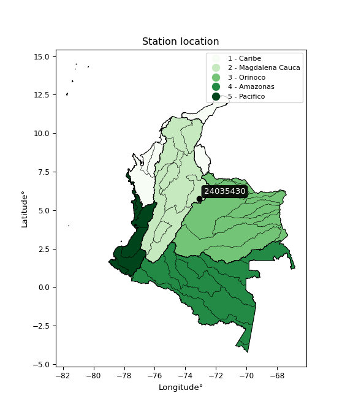</img>

</div>


## A. General information


### 1. General running parameters

• app_version: _v20251225_. • runtime: _2025-12-26 14:29:50.888910_. • Python version: _3.14.0_. • SciPy version: _1.16.3_. • Pandas version: _2.3.3_. • NumPy version: _2.3.5_. • Stations dataset (station_dataset_file): _dataset/pmax24h_in/automatic_colombia.csv_. • Stations catalog (station_catalog_file): _dataset/CNE_IDEAM.xls_. • Plot only fit distributions with Δo > Δ (plot_only_fit): _True_. • Eval low extreme values, if False, evaluates high extreme values (low_extreme): _False_. • Eval every SciPy distribution as logarithmic (pdist_logarithmic_on): _True_. • Standard deviation normalized (ddof): _1.0_. • Return periods to eval in years (Tr): _[2, 2.33, 5, 10, 15, 20, 25, 50, 75, 100, 200, 250, 500, 750, 1000]_. • Minimum data sample per station, 0 means any (minimum_sample): _5_. • Z-Score threshold to adjust a value, 0 means disable (zscore): _3.5_. • Avoid zeros, e.g. rain = 0 (avoid_zeros): _True_. • Avoid null values (avoid_nans): _True_. [:file_folder:Dataset file.](../../dataset/pmax24h_in/automatic_colombia.csv)


### 2. Station info and location

|   id |   CODIGO | NOMBRE                      | CATEGORIA         | TECNOLOGIA                              | ESTADO   | FECHA_INSTALACION   |   FECHA_SUSPENSION |   ALTITUD |   LATITUD |   LONGITUD | DEPARTAMENTO   | MUNICIPIO   | AREA_OPERATIVA                              | ENTIDAD                                                     | AREA_HIDROGRAFICA   | ZONA_HIDROGRAFICA   | SUBZONA_HIDROGRAFICA   |   CORRIENTE | OBSERVACION                                                                                    | SUBRED                                                                                                                                                            | Catalogo   |
|-----:|---------:|:----------------------------|:------------------|:----------------------------------------|:---------|:--------------------|-------------------:|----------:|----------:|-----------:|:---------------|:------------|:--------------------------------------------|:------------------------------------------------------------|:--------------------|:--------------------|:-----------------------|------------:|:-----------------------------------------------------------------------------------------------|:------------------------------------------------------------------------------------------------------------------------------------------------------------------|:-----------|
|    0 | 24035430 | TUNGUAVITA - AUT [24035430] | Agrometeorológica | Automática con Telemetría, Convencional | Activa   | 15/12/2004          |                nan |      2521 |   5.74583 |   -73.1164 | Boyacá         | Paipa       | Area Operativa 06 - Boyacá-Casanare-Vichada | INSTITUTO DE HIDROLOGIA METEOROLOGIA Y ESTUDIOS AMBIENTALES | Magdalena Cauca     | Sogamoso            | Río Chicamocha         |         nan | Actualizada Tecnologia y Tipo de Transmision por solicitud del coordinador del AO.(07/02/2023) | Altiplano Cundiboyacense y oriente de Santander,Altiplano Cundiboyacense,Radiación Ultravioleta,Radiación Visible,Radición Global,RED ALERTAS - AREA OPERATIVA 06 | CNE_IDEAM  |

<div align="center">

Map location in: [:earth_americas:Google](http://maps.google.com/maps?q=5.74583,-73.11636) [:earth_americas:OSM](https://www.openstreetmap.org/#map=18/5.74583/-73.11636&layers=P) [:earth_americas:Bing](https://www.bing.com/maps?cp=5.74583~-73.11636&lvl=18) [:earth_americas:Apple](https://maps.apple.com/frame?center=5.74583%2C-73.11636&span=0.003%2C0.006)

</div>


<div align="center">

```geojson
{
  "type": "Feature",
  "geometry": {
    "type": "Point", 
    "coordinates": [-73.11636, 5.74583]
  }, 
  "properties": {
    "Name": "24035430"
  }
}
```

</div>


### 3. Discrete values table and plot

|               |           0 |             1 |            2 |           3 |           4 |            5 |          6 |          7 |
|:--------------|------------:|--------------:|-------------:|------------:|------------:|-------------:|-----------:|-----------:|
| Date          | 2017        | 2018          | 2019         | 2020        | 2021        | 2022         | 2023       | 2025       |
| Value         |   28.4      |   36.7        |   34.5       |   22.7      |   28.5      |   35.9       |   10       |   98.2     |
| Value_initial |   28.4      |   36.7        |   34.5       |   22.7      |   28.5      |   35.9       |   10       |   98.2     |
| count         |    8        |    8          |    8         |    8        |    8        |    8         |    8       |    8       |
| mean          |   36.8625   |   36.8625     |   36.8625    |   36.8625   |   36.8625   |   36.8625    |   36.8625  |   36.8625  |
| std           |   26.2748   |   26.2748     |   26.2748    |   26.2748   |   26.2748   |   26.2748    |   26.2748  |   26.2748  |
| zscore        |   -0.322077 |   -0.00618464 |   -0.0899152 |   -0.539016 |   -0.318271 |   -0.0366321 |   -1.02237 |    2.33447 |

<div align="center">

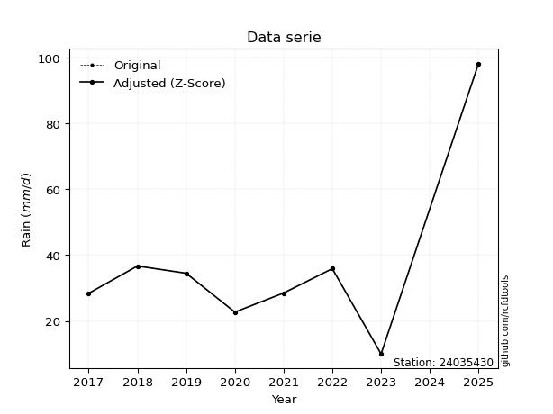</img>

</div>

> If Z-Score is active, values out of range or outliers are replaced with the station mean value.


### 4. Active continuous probability distributions from SciPy (45 of 104 available)

[scipy.stats](https://docs.scipy.org/doc/scipy/reference/stats.html) is a Python´s powerful submodule within the SciPy library for comprehensive statistical analysis, offering over 130 probability distributions (like Normal, Poisson), functions for descriptive stats (mean, variance), hypothesis testing (t-tests, chi-square), random variable generation, and statistical tests, making it essential for data science, modeling, and research. It provides tools to explore, model, and draw conclusions from data efficiently, working seamlessly with NumPy.

<div align="center">

|   id | p_dist             |   n_parameter | fit_method   | label                                                                       | active   | ref                                                                                                        |
|-----:|:-------------------|--------------:|:-------------|:----------------------------------------------------------------------------|:---------|:-----------------------------------------------------------------------------------------------------------|
|    0 | alpha              |             3 | MLE          | Alpha                                                                       | True     | [:mortar_board:](https://docs.scipy.org/doc/scipy/reference/generated/scipy.stats.alpha.html)              |
|    1 | betaprime          |             4 | MLE          | Beta prime                                                                  | True     | [:mortar_board:](https://docs.scipy.org/doc/scipy/reference/generated/scipy.stats.betaprime.html)          |
|    2 | chi2               |             3 | MLE          | Chi²                                                                        | True     | [:mortar_board:](https://docs.scipy.org/doc/scipy/reference/generated/scipy.stats.chi2.html)               |
|    3 | crystalball        |             4 | MLE          | Crystalball                                                                 | True     | [:mortar_board:](https://docs.scipy.org/doc/scipy/reference/generated/scipy.stats.crystalball.html)        |
|    4 | erlang             |             3 | MLE          | Erlang                                                                      | True     | [:mortar_board:](https://docs.scipy.org/doc/scipy/reference/generated/scipy.stats.erlang.html)             |
|    5 | expon              |             2 | MLE          | Exponential                                                                 | True     | [:mortar_board:](https://docs.scipy.org/doc/scipy/reference/generated/scipy.stats.expon.html)              |
|    6 | exponnorm          |             3 | MLE          | Exponentially modified Normal                                               | True     | [:mortar_board:](https://docs.scipy.org/doc/scipy/reference/generated/scipy.stats.exponnorm.html)          |
|    7 | f                  |             4 | MLE          | F                                                                           | True     | [:mortar_board:](https://docs.scipy.org/doc/scipy/reference/generated/scipy.stats.f.html)                  |
|    8 | fatiguelife        |             3 | MLE          | Fatigue-life (Birnbaum-Saunders)                                            | True     | [:mortar_board:](https://docs.scipy.org/doc/scipy/reference/generated/scipy.stats.fatiguelife.html)        |
|    9 | fisk               |             3 | MLE          | Fisk                                                                        | True     | [:mortar_board:](https://docs.scipy.org/doc/scipy/reference/generated/scipy.stats.fisk.html)               |
|   10 | gamma              |             3 | MLE          | Gamma                                                                       | True     | [:mortar_board:](https://docs.scipy.org/doc/scipy/reference/generated/scipy.stats.gamma.html)              |
|   11 | genexpon           |             5 | MLE          | Generalized exponential                                                     | True     | [:mortar_board:](https://docs.scipy.org/doc/scipy/reference/generated/scipy.stats.genexpon.html)           |
|   12 | genlogistic        |             3 | MLE          | Generalized logistic                                                        | True     | [:mortar_board:](https://docs.scipy.org/doc/scipy/reference/generated/scipy.stats.genlogistic.html)        |
|   13 | gibrat             |             2 | MM           | Gibrat                                                                      | True     | [:mortar_board:](https://docs.scipy.org/doc/scipy/reference/generated/scipy.stats.gibrat.html)             |
|   14 | gompertz           |             3 | MLE          | Gompertz (or truncated Gumbel)                                              | True     | [:mortar_board:](https://docs.scipy.org/doc/scipy/reference/generated/scipy.stats.gompertz.html)           |
|   15 | gumbel_l           |             2 | MM           | Gumbel Left Skew                                                            | True     | [:mortar_board:](https://docs.scipy.org/doc/scipy/reference/generated/scipy.stats.gumbel_l.html)           |
|   16 | gumbel_r           |             2 | MM           | Gumbel Right Skew                                                           | True     | [:mortar_board:](https://docs.scipy.org/doc/scipy/reference/generated/scipy.stats.gumbel_r.html)           |
|   17 | halflogistic       |             2 | MM           | Half-logistic                                                               | True     | [:mortar_board:](https://docs.scipy.org/doc/scipy/reference/generated/scipy.stats.halflogistic.html)       |
|   18 | halfnorm           |             2 | MM           | Half Normal                                                                 | True     | [:mortar_board:](https://docs.scipy.org/doc/scipy/reference/generated/scipy.stats.halfnorm.html)           |
|   19 | hypsecant          |             2 | MM           | hyperbolic secant                                                           | True     | [:mortar_board:](https://docs.scipy.org/doc/scipy/reference/generated/scipy.stats.hypsecant.html)          |
|   20 | invgamma           |             3 | MLE          | Inverted gamma                                                              | True     | [:mortar_board:](https://docs.scipy.org/doc/scipy/reference/generated/scipy.stats.invgamma.html)           |
|   21 | invgauss           |             3 | MLE          | Inverse Gaussian                                                            | True     | [:mortar_board:](https://docs.scipy.org/doc/scipy/reference/generated/scipy.stats.invgauss.html)           |
|   22 | invweibull         |             3 | MLE          | Inverted Weibull                                                            | True     | [:mortar_board:](https://docs.scipy.org/doc/scipy/reference/generated/scipy.stats.invweibull.html)         |
|   23 | johnsonsu          |             4 | MLE          | Johnson Su                                                                  | True     | [:mortar_board:](https://docs.scipy.org/doc/scipy/reference/generated/scipy.stats.johnsonsu.html)          |
|   24 | kstwobign          |             2 | MLE          | Limiting distribution of scaled Kolmogorov-Smirnov two-sided test statistic | True     | [:mortar_board:](https://docs.scipy.org/doc/scipy/reference/generated/scipy.stats.kstwobign.html)          |
|   25 | laplace            |             2 | MM           | Laplace                                                                     | True     | [:mortar_board:](https://docs.scipy.org/doc/scipy/reference/generated/scipy.stats.laplace.html)            |
|   26 | laplace_asymmetric |             3 | MLE          | Asymmetric Laplace                                                          | True     | [:mortar_board:](https://docs.scipy.org/doc/scipy/reference/generated/scipy.stats.laplace_asymmetric.html) |
|   27 | loggamma           |             3 | MLE          | Log gamma                                                                   | True     | [:mortar_board:](https://docs.scipy.org/doc/scipy/reference/generated/scipy.stats.loggamma.html)           |
|   28 | logistic           |             2 | MM           | Logistic (or Sech-squared)                                                  | True     | [:mortar_board:](https://docs.scipy.org/doc/scipy/reference/generated/scipy.stats.logistic.html)           |
|   29 | lognorm            |             3 | MLE          | Log Normal                                                                  | True     | [:mortar_board:](https://docs.scipy.org/doc/scipy/reference/generated/scipy.stats.lognorm.html)            |
|   30 | maxwell            |             2 | MM           | Maxwell                                                                     | True     | [:mortar_board:](https://docs.scipy.org/doc/scipy/reference/generated/scipy.stats.maxwell.html)            |
|   31 | mielke             |             4 | MLE          | Mielke Beta-Kappa / Dagum                                                   | True     | [:mortar_board:](https://docs.scipy.org/doc/scipy/reference/generated/scipy.stats.mielke.html)             |
|   32 | moyal              |             2 | MM           | Moyal                                                                       | True     | [:mortar_board:](https://docs.scipy.org/doc/scipy/reference/generated/scipy.stats.moyal.html)              |
|   33 | nakagami           |             3 | MLE          | Nakagami                                                                    | True     | [:mortar_board:](https://docs.scipy.org/doc/scipy/reference/generated/scipy.stats.nakagami.html)           |
|   34 | ncf                |             5 | MLE          | Non-central F distribution                                                  | True     | [:mortar_board:](https://docs.scipy.org/doc/scipy/reference/generated/scipy.stats.ncf.html)                |
|   35 | nct                |             4 | MLE          | Non-central Student’s t                                                     | True     | [:mortar_board:](https://docs.scipy.org/doc/scipy/reference/generated/scipy.stats.nct.html)                |
|   36 | norm               |             2 | MM           | Normal                                                                      | True     | [:mortar_board:](https://docs.scipy.org/doc/scipy/reference/generated/scipy.stats.norm.html)               |
|   37 | pareto             |             3 | MLE          | Pareto                                                                      | True     | [:mortar_board:](https://docs.scipy.org/doc/scipy/reference/generated/scipy.stats.pareto.html)             |
|   38 | pearson3           |             3 | MM           | Pearson type III                                                            | True     | [:mortar_board:](https://docs.scipy.org/doc/scipy/reference/generated/scipy.stats.pearson3.html)           |
|   39 | rayleigh           |             2 | MM           | Rayleigh                                                                    | True     | [:mortar_board:](https://docs.scipy.org/doc/scipy/reference/generated/scipy.stats.rayleigh.html)           |
|   40 | rice               |             3 | MLE          | Rice                                                                        | True     | [:mortar_board:](https://docs.scipy.org/doc/scipy/reference/generated/scipy.stats.rice.html)               |
|   41 | t                  |             3 | MLE          | Student’s t                                                                 | True     | [:mortar_board:](https://docs.scipy.org/doc/scipy/reference/generated/scipy.stats.t.html)                  |
|   42 | truncnorm          |             4 | MLE          | Truncated normal                                                            | True     | [:mortar_board:](https://docs.scipy.org/doc/scipy/reference/generated/scipy.stats.truncnorm.html)          |
|   43 | wald               |             2 | MM           | Wald                                                                        | True     | [:mortar_board:](https://docs.scipy.org/doc/scipy/reference/generated/scipy.stats.wald.html)               |
|   44 | weibull_min        |             3 | MLE          | Weibull minimum                                                             | True     | [:mortar_board:](https://docs.scipy.org/doc/scipy/reference/generated/scipy.stats.weibull_min.html)        |

</div>

> **n_parameter:** # arguments & localization & scale.
>
> **Fit methods:** (MLE) maximum likelihood, (MM) L-moments.
>
>**Inactive:** foldnorm, gennorm, norminvgauss, powernorm, powerlognorm, skewnorm, genextreme, anglit, arcsine, argus, beta, bradford, burr, burr12, cauchy, cosine, halfcauchy, foldcauchy, skewcauchy, wrapcauchy, dgamma, gengamma, exponweib, exponpow, truncexpon, gausshyper, genhalflogistic, genhyperbolic, geninvgauss, halfgennorm, johnsonsb, kappa4, kappa3, ksone, kstwo, loglaplace, levy, levy_l, levy_stable, ncx2, genpareto, truncpareto, lomax, powerlaw, rdist, rel_breitwigner, recipinvgauss, semicircular, studentized_range, trapezoid, triang, truncweibull_min, tukeylambda, uniform, loguniform, vonmises, vonmises_line, weibull_max, dweibull, 


## B. Probability distributions vs. Empirical distributions

A continuous probability distribution (CPD) describes probabilities for variables that can take any value within a range (like rain any time), unlike discrete variables with specific outcomes (like temperature). It uses a Probability Density Function (PDF), a curve where the total area under it equals 1, and the probability of the variable falling within an interval (a to b) is found by calculating the area under the curve between those points. A key feature is that the probability of hitting any single exact value is zero, so probabilities are always expressed for ranges, e.g., $P(a ≤ X ≤ b)$.

<div align="center">

Distributions parameters
|    |   station | p_dist                |   n |             loc |          scale | shape                 | shape1               | shape2                 | shape3   |
|---:|----------:|:----------------------|----:|----------------:|---------------:|:----------------------|:---------------------|:-----------------------|:---------|
|  0 |  24035430 | alpha                 |   8 |   -29.1539      |  217.338       | 3.6307390642396866    |                      |                        |          |
|  1 |  24035430 | betaprime             |   8 |    -4.0046      |   14.0228      | 13.969048702246498    | 5.827805235362187    |                        |          |
|  2 |  24035430 | chi2                  |   8 |    10           |   20.3089      | 0.6442065390161096    |                      |                        |          |
|  3 |  24035430 | crystalball           |   8 |    36.8625      |   24.5778      | 3896.8442574497985    | 78.9294544001975     |                        |          |
|  4 |  24035430 | erlang                |   8 |    10           |   35.8748      | 0.3146011472517064    |                      |                        |          |
|  5 |  24035430 | expon                 |   8 |    10           |   26.8625      |                       |                      |                        |          |
|  6 |  24035430 | exponnorm             |   8 |    17.5046      |    7.9111      | 2.446926932721361     |                      |                        |          |
|  7 |  24035430 | f                     |   8 |    -7.92993     |   36.6735      | 127.59890354714594    | 11.192218323413055   |                        |          |
|  8 |  24035430 | fatiguelife           |   8 |    -1.12078     |   32.3219      | 0.5927837600928569    |                      |                        |          |
|  9 |  24035430 | fisk                  |   8 |    -0.10005     |   30.8827      | 3.2827138685982367    |                      |                        |          |
| 10 |  24035430 | gamma                 |   8 |    10           |   26.9509      | 0.837436144293155     |                      |                        |          |
| 11 |  24035430 | genexpon              |   8 |    10           |   14.2951      | 0.3429730031740108    | 0.30620286958811915  | 0.9438239070060044     |          |
| 12 |  24035430 | genlogistic           |   8 |   -72.8675      |   14.9994      | 783.7705663534321     |                      |                        |          |
| 13 |  24035430 | gibrat                |   8 |    18.1128      |   11.3723      |                       |                      |                        |          |
| 14 |  24035430 | gompertz              |   8 |    10           |  268.511       | 9.082175394143071     |                      |                        |          |
| 15 |  24035430 | gumbel_l              |   8 |    47.9238      |   19.1632      |                       |                      |                        |          |
| 16 |  24035430 | gumbel_r              |   8 |    25.8012      |   19.1632      |                       |                      |                        |          |
| 17 |  24035430 | halflogistic          |   8 |     7.73212     |   21.0131      |                       |                      |                        |          |
| 18 |  24035430 | halfnorm              |   8 |     4.33115     |   40.772       |                       |                      |                        |          |
| 19 |  24035430 | hypsecant             |   8 |    36.8625      |   15.6467      |                       |                      |                        |          |
| 20 |  24035430 | invgamma              |   8 |    -9.50416     |  213.168       | 5.614195557293302     |                      |                        |          |
| 21 |  24035430 | invgauss              |   8 |    -1.92544     |  108.366       | 0.35793352432716435   |                      |                        |          |
| 22 |  24035430 | invweibull            |   8 |   -47.3181      |   72.9421      | 5.292216205626539     |                      |                        |          |
| 23 |  24035430 | johnsonsu             |   8 |    29.2586      |    4.95101     | -0.24900562834182163  | 0.6501518565832163   |                        |          |
| 24 |  24035430 | kstwobign             |   8 |   -30.8772      |   79.1828      |                       |                      |                        |          |
| 25 |  24035430 | laplace               |   8 |    36.8625      |   17.3791      |                       |                      |                        |          |
| 26 |  24035430 | laplace_asymmetric    |   8 |    28.4         |   12.4224      | 0.7158062844781945    |                      |                        |          |
| 27 |  24035430 | loggamma              |   8 | -8531.02        | 1127.49        | 1997.167187124668     |                      |                        |          |
| 28 |  24035430 | logistic              |   8 |    36.8625      |   13.5504      |                       |                      |                        |          |
| 29 |  24035430 | lognorm               |   8 |    10           |    0.241252    | 12.311201268263218    |                      |                        |          |
| 30 |  24035430 | maxwell               |   8 |   -21.3765      |   36.4959      |                       |                      |                        |          |
| 31 |  24035430 | mielke                |   8 |    -0.218773    |   32.4651      | 3.079855066098248     | 3.4480607385828406   |                        |          |
| 32 |  24035430 | moyal                 |   8 |    22.8073      |   11.0639      |                       |                      |                        |          |
| 33 |  24035430 | nakagami              |   8 |    22.7         |   21.7046      | 0.23520212730887513   |                      |                        |          |
| 34 |  24035430 | ncf                   |   8 |     0.0206017   |    0.108426    | 0.10764363862942994   | 11.38546131362326    | 29.920191654541753     |          |
| 35 |  24035430 | nct                   |   8 |    -0.0388189   |    9.52777     | 3.6720422258334087    | 2.9940021383791215   |                        |          |
| 36 |  24035430 | norm                  |   8 |    36.8625      |   24.5778      |                       |                      |                        |          |
| 37 |  24035430 | pareto                |   8 |     9.99133     |    0.00867162  | 0.14330358964991963   |                      |                        |          |
| 38 |  24035430 | pearson3              |   8 |    36.8625      |   24.5778      | 1.7456777710936509    |                      |                        |          |
| 39 |  24035430 | rayleigh              |   8 |   -10.1562      |   37.5155      |                       |                      |                        |          |
| 40 |  24035430 | rice                  |   8 |    -0.627995    |   31.6986      | 0.0002505179062693022 |                      |                        |          |
| 41 |  24035430 | t                     |   8 |    31.1204      |    6.29427     | 1.155445569951921     |                      |                        |          |
| 42 |  24035430 | truncnorm             |   8 |    36.8625      |   24.5778      | -154.8668860638043    | 649.5297880785479    |                        |          |
| 43 |  24035430 | wald                  |   8 |    12.2847      |   24.5778      |                       |                      |                        |          |
| 44 |  24035430 | weibull_min           |   8 |    10           |   28.6031      | 0.6166068144974755    |                      |                        |          |
| 45 |  24035430 | logalpha              |   8 |   -10.5492      |  329.001       | 23.589371603739927    |                      |                        |          |
| 46 |  24035430 | logbetaprime          |   8 |    -5.38476     |    7.13342     | 474.4835671604833     | 384.96190637840755   |                        |          |
| 47 |  24035430 | logchi2               |   8 |     2.30259     |    0.865506    | 1.157577763180559     |                      |                        |          |
| 48 |  24035430 | logcrystalball        |   8 |     3.42909     |    0.589772    | 19.18220095363841     | 6.112691118977612    |                        |          |
| 49 |  24035430 | logerlang             |   8 |   -17.764       |    0.0164143   | 1291.133651820057     |                      |                        |          |
| 50 |  24035430 | logexpon              |   8 |     2.30259     |    1.12651     |                       |                      |                        |          |
| 51 |  24035430 | logexponnorm          |   8 |     3.16873     |    0.530047    | 0.4911978424994044    |                      |                        |          |
| 52 |  24035430 | logf                  |   8 |   -36.1465      |   39.5702      | 23552.719078307553    | 14588.969398555957   |                        |          |
| 53 |  24035430 | logfatiguelife        |   8 |   -34.6256      |   38.0502      | 0.015496555391277667  |                      |                        |          |
| 54 |  24035430 | logfisk               |   8 |   -46.6925      |   50.1186      | 163.88965865420062    |                      |                        |          |
| 55 |  24035430 | loggamma              |   8 |   -17.8217      |    0.0163764   | 1297.6411943994044    |                      |                        |          |
| 56 |  24035430 | loggenexpon           |   8 |     2.30167     |    0.00616608  | 0.0016712161274939292 | 0.5758052603744346   | 5.6756184270876915e-05 |          |
| 57 |  24035430 | loggenlogistic        |   8 |     3.47832     |    0.290899    | 0.8818377579808316    |                      |                        |          |
| 58 |  24035430 | loggibrat             |   8 |     2.97918     |    0.272887    |                       |                      |                        |          |
| 59 |  24035430 | loggompertz           |   8 |     2.30259     |    0.822366    | 0.2422652402679389    |                      |                        |          |
| 60 |  24035430 | loggumbel_l           |   8 |     3.69452     |    0.459844    |                       |                      |                        |          |
| 61 |  24035430 | loggumbel_r           |   8 |     3.16366     |    0.459844    |                       |                      |                        |          |
| 62 |  24035430 | loghalflogistic       |   8 |     2.73016     |    0.504181    |                       |                      |                        |          |
| 63 |  24035430 | loghalfnorm           |   8 |     2.64846     |    0.978382    |                       |                      |                        |          |
| 64 |  24035430 | loghypsecant          |   8 |     3.42909     |    0.375461    |                       |                      |                        |          |
| 65 |  24035430 | loginvgamma           |   8 |    -7.5502      | 3725.69        | 340.41171080664765    |                      |                        |          |
| 66 |  24035430 | loginvgauss           |   8 |    -1.64904     |  352.898       | 0.014351014573326989  |                      |                        |          |
| 67 |  24035430 | loginvweibull         |   8 |    -7.44122e+07 |    7.44122e+07 | 131909243.59729686    |                      |                        |          |
| 68 |  24035430 | logjohnsonsu          |   8 |     3.57494     |    0.0447053   | 0.42044636054342965   | 0.4270367857726341   |                        |          |
| 69 |  24035430 | logkstwobign          |   8 |     0.983959    |    2.80969     |                       |                      |                        |          |
| 70 |  24035430 | loglaplace            |   8 |     3.42909     |    0.417032    |                       |                      |                        |          |
| 71 |  24035430 | loglaplace_asymmetric |   8 |     3.54096     |    0.386784    | 1.1550732897529583    |                      |                        |          |
| 72 |  24035430 | logloggamma           |   8 |  -118.398       |   17.8867      | 908.2303497632884     |                      |                        |          |
| 73 |  24035430 | loglogistic           |   8 |     3.42909     |    0.325159    |                       |                      |                        |          |
| 74 |  24035430 | loglognorm            |   8 |     2.30259     |    0.0144215   | 11.762247425956005    |                      |                        |          |
| 75 |  24035430 | logmaxwell            |   8 |     2.03158     |    0.875761    |                       |                      |                        |          |
| 76 |  24035430 | logmielke             |   8 |    -0.122031    |    3.73612     | 8.557703992151126     | 14.3904224083999     |                        |          |
| 77 |  24035430 | logmoyal              |   8 |     3.09182     |    0.265491    |                       |                      |                        |          |
| 78 |  24035430 | lognakagami           |   8 |     3.12236     |    0.749688    | 0.15377720159337332   |                      |                        |          |
| 79 |  24035430 | logncf                |   8 |    -3.80516     |    7.21177     | 450.6755052144789     | 588.7845112726254    | 0.10034138795968375    |          |
| 80 |  24035430 | lognct                |   8 |     3.42293     |    0.568118    | 9.62984004687075      | 0.039063822530950594 |                        |          |
| 81 |  24035430 | lognorm               |   8 |     3.42909     |    0.589772    |                       |                      |                        |          |
| 82 |  24035430 | logpareto             |   8 |     2.30216     |    0.000421627 | 0.143265298233541     |                      |                        |          |
| 83 |  24035430 | logpearson3           |   8 |     3.42909     |    0.589772    | 0.06288559949618186   |                      |                        |          |
| 84 |  24035430 | lograyleigh           |   8 |     2.30082     |    0.900228    |                       |                      |                        |          |
| 85 |  24035430 | logrice               |   8 |     1.94839     |    0.63868     | 2.056121638481104     |                      |                        |          |
| 86 |  24035430 | logt                  |   8 |     3.45212     |    0.208265    | 1.2222599533944511    |                      |                        |          |
| 87 |  24035430 | logtruncnorm          |   8 |    -0.22595     |    1.3629      | 2.4567514124429692    | 3.5314100914368023   |                        |          |
| 88 |  24035430 | logwald               |   8 |     2.8393      |    0.589786    |                       |                      |                        |          |
| 89 |  24035430 | logweibull_min        |   8 |     1.63882     |    1.9914      | 3.301490881331668     |                      |                        |          |

</div>

> **loc** (Location parameter): This shifts the distribution along the x-axis. For many common distributions, like the normal (Gaussian) distribution, loc represents the mean $μ$. For others, like the uniform distribution, it might represent the minimum value, or for the beta distribution, the left end of the support interval.
>
> **scale** (Scale parameter): This determines the width or spread of the distribution. For the normal distribution, scale represents the standard deviation $σ$. For a uniform distribution, it defines the length of the interval (from $loc$ to $loc + scale$).
>
> **shape** (Shape parameters): Refers to parameters that define the specific form of a probability distribution, distinct from its location (loc) and scale (scale). These parameters are required arguments for most distribution functions. For example, a normal (Gaussian) distribution is fully defined by its location (mean) and scale (standard deviation), so it has no specific shape parameters beyond loc and scale. However, other distributions have intrinsic properties that need specification, as Gamma distribution that takes a shape parameter, often named $a$ or $alpha$.


### 0. Cumulative distribution values - CDF (90 evaluated)

> Ordered by x ascending and calculating $log(f(x))$ separately. 

|   id |   Station |   date |    x |   count |    mean |     std |      zscore |   Value_initial |   station |   m |     alpha |   alpha_pdf |   betaprime |   betaprime_pdf |        chi2 |    chi2_pdf |   crystalball |   crystalball_pdf |      erlang |   erlang_pdf |    expon |   expon_pdf |   exponnorm |   exponnorm_pdf |         f |      f_pdf |   fatiguelife |   fatiguelife_pdf |      fisk |    fisk_pdf |       gamma |   gamma_pdf |    genexpon |   genexpon_pdf |   genlogistic |   genlogistic_pdf |   gibrat |   gibrat_pdf |    gompertz |   gompertz_pdf |   gumbel_l |   gumbel_l_pdf |   gumbel_r |   gumbel_r_pdf |   halflogistic |   halflogistic_pdf |   halfnorm |   halfnorm_pdf |   hypsecant |   hypsecant_pdf |   invgamma |   invgamma_pdf |   invgauss |   invgauss_pdf |   invweibull |   invweibull_pdf |   johnsonsu |   johnsonsu_pdf |   kstwobign |   kstwobign_pdf |   laplace |   laplace_pdf |   laplace_asymmetric |   laplace_asymmetric_pdf |   loggamma |   loggamma_pdf |   logistic |   logistic_pdf |   lognorm |   lognorm_pdf |   maxwell |   maxwell_pdf |    mielke |   mielke_pdf |     moyal |   moyal_pdf |    nakagami |   nakagami_pdf |       ncf |     ncf_pdf |       nct |     nct_pdf |     norm |    norm_pdf |   pareto |   pareto_pdf |   pearson3 |   pearson3_pdf |   rayleigh |   rayleigh_pdf |      rice |    rice_pdf |         t |       t_pdf |   truncnorm |   truncnorm_pdf |     wald |   wald_pdf |   weibull_min |   weibull_min_pdf |   logalpha |   logalpha_pdf |   logbetaprime |   logbetaprime_pdf |     logchi2 |   logchi2_pdf |   logcrystalball |   logcrystalball_pdf |   logerlang |   logerlang_pdf |   logexpon |   logexpon_pdf |   logexponnorm |   logexponnorm_pdf |      logf |   logf_pdf |   logfatiguelife |   logfatiguelife_pdf |   logfisk |   logfisk_pdf |   loggenexpon |   loggenexpon_pdf |   loggenlogistic |   loggenlogistic_pdf |   loggibrat |   loggibrat_pdf |   loggompertz |   loggompertz_pdf |   loggumbel_l |   loggumbel_l_pdf |   loggumbel_r |   loggumbel_r_pdf |   loghalflogistic |   loghalflogistic_pdf |   loghalfnorm |   loghalfnorm_pdf |   loghypsecant |   loghypsecant_pdf |   loginvgamma |   loginvgamma_pdf |   loginvgauss |   loginvgauss_pdf |   loginvweibull |   loginvweibull_pdf |   logjohnsonsu |   logjohnsonsu_pdf |   logkstwobign |   logkstwobign_pdf |   loglaplace |   loglaplace_pdf |   loglaplace_asymmetric |   loglaplace_asymmetric_pdf |   logloggamma |   logloggamma_pdf |   loglogistic |   loglogistic_pdf |   loglognorm |   loglognorm_pdf |   logmaxwell |   logmaxwell_pdf |   logmielke |   logmielke_pdf |    logmoyal |   logmoyal_pdf |   lognakagami |   lognakagami_pdf |    logncf |   logncf_pdf |    lognct |   lognct_pdf |   logpareto |   logpareto_pdf |   logpearson3 |   logpearson3_pdf |   lograyleigh |   lograyleigh_pdf |   logrice |   logrice_pdf |      logt |   logt_pdf |   logtruncnorm |   logtruncnorm_pdf |   logwald |   logwald_pdf |   logweibull_min |   logweibull_min_pdf |
|-----:|----------:|-------:|-----:|--------:|--------:|--------:|------------:|----------------:|----------:|----:|----------:|------------:|------------:|----------------:|------------:|------------:|--------------:|------------------:|------------:|-------------:|---------:|------------:|------------:|----------------:|----------:|-----------:|--------------:|------------------:|----------:|------------:|------------:|------------:|------------:|---------------:|--------------:|------------------:|---------:|-------------:|------------:|---------------:|-----------:|---------------:|-----------:|---------------:|---------------:|-------------------:|-----------:|---------------:|------------:|----------------:|-----------:|---------------:|-----------:|---------------:|-------------:|-----------------:|------------:|----------------:|------------:|----------------:|----------:|--------------:|---------------------:|-------------------------:|-----------:|---------------:|-----------:|---------------:|----------:|--------------:|----------:|--------------:|----------:|-------------:|----------:|------------:|------------:|---------------:|----------:|------------:|----------:|------------:|---------:|------------:|---------:|-------------:|-----------:|---------------:|-----------:|---------------:|----------:|------------:|----------:|------------:|------------:|----------------:|---------:|-----------:|--------------:|------------------:|-----------:|---------------:|---------------:|-------------------:|------------:|--------------:|-----------------:|---------------------:|------------:|----------------:|-----------:|---------------:|---------------:|-------------------:|----------:|-----------:|-----------------:|---------------------:|----------:|--------------:|--------------:|------------------:|-----------------:|---------------------:|------------:|----------------:|--------------:|------------------:|--------------:|------------------:|--------------:|------------------:|------------------:|----------------------:|--------------:|------------------:|---------------:|-------------------:|--------------:|------------------:|--------------:|------------------:|----------------:|--------------------:|---------------:|-------------------:|---------------:|-------------------:|-------------:|-----------------:|------------------------:|----------------------------:|--------------:|------------------:|--------------:|------------------:|-------------:|-----------------:|-------------:|-----------------:|------------:|----------------:|------------:|---------------:|--------------:|------------------:|----------:|-------------:|----------:|-------------:|------------:|----------------:|--------------:|------------------:|--------------:|------------------:|----------:|--------------:|----------:|-----------:|---------------:|-------------------:|----------:|--------------:|-----------------:|---------------------:|
|    0 |  24035430 |   2023 | 10   |       8 | 36.8625 | 26.2748 | -1.02237    |            10   |  24035430 |   1 | 0.0274251 | 0.00895288  |   0.0285431 |     0.0100782   | 6.01364e-06 | 1.09044e+09 |      0.137206 |       0.00893248  | 1.03051e-05 |  9.12539e+08 | 0        |  0.0372266  |   0.0314918 |     0.00722781  | 0.0283176 | 0.00991786 |     0.0296167 |        0.0116999  | 0.0248691 | 0.00788192  | 2.98831e-14 | 14.0879     | 3.10778e-13 |     0.0239924  |     0.0442174 |       0.00917532  | 0        |  0           | 4.95378e-10 |     0.0338242  |   0.129083 |    0.00628122  |   0.102195 |     0.0121636  |      0.0539111 |         0.0237255  |   0.11058  |     0.0193812  |    0.113154 |     0.00708045  |  0.0282244 |    0.0098825   |  0.0292389 |      0.011409  |    0.0278434 |      0.00920644  |    0.055548 |     0.00366574  |   0.0474012 |     0.00957651  |  0.106584 |    0.00613286 |            0.0427817 |              0.00481125  |  0.0264958 |      0.107862  |   0.121062 |    0.00785261  | 0.0280622 |     0.109143  |  0.136036 |     0.0111665 | 0.0279716 |  0.00827664  | 0.0744433 |  0.0131026  | 0           |    0           | 0.0284539 | 0.0100623   | 0.0304683 | 0.0079667   | 0.137206 | 0.00893248  | 0        | 16.5256      |  0.0206528 |     0.0203765  |   0.134401 |      0.0123966 | 0.0546568 | 0.00999908  | 0.0785128 | 0.0040189   |    0.137206 |     0.00893248  | 0        | 0          |   1.01561e-10 |    35253.6        |  0.0222035 |       0.105362 |      0.0247939 |           0.110428 | 1.06213e-09 |   1.38429e+06 |        0.0280622 |            0.109143  |   0.0264584 |       0.107768  |   0        |       0.887701 |      0.0242865 |          0.103064  | 0.0266676 |  0.107919  |        0.0267159 |            0.107976  | 0.0237545 |     0.0775718 |   0.000247954 |          0.271752 |        0.0278893 |            0.0830847 |    0        |       0         |   2.93264e-09 |          0.294595 |     0.0473066 |         0.100403  |    0.00149623 |         0.0211652 |          0        |             0         |      0        |          0        |      0.0316589 |          0.0841813 |     0.0232116 |          0.106518 |     0.0216617 |          0.110482 |       0.0141741 |            0.106946 |      0.0958388 |          0.05706   |      0.0197265 |           0.152627 |     0.033561 |        0.0804758 |               0.0357495 |                   0.0800189 |     0.0300193 |         0.112313  |      0.03034  |         0.0904773 |   0.00408421 |      2.31073e+12 |   0.00765886 |        0.0831671 |   0.0246913 |       0.0869756 | 9.82362e-06 |    0.000378573 |   0           |       0           | 0.0309549 |     0.127946 | 0.0360462 |     0.105432 |    0        |     339.792     |     0.0262402 |          0.107556 |   1.91943e-06 |        0.00217645 | 0.0200914 |      0.121618 | 0.0411378 |  0.0425714 |    0           |          0         |  0        |      0        |        0.0262388 |             0.128782 |
|    1 |  24035430 |   2020 | 22.7 |       8 | 36.8625 | 26.2748 | -0.539016   |            22.7 |  24035430 |   2 | 0.287572  | 0.0275612   |   0.296264  |     0.0266504   | 0.715152    | 0.0142643   |      0.282229 |       0.0137488   | 0.743683    |  0.0140066   | 0.376732 |  0.0232022  |   0.2473    |     0.0256753   | 0.294699  | 0.0266586  |     0.302634  |        0.0250086  | 0.269711  | 0.028359    | 0.460544    |  0.0232736  | 0.324687    |     0.0244135  |     0.26214   |       0.0233792   | 0.181964 |  0.0575928   | 0.355892    |     0.0228417  |   0.235196 |    0.0107013   |   0.308615 |     0.0189335  |      0.341823  |         0.0210144  |   0.347669 |     0.0176808  |    0.244695 |     0.0141434   |  0.294424  |    0.0266837   |  0.302591  |      0.0253447 |    0.28888   |      0.0271129   |    0.168554 |     0.0199115   |   0.250291  |     0.0205055   |  0.221339 |    0.0127359  |            0.178459  |              0.0200695   |  0.303946  |      0.598619  |   0.260154 |    0.0142042   | 0.301506  |     0.59087   |  0.308135 |     0.015378  | 0.270504  |  0.0279406   | 0.314963  |  0.0218698  | 2.93443e-08 |    3.88539e+06 | 0.295492  | 0.0265796   | 0.27607   | 0.0276353   | 0.282229 | 0.0137488   | 0.648196 |  0.00396696  |  0.340707  |     0.0237175  |   0.318539 |      0.0159088 | 0.237229  | 0.0177089   | 0.192873  | 0.0189455   |    0.282229 |     0.0137488   | 0.294183 | 0.0397676  |   0.454552    |        0.0160523  |  0.317316  |       0.627236 |      0.314495  |           0.608821 | 0.617977    |   0.320071    |        0.301506  |            0.590871  |   0.303866  |       0.598686  |   0.516991 |       0.428768 |      0.305084  |          0.614784  | 0.30352   |  0.597716  |        0.303457  |            0.597457  | 0.26964   |     0.64791   |   0.400211    |          0.584076 |        0.270781  |            0.634274  |    0.259488 |       2.26307   |   0.339139    |          0.527551 |     0.250359  |         0.469762  |    0.334887   |         0.796692  |          0.37046  |             0.855606  |      0.371883 |          0.725244 |      0.264835  |          0.626752  |     0.314032  |          0.618439 |     0.330412  |          0.635327 |       0.369645  |            0.652126 |      0.193485  |          0.257662  |      0.391457  |           0.596714 |     0.239634 |        0.574617  |               0.22396   |                   0.501294  |     0.30231   |         0.584397  |      0.280232 |         0.620319  |   0.634388   |      0.0390033   |   0.329529   |        0.650717  |   0.277767  |       0.647664  | 0.345119    |    0.90851     |   2.06521e-05 |       7.15133e+09 | 0.325542  |     0.585973 | 0.290932  |     0.575008 |    0.66209  |       0.0590231 |     0.304171  |          0.599748 |   0.340593    |        0.668465   | 0.312439  |      0.600133 | 0.162156  |  0.458841  |    3.21318e-06 |          2.10428   |  0.347087 |      1.53484  |        0.314999  |             0.576737 |
|    2 |  24035430 |   2017 | 28.4 |       8 | 36.8625 | 26.2748 | -0.322077   |            28.4 |  24035430 |   3 | 0.442216  | 0.0259036   |   0.443739  |     0.0245004   | 0.781906    | 0.00964171  |      0.365305 |       0.0152976   | 0.808576    |  0.00926766  | 0.495895 |  0.0187661  |   0.399606  |     0.0266647   | 0.442319  | 0.0245316  |     0.439208  |        0.0225554  | 0.434486  | 0.0283013   | 0.576489    |  0.0177352  | 0.455255    |     0.0212755  |     0.400181  |       0.0244202   | 0.460062 |  0.0385859   | 0.47491     |     0.0190205  |   0.303036 |    0.0131303   |   0.417622 |     0.0190291  |      0.455632  |         0.0188549  |   0.445029 |     0.0164401  |    0.33567  |     0.0176922   |  0.44224   |    0.024571    |  0.441028  |      0.0228408 |    0.44015   |      0.0252459   |    0.358976 |     0.0483579   |   0.370496  |     0.0212681   |  0.307253 |    0.0176795  |            0.33879   |              0.0381004   |  0.447887  |      0.672212  |   0.348755 |    0.0167614   | 0.444241  |     0.669816  |  0.398078 |     0.0160442 | 0.434195  |  0.028364    | 0.437355  |  0.0207134  | 0.415749    |    0.0338626   | 0.442589  | 0.0244404   | 0.433675  | 0.0266896   | 0.365305 | 0.0152976   | 0.666389 |  0.00259702  |  0.466084  |     0.0202329  |   0.410291 |      0.0161551 | 0.342492  | 0.0189949   | 0.366185  | 0.0441879   |    0.365305 |     0.0152976   | 0.486388 | 0.0279295  |   0.533191    |        0.0119177  |  0.465237  |       0.677172 |      0.458556  |           0.662482 | 0.681865    |   0.254007    |        0.444241  |            0.669817  |   0.447829  |       0.672341  |   0.604097 |       0.351444 |      0.452588  |          0.68623   | 0.447345  |  0.672147  |        0.447238  |            0.672033  | 0.435102  |     0.805017  |   0.527976    |          0.549774 |        0.43444   |            0.8053    |    0.616718 |       1.03958   |   0.461935    |          0.564024 |     0.374399  |         0.638116  |    0.510642   |         0.746331  |          0.544917 |             0.697236  |      0.524373 |          0.632312 |      0.430447  |          0.827626  |     0.460445  |          0.673103 |     0.478067  |          0.666848 |       0.512204  |            0.607464 |      0.282183  |          0.619576  |      0.520624  |           0.548764 |     0.410058 |        0.983277  |               0.369779  |                   0.827684  |     0.44364   |         0.664306  |      0.436755 |         0.756554  |   0.642085   |      0.0304105   |   0.478611   |        0.665362  |   0.44413   |       0.815914  | 0.535827    |    0.768082    |   0.553997    |       0.75156     | 0.462844  |     0.626952 | 0.432398  |     0.673278 |    0.67358  |       0.044784  |     0.448304  |          0.672709 |   0.490579    |        0.65724    | 0.455043  |      0.659669 | 0.344016  |  1.28123   |    0.38628     |          1.3863    |  0.60574  |      0.838814 |        0.452229  |             0.637463 |
|    3 |  24035430 |   2021 | 28.5 |       8 | 36.8625 | 26.2748 | -0.318271   |            28.5 |  24035430 |   4 | 0.444803  | 0.0258378   |   0.446186  |     0.024436    | 0.782868    | 0.00958273  |      0.366836 |       0.0153189   | 0.8095      |  0.00920759  | 0.497768 |  0.0186964  |   0.402271  |     0.0266271   | 0.444769  | 0.0244671  |     0.44146   |        0.0224968  | 0.437313  | 0.028244    | 0.578259    |  0.017654   | 0.45738     |     0.0212153  |     0.402623  |       0.0244061   | 0.463904 |  0.0382498   | 0.476809    |     0.0189588  |   0.304351 |    0.0131741   |   0.419524 |     0.0190163  |      0.457515  |         0.0188139  |   0.446672 |     0.0164163  |    0.337442 |     0.0177479   |  0.444694  |    0.0245065   |  0.443309  |      0.0227799 |    0.442671  |      0.0251805   |    0.363831 |     0.048737    |   0.372622  |     0.0212611   |  0.309027 |    0.0177815  |            0.342589  |              0.0378815   |  0.45025   |      0.672651  |   0.350433 |    0.0167987   | 0.446596  |     0.670365  |  0.399683 |     0.0160486 | 0.437029  |  0.0283151   | 0.439425  |  0.020676   | 0.419119    |    0.0335329   | 0.44503   | 0.0243763   | 0.436341  | 0.0266275   | 0.366836 | 0.0153189   | 0.666648 |  0.00258098  |  0.468104  |     0.0201707  |   0.411906 |      0.0161527 | 0.344392  | 0.0190053   | 0.370628  | 0.0446713   |    0.366836 |     0.0153189   | 0.489172 | 0.0277454  |   0.53438     |        0.0118626  |  0.467617  |       0.677171 |      0.460885  |           0.662599 | 0.682756    |   0.253133    |        0.446596  |            0.670365  |   0.450193  |       0.672781  |   0.60533  |       0.350349 |      0.455001  |          0.686559  | 0.449708  |  0.672602  |        0.449601  |            0.672492  | 0.437933  |     0.806138  |   0.529907    |          0.548932 |        0.437273  |            0.806741  |    0.62035  |       1.02677   |   0.463918    |          0.564352 |     0.376646  |         0.640702  |    0.513262   |         0.744448  |          0.547363 |             0.694586  |      0.526593 |          0.630689 |      0.433359  |          0.829273  |     0.462811  |          0.6732   |     0.480411  |          0.666581 |       0.514337  |            0.606205 |      0.284381  |          0.631234  |      0.522551  |           0.547689 |     0.413529 |        0.9916    |               0.3727    |                   0.834222  |     0.445976  |         0.664895  |      0.439416 |         0.757568  |   0.642192   |      0.0303053   |   0.480949   |        0.6649    |   0.447     |       0.817291  | 0.538521    |    0.76494     |   0.556624    |       0.743179    | 0.465048  |     0.626973 | 0.434766  |     0.674049 |    0.673737 |       0.0446123 |     0.450669  |          0.673135 |   0.492887    |        0.656461   | 0.457363  |      0.659942 | 0.348549  |  1.29763   |    0.391136    |          1.37696   |  0.608675 |      0.831017 |        0.454471  |             0.637866 |
|    4 |  24035430 |   2019 | 34.5 |       8 | 36.8625 | 26.2748 | -0.0899152  |            34.5 |  24035430 |   5 | 0.585733  | 0.020907    |   0.579691  |     0.0199202   | 0.831435    | 0.00683339  |      0.461711 |       0.016157    | 0.855691    |  0.00642534  | 0.598301 |  0.0149539  |   0.550832  |     0.0223848   | 0.578417  | 0.0199349  |     0.565137  |        0.018663   | 0.59221   | 0.0229123   | 0.671064    |  0.0134997  | 0.573668    |     0.0175492  |     0.543387  |       0.0220877   | 0.642564 |  0.0227732   | 0.580074    |     0.0155606  |   0.391244 |    0.0157671   |   0.529869 |     0.0175614  |      0.562807  |         0.0162576  |   0.540664 |     0.0148829  |    0.45212  |     0.0201139   |  0.57857   |    0.0199689   |  0.568217  |      0.0187868 |    0.580078  |      0.0204337   |    0.637054 |     0.0338295   |   0.496969  |     0.0199124   |  0.436448 |    0.0251134  |            0.534749  |              0.0268088   |  0.578737  |      0.660714  |   0.456523 |    0.0183101   | 0.575221  |     0.664374  |  0.495869 |     0.015873  | 0.593486  |  0.0232913   | 0.5555    |  0.0178667  | 0.579619    |    0.0218382   | 0.578235  | 0.0198805   | 0.581962  | 0.0216023   | 0.461711 | 0.016157    | 0.679795 |  0.00187226  |  0.578157  |     0.0165651  |   0.507596 |      0.0156236 | 0.458839  | 0.018919    | 0.661853  | 0.0408496   |    0.461711 |     0.016157    | 0.626819 | 0.0187925  |   0.597049    |        0.00921785 |  0.594718  |       0.642389 |      0.585933  |           0.635891 | 0.726952    |   0.211234    |        0.575221  |            0.664375  |   0.578706  |       0.660853  |   0.666898 |       0.295695 |      0.585381  |          0.665851  | 0.578263  |  0.661457  |        0.578152  |            0.661531  | 0.592658  |     0.78763   |   0.629703    |          0.492573 |        0.593686  |            0.803349  |    0.764869 |       0.547184  |   0.572534    |          0.567697 |     0.511344  |         0.760965  |    0.643898   |         0.616413  |          0.666311 |             0.551419  |      0.638349 |          0.537938 |      0.593468  |          0.811497  |     0.589679  |          0.643895 |     0.604314  |          0.620735 |       0.622592  |            0.522984 |      0.548143  |          3.01161   |      0.621017  |           0.480716 |     0.617642 |        0.916856  |               0.571587  |                   1.27939   |     0.573821  |         0.661888  |      0.585173 |         0.746545  |   0.647496   |      0.0254945   |   0.603801   |        0.612843  |   0.60485   |       0.806361  | 0.667788    |    0.588176    |   0.668424    |       0.471095    | 0.583132  |     0.600353 | 0.564814  |     0.673244 |    0.681473 |       0.0368372 |     0.579174  |          0.660429 |   0.61282     |        0.592485   | 0.582783  |      0.642564 | 0.633683  |  1.35827   |    0.610603    |          0.943891  |  0.734145 |      0.513453 |        0.576625  |             0.631594 |
|    5 |  24035430 |   2022 | 35.9 |       8 | 36.8625 | 26.2748 | -0.0366321  |            35.9 |  24035430 |   6 | 0.614121  | 0.0196479   |   0.606798  |     0.018806    | 0.840663    | 0.0063578   |      0.484381 |       0.0162194   | 0.864347    |  0.00594849  | 0.6187   |  0.0141945  |   0.581283  |     0.0211122   | 0.605542  | 0.0188163  |     0.590624  |        0.0177486  | 0.623238  | 0.0214117   | 0.689398    |  0.0127011  | 0.59765     |     0.016713   |     0.573728  |       0.0212442   | 0.672671 |  0.0202935   | 0.601357    |     0.0148492  |   0.413719 |    0.0163359   |   0.554117 |     0.0170712  |      0.585141  |         0.0156476  |   0.561233 |     0.014501   |    0.480432 |     0.0203051   |  0.60574   |    0.0188477   |  0.593851  |      0.017836  |    0.607852  |      0.0192439   |    0.680254 |     0.0280578   |   0.524491  |     0.0193951   |  0.473062 |    0.0272201  |            0.570808  |              0.024731    |  0.604808  |      0.649684  |   0.48225  |    0.0184263   | 0.60146   |     0.654439  |  0.517986 |     0.0157154 | 0.625057  |  0.021804    | 0.579993  |  0.0171213  | 0.609036    |    0.0202228   | 0.60529   | 0.0187713   | 0.611277  | 0.0202765   | 0.484381 | 0.0162194   | 0.682334 |  0.00175704  |  0.600794  |     0.0157771  |   0.529318 |      0.0154026 | 0.485191  | 0.0187151   | 0.713919  | 0.0335712   |    0.484381 |     0.0162194   | 0.652009 | 0.0172205  |   0.609616    |        0.00874212 |  0.619982  |       0.627434 |      0.610975  |           0.622821 | 0.735203    |   0.203704    |        0.60146   |            0.654439  |   0.604783  |       0.64982   |   0.678455 |       0.285436 |      0.611612  |          0.652555  | 0.604367  |  0.65056   |        0.60426   |            0.65067   | 0.623561  |     0.765224  |   0.649023    |          0.478735 |        0.625249  |            0.782574  |    0.785372 |       0.485236  |   0.595056    |          0.564439 |     0.541961  |         0.777736  |    0.667821   |         0.586336  |          0.687673 |             0.522735  |      0.659349 |          0.517924 |      0.625205  |          0.783042  |     0.615023  |          0.629992 |     0.628689  |          0.604492 |       0.643006  |            0.503357 |      0.682831  |          3.37502   |      0.639835  |           0.465395 |     0.652427 |        0.833444  |               0.619572  |                   1.13609   |     0.599975  |         0.652676  |      0.614526 |         0.728518  |   0.648494   |      0.0246759   |   0.627856   |        0.596345  |   0.636481  |       0.782888  | 0.690476    |    0.552762    |   0.686494    |       0.438191    | 0.606785  |     0.588554 | 0.591395  |     0.662649 |    0.682912 |       0.0355299 |     0.605232  |          0.649253 |   0.63604     |        0.574817   | 0.608128  |      0.63134  | 0.68406   |  1.17194   |    0.646669    |          0.870369  |  0.753636 |      0.467439 |        0.601593  |             0.623344 |
|    6 |  24035430 |   2018 | 36.7 |       8 | 36.8625 | 26.2748 | -0.00618464 |            36.7 |  24035430 |   7 | 0.629553  | 0.0189336   |   0.62159   |     0.0181756   | 0.845648    | 0.00610657  |      0.497362 |       0.0162315   | 0.869004    |  0.00569728  | 0.629888 |  0.013778   |   0.59788   |     0.020379    | 0.620342  | 0.0181836  |     0.604616  |        0.017232   | 0.640024  | 0.020552    | 0.699385    |  0.0122688  | 0.610832    |     0.016243   |     0.59052   |       0.0207311   | 0.688391 |  0.0190232   | 0.613078    |     0.0144556  |   0.426913 |    0.016649    |   0.567655 |     0.0167733  |      0.59752   |         0.0152993  |   0.572746 |     0.0142796  |    0.496694 |     0.0203425   |  0.620564  |    0.0182134   |  0.607905  |      0.0172996 |    0.622977  |      0.0185705   |    0.701547 |     0.0252321   |   0.539881  |     0.0190756   |  0.495347 |    0.0285024  |            0.590144  |              0.0236168   |  0.619048  |      0.642412  |   0.497002 |    0.0184489   | 0.615811  |     0.647728  |  0.530516 |     0.0156074 | 0.642156  |  0.020944    | 0.593518  |  0.0166907  | 0.624877    |    0.0193905   | 0.620056  | 0.0181438   | 0.627196  | 0.0195223   | 0.497362 | 0.0162315   | 0.683715 |  0.001697    |  0.613239  |     0.015338   |   0.541584 |      0.0152618 | 0.500106  | 0.0185708   | 0.739202  | 0.0296894   |    0.497362 |     0.0162315   | 0.665451 | 0.0163938  |   0.616507    |        0.00848822 |  0.633709  |       0.618186 |      0.624613  |           0.614614 | 0.739648    |   0.199684    |        0.615811  |            0.647728  |   0.619026  |       0.642545  |   0.684685 |       0.279906 |      0.625901  |          0.644006  | 0.618627  |  0.643354  |        0.618523  |            0.643483  | 0.640267  |     0.750526  |   0.659487    |          0.470836 |        0.642344  |            0.76846   |    0.795725 |       0.454666  |   0.60747     |          0.561998 |     0.559187  |         0.785234  |    0.680558   |         0.569557  |          0.699021 |             0.507129  |      0.670641 |          0.506797 |      0.642262  |          0.764515  |     0.628814  |          0.621294 |     0.641905  |          0.594695 |       0.653978  |            0.492331 |      0.749075  |          2.58193   |      0.649997  |           0.456802 |     0.670319 |        0.790541  |               0.643805  |                   1.06373   |     0.614292  |         0.646367  |      0.630453 |         0.716518  |   0.649033   |      0.0242442   |   0.640892   |        0.586539  |   0.653565  |       0.767152  | 0.702447    |    0.533648    |   0.695968    |       0.421776    | 0.619676  |     0.581213 | 0.605921  |     0.655351 |    0.683688 |       0.0348424 |     0.619461  |          0.641904 |   0.648596    |        0.564543   | 0.621964  |      0.624094 | 0.708724  |  1.06657   |    0.665424    |          0.831823  |  0.763678 |      0.444135 |        0.615271  |             0.617783 |
|    7 |  24035430 |   2025 | 98.2 |       8 | 36.8625 | 26.2748 |  2.33447    |            98.2 |  24035430 |   8 | 0.972971  | 0.000839669 |   0.975362  |     0.000931625 | 0.980408    | 0.00059762  |      0.993714 |       0.000720971 | 0.986677    |  0.000452341 | 0.962499 |  0.00139604 |   0.983178  |     0.000868975 | 0.974527  | 0.00094575 |     0.976968  |        0.00107642 | 0.978136  | 0.000714175 | 0.973271    |  0.00103136 | 0.974825    |     0.00114165 |     0.991307  |       0.000577033 | 0.974527 |  0.000741316 | 0.970743    |     0.00137441 |   0.999999 |    7.41664e-07 |   0.977391 |     0.00116636 |      0.973366  |         0.00125062 |   0.978681 |     0.00138224 |    0.987372 |     0.000806835 |  0.974746  |    0.000940686 |  0.97603   |      0.0010711 |    0.97447   |      0.000916534 |    0.972239 |     0.000600061 |   0.990161  |     0.000810204 |  0.985338 |    0.00084363 |            0.988153  |              0.000682627 |  0.973663  |      0.0998977 |   0.989298 |    0.000781307 | 0.975196  |     0.0984462 |  0.986752 |     0.001095  | 0.980889  |  0.000655984 | 0.973567  |  0.00119415 | 0.994449    |    0.000508775 | 0.9746    | 0.000948038 | 0.975377  | 0.000833386 | 0.993714 | 0.000720971 | 0.733484 |  0.000432982 |  0.971316  |     0.00125459 |   0.984566 |      0.0011883 | 0.992251  | 0.000762192 | 0.978613  | 0.000365849 |    0.993714 |     0.000720971 | 0.968859 | 0.00101902 |   0.864992    |        0.00188997 |  0.968085  |       0.102844 |      0.966201  |           0.109154 | 0.873087    |   0.0891886   |        0.975196  |            0.0984461 |   0.973674  |       0.0998728 |   0.868386 |       0.116834 |      0.970991  |          0.0971014 | 0.973886  |  0.0996438 |        0.973935  |            0.0996124 | 0.977083  |     0.0715633 |   0.94206     |          0.128329 |        0.98089   |            0.0643529 |    0.961934 |       0.0514772 |   0.974125    |          0.122607 |     0.999055  |         0.0143079 |    0.955747   |         0.094074  |          0.950934 |             0.0949301 |      0.952452 |          0.114535 |      0.970878  |          0.0774548 |     0.968392  |          0.104365 |     0.964306  |          0.105856 |       0.928496  |            0.122109 |      0.979762  |          0.0206157 |      0.925416  |           0.136142 |     0.968874 |        0.0746371 |               0.981155  |                   0.0562764 |     0.975542  |         0.0987798 |      0.972377 |         0.0826069 |   0.66663    |      0.0135324   |   0.963506   |        0.109856  |   0.979313  |       0.0614715 | 0.952274    |    0.0897754   |   0.922113    |       0.115446    | 0.957108  |     0.123354 | 0.962833  |     0.107024 |    0.708219 |       0.0182954 |     0.97349   |          0.100017 |   0.960232    |        0.112187   | 0.971542  |      0.104424 | 0.95823   |  0.0437535 |    0.999999    |          0.0842804 |  0.951715 |      0.069199 |        0.974067  |             0.106063 |

An Empirical Distribution Function (EDF) is a step-function estimate of a true cumulative distribution function (CDF) based on observed sample data, representing the proportion of data points less than or equal to a given value. It is calculated by ordering your data and jumping up by $1/n$ (where $n$ is sample size) at each unique data point, allowing analysis without assuming an underlying population distribution, and it gets closer to the true CDF as the sample size grows.


### 1. Empirical - EDF California (1923)

California´s estimates the true probability distribution of water-related data (like rainfall, streamflow) using observed samples, crucial for risk assessment.

<div align="center">


$P=m/n$


</div>


**1.1. Empirical values**

<div align="center">

|                | 0                  | 1                  | 2              | 3              | 4                  | 5              | 6              | 7              |
|:---------------|:-------------------|:-------------------|:---------------|:---------------|:-------------------|:---------------|:---------------|:---------------|
| date           | 2023               | 2020               | 2017           | 2021           | 2019               | 2022           | 2018           | 2025           |
| x              | 10.0               | 22.7               | 28.4           | 28.5           | 34.5               | 35.9           | 36.7           | 98.2           |
| m              | 1                  | 2                  | 3              | 4              | 5                  | 6              | 7              | 8              |
| empirical_dist | edf_california     | edf_california     | edf_california | edf_california | edf_california     | edf_california | edf_california | edf_california |
| empirical      | 0.125              | 0.25               | 0.375          | 0.5            | 0.625              | 0.75           | 0.875          | 1.0            |
| empirical_tr   | 1.1428571428571428 | 1.3333333333333333 | 1.6            | 2.0            | 2.6666666666666665 | 4.0            | 8.0            | inf            |

</div>


**1.2. Kolmogorov-Smirnov fit test (sorted by Δ)**


<div align="center">

|                | 0                  | 1                   | 2                   | 3                   | 4                   | 5                   | 6                  | 7                  | 8                   | 9                  | 10                  | 11                  | 12                  | 13                  | 14                  | 15                  | 16                  | 17                 | 18                    | 19                  | 20                  | 21                  | 22                 | 23                  | 24                  | 25                  | 26                  | 27                  | 28                 | 29                  | 30                 | 31                  | 32                 | 33                  | 34                  | 35                 | 36                 | 37                 | 38                  | 39                  | 40                  | 41                 | 42                 | 43                  | 44                  | 45                 | 46                  | 47                  | 48                  | 49                 | 50                 | 51                 | 52                 | 53                 | 54                 | 55                 | 56                 | 57                 | 58                  | 59                  | 60                  | 61                  | 62                  | 63                  | 64                  | 65                 | 66                 | 67                 | 68                  | 69                  | 70                  | 71                 | 72                 | 73                 | 74                 | 75                 | 76                 | 77                  | 78                 | 79                 | 80                  | 81                 | 82                  | 83                  | 84                  | 85                  | 86                  | 87                  | 88                  | 89                  |
|:---------------|:-------------------|:--------------------|:--------------------|:--------------------|:--------------------|:--------------------|:-------------------|:-------------------|:--------------------|:-------------------|:--------------------|:--------------------|:--------------------|:--------------------|:--------------------|:--------------------|:--------------------|:-------------------|:----------------------|:--------------------|:--------------------|:--------------------|:-------------------|:--------------------|:--------------------|:--------------------|:--------------------|:--------------------|:-------------------|:--------------------|:-------------------|:--------------------|:-------------------|:--------------------|:--------------------|:-------------------|:-------------------|:-------------------|:--------------------|:--------------------|:--------------------|:-------------------|:-------------------|:--------------------|:--------------------|:-------------------|:--------------------|:--------------------|:--------------------|:-------------------|:-------------------|:-------------------|:-------------------|:-------------------|:-------------------|:-------------------|:-------------------|:-------------------|:--------------------|:--------------------|:--------------------|:--------------------|:--------------------|:--------------------|:--------------------|:-------------------|:-------------------|:-------------------|:--------------------|:--------------------|:--------------------|:-------------------|:-------------------|:-------------------|:-------------------|:-------------------|:-------------------|:--------------------|:-------------------|:-------------------|:--------------------|:-------------------|:--------------------|:--------------------|:--------------------|:--------------------|:--------------------|:--------------------|:--------------------|:--------------------|
| station        | 24035430           | 24035430            | 24035430            | 24035430            | 24035430            | 24035430            | 24035430           | 24035430           | 24035430            | 24035430           | 24035430            | 24035430            | 24035430            | 24035430            | 24035430            | 24035430            | 24035430            | 24035430           | 24035430              | 24035430            | 24035430            | 24035430            | 24035430           | 24035430            | 24035430            | 24035430            | 24035430            | 24035430            | 24035430           | 24035430            | 24035430           | 24035430            | 24035430           | 24035430            | 24035430            | 24035430           | 24035430           | 24035430           | 24035430            | 24035430            | 24035430            | 24035430           | 24035430           | 24035430            | 24035430            | 24035430           | 24035430            | 24035430            | 24035430            | 24035430           | 24035430           | 24035430           | 24035430           | 24035430           | 24035430           | 24035430           | 24035430           | 24035430           | 24035430            | 24035430            | 24035430            | 24035430            | 24035430            | 24035430            | 24035430            | 24035430           | 24035430           | 24035430           | 24035430            | 24035430            | 24035430            | 24035430           | 24035430           | 24035430           | 24035430           | 24035430           | 24035430           | 24035430            | 24035430           | 24035430           | 24035430            | 24035430           | 24035430            | 24035430            | 24035430            | 24035430            | 24035430            | 24035430            | 24035430            | 24035430            |
| empirical_dist | edf_california     | edf_california      | edf_california      | edf_california      | edf_california      | edf_california      | edf_california     | edf_california     | edf_california      | edf_california     | edf_california      | edf_california      | edf_california      | edf_california      | edf_california      | edf_california      | edf_california      | edf_california     | edf_california        | edf_california      | edf_california      | edf_california      | edf_california     | edf_california      | edf_california      | edf_california      | edf_california      | edf_california      | edf_california     | edf_california      | edf_california     | edf_california      | edf_california     | edf_california      | edf_california      | edf_california     | edf_california     | edf_california     | edf_california      | edf_california      | edf_california      | edf_california     | edf_california     | edf_california      | edf_california      | edf_california     | edf_california      | edf_california      | edf_california      | edf_california     | edf_california     | edf_california     | edf_california     | edf_california     | edf_california     | edf_california     | edf_california     | edf_california     | edf_california      | edf_california      | edf_california      | edf_california      | edf_california      | edf_california      | edf_california      | edf_california     | edf_california     | edf_california     | edf_california      | edf_california      | edf_california      | edf_california     | edf_california     | edf_california     | edf_california     | edf_california     | edf_california     | edf_california      | edf_california     | edf_california     | edf_california      | edf_california     | edf_california      | edf_california      | edf_california      | edf_california      | edf_california      | edf_california      | edf_california      | edf_california      |
| p_dist         | t                  | logt                | logmoyal            | johnsonsu           | loghalflogistic     | gibrat              | loggumbel_r        | loghalfnorm        | loglaplace          | wald               | gamma               | loggenexpon         | logjohnsonsu        | loginvweibull       | logmielke           | logkstwobign        | lograyleigh         | logwald            | loglaplace_asymmetric | loggenlogistic      | loghypsecant        | mielke              | loginvgauss        | logmaxwell          | logfisk             | fisk                | logalpha            | loggibrat           | loglogistic        | expon               | alpha              | loginvgamma         | nct                | logexponnorm        | lognakagami         | logtruncnorm       | nakagami           | logbetaprime       | invweibull          | logrice             | betaprime           | invgamma           | f                  | ncf                 | logncf              | logpearson3        | loggamma            | loggamma            | logerlang           | logf               | logfatiguelife     | weibull_min        | logcrystalball     | lognorm            | lognorm            | logweibull_min     | logloggamma        | pearson3           | gompertz            | genexpon            | logexpon            | invgauss            | loggompertz         | lognct              | fatiguelife         | exponnorm          | halflogistic       | moyal              | genlogistic         | laplace_asymmetric  | halfnorm            | gumbel_r           | loggumbel_l        | rayleigh           | kstwobign          | maxwell            | logchi2            | rice                | crystalball        | truncnorm          | norm                | logistic           | hypsecant           | laplace             | loglognorm          | pareto              | logpareto           | gumbel_l            | chi2                | erlang              |
| delta          | 0.1357980165860544 | 0.16627598271073274 | 0.17255250989902904 | 0.17345281752674724 | 0.17597862924209184 | 0.18660909433438777 | 0.1944416511504411 | 0.2043586233757857 | 0.20468115536486198 | 0.2095488433224707 | 0.21054412307213355 | 0.21551280460837918 | 0.21561913888320572 | 0.22102155164742676 | 0.22143494437056066 | 0.22500258671338447 | 0.22640369159936724 | 0.2307400293288726 | 0.23119549667331785   | 0.23265565799110977 | 0.23273847462238362 | 0.23284393038363338 | 0.2330949965528839 | 0.23410816712522242 | 0.23473286885384637 | 0.23497635373229375 | 0.24129078758893074 | 0.24171838585586047 | 0.2445473778817644 | 0.24511160831584078 | 0.2454468396141688 | 0.24618641790087403 | 0.2478037315212358 | 0.24909873301868468 | 0.24997934787112006 | 0.2499967868214754 | 0.2501227390445184 | 0.2503872403927906 | 0.25202314736315234 | 0.25303609344488975 | 0.25340986416900013 | 0.2544358965625453 | 0.2546584531864373 | 0.25494438224944416 | 0.25532391462665593 | 0.2555385983228573 | 0.25595153268496584 | 0.25595153268496584 | 0.25597381163280053 | 0.256372673308364  | 0.2564774421807646 | 0.2584930743198869 | 0.2591889397139586 | 0.2591889547245033 | 0.2591889547245033 | 0.2597292550739162 | 0.2607079305575912 | 0.2617606054549121 | 0.26192154128001066 | 0.26416833221364655 | 0.26699075615618295 | 0.26709495414908546 | 0.26752987327615574 | 0.26907887977663947 | 0.27038372559700197 | 0.2771201228677742 | 0.2774803854175042 | 0.2814817966223062 | 0.28448041948284464 | 0.28485648504602623 | 0.30225424201893347 | 0.3073446280020905 | 0.3158134430214161 | 0.333415746438819  | 0.3351191882936717 | 0.3444840945749571 | 0.3679770698437398 | 0.37489365500975014 | 0.3776376458638542 | 0.3776376476039075 | 0.37763765255769266 | 0.3779980214481407 | 0.37830577189863285 | 0.37965336241754577 | 0.38438830773072596 | 0.39819591474162497 | 0.41208964971714046 | 0.44808653296437795 | 0.46515193940848887 | 0.49368293081665726 |
| deltao         | 0.4472608134160001 | 0.4472608134160001  | 0.4472608134160001  | 0.4472608134160001  | 0.4472608134160001  | 0.4472608134160001  | 0.4472608134160001 | 0.4472608134160001 | 0.4472608134160001  | 0.4472608134160001 | 0.4472608134160001  | 0.4472608134160001  | 0.4472608134160001  | 0.4472608134160001  | 0.4472608134160001  | 0.4472608134160001  | 0.4472608134160001  | 0.4472608134160001 | 0.4472608134160001    | 0.4472608134160001  | 0.4472608134160001  | 0.4472608134160001  | 0.4472608134160001 | 0.4472608134160001  | 0.4472608134160001  | 0.4472608134160001  | 0.4472608134160001  | 0.4472608134160001  | 0.4472608134160001 | 0.4472608134160001  | 0.4472608134160001 | 0.4472608134160001  | 0.4472608134160001 | 0.4472608134160001  | 0.4472608134160001  | 0.4472608134160001 | 0.4472608134160001 | 0.4472608134160001 | 0.4472608134160001  | 0.4472608134160001  | 0.4472608134160001  | 0.4472608134160001 | 0.4472608134160001 | 0.4472608134160001  | 0.4472608134160001  | 0.4472608134160001 | 0.4472608134160001  | 0.4472608134160001  | 0.4472608134160001  | 0.4472608134160001 | 0.4472608134160001 | 0.4472608134160001 | 0.4472608134160001 | 0.4472608134160001 | 0.4472608134160001 | 0.4472608134160001 | 0.4472608134160001 | 0.4472608134160001 | 0.4472608134160001  | 0.4472608134160001  | 0.4472608134160001  | 0.4472608134160001  | 0.4472608134160001  | 0.4472608134160001  | 0.4472608134160001  | 0.4472608134160001 | 0.4472608134160001 | 0.4472608134160001 | 0.4472608134160001  | 0.4472608134160001  | 0.4472608134160001  | 0.4472608134160001 | 0.4472608134160001 | 0.4472608134160001 | 0.4472608134160001 | 0.4472608134160001 | 0.4472608134160001 | 0.4472608134160001  | 0.4472608134160001 | 0.4472608134160001 | 0.4472608134160001  | 0.4472608134160001 | 0.4472608134160001  | 0.4472608134160001  | 0.4472608134160001  | 0.4472608134160001  | 0.4472608134160001  | 0.4472608134160001  | 0.4472608134160001  | 0.4472608134160001  |
| eval           | Δo > Δ             | Δo > Δ              | Δo > Δ              | Δo > Δ              | Δo > Δ              | Δo > Δ              | Δo > Δ             | Δo > Δ             | Δo > Δ              | Δo > Δ             | Δo > Δ              | Δo > Δ              | Δo > Δ              | Δo > Δ              | Δo > Δ              | Δo > Δ              | Δo > Δ              | Δo > Δ             | Δo > Δ                | Δo > Δ              | Δo > Δ              | Δo > Δ              | Δo > Δ             | Δo > Δ              | Δo > Δ              | Δo > Δ              | Δo > Δ              | Δo > Δ              | Δo > Δ             | Δo > Δ              | Δo > Δ             | Δo > Δ              | Δo > Δ             | Δo > Δ              | Δo > Δ              | Δo > Δ             | Δo > Δ             | Δo > Δ             | Δo > Δ              | Δo > Δ              | Δo > Δ              | Δo > Δ             | Δo > Δ             | Δo > Δ              | Δo > Δ              | Δo > Δ             | Δo > Δ              | Δo > Δ              | Δo > Δ              | Δo > Δ             | Δo > Δ             | Δo > Δ             | Δo > Δ             | Δo > Δ             | Δo > Δ             | Δo > Δ             | Δo > Δ             | Δo > Δ             | Δo > Δ              | Δo > Δ              | Δo > Δ              | Δo > Δ              | Δo > Δ              | Δo > Δ              | Δo > Δ              | Δo > Δ             | Δo > Δ             | Δo > Δ             | Δo > Δ              | Δo > Δ              | Δo > Δ              | Δo > Δ             | Δo > Δ             | Δo > Δ             | Δo > Δ             | Δo > Δ             | Δo > Δ             | Δo > Δ              | Δo > Δ             | Δo > Δ             | Δo > Δ              | Δo > Δ             | Δo > Δ              | Δo > Δ              | Δo > Δ              | Δo > Δ              | Δo > Δ              | Δo <= Δ             | Δo <= Δ             | Δo <= Δ             |
| fit            | 1                  | 1                   | 1                   | 1                   | 1                   | 1                   | 1                  | 1                  | 1                   | 1                  | 1                   | 1                   | 1                   | 1                   | 1                   | 1                   | 1                   | 1                  | 1                     | 1                   | 1                   | 1                   | 1                  | 1                   | 1                   | 1                   | 1                   | 1                   | 1                  | 1                   | 1                  | 1                   | 1                  | 1                   | 1                   | 1                  | 1                  | 1                  | 1                   | 1                   | 1                   | 1                  | 1                  | 1                   | 1                   | 1                  | 1                   | 1                   | 1                   | 1                  | 1                  | 1                  | 1                  | 1                  | 1                  | 1                  | 1                  | 1                  | 1                   | 1                   | 1                   | 1                   | 1                   | 1                   | 1                   | 1                  | 1                  | 1                  | 1                   | 1                   | 1                   | 1                  | 1                  | 1                  | 1                  | 1                  | 1                  | 1                   | 1                  | 1                  | 1                   | 1                  | 1                   | 1                   | 1                   | 1                   | 1                   | 0                   | 0                   | 0                   |
| n              | 8                  | 8                   | 8                   | 8                   | 8                   | 8                   | 8                  | 8                  | 8                   | 8                  | 8                   | 8                   | 8                   | 8                   | 8                   | 8                   | 8                   | 8                  | 8                     | 8                   | 8                   | 8                   | 8                  | 8                   | 8                   | 8                   | 8                   | 8                   | 8                  | 8                   | 8                  | 8                   | 8                  | 8                   | 8                   | 8                  | 8                  | 8                  | 8                   | 8                   | 8                   | 8                  | 8                  | 8                   | 8                   | 8                  | 8                   | 8                   | 8                   | 8                  | 8                  | 8                  | 8                  | 8                  | 8                  | 8                  | 8                  | 8                  | 8                   | 8                   | 8                   | 8                   | 8                   | 8                   | 8                   | 8                  | 8                  | 8                  | 8                   | 8                   | 8                   | 8                  | 8                  | 8                  | 8                  | 8                  | 8                  | 8                   | 8                  | 8                  | 8                   | 8                  | 8                   | 8                   | 8                   | 8                   | 8                   | 8                   | 8                   | 8                   |
| best_fit       | 1                  | 0                   | 0                   | 0                   | 0                   | 0                   | 0                  | 0                  | 0                   | 0                  | 0                   | 0                   | 0                   | 0                   | 0                   | 0                   | 0                   | 0                  | 0                     | 0                   | 0                   | 0                   | 0                  | 0                   | 0                   | 0                   | 0                   | 0                   | 0                  | 0                   | 0                  | 0                   | 0                  | 0                   | 0                   | 0                  | 0                  | 0                  | 0                   | 0                   | 0                   | 0                  | 0                  | 0                   | 0                   | 0                  | 0                   | 0                   | 0                   | 0                  | 0                  | 0                  | 0                  | 0                  | 0                  | 0                  | 0                  | 0                  | 0                   | 0                   | 0                   | 0                   | 0                   | 0                   | 0                   | 0                  | 0                  | 0                  | 0                   | 0                   | 0                   | 0                  | 0                  | 0                  | 0                  | 0                  | 0                  | 0                   | 0                  | 0                  | 0                   | 0                  | 0                   | 0                   | 0                   | 0                   | 0                   | 0                   | 0                   | 0                   |
| best_fit_sort  | 1                  | 2                   | 3                   | 4                   | 5                   | 6                   | 7                  | 8                  | 9                   | 10                 | 11                  | 12                  | 13                  | 14                  | 15                  | 16                  | 17                  | 18                 | 19                    | 20                  | 21                  | 22                  | 23                 | 24                  | 25                  | 26                  | 27                  | 28                  | 29                 | 30                  | 31                 | 32                  | 33                 | 34                  | 35                  | 36                 | 37                 | 38                 | 39                  | 40                  | 41                  | 42                 | 43                 | 44                  | 45                  | 46                 | 47                  | 48                  | 49                  | 50                 | 51                 | 52                 | 53                 | 54                 | 55                 | 56                 | 57                 | 58                 | 59                  | 60                  | 61                  | 62                  | 63                  | 64                  | 65                  | 66                 | 67                 | 68                 | 69                  | 70                  | 71                  | 72                 | 73                 | 74                 | 75                 | 76                 | 77                 | 78                  | 79                 | 80                 | 81                  | 82                 | 83                  | 84                  | 85                  | 86                  | 87                  | 88                  | 89                  | 90                  |

</div>


<div align="center">

</img>

</div>


**1.3. Best fit**

<div align="center">

|   id |   station | empirical_dist   | p_dist   |    delta |   deltao | eval   |   fit |   n |   best_fit |   best_fit_sort |
|-----:|----------:|:-----------------|:---------|---------:|---------:|:-------|------:|----:|-----------:|----------------:|
|    0 |  24035430 | edf_california   | t        | 0.135798 | 0.447261 | Δo > Δ |     1 |   8 |          1 |               1 |

</div>


<div align="center">

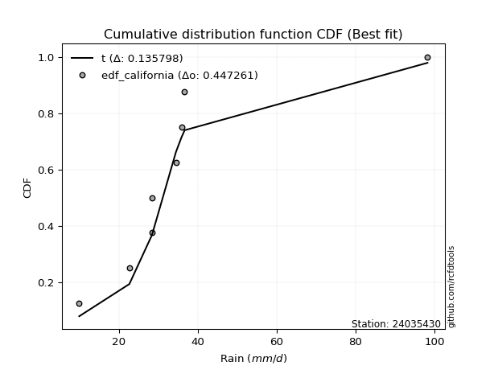</img>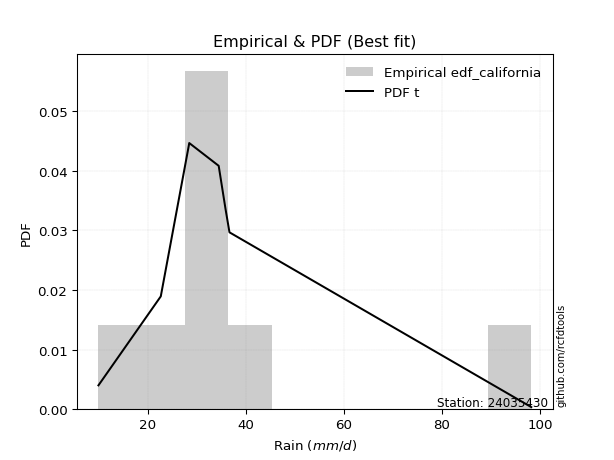</img>

</div>


### 2. Empirical - EDF Hazen (1930)

Hazen method for plotting positions is a formula used to estimate the empirical cumulative probability distribution of flood events or other hydrological data. This formula often results in biased estimations, particularly when extrapolating to extreme events (high return periods).

<div align="center">


$P=(m-0.5)/n$


</div>


**2.1. Empirical values**

<div align="center">

|                | 0                  | 1                  | 2                  | 3                  | 4                  | 5         | 6                 | 7         |
|:---------------|:-------------------|:-------------------|:-------------------|:-------------------|:-------------------|:----------|:------------------|:----------|
| date           | 2023               | 2020               | 2017               | 2021               | 2019               | 2022      | 2018              | 2025      |
| x              | 10.0               | 22.7               | 28.4               | 28.5               | 34.5               | 35.9      | 36.7              | 98.2      |
| m              | 1                  | 2                  | 3                  | 4                  | 5                  | 6         | 7                 | 8         |
| empirical_dist | edf_hazen          | edf_hazen          | edf_hazen          | edf_hazen          | edf_hazen          | edf_hazen | edf_hazen         | edf_hazen |
| empirical      | 0.0625             | 0.1875             | 0.3125             | 0.4375             | 0.5625             | 0.6875    | 0.8125            | 0.9375    |
| empirical_tr   | 1.0666666666666667 | 1.2307692307692308 | 1.4545454545454546 | 1.7777777777777777 | 2.2857142857142856 | 3.2       | 5.333333333333333 | 16.0      |

</div>


**2.2. Kolmogorov-Smirnov fit test (sorted by Δ)**


<div align="center">

|                | 0                   | 1                   | 2                   | 3                   | 4                   | 5                   | 6                   | 7                     | 8                   | 9                   | 10                  | 11                 | 12                  | 13                  | 14                  | 15                 | 16                  | 17                  | 18                 | 19                 | 20                  | 21                 | 22                  | 23                 | 24                  | 25                 | 26                  | 27                  | 28                  | 29                  | 30                  | 31                  | 32                  | 33                  | 34                 | 35                  | 36                  | 37                  | 38                 | 39                  | 40                  | 41                  | 42                  | 43                 | 44                  | 45                  | 46                 | 47                  | 48                  | 49                  | 50                  | 51                  | 52                  | 53                  | 54                  | 55                  | 56                 | 57                 | 58                  | 59                 | 60                  | 61                  | 62                  | 63                  | 64                  | 65                 | 66                 | 67                 | 68                  | 69                 | 70                 | 71                  | 72                 | 73                 | 74                 | 75                  | 76                 | 77                 | 78                  | 79                 | 80                  | 81                  | 82                  | 83                  | 84                 | 85                  | 86                  | 87                  | 88                 | 89                 |
|:---------------|:--------------------|:--------------------|:--------------------|:--------------------|:--------------------|:--------------------|:--------------------|:----------------------|:--------------------|:--------------------|:--------------------|:-------------------|:--------------------|:--------------------|:--------------------|:-------------------|:--------------------|:--------------------|:-------------------|:-------------------|:--------------------|:-------------------|:--------------------|:-------------------|:--------------------|:-------------------|:--------------------|:--------------------|:--------------------|:--------------------|:--------------------|:--------------------|:--------------------|:--------------------|:-------------------|:--------------------|:--------------------|:--------------------|:-------------------|:--------------------|:--------------------|:--------------------|:--------------------|:-------------------|:--------------------|:--------------------|:-------------------|:--------------------|:--------------------|:--------------------|:--------------------|:--------------------|:--------------------|:--------------------|:--------------------|:--------------------|:-------------------|:-------------------|:--------------------|:-------------------|:--------------------|:--------------------|:--------------------|:--------------------|:--------------------|:-------------------|:-------------------|:-------------------|:--------------------|:-------------------|:-------------------|:--------------------|:-------------------|:-------------------|:-------------------|:--------------------|:-------------------|:-------------------|:--------------------|:-------------------|:--------------------|:--------------------|:--------------------|:--------------------|:-------------------|:--------------------|:--------------------|:--------------------|:-------------------|:-------------------|
| station        | 24035430            | 24035430            | 24035430            | 24035430            | 24035430            | 24035430            | 24035430            | 24035430              | 24035430            | 24035430            | 24035430            | 24035430           | 24035430            | 24035430            | 24035430            | 24035430           | 24035430            | 24035430            | 24035430           | 24035430           | 24035430            | 24035430           | 24035430            | 24035430           | 24035430            | 24035430           | 24035430            | 24035430            | 24035430            | 24035430            | 24035430            | 24035430            | 24035430            | 24035430            | 24035430           | 24035430            | 24035430            | 24035430            | 24035430           | 24035430            | 24035430            | 24035430            | 24035430            | 24035430           | 24035430            | 24035430            | 24035430           | 24035430            | 24035430            | 24035430            | 24035430            | 24035430            | 24035430            | 24035430            | 24035430            | 24035430            | 24035430           | 24035430           | 24035430            | 24035430           | 24035430            | 24035430            | 24035430            | 24035430            | 24035430            | 24035430           | 24035430           | 24035430           | 24035430            | 24035430           | 24035430           | 24035430            | 24035430           | 24035430           | 24035430           | 24035430            | 24035430           | 24035430           | 24035430            | 24035430           | 24035430            | 24035430            | 24035430            | 24035430            | 24035430           | 24035430            | 24035430            | 24035430            | 24035430           | 24035430           |
| empirical_dist | edf_hazen           | edf_hazen           | edf_hazen           | edf_hazen           | edf_hazen           | edf_hazen           | edf_hazen           | edf_hazen             | edf_hazen           | edf_hazen           | edf_hazen           | edf_hazen          | edf_hazen           | edf_hazen           | edf_hazen           | edf_hazen          | edf_hazen           | edf_hazen           | edf_hazen          | edf_hazen          | edf_hazen           | edf_hazen          | edf_hazen           | edf_hazen          | edf_hazen           | edf_hazen          | edf_hazen           | edf_hazen           | edf_hazen           | edf_hazen           | edf_hazen           | edf_hazen           | edf_hazen           | edf_hazen           | edf_hazen          | edf_hazen           | edf_hazen           | edf_hazen           | edf_hazen          | edf_hazen           | edf_hazen           | edf_hazen           | edf_hazen           | edf_hazen          | edf_hazen           | edf_hazen           | edf_hazen          | edf_hazen           | edf_hazen           | edf_hazen           | edf_hazen           | edf_hazen           | edf_hazen           | edf_hazen           | edf_hazen           | edf_hazen           | edf_hazen          | edf_hazen          | edf_hazen           | edf_hazen          | edf_hazen           | edf_hazen           | edf_hazen           | edf_hazen           | edf_hazen           | edf_hazen          | edf_hazen          | edf_hazen          | edf_hazen           | edf_hazen          | edf_hazen          | edf_hazen           | edf_hazen          | edf_hazen          | edf_hazen          | edf_hazen           | edf_hazen          | edf_hazen          | edf_hazen           | edf_hazen          | edf_hazen           | edf_hazen           | edf_hazen           | edf_hazen           | edf_hazen          | edf_hazen           | edf_hazen           | edf_hazen           | edf_hazen          | edf_hazen          |
| p_dist         | t                   | logt                | johnsonsu           | loglaplace          | gibrat              | logjohnsonsu        | logmielke           | loglaplace_asymmetric | loggenlogistic      | loghypsecant        | mielke              | loginvgauss        | logmaxwell          | logfisk             | fisk                | wald               | lograyleigh         | logalpha            | loglogistic        | alpha              | loginvgamma         | nct                | logexponnorm        | logtruncnorm       | nakagami            | logbetaprime       | expon               | invweibull          | logrice             | betaprime           | invgamma            | f                   | ncf                 | logncf              | logpearson3        | loggamma            | loggamma            | logerlang           | logf               | logfatiguelife      | logcrystalball      | lognorm             | lognorm             | logweibull_min     | loggumbel_r         | logloggamma         | pearson3           | gompertz            | loginvweibull       | genexpon            | invgauss            | loggompertz         | lognct              | fatiguelife         | logkstwobign        | loghalfnorm         | exponnorm          | halflogistic       | loggenexpon         | moyal              | genlogistic         | laplace_asymmetric  | logmoyal            | loghalflogistic     | halfnorm            | lognakagami        | gumbel_r           | loggumbel_l        | weibull_min         | rayleigh           | kstwobign          | gamma               | maxwell            | logwald            | loggibrat          | rice                | crystalball        | truncnorm          | norm                | logistic           | hypsecant           | laplace             | logexpon            | gumbel_l            | logchi2            | loglognorm          | pareto              | logpareto           | chi2               | erlang             |
| delta          | 0.09935311095234944 | 0.10377598271073274 | 0.11095281752674724 | 0.14218115536486198 | 0.14756184464606753 | 0.15311913888320572 | 0.15893494437056066 | 0.16869549667331785   | 0.17015565799110977 | 0.17023847462238362 | 0.17034393038363338 | 0.1705949965528839 | 0.17160816712522242 | 0.17223286885384637 | 0.17247635373229375 | 0.1738878977627787 | 0.17807866243287773 | 0.17879078758893074 | 0.1820473778817644 | 0.1829468396141688 | 0.18368641790087403 | 0.1853037315212358 | 0.18659873301868468 | 0.1874967868214754 | 0.18762273904451843 | 0.1878872403927906 | 0.18923160121235316 | 0.18952314736315234 | 0.19053609344488975 | 0.19090986416900013 | 0.19193589656254528 | 0.19215845318643732 | 0.19244438224944416 | 0.19282391462665593 | 0.1930385983228573 | 0.19345153268496584 | 0.19345153268496584 | 0.19347381163280053 | 0.193872673308364  | 0.19397744218076463 | 0.19668893971395862 | 0.19668895472450332 | 0.19668895472450332 | 0.1972292550739162 | 0.19814238186502586 | 0.19820793055759123 | 0.1992606054549121 | 0.19942154128001066 | 0.19970422315640313 | 0.20166833221364655 | 0.20459495414908546 | 0.20502987327615574 | 0.20657887977663947 | 0.20788372559700197 | 0.20812395983303944 | 0.21187313981082156 | 0.2146201228677742 | 0.2149803854175042 | 0.21547579161003594 | 0.2189817966223062 | 0.22198041948284464 | 0.22235648504602623 | 0.22332660073626553 | 0.23241680365318773 | 0.23975424201893347 | 0.2414972119991109 | 0.2448446280020905 | 0.2533134430214161 | 0.26705190814300594 | 0.270915746438819  | 0.2726191882936717 | 0.27304412307213355 | 0.2819840945749571 | 0.2932400293288726 | 0.3042183858558605 | 0.31239365500975014 | 0.3151376458638542 | 0.3151376476039075 | 0.31513765255769266 | 0.3154980214481407 | 0.31580577189863285 | 0.31715336241754577 | 0.32949075615618295 | 0.38558653296437795 | 0.4304770698437398 | 0.44688830773072596 | 0.46069591474162497 | 0.47458964971714046 | 0.5276519394084889 | 0.5561829308166573 |
| deltao         | 0.4472608134160001  | 0.4472608134160001  | 0.4472608134160001  | 0.4472608134160001  | 0.4472608134160001  | 0.4472608134160001  | 0.4472608134160001  | 0.4472608134160001    | 0.4472608134160001  | 0.4472608134160001  | 0.4472608134160001  | 0.4472608134160001 | 0.4472608134160001  | 0.4472608134160001  | 0.4472608134160001  | 0.4472608134160001 | 0.4472608134160001  | 0.4472608134160001  | 0.4472608134160001 | 0.4472608134160001 | 0.4472608134160001  | 0.4472608134160001 | 0.4472608134160001  | 0.4472608134160001 | 0.4472608134160001  | 0.4472608134160001 | 0.4472608134160001  | 0.4472608134160001  | 0.4472608134160001  | 0.4472608134160001  | 0.4472608134160001  | 0.4472608134160001  | 0.4472608134160001  | 0.4472608134160001  | 0.4472608134160001 | 0.4472608134160001  | 0.4472608134160001  | 0.4472608134160001  | 0.4472608134160001 | 0.4472608134160001  | 0.4472608134160001  | 0.4472608134160001  | 0.4472608134160001  | 0.4472608134160001 | 0.4472608134160001  | 0.4472608134160001  | 0.4472608134160001 | 0.4472608134160001  | 0.4472608134160001  | 0.4472608134160001  | 0.4472608134160001  | 0.4472608134160001  | 0.4472608134160001  | 0.4472608134160001  | 0.4472608134160001  | 0.4472608134160001  | 0.4472608134160001 | 0.4472608134160001 | 0.4472608134160001  | 0.4472608134160001 | 0.4472608134160001  | 0.4472608134160001  | 0.4472608134160001  | 0.4472608134160001  | 0.4472608134160001  | 0.4472608134160001 | 0.4472608134160001 | 0.4472608134160001 | 0.4472608134160001  | 0.4472608134160001 | 0.4472608134160001 | 0.4472608134160001  | 0.4472608134160001 | 0.4472608134160001 | 0.4472608134160001 | 0.4472608134160001  | 0.4472608134160001 | 0.4472608134160001 | 0.4472608134160001  | 0.4472608134160001 | 0.4472608134160001  | 0.4472608134160001  | 0.4472608134160001  | 0.4472608134160001  | 0.4472608134160001 | 0.4472608134160001  | 0.4472608134160001  | 0.4472608134160001  | 0.4472608134160001 | 0.4472608134160001 |
| eval           | Δo > Δ              | Δo > Δ              | Δo > Δ              | Δo > Δ              | Δo > Δ              | Δo > Δ              | Δo > Δ              | Δo > Δ                | Δo > Δ              | Δo > Δ              | Δo > Δ              | Δo > Δ             | Δo > Δ              | Δo > Δ              | Δo > Δ              | Δo > Δ             | Δo > Δ              | Δo > Δ              | Δo > Δ             | Δo > Δ             | Δo > Δ              | Δo > Δ             | Δo > Δ              | Δo > Δ             | Δo > Δ              | Δo > Δ             | Δo > Δ              | Δo > Δ              | Δo > Δ              | Δo > Δ              | Δo > Δ              | Δo > Δ              | Δo > Δ              | Δo > Δ              | Δo > Δ             | Δo > Δ              | Δo > Δ              | Δo > Δ              | Δo > Δ             | Δo > Δ              | Δo > Δ              | Δo > Δ              | Δo > Δ              | Δo > Δ             | Δo > Δ              | Δo > Δ              | Δo > Δ             | Δo > Δ              | Δo > Δ              | Δo > Δ              | Δo > Δ              | Δo > Δ              | Δo > Δ              | Δo > Δ              | Δo > Δ              | Δo > Δ              | Δo > Δ             | Δo > Δ             | Δo > Δ              | Δo > Δ             | Δo > Δ              | Δo > Δ              | Δo > Δ              | Δo > Δ              | Δo > Δ              | Δo > Δ             | Δo > Δ             | Δo > Δ             | Δo > Δ              | Δo > Δ             | Δo > Δ             | Δo > Δ              | Δo > Δ             | Δo > Δ             | Δo > Δ             | Δo > Δ              | Δo > Δ             | Δo > Δ             | Δo > Δ              | Δo > Δ             | Δo > Δ              | Δo > Δ              | Δo > Δ              | Δo > Δ              | Δo > Δ             | Δo > Δ              | Δo <= Δ             | Δo <= Δ             | Δo <= Δ            | Δo <= Δ            |
| fit            | 1                   | 1                   | 1                   | 1                   | 1                   | 1                   | 1                   | 1                     | 1                   | 1                   | 1                   | 1                  | 1                   | 1                   | 1                   | 1                  | 1                   | 1                   | 1                  | 1                  | 1                   | 1                  | 1                   | 1                  | 1                   | 1                  | 1                   | 1                   | 1                   | 1                   | 1                   | 1                   | 1                   | 1                   | 1                  | 1                   | 1                   | 1                   | 1                  | 1                   | 1                   | 1                   | 1                   | 1                  | 1                   | 1                   | 1                  | 1                   | 1                   | 1                   | 1                   | 1                   | 1                   | 1                   | 1                   | 1                   | 1                  | 1                  | 1                   | 1                  | 1                   | 1                   | 1                   | 1                   | 1                   | 1                  | 1                  | 1                  | 1                   | 1                  | 1                  | 1                   | 1                  | 1                  | 1                  | 1                   | 1                  | 1                  | 1                   | 1                  | 1                   | 1                   | 1                   | 1                   | 1                  | 1                   | 0                   | 0                   | 0                  | 0                  |
| n              | 8                   | 8                   | 8                   | 8                   | 8                   | 8                   | 8                   | 8                     | 8                   | 8                   | 8                   | 8                  | 8                   | 8                   | 8                   | 8                  | 8                   | 8                   | 8                  | 8                  | 8                   | 8                  | 8                   | 8                  | 8                   | 8                  | 8                   | 8                   | 8                   | 8                   | 8                   | 8                   | 8                   | 8                   | 8                  | 8                   | 8                   | 8                   | 8                  | 8                   | 8                   | 8                   | 8                   | 8                  | 8                   | 8                   | 8                  | 8                   | 8                   | 8                   | 8                   | 8                   | 8                   | 8                   | 8                   | 8                   | 8                  | 8                  | 8                   | 8                  | 8                   | 8                   | 8                   | 8                   | 8                   | 8                  | 8                  | 8                  | 8                   | 8                  | 8                  | 8                   | 8                  | 8                  | 8                  | 8                   | 8                  | 8                  | 8                   | 8                  | 8                   | 8                   | 8                   | 8                   | 8                  | 8                   | 8                   | 8                   | 8                  | 8                  |
| best_fit       | 1                   | 0                   | 0                   | 0                   | 0                   | 0                   | 0                   | 0                     | 0                   | 0                   | 0                   | 0                  | 0                   | 0                   | 0                   | 0                  | 0                   | 0                   | 0                  | 0                  | 0                   | 0                  | 0                   | 0                  | 0                   | 0                  | 0                   | 0                   | 0                   | 0                   | 0                   | 0                   | 0                   | 0                   | 0                  | 0                   | 0                   | 0                   | 0                  | 0                   | 0                   | 0                   | 0                   | 0                  | 0                   | 0                   | 0                  | 0                   | 0                   | 0                   | 0                   | 0                   | 0                   | 0                   | 0                   | 0                   | 0                  | 0                  | 0                   | 0                  | 0                   | 0                   | 0                   | 0                   | 0                   | 0                  | 0                  | 0                  | 0                   | 0                  | 0                  | 0                   | 0                  | 0                  | 0                  | 0                   | 0                  | 0                  | 0                   | 0                  | 0                   | 0                   | 0                   | 0                   | 0                  | 0                   | 0                   | 0                   | 0                  | 0                  |
| best_fit_sort  | 1                   | 2                   | 3                   | 4                   | 5                   | 6                   | 7                   | 8                     | 9                   | 10                  | 11                  | 12                 | 13                  | 14                  | 15                  | 16                 | 17                  | 18                  | 19                 | 20                 | 21                  | 22                 | 23                  | 24                 | 25                  | 26                 | 27                  | 28                  | 29                  | 30                  | 31                  | 32                  | 33                  | 34                  | 35                 | 36                  | 37                  | 38                  | 39                 | 40                  | 41                  | 42                  | 43                  | 44                 | 45                  | 46                  | 47                 | 48                  | 49                  | 50                  | 51                  | 52                  | 53                  | 54                  | 55                  | 56                  | 57                 | 58                 | 59                  | 60                 | 61                  | 62                  | 63                  | 64                  | 65                  | 66                 | 67                 | 68                 | 69                  | 70                 | 71                 | 72                  | 73                 | 74                 | 75                 | 76                  | 77                 | 78                 | 79                  | 80                 | 81                  | 82                  | 83                  | 84                  | 85                 | 86                  | 87                  | 88                  | 89                 | 90                 |

</div>


<div align="center">

</img>

</div>


**2.3. Best fit**

<div align="center">

|   id |   station | empirical_dist   | p_dist   |     delta |   deltao | eval   |   fit |   n |   best_fit |   best_fit_sort |
|-----:|----------:|:-----------------|:---------|----------:|---------:|:-------|------:|----:|-----------:|----------------:|
|    0 |  24035430 | edf_hazen        | t        | 0.0993531 | 0.447261 | Δo > Δ |     1 |   8 |          1 |               1 |

</div>


<div align="center">

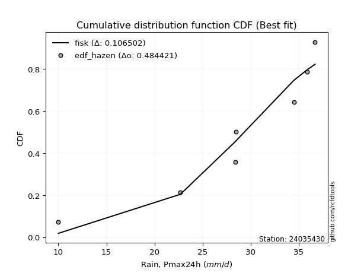</img>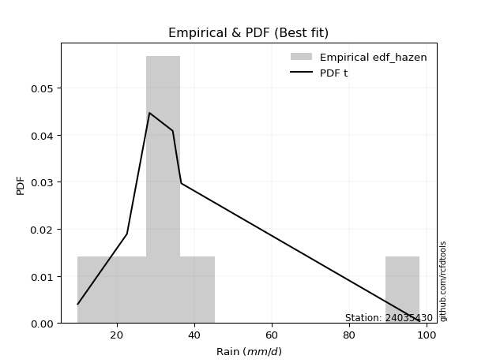</img>

</div>


### 3. Empirical - EDF Weibull (1939)

Weibull plotting position formula is an empirical method used to estimate the non-exceedance probability or plotting position for a set of observed data, is often recommended or widely used in practice, particularly in flood frequency analysis.

<div align="center">


$P=m/(n+1)$


</div>


**3.1. Empirical values**

<div align="center">

|                | 0                  | 1                  | 2                  | 3                  | 4                  | 5                  | 6                  | 7                  |
|:---------------|:-------------------|:-------------------|:-------------------|:-------------------|:-------------------|:-------------------|:-------------------|:-------------------|
| date           | 2023               | 2020               | 2017               | 2021               | 2019               | 2022               | 2018               | 2025               |
| x              | 10.0               | 22.7               | 28.4               | 28.5               | 34.5               | 35.9               | 36.7               | 98.2               |
| m              | 1                  | 2                  | 3                  | 4                  | 5                  | 6                  | 7                  | 8                  |
| empirical_dist | edf_weibull        | edf_weibull        | edf_weibull        | edf_weibull        | edf_weibull        | edf_weibull        | edf_weibull        | edf_weibull        |
| empirical      | 0.1111111111111111 | 0.2222222222222222 | 0.3333333333333333 | 0.4444444444444444 | 0.5555555555555556 | 0.6666666666666666 | 0.7777777777777778 | 0.8888888888888888 |
| empirical_tr   | 1.125              | 1.2857142857142856 | 1.4999999999999998 | 1.7999999999999998 | 2.25               | 2.9999999999999996 | 4.5                | 8.999999999999996  |

</div>


**3.2. Kolmogorov-Smirnov fit test (sorted by Δ)**


<div align="center">

|                | 0                   | 1                   | 2                   | 3                   | 4                   | 5                   | 6                     | 7                   | 8                  | 9                   | 10                  | 11                  | 12                  | 13                  | 14                  | 15                  | 16                 | 17                  | 18                 | 19                  | 20                  | 21                  | 22                  | 23                  | 24                  | 25                  | 26                  | 27                 | 28                  | 29                  | 30                 | 31                  | 32                  | 33                  | 34                 | 35                  | 36                  | 37                 | 38                 | 39                 | 40                 | 41                  | 42                  | 43                  | 44                  | 45                  | 46                  | 47                  | 48                  | 49                  | 50                  | 51                 | 52                 | 53                  | 54                 | 55                  | 56                  | 57                  | 58                  | 59                  | 60                  | 61                  | 62                 | 63                  | 64                 | 65                  | 66                 | 67                 | 68                  | 69                  | 70                 | 71                  | 72                 | 73                 | 74                 | 75                  | 76                 | 77                  | 78                 | 79                  | 80                  | 81                  | 82                  | 83                  | 84                 | 85                  | 86                  | 87                  | 88                  | 89                 |
|:---------------|:--------------------|:--------------------|:--------------------|:--------------------|:--------------------|:--------------------|:----------------------|:--------------------|:-------------------|:--------------------|:--------------------|:--------------------|:--------------------|:--------------------|:--------------------|:--------------------|:-------------------|:--------------------|:-------------------|:--------------------|:--------------------|:--------------------|:--------------------|:--------------------|:--------------------|:--------------------|:--------------------|:-------------------|:--------------------|:--------------------|:-------------------|:--------------------|:--------------------|:--------------------|:-------------------|:--------------------|:--------------------|:-------------------|:-------------------|:-------------------|:-------------------|:--------------------|:--------------------|:--------------------|:--------------------|:--------------------|:--------------------|:--------------------|:--------------------|:--------------------|:--------------------|:-------------------|:-------------------|:--------------------|:-------------------|:--------------------|:--------------------|:--------------------|:--------------------|:--------------------|:--------------------|:--------------------|:-------------------|:--------------------|:-------------------|:--------------------|:-------------------|:-------------------|:--------------------|:--------------------|:-------------------|:--------------------|:-------------------|:-------------------|:-------------------|:--------------------|:-------------------|:--------------------|:-------------------|:--------------------|:--------------------|:--------------------|:--------------------|:--------------------|:-------------------|:--------------------|:--------------------|:--------------------|:--------------------|:-------------------|
| station        | 24035430            | 24035430            | 24035430            | 24035430            | 24035430            | 24035430            | 24035430              | 24035430            | 24035430           | 24035430            | 24035430            | 24035430            | 24035430            | 24035430            | 24035430            | 24035430            | 24035430           | 24035430            | 24035430           | 24035430            | 24035430            | 24035430            | 24035430            | 24035430            | 24035430            | 24035430            | 24035430            | 24035430           | 24035430            | 24035430            | 24035430           | 24035430            | 24035430            | 24035430            | 24035430           | 24035430            | 24035430            | 24035430           | 24035430           | 24035430           | 24035430           | 24035430            | 24035430            | 24035430            | 24035430            | 24035430            | 24035430            | 24035430            | 24035430            | 24035430            | 24035430            | 24035430           | 24035430           | 24035430            | 24035430           | 24035430            | 24035430            | 24035430            | 24035430            | 24035430            | 24035430            | 24035430            | 24035430           | 24035430            | 24035430           | 24035430            | 24035430           | 24035430           | 24035430            | 24035430            | 24035430           | 24035430            | 24035430           | 24035430           | 24035430           | 24035430            | 24035430           | 24035430            | 24035430           | 24035430            | 24035430            | 24035430            | 24035430            | 24035430            | 24035430           | 24035430            | 24035430            | 24035430            | 24035430            | 24035430           |
| empirical_dist | edf_weibull         | edf_weibull         | edf_weibull         | edf_weibull         | edf_weibull         | edf_weibull         | edf_weibull           | edf_weibull         | edf_weibull        | edf_weibull         | edf_weibull         | edf_weibull         | edf_weibull         | edf_weibull         | edf_weibull         | edf_weibull         | edf_weibull        | edf_weibull         | edf_weibull        | edf_weibull         | edf_weibull         | edf_weibull         | edf_weibull         | edf_weibull         | edf_weibull         | edf_weibull         | edf_weibull         | edf_weibull        | edf_weibull         | edf_weibull         | edf_weibull        | edf_weibull         | edf_weibull         | edf_weibull         | edf_weibull        | edf_weibull         | edf_weibull         | edf_weibull        | edf_weibull        | edf_weibull        | edf_weibull        | edf_weibull         | edf_weibull         | edf_weibull         | edf_weibull         | edf_weibull         | edf_weibull         | edf_weibull         | edf_weibull         | edf_weibull         | edf_weibull         | edf_weibull        | edf_weibull        | edf_weibull         | edf_weibull        | edf_weibull         | edf_weibull         | edf_weibull         | edf_weibull         | edf_weibull         | edf_weibull         | edf_weibull         | edf_weibull        | edf_weibull         | edf_weibull        | edf_weibull         | edf_weibull        | edf_weibull        | edf_weibull         | edf_weibull         | edf_weibull        | edf_weibull         | edf_weibull        | edf_weibull        | edf_weibull        | edf_weibull         | edf_weibull        | edf_weibull         | edf_weibull        | edf_weibull         | edf_weibull         | edf_weibull         | edf_weibull         | edf_weibull         | edf_weibull        | edf_weibull         | edf_weibull         | edf_weibull         | edf_weibull         | edf_weibull        |
| p_dist         | johnsonsu           | logt                | t                   | loglaplace          | logmielke           | gibrat              | loglaplace_asymmetric | loggenlogistic      | loghypsecant       | mielke              | logfisk             | fisk                | logalpha            | loginvgauss         | logmaxwell          | loglogistic         | alpha              | loginvgamma         | nct                | logexponnorm        | wald                | logbetaprime        | invweibull          | logrice             | betaprime           | invgamma            | lograyleigh         | f                  | ncf                 | logncf              | logpearson3        | loggamma            | loggamma            | logerlang           | logf               | logfatiguelife      | logjohnsonsu        | logcrystalball     | lognorm            | lognorm            | logweibull_min     | expon               | logloggamma         | pearson3            | gompertz            | genexpon            | invgauss            | loggompertz         | lognct              | fatiguelife         | loggumbel_r         | loginvweibull      | exponnorm          | halflogistic        | moyal              | genlogistic         | logkstwobign        | laplace_asymmetric  | loghalfnorm         | loggenexpon         | logmoyal            | halfnorm            | gumbel_r           | loghalflogistic     | loggumbel_l        | lognakagami         | logtruncnorm       | nakagami           | weibull_min         | rayleigh            | kstwobign          | gamma               | maxwell            | logwald            | rice               | crystalball         | truncnorm          | norm                | logistic           | hypsecant           | laplace             | loggibrat           | logexpon            | gumbel_l            | logchi2            | loglognorm          | pareto              | logpareto           | chi2                | erlang             |
| delta          | 0.08334984561562242 | 0.09589572560586007 | 0.10629755539679386 | 0.10745893314263977 | 0.12421272214833845 | 0.12672851131273422 | 0.13397327445109564   | 0.13543343576888756 | 0.1355162524001614 | 0.13562170816141117 | 0.13751064663162416 | 0.13775413151007154 | 0.14406856536670853 | 0.14473374905576336 | 0.14527783303289543 | 0.14732515565954218 | 0.1482246173919466 | 0.14896419567865182 | 0.1505815092990136 | 0.15187651079646247 | 0.15305456442944537 | 0.15316501817056838 | 0.15480092514093013 | 0.15581387122266754 | 0.15618764194677792 | 0.15721367434032307 | 0.15724532909954442 | 0.1574362309642151 | 0.15772216002722195 | 0.15810169240443372 | 0.1583163761006351 | 0.15872931046274363 | 0.15872931046274363 | 0.15875158941057832 | 0.1591504510861418 | 0.15925521995854242 | 0.16006358332765014 | 0.1619667174917364 | 0.1619667325022811 | 0.1619667325022811 | 0.162507032851694  | 0.16256118983243878 | 0.16348570833536902 | 0.16453838323268988 | 0.16469931905778845 | 0.16694610999142434 | 0.16987273192686325 | 0.17030765105393353 | 0.17185665755441726 | 0.17316150337477976 | 0.17730904853169255 | 0.1788708898230698 | 0.179897900645552  | 0.18025816319528198 | 0.184259574400084  | 0.18725819726062243 | 0.18729062649970613 | 0.18763426282380402 | 0.19103980647748825 | 0.19464245827670262 | 0.20249326740293222 | 0.20503201979671126 | 0.2101224057798683 | 0.21158347031985442 | 0.2185912207991939 | 0.22220157009334227 | 0.2222190090436976 | 0.2222221928778977 | 0.23232968592078374 | 0.23619352421659678 | 0.2378969660714495 | 0.24315591056754277 | 0.2472618723527349 | 0.2724066959955393 | 0.2776714327875279 | 0.28041542364163197 | 0.2804154253816853 | 0.28041543033547045 | 0.2807757992259185 | 0.28108354967641064 | 0.28243114019532356 | 0.28338505252252716 | 0.29476853393396074 | 0.35086431074215574 | 0.3957548476215176 | 0.41216608550850375 | 0.42597369251940276 | 0.43986742749491825 | 0.49292971718626666 | 0.521460708594435  |
| deltao         | 0.4472608134160001  | 0.4472608134160001  | 0.4472608134160001  | 0.4472608134160001  | 0.4472608134160001  | 0.4472608134160001  | 0.4472608134160001    | 0.4472608134160001  | 0.4472608134160001 | 0.4472608134160001  | 0.4472608134160001  | 0.4472608134160001  | 0.4472608134160001  | 0.4472608134160001  | 0.4472608134160001  | 0.4472608134160001  | 0.4472608134160001 | 0.4472608134160001  | 0.4472608134160001 | 0.4472608134160001  | 0.4472608134160001  | 0.4472608134160001  | 0.4472608134160001  | 0.4472608134160001  | 0.4472608134160001  | 0.4472608134160001  | 0.4472608134160001  | 0.4472608134160001 | 0.4472608134160001  | 0.4472608134160001  | 0.4472608134160001 | 0.4472608134160001  | 0.4472608134160001  | 0.4472608134160001  | 0.4472608134160001 | 0.4472608134160001  | 0.4472608134160001  | 0.4472608134160001 | 0.4472608134160001 | 0.4472608134160001 | 0.4472608134160001 | 0.4472608134160001  | 0.4472608134160001  | 0.4472608134160001  | 0.4472608134160001  | 0.4472608134160001  | 0.4472608134160001  | 0.4472608134160001  | 0.4472608134160001  | 0.4472608134160001  | 0.4472608134160001  | 0.4472608134160001 | 0.4472608134160001 | 0.4472608134160001  | 0.4472608134160001 | 0.4472608134160001  | 0.4472608134160001  | 0.4472608134160001  | 0.4472608134160001  | 0.4472608134160001  | 0.4472608134160001  | 0.4472608134160001  | 0.4472608134160001 | 0.4472608134160001  | 0.4472608134160001 | 0.4472608134160001  | 0.4472608134160001 | 0.4472608134160001 | 0.4472608134160001  | 0.4472608134160001  | 0.4472608134160001 | 0.4472608134160001  | 0.4472608134160001 | 0.4472608134160001 | 0.4472608134160001 | 0.4472608134160001  | 0.4472608134160001 | 0.4472608134160001  | 0.4472608134160001 | 0.4472608134160001  | 0.4472608134160001  | 0.4472608134160001  | 0.4472608134160001  | 0.4472608134160001  | 0.4472608134160001 | 0.4472608134160001  | 0.4472608134160001  | 0.4472608134160001  | 0.4472608134160001  | 0.4472608134160001 |
| eval           | Δo > Δ              | Δo > Δ              | Δo > Δ              | Δo > Δ              | Δo > Δ              | Δo > Δ              | Δo > Δ                | Δo > Δ              | Δo > Δ             | Δo > Δ              | Δo > Δ              | Δo > Δ              | Δo > Δ              | Δo > Δ              | Δo > Δ              | Δo > Δ              | Δo > Δ             | Δo > Δ              | Δo > Δ             | Δo > Δ              | Δo > Δ              | Δo > Δ              | Δo > Δ              | Δo > Δ              | Δo > Δ              | Δo > Δ              | Δo > Δ              | Δo > Δ             | Δo > Δ              | Δo > Δ              | Δo > Δ             | Δo > Δ              | Δo > Δ              | Δo > Δ              | Δo > Δ             | Δo > Δ              | Δo > Δ              | Δo > Δ             | Δo > Δ             | Δo > Δ             | Δo > Δ             | Δo > Δ              | Δo > Δ              | Δo > Δ              | Δo > Δ              | Δo > Δ              | Δo > Δ              | Δo > Δ              | Δo > Δ              | Δo > Δ              | Δo > Δ              | Δo > Δ             | Δo > Δ             | Δo > Δ              | Δo > Δ             | Δo > Δ              | Δo > Δ              | Δo > Δ              | Δo > Δ              | Δo > Δ              | Δo > Δ              | Δo > Δ              | Δo > Δ             | Δo > Δ              | Δo > Δ             | Δo > Δ              | Δo > Δ             | Δo > Δ             | Δo > Δ              | Δo > Δ              | Δo > Δ             | Δo > Δ              | Δo > Δ             | Δo > Δ             | Δo > Δ             | Δo > Δ              | Δo > Δ             | Δo > Δ              | Δo > Δ             | Δo > Δ              | Δo > Δ              | Δo > Δ              | Δo > Δ              | Δo > Δ              | Δo > Δ             | Δo > Δ              | Δo > Δ              | Δo > Δ              | Δo <= Δ             | Δo <= Δ            |
| fit            | 1                   | 1                   | 1                   | 1                   | 1                   | 1                   | 1                     | 1                   | 1                  | 1                   | 1                   | 1                   | 1                   | 1                   | 1                   | 1                   | 1                  | 1                   | 1                  | 1                   | 1                   | 1                   | 1                   | 1                   | 1                   | 1                   | 1                   | 1                  | 1                   | 1                   | 1                  | 1                   | 1                   | 1                   | 1                  | 1                   | 1                   | 1                  | 1                  | 1                  | 1                  | 1                   | 1                   | 1                   | 1                   | 1                   | 1                   | 1                   | 1                   | 1                   | 1                   | 1                  | 1                  | 1                   | 1                  | 1                   | 1                   | 1                   | 1                   | 1                   | 1                   | 1                   | 1                  | 1                   | 1                  | 1                   | 1                  | 1                  | 1                   | 1                   | 1                  | 1                   | 1                  | 1                  | 1                  | 1                   | 1                  | 1                   | 1                  | 1                   | 1                   | 1                   | 1                   | 1                   | 1                  | 1                   | 1                   | 1                   | 0                   | 0                  |
| n              | 8                   | 8                   | 8                   | 8                   | 8                   | 8                   | 8                     | 8                   | 8                  | 8                   | 8                   | 8                   | 8                   | 8                   | 8                   | 8                   | 8                  | 8                   | 8                  | 8                   | 8                   | 8                   | 8                   | 8                   | 8                   | 8                   | 8                   | 8                  | 8                   | 8                   | 8                  | 8                   | 8                   | 8                   | 8                  | 8                   | 8                   | 8                  | 8                  | 8                  | 8                  | 8                   | 8                   | 8                   | 8                   | 8                   | 8                   | 8                   | 8                   | 8                   | 8                   | 8                  | 8                  | 8                   | 8                  | 8                   | 8                   | 8                   | 8                   | 8                   | 8                   | 8                   | 8                  | 8                   | 8                  | 8                   | 8                  | 8                  | 8                   | 8                   | 8                  | 8                   | 8                  | 8                  | 8                  | 8                   | 8                  | 8                   | 8                  | 8                   | 8                   | 8                   | 8                   | 8                   | 8                  | 8                   | 8                   | 8                   | 8                   | 8                  |
| best_fit       | 1                   | 0                   | 0                   | 0                   | 0                   | 0                   | 0                     | 0                   | 0                  | 0                   | 0                   | 0                   | 0                   | 0                   | 0                   | 0                   | 0                  | 0                   | 0                  | 0                   | 0                   | 0                   | 0                   | 0                   | 0                   | 0                   | 0                   | 0                  | 0                   | 0                   | 0                  | 0                   | 0                   | 0                   | 0                  | 0                   | 0                   | 0                  | 0                  | 0                  | 0                  | 0                   | 0                   | 0                   | 0                   | 0                   | 0                   | 0                   | 0                   | 0                   | 0                   | 0                  | 0                  | 0                   | 0                  | 0                   | 0                   | 0                   | 0                   | 0                   | 0                   | 0                   | 0                  | 0                   | 0                  | 0                   | 0                  | 0                  | 0                   | 0                   | 0                  | 0                   | 0                  | 0                  | 0                  | 0                   | 0                  | 0                   | 0                  | 0                   | 0                   | 0                   | 0                   | 0                   | 0                  | 0                   | 0                   | 0                   | 0                   | 0                  |
| best_fit_sort  | 1                   | 2                   | 3                   | 4                   | 5                   | 6                   | 7                     | 8                   | 9                  | 10                  | 11                  | 12                  | 13                  | 14                  | 15                  | 16                  | 17                 | 18                  | 19                 | 20                  | 21                  | 22                  | 23                  | 24                  | 25                  | 26                  | 27                  | 28                 | 29                  | 30                  | 31                 | 32                  | 33                  | 34                  | 35                 | 36                  | 37                  | 38                 | 39                 | 40                 | 41                 | 42                  | 43                  | 44                  | 45                  | 46                  | 47                  | 48                  | 49                  | 50                  | 51                  | 52                 | 53                 | 54                  | 55                 | 56                  | 57                  | 58                  | 59                  | 60                  | 61                  | 62                  | 63                 | 64                  | 65                 | 66                  | 67                 | 68                 | 69                  | 70                  | 71                 | 72                  | 73                 | 74                 | 75                 | 76                  | 77                 | 78                  | 79                 | 80                  | 81                  | 82                  | 83                  | 84                  | 85                 | 86                  | 87                  | 88                  | 89                  | 90                 |

</div>


<div align="center">

</img>

</div>


**3.3. Best fit**

<div align="center">

|   id |   station | empirical_dist   | p_dist    |     delta |   deltao | eval   |   fit |   n |   best_fit |   best_fit_sort |
|-----:|----------:|:-----------------|:----------|----------:|---------:|:-------|------:|----:|-----------:|----------------:|
|    0 |  24035430 | edf_weibull      | johnsonsu | 0.0833498 | 0.447261 | Δo > Δ |     1 |   8 |          1 |               1 |

</div>


<div align="center">

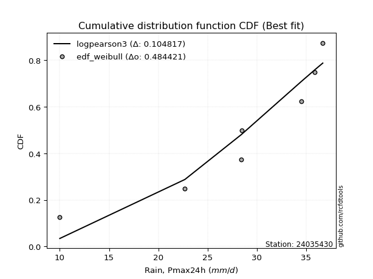</img>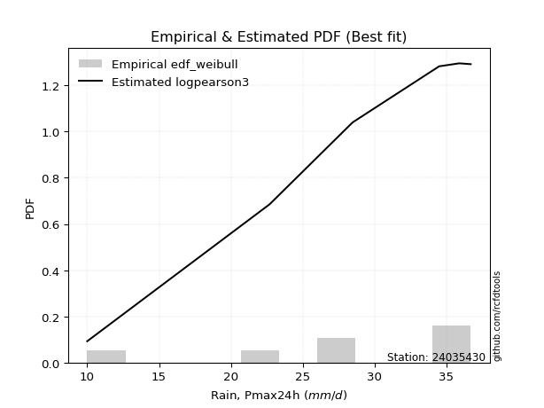</img>

</div>


### 4. Empirical - EDF Beard (1943)

The Beard formula (or Beard´s plotting position formula) in hydrology is used to estimate the empirical non-exceedance probability _(P)_ of a flood event (or other extreme hydrological data point) within a given dataset.

<div align="center">


$P=(m-0.31)/(n+0.38)$


</div>


**4.1. Empirical values**

<div align="center">

|                | 0                   | 1                   | 2                  | 3                   | 4                  | 5                  | 6                  | 7                  |
|:---------------|:--------------------|:--------------------|:-------------------|:--------------------|:-------------------|:-------------------|:-------------------|:-------------------|
| date           | 2023                | 2020                | 2017               | 2021                | 2019               | 2022               | 2018               | 2025               |
| x              | 10.0                | 22.7                | 28.4               | 28.5                | 34.5               | 35.9               | 36.7               | 98.2               |
| m              | 1                   | 2                   | 3                  | 4                   | 5                  | 6                  | 7                  | 8                  |
| empirical_dist | edf_beard           | edf_beard           | edf_beard          | edf_beard           | edf_beard          | edf_beard          | edf_beard          | edf_beard          |
| empirical      | 0.08233890214797135 | 0.20167064439140808 | 0.3210023866348448 | 0.44033412887828155 | 0.5596658711217184 | 0.6789976133651551 | 0.7983293556085919 | 0.9176610978520287 |
| empirical_tr   | 1.0897269180754225  | 1.2526158445440956  | 1.4727592267135323 | 1.7867803837953091  | 2.2710027100271004 | 3.115241635687732  | 4.958579881656804  | 12.144927536231886 |

</div>


**4.2. Kolmogorov-Smirnov fit test (sorted by Δ)**


<div align="center">

|                | 0                  | 1                  | 2                   | 3                   | 4                   | 5                   | 6                     | 7                   | 8                   | 9                   | 10                  | 11                  | 12                  | 13                  | 14                  | 15                 | 16                  | 17                  | 18                  | 19                 | 20                  | 21                  | 22                  | 23                  | 24                  | 25                 | 26                  | 27                 | 28                  | 29                  | 30                  | 31                 | 32                  | 33                 | 34                 | 35                 | 36                  | 37                 | 38                  | 39                  | 40                  | 41                  | 42                 | 43                  | 44                  | 45                 | 46                  | 47                  | 48                 | 49                 | 50                  | 51                  | 52                  | 53                  | 54                  | 55                  | 56                  | 57                  | 58                  | 59                  | 60                 | 61                 | 62                  | 63                  | 64                  | 65                  | 66                  | 67                  | 68                  | 69                  | 70                  | 71                  | 72                  | 73                 | 74                  | 75                 | 76                  | 77                  | 78                 | 79                  | 80                 | 81                  | 82                  | 83                 | 84                 | 85                 | 86                 | 87                 | 88                 | 89                 |
|:---------------|:-------------------|:-------------------|:--------------------|:--------------------|:--------------------|:--------------------|:----------------------|:--------------------|:--------------------|:--------------------|:--------------------|:--------------------|:--------------------|:--------------------|:--------------------|:-------------------|:--------------------|:--------------------|:--------------------|:-------------------|:--------------------|:--------------------|:--------------------|:--------------------|:--------------------|:-------------------|:--------------------|:-------------------|:--------------------|:--------------------|:--------------------|:-------------------|:--------------------|:-------------------|:-------------------|:-------------------|:--------------------|:-------------------|:--------------------|:--------------------|:--------------------|:--------------------|:-------------------|:--------------------|:--------------------|:-------------------|:--------------------|:--------------------|:-------------------|:-------------------|:--------------------|:--------------------|:--------------------|:--------------------|:--------------------|:--------------------|:--------------------|:--------------------|:--------------------|:--------------------|:-------------------|:-------------------|:--------------------|:--------------------|:--------------------|:--------------------|:--------------------|:--------------------|:--------------------|:--------------------|:--------------------|:--------------------|:--------------------|:-------------------|:--------------------|:-------------------|:--------------------|:--------------------|:-------------------|:--------------------|:-------------------|:--------------------|:--------------------|:-------------------|:-------------------|:-------------------|:-------------------|:-------------------|:-------------------|:-------------------|
| station        | 24035430           | 24035430           | 24035430            | 24035430            | 24035430            | 24035430            | 24035430              | 24035430            | 24035430            | 24035430            | 24035430            | 24035430            | 24035430            | 24035430            | 24035430            | 24035430           | 24035430            | 24035430            | 24035430            | 24035430           | 24035430            | 24035430            | 24035430            | 24035430            | 24035430            | 24035430           | 24035430            | 24035430           | 24035430            | 24035430            | 24035430            | 24035430           | 24035430            | 24035430           | 24035430           | 24035430           | 24035430            | 24035430           | 24035430            | 24035430            | 24035430            | 24035430            | 24035430           | 24035430            | 24035430            | 24035430           | 24035430            | 24035430            | 24035430           | 24035430           | 24035430            | 24035430            | 24035430            | 24035430            | 24035430            | 24035430            | 24035430            | 24035430            | 24035430            | 24035430            | 24035430           | 24035430           | 24035430            | 24035430            | 24035430            | 24035430            | 24035430            | 24035430            | 24035430            | 24035430            | 24035430            | 24035430            | 24035430            | 24035430           | 24035430            | 24035430           | 24035430            | 24035430            | 24035430           | 24035430            | 24035430           | 24035430            | 24035430            | 24035430           | 24035430           | 24035430           | 24035430           | 24035430           | 24035430           | 24035430           |
| empirical_dist | edf_beard          | edf_beard          | edf_beard           | edf_beard           | edf_beard           | edf_beard           | edf_beard             | edf_beard           | edf_beard           | edf_beard           | edf_beard           | edf_beard           | edf_beard           | edf_beard           | edf_beard           | edf_beard          | edf_beard           | edf_beard           | edf_beard           | edf_beard          | edf_beard           | edf_beard           | edf_beard           | edf_beard           | edf_beard           | edf_beard          | edf_beard           | edf_beard          | edf_beard           | edf_beard           | edf_beard           | edf_beard          | edf_beard           | edf_beard          | edf_beard          | edf_beard          | edf_beard           | edf_beard          | edf_beard           | edf_beard           | edf_beard           | edf_beard           | edf_beard          | edf_beard           | edf_beard           | edf_beard          | edf_beard           | edf_beard           | edf_beard          | edf_beard          | edf_beard           | edf_beard           | edf_beard           | edf_beard           | edf_beard           | edf_beard           | edf_beard           | edf_beard           | edf_beard           | edf_beard           | edf_beard          | edf_beard          | edf_beard           | edf_beard           | edf_beard           | edf_beard           | edf_beard           | edf_beard           | edf_beard           | edf_beard           | edf_beard           | edf_beard           | edf_beard           | edf_beard          | edf_beard           | edf_beard          | edf_beard           | edf_beard           | edf_beard          | edf_beard           | edf_beard          | edf_beard           | edf_beard           | edf_beard          | edf_beard          | edf_beard          | edf_beard          | edf_beard          | edf_beard          | edf_beard          |
| p_dist         | logt               | johnsonsu          | t                   | loglaplace          | gibrat              | logmielke           | loglaplace_asymmetric | logjohnsonsu        | loggenlogistic      | loghypsecant        | mielke              | loginvgauss         | logmaxwell          | logfisk             | fisk                | logalpha           | wald                | loglogistic         | alpha               | loginvgamma        | lograyleigh         | nct                 | logexponnorm        | logbetaprime        | expon               | invweibull         | logrice             | betaprime          | invgamma            | f                   | ncf                 | logncf             | logpearson3         | loggamma           | loggamma           | logerlang          | logf                | logfatiguelife     | logcrystalball      | lognorm             | lognorm             | logweibull_min      | logloggamma        | pearson3            | gompertz            | genexpon           | loggumbel_r         | invgauss            | loggompertz        | loginvweibull      | lognct              | fatiguelife         | logkstwobign        | exponnorm           | halflogistic        | logtruncnorm        | nakagami            | loghalfnorm         | moyal               | loggenexpon         | genlogistic        | laplace_asymmetric | logmoyal            | loghalflogistic     | halfnorm            | gumbel_r            | lognakagami         | loggumbel_l         | weibull_min         | rayleigh            | kstwobign           | gamma               | maxwell             | logwald            | loggibrat           | rice               | crystalball         | truncnorm           | norm               | logistic            | hypsecant          | laplace             | logexpon            | gumbel_l           | logchi2            | loglognorm         | pareto             | logpareto          | chi2               | erlang             |
| delta          | 0.0917854100396972 | 0.0967821731353391 | 0.10218723983063105 | 0.12801051097345384 | 0.13905945801122271 | 0.14476429997915252 | 0.1545248522819097    | 0.15595326776148727 | 0.15598501359970163 | 0.15606783023097548 | 0.15617328599222524 | 0.15706469575425186 | 0.15760877973138393 | 0.15806222446243823 | 0.15830570934088561 | 0.1646201431975226 | 0.16538551112793387 | 0.16787673349035626 | 0.16877619522276066 | 0.1695157735094659 | 0.16957627579803292 | 0.17113308712982767 | 0.17242808862727654 | 0.17371659600138245 | 0.17506095682094508 | 0.1753525029717442 | 0.17636544905348162 | 0.176739219777592  | 0.17776525217113714 | 0.17798780879502918 | 0.17827373785803602 | 0.1786532702352478 | 0.17886795393144916 | 0.1792808882935577 | 0.1792808882935577 | 0.1793031672413924 | 0.17970202891695586 | 0.1798067977893565 | 0.18251829532255048 | 0.18251831033309518 | 0.18251831033309518 | 0.18305861068250806 | 0.1840372861661831 | 0.18508996106350395 | 0.18525089688860252 | 0.1874976878222384 | 0.18963999523018105 | 0.19042430975767732 | 0.1908592288847476 | 0.1912018365215583 | 0.19240823538523133 | 0.19371308120559383 | 0.19962157319819462 | 0.20044947847636607 | 0.20080974102609606 | 0.20166743121288347 | 0.20167061504708358 | 0.20337075317597675 | 0.20481115223089807 | 0.20697340497519112 | 0.2078097750914365 | 0.2081858406546181 | 0.21482421410142072 | 0.22391441701834292 | 0.22558359762752533 | 0.23067398361068236 | 0.23299482536426608 | 0.23914279863000798 | 0.25288126375159786 | 0.25674510204741086 | 0.25844854390226357 | 0.25887347868072547 | 0.26781345018354896 | 0.2847376426940278 | 0.29571599922101566 | 0.298223010618342  | 0.30096700147244604 | 0.30096700321249936 | 0.3009670081662845 | 0.30132737705673257 | 0.3016351275072247 | 0.30298271802613763 | 0.31532011176477487 | 0.3714158885729698 | 0.4163064254523317 | 0.4327176633393179 | 0.4465252703502169 | 0.4604190053257324 | 0.5134812950170808 | 0.5420122864252492 |
| deltao         | 0.4472608134160001 | 0.4472608134160001 | 0.4472608134160001  | 0.4472608134160001  | 0.4472608134160001  | 0.4472608134160001  | 0.4472608134160001    | 0.4472608134160001  | 0.4472608134160001  | 0.4472608134160001  | 0.4472608134160001  | 0.4472608134160001  | 0.4472608134160001  | 0.4472608134160001  | 0.4472608134160001  | 0.4472608134160001 | 0.4472608134160001  | 0.4472608134160001  | 0.4472608134160001  | 0.4472608134160001 | 0.4472608134160001  | 0.4472608134160001  | 0.4472608134160001  | 0.4472608134160001  | 0.4472608134160001  | 0.4472608134160001 | 0.4472608134160001  | 0.4472608134160001 | 0.4472608134160001  | 0.4472608134160001  | 0.4472608134160001  | 0.4472608134160001 | 0.4472608134160001  | 0.4472608134160001 | 0.4472608134160001 | 0.4472608134160001 | 0.4472608134160001  | 0.4472608134160001 | 0.4472608134160001  | 0.4472608134160001  | 0.4472608134160001  | 0.4472608134160001  | 0.4472608134160001 | 0.4472608134160001  | 0.4472608134160001  | 0.4472608134160001 | 0.4472608134160001  | 0.4472608134160001  | 0.4472608134160001 | 0.4472608134160001 | 0.4472608134160001  | 0.4472608134160001  | 0.4472608134160001  | 0.4472608134160001  | 0.4472608134160001  | 0.4472608134160001  | 0.4472608134160001  | 0.4472608134160001  | 0.4472608134160001  | 0.4472608134160001  | 0.4472608134160001 | 0.4472608134160001 | 0.4472608134160001  | 0.4472608134160001  | 0.4472608134160001  | 0.4472608134160001  | 0.4472608134160001  | 0.4472608134160001  | 0.4472608134160001  | 0.4472608134160001  | 0.4472608134160001  | 0.4472608134160001  | 0.4472608134160001  | 0.4472608134160001 | 0.4472608134160001  | 0.4472608134160001 | 0.4472608134160001  | 0.4472608134160001  | 0.4472608134160001 | 0.4472608134160001  | 0.4472608134160001 | 0.4472608134160001  | 0.4472608134160001  | 0.4472608134160001 | 0.4472608134160001 | 0.4472608134160001 | 0.4472608134160001 | 0.4472608134160001 | 0.4472608134160001 | 0.4472608134160001 |
| eval           | Δo > Δ             | Δo > Δ             | Δo > Δ              | Δo > Δ              | Δo > Δ              | Δo > Δ              | Δo > Δ                | Δo > Δ              | Δo > Δ              | Δo > Δ              | Δo > Δ              | Δo > Δ              | Δo > Δ              | Δo > Δ              | Δo > Δ              | Δo > Δ             | Δo > Δ              | Δo > Δ              | Δo > Δ              | Δo > Δ             | Δo > Δ              | Δo > Δ              | Δo > Δ              | Δo > Δ              | Δo > Δ              | Δo > Δ             | Δo > Δ              | Δo > Δ             | Δo > Δ              | Δo > Δ              | Δo > Δ              | Δo > Δ             | Δo > Δ              | Δo > Δ             | Δo > Δ             | Δo > Δ             | Δo > Δ              | Δo > Δ             | Δo > Δ              | Δo > Δ              | Δo > Δ              | Δo > Δ              | Δo > Δ             | Δo > Δ              | Δo > Δ              | Δo > Δ             | Δo > Δ              | Δo > Δ              | Δo > Δ             | Δo > Δ             | Δo > Δ              | Δo > Δ              | Δo > Δ              | Δo > Δ              | Δo > Δ              | Δo > Δ              | Δo > Δ              | Δo > Δ              | Δo > Δ              | Δo > Δ              | Δo > Δ             | Δo > Δ             | Δo > Δ              | Δo > Δ              | Δo > Δ              | Δo > Δ              | Δo > Δ              | Δo > Δ              | Δo > Δ              | Δo > Δ              | Δo > Δ              | Δo > Δ              | Δo > Δ              | Δo > Δ             | Δo > Δ              | Δo > Δ             | Δo > Δ              | Δo > Δ              | Δo > Δ             | Δo > Δ              | Δo > Δ             | Δo > Δ              | Δo > Δ              | Δo > Δ             | Δo > Δ             | Δo > Δ             | Δo > Δ             | Δo <= Δ            | Δo <= Δ            | Δo <= Δ            |
| fit            | 1                  | 1                  | 1                   | 1                   | 1                   | 1                   | 1                     | 1                   | 1                   | 1                   | 1                   | 1                   | 1                   | 1                   | 1                   | 1                  | 1                   | 1                   | 1                   | 1                  | 1                   | 1                   | 1                   | 1                   | 1                   | 1                  | 1                   | 1                  | 1                   | 1                   | 1                   | 1                  | 1                   | 1                  | 1                  | 1                  | 1                   | 1                  | 1                   | 1                   | 1                   | 1                   | 1                  | 1                   | 1                   | 1                  | 1                   | 1                   | 1                  | 1                  | 1                   | 1                   | 1                   | 1                   | 1                   | 1                   | 1                   | 1                   | 1                   | 1                   | 1                  | 1                  | 1                   | 1                   | 1                   | 1                   | 1                   | 1                   | 1                   | 1                   | 1                   | 1                   | 1                   | 1                  | 1                   | 1                  | 1                   | 1                   | 1                  | 1                   | 1                  | 1                   | 1                   | 1                  | 1                  | 1                  | 1                  | 0                  | 0                  | 0                  |
| n              | 8                  | 8                  | 8                   | 8                   | 8                   | 8                   | 8                     | 8                   | 8                   | 8                   | 8                   | 8                   | 8                   | 8                   | 8                   | 8                  | 8                   | 8                   | 8                   | 8                  | 8                   | 8                   | 8                   | 8                   | 8                   | 8                  | 8                   | 8                  | 8                   | 8                   | 8                   | 8                  | 8                   | 8                  | 8                  | 8                  | 8                   | 8                  | 8                   | 8                   | 8                   | 8                   | 8                  | 8                   | 8                   | 8                  | 8                   | 8                   | 8                  | 8                  | 8                   | 8                   | 8                   | 8                   | 8                   | 8                   | 8                   | 8                   | 8                   | 8                   | 8                  | 8                  | 8                   | 8                   | 8                   | 8                   | 8                   | 8                   | 8                   | 8                   | 8                   | 8                   | 8                   | 8                  | 8                   | 8                  | 8                   | 8                   | 8                  | 8                   | 8                  | 8                   | 8                   | 8                  | 8                  | 8                  | 8                  | 8                  | 8                  | 8                  |
| best_fit       | 1                  | 0                  | 0                   | 0                   | 0                   | 0                   | 0                     | 0                   | 0                   | 0                   | 0                   | 0                   | 0                   | 0                   | 0                   | 0                  | 0                   | 0                   | 0                   | 0                  | 0                   | 0                   | 0                   | 0                   | 0                   | 0                  | 0                   | 0                  | 0                   | 0                   | 0                   | 0                  | 0                   | 0                  | 0                  | 0                  | 0                   | 0                  | 0                   | 0                   | 0                   | 0                   | 0                  | 0                   | 0                   | 0                  | 0                   | 0                   | 0                  | 0                  | 0                   | 0                   | 0                   | 0                   | 0                   | 0                   | 0                   | 0                   | 0                   | 0                   | 0                  | 0                  | 0                   | 0                   | 0                   | 0                   | 0                   | 0                   | 0                   | 0                   | 0                   | 0                   | 0                   | 0                  | 0                   | 0                  | 0                   | 0                   | 0                  | 0                   | 0                  | 0                   | 0                   | 0                  | 0                  | 0                  | 0                  | 0                  | 0                  | 0                  |
| best_fit_sort  | 1                  | 2                  | 3                   | 4                   | 5                   | 6                   | 7                     | 8                   | 9                   | 10                  | 11                  | 12                  | 13                  | 14                  | 15                  | 16                 | 17                  | 18                  | 19                  | 20                 | 21                  | 22                  | 23                  | 24                  | 25                  | 26                 | 27                  | 28                 | 29                  | 30                  | 31                  | 32                 | 33                  | 34                 | 35                 | 36                 | 37                  | 38                 | 39                  | 40                  | 41                  | 42                  | 43                 | 44                  | 45                  | 46                 | 47                  | 48                  | 49                 | 50                 | 51                  | 52                  | 53                  | 54                  | 55                  | 56                  | 57                  | 58                  | 59                  | 60                  | 61                 | 62                 | 63                  | 64                  | 65                  | 66                  | 67                  | 68                  | 69                  | 70                  | 71                  | 72                  | 73                  | 74                 | 75                  | 76                 | 77                  | 78                  | 79                 | 80                  | 81                 | 82                  | 83                  | 84                 | 85                 | 86                 | 87                 | 88                 | 89                 | 90                 |

</div>


<div align="center">

</img>

</div>


**4.3. Best fit**

<div align="center">

|   id |   station | empirical_dist   | p_dist   |     delta |   deltao | eval   |   fit |   n |   best_fit |   best_fit_sort |
|-----:|----------:|:-----------------|:---------|----------:|---------:|:-------|------:|----:|-----------:|----------------:|
|    0 |  24035430 | edf_beard        | logt     | 0.0917854 | 0.447261 | Δo > Δ |     1 |   8 |          1 |               1 |

</div>


<div align="center">

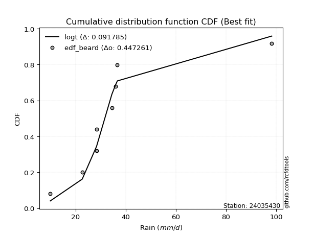</img></img>

</div>


### 5. Empirical - EDF Chegodayev (1955)

The Chegodayev formula is an empirical plotting position formula used in hydrological frequency analysis to estimate the exceedance probability or return period of a specific event from a set of observed data. It is primarily used for plotting observed data points on probability paper to fit a theoretical distribution, particularly for analyzing extreme events like maximum flood flows or rainfall intensities. The constant _b_ value in the generalized plotting position formula is 0.3.

<div align="center">


$P=(m-b)/(n+1-2b)$


</div>


**5.1. Empirical values**

<div align="center">

|                | 0                   | 1                   | 2                   | 3                   | 4                  | 5                  | 6                  | 7                  |
|:---------------|:--------------------|:--------------------|:--------------------|:--------------------|:-------------------|:-------------------|:-------------------|:-------------------|
| date           | 2023                | 2020                | 2017                | 2021                | 2019               | 2022               | 2018               | 2025               |
| x              | 10.0                | 22.7                | 28.4                | 28.5                | 34.5               | 35.9               | 36.7               | 98.2               |
| m              | 1                   | 2                   | 3                   | 4                   | 5                  | 6                  | 7                  | 8                  |
| empirical_dist | edf_chegodayev      | edf_chegodayev      | edf_chegodayev      | edf_chegodayev      | edf_chegodayev     | edf_chegodayev     | edf_chegodayev     | edf_chegodayev     |
| empirical      | 0.08333333333333333 | 0.20238095238095236 | 0.32142857142857145 | 0.44047619047619047 | 0.5595238095238095 | 0.6785714285714286 | 0.7976190476190476 | 0.9166666666666666 |
| empirical_tr   | 1.090909090909091   | 1.253731343283582   | 1.4736842105263157  | 1.7872340425531914  | 2.27027027027027   | 3.1111111111111116 | 4.941176470588234  | 11.999999999999995 |

</div>


**5.2. Kolmogorov-Smirnov fit test (sorted by Δ)**


<div align="center">

|                | 0                   | 1                  | 2                   | 3                   | 4                   | 5                   | 6                     | 7                   | 8                   | 9                   | 10                  | 11                  | 12                 | 13                  | 14                 | 15                 | 16                  | 17                  | 18                  | 19                 | 20                  | 21                  | 22                  | 23                  | 24                  | 25                 | 26                  | 27                 | 28                  | 29                  | 30                  | 31                 | 32                  | 33                 | 34                 | 35                 | 36                  | 37                 | 38                  | 39                  | 40                  | 41                  | 42                 | 43                  | 44                  | 45                 | 46                 | 47                  | 48                 | 49                  | 50                  | 51                  | 52                 | 53                  | 54                  | 55                  | 56                  | 57                 | 58                  | 59                  | 60                 | 61                 | 62                  | 63                  | 64                  | 65                  | 66                  | 67                  | 68                 | 69                  | 70                  | 71                 | 72                  | 73                  | 74                 | 75                 | 76                  | 77                  | 78                 | 79                  | 80                 | 81                  | 82                 | 83                 | 84                  | 85                  | 86                  | 87                  | 88                 | 89                 |
|:---------------|:--------------------|:-------------------|:--------------------|:--------------------|:--------------------|:--------------------|:----------------------|:--------------------|:--------------------|:--------------------|:--------------------|:--------------------|:-------------------|:--------------------|:-------------------|:-------------------|:--------------------|:--------------------|:--------------------|:-------------------|:--------------------|:--------------------|:--------------------|:--------------------|:--------------------|:-------------------|:--------------------|:-------------------|:--------------------|:--------------------|:--------------------|:-------------------|:--------------------|:-------------------|:-------------------|:-------------------|:--------------------|:-------------------|:--------------------|:--------------------|:--------------------|:--------------------|:-------------------|:--------------------|:--------------------|:-------------------|:-------------------|:--------------------|:-------------------|:--------------------|:--------------------|:--------------------|:-------------------|:--------------------|:--------------------|:--------------------|:--------------------|:-------------------|:--------------------|:--------------------|:-------------------|:-------------------|:--------------------|:--------------------|:--------------------|:--------------------|:--------------------|:--------------------|:-------------------|:--------------------|:--------------------|:-------------------|:--------------------|:--------------------|:-------------------|:-------------------|:--------------------|:--------------------|:-------------------|:--------------------|:-------------------|:--------------------|:-------------------|:-------------------|:--------------------|:--------------------|:--------------------|:--------------------|:-------------------|:-------------------|
| station        | 24035430            | 24035430           | 24035430            | 24035430            | 24035430            | 24035430            | 24035430              | 24035430            | 24035430            | 24035430            | 24035430            | 24035430            | 24035430           | 24035430            | 24035430           | 24035430           | 24035430            | 24035430            | 24035430            | 24035430           | 24035430            | 24035430            | 24035430            | 24035430            | 24035430            | 24035430           | 24035430            | 24035430           | 24035430            | 24035430            | 24035430            | 24035430           | 24035430            | 24035430           | 24035430           | 24035430           | 24035430            | 24035430           | 24035430            | 24035430            | 24035430            | 24035430            | 24035430           | 24035430            | 24035430            | 24035430           | 24035430           | 24035430            | 24035430           | 24035430            | 24035430            | 24035430            | 24035430           | 24035430            | 24035430            | 24035430            | 24035430            | 24035430           | 24035430            | 24035430            | 24035430           | 24035430           | 24035430            | 24035430            | 24035430            | 24035430            | 24035430            | 24035430            | 24035430           | 24035430            | 24035430            | 24035430           | 24035430            | 24035430            | 24035430           | 24035430           | 24035430            | 24035430            | 24035430           | 24035430            | 24035430           | 24035430            | 24035430           | 24035430           | 24035430            | 24035430            | 24035430            | 24035430            | 24035430           | 24035430           |
| empirical_dist | edf_chegodayev      | edf_chegodayev     | edf_chegodayev      | edf_chegodayev      | edf_chegodayev      | edf_chegodayev      | edf_chegodayev        | edf_chegodayev      | edf_chegodayev      | edf_chegodayev      | edf_chegodayev      | edf_chegodayev      | edf_chegodayev     | edf_chegodayev      | edf_chegodayev     | edf_chegodayev     | edf_chegodayev      | edf_chegodayev      | edf_chegodayev      | edf_chegodayev     | edf_chegodayev      | edf_chegodayev      | edf_chegodayev      | edf_chegodayev      | edf_chegodayev      | edf_chegodayev     | edf_chegodayev      | edf_chegodayev     | edf_chegodayev      | edf_chegodayev      | edf_chegodayev      | edf_chegodayev     | edf_chegodayev      | edf_chegodayev     | edf_chegodayev     | edf_chegodayev     | edf_chegodayev      | edf_chegodayev     | edf_chegodayev      | edf_chegodayev      | edf_chegodayev      | edf_chegodayev      | edf_chegodayev     | edf_chegodayev      | edf_chegodayev      | edf_chegodayev     | edf_chegodayev     | edf_chegodayev      | edf_chegodayev     | edf_chegodayev      | edf_chegodayev      | edf_chegodayev      | edf_chegodayev     | edf_chegodayev      | edf_chegodayev      | edf_chegodayev      | edf_chegodayev      | edf_chegodayev     | edf_chegodayev      | edf_chegodayev      | edf_chegodayev     | edf_chegodayev     | edf_chegodayev      | edf_chegodayev      | edf_chegodayev      | edf_chegodayev      | edf_chegodayev      | edf_chegodayev      | edf_chegodayev     | edf_chegodayev      | edf_chegodayev      | edf_chegodayev     | edf_chegodayev      | edf_chegodayev      | edf_chegodayev     | edf_chegodayev     | edf_chegodayev      | edf_chegodayev      | edf_chegodayev     | edf_chegodayev      | edf_chegodayev     | edf_chegodayev      | edf_chegodayev     | edf_chegodayev     | edf_chegodayev      | edf_chegodayev      | edf_chegodayev      | edf_chegodayev      | edf_chegodayev     | edf_chegodayev     |
| p_dist         | logt                | johnsonsu          | t                   | loglaplace          | gibrat              | logmielke           | loglaplace_asymmetric | loggenlogistic      | loghypsecant        | mielke              | logjohnsonsu        | loginvgauss         | logmaxwell         | logfisk             | fisk               | logalpha           | wald                | loglogistic         | alpha               | loginvgamma        | lograyleigh         | nct                 | logexponnorm        | logbetaprime        | expon               | invweibull         | logrice             | betaprime          | invgamma            | f                   | ncf                 | logncf             | logpearson3         | loggamma           | loggamma           | logerlang          | logf                | logfatiguelife     | logcrystalball      | lognorm             | lognorm             | logweibull_min      | logloggamma        | pearson3            | gompertz            | genexpon           | loggumbel_r        | invgauss            | loggompertz        | loginvweibull       | lognct              | fatiguelife         | logkstwobign       | exponnorm           | halflogistic        | logtruncnorm        | nakagami            | loghalfnorm        | moyal               | loggenexpon         | genlogistic        | laplace_asymmetric | logmoyal            | loghalflogistic     | halfnorm            | gumbel_r            | lognakagami         | loggumbel_l         | weibull_min        | rayleigh            | kstwobign           | gamma              | maxwell             | logwald             | loggibrat          | rice               | crystalball         | truncnorm           | norm               | logistic            | hypsecant          | laplace             | logexpon           | gumbel_l           | logchi2             | loglognorm          | pareto              | logpareto           | chi2               | erlang             |
| delta          | 0.09192747163760612 | 0.0960718651457948 | 0.10232930142853991 | 0.12730020298390954 | 0.13863327321749608 | 0.14405399198960822 | 0.1538145442923654    | 0.15527470561015733 | 0.15535752224143118 | 0.15546297800268094 | 0.15609532935939618 | 0.15663851096052522 | 0.1571825949376573 | 0.15735191647289393 | 0.1575954013513413 | 0.1639098352079783 | 0.16495932633420723 | 0.16716642550081195 | 0.16806588723321636 | 0.1688054655199216 | 0.16915009100430628 | 0.17042277914028336 | 0.17171778063773224 | 0.17300628801183815 | 0.17446595173720064 | 0.1746421949821999 | 0.17565514106393731 | 0.1760289117880477 | 0.17705494418159284 | 0.17727750080548488 | 0.17756342986849172 | 0.1779429622457035 | 0.17815764594190486 | 0.1785705803040134 | 0.1785705803040134 | 0.1785928592518481 | 0.17899172092741156 | 0.1790964897998122 | 0.18180798733300618 | 0.18180800234355088 | 0.18180800234355088 | 0.18234830269296376 | 0.1833269781766388 | 0.18437965307395965 | 0.18454058889905822 | 0.1867873798326941 | 0.1892138104364544 | 0.18971400176813302 | 0.1901489208952033 | 0.19077565172783167 | 0.19169792739568703 | 0.19300277321604953 | 0.199195388404468  | 0.19973917048682177 | 0.20009943303655175 | 0.20237773920242774 | 0.20238092303662786 | 0.2029445683822501 | 0.20410084424135377 | 0.20654722018146449 | 0.2070994671018922 | 0.2074755326650738 | 0.21439802930769408 | 0.22348823222461628 | 0.22487328963798103 | 0.22996367562113806 | 0.23256864057053944 | 0.23843249064046368 | 0.2521709557620536 | 0.25603479405786655 | 0.25773823591271927 | 0.2581631706911812 | 0.26710314219400466 | 0.28431145790030116 | 0.295289814427289  | 0.2975127026287977 | 0.30025669348290174 | 0.30025669522295506 | 0.3002567001767402 | 0.30061706906718827 | 0.3009248195176804 | 0.30227241003659333 | 0.3146098037752306 | 0.3707055805834255 | 0.41559611746278746 | 0.43200735534977364 | 0.44581496236067264 | 0.45970869733618813 | 0.5127709870275365 | 0.5413019784357049 |
| deltao         | 0.4472608134160001  | 0.4472608134160001 | 0.4472608134160001  | 0.4472608134160001  | 0.4472608134160001  | 0.4472608134160001  | 0.4472608134160001    | 0.4472608134160001  | 0.4472608134160001  | 0.4472608134160001  | 0.4472608134160001  | 0.4472608134160001  | 0.4472608134160001 | 0.4472608134160001  | 0.4472608134160001 | 0.4472608134160001 | 0.4472608134160001  | 0.4472608134160001  | 0.4472608134160001  | 0.4472608134160001 | 0.4472608134160001  | 0.4472608134160001  | 0.4472608134160001  | 0.4472608134160001  | 0.4472608134160001  | 0.4472608134160001 | 0.4472608134160001  | 0.4472608134160001 | 0.4472608134160001  | 0.4472608134160001  | 0.4472608134160001  | 0.4472608134160001 | 0.4472608134160001  | 0.4472608134160001 | 0.4472608134160001 | 0.4472608134160001 | 0.4472608134160001  | 0.4472608134160001 | 0.4472608134160001  | 0.4472608134160001  | 0.4472608134160001  | 0.4472608134160001  | 0.4472608134160001 | 0.4472608134160001  | 0.4472608134160001  | 0.4472608134160001 | 0.4472608134160001 | 0.4472608134160001  | 0.4472608134160001 | 0.4472608134160001  | 0.4472608134160001  | 0.4472608134160001  | 0.4472608134160001 | 0.4472608134160001  | 0.4472608134160001  | 0.4472608134160001  | 0.4472608134160001  | 0.4472608134160001 | 0.4472608134160001  | 0.4472608134160001  | 0.4472608134160001 | 0.4472608134160001 | 0.4472608134160001  | 0.4472608134160001  | 0.4472608134160001  | 0.4472608134160001  | 0.4472608134160001  | 0.4472608134160001  | 0.4472608134160001 | 0.4472608134160001  | 0.4472608134160001  | 0.4472608134160001 | 0.4472608134160001  | 0.4472608134160001  | 0.4472608134160001 | 0.4472608134160001 | 0.4472608134160001  | 0.4472608134160001  | 0.4472608134160001 | 0.4472608134160001  | 0.4472608134160001 | 0.4472608134160001  | 0.4472608134160001 | 0.4472608134160001 | 0.4472608134160001  | 0.4472608134160001  | 0.4472608134160001  | 0.4472608134160001  | 0.4472608134160001 | 0.4472608134160001 |
| eval           | Δo > Δ              | Δo > Δ             | Δo > Δ              | Δo > Δ              | Δo > Δ              | Δo > Δ              | Δo > Δ                | Δo > Δ              | Δo > Δ              | Δo > Δ              | Δo > Δ              | Δo > Δ              | Δo > Δ             | Δo > Δ              | Δo > Δ             | Δo > Δ             | Δo > Δ              | Δo > Δ              | Δo > Δ              | Δo > Δ             | Δo > Δ              | Δo > Δ              | Δo > Δ              | Δo > Δ              | Δo > Δ              | Δo > Δ             | Δo > Δ              | Δo > Δ             | Δo > Δ              | Δo > Δ              | Δo > Δ              | Δo > Δ             | Δo > Δ              | Δo > Δ             | Δo > Δ             | Δo > Δ             | Δo > Δ              | Δo > Δ             | Δo > Δ              | Δo > Δ              | Δo > Δ              | Δo > Δ              | Δo > Δ             | Δo > Δ              | Δo > Δ              | Δo > Δ             | Δo > Δ             | Δo > Δ              | Δo > Δ             | Δo > Δ              | Δo > Δ              | Δo > Δ              | Δo > Δ             | Δo > Δ              | Δo > Δ              | Δo > Δ              | Δo > Δ              | Δo > Δ             | Δo > Δ              | Δo > Δ              | Δo > Δ             | Δo > Δ             | Δo > Δ              | Δo > Δ              | Δo > Δ              | Δo > Δ              | Δo > Δ              | Δo > Δ              | Δo > Δ             | Δo > Δ              | Δo > Δ              | Δo > Δ             | Δo > Δ              | Δo > Δ              | Δo > Δ             | Δo > Δ             | Δo > Δ              | Δo > Δ              | Δo > Δ             | Δo > Δ              | Δo > Δ             | Δo > Δ              | Δo > Δ             | Δo > Δ             | Δo > Δ              | Δo > Δ              | Δo > Δ              | Δo <= Δ             | Δo <= Δ            | Δo <= Δ            |
| fit            | 1                   | 1                  | 1                   | 1                   | 1                   | 1                   | 1                     | 1                   | 1                   | 1                   | 1                   | 1                   | 1                  | 1                   | 1                  | 1                  | 1                   | 1                   | 1                   | 1                  | 1                   | 1                   | 1                   | 1                   | 1                   | 1                  | 1                   | 1                  | 1                   | 1                   | 1                   | 1                  | 1                   | 1                  | 1                  | 1                  | 1                   | 1                  | 1                   | 1                   | 1                   | 1                   | 1                  | 1                   | 1                   | 1                  | 1                  | 1                   | 1                  | 1                   | 1                   | 1                   | 1                  | 1                   | 1                   | 1                   | 1                   | 1                  | 1                   | 1                   | 1                  | 1                  | 1                   | 1                   | 1                   | 1                   | 1                   | 1                   | 1                  | 1                   | 1                   | 1                  | 1                   | 1                   | 1                  | 1                  | 1                   | 1                   | 1                  | 1                   | 1                  | 1                   | 1                  | 1                  | 1                   | 1                   | 1                   | 0                   | 0                  | 0                  |
| n              | 8                   | 8                  | 8                   | 8                   | 8                   | 8                   | 8                     | 8                   | 8                   | 8                   | 8                   | 8                   | 8                  | 8                   | 8                  | 8                  | 8                   | 8                   | 8                   | 8                  | 8                   | 8                   | 8                   | 8                   | 8                   | 8                  | 8                   | 8                  | 8                   | 8                   | 8                   | 8                  | 8                   | 8                  | 8                  | 8                  | 8                   | 8                  | 8                   | 8                   | 8                   | 8                   | 8                  | 8                   | 8                   | 8                  | 8                  | 8                   | 8                  | 8                   | 8                   | 8                   | 8                  | 8                   | 8                   | 8                   | 8                   | 8                  | 8                   | 8                   | 8                  | 8                  | 8                   | 8                   | 8                   | 8                   | 8                   | 8                   | 8                  | 8                   | 8                   | 8                  | 8                   | 8                   | 8                  | 8                  | 8                   | 8                   | 8                  | 8                   | 8                  | 8                   | 8                  | 8                  | 8                   | 8                   | 8                   | 8                   | 8                  | 8                  |
| best_fit       | 1                   | 0                  | 0                   | 0                   | 0                   | 0                   | 0                     | 0                   | 0                   | 0                   | 0                   | 0                   | 0                  | 0                   | 0                  | 0                  | 0                   | 0                   | 0                   | 0                  | 0                   | 0                   | 0                   | 0                   | 0                   | 0                  | 0                   | 0                  | 0                   | 0                   | 0                   | 0                  | 0                   | 0                  | 0                  | 0                  | 0                   | 0                  | 0                   | 0                   | 0                   | 0                   | 0                  | 0                   | 0                   | 0                  | 0                  | 0                   | 0                  | 0                   | 0                   | 0                   | 0                  | 0                   | 0                   | 0                   | 0                   | 0                  | 0                   | 0                   | 0                  | 0                  | 0                   | 0                   | 0                   | 0                   | 0                   | 0                   | 0                  | 0                   | 0                   | 0                  | 0                   | 0                   | 0                  | 0                  | 0                   | 0                   | 0                  | 0                   | 0                  | 0                   | 0                  | 0                  | 0                   | 0                   | 0                   | 0                   | 0                  | 0                  |
| best_fit_sort  | 1                   | 2                  | 3                   | 4                   | 5                   | 6                   | 7                     | 8                   | 9                   | 10                  | 11                  | 12                  | 13                 | 14                  | 15                 | 16                 | 17                  | 18                  | 19                  | 20                 | 21                  | 22                  | 23                  | 24                  | 25                  | 26                 | 27                  | 28                 | 29                  | 30                  | 31                  | 32                 | 33                  | 34                 | 35                 | 36                 | 37                  | 38                 | 39                  | 40                  | 41                  | 42                  | 43                 | 44                  | 45                  | 46                 | 47                 | 48                  | 49                 | 50                  | 51                  | 52                  | 53                 | 54                  | 55                  | 56                  | 57                  | 58                 | 59                  | 60                  | 61                 | 62                 | 63                  | 64                  | 65                  | 66                  | 67                  | 68                  | 69                 | 70                  | 71                  | 72                 | 73                  | 74                  | 75                 | 76                 | 77                  | 78                  | 79                 | 80                  | 81                 | 82                  | 83                 | 84                 | 85                  | 86                  | 87                  | 88                  | 89                 | 90                 |

</div>


<div align="center">

</img>

</div>


**5.3. Best fit**

<div align="center">

|   id |   station | empirical_dist   | p_dist   |     delta |   deltao | eval   |   fit |   n |   best_fit |   best_fit_sort |
|-----:|----------:|:-----------------|:---------|----------:|---------:|:-------|------:|----:|-----------:|----------------:|
|    0 |  24035430 | edf_chegodayev   | logt     | 0.0919275 | 0.447261 | Δo > Δ |     1 |   8 |          1 |               1 |

</div>


<div align="center">

</img>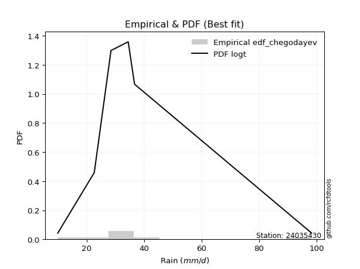</img>

</div>


### 6. Empirical - EDF Blom (1958)

The Blom formula is a specific "plotting position" formula used in hydrology and statistical analysis to estimate the empirical cumulative probability (or non-exceedance probability) of a data series. It is particularly recommended for data that are approximately normally distributed. The constant _a_ is set to 0.375 (or 3/8).

<div align="center">


$P=(m-a)/(n+1-2a)$


</div>


**6.1. Empirical values**

<div align="center">

|                | 0                   | 1                   | 2                  | 3                  | 4                  | 5                  | 6                 | 7                  |
|:---------------|:--------------------|:--------------------|:-------------------|:-------------------|:-------------------|:-------------------|:------------------|:-------------------|
| date           | 2023                | 2020                | 2017               | 2021               | 2019               | 2022               | 2018              | 2025               |
| x              | 10.0                | 22.7                | 28.4               | 28.5               | 34.5               | 35.9               | 36.7              | 98.2               |
| m              | 1                   | 2                   | 3                  | 4                  | 5                  | 6                  | 7                 | 8                  |
| empirical_dist | edf_blom            | edf_blom            | edf_blom           | edf_blom           | edf_blom           | edf_blom           | edf_blom          | edf_blom           |
| empirical      | 0.07575757575757576 | 0.19696969696969696 | 0.3181818181818182 | 0.4393939393939394 | 0.5606060606060606 | 0.6818181818181818 | 0.803030303030303 | 0.9242424242424242 |
| empirical_tr   | 1.0819672131147542  | 1.2452830188679247  | 1.4666666666666666 | 1.783783783783784  | 2.275862068965517  | 3.1428571428571423 | 5.076923076923076 | 13.199999999999992 |

</div>


**6.2. Kolmogorov-Smirnov fit test (sorted by Δ)**


<div align="center">

|                | 0                   | 1                   | 2                   | 3                   | 4                   | 5                   | 6                  | 7                     | 8                   | 9                  | 10                  | 11                 | 12                 | 13                  | 14                  | 15                 | 16                  | 17                  | 18                  | 19                  | 20                  | 21                 | 22                  | 23                  | 24                 | 25                  | 26                  | 27                  | 28                  | 29                 | 30                  | 31                  | 32                  | 33                  | 34                  | 35                 | 36                  | 37                 | 38                 | 39                 | 40                 | 41                  | 42                 | 43                  | 44                  | 45                  | 46                  | 47                  | 48                  | 49                  | 50                  | 51                  | 52                  | 53                  | 54                  | 55                 | 56                  | 57                 | 58                 | 59                  | 60                  | 61                  | 62                  | 63                  | 64                  | 65                 | 66                  | 67                 | 68                 | 69                 | 70                 | 71                 | 72                 | 73                  | 74                 | 75                 | 76                  | 77                 | 78                  | 79                 | 80                  | 81                  | 82                 | 83                  | 84                  | 85                 | 86                 | 87                 | 88                 | 89                 |
|:---------------|:--------------------|:--------------------|:--------------------|:--------------------|:--------------------|:--------------------|:-------------------|:----------------------|:--------------------|:-------------------|:--------------------|:-------------------|:-------------------|:--------------------|:--------------------|:-------------------|:--------------------|:--------------------|:--------------------|:--------------------|:--------------------|:-------------------|:--------------------|:--------------------|:-------------------|:--------------------|:--------------------|:--------------------|:--------------------|:-------------------|:--------------------|:--------------------|:--------------------|:--------------------|:--------------------|:-------------------|:--------------------|:-------------------|:-------------------|:-------------------|:-------------------|:--------------------|:-------------------|:--------------------|:--------------------|:--------------------|:--------------------|:--------------------|:--------------------|:--------------------|:--------------------|:--------------------|:--------------------|:--------------------|:--------------------|:-------------------|:--------------------|:-------------------|:-------------------|:--------------------|:--------------------|:--------------------|:--------------------|:--------------------|:--------------------|:-------------------|:--------------------|:-------------------|:-------------------|:-------------------|:-------------------|:-------------------|:-------------------|:--------------------|:-------------------|:-------------------|:--------------------|:-------------------|:--------------------|:-------------------|:--------------------|:--------------------|:-------------------|:--------------------|:--------------------|:-------------------|:-------------------|:-------------------|:-------------------|:-------------------|
| station        | 24035430            | 24035430            | 24035430            | 24035430            | 24035430            | 24035430            | 24035430           | 24035430              | 24035430            | 24035430           | 24035430            | 24035430           | 24035430           | 24035430            | 24035430            | 24035430           | 24035430            | 24035430            | 24035430            | 24035430            | 24035430            | 24035430           | 24035430            | 24035430            | 24035430           | 24035430            | 24035430            | 24035430            | 24035430            | 24035430           | 24035430            | 24035430            | 24035430            | 24035430            | 24035430            | 24035430           | 24035430            | 24035430           | 24035430           | 24035430           | 24035430           | 24035430            | 24035430           | 24035430            | 24035430            | 24035430            | 24035430            | 24035430            | 24035430            | 24035430            | 24035430            | 24035430            | 24035430            | 24035430            | 24035430            | 24035430           | 24035430            | 24035430           | 24035430           | 24035430            | 24035430            | 24035430            | 24035430            | 24035430            | 24035430            | 24035430           | 24035430            | 24035430           | 24035430           | 24035430           | 24035430           | 24035430           | 24035430           | 24035430            | 24035430           | 24035430           | 24035430            | 24035430           | 24035430            | 24035430           | 24035430            | 24035430            | 24035430           | 24035430            | 24035430            | 24035430           | 24035430           | 24035430           | 24035430           | 24035430           |
| empirical_dist | edf_blom            | edf_blom            | edf_blom            | edf_blom            | edf_blom            | edf_blom            | edf_blom           | edf_blom              | edf_blom            | edf_blom           | edf_blom            | edf_blom           | edf_blom           | edf_blom            | edf_blom            | edf_blom           | edf_blom            | edf_blom            | edf_blom            | edf_blom            | edf_blom            | edf_blom           | edf_blom            | edf_blom            | edf_blom           | edf_blom            | edf_blom            | edf_blom            | edf_blom            | edf_blom           | edf_blom            | edf_blom            | edf_blom            | edf_blom            | edf_blom            | edf_blom           | edf_blom            | edf_blom           | edf_blom           | edf_blom           | edf_blom           | edf_blom            | edf_blom           | edf_blom            | edf_blom            | edf_blom            | edf_blom            | edf_blom            | edf_blom            | edf_blom            | edf_blom            | edf_blom            | edf_blom            | edf_blom            | edf_blom            | edf_blom           | edf_blom            | edf_blom           | edf_blom           | edf_blom            | edf_blom            | edf_blom            | edf_blom            | edf_blom            | edf_blom            | edf_blom           | edf_blom            | edf_blom           | edf_blom           | edf_blom           | edf_blom           | edf_blom           | edf_blom           | edf_blom            | edf_blom           | edf_blom           | edf_blom            | edf_blom           | edf_blom            | edf_blom           | edf_blom            | edf_blom            | edf_blom           | edf_blom            | edf_blom            | edf_blom           | edf_blom           | edf_blom           | edf_blom           | edf_blom           |
| p_dist         | logt                | t                   | johnsonsu           | loglaplace          | gibrat              | logmielke           | logjohnsonsu       | loglaplace_asymmetric | loggenlogistic      | loghypsecant       | mielke              | loginvgauss        | logmaxwell         | logfisk             | fisk                | wald               | logalpha            | lograyleigh         | loglogistic         | alpha               | loginvgamma         | nct                | logexponnorm        | logbetaprime        | expon              | invweibull          | logrice             | betaprime           | invgamma            | f                  | ncf                 | logncf              | logpearson3         | loggamma            | loggamma            | logerlang          | logf                | logfatiguelife     | logcrystalball     | lognorm            | lognorm            | logweibull_min      | logloggamma        | pearson3            | gompertz            | genexpon            | loggumbel_r         | loginvweibull       | invgauss            | loggompertz         | logtruncnorm        | nakagami            | lognct              | fatiguelife         | logkstwobign        | exponnorm          | halflogistic        | loghalfnorm        | moyal              | loggenexpon         | genlogistic         | laplace_asymmetric  | logmoyal            | loghalflogistic     | halfnorm            | gumbel_r           | lognakagami         | loggumbel_l        | weibull_min        | rayleigh           | kstwobign          | gamma              | maxwell            | logwald             | loggibrat          | rice               | crystalball         | truncnorm          | norm                | logistic           | hypsecant           | laplace             | logexpon           | gumbel_l            | logchi2             | loglognorm         | pareto             | logpareto          | chi2               | erlang             |
| delta          | 0.09430628574103572 | 0.10124705034628889 | 0.10148312055705022 | 0.13271145839516496 | 0.14188002646424935 | 0.14946524740086364 | 0.1550130782771451 | 0.15922579970362083   | 0.16068596102141275 | 0.1607687776526866 | 0.16087423341393636 | 0.1611252995831869 | 0.1621384701555254 | 0.16276317188414935 | 0.16300665676259674 | 0.1682060795809605 | 0.16932109061923373 | 0.17239684425105956 | 0.17257768091206738 | 0.17347714264447178 | 0.17421672093117702 | 0.1758340345515388 | 0.17712903604898766 | 0.17841754342309357 | 0.1797619042426562 | 0.18005345039345533 | 0.18106639647519274 | 0.18144016719930312 | 0.18246619959284827 | 0.1826887562167403 | 0.18297468527974714 | 0.18335421765695892 | 0.18356890135316029 | 0.18398183571526883 | 0.18398183571526883 | 0.1840041146631035 | 0.18440297633866698 | 0.1845077452110676 | 0.1872192427442616 | 0.1872192577548063 | 0.1872192577548063 | 0.18775955810421918 | 0.1887382335878942 | 0.18979090848521507 | 0.18995184431031364 | 0.19219863524394953 | 0.19246056368320769 | 0.19402240497458495 | 0.19512525717938844 | 0.19556017630645872 | 0.19696648379117235 | 0.19696966762537246 | 0.19710918280694245 | 0.19841402862730495 | 0.20244214165122126 | 0.2051504258980772 | 0.20551068844780718 | 0.2061913216290034 | 0.2095120996526092 | 0.20979397342821776 | 0.21251072251314762 | 0.21288678807632921 | 0.21764478255444736 | 0.22673498547136955 | 0.23028454504923646 | 0.2353749310323935 | 0.23581539381729272 | 0.2438437460517191 | 0.257582211173309  | 0.261446049469122  | 0.2631494913239747 | 0.2635744261024366 | 0.2725143976052601 | 0.28755821114705443 | 0.2985365676740423 | 0.3029239580400531 | 0.30566794889415716 | 0.3056679506342105 | 0.30566795558799564 | 0.3060283244784437 | 0.30633607492893583 | 0.30768366544784875 | 0.320021059186486  | 0.37611683599468093 | 0.42100737287404283 | 0.437418610761029  | 0.451226217771928  | 0.4651199527474435 | 0.5181822424387919 | 0.5467132338469602 |
| deltao         | 0.4472608134160001  | 0.4472608134160001  | 0.4472608134160001  | 0.4472608134160001  | 0.4472608134160001  | 0.4472608134160001  | 0.4472608134160001 | 0.4472608134160001    | 0.4472608134160001  | 0.4472608134160001 | 0.4472608134160001  | 0.4472608134160001 | 0.4472608134160001 | 0.4472608134160001  | 0.4472608134160001  | 0.4472608134160001 | 0.4472608134160001  | 0.4472608134160001  | 0.4472608134160001  | 0.4472608134160001  | 0.4472608134160001  | 0.4472608134160001 | 0.4472608134160001  | 0.4472608134160001  | 0.4472608134160001 | 0.4472608134160001  | 0.4472608134160001  | 0.4472608134160001  | 0.4472608134160001  | 0.4472608134160001 | 0.4472608134160001  | 0.4472608134160001  | 0.4472608134160001  | 0.4472608134160001  | 0.4472608134160001  | 0.4472608134160001 | 0.4472608134160001  | 0.4472608134160001 | 0.4472608134160001 | 0.4472608134160001 | 0.4472608134160001 | 0.4472608134160001  | 0.4472608134160001 | 0.4472608134160001  | 0.4472608134160001  | 0.4472608134160001  | 0.4472608134160001  | 0.4472608134160001  | 0.4472608134160001  | 0.4472608134160001  | 0.4472608134160001  | 0.4472608134160001  | 0.4472608134160001  | 0.4472608134160001  | 0.4472608134160001  | 0.4472608134160001 | 0.4472608134160001  | 0.4472608134160001 | 0.4472608134160001 | 0.4472608134160001  | 0.4472608134160001  | 0.4472608134160001  | 0.4472608134160001  | 0.4472608134160001  | 0.4472608134160001  | 0.4472608134160001 | 0.4472608134160001  | 0.4472608134160001 | 0.4472608134160001 | 0.4472608134160001 | 0.4472608134160001 | 0.4472608134160001 | 0.4472608134160001 | 0.4472608134160001  | 0.4472608134160001 | 0.4472608134160001 | 0.4472608134160001  | 0.4472608134160001 | 0.4472608134160001  | 0.4472608134160001 | 0.4472608134160001  | 0.4472608134160001  | 0.4472608134160001 | 0.4472608134160001  | 0.4472608134160001  | 0.4472608134160001 | 0.4472608134160001 | 0.4472608134160001 | 0.4472608134160001 | 0.4472608134160001 |
| eval           | Δo > Δ              | Δo > Δ              | Δo > Δ              | Δo > Δ              | Δo > Δ              | Δo > Δ              | Δo > Δ             | Δo > Δ                | Δo > Δ              | Δo > Δ             | Δo > Δ              | Δo > Δ             | Δo > Δ             | Δo > Δ              | Δo > Δ              | Δo > Δ             | Δo > Δ              | Δo > Δ              | Δo > Δ              | Δo > Δ              | Δo > Δ              | Δo > Δ             | Δo > Δ              | Δo > Δ              | Δo > Δ             | Δo > Δ              | Δo > Δ              | Δo > Δ              | Δo > Δ              | Δo > Δ             | Δo > Δ              | Δo > Δ              | Δo > Δ              | Δo > Δ              | Δo > Δ              | Δo > Δ             | Δo > Δ              | Δo > Δ             | Δo > Δ             | Δo > Δ             | Δo > Δ             | Δo > Δ              | Δo > Δ             | Δo > Δ              | Δo > Δ              | Δo > Δ              | Δo > Δ              | Δo > Δ              | Δo > Δ              | Δo > Δ              | Δo > Δ              | Δo > Δ              | Δo > Δ              | Δo > Δ              | Δo > Δ              | Δo > Δ             | Δo > Δ              | Δo > Δ             | Δo > Δ             | Δo > Δ              | Δo > Δ              | Δo > Δ              | Δo > Δ              | Δo > Δ              | Δo > Δ              | Δo > Δ             | Δo > Δ              | Δo > Δ             | Δo > Δ             | Δo > Δ             | Δo > Δ             | Δo > Δ             | Δo > Δ             | Δo > Δ              | Δo > Δ             | Δo > Δ             | Δo > Δ              | Δo > Δ             | Δo > Δ              | Δo > Δ             | Δo > Δ              | Δo > Δ              | Δo > Δ             | Δo > Δ              | Δo > Δ              | Δo > Δ             | Δo <= Δ            | Δo <= Δ            | Δo <= Δ            | Δo <= Δ            |
| fit            | 1                   | 1                   | 1                   | 1                   | 1                   | 1                   | 1                  | 1                     | 1                   | 1                  | 1                   | 1                  | 1                  | 1                   | 1                   | 1                  | 1                   | 1                   | 1                   | 1                   | 1                   | 1                  | 1                   | 1                   | 1                  | 1                   | 1                   | 1                   | 1                   | 1                  | 1                   | 1                   | 1                   | 1                   | 1                   | 1                  | 1                   | 1                  | 1                  | 1                  | 1                  | 1                   | 1                  | 1                   | 1                   | 1                   | 1                   | 1                   | 1                   | 1                   | 1                   | 1                   | 1                   | 1                   | 1                   | 1                  | 1                   | 1                  | 1                  | 1                   | 1                   | 1                   | 1                   | 1                   | 1                   | 1                  | 1                   | 1                  | 1                  | 1                  | 1                  | 1                  | 1                  | 1                   | 1                  | 1                  | 1                   | 1                  | 1                   | 1                  | 1                   | 1                   | 1                  | 1                   | 1                   | 1                  | 0                  | 0                  | 0                  | 0                  |
| n              | 8                   | 8                   | 8                   | 8                   | 8                   | 8                   | 8                  | 8                     | 8                   | 8                  | 8                   | 8                  | 8                  | 8                   | 8                   | 8                  | 8                   | 8                   | 8                   | 8                   | 8                   | 8                  | 8                   | 8                   | 8                  | 8                   | 8                   | 8                   | 8                   | 8                  | 8                   | 8                   | 8                   | 8                   | 8                   | 8                  | 8                   | 8                  | 8                  | 8                  | 8                  | 8                   | 8                  | 8                   | 8                   | 8                   | 8                   | 8                   | 8                   | 8                   | 8                   | 8                   | 8                   | 8                   | 8                   | 8                  | 8                   | 8                  | 8                  | 8                   | 8                   | 8                   | 8                   | 8                   | 8                   | 8                  | 8                   | 8                  | 8                  | 8                  | 8                  | 8                  | 8                  | 8                   | 8                  | 8                  | 8                   | 8                  | 8                   | 8                  | 8                   | 8                   | 8                  | 8                   | 8                   | 8                  | 8                  | 8                  | 8                  | 8                  |
| best_fit       | 1                   | 0                   | 0                   | 0                   | 0                   | 0                   | 0                  | 0                     | 0                   | 0                  | 0                   | 0                  | 0                  | 0                   | 0                   | 0                  | 0                   | 0                   | 0                   | 0                   | 0                   | 0                  | 0                   | 0                   | 0                  | 0                   | 0                   | 0                   | 0                   | 0                  | 0                   | 0                   | 0                   | 0                   | 0                   | 0                  | 0                   | 0                  | 0                  | 0                  | 0                  | 0                   | 0                  | 0                   | 0                   | 0                   | 0                   | 0                   | 0                   | 0                   | 0                   | 0                   | 0                   | 0                   | 0                   | 0                  | 0                   | 0                  | 0                  | 0                   | 0                   | 0                   | 0                   | 0                   | 0                   | 0                  | 0                   | 0                  | 0                  | 0                  | 0                  | 0                  | 0                  | 0                   | 0                  | 0                  | 0                   | 0                  | 0                   | 0                  | 0                   | 0                   | 0                  | 0                   | 0                   | 0                  | 0                  | 0                  | 0                  | 0                  |
| best_fit_sort  | 1                   | 2                   | 3                   | 4                   | 5                   | 6                   | 7                  | 8                     | 9                   | 10                 | 11                  | 12                 | 13                 | 14                  | 15                  | 16                 | 17                  | 18                  | 19                  | 20                  | 21                  | 22                 | 23                  | 24                  | 25                 | 26                  | 27                  | 28                  | 29                  | 30                 | 31                  | 32                  | 33                  | 34                  | 35                  | 36                 | 37                  | 38                 | 39                 | 40                 | 41                 | 42                  | 43                 | 44                  | 45                  | 46                  | 47                  | 48                  | 49                  | 50                  | 51                  | 52                  | 53                  | 54                  | 55                  | 56                 | 57                  | 58                 | 59                 | 60                  | 61                  | 62                  | 63                  | 64                  | 65                  | 66                 | 67                  | 68                 | 69                 | 70                 | 71                 | 72                 | 73                 | 74                  | 75                 | 76                 | 77                  | 78                 | 79                  | 80                 | 81                  | 82                  | 83                 | 84                  | 85                  | 86                 | 87                 | 88                 | 89                 | 90                 |

</div>


<div align="center">

</img>

</div>


**6.3. Best fit**

<div align="center">

|   id |   station | empirical_dist   | p_dist   |     delta |   deltao | eval   |   fit |   n |   best_fit |   best_fit_sort |
|-----:|----------:|:-----------------|:---------|----------:|---------:|:-------|------:|----:|-----------:|----------------:|
|    0 |  24035430 | edf_blom         | logt     | 0.0943063 | 0.447261 | Δo > Δ |     1 |   8 |          1 |               1 |

</div>


<div align="center">

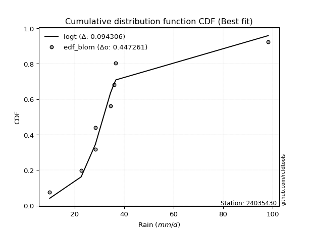</img></img>

</div>


### 7. Empirical - EDF Tukey (1962)

In hydrology, the Tukey formula is used as a plotting position formula to estimate the empirical probability or frequency of a flood event (or other hydrological data). The formula parameter is given as _c=0.333_ (or 1/3).

<div align="center">


$P=(m-c)/(n+1-2c)$


</div>


**7.1. Empirical values**

<div align="center">

|                | 0                  | 1         | 2                  | 3                  | 4                 | 5                  | 6                 | 7                  |
|:---------------|:-------------------|:----------|:-------------------|:-------------------|:------------------|:-------------------|:------------------|:-------------------|
| date           | 2023               | 2020      | 2017               | 2021               | 2019              | 2022               | 2018              | 2025               |
| x              | 10.0               | 22.7      | 28.4               | 28.5               | 34.5              | 35.9               | 36.7              | 98.2               |
| m              | 1                  | 2         | 3                  | 4                  | 5                 | 6                  | 7                 | 8                  |
| empirical_dist | edf_tukey          | edf_tukey | edf_tukey          | edf_tukey          | edf_tukey         | edf_tukey          | edf_tukey         | edf_tukey          |
| empirical      | 0.08               | 0.2       | 0.32               | 0.44               | 0.56              | 0.68               | 0.8               | 0.92               |
| empirical_tr   | 1.0869565217391304 | 1.25      | 1.4705882352941178 | 1.7857142857142856 | 2.272727272727273 | 3.1250000000000004 | 5.000000000000001 | 12.500000000000007 |

</div>


**7.2. Kolmogorov-Smirnov fit test (sorted by Δ)**


<div align="center">

|                | 0                   | 1                   | 2                   | 3                   | 4                   | 5                  | 6                   | 7                     | 8                  | 9                   | 10                  | 11                  | 12                  | 13                 | 14                 | 15                 | 16                  | 17                  | 18                  | 19                  | 20                  | 21                  | 22                  | 23                  | 24                  | 25                 | 26                 | 27                  | 28                  | 29                  | 30                 | 31                  | 32                  | 33                 | 34                 | 35                  | 36                  | 37                  | 38                  | 39                  | 40                  | 41                  | 42                  | 43                  | 44                 | 45                 | 46                  | 47                 | 48                  | 49                  | 50                 | 51                 | 52                 | 53                 | 54                  | 55                  | 56                  | 57                  | 58                  | 59                  | 60                  | 61                  | 62                  | 63                  | 64                  | 65                  | 66                 | 67                  | 68                  | 69                  | 70                  | 71                  | 72                  | 73                 | 74                  | 75                 | 76                 | 77                  | 78                 | 79                  | 80                 | 81                 | 82                  | 83                 | 84                 | 85                  | 86                  | 87                  | 88                 | 89                 |
|:---------------|:--------------------|:--------------------|:--------------------|:--------------------|:--------------------|:-------------------|:--------------------|:----------------------|:-------------------|:--------------------|:--------------------|:--------------------|:--------------------|:-------------------|:-------------------|:-------------------|:--------------------|:--------------------|:--------------------|:--------------------|:--------------------|:--------------------|:--------------------|:--------------------|:--------------------|:-------------------|:-------------------|:--------------------|:--------------------|:--------------------|:-------------------|:--------------------|:--------------------|:-------------------|:-------------------|:--------------------|:--------------------|:--------------------|:--------------------|:--------------------|:--------------------|:--------------------|:--------------------|:--------------------|:-------------------|:-------------------|:--------------------|:-------------------|:--------------------|:--------------------|:-------------------|:-------------------|:-------------------|:-------------------|:--------------------|:--------------------|:--------------------|:--------------------|:--------------------|:--------------------|:--------------------|:--------------------|:--------------------|:--------------------|:--------------------|:--------------------|:-------------------|:--------------------|:--------------------|:--------------------|:--------------------|:--------------------|:--------------------|:-------------------|:--------------------|:-------------------|:-------------------|:--------------------|:-------------------|:--------------------|:-------------------|:-------------------|:--------------------|:-------------------|:-------------------|:--------------------|:--------------------|:--------------------|:-------------------|:-------------------|
| station        | 24035430            | 24035430            | 24035430            | 24035430            | 24035430            | 24035430           | 24035430            | 24035430              | 24035430           | 24035430            | 24035430            | 24035430            | 24035430            | 24035430           | 24035430           | 24035430           | 24035430            | 24035430            | 24035430            | 24035430            | 24035430            | 24035430            | 24035430            | 24035430            | 24035430            | 24035430           | 24035430           | 24035430            | 24035430            | 24035430            | 24035430           | 24035430            | 24035430            | 24035430           | 24035430           | 24035430            | 24035430            | 24035430            | 24035430            | 24035430            | 24035430            | 24035430            | 24035430            | 24035430            | 24035430           | 24035430           | 24035430            | 24035430           | 24035430            | 24035430            | 24035430           | 24035430           | 24035430           | 24035430           | 24035430            | 24035430            | 24035430            | 24035430            | 24035430            | 24035430            | 24035430            | 24035430            | 24035430            | 24035430            | 24035430            | 24035430            | 24035430           | 24035430            | 24035430            | 24035430            | 24035430            | 24035430            | 24035430            | 24035430           | 24035430            | 24035430           | 24035430           | 24035430            | 24035430           | 24035430            | 24035430           | 24035430           | 24035430            | 24035430           | 24035430           | 24035430            | 24035430            | 24035430            | 24035430           | 24035430           |
| empirical_dist | edf_tukey           | edf_tukey           | edf_tukey           | edf_tukey           | edf_tukey           | edf_tukey          | edf_tukey           | edf_tukey             | edf_tukey          | edf_tukey           | edf_tukey           | edf_tukey           | edf_tukey           | edf_tukey          | edf_tukey          | edf_tukey          | edf_tukey           | edf_tukey           | edf_tukey           | edf_tukey           | edf_tukey           | edf_tukey           | edf_tukey           | edf_tukey           | edf_tukey           | edf_tukey          | edf_tukey          | edf_tukey           | edf_tukey           | edf_tukey           | edf_tukey          | edf_tukey           | edf_tukey           | edf_tukey          | edf_tukey          | edf_tukey           | edf_tukey           | edf_tukey           | edf_tukey           | edf_tukey           | edf_tukey           | edf_tukey           | edf_tukey           | edf_tukey           | edf_tukey          | edf_tukey          | edf_tukey           | edf_tukey          | edf_tukey           | edf_tukey           | edf_tukey          | edf_tukey          | edf_tukey          | edf_tukey          | edf_tukey           | edf_tukey           | edf_tukey           | edf_tukey           | edf_tukey           | edf_tukey           | edf_tukey           | edf_tukey           | edf_tukey           | edf_tukey           | edf_tukey           | edf_tukey           | edf_tukey          | edf_tukey           | edf_tukey           | edf_tukey           | edf_tukey           | edf_tukey           | edf_tukey           | edf_tukey          | edf_tukey           | edf_tukey          | edf_tukey          | edf_tukey           | edf_tukey          | edf_tukey           | edf_tukey          | edf_tukey          | edf_tukey           | edf_tukey          | edf_tukey          | edf_tukey           | edf_tukey           | edf_tukey           | edf_tukey          | edf_tukey          |
| p_dist         | logt                | johnsonsu           | t                   | loglaplace          | gibrat              | logmielke          | logjohnsonsu        | loglaplace_asymmetric | loggenlogistic     | loghypsecant        | mielke              | loginvgauss         | logmaxwell          | logfisk            | fisk               | logalpha           | wald                | loglogistic         | alpha               | lograyleigh         | loginvgamma         | nct                 | logexponnorm        | logbetaprime        | expon               | invweibull         | logrice            | betaprime           | invgamma            | f                   | ncf                | logncf              | logpearson3         | loggamma           | loggamma           | logerlang           | logf                | logfatiguelife      | logcrystalball      | lognorm             | lognorm             | logweibull_min      | logloggamma         | pearson3            | gompertz           | genexpon           | loggumbel_r         | invgauss           | loginvweibull       | loggompertz         | lognct             | fatiguelife        | logtruncnorm       | nakagami           | logkstwobign        | exponnorm           | halflogistic        | loghalfnorm         | moyal               | loggenexpon         | genlogistic         | laplace_asymmetric  | logmoyal            | loghalflogistic     | halfnorm            | gumbel_r            | lognakagami        | loggumbel_l         | weibull_min         | rayleigh            | kstwobign           | gamma               | maxwell             | logwald            | loggibrat           | rice               | crystalball        | truncnorm           | norm               | logistic            | hypsecant          | laplace            | logexpon            | gumbel_l           | logchi2            | loglognorm          | pareto              | logpareto           | chi2               | erlang             |
| delta          | 0.09145128116141565 | 0.09845281752674728 | 0.10185311095234939 | 0.12968115536486202 | 0.14006184464606752 | 0.1464349443705607 | 0.15561913888320572 | 0.1561954966733179    | 0.1576556579911098 | 0.15773847462238366 | 0.15784393038363342 | 0.15809499655288395 | 0.15910816712522247 | 0.1597328688538464 | 0.1599763537322938 | 0.1662907875889308 | 0.16638789776277868 | 0.16954737788176444 | 0.17044683961416884 | 0.17057866243287773 | 0.17118641790087408 | 0.17280373152123585 | 0.17409873301868473 | 0.17538724039279063 | 0.17673160121235315 | 0.1770231473631524 | 0.1780360934448898 | 0.17840986416900018 | 0.17943589656254533 | 0.17965845318643736 | 0.1799443822494442 | 0.18032391462665598 | 0.18053859832285735 | 0.1809515326849659 | 0.1809515326849659 | 0.18097381163280057 | 0.18137267330836404 | 0.18147744218076467 | 0.18418893971395867 | 0.18418895472450336 | 0.18418895472450336 | 0.18472925507391624 | 0.18570793055759127 | 0.18676060545491213 | 0.1869215412800107 | 0.1891683322136466 | 0.19064238186502586 | 0.1920949541490855 | 0.19220422315640312 | 0.19252987327615578 | 0.1940788797766395 | 0.195383725597002  | 0.1999967868214754 | 0.1999999706556755 | 0.20062395983303943 | 0.20212012286777425 | 0.20248038541750424 | 0.20437313981082156 | 0.20648179662230626 | 0.20797579161003593 | 0.20948041948284468 | 0.20985648504602628 | 0.21582660073626553 | 0.22491680365318772 | 0.22725424201893352 | 0.23234462800209055 | 0.2339972119991109 | 0.24081344302141616 | 0.25455190814300593 | 0.25841574643881904 | 0.26011918829367175 | 0.26054412307213354 | 0.26948409457495714 | 0.2857400293288726 | 0.29671838585586047 | 0.2998936550097502 | 0.3026376458638542 | 0.30263764760390754 | 0.3026376525576927 | 0.30299802144814075 | 0.3033057718986329 | 0.3046533624175458 | 0.31699075615618294 | 0.373086532964378  | 0.4179770698437398 | 0.43438830773072595 | 0.44819591474162496 | 0.46208964971714045 | 0.5151519394084889 | 0.5436829308166573 |
| deltao         | 0.4472608134160001  | 0.4472608134160001  | 0.4472608134160001  | 0.4472608134160001  | 0.4472608134160001  | 0.4472608134160001 | 0.4472608134160001  | 0.4472608134160001    | 0.4472608134160001 | 0.4472608134160001  | 0.4472608134160001  | 0.4472608134160001  | 0.4472608134160001  | 0.4472608134160001 | 0.4472608134160001 | 0.4472608134160001 | 0.4472608134160001  | 0.4472608134160001  | 0.4472608134160001  | 0.4472608134160001  | 0.4472608134160001  | 0.4472608134160001  | 0.4472608134160001  | 0.4472608134160001  | 0.4472608134160001  | 0.4472608134160001 | 0.4472608134160001 | 0.4472608134160001  | 0.4472608134160001  | 0.4472608134160001  | 0.4472608134160001 | 0.4472608134160001  | 0.4472608134160001  | 0.4472608134160001 | 0.4472608134160001 | 0.4472608134160001  | 0.4472608134160001  | 0.4472608134160001  | 0.4472608134160001  | 0.4472608134160001  | 0.4472608134160001  | 0.4472608134160001  | 0.4472608134160001  | 0.4472608134160001  | 0.4472608134160001 | 0.4472608134160001 | 0.4472608134160001  | 0.4472608134160001 | 0.4472608134160001  | 0.4472608134160001  | 0.4472608134160001 | 0.4472608134160001 | 0.4472608134160001 | 0.4472608134160001 | 0.4472608134160001  | 0.4472608134160001  | 0.4472608134160001  | 0.4472608134160001  | 0.4472608134160001  | 0.4472608134160001  | 0.4472608134160001  | 0.4472608134160001  | 0.4472608134160001  | 0.4472608134160001  | 0.4472608134160001  | 0.4472608134160001  | 0.4472608134160001 | 0.4472608134160001  | 0.4472608134160001  | 0.4472608134160001  | 0.4472608134160001  | 0.4472608134160001  | 0.4472608134160001  | 0.4472608134160001 | 0.4472608134160001  | 0.4472608134160001 | 0.4472608134160001 | 0.4472608134160001  | 0.4472608134160001 | 0.4472608134160001  | 0.4472608134160001 | 0.4472608134160001 | 0.4472608134160001  | 0.4472608134160001 | 0.4472608134160001 | 0.4472608134160001  | 0.4472608134160001  | 0.4472608134160001  | 0.4472608134160001 | 0.4472608134160001 |
| eval           | Δo > Δ              | Δo > Δ              | Δo > Δ              | Δo > Δ              | Δo > Δ              | Δo > Δ             | Δo > Δ              | Δo > Δ                | Δo > Δ             | Δo > Δ              | Δo > Δ              | Δo > Δ              | Δo > Δ              | Δo > Δ             | Δo > Δ             | Δo > Δ             | Δo > Δ              | Δo > Δ              | Δo > Δ              | Δo > Δ              | Δo > Δ              | Δo > Δ              | Δo > Δ              | Δo > Δ              | Δo > Δ              | Δo > Δ             | Δo > Δ             | Δo > Δ              | Δo > Δ              | Δo > Δ              | Δo > Δ             | Δo > Δ              | Δo > Δ              | Δo > Δ             | Δo > Δ             | Δo > Δ              | Δo > Δ              | Δo > Δ              | Δo > Δ              | Δo > Δ              | Δo > Δ              | Δo > Δ              | Δo > Δ              | Δo > Δ              | Δo > Δ             | Δo > Δ             | Δo > Δ              | Δo > Δ             | Δo > Δ              | Δo > Δ              | Δo > Δ             | Δo > Δ             | Δo > Δ             | Δo > Δ             | Δo > Δ              | Δo > Δ              | Δo > Δ              | Δo > Δ              | Δo > Δ              | Δo > Δ              | Δo > Δ              | Δo > Δ              | Δo > Δ              | Δo > Δ              | Δo > Δ              | Δo > Δ              | Δo > Δ             | Δo > Δ              | Δo > Δ              | Δo > Δ              | Δo > Δ              | Δo > Δ              | Δo > Δ              | Δo > Δ             | Δo > Δ              | Δo > Δ             | Δo > Δ             | Δo > Δ              | Δo > Δ             | Δo > Δ              | Δo > Δ             | Δo > Δ             | Δo > Δ              | Δo > Δ             | Δo > Δ             | Δo > Δ              | Δo <= Δ             | Δo <= Δ             | Δo <= Δ            | Δo <= Δ            |
| fit            | 1                   | 1                   | 1                   | 1                   | 1                   | 1                  | 1                   | 1                     | 1                  | 1                   | 1                   | 1                   | 1                   | 1                  | 1                  | 1                  | 1                   | 1                   | 1                   | 1                   | 1                   | 1                   | 1                   | 1                   | 1                   | 1                  | 1                  | 1                   | 1                   | 1                   | 1                  | 1                   | 1                   | 1                  | 1                  | 1                   | 1                   | 1                   | 1                   | 1                   | 1                   | 1                   | 1                   | 1                   | 1                  | 1                  | 1                   | 1                  | 1                   | 1                   | 1                  | 1                  | 1                  | 1                  | 1                   | 1                   | 1                   | 1                   | 1                   | 1                   | 1                   | 1                   | 1                   | 1                   | 1                   | 1                   | 1                  | 1                   | 1                   | 1                   | 1                   | 1                   | 1                   | 1                  | 1                   | 1                  | 1                  | 1                   | 1                  | 1                   | 1                  | 1                  | 1                   | 1                  | 1                  | 1                   | 0                   | 0                   | 0                  | 0                  |
| n              | 8                   | 8                   | 8                   | 8                   | 8                   | 8                  | 8                   | 8                     | 8                  | 8                   | 8                   | 8                   | 8                   | 8                  | 8                  | 8                  | 8                   | 8                   | 8                   | 8                   | 8                   | 8                   | 8                   | 8                   | 8                   | 8                  | 8                  | 8                   | 8                   | 8                   | 8                  | 8                   | 8                   | 8                  | 8                  | 8                   | 8                   | 8                   | 8                   | 8                   | 8                   | 8                   | 8                   | 8                   | 8                  | 8                  | 8                   | 8                  | 8                   | 8                   | 8                  | 8                  | 8                  | 8                  | 8                   | 8                   | 8                   | 8                   | 8                   | 8                   | 8                   | 8                   | 8                   | 8                   | 8                   | 8                   | 8                  | 8                   | 8                   | 8                   | 8                   | 8                   | 8                   | 8                  | 8                   | 8                  | 8                  | 8                   | 8                  | 8                   | 8                  | 8                  | 8                   | 8                  | 8                  | 8                   | 8                   | 8                   | 8                  | 8                  |
| best_fit       | 1                   | 0                   | 0                   | 0                   | 0                   | 0                  | 0                   | 0                     | 0                  | 0                   | 0                   | 0                   | 0                   | 0                  | 0                  | 0                  | 0                   | 0                   | 0                   | 0                   | 0                   | 0                   | 0                   | 0                   | 0                   | 0                  | 0                  | 0                   | 0                   | 0                   | 0                  | 0                   | 0                   | 0                  | 0                  | 0                   | 0                   | 0                   | 0                   | 0                   | 0                   | 0                   | 0                   | 0                   | 0                  | 0                  | 0                   | 0                  | 0                   | 0                   | 0                  | 0                  | 0                  | 0                  | 0                   | 0                   | 0                   | 0                   | 0                   | 0                   | 0                   | 0                   | 0                   | 0                   | 0                   | 0                   | 0                  | 0                   | 0                   | 0                   | 0                   | 0                   | 0                   | 0                  | 0                   | 0                  | 0                  | 0                   | 0                  | 0                   | 0                  | 0                  | 0                   | 0                  | 0                  | 0                   | 0                   | 0                   | 0                  | 0                  |
| best_fit_sort  | 1                   | 2                   | 3                   | 4                   | 5                   | 6                  | 7                   | 8                     | 9                  | 10                  | 11                  | 12                  | 13                  | 14                 | 15                 | 16                 | 17                  | 18                  | 19                  | 20                  | 21                  | 22                  | 23                  | 24                  | 25                  | 26                 | 27                 | 28                  | 29                  | 30                  | 31                 | 32                  | 33                  | 34                 | 35                 | 36                  | 37                  | 38                  | 39                  | 40                  | 41                  | 42                  | 43                  | 44                  | 45                 | 46                 | 47                  | 48                 | 49                  | 50                  | 51                 | 52                 | 53                 | 54                 | 55                  | 56                  | 57                  | 58                  | 59                  | 60                  | 61                  | 62                  | 63                  | 64                  | 65                  | 66                  | 67                 | 68                  | 69                  | 70                  | 71                  | 72                  | 73                  | 74                 | 75                  | 76                 | 77                 | 78                  | 79                 | 80                  | 81                 | 82                 | 83                  | 84                 | 85                 | 86                  | 87                  | 88                  | 89                 | 90                 |

</div>


<div align="center">

</img>

</div>


**7.3. Best fit**

<div align="center">

|   id |   station | empirical_dist   | p_dist   |     delta |   deltao | eval   |   fit |   n |   best_fit |   best_fit_sort |
|-----:|----------:|:-----------------|:---------|----------:|---------:|:-------|------:|----:|-----------:|----------------:|
|    0 |  24035430 | edf_tukey        | logt     | 0.0914513 | 0.447261 | Δo > Δ |     1 |   8 |          1 |               1 |

</div>


<div align="center">

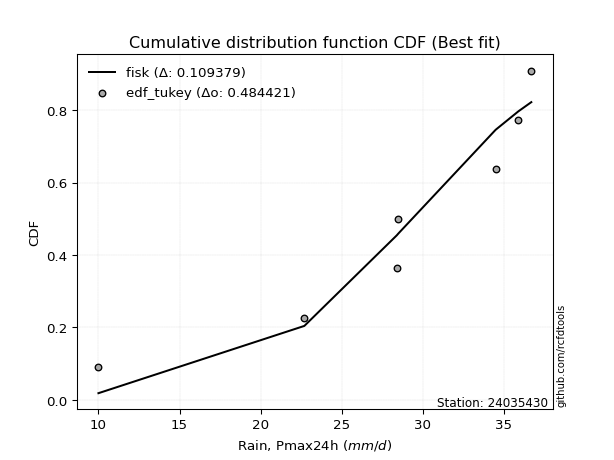</img>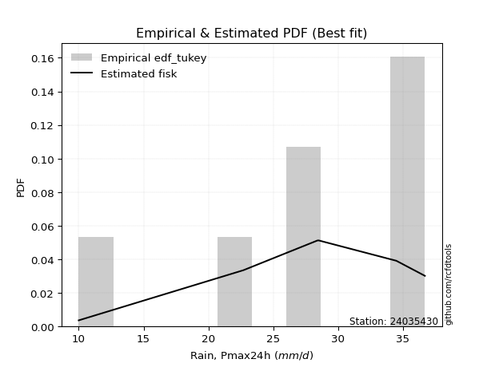</img>

</div>


### 8. Empirical - EDF Gringorten (1963)

Gringorten plotting position formula is essential for estimating the probability and return periods of extreme events like floods and heavy rainfall. The constant _a=0.44_.

<div align="center">


$P=(m-a)/(n+1-2a)$


</div>


**8.1. Empirical values**

<div align="center">

|                | 0                   | 1                   | 2                  | 3                  | 4                  | 5                  | 6                  | 7                  |
|:---------------|:--------------------|:--------------------|:-------------------|:-------------------|:-------------------|:-------------------|:-------------------|:-------------------|
| date           | 2023                | 2020                | 2017               | 2021               | 2019               | 2022               | 2018               | 2025               |
| x              | 10.0                | 22.7                | 28.4               | 28.5               | 34.5               | 35.9               | 36.7               | 98.2               |
| m              | 1                   | 2                   | 3                  | 4                  | 5                  | 6                  | 7                  | 8                  |
| empirical_dist | edf_gringorten      | edf_gringorten      | edf_gringorten     | edf_gringorten     | edf_gringorten     | edf_gringorten     | edf_gringorten     | edf_gringorten     |
| empirical      | 0.06896551724137932 | 0.19211822660098524 | 0.3152709359605912 | 0.4384236453201971 | 0.5615763546798029 | 0.6847290640394089 | 0.8078817733990148 | 0.9310344827586208 |
| empirical_tr   | 1.0740740740740742  | 1.2378048780487805  | 1.460431654676259  | 1.780701754385965  | 2.2808988764044944 | 3.1718750000000004 | 5.205128205128205  | 14.500000000000018 |

</div>


**8.2. Kolmogorov-Smirnov fit test (sorted by Δ)**


<div align="center">

|                | 0                   | 1                   | 2                   | 3                   | 4                   | 5                   | 6                   | 7                     | 8                   | 9                  | 10                  | 11                 | 12                 | 13                  | 14                  | 15                 | 16                  | 17                  | 18                  | 19                 | 20                  | 21                 | 22                  | 23                  | 24                  | 25                  | 26                  | 27                  | 28                  | 29                 | 30                  | 31                  | 32                 | 33                  | 34                  | 35                  | 36                 | 37                  | 38                 | 39                 | 40                 | 41                  | 42                  | 43                 | 44                  | 45                  | 46                  | 47                  | 48                  | 49                  | 50                  | 51                  | 52                  | 53                  | 54                  | 55                  | 56                 | 57                  | 58                  | 59                 | 60                  | 61                  | 62                  | 63                  | 64                  | 65                 | 66                 | 67                 | 68                  | 69                 | 70                 | 71                  | 72                 | 73                 | 74                 | 75                  | 76                  | 77                 | 78                  | 79                 | 80                  | 81                  | 82                  | 83                  | 84                 | 85                  | 86                  | 87                  | 88                 | 89                 |
|:---------------|:--------------------|:--------------------|:--------------------|:--------------------|:--------------------|:--------------------|:--------------------|:----------------------|:--------------------|:-------------------|:--------------------|:-------------------|:-------------------|:--------------------|:--------------------|:-------------------|:--------------------|:--------------------|:--------------------|:-------------------|:--------------------|:-------------------|:--------------------|:--------------------|:--------------------|:--------------------|:--------------------|:--------------------|:--------------------|:-------------------|:--------------------|:--------------------|:-------------------|:--------------------|:--------------------|:--------------------|:-------------------|:--------------------|:-------------------|:-------------------|:-------------------|:--------------------|:--------------------|:-------------------|:--------------------|:--------------------|:--------------------|:--------------------|:--------------------|:--------------------|:--------------------|:--------------------|:--------------------|:--------------------|:--------------------|:--------------------|:-------------------|:--------------------|:--------------------|:-------------------|:--------------------|:--------------------|:--------------------|:--------------------|:--------------------|:-------------------|:-------------------|:-------------------|:--------------------|:-------------------|:-------------------|:--------------------|:-------------------|:-------------------|:-------------------|:--------------------|:--------------------|:-------------------|:--------------------|:-------------------|:--------------------|:--------------------|:--------------------|:--------------------|:-------------------|:--------------------|:--------------------|:--------------------|:-------------------|:-------------------|
| station        | 24035430            | 24035430            | 24035430            | 24035430            | 24035430            | 24035430            | 24035430            | 24035430              | 24035430            | 24035430           | 24035430            | 24035430           | 24035430           | 24035430            | 24035430            | 24035430           | 24035430            | 24035430            | 24035430            | 24035430           | 24035430            | 24035430           | 24035430            | 24035430            | 24035430            | 24035430            | 24035430            | 24035430            | 24035430            | 24035430           | 24035430            | 24035430            | 24035430           | 24035430            | 24035430            | 24035430            | 24035430           | 24035430            | 24035430           | 24035430           | 24035430           | 24035430            | 24035430            | 24035430           | 24035430            | 24035430            | 24035430            | 24035430            | 24035430            | 24035430            | 24035430            | 24035430            | 24035430            | 24035430            | 24035430            | 24035430            | 24035430           | 24035430            | 24035430            | 24035430           | 24035430            | 24035430            | 24035430            | 24035430            | 24035430            | 24035430           | 24035430           | 24035430           | 24035430            | 24035430           | 24035430           | 24035430            | 24035430           | 24035430           | 24035430           | 24035430            | 24035430            | 24035430           | 24035430            | 24035430           | 24035430            | 24035430            | 24035430            | 24035430            | 24035430           | 24035430            | 24035430            | 24035430            | 24035430           | 24035430           |
| empirical_dist | edf_gringorten      | edf_gringorten      | edf_gringorten      | edf_gringorten      | edf_gringorten      | edf_gringorten      | edf_gringorten      | edf_gringorten        | edf_gringorten      | edf_gringorten     | edf_gringorten      | edf_gringorten     | edf_gringorten     | edf_gringorten      | edf_gringorten      | edf_gringorten     | edf_gringorten      | edf_gringorten      | edf_gringorten      | edf_gringorten     | edf_gringorten      | edf_gringorten     | edf_gringorten      | edf_gringorten      | edf_gringorten      | edf_gringorten      | edf_gringorten      | edf_gringorten      | edf_gringorten      | edf_gringorten     | edf_gringorten      | edf_gringorten      | edf_gringorten     | edf_gringorten      | edf_gringorten      | edf_gringorten      | edf_gringorten     | edf_gringorten      | edf_gringorten     | edf_gringorten     | edf_gringorten     | edf_gringorten      | edf_gringorten      | edf_gringorten     | edf_gringorten      | edf_gringorten      | edf_gringorten      | edf_gringorten      | edf_gringorten      | edf_gringorten      | edf_gringorten      | edf_gringorten      | edf_gringorten      | edf_gringorten      | edf_gringorten      | edf_gringorten      | edf_gringorten     | edf_gringorten      | edf_gringorten      | edf_gringorten     | edf_gringorten      | edf_gringorten      | edf_gringorten      | edf_gringorten      | edf_gringorten      | edf_gringorten     | edf_gringorten     | edf_gringorten     | edf_gringorten      | edf_gringorten     | edf_gringorten     | edf_gringorten      | edf_gringorten     | edf_gringorten     | edf_gringorten     | edf_gringorten      | edf_gringorten      | edf_gringorten     | edf_gringorten      | edf_gringorten     | edf_gringorten      | edf_gringorten      | edf_gringorten      | edf_gringorten      | edf_gringorten     | edf_gringorten      | edf_gringorten      | edf_gringorten      | edf_gringorten     | edf_gringorten     |
| p_dist         | logt                | t                   | johnsonsu           | loglaplace          | gibrat              | logjohnsonsu        | logmielke           | loglaplace_asymmetric | loggenlogistic      | loghypsecant       | mielke              | loginvgauss        | logmaxwell         | logfisk             | fisk                | wald               | logalpha            | lograyleigh         | loglogistic         | alpha              | loginvgamma         | nct                | logexponnorm        | logbetaprime        | expon               | invweibull          | logrice             | betaprime           | invgamma            | f                  | ncf                 | logncf              | logpearson3        | loggamma            | loggamma            | logerlang           | logf               | logfatiguelife      | logcrystalball     | lognorm            | lognorm            | logtruncnorm        | nakagami            | logweibull_min     | logloggamma         | pearson3            | gompertz            | loggumbel_r         | loginvweibull       | genexpon            | invgauss            | loggompertz         | lognct              | fatiguelife         | logkstwobign        | loghalfnorm         | exponnorm          | halflogistic        | loggenexpon         | moyal              | genlogistic         | laplace_asymmetric  | logmoyal            | loghalflogistic     | halfnorm            | lognakagami        | gumbel_r           | loggumbel_l        | weibull_min         | rayleigh           | kstwobign          | gamma               | maxwell            | logwald            | loggibrat          | rice                | crystalball         | truncnorm          | norm                | logistic           | hypsecant           | laplace             | logexpon            | gumbel_l            | logchi2            | loglognorm          | pareto              | logpareto           | chi2               | erlang             |
| delta          | 0.09915775610974753 | 0.10027675627254651 | 0.10633459092576203 | 0.13756292876387677 | 0.14479090868547634 | 0.15404278420340284 | 0.15431671776957545 | 0.16407727007233264   | 0.16553743139012456 | 0.1656202480213984 | 0.16572570378264817 | 0.1659767699518987 | 0.1669899405242372 | 0.16761464225286116 | 0.16785812713130854 | 0.1711169618021875 | 0.17417256098794553 | 0.17530772647228654 | 0.17742915128077918 | 0.1783286130131836 | 0.17906819129988882 | 0.1806855049202506 | 0.18198050641769947 | 0.18326901379180538 | 0.18461337461136793 | 0.18490492076216714 | 0.18591786684390454 | 0.18629163756801492 | 0.18731766996156007 | 0.1875402265854521 | 0.18782615564845895 | 0.18820568802567073 | 0.1884203717218721 | 0.18883330608398063 | 0.18883330608398063 | 0.18885558503181532 | 0.1892544467073788 | 0.18935921557977942 | 0.1920707131129734 | 0.1920707281235181 | 0.1920707281235181 | 0.19211501342246062 | 0.19211819725666074 | 0.192611028472931  | 0.19358970395660602 | 0.19464237885392688 | 0.19480331467902545 | 0.19537144590443467 | 0.19693328719581193 | 0.19705010561266134 | 0.19997672754810025 | 0.20041164667517053 | 0.20196065317565426 | 0.20326549899601676 | 0.20535302387244825 | 0.20910220385023037 | 0.210001896266789  | 0.21036215881651898 | 0.21270485564944475 | 0.214363570021321  | 0.21736219288185943 | 0.21773825844504102 | 0.22055566477567434 | 0.22964586769259654 | 0.23513601541794826 | 0.2387262760385197 | 0.2402264014011053 | 0.2486952164204309 | 0.26243368154202074 | 0.2662975198378338 | 0.2680009616926865 | 0.26842589647114834 | 0.2773658679739719 | 0.2904690933682814 | 0.3014474498952693 | 0.30777542840876493 | 0.31051941926286897 | 0.3105194210029223 | 0.31051942595670745 | 0.3108797948471555 | 0.31118754529764764 | 0.31253513581656056 | 0.32487252955519774 | 0.38096830636339274 | 0.4258588432427546 | 0.44227008112974076 | 0.45607768814063976 | 0.46997142311615525 | 0.5230337128075037 | 0.551564704215672  |
| deltao         | 0.4472608134160001  | 0.4472608134160001  | 0.4472608134160001  | 0.4472608134160001  | 0.4472608134160001  | 0.4472608134160001  | 0.4472608134160001  | 0.4472608134160001    | 0.4472608134160001  | 0.4472608134160001 | 0.4472608134160001  | 0.4472608134160001 | 0.4472608134160001 | 0.4472608134160001  | 0.4472608134160001  | 0.4472608134160001 | 0.4472608134160001  | 0.4472608134160001  | 0.4472608134160001  | 0.4472608134160001 | 0.4472608134160001  | 0.4472608134160001 | 0.4472608134160001  | 0.4472608134160001  | 0.4472608134160001  | 0.4472608134160001  | 0.4472608134160001  | 0.4472608134160001  | 0.4472608134160001  | 0.4472608134160001 | 0.4472608134160001  | 0.4472608134160001  | 0.4472608134160001 | 0.4472608134160001  | 0.4472608134160001  | 0.4472608134160001  | 0.4472608134160001 | 0.4472608134160001  | 0.4472608134160001 | 0.4472608134160001 | 0.4472608134160001 | 0.4472608134160001  | 0.4472608134160001  | 0.4472608134160001 | 0.4472608134160001  | 0.4472608134160001  | 0.4472608134160001  | 0.4472608134160001  | 0.4472608134160001  | 0.4472608134160001  | 0.4472608134160001  | 0.4472608134160001  | 0.4472608134160001  | 0.4472608134160001  | 0.4472608134160001  | 0.4472608134160001  | 0.4472608134160001 | 0.4472608134160001  | 0.4472608134160001  | 0.4472608134160001 | 0.4472608134160001  | 0.4472608134160001  | 0.4472608134160001  | 0.4472608134160001  | 0.4472608134160001  | 0.4472608134160001 | 0.4472608134160001 | 0.4472608134160001 | 0.4472608134160001  | 0.4472608134160001 | 0.4472608134160001 | 0.4472608134160001  | 0.4472608134160001 | 0.4472608134160001 | 0.4472608134160001 | 0.4472608134160001  | 0.4472608134160001  | 0.4472608134160001 | 0.4472608134160001  | 0.4472608134160001 | 0.4472608134160001  | 0.4472608134160001  | 0.4472608134160001  | 0.4472608134160001  | 0.4472608134160001 | 0.4472608134160001  | 0.4472608134160001  | 0.4472608134160001  | 0.4472608134160001 | 0.4472608134160001 |
| eval           | Δo > Δ              | Δo > Δ              | Δo > Δ              | Δo > Δ              | Δo > Δ              | Δo > Δ              | Δo > Δ              | Δo > Δ                | Δo > Δ              | Δo > Δ             | Δo > Δ              | Δo > Δ             | Δo > Δ             | Δo > Δ              | Δo > Δ              | Δo > Δ             | Δo > Δ              | Δo > Δ              | Δo > Δ              | Δo > Δ             | Δo > Δ              | Δo > Δ             | Δo > Δ              | Δo > Δ              | Δo > Δ              | Δo > Δ              | Δo > Δ              | Δo > Δ              | Δo > Δ              | Δo > Δ             | Δo > Δ              | Δo > Δ              | Δo > Δ             | Δo > Δ              | Δo > Δ              | Δo > Δ              | Δo > Δ             | Δo > Δ              | Δo > Δ             | Δo > Δ             | Δo > Δ             | Δo > Δ              | Δo > Δ              | Δo > Δ             | Δo > Δ              | Δo > Δ              | Δo > Δ              | Δo > Δ              | Δo > Δ              | Δo > Δ              | Δo > Δ              | Δo > Δ              | Δo > Δ              | Δo > Δ              | Δo > Δ              | Δo > Δ              | Δo > Δ             | Δo > Δ              | Δo > Δ              | Δo > Δ             | Δo > Δ              | Δo > Δ              | Δo > Δ              | Δo > Δ              | Δo > Δ              | Δo > Δ             | Δo > Δ             | Δo > Δ             | Δo > Δ              | Δo > Δ             | Δo > Δ             | Δo > Δ              | Δo > Δ             | Δo > Δ             | Δo > Δ             | Δo > Δ              | Δo > Δ              | Δo > Δ             | Δo > Δ              | Δo > Δ             | Δo > Δ              | Δo > Δ              | Δo > Δ              | Δo > Δ              | Δo > Δ             | Δo > Δ              | Δo <= Δ             | Δo <= Δ             | Δo <= Δ            | Δo <= Δ            |
| fit            | 1                   | 1                   | 1                   | 1                   | 1                   | 1                   | 1                   | 1                     | 1                   | 1                  | 1                   | 1                  | 1                  | 1                   | 1                   | 1                  | 1                   | 1                   | 1                   | 1                  | 1                   | 1                  | 1                   | 1                   | 1                   | 1                   | 1                   | 1                   | 1                   | 1                  | 1                   | 1                   | 1                  | 1                   | 1                   | 1                   | 1                  | 1                   | 1                  | 1                  | 1                  | 1                   | 1                   | 1                  | 1                   | 1                   | 1                   | 1                   | 1                   | 1                   | 1                   | 1                   | 1                   | 1                   | 1                   | 1                   | 1                  | 1                   | 1                   | 1                  | 1                   | 1                   | 1                   | 1                   | 1                   | 1                  | 1                  | 1                  | 1                   | 1                  | 1                  | 1                   | 1                  | 1                  | 1                  | 1                   | 1                   | 1                  | 1                   | 1                  | 1                   | 1                   | 1                   | 1                   | 1                  | 1                   | 0                   | 0                   | 0                  | 0                  |
| n              | 8                   | 8                   | 8                   | 8                   | 8                   | 8                   | 8                   | 8                     | 8                   | 8                  | 8                   | 8                  | 8                  | 8                   | 8                   | 8                  | 8                   | 8                   | 8                   | 8                  | 8                   | 8                  | 8                   | 8                   | 8                   | 8                   | 8                   | 8                   | 8                   | 8                  | 8                   | 8                   | 8                  | 8                   | 8                   | 8                   | 8                  | 8                   | 8                  | 8                  | 8                  | 8                   | 8                   | 8                  | 8                   | 8                   | 8                   | 8                   | 8                   | 8                   | 8                   | 8                   | 8                   | 8                   | 8                   | 8                   | 8                  | 8                   | 8                   | 8                  | 8                   | 8                   | 8                   | 8                   | 8                   | 8                  | 8                  | 8                  | 8                   | 8                  | 8                  | 8                   | 8                  | 8                  | 8                  | 8                   | 8                   | 8                  | 8                   | 8                  | 8                   | 8                   | 8                   | 8                   | 8                  | 8                   | 8                   | 8                   | 8                  | 8                  |
| best_fit       | 1                   | 0                   | 0                   | 0                   | 0                   | 0                   | 0                   | 0                     | 0                   | 0                  | 0                   | 0                  | 0                  | 0                   | 0                   | 0                  | 0                   | 0                   | 0                   | 0                  | 0                   | 0                  | 0                   | 0                   | 0                   | 0                   | 0                   | 0                   | 0                   | 0                  | 0                   | 0                   | 0                  | 0                   | 0                   | 0                   | 0                  | 0                   | 0                  | 0                  | 0                  | 0                   | 0                   | 0                  | 0                   | 0                   | 0                   | 0                   | 0                   | 0                   | 0                   | 0                   | 0                   | 0                   | 0                   | 0                   | 0                  | 0                   | 0                   | 0                  | 0                   | 0                   | 0                   | 0                   | 0                   | 0                  | 0                  | 0                  | 0                   | 0                  | 0                  | 0                   | 0                  | 0                  | 0                  | 0                   | 0                   | 0                  | 0                   | 0                  | 0                   | 0                   | 0                   | 0                   | 0                  | 0                   | 0                   | 0                   | 0                  | 0                  |
| best_fit_sort  | 1                   | 2                   | 3                   | 4                   | 5                   | 6                   | 7                   | 8                     | 9                   | 10                 | 11                  | 12                 | 13                 | 14                  | 15                  | 16                 | 17                  | 18                  | 19                  | 20                 | 21                  | 22                 | 23                  | 24                  | 25                  | 26                  | 27                  | 28                  | 29                  | 30                 | 31                  | 32                  | 33                 | 34                  | 35                  | 36                  | 37                 | 38                  | 39                 | 40                 | 41                 | 42                  | 43                  | 44                 | 45                  | 46                  | 47                  | 48                  | 49                  | 50                  | 51                  | 52                  | 53                  | 54                  | 55                  | 56                  | 57                 | 58                  | 59                  | 60                 | 61                  | 62                  | 63                  | 64                  | 65                  | 66                 | 67                 | 68                 | 69                  | 70                 | 71                 | 72                  | 73                 | 74                 | 75                 | 76                  | 77                  | 78                 | 79                  | 80                 | 81                  | 82                  | 83                  | 84                  | 85                 | 86                  | 87                  | 88                  | 89                 | 90                 |

</div>


<div align="center">

</img>

</div>


**8.3. Best fit**

<div align="center">

|   id |   station | empirical_dist   | p_dist   |     delta |   deltao | eval   |   fit |   n |   best_fit |   best_fit_sort |
|-----:|----------:|:-----------------|:---------|----------:|---------:|:-------|------:|----:|-----------:|----------------:|
|    0 |  24035430 | edf_gringorten   | logt     | 0.0991578 | 0.447261 | Δo > Δ |     1 |   8 |          1 |               1 |

</div>


<div align="center">

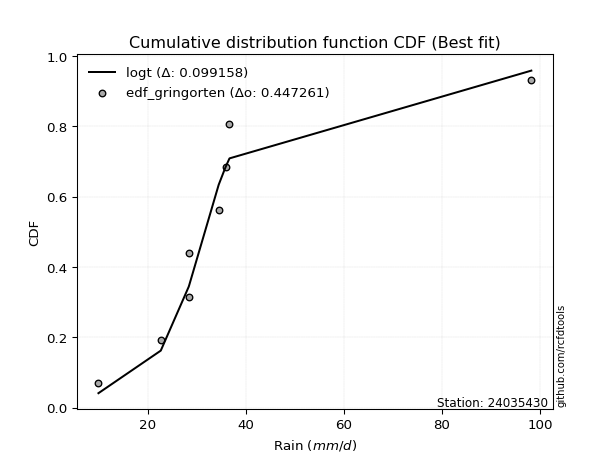</img>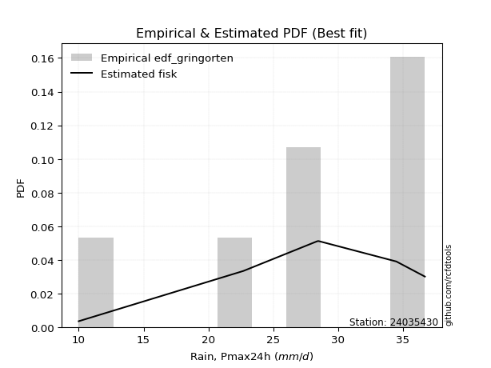</img>

</div>


### 9. Empirical - EDF Filliben (1975)

The specific values of the constants (0.3175) (often denoted as $alpha$) and (0.365) are derived from a method proposed by James J. Filliben in a 1975 paper. This particular formula is the mean value of the $i$-th order statistic of the normal distribution and is considered a robust and effective plotting position formula for the normal probability plot correlation coefficient test for normality.

<div align="center">


$P=(m-0.3175)/(n+0.365)$


</div>


**9.1. Empirical values**

<div align="center">

|                | 0                  | 1                   | 2                  | 3                   | 4                  | 5                  | 6                  | 7                  |
|:---------------|:-------------------|:--------------------|:-------------------|:--------------------|:-------------------|:-------------------|:-------------------|:-------------------|
| date           | 2023               | 2020                | 2017               | 2021                | 2019               | 2022               | 2018               | 2025               |
| x              | 10.0               | 22.7                | 28.4               | 28.5                | 34.5               | 35.9               | 36.7               | 98.2               |
| m              | 1                  | 2                   | 3                  | 4                   | 5                  | 6                  | 7                  | 8                  |
| empirical_dist | edf_filliben       | edf_filliben        | edf_filliben       | edf_filliben        | edf_filliben       | edf_filliben       | edf_filliben       | edf_filliben       |
| empirical      | 0.0815899581589958 | 0.20113568439928273 | 0.3206814106395696 | 0.44022713687985654 | 0.5597728631201434 | 0.6793185893604303 | 0.7988643156007172 | 0.9184100418410042 |
| empirical_tr   | 1.0888382687927107 | 1.2517770295548074  | 1.4720633523977125 | 1.7864388681260008  | 2.271554650373387  | 3.118359739049394  | 4.971768202080237  | 12.256410256410254 |

</div>


**9.2. Kolmogorov-Smirnov fit test (sorted by Δ)**


<div align="center">

|                | 0                   | 1                   | 2                   | 3                   | 4                  | 5                  | 6                     | 7                   | 8                  | 9                   | 10                  | 11                  | 12                  | 13                 | 14                 | 15                 | 16                  | 17                  | 18                  | 19                 | 20                  | 21                  | 22                  | 23                  | 24                  | 25                 | 26                 | 27                  | 28                  | 29                  | 30                 | 31                  | 32                  | 33                 | 34                 | 35                  | 36                  | 37                  | 38                  | 39                  | 40                  | 41                  | 42                  | 43                  | 44                 | 45                 | 46                  | 47                 | 48                  | 49                 | 50                 | 51                 | 52                  | 53                  | 54                 | 55                  | 56                  | 57                  | 58                  | 59                  | 60                  | 61                  | 62                  | 63                 | 64                  | 65                  | 66                  | 67                  | 68                 | 69                  | 70                  | 71                 | 72                  | 73                 | 74                  | 75                 | 76                 | 77                  | 78                 | 79                  | 80                 | 81                 | 82                 | 83                 | 84                  | 85                 | 86                 | 87                 | 88                 | 89                 |
|:---------------|:--------------------|:--------------------|:--------------------|:--------------------|:-------------------|:-------------------|:----------------------|:--------------------|:-------------------|:--------------------|:--------------------|:--------------------|:--------------------|:-------------------|:-------------------|:-------------------|:--------------------|:--------------------|:--------------------|:-------------------|:--------------------|:--------------------|:--------------------|:--------------------|:--------------------|:-------------------|:-------------------|:--------------------|:--------------------|:--------------------|:-------------------|:--------------------|:--------------------|:-------------------|:-------------------|:--------------------|:--------------------|:--------------------|:--------------------|:--------------------|:--------------------|:--------------------|:--------------------|:--------------------|:-------------------|:-------------------|:--------------------|:-------------------|:--------------------|:-------------------|:-------------------|:-------------------|:--------------------|:--------------------|:-------------------|:--------------------|:--------------------|:--------------------|:--------------------|:--------------------|:--------------------|:--------------------|:--------------------|:-------------------|:--------------------|:--------------------|:--------------------|:--------------------|:-------------------|:--------------------|:--------------------|:-------------------|:--------------------|:-------------------|:--------------------|:-------------------|:-------------------|:--------------------|:-------------------|:--------------------|:-------------------|:-------------------|:-------------------|:-------------------|:--------------------|:-------------------|:-------------------|:-------------------|:-------------------|:-------------------|
| station        | 24035430            | 24035430            | 24035430            | 24035430            | 24035430           | 24035430           | 24035430              | 24035430            | 24035430           | 24035430            | 24035430            | 24035430            | 24035430            | 24035430           | 24035430           | 24035430           | 24035430            | 24035430            | 24035430            | 24035430           | 24035430            | 24035430            | 24035430            | 24035430            | 24035430            | 24035430           | 24035430           | 24035430            | 24035430            | 24035430            | 24035430           | 24035430            | 24035430            | 24035430           | 24035430           | 24035430            | 24035430            | 24035430            | 24035430            | 24035430            | 24035430            | 24035430            | 24035430            | 24035430            | 24035430           | 24035430           | 24035430            | 24035430           | 24035430            | 24035430           | 24035430           | 24035430           | 24035430            | 24035430            | 24035430           | 24035430            | 24035430            | 24035430            | 24035430            | 24035430            | 24035430            | 24035430            | 24035430            | 24035430           | 24035430            | 24035430            | 24035430            | 24035430            | 24035430           | 24035430            | 24035430            | 24035430           | 24035430            | 24035430           | 24035430            | 24035430           | 24035430           | 24035430            | 24035430           | 24035430            | 24035430           | 24035430           | 24035430           | 24035430           | 24035430            | 24035430           | 24035430           | 24035430           | 24035430           | 24035430           |
| empirical_dist | edf_filliben        | edf_filliben        | edf_filliben        | edf_filliben        | edf_filliben       | edf_filliben       | edf_filliben          | edf_filliben        | edf_filliben       | edf_filliben        | edf_filliben        | edf_filliben        | edf_filliben        | edf_filliben       | edf_filliben       | edf_filliben       | edf_filliben        | edf_filliben        | edf_filliben        | edf_filliben       | edf_filliben        | edf_filliben        | edf_filliben        | edf_filliben        | edf_filliben        | edf_filliben       | edf_filliben       | edf_filliben        | edf_filliben        | edf_filliben        | edf_filliben       | edf_filliben        | edf_filliben        | edf_filliben       | edf_filliben       | edf_filliben        | edf_filliben        | edf_filliben        | edf_filliben        | edf_filliben        | edf_filliben        | edf_filliben        | edf_filliben        | edf_filliben        | edf_filliben       | edf_filliben       | edf_filliben        | edf_filliben       | edf_filliben        | edf_filliben       | edf_filliben       | edf_filliben       | edf_filliben        | edf_filliben        | edf_filliben       | edf_filliben        | edf_filliben        | edf_filliben        | edf_filliben        | edf_filliben        | edf_filliben        | edf_filliben        | edf_filliben        | edf_filliben       | edf_filliben        | edf_filliben        | edf_filliben        | edf_filliben        | edf_filliben       | edf_filliben        | edf_filliben        | edf_filliben       | edf_filliben        | edf_filliben       | edf_filliben        | edf_filliben       | edf_filliben       | edf_filliben        | edf_filliben       | edf_filliben        | edf_filliben       | edf_filliben       | edf_filliben       | edf_filliben       | edf_filliben        | edf_filliben       | edf_filliben       | edf_filliben       | edf_filliben       | edf_filliben       |
| p_dist         | logt                | johnsonsu           | t                   | loglaplace          | gibrat             | logmielke          | loglaplace_asymmetric | logjohnsonsu        | loggenlogistic     | loghypsecant        | mielke              | loginvgauss         | logmaxwell          | logfisk            | fisk               | logalpha           | wald                | loglogistic         | alpha               | lograyleigh        | loginvgamma         | nct                 | logexponnorm        | logbetaprime        | expon               | invweibull         | logrice            | betaprime           | invgamma            | f                   | ncf                | logncf              | logpearson3         | loggamma           | loggamma           | logerlang           | logf                | logfatiguelife      | logcrystalball      | lognorm             | lognorm             | logweibull_min      | logloggamma         | pearson3            | gompertz           | genexpon           | loggumbel_r         | invgauss           | loggompertz         | loginvweibull      | lognct             | fatiguelife        | logkstwobign        | exponnorm           | logtruncnorm       | nakagami            | halflogistic        | loghalfnorm         | moyal               | loggenexpon         | genlogistic         | laplace_asymmetric  | logmoyal            | loghalflogistic    | halfnorm            | gumbel_r            | lognakagami         | loggumbel_l         | weibull_min        | rayleigh            | kstwobign           | gamma              | maxwell             | logwald            | loggibrat           | rice               | crystalball        | truncnorm           | norm               | logistic            | hypsecant          | laplace            | logexpon           | gumbel_l           | logchi2             | loglognorm         | pareto             | logpareto          | chi2               | erlang             |
| delta          | 0.09167841804127219 | 0.09731713312746448 | 0.10208024783220604 | 0.12854547096557922 | 0.1393804340064979 | 0.1452992599712779 | 0.1550598122740351    | 0.15584627576306226 | 0.156519973591827  | 0.15660279022310086 | 0.15670824598435062 | 0.15738567174952706 | 0.15797248272593967 | 0.1585971844545636 | 0.158840669333011  | 0.165155103189648  | 0.16570648712320907 | 0.16841169348248164 | 0.16931115521488604 | 0.1698972517933081 | 0.17005073350159128 | 0.17166804712195305 | 0.17296304861940193 | 0.17425155599350783 | 0.17559591681307044 | 0.1758874629638696 | 0.176900409045607  | 0.17727417976971738 | 0.17830021216326253 | 0.17852276878715456 | 0.1788086978501614 | 0.17918823022737318 | 0.17940291392357455 | 0.1798158482856831 | 0.1798158482856831 | 0.17983812723351777 | 0.18023698890908124 | 0.18034175778148187 | 0.18305325531467587 | 0.18305327032522056 | 0.18305327032522056 | 0.18359357067463344 | 0.18457224615830847 | 0.18562492105562933 | 0.1857858568807279 | 0.1880326478143638 | 0.18996097122545624 | 0.1909592697498027 | 0.19139418887687298 | 0.1915228125168335 | 0.1929431953773567 | 0.1942480411977192 | 0.19994254919346982 | 0.20098443846849146 | 0.2011324712207581 | 0.20113565505495823 | 0.20134470101822144 | 0.20369172917125195 | 0.20534611222302346 | 0.20729438097046632 | 0.20834473508356188 | 0.20872080064674348 | 0.21514519009669592 | 0.2242353930136181 | 0.22611855761965072 | 0.23120894360280775 | 0.23331580135954127 | 0.23967775862213336 | 0.2534162237437232 | 0.25728006203953624 | 0.25898350389438896 | 0.2594084386728508 | 0.26834841017567435 | 0.285058618689303  | 0.29603697521629085 | 0.2987579706104674 | 0.3015019614645714 | 0.30150196320462475 | 0.3015019681584099 | 0.30186233704885795 | 0.3021700874993501 | 0.303517678018263  | 0.3158550717569002 | 0.3719508485650952 | 0.41684138544445704 | 0.4332526233314432 | 0.4470602303423422 | 0.4609539653178577 | 0.5140162550092061 | 0.5425472464173745 |
| deltao         | 0.4472608134160001  | 0.4472608134160001  | 0.4472608134160001  | 0.4472608134160001  | 0.4472608134160001 | 0.4472608134160001 | 0.4472608134160001    | 0.4472608134160001  | 0.4472608134160001 | 0.4472608134160001  | 0.4472608134160001  | 0.4472608134160001  | 0.4472608134160001  | 0.4472608134160001 | 0.4472608134160001 | 0.4472608134160001 | 0.4472608134160001  | 0.4472608134160001  | 0.4472608134160001  | 0.4472608134160001 | 0.4472608134160001  | 0.4472608134160001  | 0.4472608134160001  | 0.4472608134160001  | 0.4472608134160001  | 0.4472608134160001 | 0.4472608134160001 | 0.4472608134160001  | 0.4472608134160001  | 0.4472608134160001  | 0.4472608134160001 | 0.4472608134160001  | 0.4472608134160001  | 0.4472608134160001 | 0.4472608134160001 | 0.4472608134160001  | 0.4472608134160001  | 0.4472608134160001  | 0.4472608134160001  | 0.4472608134160001  | 0.4472608134160001  | 0.4472608134160001  | 0.4472608134160001  | 0.4472608134160001  | 0.4472608134160001 | 0.4472608134160001 | 0.4472608134160001  | 0.4472608134160001 | 0.4472608134160001  | 0.4472608134160001 | 0.4472608134160001 | 0.4472608134160001 | 0.4472608134160001  | 0.4472608134160001  | 0.4472608134160001 | 0.4472608134160001  | 0.4472608134160001  | 0.4472608134160001  | 0.4472608134160001  | 0.4472608134160001  | 0.4472608134160001  | 0.4472608134160001  | 0.4472608134160001  | 0.4472608134160001 | 0.4472608134160001  | 0.4472608134160001  | 0.4472608134160001  | 0.4472608134160001  | 0.4472608134160001 | 0.4472608134160001  | 0.4472608134160001  | 0.4472608134160001 | 0.4472608134160001  | 0.4472608134160001 | 0.4472608134160001  | 0.4472608134160001 | 0.4472608134160001 | 0.4472608134160001  | 0.4472608134160001 | 0.4472608134160001  | 0.4472608134160001 | 0.4472608134160001 | 0.4472608134160001 | 0.4472608134160001 | 0.4472608134160001  | 0.4472608134160001 | 0.4472608134160001 | 0.4472608134160001 | 0.4472608134160001 | 0.4472608134160001 |
| eval           | Δo > Δ              | Δo > Δ              | Δo > Δ              | Δo > Δ              | Δo > Δ             | Δo > Δ             | Δo > Δ                | Δo > Δ              | Δo > Δ             | Δo > Δ              | Δo > Δ              | Δo > Δ              | Δo > Δ              | Δo > Δ             | Δo > Δ             | Δo > Δ             | Δo > Δ              | Δo > Δ              | Δo > Δ              | Δo > Δ             | Δo > Δ              | Δo > Δ              | Δo > Δ              | Δo > Δ              | Δo > Δ              | Δo > Δ             | Δo > Δ             | Δo > Δ              | Δo > Δ              | Δo > Δ              | Δo > Δ             | Δo > Δ              | Δo > Δ              | Δo > Δ             | Δo > Δ             | Δo > Δ              | Δo > Δ              | Δo > Δ              | Δo > Δ              | Δo > Δ              | Δo > Δ              | Δo > Δ              | Δo > Δ              | Δo > Δ              | Δo > Δ             | Δo > Δ             | Δo > Δ              | Δo > Δ             | Δo > Δ              | Δo > Δ             | Δo > Δ             | Δo > Δ             | Δo > Δ              | Δo > Δ              | Δo > Δ             | Δo > Δ              | Δo > Δ              | Δo > Δ              | Δo > Δ              | Δo > Δ              | Δo > Δ              | Δo > Δ              | Δo > Δ              | Δo > Δ             | Δo > Δ              | Δo > Δ              | Δo > Δ              | Δo > Δ              | Δo > Δ             | Δo > Δ              | Δo > Δ              | Δo > Δ             | Δo > Δ              | Δo > Δ             | Δo > Δ              | Δo > Δ             | Δo > Δ             | Δo > Δ              | Δo > Δ             | Δo > Δ              | Δo > Δ             | Δo > Δ             | Δo > Δ             | Δo > Δ             | Δo > Δ              | Δo > Δ             | Δo > Δ             | Δo <= Δ            | Δo <= Δ            | Δo <= Δ            |
| fit            | 1                   | 1                   | 1                   | 1                   | 1                  | 1                  | 1                     | 1                   | 1                  | 1                   | 1                   | 1                   | 1                   | 1                  | 1                  | 1                  | 1                   | 1                   | 1                   | 1                  | 1                   | 1                   | 1                   | 1                   | 1                   | 1                  | 1                  | 1                   | 1                   | 1                   | 1                  | 1                   | 1                   | 1                  | 1                  | 1                   | 1                   | 1                   | 1                   | 1                   | 1                   | 1                   | 1                   | 1                   | 1                  | 1                  | 1                   | 1                  | 1                   | 1                  | 1                  | 1                  | 1                   | 1                   | 1                  | 1                   | 1                   | 1                   | 1                   | 1                   | 1                   | 1                   | 1                   | 1                  | 1                   | 1                   | 1                   | 1                   | 1                  | 1                   | 1                   | 1                  | 1                   | 1                  | 1                   | 1                  | 1                  | 1                   | 1                  | 1                   | 1                  | 1                  | 1                  | 1                  | 1                   | 1                  | 1                  | 0                  | 0                  | 0                  |
| n              | 8                   | 8                   | 8                   | 8                   | 8                  | 8                  | 8                     | 8                   | 8                  | 8                   | 8                   | 8                   | 8                   | 8                  | 8                  | 8                  | 8                   | 8                   | 8                   | 8                  | 8                   | 8                   | 8                   | 8                   | 8                   | 8                  | 8                  | 8                   | 8                   | 8                   | 8                  | 8                   | 8                   | 8                  | 8                  | 8                   | 8                   | 8                   | 8                   | 8                   | 8                   | 8                   | 8                   | 8                   | 8                  | 8                  | 8                   | 8                  | 8                   | 8                  | 8                  | 8                  | 8                   | 8                   | 8                  | 8                   | 8                   | 8                   | 8                   | 8                   | 8                   | 8                   | 8                   | 8                  | 8                   | 8                   | 8                   | 8                   | 8                  | 8                   | 8                   | 8                  | 8                   | 8                  | 8                   | 8                  | 8                  | 8                   | 8                  | 8                   | 8                  | 8                  | 8                  | 8                  | 8                   | 8                  | 8                  | 8                  | 8                  | 8                  |
| best_fit       | 1                   | 0                   | 0                   | 0                   | 0                  | 0                  | 0                     | 0                   | 0                  | 0                   | 0                   | 0                   | 0                   | 0                  | 0                  | 0                  | 0                   | 0                   | 0                   | 0                  | 0                   | 0                   | 0                   | 0                   | 0                   | 0                  | 0                  | 0                   | 0                   | 0                   | 0                  | 0                   | 0                   | 0                  | 0                  | 0                   | 0                   | 0                   | 0                   | 0                   | 0                   | 0                   | 0                   | 0                   | 0                  | 0                  | 0                   | 0                  | 0                   | 0                  | 0                  | 0                  | 0                   | 0                   | 0                  | 0                   | 0                   | 0                   | 0                   | 0                   | 0                   | 0                   | 0                   | 0                  | 0                   | 0                   | 0                   | 0                   | 0                  | 0                   | 0                   | 0                  | 0                   | 0                  | 0                   | 0                  | 0                  | 0                   | 0                  | 0                   | 0                  | 0                  | 0                  | 0                  | 0                   | 0                  | 0                  | 0                  | 0                  | 0                  |
| best_fit_sort  | 1                   | 2                   | 3                   | 4                   | 5                  | 6                  | 7                     | 8                   | 9                  | 10                  | 11                  | 12                  | 13                  | 14                 | 15                 | 16                 | 17                  | 18                  | 19                  | 20                 | 21                  | 22                  | 23                  | 24                  | 25                  | 26                 | 27                 | 28                  | 29                  | 30                  | 31                 | 32                  | 33                  | 34                 | 35                 | 36                  | 37                  | 38                  | 39                  | 40                  | 41                  | 42                  | 43                  | 44                  | 45                 | 46                 | 47                  | 48                 | 49                  | 50                 | 51                 | 52                 | 53                  | 54                  | 55                 | 56                  | 57                  | 58                  | 59                  | 60                  | 61                  | 62                  | 63                  | 64                 | 65                  | 66                  | 67                  | 68                  | 69                 | 70                  | 71                  | 72                 | 73                  | 74                 | 75                  | 76                 | 77                 | 78                  | 79                 | 80                  | 81                 | 82                 | 83                 | 84                 | 85                  | 86                 | 87                 | 88                 | 89                 | 90                 |

</div>


<div align="center">

</img>

</div>


**9.3. Best fit**

<div align="center">

|   id |   station | empirical_dist   | p_dist   |     delta |   deltao | eval   |   fit |   n |   best_fit |   best_fit_sort |
|-----:|----------:|:-----------------|:---------|----------:|---------:|:-------|------:|----:|-----------:|----------------:|
|    0 |  24035430 | edf_filliben     | logt     | 0.0916784 | 0.447261 | Δo > Δ |     1 |   8 |          1 |               1 |

</div>


<div align="center">

</img>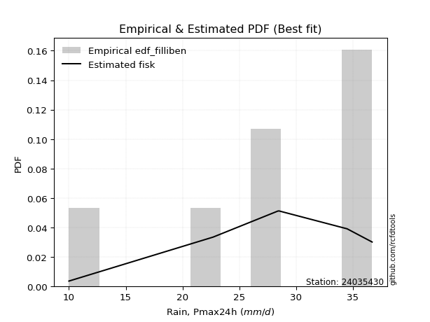</img>

</div>


### 10. Empirical - EDF Jenkinson (1977)

The Jenkinson formula in hydrology is an empirical plotting position formula used to estimate the non-exceedance probability _(P)_ or return period _(T)_ of a given ordered observation within a sample. It is a widely used method in the frequency analysis of extreme events such as floods and rainfall, as it provides a distribution-free way to plot data. _a≈0.31_ and _b≈0.38_ are constants derived to approximate the median of the probability distribution for the given rank.

<div align="center">


$P=(m-a)/(n+b)$


</div>


**10.1. Empirical values**

<div align="center">

|                | 0                   | 1                   | 2                  | 3                   | 4                  | 5                  | 6                  | 7                  |
|:---------------|:--------------------|:--------------------|:-------------------|:--------------------|:-------------------|:-------------------|:-------------------|:-------------------|
| date           | 2023                | 2020                | 2017               | 2021                | 2019               | 2022               | 2018               | 2025               |
| x              | 10.0                | 22.7                | 28.4               | 28.5                | 34.5               | 35.9               | 36.7               | 98.2               |
| m              | 1                   | 2                   | 3                  | 4                   | 5                  | 6                  | 7                  | 8                  |
| empirical_dist | edf_jenkinson       | edf_jenkinson       | edf_jenkinson      | edf_jenkinson       | edf_jenkinson      | edf_jenkinson      | edf_jenkinson      | edf_jenkinson      |
| empirical      | 0.08233890214797135 | 0.20167064439140808 | 0.3210023866348448 | 0.44033412887828155 | 0.5596658711217184 | 0.6789976133651551 | 0.7983293556085919 | 0.9176610978520287 |
| empirical_tr   | 1.0897269180754225  | 1.2526158445440956  | 1.4727592267135323 | 1.7867803837953091  | 2.2710027100271004 | 3.115241635687732  | 4.958579881656804  | 12.144927536231886 |

</div>


**10.2. Kolmogorov-Smirnov fit test (sorted by Δ)**


<div align="center">

|                | 0                  | 1                  | 2                   | 3                   | 4                   | 5                   | 6                     | 7                   | 8                   | 9                   | 10                  | 11                  | 12                  | 13                  | 14                  | 15                 | 16                  | 17                  | 18                  | 19                 | 20                  | 21                  | 22                  | 23                  | 24                  | 25                 | 26                  | 27                 | 28                  | 29                  | 30                  | 31                 | 32                  | 33                 | 34                 | 35                 | 36                  | 37                 | 38                  | 39                  | 40                  | 41                  | 42                 | 43                  | 44                  | 45                 | 46                  | 47                  | 48                 | 49                 | 50                  | 51                  | 52                  | 53                  | 54                  | 55                  | 56                  | 57                  | 58                  | 59                  | 60                 | 61                 | 62                  | 63                  | 64                  | 65                  | 66                  | 67                  | 68                  | 69                  | 70                  | 71                  | 72                  | 73                 | 74                  | 75                 | 76                  | 77                  | 78                 | 79                  | 80                 | 81                  | 82                  | 83                 | 84                 | 85                 | 86                 | 87                 | 88                 | 89                 |
|:---------------|:-------------------|:-------------------|:--------------------|:--------------------|:--------------------|:--------------------|:----------------------|:--------------------|:--------------------|:--------------------|:--------------------|:--------------------|:--------------------|:--------------------|:--------------------|:-------------------|:--------------------|:--------------------|:--------------------|:-------------------|:--------------------|:--------------------|:--------------------|:--------------------|:--------------------|:-------------------|:--------------------|:-------------------|:--------------------|:--------------------|:--------------------|:-------------------|:--------------------|:-------------------|:-------------------|:-------------------|:--------------------|:-------------------|:--------------------|:--------------------|:--------------------|:--------------------|:-------------------|:--------------------|:--------------------|:-------------------|:--------------------|:--------------------|:-------------------|:-------------------|:--------------------|:--------------------|:--------------------|:--------------------|:--------------------|:--------------------|:--------------------|:--------------------|:--------------------|:--------------------|:-------------------|:-------------------|:--------------------|:--------------------|:--------------------|:--------------------|:--------------------|:--------------------|:--------------------|:--------------------|:--------------------|:--------------------|:--------------------|:-------------------|:--------------------|:-------------------|:--------------------|:--------------------|:-------------------|:--------------------|:-------------------|:--------------------|:--------------------|:-------------------|:-------------------|:-------------------|:-------------------|:-------------------|:-------------------|:-------------------|
| station        | 24035430           | 24035430           | 24035430            | 24035430            | 24035430            | 24035430            | 24035430              | 24035430            | 24035430            | 24035430            | 24035430            | 24035430            | 24035430            | 24035430            | 24035430            | 24035430           | 24035430            | 24035430            | 24035430            | 24035430           | 24035430            | 24035430            | 24035430            | 24035430            | 24035430            | 24035430           | 24035430            | 24035430           | 24035430            | 24035430            | 24035430            | 24035430           | 24035430            | 24035430           | 24035430           | 24035430           | 24035430            | 24035430           | 24035430            | 24035430            | 24035430            | 24035430            | 24035430           | 24035430            | 24035430            | 24035430           | 24035430            | 24035430            | 24035430           | 24035430           | 24035430            | 24035430            | 24035430            | 24035430            | 24035430            | 24035430            | 24035430            | 24035430            | 24035430            | 24035430            | 24035430           | 24035430           | 24035430            | 24035430            | 24035430            | 24035430            | 24035430            | 24035430            | 24035430            | 24035430            | 24035430            | 24035430            | 24035430            | 24035430           | 24035430            | 24035430           | 24035430            | 24035430            | 24035430           | 24035430            | 24035430           | 24035430            | 24035430            | 24035430           | 24035430           | 24035430           | 24035430           | 24035430           | 24035430           | 24035430           |
| empirical_dist | edf_jenkinson      | edf_jenkinson      | edf_jenkinson       | edf_jenkinson       | edf_jenkinson       | edf_jenkinson       | edf_jenkinson         | edf_jenkinson       | edf_jenkinson       | edf_jenkinson       | edf_jenkinson       | edf_jenkinson       | edf_jenkinson       | edf_jenkinson       | edf_jenkinson       | edf_jenkinson      | edf_jenkinson       | edf_jenkinson       | edf_jenkinson       | edf_jenkinson      | edf_jenkinson       | edf_jenkinson       | edf_jenkinson       | edf_jenkinson       | edf_jenkinson       | edf_jenkinson      | edf_jenkinson       | edf_jenkinson      | edf_jenkinson       | edf_jenkinson       | edf_jenkinson       | edf_jenkinson      | edf_jenkinson       | edf_jenkinson      | edf_jenkinson      | edf_jenkinson      | edf_jenkinson       | edf_jenkinson      | edf_jenkinson       | edf_jenkinson       | edf_jenkinson       | edf_jenkinson       | edf_jenkinson      | edf_jenkinson       | edf_jenkinson       | edf_jenkinson      | edf_jenkinson       | edf_jenkinson       | edf_jenkinson      | edf_jenkinson      | edf_jenkinson       | edf_jenkinson       | edf_jenkinson       | edf_jenkinson       | edf_jenkinson       | edf_jenkinson       | edf_jenkinson       | edf_jenkinson       | edf_jenkinson       | edf_jenkinson       | edf_jenkinson      | edf_jenkinson      | edf_jenkinson       | edf_jenkinson       | edf_jenkinson       | edf_jenkinson       | edf_jenkinson       | edf_jenkinson       | edf_jenkinson       | edf_jenkinson       | edf_jenkinson       | edf_jenkinson       | edf_jenkinson       | edf_jenkinson      | edf_jenkinson       | edf_jenkinson      | edf_jenkinson       | edf_jenkinson       | edf_jenkinson      | edf_jenkinson       | edf_jenkinson      | edf_jenkinson       | edf_jenkinson       | edf_jenkinson      | edf_jenkinson      | edf_jenkinson      | edf_jenkinson      | edf_jenkinson      | edf_jenkinson      | edf_jenkinson      |
| p_dist         | logt               | johnsonsu          | t                   | loglaplace          | gibrat              | logmielke           | loglaplace_asymmetric | logjohnsonsu        | loggenlogistic      | loghypsecant        | mielke              | loginvgauss         | logmaxwell          | logfisk             | fisk                | logalpha           | wald                | loglogistic         | alpha               | loginvgamma        | lograyleigh         | nct                 | logexponnorm        | logbetaprime        | expon               | invweibull         | logrice             | betaprime          | invgamma            | f                   | ncf                 | logncf             | logpearson3         | loggamma           | loggamma           | logerlang          | logf                | logfatiguelife     | logcrystalball      | lognorm             | lognorm             | logweibull_min      | logloggamma        | pearson3            | gompertz            | genexpon           | loggumbel_r         | invgauss            | loggompertz        | loginvweibull      | lognct              | fatiguelife         | logkstwobign        | exponnorm           | halflogistic        | logtruncnorm        | nakagami            | loghalfnorm         | moyal               | loggenexpon         | genlogistic        | laplace_asymmetric | logmoyal            | loghalflogistic     | halfnorm            | gumbel_r            | lognakagami         | loggumbel_l         | weibull_min         | rayleigh            | kstwobign           | gamma               | maxwell             | logwald            | loggibrat           | rice               | crystalball         | truncnorm           | norm               | logistic            | hypsecant          | laplace             | logexpon            | gumbel_l           | logchi2            | loglognorm         | pareto             | logpareto          | chi2               | erlang             |
| delta          | 0.0917854100396972 | 0.0967821731353391 | 0.10218723983063105 | 0.12801051097345384 | 0.13905945801122271 | 0.14476429997915252 | 0.1545248522819097    | 0.15595326776148727 | 0.15598501359970163 | 0.15606783023097548 | 0.15617328599222524 | 0.15706469575425186 | 0.15760877973138393 | 0.15806222446243823 | 0.15830570934088561 | 0.1646201431975226 | 0.16538551112793387 | 0.16787673349035626 | 0.16877619522276066 | 0.1695157735094659 | 0.16957627579803292 | 0.17113308712982767 | 0.17242808862727654 | 0.17371659600138245 | 0.17506095682094508 | 0.1753525029717442 | 0.17636544905348162 | 0.176739219777592  | 0.17776525217113714 | 0.17798780879502918 | 0.17827373785803602 | 0.1786532702352478 | 0.17886795393144916 | 0.1792808882935577 | 0.1792808882935577 | 0.1793031672413924 | 0.17970202891695586 | 0.1798067977893565 | 0.18251829532255048 | 0.18251831033309518 | 0.18251831033309518 | 0.18305861068250806 | 0.1840372861661831 | 0.18508996106350395 | 0.18525089688860252 | 0.1874976878222384 | 0.18963999523018105 | 0.19042430975767732 | 0.1908592288847476 | 0.1912018365215583 | 0.19240823538523133 | 0.19371308120559383 | 0.19962157319819462 | 0.20044947847636607 | 0.20080974102609606 | 0.20166743121288347 | 0.20167061504708358 | 0.20337075317597675 | 0.20481115223089807 | 0.20697340497519112 | 0.2078097750914365 | 0.2081858406546181 | 0.21482421410142072 | 0.22391441701834292 | 0.22558359762752533 | 0.23067398361068236 | 0.23299482536426608 | 0.23914279863000798 | 0.25288126375159786 | 0.25674510204741086 | 0.25844854390226357 | 0.25887347868072547 | 0.26781345018354896 | 0.2847376426940278 | 0.29571599922101566 | 0.298223010618342  | 0.30096700147244604 | 0.30096700321249936 | 0.3009670081662845 | 0.30132737705673257 | 0.3016351275072247 | 0.30298271802613763 | 0.31532011176477487 | 0.3714158885729698 | 0.4163064254523317 | 0.4327176633393179 | 0.4465252703502169 | 0.4604190053257324 | 0.5134812950170808 | 0.5420122864252492 |
| deltao         | 0.4472608134160001 | 0.4472608134160001 | 0.4472608134160001  | 0.4472608134160001  | 0.4472608134160001  | 0.4472608134160001  | 0.4472608134160001    | 0.4472608134160001  | 0.4472608134160001  | 0.4472608134160001  | 0.4472608134160001  | 0.4472608134160001  | 0.4472608134160001  | 0.4472608134160001  | 0.4472608134160001  | 0.4472608134160001 | 0.4472608134160001  | 0.4472608134160001  | 0.4472608134160001  | 0.4472608134160001 | 0.4472608134160001  | 0.4472608134160001  | 0.4472608134160001  | 0.4472608134160001  | 0.4472608134160001  | 0.4472608134160001 | 0.4472608134160001  | 0.4472608134160001 | 0.4472608134160001  | 0.4472608134160001  | 0.4472608134160001  | 0.4472608134160001 | 0.4472608134160001  | 0.4472608134160001 | 0.4472608134160001 | 0.4472608134160001 | 0.4472608134160001  | 0.4472608134160001 | 0.4472608134160001  | 0.4472608134160001  | 0.4472608134160001  | 0.4472608134160001  | 0.4472608134160001 | 0.4472608134160001  | 0.4472608134160001  | 0.4472608134160001 | 0.4472608134160001  | 0.4472608134160001  | 0.4472608134160001 | 0.4472608134160001 | 0.4472608134160001  | 0.4472608134160001  | 0.4472608134160001  | 0.4472608134160001  | 0.4472608134160001  | 0.4472608134160001  | 0.4472608134160001  | 0.4472608134160001  | 0.4472608134160001  | 0.4472608134160001  | 0.4472608134160001 | 0.4472608134160001 | 0.4472608134160001  | 0.4472608134160001  | 0.4472608134160001  | 0.4472608134160001  | 0.4472608134160001  | 0.4472608134160001  | 0.4472608134160001  | 0.4472608134160001  | 0.4472608134160001  | 0.4472608134160001  | 0.4472608134160001  | 0.4472608134160001 | 0.4472608134160001  | 0.4472608134160001 | 0.4472608134160001  | 0.4472608134160001  | 0.4472608134160001 | 0.4472608134160001  | 0.4472608134160001 | 0.4472608134160001  | 0.4472608134160001  | 0.4472608134160001 | 0.4472608134160001 | 0.4472608134160001 | 0.4472608134160001 | 0.4472608134160001 | 0.4472608134160001 | 0.4472608134160001 |
| eval           | Δo > Δ             | Δo > Δ             | Δo > Δ              | Δo > Δ              | Δo > Δ              | Δo > Δ              | Δo > Δ                | Δo > Δ              | Δo > Δ              | Δo > Δ              | Δo > Δ              | Δo > Δ              | Δo > Δ              | Δo > Δ              | Δo > Δ              | Δo > Δ             | Δo > Δ              | Δo > Δ              | Δo > Δ              | Δo > Δ             | Δo > Δ              | Δo > Δ              | Δo > Δ              | Δo > Δ              | Δo > Δ              | Δo > Δ             | Δo > Δ              | Δo > Δ             | Δo > Δ              | Δo > Δ              | Δo > Δ              | Δo > Δ             | Δo > Δ              | Δo > Δ             | Δo > Δ             | Δo > Δ             | Δo > Δ              | Δo > Δ             | Δo > Δ              | Δo > Δ              | Δo > Δ              | Δo > Δ              | Δo > Δ             | Δo > Δ              | Δo > Δ              | Δo > Δ             | Δo > Δ              | Δo > Δ              | Δo > Δ             | Δo > Δ             | Δo > Δ              | Δo > Δ              | Δo > Δ              | Δo > Δ              | Δo > Δ              | Δo > Δ              | Δo > Δ              | Δo > Δ              | Δo > Δ              | Δo > Δ              | Δo > Δ             | Δo > Δ             | Δo > Δ              | Δo > Δ              | Δo > Δ              | Δo > Δ              | Δo > Δ              | Δo > Δ              | Δo > Δ              | Δo > Δ              | Δo > Δ              | Δo > Δ              | Δo > Δ              | Δo > Δ             | Δo > Δ              | Δo > Δ             | Δo > Δ              | Δo > Δ              | Δo > Δ             | Δo > Δ              | Δo > Δ             | Δo > Δ              | Δo > Δ              | Δo > Δ             | Δo > Δ             | Δo > Δ             | Δo > Δ             | Δo <= Δ            | Δo <= Δ            | Δo <= Δ            |
| fit            | 1                  | 1                  | 1                   | 1                   | 1                   | 1                   | 1                     | 1                   | 1                   | 1                   | 1                   | 1                   | 1                   | 1                   | 1                   | 1                  | 1                   | 1                   | 1                   | 1                  | 1                   | 1                   | 1                   | 1                   | 1                   | 1                  | 1                   | 1                  | 1                   | 1                   | 1                   | 1                  | 1                   | 1                  | 1                  | 1                  | 1                   | 1                  | 1                   | 1                   | 1                   | 1                   | 1                  | 1                   | 1                   | 1                  | 1                   | 1                   | 1                  | 1                  | 1                   | 1                   | 1                   | 1                   | 1                   | 1                   | 1                   | 1                   | 1                   | 1                   | 1                  | 1                  | 1                   | 1                   | 1                   | 1                   | 1                   | 1                   | 1                   | 1                   | 1                   | 1                   | 1                   | 1                  | 1                   | 1                  | 1                   | 1                   | 1                  | 1                   | 1                  | 1                   | 1                   | 1                  | 1                  | 1                  | 1                  | 0                  | 0                  | 0                  |
| n              | 8                  | 8                  | 8                   | 8                   | 8                   | 8                   | 8                     | 8                   | 8                   | 8                   | 8                   | 8                   | 8                   | 8                   | 8                   | 8                  | 8                   | 8                   | 8                   | 8                  | 8                   | 8                   | 8                   | 8                   | 8                   | 8                  | 8                   | 8                  | 8                   | 8                   | 8                   | 8                  | 8                   | 8                  | 8                  | 8                  | 8                   | 8                  | 8                   | 8                   | 8                   | 8                   | 8                  | 8                   | 8                   | 8                  | 8                   | 8                   | 8                  | 8                  | 8                   | 8                   | 8                   | 8                   | 8                   | 8                   | 8                   | 8                   | 8                   | 8                   | 8                  | 8                  | 8                   | 8                   | 8                   | 8                   | 8                   | 8                   | 8                   | 8                   | 8                   | 8                   | 8                   | 8                  | 8                   | 8                  | 8                   | 8                   | 8                  | 8                   | 8                  | 8                   | 8                   | 8                  | 8                  | 8                  | 8                  | 8                  | 8                  | 8                  |
| best_fit       | 1                  | 0                  | 0                   | 0                   | 0                   | 0                   | 0                     | 0                   | 0                   | 0                   | 0                   | 0                   | 0                   | 0                   | 0                   | 0                  | 0                   | 0                   | 0                   | 0                  | 0                   | 0                   | 0                   | 0                   | 0                   | 0                  | 0                   | 0                  | 0                   | 0                   | 0                   | 0                  | 0                   | 0                  | 0                  | 0                  | 0                   | 0                  | 0                   | 0                   | 0                   | 0                   | 0                  | 0                   | 0                   | 0                  | 0                   | 0                   | 0                  | 0                  | 0                   | 0                   | 0                   | 0                   | 0                   | 0                   | 0                   | 0                   | 0                   | 0                   | 0                  | 0                  | 0                   | 0                   | 0                   | 0                   | 0                   | 0                   | 0                   | 0                   | 0                   | 0                   | 0                   | 0                  | 0                   | 0                  | 0                   | 0                   | 0                  | 0                   | 0                  | 0                   | 0                   | 0                  | 0                  | 0                  | 0                  | 0                  | 0                  | 0                  |
| best_fit_sort  | 1                  | 2                  | 3                   | 4                   | 5                   | 6                   | 7                     | 8                   | 9                   | 10                  | 11                  | 12                  | 13                  | 14                  | 15                  | 16                 | 17                  | 18                  | 19                  | 20                 | 21                  | 22                  | 23                  | 24                  | 25                  | 26                 | 27                  | 28                 | 29                  | 30                  | 31                  | 32                 | 33                  | 34                 | 35                 | 36                 | 37                  | 38                 | 39                  | 40                  | 41                  | 42                  | 43                 | 44                  | 45                  | 46                 | 47                  | 48                  | 49                 | 50                 | 51                  | 52                  | 53                  | 54                  | 55                  | 56                  | 57                  | 58                  | 59                  | 60                  | 61                 | 62                 | 63                  | 64                  | 65                  | 66                  | 67                  | 68                  | 69                  | 70                  | 71                  | 72                  | 73                  | 74                 | 75                  | 76                 | 77                  | 78                  | 79                 | 80                  | 81                 | 82                  | 83                  | 84                 | 85                 | 86                 | 87                 | 88                 | 89                 | 90                 |

</div>


<div align="center">

</img>

</div>


**10.3. Best fit**

<div align="center">

|   id |   station | empirical_dist   | p_dist   |     delta |   deltao | eval   |   fit |   n |   best_fit |   best_fit_sort |
|-----:|----------:|:-----------------|:---------|----------:|---------:|:-------|------:|----:|-----------:|----------------:|
|    0 |  24035430 | edf_jenkinson    | logt     | 0.0917854 | 0.447261 | Δo > Δ |     1 |   8 |          1 |               1 |

</div>


<div align="center">

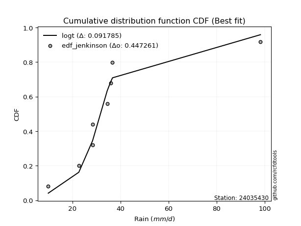</img>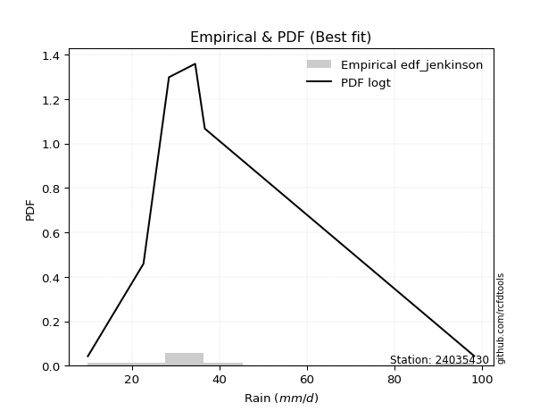</img>

</div>


### 11. Empirical - EDF Cunnane (1978)

Cunnane´s work in statistical hydrology has focused on the performance and evaluation of different probability distributions (such as GEV, Gumbel, Lognormal) for flood frequency estimation. _b_ is a constant, typically set to 0.4.

<div align="center">


$P=(m-b)/(n+1-2b)$


</div>


**11.1. Empirical values**

<div align="center">

|                | 0                   | 1                   | 2                  | 3                  | 4                  | 5                  | 6                  | 7                  |
|:---------------|:--------------------|:--------------------|:-------------------|:-------------------|:-------------------|:-------------------|:-------------------|:-------------------|
| date           | 2023                | 2020                | 2017               | 2021               | 2019               | 2022               | 2018               | 2025               |
| x              | 10.0                | 22.7                | 28.4               | 28.5               | 34.5               | 35.9               | 36.7               | 98.2               |
| m              | 1                   | 2                   | 3                  | 4                  | 5                  | 6                  | 7                  | 8                  |
| empirical_dist | edf_cunnane         | edf_cunnane         | edf_cunnane        | edf_cunnane        | edf_cunnane        | edf_cunnane        | edf_cunnane        | edf_cunnane        |
| empirical      | 0.07317073170731708 | 0.19512195121951223 | 0.3170731707317074 | 0.4390243902439025 | 0.5609756097560976 | 0.6829268292682927 | 0.8048780487804879 | 0.926829268292683  |
| empirical_tr   | 1.0789473684210527  | 1.2424242424242424  | 1.4642857142857144 | 1.782608695652174  | 2.277777777777778  | 3.153846153846154  | 5.125000000000001  | 13.666666666666675 |

</div>


**11.2. Kolmogorov-Smirnov fit test (sorted by Δ)**


<div align="center">

|                | 0                   | 1                   | 2                   | 3                   | 4                   | 5                  | 6                   | 7                     | 8                   | 9                   | 10                  | 11                  | 12                  | 13                  | 14                 | 15                 | 16                 | 17                  | 18                  | 19                  | 20                 | 21                  | 22                  | 23                  | 24                  | 25                 | 26                 | 27                  | 28                  | 29                  | 30                 | 31                 | 32                  | 33                 | 34                 | 35                  | 36                  | 37                  | 38                  | 39                  | 40                  | 41                  | 42                  | 43                  | 44                  | 45                 | 46                 | 47                  | 48                  | 49                  | 50                  | 51                 | 52                  | 53                  | 54                  | 55                  | 56                 | 57                  | 58                  | 59                  | 60                 | 61                  | 62                  | 63                  | 64                  | 65                  | 66                  | 67                  | 68                 | 69                  | 70                  | 71                 | 72                  | 73                  | 74                 | 75                 | 76                  | 77                  | 78                 | 79                  | 80                 | 81                 | 82                 | 83                 | 84                  | 85                 | 86                 | 87                 | 88                 | 89                 |
|:---------------|:--------------------|:--------------------|:--------------------|:--------------------|:--------------------|:-------------------|:--------------------|:----------------------|:--------------------|:--------------------|:--------------------|:--------------------|:--------------------|:--------------------|:-------------------|:-------------------|:-------------------|:--------------------|:--------------------|:--------------------|:-------------------|:--------------------|:--------------------|:--------------------|:--------------------|:-------------------|:-------------------|:--------------------|:--------------------|:--------------------|:-------------------|:-------------------|:--------------------|:-------------------|:-------------------|:--------------------|:--------------------|:--------------------|:--------------------|:--------------------|:--------------------|:--------------------|:--------------------|:--------------------|:--------------------|:-------------------|:-------------------|:--------------------|:--------------------|:--------------------|:--------------------|:-------------------|:--------------------|:--------------------|:--------------------|:--------------------|:-------------------|:--------------------|:--------------------|:--------------------|:-------------------|:--------------------|:--------------------|:--------------------|:--------------------|:--------------------|:--------------------|:--------------------|:-------------------|:--------------------|:--------------------|:-------------------|:--------------------|:--------------------|:-------------------|:-------------------|:--------------------|:--------------------|:-------------------|:--------------------|:-------------------|:-------------------|:-------------------|:-------------------|:--------------------|:-------------------|:-------------------|:-------------------|:-------------------|:-------------------|
| station        | 24035430            | 24035430            | 24035430            | 24035430            | 24035430            | 24035430           | 24035430            | 24035430              | 24035430            | 24035430            | 24035430            | 24035430            | 24035430            | 24035430            | 24035430           | 24035430           | 24035430           | 24035430            | 24035430            | 24035430            | 24035430           | 24035430            | 24035430            | 24035430            | 24035430            | 24035430           | 24035430           | 24035430            | 24035430            | 24035430            | 24035430           | 24035430           | 24035430            | 24035430           | 24035430           | 24035430            | 24035430            | 24035430            | 24035430            | 24035430            | 24035430            | 24035430            | 24035430            | 24035430            | 24035430            | 24035430           | 24035430           | 24035430            | 24035430            | 24035430            | 24035430            | 24035430           | 24035430            | 24035430            | 24035430            | 24035430            | 24035430           | 24035430            | 24035430            | 24035430            | 24035430           | 24035430            | 24035430            | 24035430            | 24035430            | 24035430            | 24035430            | 24035430            | 24035430           | 24035430            | 24035430            | 24035430           | 24035430            | 24035430            | 24035430           | 24035430           | 24035430            | 24035430            | 24035430           | 24035430            | 24035430           | 24035430           | 24035430           | 24035430           | 24035430            | 24035430           | 24035430           | 24035430           | 24035430           | 24035430           |
| empirical_dist | edf_cunnane         | edf_cunnane         | edf_cunnane         | edf_cunnane         | edf_cunnane         | edf_cunnane        | edf_cunnane         | edf_cunnane           | edf_cunnane         | edf_cunnane         | edf_cunnane         | edf_cunnane         | edf_cunnane         | edf_cunnane         | edf_cunnane        | edf_cunnane        | edf_cunnane        | edf_cunnane         | edf_cunnane         | edf_cunnane         | edf_cunnane        | edf_cunnane         | edf_cunnane         | edf_cunnane         | edf_cunnane         | edf_cunnane        | edf_cunnane        | edf_cunnane         | edf_cunnane         | edf_cunnane         | edf_cunnane        | edf_cunnane        | edf_cunnane         | edf_cunnane        | edf_cunnane        | edf_cunnane         | edf_cunnane         | edf_cunnane         | edf_cunnane         | edf_cunnane         | edf_cunnane         | edf_cunnane         | edf_cunnane         | edf_cunnane         | edf_cunnane         | edf_cunnane        | edf_cunnane        | edf_cunnane         | edf_cunnane         | edf_cunnane         | edf_cunnane         | edf_cunnane        | edf_cunnane         | edf_cunnane         | edf_cunnane         | edf_cunnane         | edf_cunnane        | edf_cunnane         | edf_cunnane         | edf_cunnane         | edf_cunnane        | edf_cunnane         | edf_cunnane         | edf_cunnane         | edf_cunnane         | edf_cunnane         | edf_cunnane         | edf_cunnane         | edf_cunnane        | edf_cunnane         | edf_cunnane         | edf_cunnane        | edf_cunnane         | edf_cunnane         | edf_cunnane        | edf_cunnane        | edf_cunnane         | edf_cunnane         | edf_cunnane        | edf_cunnane         | edf_cunnane        | edf_cunnane        | edf_cunnane        | edf_cunnane        | edf_cunnane         | edf_cunnane        | edf_cunnane        | edf_cunnane        | edf_cunnane        | edf_cunnane        |
| p_dist         | logt                | t                   | johnsonsu           | loglaplace          | gibrat              | logmielke          | logjohnsonsu        | loglaplace_asymmetric | loggenlogistic      | loghypsecant        | mielke              | loginvgauss         | logmaxwell          | logfisk             | fisk               | wald               | logalpha           | lograyleigh         | loglogistic         | alpha               | loginvgamma        | nct                 | logexponnorm        | logbetaprime        | expon               | invweibull         | logrice            | betaprime           | invgamma            | f                   | ncf                | logncf             | logpearson3         | loggamma           | loggamma           | logerlang           | logf                | logfatiguelife      | logcrystalball      | lognorm             | lognorm             | logweibull_min      | logloggamma         | pearson3            | gompertz            | loggumbel_r        | genexpon           | logtruncnorm        | nakagami            | loginvweibull       | invgauss            | loggompertz        | lognct              | fatiguelife         | logkstwobign        | exponnorm           | loghalfnorm        | halflogistic        | loggenexpon         | moyal               | genlogistic        | laplace_asymmetric  | logmoyal            | loghalflogistic     | halfnorm            | lognakagami         | gumbel_r            | loggumbel_l         | weibull_min        | rayleigh            | kstwobign           | gamma              | maxwell             | logwald             | loggibrat          | rice               | crystalball         | truncnorm           | norm               | logistic            | hypsecant          | laplace            | logexpon           | gumbel_l           | logchi2             | loglognorm         | pareto             | logpareto          | chi2               | erlang             |
| delta          | 0.09615403149122059 | 0.10087750119625183 | 0.10333086630723509 | 0.13455920414534983 | 0.14298867391436015 | 0.1513129931510485 | 0.15464352912710821 | 0.1610735454538057    | 0.16253370677159762 | 0.16261652340287147 | 0.16272197916412123 | 0.16297304533337176 | 0.16398621590571028 | 0.16461091763433422 | 0.1648544025127816 | 0.1693147270310713 | 0.1711688363694186 | 0.17350549170117036 | 0.17442542666225225 | 0.17532488839465665 | 0.1760644666813619 | 0.17768178030172366 | 0.17897678179917254 | 0.18026528917327844 | 0.18160964999284093 | 0.1819011961436402 | 0.1829141422253776 | 0.18328791294948799 | 0.18431394534303314 | 0.18453650196692517 | 0.184822431029932  | 0.1852019634071438 | 0.18541664710334516 | 0.1858295814654537 | 0.1858295814654537 | 0.18585186041328838 | 0.18625072208885185 | 0.18635549096125248 | 0.18906698849444648 | 0.18906700350499117 | 0.18906700350499117 | 0.18960730385440405 | 0.19058597933807908 | 0.19163865423539994 | 0.19179959006049851 | 0.1935692111333185 | 0.1940463809941344 | 0.19511873804098762 | 0.19512192187518773 | 0.19513105242469575 | 0.19697300292957332 | 0.1974079220566436 | 0.19895692855712732 | 0.20026177437748982 | 0.20355078910133206 | 0.20699817164826206 | 0.2072999690791142 | 0.20735843419799205 | 0.21090262087832856 | 0.21135984540279407 | 0.2143584682633325 | 0.21473453382651408 | 0.21875343000455816 | 0.22784363292148035 | 0.23213229079942133 | 0.23692404126740352 | 0.23722267678257836 | 0.24569149180190397 | 0.2594299569234937 | 0.26329379521930685 | 0.26499723707415956 | 0.2654221718526213 | 0.27436214335544495 | 0.28866685859716523 | 0.2996452151241531 | 0.304771703790238  | 0.30751569464434203 | 0.30751569638439535 | 0.3075157013381805 | 0.30787607022862856 | 0.3081838206791207 | 0.3095314111980336 | 0.3218688049366707 | 0.3779645817448658 | 0.42285511862422753 | 0.4392663565112137 | 0.4530739635221127 | 0.4669676984976282 | 0.5200299881889766 | 0.548560979597145  |
| deltao         | 0.4472608134160001  | 0.4472608134160001  | 0.4472608134160001  | 0.4472608134160001  | 0.4472608134160001  | 0.4472608134160001 | 0.4472608134160001  | 0.4472608134160001    | 0.4472608134160001  | 0.4472608134160001  | 0.4472608134160001  | 0.4472608134160001  | 0.4472608134160001  | 0.4472608134160001  | 0.4472608134160001 | 0.4472608134160001 | 0.4472608134160001 | 0.4472608134160001  | 0.4472608134160001  | 0.4472608134160001  | 0.4472608134160001 | 0.4472608134160001  | 0.4472608134160001  | 0.4472608134160001  | 0.4472608134160001  | 0.4472608134160001 | 0.4472608134160001 | 0.4472608134160001  | 0.4472608134160001  | 0.4472608134160001  | 0.4472608134160001 | 0.4472608134160001 | 0.4472608134160001  | 0.4472608134160001 | 0.4472608134160001 | 0.4472608134160001  | 0.4472608134160001  | 0.4472608134160001  | 0.4472608134160001  | 0.4472608134160001  | 0.4472608134160001  | 0.4472608134160001  | 0.4472608134160001  | 0.4472608134160001  | 0.4472608134160001  | 0.4472608134160001 | 0.4472608134160001 | 0.4472608134160001  | 0.4472608134160001  | 0.4472608134160001  | 0.4472608134160001  | 0.4472608134160001 | 0.4472608134160001  | 0.4472608134160001  | 0.4472608134160001  | 0.4472608134160001  | 0.4472608134160001 | 0.4472608134160001  | 0.4472608134160001  | 0.4472608134160001  | 0.4472608134160001 | 0.4472608134160001  | 0.4472608134160001  | 0.4472608134160001  | 0.4472608134160001  | 0.4472608134160001  | 0.4472608134160001  | 0.4472608134160001  | 0.4472608134160001 | 0.4472608134160001  | 0.4472608134160001  | 0.4472608134160001 | 0.4472608134160001  | 0.4472608134160001  | 0.4472608134160001 | 0.4472608134160001 | 0.4472608134160001  | 0.4472608134160001  | 0.4472608134160001 | 0.4472608134160001  | 0.4472608134160001 | 0.4472608134160001 | 0.4472608134160001 | 0.4472608134160001 | 0.4472608134160001  | 0.4472608134160001 | 0.4472608134160001 | 0.4472608134160001 | 0.4472608134160001 | 0.4472608134160001 |
| eval           | Δo > Δ              | Δo > Δ              | Δo > Δ              | Δo > Δ              | Δo > Δ              | Δo > Δ             | Δo > Δ              | Δo > Δ                | Δo > Δ              | Δo > Δ              | Δo > Δ              | Δo > Δ              | Δo > Δ              | Δo > Δ              | Δo > Δ             | Δo > Δ             | Δo > Δ             | Δo > Δ              | Δo > Δ              | Δo > Δ              | Δo > Δ             | Δo > Δ              | Δo > Δ              | Δo > Δ              | Δo > Δ              | Δo > Δ             | Δo > Δ             | Δo > Δ              | Δo > Δ              | Δo > Δ              | Δo > Δ             | Δo > Δ             | Δo > Δ              | Δo > Δ             | Δo > Δ             | Δo > Δ              | Δo > Δ              | Δo > Δ              | Δo > Δ              | Δo > Δ              | Δo > Δ              | Δo > Δ              | Δo > Δ              | Δo > Δ              | Δo > Δ              | Δo > Δ             | Δo > Δ             | Δo > Δ              | Δo > Δ              | Δo > Δ              | Δo > Δ              | Δo > Δ             | Δo > Δ              | Δo > Δ              | Δo > Δ              | Δo > Δ              | Δo > Δ             | Δo > Δ              | Δo > Δ              | Δo > Δ              | Δo > Δ             | Δo > Δ              | Δo > Δ              | Δo > Δ              | Δo > Δ              | Δo > Δ              | Δo > Δ              | Δo > Δ              | Δo > Δ             | Δo > Δ              | Δo > Δ              | Δo > Δ             | Δo > Δ              | Δo > Δ              | Δo > Δ             | Δo > Δ             | Δo > Δ              | Δo > Δ              | Δo > Δ             | Δo > Δ              | Δo > Δ             | Δo > Δ             | Δo > Δ             | Δo > Δ             | Δo > Δ              | Δo > Δ             | Δo <= Δ            | Δo <= Δ            | Δo <= Δ            | Δo <= Δ            |
| fit            | 1                   | 1                   | 1                   | 1                   | 1                   | 1                  | 1                   | 1                     | 1                   | 1                   | 1                   | 1                   | 1                   | 1                   | 1                  | 1                  | 1                  | 1                   | 1                   | 1                   | 1                  | 1                   | 1                   | 1                   | 1                   | 1                  | 1                  | 1                   | 1                   | 1                   | 1                  | 1                  | 1                   | 1                  | 1                  | 1                   | 1                   | 1                   | 1                   | 1                   | 1                   | 1                   | 1                   | 1                   | 1                   | 1                  | 1                  | 1                   | 1                   | 1                   | 1                   | 1                  | 1                   | 1                   | 1                   | 1                   | 1                  | 1                   | 1                   | 1                   | 1                  | 1                   | 1                   | 1                   | 1                   | 1                   | 1                   | 1                   | 1                  | 1                   | 1                   | 1                  | 1                   | 1                   | 1                  | 1                  | 1                   | 1                   | 1                  | 1                   | 1                  | 1                  | 1                  | 1                  | 1                   | 1                  | 0                  | 0                  | 0                  | 0                  |
| n              | 8                   | 8                   | 8                   | 8                   | 8                   | 8                  | 8                   | 8                     | 8                   | 8                   | 8                   | 8                   | 8                   | 8                   | 8                  | 8                  | 8                  | 8                   | 8                   | 8                   | 8                  | 8                   | 8                   | 8                   | 8                   | 8                  | 8                  | 8                   | 8                   | 8                   | 8                  | 8                  | 8                   | 8                  | 8                  | 8                   | 8                   | 8                   | 8                   | 8                   | 8                   | 8                   | 8                   | 8                   | 8                   | 8                  | 8                  | 8                   | 8                   | 8                   | 8                   | 8                  | 8                   | 8                   | 8                   | 8                   | 8                  | 8                   | 8                   | 8                   | 8                  | 8                   | 8                   | 8                   | 8                   | 8                   | 8                   | 8                   | 8                  | 8                   | 8                   | 8                  | 8                   | 8                   | 8                  | 8                  | 8                   | 8                   | 8                  | 8                   | 8                  | 8                  | 8                  | 8                  | 8                   | 8                  | 8                  | 8                  | 8                  | 8                  |
| best_fit       | 1                   | 0                   | 0                   | 0                   | 0                   | 0                  | 0                   | 0                     | 0                   | 0                   | 0                   | 0                   | 0                   | 0                   | 0                  | 0                  | 0                  | 0                   | 0                   | 0                   | 0                  | 0                   | 0                   | 0                   | 0                   | 0                  | 0                  | 0                   | 0                   | 0                   | 0                  | 0                  | 0                   | 0                  | 0                  | 0                   | 0                   | 0                   | 0                   | 0                   | 0                   | 0                   | 0                   | 0                   | 0                   | 0                  | 0                  | 0                   | 0                   | 0                   | 0                   | 0                  | 0                   | 0                   | 0                   | 0                   | 0                  | 0                   | 0                   | 0                   | 0                  | 0                   | 0                   | 0                   | 0                   | 0                   | 0                   | 0                   | 0                  | 0                   | 0                   | 0                  | 0                   | 0                   | 0                  | 0                  | 0                   | 0                   | 0                  | 0                   | 0                  | 0                  | 0                  | 0                  | 0                   | 0                  | 0                  | 0                  | 0                  | 0                  |
| best_fit_sort  | 1                   | 2                   | 3                   | 4                   | 5                   | 6                  | 7                   | 8                     | 9                   | 10                  | 11                  | 12                  | 13                  | 14                  | 15                 | 16                 | 17                 | 18                  | 19                  | 20                  | 21                 | 22                  | 23                  | 24                  | 25                  | 26                 | 27                 | 28                  | 29                  | 30                  | 31                 | 32                 | 33                  | 34                 | 35                 | 36                  | 37                  | 38                  | 39                  | 40                  | 41                  | 42                  | 43                  | 44                  | 45                  | 46                 | 47                 | 48                  | 49                  | 50                  | 51                  | 52                 | 53                  | 54                  | 55                  | 56                  | 57                 | 58                  | 59                  | 60                  | 61                 | 62                  | 63                  | 64                  | 65                  | 66                  | 67                  | 68                  | 69                 | 70                  | 71                  | 72                 | 73                  | 74                  | 75                 | 76                 | 77                  | 78                  | 79                 | 80                  | 81                 | 82                 | 83                 | 84                 | 85                  | 86                 | 87                 | 88                 | 89                 | 90                 |

</div>


<div align="center">

</img>

</div>


**11.3. Best fit**

<div align="center">

|   id |   station | empirical_dist   | p_dist   |    delta |   deltao | eval   |   fit |   n |   best_fit |   best_fit_sort |
|-----:|----------:|:-----------------|:---------|---------:|---------:|:-------|------:|----:|-----------:|----------------:|
|    0 |  24035430 | edf_cunnane      | logt     | 0.096154 | 0.447261 | Δo > Δ |     1 |   8 |          1 |               1 |

</div>


<div align="center">

</img>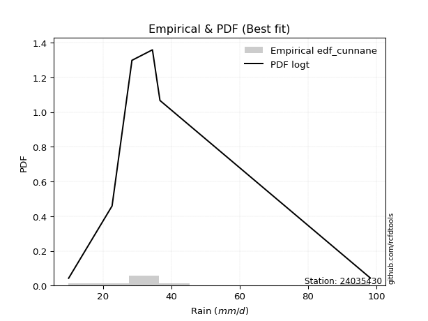</img>

</div>


### 12. Empirical - EDF Adamowski (1981)

The Adamowski formula in hydrology refers to a specific plotting position formula used for estimating the non-parametric empirical distribution of hydrological events (like flood peaks) to calculate their return periods. This formula provides an alternative to traditional parametric methods (like the Gumbel or Log Pearson Type III distributions). 

<div align="center">


$P=(m-0.25)/(n+0.5)$


</div>


**12.1. Empirical values**

<div align="center">

|                | 0                   | 1                   | 2                  | 3                  | 4                  | 5                  | 6                  | 7                  |
|:---------------|:--------------------|:--------------------|:-------------------|:-------------------|:-------------------|:-------------------|:-------------------|:-------------------|
| date           | 2023                | 2020                | 2017               | 2021               | 2019               | 2022               | 2018               | 2025               |
| x              | 10.0                | 22.7                | 28.4               | 28.5               | 34.5               | 35.9               | 36.7               | 98.2               |
| m              | 1                   | 2                   | 3                  | 4                  | 5                  | 6                  | 7                  | 8                  |
| empirical_dist | edf_adamowski       | edf_adamowski       | edf_adamowski      | edf_adamowski      | edf_adamowski      | edf_adamowski      | edf_adamowski      | edf_adamowski      |
| empirical      | 0.08823529411764706 | 0.20588235294117646 | 0.3235294117647059 | 0.4411764705882353 | 0.5588235294117647 | 0.6764705882352942 | 0.7941176470588235 | 0.9117647058823529 |
| empirical_tr   | 1.096774193548387   | 1.259259259259259   | 1.4782608695652173 | 1.7894736842105263 | 2.2666666666666666 | 3.0909090909090913 | 4.857142857142856  | 11.33333333333333  |

</div>


**12.2. Kolmogorov-Smirnov fit test (sorted by Δ)**


<div align="center">

|                | 0                   | 1                   | 2                   | 3                   | 4                   | 5                   | 6                     | 7                   | 8                  | 9                   | 10                  | 11                  | 12                  | 13                  | 14                 | 15                  | 16                 | 17                  | 18                  | 19                  | 20                 | 21                  | 22                  | 23                  | 24                  | 25                  | 26                 | 27                  | 28                  | 29                 | 30                  | 31                  | 32                  | 33                  | 34                  | 35                 | 36                  | 37                 | 38                 | 39                 | 40                 | 41                  | 42                 | 43                  | 44                  | 45                  | 46                  | 47                  | 48                  | 49                  | 50                  | 51                  | 52                 | 53                  | 54                  | 55                 | 56                  | 57                  | 58                  | 59                  | 60                  | 61                  | 62                  | 63                  | 64                  | 65                 | 66                 | 67                 | 68                  | 69                 | 70                 | 71                 | 72                 | 73                 | 74                 | 75                 | 76                  | 77                 | 78                  | 79                 | 80                  | 81                  | 82                 | 83                  | 84                  | 85                 | 86                 | 87                 | 88                 | 89                 |
|:---------------|:--------------------|:--------------------|:--------------------|:--------------------|:--------------------|:--------------------|:----------------------|:--------------------|:-------------------|:--------------------|:--------------------|:--------------------|:--------------------|:--------------------|:-------------------|:--------------------|:-------------------|:--------------------|:--------------------|:--------------------|:-------------------|:--------------------|:--------------------|:--------------------|:--------------------|:--------------------|:-------------------|:--------------------|:--------------------|:-------------------|:--------------------|:--------------------|:--------------------|:--------------------|:--------------------|:-------------------|:--------------------|:-------------------|:-------------------|:-------------------|:-------------------|:--------------------|:-------------------|:--------------------|:--------------------|:--------------------|:--------------------|:--------------------|:--------------------|:--------------------|:--------------------|:--------------------|:-------------------|:--------------------|:--------------------|:-------------------|:--------------------|:--------------------|:--------------------|:--------------------|:--------------------|:--------------------|:--------------------|:--------------------|:--------------------|:-------------------|:-------------------|:-------------------|:--------------------|:-------------------|:-------------------|:-------------------|:-------------------|:-------------------|:-------------------|:-------------------|:--------------------|:-------------------|:--------------------|:-------------------|:--------------------|:--------------------|:-------------------|:--------------------|:--------------------|:-------------------|:-------------------|:-------------------|:-------------------|:-------------------|
| station        | 24035430            | 24035430            | 24035430            | 24035430            | 24035430            | 24035430            | 24035430              | 24035430            | 24035430           | 24035430            | 24035430            | 24035430            | 24035430            | 24035430            | 24035430           | 24035430            | 24035430           | 24035430            | 24035430            | 24035430            | 24035430           | 24035430            | 24035430            | 24035430            | 24035430            | 24035430            | 24035430           | 24035430            | 24035430            | 24035430           | 24035430            | 24035430            | 24035430            | 24035430            | 24035430            | 24035430           | 24035430            | 24035430           | 24035430           | 24035430           | 24035430           | 24035430            | 24035430           | 24035430            | 24035430            | 24035430            | 24035430            | 24035430            | 24035430            | 24035430            | 24035430            | 24035430            | 24035430           | 24035430            | 24035430            | 24035430           | 24035430            | 24035430            | 24035430            | 24035430            | 24035430            | 24035430            | 24035430            | 24035430            | 24035430            | 24035430           | 24035430           | 24035430           | 24035430            | 24035430           | 24035430           | 24035430           | 24035430           | 24035430           | 24035430           | 24035430           | 24035430            | 24035430           | 24035430            | 24035430           | 24035430            | 24035430            | 24035430           | 24035430            | 24035430            | 24035430           | 24035430           | 24035430           | 24035430           | 24035430           |
| empirical_dist | edf_adamowski       | edf_adamowski       | edf_adamowski       | edf_adamowski       | edf_adamowski       | edf_adamowski       | edf_adamowski         | edf_adamowski       | edf_adamowski      | edf_adamowski       | edf_adamowski       | edf_adamowski       | edf_adamowski       | edf_adamowski       | edf_adamowski      | edf_adamowski       | edf_adamowski      | edf_adamowski       | edf_adamowski       | edf_adamowski       | edf_adamowski      | edf_adamowski       | edf_adamowski       | edf_adamowski       | edf_adamowski       | edf_adamowski       | edf_adamowski      | edf_adamowski       | edf_adamowski       | edf_adamowski      | edf_adamowski       | edf_adamowski       | edf_adamowski       | edf_adamowski       | edf_adamowski       | edf_adamowski      | edf_adamowski       | edf_adamowski      | edf_adamowski      | edf_adamowski      | edf_adamowski      | edf_adamowski       | edf_adamowski      | edf_adamowski       | edf_adamowski       | edf_adamowski       | edf_adamowski       | edf_adamowski       | edf_adamowski       | edf_adamowski       | edf_adamowski       | edf_adamowski       | edf_adamowski      | edf_adamowski       | edf_adamowski       | edf_adamowski      | edf_adamowski       | edf_adamowski       | edf_adamowski       | edf_adamowski       | edf_adamowski       | edf_adamowski       | edf_adamowski       | edf_adamowski       | edf_adamowski       | edf_adamowski      | edf_adamowski      | edf_adamowski      | edf_adamowski       | edf_adamowski      | edf_adamowski      | edf_adamowski      | edf_adamowski      | edf_adamowski      | edf_adamowski      | edf_adamowski      | edf_adamowski       | edf_adamowski      | edf_adamowski       | edf_adamowski      | edf_adamowski       | edf_adamowski       | edf_adamowski      | edf_adamowski       | edf_adamowski       | edf_adamowski      | edf_adamowski      | edf_adamowski      | edf_adamowski      | edf_adamowski      |
| p_dist         | johnsonsu           | logt                | t                   | loglaplace          | gibrat              | logmielke           | loglaplace_asymmetric | loggenlogistic      | loghypsecant       | mielke              | logfisk             | fisk                | loginvgauss         | logmaxwell          | logjohnsonsu       | logalpha            | wald               | loglogistic         | alpha               | loginvgamma         | nct                | lograyleigh         | logexponnorm        | logbetaprime        | invweibull          | logrice             | expon              | betaprime           | invgamma            | f                  | ncf                 | logncf              | logpearson3         | loggamma            | loggamma            | logerlang          | logf                | logfatiguelife     | logcrystalball     | lognorm            | lognorm            | logweibull_min      | logloggamma        | pearson3            | gompertz            | genexpon            | invgauss            | loggompertz         | loggumbel_r         | lognct              | loginvweibull       | fatiguelife         | exponnorm          | halflogistic        | logkstwobign        | moyal              | loghalfnorm         | genlogistic         | laplace_asymmetric  | loggenexpon         | logtruncnorm        | nakagami            | logmoyal            | halfnorm            | loghalflogistic     | gumbel_r           | lognakagami        | loggumbel_l        | weibull_min         | rayleigh           | kstwobign          | gamma              | maxwell            | logwald            | loggibrat          | rice               | crystalball         | truncnorm          | norm                | logistic           | hypsecant           | laplace             | logexpon           | gumbel_l            | logchi2             | loglognorm         | pareto             | logpareto          | chi2               | erlang             |
| delta          | 0.09257046458557072 | 0.09262775174965093 | 0.10302958154058472 | 0.12379880242368546 | 0.13653243288136163 | 0.14055259142938414 | 0.15031314373214133   | 0.15177330504993325 | 0.1518561216812071 | 0.15196157744245686 | 0.15385051591266985 | 0.15409400079111724 | 0.15453767062439078 | 0.15508175460152285 | 0.156795609471441  | 0.16040843464775423 | 0.1628584859980728 | 0.16366502494058788 | 0.16456448667299228 | 0.16530406495969752 | 0.1669213785800593 | 0.16704925066817183 | 0.16821638007750817 | 0.16950488745161407 | 0.17114079442197583 | 0.17215374050371324 | 0.1723651114010662 | 0.17252751122782362 | 0.17355354362136877 | 0.1737761002452608 | 0.17406202930826764 | 0.17444156168547942 | 0.17465624538168079 | 0.17506917974378933 | 0.17506917974378933 | 0.175091458691624  | 0.17549032036718748 | 0.1755950892395881 | 0.1783065867727821 | 0.1783066017833268 | 0.1783066017833268 | 0.17884690213273968 | 0.1798255776164147 | 0.18087825251373557 | 0.18103918833883414 | 0.18328597927247003 | 0.18621260120790895 | 0.18664752033497922 | 0.18711297010031996 | 0.18819652683546295 | 0.18867481139169723 | 0.18950137265582545 | 0.1962377699265977 | 0.19659803247632768 | 0.19709454806833354 | 0.2005994436811297 | 0.20084372804611567 | 0.20359806654166812 | 0.20397413210484971 | 0.20444637984533004 | 0.20587913976265185 | 0.20588232359685196 | 0.21229718897155964 | 0.22137188907775696 | 0.22138739188848183 | 0.226462275060914  | 0.230467800234405  | 0.2349310900802396 | 0.24866955520182948 | 0.2525333934976425 | 0.2542368353524952 | 0.2546617701309571 | 0.2636017416337806 | 0.2822106175641667 | 0.2931889740911546 | 0.2940113020685736 | 0.29675529292267766 | 0.296755294662731  | 0.29675529961651614 | 0.2971156685069642 | 0.29742341895745633 | 0.29877100947636925 | 0.3111084032150065 | 0.36720418002320143 | 0.41209471690256333 | 0.4285059547895495 | 0.4423135618004485 | 0.456207296775964  | 0.5092695864673125 | 0.5378005778754809 |
| deltao         | 0.4472608134160001  | 0.4472608134160001  | 0.4472608134160001  | 0.4472608134160001  | 0.4472608134160001  | 0.4472608134160001  | 0.4472608134160001    | 0.4472608134160001  | 0.4472608134160001 | 0.4472608134160001  | 0.4472608134160001  | 0.4472608134160001  | 0.4472608134160001  | 0.4472608134160001  | 0.4472608134160001 | 0.4472608134160001  | 0.4472608134160001 | 0.4472608134160001  | 0.4472608134160001  | 0.4472608134160001  | 0.4472608134160001 | 0.4472608134160001  | 0.4472608134160001  | 0.4472608134160001  | 0.4472608134160001  | 0.4472608134160001  | 0.4472608134160001 | 0.4472608134160001  | 0.4472608134160001  | 0.4472608134160001 | 0.4472608134160001  | 0.4472608134160001  | 0.4472608134160001  | 0.4472608134160001  | 0.4472608134160001  | 0.4472608134160001 | 0.4472608134160001  | 0.4472608134160001 | 0.4472608134160001 | 0.4472608134160001 | 0.4472608134160001 | 0.4472608134160001  | 0.4472608134160001 | 0.4472608134160001  | 0.4472608134160001  | 0.4472608134160001  | 0.4472608134160001  | 0.4472608134160001  | 0.4472608134160001  | 0.4472608134160001  | 0.4472608134160001  | 0.4472608134160001  | 0.4472608134160001 | 0.4472608134160001  | 0.4472608134160001  | 0.4472608134160001 | 0.4472608134160001  | 0.4472608134160001  | 0.4472608134160001  | 0.4472608134160001  | 0.4472608134160001  | 0.4472608134160001  | 0.4472608134160001  | 0.4472608134160001  | 0.4472608134160001  | 0.4472608134160001 | 0.4472608134160001 | 0.4472608134160001 | 0.4472608134160001  | 0.4472608134160001 | 0.4472608134160001 | 0.4472608134160001 | 0.4472608134160001 | 0.4472608134160001 | 0.4472608134160001 | 0.4472608134160001 | 0.4472608134160001  | 0.4472608134160001 | 0.4472608134160001  | 0.4472608134160001 | 0.4472608134160001  | 0.4472608134160001  | 0.4472608134160001 | 0.4472608134160001  | 0.4472608134160001  | 0.4472608134160001 | 0.4472608134160001 | 0.4472608134160001 | 0.4472608134160001 | 0.4472608134160001 |
| eval           | Δo > Δ              | Δo > Δ              | Δo > Δ              | Δo > Δ              | Δo > Δ              | Δo > Δ              | Δo > Δ                | Δo > Δ              | Δo > Δ             | Δo > Δ              | Δo > Δ              | Δo > Δ              | Δo > Δ              | Δo > Δ              | Δo > Δ             | Δo > Δ              | Δo > Δ             | Δo > Δ              | Δo > Δ              | Δo > Δ              | Δo > Δ             | Δo > Δ              | Δo > Δ              | Δo > Δ              | Δo > Δ              | Δo > Δ              | Δo > Δ             | Δo > Δ              | Δo > Δ              | Δo > Δ             | Δo > Δ              | Δo > Δ              | Δo > Δ              | Δo > Δ              | Δo > Δ              | Δo > Δ             | Δo > Δ              | Δo > Δ             | Δo > Δ             | Δo > Δ             | Δo > Δ             | Δo > Δ              | Δo > Δ             | Δo > Δ              | Δo > Δ              | Δo > Δ              | Δo > Δ              | Δo > Δ              | Δo > Δ              | Δo > Δ              | Δo > Δ              | Δo > Δ              | Δo > Δ             | Δo > Δ              | Δo > Δ              | Δo > Δ             | Δo > Δ              | Δo > Δ              | Δo > Δ              | Δo > Δ              | Δo > Δ              | Δo > Δ              | Δo > Δ              | Δo > Δ              | Δo > Δ              | Δo > Δ             | Δo > Δ             | Δo > Δ             | Δo > Δ              | Δo > Δ             | Δo > Δ             | Δo > Δ             | Δo > Δ             | Δo > Δ             | Δo > Δ             | Δo > Δ             | Δo > Δ              | Δo > Δ             | Δo > Δ              | Δo > Δ             | Δo > Δ              | Δo > Δ              | Δo > Δ             | Δo > Δ              | Δo > Δ              | Δo > Δ             | Δo > Δ             | Δo <= Δ            | Δo <= Δ            | Δo <= Δ            |
| fit            | 1                   | 1                   | 1                   | 1                   | 1                   | 1                   | 1                     | 1                   | 1                  | 1                   | 1                   | 1                   | 1                   | 1                   | 1                  | 1                   | 1                  | 1                   | 1                   | 1                   | 1                  | 1                   | 1                   | 1                   | 1                   | 1                   | 1                  | 1                   | 1                   | 1                  | 1                   | 1                   | 1                   | 1                   | 1                   | 1                  | 1                   | 1                  | 1                  | 1                  | 1                  | 1                   | 1                  | 1                   | 1                   | 1                   | 1                   | 1                   | 1                   | 1                   | 1                   | 1                   | 1                  | 1                   | 1                   | 1                  | 1                   | 1                   | 1                   | 1                   | 1                   | 1                   | 1                   | 1                   | 1                   | 1                  | 1                  | 1                  | 1                   | 1                  | 1                  | 1                  | 1                  | 1                  | 1                  | 1                  | 1                   | 1                  | 1                   | 1                  | 1                   | 1                   | 1                  | 1                   | 1                   | 1                  | 1                  | 0                  | 0                  | 0                  |
| n              | 8                   | 8                   | 8                   | 8                   | 8                   | 8                   | 8                     | 8                   | 8                  | 8                   | 8                   | 8                   | 8                   | 8                   | 8                  | 8                   | 8                  | 8                   | 8                   | 8                   | 8                  | 8                   | 8                   | 8                   | 8                   | 8                   | 8                  | 8                   | 8                   | 8                  | 8                   | 8                   | 8                   | 8                   | 8                   | 8                  | 8                   | 8                  | 8                  | 8                  | 8                  | 8                   | 8                  | 8                   | 8                   | 8                   | 8                   | 8                   | 8                   | 8                   | 8                   | 8                   | 8                  | 8                   | 8                   | 8                  | 8                   | 8                   | 8                   | 8                   | 8                   | 8                   | 8                   | 8                   | 8                   | 8                  | 8                  | 8                  | 8                   | 8                  | 8                  | 8                  | 8                  | 8                  | 8                  | 8                  | 8                   | 8                  | 8                   | 8                  | 8                   | 8                   | 8                  | 8                   | 8                   | 8                  | 8                  | 8                  | 8                  | 8                  |
| best_fit       | 1                   | 0                   | 0                   | 0                   | 0                   | 0                   | 0                     | 0                   | 0                  | 0                   | 0                   | 0                   | 0                   | 0                   | 0                  | 0                   | 0                  | 0                   | 0                   | 0                   | 0                  | 0                   | 0                   | 0                   | 0                   | 0                   | 0                  | 0                   | 0                   | 0                  | 0                   | 0                   | 0                   | 0                   | 0                   | 0                  | 0                   | 0                  | 0                  | 0                  | 0                  | 0                   | 0                  | 0                   | 0                   | 0                   | 0                   | 0                   | 0                   | 0                   | 0                   | 0                   | 0                  | 0                   | 0                   | 0                  | 0                   | 0                   | 0                   | 0                   | 0                   | 0                   | 0                   | 0                   | 0                   | 0                  | 0                  | 0                  | 0                   | 0                  | 0                  | 0                  | 0                  | 0                  | 0                  | 0                  | 0                   | 0                  | 0                   | 0                  | 0                   | 0                   | 0                  | 0                   | 0                   | 0                  | 0                  | 0                  | 0                  | 0                  |
| best_fit_sort  | 1                   | 2                   | 3                   | 4                   | 5                   | 6                   | 7                     | 8                   | 9                  | 10                  | 11                  | 12                  | 13                  | 14                  | 15                 | 16                  | 17                 | 18                  | 19                  | 20                  | 21                 | 22                  | 23                  | 24                  | 25                  | 26                  | 27                 | 28                  | 29                  | 30                 | 31                  | 32                  | 33                  | 34                  | 35                  | 36                 | 37                  | 38                 | 39                 | 40                 | 41                 | 42                  | 43                 | 44                  | 45                  | 46                  | 47                  | 48                  | 49                  | 50                  | 51                  | 52                  | 53                 | 54                  | 55                  | 56                 | 57                  | 58                  | 59                  | 60                  | 61                  | 62                  | 63                  | 64                  | 65                  | 66                 | 67                 | 68                 | 69                  | 70                 | 71                 | 72                 | 73                 | 74                 | 75                 | 76                 | 77                  | 78                 | 79                  | 80                 | 81                  | 82                  | 83                 | 84                  | 85                  | 86                 | 87                 | 88                 | 89                 | 90                 |

</div>


<div align="center">

</img>

</div>


**12.3. Best fit**

<div align="center">

|   id |   station | empirical_dist   | p_dist    |     delta |   deltao | eval   |   fit |   n |   best_fit |   best_fit_sort |
|-----:|----------:|:-----------------|:----------|----------:|---------:|:-------|------:|----:|-----------:|----------------:|
|    0 |  24035430 | edf_adamowski    | johnsonsu | 0.0925705 | 0.447261 | Δo > Δ |     1 |   8 |          1 |               1 |

</div>


<div align="center">

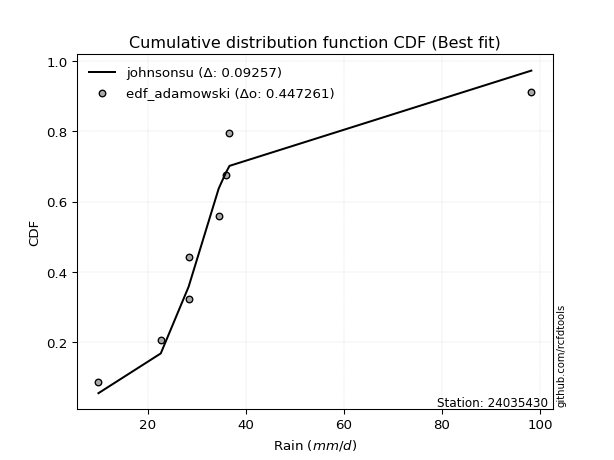</img>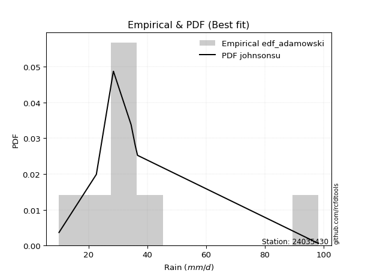</img>

</div>


## C. Best fit & Estimate extreme values for specific return periods - Tr


### 1. Best fit (ordered by delta Δ)

<div align="center">

|   id |   station | empirical_dist   | p_dist    |     delta |   deltao | eval   |   fit |   n |   best_fit |   best_fit_sort |
|-----:|----------:|:-----------------|:----------|----------:|---------:|:-------|------:|----:|-----------:|----------------:|
|    0 |  24035430 | edf_weibull      | johnsonsu | 0.0833498 | 0.447261 | Δo > Δ |     1 |   8 |          1 |               1 |
|    1 |  24035430 | edf_tukey        | logt      | 0.0914513 | 0.447261 | Δo > Δ |     1 |   8 |          1 |               2 |
|    2 |  24035430 | edf_filliben     | logt      | 0.0916784 | 0.447261 | Δo > Δ |     1 |   8 |          1 |               3 |
|    3 |  24035430 | edf_jenkinson    | logt      | 0.0917854 | 0.447261 | Δo > Δ |     1 |   8 |          1 |               4 |
|    4 |  24035430 | edf_beard        | logt      | 0.0917854 | 0.447261 | Δo > Δ |     1 |   8 |          1 |               5 |
|    5 |  24035430 | edf_chegodayev   | logt      | 0.0919275 | 0.447261 | Δo > Δ |     1 |   8 |          1 |               6 |
|    6 |  24035430 | edf_adamowski    | johnsonsu | 0.0925705 | 0.447261 | Δo > Δ |     1 |   8 |          1 |               7 |
|    7 |  24035430 | edf_blom         | logt      | 0.0943063 | 0.447261 | Δo > Δ |     1 |   8 |          1 |               8 |
|    8 |  24035430 | edf_cunnane      | logt      | 0.096154  | 0.447261 | Δo > Δ |     1 |   8 |          1 |               9 |
|    9 |  24035430 | edf_gringorten   | logt      | 0.0991578 | 0.447261 | Δo > Δ |     1 |   8 |          1 |              10 |
|   10 |  24035430 | edf_hazen        | t         | 0.0993531 | 0.447261 | Δo > Δ |     1 |   8 |          1 |              11 |
|   11 |  24035430 | edf_california   | t         | 0.135798  | 0.447261 | Δo > Δ |     1 |   8 |          1 |              12 |

</div>

:file_folder:Tables: [bestfit_24035430.csv](table/bestfit_24035430.csv) | [extreme_24035430.csv](table/extreme_24035430.csv)


### 2. Extreme values

In hydrology, a return period (or recurrence interval $Tr$) is the statistical average time between extreme events like floods or droughts of a specific magnitude, indicating how rare an event is, with a 100-year flood, for example, having a 1% chance of occurring in any given year, not that it happens exactly every century. It is a key tool for infrastructure design (like bridges or dams) and risk assessment, calculated from historical data to determine the probability of future events, although it is important to remember it is statistical average, and events can cluster or be missed.

> risk_rate: assuming the return period as the project useful life.

|   id |      tr |   prob_l |     prob_g |    alpha |   betaprime |     chi2 |   crystalball |   erlang |    expon |   exponnorm |        f |   fatiguelife |     fisk |    gamma |   genexpon |   genlogistic |   gibrat |   gompertz |   gumbel_l |   gumbel_r |   halflogistic |   halfnorm |   hypsecant |   invgamma |   invgauss |   invweibull |   johnsonsu |   kstwobign |   laplace |   laplace_asymmetric |   loggamma |   logistic |   lognorm |   maxwell |   mielke |    moyal |   nakagami |      ncf |      nct |     norm |          pareto |   pearson3 |   rayleigh |     rice |        t |   truncnorm |     wald |   weibull_min |   logalpha |   logbetaprime |     logchi2 |   logcrystalball |   logerlang |   logexpon |   logexponnorm |     logf |   logfatiguelife |   logfisk |   loggenexpon |   loggenlogistic |   loggibrat |   loggompertz |   loggumbel_l |   loggumbel_r |   loghalflogistic |   loghalfnorm |   loghypsecant |   loginvgamma |   loginvgauss |   loginvweibull |     logjohnsonsu |   logkstwobign |   loglaplace |   loglaplace_asymmetric |   logloggamma |   loglogistic |     loglognorm |   logmaxwell |   logmielke |   logmoyal |   lognakagami |   logncf |   lognct |     logpareto |   logpearson3 |   lograyleigh |   logrice |            logt |   logtruncnorm |   logwald |   logweibull_min |   station |   n |   risk_rate |
|-----:|--------:|---------:|-----------:|---------:|------------:|---------:|--------------:|---------:|---------:|------------:|---------:|--------------:|---------:|---------:|-----------:|--------------:|---------:|-----------:|-----------:|-----------:|---------------:|-----------:|------------:|-----------:|-----------:|-------------:|------------:|------------:|----------:|---------------------:|-----------:|-----------:|----------:|----------:|---------:|---------:|-----------:|---------:|---------:|---------:|----------------:|-----------:|-----------:|---------:|---------:|------------:|---------:|--------------:|-----------:|---------------:|------------:|-----------------:|------------:|-----------:|---------------:|---------:|-----------------:|----------:|--------------:|-----------------:|------------:|--------------:|--------------:|--------------:|------------------:|--------------:|---------------:|--------------:|--------------:|----------------:|-----------------:|---------------:|-------------:|------------------------:|--------------:|--------------:|---------------:|-------------:|------------:|-----------:|--------------:|---------:|---------:|--------------:|--------------:|--------------:|----------:|----------------:|---------------:|----------:|-----------------:|----------:|----:|------------:|
|    0 |    2    | 0.5      | 0.5        |  30.7037 |     30.775  |  13.5648 |       36.8625 |  12.9669 |  28.6197 |     32.3217 |  30.8341 |       31.2012 |  30.7827 |  24.4704 |    30.5704 |       32.5809 |  29.4851 |    29.7483 |    40.9002 |    32.8248 |        30.8174 |    31.8314 |     36.8625 |    30.8333 |    31.0815 |      30.8547 |     31.2015 |     34.6524 |   36.8625 |              33.2499 |    30.6786 |    36.8625 |   30.8486 |   34.7605 |  30.7797 |  31.5212 |    31.2055 |  30.8314 |  30.9718 |  36.8625 |    11.0846      |    30.1217 |    34.0149 |  36.6943 |  31.1204 |     36.8625 |  28.8954 |       25.7858 |    29.8978 |        30.2336 |     16.711  |          30.8486 |     30.6807 |    21.8329 |        30.4264 |  30.7028 |          30.708  |   30.7583 |       27.0051 |          30.7713 |     25.8437 |       30.3733 |       33.9871 |       27.9999 |           26.6838 |       27.3404 |        30.8486 |       30.1195 |       29.3518 |         27.8383 |     33.9017      |        27.3627 |      30.8486 |                 32.498  |       30.8951 |       30.8486 |  10.1453       |      29.3311 |     30.3872 |    27.1376 |       26.6397 |  30.1358 |  31.3655 |  10.5422      |       30.6585 |       28.8111 |   30.3986 |    31.5673      |        31.0541 |   25.4802 |          30.5993 |  24035430 |   8 |    0.75     |
|    1 |    2.33 | 0.570815 | 0.429185   |  33.7971 |     34.0584 |  15.5758 |       41.2484 |  14.6817 |  32.7221 |     35.4094 |  34.1215 |       34.8059 |  33.5855 |  28.0824 |    34.3379 |       35.7632 |  31.7068 |    33.9108 |    44.716  |    36.8888 |        34.9959 |    36.565  |     40.3725 |    34.1147 |    34.6387 |      34.0509 |     32.7534 |     38.3518 |   39.5167 |              35.9003 |    34.0897 |    40.7268 |   34.2722 |   39.3171 |  33.5469 |  35.3684 |    34.1014 |  34.1295 |  33.9897 |  41.2484 |    13.1651      |    34.0601 |    38.639  |  40.6014 |  32.5043 |     41.2484 |  31.7713 |       31.8029 |    33.2514 |        33.6937 |     19.8065 |          34.2722 |     34.0914 |    25.9315 |        33.7569 |  34.1145 |          34.1202 |   33.5638 |       30.7464 |          33.5384 |     27.2589 |       34.3957 |       37.246  |       30.868  |           29.4977 |       30.6292 |        33.5594 |       33.5106 |       32.7143 |         31.3762 |     34.7518      |        31.201  |      32.8772 |                 34.4792 |       34.3438 |       33.8459 |  11.2485       |      32.7202 |     33.0899 |    29.7621 |       29.0665 |  33.8025 |  34.8094 |  11.6665      |       34.0671 |       32.192  |   33.8656 |    33.0308      |        33.1322 |   27.3007 |          34.1845 |  24035430 |   8 |    0.729209 |
|    2 |    5    | 0.8      | 0.2        |  48.7584 |     49.8299 |  30.3914 |       57.5477 |  27.5016 |  53.2335 |     50.2763 |  49.9626 |       51.8432 |  47.0106 |  46.7871 |    52.1423 |       49.5861 |  44.4979 |    53.8065 |    57.0433 |    54.5449 |        53.9027 |    56.5826 |     54.4522 |    49.9164 |    51.5781 |      49.5248 |     42.0453 |     54.0661 |   52.7868 |              49.1516 |    50.5953 |    55.6474 |   50.6761 |   57.2518 |  46.5606 |  53.1887 |    48.5588 |  50.0049 |  48.5977 |  57.5477 |   664.096       |    52.8931 |    57.1512 |  56.2432 |  39.1753 |     57.5477 |  47.8706 |       71.8861 |    50.0887 |        51.024  |     52.1385 |          50.6761 |     50.5942 |    61.2905 |        50.0815 |  50.6002 |          50.6038 |   47.0823 |       51.9625 |          46.5484 |     37.0516 |       53.2574 |       50.0665 |       47.1531 |           46.4304 |       49.5164 |        47.0483 |       50.436  |       49.9787 |         52.7624 |     37.5826      |        54.4917 |      45.2052 |                 44.5247 |       50.7988 |       48.4172 |   5.58777e+125 |      50.3177 |     45.7882 |    45.6433 |       50.0201 |  52.6045 |  51.7742 |   7.13555e+14 |       50.5805 |       50.1963 |   50.812  |    40.9366      |        44.7171 |   40.175  |          51.3665 |  24035430 |   8 |    0.67232  |
|    3 |   10    | 0.9      | 0.1        |  63.3338 |     64.5527 |  48.2372 |       68.3602 |  43.0896 |  71.8532 |     63.6944 |  64.8328 |       66.7941 |  60.2118 |  64.2758 |    67.6894 |       60.8432 |  59.0783 |    70.6733 |    63.9066 |    68.9255 |        69.604  |    71.3951 |     65.6951 |    64.7383 |    66.6713 |      64.2782 |     55.0886 |     66.0305 |   64.8331 |              61.1808 |    65.9213 |    66.6359 |   65.6879 |   69.8734 |  59.0918 |  68.704  |    60.3738 |  64.8739 |  62.7937 |  68.3602 | 82479.4         |    69.3313 |    70.3508 |  67.3962 |  47.9438 |     68.3602 |  64.9557 |      120.623  |    66.621  |        67.9423 |    138.291  |          65.6878 |     65.9172 |   133.815  |        65.732  |  65.8785 |          65.8728 |   60.4981 |       75.779  |          59.0758 |     52.5718 |       69.1737 |       59.0299 |       66.5849 |           67.6729 |       70.6509 |        61.6186 |       66.8919 |       67.4527 |         80.5701 |     42.0928      |        83.3116 |      60.357  |                 56.1568 |       65.7578 |       63.0253 | inf            |      68.1168 |     58.2822 |    66.232  |       82.7197 |  71.5412 |  68.6874 | inf           |       65.9418 |       68.9017 |   66.6848 |    53.6589      |        56.4883 |   60.5356 |          66.8563 |  24035430 |   8 |    0.651322 |
|    4 |   15    | 0.933333 | 0.0666667  |  72.8505 |     73.662  |  59.8557 |       73.7559 |  53.2712 |  82.745  |     71.5433 |  74.0728 |       75.4758 |  68.9011 |  74.633  |    76.6888 |       67.194  |  69.1352 |    80.0699 |    67.0148 |    77.0389 |        78.4895 |    79.1035 |     72.1114 |    73.9437 |    75.5398 |      73.5729 |     65.6256 |     72.3822 |   71.8797 |              68.2174 |    75.2866 |    72.6229 |   74.768  |   76.3493 |  67.2441 |  77.7084 |    66.6631 |  74.0964 |  71.949  |  73.7559 |     1.39667e+06 |    78.7852 |    77.1518 |  73.1427 |  55.6583 |     73.7559 |  75.9271 |      153.909  |    77.1384 |        78.6482 |    250.77   |          74.7679 |     75.2805 |   211.287  |        75.6126 |  75.2024 |          75.1876 |   69.3896 |       92.1003 |          67.2274 |     66.9203 |       78.1164 |       63.601  |       80.8964 |           83.7538 |       85.0063 |        71.8751 |       77.281  |       78.7937 |        102.306  |     47.1778      |       104.373  |      71.4766 |                 64.3232 |       74.7622 |       72.7626 | inf            |      79.5688 |     66.6677 |    82.2066 |      108.942  |  83.7709 |  79.8479 | inf           |       75.3406 |       81.1159 |   76.4174 |    67.6067      |        63.4979 |   78.768  |          76.0691 |  24035430 |   8 |    0.644736 |
|    5 |   20    | 0.95     | 0.05       |  80.2158 |     80.4107 |  68.4829 |       77.2894 |  60.8413 |  90.4729 |     77.1122 |  80.9365 |       81.6266 |  75.6281 |  82.0225 |    83.0537 |       71.6406 |  77.0241 |    86.5429 |    68.9495 |    82.7197 |        84.715  |    84.2428 |     76.6378 |    80.7801 |    81.8678 |      80.5379 |     74.7007 |     76.6609 |   76.8794 |              73.2099 |    82.153  |    76.7609 |   81.3841 |   80.6471 |  73.5147 |  84.0855 |    70.8817 |  80.9395 |  78.9312 |  77.2894 |     1.03977e+07 |    85.4407 |    81.6723 |  76.9622 |  62.9109 |     77.2894 |  84.1029 |      179.51   |    85.0452 |        86.667  |    385.584  |          81.3841 |     82.1455 |   292.158  |        83.0366 |  82.0332 |          82.0102 |   76.3043 |      104.87   |          73.4988 |     80.8667 |       84.3281 |       66.6233 |       92.711  |           97.2469 |       96.1635 |        80.1216 |       85.0528 |       87.4211 |        120.928  |     52.8159      |       121.485  |      80.5874 |                 70.8279 |       81.3035 |       80.3587 | inf            |      88.213  |     73.282  |    95.7998 |      131.216  |  93.0422 |  88.509  | inf           |       82.2371 |       90.4098 |   83.563  |    83.6798      |        68.3243 |   95.8419 |          82.7034 |  24035430 |   8 |    0.641514 |
|    6 |   25    | 0.96     | 0.04       |  86.3515 |     85.828  |  75.3567 |       79.8905 |  66.8773 |  96.4671 |     81.4318 |  86.4572 |       86.3961 |  81.2137 |  87.7737 |    87.9834 |       75.0657 |  83.6007 |    91.4585 |    70.3262 |    87.0954 |        89.5114 |    88.0666 |     80.1409 |    86.2775 |    86.7996 |      86.1751 |     82.7779 |     79.8658 |   80.7574 |              77.0825 |    87.6175 |    79.9265 |   86.6257 |   83.8379 |  78.698  |  89.0284 |    74.0282 |  86.4388 |  84.6625 |  79.8905 |     4.93395e+07 |    90.5784 |    85.0309 |  79.8    |  69.8726 |     79.8905 |  90.6515 |      200.457  |    91.4542 |        93.1482 |    540.359  |          86.6257 |     87.6087 |   375.653  |        89.0639 |  87.4663 |          87.4358 |   82.0654 |      115.503  |          78.6836 |     94.6904 |       89.0787 |       68.8611 |      102.975  |          109.108  |      105.405  |        87.1478 |       91.3289 |       94.4732 |        137.552  |     59.0071      |       136.117  |      88.4467 |                 76.323  |       86.4743 |       86.7007 | inf            |      95.2323 |     78.8645 |   107.864  |      150.809  | 100.6    |  95.7219 | inf           |       87.7285 |       97.9979 |   89.2538 |   102.418       |        71.9016 |  112.151  |          87.9124 |  24035430 |   8 |    0.639603 |
|    7 |   50    | 0.98     | 0.02       | 108.416  |    103.803  |  97.5255 |       87.3391 |  86.3636 | 115.087  |     94.8497 | 104.84   |      101.22   | 100.963  | 105.726  |   103.273  |       85.6165 | 106.783  |   106.178  |    74.0635 |   100.575  |       104.29   |    99.181  |     91.0018 |   104.577  |   102.26   |     105.151  |    114.67   |     89.277  |   92.8037 |              89.1116 |   105.433  |    89.5984 |  103.579  |   93.0916 |  96.8831 | 104.373  |    83.1908 | 104.723  | 104.502  |  87.3391 |     6.22071e+09 |   106.425  |    94.7803 |  88.0378 | 102.234  |     87.3391 | 112.033  |      271.311  |   113.051  |       114.869  |   1567.93   |         103.579  |    105.42   |   820.16   |       109.53   | 105.162  |         105.102  |  102.571  |      152.934  |          96.8802 |    165.157  |      103.507  |       75.3219 |      142.301  |          155.544  |      137.622  |       113.095  |      112.333  |      118.589  |        204.549  |     99.3521      |       190.082  |     118.092  |                 96.2625 |      103.133  |      109.349  | inf            |     118.911  |     99.3227 |   155.88   |      226.372  | 126.314  | 121.468  | inf           |      105.65   |      123.828  |  107.822  |   256.123       |        81.5766 |  187.34   |         104.481  |  24035430 |   8 |    0.63583  |
|    8 |   75    | 0.986667 | 0.0133333  | 124.07   |    115.217  | 110.953  |       91.3358 |  98.1771 | 125.979  |    102.699  | 116.563  |      109.906  | 114.486  | 116.278  |   112.208  |       91.749  | 122.441  |   114.428  |    75.9533 |   108.41   |       112.881  |   105.231  |     97.3489 |   116.243  |   111.405  |     117.397  |    138.978  |     94.4549 |   99.8503 |              96.1482 |   116.49   |    95.1845 |  114.005  |   98.1226 | 109.228  | 113.346  |    88.1797 | 116.362  | 117.76   |  91.3358 |     1.05351e+11 |   115.631  |   100.084  |  92.5194 | 132.285  |     91.3358 | 125.19   |      316.632  |   126.986  |       128.789  |   2952.12   |         114.005  |    116.475  |  1294.99   |       122.93   | 116.133  |         116.051  |  116.724  |      178.208  |         109.238  |    240.475  |      111.745  |       78.8164 |      171.734  |          191.148  |      159.126  |       131.701  |      125.774  |      134.408  |        257.609  |    159.732       |       228.42   |     139.848  |                110.261  |      113.331  |      125.035  | inf            |     134.169  |    114.016  |   193.333  |      282.442  | 143.076  | 139.396  | inf           |      116.786  |      140.636  |  119.353  |   587.045       |        85.9909 |  256.892  |         114.466  |  24035430 |   8 |    0.634587 |
|    9 |  100    | 0.99     | 0.01       | 136.803  |    123.763  | 120.646  |       94.039  | 106.708  | 133.706  |    108.268  | 125.363  |      116.076  | 125.11   | 123.783  |   118.546  |       96.0893 | 134.57   |   120.132  |    77.1895 |   113.955  |       118.961  |   109.353  |    101.851  |   124.997  |   117.937  |     126.654  |    159.22   |     98.0026 |  104.85   |             101.141  |   124.64   |    99.1284 |  121.645  |  101.549  | 118.875  | 119.713  |    91.5763 | 125.089  | 128.021  |  94.039  |     7.84305e+11 |   122.139  |   103.698  |  95.5727 | 160.964  |     94.039  | 134.783  |      350.449  |   137.51   |       139.255  |   4641.22   |         121.645  |    124.623  |  1790.65   |       133.182  | 124.214  |         124.113  |  127.902  |      197.796  |         118.898  |    321.716  |      117.511  |       81.1893 |      196.176  |          221.172  |      175.669  |       146.726  |      135.872  |      146.475  |        303.287  |    248.113       |       259.063  |     157.674  |                121.411  |      120.782  |      137.446  | inf            |     145.668  |    125.965  |   225.242  |      328.349  | 155.812  | 153.692  | inf           |      125      |      153.375  |  127.851  |  1278.9         |        88.5409 |  323.387  |         121.69   |  24035430 |   8 |    0.633968 |
|   10 |  200    | 0.995    | 0.005      | 175.013  |    146.033  | 144.468  |      100.171  | 127.685  | 152.326  |    121.685  | 148.379  |      130.971  | 154.784  | 141.917  |   133.813  |      106.524  | 167.57   |   133.397  |    79.8764 |   127.286  |       133.579  |   118.78   |    112.698  |   147.888  |   133.823  |     151.094  |    220.046  |    106.174  |  116.896  |             113.17   |   145.375  |   108.589  |  140.927  |  109.39   | 145.617  | 135.051  |    99.3343 | 147.878  | 156.087  | 100.171  |     9.88849e+13 |   137.753  |   111.966  | 102.559  | 267.839  |    100.171  | 158.677  |      437.371  |   165.24   |       166.647  |  13944.2    |         140.927  |    145.352  |  3909.51   |       160.83   | 144.753  |         144.599  |  159.384  |      251.156  |         145.687  |    710.177  |      131.163  |       86.5964 |      270.131  |          314.089  |      220.26   |       190.346  |      162.27   |      178.716  |        449.041  |   1156.22        |       346.2    |     210.523  |                153.13   |      139.511  |      172.475  | inf            |     175.82   |    161.275  |   325.459  |      462.99   | 189.635  | 194.776  | inf           |      145.919  |      187.033  |  149.465  | 21689.2         |        92.9273 |  573.777  |         139.586  |  24035430 |   8 |    0.633042 |
|   11 |  250    | 0.996    | 0.004      | 190.298  |    153.749  | 152.258  |      102.044  | 134.546  | 158.32   |    126.005  | 156.381  |      135.776  | 165.729  | 147.768  |   138.727  |      109.878  | 179.41   |   137.531  |    80.6669 |   131.572  |       138.278  |   121.68   |    116.189  |   155.843  |   138.98   |     159.658  |    243.791  |    108.703  |  120.774  |             117.042  |   152.395  |   111.626  |  147.409  |  111.803  | 155.415  | 139.989  |   101.717  | 155.79   | 166.252  | 102.044  |     4.69231e+14 |   142.762  |   114.511  | 104.709  | 318.293  |    102.044  | 166.582  |      466.942  |   174.935  |       176.163  |  19921.2    |         147.408  |    152.372  |  5026.8    |       170.736  | 151.702  |         151.528  |  171.085  |      270.334  |         155.506  |    943.533  |      135.492  |       88.2548 |      299.391  |          351.578  |      236.133  |       206.981  |      171.433  |      190.127  |        509.422  |   2281.94        |       378.701  |     231.054  |                165.011  |      145.784  |      185.515  | inf            |     186.303  |    175.028  |   366.399  |      514.47   | 201.54   | 210.401  | inf           |      153.009  |      198.812  |  156.78   | 80338.6         |        93.9017 |  693.626  |         145.499  |  24035430 |   8 |    0.632858 |
|   12 |  500    | 0.998    | 0.002      | 251.594  |    179.597  | 176.762  |      107.601  | 156.137  | 176.94   |    139.423  | 183.28   |      150.728  | 204.84   | 165.979  |   153.991  |      120.29   | 220.33   |   149.983  |    82.9331 |   144.874  |       152.865  |   130.326  |    127.035  |   182.579  |   155.121  |     188.667  |    333.032  |    116.281  |  132.821  |             129.072  |   175.34   |   121.046  |  168.435  |  119.005  | 190.185  | 155.327  |   108.811  | 182.345  | 201.92   | 107.601  |     5.91605e+16 |   158.276  |   122.105  | 111.126  | 554.398  |    107.601  | 191.718  |      563.548  |   207.67   |       208.079  |  60735.3    |         168.435  |    175.31   | 10975      |       205.174  | 174.392  |         174.145  |  213.255  |      336.761  |         190.365  |   2518.78   |      148.756  |       93.1871 |      411.97   |          498.901  |      290.581  |       268.508  |      202.138  |      229.13   |        753.598  |  41565.8         |       495.542  |     308.498  |                208.12   |      166.055  |      232.566  | inf            |     221.448  |    227.437  |   529.415  |      703.855  | 241.997  | 268.517  | inf           |      176.201  |      238.551  |  180.667  |     3.2003e+07  |        95.9654 | 1267.88   |         164.355  |  24035430 |   8 |    0.632489 |
|   13 |  750    | 0.998667 | 0.00133333 | 301.286  |    196.149  | 191.283  |      110.688  | 168.936  | 187.832  |    147.272  | 200.574  |      159.494  | 231.83   | 176.653  |   162.92   |      126.377  | 247.391  |   157.007  |    84.1443 |   152.65   |       161.392  |   135.157  |    133.379  |   199.763  |   164.645  |     207.474  |    397.774  |    120.538  |  139.867  |             136.108  |   189.593  |   126.549  |  181.385  |  123.033  | 213.989  | 164.299  |   112.766  | 199.389  | 226.034  | 110.688  |     1.00191e+18 |   167.323  |   126.352  | 114.714  | 774.389  |    110.688  | 206.788  |      623.298  |   228.804  |       228.519  | 117059      |         181.385  |    189.56   | 17328.9    |       228.25   | 188.473  |         188.176  |  242.656  |      380.825  |         214.241  |   4821.77   |      156.396  |       95.9352 |      496.485  |          612.167  |      326.293  |       312.66   |      221.783  |      254.662  |        947.452  | 464711           |       576.35   |     365.333  |                238.385  |      178.486  |      265.398  | inf            |     243.921  |    266.613  |   656.595  |      838.033  | 268.302  | 310.826  | inf           |      190.624  |      264.141  |  195.489  |     7.38266e+09 |        96.6903 | 1820.27   |         175.733  |  24035430 |   8 |    0.632366 |
|   14 | 1000    | 0.999    | 0.001      | 345.606  |    208.59   | 201.659  |      112.814  | 178.081  | 195.56   |    152.841  | 213.605  |      165.722  | 253.099  | 184.235  |   169.255  |      130.695  | 268.1    |   161.882  |    84.9595 |   158.166  |       167.44   |   138.493  |    137.88   |   212.708  |   171.437  |     221.716  |    450.202  |    123.488  |  144.867  |             141.101  |   200.095  |   130.452  |  190.876  |  125.817  | 232.651  | 170.664  |   115.494  | 212.219  | 244.798  | 112.814  |     7.45894e+18 |   173.731  |   129.286  | 117.193  | 984.533  |    112.814  | 217.629  |      667.102  |   244.762  |       243.87   | 186757      |         190.876  |    200.06   | 23961.6    |       246.119  | 198.842  |         198.506  |  265.983  |      414.617  |         232.966  |   7925.37   |      161.768  |       97.8302 |      566.75   |          707.779  |      353.487  |       348.323  |      236.529  |      274.106  |       1114.5    |      3.89709e+06 |       639.938  |     411.9    |                262.492  |      187.57   |      291.454  | inf            |     260.772  |    299.237  |   764.958  |      945.104  | 288.246  | 345.498  | inf           |      201.258  |      283.412  |  206.401  |     1.22837e+12 |        97.0602 | 2361.1    |         183.965  |  24035430 |   8 |    0.632305 |

<div align="center">

</img>

</div>


<div align="center">

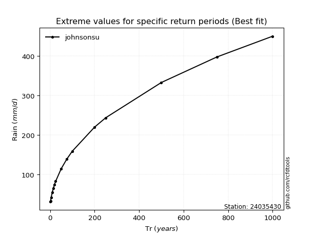</img>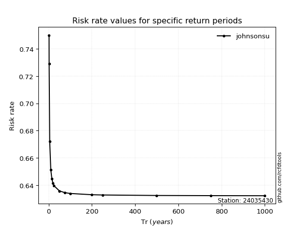</img>

</div>


<sub>**APP DISCLAIMER**: NO WARRANTY - This software is provided by [github.com/rcfdtools](https://github.com/rcfdtools) "as is", without any express or implied warranty, including warranties of merchantability, fitness for a particular purpose, or non-infringement. There is no guarantee that the software will be error-free or operate without interruption. LIMITATION OF LIABILITY - Neither the authors nor copyright holders will be liable for claims or damages arising from the software or its use. You are responsible for determining if the software is appropriate for your use and assume all associated risks, including errors, legal compliance, and data loss. NO PROFESSIONAL ADVICE - The software provides general information and does not offer professional advice. It should not replace consultation with professional advisors.</sub>