<div align="center">


</div>

# PMP Station (Rain, Pmax24h): 24035507

Probable Maximum Precipitation (PMP) is the greatest amount of rainfall for a specific duration that is meteorologically possible for a given location, acting as a "worst-case" scenario for extreme storms, crucial for designing safety-critical infrastructure like bridges, river deviations, dams, spillways, and nuclear plants to prevent catastrophic failure. PMP is calculated by hydrologists using meteorological data to determine the upper limit of extreme rainfall, often leading to the Probable Maximum Flood (PMF) for flood control design, and is increasingly being studied for climate change impacts. Probable Maximum Precipitation (PMP) is the theoretical upper limit of rainfall, a deterministic estimate for extreme events, while probability distributions (like GEV, Gumbel) describe the likelihood and frequency of various precipitation amounts, including rare ones, showing how often events occur, with PMP representing the extreme end of these distributions, used for critical infrastructure design to ensure safety against the worst conceivable weather, unlike standard statistical forecasts which cover typical probabilities.

The most common probability distributions in hydrology, used for analyzing floods, rainfall, and streamflow, include the Normal, Log-Normal, Gumbel, Gamma (including Log-Pearson Type III), and Generalized Extreme Value (GEV) distributions, often chosen based on the data´s skewness and whether modeling extremes or general conditions, with Gumbel and GEV popular for extreme events like floods, while the Normal distribution serves as a baseline, though often requiring transformations for skewed hydrological data. These distributions help in designing water infrastructure, managing water resources, and forecasting hydrologic events.

> Hydrological data often isn´t perfectly normal (it´s skewed), so different distributions are needed for different applications, such as: **Flood Frequency Analysis**: Using Gumbel, GEV, or Log-Pearson Type III for predicting extreme flood magnitudes and their return periods, **Rainfall Analysis**: Normal for annual totals, but Log-Normal, Weibull, or GEV for intensity or extreme daily rainfall, **Streamflow Modeling**: Gamma and Log-Normal for maximum flows, GEV for minimum flows, and Kappa for daily flows.

<div align="center">

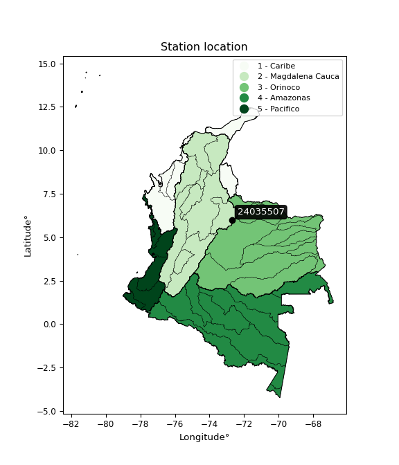</img>

</div>


## A. General information


### 1. General running parameters

• app_version: _v20260103_. • runtime: _2026-01-05 16:20:51.132608_. • Python version: _3.14.0_. • SciPy version: _1.16.3_. • Pandas version: _2.3.3_. • NumPy version: _2.3.5_. • Stations dataset (station_dataset_file): _dataset/pmax24h_in/automatic_colombia_2003_2024.csv_. • Stations catalog (station_catalog_file): _dataset/CNE.xls_. • Minimum year to eval til year_max (date_min): _1900_. • Maximum year to eval since year_min (date_max): _2024_. • Creates, save and include plots into reports (create_plot): _True_. • Plot only fit distributions with Δo > Δ (plot_only_fit): _True_. • Plot only simple graphs avoiding multiple CDFs and multiple Extreme values plots (plot_only_simple): _True_. • Eval low extreme values, if False, evaluates high extreme values (low_extreme): _False_. • Eval every SciPy distribution as logarithmic (pdist_logarithmic_on): _True_. • Standard deviation normalized (ddof): _1.0_. • Return periods to eval in years (Tr): _[2, 2.33, 5, 10, 15, 20, 25, 50, 75, 100, 200, 250, 500, 750, 1000]_. • Minimum data sample per station, 0 means any (minimum_sample): _5_. • Z-Score maximum threshold to adjust a value, 0 means disable (zscore_max): _3.5_. • Z-Score minimum threshold to adjust a value, 0 means disable (zscore_min): _-2.5_. • Avoid zeros, e.g. rain = 0 (avoid_zeros): _True_. • Avoid null values (avoid_nans): _True_. 

[:file_folder:Dataset file](../../dataset/pmax24h_in/automatic_colombia_2003_2024.csv)

> Delta Degrees of Freedom (DDOF): is a parameter used in the formulas for calculating variance and standard deviation. When ddof=0, the divisor is $N$ (the total number of observations) and this is used when your data set is the entire population. When ddof=1, the divisor is $N-1$ and this is used when your data set is a sample drawn from a larger population. Using $N-1$ provides an unbiased estimate of the population variance (known as Bessel´s correction).


### 2. Station info and location

|   id |   CODIGO | NOMBRE                   | CATEGORIA     | TECNOLOGIA                | ESTADO   |   FECHA_INSTALACION |   FECHA_SUSPENSION |   ALTITUD |   LATITUD |   LONGITUD | DEPARTAMENTO   | MUNICIPIO   | AREA_OPERATIVA                              | ENTIDAD            | AREA_HIDROGRAFICA   | ZONA_HIDROGRAFICA   | SUBZONA_HIDROGRAFICA   |   CORRIENTE | Catalogo   |   Version |
|-----:|---------:|:-------------------------|:--------------|:--------------------------|:---------|--------------------:|-------------------:|----------:|----------:|-----------:|:---------------|:------------|:--------------------------------------------|:-------------------|:--------------------|:--------------------|:-----------------------|------------:|:-----------|----------:|
|    0 | 24035507 | SOCHA  - AUT  [24035507] | Pluviométrica | Automática con Telemetría | Activa   |                 nan |                nan |      2505 |   5.98244 |   -72.7104 | Boyacá         | Socha       | Area Operativa 06 - Boyacá-Casanare-Vichada | ISAGEN  S.A. E.S.P | Magdalena Cauca     | Sogamoso            | Río Chicamocha         |         nan | CNE_OE     |  20251226 |

<div align="center">

Dynamic map: [:earth_americas:Google](http://maps.google.com/maps?q=5.982444444,-72.71044444) [:earth_americas:OSM](https://www.openstreetmap.org/#map=18/5.982444444/-72.71044444&layers=P) [:earth_americas:Bing](https://www.bing.com/maps?cp=5.982444444~-72.71044444&lvl=18) [:earth_americas:Apple](https://maps.apple.com/frame?center=5.982444444%2C-72.71044444&span=0.003%2C0.006)

</div>


<div align="center">

```geojson
{
  "type": "Feature",
  "geometry": {
    "type": "Point", 
    "coordinates": [-72.71044444, 5.982444444]
  }, 
  "properties": {
    "Name": "24035507"
  }
}
```

</div>


### 3. Discrete values table and plot

<div align="center">

|               |           0 |            1 |           2 |          3 |           4 |         5 |
|:--------------|------------:|-------------:|------------:|-----------:|------------:|----------:|
| Date          | 2017        | 2018         | 2019        | 2020       | 2021        | 2024      |
| Value         |   28.7      |   34.1       |   19.3      |   40.5     |   14.1      |   73.8    |
| Value_initial |   28.7      |   34.1       |   19.3      |   40.5     |   14.1      |   73.8    |
| count         |    6        |    6         |    6        |    6       |    6        |    6      |
| mean          |   35.0833   |   35.0833    |   35.0833   |   35.0833  |   35.0833   |   35.0833 |
| std           |   21.2577   |   21.2577    |   21.2577   |   21.2577  |   21.2577   |   21.2577 |
| zscore        |   -0.300283 |   -0.0462578 |   -0.742476 |    0.25481 |   -0.987093 |    1.8213 |


</div>


<div align="center">

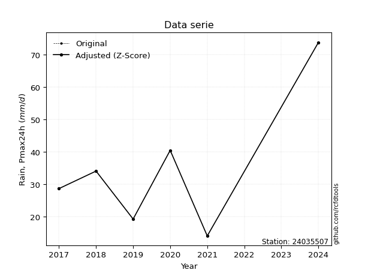</img>

</div>


> The initial value (value_initial) correspond to the initial obtained or null completed value, and value (value) is adjusted only when the initial value is outside the valid range (outlier) definite through the Z-Score value. If Z-Score is active, values out of range or outliers are replaced with the station mean value. A Z-Score (or standard score) measures how many standard deviations a data point is from the mean of a dataset, indicating its relative position; positive scores mean above the mean, negative mean below, and a score of zero is exactly at the mean, allowing for comparison of values from different distributions. It´s calculated using the formula $z=(x–μ)/σ$, where $x$ is the data point, $μ$ is the mean, and $σ$ is the standard deviation, helping identify outliers and understand probability.
>
> <sub>**Note**: In this study, "completing" (filling gaps in) and "extending" (forecasting or lengthening the historical record) rainfall data series are avoided for certain critical analyses because they introduce artificial bias and uncertainty, which can distort the statistics of rare events (extremes), alter day-to-day variability, and compromise the integrity and homogeneity of the original data. Some reasons against Completing/Extending rainfall data are: **Distortion of Extremes and Variability**: The primary issue is that most gap-filling or extension methods rely on averaging or regression with nearby stations, which inherently smooths the data. Rainfall is highly variable in space and time, with a large percentage of zero values and occasional large storms. Infilling methods often underestimate the highest values and overestimate the lowest (zero) values, which severely distorts analyses focused on flood frequency, drought severity, and intensity-duration-frequency (IDF) curves, **Loss of Data Homogeneity**: Infilled or extended data are synthetic estimates, not actual measurements. Combining these estimates with observed data can violate the assumption of data homogeneity, which requires that the data properties do not change over time. Inhomogeneity can lead to incorrect conclusions about long-term trends or changes in climate patterns, **Propagation of Errors**: Errors and biases from the original data (e.g., wind-induced undercatch, instrument errors, site changes) or the data used for imputation can propagate through the analysis, leading to unreliable hydrological models and inaccurate predictions, **Compromised Statistical Integrity**: For statistical analyses, especially those involving the frequency of events, using artificial data can introduce time bias or autocorrelation that doesn´t exist in reality, making it difficult to assess the true probability of events, **Difficulty in Validation**: It is difficult to accurately validate the quality of filled or extended data, especially for past periods where ground-truth measurements are unavailable. The reliability of imputation techniques heavily depends on the density of the surrounding station network and the complexity of the local topography.</sub>


### 4. Active continuous probability distributions from SciPy (44 of 104 available)

A Probability Density Function (PDF) describes the relative likelihood of a continuous random variable falling within a specific range, where the total area under its curve equals 1, and the area over any interval gives the actual probability for that range. Unlike discrete probabilities (like rolling a die), a PDF shows density, not direct probability for a single point (which is zero), with higher points indicating higher likelihood, often visualized as a bell curve for normal distributions.

A log of a probability density function (log-PDF) is simply the logarithm of the PDF´s value, denoted as $log(f(x))$, useful for converting multiplication of probabilities into addition, improving numerical stability with tiny numbers, and connecting to information theory concepts like entropy. Instead of dealing with very small probabilities (e.g., 0.000001), log-PDFs use negative numbers (e.g., $log(0.00001) ≈ -11.51$ that are easier for computers to handle, preventing underflow errors and simplifying complex calculations. In this study, each active probability distribution from SciPy is also evaluated in the $log$ form.

[scipy.stats](https://docs.scipy.org/doc/scipy/reference/stats.html) is a Python´s powerful submodule within the SciPy library for comprehensive statistical analysis, offering over 130 probability distributions (like Normal, Poisson), functions for descriptive stats (mean, variance), hypothesis testing (t-tests, chi-square), random variable generation, and statistical tests, making it essential for data science, modeling, and research. It provides tools to explore, model, and draw conclusions from data efficiently, working seamlessly with NumPy.

<div align="center">

|   id | p_dist             |   n_parameter | fit_method   | label                                                                       | active   | ref                                                                                                        |
|-----:|:-------------------|--------------:|:-------------|:----------------------------------------------------------------------------|:---------|:-----------------------------------------------------------------------------------------------------------|
|    0 | alpha              |             3 | MLE          | Alpha                                                                       | True     | [:mortar_board:](https://docs.scipy.org/doc/scipy/reference/generated/scipy.stats.alpha.html)              |
|    1 | betaprime          |             4 | MLE          | Beta prime                                                                  | True     | [:mortar_board:](https://docs.scipy.org/doc/scipy/reference/generated/scipy.stats.betaprime.html)          |
|    2 | chi2               |             3 | MLE          | Chi²                                                                        | True     | [:mortar_board:](https://docs.scipy.org/doc/scipy/reference/generated/scipy.stats.chi2.html)               |
|    3 | crystalball        |             4 | MLE          | Crystalball                                                                 | True     | [:mortar_board:](https://docs.scipy.org/doc/scipy/reference/generated/scipy.stats.crystalball.html)        |
|    4 | erlang             |             3 | MLE          | Erlang                                                                      | True     | [:mortar_board:](https://docs.scipy.org/doc/scipy/reference/generated/scipy.stats.erlang.html)             |
|    5 | expon              |             2 | MLE          | Exponential                                                                 | True     | [:mortar_board:](https://docs.scipy.org/doc/scipy/reference/generated/scipy.stats.expon.html)              |
|    6 | exponnorm          |             3 | MLE          | Exponentially modified Normal                                               | True     | [:mortar_board:](https://docs.scipy.org/doc/scipy/reference/generated/scipy.stats.exponnorm.html)          |
|    7 | f                  |             4 | MLE          | F                                                                           | True     | [:mortar_board:](https://docs.scipy.org/doc/scipy/reference/generated/scipy.stats.f.html)                  |
|    8 | fatiguelife        |             3 | MLE          | Fatigue-life (Birnbaum-Saunders)                                            | True     | [:mortar_board:](https://docs.scipy.org/doc/scipy/reference/generated/scipy.stats.fatiguelife.html)        |
|    9 | fisk               |             3 | MLE          | Fisk                                                                        | True     | [:mortar_board:](https://docs.scipy.org/doc/scipy/reference/generated/scipy.stats.fisk.html)               |
|   10 | gamma              |             3 | MLE          | Gamma                                                                       | True     | [:mortar_board:](https://docs.scipy.org/doc/scipy/reference/generated/scipy.stats.gamma.html)              |
|   11 | genexpon           |             5 | MLE          | Generalized exponential                                                     | True     | [:mortar_board:](https://docs.scipy.org/doc/scipy/reference/generated/scipy.stats.genexpon.html)           |
|   12 | genlogistic        |             3 | MLE          | Generalized logistic                                                        | True     | [:mortar_board:](https://docs.scipy.org/doc/scipy/reference/generated/scipy.stats.genlogistic.html)        |
|   13 | gibrat             |             2 | MM           | Gibrat                                                                      | True     | [:mortar_board:](https://docs.scipy.org/doc/scipy/reference/generated/scipy.stats.gibrat.html)             |
|   14 | gompertz           |             3 | MLE          | Gompertz (or truncated Gumbel)                                              | True     | [:mortar_board:](https://docs.scipy.org/doc/scipy/reference/generated/scipy.stats.gompertz.html)           |
|   15 | gumbel_l           |             2 | MM           | Gumbel Left Skew                                                            | True     | [:mortar_board:](https://docs.scipy.org/doc/scipy/reference/generated/scipy.stats.gumbel_l.html)           |
|   16 | gumbel_r           |             2 | MM           | Gumbel Right Skew                                                           | True     | [:mortar_board:](https://docs.scipy.org/doc/scipy/reference/generated/scipy.stats.gumbel_r.html)           |
|   17 | halflogistic       |             2 | MM           | Half-logistic                                                               | True     | [:mortar_board:](https://docs.scipy.org/doc/scipy/reference/generated/scipy.stats.halflogistic.html)       |
|   18 | halfnorm           |             2 | MM           | Half Normal                                                                 | True     | [:mortar_board:](https://docs.scipy.org/doc/scipy/reference/generated/scipy.stats.halfnorm.html)           |
|   19 | hypsecant          |             2 | MM           | hyperbolic secant                                                           | True     | [:mortar_board:](https://docs.scipy.org/doc/scipy/reference/generated/scipy.stats.hypsecant.html)          |
|   20 | invgamma           |             3 | MLE          | Inverted gamma                                                              | True     | [:mortar_board:](https://docs.scipy.org/doc/scipy/reference/generated/scipy.stats.invgamma.html)           |
|   21 | invgauss           |             3 | MLE          | Inverse Gaussian                                                            | True     | [:mortar_board:](https://docs.scipy.org/doc/scipy/reference/generated/scipy.stats.invgauss.html)           |
|   22 | invweibull         |             3 | MLE          | Inverted Weibull                                                            | True     | [:mortar_board:](https://docs.scipy.org/doc/scipy/reference/generated/scipy.stats.invweibull.html)         |
|   23 | johnsonsu          |             4 | MLE          | Johnson Su                                                                  | True     | [:mortar_board:](https://docs.scipy.org/doc/scipy/reference/generated/scipy.stats.johnsonsu.html)          |
|   24 | kstwobign          |             2 | MLE          | Limiting distribution of scaled Kolmogorov-Smirnov two-sided test statistic | True     | [:mortar_board:](https://docs.scipy.org/doc/scipy/reference/generated/scipy.stats.kstwobign.html)          |
|   25 | laplace            |             2 | MM           | Laplace                                                                     | True     | [:mortar_board:](https://docs.scipy.org/doc/scipy/reference/generated/scipy.stats.laplace.html)            |
|   26 | laplace_asymmetric |             3 | MLE          | Asymmetric Laplace                                                          | True     | [:mortar_board:](https://docs.scipy.org/doc/scipy/reference/generated/scipy.stats.laplace_asymmetric.html) |
|   27 | loggamma           |             3 | MLE          | Log gamma                                                                   | True     | [:mortar_board:](https://docs.scipy.org/doc/scipy/reference/generated/scipy.stats.loggamma.html)           |
|   28 | logistic           |             2 | MM           | Logistic (or Sech-squared)                                                  | True     | [:mortar_board:](https://docs.scipy.org/doc/scipy/reference/generated/scipy.stats.logistic.html)           |
|   29 | lognorm            |             3 | MLE          | Log Normal                                                                  | True     | [:mortar_board:](https://docs.scipy.org/doc/scipy/reference/generated/scipy.stats.lognorm.html)            |
|   30 | maxwell            |             2 | MM           | Maxwell                                                                     | True     | [:mortar_board:](https://docs.scipy.org/doc/scipy/reference/generated/scipy.stats.maxwell.html)            |
|   31 | mielke             |             4 | MLE          | Mielke Beta-Kappa / Dagum                                                   | True     | [:mortar_board:](https://docs.scipy.org/doc/scipy/reference/generated/scipy.stats.mielke.html)             |
|   32 | moyal              |             2 | MM           | Moyal                                                                       | True     | [:mortar_board:](https://docs.scipy.org/doc/scipy/reference/generated/scipy.stats.moyal.html)              |
|   33 | nakagami           |             3 | MLE          | Nakagami                                                                    | True     | [:mortar_board:](https://docs.scipy.org/doc/scipy/reference/generated/scipy.stats.nakagami.html)           |
|   34 | ncf                |             5 | MLE          | Non-central F distribution                                                  | True     | [:mortar_board:](https://docs.scipy.org/doc/scipy/reference/generated/scipy.stats.ncf.html)                |
|   35 | nct                |             4 | MLE          | Non-central Student’s t                                                     | True     | [:mortar_board:](https://docs.scipy.org/doc/scipy/reference/generated/scipy.stats.nct.html)                |
|   36 | norm               |             2 | MM           | Normal                                                                      | True     | [:mortar_board:](https://docs.scipy.org/doc/scipy/reference/generated/scipy.stats.norm.html)               |
|   37 | pearson3           |             3 | MM           | Pearson type III                                                            | True     | [:mortar_board:](https://docs.scipy.org/doc/scipy/reference/generated/scipy.stats.pearson3.html)           |
|   38 | rayleigh           |             2 | MM           | Rayleigh                                                                    | True     | [:mortar_board:](https://docs.scipy.org/doc/scipy/reference/generated/scipy.stats.rayleigh.html)           |
|   39 | rice               |             3 | MLE          | Rice                                                                        | True     | [:mortar_board:](https://docs.scipy.org/doc/scipy/reference/generated/scipy.stats.rice.html)               |
|   40 | t                  |             3 | MLE          | Student’s t                                                                 | True     | [:mortar_board:](https://docs.scipy.org/doc/scipy/reference/generated/scipy.stats.t.html)                  |
|   41 | truncnorm          |             4 | MLE          | Truncated normal                                                            | True     | [:mortar_board:](https://docs.scipy.org/doc/scipy/reference/generated/scipy.stats.truncnorm.html)          |
|   42 | wald               |             2 | MM           | Wald                                                                        | True     | [:mortar_board:](https://docs.scipy.org/doc/scipy/reference/generated/scipy.stats.wald.html)               |
|   43 | weibull_min        |             3 | MLE          | Weibull minimum                                                             | True     | [:mortar_board:](https://docs.scipy.org/doc/scipy/reference/generated/scipy.stats.weibull_min.html)        |

</div>

> **n_parameter:** # arguments & localization & scale.
>
> **Fit methods:** (MLE) maximum likelihood, (MM) L-moments.
>
>**Inactive** (With the only purpose of prevent loops, zero divisions, infinite values, over high estimated values or horizontal trending for recurrence intervals estimations, the follow distributions were disabled.)**:** foldnorm, gennorm, norminvgauss, powernorm, powerlognorm, skewnorm, genextreme, anglit, arcsine, argus, beta, bradford, burr, burr12, cauchy, cosine, halfcauchy, foldcauchy, skewcauchy, wrapcauchy, dgamma, gengamma, exponweib, exponpow, truncexpon, gausshyper, genhalflogistic, genhyperbolic, geninvgauss, halfgennorm, johnsonsb, kappa4, kappa3, ksone, kstwo, loglaplace, levy, levy_l, levy_stable, ncx2, pareto, genpareto, truncpareto, lomax, powerlaw, rdist, rel_breitwigner, recipinvgauss, semicircular, studentized_range, trapezoid, triang, truncweibull_min, tukeylambda, uniform, loguniform, vonmises, vonmises_line, weibull_max, dweibull, 


## B. Probability (PDF) vs. Empirical (EDF) distributions functions

A continuous probability distribution (CPD) describes probabilities for variables that can take any value within a range (like rain any time), unlike discrete variables with specific outcomes (like temperature). It uses a Probability Density Function (PDF), a curve where the total area under it equals 1, and the probability of the variable falling within an interval (a to b) is found by calculating the area under the curve between those points. A key feature is that the probability of hitting any single exact value is zero, so probabilities are always expressed for ranges, e.g., $P(a ≤ X ≤ b)$.

<div align="center">

Distributions parameters from station values
|    |   station | p_dist                |   n |             loc |         scale | shape                 | shape1             | shape2              | shape3   |
|---:|----------:|:----------------------|----:|----------------:|--------------:|:----------------------|:-------------------|:--------------------|:---------|
|  0 |  24035507 | alpha                 |   6 |   -19.2988      | 160.643       | 3.2880100881642575    |                    |                     |          |
|  1 |  24035507 | betaprime             |   6 |    -0.386794    |   1.45442     | 79.42327096413092     | 4.207910086103237  |                     |          |
|  2 |  24035507 | chi2                  |   6 |    14.1         |   3.58628     | 0.32344209413145336   |                    |                     |          |
|  3 |  24035507 | crystalball           |   6 |    35.0833      |  19.4055      | 2868.3972485293134    | 3026.8243923065647 |                     |          |
|  4 |  24035507 | erlang                |   6 |    14.1         |  16.4467      | 0.6848450792440075    |                    |                     |          |
|  5 |  24035507 | expon                 |   6 |    14.1         |  20.9833      |                       |                    |                     |          |
|  6 |  24035507 | exponnorm             |   6 |    14.0807      |   0.00575706  | 3622.779887221186     |                    |                     |          |
|  7 |  24035507 | f                     |   6 |    14.0808      |  16.3213      | 1.4139637214430636    | 5.17757752171955   |                     |          |
|  8 |  24035507 | fatiguelife           |   6 |    14.1         |   1.16618e-05 | 1266.039290899933     |                    |                     |          |
|  9 |  24035507 | fisk                  |   6 |    11.9057      |  16.3018      | 1.6282713772864978    |                    |                     |          |
| 10 |  24035507 | gamma                 |   6 |    14.1         |  18.4916      | 0.711243575074828     |                    |                     |          |
| 11 |  24035507 | genexpon              |   6 |    14.1         |  35.7366      | 1.6010645097764455    | 1.0172665739564306 | 0.20183329958782906 |          |
| 12 |  24035507 | genlogistic           |   6 |   -69.3176      |  13.6149      | 1139.961463052034     |                    |                     |          |
| 13 |  24035507 | gibrat                |   6 |    20.2794      |   8.97905     |                       |                    |                     |          |
| 14 |  24035507 | gompertz              |   6 |    14.1         | 180.163       | 7.67471487566353      |                    |                     |          |
| 15 |  24035507 | gumbel_l              |   6 |    43.8169      |  15.1304      |                       |                    |                     |          |
| 16 |  24035507 | gumbel_r              |   6 |    26.3498      |  15.1304      |                       |                    |                     |          |
| 17 |  24035507 | halflogistic          |   6 |    12.0833      |  16.591       |                       |                    |                     |          |
| 18 |  24035507 | halfnorm              |   6 |     9.39801     |  32.1918      |                       |                    |                     |          |
| 19 |  24035507 | hypsecant             |   6 |    35.0833      |  12.3539      |                       |                    |                     |          |
| 20 |  24035507 | invgamma              |   6 |     1.06041     |  91.9756      | 3.634034289896758     |                    |                     |          |
| 21 |  24035507 | invgauss              |   6 |     7.94987     |  37.0565      | 0.7322176362925354    |                    |                     |          |
| 22 |  24035507 | invweibull            |   6 |    14.1         |   1.13481     | 0.0532627334347624    |                    |                     |          |
| 23 |  24035507 | johnsonsu             |   6 |     9.95598     |   0.14669     | -6.315517255141696    | 1.1476699641173513 |                     |          |
| 24 |  24035507 | kstwobign             |   6 |   -22.5205      |  66.4755      |                       |                    |                     |          |
| 25 |  24035507 | laplace               |   6 |    35.0833      |  13.7218      |                       |                    |                     |          |
| 26 |  24035507 | laplace_asymmetric    |   6 |    28.7         |  13.256       | 0.7877894819471096    |                    |                     |          |
| 27 |  24035507 | loggamma              |   6 | -5002.78        | 706.475       | 1250.5007047015397    |                    |                     |          |
| 28 |  24035507 | logistic              |   6 |    35.0833      |  10.6988      |                       |                    |                     |          |
| 29 |  24035507 | lognorm               |   6 |    14.1         |   0.0402484   | 13.771695437334207    |                    |                     |          |
| 30 |  24035507 | maxwell               |   6 |   -10.8996      |  28.8156      |                       |                    |                     |          |
| 31 |  24035507 | mielke                |   6 |   -14.4356      |   4.41825     | 4773.8891343175       | 3.338864643239707  |                     |          |
| 32 |  24035507 | moyal                 |   6 |    23.986       |   8.73556     |                       |                    |                     |          |
| 33 |  24035507 | nakagami              |   6 |    14.1         |  25.5656      | 0.12966476930213128   |                    |                     |          |
| 34 |  24035507 | ncf                   |   6 |     2.03935     |   1.77664     | 12.335266870097978    | 7.273873703161733  | 158.49759988972573  |          |
| 35 |  24035507 | nct                   |   6 |    -6.09838     |   2.49463     | 3.326036982837085     | 12.694600501104787 |                     |          |
| 36 |  24035507 | norm                  |   6 |    35.0833      |  19.4055      |                       |                    |                     |          |
| 37 |  24035507 | pearson3              |   6 |    35.0834      |  19.4055      | 1.0209275479054143    |                    |                     |          |
| 38 |  24035507 | rayleigh              |   6 |    -2.04058     |  29.6206      |                       |                    |                     |          |
| 39 |  24035507 | rice                  |   6 |     3.85246     |  25.9994      | 0.0009560648873676448 |                    |                     |          |
| 40 |  24035507 | t                     |   6 |    35.0838      |  19.4053      | 2657528.8182974383    |                    |                     |          |
| 41 |  24035507 | truncnorm             |   6 |    35.0833      |  19.4055      | -139.9392457233746    | 362.54366901977266 |                     |          |
| 42 |  24035507 | wald                  |   6 |    15.6778      |  19.4055      |                       |                    |                     |          |
| 43 |  24035507 | weibull_min           |   6 |    14.1         |  22.8226      | 0.5432977007669222    |                    |                     |          |
| 44 |  24035507 | logalpha              |   6 |    -5.05768     | 135.577       | 16.060517675195413    |                    |                     |          |
| 45 |  24035507 | logbetaprime          |   6 |    -3.06794     |   6.16018     | 287.90144188675754    | 274.458549400284   |                     |          |
| 46 |  24035507 | logchi2               |   6 |     2.64617     |   0.998167    | 1.036253864652589     |                    |                     |          |
| 47 |  24035507 | logcrystalball        |   6 |     3.41586     |   0.529474    | 14.339293756904711    | 219.6708599410755  |                     |          |
| 48 |  24035507 | logerlang             |   6 |     1.30996     |   0.13485     | 15.604179133477857    |                    |                     |          |
| 49 |  24035507 | logexpon              |   6 |     2.64617     |   0.769681    |                       |                    |                     |          |
| 50 |  24035507 | logexponnorm          |   6 |     3.2954      |   0.515645    | 0.23360183212478247   |                    |                     |          |
| 51 |  24035507 | logf                  |   6 |    -0.104766    |   3.49638     | 125.28396974153799    | 295.83189763061046 |                     |          |
| 52 |  24035507 | logfatiguelife        |   6 |     0.146921    |   3.22585     | 0.1634387232486399    |                    |                     |          |
| 53 |  24035507 | logfisk               |   6 |    -0.0161395   |   3.4007      | 10.888205652930745    |                    |                     |          |
| 54 |  24035507 | loggamma              |   6 |     1.4589      |   0.146824    | 13.317663237157774    |                    |                     |          |
| 55 |  24035507 | loggenexpon           |   6 |     2.64617     |   0.980783    | 0.8931150609632661    | 2.0565075403591346 | 0.36893640224396573 |          |
| 56 |  24035507 | loggenlogistic        |   6 |     0.961488    |   0.465822    | 111.97138635310645    |                    |                     |          |
| 57 |  24035507 | loggibrat             |   6 |     3.01192     |   0.244996    |                       |                    |                     |          |
| 58 |  24035507 | loggompertz           |   6 |     2.64617     |   1.16054     | 0.8759438772549466    |                    |                     |          |
| 59 |  24035507 | loggumbel_l           |   6 |     3.65415     |   0.412829    |                       |                    |                     |          |
| 60 |  24035507 | loggumbel_r           |   6 |     3.17756     |   0.412829    |                       |                    |                     |          |
| 61 |  24035507 | loghalflogistic       |   6 |     2.78832     |   0.452677    |                       |                    |                     |          |
| 62 |  24035507 | loghalfnorm           |   6 |     2.71506     |   0.878314    |                       |                    |                     |          |
| 63 |  24035507 | loghypsecant          |   6 |     3.41586     |   0.337074    |                       |                    |                     |          |
| 64 |  24035507 | loginvgamma           |   6 |    -2.07882     | 589.714       | 108.3224795211373     |                    |                     |          |
| 65 |  24035507 | loginvgauss           |   6 |     0.573607    |  78.7493      | 0.0360700231105299    |                    |                     |          |
| 66 |  24035507 | loginvweibull         |   6 |    -2.70355e+07 |   2.70355e+07 | 55129871.20665341     |                    |                     |          |
| 67 |  24035507 | logjohnsonsu          |   6 |    -0.0636645   |   1.04479     | -13.06080523649197    | 6.8457238341587825 |                     |          |
| 68 |  24035507 | logkstwobign          |   6 |     1.52436     |   2.16333     |                       |                    |                     |          |
| 69 |  24035507 | loglaplace            |   6 |     3.41586     |   0.374395    |                       |                    |                     |          |
| 70 |  24035507 | loglaplace_asymmetric |   6 |     3.5293      |   0.416643    | 1.145329570733706     |                    |                     |          |
| 71 |  24035507 | logloggamma           |   6 |  -137.641       |  19.5831      | 1343.8701462968465    |                    |                     |          |
| 72 |  24035507 | loglogistic           |   6 |     3.41586     |   0.291914    |                       |                    |                     |          |
| 73 |  24035507 | loglognorm            |   6 |     2.64617     |   0.00231222  | 13.104408063264       |                    |                     |          |
| 74 |  24035507 | logmaxwell            |   6 |     2.16122     |   0.786224    |                       |                    |                     |          |
| 75 |  24035507 | logmielke             |   6 |    -0.127677    |   3.55021     | 10.727926796465947    | 11.580405014250891 |                     |          |
| 76 |  24035507 | logmoyal              |   6 |     3.11307     |   0.238347    |                       |                    |                     |          |
| 77 |  24035507 | lognakagami           |   6 |     2.96011     |   0.733175    | 0.306848318383957     |                    |                     |          |
| 78 |  24035507 | logncf                |   6 |    -3.48175     |   6.77983     | 404.71538541213795    | 913.8784859290213  | 4.63915342579474    |          |
| 79 |  24035507 | lognct                |   6 |    -0.253717    |   0.382705    | 53.18426809169199     | 9.45306293432741   |                     |          |
| 80 |  24035507 | lognorm               |   6 |     3.41586     |   0.529474    |                       |                    |                     |          |
| 81 |  24035507 | logpearson3           |   6 |     3.41586     |   0.529474    | 0.18886383273088092   |                    |                     |          |
| 82 |  24035507 | lograyleigh           |   6 |     2.40294     |   0.808189    |                       |                    |                     |          |
| 83 |  24035507 | logrice               |   6 |     2.39012     |   0.656529    | 1.044663481279851     |                    |                     |          |
| 84 |  24035507 | logt                  |   6 |     3.41585     |   0.529479    | 878543776.5582161     |                    |                     |          |
| 85 |  24035507 | logtruncnorm          |   6 |    -0.201943    |   1.19378     | 2.9811471534123104    | 3.7722995456549766 |                     |          |
| 86 |  24035507 | logwald               |   6 |     2.88635     |   0.529497    |                       |                    |                     |          |
| 87 |  24035507 | logweibull_min        |   6 |     2.4897      |   1.03573     | 1.7472357480421876    |                    |                     |          |

</div>

> **loc** (Location parameter): This shifts the distribution along the x-axis. For many common distributions, like the normal (Gaussian) distribution, loc represents the mean $μ$. For others, like the uniform distribution, it might represent the minimum value, or for the beta distribution, the left end of the support interval.
>
> **scale** (Scale parameter): This determines the width or spread of the distribution. For the normal distribution, scale represents the standard deviation $σ$. For a uniform distribution, it defines the length of the interval (from $loc$ to $loc + scale$).
>
> **shape** (Shape parameters): Refers to parameters that define the specific form of a probability distribution, distinct from its location (loc) and scale (scale). These parameters are required arguments for most distribution functions. For example, a normal (Gaussian) distribution is fully defined by its location (mean) and scale (standard deviation), so it has no specific shape parameters beyond loc and scale. However, other distributions have intrinsic properties that need specification, as Gamma distribution that takes a shape parameter, often named $a$ or $alpha$.


### 0. Cumulative distribution values - CDF (88 evaluated)

Cumulative Distribution Function (CDF), denoted as $F$<sub>$X$</sub>$(x)$, is a function that gives the probability that a random variable $X$ will take a value less than or equal to a specific value, $x$ (i.e., $(P(X≥x)$. It essentially "accumulates" probabilities from a given point up to the far right (positive infinity), providing a complete picture of the distribution´s probabilities for both discrete (like rain) and continuous (like temperature) variables, helping to find probabilities over ranges or above certain values. Each station is evaluated separately ordering the $x$ values ascending, calculating the CDF and PDF values for the activated distributions and their logarithmic forms.

<div align="center">

CDF ordered by x ascending and calculating $log(f(x))$ separately
|   id |   Station |   date |    x |   count |    mean |     std |     zscore |   Value_initial |   station |   m |     alpha |   alpha_pdf |   betaprime |   betaprime_pdf |       chi2 |    chi2_pdf |   crystalball |   crystalball_pdf |      erlang |     erlang_pdf |    expon |   expon_pdf |   exponnorm |   exponnorm_pdf |          f |      f_pdf |   fatiguelife |   fatiguelife_pdf |     fisk |   fisk_pdf |       gamma |     gamma_pdf |    genexpon |   genexpon_pdf |   genlogistic |   genlogistic_pdf |   gibrat |   gibrat_pdf |    gompertz |   gompertz_pdf |   gumbel_l |   gumbel_l_pdf |   gumbel_r |   gumbel_r_pdf |   halflogistic |   halflogistic_pdf |   halfnorm |   halfnorm_pdf |   hypsecant |   hypsecant_pdf |   invgamma |   invgamma_pdf |   invgauss |   invgauss_pdf |   invweibull |   invweibull_pdf |   johnsonsu |   johnsonsu_pdf |   kstwobign |   kstwobign_pdf |   laplace |   laplace_pdf |   laplace_asymmetric |   laplace_asymmetric_pdf |   loggamma |   loggamma_pdf |   logistic |   logistic_pdf |   lognorm |   lognorm_pdf |   maxwell |   maxwell_pdf |   mielke |   mielke_pdf |     moyal |   moyal_pdf |    nakagami |   nakagami_pdf |       ncf |    ncf_pdf |       nct |   nct_pdf |     norm |   norm_pdf |   pearson3 |   pearson3_pdf |   rayleigh |   rayleigh_pdf |      rice |   rice_pdf |        t |      t_pdf |   truncnorm |   truncnorm_pdf |      wald |   wald_pdf |   weibull_min |   weibull_min_pdf |   logalpha |   logalpha_pdf |   logbetaprime |   logbetaprime_pdf |    logchi2 |   logchi2_pdf |   logcrystalball |   logcrystalball_pdf |   logerlang |   logerlang_pdf |   logexpon |   logexpon_pdf |   logexponnorm |   logexponnorm_pdf |      logf |   logf_pdf |   logfatiguelife |   logfatiguelife_pdf |   logfisk |   logfisk_pdf |   loggenexpon |   loggenexpon_pdf |   loggenlogistic |   loggenlogistic_pdf |   loggibrat |   loggibrat_pdf |   loggompertz |   loggompertz_pdf |   loggumbel_l |   loggumbel_l_pdf |   loggumbel_r |   loggumbel_r_pdf |   loghalflogistic |   loghalflogistic_pdf |   loghalfnorm |   loghalfnorm_pdf |   loghypsecant |   loghypsecant_pdf |   loginvgamma |   loginvgamma_pdf |   loginvgauss |   loginvgauss_pdf |   loginvweibull |   loginvweibull_pdf |   logjohnsonsu |   logjohnsonsu_pdf |   logkstwobign |   logkstwobign_pdf |   loglaplace |   loglaplace_pdf |   loglaplace_asymmetric |   loglaplace_asymmetric_pdf |   logloggamma |   logloggamma_pdf |   loglogistic |   loglogistic_pdf |   loglognorm |   loglognorm_pdf |   logmaxwell |   logmaxwell_pdf |   logmielke |   logmielke_pdf |   logmoyal |   logmoyal_pdf |   lognakagami |   lognakagami_pdf |    logncf |   logncf_pdf |    lognct |   lognct_pdf |   logpearson3 |   logpearson3_pdf |   lograyleigh |   lograyleigh_pdf |   logrice |   logrice_pdf |      logt |   logt_pdf |   logtruncnorm |   logtruncnorm_pdf |   logwald |   logwald_pdf |   logweibull_min |   logweibull_min_pdf |
|-----:|----------:|-------:|-----:|--------:|--------:|--------:|-----------:|----------------:|----------:|----:|----------:|------------:|------------:|----------------:|-----------:|------------:|--------------:|------------------:|------------:|---------------:|---------:|------------:|------------:|----------------:|-----------:|-----------:|--------------:|------------------:|---------:|-----------:|------------:|--------------:|------------:|---------------:|--------------:|------------------:|---------:|-------------:|------------:|---------------:|-----------:|---------------:|-----------:|---------------:|---------------:|-------------------:|-----------:|---------------:|------------:|----------------:|-----------:|---------------:|-----------:|---------------:|-------------:|-----------------:|------------:|----------------:|------------:|----------------:|----------:|--------------:|---------------------:|-------------------------:|-----------:|---------------:|-----------:|---------------:|----------:|--------------:|----------:|--------------:|---------:|-------------:|----------:|------------:|------------:|---------------:|----------:|-----------:|----------:|----------:|---------:|-----------:|-----------:|---------------:|-----------:|---------------:|----------:|-----------:|---------:|-----------:|------------:|----------------:|----------:|-----------:|--------------:|------------------:|-----------:|---------------:|---------------:|-------------------:|-----------:|--------------:|-----------------:|---------------------:|------------:|----------------:|-----------:|---------------:|---------------:|-------------------:|----------:|-----------:|-----------------:|---------------------:|----------:|--------------:|--------------:|------------------:|-----------------:|---------------------:|------------:|----------------:|--------------:|------------------:|--------------:|------------------:|--------------:|------------------:|------------------:|----------------------:|--------------:|------------------:|---------------:|-------------------:|--------------:|------------------:|--------------:|------------------:|----------------:|--------------------:|---------------:|-------------------:|---------------:|-------------------:|-------------:|-----------------:|------------------------:|----------------------------:|--------------:|------------------:|--------------:|------------------:|-------------:|-----------------:|-------------:|-----------------:|------------:|----------------:|-----------:|---------------:|--------------:|------------------:|----------:|-------------:|----------:|-------------:|--------------:|------------------:|--------------:|------------------:|----------:|--------------:|----------:|-----------:|---------------:|-------------------:|----------:|--------------:|-----------------:|---------------------:|
|    0 |  24035507 |   2021 | 14.1 |       6 | 35.0833 | 21.2577 | -0.987093  |            14.1 |  24035507 |   1 | 0.0640567 |  0.0180558  |   0.0607296 |      0.0199764  | 0.00322123 | 2.93263e+11 |      0.13978  |        0.0114575  | 1.28331e-11 | 4947.57        | 0        |  0.0476569  |  0.00092382 |      0.0478827  | 0.00701438 | 0.258473   |      0.135242 |       1.99901e+10 | 0.03678  | 0.0262882  | 4.44902e-12 | 1781.36       | 1.63219e-12 |     0.0448018  |     0.0832279 |        0.0151814  | 0        |   0          | 3.78353e-15 |     0.0425988  |   0.130894 |    0.00805838  |   0.105712 |     0.0156994  |       0.060703 |         0.0300257  |   0.116127 |     0.0245224  |    0.115199 |      0.00912264 |  0.0563496 |     0.0207728  |  0.0488188 |     0.0262746  |   0.00214254 |      3.94819e+11 |   0.0459773 |      0.0266916  |   0.0780778 |      0.0152026  |  0.108355 |    0.00789654 |            0.0946164 |               0.00906031 |  0.0563474 |       0.296605 |   0.123329 |     0.0101057  | 0.0730188 |      0.261938 |  0.139253 |    0.0143048  |      nan |          nan | 0.0782484 |  0.0170612  | 5.26663e-05 |    7.68873e+09 | 0.0564304 | 0.0207802  | 0.0614916 | 0.0197835 | 0.13978  | 0.0114575  |   0.113625 |     0.0171418  |   0.137969 |     0.0158582  | 0.0747349 | 0.0140268  | 0.139773 | 0.0114572  |    0.13978  |      0.0114575  | 0         | 0          |   1.77055e-09 |   541521          |  0.0620206 |       0.27926  |      0.0724051 |           0.285735 | 8.7495e-09 |   1.02082e+07 |         0.073019 |             0.261939 |   0.0570164 |        0.291999 |   0        |       1.29924  |      0.0723811 |           0.262552 | 0.0616015 |   0.282801 |        0.0587087 |             0.289033 | 0.0650543 |      0.248748 |   1.06618e-10 |          0.910614 |        0.0513334 |             0.322928 |    0        |       0         |    1.9175e-08 |          0.75477  |      0.083341 |         0.193221  |     0.0267134 |          0.234411 |          0        |              0        |      0        |          0        |      0.0646704 |           0.190541 |     0.0615798 |          0.280813 |     0.0570659 |          0.295966 |        0.055692 |            0.327967 |      0.0605773 |           0.282899 |      0.0491791 |           0.358421 |    0.0639952 |         0.17093  |               0.0891628 |                    0.186848 |     0.0758254 |          0.263706 |     0.0668156 |          0.213594 |    0.0127272 |      5.64769e+12 |    0.0557501 |         0.319214 |    0.067271 |        0.246048 | 0.00774552 |       0.128585 |   0           |          0        | 0.0949288 |     0.321455 | 0.0621585 |     0.277152 |      0.067559 |          0.272364 |     0.0442787 |          0.355901 | 0.0433117 |      0.332396 | 0.0730216 |   0.261943 |    0           |           0        | 0         |      0        |        0.0361325 |             0.396087 |
|    1 |  24035507 |   2019 | 19.3 |       6 | 35.0833 | 21.2577 | -0.742476  |            19.3 |  24035507 |   2 | 0.191193  |  0.0293781  |   0.199323  |      0.0311036  | 0.935659   | 0.015388    |      0.208011 |        0.0147685  | 0.443182    |    0.0481665   | 0.219496 |  0.0371964  |  0.221391   |      0.0373316  | 0.330124   | 0.0379813  |      0.701055 |       0.0176052   | 0.216319 | 0.0373304  | 0.397611    |    0.0459813  | 0.209525    |     0.0360659  |     0.183141  |        0.0228168  | 0        |   0          | 0.201277    |     0.035021   |   0.179487 |    0.010728    |   0.203212 |     0.0214019  |       0.214123 |         0.028755   |   0.241608 |     0.0236401  |    0.173039 |      0.013327   |  0.202856  |     0.0327654  |  0.226349  |     0.0365557  |   0.397674   |      0.00375609  |   0.225927  |      0.0369177  |   0.176447  |      0.022084   |  0.158281 |    0.011535   |            0.155676  |               0.0149072  |  0.203138  |       0.628969 |   0.186148 |     0.0141601  | 0.194685  |      0.52021  |  0.222533 |    0.0175612  |      nan |          nan | 0.191     |  0.0253984  | 0.539733    |    0.0267895   | 0.202925  | 0.0327569  | 0.200318  | 0.0314209 | 0.208011 | 0.0147685  |   0.215598 |     0.0215989  |   0.228589 |     0.0187631  | 0.161807  | 0.0191547  | 0.208002 | 0.0147682  |    0.208011 |      0.0147685  | 0.0521232 | 0.0433343  |   0.360916    |        0.029895   |  0.197948  |       0.586781 |      0.204883  |           0.558413 | 0.410208   |   0.609743    |         0.194685 |             0.520211 |   0.201375  |        0.62052  |   0.334935 |       0.864079 |      0.194697  |           0.523623 | 0.199229  |   0.592659 |        0.200973  |             0.612109 | 0.189756  |      0.56247  |   0.276207    |          0.828137 |        0.217979  |             0.70802  |    0        |       0         |    0.238213   |          0.753574 |      0.169854 |         0.37433   |     0.183889  |          0.754311 |          0.187502 |              1.06571  |      0.219747 |          0.873753 |      0.161161  |           0.457952 |     0.198444  |          0.590518 |     0.203826  |          0.630017 |        0.218157 |            0.677314 |      0.199026  |           0.597314 |      0.229458  |           0.735466 |    0.148014  |         0.395343 |               0.172144  |                    0.360742 |     0.197048  |          0.515327 |     0.173468  |          0.49116  |    0.646079  |      0.0903988   |    0.206601  |         0.625274 |    0.189192 |        0.548366 | 0.168097   |       0.892307 |   3.55599e-10 |     491410        | 0.233798  |     0.558513 | 0.197425  |     0.585686 |      0.196677 |          0.553844 |     0.21151   |          0.672595 | 0.200073  |      0.639445 | 0.194689  |   0.520212 |    0           |           0        | 0.0189278 |      1.01443  |        0.222617  |             0.727125 |
|    2 |  24035507 |   2017 | 28.7 |       6 | 35.0833 | 21.2577 | -0.300283  |            28.7 |  24035507 |   3 | 0.476793  |  0.0277831  |   0.48518   |      0.0267039  | 0.990469   | 0.00174652  |      0.371099 |        0.0194755  | 0.73389     |    0.0196438   | 0.50132  |  0.0237655  |  0.503883   |      0.0237871  | 0.574001   | 0.0179938  |      0.811594 |       0.00817083  | 0.512115 | 0.0242242  | 0.686812    |    0.0205281  | 0.48869     |     0.0240596  |     0.426823  |        0.0266806  | 0.4744   |   0.0472794  | 0.476824    |     0.0241679  |   0.308028 |    0.0168396   |   0.424801 |     0.0240368  |       0.462726 |         0.023684   |   0.451223 |     0.0207075  |    0.342393 |      0.0226715  |  0.495365  |     0.0265274  |  0.517553  |     0.0244539  |   0.417785   |      0.00133025  |   0.518566  |      0.0243995  |   0.407236  |      0.0250921  |  0.314006 |    0.0228837  |            0.382949  |               0.0366706  |  0.49346   |       0.757832 |   0.355113 |     0.0214049  | 0.455668  |      0.748812 |  0.404142 |    0.0203399  |      nan |          nan | 0.445154  |  0.0260526  | 0.702469    |    0.0120185   | 0.495365  | 0.0265236  | 0.489656  | 0.0268916 | 0.371099 | 0.0194755  |   0.430191 |     0.0227456  |   0.416392 |     0.0204478  | 0.366615  | 0.0232822  | 0.371089 | 0.0194755  |    0.371099 |      0.0194755  | 0.496808  | 0.0345011  |   0.543653    |        0.0133221  |  0.479424  |       0.762873 |      0.472557  |           0.734003 | 0.587947   |   0.337152    |         0.455668 |             0.748812 |   0.490495  |        0.761288 |   0.602833 |       0.516015 |      0.457029  |           0.750825 | 0.481772  |   0.761691 |        0.487962  |             0.760076 | 0.477783  |      0.80541  |   0.563852    |          0.611702 |        0.520761  |             0.727295 |    0.633914 |       1.09065   |    0.522911   |          0.664321 |      0.385371 |         0.724664  |     0.523272  |          0.820918 |          0.556687 |              0.762243 |      0.535072 |          0.695557 |      0.444605  |           0.930069 |     0.480861  |          0.763173 |     0.494686  |          0.758061 |        0.507678 |            0.701796 |      0.483086  |           0.762909 |      0.530246  |           0.705623 |    0.427148  |         1.1409   |               0.395378  |                    0.828549 |     0.455107  |          0.741233 |     0.449678  |          0.84774  |    0.668984  |      0.0389317   |    0.489921  |         0.738439 |    0.473496 |        0.807321 | 0.548775   |       0.838477 |   0.521635    |          0.752931 | 0.491307  |     0.690196 | 0.479494  |     0.766305 |      0.468025 |          0.756174 |     0.501737  |          0.727714 | 0.485553  |      0.740618 | 0.455671  |   0.748806 |    4.14167e-07 |           2.89877  | 0.619707  |      0.893128 |        0.519645  |             0.709638 |
|    3 |  24035507 |   2018 | 34.1 |       6 | 35.0833 | 21.2577 | -0.0462578 |            34.1 |  24035507 |   4 | 0.610432  |  0.0216246  |   0.612713  |      0.0205711  | 0.996349   | 0.000631879 |      0.479793 |        0.0205318  | 0.819981    |    0.0128103   | 0.61447  |  0.0183731  |  0.617051   |      0.0183611  | 0.656721   | 0.0130259  |      0.849523 |       0.0060422   | 0.623029 | 0.0172306  | 0.77869     |    0.0139977  | 0.604266    |     0.0189328  |     0.563999  |        0.0237182  | 0.666863 |   0.0263024  | 0.593863    |     0.0193322  |   0.409113 |    0.0205469   |   0.549272 |     0.021751   |       0.580696 |         0.0199744  |   0.55712  |     0.0184645  |    0.47469  |      0.0256844  |  0.620607  |     0.0199869  |  0.631768  |     0.0181438  |   0.423891   |      0.000968894 |   0.631977  |      0.0179157  |   0.537337  |      0.0227867  |  0.465423 |    0.0339185  |            0.552339  |               0.0266039  |  0.618557  |       0.68347  |   0.477039 |     0.0233178  | 0.584825  |      0.736372 |  0.513535 |    0.0199486  |      nan |          nan | 0.575128  |  0.0218768  | 0.759049    |    0.00917318  | 0.620597  | 0.0199864  | 0.617368  | 0.0204687 | 0.479793 | 0.0205318  |   0.547887 |     0.0206248  |   0.524953 |     0.0195679  | 0.491729  | 0.0227435  | 0.479783 | 0.020532   |    0.479793 |      0.0205318  | 0.647094  | 0.022196   |   0.605757    |        0.00996833 |  0.607143  |       0.706908 |      0.596724  |           0.69519  | 0.640757   |   0.278529    |         0.584826 |             0.736372 |   0.616546  |        0.690561 |   0.682535 |       0.412463 |      0.586315  |           0.735793 | 0.609074  |   0.703548 |        0.614068  |             0.692151 | 0.611549  |      0.729548 |   0.660523    |          0.510332 |        0.636965  |             0.615512 |    0.772628 |       0.583122  |    0.6317     |          0.59497  |      0.52242  |         0.854937  |     0.652752  |          0.67446  |          0.674222 |              0.602445 |      0.646095 |          0.591116 |      0.60516   |           0.893266 |     0.608486  |          0.705646 |     0.619641  |          0.681598 |        0.620659 |            0.603669 |      0.610332  |           0.701785 |      0.643168  |           0.600815 |    0.6307    |         0.986391 |               0.567433  |                    1.1891   |     0.583193  |          0.731827 |     0.595949  |          0.824878 |    0.674972  |      0.0311012   |    0.61264   |         0.67615  |    0.608502 |        0.740894 | 0.676217   |       0.640647 |   0.637189    |          0.595576 | 0.607694  |     0.650764 | 0.607803  |     0.710039 |      0.596484 |          0.721452 |     0.621361  |          0.652943 | 0.608923  |      0.681915 | 0.584827  |   0.736364 |    0.404823    |           1.86514  | 0.741457  |      0.552553 |        0.634518  |             0.618277 |
|    4 |  24035507 |   2020 | 40.5 |       6 | 35.0833 | 21.2577 |  0.25481   |            40.5 |  24035507 |   5 | 0.726651  |  0.0149628  |   0.723776  |      0.0144221  | 0.998764   | 0.000205137 |      0.609927 |        0.0197727  | 0.885063    |    0.00795351  | 0.715818 |  0.0135432  |  0.718244   |      0.0135092  | 0.727292   | 0.00931239 |      0.882667 |       0.00443159  | 0.714019 | 0.0116277  | 0.851493    |    0.00913967 | 0.709487    |     0.014161   |     0.699109  |        0.0183773  | 0.791549 |   0.0141909  | 0.702155    |     0.0146902  |   0.552083 |    0.0237761   |   0.675365 |     0.0175198  |       0.694392 |         0.0156054  |   0.666029 |     0.0155418  |    0.635297 |      0.0234732  |  0.727719  |     0.0138224  |  0.729649  |     0.0127838  |   0.429265   |      0.000732405 |   0.728056  |      0.0124682  |   0.670086  |      0.018562   |  0.663076 |    0.024554   |            0.693967  |               0.0181871  |  0.726407  |       0.566071 |   0.623935 |     0.0219314  | 0.705095  |      0.651558 |  0.635557 |    0.0179503  |      nan |          nan | 0.697576  |  0.0164561  | 0.810458    |    0.00704092  | 0.727711  | 0.0138235  | 0.727156  | 0.0141588 | 0.609927 | 0.0197727  |   0.668612 |     0.0169926  |   0.64346  |     0.0172872  | 0.629691  | 0.0200762  | 0.609919 | 0.019773   |    0.609927 |      0.0197727  | 0.75961   | 0.0137843  |   0.661193    |        0.00754647 |  0.719693  |       0.595185 |      0.708747  |           0.600052 | 0.684718   |   0.234536    |         0.705096 |             0.651558 |   0.725703  |        0.573708 |   0.746112 |       0.329861 |      0.706275  |           0.648683 | 0.720992  |   0.591473 |        0.723622  |             0.576472 | 0.72505   |      0.583894 |   0.74001     |          0.41534  |        0.731999  |             0.489562 |    0.849561 |       0.338873  |    0.727023   |          0.51143  |      0.674047 |         0.885097  |     0.75487   |          0.5142   |          0.765112 |              0.457948 |      0.73851  |          0.483615 |      0.742131  |           0.684045 |     0.720751  |          0.593283 |     0.727027  |          0.56273  |        0.714718 |            0.489502 |      0.721773  |           0.587965 |      0.736681  |           0.486554 |    0.766732  |         0.623054 |               0.730409  |                    0.741091 |     0.703021  |          0.650954 |     0.72668   |          0.680392 |    0.679844  |      0.0258688   |    0.72039   |         0.57173  |    0.724199 |        0.596811 | 0.770952   |       0.467071 |   0.728726    |          0.472891 | 0.712769  |     0.564906 | 0.720771  |     0.59679  |      0.712798 |          0.622484 |     0.724848  |          0.546943 | 0.718012  |      0.581232 | 0.705096  |   0.651552 |    0.66233     |           1.17658  | 0.818388  |      0.359041 |        0.731596  |             0.509088 |
|    5 |  24035507 |   2024 | 73.8 |       6 | 35.0833 | 21.2577 |  1.8213    |            73.8 |  24035507 |   6 | 0.941389  |  0.00218253 |   0.940814  |      0.00237623 | 0.999993   | 9.96977e-07 |      0.976986 |        0.00280941 | 0.987534    |    0.000811987 | 0.941872 |  0.00277018 |  0.942922   |      0.00273671 | 0.892192   | 0.00249838 |      0.963042 |       0.00120928  | 0.89774  | 0.00241508 | 0.979427    |    0.00119267 | 0.946683    |     0.00282308 |     0.969454  |        0.00220888 | 0.962883 |   0.00151487 | 0.950963    |     0.00290961 |   0.999293 |    0.000338926 |   0.957478 |     0.00274977 |       0.952673 |         0.00278504 |   0.954562 |     0.00335049 |    0.972296 |      0.00223972 |  0.936405  |     0.00235689 |  0.935696  |     0.00256276 |   0.444985   |      0.00032146  |   0.9269    |      0.00249521 |   0.969979  |      0.00261747 |  0.970243 |    0.00216859 |            0.957703  |               0.00251365 |  0.938752  |       0.176374 |   0.973885 |     0.00237719 | 0.952779  |      0.186083 |  0.965518 |    0.00318192 |      nan |          nan | 0.953929  |  0.00263406 | 0.947772    |    0.00217837  | 0.936423  | 0.00235704 | 0.938095  | 0.0023209 | 0.976986 | 0.00280941 |   0.957079 |     0.00296271 |   0.96229  |     0.00325967 | 0.97319   | 0.00277421 | 0.976986 | 0.00280947 |    0.976986 |      0.00280941 | 0.952996  | 0.00204065 |   0.814762    |        0.00284237 |  0.942296  |       0.178822 |      0.940004  |           0.19111  | 0.793692   |   0.13978     |         0.952779 |             0.186083 |   0.940389  |        0.176264 |   0.883572 |       0.151268 |      0.95217   |           0.185087 | 0.942408  |   0.17847  |        0.939668  |             0.17761  | 0.930795  |      0.162448 |   0.908773    |          0.171726 |        0.917482  |             0.169561 |    0.951615 |       0.0779147 |    0.937371   |          0.196782 |      0.991736 |         0.0960048 |     0.936382  |          0.149093 |          0.931712 |              0.145702 |      0.929092 |          0.17782  |      0.954057  |           0.135827 |     0.942537  |          0.178246 |     0.937732  |          0.175501 |        0.905924 |            0.182516 |      0.941601  |           0.177876 |      0.925911  |           0.175822 |    0.953033  |         0.125448 |               0.9482    |                    0.142394 |     0.952296  |          0.188759 |     0.954062  |          0.150139 |    0.692033  |      0.0162184   |    0.94007   |         0.185024 |    0.933426 |        0.162042 | 0.934106   |       0.137917 |   0.916676    |          0.184278 | 0.935939  |     0.193666 | 0.942953  |     0.177147 |      0.947682 |          0.183198 |     0.936635  |          0.184168 | 0.942454  |      0.187316 | 0.952778  |   0.186084 |    1           |           0.200446 | 0.938011  |      0.102199 |        0.929795  |             0.179856 |


</div>

An Empirical Distribution Function (EDF) is a step-function estimate of a true cumulative distribution function (CDF) based on observed sample data, representing the proportion of data points less than or equal to a given value. It is calculated by ordering your data and jumping up by $1/n$ (where $n$ is sample size) at each unique data point, allowing analysis without assuming an underlying population distribution, and it gets closer to the true CDF as the sample size grows. For the empirical probability calculations, the parameter $m$ correspond to the order number which means the position of the $x$ values in an ascending order list.

The Kolmogorov-Smirnov (K-S) test is a non-parametric statistical test used to determine if a sample data set comes from a specific theoretical distribution (one-sample) or if two different samples come from the same underlying distribution (two-sample), by comparing their cumulative distribution functions (CDFs). It calculates the maximum vertical difference (D statistic) between these functions, with a small p-value indicating a significant difference and rejection of the null hypothesis (that the data/samples match).


### 1. EDF California (1923)

California´s estimates the true probability distribution of water-related data (like rainfall, streamflow) using observed samples, crucial for risk assessment.

<div align="center">


$P=m/n$


</div>


**1.1. Empirical values**

<div align="center">

|                | 0                   | 1                  | 2              | 3                  | 4                  | 5              |
|:---------------|:--------------------|:-------------------|:---------------|:-------------------|:-------------------|:---------------|
| date           | 2021                | 2019               | 2017           | 2018               | 2020               | 2024           |
| x              | 14.1                | 19.3               | 28.7           | 34.1               | 40.5               | 73.8           |
| m              | 1                   | 2                  | 3              | 4                  | 5                  | 6              |
| empirical_dist | edf_california      | edf_california     | edf_california | edf_california     | edf_california     | edf_california |
| empirical      | 0.16666666666666666 | 0.3333333333333333 | 0.5            | 0.6666666666666666 | 0.8333333333333334 | 1.0            |
| empirical_tr   | 1.2                 | 1.4999999999999998 | 2.0            | 2.9999999999999996 | 6.000000000000002  | inf            |

</div>


**1.2. Kolmogorov-Smirnov fit test (sorted by Δ)**


<div align="center">

|                | 0                   | 1                   | 2                   | 3                  | 4                   | 5                  | 6                   | 7                   | 8                   | 9                   | 10                  | 11                  | 12                  | 13                 | 14                 | 15                  | 16                  | 17                  | 18                 | 19                  | 20                  | 21                  | 22                  | 23                  | 24                  | 25                  | 26                 | 27                  | 28                  | 29                | 30                  | 31                  | 32                  | 33                  | 34                  | 35                  | 36                  | 37                  | 38                  | 39                 | 40                  | 41                  | 42                 | 43                    | 44                  | 45                  | 46                  | 47                  | 48                  | 49                  | 50                  | 51                  | 52                  | 53                  | 54                  | 55                  | 56                  | 57                  | 58                  | 59                  | 60                 | 61                  | 62                  | 63                  | 64                  | 65                | 66                  | 67                  | 68                 | 69                 | 70                  | 71                 | 72                  | 73                  | 74                 | 75                  | 76                  | 77                  | 78                 | 79                 | 80                 | 81                 | 82                 | 83                 | 84                 | 85                 | 86                 | 87             |
|:---------------|:--------------------|:--------------------|:--------------------|:-------------------|:--------------------|:-------------------|:--------------------|:--------------------|:--------------------|:--------------------|:--------------------|:--------------------|:--------------------|:-------------------|:-------------------|:--------------------|:--------------------|:--------------------|:-------------------|:--------------------|:--------------------|:--------------------|:--------------------|:--------------------|:--------------------|:--------------------|:-------------------|:--------------------|:--------------------|:------------------|:--------------------|:--------------------|:--------------------|:--------------------|:--------------------|:--------------------|:--------------------|:--------------------|:--------------------|:-------------------|:--------------------|:--------------------|:-------------------|:----------------------|:--------------------|:--------------------|:--------------------|:--------------------|:--------------------|:--------------------|:--------------------|:--------------------|:--------------------|:--------------------|:--------------------|:--------------------|:--------------------|:--------------------|:--------------------|:--------------------|:-------------------|:--------------------|:--------------------|:--------------------|:--------------------|:------------------|:--------------------|:--------------------|:-------------------|:-------------------|:--------------------|:-------------------|:--------------------|:--------------------|:-------------------|:--------------------|:--------------------|:--------------------|:-------------------|:-------------------|:-------------------|:-------------------|:-------------------|:-------------------|:-------------------|:-------------------|:-------------------|:---------------|
| station        | 24035507            | 24035507            | 24035507            | 24035507           | 24035507            | 24035507           | 24035507            | 24035507            | 24035507            | 24035507            | 24035507            | 24035507            | 24035507            | 24035507           | 24035507           | 24035507            | 24035507            | 24035507            | 24035507           | 24035507            | 24035507            | 24035507            | 24035507            | 24035507            | 24035507            | 24035507            | 24035507           | 24035507            | 24035507            | 24035507          | 24035507            | 24035507            | 24035507            | 24035507            | 24035507            | 24035507            | 24035507            | 24035507            | 24035507            | 24035507           | 24035507            | 24035507            | 24035507           | 24035507              | 24035507            | 24035507            | 24035507            | 24035507            | 24035507            | 24035507            | 24035507            | 24035507            | 24035507            | 24035507            | 24035507            | 24035507            | 24035507            | 24035507            | 24035507            | 24035507            | 24035507           | 24035507            | 24035507            | 24035507            | 24035507            | 24035507          | 24035507            | 24035507            | 24035507           | 24035507           | 24035507            | 24035507           | 24035507            | 24035507            | 24035507           | 24035507            | 24035507            | 24035507            | 24035507           | 24035507           | 24035507           | 24035507           | 24035507           | 24035507           | 24035507           | 24035507           | 24035507           | 24035507       |
| empirical_dist | edf_california      | edf_california      | edf_california      | edf_california     | edf_california      | edf_california     | edf_california      | edf_california      | edf_california      | edf_california      | edf_california      | edf_california      | edf_california      | edf_california     | edf_california     | edf_california      | edf_california      | edf_california      | edf_california     | edf_california      | edf_california      | edf_california      | edf_california      | edf_california      | edf_california      | edf_california      | edf_california     | edf_california      | edf_california      | edf_california    | edf_california      | edf_california      | edf_california      | edf_california      | edf_california      | edf_california      | edf_california      | edf_california      | edf_california      | edf_california     | edf_california      | edf_california      | edf_california     | edf_california        | edf_california      | edf_california      | edf_california      | edf_california      | edf_california      | edf_california      | edf_california      | edf_california      | edf_california      | edf_california      | edf_california      | edf_california      | edf_california      | edf_california      | edf_california      | edf_california      | edf_california     | edf_california      | edf_california      | edf_california      | edf_california      | edf_california    | edf_california      | edf_california      | edf_california     | edf_california     | edf_california      | edf_california     | edf_california      | edf_california      | edf_california     | edf_california      | edf_california      | edf_california      | edf_california     | edf_california     | edf_california     | edf_california     | edf_california     | edf_california     | edf_california     | edf_california     | edf_california     | edf_california |
| p_dist         | loggenlogistic      | logkstwobign        | invgauss            | loginvweibull      | logncf              | johnsonsu          | lograyleigh         | logmaxwell          | logbetaprime        | loginvgauss         | fisk                | loggamma            | loggamma            | ncf                | invgamma           | logweibull_min      | logerlang           | logfatiguelife      | nct                | logrice             | betaprime           | logf                | logjohnsonsu        | loginvgamma         | logalpha            | lognct              | logloggamma        | logpearson3         | logexponnorm        | logt              | logcrystalball      | lognorm             | lognorm             | halflogistic        | alpha               | moyal               | logfisk             | logmielke           | loggumbel_r         | genlogistic        | gumbel_r            | f                   | loglogistic        | loglaplace_asymmetric | kstwobign           | loggumbel_l         | pearson3            | logmoyal            | exponnorm           | loggompertz         | loggenexpon         | genexpon            | gompertz            | logexpon            | loghalflogistic     | loghalfnorm         | expon               | halfnorm            | loghypsecant        | laplace_asymmetric  | weibull_min        | loglaplace          | gamma               | rayleigh            | maxwell             | hypsecant         | laplace             | rice                | logchi2            | nakagami           | logistic            | norm               | crystalball         | truncnorm           | t                  | erlang              | wald                | gumbel_l            | loglognorm         | logwald            | lognakagami        | gibrat             | loggibrat          | fatiguelife        | logtruncnorm       | invweibull         | chi2               | mielke         |
| delta          | 0.11535404535948177 | 0.11748757899981384 | 0.11784787322813542 | 0.1186150895823771 | 0.12056411254969623 | 0.1206893990169125 | 0.12238793354145439 | 0.12673249754556207 | 0.12845071102116076 | 0.12950765022411592 | 0.12988670846231204 | 0.13019489353034752 | 0.13019489353034752 | 0.1304079390453554 | 0.1304771888759797 | 0.13053419177553321 | 0.13195866797874928 | 0.13235992085453485 | 0.1330150526319002 | 0.13326059502965096 | 0.13401082344599335 | 0.13410404558922995 | 0.13430766825706603 | 0.13488895917233304 | 0.13538503973968247 | 0.13590815774954537 | 0.1362853185584538 | 0.13665675981263484 | 0.13863617653926547 | 0.138644528245844 | 0.13864819836598896 | 0.13864849171474058 | 0.13864849171474058 | 0.13894139328703003 | 0.14214008733263975 | 0.14233358839404836 | 0.14357729341806663 | 0.14414105811504693 | 0.14944474415197018 | 0.1501928017796507 | 0.15796829441816418 | 0.15965229139013087 | 0.1598656606988583 | 0.16118924202212834   | 0.16324740882478528 | 0.16347962638553504 | 0.16472178392777892 | 0.16523661182580546 | 0.16574284688452992 | 0.16666664749166202 | 0.16666666656004903 | 0.16666666666503446 | 0.16666666666666288 | 0.16666666666666666 | 0.16666666666666666 | 0.16666666666666666 | 0.16666666666666666 | 0.16730396348754206 | 0.17217212544979132 | 0.17765778441189545 | 0.1852383610332824 | 0.18531913498501196 | 0.18681174568392478 | 0.18987296188637492 | 0.19777600214275737 | 0.198036485506069 | 0.20124402863072482 | 0.20364257083121806 | 0.2063080490334388 | 0.2064001139823473 | 0.20939794946582913 | 0.2234058607030922 | 0.22340586565124365 | 0.22340586832611975 | 0.2234141084864668 | 0.23388978804908356 | 0.28121015803149463 | 0.28125048256671137 | 0.3127458985659148 | 0.3144055071115187 | 0.3333333329777342 | 0.3333333333333333 | 0.3333333333333333 | 0.3677217217167769 | 0.4999995858330691 | 0.5550150926784666 | 0.6023258884214262 | nan            |
| deltao         | 0.530385761606      | 0.530385761606      | 0.530385761606      | 0.530385761606     | 0.530385761606      | 0.530385761606     | 0.530385761606      | 0.530385761606      | 0.530385761606      | 0.530385761606      | 0.530385761606      | 0.530385761606      | 0.530385761606      | 0.530385761606     | 0.530385761606     | 0.530385761606      | 0.530385761606      | 0.530385761606      | 0.530385761606     | 0.530385761606      | 0.530385761606      | 0.530385761606      | 0.530385761606      | 0.530385761606      | 0.530385761606      | 0.530385761606      | 0.530385761606     | 0.530385761606      | 0.530385761606      | 0.530385761606    | 0.530385761606      | 0.530385761606      | 0.530385761606      | 0.530385761606      | 0.530385761606      | 0.530385761606      | 0.530385761606      | 0.530385761606      | 0.530385761606      | 0.530385761606     | 0.530385761606      | 0.530385761606      | 0.530385761606     | 0.530385761606        | 0.530385761606      | 0.530385761606      | 0.530385761606      | 0.530385761606      | 0.530385761606      | 0.530385761606      | 0.530385761606      | 0.530385761606      | 0.530385761606      | 0.530385761606      | 0.530385761606      | 0.530385761606      | 0.530385761606      | 0.530385761606      | 0.530385761606      | 0.530385761606      | 0.530385761606     | 0.530385761606      | 0.530385761606      | 0.530385761606      | 0.530385761606      | 0.530385761606    | 0.530385761606      | 0.530385761606      | 0.530385761606     | 0.530385761606     | 0.530385761606      | 0.530385761606     | 0.530385761606      | 0.530385761606      | 0.530385761606     | 0.530385761606      | 0.530385761606      | 0.530385761606      | 0.530385761606     | 0.530385761606     | 0.530385761606     | 0.530385761606     | 0.530385761606     | 0.530385761606     | 0.530385761606     | 0.530385761606     | 0.530385761606     | 0.530385761606 |
| eval           | Δo > Δ              | Δo > Δ              | Δo > Δ              | Δo > Δ             | Δo > Δ              | Δo > Δ             | Δo > Δ              | Δo > Δ              | Δo > Δ              | Δo > Δ              | Δo > Δ              | Δo > Δ              | Δo > Δ              | Δo > Δ             | Δo > Δ             | Δo > Δ              | Δo > Δ              | Δo > Δ              | Δo > Δ             | Δo > Δ              | Δo > Δ              | Δo > Δ              | Δo > Δ              | Δo > Δ              | Δo > Δ              | Δo > Δ              | Δo > Δ             | Δo > Δ              | Δo > Δ              | Δo > Δ            | Δo > Δ              | Δo > Δ              | Δo > Δ              | Δo > Δ              | Δo > Δ              | Δo > Δ              | Δo > Δ              | Δo > Δ              | Δo > Δ              | Δo > Δ             | Δo > Δ              | Δo > Δ              | Δo > Δ             | Δo > Δ                | Δo > Δ              | Δo > Δ              | Δo > Δ              | Δo > Δ              | Δo > Δ              | Δo > Δ              | Δo > Δ              | Δo > Δ              | Δo > Δ              | Δo > Δ              | Δo > Δ              | Δo > Δ              | Δo > Δ              | Δo > Δ              | Δo > Δ              | Δo > Δ              | Δo > Δ             | Δo > Δ              | Δo > Δ              | Δo > Δ              | Δo > Δ              | Δo > Δ            | Δo > Δ              | Δo > Δ              | Δo > Δ             | Δo > Δ             | Δo > Δ              | Δo > Δ             | Δo > Δ              | Δo > Δ              | Δo > Δ             | Δo > Δ              | Δo > Δ              | Δo > Δ              | Δo > Δ             | Δo > Δ             | Δo > Δ             | Δo > Δ             | Δo > Δ             | Δo > Δ             | Δo > Δ             | Δo <= Δ            | Δo <= Δ            | Δo <= Δ        |
| fit            | 1                   | 1                   | 1                   | 1                  | 1                   | 1                  | 1                   | 1                   | 1                   | 1                   | 1                   | 1                   | 1                   | 1                  | 1                  | 1                   | 1                   | 1                   | 1                  | 1                   | 1                   | 1                   | 1                   | 1                   | 1                   | 1                   | 1                  | 1                   | 1                   | 1                 | 1                   | 1                   | 1                   | 1                   | 1                   | 1                   | 1                   | 1                   | 1                   | 1                  | 1                   | 1                   | 1                  | 1                     | 1                   | 1                   | 1                   | 1                   | 1                   | 1                   | 1                   | 1                   | 1                   | 1                   | 1                   | 1                   | 1                   | 1                   | 1                   | 1                   | 1                  | 1                   | 1                   | 1                   | 1                   | 1                 | 1                   | 1                   | 1                  | 1                  | 1                   | 1                  | 1                   | 1                   | 1                  | 1                   | 1                   | 1                   | 1                  | 1                  | 1                  | 1                  | 1                  | 1                  | 1                  | 0                  | 0                  | 0              |
| n              | 6                   | 6                   | 6                   | 6                  | 6                   | 6                  | 6                   | 6                   | 6                   | 6                   | 6                   | 6                   | 6                   | 6                  | 6                  | 6                   | 6                   | 6                   | 6                  | 6                   | 6                   | 6                   | 6                   | 6                   | 6                   | 6                   | 6                  | 6                   | 6                   | 6                 | 6                   | 6                   | 6                   | 6                   | 6                   | 6                   | 6                   | 6                   | 6                   | 6                  | 6                   | 6                   | 6                  | 6                     | 6                   | 6                   | 6                   | 6                   | 6                   | 6                   | 6                   | 6                   | 6                   | 6                   | 6                   | 6                   | 6                   | 6                   | 6                   | 6                   | 6                  | 6                   | 6                   | 6                   | 6                   | 6                 | 6                   | 6                   | 6                  | 6                  | 6                   | 6                  | 6                   | 6                   | 6                  | 6                   | 6                   | 6                   | 6                  | 6                  | 6                  | 6                  | 6                  | 6                  | 6                  | 6                  | 6                  | 6              |
| best_fit       | 1                   | 0                   | 0                   | 0                  | 0                   | 0                  | 0                   | 0                   | 0                   | 0                   | 0                   | 0                   | 0                   | 0                  | 0                  | 0                   | 0                   | 0                   | 0                  | 0                   | 0                   | 0                   | 0                   | 0                   | 0                   | 0                   | 0                  | 0                   | 0                   | 0                 | 0                   | 0                   | 0                   | 0                   | 0                   | 0                   | 0                   | 0                   | 0                   | 0                  | 0                   | 0                   | 0                  | 0                     | 0                   | 0                   | 0                   | 0                   | 0                   | 0                   | 0                   | 0                   | 0                   | 0                   | 0                   | 0                   | 0                   | 0                   | 0                   | 0                   | 0                  | 0                   | 0                   | 0                   | 0                   | 0                 | 0                   | 0                   | 0                  | 0                  | 0                   | 0                  | 0                   | 0                   | 0                  | 0                   | 0                   | 0                   | 0                  | 0                  | 0                  | 0                  | 0                  | 0                  | 0                  | 0                  | 0                  | 0              |
| best_fit_sort  | 1                   | 2                   | 3                   | 4                  | 5                   | 6                  | 7                   | 8                   | 9                   | 10                  | 11                  | 12                  | 13                  | 14                 | 15                 | 16                  | 17                  | 18                  | 19                 | 20                  | 21                  | 22                  | 23                  | 24                  | 25                  | 26                  | 27                 | 28                  | 29                  | 30                | 31                  | 32                  | 33                  | 34                  | 35                  | 36                  | 37                  | 38                  | 39                  | 40                 | 41                  | 42                  | 43                 | 44                    | 45                  | 46                  | 47                  | 48                  | 49                  | 50                  | 51                  | 52                  | 53                  | 54                  | 55                  | 56                  | 57                  | 58                  | 59                  | 60                  | 61                 | 62                  | 63                  | 64                  | 65                  | 66                | 67                  | 68                  | 69                 | 70                 | 71                  | 72                 | 73                  | 74                  | 75                 | 76                  | 77                  | 78                  | 79                 | 80                 | 81                 | 82                 | 83                 | 84                 | 85                 | 86                 | 87                 | 88             |

</div>


**1.3. Best fit**

<div align="center">

|   id |   station | empirical_dist   | p_dist         |    delta |   deltao | eval   |   fit |   n |   best_fit |   best_fit_sort |
|-----:|----------:|:-----------------|:---------------|---------:|---------:|:-------|------:|----:|-----------:|----------------:|
|    0 |  24035507 | edf_california   | loggenlogistic | 0.115354 | 0.530386 | Δo > Δ |     1 |   6 |          1 |               1 |

</div>


<div align="center">

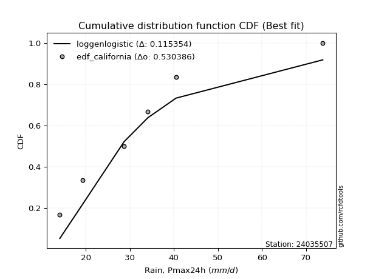</img>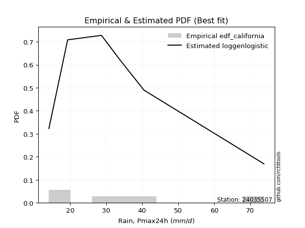</img>

</div>


### 2. EDF Hazen (1930)

Hazen method for plotting positions is a formula used to estimate the empirical cumulative probability distribution of flood events or other hydrological data. This formula often results in biased estimations, particularly when extrapolating to extreme events (high return periods).

<div align="center">


$P=(m-0.5)/n$


</div>


**2.1. Empirical values**

<div align="center">

|                | 0                   | 1                  | 2                  | 3                  | 4         | 5                  |
|:---------------|:--------------------|:-------------------|:-------------------|:-------------------|:----------|:-------------------|
| date           | 2021                | 2019               | 2017               | 2018               | 2020      | 2024               |
| x              | 14.1                | 19.3               | 28.7               | 34.1               | 40.5      | 73.8               |
| m              | 1                   | 2                  | 3                  | 4                  | 5         | 6                  |
| empirical_dist | edf_hazen           | edf_hazen          | edf_hazen          | edf_hazen          | edf_hazen | edf_hazen          |
| empirical      | 0.08333333333333333 | 0.25               | 0.4166666666666667 | 0.5833333333333334 | 0.75      | 0.9166666666666666 |
| empirical_tr   | 1.090909090909091   | 1.3333333333333333 | 1.7142857142857144 | 2.4000000000000004 | 4.0       | 11.999999999999995 |

</div>


**2.2. Kolmogorov-Smirnov fit test (sorted by Δ)**


<div align="center">

|                | 0                    | 1                   | 2                   | 3                    | 4                   | 5                   | 6                   | 7                    | 8                    | 9                    | 10                  | 11                  | 12                  | 13                  | 14                  | 15                  | 16                  | 17                  | 18                  | 19                  | 20                  | 21                  | 22                  | 23                  | 24                  | 25                  | 26                  | 27                  | 28                  | 29                  | 30                    | 31                 | 32                  | 33                  | 34                  | 35                  | 36                  | 37                  | 38                  | 39                  | 40                  | 41                  | 42                  | 43                  | 44                  | 45                  | 46                  | 47                  | 48                  | 49                  | 50                  | 51                  | 52                  | 53                  | 54                  | 55                 | 56                | 57                  | 58                  | 59                  | 60                  | 61                  | 62                  | 63                  | 64                  | 65                  | 66                  | 67                  | 68                  | 69                  | 70                 | 71                  | 72                 | 73                  | 74                | 75                  | 76                  | 77             | 78             | 79                 | 80                 | 81                 | 82                 | 83                  | 84                  | 85                  | 86                 | 87             |
|:---------------|:---------------------|:--------------------|:--------------------|:---------------------|:--------------------|:--------------------|:--------------------|:---------------------|:---------------------|:---------------------|:--------------------|:--------------------|:--------------------|:--------------------|:--------------------|:--------------------|:--------------------|:--------------------|:--------------------|:--------------------|:--------------------|:--------------------|:--------------------|:--------------------|:--------------------|:--------------------|:--------------------|:--------------------|:--------------------|:--------------------|:----------------------|:-------------------|:--------------------|:--------------------|:--------------------|:--------------------|:--------------------|:--------------------|:--------------------|:--------------------|:--------------------|:--------------------|:--------------------|:--------------------|:--------------------|:--------------------|:--------------------|:--------------------|:--------------------|:--------------------|:--------------------|:--------------------|:--------------------|:--------------------|:--------------------|:-------------------|:------------------|:--------------------|:--------------------|:--------------------|:--------------------|:--------------------|:--------------------|:--------------------|:--------------------|:--------------------|:--------------------|:--------------------|:--------------------|:--------------------|:-------------------|:--------------------|:-------------------|:--------------------|:------------------|:--------------------|:--------------------|:---------------|:---------------|:-------------------|:-------------------|:-------------------|:-------------------|:--------------------|:--------------------|:--------------------|:-------------------|:---------------|
| station        | 24035507             | 24035507            | 24035507            | 24035507             | 24035507            | 24035507            | 24035507            | 24035507             | 24035507             | 24035507             | 24035507            | 24035507            | 24035507            | 24035507            | 24035507            | 24035507            | 24035507            | 24035507            | 24035507            | 24035507            | 24035507            | 24035507            | 24035507            | 24035507            | 24035507            | 24035507            | 24035507            | 24035507            | 24035507            | 24035507            | 24035507              | 24035507           | 24035507            | 24035507            | 24035507            | 24035507            | 24035507            | 24035507            | 24035507            | 24035507            | 24035507            | 24035507            | 24035507            | 24035507            | 24035507            | 24035507            | 24035507            | 24035507            | 24035507            | 24035507            | 24035507            | 24035507            | 24035507            | 24035507            | 24035507            | 24035507           | 24035507          | 24035507            | 24035507            | 24035507            | 24035507            | 24035507            | 24035507            | 24035507            | 24035507            | 24035507            | 24035507            | 24035507            | 24035507            | 24035507            | 24035507           | 24035507            | 24035507           | 24035507            | 24035507          | 24035507            | 24035507            | 24035507       | 24035507       | 24035507           | 24035507           | 24035507           | 24035507           | 24035507            | 24035507            | 24035507            | 24035507           | 24035507       |
| empirical_dist | edf_hazen            | edf_hazen           | edf_hazen           | edf_hazen            | edf_hazen           | edf_hazen           | edf_hazen           | edf_hazen            | edf_hazen            | edf_hazen            | edf_hazen           | edf_hazen           | edf_hazen           | edf_hazen           | edf_hazen           | edf_hazen           | edf_hazen           | edf_hazen           | edf_hazen           | edf_hazen           | edf_hazen           | edf_hazen           | edf_hazen           | edf_hazen           | edf_hazen           | edf_hazen           | edf_hazen           | edf_hazen           | edf_hazen           | edf_hazen           | edf_hazen             | edf_hazen          | edf_hazen           | edf_hazen           | edf_hazen           | edf_hazen           | edf_hazen           | edf_hazen           | edf_hazen           | edf_hazen           | edf_hazen           | edf_hazen           | edf_hazen           | edf_hazen           | edf_hazen           | edf_hazen           | edf_hazen           | edf_hazen           | edf_hazen           | edf_hazen           | edf_hazen           | edf_hazen           | edf_hazen           | edf_hazen           | edf_hazen           | edf_hazen          | edf_hazen         | edf_hazen           | edf_hazen           | edf_hazen           | edf_hazen           | edf_hazen           | edf_hazen           | edf_hazen           | edf_hazen           | edf_hazen           | edf_hazen           | edf_hazen           | edf_hazen           | edf_hazen           | edf_hazen          | edf_hazen           | edf_hazen          | edf_hazen           | edf_hazen         | edf_hazen           | edf_hazen           | edf_hazen      | edf_hazen      | edf_hazen          | edf_hazen          | edf_hazen          | edf_hazen          | edf_hazen           | edf_hazen           | edf_hazen           | edf_hazen          | edf_hazen      |
| p_dist         | logloggamma          | logpearson3         | logexponnorm        | logt                 | logcrystalball      | lognorm             | lognorm             | halflogistic         | logbetaprime         | moyal                | alpha               | logmielke           | logfisk             | logalpha            | lognct              | loginvgamma         | logf                | logjohnsonsu        | genlogistic         | betaprime           | logrice             | logfatiguelife      | nct                 | logmaxwell          | logerlang           | gumbel_r            | logncf              | loglogistic         | loggamma            | loggamma            | loglaplace_asymmetric | loginvgauss        | ncf                 | invgamma            | kstwobign           | loggumbel_l         | pearson3            | genexpon            | gompertz            | halfnorm            | expon               | lograyleigh         | exponnorm           | loghypsecant        | loginvweibull       | laplace_asymmetric  | fisk                | invgauss            | johnsonsu           | loglaplace          | logweibull_min      | loggenlogistic      | loggompertz         | rayleigh            | loggumbel_r         | logkstwobign       | maxwell           | hypsecant           | laplace             | loghalfnorm         | rice                | logistic            | weibull_min         | logmoyal            | loghalflogistic     | norm                | crystalball         | truncnorm           | t                   | loggenexpon         | f                  | logchi2             | logexpon           | wald                | gumbel_l          | logwald             | lognakagami         | loggibrat      | gibrat         | gamma              | nakagami           | erlang             | loglognorm         | logtruncnorm        | fatiguelife         | invweibull          | chi2               | mielke         |
| delta          | 0.052951985225120485 | 0.05332342647930152 | 0.05530284320593215 | 0.055311194912510686 | 0.05531486503265565 | 0.05531515838140727 | 0.05531515838140727 | 0.055608059953696665 | 0.055890139277984585 | 0.059000255060715046 | 0.06012649287826688 | 0.06080772478171362 | 0.06111669354848065 | 0.06275685988359636 | 0.06282704268336037 | 0.06419408270530491 | 0.06510506237187613 | 0.06641980269458442 | 0.06685946844631738 | 0.06851286377317539 | 0.06888670438111988 | 0.07129492325548792 | 0.07298930975003254 | 0.07325437945945135 | 0.07382858245848706 | 0.07463496108483081 | 0.07463988292817575 | 0.07653232736552498 | 0.07679309100761994 | 0.07679309100761994 | 0.07785590868879502   | 0.0780191882356488 | 0.07869854487935429 | 0.07869857285481391 | 0.07991407549145191 | 0.08014629305220172 | 0.08138845059444555 | 0.08333333333170115 | 0.08333333333332954 | 0.08397063015420869 | 0.08465315294293957 | 0.08507062884868516 | 0.08721630569063349 | 0.08883879211645801 | 0.09101092961442064 | 0.09432445107856213 | 0.09544852371600215 | 0.10088588964824291 | 0.10189965251884398 | 0.10198580165167864 | 0.10297847624259854 | 0.10409469539430088 | 0.10624401340617023 | 0.10653962855304155 | 0.10660552671106222 | 0.1135793899954492 | 0.114442668809424 | 0.11470315217273563 | 0.11791069529739157 | 0.11840497423959945 | 0.12030923749788469 | 0.12606461613249575 | 0.12698624847515055 | 0.13210875156054952 | 0.14002055610947867 | 0.14007252736975884 | 0.14007253231791028 | 0.14007253499278638 | 0.14008077515313344 | 0.14718568006320293 | 0.1573338913706976 | 0.17127985180579114 | 0.1861663578182075 | 0.19787682469816129 | 0.197917149233378 | 0.23107217377818537 | 0.24999999964440087 | 0.25           | 0.25           | 0.2701450790172581 | 0.2897334473156806 | 0.3172231213824169 | 0.3960792318992481 | 0.41666625249973577 | 0.45105505505011023 | 0.47168175934513323 | 0.6856592217547595 | nan            |
| deltao         | 0.530385761606       | 0.530385761606      | 0.530385761606      | 0.530385761606       | 0.530385761606      | 0.530385761606      | 0.530385761606      | 0.530385761606       | 0.530385761606       | 0.530385761606       | 0.530385761606      | 0.530385761606      | 0.530385761606      | 0.530385761606      | 0.530385761606      | 0.530385761606      | 0.530385761606      | 0.530385761606      | 0.530385761606      | 0.530385761606      | 0.530385761606      | 0.530385761606      | 0.530385761606      | 0.530385761606      | 0.530385761606      | 0.530385761606      | 0.530385761606      | 0.530385761606      | 0.530385761606      | 0.530385761606      | 0.530385761606        | 0.530385761606     | 0.530385761606      | 0.530385761606      | 0.530385761606      | 0.530385761606      | 0.530385761606      | 0.530385761606      | 0.530385761606      | 0.530385761606      | 0.530385761606      | 0.530385761606      | 0.530385761606      | 0.530385761606      | 0.530385761606      | 0.530385761606      | 0.530385761606      | 0.530385761606      | 0.530385761606      | 0.530385761606      | 0.530385761606      | 0.530385761606      | 0.530385761606      | 0.530385761606      | 0.530385761606      | 0.530385761606     | 0.530385761606    | 0.530385761606      | 0.530385761606      | 0.530385761606      | 0.530385761606      | 0.530385761606      | 0.530385761606      | 0.530385761606      | 0.530385761606      | 0.530385761606      | 0.530385761606      | 0.530385761606      | 0.530385761606      | 0.530385761606      | 0.530385761606     | 0.530385761606      | 0.530385761606     | 0.530385761606      | 0.530385761606    | 0.530385761606      | 0.530385761606      | 0.530385761606 | 0.530385761606 | 0.530385761606     | 0.530385761606     | 0.530385761606     | 0.530385761606     | 0.530385761606      | 0.530385761606      | 0.530385761606      | 0.530385761606     | 0.530385761606 |
| eval           | Δo > Δ               | Δo > Δ              | Δo > Δ              | Δo > Δ               | Δo > Δ              | Δo > Δ              | Δo > Δ              | Δo > Δ               | Δo > Δ               | Δo > Δ               | Δo > Δ              | Δo > Δ              | Δo > Δ              | Δo > Δ              | Δo > Δ              | Δo > Δ              | Δo > Δ              | Δo > Δ              | Δo > Δ              | Δo > Δ              | Δo > Δ              | Δo > Δ              | Δo > Δ              | Δo > Δ              | Δo > Δ              | Δo > Δ              | Δo > Δ              | Δo > Δ              | Δo > Δ              | Δo > Δ              | Δo > Δ                | Δo > Δ             | Δo > Δ              | Δo > Δ              | Δo > Δ              | Δo > Δ              | Δo > Δ              | Δo > Δ              | Δo > Δ              | Δo > Δ              | Δo > Δ              | Δo > Δ              | Δo > Δ              | Δo > Δ              | Δo > Δ              | Δo > Δ              | Δo > Δ              | Δo > Δ              | Δo > Δ              | Δo > Δ              | Δo > Δ              | Δo > Δ              | Δo > Δ              | Δo > Δ              | Δo > Δ              | Δo > Δ             | Δo > Δ            | Δo > Δ              | Δo > Δ              | Δo > Δ              | Δo > Δ              | Δo > Δ              | Δo > Δ              | Δo > Δ              | Δo > Δ              | Δo > Δ              | Δo > Δ              | Δo > Δ              | Δo > Δ              | Δo > Δ              | Δo > Δ             | Δo > Δ              | Δo > Δ             | Δo > Δ              | Δo > Δ            | Δo > Δ              | Δo > Δ              | Δo > Δ         | Δo > Δ         | Δo > Δ             | Δo > Δ             | Δo > Δ             | Δo > Δ             | Δo > Δ              | Δo > Δ              | Δo > Δ              | Δo <= Δ            | Δo <= Δ        |
| fit            | 1                    | 1                   | 1                   | 1                    | 1                   | 1                   | 1                   | 1                    | 1                    | 1                    | 1                   | 1                   | 1                   | 1                   | 1                   | 1                   | 1                   | 1                   | 1                   | 1                   | 1                   | 1                   | 1                   | 1                   | 1                   | 1                   | 1                   | 1                   | 1                   | 1                   | 1                     | 1                  | 1                   | 1                   | 1                   | 1                   | 1                   | 1                   | 1                   | 1                   | 1                   | 1                   | 1                   | 1                   | 1                   | 1                   | 1                   | 1                   | 1                   | 1                   | 1                   | 1                   | 1                   | 1                   | 1                   | 1                  | 1                 | 1                   | 1                   | 1                   | 1                   | 1                   | 1                   | 1                   | 1                   | 1                   | 1                   | 1                   | 1                   | 1                   | 1                  | 1                   | 1                  | 1                   | 1                 | 1                   | 1                   | 1              | 1              | 1                  | 1                  | 1                  | 1                  | 1                   | 1                   | 1                   | 0                  | 0              |
| n              | 6                    | 6                   | 6                   | 6                    | 6                   | 6                   | 6                   | 6                    | 6                    | 6                    | 6                   | 6                   | 6                   | 6                   | 6                   | 6                   | 6                   | 6                   | 6                   | 6                   | 6                   | 6                   | 6                   | 6                   | 6                   | 6                   | 6                   | 6                   | 6                   | 6                   | 6                     | 6                  | 6                   | 6                   | 6                   | 6                   | 6                   | 6                   | 6                   | 6                   | 6                   | 6                   | 6                   | 6                   | 6                   | 6                   | 6                   | 6                   | 6                   | 6                   | 6                   | 6                   | 6                   | 6                   | 6                   | 6                  | 6                 | 6                   | 6                   | 6                   | 6                   | 6                   | 6                   | 6                   | 6                   | 6                   | 6                   | 6                   | 6                   | 6                   | 6                  | 6                   | 6                  | 6                   | 6                 | 6                   | 6                   | 6              | 6              | 6                  | 6                  | 6                  | 6                  | 6                   | 6                   | 6                   | 6                  | 6              |
| best_fit       | 1                    | 0                   | 0                   | 0                    | 0                   | 0                   | 0                   | 0                    | 0                    | 0                    | 0                   | 0                   | 0                   | 0                   | 0                   | 0                   | 0                   | 0                   | 0                   | 0                   | 0                   | 0                   | 0                   | 0                   | 0                   | 0                   | 0                   | 0                   | 0                   | 0                   | 0                     | 0                  | 0                   | 0                   | 0                   | 0                   | 0                   | 0                   | 0                   | 0                   | 0                   | 0                   | 0                   | 0                   | 0                   | 0                   | 0                   | 0                   | 0                   | 0                   | 0                   | 0                   | 0                   | 0                   | 0                   | 0                  | 0                 | 0                   | 0                   | 0                   | 0                   | 0                   | 0                   | 0                   | 0                   | 0                   | 0                   | 0                   | 0                   | 0                   | 0                  | 0                   | 0                  | 0                   | 0                 | 0                   | 0                   | 0              | 0              | 0                  | 0                  | 0                  | 0                  | 0                   | 0                   | 0                   | 0                  | 0              |
| best_fit_sort  | 1                    | 2                   | 3                   | 4                    | 5                   | 6                   | 7                   | 8                    | 9                    | 10                   | 11                  | 12                  | 13                  | 14                  | 15                  | 16                  | 17                  | 18                  | 19                  | 20                  | 21                  | 22                  | 23                  | 24                  | 25                  | 26                  | 27                  | 28                  | 29                  | 30                  | 31                    | 32                 | 33                  | 34                  | 35                  | 36                  | 37                  | 38                  | 39                  | 40                  | 41                  | 42                  | 43                  | 44                  | 45                  | 46                  | 47                  | 48                  | 49                  | 50                  | 51                  | 52                  | 53                  | 54                  | 55                  | 56                 | 57                | 58                  | 59                  | 60                  | 61                  | 62                  | 63                  | 64                  | 65                  | 66                  | 67                  | 68                  | 69                  | 70                  | 71                 | 72                  | 73                 | 74                  | 75                | 76                  | 77                  | 78             | 79             | 80                 | 81                 | 82                 | 83                 | 84                  | 85                  | 86                  | 87                 | 88             |

</div>


**2.3. Best fit**

<div align="center">

|   id |   station | empirical_dist   | p_dist      |    delta |   deltao | eval   |   fit |   n |   best_fit |   best_fit_sort |
|-----:|----------:|:-----------------|:------------|---------:|---------:|:-------|------:|----:|-----------:|----------------:|
|    0 |  24035507 | edf_hazen        | logloggamma | 0.052952 | 0.530386 | Δo > Δ |     1 |   6 |          1 |               1 |

</div>


<div align="center">

</img>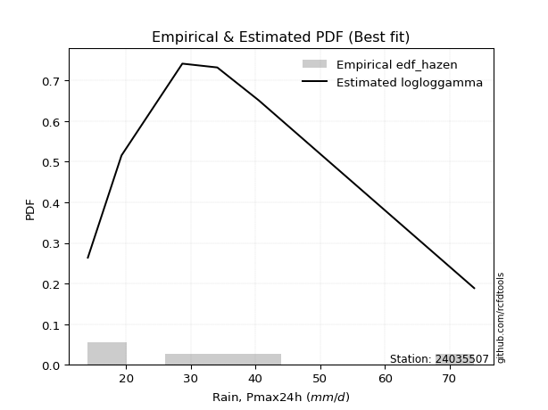</img>

</div>


### 3. EDF Weibull (1939)

Weibull plotting position formula is an empirical method used to estimate the non-exceedance probability or plotting position for a set of observed data, is often recommended or widely used in practice, particularly in flood frequency analysis.

<div align="center">


$P=m/(n+1)$


</div>


**3.1. Empirical values**

<div align="center">

|                | 0                   | 1                  | 2                   | 3                  | 4                  | 5                  |
|:---------------|:--------------------|:-------------------|:--------------------|:-------------------|:-------------------|:-------------------|
| date           | 2021                | 2019               | 2017                | 2018               | 2020               | 2024               |
| x              | 14.1                | 19.3               | 28.7                | 34.1               | 40.5               | 73.8               |
| m              | 1                   | 2                  | 3                   | 4                  | 5                  | 6                  |
| empirical_dist | edf_weibull         | edf_weibull        | edf_weibull         | edf_weibull        | edf_weibull        | edf_weibull        |
| empirical      | 0.14285714285714285 | 0.2857142857142857 | 0.42857142857142855 | 0.5714285714285714 | 0.7142857142857143 | 0.8571428571428571 |
| empirical_tr   | 1.1666666666666665  | 1.4                | 1.75                | 2.333333333333333  | 3.5                | 6.999999999999997  |

</div>


**3.2. Kolmogorov-Smirnov fit test (sorted by Δ)**


<div align="center">

|                | 0                  | 1                   | 2                   | 3                   | 4                   | 5                   | 6                   | 7                   | 8                   | 9                   | 10                  | 11                  | 12                  | 13                 | 14                  | 15                  | 16                  | 17                  | 18                  | 19                  | 20                  | 21                  | 22                  | 23                  | 24                 | 25                  | 26                  | 27                  | 28                 | 29                  | 30                  | 31                  | 32                 | 33                  | 34                  | 35                  | 36                  | 37                  | 38                  | 39                  | 40                  | 41                  | 42                  | 43                  | 44                  | 45                  | 46                    | 47                  | 48                  | 49                  | 50                  | 51                  | 52                  | 53                 | 54                  | 55                  | 56                 | 57                  | 58                  | 59                  | 60                  | 61                 | 62                 | 63                  | 64                  | 65                  | 66                  | 67                  | 68                  | 69                  | 70                  | 71                  | 72                  | 73                  | 74                  | 75                  | 76                 | 77                 | 78                 | 79                 | 80                 | 81                | 82                 | 83                 | 84                  | 85                  | 86                 | 87             |
|:---------------|:-------------------|:--------------------|:--------------------|:--------------------|:--------------------|:--------------------|:--------------------|:--------------------|:--------------------|:--------------------|:--------------------|:--------------------|:--------------------|:-------------------|:--------------------|:--------------------|:--------------------|:--------------------|:--------------------|:--------------------|:--------------------|:--------------------|:--------------------|:--------------------|:-------------------|:--------------------|:--------------------|:--------------------|:-------------------|:--------------------|:--------------------|:--------------------|:-------------------|:--------------------|:--------------------|:--------------------|:--------------------|:--------------------|:--------------------|:--------------------|:--------------------|:--------------------|:--------------------|:--------------------|:--------------------|:--------------------|:----------------------|:--------------------|:--------------------|:--------------------|:--------------------|:--------------------|:--------------------|:-------------------|:--------------------|:--------------------|:-------------------|:--------------------|:--------------------|:--------------------|:--------------------|:-------------------|:-------------------|:--------------------|:--------------------|:--------------------|:--------------------|:--------------------|:--------------------|:--------------------|:--------------------|:--------------------|:--------------------|:--------------------|:--------------------|:--------------------|:-------------------|:-------------------|:-------------------|:-------------------|:-------------------|:------------------|:-------------------|:-------------------|:--------------------|:--------------------|:-------------------|:---------------|
| station        | 24035507           | 24035507            | 24035507            | 24035507            | 24035507            | 24035507            | 24035507            | 24035507            | 24035507            | 24035507            | 24035507            | 24035507            | 24035507            | 24035507           | 24035507            | 24035507            | 24035507            | 24035507            | 24035507            | 24035507            | 24035507            | 24035507            | 24035507            | 24035507            | 24035507           | 24035507            | 24035507            | 24035507            | 24035507           | 24035507            | 24035507            | 24035507            | 24035507           | 24035507            | 24035507            | 24035507            | 24035507            | 24035507            | 24035507            | 24035507            | 24035507            | 24035507            | 24035507            | 24035507            | 24035507            | 24035507            | 24035507              | 24035507            | 24035507            | 24035507            | 24035507            | 24035507            | 24035507            | 24035507           | 24035507            | 24035507            | 24035507           | 24035507            | 24035507            | 24035507            | 24035507            | 24035507           | 24035507           | 24035507            | 24035507            | 24035507            | 24035507            | 24035507            | 24035507            | 24035507            | 24035507            | 24035507            | 24035507            | 24035507            | 24035507            | 24035507            | 24035507           | 24035507           | 24035507           | 24035507           | 24035507           | 24035507          | 24035507           | 24035507           | 24035507            | 24035507            | 24035507           | 24035507       |
| empirical_dist | edf_weibull        | edf_weibull         | edf_weibull         | edf_weibull         | edf_weibull         | edf_weibull         | edf_weibull         | edf_weibull         | edf_weibull         | edf_weibull         | edf_weibull         | edf_weibull         | edf_weibull         | edf_weibull        | edf_weibull         | edf_weibull         | edf_weibull         | edf_weibull         | edf_weibull         | edf_weibull         | edf_weibull         | edf_weibull         | edf_weibull         | edf_weibull         | edf_weibull        | edf_weibull         | edf_weibull         | edf_weibull         | edf_weibull        | edf_weibull         | edf_weibull         | edf_weibull         | edf_weibull        | edf_weibull         | edf_weibull         | edf_weibull         | edf_weibull         | edf_weibull         | edf_weibull         | edf_weibull         | edf_weibull         | edf_weibull         | edf_weibull         | edf_weibull         | edf_weibull         | edf_weibull         | edf_weibull           | edf_weibull         | edf_weibull         | edf_weibull         | edf_weibull         | edf_weibull         | edf_weibull         | edf_weibull        | edf_weibull         | edf_weibull         | edf_weibull        | edf_weibull         | edf_weibull         | edf_weibull         | edf_weibull         | edf_weibull        | edf_weibull        | edf_weibull         | edf_weibull         | edf_weibull         | edf_weibull         | edf_weibull         | edf_weibull         | edf_weibull         | edf_weibull         | edf_weibull         | edf_weibull         | edf_weibull         | edf_weibull         | edf_weibull         | edf_weibull        | edf_weibull        | edf_weibull        | edf_weibull        | edf_weibull        | edf_weibull       | edf_weibull        | edf_weibull        | edf_weibull         | edf_weibull         | edf_weibull        | edf_weibull    |
| p_dist         | logncf             | logbetaprime        | logfatiguelife      | nct                 | loginvgauss         | logerlang           | betaprime           | ncf                 | logf                | invgamma            | loggamma            | loggamma            | logjohnsonsu        | logmaxwell         | loginvweibull       | loginvgamma         | logalpha            | lognct              | logpearson3         | loggenlogistic      | invgauss            | alpha               | logexponnorm        | logloggamma         | halflogistic       | logt                | lognorm             | lognorm             | logcrystalball     | logfisk             | logmielke           | moyal               | johnsonsu          | halfnorm            | lograyleigh         | logrice             | pearson3            | gumbel_r            | logkstwobign        | rayleigh            | fisk                | logweibull_min      | maxwell             | loglogistic         | genlogistic         | kstwobign           | loglaplace_asymmetric | hypsecant           | loggumbel_r         | logistic            | t                   | truncnorm           | crystalball         | norm               | rice                | loghypsecant        | laplace            | laplace_asymmetric  | loggumbel_l         | logmoyal            | loglaplace          | exponnorm          | loggompertz        | weibull_min         | loggenexpon         | genexpon            | gompertz            | expon               | loghalflogistic     | loghalfnorm         | f                   | logchi2             | gumbel_l            | logexpon            | wald                | gamma               | logwald            | nakagami           | lognakagami        | gibrat             | loggibrat          | erlang            | loglognorm         | invweibull         | fatiguelife         | logtruncnorm        | chi2               | mielke         |
| delta          | 0.0787962938328578 | 0.08286149934112608 | 0.08474087323548724 | 0.08539600501285258 | 0.08579122224654463 | 0.08584074019002988 | 0.08639177582694574 | 0.08642676498796488 | 0.08648499797018233 | 0.08650752268927006 | 0.08650970889753906 | 0.08650970889753906 | 0.08668862063801841 | 0.0871070498965795 | 0.08716515711655864 | 0.08726991155328542 | 0.08776599212063485 | 0.08828911013049776 | 0.09053907540697603 | 0.09218993348953902 | 0.09403834941861161 | 0.09452103971359213 | 0.09502697955004247 | 0.09515298370931902 | 0.0955305869809342 | 0.09563542120346558 | 0.09563630733866091 | 0.09563630733866091 | 0.0956364143382955 | 0.09595824579901902 | 0.09652201049599932 | 0.09678594156046694 | 0.0968798752073887 | 0.09741868346672478 | 0.09857840973193058 | 0.09954543998441118 | 0.09993663357551419 | 0.10033473331699172 | 0.10167462809068734 | 0.10514691352502004 | 0.10607718465278823 | 0.10672466796600939 | 0.10837500971548153 | 0.11224661307981068 | 0.11231159320779338 | 0.11283580351694023 | 0.11357019440308072   | 0.11515278711992516 | 0.11614374232698987 | 0.11674193883626693 | 0.11984278163342699 | 0.11984308050999215 | 0.11984308377558273 | 0.1198430863749187 | 0.12390766477917398 | 0.12455307783074371 | 0.1274337578832507 | 0.13003873679284783 | 0.13459295142705707 | 0.13511162105845292 | 0.13770008736596434 | 0.1419333230750061 | 0.1428571236821382 | 0.14285714108659656 | 0.14285714275052522 | 0.14285714285551065 | 0.14285714285713907 | 0.14285714285714285 | 0.14285714285714285 | 0.14285714285714285 | 0.14542912946593572 | 0.15937508990102928 | 0.16231559115324246 | 0.17426159591344564 | 0.23359111041244698 | 0.25824031711249623 | 0.2667864594924711 | 0.2738974794476315 | 0.2857142853586866 | 0.2857142857142857 | 0.2857142857142857 | 0.305318359477655 | 0.3603649461849624 | 0.4121579498213237 | 0.41534076933582453 | 0.42857101440449763 | 0.6499449360404738 | nan            |
| deltao         | 0.530385761606     | 0.530385761606      | 0.530385761606      | 0.530385761606      | 0.530385761606      | 0.530385761606      | 0.530385761606      | 0.530385761606      | 0.530385761606      | 0.530385761606      | 0.530385761606      | 0.530385761606      | 0.530385761606      | 0.530385761606     | 0.530385761606      | 0.530385761606      | 0.530385761606      | 0.530385761606      | 0.530385761606      | 0.530385761606      | 0.530385761606      | 0.530385761606      | 0.530385761606      | 0.530385761606      | 0.530385761606     | 0.530385761606      | 0.530385761606      | 0.530385761606      | 0.530385761606     | 0.530385761606      | 0.530385761606      | 0.530385761606      | 0.530385761606     | 0.530385761606      | 0.530385761606      | 0.530385761606      | 0.530385761606      | 0.530385761606      | 0.530385761606      | 0.530385761606      | 0.530385761606      | 0.530385761606      | 0.530385761606      | 0.530385761606      | 0.530385761606      | 0.530385761606      | 0.530385761606        | 0.530385761606      | 0.530385761606      | 0.530385761606      | 0.530385761606      | 0.530385761606      | 0.530385761606      | 0.530385761606     | 0.530385761606      | 0.530385761606      | 0.530385761606     | 0.530385761606      | 0.530385761606      | 0.530385761606      | 0.530385761606      | 0.530385761606     | 0.530385761606     | 0.530385761606      | 0.530385761606      | 0.530385761606      | 0.530385761606      | 0.530385761606      | 0.530385761606      | 0.530385761606      | 0.530385761606      | 0.530385761606      | 0.530385761606      | 0.530385761606      | 0.530385761606      | 0.530385761606      | 0.530385761606     | 0.530385761606     | 0.530385761606     | 0.530385761606     | 0.530385761606     | 0.530385761606    | 0.530385761606     | 0.530385761606     | 0.530385761606      | 0.530385761606      | 0.530385761606     | 0.530385761606 |
| eval           | Δo > Δ             | Δo > Δ              | Δo > Δ              | Δo > Δ              | Δo > Δ              | Δo > Δ              | Δo > Δ              | Δo > Δ              | Δo > Δ              | Δo > Δ              | Δo > Δ              | Δo > Δ              | Δo > Δ              | Δo > Δ             | Δo > Δ              | Δo > Δ              | Δo > Δ              | Δo > Δ              | Δo > Δ              | Δo > Δ              | Δo > Δ              | Δo > Δ              | Δo > Δ              | Δo > Δ              | Δo > Δ             | Δo > Δ              | Δo > Δ              | Δo > Δ              | Δo > Δ             | Δo > Δ              | Δo > Δ              | Δo > Δ              | Δo > Δ             | Δo > Δ              | Δo > Δ              | Δo > Δ              | Δo > Δ              | Δo > Δ              | Δo > Δ              | Δo > Δ              | Δo > Δ              | Δo > Δ              | Δo > Δ              | Δo > Δ              | Δo > Δ              | Δo > Δ              | Δo > Δ                | Δo > Δ              | Δo > Δ              | Δo > Δ              | Δo > Δ              | Δo > Δ              | Δo > Δ              | Δo > Δ             | Δo > Δ              | Δo > Δ              | Δo > Δ             | Δo > Δ              | Δo > Δ              | Δo > Δ              | Δo > Δ              | Δo > Δ             | Δo > Δ             | Δo > Δ              | Δo > Δ              | Δo > Δ              | Δo > Δ              | Δo > Δ              | Δo > Δ              | Δo > Δ              | Δo > Δ              | Δo > Δ              | Δo > Δ              | Δo > Δ              | Δo > Δ              | Δo > Δ              | Δo > Δ             | Δo > Δ             | Δo > Δ             | Δo > Δ             | Δo > Δ             | Δo > Δ            | Δo > Δ             | Δo > Δ             | Δo > Δ              | Δo > Δ              | Δo <= Δ            | Δo <= Δ        |
| fit            | 1                  | 1                   | 1                   | 1                   | 1                   | 1                   | 1                   | 1                   | 1                   | 1                   | 1                   | 1                   | 1                   | 1                  | 1                   | 1                   | 1                   | 1                   | 1                   | 1                   | 1                   | 1                   | 1                   | 1                   | 1                  | 1                   | 1                   | 1                   | 1                  | 1                   | 1                   | 1                   | 1                  | 1                   | 1                   | 1                   | 1                   | 1                   | 1                   | 1                   | 1                   | 1                   | 1                   | 1                   | 1                   | 1                   | 1                     | 1                   | 1                   | 1                   | 1                   | 1                   | 1                   | 1                  | 1                   | 1                   | 1                  | 1                   | 1                   | 1                   | 1                   | 1                  | 1                  | 1                   | 1                   | 1                   | 1                   | 1                   | 1                   | 1                   | 1                   | 1                   | 1                   | 1                   | 1                   | 1                   | 1                  | 1                  | 1                  | 1                  | 1                  | 1                 | 1                  | 1                  | 1                   | 1                   | 0                  | 0              |
| n              | 6                  | 6                   | 6                   | 6                   | 6                   | 6                   | 6                   | 6                   | 6                   | 6                   | 6                   | 6                   | 6                   | 6                  | 6                   | 6                   | 6                   | 6                   | 6                   | 6                   | 6                   | 6                   | 6                   | 6                   | 6                  | 6                   | 6                   | 6                   | 6                  | 6                   | 6                   | 6                   | 6                  | 6                   | 6                   | 6                   | 6                   | 6                   | 6                   | 6                   | 6                   | 6                   | 6                   | 6                   | 6                   | 6                   | 6                     | 6                   | 6                   | 6                   | 6                   | 6                   | 6                   | 6                  | 6                   | 6                   | 6                  | 6                   | 6                   | 6                   | 6                   | 6                  | 6                  | 6                   | 6                   | 6                   | 6                   | 6                   | 6                   | 6                   | 6                   | 6                   | 6                   | 6                   | 6                   | 6                   | 6                  | 6                  | 6                  | 6                  | 6                  | 6                 | 6                  | 6                  | 6                   | 6                   | 6                  | 6              |
| best_fit       | 1                  | 0                   | 0                   | 0                   | 0                   | 0                   | 0                   | 0                   | 0                   | 0                   | 0                   | 0                   | 0                   | 0                  | 0                   | 0                   | 0                   | 0                   | 0                   | 0                   | 0                   | 0                   | 0                   | 0                   | 0                  | 0                   | 0                   | 0                   | 0                  | 0                   | 0                   | 0                   | 0                  | 0                   | 0                   | 0                   | 0                   | 0                   | 0                   | 0                   | 0                   | 0                   | 0                   | 0                   | 0                   | 0                   | 0                     | 0                   | 0                   | 0                   | 0                   | 0                   | 0                   | 0                  | 0                   | 0                   | 0                  | 0                   | 0                   | 0                   | 0                   | 0                  | 0                  | 0                   | 0                   | 0                   | 0                   | 0                   | 0                   | 0                   | 0                   | 0                   | 0                   | 0                   | 0                   | 0                   | 0                  | 0                  | 0                  | 0                  | 0                  | 0                 | 0                  | 0                  | 0                   | 0                   | 0                  | 0              |
| best_fit_sort  | 1                  | 2                   | 3                   | 4                   | 5                   | 6                   | 7                   | 8                   | 9                   | 10                  | 11                  | 12                  | 13                  | 14                 | 15                  | 16                  | 17                  | 18                  | 19                  | 20                  | 21                  | 22                  | 23                  | 24                  | 25                 | 26                  | 27                  | 28                  | 29                 | 30                  | 31                  | 32                  | 33                 | 34                  | 35                  | 36                  | 37                  | 38                  | 39                  | 40                  | 41                  | 42                  | 43                  | 44                  | 45                  | 46                  | 47                    | 48                  | 49                  | 50                  | 51                  | 52                  | 53                  | 54                 | 55                  | 56                  | 57                 | 58                  | 59                  | 60                  | 61                  | 62                 | 63                 | 64                  | 65                  | 66                  | 67                  | 68                  | 69                  | 70                  | 71                  | 72                  | 73                  | 74                  | 75                  | 76                  | 77                 | 78                 | 79                 | 80                 | 81                 | 82                | 83                 | 84                 | 85                  | 86                  | 87                 | 88             |

</div>


**3.3. Best fit**

<div align="center">

|   id |   station | empirical_dist   | p_dist   |     delta |   deltao | eval   |   fit |   n |   best_fit |   best_fit_sort |
|-----:|----------:|:-----------------|:---------|----------:|---------:|:-------|------:|----:|-----------:|----------------:|
|    0 |  24035507 | edf_weibull      | logncf   | 0.0787963 | 0.530386 | Δo > Δ |     1 |   6 |          1 |               1 |

</div>


<div align="center">

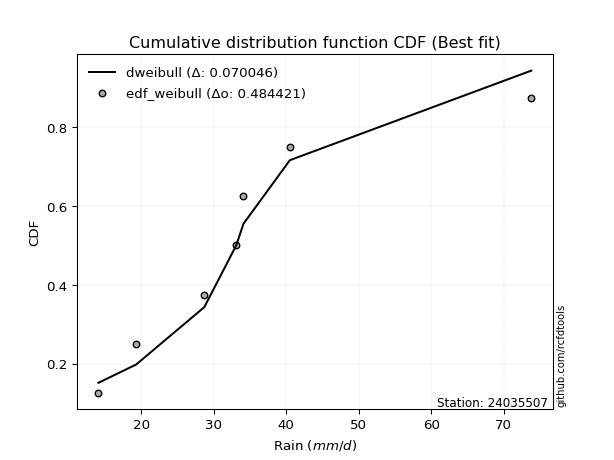</img>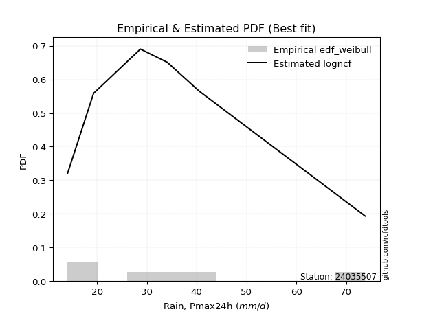</img>

</div>


### 4. EDF Beard (1943)

The Beard formula (or Beard´s plotting position formula) in hydrology is used to estimate the empirical non-exceedance probability _(P)_ of a flood event (or other extreme hydrological data point) within a given dataset.

<div align="center">


$P=(m-0.31)/(n+0.38)$


</div>


**4.1. Empirical values**

<div align="center">

|                | 0                   | 1                   | 2                  | 3                  | 4                  | 5                  |
|:---------------|:--------------------|:--------------------|:-------------------|:-------------------|:-------------------|:-------------------|
| date           | 2021                | 2019                | 2017               | 2018               | 2020               | 2024               |
| x              | 14.1                | 19.3                | 28.7               | 34.1               | 40.5               | 73.8               |
| m              | 1                   | 2                   | 3                  | 4                  | 5                  | 6                  |
| empirical_dist | edf_beard           | edf_beard           | edf_beard          | edf_beard          | edf_beard          | edf_beard          |
| empirical      | 0.10815047021943573 | 0.26489028213166144 | 0.4216300940438871 | 0.5783699059561128 | 0.7351097178683387 | 0.8918495297805643 |
| empirical_tr   | 1.1212653778558874  | 1.3603411513859276  | 1.7289972899728996 | 2.3717472118959106 | 3.7751479289940844 | 9.246376811594207  |

</div>


**4.2. Kolmogorov-Smirnov fit test (sorted by Δ)**


<div align="center">

|                | 0                    | 1                   | 2                   | 3                   | 4                  | 5                   | 6                   | 7                   | 8                   | 9                   | 10                  | 11                 | 12                  | 13                 | 14                  | 15                 | 16                  | 17                  | 18                  | 19                  | 20                  | 21                  | 22                 | 23                 | 24                 | 25                 | 26                  | 27                  | 28                  | 29                  | 30                  | 31                  | 32                  | 33                  | 34                  | 35                 | 36                  | 37                  | 38                  | 39                  | 40                    | 41                  | 42                  | 43                 | 44                  | 45                  | 46                  | 47                  | 48                  | 49                  | 50                  | 51                | 52                  | 53                  | 54                  | 55                  | 56                  | 57                  | 58                  | 59                  | 60                | 61                  | 62                  | 63                 | 64                  | 65                  | 66                  | 67                  | 68                  | 69                 | 70                  | 71                 | 72                  | 73                  | 74                  | 75                 | 76                  | 77                  | 78                  | 79                  | 80                 | 81                  | 82                  | 83                 | 84                 | 85                 | 86                | 87             |
|:---------------|:---------------------|:--------------------|:--------------------|:--------------------|:-------------------|:--------------------|:--------------------|:--------------------|:--------------------|:--------------------|:--------------------|:-------------------|:--------------------|:-------------------|:--------------------|:-------------------|:--------------------|:--------------------|:--------------------|:--------------------|:--------------------|:--------------------|:-------------------|:-------------------|:-------------------|:-------------------|:--------------------|:--------------------|:--------------------|:--------------------|:--------------------|:--------------------|:--------------------|:--------------------|:--------------------|:-------------------|:--------------------|:--------------------|:--------------------|:--------------------|:----------------------|:--------------------|:--------------------|:-------------------|:--------------------|:--------------------|:--------------------|:--------------------|:--------------------|:--------------------|:--------------------|:------------------|:--------------------|:--------------------|:--------------------|:--------------------|:--------------------|:--------------------|:--------------------|:--------------------|:------------------|:--------------------|:--------------------|:-------------------|:--------------------|:--------------------|:--------------------|:--------------------|:--------------------|:-------------------|:--------------------|:-------------------|:--------------------|:--------------------|:--------------------|:-------------------|:--------------------|:--------------------|:--------------------|:--------------------|:-------------------|:--------------------|:--------------------|:-------------------|:-------------------|:-------------------|:------------------|:---------------|
| station        | 24035507             | 24035507            | 24035507            | 24035507            | 24035507           | 24035507            | 24035507            | 24035507            | 24035507            | 24035507            | 24035507            | 24035507           | 24035507            | 24035507           | 24035507            | 24035507           | 24035507            | 24035507            | 24035507            | 24035507            | 24035507            | 24035507            | 24035507           | 24035507           | 24035507           | 24035507           | 24035507            | 24035507            | 24035507            | 24035507            | 24035507            | 24035507            | 24035507            | 24035507            | 24035507            | 24035507           | 24035507            | 24035507            | 24035507            | 24035507            | 24035507              | 24035507            | 24035507            | 24035507           | 24035507            | 24035507            | 24035507            | 24035507            | 24035507            | 24035507            | 24035507            | 24035507          | 24035507            | 24035507            | 24035507            | 24035507            | 24035507            | 24035507            | 24035507            | 24035507            | 24035507          | 24035507            | 24035507            | 24035507           | 24035507            | 24035507            | 24035507            | 24035507            | 24035507            | 24035507           | 24035507            | 24035507           | 24035507            | 24035507            | 24035507            | 24035507           | 24035507            | 24035507            | 24035507            | 24035507            | 24035507           | 24035507            | 24035507            | 24035507           | 24035507           | 24035507           | 24035507          | 24035507       |
| empirical_dist | edf_beard            | edf_beard           | edf_beard           | edf_beard           | edf_beard          | edf_beard           | edf_beard           | edf_beard           | edf_beard           | edf_beard           | edf_beard           | edf_beard          | edf_beard           | edf_beard          | edf_beard           | edf_beard          | edf_beard           | edf_beard           | edf_beard           | edf_beard           | edf_beard           | edf_beard           | edf_beard          | edf_beard          | edf_beard          | edf_beard          | edf_beard           | edf_beard           | edf_beard           | edf_beard           | edf_beard           | edf_beard           | edf_beard           | edf_beard           | edf_beard           | edf_beard          | edf_beard           | edf_beard           | edf_beard           | edf_beard           | edf_beard             | edf_beard           | edf_beard           | edf_beard          | edf_beard           | edf_beard           | edf_beard           | edf_beard           | edf_beard           | edf_beard           | edf_beard           | edf_beard         | edf_beard           | edf_beard           | edf_beard           | edf_beard           | edf_beard           | edf_beard           | edf_beard           | edf_beard           | edf_beard         | edf_beard           | edf_beard           | edf_beard          | edf_beard           | edf_beard           | edf_beard           | edf_beard           | edf_beard           | edf_beard          | edf_beard           | edf_beard          | edf_beard           | edf_beard           | edf_beard           | edf_beard          | edf_beard           | edf_beard           | edf_beard           | edf_beard           | edf_beard          | edf_beard           | edf_beard           | edf_beard          | edf_beard          | edf_beard          | edf_beard         | edf_beard      |
| p_dist         | logbetaprime         | halflogistic        | logrice             | betaprime           | gumbel_r           | logf                | logjohnsonsu        | logfatiguelife      | loginvgamma         | pearson3            | logalpha            | lognct             | logloggamma         | nct                | logpearson3         | logmaxwell         | logerlang           | halfnorm            | logncf              | logexponnorm        | logt                | logcrystalball      | lognorm            | lognorm            | loggamma           | loggamma           | loginvgauss         | alpha               | ncf                 | invgamma            | moyal               | logfisk             | logmielke           | lograyleigh         | genlogistic         | loginvweibull      | kstwobign           | fisk                | loglogistic         | rayleigh            | loglaplace_asymmetric | invgauss            | johnsonsu           | logweibull_min     | loggenlogistic      | maxwell             | loggumbel_l         | loggumbel_r         | hypsecant           | loghypsecant        | rice                | exponnorm         | loggompertz         | genexpon            | gompertz            | expon               | logkstwobign        | laplace_asymmetric  | logistic            | laplace             | loghalfnorm       | loglaplace          | weibull_min         | norm               | crystalball         | truncnorm           | t                   | logmoyal            | loghalflogistic     | loggenexpon        | f                   | logchi2            | logexpon            | gumbel_l            | wald                | logwald            | lognakagami         | loggibrat           | gibrat              | gamma               | nakagami           | erlang              | loglognorm          | logtruncnorm       | fatiguelife        | invweibull         | chi2              | mielke         |
| delta          | 0.060007659819488884 | 0.06082391434322698 | 0.06483876734670405 | 0.06556777224432148 | 0.0656280606792845 | 0.06566099438755807 | 0.06586461705539415 | 0.06633149587826748 | 0.06644590797066116 | 0.06649816846278422 | 0.06694198853801059 | 0.0674651065478735 | 0.06784226735678192 | 0.0680258823728121 | 0.06821370861096296 | 0.0682909520822309 | 0.06886515508126662 | 0.06908034802254737 | 0.06967645555095531 | 0.07019312533759359 | 0.07020147704417212 | 0.07020514716431708 | 0.0702054405130687 | 0.0702054405130687 | 0.0718296636303995 | 0.0718296636303995 | 0.07305576085842835 | 0.07369703613096787 | 0.07373511750213385 | 0.07373514547759347 | 0.07389053719237648 | 0.07513424221639475 | 0.07569800691337505 | 0.08010720147146472 | 0.08174975057797881 | 0.0860475022372002 | 0.08844340405031761 | 0.09048509633878171 | 0.09142260949718642 | 0.09164934642138023 | 0.09274619082045646   | 0.09592246227102247 | 0.09693622514162353 | 0.0980150488653781 | 0.09913126801708044 | 0.09955238667776267 | 0.09988627878934986 | 0.10164209933384177 | 0.10367961067379611 | 0.10372907424811945 | 0.10541895536622337 | 0.107226650437299 | 0.10815045104443108 | 0.10815047021780355 | 0.10815047021943194 | 0.10815047021943573 | 0.10861596261822876 | 0.10921473321022357 | 0.11117433400083443 | 0.11294726792017101 | 0.113441546862379 | 0.11687608378334008 | 0.12202282109793011 | 0.1251822452380975 | 0.12518225018624896 | 0.12518225286112505 | 0.12519049302147212 | 0.12714532418332908 | 0.13505712873225822 | 0.1422222526859825 | 0.15237046399347715 | 0.1663164244285707 | 0.18120293044098706 | 0.18302686710171667 | 0.21276710682982272 | 0.2459624559098468 | 0.26489028177606233 | 0.26489028213166144 | 0.26489028213166144 | 0.26518165164003765 | 0.2808388139751729 | 0.31225969400519643 | 0.38118894976758666 | 0.4216296798769562 | 0.4361647729184488 | 0.4468646224590309 | 0.670768939623098 | nan            |
| deltao         | 0.530385761606       | 0.530385761606      | 0.530385761606      | 0.530385761606      | 0.530385761606     | 0.530385761606      | 0.530385761606      | 0.530385761606      | 0.530385761606      | 0.530385761606      | 0.530385761606      | 0.530385761606     | 0.530385761606      | 0.530385761606     | 0.530385761606      | 0.530385761606     | 0.530385761606      | 0.530385761606      | 0.530385761606      | 0.530385761606      | 0.530385761606      | 0.530385761606      | 0.530385761606     | 0.530385761606     | 0.530385761606     | 0.530385761606     | 0.530385761606      | 0.530385761606      | 0.530385761606      | 0.530385761606      | 0.530385761606      | 0.530385761606      | 0.530385761606      | 0.530385761606      | 0.530385761606      | 0.530385761606     | 0.530385761606      | 0.530385761606      | 0.530385761606      | 0.530385761606      | 0.530385761606        | 0.530385761606      | 0.530385761606      | 0.530385761606     | 0.530385761606      | 0.530385761606      | 0.530385761606      | 0.530385761606      | 0.530385761606      | 0.530385761606      | 0.530385761606      | 0.530385761606    | 0.530385761606      | 0.530385761606      | 0.530385761606      | 0.530385761606      | 0.530385761606      | 0.530385761606      | 0.530385761606      | 0.530385761606      | 0.530385761606    | 0.530385761606      | 0.530385761606      | 0.530385761606     | 0.530385761606      | 0.530385761606      | 0.530385761606      | 0.530385761606      | 0.530385761606      | 0.530385761606     | 0.530385761606      | 0.530385761606     | 0.530385761606      | 0.530385761606      | 0.530385761606      | 0.530385761606     | 0.530385761606      | 0.530385761606      | 0.530385761606      | 0.530385761606      | 0.530385761606     | 0.530385761606      | 0.530385761606      | 0.530385761606     | 0.530385761606     | 0.530385761606     | 0.530385761606    | 0.530385761606 |
| eval           | Δo > Δ               | Δo > Δ              | Δo > Δ              | Δo > Δ              | Δo > Δ             | Δo > Δ              | Δo > Δ              | Δo > Δ              | Δo > Δ              | Δo > Δ              | Δo > Δ              | Δo > Δ             | Δo > Δ              | Δo > Δ             | Δo > Δ              | Δo > Δ             | Δo > Δ              | Δo > Δ              | Δo > Δ              | Δo > Δ              | Δo > Δ              | Δo > Δ              | Δo > Δ             | Δo > Δ             | Δo > Δ             | Δo > Δ             | Δo > Δ              | Δo > Δ              | Δo > Δ              | Δo > Δ              | Δo > Δ              | Δo > Δ              | Δo > Δ              | Δo > Δ              | Δo > Δ              | Δo > Δ             | Δo > Δ              | Δo > Δ              | Δo > Δ              | Δo > Δ              | Δo > Δ                | Δo > Δ              | Δo > Δ              | Δo > Δ             | Δo > Δ              | Δo > Δ              | Δo > Δ              | Δo > Δ              | Δo > Δ              | Δo > Δ              | Δo > Δ              | Δo > Δ            | Δo > Δ              | Δo > Δ              | Δo > Δ              | Δo > Δ              | Δo > Δ              | Δo > Δ              | Δo > Δ              | Δo > Δ              | Δo > Δ            | Δo > Δ              | Δo > Δ              | Δo > Δ             | Δo > Δ              | Δo > Δ              | Δo > Δ              | Δo > Δ              | Δo > Δ              | Δo > Δ             | Δo > Δ              | Δo > Δ             | Δo > Δ              | Δo > Δ              | Δo > Δ              | Δo > Δ             | Δo > Δ              | Δo > Δ              | Δo > Δ              | Δo > Δ              | Δo > Δ             | Δo > Δ              | Δo > Δ              | Δo > Δ             | Δo > Δ             | Δo > Δ             | Δo <= Δ           | Δo <= Δ        |
| fit            | 1                    | 1                   | 1                   | 1                   | 1                  | 1                   | 1                   | 1                   | 1                   | 1                   | 1                   | 1                  | 1                   | 1                  | 1                   | 1                  | 1                   | 1                   | 1                   | 1                   | 1                   | 1                   | 1                  | 1                  | 1                  | 1                  | 1                   | 1                   | 1                   | 1                   | 1                   | 1                   | 1                   | 1                   | 1                   | 1                  | 1                   | 1                   | 1                   | 1                   | 1                     | 1                   | 1                   | 1                  | 1                   | 1                   | 1                   | 1                   | 1                   | 1                   | 1                   | 1                 | 1                   | 1                   | 1                   | 1                   | 1                   | 1                   | 1                   | 1                   | 1                 | 1                   | 1                   | 1                  | 1                   | 1                   | 1                   | 1                   | 1                   | 1                  | 1                   | 1                  | 1                   | 1                   | 1                   | 1                  | 1                   | 1                   | 1                   | 1                   | 1                  | 1                   | 1                   | 1                  | 1                  | 1                  | 0                 | 0              |
| n              | 6                    | 6                   | 6                   | 6                   | 6                  | 6                   | 6                   | 6                   | 6                   | 6                   | 6                   | 6                  | 6                   | 6                  | 6                   | 6                  | 6                   | 6                   | 6                   | 6                   | 6                   | 6                   | 6                  | 6                  | 6                  | 6                  | 6                   | 6                   | 6                   | 6                   | 6                   | 6                   | 6                   | 6                   | 6                   | 6                  | 6                   | 6                   | 6                   | 6                   | 6                     | 6                   | 6                   | 6                  | 6                   | 6                   | 6                   | 6                   | 6                   | 6                   | 6                   | 6                 | 6                   | 6                   | 6                   | 6                   | 6                   | 6                   | 6                   | 6                   | 6                 | 6                   | 6                   | 6                  | 6                   | 6                   | 6                   | 6                   | 6                   | 6                  | 6                   | 6                  | 6                   | 6                   | 6                   | 6                  | 6                   | 6                   | 6                   | 6                   | 6                  | 6                   | 6                   | 6                  | 6                  | 6                  | 6                 | 6              |
| best_fit       | 1                    | 0                   | 0                   | 0                   | 0                  | 0                   | 0                   | 0                   | 0                   | 0                   | 0                   | 0                  | 0                   | 0                  | 0                   | 0                  | 0                   | 0                   | 0                   | 0                   | 0                   | 0                   | 0                  | 0                  | 0                  | 0                  | 0                   | 0                   | 0                   | 0                   | 0                   | 0                   | 0                   | 0                   | 0                   | 0                  | 0                   | 0                   | 0                   | 0                   | 0                     | 0                   | 0                   | 0                  | 0                   | 0                   | 0                   | 0                   | 0                   | 0                   | 0                   | 0                 | 0                   | 0                   | 0                   | 0                   | 0                   | 0                   | 0                   | 0                   | 0                 | 0                   | 0                   | 0                  | 0                   | 0                   | 0                   | 0                   | 0                   | 0                  | 0                   | 0                  | 0                   | 0                   | 0                   | 0                  | 0                   | 0                   | 0                   | 0                   | 0                  | 0                   | 0                   | 0                  | 0                  | 0                  | 0                 | 0              |
| best_fit_sort  | 1                    | 2                   | 3                   | 4                   | 5                  | 6                   | 7                   | 8                   | 9                   | 10                  | 11                  | 12                 | 13                  | 14                 | 15                  | 16                 | 17                  | 18                  | 19                  | 20                  | 21                  | 22                  | 23                 | 24                 | 25                 | 26                 | 27                  | 28                  | 29                  | 30                  | 31                  | 32                  | 33                  | 34                  | 35                  | 36                 | 37                  | 38                  | 39                  | 40                  | 41                    | 42                  | 43                  | 44                 | 45                  | 46                  | 47                  | 48                  | 49                  | 50                  | 51                  | 52                | 53                  | 54                  | 55                  | 56                  | 57                  | 58                  | 59                  | 60                  | 61                | 62                  | 63                  | 64                 | 65                  | 66                  | 67                  | 68                  | 69                  | 70                 | 71                  | 72                 | 73                  | 74                  | 75                  | 76                 | 77                  | 78                  | 79                  | 80                  | 81                 | 82                  | 83                  | 84                 | 85                 | 86                 | 87                | 88             |

</div>


**4.3. Best fit**

<div align="center">

|   id |   station | empirical_dist   | p_dist       |     delta |   deltao | eval   |   fit |   n |   best_fit |   best_fit_sort |
|-----:|----------:|:-----------------|:-------------|----------:|---------:|:-------|------:|----:|-----------:|----------------:|
|    0 |  24035507 | edf_beard        | logbetaprime | 0.0600077 | 0.530386 | Δo > Δ |     1 |   6 |          1 |               1 |

</div>


<div align="center">

</img></img>

</div>


### 5. EDF Chegodayev (1955)

The Chegodayev formula is an empirical plotting position formula used in hydrological frequency analysis to estimate the exceedance probability or return period of a specific event from a set of observed data. It is primarily used for plotting observed data points on probability paper to fit a theoretical distribution, particularly for analyzing extreme events like maximum flood flows or rainfall intensities. The constant _b_ value in the generalized plotting position formula is 0.3.

<div align="center">


$P=(m-b)/(n+1-2b)$


</div>


**5.1. Empirical values**

<div align="center">

|                | 0                   | 1                  | 2                  | 3                  | 4                 | 5                 |
|:---------------|:--------------------|:-------------------|:-------------------|:-------------------|:------------------|:------------------|
| date           | 2021                | 2019               | 2017               | 2018               | 2020              | 2024              |
| x              | 14.1                | 19.3               | 28.7               | 34.1               | 40.5              | 73.8              |
| m              | 1                   | 2                  | 3                  | 4                  | 5                 | 6                 |
| empirical_dist | edf_chegodayev      | edf_chegodayev     | edf_chegodayev     | edf_chegodayev     | edf_chegodayev    | edf_chegodayev    |
| empirical      | 0.10937499999999999 | 0.265625           | 0.421875           | 0.578125           | 0.734375          | 0.890625          |
| empirical_tr   | 1.1228070175438596  | 1.3617021276595744 | 1.7297297297297298 | 2.3703703703703702 | 3.764705882352941 | 9.142857142857142 |

</div>


**5.2. Kolmogorov-Smirnov fit test (sorted by Δ)**


<div align="center">

|                | 0                   | 1                   | 2                  | 3                  | 4                   | 5                   | 6                   | 7                   | 8                   | 9                   | 10                  | 11                  | 12                  | 13                  | 14                  | 15                  | 16                  | 17                  | 18                  | 19                  | 20                  | 21                  | 22                  | 23                  | 24                  | 25                  | 26                  | 27                  | 28                 | 29                  | 30                  | 31                  | 32                  | 33                  | 34                  | 35                  | 36                  | 37                  | 38                  | 39                  | 40                    | 41                 | 42                  | 43                  | 44                | 45                  | 46                  | 47                 | 48                  | 49                  | 50                  | 51                  | 52                  | 53                  | 54                 | 55                 | 56                  | 57                  | 58                  | 59                 | 60                  | 61                  | 62                  | 63                  | 64                  | 65                  | 66                  | 67                 | 68                  | 69                 | 70                  | 71                  | 72                 | 73                | 74                  | 75                  | 76                 | 77                 | 78             | 79             | 80                  | 81                  | 82                 | 83                 | 84                  | 85                 | 86                 | 87             |
|:---------------|:--------------------|:--------------------|:-------------------|:-------------------|:--------------------|:--------------------|:--------------------|:--------------------|:--------------------|:--------------------|:--------------------|:--------------------|:--------------------|:--------------------|:--------------------|:--------------------|:--------------------|:--------------------|:--------------------|:--------------------|:--------------------|:--------------------|:--------------------|:--------------------|:--------------------|:--------------------|:--------------------|:--------------------|:-------------------|:--------------------|:--------------------|:--------------------|:--------------------|:--------------------|:--------------------|:--------------------|:--------------------|:--------------------|:--------------------|:--------------------|:----------------------|:-------------------|:--------------------|:--------------------|:------------------|:--------------------|:--------------------|:-------------------|:--------------------|:--------------------|:--------------------|:--------------------|:--------------------|:--------------------|:-------------------|:-------------------|:--------------------|:--------------------|:--------------------|:-------------------|:--------------------|:--------------------|:--------------------|:--------------------|:--------------------|:--------------------|:--------------------|:-------------------|:--------------------|:-------------------|:--------------------|:--------------------|:-------------------|:------------------|:--------------------|:--------------------|:-------------------|:-------------------|:---------------|:---------------|:--------------------|:--------------------|:-------------------|:-------------------|:--------------------|:-------------------|:-------------------|:---------------|
| station        | 24035507            | 24035507            | 24035507           | 24035507           | 24035507            | 24035507            | 24035507            | 24035507            | 24035507            | 24035507            | 24035507            | 24035507            | 24035507            | 24035507            | 24035507            | 24035507            | 24035507            | 24035507            | 24035507            | 24035507            | 24035507            | 24035507            | 24035507            | 24035507            | 24035507            | 24035507            | 24035507            | 24035507            | 24035507           | 24035507            | 24035507            | 24035507            | 24035507            | 24035507            | 24035507            | 24035507            | 24035507            | 24035507            | 24035507            | 24035507            | 24035507              | 24035507           | 24035507            | 24035507            | 24035507          | 24035507            | 24035507            | 24035507           | 24035507            | 24035507            | 24035507            | 24035507            | 24035507            | 24035507            | 24035507           | 24035507           | 24035507            | 24035507            | 24035507            | 24035507           | 24035507            | 24035507            | 24035507            | 24035507            | 24035507            | 24035507            | 24035507            | 24035507           | 24035507            | 24035507           | 24035507            | 24035507            | 24035507           | 24035507          | 24035507            | 24035507            | 24035507           | 24035507           | 24035507       | 24035507       | 24035507            | 24035507            | 24035507           | 24035507           | 24035507            | 24035507           | 24035507           | 24035507       |
| empirical_dist | edf_chegodayev      | edf_chegodayev      | edf_chegodayev     | edf_chegodayev     | edf_chegodayev      | edf_chegodayev      | edf_chegodayev      | edf_chegodayev      | edf_chegodayev      | edf_chegodayev      | edf_chegodayev      | edf_chegodayev      | edf_chegodayev      | edf_chegodayev      | edf_chegodayev      | edf_chegodayev      | edf_chegodayev      | edf_chegodayev      | edf_chegodayev      | edf_chegodayev      | edf_chegodayev      | edf_chegodayev      | edf_chegodayev      | edf_chegodayev      | edf_chegodayev      | edf_chegodayev      | edf_chegodayev      | edf_chegodayev      | edf_chegodayev     | edf_chegodayev      | edf_chegodayev      | edf_chegodayev      | edf_chegodayev      | edf_chegodayev      | edf_chegodayev      | edf_chegodayev      | edf_chegodayev      | edf_chegodayev      | edf_chegodayev      | edf_chegodayev      | edf_chegodayev        | edf_chegodayev     | edf_chegodayev      | edf_chegodayev      | edf_chegodayev    | edf_chegodayev      | edf_chegodayev      | edf_chegodayev     | edf_chegodayev      | edf_chegodayev      | edf_chegodayev      | edf_chegodayev      | edf_chegodayev      | edf_chegodayev      | edf_chegodayev     | edf_chegodayev     | edf_chegodayev      | edf_chegodayev      | edf_chegodayev      | edf_chegodayev     | edf_chegodayev      | edf_chegodayev      | edf_chegodayev      | edf_chegodayev      | edf_chegodayev      | edf_chegodayev      | edf_chegodayev      | edf_chegodayev     | edf_chegodayev      | edf_chegodayev     | edf_chegodayev      | edf_chegodayev      | edf_chegodayev     | edf_chegodayev    | edf_chegodayev      | edf_chegodayev      | edf_chegodayev     | edf_chegodayev     | edf_chegodayev | edf_chegodayev | edf_chegodayev      | edf_chegodayev      | edf_chegodayev     | edf_chegodayev     | edf_chegodayev      | edf_chegodayev     | edf_chegodayev     | edf_chegodayev |
| p_dist         | logbetaprime        | halflogistic        | logrice            | logfatiguelife     | betaprime           | logf                | pearson3            | logjohnsonsu        | gumbel_r            | loginvgamma         | logalpha            | nct                 | logmaxwell          | lognct              | halfnorm            | logloggamma         | logerlang           | logpearson3         | logncf              | logexponnorm        | logt                | logcrystalball      | lognorm             | lognorm             | loggamma            | loggamma            | loginvgauss         | ncf                 | invgamma           | alpha               | moyal               | logfisk             | logmielke           | lograyleigh         | genlogistic         | loginvweibull       | kstwobign           | fisk                | rayleigh            | loglogistic         | loglaplace_asymmetric | invgauss           | johnsonsu           | logweibull_min      | maxwell           | loggenlogistic      | loggumbel_l         | loggumbel_r        | hypsecant           | loghypsecant        | rice                | logkstwobign        | exponnorm           | loggompertz         | genexpon           | gompertz           | expon               | laplace_asymmetric  | logistic            | laplace            | loghalfnorm         | loglaplace          | weibull_min         | norm                | crystalball         | truncnorm           | t                   | logmoyal           | loghalflogistic     | loggenexpon        | f                   | logchi2             | logexpon           | gumbel_l          | wald                | logwald             | gamma              | lognakagami        | gibrat         | loggibrat      | nakagami            | erlang              | loglognorm         | logtruncnorm       | fatiguelife         | invweibull         | chi2               | mielke         |
| delta          | 0.06074237768782745 | 0.06204844412379129 | 0.0660632971272683 | 0.0660865899221546 | 0.06630249011266004 | 0.06639571225589663 | 0.06645449071837128 | 0.06659933492373271 | 0.06685259045984882 | 0.06718062583899972 | 0.06767670640634915 | 0.06778097641669922 | 0.06804604612611803 | 0.06819982441621206 | 0.06834563015420869 | 0.06857698522512048 | 0.06862024912515374 | 0.06894842647930152 | 0.06943154959484243 | 0.07092784320593215 | 0.07093619491251069 | 0.07093986503265565 | 0.07094015838140727 | 0.07094015838140727 | 0.07158475767428663 | 0.07158475767428663 | 0.07281085490231548 | 0.07349021154602098 | 0.0734902395214806 | 0.07443175399930643 | 0.07462525506071505 | 0.07586896008473332 | 0.07643272478171362 | 0.07986229551535184 | 0.08248446844631738 | 0.08580259628108733 | 0.08917812191865618 | 0.09024019038266884 | 0.09091462855304155 | 0.09215732736552498 | 0.09348090868879502   | 0.0956775563149096 | 0.09669131918551066 | 0.09777014290926522 | 0.098817668809424 | 0.09888636206096757 | 0.10111080856991417 | 0.1013971933777289 | 0.10343470471768329 | 0.10446379211645801 | 0.10468423749788469 | 0.10837105666211588 | 0.10845118021786325 | 0.10937498082499533 | 0.1093749999983678 | 0.1093749999999962 | 0.10937499999999999 | 0.10994945107856213 | 0.11043961613249575 | 0.1127023619640582 | 0.11319664090626613 | 0.11761080165167864 | 0.12177791514181724 | 0.12444752736975884 | 0.12444753231791028 | 0.12444753499278638 | 0.12445577515313344 | 0.1269004182272162 | 0.13481222277614535 | 0.1419773467298696 | 0.15212555803736427 | 0.16607151847245782 | 0.1809580244848742 | 0.182292149233378 | 0.21350182469816129 | 0.24669717377818537 | 0.2649367456839248 | 0.2656249996444009 | 0.265625       | 0.265625       | 0.28059390801906003 | 0.31201478804908356 | 0.3804542318992481 | 0.4218745858330691 | 0.43543005505011023 | 0.4456400926784666 | 0.6700342217547595 | nan            |
| deltao         | 0.530385761606      | 0.530385761606      | 0.530385761606     | 0.530385761606     | 0.530385761606      | 0.530385761606      | 0.530385761606      | 0.530385761606      | 0.530385761606      | 0.530385761606      | 0.530385761606      | 0.530385761606      | 0.530385761606      | 0.530385761606      | 0.530385761606      | 0.530385761606      | 0.530385761606      | 0.530385761606      | 0.530385761606      | 0.530385761606      | 0.530385761606      | 0.530385761606      | 0.530385761606      | 0.530385761606      | 0.530385761606      | 0.530385761606      | 0.530385761606      | 0.530385761606      | 0.530385761606     | 0.530385761606      | 0.530385761606      | 0.530385761606      | 0.530385761606      | 0.530385761606      | 0.530385761606      | 0.530385761606      | 0.530385761606      | 0.530385761606      | 0.530385761606      | 0.530385761606      | 0.530385761606        | 0.530385761606     | 0.530385761606      | 0.530385761606      | 0.530385761606    | 0.530385761606      | 0.530385761606      | 0.530385761606     | 0.530385761606      | 0.530385761606      | 0.530385761606      | 0.530385761606      | 0.530385761606      | 0.530385761606      | 0.530385761606     | 0.530385761606     | 0.530385761606      | 0.530385761606      | 0.530385761606      | 0.530385761606     | 0.530385761606      | 0.530385761606      | 0.530385761606      | 0.530385761606      | 0.530385761606      | 0.530385761606      | 0.530385761606      | 0.530385761606     | 0.530385761606      | 0.530385761606     | 0.530385761606      | 0.530385761606      | 0.530385761606     | 0.530385761606    | 0.530385761606      | 0.530385761606      | 0.530385761606     | 0.530385761606     | 0.530385761606 | 0.530385761606 | 0.530385761606      | 0.530385761606      | 0.530385761606     | 0.530385761606     | 0.530385761606      | 0.530385761606     | 0.530385761606     | 0.530385761606 |
| eval           | Δo > Δ              | Δo > Δ              | Δo > Δ             | Δo > Δ             | Δo > Δ              | Δo > Δ              | Δo > Δ              | Δo > Δ              | Δo > Δ              | Δo > Δ              | Δo > Δ              | Δo > Δ              | Δo > Δ              | Δo > Δ              | Δo > Δ              | Δo > Δ              | Δo > Δ              | Δo > Δ              | Δo > Δ              | Δo > Δ              | Δo > Δ              | Δo > Δ              | Δo > Δ              | Δo > Δ              | Δo > Δ              | Δo > Δ              | Δo > Δ              | Δo > Δ              | Δo > Δ             | Δo > Δ              | Δo > Δ              | Δo > Δ              | Δo > Δ              | Δo > Δ              | Δo > Δ              | Δo > Δ              | Δo > Δ              | Δo > Δ              | Δo > Δ              | Δo > Δ              | Δo > Δ                | Δo > Δ             | Δo > Δ              | Δo > Δ              | Δo > Δ            | Δo > Δ              | Δo > Δ              | Δo > Δ             | Δo > Δ              | Δo > Δ              | Δo > Δ              | Δo > Δ              | Δo > Δ              | Δo > Δ              | Δo > Δ             | Δo > Δ             | Δo > Δ              | Δo > Δ              | Δo > Δ              | Δo > Δ             | Δo > Δ              | Δo > Δ              | Δo > Δ              | Δo > Δ              | Δo > Δ              | Δo > Δ              | Δo > Δ              | Δo > Δ             | Δo > Δ              | Δo > Δ             | Δo > Δ              | Δo > Δ              | Δo > Δ             | Δo > Δ            | Δo > Δ              | Δo > Δ              | Δo > Δ             | Δo > Δ             | Δo > Δ         | Δo > Δ         | Δo > Δ              | Δo > Δ              | Δo > Δ             | Δo > Δ             | Δo > Δ              | Δo > Δ             | Δo <= Δ            | Δo <= Δ        |
| fit            | 1                   | 1                   | 1                  | 1                  | 1                   | 1                   | 1                   | 1                   | 1                   | 1                   | 1                   | 1                   | 1                   | 1                   | 1                   | 1                   | 1                   | 1                   | 1                   | 1                   | 1                   | 1                   | 1                   | 1                   | 1                   | 1                   | 1                   | 1                   | 1                  | 1                   | 1                   | 1                   | 1                   | 1                   | 1                   | 1                   | 1                   | 1                   | 1                   | 1                   | 1                     | 1                  | 1                   | 1                   | 1                 | 1                   | 1                   | 1                  | 1                   | 1                   | 1                   | 1                   | 1                   | 1                   | 1                  | 1                  | 1                   | 1                   | 1                   | 1                  | 1                   | 1                   | 1                   | 1                   | 1                   | 1                   | 1                   | 1                  | 1                   | 1                  | 1                   | 1                   | 1                  | 1                 | 1                   | 1                   | 1                  | 1                  | 1              | 1              | 1                   | 1                   | 1                  | 1                  | 1                   | 1                  | 0                  | 0              |
| n              | 6                   | 6                   | 6                  | 6                  | 6                   | 6                   | 6                   | 6                   | 6                   | 6                   | 6                   | 6                   | 6                   | 6                   | 6                   | 6                   | 6                   | 6                   | 6                   | 6                   | 6                   | 6                   | 6                   | 6                   | 6                   | 6                   | 6                   | 6                   | 6                  | 6                   | 6                   | 6                   | 6                   | 6                   | 6                   | 6                   | 6                   | 6                   | 6                   | 6                   | 6                     | 6                  | 6                   | 6                   | 6                 | 6                   | 6                   | 6                  | 6                   | 6                   | 6                   | 6                   | 6                   | 6                   | 6                  | 6                  | 6                   | 6                   | 6                   | 6                  | 6                   | 6                   | 6                   | 6                   | 6                   | 6                   | 6                   | 6                  | 6                   | 6                  | 6                   | 6                   | 6                  | 6                 | 6                   | 6                   | 6                  | 6                  | 6              | 6              | 6                   | 6                   | 6                  | 6                  | 6                   | 6                  | 6                  | 6              |
| best_fit       | 1                   | 0                   | 0                  | 0                  | 0                   | 0                   | 0                   | 0                   | 0                   | 0                   | 0                   | 0                   | 0                   | 0                   | 0                   | 0                   | 0                   | 0                   | 0                   | 0                   | 0                   | 0                   | 0                   | 0                   | 0                   | 0                   | 0                   | 0                   | 0                  | 0                   | 0                   | 0                   | 0                   | 0                   | 0                   | 0                   | 0                   | 0                   | 0                   | 0                   | 0                     | 0                  | 0                   | 0                   | 0                 | 0                   | 0                   | 0                  | 0                   | 0                   | 0                   | 0                   | 0                   | 0                   | 0                  | 0                  | 0                   | 0                   | 0                   | 0                  | 0                   | 0                   | 0                   | 0                   | 0                   | 0                   | 0                   | 0                  | 0                   | 0                  | 0                   | 0                   | 0                  | 0                 | 0                   | 0                   | 0                  | 0                  | 0              | 0              | 0                   | 0                   | 0                  | 0                  | 0                   | 0                  | 0                  | 0              |
| best_fit_sort  | 1                   | 2                   | 3                  | 4                  | 5                   | 6                   | 7                   | 8                   | 9                   | 10                  | 11                  | 12                  | 13                  | 14                  | 15                  | 16                  | 17                  | 18                  | 19                  | 20                  | 21                  | 22                  | 23                  | 24                  | 25                  | 26                  | 27                  | 28                  | 29                 | 30                  | 31                  | 32                  | 33                  | 34                  | 35                  | 36                  | 37                  | 38                  | 39                  | 40                  | 41                    | 42                 | 43                  | 44                  | 45                | 46                  | 47                  | 48                 | 49                  | 50                  | 51                  | 52                  | 53                  | 54                  | 55                 | 56                 | 57                  | 58                  | 59                  | 60                 | 61                  | 62                  | 63                  | 64                  | 65                  | 66                  | 67                  | 68                 | 69                  | 70                 | 71                  | 72                  | 73                 | 74                | 75                  | 76                  | 77                 | 78                 | 79             | 80             | 81                  | 82                  | 83                 | 84                 | 85                  | 86                 | 87                 | 88             |

</div>


**5.3. Best fit**

<div align="center">

|   id |   station | empirical_dist   | p_dist       |     delta |   deltao | eval   |   fit |   n |   best_fit |   best_fit_sort |
|-----:|----------:|:-----------------|:-------------|----------:|---------:|:-------|------:|----:|-----------:|----------------:|
|    0 |  24035507 | edf_chegodayev   | logbetaprime | 0.0607424 | 0.530386 | Δo > Δ |     1 |   6 |          1 |               1 |

</div>


<div align="center">

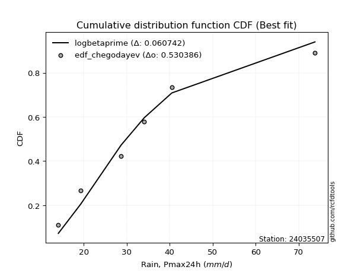</img></img>

</div>


### 6. EDF Blom (1958)

The Blom formula is a specific "plotting position" formula used in hydrology and statistical analysis to estimate the empirical cumulative probability (or non-exceedance probability) of a data series. It is particularly recommended for data that are approximately normally distributed. The constant _a_ is set to 0.375 (or 3/8).

<div align="center">


$P=(m-a)/(n+1-2a)$


</div>


**6.1. Empirical values**

<div align="center">

|                | 0                  | 1                  | 2                  | 3                 | 4                 | 5                  |
|:---------------|:-------------------|:-------------------|:-------------------|:------------------|:------------------|:-------------------|
| date           | 2021               | 2019               | 2017               | 2018              | 2020              | 2024               |
| x              | 14.1               | 19.3               | 28.7               | 34.1              | 40.5              | 73.8               |
| m              | 1                  | 2                  | 3                  | 4                 | 5                 | 6                  |
| empirical_dist | edf_blom           | edf_blom           | edf_blom           | edf_blom          | edf_blom          | edf_blom           |
| empirical      | 0.1                | 0.26               | 0.42               | 0.58              | 0.74              | 0.9                |
| empirical_tr   | 1.1111111111111112 | 1.3513513513513513 | 1.7241379310344827 | 2.380952380952381 | 3.846153846153846 | 10.000000000000002 |

</div>


**6.2. Kolmogorov-Smirnov fit test (sorted by Δ)**


<div align="center">

|                | 0                   | 1                   | 2                    | 3                   | 4                   | 5                   | 6                  | 7                   | 8                   | 9                  | 10                  | 11                  | 12                 | 13                  | 14                  | 15                  | 16                  | 17                  | 18                  | 19                  | 20                  | 21                  | 22                  | 23                  | 24                  | 25                  | 26                  | 27                  | 28                  | 29                  | 30                 | 31                | 32                  | 33                  | 34                  | 35                  | 36                  | 37                  | 38                    | 39                  | 40                  | 41                  | 42                  | 43                  | 44                  | 45                  | 46                  | 47                  | 48                  | 49             | 50                  | 51                  | 52                  | 53                  | 54                  | 55                  | 56                 | 57                  | 58                  | 59                  | 60                  | 61                  | 62                  | 63                  | 64                  | 65                  | 66                  | 67                  | 68                  | 69                  | 70                 | 71                  | 72                 | 73                | 74                 | 75                  | 76                 | 77             | 78             | 79                 | 80                  | 81                 | 82                 | 83                  | 84                 | 85                 | 86                 | 87             |
|:---------------|:--------------------|:--------------------|:---------------------|:--------------------|:--------------------|:--------------------|:-------------------|:--------------------|:--------------------|:-------------------|:--------------------|:--------------------|:-------------------|:--------------------|:--------------------|:--------------------|:--------------------|:--------------------|:--------------------|:--------------------|:--------------------|:--------------------|:--------------------|:--------------------|:--------------------|:--------------------|:--------------------|:--------------------|:--------------------|:--------------------|:-------------------|:------------------|:--------------------|:--------------------|:--------------------|:--------------------|:--------------------|:--------------------|:----------------------|:--------------------|:--------------------|:--------------------|:--------------------|:--------------------|:--------------------|:--------------------|:--------------------|:--------------------|:--------------------|:---------------|:--------------------|:--------------------|:--------------------|:--------------------|:--------------------|:--------------------|:-------------------|:--------------------|:--------------------|:--------------------|:--------------------|:--------------------|:--------------------|:--------------------|:--------------------|:--------------------|:--------------------|:--------------------|:--------------------|:--------------------|:-------------------|:--------------------|:-------------------|:------------------|:-------------------|:--------------------|:-------------------|:---------------|:---------------|:-------------------|:--------------------|:-------------------|:-------------------|:--------------------|:-------------------|:-------------------|:-------------------|:---------------|
| station        | 24035507            | 24035507            | 24035507             | 24035507            | 24035507            | 24035507            | 24035507           | 24035507            | 24035507            | 24035507           | 24035507            | 24035507            | 24035507           | 24035507            | 24035507            | 24035507            | 24035507            | 24035507            | 24035507            | 24035507            | 24035507            | 24035507            | 24035507            | 24035507            | 24035507            | 24035507            | 24035507            | 24035507            | 24035507            | 24035507            | 24035507           | 24035507          | 24035507            | 24035507            | 24035507            | 24035507            | 24035507            | 24035507            | 24035507              | 24035507            | 24035507            | 24035507            | 24035507            | 24035507            | 24035507            | 24035507            | 24035507            | 24035507            | 24035507            | 24035507       | 24035507            | 24035507            | 24035507            | 24035507            | 24035507            | 24035507            | 24035507           | 24035507            | 24035507            | 24035507            | 24035507            | 24035507            | 24035507            | 24035507            | 24035507            | 24035507            | 24035507            | 24035507            | 24035507            | 24035507            | 24035507           | 24035507            | 24035507           | 24035507          | 24035507           | 24035507            | 24035507           | 24035507       | 24035507       | 24035507           | 24035507            | 24035507           | 24035507           | 24035507            | 24035507           | 24035507           | 24035507           | 24035507       |
| empirical_dist | edf_blom            | edf_blom            | edf_blom             | edf_blom            | edf_blom            | edf_blom            | edf_blom           | edf_blom            | edf_blom            | edf_blom           | edf_blom            | edf_blom            | edf_blom           | edf_blom            | edf_blom            | edf_blom            | edf_blom            | edf_blom            | edf_blom            | edf_blom            | edf_blom            | edf_blom            | edf_blom            | edf_blom            | edf_blom            | edf_blom            | edf_blom            | edf_blom            | edf_blom            | edf_blom            | edf_blom           | edf_blom          | edf_blom            | edf_blom            | edf_blom            | edf_blom            | edf_blom            | edf_blom            | edf_blom              | edf_blom            | edf_blom            | edf_blom            | edf_blom            | edf_blom            | edf_blom            | edf_blom            | edf_blom            | edf_blom            | edf_blom            | edf_blom       | edf_blom            | edf_blom            | edf_blom            | edf_blom            | edf_blom            | edf_blom            | edf_blom           | edf_blom            | edf_blom            | edf_blom            | edf_blom            | edf_blom            | edf_blom            | edf_blom            | edf_blom            | edf_blom            | edf_blom            | edf_blom            | edf_blom            | edf_blom            | edf_blom           | edf_blom            | edf_blom           | edf_blom          | edf_blom           | edf_blom            | edf_blom           | edf_blom       | edf_blom       | edf_blom           | edf_blom            | edf_blom           | edf_blom           | edf_blom            | edf_blom           | edf_blom           | edf_blom           | edf_blom       |
| p_dist         | halflogistic        | logbetaprime        | loginvgamma          | logf                | logalpha            | lognct              | logloggamma        | logjohnsonsu        | logpearson3         | gumbel_r           | betaprime           | logexponnorm        | logt               | logcrystalball      | lognorm             | lognorm             | logrice             | logfatiguelife      | alpha               | moyal               | nct                 | logmaxwell          | logfisk             | logerlang           | logmielke           | logncf              | pearson3            | loggamma            | loggamma            | halfnorm            | loginvgauss        | ncf               | invgamma            | genlogistic         | lograyleigh         | kstwobign           | loglogistic         | loginvweibull       | loglaplace_asymmetric | loggumbel_l         | fisk                | rayleigh            | invgauss            | johnsonsu           | loghypsecant        | exponnorm           | logweibull_min      | genexpon            | gompertz            | expon          | loggenlogistic      | loggompertz         | loggumbel_r         | laplace_asymmetric  | maxwell             | hypsecant           | logkstwobign       | rice                | loglaplace          | laplace             | loghalfnorm         | logistic            | weibull_min         | logmoyal            | norm                | crystalball         | truncnorm           | t                   | loghalflogistic     | loggenexpon         | f                  | logchi2             | logexpon           | gumbel_l          | wald               | logwald             | lognakagami        | loggibrat      | gibrat         | gamma              | nakagami            | erlang             | loglognorm         | logtruncnorm        | fatiguelife        | invweibull         | chi2               | mielke         |
| delta          | 0.05267344412379127 | 0.05511737768782746 | 0.061555625838999734 | 0.06177172903854283 | 0.06205170640634916 | 0.06257482441621207 | 0.0629519852251205 | 0.06308646936125112 | 0.06332342647930153 | 0.0646349610848308 | 0.06517953043984209 | 0.06530284320593216 | 0.0653111949125107 | 0.06531486503265566 | 0.06531515838140728 | 0.06531515838140728 | 0.06555337104778658 | 0.06796158992215462 | 0.06880675399930644 | 0.06900025506071505 | 0.06965597641669924 | 0.06992104612611805 | 0.07024396008473333 | 0.07049524912515376 | 0.07080772478171363 | 0.07130654959484245 | 0.07138845059444554 | 0.07345975767428664 | 0.07345975767428664 | 0.07397063015420868 | 0.0746858549023155 | 0.075365211546021 | 0.07536523952148061 | 0.07685946844631739 | 0.08173729551535186 | 0.08355312191865619 | 0.08653232736552499 | 0.08767759628108734 | 0.08785590868879503   | 0.09173580856991415 | 0.09211519038266885 | 0.09653962855304155 | 0.09755255631490961 | 0.09856631918551068 | 0.09883879211645802 | 0.09907618021786327 | 0.09964514290926524 | 0.09999999999836783 | 0.09999999999999622 | 0.1            | 0.10076136206096759 | 0.10291068007283694 | 0.10327219337772892 | 0.10432445107856214 | 0.10444266880942399 | 0.10530970471768325 | 0.1102460566621159 | 0.11030923749788468 | 0.11198580165167865 | 0.11457736196405816 | 0.11507164090626615 | 0.11606461613249575 | 0.12365291514181725 | 0.12877541822721622 | 0.13007252736975883 | 0.13007253231791027 | 0.13007253499278637 | 0.13008077515313343 | 0.13668722277614537 | 0.14385234672986963 | 0.1540005580373643 | 0.16794651847245784 | 0.1828330244848742 | 0.187917149233378 | 0.2078768246981613 | 0.24107217377818538 | 0.2599999996444009 | 0.26           | 0.26           | 0.2668117456839248 | 0.28246890801906005 | 0.3138897880490836 | 0.3860792318992481 | 0.41999958583306907 | 0.4410550550501102 | 0.4550150926784666 | 0.6756592217547595 | nan            |
| deltao         | 0.530385761606      | 0.530385761606      | 0.530385761606       | 0.530385761606      | 0.530385761606      | 0.530385761606      | 0.530385761606     | 0.530385761606      | 0.530385761606      | 0.530385761606     | 0.530385761606      | 0.530385761606      | 0.530385761606     | 0.530385761606      | 0.530385761606      | 0.530385761606      | 0.530385761606      | 0.530385761606      | 0.530385761606      | 0.530385761606      | 0.530385761606      | 0.530385761606      | 0.530385761606      | 0.530385761606      | 0.530385761606      | 0.530385761606      | 0.530385761606      | 0.530385761606      | 0.530385761606      | 0.530385761606      | 0.530385761606     | 0.530385761606    | 0.530385761606      | 0.530385761606      | 0.530385761606      | 0.530385761606      | 0.530385761606      | 0.530385761606      | 0.530385761606        | 0.530385761606      | 0.530385761606      | 0.530385761606      | 0.530385761606      | 0.530385761606      | 0.530385761606      | 0.530385761606      | 0.530385761606      | 0.530385761606      | 0.530385761606      | 0.530385761606 | 0.530385761606      | 0.530385761606      | 0.530385761606      | 0.530385761606      | 0.530385761606      | 0.530385761606      | 0.530385761606     | 0.530385761606      | 0.530385761606      | 0.530385761606      | 0.530385761606      | 0.530385761606      | 0.530385761606      | 0.530385761606      | 0.530385761606      | 0.530385761606      | 0.530385761606      | 0.530385761606      | 0.530385761606      | 0.530385761606      | 0.530385761606     | 0.530385761606      | 0.530385761606     | 0.530385761606    | 0.530385761606     | 0.530385761606      | 0.530385761606     | 0.530385761606 | 0.530385761606 | 0.530385761606     | 0.530385761606      | 0.530385761606     | 0.530385761606     | 0.530385761606      | 0.530385761606     | 0.530385761606     | 0.530385761606     | 0.530385761606 |
| eval           | Δo > Δ              | Δo > Δ              | Δo > Δ               | Δo > Δ              | Δo > Δ              | Δo > Δ              | Δo > Δ             | Δo > Δ              | Δo > Δ              | Δo > Δ             | Δo > Δ              | Δo > Δ              | Δo > Δ             | Δo > Δ              | Δo > Δ              | Δo > Δ              | Δo > Δ              | Δo > Δ              | Δo > Δ              | Δo > Δ              | Δo > Δ              | Δo > Δ              | Δo > Δ              | Δo > Δ              | Δo > Δ              | Δo > Δ              | Δo > Δ              | Δo > Δ              | Δo > Δ              | Δo > Δ              | Δo > Δ             | Δo > Δ            | Δo > Δ              | Δo > Δ              | Δo > Δ              | Δo > Δ              | Δo > Δ              | Δo > Δ              | Δo > Δ                | Δo > Δ              | Δo > Δ              | Δo > Δ              | Δo > Δ              | Δo > Δ              | Δo > Δ              | Δo > Δ              | Δo > Δ              | Δo > Δ              | Δo > Δ              | Δo > Δ         | Δo > Δ              | Δo > Δ              | Δo > Δ              | Δo > Δ              | Δo > Δ              | Δo > Δ              | Δo > Δ             | Δo > Δ              | Δo > Δ              | Δo > Δ              | Δo > Δ              | Δo > Δ              | Δo > Δ              | Δo > Δ              | Δo > Δ              | Δo > Δ              | Δo > Δ              | Δo > Δ              | Δo > Δ              | Δo > Δ              | Δo > Δ             | Δo > Δ              | Δo > Δ             | Δo > Δ            | Δo > Δ             | Δo > Δ              | Δo > Δ             | Δo > Δ         | Δo > Δ         | Δo > Δ             | Δo > Δ              | Δo > Δ             | Δo > Δ             | Δo > Δ              | Δo > Δ             | Δo > Δ             | Δo <= Δ            | Δo <= Δ        |
| fit            | 1                   | 1                   | 1                    | 1                   | 1                   | 1                   | 1                  | 1                   | 1                   | 1                  | 1                   | 1                   | 1                  | 1                   | 1                   | 1                   | 1                   | 1                   | 1                   | 1                   | 1                   | 1                   | 1                   | 1                   | 1                   | 1                   | 1                   | 1                   | 1                   | 1                   | 1                  | 1                 | 1                   | 1                   | 1                   | 1                   | 1                   | 1                   | 1                     | 1                   | 1                   | 1                   | 1                   | 1                   | 1                   | 1                   | 1                   | 1                   | 1                   | 1              | 1                   | 1                   | 1                   | 1                   | 1                   | 1                   | 1                  | 1                   | 1                   | 1                   | 1                   | 1                   | 1                   | 1                   | 1                   | 1                   | 1                   | 1                   | 1                   | 1                   | 1                  | 1                   | 1                  | 1                 | 1                  | 1                   | 1                  | 1              | 1              | 1                  | 1                   | 1                  | 1                  | 1                   | 1                  | 1                  | 0                  | 0              |
| n              | 6                   | 6                   | 6                    | 6                   | 6                   | 6                   | 6                  | 6                   | 6                   | 6                  | 6                   | 6                   | 6                  | 6                   | 6                   | 6                   | 6                   | 6                   | 6                   | 6                   | 6                   | 6                   | 6                   | 6                   | 6                   | 6                   | 6                   | 6                   | 6                   | 6                   | 6                  | 6                 | 6                   | 6                   | 6                   | 6                   | 6                   | 6                   | 6                     | 6                   | 6                   | 6                   | 6                   | 6                   | 6                   | 6                   | 6                   | 6                   | 6                   | 6              | 6                   | 6                   | 6                   | 6                   | 6                   | 6                   | 6                  | 6                   | 6                   | 6                   | 6                   | 6                   | 6                   | 6                   | 6                   | 6                   | 6                   | 6                   | 6                   | 6                   | 6                  | 6                   | 6                  | 6                 | 6                  | 6                   | 6                  | 6              | 6              | 6                  | 6                   | 6                  | 6                  | 6                   | 6                  | 6                  | 6                  | 6              |
| best_fit       | 1                   | 0                   | 0                    | 0                   | 0                   | 0                   | 0                  | 0                   | 0                   | 0                  | 0                   | 0                   | 0                  | 0                   | 0                   | 0                   | 0                   | 0                   | 0                   | 0                   | 0                   | 0                   | 0                   | 0                   | 0                   | 0                   | 0                   | 0                   | 0                   | 0                   | 0                  | 0                 | 0                   | 0                   | 0                   | 0                   | 0                   | 0                   | 0                     | 0                   | 0                   | 0                   | 0                   | 0                   | 0                   | 0                   | 0                   | 0                   | 0                   | 0              | 0                   | 0                   | 0                   | 0                   | 0                   | 0                   | 0                  | 0                   | 0                   | 0                   | 0                   | 0                   | 0                   | 0                   | 0                   | 0                   | 0                   | 0                   | 0                   | 0                   | 0                  | 0                   | 0                  | 0                 | 0                  | 0                   | 0                  | 0              | 0              | 0                  | 0                   | 0                  | 0                  | 0                   | 0                  | 0                  | 0                  | 0              |
| best_fit_sort  | 1                   | 2                   | 3                    | 4                   | 5                   | 6                   | 7                  | 8                   | 9                   | 10                 | 11                  | 12                  | 13                 | 14                  | 15                  | 16                  | 17                  | 18                  | 19                  | 20                  | 21                  | 22                  | 23                  | 24                  | 25                  | 26                  | 27                  | 28                  | 29                  | 30                  | 31                 | 32                | 33                  | 34                  | 35                  | 36                  | 37                  | 38                  | 39                    | 40                  | 41                  | 42                  | 43                  | 44                  | 45                  | 46                  | 47                  | 48                  | 49                  | 50             | 51                  | 52                  | 53                  | 54                  | 55                  | 56                  | 57                 | 58                  | 59                  | 60                  | 61                  | 62                  | 63                  | 64                  | 65                  | 66                  | 67                  | 68                  | 69                  | 70                  | 71                 | 72                  | 73                 | 74                | 75                 | 76                  | 77                 | 78             | 79             | 80                 | 81                  | 82                 | 83                 | 84                  | 85                 | 86                 | 87                 | 88             |

</div>


**6.3. Best fit**

<div align="center">

|   id |   station | empirical_dist   | p_dist       |     delta |   deltao | eval   |   fit |   n |   best_fit |   best_fit_sort |
|-----:|----------:|:-----------------|:-------------|----------:|---------:|:-------|------:|----:|-----------:|----------------:|
|    0 |  24035507 | edf_blom         | halflogistic | 0.0526734 | 0.530386 | Δo > Δ |     1 |   6 |          1 |               1 |

</div>


<div align="center">

</img>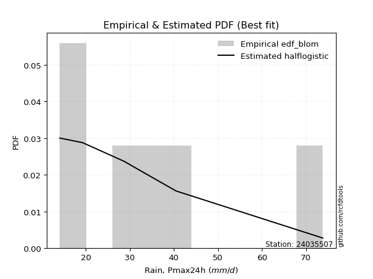</img>

</div>


### 7. EDF Tukey (1962)

In hydrology, the Tukey formula is used as a plotting position formula to estimate the empirical probability or frequency of a flood event (or other hydrological data). The formula parameter is given as _c=0.333_ (or 1/3).

<div align="center">


$P=(m-c)/(n+1-2c)$


</div>


**7.1. Empirical values**

<div align="center">

|                | 0                   | 1                  | 2                   | 3                  | 4                  | 5                  |
|:---------------|:--------------------|:-------------------|:--------------------|:-------------------|:-------------------|:-------------------|
| date           | 2021                | 2019               | 2017                | 2018               | 2020               | 2024               |
| x              | 14.1                | 19.3               | 28.7                | 34.1               | 40.5               | 73.8               |
| m              | 1                   | 2                  | 3                   | 4                  | 5                  | 6                  |
| empirical_dist | edf_tukey           | edf_tukey          | edf_tukey           | edf_tukey          | edf_tukey          | edf_tukey          |
| empirical      | 0.10526315789473684 | 0.2631578947368421 | 0.42105263157894735 | 0.5789473684210527 | 0.7368421052631579 | 0.8947368421052632 |
| empirical_tr   | 1.1176470588235294  | 1.357142857142857  | 1.7272727272727273  | 2.375              | 3.7999999999999994 | 9.5                |

</div>


**7.2. Kolmogorov-Smirnov fit test (sorted by Δ)**


<div align="center">

|                | 0                   | 1                   | 2                   | 3                   | 4                   | 5                  | 6                   | 7                   | 8                   | 9                   | 10                  | 11                  | 12                  | 13                 | 14                  | 15                  | 16                  | 17                  | 18                  | 19                  | 20                  | 21                 | 22                  | 23                  | 24                  | 25                  | 26                  | 27                  | 28                  | 29                  | 30                  | 31                  | 32                  | 33                  | 34                 | 35                  | 36                  | 37                  | 38                    | 39                 | 40                  | 41                  | 42                | 43                  | 44                  | 45                  | 46                  | 47                 | 48                  | 49                  | 50                 | 51                  | 52                  | 53                  | 54                  | 55                  | 56                  | 57                  | 58                  | 59                  | 60                  | 61                  | 62                 | 63                 | 64                  | 65                  | 66                 | 67                  | 68                | 69                  | 70                  | 71                  | 72                  | 73                  | 74                  | 75                  | 76                | 77                 | 78                 | 79                  | 80                 | 81                 | 82                | 83                 | 84                  | 85                  | 86                 | 87             |
|:---------------|:--------------------|:--------------------|:--------------------|:--------------------|:--------------------|:-------------------|:--------------------|:--------------------|:--------------------|:--------------------|:--------------------|:--------------------|:--------------------|:-------------------|:--------------------|:--------------------|:--------------------|:--------------------|:--------------------|:--------------------|:--------------------|:-------------------|:--------------------|:--------------------|:--------------------|:--------------------|:--------------------|:--------------------|:--------------------|:--------------------|:--------------------|:--------------------|:--------------------|:--------------------|:-------------------|:--------------------|:--------------------|:--------------------|:----------------------|:-------------------|:--------------------|:--------------------|:------------------|:--------------------|:--------------------|:--------------------|:--------------------|:-------------------|:--------------------|:--------------------|:-------------------|:--------------------|:--------------------|:--------------------|:--------------------|:--------------------|:--------------------|:--------------------|:--------------------|:--------------------|:--------------------|:--------------------|:-------------------|:-------------------|:--------------------|:--------------------|:-------------------|:--------------------|:------------------|:--------------------|:--------------------|:--------------------|:--------------------|:--------------------|:--------------------|:--------------------|:------------------|:-------------------|:-------------------|:--------------------|:-------------------|:-------------------|:------------------|:-------------------|:--------------------|:--------------------|:-------------------|:---------------|
| station        | 24035507            | 24035507            | 24035507            | 24035507            | 24035507            | 24035507           | 24035507            | 24035507            | 24035507            | 24035507            | 24035507            | 24035507            | 24035507            | 24035507           | 24035507            | 24035507            | 24035507            | 24035507            | 24035507            | 24035507            | 24035507            | 24035507           | 24035507            | 24035507            | 24035507            | 24035507            | 24035507            | 24035507            | 24035507            | 24035507            | 24035507            | 24035507            | 24035507            | 24035507            | 24035507           | 24035507            | 24035507            | 24035507            | 24035507              | 24035507           | 24035507            | 24035507            | 24035507          | 24035507            | 24035507            | 24035507            | 24035507            | 24035507           | 24035507            | 24035507            | 24035507           | 24035507            | 24035507            | 24035507            | 24035507            | 24035507            | 24035507            | 24035507            | 24035507            | 24035507            | 24035507            | 24035507            | 24035507           | 24035507           | 24035507            | 24035507            | 24035507           | 24035507            | 24035507          | 24035507            | 24035507            | 24035507            | 24035507            | 24035507            | 24035507            | 24035507            | 24035507          | 24035507           | 24035507           | 24035507            | 24035507           | 24035507           | 24035507          | 24035507           | 24035507            | 24035507            | 24035507           | 24035507       |
| empirical_dist | edf_tukey           | edf_tukey           | edf_tukey           | edf_tukey           | edf_tukey           | edf_tukey          | edf_tukey           | edf_tukey           | edf_tukey           | edf_tukey           | edf_tukey           | edf_tukey           | edf_tukey           | edf_tukey          | edf_tukey           | edf_tukey           | edf_tukey           | edf_tukey           | edf_tukey           | edf_tukey           | edf_tukey           | edf_tukey          | edf_tukey           | edf_tukey           | edf_tukey           | edf_tukey           | edf_tukey           | edf_tukey           | edf_tukey           | edf_tukey           | edf_tukey           | edf_tukey           | edf_tukey           | edf_tukey           | edf_tukey          | edf_tukey           | edf_tukey           | edf_tukey           | edf_tukey             | edf_tukey          | edf_tukey           | edf_tukey           | edf_tukey         | edf_tukey           | edf_tukey           | edf_tukey           | edf_tukey           | edf_tukey          | edf_tukey           | edf_tukey           | edf_tukey          | edf_tukey           | edf_tukey           | edf_tukey           | edf_tukey           | edf_tukey           | edf_tukey           | edf_tukey           | edf_tukey           | edf_tukey           | edf_tukey           | edf_tukey           | edf_tukey          | edf_tukey          | edf_tukey           | edf_tukey           | edf_tukey          | edf_tukey           | edf_tukey         | edf_tukey           | edf_tukey           | edf_tukey           | edf_tukey           | edf_tukey           | edf_tukey           | edf_tukey           | edf_tukey         | edf_tukey          | edf_tukey          | edf_tukey           | edf_tukey          | edf_tukey          | edf_tukey         | edf_tukey          | edf_tukey           | edf_tukey           | edf_tukey          | edf_tukey      |
| p_dist         | halflogistic        | logbetaprime        | gumbel_r            | logf                | betaprime           | logjohnsonsu       | logrice             | loginvgamma         | logalpha            | lognct              | logloggamma         | logpearson3         | logfatiguelife      | pearson3           | logexponnorm        | logt                | logcrystalball      | lognorm             | lognorm             | nct                 | logmaxwell          | logerlang          | logncf              | halfnorm            | alpha               | moyal               | loggamma            | loggamma            | logfisk             | loginvgauss         | logmielke           | ncf                 | invgamma            | genlogistic         | lograyleigh        | loginvweibull       | kstwobign           | loglogistic         | loglaplace_asymmetric | fisk               | rayleigh            | invgauss            | loggumbel_l       | johnsonsu           | logweibull_min      | loggenlogistic      | maxwell             | loghypsecant       | loggumbel_r         | hypsecant           | exponnorm          | loggompertz         | genexpon            | gompertz            | expon               | rice                | laplace_asymmetric  | logkstwobign        | logistic            | laplace             | loghalfnorm         | loglaplace          | weibull_min        | norm               | crystalball         | truncnorm           | t                  | logmoyal            | loghalflogistic   | loggenexpon         | f                   | logchi2             | logexpon            | gumbel_l            | wald                | logwald             | lognakagami       | loggibrat          | gibrat             | gamma               | nakagami           | erlang             | loglognorm        | logtruncnorm       | fatiguelife         | invweibull          | chi2               | mielke         |
| delta          | 0.05793660201852813 | 0.05827527242466954 | 0.06274074835458565 | 0.06392860699273872 | 0.06412689886089473 | 0.0641322296605748 | 0.06450073946883922 | 0.06471352057584182 | 0.06520960114319124 | 0.06573271915305415 | 0.06610987996196258 | 0.06648132121614361 | 0.06690895834320726 | 0.0682305558576034 | 0.06846073794277424 | 0.06846908964935278 | 0.06847275976949774 | 0.06847305311824936 | 0.06847305311824936 | 0.06860334483775188 | 0.06886841454717069 | 0.0694426175462064 | 0.07025391801589509 | 0.07081273541736655 | 0.07196464873614852 | 0.07215814979755714 | 0.07240712609533928 | 0.07240712609533928 | 0.07340185482157541 | 0.07363322332336814 | 0.07396561951855571 | 0.07431257996707363 | 0.07431260794253325 | 0.08001736318315947 | 0.0806846639364045 | 0.08662496470213998 | 0.08671101665549827 | 0.08969022210236707 | 0.09101380342563711   | 0.0910625588037215 | 0.09338173381619941 | 0.09649992473596225 | 0.096998966464651 | 0.09751368760656332 | 0.09859251133031788 | 0.09970873048202022 | 0.10128477407258185 | 0.1019966868533001 | 0.10221956179878156 | 0.10425707313873595 | 0.1043393381126001 | 0.10526313871973218 | 0.10526315789310466 | 0.10526315789473305 | 0.10526315789473684 | 0.10715134276104255 | 0.10748234581540422 | 0.10919342508316854 | 0.11290672139565361 | 0.11352473038511085 | 0.11401900932731879 | 0.11514369638852073 | 0.1226002835628699 | 0.1269146326329167 | 0.12691463758106813 | 0.12691464025594423 | 0.1269228804162913 | 0.12772278664826886 | 0.135634591197198 | 0.14279971515092227 | 0.15294792645841693 | 0.16689388689351048 | 0.18178039290592685 | 0.18475925449653585 | 0.21103471943500338 | 0.24423006851502746 | 0.263157894381243 | 0.2631578947368421 | 0.2631578947368421 | 0.26575911410497743 | 0.2814162764401127 | 0.3128371564701362 | 0.382921337162406 | 0.4210522174120164 | 0.43789716031326814 | 0.44975193478372977 | 0.6725013270179174 | nan            |
| deltao         | 0.530385761606      | 0.530385761606      | 0.530385761606      | 0.530385761606      | 0.530385761606      | 0.530385761606     | 0.530385761606      | 0.530385761606      | 0.530385761606      | 0.530385761606      | 0.530385761606      | 0.530385761606      | 0.530385761606      | 0.530385761606     | 0.530385761606      | 0.530385761606      | 0.530385761606      | 0.530385761606      | 0.530385761606      | 0.530385761606      | 0.530385761606      | 0.530385761606     | 0.530385761606      | 0.530385761606      | 0.530385761606      | 0.530385761606      | 0.530385761606      | 0.530385761606      | 0.530385761606      | 0.530385761606      | 0.530385761606      | 0.530385761606      | 0.530385761606      | 0.530385761606      | 0.530385761606     | 0.530385761606      | 0.530385761606      | 0.530385761606      | 0.530385761606        | 0.530385761606     | 0.530385761606      | 0.530385761606      | 0.530385761606    | 0.530385761606      | 0.530385761606      | 0.530385761606      | 0.530385761606      | 0.530385761606     | 0.530385761606      | 0.530385761606      | 0.530385761606     | 0.530385761606      | 0.530385761606      | 0.530385761606      | 0.530385761606      | 0.530385761606      | 0.530385761606      | 0.530385761606      | 0.530385761606      | 0.530385761606      | 0.530385761606      | 0.530385761606      | 0.530385761606     | 0.530385761606     | 0.530385761606      | 0.530385761606      | 0.530385761606     | 0.530385761606      | 0.530385761606    | 0.530385761606      | 0.530385761606      | 0.530385761606      | 0.530385761606      | 0.530385761606      | 0.530385761606      | 0.530385761606      | 0.530385761606    | 0.530385761606     | 0.530385761606     | 0.530385761606      | 0.530385761606     | 0.530385761606     | 0.530385761606    | 0.530385761606     | 0.530385761606      | 0.530385761606      | 0.530385761606     | 0.530385761606 |
| eval           | Δo > Δ              | Δo > Δ              | Δo > Δ              | Δo > Δ              | Δo > Δ              | Δo > Δ             | Δo > Δ              | Δo > Δ              | Δo > Δ              | Δo > Δ              | Δo > Δ              | Δo > Δ              | Δo > Δ              | Δo > Δ             | Δo > Δ              | Δo > Δ              | Δo > Δ              | Δo > Δ              | Δo > Δ              | Δo > Δ              | Δo > Δ              | Δo > Δ             | Δo > Δ              | Δo > Δ              | Δo > Δ              | Δo > Δ              | Δo > Δ              | Δo > Δ              | Δo > Δ              | Δo > Δ              | Δo > Δ              | Δo > Δ              | Δo > Δ              | Δo > Δ              | Δo > Δ             | Δo > Δ              | Δo > Δ              | Δo > Δ              | Δo > Δ                | Δo > Δ             | Δo > Δ              | Δo > Δ              | Δo > Δ            | Δo > Δ              | Δo > Δ              | Δo > Δ              | Δo > Δ              | Δo > Δ             | Δo > Δ              | Δo > Δ              | Δo > Δ             | Δo > Δ              | Δo > Δ              | Δo > Δ              | Δo > Δ              | Δo > Δ              | Δo > Δ              | Δo > Δ              | Δo > Δ              | Δo > Δ              | Δo > Δ              | Δo > Δ              | Δo > Δ             | Δo > Δ             | Δo > Δ              | Δo > Δ              | Δo > Δ             | Δo > Δ              | Δo > Δ            | Δo > Δ              | Δo > Δ              | Δo > Δ              | Δo > Δ              | Δo > Δ              | Δo > Δ              | Δo > Δ              | Δo > Δ            | Δo > Δ             | Δo > Δ             | Δo > Δ              | Δo > Δ             | Δo > Δ             | Δo > Δ            | Δo > Δ             | Δo > Δ              | Δo > Δ              | Δo <= Δ            | Δo <= Δ        |
| fit            | 1                   | 1                   | 1                   | 1                   | 1                   | 1                  | 1                   | 1                   | 1                   | 1                   | 1                   | 1                   | 1                   | 1                  | 1                   | 1                   | 1                   | 1                   | 1                   | 1                   | 1                   | 1                  | 1                   | 1                   | 1                   | 1                   | 1                   | 1                   | 1                   | 1                   | 1                   | 1                   | 1                   | 1                   | 1                  | 1                   | 1                   | 1                   | 1                     | 1                  | 1                   | 1                   | 1                 | 1                   | 1                   | 1                   | 1                   | 1                  | 1                   | 1                   | 1                  | 1                   | 1                   | 1                   | 1                   | 1                   | 1                   | 1                   | 1                   | 1                   | 1                   | 1                   | 1                  | 1                  | 1                   | 1                   | 1                  | 1                   | 1                 | 1                   | 1                   | 1                   | 1                   | 1                   | 1                   | 1                   | 1                 | 1                  | 1                  | 1                   | 1                  | 1                  | 1                 | 1                  | 1                   | 1                   | 0                  | 0              |
| n              | 6                   | 6                   | 6                   | 6                   | 6                   | 6                  | 6                   | 6                   | 6                   | 6                   | 6                   | 6                   | 6                   | 6                  | 6                   | 6                   | 6                   | 6                   | 6                   | 6                   | 6                   | 6                  | 6                   | 6                   | 6                   | 6                   | 6                   | 6                   | 6                   | 6                   | 6                   | 6                   | 6                   | 6                   | 6                  | 6                   | 6                   | 6                   | 6                     | 6                  | 6                   | 6                   | 6                 | 6                   | 6                   | 6                   | 6                   | 6                  | 6                   | 6                   | 6                  | 6                   | 6                   | 6                   | 6                   | 6                   | 6                   | 6                   | 6                   | 6                   | 6                   | 6                   | 6                  | 6                  | 6                   | 6                   | 6                  | 6                   | 6                 | 6                   | 6                   | 6                   | 6                   | 6                   | 6                   | 6                   | 6                 | 6                  | 6                  | 6                   | 6                  | 6                  | 6                 | 6                  | 6                   | 6                   | 6                  | 6              |
| best_fit       | 1                   | 0                   | 0                   | 0                   | 0                   | 0                  | 0                   | 0                   | 0                   | 0                   | 0                   | 0                   | 0                   | 0                  | 0                   | 0                   | 0                   | 0                   | 0                   | 0                   | 0                   | 0                  | 0                   | 0                   | 0                   | 0                   | 0                   | 0                   | 0                   | 0                   | 0                   | 0                   | 0                   | 0                   | 0                  | 0                   | 0                   | 0                   | 0                     | 0                  | 0                   | 0                   | 0                 | 0                   | 0                   | 0                   | 0                   | 0                  | 0                   | 0                   | 0                  | 0                   | 0                   | 0                   | 0                   | 0                   | 0                   | 0                   | 0                   | 0                   | 0                   | 0                   | 0                  | 0                  | 0                   | 0                   | 0                  | 0                   | 0                 | 0                   | 0                   | 0                   | 0                   | 0                   | 0                   | 0                   | 0                 | 0                  | 0                  | 0                   | 0                  | 0                  | 0                 | 0                  | 0                   | 0                   | 0                  | 0              |
| best_fit_sort  | 1                   | 2                   | 3                   | 4                   | 5                   | 6                  | 7                   | 8                   | 9                   | 10                  | 11                  | 12                  | 13                  | 14                 | 15                  | 16                  | 17                  | 18                  | 19                  | 20                  | 21                  | 22                 | 23                  | 24                  | 25                  | 26                  | 27                  | 28                  | 29                  | 30                  | 31                  | 32                  | 33                  | 34                  | 35                 | 36                  | 37                  | 38                  | 39                    | 40                 | 41                  | 42                  | 43                | 44                  | 45                  | 46                  | 47                  | 48                 | 49                  | 50                  | 51                 | 52                  | 53                  | 54                  | 55                  | 56                  | 57                  | 58                  | 59                  | 60                  | 61                  | 62                  | 63                 | 64                 | 65                  | 66                  | 67                 | 68                  | 69                | 70                  | 71                  | 72                  | 73                  | 74                  | 75                  | 76                  | 77                | 78                 | 79                 | 80                  | 81                 | 82                 | 83                | 84                 | 85                  | 86                  | 87                 | 88             |

</div>


**7.3. Best fit**

<div align="center">

|   id |   station | empirical_dist   | p_dist       |     delta |   deltao | eval   |   fit |   n |   best_fit |   best_fit_sort |
|-----:|----------:|:-----------------|:-------------|----------:|---------:|:-------|------:|----:|-----------:|----------------:|
|    0 |  24035507 | edf_tukey        | halflogistic | 0.0579366 | 0.530386 | Δo > Δ |     1 |   6 |          1 |               1 |

</div>


<div align="center">

</img>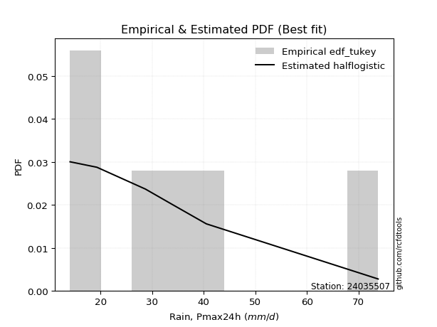</img>

</div>


### 8. EDF Gringorten (1963)

Gringorten plotting position formula is essential for estimating the probability and return periods of extreme events like floods and heavy rainfall. The constant _a=0.44_.

<div align="center">


$P=(m-a)/(n+1-2a)$


</div>


**8.1. Empirical values**

<div align="center">

|                | 0                   | 1                  | 2                   | 3                  | 4                  | 5                  |
|:---------------|:--------------------|:-------------------|:--------------------|:-------------------|:-------------------|:-------------------|
| date           | 2021                | 2019               | 2017                | 2018               | 2020               | 2024               |
| x              | 14.1                | 19.3               | 28.7                | 34.1               | 40.5               | 73.8               |
| m              | 1                   | 2                  | 3                   | 4                  | 5                  | 6                  |
| empirical_dist | edf_gringorten      | edf_gringorten     | edf_gringorten      | edf_gringorten     | edf_gringorten     | edf_gringorten     |
| empirical      | 0.09150326797385622 | 0.2549019607843137 | 0.41830065359477125 | 0.5816993464052288 | 0.7450980392156862 | 0.9084967320261437 |
| empirical_tr   | 1.1007194244604317  | 1.3421052631578947 | 1.7191011235955058  | 2.3906250000000004 | 3.9230769230769216 | 10.928571428571415 |

</div>


**8.2. Kolmogorov-Smirnov fit test (sorted by Δ)**


<div align="center">

|                | 0                    | 1                    | 2                   | 3                   | 4                   | 5                    | 6                    | 7                   | 8                   | 9                   | 10                 | 11                  | 12                  | 13                  | 14                  | 15                  | 16                  | 17                  | 18                  | 19                  | 20                  | 21                  | 22                  | 23                  | 24                  | 25                  | 26                  | 27                  | 28                  | 29                  | 30                  | 31                  | 32                  | 33                  | 34                  | 35                  | 36                    | 37                  | 38                  | 39                  | 40                  | 41                  | 42                  | 43                  | 44                  | 45                  | 46                  | 47                  | 48                 | 49                  | 50                  | 51                  | 52                  | 53                  | 54                  | 55                  | 56                  | 57                  | 58                  | 59                | 60                  | 61                  | 62                  | 63                  | 64                  | 65                  | 66                  | 67                  | 68                 | 69                  | 70                  | 71                  | 72                  | 73                  | 74                | 75                  | 76                 | 77                 | 78                 | 79                 | 80                 | 81                 | 82                 | 83                  | 84                 | 85                 | 86                 | 87             |
|:---------------|:---------------------|:---------------------|:--------------------|:--------------------|:--------------------|:---------------------|:---------------------|:--------------------|:--------------------|:--------------------|:-------------------|:--------------------|:--------------------|:--------------------|:--------------------|:--------------------|:--------------------|:--------------------|:--------------------|:--------------------|:--------------------|:--------------------|:--------------------|:--------------------|:--------------------|:--------------------|:--------------------|:--------------------|:--------------------|:--------------------|:--------------------|:--------------------|:--------------------|:--------------------|:--------------------|:--------------------|:----------------------|:--------------------|:--------------------|:--------------------|:--------------------|:--------------------|:--------------------|:--------------------|:--------------------|:--------------------|:--------------------|:--------------------|:-------------------|:--------------------|:--------------------|:--------------------|:--------------------|:--------------------|:--------------------|:--------------------|:--------------------|:--------------------|:--------------------|:------------------|:--------------------|:--------------------|:--------------------|:--------------------|:--------------------|:--------------------|:--------------------|:--------------------|:-------------------|:--------------------|:--------------------|:--------------------|:--------------------|:--------------------|:------------------|:--------------------|:-------------------|:-------------------|:-------------------|:-------------------|:-------------------|:-------------------|:-------------------|:--------------------|:-------------------|:-------------------|:-------------------|:---------------|
| station        | 24035507             | 24035507             | 24035507            | 24035507            | 24035507            | 24035507             | 24035507             | 24035507            | 24035507            | 24035507            | 24035507           | 24035507            | 24035507            | 24035507            | 24035507            | 24035507            | 24035507            | 24035507            | 24035507            | 24035507            | 24035507            | 24035507            | 24035507            | 24035507            | 24035507            | 24035507            | 24035507            | 24035507            | 24035507            | 24035507            | 24035507            | 24035507            | 24035507            | 24035507            | 24035507            | 24035507            | 24035507              | 24035507            | 24035507            | 24035507            | 24035507            | 24035507            | 24035507            | 24035507            | 24035507            | 24035507            | 24035507            | 24035507            | 24035507           | 24035507            | 24035507            | 24035507            | 24035507            | 24035507            | 24035507            | 24035507            | 24035507            | 24035507            | 24035507            | 24035507          | 24035507            | 24035507            | 24035507            | 24035507            | 24035507            | 24035507            | 24035507            | 24035507            | 24035507           | 24035507            | 24035507            | 24035507            | 24035507            | 24035507            | 24035507          | 24035507            | 24035507           | 24035507           | 24035507           | 24035507           | 24035507           | 24035507           | 24035507           | 24035507            | 24035507           | 24035507           | 24035507           | 24035507       |
| empirical_dist | edf_gringorten       | edf_gringorten       | edf_gringorten      | edf_gringorten      | edf_gringorten      | edf_gringorten       | edf_gringorten       | edf_gringorten      | edf_gringorten      | edf_gringorten      | edf_gringorten     | edf_gringorten      | edf_gringorten      | edf_gringorten      | edf_gringorten      | edf_gringorten      | edf_gringorten      | edf_gringorten      | edf_gringorten      | edf_gringorten      | edf_gringorten      | edf_gringorten      | edf_gringorten      | edf_gringorten      | edf_gringorten      | edf_gringorten      | edf_gringorten      | edf_gringorten      | edf_gringorten      | edf_gringorten      | edf_gringorten      | edf_gringorten      | edf_gringorten      | edf_gringorten      | edf_gringorten      | edf_gringorten      | edf_gringorten        | edf_gringorten      | edf_gringorten      | edf_gringorten      | edf_gringorten      | edf_gringorten      | edf_gringorten      | edf_gringorten      | edf_gringorten      | edf_gringorten      | edf_gringorten      | edf_gringorten      | edf_gringorten     | edf_gringorten      | edf_gringorten      | edf_gringorten      | edf_gringorten      | edf_gringorten      | edf_gringorten      | edf_gringorten      | edf_gringorten      | edf_gringorten      | edf_gringorten      | edf_gringorten    | edf_gringorten      | edf_gringorten      | edf_gringorten      | edf_gringorten      | edf_gringorten      | edf_gringorten      | edf_gringorten      | edf_gringorten      | edf_gringorten     | edf_gringorten      | edf_gringorten      | edf_gringorten      | edf_gringorten      | edf_gringorten      | edf_gringorten    | edf_gringorten      | edf_gringorten     | edf_gringorten     | edf_gringorten     | edf_gringorten     | edf_gringorten     | edf_gringorten     | edf_gringorten     | edf_gringorten      | edf_gringorten     | edf_gringorten     | edf_gringorten     | edf_gringorten |
| p_dist         | halflogistic         | logbetaprime         | logloggamma         | logpearson3         | logexponnorm        | logt                 | logcrystalball       | lognorm             | lognorm             | logalpha            | lognct             | loginvgamma         | logf                | alpha               | moyal               | logjohnsonsu        | logfisk             | logmielke           | betaprime           | logrice             | logfatiguelife      | gumbel_r            | nct                 | logmaxwell          | genlogistic         | logerlang           | logncf              | loggamma            | loggamma            | loginvgauss         | pearson3            | ncf                 | invgamma            | kstwobign           | halfnorm            | loglogistic         | loglaplace_asymmetric | lograyleigh         | loggumbel_l         | loginvweibull       | exponnorm           | genexpon            | gompertz            | expon               | loghypsecant        | fisk                | laplace_asymmetric  | invgauss            | johnsonsu          | logweibull_min      | rayleigh            | loggenlogistic      | loggompertz         | loggumbel_r         | loglaplace          | maxwell             | hypsecant           | logkstwobign        | rice                | laplace           | loghalfnorm         | logistic            | weibull_min         | logmoyal            | norm                | crystalball         | truncnorm           | t                   | loghalflogistic    | loggenexpon         | f                   | logchi2             | logexpon            | gumbel_l            | wald              | logwald             | lognakagami        | loggibrat          | gibrat             | gamma              | nakagami           | erlang             | loglognorm         | logtruncnorm        | fatiguelife        | invweibull         | chi2               | mielke         |
| delta          | 0.050706099169382846 | 0.054256152349880016 | 0.05785394600943419 | 0.05822538726361523 | 0.06020480399024586 | 0.060213155696824394 | 0.060216825816969355 | 0.06021711916572098 | 0.06021711916572098 | 0.06112287295549179 | 0.0611930557552558 | 0.06256009577720034 | 0.06347107544377156 | 0.06370871478362014 | 0.06390221584502875 | 0.06478581576647985 | 0.06514592086904702 | 0.06570968556602733 | 0.06687887684507082 | 0.06725271745301531 | 0.06966093632738335 | 0.06973300030051699 | 0.07135532282192797 | 0.07162039253134678 | 0.07176142923063109 | 0.07219459553038249 | 0.07300589600007118 | 0.07515910407951537 | 0.07515910407951537 | 0.07638520130754423 | 0.07648648981013173 | 0.07706455795124972 | 0.07706458592670934 | 0.07845508270296989 | 0.07906866936989487 | 0.08143428814983869 | 0.08275786947310873   | 0.08343664192058059 | 0.08504825383651543 | 0.08937694268631607 | 0.09057944819171948 | 0.09150326797222404 | 0.09150326797385243 | 0.09150326797385622 | 0.09374075290077172 | 0.09381453678789758 | 0.09922641186287584 | 0.09925190272013834 | 0.1002656655907394 | 0.10134448931449397 | 0.10163766776872774 | 0.10246070846619632 | 0.10461002647806567 | 0.10497153978295765 | 0.10688776243599235 | 0.10954070802511018 | 0.10980119138842181 | 0.11194540306734463 | 0.11540727671357087 | 0.116276708369287 | 0.11677098731149488 | 0.12116265534818194 | 0.12535226154704598 | 0.13047476463244495 | 0.13517056658544502 | 0.13517057153359646 | 0.13517057420847256 | 0.13517881436881962 | 0.1383865691813741 | 0.14555169313509836 | 0.15569990444259302 | 0.16964586487768657 | 0.18453237089010294 | 0.19301518844906418 | 0.202778785482475 | 0.23597413456249908 | 0.2549019604287146 | 0.2549019607843137 | 0.2549019607843137 | 0.2685110920891535 | 0.2848314865313669 | 0.3155891344543123 | 0.3911772711149344 | 0.41830023942784034 | 0.4461530942657965 | 0.4635118247046103 | 0.6807572609704458 | nan            |
| deltao         | 0.530385761606       | 0.530385761606       | 0.530385761606      | 0.530385761606      | 0.530385761606      | 0.530385761606       | 0.530385761606       | 0.530385761606      | 0.530385761606      | 0.530385761606      | 0.530385761606     | 0.530385761606      | 0.530385761606      | 0.530385761606      | 0.530385761606      | 0.530385761606      | 0.530385761606      | 0.530385761606      | 0.530385761606      | 0.530385761606      | 0.530385761606      | 0.530385761606      | 0.530385761606      | 0.530385761606      | 0.530385761606      | 0.530385761606      | 0.530385761606      | 0.530385761606      | 0.530385761606      | 0.530385761606      | 0.530385761606      | 0.530385761606      | 0.530385761606      | 0.530385761606      | 0.530385761606      | 0.530385761606      | 0.530385761606        | 0.530385761606      | 0.530385761606      | 0.530385761606      | 0.530385761606      | 0.530385761606      | 0.530385761606      | 0.530385761606      | 0.530385761606      | 0.530385761606      | 0.530385761606      | 0.530385761606      | 0.530385761606     | 0.530385761606      | 0.530385761606      | 0.530385761606      | 0.530385761606      | 0.530385761606      | 0.530385761606      | 0.530385761606      | 0.530385761606      | 0.530385761606      | 0.530385761606      | 0.530385761606    | 0.530385761606      | 0.530385761606      | 0.530385761606      | 0.530385761606      | 0.530385761606      | 0.530385761606      | 0.530385761606      | 0.530385761606      | 0.530385761606     | 0.530385761606      | 0.530385761606      | 0.530385761606      | 0.530385761606      | 0.530385761606      | 0.530385761606    | 0.530385761606      | 0.530385761606     | 0.530385761606     | 0.530385761606     | 0.530385761606     | 0.530385761606     | 0.530385761606     | 0.530385761606     | 0.530385761606      | 0.530385761606     | 0.530385761606     | 0.530385761606     | 0.530385761606 |
| eval           | Δo > Δ               | Δo > Δ               | Δo > Δ              | Δo > Δ              | Δo > Δ              | Δo > Δ               | Δo > Δ               | Δo > Δ              | Δo > Δ              | Δo > Δ              | Δo > Δ             | Δo > Δ              | Δo > Δ              | Δo > Δ              | Δo > Δ              | Δo > Δ              | Δo > Δ              | Δo > Δ              | Δo > Δ              | Δo > Δ              | Δo > Δ              | Δo > Δ              | Δo > Δ              | Δo > Δ              | Δo > Δ              | Δo > Δ              | Δo > Δ              | Δo > Δ              | Δo > Δ              | Δo > Δ              | Δo > Δ              | Δo > Δ              | Δo > Δ              | Δo > Δ              | Δo > Δ              | Δo > Δ              | Δo > Δ                | Δo > Δ              | Δo > Δ              | Δo > Δ              | Δo > Δ              | Δo > Δ              | Δo > Δ              | Δo > Δ              | Δo > Δ              | Δo > Δ              | Δo > Δ              | Δo > Δ              | Δo > Δ             | Δo > Δ              | Δo > Δ              | Δo > Δ              | Δo > Δ              | Δo > Δ              | Δo > Δ              | Δo > Δ              | Δo > Δ              | Δo > Δ              | Δo > Δ              | Δo > Δ            | Δo > Δ              | Δo > Δ              | Δo > Δ              | Δo > Δ              | Δo > Δ              | Δo > Δ              | Δo > Δ              | Δo > Δ              | Δo > Δ             | Δo > Δ              | Δo > Δ              | Δo > Δ              | Δo > Δ              | Δo > Δ              | Δo > Δ            | Δo > Δ              | Δo > Δ             | Δo > Δ             | Δo > Δ             | Δo > Δ             | Δo > Δ             | Δo > Δ             | Δo > Δ             | Δo > Δ              | Δo > Δ             | Δo > Δ             | Δo <= Δ            | Δo <= Δ        |
| fit            | 1                    | 1                    | 1                   | 1                   | 1                   | 1                    | 1                    | 1                   | 1                   | 1                   | 1                  | 1                   | 1                   | 1                   | 1                   | 1                   | 1                   | 1                   | 1                   | 1                   | 1                   | 1                   | 1                   | 1                   | 1                   | 1                   | 1                   | 1                   | 1                   | 1                   | 1                   | 1                   | 1                   | 1                   | 1                   | 1                   | 1                     | 1                   | 1                   | 1                   | 1                   | 1                   | 1                   | 1                   | 1                   | 1                   | 1                   | 1                   | 1                  | 1                   | 1                   | 1                   | 1                   | 1                   | 1                   | 1                   | 1                   | 1                   | 1                   | 1                 | 1                   | 1                   | 1                   | 1                   | 1                   | 1                   | 1                   | 1                   | 1                  | 1                   | 1                   | 1                   | 1                   | 1                   | 1                 | 1                   | 1                  | 1                  | 1                  | 1                  | 1                  | 1                  | 1                  | 1                   | 1                  | 1                  | 0                  | 0              |
| n              | 6                    | 6                    | 6                   | 6                   | 6                   | 6                    | 6                    | 6                   | 6                   | 6                   | 6                  | 6                   | 6                   | 6                   | 6                   | 6                   | 6                   | 6                   | 6                   | 6                   | 6                   | 6                   | 6                   | 6                   | 6                   | 6                   | 6                   | 6                   | 6                   | 6                   | 6                   | 6                   | 6                   | 6                   | 6                   | 6                   | 6                     | 6                   | 6                   | 6                   | 6                   | 6                   | 6                   | 6                   | 6                   | 6                   | 6                   | 6                   | 6                  | 6                   | 6                   | 6                   | 6                   | 6                   | 6                   | 6                   | 6                   | 6                   | 6                   | 6                 | 6                   | 6                   | 6                   | 6                   | 6                   | 6                   | 6                   | 6                   | 6                  | 6                   | 6                   | 6                   | 6                   | 6                   | 6                 | 6                   | 6                  | 6                  | 6                  | 6                  | 6                  | 6                  | 6                  | 6                   | 6                  | 6                  | 6                  | 6              |
| best_fit       | 1                    | 0                    | 0                   | 0                   | 0                   | 0                    | 0                    | 0                   | 0                   | 0                   | 0                  | 0                   | 0                   | 0                   | 0                   | 0                   | 0                   | 0                   | 0                   | 0                   | 0                   | 0                   | 0                   | 0                   | 0                   | 0                   | 0                   | 0                   | 0                   | 0                   | 0                   | 0                   | 0                   | 0                   | 0                   | 0                   | 0                     | 0                   | 0                   | 0                   | 0                   | 0                   | 0                   | 0                   | 0                   | 0                   | 0                   | 0                   | 0                  | 0                   | 0                   | 0                   | 0                   | 0                   | 0                   | 0                   | 0                   | 0                   | 0                   | 0                 | 0                   | 0                   | 0                   | 0                   | 0                   | 0                   | 0                   | 0                   | 0                  | 0                   | 0                   | 0                   | 0                   | 0                   | 0                 | 0                   | 0                  | 0                  | 0                  | 0                  | 0                  | 0                  | 0                  | 0                   | 0                  | 0                  | 0                  | 0              |
| best_fit_sort  | 1                    | 2                    | 3                   | 4                   | 5                   | 6                    | 7                    | 8                   | 9                   | 10                  | 11                 | 12                  | 13                  | 14                  | 15                  | 16                  | 17                  | 18                  | 19                  | 20                  | 21                  | 22                  | 23                  | 24                  | 25                  | 26                  | 27                  | 28                  | 29                  | 30                  | 31                  | 32                  | 33                  | 34                  | 35                  | 36                  | 37                    | 38                  | 39                  | 40                  | 41                  | 42                  | 43                  | 44                  | 45                  | 46                  | 47                  | 48                  | 49                 | 50                  | 51                  | 52                  | 53                  | 54                  | 55                  | 56                  | 57                  | 58                  | 59                  | 60                | 61                  | 62                  | 63                  | 64                  | 65                  | 66                  | 67                  | 68                  | 69                 | 70                  | 71                  | 72                  | 73                  | 74                  | 75                | 76                  | 77                 | 78                 | 79                 | 80                 | 81                 | 82                 | 83                 | 84                  | 85                 | 86                 | 87                 | 88             |

</div>


**8.3. Best fit**

<div align="center">

|   id |   station | empirical_dist   | p_dist       |     delta |   deltao | eval   |   fit |   n |   best_fit |   best_fit_sort |
|-----:|----------:|:-----------------|:-------------|----------:|---------:|:-------|------:|----:|-----------:|----------------:|
|    0 |  24035507 | edf_gringorten   | halflogistic | 0.0507061 | 0.530386 | Δo > Δ |     1 |   6 |          1 |               1 |

</div>


<div align="center">

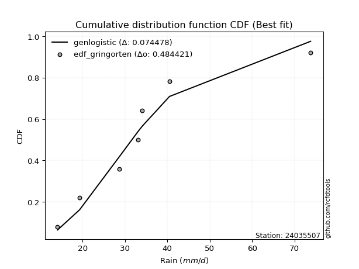</img>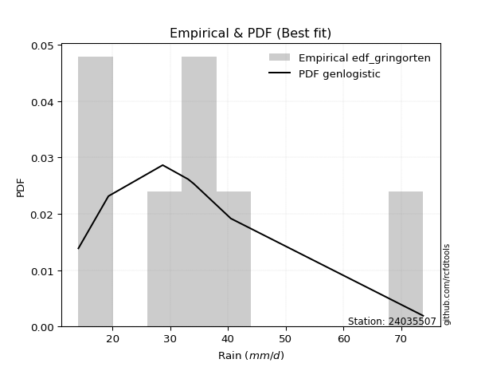</img>

</div>


### 9. EDF Filliben (1975)

The specific values of the constants (0.3175) (often denoted as $alpha$) and (0.365) are derived from a method proposed by James J. Filliben in a 1975 paper. This particular formula is the mean value of the $i$-th order statistic of the normal distribution and is considered a robust and effective plotting position formula for the normal probability plot correlation coefficient test for normality.

<div align="center">


$P=(m-0.3175)/(n+0.365)$


</div>


**9.1. Empirical values**

<div align="center">

|                | 0                   | 1                   | 2                  | 3                  | 4                  | 5                  |
|:---------------|:--------------------|:--------------------|:-------------------|:-------------------|:-------------------|:-------------------|
| date           | 2021                | 2019                | 2017               | 2018               | 2020               | 2024               |
| x              | 14.1                | 19.3                | 28.7               | 34.1               | 40.5               | 73.8               |
| m              | 1                   | 2                   | 3                  | 4                  | 5                  | 6                  |
| empirical_dist | edf_filliben        | edf_filliben        | edf_filliben       | edf_filliben       | edf_filliben       | edf_filliben       |
| empirical      | 0.10722702278083267 | 0.26433621366849963 | 0.4214454045561665 | 0.5785545954438335 | 0.7356637863315004 | 0.8927729772191673 |
| empirical_tr   | 1.1201055873295205  | 1.3593166043780034  | 1.7284453496266123 | 2.3727865796831313 | 3.783060921248143  | 9.326007326007321  |

</div>


**9.2. Kolmogorov-Smirnov fit test (sorted by Δ)**


<div align="center">

|                | 0                   | 1                   | 2                   | 3                   | 4                   | 5                   | 6                   | 7                   | 8                   | 9                   | 10                  | 11                  | 12                  | 13                  | 14                 | 15                 | 16                  | 17                  | 18                  | 19                  | 20                  | 21                 | 22                 | 23                  | 24                 | 25                 | 26                  | 27                  | 28                  | 29                  | 30                  | 31                  | 32                  | 33                  | 34                  | 35                 | 36                  | 37                  | 38                  | 39                    | 40                  | 41                  | 42                  | 43                 | 44                 | 45                  | 46                  | 47                  | 48                  | 49                  | 50                  | 51                  | 52                  | 53                  | 54                  | 55                  | 56                  | 57                  | 58                  | 59                  | 60                  | 61                  | 62                  | 63                  | 64                 | 65                 | 66                  | 67                  | 68                  | 69                 | 70                  | 71                 | 72                  | 73                  | 74                  | 75                | 76                 | 77                  | 78                  | 79                  | 80                 | 81                  | 82                  | 83                 | 84                 | 85                  | 86                 | 87             |
|:---------------|:--------------------|:--------------------|:--------------------|:--------------------|:--------------------|:--------------------|:--------------------|:--------------------|:--------------------|:--------------------|:--------------------|:--------------------|:--------------------|:--------------------|:-------------------|:-------------------|:--------------------|:--------------------|:--------------------|:--------------------|:--------------------|:-------------------|:-------------------|:--------------------|:-------------------|:-------------------|:--------------------|:--------------------|:--------------------|:--------------------|:--------------------|:--------------------|:--------------------|:--------------------|:--------------------|:-------------------|:--------------------|:--------------------|:--------------------|:----------------------|:--------------------|:--------------------|:--------------------|:-------------------|:-------------------|:--------------------|:--------------------|:--------------------|:--------------------|:--------------------|:--------------------|:--------------------|:--------------------|:--------------------|:--------------------|:--------------------|:--------------------|:--------------------|:--------------------|:--------------------|:--------------------|:--------------------|:--------------------|:--------------------|:-------------------|:-------------------|:--------------------|:--------------------|:--------------------|:-------------------|:--------------------|:-------------------|:--------------------|:--------------------|:--------------------|:------------------|:-------------------|:--------------------|:--------------------|:--------------------|:-------------------|:--------------------|:--------------------|:-------------------|:-------------------|:--------------------|:-------------------|:---------------|
| station        | 24035507            | 24035507            | 24035507            | 24035507            | 24035507            | 24035507            | 24035507            | 24035507            | 24035507            | 24035507            | 24035507            | 24035507            | 24035507            | 24035507            | 24035507           | 24035507           | 24035507            | 24035507            | 24035507            | 24035507            | 24035507            | 24035507           | 24035507           | 24035507            | 24035507           | 24035507           | 24035507            | 24035507            | 24035507            | 24035507            | 24035507            | 24035507            | 24035507            | 24035507            | 24035507            | 24035507           | 24035507            | 24035507            | 24035507            | 24035507              | 24035507            | 24035507            | 24035507            | 24035507           | 24035507           | 24035507            | 24035507            | 24035507            | 24035507            | 24035507            | 24035507            | 24035507            | 24035507            | 24035507            | 24035507            | 24035507            | 24035507            | 24035507            | 24035507            | 24035507            | 24035507            | 24035507            | 24035507            | 24035507            | 24035507           | 24035507           | 24035507            | 24035507            | 24035507            | 24035507           | 24035507            | 24035507           | 24035507            | 24035507            | 24035507            | 24035507          | 24035507           | 24035507            | 24035507            | 24035507            | 24035507           | 24035507            | 24035507            | 24035507           | 24035507           | 24035507            | 24035507           | 24035507       |
| empirical_dist | edf_filliben        | edf_filliben        | edf_filliben        | edf_filliben        | edf_filliben        | edf_filliben        | edf_filliben        | edf_filliben        | edf_filliben        | edf_filliben        | edf_filliben        | edf_filliben        | edf_filliben        | edf_filliben        | edf_filliben       | edf_filliben       | edf_filliben        | edf_filliben        | edf_filliben        | edf_filliben        | edf_filliben        | edf_filliben       | edf_filliben       | edf_filliben        | edf_filliben       | edf_filliben       | edf_filliben        | edf_filliben        | edf_filliben        | edf_filliben        | edf_filliben        | edf_filliben        | edf_filliben        | edf_filliben        | edf_filliben        | edf_filliben       | edf_filliben        | edf_filliben        | edf_filliben        | edf_filliben          | edf_filliben        | edf_filliben        | edf_filliben        | edf_filliben       | edf_filliben       | edf_filliben        | edf_filliben        | edf_filliben        | edf_filliben        | edf_filliben        | edf_filliben        | edf_filliben        | edf_filliben        | edf_filliben        | edf_filliben        | edf_filliben        | edf_filliben        | edf_filliben        | edf_filliben        | edf_filliben        | edf_filliben        | edf_filliben        | edf_filliben        | edf_filliben        | edf_filliben       | edf_filliben       | edf_filliben        | edf_filliben        | edf_filliben        | edf_filliben       | edf_filliben        | edf_filliben       | edf_filliben        | edf_filliben        | edf_filliben        | edf_filliben      | edf_filliben       | edf_filliben        | edf_filliben        | edf_filliben        | edf_filliben       | edf_filliben        | edf_filliben        | edf_filliben       | edf_filliben       | edf_filliben        | edf_filliben       | edf_filliben   |
| p_dist         | logbetaprime        | halflogistic        | logrice             | gumbel_r            | betaprime           | logf                | logjohnsonsu        | loginvgamma         | logalpha            | logfatiguelife      | lognct              | pearson3            | logloggamma         | logpearson3         | nct                | logmaxwell         | logerlang           | halfnorm            | logexponnorm        | logt                | logcrystalball      | lognorm            | lognorm            | logncf              | loggamma           | loggamma           | alpha               | loginvgauss         | moyal               | ncf                 | invgamma            | logfisk             | logmielke           | lograyleigh         | genlogistic         | loginvweibull      | kstwobign           | fisk                | loglogistic         | loglaplace_asymmetric | rayleigh            | invgauss            | johnsonsu           | logweibull_min     | loggumbel_l        | loggenlogistic      | maxwell             | loggumbel_r         | loghypsecant        | hypsecant           | rice                | exponnorm           | loggompertz         | genexpon            | gompertz            | expon               | laplace_asymmetric  | logkstwobign        | logistic            | laplace             | loghalfnorm         | loglaplace          | weibull_min         | norm                | crystalball        | truncnorm          | t                   | logmoyal            | loghalflogistic     | loggenexpon        | f                   | logchi2            | logexpon            | gumbel_l            | wald                | logwald           | lognakagami        | loggibrat           | gibrat              | gamma               | nakagami           | erlang              | loglognorm          | logtruncnorm       | fatiguelife        | invweibull          | chi2               | mielke         |
| delta          | 0.05945359135632708 | 0.05990046690462403 | 0.06426347536481727 | 0.06470461324068155 | 0.06501370378115967 | 0.06510692592439626 | 0.06531054859223234 | 0.06589183950749936 | 0.06638792007484878 | 0.06651618536598808 | 0.06691103808471169 | 0.06705223692594597 | 0.06728819889362012 | 0.06765964014780115 | 0.0682105718605327 | 0.0684756415699515 | 0.06904984456898722 | 0.06963441648570912 | 0.06963905687443178 | 0.06964740858101032 | 0.06965107870115528 | 0.0696513720499069 | 0.0696513720499069 | 0.06986114503867591 | 0.0720143531181201 | 0.0720143531181201 | 0.07314296766780606 | 0.07324045034614896 | 0.07333646872921468 | 0.07391980698985445 | 0.07391983496531407 | 0.07458017375323295 | 0.07514393845021325 | 0.08029189095918532 | 0.08119568211481701 | 0.0862321917249208 | 0.08788933558715581 | 0.09066978582650231 | 0.09086854103402461 | 0.09219212235729465   | 0.09220341488454198 | 0.09610715175874307 | 0.09712091462934413 | 0.0981997383530987 | 0.0989628313507469 | 0.09931595750480104 | 0.10010645514092442 | 0.10182678882156238 | 0.10317500578495764 | 0.10386430016151676 | 0.10597302382938512 | 0.10630320299869593 | 0.10722700360582801 | 0.10722702277920049 | 0.10722702278082888 | 0.10722702278083267 | 0.10866066474706176 | 0.10880065210594936 | 0.11172840246399618 | 0.11313195740789167 | 0.11362623635009961 | 0.11632201532017827 | 0.12220751058565071 | 0.12573631370125926 | 0.1257363186494107 | 0.1257363213242868 | 0.12574456148463387 | 0.12733001367104968 | 0.13524181821997883 | 0.1424069421737031 | 0.15255515348119775 | 0.1665011139162913 | 0.18138761992870767 | 0.18358093556487842 | 0.21221303836666092 | 0.245408387446685 | 0.2643362133129005 | 0.26433621366849963 | 0.26433621366849963 | 0.26536634112775825 | 0.2810235034628935 | 0.31244438349291703 | 0.38174301823074847 | 0.4214449903892356 | 0.4367188413816106 | 0.44778806989763387 | 0.6713230080862598 | nan            |
| deltao         | 0.530385761606      | 0.530385761606      | 0.530385761606      | 0.530385761606      | 0.530385761606      | 0.530385761606      | 0.530385761606      | 0.530385761606      | 0.530385761606      | 0.530385761606      | 0.530385761606      | 0.530385761606      | 0.530385761606      | 0.530385761606      | 0.530385761606     | 0.530385761606     | 0.530385761606      | 0.530385761606      | 0.530385761606      | 0.530385761606      | 0.530385761606      | 0.530385761606     | 0.530385761606     | 0.530385761606      | 0.530385761606     | 0.530385761606     | 0.530385761606      | 0.530385761606      | 0.530385761606      | 0.530385761606      | 0.530385761606      | 0.530385761606      | 0.530385761606      | 0.530385761606      | 0.530385761606      | 0.530385761606     | 0.530385761606      | 0.530385761606      | 0.530385761606      | 0.530385761606        | 0.530385761606      | 0.530385761606      | 0.530385761606      | 0.530385761606     | 0.530385761606     | 0.530385761606      | 0.530385761606      | 0.530385761606      | 0.530385761606      | 0.530385761606      | 0.530385761606      | 0.530385761606      | 0.530385761606      | 0.530385761606      | 0.530385761606      | 0.530385761606      | 0.530385761606      | 0.530385761606      | 0.530385761606      | 0.530385761606      | 0.530385761606      | 0.530385761606      | 0.530385761606      | 0.530385761606      | 0.530385761606     | 0.530385761606     | 0.530385761606      | 0.530385761606      | 0.530385761606      | 0.530385761606     | 0.530385761606      | 0.530385761606     | 0.530385761606      | 0.530385761606      | 0.530385761606      | 0.530385761606    | 0.530385761606     | 0.530385761606      | 0.530385761606      | 0.530385761606      | 0.530385761606     | 0.530385761606      | 0.530385761606      | 0.530385761606     | 0.530385761606     | 0.530385761606      | 0.530385761606     | 0.530385761606 |
| eval           | Δo > Δ              | Δo > Δ              | Δo > Δ              | Δo > Δ              | Δo > Δ              | Δo > Δ              | Δo > Δ              | Δo > Δ              | Δo > Δ              | Δo > Δ              | Δo > Δ              | Δo > Δ              | Δo > Δ              | Δo > Δ              | Δo > Δ             | Δo > Δ             | Δo > Δ              | Δo > Δ              | Δo > Δ              | Δo > Δ              | Δo > Δ              | Δo > Δ             | Δo > Δ             | Δo > Δ              | Δo > Δ             | Δo > Δ             | Δo > Δ              | Δo > Δ              | Δo > Δ              | Δo > Δ              | Δo > Δ              | Δo > Δ              | Δo > Δ              | Δo > Δ              | Δo > Δ              | Δo > Δ             | Δo > Δ              | Δo > Δ              | Δo > Δ              | Δo > Δ                | Δo > Δ              | Δo > Δ              | Δo > Δ              | Δo > Δ             | Δo > Δ             | Δo > Δ              | Δo > Δ              | Δo > Δ              | Δo > Δ              | Δo > Δ              | Δo > Δ              | Δo > Δ              | Δo > Δ              | Δo > Δ              | Δo > Δ              | Δo > Δ              | Δo > Δ              | Δo > Δ              | Δo > Δ              | Δo > Δ              | Δo > Δ              | Δo > Δ              | Δo > Δ              | Δo > Δ              | Δo > Δ             | Δo > Δ             | Δo > Δ              | Δo > Δ              | Δo > Δ              | Δo > Δ             | Δo > Δ              | Δo > Δ             | Δo > Δ              | Δo > Δ              | Δo > Δ              | Δo > Δ            | Δo > Δ             | Δo > Δ              | Δo > Δ              | Δo > Δ              | Δo > Δ             | Δo > Δ              | Δo > Δ              | Δo > Δ             | Δo > Δ             | Δo > Δ              | Δo <= Δ            | Δo <= Δ        |
| fit            | 1                   | 1                   | 1                   | 1                   | 1                   | 1                   | 1                   | 1                   | 1                   | 1                   | 1                   | 1                   | 1                   | 1                   | 1                  | 1                  | 1                   | 1                   | 1                   | 1                   | 1                   | 1                  | 1                  | 1                   | 1                  | 1                  | 1                   | 1                   | 1                   | 1                   | 1                   | 1                   | 1                   | 1                   | 1                   | 1                  | 1                   | 1                   | 1                   | 1                     | 1                   | 1                   | 1                   | 1                  | 1                  | 1                   | 1                   | 1                   | 1                   | 1                   | 1                   | 1                   | 1                   | 1                   | 1                   | 1                   | 1                   | 1                   | 1                   | 1                   | 1                   | 1                   | 1                   | 1                   | 1                  | 1                  | 1                   | 1                   | 1                   | 1                  | 1                   | 1                  | 1                   | 1                   | 1                   | 1                 | 1                  | 1                   | 1                   | 1                   | 1                  | 1                   | 1                   | 1                  | 1                  | 1                   | 0                  | 0              |
| n              | 6                   | 6                   | 6                   | 6                   | 6                   | 6                   | 6                   | 6                   | 6                   | 6                   | 6                   | 6                   | 6                   | 6                   | 6                  | 6                  | 6                   | 6                   | 6                   | 6                   | 6                   | 6                  | 6                  | 6                   | 6                  | 6                  | 6                   | 6                   | 6                   | 6                   | 6                   | 6                   | 6                   | 6                   | 6                   | 6                  | 6                   | 6                   | 6                   | 6                     | 6                   | 6                   | 6                   | 6                  | 6                  | 6                   | 6                   | 6                   | 6                   | 6                   | 6                   | 6                   | 6                   | 6                   | 6                   | 6                   | 6                   | 6                   | 6                   | 6                   | 6                   | 6                   | 6                   | 6                   | 6                  | 6                  | 6                   | 6                   | 6                   | 6                  | 6                   | 6                  | 6                   | 6                   | 6                   | 6                 | 6                  | 6                   | 6                   | 6                   | 6                  | 6                   | 6                   | 6                  | 6                  | 6                   | 6                  | 6              |
| best_fit       | 1                   | 0                   | 0                   | 0                   | 0                   | 0                   | 0                   | 0                   | 0                   | 0                   | 0                   | 0                   | 0                   | 0                   | 0                  | 0                  | 0                   | 0                   | 0                   | 0                   | 0                   | 0                  | 0                  | 0                   | 0                  | 0                  | 0                   | 0                   | 0                   | 0                   | 0                   | 0                   | 0                   | 0                   | 0                   | 0                  | 0                   | 0                   | 0                   | 0                     | 0                   | 0                   | 0                   | 0                  | 0                  | 0                   | 0                   | 0                   | 0                   | 0                   | 0                   | 0                   | 0                   | 0                   | 0                   | 0                   | 0                   | 0                   | 0                   | 0                   | 0                   | 0                   | 0                   | 0                   | 0                  | 0                  | 0                   | 0                   | 0                   | 0                  | 0                   | 0                  | 0                   | 0                   | 0                   | 0                 | 0                  | 0                   | 0                   | 0                   | 0                  | 0                   | 0                   | 0                  | 0                  | 0                   | 0                  | 0              |
| best_fit_sort  | 1                   | 2                   | 3                   | 4                   | 5                   | 6                   | 7                   | 8                   | 9                   | 10                  | 11                  | 12                  | 13                  | 14                  | 15                 | 16                 | 17                  | 18                  | 19                  | 20                  | 21                  | 22                 | 23                 | 24                  | 25                 | 26                 | 27                  | 28                  | 29                  | 30                  | 31                  | 32                  | 33                  | 34                  | 35                  | 36                 | 37                  | 38                  | 39                  | 40                    | 41                  | 42                  | 43                  | 44                 | 45                 | 46                  | 47                  | 48                  | 49                  | 50                  | 51                  | 52                  | 53                  | 54                  | 55                  | 56                  | 57                  | 58                  | 59                  | 60                  | 61                  | 62                  | 63                  | 64                  | 65                 | 66                 | 67                  | 68                  | 69                  | 70                 | 71                  | 72                 | 73                  | 74                  | 75                  | 76                | 77                 | 78                  | 79                  | 80                  | 81                 | 82                  | 83                  | 84                 | 85                 | 86                  | 87                 | 88             |

</div>


**9.3. Best fit**

<div align="center">

|   id |   station | empirical_dist   | p_dist       |     delta |   deltao | eval   |   fit |   n |   best_fit |   best_fit_sort |
|-----:|----------:|:-----------------|:-------------|----------:|---------:|:-------|------:|----:|-----------:|----------------:|
|    0 |  24035507 | edf_filliben     | logbetaprime | 0.0594536 | 0.530386 | Δo > Δ |     1 |   6 |          1 |               1 |

</div>


<div align="center">

</img></img>

</div>


### 10. EDF Jenkinson (1977)

The Jenkinson formula in hydrology is an empirical plotting position formula used to estimate the non-exceedance probability _(P)_ or return period _(T)_ of a given ordered observation within a sample. It is a widely used method in the frequency analysis of extreme events such as floods and rainfall, as it provides a distribution-free way to plot data. _a≈0.31_ and _b≈0.38_ are constants derived to approximate the median of the probability distribution for the given rank.

<div align="center">


$P=(m-a)/(n+b)$


</div>


**10.1. Empirical values**

<div align="center">

|                | 0                   | 1                   | 2                  | 3                  | 4                  | 5                  |
|:---------------|:--------------------|:--------------------|:-------------------|:-------------------|:-------------------|:-------------------|
| date           | 2021                | 2019                | 2017               | 2018               | 2020               | 2024               |
| x              | 14.1                | 19.3                | 28.7               | 34.1               | 40.5               | 73.8               |
| m              | 1                   | 2                   | 3                  | 4                  | 5                  | 6                  |
| empirical_dist | edf_jenkinson       | edf_jenkinson       | edf_jenkinson      | edf_jenkinson      | edf_jenkinson      | edf_jenkinson      |
| empirical      | 0.10815047021943573 | 0.26489028213166144 | 0.4216300940438871 | 0.5783699059561128 | 0.7351097178683387 | 0.8918495297805643 |
| empirical_tr   | 1.1212653778558874  | 1.3603411513859276  | 1.7289972899728996 | 2.3717472118959106 | 3.7751479289940844 | 9.246376811594207  |

</div>


**10.2. Kolmogorov-Smirnov fit test (sorted by Δ)**


<div align="center">

|                | 0                    | 1                   | 2                   | 3                   | 4                  | 5                   | 6                   | 7                   | 8                   | 9                   | 10                  | 11                 | 12                  | 13                 | 14                  | 15                 | 16                  | 17                  | 18                  | 19                  | 20                  | 21                  | 22                 | 23                 | 24                 | 25                 | 26                  | 27                  | 28                  | 29                  | 30                  | 31                  | 32                  | 33                  | 34                  | 35                 | 36                  | 37                  | 38                  | 39                  | 40                    | 41                  | 42                  | 43                 | 44                  | 45                  | 46                  | 47                  | 48                  | 49                  | 50                  | 51                | 52                  | 53                  | 54                  | 55                  | 56                  | 57                  | 58                  | 59                  | 60                | 61                  | 62                  | 63                 | 64                  | 65                  | 66                  | 67                  | 68                  | 69                 | 70                  | 71                 | 72                  | 73                  | 74                  | 75                 | 76                  | 77                  | 78                  | 79                  | 80                 | 81                  | 82                  | 83                 | 84                 | 85                 | 86                | 87             |
|:---------------|:---------------------|:--------------------|:--------------------|:--------------------|:-------------------|:--------------------|:--------------------|:--------------------|:--------------------|:--------------------|:--------------------|:-------------------|:--------------------|:-------------------|:--------------------|:-------------------|:--------------------|:--------------------|:--------------------|:--------------------|:--------------------|:--------------------|:-------------------|:-------------------|:-------------------|:-------------------|:--------------------|:--------------------|:--------------------|:--------------------|:--------------------|:--------------------|:--------------------|:--------------------|:--------------------|:-------------------|:--------------------|:--------------------|:--------------------|:--------------------|:----------------------|:--------------------|:--------------------|:-------------------|:--------------------|:--------------------|:--------------------|:--------------------|:--------------------|:--------------------|:--------------------|:------------------|:--------------------|:--------------------|:--------------------|:--------------------|:--------------------|:--------------------|:--------------------|:--------------------|:------------------|:--------------------|:--------------------|:-------------------|:--------------------|:--------------------|:--------------------|:--------------------|:--------------------|:-------------------|:--------------------|:-------------------|:--------------------|:--------------------|:--------------------|:-------------------|:--------------------|:--------------------|:--------------------|:--------------------|:-------------------|:--------------------|:--------------------|:-------------------|:-------------------|:-------------------|:------------------|:---------------|
| station        | 24035507             | 24035507            | 24035507            | 24035507            | 24035507           | 24035507            | 24035507            | 24035507            | 24035507            | 24035507            | 24035507            | 24035507           | 24035507            | 24035507           | 24035507            | 24035507           | 24035507            | 24035507            | 24035507            | 24035507            | 24035507            | 24035507            | 24035507           | 24035507           | 24035507           | 24035507           | 24035507            | 24035507            | 24035507            | 24035507            | 24035507            | 24035507            | 24035507            | 24035507            | 24035507            | 24035507           | 24035507            | 24035507            | 24035507            | 24035507            | 24035507              | 24035507            | 24035507            | 24035507           | 24035507            | 24035507            | 24035507            | 24035507            | 24035507            | 24035507            | 24035507            | 24035507          | 24035507            | 24035507            | 24035507            | 24035507            | 24035507            | 24035507            | 24035507            | 24035507            | 24035507          | 24035507            | 24035507            | 24035507           | 24035507            | 24035507            | 24035507            | 24035507            | 24035507            | 24035507           | 24035507            | 24035507           | 24035507            | 24035507            | 24035507            | 24035507           | 24035507            | 24035507            | 24035507            | 24035507            | 24035507           | 24035507            | 24035507            | 24035507           | 24035507           | 24035507           | 24035507          | 24035507       |
| empirical_dist | edf_jenkinson        | edf_jenkinson       | edf_jenkinson       | edf_jenkinson       | edf_jenkinson      | edf_jenkinson       | edf_jenkinson       | edf_jenkinson       | edf_jenkinson       | edf_jenkinson       | edf_jenkinson       | edf_jenkinson      | edf_jenkinson       | edf_jenkinson      | edf_jenkinson       | edf_jenkinson      | edf_jenkinson       | edf_jenkinson       | edf_jenkinson       | edf_jenkinson       | edf_jenkinson       | edf_jenkinson       | edf_jenkinson      | edf_jenkinson      | edf_jenkinson      | edf_jenkinson      | edf_jenkinson       | edf_jenkinson       | edf_jenkinson       | edf_jenkinson       | edf_jenkinson       | edf_jenkinson       | edf_jenkinson       | edf_jenkinson       | edf_jenkinson       | edf_jenkinson      | edf_jenkinson       | edf_jenkinson       | edf_jenkinson       | edf_jenkinson       | edf_jenkinson         | edf_jenkinson       | edf_jenkinson       | edf_jenkinson      | edf_jenkinson       | edf_jenkinson       | edf_jenkinson       | edf_jenkinson       | edf_jenkinson       | edf_jenkinson       | edf_jenkinson       | edf_jenkinson     | edf_jenkinson       | edf_jenkinson       | edf_jenkinson       | edf_jenkinson       | edf_jenkinson       | edf_jenkinson       | edf_jenkinson       | edf_jenkinson       | edf_jenkinson     | edf_jenkinson       | edf_jenkinson       | edf_jenkinson      | edf_jenkinson       | edf_jenkinson       | edf_jenkinson       | edf_jenkinson       | edf_jenkinson       | edf_jenkinson      | edf_jenkinson       | edf_jenkinson      | edf_jenkinson       | edf_jenkinson       | edf_jenkinson       | edf_jenkinson      | edf_jenkinson       | edf_jenkinson       | edf_jenkinson       | edf_jenkinson       | edf_jenkinson      | edf_jenkinson       | edf_jenkinson       | edf_jenkinson      | edf_jenkinson      | edf_jenkinson      | edf_jenkinson     | edf_jenkinson  |
| p_dist         | logbetaprime         | halflogistic        | logrice             | betaprime           | gumbel_r           | logf                | logjohnsonsu        | logfatiguelife      | loginvgamma         | pearson3            | logalpha            | lognct             | logloggamma         | nct                | logpearson3         | logmaxwell         | logerlang           | halfnorm            | logncf              | logexponnorm        | logt                | logcrystalball      | lognorm            | lognorm            | loggamma           | loggamma           | loginvgauss         | alpha               | ncf                 | invgamma            | moyal               | logfisk             | logmielke           | lograyleigh         | genlogistic         | loginvweibull      | kstwobign           | fisk                | loglogistic         | rayleigh            | loglaplace_asymmetric | invgauss            | johnsonsu           | logweibull_min     | loggenlogistic      | maxwell             | loggumbel_l         | loggumbel_r         | hypsecant           | loghypsecant        | rice                | exponnorm         | loggompertz         | genexpon            | gompertz            | expon               | logkstwobign        | laplace_asymmetric  | logistic            | laplace             | loghalfnorm       | loglaplace          | weibull_min         | norm               | crystalball         | truncnorm           | t                   | logmoyal            | loghalflogistic     | loggenexpon        | f                   | logchi2            | logexpon            | gumbel_l            | wald                | logwald            | lognakagami         | loggibrat           | gibrat              | gamma               | nakagami           | erlang              | loglognorm          | logtruncnorm       | fatiguelife        | invweibull         | chi2              | mielke         |
| delta          | 0.060007659819488884 | 0.06082391434322698 | 0.06483876734670405 | 0.06556777224432148 | 0.0656280606792845 | 0.06566099438755807 | 0.06586461705539415 | 0.06633149587826748 | 0.06644590797066116 | 0.06649816846278422 | 0.06694198853801059 | 0.0674651065478735 | 0.06784226735678192 | 0.0680258823728121 | 0.06821370861096296 | 0.0682909520822309 | 0.06886515508126662 | 0.06908034802254737 | 0.06967645555095531 | 0.07019312533759359 | 0.07020147704417212 | 0.07020514716431708 | 0.0702054405130687 | 0.0702054405130687 | 0.0718296636303995 | 0.0718296636303995 | 0.07305576085842835 | 0.07369703613096787 | 0.07373511750213385 | 0.07373514547759347 | 0.07389053719237648 | 0.07513424221639475 | 0.07569800691337505 | 0.08010720147146472 | 0.08174975057797881 | 0.0860475022372002 | 0.08844340405031761 | 0.09048509633878171 | 0.09142260949718642 | 0.09164934642138023 | 0.09274619082045646   | 0.09592246227102247 | 0.09693622514162353 | 0.0980150488653781 | 0.09913126801708044 | 0.09955238667776267 | 0.09988627878934986 | 0.10164209933384177 | 0.10367961067379611 | 0.10372907424811945 | 0.10541895536622337 | 0.107226650437299 | 0.10815045104443108 | 0.10815047021780355 | 0.10815047021943194 | 0.10815047021943573 | 0.10861596261822876 | 0.10921473321022357 | 0.11117433400083443 | 0.11294726792017101 | 0.113441546862379 | 0.11687608378334008 | 0.12202282109793011 | 0.1251822452380975 | 0.12518225018624896 | 0.12518225286112505 | 0.12519049302147212 | 0.12714532418332908 | 0.13505712873225822 | 0.1422222526859825 | 0.15237046399347715 | 0.1663164244285707 | 0.18120293044098706 | 0.18302686710171667 | 0.21276710682982272 | 0.2459624559098468 | 0.26489028177606233 | 0.26489028213166144 | 0.26489028213166144 | 0.26518165164003765 | 0.2808388139751729 | 0.31225969400519643 | 0.38118894976758666 | 0.4216296798769562 | 0.4361647729184488 | 0.4468646224590309 | 0.670768939623098 | nan            |
| deltao         | 0.530385761606       | 0.530385761606      | 0.530385761606      | 0.530385761606      | 0.530385761606     | 0.530385761606      | 0.530385761606      | 0.530385761606      | 0.530385761606      | 0.530385761606      | 0.530385761606      | 0.530385761606     | 0.530385761606      | 0.530385761606     | 0.530385761606      | 0.530385761606     | 0.530385761606      | 0.530385761606      | 0.530385761606      | 0.530385761606      | 0.530385761606      | 0.530385761606      | 0.530385761606     | 0.530385761606     | 0.530385761606     | 0.530385761606     | 0.530385761606      | 0.530385761606      | 0.530385761606      | 0.530385761606      | 0.530385761606      | 0.530385761606      | 0.530385761606      | 0.530385761606      | 0.530385761606      | 0.530385761606     | 0.530385761606      | 0.530385761606      | 0.530385761606      | 0.530385761606      | 0.530385761606        | 0.530385761606      | 0.530385761606      | 0.530385761606     | 0.530385761606      | 0.530385761606      | 0.530385761606      | 0.530385761606      | 0.530385761606      | 0.530385761606      | 0.530385761606      | 0.530385761606    | 0.530385761606      | 0.530385761606      | 0.530385761606      | 0.530385761606      | 0.530385761606      | 0.530385761606      | 0.530385761606      | 0.530385761606      | 0.530385761606    | 0.530385761606      | 0.530385761606      | 0.530385761606     | 0.530385761606      | 0.530385761606      | 0.530385761606      | 0.530385761606      | 0.530385761606      | 0.530385761606     | 0.530385761606      | 0.530385761606     | 0.530385761606      | 0.530385761606      | 0.530385761606      | 0.530385761606     | 0.530385761606      | 0.530385761606      | 0.530385761606      | 0.530385761606      | 0.530385761606     | 0.530385761606      | 0.530385761606      | 0.530385761606     | 0.530385761606     | 0.530385761606     | 0.530385761606    | 0.530385761606 |
| eval           | Δo > Δ               | Δo > Δ              | Δo > Δ              | Δo > Δ              | Δo > Δ             | Δo > Δ              | Δo > Δ              | Δo > Δ              | Δo > Δ              | Δo > Δ              | Δo > Δ              | Δo > Δ             | Δo > Δ              | Δo > Δ             | Δo > Δ              | Δo > Δ             | Δo > Δ              | Δo > Δ              | Δo > Δ              | Δo > Δ              | Δo > Δ              | Δo > Δ              | Δo > Δ             | Δo > Δ             | Δo > Δ             | Δo > Δ             | Δo > Δ              | Δo > Δ              | Δo > Δ              | Δo > Δ              | Δo > Δ              | Δo > Δ              | Δo > Δ              | Δo > Δ              | Δo > Δ              | Δo > Δ             | Δo > Δ              | Δo > Δ              | Δo > Δ              | Δo > Δ              | Δo > Δ                | Δo > Δ              | Δo > Δ              | Δo > Δ             | Δo > Δ              | Δo > Δ              | Δo > Δ              | Δo > Δ              | Δo > Δ              | Δo > Δ              | Δo > Δ              | Δo > Δ            | Δo > Δ              | Δo > Δ              | Δo > Δ              | Δo > Δ              | Δo > Δ              | Δo > Δ              | Δo > Δ              | Δo > Δ              | Δo > Δ            | Δo > Δ              | Δo > Δ              | Δo > Δ             | Δo > Δ              | Δo > Δ              | Δo > Δ              | Δo > Δ              | Δo > Δ              | Δo > Δ             | Δo > Δ              | Δo > Δ             | Δo > Δ              | Δo > Δ              | Δo > Δ              | Δo > Δ             | Δo > Δ              | Δo > Δ              | Δo > Δ              | Δo > Δ              | Δo > Δ             | Δo > Δ              | Δo > Δ              | Δo > Δ             | Δo > Δ             | Δo > Δ             | Δo <= Δ           | Δo <= Δ        |
| fit            | 1                    | 1                   | 1                   | 1                   | 1                  | 1                   | 1                   | 1                   | 1                   | 1                   | 1                   | 1                  | 1                   | 1                  | 1                   | 1                  | 1                   | 1                   | 1                   | 1                   | 1                   | 1                   | 1                  | 1                  | 1                  | 1                  | 1                   | 1                   | 1                   | 1                   | 1                   | 1                   | 1                   | 1                   | 1                   | 1                  | 1                   | 1                   | 1                   | 1                   | 1                     | 1                   | 1                   | 1                  | 1                   | 1                   | 1                   | 1                   | 1                   | 1                   | 1                   | 1                 | 1                   | 1                   | 1                   | 1                   | 1                   | 1                   | 1                   | 1                   | 1                 | 1                   | 1                   | 1                  | 1                   | 1                   | 1                   | 1                   | 1                   | 1                  | 1                   | 1                  | 1                   | 1                   | 1                   | 1                  | 1                   | 1                   | 1                   | 1                   | 1                  | 1                   | 1                   | 1                  | 1                  | 1                  | 0                 | 0              |
| n              | 6                    | 6                   | 6                   | 6                   | 6                  | 6                   | 6                   | 6                   | 6                   | 6                   | 6                   | 6                  | 6                   | 6                  | 6                   | 6                  | 6                   | 6                   | 6                   | 6                   | 6                   | 6                   | 6                  | 6                  | 6                  | 6                  | 6                   | 6                   | 6                   | 6                   | 6                   | 6                   | 6                   | 6                   | 6                   | 6                  | 6                   | 6                   | 6                   | 6                   | 6                     | 6                   | 6                   | 6                  | 6                   | 6                   | 6                   | 6                   | 6                   | 6                   | 6                   | 6                 | 6                   | 6                   | 6                   | 6                   | 6                   | 6                   | 6                   | 6                   | 6                 | 6                   | 6                   | 6                  | 6                   | 6                   | 6                   | 6                   | 6                   | 6                  | 6                   | 6                  | 6                   | 6                   | 6                   | 6                  | 6                   | 6                   | 6                   | 6                   | 6                  | 6                   | 6                   | 6                  | 6                  | 6                  | 6                 | 6              |
| best_fit       | 1                    | 0                   | 0                   | 0                   | 0                  | 0                   | 0                   | 0                   | 0                   | 0                   | 0                   | 0                  | 0                   | 0                  | 0                   | 0                  | 0                   | 0                   | 0                   | 0                   | 0                   | 0                   | 0                  | 0                  | 0                  | 0                  | 0                   | 0                   | 0                   | 0                   | 0                   | 0                   | 0                   | 0                   | 0                   | 0                  | 0                   | 0                   | 0                   | 0                   | 0                     | 0                   | 0                   | 0                  | 0                   | 0                   | 0                   | 0                   | 0                   | 0                   | 0                   | 0                 | 0                   | 0                   | 0                   | 0                   | 0                   | 0                   | 0                   | 0                   | 0                 | 0                   | 0                   | 0                  | 0                   | 0                   | 0                   | 0                   | 0                   | 0                  | 0                   | 0                  | 0                   | 0                   | 0                   | 0                  | 0                   | 0                   | 0                   | 0                   | 0                  | 0                   | 0                   | 0                  | 0                  | 0                  | 0                 | 0              |
| best_fit_sort  | 1                    | 2                   | 3                   | 4                   | 5                  | 6                   | 7                   | 8                   | 9                   | 10                  | 11                  | 12                 | 13                  | 14                 | 15                  | 16                 | 17                  | 18                  | 19                  | 20                  | 21                  | 22                  | 23                 | 24                 | 25                 | 26                 | 27                  | 28                  | 29                  | 30                  | 31                  | 32                  | 33                  | 34                  | 35                  | 36                 | 37                  | 38                  | 39                  | 40                  | 41                    | 42                  | 43                  | 44                 | 45                  | 46                  | 47                  | 48                  | 49                  | 50                  | 51                  | 52                | 53                  | 54                  | 55                  | 56                  | 57                  | 58                  | 59                  | 60                  | 61                | 62                  | 63                  | 64                 | 65                  | 66                  | 67                  | 68                  | 69                  | 70                 | 71                  | 72                 | 73                  | 74                  | 75                  | 76                 | 77                  | 78                  | 79                  | 80                  | 81                 | 82                  | 83                  | 84                 | 85                 | 86                 | 87                | 88             |

</div>


**10.3. Best fit**

<div align="center">

|   id |   station | empirical_dist   | p_dist       |     delta |   deltao | eval   |   fit |   n |   best_fit |   best_fit_sort |
|-----:|----------:|:-----------------|:-------------|----------:|---------:|:-------|------:|----:|-----------:|----------------:|
|    0 |  24035507 | edf_jenkinson    | logbetaprime | 0.0600077 | 0.530386 | Δo > Δ |     1 |   6 |          1 |               1 |

</div>


<div align="center">

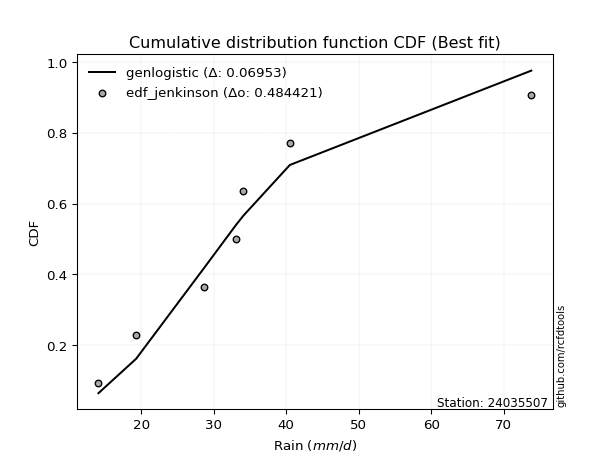</img></img>

</div>


### 11. EDF Cunnane (1978)

Cunnane´s work in statistical hydrology has focused on the performance and evaluation of different probability distributions (such as GEV, Gumbel, Lognormal) for flood frequency estimation. _b_ is a constant, typically set to 0.4.

<div align="center">


$P=(m-b)/(n+1-2b)$


</div>


**11.1. Empirical values**

<div align="center">

|                | 0                  | 1                   | 2                   | 3                  | 4                  | 5                  |
|:---------------|:-------------------|:--------------------|:--------------------|:-------------------|:-------------------|:-------------------|
| date           | 2021               | 2019                | 2017                | 2018               | 2020               | 2024               |
| x              | 14.1               | 19.3                | 28.7                | 34.1               | 40.5               | 73.8               |
| m              | 1                  | 2                   | 3                   | 4                  | 5                  | 6                  |
| empirical_dist | edf_cunnane        | edf_cunnane         | edf_cunnane         | edf_cunnane        | edf_cunnane        | edf_cunnane        |
| empirical      | 0.0967741935483871 | 0.25806451612903225 | 0.41935483870967744 | 0.5806451612903226 | 0.7419354838709676 | 0.9032258064516128 |
| empirical_tr   | 1.1071428571428572 | 1.3478260869565217  | 1.7222222222222225  | 2.384615384615385  | 3.8749999999999982 | 10.333333333333318 |

</div>


**11.2. Kolmogorov-Smirnov fit test (sorted by Δ)**


<div align="center">

|                | 0                    | 1                    | 2                  | 3                   | 4                    | 5                   | 6                   | 7                   | 8                  | 9                   | 10                 | 11                  | 12                  | 13                  | 14                  | 15                  | 16                  | 17                  | 18                 | 19                  | 20                  | 21                  | 22                  | 23                 | 24                  | 25                | 26                  | 27                  | 28                  | 29                  | 30                  | 31                  | 32                  | 33                  | 34                  | 35                  | 36                  | 37                    | 38                 | 39                 | 40                 | 41                  | 42                  | 43                 | 44                 | 45                  | 46                  | 47                  | 48                  | 49                  | 50                  | 51                  | 52                  | 53                  | 54                  | 55                  | 56                 | 57                  | 58                  | 59                  | 60                 | 61                  | 62                 | 63                  | 64                  | 65                  | 66                  | 67                  | 68                  | 69                  | 70                  | 71                 | 72                  | 73                  | 74                  | 75                  | 76                  | 77                  | 78                  | 79                  | 80                 | 81                 | 82                  | 83                 | 84                | 85                  | 86                 | 87             |
|:---------------|:---------------------|:---------------------|:-------------------|:--------------------|:---------------------|:--------------------|:--------------------|:--------------------|:-------------------|:--------------------|:-------------------|:--------------------|:--------------------|:--------------------|:--------------------|:--------------------|:--------------------|:--------------------|:-------------------|:--------------------|:--------------------|:--------------------|:--------------------|:-------------------|:--------------------|:------------------|:--------------------|:--------------------|:--------------------|:--------------------|:--------------------|:--------------------|:--------------------|:--------------------|:--------------------|:--------------------|:--------------------|:----------------------|:-------------------|:-------------------|:-------------------|:--------------------|:--------------------|:-------------------|:-------------------|:--------------------|:--------------------|:--------------------|:--------------------|:--------------------|:--------------------|:--------------------|:--------------------|:--------------------|:--------------------|:--------------------|:-------------------|:--------------------|:--------------------|:--------------------|:-------------------|:--------------------|:-------------------|:--------------------|:--------------------|:--------------------|:--------------------|:--------------------|:--------------------|:--------------------|:--------------------|:-------------------|:--------------------|:--------------------|:--------------------|:--------------------|:--------------------|:--------------------|:--------------------|:--------------------|:-------------------|:-------------------|:--------------------|:-------------------|:------------------|:--------------------|:-------------------|:---------------|
| station        | 24035507             | 24035507             | 24035507           | 24035507            | 24035507             | 24035507            | 24035507            | 24035507            | 24035507           | 24035507            | 24035507           | 24035507            | 24035507            | 24035507            | 24035507            | 24035507            | 24035507            | 24035507            | 24035507           | 24035507            | 24035507            | 24035507            | 24035507            | 24035507           | 24035507            | 24035507          | 24035507            | 24035507            | 24035507            | 24035507            | 24035507            | 24035507            | 24035507            | 24035507            | 24035507            | 24035507            | 24035507            | 24035507              | 24035507           | 24035507           | 24035507           | 24035507            | 24035507            | 24035507           | 24035507           | 24035507            | 24035507            | 24035507            | 24035507            | 24035507            | 24035507            | 24035507            | 24035507            | 24035507            | 24035507            | 24035507            | 24035507           | 24035507            | 24035507            | 24035507            | 24035507           | 24035507            | 24035507           | 24035507            | 24035507            | 24035507            | 24035507            | 24035507            | 24035507            | 24035507            | 24035507            | 24035507           | 24035507            | 24035507            | 24035507            | 24035507            | 24035507            | 24035507            | 24035507            | 24035507            | 24035507           | 24035507           | 24035507            | 24035507           | 24035507          | 24035507            | 24035507           | 24035507       |
| empirical_dist | edf_cunnane          | edf_cunnane          | edf_cunnane        | edf_cunnane         | edf_cunnane          | edf_cunnane         | edf_cunnane         | edf_cunnane         | edf_cunnane        | edf_cunnane         | edf_cunnane        | edf_cunnane         | edf_cunnane         | edf_cunnane         | edf_cunnane         | edf_cunnane         | edf_cunnane         | edf_cunnane         | edf_cunnane        | edf_cunnane         | edf_cunnane         | edf_cunnane         | edf_cunnane         | edf_cunnane        | edf_cunnane         | edf_cunnane       | edf_cunnane         | edf_cunnane         | edf_cunnane         | edf_cunnane         | edf_cunnane         | edf_cunnane         | edf_cunnane         | edf_cunnane         | edf_cunnane         | edf_cunnane         | edf_cunnane         | edf_cunnane           | edf_cunnane        | edf_cunnane        | edf_cunnane        | edf_cunnane         | edf_cunnane         | edf_cunnane        | edf_cunnane        | edf_cunnane         | edf_cunnane         | edf_cunnane         | edf_cunnane         | edf_cunnane         | edf_cunnane         | edf_cunnane         | edf_cunnane         | edf_cunnane         | edf_cunnane         | edf_cunnane         | edf_cunnane        | edf_cunnane         | edf_cunnane         | edf_cunnane         | edf_cunnane        | edf_cunnane         | edf_cunnane        | edf_cunnane         | edf_cunnane         | edf_cunnane         | edf_cunnane         | edf_cunnane         | edf_cunnane         | edf_cunnane         | edf_cunnane         | edf_cunnane        | edf_cunnane         | edf_cunnane         | edf_cunnane         | edf_cunnane         | edf_cunnane         | edf_cunnane         | edf_cunnane         | edf_cunnane         | edf_cunnane        | edf_cunnane        | edf_cunnane         | edf_cunnane        | edf_cunnane       | edf_cunnane         | edf_cunnane        | edf_cunnane    |
| p_dist         | halflogistic         | logbetaprime         | logalpha           | lognct              | logloggamma          | logpearson3         | loginvgamma         | logf                | logexponnorm       | logt                | logcrystalball     | lognorm             | lognorm             | logjohnsonsu        | betaprime           | logrice             | gumbel_r            | alpha               | moyal              | logfisk             | logfatiguelife      | logmielke           | nct                 | logmaxwell         | logerlang           | logncf            | pearson3            | loggamma            | loggamma            | genlogistic         | loginvgauss         | halfnorm            | ncf                 | invgamma            | kstwobign           | lograyleigh         | loglogistic         | loglaplace_asymmetric | loginvweibull      | loggumbel_l        | fisk               | exponnorm           | genexpon            | gompertz           | expon              | loghypsecant        | invgauss            | rayleigh            | johnsonsu           | logweibull_min      | loggenlogistic      | laplace_asymmetric  | loggompertz         | loggumbel_r         | maxwell             | hypsecant           | loglaplace         | logkstwobign        | rice                | laplace             | loghalfnorm        | logistic            | weibull_min        | logmoyal            | norm                | crystalball         | truncnorm           | t                   | loghalflogistic     | loggenexpon         | f                   | logchi2            | logexpon            | gumbel_l            | wald                | logwald             | lognakagami         | loggibrat           | gibrat              | gamma               | nakagami           | erlang             | loglognorm          | logtruncnorm       | fatiguelife       | invweibull          | chi2               | mielke         |
| delta          | 0.049447637672178524 | 0.053201967234973835 | 0.0601162225353814 | 0.06063934054524431 | 0.061016501354152736 | 0.06138794260833377 | 0.06150591066229416 | 0.06241689032886538 | 0.0633673593349644 | 0.06337571104154294 | 0.0633793811616879 | 0.06337967451043952 | 0.06337967451043952 | 0.06373163065157367 | 0.06582469173016464 | 0.06619853233810913 | 0.06657044495579845 | 0.06687127012833868 | 0.0670647711897473 | 0.06830847621376557 | 0.06860675121247717 | 0.06887224091074587 | 0.07030113770702179 | 0.0705662074164406 | 0.07114041041547631 | 0.071951710885165 | 0.07332393446541319 | 0.07410491896460919 | 0.07410491896460919 | 0.07492398457534963 | 0.07533101619263805 | 0.07590611402517633 | 0.07601037283634354 | 0.07601040081180316 | 0.08161763804768843 | 0.08238245680567441 | 0.08459684349455723 | 0.08592042481782727   | 0.0883227575714099 | 0.0885100021183014 | 0.0927603516729914 | 0.09585037376625036 | 0.09677419354675491 | 0.0967741935483833 | 0.0967741935483871 | 0.09690330824549026 | 0.09819771760523216 | 0.09847511242400919 | 0.09921148047583322 | 0.10029030419958779 | 0.10140652335129013 | 0.10238896720759438 | 0.10355584136315948 | 0.10391735466805146 | 0.10637815268039164 | 0.10663863604370327 | 0.1100503177807109 | 0.11089121795243845 | 0.11224472136885233 | 0.11522252325438082 | 0.1157168021965887 | 0.11800010000346339 | 0.1242980764321398 | 0.12942057951753877 | 0.13200801124072647 | 0.13200801618887792 | 0.13200801886375402 | 0.13201625902410108 | 0.13733238406646792 | 0.14449750802019218 | 0.15464571932768684 | 0.1685916797627804 | 0.18347818577519676 | 0.18985263310434564 | 0.20594134082719354 | 0.23913668990721762 | 0.25806451577343315 | 0.25806451612903225 | 0.25806451612903225 | 0.26745690697424734 | 0.2831140693093826 | 0.3145349493394061 | 0.38801471577021585 | 0.4193544245427465 | 0.442990538921078 | 0.45824089913007937 | 0.6775947056257272 | nan            |
| deltao         | 0.530385761606       | 0.530385761606       | 0.530385761606     | 0.530385761606      | 0.530385761606       | 0.530385761606      | 0.530385761606      | 0.530385761606      | 0.530385761606     | 0.530385761606      | 0.530385761606     | 0.530385761606      | 0.530385761606      | 0.530385761606      | 0.530385761606      | 0.530385761606      | 0.530385761606      | 0.530385761606      | 0.530385761606     | 0.530385761606      | 0.530385761606      | 0.530385761606      | 0.530385761606      | 0.530385761606     | 0.530385761606      | 0.530385761606    | 0.530385761606      | 0.530385761606      | 0.530385761606      | 0.530385761606      | 0.530385761606      | 0.530385761606      | 0.530385761606      | 0.530385761606      | 0.530385761606      | 0.530385761606      | 0.530385761606      | 0.530385761606        | 0.530385761606     | 0.530385761606     | 0.530385761606     | 0.530385761606      | 0.530385761606      | 0.530385761606     | 0.530385761606     | 0.530385761606      | 0.530385761606      | 0.530385761606      | 0.530385761606      | 0.530385761606      | 0.530385761606      | 0.530385761606      | 0.530385761606      | 0.530385761606      | 0.530385761606      | 0.530385761606      | 0.530385761606     | 0.530385761606      | 0.530385761606      | 0.530385761606      | 0.530385761606     | 0.530385761606      | 0.530385761606     | 0.530385761606      | 0.530385761606      | 0.530385761606      | 0.530385761606      | 0.530385761606      | 0.530385761606      | 0.530385761606      | 0.530385761606      | 0.530385761606     | 0.530385761606      | 0.530385761606      | 0.530385761606      | 0.530385761606      | 0.530385761606      | 0.530385761606      | 0.530385761606      | 0.530385761606      | 0.530385761606     | 0.530385761606     | 0.530385761606      | 0.530385761606     | 0.530385761606    | 0.530385761606      | 0.530385761606     | 0.530385761606 |
| eval           | Δo > Δ               | Δo > Δ               | Δo > Δ             | Δo > Δ              | Δo > Δ               | Δo > Δ              | Δo > Δ              | Δo > Δ              | Δo > Δ             | Δo > Δ              | Δo > Δ             | Δo > Δ              | Δo > Δ              | Δo > Δ              | Δo > Δ              | Δo > Δ              | Δo > Δ              | Δo > Δ              | Δo > Δ             | Δo > Δ              | Δo > Δ              | Δo > Δ              | Δo > Δ              | Δo > Δ             | Δo > Δ              | Δo > Δ            | Δo > Δ              | Δo > Δ              | Δo > Δ              | Δo > Δ              | Δo > Δ              | Δo > Δ              | Δo > Δ              | Δo > Δ              | Δo > Δ              | Δo > Δ              | Δo > Δ              | Δo > Δ                | Δo > Δ             | Δo > Δ             | Δo > Δ             | Δo > Δ              | Δo > Δ              | Δo > Δ             | Δo > Δ             | Δo > Δ              | Δo > Δ              | Δo > Δ              | Δo > Δ              | Δo > Δ              | Δo > Δ              | Δo > Δ              | Δo > Δ              | Δo > Δ              | Δo > Δ              | Δo > Δ              | Δo > Δ             | Δo > Δ              | Δo > Δ              | Δo > Δ              | Δo > Δ             | Δo > Δ              | Δo > Δ             | Δo > Δ              | Δo > Δ              | Δo > Δ              | Δo > Δ              | Δo > Δ              | Δo > Δ              | Δo > Δ              | Δo > Δ              | Δo > Δ             | Δo > Δ              | Δo > Δ              | Δo > Δ              | Δo > Δ              | Δo > Δ              | Δo > Δ              | Δo > Δ              | Δo > Δ              | Δo > Δ             | Δo > Δ             | Δo > Δ              | Δo > Δ             | Δo > Δ            | Δo > Δ              | Δo <= Δ            | Δo <= Δ        |
| fit            | 1                    | 1                    | 1                  | 1                   | 1                    | 1                   | 1                   | 1                   | 1                  | 1                   | 1                  | 1                   | 1                   | 1                   | 1                   | 1                   | 1                   | 1                   | 1                  | 1                   | 1                   | 1                   | 1                   | 1                  | 1                   | 1                 | 1                   | 1                   | 1                   | 1                   | 1                   | 1                   | 1                   | 1                   | 1                   | 1                   | 1                   | 1                     | 1                  | 1                  | 1                  | 1                   | 1                   | 1                  | 1                  | 1                   | 1                   | 1                   | 1                   | 1                   | 1                   | 1                   | 1                   | 1                   | 1                   | 1                   | 1                  | 1                   | 1                   | 1                   | 1                  | 1                   | 1                  | 1                   | 1                   | 1                   | 1                   | 1                   | 1                   | 1                   | 1                   | 1                  | 1                   | 1                   | 1                   | 1                   | 1                   | 1                   | 1                   | 1                   | 1                  | 1                  | 1                   | 1                  | 1                 | 1                   | 0                  | 0              |
| n              | 6                    | 6                    | 6                  | 6                   | 6                    | 6                   | 6                   | 6                   | 6                  | 6                   | 6                  | 6                   | 6                   | 6                   | 6                   | 6                   | 6                   | 6                   | 6                  | 6                   | 6                   | 6                   | 6                   | 6                  | 6                   | 6                 | 6                   | 6                   | 6                   | 6                   | 6                   | 6                   | 6                   | 6                   | 6                   | 6                   | 6                   | 6                     | 6                  | 6                  | 6                  | 6                   | 6                   | 6                  | 6                  | 6                   | 6                   | 6                   | 6                   | 6                   | 6                   | 6                   | 6                   | 6                   | 6                   | 6                   | 6                  | 6                   | 6                   | 6                   | 6                  | 6                   | 6                  | 6                   | 6                   | 6                   | 6                   | 6                   | 6                   | 6                   | 6                   | 6                  | 6                   | 6                   | 6                   | 6                   | 6                   | 6                   | 6                   | 6                   | 6                  | 6                  | 6                   | 6                  | 6                 | 6                   | 6                  | 6              |
| best_fit       | 1                    | 0                    | 0                  | 0                   | 0                    | 0                   | 0                   | 0                   | 0                  | 0                   | 0                  | 0                   | 0                   | 0                   | 0                   | 0                   | 0                   | 0                   | 0                  | 0                   | 0                   | 0                   | 0                   | 0                  | 0                   | 0                 | 0                   | 0                   | 0                   | 0                   | 0                   | 0                   | 0                   | 0                   | 0                   | 0                   | 0                   | 0                     | 0                  | 0                  | 0                  | 0                   | 0                   | 0                  | 0                  | 0                   | 0                   | 0                   | 0                   | 0                   | 0                   | 0                   | 0                   | 0                   | 0                   | 0                   | 0                  | 0                   | 0                   | 0                   | 0                  | 0                   | 0                  | 0                   | 0                   | 0                   | 0                   | 0                   | 0                   | 0                   | 0                   | 0                  | 0                   | 0                   | 0                   | 0                   | 0                   | 0                   | 0                   | 0                   | 0                  | 0                  | 0                   | 0                  | 0                 | 0                   | 0                  | 0              |
| best_fit_sort  | 1                    | 2                    | 3                  | 4                   | 5                    | 6                   | 7                   | 8                   | 9                  | 10                  | 11                 | 12                  | 13                  | 14                  | 15                  | 16                  | 17                  | 18                  | 19                 | 20                  | 21                  | 22                  | 23                  | 24                 | 25                  | 26                | 27                  | 28                  | 29                  | 30                  | 31                  | 32                  | 33                  | 34                  | 35                  | 36                  | 37                  | 38                    | 39                 | 40                 | 41                 | 42                  | 43                  | 44                 | 45                 | 46                  | 47                  | 48                  | 49                  | 50                  | 51                  | 52                  | 53                  | 54                  | 55                  | 56                  | 57                 | 58                  | 59                  | 60                  | 61                 | 62                  | 63                 | 64                  | 65                  | 66                  | 67                  | 68                  | 69                  | 70                  | 71                  | 72                 | 73                  | 74                  | 75                  | 76                  | 77                  | 78                  | 79                  | 80                  | 81                 | 82                 | 83                  | 84                 | 85                | 86                  | 87                 | 88             |

</div>


**11.3. Best fit**

<div align="center">

|   id |   station | empirical_dist   | p_dist       |     delta |   deltao | eval   |   fit |   n |   best_fit |   best_fit_sort |
|-----:|----------:|:-----------------|:-------------|----------:|---------:|:-------|------:|----:|-----------:|----------------:|
|    0 |  24035507 | edf_cunnane      | halflogistic | 0.0494476 | 0.530386 | Δo > Δ |     1 |   6 |          1 |               1 |

</div>


<div align="center">

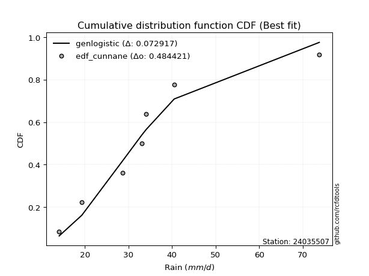</img>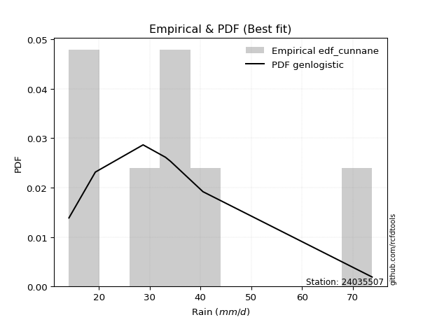</img>

</div>


### 12. EDF Adamowski (1981)

The Adamowski formula in hydrology refers to a specific plotting position formula used for estimating the non-parametric empirical distribution of hydrological events (like flood peaks) to calculate their return periods. This formula provides an alternative to traditional parametric methods (like the Gumbel or Log Pearson Type III distributions). 

<div align="center">


$P=(m-0.25)/(n+0.5)$


</div>


**12.1. Empirical values**

<div align="center">

|                | 0                   | 1                  | 2                  | 3                  | 4                  | 5                  |
|:---------------|:--------------------|:-------------------|:-------------------|:-------------------|:-------------------|:-------------------|
| date           | 2021                | 2019               | 2017               | 2018               | 2020               | 2024               |
| x              | 14.1                | 19.3               | 28.7               | 34.1               | 40.5               | 73.8               |
| m              | 1                   | 2                  | 3                  | 4                  | 5                  | 6                  |
| empirical_dist | edf_adamowski       | edf_adamowski      | edf_adamowski      | edf_adamowski      | edf_adamowski      | edf_adamowski      |
| empirical      | 0.11538461538461539 | 0.2692307692307692 | 0.4230769230769231 | 0.5769230769230769 | 0.7307692307692307 | 0.8846153846153846 |
| empirical_tr   | 1.1304347826086958  | 1.3684210526315788 | 1.7333333333333334 | 2.3636363636363633 | 3.7142857142857135 | 8.666666666666664  |

</div>


**12.2. Kolmogorov-Smirnov fit test (sorted by Δ)**


<div align="center">

|                | 0                   | 1                   | 2                   | 3                   | 4                   | 5                   | 6                  | 7                   | 8                   | 9                   | 10                  | 11                  | 12                  | 13                  | 14                  | 15                  | 16                  | 17                  | 18                 | 19                 | 20                  | 21                 | 22                  | 23                  | 24                  | 25                 | 26                  | 27                  | 28                  | 29                  | 30                  | 31                  | 32                  | 33                  | 34                  | 35                 | 36                  | 37                  | 38                 | 39                  | 40                  | 41                  | 42                 | 43                  | 44                    | 45                 | 46                  | 47                  | 48                  | 49                  | 50                  | 51                 | 52                  | 53                  | 54                  | 55                  | 56                  | 57                  | 58                 | 59                  | 60                  | 61                  | 62                  | 63                  | 64                 | 65                  | 66                  | 67                  | 68                  | 69                  | 70                 | 71                  | 72                  | 73                  | 74                 | 75                 | 76                 | 77                 | 78                 | 79                 | 80                  | 81                 | 82                 | 83                  | 84                | 85                 | 86                 | 87             |
|:---------------|:--------------------|:--------------------|:--------------------|:--------------------|:--------------------|:--------------------|:-------------------|:--------------------|:--------------------|:--------------------|:--------------------|:--------------------|:--------------------|:--------------------|:--------------------|:--------------------|:--------------------|:--------------------|:-------------------|:-------------------|:--------------------|:-------------------|:--------------------|:--------------------|:--------------------|:-------------------|:--------------------|:--------------------|:--------------------|:--------------------|:--------------------|:--------------------|:--------------------|:--------------------|:--------------------|:-------------------|:--------------------|:--------------------|:-------------------|:--------------------|:--------------------|:--------------------|:-------------------|:--------------------|:----------------------|:-------------------|:--------------------|:--------------------|:--------------------|:--------------------|:--------------------|:-------------------|:--------------------|:--------------------|:--------------------|:--------------------|:--------------------|:--------------------|:-------------------|:--------------------|:--------------------|:--------------------|:--------------------|:--------------------|:-------------------|:--------------------|:--------------------|:--------------------|:--------------------|:--------------------|:-------------------|:--------------------|:--------------------|:--------------------|:-------------------|:-------------------|:-------------------|:-------------------|:-------------------|:-------------------|:--------------------|:-------------------|:-------------------|:--------------------|:------------------|:-------------------|:-------------------|:---------------|
| station        | 24035507            | 24035507            | 24035507            | 24035507            | 24035507            | 24035507            | 24035507           | 24035507            | 24035507            | 24035507            | 24035507            | 24035507            | 24035507            | 24035507            | 24035507            | 24035507            | 24035507            | 24035507            | 24035507           | 24035507           | 24035507            | 24035507           | 24035507            | 24035507            | 24035507            | 24035507           | 24035507            | 24035507            | 24035507            | 24035507            | 24035507            | 24035507            | 24035507            | 24035507            | 24035507            | 24035507           | 24035507            | 24035507            | 24035507           | 24035507            | 24035507            | 24035507            | 24035507           | 24035507            | 24035507              | 24035507           | 24035507            | 24035507            | 24035507            | 24035507            | 24035507            | 24035507           | 24035507            | 24035507            | 24035507            | 24035507            | 24035507            | 24035507            | 24035507           | 24035507            | 24035507            | 24035507            | 24035507            | 24035507            | 24035507           | 24035507            | 24035507            | 24035507            | 24035507            | 24035507            | 24035507           | 24035507            | 24035507            | 24035507            | 24035507           | 24035507           | 24035507           | 24035507           | 24035507           | 24035507           | 24035507            | 24035507           | 24035507           | 24035507            | 24035507          | 24035507           | 24035507           | 24035507       |
| empirical_dist | edf_adamowski       | edf_adamowski       | edf_adamowski       | edf_adamowski       | edf_adamowski       | edf_adamowski       | edf_adamowski      | edf_adamowski       | edf_adamowski       | edf_adamowski       | edf_adamowski       | edf_adamowski       | edf_adamowski       | edf_adamowski       | edf_adamowski       | edf_adamowski       | edf_adamowski       | edf_adamowski       | edf_adamowski      | edf_adamowski      | edf_adamowski       | edf_adamowski      | edf_adamowski       | edf_adamowski       | edf_adamowski       | edf_adamowski      | edf_adamowski       | edf_adamowski       | edf_adamowski       | edf_adamowski       | edf_adamowski       | edf_adamowski       | edf_adamowski       | edf_adamowski       | edf_adamowski       | edf_adamowski      | edf_adamowski       | edf_adamowski       | edf_adamowski      | edf_adamowski       | edf_adamowski       | edf_adamowski       | edf_adamowski      | edf_adamowski       | edf_adamowski         | edf_adamowski      | edf_adamowski       | edf_adamowski       | edf_adamowski       | edf_adamowski       | edf_adamowski       | edf_adamowski      | edf_adamowski       | edf_adamowski       | edf_adamowski       | edf_adamowski       | edf_adamowski       | edf_adamowski       | edf_adamowski      | edf_adamowski       | edf_adamowski       | edf_adamowski       | edf_adamowski       | edf_adamowski       | edf_adamowski      | edf_adamowski       | edf_adamowski       | edf_adamowski       | edf_adamowski       | edf_adamowski       | edf_adamowski      | edf_adamowski       | edf_adamowski       | edf_adamowski       | edf_adamowski      | edf_adamowski      | edf_adamowski      | edf_adamowski      | edf_adamowski      | edf_adamowski      | edf_adamowski       | edf_adamowski      | edf_adamowski      | edf_adamowski       | edf_adamowski     | edf_adamowski      | edf_adamowski      | edf_adamowski  |
| p_dist         | logbetaprime        | logmaxwell          | logerlang           | halflogistic        | logncf              | logfatiguelife      | nct                | betaprime           | halfnorm            | logf                | logjohnsonsu        | loggamma            | loggamma            | loginvgamma         | logalpha            | loginvgauss         | lognct              | logrice             | logloggamma        | ncf                | invgamma            | pearson3           | logpearson3         | gumbel_r            | logexponnorm        | logt               | logcrystalball      | lognorm             | lognorm             | alpha               | moyal               | lograyleigh         | logfisk             | logmielke           | loginvweibull       | genlogistic        | rayleigh            | fisk                | kstwobign          | invgauss            | maxwell             | johnsonsu           | loglogistic        | logweibull_min      | loglaplace_asymmetric | loggenlogistic     | loggumbel_r         | hypsecant           | logistic            | loggumbel_l         | logkstwobign        | rice               | loghypsecant        | laplace             | laplace_asymmetric  | exponnorm           | loggompertz         | genexpon            | gompertz           | loghalfnorm         | expon               | weibull_min         | norm                | crystalball         | truncnorm          | t                   | loglaplace          | logmoyal            | loghalflogistic     | loggenexpon         | f                  | logchi2             | gumbel_l            | logexpon            | wald               | logwald            | gamma              | lognakagami        | gibrat             | loggibrat          | nakagami            | erlang             | loglognorm         | logtruncnorm        | fatiguelife       | invweibull         | chi2               | mielke         |
| delta          | 0.06434814691859667 | 0.06684412304919496 | 0.06785610387618518 | 0.06805805950840671 | 0.06822962651791936 | 0.06825735675197075 | 0.0689124885293361 | 0.06990825934342926 | 0.06994615599419729 | 0.07000148148666585 | 0.07020510415450193 | 0.07038283459736355 | 0.07038283459736355 | 0.07078639506976894 | 0.07128247563711837 | 0.07160893182539241 | 0.07180559364698128 | 0.07207291251188372 | 0.0721827544558897 | 0.0722882884690979 | 0.07228831644455752 | 0.0724641061029867 | 0.07255419571007074 | 0.07286220584446423 | 0.07453361243670137 | 0.0745419641432799 | 0.07454563426342486 | 0.07454592761217649 | 0.07454592761217649 | 0.07803752323007565 | 0.07823102429148426 | 0.07866037243842877 | 0.07947472931550253 | 0.08003849401248284 | 0.08460067320416426 | 0.0860902376770866 | 0.08730885932227228 | 0.08903826730574577 | 0.0927838911494254 | 0.09447563323798652 | 0.09521189957865472 | 0.09548939610858759 | 0.0957630965962942 | 0.09656821983234215 | 0.09708667791956424   | 0.0976844389840445 | 0.10019527030080583 | 0.10223278164076016 | 0.10683384690172648 | 0.10712042395452959 | 0.10716913358519281 | 0.1074241482956575 | 0.10806956134722723 | 0.11150043888713507 | 0.11355522030933135 | 0.11446079560247865 | 0.11538459620961074 | 0.11538461538298321 | 0.1153846153846116 | 0.11538461538461539 | 0.11538461538461539 | 0.12057599206489417 | 0.12084175813898956 | 0.12084176308714101 | 0.1208417657620171 | 0.12085000592236417 | 0.12121657088244786 | 0.12569849515029313 | 0.13361029969922228 | 0.14077542365294654 | 0.1509236349604412 | 0.16486959539553475 | 0.17868638000260872 | 0.17975610140795112 | 0.2171075939289305 | 0.2503029430089546 | 0.2637348226070017 | 0.2692307688751701 | 0.2692307692307692 | 0.2692307692307692 | 0.27939198494213696 | 0.3108128649721605 | 0.3768484626684789 | 0.42307650890999215 | 0.431824285819341 | 0.4396304772938512 | 0.6664284525239903 | nan            |
| deltao         | 0.530385761606      | 0.530385761606      | 0.530385761606      | 0.530385761606      | 0.530385761606      | 0.530385761606      | 0.530385761606     | 0.530385761606      | 0.530385761606      | 0.530385761606      | 0.530385761606      | 0.530385761606      | 0.530385761606      | 0.530385761606      | 0.530385761606      | 0.530385761606      | 0.530385761606      | 0.530385761606      | 0.530385761606     | 0.530385761606     | 0.530385761606      | 0.530385761606     | 0.530385761606      | 0.530385761606      | 0.530385761606      | 0.530385761606     | 0.530385761606      | 0.530385761606      | 0.530385761606      | 0.530385761606      | 0.530385761606      | 0.530385761606      | 0.530385761606      | 0.530385761606      | 0.530385761606      | 0.530385761606     | 0.530385761606      | 0.530385761606      | 0.530385761606     | 0.530385761606      | 0.530385761606      | 0.530385761606      | 0.530385761606     | 0.530385761606      | 0.530385761606        | 0.530385761606     | 0.530385761606      | 0.530385761606      | 0.530385761606      | 0.530385761606      | 0.530385761606      | 0.530385761606     | 0.530385761606      | 0.530385761606      | 0.530385761606      | 0.530385761606      | 0.530385761606      | 0.530385761606      | 0.530385761606     | 0.530385761606      | 0.530385761606      | 0.530385761606      | 0.530385761606      | 0.530385761606      | 0.530385761606     | 0.530385761606      | 0.530385761606      | 0.530385761606      | 0.530385761606      | 0.530385761606      | 0.530385761606     | 0.530385761606      | 0.530385761606      | 0.530385761606      | 0.530385761606     | 0.530385761606     | 0.530385761606     | 0.530385761606     | 0.530385761606     | 0.530385761606     | 0.530385761606      | 0.530385761606     | 0.530385761606     | 0.530385761606      | 0.530385761606    | 0.530385761606     | 0.530385761606     | 0.530385761606 |
| eval           | Δo > Δ              | Δo > Δ              | Δo > Δ              | Δo > Δ              | Δo > Δ              | Δo > Δ              | Δo > Δ             | Δo > Δ              | Δo > Δ              | Δo > Δ              | Δo > Δ              | Δo > Δ              | Δo > Δ              | Δo > Δ              | Δo > Δ              | Δo > Δ              | Δo > Δ              | Δo > Δ              | Δo > Δ             | Δo > Δ             | Δo > Δ              | Δo > Δ             | Δo > Δ              | Δo > Δ              | Δo > Δ              | Δo > Δ             | Δo > Δ              | Δo > Δ              | Δo > Δ              | Δo > Δ              | Δo > Δ              | Δo > Δ              | Δo > Δ              | Δo > Δ              | Δo > Δ              | Δo > Δ             | Δo > Δ              | Δo > Δ              | Δo > Δ             | Δo > Δ              | Δo > Δ              | Δo > Δ              | Δo > Δ             | Δo > Δ              | Δo > Δ                | Δo > Δ             | Δo > Δ              | Δo > Δ              | Δo > Δ              | Δo > Δ              | Δo > Δ              | Δo > Δ             | Δo > Δ              | Δo > Δ              | Δo > Δ              | Δo > Δ              | Δo > Δ              | Δo > Δ              | Δo > Δ             | Δo > Δ              | Δo > Δ              | Δo > Δ              | Δo > Δ              | Δo > Δ              | Δo > Δ             | Δo > Δ              | Δo > Δ              | Δo > Δ              | Δo > Δ              | Δo > Δ              | Δo > Δ             | Δo > Δ              | Δo > Δ              | Δo > Δ              | Δo > Δ             | Δo > Δ             | Δo > Δ             | Δo > Δ             | Δo > Δ             | Δo > Δ             | Δo > Δ              | Δo > Δ             | Δo > Δ             | Δo > Δ              | Δo > Δ            | Δo > Δ             | Δo <= Δ            | Δo <= Δ        |
| fit            | 1                   | 1                   | 1                   | 1                   | 1                   | 1                   | 1                  | 1                   | 1                   | 1                   | 1                   | 1                   | 1                   | 1                   | 1                   | 1                   | 1                   | 1                   | 1                  | 1                  | 1                   | 1                  | 1                   | 1                   | 1                   | 1                  | 1                   | 1                   | 1                   | 1                   | 1                   | 1                   | 1                   | 1                   | 1                   | 1                  | 1                   | 1                   | 1                  | 1                   | 1                   | 1                   | 1                  | 1                   | 1                     | 1                  | 1                   | 1                   | 1                   | 1                   | 1                   | 1                  | 1                   | 1                   | 1                   | 1                   | 1                   | 1                   | 1                  | 1                   | 1                   | 1                   | 1                   | 1                   | 1                  | 1                   | 1                   | 1                   | 1                   | 1                   | 1                  | 1                   | 1                   | 1                   | 1                  | 1                  | 1                  | 1                  | 1                  | 1                  | 1                   | 1                  | 1                  | 1                   | 1                 | 1                  | 0                  | 0              |
| n              | 6                   | 6                   | 6                   | 6                   | 6                   | 6                   | 6                  | 6                   | 6                   | 6                   | 6                   | 6                   | 6                   | 6                   | 6                   | 6                   | 6                   | 6                   | 6                  | 6                  | 6                   | 6                  | 6                   | 6                   | 6                   | 6                  | 6                   | 6                   | 6                   | 6                   | 6                   | 6                   | 6                   | 6                   | 6                   | 6                  | 6                   | 6                   | 6                  | 6                   | 6                   | 6                   | 6                  | 6                   | 6                     | 6                  | 6                   | 6                   | 6                   | 6                   | 6                   | 6                  | 6                   | 6                   | 6                   | 6                   | 6                   | 6                   | 6                  | 6                   | 6                   | 6                   | 6                   | 6                   | 6                  | 6                   | 6                   | 6                   | 6                   | 6                   | 6                  | 6                   | 6                   | 6                   | 6                  | 6                  | 6                  | 6                  | 6                  | 6                  | 6                   | 6                  | 6                  | 6                   | 6                 | 6                  | 6                  | 6              |
| best_fit       | 1                   | 0                   | 0                   | 0                   | 0                   | 0                   | 0                  | 0                   | 0                   | 0                   | 0                   | 0                   | 0                   | 0                   | 0                   | 0                   | 0                   | 0                   | 0                  | 0                  | 0                   | 0                  | 0                   | 0                   | 0                   | 0                  | 0                   | 0                   | 0                   | 0                   | 0                   | 0                   | 0                   | 0                   | 0                   | 0                  | 0                   | 0                   | 0                  | 0                   | 0                   | 0                   | 0                  | 0                   | 0                     | 0                  | 0                   | 0                   | 0                   | 0                   | 0                   | 0                  | 0                   | 0                   | 0                   | 0                   | 0                   | 0                   | 0                  | 0                   | 0                   | 0                   | 0                   | 0                   | 0                  | 0                   | 0                   | 0                   | 0                   | 0                   | 0                  | 0                   | 0                   | 0                   | 0                  | 0                  | 0                  | 0                  | 0                  | 0                  | 0                   | 0                  | 0                  | 0                   | 0                 | 0                  | 0                  | 0              |
| best_fit_sort  | 1                   | 2                   | 3                   | 4                   | 5                   | 6                   | 7                  | 8                   | 9                   | 10                  | 11                  | 12                  | 13                  | 14                  | 15                  | 16                  | 17                  | 18                  | 19                 | 20                 | 21                  | 22                 | 23                  | 24                  | 25                  | 26                 | 27                  | 28                  | 29                  | 30                  | 31                  | 32                  | 33                  | 34                  | 35                  | 36                 | 37                  | 38                  | 39                 | 40                  | 41                  | 42                  | 43                 | 44                  | 45                    | 46                 | 47                  | 48                  | 49                  | 50                  | 51                  | 52                 | 53                  | 54                  | 55                  | 56                  | 57                  | 58                  | 59                 | 60                  | 61                  | 62                  | 63                  | 64                  | 65                 | 66                  | 67                  | 68                  | 69                  | 70                  | 71                 | 72                  | 73                  | 74                  | 75                 | 76                 | 77                 | 78                 | 79                 | 80                 | 81                  | 82                 | 83                 | 84                  | 85                | 86                 | 87                 | 88             |

</div>


**12.3. Best fit**

<div align="center">

|   id |   station | empirical_dist   | p_dist       |     delta |   deltao | eval   |   fit |   n |   best_fit |   best_fit_sort |
|-----:|----------:|:-----------------|:-------------|----------:|---------:|:-------|------:|----:|-----------:|----------------:|
|    0 |  24035507 | edf_adamowski    | logbetaprime | 0.0643481 | 0.530386 | Δo > Δ |     1 |   6 |          1 |               1 |

</div>


<div align="center">

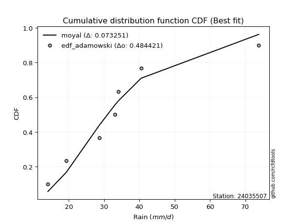</img>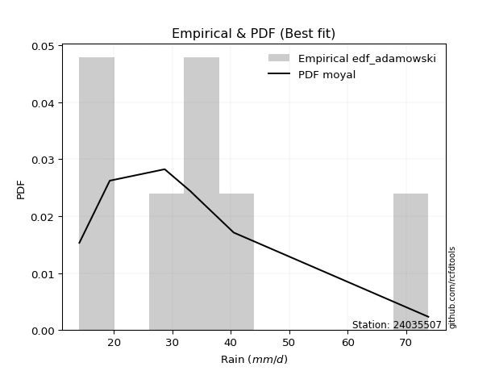</img>

</div>


## C. Best fit & Estimate extreme values for specific return periods - Tr

Best fit in probability distribution analysis means finding the theoretical distribution (like Normal, Poisson, Exponential) that most accurately mirrors your real-world data´s patterns (shape, center, spread) for better predictions, using methods like visual checks (Q-Q plots), goodness-of-fit tests (Kolmogorov-Smirnov, Chi-Squared), and information criteria (AIC) to score and select the simplest, most representative model.


### 1. Best fit (ordered by delta Δ)

<div align="center">

|   id |   station | empirical_dist   | p_dist         |     delta |   deltao | eval   |   fit |   n |   best_fit |   best_fit_sort |
|-----:|----------:|:-----------------|:---------------|----------:|---------:|:-------|------:|----:|-----------:|----------------:|
|    0 |  24035507 | edf_cunnane      | halflogistic   | 0.0494476 | 0.530386 | Δo > Δ |     1 |   6 |          1 |               1 |
|    1 |  24035507 | edf_gringorten   | halflogistic   | 0.0507061 | 0.530386 | Δo > Δ |     1 |   6 |          1 |               2 |
|    2 |  24035507 | edf_blom         | halflogistic   | 0.0526734 | 0.530386 | Δo > Δ |     1 |   6 |          1 |               3 |
|    3 |  24035507 | edf_hazen        | logloggamma    | 0.052952  | 0.530386 | Δo > Δ |     1 |   6 |          1 |               4 |
|    4 |  24035507 | edf_tukey        | halflogistic   | 0.0579366 | 0.530386 | Δo > Δ |     1 |   6 |          1 |               5 |
|    5 |  24035507 | edf_filliben     | logbetaprime   | 0.0594536 | 0.530386 | Δo > Δ |     1 |   6 |          1 |               6 |
|    6 |  24035507 | edf_beard        | logbetaprime   | 0.0600077 | 0.530386 | Δo > Δ |     1 |   6 |          1 |               7 |
|    7 |  24035507 | edf_jenkinson    | logbetaprime   | 0.0600077 | 0.530386 | Δo > Δ |     1 |   6 |          1 |               8 |
|    8 |  24035507 | edf_chegodayev   | logbetaprime   | 0.0607424 | 0.530386 | Δo > Δ |     1 |   6 |          1 |               9 |
|    9 |  24035507 | edf_adamowski    | logbetaprime   | 0.0643481 | 0.530386 | Δo > Δ |     1 |   6 |          1 |              10 |
|   10 |  24035507 | edf_weibull      | logncf         | 0.0787963 | 0.530386 | Δo > Δ |     1 |   6 |          1 |              11 |
|   11 |  24035507 | edf_california   | loggenlogistic | 0.115354  | 0.530386 | Δo > Δ |     1 |   6 |          1 |              12 |

</div>

:file_folder:Tables: [bestfit_24035507.csv](table/bestfit_24035507.csv) | [extreme_24035507.csv](table/extreme_24035507.csv)


### 2. Extreme values

In hydrology, a return period (or recurrence interval $Tr$) is the statistical average time between extreme events like floods or droughts of a specific magnitude, indicating how rare an event is, with a 100-year flood, for example, having a 1% chance of occurring in any given year, not that it happens exactly every century. It is a key tool for infrastructure design (like bridges or dams) and risk assessment, calculated from historical data to determine the probability of future events, although it is important to remember it is statistical average, and events can cluster or be missed.

> risk_rate: assuming the return period as the project useful life.

|   id |      tr |   prob_l |     prob_g |    alpha |   betaprime |    chi2 |   crystalball |   erlang |    expon |   exponnorm |        f |   fatiguelife |      fisk |    gamma |   genexpon |   genlogistic |   gibrat |   gompertz |   gumbel_l |   gumbel_r |   halflogistic |   halfnorm |   hypsecant |   invgamma |   invgauss |      invweibull |   johnsonsu |   kstwobign |   laplace |   laplace_asymmetric |   loggamma |   logistic |   lognorm |   maxwell |   mielke |    moyal |   nakagami |      ncf |      nct |    norm |   pearson3 |   rayleigh |     rice |       t |   truncnorm |     wald |   weibull_min |   logalpha |   logbetaprime |     logchi2 |   logcrystalball |   logerlang |   logexpon |   logexponnorm |     logf |   logfatiguelife |   logfisk |   loggenexpon |   loggenlogistic |   loggibrat |   loggompertz |   loggumbel_l |   loggumbel_r |   loghalflogistic |   loghalfnorm |   loghypsecant |   loginvgamma |   loginvgauss |   loginvweibull |   logjohnsonsu |   logkstwobign |   loglaplace |   loglaplace_asymmetric |   logloggamma |   loglogistic |    loglognorm |   logmaxwell |   logmielke |   logmoyal |   lognakagami |   logncf |   lognct |   logpearson3 |   lograyleigh |   logrice |     logt |   logtruncnorm |   logwald |   logweibull_min |   station |   n |   risk_rate |
|-----:|--------:|---------:|-----------:|---------:|------------:|--------:|--------------:|---------:|---------:|------------:|---------:|--------------:|----------:|---------:|-----------:|--------------:|---------:|-----------:|-----------:|-----------:|---------------:|-----------:|------------:|-----------:|-----------:|----------------:|------------:|------------:|----------:|---------------------:|-----------:|-----------:|----------:|----------:|---------:|---------:|-----------:|---------:|---------:|--------:|-----------:|-----------:|---------:|--------:|------------:|---------:|--------------:|-----------:|---------------:|------------:|-----------------:|------------:|-----------:|---------------:|---------:|-----------------:|----------:|--------------:|-----------------:|------------:|--------------:|--------------:|--------------:|------------------:|--------------:|---------------:|--------------:|--------------:|----------------:|---------------:|---------------:|-------------:|------------------------:|--------------:|--------------:|--------------:|-------------:|------------:|-----------:|--------------:|---------:|---------:|--------------:|--------------:|----------:|---------:|---------------:|----------:|-----------------:|----------:|----:|------------:|
|    0 |    2    | 0.5      | 0.5        |  29.5491 |     29.2617 | 14.1632 |       35.0833 |  20.5694 |  28.6445 |     28.5374 |  25.0679 |       14.1    |   28.2074 |  21.8275 |    29.175  |       31.5005 |  29.2584 |    29.6782 |    38.2714 |    31.8953 |        30.3104 |    31.111  |     35.0833 |    28.8754 |    27.9958 |  1119.2         |     27.9548 |     32.4928 |   35.0833 |              32.2394 |    28.9491 |    35.0833 |   30.443  |   33.4236 |  29.0059 |  30.8661 |    17.968  |  28.8755 |  29.088  | 35.0833 |    31.8373 |    32.835  |  34.4645 | 35.0838 |     35.0833 |  28.7929 |       25.7248 |    29.4865 |        29.7949 |     22.9088 |          30.443  |     29.0612 |    24.039  |        30.3843 |  29.3967 |          29.1592 |   29.5049 |       25.9798 |          27.9003 |     25.9693 |       27.7355 |       33.2096 |       27.9068 |           26.7259 |       27.3161 |        30.443  |       29.4306 |       28.9021 |         28.3888 |        29.3449 |        27.5136 |      30.443  |                 32.1022 |       30.4832 |       30.443  |  14.1326      |      29.0952 |     29.6598 |    27.1341 |       27.9032 |  29.064  |  29.4801 |       29.9401 |       28.6316 |   29.2668 |  30.4429 |        36.0207 |   25.6415 |          27.9227 |  24035507 |   6 |    0.75     |
|    1 |    2.33 | 0.570815 | 0.429185   |  32.3501 |     32.1641 | 14.2447 |       38.5463 |  22.4446 |  31.8491 |     31.7226 |  28.524  |       14.6953 |   31.3278 |  24.0036 |    32.3996 |       34.3887 |  31.0126 |    32.9367 |    41.2841 |    35.1041 |        33.6095 |    34.8484 |     37.8547 |    31.7659 |    31.0195 | 59255.6         |     30.9829 |     35.5985 |   37.1789 |              34.8092 |    31.8589 |    38.1344 |   33.4597 |   37.0214 |  31.8554 |  33.9036 |    20.5614 |  31.7663 |  31.9553 | 38.5463 |    35.2275 |    36.486  |  37.6691 | 38.5467 |     38.5463 |  31.0635 |       30.8709 |    32.4202 |        32.865  |     27.3186 |          33.4597 |     31.9672 |    27.0375 |        33.3921 |  32.3273 |          32.0801 |   32.2915 |       29.0304 |          30.8057 |     27.2425 |       30.8923 |       36.0549 |       30.4602 |           29.2432 |       30.2486 |        32.8342 |       32.3582 |       31.8065 |         31.5003 |        32.2683 |        30.4398 |      32.2344 |                 34.1975 |       33.5298 |       33.0858 |  14.442       |      32.0961 |     32.4428 |    29.4787 |       30.735  |  32.2484 |  32.3984 |       32.919  |       31.6306 |   32.2791 |  33.4596 |        37.7412 |   27.2804 |          30.9015 |  24035507 |   6 |    0.729209 |
|    2 |    5    | 0.8      | 0.2        |  46.328  |     46.798  | 15.4386 |       51.4154 |  32.627  |  47.8714 |     47.6481 |  50.2229 |       27.3402 |   50.0991 |  35.7073 |    48.0784 |       46.9349 |  41.1119 |    48.399  |    51.0172 |    49.0446 |        48.5375 |    50.6534 |     48.9714 |    46.7355 |    47.0068 |     1.92822e+12 |     47.4301 |     48.791  |   47.6565 |              47.6577 |    46.7649 |    49.9151 |   47.5353 |   51.1818 |  46.5679 |  47.9738 |    39.0559 |  46.7355 |  46.6319 | 51.4154 |    49.7351 |    51.1024 |  50.4987 | 51.4158 |     51.4154 |  43.7748 |       68.8989 |    47.0289 |        47.9546 |     77.2704 |          47.5353 |     46.7335 |    48.6635 |        47.4788 |  46.9509 |          46.9021 |   46.8199 |       47.5291 |          47.3511 |     35.8858 |       47.2987 |       47.0216 |       44.5576 |           43.9455 |       46.5566 |        44.4687 |       46.9527 |       46.7537 |         49.4927 |        46.9276 |        46.7623 |      42.9017 |                 45.1469 |       47.7081 |       45.6286 |   1.09608e+63 |      47.2333 |     46.7361 |    43.2747 |       47.9671 |  48.0399 |  46.9112 |       47.2722 |       47.131  |   47.3138 |  47.5353 |        46.6527 |   38.5905 |          46.9779 |  24035507 |   6 |    0.67232  |
|    3 |   10    | 0.9      | 0.1        |  60.6613 |     61.4103 | 17.5705 |       59.9525 |  42.5187 |  62.4159 |     62.1048 |  77.0934 |       44.7996 |   74.7522 |  46.9904 |    61.7615 |       57.1526 |  52.6239 |    61.3713 |    56.4361 |    60.3988 |        60.9346 |    62.3488 |     57.8483 |    62.2422 |    62.9631 |     2.53515e+18 |     64.9364 |     58.8353 |   57.1677 |              59.3212 |    61.8458 |    58.5911 |   60.0036 |   61.1472 |  61.9427 |  60.224  |    57.5502 |  62.2388 |  61.7658 | 59.9525 |    61.098  |    61.5242 |  59.6464 | 59.9528 |     59.9525 |  57.2645 |      120.041  |    61.31   |        62.3671 |    226.76   |          60.0036 |     61.5082 |    82.966  |        60.0407 |  61.2568 |          61.7378 |   63.115  |       70.2675 |          67.1816 |     49.1291 |       62.9265 |       54.5142 |       60.7388 |           61.6329 |       64.0563 |        56.6557 |       61.2256 |       62.0219 |         71.5097 |        61.3806 |        64.8421 |      55.6132 |                 58.0945 |       60.2127 |       57.8155 | inf           |      61.9918 |     62.4561 |    60.4497 |       67.8636 |  63.2667 |  61.1004 |       60.5947 |       62.6327 |   61.6415 |  60.0038 |        54.5595 |   55.7616 |          64.012  |  24035507 |   6 |    0.651322 |
|    4 |   15    | 0.933333 | 0.0666667  |  70.4182 |     70.8719 | 19.1522 |       64.2127 |  48.468  |  70.9239 |     70.5614 |  96.6642 |       56.2183 |   94.3436 |  53.756  |    69.5602 |       62.9172 |  60.5644 |    68.5481 |    58.8902 |    66.8048 |        67.9502 |    68.435  |     62.9143 |    72.5345 |    72.8962 |     7.18131e+21 |     76.5267 |     64.1677 |   62.7314 |              66.1439 |    71.6464 |    63.3182 |   67.3998 |   66.2604 |  72.269  |  67.3335 |    67.8513 |  72.5274 |  71.8423 | 64.2127 |    67.3089 |    66.894  |  64.3597 | 64.2129 |     64.2127 |  65.9269 |      156.897  |    70.4052 |        71.3752 |    440.353  |          67.3998 |     71.0382 |   113.353  |        67.534  |  70.3593 |          71.3216 |   74.9848 |       86.9235 |          81.8344 |     61.0144 |       72.3345 |       58.2894 |       72.3393 |           74.6353 |       75.6272 |        65.0539 |       70.3109 |       72.0264 |         88.0108 |        70.6305 |        77.1296 |      64.73   |                 67.3276 |       67.6063 |       65.7747 | inf           |      71.2726 |     73.7581 |    73.3903 |       81.4731 |  72.8295 |  70.1481 |       68.7576 |       72.5155 |   70.4915 |  67.4001 |        58.7253 |   70.6295 |          75.2985 |  24035507 |   6 |    0.644736 |
|    5 |   20    | 0.95     | 0.05       |  78.1915 |     78.0763 | 20.3869 |       67.0026 |  52.7417 |  76.9604 |     76.5614 | 112.583  |       64.6725 |  111.35   |  58.6096 |    75.0114 |       66.9533 |  66.7931 |    73.472  |    60.4178 |    71.2901 |        72.8656 |    72.4927 |     66.4882 |    80.4899 |    80.1876 |     1.87649e+24 |     85.4109 |     67.7597 |   66.6789 |              70.9847 |    79.1118 |    66.5854 |   72.7307 |   69.6538 |  80.3194 |  72.3685 |    74.8421 |  80.4792 |  79.6606 | 67.0026 |    71.5755 |    70.4631 |  67.4925 | 67.0028 |     67.0026 |  72.3822 |      186.058  |    77.2569 |        78.0774 |    712.967  |          72.7306 |     78.2646 |   141.448  |        72.9551 |  77.2088 |          78.5984 |   84.8212 |      100.531  |          93.9558 |     72.3172 |       79.1153 |       60.7702 |       81.7567 |           85.3471 |       84.4811 |        71.717  |       77.1509 |       79.6898 |        101.782  |        77.6169 |        86.694  |      72.0912 |                 74.7554 |       72.9243 |       71.9075 | inf           |      78.1867 |     83.047  |    84.198  |       92.0685 |  79.9612 |  76.9716 |       74.7575 |       79.9326 |   77.0121 |  72.731  |        61.3617 |   84.2329 |          83.9668 |  24035507 |   6 |    0.641514 |
|    6 |   25    | 0.96     | 0.04       |  84.8178 |     83.9747 | 21.3983 |       69.0563 |  56.0817 |  81.6427 |     81.2154 | 126.231  |       71.3897 |  126.692  |  62.3997 |    79.1961 |       70.0622 |  71.9857 |    77.2008 |    61.5048 |    74.745  |        76.6526 |    75.5118 |     69.2541 |    87.074  |    85.9733 |     1.36515e+26 |     92.6999 |     70.4503 |   69.7408 |              74.7395 |    85.2209 |    69.0848 |   76.9225 |   72.173  |  87.0264 |  76.2712 |    80.0813 |  87.06   |  86.1539 | 69.0563 |    74.8183 |    73.115  |  69.8201 | 69.0565 |     69.0563 |  77.5527 |      210.369  |    82.8218 |        83.4701 |   1041.48   |          76.9225 |     84.159  |   167.953  |        77.2303 |  82.7663 |          84.5405 |   93.4288 |      112.234  |         104.503  |     83.3246 |       84.4313 |       62.5996 |       89.8385 |           94.6375 |       91.7346 |        77.3386 |       82.7031 |       85.9879 |        113.842  |        83.3012 |        94.6272 |      78.3727 |                 81.0767 |       77.0998 |       76.9823 | inf           |      83.75   |     91.1255 |    93.6585 |      100.849  |  85.7079 |  82.519  |       79.5426 |       85.9304 |   82.2169 |  76.9229 |        63.1961 |   96.9958 |          91.0933 |  24035507 |   6 |    0.639603 |
|    7 |   50    | 0.98     | 0.02       | 109.798  |    104.245  | 24.7798 |       74.9374 |  66.5693 |  96.1873 |     95.6721 | 177.076  |       92.9414 |  189.842  |  74.2872 |    91.9722 |       79.6391 |  90.2897 |    88.3144 |    64.4556 |    85.3878 |        88.3211 |    84.2873 |     77.8294 |   110.143  |   104.603  |     7.42352e+31 |    117.706  |     78.3511 |   79.2521 |              86.403  |   106.164  |    76.7213 |   90.3113 |   79.4793 | 110.82   |  88.3868 |    95.3959 | 110.115  | 109.078  | 74.9374 |    84.5888 |    80.8127 |  76.5768 | 74.9375 |     74.9374 |  94.4344 |      295.125  |   101.665  |       101.41   |   3459.96   |          90.3113 |    104.248  |   286.341  |        90.9607 | 101.54   |         104.84   |  127.191  |      156.035  |         145.026  |    137.301  |      101.233  |       67.848  |      120.109  |          130.115  |      116.551  |        97.7261 |      101.478  |      107.754  |        160.735  |       102.601  |       122.372  |     101.594  |                104.329  |       90.4004 |       94.8156 | inf           |     102.226  |    122.434  |   130.35   |      131.454  | 104.868  | 101.342  |       95.2123 |      106.014  |   99.2601 |  90.3119 |        67.6644 |  153.746  |         115.662  |  24035507 |   6 |    0.63583  |
|    8 |   75    | 0.986667 | 0.0133333  | 128.628  |    117.645  | 26.8919 |       78.093  |  72.7681 | 104.695  |    104.129  | 213.835  |      105.921  |  241.109  |  81.306  |    99.3036 |       85.2056 | 102.652  |    94.5112 |    65.9477 |    91.5738 |        95.1039 |    89.0643 |     82.8407 |   125.734  |   115.917  |     1.60052e+35 |    134.108  |     82.6981 |   84.8158 |              93.2257 |   119.944  |    81.1318 |   98.4317 |   83.4516 | 127.137  |  95.4717 |   103.745  | 125.694  | 124.725  | 78.093  |    90.131  |    85.0005 |  80.2527 | 78.0931 |     78.093  | 104.823  |      351.06   |   113.907  |       112.818  |   7076.91   |          98.4316 |    117.38   |   391.217  |        99.3466 | 113.696  |         118.15   |  153.438  |      187.811  |         175.454  |    192.384  |      111.249  |       70.6672 |      142.193  |          156.567  |      132.776  |       112.045  |      113.652  |      122.218  |        196.42   |       115.171  |       140.968  |     118.249  |                120.91   |       98.4416 |      106.941  | inf           |     113.928  |    146.429  |   158.149  |      151.858  | 117.077  | 113.603  |      104.995  |      118.846  |  109.882  |  98.4324 |        69.4746 |  204.13   |         131.889  |  24035507 |   6 |    0.634587 |
|    9 |  100    | 0.99     | 0.01       | 144.622  |    127.932  | 28.4384 |       80.2274 |  77.1896 | 110.732  |    110.129  | 243.656  |      115.26   |  285.969  |  86.3095 |   104.447  |       89.1453 | 112.229  |    98.7821 |    66.9237 |    95.9521 |        99.9047 |    92.3185 |     86.3955 |   137.868  |   124.11   |     3.66176e+37 |    146.595  |     85.6765 |   88.7633 |              98.0665 |   130.482  |    84.2457 |  104.334  |   86.1573 | 139.953  | 100.498  |   109.426  | 137.818  | 136.988  | 80.2274 |    93.9996 |    87.8536 |  82.757  | 80.2274 |     80.2274 | 112.397  |      393.539  |   123.2    |       121.357  |  11815      |         104.334  |    127.38   |   488.181  |       105.471  | 122.9    |         128.307  |  175.931  |      213.616  |         200.774  |    249.834  |      118.432  |       72.5744 |      160.235  |          178.479  |      145.104  |       123.457  |      122.88   |      133.349  |        226.367  |       124.727  |       155.315  |     131.696  |                134.249  |      104.275  |      116.424  | inf           |     122.657  |    166.796  |   181.396  |      167.538  | 126.225  | 122.929  |      112.234  |      128.468  |  117.728  | 104.335  |        70.4584 |  250.992  |         144.305  |  24035507 |   6 |    0.633968 |
|   10 |  200    | 0.995    | 0.005      | 196.203  |    155.704  | 32.2976 |       85.0687 |  87.909  | 125.276  |    124.585  | 330.762  |      138.121  |  432.701  |  98.4324 |   116.661  |       98.6168 | 138.284  |   108.675  |    69.0452 |   106.478  |       111.446  |    99.7614 |     94.9594 |   171.281  |   144.36   |     1.72186e+43 |    179.773  |     92.5364 |   98.2745 |             109.73   |   158.733  |    91.7155 |  119.068  |   92.3476 | 175.717  | 112.609  |   122.383  | 171.2    | 171.119  | 85.0687 |   103.137  |    94.3818 |  88.4871 | 85.0687 |     85.0687 | 131.263  |      505.258  |   147.886  |       143.576  |  41178.7    |         119.067  |    154.032  |   832.297  |       120.867  | 147.255  |         155.469  |  248.029  |      288.957  |         277.617  |    508.626  |      135.984  |       76.8991 |      213.541  |          244.54   |      177.775  |       155.953  |      147.336  |      163.478  |        318.401  |       150.15   |       194.164  |     170.717  |                172.75   |      118.794  |      142.743  | inf           |     145.226  |    231.084  |   252.424  |      209.72   | 150.055  | 147.778  |      130.764  |      153.515  |  137.736  | 119.069  |        72.0492 |  419.976  |         177.564  |  24035507 |   6 |    0.633042 |
|   11 |  250    | 0.996    | 0.004      | 218.289  |    165.637  | 33.5739 |       86.5482 |  91.3771 | 129.959  |    129.239  | 364.156  |      145.571  |  494.805  | 102.353  |   120.542  |      101.662  | 147.632  |   111.747  |    69.6694 |   109.862  |       115.157  |   102.051  |     97.7162 |   183.444  |   151.019  |     1.14699e+45 |    191.438  |     94.6594 |  101.336  |             113.485  |   168.765  |    94.1136 |  123.972  |   94.2531 | 188.891  | 116.507  |   126.356  | 183.35   | 183.669  | 86.5482 |   106.031  |    96.3913 |  90.2509 | 86.5482 |     86.5482 | 137.504  |      544.005  |   156.586  |       151.258  |  61769      |         123.972  |    163.447  |   988.253  |       126.028  | 155.804  |         165.094  |  278.261  |      317.791  |         308.1    |    656.415  |      141.704  |       78.22   |      234.196  |          270.594  |      189.236  |       168.136  |      155.936  |      174.272  |        355.308  |       159.121  |       208.053  |     185.592  |                187.358  |      123.615  |      152.396  | inf           |     152.977  |    257.668  |   280.755  |      224.707  | 158.299  | 156.561  |      137.076  |      162.167  |  144.524  | 123.974  |        72.3856 |  497.951  |         189.349  |  24035507 |   6 |    0.632858 |
|   12 |  500    | 0.998    | 0.002      | 314.384  |    200.011  | 37.6246 |       90.9356 | 102.195  | 144.503  |    143.696  | 488.332  |      168.942  |  751.968  | 114.575  |   132.456  |      111.113  | 179.941  |   120.971  |    71.4587 |   120.364  |       126.674  |   108.878  |    106.279  |   226.304  |   172.086  |     5.24238e+50 |    230.954  |    101.022  |  110.848  |             125.148  |   203.182  |   101.551  |  139.738  |   99.9392 | 235.877  | 128.617  |   138.162  | 226.161  | 228.371  | 90.9356 |   114.893  |   102.387  |  95.5137 | 90.9356 |     90.9356 | 157.35   |      672.866  |   186.238  |       176.905  | 219658      |         139.738  |    195.573  |  1684.87   |       142.744  | 184.807  |         198.053  |  403.71   |      424.61   |         425.719  |   1584.99   |      159.672  |       82.1335 |      311.913  |          370.497  |      227.98   |       212.389  |      185.161  |      211.651  |        499.394  |       189.712  |       255.913  |     240.582  |                241.09   |      139.071  |      186.682  | inf           |     178.65   |    366.162  |   390.685  |      276      | 185.837  | 186.592  |      157.83   |      190.99   |  166.738  | 139.739  |        73.0787 |  855.777  |         229.623  |  24035507 |   6 |    0.632489 |
|   13 |  750    | 0.998667 | 0.00133333 | 399.959  |    222.866  | 40.0457 |       93.3729 | 108.55   | 153.011  |    152.153  | 577.983  |      182.751  |  961.619  | 121.753  |   139.334  |      116.637  | 201.308  |   126.155  |    72.415  |   126.504  |       133.406  |   112.692  |    111.289  |   255.403  |   184.655  |     1.06743e+54 |    256.513  |    104.596  |  116.411  |             131.971  |   225.813  |   105.896  |  149.346  |  103.12   | 268.226  | 135.701  |   144.729  | 255.224  | 259.113  | 93.3729 |   119.999  |   105.74   |  98.4567 | 93.3728 |     93.3729 | 169.249  |      754.138  |   205.605  |       193.248  | 463947      |         149.346  |    216.567  |  2301.97   |       153.029  | 203.639  |         219.683  |  507.434  |      501.278  |         514.302  |   2839.36   |      170.317  |       84.3048 |      368.798  |          445.207  |      252.981  |       243.494  |      204.183  |      236.507  |        609.353  |       209.7    |       287.479  |     280.021  |                279.407  |      148.462  |      210.179  | inf           |     194.845  |    454.113  |   473.99   |      309.552  | 203.39   | 206.286  |      170.822  |      209.286  |  180.556  | 149.348  |        73.3159 | 1184.04   |         255.95   |  24035507 |   6 |    0.632366 |
|   14 | 1000    | 0.999    | 0.001      | 481.01   |    240.456  | 41.7834 |       95.0509 | 113.07   | 159.048  |    158.153  | 650.672  |      192.602  | 1145.38   | 126.856  |   144.175  |      120.556  | 217.658  |   129.744  |    73.0586 |   130.86   |       138.182  |   115.326  |    114.843  |   278.097  |   193.672  |     2.37358e+56 |    275.808  |    107.072  |  120.359  |             136.812  |   243.097  |   108.978  |  156.343  |  105.318  | 293.676  | 140.727  |   149.253  | 277.887  | 283.289  | 95.0509 |   123.591  |   108.057  | 100.49   | 95.0509 |     95.0509 | 177.808  |      814.409  |   220.343  |       205.488  | 790324      |         156.343  |    232.539  |  2872.51   |       160.566  | 217.913  |         236.185  |  599.908  |      563.145  |         588.1    |   4435.85   |      177.926  |       85.7984 |      415.334  |          507.168  |      271.83   |       268.288  |      218.622  |      255.629  |        701.736  |       224.911  |       311.602  |     311.866  |                310.232  |      155.286  |      228.615  | inf           |     206.888  |    531.47   |   543.659  |      335.057  | 216.535  | 221.312  |      180.442  |      222.943  |  190.744  | 156.345  |        73.4357 | 1495.53   |         275.967  |  24035507 |   6 |    0.632305 |

<div align="center">

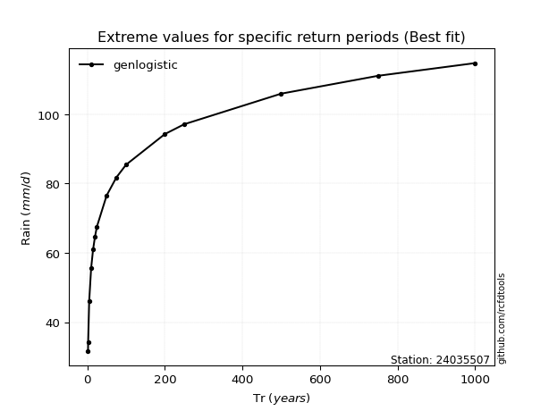</img>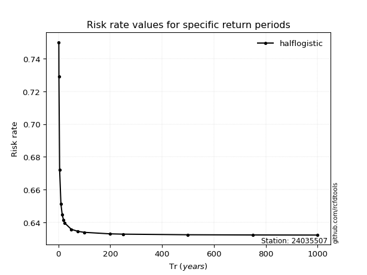</img>

</div>


<sub>**APP DISCLAIMER**: NO WARRANTY - This software is provided by [github.com/rcfdtools](https://github.com/rcfdtools) "as is", without any express or implied warranty, including warranties of merchantability, fitness for a particular purpose, or non-infringement. There is no guarantee that the software will be error-free or operate without interruption. LIMITATION OF LIABILITY - Neither the authors nor copyright holders will be liable for claims or damages arising from the software or its use. You are responsible for determining if the software is appropriate for your use and assume all associated risks, including errors, legal compliance, and data loss. NO PROFESSIONAL ADVICE - The software provides general information and does not offer professional advice. It should not replace consultation with professional advisors.</sub>