<div align="center">


</div>

# PMax24h Station (Rain): 2403700149

Maximum Precipitation in 24 hours (PMax24h) is the greatest amount of rainfall for a specific duration that is meteorologically possible for a given location, acting as a "worst-case" scenario for extreme storms, crucial for designing safety-critical infrastructure like bridges, river deviations, dams, spillways, and nuclear plants to prevent catastrophic failure. The PMax24h is related with the Probable Maximum Precipitation (PMP) and it is calculated by hydrologists using meteorological data to determine the upper limit of extreme rainfall, often leading to the Probable Maximum Flood (PMF) for flood control design, and is increasingly being studied for climate change impacts. Probable Maximum Precipitation (PMP) is the theoretical upper limit of rainfall, a deterministic estimate for extreme events, while probability distributions (like GEV, Gumbel) describe the likelihood and frequency of various precipitation amounts, including rare ones, showing how often events occur, with PMP representing the extreme end of these distributions, used for critical infrastructure design to ensure safety against the worst conceivable weather, unlike standard statistical forecasts which cover typical probabilities.

The most common probability distributions in hydrology, used for analyzing floods, rainfall, and streamflow, include the Normal, Log-Normal, Gumbel, Gamma (including Log-Pearson Type III), and Generalized Extreme Value (GEV) distributions, often chosen based on the data´s skewness and whether modeling extremes or general conditions, with Gumbel and GEV popular for extreme events like floods, while the Normal distribution serves as a baseline, though often requiring transformations for skewed hydrological data. These distributions help in designing water infrastructure, managing water resources, and forecasting hydrologic events.

> Hydrological data often isn´t perfectly normal (it´s skewed), so different distributions are needed for different applications, such as: **Flood Frequency Analysis**: Using Gumbel, GEV, or Log-Pearson Type III for predicting extreme flood magnitudes and their return periods, **Rainfall Analysis**: Normal for annual totals, but Log-Normal, Weibull, or GEV for intensity or extreme daily rainfall, **Streamflow Modeling**: Gamma and Log-Normal for maximum flows, GEV for minimum flows, and Kappa for daily flows.

<div align="center">

</img>

</div>


## A. General information


### 1. General running parameters

• app_version: _v20260312_. • runtime: _2026-03-12 07:15:23.203550_. • Python version: _3.14.0_. • SciPy version: _1.16.3_. • Pandas version: _2.3.3_. • NumPy version: _2.3.5_. • Stations dataset (station_dataset_file): _dataset/pmax24h_in/automatic_colombia_2003_2025.csv_. • Stations catalog (station_catalog_file): _dataset/CNE.xls_. • Minimum year to eval til year_max (date_min): _1900_. • Maximum year to eval since year_min (date_max): _2025_. • Creates, save and include plots into reports (create_plot): _True_. • Plot only fit distributions with Δo > Δ (plot_only_fit): _True_. • Plot only simple graphs avoiding multiple CDFs and multiple Extreme values plots (plot_only_simple): _True_. • Eval low extreme values, if False, evaluates high extreme values (low_extreme): _False_. • Eval every SciPy distribution as logarithmic (pdist_logarithmic_on): _True_. • Standard deviation normalized (ddof): _1.0_. • Return periods to eval in years (Tr): _[2, 2.33, 5, 10, 15, 20, 25, 50, 75, 100, 200, 250, 500, 750, 1000]_. • Minimum data sample per station, 0 means any (minimum_sample): _5_. • Z-Score maximum threshold to adjust a value, 0 means disable (zscore_max): _3.5_. • Z-Score minimum threshold to adjust a value, 0 means disable (zscore_min): _-2.5_. • Avoid zeros, e.g. rain = 0 (avoid_zeros): _True_. • Avoid null values (avoid_nans): _True_. 

:file_folder:Table: [dataset.csv](../../dataset/pmax24h_in/automatic_colombia_2003_2025.csv)

> Delta Degrees of Freedom (DDOF): is a parameter used in the formulas for calculating variance and standard deviation. When ddof=0, the divisor is $N$ (the total number of observations) and this is used when your data set is the entire population. When ddof=1, the divisor is $N-1$ and this is used when your data set is a sample drawn from a larger population. Using $N-1$ provides an unbiased estimate of the population variance (known as Bessel´s correction).


### 2. Station info and location

|   id |     CODIGO | NOMBRE                              | CATEGORIA    | TECNOLOGIA                              | ESTADO   | FECHA_INSTALACION   |   FECHA_SUSPENSION |   ALTITUD |   LATITUD |   LONGITUD | DEPARTAMENTO   | MUNICIPIO   | AREA_OPERATIVA                              | ENTIDAD                                                     | AREA_HIDROGRAFICA   | ZONA_HIDROGRAFICA   | SUBZONA_HIDROGRAFICA   | CORRIENTE   | Catalogo   |   Version |
|-----:|-----------:|:------------------------------------|:-------------|:----------------------------------------|:---------|:--------------------|-------------------:|----------:|----------:|-----------:|:---------------|:------------|:--------------------------------------------|:------------------------------------------------------------|:--------------------|:--------------------|:-----------------------|:------------|:-----------|----------:|
|    0 | 2403700149 | PUENTE LA RAMADA - AUT [2403700149] | Limnigráfica | Automática con Telemetría, Convencional | Activa   | 22/07/2019          |                nan |      2305 |    6.5607 |   -72.5012 | Boyacá         | Chiscas     | Area Operativa 06 - Boyacá-Casanare-Vichada | INSTITUTO DE HIDROLOGIA METEOROLOGIA Y ESTUDIOS AMBIENTALES | Magdalena Cauca     | Sogamoso            | Río Chicamocha         | Cuscaneva   | CNE_IDEAM  |  20251226 |

<div align="center">

Dynamic map: [:earth_americas:Google](http://maps.google.com/maps?q=6.5607,-72.5012) [:earth_americas:OSM](https://www.openstreetmap.org/#map=18/6.5607/-72.5012&layers=P) [:earth_americas:Bing](https://www.bing.com/maps?cp=6.5607~-72.5012&lvl=18) [:earth_americas:Apple](https://maps.apple.com/frame?center=6.5607%2C-72.5012&span=0.003%2C0.006)

</div>


<div align="center">

```geojson
{
  "type": "Feature",
  "geometry": {
    "type": "Point", 
    "coordinates": [-72.5012, 6.5607]
  }, 
  "properties": {
    "Name": "2403700149"
  }
}
```

</div>


### 3. Discrete values table and plot

<div align="center">

|               |           0 |          1 |           2 |           3 |           4 |           5 |
|:--------------|------------:|-----------:|------------:|------------:|------------:|------------:|
| Date          | 2020        | 2021       | 2022        | 2023        | 2024        | 2025        |
| Value         |    0.1      |  260.6     |  147.8      |  161.7      |   21        |   28.2      |
| Value_initial |    0.1      |  260.6     |  147.8      |  161.7      |   21        |   28.2      |
| count         |    6        |    6       |    6        |    6        |    6        |    6        |
| mean          |  103.233    |  103.233   |  103.233    |  103.233    |  103.233    |  103.233    |
| std           |  103.148    |  103.148   |  103.148    |  103.148    |  103.148    |  103.148    |
| zscore        |   -0.999857 |    1.52564 |    0.432065 |    0.566823 |   -0.797236 |   -0.727433 |


</div>


<div align="center">

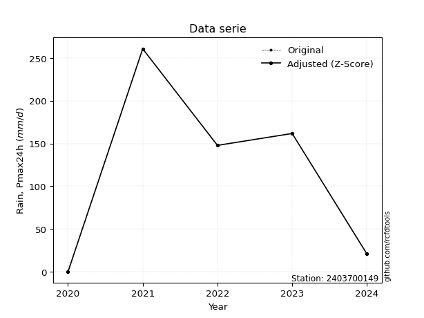</img>

</div>


> The initial value (value_initial) correspond to the initial obtained or null completed value, and value (value) is adjusted only when the initial value is outside the valid range (outlier) definite through the Z-Score value. If Z-Score is active, values out of range or outliers are replaced with the station mean value. A Z-Score (or standard score) measures how many standard deviations a data point is from the mean of a dataset, indicating its relative position; positive scores mean above the mean, negative mean below, and a score of zero is exactly at the mean, allowing for comparison of values from different distributions. It´s calculated using the formula $z=(x–μ)/σ$, where $x$ is the data point, $μ$ is the mean, and $σ$ is the standard deviation, helping identify outliers and understand probability.
>
> <sub>**Note**: In this study, "completing" (filling gaps in) and "extending" (forecasting or lengthening the historical record) rainfall data series are avoided for certain critical analyses because they introduce artificial bias and uncertainty, which can distort the statistics of rare events (extremes), alter day-to-day variability, and compromise the integrity and homogeneity of the original data. Some reasons against Completing/Extending rainfall data are: **Distortion of Extremes and Variability**: The primary issue is that most gap-filling or extension methods rely on averaging or regression with nearby stations, which inherently smooths the data. Rainfall is highly variable in space and time, with a large percentage of zero values and occasional large storms. Infilling methods often underestimate the highest values and overestimate the lowest (zero) values, which severely distorts analyses focused on flood frequency, drought severity, and intensity-duration-frequency (IDF) curves, **Loss of Data Homogeneity**: Infilled or extended data are synthetic estimates, not actual measurements. Combining these estimates with observed data can violate the assumption of data homogeneity, which requires that the data properties do not change over time. Inhomogeneity can lead to incorrect conclusions about long-term trends or changes in climate patterns, **Propagation of Errors**: Errors and biases from the original data (e.g., wind-induced undercatch, instrument errors, site changes) or the data used for imputation can propagate through the analysis, leading to unreliable hydrological models and inaccurate predictions, **Compromised Statistical Integrity**: For statistical analyses, especially those involving the frequency of events, using artificial data can introduce time bias or autocorrelation that doesn´t exist in reality, making it difficult to assess the true probability of events, **Difficulty in Validation**: It is difficult to accurately validate the quality of filled or extended data, especially for past periods where ground-truth measurements are unavailable. The reliability of imputation techniques heavily depends on the density of the surrounding station network and the complexity of the local topography.</sub>


### 4. Active continuous probability distributions from SciPy (80 of 104 available)

A Probability Density Function (PDF) describes the relative likelihood of a continuous random variable falling within a specific range, where the total area under its curve equals 1, and the area over any interval gives the actual probability for that range. Unlike discrete probabilities (like rolling a die), a PDF shows density, not direct probability for a single point (which is zero), with higher points indicating higher likelihood, often visualized as a bell curve for normal distributions.

A log of a probability density function (log-PDF) is simply the logarithm of the PDF´s value, denoted as $log(f(x))$, useful for converting multiplication of probabilities into addition, improving numerical stability with tiny numbers, and connecting to information theory concepts like entropy. Instead of dealing with very small probabilities (e.g., 0.000001), log-PDFs use negative numbers (e.g., $log(0.00001) ≈ -11.51$ that are easier for computers to handle, preventing underflow errors and simplifying complex calculations. In this study, each active probability distribution from SciPy is also evaluated in the $log$ form.

[scipy.stats](https://docs.scipy.org/doc/scipy/reference/stats.html) is a Python´s powerful submodule within the SciPy library for comprehensive statistical analysis, offering over 130 probability distributions (like Normal, Poisson, etc.), functions for descriptive stats (mean, variance), hypothesis testing (t-tests, chi-square), random variable generation, and statistical tests, making it essential for data science, modeling, and research. It provides tools to explore, model, and draw conclusions from data efficiently, working seamlessly with [NumPy](https://numpy.org/).

<div align="center">

|   id | p_dist           |   n_parameter | fit_method   | label                                                                       | active   | ref                                                                                                      |
|-----:|:-----------------|--------------:|:-------------|:----------------------------------------------------------------------------|:---------|:---------------------------------------------------------------------------------------------------------|
|    0 | alpha            |             3 | MLE          | Alpha                                                                       | True     | [:mortar_board:](https://docs.scipy.org/doc/scipy/reference/generated/scipy.stats.alpha.html)            |
|    1 | anglit           |             2 | MM           | Anglit                                                                      | True     | [:mortar_board:](https://docs.scipy.org/doc/scipy/reference/generated/scipy.stats.anglit.html)           |
|    2 | arcsine          |             2 | MM           | Arcsine                                                                     | True     | [:mortar_board:](https://docs.scipy.org/doc/scipy/reference/generated/scipy.stats.arcsine.html)          |
|    3 | argus            |             3 | MLE          | Argus                                                                       | True     | [:mortar_board:](https://docs.scipy.org/doc/scipy/reference/generated/scipy.stats.argus.html)            |
|    4 | beta             |             4 | MLE          | Beta                                                                        | True     | [:mortar_board:](https://docs.scipy.org/doc/scipy/reference/generated/scipy.stats.beta.html)             |
|    5 | betaprime        |             4 | MLE          | Beta prime                                                                  | True     | [:mortar_board:](https://docs.scipy.org/doc/scipy/reference/generated/scipy.stats.betaprime.html)        |
|    6 | bradford         |             3 | MLE          | Bradford                                                                    | True     | [:mortar_board:](https://docs.scipy.org/doc/scipy/reference/generated/scipy.stats.bradford.html)         |
|    7 | burr             |             4 | MLE          | Burr (Type III)                                                             | True     | [:mortar_board:](https://docs.scipy.org/doc/scipy/reference/generated/scipy.stats.burr.html)             |
|    8 | burr12           |             4 | MLE          | Burr (Type III) 12                                                          | True     | [:mortar_board:](https://docs.scipy.org/doc/scipy/reference/generated/scipy.stats.burr12.html)           |
|    9 | cosine           |             2 | MLE          | Cosine                                                                      | True     | [:mortar_board:](https://docs.scipy.org/doc/scipy/reference/generated/scipy.stats.cosine.html)           |
|   10 | crystalball      |             4 | MLE          | Crystalball                                                                 | True     | [:mortar_board:](https://docs.scipy.org/doc/scipy/reference/generated/scipy.stats.crystalball.html)      |
|   11 | dgamma           |             3 | MLE          | Double gamma                                                                | True     | [:mortar_board:](https://docs.scipy.org/doc/scipy/reference/generated/scipy.stats.dgamma.html)           |
|   12 | dweibull         |             3 | MLE          | Double Weibull                                                              | True     | [:mortar_board:](https://docs.scipy.org/doc/scipy/reference/generated/scipy.stats.dweibull.html)         |
|   13 | erlang           |             3 | MLE          | Erlang                                                                      | True     | [:mortar_board:](https://docs.scipy.org/doc/scipy/reference/generated/scipy.stats.erlang.html)           |
|   14 | exponnorm        |             3 | MLE          | Exponentially modified Normal                                               | True     | [:mortar_board:](https://docs.scipy.org/doc/scipy/reference/generated/scipy.stats.exponnorm.html)        |
|   15 | exponpow         |             3 | MLE          | Exponential power                                                           | True     | [:mortar_board:](https://docs.scipy.org/doc/scipy/reference/generated/scipy.stats.exponpow.html)         |
|   16 | exponweib        |             4 | MLE          | Exponentiated Weibull                                                       | True     | [:mortar_board:](https://docs.scipy.org/doc/scipy/reference/generated/scipy.stats.exponweib.html)        |
|   17 | f                |             4 | MLE          | F                                                                           | True     | [:mortar_board:](https://docs.scipy.org/doc/scipy/reference/generated/scipy.stats.f.html)                |
|   18 | fatiguelife      |             3 | MLE          | Fatigue-life (Birnbaum-Saunders)                                            | True     | [:mortar_board:](https://docs.scipy.org/doc/scipy/reference/generated/scipy.stats.fatiguelife.html)      |
|   19 | foldnorm         |             3 | MM           | Fold Normal                                                                 | True     | [:mortar_board:](https://docs.scipy.org/doc/scipy/reference/generated/scipy.stats.foldnorm.html)         |
|   20 | gamma            |             3 | MLE          | Gamma                                                                       | True     | [:mortar_board:](https://docs.scipy.org/doc/scipy/reference/generated/scipy.stats.gamma.html)            |
|   21 | gausshyper       |             6 | MLE          | Gauss hypergeometric                                                        | True     | [:mortar_board:](https://docs.scipy.org/doc/scipy/reference/generated/scipy.stats.gausshyper.html)       |
|   22 | genexpon         |             5 | MLE          | Generalized exponential                                                     | True     | [:mortar_board:](https://docs.scipy.org/doc/scipy/reference/generated/scipy.stats.genexpon.html)         |
|   23 | genextreme       |             3 | MLE          | Generalized exponential                                                     | True     | [:mortar_board:](https://docs.scipy.org/doc/scipy/reference/generated/scipy.stats.genextreme.html)       |
|   24 | gengamma         |             4 | MLE          | Generalized gamma                                                           | True     | [:mortar_board:](https://docs.scipy.org/doc/scipy/reference/generated/scipy.stats.gengamma.html)         |
|   25 | genhalflogistic  |             3 | MLE          | Generalized half-logistic                                                   | True     | [:mortar_board:](https://docs.scipy.org/doc/scipy/reference/generated/scipy.stats.genhalflogistic.html)  |
|   26 | genlogistic      |             3 | MLE          | Generalized logistic                                                        | True     | [:mortar_board:](https://docs.scipy.org/doc/scipy/reference/generated/scipy.stats.genlogistic.html)      |
|   27 | gennorm          |             3 | MLE          | Generalized Normal                                                          | True     | [:mortar_board:](https://docs.scipy.org/doc/scipy/reference/generated/scipy.stats.gennorm.html)          |
|   28 | genpareto        |             3 | MLE          | Generalized Pareto                                                          | True     | [:mortar_board:](https://docs.scipy.org/doc/scipy/reference/generated/scipy.stats.genpareto.html)        |
|   29 | gompertz         |             3 | MLE          | Gompertz (or truncated Gumbel)                                              | True     | [:mortar_board:](https://docs.scipy.org/doc/scipy/reference/generated/scipy.stats.gompertz.html)         |
|   30 | gumbel_l         |             2 | MM           | Gumbel Left Skew                                                            | True     | [:mortar_board:](https://docs.scipy.org/doc/scipy/reference/generated/scipy.stats.gumbel_l.html)         |
|   31 | gumbel_r         |             2 | MM           | Gumbel Right Skew                                                           | True     | [:mortar_board:](https://docs.scipy.org/doc/scipy/reference/generated/scipy.stats.gumbel_r.html)         |
|   32 | halfgennorm      |             3 | MLE          | Upper half of a generalized normal                                          | True     | [:mortar_board:](https://docs.scipy.org/doc/scipy/reference/generated/scipy.stats.halfgennorm.html)      |
|   33 | halflogistic     |             2 | MM           | Half-logistic                                                               | True     | [:mortar_board:](https://docs.scipy.org/doc/scipy/reference/generated/scipy.stats.halflogistic.html)     |
|   34 | halfnorm         |             2 | MM           | Half Normal                                                                 | True     | [:mortar_board:](https://docs.scipy.org/doc/scipy/reference/generated/scipy.stats.halfnorm.html)         |
|   35 | hypsecant        |             2 | MM           | hyperbolic secant                                                           | True     | [:mortar_board:](https://docs.scipy.org/doc/scipy/reference/generated/scipy.stats.hypsecant.html)        |
|   36 | invgamma         |             3 | MLE          | Inverted gamma                                                              | True     | [:mortar_board:](https://docs.scipy.org/doc/scipy/reference/generated/scipy.stats.invgamma.html)         |
|   37 | invgauss         |             3 | MLE          | Inverse Gaussian                                                            | True     | [:mortar_board:](https://docs.scipy.org/doc/scipy/reference/generated/scipy.stats.invgauss.html)         |
|   38 | invweibull       |             3 | MLE          | Inverted Weibull                                                            | True     | [:mortar_board:](https://docs.scipy.org/doc/scipy/reference/generated/scipy.stats.invweibull.html)       |
|   39 | johnsonsb        |             4 | MLE          | Johnson SB                                                                  | True     | [:mortar_board:](https://docs.scipy.org/doc/scipy/reference/generated/scipy.stats.johnsonsb.html)        |
|   40 | johnsonsu        |             4 | MLE          | Johnson Su                                                                  | True     | [:mortar_board:](https://docs.scipy.org/doc/scipy/reference/generated/scipy.stats.johnsonsu.html)        |
|   41 | kappa3           |             3 | MLE          | Kappa 3                                                                     | True     | [:mortar_board:](https://docs.scipy.org/doc/scipy/reference/generated/scipy.stats.kappa3.html)           |
|   42 | kappa4           |             4 | MLE          | Kappa 4                                                                     | True     | [:mortar_board:](https://docs.scipy.org/doc/scipy/reference/generated/scipy.stats.kappa4.html)           |
|   43 | ksone            |             3 | MLE          | Kolmogorov-Smirnov one-sided test statistic distribution                    | True     | [:mortar_board:](https://docs.scipy.org/doc/scipy/reference/generated/scipy.stats.ksone.html)            |
|   44 | kstwobign        |             2 | MLE          | Limiting distribution of scaled Kolmogorov-Smirnov two-sided test statistic | True     | [:mortar_board:](https://docs.scipy.org/doc/scipy/reference/generated/scipy.stats.kstwobign.html)        |
|   45 | laplace          |             2 | MM           | Laplace                                                                     | True     | [:mortar_board:](https://docs.scipy.org/doc/scipy/reference/generated/scipy.stats.laplace.html)          |
|   46 | levy_l           |             2 | MLE          | Left-skewed Levy                                                            | True     | [:mortar_board:](https://docs.scipy.org/doc/scipy/reference/generated/scipy.stats.levy_l.html)           |
|   47 | loggamma         |             3 | MLE          | Log gamma                                                                   | True     | [:mortar_board:](https://docs.scipy.org/doc/scipy/reference/generated/scipy.stats.loggamma.html)         |
|   48 | logistic         |             2 | MM           | Logistic (or Sech-squared)                                                  | True     | [:mortar_board:](https://docs.scipy.org/doc/scipy/reference/generated/scipy.stats.logistic.html)         |
|   49 | loglaplace       |             3 | MLE          | Log-Laplace                                                                 | True     | [:mortar_board:](https://docs.scipy.org/doc/scipy/reference/generated/scipy.stats.loglaplace.html)       |
|   50 | lomax            |             3 | MLE          | Lomax (Pareto of the second kind)                                           | True     | [:mortar_board:](https://docs.scipy.org/doc/scipy/reference/generated/scipy.stats.lomax.html)            |
|   51 | maxwell          |             2 | MM           | Maxwell                                                                     | True     | [:mortar_board:](https://docs.scipy.org/doc/scipy/reference/generated/scipy.stats.maxwell.html)          |
|   52 | mielke           |             4 | MLE          | Mielke Beta-Kappa / Dagum                                                   | True     | [:mortar_board:](https://docs.scipy.org/doc/scipy/reference/generated/scipy.stats.mielke.html)           |
|   53 | moyal            |             2 | MM           | Moyal                                                                       | True     | [:mortar_board:](https://docs.scipy.org/doc/scipy/reference/generated/scipy.stats.moyal.html)            |
|   54 | nakagami         |             3 | MLE          | Nakagami                                                                    | True     | [:mortar_board:](https://docs.scipy.org/doc/scipy/reference/generated/scipy.stats.nakagami.html)         |
|   55 | ncf              |             5 | MLE          | Non-central F distribution                                                  | True     | [:mortar_board:](https://docs.scipy.org/doc/scipy/reference/generated/scipy.stats.ncf.html)              |
|   56 | nct              |             4 | MLE          | Non-central Student’s t                                                     | True     | [:mortar_board:](https://docs.scipy.org/doc/scipy/reference/generated/scipy.stats.nct.html)              |
|   57 | norm             |             2 | MM           | Normal                                                                      | True     | [:mortar_board:](https://docs.scipy.org/doc/scipy/reference/generated/scipy.stats.norm.html)             |
|   58 | pearson3         |             3 | MM           | Pearson type III                                                            | True     | [:mortar_board:](https://docs.scipy.org/doc/scipy/reference/generated/scipy.stats.pearson3.html)         |
|   59 | powerlaw         |             3 | MLE          | Power-function                                                              | True     | [:mortar_board:](https://docs.scipy.org/doc/scipy/reference/generated/scipy.stats.powerlaw.html)         |
|   60 | rayleigh         |             2 | MM           | Rayleigh                                                                    | True     | [:mortar_board:](https://docs.scipy.org/doc/scipy/reference/generated/scipy.stats.rayleigh.html)         |
|   61 | rdist            |             3 | MLE          | R-distributed (symmetric beta)                                              | True     | [:mortar_board:](https://docs.scipy.org/doc/scipy/reference/generated/scipy.stats.rdist.html)            |
|   62 | rice             |             3 | MLE          | Rice                                                                        | True     | [:mortar_board:](https://docs.scipy.org/doc/scipy/reference/generated/scipy.stats.rice.html)             |
|   63 | semicircular     |             2 | MM           | Semicircular                                                                | True     | [:mortar_board:](https://docs.scipy.org/doc/scipy/reference/generated/scipy.stats.semicircular.html)     |
|   64 | skewnorm         |             3 | MLE          | Skew normal                                                                 | True     | [:mortar_board:](https://docs.scipy.org/doc/scipy/reference/generated/scipy.stats.skewnorm.html)         |
|   65 | t                |             3 | MLE          | Student’s t                                                                 | True     | [:mortar_board:](https://docs.scipy.org/doc/scipy/reference/generated/scipy.stats.t.html)                |
|   66 | trapezoid        |             4 | MLE          | Trapezoid                                                                   | True     | [:mortar_board:](https://docs.scipy.org/doc/scipy/reference/generated/scipy.stats.trapezoid.html)        |
|   67 | triang           |             3 | MLE          | Triangular                                                                  | True     | [:mortar_board:](https://docs.scipy.org/doc/scipy/reference/generated/scipy.stats.triang.html)           |
|   68 | truncexpon       |             3 | MLE          | Truncated exponential                                                       | True     | [:mortar_board:](https://docs.scipy.org/doc/scipy/reference/generated/scipy.stats.truncexpon.html)       |
|   69 | truncnorm        |             4 | MLE          | Truncated normal                                                            | True     | [:mortar_board:](https://docs.scipy.org/doc/scipy/reference/generated/scipy.stats.truncnorm.html)        |
|   70 | truncpareto      |             4 | MLE          | Upper truncated Pareto                                                      | True     | [:mortar_board:](https://docs.scipy.org/doc/scipy/reference/generated/scipy.stats.truncpareto.html)      |
|   71 | truncweibull_min |             5 | MLE          | Doubly truncated Weibull minimum                                            | True     | [:mortar_board:](https://docs.scipy.org/doc/scipy/reference/generated/scipy.stats.truncweibull_min.html) |
|   72 | tukeylambda      |             3 | MLE          | Tukey-Lamdba                                                                | True     | [:mortar_board:](https://docs.scipy.org/doc/scipy/reference/generated/scipy.stats.tukeylambda.html)      |
|   73 | uniform          |             2 | MLE          | Uniform                                                                     | True     | [:mortar_board:](https://docs.scipy.org/doc/scipy/reference/generated/scipy.stats.uniform.html)          |
|   74 | vonmises         |             3 | MLE          | Von Mises                                                                   | True     | [:mortar_board:](https://docs.scipy.org/doc/scipy/reference/generated/scipy.stats.vonmises.html)         |
|   75 | vonmises_line    |             3 | MLE          | Von Mises line                                                              | True     | [:mortar_board:](https://docs.scipy.org/doc/scipy/reference/generated/scipy.stats.vonmises_line.html)    |
|   76 | wald             |             2 | MM           | Wald                                                                        | True     | [:mortar_board:](https://docs.scipy.org/doc/scipy/reference/generated/scipy.stats.wald.html)             |
|   77 | weibull_max      |             3 | MLE          | Weibull maximum                                                             | True     | [:mortar_board:](https://docs.scipy.org/doc/scipy/reference/generated/scipy.stats.weibull_max.html)      |
|   78 | weibull_min      |             3 | MLE          | Weibull minimum                                                             | True     | [:mortar_board:](https://docs.scipy.org/doc/scipy/reference/generated/scipy.stats.weibull_min.html)      |
|   79 | wrapcauchy       |             3 | MLE          | Wrapped  Cauchy                                                             | True     | [:mortar_board:](https://docs.scipy.org/doc/scipy/reference/generated/scipy.stats.wrapcauchy.html)       |

</div>

> **n_parameter:** # arguments & localization & scale.
>
> **Fit methods:** (MLE) maximum likelihood, (MM) L-moments.
>
>**Inactive** (With the only purpose of prevent loops, zero divisions, infinite values, over high estimated values or horizontal trending for recurrence intervals estimations, the follow distributions were disabled.)**:** lognorm, norminvgauss, powernorm, powerlognorm, cauchy, halfcauchy, foldcauchy, skewcauchy, chi2, expon, fisk, genhyperbolic, geninvgauss, gibrat, kstwo, laplace_asymmetric, levy, levy_stable, ncx2, pareto, rel_breitwigner, recipinvgauss, studentized_range, loguniform, 


## B. Probability (PDF) vs. Empirical (EDF) distributions functions

A continuous probability distribution (CPD) describes probabilities for variables that can take any value within a range (like rain any time), unlike discrete variables with specific outcomes (like temperature). It uses a Probability Density Function (PDF), a curve where the total area under it equals 1, and the probability of the variable falling within an interval (a to b) is found by calculating the area under the curve between those points. A key feature is that the probability of hitting any single exact value is zero, so probabilities are always expressed for ranges, e.g., $P(a ≤ X ≤ b)$.

<div align="center">

Distributions parameters from station values
|     |    station | p_dist              |   n |              loc |           scale | shape                  | shape1                | shape2                | shape3             |
|----:|-----------:|:--------------------|----:|-----------------:|----------------:|:-----------------------|:----------------------|:----------------------|:-------------------|
|   0 | 2403700149 | alpha               |   6 |    -26.422       |    51.3462      | 1.2053588404111685e-06 |                       |                       |                    |
|   1 | 2403700149 | anglit              |   6 |    103.233       |   275.458       |                        |                       |                       |                    |
|   2 | 2403700149 | arcsine             |   6 |    -29.9303      |   266.327       |                        |                       |                       |                    |
|   3 | 2403700149 | argus               |   6 |    -72.2941      |   340.506       | 1.7389279178066816e-12 |                       |                       |                    |
|   4 | 2403700149 | beta                |   6 |     -5.67012     |   266.27        | 0.474132317913469      | 0.6524166270525861    |                       |                    |
|   5 | 2403700149 | betaprime           |   6 |      0.1         |    75.2701      | 0.810338102519261      | 1.2307538571209873    |                       |                    |
|   6 | 2403700149 | bradford            |   6 |      0.0999962   |   260.5         | 0.6306837013223014     |                       |                       |                    |
|   7 | 2403700149 | burr                |   6 |      0.099996    |   266.128       | 27.644510594741803     | 0.014997574031954761  |                       |                    |
|   8 | 2403700149 | burr12              |   6 |      0.1         |   123.84        | 0.544138237481324      | 2.1048985060579266    |                       |                    |
|   9 | 2403700149 | cosine              |   6 |    109.785       |    76.414       |                        |                       |                       |                    |
|  10 | 2403700149 | crystalball         |   6 |    103.233       |    94.1609      | 9638.401102475149      | 285.67871279231554    |                       |                    |
|  11 | 2403700149 | dgamma              |   6 |     94.1635      |    12.61        | 6.883418456722046      |                       |                       |                    |
|  12 | 2403700149 | dweibull            |   6 |    101.134       |    98.1582      | 2.524468834607149      |                       |                       |                    |
|  13 | 2403700149 | erlang              |   6 |      0.1         |    67.7272      | 0.8197308129366168     |                       |                       |                    |
|  14 | 2403700149 | exponnorm           |   6 |     -0.00406733  |     0.0311899   | 3288.864322950334      |                       |                       |                    |
|  15 | 2403700149 | exponpow            |   6 |      0.1         |   168.26        | 0.8479613595111439     |                       |                       |                    |
|  16 | 2403700149 | exponweib           |   6 |      0.1         |     1.10487     | 4.171264725568944      | 0.21698210006848195   |                       |                    |
|  17 | 2403700149 | f                   |   6 |      0.1         |   136.197       | 0.915753345801186      | 56.680778032540985    |                       |                    |
|  18 | 2403700149 | fatiguelife         |   6 |      0.0996401   |     0.342044    | 19.120259777793564     |                       |                       |                    |
|  19 | 2403700149 | foldnorm            |   6 |    -56.7746      |   104.585       | 1.4667332931602814     |                       |                       |                    |
|  20 | 2403700149 | gamma               |   6 |      0.1         |    83.3432      | 0.6286626772786559     |                       |                       |                    |
|  21 | 2403700149 | gausshyper          |   6 |    -26.5084      |   287.108       | 1.347929637485129      | 0.8431756533374337    | 0.9481251955461429    | 1.1100250688652764 |
|  22 | 2403700149 | genexpon            |   6 |      0.1         |   205.602       | 1.9935648351154915     | 8.117445934399119e-11 | 1.0841904833586207    |                    |
|  23 | 2403700149 | genextreme          |   6 |     31.7158      |    44.9838      | -0.8726629673839182    |                       |                       |                    |
|  24 | 2403700149 | gengamma            |   6 |      0.1         |     0.10811     | 3.864435449086974      | 0.2316757372221796    |                       |                    |
|  25 | 2403700149 | genhalflogistic     |   6 |    -27.0212      |   303.163       | 1.0540370133608412     |                       |                       |                    |
|  26 | 2403700149 | genlogistic         |   6 |   -463.283       |    73.5215      | 1208.4471461924268     |                       |                       |                    |
|  27 | 2403700149 | gennorm             |   6 |    130.35        |   130.25        | 6173289.645676022      |                       |                       |                    |
|  28 | 2403700149 | genpareto           |   6 |     -0.0199397   |   360.728       | -1.384115764751722     |                       |                       |                    |
|  29 | 2403700149 | gompertz            |   6 |      0.1         |   554.659       | 4.50058732156905       |                       |                       |                    |
|  30 | 2403700149 | gumbel_l            |   6 |    145.611       |    73.4169      |                        |                       |                       |                    |
|  31 | 2403700149 | gumbel_r            |   6 |     60.8559      |    73.4169      |                        |                       |                       |                    |
|  32 | 2403700149 | halfgennorm         |   6 |      0.1         |     3.80642     | 0.35130984261531023    |                       |                       |                    |
|  33 | 2403700149 | halflogistic        |   6 |     -8.36918     |    80.5042      |                        |                       |                       |                    |
|  34 | 2403700149 | halfnorm            |   6 |    -21.3988      |   156.203       |                        |                       |                       |                    |
|  35 | 2403700149 | hypsecant           |   6 |    103.233       |    59.9447      |                        |                       |                       |                    |
|  36 | 2403700149 | invgamma            |   6 |     -0.00073824  |     0.116385    | 0.19445755970156603    |                       |                       |                    |
|  37 | 2403700149 | invgauss            |   6 |    -13.812       |    67.662       | 1.729854302343472      |                       |                       |                    |
|  38 | 2403700149 | invweibull          |   6 |      0.1         |     3.36391     | 0.04092261596227627    |                       |                       |                    |
|  39 | 2403700149 | johnsonsb           |   6 |      0.1         |   951.775       | 0.22846994873998597    | 0.11169901831742521   |                       |                    |
|  40 | 2403700149 | johnsonsu           |   6 |      0.0999783   |     1.06527e-05 | -3.4247270902423983    | 0.24699519063049757   |                       |                    |
|  41 | 2403700149 | kappa3              |   6 |      0.1         |    62.5213      | 1.2680940838878154     |                       |                       |                    |
|  42 | 2403700149 | kappa4              |   6 |    -55.6018      |   322.535       | 1.2087226824019675     | 0.9987561286454916    |                       |                    |
|  43 | 2403700149 | ksone               |   6 |    -59.8581      |   326.183       | 1.0                    |                       |                       |                    |
|  44 | 2403700149 | kstwobign           |   6 |   -192.559       |   338.008       |                        |                       |                       |                    |
|  45 | 2403700149 | laplace             |   6 |    103.233       |    66.5818      |                        |                       |                       |                    |
|  46 | 2403700149 | levy_l              |   6 |    276.516       |    66.0311      |                        |                       |                       |                    |
|  47 | 2403700149 | loggamma            |   6 | -28721.8         |  3891           | 1649.7945694627415     |                       |                       |                    |
|  48 | 2403700149 | logistic            |   6 |    103.233       |    51.9136      |                        |                       |                       |                    |
|  49 | 2403700149 | loglaplace          |   6 |     -0.0733601   |    28.2734      | 0.5447058829582105     |                       |                       |                    |
|  50 | 2403700149 | lomax               |   6 |      0.1         |     2.16826e+10 | 231698473.11036015     |                       |                       |                    |
|  51 | 2403700149 | maxwell             |   6 |   -119.888       |   139.821       |                        |                       |                       |                    |
|  52 | 2403700149 | mielke              |   6 |      0.1         |   277.743       | 0.5182676255242167     | 2.6510475096829635    |                       |                    |
|  53 | 2403700149 | moyal               |   6 |     49.3861      |    42.3873      |                        |                       |                       |                    |
|  54 | 2403700149 | nakagami            |   6 |      0.1         |   157.26        | 0.17558310325527648    |                       |                       |                    |
|  55 | 2403700149 | ncf                 |   6 |      0.1         |    11.7945      | 0.6494160078391367     | 11.505265373853039    | 4.42914290729193      |                    |
|  56 | 2403700149 | nct                 |   6 |      0.0572062   |     0.00191474  | 0.154840996390035      | 54.73616181580794     |                       |                    |
|  57 | 2403700149 | norm                |   6 |    103.233       |    94.1609      |                        |                       |                       |                    |
|  58 | 2403700149 | pearson3            |   6 |    103.233       |    94.1609      | 0.4212196773558538     |                       |                       |                    |
|  59 | 2403700149 | powerlaw            |   6 |      0.1         |   260.5         | 0.1195852059262636     |                       |                       |                    |
|  60 | 2403700149 | rayleigh            |   6 |    -76.9019      |   143.727       |                        |                       |                       |                    |
|  61 | 2403700149 | rdist               |   6 |    -27.4792      |    55.6792      | 1.3859493255368216     |                       |                       |                    |
|  62 | 2403700149 | rice                |   6 |    -55.0658      |   130.24        | 0.0017892904101993654  |                       |                       |                    |
|  63 | 2403700149 | semicircular        |   6 |    103.233       |   188.322       |                        |                       |                       |                    |
|  64 | 2403700149 | skewnorm            |   6 |      0.0999628   |   139.64        | 21722769.428337898     |                       |                       |                    |
|  65 | 2403700149 | t                   |   6 |    103.232       |    94.1606      | 11801143.869516246     |                       |                       |                    |
|  66 | 2403700149 | trapezoid           |   6 |    -27.2475      |   312.6         | 1.0                    | 1.0                   |                       |                    |
|  67 | 2403700149 | triang              |   6 |    -95.7096      |   404.384       | 0.6021731585737358     |                       |                       |                    |
|  68 | 2403700149 | truncexpon          |   6 |     -2.27038     |   213.527       | 1.2310895091853276     |                       |                       |                    |
|  69 | 2403700149 | truncnorm           |   6 |    -27.4497      |   146.502       | 0.18804922137179209    | 1.9661813051256147    |                       |                    |
|  70 | 2403700149 | truncpareto         |   6 |     -0.187838    |     0.287648    | 4.361570514874049e-05  | 906.6209528302159     |                       |                    |
|  71 | 2403700149 | truncweibull_min    |   6 |    -29.4853      |   336.721       | 1.2239272777276105     | 0.0013097489070372243 | 0.8615017857578398    |                    |
|  72 | 2403700149 | tukeylambda         |   6 |    135.789       |   155.637       | 1.1470113358827612     |                       |                       |                    |
|  73 | 2403700149 | uniform             |   6 |      0.1         |   260.5         |                        |                       |                       |                    |
|  74 | 2403700149 | vonmises            |   6 |      3.13321     |     1           | 0.9727356334218361     |                       |                       |                    |
|  75 | 2403700149 | vonmises_line       |   6 |    132.695       |    42.2063      | 9.094636108603261e-07  |                       |                       |                    |
|  76 | 2403700149 | wald                |   6 |      9.07245     |    94.1609      |                        |                       |                       |                    |
|  77 | 2403700149 | weibull_max         |   6 |    260.6         |     1.67965     | 0.1779907583175468     |                       |                       |                    |
|  78 | 2403700149 | weibull_min         |   6 |      0.1         |    96.7877      | 0.49216587894183494    |                       |                       |                    |
|  79 | 2403700149 | wrapcauchy          |   6 |      0.0999971   |    41.4599      | 0.5433342341678367     |                       |                       |                    |
|  80 | 2403700149 | logalpha            |   6 |    -76.958       |  2295.48        | 28.648880212894724     |                       |                       |                    |
|  81 | 2403700149 | loganglit           |   6 |      3.28764     |     7.7987      |                        |                       |                       |                    |
|  82 | 2403700149 | logarcsine          |   6 |     -0.482465    |     7.54021     |                        |                       |                       |                    |
|  83 | 2403700149 | logargus            |   6 |     -5.95829     |    11.7316      | 2.857631723865292      |                       |                       |                    |
|  84 | 2403700149 | logbeta             |   6 |     -3.17304     |     8.73602     | 0.5964256737396435     | 0.17489836323817076   |                       |                    |
|  85 | 2403700149 | logbetaprime        |   6 |     -2.30259     |     2.76813     | 0.14542991927556873    | 0.7582852459899988    |                       |                    |
|  86 | 2403700149 | logbradford         |   6 |     -2.43219     |     7.99522     | 1.76267226927183e-05   |                       |                       |                    |
|  87 | 2403700149 | logburr             |   6 |     -2.30259     |     1.99105     | 0.6991740063696568     | 1.0995595723064617    |                       |                    |
|  88 | 2403700149 | logburr12           |   6 |     -2.30259     |     1.80905     | 0.7306042120616476     | 0.7436670871150953    |                       |                    |
|  89 | 2403700149 | logcosine           |   6 |      2.78016     |     2.33731     |                        |                       |                       |                    |
|  90 | 2403700149 | logcrystalball      |   6 |      3.28764     |     2.66586     | 7.562978145883266      | 2045.3573764896787    |                       |                    |
|  91 | 2403700149 | logdgamma           |   6 |      3.33932     |     2.84463     | 0.39517418948255084    |                       |                       |                    |
|  92 | 2403700149 | logdweibull         |   6 |      3.33932     |     1.9438      | 0.7549708188604408     |                       |                       |                    |
|  93 | 2403700149 | logerlang           |   6 |    -43.9201      |     0.165245    | 285.3062939247817      |                       |                       |                    |
|  94 | 2403700149 | logexponnorm        |   6 |      3.28632     |     2.66587     | 0.00048298442191962445 |                       |                       |                    |
|  95 | 2403700149 | logexponpow         |   6 |     -2.30259     |     1.78699     | 0.22888053509779493    |                       |                       |                    |
|  96 | 2403700149 | logexponweib        |   6 |     -2.30259     |     1.98686     | 1.7829893721698338     | 0.09922194100419154   |                       |                    |
|  97 | 2403700149 | logf                |   6 |     -2.30259     |     1.18558     | 1.0563660034510496     | 1.0503032557340841    |                       |                    |
|  98 | 2403700149 | logfatiguelife      |   6 |     -2.30259     |     3.23842e-07 | 5042.6769197320655     |                       |                       |                    |
|  99 | 2403700149 | logfoldnorm         |   6 |    -12.1826      |     2.06122     | 7.573756194613544      |                       |                       |                    |
| 100 | 2403700149 | loggamma            |   6 |    -43.1261      |     0.168092    | 275.97235966381925     |                       |                       |                    |
| 101 | 2403700149 | loggausshyper       |   6 |     -3.27085     |     8.83384     | 1.5892032149902562     | 0.44087981786106795   | 0.9143851118601293    | 1.153702363482946  |
| 102 | 2403700149 | loggenexpon         |   6 |     -2.66406     |     0.291565    | 0.012366621501263816   | 7.243019859796325     | 0.0004137429337324897 |                    |
| 103 | 2403700149 | loggenextreme       |   6 |      3.57334     |     2.39787     | 1.2051749540295726     |                       |                       |                    |
| 104 | 2403700149 | loggengamma         |   6 |     -2.30259     |     1.81586     | 2.129850117825057      | 0.09648258660661421   |                       |                    |
| 105 | 2403700149 | loggenhalflogistic  |   6 |     -2.59746     |     9.8898      | 1.2119194622369913     |                       |                       |                    |
| 106 | 2403700149 | loggenlogistic      |   6 |      5.56337     |     4.50426e-05 | 1.998484902900836e-05  |                       |                       |                    |
| 107 | 2403700149 | loggennorm          |   6 |      3.33932     |     0.150754    | 0.42330765582553653    |                       |                       |                    |
| 108 | 2403700149 | loggenpareto        |   6 |     -2.30259     |     4.94067     | -0.5555524255599479    |                       |                       |                    |
| 109 | 2403700149 | loggompertz         |   6 |     -2.30259     |     8.20324e+12 | 8032057816841.4375     |                       |                       |                    |
| 110 | 2403700149 | loggumbel_l         |   6 |      4.48742     |     2.07856     |                        |                       |                       |                    |
| 111 | 2403700149 | loggumbel_r         |   6 |      2.08786     |     2.07856     |                        |                       |                       |                    |
| 112 | 2403700149 | loghalfgennorm      |   6 |     -2.30259     |     1.66374     | 0.5692650034062962     |                       |                       |                    |
| 113 | 2403700149 | loghalflogistic     |   6 |      0.128018    |     2.27919     |                        |                       |                       |                    |
| 114 | 2403700149 | loghalfnorm         |   6 |     -0.240921    |     4.42238     |                        |                       |                       |                    |
| 115 | 2403700149 | loghypsecant        |   6 |      3.28764     |     1.69714     |                        |                       |                       |                    |
| 116 | 2403700149 | loginvgamma         |   6 |    -58.8498      | 30552.8         | 493.3401723130901      |                       |                       |                    |
| 117 | 2403700149 | loginvgauss         |   6 |    -22.4839      |  1892.47        | 0.013606509564412554   |                       |                       |                    |
| 118 | 2403700149 | loginvweibull       |   6 |     -1.47863e+08 |     1.47863e+08 | 47042950.676123165     |                       |                       |                    |
| 119 | 2403700149 | logjohnsonsb        |   6 |     -5.60372     |    11.1667      | -0.354116501475924     | 0.15232936227838045   |                       |                    |
| 120 | 2403700149 | logjohnsonsu        |   6 |      5.56299     |     3.62897e-12 | 5.859588175370324      | 0.24524384817437345   |                       |                    |
| 121 | 2403700149 | logkappa3           |   6 |     -2.30259     |     2.02019     | 0.6661253801717136     |                       |                       |                    |
| 122 | 2403700149 | logkappa4           |   6 |     -2.86014     |     9.38173     | 1.06338147542328       | 1.096089861914971     |                       |                    |
| 123 | 2403700149 | logksone            |   6 |     -3.08914     |     9.43869     | 1.0                    |                       |                       |                    |
| 124 | 2403700149 | logkstwobign        |   6 |     -9.363       |    14.4468      |                        |                       |                       |                    |
| 125 | 2403700149 | loglaplace          |   6 |      3.28764     |     1.88505     |                        |                       |                       |                    |
| 126 | 2403700149 | loglevy_l           |   6 |      5.67558     |     0.462206    |                        |                       |                       |                    |
| 127 | 2403700149 | logloggamma         |   6 |      5.56318     |     1.40625e-05 | 6.2145854166483125e-06 |                       |                       |                    |
| 128 | 2403700149 | loglogistic         |   6 |      3.28764     |     1.46976     |                        |                       |                       |                    |
| 129 | 2403700149 | logloglaplace       |   6 |     -2.30259     |     1.49089     | 0.4202994392456664     |                       |                       |                    |
| 130 | 2403700149 | loglomax            |   6 |     -2.30259     |     2.42523e+11 | 44170633343.75529      |                       |                       |                    |
| 131 | 2403700149 | logmaxwell          |   6 |     -3.02932     |     3.95857     |                        |                       |                       |                    |
| 132 | 2403700149 | logmielke           |   6 |     -2.30259     |     2.59371     | 0.13405829947581255    | 0.2940654400936415    |                       |                    |
| 133 | 2403700149 | logmoyal            |   6 |      1.76313     |     1.20006     |                        |                       |                       |                    |
| 134 | 2403700149 | lognakagami         |   6 |  -1957.01        |  1960.32        | 134926.38776110578     |                       |                       |                    |
| 135 | 2403700149 | logncf              |   6 |     -2.30259     |     1.28088     | 0.190991191728154      | 1.5133149708747307    | 1.2932961096821185    |                    |
| 136 | 2403700149 | lognct              |   6 |    152.502       |     2.61249     | 42968.8892959361       | -57.11476891462385    |                       |                    |
| 137 | 2403700149 | lognorm             |   6 |      3.28764     |     2.66586     |                        |                       |                       |                    |
| 138 | 2403700149 | logpearson3         |   6 |      3.28766     |     2.66583     | -1.3383293272560461    |                       |                       |                    |
| 139 | 2403700149 | logpowerlaw         |   6 |     -2.30259     |     7.86557     | 0.1567863330215925     |                       |                       |                    |
| 140 | 2403700149 | lograyleigh         |   6 |     -1.81228     |     4.06915     |                        |                       |                       |                    |
| 141 | 2403700149 | logrdist            |   6 |     -2.30259     |     4.44092e-16 | 1.7859848110710357     |                       |                       |                    |
| 142 | 2403700149 | logrice             |   6 |   -828.715       |     2.66575     | 312.10733729349306     |                       |                       |                    |
| 143 | 2403700149 | logsemicircular     |   6 |      3.28766     |     5.33168     |                        |                       |                       |                    |
| 144 | 2403700149 | logskewnorm         |   6 |      5.56299     |     3.50484     | -48813553.67012814     |                       |                       |                    |
| 145 | 2403700149 | logt                |   6 |      4.34309     |     1.30261     | 1.8031823956157635     |                       |                       |                    |
| 146 | 2403700149 | logtrapezoid        |   6 |     -4.46517     |    11.3103      | 0.9999999999999998     | 1.0                   |                       |                    |
| 147 | 2403700149 | logtriang           |   6 |     -3.81424     |     9.37731     | 0.9999912260640108     |                       |                       |                    |
| 148 | 2403700149 | logtruncexpon       |   6 |     -2.30641     |    10.9094      | 0.7213411415202222     |                       |                       |                    |
| 149 | 2403700149 | logtruncnorm        |   6 |      2.83907     |     2.98068     | -1.7250002422463735    | 0.913862284389255     |                       |                    |
| 150 | 2403700149 | logtruncpareto      |   6 |     -2.32875     |     0.0180981   | 1.93398712361826e-09   | 436.05374289916756    |                       |                    |
| 151 | 2403700149 | logtruncweibull_min |   6 |     -2.60329     |    12.2369      | 1.394333610664555      | 0.002582437083572235  | 0.6673475785227434    |                    |
| 152 | 2403700149 | logtukeylambda      |   6 |     -2.30259     |     7.68173e-16 | 1.8474744971074892     |                       |                       |                    |
| 153 | 2403700149 | loguniform          |   6 |     -2.30259     |     7.86557     |                        |                       |                       |                    |
| 154 | 2403700149 | logvonmises         |   6 |     -1.92311     |     1           | 1.5269631960378258     |                       |                       |                    |
| 155 | 2403700149 | logvonmises_line    |   6 |      3.72553     |     1.91881     | 1.0132228118642406     |                       |                       |                    |
| 156 | 2403700149 | logwald             |   6 |      0.621777    |     2.66587     |                        |                       |                       |                    |
| 157 | 2403700149 | logweibull_max      |   6 |      5.56299     |     2.9628      | 0.8763761944165114     |                       |                       |                    |
| 158 | 2403700149 | logweibull_min      |   6 |     -2.30259     |     1.73762     | 0.4829965860498322     |                       |                       |                    |
| 159 | 2403700149 | logwrapcauchy       |   6 |     -2.30259     |     1.25188     | 0.6595336715283059     |                       |                       |                    |

</div>

> **loc** (Location parameter): This shifts the distribution along the x-axis. For many common distributions, like the normal (Gaussian) distribution, loc represents the mean $μ$. For others, like the uniform distribution, it might represent the minimum value, or for the beta distribution, the left end of the support interval.
>
> **scale** (Scale parameter): This determines the width or spread of the distribution. For the normal distribution, scale represents the standard deviation $σ$. For a uniform distribution, it defines the length of the interval (from $loc$ to $loc + scale$).
>
> **shape** (Shape parameters): Refers to parameters that define the specific form of a probability distribution, distinct from its location (loc) and scale (scale). These parameters are required arguments for most distribution functions. For example, a normal (Gaussian) distribution is fully defined by its location (mean) and scale (standard deviation), so it has no specific shape parameters beyond loc and scale. However, other distributions have intrinsic properties that need specification, as Gamma distribution that takes a shape parameter, often named $a$ or $alpha$.


### 0. Cumulative distribution values - CDF (160 evaluated)

Cumulative Distribution Function (CDF), denoted as $F$<sub>$X$</sub>$(x)$, is a function that gives the probability that a random variable $X$ will take a value less than or equal to a specific value, $x$ (i.e., $(P(X≥x)$. It essentially "accumulates" probabilities from a given point up to the far right (positive infinity), providing a complete picture of the distribution´s probabilities for both discrete (like rain) and continuous (like temperature) variables, helping to find probabilities over ranges or above certain values. Each station is evaluated separately ordering the $x$ values ascending, calculating the CDF and PDF values for the activated distributions and their logarithmic forms.

<div align="center">

CDF ordered by x ascending and calculating $log(f(x))$ separately
|   id |    Station |   date |     x |   count |    mean |     std |    zscore |   Value_initial |    station |   m |     alpha |   alpha_pdf |   anglit |   anglit_pdf |   arcsine |   arcsine_pdf |    argus |   argus_pdf |     beta |     beta_pdf |   betaprime |   betaprime_pdf |    bradford |   bradford_pdf |        burr |    burr_pdf |      burr12 |   burr12_pdf |   cosine |   cosine_pdf |   crystalball |   crystalball_pdf |   dgamma |   dgamma_pdf |   dweibull |   dweibull_pdf |      erlang |   erlang_pdf |   exponnorm |   exponnorm_pdf |    exponpow |   exponpow_pdf |   exponweib |   exponweib_pdf |           f |       f_pdf |   fatiguelife |   fatiguelife_pdf |   foldnorm |   foldnorm_pdf |       gamma |      gamma_pdf |   gausshyper |   gausshyper_pdf |    genexpon |   genexpon_pdf |   genextreme |   genextreme_pdf |    gengamma |   gengamma_pdf |   genhalflogistic |   genhalflogistic_pdf |   genlogistic |   genlogistic_pdf |     gennorm |   gennorm_pdf |   genpareto |   genpareto_pdf |    gompertz |   gompertz_pdf |   gumbel_l |   gumbel_l_pdf |   gumbel_r |   gumbel_r_pdf |   halfgennorm |   halfgennorm_pdf |   halflogistic |   halflogistic_pdf |   halfnorm |   halfnorm_pdf |   hypsecant |   hypsecant_pdf |   invgamma |   invgamma_pdf |   invgauss |   invgauss_pdf |   invweibull |   invweibull_pdf |   johnsonsb |   johnsonsb_pdf |   johnsonsu |   johnsonsu_pdf |      kappa3 |   kappa3_pdf |      kappa4 |   kappa4_pdf |    ksone |   ksone_pdf |   kstwobign |   kstwobign_pdf |   laplace |   laplace_pdf |   levy_l |   levy_l_pdf |   loggamma |   loggamma_pdf |   logistic |   logistic_pdf |   loglaplace |   loglaplace_pdf |       lomax |   lomax_pdf |   maxwell |   maxwell_pdf |      mielke |       mielke_pdf |    moyal |   moyal_pdf |    nakagami |   nakagami_pdf |        ncf |     ncf_pdf |       nct |     nct_pdf |     norm |   norm_pdf |   pearson3 |   pearson3_pdf |   powerlaw |   powerlaw_pdf |   rayleigh |   rayleigh_pdf |    rdist |    rdist_pdf |     rice |    rice_pdf |   semicircular |   semicircular_pdf |   skewnorm |   skewnorm_pdf |        t |      t_pdf |   trapezoid |   trapezoid_pdf |    triang |   triang_pdf |   truncexpon |   truncexpon_pdf |   truncnorm |   truncnorm_pdf |   truncpareto |   truncpareto_pdf |   truncweibull_min |   truncweibull_min_pdf |   tukeylambda |   tukeylambda_pdf |   uniform |   uniform_pdf |    vonmises |   vonmises_pdf |   vonmises_line |   vonmises_line_pdf |      wald |    wald_pdf |   weibull_max |   weibull_max_pdf |   weibull_min |   weibull_min_pdf |   wrapcauchy |   wrapcauchy_pdf |   logalpha |   logalpha_pdf |   loganglit |   loganglit_pdf |   logarcsine |   logarcsine_pdf |   logargus |   logargus_pdf |   logbeta |   logbeta_pdf |   logbetaprime |   logbetaprime_pdf |   logbradford |   logbradford_pdf |     logburr |   logburr_pdf |   logburr12 |   logburr12_pdf |   logcosine |   logcosine_pdf |   logcrystalball |   logcrystalball_pdf |   logdgamma |   logdgamma_pdf |   logdweibull |   logdweibull_pdf |   logerlang |   logerlang_pdf |   logexponnorm |   logexponnorm_pdf |   logexponpow |   logexponpow_pdf |   logexponweib |   logexponweib_pdf |        logf |   logf_pdf |   logfatiguelife |   logfatiguelife_pdf |   logfoldnorm |   logfoldnorm_pdf |   loggausshyper |   loggausshyper_pdf |   loggenexpon |   loggenexpon_pdf |   loggenextreme |   loggenextreme_pdf |   loggengamma |   loggengamma_pdf |   loggenhalflogistic |   loggenhalflogistic_pdf |   loggenlogistic |   loggenlogistic_pdf |   loggennorm |   loggennorm_pdf |   loggenpareto |   loggenpareto_pdf |   loggompertz |   loggompertz_pdf |   loggumbel_l |   loggumbel_l_pdf |   loggumbel_r |   loggumbel_r_pdf |   loghalfgennorm |   loghalfgennorm_pdf |   loghalflogistic |   loghalflogistic_pdf |   loghalfnorm |   loghalfnorm_pdf |   loghypsecant |   loghypsecant_pdf |   loginvgamma |   loginvgamma_pdf |   loginvgauss |   loginvgauss_pdf |   loginvweibull |   loginvweibull_pdf |   logjohnsonsb |   logjohnsonsb_pdf |   logjohnsonsu |   logjohnsonsu_pdf |   logkappa3 |   logkappa3_pdf |   logkappa4 |   logkappa4_pdf |   logksone |   logksone_pdf |   logkstwobign |   logkstwobign_pdf |   loglevy_l |   loglevy_l_pdf |   logloggamma |   logloggamma_pdf |   loglogistic |   loglogistic_pdf |   logloglaplace |   logloglaplace_pdf |    loglomax |   loglomax_pdf |   logmaxwell |   logmaxwell_pdf |   logmielke |   logmielke_pdf |    logmoyal |   logmoyal_pdf |   lognakagami |   lognakagami_pdf |    logncf |   logncf_pdf |    lognct |   lognct_pdf |   lognorm |   lognorm_pdf |   logpearson3 |   logpearson3_pdf |   logpowerlaw |   logpowerlaw_pdf |   lograyleigh |   lograyleigh_pdf |    logrdist |   logrdist_pdf |   logrice |   logrice_pdf |   logsemicircular |   logsemicircular_pdf |   logskewnorm |   logskewnorm_pdf |      logt |   logt_pdf |   logtrapezoid |   logtrapezoid_pdf |   logtriang |   logtriang_pdf |   logtruncexpon |   logtruncexpon_pdf |   logtruncnorm |   logtruncnorm_pdf |   logtruncpareto |   logtruncpareto_pdf |   logtruncweibull_min |   logtruncweibull_min_pdf |   logtukeylambda |   logtukeylambda_pdf |   loguniform |   loguniform_pdf |   logvonmises |   logvonmises_pdf |   logvonmises_line |   logvonmises_line_pdf |   logwald |   logwald_pdf |   logweibull_max |   logweibull_max_pdf |   logweibull_min |   logweibull_min_pdf |   logwrapcauchy |   logwrapcauchy_pdf |
|-----:|-----------:|-------:|------:|--------:|--------:|--------:|----------:|----------------:|-----------:|----:|----------:|------------:|---------:|-------------:|----------:|--------------:|---------:|------------:|---------:|-------------:|------------:|----------------:|------------:|---------------:|------------:|------------:|------------:|-------------:|---------:|-------------:|--------------:|------------------:|---------:|-------------:|-----------:|---------------:|------------:|-------------:|------------:|----------------:|------------:|---------------:|------------:|----------------:|------------:|------------:|--------------:|------------------:|-----------:|---------------:|------------:|---------------:|-------------:|-----------------:|------------:|---------------:|-------------:|-----------------:|------------:|---------------:|------------------:|----------------------:|--------------:|------------------:|------------:|--------------:|------------:|----------------:|------------:|---------------:|-----------:|---------------:|-----------:|---------------:|--------------:|------------------:|---------------:|-------------------:|-----------:|---------------:|------------:|----------------:|-----------:|---------------:|-----------:|---------------:|-------------:|-----------------:|------------:|----------------:|------------:|----------------:|------------:|-------------:|------------:|-------------:|---------:|------------:|------------:|----------------:|----------:|--------------:|---------:|-------------:|-----------:|---------------:|-----------:|---------------:|-------------:|-----------------:|------------:|------------:|----------:|--------------:|------------:|-----------------:|---------:|------------:|------------:|---------------:|-----------:|------------:|----------:|------------:|---------:|-----------:|-----------:|---------------:|-----------:|---------------:|-----------:|---------------:|---------:|-------------:|---------:|------------:|---------------:|-------------------:|-----------:|---------------:|---------:|-----------:|------------:|----------------:|----------:|-------------:|-------------:|-----------------:|------------:|----------------:|--------------:|------------------:|-------------------:|-----------------------:|--------------:|------------------:|----------:|--------------:|------------:|---------------:|----------------:|--------------------:|----------:|------------:|--------------:|------------------:|--------------:|------------------:|-------------:|-----------------:|-----------:|---------------:|------------:|----------------:|-------------:|-----------------:|-----------:|---------------:|----------:|--------------:|---------------:|-------------------:|--------------:|------------------:|------------:|--------------:|------------:|----------------:|------------:|----------------:|-----------------:|---------------------:|------------:|----------------:|--------------:|------------------:|------------:|----------------:|---------------:|-------------------:|--------------:|------------------:|---------------:|-------------------:|------------:|-----------:|-----------------:|---------------------:|--------------:|------------------:|----------------:|--------------------:|--------------:|------------------:|----------------:|--------------------:|--------------:|------------------:|---------------------:|-------------------------:|-----------------:|---------------------:|-------------:|-----------------:|---------------:|-------------------:|--------------:|------------------:|--------------:|------------------:|--------------:|------------------:|-----------------:|---------------------:|------------------:|----------------------:|--------------:|------------------:|---------------:|-------------------:|--------------:|------------------:|--------------:|------------------:|----------------:|--------------------:|---------------:|-------------------:|---------------:|-------------------:|------------:|----------------:|------------:|----------------:|-----------:|---------------:|---------------:|-------------------:|------------:|----------------:|--------------:|------------------:|--------------:|------------------:|----------------:|--------------------:|------------:|---------------:|-------------:|-----------------:|------------:|----------------:|------------:|---------------:|--------------:|------------------:|----------:|-------------:|----------:|-------------:|----------:|--------------:|--------------:|------------------:|--------------:|------------------:|--------------:|------------------:|------------:|---------------:|----------:|--------------:|------------------:|----------------------:|--------------:|------------------:|----------:|-----------:|---------------:|-------------------:|------------:|----------------:|----------------:|--------------------:|---------------:|-------------------:|-----------------:|---------------------:|----------------------:|--------------------------:|-----------------:|---------------------:|-------------:|-----------------:|--------------:|------------------:|-------------------:|-----------------------:|----------:|--------------:|-----------------:|---------------------:|-----------------:|---------------------:|----------------:|--------------------:|
|    0 | 2403700149 |   2020 |   0.1 |       6 | 103.233 | 103.148 | -0.999857 |             0.1 | 2403700149 |   1 | 0.0528695 | 0.00894046  | 0.159615 |   0.0026592  |  0.218009 |    0.00377869 | 0.067031 |  0.00183034 | 0.125455 |   0.0103621  | 3.36885e-15 |    32.7851      | 1.90581e-08 |     0.00495103 | 0.000569034 | 59.4501     | 1.02687e-10 |  4.0263e+06  | 0.113851 |   0.00236394 |      0.136695 |        0.00232561 | 0.183404 |  0.00537267  |   0.170544 |    0.00458349  | 5.11534e-16 |  30.2152     |  0.00101398 |     0.00973454  | 6.57346e-17 |     4.01652    | 5.04535e-16 |    32.9015      | 1.58342e-09 | 5.22425e+07 |     0.0536372 |     244.504       |   0.155838 |     0.00299705 | 1.74503e-12 | 79049.8        |    0.0500018 |       0.00245234 | 4.54369e-13 |    0.00969621  |    0.0512616 |      0.00875532  | 3.01898e-16 |   19.4755      |         0.0469475 |            0.00181697 |      0.109581 |       0.00329253  | 1.30624e-06 |    0.00383876 | 0.000332515 |      0.00277252 | 4.06088e-14 |    0.00811415  |   0.128724 |    0.0016353   |   0.1015   |    0.00316277  |    4.3074e-12 |       0.0529083   |      0.0525524 |        0.0061937   |   0.10947  |     0.00505984 |    0.112749 |     0.0018418   |  0.0401483 |    0.679902    |  0.0476141 |    0.0095725   |   0.00582607 |      8.83973e+13 |  5.4865e-07 |     2.23627e+10 |  0.00109153 |    37.2852      | 6.08513e-14 |   0.0132626  | 6.31618e-14 |   1.76346    | 0.183817 |  0.00306577 |   0.0986373 |     0.00337639  |  0.106233 |   0.00159553  | 0.374986 |  0.000625989 |  0.0197702 |      0.0187036 |   0.120613 |    0.00204312  |    0.0257657 |        0.0136685 | 3.31198e-11 | 0.0106859   |  0.135398 |    0.00290796 | 1.60924e-09 | 278228           | 0.073695 | 0.00340069  | 1.62168e-07 |    4.10353e+09 | 1.2534e-07 | 2.93266e+09 | 0.0484555 | 2.23023     | 0.136695 | 0.00232561 |   0.131075 |     0.00269306 | 0.00495651 |    4.27104e+13 |   0.133692 |     0.00322921 | 0.701856 |   0.00776315 | 0.0858   | 0.00297319  |       0.169669 |         0.00282849 |   0        |     0.00571387 | 0.136697 | 0.00232564 |  0.00765345 |     0.000559719 | 0.0932198 |   0.00194594 |    0.0155922 |       0.00654151 | 5.71285e-07 |     0.00667546  |   9.71387e-05 |       0.510254    |          0.0874155 |             0.00354609 |   7.10543e-15 |        0.00637219 | 0         |    0.00383877 |  0.00522291 |      0.0483745 |     1.30888e-07 |          0.00377088 | 0         | 0           |     0.0859346 |       0.000144099 |   5.31952e-10 |       1.88653e+07 |  3.69774e-08 |       0.0129734  |  0.0179157 |      0.0181595 |  0.00469623 |       0.0175332 |     0        |        0         |  0.0190204 |      0.0123009 | 0.0661692 |   0.0478812   |     0.00473768 |        1.55149e+12 |      0.01621  |          0.125076 | 9.27468e-13 |  1605.58      |  2.9286e-12 |    4818.06      |   0.0228871 |       0.0294306 |        0.0179981 |            0.0166041 |   0.0164777 |     0.00711724  |     0.0534677 |         0.0159947 |   0.0204895 |       0.0192479 |      0.0179989 |          0.0166047 |   0.000268163 |       1.38209e+11 |      0.0016611 |         6.5251e+11 | 4.62391e-09 | 5.4995e+06 |        0.0687393 |          1.70313e+13 |    0.00271403 |        0.00405526 |       0.0181261 |         0.0292986   |     0.0174802 |         0.0541901 |       0.0437867 |           0.0144507 |   0.000268055 |       1.22805e+11 |            0.0151826 |                0.0524404 |         0        |            0.0135325 |    0.0425521 |        0.0112537 |    7.95419e-11 |          0.202402  |   2.03932e-13 |       0.979132    |     0.0374147 |         0.0176593 |   0.000256892 |        0.00102171 |      5.34104e-12 |            0.371673  |          0        |             0         |      0        |         0         |       0.023613 |          0.0139007 |     0.0194238 |         0.0191263 |     0.0206916 |         0.0213645 |       0.0248427 |           0.029206  |       0.313351 |        0.0232197   |       0.100899 |         0.00550777 | 4.32855e-12 |       0.910938  |  9.9166e-16 |        0.95771  |  0.0833333 |       0.105947 |      0.0292937 |          0.0387126 |    0.190208 |       0.0116921 |     0.0309282 |          0.013668 |     0.0218068 |         0.0145134 |     1.49077e-07 |         1.41091e+08 | 1.64602e-12 |      0.18213   |    0.0016291 |       0.00667976 |  0.00769789 |     2.32373e+12 | 5.29743e-08 |    6.74208e-07 |     0.0178554 |         0.0164919 | 0.0137438 |  2.95543e+12 | 0.0179613 |    0.0165552 | 0.0179981 |     0.0166041 |     0.0409194 |         0.0185187 |    0.00283462 |       1.00077e+12 |      0        |         0         | 1.08075e-05 |    3.51776e+15 | 0.0179947 |     0.0166022 |          0        |              0        |     0.0248195 |         0.0183495 | 0.0224071 | 0.00578768 |      0.0365595 |          0.0338109 |   0.0259868 |       0.0343819 |     0.000681456 |           0.178307  |    7.32376e-07 |          0.0388901 |        0.0606259 |            6.28925   |             0.0125358 |                 0.0605886 |              0.5 |          1.17119e+15 |     0        |         0.127136 |      0.339698 |          0.392785 |        3.27715e-10 |              0.0236439 |  0        |     0         |        0.0950904 |             0.024929 |      2.94363e-08 |          3.20152e+07 |     1.10825e-07 |           0.619683  |
|    1 | 2403700149 |   2024 |  21   |       6 | 103.233 | 103.148 | -0.797236 |            21   | 2403700149 |   2 | 0.278919  | 0.0101372   | 0.218891 |   0.00300223 |  0.288131 |    0.00303908 | 0.110463 |  0.00232157 | 0.261632 |   0.00476931 | 0.339166    |     0.00996352  | 0.100944    |     0.00471257 | 0.348248    |  0.00690832 | 0.492177    |  0.00766005  | 0.169046 |   0.00291093 |      0.191242 |        0.00289348 | 0.310252 |  0.00642625  |   0.274627 |    0.005184    | 0.355821    |   0.0117302  |  0.185157   |     0.00794355  | 0.169705    |     0.00681437 | 0.505973    |     0.0073574   | 0.325959    | 0.00679878  |     0.656209  |       0.00365765  |   0.221276 |     0.00326854 | 0.425308    |     0.0109367  |    0.105745  |       0.00284285 | 0.183437    |    0.00791757  |    0.270873  |      0.00992882  | 0.467316    |    0.00823766  |         0.086438  |            0.00196504 |      0.189311 |       0.00428263  | 0.5         |    0.00383876 | 0.0589465   |      0.00283763 | 0.158712    |    0.00708847  |   0.167379 |    0.00207741  |   0.178898 |    0.00419348  |    0.309336   |       0.00858239  |      0.180411  |        0.0060087   |   0.213942 |     0.00492325 |    0.15814  |     0.00253091  |  0.604433  |    0.00364582  |  0.275656  |    0.00988909  |   0.395354   |      0.000718355 |  0.422469   |     0.0021387   |  0.627523   |     0.00447171  | 0.240619    |   0.00962206 | 0.121561    |   0.00481172 | 0.247892 |  0.00306577 |   0.180432  |     0.00437733  |  0.145407 |   0.00218388  | 0.388794 |  0.000697495 |  0.476801  |      0.143059  |   0.170224 |    0.00272082  |    0.439499  |        0.23315   | 0.200153    | 0.00854708  |  0.202457 |    0.00348738 | 0.261601    |      0.00648023  | 0.162197 | 0.00495303  | 0.391925    |    0.00656785  | 0.181552   | 0.00639777  | 0.624099  | 0.00277923  | 0.191242 | 0.00289348 |   0.194328 |     0.00334574 | 0.739563   |    0.00423162  |   0.207048 |     0.00375803 | 0.887006 |   0.0110088  | 0.156802 | 0.00378121  |       0.231117 |         0.00304117 |   0.118976 |     0.00565022 | 0.191244 | 0.00289351 |  0.0238216  |     0.000987477 | 0.138326  |   0.00237043 |    0.145832  |       0.00593156 | 0.1372      |     0.00643296  |   0.631403    |       0.00693054  |          0.16473   |             0.00381313 |   0.0839617   |        0.00382011 | 0.0802303 |    0.00383877 |  3.21272    |      0.218241  |     0.0788116   |          0.00377088 | 0.0127857 | 0.00462977  |     0.0891079 |       0.000160054 |   0.375187    |       0.00691979  |  0.227967    |       0.00787138 |  0.482548  |      0.142942  |  0.468846   |       0.127977  |     0.479459 |        0.0846061 |  0.31033   |      0.152255  | 0.290716  |   0.0554183   |     0.90766    |        0.0106309   |      0.684999 |          0.125074 | 0.639718    |     0.0307085 |  0.579665   |       0.0293942 |   0.535964  |       0.135752  |        0.463668  |            0.149028  |   0.276549  |     0.277964    |     0.393015  |         0.242324  |   0.48201   |       0.143138  |      0.463673  |          0.149027  |   0.926842    |       0.0145487   |      0.487312  |         0.00883243 | 0.72612     | 0.0234613  |        0.789823  |          0.0217267   |    0.426095   |        0.190216   |       0.363876  |         0.107565    |     0.557348  |         0.107493  |       0.296414  |           0.118753  |   0.268328    |       0.00699168  |            0.450268  |                0.130605  |         0        |            0.145117  |    0.359578  |        0.306779  |    0.808905    |          0.0969989 |   0.994676    |       0.00521292  |     0.393156  |         0.145826  |   0.531993    |        0.161532   |      0.651137    |            0.053212  |          0.56477  |             0.149402  |      0.542466 |         0.13691   |       0.454557 |          0.185649  |     0.488836  |         0.143127  |     0.493605  |         0.134183  |       0.509542  |           0.109303  |       0.434005 |        0.0307297   |       0.159345 |         0.0236298  | 0.638494    |       0.0308471 |  0.65199    |        0.121357 |  0.649843  |       0.105947 |      0.54801   |          0.103581  |    0.324882 |       0.0582084 |     0.328553  |          0.145196 |     0.458741  |         0.168937  |     0.707692    |         0.0229764   | 0.62238     |      0.0687755 |    0.49779   |       0.14623    |  0.763324   |     0.00855469  | 0.557659    |    0.164132    |     0.462027  |         0.148836  | 0.548478  |  0.0200177   | 0.46345   |    0.149239  | 0.463668  |     0.149028  |     0.377032  |         0.135366  |    0.941284   |       0.0276001   |      0.509485 |         0.143878  | 1           |    0           | 0.463673  |     0.149035  |          0.470979 |              0.119279 |     0.472408  |         0.175853  | 0.216739  | 0.144904   |      0.440857  |          0.11741   |   0.534982  |       0.155999  |     0.754374    |           0.109221  |    0.624196    |          0.171772  |        0.936756  |            0.0306209 |             0.664505  |                 0.137841  |              1   |          0           |     0.679812 |         0.127136 |      1.09313  |          0.139834 |        0.38037     |              0.16841   |  0.629085 |     0.171941  |        0.420094  |             0.126782 |      0.821113    |          0.027809    |     0.541153    |           0.0359489 |
|    2 | 2403700149 |   2025 |  28.2 |       6 | 103.233 | 103.148 | -0.727433 |            28.2 | 2403700149 |   3 | 0.347204  | 0.00882736  | 0.240881 |   0.00310478 |  0.309467 |    0.00289342 | 0.127767 |  0.00248441 | 0.293987 |   0.0042509  | 0.403927    |     0.0081289   | 0.134596    |     0.00463566 | 0.393722    |  0.00580917 | 0.539997    |  0.00578455  | 0.190644 |   0.00308706 |      0.212765 |        0.00308427 | 0.355881 |  0.00618342  |   0.311738 |    0.00509778  | 0.433778    |   0.00999907 |  0.240389   |     0.00740511  | 0.217389    |     0.00644657 | 0.551643    |     0.00549626  | 0.370472    | 0.00565047  |     0.680206  |       0.0030523   |   0.245153 |     0.00336367 | 0.496611    |     0.00898731 |    0.126554  |       0.00293482 | 0.238499    |    0.00738368  |    0.338132  |      0.00874716  | 0.518986    |    0.00627998  |         0.100784  |            0.00202043 |      0.221088 |       0.00453549  | 0.5         |    0.00383876 | 0.0794637   |      0.00286175 | 0.208545    |    0.00675572  |   0.182947 |    0.00224862  |   0.210098 |    0.00446479  |    0.365181   |       0.00703119  |      0.223299  |        0.00590117  |   0.249156 |     0.00485687 |    0.177348 |     0.00280782  |  0.626385  |    0.00256737  |  0.342371  |    0.00865565  |   0.399796   |      0.00053379  |  0.435791   |     0.00161285  |  0.654838   |     0.00323909  | 0.305619    |   0.00845713 | 0.155292    |   0.00457179 | 0.269965 |  0.00306577 |   0.212831  |     0.00461257  |  0.162012 |   0.00243329  | 0.393915 |  0.000725327 |  0.518936  |      0.142534  |   0.190718 |    0.00297311  |    0.513522  |        0.258072  | 0.259384    | 0.00791414  |  0.228175 |    0.00365326 | 0.304903    |      0.00561061  | 0.199173 | 0.00529978  | 0.434697    |    0.00540656  | 0.227221   | 0.00628309  | 0.640911  | 0.0019757   | 0.212765 | 0.00308427 |   0.219146 |     0.00354537 | 0.766212   |    0.00326077  |   0.234611 |     0.00389418 | 1        | 368.23       | 0.184838 | 0.00400149  |       0.253231 |         0.00310058 |   0.159483 |     0.00559934 | 0.212768 | 0.0030843  |  0.031462   |     0.00113484  | 0.155919  |   0.00251666 |    0.187827  |       0.00573489 | 0.183125    |     0.00632161  |   0.674359    |       0.00517268  |          0.192367  |             0.00386102 |   0.111254    |        0.00376423 | 0.107869  |    0.00383877 |  4.47782    |      0.335836  |     0.105962    |          0.00377088 | 0.0665981 | 0.00969551  |     0.0902825 |       0.000166282 |   0.419616    |       0.00553059  |  0.277709    |       0.00602938 |  0.524552  |      0.141762  |  0.506627   |       0.128215  |     0.504364 |        0.0844379 |  0.358572  |      0.175515  | 0.30774   |   0.060276    |     0.910674   |        0.00983213  |      0.721871 |          0.125074 | 0.64848     |     0.0287698 |  0.588066   |       0.0276328 |   0.575788  |       0.134247  |        0.507733  |            0.149621  |   0.5       |     1.86934e+08 |     0.5       |      1320.67      |   0.524141  |       0.142426  |      0.507738  |          0.14962   |   0.930956    |       0.0133849   |      0.489849  |         0.00838528 | 0.732792    | 0.0218345  |        0.796087  |          0.0207762   |    0.48273    |        0.193365   |       0.396824  |         0.116221    |     0.588555  |         0.104156  |       0.333985  |           0.136672  |   0.27034     |       0.00666135  |            0.490256  |                0.140942  |         0        |            0.165396  |    0.5       |        1.15775   |    0.836544    |          0.0904924 |   0.996011    |       0.00390592  |     0.437629  |         0.155731  |   0.578295    |        0.152373   |      0.666359    |            0.0500983 |          0.607205 |             0.138492  |      0.581815 |         0.130006  |       0.509692 |          0.18747   |     0.53088   |         0.141853  |     0.532903  |         0.132215  |       0.541247  |           0.10571   |       0.443494 |        0.0337815   |       0.166867 |         0.0275769  | 0.647289    |       0.028859  |  0.687886   |        0.1222   |  0.681076  |       0.105947 |      0.577985  |          0.0997298 |    0.34353  |       0.0687996 |     0.37427   |          0.1654   |     0.50879   |         0.170043  |     0.714211    |         0.0212901   | 0.64212     |      0.0651804 |    0.540458  |       0.143012   |  0.765772   |     0.00806277  | 0.604073    |    0.150699    |     0.506045  |         0.149489  | 0.554276  |  0.0193285   | 0.507583  |    0.149863  | 0.507733  |     0.149621  |     0.418517  |         0.14607   |    0.949238   |       0.0263789   |      0.551297 |         0.139602  | 1           |    0           | 0.507741  |     0.149627  |          0.506169 |              0.119398 |     0.525784  |         0.18615   | 0.264517  | 0.179897   |      0.476149  |          0.122019  |   0.581959  |       0.162705  |     0.786141    |           0.106309  |    0.67458     |          0.169772  |        0.945545  |            0.0290283 |             0.705045  |                 0.137161  |              1   |          0           |     0.717291 |         0.127136 |      1.14438  |          0.211264 |        0.431189    |              0.175756  |  0.675724 |     0.145373  |        0.459492  |             0.140823 |      0.829018    |          0.0258528   |     0.552604    |           0.0421469 |
|    3 | 2403700149 |   2022 | 147.8 |       6 | 103.233 | 103.148 |  0.432065 |           147.8 | 2403700149 |   4 | 0.76821   | 0.00129235  | 0.658982 |   0.00344191 |  0.608627 |    0.00253665 | 0.555769 |  0.00434527 | 0.644646 |   0.00246898 | 0.784376    |     0.00123574  | 0.625175    |     0.00364693 | 0.783397    |  0.00219903 | 0.790352    |  0.000851807 | 0.655131 |   0.00391312 |      0.682002 |        0.00378787 | 0.574904 |  0.00486622  |   0.57095  |    0.00355192  | 0.919104    |   0.001268   |  0.76328    |     0.00230768  | 0.765021    |     0.00295725 | 0.788339    |     0.000819929 | 0.704326    | 0.00153383  |     0.860884  |       0.000817256 |   0.687388 |     0.00339503 | 0.916349    |     0.00115556 |    0.526151  |       0.0036207  | 0.7612      |    0.00231545  |    0.771905  |      0.0013661   | 0.79733     |    0.000964277 |         0.416972  |            0.00347421 |      0.743184 |       0.00299992  | 0.5         |    0.00383876 | 0.453948    |      0.00349746 | 0.746702    |    0.0026824   |   0.643089 |    0.00500858  |   0.736405 |    0.00306907  |    0.730814   |       0.00142349  |      0.74868   |        0.00272954  |   0.721279 |     0.00284098 |    0.717451 |     0.00411845  |  0.729128  |    0.000356145 |  0.793443  |    0.0015495   |   0.424599   |      0.000100773 |  0.515633   |     0.000356848 |  0.790536   |     0.000481228 | 0.755777    |   0.00152936 | 0.612697    |   0.00342999 | 0.636631 |  0.00306577 |   0.737382  |     0.00310801  |  0.74398  |   0.0038452   | 0.526156 |  0.00171767  |  0.736666  |      0.114089  |   0.702342 |    0.00402703  |    0.797971  |        0.107175  | 0.793676    | 0.00220476  |  0.700059 |    0.00334629 | 0.697061    |      0.00205979  | 0.754123 | 0.00280676  | 0.761863    |    0.00158669  | 0.744287   | 0.00241415  | 0.722223  | 0.000291122 | 0.682002 | 0.00378787 |   0.701301 |     0.00345566 | 0.934396   |    0.000756533 |   0.705389 |     0.00320464 | 1        |   0          | 0.702728 | 0.00355529  |       0.649239 |         0.00328447 |   0.709817 |     0.00326582 | 0.682006 | 0.00378786 |  0.31357    |     0.00358268  | 0.602174  |   0.00494578 |    0.712986  |       0.00327543 | 0.77253     |     0.00332224  |   0.91681     |       0.00099218  |          0.647592  |             0.0035314  |   0.542731    |        0.00355886 | 0.566987  |    0.00383877 | 23.5515     |      0.332718  |     0.55696     |          0.00377089 | 0.805342  | 0.00219575  |     0.120695  |       0.000402702 |   0.708069    |       0.00119771  |  0.520092    |       0.00118298 |  0.738724  |      0.111138  |  0.7121     |       0.116118  |     0.649681 |        0.0947096 |  0.780646  |      0.328394  | 0.461864  |   0.169836    |     0.924112   |        0.00670714  |      0.929061 |          0.125074 | 0.689001    |     0.0208557 |  0.627319   |       0.0203861 |   0.780146  |       0.107814  |        0.739166  |            0.121875  |   0.891093  |     0.0606272   |     0.793905  |         0.0832459 |   0.740941  |       0.113172  |      0.739169  |          0.121874  |   0.948942    |       0.00878268  |      0.502076  |         0.006532   | 0.763098    | 0.0153791  |        0.826758  |          0.0165189   |    0.776481   |        0.144958   |       0.667187  |         0.257431    |     0.742141  |         0.0801883 |       0.702618  |           0.362821  |   0.280137    |       0.00527896  |            0.800536  |                0.261266  |         0        |            0.344924  |    0.838683  |        0.0734171 |    0.954652    |          0.0511829 |   0.999212    |       0.000771455 |     0.721162  |         0.171326  |   0.781271    |        0.0927774  |      0.737297    |            0.0365135 |          0.788664 |             0.0829261 |      0.763648 |         0.0894943 |       0.776926 |          0.120943  |     0.74473   |         0.11064   |     0.731245  |         0.103138  |       0.695999  |           0.0802492 |       0.536612 |        0.112413    |       0.263845 |         0.141326   | 0.68781     |       0.020794  |  0.897365   |        0.133611 |  0.856581  |       0.105947 |      0.723415  |          0.0755034 |    0.590411 |       0.344488  |     0.778249  |          0.343929 |     0.761739  |         0.123484  |     0.74352     |         0.0147701   | 0.735328    |      0.0482049 |    0.750163  |       0.106115   |  0.777323   |     0.00606131  | 0.79483     |    0.0835739   |     0.737568  |         0.122107  | 0.583545  |  0.0161887   | 0.73945   |    0.122101  | 0.739166  |     0.121875  |     0.702626  |         0.188331  |    0.988336   |       0.0212316   |      0.753316 |         0.101429  | 1           |    0           | 0.739181  |     0.121877  |          0.70042  |              0.113109 |     0.871454  |         0.224691  | 0.664647  | 0.223321   |      0.69973   |          0.147918  |   0.882692  |       0.200382  |     0.949526    |           0.091332  |    0.930193    |          0.132522  |        0.98773   |            0.0224632 |             0.927112  |                 0.130156  |              1   |          0           |     0.927898 |         0.127136 |      1.75267  |          0.324904 |        0.712395    |              0.14482   |  0.836538 |     0.0628289 |        0.79071   |             0.286926 |      0.864671    |          0.017912    |     0.731467    |           0.288399  |
|    4 | 2403700149 |   2023 | 161.7 |       6 | 103.233 | 103.148 |  0.566823 |           161.7 | 2403700149 |   5 | 0.784899  | 0.0011153   | 0.705935 |   0.0033081  |  0.644688 |    0.00266052 | 0.616596 |  0.00439842 | 0.678939 |   0.00246927 | 0.800388    |     0.00107377  | 0.67525     |     0.00355871 | 0.813161    |  0.00208624 | 0.801492    |  0.000754319 | 0.70813  |   0.00370312 |      0.732675 |        0.00349397 | 0.653917 |  0.00627004  |   0.627938 |    0.00458335  | 0.934913    |   0.00101612 |  0.793278   |     0.00201524  | 0.803736    |     0.00261563 | 0.799086    |     0.000729294 | 0.724654    | 0.00139428  |     0.871686  |       0.000738931 |   0.73292  |     0.00315001 | 0.930902    |     0.00094592 |    0.576912  |       0.0036841  | 0.791311    |    0.0020235   |    0.789538  |      0.00117774  | 0.809941    |    0.000853899 |         0.467138  |            0.00374976 |      0.782167 |       0.00261351  | 0.5         |    0.00383876 | 0.503441    |      0.00362746 | 0.781779    |    0.00236958  |   0.712064 |    0.00488287  |   0.776314 |    0.00267733  |    0.749485   |       0.0012675   |      0.784234  |        0.00239104  |   0.758877 |     0.00256973 |    0.770449 |     0.00350598  |  0.733818  |    0.000319911 |  0.813514  |    0.00134504  |   0.425937   |      9.20561e-05 |  0.520413   |     0.000331711 |  0.796871   |     0.000431902 | 0.775548    |   0.00132237 | 0.659997    |   0.00337664 | 0.679245 |  0.00306577 |   0.778019  |     0.00274187  |  0.792218 |   0.00312071  | 0.551762 |  0.0019765   |  0.746812  |      0.111651  |   0.755143 |    0.00356173  |    0.807378  |        0.102184  | 0.822155    | 0.00190044  |  0.744508 |    0.003046   | 0.724403    |      0.00187669  | 0.790361 | 0.00241519  | 0.782962    |    0.00145175  | 0.775609   | 0.00209973  | 0.726064  | 0.000262409 | 0.732675 | 0.00349397 |   0.747069 |     0.003126   | 0.9445     |    0.000698937 |   0.747911 |     0.00291173 | 1        |   0          | 0.749687 | 0.00319879  |       0.694423 |         0.00321345 |   0.752834 |     0.00292493 | 0.732679 | 0.00349395 |  0.365346   |     0.00386717  | 0.66795   |   0.00451845 |    0.757064  |       0.003069   | 0.816122    |     0.00295247  |   0.929992    |       0.000906986 |          0.696024  |             0.00343651 |   0.592236    |        0.00356495 | 0.620345  |    0.00383877 | 25.8762     |      0.138002  |     0.609375    |          0.00377089 | 0.833173  | 0.00182283  |     0.126746  |       0.000471168 |   0.723892    |       0.00108222  |  0.537239    |       0.00129715 |  0.748604  |      0.108689  |  0.72248    |       0.114833  |     0.658253 |        0.0960592 |  0.810289  |      0.330825  | 0.478198  |   0.194959    |     0.924709   |        0.00658424  |      0.940303 |          0.125074 | 0.690861    |     0.0205318 |  0.629138   |       0.0200872 |   0.78974   |       0.105659  |        0.750001  |            0.119202  |   0.896372  |     0.0568939   |     0.801206  |         0.0792638 |   0.751003  |       0.110708  |      0.750004  |          0.119201  |   0.949723    |       0.00860029  |      0.50266   |         0.00645475 | 0.764469    | 0.0151216  |        0.828234  |          0.0163288   |    0.789293   |        0.140097   |       0.69146   |         0.283853    |     0.749284  |         0.0787528 |       0.73649   |           0.39165   |   0.280609    |       0.00522081  |            0.824686  |                0.276541  |         0        |            0.358958  |    0.845079  |        0.0689766 |    0.959148    |          0.0488618 |   0.999278    |       0.000706463 |     0.736464  |         0.16908   |   0.789475    |        0.089784   |      0.740553    |            0.0359259 |          0.796002 |             0.080375  |      0.771596 |         0.0873481 |       0.787578 |          0.116079  |     0.754564  |         0.108157  |     0.740419  |         0.101004  |       0.703146  |           0.0787877 |       0.54755  |        0.132076    |       0.277857 |         0.172337   | 0.689664    |       0.0204658 |  0.90944    |        0.135108 |  0.866104  |       0.105947 |      0.730141  |          0.0741714 |    0.623962 |       0.40464   |     0.809785  |          0.357866 |     0.77266   |         0.119513  |     0.744836    |         0.0145155   | 0.739625    |      0.0474218 |    0.759588  |       0.103597   |  0.777864   |     0.00597933  | 0.802212    |    0.0806986   |     0.748424  |         0.11945   | 0.584994  |  0.016046    | 0.750305  |    0.119418  | 0.750001  |     0.119202  |     0.719562  |         0.188461  |    0.990234   |       0.0210136   |      0.762325 |         0.099015  | 1           |    0           | 0.750016  |     0.119204  |          0.710555 |              0.112408 |     0.891689  |         0.225551  | 0.684238  | 0.212526   |      0.713088  |          0.149324  |   0.900794  |       0.202426  |     0.957702    |           0.0905826 |    0.941974    |          0.129603  |        0.989736  |            0.0221909 |             0.938789  |                 0.129654  |              1   |          0           |     0.939325 |         0.127136 |      1.78068  |          0.298026 |        0.72522     |              0.140534  |  0.842071 |     0.060291  |        0.817203  |             0.302934 |      0.866266    |          0.0175892   |     0.759682    |           0.340926  |
|    5 | 2403700149 |   2021 | 260.6 |       6 | 103.233 | 103.148 |  1.52564  |           260.6 | 2403700149 |   6 | 0.858022  | 0.000489405 | 0.954854 |   0.00150748 |  1        |    0          | 0.990705 |  0.00181104 | 1        | 378.393      | 0.871657    |     0.000481162 | 1           |     0.00303617 | 0.984647    |  0.00100857 | 0.854509    |  0.000383684 | 0.960531 |   0.00126623 |      0.952664 |        0.0010484  | 0.989541 |  0.000496252 |   0.983383 |    0.000895511 | 0.985885    |   0.00021646 |  0.921174   |     0.000768439 | 0.961512    |     0.00077269 | 0.851014    |     0.000381482 | 0.827789    | 0.000774074 |     0.925271  |       0.000391588 |   0.941543 |     0.00111608 | 0.981602    |     0.00024182 |    1         |       0.851316   | 0.920011    |    0.000775593 |    0.866266  |      0.000508183 | 0.869759    |    0.000429957 |         1         |            0.0433803  |      0.938001 |       0.000816557 | 0.999999    |    0.00383876 | 1           |     74.2149     | 0.932651    |    0.000874069 |   0.991676 |    0.000542913 |   0.93629  |    0.000839532 |    0.8388     |       0.000641156 |      0.931622  |        0.000820337 |   0.928977 |     0.00100119 |    0.953973 |     0.000765153 |  0.757398  |    0.000180959 |  0.90156   |    0.000577686 |   0.43303    |      5.69341e-05 |  0.547544   |     0.000233849 |  0.828545   |     0.000241247 | 0.861785    |   0.0005687  | 0.9792      |   0.0030991  | 0.982449 |  0.00306577 |   0.94507   |     0.000871445 |  0.952955 |   0.000706571 | 0.958333 |  0.00641434  |  0.796874  |      0.0979775 |   0.953969 |    0.000845868 |    0.850461  |        0.0793292 | 0.938189    | 0.000660505 |  0.939956 |    0.00104203 | 0.858284    |      0.000926143 | 0.93402  | 0.000776518 | 0.890541    |    0.00079182  | 0.907431   | 0.000787315 | 0.745582  | 0.000151201 | 0.952664 | 0.0010484  |   0.942494 |     0.00100206 | 1          |    0.00045906  |   0.936521 |     0.00103711 | 1        |   0          | 0.946987 | 0.000986552 |       0.961002 |         0.0018569  |   0.93789  |     0.00100283 | 0.952666 | 0.00104838 |  0.847905   |     0.00589135  | 0.964474  |   0.00147797 |    1         |       0.00193127 | 1           |     0.000983326 |   1           |       0.000563013 |          1         |             0.00270418 |   0.954889    |        0.00394826 | 1         |    0.00383877 | 41.4518     |      0.333184  |     0.982316    |          0.00377088 | 0.937952  | 0.000575328 |     0.996005  |       1.24838e+10 |   0.803657    |       0.000603872 |  1           |       0.0129734  |  0.797271  |      0.095142  |  0.775482   |       0.107009  |     0.706237 |        0.105889  |  0.960165  |      0.265466  | 0.998418  |   1.42601e+11 |     0.927706   |        0.0059876   |      0.999994 |          0.125074 | 0.700272    |     0.0189434 |  0.638367   |       0.0186182 |   0.837283  |       0.0933621 |        0.803313  |            0.103964  |   0.919607  |     0.0415667   |     0.834707  |         0.0621183 |   0.800591  |       0.0969431 |      0.803315  |          0.103963  |   0.953611    |       0.00771386  |      0.505647  |         0.00607352 | 0.771379    | 0.0138667  |        0.835795  |          0.0153737   |    0.849783   |        0.113226   |       1         |         3.15668e+07 |     0.785042  |         0.0710964 |       1         |         216.951     |   0.28303     |       0.00493319  |            1         |              124.654     |         0.999831 |            0.443517  |    0.873368  |        0.0509093 |    0.97944     |          0.0360116 |   0.999548    |       0.000442742 |     0.813208  |         0.150774  |   0.828704    |        0.0749108  |      0.756988    |            0.0330063 |          0.831291 |             0.0677773 |      0.810613 |         0.076256  |       0.837073 |          0.0918639 |     0.802935  |         0.0944349 |     0.785855  |         0.0893326 |       0.738912  |           0.0711318 |       1        |        5.29074e+07 |       0.999936 |      8960.44       | 0.699039    |       0.0188585 |  0.977115   |        0.153467 |  0.916667  |       0.105947 |      0.76387   |          0.0672117 |    0.957245 |       0.921829  |     0.99992   |          0.441891 |     0.824639  |         0.0983894 |     0.751461    |         0.0132808   | 0.761301    |      0.043474  |    0.805803  |       0.090052   |  0.78062    |     0.00557672  | 0.837324    |    0.0668314   |     0.801873  |         0.104285  | 0.592478  |  0.0153255   | 0.803705  |    0.104118  | 0.803313  |     0.103964  |     0.808445  |         0.181749  |    1          |       0.0199332   |      0.806513 |         0.0861829 | 1           |    0           | 0.803328  |     0.103964  |          0.763194 |              0.107984 |     1         |         0.227652  | 0.771512  | 0.153829   |      0.786133  |          0.156785  |   0.999991  |       0.213281  |     1           |           0.0867054 |    0.999999    |          0.113406  |        1         |            0.0208489 |             1         |                 0.126823  |              1   |          0           |     1        |         0.127136 |      1.88975  |          0.164694 |        0.786635    |              0.116678  |  0.867965 |     0.0487231 |        1         |            24.5486   |      0.874275    |          0.0160093   |     0.999867    |           0.619683  |


</div>

An Empirical Distribution Function (EDF) is a step-function estimate of a true cumulative distribution function (CDF) based on observed sample data, representing the proportion of data points less than or equal to a given value. It is calculated by ordering your data and jumping up by $1/n$ (where $n$ is sample size) at each unique data point, allowing analysis without assuming an underlying population distribution, and it gets closer to the true CDF as the sample size grows. For the empirical probability calculations, the parameter $m$ correspond to the order number which means the position of the $x$ values in an ascending order list.

The Kolmogorov-Smirnov (K-S) test is a non-parametric statistical test used to determine if a sample data set comes from a specific theoretical distribution (one-sample) or if two different samples come from the same underlying distribution (two-sample), by comparing their cumulative distribution functions (CDFs). It calculates the maximum vertical difference (D statistic) between these functions, with a small p-value indicating a significant difference and rejection of the null hypothesis (that the data/samples match).


### 1. EDF California (1923)

California´s estimates the true probability distribution of water-related data (like rainfall, streamflow) using observed samples, crucial for risk assessment.

<div align="center">


$P=m/n$


</div>


**1.1. Empirical values**

<div align="center">

|                | 0                   | 1                  | 2              | 3                  | 4                  | 5              |
|:---------------|:--------------------|:-------------------|:---------------|:-------------------|:-------------------|:---------------|
| date           | 2020                | 2024               | 2025           | 2022               | 2023               | 2021           |
| x              | 0.1                 | 21.0               | 28.2           | 147.8              | 161.7              | 260.6          |
| m              | 1                   | 2                  | 3              | 4                  | 5                  | 6              |
| empirical_dist | edf_california      | edf_california     | edf_california | edf_california     | edf_california     | edf_california |
| empirical      | 0.16666666666666666 | 0.3333333333333333 | 0.5            | 0.6666666666666666 | 0.8333333333333334 | 1.0            |
| empirical_tr   | 1.2                 | 1.4999999999999998 | 2.0            | 2.9999999999999996 | 6.000000000000002  | inf            |

</div>


**1.2. Kolmogorov-Smirnov fit test (sorted by Δ)**


<div align="center">

|                | 0                   | 1                   | 2                   | 3                   | 4                   | 5                   | 6                  | 7                   | 8                   | 9                  | 10                | 11                | 12                  | 13                 | 14                  | 15                  | 16                  | 17                  | 18                 | 19                  | 20                 | 21                  | 22                 | 23                  | 24                 | 25                  | 26                  | 27                  | 28                 | 29                 | 30                  | 31                  | 32                  | 33                  | 34                  | 35                  | 36                  | 37                  | 38                 | 39                  | 40                  | 41                 | 42                 | 43                 | 44                  | 45                  | 46                  | 47                  | 48                 | 49                 | 50                  | 51                  | 52                  | 53                 | 54                 | 55                  | 56                 | 57                | 58                  | 59                 | 60                  | 61                  | 62                 | 63                | 64                  | 65                 | 66                  | 67                  | 68                 | 69                  | 70                 | 71                  | 72                  | 73                 | 74                  | 75                  | 76                  | 77                 | 78                 | 79                 | 80                  | 81                  | 82                  | 83                 | 84                  | 85                 | 86                 | 87                  | 88                  | 89                  | 90                  | 91                  | 92                  | 93                 | 94                | 95                 | 96                 | 97                 | 98                 | 99                 | 100                | 101                 | 102                 | 103                | 104                | 105                | 106                | 107                | 108                 | 109                | 110                | 111                | 112                | 113                 | 114                 | 115                 | 116                 | 117                 | 118                 | 119                 | 120                | 121                 | 122                 | 123                 | 124                 | 125                 | 126                 | 127                 | 128                 | 129                 | 130                | 131                 | 132                | 133                | 134                 | 135                | 136                | 137                 | 138                 | 139                | 140                | 141                 | 142                | 143                 | 144                 | 145                | 146                | 147                | 148                | 149                | 150                | 151                | 152                | 153                | 154                | 155               | 156                | 157                | 158                | 159                |
|:---------------|:--------------------|:--------------------|:--------------------|:--------------------|:--------------------|:--------------------|:-------------------|:--------------------|:--------------------|:-------------------|:------------------|:------------------|:--------------------|:-------------------|:--------------------|:--------------------|:--------------------|:--------------------|:-------------------|:--------------------|:-------------------|:--------------------|:-------------------|:--------------------|:-------------------|:--------------------|:--------------------|:--------------------|:-------------------|:-------------------|:--------------------|:--------------------|:--------------------|:--------------------|:--------------------|:--------------------|:--------------------|:--------------------|:-------------------|:--------------------|:--------------------|:-------------------|:-------------------|:-------------------|:--------------------|:--------------------|:--------------------|:--------------------|:-------------------|:-------------------|:--------------------|:--------------------|:--------------------|:-------------------|:-------------------|:--------------------|:-------------------|:------------------|:--------------------|:-------------------|:--------------------|:--------------------|:-------------------|:------------------|:--------------------|:-------------------|:--------------------|:--------------------|:-------------------|:--------------------|:-------------------|:--------------------|:--------------------|:-------------------|:--------------------|:--------------------|:--------------------|:-------------------|:-------------------|:-------------------|:--------------------|:--------------------|:--------------------|:-------------------|:--------------------|:-------------------|:-------------------|:--------------------|:--------------------|:--------------------|:--------------------|:--------------------|:--------------------|:-------------------|:------------------|:-------------------|:-------------------|:-------------------|:-------------------|:-------------------|:-------------------|:--------------------|:--------------------|:-------------------|:-------------------|:-------------------|:-------------------|:-------------------|:--------------------|:-------------------|:-------------------|:-------------------|:-------------------|:--------------------|:--------------------|:--------------------|:--------------------|:--------------------|:--------------------|:--------------------|:-------------------|:--------------------|:--------------------|:--------------------|:--------------------|:--------------------|:--------------------|:--------------------|:--------------------|:--------------------|:-------------------|:--------------------|:-------------------|:-------------------|:--------------------|:-------------------|:-------------------|:--------------------|:--------------------|:-------------------|:-------------------|:--------------------|:-------------------|:--------------------|:--------------------|:-------------------|:-------------------|:-------------------|:-------------------|:-------------------|:-------------------|:-------------------|:-------------------|:-------------------|:-------------------|:------------------|:-------------------|:-------------------|:-------------------|:-------------------|
| station        | 2403700149          | 2403700149          | 2403700149          | 2403700149          | 2403700149          | 2403700149          | 2403700149         | 2403700149          | 2403700149          | 2403700149         | 2403700149        | 2403700149        | 2403700149          | 2403700149         | 2403700149          | 2403700149          | 2403700149          | 2403700149          | 2403700149         | 2403700149          | 2403700149         | 2403700149          | 2403700149         | 2403700149          | 2403700149         | 2403700149          | 2403700149          | 2403700149          | 2403700149         | 2403700149         | 2403700149          | 2403700149          | 2403700149          | 2403700149          | 2403700149          | 2403700149          | 2403700149          | 2403700149          | 2403700149         | 2403700149          | 2403700149          | 2403700149         | 2403700149         | 2403700149         | 2403700149          | 2403700149          | 2403700149          | 2403700149          | 2403700149         | 2403700149         | 2403700149          | 2403700149          | 2403700149          | 2403700149         | 2403700149         | 2403700149          | 2403700149         | 2403700149        | 2403700149          | 2403700149         | 2403700149          | 2403700149          | 2403700149         | 2403700149        | 2403700149          | 2403700149         | 2403700149          | 2403700149          | 2403700149         | 2403700149          | 2403700149         | 2403700149          | 2403700149          | 2403700149         | 2403700149          | 2403700149          | 2403700149          | 2403700149         | 2403700149         | 2403700149         | 2403700149          | 2403700149          | 2403700149          | 2403700149         | 2403700149          | 2403700149         | 2403700149         | 2403700149          | 2403700149          | 2403700149          | 2403700149          | 2403700149          | 2403700149          | 2403700149         | 2403700149        | 2403700149         | 2403700149         | 2403700149         | 2403700149         | 2403700149         | 2403700149         | 2403700149          | 2403700149          | 2403700149         | 2403700149         | 2403700149         | 2403700149         | 2403700149         | 2403700149          | 2403700149         | 2403700149         | 2403700149         | 2403700149         | 2403700149          | 2403700149          | 2403700149          | 2403700149          | 2403700149          | 2403700149          | 2403700149          | 2403700149         | 2403700149          | 2403700149          | 2403700149          | 2403700149          | 2403700149          | 2403700149          | 2403700149          | 2403700149          | 2403700149          | 2403700149         | 2403700149          | 2403700149         | 2403700149         | 2403700149          | 2403700149         | 2403700149         | 2403700149          | 2403700149          | 2403700149         | 2403700149         | 2403700149          | 2403700149         | 2403700149          | 2403700149          | 2403700149         | 2403700149         | 2403700149         | 2403700149         | 2403700149         | 2403700149         | 2403700149         | 2403700149         | 2403700149         | 2403700149         | 2403700149        | 2403700149         | 2403700149         | 2403700149         | 2403700149         |
| empirical_dist | edf_california      | edf_california      | edf_california      | edf_california      | edf_california      | edf_california      | edf_california     | edf_california      | edf_california      | edf_california     | edf_california    | edf_california    | edf_california      | edf_california     | edf_california      | edf_california      | edf_california      | edf_california      | edf_california     | edf_california      | edf_california     | edf_california      | edf_california     | edf_california      | edf_california     | edf_california      | edf_california      | edf_california      | edf_california     | edf_california     | edf_california      | edf_california      | edf_california      | edf_california      | edf_california      | edf_california      | edf_california      | edf_california      | edf_california     | edf_california      | edf_california      | edf_california     | edf_california     | edf_california     | edf_california      | edf_california      | edf_california      | edf_california      | edf_california     | edf_california     | edf_california      | edf_california      | edf_california      | edf_california     | edf_california     | edf_california      | edf_california     | edf_california    | edf_california      | edf_california     | edf_california      | edf_california      | edf_california     | edf_california    | edf_california      | edf_california     | edf_california      | edf_california      | edf_california     | edf_california      | edf_california     | edf_california      | edf_california      | edf_california     | edf_california      | edf_california      | edf_california      | edf_california     | edf_california     | edf_california     | edf_california      | edf_california      | edf_california      | edf_california     | edf_california      | edf_california     | edf_california     | edf_california      | edf_california      | edf_california      | edf_california      | edf_california      | edf_california      | edf_california     | edf_california    | edf_california     | edf_california     | edf_california     | edf_california     | edf_california     | edf_california     | edf_california      | edf_california      | edf_california     | edf_california     | edf_california     | edf_california     | edf_california     | edf_california      | edf_california     | edf_california     | edf_california     | edf_california     | edf_california      | edf_california      | edf_california      | edf_california      | edf_california      | edf_california      | edf_california      | edf_california     | edf_california      | edf_california      | edf_california      | edf_california      | edf_california      | edf_california      | edf_california      | edf_california      | edf_california      | edf_california     | edf_california      | edf_california     | edf_california     | edf_california      | edf_california     | edf_california     | edf_california      | edf_california      | edf_california     | edf_california     | edf_california      | edf_california     | edf_california      | edf_california      | edf_california     | edf_california     | edf_california     | edf_california     | edf_california     | edf_california     | edf_california     | edf_california     | edf_california     | edf_california     | edf_california    | edf_california     | edf_california     | edf_california     | edf_california     |
| p_dist         | logweibull_max      | logloggamma         | logargus            | loggausshyper       | loglaplace          | loglaplace          | loggenhalflogistic | alpha               | invgauss            | genextreme         | loghypsecant      | logfoldnorm       | logdweibull         | loggenextreme      | burr                | nakagami            | burr12              | halfgennorm         | betaprime          | gengamma            | loggennorm         | f                   | exponweib          | loglogistic         | dgamma             | loggumbel_l         | arcsine             | logpearson3         | lograyleigh        | logmaxwell         | kappa3              | mielke              | lognct              | weibull_min         | logrice             | logexponnorm        | lognorm             | logcrystalball      | loginvgamma        | lognakagami         | loggumbel_r         | logerlang          | logcosine          | logalpha           | loggamma            | loggamma            | logskewnorm         | dweibull            | beta               | logwrapcauchy      | loghalfnorm         | loglevy_l           | logvonmises_line    | logtrapezoid       | loginvgauss        | logtriang           | loggenexpon        | logmoyal          | logdgamma           | loganglit          | ksone               | loghalflogistic     | logt               | logkstwobign      | logsemicircular     | lomax              | semicircular        | gamma               | halfnorm           | erlang              | foldnorm           | anglit              | exponnorm           | loginvweibull      | genexpon            | rayleigh            | invgamma            | maxwell            | ncf                | halflogistic       | genlogistic         | pearson3            | levy_l              | exponpow           | logjohnsonsb        | kstwobign          | t                  | crystalball         | norm                | loglomax            | gumbel_r            | nct                 | logtruncnorm        | gompertz           | logarcsine        | johnsonsu          | logwald            | wrapcauchy         | truncpareto        | moyal              | logkappa3          | logburr             | truncweibull_min    | logistic           | cosine             | truncexpon         | rice               | logksone           | truncnorm           | gumbel_l           | loghalfgennorm     | logkappa4          | hypsecant          | fatiguelife         | logtruncweibull_min | gennorm             | laplace             | skewnorm            | triang              | kappa4              | loguniform         | logbradford         | logbeta             | logburr12           | bradford            | argus               | gausshyper          | logloglaplace       | tukeylambda         | uniform             | logf               | vonmises_line       | genhalflogistic    | powerlaw           | logncf              | genpareto          | logtruncexpon      | logmielke           | wald                | johnsonsb          | logfatiguelife     | trapezoid           | loggenpareto       | logweibull_min      | logexponweib        | rdist              | logjohnsonsu       | invweibull         | logbetaprime       | logexponpow        | logtruncpareto     | logpowerlaw        | loggompertz        | logrdist           | logtukeylambda     | weibull_max       | loggengamma        | loggenlogistic     | logvonmises        | vonmises           |
| delta          | 0.12404315482175898 | 0.13573842768829308 | 0.14764622296175137 | 0.14854059422930868 | 0.14953910510145563 | 0.14953910510145563 | 0.1514840379143969 | 0.15279635635810618 | 0.15762853333852073 | 0.1618675743537764 | 0.162927340809641 | 0.163952637248472 | 0.16529335786916655 | 0.1660148907986816 | 0.16609763233980443 | 0.16666650449854728 | 0.16666666656397922 | 0.16666666666235924 | 0.1666666666666633 | 0.16666666666666635 | 0.1720158515605269 | 0.17221112312256903 | 0.1726392712005998 | 0.17536056928992005 | 0.1794164620725407 | 0.18679249278378163 | 0.19053292807280214 | 0.19155516617197788 | 0.1934867016306665 | 0.1941974755675403 | 0.19438071011808122 | 0.19509727255258935 | 0.19629478624093677 | 0.19634328080726238 | 0.19667186277660376 | 0.19668473700058664 | 0.19668734145088373 | 0.19668734632166918 | 0.1970653320014002 | 0.19812712618490413 | 0.19865938653300413 | 0.1994094694145817 | 0.2026311377649324 | 0.2027291952428918 | 0.20312627871596678 | 0.20312627871596678 | 0.20478698688266483 | 0.20539542629098895 | 0.2060134045738644 | 0.2078193506850347 | 0.20913262335377986 | 0.20937093484354674 | 0.21336485442629904 | 0.2138674546149989 | 0.2141448650472796 | 0.21602501830074383 | 0.2240145227624099 | 0.224326029473977 | 0.22442627113285063 | 0.2245178708065061 | 0.23003460217868288 | 0.23143716220317972 | 0.2354827277222883 | 0.236130091337997 | 0.23680614618867057 | 0.2406155643715709 | 0.24676876490217536 | 0.24968241393785595 | 0.2508435933848051 | 0.25243775737914154 | 0.2548471919237625 | 0.25911899864646626 | 0.25961094517841843 | 0.2610882588943202 | 0.26150118086504237 | 0.26538934636070954 | 0.27109962373902047 | 0.2718248529621611 | 0.2727793272456155 | 0.2767006752466833 | 0.27891218185808386 | 0.28085414372028167 | 0.28157167309003517 | 0.2826114019980068 | 0.28578349402885017 | 0.2871687054611324 | 0.2872322200247526 | 0.28723472187761157 | 0.28723476805233605 | 0.28904643847429784 | 0.28990173188695983 | 0.29076542016553114 | 0.29086236438602037 | 0.2914551668663515 | 0.293762878019599 | 0.2941895772746375 | 0.2957519571634552 | 0.2960947811915663 | 0.2980695976001891 | 0.3008269959190629 | 0.3051605209959803 | 0.30638492479450946 | 0.30763314518169127 | 0.3092817677089996 | 0.3093563883252249 | 0.3121729306153813 | 0.3151616585856569 | 0.3165097312107093 | 0.31687511208806785 | 0.3170528173575162 | 0.3178039282683504 | 0.3186565658236357 | 0.3226517581779886 | 0.32287561418291394 | 0.3311717932465524  | 0.33333333333333337 | 0.33798753100450524 | 0.34051722340127766 | 0.34408069226298044 | 0.34470776696678507 | 0.3464783441195179 | 0.35166609240735397 | 0.35513493437478366 | 0.36163324856732704 | 0.36540424515939046 | 0.37223343716731894 | 0.37344593271230275 | 0.37435833157892645 | 0.38874573411040814 | 0.39213051823416506 | 0.3927869763063972 | 0.39403807551009756 | 0.3992157365858572 | 0.4062295396541818 | 0.40752245152817657 | 0.4205363225372718 | 0.4210402483492062 | 0.42999086817482773 | 0.43340188747749275 | 0.4524558534623242 | 0.4564901001719313 | 0.46853802426217855 | 0.4755720177062522 | 0.48777985202082513 | 0.49435255293353086 | 0.5536726938635379 | 0.5554762132245737 | 0.5669700339294922 | 0.5743270474869326 | 0.5935083105028689 | 0.6034231278182354 | 0.6079509914091257 | 0.6613426439738075 | 0.6666666666666667 | 0.6666666666666667 | 0.706587054143746 | 0.7169697272908708 | 0.8333333333333334 | 1.0860082002085898 | 40.451762531409464 |
| deltao         | 0.530385761606      | 0.530385761606      | 0.530385761606      | 0.530385761606      | 0.530385761606      | 0.530385761606      | 0.530385761606     | 0.530385761606      | 0.530385761606      | 0.530385761606     | 0.530385761606    | 0.530385761606    | 0.530385761606      | 0.530385761606     | 0.530385761606      | 0.530385761606      | 0.530385761606      | 0.530385761606      | 0.530385761606     | 0.530385761606      | 0.530385761606     | 0.530385761606      | 0.530385761606     | 0.530385761606      | 0.530385761606     | 0.530385761606      | 0.530385761606      | 0.530385761606      | 0.530385761606     | 0.530385761606     | 0.530385761606      | 0.530385761606      | 0.530385761606      | 0.530385761606      | 0.530385761606      | 0.530385761606      | 0.530385761606      | 0.530385761606      | 0.530385761606     | 0.530385761606      | 0.530385761606      | 0.530385761606     | 0.530385761606     | 0.530385761606     | 0.530385761606      | 0.530385761606      | 0.530385761606      | 0.530385761606      | 0.530385761606     | 0.530385761606     | 0.530385761606      | 0.530385761606      | 0.530385761606      | 0.530385761606     | 0.530385761606     | 0.530385761606      | 0.530385761606     | 0.530385761606    | 0.530385761606      | 0.530385761606     | 0.530385761606      | 0.530385761606      | 0.530385761606     | 0.530385761606    | 0.530385761606      | 0.530385761606     | 0.530385761606      | 0.530385761606      | 0.530385761606     | 0.530385761606      | 0.530385761606     | 0.530385761606      | 0.530385761606      | 0.530385761606     | 0.530385761606      | 0.530385761606      | 0.530385761606      | 0.530385761606     | 0.530385761606     | 0.530385761606     | 0.530385761606      | 0.530385761606      | 0.530385761606      | 0.530385761606     | 0.530385761606      | 0.530385761606     | 0.530385761606     | 0.530385761606      | 0.530385761606      | 0.530385761606      | 0.530385761606      | 0.530385761606      | 0.530385761606      | 0.530385761606     | 0.530385761606    | 0.530385761606     | 0.530385761606     | 0.530385761606     | 0.530385761606     | 0.530385761606     | 0.530385761606     | 0.530385761606      | 0.530385761606      | 0.530385761606     | 0.530385761606     | 0.530385761606     | 0.530385761606     | 0.530385761606     | 0.530385761606      | 0.530385761606     | 0.530385761606     | 0.530385761606     | 0.530385761606     | 0.530385761606      | 0.530385761606      | 0.530385761606      | 0.530385761606      | 0.530385761606      | 0.530385761606      | 0.530385761606      | 0.530385761606     | 0.530385761606      | 0.530385761606      | 0.530385761606      | 0.530385761606      | 0.530385761606      | 0.530385761606      | 0.530385761606      | 0.530385761606      | 0.530385761606      | 0.530385761606     | 0.530385761606      | 0.530385761606     | 0.530385761606     | 0.530385761606      | 0.530385761606     | 0.530385761606     | 0.530385761606      | 0.530385761606      | 0.530385761606     | 0.530385761606     | 0.530385761606      | 0.530385761606     | 0.530385761606      | 0.530385761606      | 0.530385761606     | 0.530385761606     | 0.530385761606     | 0.530385761606     | 0.530385761606     | 0.530385761606     | 0.530385761606     | 0.530385761606     | 0.530385761606     | 0.530385761606     | 0.530385761606    | 0.530385761606     | 0.530385761606     | 0.530385761606     | 0.530385761606     |
| eval           | Δo > Δ              | Δo > Δ              | Δo > Δ              | Δo > Δ              | Δo > Δ              | Δo > Δ              | Δo > Δ             | Δo > Δ              | Δo > Δ              | Δo > Δ             | Δo > Δ            | Δo > Δ            | Δo > Δ              | Δo > Δ             | Δo > Δ              | Δo > Δ              | Δo > Δ              | Δo > Δ              | Δo > Δ             | Δo > Δ              | Δo > Δ             | Δo > Δ              | Δo > Δ             | Δo > Δ              | Δo > Δ             | Δo > Δ              | Δo > Δ              | Δo > Δ              | Δo > Δ             | Δo > Δ             | Δo > Δ              | Δo > Δ              | Δo > Δ              | Δo > Δ              | Δo > Δ              | Δo > Δ              | Δo > Δ              | Δo > Δ              | Δo > Δ             | Δo > Δ              | Δo > Δ              | Δo > Δ             | Δo > Δ             | Δo > Δ             | Δo > Δ              | Δo > Δ              | Δo > Δ              | Δo > Δ              | Δo > Δ             | Δo > Δ             | Δo > Δ              | Δo > Δ              | Δo > Δ              | Δo > Δ             | Δo > Δ             | Δo > Δ              | Δo > Δ             | Δo > Δ            | Δo > Δ              | Δo > Δ             | Δo > Δ              | Δo > Δ              | Δo > Δ             | Δo > Δ            | Δo > Δ              | Δo > Δ             | Δo > Δ              | Δo > Δ              | Δo > Δ             | Δo > Δ              | Δo > Δ             | Δo > Δ              | Δo > Δ              | Δo > Δ             | Δo > Δ              | Δo > Δ              | Δo > Δ              | Δo > Δ             | Δo > Δ             | Δo > Δ             | Δo > Δ              | Δo > Δ              | Δo > Δ              | Δo > Δ             | Δo > Δ              | Δo > Δ             | Δo > Δ             | Δo > Δ              | Δo > Δ              | Δo > Δ              | Δo > Δ              | Δo > Δ              | Δo > Δ              | Δo > Δ             | Δo > Δ            | Δo > Δ             | Δo > Δ             | Δo > Δ             | Δo > Δ             | Δo > Δ             | Δo > Δ             | Δo > Δ              | Δo > Δ              | Δo > Δ             | Δo > Δ             | Δo > Δ             | Δo > Δ             | Δo > Δ             | Δo > Δ              | Δo > Δ             | Δo > Δ             | Δo > Δ             | Δo > Δ             | Δo > Δ              | Δo > Δ              | Δo > Δ              | Δo > Δ              | Δo > Δ              | Δo > Δ              | Δo > Δ              | Δo > Δ             | Δo > Δ              | Δo > Δ              | Δo > Δ              | Δo > Δ              | Δo > Δ              | Δo > Δ              | Δo > Δ              | Δo > Δ              | Δo > Δ              | Δo > Δ             | Δo > Δ              | Δo > Δ             | Δo > Δ             | Δo > Δ              | Δo > Δ             | Δo > Δ             | Δo > Δ              | Δo > Δ              | Δo > Δ             | Δo > Δ             | Δo > Δ              | Δo > Δ             | Δo > Δ              | Δo > Δ              | Δo <= Δ            | Δo <= Δ            | Δo <= Δ            | Δo <= Δ            | Δo <= Δ            | Δo <= Δ            | Δo <= Δ            | Δo <= Δ            | Δo <= Δ            | Δo <= Δ            | Δo <= Δ           | Δo <= Δ            | Δo <= Δ            | Δo <= Δ            | Δo <= Δ            |
| fit            | 1                   | 1                   | 1                   | 1                   | 1                   | 1                   | 1                  | 1                   | 1                   | 1                  | 1                 | 1                 | 1                   | 1                  | 1                   | 1                   | 1                   | 1                   | 1                  | 1                   | 1                  | 1                   | 1                  | 1                   | 1                  | 1                   | 1                   | 1                   | 1                  | 1                  | 1                   | 1                   | 1                   | 1                   | 1                   | 1                   | 1                   | 1                   | 1                  | 1                   | 1                   | 1                  | 1                  | 1                  | 1                   | 1                   | 1                   | 1                   | 1                  | 1                  | 1                   | 1                   | 1                   | 1                  | 1                  | 1                   | 1                  | 1                 | 1                   | 1                  | 1                   | 1                   | 1                  | 1                 | 1                   | 1                  | 1                   | 1                   | 1                  | 1                   | 1                  | 1                   | 1                   | 1                  | 1                   | 1                   | 1                   | 1                  | 1                  | 1                  | 1                   | 1                   | 1                   | 1                  | 1                   | 1                  | 1                  | 1                   | 1                   | 1                   | 1                   | 1                   | 1                   | 1                  | 1                 | 1                  | 1                  | 1                  | 1                  | 1                  | 1                  | 1                   | 1                   | 1                  | 1                  | 1                  | 1                  | 1                  | 1                   | 1                  | 1                  | 1                  | 1                  | 1                   | 1                   | 1                   | 1                   | 1                   | 1                   | 1                   | 1                  | 1                   | 1                   | 1                   | 1                   | 1                   | 1                   | 1                   | 1                   | 1                   | 1                  | 1                   | 1                  | 1                  | 1                   | 1                  | 1                  | 1                   | 1                   | 1                  | 1                  | 1                   | 1                  | 1                   | 1                   | 0                  | 0                  | 0                  | 0                  | 0                  | 0                  | 0                  | 0                  | 0                  | 0                  | 0                 | 0                  | 0                  | 0                  | 0                  |
| n              | 6                   | 6                   | 6                   | 6                   | 6                   | 6                   | 6                  | 6                   | 6                   | 6                  | 6                 | 6                 | 6                   | 6                  | 6                   | 6                   | 6                   | 6                   | 6                  | 6                   | 6                  | 6                   | 6                  | 6                   | 6                  | 6                   | 6                   | 6                   | 6                  | 6                  | 6                   | 6                   | 6                   | 6                   | 6                   | 6                   | 6                   | 6                   | 6                  | 6                   | 6                   | 6                  | 6                  | 6                  | 6                   | 6                   | 6                   | 6                   | 6                  | 6                  | 6                   | 6                   | 6                   | 6                  | 6                  | 6                   | 6                  | 6                 | 6                   | 6                  | 6                   | 6                   | 6                  | 6                 | 6                   | 6                  | 6                   | 6                   | 6                  | 6                   | 6                  | 6                   | 6                   | 6                  | 6                   | 6                   | 6                   | 6                  | 6                  | 6                  | 6                   | 6                   | 6                   | 6                  | 6                   | 6                  | 6                  | 6                   | 6                   | 6                   | 6                   | 6                   | 6                   | 6                  | 6                 | 6                  | 6                  | 6                  | 6                  | 6                  | 6                  | 6                   | 6                   | 6                  | 6                  | 6                  | 6                  | 6                  | 6                   | 6                  | 6                  | 6                  | 6                  | 6                   | 6                   | 6                   | 6                   | 6                   | 6                   | 6                   | 6                  | 6                   | 6                   | 6                   | 6                   | 6                   | 6                   | 6                   | 6                   | 6                   | 6                  | 6                   | 6                  | 6                  | 6                   | 6                  | 6                  | 6                   | 6                   | 6                  | 6                  | 6                   | 6                  | 6                   | 6                   | 6                  | 6                  | 6                  | 6                  | 6                  | 6                  | 6                  | 6                  | 6                  | 6                  | 6                 | 6                  | 6                  | 6                  | 6                  |
| best_fit       | 1                   | 0                   | 0                   | 0                   | 0                   | 0                   | 0                  | 0                   | 0                   | 0                  | 0                 | 0                 | 0                   | 0                  | 0                   | 0                   | 0                   | 0                   | 0                  | 0                   | 0                  | 0                   | 0                  | 0                   | 0                  | 0                   | 0                   | 0                   | 0                  | 0                  | 0                   | 0                   | 0                   | 0                   | 0                   | 0                   | 0                   | 0                   | 0                  | 0                   | 0                   | 0                  | 0                  | 0                  | 0                   | 0                   | 0                   | 0                   | 0                  | 0                  | 0                   | 0                   | 0                   | 0                  | 0                  | 0                   | 0                  | 0                 | 0                   | 0                  | 0                   | 0                   | 0                  | 0                 | 0                   | 0                  | 0                   | 0                   | 0                  | 0                   | 0                  | 0                   | 0                   | 0                  | 0                   | 0                   | 0                   | 0                  | 0                  | 0                  | 0                   | 0                   | 0                   | 0                  | 0                   | 0                  | 0                  | 0                   | 0                   | 0                   | 0                   | 0                   | 0                   | 0                  | 0                 | 0                  | 0                  | 0                  | 0                  | 0                  | 0                  | 0                   | 0                   | 0                  | 0                  | 0                  | 0                  | 0                  | 0                   | 0                  | 0                  | 0                  | 0                  | 0                   | 0                   | 0                   | 0                   | 0                   | 0                   | 0                   | 0                  | 0                   | 0                   | 0                   | 0                   | 0                   | 0                   | 0                   | 0                   | 0                   | 0                  | 0                   | 0                  | 0                  | 0                   | 0                  | 0                  | 0                   | 0                   | 0                  | 0                  | 0                   | 0                  | 0                   | 0                   | 0                  | 0                  | 0                  | 0                  | 0                  | 0                  | 0                  | 0                  | 0                  | 0                  | 0                 | 0                  | 0                  | 0                  | 0                  |
| best_fit_sort  | 1                   | 2                   | 3                   | 4                   | 5                   | 6                   | 7                  | 8                   | 9                   | 10                 | 11                | 12                | 13                  | 14                 | 15                  | 16                  | 17                  | 18                  | 19                 | 20                  | 21                 | 22                  | 23                 | 24                  | 25                 | 26                  | 27                  | 28                  | 29                 | 30                 | 31                  | 32                  | 33                  | 34                  | 35                  | 36                  | 37                  | 38                  | 39                 | 40                  | 41                  | 42                 | 43                 | 44                 | 45                  | 46                  | 47                  | 48                  | 49                 | 50                 | 51                  | 52                  | 53                  | 54                 | 55                 | 56                  | 57                 | 58                | 59                  | 60                 | 61                  | 62                  | 63                 | 64                | 65                  | 66                 | 67                  | 68                  | 69                 | 70                  | 71                 | 72                  | 73                  | 74                 | 75                  | 76                  | 77                  | 78                 | 79                 | 80                 | 81                  | 82                  | 83                  | 84                 | 85                  | 86                 | 87                 | 88                  | 89                  | 90                  | 91                  | 92                  | 93                  | 94                 | 95                | 96                 | 97                 | 98                 | 99                 | 100                | 101                | 102                 | 103                 | 104                | 105                | 106                | 107                | 108                | 109                 | 110                | 111                | 112                | 113                | 114                 | 115                 | 116                 | 117                 | 118                 | 119                 | 120                 | 121                | 122                 | 123                 | 124                 | 125                 | 126                 | 127                 | 128                 | 129                 | 130                 | 131                | 132                 | 133                | 134                | 135                 | 136                | 137                | 138                 | 139                 | 140                | 141                | 142                 | 143                | 144                 | 145                 | 146                | 147                | 148                | 149                | 150                | 151                | 152                | 153                | 154                | 155                | 156               | 157                | 158                | 159                | 160                |

</div>


**1.3. Best fit**

<div align="center">

|   id |    station | empirical_dist   | p_dist         |    delta |   deltao | eval   |   fit |   n |   best_fit |   best_fit_sort |
|-----:|-----------:|:-----------------|:---------------|---------:|---------:|:-------|------:|----:|-----------:|----------------:|
|    0 | 2403700149 | edf_california   | logweibull_max | 0.124043 | 0.530386 | Δo > Δ |     1 |   6 |          1 |               1 |

</div>


<div align="center">

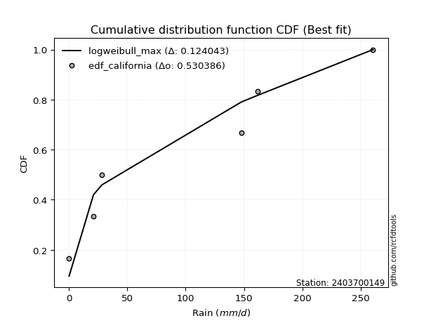</img>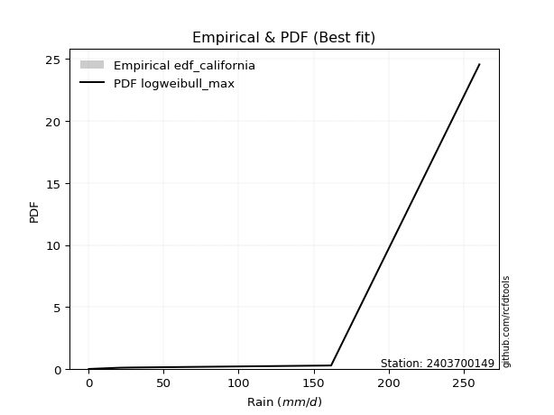</img>

</div>


### 2. EDF Hazen (1930)

Hazen method for plotting positions is a formula used to estimate the empirical cumulative probability distribution of flood events or other hydrological data. This formula often results in biased estimations, particularly when extrapolating to extreme events (high return periods).

<div align="center">


$P=(m-0.5)/n$


</div>


**2.1. Empirical values**

<div align="center">

|                | 0                   | 1                  | 2                  | 3                  | 4         | 5                  |
|:---------------|:--------------------|:-------------------|:-------------------|:-------------------|:----------|:-------------------|
| date           | 2020                | 2024               | 2025               | 2022               | 2023      | 2021               |
| x              | 0.1                 | 21.0               | 28.2               | 147.8              | 161.7     | 260.6              |
| m              | 1                   | 2                  | 3                  | 4                  | 5         | 6                  |
| empirical_dist | edf_hazen           | edf_hazen          | edf_hazen          | edf_hazen          | edf_hazen | edf_hazen          |
| empirical      | 0.08333333333333333 | 0.25               | 0.4166666666666667 | 0.5833333333333334 | 0.75      | 0.9166666666666666 |
| empirical_tr   | 1.090909090909091   | 1.3333333333333333 | 1.7142857142857144 | 2.4000000000000004 | 4.0       | 11.999999999999995 |

</div>


**2.2. Kolmogorov-Smirnov fit test (sorted by Δ)**


<div align="center">

|                | 0                   | 1                   | 2                   | 3                   | 4                   | 5                   | 6                  | 7                   | 8                   | 9                   | 10                  | 11                  | 12                  | 13                  | 14                  | 15                  | 16                  | 17                 | 18                  | 19                 | 20                  | 21                  | 22                  | 23                 | 24                  | 25                  | 26                 | 27                  | 28                 | 29                  | 30                  | 31                  | 32                | 33                  | 34                 | 35                  | 36                  | 37                  | 38                 | 39                  | 40                 | 41                  | 42                  | 43                  | 44                  | 45                  | 46                  | 47                  | 48                 | 49                  | 50                  | 51                  | 52                  | 53                  | 54                  | 55                 | 56                  | 57                  | 58                  | 59                  | 60                  | 61                 | 62                 | 63                  | 64                  | 65                  | 66                  | 67                  | 68                  | 69                  | 70                | 71                  | 72                  | 73                  | 74                  | 75                 | 76                  | 77                  | 78                  | 79                  | 80                  | 81                  | 82                  | 83             | 84                 | 85                  | 86                 | 87                  | 88                  | 89                 | 90                  | 91                 | 92                 | 93                  | 94                  | 95                 | 96                 | 97                 | 98                 | 99                | 100                | 101                 | 102                | 103                | 104                | 105                | 106                | 107                | 108                 | 109                 | 110                 | 111                 | 112                | 113                | 114                | 115                | 116                | 117                 | 118                | 119                | 120                 | 121                 | 122                | 123                 | 124                | 125                | 126                 | 127                | 128                | 129                | 130                | 131                 | 132                 | 133                | 134                 | 135                | 136                | 137                 | 138                | 139                | 140                | 141                | 142                | 143               | 144                | 145                | 146                | 147                | 148                | 149                | 150                | 151                | 152                | 153                | 154                | 155            | 156            | 157            | 158                | 159              |
|:---------------|:--------------------|:--------------------|:--------------------|:--------------------|:--------------------|:--------------------|:-------------------|:--------------------|:--------------------|:--------------------|:--------------------|:--------------------|:--------------------|:--------------------|:--------------------|:--------------------|:--------------------|:-------------------|:--------------------|:-------------------|:--------------------|:--------------------|:--------------------|:-------------------|:--------------------|:--------------------|:-------------------|:--------------------|:-------------------|:--------------------|:--------------------|:--------------------|:------------------|:--------------------|:-------------------|:--------------------|:--------------------|:--------------------|:-------------------|:--------------------|:-------------------|:--------------------|:--------------------|:--------------------|:--------------------|:--------------------|:--------------------|:--------------------|:-------------------|:--------------------|:--------------------|:--------------------|:--------------------|:--------------------|:--------------------|:-------------------|:--------------------|:--------------------|:--------------------|:--------------------|:--------------------|:-------------------|:-------------------|:--------------------|:--------------------|:--------------------|:--------------------|:--------------------|:--------------------|:--------------------|:------------------|:--------------------|:--------------------|:--------------------|:--------------------|:-------------------|:--------------------|:--------------------|:--------------------|:--------------------|:--------------------|:--------------------|:--------------------|:---------------|:-------------------|:--------------------|:-------------------|:--------------------|:--------------------|:-------------------|:--------------------|:-------------------|:-------------------|:--------------------|:--------------------|:-------------------|:-------------------|:-------------------|:-------------------|:------------------|:-------------------|:--------------------|:-------------------|:-------------------|:-------------------|:-------------------|:-------------------|:-------------------|:--------------------|:--------------------|:--------------------|:--------------------|:-------------------|:-------------------|:-------------------|:-------------------|:-------------------|:--------------------|:-------------------|:-------------------|:--------------------|:--------------------|:-------------------|:--------------------|:-------------------|:-------------------|:--------------------|:-------------------|:-------------------|:-------------------|:-------------------|:--------------------|:--------------------|:-------------------|:--------------------|:-------------------|:-------------------|:--------------------|:-------------------|:-------------------|:-------------------|:-------------------|:-------------------|:------------------|:-------------------|:-------------------|:-------------------|:-------------------|:-------------------|:-------------------|:-------------------|:-------------------|:-------------------|:-------------------|:-------------------|:---------------|:---------------|:---------------|:-------------------|:-----------------|
| station        | 2403700149          | 2403700149          | 2403700149          | 2403700149          | 2403700149          | 2403700149          | 2403700149         | 2403700149          | 2403700149          | 2403700149          | 2403700149          | 2403700149          | 2403700149          | 2403700149          | 2403700149          | 2403700149          | 2403700149          | 2403700149         | 2403700149          | 2403700149         | 2403700149          | 2403700149          | 2403700149          | 2403700149         | 2403700149          | 2403700149          | 2403700149         | 2403700149          | 2403700149         | 2403700149          | 2403700149          | 2403700149          | 2403700149        | 2403700149          | 2403700149         | 2403700149          | 2403700149          | 2403700149          | 2403700149         | 2403700149          | 2403700149         | 2403700149          | 2403700149          | 2403700149          | 2403700149          | 2403700149          | 2403700149          | 2403700149          | 2403700149         | 2403700149          | 2403700149          | 2403700149          | 2403700149          | 2403700149          | 2403700149          | 2403700149         | 2403700149          | 2403700149          | 2403700149          | 2403700149          | 2403700149          | 2403700149         | 2403700149         | 2403700149          | 2403700149          | 2403700149          | 2403700149          | 2403700149          | 2403700149          | 2403700149          | 2403700149        | 2403700149          | 2403700149          | 2403700149          | 2403700149          | 2403700149         | 2403700149          | 2403700149          | 2403700149          | 2403700149          | 2403700149          | 2403700149          | 2403700149          | 2403700149     | 2403700149         | 2403700149          | 2403700149         | 2403700149          | 2403700149          | 2403700149         | 2403700149          | 2403700149         | 2403700149         | 2403700149          | 2403700149          | 2403700149         | 2403700149         | 2403700149         | 2403700149         | 2403700149        | 2403700149         | 2403700149          | 2403700149         | 2403700149         | 2403700149         | 2403700149         | 2403700149         | 2403700149         | 2403700149          | 2403700149          | 2403700149          | 2403700149          | 2403700149         | 2403700149         | 2403700149         | 2403700149         | 2403700149         | 2403700149          | 2403700149         | 2403700149         | 2403700149          | 2403700149          | 2403700149         | 2403700149          | 2403700149         | 2403700149         | 2403700149          | 2403700149         | 2403700149         | 2403700149         | 2403700149         | 2403700149          | 2403700149          | 2403700149         | 2403700149          | 2403700149         | 2403700149         | 2403700149          | 2403700149         | 2403700149         | 2403700149         | 2403700149         | 2403700149         | 2403700149        | 2403700149         | 2403700149         | 2403700149         | 2403700149         | 2403700149         | 2403700149         | 2403700149         | 2403700149         | 2403700149         | 2403700149         | 2403700149         | 2403700149     | 2403700149     | 2403700149     | 2403700149         | 2403700149       |
| empirical_dist | edf_hazen           | edf_hazen           | edf_hazen           | edf_hazen           | edf_hazen           | edf_hazen           | edf_hazen          | edf_hazen           | edf_hazen           | edf_hazen           | edf_hazen           | edf_hazen           | edf_hazen           | edf_hazen           | edf_hazen           | edf_hazen           | edf_hazen           | edf_hazen          | edf_hazen           | edf_hazen          | edf_hazen           | edf_hazen           | edf_hazen           | edf_hazen          | edf_hazen           | edf_hazen           | edf_hazen          | edf_hazen           | edf_hazen          | edf_hazen           | edf_hazen           | edf_hazen           | edf_hazen         | edf_hazen           | edf_hazen          | edf_hazen           | edf_hazen           | edf_hazen           | edf_hazen          | edf_hazen           | edf_hazen          | edf_hazen           | edf_hazen           | edf_hazen           | edf_hazen           | edf_hazen           | edf_hazen           | edf_hazen           | edf_hazen          | edf_hazen           | edf_hazen           | edf_hazen           | edf_hazen           | edf_hazen           | edf_hazen           | edf_hazen          | edf_hazen           | edf_hazen           | edf_hazen           | edf_hazen           | edf_hazen           | edf_hazen          | edf_hazen          | edf_hazen           | edf_hazen           | edf_hazen           | edf_hazen           | edf_hazen           | edf_hazen           | edf_hazen           | edf_hazen         | edf_hazen           | edf_hazen           | edf_hazen           | edf_hazen           | edf_hazen          | edf_hazen           | edf_hazen           | edf_hazen           | edf_hazen           | edf_hazen           | edf_hazen           | edf_hazen           | edf_hazen      | edf_hazen          | edf_hazen           | edf_hazen          | edf_hazen           | edf_hazen           | edf_hazen          | edf_hazen           | edf_hazen          | edf_hazen          | edf_hazen           | edf_hazen           | edf_hazen          | edf_hazen          | edf_hazen          | edf_hazen          | edf_hazen         | edf_hazen          | edf_hazen           | edf_hazen          | edf_hazen          | edf_hazen          | edf_hazen          | edf_hazen          | edf_hazen          | edf_hazen           | edf_hazen           | edf_hazen           | edf_hazen           | edf_hazen          | edf_hazen          | edf_hazen          | edf_hazen          | edf_hazen          | edf_hazen           | edf_hazen          | edf_hazen          | edf_hazen           | edf_hazen           | edf_hazen          | edf_hazen           | edf_hazen          | edf_hazen          | edf_hazen           | edf_hazen          | edf_hazen          | edf_hazen          | edf_hazen          | edf_hazen           | edf_hazen           | edf_hazen          | edf_hazen           | edf_hazen          | edf_hazen          | edf_hazen           | edf_hazen          | edf_hazen          | edf_hazen          | edf_hazen          | edf_hazen          | edf_hazen         | edf_hazen          | edf_hazen          | edf_hazen          | edf_hazen          | edf_hazen          | edf_hazen          | edf_hazen          | edf_hazen          | edf_hazen          | edf_hazen          | edf_hazen          | edf_hazen      | edf_hazen      | edf_hazen      | edf_hazen          | edf_hazen        |
| p_dist         | dgamma              | mielke              | loggausshyper       | loggenextreme       | f                   | dweibull            | beta               | weibull_min         | loglevy_l           | logpearson3         | logvonmises_line    | arcsine             | loggumbel_l         | ksone               | halfgennorm         | logt                | semicircular        | halfnorm           | foldnorm            | kappa3             | anglit              | genexpon            | nakagami            | exponnorm          | rayleigh            | alpha               | maxwell            | genextreme          | ncf                | logtrapezoid        | logfoldnorm         | halflogistic        | logloggamma       | genlogistic         | logargus           | pearson3            | exponpow            | burr                | betaprime          | kstwobign           | t                  | crystalball         | norm                | loghypsecant        | gumbel_r            | logweibull_max      | gompertz            | loglogistic         | invgauss           | lomax               | logdweibull         | lognakagami         | wrapcauchy          | lognct              | logcrystalball      | lognorm            | logexponnorm        | logrice             | loglaplace          | loglaplace          | loggenhalflogistic  | gengamma           | moyal              | loganglit           | logsemicircular     | truncweibull_min    | logistic            | cosine              | loggamma            | loggamma            | truncexpon        | logarcsine          | logjohnsonsb        | rice                | logerlang           | logalpha           | truncnorm           | gumbel_l            | loginvgamma         | hypsecant           | burr12              | loginvgauss         | logmaxwell          | gennorm        | laplace            | loggennorm          | exponweib          | skewnorm            | lograyleigh         | loginvweibull      | triang              | kappa4             | logbeta            | loggumbel_r         | bradford            | logcosine          | logskewnorm        | argus              | gausshyper         | logwrapcauchy     | levy_l             | loghalfnorm         | logkstwobign       | logtriang          | tukeylambda        | loggenexpon        | logmoyal           | logdgamma          | uniform             | vonmises_line       | loghalflogistic     | genhalflogistic     | logncf             | logburr12          | gamma              | erlang             | genpareto          | wald                | invgamma           | johnsonsb          | loglomax            | nct                 | logtruncnorm       | johnsonsu           | logwald            | truncpareto        | trapezoid           | logkappa3          | logburr            | logksone           | loghalfgennorm     | logkappa4           | fatiguelife         | logexponweib       | logtruncweibull_min | loguniform         | logbradford        | logloglaplace       | logjohnsonsu       | logf               | invweibull         | powerlaw           | logtruncexpon      | logmielke         | logfatiguelife     | loggenpareto       | logweibull_min     | weibull_max        | loggengamma        | rdist              | logbetaprime       | logexponpow        | logtruncpareto     | logpowerlaw        | loggompertz        | loggenlogistic | logtukeylambda | logrdist       | logvonmises        | vonmises         |
| delta          | 0.10007068232944695 | 0.11372768320346105 | 0.11387566494548573 | 0.11928432632643349 | 0.12099282895615437 | 0.12206209295765558 | 0.1226800712405311 | 0.12518729639441856 | 0.12603760151021337 | 0.12703155210319877 | 0.13036996674704532 | 0.13467526322758244 | 0.14315597753182174 | 0.14670126884534956 | 0.14748113439265886 | 0.15214939438895497 | 0.16343543156884205 | 0.1675102600514718 | 0.17151385859042914 | 0.1724441544710198 | 0.17578566531313297 | 0.17816784753170908 | 0.17852940014616858 | 0.1799464179483854 | 0.18205601302737626 | 0.18487699787506773 | 0.1884915196288278 | 0.18857170293902603 | 0.1894459939122822 | 0.19085712003834654 | 0.19314799289043127 | 0.19336734191334995 | 0.194916082239749 | 0.19557884852475052 | 0.1973124116320153 | 0.19752081038694835 | 0.19927806866467346 | 0.20006405788956638 | 0.2010422240361056 | 0.20383537212779904 | 0.2038988866914193 | 0.20390138854427825 | 0.20390143471900274 | 0.20455651270616892 | 0.20656839855362652 | 0.20737648815509224 | 0.20812183353301816 | 0.20874063411859317 | 0.2101101518105417 | 0.21034243339752423 | 0.21057166794588555 | 0.21202744881639196 | 0.21276144785823292 | 0.21345041394099135 | 0.21366790690053816 | 0.2136679111358239 | 0.21367291442559921 | 0.21367334202301175 | 0.21463720799547958 | 0.21463720799547958 | 0.21720245393255655 | 0.2173160036370923 | 0.2174936625857296 | 0.21884588446071213 | 0.22097924407300984 | 0.22429981184835796 | 0.22594843437566633 | 0.22602305499189157 | 0.22680059999939028 | 0.22680059999939028 | 0.228839597282048 | 0.22945937948268758 | 0.23001796941709757 | 0.23182832525232358 | 0.23200964989240214 | 0.2325478508745462 | 0.23354177875473453 | 0.23371948402418294 | 0.23883562697555683 | 0.23931842484465526 | 0.24217744663984175 | 0.24360503011794654 | 0.24779031196760587 | 0.25           | 0.2546541976711719 | 0.25534918489386016 | 0.2559726045339331 | 0.25718389006794434 | 0.25948528613600086 | 0.2595418261352943 | 0.26074735892964707 | 0.2613744336334518 | 0.2718016010414503 | 0.28199271986633745 | 0.28207091182605715 | 0.2859644710982657 | 0.2881203202159981 | 0.2889001038339856 | 0.2901125993789694 | 0.291152684018368 | 0.2916525382087944 | 0.29246595668711317 | 0.2980101818992885 | 0.2993583516340771 | 0.3054124007770748 | 0.3073478560957432 | 0.3076593628073103 | 0.3077596044661839 | 0.30879718490083174 | 0.31070474217676425 | 0.31477049553651304 | 0.31588240325252387 | 0.3241891181948432 | 0.3296650993758975 | 0.3330157472711892 | 0.3357710907124748 | 0.3372029892039385 | 0.35006855414415944 | 0.3544329570723538 | 0.3691225201289908 | 0.37237977180763115 | 0.37409875349886446 | 0.3741956977193537 | 0.37752291060797083 | 0.3790852904967885 | 0.3814029309335224 | 0.38520469092884524 | 0.3884938543293136 | 0.3897182581278428 | 0.3998430645440426 | 0.4011372616016837 | 0.40198989915696903 | 0.40620894751624725 | 0.4110192196001975 | 0.4145051265798857  | 0.4298116774528512 | 0.4349994257406873 | 0.45769166491225977 | 0.4721428798912404 | 0.4761203096397305 | 0.4836367005961588 | 0.4895628729875151 | 0.5043735816825395 | 0.513324201508161 | 0.5398234335052646 | 0.5589053510395855 | 0.5711131853541584 | 0.6232537208104127 | 0.6336363939575373 | 0.6370060271968712 | 0.6576603808202659 | 0.6768416438362022 | 0.6867564611515687 | 0.6912843247424589 | 0.7446759773071409 | 0.75           | 0.75           | 0.75           | 1.1693415335419233 | 40.5350958647428 |
| deltao         | 0.530385761606      | 0.530385761606      | 0.530385761606      | 0.530385761606      | 0.530385761606      | 0.530385761606      | 0.530385761606     | 0.530385761606      | 0.530385761606      | 0.530385761606      | 0.530385761606      | 0.530385761606      | 0.530385761606      | 0.530385761606      | 0.530385761606      | 0.530385761606      | 0.530385761606      | 0.530385761606     | 0.530385761606      | 0.530385761606     | 0.530385761606      | 0.530385761606      | 0.530385761606      | 0.530385761606     | 0.530385761606      | 0.530385761606      | 0.530385761606     | 0.530385761606      | 0.530385761606     | 0.530385761606      | 0.530385761606      | 0.530385761606      | 0.530385761606    | 0.530385761606      | 0.530385761606     | 0.530385761606      | 0.530385761606      | 0.530385761606      | 0.530385761606     | 0.530385761606      | 0.530385761606     | 0.530385761606      | 0.530385761606      | 0.530385761606      | 0.530385761606      | 0.530385761606      | 0.530385761606      | 0.530385761606      | 0.530385761606     | 0.530385761606      | 0.530385761606      | 0.530385761606      | 0.530385761606      | 0.530385761606      | 0.530385761606      | 0.530385761606     | 0.530385761606      | 0.530385761606      | 0.530385761606      | 0.530385761606      | 0.530385761606      | 0.530385761606     | 0.530385761606     | 0.530385761606      | 0.530385761606      | 0.530385761606      | 0.530385761606      | 0.530385761606      | 0.530385761606      | 0.530385761606      | 0.530385761606    | 0.530385761606      | 0.530385761606      | 0.530385761606      | 0.530385761606      | 0.530385761606     | 0.530385761606      | 0.530385761606      | 0.530385761606      | 0.530385761606      | 0.530385761606      | 0.530385761606      | 0.530385761606      | 0.530385761606 | 0.530385761606     | 0.530385761606      | 0.530385761606     | 0.530385761606      | 0.530385761606      | 0.530385761606     | 0.530385761606      | 0.530385761606     | 0.530385761606     | 0.530385761606      | 0.530385761606      | 0.530385761606     | 0.530385761606     | 0.530385761606     | 0.530385761606     | 0.530385761606    | 0.530385761606     | 0.530385761606      | 0.530385761606     | 0.530385761606     | 0.530385761606     | 0.530385761606     | 0.530385761606     | 0.530385761606     | 0.530385761606      | 0.530385761606      | 0.530385761606      | 0.530385761606      | 0.530385761606     | 0.530385761606     | 0.530385761606     | 0.530385761606     | 0.530385761606     | 0.530385761606      | 0.530385761606     | 0.530385761606     | 0.530385761606      | 0.530385761606      | 0.530385761606     | 0.530385761606      | 0.530385761606     | 0.530385761606     | 0.530385761606      | 0.530385761606     | 0.530385761606     | 0.530385761606     | 0.530385761606     | 0.530385761606      | 0.530385761606      | 0.530385761606     | 0.530385761606      | 0.530385761606     | 0.530385761606     | 0.530385761606      | 0.530385761606     | 0.530385761606     | 0.530385761606     | 0.530385761606     | 0.530385761606     | 0.530385761606    | 0.530385761606     | 0.530385761606     | 0.530385761606     | 0.530385761606     | 0.530385761606     | 0.530385761606     | 0.530385761606     | 0.530385761606     | 0.530385761606     | 0.530385761606     | 0.530385761606     | 0.530385761606 | 0.530385761606 | 0.530385761606 | 0.530385761606     | 0.530385761606   |
| eval           | Δo > Δ              | Δo > Δ              | Δo > Δ              | Δo > Δ              | Δo > Δ              | Δo > Δ              | Δo > Δ             | Δo > Δ              | Δo > Δ              | Δo > Δ              | Δo > Δ              | Δo > Δ              | Δo > Δ              | Δo > Δ              | Δo > Δ              | Δo > Δ              | Δo > Δ              | Δo > Δ             | Δo > Δ              | Δo > Δ             | Δo > Δ              | Δo > Δ              | Δo > Δ              | Δo > Δ             | Δo > Δ              | Δo > Δ              | Δo > Δ             | Δo > Δ              | Δo > Δ             | Δo > Δ              | Δo > Δ              | Δo > Δ              | Δo > Δ            | Δo > Δ              | Δo > Δ             | Δo > Δ              | Δo > Δ              | Δo > Δ              | Δo > Δ             | Δo > Δ              | Δo > Δ             | Δo > Δ              | Δo > Δ              | Δo > Δ              | Δo > Δ              | Δo > Δ              | Δo > Δ              | Δo > Δ              | Δo > Δ             | Δo > Δ              | Δo > Δ              | Δo > Δ              | Δo > Δ              | Δo > Δ              | Δo > Δ              | Δo > Δ             | Δo > Δ              | Δo > Δ              | Δo > Δ              | Δo > Δ              | Δo > Δ              | Δo > Δ             | Δo > Δ             | Δo > Δ              | Δo > Δ              | Δo > Δ              | Δo > Δ              | Δo > Δ              | Δo > Δ              | Δo > Δ              | Δo > Δ            | Δo > Δ              | Δo > Δ              | Δo > Δ              | Δo > Δ              | Δo > Δ             | Δo > Δ              | Δo > Δ              | Δo > Δ              | Δo > Δ              | Δo > Δ              | Δo > Δ              | Δo > Δ              | Δo > Δ         | Δo > Δ             | Δo > Δ              | Δo > Δ             | Δo > Δ              | Δo > Δ              | Δo > Δ             | Δo > Δ              | Δo > Δ             | Δo > Δ             | Δo > Δ              | Δo > Δ              | Δo > Δ             | Δo > Δ             | Δo > Δ             | Δo > Δ             | Δo > Δ            | Δo > Δ             | Δo > Δ              | Δo > Δ             | Δo > Δ             | Δo > Δ             | Δo > Δ             | Δo > Δ             | Δo > Δ             | Δo > Δ              | Δo > Δ              | Δo > Δ              | Δo > Δ              | Δo > Δ             | Δo > Δ             | Δo > Δ             | Δo > Δ             | Δo > Δ             | Δo > Δ              | Δo > Δ             | Δo > Δ             | Δo > Δ              | Δo > Δ              | Δo > Δ             | Δo > Δ              | Δo > Δ             | Δo > Δ             | Δo > Δ              | Δo > Δ             | Δo > Δ             | Δo > Δ             | Δo > Δ             | Δo > Δ              | Δo > Δ              | Δo > Δ             | Δo > Δ              | Δo > Δ             | Δo > Δ             | Δo > Δ              | Δo > Δ             | Δo > Δ             | Δo > Δ             | Δo > Δ             | Δo > Δ             | Δo > Δ            | Δo <= Δ            | Δo <= Δ            | Δo <= Δ            | Δo <= Δ            | Δo <= Δ            | Δo <= Δ            | Δo <= Δ            | Δo <= Δ            | Δo <= Δ            | Δo <= Δ            | Δo <= Δ            | Δo <= Δ        | Δo <= Δ        | Δo <= Δ        | Δo <= Δ            | Δo <= Δ          |
| fit            | 1                   | 1                   | 1                   | 1                   | 1                   | 1                   | 1                  | 1                   | 1                   | 1                   | 1                   | 1                   | 1                   | 1                   | 1                   | 1                   | 1                   | 1                  | 1                   | 1                  | 1                   | 1                   | 1                   | 1                  | 1                   | 1                   | 1                  | 1                   | 1                  | 1                   | 1                   | 1                   | 1                 | 1                   | 1                  | 1                   | 1                   | 1                   | 1                  | 1                   | 1                  | 1                   | 1                   | 1                   | 1                   | 1                   | 1                   | 1                   | 1                  | 1                   | 1                   | 1                   | 1                   | 1                   | 1                   | 1                  | 1                   | 1                   | 1                   | 1                   | 1                   | 1                  | 1                  | 1                   | 1                   | 1                   | 1                   | 1                   | 1                   | 1                   | 1                 | 1                   | 1                   | 1                   | 1                   | 1                  | 1                   | 1                   | 1                   | 1                   | 1                   | 1                   | 1                   | 1              | 1                  | 1                   | 1                  | 1                   | 1                   | 1                  | 1                   | 1                  | 1                  | 1                   | 1                   | 1                  | 1                  | 1                  | 1                  | 1                 | 1                  | 1                   | 1                  | 1                  | 1                  | 1                  | 1                  | 1                  | 1                   | 1                   | 1                   | 1                   | 1                  | 1                  | 1                  | 1                  | 1                  | 1                   | 1                  | 1                  | 1                   | 1                   | 1                  | 1                   | 1                  | 1                  | 1                   | 1                  | 1                  | 1                  | 1                  | 1                   | 1                   | 1                  | 1                   | 1                  | 1                  | 1                   | 1                  | 1                  | 1                  | 1                  | 1                  | 1                 | 0                  | 0                  | 0                  | 0                  | 0                  | 0                  | 0                  | 0                  | 0                  | 0                  | 0                  | 0              | 0              | 0              | 0                  | 0                |
| n              | 6                   | 6                   | 6                   | 6                   | 6                   | 6                   | 6                  | 6                   | 6                   | 6                   | 6                   | 6                   | 6                   | 6                   | 6                   | 6                   | 6                   | 6                  | 6                   | 6                  | 6                   | 6                   | 6                   | 6                  | 6                   | 6                   | 6                  | 6                   | 6                  | 6                   | 6                   | 6                   | 6                 | 6                   | 6                  | 6                   | 6                   | 6                   | 6                  | 6                   | 6                  | 6                   | 6                   | 6                   | 6                   | 6                   | 6                   | 6                   | 6                  | 6                   | 6                   | 6                   | 6                   | 6                   | 6                   | 6                  | 6                   | 6                   | 6                   | 6                   | 6                   | 6                  | 6                  | 6                   | 6                   | 6                   | 6                   | 6                   | 6                   | 6                   | 6                 | 6                   | 6                   | 6                   | 6                   | 6                  | 6                   | 6                   | 6                   | 6                   | 6                   | 6                   | 6                   | 6              | 6                  | 6                   | 6                  | 6                   | 6                   | 6                  | 6                   | 6                  | 6                  | 6                   | 6                   | 6                  | 6                  | 6                  | 6                  | 6                 | 6                  | 6                   | 6                  | 6                  | 6                  | 6                  | 6                  | 6                  | 6                   | 6                   | 6                   | 6                   | 6                  | 6                  | 6                  | 6                  | 6                  | 6                   | 6                  | 6                  | 6                   | 6                   | 6                  | 6                   | 6                  | 6                  | 6                   | 6                  | 6                  | 6                  | 6                  | 6                   | 6                   | 6                  | 6                   | 6                  | 6                  | 6                   | 6                  | 6                  | 6                  | 6                  | 6                  | 6                 | 6                  | 6                  | 6                  | 6                  | 6                  | 6                  | 6                  | 6                  | 6                  | 6                  | 6                  | 6              | 6              | 6              | 6                  | 6                |
| best_fit       | 1                   | 0                   | 0                   | 0                   | 0                   | 0                   | 0                  | 0                   | 0                   | 0                   | 0                   | 0                   | 0                   | 0                   | 0                   | 0                   | 0                   | 0                  | 0                   | 0                  | 0                   | 0                   | 0                   | 0                  | 0                   | 0                   | 0                  | 0                   | 0                  | 0                   | 0                   | 0                   | 0                 | 0                   | 0                  | 0                   | 0                   | 0                   | 0                  | 0                   | 0                  | 0                   | 0                   | 0                   | 0                   | 0                   | 0                   | 0                   | 0                  | 0                   | 0                   | 0                   | 0                   | 0                   | 0                   | 0                  | 0                   | 0                   | 0                   | 0                   | 0                   | 0                  | 0                  | 0                   | 0                   | 0                   | 0                   | 0                   | 0                   | 0                   | 0                 | 0                   | 0                   | 0                   | 0                   | 0                  | 0                   | 0                   | 0                   | 0                   | 0                   | 0                   | 0                   | 0              | 0                  | 0                   | 0                  | 0                   | 0                   | 0                  | 0                   | 0                  | 0                  | 0                   | 0                   | 0                  | 0                  | 0                  | 0                  | 0                 | 0                  | 0                   | 0                  | 0                  | 0                  | 0                  | 0                  | 0                  | 0                   | 0                   | 0                   | 0                   | 0                  | 0                  | 0                  | 0                  | 0                  | 0                   | 0                  | 0                  | 0                   | 0                   | 0                  | 0                   | 0                  | 0                  | 0                   | 0                  | 0                  | 0                  | 0                  | 0                   | 0                   | 0                  | 0                   | 0                  | 0                  | 0                   | 0                  | 0                  | 0                  | 0                  | 0                  | 0                 | 0                  | 0                  | 0                  | 0                  | 0                  | 0                  | 0                  | 0                  | 0                  | 0                  | 0                  | 0              | 0              | 0              | 0                  | 0                |
| best_fit_sort  | 1                   | 2                   | 3                   | 4                   | 5                   | 6                   | 7                  | 8                   | 9                   | 10                  | 11                  | 12                  | 13                  | 14                  | 15                  | 16                  | 17                  | 18                 | 19                  | 20                 | 21                  | 22                  | 23                  | 24                 | 25                  | 26                  | 27                 | 28                  | 29                 | 30                  | 31                  | 32                  | 33                | 34                  | 35                 | 36                  | 37                  | 38                  | 39                 | 40                  | 41                 | 42                  | 43                  | 44                  | 45                  | 46                  | 47                  | 48                  | 49                 | 50                  | 51                  | 52                  | 53                  | 54                  | 55                  | 56                 | 57                  | 58                  | 59                  | 60                  | 61                  | 62                 | 63                 | 64                  | 65                  | 66                  | 67                  | 68                  | 69                  | 70                  | 71                | 72                  | 73                  | 74                  | 75                  | 76                 | 77                  | 78                  | 79                  | 80                  | 81                  | 82                  | 83                  | 84             | 85                 | 86                  | 87                 | 88                  | 89                  | 90                 | 91                  | 92                 | 93                 | 94                  | 95                  | 96                 | 97                 | 98                 | 99                 | 100               | 101                | 102                 | 103                | 104                | 105                | 106                | 107                | 108                | 109                 | 110                 | 111                 | 112                 | 113                | 114                | 115                | 116                | 117                | 118                 | 119                | 120                | 121                 | 122                 | 123                | 124                 | 125                | 126                | 127                 | 128                | 129                | 130                | 131                | 132                 | 133                 | 134                | 135                 | 136                | 137                | 138                 | 139                | 140                | 141                | 142                | 143                | 144               | 145                | 146                | 147                | 148                | 149                | 150                | 151                | 152                | 153                | 154                | 155                | 156            | 157            | 158            | 159                | 160              |

</div>


**2.3. Best fit**

<div align="center">

|   id |    station | empirical_dist   | p_dist   |    delta |   deltao | eval   |   fit |   n |   best_fit |   best_fit_sort |
|-----:|-----------:|:-----------------|:---------|---------:|---------:|:-------|------:|----:|-----------:|----------------:|
|    0 | 2403700149 | edf_hazen        | dgamma   | 0.100071 | 0.530386 | Δo > Δ |     1 |   6 |          1 |               1 |

</div>


<div align="center">

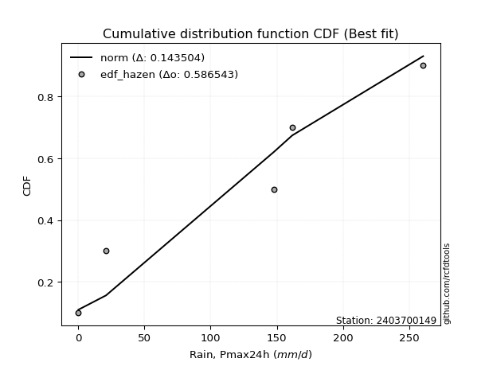</img></img>

</div>


### 3. EDF Weibull (1939)

Weibull plotting position formula is an empirical method used to estimate the non-exceedance probability or plotting position for a set of observed data, is often recommended or widely used in practice, particularly in flood frequency analysis.

<div align="center">


$P=m/(n+1)$


</div>


**3.1. Empirical values**

<div align="center">

|                | 0                   | 1                  | 2                   | 3                  | 4                  | 5                  |
|:---------------|:--------------------|:-------------------|:--------------------|:-------------------|:-------------------|:-------------------|
| date           | 2020                | 2024               | 2025                | 2022               | 2023               | 2021               |
| x              | 0.1                 | 21.0               | 28.2                | 147.8              | 161.7              | 260.6              |
| m              | 1                   | 2                  | 3                   | 4                  | 5                  | 6                  |
| empirical_dist | edf_weibull         | edf_weibull        | edf_weibull         | edf_weibull        | edf_weibull        | edf_weibull        |
| empirical      | 0.14285714285714285 | 0.2857142857142857 | 0.42857142857142855 | 0.5714285714285714 | 0.7142857142857143 | 0.8571428571428571 |
| empirical_tr   | 1.1666666666666665  | 1.4                | 1.75                | 2.333333333333333  | 3.5                | 6.999999999999997  |

</div>


**3.2. Kolmogorov-Smirnov fit test (sorted by Δ)**


<div align="center">

|                | 0                   | 1                   | 2                   | 3                   | 4                  | 5                   | 6                   | 7                   | 8                  | 9                   | 10                 | 11                  | 12                 | 13                  | 14                  | 15                  | 16                  | 17                  | 18                 | 19                  | 20                  | 21                  | 22                  | 23                 | 24                  | 25                  | 26                  | 27                  | 28                | 29                  | 30                  | 31                  | 32                  | 33                  | 34                  | 35                  | 36                  | 37                  | 38                  | 39                  | 40                  | 41                 | 42                  | 43                  | 44                | 45                  | 46                  | 47                  | 48                 | 49                  | 50                  | 51                  | 52                  | 53                  | 54                  | 55                  | 56                  | 57                  | 58                  | 59                 | 60                 | 61                  | 62                 | 63                 | 64                  | 65                  | 66                  | 67                  | 68                  | 69                  | 70                 | 71                  | 72                  | 73                 | 74                  | 75                  | 76                  | 77                  | 78                  | 79                  | 80                 | 81                  | 82                 | 83                  | 84                  | 85                  | 86                 | 87                 | 88                  | 89                  | 90                 | 91                 | 92                 | 93                 | 94                  | 95                 | 96                  | 97                 | 98                 | 99                 | 100                 | 101                 | 102                 | 103                | 104               | 105                 | 106                | 107                 | 108                | 109                 | 110                | 111                | 112                 | 113                | 114                | 115                 | 116                 | 117                 | 118                 | 119                | 120                | 121                | 122                 | 123                 | 124                 | 125                | 126                | 127                | 128                | 129                | 130               | 131                 | 132                 | 133                 | 134                | 135                | 136                | 137                 | 138                | 139                | 140                | 141                | 142                 | 143                 | 144                | 145                | 146                | 147                | 148                | 149                | 150                | 151                | 152               | 153                | 154                | 155                | 156                | 157                | 158                | 159               |
|:---------------|:--------------------|:--------------------|:--------------------|:--------------------|:-------------------|:--------------------|:--------------------|:--------------------|:-------------------|:--------------------|:-------------------|:--------------------|:-------------------|:--------------------|:--------------------|:--------------------|:--------------------|:--------------------|:-------------------|:--------------------|:--------------------|:--------------------|:--------------------|:-------------------|:--------------------|:--------------------|:--------------------|:--------------------|:------------------|:--------------------|:--------------------|:--------------------|:--------------------|:--------------------|:--------------------|:--------------------|:--------------------|:--------------------|:--------------------|:--------------------|:--------------------|:-------------------|:--------------------|:--------------------|:------------------|:--------------------|:--------------------|:--------------------|:-------------------|:--------------------|:--------------------|:--------------------|:--------------------|:--------------------|:--------------------|:--------------------|:--------------------|:--------------------|:--------------------|:-------------------|:-------------------|:--------------------|:-------------------|:-------------------|:--------------------|:--------------------|:--------------------|:--------------------|:--------------------|:--------------------|:-------------------|:--------------------|:--------------------|:-------------------|:--------------------|:--------------------|:--------------------|:--------------------|:--------------------|:--------------------|:-------------------|:--------------------|:-------------------|:--------------------|:--------------------|:--------------------|:-------------------|:-------------------|:--------------------|:--------------------|:-------------------|:-------------------|:-------------------|:-------------------|:--------------------|:-------------------|:--------------------|:-------------------|:-------------------|:-------------------|:--------------------|:--------------------|:--------------------|:-------------------|:------------------|:--------------------|:-------------------|:--------------------|:-------------------|:--------------------|:-------------------|:-------------------|:--------------------|:-------------------|:-------------------|:--------------------|:--------------------|:--------------------|:--------------------|:-------------------|:-------------------|:-------------------|:--------------------|:--------------------|:--------------------|:-------------------|:-------------------|:-------------------|:-------------------|:-------------------|:------------------|:--------------------|:--------------------|:--------------------|:-------------------|:-------------------|:-------------------|:--------------------|:-------------------|:-------------------|:-------------------|:-------------------|:--------------------|:--------------------|:-------------------|:-------------------|:-------------------|:-------------------|:-------------------|:-------------------|:-------------------|:-------------------|:------------------|:-------------------|:-------------------|:-------------------|:-------------------|:-------------------|:-------------------|:------------------|
| station        | 2403700149          | 2403700149          | 2403700149          | 2403700149          | 2403700149         | 2403700149          | 2403700149          | 2403700149          | 2403700149         | 2403700149          | 2403700149         | 2403700149          | 2403700149         | 2403700149          | 2403700149          | 2403700149          | 2403700149          | 2403700149          | 2403700149         | 2403700149          | 2403700149          | 2403700149          | 2403700149          | 2403700149         | 2403700149          | 2403700149          | 2403700149          | 2403700149          | 2403700149        | 2403700149          | 2403700149          | 2403700149          | 2403700149          | 2403700149          | 2403700149          | 2403700149          | 2403700149          | 2403700149          | 2403700149          | 2403700149          | 2403700149          | 2403700149         | 2403700149          | 2403700149          | 2403700149        | 2403700149          | 2403700149          | 2403700149          | 2403700149         | 2403700149          | 2403700149          | 2403700149          | 2403700149          | 2403700149          | 2403700149          | 2403700149          | 2403700149          | 2403700149          | 2403700149          | 2403700149         | 2403700149         | 2403700149          | 2403700149         | 2403700149         | 2403700149          | 2403700149          | 2403700149          | 2403700149          | 2403700149          | 2403700149          | 2403700149         | 2403700149          | 2403700149          | 2403700149         | 2403700149          | 2403700149          | 2403700149          | 2403700149          | 2403700149          | 2403700149          | 2403700149         | 2403700149          | 2403700149         | 2403700149          | 2403700149          | 2403700149          | 2403700149         | 2403700149         | 2403700149          | 2403700149          | 2403700149         | 2403700149         | 2403700149         | 2403700149         | 2403700149          | 2403700149         | 2403700149          | 2403700149         | 2403700149         | 2403700149         | 2403700149          | 2403700149          | 2403700149          | 2403700149         | 2403700149        | 2403700149          | 2403700149         | 2403700149          | 2403700149         | 2403700149          | 2403700149         | 2403700149         | 2403700149          | 2403700149         | 2403700149         | 2403700149          | 2403700149          | 2403700149          | 2403700149          | 2403700149         | 2403700149         | 2403700149         | 2403700149          | 2403700149          | 2403700149          | 2403700149         | 2403700149         | 2403700149         | 2403700149         | 2403700149         | 2403700149        | 2403700149          | 2403700149          | 2403700149          | 2403700149         | 2403700149         | 2403700149         | 2403700149          | 2403700149         | 2403700149         | 2403700149         | 2403700149         | 2403700149          | 2403700149          | 2403700149         | 2403700149         | 2403700149         | 2403700149         | 2403700149         | 2403700149         | 2403700149         | 2403700149         | 2403700149        | 2403700149         | 2403700149         | 2403700149         | 2403700149         | 2403700149         | 2403700149         | 2403700149        |
| empirical_dist | edf_weibull         | edf_weibull         | edf_weibull         | edf_weibull         | edf_weibull        | edf_weibull         | edf_weibull         | edf_weibull         | edf_weibull        | edf_weibull         | edf_weibull        | edf_weibull         | edf_weibull        | edf_weibull         | edf_weibull         | edf_weibull         | edf_weibull         | edf_weibull         | edf_weibull        | edf_weibull         | edf_weibull         | edf_weibull         | edf_weibull         | edf_weibull        | edf_weibull         | edf_weibull         | edf_weibull         | edf_weibull         | edf_weibull       | edf_weibull         | edf_weibull         | edf_weibull         | edf_weibull         | edf_weibull         | edf_weibull         | edf_weibull         | edf_weibull         | edf_weibull         | edf_weibull         | edf_weibull         | edf_weibull         | edf_weibull        | edf_weibull         | edf_weibull         | edf_weibull       | edf_weibull         | edf_weibull         | edf_weibull         | edf_weibull        | edf_weibull         | edf_weibull         | edf_weibull         | edf_weibull         | edf_weibull         | edf_weibull         | edf_weibull         | edf_weibull         | edf_weibull         | edf_weibull         | edf_weibull        | edf_weibull        | edf_weibull         | edf_weibull        | edf_weibull        | edf_weibull         | edf_weibull         | edf_weibull         | edf_weibull         | edf_weibull         | edf_weibull         | edf_weibull        | edf_weibull         | edf_weibull         | edf_weibull        | edf_weibull         | edf_weibull         | edf_weibull         | edf_weibull         | edf_weibull         | edf_weibull         | edf_weibull        | edf_weibull         | edf_weibull        | edf_weibull         | edf_weibull         | edf_weibull         | edf_weibull        | edf_weibull        | edf_weibull         | edf_weibull         | edf_weibull        | edf_weibull        | edf_weibull        | edf_weibull        | edf_weibull         | edf_weibull        | edf_weibull         | edf_weibull        | edf_weibull        | edf_weibull        | edf_weibull         | edf_weibull         | edf_weibull         | edf_weibull        | edf_weibull       | edf_weibull         | edf_weibull        | edf_weibull         | edf_weibull        | edf_weibull         | edf_weibull        | edf_weibull        | edf_weibull         | edf_weibull        | edf_weibull        | edf_weibull         | edf_weibull         | edf_weibull         | edf_weibull         | edf_weibull        | edf_weibull        | edf_weibull        | edf_weibull         | edf_weibull         | edf_weibull         | edf_weibull        | edf_weibull        | edf_weibull        | edf_weibull        | edf_weibull        | edf_weibull       | edf_weibull         | edf_weibull         | edf_weibull         | edf_weibull        | edf_weibull        | edf_weibull        | edf_weibull         | edf_weibull        | edf_weibull        | edf_weibull        | edf_weibull        | edf_weibull         | edf_weibull         | edf_weibull        | edf_weibull        | edf_weibull        | edf_weibull        | edf_weibull        | edf_weibull        | edf_weibull        | edf_weibull        | edf_weibull       | edf_weibull        | edf_weibull        | edf_weibull        | edf_weibull        | edf_weibull        | edf_weibull        | edf_weibull       |
| p_dist         | loglevy_l           | dweibull            | logpearson3         | dgamma              | mielke             | f                   | weibull_min         | logvonmises_line    | beta               | loggenextreme       | arcsine            | loggausshyper       | loggumbel_l        | logtrapezoid        | ksone               | halfgennorm         | logt                | logjohnsonsb        | semicircular       | lognakagami         | wrapcauchy          | lognct              | logcrystalball      | lognorm            | logexponnorm        | logrice             | halfnorm            | loganglit           | foldnorm          | kappa3              | logsemicircular     | anglit              | genexpon            | loglogistic         | nakagami            | loggamma            | loggamma            | exponnorm           | logarcsine          | rayleigh            | logerlang           | alpha              | logalpha            | maxwell             | genextreme        | ncf                 | loginvgamma         | logfoldnorm         | halflogistic       | loghypsecant        | logloggamma         | genlogistic         | loginvgauss         | logargus            | pearson3            | exponpow            | burr                | logmaxwell          | betaprime           | gennorm            | kstwobign          | t                   | crystalball        | norm               | gumbel_r            | burr12              | logweibull_max      | gompertz            | exponweib           | invgauss            | lomax              | logdweibull         | lograyleigh         | loginvweibull      | gengamma            | loglaplace          | loglaplace          | loggenhalflogistic  | moyal               | levy_l              | logbeta            | truncweibull_min    | logistic           | cosine              | truncexpon          | rice                | truncnorm          | gumbel_l           | loggumbel_r         | logcosine           | hypsecant          | logwrapcauchy      | loghalfnorm        | logkstwobign       | logncf              | laplace            | loggennorm          | skewnorm           | loggenexpon        | logmoyal           | triang              | kappa4              | loghalflogistic     | logburr12          | bradford          | logskewnorm         | argus              | gausshyper          | johnsonsb          | logtriang           | tukeylambda        | invgamma           | logdgamma           | uniform            | vonmises_line      | genhalflogistic     | loglomax            | nct                 | johnsonsu           | logwald            | gamma              | truncpareto        | erlang              | genpareto           | logexponweib        | logkappa3          | logburr            | logtruncnorm       | wald               | logksone           | loghalfgennorm    | logkappa4           | fatiguelife         | logtruncweibull_min | loguniform         | trapezoid          | logbradford        | logloglaplace       | invweibull         | logjohnsonsu       | logf               | powerlaw           | logtruncexpon       | logmielke           | logfatiguelife     | loggenpareto       | logweibull_min     | loggengamma        | weibull_max        | rdist              | logbetaprime       | logexponpow        | logtruncpareto    | logpowerlaw        | loggompertz        | loggenlogistic     | logtukeylambda     | logrdist           | logvonmises        | vonmises          |
| delta          | 0.10010256176752497 | 0.12623993507120057 | 0.13119718574552053 | 0.13239782465579963 | 0.1428571412479014 | 0.14285714127372393 | 0.14285714232519098 | 0.14285714252942805 | 0.1428571428228519 | 0.14285714285708517 | 0.1428571428571429 | 0.14285714286165418 | 0.1497337811888777 | 0.15514283432406084 | 0.15860603075011143 | 0.15938589629742084 | 0.16405415629371684 | 0.17049415989328803 | 0.1753401934736039 | 0.17631316310210626 | 0.17704716214394722 | 0.17773612822670565 | 0.17795362118625246 | 0.1779536254215382 | 0.17795862871131352 | 0.17795905630872605 | 0.17941502195623366 | 0.18313159874642643 | 0.183418620495191 | 0.18434891637578177 | 0.18526495835872414 | 0.18769042721789483 | 0.19007260943647095 | 0.19031087041569095 | 0.19043416205093056 | 0.19108631428510459 | 0.19108631428510459 | 0.19185117985314737 | 0.19374509376840188 | 0.19396077493213812 | 0.19629536417811644 | 0.1967817597798297 | 0.19683356516026052 | 0.20039628153358965 | 0.200476464843788 | 0.20135075581704406 | 0.20312134126127113 | 0.20505275479519325 | 0.2052721038181118 | 0.20549790473888985 | 0.20682084414451096 | 0.20748361042951238 | 0.20789074440366084 | 0.20921717353677727 | 0.20942557229171022 | 0.21118283056943532 | 0.21196881979432836 | 0.21207602625332017 | 0.21294698594086758 | 0.2142857142857143 | 0.2157401340325609 | 0.21580364859618117 | 0.2158061504490401 | 0.2158061966237646 | 0.21847316045838838 | 0.21892306174528853 | 0.21928125005985422 | 0.22002659543778003 | 0.22025831881964741 | 0.22201491371530369 | 0.2222471953022862 | 0.22247642985064753 | 0.22377100042171516 | 0.2238275404210086 | 0.22590105064825527 | 0.22654196990024156 | 0.22654196990024156 | 0.22910721583731852 | 0.22939842449049147 | 0.23212872868498485 | 0.2360873153271646 | 0.23620457375311982 | 0.2378531962804282 | 0.23792781689665343 | 0.24074435918680986 | 0.24373308715708544 | 0.2454465406594964 | 0.2456242459289448 | 0.24627843415205175 | 0.25025018538398003 | 0.2512231867494171 | 0.2554383983040823 | 0.2567516709728275 | 0.2622958961850028 | 0.26466530867103366 | 0.2665589595759338 | 0.26725394679862213 | 0.2690886519727062 | 0.2716335703814575 | 0.2719450770930246 | 0.27265212083440893 | 0.27327919553821367 | 0.27905620982222734 | 0.2939508136616118 | 0.293975673730819 | 0.30002508212076007 | 0.3008048657387475 | 0.30201736128373124 | 0.3095987106051813 | 0.31126311353883906 | 0.3173171626818367 | 0.3187186713580681 | 0.31966436637094586 | 0.3207019468055936 | 0.3226095040815261 | 0.32778716515728573 | 0.33666548609334546 | 0.33838446778457876 | 0.34180862489368513 | 0.3433710047825028 | 0.3449205091759512 | 0.3456886452192367 | 0.34767585261723677 | 0.34910775110870035 | 0.35149541007638796 | 0.3527795686150279 | 0.3540039724135571 | 0.3587647440146099 | 0.3619733160489213 | 0.3641287788297569 | 0.365422975887398 | 0.36627561344268333 | 0.37049466180196156 | 0.3787908408656     | 0.3940973917385655 | 0.3971094528336071 | 0.3992851400264016 | 0.42197737919797407 | 0.4241128910723493 | 0.4364285941769547 | 0.4404060239254448 | 0.4538485872732294 | 0.46865929596825384 | 0.47760991579387535 | 0.5041091477909789 | 0.5231910653252998 | 0.5353988996398727 | 0.5741125844337278 | 0.5875394350961269 | 0.6012917414825855 | 0.6219460951059802 | 0.6411273581219165 | 0.651042175437283 | 0.6555700390281732 | 0.7089616915928552 | 0.7142857142857143 | 0.7142857142857143 | 0.7142857142857143 | 1.1812462954466851 | 40.59461967426661 |
| deltao         | 0.530385761606      | 0.530385761606      | 0.530385761606      | 0.530385761606      | 0.530385761606     | 0.530385761606      | 0.530385761606      | 0.530385761606      | 0.530385761606     | 0.530385761606      | 0.530385761606     | 0.530385761606      | 0.530385761606     | 0.530385761606      | 0.530385761606      | 0.530385761606      | 0.530385761606      | 0.530385761606      | 0.530385761606     | 0.530385761606      | 0.530385761606      | 0.530385761606      | 0.530385761606      | 0.530385761606     | 0.530385761606      | 0.530385761606      | 0.530385761606      | 0.530385761606      | 0.530385761606    | 0.530385761606      | 0.530385761606      | 0.530385761606      | 0.530385761606      | 0.530385761606      | 0.530385761606      | 0.530385761606      | 0.530385761606      | 0.530385761606      | 0.530385761606      | 0.530385761606      | 0.530385761606      | 0.530385761606     | 0.530385761606      | 0.530385761606      | 0.530385761606    | 0.530385761606      | 0.530385761606      | 0.530385761606      | 0.530385761606     | 0.530385761606      | 0.530385761606      | 0.530385761606      | 0.530385761606      | 0.530385761606      | 0.530385761606      | 0.530385761606      | 0.530385761606      | 0.530385761606      | 0.530385761606      | 0.530385761606     | 0.530385761606     | 0.530385761606      | 0.530385761606     | 0.530385761606     | 0.530385761606      | 0.530385761606      | 0.530385761606      | 0.530385761606      | 0.530385761606      | 0.530385761606      | 0.530385761606     | 0.530385761606      | 0.530385761606      | 0.530385761606     | 0.530385761606      | 0.530385761606      | 0.530385761606      | 0.530385761606      | 0.530385761606      | 0.530385761606      | 0.530385761606     | 0.530385761606      | 0.530385761606     | 0.530385761606      | 0.530385761606      | 0.530385761606      | 0.530385761606     | 0.530385761606     | 0.530385761606      | 0.530385761606      | 0.530385761606     | 0.530385761606     | 0.530385761606     | 0.530385761606     | 0.530385761606      | 0.530385761606     | 0.530385761606      | 0.530385761606     | 0.530385761606     | 0.530385761606     | 0.530385761606      | 0.530385761606      | 0.530385761606      | 0.530385761606     | 0.530385761606    | 0.530385761606      | 0.530385761606     | 0.530385761606      | 0.530385761606     | 0.530385761606      | 0.530385761606     | 0.530385761606     | 0.530385761606      | 0.530385761606     | 0.530385761606     | 0.530385761606      | 0.530385761606      | 0.530385761606      | 0.530385761606      | 0.530385761606     | 0.530385761606     | 0.530385761606     | 0.530385761606      | 0.530385761606      | 0.530385761606      | 0.530385761606     | 0.530385761606     | 0.530385761606     | 0.530385761606     | 0.530385761606     | 0.530385761606    | 0.530385761606      | 0.530385761606      | 0.530385761606      | 0.530385761606     | 0.530385761606     | 0.530385761606     | 0.530385761606      | 0.530385761606     | 0.530385761606     | 0.530385761606     | 0.530385761606     | 0.530385761606      | 0.530385761606      | 0.530385761606     | 0.530385761606     | 0.530385761606     | 0.530385761606     | 0.530385761606     | 0.530385761606     | 0.530385761606     | 0.530385761606     | 0.530385761606    | 0.530385761606     | 0.530385761606     | 0.530385761606     | 0.530385761606     | 0.530385761606     | 0.530385761606     | 0.530385761606    |
| eval           | Δo > Δ              | Δo > Δ              | Δo > Δ              | Δo > Δ              | Δo > Δ             | Δo > Δ              | Δo > Δ              | Δo > Δ              | Δo > Δ             | Δo > Δ              | Δo > Δ             | Δo > Δ              | Δo > Δ             | Δo > Δ              | Δo > Δ              | Δo > Δ              | Δo > Δ              | Δo > Δ              | Δo > Δ             | Δo > Δ              | Δo > Δ              | Δo > Δ              | Δo > Δ              | Δo > Δ             | Δo > Δ              | Δo > Δ              | Δo > Δ              | Δo > Δ              | Δo > Δ            | Δo > Δ              | Δo > Δ              | Δo > Δ              | Δo > Δ              | Δo > Δ              | Δo > Δ              | Δo > Δ              | Δo > Δ              | Δo > Δ              | Δo > Δ              | Δo > Δ              | Δo > Δ              | Δo > Δ             | Δo > Δ              | Δo > Δ              | Δo > Δ            | Δo > Δ              | Δo > Δ              | Δo > Δ              | Δo > Δ             | Δo > Δ              | Δo > Δ              | Δo > Δ              | Δo > Δ              | Δo > Δ              | Δo > Δ              | Δo > Δ              | Δo > Δ              | Δo > Δ              | Δo > Δ              | Δo > Δ             | Δo > Δ             | Δo > Δ              | Δo > Δ             | Δo > Δ             | Δo > Δ              | Δo > Δ              | Δo > Δ              | Δo > Δ              | Δo > Δ              | Δo > Δ              | Δo > Δ             | Δo > Δ              | Δo > Δ              | Δo > Δ             | Δo > Δ              | Δo > Δ              | Δo > Δ              | Δo > Δ              | Δo > Δ              | Δo > Δ              | Δo > Δ             | Δo > Δ              | Δo > Δ             | Δo > Δ              | Δo > Δ              | Δo > Δ              | Δo > Δ             | Δo > Δ             | Δo > Δ              | Δo > Δ              | Δo > Δ             | Δo > Δ             | Δo > Δ             | Δo > Δ             | Δo > Δ              | Δo > Δ             | Δo > Δ              | Δo > Δ             | Δo > Δ             | Δo > Δ             | Δo > Δ              | Δo > Δ              | Δo > Δ              | Δo > Δ             | Δo > Δ            | Δo > Δ              | Δo > Δ             | Δo > Δ              | Δo > Δ             | Δo > Δ              | Δo > Δ             | Δo > Δ             | Δo > Δ              | Δo > Δ             | Δo > Δ             | Δo > Δ              | Δo > Δ              | Δo > Δ              | Δo > Δ              | Δo > Δ             | Δo > Δ             | Δo > Δ             | Δo > Δ              | Δo > Δ              | Δo > Δ              | Δo > Δ             | Δo > Δ             | Δo > Δ             | Δo > Δ             | Δo > Δ             | Δo > Δ            | Δo > Δ              | Δo > Δ              | Δo > Δ              | Δo > Δ             | Δo > Δ             | Δo > Δ             | Δo > Δ              | Δo > Δ             | Δo > Δ             | Δo > Δ             | Δo > Δ             | Δo > Δ              | Δo > Δ              | Δo > Δ             | Δo > Δ             | Δo <= Δ            | Δo <= Δ            | Δo <= Δ            | Δo <= Δ            | Δo <= Δ            | Δo <= Δ            | Δo <= Δ           | Δo <= Δ            | Δo <= Δ            | Δo <= Δ            | Δo <= Δ            | Δo <= Δ            | Δo <= Δ            | Δo <= Δ           |
| fit            | 1                   | 1                   | 1                   | 1                   | 1                  | 1                   | 1                   | 1                   | 1                  | 1                   | 1                  | 1                   | 1                  | 1                   | 1                   | 1                   | 1                   | 1                   | 1                  | 1                   | 1                   | 1                   | 1                   | 1                  | 1                   | 1                   | 1                   | 1                   | 1                 | 1                   | 1                   | 1                   | 1                   | 1                   | 1                   | 1                   | 1                   | 1                   | 1                   | 1                   | 1                   | 1                  | 1                   | 1                   | 1                 | 1                   | 1                   | 1                   | 1                  | 1                   | 1                   | 1                   | 1                   | 1                   | 1                   | 1                   | 1                   | 1                   | 1                   | 1                  | 1                  | 1                   | 1                  | 1                  | 1                   | 1                   | 1                   | 1                   | 1                   | 1                   | 1                  | 1                   | 1                   | 1                  | 1                   | 1                   | 1                   | 1                   | 1                   | 1                   | 1                  | 1                   | 1                  | 1                   | 1                   | 1                   | 1                  | 1                  | 1                   | 1                   | 1                  | 1                  | 1                  | 1                  | 1                   | 1                  | 1                   | 1                  | 1                  | 1                  | 1                   | 1                   | 1                   | 1                  | 1                 | 1                   | 1                  | 1                   | 1                  | 1                   | 1                  | 1                  | 1                   | 1                  | 1                  | 1                   | 1                   | 1                   | 1                   | 1                  | 1                  | 1                  | 1                   | 1                   | 1                   | 1                  | 1                  | 1                  | 1                  | 1                  | 1                 | 1                   | 1                   | 1                   | 1                  | 1                  | 1                  | 1                   | 1                  | 1                  | 1                  | 1                  | 1                   | 1                   | 1                  | 1                  | 0                  | 0                  | 0                  | 0                  | 0                  | 0                  | 0                 | 0                  | 0                  | 0                  | 0                  | 0                  | 0                  | 0                 |
| n              | 6                   | 6                   | 6                   | 6                   | 6                  | 6                   | 6                   | 6                   | 6                  | 6                   | 6                  | 6                   | 6                  | 6                   | 6                   | 6                   | 6                   | 6                   | 6                  | 6                   | 6                   | 6                   | 6                   | 6                  | 6                   | 6                   | 6                   | 6                   | 6                 | 6                   | 6                   | 6                   | 6                   | 6                   | 6                   | 6                   | 6                   | 6                   | 6                   | 6                   | 6                   | 6                  | 6                   | 6                   | 6                 | 6                   | 6                   | 6                   | 6                  | 6                   | 6                   | 6                   | 6                   | 6                   | 6                   | 6                   | 6                   | 6                   | 6                   | 6                  | 6                  | 6                   | 6                  | 6                  | 6                   | 6                   | 6                   | 6                   | 6                   | 6                   | 6                  | 6                   | 6                   | 6                  | 6                   | 6                   | 6                   | 6                   | 6                   | 6                   | 6                  | 6                   | 6                  | 6                   | 6                   | 6                   | 6                  | 6                  | 6                   | 6                   | 6                  | 6                  | 6                  | 6                  | 6                   | 6                  | 6                   | 6                  | 6                  | 6                  | 6                   | 6                   | 6                   | 6                  | 6                 | 6                   | 6                  | 6                   | 6                  | 6                   | 6                  | 6                  | 6                   | 6                  | 6                  | 6                   | 6                   | 6                   | 6                   | 6                  | 6                  | 6                  | 6                   | 6                   | 6                   | 6                  | 6                  | 6                  | 6                  | 6                  | 6                 | 6                   | 6                   | 6                   | 6                  | 6                  | 6                  | 6                   | 6                  | 6                  | 6                  | 6                  | 6                   | 6                   | 6                  | 6                  | 6                  | 6                  | 6                  | 6                  | 6                  | 6                  | 6                 | 6                  | 6                  | 6                  | 6                  | 6                  | 6                  | 6                 |
| best_fit       | 1                   | 0                   | 0                   | 0                   | 0                  | 0                   | 0                   | 0                   | 0                  | 0                   | 0                  | 0                   | 0                  | 0                   | 0                   | 0                   | 0                   | 0                   | 0                  | 0                   | 0                   | 0                   | 0                   | 0                  | 0                   | 0                   | 0                   | 0                   | 0                 | 0                   | 0                   | 0                   | 0                   | 0                   | 0                   | 0                   | 0                   | 0                   | 0                   | 0                   | 0                   | 0                  | 0                   | 0                   | 0                 | 0                   | 0                   | 0                   | 0                  | 0                   | 0                   | 0                   | 0                   | 0                   | 0                   | 0                   | 0                   | 0                   | 0                   | 0                  | 0                  | 0                   | 0                  | 0                  | 0                   | 0                   | 0                   | 0                   | 0                   | 0                   | 0                  | 0                   | 0                   | 0                  | 0                   | 0                   | 0                   | 0                   | 0                   | 0                   | 0                  | 0                   | 0                  | 0                   | 0                   | 0                   | 0                  | 0                  | 0                   | 0                   | 0                  | 0                  | 0                  | 0                  | 0                   | 0                  | 0                   | 0                  | 0                  | 0                  | 0                   | 0                   | 0                   | 0                  | 0                 | 0                   | 0                  | 0                   | 0                  | 0                   | 0                  | 0                  | 0                   | 0                  | 0                  | 0                   | 0                   | 0                   | 0                   | 0                  | 0                  | 0                  | 0                   | 0                   | 0                   | 0                  | 0                  | 0                  | 0                  | 0                  | 0                 | 0                   | 0                   | 0                   | 0                  | 0                  | 0                  | 0                   | 0                  | 0                  | 0                  | 0                  | 0                   | 0                   | 0                  | 0                  | 0                  | 0                  | 0                  | 0                  | 0                  | 0                  | 0                 | 0                  | 0                  | 0                  | 0                  | 0                  | 0                  | 0                 |
| best_fit_sort  | 1                   | 2                   | 3                   | 4                   | 5                  | 6                   | 7                   | 8                   | 9                  | 10                  | 11                 | 12                  | 13                 | 14                  | 15                  | 16                  | 17                  | 18                  | 19                 | 20                  | 21                  | 22                  | 23                  | 24                 | 25                  | 26                  | 27                  | 28                  | 29                | 30                  | 31                  | 32                  | 33                  | 34                  | 35                  | 36                  | 37                  | 38                  | 39                  | 40                  | 41                  | 42                 | 43                  | 44                  | 45                | 46                  | 47                  | 48                  | 49                 | 50                  | 51                  | 52                  | 53                  | 54                  | 55                  | 56                  | 57                  | 58                  | 59                  | 60                 | 61                 | 62                  | 63                 | 64                 | 65                  | 66                  | 67                  | 68                  | 69                  | 70                  | 71                 | 72                  | 73                  | 74                 | 75                  | 76                  | 77                  | 78                  | 79                  | 80                  | 81                 | 82                  | 83                 | 84                  | 85                  | 86                  | 87                 | 88                 | 89                  | 90                  | 91                 | 92                 | 93                 | 94                 | 95                  | 96                 | 97                  | 98                 | 99                 | 100                | 101                 | 102                 | 103                 | 104                | 105               | 106                 | 107                | 108                 | 109                | 110                 | 111                | 112                | 113                 | 114                | 115                | 116                 | 117                 | 118                 | 119                 | 120                | 121                | 122                | 123                 | 124                 | 125                 | 126                | 127                | 128                | 129                | 130                | 131               | 132                 | 133                 | 134                 | 135                | 136                | 137                | 138                 | 139                | 140                | 141                | 142                | 143                 | 144                 | 145                | 146                | 147                | 148                | 149                | 150                | 151                | 152                | 153               | 154                | 155                | 156                | 157                | 158                | 159                | 160               |

</div>


**3.3. Best fit**

<div align="center">

|   id |    station | empirical_dist   | p_dist    |    delta |   deltao | eval   |   fit |   n |   best_fit |   best_fit_sort |
|-----:|-----------:|:-----------------|:----------|---------:|---------:|:-------|------:|----:|-----------:|----------------:|
|    0 | 2403700149 | edf_weibull      | loglevy_l | 0.100103 | 0.530386 | Δo > Δ |     1 |   6 |          1 |               1 |

</div>


<div align="center">

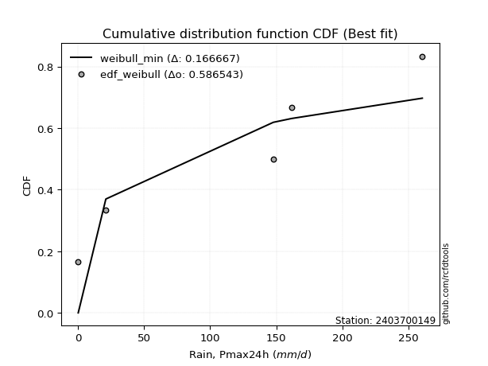</img>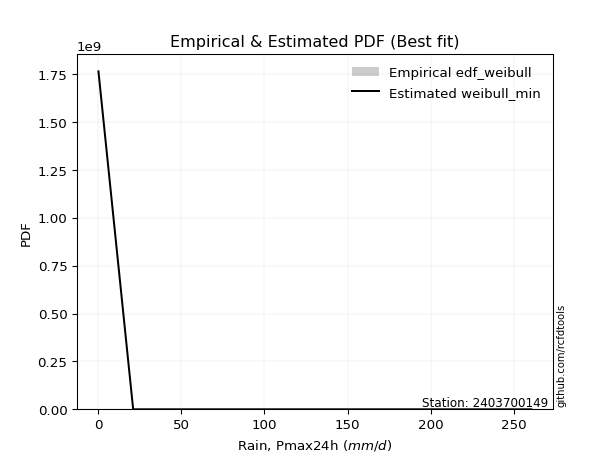</img>

</div>


### 4. EDF Beard (1943)

The Beard formula (or Beard´s plotting position formula) in hydrology is used to estimate the empirical non-exceedance probability _(P)_ of a flood event (or other extreme hydrological data point) within a given dataset.

<div align="center">


$P=(m-0.31)/(n+0.38)$


</div>


**4.1. Empirical values**

<div align="center">

|                | 0                   | 1                   | 2                  | 3                  | 4                  | 5                  |
|:---------------|:--------------------|:--------------------|:-------------------|:-------------------|:-------------------|:-------------------|
| date           | 2020                | 2024                | 2025               | 2022               | 2023               | 2021               |
| x              | 0.1                 | 21.0                | 28.2               | 147.8              | 161.7              | 260.6              |
| m              | 1                   | 2                   | 3                  | 4                  | 5                  | 6                  |
| empirical_dist | edf_beard           | edf_beard           | edf_beard          | edf_beard          | edf_beard          | edf_beard          |
| empirical      | 0.10815047021943573 | 0.26489028213166144 | 0.4216300940438871 | 0.5783699059561128 | 0.7351097178683387 | 0.8918495297805643 |
| empirical_tr   | 1.1212653778558874  | 1.3603411513859276  | 1.7289972899728996 | 2.3717472118959106 | 3.7751479289940844 | 9.246376811594207  |

</div>


**4.2. Kolmogorov-Smirnov fit test (sorted by Δ)**


<div align="center">

|                | 0                   | 1                   | 2                  | 3                   | 4                   | 5                  | 6                   | 7                   | 8                   | 9                   | 10                  | 11                  | 12                  | 13               | 14                  | 15                  | 16                 | 17                  | 18                 | 19                  | 20                  | 21                 | 22                  | 23                  | 24                  | 25                 | 26                  | 27                  | 28                  | 29                  | 30                  | 31                  | 32                 | 33                  | 34                 | 35                  | 36                 | 37                  | 38                  | 39                  | 40                 | 41                  | 42                  | 43                  | 44                 | 45                 | 46                 | 47                  | 48                  | 49                  | 50                 | 51                  | 52                  | 53                 | 54                  | 55                  | 56                  | 57                  | 58                 | 59                 | 60                  | 61                  | 62                  | 63                 | 64                 | 65                  | 66                  | 67                  | 68                  | 69                 | 70                  | 71                 | 72                  | 73                 | 74                 | 75                  | 76                | 77                  | 78                  | 79                  | 80                  | 81                  | 82                  | 83                  | 84                 | 85                  | 86                  | 87                  | 88                  | 89                 | 90                 | 91                 | 92                  | 93                  | 94                | 95                 | 96                 | 97                  | 98                 | 99                 | 100                | 101                | 102                 | 103                 | 104                | 105                | 106                | 107                 | 108                 | 109                 | 110                | 111                 | 112                | 113                | 114                 | 115                 | 116                 | 117                | 118                | 119                | 120                | 121               | 122                 | 123                | 124                | 125                 | 126                 | 127                 | 128                | 129                | 130                | 131                | 132                | 133                | 134                 | 135                 | 136                 | 137                 | 138                 | 139                | 140                | 141                 | 142                | 143                | 144                | 145                | 146               | 147                | 148               | 149                | 150                | 151                | 152                | 153                | 154                | 155                | 156                | 157                | 158                | 159              |
|:---------------|:--------------------|:--------------------|:-------------------|:--------------------|:--------------------|:-------------------|:--------------------|:--------------------|:--------------------|:--------------------|:--------------------|:--------------------|:--------------------|:-----------------|:--------------------|:--------------------|:-------------------|:--------------------|:-------------------|:--------------------|:--------------------|:-------------------|:--------------------|:--------------------|:--------------------|:-------------------|:--------------------|:--------------------|:--------------------|:--------------------|:--------------------|:--------------------|:-------------------|:--------------------|:-------------------|:--------------------|:-------------------|:--------------------|:--------------------|:--------------------|:-------------------|:--------------------|:--------------------|:--------------------|:-------------------|:-------------------|:-------------------|:--------------------|:--------------------|:--------------------|:-------------------|:--------------------|:--------------------|:-------------------|:--------------------|:--------------------|:--------------------|:--------------------|:-------------------|:-------------------|:--------------------|:--------------------|:--------------------|:-------------------|:-------------------|:--------------------|:--------------------|:--------------------|:--------------------|:-------------------|:--------------------|:-------------------|:--------------------|:-------------------|:-------------------|:--------------------|:------------------|:--------------------|:--------------------|:--------------------|:--------------------|:--------------------|:--------------------|:--------------------|:-------------------|:--------------------|:--------------------|:--------------------|:--------------------|:-------------------|:-------------------|:-------------------|:--------------------|:--------------------|:------------------|:-------------------|:-------------------|:--------------------|:-------------------|:-------------------|:-------------------|:-------------------|:--------------------|:--------------------|:-------------------|:-------------------|:-------------------|:--------------------|:--------------------|:--------------------|:-------------------|:--------------------|:-------------------|:-------------------|:--------------------|:--------------------|:--------------------|:-------------------|:-------------------|:-------------------|:-------------------|:------------------|:--------------------|:-------------------|:-------------------|:--------------------|:--------------------|:--------------------|:-------------------|:-------------------|:-------------------|:-------------------|:-------------------|:-------------------|:--------------------|:--------------------|:--------------------|:--------------------|:--------------------|:-------------------|:-------------------|:--------------------|:-------------------|:-------------------|:-------------------|:-------------------|:------------------|:-------------------|:------------------|:-------------------|:-------------------|:-------------------|:-------------------|:-------------------|:-------------------|:-------------------|:-------------------|:-------------------|:-------------------|:-----------------|
| station        | 2403700149          | 2403700149          | 2403700149         | 2403700149          | 2403700149          | 2403700149         | 2403700149          | 2403700149          | 2403700149          | 2403700149          | 2403700149          | 2403700149          | 2403700149          | 2403700149       | 2403700149          | 2403700149          | 2403700149         | 2403700149          | 2403700149         | 2403700149          | 2403700149          | 2403700149         | 2403700149          | 2403700149          | 2403700149          | 2403700149         | 2403700149          | 2403700149          | 2403700149          | 2403700149          | 2403700149          | 2403700149          | 2403700149         | 2403700149          | 2403700149         | 2403700149          | 2403700149         | 2403700149          | 2403700149          | 2403700149          | 2403700149         | 2403700149          | 2403700149          | 2403700149          | 2403700149         | 2403700149         | 2403700149         | 2403700149          | 2403700149          | 2403700149          | 2403700149         | 2403700149          | 2403700149          | 2403700149         | 2403700149          | 2403700149          | 2403700149          | 2403700149          | 2403700149         | 2403700149         | 2403700149          | 2403700149          | 2403700149          | 2403700149         | 2403700149         | 2403700149          | 2403700149          | 2403700149          | 2403700149          | 2403700149         | 2403700149          | 2403700149         | 2403700149          | 2403700149         | 2403700149         | 2403700149          | 2403700149        | 2403700149          | 2403700149          | 2403700149          | 2403700149          | 2403700149          | 2403700149          | 2403700149          | 2403700149         | 2403700149          | 2403700149          | 2403700149          | 2403700149          | 2403700149         | 2403700149         | 2403700149         | 2403700149          | 2403700149          | 2403700149        | 2403700149         | 2403700149         | 2403700149          | 2403700149         | 2403700149         | 2403700149         | 2403700149         | 2403700149          | 2403700149          | 2403700149         | 2403700149         | 2403700149         | 2403700149          | 2403700149          | 2403700149          | 2403700149         | 2403700149          | 2403700149         | 2403700149         | 2403700149          | 2403700149          | 2403700149          | 2403700149         | 2403700149         | 2403700149         | 2403700149         | 2403700149        | 2403700149          | 2403700149         | 2403700149         | 2403700149          | 2403700149          | 2403700149          | 2403700149         | 2403700149         | 2403700149         | 2403700149         | 2403700149         | 2403700149         | 2403700149          | 2403700149          | 2403700149          | 2403700149          | 2403700149          | 2403700149         | 2403700149         | 2403700149          | 2403700149         | 2403700149         | 2403700149         | 2403700149         | 2403700149        | 2403700149         | 2403700149        | 2403700149         | 2403700149         | 2403700149         | 2403700149         | 2403700149         | 2403700149         | 2403700149         | 2403700149         | 2403700149         | 2403700149         | 2403700149       |
| empirical_dist | edf_beard           | edf_beard           | edf_beard          | edf_beard           | edf_beard           | edf_beard          | edf_beard           | edf_beard           | edf_beard           | edf_beard           | edf_beard           | edf_beard           | edf_beard           | edf_beard        | edf_beard           | edf_beard           | edf_beard          | edf_beard           | edf_beard          | edf_beard           | edf_beard           | edf_beard          | edf_beard           | edf_beard           | edf_beard           | edf_beard          | edf_beard           | edf_beard           | edf_beard           | edf_beard           | edf_beard           | edf_beard           | edf_beard          | edf_beard           | edf_beard          | edf_beard           | edf_beard          | edf_beard           | edf_beard           | edf_beard           | edf_beard          | edf_beard           | edf_beard           | edf_beard           | edf_beard          | edf_beard          | edf_beard          | edf_beard           | edf_beard           | edf_beard           | edf_beard          | edf_beard           | edf_beard           | edf_beard          | edf_beard           | edf_beard           | edf_beard           | edf_beard           | edf_beard          | edf_beard          | edf_beard           | edf_beard           | edf_beard           | edf_beard          | edf_beard          | edf_beard           | edf_beard           | edf_beard           | edf_beard           | edf_beard          | edf_beard           | edf_beard          | edf_beard           | edf_beard          | edf_beard          | edf_beard           | edf_beard         | edf_beard           | edf_beard           | edf_beard           | edf_beard           | edf_beard           | edf_beard           | edf_beard           | edf_beard          | edf_beard           | edf_beard           | edf_beard           | edf_beard           | edf_beard          | edf_beard          | edf_beard          | edf_beard           | edf_beard           | edf_beard         | edf_beard          | edf_beard          | edf_beard           | edf_beard          | edf_beard          | edf_beard          | edf_beard          | edf_beard           | edf_beard           | edf_beard          | edf_beard          | edf_beard          | edf_beard           | edf_beard           | edf_beard           | edf_beard          | edf_beard           | edf_beard          | edf_beard          | edf_beard           | edf_beard           | edf_beard           | edf_beard          | edf_beard          | edf_beard          | edf_beard          | edf_beard         | edf_beard           | edf_beard          | edf_beard          | edf_beard           | edf_beard           | edf_beard           | edf_beard          | edf_beard          | edf_beard          | edf_beard          | edf_beard          | edf_beard          | edf_beard           | edf_beard           | edf_beard           | edf_beard           | edf_beard           | edf_beard          | edf_beard          | edf_beard           | edf_beard          | edf_beard          | edf_beard          | edf_beard          | edf_beard         | edf_beard          | edf_beard         | edf_beard          | edf_beard          | edf_beard          | edf_beard          | edf_beard          | edf_beard          | edf_beard          | edf_beard          | edf_beard          | edf_beard          | edf_beard        |
| p_dist         | dgamma              | loggausshyper       | dweibull           | loglevy_l           | arcsine             | mielke             | loggenextreme       | logpearson3         | f                   | beta                | weibull_min         | logvonmises_line    | loggumbel_l         | ksone            | halfgennorm         | logt                | semicircular       | halfnorm            | logtrapezoid       | foldnorm            | kappa3              | anglit             | genexpon            | nakagami            | exponnorm           | rayleigh           | alpha               | maxwell             | genextreme          | loglogistic         | ncf                 | lognakagami         | wrapcauchy         | logfoldnorm         | halflogistic       | loghypsecant        | lognct             | logcrystalball      | lognorm             | logexponnorm        | logrice            | logloggamma         | genlogistic         | logargus            | pearson3           | loganglit          | exponpow           | burr                | logjohnsonsb        | betaprime           | logsemicircular    | kstwobign           | t                   | crystalball        | norm                | gumbel_r            | loggamma            | loggamma            | logweibull_max     | gompertz           | logarcsine          | invgauss            | lomax               | logdweibull        | logerlang          | logalpha            | gengamma            | loglaplace          | loglaplace          | loggenhalflogistic | moyal               | loginvgamma        | burr12              | loginvgauss        | truncweibull_min   | logistic            | cosine            | logmaxwell          | truncexpon          | gennorm             | rice                | truncnorm           | gumbel_l            | exponweib           | hypsecant          | lograyleigh         | loginvweibull       | logbeta             | laplace             | loggennorm         | skewnorm           | triang             | kappa4              | levy_l              | loggumbel_r       | logcosine          | logwrapcauchy      | loghalfnorm         | logkstwobign       | bradford           | loggenexpon        | logmoyal           | logskewnorm         | argus               | gausshyper         | logncf             | loghalflogistic    | logtriang           | tukeylambda         | logdgamma           | uniform            | logburr12           | vonmises_line      | genhalflogistic    | gamma               | invgamma            | erlang              | genpareto          | johnsonsb          | wald               | loglomax           | nct               | logtruncnorm        | johnsonsu          | logwald            | truncpareto         | logkappa3           | logburr             | logksone           | logexponweib       | loghalfgennorm     | logkappa4          | trapezoid          | fatiguelife        | logtruncweibull_min | loguniform          | logbradford         | logloglaplace       | logjohnsonsu        | invweibull         | logf               | powerlaw            | logtruncexpon      | logmielke          | logfatiguelife     | loggenpareto       | logweibull_min    | weibull_max        | loggengamma       | rdist              | logbetaprime       | logexponpow        | logtruncpareto     | logpowerlaw        | loggompertz        | logrdist           | logtukeylambda     | loggenlogistic     | logvonmises        | vonmises         |
| delta          | 0.09769115201809242 | 0.10815047022394697 | 0.1098916328181192 | 0.11114731937855205 | 0.11216302211668927 | 0.1186911105806816 | 0.12424775370365404 | 0.12425585121797911 | 0.12595625633337493 | 0.12764349861775154 | 0.12969928393090624 | 0.13402492513529618 | 0.14279244666133628 | 0.15166469622257 | 0.15244456176987942 | 0.15711282176617541 | 0.1683988589460625 | 0.17247368742869224 | 0.1759668379066851 | 0.17647728596764958 | 0.17740758184824035 | 0.1807490926903534 | 0.18313127490892953 | 0.18349282752338913 | 0.18490984532560595 | 0.1870194404045967 | 0.18984042525228828 | 0.19345494700604823 | 0.19353513031624658 | 0.19385035198693173 | 0.19440942128950264 | 0.19713716668473052 | 0.1978711657265716 | 0.19811142026765183 | 0.1983307692905704 | 0.19855657021134843 | 0.1985601318093299 | 0.19877762476887673 | 0.19877762900416246 | 0.19878263229393778 | 0.1987830598913503 | 0.19987950961696954 | 0.20054227590197096 | 0.20227583900923585 | 0.2024842377641688 | 0.2039556023290507 | 0.2042414960418939 | 0.20502748526678694 | 0.20520083253099514 | 0.20600565141332616 | 0.2060889619413484 | 0.20879879950501948 | 0.20886231406863975 | 0.2088648159214987 | 0.20886486209622318 | 0.21153182593084696 | 0.21191031786772885 | 0.21191031786772885 | 0.2123399155323128 | 0.2130852609102386 | 0.21456909735102614 | 0.21507357918776226 | 0.21530586077474478 | 0.2155350953231061 | 0.2171193677607407 | 0.21765756874288478 | 0.21895971612071385 | 0.21960063537270014 | 0.21960063537270014 | 0.2221658813097771 | 0.22245708996295005 | 0.2239453448438954 | 0.22728716450818032 | 0.2287147479862851 | 0.2292632392255784 | 0.23091186175288678 | 0.230986482369112 | 0.23290002983594443 | 0.23380302465926844 | 0.23510971786833867 | 0.23679175262954402 | 0.23850520613195497 | 0.23868291140140338 | 0.24108232240227168 | 0.2442818522218757 | 0.24459500400433942 | 0.24465154400363287 | 0.25691131890978897 | 0.25961762504839236 | 0.2603126122710807 | 0.2621473174451648 | 0.2657107863068675 | 0.26633786101067225 | 0.26683540132269196 | 0.267102437734676 | 0.2710741889666043 | 0.2762624018867066 | 0.27757567455545173 | 0.2831198997676271 | 0.2870343392032776 | 0.2924575739640818 | 0.2927690806756489 | 0.29308374759321865 | 0.29386353121120606 | 0.2950760267561898 | 0.2993719813087409 | 0.2998802134048516 | 0.30432177901129764 | 0.31037582815429526 | 0.31272303184340444 | 0.3137606122780522 | 0.31477481724423606 | 0.3156681695539847 | 0.3208458306297443 | 0.33797917464840976 | 0.33954267494069235 | 0.34073451808969535 | 0.3421664165811589 | 0.3443053832428885 | 0.3550319815213799 | 0.3574894896759697 | 0.359208471367203 | 0.35930541558769225 | 0.3626326284763094 | 0.3641950083651271 | 0.36651264880186096 | 0.37360357219765217 | 0.37482797599618134 | 0.3849527824123812 | 0.3862020827140952 | 0.3862469794700223 | 0.3870996170253076 | 0.3901681183060657 | 0.3913186653845858 | 0.39961484444822426 | 0.41492139532118977 | 0.42010914360902585 | 0.44280138278059833 | 0.45725259775957905 | 0.4588195637100565 | 0.4612300275080691 | 0.47467259085585367 | 0.4894832995508781 | 0.4984339193764996 | 0.5249331513736032 | 0.5440150689079241 | 0.556222903222497 | 0.6083634386787513 | 0.608819257071435 | 0.6221157450652097 | 0.6427700986886045 | 0.6619513617045407 | 0.6718661790199073 | 0.6763940426107975 | 0.7297856951754794 | 0.7351097178683386 | 0.7351097178683386 | 0.7351097178683387 | 1.1743049609191436 | 40.5599130016289 |
| deltao         | 0.530385761606      | 0.530385761606      | 0.530385761606     | 0.530385761606      | 0.530385761606      | 0.530385761606     | 0.530385761606      | 0.530385761606      | 0.530385761606      | 0.530385761606      | 0.530385761606      | 0.530385761606      | 0.530385761606      | 0.530385761606   | 0.530385761606      | 0.530385761606      | 0.530385761606     | 0.530385761606      | 0.530385761606     | 0.530385761606      | 0.530385761606      | 0.530385761606     | 0.530385761606      | 0.530385761606      | 0.530385761606      | 0.530385761606     | 0.530385761606      | 0.530385761606      | 0.530385761606      | 0.530385761606      | 0.530385761606      | 0.530385761606      | 0.530385761606     | 0.530385761606      | 0.530385761606     | 0.530385761606      | 0.530385761606     | 0.530385761606      | 0.530385761606      | 0.530385761606      | 0.530385761606     | 0.530385761606      | 0.530385761606      | 0.530385761606      | 0.530385761606     | 0.530385761606     | 0.530385761606     | 0.530385761606      | 0.530385761606      | 0.530385761606      | 0.530385761606     | 0.530385761606      | 0.530385761606      | 0.530385761606     | 0.530385761606      | 0.530385761606      | 0.530385761606      | 0.530385761606      | 0.530385761606     | 0.530385761606     | 0.530385761606      | 0.530385761606      | 0.530385761606      | 0.530385761606     | 0.530385761606     | 0.530385761606      | 0.530385761606      | 0.530385761606      | 0.530385761606      | 0.530385761606     | 0.530385761606      | 0.530385761606     | 0.530385761606      | 0.530385761606     | 0.530385761606     | 0.530385761606      | 0.530385761606    | 0.530385761606      | 0.530385761606      | 0.530385761606      | 0.530385761606      | 0.530385761606      | 0.530385761606      | 0.530385761606      | 0.530385761606     | 0.530385761606      | 0.530385761606      | 0.530385761606      | 0.530385761606      | 0.530385761606     | 0.530385761606     | 0.530385761606     | 0.530385761606      | 0.530385761606      | 0.530385761606    | 0.530385761606     | 0.530385761606     | 0.530385761606      | 0.530385761606     | 0.530385761606     | 0.530385761606     | 0.530385761606     | 0.530385761606      | 0.530385761606      | 0.530385761606     | 0.530385761606     | 0.530385761606     | 0.530385761606      | 0.530385761606      | 0.530385761606      | 0.530385761606     | 0.530385761606      | 0.530385761606     | 0.530385761606     | 0.530385761606      | 0.530385761606      | 0.530385761606      | 0.530385761606     | 0.530385761606     | 0.530385761606     | 0.530385761606     | 0.530385761606    | 0.530385761606      | 0.530385761606     | 0.530385761606     | 0.530385761606      | 0.530385761606      | 0.530385761606      | 0.530385761606     | 0.530385761606     | 0.530385761606     | 0.530385761606     | 0.530385761606     | 0.530385761606     | 0.530385761606      | 0.530385761606      | 0.530385761606      | 0.530385761606      | 0.530385761606      | 0.530385761606     | 0.530385761606     | 0.530385761606      | 0.530385761606     | 0.530385761606     | 0.530385761606     | 0.530385761606     | 0.530385761606    | 0.530385761606     | 0.530385761606    | 0.530385761606     | 0.530385761606     | 0.530385761606     | 0.530385761606     | 0.530385761606     | 0.530385761606     | 0.530385761606     | 0.530385761606     | 0.530385761606     | 0.530385761606     | 0.530385761606   |
| eval           | Δo > Δ              | Δo > Δ              | Δo > Δ             | Δo > Δ              | Δo > Δ              | Δo > Δ             | Δo > Δ              | Δo > Δ              | Δo > Δ              | Δo > Δ              | Δo > Δ              | Δo > Δ              | Δo > Δ              | Δo > Δ           | Δo > Δ              | Δo > Δ              | Δo > Δ             | Δo > Δ              | Δo > Δ             | Δo > Δ              | Δo > Δ              | Δo > Δ             | Δo > Δ              | Δo > Δ              | Δo > Δ              | Δo > Δ             | Δo > Δ              | Δo > Δ              | Δo > Δ              | Δo > Δ              | Δo > Δ              | Δo > Δ              | Δo > Δ             | Δo > Δ              | Δo > Δ             | Δo > Δ              | Δo > Δ             | Δo > Δ              | Δo > Δ              | Δo > Δ              | Δo > Δ             | Δo > Δ              | Δo > Δ              | Δo > Δ              | Δo > Δ             | Δo > Δ             | Δo > Δ             | Δo > Δ              | Δo > Δ              | Δo > Δ              | Δo > Δ             | Δo > Δ              | Δo > Δ              | Δo > Δ             | Δo > Δ              | Δo > Δ              | Δo > Δ              | Δo > Δ              | Δo > Δ             | Δo > Δ             | Δo > Δ              | Δo > Δ              | Δo > Δ              | Δo > Δ             | Δo > Δ             | Δo > Δ              | Δo > Δ              | Δo > Δ              | Δo > Δ              | Δo > Δ             | Δo > Δ              | Δo > Δ             | Δo > Δ              | Δo > Δ             | Δo > Δ             | Δo > Δ              | Δo > Δ            | Δo > Δ              | Δo > Δ              | Δo > Δ              | Δo > Δ              | Δo > Δ              | Δo > Δ              | Δo > Δ              | Δo > Δ             | Δo > Δ              | Δo > Δ              | Δo > Δ              | Δo > Δ              | Δo > Δ             | Δo > Δ             | Δo > Δ             | Δo > Δ              | Δo > Δ              | Δo > Δ            | Δo > Δ             | Δo > Δ             | Δo > Δ              | Δo > Δ             | Δo > Δ             | Δo > Δ             | Δo > Δ             | Δo > Δ              | Δo > Δ              | Δo > Δ             | Δo > Δ             | Δo > Δ             | Δo > Δ              | Δo > Δ              | Δo > Δ              | Δo > Δ             | Δo > Δ              | Δo > Δ             | Δo > Δ             | Δo > Δ              | Δo > Δ              | Δo > Δ              | Δo > Δ             | Δo > Δ             | Δo > Δ             | Δo > Δ             | Δo > Δ            | Δo > Δ              | Δo > Δ             | Δo > Δ             | Δo > Δ              | Δo > Δ              | Δo > Δ              | Δo > Δ             | Δo > Δ             | Δo > Δ             | Δo > Δ             | Δo > Δ             | Δo > Δ             | Δo > Δ              | Δo > Δ              | Δo > Δ              | Δo > Δ              | Δo > Δ              | Δo > Δ             | Δo > Δ             | Δo > Δ              | Δo > Δ             | Δo > Δ             | Δo > Δ             | Δo <= Δ            | Δo <= Δ           | Δo <= Δ            | Δo <= Δ           | Δo <= Δ            | Δo <= Δ            | Δo <= Δ            | Δo <= Δ            | Δo <= Δ            | Δo <= Δ            | Δo <= Δ            | Δo <= Δ            | Δo <= Δ            | Δo <= Δ            | Δo <= Δ          |
| fit            | 1                   | 1                   | 1                  | 1                   | 1                   | 1                  | 1                   | 1                   | 1                   | 1                   | 1                   | 1                   | 1                   | 1                | 1                   | 1                   | 1                  | 1                   | 1                  | 1                   | 1                   | 1                  | 1                   | 1                   | 1                   | 1                  | 1                   | 1                   | 1                   | 1                   | 1                   | 1                   | 1                  | 1                   | 1                  | 1                   | 1                  | 1                   | 1                   | 1                   | 1                  | 1                   | 1                   | 1                   | 1                  | 1                  | 1                  | 1                   | 1                   | 1                   | 1                  | 1                   | 1                   | 1                  | 1                   | 1                   | 1                   | 1                   | 1                  | 1                  | 1                   | 1                   | 1                   | 1                  | 1                  | 1                   | 1                   | 1                   | 1                   | 1                  | 1                   | 1                  | 1                   | 1                  | 1                  | 1                   | 1                 | 1                   | 1                   | 1                   | 1                   | 1                   | 1                   | 1                   | 1                  | 1                   | 1                   | 1                   | 1                   | 1                  | 1                  | 1                  | 1                   | 1                   | 1                 | 1                  | 1                  | 1                   | 1                  | 1                  | 1                  | 1                  | 1                   | 1                   | 1                  | 1                  | 1                  | 1                   | 1                   | 1                   | 1                  | 1                   | 1                  | 1                  | 1                   | 1                   | 1                   | 1                  | 1                  | 1                  | 1                  | 1                 | 1                   | 1                  | 1                  | 1                   | 1                   | 1                   | 1                  | 1                  | 1                  | 1                  | 1                  | 1                  | 1                   | 1                   | 1                   | 1                   | 1                   | 1                  | 1                  | 1                   | 1                  | 1                  | 1                  | 0                  | 0                 | 0                  | 0                 | 0                  | 0                  | 0                  | 0                  | 0                  | 0                  | 0                  | 0                  | 0                  | 0                  | 0                |
| n              | 6                   | 6                   | 6                  | 6                   | 6                   | 6                  | 6                   | 6                   | 6                   | 6                   | 6                   | 6                   | 6                   | 6                | 6                   | 6                   | 6                  | 6                   | 6                  | 6                   | 6                   | 6                  | 6                   | 6                   | 6                   | 6                  | 6                   | 6                   | 6                   | 6                   | 6                   | 6                   | 6                  | 6                   | 6                  | 6                   | 6                  | 6                   | 6                   | 6                   | 6                  | 6                   | 6                   | 6                   | 6                  | 6                  | 6                  | 6                   | 6                   | 6                   | 6                  | 6                   | 6                   | 6                  | 6                   | 6                   | 6                   | 6                   | 6                  | 6                  | 6                   | 6                   | 6                   | 6                  | 6                  | 6                   | 6                   | 6                   | 6                   | 6                  | 6                   | 6                  | 6                   | 6                  | 6                  | 6                   | 6                 | 6                   | 6                   | 6                   | 6                   | 6                   | 6                   | 6                   | 6                  | 6                   | 6                   | 6                   | 6                   | 6                  | 6                  | 6                  | 6                   | 6                   | 6                 | 6                  | 6                  | 6                   | 6                  | 6                  | 6                  | 6                  | 6                   | 6                   | 6                  | 6                  | 6                  | 6                   | 6                   | 6                   | 6                  | 6                   | 6                  | 6                  | 6                   | 6                   | 6                   | 6                  | 6                  | 6                  | 6                  | 6                 | 6                   | 6                  | 6                  | 6                   | 6                   | 6                   | 6                  | 6                  | 6                  | 6                  | 6                  | 6                  | 6                   | 6                   | 6                   | 6                   | 6                   | 6                  | 6                  | 6                   | 6                  | 6                  | 6                  | 6                  | 6                 | 6                  | 6                 | 6                  | 6                  | 6                  | 6                  | 6                  | 6                  | 6                  | 6                  | 6                  | 6                  | 6                |
| best_fit       | 1                   | 0                   | 0                  | 0                   | 0                   | 0                  | 0                   | 0                   | 0                   | 0                   | 0                   | 0                   | 0                   | 0                | 0                   | 0                   | 0                  | 0                   | 0                  | 0                   | 0                   | 0                  | 0                   | 0                   | 0                   | 0                  | 0                   | 0                   | 0                   | 0                   | 0                   | 0                   | 0                  | 0                   | 0                  | 0                   | 0                  | 0                   | 0                   | 0                   | 0                  | 0                   | 0                   | 0                   | 0                  | 0                  | 0                  | 0                   | 0                   | 0                   | 0                  | 0                   | 0                   | 0                  | 0                   | 0                   | 0                   | 0                   | 0                  | 0                  | 0                   | 0                   | 0                   | 0                  | 0                  | 0                   | 0                   | 0                   | 0                   | 0                  | 0                   | 0                  | 0                   | 0                  | 0                  | 0                   | 0                 | 0                   | 0                   | 0                   | 0                   | 0                   | 0                   | 0                   | 0                  | 0                   | 0                   | 0                   | 0                   | 0                  | 0                  | 0                  | 0                   | 0                   | 0                 | 0                  | 0                  | 0                   | 0                  | 0                  | 0                  | 0                  | 0                   | 0                   | 0                  | 0                  | 0                  | 0                   | 0                   | 0                   | 0                  | 0                   | 0                  | 0                  | 0                   | 0                   | 0                   | 0                  | 0                  | 0                  | 0                  | 0                 | 0                   | 0                  | 0                  | 0                   | 0                   | 0                   | 0                  | 0                  | 0                  | 0                  | 0                  | 0                  | 0                   | 0                   | 0                   | 0                   | 0                   | 0                  | 0                  | 0                   | 0                  | 0                  | 0                  | 0                  | 0                 | 0                  | 0                 | 0                  | 0                  | 0                  | 0                  | 0                  | 0                  | 0                  | 0                  | 0                  | 0                  | 0                |
| best_fit_sort  | 1                   | 2                   | 3                  | 4                   | 5                   | 6                  | 7                   | 8                   | 9                   | 10                  | 11                  | 12                  | 13                  | 14               | 15                  | 16                  | 17                 | 18                  | 19                 | 20                  | 21                  | 22                 | 23                  | 24                  | 25                  | 26                 | 27                  | 28                  | 29                  | 30                  | 31                  | 32                  | 33                 | 34                  | 35                 | 36                  | 37                 | 38                  | 39                  | 40                  | 41                 | 42                  | 43                  | 44                  | 45                 | 46                 | 47                 | 48                  | 49                  | 50                  | 51                 | 52                  | 53                  | 54                 | 55                  | 56                  | 57                  | 58                  | 59                 | 60                 | 61                  | 62                  | 63                  | 64                 | 65                 | 66                  | 67                  | 68                  | 69                  | 70                 | 71                  | 72                 | 73                  | 74                 | 75                 | 76                  | 77                | 78                  | 79                  | 80                  | 81                  | 82                  | 83                  | 84                  | 85                 | 86                  | 87                  | 88                  | 89                  | 90                 | 91                 | 92                 | 93                  | 94                  | 95                | 96                 | 97                 | 98                  | 99                 | 100                | 101                | 102                | 103                 | 104                 | 105                | 106                | 107                | 108                 | 109                 | 110                 | 111                | 112                 | 113                | 114                | 115                 | 116                 | 117                 | 118                | 119                | 120                | 121                | 122               | 123                 | 124                | 125                | 126                 | 127                 | 128                 | 129                | 130                | 131                | 132                | 133                | 134                | 135                 | 136                 | 137                 | 138                 | 139                 | 140                | 141                | 142                 | 143                | 144                | 145                | 146                | 147               | 148                | 149               | 150                | 151                | 152                | 153                | 154                | 155                | 156                | 157                | 158                | 159                | 160              |

</div>


**4.3. Best fit**

<div align="center">

|   id |    station | empirical_dist   | p_dist   |     delta |   deltao | eval   |   fit |   n |   best_fit |   best_fit_sort |
|-----:|-----------:|:-----------------|:---------|----------:|---------:|:-------|------:|----:|-----------:|----------------:|
|    0 | 2403700149 | edf_beard        | dgamma   | 0.0976912 | 0.530386 | Δo > Δ |     1 |   6 |          1 |               1 |

</div>


<div align="center">

</img>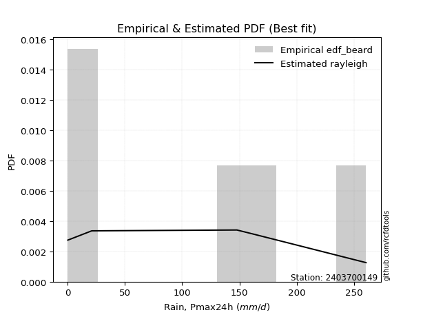</img>

</div>


### 5. EDF Chegodayev (1955)

The Chegodayev formula is an empirical plotting position formula used in hydrological frequency analysis to estimate the exceedance probability or return period of a specific event from a set of observed data. It is primarily used for plotting observed data points on probability paper to fit a theoretical distribution, particularly for analyzing extreme events like maximum flood flows or rainfall intensities. The constant _b_ value in the generalized plotting position formula is 0.3.

<div align="center">


$P=(m-b)/(n+1-2b)$


</div>


**5.1. Empirical values**

<div align="center">

|                | 0                   | 1                  | 2                  | 3                  | 4                 | 5                 |
|:---------------|:--------------------|:-------------------|:-------------------|:-------------------|:------------------|:------------------|
| date           | 2020                | 2024               | 2025               | 2022               | 2023              | 2021              |
| x              | 0.1                 | 21.0               | 28.2               | 147.8              | 161.7             | 260.6             |
| m              | 1                   | 2                  | 3                  | 4                  | 5                 | 6                 |
| empirical_dist | edf_chegodayev      | edf_chegodayev     | edf_chegodayev     | edf_chegodayev     | edf_chegodayev    | edf_chegodayev    |
| empirical      | 0.10937499999999999 | 0.265625           | 0.421875           | 0.578125           | 0.734375          | 0.890625          |
| empirical_tr   | 1.1228070175438596  | 1.3617021276595744 | 1.7297297297297298 | 2.3703703703703702 | 3.764705882352941 | 9.142857142857142 |

</div>


**5.2. Kolmogorov-Smirnov fit test (sorted by Δ)**


<div align="center">

|                | 0                   | 1                   | 2                   | 3                   | 4                   | 5                   | 6                   | 7                   | 8                   | 9                  | 10                  | 11                | 12                 | 13                  | 14                  | 15                 | 16                  | 17                 | 18                  | 19                  | 20                  | 21                 | 22                 | 23                  | 24                  | 25                  | 26                 | 27                  | 28                 | 29                 | 30                  | 31                  | 32                  | 33                  | 34                  | 35                 | 36                  | 37                  | 38                  | 39                  | 40                  | 41                  | 42                  | 43                  | 44                  | 45                  | 46                  | 47                  | 48                  | 49                  | 50                  | 51                  | 52                  | 53                  | 54                  | 55                  | 56                  | 57                  | 58                 | 59                  | 60                  | 61                  | 62                 | 63                  | 64                  | 65                 | 66                  | 67                  | 68                  | 69                  | 70                  | 71                  | 72                  | 73                  | 74                  | 75                  | 76                  | 77                  | 78                  | 79             | 80                 | 81                  | 82                  | 83                 | 84                  | 85                 | 86                  | 87                 | 88                  | 89                  | 90                  | 91                 | 92                  | 93                  | 94                  | 95                 | 96                | 97                  | 98                 | 99                  | 100                | 101                | 102                 | 103                 | 104                 | 105                 | 106                 | 107                 | 108                 | 109                 | 110                 | 111                | 112                 | 113                | 114                | 115                | 116                 | 117                | 118                | 119                 | 120                 | 121                 | 122                | 123                 | 124                | 125                | 126                | 127                | 128                | 129                 | 130                | 131                 | 132                 | 133                 | 134                 | 135                | 136                | 137                 | 138                | 139                | 140                | 141                | 142                 | 143                 | 144                | 145                | 146                | 147                | 148                | 149                | 150                | 151                | 152                | 153                | 154                | 155            | 156            | 157            | 158                | 159                |
|:---------------|:--------------------|:--------------------|:--------------------|:--------------------|:--------------------|:--------------------|:--------------------|:--------------------|:--------------------|:-------------------|:--------------------|:------------------|:-------------------|:--------------------|:--------------------|:-------------------|:--------------------|:-------------------|:--------------------|:--------------------|:--------------------|:-------------------|:-------------------|:--------------------|:--------------------|:--------------------|:-------------------|:--------------------|:-------------------|:-------------------|:--------------------|:--------------------|:--------------------|:--------------------|:--------------------|:-------------------|:--------------------|:--------------------|:--------------------|:--------------------|:--------------------|:--------------------|:--------------------|:--------------------|:--------------------|:--------------------|:--------------------|:--------------------|:--------------------|:--------------------|:--------------------|:--------------------|:--------------------|:--------------------|:--------------------|:--------------------|:--------------------|:--------------------|:-------------------|:--------------------|:--------------------|:--------------------|:-------------------|:--------------------|:--------------------|:-------------------|:--------------------|:--------------------|:--------------------|:--------------------|:--------------------|:--------------------|:--------------------|:--------------------|:--------------------|:--------------------|:--------------------|:--------------------|:--------------------|:---------------|:-------------------|:--------------------|:--------------------|:-------------------|:--------------------|:-------------------|:--------------------|:-------------------|:--------------------|:--------------------|:--------------------|:-------------------|:--------------------|:--------------------|:--------------------|:-------------------|:------------------|:--------------------|:-------------------|:--------------------|:-------------------|:-------------------|:--------------------|:--------------------|:--------------------|:--------------------|:--------------------|:--------------------|:--------------------|:--------------------|:--------------------|:-------------------|:--------------------|:-------------------|:-------------------|:-------------------|:--------------------|:-------------------|:-------------------|:--------------------|:--------------------|:--------------------|:-------------------|:--------------------|:-------------------|:-------------------|:-------------------|:-------------------|:-------------------|:--------------------|:-------------------|:--------------------|:--------------------|:--------------------|:--------------------|:-------------------|:-------------------|:--------------------|:-------------------|:-------------------|:-------------------|:-------------------|:--------------------|:--------------------|:-------------------|:-------------------|:-------------------|:-------------------|:-------------------|:-------------------|:-------------------|:-------------------|:-------------------|:-------------------|:-------------------|:---------------|:---------------|:---------------|:-------------------|:-------------------|
| station        | 2403700149          | 2403700149          | 2403700149          | 2403700149          | 2403700149          | 2403700149          | 2403700149          | 2403700149          | 2403700149          | 2403700149         | 2403700149          | 2403700149        | 2403700149         | 2403700149          | 2403700149          | 2403700149         | 2403700149          | 2403700149         | 2403700149          | 2403700149          | 2403700149          | 2403700149         | 2403700149         | 2403700149          | 2403700149          | 2403700149          | 2403700149         | 2403700149          | 2403700149         | 2403700149         | 2403700149          | 2403700149          | 2403700149          | 2403700149          | 2403700149          | 2403700149         | 2403700149          | 2403700149          | 2403700149          | 2403700149          | 2403700149          | 2403700149          | 2403700149          | 2403700149          | 2403700149          | 2403700149          | 2403700149          | 2403700149          | 2403700149          | 2403700149          | 2403700149          | 2403700149          | 2403700149          | 2403700149          | 2403700149          | 2403700149          | 2403700149          | 2403700149          | 2403700149         | 2403700149          | 2403700149          | 2403700149          | 2403700149         | 2403700149          | 2403700149          | 2403700149         | 2403700149          | 2403700149          | 2403700149          | 2403700149          | 2403700149          | 2403700149          | 2403700149          | 2403700149          | 2403700149          | 2403700149          | 2403700149          | 2403700149          | 2403700149          | 2403700149     | 2403700149         | 2403700149          | 2403700149          | 2403700149         | 2403700149          | 2403700149         | 2403700149          | 2403700149         | 2403700149          | 2403700149          | 2403700149          | 2403700149         | 2403700149          | 2403700149          | 2403700149          | 2403700149         | 2403700149        | 2403700149          | 2403700149         | 2403700149          | 2403700149         | 2403700149         | 2403700149          | 2403700149          | 2403700149          | 2403700149          | 2403700149          | 2403700149          | 2403700149          | 2403700149          | 2403700149          | 2403700149         | 2403700149          | 2403700149         | 2403700149         | 2403700149         | 2403700149          | 2403700149         | 2403700149         | 2403700149          | 2403700149          | 2403700149          | 2403700149         | 2403700149          | 2403700149         | 2403700149         | 2403700149         | 2403700149         | 2403700149         | 2403700149          | 2403700149         | 2403700149          | 2403700149          | 2403700149          | 2403700149          | 2403700149         | 2403700149         | 2403700149          | 2403700149         | 2403700149         | 2403700149         | 2403700149         | 2403700149          | 2403700149          | 2403700149         | 2403700149         | 2403700149         | 2403700149         | 2403700149         | 2403700149         | 2403700149         | 2403700149         | 2403700149         | 2403700149         | 2403700149         | 2403700149     | 2403700149     | 2403700149     | 2403700149         | 2403700149         |
| empirical_dist | edf_chegodayev      | edf_chegodayev      | edf_chegodayev      | edf_chegodayev      | edf_chegodayev      | edf_chegodayev      | edf_chegodayev      | edf_chegodayev      | edf_chegodayev      | edf_chegodayev     | edf_chegodayev      | edf_chegodayev    | edf_chegodayev     | edf_chegodayev      | edf_chegodayev      | edf_chegodayev     | edf_chegodayev      | edf_chegodayev     | edf_chegodayev      | edf_chegodayev      | edf_chegodayev      | edf_chegodayev     | edf_chegodayev     | edf_chegodayev      | edf_chegodayev      | edf_chegodayev      | edf_chegodayev     | edf_chegodayev      | edf_chegodayev     | edf_chegodayev     | edf_chegodayev      | edf_chegodayev      | edf_chegodayev      | edf_chegodayev      | edf_chegodayev      | edf_chegodayev     | edf_chegodayev      | edf_chegodayev      | edf_chegodayev      | edf_chegodayev      | edf_chegodayev      | edf_chegodayev      | edf_chegodayev      | edf_chegodayev      | edf_chegodayev      | edf_chegodayev      | edf_chegodayev      | edf_chegodayev      | edf_chegodayev      | edf_chegodayev      | edf_chegodayev      | edf_chegodayev      | edf_chegodayev      | edf_chegodayev      | edf_chegodayev      | edf_chegodayev      | edf_chegodayev      | edf_chegodayev      | edf_chegodayev     | edf_chegodayev      | edf_chegodayev      | edf_chegodayev      | edf_chegodayev     | edf_chegodayev      | edf_chegodayev      | edf_chegodayev     | edf_chegodayev      | edf_chegodayev      | edf_chegodayev      | edf_chegodayev      | edf_chegodayev      | edf_chegodayev      | edf_chegodayev      | edf_chegodayev      | edf_chegodayev      | edf_chegodayev      | edf_chegodayev      | edf_chegodayev      | edf_chegodayev      | edf_chegodayev | edf_chegodayev     | edf_chegodayev      | edf_chegodayev      | edf_chegodayev     | edf_chegodayev      | edf_chegodayev     | edf_chegodayev      | edf_chegodayev     | edf_chegodayev      | edf_chegodayev      | edf_chegodayev      | edf_chegodayev     | edf_chegodayev      | edf_chegodayev      | edf_chegodayev      | edf_chegodayev     | edf_chegodayev    | edf_chegodayev      | edf_chegodayev     | edf_chegodayev      | edf_chegodayev     | edf_chegodayev     | edf_chegodayev      | edf_chegodayev      | edf_chegodayev      | edf_chegodayev      | edf_chegodayev      | edf_chegodayev      | edf_chegodayev      | edf_chegodayev      | edf_chegodayev      | edf_chegodayev     | edf_chegodayev      | edf_chegodayev     | edf_chegodayev     | edf_chegodayev     | edf_chegodayev      | edf_chegodayev     | edf_chegodayev     | edf_chegodayev      | edf_chegodayev      | edf_chegodayev      | edf_chegodayev     | edf_chegodayev      | edf_chegodayev     | edf_chegodayev     | edf_chegodayev     | edf_chegodayev     | edf_chegodayev     | edf_chegodayev      | edf_chegodayev     | edf_chegodayev      | edf_chegodayev      | edf_chegodayev      | edf_chegodayev      | edf_chegodayev     | edf_chegodayev     | edf_chegodayev      | edf_chegodayev     | edf_chegodayev     | edf_chegodayev     | edf_chegodayev     | edf_chegodayev      | edf_chegodayev      | edf_chegodayev     | edf_chegodayev     | edf_chegodayev     | edf_chegodayev     | edf_chegodayev     | edf_chegodayev     | edf_chegodayev     | edf_chegodayev     | edf_chegodayev     | edf_chegodayev     | edf_chegodayev     | edf_chegodayev | edf_chegodayev | edf_chegodayev | edf_chegodayev     | edf_chegodayev     |
| p_dist         | dgamma              | loggausshyper       | dweibull            | loglevy_l           | arcsine             | mielke              | loggenextreme       | logpearson3         | f                   | beta               | weibull_min         | logvonmises_line  | loggumbel_l        | ksone               | halfgennorm         | logt               | semicircular        | halfnorm           | logtrapezoid        | foldnorm            | kappa3              | anglit             | genexpon           | nakagami            | exponnorm           | rayleigh            | alpha              | loglogistic         | maxwell            | genextreme         | ncf                 | lognakagami         | wrapcauchy          | lognct              | logcrystalball      | lognorm            | logexponnorm        | logrice             | logfoldnorm         | halflogistic        | loghypsecant        | logloggamma         | genlogistic         | logargus            | pearson3            | loganglit           | logjohnsonsb        | exponpow            | burr                | logsemicircular     | betaprime           | kstwobign           | t                   | crystalball         | norm                | loggamma            | loggamma            | gumbel_r            | logweibull_max     | gompertz            | logarcsine          | invgauss            | lomax              | logdweibull         | logerlang           | logalpha           | gengamma            | loglaplace          | loglaplace          | loggenhalflogistic  | moyal               | loginvgamma         | burr12              | loginvgauss         | truncweibull_min    | logistic            | cosine              | logmaxwell          | truncexpon          | gennorm        | rice               | truncnorm           | gumbel_l            | exponweib          | lograyleigh         | loginvweibull      | hypsecant           | logbeta            | laplace             | loggennorm          | skewnorm            | levy_l             | triang              | loggumbel_r         | kappa4              | logcosine          | logwrapcauchy     | loghalfnorm         | logkstwobign       | bradford            | loggenexpon        | logmoyal           | logskewnorm         | argus               | gausshyper          | logncf              | loghalflogistic     | logtriang           | tukeylambda         | logdgamma           | uniform             | logburr12          | vonmises_line       | genhalflogistic    | gamma              | invgamma           | erlang              | genpareto          | johnsonsb          | wald                | loglomax            | nct                 | logtruncnorm       | johnsonsu           | logwald            | truncpareto        | logkappa3          | logburr            | logksone           | logexponweib        | loghalfgennorm     | logkappa4           | trapezoid           | fatiguelife         | logtruncweibull_min | loguniform         | logbradford        | logloglaplace       | logjohnsonsu       | invweibull         | logf               | powerlaw           | logtruncexpon       | logmielke           | logfatiguelife     | loggenpareto       | logweibull_min     | loggengamma        | weibull_max        | rdist              | logbetaprime       | logexponpow        | logtruncpareto     | logpowerlaw        | loggompertz        | loggenlogistic | logtukeylambda | logrdist       | logvonmises        | vonmises           |
| delta          | 0.09891568179865673 | 0.10937500000451128 | 0.11013653877423207 | 0.11041260151021337 | 0.11240792807280214 | 0.11893601653679442 | 0.12449265965976686 | 0.12450075717409192 | 0.12620116228948774 | 0.1278884045738644 | 0.12994418988701906 | 0.134269831091409 | 0.1430373526174491 | 0.15190960217868288 | 0.15268946772599223 | 0.1573577277222883 | 0.16864376490217536 | 0.1727185933848051 | 0.17523212003834654 | 0.17672219192376246 | 0.17765248780435317 | 0.1809939986464663 | 0.1833761808650424 | 0.18373773347950195 | 0.18515475128171877 | 0.18726434636070957 | 0.1900853312084011 | 0.19311563411859317 | 0.1936998529621611 | 0.1937800362723594 | 0.19465432724561552 | 0.19640244881639196 | 0.19713644785823292 | 0.19782541394099135 | 0.19804290690053816 | 0.1980429111358239 | 0.19804791442559921 | 0.19804834202301175 | 0.19835632622376465 | 0.19857567524668326 | 0.19880147616746124 | 0.20012441557308236 | 0.20078718185808384 | 0.20252074496534866 | 0.20272914372028167 | 0.20322088446071213 | 0.20397630275043088 | 0.20448640199800677 | 0.20527239122289975 | 0.20535424407300984 | 0.20625055736943898 | 0.20904370546113235 | 0.20910722002475263 | 0.20910972187761157 | 0.20910976805233605 | 0.21117559999939028 | 0.21117559999939028 | 0.21177673188695983 | 0.2125848214884256 | 0.21333016686635148 | 0.21383437948268758 | 0.21531848514387508 | 0.2155507667308576 | 0.21578000127921892 | 0.21638464989240214 | 0.2169228508745462 | 0.21920462207682667 | 0.21984554132881295 | 0.21984554132881295 | 0.22241078726588992 | 0.22270199591906292 | 0.22321062697555683 | 0.22655244663984175 | 0.22798003011794654 | 0.22950814518169127 | 0.23115676770899965 | 0.23123138832522488 | 0.23216531196760587 | 0.23404793061538132 | 0.234375       | 0.2370366585856569 | 0.23875011208806785 | 0.23892781735751625 | 0.2403476045339331 | 0.24386028613600086 | 0.2439168261352943 | 0.24452675817798858 | 0.2561766010414503 | 0.25986253100450524 | 0.26055751822719353 | 0.26239222340127766 | 0.2656108715421277 | 0.26595569226298044 | 0.26636771986633745 | 0.26658276696678507 | 0.2703394710982657 | 0.275527684018368 | 0.27684095668711317 | 0.2823851818992885 | 0.28727924515939046 | 0.2917228560957432 | 0.2920343628073103 | 0.29332865354933146 | 0.29410843716731894 | 0.29532093271230275 | 0.29814745152817657 | 0.29914549553651304 | 0.30456668496741046 | 0.31062073411040814 | 0.31296793779951726 | 0.31400551823416506 | 0.3140400993758975 | 0.31591307551009756 | 0.3210907365858572 | 0.3382240806045226 | 0.3388079570723538 | 0.34097942404580817 | 0.3424113225372718 | 0.3430808534623242 | 0.35527688747749275 | 0.35675477180763115 | 0.35847375349886446 | 0.3585706977193537 | 0.36189791060797083 | 0.3634602904967885 | 0.3657779309335224 | 0.3728688543293136 | 0.3740932581278428 | 0.3842180645440426 | 0.38497755293353086 | 0.3855122616016837 | 0.38636489915696903 | 0.39041302426217855 | 0.39058394751624725 | 0.3988801265798857  | 0.4141866774528512 | 0.4193744257406873 | 0.44206666491225977 | 0.4565178798912404 | 0.4575950339294922 | 0.4604953096397305 | 0.4739378729875151 | 0.48874858168253954 | 0.49769920150816105 | 0.5241984335052646 | 0.5432803510395855 | 0.5554881853541584 | 0.6075947272908708 | 0.6076287208104127 | 0.6213810271968712 | 0.6420353808202659 | 0.6612166438362022 | 0.6711314611515687 | 0.6756593247424589 | 0.7290509773071409 | 0.734375       | 0.734375       | 0.734375       | 1.1745498668752565 | 40.561137531409464 |
| deltao         | 0.530385761606      | 0.530385761606      | 0.530385761606      | 0.530385761606      | 0.530385761606      | 0.530385761606      | 0.530385761606      | 0.530385761606      | 0.530385761606      | 0.530385761606     | 0.530385761606      | 0.530385761606    | 0.530385761606     | 0.530385761606      | 0.530385761606      | 0.530385761606     | 0.530385761606      | 0.530385761606     | 0.530385761606      | 0.530385761606      | 0.530385761606      | 0.530385761606     | 0.530385761606     | 0.530385761606      | 0.530385761606      | 0.530385761606      | 0.530385761606     | 0.530385761606      | 0.530385761606     | 0.530385761606     | 0.530385761606      | 0.530385761606      | 0.530385761606      | 0.530385761606      | 0.530385761606      | 0.530385761606     | 0.530385761606      | 0.530385761606      | 0.530385761606      | 0.530385761606      | 0.530385761606      | 0.530385761606      | 0.530385761606      | 0.530385761606      | 0.530385761606      | 0.530385761606      | 0.530385761606      | 0.530385761606      | 0.530385761606      | 0.530385761606      | 0.530385761606      | 0.530385761606      | 0.530385761606      | 0.530385761606      | 0.530385761606      | 0.530385761606      | 0.530385761606      | 0.530385761606      | 0.530385761606     | 0.530385761606      | 0.530385761606      | 0.530385761606      | 0.530385761606     | 0.530385761606      | 0.530385761606      | 0.530385761606     | 0.530385761606      | 0.530385761606      | 0.530385761606      | 0.530385761606      | 0.530385761606      | 0.530385761606      | 0.530385761606      | 0.530385761606      | 0.530385761606      | 0.530385761606      | 0.530385761606      | 0.530385761606      | 0.530385761606      | 0.530385761606 | 0.530385761606     | 0.530385761606      | 0.530385761606      | 0.530385761606     | 0.530385761606      | 0.530385761606     | 0.530385761606      | 0.530385761606     | 0.530385761606      | 0.530385761606      | 0.530385761606      | 0.530385761606     | 0.530385761606      | 0.530385761606      | 0.530385761606      | 0.530385761606     | 0.530385761606    | 0.530385761606      | 0.530385761606     | 0.530385761606      | 0.530385761606     | 0.530385761606     | 0.530385761606      | 0.530385761606      | 0.530385761606      | 0.530385761606      | 0.530385761606      | 0.530385761606      | 0.530385761606      | 0.530385761606      | 0.530385761606      | 0.530385761606     | 0.530385761606      | 0.530385761606     | 0.530385761606     | 0.530385761606     | 0.530385761606      | 0.530385761606     | 0.530385761606     | 0.530385761606      | 0.530385761606      | 0.530385761606      | 0.530385761606     | 0.530385761606      | 0.530385761606     | 0.530385761606     | 0.530385761606     | 0.530385761606     | 0.530385761606     | 0.530385761606      | 0.530385761606     | 0.530385761606      | 0.530385761606      | 0.530385761606      | 0.530385761606      | 0.530385761606     | 0.530385761606     | 0.530385761606      | 0.530385761606     | 0.530385761606     | 0.530385761606     | 0.530385761606     | 0.530385761606      | 0.530385761606      | 0.530385761606     | 0.530385761606     | 0.530385761606     | 0.530385761606     | 0.530385761606     | 0.530385761606     | 0.530385761606     | 0.530385761606     | 0.530385761606     | 0.530385761606     | 0.530385761606     | 0.530385761606 | 0.530385761606 | 0.530385761606 | 0.530385761606     | 0.530385761606     |
| eval           | Δo > Δ              | Δo > Δ              | Δo > Δ              | Δo > Δ              | Δo > Δ              | Δo > Δ              | Δo > Δ              | Δo > Δ              | Δo > Δ              | Δo > Δ             | Δo > Δ              | Δo > Δ            | Δo > Δ             | Δo > Δ              | Δo > Δ              | Δo > Δ             | Δo > Δ              | Δo > Δ             | Δo > Δ              | Δo > Δ              | Δo > Δ              | Δo > Δ             | Δo > Δ             | Δo > Δ              | Δo > Δ              | Δo > Δ              | Δo > Δ             | Δo > Δ              | Δo > Δ             | Δo > Δ             | Δo > Δ              | Δo > Δ              | Δo > Δ              | Δo > Δ              | Δo > Δ              | Δo > Δ             | Δo > Δ              | Δo > Δ              | Δo > Δ              | Δo > Δ              | Δo > Δ              | Δo > Δ              | Δo > Δ              | Δo > Δ              | Δo > Δ              | Δo > Δ              | Δo > Δ              | Δo > Δ              | Δo > Δ              | Δo > Δ              | Δo > Δ              | Δo > Δ              | Δo > Δ              | Δo > Δ              | Δo > Δ              | Δo > Δ              | Δo > Δ              | Δo > Δ              | Δo > Δ             | Δo > Δ              | Δo > Δ              | Δo > Δ              | Δo > Δ             | Δo > Δ              | Δo > Δ              | Δo > Δ             | Δo > Δ              | Δo > Δ              | Δo > Δ              | Δo > Δ              | Δo > Δ              | Δo > Δ              | Δo > Δ              | Δo > Δ              | Δo > Δ              | Δo > Δ              | Δo > Δ              | Δo > Δ              | Δo > Δ              | Δo > Δ         | Δo > Δ             | Δo > Δ              | Δo > Δ              | Δo > Δ             | Δo > Δ              | Δo > Δ             | Δo > Δ              | Δo > Δ             | Δo > Δ              | Δo > Δ              | Δo > Δ              | Δo > Δ             | Δo > Δ              | Δo > Δ              | Δo > Δ              | Δo > Δ             | Δo > Δ            | Δo > Δ              | Δo > Δ             | Δo > Δ              | Δo > Δ             | Δo > Δ             | Δo > Δ              | Δo > Δ              | Δo > Δ              | Δo > Δ              | Δo > Δ              | Δo > Δ              | Δo > Δ              | Δo > Δ              | Δo > Δ              | Δo > Δ             | Δo > Δ              | Δo > Δ             | Δo > Δ             | Δo > Δ             | Δo > Δ              | Δo > Δ             | Δo > Δ             | Δo > Δ              | Δo > Δ              | Δo > Δ              | Δo > Δ             | Δo > Δ              | Δo > Δ             | Δo > Δ             | Δo > Δ             | Δo > Δ             | Δo > Δ             | Δo > Δ              | Δo > Δ             | Δo > Δ              | Δo > Δ              | Δo > Δ              | Δo > Δ              | Δo > Δ             | Δo > Δ             | Δo > Δ              | Δo > Δ             | Δo > Δ             | Δo > Δ             | Δo > Δ             | Δo > Δ              | Δo > Δ              | Δo > Δ             | Δo <= Δ            | Δo <= Δ            | Δo <= Δ            | Δo <= Δ            | Δo <= Δ            | Δo <= Δ            | Δo <= Δ            | Δo <= Δ            | Δo <= Δ            | Δo <= Δ            | Δo <= Δ        | Δo <= Δ        | Δo <= Δ        | Δo <= Δ            | Δo <= Δ            |
| fit            | 1                   | 1                   | 1                   | 1                   | 1                   | 1                   | 1                   | 1                   | 1                   | 1                  | 1                   | 1                 | 1                  | 1                   | 1                   | 1                  | 1                   | 1                  | 1                   | 1                   | 1                   | 1                  | 1                  | 1                   | 1                   | 1                   | 1                  | 1                   | 1                  | 1                  | 1                   | 1                   | 1                   | 1                   | 1                   | 1                  | 1                   | 1                   | 1                   | 1                   | 1                   | 1                   | 1                   | 1                   | 1                   | 1                   | 1                   | 1                   | 1                   | 1                   | 1                   | 1                   | 1                   | 1                   | 1                   | 1                   | 1                   | 1                   | 1                  | 1                   | 1                   | 1                   | 1                  | 1                   | 1                   | 1                  | 1                   | 1                   | 1                   | 1                   | 1                   | 1                   | 1                   | 1                   | 1                   | 1                   | 1                   | 1                   | 1                   | 1              | 1                  | 1                   | 1                   | 1                  | 1                   | 1                  | 1                   | 1                  | 1                   | 1                   | 1                   | 1                  | 1                   | 1                   | 1                   | 1                  | 1                 | 1                   | 1                  | 1                   | 1                  | 1                  | 1                   | 1                   | 1                   | 1                   | 1                   | 1                   | 1                   | 1                   | 1                   | 1                  | 1                   | 1                  | 1                  | 1                  | 1                   | 1                  | 1                  | 1                   | 1                   | 1                   | 1                  | 1                   | 1                  | 1                  | 1                  | 1                  | 1                  | 1                   | 1                  | 1                   | 1                   | 1                   | 1                   | 1                  | 1                  | 1                   | 1                  | 1                  | 1                  | 1                  | 1                   | 1                   | 1                  | 0                  | 0                  | 0                  | 0                  | 0                  | 0                  | 0                  | 0                  | 0                  | 0                  | 0              | 0              | 0              | 0                  | 0                  |
| n              | 6                   | 6                   | 6                   | 6                   | 6                   | 6                   | 6                   | 6                   | 6                   | 6                  | 6                   | 6                 | 6                  | 6                   | 6                   | 6                  | 6                   | 6                  | 6                   | 6                   | 6                   | 6                  | 6                  | 6                   | 6                   | 6                   | 6                  | 6                   | 6                  | 6                  | 6                   | 6                   | 6                   | 6                   | 6                   | 6                  | 6                   | 6                   | 6                   | 6                   | 6                   | 6                   | 6                   | 6                   | 6                   | 6                   | 6                   | 6                   | 6                   | 6                   | 6                   | 6                   | 6                   | 6                   | 6                   | 6                   | 6                   | 6                   | 6                  | 6                   | 6                   | 6                   | 6                  | 6                   | 6                   | 6                  | 6                   | 6                   | 6                   | 6                   | 6                   | 6                   | 6                   | 6                   | 6                   | 6                   | 6                   | 6                   | 6                   | 6              | 6                  | 6                   | 6                   | 6                  | 6                   | 6                  | 6                   | 6                  | 6                   | 6                   | 6                   | 6                  | 6                   | 6                   | 6                   | 6                  | 6                 | 6                   | 6                  | 6                   | 6                  | 6                  | 6                   | 6                   | 6                   | 6                   | 6                   | 6                   | 6                   | 6                   | 6                   | 6                  | 6                   | 6                  | 6                  | 6                  | 6                   | 6                  | 6                  | 6                   | 6                   | 6                   | 6                  | 6                   | 6                  | 6                  | 6                  | 6                  | 6                  | 6                   | 6                  | 6                   | 6                   | 6                   | 6                   | 6                  | 6                  | 6                   | 6                  | 6                  | 6                  | 6                  | 6                   | 6                   | 6                  | 6                  | 6                  | 6                  | 6                  | 6                  | 6                  | 6                  | 6                  | 6                  | 6                  | 6              | 6              | 6              | 6                  | 6                  |
| best_fit       | 1                   | 0                   | 0                   | 0                   | 0                   | 0                   | 0                   | 0                   | 0                   | 0                  | 0                   | 0                 | 0                  | 0                   | 0                   | 0                  | 0                   | 0                  | 0                   | 0                   | 0                   | 0                  | 0                  | 0                   | 0                   | 0                   | 0                  | 0                   | 0                  | 0                  | 0                   | 0                   | 0                   | 0                   | 0                   | 0                  | 0                   | 0                   | 0                   | 0                   | 0                   | 0                   | 0                   | 0                   | 0                   | 0                   | 0                   | 0                   | 0                   | 0                   | 0                   | 0                   | 0                   | 0                   | 0                   | 0                   | 0                   | 0                   | 0                  | 0                   | 0                   | 0                   | 0                  | 0                   | 0                   | 0                  | 0                   | 0                   | 0                   | 0                   | 0                   | 0                   | 0                   | 0                   | 0                   | 0                   | 0                   | 0                   | 0                   | 0              | 0                  | 0                   | 0                   | 0                  | 0                   | 0                  | 0                   | 0                  | 0                   | 0                   | 0                   | 0                  | 0                   | 0                   | 0                   | 0                  | 0                 | 0                   | 0                  | 0                   | 0                  | 0                  | 0                   | 0                   | 0                   | 0                   | 0                   | 0                   | 0                   | 0                   | 0                   | 0                  | 0                   | 0                  | 0                  | 0                  | 0                   | 0                  | 0                  | 0                   | 0                   | 0                   | 0                  | 0                   | 0                  | 0                  | 0                  | 0                  | 0                  | 0                   | 0                  | 0                   | 0                   | 0                   | 0                   | 0                  | 0                  | 0                   | 0                  | 0                  | 0                  | 0                  | 0                   | 0                   | 0                  | 0                  | 0                  | 0                  | 0                  | 0                  | 0                  | 0                  | 0                  | 0                  | 0                  | 0              | 0              | 0              | 0                  | 0                  |
| best_fit_sort  | 1                   | 2                   | 3                   | 4                   | 5                   | 6                   | 7                   | 8                   | 9                   | 10                 | 11                  | 12                | 13                 | 14                  | 15                  | 16                 | 17                  | 18                 | 19                  | 20                  | 21                  | 22                 | 23                 | 24                  | 25                  | 26                  | 27                 | 28                  | 29                 | 30                 | 31                  | 32                  | 33                  | 34                  | 35                  | 36                 | 37                  | 38                  | 39                  | 40                  | 41                  | 42                  | 43                  | 44                  | 45                  | 46                  | 47                  | 48                  | 49                  | 50                  | 51                  | 52                  | 53                  | 54                  | 55                  | 56                  | 57                  | 58                  | 59                 | 60                  | 61                  | 62                  | 63                 | 64                  | 65                  | 66                 | 67                  | 68                  | 69                  | 70                  | 71                  | 72                  | 73                  | 74                  | 75                  | 76                  | 77                  | 78                  | 79                  | 80             | 81                 | 82                  | 83                  | 84                 | 85                  | 86                 | 87                  | 88                 | 89                  | 90                  | 91                  | 92                 | 93                  | 94                  | 95                  | 96                 | 97                | 98                  | 99                 | 100                 | 101                | 102                | 103                 | 104                 | 105                 | 106                 | 107                 | 108                 | 109                 | 110                 | 111                 | 112                | 113                 | 114                | 115                | 116                | 117                 | 118                | 119                | 120                 | 121                 | 122                 | 123                | 124                 | 125                | 126                | 127                | 128                | 129                | 130                 | 131                | 132                 | 133                 | 134                 | 135                 | 136                | 137                | 138                 | 139                | 140                | 141                | 142                | 143                 | 144                 | 145                | 146                | 147                | 148                | 149                | 150                | 151                | 152                | 153                | 154                | 155                | 156            | 157            | 158            | 159                | 160                |

</div>


**5.3. Best fit**

<div align="center">

|   id |    station | empirical_dist   | p_dist   |     delta |   deltao | eval   |   fit |   n |   best_fit |   best_fit_sort |
|-----:|-----------:|:-----------------|:---------|----------:|---------:|:-------|------:|----:|-----------:|----------------:|
|    0 | 2403700149 | edf_chegodayev   | dgamma   | 0.0989157 | 0.530386 | Δo > Δ |     1 |   6 |          1 |               1 |

</div>


<div align="center">

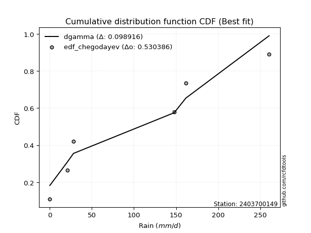</img>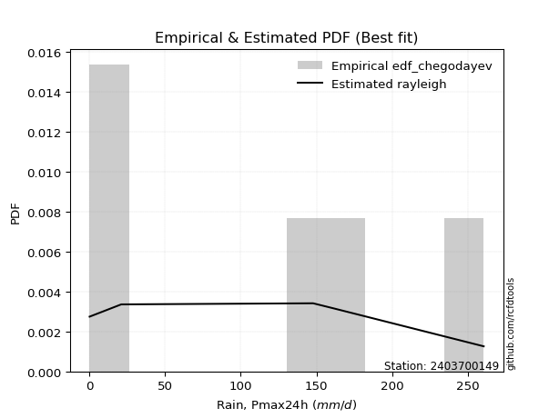</img>

</div>


### 6. EDF Blom (1958)

The Blom formula is a specific "plotting position" formula used in hydrology and statistical analysis to estimate the empirical cumulative probability (or non-exceedance probability) of a data series. It is particularly recommended for data that are approximately normally distributed. The constant _a_ is set to 0.375 (or 3/8).

<div align="center">


$P=(m-a)/(n+1-2a)$


</div>


**6.1. Empirical values**

<div align="center">

|                | 0                  | 1                  | 2                  | 3                 | 4                 | 5                  |
|:---------------|:-------------------|:-------------------|:-------------------|:------------------|:------------------|:-------------------|
| date           | 2020               | 2024               | 2025               | 2022              | 2023              | 2021               |
| x              | 0.1                | 21.0               | 28.2               | 147.8             | 161.7             | 260.6              |
| m              | 1                  | 2                  | 3                  | 4                 | 5                 | 6                  |
| empirical_dist | edf_blom           | edf_blom           | edf_blom           | edf_blom          | edf_blom          | edf_blom           |
| empirical      | 0.1                | 0.26               | 0.42               | 0.58              | 0.74              | 0.9                |
| empirical_tr   | 1.1111111111111112 | 1.3513513513513513 | 1.7241379310344827 | 2.380952380952381 | 3.846153846153846 | 10.000000000000002 |

</div>


**6.2. Kolmogorov-Smirnov fit test (sorted by Δ)**


<div align="center">

|                | 0                   | 1                   | 2                   | 3                   | 4                   | 5                   | 6                  | 7                   | 8                   | 9                  | 10                 | 11                  | 12                  | 13                  | 14                  | 15                  | 16                  | 17                 | 18                  | 19                 | 20                  | 21                  | 22                  | 23                | 24                 | 25                  | 26                  | 27                 | 28                  | 29                 | 30                  | 31                  | 32                  | 33                 | 34                  | 35                  | 36                 | 37                  | 38                  | 39                  | 40                 | 41                 | 42                  | 43                  | 44                 | 45                 | 46                  | 47                  | 48                  | 49                 | 50                  | 51                  | 52                  | 53                  | 54                  | 55                  | 56                  | 57                  | 58                  | 59                  | 60                  | 61                  | 62                  | 63                 | 64                | 65                | 66                  | 67                  | 68                 | 69                  | 70                 | 71                  | 72                  | 73                  | 74                  | 75                 | 76                  | 77                  | 78                  | 79                  | 80                  | 81                  | 82             | 83                  | 84                 | 85                  | 86                 | 87                 | 88                  | 89                  | 90                 | 91                  | 92                 | 93                  | 94                 | 95                 | 96                | 97                  | 98                  | 99                 | 100                | 101                | 102                | 103                | 104                | 105                | 106                 | 107                | 108                | 109                | 110                 | 111                 | 112                 | 113                | 114                | 115                | 116                | 117                | 118                | 119                 | 120                 | 121                 | 122                | 123                | 124                | 125                | 126                | 127                 | 128                 | 129                | 130                | 131               | 132                | 133                 | 134                 | 135                | 136                | 137                 | 138                 | 139                | 140                | 141                | 142                 | 143               | 144                | 145                | 146                | 147                | 148                | 149                | 150                | 151                | 152                | 153                | 154                | 155            | 156            | 157            | 158                | 159                |
|:---------------|:--------------------|:--------------------|:--------------------|:--------------------|:--------------------|:--------------------|:-------------------|:--------------------|:--------------------|:-------------------|:-------------------|:--------------------|:--------------------|:--------------------|:--------------------|:--------------------|:--------------------|:-------------------|:--------------------|:-------------------|:--------------------|:--------------------|:--------------------|:------------------|:-------------------|:--------------------|:--------------------|:-------------------|:--------------------|:-------------------|:--------------------|:--------------------|:--------------------|:-------------------|:--------------------|:--------------------|:-------------------|:--------------------|:--------------------|:--------------------|:-------------------|:-------------------|:--------------------|:--------------------|:-------------------|:-------------------|:--------------------|:--------------------|:--------------------|:-------------------|:--------------------|:--------------------|:--------------------|:--------------------|:--------------------|:--------------------|:--------------------|:--------------------|:--------------------|:--------------------|:--------------------|:--------------------|:--------------------|:-------------------|:------------------|:------------------|:--------------------|:--------------------|:-------------------|:--------------------|:-------------------|:--------------------|:--------------------|:--------------------|:--------------------|:-------------------|:--------------------|:--------------------|:--------------------|:--------------------|:--------------------|:--------------------|:---------------|:--------------------|:-------------------|:--------------------|:-------------------|:-------------------|:--------------------|:--------------------|:-------------------|:--------------------|:-------------------|:--------------------|:-------------------|:-------------------|:------------------|:--------------------|:--------------------|:-------------------|:-------------------|:-------------------|:-------------------|:-------------------|:-------------------|:-------------------|:--------------------|:-------------------|:-------------------|:-------------------|:--------------------|:--------------------|:--------------------|:-------------------|:-------------------|:-------------------|:-------------------|:-------------------|:-------------------|:--------------------|:--------------------|:--------------------|:-------------------|:-------------------|:-------------------|:-------------------|:-------------------|:--------------------|:--------------------|:-------------------|:-------------------|:------------------|:-------------------|:--------------------|:--------------------|:-------------------|:-------------------|:--------------------|:--------------------|:-------------------|:-------------------|:-------------------|:--------------------|:------------------|:-------------------|:-------------------|:-------------------|:-------------------|:-------------------|:-------------------|:-------------------|:-------------------|:-------------------|:-------------------|:-------------------|:---------------|:---------------|:---------------|:-------------------|:-------------------|
| station        | 2403700149          | 2403700149          | 2403700149          | 2403700149          | 2403700149          | 2403700149          | 2403700149         | 2403700149          | 2403700149          | 2403700149         | 2403700149         | 2403700149          | 2403700149          | 2403700149          | 2403700149          | 2403700149          | 2403700149          | 2403700149         | 2403700149          | 2403700149         | 2403700149          | 2403700149          | 2403700149          | 2403700149        | 2403700149         | 2403700149          | 2403700149          | 2403700149         | 2403700149          | 2403700149         | 2403700149          | 2403700149          | 2403700149          | 2403700149         | 2403700149          | 2403700149          | 2403700149         | 2403700149          | 2403700149          | 2403700149          | 2403700149         | 2403700149         | 2403700149          | 2403700149          | 2403700149         | 2403700149         | 2403700149          | 2403700149          | 2403700149          | 2403700149         | 2403700149          | 2403700149          | 2403700149          | 2403700149          | 2403700149          | 2403700149          | 2403700149          | 2403700149          | 2403700149          | 2403700149          | 2403700149          | 2403700149          | 2403700149          | 2403700149         | 2403700149        | 2403700149        | 2403700149          | 2403700149          | 2403700149         | 2403700149          | 2403700149         | 2403700149          | 2403700149          | 2403700149          | 2403700149          | 2403700149         | 2403700149          | 2403700149          | 2403700149          | 2403700149          | 2403700149          | 2403700149          | 2403700149     | 2403700149          | 2403700149         | 2403700149          | 2403700149         | 2403700149         | 2403700149          | 2403700149          | 2403700149         | 2403700149          | 2403700149         | 2403700149          | 2403700149         | 2403700149         | 2403700149        | 2403700149          | 2403700149          | 2403700149         | 2403700149         | 2403700149         | 2403700149         | 2403700149         | 2403700149         | 2403700149         | 2403700149          | 2403700149         | 2403700149         | 2403700149         | 2403700149          | 2403700149          | 2403700149          | 2403700149         | 2403700149         | 2403700149         | 2403700149         | 2403700149         | 2403700149         | 2403700149          | 2403700149          | 2403700149          | 2403700149         | 2403700149         | 2403700149         | 2403700149         | 2403700149         | 2403700149          | 2403700149          | 2403700149         | 2403700149         | 2403700149        | 2403700149         | 2403700149          | 2403700149          | 2403700149         | 2403700149         | 2403700149          | 2403700149          | 2403700149         | 2403700149         | 2403700149         | 2403700149          | 2403700149        | 2403700149         | 2403700149         | 2403700149         | 2403700149         | 2403700149         | 2403700149         | 2403700149         | 2403700149         | 2403700149         | 2403700149         | 2403700149         | 2403700149     | 2403700149     | 2403700149     | 2403700149         | 2403700149         |
| empirical_dist | edf_blom            | edf_blom            | edf_blom            | edf_blom            | edf_blom            | edf_blom            | edf_blom           | edf_blom            | edf_blom            | edf_blom           | edf_blom           | edf_blom            | edf_blom            | edf_blom            | edf_blom            | edf_blom            | edf_blom            | edf_blom           | edf_blom            | edf_blom           | edf_blom            | edf_blom            | edf_blom            | edf_blom          | edf_blom           | edf_blom            | edf_blom            | edf_blom           | edf_blom            | edf_blom           | edf_blom            | edf_blom            | edf_blom            | edf_blom           | edf_blom            | edf_blom            | edf_blom           | edf_blom            | edf_blom            | edf_blom            | edf_blom           | edf_blom           | edf_blom            | edf_blom            | edf_blom           | edf_blom           | edf_blom            | edf_blom            | edf_blom            | edf_blom           | edf_blom            | edf_blom            | edf_blom            | edf_blom            | edf_blom            | edf_blom            | edf_blom            | edf_blom            | edf_blom            | edf_blom            | edf_blom            | edf_blom            | edf_blom            | edf_blom           | edf_blom          | edf_blom          | edf_blom            | edf_blom            | edf_blom           | edf_blom            | edf_blom           | edf_blom            | edf_blom            | edf_blom            | edf_blom            | edf_blom           | edf_blom            | edf_blom            | edf_blom            | edf_blom            | edf_blom            | edf_blom            | edf_blom       | edf_blom            | edf_blom           | edf_blom            | edf_blom           | edf_blom           | edf_blom            | edf_blom            | edf_blom           | edf_blom            | edf_blom           | edf_blom            | edf_blom           | edf_blom           | edf_blom          | edf_blom            | edf_blom            | edf_blom           | edf_blom           | edf_blom           | edf_blom           | edf_blom           | edf_blom           | edf_blom           | edf_blom            | edf_blom           | edf_blom           | edf_blom           | edf_blom            | edf_blom            | edf_blom            | edf_blom           | edf_blom           | edf_blom           | edf_blom           | edf_blom           | edf_blom           | edf_blom            | edf_blom            | edf_blom            | edf_blom           | edf_blom           | edf_blom           | edf_blom           | edf_blom           | edf_blom            | edf_blom            | edf_blom           | edf_blom           | edf_blom          | edf_blom           | edf_blom            | edf_blom            | edf_blom           | edf_blom           | edf_blom            | edf_blom            | edf_blom           | edf_blom           | edf_blom           | edf_blom            | edf_blom          | edf_blom           | edf_blom           | edf_blom           | edf_blom           | edf_blom           | edf_blom           | edf_blom           | edf_blom           | edf_blom           | edf_blom           | edf_blom           | edf_blom       | edf_blom       | edf_blom       | edf_blom           | edf_blom           |
| p_dist         | dgamma              | loggausshyper       | dweibull            | loglevy_l           | mielke              | arcsine             | loggenextreme      | logpearson3         | f                   | beta               | weibull_min        | logvonmises_line    | loggumbel_l         | ksone               | halfgennorm         | logt                | semicircular        | halfnorm           | foldnorm            | kappa3             | anglit              | logtrapezoid        | genexpon            | nakagami          | exponnorm          | rayleigh            | alpha               | maxwell            | genextreme          | ncf                | logfoldnorm         | halflogistic        | loghypsecant        | logloggamma        | loglogistic         | genlogistic         | logargus           | pearson3            | lognakagami         | exponpow            | wrapcauchy         | burr               | lognct              | logcrystalball      | lognorm            | logexponnorm       | logrice             | betaprime           | kstwobign           | t                  | crystalball         | norm                | loganglit           | gumbel_r            | logweibull_max      | logsemicircular     | gompertz            | logjohnsonsb        | invgauss            | lomax               | logdweibull         | loggamma            | loggamma            | gengamma           | loglaplace        | loglaplace        | logarcsine          | loggenhalflogistic  | moyal              | logerlang           | logalpha           | truncweibull_min    | loginvgamma         | logistic            | cosine              | truncexpon         | burr12              | loginvgauss         | rice                | truncnorm           | gumbel_l            | logmaxwell          | gennorm        | hypsecant           | exponweib          | lograyleigh         | loginvweibull      | laplace            | loggennorm          | skewnorm            | logbeta            | triang              | kappa4             | loggumbel_r         | levy_l             | logcosine          | logwrapcauchy     | loghalfnorm         | bradford            | logkstwobign       | logskewnorm        | argus              | gausshyper         | loggenexpon        | logmoyal           | logtriang          | loghalflogistic     | logncf             | tukeylambda        | logdgamma          | uniform             | vonmises_line       | genhalflogistic     | logburr12          | gamma              | erlang             | genpareto          | invgamma           | johnsonsb          | wald                | loglomax            | nct                 | logtruncnorm       | johnsonsu          | logwald            | truncpareto        | logkappa3          | logburr             | trapezoid           | logksone           | loghalfgennorm     | logkappa4         | logexponweib       | fatiguelife         | logtruncweibull_min | loguniform         | logbradford        | logloglaplace       | logjohnsonsu        | logf               | invweibull         | powerlaw           | logtruncexpon       | logmielke         | logfatiguelife     | loggenpareto       | logweibull_min     | weibull_max        | loggengamma        | rdist              | logbetaprime       | logexponpow        | logtruncpareto     | logpowerlaw        | loggompertz        | loggenlogistic | logtukeylambda | logrdist       | logvonmises        | vonmises           |
| delta          | 0.08954068179865671 | 0.10387566494548572 | 0.11206209295765557 | 0.11603760151021336 | 0.11706101653679446 | 0.11800859656091578 | 0.1226176596597669 | 0.12262575717409196 | 0.12432616228948778 | 0.1260134045738644 | 0.1280691898870191 | 0.13239483109140904 | 0.14116235261744914 | 0.15003460217868286 | 0.15081446772599227 | 0.15548272772228827 | 0.16676876490217535 | 0.1708435933848051 | 0.17484719192376244 | 0.1757774878043532 | 0.17911899864646627 | 0.18085712003834653 | 0.18150118086504238 | 0.181862733479502 | 0.1832797512817188 | 0.18538934636070956 | 0.18821033120840114 | 0.1918248529621611 | 0.19190503627235944 | 0.1927793272456155 | 0.19648132622376469 | 0.19670067524668325 | 0.19692647616746128 | 0.1982494155730824 | 0.19874063411859316 | 0.19891218185808382 | 0.2006457449653487 | 0.20085414372028165 | 0.20202744881639195 | 0.20261140199800676 | 0.2027614478582329 | 0.2033973912228998 | 0.20345041394099134 | 0.20366790690053815 | 0.2036679111358239 | 0.2036729144255992 | 0.20367334202301174 | 0.20437555736943902 | 0.20716870546113234 | 0.2072322200247526 | 0.20723472187761155 | 0.20723476805233604 | 0.20884588446071212 | 0.20990173188695982 | 0.21070982148842565 | 0.21097924407300983 | 0.21145516686635146 | 0.21335130275043088 | 0.21344348514387512 | 0.21367576673085764 | 0.21390500127921896 | 0.21680059999939028 | 0.21680059999939028 | 0.2173296220768267 | 0.217970541328813 | 0.217970541328813 | 0.21945937948268757 | 0.22053578726588996 | 0.2208269959190629 | 0.22200964989240213 | 0.2225478508745462 | 0.22763314518169125 | 0.22883562697555682 | 0.22928176770899963 | 0.22935638832522487 | 0.2321729306153813 | 0.23217744663984174 | 0.23360503011794653 | 0.23516165858565688 | 0.23687511208806783 | 0.23705281735751624 | 0.23779031196760586 | 0.24           | 0.24265175817798856 | 0.2459726045339331 | 0.24948528613600085 | 0.2495418261352943 | 0.2579875310045052 | 0.25868251822719357 | 0.26051722340127764 | 0.2618016010414503 | 0.26408069226298037 | 0.2647077669667851 | 0.27199271986633744 | 0.2749858715421277 | 0.2759644710982657 | 0.281152684018368 | 0.28246595668711316 | 0.28540424515939045 | 0.2880101818992885 | 0.2914536535493315 | 0.2922334371673189 | 0.2934459327123027 | 0.2973478560957432 | 0.2976593628073103 | 0.3026916849674105 | 0.30477049553651303 | 0.3075224515281766 | 0.3087457341104081 | 0.3110929377995173 | 0.31213051823416504 | 0.31403807551009755 | 0.31921573658585717 | 0.3196650993758975 | 0.3363490806045226 | 0.3391044240458082 | 0.3405363225372718 | 0.3444329570723538 | 0.3524558534623242 | 0.35340188747749274 | 0.36237977180763115 | 0.36409875349886445 | 0.3641956977193537 | 0.3675229106079708 | 0.3690852904967885 | 0.3714029309335224 | 0.3784938543293136 | 0.37971825812784277 | 0.38853802426217854 | 0.3898430645440426 | 0.3911372616016837 | 0.391989899156969 | 0.3943525529335309 | 0.39620894751624725 | 0.4045051265798857  | 0.4198116774528512 | 0.4249994257406873 | 0.44769166491225976 | 0.46214287989124037 | 0.4661203096397305 | 0.4669700339294922 | 0.4795628729875151 | 0.49437358168253953 | 0.503324201508161 | 0.5298234335052646 | 0.5489053510395855 | 0.5611131853541584 | 0.6132537208104127 | 0.6169697272908707 | 0.6270060271968712 | 0.6476603808202659 | 0.6668416438362021 | 0.6767564611515687 | 0.6812843247424589 | 0.7346759773071408 | 0.74           | 0.74           | 0.74           | 1.1726748668752567 | 40.551762531409466 |
| deltao         | 0.530385761606      | 0.530385761606      | 0.530385761606      | 0.530385761606      | 0.530385761606      | 0.530385761606      | 0.530385761606     | 0.530385761606      | 0.530385761606      | 0.530385761606     | 0.530385761606     | 0.530385761606      | 0.530385761606      | 0.530385761606      | 0.530385761606      | 0.530385761606      | 0.530385761606      | 0.530385761606     | 0.530385761606      | 0.530385761606     | 0.530385761606      | 0.530385761606      | 0.530385761606      | 0.530385761606    | 0.530385761606     | 0.530385761606      | 0.530385761606      | 0.530385761606     | 0.530385761606      | 0.530385761606     | 0.530385761606      | 0.530385761606      | 0.530385761606      | 0.530385761606     | 0.530385761606      | 0.530385761606      | 0.530385761606     | 0.530385761606      | 0.530385761606      | 0.530385761606      | 0.530385761606     | 0.530385761606     | 0.530385761606      | 0.530385761606      | 0.530385761606     | 0.530385761606     | 0.530385761606      | 0.530385761606      | 0.530385761606      | 0.530385761606     | 0.530385761606      | 0.530385761606      | 0.530385761606      | 0.530385761606      | 0.530385761606      | 0.530385761606      | 0.530385761606      | 0.530385761606      | 0.530385761606      | 0.530385761606      | 0.530385761606      | 0.530385761606      | 0.530385761606      | 0.530385761606     | 0.530385761606    | 0.530385761606    | 0.530385761606      | 0.530385761606      | 0.530385761606     | 0.530385761606      | 0.530385761606     | 0.530385761606      | 0.530385761606      | 0.530385761606      | 0.530385761606      | 0.530385761606     | 0.530385761606      | 0.530385761606      | 0.530385761606      | 0.530385761606      | 0.530385761606      | 0.530385761606      | 0.530385761606 | 0.530385761606      | 0.530385761606     | 0.530385761606      | 0.530385761606     | 0.530385761606     | 0.530385761606      | 0.530385761606      | 0.530385761606     | 0.530385761606      | 0.530385761606     | 0.530385761606      | 0.530385761606     | 0.530385761606     | 0.530385761606    | 0.530385761606      | 0.530385761606      | 0.530385761606     | 0.530385761606     | 0.530385761606     | 0.530385761606     | 0.530385761606     | 0.530385761606     | 0.530385761606     | 0.530385761606      | 0.530385761606     | 0.530385761606     | 0.530385761606     | 0.530385761606      | 0.530385761606      | 0.530385761606      | 0.530385761606     | 0.530385761606     | 0.530385761606     | 0.530385761606     | 0.530385761606     | 0.530385761606     | 0.530385761606      | 0.530385761606      | 0.530385761606      | 0.530385761606     | 0.530385761606     | 0.530385761606     | 0.530385761606     | 0.530385761606     | 0.530385761606      | 0.530385761606      | 0.530385761606     | 0.530385761606     | 0.530385761606    | 0.530385761606     | 0.530385761606      | 0.530385761606      | 0.530385761606     | 0.530385761606     | 0.530385761606      | 0.530385761606      | 0.530385761606     | 0.530385761606     | 0.530385761606     | 0.530385761606      | 0.530385761606    | 0.530385761606     | 0.530385761606     | 0.530385761606     | 0.530385761606     | 0.530385761606     | 0.530385761606     | 0.530385761606     | 0.530385761606     | 0.530385761606     | 0.530385761606     | 0.530385761606     | 0.530385761606 | 0.530385761606 | 0.530385761606 | 0.530385761606     | 0.530385761606     |
| eval           | Δo > Δ              | Δo > Δ              | Δo > Δ              | Δo > Δ              | Δo > Δ              | Δo > Δ              | Δo > Δ             | Δo > Δ              | Δo > Δ              | Δo > Δ             | Δo > Δ             | Δo > Δ              | Δo > Δ              | Δo > Δ              | Δo > Δ              | Δo > Δ              | Δo > Δ              | Δo > Δ             | Δo > Δ              | Δo > Δ             | Δo > Δ              | Δo > Δ              | Δo > Δ              | Δo > Δ            | Δo > Δ             | Δo > Δ              | Δo > Δ              | Δo > Δ             | Δo > Δ              | Δo > Δ             | Δo > Δ              | Δo > Δ              | Δo > Δ              | Δo > Δ             | Δo > Δ              | Δo > Δ              | Δo > Δ             | Δo > Δ              | Δo > Δ              | Δo > Δ              | Δo > Δ             | Δo > Δ             | Δo > Δ              | Δo > Δ              | Δo > Δ             | Δo > Δ             | Δo > Δ              | Δo > Δ              | Δo > Δ              | Δo > Δ             | Δo > Δ              | Δo > Δ              | Δo > Δ              | Δo > Δ              | Δo > Δ              | Δo > Δ              | Δo > Δ              | Δo > Δ              | Δo > Δ              | Δo > Δ              | Δo > Δ              | Δo > Δ              | Δo > Δ              | Δo > Δ             | Δo > Δ            | Δo > Δ            | Δo > Δ              | Δo > Δ              | Δo > Δ             | Δo > Δ              | Δo > Δ             | Δo > Δ              | Δo > Δ              | Δo > Δ              | Δo > Δ              | Δo > Δ             | Δo > Δ              | Δo > Δ              | Δo > Δ              | Δo > Δ              | Δo > Δ              | Δo > Δ              | Δo > Δ         | Δo > Δ              | Δo > Δ             | Δo > Δ              | Δo > Δ             | Δo > Δ             | Δo > Δ              | Δo > Δ              | Δo > Δ             | Δo > Δ              | Δo > Δ             | Δo > Δ              | Δo > Δ             | Δo > Δ             | Δo > Δ            | Δo > Δ              | Δo > Δ              | Δo > Δ             | Δo > Δ             | Δo > Δ             | Δo > Δ             | Δo > Δ             | Δo > Δ             | Δo > Δ             | Δo > Δ              | Δo > Δ             | Δo > Δ             | Δo > Δ             | Δo > Δ              | Δo > Δ              | Δo > Δ              | Δo > Δ             | Δo > Δ             | Δo > Δ             | Δo > Δ             | Δo > Δ             | Δo > Δ             | Δo > Δ              | Δo > Δ              | Δo > Δ              | Δo > Δ             | Δo > Δ             | Δo > Δ             | Δo > Δ             | Δo > Δ             | Δo > Δ              | Δo > Δ              | Δo > Δ             | Δo > Δ             | Δo > Δ            | Δo > Δ             | Δo > Δ              | Δo > Δ              | Δo > Δ             | Δo > Δ             | Δo > Δ              | Δo > Δ              | Δo > Δ             | Δo > Δ             | Δo > Δ             | Δo > Δ              | Δo > Δ            | Δo > Δ             | Δo <= Δ            | Δo <= Δ            | Δo <= Δ            | Δo <= Δ            | Δo <= Δ            | Δo <= Δ            | Δo <= Δ            | Δo <= Δ            | Δo <= Δ            | Δo <= Δ            | Δo <= Δ        | Δo <= Δ        | Δo <= Δ        | Δo <= Δ            | Δo <= Δ            |
| fit            | 1                   | 1                   | 1                   | 1                   | 1                   | 1                   | 1                  | 1                   | 1                   | 1                  | 1                  | 1                   | 1                   | 1                   | 1                   | 1                   | 1                   | 1                  | 1                   | 1                  | 1                   | 1                   | 1                   | 1                 | 1                  | 1                   | 1                   | 1                  | 1                   | 1                  | 1                   | 1                   | 1                   | 1                  | 1                   | 1                   | 1                  | 1                   | 1                   | 1                   | 1                  | 1                  | 1                   | 1                   | 1                  | 1                  | 1                   | 1                   | 1                   | 1                  | 1                   | 1                   | 1                   | 1                   | 1                   | 1                   | 1                   | 1                   | 1                   | 1                   | 1                   | 1                   | 1                   | 1                  | 1                 | 1                 | 1                   | 1                   | 1                  | 1                   | 1                  | 1                   | 1                   | 1                   | 1                   | 1                  | 1                   | 1                   | 1                   | 1                   | 1                   | 1                   | 1              | 1                   | 1                  | 1                   | 1                  | 1                  | 1                   | 1                   | 1                  | 1                   | 1                  | 1                   | 1                  | 1                  | 1                 | 1                   | 1                   | 1                  | 1                  | 1                  | 1                  | 1                  | 1                  | 1                  | 1                   | 1                  | 1                  | 1                  | 1                   | 1                   | 1                   | 1                  | 1                  | 1                  | 1                  | 1                  | 1                  | 1                   | 1                   | 1                   | 1                  | 1                  | 1                  | 1                  | 1                  | 1                   | 1                   | 1                  | 1                  | 1                 | 1                  | 1                   | 1                   | 1                  | 1                  | 1                   | 1                   | 1                  | 1                  | 1                  | 1                   | 1                 | 1                  | 0                  | 0                  | 0                  | 0                  | 0                  | 0                  | 0                  | 0                  | 0                  | 0                  | 0              | 0              | 0              | 0                  | 0                  |
| n              | 6                   | 6                   | 6                   | 6                   | 6                   | 6                   | 6                  | 6                   | 6                   | 6                  | 6                  | 6                   | 6                   | 6                   | 6                   | 6                   | 6                   | 6                  | 6                   | 6                  | 6                   | 6                   | 6                   | 6                 | 6                  | 6                   | 6                   | 6                  | 6                   | 6                  | 6                   | 6                   | 6                   | 6                  | 6                   | 6                   | 6                  | 6                   | 6                   | 6                   | 6                  | 6                  | 6                   | 6                   | 6                  | 6                  | 6                   | 6                   | 6                   | 6                  | 6                   | 6                   | 6                   | 6                   | 6                   | 6                   | 6                   | 6                   | 6                   | 6                   | 6                   | 6                   | 6                   | 6                  | 6                 | 6                 | 6                   | 6                   | 6                  | 6                   | 6                  | 6                   | 6                   | 6                   | 6                   | 6                  | 6                   | 6                   | 6                   | 6                   | 6                   | 6                   | 6              | 6                   | 6                  | 6                   | 6                  | 6                  | 6                   | 6                   | 6                  | 6                   | 6                  | 6                   | 6                  | 6                  | 6                 | 6                   | 6                   | 6                  | 6                  | 6                  | 6                  | 6                  | 6                  | 6                  | 6                   | 6                  | 6                  | 6                  | 6                   | 6                   | 6                   | 6                  | 6                  | 6                  | 6                  | 6                  | 6                  | 6                   | 6                   | 6                   | 6                  | 6                  | 6                  | 6                  | 6                  | 6                   | 6                   | 6                  | 6                  | 6                 | 6                  | 6                   | 6                   | 6                  | 6                  | 6                   | 6                   | 6                  | 6                  | 6                  | 6                   | 6                 | 6                  | 6                  | 6                  | 6                  | 6                  | 6                  | 6                  | 6                  | 6                  | 6                  | 6                  | 6              | 6              | 6              | 6                  | 6                  |
| best_fit       | 1                   | 0                   | 0                   | 0                   | 0                   | 0                   | 0                  | 0                   | 0                   | 0                  | 0                  | 0                   | 0                   | 0                   | 0                   | 0                   | 0                   | 0                  | 0                   | 0                  | 0                   | 0                   | 0                   | 0                 | 0                  | 0                   | 0                   | 0                  | 0                   | 0                  | 0                   | 0                   | 0                   | 0                  | 0                   | 0                   | 0                  | 0                   | 0                   | 0                   | 0                  | 0                  | 0                   | 0                   | 0                  | 0                  | 0                   | 0                   | 0                   | 0                  | 0                   | 0                   | 0                   | 0                   | 0                   | 0                   | 0                   | 0                   | 0                   | 0                   | 0                   | 0                   | 0                   | 0                  | 0                 | 0                 | 0                   | 0                   | 0                  | 0                   | 0                  | 0                   | 0                   | 0                   | 0                   | 0                  | 0                   | 0                   | 0                   | 0                   | 0                   | 0                   | 0              | 0                   | 0                  | 0                   | 0                  | 0                  | 0                   | 0                   | 0                  | 0                   | 0                  | 0                   | 0                  | 0                  | 0                 | 0                   | 0                   | 0                  | 0                  | 0                  | 0                  | 0                  | 0                  | 0                  | 0                   | 0                  | 0                  | 0                  | 0                   | 0                   | 0                   | 0                  | 0                  | 0                  | 0                  | 0                  | 0                  | 0                   | 0                   | 0                   | 0                  | 0                  | 0                  | 0                  | 0                  | 0                   | 0                   | 0                  | 0                  | 0                 | 0                  | 0                   | 0                   | 0                  | 0                  | 0                   | 0                   | 0                  | 0                  | 0                  | 0                   | 0                 | 0                  | 0                  | 0                  | 0                  | 0                  | 0                  | 0                  | 0                  | 0                  | 0                  | 0                  | 0              | 0              | 0              | 0                  | 0                  |
| best_fit_sort  | 1                   | 2                   | 3                   | 4                   | 5                   | 6                   | 7                  | 8                   | 9                   | 10                 | 11                 | 12                  | 13                  | 14                  | 15                  | 16                  | 17                  | 18                 | 19                  | 20                 | 21                  | 22                  | 23                  | 24                | 25                 | 26                  | 27                  | 28                 | 29                  | 30                 | 31                  | 32                  | 33                  | 34                 | 35                  | 36                  | 37                 | 38                  | 39                  | 40                  | 41                 | 42                 | 43                  | 44                  | 45                 | 46                 | 47                  | 48                  | 49                  | 50                 | 51                  | 52                  | 53                  | 54                  | 55                  | 56                  | 57                  | 58                  | 59                  | 60                  | 61                  | 62                  | 63                  | 64                 | 65                | 66                | 67                  | 68                  | 69                 | 70                  | 71                 | 72                  | 73                  | 74                  | 75                  | 76                 | 77                  | 78                  | 79                  | 80                  | 81                  | 82                  | 83             | 84                  | 85                 | 86                  | 87                 | 88                 | 89                  | 90                  | 91                 | 92                  | 93                 | 94                  | 95                 | 96                 | 97                | 98                  | 99                  | 100                | 101                | 102                | 103                | 104                | 105                | 106                | 107                 | 108                | 109                | 110                | 111                 | 112                 | 113                 | 114                | 115                | 116                | 117                | 118                | 119                | 120                 | 121                 | 122                 | 123                | 124                | 125                | 126                | 127                | 128                 | 129                 | 130                | 131                | 132               | 133                | 134                 | 135                 | 136                | 137                | 138                 | 139                 | 140                | 141                | 142                | 143                 | 144               | 145                | 146                | 147                | 148                | 149                | 150                | 151                | 152                | 153                | 154                | 155                | 156            | 157            | 158            | 159                | 160                |

</div>


**6.3. Best fit**

<div align="center">

|   id |    station | empirical_dist   | p_dist   |     delta |   deltao | eval   |   fit |   n |   best_fit |   best_fit_sort |
|-----:|-----------:|:-----------------|:---------|----------:|---------:|:-------|------:|----:|-----------:|----------------:|
|    0 | 2403700149 | edf_blom         | dgamma   | 0.0895407 | 0.530386 | Δo > Δ |     1 |   6 |          1 |               1 |

</div>


<div align="center">

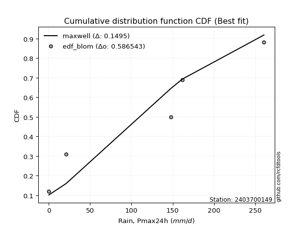</img>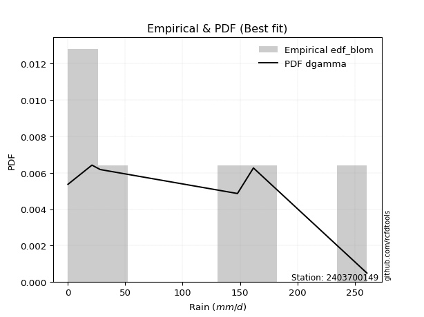</img>

</div>


### 7. EDF Tukey (1962)

In hydrology, the Tukey formula is used as a plotting position formula to estimate the empirical probability or frequency of a flood event (or other hydrological data). The formula parameter is given as _c=0.333_ (or 1/3).

<div align="center">


$P=(m-c)/(n+1-2c)$


</div>


**7.1. Empirical values**

<div align="center">

|                | 0                   | 1                  | 2                   | 3                  | 4                  | 5                  |
|:---------------|:--------------------|:-------------------|:--------------------|:-------------------|:-------------------|:-------------------|
| date           | 2020                | 2024               | 2025                | 2022               | 2023               | 2021               |
| x              | 0.1                 | 21.0               | 28.2                | 147.8              | 161.7              | 260.6              |
| m              | 1                   | 2                  | 3                   | 4                  | 5                  | 6                  |
| empirical_dist | edf_tukey           | edf_tukey          | edf_tukey           | edf_tukey          | edf_tukey          | edf_tukey          |
| empirical      | 0.10526315789473684 | 0.2631578947368421 | 0.42105263157894735 | 0.5789473684210527 | 0.7368421052631579 | 0.8947368421052632 |
| empirical_tr   | 1.1176470588235294  | 1.357142857142857  | 1.7272727272727273  | 2.375              | 3.7999999999999994 | 9.5                |

</div>


**7.2. Kolmogorov-Smirnov fit test (sorted by Δ)**


<div align="center">

|                | 0                   | 1                   | 2                   | 3                   | 4                   | 5                   | 6                  | 7                   | 8                  | 9                   | 10                 | 11                  | 12                  | 13                  | 14                  | 15                  | 16                 | 17                  | 18                 | 19                 | 20                  | 21                  | 22                  | 23                 | 24                 | 25                  | 26                  | 27                  | 28                  | 29                  | 30                  | 31                | 32                 | 33                 | 34                  | 35                 | 36                  | 37                  | 38                  | 39                  | 40                 | 41                  | 42                  | 43                | 44                | 45                  | 46                 | 47                  | 48                  | 49                  | 50                  | 51                 | 52                  | 53                 | 54                 | 55                  | 56                  | 57                  | 58                 | 59                 | 60                  | 61                  | 62                  | 63                  | 64                  | 65                  | 66                 | 67                 | 68                  | 69                  | 70                  | 71                  | 72                  | 73                  | 74                | 75                  | 76                  | 77                  | 78                  | 79                  | 80                 | 81                 | 82                 | 83                  | 84                  | 85                  | 86                  | 87                  | 88                 | 89                 | 90                | 91                 | 92                 | 93                  | 94                  | 95                  | 96                  | 97                 | 98                 | 99                 | 100                | 101                | 102                 | 103                | 104                 | 105                 | 106                 | 107                | 108                | 109                | 110                | 111                | 112                | 113                 | 114                | 115                | 116                | 117                 | 118                 | 119                | 120                 | 121                 | 122                | 123                 | 124                 | 125                | 126                | 127                | 128                | 129                 | 130                 | 131                 | 132                | 133                 | 134                 | 135                | 136                | 137                | 138                 | 139                 | 140                | 141               | 142                 | 143                | 144                | 145                | 146                | 147                | 148                | 149                | 150                | 151                | 152                | 153                | 154                | 155                | 156               | 157               | 158                | 159                |
|:---------------|:--------------------|:--------------------|:--------------------|:--------------------|:--------------------|:--------------------|:-------------------|:--------------------|:-------------------|:--------------------|:-------------------|:--------------------|:--------------------|:--------------------|:--------------------|:--------------------|:-------------------|:--------------------|:-------------------|:-------------------|:--------------------|:--------------------|:--------------------|:-------------------|:-------------------|:--------------------|:--------------------|:--------------------|:--------------------|:--------------------|:--------------------|:------------------|:-------------------|:-------------------|:--------------------|:-------------------|:--------------------|:--------------------|:--------------------|:--------------------|:-------------------|:--------------------|:--------------------|:------------------|:------------------|:--------------------|:-------------------|:--------------------|:--------------------|:--------------------|:--------------------|:-------------------|:--------------------|:-------------------|:-------------------|:--------------------|:--------------------|:--------------------|:-------------------|:-------------------|:--------------------|:--------------------|:--------------------|:--------------------|:--------------------|:--------------------|:-------------------|:-------------------|:--------------------|:--------------------|:--------------------|:--------------------|:--------------------|:--------------------|:------------------|:--------------------|:--------------------|:--------------------|:--------------------|:--------------------|:-------------------|:-------------------|:-------------------|:--------------------|:--------------------|:--------------------|:--------------------|:--------------------|:-------------------|:-------------------|:------------------|:-------------------|:-------------------|:--------------------|:--------------------|:--------------------|:--------------------|:-------------------|:-------------------|:-------------------|:-------------------|:-------------------|:--------------------|:-------------------|:--------------------|:--------------------|:--------------------|:-------------------|:-------------------|:-------------------|:-------------------|:-------------------|:-------------------|:--------------------|:-------------------|:-------------------|:-------------------|:--------------------|:--------------------|:-------------------|:--------------------|:--------------------|:-------------------|:--------------------|:--------------------|:-------------------|:-------------------|:-------------------|:-------------------|:--------------------|:--------------------|:--------------------|:-------------------|:--------------------|:--------------------|:-------------------|:-------------------|:-------------------|:--------------------|:--------------------|:-------------------|:------------------|:--------------------|:-------------------|:-------------------|:-------------------|:-------------------|:-------------------|:-------------------|:-------------------|:-------------------|:-------------------|:-------------------|:-------------------|:-------------------|:-------------------|:------------------|:------------------|:-------------------|:-------------------|
| station        | 2403700149          | 2403700149          | 2403700149          | 2403700149          | 2403700149          | 2403700149          | 2403700149         | 2403700149          | 2403700149         | 2403700149          | 2403700149         | 2403700149          | 2403700149          | 2403700149          | 2403700149          | 2403700149          | 2403700149         | 2403700149          | 2403700149         | 2403700149         | 2403700149          | 2403700149          | 2403700149          | 2403700149         | 2403700149         | 2403700149          | 2403700149          | 2403700149          | 2403700149          | 2403700149          | 2403700149          | 2403700149        | 2403700149         | 2403700149         | 2403700149          | 2403700149         | 2403700149          | 2403700149          | 2403700149          | 2403700149          | 2403700149         | 2403700149          | 2403700149          | 2403700149        | 2403700149        | 2403700149          | 2403700149         | 2403700149          | 2403700149          | 2403700149          | 2403700149          | 2403700149         | 2403700149          | 2403700149         | 2403700149         | 2403700149          | 2403700149          | 2403700149          | 2403700149         | 2403700149         | 2403700149          | 2403700149          | 2403700149          | 2403700149          | 2403700149          | 2403700149          | 2403700149         | 2403700149         | 2403700149          | 2403700149          | 2403700149          | 2403700149          | 2403700149          | 2403700149          | 2403700149        | 2403700149          | 2403700149          | 2403700149          | 2403700149          | 2403700149          | 2403700149         | 2403700149         | 2403700149         | 2403700149          | 2403700149          | 2403700149          | 2403700149          | 2403700149          | 2403700149         | 2403700149         | 2403700149        | 2403700149         | 2403700149         | 2403700149          | 2403700149          | 2403700149          | 2403700149          | 2403700149         | 2403700149         | 2403700149         | 2403700149         | 2403700149         | 2403700149          | 2403700149         | 2403700149          | 2403700149          | 2403700149          | 2403700149         | 2403700149         | 2403700149         | 2403700149         | 2403700149         | 2403700149         | 2403700149          | 2403700149         | 2403700149         | 2403700149         | 2403700149          | 2403700149          | 2403700149         | 2403700149          | 2403700149          | 2403700149         | 2403700149          | 2403700149          | 2403700149         | 2403700149         | 2403700149         | 2403700149         | 2403700149          | 2403700149          | 2403700149          | 2403700149         | 2403700149          | 2403700149          | 2403700149         | 2403700149         | 2403700149         | 2403700149          | 2403700149          | 2403700149         | 2403700149        | 2403700149          | 2403700149         | 2403700149         | 2403700149         | 2403700149         | 2403700149         | 2403700149         | 2403700149         | 2403700149         | 2403700149         | 2403700149         | 2403700149         | 2403700149         | 2403700149         | 2403700149        | 2403700149        | 2403700149         | 2403700149         |
| empirical_dist | edf_tukey           | edf_tukey           | edf_tukey           | edf_tukey           | edf_tukey           | edf_tukey           | edf_tukey          | edf_tukey           | edf_tukey          | edf_tukey           | edf_tukey          | edf_tukey           | edf_tukey           | edf_tukey           | edf_tukey           | edf_tukey           | edf_tukey          | edf_tukey           | edf_tukey          | edf_tukey          | edf_tukey           | edf_tukey           | edf_tukey           | edf_tukey          | edf_tukey          | edf_tukey           | edf_tukey           | edf_tukey           | edf_tukey           | edf_tukey           | edf_tukey           | edf_tukey         | edf_tukey          | edf_tukey          | edf_tukey           | edf_tukey          | edf_tukey           | edf_tukey           | edf_tukey           | edf_tukey           | edf_tukey          | edf_tukey           | edf_tukey           | edf_tukey         | edf_tukey         | edf_tukey           | edf_tukey          | edf_tukey           | edf_tukey           | edf_tukey           | edf_tukey           | edf_tukey          | edf_tukey           | edf_tukey          | edf_tukey          | edf_tukey           | edf_tukey           | edf_tukey           | edf_tukey          | edf_tukey          | edf_tukey           | edf_tukey           | edf_tukey           | edf_tukey           | edf_tukey           | edf_tukey           | edf_tukey          | edf_tukey          | edf_tukey           | edf_tukey           | edf_tukey           | edf_tukey           | edf_tukey           | edf_tukey           | edf_tukey         | edf_tukey           | edf_tukey           | edf_tukey           | edf_tukey           | edf_tukey           | edf_tukey          | edf_tukey          | edf_tukey          | edf_tukey           | edf_tukey           | edf_tukey           | edf_tukey           | edf_tukey           | edf_tukey          | edf_tukey          | edf_tukey         | edf_tukey          | edf_tukey          | edf_tukey           | edf_tukey           | edf_tukey           | edf_tukey           | edf_tukey          | edf_tukey          | edf_tukey          | edf_tukey          | edf_tukey          | edf_tukey           | edf_tukey          | edf_tukey           | edf_tukey           | edf_tukey           | edf_tukey          | edf_tukey          | edf_tukey          | edf_tukey          | edf_tukey          | edf_tukey          | edf_tukey           | edf_tukey          | edf_tukey          | edf_tukey          | edf_tukey           | edf_tukey           | edf_tukey          | edf_tukey           | edf_tukey           | edf_tukey          | edf_tukey           | edf_tukey           | edf_tukey          | edf_tukey          | edf_tukey          | edf_tukey          | edf_tukey           | edf_tukey           | edf_tukey           | edf_tukey          | edf_tukey           | edf_tukey           | edf_tukey          | edf_tukey          | edf_tukey          | edf_tukey           | edf_tukey           | edf_tukey          | edf_tukey         | edf_tukey           | edf_tukey          | edf_tukey          | edf_tukey          | edf_tukey          | edf_tukey          | edf_tukey          | edf_tukey          | edf_tukey          | edf_tukey          | edf_tukey          | edf_tukey          | edf_tukey          | edf_tukey          | edf_tukey         | edf_tukey         | edf_tukey          | edf_tukey          |
| p_dist         | dgamma              | loggausshyper       | dweibull            | arcsine             | loglevy_l           | mielke              | loggenextreme      | logpearson3         | f                  | beta                | weibull_min        | logvonmises_line    | loggumbel_l         | ksone               | halfgennorm         | logt                | semicircular       | halfnorm            | foldnorm           | kappa3             | logtrapezoid        | anglit              | genexpon            | nakagami           | exponnorm          | rayleigh            | alpha               | maxwell             | genextreme          | ncf                 | loglogistic         | logfoldnorm       | halflogistic       | loghypsecant       | lognakagami         | logloggamma        | wrapcauchy          | genlogistic         | lognct              | logcrystalball      | lognorm            | logexponnorm        | logrice             | logargus          | pearson3          | exponpow            | burr               | betaprime           | loganglit           | logsemicircular     | logjohnsonsb        | kstwobign          | t                   | crystalball        | norm               | gumbel_r            | logweibull_max      | gompertz            | loggamma           | loggamma           | invgauss            | lomax               | logdweibull         | logarcsine          | gengamma            | logerlang           | loglaplace         | loglaplace         | logalpha            | loggenhalflogistic  | moyal               | loginvgamma         | truncweibull_min    | burr12              | logistic          | cosine              | loginvgauss         | truncexpon          | logmaxwell          | rice                | gennorm            | truncnorm          | gumbel_l           | exponweib           | hypsecant           | lograyleigh         | loginvweibull       | logbeta             | laplace            | loggennorm         | skewnorm          | triang             | kappa4             | loggumbel_r         | levy_l              | logcosine           | logwrapcauchy       | loghalfnorm        | logkstwobign       | bradford           | logskewnorm        | argus              | loggenexpon         | gausshyper         | logmoyal            | loghalflogistic     | logncf              | logtriang          | tukeylambda        | logdgamma          | uniform            | vonmises_line      | logburr12          | genhalflogistic     | gamma              | erlang             | invgamma           | genpareto           | johnsonsb           | wald               | loglomax            | nct                 | logtruncnorm       | johnsonsu           | logwald             | truncpareto        | logkappa3          | logburr            | logksone           | loghalfgennorm      | logkappa4           | logexponweib        | trapezoid          | fatiguelife         | logtruncweibull_min | loguniform         | logbradford        | logloglaplace      | logjohnsonsu        | invweibull          | logf               | powerlaw          | logtruncexpon       | logmielke          | logfatiguelife     | loggenpareto       | logweibull_min     | weibull_max        | loggengamma        | rdist              | logbetaprime       | logexponpow        | logtruncpareto     | logpowerlaw        | loggompertz        | loggenlogistic     | logtukeylambda    | logrdist          | logvonmises        | vonmises           |
| delta          | 0.09480383969339357 | 0.10526315789924812 | 0.10931417035317942 | 0.11274543866617895 | 0.11287970677337122 | 0.11811364811574177 | 0.1236702912387142 | 0.12367838875303927 | 0.1253787938684351 | 0.12706603615281176 | 0.1291218214659664 | 0.13344746267035634 | 0.14221498419639644 | 0.15108723375763022 | 0.15186709930493958 | 0.15653535930123563 | 0.1678213964811227 | 0.17189622496375245 | 0.1758998235027098 | 0.1768301193833005 | 0.17769922530150445 | 0.18017163022541363 | 0.18255381244398974 | 0.1829153650584493 | 0.1843323828606661 | 0.18644197793965692 | 0.18926296278734844 | 0.19287748454110845 | 0.19295766785130675 | 0.19383195882456286 | 0.19558273938175108 | 0.197533957802712 | 0.1977533068256306 | 0.1979791077464086 | 0.19886955407954987 | 0.1993020471520297 | 0.19960355312139078 | 0.19996481343703118 | 0.20029251920414926 | 0.20051001216369607 | 0.2005100163989818 | 0.20051501968875712 | 0.20051544728616966 | 0.201698376544296 | 0.201906775299229 | 0.20366403357695412 | 0.2044500228018471 | 0.20542818894838633 | 0.20568798972387003 | 0.20782134933616775 | 0.20808814485569405 | 0.2082213370400797 | 0.20828485160369997 | 0.2082873534565589 | 0.2082873996312834 | 0.21095436346590718 | 0.21176245306737296 | 0.21250779844529882 | 0.2136427052625482 | 0.2136427052625482 | 0.21449611672282243 | 0.21472839830980495 | 0.21495763285816627 | 0.21630148474584548 | 0.21838225365577402 | 0.21885175515556005 | 0.2190231729077603 | 0.2190231729077603 | 0.21938995613770412 | 0.22158841884483726 | 0.22187962749801027 | 0.22567773223871473 | 0.22868577676063861 | 0.22901955190299966 | 0.230334399287947 | 0.23040901990417223 | 0.23044713538110445 | 0.23322556219432866 | 0.23463241723076378 | 0.23621429016460424 | 0.2368421052631579 | 0.2379277436670152 | 0.2381054489364636 | 0.24281470979709102 | 0.24370438975693592 | 0.24632739139915877 | 0.24638393139845222 | 0.25864370630460815 | 0.2590401625834526 | 0.2597351498061409 | 0.261569854980225 | 0.2651333238419278 | 0.2657603985457324 | 0.26883482512949536 | 0.26972271364739087 | 0.27280657636142364 | 0.27799478928152593 | 0.2793080619502711 | 0.2848522871624464 | 0.2864568767383378 | 0.2925062851282788 | 0.2932860687462663 | 0.29418996135890113 | 0.2944985642912501 | 0.29450146807046823 | 0.30161260079967095 | 0.30225929363343973 | 0.3037443165463578 | 0.3097983656893555 | 0.3121455693784646 | 0.3131831498131124 | 0.3150907070890449 | 0.3165072046390554 | 0.32026836816480453 | 0.3374017121834699 | 0.3401570556247555 | 0.3412750623355117 | 0.34158895411621915 | 0.34719269556758736 | 0.3544545190564401 | 0.35922187707078906 | 0.36094085876202237 | 0.3610378029825116 | 0.36436501587112874 | 0.36592739575994643 | 0.3682450361966803 | 0.3753359595924715 | 0.3765603633910007 | 0.3866851698072005 | 0.38797936686484163 | 0.38883200442012694 | 0.38908939503879403 | 0.3895906558411259 | 0.39305105277940516 | 0.4013472318430436  | 0.4166537827160091 | 0.4218415310038452 | 0.4445337701754177 | 0.45898498515439823 | 0.46170687603475535 | 0.4629624149028884 | 0.476404978250673 | 0.49121568694569745 | 0.5001663067713189 | 0.5266655387684225 | 0.5457474563027434 | 0.5579552906173164 | 0.6100958260735705 | 0.6117065693961339 | 0.6238481324600291 | 0.6445024860834239 | 0.6636837490993601 | 0.6735985664147266 | 0.6781264300056169 | 0.7315180825702987 | 0.7368421052631579 | 0.736842105263158 | 0.736842105263158 | 1.1737274984542039 | 40.557025689304204 |
| deltao         | 0.530385761606      | 0.530385761606      | 0.530385761606      | 0.530385761606      | 0.530385761606      | 0.530385761606      | 0.530385761606     | 0.530385761606      | 0.530385761606     | 0.530385761606      | 0.530385761606     | 0.530385761606      | 0.530385761606      | 0.530385761606      | 0.530385761606      | 0.530385761606      | 0.530385761606     | 0.530385761606      | 0.530385761606     | 0.530385761606     | 0.530385761606      | 0.530385761606      | 0.530385761606      | 0.530385761606     | 0.530385761606     | 0.530385761606      | 0.530385761606      | 0.530385761606      | 0.530385761606      | 0.530385761606      | 0.530385761606      | 0.530385761606    | 0.530385761606     | 0.530385761606     | 0.530385761606      | 0.530385761606     | 0.530385761606      | 0.530385761606      | 0.530385761606      | 0.530385761606      | 0.530385761606     | 0.530385761606      | 0.530385761606      | 0.530385761606    | 0.530385761606    | 0.530385761606      | 0.530385761606     | 0.530385761606      | 0.530385761606      | 0.530385761606      | 0.530385761606      | 0.530385761606     | 0.530385761606      | 0.530385761606     | 0.530385761606     | 0.530385761606      | 0.530385761606      | 0.530385761606      | 0.530385761606     | 0.530385761606     | 0.530385761606      | 0.530385761606      | 0.530385761606      | 0.530385761606      | 0.530385761606      | 0.530385761606      | 0.530385761606     | 0.530385761606     | 0.530385761606      | 0.530385761606      | 0.530385761606      | 0.530385761606      | 0.530385761606      | 0.530385761606      | 0.530385761606    | 0.530385761606      | 0.530385761606      | 0.530385761606      | 0.530385761606      | 0.530385761606      | 0.530385761606     | 0.530385761606     | 0.530385761606     | 0.530385761606      | 0.530385761606      | 0.530385761606      | 0.530385761606      | 0.530385761606      | 0.530385761606     | 0.530385761606     | 0.530385761606    | 0.530385761606     | 0.530385761606     | 0.530385761606      | 0.530385761606      | 0.530385761606      | 0.530385761606      | 0.530385761606     | 0.530385761606     | 0.530385761606     | 0.530385761606     | 0.530385761606     | 0.530385761606      | 0.530385761606     | 0.530385761606      | 0.530385761606      | 0.530385761606      | 0.530385761606     | 0.530385761606     | 0.530385761606     | 0.530385761606     | 0.530385761606     | 0.530385761606     | 0.530385761606      | 0.530385761606     | 0.530385761606     | 0.530385761606     | 0.530385761606      | 0.530385761606      | 0.530385761606     | 0.530385761606      | 0.530385761606      | 0.530385761606     | 0.530385761606      | 0.530385761606      | 0.530385761606     | 0.530385761606     | 0.530385761606     | 0.530385761606     | 0.530385761606      | 0.530385761606      | 0.530385761606      | 0.530385761606     | 0.530385761606      | 0.530385761606      | 0.530385761606     | 0.530385761606     | 0.530385761606     | 0.530385761606      | 0.530385761606      | 0.530385761606     | 0.530385761606    | 0.530385761606      | 0.530385761606     | 0.530385761606     | 0.530385761606     | 0.530385761606     | 0.530385761606     | 0.530385761606     | 0.530385761606     | 0.530385761606     | 0.530385761606     | 0.530385761606     | 0.530385761606     | 0.530385761606     | 0.530385761606     | 0.530385761606    | 0.530385761606    | 0.530385761606     | 0.530385761606     |
| eval           | Δo > Δ              | Δo > Δ              | Δo > Δ              | Δo > Δ              | Δo > Δ              | Δo > Δ              | Δo > Δ             | Δo > Δ              | Δo > Δ             | Δo > Δ              | Δo > Δ             | Δo > Δ              | Δo > Δ              | Δo > Δ              | Δo > Δ              | Δo > Δ              | Δo > Δ             | Δo > Δ              | Δo > Δ             | Δo > Δ             | Δo > Δ              | Δo > Δ              | Δo > Δ              | Δo > Δ             | Δo > Δ             | Δo > Δ              | Δo > Δ              | Δo > Δ              | Δo > Δ              | Δo > Δ              | Δo > Δ              | Δo > Δ            | Δo > Δ             | Δo > Δ             | Δo > Δ              | Δo > Δ             | Δo > Δ              | Δo > Δ              | Δo > Δ              | Δo > Δ              | Δo > Δ             | Δo > Δ              | Δo > Δ              | Δo > Δ            | Δo > Δ            | Δo > Δ              | Δo > Δ             | Δo > Δ              | Δo > Δ              | Δo > Δ              | Δo > Δ              | Δo > Δ             | Δo > Δ              | Δo > Δ             | Δo > Δ             | Δo > Δ              | Δo > Δ              | Δo > Δ              | Δo > Δ             | Δo > Δ             | Δo > Δ              | Δo > Δ              | Δo > Δ              | Δo > Δ              | Δo > Δ              | Δo > Δ              | Δo > Δ             | Δo > Δ             | Δo > Δ              | Δo > Δ              | Δo > Δ              | Δo > Δ              | Δo > Δ              | Δo > Δ              | Δo > Δ            | Δo > Δ              | Δo > Δ              | Δo > Δ              | Δo > Δ              | Δo > Δ              | Δo > Δ             | Δo > Δ             | Δo > Δ             | Δo > Δ              | Δo > Δ              | Δo > Δ              | Δo > Δ              | Δo > Δ              | Δo > Δ             | Δo > Δ             | Δo > Δ            | Δo > Δ             | Δo > Δ             | Δo > Δ              | Δo > Δ              | Δo > Δ              | Δo > Δ              | Δo > Δ             | Δo > Δ             | Δo > Δ             | Δo > Δ             | Δo > Δ             | Δo > Δ              | Δo > Δ             | Δo > Δ              | Δo > Δ              | Δo > Δ              | Δo > Δ             | Δo > Δ             | Δo > Δ             | Δo > Δ             | Δo > Δ             | Δo > Δ             | Δo > Δ              | Δo > Δ             | Δo > Δ             | Δo > Δ             | Δo > Δ              | Δo > Δ              | Δo > Δ             | Δo > Δ              | Δo > Δ              | Δo > Δ             | Δo > Δ              | Δo > Δ              | Δo > Δ             | Δo > Δ             | Δo > Δ             | Δo > Δ             | Δo > Δ              | Δo > Δ              | Δo > Δ              | Δo > Δ             | Δo > Δ              | Δo > Δ              | Δo > Δ             | Δo > Δ             | Δo > Δ             | Δo > Δ              | Δo > Δ              | Δo > Δ             | Δo > Δ            | Δo > Δ              | Δo > Δ             | Δo > Δ             | Δo <= Δ            | Δo <= Δ            | Δo <= Δ            | Δo <= Δ            | Δo <= Δ            | Δo <= Δ            | Δo <= Δ            | Δo <= Δ            | Δo <= Δ            | Δo <= Δ            | Δo <= Δ            | Δo <= Δ           | Δo <= Δ           | Δo <= Δ            | Δo <= Δ            |
| fit            | 1                   | 1                   | 1                   | 1                   | 1                   | 1                   | 1                  | 1                   | 1                  | 1                   | 1                  | 1                   | 1                   | 1                   | 1                   | 1                   | 1                  | 1                   | 1                  | 1                  | 1                   | 1                   | 1                   | 1                  | 1                  | 1                   | 1                   | 1                   | 1                   | 1                   | 1                   | 1                 | 1                  | 1                  | 1                   | 1                  | 1                   | 1                   | 1                   | 1                   | 1                  | 1                   | 1                   | 1                 | 1                 | 1                   | 1                  | 1                   | 1                   | 1                   | 1                   | 1                  | 1                   | 1                  | 1                  | 1                   | 1                   | 1                   | 1                  | 1                  | 1                   | 1                   | 1                   | 1                   | 1                   | 1                   | 1                  | 1                  | 1                   | 1                   | 1                   | 1                   | 1                   | 1                   | 1                 | 1                   | 1                   | 1                   | 1                   | 1                   | 1                  | 1                  | 1                  | 1                   | 1                   | 1                   | 1                   | 1                   | 1                  | 1                  | 1                 | 1                  | 1                  | 1                   | 1                   | 1                   | 1                   | 1                  | 1                  | 1                  | 1                  | 1                  | 1                   | 1                  | 1                   | 1                   | 1                   | 1                  | 1                  | 1                  | 1                  | 1                  | 1                  | 1                   | 1                  | 1                  | 1                  | 1                   | 1                   | 1                  | 1                   | 1                   | 1                  | 1                   | 1                   | 1                  | 1                  | 1                  | 1                  | 1                   | 1                   | 1                   | 1                  | 1                   | 1                   | 1                  | 1                  | 1                  | 1                   | 1                   | 1                  | 1                 | 1                   | 1                  | 1                  | 0                  | 0                  | 0                  | 0                  | 0                  | 0                  | 0                  | 0                  | 0                  | 0                  | 0                  | 0                 | 0                 | 0                  | 0                  |
| n              | 6                   | 6                   | 6                   | 6                   | 6                   | 6                   | 6                  | 6                   | 6                  | 6                   | 6                  | 6                   | 6                   | 6                   | 6                   | 6                   | 6                  | 6                   | 6                  | 6                  | 6                   | 6                   | 6                   | 6                  | 6                  | 6                   | 6                   | 6                   | 6                   | 6                   | 6                   | 6                 | 6                  | 6                  | 6                   | 6                  | 6                   | 6                   | 6                   | 6                   | 6                  | 6                   | 6                   | 6                 | 6                 | 6                   | 6                  | 6                   | 6                   | 6                   | 6                   | 6                  | 6                   | 6                  | 6                  | 6                   | 6                   | 6                   | 6                  | 6                  | 6                   | 6                   | 6                   | 6                   | 6                   | 6                   | 6                  | 6                  | 6                   | 6                   | 6                   | 6                   | 6                   | 6                   | 6                 | 6                   | 6                   | 6                   | 6                   | 6                   | 6                  | 6                  | 6                  | 6                   | 6                   | 6                   | 6                   | 6                   | 6                  | 6                  | 6                 | 6                  | 6                  | 6                   | 6                   | 6                   | 6                   | 6                  | 6                  | 6                  | 6                  | 6                  | 6                   | 6                  | 6                   | 6                   | 6                   | 6                  | 6                  | 6                  | 6                  | 6                  | 6                  | 6                   | 6                  | 6                  | 6                  | 6                   | 6                   | 6                  | 6                   | 6                   | 6                  | 6                   | 6                   | 6                  | 6                  | 6                  | 6                  | 6                   | 6                   | 6                   | 6                  | 6                   | 6                   | 6                  | 6                  | 6                  | 6                   | 6                   | 6                  | 6                 | 6                   | 6                  | 6                  | 6                  | 6                  | 6                  | 6                  | 6                  | 6                  | 6                  | 6                  | 6                  | 6                  | 6                  | 6                 | 6                 | 6                  | 6                  |
| best_fit       | 1                   | 0                   | 0                   | 0                   | 0                   | 0                   | 0                  | 0                   | 0                  | 0                   | 0                  | 0                   | 0                   | 0                   | 0                   | 0                   | 0                  | 0                   | 0                  | 0                  | 0                   | 0                   | 0                   | 0                  | 0                  | 0                   | 0                   | 0                   | 0                   | 0                   | 0                   | 0                 | 0                  | 0                  | 0                   | 0                  | 0                   | 0                   | 0                   | 0                   | 0                  | 0                   | 0                   | 0                 | 0                 | 0                   | 0                  | 0                   | 0                   | 0                   | 0                   | 0                  | 0                   | 0                  | 0                  | 0                   | 0                   | 0                   | 0                  | 0                  | 0                   | 0                   | 0                   | 0                   | 0                   | 0                   | 0                  | 0                  | 0                   | 0                   | 0                   | 0                   | 0                   | 0                   | 0                 | 0                   | 0                   | 0                   | 0                   | 0                   | 0                  | 0                  | 0                  | 0                   | 0                   | 0                   | 0                   | 0                   | 0                  | 0                  | 0                 | 0                  | 0                  | 0                   | 0                   | 0                   | 0                   | 0                  | 0                  | 0                  | 0                  | 0                  | 0                   | 0                  | 0                   | 0                   | 0                   | 0                  | 0                  | 0                  | 0                  | 0                  | 0                  | 0                   | 0                  | 0                  | 0                  | 0                   | 0                   | 0                  | 0                   | 0                   | 0                  | 0                   | 0                   | 0                  | 0                  | 0                  | 0                  | 0                   | 0                   | 0                   | 0                  | 0                   | 0                   | 0                  | 0                  | 0                  | 0                   | 0                   | 0                  | 0                 | 0                   | 0                  | 0                  | 0                  | 0                  | 0                  | 0                  | 0                  | 0                  | 0                  | 0                  | 0                  | 0                  | 0                  | 0                 | 0                 | 0                  | 0                  |
| best_fit_sort  | 1                   | 2                   | 3                   | 4                   | 5                   | 6                   | 7                  | 8                   | 9                  | 10                  | 11                 | 12                  | 13                  | 14                  | 15                  | 16                  | 17                 | 18                  | 19                 | 20                 | 21                  | 22                  | 23                  | 24                 | 25                 | 26                  | 27                  | 28                  | 29                  | 30                  | 31                  | 32                | 33                 | 34                 | 35                  | 36                 | 37                  | 38                  | 39                  | 40                  | 41                 | 42                  | 43                  | 44                | 45                | 46                  | 47                 | 48                  | 49                  | 50                  | 51                  | 52                 | 53                  | 54                 | 55                 | 56                  | 57                  | 58                  | 59                 | 60                 | 61                  | 62                  | 63                  | 64                  | 65                  | 66                  | 67                 | 68                 | 69                  | 70                  | 71                  | 72                  | 73                  | 74                  | 75                | 76                  | 77                  | 78                  | 79                  | 80                  | 81                 | 82                 | 83                 | 84                  | 85                  | 86                  | 87                  | 88                  | 89                 | 90                 | 91                | 92                 | 93                 | 94                  | 95                  | 96                  | 97                  | 98                 | 99                 | 100                | 101                | 102                | 103                 | 104                | 105                 | 106                 | 107                 | 108                | 109                | 110                | 111                | 112                | 113                | 114                 | 115                | 116                | 117                | 118                 | 119                 | 120                | 121                 | 122                 | 123                | 124                 | 125                 | 126                | 127                | 128                | 129                | 130                 | 131                 | 132                 | 133                | 134                 | 135                 | 136                | 137                | 138                | 139                 | 140                 | 141                | 142               | 143                 | 144                | 145                | 146                | 147                | 148                | 149                | 150                | 151                | 152                | 153                | 154                | 155                | 156                | 157               | 158               | 159                | 160                |

</div>


**7.3. Best fit**

<div align="center">

|   id |    station | empirical_dist   | p_dist   |     delta |   deltao | eval   |   fit |   n |   best_fit |   best_fit_sort |
|-----:|-----------:|:-----------------|:---------|----------:|---------:|:-------|------:|----:|-----------:|----------------:|
|    0 | 2403700149 | edf_tukey        | dgamma   | 0.0948038 | 0.530386 | Δo > Δ |     1 |   6 |          1 |               1 |

</div>


<div align="center">

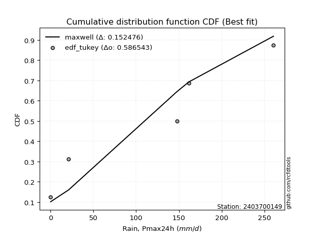</img></img>

</div>


### 8. EDF Gringorten (1963)

Gringorten plotting position formula is essential for estimating the probability and return periods of extreme events like floods and heavy rainfall. The constant _a=0.44_.

<div align="center">


$P=(m-a)/(n+1-2a)$


</div>


**8.1. Empirical values**

<div align="center">

|                | 0                   | 1                  | 2                   | 3                  | 4                  | 5                  |
|:---------------|:--------------------|:-------------------|:--------------------|:-------------------|:-------------------|:-------------------|
| date           | 2020                | 2024               | 2025                | 2022               | 2023               | 2021               |
| x              | 0.1                 | 21.0               | 28.2                | 147.8              | 161.7              | 260.6              |
| m              | 1                   | 2                  | 3                   | 4                  | 5                  | 6                  |
| empirical_dist | edf_gringorten      | edf_gringorten     | edf_gringorten      | edf_gringorten     | edf_gringorten     | edf_gringorten     |
| empirical      | 0.09150326797385622 | 0.2549019607843137 | 0.41830065359477125 | 0.5816993464052288 | 0.7450980392156862 | 0.9084967320261437 |
| empirical_tr   | 1.1007194244604317  | 1.3421052631578947 | 1.7191011235955058  | 2.3906250000000004 | 3.9230769230769216 | 10.928571428571415 |

</div>


**8.2. Kolmogorov-Smirnov fit test (sorted by Δ)**


<div align="center">

|                | 0                   | 1                   | 2                   | 3                   | 4                   | 5                   | 6                   | 7                   | 8                   | 9                   | 10                  | 11                 | 12                 | 13                  | 14                  | 15                  | 16                  | 17                  | 18                 | 19                  | 20                  | 21                  | 22                  | 23                  | 24                  | 25                  | 26                 | 27                  | 28                 | 29                  | 30                  | 31                  | 32                  | 33                 | 34                  | 35                  | 36                  | 37                  | 38                  | 39                  | 40                  | 41                 | 42                  | 43                  | 44                 | 45                  | 46                 | 47                 | 48                  | 49                  | 50                 | 51                 | 52                  | 53                 | 54                  | 55                  | 56                 | 57                  | 58                  | 59                  | 60                  | 61                  | 62                  | 63                  | 64                  | 65                  | 66                  | 67                  | 68                  | 69                  | 70                  | 71                 | 72                 | 73                  | 74                  | 75                  | 76                  | 77                 | 78                 | 79                  | 80                  | 81                  | 82                  | 83                 | 84                 | 85                  | 86                 | 87                 | 88                  | 89                 | 90                  | 91                 | 92                 | 93                  | 94                | 95                 | 96                 | 97                 | 98                  | 99                  | 100                | 101                 | 102                | 103                 | 104                | 105                | 106                | 107                 | 108                 | 109                | 110                | 111                 | 112                 | 113                | 114                | 115                 | 116                 | 117                | 118               | 119                 | 120                 | 121                 | 122              | 123                | 124                | 125                | 126                | 127                 | 128                | 129                | 130              | 131                | 132                 | 133                 | 134                 | 135                | 136                | 137                 | 138                 | 139                | 140                 | 141                | 142                 | 143                | 144                | 145                | 146                | 147                | 148                | 149                | 150                | 151                | 152               | 153                | 154                | 155                | 156                | 157                | 158                | 159               |
|:---------------|:--------------------|:--------------------|:--------------------|:--------------------|:--------------------|:--------------------|:--------------------|:--------------------|:--------------------|:--------------------|:--------------------|:-------------------|:-------------------|:--------------------|:--------------------|:--------------------|:--------------------|:--------------------|:-------------------|:--------------------|:--------------------|:--------------------|:--------------------|:--------------------|:--------------------|:--------------------|:-------------------|:--------------------|:-------------------|:--------------------|:--------------------|:--------------------|:--------------------|:-------------------|:--------------------|:--------------------|:--------------------|:--------------------|:--------------------|:--------------------|:--------------------|:-------------------|:--------------------|:--------------------|:-------------------|:--------------------|:-------------------|:-------------------|:--------------------|:--------------------|:-------------------|:-------------------|:--------------------|:-------------------|:--------------------|:--------------------|:-------------------|:--------------------|:--------------------|:--------------------|:--------------------|:--------------------|:--------------------|:--------------------|:--------------------|:--------------------|:--------------------|:--------------------|:--------------------|:--------------------|:--------------------|:-------------------|:-------------------|:--------------------|:--------------------|:--------------------|:--------------------|:-------------------|:-------------------|:--------------------|:--------------------|:--------------------|:--------------------|:-------------------|:-------------------|:--------------------|:-------------------|:-------------------|:--------------------|:-------------------|:--------------------|:-------------------|:-------------------|:--------------------|:------------------|:-------------------|:-------------------|:-------------------|:--------------------|:--------------------|:-------------------|:--------------------|:-------------------|:--------------------|:-------------------|:-------------------|:-------------------|:--------------------|:--------------------|:-------------------|:-------------------|:--------------------|:--------------------|:-------------------|:-------------------|:--------------------|:--------------------|:-------------------|:------------------|:--------------------|:--------------------|:--------------------|:-----------------|:-------------------|:-------------------|:-------------------|:-------------------|:--------------------|:-------------------|:-------------------|:-----------------|:-------------------|:--------------------|:--------------------|:--------------------|:-------------------|:-------------------|:--------------------|:--------------------|:-------------------|:--------------------|:-------------------|:--------------------|:-------------------|:-------------------|:-------------------|:-------------------|:-------------------|:-------------------|:-------------------|:-------------------|:-------------------|:------------------|:-------------------|:-------------------|:-------------------|:-------------------|:-------------------|:-------------------|:------------------|
| station        | 2403700149          | 2403700149          | 2403700149          | 2403700149          | 2403700149          | 2403700149          | 2403700149          | 2403700149          | 2403700149          | 2403700149          | 2403700149          | 2403700149         | 2403700149         | 2403700149          | 2403700149          | 2403700149          | 2403700149          | 2403700149          | 2403700149         | 2403700149          | 2403700149          | 2403700149          | 2403700149          | 2403700149          | 2403700149          | 2403700149          | 2403700149         | 2403700149          | 2403700149         | 2403700149          | 2403700149          | 2403700149          | 2403700149          | 2403700149         | 2403700149          | 2403700149          | 2403700149          | 2403700149          | 2403700149          | 2403700149          | 2403700149          | 2403700149         | 2403700149          | 2403700149          | 2403700149         | 2403700149          | 2403700149         | 2403700149         | 2403700149          | 2403700149          | 2403700149         | 2403700149         | 2403700149          | 2403700149         | 2403700149          | 2403700149          | 2403700149         | 2403700149          | 2403700149          | 2403700149          | 2403700149          | 2403700149          | 2403700149          | 2403700149          | 2403700149          | 2403700149          | 2403700149          | 2403700149          | 2403700149          | 2403700149          | 2403700149          | 2403700149         | 2403700149         | 2403700149          | 2403700149          | 2403700149          | 2403700149          | 2403700149         | 2403700149         | 2403700149          | 2403700149          | 2403700149          | 2403700149          | 2403700149         | 2403700149         | 2403700149          | 2403700149         | 2403700149         | 2403700149          | 2403700149         | 2403700149          | 2403700149         | 2403700149         | 2403700149          | 2403700149        | 2403700149         | 2403700149         | 2403700149         | 2403700149          | 2403700149          | 2403700149         | 2403700149          | 2403700149         | 2403700149          | 2403700149         | 2403700149         | 2403700149         | 2403700149          | 2403700149          | 2403700149         | 2403700149         | 2403700149          | 2403700149          | 2403700149         | 2403700149         | 2403700149          | 2403700149          | 2403700149         | 2403700149        | 2403700149          | 2403700149          | 2403700149          | 2403700149       | 2403700149         | 2403700149         | 2403700149         | 2403700149         | 2403700149          | 2403700149         | 2403700149         | 2403700149       | 2403700149         | 2403700149          | 2403700149          | 2403700149          | 2403700149         | 2403700149         | 2403700149          | 2403700149          | 2403700149         | 2403700149          | 2403700149         | 2403700149          | 2403700149         | 2403700149         | 2403700149         | 2403700149         | 2403700149         | 2403700149         | 2403700149         | 2403700149         | 2403700149         | 2403700149        | 2403700149         | 2403700149         | 2403700149         | 2403700149         | 2403700149         | 2403700149         | 2403700149        |
| empirical_dist | edf_gringorten      | edf_gringorten      | edf_gringorten      | edf_gringorten      | edf_gringorten      | edf_gringorten      | edf_gringorten      | edf_gringorten      | edf_gringorten      | edf_gringorten      | edf_gringorten      | edf_gringorten     | edf_gringorten     | edf_gringorten      | edf_gringorten      | edf_gringorten      | edf_gringorten      | edf_gringorten      | edf_gringorten     | edf_gringorten      | edf_gringorten      | edf_gringorten      | edf_gringorten      | edf_gringorten      | edf_gringorten      | edf_gringorten      | edf_gringorten     | edf_gringorten      | edf_gringorten     | edf_gringorten      | edf_gringorten      | edf_gringorten      | edf_gringorten      | edf_gringorten     | edf_gringorten      | edf_gringorten      | edf_gringorten      | edf_gringorten      | edf_gringorten      | edf_gringorten      | edf_gringorten      | edf_gringorten     | edf_gringorten      | edf_gringorten      | edf_gringorten     | edf_gringorten      | edf_gringorten     | edf_gringorten     | edf_gringorten      | edf_gringorten      | edf_gringorten     | edf_gringorten     | edf_gringorten      | edf_gringorten     | edf_gringorten      | edf_gringorten      | edf_gringorten     | edf_gringorten      | edf_gringorten      | edf_gringorten      | edf_gringorten      | edf_gringorten      | edf_gringorten      | edf_gringorten      | edf_gringorten      | edf_gringorten      | edf_gringorten      | edf_gringorten      | edf_gringorten      | edf_gringorten      | edf_gringorten      | edf_gringorten     | edf_gringorten     | edf_gringorten      | edf_gringorten      | edf_gringorten      | edf_gringorten      | edf_gringorten     | edf_gringorten     | edf_gringorten      | edf_gringorten      | edf_gringorten      | edf_gringorten      | edf_gringorten     | edf_gringorten     | edf_gringorten      | edf_gringorten     | edf_gringorten     | edf_gringorten      | edf_gringorten     | edf_gringorten      | edf_gringorten     | edf_gringorten     | edf_gringorten      | edf_gringorten    | edf_gringorten     | edf_gringorten     | edf_gringorten     | edf_gringorten      | edf_gringorten      | edf_gringorten     | edf_gringorten      | edf_gringorten     | edf_gringorten      | edf_gringorten     | edf_gringorten     | edf_gringorten     | edf_gringorten      | edf_gringorten      | edf_gringorten     | edf_gringorten     | edf_gringorten      | edf_gringorten      | edf_gringorten     | edf_gringorten     | edf_gringorten      | edf_gringorten      | edf_gringorten     | edf_gringorten    | edf_gringorten      | edf_gringorten      | edf_gringorten      | edf_gringorten   | edf_gringorten     | edf_gringorten     | edf_gringorten     | edf_gringorten     | edf_gringorten      | edf_gringorten     | edf_gringorten     | edf_gringorten   | edf_gringorten     | edf_gringorten      | edf_gringorten      | edf_gringorten      | edf_gringorten     | edf_gringorten     | edf_gringorten      | edf_gringorten      | edf_gringorten     | edf_gringorten      | edf_gringorten     | edf_gringorten      | edf_gringorten     | edf_gringorten     | edf_gringorten     | edf_gringorten     | edf_gringorten     | edf_gringorten     | edf_gringorten     | edf_gringorten     | edf_gringorten     | edf_gringorten    | edf_gringorten     | edf_gringorten     | edf_gringorten     | edf_gringorten     | edf_gringorten     | edf_gringorten     | edf_gringorten    |
| p_dist         | dgamma              | loggausshyper       | mielke              | dweibull            | loggenextreme       | loglevy_l           | logpearson3         | f                   | beta                | weibull_min         | arcsine             | logvonmises_line   | loggumbel_l        | ksone               | halfgennorm         | logt                | semicircular        | halfnorm            | foldnorm           | kappa3              | anglit              | genexpon            | nakagami            | exponnorm           | rayleigh            | logtrapezoid        | alpha              | maxwell             | genextreme         | ncf                 | logfoldnorm         | halflogistic        | logloggamma         | genlogistic        | logargus            | pearson3            | loghypsecant        | exponpow            | burr                | betaprime           | loglogistic         | kstwobign          | t                   | crystalball         | norm               | lognakagami         | wrapcauchy         | gumbel_r           | lognct              | logcrystalball      | lognorm            | logexponnorm       | logrice             | logweibull_max     | gompertz            | invgauss            | lomax              | logdweibull         | loganglit           | gengamma            | logsemicircular     | loglaplace          | loglaplace          | loggenhalflogistic  | moyal               | logjohnsonsb        | loggamma            | loggamma            | logarcsine          | truncweibull_min    | logerlang           | logistic           | logalpha           | cosine              | truncexpon          | rice                | loginvgamma         | truncnorm          | gumbel_l           | burr12              | loginvgauss         | hypsecant           | logmaxwell          | gennorm            | exponweib          | lograyleigh         | loginvweibull      | laplace            | loggennorm          | skewnorm           | triang              | kappa4             | logbeta            | loggumbel_r         | logcosine         | levy_l             | bradford           | logwrapcauchy      | loghalfnorm         | logskewnorm         | argus              | gausshyper          | logkstwobign       | logtriang           | loggenexpon        | logmoyal           | tukeylambda        | logdgamma           | loghalflogistic     | uniform            | vonmises_line      | logncf              | genhalflogistic     | logburr12          | gamma              | erlang              | genpareto           | invgamma           | wald              | johnsonsb           | loglomax            | nct                 | logtruncnorm     | johnsonsu          | logwald            | truncpareto        | logkappa3          | logburr             | trapezoid          | logksone           | loghalfgennorm   | logkappa4          | fatiguelife         | logexponweib        | logtruncweibull_min | loguniform         | logbradford        | logloglaplace       | logjohnsonsu        | logf               | invweibull          | powerlaw           | logtruncexpon       | logmielke          | logfatiguelife     | loggenpareto       | logweibull_min     | weibull_max        | loggengamma        | rdist              | logbetaprime       | logexponpow        | logtruncpareto    | logpowerlaw        | loggompertz        | loggenlogistic     | logtukeylambda     | logrdist           | logvonmises        | vonmises          |
| delta          | 0.09190074768892406 | 0.10897370416117202 | 0.11536167013156562 | 0.11716013217334176 | 0.12091831325453806 | 0.12113564072589955 | 0.12212959131888507 | 0.12262681588425894 | 0.12431405816863567 | 0.12636984348179026 | 0.12650532858705957 | 0.1306954846861802 | 0.1394630062122203 | 0.14833525577345413 | 0.14911512132076343 | 0.15378338131705954 | 0.16506941849694662 | 0.16914424697957636 | 0.1731478455185337 | 0.17407814139912436 | 0.17741965224123754 | 0.17980183445981365 | 0.18016338707427315 | 0.18158040487648996 | 0.18368999995548083 | 0.18595515925403283 | 0.1865109848031723 | 0.19012550655693236 | 0.1902056898671306 | 0.19107998084038677 | 0.19478197981853584 | 0.19500132884145452 | 0.19655006916785356 | 0.1972128354528551 | 0.19894639856011986 | 0.19915479731505292 | 0.19965455192185522 | 0.20091205559277803 | 0.20169804481767095 | 0.20267621096421018 | 0.20383867333427946 | 0.2054693590559036 | 0.20553287361952388 | 0.20553537547238282 | 0.2055354216471073 | 0.20712548803207825 | 0.2078594870739191 | 0.2082023854817311 | 0.20854845315667764 | 0.20876594611622445 | 0.2087659503515102 | 0.2087709536412855 | 0.20877138123869804 | 0.2090104750831968 | 0.20975582046112273 | 0.21174413873864628 | 0.2119764203256288 | 0.21220565487399012 | 0.21394392367639842 | 0.21563027567159787 | 0.21607728328869613 | 0.21627119492358415 | 0.21627119492358415 | 0.21883644086066112 | 0.21912764951383418 | 0.22184803477657467 | 0.22189863921507658 | 0.22189863921507658 | 0.22455741869837387 | 0.22593379877646252 | 0.22710768910808843 | 0.2275824213037709 | 0.2276458900902325 | 0.22765704191999614 | 0.23047358421015257 | 0.23346231218042815 | 0.23393366619124312 | 0.2351757656828391 | 0.2353534709522875 | 0.23727548585552805 | 0.23870306933363283 | 0.24095241177275983 | 0.24288835118329216 | 0.2450980392156863 | 0.2510706437496194 | 0.25458332535168715 | 0.2546398653509806 | 0.2562881845992765 | 0.25698317182196473 | 0.2588178769960489 | 0.26238134585775164 | 0.2630084205615564 | 0.2668996402571365 | 0.27709075908202374 | 0.281062510313952 | 0.2834826035682715 | 0.2837048987541617 | 0.2862507232340543 | 0.28756399590279946 | 0.28975430714410266 | 0.2905340907620902 | 0.29174658630707395 | 0.2931082211149748 | 0.30099233856218166 | 0.3024458953114295 | 0.3027574020229966 | 0.3070463877051794 | 0.30939359139428846 | 0.30986853475219933 | 0.3104311718289363 | 0.3123387291048688 | 0.31601918355432024 | 0.31751639018062844 | 0.3247631385915838 | 0.3346497341992938 | 0.33740507764057937 | 0.33883697613204306 | 0.3495309962880401 | 0.351702541072264 | 0.36095258548846787 | 0.36747781102331745 | 0.36919679271455075 | 0.36929373693504 | 0.3726209498236571 | 0.3741833297124748 | 0.3765009701492087 | 0.3835918935449999 | 0.38481629734352907 | 0.3868386778569498 | 0.3949411037597289 | 0.39623530081737 | 0.3970879383726553 | 0.40130698673193355 | 0.40284928495967454 | 0.409603165795572   | 0.4249097166685375 | 0.4300974649563736 | 0.45278970412794606 | 0.46724091910692656 | 0.4712183488554168 | 0.47546676595563586 | 0.4846609122032014 | 0.49947162089822583 | 0.5084222407238473 | 0.5349214727209509 | 0.5540033902552718 | 0.5662112245698447 | 0.6183517600260988 | 0.6254664593170145 | 0.6321040664125575 | 0.6527584200359522 | 0.6719396830518884 | 0.681854500367255 | 0.6863823639581452 | 0.7397740165228271 | 0.7450980392156862 | 0.7450980392156863 | 0.7450980392156863 | 1.1709755204700278 | 40.54326579938332 |
| deltao         | 0.530385761606      | 0.530385761606      | 0.530385761606      | 0.530385761606      | 0.530385761606      | 0.530385761606      | 0.530385761606      | 0.530385761606      | 0.530385761606      | 0.530385761606      | 0.530385761606      | 0.530385761606     | 0.530385761606     | 0.530385761606      | 0.530385761606      | 0.530385761606      | 0.530385761606      | 0.530385761606      | 0.530385761606     | 0.530385761606      | 0.530385761606      | 0.530385761606      | 0.530385761606      | 0.530385761606      | 0.530385761606      | 0.530385761606      | 0.530385761606     | 0.530385761606      | 0.530385761606     | 0.530385761606      | 0.530385761606      | 0.530385761606      | 0.530385761606      | 0.530385761606     | 0.530385761606      | 0.530385761606      | 0.530385761606      | 0.530385761606      | 0.530385761606      | 0.530385761606      | 0.530385761606      | 0.530385761606     | 0.530385761606      | 0.530385761606      | 0.530385761606     | 0.530385761606      | 0.530385761606     | 0.530385761606     | 0.530385761606      | 0.530385761606      | 0.530385761606     | 0.530385761606     | 0.530385761606      | 0.530385761606     | 0.530385761606      | 0.530385761606      | 0.530385761606     | 0.530385761606      | 0.530385761606      | 0.530385761606      | 0.530385761606      | 0.530385761606      | 0.530385761606      | 0.530385761606      | 0.530385761606      | 0.530385761606      | 0.530385761606      | 0.530385761606      | 0.530385761606      | 0.530385761606      | 0.530385761606      | 0.530385761606     | 0.530385761606     | 0.530385761606      | 0.530385761606      | 0.530385761606      | 0.530385761606      | 0.530385761606     | 0.530385761606     | 0.530385761606      | 0.530385761606      | 0.530385761606      | 0.530385761606      | 0.530385761606     | 0.530385761606     | 0.530385761606      | 0.530385761606     | 0.530385761606     | 0.530385761606      | 0.530385761606     | 0.530385761606      | 0.530385761606     | 0.530385761606     | 0.530385761606      | 0.530385761606    | 0.530385761606     | 0.530385761606     | 0.530385761606     | 0.530385761606      | 0.530385761606      | 0.530385761606     | 0.530385761606      | 0.530385761606     | 0.530385761606      | 0.530385761606     | 0.530385761606     | 0.530385761606     | 0.530385761606      | 0.530385761606      | 0.530385761606     | 0.530385761606     | 0.530385761606      | 0.530385761606      | 0.530385761606     | 0.530385761606     | 0.530385761606      | 0.530385761606      | 0.530385761606     | 0.530385761606    | 0.530385761606      | 0.530385761606      | 0.530385761606      | 0.530385761606   | 0.530385761606     | 0.530385761606     | 0.530385761606     | 0.530385761606     | 0.530385761606      | 0.530385761606     | 0.530385761606     | 0.530385761606   | 0.530385761606     | 0.530385761606      | 0.530385761606      | 0.530385761606      | 0.530385761606     | 0.530385761606     | 0.530385761606      | 0.530385761606      | 0.530385761606     | 0.530385761606      | 0.530385761606     | 0.530385761606      | 0.530385761606     | 0.530385761606     | 0.530385761606     | 0.530385761606     | 0.530385761606     | 0.530385761606     | 0.530385761606     | 0.530385761606     | 0.530385761606     | 0.530385761606    | 0.530385761606     | 0.530385761606     | 0.530385761606     | 0.530385761606     | 0.530385761606     | 0.530385761606     | 0.530385761606    |
| eval           | Δo > Δ              | Δo > Δ              | Δo > Δ              | Δo > Δ              | Δo > Δ              | Δo > Δ              | Δo > Δ              | Δo > Δ              | Δo > Δ              | Δo > Δ              | Δo > Δ              | Δo > Δ             | Δo > Δ             | Δo > Δ              | Δo > Δ              | Δo > Δ              | Δo > Δ              | Δo > Δ              | Δo > Δ             | Δo > Δ              | Δo > Δ              | Δo > Δ              | Δo > Δ              | Δo > Δ              | Δo > Δ              | Δo > Δ              | Δo > Δ             | Δo > Δ              | Δo > Δ             | Δo > Δ              | Δo > Δ              | Δo > Δ              | Δo > Δ              | Δo > Δ             | Δo > Δ              | Δo > Δ              | Δo > Δ              | Δo > Δ              | Δo > Δ              | Δo > Δ              | Δo > Δ              | Δo > Δ             | Δo > Δ              | Δo > Δ              | Δo > Δ             | Δo > Δ              | Δo > Δ             | Δo > Δ             | Δo > Δ              | Δo > Δ              | Δo > Δ             | Δo > Δ             | Δo > Δ              | Δo > Δ             | Δo > Δ              | Δo > Δ              | Δo > Δ             | Δo > Δ              | Δo > Δ              | Δo > Δ              | Δo > Δ              | Δo > Δ              | Δo > Δ              | Δo > Δ              | Δo > Δ              | Δo > Δ              | Δo > Δ              | Δo > Δ              | Δo > Δ              | Δo > Δ              | Δo > Δ              | Δo > Δ             | Δo > Δ             | Δo > Δ              | Δo > Δ              | Δo > Δ              | Δo > Δ              | Δo > Δ             | Δo > Δ             | Δo > Δ              | Δo > Δ              | Δo > Δ              | Δo > Δ              | Δo > Δ             | Δo > Δ             | Δo > Δ              | Δo > Δ             | Δo > Δ             | Δo > Δ              | Δo > Δ             | Δo > Δ              | Δo > Δ             | Δo > Δ             | Δo > Δ              | Δo > Δ            | Δo > Δ             | Δo > Δ             | Δo > Δ             | Δo > Δ              | Δo > Δ              | Δo > Δ             | Δo > Δ              | Δo > Δ             | Δo > Δ              | Δo > Δ             | Δo > Δ             | Δo > Δ             | Δo > Δ              | Δo > Δ              | Δo > Δ             | Δo > Δ             | Δo > Δ              | Δo > Δ              | Δo > Δ             | Δo > Δ             | Δo > Δ              | Δo > Δ              | Δo > Δ             | Δo > Δ            | Δo > Δ              | Δo > Δ              | Δo > Δ              | Δo > Δ           | Δo > Δ             | Δo > Δ             | Δo > Δ             | Δo > Δ             | Δo > Δ              | Δo > Δ             | Δo > Δ             | Δo > Δ           | Δo > Δ             | Δo > Δ              | Δo > Δ              | Δo > Δ              | Δo > Δ             | Δo > Δ             | Δo > Δ              | Δo > Δ              | Δo > Δ             | Δo > Δ              | Δo > Δ             | Δo > Δ              | Δo > Δ             | Δo <= Δ            | Δo <= Δ            | Δo <= Δ            | Δo <= Δ            | Δo <= Δ            | Δo <= Δ            | Δo <= Δ            | Δo <= Δ            | Δo <= Δ           | Δo <= Δ            | Δo <= Δ            | Δo <= Δ            | Δo <= Δ            | Δo <= Δ            | Δo <= Δ            | Δo <= Δ           |
| fit            | 1                   | 1                   | 1                   | 1                   | 1                   | 1                   | 1                   | 1                   | 1                   | 1                   | 1                   | 1                  | 1                  | 1                   | 1                   | 1                   | 1                   | 1                   | 1                  | 1                   | 1                   | 1                   | 1                   | 1                   | 1                   | 1                   | 1                  | 1                   | 1                  | 1                   | 1                   | 1                   | 1                   | 1                  | 1                   | 1                   | 1                   | 1                   | 1                   | 1                   | 1                   | 1                  | 1                   | 1                   | 1                  | 1                   | 1                  | 1                  | 1                   | 1                   | 1                  | 1                  | 1                   | 1                  | 1                   | 1                   | 1                  | 1                   | 1                   | 1                   | 1                   | 1                   | 1                   | 1                   | 1                   | 1                   | 1                   | 1                   | 1                   | 1                   | 1                   | 1                  | 1                  | 1                   | 1                   | 1                   | 1                   | 1                  | 1                  | 1                   | 1                   | 1                   | 1                   | 1                  | 1                  | 1                   | 1                  | 1                  | 1                   | 1                  | 1                   | 1                  | 1                  | 1                   | 1                 | 1                  | 1                  | 1                  | 1                   | 1                   | 1                  | 1                   | 1                  | 1                   | 1                  | 1                  | 1                  | 1                   | 1                   | 1                  | 1                  | 1                   | 1                   | 1                  | 1                  | 1                   | 1                   | 1                  | 1                 | 1                   | 1                   | 1                   | 1                | 1                  | 1                  | 1                  | 1                  | 1                   | 1                  | 1                  | 1                | 1                  | 1                   | 1                   | 1                   | 1                  | 1                  | 1                   | 1                   | 1                  | 1                   | 1                  | 1                   | 1                  | 0                  | 0                  | 0                  | 0                  | 0                  | 0                  | 0                  | 0                  | 0                 | 0                  | 0                  | 0                  | 0                  | 0                  | 0                  | 0                 |
| n              | 6                   | 6                   | 6                   | 6                   | 6                   | 6                   | 6                   | 6                   | 6                   | 6                   | 6                   | 6                  | 6                  | 6                   | 6                   | 6                   | 6                   | 6                   | 6                  | 6                   | 6                   | 6                   | 6                   | 6                   | 6                   | 6                   | 6                  | 6                   | 6                  | 6                   | 6                   | 6                   | 6                   | 6                  | 6                   | 6                   | 6                   | 6                   | 6                   | 6                   | 6                   | 6                  | 6                   | 6                   | 6                  | 6                   | 6                  | 6                  | 6                   | 6                   | 6                  | 6                  | 6                   | 6                  | 6                   | 6                   | 6                  | 6                   | 6                   | 6                   | 6                   | 6                   | 6                   | 6                   | 6                   | 6                   | 6                   | 6                   | 6                   | 6                   | 6                   | 6                  | 6                  | 6                   | 6                   | 6                   | 6                   | 6                  | 6                  | 6                   | 6                   | 6                   | 6                   | 6                  | 6                  | 6                   | 6                  | 6                  | 6                   | 6                  | 6                   | 6                  | 6                  | 6                   | 6                 | 6                  | 6                  | 6                  | 6                   | 6                   | 6                  | 6                   | 6                  | 6                   | 6                  | 6                  | 6                  | 6                   | 6                   | 6                  | 6                  | 6                   | 6                   | 6                  | 6                  | 6                   | 6                   | 6                  | 6                 | 6                   | 6                   | 6                   | 6                | 6                  | 6                  | 6                  | 6                  | 6                   | 6                  | 6                  | 6                | 6                  | 6                   | 6                   | 6                   | 6                  | 6                  | 6                   | 6                   | 6                  | 6                   | 6                  | 6                   | 6                  | 6                  | 6                  | 6                  | 6                  | 6                  | 6                  | 6                  | 6                  | 6                 | 6                  | 6                  | 6                  | 6                  | 6                  | 6                  | 6                 |
| best_fit       | 1                   | 0                   | 0                   | 0                   | 0                   | 0                   | 0                   | 0                   | 0                   | 0                   | 0                   | 0                  | 0                  | 0                   | 0                   | 0                   | 0                   | 0                   | 0                  | 0                   | 0                   | 0                   | 0                   | 0                   | 0                   | 0                   | 0                  | 0                   | 0                  | 0                   | 0                   | 0                   | 0                   | 0                  | 0                   | 0                   | 0                   | 0                   | 0                   | 0                   | 0                   | 0                  | 0                   | 0                   | 0                  | 0                   | 0                  | 0                  | 0                   | 0                   | 0                  | 0                  | 0                   | 0                  | 0                   | 0                   | 0                  | 0                   | 0                   | 0                   | 0                   | 0                   | 0                   | 0                   | 0                   | 0                   | 0                   | 0                   | 0                   | 0                   | 0                   | 0                  | 0                  | 0                   | 0                   | 0                   | 0                   | 0                  | 0                  | 0                   | 0                   | 0                   | 0                   | 0                  | 0                  | 0                   | 0                  | 0                  | 0                   | 0                  | 0                   | 0                  | 0                  | 0                   | 0                 | 0                  | 0                  | 0                  | 0                   | 0                   | 0                  | 0                   | 0                  | 0                   | 0                  | 0                  | 0                  | 0                   | 0                   | 0                  | 0                  | 0                   | 0                   | 0                  | 0                  | 0                   | 0                   | 0                  | 0                 | 0                   | 0                   | 0                   | 0                | 0                  | 0                  | 0                  | 0                  | 0                   | 0                  | 0                  | 0                | 0                  | 0                   | 0                   | 0                   | 0                  | 0                  | 0                   | 0                   | 0                  | 0                   | 0                  | 0                   | 0                  | 0                  | 0                  | 0                  | 0                  | 0                  | 0                  | 0                  | 0                  | 0                 | 0                  | 0                  | 0                  | 0                  | 0                  | 0                  | 0                 |
| best_fit_sort  | 1                   | 2                   | 3                   | 4                   | 5                   | 6                   | 7                   | 8                   | 9                   | 10                  | 11                  | 12                 | 13                 | 14                  | 15                  | 16                  | 17                  | 18                  | 19                 | 20                  | 21                  | 22                  | 23                  | 24                  | 25                  | 26                  | 27                 | 28                  | 29                 | 30                  | 31                  | 32                  | 33                  | 34                 | 35                  | 36                  | 37                  | 38                  | 39                  | 40                  | 41                  | 42                 | 43                  | 44                  | 45                 | 46                  | 47                 | 48                 | 49                  | 50                  | 51                 | 52                 | 53                  | 54                 | 55                  | 56                  | 57                 | 58                  | 59                  | 60                  | 61                  | 62                  | 63                  | 64                  | 65                  | 66                  | 67                  | 68                  | 69                  | 70                  | 71                  | 72                 | 73                 | 74                  | 75                  | 76                  | 77                  | 78                 | 79                 | 80                  | 81                  | 82                  | 83                  | 84                 | 85                 | 86                  | 87                 | 88                 | 89                  | 90                 | 91                  | 92                 | 93                 | 94                  | 95                | 96                 | 97                 | 98                 | 99                  | 100                 | 101                | 102                 | 103                | 104                 | 105                | 106                | 107                | 108                 | 109                 | 110                | 111                | 112                 | 113                 | 114                | 115                | 116                 | 117                 | 118                | 119               | 120                 | 121                 | 122                 | 123              | 124                | 125                | 126                | 127                | 128                 | 129                | 130                | 131              | 132                | 133                 | 134                 | 135                 | 136                | 137                | 138                 | 139                 | 140                | 141                 | 142                | 143                 | 144                | 145                | 146                | 147                | 148                | 149                | 150                | 151                | 152                | 153               | 154                | 155                | 156                | 157                | 158                | 159                | 160               |

</div>


**8.3. Best fit**

<div align="center">

|   id |    station | empirical_dist   | p_dist   |     delta |   deltao | eval   |   fit |   n |   best_fit |   best_fit_sort |
|-----:|-----------:|:-----------------|:---------|----------:|---------:|:-------|------:|----:|-----------:|----------------:|
|    0 | 2403700149 | edf_gringorten   | dgamma   | 0.0919007 | 0.530386 | Δo > Δ |     1 |   6 |          1 |               1 |

</div>


<div align="center">

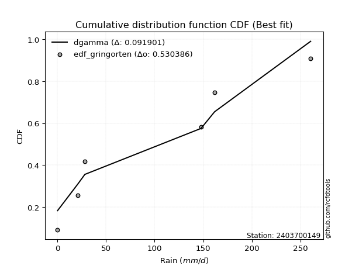</img>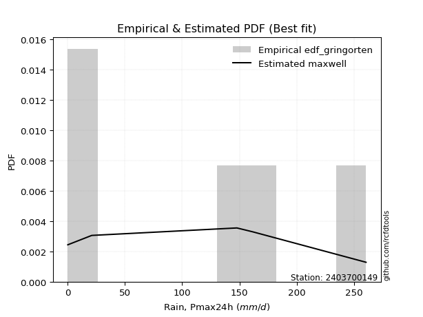</img>

</div>


### 9. EDF Filliben (1975)

The specific values of the constants (0.3175) (often denoted as $alpha$) and (0.365) are derived from a method proposed by James J. Filliben in a 1975 paper. This particular formula is the mean value of the $i$-th order statistic of the normal distribution and is considered a robust and effective plotting position formula for the normal probability plot correlation coefficient test for normality.

<div align="center">


$P=(m-0.3175)/(n+0.365)$


</div>


**9.1. Empirical values**

<div align="center">

|                | 0                   | 1                   | 2                  | 3                  | 4                  | 5                  |
|:---------------|:--------------------|:--------------------|:-------------------|:-------------------|:-------------------|:-------------------|
| date           | 2020                | 2024                | 2025               | 2022               | 2023               | 2021               |
| x              | 0.1                 | 21.0                | 28.2               | 147.8              | 161.7              | 260.6              |
| m              | 1                   | 2                   | 3                  | 4                  | 5                  | 6                  |
| empirical_dist | edf_filliben        | edf_filliben        | edf_filliben       | edf_filliben       | edf_filliben       | edf_filliben       |
| empirical      | 0.10722702278083267 | 0.26433621366849963 | 0.4214454045561665 | 0.5785545954438335 | 0.7356637863315004 | 0.8927729772191673 |
| empirical_tr   | 1.1201055873295205  | 1.3593166043780034  | 1.7284453496266123 | 2.3727865796831313 | 3.783060921248143  | 9.326007326007321  |

</div>


**9.2. Kolmogorov-Smirnov fit test (sorted by Δ)**


<div align="center">

|                | 0                   | 1                   | 2                  | 3                  | 4                   | 5                   | 6                   | 7                   | 8                   | 9                   | 10                  | 11                  | 12                  | 13                 | 14                  | 15                 | 16                 | 17                  | 18                  | 19                 | 20                 | 21                 | 22                  | 23                  | 24                 | 25                 | 26                  | 27                  | 28                  | 29                  | 30                  | 31                  | 32                  | 33                 | 34                  | 35                  | 36                  | 37                  | 38                  | 39                  | 40                  | 41                  | 42                  | 43                 | 44                 | 45                 | 46                 | 47                  | 48                 | 49                 | 50                 | 51                  | 52                  | 53                 | 54                  | 55                  | 56                  | 57                  | 58                  | 59                | 60                 | 61                  | 62                  | 63                  | 64                 | 65                  | 66                 | 67                  | 68                  | 69                  | 70                  | 71                 | 72                  | 73                 | 74                 | 75                  | 76                 | 77                  | 78                  | 79                  | 80                  | 81                  | 82                  | 83                  | 84                 | 85                  | 86                  | 87                 | 88                  | 89                  | 90                 | 91                  | 92                 | 93                 | 94                | 95                 | 96                 | 97                  | 98                 | 99                | 100               | 101                | 102                | 103                 | 104                | 105                 | 106                | 107               | 108                 | 109                | 110                | 111                 | 112                | 113                | 114                | 115                 | 116                | 117                | 118                 | 119                | 120                | 121                | 122                 | 123                | 124                | 125                 | 126               | 127                 | 128               | 129                | 130                | 131                | 132                | 133                | 134                 | 135                | 136                 | 137                 | 138                | 139                 | 140                | 141                | 142                | 143                | 144               | 145                | 146                | 147                | 148                | 149                | 150                | 151                | 152                | 153                | 154                | 155                | 156                | 157                | 158               | 159              |
|:---------------|:--------------------|:--------------------|:-------------------|:-------------------|:--------------------|:--------------------|:--------------------|:--------------------|:--------------------|:--------------------|:--------------------|:--------------------|:--------------------|:-------------------|:--------------------|:-------------------|:-------------------|:--------------------|:--------------------|:-------------------|:-------------------|:-------------------|:--------------------|:--------------------|:-------------------|:-------------------|:--------------------|:--------------------|:--------------------|:--------------------|:--------------------|:--------------------|:--------------------|:-------------------|:--------------------|:--------------------|:--------------------|:--------------------|:--------------------|:--------------------|:--------------------|:--------------------|:--------------------|:-------------------|:-------------------|:-------------------|:-------------------|:--------------------|:-------------------|:-------------------|:-------------------|:--------------------|:--------------------|:-------------------|:--------------------|:--------------------|:--------------------|:--------------------|:--------------------|:------------------|:-------------------|:--------------------|:--------------------|:--------------------|:-------------------|:--------------------|:-------------------|:--------------------|:--------------------|:--------------------|:--------------------|:-------------------|:--------------------|:-------------------|:-------------------|:--------------------|:-------------------|:--------------------|:--------------------|:--------------------|:--------------------|:--------------------|:--------------------|:--------------------|:-------------------|:--------------------|:--------------------|:-------------------|:--------------------|:--------------------|:-------------------|:--------------------|:-------------------|:-------------------|:------------------|:-------------------|:-------------------|:--------------------|:-------------------|:------------------|:------------------|:-------------------|:-------------------|:--------------------|:-------------------|:--------------------|:-------------------|:------------------|:--------------------|:-------------------|:-------------------|:--------------------|:-------------------|:-------------------|:-------------------|:--------------------|:-------------------|:-------------------|:--------------------|:-------------------|:-------------------|:-------------------|:--------------------|:-------------------|:-------------------|:--------------------|:------------------|:--------------------|:------------------|:-------------------|:-------------------|:-------------------|:-------------------|:-------------------|:--------------------|:-------------------|:--------------------|:--------------------|:-------------------|:--------------------|:-------------------|:-------------------|:-------------------|:-------------------|:------------------|:-------------------|:-------------------|:-------------------|:-------------------|:-------------------|:-------------------|:-------------------|:-------------------|:-------------------|:-------------------|:-------------------|:-------------------|:-------------------|:------------------|:-----------------|
| station        | 2403700149          | 2403700149          | 2403700149         | 2403700149         | 2403700149          | 2403700149          | 2403700149          | 2403700149          | 2403700149          | 2403700149          | 2403700149          | 2403700149          | 2403700149          | 2403700149         | 2403700149          | 2403700149         | 2403700149         | 2403700149          | 2403700149          | 2403700149         | 2403700149         | 2403700149         | 2403700149          | 2403700149          | 2403700149         | 2403700149         | 2403700149          | 2403700149          | 2403700149          | 2403700149          | 2403700149          | 2403700149          | 2403700149          | 2403700149         | 2403700149          | 2403700149          | 2403700149          | 2403700149          | 2403700149          | 2403700149          | 2403700149          | 2403700149          | 2403700149          | 2403700149         | 2403700149         | 2403700149         | 2403700149         | 2403700149          | 2403700149         | 2403700149         | 2403700149         | 2403700149          | 2403700149          | 2403700149         | 2403700149          | 2403700149          | 2403700149          | 2403700149          | 2403700149          | 2403700149        | 2403700149         | 2403700149          | 2403700149          | 2403700149          | 2403700149         | 2403700149          | 2403700149         | 2403700149          | 2403700149          | 2403700149          | 2403700149          | 2403700149         | 2403700149          | 2403700149         | 2403700149         | 2403700149          | 2403700149         | 2403700149          | 2403700149          | 2403700149          | 2403700149          | 2403700149          | 2403700149          | 2403700149          | 2403700149         | 2403700149          | 2403700149          | 2403700149         | 2403700149          | 2403700149          | 2403700149         | 2403700149          | 2403700149         | 2403700149         | 2403700149        | 2403700149         | 2403700149         | 2403700149          | 2403700149         | 2403700149        | 2403700149        | 2403700149         | 2403700149         | 2403700149          | 2403700149         | 2403700149          | 2403700149         | 2403700149        | 2403700149          | 2403700149         | 2403700149         | 2403700149          | 2403700149         | 2403700149         | 2403700149         | 2403700149          | 2403700149         | 2403700149         | 2403700149          | 2403700149         | 2403700149         | 2403700149         | 2403700149          | 2403700149         | 2403700149         | 2403700149          | 2403700149        | 2403700149          | 2403700149        | 2403700149         | 2403700149         | 2403700149         | 2403700149         | 2403700149         | 2403700149          | 2403700149         | 2403700149          | 2403700149          | 2403700149         | 2403700149          | 2403700149         | 2403700149         | 2403700149         | 2403700149         | 2403700149        | 2403700149         | 2403700149         | 2403700149         | 2403700149         | 2403700149         | 2403700149         | 2403700149         | 2403700149         | 2403700149         | 2403700149         | 2403700149         | 2403700149         | 2403700149         | 2403700149        | 2403700149       |
| empirical_dist | edf_filliben        | edf_filliben        | edf_filliben       | edf_filliben       | edf_filliben        | edf_filliben        | edf_filliben        | edf_filliben        | edf_filliben        | edf_filliben        | edf_filliben        | edf_filliben        | edf_filliben        | edf_filliben       | edf_filliben        | edf_filliben       | edf_filliben       | edf_filliben        | edf_filliben        | edf_filliben       | edf_filliben       | edf_filliben       | edf_filliben        | edf_filliben        | edf_filliben       | edf_filliben       | edf_filliben        | edf_filliben        | edf_filliben        | edf_filliben        | edf_filliben        | edf_filliben        | edf_filliben        | edf_filliben       | edf_filliben        | edf_filliben        | edf_filliben        | edf_filliben        | edf_filliben        | edf_filliben        | edf_filliben        | edf_filliben        | edf_filliben        | edf_filliben       | edf_filliben       | edf_filliben       | edf_filliben       | edf_filliben        | edf_filliben       | edf_filliben       | edf_filliben       | edf_filliben        | edf_filliben        | edf_filliben       | edf_filliben        | edf_filliben        | edf_filliben        | edf_filliben        | edf_filliben        | edf_filliben      | edf_filliben       | edf_filliben        | edf_filliben        | edf_filliben        | edf_filliben       | edf_filliben        | edf_filliben       | edf_filliben        | edf_filliben        | edf_filliben        | edf_filliben        | edf_filliben       | edf_filliben        | edf_filliben       | edf_filliben       | edf_filliben        | edf_filliben       | edf_filliben        | edf_filliben        | edf_filliben        | edf_filliben        | edf_filliben        | edf_filliben        | edf_filliben        | edf_filliben       | edf_filliben        | edf_filliben        | edf_filliben       | edf_filliben        | edf_filliben        | edf_filliben       | edf_filliben        | edf_filliben       | edf_filliben       | edf_filliben      | edf_filliben       | edf_filliben       | edf_filliben        | edf_filliben       | edf_filliben      | edf_filliben      | edf_filliben       | edf_filliben       | edf_filliben        | edf_filliben       | edf_filliben        | edf_filliben       | edf_filliben      | edf_filliben        | edf_filliben       | edf_filliben       | edf_filliben        | edf_filliben       | edf_filliben       | edf_filliben       | edf_filliben        | edf_filliben       | edf_filliben       | edf_filliben        | edf_filliben       | edf_filliben       | edf_filliben       | edf_filliben        | edf_filliben       | edf_filliben       | edf_filliben        | edf_filliben      | edf_filliben        | edf_filliben      | edf_filliben       | edf_filliben       | edf_filliben       | edf_filliben       | edf_filliben       | edf_filliben        | edf_filliben       | edf_filliben        | edf_filliben        | edf_filliben       | edf_filliben        | edf_filliben       | edf_filliben       | edf_filliben       | edf_filliben       | edf_filliben      | edf_filliben       | edf_filliben       | edf_filliben       | edf_filliben       | edf_filliben       | edf_filliben       | edf_filliben       | edf_filliben       | edf_filliben       | edf_filliben       | edf_filliben       | edf_filliben       | edf_filliben       | edf_filliben      | edf_filliben     |
| p_dist         | dgamma              | loggausshyper       | dweibull           | loglevy_l          | arcsine             | mielke              | loggenextreme       | logpearson3         | f                   | beta                | weibull_min         | logvonmises_line    | loggumbel_l         | ksone              | halfgennorm         | logt               | semicircular       | halfnorm            | foldnorm            | logtrapezoid       | kappa3             | anglit             | genexpon            | nakagami            | exponnorm          | rayleigh           | alpha               | maxwell             | genextreme          | ncf                 | loglogistic         | lognakagami         | logfoldnorm         | halflogistic       | loghypsecant        | wrapcauchy          | lognct              | logcrystalball      | lognorm             | logexponnorm        | logrice             | logloggamma         | genlogistic         | logargus           | pearson3           | exponpow           | loganglit          | burr                | betaprime          | logjohnsonsb       | logsemicircular    | kstwobign           | t                   | crystalball        | norm                | gumbel_r            | logweibull_max      | loggamma            | loggamma            | gompertz          | invgauss           | lomax               | logarcsine          | logdweibull         | logerlang          | logalpha            | gengamma           | loglaplace          | loglaplace          | loggenhalflogistic  | moyal               | loginvgamma        | burr12              | truncweibull_min   | loginvgauss        | logistic            | cosine             | logmaxwell          | truncexpon          | gennorm             | rice                | truncnorm           | gumbel_l            | exponweib           | hypsecant          | lograyleigh         | loginvweibull       | logbeta            | laplace             | loggennorm          | skewnorm           | triang              | kappa4             | loggumbel_r        | levy_l            | logcosine          | logwrapcauchy      | loghalfnorm         | logkstwobign       | bradford          | logskewnorm       | loggenexpon        | logmoyal           | argus               | gausshyper         | logncf              | loghalflogistic    | logtriang         | tukeylambda         | logdgamma          | uniform            | logburr12           | vonmises_line      | genhalflogistic    | gamma              | invgamma            | erlang             | genpareto          | johnsonsb           | wald               | loglomax           | nct                | logtruncnorm        | johnsonsu          | logwald            | truncpareto         | logkappa3         | logburr             | logksone          | loghalfgennorm     | logexponweib       | logkappa4          | trapezoid          | fatiguelife        | logtruncweibull_min | loguniform         | logbradford         | logloglaplace       | logjohnsonsu       | invweibull          | logf               | powerlaw           | logtruncexpon      | logmielke          | logfatiguelife    | loggenpareto       | logweibull_min     | weibull_max        | loggengamma        | rdist              | logbetaprime       | logexponpow        | logtruncpareto     | logpowerlaw        | loggompertz        | logrdist           | logtukeylambda     | loggenlogistic     | logvonmises       | vonmises         |
| delta          | 0.09676770457948947 | 0.10722702278534402 | 0.1097069433303986 | 0.1117013878417138 | 0.11197833262896867 | 0.11850642109296095 | 0.12406306421593338 | 0.12407116173025845 | 0.12577156684565427 | 0.12745880913003094 | 0.12951459444318558 | 0.13384023564757552 | 0.14260775717361562 | 0.1514800067348494 | 0.15225987228215876 | 0.1569281322784548 | 0.1682141694583419 | 0.17228899794097163 | 0.17629259647992898 | 0.1765209063698469 | 0.1772228923605197 | 0.1805644032026328 | 0.18294658542120892 | 0.18330813803566848 | 0.1847251558378853 | 0.1868347509168761 | 0.18965573576456762 | 0.19327025751832763 | 0.19335044082852593 | 0.19422473180178204 | 0.19440442045009354 | 0.19769123514789233 | 0.19792673077993117 | 0.1981460798028498 | 0.19837188072362777 | 0.19842523418973335 | 0.19911420027249171 | 0.19933169323203853 | 0.19933169746732426 | 0.19933670075709958 | 0.19933712835451212 | 0.19969482012924888 | 0.20035758641425036 | 0.2020911495215152 | 0.2022995482764482 | 0.2040568065541733 | 0.2045096707922125 | 0.20484279577906628 | 0.2058209619256055 | 0.2061242799695982 | 0.2066430304045102 | 0.20861411001729888 | 0.20867762458091915 | 0.2086801264337781 | 0.20868017260850258 | 0.21134713644312636 | 0.21215522604459214 | 0.21246438633089065 | 0.21246438633089065 | 0.212900571422518 | 0.2148888897000416 | 0.21512117128702413 | 0.21512316581418794 | 0.21535040583538545 | 0.2176734362239025 | 0.21821163720604658 | 0.2187750266329932 | 0.21941594588497948 | 0.21941594588497948 | 0.22198119182205645 | 0.22227240047522945 | 0.2244994133070572 | 0.22784123297134212 | 0.2290785497378578 | 0.2292688164494469 | 0.23072717226516617 | 0.2308017928813914 | 0.23345409829910624 | 0.23361833517154784 | 0.23566378633150042 | 0.23660706314182342 | 0.23832051664423437 | 0.23849822191368278 | 0.24163639086543348 | 0.2440971627341551 | 0.24514907246750123 | 0.24520561246679468 | 0.2574653873729507 | 0.25943293556067176 | 0.26012792278336005 | 0.2619626279574442 | 0.26552609681914696 | 0.2661531715229516 | 0.2676565061978378 | 0.267758848761295 | 0.2716282574297661 | 0.2768164703498684 | 0.27812974301861354 | 0.2836739682307889 | 0.286849649715557 | 0.292899058105498 | 0.2930116424272436 | 0.2933231491388107 | 0.29367884172348546 | 0.2948913372684693 | 0.30029542874734383 | 0.3004342818680134 | 0.304137089523577 | 0.31019113866657466 | 0.3125383423556838 | 0.3135759227903316 | 0.31532888570739787 | 0.3154834800662641 | 0.3206611411420237 | 0.3377944851606891 | 0.34009674340385415 | 0.3405498286019747 | 0.3419817270934383 | 0.34522883068149146 | 0.3548472920336593 | 0.3580435581391315 | 0.3597625398303648 | 0.35985948405085405 | 0.3631866969394712 | 0.3647490768282889 | 0.36706671726502277 | 0.374157640660814 | 0.37538204445934314 | 0.385506850875543 | 0.3868010479331841 | 0.3871255301526981 | 0.3876536854884694 | 0.3899834288183451 | 0.3918727338477476 | 0.40016891291138607 | 0.4154754637843516 | 0.42066321207218765 | 0.44335545124376013 | 0.4578066662227408 | 0.45974301114865945 | 0.4617840959712309 | 0.4752266593190155 | 0.4900373680140399 | 0.4989879878396614 | 0.525487219836765 | 0.5445691373710859 | 0.5567769716856588 | 0.6089175071419131 | 0.6097427045100381 | 0.6226698135283715 | 0.6433241671517662 | 0.6625054301677025 | 0.6724202474830692 | 0.6769481110739592 | 0.7303397636386413 | 0.7356637863315003 | 0.7356637863315003 | 0.7356637863315004 | 1.174120271431423 | 40.5589895541903 |
| deltao         | 0.530385761606      | 0.530385761606      | 0.530385761606     | 0.530385761606     | 0.530385761606      | 0.530385761606      | 0.530385761606      | 0.530385761606      | 0.530385761606      | 0.530385761606      | 0.530385761606      | 0.530385761606      | 0.530385761606      | 0.530385761606     | 0.530385761606      | 0.530385761606     | 0.530385761606     | 0.530385761606      | 0.530385761606      | 0.530385761606     | 0.530385761606     | 0.530385761606     | 0.530385761606      | 0.530385761606      | 0.530385761606     | 0.530385761606     | 0.530385761606      | 0.530385761606      | 0.530385761606      | 0.530385761606      | 0.530385761606      | 0.530385761606      | 0.530385761606      | 0.530385761606     | 0.530385761606      | 0.530385761606      | 0.530385761606      | 0.530385761606      | 0.530385761606      | 0.530385761606      | 0.530385761606      | 0.530385761606      | 0.530385761606      | 0.530385761606     | 0.530385761606     | 0.530385761606     | 0.530385761606     | 0.530385761606      | 0.530385761606     | 0.530385761606     | 0.530385761606     | 0.530385761606      | 0.530385761606      | 0.530385761606     | 0.530385761606      | 0.530385761606      | 0.530385761606      | 0.530385761606      | 0.530385761606      | 0.530385761606    | 0.530385761606     | 0.530385761606      | 0.530385761606      | 0.530385761606      | 0.530385761606     | 0.530385761606      | 0.530385761606     | 0.530385761606      | 0.530385761606      | 0.530385761606      | 0.530385761606      | 0.530385761606     | 0.530385761606      | 0.530385761606     | 0.530385761606     | 0.530385761606      | 0.530385761606     | 0.530385761606      | 0.530385761606      | 0.530385761606      | 0.530385761606      | 0.530385761606      | 0.530385761606      | 0.530385761606      | 0.530385761606     | 0.530385761606      | 0.530385761606      | 0.530385761606     | 0.530385761606      | 0.530385761606      | 0.530385761606     | 0.530385761606      | 0.530385761606     | 0.530385761606     | 0.530385761606    | 0.530385761606     | 0.530385761606     | 0.530385761606      | 0.530385761606     | 0.530385761606    | 0.530385761606    | 0.530385761606     | 0.530385761606     | 0.530385761606      | 0.530385761606     | 0.530385761606      | 0.530385761606     | 0.530385761606    | 0.530385761606      | 0.530385761606     | 0.530385761606     | 0.530385761606      | 0.530385761606     | 0.530385761606     | 0.530385761606     | 0.530385761606      | 0.530385761606     | 0.530385761606     | 0.530385761606      | 0.530385761606     | 0.530385761606     | 0.530385761606     | 0.530385761606      | 0.530385761606     | 0.530385761606     | 0.530385761606      | 0.530385761606    | 0.530385761606      | 0.530385761606    | 0.530385761606     | 0.530385761606     | 0.530385761606     | 0.530385761606     | 0.530385761606     | 0.530385761606      | 0.530385761606     | 0.530385761606      | 0.530385761606      | 0.530385761606     | 0.530385761606      | 0.530385761606     | 0.530385761606     | 0.530385761606     | 0.530385761606     | 0.530385761606    | 0.530385761606     | 0.530385761606     | 0.530385761606     | 0.530385761606     | 0.530385761606     | 0.530385761606     | 0.530385761606     | 0.530385761606     | 0.530385761606     | 0.530385761606     | 0.530385761606     | 0.530385761606     | 0.530385761606     | 0.530385761606    | 0.530385761606   |
| eval           | Δo > Δ              | Δo > Δ              | Δo > Δ             | Δo > Δ             | Δo > Δ              | Δo > Δ              | Δo > Δ              | Δo > Δ              | Δo > Δ              | Δo > Δ              | Δo > Δ              | Δo > Δ              | Δo > Δ              | Δo > Δ             | Δo > Δ              | Δo > Δ             | Δo > Δ             | Δo > Δ              | Δo > Δ              | Δo > Δ             | Δo > Δ             | Δo > Δ             | Δo > Δ              | Δo > Δ              | Δo > Δ             | Δo > Δ             | Δo > Δ              | Δo > Δ              | Δo > Δ              | Δo > Δ              | Δo > Δ              | Δo > Δ              | Δo > Δ              | Δo > Δ             | Δo > Δ              | Δo > Δ              | Δo > Δ              | Δo > Δ              | Δo > Δ              | Δo > Δ              | Δo > Δ              | Δo > Δ              | Δo > Δ              | Δo > Δ             | Δo > Δ             | Δo > Δ             | Δo > Δ             | Δo > Δ              | Δo > Δ             | Δo > Δ             | Δo > Δ             | Δo > Δ              | Δo > Δ              | Δo > Δ             | Δo > Δ              | Δo > Δ              | Δo > Δ              | Δo > Δ              | Δo > Δ              | Δo > Δ            | Δo > Δ             | Δo > Δ              | Δo > Δ              | Δo > Δ              | Δo > Δ             | Δo > Δ              | Δo > Δ             | Δo > Δ              | Δo > Δ              | Δo > Δ              | Δo > Δ              | Δo > Δ             | Δo > Δ              | Δo > Δ             | Δo > Δ             | Δo > Δ              | Δo > Δ             | Δo > Δ              | Δo > Δ              | Δo > Δ              | Δo > Δ              | Δo > Δ              | Δo > Δ              | Δo > Δ              | Δo > Δ             | Δo > Δ              | Δo > Δ              | Δo > Δ             | Δo > Δ              | Δo > Δ              | Δo > Δ             | Δo > Δ              | Δo > Δ             | Δo > Δ             | Δo > Δ            | Δo > Δ             | Δo > Δ             | Δo > Δ              | Δo > Δ             | Δo > Δ            | Δo > Δ            | Δo > Δ             | Δo > Δ             | Δo > Δ              | Δo > Δ             | Δo > Δ              | Δo > Δ             | Δo > Δ            | Δo > Δ              | Δo > Δ             | Δo > Δ             | Δo > Δ              | Δo > Δ             | Δo > Δ             | Δo > Δ             | Δo > Δ              | Δo > Δ             | Δo > Δ             | Δo > Δ              | Δo > Δ             | Δo > Δ             | Δo > Δ             | Δo > Δ              | Δo > Δ             | Δo > Δ             | Δo > Δ              | Δo > Δ            | Δo > Δ              | Δo > Δ            | Δo > Δ             | Δo > Δ             | Δo > Δ             | Δo > Δ             | Δo > Δ             | Δo > Δ              | Δo > Δ             | Δo > Δ              | Δo > Δ              | Δo > Δ             | Δo > Δ              | Δo > Δ             | Δo > Δ             | Δo > Δ             | Δo > Δ             | Δo > Δ            | Δo <= Δ            | Δo <= Δ            | Δo <= Δ            | Δo <= Δ            | Δo <= Δ            | Δo <= Δ            | Δo <= Δ            | Δo <= Δ            | Δo <= Δ            | Δo <= Δ            | Δo <= Δ            | Δo <= Δ            | Δo <= Δ            | Δo <= Δ           | Δo <= Δ          |
| fit            | 1                   | 1                   | 1                  | 1                  | 1                   | 1                   | 1                   | 1                   | 1                   | 1                   | 1                   | 1                   | 1                   | 1                  | 1                   | 1                  | 1                  | 1                   | 1                   | 1                  | 1                  | 1                  | 1                   | 1                   | 1                  | 1                  | 1                   | 1                   | 1                   | 1                   | 1                   | 1                   | 1                   | 1                  | 1                   | 1                   | 1                   | 1                   | 1                   | 1                   | 1                   | 1                   | 1                   | 1                  | 1                  | 1                  | 1                  | 1                   | 1                  | 1                  | 1                  | 1                   | 1                   | 1                  | 1                   | 1                   | 1                   | 1                   | 1                   | 1                 | 1                  | 1                   | 1                   | 1                   | 1                  | 1                   | 1                  | 1                   | 1                   | 1                   | 1                   | 1                  | 1                   | 1                  | 1                  | 1                   | 1                  | 1                   | 1                   | 1                   | 1                   | 1                   | 1                   | 1                   | 1                  | 1                   | 1                   | 1                  | 1                   | 1                   | 1                  | 1                   | 1                  | 1                  | 1                 | 1                  | 1                  | 1                   | 1                  | 1                 | 1                 | 1                  | 1                  | 1                   | 1                  | 1                   | 1                  | 1                 | 1                   | 1                  | 1                  | 1                   | 1                  | 1                  | 1                  | 1                   | 1                  | 1                  | 1                   | 1                  | 1                  | 1                  | 1                   | 1                  | 1                  | 1                   | 1                 | 1                   | 1                 | 1                  | 1                  | 1                  | 1                  | 1                  | 1                   | 1                  | 1                   | 1                   | 1                  | 1                   | 1                  | 1                  | 1                  | 1                  | 1                 | 0                  | 0                  | 0                  | 0                  | 0                  | 0                  | 0                  | 0                  | 0                  | 0                  | 0                  | 0                  | 0                  | 0                 | 0                |
| n              | 6                   | 6                   | 6                  | 6                  | 6                   | 6                   | 6                   | 6                   | 6                   | 6                   | 6                   | 6                   | 6                   | 6                  | 6                   | 6                  | 6                  | 6                   | 6                   | 6                  | 6                  | 6                  | 6                   | 6                   | 6                  | 6                  | 6                   | 6                   | 6                   | 6                   | 6                   | 6                   | 6                   | 6                  | 6                   | 6                   | 6                   | 6                   | 6                   | 6                   | 6                   | 6                   | 6                   | 6                  | 6                  | 6                  | 6                  | 6                   | 6                  | 6                  | 6                  | 6                   | 6                   | 6                  | 6                   | 6                   | 6                   | 6                   | 6                   | 6                 | 6                  | 6                   | 6                   | 6                   | 6                  | 6                   | 6                  | 6                   | 6                   | 6                   | 6                   | 6                  | 6                   | 6                  | 6                  | 6                   | 6                  | 6                   | 6                   | 6                   | 6                   | 6                   | 6                   | 6                   | 6                  | 6                   | 6                   | 6                  | 6                   | 6                   | 6                  | 6                   | 6                  | 6                  | 6                 | 6                  | 6                  | 6                   | 6                  | 6                 | 6                 | 6                  | 6                  | 6                   | 6                  | 6                   | 6                  | 6                 | 6                   | 6                  | 6                  | 6                   | 6                  | 6                  | 6                  | 6                   | 6                  | 6                  | 6                   | 6                  | 6                  | 6                  | 6                   | 6                  | 6                  | 6                   | 6                 | 6                   | 6                 | 6                  | 6                  | 6                  | 6                  | 6                  | 6                   | 6                  | 6                   | 6                   | 6                  | 6                   | 6                  | 6                  | 6                  | 6                  | 6                 | 6                  | 6                  | 6                  | 6                  | 6                  | 6                  | 6                  | 6                  | 6                  | 6                  | 6                  | 6                  | 6                  | 6                 | 6                |
| best_fit       | 1                   | 0                   | 0                  | 0                  | 0                   | 0                   | 0                   | 0                   | 0                   | 0                   | 0                   | 0                   | 0                   | 0                  | 0                   | 0                  | 0                  | 0                   | 0                   | 0                  | 0                  | 0                  | 0                   | 0                   | 0                  | 0                  | 0                   | 0                   | 0                   | 0                   | 0                   | 0                   | 0                   | 0                  | 0                   | 0                   | 0                   | 0                   | 0                   | 0                   | 0                   | 0                   | 0                   | 0                  | 0                  | 0                  | 0                  | 0                   | 0                  | 0                  | 0                  | 0                   | 0                   | 0                  | 0                   | 0                   | 0                   | 0                   | 0                   | 0                 | 0                  | 0                   | 0                   | 0                   | 0                  | 0                   | 0                  | 0                   | 0                   | 0                   | 0                   | 0                  | 0                   | 0                  | 0                  | 0                   | 0                  | 0                   | 0                   | 0                   | 0                   | 0                   | 0                   | 0                   | 0                  | 0                   | 0                   | 0                  | 0                   | 0                   | 0                  | 0                   | 0                  | 0                  | 0                 | 0                  | 0                  | 0                   | 0                  | 0                 | 0                 | 0                  | 0                  | 0                   | 0                  | 0                   | 0                  | 0                 | 0                   | 0                  | 0                  | 0                   | 0                  | 0                  | 0                  | 0                   | 0                  | 0                  | 0                   | 0                  | 0                  | 0                  | 0                   | 0                  | 0                  | 0                   | 0                 | 0                   | 0                 | 0                  | 0                  | 0                  | 0                  | 0                  | 0                   | 0                  | 0                   | 0                   | 0                  | 0                   | 0                  | 0                  | 0                  | 0                  | 0                 | 0                  | 0                  | 0                  | 0                  | 0                  | 0                  | 0                  | 0                  | 0                  | 0                  | 0                  | 0                  | 0                  | 0                 | 0                |
| best_fit_sort  | 1                   | 2                   | 3                  | 4                  | 5                   | 6                   | 7                   | 8                   | 9                   | 10                  | 11                  | 12                  | 13                  | 14                 | 15                  | 16                 | 17                 | 18                  | 19                  | 20                 | 21                 | 22                 | 23                  | 24                  | 25                 | 26                 | 27                  | 28                  | 29                  | 30                  | 31                  | 32                  | 33                  | 34                 | 35                  | 36                  | 37                  | 38                  | 39                  | 40                  | 41                  | 42                  | 43                  | 44                 | 45                 | 46                 | 47                 | 48                  | 49                 | 50                 | 51                 | 52                  | 53                  | 54                 | 55                  | 56                  | 57                  | 58                  | 59                  | 60                | 61                 | 62                  | 63                  | 64                  | 65                 | 66                  | 67                 | 68                  | 69                  | 70                  | 71                  | 72                 | 73                  | 74                 | 75                 | 76                  | 77                 | 78                  | 79                  | 80                  | 81                  | 82                  | 83                  | 84                  | 85                 | 86                  | 87                  | 88                 | 89                  | 90                  | 91                 | 92                  | 93                 | 94                 | 95                | 96                 | 97                 | 98                  | 99                 | 100               | 101               | 102                | 103                | 104                 | 105                | 106                 | 107                | 108               | 109                 | 110                | 111                | 112                 | 113                | 114                | 115                | 116                 | 117                | 118                | 119                 | 120                | 121                | 122                | 123                 | 124                | 125                | 126                 | 127               | 128                 | 129               | 130                | 131                | 132                | 133                | 134                | 135                 | 136                | 137                 | 138                 | 139                | 140                 | 141                | 142                | 143                | 144                | 145               | 146                | 147                | 148                | 149                | 150                | 151                | 152                | 153                | 154                | 155                | 156                | 157                | 158                | 159               | 160              |

</div>


**9.3. Best fit**

<div align="center">

|   id |    station | empirical_dist   | p_dist   |     delta |   deltao | eval   |   fit |   n |   best_fit |   best_fit_sort |
|-----:|-----------:|:-----------------|:---------|----------:|---------:|:-------|------:|----:|-----------:|----------------:|
|    0 | 2403700149 | edf_filliben     | dgamma   | 0.0967677 | 0.530386 | Δo > Δ |     1 |   6 |          1 |               1 |

</div>


<div align="center">

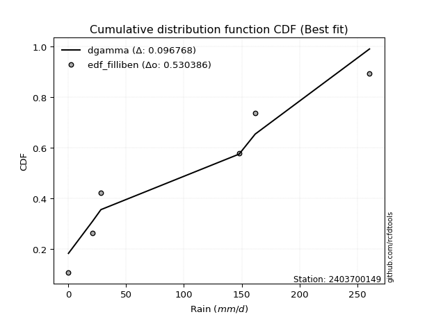</img></img>

</div>


### 10. EDF Jenkinson (1977)

The Jenkinson formula in hydrology is an empirical plotting position formula used to estimate the non-exceedance probability _(P)_ or return period _(T)_ of a given ordered observation within a sample. It is a widely used method in the frequency analysis of extreme events such as floods and rainfall, as it provides a distribution-free way to plot data. _a≈0.31_ and _b≈0.38_ are constants derived to approximate the median of the probability distribution for the given rank.

<div align="center">


$P=(m-a)/(n+b)$


</div>


**10.1. Empirical values**

<div align="center">

|                | 0                   | 1                   | 2                  | 3                  | 4                  | 5                  |
|:---------------|:--------------------|:--------------------|:-------------------|:-------------------|:-------------------|:-------------------|
| date           | 2020                | 2024                | 2025               | 2022               | 2023               | 2021               |
| x              | 0.1                 | 21.0                | 28.2               | 147.8              | 161.7              | 260.6              |
| m              | 1                   | 2                   | 3                  | 4                  | 5                  | 6                  |
| empirical_dist | edf_jenkinson       | edf_jenkinson       | edf_jenkinson      | edf_jenkinson      | edf_jenkinson      | edf_jenkinson      |
| empirical      | 0.10815047021943573 | 0.26489028213166144 | 0.4216300940438871 | 0.5783699059561128 | 0.7351097178683387 | 0.8918495297805643 |
| empirical_tr   | 1.1212653778558874  | 1.3603411513859276  | 1.7289972899728996 | 2.3717472118959106 | 3.7751479289940844 | 9.246376811594207  |

</div>


**10.2. Kolmogorov-Smirnov fit test (sorted by Δ)**


<div align="center">

|                | 0                   | 1                   | 2                  | 3                   | 4                   | 5                  | 6                   | 7                   | 8                   | 9                   | 10                  | 11                  | 12                  | 13               | 14                  | 15                  | 16                 | 17                  | 18                 | 19                  | 20                  | 21                 | 22                  | 23                  | 24                  | 25                 | 26                  | 27                  | 28                  | 29                  | 30                  | 31                  | 32                 | 33                  | 34                 | 35                  | 36                 | 37                  | 38                  | 39                  | 40                 | 41                  | 42                  | 43                  | 44                 | 45                 | 46                 | 47                  | 48                  | 49                  | 50                 | 51                  | 52                  | 53                 | 54                  | 55                  | 56                  | 57                  | 58                 | 59                 | 60                  | 61                  | 62                  | 63                 | 64                 | 65                  | 66                  | 67                  | 68                  | 69                 | 70                  | 71                 | 72                  | 73                 | 74                 | 75                  | 76                | 77                  | 78                  | 79                  | 80                  | 81                  | 82                  | 83                  | 84                 | 85                  | 86                  | 87                  | 88                  | 89                 | 90                 | 91                 | 92                  | 93                  | 94                | 95                 | 96                 | 97                  | 98                 | 99                 | 100                | 101                | 102                 | 103                 | 104                | 105                | 106                | 107                 | 108                 | 109                 | 110                | 111                 | 112                | 113                | 114                 | 115                 | 116                 | 117                | 118                | 119                | 120                | 121               | 122                 | 123                | 124                | 125                 | 126                 | 127                 | 128                | 129                | 130                | 131                | 132                | 133                | 134                 | 135                 | 136                 | 137                 | 138                 | 139                | 140                | 141                 | 142                | 143                | 144                | 145                | 146               | 147                | 148               | 149                | 150                | 151                | 152                | 153                | 154                | 155                | 156                | 157                | 158                | 159              |
|:---------------|:--------------------|:--------------------|:-------------------|:--------------------|:--------------------|:-------------------|:--------------------|:--------------------|:--------------------|:--------------------|:--------------------|:--------------------|:--------------------|:-----------------|:--------------------|:--------------------|:-------------------|:--------------------|:-------------------|:--------------------|:--------------------|:-------------------|:--------------------|:--------------------|:--------------------|:-------------------|:--------------------|:--------------------|:--------------------|:--------------------|:--------------------|:--------------------|:-------------------|:--------------------|:-------------------|:--------------------|:-------------------|:--------------------|:--------------------|:--------------------|:-------------------|:--------------------|:--------------------|:--------------------|:-------------------|:-------------------|:-------------------|:--------------------|:--------------------|:--------------------|:-------------------|:--------------------|:--------------------|:-------------------|:--------------------|:--------------------|:--------------------|:--------------------|:-------------------|:-------------------|:--------------------|:--------------------|:--------------------|:-------------------|:-------------------|:--------------------|:--------------------|:--------------------|:--------------------|:-------------------|:--------------------|:-------------------|:--------------------|:-------------------|:-------------------|:--------------------|:------------------|:--------------------|:--------------------|:--------------------|:--------------------|:--------------------|:--------------------|:--------------------|:-------------------|:--------------------|:--------------------|:--------------------|:--------------------|:-------------------|:-------------------|:-------------------|:--------------------|:--------------------|:------------------|:-------------------|:-------------------|:--------------------|:-------------------|:-------------------|:-------------------|:-------------------|:--------------------|:--------------------|:-------------------|:-------------------|:-------------------|:--------------------|:--------------------|:--------------------|:-------------------|:--------------------|:-------------------|:-------------------|:--------------------|:--------------------|:--------------------|:-------------------|:-------------------|:-------------------|:-------------------|:------------------|:--------------------|:-------------------|:-------------------|:--------------------|:--------------------|:--------------------|:-------------------|:-------------------|:-------------------|:-------------------|:-------------------|:-------------------|:--------------------|:--------------------|:--------------------|:--------------------|:--------------------|:-------------------|:-------------------|:--------------------|:-------------------|:-------------------|:-------------------|:-------------------|:------------------|:-------------------|:------------------|:-------------------|:-------------------|:-------------------|:-------------------|:-------------------|:-------------------|:-------------------|:-------------------|:-------------------|:-------------------|:-----------------|
| station        | 2403700149          | 2403700149          | 2403700149         | 2403700149          | 2403700149          | 2403700149         | 2403700149          | 2403700149          | 2403700149          | 2403700149          | 2403700149          | 2403700149          | 2403700149          | 2403700149       | 2403700149          | 2403700149          | 2403700149         | 2403700149          | 2403700149         | 2403700149          | 2403700149          | 2403700149         | 2403700149          | 2403700149          | 2403700149          | 2403700149         | 2403700149          | 2403700149          | 2403700149          | 2403700149          | 2403700149          | 2403700149          | 2403700149         | 2403700149          | 2403700149         | 2403700149          | 2403700149         | 2403700149          | 2403700149          | 2403700149          | 2403700149         | 2403700149          | 2403700149          | 2403700149          | 2403700149         | 2403700149         | 2403700149         | 2403700149          | 2403700149          | 2403700149          | 2403700149         | 2403700149          | 2403700149          | 2403700149         | 2403700149          | 2403700149          | 2403700149          | 2403700149          | 2403700149         | 2403700149         | 2403700149          | 2403700149          | 2403700149          | 2403700149         | 2403700149         | 2403700149          | 2403700149          | 2403700149          | 2403700149          | 2403700149         | 2403700149          | 2403700149         | 2403700149          | 2403700149         | 2403700149         | 2403700149          | 2403700149        | 2403700149          | 2403700149          | 2403700149          | 2403700149          | 2403700149          | 2403700149          | 2403700149          | 2403700149         | 2403700149          | 2403700149          | 2403700149          | 2403700149          | 2403700149         | 2403700149         | 2403700149         | 2403700149          | 2403700149          | 2403700149        | 2403700149         | 2403700149         | 2403700149          | 2403700149         | 2403700149         | 2403700149         | 2403700149         | 2403700149          | 2403700149          | 2403700149         | 2403700149         | 2403700149         | 2403700149          | 2403700149          | 2403700149          | 2403700149         | 2403700149          | 2403700149         | 2403700149         | 2403700149          | 2403700149          | 2403700149          | 2403700149         | 2403700149         | 2403700149         | 2403700149         | 2403700149        | 2403700149          | 2403700149         | 2403700149         | 2403700149          | 2403700149          | 2403700149          | 2403700149         | 2403700149         | 2403700149         | 2403700149         | 2403700149         | 2403700149         | 2403700149          | 2403700149          | 2403700149          | 2403700149          | 2403700149          | 2403700149         | 2403700149         | 2403700149          | 2403700149         | 2403700149         | 2403700149         | 2403700149         | 2403700149        | 2403700149         | 2403700149        | 2403700149         | 2403700149         | 2403700149         | 2403700149         | 2403700149         | 2403700149         | 2403700149         | 2403700149         | 2403700149         | 2403700149         | 2403700149       |
| empirical_dist | edf_jenkinson       | edf_jenkinson       | edf_jenkinson      | edf_jenkinson       | edf_jenkinson       | edf_jenkinson      | edf_jenkinson       | edf_jenkinson       | edf_jenkinson       | edf_jenkinson       | edf_jenkinson       | edf_jenkinson       | edf_jenkinson       | edf_jenkinson    | edf_jenkinson       | edf_jenkinson       | edf_jenkinson      | edf_jenkinson       | edf_jenkinson      | edf_jenkinson       | edf_jenkinson       | edf_jenkinson      | edf_jenkinson       | edf_jenkinson       | edf_jenkinson       | edf_jenkinson      | edf_jenkinson       | edf_jenkinson       | edf_jenkinson       | edf_jenkinson       | edf_jenkinson       | edf_jenkinson       | edf_jenkinson      | edf_jenkinson       | edf_jenkinson      | edf_jenkinson       | edf_jenkinson      | edf_jenkinson       | edf_jenkinson       | edf_jenkinson       | edf_jenkinson      | edf_jenkinson       | edf_jenkinson       | edf_jenkinson       | edf_jenkinson      | edf_jenkinson      | edf_jenkinson      | edf_jenkinson       | edf_jenkinson       | edf_jenkinson       | edf_jenkinson      | edf_jenkinson       | edf_jenkinson       | edf_jenkinson      | edf_jenkinson       | edf_jenkinson       | edf_jenkinson       | edf_jenkinson       | edf_jenkinson      | edf_jenkinson      | edf_jenkinson       | edf_jenkinson       | edf_jenkinson       | edf_jenkinson      | edf_jenkinson      | edf_jenkinson       | edf_jenkinson       | edf_jenkinson       | edf_jenkinson       | edf_jenkinson      | edf_jenkinson       | edf_jenkinson      | edf_jenkinson       | edf_jenkinson      | edf_jenkinson      | edf_jenkinson       | edf_jenkinson     | edf_jenkinson       | edf_jenkinson       | edf_jenkinson       | edf_jenkinson       | edf_jenkinson       | edf_jenkinson       | edf_jenkinson       | edf_jenkinson      | edf_jenkinson       | edf_jenkinson       | edf_jenkinson       | edf_jenkinson       | edf_jenkinson      | edf_jenkinson      | edf_jenkinson      | edf_jenkinson       | edf_jenkinson       | edf_jenkinson     | edf_jenkinson      | edf_jenkinson      | edf_jenkinson       | edf_jenkinson      | edf_jenkinson      | edf_jenkinson      | edf_jenkinson      | edf_jenkinson       | edf_jenkinson       | edf_jenkinson      | edf_jenkinson      | edf_jenkinson      | edf_jenkinson       | edf_jenkinson       | edf_jenkinson       | edf_jenkinson      | edf_jenkinson       | edf_jenkinson      | edf_jenkinson      | edf_jenkinson       | edf_jenkinson       | edf_jenkinson       | edf_jenkinson      | edf_jenkinson      | edf_jenkinson      | edf_jenkinson      | edf_jenkinson     | edf_jenkinson       | edf_jenkinson      | edf_jenkinson      | edf_jenkinson       | edf_jenkinson       | edf_jenkinson       | edf_jenkinson      | edf_jenkinson      | edf_jenkinson      | edf_jenkinson      | edf_jenkinson      | edf_jenkinson      | edf_jenkinson       | edf_jenkinson       | edf_jenkinson       | edf_jenkinson       | edf_jenkinson       | edf_jenkinson      | edf_jenkinson      | edf_jenkinson       | edf_jenkinson      | edf_jenkinson      | edf_jenkinson      | edf_jenkinson      | edf_jenkinson     | edf_jenkinson      | edf_jenkinson     | edf_jenkinson      | edf_jenkinson      | edf_jenkinson      | edf_jenkinson      | edf_jenkinson      | edf_jenkinson      | edf_jenkinson      | edf_jenkinson      | edf_jenkinson      | edf_jenkinson      | edf_jenkinson    |
| p_dist         | dgamma              | loggausshyper       | dweibull           | loglevy_l           | arcsine             | mielke             | loggenextreme       | logpearson3         | f                   | beta                | weibull_min         | logvonmises_line    | loggumbel_l         | ksone            | halfgennorm         | logt                | semicircular       | halfnorm            | logtrapezoid       | foldnorm            | kappa3              | anglit             | genexpon            | nakagami            | exponnorm           | rayleigh           | alpha               | maxwell             | genextreme          | loglogistic         | ncf                 | lognakagami         | wrapcauchy         | logfoldnorm         | halflogistic       | loghypsecant        | lognct             | logcrystalball      | lognorm             | logexponnorm        | logrice            | logloggamma         | genlogistic         | logargus            | pearson3           | loganglit          | exponpow           | burr                | logjohnsonsb        | betaprime           | logsemicircular    | kstwobign           | t                   | crystalball        | norm                | gumbel_r            | loggamma            | loggamma            | logweibull_max     | gompertz           | logarcsine          | invgauss            | lomax               | logdweibull        | logerlang          | logalpha            | gengamma            | loglaplace          | loglaplace          | loggenhalflogistic | moyal               | loginvgamma        | burr12              | loginvgauss        | truncweibull_min   | logistic            | cosine            | logmaxwell          | truncexpon          | gennorm             | rice                | truncnorm           | gumbel_l            | exponweib           | hypsecant          | lograyleigh         | loginvweibull       | logbeta             | laplace             | loggennorm         | skewnorm           | triang             | kappa4              | levy_l              | loggumbel_r       | logcosine          | logwrapcauchy      | loghalfnorm         | logkstwobign       | bradford           | loggenexpon        | logmoyal           | logskewnorm         | argus               | gausshyper         | logncf             | loghalflogistic    | logtriang           | tukeylambda         | logdgamma           | uniform            | logburr12           | vonmises_line      | genhalflogistic    | gamma               | invgamma            | erlang              | genpareto          | johnsonsb          | wald               | loglomax           | nct               | logtruncnorm        | johnsonsu          | logwald            | truncpareto         | logkappa3           | logburr             | logksone           | logexponweib       | loghalfgennorm     | logkappa4          | trapezoid          | fatiguelife        | logtruncweibull_min | loguniform          | logbradford         | logloglaplace       | logjohnsonsu        | invweibull         | logf               | powerlaw            | logtruncexpon      | logmielke          | logfatiguelife     | loggenpareto       | logweibull_min    | weibull_max        | loggengamma       | rdist              | logbetaprime       | logexponpow        | logtruncpareto     | logpowerlaw        | loggompertz        | logrdist           | logtukeylambda     | loggenlogistic     | logvonmises        | vonmises         |
| delta          | 0.09769115201809242 | 0.10815047022394697 | 0.1098916328181192 | 0.11114731937855205 | 0.11216302211668927 | 0.1186911105806816 | 0.12424775370365404 | 0.12425585121797911 | 0.12595625633337493 | 0.12764349861775154 | 0.12969928393090624 | 0.13402492513529618 | 0.14279244666133628 | 0.15166469622257 | 0.15244456176987942 | 0.15711282176617541 | 0.1683988589460625 | 0.17247368742869224 | 0.1759668379066851 | 0.17647728596764958 | 0.17740758184824035 | 0.1807490926903534 | 0.18313127490892953 | 0.18349282752338913 | 0.18490984532560595 | 0.1870194404045967 | 0.18984042525228828 | 0.19345494700604823 | 0.19353513031624658 | 0.19385035198693173 | 0.19440942128950264 | 0.19713716668473052 | 0.1978711657265716 | 0.19811142026765183 | 0.1983307692905704 | 0.19855657021134843 | 0.1985601318093299 | 0.19877762476887673 | 0.19877762900416246 | 0.19878263229393778 | 0.1987830598913503 | 0.19987950961696954 | 0.20054227590197096 | 0.20227583900923585 | 0.2024842377641688 | 0.2039556023290507 | 0.2042414960418939 | 0.20502748526678694 | 0.20520083253099514 | 0.20600565141332616 | 0.2060889619413484 | 0.20879879950501948 | 0.20886231406863975 | 0.2088648159214987 | 0.20886486209622318 | 0.21153182593084696 | 0.21191031786772885 | 0.21191031786772885 | 0.2123399155323128 | 0.2130852609102386 | 0.21456909735102614 | 0.21507357918776226 | 0.21530586077474478 | 0.2155350953231061 | 0.2171193677607407 | 0.21765756874288478 | 0.21895971612071385 | 0.21960063537270014 | 0.21960063537270014 | 0.2221658813097771 | 0.22245708996295005 | 0.2239453448438954 | 0.22728716450818032 | 0.2287147479862851 | 0.2292632392255784 | 0.23091186175288678 | 0.230986482369112 | 0.23290002983594443 | 0.23380302465926844 | 0.23510971786833867 | 0.23679175262954402 | 0.23850520613195497 | 0.23868291140140338 | 0.24108232240227168 | 0.2442818522218757 | 0.24459500400433942 | 0.24465154400363287 | 0.25691131890978897 | 0.25961762504839236 | 0.2603126122710807 | 0.2621473174451648 | 0.2657107863068675 | 0.26633786101067225 | 0.26683540132269196 | 0.267102437734676 | 0.2710741889666043 | 0.2762624018867066 | 0.27757567455545173 | 0.2831198997676271 | 0.2870343392032776 | 0.2924575739640818 | 0.2927690806756489 | 0.29308374759321865 | 0.29386353121120606 | 0.2950760267561898 | 0.2993719813087409 | 0.2998802134048516 | 0.30432177901129764 | 0.31037582815429526 | 0.31272303184340444 | 0.3137606122780522 | 0.31477481724423606 | 0.3156681695539847 | 0.3208458306297443 | 0.33797917464840976 | 0.33954267494069235 | 0.34073451808969535 | 0.3421664165811589 | 0.3443053832428885 | 0.3550319815213799 | 0.3574894896759697 | 0.359208471367203 | 0.35930541558769225 | 0.3626326284763094 | 0.3641950083651271 | 0.36651264880186096 | 0.37360357219765217 | 0.37482797599618134 | 0.3849527824123812 | 0.3862020827140952 | 0.3862469794700223 | 0.3870996170253076 | 0.3901681183060657 | 0.3913186653845858 | 0.39961484444822426 | 0.41492139532118977 | 0.42010914360902585 | 0.44280138278059833 | 0.45725259775957905 | 0.4588195637100565 | 0.4612300275080691 | 0.47467259085585367 | 0.4894832995508781 | 0.4984339193764996 | 0.5249331513736032 | 0.5440150689079241 | 0.556222903222497 | 0.6083634386787513 | 0.608819257071435 | 0.6221157450652097 | 0.6427700986886045 | 0.6619513617045407 | 0.6718661790199073 | 0.6763940426107975 | 0.7297856951754794 | 0.7351097178683386 | 0.7351097178683386 | 0.7351097178683387 | 1.1743049609191436 | 40.5599130016289 |
| deltao         | 0.530385761606      | 0.530385761606      | 0.530385761606     | 0.530385761606      | 0.530385761606      | 0.530385761606     | 0.530385761606      | 0.530385761606      | 0.530385761606      | 0.530385761606      | 0.530385761606      | 0.530385761606      | 0.530385761606      | 0.530385761606   | 0.530385761606      | 0.530385761606      | 0.530385761606     | 0.530385761606      | 0.530385761606     | 0.530385761606      | 0.530385761606      | 0.530385761606     | 0.530385761606      | 0.530385761606      | 0.530385761606      | 0.530385761606     | 0.530385761606      | 0.530385761606      | 0.530385761606      | 0.530385761606      | 0.530385761606      | 0.530385761606      | 0.530385761606     | 0.530385761606      | 0.530385761606     | 0.530385761606      | 0.530385761606     | 0.530385761606      | 0.530385761606      | 0.530385761606      | 0.530385761606     | 0.530385761606      | 0.530385761606      | 0.530385761606      | 0.530385761606     | 0.530385761606     | 0.530385761606     | 0.530385761606      | 0.530385761606      | 0.530385761606      | 0.530385761606     | 0.530385761606      | 0.530385761606      | 0.530385761606     | 0.530385761606      | 0.530385761606      | 0.530385761606      | 0.530385761606      | 0.530385761606     | 0.530385761606     | 0.530385761606      | 0.530385761606      | 0.530385761606      | 0.530385761606     | 0.530385761606     | 0.530385761606      | 0.530385761606      | 0.530385761606      | 0.530385761606      | 0.530385761606     | 0.530385761606      | 0.530385761606     | 0.530385761606      | 0.530385761606     | 0.530385761606     | 0.530385761606      | 0.530385761606    | 0.530385761606      | 0.530385761606      | 0.530385761606      | 0.530385761606      | 0.530385761606      | 0.530385761606      | 0.530385761606      | 0.530385761606     | 0.530385761606      | 0.530385761606      | 0.530385761606      | 0.530385761606      | 0.530385761606     | 0.530385761606     | 0.530385761606     | 0.530385761606      | 0.530385761606      | 0.530385761606    | 0.530385761606     | 0.530385761606     | 0.530385761606      | 0.530385761606     | 0.530385761606     | 0.530385761606     | 0.530385761606     | 0.530385761606      | 0.530385761606      | 0.530385761606     | 0.530385761606     | 0.530385761606     | 0.530385761606      | 0.530385761606      | 0.530385761606      | 0.530385761606     | 0.530385761606      | 0.530385761606     | 0.530385761606     | 0.530385761606      | 0.530385761606      | 0.530385761606      | 0.530385761606     | 0.530385761606     | 0.530385761606     | 0.530385761606     | 0.530385761606    | 0.530385761606      | 0.530385761606     | 0.530385761606     | 0.530385761606      | 0.530385761606      | 0.530385761606      | 0.530385761606     | 0.530385761606     | 0.530385761606     | 0.530385761606     | 0.530385761606     | 0.530385761606     | 0.530385761606      | 0.530385761606      | 0.530385761606      | 0.530385761606      | 0.530385761606      | 0.530385761606     | 0.530385761606     | 0.530385761606      | 0.530385761606     | 0.530385761606     | 0.530385761606     | 0.530385761606     | 0.530385761606    | 0.530385761606     | 0.530385761606    | 0.530385761606     | 0.530385761606     | 0.530385761606     | 0.530385761606     | 0.530385761606     | 0.530385761606     | 0.530385761606     | 0.530385761606     | 0.530385761606     | 0.530385761606     | 0.530385761606   |
| eval           | Δo > Δ              | Δo > Δ              | Δo > Δ             | Δo > Δ              | Δo > Δ              | Δo > Δ             | Δo > Δ              | Δo > Δ              | Δo > Δ              | Δo > Δ              | Δo > Δ              | Δo > Δ              | Δo > Δ              | Δo > Δ           | Δo > Δ              | Δo > Δ              | Δo > Δ             | Δo > Δ              | Δo > Δ             | Δo > Δ              | Δo > Δ              | Δo > Δ             | Δo > Δ              | Δo > Δ              | Δo > Δ              | Δo > Δ             | Δo > Δ              | Δo > Δ              | Δo > Δ              | Δo > Δ              | Δo > Δ              | Δo > Δ              | Δo > Δ             | Δo > Δ              | Δo > Δ             | Δo > Δ              | Δo > Δ             | Δo > Δ              | Δo > Δ              | Δo > Δ              | Δo > Δ             | Δo > Δ              | Δo > Δ              | Δo > Δ              | Δo > Δ             | Δo > Δ             | Δo > Δ             | Δo > Δ              | Δo > Δ              | Δo > Δ              | Δo > Δ             | Δo > Δ              | Δo > Δ              | Δo > Δ             | Δo > Δ              | Δo > Δ              | Δo > Δ              | Δo > Δ              | Δo > Δ             | Δo > Δ             | Δo > Δ              | Δo > Δ              | Δo > Δ              | Δo > Δ             | Δo > Δ             | Δo > Δ              | Δo > Δ              | Δo > Δ              | Δo > Δ              | Δo > Δ             | Δo > Δ              | Δo > Δ             | Δo > Δ              | Δo > Δ             | Δo > Δ             | Δo > Δ              | Δo > Δ            | Δo > Δ              | Δo > Δ              | Δo > Δ              | Δo > Δ              | Δo > Δ              | Δo > Δ              | Δo > Δ              | Δo > Δ             | Δo > Δ              | Δo > Δ              | Δo > Δ              | Δo > Δ              | Δo > Δ             | Δo > Δ             | Δo > Δ             | Δo > Δ              | Δo > Δ              | Δo > Δ            | Δo > Δ             | Δo > Δ             | Δo > Δ              | Δo > Δ             | Δo > Δ             | Δo > Δ             | Δo > Δ             | Δo > Δ              | Δo > Δ              | Δo > Δ             | Δo > Δ             | Δo > Δ             | Δo > Δ              | Δo > Δ              | Δo > Δ              | Δo > Δ             | Δo > Δ              | Δo > Δ             | Δo > Δ             | Δo > Δ              | Δo > Δ              | Δo > Δ              | Δo > Δ             | Δo > Δ             | Δo > Δ             | Δo > Δ             | Δo > Δ            | Δo > Δ              | Δo > Δ             | Δo > Δ             | Δo > Δ              | Δo > Δ              | Δo > Δ              | Δo > Δ             | Δo > Δ             | Δo > Δ             | Δo > Δ             | Δo > Δ             | Δo > Δ             | Δo > Δ              | Δo > Δ              | Δo > Δ              | Δo > Δ              | Δo > Δ              | Δo > Δ             | Δo > Δ             | Δo > Δ              | Δo > Δ             | Δo > Δ             | Δo > Δ             | Δo <= Δ            | Δo <= Δ           | Δo <= Δ            | Δo <= Δ           | Δo <= Δ            | Δo <= Δ            | Δo <= Δ            | Δo <= Δ            | Δo <= Δ            | Δo <= Δ            | Δo <= Δ            | Δo <= Δ            | Δo <= Δ            | Δo <= Δ            | Δo <= Δ          |
| fit            | 1                   | 1                   | 1                  | 1                   | 1                   | 1                  | 1                   | 1                   | 1                   | 1                   | 1                   | 1                   | 1                   | 1                | 1                   | 1                   | 1                  | 1                   | 1                  | 1                   | 1                   | 1                  | 1                   | 1                   | 1                   | 1                  | 1                   | 1                   | 1                   | 1                   | 1                   | 1                   | 1                  | 1                   | 1                  | 1                   | 1                  | 1                   | 1                   | 1                   | 1                  | 1                   | 1                   | 1                   | 1                  | 1                  | 1                  | 1                   | 1                   | 1                   | 1                  | 1                   | 1                   | 1                  | 1                   | 1                   | 1                   | 1                   | 1                  | 1                  | 1                   | 1                   | 1                   | 1                  | 1                  | 1                   | 1                   | 1                   | 1                   | 1                  | 1                   | 1                  | 1                   | 1                  | 1                  | 1                   | 1                 | 1                   | 1                   | 1                   | 1                   | 1                   | 1                   | 1                   | 1                  | 1                   | 1                   | 1                   | 1                   | 1                  | 1                  | 1                  | 1                   | 1                   | 1                 | 1                  | 1                  | 1                   | 1                  | 1                  | 1                  | 1                  | 1                   | 1                   | 1                  | 1                  | 1                  | 1                   | 1                   | 1                   | 1                  | 1                   | 1                  | 1                  | 1                   | 1                   | 1                   | 1                  | 1                  | 1                  | 1                  | 1                 | 1                   | 1                  | 1                  | 1                   | 1                   | 1                   | 1                  | 1                  | 1                  | 1                  | 1                  | 1                  | 1                   | 1                   | 1                   | 1                   | 1                   | 1                  | 1                  | 1                   | 1                  | 1                  | 1                  | 0                  | 0                 | 0                  | 0                 | 0                  | 0                  | 0                  | 0                  | 0                  | 0                  | 0                  | 0                  | 0                  | 0                  | 0                |
| n              | 6                   | 6                   | 6                  | 6                   | 6                   | 6                  | 6                   | 6                   | 6                   | 6                   | 6                   | 6                   | 6                   | 6                | 6                   | 6                   | 6                  | 6                   | 6                  | 6                   | 6                   | 6                  | 6                   | 6                   | 6                   | 6                  | 6                   | 6                   | 6                   | 6                   | 6                   | 6                   | 6                  | 6                   | 6                  | 6                   | 6                  | 6                   | 6                   | 6                   | 6                  | 6                   | 6                   | 6                   | 6                  | 6                  | 6                  | 6                   | 6                   | 6                   | 6                  | 6                   | 6                   | 6                  | 6                   | 6                   | 6                   | 6                   | 6                  | 6                  | 6                   | 6                   | 6                   | 6                  | 6                  | 6                   | 6                   | 6                   | 6                   | 6                  | 6                   | 6                  | 6                   | 6                  | 6                  | 6                   | 6                 | 6                   | 6                   | 6                   | 6                   | 6                   | 6                   | 6                   | 6                  | 6                   | 6                   | 6                   | 6                   | 6                  | 6                  | 6                  | 6                   | 6                   | 6                 | 6                  | 6                  | 6                   | 6                  | 6                  | 6                  | 6                  | 6                   | 6                   | 6                  | 6                  | 6                  | 6                   | 6                   | 6                   | 6                  | 6                   | 6                  | 6                  | 6                   | 6                   | 6                   | 6                  | 6                  | 6                  | 6                  | 6                 | 6                   | 6                  | 6                  | 6                   | 6                   | 6                   | 6                  | 6                  | 6                  | 6                  | 6                  | 6                  | 6                   | 6                   | 6                   | 6                   | 6                   | 6                  | 6                  | 6                   | 6                  | 6                  | 6                  | 6                  | 6                 | 6                  | 6                 | 6                  | 6                  | 6                  | 6                  | 6                  | 6                  | 6                  | 6                  | 6                  | 6                  | 6                |
| best_fit       | 1                   | 0                   | 0                  | 0                   | 0                   | 0                  | 0                   | 0                   | 0                   | 0                   | 0                   | 0                   | 0                   | 0                | 0                   | 0                   | 0                  | 0                   | 0                  | 0                   | 0                   | 0                  | 0                   | 0                   | 0                   | 0                  | 0                   | 0                   | 0                   | 0                   | 0                   | 0                   | 0                  | 0                   | 0                  | 0                   | 0                  | 0                   | 0                   | 0                   | 0                  | 0                   | 0                   | 0                   | 0                  | 0                  | 0                  | 0                   | 0                   | 0                   | 0                  | 0                   | 0                   | 0                  | 0                   | 0                   | 0                   | 0                   | 0                  | 0                  | 0                   | 0                   | 0                   | 0                  | 0                  | 0                   | 0                   | 0                   | 0                   | 0                  | 0                   | 0                  | 0                   | 0                  | 0                  | 0                   | 0                 | 0                   | 0                   | 0                   | 0                   | 0                   | 0                   | 0                   | 0                  | 0                   | 0                   | 0                   | 0                   | 0                  | 0                  | 0                  | 0                   | 0                   | 0                 | 0                  | 0                  | 0                   | 0                  | 0                  | 0                  | 0                  | 0                   | 0                   | 0                  | 0                  | 0                  | 0                   | 0                   | 0                   | 0                  | 0                   | 0                  | 0                  | 0                   | 0                   | 0                   | 0                  | 0                  | 0                  | 0                  | 0                 | 0                   | 0                  | 0                  | 0                   | 0                   | 0                   | 0                  | 0                  | 0                  | 0                  | 0                  | 0                  | 0                   | 0                   | 0                   | 0                   | 0                   | 0                  | 0                  | 0                   | 0                  | 0                  | 0                  | 0                  | 0                 | 0                  | 0                 | 0                  | 0                  | 0                  | 0                  | 0                  | 0                  | 0                  | 0                  | 0                  | 0                  | 0                |
| best_fit_sort  | 1                   | 2                   | 3                  | 4                   | 5                   | 6                  | 7                   | 8                   | 9                   | 10                  | 11                  | 12                  | 13                  | 14               | 15                  | 16                  | 17                 | 18                  | 19                 | 20                  | 21                  | 22                 | 23                  | 24                  | 25                  | 26                 | 27                  | 28                  | 29                  | 30                  | 31                  | 32                  | 33                 | 34                  | 35                 | 36                  | 37                 | 38                  | 39                  | 40                  | 41                 | 42                  | 43                  | 44                  | 45                 | 46                 | 47                 | 48                  | 49                  | 50                  | 51                 | 52                  | 53                  | 54                 | 55                  | 56                  | 57                  | 58                  | 59                 | 60                 | 61                  | 62                  | 63                  | 64                 | 65                 | 66                  | 67                  | 68                  | 69                  | 70                 | 71                  | 72                 | 73                  | 74                 | 75                 | 76                  | 77                | 78                  | 79                  | 80                  | 81                  | 82                  | 83                  | 84                  | 85                 | 86                  | 87                  | 88                  | 89                  | 90                 | 91                 | 92                 | 93                  | 94                  | 95                | 96                 | 97                 | 98                  | 99                 | 100                | 101                | 102                | 103                 | 104                 | 105                | 106                | 107                | 108                 | 109                 | 110                 | 111                | 112                 | 113                | 114                | 115                 | 116                 | 117                 | 118                | 119                | 120                | 121                | 122               | 123                 | 124                | 125                | 126                 | 127                 | 128                 | 129                | 130                | 131                | 132                | 133                | 134                | 135                 | 136                 | 137                 | 138                 | 139                 | 140                | 141                | 142                 | 143                | 144                | 145                | 146                | 147               | 148                | 149               | 150                | 151                | 152                | 153                | 154                | 155                | 156                | 157                | 158                | 159                | 160              |

</div>


**10.3. Best fit**

<div align="center">

|   id |    station | empirical_dist   | p_dist   |     delta |   deltao | eval   |   fit |   n |   best_fit |   best_fit_sort |
|-----:|-----------:|:-----------------|:---------|----------:|---------:|:-------|------:|----:|-----------:|----------------:|
|    0 | 2403700149 | edf_jenkinson    | dgamma   | 0.0976912 | 0.530386 | Δo > Δ |     1 |   6 |          1 |               1 |

</div>


<div align="center">

</img>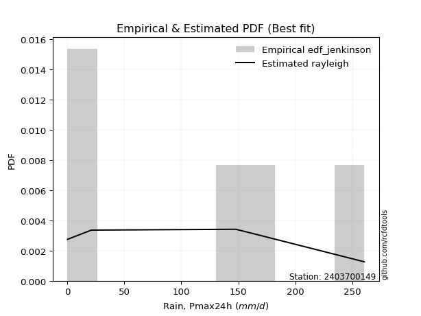</img>

</div>


### 11. EDF Cunnane (1978)

Cunnane´s work in statistical hydrology has focused on the performance and evaluation of different probability distributions (such as GEV, Gumbel, Lognormal) for flood frequency estimation. _b_ is a constant, typically set to 0.4.

<div align="center">


$P=(m-b)/(n+1-2b)$


</div>


**11.1. Empirical values**

<div align="center">

|                | 0                  | 1                   | 2                   | 3                  | 4                  | 5                  |
|:---------------|:-------------------|:--------------------|:--------------------|:-------------------|:-------------------|:-------------------|
| date           | 2020               | 2024                | 2025                | 2022               | 2023               | 2021               |
| x              | 0.1                | 21.0                | 28.2                | 147.8              | 161.7              | 260.6              |
| m              | 1                  | 2                   | 3                   | 4                  | 5                  | 6                  |
| empirical_dist | edf_cunnane        | edf_cunnane         | edf_cunnane         | edf_cunnane        | edf_cunnane        | edf_cunnane        |
| empirical      | 0.0967741935483871 | 0.25806451612903225 | 0.41935483870967744 | 0.5806451612903226 | 0.7419354838709676 | 0.9032258064516128 |
| empirical_tr   | 1.1071428571428572 | 1.3478260869565217  | 1.7222222222222225  | 2.384615384615385  | 3.8749999999999982 | 10.333333333333318 |

</div>


**11.2. Kolmogorov-Smirnov fit test (sorted by Δ)**


<div align="center">

|                | 0                   | 1                   | 2                   | 3                  | 4                   | 5                   | 6                   | 7                  | 8                   | 9                   | 10                  | 11                  | 12                  | 13                  | 14                  | 15                  | 16                 | 17                  | 18                 | 19                  | 20                  | 21                  | 22                  | 23                  | 24                 | 25                | 26                  | 27                  | 28                  | 29                  | 30                  | 31                 | 32                  | 33                  | 34                  | 35                  | 36                 | 37                  | 38                 | 39                  | 40                  | 41                 | 42                  | 43                 | 44                 | 45                  | 46                  | 47                 | 48                 | 49                  | 50                | 51                 | 52                  | 53                | 54                  | 55                 | 56                  | 57                 | 58                  | 59                 | 60                 | 61                  | 62                  | 63                  | 64                  | 65                  | 66                 | 67                  | 68                  | 69                  | 70                  | 71                 | 72                  | 73                  | 74                  | 75                  | 76                 | 77                  | 78                 | 79                  | 80                 | 81                  | 82                  | 83                  | 84                  | 85                 | 86                  | 87                 | 88                 | 89                 | 90                 | 91                  | 92                  | 93                 | 94                 | 95                 | 96                 | 97                 | 98                 | 99                  | 100                 | 101                | 102                 | 103                 | 104                 | 105                 | 106                | 107                 | 108                 | 109                 | 110                | 111               | 112                | 113                 | 114                 | 115                 | 116                 | 117                 | 118                | 119                 | 120                | 121                | 122                 | 123                | 124                 | 125                 | 126                 | 127                | 128               | 129                 | 130                | 131                | 132                 | 133               | 134                 | 135                 | 136                 | 137                | 138               | 139                 | 140                 | 141                 | 142                | 143                | 144                | 145                | 146                | 147                | 148                | 149                | 150                | 151                | 152                | 153                | 154                | 155                | 156                | 157                | 158                | 159               |
|:---------------|:--------------------|:--------------------|:--------------------|:-------------------|:--------------------|:--------------------|:--------------------|:-------------------|:--------------------|:--------------------|:--------------------|:--------------------|:--------------------|:--------------------|:--------------------|:--------------------|:-------------------|:--------------------|:-------------------|:--------------------|:--------------------|:--------------------|:--------------------|:--------------------|:-------------------|:------------------|:--------------------|:--------------------|:--------------------|:--------------------|:--------------------|:-------------------|:--------------------|:--------------------|:--------------------|:--------------------|:-------------------|:--------------------|:-------------------|:--------------------|:--------------------|:-------------------|:--------------------|:-------------------|:-------------------|:--------------------|:--------------------|:-------------------|:-------------------|:--------------------|:------------------|:-------------------|:--------------------|:------------------|:--------------------|:-------------------|:--------------------|:-------------------|:--------------------|:-------------------|:-------------------|:--------------------|:--------------------|:--------------------|:--------------------|:--------------------|:-------------------|:--------------------|:--------------------|:--------------------|:--------------------|:-------------------|:--------------------|:--------------------|:--------------------|:--------------------|:-------------------|:--------------------|:-------------------|:--------------------|:-------------------|:--------------------|:--------------------|:--------------------|:--------------------|:-------------------|:--------------------|:-------------------|:-------------------|:-------------------|:-------------------|:--------------------|:--------------------|:-------------------|:-------------------|:-------------------|:-------------------|:-------------------|:-------------------|:--------------------|:--------------------|:-------------------|:--------------------|:--------------------|:--------------------|:--------------------|:-------------------|:--------------------|:--------------------|:--------------------|:-------------------|:------------------|:-------------------|:--------------------|:--------------------|:--------------------|:--------------------|:--------------------|:-------------------|:--------------------|:-------------------|:-------------------|:--------------------|:-------------------|:--------------------|:--------------------|:--------------------|:-------------------|:------------------|:--------------------|:-------------------|:-------------------|:--------------------|:------------------|:--------------------|:--------------------|:--------------------|:-------------------|:------------------|:--------------------|:--------------------|:--------------------|:-------------------|:-------------------|:-------------------|:-------------------|:-------------------|:-------------------|:-------------------|:-------------------|:-------------------|:-------------------|:-------------------|:-------------------|:-------------------|:-------------------|:-------------------|:-------------------|:-------------------|:------------------|
| station        | 2403700149          | 2403700149          | 2403700149          | 2403700149         | 2403700149          | 2403700149          | 2403700149          | 2403700149         | 2403700149          | 2403700149          | 2403700149          | 2403700149          | 2403700149          | 2403700149          | 2403700149          | 2403700149          | 2403700149         | 2403700149          | 2403700149         | 2403700149          | 2403700149          | 2403700149          | 2403700149          | 2403700149          | 2403700149         | 2403700149        | 2403700149          | 2403700149          | 2403700149          | 2403700149          | 2403700149          | 2403700149         | 2403700149          | 2403700149          | 2403700149          | 2403700149          | 2403700149         | 2403700149          | 2403700149         | 2403700149          | 2403700149          | 2403700149         | 2403700149          | 2403700149         | 2403700149         | 2403700149          | 2403700149          | 2403700149         | 2403700149         | 2403700149          | 2403700149        | 2403700149         | 2403700149          | 2403700149        | 2403700149          | 2403700149         | 2403700149          | 2403700149         | 2403700149          | 2403700149         | 2403700149         | 2403700149          | 2403700149          | 2403700149          | 2403700149          | 2403700149          | 2403700149         | 2403700149          | 2403700149          | 2403700149          | 2403700149          | 2403700149         | 2403700149          | 2403700149          | 2403700149          | 2403700149          | 2403700149         | 2403700149          | 2403700149         | 2403700149          | 2403700149         | 2403700149          | 2403700149          | 2403700149          | 2403700149          | 2403700149         | 2403700149          | 2403700149         | 2403700149         | 2403700149         | 2403700149         | 2403700149          | 2403700149          | 2403700149         | 2403700149         | 2403700149         | 2403700149         | 2403700149         | 2403700149         | 2403700149          | 2403700149          | 2403700149         | 2403700149          | 2403700149          | 2403700149          | 2403700149          | 2403700149         | 2403700149          | 2403700149          | 2403700149          | 2403700149         | 2403700149        | 2403700149         | 2403700149          | 2403700149          | 2403700149          | 2403700149          | 2403700149          | 2403700149         | 2403700149          | 2403700149         | 2403700149         | 2403700149          | 2403700149         | 2403700149          | 2403700149          | 2403700149          | 2403700149         | 2403700149        | 2403700149          | 2403700149         | 2403700149         | 2403700149          | 2403700149        | 2403700149          | 2403700149          | 2403700149          | 2403700149         | 2403700149        | 2403700149          | 2403700149          | 2403700149          | 2403700149         | 2403700149         | 2403700149         | 2403700149         | 2403700149         | 2403700149         | 2403700149         | 2403700149         | 2403700149         | 2403700149         | 2403700149         | 2403700149         | 2403700149         | 2403700149         | 2403700149         | 2403700149         | 2403700149         | 2403700149        |
| empirical_dist | edf_cunnane         | edf_cunnane         | edf_cunnane         | edf_cunnane        | edf_cunnane         | edf_cunnane         | edf_cunnane         | edf_cunnane        | edf_cunnane         | edf_cunnane         | edf_cunnane         | edf_cunnane         | edf_cunnane         | edf_cunnane         | edf_cunnane         | edf_cunnane         | edf_cunnane        | edf_cunnane         | edf_cunnane        | edf_cunnane         | edf_cunnane         | edf_cunnane         | edf_cunnane         | edf_cunnane         | edf_cunnane        | edf_cunnane       | edf_cunnane         | edf_cunnane         | edf_cunnane         | edf_cunnane         | edf_cunnane         | edf_cunnane        | edf_cunnane         | edf_cunnane         | edf_cunnane         | edf_cunnane         | edf_cunnane        | edf_cunnane         | edf_cunnane        | edf_cunnane         | edf_cunnane         | edf_cunnane        | edf_cunnane         | edf_cunnane        | edf_cunnane        | edf_cunnane         | edf_cunnane         | edf_cunnane        | edf_cunnane        | edf_cunnane         | edf_cunnane       | edf_cunnane        | edf_cunnane         | edf_cunnane       | edf_cunnane         | edf_cunnane        | edf_cunnane         | edf_cunnane        | edf_cunnane         | edf_cunnane        | edf_cunnane        | edf_cunnane         | edf_cunnane         | edf_cunnane         | edf_cunnane         | edf_cunnane         | edf_cunnane        | edf_cunnane         | edf_cunnane         | edf_cunnane         | edf_cunnane         | edf_cunnane        | edf_cunnane         | edf_cunnane         | edf_cunnane         | edf_cunnane         | edf_cunnane        | edf_cunnane         | edf_cunnane        | edf_cunnane         | edf_cunnane        | edf_cunnane         | edf_cunnane         | edf_cunnane         | edf_cunnane         | edf_cunnane        | edf_cunnane         | edf_cunnane        | edf_cunnane        | edf_cunnane        | edf_cunnane        | edf_cunnane         | edf_cunnane         | edf_cunnane        | edf_cunnane        | edf_cunnane        | edf_cunnane        | edf_cunnane        | edf_cunnane        | edf_cunnane         | edf_cunnane         | edf_cunnane        | edf_cunnane         | edf_cunnane         | edf_cunnane         | edf_cunnane         | edf_cunnane        | edf_cunnane         | edf_cunnane         | edf_cunnane         | edf_cunnane        | edf_cunnane       | edf_cunnane        | edf_cunnane         | edf_cunnane         | edf_cunnane         | edf_cunnane         | edf_cunnane         | edf_cunnane        | edf_cunnane         | edf_cunnane        | edf_cunnane        | edf_cunnane         | edf_cunnane        | edf_cunnane         | edf_cunnane         | edf_cunnane         | edf_cunnane        | edf_cunnane       | edf_cunnane         | edf_cunnane        | edf_cunnane        | edf_cunnane         | edf_cunnane       | edf_cunnane         | edf_cunnane         | edf_cunnane         | edf_cunnane        | edf_cunnane       | edf_cunnane         | edf_cunnane         | edf_cunnane         | edf_cunnane        | edf_cunnane        | edf_cunnane        | edf_cunnane        | edf_cunnane        | edf_cunnane        | edf_cunnane        | edf_cunnane        | edf_cunnane        | edf_cunnane        | edf_cunnane        | edf_cunnane        | edf_cunnane        | edf_cunnane        | edf_cunnane        | edf_cunnane        | edf_cunnane        | edf_cunnane       |
| p_dist         | dgamma              | loggausshyper       | dweibull            | mielke             | loglevy_l           | arcsine             | loggenextreme       | logpearson3        | f                   | beta                | weibull_min         | logvonmises_line    | loggumbel_l         | ksone               | halfgennorm         | logt                | semicircular       | halfnorm            | foldnorm           | kappa3              | anglit              | genexpon            | nakagami            | exponnorm           | logtrapezoid       | rayleigh          | alpha               | maxwell             | genextreme          | ncf                 | logfoldnorm         | halflogistic       | loghypsecant        | logloggamma         | genlogistic         | logargus            | pearson3           | loglogistic         | exponpow           | burr                | betaprime           | lognakagami        | wrapcauchy          | lognct             | logcrystalball     | lognorm             | logexponnorm        | logrice            | kstwobign          | t                   | crystalball       | norm               | gumbel_r            | logweibull_max    | loganglit           | gompertz           | invgauss            | logsemicircular    | lomax               | logdweibull        | logjohnsonsb       | gengamma            | loglaplace          | loglaplace          | loggamma            | loggamma            | loggenhalflogistic | moyal               | logarcsine          | logerlang           | logalpha            | truncweibull_min   | logistic            | cosine              | loginvgamma         | truncexpon          | burr12             | rice                | loginvgauss        | truncnorm           | gumbel_l           | logmaxwell          | gennorm             | hypsecant           | exponweib           | lograyleigh        | loginvweibull       | laplace            | loggennorm         | skewnorm           | triang             | logbeta             | kappa4              | loggumbel_r        | logcosine          | levy_l             | logwrapcauchy      | loghalfnorm        | bradford           | logkstwobign        | logskewnorm         | argus              | gausshyper          | loggenexpon         | logmoyal            | logtriang           | loghalflogistic    | tukeylambda         | logdgamma           | logncf              | uniform            | vonmises_line     | genhalflogistic    | logburr12           | gamma               | erlang              | genpareto           | invgamma            | wald               | johnsonsb           | loglomax           | nct                | logtruncnorm        | johnsonsu          | logwald             | truncpareto         | logkappa3           | logburr            | trapezoid         | logksone            | loghalfgennorm     | logkappa4          | logexponweib        | fatiguelife       | logtruncweibull_min | loguniform          | logbradford         | logloglaplace      | logjohnsonsu      | logf                | invweibull          | powerlaw            | logtruncexpon      | logmielke          | logfatiguelife     | loggenpareto       | logweibull_min     | weibull_max        | loggengamma        | rdist              | logbetaprime       | logexponpow        | logtruncpareto     | logpowerlaw        | loggompertz        | loggenlogistic     | logtukeylambda     | logrdist           | logvonmises        | vonmises          |
| delta          | 0.08801861261017496 | 0.10581114881645348 | 0.11399757682862321 | 0.1164158552464718 | 0.11797308538118101 | 0.12123440301252869 | 0.12197249836944424 | 0.1219805958837693 | 0.12368100099916512 | 0.12536824328354185 | 0.12742402859669644 | 0.13174966980108638 | 0.14051719132712648 | 0.14938944088836031 | 0.15016930643566961 | 0.15483756643196572 | 0.1661236036118528 | 0.17019843209448254 | 0.1742020306334399 | 0.17513232651403055 | 0.17847383735614372 | 0.18085601957471983 | 0.18121757218917933 | 0.18263458999139615 | 0.1827926039093143 | 0.184744185070387 | 0.18756516991807848 | 0.19117969167183854 | 0.19125987498203678 | 0.19213416595529295 | 0.19583616493344203 | 0.1960555139563607 | 0.19649199657713667 | 0.19760425428275974 | 0.19826702056776127 | 0.20000058367502604 | 0.2002089824299591 | 0.20067611798956092 | 0.2019662407076842 | 0.20275222993257713 | 0.20373039607911636 | 0.2039629326873597 | 0.20469693172920056 | 0.2053858978119591 | 0.2056033907715059 | 0.20560339500679164 | 0.20560839829656696 | 0.2056088258939795 | 0.2065235441708098 | 0.20658705873443006 | 0.206589560587289 | 0.2065896067620135 | 0.20925657059663727 | 0.210064660198103 | 0.21078136833167987 | 0.2108100055760289 | 0.21279832385355246 | 0.2129147279439776 | 0.21303060544053498 | 0.2132598399888963 | 0.2165771092020438 | 0.21668446078650405 | 0.21732538003849033 | 0.21732538003849033 | 0.21873608387035803 | 0.21873608387035803 | 0.2198906259755673 | 0.22018183462874036 | 0.22139486335365532 | 0.22394513376336989 | 0.22448333474551396 | 0.2269879838913687 | 0.22863660641867709 | 0.22871122703490232 | 0.23077111084652457 | 0.23152776932505875 | 0.2341129305108095 | 0.23451649729533433 | 0.2355405139889143 | 0.23622995079774528 | 0.2364076560671937 | 0.23972579583857362 | 0.24193548387096775 | 0.24200659688766601 | 0.24790808840490086 | 0.2514207700069686 | 0.25147731000626206 | 0.2573423697141827 | 0.2580373569368709 | 0.2598720621109551 | 0.2634355309726578 | 0.26373708491241793 | 0.26406260567646256 | 0.2739282037373052 | 0.2778999549692335 | 0.2782116779937406 | 0.2830881678893358 | 0.2844014405580809 | 0.2847590838690679 | 0.28994566577025627 | 0.29080849225900884 | 0.2915882758769964 | 0.29280077142198013 | 0.29928333996671097 | 0.29959484667827807 | 0.30204652367708784 | 0.3067059794074808 | 0.30810057282008557 | 0.31044777650919464 | 0.31074825797978933 | 0.3114853569438425 | 0.313392914219775 | 0.3185705752955346 | 0.32160058324686525 | 0.33570391931419996 | 0.33845926275548555 | 0.33989116124694924 | 0.34636844094332153 | 0.3527567261871702 | 0.35568165991393697 | 0.3643152556785989 | 0.3660342373698322 | 0.36613118159032143 | 0.3694583944789386 | 0.37102077436775627 | 0.37333841480449015 | 0.38042933820028135 | 0.3816537419988105 | 0.387892862971856 | 0.39177854841501036 | 0.3930727454726515 | 0.3939253830279368 | 0.39757835938514363 | 0.398144431387215 | 0.40644061045085345 | 0.42174716132381895 | 0.42693490961165503 | 0.4496271487832275 | 0.464078363762208 | 0.46805579351069826 | 0.47019584038110496 | 0.48149835685848286 | 0.4963090655535073 | 0.5052596853791288 | 0.5317589173762324 | 0.5508408349105532 | 0.5630486692251262 | 0.6151892046813803 | 0.6201955337424836 | 0.6289415110678389 | 0.6495958646912336 | 0.6687771277071699 | 0.6786919450225365 | 0.6832198086134267 | 0.7366114611781086 | 0.7419354838709676 | 0.7419354838709677 | 0.7419354838709677 | 1.1720297055849338 | 40.54853672495785 |
| deltao         | 0.530385761606      | 0.530385761606      | 0.530385761606      | 0.530385761606     | 0.530385761606      | 0.530385761606      | 0.530385761606      | 0.530385761606     | 0.530385761606      | 0.530385761606      | 0.530385761606      | 0.530385761606      | 0.530385761606      | 0.530385761606      | 0.530385761606      | 0.530385761606      | 0.530385761606     | 0.530385761606      | 0.530385761606     | 0.530385761606      | 0.530385761606      | 0.530385761606      | 0.530385761606      | 0.530385761606      | 0.530385761606     | 0.530385761606    | 0.530385761606      | 0.530385761606      | 0.530385761606      | 0.530385761606      | 0.530385761606      | 0.530385761606     | 0.530385761606      | 0.530385761606      | 0.530385761606      | 0.530385761606      | 0.530385761606     | 0.530385761606      | 0.530385761606     | 0.530385761606      | 0.530385761606      | 0.530385761606     | 0.530385761606      | 0.530385761606     | 0.530385761606     | 0.530385761606      | 0.530385761606      | 0.530385761606     | 0.530385761606     | 0.530385761606      | 0.530385761606    | 0.530385761606     | 0.530385761606      | 0.530385761606    | 0.530385761606      | 0.530385761606     | 0.530385761606      | 0.530385761606     | 0.530385761606      | 0.530385761606     | 0.530385761606     | 0.530385761606      | 0.530385761606      | 0.530385761606      | 0.530385761606      | 0.530385761606      | 0.530385761606     | 0.530385761606      | 0.530385761606      | 0.530385761606      | 0.530385761606      | 0.530385761606     | 0.530385761606      | 0.530385761606      | 0.530385761606      | 0.530385761606      | 0.530385761606     | 0.530385761606      | 0.530385761606     | 0.530385761606      | 0.530385761606     | 0.530385761606      | 0.530385761606      | 0.530385761606      | 0.530385761606      | 0.530385761606     | 0.530385761606      | 0.530385761606     | 0.530385761606     | 0.530385761606     | 0.530385761606     | 0.530385761606      | 0.530385761606      | 0.530385761606     | 0.530385761606     | 0.530385761606     | 0.530385761606     | 0.530385761606     | 0.530385761606     | 0.530385761606      | 0.530385761606      | 0.530385761606     | 0.530385761606      | 0.530385761606      | 0.530385761606      | 0.530385761606      | 0.530385761606     | 0.530385761606      | 0.530385761606      | 0.530385761606      | 0.530385761606     | 0.530385761606    | 0.530385761606     | 0.530385761606      | 0.530385761606      | 0.530385761606      | 0.530385761606      | 0.530385761606      | 0.530385761606     | 0.530385761606      | 0.530385761606     | 0.530385761606     | 0.530385761606      | 0.530385761606     | 0.530385761606      | 0.530385761606      | 0.530385761606      | 0.530385761606     | 0.530385761606    | 0.530385761606      | 0.530385761606     | 0.530385761606     | 0.530385761606      | 0.530385761606    | 0.530385761606      | 0.530385761606      | 0.530385761606      | 0.530385761606     | 0.530385761606    | 0.530385761606      | 0.530385761606      | 0.530385761606      | 0.530385761606     | 0.530385761606     | 0.530385761606     | 0.530385761606     | 0.530385761606     | 0.530385761606     | 0.530385761606     | 0.530385761606     | 0.530385761606     | 0.530385761606     | 0.530385761606     | 0.530385761606     | 0.530385761606     | 0.530385761606     | 0.530385761606     | 0.530385761606     | 0.530385761606     | 0.530385761606    |
| eval           | Δo > Δ              | Δo > Δ              | Δo > Δ              | Δo > Δ             | Δo > Δ              | Δo > Δ              | Δo > Δ              | Δo > Δ             | Δo > Δ              | Δo > Δ              | Δo > Δ              | Δo > Δ              | Δo > Δ              | Δo > Δ              | Δo > Δ              | Δo > Δ              | Δo > Δ             | Δo > Δ              | Δo > Δ             | Δo > Δ              | Δo > Δ              | Δo > Δ              | Δo > Δ              | Δo > Δ              | Δo > Δ             | Δo > Δ            | Δo > Δ              | Δo > Δ              | Δo > Δ              | Δo > Δ              | Δo > Δ              | Δo > Δ             | Δo > Δ              | Δo > Δ              | Δo > Δ              | Δo > Δ              | Δo > Δ             | Δo > Δ              | Δo > Δ             | Δo > Δ              | Δo > Δ              | Δo > Δ             | Δo > Δ              | Δo > Δ             | Δo > Δ             | Δo > Δ              | Δo > Δ              | Δo > Δ             | Δo > Δ             | Δo > Δ              | Δo > Δ            | Δo > Δ             | Δo > Δ              | Δo > Δ            | Δo > Δ              | Δo > Δ             | Δo > Δ              | Δo > Δ             | Δo > Δ              | Δo > Δ             | Δo > Δ             | Δo > Δ              | Δo > Δ              | Δo > Δ              | Δo > Δ              | Δo > Δ              | Δo > Δ             | Δo > Δ              | Δo > Δ              | Δo > Δ              | Δo > Δ              | Δo > Δ             | Δo > Δ              | Δo > Δ              | Δo > Δ              | Δo > Δ              | Δo > Δ             | Δo > Δ              | Δo > Δ             | Δo > Δ              | Δo > Δ             | Δo > Δ              | Δo > Δ              | Δo > Δ              | Δo > Δ              | Δo > Δ             | Δo > Δ              | Δo > Δ             | Δo > Δ             | Δo > Δ             | Δo > Δ             | Δo > Δ              | Δo > Δ              | Δo > Δ             | Δo > Δ             | Δo > Δ             | Δo > Δ             | Δo > Δ             | Δo > Δ             | Δo > Δ              | Δo > Δ              | Δo > Δ             | Δo > Δ              | Δo > Δ              | Δo > Δ              | Δo > Δ              | Δo > Δ             | Δo > Δ              | Δo > Δ              | Δo > Δ              | Δo > Δ             | Δo > Δ            | Δo > Δ             | Δo > Δ              | Δo > Δ              | Δo > Δ              | Δo > Δ              | Δo > Δ              | Δo > Δ             | Δo > Δ              | Δo > Δ             | Δo > Δ             | Δo > Δ              | Δo > Δ             | Δo > Δ              | Δo > Δ              | Δo > Δ              | Δo > Δ             | Δo > Δ            | Δo > Δ              | Δo > Δ             | Δo > Δ             | Δo > Δ              | Δo > Δ            | Δo > Δ              | Δo > Δ              | Δo > Δ              | Δo > Δ             | Δo > Δ            | Δo > Δ              | Δo > Δ              | Δo > Δ              | Δo > Δ             | Δo > Δ             | Δo <= Δ            | Δo <= Δ            | Δo <= Δ            | Δo <= Δ            | Δo <= Δ            | Δo <= Δ            | Δo <= Δ            | Δo <= Δ            | Δo <= Δ            | Δo <= Δ            | Δo <= Δ            | Δo <= Δ            | Δo <= Δ            | Δo <= Δ            | Δo <= Δ            | Δo <= Δ           |
| fit            | 1                   | 1                   | 1                   | 1                  | 1                   | 1                   | 1                   | 1                  | 1                   | 1                   | 1                   | 1                   | 1                   | 1                   | 1                   | 1                   | 1                  | 1                   | 1                  | 1                   | 1                   | 1                   | 1                   | 1                   | 1                  | 1                 | 1                   | 1                   | 1                   | 1                   | 1                   | 1                  | 1                   | 1                   | 1                   | 1                   | 1                  | 1                   | 1                  | 1                   | 1                   | 1                  | 1                   | 1                  | 1                  | 1                   | 1                   | 1                  | 1                  | 1                   | 1                 | 1                  | 1                   | 1                 | 1                   | 1                  | 1                   | 1                  | 1                   | 1                  | 1                  | 1                   | 1                   | 1                   | 1                   | 1                   | 1                  | 1                   | 1                   | 1                   | 1                   | 1                  | 1                   | 1                   | 1                   | 1                   | 1                  | 1                   | 1                  | 1                   | 1                  | 1                   | 1                   | 1                   | 1                   | 1                  | 1                   | 1                  | 1                  | 1                  | 1                  | 1                   | 1                   | 1                  | 1                  | 1                  | 1                  | 1                  | 1                  | 1                   | 1                   | 1                  | 1                   | 1                   | 1                   | 1                   | 1                  | 1                   | 1                   | 1                   | 1                  | 1                 | 1                  | 1                   | 1                   | 1                   | 1                   | 1                   | 1                  | 1                   | 1                  | 1                  | 1                   | 1                  | 1                   | 1                   | 1                   | 1                  | 1                 | 1                   | 1                  | 1                  | 1                   | 1                 | 1                   | 1                   | 1                   | 1                  | 1                 | 1                   | 1                   | 1                   | 1                  | 1                  | 0                  | 0                  | 0                  | 0                  | 0                  | 0                  | 0                  | 0                  | 0                  | 0                  | 0                  | 0                  | 0                  | 0                  | 0                  | 0                 |
| n              | 6                   | 6                   | 6                   | 6                  | 6                   | 6                   | 6                   | 6                  | 6                   | 6                   | 6                   | 6                   | 6                   | 6                   | 6                   | 6                   | 6                  | 6                   | 6                  | 6                   | 6                   | 6                   | 6                   | 6                   | 6                  | 6                 | 6                   | 6                   | 6                   | 6                   | 6                   | 6                  | 6                   | 6                   | 6                   | 6                   | 6                  | 6                   | 6                  | 6                   | 6                   | 6                  | 6                   | 6                  | 6                  | 6                   | 6                   | 6                  | 6                  | 6                   | 6                 | 6                  | 6                   | 6                 | 6                   | 6                  | 6                   | 6                  | 6                   | 6                  | 6                  | 6                   | 6                   | 6                   | 6                   | 6                   | 6                  | 6                   | 6                   | 6                   | 6                   | 6                  | 6                   | 6                   | 6                   | 6                   | 6                  | 6                   | 6                  | 6                   | 6                  | 6                   | 6                   | 6                   | 6                   | 6                  | 6                   | 6                  | 6                  | 6                  | 6                  | 6                   | 6                   | 6                  | 6                  | 6                  | 6                  | 6                  | 6                  | 6                   | 6                   | 6                  | 6                   | 6                   | 6                   | 6                   | 6                  | 6                   | 6                   | 6                   | 6                  | 6                 | 6                  | 6                   | 6                   | 6                   | 6                   | 6                   | 6                  | 6                   | 6                  | 6                  | 6                   | 6                  | 6                   | 6                   | 6                   | 6                  | 6                 | 6                   | 6                  | 6                  | 6                   | 6                 | 6                   | 6                   | 6                   | 6                  | 6                 | 6                   | 6                   | 6                   | 6                  | 6                  | 6                  | 6                  | 6                  | 6                  | 6                  | 6                  | 6                  | 6                  | 6                  | 6                  | 6                  | 6                  | 6                  | 6                  | 6                  | 6                 |
| best_fit       | 1                   | 0                   | 0                   | 0                  | 0                   | 0                   | 0                   | 0                  | 0                   | 0                   | 0                   | 0                   | 0                   | 0                   | 0                   | 0                   | 0                  | 0                   | 0                  | 0                   | 0                   | 0                   | 0                   | 0                   | 0                  | 0                 | 0                   | 0                   | 0                   | 0                   | 0                   | 0                  | 0                   | 0                   | 0                   | 0                   | 0                  | 0                   | 0                  | 0                   | 0                   | 0                  | 0                   | 0                  | 0                  | 0                   | 0                   | 0                  | 0                  | 0                   | 0                 | 0                  | 0                   | 0                 | 0                   | 0                  | 0                   | 0                  | 0                   | 0                  | 0                  | 0                   | 0                   | 0                   | 0                   | 0                   | 0                  | 0                   | 0                   | 0                   | 0                   | 0                  | 0                   | 0                   | 0                   | 0                   | 0                  | 0                   | 0                  | 0                   | 0                  | 0                   | 0                   | 0                   | 0                   | 0                  | 0                   | 0                  | 0                  | 0                  | 0                  | 0                   | 0                   | 0                  | 0                  | 0                  | 0                  | 0                  | 0                  | 0                   | 0                   | 0                  | 0                   | 0                   | 0                   | 0                   | 0                  | 0                   | 0                   | 0                   | 0                  | 0                 | 0                  | 0                   | 0                   | 0                   | 0                   | 0                   | 0                  | 0                   | 0                  | 0                  | 0                   | 0                  | 0                   | 0                   | 0                   | 0                  | 0                 | 0                   | 0                  | 0                  | 0                   | 0                 | 0                   | 0                   | 0                   | 0                  | 0                 | 0                   | 0                   | 0                   | 0                  | 0                  | 0                  | 0                  | 0                  | 0                  | 0                  | 0                  | 0                  | 0                  | 0                  | 0                  | 0                  | 0                  | 0                  | 0                  | 0                  | 0                 |
| best_fit_sort  | 1                   | 2                   | 3                   | 4                  | 5                   | 6                   | 7                   | 8                  | 9                   | 10                  | 11                  | 12                  | 13                  | 14                  | 15                  | 16                  | 17                 | 18                  | 19                 | 20                  | 21                  | 22                  | 23                  | 24                  | 25                 | 26                | 27                  | 28                  | 29                  | 30                  | 31                  | 32                 | 33                  | 34                  | 35                  | 36                  | 37                 | 38                  | 39                 | 40                  | 41                  | 42                 | 43                  | 44                 | 45                 | 46                  | 47                  | 48                 | 49                 | 50                  | 51                | 52                 | 53                  | 54                | 55                  | 56                 | 57                  | 58                 | 59                  | 60                 | 61                 | 62                  | 63                  | 64                  | 65                  | 66                  | 67                 | 68                  | 69                  | 70                  | 71                  | 72                 | 73                  | 74                  | 75                  | 76                  | 77                 | 78                  | 79                 | 80                  | 81                 | 82                  | 83                  | 84                  | 85                  | 86                 | 87                  | 88                 | 89                 | 90                 | 91                 | 92                  | 93                  | 94                 | 95                 | 96                 | 97                 | 98                 | 99                 | 100                 | 101                 | 102                | 103                 | 104                 | 105                 | 106                 | 107                | 108                 | 109                 | 110                 | 111                | 112               | 113                | 114                 | 115                 | 116                 | 117                 | 118                 | 119                | 120                 | 121                | 122                | 123                 | 124                | 125                 | 126                 | 127                 | 128                | 129               | 130                 | 131                | 132                | 133                 | 134               | 135                 | 136                 | 137                 | 138                | 139               | 140                 | 141                 | 142                 | 143                | 144                | 145                | 146                | 147                | 148                | 149                | 150                | 151                | 152                | 153                | 154                | 155                | 156                | 157                | 158                | 159                | 160               |

</div>


**11.3. Best fit**

<div align="center">

|   id |    station | empirical_dist   | p_dist   |     delta |   deltao | eval   |   fit |   n |   best_fit |   best_fit_sort |
|-----:|-----------:|:-----------------|:---------|----------:|---------:|:-------|------:|----:|-----------:|----------------:|
|    0 | 2403700149 | edf_cunnane      | dgamma   | 0.0880186 | 0.530386 | Δo > Δ |     1 |   6 |          1 |               1 |

</div>


<div align="center">

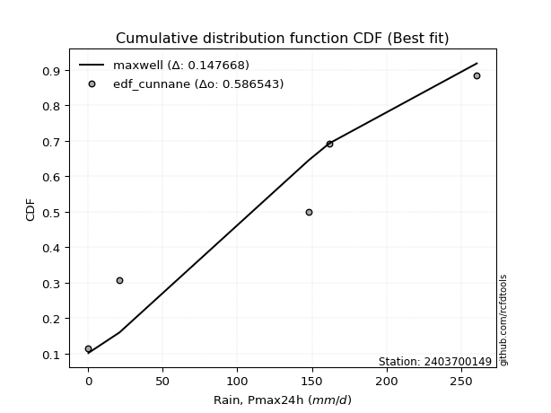</img></img>

</div>


### 12. EDF Adamowski (1981)

The Adamowski formula in hydrology refers to a specific plotting position formula used for estimating the non-parametric empirical distribution of hydrological events (like flood peaks) to calculate their return periods. This formula provides an alternative to traditional parametric methods (like the Gumbel or Log Pearson Type III distributions). 

<div align="center">


$P=(m-0.25)/(n+0.5)$


</div>


**12.1. Empirical values**

<div align="center">

|                | 0                   | 1                  | 2                  | 3                  | 4                  | 5                  |
|:---------------|:--------------------|:-------------------|:-------------------|:-------------------|:-------------------|:-------------------|
| date           | 2020                | 2024               | 2025               | 2022               | 2023               | 2021               |
| x              | 0.1                 | 21.0               | 28.2               | 147.8              | 161.7              | 260.6              |
| m              | 1                   | 2                  | 3                  | 4                  | 5                  | 6                  |
| empirical_dist | edf_adamowski       | edf_adamowski      | edf_adamowski      | edf_adamowski      | edf_adamowski      | edf_adamowski      |
| empirical      | 0.11538461538461539 | 0.2692307692307692 | 0.4230769230769231 | 0.5769230769230769 | 0.7307692307692307 | 0.8846153846153846 |
| empirical_tr   | 1.1304347826086958  | 1.3684210526315788 | 1.7333333333333334 | 2.3636363636363633 | 3.7142857142857135 | 8.666666666666664  |

</div>


**12.2. Kolmogorov-Smirnov fit test (sorted by Δ)**


<div align="center">

|                | 0                   | 1                  | 2                   | 3                   | 4                  | 5                   | 6                   | 7                   | 8                   | 9                   | 10                  | 11                  | 12                  | 13                  | 14                  | 15                  | 16                  | 17                  | 18                  | 19                  | 20                 | 21                  | 22                  | 23                  | 24                 | 25                  | 26                  | 27                  | 28                  | 29                  | 30                  | 31                  | 32                  | 33               | 34                  | 35                  | 36                  | 37                 | 38                 | 39                  | 40                 | 41                  | 42                  | 43                 | 44                  | 45                 | 46                 | 47                  | 48                  | 49                  | 50                 | 51                  | 52                  | 53                  | 54                  | 55                 | 56                  | 57                  | 58                  | 59                 | 60                | 61                  | 62                  | 63                 | 64                  | 65                  | 66                 | 67                 | 68                  | 69                  | 70                  | 71                  | 72                | 73                  | 74                  | 75                  | 76                  | 77                  | 78                  | 79                 | 80                 | 81                  | 82                  | 83                  | 84                  | 85                 | 86                  | 87                | 88                 | 89                 | 90                  | 91                  | 92                  | 93                 | 94                  | 95                 | 96                 | 97                  | 98                 | 99                | 100                | 101                 | 102                 | 103                | 104               | 105                | 106                 | 107                | 108                | 109                | 110                | 111                 | 112                 | 113                 | 114                 | 115                | 116                | 117                | 118                | 119                 | 120                 | 121                 | 122                | 123                | 124                | 125                | 126                | 127                 | 128                 | 129                | 130                | 131                | 132                 | 133                | 134                 | 135               | 136                 | 137                 | 138                 | 139                | 140                | 141                | 142                | 143                 | 144                | 145                | 146                | 147                | 148                | 149               | 150                | 151               | 152                | 153                | 154                | 155                | 156                | 157                | 158                | 159               |
|:---------------|:--------------------|:-------------------|:--------------------|:--------------------|:-------------------|:--------------------|:--------------------|:--------------------|:--------------------|:--------------------|:--------------------|:--------------------|:--------------------|:--------------------|:--------------------|:--------------------|:--------------------|:--------------------|:--------------------|:--------------------|:-------------------|:--------------------|:--------------------|:--------------------|:-------------------|:--------------------|:--------------------|:--------------------|:--------------------|:--------------------|:--------------------|:--------------------|:--------------------|:-----------------|:--------------------|:--------------------|:--------------------|:-------------------|:-------------------|:--------------------|:-------------------|:--------------------|:--------------------|:-------------------|:--------------------|:-------------------|:-------------------|:--------------------|:--------------------|:--------------------|:-------------------|:--------------------|:--------------------|:--------------------|:--------------------|:-------------------|:--------------------|:--------------------|:--------------------|:-------------------|:------------------|:--------------------|:--------------------|:-------------------|:--------------------|:--------------------|:-------------------|:-------------------|:--------------------|:--------------------|:--------------------|:--------------------|:------------------|:--------------------|:--------------------|:--------------------|:--------------------|:--------------------|:--------------------|:-------------------|:-------------------|:--------------------|:--------------------|:--------------------|:--------------------|:-------------------|:--------------------|:------------------|:-------------------|:-------------------|:--------------------|:--------------------|:--------------------|:-------------------|:--------------------|:-------------------|:-------------------|:--------------------|:-------------------|:------------------|:-------------------|:--------------------|:--------------------|:-------------------|:------------------|:-------------------|:--------------------|:-------------------|:-------------------|:-------------------|:-------------------|:--------------------|:--------------------|:--------------------|:--------------------|:-------------------|:-------------------|:-------------------|:-------------------|:--------------------|:--------------------|:--------------------|:-------------------|:-------------------|:-------------------|:-------------------|:-------------------|:--------------------|:--------------------|:-------------------|:-------------------|:-------------------|:--------------------|:-------------------|:--------------------|:------------------|:--------------------|:--------------------|:--------------------|:-------------------|:-------------------|:-------------------|:-------------------|:--------------------|:-------------------|:-------------------|:-------------------|:-------------------|:-------------------|:------------------|:-------------------|:------------------|:-------------------|:-------------------|:-------------------|:-------------------|:-------------------|:-------------------|:-------------------|:------------------|
| station        | 2403700149          | 2403700149         | 2403700149          | 2403700149          | 2403700149         | 2403700149          | 2403700149          | 2403700149          | 2403700149          | 2403700149          | 2403700149          | 2403700149          | 2403700149          | 2403700149          | 2403700149          | 2403700149          | 2403700149          | 2403700149          | 2403700149          | 2403700149          | 2403700149         | 2403700149          | 2403700149          | 2403700149          | 2403700149         | 2403700149          | 2403700149          | 2403700149          | 2403700149          | 2403700149          | 2403700149          | 2403700149          | 2403700149          | 2403700149       | 2403700149          | 2403700149          | 2403700149          | 2403700149         | 2403700149         | 2403700149          | 2403700149         | 2403700149          | 2403700149          | 2403700149         | 2403700149          | 2403700149         | 2403700149         | 2403700149          | 2403700149          | 2403700149          | 2403700149         | 2403700149          | 2403700149          | 2403700149          | 2403700149          | 2403700149         | 2403700149          | 2403700149          | 2403700149          | 2403700149         | 2403700149        | 2403700149          | 2403700149          | 2403700149         | 2403700149          | 2403700149          | 2403700149         | 2403700149         | 2403700149          | 2403700149          | 2403700149          | 2403700149          | 2403700149        | 2403700149          | 2403700149          | 2403700149          | 2403700149          | 2403700149          | 2403700149          | 2403700149         | 2403700149         | 2403700149          | 2403700149          | 2403700149          | 2403700149          | 2403700149         | 2403700149          | 2403700149        | 2403700149         | 2403700149         | 2403700149          | 2403700149          | 2403700149          | 2403700149         | 2403700149          | 2403700149         | 2403700149         | 2403700149          | 2403700149         | 2403700149        | 2403700149         | 2403700149          | 2403700149          | 2403700149         | 2403700149        | 2403700149         | 2403700149          | 2403700149         | 2403700149         | 2403700149         | 2403700149         | 2403700149          | 2403700149          | 2403700149          | 2403700149          | 2403700149         | 2403700149         | 2403700149         | 2403700149         | 2403700149          | 2403700149          | 2403700149          | 2403700149         | 2403700149         | 2403700149         | 2403700149         | 2403700149         | 2403700149          | 2403700149          | 2403700149         | 2403700149         | 2403700149         | 2403700149          | 2403700149         | 2403700149          | 2403700149        | 2403700149          | 2403700149          | 2403700149          | 2403700149         | 2403700149         | 2403700149         | 2403700149         | 2403700149          | 2403700149         | 2403700149         | 2403700149         | 2403700149         | 2403700149         | 2403700149        | 2403700149         | 2403700149        | 2403700149         | 2403700149         | 2403700149         | 2403700149         | 2403700149         | 2403700149         | 2403700149         | 2403700149        |
| empirical_dist | edf_adamowski       | edf_adamowski      | edf_adamowski       | edf_adamowski       | edf_adamowski      | edf_adamowski       | edf_adamowski       | edf_adamowski       | edf_adamowski       | edf_adamowski       | edf_adamowski       | edf_adamowski       | edf_adamowski       | edf_adamowski       | edf_adamowski       | edf_adamowski       | edf_adamowski       | edf_adamowski       | edf_adamowski       | edf_adamowski       | edf_adamowski      | edf_adamowski       | edf_adamowski       | edf_adamowski       | edf_adamowski      | edf_adamowski       | edf_adamowski       | edf_adamowski       | edf_adamowski       | edf_adamowski       | edf_adamowski       | edf_adamowski       | edf_adamowski       | edf_adamowski    | edf_adamowski       | edf_adamowski       | edf_adamowski       | edf_adamowski      | edf_adamowski      | edf_adamowski       | edf_adamowski      | edf_adamowski       | edf_adamowski       | edf_adamowski      | edf_adamowski       | edf_adamowski      | edf_adamowski      | edf_adamowski       | edf_adamowski       | edf_adamowski       | edf_adamowski      | edf_adamowski       | edf_adamowski       | edf_adamowski       | edf_adamowski       | edf_adamowski      | edf_adamowski       | edf_adamowski       | edf_adamowski       | edf_adamowski      | edf_adamowski     | edf_adamowski       | edf_adamowski       | edf_adamowski      | edf_adamowski       | edf_adamowski       | edf_adamowski      | edf_adamowski      | edf_adamowski       | edf_adamowski       | edf_adamowski       | edf_adamowski       | edf_adamowski     | edf_adamowski       | edf_adamowski       | edf_adamowski       | edf_adamowski       | edf_adamowski       | edf_adamowski       | edf_adamowski      | edf_adamowski      | edf_adamowski       | edf_adamowski       | edf_adamowski       | edf_adamowski       | edf_adamowski      | edf_adamowski       | edf_adamowski     | edf_adamowski      | edf_adamowski      | edf_adamowski       | edf_adamowski       | edf_adamowski       | edf_adamowski      | edf_adamowski       | edf_adamowski      | edf_adamowski      | edf_adamowski       | edf_adamowski      | edf_adamowski     | edf_adamowski      | edf_adamowski       | edf_adamowski       | edf_adamowski      | edf_adamowski     | edf_adamowski      | edf_adamowski       | edf_adamowski      | edf_adamowski      | edf_adamowski      | edf_adamowski      | edf_adamowski       | edf_adamowski       | edf_adamowski       | edf_adamowski       | edf_adamowski      | edf_adamowski      | edf_adamowski      | edf_adamowski      | edf_adamowski       | edf_adamowski       | edf_adamowski       | edf_adamowski      | edf_adamowski      | edf_adamowski      | edf_adamowski      | edf_adamowski      | edf_adamowski       | edf_adamowski       | edf_adamowski      | edf_adamowski      | edf_adamowski      | edf_adamowski       | edf_adamowski      | edf_adamowski       | edf_adamowski     | edf_adamowski       | edf_adamowski       | edf_adamowski       | edf_adamowski      | edf_adamowski      | edf_adamowski      | edf_adamowski      | edf_adamowski       | edf_adamowski      | edf_adamowski      | edf_adamowski      | edf_adamowski      | edf_adamowski      | edf_adamowski     | edf_adamowski      | edf_adamowski     | edf_adamowski      | edf_adamowski      | edf_adamowski      | edf_adamowski      | edf_adamowski      | edf_adamowski      | edf_adamowski      | edf_adamowski     |
| p_dist         | dgamma              | loglevy_l          | dweibull            | arcsine             | loggausshyper      | mielke              | loggenextreme       | logpearson3         | f                   | beta                | weibull_min         | logvonmises_line    | loggumbel_l         | ksone               | halfgennorm         | logt                | semicircular        | logtrapezoid        | halfnorm            | foldnorm            | kappa3             | anglit              | genexpon            | nakagami            | exponnorm          | rayleigh            | loglogistic         | alpha               | lognakagami         | wrapcauchy          | lognct              | logcrystalball      | lognorm             | logexponnorm     | logrice             | maxwell             | genextreme          | ncf                | logjohnsonsb       | logfoldnorm         | loganglit          | halflogistic        | loghypsecant        | logloggamma        | logsemicircular     | genlogistic        | logargus           | pearson3            | exponpow            | burr                | betaprime          | loggamma            | loggamma            | logarcsine          | kstwobign           | t                  | crystalball         | norm                | logerlang           | gumbel_r           | logalpha          | logweibull_max      | gompertz            | invgauss           | lomax               | logdweibull         | loginvgamma        | gengamma           | loglaplace          | loglaplace          | burr12              | loggenhalflogistic  | moyal             | loginvgauss         | logmaxwell          | truncweibull_min    | gennorm             | logistic            | cosine              | truncexpon         | exponweib          | rice                | truncnorm           | gumbel_l            | lograyleigh         | loginvweibull      | hypsecant           | logbeta           | levy_l             | laplace            | loggennorm          | loggumbel_r         | skewnorm            | logcosine          | triang              | kappa4             | logwrapcauchy      | loghalfnorm         | logkstwobign       | loggenexpon       | logmoyal           | bradford            | logncf              | logskewnorm        | argus             | loghalflogistic    | gausshyper          | logtriang          | logburr12          | tukeylambda        | logdgamma          | uniform             | vonmises_line       | genhalflogistic     | invgamma            | johnsonsb          | gamma              | erlang             | genpareto          | loglomax            | nct                 | logtruncnorm        | wald               | johnsonsu          | logwald            | truncpareto        | logkappa3          | logburr             | logexponweib        | logksone           | loghalfgennorm     | logkappa4          | fatiguelife         | trapezoid          | logtruncweibull_min | loguniform        | logbradford         | logloglaplace       | invweibull          | logjohnsonsu       | logf               | powerlaw           | logtruncexpon      | logmielke           | logfatiguelife     | loggenpareto       | logweibull_min     | loggengamma        | weibull_max        | rdist             | logbetaprime       | logexponpow       | logtruncpareto     | logpowerlaw        | loggompertz        | loggenlogistic     | logtukeylambda     | logrdist           | logvonmises        | vonmises          |
| delta          | 0.10492529718327215 | 0.1068068322794441 | 0.11133846185115515 | 0.11538461538461542 | 0.1153846153891267 | 0.12013793961371755 | 0.12569458273668999 | 0.12570268025101505 | 0.12740308536641087 | 0.12909032765078748 | 0.13114611296394219 | 0.13547175416833213 | 0.14423927569437223 | 0.15311152525560595 | 0.15389139080291536 | 0.15855965079921136 | 0.16984568797909844 | 0.17162635080757732 | 0.17392051646172818 | 0.17792411500068553 | 0.1788544108812763 | 0.18219592172338936 | 0.18457810394196547 | 0.18493965655642508 | 0.1863566743586419 | 0.18846626943763264 | 0.18950986488782395 | 0.19128725428532423 | 0.19279667958562274 | 0.19353067862746365 | 0.19421964471022213 | 0.19443713766976894 | 0.19443714190505468 | 0.19444214519483 | 0.19444257279224253 | 0.19490177603908418 | 0.19498195934928253 | 0.1958562503225386 | 0.1979666873658155 | 0.19955824930068777 | 0.1996151152299429 | 0.19977759832360634 | 0.20000339924438437 | 0.2013263386500055 | 0.20174847484224062 | 0.2019891049350069 | 0.2037226680422718 | 0.20393106679720474 | 0.20568832507492985 | 0.20647431429982288 | 0.2074524804463621 | 0.20756983076862107 | 0.20756983076862107 | 0.21022861025191836 | 0.21024562853805542 | 0.2103091431016757 | 0.21031164495453464 | 0.21031169112925913 | 0.21277888066163292 | 0.2129786549638829 | 0.213317081643777 | 0.21378674456534874 | 0.21453208994327455 | 0.2165204082207982 | 0.21675268980778073 | 0.21698192435614205 | 0.2196048577447876 | 0.2204065451537498 | 0.22104746440573608 | 0.22104746440573608 | 0.22294667740907254 | 0.22361271034281305 | 0.223903918995986 | 0.22437426088717732 | 0.22855954273683665 | 0.23071006825861434 | 0.23076923076923078 | 0.23235869078592272 | 0.23243331140214796 | 0.2352498536923044 | 0.2367418353031639 | 0.23823858166257997 | 0.23995203516499092 | 0.24012974043443933 | 0.24025451690523164 | 0.2403110569045251 | 0.24572868125491165 | 0.252570831810681 | 0.2596012561575123 | 0.2610644540814283 | 0.26175944130411666 | 0.26276195063556823 | 0.26359414647820073 | 0.2667337018674965 | 0.26715761533990345 | 0.2677846900437082 | 0.2719219147875988 | 0.27323518745634395 | 0.2787794126685193 | 0.288117086864974 | 0.2884285935765411 | 0.28848116823631353 | 0.29213783614356115 | 0.2945305766262546 | 0.295310360244242 | 0.2955397263057438 | 0.29652285578922577 | 0.3057686080443336 | 0.3104343301451283 | 0.3118226571873312 | 0.3141698608764404 | 0.31520744131108813 | 0.31711499858702064 | 0.32229265966278026 | 0.33520218784158456 | 0.3370712380777088 | 0.3394260036814457 | 0.3421813471227313 | 0.3436132456141949 | 0.35314900257686194 | 0.35486798426809524 | 0.35496492848858446 | 0.3564788105544158 | 0.3582921413772016 | 0.3598545212660193 | 0.3621721617027532 | 0.3692630850985444 | 0.37048748889707356 | 0.37896793754891545 | 0.3806122953132734 | 0.3819064923709145 | 0.3827591299261998 | 0.38697817828547804 | 0.3916149473391016 | 0.3952743573491165  | 0.410580908222082 | 0.41576865650991807 | 0.43846089568149055 | 0.45158541854487677 | 0.4529121106604711 | 0.4568895404089613 | 0.4703321037567459 | 0.4851428124517703 | 0.49409343227739183 | 0.5205926642744954 | 0.5396745818088162 | 0.5518824161233893 | 0.6015851119062554 | 0.6040229515796434 | 0.617775257966102 | 0.6384296115894967 | 0.657610874605433 | 0.6675256919207995 | 0.6720535555116898 | 0.7254452080763716 | 0.7307692307692307 | 0.7307692307692308 | 0.7307692307692308 | 1.1757517899521797 | 40.56714714679408 |
| deltao         | 0.530385761606      | 0.530385761606     | 0.530385761606      | 0.530385761606      | 0.530385761606     | 0.530385761606      | 0.530385761606      | 0.530385761606      | 0.530385761606      | 0.530385761606      | 0.530385761606      | 0.530385761606      | 0.530385761606      | 0.530385761606      | 0.530385761606      | 0.530385761606      | 0.530385761606      | 0.530385761606      | 0.530385761606      | 0.530385761606      | 0.530385761606     | 0.530385761606      | 0.530385761606      | 0.530385761606      | 0.530385761606     | 0.530385761606      | 0.530385761606      | 0.530385761606      | 0.530385761606      | 0.530385761606      | 0.530385761606      | 0.530385761606      | 0.530385761606      | 0.530385761606   | 0.530385761606      | 0.530385761606      | 0.530385761606      | 0.530385761606     | 0.530385761606     | 0.530385761606      | 0.530385761606     | 0.530385761606      | 0.530385761606      | 0.530385761606     | 0.530385761606      | 0.530385761606     | 0.530385761606     | 0.530385761606      | 0.530385761606      | 0.530385761606      | 0.530385761606     | 0.530385761606      | 0.530385761606      | 0.530385761606      | 0.530385761606      | 0.530385761606     | 0.530385761606      | 0.530385761606      | 0.530385761606      | 0.530385761606     | 0.530385761606    | 0.530385761606      | 0.530385761606      | 0.530385761606     | 0.530385761606      | 0.530385761606      | 0.530385761606     | 0.530385761606     | 0.530385761606      | 0.530385761606      | 0.530385761606      | 0.530385761606      | 0.530385761606    | 0.530385761606      | 0.530385761606      | 0.530385761606      | 0.530385761606      | 0.530385761606      | 0.530385761606      | 0.530385761606     | 0.530385761606     | 0.530385761606      | 0.530385761606      | 0.530385761606      | 0.530385761606      | 0.530385761606     | 0.530385761606      | 0.530385761606    | 0.530385761606     | 0.530385761606     | 0.530385761606      | 0.530385761606      | 0.530385761606      | 0.530385761606     | 0.530385761606      | 0.530385761606     | 0.530385761606     | 0.530385761606      | 0.530385761606     | 0.530385761606    | 0.530385761606     | 0.530385761606      | 0.530385761606      | 0.530385761606     | 0.530385761606    | 0.530385761606     | 0.530385761606      | 0.530385761606     | 0.530385761606     | 0.530385761606     | 0.530385761606     | 0.530385761606      | 0.530385761606      | 0.530385761606      | 0.530385761606      | 0.530385761606     | 0.530385761606     | 0.530385761606     | 0.530385761606     | 0.530385761606      | 0.530385761606      | 0.530385761606      | 0.530385761606     | 0.530385761606     | 0.530385761606     | 0.530385761606     | 0.530385761606     | 0.530385761606      | 0.530385761606      | 0.530385761606     | 0.530385761606     | 0.530385761606     | 0.530385761606      | 0.530385761606     | 0.530385761606      | 0.530385761606    | 0.530385761606      | 0.530385761606      | 0.530385761606      | 0.530385761606     | 0.530385761606     | 0.530385761606     | 0.530385761606     | 0.530385761606      | 0.530385761606     | 0.530385761606     | 0.530385761606     | 0.530385761606     | 0.530385761606     | 0.530385761606    | 0.530385761606     | 0.530385761606    | 0.530385761606     | 0.530385761606     | 0.530385761606     | 0.530385761606     | 0.530385761606     | 0.530385761606     | 0.530385761606     | 0.530385761606    |
| eval           | Δo > Δ              | Δo > Δ             | Δo > Δ              | Δo > Δ              | Δo > Δ             | Δo > Δ              | Δo > Δ              | Δo > Δ              | Δo > Δ              | Δo > Δ              | Δo > Δ              | Δo > Δ              | Δo > Δ              | Δo > Δ              | Δo > Δ              | Δo > Δ              | Δo > Δ              | Δo > Δ              | Δo > Δ              | Δo > Δ              | Δo > Δ             | Δo > Δ              | Δo > Δ              | Δo > Δ              | Δo > Δ             | Δo > Δ              | Δo > Δ              | Δo > Δ              | Δo > Δ              | Δo > Δ              | Δo > Δ              | Δo > Δ              | Δo > Δ              | Δo > Δ           | Δo > Δ              | Δo > Δ              | Δo > Δ              | Δo > Δ             | Δo > Δ             | Δo > Δ              | Δo > Δ             | Δo > Δ              | Δo > Δ              | Δo > Δ             | Δo > Δ              | Δo > Δ             | Δo > Δ             | Δo > Δ              | Δo > Δ              | Δo > Δ              | Δo > Δ             | Δo > Δ              | Δo > Δ              | Δo > Δ              | Δo > Δ              | Δo > Δ             | Δo > Δ              | Δo > Δ              | Δo > Δ              | Δo > Δ             | Δo > Δ            | Δo > Δ              | Δo > Δ              | Δo > Δ             | Δo > Δ              | Δo > Δ              | Δo > Δ             | Δo > Δ             | Δo > Δ              | Δo > Δ              | Δo > Δ              | Δo > Δ              | Δo > Δ            | Δo > Δ              | Δo > Δ              | Δo > Δ              | Δo > Δ              | Δo > Δ              | Δo > Δ              | Δo > Δ             | Δo > Δ             | Δo > Δ              | Δo > Δ              | Δo > Δ              | Δo > Δ              | Δo > Δ             | Δo > Δ              | Δo > Δ            | Δo > Δ             | Δo > Δ             | Δo > Δ              | Δo > Δ              | Δo > Δ              | Δo > Δ             | Δo > Δ              | Δo > Δ             | Δo > Δ             | Δo > Δ              | Δo > Δ             | Δo > Δ            | Δo > Δ             | Δo > Δ              | Δo > Δ              | Δo > Δ             | Δo > Δ            | Δo > Δ             | Δo > Δ              | Δo > Δ             | Δo > Δ             | Δo > Δ             | Δo > Δ             | Δo > Δ              | Δo > Δ              | Δo > Δ              | Δo > Δ              | Δo > Δ             | Δo > Δ             | Δo > Δ             | Δo > Δ             | Δo > Δ              | Δo > Δ              | Δo > Δ              | Δo > Δ             | Δo > Δ             | Δo > Δ             | Δo > Δ             | Δo > Δ             | Δo > Δ              | Δo > Δ              | Δo > Δ             | Δo > Δ             | Δo > Δ             | Δo > Δ              | Δo > Δ             | Δo > Δ              | Δo > Δ            | Δo > Δ              | Δo > Δ              | Δo > Δ              | Δo > Δ             | Δo > Δ             | Δo > Δ             | Δo > Δ             | Δo > Δ              | Δo > Δ             | Δo <= Δ            | Δo <= Δ            | Δo <= Δ            | Δo <= Δ            | Δo <= Δ           | Δo <= Δ            | Δo <= Δ           | Δo <= Δ            | Δo <= Δ            | Δo <= Δ            | Δo <= Δ            | Δo <= Δ            | Δo <= Δ            | Δo <= Δ            | Δo <= Δ           |
| fit            | 1                   | 1                  | 1                   | 1                   | 1                  | 1                   | 1                   | 1                   | 1                   | 1                   | 1                   | 1                   | 1                   | 1                   | 1                   | 1                   | 1                   | 1                   | 1                   | 1                   | 1                  | 1                   | 1                   | 1                   | 1                  | 1                   | 1                   | 1                   | 1                   | 1                   | 1                   | 1                   | 1                   | 1                | 1                   | 1                   | 1                   | 1                  | 1                  | 1                   | 1                  | 1                   | 1                   | 1                  | 1                   | 1                  | 1                  | 1                   | 1                   | 1                   | 1                  | 1                   | 1                   | 1                   | 1                   | 1                  | 1                   | 1                   | 1                   | 1                  | 1                 | 1                   | 1                   | 1                  | 1                   | 1                   | 1                  | 1                  | 1                   | 1                   | 1                   | 1                   | 1                 | 1                   | 1                   | 1                   | 1                   | 1                   | 1                   | 1                  | 1                  | 1                   | 1                   | 1                   | 1                   | 1                  | 1                   | 1                 | 1                  | 1                  | 1                   | 1                   | 1                   | 1                  | 1                   | 1                  | 1                  | 1                   | 1                  | 1                 | 1                  | 1                   | 1                   | 1                  | 1                 | 1                  | 1                   | 1                  | 1                  | 1                  | 1                  | 1                   | 1                   | 1                   | 1                   | 1                  | 1                  | 1                  | 1                  | 1                   | 1                   | 1                   | 1                  | 1                  | 1                  | 1                  | 1                  | 1                   | 1                   | 1                  | 1                  | 1                  | 1                   | 1                  | 1                   | 1                 | 1                   | 1                   | 1                   | 1                  | 1                  | 1                  | 1                  | 1                   | 1                  | 0                  | 0                  | 0                  | 0                  | 0                 | 0                  | 0                 | 0                  | 0                  | 0                  | 0                  | 0                  | 0                  | 0                  | 0                 |
| n              | 6                   | 6                  | 6                   | 6                   | 6                  | 6                   | 6                   | 6                   | 6                   | 6                   | 6                   | 6                   | 6                   | 6                   | 6                   | 6                   | 6                   | 6                   | 6                   | 6                   | 6                  | 6                   | 6                   | 6                   | 6                  | 6                   | 6                   | 6                   | 6                   | 6                   | 6                   | 6                   | 6                   | 6                | 6                   | 6                   | 6                   | 6                  | 6                  | 6                   | 6                  | 6                   | 6                   | 6                  | 6                   | 6                  | 6                  | 6                   | 6                   | 6                   | 6                  | 6                   | 6                   | 6                   | 6                   | 6                  | 6                   | 6                   | 6                   | 6                  | 6                 | 6                   | 6                   | 6                  | 6                   | 6                   | 6                  | 6                  | 6                   | 6                   | 6                   | 6                   | 6                 | 6                   | 6                   | 6                   | 6                   | 6                   | 6                   | 6                  | 6                  | 6                   | 6                   | 6                   | 6                   | 6                  | 6                   | 6                 | 6                  | 6                  | 6                   | 6                   | 6                   | 6                  | 6                   | 6                  | 6                  | 6                   | 6                  | 6                 | 6                  | 6                   | 6                   | 6                  | 6                 | 6                  | 6                   | 6                  | 6                  | 6                  | 6                  | 6                   | 6                   | 6                   | 6                   | 6                  | 6                  | 6                  | 6                  | 6                   | 6                   | 6                   | 6                  | 6                  | 6                  | 6                  | 6                  | 6                   | 6                   | 6                  | 6                  | 6                  | 6                   | 6                  | 6                   | 6                 | 6                   | 6                   | 6                   | 6                  | 6                  | 6                  | 6                  | 6                   | 6                  | 6                  | 6                  | 6                  | 6                  | 6                 | 6                  | 6                 | 6                  | 6                  | 6                  | 6                  | 6                  | 6                  | 6                  | 6                 |
| best_fit       | 1                   | 0                  | 0                   | 0                   | 0                  | 0                   | 0                   | 0                   | 0                   | 0                   | 0                   | 0                   | 0                   | 0                   | 0                   | 0                   | 0                   | 0                   | 0                   | 0                   | 0                  | 0                   | 0                   | 0                   | 0                  | 0                   | 0                   | 0                   | 0                   | 0                   | 0                   | 0                   | 0                   | 0                | 0                   | 0                   | 0                   | 0                  | 0                  | 0                   | 0                  | 0                   | 0                   | 0                  | 0                   | 0                  | 0                  | 0                   | 0                   | 0                   | 0                  | 0                   | 0                   | 0                   | 0                   | 0                  | 0                   | 0                   | 0                   | 0                  | 0                 | 0                   | 0                   | 0                  | 0                   | 0                   | 0                  | 0                  | 0                   | 0                   | 0                   | 0                   | 0                 | 0                   | 0                   | 0                   | 0                   | 0                   | 0                   | 0                  | 0                  | 0                   | 0                   | 0                   | 0                   | 0                  | 0                   | 0                 | 0                  | 0                  | 0                   | 0                   | 0                   | 0                  | 0                   | 0                  | 0                  | 0                   | 0                  | 0                 | 0                  | 0                   | 0                   | 0                  | 0                 | 0                  | 0                   | 0                  | 0                  | 0                  | 0                  | 0                   | 0                   | 0                   | 0                   | 0                  | 0                  | 0                  | 0                  | 0                   | 0                   | 0                   | 0                  | 0                  | 0                  | 0                  | 0                  | 0                   | 0                   | 0                  | 0                  | 0                  | 0                   | 0                  | 0                   | 0                 | 0                   | 0                   | 0                   | 0                  | 0                  | 0                  | 0                  | 0                   | 0                  | 0                  | 0                  | 0                  | 0                  | 0                 | 0                  | 0                 | 0                  | 0                  | 0                  | 0                  | 0                  | 0                  | 0                  | 0                 |
| best_fit_sort  | 1                   | 2                  | 3                   | 4                   | 5                  | 6                   | 7                   | 8                   | 9                   | 10                  | 11                  | 12                  | 13                  | 14                  | 15                  | 16                  | 17                  | 18                  | 19                  | 20                  | 21                 | 22                  | 23                  | 24                  | 25                 | 26                  | 27                  | 28                  | 29                  | 30                  | 31                  | 32                  | 33                  | 34               | 35                  | 36                  | 37                  | 38                 | 39                 | 40                  | 41                 | 42                  | 43                  | 44                 | 45                  | 46                 | 47                 | 48                  | 49                  | 50                  | 51                 | 52                  | 53                  | 54                  | 55                  | 56                 | 57                  | 58                  | 59                  | 60                 | 61                | 62                  | 63                  | 64                 | 65                  | 66                  | 67                 | 68                 | 69                  | 70                  | 71                  | 72                  | 73                | 74                  | 75                  | 76                  | 77                  | 78                  | 79                  | 80                 | 81                 | 82                  | 83                  | 84                  | 85                  | 86                 | 87                  | 88                | 89                 | 90                 | 91                  | 92                  | 93                  | 94                 | 95                  | 96                 | 97                 | 98                  | 99                 | 100               | 101                | 102                 | 103                 | 104                | 105               | 106                | 107                 | 108                | 109                | 110                | 111                | 112                 | 113                 | 114                 | 115                 | 116                | 117                | 118                | 119                | 120                 | 121                 | 122                 | 123                | 124                | 125                | 126                | 127                | 128                 | 129                 | 130                | 131                | 132                | 133                 | 134                | 135                 | 136               | 137                 | 138                 | 139                 | 140                | 141                | 142                | 143                | 144                 | 145                | 146                | 147                | 148                | 149                | 150               | 151                | 152               | 153                | 154                | 155                | 156                | 157                | 158                | 159                | 160               |

</div>


**12.3. Best fit**

<div align="center">

|   id |    station | empirical_dist   | p_dist   |    delta |   deltao | eval   |   fit |   n |   best_fit |   best_fit_sort |
|-----:|-----------:|:-----------------|:---------|---------:|---------:|:-------|------:|----:|-----------:|----------------:|
|    0 | 2403700149 | edf_adamowski    | dgamma   | 0.104925 | 0.530386 | Δo > Δ |     1 |   6 |          1 |               1 |

</div>


<div align="center">

</img>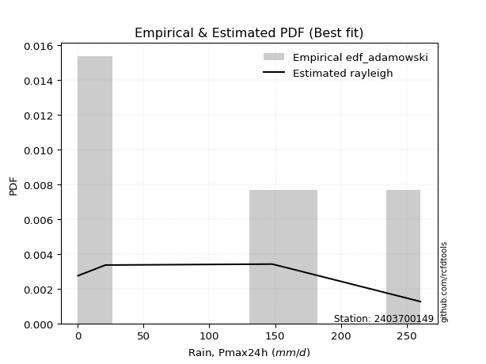</img>

</div>


## C. Best fit & Estimate extreme values for specific return periods - Tr

Best fit in probability distribution analysis means finding the theoretical distribution (like Normal, Poisson, Exponential, etc.) that most accurately mirrors your real-world data´s patterns (shape, center, spread) for better predictions, using methods like visual checks (Q-Q plots), goodness-of-fit tests (Kolmogorov-Smirnov, Chi-Squared), and information criteria (AIC) to score and select the simplest, most representative model.


### 1. Best fit (ordered by delta Δ)

:file_folder:Table: [bestfit_2403700149.csv](table/bestfit_2403700149.csv)

<div align="center">

|   id |    station | empirical_dist   | p_dist         |     delta |   deltao | eval   |   fit |   n |   best_fit |   best_fit_sort |
|-----:|-----------:|:-----------------|:---------------|----------:|---------:|:-------|------:|----:|-----------:|----------------:|
|    0 | 2403700149 | edf_cunnane      | dgamma         | 0.0880186 | 0.530386 | Δo > Δ |     1 |   6 |          1 |               1 |
|    1 | 2403700149 | edf_blom         | dgamma         | 0.0895407 | 0.530386 | Δo > Δ |     1 |   6 |          1 |               2 |
|    2 | 2403700149 | edf_gringorten   | dgamma         | 0.0919007 | 0.530386 | Δo > Δ |     1 |   6 |          1 |               3 |
|    3 | 2403700149 | edf_tukey        | dgamma         | 0.0948038 | 0.530386 | Δo > Δ |     1 |   6 |          1 |               4 |
|    4 | 2403700149 | edf_filliben     | dgamma         | 0.0967677 | 0.530386 | Δo > Δ |     1 |   6 |          1 |               5 |
|    5 | 2403700149 | edf_jenkinson    | dgamma         | 0.0976912 | 0.530386 | Δo > Δ |     1 |   6 |          1 |               6 |
|    6 | 2403700149 | edf_beard        | dgamma         | 0.0976912 | 0.530386 | Δo > Δ |     1 |   6 |          1 |               7 |
|    7 | 2403700149 | edf_chegodayev   | dgamma         | 0.0989157 | 0.530386 | Δo > Δ |     1 |   6 |          1 |               8 |
|    8 | 2403700149 | edf_hazen        | dgamma         | 0.100071  | 0.530386 | Δo > Δ |     1 |   6 |          1 |               9 |
|    9 | 2403700149 | edf_weibull      | loglevy_l      | 0.100103  | 0.530386 | Δo > Δ |     1 |   6 |          1 |              10 |
|   10 | 2403700149 | edf_adamowski    | dgamma         | 0.104925  | 0.530386 | Δo > Δ |     1 |   6 |          1 |              11 |
|   11 | 2403700149 | edf_california   | logweibull_max | 0.124043  | 0.530386 | Δo > Δ |     1 |   6 |          1 |              12 |

</div>


### 2. Extreme values and % difference analysis

In hydrology, a return period (or recurrence interval $Tr$) is the statistical average time between extreme events like floods or droughts of a specific magnitude, indicating how rare an event is, with a 100-year flood, for example, having a 1% chance of occurring in any given year, not that it happens exactly every century. It is a key tool for infrastructure design (like bridges or dams) and risk assessment, calculated from historical data to determine the probability of future events, although it is important to remember it is statistical average, and events can cluster or be missed.

The extreme value porcentage difference is evaluated as $pdiff = 1 - (ETrBf / ETr) * 100$, where _ETrBf_ correspond to the bestfit extreme value for a specific recurrence interval and _ETr_ correspond to the extreme value for one of the most used PDFsused in hydrology.

> risk_rate: assuming the return period as the project useful life.

:file_folder:Table: [extreme_2403700149.csv](table/extreme_2403700149.csv), all PDFs.  
:file_folder:Table: [extremepdiff_2403700149.csv](table/extremepdiff_2403700149.csv), % difference between bestfit and most used PDFs in Hydrology.

<div align="center">

Extreme values table for only best fit PDFs
|   id |      tr |   prob_l |     prob_g |      alpha |   anglit |   arcsine |   argus |     beta |   betaprime |   bradford |     burr |     burr12 |   cosine |   crystalball |   dgamma |   dweibull |   erlang |   exponnorm |   exponpow |   exponweib |         f |   fatiguelife |   foldnorm |    gamma |   gausshyper |   genexpon |   genextreme |   gengamma |   genhalflogistic |   genlogistic |   gennorm |   genpareto |   gompertz |   gumbel_l |   gumbel_r |   halfgennorm |   halflogistic |   halfnorm |   hypsecant |         invgamma |   invgauss |      invweibull |   johnsonsb |        johnsonsu |     kappa3 |   kappa4 |   ksone |   kstwobign |   laplace |   levy_l |    loggamma |   logistic |       loglaplace |    lomax |   maxwell |    mielke |    moyal |   nakagami |       ncf |              nct |    norm |   pearson3 |   powerlaw |   rayleigh |    rdist |    rice |   semicircular |   skewnorm |       t |   trapezoid |   triang |   truncexpon |   truncnorm |   truncpareto |   truncweibull_min |   tukeylambda |   uniform |   vonmises |   vonmises_line |     wald |   weibull_max |   weibull_min |   wrapcauchy |    logalpha |   loganglit |   logarcsine |   logargus |   logbeta |     logbetaprime |   logbradford |        logburr |      logburr12 |   logcosine |   logcrystalball |        logdgamma |      logdweibull |   logerlang |   logexponnorm |     logexponpow |   logexponweib |            logf |   logfatiguelife |   logfoldnorm |   loggausshyper |      loggenexpon |   loggenextreme |   loggengamma |   loggenhalflogistic |   loggenlogistic |       loggennorm |   loggenpareto |   loggompertz |   loggumbel_l |      loggumbel_r |   loghalfgennorm |   loghalflogistic |      loghalfnorm |     loghypsecant |   loginvgamma |      loginvgauss |    loginvweibull |   logjohnsonsb |   logjohnsonsu |      logkappa3 |   logkappa4 |   logksone |     logkstwobign |   loglevy_l |   logloggamma |   loglogistic |    logloglaplace |         loglomax |   logmaxwell |        logmielke |         logmoyal |   lognakagami |         logncf |     lognct |     lognorm |   logpearson3 |   logpowerlaw |   lograyleigh |   logrdist |     logrice |   logsemicircular |   logskewnorm |             logt |   logtrapezoid |   logtriang |   logtruncexpon |   logtruncnorm |   logtruncpareto |   logtruncweibull_min |   logtukeylambda |   loguniform |   logvonmises |   logvonmises_line |          logwald |   logweibull_max |   logweibull_min |   logwrapcauchy |    station |   n |   risk_rate |
|-----:|--------:|---------:|-----------:|-----------:|---------:|----------:|--------:|---------:|------------:|-----------:|---------:|-----------:|---------:|--------------:|---------:|-----------:|---------:|------------:|-----------:|------------:|----------:|--------------:|-----------:|---------:|-------------:|-----------:|-------------:|-----------:|------------------:|--------------:|----------:|------------:|-----------:|-----------:|-----------:|--------------:|---------------:|-----------:|------------:|-----------------:|-----------:|----------------:|------------:|-----------------:|-----------:|---------:|--------:|------------:|----------:|---------:|------------:|-----------:|-----------------:|---------:|----------:|----------:|---------:|-----------:|----------:|-----------------:|--------:|-----------:|-----------:|-----------:|---------:|--------:|---------------:|-----------:|--------:|------------:|---------:|-------------:|------------:|--------------:|-------------------:|--------------:|----------:|-----------:|----------------:|---------:|--------------:|--------------:|-------------:|------------:|------------:|-------------:|-----------:|----------:|-----------------:|--------------:|---------------:|---------------:|------------:|-----------------:|-----------------:|-----------------:|------------:|---------------:|----------------:|---------------:|----------------:|-----------------:|--------------:|----------------:|-----------------:|----------------:|--------------:|---------------------:|-----------------:|-----------------:|---------------:|--------------:|--------------:|-----------------:|-----------------:|------------------:|-----------------:|-----------------:|--------------:|-----------------:|-----------------:|---------------:|---------------:|---------------:|------------:|-----------:|-----------------:|------------:|--------------:|--------------:|-----------------:|-----------------:|-------------:|-----------------:|-----------------:|--------------:|---------------:|-----------:|------------:|--------------:|--------------:|--------------:|-----------:|------------:|------------------:|--------------:|-----------------:|---------------:|------------:|----------------:|---------------:|-----------------:|----------------------:|-----------------:|-------------:|--------------:|-------------------:|-----------------:|-----------------:|-----------------:|----------------:|-----------:|----:|------------:|
|    0 |    2    | 0.5      | 0.5        |    49.7039 |  103.233 |   103.233 | 134.838 |  91.3194 |     42.187  |    114.506 |  50.1056 |    22.0446 |  109.785 |       103.233 |  94.1635 |    101.134 |  35.3232 |     71.0985 |    79.079  |     20.2032 |   57.9137 |      0.441684 |    97.0567 |  28.5788 |      140.546 |    71.5864 |      51.1447 |    25.3246 |           170.252 |       85.4311 |    130.35 |     160.75  |    79.5522 |    118.702 |    87.7642 |       53.0161 |        80.0737 |    83.9587 |     103.233 |      6.22549     |    50.5112 | 26091.1         |     109.095 |      5.69972     |    57.6547 |  115.613 | 103.233 |     87.1675 |   103.233 |  131.373 |     24.6973 |    103.233 |     26.7796      |  64.9656 |   95.1801 |   73.8225 |  82.7702 |    42.0825 |   77.2118 |      3.37514     | 103.233 |    96.6406 |   0.891632 |    92.3239 | -27.4792 |  98.28  |        103.233 |    94.2857 | 103.232 |     193.794 |  126.182 |      91.0356 |     83.2061 |        8.4711 |            107.44  |       135.789 |   130.35  |    3.13321 |         132.695 |  72.7102 |       260.386 |       46.0625 |      130.35  |     23.7296 |     26.7796 |      26.7796 |    55.9019 |   179.025 |     0.103743     |       4.78463 |   1.09898      |   2.62073      |     16.1216 |          26.7796 |     28.2         |     28.2         |     23.8131 |        26.7788 |     0.111454    |  108.272       |    0.329021     |      0.1         |       30.8329 |         61.7544 |     12.4696      |         72.5136 |           inf |              30.1993 |          inf     |     28.2         |        1.71554 |      0.202976 |       41.4961 |     17.2823      |      2.322       |      13.9011      |     15.5169      |     26.7796      |       22.7047 |     22.026       |     19.2519      |        96.3546 |        249.586 |   1.15158      |      5.9261 |    5.1049  |     13.3675      |     105.594 |       54.3096 |       26.7796 |     0.444105     |      4.49608     |      21.3199 |     0.103469     |     15.0037      |       27.0825 |   2.58711      |    26.8087 |     26.7796 |       47.6517 |      0.109918 |       19.6638 |        0.1 |     26.7784 |           26.78   |       24.5081 |     76.945       |        34.2061 |     16.7181 |         2.54364 |        10.1802 |         0.142157 |               6.39513 |              0.1 |      5.1049  |      0.146152 |            41.4931 |     11.2851      |          37.0701 |      0.225596    |         5.10545 | 2403700149 |   6 |    0.75     |
|    1 |    2.33 | 0.570815 | 0.429185   |    64.1594 |  122.806 |   132.615 | 151.255 | 118.261  |     56.2448 |    133.091 |  68.9286 |    34.06   |  126.856 |       120.036 | 146.949  |    147.762 |  44.2521 |     86.7645 |    94.5692 |     31.9177 |   81.3622 |      4.74056  |   115.532  |  37.4013 |      160.043 |    87.337  |      65.5745 |    37.7352 |           187.336 |      101.027  |    130.35 |     179.775 |    95.6267 |    133.321 |   103.334  |       72.2958 |        96.082  |   102.094  |     116.681 |     13.7717      |    64.4319 |     4.64684e+06 |     371.181 |     11.6329      |    73.424  |  135.679 | 126.332 |    102.959  |   113.402 |  170.871 |     40.7086 |    118.038 |     35.7135      |  79.2575 |  112.637  |   96.3457 |  97.5091 |    61.6921 |   93.3839 |      8.95393     | 120.036 |   113.509  |   2.49644  |   110.039  | -17.5664 | 114.333 |        124.225 |   110.498  | 120.035 |     208.929 |  141.375 |     108.287  |     97.6129 |       13.837  |            126.474 |       155.689 |   148.797 |    3.34516 |         151.474 |  83.7282 |       260.535 |       68.9829 |      184.474 |     39.2103 |     46.608  |      61.5276 |    73.8277 |   222.475 |     0.109726     |       8.42829 |   3.54219      |  15.6882       |     27.1754 |          43.0932 |     28.6266      |     33.1366      |     39.2415 |        43.0919 |     0.123436    |    1.31025e+12 |    0.627225     |      0.129983    |       44.5409 |         94.5484 |     23.822       |         96.7651 |           inf |              47.9113 |          inf     |     31.5189      |        2.80651 |      0.237238 |       62.7705 |     26.8561      |      5.68227     |      21.8716      |     25.9288      |     39.1877      |       37.4607 |     37.6851      |     37.4945      |       187.624  |        255.22  |   3.68345      |     10.7135 |    9.96028 |     26.253       |     139.224 |       73.2903 |       40.7228 |     0.853466     |     10.3993      |      34.9488 |     0.113687     |     22.7731      |       43.601  |  69.3526       |    43.1052 |     43.0932 |       72.1562 |      0.124621 |       32.4706 |        0.1 |     43.0903 |           48.5196 |       35.7397 |    100.493       |        59.1459 |     26.3246 |         4.39923 |        15.3992 |         0.1742   |              10.6664  |              0.1 |      8.91027 |      0.171995 |            61.7534 |     15.4162      |          56.3722 |      0.341675    |        41.2187  | 2403700149 |   6 |    0.729209 |
|    2 |    5    | 0.8      | 0.2        |   176.249  |  191.862 |   210.965 | 203.916 | 209.122  |    161.339  |    197.846 | 155.463  |   159.738  |  188.373 |       182.481 | 185.212  |    195.951 |  90.7052 |    165.091  |   160.281  |    162.96   |  227.835  |     89.3558   |   184.674  |  86.4347 |      219.353 |   166.086  |     171.011  |   150.604  |           232.22  |      168.777  |    130.35 |     232.51  |   169.672  |    180.549 |   170.977  |      209.256  |       168.517  |   178.784  |     170.622 |    703.635       |   152.127  |     2.7866e+16  |     947.959 |    169.144       |   182.124  |  204.046 | 201.088 |    170.039  |   164.242 |  236.312 |    269.091  |    175.201 |    150.64        | 150.713  |  181.348  |  208.876  | 165.781  |   173.891  |  174.054  |   1232.81        | 182.481 |   179.948  |  40.411    |   180.962  |  12.0441 | 178.601 |        195.862 |   179.056  | 182.48  |     252.35  |  194.609 |     176.17   |    156.366  |       66.6053 |            192.974 |       219.418 |   208.5   |    4.17568 |         212.252 | 145.407  |       260.6   |      254.635  |      243.041 |    268.218  |    329.27   |     565.504  |   156.744  |   260.074 |     0.345514     |      52.6666  |   2.00277e+06  |   7.2171e+11   |    178.39   |         252.468  |     55.7477      |    159.268       |    259.019  |       252.462  |     0.443355    |  inf           | 3213.38         |     34.1365      |      174.749  |        218.092  |    323.307       |        188.033  |           inf |             147.497  |          inf     |     94.7807      |       19.1757  |      0.517448 |      239.027  |    182.287       |   1138.16        |     170.02        |    227.371       |    180.463       |      252.664  |    306.425       |    678.671       |       259.468  |        260.236 |   2.80537e+06  |     69.648  |   86.6439  |    461.664       |     220.116 |      157.312  |      205.443  | 53502.4          |    688.276       |     244.495  | 23887.5          |    157.351       |      255.975  |   2.58863e+16  |   251.54   |    252.468  |      248.81   |      0.665309 |      241.84   |        0.1 |    252.431  |          368.746  |      107.237  |    318.196       |       284.59   |     96.8384 |        32.1521  |        60.4744 |         1.01158  |              56.6677  |              0.1 |     54.048   |      0.322932 |           293.097  |     88.3808      |         152.618  |     10.5037      |       179.959   | 2403700149 |   6 |    0.67232  |
|    3 |   10    | 0.9      | 0.1        |   382.185  |  230.949 |   229.879 | 229.309 | 242.014  |    334.415  |    228.456 | 206.514  |   437.075  |  225.54  |       223.905 | 206.894  |    219.655 | 134.304  |    236.193  |   207.636  |    454.247  |  387.426  |    206.156    |   230.661  | 134.938  |      242.357 |   237.573  |     347.52   |   348.94   |           247.689 |      223.953  |    130.35 |     249.838 |   229.275  |    206.843 |   226.071  |      395.115  |       228.671  |   235.533  |     213.695 |  24857.4         |   257.926  |     2.56474e+24 |     951.798 |   1003.64        |   349.72   |  235.295 | 233.706 |    221.111  |   210.393 |  252.11  |    968.167  |    217.299 |    556.41        | 215.579  |  229.702  |  315.445  | 225.223  |   273.012  |  251.566  | 108392           | 223.905 |   227.351  | 108.038    |   231.532  |  22.1519 | 224.425 |        232.62  |   229.787  | 223.904 |     269.311 |  228.018 |     214.239  |    194.697  |      131.791  |            225.338 |       246.361 |   234.55  |    4.80922 |         238.771 | 210.862  |       260.6   |      527.066  |      252.652 |   1011.09   |    995.743  |     966.056  |   212.676  |   260.59  |    10.8963       |     117.156   |   1.26433e+22  |   1.20027e+50  |    556.019  |         815.724  |    172.598       |   1086           |    930.597  |       815.706  |     4.87941     |  inf           |    6.7181e+16   |  74764.5         |      432.743  |        251.153  |   2096.45        |        228.35   |           inf |             207.029  |          inf     |    484.666       |       61.3165  |      1.0503   |      503.209  |    867.303       | 399963           |     933.523       |   1133.7         |    610.946       |      935.718  |   1346.47        |   7178.45        |       260.537  |        260.539 |   2.49528e+23  |    150.74   |  222.667   |   4095.88        |     245.855 |      205.358  |      676.575  |     6.35206e+28  |  30945.5         |     961.219  |     8.56264e+108 |    846.718       |      828.44   |   1.12602e+51  |   809.927  |    815.724  |      446.519  |      5.55252  |     1012.3    |        0.1 |    815.561  |         1043.97   |      167.765  |   1014.25        |       525.684  |    161.067  |        87.0635  |       118.38   |         7.16193  |             120.115   |              0.1 |    118.68    |      0.519457 |           964.957  |    563.869       |         207.624  |   1749.88        |       220.643   | 2403700149 |   6 |    0.651322 |
|    4 |   15    | 0.933333 | 0.0666667  |   587.386  |  247.64  |   233.487 | 238.963 | 250.511  |    491.454  |    238.997 | 225.514  |   727.347  |  242.469 |       244.577 | 217.845  |    230.687 | 160.165  |    277.786  |   231.56   |    745.553  |  488.526  |    282.544    |   253.617  | 164.319  |      249.3   |   279.39   |     511.716  |   519.689  |           252.332 |      255.082  |    130.35 |     254.46  |   261.384  |    218.751 |   257.155  |      532.775  |       262.712  |   265.065  |     238.277 | 199990           |   330.486  |     7.98451e+28 |     951.864 |   2440.97        |   497.423  |  245.886 | 244.579 |    248.225  |   237.389 |  256.883 |   1849.34   |    240.236 |   1194.91        | 253.523  |  254.513  |  384.258  | 259.72   |   326.694  |  300.053  |      1.48675e+06 | 244.577 |   252.02   | 146.401    |   257.587  |  24.8158 | 248.035 |        246.954 |   256.188  | 244.575 |     274.753 |  242.819 |     228.602  |    211.617  |      165.427  |            236.732 |       255.08  |   243.233 |    5.14852 |         247.61  | 252.895  |       260.6   |      732.768  |      255.392 |   1992.35   |   1597.25   |    1069.94   |   236.981  |   260.599 |   732.453        |     152.936   |   2.26605e+42  |   4.75803e+109 |    933.222  |        1464.58   |    376.803       |   3849.87        |   1776.06   |      1464.55   |    33.8339      |  inf           |    9.84819e+37  |      1.14401e+07 |      680.382  |        256.793  |   5504.33        |        240.73   |           inf |             227.042  |          inf     |   1641.3         |      101.003   |      1.58912  |      704.96   |   2091.05        |      1.87566e+07 |    2447.29        |   2615.84        |   1225.32        |     1822.42   |   2897.96        |  27162.7         |       260.585  |        260.575 |   8.29432e+45  |    192.538  |  304.996   |  13050.6         |     254.208 |      222.973  |     1295.22   |     1.59689e+77  | 286710           |    1940.35   |   inf            |   2248.55        |     1488.78   |   9.91399e+91  |  1451.32   |   1464.58   |      562.466  |     15.8458   |     2116.8    |        0.1 |   1464.25   |         1566.52   |      194.377  |   2332.09        |       640.081  |    189.627  |       123.963   |       151.354  |        18.8006   |             155.043   |              0.1 |    154.256   |      0.680489 |          1840.73   |   1853.52        |         226.513  |  86356.6         |       233.712   | 2403700149 |   6 |    0.644736 |
|    5 |   20    | 0.95     | 0.05       |   792.407  |  257.458 |   234.757 | 244.263 | 254.08   |    638.834  |    244.332 | 235.542  |  1020.47   |  252.881 |       258.114 | 225.138  |    237.721 | 178.628  |    307.296  |   247.201  |   1025.39   |  563.044  |    339.101    |   268.652  | 185.49   |      252.559 |   309.059  |     668.649  |   669.809  |           254.55  |      276.877  |    130.35 |     256.477 |   283.089  |    226.163 |   278.919  |      644.031  |       286.563  |   284.754  |     255.618 | 878027           |   386.308  |     1.11757e+32 |     951.872 |   4368.61        |   634.052  |  251.213 | 250.016 |    266.489  |   256.544 |  259.327 |   2833.86   |    256.09  |   2055.18        | 280.445  |  270.978  |  437.49   | 284.151  |   362.861  |  336.146  |      9.53063e+06 | 258.114 |   268.544  | 169.74     |   274.906  |  25.9614 | 263.729 |        254.905 |   273.789  | 258.113 |     277.437 |  251.642 |     236.164  |    221.429  |      185.334  |            242.558 |       259.358 |   247.575 |    5.36643 |         252.03  | 284.218  |       260.6   |      899.589  |      256.717 |   3125.15   |   2109.09   |    1109.13   |   251.068  |   260.6   | 81825.9          |     174.735   |   1.05427e+66  |   1.44946e+189 |   1283.19   |        2148.63   |    679.476       |   9961.35        |   2719.9    |      2148.59   |   167.008       |  inf           |    4.95173e+66  |      4.74191e+08 |      915.062  |        258.611  |  10462.3         |        246.535  |           inf |             236.683  |          inf     |   4388.79        |      135.226   |      2.13186  |      869.565  |   3872.27        |      3.43493e+08 |    4807.75        |   4567.76        |   2002.03        |     2833.72   |   4836.7         |  68965.6         |       260.594  |        260.586 |   7.47158e+72  |    216.759  |  356.955   |  28487.9         |     258.594 |      232.084  |     2028.95   |     1.1354e+154  |      1.39134e+06 |    3092.68   |   inf            |   4490.58        |     2185.53   |   4.51603e+137 |  2126.27   |   2148.63   |      641.47   |     29.0285   |     3456.36   |        0.1 |   2148.11   |         1961.97   |      209.183  |   4654.13        |       705.371  |    205.53   |       148.568   |       172.115  |        32.9472   |             176.334   |              0.1 |    175.863   |      0.824848 |          2803.01   |   4499.15        |         235.811  |      2.07187e+06 |       240.297   | 2403700149 |   6 |    0.641514 |
|    6 |   25    | 0.96     | 0.04       |   997.356  |  264.112 |   235.347 | 247.68  | 255.958  |    779.41   |    247.554 | 241.868  |  1313.67   |  260.182 |       268.079 | 230.581  |    242.818 | 193.004  |    330.186  |   258.673  |   1292.71   |  622.268  |    384.037    |   279.72   | 202.067  |      254.425 |   332.073  |     820.461  |   804.595  |           255.843 |      293.665  |    130.35 |     257.572 |   299.359  |    231.437 |   295.682  |      738.334  |       304.939  |   299.403  |     269.039 |      2.7661e+06  |   431.912  |     2.9617e+34  |     951.874 |   6705.42        |   763.151  |  254.42  | 253.277 |    280.17   |   271.401 |  260.861 |   3885.87   |    268.218 |   3129.9         | 301.327  |  283.202  |  481.865  | 303.088  |   389.887  |  365.203  |      4.02707e+07 | 268.079 |   280.897  | 185.264    |   287.773  |  26.576  | 275.388 |        260.062 |   286.886  | 268.078 |     279.037 |  257.663 |     240.832  |    227.898  |      198.41   |            246.098 |       261.891 |   250.18  |    5.51749 |         254.682 | 309.306  |       260.6   |     1040.96   |      257.502 |   4366.4    |   2546.3    |    1127.79   |   260.438  |   260.6   |     1.37035e+07  |     189.28    |   3.53355e+92  |   3.84076e+287 |   1604.28   |        2848.99   |   1091           |  21400.8         |   3727.83   |      2848.95   |   649.765       |  inf           |    5.28668e+102 |      9.14411e+09 |     1138.12   |        259.399  |  16865.2         |        249.847  |           inf |             242.254  |          inf     |  10070.5         |      164.557   |      2.67752  |     1009.61   |   6224.27        |      3.61523e+09 |    8088.76        |   6915.57        |   2927.44        |     3931.56   |   7089.02        | 141360           |       260.597  |        260.591 |   4.23704e+103 |    232.34   |  392.288   |  51121.9         |     261.386 |      237.649  |     2860.16   |     4.67218e+262 |      4.73724e+06 |    4371.58   |   inf            |   7676.16        |     2899.32   |   1.48549e+187 |  2816.37   |   2848.99   |      700.094  |     42.9463   |     4975.42   |        0.1 |   2848.27   |         2270.45   |      218.592  |   8534.71        |       747.394  |    215.631  |       165.86    |       186.306  |        47.4573   |             190.554   |              0.1 |    190.255   |      0.957945 |          3764.6    |   9154.05        |         241.28   |      3.08846e+07 |       244.282   | 2403700149 |   6 |    0.639603 |
|    7 |   50    | 0.98     | 0.02       |  2021.78   |  280.491 |   236.134 | 255.427 | 258.99   |   1420.64   |    254.045 | 256.347  |  2760.33   |  279.301 |       296.616 | 246.577  |    257.103 | 237.907  |    401.288  |   291.192  |   2474.84   |  813.304  |    528.213    |   311.414  | 254.255  |      257.883 |   403.559  |    1532.61   |  1339.23   |           258.334 |      345.381  |    130.35 |     259.44  |   347.053  |    245.755 |   347.324  |     1077.62   |       361.557  |   341.984  |     310.649 |      9.77054e+07 |   585.171  |     8.63923e+41 |     951.875 |  22871.8         |  1342.74   |  260.858 | 259.801 |    320.343  |   317.552 |  264.315 |   9665.22   |    305.272 |  11560.7         | 366.192  |  318.655  |  641.207  | 361.876  |   468.693  |  462.019  |      3.54089e+09 | 296.616 |   317.159  | 220.108    |   325.124  |  27.6017 | 309.235 |        271.846 |   324.951  | 296.615 |     282.211 |  272.604 |     250.487  |    242.574  |      227.39   |            253.278 |       266.844 |   255.39  |    5.86993 |         259.986 | 391.221  |       260.6   |     1547.07   |      259.057 |  11547      |   4048.54   |    1153.21   |   282.526  |   260.6   |     1.5609e+20   |     222.101   |   2.01219e+258 | inf            |   2879.07   |        6390.99   |   5092.47        | 263889           |   9258.35   |      6390.9    | 81930.2         |  inf           |  inf            |      1.21508e+14 |     2125.61   |        260.35   |  67531.6         |        255.938  |           inf |             252.613  |          inf     | 194158           |      264.711   |      5.43474  |     1514.27   |  26857           |      9.19577e+12 |   40182.5         |  23087.9         |   9508.36        |    10161.3    |  21721.5         |      1.28976e+06 |       260.6    |        260.597 |   8.01069e+302 |    265.514  |  473.793   | 284653           |     267.782 |      249      |     8165.72   |   inf            |      2.1299e+08  |   11927.4    |   inf            |  40548.8         |     6513.39   | inf            |  6297.49   |   6390.99   |      864.249  |    100.69     |    14324.8    |        0.1 |   6389.12   |         3169.5    |      238.68   |  93175.1         |       838.347  |    237.171  |       207.416   |       219.455  |       105.606    |             222.713   |              0.1 |    222.667   |      1.4987   |          7581.97   |  93070.5         |         251.758  |      5.16561e+11 |       252.368   | 2403700149 |   6 |    0.63583  |
|    8 |   75    | 0.986667 | 0.0133333  |  3046.06   |  287.699 |   236.28  | 258.5   | 259.734  |   2001.72   |    256.223 | 262.693  |  4169.83   |  288.431 |       311.928 | 255.436  |    264.608 | 264.314  |    442.881  |   308.373  |   3476.28   |  929.532  |    615.043    |   328.421  | 285.178  |      258.92  |   445.376  |    2198.19   |  1744.41   |           259.127 |      375.441  |    130.35 |     259.938 |   373.161  |    252.996 |   377.34   |     1309.95   |       394.469  |   365.163  |     334.965 |      7.86085e+08 |   682.06   |     1.8853e+46  |     951.875 |  44180           |  1859.87   |  263.012 | 261.976 |    342.447  |   344.548 |  265.734 |  15828.5    |    326.673 |  24827.1         | 404.136  |  337.929  |  753.09   | 396.254  |   511.617  |  523.745  |      4.85682e+10 | 311.928 |   337.164  | 232.941    |   345.445  |  27.8666 | 327.649 |        276.553 |   345.673  | 311.926 |     283.262 |  279.223 |     253.805  |    248.128  |      237.961  |            255.702 |       268.447 |   257.127 |    6.00095 |         261.754 | 441.628  |       260.6   |     1890.29   |      259.572 |  19637      |   4965.13   |    1157.98   |   291.616  |   260.6   |     4.04683e+35  |     234.261   | inf            | inf            |   3806.61   |        9859.09   |  13024.2         |      1.25077e+06 |  15149      |      9858.97   |     2.05727e+06 |  inf           |  inf            |      3.6978e+16  |     2972.03   |        260.5    | 143755           |        257.742  |           inf |             255.704  |          252.93  |      1.43333e+06 |      324.652   |      8.22287  |     1858.78   |  62823.9         |      1.29366e+15 |  102026           |  44502.9         |  18927.4         |    17038.1    |  40229.3         |      4.66235e+06 |       260.6    |        260.599 | inf            |    276.939  |  504.564   | 732151           |     270.456 |      252.849  |    14967      |   inf            |      1.97336e+09 |   20584.5    |   inf            | 107319           |    10056.3    | inf            |  9696.89   |   9859.09   |      946.725  |    136.675    |    25464.9    |        0.1 |   9856.03   |         3621.32   |      245.775  | 599243           |       870.834  |    244.766  |       223.695   |       232.169  |       140.99     |             234.656   |              0.1 |    234.654   |      1.87491  |          9874.07   | 387789           |         255.019  |      3.91663e+14 |       255.105   | 2403700149 |   6 |    0.634587 |
|    9 |  100    | 0.99     | 0.01       |  4070.3    |  291.986 |   236.331 | 260.215 | 260.043  |   2546.9    |    257.315 | 266.677  |  5547.57   |  294.154 |       322.284 | 261.545  |    269.63  | 283.102  |    472.391  |   319.868  |   4359.21   | 1013.84   |    677.52     |   339.924  | 307.263  |      259.406 |   475.045  |    2835.34   |  2078.73   |           259.514 |      396.715  |    130.35 |     260.156 |   390.968  |    257.732 |   398.585  |     1490.57   |       417.764  |   380.954  |     352.214 |      3.45118e+09 |   753.66   |     2.21968e+49 |     951.875 |  68962.5         |  2340.52   |  264.09  | 263.063 |    357.591  |   363.703 |  266.564 |  22135.5    |    341.783 |  42701.3         | 431.058  |  351.058  |  842.697  | 420.644  |   540.832  |  570.055  |      3.11341e+11 | 322.284 |   350.913  | 239.601    |   359.289  |  27.9798 | 340.193 |        279.189 |   359.789  | 322.283 |     283.786 |  283.169 |     255.484  |    251.061  |      243.43   |            256.921 |       269.234 |   257.995 |    6.06834 |         262.638 | 478.379  |       260.6   |     2154.99   |      259.829 |  28227      |   5605.76   |    1159.66   |   296.772  |   260.6   |     6.02273e+52  |     240.588   | inf            | inf            |   4534.78   |       13218.3    |  25693.8         |      3.90774e+06 |  21172      |     13218.1    |     2.3749e+07  |  inf           |  inf            |      2.26357e+18 |     3728.29   |        260.548  | 240594           |        258.58   |           inf |             257.142  |          254.86  |      6.68338e+06 |      365.8     |     11.0312   |     2125.48   | 114640           |      5.05585e+16 |  197301           |  69589.4         |  30844.4         |    24239.7    |  61414           |      1.15772e+07 |       260.6    |        260.599 | inf            |    282.638  |  520.691   |      1.39865e+06 |     272.031 |      254.786  |    22957.2    |   inf            |      9.57623e+09 |   29851.5    |   inf            | 214075           |    13490.4    | inf            | 12983.9    |  13218.3    |      999.202  |    159.909    |    37684.4    |        0.1 |  13214      |         3901.92   |      249.4    |      2.93829e+06 |       887.504  |    248.644  |       232.353   |       238.883  |       163.634    |             240.877   |              0.1 |    240.888   |      2.13793  |         11317.5    |      1.09768e+06 |         256.576  |      6.6201e+16  |       256.482   | 2403700149 |   6 |    0.633968 |
|   10 |  200    | 0.995    | 0.005      |  8167.18   |  300.084 |   236.38  | 263.196 | 260.407  |   4524.96   |    258.955 | 275.276  | 10832.4    |  305.789 |       345.776 | 275.773  |    280.877 | 328.514  |    543.494  |   345.528  |   7207.3    | 1222.87   |    830.451    |   366.015  | 360.882  |      260.075 |   546.532  |    5219.6    |  3063.71   |           260.078 |      447.862  |    130.35 |     260.43  |   431.66   |    268.025 |   449.658  |     1981.67   |       473.767  |   417.069  |     393.768 |      1.21904e+11 |   934.777  |     5.35879e+56 |     951.875 | 189356           |  4061.15   |  265.71  | 264.694 |    392.471  |   409.854 |  268.136 |  47612.8    |    378.028 | 157724           | 495.924  |  381.095  | 1100.9    | 479.407  |   607.514  |  691.042  |      2.73753e+13 | 345.776 |   382.757  | 249.907    |   390.965  |  28.119  | 368.897 |        283.784 |   392.074  | 345.774 |     284.57  |  290.639 |     258.027  |    255.68   |      251.869  |            258.756 |       270.39  |   259.298 |    6.17104 |         263.964 | 569.922  |       260.6   |     2865.26   |      260.215 |  65021.4    |   7050.21   |    1161.28   |   305.876  |   260.6   |     1.1859e+134  |     250.4     | inf            | inf            |   6473.28   |       25704.9    | 136938           |      6.79249e+07 |  45472      |     25704.6    |     1.40728e+10 |  inf           |  inf            |      5.35389e+22 |     6235.04   |        260.589  | 782324           |        259.725  |           inf |             259.106  |          257.77  |      4.14556e+08 |      455.848   |     22.3908   |     2844.63   | 486762           |      5.81392e+20 |  963206           | 193463           | 100026           |    54414.2    | 163372           |      1.0309e+08  |       260.6    |        260.6   | inf            |    291.027  |  545.853   |      6.21117e+06 |     275.041 |      257.707  |    64058.5    |   inf            |      4.30555e+11 |   69869.3    |   inf            |      1.13004e+06 |    26270      | inf            | 25171.1    |  25704.9    |     1106.37   |    203.466    |    92393.6    |        0.1 |  25695.8    |         4444.07   |      254.939  |      4.48899e+08 |       913.054  |    254.565  |       246.035   |       249.435  |       205.773    |             250.535   |              0.1 |    250.55    |      2.6642   |         13941.2    |      1.46577e+07 |         258.773  |      6.65625e+22 |       258.561   | 2403700149 |   6 |    0.633042 |
|   11 |  250    | 0.996    | 0.004      | 10215.6    |  302.144 |   236.386 | 263.894 | 260.463  |   5438.1    |    259.284 | 277.864  | 13376.8    |  308.979 |       352.955 | 280.227  |    284.278 | 343.172  |    566.383  |   353.248  |   8379.53   | 1291.86   |    880.292    |   373.989  | 378.25   |      260.197 |   569.545  |    6348.77   |  3440.16   |           260.188 |      464.304  |    130.35 |     260.475 |   444.149  |    271.054 |   466.078  |     2157.14   |       491.772  |   428.179  |     407.145 |      3.84042e+11 |   995.408  |     1.26626e+59 |     951.875 | 257830           |  4846.85   |  266.035 | 265.02  |    403.266  |   424.711 |  268.545 |  60256.1    |    389.664 | 240202           | 516.806  |  390.341  | 1198.96   | 498.324  |   627.981  |  733.047  |      1.15672e+14 | 352.955 |   392.672  | 252.014    |   400.716  |  28.1413 | 377.733 |        284.862 |   402.007  | 352.953 |     284.727 |  292.543 |     258.539  |    256.639  |      253.591  |            259.124 |       270.615 |   259.558 |    6.19174 |         264.229 | 600.208  |       260.6   |     3115.77   |      260.292 |  84176.2    |   7473.82   |    1161.48   |   308.032  |   260.6   |     3.16765e+180 |     252.411   | inf            | inf            |   7136.69   |       31498.1    | 236832           |      1.75714e+08 |  57519      |     31497.8    |     1.25804e+11 |  inf           |  inf            |      1.426e+24   |     7296.06   |        260.594  |      1.12491e+06 |        259.931  |           inf |             259.46   |          258.355 |      1.77746e+09 |      481.441   |     28.122    |     3099.32   | 774824           |      1.37383e+22 |       1.60358e+06 | 264976           | 146079           |    69843      | 221470           |      2.08212e+08 |       260.6    |        260.6   | inf            |    292.655  |  551.03    |      9.85252e+06 |     275.83  |      258.294  |    89053.9    |   inf            |      1.46596e+12 |   90776.4    |   inf            |      1.9306e+06  |    32204.6    | inf            | 30813.6    |  31498.1    |     1135.55   |    213.676    |   121768      |        0.1 |  31486.7    |         4581.8    |      256.061  |      3.55818e+09 |       918.244  |    255.764  |       248.875   |       251.618  |       215.604    |             252.515   |              0.1 |    252.529   |      2.79165  |         14540.4    |      3.45494e+07 |         259.183  |      8.85966e+24 |       258.979   | 2403700149 |   6 |    0.632858 |
|   12 |  500    | 0.998    | 0.002      | 20457.7    |  307.255 |   236.394 | 265.498 | 260.553  |   9602.72   |    259.942 | 285.64   | 25498.3    |  317.468 |       374.244 | 293.738  |    294.273 | 388.801  |    637.486  |   375.789  |  12994.1    | 1511.22   |   1036.64     |   397.635  | 432.473  |      260.423 |   641.032  |   11651.5    |  4817.38   |           260.402 |      515.339  |    130.35 |     260.552 |   481.242  |    279.736 |   517.04   |     2758.34   |       547.654  |   461.305  |     448.696 |      1.35653e+13 |  1190.02   |     2.94605e+66 |     951.875 | 643981           |  8387.31   |  266.684 | 265.672 |    435.616  |   470.862 |  269.602 | 121628      |    425.752 | 887221           | 581.671  |  417.932  | 1560.82   | 557.085  |   688.853  |  874.028  |      1.01707e+16 | 374.244 |   422.581  | 256.275    |   429.809  |  28.1784 | 404.096 |        287.344 |   431.62   | 374.242 |     285.04  |  297.268 |     259.567  |    258.593  |      257.072  |            259.861 |       271.059 |   260.079 |    6.23324 |         264.759 | 696.504  |       260.6   |     3962.02   |      260.446 | 182651      |   8637.25   |    1161.73   |   313.028  |   260.6   |   inf            |     256.479   | inf            | inf            |   9252.44   |       57550.1    |      1.32878e+06 |      3.68114e+09 | 115929      |     57549.7    |     1.64842e+14 |  inf           |  inf            |      4.22443e+28 |    11627.4    |        260.599  |      3.32643e+06 |        260.31   |           inf |             260.108  |          259.525 |      2.43885e+11 |      549.529   |     57.081    |     3962.96   |      3.27957e+06 |      4.02476e+26 |       7.80169e+06 | 676881           | 473678           |   147454      | 554023           |      1.84525e+09 |       260.6    |        260.6   | inf            |    295.809  |  561.531   |      3.92669e+07 |     277.877 |      259.469  |   247387      |   inf            |      6.59109e+13 |  198252      |   inf            |      1.01906e+07 |    58919      | inf            | 56129      |  57550.1    |     1211.89   |    235.849    |   277493      |        0.1 |  57527.7    |         4915.39   |      258.321  |      1.46529e+13 |       928.704  |    258.177  |       254.664   |       256.059  |       236.9      |             256.524   |              0.1 |    256.533   |      3.07063  |         15820.8    |      5.27807e+08 |         259.957  |      1.39925e+32 |       259.816   | 2403700149 |   6 |    0.632489 |
|   13 |  750    | 0.998667 | 0.00133333 | 30699.8    |  309.517 |   236.396 | 266.143 | 260.575  |  13376.5    |    260.161 | 290.1    | 36976      |  321.581 |       386.07  | 301.443  |    299.772 | 415.553  |    679.078  |   388.079  |  16492.3    | 1643      |   1129.02     |   410.77   | 464.359  |      260.49  |   682.848  |   16611.1    |  5782.97   |           260.471 |      545.174  |    130.35 |     260.573 |   501.843  |    284.377 |   546.832  |     3150.7    |       580.322  |   479.811  |     473.001 |      1.09139e+14 |  1307.8    |     5.96778e+70 |     951.875 |      1.07081e+06 | 11554.3    |  266.901 | 265.89  |    453.789  |   497.859 |  270.103 | 180138      |    446.836 |      1.90534e+06 | 619.615  |  433.363  | 1820.15   | 591.459  |   722.757  |  964.485  |      1.39505e+17 | 386.07  |   439.525  | 257.71     |   446.078  |  28.188  | 418.838 |        288.343 |   448.164  | 386.068 |     285.144 |  299.361 |     259.911  |    259.256  |      258.243  |            260.107 |       271.203 |   260.253 |    6.24709 |         264.936 | 754.242  |       260.6   |     4504.93   |      260.497 | 282538      |   9208.6    |    1161.78   |   315.051  |   260.6   |   inf            |     257.85    | inf            | inf            |  10493      |       80437.5    |      3.69461e+06 |      2.31546e+10 | 171545      |     80437      |     1.39416e+16 |  inf           |  inf            |      1.85267e+31 |    15063      |        260.599  |      6.10148e+06 |        260.422  |           inf |             260.299  |          259.916 |      5.76132e+12 |      581.644   |     86.3646   |     4519.34   |      7.62316e+06 |      2.26751e+29 |       1.96728e+07 |      1.14303e+06 | 942619           |   224350      | 930881           |      6.60681e+09 |       260.6    |        260.6   | inf            |    296.81   |  565.075   |      8.5381e+07  |     278.854 |      259.861  |   449382      |   inf            |      6.10666e+14 |  306873      |   inf            |      2.69676e+07 |    82413.5    | inf            | 78313.6    |  80437.4    |     1247.8    |    243.797    |   439831      |        0.1 |  80404.9    |         5056.4    |      259.078  |      1.04385e+16 |       932.215  |    258.986  |       256.626   |       257.562  |       244.519    |             257.875   |              0.1 |    257.881   |      3.17084  |         16272.9    |      2.70641e+09 |         260.195  |      6.02382e+36 |       260.096   | 2403700149 |   6 |    0.632366 |
|   14 | 1000    | 0.999    | 0.001      | 40941.8    |  310.865 |   236.396 | 266.505 | 260.584  |  16916.9    |    260.271 | 293.255  | 48037.2    |  324.176 |       394.212 | 306.833  |    303.536 | 434.557  |    708.589  |   396.441  |  19391.5    | 1738.02   |   1194.92     |   419.814  | 487.049  |      260.522 |   712.518  |   21360.2    |  6546.6    |           260.505 |      566.337  |    130.35 |     260.582 |   516.009  |    287.5   |   567.965  |     3447.89   |       603.495  |   492.592  |     490.246 |      4.79158e+14 |  1392.94   |     6.77067e+73 |     951.875 |      1.51971e+06 | 14501      |  267.009 | 265.999 |    466.379  |   517.013 |  270.418 | 236323      |    461.788 |      3.27708e+06 | 646.537  |  444.029  | 2029.56   | 615.847  |   746.128  | 1032.55   |      8.94281e+17 | 394.212 |   451.328  | 258.43     |   457.321  |  28.1921 | 429.026 |        288.905 |   459.589  | 394.21  |     285.196 |  300.609 |     260.083  |    259.59   |      258.83   |            260.23  |       271.274 |   260.34  |    6.25402 |         265.024 | 795.774  |       260.6   |     4911.6    |      260.523 | 382471      |   9566.92   |    1161.8    |   316.19   |   260.6   |   inf            |     258.538   | inf            | inf            |  11359.7    |      101292      |      7.67281e+06 |      8.75433e+10 | 224910      |    101291      |     3.57943e+17 |  inf           |  inf            |      1.42043e+33 |    18002      |        260.6    |      9.28024e+06 |        260.474  |           inf |             260.388  |          260.112 |      6.17486e+13 |      601.282   |    115.861    |     4937.13   |      1.38669e+07 |      2.33268e+31 |       3.79131e+07 |      1.64135e+06 |      1.53594e+06 |   300090      |      1.33598e+06 |      1.63275e+10 |       260.6    |        260.6   | inf            |    297.295  |  566.856   |      1.46239e+08 |     279.469 |      260.058  |   686213      |   inf            |      2.96341e+15 |  415050      |   inf            |      5.37909e+07 |   103836      | inf            | 98495.4    | 101292      |     1269.93   |    247.882    |   604670      |        0.1 | 101250      |         5137.4    |      259.458  |      2.93756e+18 |       933.975  |    259.391  |       257.613   |       258.318  |       248.432    |             258.554   |              0.1 |    258.558   |      3.2223   |         16503.9    |      8.7712e+09  |         260.309  |      1.81187e+40 |       260.236   | 2403700149 |   6 |    0.632305 |


</div>


<div align="center">

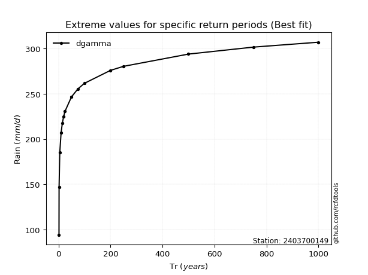</img>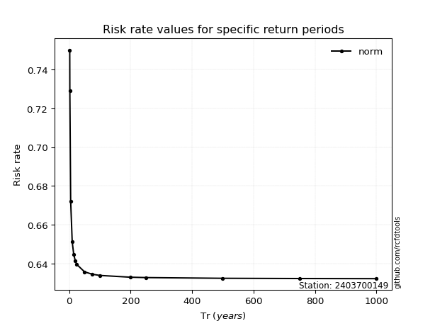</img>

</div>


<sub>**APP DISCLAIMER**: NO WARRANTY - This software is provided by [github.com/rcfdtools](https://github.com/rcfdtools) "as is", without any express or implied warranty, including warranties of merchantability, fitness for a particular purpose, or non-infringement. There is no guarantee that the software will be error-free or operate without interruption. LIMITATION OF LIABILITY - Neither the authors nor copyright holders will be liable for claims or damages arising from the software or its use. You are responsible for determining if the software is appropriate for your use and assume all associated risks, including errors, legal compliance, and data loss. NO PROFESSIONAL ADVICE - The software provides general information and does not offer professional advice. It should not replace consultation with professional advisors.</sub>