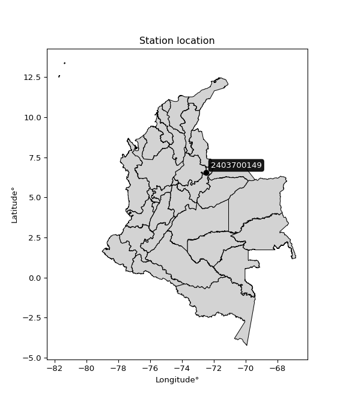

<div align="center">


</div>

# Station (rain, Pmax24h): 2403700149

Probable Maximum Precipitation (PMP) is the greatest amount of rainfall for a specific duration that is meteorologically possible for a given location, acting as a "worst-case" scenario for extreme storms, crucial for designing safety-critical infrastructure like bridges, river deviations, dams, spillways, and nuclear plants to prevent catastrophic failure. PMP is calculated by hydrologists using meteorological data to determine the upper limit of extreme rainfall, often leading to the Probable Maximum Flood (PMF) for flood control design, and is increasingly being studied for climate change impacts.

<div align="center">

</img>

</div>


## A. General information


### 1. General running parameters

• app_version: _v20251226_. • runtime: _2025-12-26 15:38:16.554582_. • Python version: _3.14.0_. • SciPy version: _1.16.3_. • Pandas version: _2.3.3_. • NumPy version: _2.3.5_. • Stations dataset (station_dataset_file): _dataset/pmax24h_in/automatic_colombia_2003_2024.csv_. • Stations catalog (station_catalog_file): _dataset/CNE_IDEAM.xls_. • Minimum year to eval til year_max (date_min): _2003_. • Maximum year to eval since year_min (date_max): _2024_. • Creates, save and include plots into reports (create_plot): _False_. • Plot only fit distributions with Δo > Δ (plot_only_fit): _True_. • Eval low extreme values, if False, evaluates high extreme values (low_extreme): _False_. • Eval every SciPy distribution as logarithmic (pdist_logarithmic_on): _True_. • Standard deviation normalized (ddof): _1.0_. • Return periods to eval in years (Tr): _[2, 2.33, 5, 10, 15, 20, 25, 50, 75, 100, 200, 250, 500, 750, 1000]_. • Minimum data sample per station, 0 means any (minimum_sample): _5_. • Z-Score threshold to adjust a value, 0 means disable (zscore): _3.5_. • Avoid zeros, e.g. rain = 0 (avoid_zeros): _True_. • Avoid null values (avoid_nans): _True_. [:file_folder:Dataset file.](../../dataset/pmax24h_in/automatic_colombia_2003_2024.csv)


### 2. Station info and location

|   id |     CODIGO | NOMBRE                              | CATEGORIA    | TECNOLOGIA                              | ESTADO   | FECHA_INSTALACION   |   FECHA_SUSPENSION |   ALTITUD |   LATITUD |   LONGITUD | DEPARTAMENTO   | MUNICIPIO   | AREA_OPERATIVA                              | ENTIDAD                                                     | AREA_HIDROGRAFICA   | ZONA_HIDROGRAFICA   | SUBZONA_HIDROGRAFICA   | CORRIENTE   | OBSERVACION                                                                                                                                                                                                                                                                                                                                                                                                                                                                                                                                                                                                                                                                                                                                                                                                                                                                                                                                                                                                                                                                                                                                                                                                                                                                                                                                                                                                                                                                                                                                                                |   SUBRED | Catalogo   |
|-----:|-----------:|:------------------------------------|:-------------|:----------------------------------------|:---------|:--------------------|-------------------:|----------:|----------:|-----------:|:---------------|:------------|:--------------------------------------------|:------------------------------------------------------------|:--------------------|:--------------------|:-----------------------|:------------|:---------------------------------------------------------------------------------------------------------------------------------------------------------------------------------------------------------------------------------------------------------------------------------------------------------------------------------------------------------------------------------------------------------------------------------------------------------------------------------------------------------------------------------------------------------------------------------------------------------------------------------------------------------------------------------------------------------------------------------------------------------------------------------------------------------------------------------------------------------------------------------------------------------------------------------------------------------------------------------------------------------------------------------------------------------------------------------------------------------------------------------------------------------------------------------------------------------------------------------------------------------------------------------------------------------------------------------------------------------------------------------------------------------------------------------------------------------------------------------------------------------------------------------------------------------------------------|---------:|:-----------|
|    0 | 2403700149 | PUENTE LA RAMADA - AUT [2403700149] | Limnigráfica | Automática con Telemetría, Convencional | Activa   | 22/07/2019          |                nan |      2305 |    6.5607 |   -72.5012 | Boyacá         | Chiscas     | Area Operativa 06 - Boyacá-Casanare-Vichada | INSTITUTO DE HIDROLOGIA METEOROLOGIA Y ESTUDIOS AMBIENTALES | Magdalena Cauca     | Sogamoso            | Río Chicamocha         | Cuscaneva   | Solicitud de creación de código de catalogo para las estaciones a instalarse en el municipio de Chiscas de acuerdo a la calamidad decretada, La solicitud la hace el grupo de automatización por medio de correo electrónico|25/08/2022$Migracion$Se Cambia Estado por orden de la Coordinación de Planeacion Operativa Decisión tomada en la Reunión de la RED 19/08/2022|25/08/2022$Migracion$Solicitud de creación de código de catalogo para las estaciones a instalarse en el municipio de Chiscas de acuerdo a la calamidad decretada, La solicitud la hace el grupo de automatización por medio de correo electrónico|25/08/2022$Migracion$Se Cambia Estado por orden de la Coordinación de Planeacion Operativa Decisión tomada en la Reunión de la RED 19/08/2022|30/09/2022$Migracion$Solicitud de creación de código de catalogo para las estaciones a instalarse en el municipio de Chiscas de acuerdo a la calamidad decretada, La solicitud la hace el grupo de automatización por medio de correo electrónico|25/08/2022$Migracion$Se Cambia Estado por orden de la Coordinación de Planeacion Operativa Decisión tomada en la Reunión de la RED 19/08/2022|25/08/2022$Migracion$Solicitud de creación de código de catalogo para las estaciones a instalarse en el municipio de Chiscas de acuerdo a la calamidad decretada, La solicitud la hace el grupo de automatización por medio de correo electrónico|25/08/2022$Migracion$Se Cambia Estado por orden de la Coordinación de Planeacion Operativa Decisión tomada en la Reunión de la RED 19/08/2022 |      nan | CNE_IDEAM  |

<div align="center">

Map location in: [:earth_americas:Google](http://maps.google.com/maps?q=6.5607,-72.5012) [:earth_americas:OSM](https://www.openstreetmap.org/#map=18/6.5607/-72.5012&layers=P) [:earth_americas:Bing](https://www.bing.com/maps?cp=6.5607~-72.5012&lvl=18) [:earth_americas:Apple](https://maps.apple.com/frame?center=6.5607%2C-72.5012&span=0.003%2C0.006)

</div>


<div align="center">

```geojson
{
  "type": "Feature",
  "geometry": {
    "type": "Point", 
    "coordinates": [-72.5012, 6.5607]
  }, 
  "properties": {
    "Name": "2403700149"
  }
}
```

</div>


### 3. Discrete values table and plot

|               |          0 |          1 |           2 |           3 |           4 |
|:--------------|-----------:|-----------:|------------:|------------:|------------:|
| Date          | 2020       | 2021       | 2022        | 2023        | 2024        |
| Value         |    0.1     |  260.6     |  147.8      |  161.7      |   21        |
| Value_initial |    0.1     |  260.6     |  147.8      |  161.7      |   21        |
| count         |    5       |    5       |    5        |    5        |    5        |
| mean          |  118.24    |  118.24    |  118.24     |  118.24     |  118.24     |
| std           |  107.752   |  107.752   |  107.752    |  107.752    |  107.752    |
| zscore        |   -1.09641 |    1.32119 |    0.274335 |    0.403335 |   -0.902446 |
> If Z-Score is active, values out of range or outliers are replaced with the station mean value.


### 4. Active continuous probability distributions from SciPy (45 of 104 available)

[scipy.stats](https://docs.scipy.org/doc/scipy/reference/stats.html) is a Python´s powerful submodule within the SciPy library for comprehensive statistical analysis, offering over 130 probability distributions (like Normal, Poisson), functions for descriptive stats (mean, variance), hypothesis testing (t-tests, chi-square), random variable generation, and statistical tests, making it essential for data science, modeling, and research. It provides tools to explore, model, and draw conclusions from data efficiently, working seamlessly with NumPy.

<div align="center">

|   id | p_dist             |   n_parameter | fit_method   | label                                                                       | active   | ref                                                                                                        |
|-----:|:-------------------|--------------:|:-------------|:----------------------------------------------------------------------------|:---------|:-----------------------------------------------------------------------------------------------------------|
|    0 | alpha              |             3 | MLE          | Alpha                                                                       | True     | [:mortar_board:](https://docs.scipy.org/doc/scipy/reference/generated/scipy.stats.alpha.html)              |
|    1 | betaprime          |             4 | MLE          | Beta prime                                                                  | True     | [:mortar_board:](https://docs.scipy.org/doc/scipy/reference/generated/scipy.stats.betaprime.html)          |
|    2 | chi2               |             3 | MLE          | Chi²                                                                        | True     | [:mortar_board:](https://docs.scipy.org/doc/scipy/reference/generated/scipy.stats.chi2.html)               |
|    3 | crystalball        |             4 | MLE          | Crystalball                                                                 | True     | [:mortar_board:](https://docs.scipy.org/doc/scipy/reference/generated/scipy.stats.crystalball.html)        |
|    4 | erlang             |             3 | MLE          | Erlang                                                                      | True     | [:mortar_board:](https://docs.scipy.org/doc/scipy/reference/generated/scipy.stats.erlang.html)             |
|    5 | expon              |             2 | MLE          | Exponential                                                                 | True     | [:mortar_board:](https://docs.scipy.org/doc/scipy/reference/generated/scipy.stats.expon.html)              |
|    6 | exponnorm          |             3 | MLE          | Exponentially modified Normal                                               | True     | [:mortar_board:](https://docs.scipy.org/doc/scipy/reference/generated/scipy.stats.exponnorm.html)          |
|    7 | f                  |             4 | MLE          | F                                                                           | True     | [:mortar_board:](https://docs.scipy.org/doc/scipy/reference/generated/scipy.stats.f.html)                  |
|    8 | fatiguelife        |             3 | MLE          | Fatigue-life (Birnbaum-Saunders)                                            | True     | [:mortar_board:](https://docs.scipy.org/doc/scipy/reference/generated/scipy.stats.fatiguelife.html)        |
|    9 | fisk               |             3 | MLE          | Fisk                                                                        | True     | [:mortar_board:](https://docs.scipy.org/doc/scipy/reference/generated/scipy.stats.fisk.html)               |
|   10 | gamma              |             3 | MLE          | Gamma                                                                       | True     | [:mortar_board:](https://docs.scipy.org/doc/scipy/reference/generated/scipy.stats.gamma.html)              |
|   11 | genexpon           |             5 | MLE          | Generalized exponential                                                     | True     | [:mortar_board:](https://docs.scipy.org/doc/scipy/reference/generated/scipy.stats.genexpon.html)           |
|   12 | genlogistic        |             3 | MLE          | Generalized logistic                                                        | True     | [:mortar_board:](https://docs.scipy.org/doc/scipy/reference/generated/scipy.stats.genlogistic.html)        |
|   13 | gibrat             |             2 | MM           | Gibrat                                                                      | True     | [:mortar_board:](https://docs.scipy.org/doc/scipy/reference/generated/scipy.stats.gibrat.html)             |
|   14 | gompertz           |             3 | MLE          | Gompertz (or truncated Gumbel)                                              | True     | [:mortar_board:](https://docs.scipy.org/doc/scipy/reference/generated/scipy.stats.gompertz.html)           |
|   15 | gumbel_l           |             2 | MM           | Gumbel Left Skew                                                            | True     | [:mortar_board:](https://docs.scipy.org/doc/scipy/reference/generated/scipy.stats.gumbel_l.html)           |
|   16 | gumbel_r           |             2 | MM           | Gumbel Right Skew                                                           | True     | [:mortar_board:](https://docs.scipy.org/doc/scipy/reference/generated/scipy.stats.gumbel_r.html)           |
|   17 | halflogistic       |             2 | MM           | Half-logistic                                                               | True     | [:mortar_board:](https://docs.scipy.org/doc/scipy/reference/generated/scipy.stats.halflogistic.html)       |
|   18 | halfnorm           |             2 | MM           | Half Normal                                                                 | True     | [:mortar_board:](https://docs.scipy.org/doc/scipy/reference/generated/scipy.stats.halfnorm.html)           |
|   19 | hypsecant          |             2 | MM           | hyperbolic secant                                                           | True     | [:mortar_board:](https://docs.scipy.org/doc/scipy/reference/generated/scipy.stats.hypsecant.html)          |
|   20 | invgamma           |             3 | MLE          | Inverted gamma                                                              | True     | [:mortar_board:](https://docs.scipy.org/doc/scipy/reference/generated/scipy.stats.invgamma.html)           |
|   21 | invgauss           |             3 | MLE          | Inverse Gaussian                                                            | True     | [:mortar_board:](https://docs.scipy.org/doc/scipy/reference/generated/scipy.stats.invgauss.html)           |
|   22 | invweibull         |             3 | MLE          | Inverted Weibull                                                            | True     | [:mortar_board:](https://docs.scipy.org/doc/scipy/reference/generated/scipy.stats.invweibull.html)         |
|   23 | johnsonsu          |             4 | MLE          | Johnson Su                                                                  | True     | [:mortar_board:](https://docs.scipy.org/doc/scipy/reference/generated/scipy.stats.johnsonsu.html)          |
|   24 | kstwobign          |             2 | MLE          | Limiting distribution of scaled Kolmogorov-Smirnov two-sided test statistic | True     | [:mortar_board:](https://docs.scipy.org/doc/scipy/reference/generated/scipy.stats.kstwobign.html)          |
|   25 | laplace            |             2 | MM           | Laplace                                                                     | True     | [:mortar_board:](https://docs.scipy.org/doc/scipy/reference/generated/scipy.stats.laplace.html)            |
|   26 | laplace_asymmetric |             3 | MLE          | Asymmetric Laplace                                                          | True     | [:mortar_board:](https://docs.scipy.org/doc/scipy/reference/generated/scipy.stats.laplace_asymmetric.html) |
|   27 | loggamma           |             3 | MLE          | Log gamma                                                                   | True     | [:mortar_board:](https://docs.scipy.org/doc/scipy/reference/generated/scipy.stats.loggamma.html)           |
|   28 | logistic           |             2 | MM           | Logistic (or Sech-squared)                                                  | True     | [:mortar_board:](https://docs.scipy.org/doc/scipy/reference/generated/scipy.stats.logistic.html)           |
|   29 | lognorm            |             3 | MLE          | Log Normal                                                                  | True     | [:mortar_board:](https://docs.scipy.org/doc/scipy/reference/generated/scipy.stats.lognorm.html)            |
|   30 | maxwell            |             2 | MM           | Maxwell                                                                     | True     | [:mortar_board:](https://docs.scipy.org/doc/scipy/reference/generated/scipy.stats.maxwell.html)            |
|   31 | mielke             |             4 | MLE          | Mielke Beta-Kappa / Dagum                                                   | True     | [:mortar_board:](https://docs.scipy.org/doc/scipy/reference/generated/scipy.stats.mielke.html)             |
|   32 | moyal              |             2 | MM           | Moyal                                                                       | True     | [:mortar_board:](https://docs.scipy.org/doc/scipy/reference/generated/scipy.stats.moyal.html)              |
|   33 | nakagami           |             3 | MLE          | Nakagami                                                                    | True     | [:mortar_board:](https://docs.scipy.org/doc/scipy/reference/generated/scipy.stats.nakagami.html)           |
|   34 | ncf                |             5 | MLE          | Non-central F distribution                                                  | True     | [:mortar_board:](https://docs.scipy.org/doc/scipy/reference/generated/scipy.stats.ncf.html)                |
|   35 | nct                |             4 | MLE          | Non-central Student’s t                                                     | True     | [:mortar_board:](https://docs.scipy.org/doc/scipy/reference/generated/scipy.stats.nct.html)                |
|   36 | norm               |             2 | MM           | Normal                                                                      | True     | [:mortar_board:](https://docs.scipy.org/doc/scipy/reference/generated/scipy.stats.norm.html)               |
|   37 | pareto             |             3 | MLE          | Pareto                                                                      | True     | [:mortar_board:](https://docs.scipy.org/doc/scipy/reference/generated/scipy.stats.pareto.html)             |
|   38 | pearson3           |             3 | MM           | Pearson type III                                                            | True     | [:mortar_board:](https://docs.scipy.org/doc/scipy/reference/generated/scipy.stats.pearson3.html)           |
|   39 | rayleigh           |             2 | MM           | Rayleigh                                                                    | True     | [:mortar_board:](https://docs.scipy.org/doc/scipy/reference/generated/scipy.stats.rayleigh.html)           |
|   40 | rice               |             3 | MLE          | Rice                                                                        | True     | [:mortar_board:](https://docs.scipy.org/doc/scipy/reference/generated/scipy.stats.rice.html)               |
|   41 | t                  |             3 | MLE          | Student’s t                                                                 | True     | [:mortar_board:](https://docs.scipy.org/doc/scipy/reference/generated/scipy.stats.t.html)                  |
|   42 | truncnorm          |             4 | MLE          | Truncated normal                                                            | True     | [:mortar_board:](https://docs.scipy.org/doc/scipy/reference/generated/scipy.stats.truncnorm.html)          |
|   43 | wald               |             2 | MM           | Wald                                                                        | True     | [:mortar_board:](https://docs.scipy.org/doc/scipy/reference/generated/scipy.stats.wald.html)               |
|   44 | weibull_min        |             3 | MLE          | Weibull minimum                                                             | True     | [:mortar_board:](https://docs.scipy.org/doc/scipy/reference/generated/scipy.stats.weibull_min.html)        |

</div>

> **n_parameter:** # arguments & localization & scale.
>
> **Fit methods:** (MLE) maximum likelihood, (MM) L-moments.
>
>**Inactive:** foldnorm, gennorm, norminvgauss, powernorm, powerlognorm, skewnorm, genextreme, anglit, arcsine, argus, beta, bradford, burr, burr12, cauchy, cosine, halfcauchy, foldcauchy, skewcauchy, wrapcauchy, dgamma, gengamma, exponweib, exponpow, truncexpon, gausshyper, genhalflogistic, genhyperbolic, geninvgauss, halfgennorm, johnsonsb, kappa4, kappa3, ksone, kstwo, loglaplace, levy, levy_l, levy_stable, ncx2, genpareto, truncpareto, lomax, powerlaw, rdist, rel_breitwigner, recipinvgauss, semicircular, studentized_range, trapezoid, triang, truncweibull_min, tukeylambda, uniform, loguniform, vonmises, vonmises_line, weibull_max, dweibull, 


## B. Probability distributions vs. Empirical distributions

A continuous probability distribution (CPD) describes probabilities for variables that can take any value within a range (like rain any time), unlike discrete variables with specific outcomes (like temperature). It uses a Probability Density Function (PDF), a curve where the total area under it equals 1, and the probability of the variable falling within an interval (a to b) is found by calculating the area under the curve between those points. A key feature is that the probability of hitting any single exact value is zero, so probabilities are always expressed for ranges, e.g., $P(a ≤ X ≤ b)$.

<div align="center">

Distributions parameters
|    |    station | p_dist                |   n |              loc |           scale | shape                  | shape1                 | shape2               | shape3   |
|---:|-----------:|:----------------------|----:|-----------------:|----------------:|:-----------------------|:-----------------------|:---------------------|:---------|
|  0 | 2403700149 | alpha                 |   5 |  -1007.93        | 13077.8         | 11.704332455966195     |                        |                      |          |
|  1 | 2403700149 | betaprime             |   5 |      0.1         |   236.726       | 0.5725585682656966     | 1.381057743828235      |                      |          |
|  2 | 2403700149 | chi2                  |   5 |      0.1         |     2.63903     | 1.153880308459962      |                        |                      |          |
|  3 | 2403700149 | crystalball           |   5 |      1.64375     |   160.079       | 107.46494842552235     | 5.012250572876953      |                      |          |
|  4 | 2403700149 | erlang                |   5 |  -1295.01        |     6.50308     | 217.3227927194764      |                        |                      |          |
|  5 | 2403700149 | expon                 |   5 |      0.1         |   118.14        |                        |                        |                      |          |
|  6 | 2403700149 | exponnorm             |   5 |    111.463       |    96.1374      | 0.07049455635038168    |                        |                      |          |
|  7 | 2403700149 | f                     |   5 |      0.1         |    31.1756      | 0.3936535978575081     | 1.2677262982929758     |                      |          |
|  8 | 2403700149 | fatiguelife           |   5 |      0.1         |     0.0017272   | 186.78825363669046     |                        |                      |          |
|  9 | 2403700149 | fisk                  |   5 |      0.1         |    27.2113      | 0.5263923694405779     |                        |                      |          |
| 10 | 2403700149 | gamma                 |   5 |  -1266.35        |     6.67876     | 207.33118119981475     |                        |                      |          |
| 11 | 2403700149 | genexpon              |   5 |      0.0999641   |     2.44987     | 0.021193059992963198   | 2.0232759037212283e-07 | 2.2491414857084147   |          |
| 12 | 2403700149 | genlogistic           |   5 |   -480.106       |    82.6962      | 781.1781818407521      |                        |                      |          |
| 13 | 2403700149 | gibrat                |   5 |     44.7173      |    44.5938      |                        |                        |                      |          |
| 14 | 2403700149 | gompertz              |   5 |      0.1         |   242.343       | 1.313252730517425      |                        |                      |          |
| 15 | 2403700149 | gumbel_l              |   5 |    161.614       |    75.144       |                        |                        |                      |          |
| 16 | 2403700149 | gumbel_r              |   5 |     74.8657      |    75.144       |                        |                        |                      |          |
| 17 | 2403700149 | halflogistic          |   5 |      4.0121      |    82.398       |                        |                        |                      |          |
| 18 | 2403700149 | halfnorm              |   5 |     -9.32398     |   159.878       |                        |                        |                      |          |
| 19 | 2403700149 | hypsecant             |   5 |    118.24        |    61.3548      |                        |                        |                      |          |
| 20 | 2403700149 | invgamma              |   5 |      0.000435926 |     0.0924092   | 0.18688130872822445    |                        |                      |          |
| 21 | 2403700149 | invgauss              |   5 |    -25.1941      |   122.089       | 1.1748287283084924     |                        |                      |          |
| 22 | 2403700149 | invweibull            |   5 |      0.1         |     5.3195      | 0.051105884500969825   |                        |                      |          |
| 23 | 2403700149 | johnsonsu             |   5 |   -469.246       |   295.065       | -9.718818851029042     | 6.797811391470056      |                      |          |
| 24 | 2403700149 | kstwobign             |   5 |   -210.33        |   374.434       |                        |                        |                      |          |
| 25 | 2403700149 | laplace               |   5 |    118.24        |    68.1481      |                        |                        |                      |          |
| 26 | 2403700149 | laplace_asymmetric    |   5 |    161.7         |    73.743       | 1.3371797598206019     |                        |                      |          |
| 27 | 2403700149 | loggamma              |   5 | -16192.4         |  2508.5         | 667.0193083322986      |                        |                      |          |
| 28 | 2403700149 | logistic              |   5 |    118.24        |    53.1348      |                        |                        |                      |          |
| 29 | 2403700149 | lognorm               |   5 |      0.1         |     0.0178328   | 17.416207330824864     |                        |                      |          |
| 30 | 2403700149 | maxwell               |   5 |   -110.131       |   143.11        |                        |                        |                      |          |
| 31 | 2403700149 | mielke                |   5 |      0.1         |    76.603       | 0.3793197050443574     | 1.090567741940263      |                      |          |
| 32 | 2403700149 | moyal                 |   5 |     63.126       |    43.3844      |                        |                        |                      |          |
| 33 | 2403700149 | nakagami              |   5 |      0.1         |    75.4797      | 0.14872747862739472    |                        |                      |          |
| 34 | 2403700149 | ncf                   |   5 |      0.1         |    74.8556      | 0.7414996841649615     | 9.934162697343627      | 0.27767487739770197  |          |
| 35 | 2403700149 | nct                   |   5 |      0.1         |     2.95522e-17 | 0.08257326482803662    | 31.608767747888663     |                      |          |
| 36 | 2403700149 | norm                  |   5 |    118.24        |    96.3759      |                        |                        |                      |          |
| 37 | 2403700149 | pareto                |   5 |     -0.987195    |     1.08719     | 0.2714857708125986     |                        |                      |          |
| 38 | 2403700149 | pearson3              |   5 |    118.24        |    96.3759      | 0.0948850561907115     |                        |                      |          |
| 39 | 2403700149 | rayleigh              |   5 |    -66.1328      |   147.108       |                        |                        |                      |          |
| 40 | 2403700149 | rice                  |   5 |    -56.8868      |   121.202       | 0.8485767448222579     |                        |                      |          |
| 41 | 2403700149 | t                     |   5 |      0.1         |     5.01911e-15 | 0.15115524130213892    |                        |                      |          |
| 42 | 2403700149 | truncnorm             |   5 |    -23.891       |   159.415       | 0.15049412726758898    | 1.7846067698631267     |                      |          |
| 43 | 2403700149 | wald                  |   5 |     21.864       |    96.376       |                        |                        |                      |          |
| 44 | 2403700149 | weibull_min           |   5 |      0.1         |   162.804       | 0.376916139717799      |                        |                      |          |
| 45 | 2403700149 | logalpha              |   5 |    -21.0751      |   153.651       | 6.4375682808639        |                        |                      |          |
| 46 | 2403700149 | logbetaprime          |   5 |     -2.30259     |     2.6529      | 0.12123471640005254    | 0.7548222960573453     |                      |          |
| 47 | 2403700149 | logchi2               |   5 |     -2.30259     |     1.25976     | 1.0454688998824062     |                        |                      |          |
| 48 | 2403700149 | logcrystalball        |   5 |      3.27731     |     2.92019     | 93.63486662091677      | 7.174230701302829      |                      |          |
| 49 | 2403700149 | logerlang             |   5 |    -43.3892      |     0.198026    | 235.51751398845022     |                        |                      |          |
| 50 | 2403700149 | logexpon              |   5 |     -2.30259     |     5.57989     |                        |                        |                      |          |
| 51 | 2403700149 | logexponnorm          |   5 |      3.27571     |     2.92019     | 0.000562233337977033   |                        |                      |          |
| 52 | 2403700149 | logf                  |   5 |     -2.30259     |     1.18558     | 1.0563660034510496     | 1.0503032557340841     |                      |          |
| 53 | 2403700149 | logfatiguelife        |   5 |     -2.30259     |     1.10216e-06 | 1881.9860215018325     |                        |                      |          |
| 54 | 2403700149 | logfisk               |   5 |     -2.30259     |     3.1884      | 0.13834546020029087    |                        |                      |          |
| 55 | 2403700149 | loggamma              |   5 |    -46.7391      |     0.183381    | 272.7838132893944      |                        |                      |          |
| 56 | 2403700149 | loggenexpon           |   5 |     -2.30259     |     1.13514     | 0.08720481876664961    | 2.4829344165755334     | 0.015211262410023834 |          |
| 57 | 2403700149 | loggenlogistic        |   5 |      5.56303     |     4.73982e-06 | 2.0798512668569087e-06 |                        |                      |          |
| 58 | 2403700149 | loggibrat             |   5 |      1.04958     |     1.35118     |                        |                        |                      |          |
| 59 | 2403700149 | loggompertz           |   5 |     -2.30259     |     1.94162e+13 | 19011254410916.64      |                        |                      |          |
| 60 | 2403700149 | loggumbel_l           |   5 |      4.59155     |     2.27686     |                        |                        |                      |          |
| 61 | 2403700149 | loggumbel_r           |   5 |      1.96306     |     2.27686     |                        |                        |                      |          |
| 62 | 2403700149 | loghalflogistic       |   5 |     -0.183818    |     2.49667     |                        |                        |                      |          |
| 63 | 2403700149 | loghalfnorm           |   5 |     -0.587858    |     4.84426     |                        |                        |                      |          |
| 64 | 2403700149 | loghypsecant          |   5 |      3.27731     |     1.85905     |                        |                        |                      |          |
| 65 | 2403700149 | loginvgamma           |   5 |    -59.4376      | 26518.3         | 424.21573949340564     |                        |                      |          |
| 66 | 2403700149 | loginvgauss           |   5 |    -22.0223      |  1493.03        | 0.016859653466792107   |                        |                      |          |
| 67 | 2403700149 | loginvweibull         |   5 |     -4.15222e+08 |     4.15222e+08 | 124487330.71973342     |                        |                      |          |
| 68 | 2403700149 | logjohnsonsu          |   5 |      5.56299     |     3.6664e-15  | 1.9434453448908289     | 0.11795424116640538    |                      |          |
| 69 | 2403700149 | logkstwobign          |   5 |     -9.95538     |    15.0793      |                        |                        |                      |          |
| 70 | 2403700149 | loglaplace            |   5 |      3.27731     |     2.06489     |                        |                        |                      |          |
| 71 | 2403700149 | loglaplace_asymmetric |   5 |      5.563       |     0.0359365   | 63.201378781473124     |                        |                      |          |
| 72 | 2403700149 | logloggamma           |   5 |      5.56307     |     5.25254e-06 | 2.29452003455964e-06   |                        |                      |          |
| 73 | 2403700149 | loglogistic           |   5 |      3.27731     |     1.60999     |                        |                        |                      |          |
| 74 | 2403700149 | loglognorm            |   5 |     -2.30259     |     0.0224904   | 4.244644064882758      |                        |                      |          |
| 75 | 2403700149 | logmaxwell            |   5 |     -3.64232     |     4.33623     |                        |                        |                      |          |
| 76 | 2403700149 | logmielke             |   5 |     -2.30259     |     2.62806     | 0.12022935060709619    | 0.4351458974527441     |                      |          |
| 77 | 2403700149 | logmoyal              |   5 |      1.60735     |     1.31455     |                        |                        |                      |          |
| 78 | 2403700149 | lognakagami           |   5 |  -1874.12        |  1877.4         | 102834.8660380836      |                        |                      |          |
| 79 | 2403700149 | logncf                |   5 |     -2.30259     |     1.0436      | 1.061579818348037      | 1.1584090951239094     | 1.0613977534688264   |          |
| 80 | 2403700149 | lognct                |   5 |   -183.131       |     2.84718     | 37963.41259794994      | 65.46986444694062      |                      |          |
| 81 | 2403700149 | lognorm               |   5 |      3.27731     |     2.92019     |                        |                        |                      |          |
| 82 | 2403700149 | logpareto             |   5 |     -2.35996     |     0.0573726   | 0.2605133614554526     |                        |                      |          |
| 83 | 2403700149 | logpearson3           |   5 |      3.2773      |     2.9202      | -1.2112688469231057    |                        |                      |          |
| 84 | 2403700149 | lograyleigh           |   5 |     -2.30919     |     4.45738     |                        |                        |                      |          |
| 85 | 2403700149 | logrice               |   5 |     -4.5863      |     3.14426     | 2.2621444556378956     |                        |                      |          |
| 86 | 2403700149 | logt                  |   5 |      3.2773      |     2.92019     | 90315127569.67429      |                        |                      |          |
| 87 | 2403700149 | logtruncnorm          |   5 |      2.85813     |     3.30468     | -1.5616402128419642    | 3.738700870436311      |                      |          |
| 88 | 2403700149 | logwald               |   5 |      0.357116    |     2.92018     |                        |                        |                      |          |
| 89 | 2403700149 | logweibull_min        |   5 |     -2.30259     |     1.54996     | 0.5909597131275595     |                        |                      |          |

</div>

> **loc** (Location parameter): This shifts the distribution along the x-axis. For many common distributions, like the normal (Gaussian) distribution, loc represents the mean $μ$. For others, like the uniform distribution, it might represent the minimum value, or for the beta distribution, the left end of the support interval.
>
> **scale** (Scale parameter): This determines the width or spread of the distribution. For the normal distribution, scale represents the standard deviation $σ$. For a uniform distribution, it defines the length of the interval (from $loc$ to $loc + scale$).
>
> **shape** (Shape parameters): Refers to parameters that define the specific form of a probability distribution, distinct from its location (loc) and scale (scale). These parameters are required arguments for most distribution functions. For example, a normal (Gaussian) distribution is fully defined by its location (mean) and scale (standard deviation), so it has no specific shape parameters beyond loc and scale. However, other distributions have intrinsic properties that need specification, as Gamma distribution that takes a shape parameter, often named $a$ or $alpha$.


### 0. Cumulative distribution values - CDF (90 evaluated)

> Ordered by x ascending and calculating $log(f(x))$ separately. 

|   id |    Station |   date |     x |   count |   mean |     std |    zscore |   Value_initial |    station |   m |    alpha |   alpha_pdf |   betaprime |    betaprime_pdf |        chi2 |    chi2_pdf |   crystalball |   crystalball_pdf |   erlang |   erlang_pdf |    expon |   expon_pdf |   exponnorm |   exponnorm_pdf |           f |       f_pdf |   fatiguelife |   fatiguelife_pdf |        fisk |    fisk_pdf |    gamma |   gamma_pdf |   genexpon |   genexpon_pdf |   genlogistic |   genlogistic_pdf |   gibrat |   gibrat_pdf |    gompertz |   gompertz_pdf |   gumbel_l |   gumbel_l_pdf |   gumbel_r |   gumbel_r_pdf |   halflogistic |   halflogistic_pdf |   halfnorm |   halfnorm_pdf |   hypsecant |   hypsecant_pdf |   invgamma |   invgamma_pdf |   invgauss |   invgauss_pdf |   invweibull |   invweibull_pdf |   johnsonsu |   johnsonsu_pdf |   kstwobign |   kstwobign_pdf |   laplace |   laplace_pdf |   laplace_asymmetric |   laplace_asymmetric_pdf |   loggamma |   loggamma_pdf |   logistic |   logistic_pdf |   lognorm |   lognorm_pdf |   maxwell |   maxwell_pdf |      mielke |   mielke_pdf |     moyal |   moyal_pdf |    nakagami |   nakagami_pdf |         ncf |     ncf_pdf |       nct |     nct_pdf |     norm |   norm_pdf |   pareto |   pareto_pdf |   pearson3 |   pearson3_pdf |   rayleigh |   rayleigh_pdf |      rice |   rice_pdf |        t |       t_pdf |   truncnorm |   truncnorm_pdf |     wald |    wald_pdf |   weibull_min |   weibull_min_pdf |   logalpha |   logalpha_pdf |   logbetaprime |   logbetaprime_pdf |     logchi2 |   logchi2_pdf |   logcrystalball |   logcrystalball_pdf |   logerlang |   logerlang_pdf |   logexpon |   logexpon_pdf |   logexponnorm |   logexponnorm_pdf |        logf |   logf_pdf |   logfatiguelife |   logfatiguelife_pdf |    logfisk |   logfisk_pdf |   loggenexpon |   loggenexpon_pdf |   loggenlogistic |   loggenlogistic_pdf |   loggibrat |   loggibrat_pdf |   loggompertz |   loggompertz_pdf |   loggumbel_l |   loggumbel_l_pdf |   loggumbel_r |   loggumbel_r_pdf |   loghalflogistic |   loghalflogistic_pdf |   loghalfnorm |   loghalfnorm_pdf |   loghypsecant |   loghypsecant_pdf |   loginvgamma |   loginvgamma_pdf |   loginvgauss |   loginvgauss_pdf |   loginvweibull |   loginvweibull_pdf |   logjohnsonsu |   logjohnsonsu_pdf |   logkstwobign |   logkstwobign_pdf |   loglaplace |   loglaplace_pdf |   loglaplace_asymmetric |   loglaplace_asymmetric_pdf |   logloggamma |   logloggamma_pdf |   loglogistic |   loglogistic_pdf |   loglognorm |   loglognorm_pdf |   logmaxwell |   logmaxwell_pdf |   logmielke |   logmielke_pdf |    logmoyal |   logmoyal_pdf |   lognakagami |   lognakagami_pdf |      logncf |   logncf_pdf |    lognct |   lognct_pdf |   logpareto |   logpareto_pdf |   logpearson3 |   logpearson3_pdf |   lograyleigh |   lograyleigh_pdf |   logrice |   logrice_pdf |      logt |   logt_pdf |   logtruncnorm |   logtruncnorm_pdf |   logwald |   logwald_pdf |   logweibull_min |   logweibull_min_pdf |
|-----:|-----------:|-------:|------:|--------:|-------:|--------:|----------:|----------------:|-----------:|----:|---------:|------------:|------------:|-----------------:|------------:|------------:|--------------:|------------------:|---------:|-------------:|---------:|------------:|------------:|----------------:|------------:|------------:|--------------:|------------------:|------------:|------------:|---------:|------------:|-----------:|---------------:|--------------:|------------------:|---------:|-------------:|------------:|---------------:|-----------:|---------------:|-----------:|---------------:|---------------:|-------------------:|-----------:|---------------:|------------:|----------------:|-----------:|---------------:|-----------:|---------------:|-------------:|-----------------:|------------:|----------------:|------------:|----------------:|----------:|--------------:|---------------------:|-------------------------:|-----------:|---------------:|-----------:|---------------:|----------:|--------------:|----------:|--------------:|------------:|-------------:|----------:|------------:|------------:|---------------:|------------:|------------:|----------:|------------:|---------:|-----------:|---------:|-------------:|-----------:|---------------:|-----------:|---------------:|----------:|-----------:|---------:|------------:|------------:|----------------:|---------:|------------:|--------------:|------------------:|-----------:|---------------:|---------------:|-------------------:|------------:|--------------:|-----------------:|---------------------:|------------:|----------------:|-----------:|---------------:|---------------:|-------------------:|------------:|-----------:|-----------------:|---------------------:|-----------:|--------------:|--------------:|------------------:|-----------------:|---------------------:|------------:|----------------:|--------------:|------------------:|--------------:|------------------:|--------------:|------------------:|------------------:|----------------------:|--------------:|------------------:|---------------:|-------------------:|--------------:|------------------:|--------------:|------------------:|----------------:|--------------------:|---------------:|-------------------:|---------------:|-------------------:|-------------:|-----------------:|------------------------:|----------------------------:|--------------:|------------------:|--------------:|------------------:|-------------:|-----------------:|-------------:|-----------------:|------------:|----------------:|------------:|---------------:|--------------:|------------------:|------------:|-------------:|----------:|-------------:|------------:|----------------:|--------------:|------------------:|--------------:|------------------:|----------:|--------------:|----------:|-----------:|---------------:|-------------------:|----------:|--------------:|-----------------:|---------------------:|
|    0 | 2403700149 |   2020 |   0.1 |       5 | 118.24 | 107.752 | -1.09641  |             0.1 | 2403700149 |   1 | 0.102165 |  0.00229427 | 1.20782e-11 | 498315           | 8.07912e-11 | 3.35873e+06 |      0.496153 |       0.00249204  | 0.106409 |   0.00203006 | 0        | 0.00846453  |    0.11012  |      0.00195312 | 0.000168696 | 2.3926e+12  |      0.048996 |       4.64359e+06 | 2.34966e-10 | 8.9124e+06  | 0.106883 |  0.0020329  | 3.1021e-07 |    0.00865068  |     0.0958147 |        0.00271332 | 0        |  0           | 3.27098e-14 |     0.00541898 |   0.110018 |     0.00138043 |   0.066895 |     0.00240773 |       0        |        0           |   0.047004 |     0.00498193 |   0.0921696 |      0.00148133 |  0.0541826 |    0.793795    |   0.061942 |    0.00674012  |  0.000364081 |      1.06163e+13 |    0.103436 |      0.00220551 |   0.0897321 |      0.00290491 | 0.0883256 |   0.00129608  |             0.124552 |               0.0012631  |  0.0288653 |      0.0235519 |  0.0976688 |     0.0016586  | 0.0280154 |     0.0220122 |  0.102032 |    0.00245869 | 7.77711e-08 |  2.12571e+09 | 0.0386818 | 0.00224272  | 2.15697e-06 |    4.62323e+10 | 7.51267e-08 | 2.00704e+09 | 0.0748663 | 1.13998e+14 | 0.110132 | 0.00195275 | 0        |  0.249712    |   0.108502 |     0.00201074 |  0.0963872 |     0.00276555 | 0.0744408 | 0.00252059 | 0.486434 | 3.43961e+13 | 3.66574e-09 |      0.00613948 | 0        | 0           |   6.49315e-08 |       1.76352e+09 |  0.0402895 |      0.037793  |      0.0115797 |         3.1612e+12 | 6.56013e-09 |   7.72189e+06 |        0.0280153 |            0.0220122 |   0.0298525 |       0.0242721 |   0        |      0.179215  |      0.0280143 |          0.0220115 | 4.62391e-09 | 5.4995e+06 |        0.0480345 |          7.39749e+11 | 0.00636221 |   1.96939e+12 |   3.35255e-09 |         0.0768232 |          0       |            0.0139097 |    0        |       0         |   1.52189e-14 |       0.979143    |     0.0472635 |         0.0202597 |    0.00148716 |        0.00425266 |          0        |             0         |      0        |         0         |      0.0316228 |          0.0169822 |     0.0289467 |         0.0245397 |     0.0340702 |         0.0298036 |       0.0370459 |           0.0366033 |      0.0106579 |        0.000422517 |      0.0410571 |          0.0460314 |    0.0335264 |        0.0162364 |               0.0313238 |                   0.0137915 |     0.0321922 |         0.0140628 |     0.0303011 |         0.0182504 |  1.09441e-05 |   34151.8        |   0.00762317 |        0.0167461 |   0.0126976 |     3.43766e+12 | 9.66215e-06 |    7.53181e-05 |     0.0282601 |         0.0221409 | 2.70203e-09 |  3.22955e+06 | 0.0281466 |    0.0221192 | 1.11022e-16 |      4.54073    |      0.050053 |         0.0213055 |   1.09809e-06 |       0.000332471 | 0.0244105 |     0.0246919 | 0.0280154 |  0.0220122 |    3.46242e-11 |          0.0379104 |  0        |     0         |      6.52831e-10 |       868738         |
|    1 | 2403700149 |   2024 |  21   |       5 | 118.24 | 107.752 | -0.902446 |            21   | 2403700149 |   2 | 0.15726  |  0.00297173 | 0.290966    |      0.00717405  | 0.993668    | 0.00130662  |      0.548121 |       0.002474    | 0.154815 |   0.00260457 | 0.162144 | 0.00709206  |    0.156492 |      0.00248873 | 0.621759    | 0.00513693  |      0.722024 |       0.00472632  | 0.465329    | 0.00626628  | 0.155323 |  0.00260487 | 0.165399   |    0.00721994  |     0.161673  |        0.00355826 | 0        |  0           | 0.111556    |     0.0052481  |   0.142667 |     0.00175621 |   0.129001 |     0.00351572 |       0.102721 |        0.00600408  |   0.150432 |     0.00490163 |   0.128707  |      0.00204105 |  0.606724  |    0.00348693  |   0.221924 |    0.00764884  |  0.393585    |      0.000897413 |    0.156257 |      0.00284605 |   0.160143  |      0.00378285 | 0.120027  |   0.00176127  |             0.153957 |               0.00156131 |  0.476446  |      0.131897  |  0.138231  |     0.0022419  | 0.468232  |     0.136182  |  0.160024 |    0.00307626 | 0.566528    |  0.00827493  | 0.104166  | 0.00399055  | 0.549907    |    0.00774911  | 0.404684    | 0.00682059  | 0.959956  | 0.000158208 | 0.156496 | 0.00248819 | 0.557944 |  0.00545826  |   0.156331 |     0.00256913 |  0.160889  |     0.00337853 | 0.13488   | 0.00323678 | 0.998285 | 1.24003e-05 | 0.126696    |      0.00596802 | 0        | 0           |   0.369529    |       0.00524488  |  0.526783  |      0.10513   |      0.923441  |         0.00888755 | 0.957871    |   0.0195564   |        0.468232  |            0.136182  |   0.48173   |       0.131506  |   0.616449 |      0.0687381 |      0.468225  |          0.136182  | 0.72612     | 0.0234613  |        0.879073  |          0.0220112   | 0.517875   |   0.00645997  |   0.559558    |         0.100452  |          0       |            0.145318  |    0.651597 |       0.185359  |   0.994676    |       0.00521269  |     0.397636  |         0.134103  |    0.536924   |        0.146655   |          0.569328 |             0.135353  |      0.546644 |         0.124343  |      0.460246  |          0.169888  |     0.489703  |         0.131475  |     0.512923  |         0.122764  |       0.515148  |           0.102444  |      0.0150789 |        0.00178171  |      0.552876  |          0.0986651 |    0.446694  |        0.216329  |               0.329853  |                   0.145231  |     0.332805  |         0.145382  |     0.463916  |         0.154472  |  0.901296    |       0.00765899 |   0.502262   |        0.133248  |   0.858902  |     0.00817564  | 0.562662    |    0.14858     |     0.468367  |         0.135864  | 0.650845    |  0.0299887   | 0.468666  |    0.135919  | 0.693991    |      0.0147506  |      0.389341 |         0.126028  |   0.513884    |       0.130989    | 0.477753  |     0.132988  | 0.468232  |  0.136182  |    0.492498    |          0.128124  |  0.634303 |     0.154211  |      0.874922    |            0.0287367 |
|    2 | 2403700149 |   2022 | 147.8 |       5 | 118.24 | 107.752 |  0.274335 |           147.8 | 2403700149 |   3 | 0.651252 |  0.00362181 | 0.675527    |      0.00142293  | 1           | 2.10561e-14 |      0.819385 |       0.0016427   | 0.628778 |   0.0038882  | 0.713556 | 0.00242462  |    0.620512 |      0.00394889 | 0.822635    | 0.00058948  |      0.941272 |       0.000620818 | 0.708977    | 0.000735341 | 0.628202 |  0.00387708 | 0.721328   |    0.00241073  |     0.674612  |        0.00321021 | 0.798967 |  0.00272431  | 0.66793     |     0.00331005 |   0.564853 |     0.00481839 |   0.684643 |     0.0034518  |       0.702652 |        0.00307216  |   0.674282 |     0.00307908 |   0.647748  |      0.00463911 |  0.726737  |    0.000345338 |   0.743868 |    0.0019085   |  0.430083    |      0.000125566 |    0.64323  |      0.00370664 |   0.680376  |      0.00322515 | 0.675967  |   0.00475484  |             0.557006 |               0.00564871 |  0.718685  |      0.108917  |  0.635601  |     0.00435896 | 0.721904  |     0.114893  |  0.645107 |    0.00356912 | 0.870752    |  0.000734098 | 0.706271  | 0.00322794  | 0.922354    |    0.00112266  | 0.75176     | 0.0013007   | 0.965927  | 1.90489e-05 | 0.62047  | 0.00394924 | 0.736951 |  0.000479974 |   0.625908 |     0.00389363 |  0.652652  |     0.00343375 | 0.642935  | 0.00369767 | 0.998724 | 1.30567e-06 | 0.743004    |      0.00347673 | 0.766852 | 0.00267323  |   0.618623    |       0.000938168 |  0.706776  |      0.0777808 |      0.937167  |         0.0055848  | 0.982693    |   0.00777049  |        0.721904  |            0.114893  |   0.722165  |       0.107669  |   0.729637 |      0.0484531 |      0.721899  |          0.114894  | 0.763098    | 0.0153791  |        0.914241  |          0.0146738   | 0.528611   |   0.00472335  |   0.731932    |         0.0752255 |          0       |            0.342125  |    0.858094 |       0.0569214 |   0.999212    |       0.000771405 |     0.697089  |         0.15889   |    0.768014   |        0.0890326  |          0.776826 |             0.079414  |      0.750944 |         0.0847642 |      0.759543  |          0.117389  |     0.727214  |         0.105163  |     0.729415  |         0.0946042 |       0.691067  |           0.0765599 |      0.0231767 |        0.0114064   |      0.720783  |          0.072831  |    0.782471  |        0.105347  |               0.778836  |                   0.342913  |     0.780534  |         0.340969  |     0.744109  |         0.118269  |  0.913443    |       0.00509172 |   0.735107   |        0.100395  |   0.872075  |     0.00561245  | 0.782865    |    0.0805196   |     0.721449  |         0.114673  | 0.698618    |  0.020061    | 0.721695  |    0.114576  | 0.717605    |      0.0100013  |      0.680175 |         0.163636  |   0.738924    |       0.0959913   | 0.722685  |     0.110339  | 0.721904  |  0.114892  |    0.724932    |          0.104101  |  0.827496 |     0.0611885 |      0.917784    |            0.0166321 |
|    3 | 2403700149 |   2023 | 161.7 |       5 | 118.24 | 107.752 |  0.403335 |           161.7 | 2403700149 |   4 | 0.699575 |  0.00332593 | 0.694267    |      0.00127747  | 1           | 1.45585e-15 |      0.84131  |       0.00151179  | 0.681234 |   0.00364943 | 0.745351 | 0.00215549  |    0.67402  |      0.00373875 | 0.83036     | 0.000524119 |      0.949242 |       0.000528867 | 0.718648    | 0.000658619 | 0.680516 |  0.00364015 | 0.7529     |    0.0021376   |     0.716964  |        0.00288411 | 0.832585 |  0.00214197  | 0.712063    |     0.00303957 |   0.63254  |     0.00489566 |   0.729878 |     0.00305842 |       0.742876 |        0.00271933  |   0.715253 |     0.00281625 |   0.708684  |      0.00411245 |  0.731287  |    0.000310411 |   0.768722 |    0.0016743   |  0.43175     |      0.000114682 |    0.692871 |      0.00342909 |   0.723053  |      0.0029159  | 0.735754  |   0.00387752  |             0.641326 |               0.00650382 |  0.728386  |      0.106935  |  0.693794  |     0.0039982  | 0.732136  |     0.112777  |  0.692967 |    0.0033119  | 0.880238    |  0.000634349 | 0.748147  | 0.00280419  | 0.936672    |    0.000942029 | 0.768932    | 0.0011734   | 0.966179  | 1.72816e-05 | 0.673984 | 0.00373925 | 0.743253 |  0.00042845  |   0.678516 |     0.00366547 |  0.698596  |     0.00317316 | 0.692466  | 0.00342367 | 0.998741 | 1.17725e-06 | 0.789074    |      0.00315308 | 0.800651 | 0.00220817  |   0.631091    |       0.000858039 |  0.713705  |      0.0763854 |      0.937664  |         0.0054817  | 0.983378    |   0.00745449  |        0.732136  |            0.112777  |   0.731753  |       0.10568   |   0.733957 |      0.0476788 |      0.732131  |          0.112778  | 0.764469    | 0.0151216  |        0.915548  |          0.0144174   | 0.529033   |   0.00466543  |   0.738637    |         0.073968  |          0       |            0.355888  |    0.863092 |       0.0543128 |   0.999279    |       0.000706417 |     0.711312  |         0.157527  |    0.775901   |        0.0864653  |          0.783865 |             0.077214  |      0.758482 |         0.0829563 |      0.769908  |          0.113268  |     0.736575  |         0.103139  |     0.737838  |         0.0927991 |       0.69789   |           0.0752601 |      0.0243158 |        0.0141127   |      0.727274  |          0.0716065 |    0.791737  |        0.100859  |               0.810276  |                   0.356755  |     0.811791  |         0.354623  |     0.754593  |         0.115021  |  0.913897    |       0.00501003 |   0.744038   |        0.0983279 |   0.872576  |     0.00552937  | 0.789989    |    0.0780089   |     0.731663  |         0.11257   | 0.700407    |  0.0197376   | 0.731899  |    0.112469  | 0.718497    |      0.00984934 |      0.694886 |         0.163649  |   0.747462    |       0.0939944   | 0.732512  |     0.108328  | 0.732137  |  0.112777  |    0.734206    |          0.102247  |  0.832892 |     0.0588955 |      0.919261    |            0.0162516 |
|    4 | 2403700149 |   2021 | 260.6 |       5 | 118.24 | 107.752 |  1.32119  |           260.6 | 2403700149 |   5 | 0.918479 |  0.00122553 | 0.786204    |      0.000675385 | 1           | 8.66149e-24 |      0.947133 |       0.000673487 | 0.92787  |   0.00134453 | 0.889751 | 0.000933209 |    0.930163 |      0.00139017 | 0.867643    | 0.000273742 |      0.981197 |       0.000183352 | 0.766581    | 0.000361573 | 0.927059 |  0.00135023 | 0.894972   |    0.000908576 |     0.90426   |        0.00110039 | 0.942618 |  0.000532802 | 0.92068     |     0.00125931 |   0.976085 |     0.00118812 |   0.919027 |     0.00103272 |       0.914934 |        0.000988474 |   0.908649 |     0.00120004 |   0.937654  |      0.00100967 |  0.754207  |    0.000176211 |   0.880216 |    0.000739247 |  0.440581    |      7.08473e-05 |    0.92096  |      0.00127206 |   0.915466  |      0.00113553 | 0.938093  |   0.000908414 |             0.940316 |               0.00108225 |  0.776779  |      0.0956877 |  0.935789  |     0.00113085 | 0.783103  |     0.100569  |  0.918292 |    0.00130559 | 0.921946    |  0.000279721 | 0.918195  | 0.000939488 | 0.987739    |    0.000226512 | 0.854115    | 0.000627829 | 0.967487  | 1.03061e-05 | 0.93018  | 0.00139041 | 0.774312 |  0.000234228 |   0.927813 |     0.00136358 |  0.915119  |     0.00128153 | 0.922929  | 0.00130434 | 0.998829 | 6.79448e-07 | 0.999998    |      0.00126323 | 0.926343 | 0.000683517 |   0.696943    |       0.000523486 |  0.748401  |      0.0690428 |      0.940158  |         0.00498151 | 0.986572    |   0.0059866   |        0.783103  |            0.100569  |   0.779546  |       0.0944424 |   0.755766 |      0.0437704 |      0.783098  |          0.10057   | 0.771379    | 0.0138667  |        0.922119  |          0.0131446   | 0.53119    |   0.00438007  |   0.772346    |         0.0673034 |          0.99998 |            0.438759  |    0.886105 |       0.0427111 |   0.999548    |       0.00044271  |     0.783924  |         0.1454    |    0.814036   |        0.0735611  |          0.818049 |             0.0662472 |      0.795815 |         0.0735583 |      0.818876  |          0.092255  |     0.783134  |         0.0918446 |     0.779792  |         0.0829653 |       0.732172  |           0.0684307 |      0.972263  |        1.99321e+12 |      0.759912  |          0.0651985 |    0.834714  |        0.0800462 |               0.999744  |                   0.440176  |     0.999967  |         0.436826  |     0.80529   |         0.097391  |  0.91619     |       0.00461176 |   0.7883     |        0.0871119 |   0.875116  |     0.00512262  | 0.824224    |    0.0657655   |     0.782548  |         0.100435  | 0.70944     |  0.0181547   | 0.782732  |    0.100321  | 0.723016    |      0.00910746 |      0.77224  |         0.159159  |   0.78977     |       0.0832971   | 0.78152   |     0.0968518 | 0.783103  |  0.100569  |    0.780546    |          0.0918008 |  0.858379 |     0.0483337 |      0.926566    |            0.0144076 |

An Empirical Distribution Function (EDF) is a step-function estimate of a true cumulative distribution function (CDF) based on observed sample data, representing the proportion of data points less than or equal to a given value. It is calculated by ordering your data and jumping up by $1/n$ (where $n$ is sample size) at each unique data point, allowing analysis without assuming an underlying population distribution, and it gets closer to the true CDF as the sample size grows.


### 1. Empirical - EDF California (1923)

California´s estimates the true probability distribution of water-related data (like rainfall, streamflow) using observed samples, crucial for risk assessment.

<div align="center">


$P=m/n$


</div>


**1.1. Empirical values**

<div align="center">

|                | 0              | 1                  | 2              | 3                 | 4              |
|:---------------|:---------------|:-------------------|:---------------|:------------------|:---------------|
| date           | 2020           | 2024               | 2022           | 2023              | 2021           |
| x              | 0.1            | 21.0               | 147.8          | 161.7             | 260.6          |
| m              | 1              | 2                  | 3              | 4                 | 5              |
| empirical_dist | edf_california | edf_california     | edf_california | edf_california    | edf_california |
| empirical      | 0.2            | 0.4                | 0.6            | 0.8               | 1.0            |
| empirical_tr   | 1.25           | 1.6666666666666667 | 2.5            | 5.000000000000001 | inf            |

</div>


**1.2. Kolmogorov-Smirnov fit test (sorted by Δ)**


<div align="center">

|                | 0                   | 1                     | 2                   | 3                   | 4                   | 5                  | 6                   | 7                   | 8                  | 9                  | 10                  | 11                 | 12                  | 13                  | 14                  | 15                  | 16                  | 17                 | 18                 | 19                 | 20                  | 21                  | 22                  | 23                  | 24                  | 25                  | 26                  | 27                 | 28                  | 29                  | 30                  | 31                  | 32                  | 33                 | 34                 | 35                  | 36                  | 37                  | 38                  | 39                  | 40                 | 41                  | 42                  | 43                  | 44                 | 45                  | 46                  | 47                  | 48                 | 49                  | 50                  | 51                  | 52                 | 53                 | 54                 | 55                 | 56                 | 57                  | 58                  | 59                 | 60                 | 61                 | 62                 | 63                  | 64                  | 65                  | 66                  | 67                 | 68                 | 69                 | 70                  | 71                 | 72                 | 73                 | 74                 | 75                 | 76                 | 77                 | 78                 | 79                  | 80                 | 81                 | 82                 | 83                 | 84                 | 85                 | 86                 | 87                 | 88                 | 89                 |
|:---------------|:--------------------|:----------------------|:--------------------|:--------------------|:--------------------|:-------------------|:--------------------|:--------------------|:-------------------|:-------------------|:--------------------|:-------------------|:--------------------|:--------------------|:--------------------|:--------------------|:--------------------|:-------------------|:-------------------|:-------------------|:--------------------|:--------------------|:--------------------|:--------------------|:--------------------|:--------------------|:--------------------|:-------------------|:--------------------|:--------------------|:--------------------|:--------------------|:--------------------|:-------------------|:-------------------|:--------------------|:--------------------|:--------------------|:--------------------|:--------------------|:-------------------|:--------------------|:--------------------|:--------------------|:-------------------|:--------------------|:--------------------|:--------------------|:-------------------|:--------------------|:--------------------|:--------------------|:-------------------|:-------------------|:-------------------|:-------------------|:-------------------|:--------------------|:--------------------|:-------------------|:-------------------|:-------------------|:-------------------|:--------------------|:--------------------|:--------------------|:--------------------|:-------------------|:-------------------|:-------------------|:--------------------|:-------------------|:-------------------|:-------------------|:-------------------|:-------------------|:-------------------|:-------------------|:-------------------|:--------------------|:-------------------|:-------------------|:-------------------|:-------------------|:-------------------|:-------------------|:-------------------|:-------------------|:-------------------|:-------------------|
| station        | 2403700149          | 2403700149            | 2403700149          | 2403700149          | 2403700149          | 2403700149         | 2403700149          | 2403700149          | 2403700149         | 2403700149         | 2403700149          | 2403700149         | 2403700149          | 2403700149          | 2403700149          | 2403700149          | 2403700149          | 2403700149         | 2403700149         | 2403700149         | 2403700149          | 2403700149          | 2403700149          | 2403700149          | 2403700149          | 2403700149          | 2403700149          | 2403700149         | 2403700149          | 2403700149          | 2403700149          | 2403700149          | 2403700149          | 2403700149         | 2403700149         | 2403700149          | 2403700149          | 2403700149          | 2403700149          | 2403700149          | 2403700149         | 2403700149          | 2403700149          | 2403700149          | 2403700149         | 2403700149          | 2403700149          | 2403700149          | 2403700149         | 2403700149          | 2403700149          | 2403700149          | 2403700149         | 2403700149         | 2403700149         | 2403700149         | 2403700149         | 2403700149          | 2403700149          | 2403700149         | 2403700149         | 2403700149         | 2403700149         | 2403700149          | 2403700149          | 2403700149          | 2403700149          | 2403700149         | 2403700149         | 2403700149         | 2403700149          | 2403700149         | 2403700149         | 2403700149         | 2403700149         | 2403700149         | 2403700149         | 2403700149         | 2403700149         | 2403700149          | 2403700149         | 2403700149         | 2403700149         | 2403700149         | 2403700149         | 2403700149         | 2403700149         | 2403700149         | 2403700149         | 2403700149         |
| empirical_dist | edf_california      | edf_california        | edf_california      | edf_california      | edf_california      | edf_california     | edf_california      | edf_california      | edf_california     | edf_california     | edf_california      | edf_california     | edf_california      | edf_california      | edf_california      | edf_california      | edf_california      | edf_california     | edf_california     | edf_california     | edf_california      | edf_california      | edf_california      | edf_california      | edf_california      | edf_california      | edf_california      | edf_california     | edf_california      | edf_california      | edf_california      | edf_california      | edf_california      | edf_california     | edf_california     | edf_california      | edf_california      | edf_california      | edf_california      | edf_california      | edf_california     | edf_california      | edf_california      | edf_california      | edf_california     | edf_california      | edf_california      | edf_california      | edf_california     | edf_california      | edf_california      | edf_california      | edf_california     | edf_california     | edf_california     | edf_california     | edf_california     | edf_california      | edf_california      | edf_california     | edf_california     | edf_california     | edf_california     | edf_california      | edf_california      | edf_california      | edf_california      | edf_california     | edf_california     | edf_california     | edf_california      | edf_california     | edf_california     | edf_california     | edf_california     | edf_california     | edf_california     | edf_california     | edf_california     | edf_california      | edf_california     | edf_california     | edf_california     | edf_california     | edf_california     | edf_california     | edf_california     | edf_california     | edf_california     | edf_california     |
| p_dist         | invgauss            | loglaplace_asymmetric | logloggamma         | loghypsecant        | loglaplace          | loglogistic        | loggumbel_r         | logmoyal            | ncf                | loghalflogistic    | loghalfnorm         | lograyleigh        | logmaxwell          | betaprime           | loggumbel_l         | loginvgamma         | logt                | lognorm            | lognorm            | logcrystalball     | logexponnorm        | lognct              | lognakagami         | logrice             | logtruncnorm        | loginvgauss         | logerlang           | f                  | loggamma            | loggamma            | pareto              | loggenexpon         | logpearson3         | fisk               | logwald            | genexpon            | expon               | genlogistic         | rayleigh            | kstwobign           | maxwell            | logkstwobign        | alpha               | norm                | exponnorm          | pearson3            | johnsonsu           | logexpon            | gamma              | erlang              | invgamma            | laplace_asymmetric  | halfnorm           | logalpha           | gumbel_l           | loggibrat          | logistic           | rice                | loginvweibull       | mielke             | gumbel_r           | hypsecant          | truncnorm          | laplace             | gompertz            | logncf              | logpareto           | moyal              | crystalball        | halflogistic       | weibull_min         | nakagami           | logf               | fatiguelife        | wald               | gibrat             | logmielke          | logfisk            | logweibull_min     | logfatiguelife      | loglognorm         | logbetaprime       | logchi2            | invweibull         | nct                | chi2               | loggompertz        | t                  | logjohnsonsu       | loggenlogistic     |
| delta          | 0.17807601387638708 | 0.17883578423591007   | 0.18053401457804696 | 0.18112390609515217 | 0.18247089207661638 | 0.1947101220063545 | 0.19851284142665557 | 0.19999033784761752 | 0.1999999248733056 | 0.2                | 0.20418541983016802 | 0.210229652597412  | 0.21170010677323137 | 0.21379555881653056 | 0.21607555705983905 | 0.21686628337586478 | 0.21689670502321512 | 0.2168968505792921 | 0.2168968505792921 | 0.2168970049173402 | 0.21690166908706643 | 0.21726767045922624 | 0.21745235024984533 | 0.21847992956415618 | 0.21945436571869914 | 0.22020829150742316 | 0.22045355218012253 | 0.2226350387913586 | 0.22322142614651996 | 0.22322142614651996 | 0.22568798895771403 | 0.22765438038369346 | 0.22776032746606023 | 0.2334189010176576 | 0.234303262858363  | 0.23460124565462287 | 0.23785623346603352 | 0.23832679543985077 | 0.23911115159624408 | 0.23985688276496941 | 0.2399758915470242 | 0.24008821169085315 | 0.24274005129340825 | 0.24350440598687684 | 0.2435075850881997 | 0.24366882187148348 | 0.24374292020027183 | 0.24423403632225438 | 0.244676685454149  | 0.24518514159443283 | 0.24579332360412964 | 0.24604336765666873 | 0.2495678871983788 | 0.2515991979064892 | 0.2573329360416913 | 0.2580936424293042 | 0.2617689878819456 | 0.26511955545385124 | 0.26782847023402967 | 0.2707521684334012 | 0.270999215709143  | 0.2712931538652559 | 0.2733036398429439 | 0.27997315483756513 | 0.28844377858704306 | 0.29055988438498404 | 0.29399131855835225 | 0.2958338556003483 | 0.2961527940742097 | 0.2972792070544462 | 0.30305683860493793 | 0.3223536704132465 | 0.3261203096397305 | 0.341271777698704  | 0.4                | 0.4                | 0.4589017820147605 | 0.4688099383125157 | 0.4749220384783094 | 0.47907288850089813 | 0.5012958732938742 | 0.5234411226192626 | 0.5578707640820768 | 0.5594190166302286 | 0.5599561684610393 | 0.5936675179219177 | 0.5946762725490016 | 0.598285427417246  | 0.7756842389100713 | 0.8                |
| deltao         | 0.5865427407550001  | 0.5865427407550001    | 0.5865427407550001  | 0.5865427407550001  | 0.5865427407550001  | 0.5865427407550001 | 0.5865427407550001  | 0.5865427407550001  | 0.5865427407550001 | 0.5865427407550001 | 0.5865427407550001  | 0.5865427407550001 | 0.5865427407550001  | 0.5865427407550001  | 0.5865427407550001  | 0.5865427407550001  | 0.5865427407550001  | 0.5865427407550001 | 0.5865427407550001 | 0.5865427407550001 | 0.5865427407550001  | 0.5865427407550001  | 0.5865427407550001  | 0.5865427407550001  | 0.5865427407550001  | 0.5865427407550001  | 0.5865427407550001  | 0.5865427407550001 | 0.5865427407550001  | 0.5865427407550001  | 0.5865427407550001  | 0.5865427407550001  | 0.5865427407550001  | 0.5865427407550001 | 0.5865427407550001 | 0.5865427407550001  | 0.5865427407550001  | 0.5865427407550001  | 0.5865427407550001  | 0.5865427407550001  | 0.5865427407550001 | 0.5865427407550001  | 0.5865427407550001  | 0.5865427407550001  | 0.5865427407550001 | 0.5865427407550001  | 0.5865427407550001  | 0.5865427407550001  | 0.5865427407550001 | 0.5865427407550001  | 0.5865427407550001  | 0.5865427407550001  | 0.5865427407550001 | 0.5865427407550001 | 0.5865427407550001 | 0.5865427407550001 | 0.5865427407550001 | 0.5865427407550001  | 0.5865427407550001  | 0.5865427407550001 | 0.5865427407550001 | 0.5865427407550001 | 0.5865427407550001 | 0.5865427407550001  | 0.5865427407550001  | 0.5865427407550001  | 0.5865427407550001  | 0.5865427407550001 | 0.5865427407550001 | 0.5865427407550001 | 0.5865427407550001  | 0.5865427407550001 | 0.5865427407550001 | 0.5865427407550001 | 0.5865427407550001 | 0.5865427407550001 | 0.5865427407550001 | 0.5865427407550001 | 0.5865427407550001 | 0.5865427407550001  | 0.5865427407550001 | 0.5865427407550001 | 0.5865427407550001 | 0.5865427407550001 | 0.5865427407550001 | 0.5865427407550001 | 0.5865427407550001 | 0.5865427407550001 | 0.5865427407550001 | 0.5865427407550001 |
| eval           | Δo > Δ              | Δo > Δ                | Δo > Δ              | Δo > Δ              | Δo > Δ              | Δo > Δ             | Δo > Δ              | Δo > Δ              | Δo > Δ             | Δo > Δ             | Δo > Δ              | Δo > Δ             | Δo > Δ              | Δo > Δ              | Δo > Δ              | Δo > Δ              | Δo > Δ              | Δo > Δ             | Δo > Δ             | Δo > Δ             | Δo > Δ              | Δo > Δ              | Δo > Δ              | Δo > Δ              | Δo > Δ              | Δo > Δ              | Δo > Δ              | Δo > Δ             | Δo > Δ              | Δo > Δ              | Δo > Δ              | Δo > Δ              | Δo > Δ              | Δo > Δ             | Δo > Δ             | Δo > Δ              | Δo > Δ              | Δo > Δ              | Δo > Δ              | Δo > Δ              | Δo > Δ             | Δo > Δ              | Δo > Δ              | Δo > Δ              | Δo > Δ             | Δo > Δ              | Δo > Δ              | Δo > Δ              | Δo > Δ             | Δo > Δ              | Δo > Δ              | Δo > Δ              | Δo > Δ             | Δo > Δ             | Δo > Δ             | Δo > Δ             | Δo > Δ             | Δo > Δ              | Δo > Δ              | Δo > Δ             | Δo > Δ             | Δo > Δ             | Δo > Δ             | Δo > Δ              | Δo > Δ              | Δo > Δ              | Δo > Δ              | Δo > Δ             | Δo > Δ             | Δo > Δ             | Δo > Δ              | Δo > Δ             | Δo > Δ             | Δo > Δ             | Δo > Δ             | Δo > Δ             | Δo > Δ             | Δo > Δ             | Δo > Δ             | Δo > Δ              | Δo > Δ             | Δo > Δ             | Δo > Δ             | Δo > Δ             | Δo > Δ             | Δo <= Δ            | Δo <= Δ            | Δo <= Δ            | Δo <= Δ            | Δo <= Δ            |
| fit            | 1                   | 1                     | 1                   | 1                   | 1                   | 1                  | 1                   | 1                   | 1                  | 1                  | 1                   | 1                  | 1                   | 1                   | 1                   | 1                   | 1                   | 1                  | 1                  | 1                  | 1                   | 1                   | 1                   | 1                   | 1                   | 1                   | 1                   | 1                  | 1                   | 1                   | 1                   | 1                   | 1                   | 1                  | 1                  | 1                   | 1                   | 1                   | 1                   | 1                   | 1                  | 1                   | 1                   | 1                   | 1                  | 1                   | 1                   | 1                   | 1                  | 1                   | 1                   | 1                   | 1                  | 1                  | 1                  | 1                  | 1                  | 1                   | 1                   | 1                  | 1                  | 1                  | 1                  | 1                   | 1                   | 1                   | 1                   | 1                  | 1                  | 1                  | 1                   | 1                  | 1                  | 1                  | 1                  | 1                  | 1                  | 1                  | 1                  | 1                   | 1                  | 1                  | 1                  | 1                  | 1                  | 0                  | 0                  | 0                  | 0                  | 0                  |
| n              | 5                   | 5                     | 5                   | 5                   | 5                   | 5                  | 5                   | 5                   | 5                  | 5                  | 5                   | 5                  | 5                   | 5                   | 5                   | 5                   | 5                   | 5                  | 5                  | 5                  | 5                   | 5                   | 5                   | 5                   | 5                   | 5                   | 5                   | 5                  | 5                   | 5                   | 5                   | 5                   | 5                   | 5                  | 5                  | 5                   | 5                   | 5                   | 5                   | 5                   | 5                  | 5                   | 5                   | 5                   | 5                  | 5                   | 5                   | 5                   | 5                  | 5                   | 5                   | 5                   | 5                  | 5                  | 5                  | 5                  | 5                  | 5                   | 5                   | 5                  | 5                  | 5                  | 5                  | 5                   | 5                   | 5                   | 5                   | 5                  | 5                  | 5                  | 5                   | 5                  | 5                  | 5                  | 5                  | 5                  | 5                  | 5                  | 5                  | 5                   | 5                  | 5                  | 5                  | 5                  | 5                  | 5                  | 5                  | 5                  | 5                  | 5                  |
| best_fit       | 1                   | 0                     | 0                   | 0                   | 0                   | 0                  | 0                   | 0                   | 0                  | 0                  | 0                   | 0                  | 0                   | 0                   | 0                   | 0                   | 0                   | 0                  | 0                  | 0                  | 0                   | 0                   | 0                   | 0                   | 0                   | 0                   | 0                   | 0                  | 0                   | 0                   | 0                   | 0                   | 0                   | 0                  | 0                  | 0                   | 0                   | 0                   | 0                   | 0                   | 0                  | 0                   | 0                   | 0                   | 0                  | 0                   | 0                   | 0                   | 0                  | 0                   | 0                   | 0                   | 0                  | 0                  | 0                  | 0                  | 0                  | 0                   | 0                   | 0                  | 0                  | 0                  | 0                  | 0                   | 0                   | 0                   | 0                   | 0                  | 0                  | 0                  | 0                   | 0                  | 0                  | 0                  | 0                  | 0                  | 0                  | 0                  | 0                  | 0                   | 0                  | 0                  | 0                  | 0                  | 0                  | 0                  | 0                  | 0                  | 0                  | 0                  |
| best_fit_sort  | 1                   | 2                     | 3                   | 4                   | 5                   | 6                  | 7                   | 8                   | 9                  | 10                 | 11                  | 12                 | 13                  | 14                  | 15                  | 16                  | 17                  | 18                 | 19                 | 20                 | 21                  | 22                  | 23                  | 24                  | 25                  | 26                  | 27                  | 28                 | 29                  | 30                  | 31                  | 32                  | 33                  | 34                 | 35                 | 36                  | 37                  | 38                  | 39                  | 40                  | 41                 | 42                  | 43                  | 44                  | 45                 | 46                  | 47                  | 48                  | 49                 | 50                  | 51                  | 52                  | 53                 | 54                 | 55                 | 56                 | 57                 | 58                  | 59                  | 60                 | 61                 | 62                 | 63                 | 64                  | 65                  | 66                  | 67                  | 68                 | 69                 | 70                 | 71                  | 72                 | 73                 | 74                 | 75                 | 76                 | 77                 | 78                 | 79                 | 80                  | 81                 | 82                 | 83                 | 84                 | 85                 | 86                 | 87                 | 88                 | 89                 | 90                 |

</div>


**1.3. Best fit**

<div align="center">

|   id |    station | empirical_dist   | p_dist   |    delta |   deltao | eval   |   fit |   n |   best_fit |   best_fit_sort |
|-----:|-----------:|:-----------------|:---------|---------:|---------:|:-------|------:|----:|-----------:|----------------:|
|    0 | 2403700149 | edf_california   | invgauss | 0.178076 | 0.586543 | Δo > Δ |     1 |   5 |          1 |               1 |

</div>


### 2. Empirical - EDF Hazen (1930)

Hazen method for plotting positions is a formula used to estimate the empirical cumulative probability distribution of flood events or other hydrological data. This formula often results in biased estimations, particularly when extrapolating to extreme events (high return periods).

<div align="center">


$P=(m-0.5)/n$


</div>


**2.1. Empirical values**

<div align="center">

|                | 0                  | 1                  | 2         | 3                 | 4                  |
|:---------------|:-------------------|:-------------------|:----------|:------------------|:-------------------|
| date           | 2020               | 2024               | 2022      | 2023              | 2021               |
| x              | 0.1                | 21.0               | 147.8     | 161.7             | 260.6              |
| m              | 1                  | 2                  | 3         | 4                 | 5                  |
| empirical_dist | edf_hazen          | edf_hazen          | edf_hazen | edf_hazen         | edf_hazen          |
| empirical      | 0.1                | 0.3                | 0.5       | 0.7               | 0.9                |
| empirical_tr   | 1.1111111111111112 | 1.4285714285714286 | 2.0       | 3.333333333333333 | 10.000000000000002 |

</div>


**2.2. Kolmogorov-Smirnov fit test (sorted by Δ)**


<div align="center">

|                | 0                  | 1                   | 2                   | 3                  | 4                   | 5                  | 6                  | 7                  | 8                   | 9                  | 10                  | 11                  | 12                  | 13                  | 14                  | 15                  | 16                 | 17                  | 18                  | 19                 | 20                  | 21                 | 22                  | 23                  | 24                  | 25                 | 26                  | 27                 | 28                 | 29                  | 30                  | 31                  | 32                  | 33                 | 34                  | 35                 | 36                  | 37                  | 38                  | 39                 | 40                  | 41                  | 42                  | 43                  | 44                 | 45                  | 46                  | 47                 | 48                  | 49                  | 50                  | 51                  | 52                  | 53                  | 54                 | 55                 | 56                  | 57                  | 58                    | 59                  | 60                  | 61                  | 62                 | 63                 | 64                  | 65                 | 66                 | 67                  | 68                 | 69                 | 70                  | 71                 | 72                 | 73                  | 74                  | 75                 | 76                  | 77                 | 78                 | 79                 | 80                 | 81                 | 82                 | 83                 | 84                 | 85                 | 86                 | 87                 | 88                 | 89                 |
|:---------------|:-------------------|:--------------------|:--------------------|:-------------------|:--------------------|:-------------------|:-------------------|:-------------------|:--------------------|:-------------------|:--------------------|:--------------------|:--------------------|:--------------------|:--------------------|:--------------------|:-------------------|:--------------------|:--------------------|:-------------------|:--------------------|:-------------------|:--------------------|:--------------------|:--------------------|:-------------------|:--------------------|:-------------------|:-------------------|:--------------------|:--------------------|:--------------------|:--------------------|:-------------------|:--------------------|:-------------------|:--------------------|:--------------------|:--------------------|:-------------------|:--------------------|:--------------------|:--------------------|:--------------------|:-------------------|:--------------------|:--------------------|:-------------------|:--------------------|:--------------------|:--------------------|:--------------------|:--------------------|:--------------------|:-------------------|:-------------------|:--------------------|:--------------------|:----------------------|:--------------------|:--------------------|:--------------------|:-------------------|:-------------------|:--------------------|:-------------------|:-------------------|:--------------------|:-------------------|:-------------------|:--------------------|:-------------------|:-------------------|:--------------------|:--------------------|:-------------------|:--------------------|:-------------------|:-------------------|:-------------------|:-------------------|:-------------------|:-------------------|:-------------------|:-------------------|:-------------------|:-------------------|:-------------------|:-------------------|:-------------------|
| station        | 2403700149         | 2403700149          | 2403700149          | 2403700149         | 2403700149          | 2403700149         | 2403700149         | 2403700149         | 2403700149          | 2403700149         | 2403700149          | 2403700149          | 2403700149          | 2403700149          | 2403700149          | 2403700149          | 2403700149         | 2403700149          | 2403700149          | 2403700149         | 2403700149          | 2403700149         | 2403700149          | 2403700149          | 2403700149          | 2403700149         | 2403700149          | 2403700149         | 2403700149         | 2403700149          | 2403700149          | 2403700149          | 2403700149          | 2403700149         | 2403700149          | 2403700149         | 2403700149          | 2403700149          | 2403700149          | 2403700149         | 2403700149          | 2403700149          | 2403700149          | 2403700149          | 2403700149         | 2403700149          | 2403700149          | 2403700149         | 2403700149          | 2403700149          | 2403700149          | 2403700149          | 2403700149          | 2403700149          | 2403700149         | 2403700149         | 2403700149          | 2403700149          | 2403700149            | 2403700149          | 2403700149          | 2403700149          | 2403700149         | 2403700149         | 2403700149          | 2403700149         | 2403700149         | 2403700149          | 2403700149         | 2403700149         | 2403700149          | 2403700149         | 2403700149         | 2403700149          | 2403700149          | 2403700149         | 2403700149          | 2403700149         | 2403700149         | 2403700149         | 2403700149         | 2403700149         | 2403700149         | 2403700149         | 2403700149         | 2403700149         | 2403700149         | 2403700149         | 2403700149         | 2403700149         |
| empirical_dist | edf_hazen          | edf_hazen           | edf_hazen           | edf_hazen          | edf_hazen           | edf_hazen          | edf_hazen          | edf_hazen          | edf_hazen           | edf_hazen          | edf_hazen           | edf_hazen           | edf_hazen           | edf_hazen           | edf_hazen           | edf_hazen           | edf_hazen          | edf_hazen           | edf_hazen           | edf_hazen          | edf_hazen           | edf_hazen          | edf_hazen           | edf_hazen           | edf_hazen           | edf_hazen          | edf_hazen           | edf_hazen          | edf_hazen          | edf_hazen           | edf_hazen           | edf_hazen           | edf_hazen           | edf_hazen          | edf_hazen           | edf_hazen          | edf_hazen           | edf_hazen           | edf_hazen           | edf_hazen          | edf_hazen           | edf_hazen           | edf_hazen           | edf_hazen           | edf_hazen          | edf_hazen           | edf_hazen           | edf_hazen          | edf_hazen           | edf_hazen           | edf_hazen           | edf_hazen           | edf_hazen           | edf_hazen           | edf_hazen          | edf_hazen          | edf_hazen           | edf_hazen           | edf_hazen             | edf_hazen           | edf_hazen           | edf_hazen           | edf_hazen          | edf_hazen          | edf_hazen           | edf_hazen          | edf_hazen          | edf_hazen           | edf_hazen          | edf_hazen          | edf_hazen           | edf_hazen          | edf_hazen          | edf_hazen           | edf_hazen           | edf_hazen          | edf_hazen           | edf_hazen          | edf_hazen          | edf_hazen          | edf_hazen          | edf_hazen          | edf_hazen          | edf_hazen          | edf_hazen          | edf_hazen          | edf_hazen          | edf_hazen          | edf_hazen          | edf_hazen          |
| p_dist         | norm               | exponnorm           | pearson3            | johnsonsu          | gamma               | maxwell            | erlang             | laplace_asymmetric | alpha               | rayleigh           | gumbel_l            | logistic            | rice                | hypsecant           | halfnorm            | genlogistic         | betaprime          | laplace             | logpearson3         | kstwobign          | gumbel_r            | gompertz           | loggumbel_l         | halflogistic        | weibull_min         | moyal              | fisk                | expon              | loginvweibull      | loggamma            | loggamma            | genexpon            | lognakagami         | lognct             | logexponnorm        | logcrystalball     | lognorm             | lognorm             | logt                | logerlang          | logrice             | logtruncnorm        | logalpha            | loginvgamma         | loginvgauss        | logmaxwell          | lograyleigh         | truncnorm          | invgauss            | loglogistic         | loghalfnorm         | ncf                 | logkstwobign        | pareto              | loghypsecant       | loggenexpon        | loggumbel_r         | loghalflogistic     | loglaplace_asymmetric | logloggamma         | loglaplace          | logmoyal            | gibrat             | wald               | invgamma            | logexpon           | f                  | logwald             | logncf             | loggibrat          | logfisk             | mielke             | logpareto          | crystalball         | nakagami            | logf               | fatiguelife         | invweibull         | logmielke          | logweibull_min     | logfatiguelife     | loglognorm         | logbetaprime       | logchi2            | nct                | logjohnsonsu       | chi2               | loggompertz        | t                  | loggenlogistic     |
| delta          | 0.1435044059868768 | 0.14350758508819966 | 0.14366882187148344 | 0.1437429202002718 | 0.14467668545414897 | 0.1451065451501492 | 0.1451851415944328 | 0.1460433676566687 | 0.15125165214727987 | 0.1526520599045551 | 0.15733293604169124 | 0.16176898788194558 | 0.16511955545385118 | 0.17129315386525587 | 0.17428222658832992 | 0.17461233669051046 | 0.1755267194314587 | 0.17997315483756507 | 0.18017519574771357 | 0.1803756447518814 | 0.18464277890028535 | 0.188443778587043  | 0.19708929412871723 | 0.20265241648025312 | 0.20305683860493795 | 0.2062707100838218 | 0.20897692359006736 | 0.2135558249624101 | 0.2151476509196592 | 0.21868506131248733 | 0.21868506131248733 | 0.22132757147879545 | 0.22144947514747393 | 0.2216948830193497 | 0.22189866436990524 | 0.2219040015117788 | 0.22190418242642873 | 0.22190418242642873 | 0.22190434231070677 | 0.2221648284594514 | 0.22268477882080773 | 0.22493186962482126 | 0.22678309176706007 | 0.22721376246071312 | 0.2294154213604468 | 0.23510732932180278 | 0.23892363143713347 | 0.2430041533754228 | 0.24386756564009837 | 0.24410876218278355 | 0.25094400325860233 | 0.25175966515932624 | 0.25287584544545544 | 0.25794438458430574 | 0.2595426515614352 | 0.2595583605681599 | 0.26801404706442966 | 0.27682575098369466 | 0.27883578423591004   | 0.28053401457804694 | 0.28247089207661635 | 0.28286468258386044 | 0.3                | 0.3                | 0.30672385633534865 | 0.3164486665310811 | 0.3226350387913586 | 0.33430326285836304 | 0.3508451203270316 | 0.3580936424293042 | 0.36880993831251574 | 0.3707521684334012 | 0.3939913185583523 | 0.39615279407420967 | 0.42235367041324645 | 0.4261203096397305 | 0.44127177769870396 | 0.4594190166302286 | 0.5589017820147606 | 0.5749220384783094 | 0.5790728885008982 | 0.6012958732938742 | 0.6234411226192627 | 0.6578707640820769 | 0.6599561684610393 | 0.6756842389100712 | 0.6936675179219178 | 0.6946762725490017 | 0.6982854274172461 | 0.7                |
| deltao         | 0.5865427407550001 | 0.5865427407550001  | 0.5865427407550001  | 0.5865427407550001 | 0.5865427407550001  | 0.5865427407550001 | 0.5865427407550001 | 0.5865427407550001 | 0.5865427407550001  | 0.5865427407550001 | 0.5865427407550001  | 0.5865427407550001  | 0.5865427407550001  | 0.5865427407550001  | 0.5865427407550001  | 0.5865427407550001  | 0.5865427407550001 | 0.5865427407550001  | 0.5865427407550001  | 0.5865427407550001 | 0.5865427407550001  | 0.5865427407550001 | 0.5865427407550001  | 0.5865427407550001  | 0.5865427407550001  | 0.5865427407550001 | 0.5865427407550001  | 0.5865427407550001 | 0.5865427407550001 | 0.5865427407550001  | 0.5865427407550001  | 0.5865427407550001  | 0.5865427407550001  | 0.5865427407550001 | 0.5865427407550001  | 0.5865427407550001 | 0.5865427407550001  | 0.5865427407550001  | 0.5865427407550001  | 0.5865427407550001 | 0.5865427407550001  | 0.5865427407550001  | 0.5865427407550001  | 0.5865427407550001  | 0.5865427407550001 | 0.5865427407550001  | 0.5865427407550001  | 0.5865427407550001 | 0.5865427407550001  | 0.5865427407550001  | 0.5865427407550001  | 0.5865427407550001  | 0.5865427407550001  | 0.5865427407550001  | 0.5865427407550001 | 0.5865427407550001 | 0.5865427407550001  | 0.5865427407550001  | 0.5865427407550001    | 0.5865427407550001  | 0.5865427407550001  | 0.5865427407550001  | 0.5865427407550001 | 0.5865427407550001 | 0.5865427407550001  | 0.5865427407550001 | 0.5865427407550001 | 0.5865427407550001  | 0.5865427407550001 | 0.5865427407550001 | 0.5865427407550001  | 0.5865427407550001 | 0.5865427407550001 | 0.5865427407550001  | 0.5865427407550001  | 0.5865427407550001 | 0.5865427407550001  | 0.5865427407550001 | 0.5865427407550001 | 0.5865427407550001 | 0.5865427407550001 | 0.5865427407550001 | 0.5865427407550001 | 0.5865427407550001 | 0.5865427407550001 | 0.5865427407550001 | 0.5865427407550001 | 0.5865427407550001 | 0.5865427407550001 | 0.5865427407550001 |
| eval           | Δo > Δ             | Δo > Δ              | Δo > Δ              | Δo > Δ             | Δo > Δ              | Δo > Δ             | Δo > Δ             | Δo > Δ             | Δo > Δ              | Δo > Δ             | Δo > Δ              | Δo > Δ              | Δo > Δ              | Δo > Δ              | Δo > Δ              | Δo > Δ              | Δo > Δ             | Δo > Δ              | Δo > Δ              | Δo > Δ             | Δo > Δ              | Δo > Δ             | Δo > Δ              | Δo > Δ              | Δo > Δ              | Δo > Δ             | Δo > Δ              | Δo > Δ             | Δo > Δ             | Δo > Δ              | Δo > Δ              | Δo > Δ              | Δo > Δ              | Δo > Δ             | Δo > Δ              | Δo > Δ             | Δo > Δ              | Δo > Δ              | Δo > Δ              | Δo > Δ             | Δo > Δ              | Δo > Δ              | Δo > Δ              | Δo > Δ              | Δo > Δ             | Δo > Δ              | Δo > Δ              | Δo > Δ             | Δo > Δ              | Δo > Δ              | Δo > Δ              | Δo > Δ              | Δo > Δ              | Δo > Δ              | Δo > Δ             | Δo > Δ             | Δo > Δ              | Δo > Δ              | Δo > Δ                | Δo > Δ              | Δo > Δ              | Δo > Δ              | Δo > Δ             | Δo > Δ             | Δo > Δ              | Δo > Δ             | Δo > Δ             | Δo > Δ              | Δo > Δ             | Δo > Δ             | Δo > Δ              | Δo > Δ             | Δo > Δ             | Δo > Δ              | Δo > Δ              | Δo > Δ             | Δo > Δ              | Δo > Δ             | Δo > Δ             | Δo > Δ             | Δo > Δ             | Δo <= Δ            | Δo <= Δ            | Δo <= Δ            | Δo <= Δ            | Δo <= Δ            | Δo <= Δ            | Δo <= Δ            | Δo <= Δ            | Δo <= Δ            |
| fit            | 1                  | 1                   | 1                   | 1                  | 1                   | 1                  | 1                  | 1                  | 1                   | 1                  | 1                   | 1                   | 1                   | 1                   | 1                   | 1                   | 1                  | 1                   | 1                   | 1                  | 1                   | 1                  | 1                   | 1                   | 1                   | 1                  | 1                   | 1                  | 1                  | 1                   | 1                   | 1                   | 1                   | 1                  | 1                   | 1                  | 1                   | 1                   | 1                   | 1                  | 1                   | 1                   | 1                   | 1                   | 1                  | 1                   | 1                   | 1                  | 1                   | 1                   | 1                   | 1                   | 1                   | 1                   | 1                  | 1                  | 1                   | 1                   | 1                     | 1                   | 1                   | 1                   | 1                  | 1                  | 1                   | 1                  | 1                  | 1                   | 1                  | 1                  | 1                   | 1                  | 1                  | 1                   | 1                   | 1                  | 1                   | 1                  | 1                  | 1                  | 1                  | 0                  | 0                  | 0                  | 0                  | 0                  | 0                  | 0                  | 0                  | 0                  |
| n              | 5                  | 5                   | 5                   | 5                  | 5                   | 5                  | 5                  | 5                  | 5                   | 5                  | 5                   | 5                   | 5                   | 5                   | 5                   | 5                   | 5                  | 5                   | 5                   | 5                  | 5                   | 5                  | 5                   | 5                   | 5                   | 5                  | 5                   | 5                  | 5                  | 5                   | 5                   | 5                   | 5                   | 5                  | 5                   | 5                  | 5                   | 5                   | 5                   | 5                  | 5                   | 5                   | 5                   | 5                   | 5                  | 5                   | 5                   | 5                  | 5                   | 5                   | 5                   | 5                   | 5                   | 5                   | 5                  | 5                  | 5                   | 5                   | 5                     | 5                   | 5                   | 5                   | 5                  | 5                  | 5                   | 5                  | 5                  | 5                   | 5                  | 5                  | 5                   | 5                  | 5                  | 5                   | 5                   | 5                  | 5                   | 5                  | 5                  | 5                  | 5                  | 5                  | 5                  | 5                  | 5                  | 5                  | 5                  | 5                  | 5                  | 5                  |
| best_fit       | 1                  | 0                   | 0                   | 0                  | 0                   | 0                  | 0                  | 0                  | 0                   | 0                  | 0                   | 0                   | 0                   | 0                   | 0                   | 0                   | 0                  | 0                   | 0                   | 0                  | 0                   | 0                  | 0                   | 0                   | 0                   | 0                  | 0                   | 0                  | 0                  | 0                   | 0                   | 0                   | 0                   | 0                  | 0                   | 0                  | 0                   | 0                   | 0                   | 0                  | 0                   | 0                   | 0                   | 0                   | 0                  | 0                   | 0                   | 0                  | 0                   | 0                   | 0                   | 0                   | 0                   | 0                   | 0                  | 0                  | 0                   | 0                   | 0                     | 0                   | 0                   | 0                   | 0                  | 0                  | 0                   | 0                  | 0                  | 0                   | 0                  | 0                  | 0                   | 0                  | 0                  | 0                   | 0                   | 0                  | 0                   | 0                  | 0                  | 0                  | 0                  | 0                  | 0                  | 0                  | 0                  | 0                  | 0                  | 0                  | 0                  | 0                  |
| best_fit_sort  | 1                  | 2                   | 3                   | 4                  | 5                   | 6                  | 7                  | 8                  | 9                   | 10                 | 11                  | 12                  | 13                  | 14                  | 15                  | 16                  | 17                 | 18                  | 19                  | 20                 | 21                  | 22                 | 23                  | 24                  | 25                  | 26                 | 27                  | 28                 | 29                 | 30                  | 31                  | 32                  | 33                  | 34                 | 35                  | 36                 | 37                  | 38                  | 39                  | 40                 | 41                  | 42                  | 43                  | 44                  | 45                 | 46                  | 47                  | 48                 | 49                  | 50                  | 51                  | 52                  | 53                  | 54                  | 55                 | 56                 | 57                  | 58                  | 59                    | 60                  | 61                  | 62                  | 63                 | 64                 | 65                  | 66                 | 67                 | 68                  | 69                 | 70                 | 71                  | 72                 | 73                 | 74                  | 75                  | 76                 | 77                  | 78                 | 79                 | 80                 | 81                 | 82                 | 83                 | 84                 | 85                 | 86                 | 87                 | 88                 | 89                 | 90                 |

</div>


**2.3. Best fit**

<div align="center">

|   id |    station | empirical_dist   | p_dist   |    delta |   deltao | eval   |   fit |   n |   best_fit |   best_fit_sort |
|-----:|-----------:|:-----------------|:---------|---------:|---------:|:-------|------:|----:|-----------:|----------------:|
|    0 | 2403700149 | edf_hazen        | norm     | 0.143504 | 0.586543 | Δo > Δ |     1 |   5 |          1 |               1 |

</div>


### 3. Empirical - EDF Weibull (1939)

Weibull plotting position formula is an empirical method used to estimate the non-exceedance probability or plotting position for a set of observed data, is often recommended or widely used in practice, particularly in flood frequency analysis.

<div align="center">


$P=m/(n+1)$


</div>


**3.1. Empirical values**

<div align="center">

|                | 0                   | 1                  | 2           | 3                  | 4                  |
|:---------------|:--------------------|:-------------------|:------------|:-------------------|:-------------------|
| date           | 2020                | 2024               | 2022        | 2023               | 2021               |
| x              | 0.1                 | 21.0               | 147.8       | 161.7              | 260.6              |
| m              | 1                   | 2                  | 3           | 4                  | 5                  |
| empirical_dist | edf_weibull         | edf_weibull        | edf_weibull | edf_weibull        | edf_weibull        |
| empirical      | 0.16666666666666666 | 0.3333333333333333 | 0.5         | 0.6666666666666666 | 0.8333333333333334 |
| empirical_tr   | 1.2                 | 1.4999999999999998 | 2.0         | 2.9999999999999996 | 6.000000000000002  |

</div>


**3.2. Kolmogorov-Smirnov fit test (sorted by Δ)**


<div align="center">

|                | 0                   | 1                   | 2                  | 3                   | 4                  | 5                   | 6                   | 7                  | 8                   | 9                   | 10                 | 11                  | 12                  | 13                  | 14                 | 15                 | 16                  | 17                  | 18                 | 19                  | 20                 | 21                  | 22                 | 23                  | 24                  | 25                 | 26                 | 27                  | 28                  | 29                  | 30                  | 31                  | 32                 | 33                  | 34                  | 35                 | 36                  | 37                  | 38                  | 39                 | 40                  | 41                  | 42                  | 43                 | 44                 | 45                 | 46                  | 47                  | 48                  | 49                  | 50                 | 51                  | 52                  | 53                  | 54                  | 55                 | 56                  | 57                  | 58                  | 59                    | 60                  | 61                  | 62                  | 63                 | 64                 | 65                  | 66                 | 67                  | 68                 | 69                 | 70                 | 71                 | 72                  | 73                 | 74                  | 75                 | 76                  | 77                  | 78                 | 79                 | 80                 | 81                 | 82                 | 83                 | 84                 | 85                 | 86                 | 87                 | 88                 | 89                 |
|:---------------|:--------------------|:--------------------|:-------------------|:--------------------|:-------------------|:--------------------|:--------------------|:-------------------|:--------------------|:--------------------|:-------------------|:--------------------|:--------------------|:--------------------|:-------------------|:-------------------|:--------------------|:--------------------|:-------------------|:--------------------|:-------------------|:--------------------|:-------------------|:--------------------|:--------------------|:-------------------|:-------------------|:--------------------|:--------------------|:--------------------|:--------------------|:--------------------|:-------------------|:--------------------|:--------------------|:-------------------|:--------------------|:--------------------|:--------------------|:-------------------|:--------------------|:--------------------|:--------------------|:-------------------|:-------------------|:-------------------|:--------------------|:--------------------|:--------------------|:--------------------|:-------------------|:--------------------|:--------------------|:--------------------|:--------------------|:-------------------|:--------------------|:--------------------|:--------------------|:----------------------|:--------------------|:--------------------|:--------------------|:-------------------|:-------------------|:--------------------|:-------------------|:--------------------|:-------------------|:-------------------|:-------------------|:-------------------|:--------------------|:-------------------|:--------------------|:-------------------|:--------------------|:--------------------|:-------------------|:-------------------|:-------------------|:-------------------|:-------------------|:-------------------|:-------------------|:-------------------|:-------------------|:-------------------|:-------------------|:-------------------|
| station        | 2403700149          | 2403700149          | 2403700149         | 2403700149          | 2403700149         | 2403700149          | 2403700149          | 2403700149         | 2403700149          | 2403700149          | 2403700149         | 2403700149          | 2403700149          | 2403700149          | 2403700149         | 2403700149         | 2403700149          | 2403700149          | 2403700149         | 2403700149          | 2403700149         | 2403700149          | 2403700149         | 2403700149          | 2403700149          | 2403700149         | 2403700149         | 2403700149          | 2403700149          | 2403700149          | 2403700149          | 2403700149          | 2403700149         | 2403700149          | 2403700149          | 2403700149         | 2403700149          | 2403700149          | 2403700149          | 2403700149         | 2403700149          | 2403700149          | 2403700149          | 2403700149         | 2403700149         | 2403700149         | 2403700149          | 2403700149          | 2403700149          | 2403700149          | 2403700149         | 2403700149          | 2403700149          | 2403700149          | 2403700149          | 2403700149         | 2403700149          | 2403700149          | 2403700149          | 2403700149            | 2403700149          | 2403700149          | 2403700149          | 2403700149         | 2403700149         | 2403700149          | 2403700149         | 2403700149          | 2403700149         | 2403700149         | 2403700149         | 2403700149         | 2403700149          | 2403700149         | 2403700149          | 2403700149         | 2403700149          | 2403700149          | 2403700149         | 2403700149         | 2403700149         | 2403700149         | 2403700149         | 2403700149         | 2403700149         | 2403700149         | 2403700149         | 2403700149         | 2403700149         | 2403700149         |
| empirical_dist | edf_weibull         | edf_weibull         | edf_weibull        | edf_weibull         | edf_weibull        | edf_weibull         | edf_weibull         | edf_weibull        | edf_weibull         | edf_weibull         | edf_weibull        | edf_weibull         | edf_weibull         | edf_weibull         | edf_weibull        | edf_weibull        | edf_weibull         | edf_weibull         | edf_weibull        | edf_weibull         | edf_weibull        | edf_weibull         | edf_weibull        | edf_weibull         | edf_weibull         | edf_weibull        | edf_weibull        | edf_weibull         | edf_weibull         | edf_weibull         | edf_weibull         | edf_weibull         | edf_weibull        | edf_weibull         | edf_weibull         | edf_weibull        | edf_weibull         | edf_weibull         | edf_weibull         | edf_weibull        | edf_weibull         | edf_weibull         | edf_weibull         | edf_weibull        | edf_weibull        | edf_weibull        | edf_weibull         | edf_weibull         | edf_weibull         | edf_weibull         | edf_weibull        | edf_weibull         | edf_weibull         | edf_weibull         | edf_weibull         | edf_weibull        | edf_weibull         | edf_weibull         | edf_weibull         | edf_weibull           | edf_weibull         | edf_weibull         | edf_weibull         | edf_weibull        | edf_weibull        | edf_weibull         | edf_weibull        | edf_weibull         | edf_weibull        | edf_weibull        | edf_weibull        | edf_weibull        | edf_weibull         | edf_weibull        | edf_weibull         | edf_weibull        | edf_weibull         | edf_weibull         | edf_weibull        | edf_weibull        | edf_weibull        | edf_weibull        | edf_weibull        | edf_weibull        | edf_weibull        | edf_weibull        | edf_weibull        | edf_weibull        | edf_weibull        | edf_weibull        |
| p_dist         | weibull_min         | rayleigh            | maxwell            | genlogistic         | betaprime          | alpha               | norm                | exponnorm          | pearson3            | johnsonsu           | gamma              | erlang              | laplace_asymmetric  | logpearson3         | kstwobign          | halfnorm           | gumbel_l            | loginvweibull       | logistic           | loggumbel_l         | rice               | gumbel_r            | hypsecant          | logalpha            | fisk                | laplace            | expon              | loggamma            | loggamma            | logkstwobign        | genexpon            | lognakagami         | lognct             | gompertz            | logexponnorm        | logcrystalball     | lognorm             | lognorm             | logt                | logerlang          | logrice             | logtruncnorm        | loginvgamma         | moyal              | loginvgauss        | halflogistic       | loggenexpon         | logmaxwell          | pareto              | lograyleigh         | truncnorm          | invgauss            | loglogistic         | loghalfnorm         | ncf                 | loghypsecant       | loggumbel_r         | invgamma            | loghalflogistic     | loglaplace_asymmetric | logloggamma         | loglaplace          | logmoyal            | logexpon           | logfisk            | logncf              | f                  | logwald             | crystalball        | gibrat             | wald               | loggibrat          | logpareto           | mielke             | invweibull          | logf               | nakagami            | fatiguelife         | logmielke          | logweibull_min     | logfatiguelife     | loglognorm         | logbetaprime       | logchi2            | nct                | logjohnsonsu       | chi2               | loggompertz        | t                  | loggenlogistic     |
| delta          | 0.16666660173511866 | 0.17244448492957737 | 0.1733092248803575 | 0.17461233669051046 | 0.1755267194314587 | 0.17607338462674155 | 0.17683773932021013 | 0.176840918421533  | 0.17700215520481677 | 0.17707625353360512 | 0.1780100187874823 | 0.17851847492776612 | 0.17937670099000202 | 0.18017519574771357 | 0.1803756447518814 | 0.1829012205317121 | 0.19066626937502457 | 0.19106699269132754 | 0.1951023212152789 | 0.19708929412871723 | 0.1984528887871845 | 0.20433254904247627 | 0.2046264871985892 | 0.20677619479011067 | 0.20897692359006736 | 0.2133064881708984 | 0.2135558249624101 | 0.21868506131248733 | 0.21868506131248733 | 0.22078309923228967 | 0.22132757147879545 | 0.22144947514747393 | 0.2216948830193497 | 0.22177711192037633 | 0.22189866436990524 | 0.2219040015117788 | 0.22190418242642873 | 0.22190418242642873 | 0.22190434231070677 | 0.2221648284594514 | 0.22268477882080773 | 0.22493186962482126 | 0.22721376246071312 | 0.2291671889336816 | 0.2294154213604468 | 0.2306125403877795 | 0.23193214222672798 | 0.23510732932180278 | 0.23695122361570453 | 0.23892363143713347 | 0.2430041533754228 | 0.24386756564009837 | 0.24410876218278355 | 0.25094400325860233 | 0.25175966515932624 | 0.2595426515614352 | 0.26801404706442966 | 0.27339052300201533 | 0.27682575098369466 | 0.27883578423591004   | 0.28053401457804694 | 0.28247089207661635 | 0.28286468258386044 | 0.2831153331977478 | 0.3021432716458491 | 0.31751178699369825 | 0.3226350387913586 | 0.32749627308116847 | 0.329486127407543  | 0.3333333333333333 | 0.3333333333333333 | 0.3580936424293042 | 0.36065798522501896 | 0.3707521684334012 | 0.39275234996356195 | 0.3927869763063972 | 0.42235367041324645 | 0.44127177769870396 | 0.5255684486814272 | 0.5415887051449761 | 0.5457395551675648 | 0.5679625399605408 | 0.5901077892859292 | 0.6245374307487435 | 0.6266228351277061 | 0.6423509055767379 | 0.6603341845885844 | 0.6613429392156682 | 0.6649520940839126 | 0.6666666666666666 |
| deltao         | 0.5865427407550001  | 0.5865427407550001  | 0.5865427407550001 | 0.5865427407550001  | 0.5865427407550001 | 0.5865427407550001  | 0.5865427407550001  | 0.5865427407550001 | 0.5865427407550001  | 0.5865427407550001  | 0.5865427407550001 | 0.5865427407550001  | 0.5865427407550001  | 0.5865427407550001  | 0.5865427407550001 | 0.5865427407550001 | 0.5865427407550001  | 0.5865427407550001  | 0.5865427407550001 | 0.5865427407550001  | 0.5865427407550001 | 0.5865427407550001  | 0.5865427407550001 | 0.5865427407550001  | 0.5865427407550001  | 0.5865427407550001 | 0.5865427407550001 | 0.5865427407550001  | 0.5865427407550001  | 0.5865427407550001  | 0.5865427407550001  | 0.5865427407550001  | 0.5865427407550001 | 0.5865427407550001  | 0.5865427407550001  | 0.5865427407550001 | 0.5865427407550001  | 0.5865427407550001  | 0.5865427407550001  | 0.5865427407550001 | 0.5865427407550001  | 0.5865427407550001  | 0.5865427407550001  | 0.5865427407550001 | 0.5865427407550001 | 0.5865427407550001 | 0.5865427407550001  | 0.5865427407550001  | 0.5865427407550001  | 0.5865427407550001  | 0.5865427407550001 | 0.5865427407550001  | 0.5865427407550001  | 0.5865427407550001  | 0.5865427407550001  | 0.5865427407550001 | 0.5865427407550001  | 0.5865427407550001  | 0.5865427407550001  | 0.5865427407550001    | 0.5865427407550001  | 0.5865427407550001  | 0.5865427407550001  | 0.5865427407550001 | 0.5865427407550001 | 0.5865427407550001  | 0.5865427407550001 | 0.5865427407550001  | 0.5865427407550001 | 0.5865427407550001 | 0.5865427407550001 | 0.5865427407550001 | 0.5865427407550001  | 0.5865427407550001 | 0.5865427407550001  | 0.5865427407550001 | 0.5865427407550001  | 0.5865427407550001  | 0.5865427407550001 | 0.5865427407550001 | 0.5865427407550001 | 0.5865427407550001 | 0.5865427407550001 | 0.5865427407550001 | 0.5865427407550001 | 0.5865427407550001 | 0.5865427407550001 | 0.5865427407550001 | 0.5865427407550001 | 0.5865427407550001 |
| eval           | Δo > Δ              | Δo > Δ              | Δo > Δ             | Δo > Δ              | Δo > Δ             | Δo > Δ              | Δo > Δ              | Δo > Δ             | Δo > Δ              | Δo > Δ              | Δo > Δ             | Δo > Δ              | Δo > Δ              | Δo > Δ              | Δo > Δ             | Δo > Δ             | Δo > Δ              | Δo > Δ              | Δo > Δ             | Δo > Δ              | Δo > Δ             | Δo > Δ              | Δo > Δ             | Δo > Δ              | Δo > Δ              | Δo > Δ             | Δo > Δ             | Δo > Δ              | Δo > Δ              | Δo > Δ              | Δo > Δ              | Δo > Δ              | Δo > Δ             | Δo > Δ              | Δo > Δ              | Δo > Δ             | Δo > Δ              | Δo > Δ              | Δo > Δ              | Δo > Δ             | Δo > Δ              | Δo > Δ              | Δo > Δ              | Δo > Δ             | Δo > Δ             | Δo > Δ             | Δo > Δ              | Δo > Δ              | Δo > Δ              | Δo > Δ              | Δo > Δ             | Δo > Δ              | Δo > Δ              | Δo > Δ              | Δo > Δ              | Δo > Δ             | Δo > Δ              | Δo > Δ              | Δo > Δ              | Δo > Δ                | Δo > Δ              | Δo > Δ              | Δo > Δ              | Δo > Δ             | Δo > Δ             | Δo > Δ              | Δo > Δ             | Δo > Δ              | Δo > Δ             | Δo > Δ             | Δo > Δ             | Δo > Δ             | Δo > Δ              | Δo > Δ             | Δo > Δ              | Δo > Δ             | Δo > Δ              | Δo > Δ              | Δo > Δ             | Δo > Δ             | Δo > Δ             | Δo > Δ             | Δo <= Δ            | Δo <= Δ            | Δo <= Δ            | Δo <= Δ            | Δo <= Δ            | Δo <= Δ            | Δo <= Δ            | Δo <= Δ            |
| fit            | 1                   | 1                   | 1                  | 1                   | 1                  | 1                   | 1                   | 1                  | 1                   | 1                   | 1                  | 1                   | 1                   | 1                   | 1                  | 1                  | 1                   | 1                   | 1                  | 1                   | 1                  | 1                   | 1                  | 1                   | 1                   | 1                  | 1                  | 1                   | 1                   | 1                   | 1                   | 1                   | 1                  | 1                   | 1                   | 1                  | 1                   | 1                   | 1                   | 1                  | 1                   | 1                   | 1                   | 1                  | 1                  | 1                  | 1                   | 1                   | 1                   | 1                   | 1                  | 1                   | 1                   | 1                   | 1                   | 1                  | 1                   | 1                   | 1                   | 1                     | 1                   | 1                   | 1                   | 1                  | 1                  | 1                   | 1                  | 1                   | 1                  | 1                  | 1                  | 1                  | 1                   | 1                  | 1                   | 1                  | 1                   | 1                   | 1                  | 1                  | 1                  | 1                  | 0                  | 0                  | 0                  | 0                  | 0                  | 0                  | 0                  | 0                  |
| n              | 5                   | 5                   | 5                  | 5                   | 5                  | 5                   | 5                   | 5                  | 5                   | 5                   | 5                  | 5                   | 5                   | 5                   | 5                  | 5                  | 5                   | 5                   | 5                  | 5                   | 5                  | 5                   | 5                  | 5                   | 5                   | 5                  | 5                  | 5                   | 5                   | 5                   | 5                   | 5                   | 5                  | 5                   | 5                   | 5                  | 5                   | 5                   | 5                   | 5                  | 5                   | 5                   | 5                   | 5                  | 5                  | 5                  | 5                   | 5                   | 5                   | 5                   | 5                  | 5                   | 5                   | 5                   | 5                   | 5                  | 5                   | 5                   | 5                   | 5                     | 5                   | 5                   | 5                   | 5                  | 5                  | 5                   | 5                  | 5                   | 5                  | 5                  | 5                  | 5                  | 5                   | 5                  | 5                   | 5                  | 5                   | 5                   | 5                  | 5                  | 5                  | 5                  | 5                  | 5                  | 5                  | 5                  | 5                  | 5                  | 5                  | 5                  |
| best_fit       | 1                   | 0                   | 0                  | 0                   | 0                  | 0                   | 0                   | 0                  | 0                   | 0                   | 0                  | 0                   | 0                   | 0                   | 0                  | 0                  | 0                   | 0                   | 0                  | 0                   | 0                  | 0                   | 0                  | 0                   | 0                   | 0                  | 0                  | 0                   | 0                   | 0                   | 0                   | 0                   | 0                  | 0                   | 0                   | 0                  | 0                   | 0                   | 0                   | 0                  | 0                   | 0                   | 0                   | 0                  | 0                  | 0                  | 0                   | 0                   | 0                   | 0                   | 0                  | 0                   | 0                   | 0                   | 0                   | 0                  | 0                   | 0                   | 0                   | 0                     | 0                   | 0                   | 0                   | 0                  | 0                  | 0                   | 0                  | 0                   | 0                  | 0                  | 0                  | 0                  | 0                   | 0                  | 0                   | 0                  | 0                   | 0                   | 0                  | 0                  | 0                  | 0                  | 0                  | 0                  | 0                  | 0                  | 0                  | 0                  | 0                  | 0                  |
| best_fit_sort  | 1                   | 2                   | 3                  | 4                   | 5                  | 6                   | 7                   | 8                  | 9                   | 10                  | 11                 | 12                  | 13                  | 14                  | 15                 | 16                 | 17                  | 18                  | 19                 | 20                  | 21                 | 22                  | 23                 | 24                  | 25                  | 26                 | 27                 | 28                  | 29                  | 30                  | 31                  | 32                  | 33                 | 34                  | 35                  | 36                 | 37                  | 38                  | 39                  | 40                 | 41                  | 42                  | 43                  | 44                 | 45                 | 46                 | 47                  | 48                  | 49                  | 50                  | 51                 | 52                  | 53                  | 54                  | 55                  | 56                 | 57                  | 58                  | 59                  | 60                    | 61                  | 62                  | 63                  | 64                 | 65                 | 66                  | 67                 | 68                  | 69                 | 70                 | 71                 | 72                 | 73                  | 74                 | 75                  | 76                 | 77                  | 78                  | 79                 | 80                 | 81                 | 82                 | 83                 | 84                 | 85                 | 86                 | 87                 | 88                 | 89                 | 90                 |

</div>


**3.3. Best fit**

<div align="center">

|   id |    station | empirical_dist   | p_dist      |    delta |   deltao | eval   |   fit |   n |   best_fit |   best_fit_sort |
|-----:|-----------:|:-----------------|:------------|---------:|---------:|:-------|------:|----:|-----------:|----------------:|
|    0 | 2403700149 | edf_weibull      | weibull_min | 0.166667 | 0.586543 | Δo > Δ |     1 |   5 |          1 |               1 |

</div>


### 4. Empirical - EDF Beard (1943)

The Beard formula (or Beard´s plotting position formula) in hydrology is used to estimate the empirical non-exceedance probability _(P)_ of a flood event (or other extreme hydrological data point) within a given dataset.

<div align="center">


$P=(m-0.31)/(n+0.38)$


</div>


**4.1. Empirical values**

<div align="center">

|                | 0                   | 1                  | 2         | 3                  | 4                  |
|:---------------|:--------------------|:-------------------|:----------|:-------------------|:-------------------|
| date           | 2020                | 2024               | 2022      | 2023               | 2021               |
| x              | 0.1                 | 21.0               | 147.8     | 161.7              | 260.6              |
| m              | 1                   | 2                  | 3         | 4                  | 5                  |
| empirical_dist | edf_beard           | edf_beard          | edf_beard | edf_beard          | edf_beard          |
| empirical      | 0.12825278810408922 | 0.3141263940520446 | 0.5       | 0.6858736059479554 | 0.8717472118959109 |
| empirical_tr   | 1.1471215351812367  | 1.4579945799457996 | 2.0       | 3.183431952662722  | 7.797101449275368  |

</div>


**4.2. Kolmogorov-Smirnov fit test (sorted by Δ)**


<div align="center">

|                | 0                   | 1                  | 2                   | 3                   | 4                  | 5                   | 6                   | 7                  | 8                   | 9                   | 10                  | 11                  | 12                  | 13                 | 14                 | 15                 | 16                 | 17                  | 18                 | 19                  | 20                 | 21                 | 22                  | 23                  | 24                  | 25                  | 26                 | 27                  | 28                  | 29                 | 30                  | 31                  | 32                  | 33                  | 34                 | 35                  | 36                 | 37                  | 38                  | 39                  | 40                 | 41                  | 42                  | 43                  | 44                 | 45                  | 46                 | 47                  | 48                 | 49                 | 50                  | 51                  | 52                  | 53                  | 54                  | 55                 | 56                  | 57                  | 58                    | 59                  | 60                  | 61                  | 62                 | 63                 | 64                 | 65                 | 66                 | 67                  | 68                  | 69                 | 70                 | 71                 | 72                 | 73                  | 74                 | 75                  | 76                  | 77                  | 78                 | 79                 | 80                 | 81                 | 82                 | 83                 | 84                 | 85                 | 86                 | 87                 | 88                 | 89                 |
|:---------------|:--------------------|:-------------------|:--------------------|:--------------------|:-------------------|:--------------------|:--------------------|:-------------------|:--------------------|:--------------------|:--------------------|:--------------------|:--------------------|:-------------------|:-------------------|:-------------------|:-------------------|:--------------------|:-------------------|:--------------------|:-------------------|:-------------------|:--------------------|:--------------------|:--------------------|:--------------------|:-------------------|:--------------------|:--------------------|:-------------------|:--------------------|:--------------------|:--------------------|:--------------------|:-------------------|:--------------------|:-------------------|:--------------------|:--------------------|:--------------------|:-------------------|:--------------------|:--------------------|:--------------------|:-------------------|:--------------------|:-------------------|:--------------------|:-------------------|:-------------------|:--------------------|:--------------------|:--------------------|:--------------------|:--------------------|:-------------------|:--------------------|:--------------------|:----------------------|:--------------------|:--------------------|:--------------------|:-------------------|:-------------------|:-------------------|:-------------------|:-------------------|:--------------------|:--------------------|:-------------------|:-------------------|:-------------------|:-------------------|:--------------------|:-------------------|:--------------------|:--------------------|:--------------------|:-------------------|:-------------------|:-------------------|:-------------------|:-------------------|:-------------------|:-------------------|:-------------------|:-------------------|:-------------------|:-------------------|:-------------------|
| station        | 2403700149          | 2403700149         | 2403700149          | 2403700149          | 2403700149         | 2403700149          | 2403700149          | 2403700149         | 2403700149          | 2403700149          | 2403700149          | 2403700149          | 2403700149          | 2403700149         | 2403700149         | 2403700149         | 2403700149         | 2403700149          | 2403700149         | 2403700149          | 2403700149         | 2403700149         | 2403700149          | 2403700149          | 2403700149          | 2403700149          | 2403700149         | 2403700149          | 2403700149          | 2403700149         | 2403700149          | 2403700149          | 2403700149          | 2403700149          | 2403700149         | 2403700149          | 2403700149         | 2403700149          | 2403700149          | 2403700149          | 2403700149         | 2403700149          | 2403700149          | 2403700149          | 2403700149         | 2403700149          | 2403700149         | 2403700149          | 2403700149         | 2403700149         | 2403700149          | 2403700149          | 2403700149          | 2403700149          | 2403700149          | 2403700149         | 2403700149          | 2403700149          | 2403700149            | 2403700149          | 2403700149          | 2403700149          | 2403700149         | 2403700149         | 2403700149         | 2403700149         | 2403700149         | 2403700149          | 2403700149          | 2403700149         | 2403700149         | 2403700149         | 2403700149         | 2403700149          | 2403700149         | 2403700149          | 2403700149          | 2403700149          | 2403700149         | 2403700149         | 2403700149         | 2403700149         | 2403700149         | 2403700149         | 2403700149         | 2403700149         | 2403700149         | 2403700149         | 2403700149         | 2403700149         |
| empirical_dist | edf_beard           | edf_beard          | edf_beard           | edf_beard           | edf_beard          | edf_beard           | edf_beard           | edf_beard          | edf_beard           | edf_beard           | edf_beard           | edf_beard           | edf_beard           | edf_beard          | edf_beard          | edf_beard          | edf_beard          | edf_beard           | edf_beard          | edf_beard           | edf_beard          | edf_beard          | edf_beard           | edf_beard           | edf_beard           | edf_beard           | edf_beard          | edf_beard           | edf_beard           | edf_beard          | edf_beard           | edf_beard           | edf_beard           | edf_beard           | edf_beard          | edf_beard           | edf_beard          | edf_beard           | edf_beard           | edf_beard           | edf_beard          | edf_beard           | edf_beard           | edf_beard           | edf_beard          | edf_beard           | edf_beard          | edf_beard           | edf_beard          | edf_beard          | edf_beard           | edf_beard           | edf_beard           | edf_beard           | edf_beard           | edf_beard          | edf_beard           | edf_beard           | edf_beard             | edf_beard           | edf_beard           | edf_beard           | edf_beard          | edf_beard          | edf_beard          | edf_beard          | edf_beard          | edf_beard           | edf_beard           | edf_beard          | edf_beard          | edf_beard          | edf_beard          | edf_beard           | edf_beard          | edf_beard           | edf_beard           | edf_beard           | edf_beard          | edf_beard          | edf_beard          | edf_beard          | edf_beard          | edf_beard          | edf_beard          | edf_beard          | edf_beard          | edf_beard          | edf_beard          | edf_beard          |
| p_dist         | rayleigh            | maxwell            | alpha               | norm                | exponnorm          | pearson3            | johnsonsu           | gamma              | erlang              | laplace_asymmetric  | gumbel_l            | halfnorm            | genlogistic         | weibull_min        | betaprime          | logistic           | rice               | logpearson3         | kstwobign          | gumbel_r            | hypsecant          | laplace            | loggumbel_l         | loginvweibull       | gompertz            | fisk                | moyal              | halflogistic        | logalpha            | expon              | loggamma            | loggamma            | genexpon            | lognakagami         | lognct             | logexponnorm        | logcrystalball     | lognorm             | lognorm             | logt                | logerlang          | logrice             | logtruncnorm        | loginvgamma         | loginvgauss        | logmaxwell          | logkstwobign       | lograyleigh         | truncnorm          | pareto             | invgauss            | loglogistic         | loggenexpon         | loghalfnorm         | ncf                 | loghypsecant       | loggumbel_r         | loghalflogistic     | loglaplace_asymmetric | logloggamma         | loglaplace          | logmoyal            | invgamma           | logexpon           | wald               | gibrat             | f                  | logwald             | logncf              | logfisk            | loggibrat          | crystalball        | mielke             | logpareto           | logf               | nakagami            | invweibull          | fatiguelife         | logmielke          | logweibull_min     | logfatiguelife     | loglognorm         | logbetaprime       | logchi2            | nct                | logjohnsonsu       | chi2               | loggompertz        | t                  | loggenlogistic     |
| delta          | 0.15323754564828868 | 0.1541022855990688 | 0.15686644534545285 | 0.15763080003892144 | 0.1576339791402443 | 0.15779521592352808 | 0.15786931425231643 | 0.1588030795061936 | 0.15931153564647743 | 0.16016976170871333 | 0.17145933009373587 | 0.17428222658832992 | 0.17461233669051046 | 0.1748040505008488 | 0.1755267194314587 | 0.1758953819339902 | 0.1792459495058958 | 0.18017519574771357 | 0.1803756447518814 | 0.18512560976118758 | 0.1854195479173005 | 0.1940995488896097 | 0.19708929412871723 | 0.20102125686761457 | 0.20257017263908764 | 0.20897692359006736 | 0.2099602496523929 | 0.21140560110649081 | 0.21265669771501544 | 0.2135558249624101 | 0.21868506131248733 | 0.21868506131248733 | 0.22132757147879545 | 0.22144947514747393 | 0.2216948830193497 | 0.22189866436990524 | 0.2219040015117788 | 0.22190418242642873 | 0.22190418242642873 | 0.22190434231070677 | 0.2221648284594514 | 0.22268477882080773 | 0.22493186962482126 | 0.22721376246071312 | 0.2294154213604468 | 0.23510732932180278 | 0.2387494513934108 | 0.23892363143713347 | 0.2430041533754228 | 0.2438179905322611 | 0.24386756564009837 | 0.24410876218278355 | 0.24543196651611526 | 0.25094400325860233 | 0.25175966515932624 | 0.2595426515614352 | 0.26801404706442966 | 0.27682575098369466 | 0.27883578423591004   | 0.28053401457804694 | 0.28247089207661635 | 0.28286468258386044 | 0.292597462283304  | 0.3023222724790365 | 0.3141263940520446 | 0.3141263940520446 | 0.3226350387913586 | 0.32749627308116847 | 0.33671872627498695 | 0.3405571502084266 | 0.3580936424293042 | 0.3679000059701205 | 0.3707521684334012 | 0.37986492450630766 | 0.4119939155876859 | 0.42235367041324645 | 0.43116622852613945 | 0.44127177769870396 | 0.544775387962716  | 0.5607956444262647 | 0.5649464944488536 | 0.5871694792418296 | 0.609314728567218  | 0.6437443700300323 | 0.6458297744089947 | 0.6615578448580267 | 0.6795411238698732 | 0.680549878496957  | 0.6841590333652015 | 0.6858736059479554 |
| deltao         | 0.5865427407550001  | 0.5865427407550001 | 0.5865427407550001  | 0.5865427407550001  | 0.5865427407550001 | 0.5865427407550001  | 0.5865427407550001  | 0.5865427407550001 | 0.5865427407550001  | 0.5865427407550001  | 0.5865427407550001  | 0.5865427407550001  | 0.5865427407550001  | 0.5865427407550001 | 0.5865427407550001 | 0.5865427407550001 | 0.5865427407550001 | 0.5865427407550001  | 0.5865427407550001 | 0.5865427407550001  | 0.5865427407550001 | 0.5865427407550001 | 0.5865427407550001  | 0.5865427407550001  | 0.5865427407550001  | 0.5865427407550001  | 0.5865427407550001 | 0.5865427407550001  | 0.5865427407550001  | 0.5865427407550001 | 0.5865427407550001  | 0.5865427407550001  | 0.5865427407550001  | 0.5865427407550001  | 0.5865427407550001 | 0.5865427407550001  | 0.5865427407550001 | 0.5865427407550001  | 0.5865427407550001  | 0.5865427407550001  | 0.5865427407550001 | 0.5865427407550001  | 0.5865427407550001  | 0.5865427407550001  | 0.5865427407550001 | 0.5865427407550001  | 0.5865427407550001 | 0.5865427407550001  | 0.5865427407550001 | 0.5865427407550001 | 0.5865427407550001  | 0.5865427407550001  | 0.5865427407550001  | 0.5865427407550001  | 0.5865427407550001  | 0.5865427407550001 | 0.5865427407550001  | 0.5865427407550001  | 0.5865427407550001    | 0.5865427407550001  | 0.5865427407550001  | 0.5865427407550001  | 0.5865427407550001 | 0.5865427407550001 | 0.5865427407550001 | 0.5865427407550001 | 0.5865427407550001 | 0.5865427407550001  | 0.5865427407550001  | 0.5865427407550001 | 0.5865427407550001 | 0.5865427407550001 | 0.5865427407550001 | 0.5865427407550001  | 0.5865427407550001 | 0.5865427407550001  | 0.5865427407550001  | 0.5865427407550001  | 0.5865427407550001 | 0.5865427407550001 | 0.5865427407550001 | 0.5865427407550001 | 0.5865427407550001 | 0.5865427407550001 | 0.5865427407550001 | 0.5865427407550001 | 0.5865427407550001 | 0.5865427407550001 | 0.5865427407550001 | 0.5865427407550001 |
| eval           | Δo > Δ              | Δo > Δ             | Δo > Δ              | Δo > Δ              | Δo > Δ             | Δo > Δ              | Δo > Δ              | Δo > Δ             | Δo > Δ              | Δo > Δ              | Δo > Δ              | Δo > Δ              | Δo > Δ              | Δo > Δ             | Δo > Δ             | Δo > Δ             | Δo > Δ             | Δo > Δ              | Δo > Δ             | Δo > Δ              | Δo > Δ             | Δo > Δ             | Δo > Δ              | Δo > Δ              | Δo > Δ              | Δo > Δ              | Δo > Δ             | Δo > Δ              | Δo > Δ              | Δo > Δ             | Δo > Δ              | Δo > Δ              | Δo > Δ              | Δo > Δ              | Δo > Δ             | Δo > Δ              | Δo > Δ             | Δo > Δ              | Δo > Δ              | Δo > Δ              | Δo > Δ             | Δo > Δ              | Δo > Δ              | Δo > Δ              | Δo > Δ             | Δo > Δ              | Δo > Δ             | Δo > Δ              | Δo > Δ             | Δo > Δ             | Δo > Δ              | Δo > Δ              | Δo > Δ              | Δo > Δ              | Δo > Δ              | Δo > Δ             | Δo > Δ              | Δo > Δ              | Δo > Δ                | Δo > Δ              | Δo > Δ              | Δo > Δ              | Δo > Δ             | Δo > Δ             | Δo > Δ             | Δo > Δ             | Δo > Δ             | Δo > Δ              | Δo > Δ              | Δo > Δ             | Δo > Δ             | Δo > Δ             | Δo > Δ             | Δo > Δ              | Δo > Δ             | Δo > Δ              | Δo > Δ              | Δo > Δ              | Δo > Δ             | Δo > Δ             | Δo > Δ             | Δo <= Δ            | Δo <= Δ            | Δo <= Δ            | Δo <= Δ            | Δo <= Δ            | Δo <= Δ            | Δo <= Δ            | Δo <= Δ            | Δo <= Δ            |
| fit            | 1                   | 1                  | 1                   | 1                   | 1                  | 1                   | 1                   | 1                  | 1                   | 1                   | 1                   | 1                   | 1                   | 1                  | 1                  | 1                  | 1                  | 1                   | 1                  | 1                   | 1                  | 1                  | 1                   | 1                   | 1                   | 1                   | 1                  | 1                   | 1                   | 1                  | 1                   | 1                   | 1                   | 1                   | 1                  | 1                   | 1                  | 1                   | 1                   | 1                   | 1                  | 1                   | 1                   | 1                   | 1                  | 1                   | 1                  | 1                   | 1                  | 1                  | 1                   | 1                   | 1                   | 1                   | 1                   | 1                  | 1                   | 1                   | 1                     | 1                   | 1                   | 1                   | 1                  | 1                  | 1                  | 1                  | 1                  | 1                   | 1                   | 1                  | 1                  | 1                  | 1                  | 1                   | 1                  | 1                   | 1                   | 1                   | 1                  | 1                  | 1                  | 0                  | 0                  | 0                  | 0                  | 0                  | 0                  | 0                  | 0                  | 0                  |
| n              | 5                   | 5                  | 5                   | 5                   | 5                  | 5                   | 5                   | 5                  | 5                   | 5                   | 5                   | 5                   | 5                   | 5                  | 5                  | 5                  | 5                  | 5                   | 5                  | 5                   | 5                  | 5                  | 5                   | 5                   | 5                   | 5                   | 5                  | 5                   | 5                   | 5                  | 5                   | 5                   | 5                   | 5                   | 5                  | 5                   | 5                  | 5                   | 5                   | 5                   | 5                  | 5                   | 5                   | 5                   | 5                  | 5                   | 5                  | 5                   | 5                  | 5                  | 5                   | 5                   | 5                   | 5                   | 5                   | 5                  | 5                   | 5                   | 5                     | 5                   | 5                   | 5                   | 5                  | 5                  | 5                  | 5                  | 5                  | 5                   | 5                   | 5                  | 5                  | 5                  | 5                  | 5                   | 5                  | 5                   | 5                   | 5                   | 5                  | 5                  | 5                  | 5                  | 5                  | 5                  | 5                  | 5                  | 5                  | 5                  | 5                  | 5                  |
| best_fit       | 1                   | 0                  | 0                   | 0                   | 0                  | 0                   | 0                   | 0                  | 0                   | 0                   | 0                   | 0                   | 0                   | 0                  | 0                  | 0                  | 0                  | 0                   | 0                  | 0                   | 0                  | 0                  | 0                   | 0                   | 0                   | 0                   | 0                  | 0                   | 0                   | 0                  | 0                   | 0                   | 0                   | 0                   | 0                  | 0                   | 0                  | 0                   | 0                   | 0                   | 0                  | 0                   | 0                   | 0                   | 0                  | 0                   | 0                  | 0                   | 0                  | 0                  | 0                   | 0                   | 0                   | 0                   | 0                   | 0                  | 0                   | 0                   | 0                     | 0                   | 0                   | 0                   | 0                  | 0                  | 0                  | 0                  | 0                  | 0                   | 0                   | 0                  | 0                  | 0                  | 0                  | 0                   | 0                  | 0                   | 0                   | 0                   | 0                  | 0                  | 0                  | 0                  | 0                  | 0                  | 0                  | 0                  | 0                  | 0                  | 0                  | 0                  |
| best_fit_sort  | 1                   | 2                  | 3                   | 4                   | 5                  | 6                   | 7                   | 8                  | 9                   | 10                  | 11                  | 12                  | 13                  | 14                 | 15                 | 16                 | 17                 | 18                  | 19                 | 20                  | 21                 | 22                 | 23                  | 24                  | 25                  | 26                  | 27                 | 28                  | 29                  | 30                 | 31                  | 32                  | 33                  | 34                  | 35                 | 36                  | 37                 | 38                  | 39                  | 40                  | 41                 | 42                  | 43                  | 44                  | 45                 | 46                  | 47                 | 48                  | 49                 | 50                 | 51                  | 52                  | 53                  | 54                  | 55                  | 56                 | 57                  | 58                  | 59                    | 60                  | 61                  | 62                  | 63                 | 64                 | 65                 | 66                 | 67                 | 68                  | 69                  | 70                 | 71                 | 72                 | 73                 | 74                  | 75                 | 76                  | 77                  | 78                  | 79                 | 80                 | 81                 | 82                 | 83                 | 84                 | 85                 | 86                 | 87                 | 88                 | 89                 | 90                 |

</div>


**4.3. Best fit**

<div align="center">

|   id |    station | empirical_dist   | p_dist   |    delta |   deltao | eval   |   fit |   n |   best_fit |   best_fit_sort |
|-----:|-----------:|:-----------------|:---------|---------:|---------:|:-------|------:|----:|-----------:|----------------:|
|    0 | 2403700149 | edf_beard        | rayleigh | 0.153238 | 0.586543 | Δo > Δ |     1 |   5 |          1 |               1 |

</div>


### 5. Empirical - EDF Chegodayev (1955)

The Chegodayev formula is an empirical plotting position formula used in hydrological frequency analysis to estimate the exceedance probability or return period of a specific event from a set of observed data. It is primarily used for plotting observed data points on probability paper to fit a theoretical distribution, particularly for analyzing extreme events like maximum flood flows or rainfall intensities. The constant _b_ value in the generalized plotting position formula is 0.3.

<div align="center">


$P=(m-b)/(n+1-2b)$


</div>


**5.1. Empirical values**

<div align="center">

|                | 0                   | 1                   | 2              | 3                  | 4                  |
|:---------------|:--------------------|:--------------------|:---------------|:-------------------|:-------------------|
| date           | 2020                | 2024                | 2022           | 2023               | 2021               |
| x              | 0.1                 | 21.0                | 147.8          | 161.7              | 260.6              |
| m              | 1                   | 2                   | 3              | 4                  | 5                  |
| empirical_dist | edf_chegodayev      | edf_chegodayev      | edf_chegodayev | edf_chegodayev     | edf_chegodayev     |
| empirical      | 0.12962962962962962 | 0.31481481481481477 | 0.5            | 0.6851851851851851 | 0.8703703703703703 |
| empirical_tr   | 1.148936170212766   | 1.4594594594594594  | 2.0            | 3.1764705882352935 | 7.714285714285713  |

</div>


**5.2. Kolmogorov-Smirnov fit test (sorted by Δ)**


<div align="center">

|                | 0                   | 1                   | 2                  | 3                   | 4                   | 5                   | 6                   | 7                   | 8                   | 9                   | 10                  | 11                  | 12                  | 13                  | 14                 | 15                  | 16                  | 17                  | 18                 | 19                  | 20                  | 21                  | 22                  | 23                  | 24                  | 25                  | 26                  | 27                 | 28                  | 29                 | 30                  | 31                  | 32                  | 33                  | 34                 | 35                  | 36                 | 37                  | 38                  | 39                  | 40                 | 41                  | 42                  | 43                  | 44                 | 45                  | 46                  | 47                  | 48                 | 49                  | 50                  | 51                  | 52                  | 53                  | 54                  | 55                 | 56                  | 57                  | 58                    | 59                  | 60                  | 61                  | 62                 | 63                  | 64                  | 65                  | 66                 | 67                  | 68                 | 69                  | 70                 | 71                 | 72                 | 73                 | 74                  | 75                  | 76                  | 77                  | 78                 | 79                 | 80                 | 81                 | 82                 | 83                 | 84                 | 85                 | 86                 | 87                 | 88                 | 89                 |
|:---------------|:--------------------|:--------------------|:-------------------|:--------------------|:--------------------|:--------------------|:--------------------|:--------------------|:--------------------|:--------------------|:--------------------|:--------------------|:--------------------|:--------------------|:-------------------|:--------------------|:--------------------|:--------------------|:-------------------|:--------------------|:--------------------|:--------------------|:--------------------|:--------------------|:--------------------|:--------------------|:--------------------|:-------------------|:--------------------|:-------------------|:--------------------|:--------------------|:--------------------|:--------------------|:-------------------|:--------------------|:-------------------|:--------------------|:--------------------|:--------------------|:-------------------|:--------------------|:--------------------|:--------------------|:-------------------|:--------------------|:--------------------|:--------------------|:-------------------|:--------------------|:--------------------|:--------------------|:--------------------|:--------------------|:--------------------|:-------------------|:--------------------|:--------------------|:----------------------|:--------------------|:--------------------|:--------------------|:-------------------|:--------------------|:--------------------|:--------------------|:-------------------|:--------------------|:-------------------|:--------------------|:-------------------|:-------------------|:-------------------|:-------------------|:--------------------|:--------------------|:--------------------|:--------------------|:-------------------|:-------------------|:-------------------|:-------------------|:-------------------|:-------------------|:-------------------|:-------------------|:-------------------|:-------------------|:-------------------|:-------------------|
| station        | 2403700149          | 2403700149          | 2403700149         | 2403700149          | 2403700149          | 2403700149          | 2403700149          | 2403700149          | 2403700149          | 2403700149          | 2403700149          | 2403700149          | 2403700149          | 2403700149          | 2403700149         | 2403700149          | 2403700149          | 2403700149          | 2403700149         | 2403700149          | 2403700149          | 2403700149          | 2403700149          | 2403700149          | 2403700149          | 2403700149          | 2403700149          | 2403700149         | 2403700149          | 2403700149         | 2403700149          | 2403700149          | 2403700149          | 2403700149          | 2403700149         | 2403700149          | 2403700149         | 2403700149          | 2403700149          | 2403700149          | 2403700149         | 2403700149          | 2403700149          | 2403700149          | 2403700149         | 2403700149          | 2403700149          | 2403700149          | 2403700149         | 2403700149          | 2403700149          | 2403700149          | 2403700149          | 2403700149          | 2403700149          | 2403700149         | 2403700149          | 2403700149          | 2403700149            | 2403700149          | 2403700149          | 2403700149          | 2403700149         | 2403700149          | 2403700149          | 2403700149          | 2403700149         | 2403700149          | 2403700149         | 2403700149          | 2403700149         | 2403700149         | 2403700149         | 2403700149         | 2403700149          | 2403700149          | 2403700149          | 2403700149          | 2403700149         | 2403700149         | 2403700149         | 2403700149         | 2403700149         | 2403700149         | 2403700149         | 2403700149         | 2403700149         | 2403700149         | 2403700149         | 2403700149         |
| empirical_dist | edf_chegodayev      | edf_chegodayev      | edf_chegodayev     | edf_chegodayev      | edf_chegodayev      | edf_chegodayev      | edf_chegodayev      | edf_chegodayev      | edf_chegodayev      | edf_chegodayev      | edf_chegodayev      | edf_chegodayev      | edf_chegodayev      | edf_chegodayev      | edf_chegodayev     | edf_chegodayev      | edf_chegodayev      | edf_chegodayev      | edf_chegodayev     | edf_chegodayev      | edf_chegodayev      | edf_chegodayev      | edf_chegodayev      | edf_chegodayev      | edf_chegodayev      | edf_chegodayev      | edf_chegodayev      | edf_chegodayev     | edf_chegodayev      | edf_chegodayev     | edf_chegodayev      | edf_chegodayev      | edf_chegodayev      | edf_chegodayev      | edf_chegodayev     | edf_chegodayev      | edf_chegodayev     | edf_chegodayev      | edf_chegodayev      | edf_chegodayev      | edf_chegodayev     | edf_chegodayev      | edf_chegodayev      | edf_chegodayev      | edf_chegodayev     | edf_chegodayev      | edf_chegodayev      | edf_chegodayev      | edf_chegodayev     | edf_chegodayev      | edf_chegodayev      | edf_chegodayev      | edf_chegodayev      | edf_chegodayev      | edf_chegodayev      | edf_chegodayev     | edf_chegodayev      | edf_chegodayev      | edf_chegodayev        | edf_chegodayev      | edf_chegodayev      | edf_chegodayev      | edf_chegodayev     | edf_chegodayev      | edf_chegodayev      | edf_chegodayev      | edf_chegodayev     | edf_chegodayev      | edf_chegodayev     | edf_chegodayev      | edf_chegodayev     | edf_chegodayev     | edf_chegodayev     | edf_chegodayev     | edf_chegodayev      | edf_chegodayev      | edf_chegodayev      | edf_chegodayev      | edf_chegodayev     | edf_chegodayev     | edf_chegodayev     | edf_chegodayev     | edf_chegodayev     | edf_chegodayev     | edf_chegodayev     | edf_chegodayev     | edf_chegodayev     | edf_chegodayev     | edf_chegodayev     | edf_chegodayev     |
| p_dist         | rayleigh            | maxwell             | alpha              | norm                | exponnorm           | pearson3            | johnsonsu           | gamma               | erlang              | laplace_asymmetric  | gumbel_l            | weibull_min         | halfnorm            | genlogistic         | betaprime          | logistic            | rice                | logpearson3         | kstwobign          | gumbel_r            | hypsecant           | laplace             | loggumbel_l         | loginvweibull       | gompertz            | fisk                | moyal               | logalpha           | halflogistic        | expon              | loggamma            | loggamma            | genexpon            | lognakagami         | lognct             | logexponnorm        | logcrystalball     | lognorm             | lognorm             | logt                | logerlang          | logrice             | logtruncnorm        | loginvgamma         | loginvgauss        | logmaxwell          | logkstwobign        | lograyleigh         | truncnorm          | pareto              | invgauss            | loglogistic         | loggenexpon         | loghalfnorm         | ncf                 | loghypsecant       | loggumbel_r         | loghalflogistic     | loglaplace_asymmetric | logloggamma         | loglaplace          | logmoyal            | invgamma           | logexpon            | wald                | gibrat              | f                  | logwald             | logncf             | logfisk             | loggibrat          | crystalball        | mielke             | logpareto          | logf                | nakagami            | invweibull          | fatiguelife         | logmielke          | logweibull_min     | logfatiguelife     | loglognorm         | logbetaprime       | logchi2            | nct                | logjohnsonsu       | chi2               | loggompertz        | t                  | loggenlogistic     |
| delta          | 0.15392596641105882 | 0.15479070636183895 | 0.157554866108223  | 0.15831922080169158 | 0.15832239990301444 | 0.15848363668629822 | 0.15855773501508658 | 0.15949150026896375 | 0.15999995640924758 | 0.16085818247148348 | 0.17214775085650602 | 0.17342720897530828 | 0.17428222658832992 | 0.17461233669051046 | 0.1755267194314587 | 0.17658380269676036 | 0.17993437026866596 | 0.18017519574771357 | 0.1803756447518814 | 0.18581403052395773 | 0.18610796868007065 | 0.19478796965237985 | 0.19708929412871723 | 0.20033283610484443 | 0.20325859340185778 | 0.20897692359006736 | 0.21064867041516305 | 0.2119682769522453 | 0.21209402186926096 | 0.2135558249624101 | 0.21868506131248733 | 0.21868506131248733 | 0.22132757147879545 | 0.22144947514747393 | 0.2216948830193497 | 0.22189866436990524 | 0.2219040015117788 | 0.22190418242642873 | 0.22190418242642873 | 0.22190434231070677 | 0.2221648284594514 | 0.22268477882080773 | 0.22493186962482126 | 0.22721376246071312 | 0.2294154213604468 | 0.23510732932180278 | 0.23806103063064066 | 0.23892363143713347 | 0.2430041533754228 | 0.24312956976949096 | 0.24386756564009837 | 0.24410876218278355 | 0.24474354575334512 | 0.25094400325860233 | 0.25175966515932624 | 0.2595426515614352 | 0.26801404706442966 | 0.27682575098369466 | 0.27883578423591004   | 0.28053401457804694 | 0.28247089207661635 | 0.28286468258386044 | 0.2919090415205339 | 0.30163385171626633 | 0.31481481481481477 | 0.31481481481481477 | 0.3226350387913586 | 0.32749627308116847 | 0.3360303055122168 | 0.33918030868288607 | 0.3580936424293042 | 0.3665231644445801 | 0.3707521684334012 | 0.3791765037435375 | 0.41130549482491574 | 0.42235367041324645 | 0.42978938700059893 | 0.44127177769870396 | 0.5440869671999458 | 0.5601072236634946 | 0.5642580736860834 | 0.5864810584790594 | 0.6086263078044478 | 0.6430559492672621 | 0.6451413536462246 | 0.6608694240952564 | 0.678852703107103  | 0.6798614577341868 | 0.6834706126024312 | 0.6851851851851851 |
| deltao         | 0.5865427407550001  | 0.5865427407550001  | 0.5865427407550001 | 0.5865427407550001  | 0.5865427407550001  | 0.5865427407550001  | 0.5865427407550001  | 0.5865427407550001  | 0.5865427407550001  | 0.5865427407550001  | 0.5865427407550001  | 0.5865427407550001  | 0.5865427407550001  | 0.5865427407550001  | 0.5865427407550001 | 0.5865427407550001  | 0.5865427407550001  | 0.5865427407550001  | 0.5865427407550001 | 0.5865427407550001  | 0.5865427407550001  | 0.5865427407550001  | 0.5865427407550001  | 0.5865427407550001  | 0.5865427407550001  | 0.5865427407550001  | 0.5865427407550001  | 0.5865427407550001 | 0.5865427407550001  | 0.5865427407550001 | 0.5865427407550001  | 0.5865427407550001  | 0.5865427407550001  | 0.5865427407550001  | 0.5865427407550001 | 0.5865427407550001  | 0.5865427407550001 | 0.5865427407550001  | 0.5865427407550001  | 0.5865427407550001  | 0.5865427407550001 | 0.5865427407550001  | 0.5865427407550001  | 0.5865427407550001  | 0.5865427407550001 | 0.5865427407550001  | 0.5865427407550001  | 0.5865427407550001  | 0.5865427407550001 | 0.5865427407550001  | 0.5865427407550001  | 0.5865427407550001  | 0.5865427407550001  | 0.5865427407550001  | 0.5865427407550001  | 0.5865427407550001 | 0.5865427407550001  | 0.5865427407550001  | 0.5865427407550001    | 0.5865427407550001  | 0.5865427407550001  | 0.5865427407550001  | 0.5865427407550001 | 0.5865427407550001  | 0.5865427407550001  | 0.5865427407550001  | 0.5865427407550001 | 0.5865427407550001  | 0.5865427407550001 | 0.5865427407550001  | 0.5865427407550001 | 0.5865427407550001 | 0.5865427407550001 | 0.5865427407550001 | 0.5865427407550001  | 0.5865427407550001  | 0.5865427407550001  | 0.5865427407550001  | 0.5865427407550001 | 0.5865427407550001 | 0.5865427407550001 | 0.5865427407550001 | 0.5865427407550001 | 0.5865427407550001 | 0.5865427407550001 | 0.5865427407550001 | 0.5865427407550001 | 0.5865427407550001 | 0.5865427407550001 | 0.5865427407550001 |
| eval           | Δo > Δ              | Δo > Δ              | Δo > Δ             | Δo > Δ              | Δo > Δ              | Δo > Δ              | Δo > Δ              | Δo > Δ              | Δo > Δ              | Δo > Δ              | Δo > Δ              | Δo > Δ              | Δo > Δ              | Δo > Δ              | Δo > Δ             | Δo > Δ              | Δo > Δ              | Δo > Δ              | Δo > Δ             | Δo > Δ              | Δo > Δ              | Δo > Δ              | Δo > Δ              | Δo > Δ              | Δo > Δ              | Δo > Δ              | Δo > Δ              | Δo > Δ             | Δo > Δ              | Δo > Δ             | Δo > Δ              | Δo > Δ              | Δo > Δ              | Δo > Δ              | Δo > Δ             | Δo > Δ              | Δo > Δ             | Δo > Δ              | Δo > Δ              | Δo > Δ              | Δo > Δ             | Δo > Δ              | Δo > Δ              | Δo > Δ              | Δo > Δ             | Δo > Δ              | Δo > Δ              | Δo > Δ              | Δo > Δ             | Δo > Δ              | Δo > Δ              | Δo > Δ              | Δo > Δ              | Δo > Δ              | Δo > Δ              | Δo > Δ             | Δo > Δ              | Δo > Δ              | Δo > Δ                | Δo > Δ              | Δo > Δ              | Δo > Δ              | Δo > Δ             | Δo > Δ              | Δo > Δ              | Δo > Δ              | Δo > Δ             | Δo > Δ              | Δo > Δ             | Δo > Δ              | Δo > Δ             | Δo > Δ             | Δo > Δ             | Δo > Δ             | Δo > Δ              | Δo > Δ              | Δo > Δ              | Δo > Δ              | Δo > Δ             | Δo > Δ             | Δo > Δ             | Δo > Δ             | Δo <= Δ            | Δo <= Δ            | Δo <= Δ            | Δo <= Δ            | Δo <= Δ            | Δo <= Δ            | Δo <= Δ            | Δo <= Δ            |
| fit            | 1                   | 1                   | 1                  | 1                   | 1                   | 1                   | 1                   | 1                   | 1                   | 1                   | 1                   | 1                   | 1                   | 1                   | 1                  | 1                   | 1                   | 1                   | 1                  | 1                   | 1                   | 1                   | 1                   | 1                   | 1                   | 1                   | 1                   | 1                  | 1                   | 1                  | 1                   | 1                   | 1                   | 1                   | 1                  | 1                   | 1                  | 1                   | 1                   | 1                   | 1                  | 1                   | 1                   | 1                   | 1                  | 1                   | 1                   | 1                   | 1                  | 1                   | 1                   | 1                   | 1                   | 1                   | 1                   | 1                  | 1                   | 1                   | 1                     | 1                   | 1                   | 1                   | 1                  | 1                   | 1                   | 1                   | 1                  | 1                   | 1                  | 1                   | 1                  | 1                  | 1                  | 1                  | 1                   | 1                   | 1                   | 1                   | 1                  | 1                  | 1                  | 1                  | 0                  | 0                  | 0                  | 0                  | 0                  | 0                  | 0                  | 0                  |
| n              | 5                   | 5                   | 5                  | 5                   | 5                   | 5                   | 5                   | 5                   | 5                   | 5                   | 5                   | 5                   | 5                   | 5                   | 5                  | 5                   | 5                   | 5                   | 5                  | 5                   | 5                   | 5                   | 5                   | 5                   | 5                   | 5                   | 5                   | 5                  | 5                   | 5                  | 5                   | 5                   | 5                   | 5                   | 5                  | 5                   | 5                  | 5                   | 5                   | 5                   | 5                  | 5                   | 5                   | 5                   | 5                  | 5                   | 5                   | 5                   | 5                  | 5                   | 5                   | 5                   | 5                   | 5                   | 5                   | 5                  | 5                   | 5                   | 5                     | 5                   | 5                   | 5                   | 5                  | 5                   | 5                   | 5                   | 5                  | 5                   | 5                  | 5                   | 5                  | 5                  | 5                  | 5                  | 5                   | 5                   | 5                   | 5                   | 5                  | 5                  | 5                  | 5                  | 5                  | 5                  | 5                  | 5                  | 5                  | 5                  | 5                  | 5                  |
| best_fit       | 1                   | 0                   | 0                  | 0                   | 0                   | 0                   | 0                   | 0                   | 0                   | 0                   | 0                   | 0                   | 0                   | 0                   | 0                  | 0                   | 0                   | 0                   | 0                  | 0                   | 0                   | 0                   | 0                   | 0                   | 0                   | 0                   | 0                   | 0                  | 0                   | 0                  | 0                   | 0                   | 0                   | 0                   | 0                  | 0                   | 0                  | 0                   | 0                   | 0                   | 0                  | 0                   | 0                   | 0                   | 0                  | 0                   | 0                   | 0                   | 0                  | 0                   | 0                   | 0                   | 0                   | 0                   | 0                   | 0                  | 0                   | 0                   | 0                     | 0                   | 0                   | 0                   | 0                  | 0                   | 0                   | 0                   | 0                  | 0                   | 0                  | 0                   | 0                  | 0                  | 0                  | 0                  | 0                   | 0                   | 0                   | 0                   | 0                  | 0                  | 0                  | 0                  | 0                  | 0                  | 0                  | 0                  | 0                  | 0                  | 0                  | 0                  |
| best_fit_sort  | 1                   | 2                   | 3                  | 4                   | 5                   | 6                   | 7                   | 8                   | 9                   | 10                  | 11                  | 12                  | 13                  | 14                  | 15                 | 16                  | 17                  | 18                  | 19                 | 20                  | 21                  | 22                  | 23                  | 24                  | 25                  | 26                  | 27                  | 28                 | 29                  | 30                 | 31                  | 32                  | 33                  | 34                  | 35                 | 36                  | 37                 | 38                  | 39                  | 40                  | 41                 | 42                  | 43                  | 44                  | 45                 | 46                  | 47                  | 48                  | 49                 | 50                  | 51                  | 52                  | 53                  | 54                  | 55                  | 56                 | 57                  | 58                  | 59                    | 60                  | 61                  | 62                  | 63                 | 64                  | 65                  | 66                  | 67                 | 68                  | 69                 | 70                  | 71                 | 72                 | 73                 | 74                 | 75                  | 76                  | 77                  | 78                  | 79                 | 80                 | 81                 | 82                 | 83                 | 84                 | 85                 | 86                 | 87                 | 88                 | 89                 | 90                 |

</div>


**5.3. Best fit**

<div align="center">

|   id |    station | empirical_dist   | p_dist   |    delta |   deltao | eval   |   fit |   n |   best_fit |   best_fit_sort |
|-----:|-----------:|:-----------------|:---------|---------:|---------:|:-------|------:|----:|-----------:|----------------:|
|    0 | 2403700149 | edf_chegodayev   | rayleigh | 0.153926 | 0.586543 | Δo > Δ |     1 |   5 |          1 |               1 |

</div>


### 6. Empirical - EDF Blom (1958)

The Blom formula is a specific "plotting position" formula used in hydrology and statistical analysis to estimate the empirical cumulative probability (or non-exceedance probability) of a data series. It is particularly recommended for data that are approximately normally distributed. The constant _a_ is set to 0.375 (or 3/8).

<div align="center">


$P=(m-a)/(n+1-2a)$


</div>


**6.1. Empirical values**

<div align="center">

|                | 0                   | 1                   | 2        | 3                  | 4                  |
|:---------------|:--------------------|:--------------------|:---------|:-------------------|:-------------------|
| date           | 2020                | 2024                | 2022     | 2023               | 2021               |
| x              | 0.1                 | 21.0                | 147.8    | 161.7              | 260.6              |
| m              | 1                   | 2                   | 3        | 4                  | 5                  |
| empirical_dist | edf_blom            | edf_blom            | edf_blom | edf_blom           | edf_blom           |
| empirical      | 0.11904761904761904 | 0.30952380952380953 | 0.5      | 0.6904761904761905 | 0.8809523809523809 |
| empirical_tr   | 1.135135135135135   | 1.4482758620689655  | 2.0      | 3.230769230769231  | 8.399999999999999  |

</div>


**6.2. Kolmogorov-Smirnov fit test (sorted by Δ)**


<div align="center">

|                | 0                  | 1                   | 2                  | 3                   | 4                  | 5                  | 6                   | 7                  | 8                   | 9                   | 10                  | 11                  | 12                  | 13                  | 14                  | 15                 | 16                  | 17                 | 18                  | 19                  | 20                  | 21                  | 22                  | 23                  | 24                  | 25                 | 26                  | 27                  | 28                 | 29                  | 30                  | 31                  | 32                  | 33                  | 34                 | 35                  | 36                 | 37                  | 38                  | 39                  | 40                 | 41                  | 42                  | 43                  | 44                 | 45                  | 46                  | 47                 | 48                 | 49                  | 50                  | 51                 | 52                  | 53                  | 54                  | 55                 | 56                  | 57                  | 58                    | 59                  | 60                  | 61                  | 62                 | 63                  | 64                  | 65                  | 66                 | 67                  | 68                  | 69                  | 70                 | 71                 | 72                 | 73                  | 74                 | 75                  | 76                 | 77                  | 78                 | 79                 | 80                 | 81                 | 82                 | 83                 | 84                 | 85                 | 86                 | 87                 | 88                 | 89                 |
|:---------------|:-------------------|:--------------------|:-------------------|:--------------------|:-------------------|:-------------------|:--------------------|:-------------------|:--------------------|:--------------------|:--------------------|:--------------------|:--------------------|:--------------------|:--------------------|:-------------------|:--------------------|:-------------------|:--------------------|:--------------------|:--------------------|:--------------------|:--------------------|:--------------------|:--------------------|:-------------------|:--------------------|:--------------------|:-------------------|:--------------------|:--------------------|:--------------------|:--------------------|:--------------------|:-------------------|:--------------------|:-------------------|:--------------------|:--------------------|:--------------------|:-------------------|:--------------------|:--------------------|:--------------------|:-------------------|:--------------------|:--------------------|:-------------------|:-------------------|:--------------------|:--------------------|:-------------------|:--------------------|:--------------------|:--------------------|:-------------------|:--------------------|:--------------------|:----------------------|:--------------------|:--------------------|:--------------------|:-------------------|:--------------------|:--------------------|:--------------------|:-------------------|:--------------------|:--------------------|:--------------------|:-------------------|:-------------------|:-------------------|:--------------------|:-------------------|:--------------------|:-------------------|:--------------------|:-------------------|:-------------------|:-------------------|:-------------------|:-------------------|:-------------------|:-------------------|:-------------------|:-------------------|:-------------------|:-------------------|:-------------------|
| station        | 2403700149         | 2403700149          | 2403700149         | 2403700149          | 2403700149         | 2403700149         | 2403700149          | 2403700149         | 2403700149          | 2403700149          | 2403700149          | 2403700149          | 2403700149          | 2403700149          | 2403700149          | 2403700149         | 2403700149          | 2403700149         | 2403700149          | 2403700149          | 2403700149          | 2403700149          | 2403700149          | 2403700149          | 2403700149          | 2403700149         | 2403700149          | 2403700149          | 2403700149         | 2403700149          | 2403700149          | 2403700149          | 2403700149          | 2403700149          | 2403700149         | 2403700149          | 2403700149         | 2403700149          | 2403700149          | 2403700149          | 2403700149         | 2403700149          | 2403700149          | 2403700149          | 2403700149         | 2403700149          | 2403700149          | 2403700149         | 2403700149         | 2403700149          | 2403700149          | 2403700149         | 2403700149          | 2403700149          | 2403700149          | 2403700149         | 2403700149          | 2403700149          | 2403700149            | 2403700149          | 2403700149          | 2403700149          | 2403700149         | 2403700149          | 2403700149          | 2403700149          | 2403700149         | 2403700149          | 2403700149          | 2403700149          | 2403700149         | 2403700149         | 2403700149         | 2403700149          | 2403700149         | 2403700149          | 2403700149         | 2403700149          | 2403700149         | 2403700149         | 2403700149         | 2403700149         | 2403700149         | 2403700149         | 2403700149         | 2403700149         | 2403700149         | 2403700149         | 2403700149         | 2403700149         |
| empirical_dist | edf_blom           | edf_blom            | edf_blom           | edf_blom            | edf_blom           | edf_blom           | edf_blom            | edf_blom           | edf_blom            | edf_blom            | edf_blom            | edf_blom            | edf_blom            | edf_blom            | edf_blom            | edf_blom           | edf_blom            | edf_blom           | edf_blom            | edf_blom            | edf_blom            | edf_blom            | edf_blom            | edf_blom            | edf_blom            | edf_blom           | edf_blom            | edf_blom            | edf_blom           | edf_blom            | edf_blom            | edf_blom            | edf_blom            | edf_blom            | edf_blom           | edf_blom            | edf_blom           | edf_blom            | edf_blom            | edf_blom            | edf_blom           | edf_blom            | edf_blom            | edf_blom            | edf_blom           | edf_blom            | edf_blom            | edf_blom           | edf_blom           | edf_blom            | edf_blom            | edf_blom           | edf_blom            | edf_blom            | edf_blom            | edf_blom           | edf_blom            | edf_blom            | edf_blom              | edf_blom            | edf_blom            | edf_blom            | edf_blom           | edf_blom            | edf_blom            | edf_blom            | edf_blom           | edf_blom            | edf_blom            | edf_blom            | edf_blom           | edf_blom           | edf_blom           | edf_blom            | edf_blom           | edf_blom            | edf_blom           | edf_blom            | edf_blom           | edf_blom           | edf_blom           | edf_blom           | edf_blom           | edf_blom           | edf_blom           | edf_blom           | edf_blom           | edf_blom           | edf_blom           | edf_blom           |
| p_dist         | maxwell            | alpha               | rayleigh           | norm                | exponnorm          | pearson3           | johnsonsu           | gamma              | erlang              | laplace_asymmetric  | gumbel_l            | logistic            | halfnorm            | genlogistic         | rice                | betaprime          | logpearson3         | kstwobign          | hypsecant           | weibull_min         | gumbel_r            | laplace             | loggumbel_l         | gompertz            | loginvweibull       | moyal              | halflogistic        | fisk                | expon              | logalpha            | loggamma            | loggamma            | genexpon            | lognakagami         | lognct             | logexponnorm        | logcrystalball     | lognorm             | lognorm             | logt                | logerlang          | logrice             | logtruncnorm        | loginvgamma         | loginvgauss        | logmaxwell          | lograyleigh         | truncnorm          | logkstwobign       | invgauss            | loglogistic         | pareto             | loggenexpon         | loghalfnorm         | ncf                 | loghypsecant       | loggumbel_r         | loghalflogistic     | loglaplace_asymmetric | logloggamma         | loglaplace          | logmoyal            | invgamma           | logexpon            | wald                | gibrat              | f                  | logwald             | logncf              | logfisk             | loggibrat          | mielke             | crystalball        | logpareto           | logf               | nakagami            | invweibull         | fatiguelife         | logmielke          | logweibull_min     | logfatiguelife     | loglognorm         | logbetaprime       | logchi2            | nct                | logjohnsonsu       | chi2               | loggompertz        | t                  | loggenlogistic     |
| delta          | 0.1494997010708337 | 0.15226386081721777 | 0.1526520599045551 | 0.15302821551068635 | 0.1530313946120092 | 0.153192631395293  | 0.15326672972408134 | 0.1542004949779585 | 0.15470895111824234 | 0.15556717718047824 | 0.16685674556550079 | 0.17129279740575512 | 0.17428222658832992 | 0.17461233669051046 | 0.17464336497766073 | 0.1755267194314587 | 0.18017519574771357 | 0.1803756447518814 | 0.18081696338906542 | 0.18400921955731886 | 0.18464277890028535 | 0.18949696436137461 | 0.19708929412871723 | 0.19796758811085255 | 0.20562384139584966 | 0.2062707100838218 | 0.20680301657825573 | 0.20897692359006736 | 0.2135558249624101 | 0.21725928224325053 | 0.21868506131248733 | 0.21868506131248733 | 0.22132757147879545 | 0.22144947514747393 | 0.2216948830193497 | 0.22189866436990524 | 0.2219040015117788 | 0.22190418242642873 | 0.22190418242642873 | 0.22190434231070677 | 0.2221648284594514 | 0.22268477882080773 | 0.22493186962482126 | 0.22721376246071312 | 0.2294154213604468 | 0.23510732932180278 | 0.23892363143713347 | 0.2430041533754228 | 0.2433520359216459 | 0.24386756564009837 | 0.24410876218278355 | 0.2484205750604962 | 0.25003455104435035 | 0.25094400325860233 | 0.25175966515932624 | 0.2595426515614352 | 0.26801404706442966 | 0.27682575098369466 | 0.27883578423591004   | 0.28053401457804694 | 0.28247089207661635 | 0.28286468258386044 | 0.2972000468115391 | 0.30692485700727157 | 0.30952380952380953 | 0.30952380952380953 | 0.3226350387913586 | 0.32749627308116847 | 0.34132131080322203 | 0.34976231926489665 | 0.3580936424293042 | 0.3707521684334012 | 0.3771051750265907 | 0.38446750903454274 | 0.416596500115921  | 0.42235367041324645 | 0.4403713975826095 | 0.44127177769870396 | 0.549377972490951  | 0.5653982289544999 | 0.5695490789770886 | 0.5917720637700646 | 0.613917313095453  | 0.6483469545582673 | 0.6504323589372298 | 0.6661604293862617 | 0.6841437083981082 | 0.6851524630251921 | 0.6887616178934365 | 0.6904761904761905 |
| deltao         | 0.5865427407550001 | 0.5865427407550001  | 0.5865427407550001 | 0.5865427407550001  | 0.5865427407550001 | 0.5865427407550001 | 0.5865427407550001  | 0.5865427407550001 | 0.5865427407550001  | 0.5865427407550001  | 0.5865427407550001  | 0.5865427407550001  | 0.5865427407550001  | 0.5865427407550001  | 0.5865427407550001  | 0.5865427407550001 | 0.5865427407550001  | 0.5865427407550001 | 0.5865427407550001  | 0.5865427407550001  | 0.5865427407550001  | 0.5865427407550001  | 0.5865427407550001  | 0.5865427407550001  | 0.5865427407550001  | 0.5865427407550001 | 0.5865427407550001  | 0.5865427407550001  | 0.5865427407550001 | 0.5865427407550001  | 0.5865427407550001  | 0.5865427407550001  | 0.5865427407550001  | 0.5865427407550001  | 0.5865427407550001 | 0.5865427407550001  | 0.5865427407550001 | 0.5865427407550001  | 0.5865427407550001  | 0.5865427407550001  | 0.5865427407550001 | 0.5865427407550001  | 0.5865427407550001  | 0.5865427407550001  | 0.5865427407550001 | 0.5865427407550001  | 0.5865427407550001  | 0.5865427407550001 | 0.5865427407550001 | 0.5865427407550001  | 0.5865427407550001  | 0.5865427407550001 | 0.5865427407550001  | 0.5865427407550001  | 0.5865427407550001  | 0.5865427407550001 | 0.5865427407550001  | 0.5865427407550001  | 0.5865427407550001    | 0.5865427407550001  | 0.5865427407550001  | 0.5865427407550001  | 0.5865427407550001 | 0.5865427407550001  | 0.5865427407550001  | 0.5865427407550001  | 0.5865427407550001 | 0.5865427407550001  | 0.5865427407550001  | 0.5865427407550001  | 0.5865427407550001 | 0.5865427407550001 | 0.5865427407550001 | 0.5865427407550001  | 0.5865427407550001 | 0.5865427407550001  | 0.5865427407550001 | 0.5865427407550001  | 0.5865427407550001 | 0.5865427407550001 | 0.5865427407550001 | 0.5865427407550001 | 0.5865427407550001 | 0.5865427407550001 | 0.5865427407550001 | 0.5865427407550001 | 0.5865427407550001 | 0.5865427407550001 | 0.5865427407550001 | 0.5865427407550001 |
| eval           | Δo > Δ             | Δo > Δ              | Δo > Δ             | Δo > Δ              | Δo > Δ             | Δo > Δ             | Δo > Δ              | Δo > Δ             | Δo > Δ              | Δo > Δ              | Δo > Δ              | Δo > Δ              | Δo > Δ              | Δo > Δ              | Δo > Δ              | Δo > Δ             | Δo > Δ              | Δo > Δ             | Δo > Δ              | Δo > Δ              | Δo > Δ              | Δo > Δ              | Δo > Δ              | Δo > Δ              | Δo > Δ              | Δo > Δ             | Δo > Δ              | Δo > Δ              | Δo > Δ             | Δo > Δ              | Δo > Δ              | Δo > Δ              | Δo > Δ              | Δo > Δ              | Δo > Δ             | Δo > Δ              | Δo > Δ             | Δo > Δ              | Δo > Δ              | Δo > Δ              | Δo > Δ             | Δo > Δ              | Δo > Δ              | Δo > Δ              | Δo > Δ             | Δo > Δ              | Δo > Δ              | Δo > Δ             | Δo > Δ             | Δo > Δ              | Δo > Δ              | Δo > Δ             | Δo > Δ              | Δo > Δ              | Δo > Δ              | Δo > Δ             | Δo > Δ              | Δo > Δ              | Δo > Δ                | Δo > Δ              | Δo > Δ              | Δo > Δ              | Δo > Δ             | Δo > Δ              | Δo > Δ              | Δo > Δ              | Δo > Δ             | Δo > Δ              | Δo > Δ              | Δo > Δ              | Δo > Δ             | Δo > Δ             | Δo > Δ             | Δo > Δ              | Δo > Δ             | Δo > Δ              | Δo > Δ             | Δo > Δ              | Δo > Δ             | Δo > Δ             | Δo > Δ             | Δo <= Δ            | Δo <= Δ            | Δo <= Δ            | Δo <= Δ            | Δo <= Δ            | Δo <= Δ            | Δo <= Δ            | Δo <= Δ            | Δo <= Δ            |
| fit            | 1                  | 1                   | 1                  | 1                   | 1                  | 1                  | 1                   | 1                  | 1                   | 1                   | 1                   | 1                   | 1                   | 1                   | 1                   | 1                  | 1                   | 1                  | 1                   | 1                   | 1                   | 1                   | 1                   | 1                   | 1                   | 1                  | 1                   | 1                   | 1                  | 1                   | 1                   | 1                   | 1                   | 1                   | 1                  | 1                   | 1                  | 1                   | 1                   | 1                   | 1                  | 1                   | 1                   | 1                   | 1                  | 1                   | 1                   | 1                  | 1                  | 1                   | 1                   | 1                  | 1                   | 1                   | 1                   | 1                  | 1                   | 1                   | 1                     | 1                   | 1                   | 1                   | 1                  | 1                   | 1                   | 1                   | 1                  | 1                   | 1                   | 1                   | 1                  | 1                  | 1                  | 1                   | 1                  | 1                   | 1                  | 1                   | 1                  | 1                  | 1                  | 0                  | 0                  | 0                  | 0                  | 0                  | 0                  | 0                  | 0                  | 0                  |
| n              | 5                  | 5                   | 5                  | 5                   | 5                  | 5                  | 5                   | 5                  | 5                   | 5                   | 5                   | 5                   | 5                   | 5                   | 5                   | 5                  | 5                   | 5                  | 5                   | 5                   | 5                   | 5                   | 5                   | 5                   | 5                   | 5                  | 5                   | 5                   | 5                  | 5                   | 5                   | 5                   | 5                   | 5                   | 5                  | 5                   | 5                  | 5                   | 5                   | 5                   | 5                  | 5                   | 5                   | 5                   | 5                  | 5                   | 5                   | 5                  | 5                  | 5                   | 5                   | 5                  | 5                   | 5                   | 5                   | 5                  | 5                   | 5                   | 5                     | 5                   | 5                   | 5                   | 5                  | 5                   | 5                   | 5                   | 5                  | 5                   | 5                   | 5                   | 5                  | 5                  | 5                  | 5                   | 5                  | 5                   | 5                  | 5                   | 5                  | 5                  | 5                  | 5                  | 5                  | 5                  | 5                  | 5                  | 5                  | 5                  | 5                  | 5                  |
| best_fit       | 1                  | 0                   | 0                  | 0                   | 0                  | 0                  | 0                   | 0                  | 0                   | 0                   | 0                   | 0                   | 0                   | 0                   | 0                   | 0                  | 0                   | 0                  | 0                   | 0                   | 0                   | 0                   | 0                   | 0                   | 0                   | 0                  | 0                   | 0                   | 0                  | 0                   | 0                   | 0                   | 0                   | 0                   | 0                  | 0                   | 0                  | 0                   | 0                   | 0                   | 0                  | 0                   | 0                   | 0                   | 0                  | 0                   | 0                   | 0                  | 0                  | 0                   | 0                   | 0                  | 0                   | 0                   | 0                   | 0                  | 0                   | 0                   | 0                     | 0                   | 0                   | 0                   | 0                  | 0                   | 0                   | 0                   | 0                  | 0                   | 0                   | 0                   | 0                  | 0                  | 0                  | 0                   | 0                  | 0                   | 0                  | 0                   | 0                  | 0                  | 0                  | 0                  | 0                  | 0                  | 0                  | 0                  | 0                  | 0                  | 0                  | 0                  |
| best_fit_sort  | 1                  | 2                   | 3                  | 4                   | 5                  | 6                  | 7                   | 8                  | 9                   | 10                  | 11                  | 12                  | 13                  | 14                  | 15                  | 16                 | 17                  | 18                 | 19                  | 20                  | 21                  | 22                  | 23                  | 24                  | 25                  | 26                 | 27                  | 28                  | 29                 | 30                  | 31                  | 32                  | 33                  | 34                  | 35                 | 36                  | 37                 | 38                  | 39                  | 40                  | 41                 | 42                  | 43                  | 44                  | 45                 | 46                  | 47                  | 48                 | 49                 | 50                  | 51                  | 52                 | 53                  | 54                  | 55                  | 56                 | 57                  | 58                  | 59                    | 60                  | 61                  | 62                  | 63                 | 64                  | 65                  | 66                  | 67                 | 68                  | 69                  | 70                  | 71                 | 72                 | 73                 | 74                  | 75                 | 76                  | 77                 | 78                  | 79                 | 80                 | 81                 | 82                 | 83                 | 84                 | 85                 | 86                 | 87                 | 88                 | 89                 | 90                 |

</div>


**6.3. Best fit**

<div align="center">

|   id |    station | empirical_dist   | p_dist   |   delta |   deltao | eval   |   fit |   n |   best_fit |   best_fit_sort |
|-----:|-----------:|:-----------------|:---------|--------:|---------:|:-------|------:|----:|-----------:|----------------:|
|    0 | 2403700149 | edf_blom         | maxwell  |  0.1495 | 0.586543 | Δo > Δ |     1 |   5 |          1 |               1 |

</div>


### 7. Empirical - EDF Tukey (1962)

In hydrology, the Tukey formula is used as a plotting position formula to estimate the empirical probability or frequency of a flood event (or other hydrological data). The formula parameter is given as _c=0.333_ (or 1/3).

<div align="center">


$P=(m-c)/(n+1-2c)$


</div>


**7.1. Empirical values**

<div align="center">

|                | 0                  | 1                  | 2         | 3         | 4         |
|:---------------|:-------------------|:-------------------|:----------|:----------|:----------|
| date           | 2020               | 2024               | 2022      | 2023      | 2021      |
| x              | 0.1                | 21.0               | 147.8     | 161.7     | 260.6     |
| m              | 1                  | 2                  | 3         | 4         | 5         |
| empirical_dist | edf_tukey          | edf_tukey          | edf_tukey | edf_tukey | edf_tukey |
| empirical      | 0.125              | 0.3125             | 0.5       | 0.6875    | 0.875     |
| empirical_tr   | 1.1428571428571428 | 1.4545454545454546 | 2.0       | 3.2       | 8.0       |

</div>


**7.2. Kolmogorov-Smirnov fit test (sorted by Δ)**


<div align="center">

|                | 0                   | 1                  | 2                   | 3                   | 4                   | 5                   | 6                  | 7                   | 8                  | 9                  | 10                  | 11                 | 12                  | 13                  | 14                 | 15                 | 16                  | 17                  | 18                 | 19                  | 20                  | 21                  | 22                  | 23                  | 24                 | 25                  | 26                  | 27                 | 28                 | 29                  | 30                  | 31                  | 32                  | 33                  | 34                 | 35                  | 36                 | 37                  | 38                  | 39                  | 40                 | 41                  | 42                  | 43                  | 44                 | 45                  | 46                  | 47                  | 48                 | 49                  | 50                  | 51                  | 52                  | 53                  | 54                  | 55                 | 56                  | 57                  | 58                    | 59                  | 60                  | 61                  | 62                  | 63                 | 64                 | 65                 | 66                 | 67                  | 68                  | 69                 | 70                 | 71                 | 72                 | 73                 | 74                 | 75                  | 76                 | 77                  | 78                 | 79                 | 80                 | 81                 | 82                 | 83                 | 84                 | 85                 | 86                 | 87                 | 88                 | 89                 |
|:---------------|:--------------------|:-------------------|:--------------------|:--------------------|:--------------------|:--------------------|:-------------------|:--------------------|:-------------------|:-------------------|:--------------------|:-------------------|:--------------------|:--------------------|:-------------------|:-------------------|:--------------------|:--------------------|:-------------------|:--------------------|:--------------------|:--------------------|:--------------------|:--------------------|:-------------------|:--------------------|:--------------------|:-------------------|:-------------------|:--------------------|:--------------------|:--------------------|:--------------------|:--------------------|:-------------------|:--------------------|:-------------------|:--------------------|:--------------------|:--------------------|:-------------------|:--------------------|:--------------------|:--------------------|:-------------------|:--------------------|:--------------------|:--------------------|:-------------------|:--------------------|:--------------------|:--------------------|:--------------------|:--------------------|:--------------------|:-------------------|:--------------------|:--------------------|:----------------------|:--------------------|:--------------------|:--------------------|:--------------------|:-------------------|:-------------------|:-------------------|:-------------------|:--------------------|:--------------------|:-------------------|:-------------------|:-------------------|:-------------------|:-------------------|:-------------------|:--------------------|:-------------------|:--------------------|:-------------------|:-------------------|:-------------------|:-------------------|:-------------------|:-------------------|:-------------------|:-------------------|:-------------------|:-------------------|:-------------------|:-------------------|
| station        | 2403700149          | 2403700149         | 2403700149          | 2403700149          | 2403700149          | 2403700149          | 2403700149         | 2403700149          | 2403700149         | 2403700149         | 2403700149          | 2403700149         | 2403700149          | 2403700149          | 2403700149         | 2403700149         | 2403700149          | 2403700149          | 2403700149         | 2403700149          | 2403700149          | 2403700149          | 2403700149          | 2403700149          | 2403700149         | 2403700149          | 2403700149          | 2403700149         | 2403700149         | 2403700149          | 2403700149          | 2403700149          | 2403700149          | 2403700149          | 2403700149         | 2403700149          | 2403700149         | 2403700149          | 2403700149          | 2403700149          | 2403700149         | 2403700149          | 2403700149          | 2403700149          | 2403700149         | 2403700149          | 2403700149          | 2403700149          | 2403700149         | 2403700149          | 2403700149          | 2403700149          | 2403700149          | 2403700149          | 2403700149          | 2403700149         | 2403700149          | 2403700149          | 2403700149            | 2403700149          | 2403700149          | 2403700149          | 2403700149          | 2403700149         | 2403700149         | 2403700149         | 2403700149         | 2403700149          | 2403700149          | 2403700149         | 2403700149         | 2403700149         | 2403700149         | 2403700149         | 2403700149         | 2403700149          | 2403700149         | 2403700149          | 2403700149         | 2403700149         | 2403700149         | 2403700149         | 2403700149         | 2403700149         | 2403700149         | 2403700149         | 2403700149         | 2403700149         | 2403700149         | 2403700149         |
| empirical_dist | edf_tukey           | edf_tukey          | edf_tukey           | edf_tukey           | edf_tukey           | edf_tukey           | edf_tukey          | edf_tukey           | edf_tukey          | edf_tukey          | edf_tukey           | edf_tukey          | edf_tukey           | edf_tukey           | edf_tukey          | edf_tukey          | edf_tukey           | edf_tukey           | edf_tukey          | edf_tukey           | edf_tukey           | edf_tukey           | edf_tukey           | edf_tukey           | edf_tukey          | edf_tukey           | edf_tukey           | edf_tukey          | edf_tukey          | edf_tukey           | edf_tukey           | edf_tukey           | edf_tukey           | edf_tukey           | edf_tukey          | edf_tukey           | edf_tukey          | edf_tukey           | edf_tukey           | edf_tukey           | edf_tukey          | edf_tukey           | edf_tukey           | edf_tukey           | edf_tukey          | edf_tukey           | edf_tukey           | edf_tukey           | edf_tukey          | edf_tukey           | edf_tukey           | edf_tukey           | edf_tukey           | edf_tukey           | edf_tukey           | edf_tukey          | edf_tukey           | edf_tukey           | edf_tukey             | edf_tukey           | edf_tukey           | edf_tukey           | edf_tukey           | edf_tukey          | edf_tukey          | edf_tukey          | edf_tukey          | edf_tukey           | edf_tukey           | edf_tukey          | edf_tukey          | edf_tukey          | edf_tukey          | edf_tukey          | edf_tukey          | edf_tukey           | edf_tukey          | edf_tukey           | edf_tukey          | edf_tukey          | edf_tukey          | edf_tukey          | edf_tukey          | edf_tukey          | edf_tukey          | edf_tukey          | edf_tukey          | edf_tukey          | edf_tukey          | edf_tukey          |
| p_dist         | maxwell             | rayleigh           | alpha               | norm                | exponnorm           | pearson3            | johnsonsu          | gamma               | erlang             | laplace_asymmetric | gumbel_l            | logistic           | halfnorm            | genlogistic         | betaprime          | rice               | weibull_min         | logpearson3         | kstwobign          | hypsecant           | gumbel_r            | laplace             | loggumbel_l         | gompertz            | loginvweibull      | moyal               | fisk                | halflogistic       | expon              | logalpha            | loggamma            | loggamma            | genexpon            | lognakagami         | lognct             | logexponnorm        | logcrystalball     | lognorm             | lognorm             | logt                | logerlang          | logrice             | logtruncnorm        | loginvgamma         | loginvgauss        | logmaxwell          | lograyleigh         | logkstwobign        | truncnorm          | invgauss            | loglogistic         | pareto              | loggenexpon         | loghalfnorm         | ncf                 | loghypsecant       | loggumbel_r         | loghalflogistic     | loglaplace_asymmetric | logloggamma         | loglaplace          | logmoyal            | invgamma            | logexpon           | wald               | gibrat             | f                  | logwald             | logncf              | logfisk            | loggibrat          | mielke             | crystalball        | logpareto          | logf               | nakagami            | invweibull         | fatiguelife         | logmielke          | logweibull_min     | logfatiguelife     | loglognorm         | logbetaprime       | logchi2            | nct                | logjohnsonsu       | chi2               | loggompertz        | t                  | loggenlogistic     |
| delta          | 0.15247589154702418 | 0.1526520599045551 | 0.15524005129340823 | 0.15600440598687682 | 0.15600758508819967 | 0.15616882187148345 | 0.1562429202002718 | 0.15717668545414898 | 0.1576851415944328 | 0.1585433676566687 | 0.16983293604169125 | 0.1742689878819456 | 0.17428222658832992 | 0.17461233669051046 | 0.1755267194314587 | 0.1776195554538512 | 0.17805683860493793 | 0.18017519574771357 | 0.1803756447518814 | 0.18379315386525588 | 0.18464277890028535 | 0.19247315483756508 | 0.19708929412871723 | 0.20094377858704301 | 0.2026476509196592 | 0.20833385560034828 | 0.20897692359006736 | 0.2097792070544462 | 0.2135558249624101 | 0.21428309176706006 | 0.21868506131248733 | 0.21868506131248733 | 0.22132757147879545 | 0.22144947514747393 | 0.2216948830193497 | 0.22189866436990524 | 0.2219040015117788 | 0.22190418242642873 | 0.22190418242642873 | 0.22190434231070677 | 0.2221648284594514 | 0.22268477882080773 | 0.22493186962482126 | 0.22721376246071312 | 0.2294154213604468 | 0.23510732932180278 | 0.23892363143713347 | 0.24037584544545543 | 0.2430041533754228 | 0.24386756564009837 | 0.24410876218278355 | 0.24544438458430573 | 0.24705836056815988 | 0.25094400325860233 | 0.25175966515932624 | 0.2595426515614352 | 0.26801404706442966 | 0.27682575098369466 | 0.27883578423591004   | 0.28053401457804694 | 0.28247089207661635 | 0.28286468258386044 | 0.29422385633534864 | 0.3039486665310811 | 0.3125             | 0.3125             | 0.3226350387913586 | 0.32749627308116847 | 0.33834512032703157 | 0.3438099383125157 | 0.3580936424293042 | 0.3707521684334012 | 0.3711527940742097 | 0.3814913185583523 | 0.4136203096397305 | 0.42235367041324645 | 0.4344190166302286 | 0.44127177769870396 | 0.5464017820147605 | 0.5624220384783094 | 0.5665728885008982 | 0.5887958732938742 | 0.6109411226192626 | 0.6453707640820768 | 0.6474561684610394 | 0.6631842389100713 | 0.6811675179219178 | 0.6821762725490016 | 0.685785427417246  | 0.6875             |
| deltao         | 0.5865427407550001  | 0.5865427407550001 | 0.5865427407550001  | 0.5865427407550001  | 0.5865427407550001  | 0.5865427407550001  | 0.5865427407550001 | 0.5865427407550001  | 0.5865427407550001 | 0.5865427407550001 | 0.5865427407550001  | 0.5865427407550001 | 0.5865427407550001  | 0.5865427407550001  | 0.5865427407550001 | 0.5865427407550001 | 0.5865427407550001  | 0.5865427407550001  | 0.5865427407550001 | 0.5865427407550001  | 0.5865427407550001  | 0.5865427407550001  | 0.5865427407550001  | 0.5865427407550001  | 0.5865427407550001 | 0.5865427407550001  | 0.5865427407550001  | 0.5865427407550001 | 0.5865427407550001 | 0.5865427407550001  | 0.5865427407550001  | 0.5865427407550001  | 0.5865427407550001  | 0.5865427407550001  | 0.5865427407550001 | 0.5865427407550001  | 0.5865427407550001 | 0.5865427407550001  | 0.5865427407550001  | 0.5865427407550001  | 0.5865427407550001 | 0.5865427407550001  | 0.5865427407550001  | 0.5865427407550001  | 0.5865427407550001 | 0.5865427407550001  | 0.5865427407550001  | 0.5865427407550001  | 0.5865427407550001 | 0.5865427407550001  | 0.5865427407550001  | 0.5865427407550001  | 0.5865427407550001  | 0.5865427407550001  | 0.5865427407550001  | 0.5865427407550001 | 0.5865427407550001  | 0.5865427407550001  | 0.5865427407550001    | 0.5865427407550001  | 0.5865427407550001  | 0.5865427407550001  | 0.5865427407550001  | 0.5865427407550001 | 0.5865427407550001 | 0.5865427407550001 | 0.5865427407550001 | 0.5865427407550001  | 0.5865427407550001  | 0.5865427407550001 | 0.5865427407550001 | 0.5865427407550001 | 0.5865427407550001 | 0.5865427407550001 | 0.5865427407550001 | 0.5865427407550001  | 0.5865427407550001 | 0.5865427407550001  | 0.5865427407550001 | 0.5865427407550001 | 0.5865427407550001 | 0.5865427407550001 | 0.5865427407550001 | 0.5865427407550001 | 0.5865427407550001 | 0.5865427407550001 | 0.5865427407550001 | 0.5865427407550001 | 0.5865427407550001 | 0.5865427407550001 |
| eval           | Δo > Δ              | Δo > Δ             | Δo > Δ              | Δo > Δ              | Δo > Δ              | Δo > Δ              | Δo > Δ             | Δo > Δ              | Δo > Δ             | Δo > Δ             | Δo > Δ              | Δo > Δ             | Δo > Δ              | Δo > Δ              | Δo > Δ             | Δo > Δ             | Δo > Δ              | Δo > Δ              | Δo > Δ             | Δo > Δ              | Δo > Δ              | Δo > Δ              | Δo > Δ              | Δo > Δ              | Δo > Δ             | Δo > Δ              | Δo > Δ              | Δo > Δ             | Δo > Δ             | Δo > Δ              | Δo > Δ              | Δo > Δ              | Δo > Δ              | Δo > Δ              | Δo > Δ             | Δo > Δ              | Δo > Δ             | Δo > Δ              | Δo > Δ              | Δo > Δ              | Δo > Δ             | Δo > Δ              | Δo > Δ              | Δo > Δ              | Δo > Δ             | Δo > Δ              | Δo > Δ              | Δo > Δ              | Δo > Δ             | Δo > Δ              | Δo > Δ              | Δo > Δ              | Δo > Δ              | Δo > Δ              | Δo > Δ              | Δo > Δ             | Δo > Δ              | Δo > Δ              | Δo > Δ                | Δo > Δ              | Δo > Δ              | Δo > Δ              | Δo > Δ              | Δo > Δ             | Δo > Δ             | Δo > Δ             | Δo > Δ             | Δo > Δ              | Δo > Δ              | Δo > Δ             | Δo > Δ             | Δo > Δ             | Δo > Δ             | Δo > Δ             | Δo > Δ             | Δo > Δ              | Δo > Δ             | Δo > Δ              | Δo > Δ             | Δo > Δ             | Δo > Δ             | Δo <= Δ            | Δo <= Δ            | Δo <= Δ            | Δo <= Δ            | Δo <= Δ            | Δo <= Δ            | Δo <= Δ            | Δo <= Δ            | Δo <= Δ            |
| fit            | 1                   | 1                  | 1                   | 1                   | 1                   | 1                   | 1                  | 1                   | 1                  | 1                  | 1                   | 1                  | 1                   | 1                   | 1                  | 1                  | 1                   | 1                   | 1                  | 1                   | 1                   | 1                   | 1                   | 1                   | 1                  | 1                   | 1                   | 1                  | 1                  | 1                   | 1                   | 1                   | 1                   | 1                   | 1                  | 1                   | 1                  | 1                   | 1                   | 1                   | 1                  | 1                   | 1                   | 1                   | 1                  | 1                   | 1                   | 1                   | 1                  | 1                   | 1                   | 1                   | 1                   | 1                   | 1                   | 1                  | 1                   | 1                   | 1                     | 1                   | 1                   | 1                   | 1                   | 1                  | 1                  | 1                  | 1                  | 1                   | 1                   | 1                  | 1                  | 1                  | 1                  | 1                  | 1                  | 1                   | 1                  | 1                   | 1                  | 1                  | 1                  | 0                  | 0                  | 0                  | 0                  | 0                  | 0                  | 0                  | 0                  | 0                  |
| n              | 5                   | 5                  | 5                   | 5                   | 5                   | 5                   | 5                  | 5                   | 5                  | 5                  | 5                   | 5                  | 5                   | 5                   | 5                  | 5                  | 5                   | 5                   | 5                  | 5                   | 5                   | 5                   | 5                   | 5                   | 5                  | 5                   | 5                   | 5                  | 5                  | 5                   | 5                   | 5                   | 5                   | 5                   | 5                  | 5                   | 5                  | 5                   | 5                   | 5                   | 5                  | 5                   | 5                   | 5                   | 5                  | 5                   | 5                   | 5                   | 5                  | 5                   | 5                   | 5                   | 5                   | 5                   | 5                   | 5                  | 5                   | 5                   | 5                     | 5                   | 5                   | 5                   | 5                   | 5                  | 5                  | 5                  | 5                  | 5                   | 5                   | 5                  | 5                  | 5                  | 5                  | 5                  | 5                  | 5                   | 5                  | 5                   | 5                  | 5                  | 5                  | 5                  | 5                  | 5                  | 5                  | 5                  | 5                  | 5                  | 5                  | 5                  |
| best_fit       | 1                   | 0                  | 0                   | 0                   | 0                   | 0                   | 0                  | 0                   | 0                  | 0                  | 0                   | 0                  | 0                   | 0                   | 0                  | 0                  | 0                   | 0                   | 0                  | 0                   | 0                   | 0                   | 0                   | 0                   | 0                  | 0                   | 0                   | 0                  | 0                  | 0                   | 0                   | 0                   | 0                   | 0                   | 0                  | 0                   | 0                  | 0                   | 0                   | 0                   | 0                  | 0                   | 0                   | 0                   | 0                  | 0                   | 0                   | 0                   | 0                  | 0                   | 0                   | 0                   | 0                   | 0                   | 0                   | 0                  | 0                   | 0                   | 0                     | 0                   | 0                   | 0                   | 0                   | 0                  | 0                  | 0                  | 0                  | 0                   | 0                   | 0                  | 0                  | 0                  | 0                  | 0                  | 0                  | 0                   | 0                  | 0                   | 0                  | 0                  | 0                  | 0                  | 0                  | 0                  | 0                  | 0                  | 0                  | 0                  | 0                  | 0                  |
| best_fit_sort  | 1                   | 2                  | 3                   | 4                   | 5                   | 6                   | 7                  | 8                   | 9                  | 10                 | 11                  | 12                 | 13                  | 14                  | 15                 | 16                 | 17                  | 18                  | 19                 | 20                  | 21                  | 22                  | 23                  | 24                  | 25                 | 26                  | 27                  | 28                 | 29                 | 30                  | 31                  | 32                  | 33                  | 34                  | 35                 | 36                  | 37                 | 38                  | 39                  | 40                  | 41                 | 42                  | 43                  | 44                  | 45                 | 46                  | 47                  | 48                  | 49                 | 50                  | 51                  | 52                  | 53                  | 54                  | 55                  | 56                 | 57                  | 58                  | 59                    | 60                  | 61                  | 62                  | 63                  | 64                 | 65                 | 66                 | 67                 | 68                  | 69                  | 70                 | 71                 | 72                 | 73                 | 74                 | 75                 | 76                  | 77                 | 78                  | 79                 | 80                 | 81                 | 82                 | 83                 | 84                 | 85                 | 86                 | 87                 | 88                 | 89                 | 90                 |

</div>


**7.3. Best fit**

<div align="center">

|   id |    station | empirical_dist   | p_dist   |    delta |   deltao | eval   |   fit |   n |   best_fit |   best_fit_sort |
|-----:|-----------:|:-----------------|:---------|---------:|---------:|:-------|------:|----:|-----------:|----------------:|
|    0 | 2403700149 | edf_tukey        | maxwell  | 0.152476 | 0.586543 | Δo > Δ |     1 |   5 |          1 |               1 |

</div>


### 8. Empirical - EDF Gringorten (1963)

Gringorten plotting position formula is essential for estimating the probability and return periods of extreme events like floods and heavy rainfall. The constant _a=0.44_.

<div align="center">


$P=(m-a)/(n+1-2a)$


</div>


**8.1. Empirical values**

<div align="center">

|                | 0                   | 1                  | 2              | 3                 | 4                  |
|:---------------|:--------------------|:-------------------|:---------------|:------------------|:-------------------|
| date           | 2020                | 2024               | 2022           | 2023              | 2021               |
| x              | 0.1                 | 21.0               | 147.8          | 161.7             | 260.6              |
| m              | 1                   | 2                  | 3              | 4                 | 5                  |
| empirical_dist | edf_gringorten      | edf_gringorten     | edf_gringorten | edf_gringorten    | edf_gringorten     |
| empirical      | 0.10937500000000001 | 0.3046875          | 0.5            | 0.6953125         | 0.8906249999999999 |
| empirical_tr   | 1.1228070175438596  | 1.4382022471910112 | 2.0            | 3.282051282051282 | 9.142857142857133  |

</div>


**8.2. Kolmogorov-Smirnov fit test (sorted by Δ)**


<div align="center">

|                | 0                  | 1                   | 2                   | 3                   | 4                  | 5                   | 6                  | 7                  | 8                   | 9                  | 10                  | 11                 | 12                 | 13                  | 14                  | 15                 | 16                  | 17                  | 18                 | 19                  | 20                  | 21                  | 22                  | 23                  | 24                  | 25                 | 26                  | 27                 | 28                 | 29                  | 30                  | 31                  | 32                  | 33                 | 34                  | 35                 | 36                  | 37                  | 38                  | 39                  | 40                 | 41                  | 42                  | 43                  | 44                 | 45                  | 46                  | 47                 | 48                  | 49                  | 50                  | 51                  | 52                  | 53                  | 54                 | 55                 | 56                  | 57                  | 58                    | 59                  | 60                  | 61                  | 62                  | 63                 | 64                 | 65                 | 66                 | 67                 | 68                  | 69                 | 70                 | 71                 | 72                 | 73                 | 74                 | 75                  | 76                  | 77                  | 78                 | 79                 | 80                 | 81                 | 82                 | 83                 | 84                 | 85                 | 86                 | 87                 | 88                 | 89                 |
|:---------------|:-------------------|:--------------------|:--------------------|:--------------------|:-------------------|:--------------------|:-------------------|:-------------------|:--------------------|:-------------------|:--------------------|:-------------------|:-------------------|:--------------------|:--------------------|:-------------------|:--------------------|:--------------------|:-------------------|:--------------------|:--------------------|:--------------------|:--------------------|:--------------------|:--------------------|:-------------------|:--------------------|:-------------------|:-------------------|:--------------------|:--------------------|:--------------------|:--------------------|:-------------------|:--------------------|:-------------------|:--------------------|:--------------------|:--------------------|:--------------------|:-------------------|:--------------------|:--------------------|:--------------------|:-------------------|:--------------------|:--------------------|:-------------------|:--------------------|:--------------------|:--------------------|:--------------------|:--------------------|:--------------------|:-------------------|:-------------------|:--------------------|:--------------------|:----------------------|:--------------------|:--------------------|:--------------------|:--------------------|:-------------------|:-------------------|:-------------------|:-------------------|:-------------------|:--------------------|:-------------------|:-------------------|:-------------------|:-------------------|:-------------------|:-------------------|:--------------------|:--------------------|:--------------------|:-------------------|:-------------------|:-------------------|:-------------------|:-------------------|:-------------------|:-------------------|:-------------------|:-------------------|:-------------------|:-------------------|:-------------------|
| station        | 2403700149         | 2403700149          | 2403700149          | 2403700149          | 2403700149         | 2403700149          | 2403700149         | 2403700149         | 2403700149          | 2403700149         | 2403700149          | 2403700149         | 2403700149         | 2403700149          | 2403700149          | 2403700149         | 2403700149          | 2403700149          | 2403700149         | 2403700149          | 2403700149          | 2403700149          | 2403700149          | 2403700149          | 2403700149          | 2403700149         | 2403700149          | 2403700149         | 2403700149         | 2403700149          | 2403700149          | 2403700149          | 2403700149          | 2403700149         | 2403700149          | 2403700149         | 2403700149          | 2403700149          | 2403700149          | 2403700149          | 2403700149         | 2403700149          | 2403700149          | 2403700149          | 2403700149         | 2403700149          | 2403700149          | 2403700149         | 2403700149          | 2403700149          | 2403700149          | 2403700149          | 2403700149          | 2403700149          | 2403700149         | 2403700149         | 2403700149          | 2403700149          | 2403700149            | 2403700149          | 2403700149          | 2403700149          | 2403700149          | 2403700149         | 2403700149         | 2403700149         | 2403700149         | 2403700149         | 2403700149          | 2403700149         | 2403700149         | 2403700149         | 2403700149         | 2403700149         | 2403700149         | 2403700149          | 2403700149          | 2403700149          | 2403700149         | 2403700149         | 2403700149         | 2403700149         | 2403700149         | 2403700149         | 2403700149         | 2403700149         | 2403700149         | 2403700149         | 2403700149         | 2403700149         |
| empirical_dist | edf_gringorten     | edf_gringorten      | edf_gringorten      | edf_gringorten      | edf_gringorten     | edf_gringorten      | edf_gringorten     | edf_gringorten     | edf_gringorten      | edf_gringorten     | edf_gringorten      | edf_gringorten     | edf_gringorten     | edf_gringorten      | edf_gringorten      | edf_gringorten     | edf_gringorten      | edf_gringorten      | edf_gringorten     | edf_gringorten      | edf_gringorten      | edf_gringorten      | edf_gringorten      | edf_gringorten      | edf_gringorten      | edf_gringorten     | edf_gringorten      | edf_gringorten     | edf_gringorten     | edf_gringorten      | edf_gringorten      | edf_gringorten      | edf_gringorten      | edf_gringorten     | edf_gringorten      | edf_gringorten     | edf_gringorten      | edf_gringorten      | edf_gringorten      | edf_gringorten      | edf_gringorten     | edf_gringorten      | edf_gringorten      | edf_gringorten      | edf_gringorten     | edf_gringorten      | edf_gringorten      | edf_gringorten     | edf_gringorten      | edf_gringorten      | edf_gringorten      | edf_gringorten      | edf_gringorten      | edf_gringorten      | edf_gringorten     | edf_gringorten     | edf_gringorten      | edf_gringorten      | edf_gringorten        | edf_gringorten      | edf_gringorten      | edf_gringorten      | edf_gringorten      | edf_gringorten     | edf_gringorten     | edf_gringorten     | edf_gringorten     | edf_gringorten     | edf_gringorten      | edf_gringorten     | edf_gringorten     | edf_gringorten     | edf_gringorten     | edf_gringorten     | edf_gringorten     | edf_gringorten      | edf_gringorten      | edf_gringorten      | edf_gringorten     | edf_gringorten     | edf_gringorten     | edf_gringorten     | edf_gringorten     | edf_gringorten     | edf_gringorten     | edf_gringorten     | edf_gringorten     | edf_gringorten     | edf_gringorten     | edf_gringorten     |
| p_dist         | maxwell            | norm                | exponnorm           | pearson3            | johnsonsu          | gamma               | erlang             | laplace_asymmetric | alpha               | rayleigh           | gumbel_l            | logistic           | rice               | halfnorm            | genlogistic         | betaprime          | hypsecant           | logpearson3         | kstwobign          | gumbel_r            | laplace             | gompertz            | weibull_min         | loggumbel_l         | halflogistic        | moyal              | fisk                | loginvweibull      | expon              | loggamma            | loggamma            | genexpon            | lognakagami         | lognct             | logexponnorm        | logcrystalball     | lognorm             | lognorm             | logt                | logalpha            | logerlang          | logrice             | logtruncnorm        | loginvgamma         | loginvgauss        | logmaxwell          | lograyleigh         | truncnorm          | invgauss            | loglogistic         | logkstwobign        | loghalfnorm         | ncf                 | pareto              | loggenexpon        | loghypsecant       | loggumbel_r         | loghalflogistic     | loglaplace_asymmetric | logloggamma         | loglaplace          | logmoyal            | invgamma            | gibrat             | wald               | logexpon           | f                  | logwald            | logncf              | loggibrat          | logfisk            | mielke             | crystalball        | logpareto          | logf               | nakagami            | fatiguelife         | invweibull          | logmielke          | logweibull_min     | logfatiguelife     | loglognorm         | logbetaprime       | logchi2            | nct                | logjohnsonsu       | chi2               | loggompertz        | t                  | loggenlogistic     |
| delta          | 0.1451065451501492 | 0.14819190598687682 | 0.14819508508819967 | 0.14835632187148345 | 0.1484304202002718 | 0.14936418545414898 | 0.1498726415944328 | 0.1507308676566687 | 0.15125165214727987 | 0.1526520599045551 | 0.16202043604169125 | 0.1664564878819456 | 0.1698070554538512 | 0.17428222658832992 | 0.17461233669051046 | 0.1755267194314587 | 0.17598065386525588 | 0.18017519574771357 | 0.1803756447518814 | 0.18464277890028535 | 0.18466065483756508 | 0.19313127858704301 | 0.19368183860493782 | 0.19708929412871723 | 0.20265241648025312 | 0.2062707100838218 | 0.20897692359006736 | 0.2104601509196592 | 0.2135558249624101 | 0.21868506131248733 | 0.21868506131248733 | 0.22132757147879545 | 0.22144947514747393 | 0.2216948830193497 | 0.22189866436990524 | 0.2219040015117788 | 0.22190418242642873 | 0.22190418242642873 | 0.22190434231070677 | 0.22209559176706006 | 0.2221648284594514 | 0.22268477882080773 | 0.22493186962482126 | 0.22721376246071312 | 0.2294154213604468 | 0.23510732932180278 | 0.23892363143713347 | 0.2430041533754228 | 0.24386756564009837 | 0.24410876218278355 | 0.24818834544545543 | 0.25094400325860233 | 0.25175966515932624 | 0.25325688458430573 | 0.2548708605681599 | 0.2595426515614352 | 0.26801404706442966 | 0.27682575098369466 | 0.27883578423591004   | 0.28053401457804694 | 0.28247089207661635 | 0.28286468258386044 | 0.30203635633534864 | 0.3046875          | 0.3046875          | 0.3117611665310811 | 0.3226350387913586 | 0.329615762858363  | 0.34615762032703157 | 0.3580936424293042 | 0.3594349383125156 | 0.3707521684334012 | 0.3867777940742097 | 0.3893038185583523 | 0.4214328096397305 | 0.42235367041324645 | 0.44127177769870396 | 0.45004401663022847 | 0.5542142820147605 | 0.5702345384783094 | 0.5743853885008982 | 0.5966083732938742 | 0.6187536226192626 | 0.6531832640820768 | 0.6552686684610394 | 0.6709967389100713 | 0.6889800179219178 | 0.6899887725490016 | 0.693597927417246  | 0.6953125          |
| deltao         | 0.5865427407550001 | 0.5865427407550001  | 0.5865427407550001  | 0.5865427407550001  | 0.5865427407550001 | 0.5865427407550001  | 0.5865427407550001 | 0.5865427407550001 | 0.5865427407550001  | 0.5865427407550001 | 0.5865427407550001  | 0.5865427407550001 | 0.5865427407550001 | 0.5865427407550001  | 0.5865427407550001  | 0.5865427407550001 | 0.5865427407550001  | 0.5865427407550001  | 0.5865427407550001 | 0.5865427407550001  | 0.5865427407550001  | 0.5865427407550001  | 0.5865427407550001  | 0.5865427407550001  | 0.5865427407550001  | 0.5865427407550001 | 0.5865427407550001  | 0.5865427407550001 | 0.5865427407550001 | 0.5865427407550001  | 0.5865427407550001  | 0.5865427407550001  | 0.5865427407550001  | 0.5865427407550001 | 0.5865427407550001  | 0.5865427407550001 | 0.5865427407550001  | 0.5865427407550001  | 0.5865427407550001  | 0.5865427407550001  | 0.5865427407550001 | 0.5865427407550001  | 0.5865427407550001  | 0.5865427407550001  | 0.5865427407550001 | 0.5865427407550001  | 0.5865427407550001  | 0.5865427407550001 | 0.5865427407550001  | 0.5865427407550001  | 0.5865427407550001  | 0.5865427407550001  | 0.5865427407550001  | 0.5865427407550001  | 0.5865427407550001 | 0.5865427407550001 | 0.5865427407550001  | 0.5865427407550001  | 0.5865427407550001    | 0.5865427407550001  | 0.5865427407550001  | 0.5865427407550001  | 0.5865427407550001  | 0.5865427407550001 | 0.5865427407550001 | 0.5865427407550001 | 0.5865427407550001 | 0.5865427407550001 | 0.5865427407550001  | 0.5865427407550001 | 0.5865427407550001 | 0.5865427407550001 | 0.5865427407550001 | 0.5865427407550001 | 0.5865427407550001 | 0.5865427407550001  | 0.5865427407550001  | 0.5865427407550001  | 0.5865427407550001 | 0.5865427407550001 | 0.5865427407550001 | 0.5865427407550001 | 0.5865427407550001 | 0.5865427407550001 | 0.5865427407550001 | 0.5865427407550001 | 0.5865427407550001 | 0.5865427407550001 | 0.5865427407550001 | 0.5865427407550001 |
| eval           | Δo > Δ             | Δo > Δ              | Δo > Δ              | Δo > Δ              | Δo > Δ             | Δo > Δ              | Δo > Δ             | Δo > Δ             | Δo > Δ              | Δo > Δ             | Δo > Δ              | Δo > Δ             | Δo > Δ             | Δo > Δ              | Δo > Δ              | Δo > Δ             | Δo > Δ              | Δo > Δ              | Δo > Δ             | Δo > Δ              | Δo > Δ              | Δo > Δ              | Δo > Δ              | Δo > Δ              | Δo > Δ              | Δo > Δ             | Δo > Δ              | Δo > Δ             | Δo > Δ             | Δo > Δ              | Δo > Δ              | Δo > Δ              | Δo > Δ              | Δo > Δ             | Δo > Δ              | Δo > Δ             | Δo > Δ              | Δo > Δ              | Δo > Δ              | Δo > Δ              | Δo > Δ             | Δo > Δ              | Δo > Δ              | Δo > Δ              | Δo > Δ             | Δo > Δ              | Δo > Δ              | Δo > Δ             | Δo > Δ              | Δo > Δ              | Δo > Δ              | Δo > Δ              | Δo > Δ              | Δo > Δ              | Δo > Δ             | Δo > Δ             | Δo > Δ              | Δo > Δ              | Δo > Δ                | Δo > Δ              | Δo > Δ              | Δo > Δ              | Δo > Δ              | Δo > Δ             | Δo > Δ             | Δo > Δ             | Δo > Δ             | Δo > Δ             | Δo > Δ              | Δo > Δ             | Δo > Δ             | Δo > Δ             | Δo > Δ             | Δo > Δ             | Δo > Δ             | Δo > Δ              | Δo > Δ              | Δo > Δ              | Δo > Δ             | Δo > Δ             | Δo > Δ             | Δo <= Δ            | Δo <= Δ            | Δo <= Δ            | Δo <= Δ            | Δo <= Δ            | Δo <= Δ            | Δo <= Δ            | Δo <= Δ            | Δo <= Δ            |
| fit            | 1                  | 1                   | 1                   | 1                   | 1                  | 1                   | 1                  | 1                  | 1                   | 1                  | 1                   | 1                  | 1                  | 1                   | 1                   | 1                  | 1                   | 1                   | 1                  | 1                   | 1                   | 1                   | 1                   | 1                   | 1                   | 1                  | 1                   | 1                  | 1                  | 1                   | 1                   | 1                   | 1                   | 1                  | 1                   | 1                  | 1                   | 1                   | 1                   | 1                   | 1                  | 1                   | 1                   | 1                   | 1                  | 1                   | 1                   | 1                  | 1                   | 1                   | 1                   | 1                   | 1                   | 1                   | 1                  | 1                  | 1                   | 1                   | 1                     | 1                   | 1                   | 1                   | 1                   | 1                  | 1                  | 1                  | 1                  | 1                  | 1                   | 1                  | 1                  | 1                  | 1                  | 1                  | 1                  | 1                   | 1                   | 1                   | 1                  | 1                  | 1                  | 0                  | 0                  | 0                  | 0                  | 0                  | 0                  | 0                  | 0                  | 0                  |
| n              | 5                  | 5                   | 5                   | 5                   | 5                  | 5                   | 5                  | 5                  | 5                   | 5                  | 5                   | 5                  | 5                  | 5                   | 5                   | 5                  | 5                   | 5                   | 5                  | 5                   | 5                   | 5                   | 5                   | 5                   | 5                   | 5                  | 5                   | 5                  | 5                  | 5                   | 5                   | 5                   | 5                   | 5                  | 5                   | 5                  | 5                   | 5                   | 5                   | 5                   | 5                  | 5                   | 5                   | 5                   | 5                  | 5                   | 5                   | 5                  | 5                   | 5                   | 5                   | 5                   | 5                   | 5                   | 5                  | 5                  | 5                   | 5                   | 5                     | 5                   | 5                   | 5                   | 5                   | 5                  | 5                  | 5                  | 5                  | 5                  | 5                   | 5                  | 5                  | 5                  | 5                  | 5                  | 5                  | 5                   | 5                   | 5                   | 5                  | 5                  | 5                  | 5                  | 5                  | 5                  | 5                  | 5                  | 5                  | 5                  | 5                  | 5                  |
| best_fit       | 1                  | 0                   | 0                   | 0                   | 0                  | 0                   | 0                  | 0                  | 0                   | 0                  | 0                   | 0                  | 0                  | 0                   | 0                   | 0                  | 0                   | 0                   | 0                  | 0                   | 0                   | 0                   | 0                   | 0                   | 0                   | 0                  | 0                   | 0                  | 0                  | 0                   | 0                   | 0                   | 0                   | 0                  | 0                   | 0                  | 0                   | 0                   | 0                   | 0                   | 0                  | 0                   | 0                   | 0                   | 0                  | 0                   | 0                   | 0                  | 0                   | 0                   | 0                   | 0                   | 0                   | 0                   | 0                  | 0                  | 0                   | 0                   | 0                     | 0                   | 0                   | 0                   | 0                   | 0                  | 0                  | 0                  | 0                  | 0                  | 0                   | 0                  | 0                  | 0                  | 0                  | 0                  | 0                  | 0                   | 0                   | 0                   | 0                  | 0                  | 0                  | 0                  | 0                  | 0                  | 0                  | 0                  | 0                  | 0                  | 0                  | 0                  |
| best_fit_sort  | 1                  | 2                   | 3                   | 4                   | 5                  | 6                   | 7                  | 8                  | 9                   | 10                 | 11                  | 12                 | 13                 | 14                  | 15                  | 16                 | 17                  | 18                  | 19                 | 20                  | 21                  | 22                  | 23                  | 24                  | 25                  | 26                 | 27                  | 28                 | 29                 | 30                  | 31                  | 32                  | 33                  | 34                 | 35                  | 36                 | 37                  | 38                  | 39                  | 40                  | 41                 | 42                  | 43                  | 44                  | 45                 | 46                  | 47                  | 48                 | 49                  | 50                  | 51                  | 52                  | 53                  | 54                  | 55                 | 56                 | 57                  | 58                  | 59                    | 60                  | 61                  | 62                  | 63                  | 64                 | 65                 | 66                 | 67                 | 68                 | 69                  | 70                 | 71                 | 72                 | 73                 | 74                 | 75                 | 76                  | 77                  | 78                  | 79                 | 80                 | 81                 | 82                 | 83                 | 84                 | 85                 | 86                 | 87                 | 88                 | 89                 | 90                 |

</div>


**8.3. Best fit**

<div align="center">

|   id |    station | empirical_dist   | p_dist   |    delta |   deltao | eval   |   fit |   n |   best_fit |   best_fit_sort |
|-----:|-----------:|:-----------------|:---------|---------:|---------:|:-------|------:|----:|-----------:|----------------:|
|    0 | 2403700149 | edf_gringorten   | maxwell  | 0.145107 | 0.586543 | Δo > Δ |     1 |   5 |          1 |               1 |

</div>


### 9. Empirical - EDF Filliben (1975)

The specific values of the constants (0.3175) (often denoted as $alpha$) and (0.365) are derived from a method proposed by James J. Filliben in a 1975 paper. This particular formula is the mean value of the $i$-th order statistic of the normal distribution and is considered a robust and effective plotting position formula for the normal probability plot correlation coefficient test for normality.

<div align="center">


$P=(m-0.3175)/(n+0.365)$


</div>


**9.1. Empirical values**

<div align="center">

|                | 0                   | 1                  | 2            | 3                  | 4                  |
|:---------------|:--------------------|:-------------------|:-------------|:-------------------|:-------------------|
| date           | 2020                | 2024               | 2022         | 2023               | 2021               |
| x              | 0.1                 | 21.0               | 147.8        | 161.7              | 260.6              |
| m              | 1                   | 2                  | 3            | 4                  | 5                  |
| empirical_dist | edf_filliben        | edf_filliben       | edf_filliben | edf_filliben       | edf_filliben       |
| empirical      | 0.12721342031686858 | 0.3136067101584343 | 0.5          | 0.6863932898415657 | 0.8727865796831314 |
| empirical_tr   | 1.1457554725040042  | 1.456890699253225  | 2.0          | 3.188707280832095  | 7.860805860805863  |

</div>


**9.2. Kolmogorov-Smirnov fit test (sorted by Δ)**


<div align="center">

|                | 0                   | 1                   | 2                  | 3                  | 4                   | 5                   | 6                   | 7                   | 8                   | 9                  | 10                  | 11                  | 12                  | 13                  | 14                 | 15                  | 16                  | 17                  | 18                 | 19                  | 20                  | 21                  | 22                  | 23                  | 24                 | 25                  | 26                  | 27                  | 28                 | 29                 | 30                  | 31                  | 32                  | 33                  | 34                 | 35                  | 36                 | 37                  | 38                  | 39                  | 40                 | 41                  | 42                  | 43                  | 44                 | 45                  | 46                  | 47                  | 48                 | 49                  | 50                  | 51                  | 52                 | 53                  | 54                  | 55                 | 56                  | 57                  | 58                    | 59                  | 60                  | 61                  | 62                  | 63                 | 64                 | 65                 | 66                 | 67                  | 68                 | 69                  | 70                 | 71                 | 72                 | 73                 | 74                  | 75                  | 76                  | 77                  | 78                 | 79                 | 80                 | 81                 | 82                 | 83                 | 84                 | 85                 | 86                 | 87                 | 88                 | 89                 |
|:---------------|:--------------------|:--------------------|:-------------------|:-------------------|:--------------------|:--------------------|:--------------------|:--------------------|:--------------------|:-------------------|:--------------------|:--------------------|:--------------------|:--------------------|:-------------------|:--------------------|:--------------------|:--------------------|:-------------------|:--------------------|:--------------------|:--------------------|:--------------------|:--------------------|:-------------------|:--------------------|:--------------------|:--------------------|:-------------------|:-------------------|:--------------------|:--------------------|:--------------------|:--------------------|:-------------------|:--------------------|:-------------------|:--------------------|:--------------------|:--------------------|:-------------------|:--------------------|:--------------------|:--------------------|:-------------------|:--------------------|:--------------------|:--------------------|:-------------------|:--------------------|:--------------------|:--------------------|:-------------------|:--------------------|:--------------------|:-------------------|:--------------------|:--------------------|:----------------------|:--------------------|:--------------------|:--------------------|:--------------------|:-------------------|:-------------------|:-------------------|:-------------------|:--------------------|:-------------------|:--------------------|:-------------------|:-------------------|:-------------------|:-------------------|:--------------------|:--------------------|:--------------------|:--------------------|:-------------------|:-------------------|:-------------------|:-------------------|:-------------------|:-------------------|:-------------------|:-------------------|:-------------------|:-------------------|:-------------------|:-------------------|
| station        | 2403700149          | 2403700149          | 2403700149         | 2403700149         | 2403700149          | 2403700149          | 2403700149          | 2403700149          | 2403700149          | 2403700149         | 2403700149          | 2403700149          | 2403700149          | 2403700149          | 2403700149         | 2403700149          | 2403700149          | 2403700149          | 2403700149         | 2403700149          | 2403700149          | 2403700149          | 2403700149          | 2403700149          | 2403700149         | 2403700149          | 2403700149          | 2403700149          | 2403700149         | 2403700149         | 2403700149          | 2403700149          | 2403700149          | 2403700149          | 2403700149         | 2403700149          | 2403700149         | 2403700149          | 2403700149          | 2403700149          | 2403700149         | 2403700149          | 2403700149          | 2403700149          | 2403700149         | 2403700149          | 2403700149          | 2403700149          | 2403700149         | 2403700149          | 2403700149          | 2403700149          | 2403700149         | 2403700149          | 2403700149          | 2403700149         | 2403700149          | 2403700149          | 2403700149            | 2403700149          | 2403700149          | 2403700149          | 2403700149          | 2403700149         | 2403700149         | 2403700149         | 2403700149         | 2403700149          | 2403700149         | 2403700149          | 2403700149         | 2403700149         | 2403700149         | 2403700149         | 2403700149          | 2403700149          | 2403700149          | 2403700149          | 2403700149         | 2403700149         | 2403700149         | 2403700149         | 2403700149         | 2403700149         | 2403700149         | 2403700149         | 2403700149         | 2403700149         | 2403700149         | 2403700149         |
| empirical_dist | edf_filliben        | edf_filliben        | edf_filliben       | edf_filliben       | edf_filliben        | edf_filliben        | edf_filliben        | edf_filliben        | edf_filliben        | edf_filliben       | edf_filliben        | edf_filliben        | edf_filliben        | edf_filliben        | edf_filliben       | edf_filliben        | edf_filliben        | edf_filliben        | edf_filliben       | edf_filliben        | edf_filliben        | edf_filliben        | edf_filliben        | edf_filliben        | edf_filliben       | edf_filliben        | edf_filliben        | edf_filliben        | edf_filliben       | edf_filliben       | edf_filliben        | edf_filliben        | edf_filliben        | edf_filliben        | edf_filliben       | edf_filliben        | edf_filliben       | edf_filliben        | edf_filliben        | edf_filliben        | edf_filliben       | edf_filliben        | edf_filliben        | edf_filliben        | edf_filliben       | edf_filliben        | edf_filliben        | edf_filliben        | edf_filliben       | edf_filliben        | edf_filliben        | edf_filliben        | edf_filliben       | edf_filliben        | edf_filliben        | edf_filliben       | edf_filliben        | edf_filliben        | edf_filliben          | edf_filliben        | edf_filliben        | edf_filliben        | edf_filliben        | edf_filliben       | edf_filliben       | edf_filliben       | edf_filliben       | edf_filliben        | edf_filliben       | edf_filliben        | edf_filliben       | edf_filliben       | edf_filliben       | edf_filliben       | edf_filliben        | edf_filliben        | edf_filliben        | edf_filliben        | edf_filliben       | edf_filliben       | edf_filliben       | edf_filliben       | edf_filliben       | edf_filliben       | edf_filliben       | edf_filliben       | edf_filliben       | edf_filliben       | edf_filliben       | edf_filliben       |
| p_dist         | rayleigh            | maxwell             | alpha              | norm               | exponnorm           | pearson3            | johnsonsu           | gamma               | erlang              | laplace_asymmetric | gumbel_l            | halfnorm            | genlogistic         | logistic            | betaprime          | weibull_min         | rice                | logpearson3         | kstwobign          | gumbel_r            | hypsecant           | laplace             | loggumbel_l         | loginvweibull       | gompertz           | fisk                | moyal               | halflogistic        | logalpha           | expon              | loggamma            | loggamma            | genexpon            | lognakagami         | lognct             | logexponnorm        | logcrystalball     | lognorm             | lognorm             | logt                | logerlang          | logrice             | logtruncnorm        | loginvgamma         | loginvgauss        | logmaxwell          | lograyleigh         | logkstwobign        | truncnorm          | invgauss            | loglogistic         | pareto              | loggenexpon        | loghalfnorm         | ncf                 | loghypsecant       | loggumbel_r         | loghalflogistic     | loglaplace_asymmetric | logloggamma         | loglaplace          | logmoyal            | invgamma            | logexpon           | wald               | gibrat             | f                  | logwald             | logncf             | logfisk             | loggibrat          | crystalball        | mielke             | logpareto          | logf                | nakagami            | invweibull          | fatiguelife         | logmielke          | logweibull_min     | logfatiguelife     | loglognorm         | logbetaprime       | logchi2            | nct                | logjohnsonsu       | chi2               | loggompertz        | t                  | loggenlogistic     |
| delta          | 0.15271786175467833 | 0.15358260170545845 | 0.1563467614518425 | 0.1571111161453111 | 0.15711429524663395 | 0.15727553202991773 | 0.15734963035870608 | 0.15828339561258326 | 0.15879185175286709 | 0.159650077815103  | 0.17093964620012553 | 0.17428222658832992 | 0.17461233669051046 | 0.17537569804037986 | 0.1755267194314587 | 0.17584341828806938 | 0.17872626561228547 | 0.18017519574771357 | 0.1803756447518814 | 0.18464277890028535 | 0.18489986402369016 | 0.19357986499599936 | 0.19708929412871723 | 0.20154094076122492 | 0.2020504887454773 | 0.20897692359006736 | 0.20944056575878256 | 0.21088591721288047 | 0.2131763816086258 | 0.2135558249624101 | 0.21868506131248733 | 0.21868506131248733 | 0.22132757147879545 | 0.22144947514747393 | 0.2216948830193497 | 0.22189866436990524 | 0.2219040015117788 | 0.22190418242642873 | 0.22190418242642873 | 0.22190434231070677 | 0.2221648284594514 | 0.22268477882080773 | 0.22493186962482126 | 0.22721376246071312 | 0.2294154213604468 | 0.23510732932180278 | 0.23892363143713347 | 0.23926913528702115 | 0.2430041533754228 | 0.24386756564009837 | 0.24410876218278355 | 0.24433767442587145 | 0.2459516504097256 | 0.25094400325860233 | 0.25175966515932624 | 0.2595426515614352 | 0.26801404706442966 | 0.27682575098369466 | 0.27883578423591004   | 0.28053401457804694 | 0.28247089207661635 | 0.28286468258386044 | 0.29311714617691437 | 0.3028419563726468 | 0.3136067101584343 | 0.3136067101584343 | 0.3226350387913586 | 0.32749627308116847 | 0.3372384101685973 | 0.34159651799564716 | 0.3580936424293042 | 0.3689393737573411 | 0.3707521684334012 | 0.380384608399918  | 0.41251359948129623 | 0.42235367041324645 | 0.43220559631336003 | 0.44127177769870396 | 0.5452950718563263 | 0.5613153283198751 | 0.5654661783424639 | 0.58768916313544   | 0.6098344124608284 | 0.6442640539236426 | 0.646349458302605  | 0.662077528751637  | 0.6800608077634835 | 0.6810695623905674 | 0.6846787172588118 | 0.6863932898415657 |
| deltao         | 0.5865427407550001  | 0.5865427407550001  | 0.5865427407550001 | 0.5865427407550001 | 0.5865427407550001  | 0.5865427407550001  | 0.5865427407550001  | 0.5865427407550001  | 0.5865427407550001  | 0.5865427407550001 | 0.5865427407550001  | 0.5865427407550001  | 0.5865427407550001  | 0.5865427407550001  | 0.5865427407550001 | 0.5865427407550001  | 0.5865427407550001  | 0.5865427407550001  | 0.5865427407550001 | 0.5865427407550001  | 0.5865427407550001  | 0.5865427407550001  | 0.5865427407550001  | 0.5865427407550001  | 0.5865427407550001 | 0.5865427407550001  | 0.5865427407550001  | 0.5865427407550001  | 0.5865427407550001 | 0.5865427407550001 | 0.5865427407550001  | 0.5865427407550001  | 0.5865427407550001  | 0.5865427407550001  | 0.5865427407550001 | 0.5865427407550001  | 0.5865427407550001 | 0.5865427407550001  | 0.5865427407550001  | 0.5865427407550001  | 0.5865427407550001 | 0.5865427407550001  | 0.5865427407550001  | 0.5865427407550001  | 0.5865427407550001 | 0.5865427407550001  | 0.5865427407550001  | 0.5865427407550001  | 0.5865427407550001 | 0.5865427407550001  | 0.5865427407550001  | 0.5865427407550001  | 0.5865427407550001 | 0.5865427407550001  | 0.5865427407550001  | 0.5865427407550001 | 0.5865427407550001  | 0.5865427407550001  | 0.5865427407550001    | 0.5865427407550001  | 0.5865427407550001  | 0.5865427407550001  | 0.5865427407550001  | 0.5865427407550001 | 0.5865427407550001 | 0.5865427407550001 | 0.5865427407550001 | 0.5865427407550001  | 0.5865427407550001 | 0.5865427407550001  | 0.5865427407550001 | 0.5865427407550001 | 0.5865427407550001 | 0.5865427407550001 | 0.5865427407550001  | 0.5865427407550001  | 0.5865427407550001  | 0.5865427407550001  | 0.5865427407550001 | 0.5865427407550001 | 0.5865427407550001 | 0.5865427407550001 | 0.5865427407550001 | 0.5865427407550001 | 0.5865427407550001 | 0.5865427407550001 | 0.5865427407550001 | 0.5865427407550001 | 0.5865427407550001 | 0.5865427407550001 |
| eval           | Δo > Δ              | Δo > Δ              | Δo > Δ             | Δo > Δ             | Δo > Δ              | Δo > Δ              | Δo > Δ              | Δo > Δ              | Δo > Δ              | Δo > Δ             | Δo > Δ              | Δo > Δ              | Δo > Δ              | Δo > Δ              | Δo > Δ             | Δo > Δ              | Δo > Δ              | Δo > Δ              | Δo > Δ             | Δo > Δ              | Δo > Δ              | Δo > Δ              | Δo > Δ              | Δo > Δ              | Δo > Δ             | Δo > Δ              | Δo > Δ              | Δo > Δ              | Δo > Δ             | Δo > Δ             | Δo > Δ              | Δo > Δ              | Δo > Δ              | Δo > Δ              | Δo > Δ             | Δo > Δ              | Δo > Δ             | Δo > Δ              | Δo > Δ              | Δo > Δ              | Δo > Δ             | Δo > Δ              | Δo > Δ              | Δo > Δ              | Δo > Δ             | Δo > Δ              | Δo > Δ              | Δo > Δ              | Δo > Δ             | Δo > Δ              | Δo > Δ              | Δo > Δ              | Δo > Δ             | Δo > Δ              | Δo > Δ              | Δo > Δ             | Δo > Δ              | Δo > Δ              | Δo > Δ                | Δo > Δ              | Δo > Δ              | Δo > Δ              | Δo > Δ              | Δo > Δ             | Δo > Δ             | Δo > Δ             | Δo > Δ             | Δo > Δ              | Δo > Δ             | Δo > Δ              | Δo > Δ             | Δo > Δ             | Δo > Δ             | Δo > Δ             | Δo > Δ              | Δo > Δ              | Δo > Δ              | Δo > Δ              | Δo > Δ             | Δo > Δ             | Δo > Δ             | Δo <= Δ            | Δo <= Δ            | Δo <= Δ            | Δo <= Δ            | Δo <= Δ            | Δo <= Δ            | Δo <= Δ            | Δo <= Δ            | Δo <= Δ            |
| fit            | 1                   | 1                   | 1                  | 1                  | 1                   | 1                   | 1                   | 1                   | 1                   | 1                  | 1                   | 1                   | 1                   | 1                   | 1                  | 1                   | 1                   | 1                   | 1                  | 1                   | 1                   | 1                   | 1                   | 1                   | 1                  | 1                   | 1                   | 1                   | 1                  | 1                  | 1                   | 1                   | 1                   | 1                   | 1                  | 1                   | 1                  | 1                   | 1                   | 1                   | 1                  | 1                   | 1                   | 1                   | 1                  | 1                   | 1                   | 1                   | 1                  | 1                   | 1                   | 1                   | 1                  | 1                   | 1                   | 1                  | 1                   | 1                   | 1                     | 1                   | 1                   | 1                   | 1                   | 1                  | 1                  | 1                  | 1                  | 1                   | 1                  | 1                   | 1                  | 1                  | 1                  | 1                  | 1                   | 1                   | 1                   | 1                   | 1                  | 1                  | 1                  | 0                  | 0                  | 0                  | 0                  | 0                  | 0                  | 0                  | 0                  | 0                  |
| n              | 5                   | 5                   | 5                  | 5                  | 5                   | 5                   | 5                   | 5                   | 5                   | 5                  | 5                   | 5                   | 5                   | 5                   | 5                  | 5                   | 5                   | 5                   | 5                  | 5                   | 5                   | 5                   | 5                   | 5                   | 5                  | 5                   | 5                   | 5                   | 5                  | 5                  | 5                   | 5                   | 5                   | 5                   | 5                  | 5                   | 5                  | 5                   | 5                   | 5                   | 5                  | 5                   | 5                   | 5                   | 5                  | 5                   | 5                   | 5                   | 5                  | 5                   | 5                   | 5                   | 5                  | 5                   | 5                   | 5                  | 5                   | 5                   | 5                     | 5                   | 5                   | 5                   | 5                   | 5                  | 5                  | 5                  | 5                  | 5                   | 5                  | 5                   | 5                  | 5                  | 5                  | 5                  | 5                   | 5                   | 5                   | 5                   | 5                  | 5                  | 5                  | 5                  | 5                  | 5                  | 5                  | 5                  | 5                  | 5                  | 5                  | 5                  |
| best_fit       | 1                   | 0                   | 0                  | 0                  | 0                   | 0                   | 0                   | 0                   | 0                   | 0                  | 0                   | 0                   | 0                   | 0                   | 0                  | 0                   | 0                   | 0                   | 0                  | 0                   | 0                   | 0                   | 0                   | 0                   | 0                  | 0                   | 0                   | 0                   | 0                  | 0                  | 0                   | 0                   | 0                   | 0                   | 0                  | 0                   | 0                  | 0                   | 0                   | 0                   | 0                  | 0                   | 0                   | 0                   | 0                  | 0                   | 0                   | 0                   | 0                  | 0                   | 0                   | 0                   | 0                  | 0                   | 0                   | 0                  | 0                   | 0                   | 0                     | 0                   | 0                   | 0                   | 0                   | 0                  | 0                  | 0                  | 0                  | 0                   | 0                  | 0                   | 0                  | 0                  | 0                  | 0                  | 0                   | 0                   | 0                   | 0                   | 0                  | 0                  | 0                  | 0                  | 0                  | 0                  | 0                  | 0                  | 0                  | 0                  | 0                  | 0                  |
| best_fit_sort  | 1                   | 2                   | 3                  | 4                  | 5                   | 6                   | 7                   | 8                   | 9                   | 10                 | 11                  | 12                  | 13                  | 14                  | 15                 | 16                  | 17                  | 18                  | 19                 | 20                  | 21                  | 22                  | 23                  | 24                  | 25                 | 26                  | 27                  | 28                  | 29                 | 30                 | 31                  | 32                  | 33                  | 34                  | 35                 | 36                  | 37                 | 38                  | 39                  | 40                  | 41                 | 42                  | 43                  | 44                  | 45                 | 46                  | 47                  | 48                  | 49                 | 50                  | 51                  | 52                  | 53                 | 54                  | 55                  | 56                 | 57                  | 58                  | 59                    | 60                  | 61                  | 62                  | 63                  | 64                 | 65                 | 66                 | 67                 | 68                  | 69                 | 70                  | 71                 | 72                 | 73                 | 74                 | 75                  | 76                  | 77                  | 78                  | 79                 | 80                 | 81                 | 82                 | 83                 | 84                 | 85                 | 86                 | 87                 | 88                 | 89                 | 90                 |

</div>


**9.3. Best fit**

<div align="center">

|   id |    station | empirical_dist   | p_dist   |    delta |   deltao | eval   |   fit |   n |   best_fit |   best_fit_sort |
|-----:|-----------:|:-----------------|:---------|---------:|---------:|:-------|------:|----:|-----------:|----------------:|
|    0 | 2403700149 | edf_filliben     | rayleigh | 0.152718 | 0.586543 | Δo > Δ |     1 |   5 |          1 |               1 |

</div>


### 10. Empirical - EDF Jenkinson (1977)

The Jenkinson formula in hydrology is an empirical plotting position formula used to estimate the non-exceedance probability _(P)_ or return period _(T)_ of a given ordered observation within a sample. It is a widely used method in the frequency analysis of extreme events such as floods and rainfall, as it provides a distribution-free way to plot data. _a≈0.31_ and _b≈0.38_ are constants derived to approximate the median of the probability distribution for the given rank.

<div align="center">


$P=(m-a)/(n+b)$


</div>


**10.1. Empirical values**

<div align="center">

|                | 0                   | 1                  | 2             | 3                  | 4                  |
|:---------------|:--------------------|:-------------------|:--------------|:-------------------|:-------------------|
| date           | 2020                | 2024               | 2022          | 2023               | 2021               |
| x              | 0.1                 | 21.0               | 147.8         | 161.7              | 260.6              |
| m              | 1                   | 2                  | 3             | 4                  | 5                  |
| empirical_dist | edf_jenkinson       | edf_jenkinson      | edf_jenkinson | edf_jenkinson      | edf_jenkinson      |
| empirical      | 0.12825278810408922 | 0.3141263940520446 | 0.5           | 0.6858736059479554 | 0.8717472118959109 |
| empirical_tr   | 1.1471215351812367  | 1.4579945799457996 | 2.0           | 3.183431952662722  | 7.797101449275368  |

</div>


**10.2. Kolmogorov-Smirnov fit test (sorted by Δ)**


<div align="center">

|                | 0                   | 1                  | 2                   | 3                   | 4                  | 5                   | 6                   | 7                  | 8                   | 9                   | 10                  | 11                  | 12                  | 13                 | 14                 | 15                 | 16                 | 17                  | 18                 | 19                  | 20                 | 21                 | 22                  | 23                  | 24                  | 25                  | 26                 | 27                  | 28                  | 29                 | 30                  | 31                  | 32                  | 33                  | 34                 | 35                  | 36                 | 37                  | 38                  | 39                  | 40                 | 41                  | 42                  | 43                  | 44                 | 45                  | 46                 | 47                  | 48                 | 49                 | 50                  | 51                  | 52                  | 53                  | 54                  | 55                 | 56                  | 57                  | 58                    | 59                  | 60                  | 61                  | 62                 | 63                 | 64                 | 65                 | 66                 | 67                  | 68                  | 69                 | 70                 | 71                 | 72                 | 73                  | 74                 | 75                  | 76                  | 77                  | 78                 | 79                 | 80                 | 81                 | 82                 | 83                 | 84                 | 85                 | 86                 | 87                 | 88                 | 89                 |
|:---------------|:--------------------|:-------------------|:--------------------|:--------------------|:-------------------|:--------------------|:--------------------|:-------------------|:--------------------|:--------------------|:--------------------|:--------------------|:--------------------|:-------------------|:-------------------|:-------------------|:-------------------|:--------------------|:-------------------|:--------------------|:-------------------|:-------------------|:--------------------|:--------------------|:--------------------|:--------------------|:-------------------|:--------------------|:--------------------|:-------------------|:--------------------|:--------------------|:--------------------|:--------------------|:-------------------|:--------------------|:-------------------|:--------------------|:--------------------|:--------------------|:-------------------|:--------------------|:--------------------|:--------------------|:-------------------|:--------------------|:-------------------|:--------------------|:-------------------|:-------------------|:--------------------|:--------------------|:--------------------|:--------------------|:--------------------|:-------------------|:--------------------|:--------------------|:----------------------|:--------------------|:--------------------|:--------------------|:-------------------|:-------------------|:-------------------|:-------------------|:-------------------|:--------------------|:--------------------|:-------------------|:-------------------|:-------------------|:-------------------|:--------------------|:-------------------|:--------------------|:--------------------|:--------------------|:-------------------|:-------------------|:-------------------|:-------------------|:-------------------|:-------------------|:-------------------|:-------------------|:-------------------|:-------------------|:-------------------|:-------------------|
| station        | 2403700149          | 2403700149         | 2403700149          | 2403700149          | 2403700149         | 2403700149          | 2403700149          | 2403700149         | 2403700149          | 2403700149          | 2403700149          | 2403700149          | 2403700149          | 2403700149         | 2403700149         | 2403700149         | 2403700149         | 2403700149          | 2403700149         | 2403700149          | 2403700149         | 2403700149         | 2403700149          | 2403700149          | 2403700149          | 2403700149          | 2403700149         | 2403700149          | 2403700149          | 2403700149         | 2403700149          | 2403700149          | 2403700149          | 2403700149          | 2403700149         | 2403700149          | 2403700149         | 2403700149          | 2403700149          | 2403700149          | 2403700149         | 2403700149          | 2403700149          | 2403700149          | 2403700149         | 2403700149          | 2403700149         | 2403700149          | 2403700149         | 2403700149         | 2403700149          | 2403700149          | 2403700149          | 2403700149          | 2403700149          | 2403700149         | 2403700149          | 2403700149          | 2403700149            | 2403700149          | 2403700149          | 2403700149          | 2403700149         | 2403700149         | 2403700149         | 2403700149         | 2403700149         | 2403700149          | 2403700149          | 2403700149         | 2403700149         | 2403700149         | 2403700149         | 2403700149          | 2403700149         | 2403700149          | 2403700149          | 2403700149          | 2403700149         | 2403700149         | 2403700149         | 2403700149         | 2403700149         | 2403700149         | 2403700149         | 2403700149         | 2403700149         | 2403700149         | 2403700149         | 2403700149         |
| empirical_dist | edf_jenkinson       | edf_jenkinson      | edf_jenkinson       | edf_jenkinson       | edf_jenkinson      | edf_jenkinson       | edf_jenkinson       | edf_jenkinson      | edf_jenkinson       | edf_jenkinson       | edf_jenkinson       | edf_jenkinson       | edf_jenkinson       | edf_jenkinson      | edf_jenkinson      | edf_jenkinson      | edf_jenkinson      | edf_jenkinson       | edf_jenkinson      | edf_jenkinson       | edf_jenkinson      | edf_jenkinson      | edf_jenkinson       | edf_jenkinson       | edf_jenkinson       | edf_jenkinson       | edf_jenkinson      | edf_jenkinson       | edf_jenkinson       | edf_jenkinson      | edf_jenkinson       | edf_jenkinson       | edf_jenkinson       | edf_jenkinson       | edf_jenkinson      | edf_jenkinson       | edf_jenkinson      | edf_jenkinson       | edf_jenkinson       | edf_jenkinson       | edf_jenkinson      | edf_jenkinson       | edf_jenkinson       | edf_jenkinson       | edf_jenkinson      | edf_jenkinson       | edf_jenkinson      | edf_jenkinson       | edf_jenkinson      | edf_jenkinson      | edf_jenkinson       | edf_jenkinson       | edf_jenkinson       | edf_jenkinson       | edf_jenkinson       | edf_jenkinson      | edf_jenkinson       | edf_jenkinson       | edf_jenkinson         | edf_jenkinson       | edf_jenkinson       | edf_jenkinson       | edf_jenkinson      | edf_jenkinson      | edf_jenkinson      | edf_jenkinson      | edf_jenkinson      | edf_jenkinson       | edf_jenkinson       | edf_jenkinson      | edf_jenkinson      | edf_jenkinson      | edf_jenkinson      | edf_jenkinson       | edf_jenkinson      | edf_jenkinson       | edf_jenkinson       | edf_jenkinson       | edf_jenkinson      | edf_jenkinson      | edf_jenkinson      | edf_jenkinson      | edf_jenkinson      | edf_jenkinson      | edf_jenkinson      | edf_jenkinson      | edf_jenkinson      | edf_jenkinson      | edf_jenkinson      | edf_jenkinson      |
| p_dist         | rayleigh            | maxwell            | alpha               | norm                | exponnorm          | pearson3            | johnsonsu           | gamma              | erlang              | laplace_asymmetric  | gumbel_l            | halfnorm            | genlogistic         | weibull_min        | betaprime          | logistic           | rice               | logpearson3         | kstwobign          | gumbel_r            | hypsecant          | laplace            | loggumbel_l         | loginvweibull       | gompertz            | fisk                | moyal              | halflogistic        | logalpha            | expon              | loggamma            | loggamma            | genexpon            | lognakagami         | lognct             | logexponnorm        | logcrystalball     | lognorm             | lognorm             | logt                | logerlang          | logrice             | logtruncnorm        | loginvgamma         | loginvgauss        | logmaxwell          | logkstwobign       | lograyleigh         | truncnorm          | pareto             | invgauss            | loglogistic         | loggenexpon         | loghalfnorm         | ncf                 | loghypsecant       | loggumbel_r         | loghalflogistic     | loglaplace_asymmetric | logloggamma         | loglaplace          | logmoyal            | invgamma           | logexpon           | wald               | gibrat             | f                  | logwald             | logncf              | logfisk            | loggibrat          | crystalball        | mielke             | logpareto           | logf               | nakagami            | invweibull          | fatiguelife         | logmielke          | logweibull_min     | logfatiguelife     | loglognorm         | logbetaprime       | logchi2            | nct                | logjohnsonsu       | chi2               | loggompertz        | t                  | loggenlogistic     |
| delta          | 0.15323754564828868 | 0.1541022855990688 | 0.15686644534545285 | 0.15763080003892144 | 0.1576339791402443 | 0.15779521592352808 | 0.15786931425231643 | 0.1588030795061936 | 0.15931153564647743 | 0.16016976170871333 | 0.17145933009373587 | 0.17428222658832992 | 0.17461233669051046 | 0.1748040505008488 | 0.1755267194314587 | 0.1758953819339902 | 0.1792459495058958 | 0.18017519574771357 | 0.1803756447518814 | 0.18512560976118758 | 0.1854195479173005 | 0.1940995488896097 | 0.19708929412871723 | 0.20102125686761457 | 0.20257017263908764 | 0.20897692359006736 | 0.2099602496523929 | 0.21140560110649081 | 0.21265669771501544 | 0.2135558249624101 | 0.21868506131248733 | 0.21868506131248733 | 0.22132757147879545 | 0.22144947514747393 | 0.2216948830193497 | 0.22189866436990524 | 0.2219040015117788 | 0.22190418242642873 | 0.22190418242642873 | 0.22190434231070677 | 0.2221648284594514 | 0.22268477882080773 | 0.22493186962482126 | 0.22721376246071312 | 0.2294154213604468 | 0.23510732932180278 | 0.2387494513934108 | 0.23892363143713347 | 0.2430041533754228 | 0.2438179905322611 | 0.24386756564009837 | 0.24410876218278355 | 0.24543196651611526 | 0.25094400325860233 | 0.25175966515932624 | 0.2595426515614352 | 0.26801404706442966 | 0.27682575098369466 | 0.27883578423591004   | 0.28053401457804694 | 0.28247089207661635 | 0.28286468258386044 | 0.292597462283304  | 0.3023222724790365 | 0.3141263940520446 | 0.3141263940520446 | 0.3226350387913586 | 0.32749627308116847 | 0.33671872627498695 | 0.3405571502084266 | 0.3580936424293042 | 0.3679000059701205 | 0.3707521684334012 | 0.37986492450630766 | 0.4119939155876859 | 0.42235367041324645 | 0.43116622852613945 | 0.44127177769870396 | 0.544775387962716  | 0.5607956444262647 | 0.5649464944488536 | 0.5871694792418296 | 0.609314728567218  | 0.6437443700300323 | 0.6458297744089947 | 0.6615578448580267 | 0.6795411238698732 | 0.680549878496957  | 0.6841590333652015 | 0.6858736059479554 |
| deltao         | 0.5865427407550001  | 0.5865427407550001 | 0.5865427407550001  | 0.5865427407550001  | 0.5865427407550001 | 0.5865427407550001  | 0.5865427407550001  | 0.5865427407550001 | 0.5865427407550001  | 0.5865427407550001  | 0.5865427407550001  | 0.5865427407550001  | 0.5865427407550001  | 0.5865427407550001 | 0.5865427407550001 | 0.5865427407550001 | 0.5865427407550001 | 0.5865427407550001  | 0.5865427407550001 | 0.5865427407550001  | 0.5865427407550001 | 0.5865427407550001 | 0.5865427407550001  | 0.5865427407550001  | 0.5865427407550001  | 0.5865427407550001  | 0.5865427407550001 | 0.5865427407550001  | 0.5865427407550001  | 0.5865427407550001 | 0.5865427407550001  | 0.5865427407550001  | 0.5865427407550001  | 0.5865427407550001  | 0.5865427407550001 | 0.5865427407550001  | 0.5865427407550001 | 0.5865427407550001  | 0.5865427407550001  | 0.5865427407550001  | 0.5865427407550001 | 0.5865427407550001  | 0.5865427407550001  | 0.5865427407550001  | 0.5865427407550001 | 0.5865427407550001  | 0.5865427407550001 | 0.5865427407550001  | 0.5865427407550001 | 0.5865427407550001 | 0.5865427407550001  | 0.5865427407550001  | 0.5865427407550001  | 0.5865427407550001  | 0.5865427407550001  | 0.5865427407550001 | 0.5865427407550001  | 0.5865427407550001  | 0.5865427407550001    | 0.5865427407550001  | 0.5865427407550001  | 0.5865427407550001  | 0.5865427407550001 | 0.5865427407550001 | 0.5865427407550001 | 0.5865427407550001 | 0.5865427407550001 | 0.5865427407550001  | 0.5865427407550001  | 0.5865427407550001 | 0.5865427407550001 | 0.5865427407550001 | 0.5865427407550001 | 0.5865427407550001  | 0.5865427407550001 | 0.5865427407550001  | 0.5865427407550001  | 0.5865427407550001  | 0.5865427407550001 | 0.5865427407550001 | 0.5865427407550001 | 0.5865427407550001 | 0.5865427407550001 | 0.5865427407550001 | 0.5865427407550001 | 0.5865427407550001 | 0.5865427407550001 | 0.5865427407550001 | 0.5865427407550001 | 0.5865427407550001 |
| eval           | Δo > Δ              | Δo > Δ             | Δo > Δ              | Δo > Δ              | Δo > Δ             | Δo > Δ              | Δo > Δ              | Δo > Δ             | Δo > Δ              | Δo > Δ              | Δo > Δ              | Δo > Δ              | Δo > Δ              | Δo > Δ             | Δo > Δ             | Δo > Δ             | Δo > Δ             | Δo > Δ              | Δo > Δ             | Δo > Δ              | Δo > Δ             | Δo > Δ             | Δo > Δ              | Δo > Δ              | Δo > Δ              | Δo > Δ              | Δo > Δ             | Δo > Δ              | Δo > Δ              | Δo > Δ             | Δo > Δ              | Δo > Δ              | Δo > Δ              | Δo > Δ              | Δo > Δ             | Δo > Δ              | Δo > Δ             | Δo > Δ              | Δo > Δ              | Δo > Δ              | Δo > Δ             | Δo > Δ              | Δo > Δ              | Δo > Δ              | Δo > Δ             | Δo > Δ              | Δo > Δ             | Δo > Δ              | Δo > Δ             | Δo > Δ             | Δo > Δ              | Δo > Δ              | Δo > Δ              | Δo > Δ              | Δo > Δ              | Δo > Δ             | Δo > Δ              | Δo > Δ              | Δo > Δ                | Δo > Δ              | Δo > Δ              | Δo > Δ              | Δo > Δ             | Δo > Δ             | Δo > Δ             | Δo > Δ             | Δo > Δ             | Δo > Δ              | Δo > Δ              | Δo > Δ             | Δo > Δ             | Δo > Δ             | Δo > Δ             | Δo > Δ              | Δo > Δ             | Δo > Δ              | Δo > Δ              | Δo > Δ              | Δo > Δ             | Δo > Δ             | Δo > Δ             | Δo <= Δ            | Δo <= Δ            | Δo <= Δ            | Δo <= Δ            | Δo <= Δ            | Δo <= Δ            | Δo <= Δ            | Δo <= Δ            | Δo <= Δ            |
| fit            | 1                   | 1                  | 1                   | 1                   | 1                  | 1                   | 1                   | 1                  | 1                   | 1                   | 1                   | 1                   | 1                   | 1                  | 1                  | 1                  | 1                  | 1                   | 1                  | 1                   | 1                  | 1                  | 1                   | 1                   | 1                   | 1                   | 1                  | 1                   | 1                   | 1                  | 1                   | 1                   | 1                   | 1                   | 1                  | 1                   | 1                  | 1                   | 1                   | 1                   | 1                  | 1                   | 1                   | 1                   | 1                  | 1                   | 1                  | 1                   | 1                  | 1                  | 1                   | 1                   | 1                   | 1                   | 1                   | 1                  | 1                   | 1                   | 1                     | 1                   | 1                   | 1                   | 1                  | 1                  | 1                  | 1                  | 1                  | 1                   | 1                   | 1                  | 1                  | 1                  | 1                  | 1                   | 1                  | 1                   | 1                   | 1                   | 1                  | 1                  | 1                  | 0                  | 0                  | 0                  | 0                  | 0                  | 0                  | 0                  | 0                  | 0                  |
| n              | 5                   | 5                  | 5                   | 5                   | 5                  | 5                   | 5                   | 5                  | 5                   | 5                   | 5                   | 5                   | 5                   | 5                  | 5                  | 5                  | 5                  | 5                   | 5                  | 5                   | 5                  | 5                  | 5                   | 5                   | 5                   | 5                   | 5                  | 5                   | 5                   | 5                  | 5                   | 5                   | 5                   | 5                   | 5                  | 5                   | 5                  | 5                   | 5                   | 5                   | 5                  | 5                   | 5                   | 5                   | 5                  | 5                   | 5                  | 5                   | 5                  | 5                  | 5                   | 5                   | 5                   | 5                   | 5                   | 5                  | 5                   | 5                   | 5                     | 5                   | 5                   | 5                   | 5                  | 5                  | 5                  | 5                  | 5                  | 5                   | 5                   | 5                  | 5                  | 5                  | 5                  | 5                   | 5                  | 5                   | 5                   | 5                   | 5                  | 5                  | 5                  | 5                  | 5                  | 5                  | 5                  | 5                  | 5                  | 5                  | 5                  | 5                  |
| best_fit       | 1                   | 0                  | 0                   | 0                   | 0                  | 0                   | 0                   | 0                  | 0                   | 0                   | 0                   | 0                   | 0                   | 0                  | 0                  | 0                  | 0                  | 0                   | 0                  | 0                   | 0                  | 0                  | 0                   | 0                   | 0                   | 0                   | 0                  | 0                   | 0                   | 0                  | 0                   | 0                   | 0                   | 0                   | 0                  | 0                   | 0                  | 0                   | 0                   | 0                   | 0                  | 0                   | 0                   | 0                   | 0                  | 0                   | 0                  | 0                   | 0                  | 0                  | 0                   | 0                   | 0                   | 0                   | 0                   | 0                  | 0                   | 0                   | 0                     | 0                   | 0                   | 0                   | 0                  | 0                  | 0                  | 0                  | 0                  | 0                   | 0                   | 0                  | 0                  | 0                  | 0                  | 0                   | 0                  | 0                   | 0                   | 0                   | 0                  | 0                  | 0                  | 0                  | 0                  | 0                  | 0                  | 0                  | 0                  | 0                  | 0                  | 0                  |
| best_fit_sort  | 1                   | 2                  | 3                   | 4                   | 5                  | 6                   | 7                   | 8                  | 9                   | 10                  | 11                  | 12                  | 13                  | 14                 | 15                 | 16                 | 17                 | 18                  | 19                 | 20                  | 21                 | 22                 | 23                  | 24                  | 25                  | 26                  | 27                 | 28                  | 29                  | 30                 | 31                  | 32                  | 33                  | 34                  | 35                 | 36                  | 37                 | 38                  | 39                  | 40                  | 41                 | 42                  | 43                  | 44                  | 45                 | 46                  | 47                 | 48                  | 49                 | 50                 | 51                  | 52                  | 53                  | 54                  | 55                  | 56                 | 57                  | 58                  | 59                    | 60                  | 61                  | 62                  | 63                 | 64                 | 65                 | 66                 | 67                 | 68                  | 69                  | 70                 | 71                 | 72                 | 73                 | 74                  | 75                 | 76                  | 77                  | 78                  | 79                 | 80                 | 81                 | 82                 | 83                 | 84                 | 85                 | 86                 | 87                 | 88                 | 89                 | 90                 |

</div>


**10.3. Best fit**

<div align="center">

|   id |    station | empirical_dist   | p_dist   |    delta |   deltao | eval   |   fit |   n |   best_fit |   best_fit_sort |
|-----:|-----------:|:-----------------|:---------|---------:|---------:|:-------|------:|----:|-----------:|----------------:|
|    0 | 2403700149 | edf_jenkinson    | rayleigh | 0.153238 | 0.586543 | Δo > Δ |     1 |   5 |          1 |               1 |

</div>


### 11. Empirical - EDF Cunnane (1978)

Cunnane´s work in statistical hydrology has focused on the performance and evaluation of different probability distributions (such as GEV, Gumbel, Lognormal) for flood frequency estimation. _b_ is a constant, typically set to 0.4.

<div align="center">


$P=(m-b)/(n+1-2b)$


</div>


**11.1. Empirical values**

<div align="center">

|                | 0                   | 1                  | 2           | 3                  | 4                  |
|:---------------|:--------------------|:-------------------|:------------|:-------------------|:-------------------|
| date           | 2020                | 2024               | 2022        | 2023               | 2021               |
| x              | 0.1                 | 21.0               | 147.8       | 161.7              | 260.6              |
| m              | 1                   | 2                  | 3           | 4                  | 5                  |
| empirical_dist | edf_cunnane         | edf_cunnane        | edf_cunnane | edf_cunnane        | edf_cunnane        |
| empirical      | 0.11538461538461538 | 0.3076923076923077 | 0.5         | 0.6923076923076923 | 0.8846153846153845 |
| empirical_tr   | 1.1304347826086958  | 1.4444444444444444 | 2.0         | 3.25               | 8.666666666666655  |

</div>


**11.2. Kolmogorov-Smirnov fit test (sorted by Δ)**


<div align="center">

|                | 0                  | 1                   | 2                   | 3                   | 4                   | 5                   | 6                  | 7                  | 8                   | 9                   | 10                  | 11                 | 12                 | 13                  | 14                  | 15                 | 16                 | 17                  | 18                 | 19                  | 20                 | 21                 | 22                  | 23                  | 24                 | 25                 | 26                  | 27                  | 28                 | 29                  | 30                  | 31                  | 32                  | 33                  | 34                 | 35                  | 36                 | 37                  | 38                  | 39                  | 40                 | 41                  | 42                  | 43                  | 44                 | 45                  | 46                  | 47                 | 48                  | 49                  | 50                  | 51                 | 52                  | 53                  | 54                 | 55                 | 56                  | 57                  | 58                    | 59                  | 60                  | 61                  | 62                  | 63                 | 64                 | 65                 | 66                 | 67                  | 68                  | 69                 | 70                 | 71                 | 72                  | 73                  | 74                 | 75                  | 76                  | 77                  | 78                 | 79                 | 80                 | 81                 | 82                 | 83                 | 84                 | 85                 | 86                 | 87                 | 88                 | 89                 |
|:---------------|:-------------------|:--------------------|:--------------------|:--------------------|:--------------------|:--------------------|:-------------------|:-------------------|:--------------------|:--------------------|:--------------------|:-------------------|:-------------------|:--------------------|:--------------------|:-------------------|:-------------------|:--------------------|:-------------------|:--------------------|:-------------------|:-------------------|:--------------------|:--------------------|:-------------------|:-------------------|:--------------------|:--------------------|:-------------------|:--------------------|:--------------------|:--------------------|:--------------------|:--------------------|:-------------------|:--------------------|:-------------------|:--------------------|:--------------------|:--------------------|:-------------------|:--------------------|:--------------------|:--------------------|:-------------------|:--------------------|:--------------------|:-------------------|:--------------------|:--------------------|:--------------------|:-------------------|:--------------------|:--------------------|:-------------------|:-------------------|:--------------------|:--------------------|:----------------------|:--------------------|:--------------------|:--------------------|:--------------------|:-------------------|:-------------------|:-------------------|:-------------------|:--------------------|:--------------------|:-------------------|:-------------------|:-------------------|:--------------------|:--------------------|:-------------------|:--------------------|:--------------------|:--------------------|:-------------------|:-------------------|:-------------------|:-------------------|:-------------------|:-------------------|:-------------------|:-------------------|:-------------------|:-------------------|:-------------------|:-------------------|
| station        | 2403700149         | 2403700149          | 2403700149          | 2403700149          | 2403700149          | 2403700149          | 2403700149         | 2403700149         | 2403700149          | 2403700149          | 2403700149          | 2403700149         | 2403700149         | 2403700149          | 2403700149          | 2403700149         | 2403700149         | 2403700149          | 2403700149         | 2403700149          | 2403700149         | 2403700149         | 2403700149          | 2403700149          | 2403700149         | 2403700149         | 2403700149          | 2403700149          | 2403700149         | 2403700149          | 2403700149          | 2403700149          | 2403700149          | 2403700149          | 2403700149         | 2403700149          | 2403700149         | 2403700149          | 2403700149          | 2403700149          | 2403700149         | 2403700149          | 2403700149          | 2403700149          | 2403700149         | 2403700149          | 2403700149          | 2403700149         | 2403700149          | 2403700149          | 2403700149          | 2403700149         | 2403700149          | 2403700149          | 2403700149         | 2403700149         | 2403700149          | 2403700149          | 2403700149            | 2403700149          | 2403700149          | 2403700149          | 2403700149          | 2403700149         | 2403700149         | 2403700149         | 2403700149         | 2403700149          | 2403700149          | 2403700149         | 2403700149         | 2403700149         | 2403700149          | 2403700149          | 2403700149         | 2403700149          | 2403700149          | 2403700149          | 2403700149         | 2403700149         | 2403700149         | 2403700149         | 2403700149         | 2403700149         | 2403700149         | 2403700149         | 2403700149         | 2403700149         | 2403700149         | 2403700149         |
| empirical_dist | edf_cunnane        | edf_cunnane         | edf_cunnane         | edf_cunnane         | edf_cunnane         | edf_cunnane         | edf_cunnane        | edf_cunnane        | edf_cunnane         | edf_cunnane         | edf_cunnane         | edf_cunnane        | edf_cunnane        | edf_cunnane         | edf_cunnane         | edf_cunnane        | edf_cunnane        | edf_cunnane         | edf_cunnane        | edf_cunnane         | edf_cunnane        | edf_cunnane        | edf_cunnane         | edf_cunnane         | edf_cunnane        | edf_cunnane        | edf_cunnane         | edf_cunnane         | edf_cunnane        | edf_cunnane         | edf_cunnane         | edf_cunnane         | edf_cunnane         | edf_cunnane         | edf_cunnane        | edf_cunnane         | edf_cunnane        | edf_cunnane         | edf_cunnane         | edf_cunnane         | edf_cunnane        | edf_cunnane         | edf_cunnane         | edf_cunnane         | edf_cunnane        | edf_cunnane         | edf_cunnane         | edf_cunnane        | edf_cunnane         | edf_cunnane         | edf_cunnane         | edf_cunnane        | edf_cunnane         | edf_cunnane         | edf_cunnane        | edf_cunnane        | edf_cunnane         | edf_cunnane         | edf_cunnane           | edf_cunnane         | edf_cunnane         | edf_cunnane         | edf_cunnane         | edf_cunnane        | edf_cunnane        | edf_cunnane        | edf_cunnane        | edf_cunnane         | edf_cunnane         | edf_cunnane        | edf_cunnane        | edf_cunnane        | edf_cunnane         | edf_cunnane         | edf_cunnane        | edf_cunnane         | edf_cunnane         | edf_cunnane         | edf_cunnane        | edf_cunnane        | edf_cunnane        | edf_cunnane        | edf_cunnane        | edf_cunnane        | edf_cunnane        | edf_cunnane        | edf_cunnane        | edf_cunnane        | edf_cunnane        | edf_cunnane        |
| p_dist         | maxwell            | norm                | exponnorm           | alpha               | pearson3            | johnsonsu           | gamma              | rayleigh           | erlang              | laplace_asymmetric  | gumbel_l            | logistic           | rice               | halfnorm            | genlogistic         | betaprime          | hypsecant          | logpearson3         | kstwobign          | gumbel_r            | laplace            | weibull_min        | gompertz            | loggumbel_l         | halflogistic       | moyal              | loginvweibull       | fisk                | expon              | loggamma            | loggamma            | logalpha            | genexpon            | lognakagami         | lognct             | logexponnorm        | logcrystalball     | lognorm             | lognorm             | logt                | logerlang          | logrice             | logtruncnorm        | loginvgamma         | loginvgauss        | logmaxwell          | lograyleigh         | truncnorm          | invgauss            | loglogistic         | logkstwobign        | pareto             | loghalfnorm         | ncf                 | loggenexpon        | loghypsecant       | loggumbel_r         | loghalflogistic     | loglaplace_asymmetric | logloggamma         | loglaplace          | logmoyal            | invgamma            | gibrat             | wald               | logexpon           | f                  | logwald             | logncf              | logfisk            | loggibrat          | mielke             | crystalball         | logpareto           | logf               | nakagami            | fatiguelife         | invweibull          | logmielke          | logweibull_min     | logfatiguelife     | loglognorm         | logbetaprime       | logchi2            | nct                | logjohnsonsu       | chi2               | loggompertz        | t                  | loggenlogistic     |
| delta          | 0.1476681992393319 | 0.15119671367918452 | 0.15119989278050738 | 0.15125165214727987 | 0.15136112956379116 | 0.15143522789257952 | 0.1523689931464567 | 0.1526520599045551 | 0.15287744928674052 | 0.15373567534897642 | 0.16502524373399896 | 0.1694612955742533 | 0.1728118631461589 | 0.17428222658832992 | 0.17461233669051046 | 0.1755267194314587 | 0.1789854615575636 | 0.18017519574771357 | 0.1803756447518814 | 0.18464277890028535 | 0.1876654625298728 | 0.1876722232203224 | 0.19613608627935072 | 0.19708929412871723 | 0.2049715147467539 | 0.2062707100838218 | 0.20745534322735149 | 0.20897692359006736 | 0.2135558249624101 | 0.21868506131248733 | 0.21868506131248733 | 0.21909078407475235 | 0.22132757147879545 | 0.22144947514747393 | 0.2216948830193497 | 0.22189866436990524 | 0.2219040015117788 | 0.22190418242642873 | 0.22190418242642873 | 0.22190434231070677 | 0.2221648284594514 | 0.22268477882080773 | 0.22493186962482126 | 0.22721376246071312 | 0.2294154213604468 | 0.23510732932180278 | 0.23892363143713347 | 0.2430041533754228 | 0.24386756564009837 | 0.24410876218278355 | 0.24518353775314772 | 0.250252076891998  | 0.25094400325860233 | 0.25175966515932624 | 0.2518660528758522 | 0.2595426515614352 | 0.26801404706442966 | 0.27682575098369466 | 0.27883578423591004   | 0.28053401457804694 | 0.28247089207661635 | 0.28286468258386044 | 0.29903154864304093 | 0.3076923076923077 | 0.3076923076923077 | 0.3087563588387734 | 0.3226350387913586 | 0.32749627308116847 | 0.34315281263472386 | 0.3534253229279002 | 0.3580936424293042 | 0.3707521684334012 | 0.38076817868959434 | 0.38629901086604457 | 0.4184280019474228 | 0.42235367041324645 | 0.44127177769870396 | 0.44403440124561305 | 0.5512094743224528 | 0.5672297307860017 | 0.5713805808085904 | 0.5936035656015665 | 0.6157488149269549 | 0.6501784563897691 | 0.6522638607687317 | 0.6679919312177636 | 0.68597521022961   | 0.6869839648566939 | 0.6905931197249383 | 0.6923076923076923 |
| deltao         | 0.5865427407550001 | 0.5865427407550001  | 0.5865427407550001  | 0.5865427407550001  | 0.5865427407550001  | 0.5865427407550001  | 0.5865427407550001 | 0.5865427407550001 | 0.5865427407550001  | 0.5865427407550001  | 0.5865427407550001  | 0.5865427407550001 | 0.5865427407550001 | 0.5865427407550001  | 0.5865427407550001  | 0.5865427407550001 | 0.5865427407550001 | 0.5865427407550001  | 0.5865427407550001 | 0.5865427407550001  | 0.5865427407550001 | 0.5865427407550001 | 0.5865427407550001  | 0.5865427407550001  | 0.5865427407550001 | 0.5865427407550001 | 0.5865427407550001  | 0.5865427407550001  | 0.5865427407550001 | 0.5865427407550001  | 0.5865427407550001  | 0.5865427407550001  | 0.5865427407550001  | 0.5865427407550001  | 0.5865427407550001 | 0.5865427407550001  | 0.5865427407550001 | 0.5865427407550001  | 0.5865427407550001  | 0.5865427407550001  | 0.5865427407550001 | 0.5865427407550001  | 0.5865427407550001  | 0.5865427407550001  | 0.5865427407550001 | 0.5865427407550001  | 0.5865427407550001  | 0.5865427407550001 | 0.5865427407550001  | 0.5865427407550001  | 0.5865427407550001  | 0.5865427407550001 | 0.5865427407550001  | 0.5865427407550001  | 0.5865427407550001 | 0.5865427407550001 | 0.5865427407550001  | 0.5865427407550001  | 0.5865427407550001    | 0.5865427407550001  | 0.5865427407550001  | 0.5865427407550001  | 0.5865427407550001  | 0.5865427407550001 | 0.5865427407550001 | 0.5865427407550001 | 0.5865427407550001 | 0.5865427407550001  | 0.5865427407550001  | 0.5865427407550001 | 0.5865427407550001 | 0.5865427407550001 | 0.5865427407550001  | 0.5865427407550001  | 0.5865427407550001 | 0.5865427407550001  | 0.5865427407550001  | 0.5865427407550001  | 0.5865427407550001 | 0.5865427407550001 | 0.5865427407550001 | 0.5865427407550001 | 0.5865427407550001 | 0.5865427407550001 | 0.5865427407550001 | 0.5865427407550001 | 0.5865427407550001 | 0.5865427407550001 | 0.5865427407550001 | 0.5865427407550001 |
| eval           | Δo > Δ             | Δo > Δ              | Δo > Δ              | Δo > Δ              | Δo > Δ              | Δo > Δ              | Δo > Δ             | Δo > Δ             | Δo > Δ              | Δo > Δ              | Δo > Δ              | Δo > Δ             | Δo > Δ             | Δo > Δ              | Δo > Δ              | Δo > Δ             | Δo > Δ             | Δo > Δ              | Δo > Δ             | Δo > Δ              | Δo > Δ             | Δo > Δ             | Δo > Δ              | Δo > Δ              | Δo > Δ             | Δo > Δ             | Δo > Δ              | Δo > Δ              | Δo > Δ             | Δo > Δ              | Δo > Δ              | Δo > Δ              | Δo > Δ              | Δo > Δ              | Δo > Δ             | Δo > Δ              | Δo > Δ             | Δo > Δ              | Δo > Δ              | Δo > Δ              | Δo > Δ             | Δo > Δ              | Δo > Δ              | Δo > Δ              | Δo > Δ             | Δo > Δ              | Δo > Δ              | Δo > Δ             | Δo > Δ              | Δo > Δ              | Δo > Δ              | Δo > Δ             | Δo > Δ              | Δo > Δ              | Δo > Δ             | Δo > Δ             | Δo > Δ              | Δo > Δ              | Δo > Δ                | Δo > Δ              | Δo > Δ              | Δo > Δ              | Δo > Δ              | Δo > Δ             | Δo > Δ             | Δo > Δ             | Δo > Δ             | Δo > Δ              | Δo > Δ              | Δo > Δ             | Δo > Δ             | Δo > Δ             | Δo > Δ              | Δo > Δ              | Δo > Δ             | Δo > Δ              | Δo > Δ              | Δo > Δ              | Δo > Δ             | Δo > Δ             | Δo > Δ             | Δo <= Δ            | Δo <= Δ            | Δo <= Δ            | Δo <= Δ            | Δo <= Δ            | Δo <= Δ            | Δo <= Δ            | Δo <= Δ            | Δo <= Δ            |
| fit            | 1                  | 1                   | 1                   | 1                   | 1                   | 1                   | 1                  | 1                  | 1                   | 1                   | 1                   | 1                  | 1                  | 1                   | 1                   | 1                  | 1                  | 1                   | 1                  | 1                   | 1                  | 1                  | 1                   | 1                   | 1                  | 1                  | 1                   | 1                   | 1                  | 1                   | 1                   | 1                   | 1                   | 1                   | 1                  | 1                   | 1                  | 1                   | 1                   | 1                   | 1                  | 1                   | 1                   | 1                   | 1                  | 1                   | 1                   | 1                  | 1                   | 1                   | 1                   | 1                  | 1                   | 1                   | 1                  | 1                  | 1                   | 1                   | 1                     | 1                   | 1                   | 1                   | 1                   | 1                  | 1                  | 1                  | 1                  | 1                   | 1                   | 1                  | 1                  | 1                  | 1                   | 1                   | 1                  | 1                   | 1                   | 1                   | 1                  | 1                  | 1                  | 0                  | 0                  | 0                  | 0                  | 0                  | 0                  | 0                  | 0                  | 0                  |
| n              | 5                  | 5                   | 5                   | 5                   | 5                   | 5                   | 5                  | 5                  | 5                   | 5                   | 5                   | 5                  | 5                  | 5                   | 5                   | 5                  | 5                  | 5                   | 5                  | 5                   | 5                  | 5                  | 5                   | 5                   | 5                  | 5                  | 5                   | 5                   | 5                  | 5                   | 5                   | 5                   | 5                   | 5                   | 5                  | 5                   | 5                  | 5                   | 5                   | 5                   | 5                  | 5                   | 5                   | 5                   | 5                  | 5                   | 5                   | 5                  | 5                   | 5                   | 5                   | 5                  | 5                   | 5                   | 5                  | 5                  | 5                   | 5                   | 5                     | 5                   | 5                   | 5                   | 5                   | 5                  | 5                  | 5                  | 5                  | 5                   | 5                   | 5                  | 5                  | 5                  | 5                   | 5                   | 5                  | 5                   | 5                   | 5                   | 5                  | 5                  | 5                  | 5                  | 5                  | 5                  | 5                  | 5                  | 5                  | 5                  | 5                  | 5                  |
| best_fit       | 1                  | 0                   | 0                   | 0                   | 0                   | 0                   | 0                  | 0                  | 0                   | 0                   | 0                   | 0                  | 0                  | 0                   | 0                   | 0                  | 0                  | 0                   | 0                  | 0                   | 0                  | 0                  | 0                   | 0                   | 0                  | 0                  | 0                   | 0                   | 0                  | 0                   | 0                   | 0                   | 0                   | 0                   | 0                  | 0                   | 0                  | 0                   | 0                   | 0                   | 0                  | 0                   | 0                   | 0                   | 0                  | 0                   | 0                   | 0                  | 0                   | 0                   | 0                   | 0                  | 0                   | 0                   | 0                  | 0                  | 0                   | 0                   | 0                     | 0                   | 0                   | 0                   | 0                   | 0                  | 0                  | 0                  | 0                  | 0                   | 0                   | 0                  | 0                  | 0                  | 0                   | 0                   | 0                  | 0                   | 0                   | 0                   | 0                  | 0                  | 0                  | 0                  | 0                  | 0                  | 0                  | 0                  | 0                  | 0                  | 0                  | 0                  |
| best_fit_sort  | 1                  | 2                   | 3                   | 4                   | 5                   | 6                   | 7                  | 8                  | 9                   | 10                  | 11                  | 12                 | 13                 | 14                  | 15                  | 16                 | 17                 | 18                  | 19                 | 20                  | 21                 | 22                 | 23                  | 24                  | 25                 | 26                 | 27                  | 28                  | 29                 | 30                  | 31                  | 32                  | 33                  | 34                  | 35                 | 36                  | 37                 | 38                  | 39                  | 40                  | 41                 | 42                  | 43                  | 44                  | 45                 | 46                  | 47                  | 48                 | 49                  | 50                  | 51                  | 52                 | 53                  | 54                  | 55                 | 56                 | 57                  | 58                  | 59                    | 60                  | 61                  | 62                  | 63                  | 64                 | 65                 | 66                 | 67                 | 68                  | 69                  | 70                 | 71                 | 72                 | 73                  | 74                  | 75                 | 76                  | 77                  | 78                  | 79                 | 80                 | 81                 | 82                 | 83                 | 84                 | 85                 | 86                 | 87                 | 88                 | 89                 | 90                 |

</div>


**11.3. Best fit**

<div align="center">

|   id |    station | empirical_dist   | p_dist   |    delta |   deltao | eval   |   fit |   n |   best_fit |   best_fit_sort |
|-----:|-----------:|:-----------------|:---------|---------:|---------:|:-------|------:|----:|-----------:|----------------:|
|    0 | 2403700149 | edf_cunnane      | maxwell  | 0.147668 | 0.586543 | Δo > Δ |     1 |   5 |          1 |               1 |

</div>


### 12. Empirical - EDF Adamowski (1981)

The Adamowski formula in hydrology refers to a specific plotting position formula used for estimating the non-parametric empirical distribution of hydrological events (like flood peaks) to calculate their return periods. This formula provides an alternative to traditional parametric methods (like the Gumbel or Log Pearson Type III distributions). 

<div align="center">


$P=(m-0.25)/(n+0.5)$


</div>


**12.1. Empirical values**

<div align="center">

|                | 0                   | 1                  | 2             | 3                  | 4                  |
|:---------------|:--------------------|:-------------------|:--------------|:-------------------|:-------------------|
| date           | 2020                | 2024               | 2022          | 2023               | 2021               |
| x              | 0.1                 | 21.0               | 147.8         | 161.7              | 260.6              |
| m              | 1                   | 2                  | 3             | 4                  | 5                  |
| empirical_dist | edf_adamowski       | edf_adamowski      | edf_adamowski | edf_adamowski      | edf_adamowski      |
| empirical      | 0.13636363636363635 | 0.3181818181818182 | 0.5           | 0.6818181818181818 | 0.8636363636363636 |
| empirical_tr   | 1.1578947368421053  | 1.4666666666666666 | 2.0           | 3.1428571428571423 | 7.333333333333334  |

</div>


**12.2. Kolmogorov-Smirnov fit test (sorted by Δ)**


<div align="center">

|                | 0                   | 1                   | 2                  | 3                  | 4                   | 5                   | 6                   | 7                   | 8                  | 9                  | 10                  | 11                  | 12                  | 13                  | 14                 | 15                  | 16                  | 17                 | 18                  | 19                  | 20                  | 21                  | 22                  | 23                  | 24                 | 25                 | 26                  | 27                 | 28                  | 29                  | 30                  | 31                  | 32                  | 33                  | 34                 | 35                  | 36                 | 37                  | 38                  | 39                  | 40                 | 41                  | 42                  | 43                  | 44                 | 45                  | 46                  | 47                  | 48                  | 49                 | 50                 | 51                  | 52                  | 53                  | 54                  | 55                 | 56                  | 57                  | 58                    | 59                  | 60                  | 61                  | 62                  | 63                 | 64                 | 65                 | 66                 | 67                  | 68                  | 69                 | 70                 | 71                  | 72                 | 73                 | 74                  | 75                  | 76                  | 77                  | 78                 | 79                 | 80                 | 81                 | 82                 | 83                 | 84                 | 85                 | 86                 | 87                 | 88                 | 89                 |
|:---------------|:--------------------|:--------------------|:-------------------|:-------------------|:--------------------|:--------------------|:--------------------|:--------------------|:-------------------|:-------------------|:--------------------|:--------------------|:--------------------|:--------------------|:-------------------|:--------------------|:--------------------|:-------------------|:--------------------|:--------------------|:--------------------|:--------------------|:--------------------|:--------------------|:-------------------|:-------------------|:--------------------|:-------------------|:--------------------|:--------------------|:--------------------|:--------------------|:--------------------|:--------------------|:-------------------|:--------------------|:-------------------|:--------------------|:--------------------|:--------------------|:-------------------|:--------------------|:--------------------|:--------------------|:-------------------|:--------------------|:--------------------|:--------------------|:--------------------|:-------------------|:-------------------|:--------------------|:--------------------|:--------------------|:--------------------|:-------------------|:--------------------|:--------------------|:----------------------|:--------------------|:--------------------|:--------------------|:--------------------|:-------------------|:-------------------|:-------------------|:-------------------|:--------------------|:--------------------|:-------------------|:-------------------|:--------------------|:-------------------|:-------------------|:--------------------|:--------------------|:--------------------|:--------------------|:-------------------|:-------------------|:-------------------|:-------------------|:-------------------|:-------------------|:-------------------|:-------------------|:-------------------|:-------------------|:-------------------|:-------------------|
| station        | 2403700149          | 2403700149          | 2403700149         | 2403700149         | 2403700149          | 2403700149          | 2403700149          | 2403700149          | 2403700149         | 2403700149         | 2403700149          | 2403700149          | 2403700149          | 2403700149          | 2403700149         | 2403700149          | 2403700149          | 2403700149         | 2403700149          | 2403700149          | 2403700149          | 2403700149          | 2403700149          | 2403700149          | 2403700149         | 2403700149         | 2403700149          | 2403700149         | 2403700149          | 2403700149          | 2403700149          | 2403700149          | 2403700149          | 2403700149          | 2403700149         | 2403700149          | 2403700149         | 2403700149          | 2403700149          | 2403700149          | 2403700149         | 2403700149          | 2403700149          | 2403700149          | 2403700149         | 2403700149          | 2403700149          | 2403700149          | 2403700149          | 2403700149         | 2403700149         | 2403700149          | 2403700149          | 2403700149          | 2403700149          | 2403700149         | 2403700149          | 2403700149          | 2403700149            | 2403700149          | 2403700149          | 2403700149          | 2403700149          | 2403700149         | 2403700149         | 2403700149         | 2403700149         | 2403700149          | 2403700149          | 2403700149         | 2403700149         | 2403700149          | 2403700149         | 2403700149         | 2403700149          | 2403700149          | 2403700149          | 2403700149          | 2403700149         | 2403700149         | 2403700149         | 2403700149         | 2403700149         | 2403700149         | 2403700149         | 2403700149         | 2403700149         | 2403700149         | 2403700149         | 2403700149         |
| empirical_dist | edf_adamowski       | edf_adamowski       | edf_adamowski      | edf_adamowski      | edf_adamowski       | edf_adamowski       | edf_adamowski       | edf_adamowski       | edf_adamowski      | edf_adamowski      | edf_adamowski       | edf_adamowski       | edf_adamowski       | edf_adamowski       | edf_adamowski      | edf_adamowski       | edf_adamowski       | edf_adamowski      | edf_adamowski       | edf_adamowski       | edf_adamowski       | edf_adamowski       | edf_adamowski       | edf_adamowski       | edf_adamowski      | edf_adamowski      | edf_adamowski       | edf_adamowski      | edf_adamowski       | edf_adamowski       | edf_adamowski       | edf_adamowski       | edf_adamowski       | edf_adamowski       | edf_adamowski      | edf_adamowski       | edf_adamowski      | edf_adamowski       | edf_adamowski       | edf_adamowski       | edf_adamowski      | edf_adamowski       | edf_adamowski       | edf_adamowski       | edf_adamowski      | edf_adamowski       | edf_adamowski       | edf_adamowski       | edf_adamowski       | edf_adamowski      | edf_adamowski      | edf_adamowski       | edf_adamowski       | edf_adamowski       | edf_adamowski       | edf_adamowski      | edf_adamowski       | edf_adamowski       | edf_adamowski         | edf_adamowski       | edf_adamowski       | edf_adamowski       | edf_adamowski       | edf_adamowski      | edf_adamowski      | edf_adamowski      | edf_adamowski      | edf_adamowski       | edf_adamowski       | edf_adamowski      | edf_adamowski      | edf_adamowski       | edf_adamowski      | edf_adamowski      | edf_adamowski       | edf_adamowski       | edf_adamowski       | edf_adamowski       | edf_adamowski      | edf_adamowski      | edf_adamowski      | edf_adamowski      | edf_adamowski      | edf_adamowski      | edf_adamowski      | edf_adamowski      | edf_adamowski      | edf_adamowski      | edf_adamowski      | edf_adamowski      |
| p_dist         | rayleigh            | maxwell             | alpha              | norm               | exponnorm           | pearson3            | johnsonsu           | gamma               | erlang             | laplace_asymmetric | weibull_min         | halfnorm            | genlogistic         | gumbel_l            | betaprime          | logistic            | logpearson3         | kstwobign          | rice                | gumbel_r            | hypsecant           | loginvweibull       | loggumbel_l         | laplace             | gompertz           | logalpha           | fisk                | expon              | moyal               | halflogistic        | loggamma            | loggamma            | genexpon            | lognakagami         | lognct             | logexponnorm        | logcrystalball     | lognorm             | lognorm             | logt                | logerlang          | logrice             | logtruncnorm        | loginvgamma         | loginvgauss        | logkstwobign        | logmaxwell          | lograyleigh         | pareto              | loggenexpon        | truncnorm          | invgauss            | loglogistic         | loghalfnorm         | ncf                 | loghypsecant       | loggumbel_r         | loghalflogistic     | loglaplace_asymmetric | logloggamma         | loglaplace          | logmoyal            | invgamma            | logexpon           | wald               | gibrat             | f                  | logwald             | logfisk             | logncf             | loggibrat          | crystalball         | mielke             | logpareto          | logf                | nakagami            | invweibull          | fatiguelife         | logmielke          | logweibull_min     | logfatiguelife     | loglognorm         | logbetaprime       | logchi2            | nct                | logjohnsonsu       | chi2               | loggompertz        | t                  | loggenlogistic     |
| delta          | 0.15729296977806223 | 0.15815770972884236 | 0.1609218694752264 | 0.161686224168695  | 0.16168940327001785 | 0.16185064005330163 | 0.16192473838208998 | 0.16285850363596716 | 0.163366959776251  | 0.1642251858384869 | 0.16669320224130157 | 0.17428222658832992 | 0.17461233669051046 | 0.17551475422350943 | 0.1755267194314587 | 0.17995080606376376 | 0.18017519574771357 | 0.1803756447518814 | 0.18330137363566937 | 0.18918103389096114 | 0.18947497204707406 | 0.19696583273784102 | 0.19708929412871723 | 0.19815497301938326 | 0.2066255967688612 | 0.2086012735852419 | 0.20897692359006736 | 0.2135558249624101 | 0.21401567378216646 | 0.21546102523626437 | 0.21868506131248733 | 0.21868506131248733 | 0.22132757147879545 | 0.22144947514747393 | 0.2216948830193497 | 0.22189866436990524 | 0.2219040015117788 | 0.22190418242642873 | 0.22190418242642873 | 0.22190434231070677 | 0.2221648284594514 | 0.22268477882080773 | 0.22493186962482126 | 0.22721376246071312 | 0.2294154213604468 | 0.23469402726363725 | 0.23510732932180278 | 0.23892363143713347 | 0.23976256640248755 | 0.2413765423863417 | 0.2430041533754228 | 0.24386756564009837 | 0.24410876218278355 | 0.25094400325860233 | 0.25175966515932624 | 0.2595426515614352 | 0.26801404706442966 | 0.27682575098369466 | 0.27883578423591004   | 0.28053401457804694 | 0.28247089207661635 | 0.28286468258386044 | 0.28854203815353047 | 0.2982668483492629 | 0.3181818181818182 | 0.3181818181818182 | 0.3226350387913586 | 0.32749627308116847 | 0.33244630194887936 | 0.3326633021452134 | 0.3580936424293042 | 0.35978915771057335 | 0.3707521684334012 | 0.3758095003765341 | 0.40793849145791233 | 0.42235367041324645 | 0.42305538026659223 | 0.44127177769870396 | 0.5407199638329423 | 0.5567402202964913 | 0.5608910703190799 | 0.5831140551120559 | 0.6052593044374444 | 0.6396889459002586 | 0.6417743502792213 | 0.657502420728253  | 0.6754856997400995 | 0.6764944543671834 | 0.6801036092354278 | 0.6818181818181818 |
| deltao         | 0.5865427407550001  | 0.5865427407550001  | 0.5865427407550001 | 0.5865427407550001 | 0.5865427407550001  | 0.5865427407550001  | 0.5865427407550001  | 0.5865427407550001  | 0.5865427407550001 | 0.5865427407550001 | 0.5865427407550001  | 0.5865427407550001  | 0.5865427407550001  | 0.5865427407550001  | 0.5865427407550001 | 0.5865427407550001  | 0.5865427407550001  | 0.5865427407550001 | 0.5865427407550001  | 0.5865427407550001  | 0.5865427407550001  | 0.5865427407550001  | 0.5865427407550001  | 0.5865427407550001  | 0.5865427407550001 | 0.5865427407550001 | 0.5865427407550001  | 0.5865427407550001 | 0.5865427407550001  | 0.5865427407550001  | 0.5865427407550001  | 0.5865427407550001  | 0.5865427407550001  | 0.5865427407550001  | 0.5865427407550001 | 0.5865427407550001  | 0.5865427407550001 | 0.5865427407550001  | 0.5865427407550001  | 0.5865427407550001  | 0.5865427407550001 | 0.5865427407550001  | 0.5865427407550001  | 0.5865427407550001  | 0.5865427407550001 | 0.5865427407550001  | 0.5865427407550001  | 0.5865427407550001  | 0.5865427407550001  | 0.5865427407550001 | 0.5865427407550001 | 0.5865427407550001  | 0.5865427407550001  | 0.5865427407550001  | 0.5865427407550001  | 0.5865427407550001 | 0.5865427407550001  | 0.5865427407550001  | 0.5865427407550001    | 0.5865427407550001  | 0.5865427407550001  | 0.5865427407550001  | 0.5865427407550001  | 0.5865427407550001 | 0.5865427407550001 | 0.5865427407550001 | 0.5865427407550001 | 0.5865427407550001  | 0.5865427407550001  | 0.5865427407550001 | 0.5865427407550001 | 0.5865427407550001  | 0.5865427407550001 | 0.5865427407550001 | 0.5865427407550001  | 0.5865427407550001  | 0.5865427407550001  | 0.5865427407550001  | 0.5865427407550001 | 0.5865427407550001 | 0.5865427407550001 | 0.5865427407550001 | 0.5865427407550001 | 0.5865427407550001 | 0.5865427407550001 | 0.5865427407550001 | 0.5865427407550001 | 0.5865427407550001 | 0.5865427407550001 | 0.5865427407550001 |
| eval           | Δo > Δ              | Δo > Δ              | Δo > Δ             | Δo > Δ             | Δo > Δ              | Δo > Δ              | Δo > Δ              | Δo > Δ              | Δo > Δ             | Δo > Δ             | Δo > Δ              | Δo > Δ              | Δo > Δ              | Δo > Δ              | Δo > Δ             | Δo > Δ              | Δo > Δ              | Δo > Δ             | Δo > Δ              | Δo > Δ              | Δo > Δ              | Δo > Δ              | Δo > Δ              | Δo > Δ              | Δo > Δ             | Δo > Δ             | Δo > Δ              | Δo > Δ             | Δo > Δ              | Δo > Δ              | Δo > Δ              | Δo > Δ              | Δo > Δ              | Δo > Δ              | Δo > Δ             | Δo > Δ              | Δo > Δ             | Δo > Δ              | Δo > Δ              | Δo > Δ              | Δo > Δ             | Δo > Δ              | Δo > Δ              | Δo > Δ              | Δo > Δ             | Δo > Δ              | Δo > Δ              | Δo > Δ              | Δo > Δ              | Δo > Δ             | Δo > Δ             | Δo > Δ              | Δo > Δ              | Δo > Δ              | Δo > Δ              | Δo > Δ             | Δo > Δ              | Δo > Δ              | Δo > Δ                | Δo > Δ              | Δo > Δ              | Δo > Δ              | Δo > Δ              | Δo > Δ             | Δo > Δ             | Δo > Δ             | Δo > Δ             | Δo > Δ              | Δo > Δ              | Δo > Δ             | Δo > Δ             | Δo > Δ              | Δo > Δ             | Δo > Δ             | Δo > Δ              | Δo > Δ              | Δo > Δ              | Δo > Δ              | Δo > Δ             | Δo > Δ             | Δo > Δ             | Δo > Δ             | Δo <= Δ            | Δo <= Δ            | Δo <= Δ            | Δo <= Δ            | Δo <= Δ            | Δo <= Δ            | Δo <= Δ            | Δo <= Δ            |
| fit            | 1                   | 1                   | 1                  | 1                  | 1                   | 1                   | 1                   | 1                   | 1                  | 1                  | 1                   | 1                   | 1                   | 1                   | 1                  | 1                   | 1                   | 1                  | 1                   | 1                   | 1                   | 1                   | 1                   | 1                   | 1                  | 1                  | 1                   | 1                  | 1                   | 1                   | 1                   | 1                   | 1                   | 1                   | 1                  | 1                   | 1                  | 1                   | 1                   | 1                   | 1                  | 1                   | 1                   | 1                   | 1                  | 1                   | 1                   | 1                   | 1                   | 1                  | 1                  | 1                   | 1                   | 1                   | 1                   | 1                  | 1                   | 1                   | 1                     | 1                   | 1                   | 1                   | 1                   | 1                  | 1                  | 1                  | 1                  | 1                   | 1                   | 1                  | 1                  | 1                   | 1                  | 1                  | 1                   | 1                   | 1                   | 1                   | 1                  | 1                  | 1                  | 1                  | 0                  | 0                  | 0                  | 0                  | 0                  | 0                  | 0                  | 0                  |
| n              | 5                   | 5                   | 5                  | 5                  | 5                   | 5                   | 5                   | 5                   | 5                  | 5                  | 5                   | 5                   | 5                   | 5                   | 5                  | 5                   | 5                   | 5                  | 5                   | 5                   | 5                   | 5                   | 5                   | 5                   | 5                  | 5                  | 5                   | 5                  | 5                   | 5                   | 5                   | 5                   | 5                   | 5                   | 5                  | 5                   | 5                  | 5                   | 5                   | 5                   | 5                  | 5                   | 5                   | 5                   | 5                  | 5                   | 5                   | 5                   | 5                   | 5                  | 5                  | 5                   | 5                   | 5                   | 5                   | 5                  | 5                   | 5                   | 5                     | 5                   | 5                   | 5                   | 5                   | 5                  | 5                  | 5                  | 5                  | 5                   | 5                   | 5                  | 5                  | 5                   | 5                  | 5                  | 5                   | 5                   | 5                   | 5                   | 5                  | 5                  | 5                  | 5                  | 5                  | 5                  | 5                  | 5                  | 5                  | 5                  | 5                  | 5                  |
| best_fit       | 1                   | 0                   | 0                  | 0                  | 0                   | 0                   | 0                   | 0                   | 0                  | 0                  | 0                   | 0                   | 0                   | 0                   | 0                  | 0                   | 0                   | 0                  | 0                   | 0                   | 0                   | 0                   | 0                   | 0                   | 0                  | 0                  | 0                   | 0                  | 0                   | 0                   | 0                   | 0                   | 0                   | 0                   | 0                  | 0                   | 0                  | 0                   | 0                   | 0                   | 0                  | 0                   | 0                   | 0                   | 0                  | 0                   | 0                   | 0                   | 0                   | 0                  | 0                  | 0                   | 0                   | 0                   | 0                   | 0                  | 0                   | 0                   | 0                     | 0                   | 0                   | 0                   | 0                   | 0                  | 0                  | 0                  | 0                  | 0                   | 0                   | 0                  | 0                  | 0                   | 0                  | 0                  | 0                   | 0                   | 0                   | 0                   | 0                  | 0                  | 0                  | 0                  | 0                  | 0                  | 0                  | 0                  | 0                  | 0                  | 0                  | 0                  |
| best_fit_sort  | 1                   | 2                   | 3                  | 4                  | 5                   | 6                   | 7                   | 8                   | 9                  | 10                 | 11                  | 12                  | 13                  | 14                  | 15                 | 16                  | 17                  | 18                 | 19                  | 20                  | 21                  | 22                  | 23                  | 24                  | 25                 | 26                 | 27                  | 28                 | 29                  | 30                  | 31                  | 32                  | 33                  | 34                  | 35                 | 36                  | 37                 | 38                  | 39                  | 40                  | 41                 | 42                  | 43                  | 44                  | 45                 | 46                  | 47                  | 48                  | 49                  | 50                 | 51                 | 52                  | 53                  | 54                  | 55                  | 56                 | 57                  | 58                  | 59                    | 60                  | 61                  | 62                  | 63                  | 64                 | 65                 | 66                 | 67                 | 68                  | 69                  | 70                 | 71                 | 72                  | 73                 | 74                 | 75                  | 76                  | 77                  | 78                  | 79                 | 80                 | 81                 | 82                 | 83                 | 84                 | 85                 | 86                 | 87                 | 88                 | 89                 | 90                 |

</div>


**12.3. Best fit**

<div align="center">

|   id |    station | empirical_dist   | p_dist   |    delta |   deltao | eval   |   fit |   n |   best_fit |   best_fit_sort |
|-----:|-----------:|:-----------------|:---------|---------:|---------:|:-------|------:|----:|-----------:|----------------:|
|    0 | 2403700149 | edf_adamowski    | rayleigh | 0.157293 | 0.586543 | Δo > Δ |     1 |   5 |          1 |               1 |

</div>


## C. Best fit & Estimate extreme values for specific return periods - Tr


### 1. Best fit (ordered by delta Δ)

<div align="center">

|   id |    station | empirical_dist   | p_dist      |    delta |   deltao | eval   |   fit |   n |   best_fit |   best_fit_sort |
|-----:|-----------:|:-----------------|:------------|---------:|---------:|:-------|------:|----:|-----------:|----------------:|
|    0 | 2403700149 | edf_hazen        | norm        | 0.143504 | 0.586543 | Δo > Δ |     1 |   5 |          1 |               1 |
|    1 | 2403700149 | edf_gringorten   | maxwell     | 0.145107 | 0.586543 | Δo > Δ |     1 |   5 |          1 |               2 |
|    2 | 2403700149 | edf_cunnane      | maxwell     | 0.147668 | 0.586543 | Δo > Δ |     1 |   5 |          1 |               3 |
|    3 | 2403700149 | edf_blom         | maxwell     | 0.1495   | 0.586543 | Δo > Δ |     1 |   5 |          1 |               4 |
|    4 | 2403700149 | edf_tukey        | maxwell     | 0.152476 | 0.586543 | Δo > Δ |     1 |   5 |          1 |               5 |
|    5 | 2403700149 | edf_filliben     | rayleigh    | 0.152718 | 0.586543 | Δo > Δ |     1 |   5 |          1 |               6 |
|    6 | 2403700149 | edf_beard        | rayleigh    | 0.153238 | 0.586543 | Δo > Δ |     1 |   5 |          1 |               7 |
|    7 | 2403700149 | edf_jenkinson    | rayleigh    | 0.153238 | 0.586543 | Δo > Δ |     1 |   5 |          1 |               8 |
|    8 | 2403700149 | edf_chegodayev   | rayleigh    | 0.153926 | 0.586543 | Δo > Δ |     1 |   5 |          1 |               9 |
|    9 | 2403700149 | edf_adamowski    | rayleigh    | 0.157293 | 0.586543 | Δo > Δ |     1 |   5 |          1 |              10 |
|   10 | 2403700149 | edf_weibull      | weibull_min | 0.166667 | 0.586543 | Δo > Δ |     1 |   5 |          1 |              11 |
|   11 | 2403700149 | edf_california   | invgauss    | 0.178076 | 0.586543 | Δo > Δ |     1 |   5 |          1 |              12 |

</div>

:file_folder:Tables: [bestfit_2403700149.csv](table/bestfit_2403700149.csv) | [extreme_2403700149.csv](table/extreme_2403700149.csv)


### 2. Extreme values

In hydrology, a return period (or recurrence interval $Tr$) is the statistical average time between extreme events like floods or droughts of a specific magnitude, indicating how rare an event is, with a 100-year flood, for example, having a 1% chance of occurring in any given year, not that it happens exactly every century. It is a key tool for infrastructure design (like bridges or dams) and risk assessment, calculated from historical data to determine the probability of future events, although it is important to remember it is statistical average, and events can cluster or be missed.

> risk_rate: assuming the return period as the project useful life.

|   id |      tr |   prob_l |     prob_g |   alpha |   betaprime |     chi2 |   crystalball |   erlang |    expon |   exponnorm |           f |   fatiguelife |             fisk |   gamma |   genexpon |   genlogistic |    gibrat |   gompertz |   gumbel_l |   gumbel_r |   halflogistic |   halfnorm |   hypsecant |         invgamma |   invgauss |       invweibull |   johnsonsu |   kstwobign |   laplace |   laplace_asymmetric |    loggamma |   logistic |     lognorm |   maxwell |     mielke |    moyal |   nakagami |       ncf |             nct |    norm |           pareto |   pearson3 |   rayleigh |    rice |          t |   truncnorm |     wald |   weibull_min |         logalpha |      logbetaprime |       logchi2 |   logcrystalball |   logerlang |         logexpon |   logexponnorm |            logf |   logfatiguelife |       logfisk |      loggenexpon |   loggenlogistic |        loggibrat |   loggompertz |   loggumbel_l |      loggumbel_r |   loghalflogistic |      loghalfnorm |     loghypsecant |   loginvgamma |      loginvgauss |    loginvweibull |   logjohnsonsu |     logkstwobign |       loglaplace |   loglaplace_asymmetric |   logloggamma |      loglogistic |       loglognorm |       logmaxwell |        logmielke |         logmoyal |   lognakagami |         logncf |      lognct |      logpareto |   logpearson3 |      lograyleigh |     logrice |        logt |   logtruncnorm |          logwald |   logweibull_min |    station |   n |   risk_rate |
|-----:|--------:|---------:|-----------:|--------:|------------:|---------:|--------------:|---------:|---------:|------------:|------------:|--------------:|-----------------:|--------:|-----------:|--------------:|----------:|-----------:|-----------:|-----------:|---------------:|-----------:|------------:|-----------------:|-----------:|-----------------:|------------:|------------:|----------:|---------------------:|------------:|-----------:|------------:|----------:|-----------:|---------:|-----------:|----------:|----------------:|--------:|-----------------:|-----------:|-----------:|--------:|-----------:|------------:|---------:|--------------:|-----------------:|------------------:|--------------:|-----------------:|------------:|-----------------:|---------------:|----------------:|-----------------:|--------------:|-----------------:|-----------------:|-----------------:|--------------:|--------------:|-----------------:|------------------:|-----------------:|-----------------:|--------------:|-----------------:|-----------------:|---------------:|-----------------:|-----------------:|------------------------:|--------------:|-----------------:|-----------------:|-----------------:|-----------------:|-----------------:|--------------:|---------------:|------------:|---------------:|--------------:|-----------------:|------------:|------------:|---------------:|-----------------:|-----------------:|-----------:|----:|------------:|
|    0 |    2    | 0.5      | 0.5        | 109.418 |     65.4774 |  1.65694 |       1.64375 |  116.09  |  81.9884 |     118.229 |      6.4089 |      0.101727 |     27.3113      | 116.135 |    80.2255 |       100.989 |   89.3111 |    102.813 |    134.073 |    102.407 |        94.5356 |    98.5119 |     118.24  |      5.75484     |    66.6637 |   6925.96        |     111.745 |     99.5421 |   118.24  |              137.154 |     25.1059 |    118.24  |     26.5043 |   109.997 |    14.1928 |  97.2955 |    15.2432 |   38.6532 |     0.1         | 118.24  |     12.9807      |    116.716 |    107.074 | 111.865 |   0.1      |     89.3845 |  86.9989 |       61.6685 |     16.3266      |      0.101383     |      0.186382 |          26.5043 |     24.1309 |      4.78315     |        26.5055 |    0.329021     |      0.1         |   2.42497     |     11.805       |          inf     |     11.0316      |      0.202975 |       42.8218 |     16.4046      |      12.9237      |     14.5785      |     26.5043      |       22.712  |     18.9066      |     18.1328      |          260.6 |     12.4769      |     26.5043      |                 54.0152 |       53.3212 |     26.5043      |     0.102275     |     20.6466      |      0.101006    |     14.0509      |       26.4927 |   0.938277     |     26.4325 |   0.214559     |       47.1003 |     18.8964      |     24.8228 |     26.5042 |        22.2671 |     10.2851      |      0.230165    | 2403700149 |   5 |    0.75     |
|    1 |    2.33 | 0.570815 | 0.429185   | 126.718 |     90.9855 |  2.17357 |      30.21    |  133.251 | 100.031  |     135.427 |     12.9975 |      2.02247  |     46.877       | 133.351 |    97.8796 |       118.534 |   98.0231 |    120.592 |    149.036 |    118.343 |       110.92   |   117.073  |     132.004 |     13.1283      |    83.6942 | 439215           |     129.053 |    117.036  |   128.648 |              150.215 |     43.1701 |    133.393 |     44.6304 |   127.865 |    21.524  | 112.381  |    23.8274 |   57.7104 |     0.1         | 135.438 |     23.5282      |    133.956 |    125.206 | 129.103 |   0.1      |    104.59   |  98.276  |      104.522  |     32.2424      |      0.104214     |      0.233217 |          44.6305 |     41.5737 |     11.2152      |        44.6326 |    0.627225     |      0.113237    |   7.56976e+09 |     23.5067      |          inf     |     14.3641      |      0.237236 |       67.3848 |     26.5872      |      21.2323      |     25.5838      |     40.2194      |       39.1832 |     33.8998      |     36.7849      |          260.6 |     25.2387      |     36.3305      |                 72.9744 |       72.2081 |     41.9484      |     0.104914     |     35.4793      |      0.103487    |     22.1931      |       44.6681 |   2.7883       |     44.5629 |   0.412782     |       74.9743 |     32.7328      |     42.4473 |     44.6303 |        38.9623 |     14.4746      |      0.321437    | 2403700149 |   5 |    0.729209 |
|    2 |    5    | 0.8      | 0.2        | 195.988 |    282.26   |  5.11887 |     136.37    |  198.244 | 190.239  |     199.348 |    115.022  |     42.7885   |    378.975       | 198.58  |   186.146  |       194.744 |  148.18   |    193.974 |    197.374 |    187.577 |       185.059  |   195.568  |     187.214 |    785.577       |   182.173  |      2.96663e+13 |     197.086 |    191.344  |   180.683 |              193.912 |    334.896  |    191.901 |    309.513  |   198.192 |    84.5224 | 182.259  |    78.5753 |  190.986  |     0.1         | 199.352 |    407.255       |    198.876 |    197.797 | 197.142 |   0.1      |    165.21   | 161.406  |      575.534  |    591.398       |      0.226246     |      0.872914 |         309.514  |    325.725  |    794.65        |       309.528  | 3213.38         |      1.58805     | inf           |    400.547       |          inf     |     65.6601      |      0.517439 |      291.509  |    216.637       |     200.725       |    275.977       |    214.264       |      314.617  |    335.133       |    794.899       |          260.6 |    503.186       |    175.799       |                157.08   |      156.374  |    246.958       |     0.222707     |    298.822       |      0.493045    |    184.396       |      311.383  |   1.15827e+06  |    310.848  |   9.65891e+10  |      310.89   |    295.271       |    316.974  |    309.513  |       324.028  |     98.0243      |      3.20646     | 2403700149 |   5 |    0.67232  |
|    3 |   10    | 0.9      | 0.1        | 246.803 |    584.653  |  8.08941 |     206.794   |  242.424 | 272.127  |     241.757 |    431.575  |     99.0759   |   1768.36        | 242.946 |   266.271  |       256.808 |  205.354  |    245.549 |    224.287 |    243.967 |       246.628  |   253.651  |     231.3   |  32065.6         |   290.398  |      7.0688e+19  |     245.677 |    247.921  |   227.92  |              232.138 |   1343.26   |    234.989 |   1118.43   |   247.684 |   198.714  | 243.099  |   129.999  |  353.436  |     0.100321    | 241.751 |   5243.97        |    242.688 |    249.556 | 244.763 |   0.1      |    202.85   | 228.401  |     1488.31   |   6156.54        |      3.05634      |      3.41316  |        1118.43   |   1318.29   |  38009.4         |      1118.48   |    6.7181e+16   |     60.8707      | inf           |   3192.78        |          inf     |    371.237       |      1.05027  |      658.869  |   1196.13        |    1296.58        |   1603.99        |    814.875       |     1318.14   |   1709.63        |   9713.09        |          260.6 |   4911.95        |    735.546       |                205.258  |      204.767  |    911.239       |    17.7921       |   1338.71        | 454100           |   1165.06        |     1129.47   |   6.24267e+23  |   1128.95   |   6.18084e+170 |      627.508  |   1416.85        |   1215.81   |   1118.43   |      1346.9    |    746.332       |     57.6492      | 2403700149 |   5 |    0.651322 |
|    4 |   15    | 0.933333 | 0.0666667  | 273.8   |    847.826  |  9.90242 |     241.937   |  264.791 | 320.029  |     262.922 |    861.619  |    135.889    |   4093.41        | 265.414 |   313.142  |       291.822 |  244.79   |    271.306 |    236.475 |    275.782 |       281.471  |   283.878  |     256.46  | 280739           |   361.14   |      2.80054e+23 |     271.031 |    277.956  |   255.552 |              254.498 |   2710.87   |    258.466 |   2123.38   |   273.078 |   307.923  | 278.408  |   158.234  |  464.215  |     0.143573    | 262.909 |  23353.1         |    264.776 |    276.225 | 269.041 |   0.1      |    218.705  | 271.422  |     2288.61   |  23168.4         |     77.8968       |      7.9052   |        2123.38   |   2674.41   | 365141           |      2123.48   |    9.84819e+37  |    660.807       | inf           |   9430.12        |          inf     |   1226.28        |      1.58907  |      953.199  |   3136.41        |    3726.5         |   4008.24        |   1746.52        |     2736.86   |   3988.65        |  39871.2         |          260.6 |  16465.4         |   1699.1         |                222.932  |      222.544  |   1855.95        | 51731.7          |   2889.67        |      4.49469e+19 |   3396.1         |     2148.65   |   3.61535e+49  |   2149.55   | inf            |      835.884  |   3178.78        |   2383.55   |   2123.37   |      2750.85   |   2748.24        |    429.257       | 2403700149 |   5 |    0.644736 |
|    5 |   20    | 0.95     | 0.05       | 292.118 |   1087.82   | 11.2131  |     264.951   |  279.555 | 354.016  |     276.783 |   1384.96   |    163.144    |   7311.94        | 280.247 |   346.397  |       316.338 |  275.724  |    288.051 |    244.061 |    298.058 |       305.882  |   304.031  |     274.21  |      1.30873e+06 |   414.311  |      9.25543e+25 |     288.052 |    298.189  |   275.157 |              270.363 |   4307.52   |    274.692 |   3231.15   |   289.931 |   413.888  | 303.414  |   177.324  |  549.787  |     1.51998     | 276.764 |  67384.4         |    279.321 |    293.951 | 285.089 |   0.1      |    227.622  | 303.482  |     2991.54   |  58937.1         |   2991.39         |     14.5426   |        3231.15   |   4265.29   |      1.81805e+06 |      3231.3    |    4.95173e+66  |   3862.4         | inf           |  19458.7         |          inf     |   3130.8         |      2.13179  |     1199.54   |   6159.76        |    7807.99        |   7381.45        |   2990.46        |     4441.7    |   7034.33        | 107171           |          260.6 |  37191.6         |   3077.53        |                232.077  |      231.746  |   3034.52        |     3.2986e+09   |   4815.27        |      1.12733e+43 |   7245.02        |     3274.04   |   2.99817e+82  |   3277.6    | inf            |      987.54   |   5438.97        |   3706.72   |   3231.14   |      4394.17   |   7259.86        |   2039.38        | 2403700149 |   5 |    0.641514 |
|    6 |   25    | 0.96     | 0.04       | 305.941 |   1311.82   | 12.2413  |     281.893   |  290.481 | 380.378  |     286.987 |   1990.47   |    184.8      |  11396.5         | 291.227 |   372.191  |       335.221 |  301.513  |    300.287 |    249.46  |    315.216 |       324.69   |   319.025  |     287.946 |      4.3193e+06  |   457.129  |      8.06876e+27 |     300.798 |    313.344  |   290.364 |              282.669 |   6067.31   |    287.105 |   4401.25   |   302.443 |   517.511  | 322.796  |   191.61   |  620.227  |    21.279       | 286.964 | 153294           |    290.069 |    307.121 | 296.969 |   0.1      |    233.375  | 329.161  |     3619.71   | 121558           | 158733            |     23.4855   |        4401.25   |   6024.96   |      6.31469e+06 |      4401.46   |    5.28668e+102 |  15707.1         | inf           |  33405.6         |          inf     |   6839.25        |      2.67743  |     1412.72   |  10359.8         |   13805.1         |  11626.5         |   4534.17        |     6362.69   |  10749.8         | 229532           |          260.6 |  68471.3         |   4878.77        |                237.662  |      237.369  |   4420.14        |     3.04215e+15  |   7034.97        |      7.18917e+76 |  13034.5         |     4464.22   |   1.00054e+122 |   4471.47   | inf            |     1105.33   |   8106.28        |   5132.13   |   4401.24   |      6204.73   |  15806.6         |   7355.02        | 2403700149 |   5 |    0.639603 |
|    7 |   50    | 0.98     | 0.02       | 347.201 |   2291.32   | 15.4873  |     330.407   |  322.048 | 462.266  |     316.209 |   6041.23   |    254.281    |  44223.7         | 322.952 |   452.317  |       393.391 |  392.418  |    334.776 |    264.115 |    368.073 |       382.641  |   362.607  |     330.535 |      1.76287e+08 |   598.026  |      7.66111e+33 |     338.34  |    357.847  |   337.6   |              320.895 |  16307.6    |    325.031 |  10664.2    |   338.729 |  1013.84   | 382.967  |   233.316  |  862.748  | 93652.2         | 316.172 |      1.96948e+06 |    321.041 |    345.351 | 331.259 |   0.100002 |    246.006  | 413.003  |     6072.67   |      1.17235e+06 |      2.3199e+15   |    107.17     |       10664.2    |  16336.8    |      3.02041e+08 |     10664.7    |  inf            |      1.41518e+06 | inf           | 162024           |          inf     | 107458           |      5.43451  |     2202.42   |  51392.4         |   79913.5         |  43546.5         |  16478.8         |    18061.2    |  37334.7         |      2.39758e+06 |          260.6 | 411022           |  20412.9         |                249.057  |      248.841  |  13947.8         |     4.6167e+58   |  21123           |    inf           |  80703.2         |    10849.3    | inf            |  10886.1    | inf            |     1460.92   |  25816.4         |  13048.2    |  10664.1    |     16672.3    | 200504           | 587934           | 2403700149 |   5 |    0.63583  |
|    8 |   75    | 0.986667 | 0.0133333  | 370.427 |   3138.71   | 17.4156  |     356.438   |  339.155 | 510.168  |     331.89  |  11498.8    |    296.125    |  96777.1         | 340.149 |   499.187  |       427.201 |  453.816  |    352.887 |    271.525 |    398.795 |       416.327  |   386.332  |     355.423 |      1.54342e+09 |   685.371  |      2.28367e+37 |     359.141 |    382.332  |   365.232 |              343.256 |  27852      |    346.936 |  17145.8    |   358.457 |  1488.27   | 418.154  |   256.04   | 1022.35   |     1.27076e+07 | 331.844 |      8.76945e+06 |    337.778 |    366.15  | 349.801 |   0.100027 |    250.619  | 464.595  |     7888.78   |      4.52323e+06 |      2.54565e+27  |    264.789    |       17145.8    |  28045      |      2.90159e+09 |     17146.6    |  inf            |      2.12829e+07 | inf           | 384882           |          inf     | 690516           |      8.22248  |     2756.88   | 130370           |  221772           |  89360.5         |  35029.7         |    31891      |  74216.4         |      9.37592e+06 |          260.6 |      1.10182e+06 |  47153.3         |                252.922  |      252.733  |  27086.4         |     9.59439e+117 |  38402.7         |    inf           | 234378           |    17472.6    | inf            |  17550.9    | inf            |     1655.56   |  48482.8         |  21544.1    |  17145.8    |     28324.3    | 957265           |      9.97058e+06 | 2403700149 |   5 |    0.634587 |
|    9 |  100    | 0.99     | 0.01       | 386.592 |   3910.18   | 18.7944  |     374.044   |  350.793 | 544.155  |     342.497 |  18132.5    |    326.234    | 168230           | 351.85  |   532.442  |       451.131 |  501.379  |    364.963 |    276.373 |    420.539 |       440.17   |   402.494  |     373.078 |      7.19499e+09 |   749.29   |      6.57112e+39 |     373.477 |    399.108  |   384.837 |              359.121 |  40078.4    |    362.401 |  23639.8    |   371.895 |  1949.17   | 443.117  |   271.505  | 1144.14   |     4.14122e+08 | 342.444 |      2.53032e+07 |    349.144 |    380.319 | 362.391 |   0.100179 |    253.014  | 502.211  |     9361.26   |      1.19773e+07 |      7.04916e+40  |    506.081    |       23639.8    |  40502.1    |      1.44471e+10 |     23640.9    |  inf            |      1.49652e+08 | inf           | 695591           |          inf     |      2.91776e+06 |     11.0307   |     3193.03   | 251948           |  456727           | 145822           |  59807.4         |    47011.4    | 119024           |      2.46138e+07 |          260.6 |      2.16535e+06 |  85407.6         |                254.867  |      254.692  |  43277.3         |     5.90682e+188 |  57701.6         |    inf           | 499364           |    24118.2    | inf            |  24245.2    | inf            |     1785.79   |  74481.4         |  30251.2    |  23639.7    |     40513.6    |      2.99242e+06 |      8.34159e+07 | 2403700149 |   5 |    0.633968 |
|   10 |  200    | 0.995    | 0.005      | 424.704 |   6584.82   | 22.1471  |     413.981   |  377.393 | 626.043  |     366.557 |  54222.8    |    399.934    | 633773           | 378.598 |   612.568  |       508.66  |  630.778  |    391.803 |    286.909 |    472.814 |       497.491  |   439.458  |     415.609 |      2.93656e+11 |   909.189  |      5.36214e+45 |     406.822 |    437.748  |   432.074 |              397.347 |  92021.1    |    399.499 |  48982.5    |   402.638 |  3713.35   | 503.263  |   306.789  | 1469.32   |     1.83121e+12 | 366.488 |      3.25087e+08 |    375.068 |    412.741 | 391.08  |   0.117582 |    256.728  | 595.908  |    13579.6    |      1.33951e+08 |      4.90139e+104 |   2451.49     |       48982.6    |  93803.1    |      6.91027e+11 |     48984.8    |  inf            |      1.77217e+10 | inf           |      2.71363e+06 |          inf     |      1.47171e+08 |     22.3896   |     4393.87   |      1.22801e+06 |       2.59389e+06 | 446929           | 216988           |   114585      | 355636           |      2.5055e+08  |          260.6 |      1.02645e+07 | 357346           |                257.8    |      257.646  | 133179           |   inf            | 146468           |    inf           |      3.08941e+06 |    50108.1    | inf            |  50470.1    | inf            |     2069.76   | 198924           |  65381.1    |  48982.4    |     90933.7    |      5.11667e+07 |      2.04207e+10 | 2403700149 |   5 |    0.633042 |
|   11 |  250    | 0.996    | 0.004      | 436.77  |   7773.43   | 23.2344  |     426.186   |  385.578 | 652.405  |     373.91  |  77124.2    |    423.953    | 970208           | 386.83  |   638.363  |       527.155 |  677.207  |    399.847 |    290.009 |    489.62  |       515.919  |   450.83   |     429.301 |      9.69177e+11 |   962.263  |      4.26444e+47 |     417.245 |    449.706  |   447.28  |              409.653 | 118819      |    411.409 |  61197.2    |   412.102 |  4564.6    | 522.625  |   317.613  | 1584.28   |     2.73126e+13 | 373.836 |      7.3954e+08  |    383.03  |    422.721 | 399.88  |   0.176948 |    257.49   | 626.905  |    15150.3    |      2.98512e+08 |      1.74301e+141 |   4091.96     |       61197.2    | 121456      |      2.40017e+12 |     61200      |  inf            |      8.39915e+10 | inf           |      4.13413e+06 |          inf     |      6.00871e+08 |     28.1203   |     4826.58   |      2.04338e+06 |       4.53364e+06 | 630783           | 328550           |   150893      | 500143           |      5.28276e+08 |          260.6 |      1.66144e+07 | 566497           |                258.388  |      258.24   | 191057           |   inf            | 195108           |    inf           |      5.55475e+06 |    62655.9    | inf            |  63148.9    | inf            |     2151.93   | 269164           |  82760.5    |  61197      |    116236      |      1.30884e+08 |      1.34216e+11 | 2403700149 |   5 |    0.632858 |
|   12 |  500    | 0.998    | 0.002      | 473.778 |  12966.7    | 26.632   |     462.378   |  410.005 | 734.294  |     395.717 | 230300      |    499.301    |      3.63407e+06 | 411.4   |   718.488  |       584.558 |  837.664  |    423.256 |    298.895 |    541.781 |       573.115  |   484.735  |     471.829 |      3.95559e+13 |  1131.47   |      3.37832e+53 |     448.815 |    485.542  |   494.517 |              447.878 | 254643      |    448.346 | 118431      |   440.341 |  8649.23   | 582.769  |   349.79   | 1976.77   |     1.20774e+17 | 395.626 |      9.50137e+09 |    406.746 |    452.499 | 426.056 |   7.64616  |    259.032  | 725.468  |    20734      |      3.9325e+09  |    inf            |  20324.8      |      118431      | 262543      |      1.14804e+14 |    118437      |  inf            |      1.10664e+13 | inf           |      1.45964e+07 |          inf     |      7.76675e+10 |     57.0771   |     6317.98   |      9.92533e+06 |       2.56512e+07 |      1.76215e+06 |      1.1919e+06  |   344188      |      1.39993e+06 |      5.35038e+09 |          260.6 |      7.03481e+07 |      2.37023e+06 |                259.568  |      259.428  | 585085           |   inf            | 459077           |    inf           |      3.43641e+07 |   121563      | inf            | 122767      | inf            |     2378.97   | 663537           | 166578      | 118431      |    238756      |      2.59344e+09 |      6.52594e+13 | 2403700149 |   5 |    0.632489 |
|   13 |  750    | 0.998667 | 0.00133333 | 495.167 |  17457.5    | 28.632   |     482.484   |  423.674 | 782.195  |     407.831 | 436663      |    543.82     |      7.86085e+06 | 425.152 |   765.359  |       618.116 |  943.78   |    435.97  |    303.644 |    572.274 |       606.552  |   503.677  |     496.707 |      3.46317e+14 |  1233.19   |      9.48754e+56 |     466.79  |    505.673  |   522.149 |              470.239 | 389989      |    469.926 | 170904      |   456.136 | 12559.1    | 617.95   |   367.699  | 2233.41   |     1.63878e+19 | 407.73  |      4.23065e+10 |    419.99  |    469.15  | 440.643 | 110.431    |    259.552  | 784.563  |    24519.3    |      1.90716e+10 |    inf            |  52267.7      |      170904      | 404107      |      1.10288e+15 |    170912      |  inf            |      1.97903e+14 | inf           |      2.96562e+07 |          259.82  |      1.93476e+12 |     86.3584   |     7295.85   |      2.50041e+07 |       7.06499e+07 |      3.12819e+06 |      2.53282e+06 |   547157      |      2.50934e+06 |      2.07115e+10 |          260.6 |      1.58254e+08 |      5.47519e+06 |                259.962  |      259.825  |      1.1251e+06  |   inf            | 740848           |    inf           |      9.97852e+07 |   175676      | inf            | 177630      | inf            |     2493      |      1.09897e+06 | 245758      | 170903      |    353094      |      1.55424e+10 |      3.06844e+15 | 2403700149 |   5 |    0.632366 |
|   14 | 1000    | 0.999    | 0.001      | 510.256 |  21545.4    | 30.0558  |     496.326   |  433.128 | 816.182  |     416.173 | 687498      |    575.576    |      1.35861e+07 | 434.663 |   798.614  |       641.92  | 1024.99   |    444.602 |    306.841 |    593.905 |       630.27   |   516.758  |     514.357 |      1.61443e+15 |  1306.47   |      2.65018e+59 |     479.351 |    519.62   |   541.754 |              486.104 | 523621      |    485.229 | 219998      |   467.052 | 16359.8    | 642.912  |   380.04   | 2428.74   |     5.34055e+20 | 416.064 |      1.2207e+11  |    429.138 |    480.657 | 450.704 | 740.139    |    259.813  | 827.072  |    27448.6    |      6.0592e+10  |    inf            | 102437        |      219998      | 544503      |      5.49125e+15 |    220008      |  inf            |      1.54829e+15 | inf           |      4.84725e+07 |          260.018 |      2.26576e+13 |    115.852    |     8037.84   |      4.81553e+07 |       1.44952e+08 |      4.64974e+06 |      4.32387e+06 |   754596      |      3.76889e+06 |      5.4098e+10  |          260.6 |      2.77516e+08 |      9.91707e+06 |                260.159  |      260.024  |      1.78885e+06 |   inf            |      1.03129e+06 |    inf           |      2.1259e+08  |   226369      | inf            | 229085      | inf            |     2566.1    |      1.55742e+06 | 321247      | 219998      |    459661      |      5.63508e+10 |      5.21711e+16 | 2403700149 |   5 |    0.632305 |

<sub>**APP DISCLAIMER**: NO WARRANTY - This software is provided by [github.com/rcfdtools](https://github.com/rcfdtools) "as is", without any express or implied warranty, including warranties of merchantability, fitness for a particular purpose, or non-infringement. There is no guarantee that the software will be error-free or operate without interruption. LIMITATION OF LIABILITY - Neither the authors nor copyright holders will be liable for claims or damages arising from the software or its use. You are responsible for determining if the software is appropriate for your use and assume all associated risks, including errors, legal compliance, and data loss. NO PROFESSIONAL ADVICE - The software provides general information and does not offer professional advice. It should not replace consultation with professional advisors.</sub>