<div align="center">


</div>

# PMP Station (Rain, Pmax24h): 24037030

Probable Maximum Precipitation (PMP) is the greatest amount of rainfall for a specific duration that is meteorologically possible for a given location, acting as a "worst-case" scenario for extreme storms, crucial for designing safety-critical infrastructure like bridges, river deviations, dams, spillways, and nuclear plants to prevent catastrophic failure. PMP is calculated by hydrologists using meteorological data to determine the upper limit of extreme rainfall, often leading to the Probable Maximum Flood (PMF) for flood control design, and is increasingly being studied for climate change impacts. Probable Maximum Precipitation (PMP) is the theoretical upper limit of rainfall, a deterministic estimate for extreme events, while probability distributions (like GEV, Gumbel) describe the likelihood and frequency of various precipitation amounts, including rare ones, showing how often events occur, with PMP representing the extreme end of these distributions, used for critical infrastructure design to ensure safety against the worst conceivable weather, unlike standard statistical forecasts which cover typical probabilities.

The most common probability distributions in hydrology, used for analyzing floods, rainfall, and streamflow, include the Normal, Log-Normal, Gumbel, Gamma (including Log-Pearson Type III), and Generalized Extreme Value (GEV) distributions, often chosen based on the data´s skewness and whether modeling extremes or general conditions, with Gumbel and GEV popular for extreme events like floods, while the Normal distribution serves as a baseline, though often requiring transformations for skewed hydrological data. These distributions help in designing water infrastructure, managing water resources, and forecasting hydrologic events.

> Hydrological data often isn´t perfectly normal (it´s skewed), so different distributions are needed for different applications, such as: **Flood Frequency Analysis**: Using Gumbel, GEV, or Log-Pearson Type III for predicting extreme flood magnitudes and their return periods, **Rainfall Analysis**: Normal for annual totals, but Log-Normal, Weibull, or GEV for intensity or extreme daily rainfall, **Streamflow Modeling**: Gamma and Log-Normal for maximum flows, GEV for minimum flows, and Kappa for daily flows.

<div align="center">

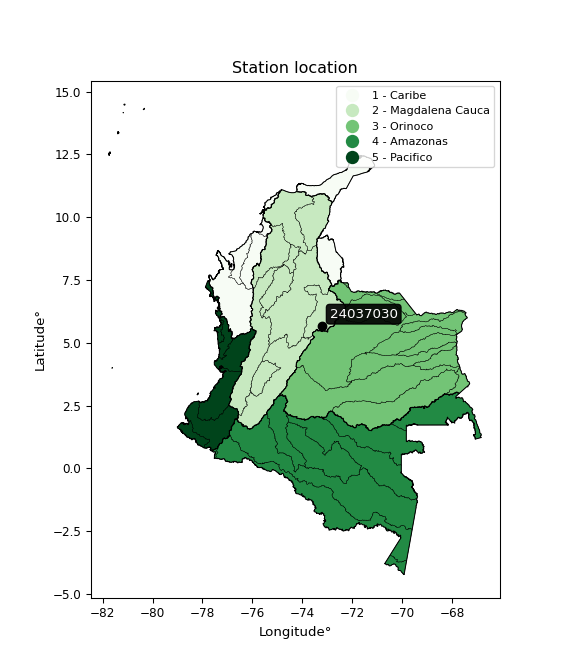</img>

</div>


## A. General information


### 1. General running parameters

• app_version: _v20260103_. • runtime: _2026-01-05 16:20:51.132608_. • Python version: _3.14.0_. • SciPy version: _1.16.3_. • Pandas version: _2.3.3_. • NumPy version: _2.3.5_. • Stations dataset (station_dataset_file): _dataset/pmax24h_in/automatic_colombia_2003_2024.csv_. • Stations catalog (station_catalog_file): _dataset/CNE.xls_. • Minimum year to eval til year_max (date_min): _1900_. • Maximum year to eval since year_min (date_max): _2024_. • Creates, save and include plots into reports (create_plot): _True_. • Plot only fit distributions with Δo > Δ (plot_only_fit): _True_. • Plot only simple graphs avoiding multiple CDFs and multiple Extreme values plots (plot_only_simple): _True_. • Eval low extreme values, if False, evaluates high extreme values (low_extreme): _False_. • Eval every SciPy distribution as logarithmic (pdist_logarithmic_on): _True_. • Standard deviation normalized (ddof): _1.0_. • Return periods to eval in years (Tr): _[2, 2.33, 5, 10, 15, 20, 25, 50, 75, 100, 200, 250, 500, 750, 1000]_. • Minimum data sample per station, 0 means any (minimum_sample): _5_. • Z-Score maximum threshold to adjust a value, 0 means disable (zscore_max): _3.5_. • Z-Score minimum threshold to adjust a value, 0 means disable (zscore_min): _-2.5_. • Avoid zeros, e.g. rain = 0 (avoid_zeros): _True_. • Avoid null values (avoid_nans): _True_. 

[:file_folder:Dataset file](../../dataset/pmax24h_in/automatic_colombia_2003_2024.csv)

> Delta Degrees of Freedom (DDOF): is a parameter used in the formulas for calculating variance and standard deviation. When ddof=0, the divisor is $N$ (the total number of observations) and this is used when your data set is the entire population. When ddof=1, the divisor is $N-1$ and this is used when your data set is a sample drawn from a larger population. Using $N-1$ provides an unbiased estimate of the population variance (known as Bessel´s correction).


### 2. Station info and location

|   id |   CODIGO | NOMBRE                   | CATEGORIA    | TECNOLOGIA                              | ESTADO           | FECHA_INSTALACION   |   FECHA_SUSPENSION |   ALTITUD |   LATITUD |   LONGITUD | DEPARTAMENTO   | MUNICIPIO   | AREA_OPERATIVA                              | ENTIDAD                                                     | AREA_HIDROGRAFICA   | ZONA_HIDROGRAFICA   | SUBZONA_HIDROGRAFICA   | CORRIENTE   | Catalogo   |   Version |
|-----:|---------:|:-------------------------|:-------------|:----------------------------------------|:-----------------|:--------------------|-------------------:|----------:|----------:|-----------:|:---------------|:------------|:--------------------------------------------|:------------------------------------------------------------|:--------------------|:--------------------|:-----------------------|:------------|:-----------|----------:|
|    0 | 24037030 | EL PALO - AUT [24037030] | Limnigráfica | Automática con Telemetría, Convencional | En Mantenimiento | 15/05/1955          |                nan |      2600 |   5.68172 |   -73.2311 | Boyacá         | Tuta        | Area Operativa 06 - Boyacá-Casanare-Vichada | INSTITUTO DE HIDROLOGIA METEOROLOGIA Y ESTUDIOS AMBIENTALES | Magdalena Cauca     | Sogamoso            | Río Chicamocha         | Tuta        | CNE_IDEAM  |  20251226 |

<div align="center">

Dynamic map: [:earth_americas:Google](http://maps.google.com/maps?q=5.681722222,-73.23113889) [:earth_americas:OSM](https://www.openstreetmap.org/#map=18/5.681722222/-73.23113889&layers=P) [:earth_americas:Bing](https://www.bing.com/maps?cp=5.681722222~-73.23113889&lvl=18) [:earth_americas:Apple](https://maps.apple.com/frame?center=5.681722222%2C-73.23113889&span=0.003%2C0.006)

</div>


<div align="center">

```geojson
{
  "type": "Feature",
  "geometry": {
    "type": "Point", 
    "coordinates": [-73.23113889, 5.681722222]
  }, 
  "properties": {
    "Name": "24037030"
  }
}
```

</div>


### 3. Discrete values table and plot

<div align="center">

|               |          0 |           1 |          2 |            3 |          4 |           5 |
|:--------------|-----------:|------------:|-----------:|-------------:|-----------:|------------:|
| Date          | 2019       | 2020        | 2021       | 2022         | 2023       | 2024        |
| Value         |   54       |   48.4      |   27.4     |   41.6       |   25       |   49.6      |
| Value_initial |   54       |   48.4      |   27.4     |   41.6       |   25       |   49.6      |
| count         |    6       |    6        |    6       |    6         |    6       |    6        |
| mean          |   41       |   41        |   41       |   41         |   41       |   41        |
| std           |   12.1576  |   12.1576   |   12.1576  |   12.1576    |   12.1576  |   12.1576   |
| zscore        |    1.06929 |    0.608671 |   -1.11864 |    0.0493517 |   -1.31605 |    0.707375 |


</div>


<div align="center">

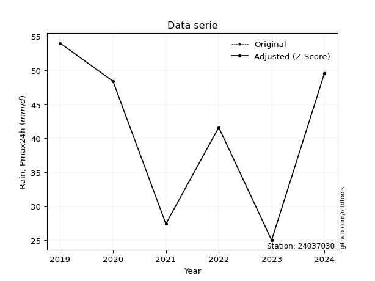</img>

</div>


> The initial value (value_initial) correspond to the initial obtained or null completed value, and value (value) is adjusted only when the initial value is outside the valid range (outlier) definite through the Z-Score value. If Z-Score is active, values out of range or outliers are replaced with the station mean value. A Z-Score (or standard score) measures how many standard deviations a data point is from the mean of a dataset, indicating its relative position; positive scores mean above the mean, negative mean below, and a score of zero is exactly at the mean, allowing for comparison of values from different distributions. It´s calculated using the formula $z=(x–μ)/σ$, where $x$ is the data point, $μ$ is the mean, and $σ$ is the standard deviation, helping identify outliers and understand probability.
>
> <sub>**Note**: In this study, "completing" (filling gaps in) and "extending" (forecasting or lengthening the historical record) rainfall data series are avoided for certain critical analyses because they introduce artificial bias and uncertainty, which can distort the statistics of rare events (extremes), alter day-to-day variability, and compromise the integrity and homogeneity of the original data. Some reasons against Completing/Extending rainfall data are: **Distortion of Extremes and Variability**: The primary issue is that most gap-filling or extension methods rely on averaging or regression with nearby stations, which inherently smooths the data. Rainfall is highly variable in space and time, with a large percentage of zero values and occasional large storms. Infilling methods often underestimate the highest values and overestimate the lowest (zero) values, which severely distorts analyses focused on flood frequency, drought severity, and intensity-duration-frequency (IDF) curves, **Loss of Data Homogeneity**: Infilled or extended data are synthetic estimates, not actual measurements. Combining these estimates with observed data can violate the assumption of data homogeneity, which requires that the data properties do not change over time. Inhomogeneity can lead to incorrect conclusions about long-term trends or changes in climate patterns, **Propagation of Errors**: Errors and biases from the original data (e.g., wind-induced undercatch, instrument errors, site changes) or the data used for imputation can propagate through the analysis, leading to unreliable hydrological models and inaccurate predictions, **Compromised Statistical Integrity**: For statistical analyses, especially those involving the frequency of events, using artificial data can introduce time bias or autocorrelation that doesn´t exist in reality, making it difficult to assess the true probability of events, **Difficulty in Validation**: It is difficult to accurately validate the quality of filled or extended data, especially for past periods where ground-truth measurements are unavailable. The reliability of imputation techniques heavily depends on the density of the surrounding station network and the complexity of the local topography.</sub>


### 4. Active continuous probability distributions from SciPy (44 of 104 available)

A Probability Density Function (PDF) describes the relative likelihood of a continuous random variable falling within a specific range, where the total area under its curve equals 1, and the area over any interval gives the actual probability for that range. Unlike discrete probabilities (like rolling a die), a PDF shows density, not direct probability for a single point (which is zero), with higher points indicating higher likelihood, often visualized as a bell curve for normal distributions.

A log of a probability density function (log-PDF) is simply the logarithm of the PDF´s value, denoted as $log(f(x))$, useful for converting multiplication of probabilities into addition, improving numerical stability with tiny numbers, and connecting to information theory concepts like entropy. Instead of dealing with very small probabilities (e.g., 0.000001), log-PDFs use negative numbers (e.g., $log(0.00001) ≈ -11.51$ that are easier for computers to handle, preventing underflow errors and simplifying complex calculations. In this study, each active probability distribution from SciPy is also evaluated in the $log$ form.

[scipy.stats](https://docs.scipy.org/doc/scipy/reference/stats.html) is a Python´s powerful submodule within the SciPy library for comprehensive statistical analysis, offering over 130 probability distributions (like Normal, Poisson), functions for descriptive stats (mean, variance), hypothesis testing (t-tests, chi-square), random variable generation, and statistical tests, making it essential for data science, modeling, and research. It provides tools to explore, model, and draw conclusions from data efficiently, working seamlessly with NumPy.

<div align="center">

|   id | p_dist             |   n_parameter | fit_method   | label                                                                       | active   | ref                                                                                                        |
|-----:|:-------------------|--------------:|:-------------|:----------------------------------------------------------------------------|:---------|:-----------------------------------------------------------------------------------------------------------|
|    0 | alpha              |             3 | MLE          | Alpha                                                                       | True     | [:mortar_board:](https://docs.scipy.org/doc/scipy/reference/generated/scipy.stats.alpha.html)              |
|    1 | betaprime          |             4 | MLE          | Beta prime                                                                  | True     | [:mortar_board:](https://docs.scipy.org/doc/scipy/reference/generated/scipy.stats.betaprime.html)          |
|    2 | chi2               |             3 | MLE          | Chi²                                                                        | True     | [:mortar_board:](https://docs.scipy.org/doc/scipy/reference/generated/scipy.stats.chi2.html)               |
|    3 | crystalball        |             4 | MLE          | Crystalball                                                                 | True     | [:mortar_board:](https://docs.scipy.org/doc/scipy/reference/generated/scipy.stats.crystalball.html)        |
|    4 | erlang             |             3 | MLE          | Erlang                                                                      | True     | [:mortar_board:](https://docs.scipy.org/doc/scipy/reference/generated/scipy.stats.erlang.html)             |
|    5 | expon              |             2 | MLE          | Exponential                                                                 | True     | [:mortar_board:](https://docs.scipy.org/doc/scipy/reference/generated/scipy.stats.expon.html)              |
|    6 | exponnorm          |             3 | MLE          | Exponentially modified Normal                                               | True     | [:mortar_board:](https://docs.scipy.org/doc/scipy/reference/generated/scipy.stats.exponnorm.html)          |
|    7 | f                  |             4 | MLE          | F                                                                           | True     | [:mortar_board:](https://docs.scipy.org/doc/scipy/reference/generated/scipy.stats.f.html)                  |
|    8 | fatiguelife        |             3 | MLE          | Fatigue-life (Birnbaum-Saunders)                                            | True     | [:mortar_board:](https://docs.scipy.org/doc/scipy/reference/generated/scipy.stats.fatiguelife.html)        |
|    9 | fisk               |             3 | MLE          | Fisk                                                                        | True     | [:mortar_board:](https://docs.scipy.org/doc/scipy/reference/generated/scipy.stats.fisk.html)               |
|   10 | gamma              |             3 | MLE          | Gamma                                                                       | True     | [:mortar_board:](https://docs.scipy.org/doc/scipy/reference/generated/scipy.stats.gamma.html)              |
|   11 | genexpon           |             5 | MLE          | Generalized exponential                                                     | True     | [:mortar_board:](https://docs.scipy.org/doc/scipy/reference/generated/scipy.stats.genexpon.html)           |
|   12 | genlogistic        |             3 | MLE          | Generalized logistic                                                        | True     | [:mortar_board:](https://docs.scipy.org/doc/scipy/reference/generated/scipy.stats.genlogistic.html)        |
|   13 | gibrat             |             2 | MM           | Gibrat                                                                      | True     | [:mortar_board:](https://docs.scipy.org/doc/scipy/reference/generated/scipy.stats.gibrat.html)             |
|   14 | gompertz           |             3 | MLE          | Gompertz (or truncated Gumbel)                                              | True     | [:mortar_board:](https://docs.scipy.org/doc/scipy/reference/generated/scipy.stats.gompertz.html)           |
|   15 | gumbel_l           |             2 | MM           | Gumbel Left Skew                                                            | True     | [:mortar_board:](https://docs.scipy.org/doc/scipy/reference/generated/scipy.stats.gumbel_l.html)           |
|   16 | gumbel_r           |             2 | MM           | Gumbel Right Skew                                                           | True     | [:mortar_board:](https://docs.scipy.org/doc/scipy/reference/generated/scipy.stats.gumbel_r.html)           |
|   17 | halflogistic       |             2 | MM           | Half-logistic                                                               | True     | [:mortar_board:](https://docs.scipy.org/doc/scipy/reference/generated/scipy.stats.halflogistic.html)       |
|   18 | halfnorm           |             2 | MM           | Half Normal                                                                 | True     | [:mortar_board:](https://docs.scipy.org/doc/scipy/reference/generated/scipy.stats.halfnorm.html)           |
|   19 | hypsecant          |             2 | MM           | hyperbolic secant                                                           | True     | [:mortar_board:](https://docs.scipy.org/doc/scipy/reference/generated/scipy.stats.hypsecant.html)          |
|   20 | invgamma           |             3 | MLE          | Inverted gamma                                                              | True     | [:mortar_board:](https://docs.scipy.org/doc/scipy/reference/generated/scipy.stats.invgamma.html)           |
|   21 | invgauss           |             3 | MLE          | Inverse Gaussian                                                            | True     | [:mortar_board:](https://docs.scipy.org/doc/scipy/reference/generated/scipy.stats.invgauss.html)           |
|   22 | invweibull         |             3 | MLE          | Inverted Weibull                                                            | True     | [:mortar_board:](https://docs.scipy.org/doc/scipy/reference/generated/scipy.stats.invweibull.html)         |
|   23 | johnsonsu          |             4 | MLE          | Johnson Su                                                                  | True     | [:mortar_board:](https://docs.scipy.org/doc/scipy/reference/generated/scipy.stats.johnsonsu.html)          |
|   24 | kstwobign          |             2 | MLE          | Limiting distribution of scaled Kolmogorov-Smirnov two-sided test statistic | True     | [:mortar_board:](https://docs.scipy.org/doc/scipy/reference/generated/scipy.stats.kstwobign.html)          |
|   25 | laplace            |             2 | MM           | Laplace                                                                     | True     | [:mortar_board:](https://docs.scipy.org/doc/scipy/reference/generated/scipy.stats.laplace.html)            |
|   26 | laplace_asymmetric |             3 | MLE          | Asymmetric Laplace                                                          | True     | [:mortar_board:](https://docs.scipy.org/doc/scipy/reference/generated/scipy.stats.laplace_asymmetric.html) |
|   27 | loggamma           |             3 | MLE          | Log gamma                                                                   | True     | [:mortar_board:](https://docs.scipy.org/doc/scipy/reference/generated/scipy.stats.loggamma.html)           |
|   28 | logistic           |             2 | MM           | Logistic (or Sech-squared)                                                  | True     | [:mortar_board:](https://docs.scipy.org/doc/scipy/reference/generated/scipy.stats.logistic.html)           |
|   29 | lognorm            |             3 | MLE          | Log Normal                                                                  | True     | [:mortar_board:](https://docs.scipy.org/doc/scipy/reference/generated/scipy.stats.lognorm.html)            |
|   30 | maxwell            |             2 | MM           | Maxwell                                                                     | True     | [:mortar_board:](https://docs.scipy.org/doc/scipy/reference/generated/scipy.stats.maxwell.html)            |
|   31 | mielke             |             4 | MLE          | Mielke Beta-Kappa / Dagum                                                   | True     | [:mortar_board:](https://docs.scipy.org/doc/scipy/reference/generated/scipy.stats.mielke.html)             |
|   32 | moyal              |             2 | MM           | Moyal                                                                       | True     | [:mortar_board:](https://docs.scipy.org/doc/scipy/reference/generated/scipy.stats.moyal.html)              |
|   33 | nakagami           |             3 | MLE          | Nakagami                                                                    | True     | [:mortar_board:](https://docs.scipy.org/doc/scipy/reference/generated/scipy.stats.nakagami.html)           |
|   34 | ncf                |             5 | MLE          | Non-central F distribution                                                  | True     | [:mortar_board:](https://docs.scipy.org/doc/scipy/reference/generated/scipy.stats.ncf.html)                |
|   35 | nct                |             4 | MLE          | Non-central Student’s t                                                     | True     | [:mortar_board:](https://docs.scipy.org/doc/scipy/reference/generated/scipy.stats.nct.html)                |
|   36 | norm               |             2 | MM           | Normal                                                                      | True     | [:mortar_board:](https://docs.scipy.org/doc/scipy/reference/generated/scipy.stats.norm.html)               |
|   37 | pearson3           |             3 | MM           | Pearson type III                                                            | True     | [:mortar_board:](https://docs.scipy.org/doc/scipy/reference/generated/scipy.stats.pearson3.html)           |
|   38 | rayleigh           |             2 | MM           | Rayleigh                                                                    | True     | [:mortar_board:](https://docs.scipy.org/doc/scipy/reference/generated/scipy.stats.rayleigh.html)           |
|   39 | rice               |             3 | MLE          | Rice                                                                        | True     | [:mortar_board:](https://docs.scipy.org/doc/scipy/reference/generated/scipy.stats.rice.html)               |
|   40 | t                  |             3 | MLE          | Student’s t                                                                 | True     | [:mortar_board:](https://docs.scipy.org/doc/scipy/reference/generated/scipy.stats.t.html)                  |
|   41 | truncnorm          |             4 | MLE          | Truncated normal                                                            | True     | [:mortar_board:](https://docs.scipy.org/doc/scipy/reference/generated/scipy.stats.truncnorm.html)          |
|   42 | wald               |             2 | MM           | Wald                                                                        | True     | [:mortar_board:](https://docs.scipy.org/doc/scipy/reference/generated/scipy.stats.wald.html)               |
|   43 | weibull_min        |             3 | MLE          | Weibull minimum                                                             | True     | [:mortar_board:](https://docs.scipy.org/doc/scipy/reference/generated/scipy.stats.weibull_min.html)        |

</div>

> **n_parameter:** # arguments & localization & scale.
>
> **Fit methods:** (MLE) maximum likelihood, (MM) L-moments.
>
>**Inactive** (With the only purpose of prevent loops, zero divisions, infinite values, over high estimated values or horizontal trending for recurrence intervals estimations, the follow distributions were disabled.)**:** foldnorm, gennorm, norminvgauss, powernorm, powerlognorm, skewnorm, genextreme, anglit, arcsine, argus, beta, bradford, burr, burr12, cauchy, cosine, halfcauchy, foldcauchy, skewcauchy, wrapcauchy, dgamma, gengamma, exponweib, exponpow, truncexpon, gausshyper, genhalflogistic, genhyperbolic, geninvgauss, halfgennorm, johnsonsb, kappa4, kappa3, ksone, kstwo, loglaplace, levy, levy_l, levy_stable, ncx2, pareto, genpareto, truncpareto, lomax, powerlaw, rdist, rel_breitwigner, recipinvgauss, semicircular, studentized_range, trapezoid, triang, truncweibull_min, tukeylambda, uniform, loguniform, vonmises, vonmises_line, weibull_max, dweibull, 


## B. Probability (PDF) vs. Empirical (EDF) distributions functions

A continuous probability distribution (CPD) describes probabilities for variables that can take any value within a range (like rain any time), unlike discrete variables with specific outcomes (like temperature). It uses a Probability Density Function (PDF), a curve where the total area under it equals 1, and the probability of the variable falling within an interval (a to b) is found by calculating the area under the curve between those points. A key feature is that the probability of hitting any single exact value is zero, so probabilities are always expressed for ranges, e.g., $P(a ≤ X ≤ b)$.

<div align="center">

Distributions parameters from station values
|    |   station | p_dist                |   n |              loc |           scale | shape                  | shape1                 | shape2              | shape3   |
|---:|----------:|:----------------------|----:|-----------------:|----------------:|:-----------------------|:-----------------------|:--------------------|:---------|
|  0 |  24037030 | alpha                 |   6 |   -158.233       |  3491.64        | 17.588810526502073     |                        |                     |          |
|  1 |  24037030 | betaprime             |   6 |   -182.658       | 11454           | 404.4992719244864      | 20714.346949981802     |                     |          |
|  2 |  24037030 | chi2                  |   6 |     25           |     6.98156     | 1.5611228619325517     |                        |                     |          |
|  3 |  24037030 | crystalball           |   6 |     41           |    11.0983      | 2660.8131920480428     | 4231.201965051403      |                     |          |
|  4 |  24037030 | erlang                |   6 |   -139.931       |     0.70679     | 256.03219173454556     |                        |                     |          |
|  5 |  24037030 | expon                 |   6 |     25           |    16           |                        |                        |                     |          |
|  6 |  24037030 | exponnorm             |   6 |     40.99        |    11.0983      | 0.000899926463124561   |                        |                     |          |
|  7 |  24037030 | f                     |   6 |  -2121.52        |  2162.51        | 85353.22043928827      | 618656.244153817       |                     |          |
|  8 |  24037030 | fatiguelife           |   6 |     25           |     6.43143e-07 | 4832.7362138444005     |                        |                     |          |
|  9 |  24037030 | fisk                  |   6 |     -8.51598e+07 |     8.51598e+07 | 12457796.925973859     |                        |                     |          |
| 10 |  24037030 | gamma                 |   6 |   -124.771       |     0.77277     | 214.60685566891584     |                        |                     |          |
| 11 |  24037030 | genexpon              |   6 |     25           |     3.55365     | 0.22209731364179874    | 2.7890801905310804e-10 | 1.7814689524420548  |          |
| 12 |  24037030 | genlogistic           |   6 |     54.0002      |     9.01723e-06 | 6.939731767062465e-07  |                        |                     |          |
| 13 |  24037030 | gibrat                |   6 |     32.5334      |     5.13527     |                        |                        |                     |          |
| 14 |  24037030 | gompertz              |   6 |     41.6         |     3.09082     | 0.05362273367474778    |                        |                     |          |
| 15 |  24037030 | gumbel_l              |   6 |     45.9948      |     8.65335     |                        |                        |                     |          |
| 16 |  24037030 | gumbel_r              |   6 |     36.0052      |     8.65335     |                        |                        |                     |          |
| 17 |  24037030 | halflogistic          |   6 |     27.8458      |     9.48871     |                        |                        |                     |          |
| 18 |  24037030 | halfnorm              |   6 |     26.3101      |    18.4111      |                        |                        |                     |          |
| 19 |  24037030 | hypsecant             |   6 |     41           |     7.06543     |                        |                        |                     |          |
| 20 |  24037030 | invgamma              |   6 |    -93.6905      | 18355.5         | 137.25769349549014     |                        |                     |          |
| 21 |  24037030 | invgauss              |   6 |    -11.507       |   976.912       | 0.0535961666549829     |                        |                     |          |
| 22 |  24037030 | invweibull            |   6 |     25           |     1.59835     | 0.05818658170351546    |                        |                     |          |
| 23 |  24037030 | johnsonsu             |   6 |     56.4758      |     0.0850969   | 6.299394971555267      | 1.1320448300558752     |                     |          |
| 24 |  24037030 | kstwobign             |   6 |     -0.67335     |    47.3632      |                        |                        |                     |          |
| 25 |  24037030 | laplace               |   6 |     41           |     7.84772     |                        |                        |                     |          |
| 26 |  24037030 | laplace_asymmetric    |   6 |     49.6         |     6.32652     | 1.88878305605121       |                        |                     |          |
| 27 |  24037030 | loggamma              |   6 |     54.0002      |     1.10473e-05 | 8.486346163212118e-07  |                        |                     |          |
| 28 |  24037030 | logistic              |   6 |     41           |     6.11884     |                        |                        |                     |          |
| 29 |  24037030 | lognorm               |   6 |     25           |     0.0364954   | 13.42509922157292      |                        |                     |          |
| 30 |  24037030 | maxwell               |   6 |     14.7016      |    16.4801      |                        |                        |                     |          |
| 31 |  24037030 | mielke                |   6 | -74746.6         | 74694.6         | 33397912.584669128     | 7242.238138212693      |                     |          |
| 32 |  24037030 | moyal                 |   6 |     34.6533      |     4.99601     |                        |                        |                     |          |
| 33 |  24037030 | nakagami              |   6 |     25           |    20.461       | 0.27450904198880965    |                        |                     |          |
| 34 |  24037030 | ncf                   |   6 |     -0.619464    |     3.38009e-07 | 7.450783056509328e-07  | 55.46635302100257      | 88.710645690848     |          |
| 35 |  24037030 | nct                   |   6 |   -449.008       |    11.0559      | 90767.40160769504      | 44.32001993593855      |                     |          |
| 36 |  24037030 | norm                  |   6 |     41           |    11.0983      |                        |                        |                     |          |
| 37 |  24037030 | pearson3              |   6 |     41           |    11.0984      | -0.4112279781382371    |                        |                     |          |
| 38 |  24037030 | rayleigh              |   6 |     19.7682      |    16.9405      |                        |                        |                     |          |
| 39 |  24037030 | rice                  |   6 |     18.2912      |    12.8583      | 1.365291132964797      |                        |                     |          |
| 40 |  24037030 | t                     |   6 |     41.0003      |    11.0984      | 215096903.64272213     |                        |                     |          |
| 41 |  24037030 | truncnorm             |   6 |     41           |    11.0983      | -173.53742602357056    | 713.7614917131722      |                     |          |
| 42 |  24037030 | wald                  |   6 |     29.9017      |    11.0983      |                        |                        |                     |          |
| 43 |  24037030 | weibull_min           |   6 |     -5.70584e+08 |     5.70584e+08 | 65518492.57742527      |                        |                     |          |
| 44 |  24037030 | logalpha              |   6 |     -5.44939     |   270.443       | 29.69701898028785      |                        |                     |          |
| 45 |  24037030 | logbetaprime          |   6 |      0.505165    |   152.153       | 108.50177612561401     | 5219.366568224843      |                     |          |
| 46 |  24037030 | logchi2               |   6 |      3.21888     |     0.936637    | 1.120422698316989      |                        |                     |          |
| 47 |  24037030 | logcrystalball        |   6 |      3.67167     |     0.299019    | 7.547999469432984      | 436.9486423839321      |                     |          |
| 48 |  24037030 | logerlang             |   6 |     -1.06538     |     0.0196609   | 240.99413661588778     |                        |                     |          |
| 49 |  24037030 | logexpon              |   6 |      3.21888     |     0.45279     |                        |                        |                     |          |
| 50 |  24037030 | logexponnorm          |   6 |      3.6714      |     0.299018    | 0.0008901174855026445  |                        |                     |          |
| 51 |  24037030 | logf                  |   6 |   -188.231       |   191.903       | 2467522.3213742194     | 1225048.560325114      |                     |          |
| 52 |  24037030 | logfatiguelife        |   6 |    -58.6933      |    62.3617      | 0.004770897373117533   |                        |                     |          |
| 53 |  24037030 | logfisk               |   6 |     -1.64527e+07 |     1.64527e+07 | 89391774.12113532      |                        |                     |          |
| 54 |  24037030 | loggamma              |   6 |     -1.17568     |     0.0190079   | 254.89650798861214     |                        |                     |          |
| 55 |  24037030 | loggenexpon           |   6 |      3.21874     |     0.48974     | 0.6392937147211546     | 7.918497877104393      | 0.08453468121967458 |          |
| 56 |  24037030 | loggenlogistic        |   6 |      3.98908     |     2.89941e-07 | 9.070591012506505e-07  |                        |                     |          |
| 57 |  24037030 | loggibrat             |   6 |      3.44347     |     0.138406    |                        |                        |                     |          |
| 58 |  24037030 | loggompertz           |   6 |      3.21888     |     0.798241    | 1.192733990725785      |                        |                     |          |
| 59 |  24037030 | loggumbel_l           |   6 |      3.80624     |     0.233144    |                        |                        |                     |          |
| 60 |  24037030 | loggumbel_r           |   6 |      3.53709     |     0.233144    |                        |                        |                     |          |
| 61 |  24037030 | loghalflogistic       |   6 |      3.3173      |     0.255623    |                        |                        |                     |          |
| 62 |  24037030 | loghalfnorm           |   6 |      3.27583     |     0.4961      |                        |                        |                     |          |
| 63 |  24037030 | loghypsecant          |   6 |      3.67167     |     0.190361    |                        |                        |                     |          |
| 64 |  24037030 | loginvgamma           |   6 |     -2.21901     |  2209.61        | 375.9476715394171      |                        |                     |          |
| 65 |  24037030 | loginvgauss           |   6 |      1.53193     |    91.3112      | 0.023394660015306344   |                        |                     |          |
| 66 |  24037030 | loginvweibull         |   6 |     -1.29146e+07 |     1.29146e+07 | 44044781.44482965      |                        |                     |          |
| 67 |  24037030 | logjohnsonsu          |   6 |      4.00698     |     0.000399556 | 5.294937946480728      | 0.7771410776632941     |                     |          |
| 68 |  24037030 | logkstwobign          |   6 |      2.5212      |     1.30717     |                        |                        |                     |          |
| 69 |  24037030 | loglaplace            |   6 |      3.67167     |     0.211438    |                        |                        |                     |          |
| 70 |  24037030 | loglaplace_asymmetric |   6 |      3.90399     |     0.149626    | 2.0423487408117693     |                        |                     |          |
| 71 |  24037030 | logloggamma           |   6 |      3.98909     |     8.01326e-06 | 2.5428535895071287e-05 |                        |                     |          |
| 72 |  24037030 | loglogistic           |   6 |      3.67167     |     0.164858    |                        |                        |                     |          |
| 73 |  24037030 | loglognorm            |   6 |      3.21888     |     0.00139041  | 12.887812711339384     |                        |                     |          |
| 74 |  24037030 | logmaxwell            |   6 |      2.96312     |     0.444017    |                        |                        |                     |          |
| 75 |  24037030 | logmielke             |   6 |     -7.59857e+06 |     7.59857e+06 | 23637005.087935567     | 6381355694.469094      |                     |          |
| 76 |  24037030 | logmoyal              |   6 |      3.50067     |     0.134606    |                        |                        |                     |          |
| 77 |  24037030 | lognakagami           |   6 |      3.21888     |     0.542162    | 0.1546201653860625     |                        |                     |          |
| 78 |  24037030 | logncf                |   6 |     -2.05989     |     1.02483e-05 | 0.0009545616034004299  | 301.27461670083073     | 532.7787678008262   |          |
| 79 |  24037030 | lognct                |   6 |    -14.786       |     0.262491    | 7918.497441195921      | 70.30856774948563      |                     |          |
| 80 |  24037030 | lognorm               |   6 |      3.67167     |     0.299019    |                        |                        |                     |          |
| 81 |  24037030 | logpearson3           |   6 |      3.67167     |     0.299019    | -0.5377927810629728    |                        |                     |          |
| 82 |  24037030 | lograyleigh           |   6 |      3.09962     |     0.456422    |                        |                        |                     |          |
| 83 |  24037030 | logrice               |   6 |      3.03992     |     0.342383    | 1.4721910273554824     |                        |                     |          |
| 84 |  24037030 | logt                  |   6 |      3.67166     |     0.299014    | 44861954.67374763      |                        |                     |          |
| 85 |  24037030 | logtruncnorm          |   6 |     -0.0872889   |     1.05192     | 3.627056138840267      | 3.8750634170683544     |                     |          |
| 86 |  24037030 | logwald               |   6 |      3.37268     |     0.29899     |                        |                        |                     |          |
| 87 |  24037030 | logweibull_min        |   6 |  -1222.29        |  1226.1         | 5536.54206114897       |                        |                     |          |

</div>

> **loc** (Location parameter): This shifts the distribution along the x-axis. For many common distributions, like the normal (Gaussian) distribution, loc represents the mean $μ$. For others, like the uniform distribution, it might represent the minimum value, or for the beta distribution, the left end of the support interval.
>
> **scale** (Scale parameter): This determines the width or spread of the distribution. For the normal distribution, scale represents the standard deviation $σ$. For a uniform distribution, it defines the length of the interval (from $loc$ to $loc + scale$).
>
> **shape** (Shape parameters): Refers to parameters that define the specific form of a probability distribution, distinct from its location (loc) and scale (scale). These parameters are required arguments for most distribution functions. For example, a normal (Gaussian) distribution is fully defined by its location (mean) and scale (standard deviation), so it has no specific shape parameters beyond loc and scale. However, other distributions have intrinsic properties that need specification, as Gamma distribution that takes a shape parameter, often named $a$ or $alpha$.


### 0. Cumulative distribution values - CDF (88 evaluated)

Cumulative Distribution Function (CDF), denoted as $F$<sub>$X$</sub>$(x)$, is a function that gives the probability that a random variable $X$ will take a value less than or equal to a specific value, $x$ (i.e., $(P(X≥x)$. It essentially "accumulates" probabilities from a given point up to the far right (positive infinity), providing a complete picture of the distribution´s probabilities for both discrete (like rain) and continuous (like temperature) variables, helping to find probabilities over ranges or above certain values. Each station is evaluated separately ordering the $x$ values ascending, calculating the CDF and PDF values for the activated distributions and their logarithmic forms.

<div align="center">

CDF ordered by x ascending and calculating $log(f(x))$ separately
|   id |   Station |   date |    x |   count |   mean |     std |     zscore |   Value_initial |   station |   m |     alpha |   alpha_pdf |   betaprime |   betaprime_pdf |        chi2 |     chi2_pdf |   crystalball |   crystalball_pdf |    erlang |   erlang_pdf |    expon |   expon_pdf |   exponnorm |   exponnorm_pdf |         f |     f_pdf |   fatiguelife |   fatiguelife_pdf |      fisk |   fisk_pdf |     gamma |   gamma_pdf |    genexpon |   genexpon_pdf |   genlogistic |   genlogistic_pdf |   gibrat |   gibrat_pdf |    gompertz |   gompertz_pdf |   gumbel_l |   gumbel_l_pdf |   gumbel_r |   gumbel_r_pdf |   halflogistic |   halflogistic_pdf |   halfnorm |   halfnorm_pdf |   hypsecant |   hypsecant_pdf |   invgamma |   invgamma_pdf |   invgauss |   invgauss_pdf |   invweibull |   invweibull_pdf |   johnsonsu |   johnsonsu_pdf |   kstwobign |   kstwobign_pdf |   laplace |   laplace_pdf |   laplace_asymmetric |   laplace_asymmetric_pdf |   loggamma |   loggamma_pdf |   logistic |   logistic_pdf |   lognorm |   lognorm_pdf |   maxwell |   maxwell_pdf |   mielke |   mielke_pdf |     moyal |   moyal_pdf |    nakagami |   nakagami_pdf |       ncf |   ncf_pdf |       nct |   nct_pdf |      norm |   norm_pdf |   pearson3 |   pearson3_pdf |   rayleigh |   rayleigh_pdf |      rice |   rice_pdf |         t |     t_pdf |   truncnorm |   truncnorm_pdf |     wald |   wald_pdf |   weibull_min |   weibull_min_pdf |   logalpha |   logalpha_pdf |   logbetaprime |   logbetaprime_pdf |     logchi2 |   logchi2_pdf |   logcrystalball |   logcrystalball_pdf |   logerlang |   logerlang_pdf |   logexpon |   logexpon_pdf |   logexponnorm |   logexponnorm_pdf |      logf |   logf_pdf |   logfatiguelife |   logfatiguelife_pdf |   logfisk |   logfisk_pdf |   loggenexpon |   loggenexpon_pdf |   loggenlogistic |   loggenlogistic_pdf |   loggibrat |   loggibrat_pdf |   loggompertz |   loggompertz_pdf |   loggumbel_l |   loggumbel_l_pdf |   loggumbel_r |   loggumbel_r_pdf |   loghalflogistic |   loghalflogistic_pdf |   loghalfnorm |   loghalfnorm_pdf |   loghypsecant |   loghypsecant_pdf |   loginvgamma |   loginvgamma_pdf |   loginvgauss |   loginvgauss_pdf |   loginvweibull |   loginvweibull_pdf |   logjohnsonsu |   logjohnsonsu_pdf |   logkstwobign |   logkstwobign_pdf |   loglaplace |   loglaplace_pdf |   loglaplace_asymmetric |   loglaplace_asymmetric_pdf |   logloggamma |   logloggamma_pdf |   loglogistic |   loglogistic_pdf |   loglognorm |   loglognorm_pdf |   logmaxwell |   logmaxwell_pdf |   logmielke |   logmielke_pdf |   logmoyal |   logmoyal_pdf |   lognakagami |   lognakagami_pdf |   logncf |   logncf_pdf |    lognct |   lognct_pdf |   logpearson3 |   logpearson3_pdf |   lograyleigh |   lograyleigh_pdf |   logrice |   logrice_pdf |      logt |   logt_pdf |   logtruncnorm |   logtruncnorm_pdf |   logwald |   logwald_pdf |   logweibull_min |   logweibull_min_pdf |
|-----:|----------:|-------:|-----:|--------:|-------:|--------:|-----------:|----------------:|----------:|----:|----------:|------------:|------------:|----------------:|------------:|-------------:|--------------:|------------------:|----------:|-------------:|---------:|------------:|------------:|----------------:|----------:|----------:|--------------:|------------------:|----------:|-----------:|----------:|------------:|------------:|---------------:|--------------:|------------------:|---------:|-------------:|------------:|---------------:|-----------:|---------------:|-----------:|---------------:|---------------:|-------------------:|-----------:|---------------:|------------:|----------------:|-----------:|---------------:|-----------:|---------------:|-------------:|-----------------:|------------:|----------------:|------------:|----------------:|----------:|--------------:|---------------------:|-------------------------:|-----------:|---------------:|-----------:|---------------:|----------:|--------------:|----------:|--------------:|---------:|-------------:|----------:|------------:|------------:|---------------:|----------:|----------:|----------:|----------:|----------:|-----------:|-----------:|---------------:|-----------:|---------------:|----------:|-----------:|----------:|----------:|------------:|----------------:|---------:|-----------:|--------------:|------------------:|-----------:|---------------:|---------------:|-------------------:|------------:|--------------:|-----------------:|---------------------:|------------:|----------------:|-----------:|---------------:|---------------:|-------------------:|----------:|-----------:|-----------------:|---------------------:|----------:|--------------:|--------------:|------------------:|-----------------:|---------------------:|------------:|----------------:|--------------:|------------------:|--------------:|------------------:|--------------:|------------------:|------------------:|----------------------:|--------------:|------------------:|---------------:|-------------------:|--------------:|------------------:|--------------:|------------------:|----------------:|--------------------:|---------------:|-------------------:|---------------:|-------------------:|-------------:|-----------------:|------------------------:|----------------------------:|--------------:|------------------:|--------------:|------------------:|-------------:|-----------------:|-------------:|-----------------:|------------:|----------------:|-----------:|---------------:|--------------:|------------------:|---------:|-------------:|----------:|-------------:|--------------:|------------------:|--------------:|------------------:|----------:|--------------:|----------:|-----------:|---------------:|-------------------:|----------:|--------------:|-----------------:|---------------------:|
|    0 |  24037030 |   2023 | 25   |       6 |     41 | 12.1576 | -1.31605   |            25   |  24037030 |   1 | 0.0711927 |   0.0141461 |   0.0741187 |       0.0131401 | 1.24676e-12 | 136.962      |     0.0746997 |         0.0127157 | 0.0748532 |    0.0132969 | 0        |   0.0625    |    0.074699 |       0.0127156 | 0.0756854 | 0.0128357 |      0.16248  |       4.25574e+12 | 0.0774357 |  0.0104507 | 0.0741911 |   0.0132752 | 1.95844e-09 |      0.0624984 |      0        |        0.00825996 | 0        |    0         | 0           |      0         |  0.0845788 |      0.0093486 |  0.0282349 |      0.0116394 |       0        |          0         |  0         |      0         |   0.0658938 |      0.00925976 |  0.0729371 |      0.0142357 |  0.0718223 |      0.016583  |   0.00106939 |      5.99055e+10 |    0.119146 |      0.00715837 |   0.0694267 |       0.0200049 | 0.0650918 |    0.00829436 |            0.0996814 |               0.00834194 |  0.0652542 |       0.447324 |  0.0681872 |      0.0103839 | 0.0649811 |      0.423938 | 0.0578023 |     0.0155527 |      nan |          nan | 0.0085973 |  0.00664563 | 1.73021e-09 | 267377         | 0.0633105 | 0.0158561 | 0.0750497 | 0.01275   | 0.0746997 |  0.0127157 |   0.08276  |      0.0115664 |  0.0465696 |      0.0173814 | 0.0532789 |  0.0157701 | 0.0746957 | 0.0127151 |   0.0746997 |       0.0127157 | 0        | 0          |     0.0838345 |        0.00921118 |  0.0665334 |       0.464685 |      0.0654932 |           0.461476 | 1.98336e-09 |   2.50198e+06 |        0.0649811 |             0.423938 |   0.0647812 |        0.443185 |   0        |       2.20853  |      0.0649798 |           0.423932 | 0.0651264 |   0.424465 |        0.0647173 |             0.427815 | 0.0669207 |      0.339265 |   0.000182386 |          1.30553  |         0        |             0.281117 |    0        |        0        |   9.04341e-09 |          1.4942   |     0.0773585 |          0.318627 |     0.019935  |          0.334776 |          0        |              0        |     0         |          0        |      0.0588352 |           0.307314 |     0.0612888 |          0.443243 |     0.0700064 |          0.525642 |       0.0639164 |            0.599496 |       0.127158 |           0.205426 |      0.0617918 |           0.678571 |    0.0587407 |         0.277815 |               0.0857037 |                    0.280455 |     0.0868036 |          0.275454 |     0.0602819 |          0.343617 |    0.0127902 |      5.76718e+12 |    0.0460572 |         0.505076 |   0.0898494 |        0.279496 |  0.0043951 |       0.146129 |   1.73798e-05 |       1.21024e+10 | 0.250646 |     0.503138 | 0.0657114 |     0.429985 |      0.07578  |          0.380433 |     0.0335559 |          0.553228 | 0.0464037 |      0.519792 | 0.0649813 |   0.423946 |    0           |            0       |  0        |      0        |        0.0677038 |             0.295272 |
|    1 |  24037030 |   2021 | 27.4 |       6 |     41 | 12.1576 | -1.11864   |            27.4 |  24037030 |   2 | 0.111119  |   0.0191916 |   0.11088   |       0.0175753 | 0.253576    |   0.0747849  |     0.110211  |         0.016966  | 0.112015  |    0.0177479 | 0.139292 |   0.0537942 |    0.11021  |       0.0169659 | 0.111483  | 0.0170815 |      0.65532  |       0.0306713   | 0.106536  |  0.0139246 | 0.11132   |   0.0177428 | 0.139289    |      0.0537931 |      0        |        0.00993562 | 0        |    0         | 0           |      0         |  0.110074  |      0.0119931 |  0.0669918 |      0.0209273 |       0        |          0         |  0.0472059 |      0.0432614 |   0.0922292 |      0.0128717  |  0.11295   |      0.0191658 |  0.118674  |      0.0224344 |   0.37658    |      0.00891654  |    0.13797  |      0.0085801  |   0.126233  |       0.0270835 | 0.0883777 |    0.0112616  |            0.121854  |               0.0101975  |  0.116648  |       0.68015  |  0.0977354 |      0.0144118 | 0.113583  |      0.643425 | 0.102131  |     0.0213617 |      nan |          nan | 0.038772  |  0.0195049  | 0.239603    |      0.0546487 | 0.108924  | 0.0221519 | 0.11064   | 0.0169968 | 0.110211  |  0.016966  |   0.114554 |      0.0150178 |  0.0964984 |      0.0240271 | 0.0975501 |  0.0210635 | 0.110206  | 0.0169654 |   0.110211  |       0.016966  | 0        | 0          |     0.108937  |        0.0118014  |  0.11987   |       0.704463 |      0.11854   |           0.701406 | 0.203751    |   1.20662     |        0.113583  |             0.643425 |   0.115679  |        0.673435 |   0.183272 |       1.80377  |      0.113581  |           0.64342  | 0.113759  |   0.643477 |        0.113866  |             0.651552 | 0.105559  |      0.512986 |   0.123258    |          1.36735  |         0        |             0.374482 |    0        |        0        |   0.135102    |          1.4496   |     0.112456  |          0.454145 |     0.0711863 |          0.806825 |          0        |              0        |     0.0557785 |          1.60438  |      0.094794  |           0.490641 |     0.112696  |          0.684676 |     0.129909  |          0.782869 |       0.133745  |            0.917657 |       0.148281 |           0.258181 |      0.140864  |           1.0291   |    0.09062   |         0.428588 |               0.115684  |                    0.378564 |     0.11611   |          0.368452 |     0.100606  |          0.548863 |    0.62741   |      0.320317    |    0.106377  |         0.810063 |   0.119496  |        0.371719 |  0.042731  |       0.770809 |   0.463964    |       1.55921     | 0.298521 |     0.539933 | 0.114951  |     0.651054 |      0.118045 |          0.548322 |     0.101271  |          0.909932 | 0.106169  |      0.782025 | 0.113584  |   0.643442 |    0           |            0       |  0        |      0        |        0.100639  |             0.430941 |
|    2 |  24037030 |   2022 | 41.6 |       6 |     41 | 12.1576 |  0.0493517 |            41.6 |  24037030 |   3 | 0.546169  |   0.0346486 |   0.527324  |       0.0353782 | 0.779259    |   0.0176948  |     0.521557  |         0.0358936 | 0.528374  |    0.0351087 | 0.645661 |   0.0221462 |    0.521556 |       0.0358937 | 0.522255  | 0.0356627 |      0.853429 |       0.00726947  | 0.487668  |  0.0365496 | 0.52769   |   0.0350761 | 0.645651    |      0.0221462 |      0        |        0.0296354  | 0.715141 |    0.0374363 | 5.96087e-10 |      0.017349  |  0.452159  |      0.0380979 |  0.592237  |      0.0358523 |       0.619852 |          0.0324482 |  0.593729  |      0.0306971 |   0.526999  |      0.0448898  |  0.542669  |      0.0342099 |  0.569935  |      0.0321584 |   0.417829   |      0.00127811  |    0.370388 |      0.0287423  |   0.596881  |       0.0296149 | 0.536803  |    0.0590232  |            0.399881  |               0.0334644  |  0.584577  |       1.27453  |  0.524495  |      0.0407594 | 0.574849  |      1.31062  | 0.55362   |     0.0340435 |      nan |          nan | 0.617808  |  0.0351796  | 0.667694    |      0.0191413 | 0.567876  | 0.0326009 | 0.521815  | 0.0358357 | 0.521557  |  0.0358936 |   0.494253 |      0.036169  |  0.564132  |      0.0331582 | 0.540822  |  0.034649  | 0.521546  | 0.0358936 |   0.521557  |       0.0358936 | 0.688823 | 0.0331705  |     0.44512   |        0.0375285  |  0.590567  |       1.24781  |      0.589042  |           1.25139  | 0.493062    |   0.454209    |        0.574849  |             1.31062  |   0.580048  |        1.27067  |   0.67523  |       0.717265 |      0.574846  |           1.31062  | 0.573986  |   1.30665  |        0.579494  |             1.31292  | 0.532893  |      1.35243  |   0.638171    |          0.964732 |         0        |             1.38277  |    0.764548 |        1.08079  |   0.655131    |          0.975245 |     0.510918  |          1.50038  |     0.643553  |          1.21662  |          0.666006 |              1.08839  |     0.638044  |          1.06145  |      0.593014  |           1.60125  |     0.583478  |          1.26702  |     0.601673  |          1.15227  |       0.61612   |            1.01766  |       0.369717 |           1.05188  |      0.638615  |           1.00252  |    0.617128  |         1.8108   |               0.453626  |                    1.48444  |     0.436842  |          1.38623  |     0.584755  |          1.47289  |    0.676542  |      0.0547346   |    0.603458  |         1.20918  |   0.437987  |        1.36245  |  0.667458  |       1.16109  |   0.775016    |       0.418002    | 0.539424 |     0.576459 | 0.576605  |     1.30034  |      0.540565 |          1.37154  |     0.612488  |          1.16907  | 0.5902    |      1.24419  | 0.574861  |   1.31063  |    4.71756e-06 |            5.85888 |  0.733859 |      1.01418  |        0.503059  |             1.56928  |
|    3 |  24037030 |   2020 | 48.4 |       6 |     41 | 12.1576 |  0.608671  |            48.4 |  24037030 |   4 | 0.755216  |   0.0256956 |   0.747572  |       0.0278216 | 0.871096    |   0.0100839  |     0.747539  |         0.0287815 | 0.746592  |    0.0275552 | 0.768344 |   0.0144785 |    0.747539 |       0.0287816 | 0.746629  | 0.0285861 |      0.894009 |       0.00488253  | 0.720192  |  0.0294792 | 0.745632  |   0.0275208 | 0.768335    |      0.0144787 |      0        |        0.050014   | 0.870358 |    0.0133073 | 0.34972     |      0.101824  |  0.732975  |      0.0407453 |  0.787619  |      0.02173   |       0.79434  |          0.0194454 |  0.76979   |      0.0210991 |   0.785176  |      0.0281489  |  0.750078  |      0.0256703 |  0.758166  |      0.0227    |   0.425103   |      0.000904237 |    0.64083  |      0.0523983  |   0.766713  |       0.0203156 | 0.805261  |    0.0248147  |            0.706435  |               0.0591187  |  0.759119  |       0.997737 |  0.770189  |      0.0289267 | 0.756489  |      1.04787  | 0.757448  |     0.0250234 |      nan |          nan | 0.800543  |  0.0195405  | 0.778459    |      0.0137173 | 0.756944  | 0.0225711 | 0.747408  | 0.0287353 | 0.747539  |  0.0287815 |   0.73582  |      0.032492  |  0.760279  |      0.0239167 | 0.752764  |  0.0265034 | 0.74753   | 0.028782  |   0.747539  |       0.0287815 | 0.840824 | 0.0146191  |     0.723613  |        0.0408119  |  0.760292  |       0.965404 |      0.759471  |           0.970644 | 0.555376    |   0.373629    |        0.756489  |             1.04787  |   0.754618  |        1.00184  |   0.767533 |       0.51341  |      0.756488  |           1.04788  | 0.755183  |   1.04637  |        0.760641  |             1.03983  | 0.72199   |      1.09056  |   0.765265    |          0.715528 |         0        |             2.2205   |    0.874418 |        0.47364  |   0.784765    |          0.735772 |     0.745689  |          1.4935   |     0.794347  |          0.784434 |          0.80038  |              0.702972 |     0.776328  |          0.767096 |      0.79386   |           1.00877  |     0.756241  |          0.984519 |     0.756471  |          0.87608  |       0.74902   |            0.738224 |       0.60863  |           2.34124  |      0.769593  |           0.729253 |    0.812898  |         0.884901 |               0.744498  |                    2.43628  |     0.706278  |          2.24124  |     0.779144  |          1.0438   |    0.683764  |      0.0417936   |    0.765224  |         0.909839 |   0.70145   |        2.18201  |  0.806588  |       0.704197 |   0.830294    |       0.318148    | 0.624065 |     0.537867 | 0.756488  |     1.03663  |      0.742973 |          1.23685  |     0.767711  |          0.869598 | 0.759925  |      0.970409 | 0.756502  |   1.04786  |    0.688969    |            3.44035 |  0.845344 |      0.524275 |        0.749767  |             1.56529  |
|    4 |  24037030 |   2024 | 49.6 |       6 |     41 | 12.1576 |  0.707375  |            49.6 |  24037030 |   5 | 0.784816  |   0.0236311 |   0.779709  |       0.0257202 | 0.882629    |   0.00915244 |     0.780798  |         0.0266235 | 0.778429  |    0.0254884 | 0.785082 |   0.0134324 |    0.780798 |       0.0266235 | 0.779672  | 0.0264595 |      0.899681 |       0.00457549  | 0.754166  |  0.0271216 | 0.777433  |   0.025462  | 0.785074    |      0.0134325 |      0        |        0.0548529  | 0.885123 |    0.0113646 | 0.483121    |      0.11933   |  0.780593  |      0.0384594 |  0.812348  |      0.0195101 |       0.81653  |          0.0175618 |  0.794127  |      0.0194706 |   0.816757  |      0.0245262  |  0.779691  |      0.0236758 |  0.784313  |      0.0208827 |   0.426161   |      0.000859763 |    0.706357 |      0.0566822  |   0.790145  |       0.0187465 | 0.832874  |    0.0212961  |            0.781062  |               0.0653639  |  0.782831  |       0.938344 |  0.803054  |      0.0258477 | 0.781408  |      0.986569 | 0.786303  |     0.0230635 |      nan |          nan | 0.822715  |  0.0174477  | 0.794435    |      0.0129144 | 0.782905  | 0.0207048 | 0.780616  | 0.0265847 | 0.780798  |  0.0266235 |   0.773611 |      0.030434  |  0.787861  |      0.0220519 | 0.783378  |  0.0245059 | 0.780789  | 0.0266241 |   0.780798  |       0.0266235 | 0.857269 | 0.0128361  |     0.771436  |        0.0387365  |  0.783231  |       0.90754  |      0.782538  |           0.912761 | 0.564394    |   0.362919    |        0.781408  |             0.986569 |   0.778445  |        0.943533 |   0.779773 |       0.486378 |      0.781407  |           0.986575 | 0.780072  |   0.985623 |        0.78535   |             0.977461 | 0.747895  |      1.02443  |   0.782313    |          0.676809 |         0        |             2.39731  |    0.885352 |        0.420565 |   0.802308    |          0.696859 |     0.781475  |          1.42549  |     0.812795  |          0.722613 |          0.816948 |              0.650557 |     0.794555  |          0.721493 |      0.817319  |           0.907834 |     0.779637  |          0.925767 |     0.777305  |          0.825225 |       0.766568  |            0.694977 |       0.670588 |           2.73068  |      0.786936  |           0.68719  |    0.833362  |         0.788116 |               0.806621  |                    2.63957  |     0.763358  |          2.42237  |     0.803647  |          0.957179 |    0.684768  |      0.0402451   |    0.786832  |         0.854622 |   0.756978  |        2.35475  |  0.823115  |       0.646176 |   0.837923    |       0.304916    | 0.637138 |     0.529634 | 0.78114   |     0.976076 |      0.772577 |          1.17922  |     0.788367  |          0.817154 | 0.783005  |      0.914089 | 0.78142   |   0.986554 |    0.769627    |            3.15032 |  0.857572 |      0.475264 |        0.787189  |             1.48683  |
|    5 |  24037030 |   2019 | 54   |       6 |     41 | 12.1576 |  1.06929   |            54   |  24037030 |   6 | 0.872202  |   0.0162055 |   0.875072  |       0.0176351 | 0.916571    |   0.00644172 |     0.87927   |         0.0181015 | 0.873117  |    0.0175637 | 0.836754 |   0.0102028 |    0.87927  |       0.0181015 | 0.877716  | 0.0180718 |      0.917657 |       0.00363997  | 0.853788  |  0.0182617 | 0.872088  |   0.0175764 | 0.836747    |      0.0102031 |      0.999987 |        0.0769598  | 0.923694 |    0.0066815 | 0.945473    |      0.0522665 |  0.919709  |      0.0234015 |  0.882506  |      0.012747  |       0.880541 |          0.0118376 |  0.867414  |      0.0139856 |   0.899726  |      0.0139587  |  0.867722  |      0.0164319 |  0.862227  |      0.0146958 |   0.429639   |      0.000728262 |    0.955322 |      0.0430655  |   0.86085   |       0.0135518 | 0.9046    |    0.0121564  |            0.94114   |               0.0175728  |  0.853523  |       0.724662 |  0.89327   |      0.0155812 | 0.8557    |      0.759754 | 0.87209   |     0.0160341 |      nan |          nan | 0.885304  |  0.0113993  | 0.84528     |      0.0102727 | 0.859867  | 0.0144722 | 0.878984  | 0.018093  | 0.87927   |  0.0181015 |   0.887094 |      0.0207629 |  0.870182  |      0.015485  | 0.874604  |  0.0169941 | 0.879264  | 0.0181021 |   0.87927   |       0.0181015 | 0.902614 | 0.00819116 |     0.913377  |        0.0243314  |  0.851647  |       0.702636 |      0.851376  |           0.707208 | 0.593779    |   0.329434    |        0.8557    |             0.759754 |   0.849709  |        0.73266  |   0.817464 |       0.403136 |      0.855699  |           0.759758 | 0.854365  |   0.7607   |        0.858766  |             0.748724 | 0.824799  |      0.785134 |   0.834347    |          0.549686 |         0.999713 |             3.12753  |    0.914897 |        0.285509 |   0.85589     |          0.565058 |     0.888064  |          1.05137  |     0.865927  |          0.534667 |          0.865239 |              0.491665 |     0.849428  |          0.572332 |      0.881188  |           0.609746 |     0.849439  |          0.716848 |     0.839976  |          0.650857 |       0.8196    |            0.556076 |       0.963837 |           3.42614  |      0.839434  |           0.550853 |    0.88852   |         0.527247 |               0.939386  |                    0.827359 |     0.999681  |          3.17229  |     0.872673  |          0.674005 |    0.687985  |      0.035646    |    0.851348  |         0.664936 |   0.985985  |        2.99922  |  0.870502  |       0.476781 |   0.862033    |       0.263537    | 0.68083  |     0.497664 | 0.854692  |     0.753071 |      0.862386 |          0.921508 |     0.850194  |          0.639549 | 0.852138  |      0.712306 | 0.855711  |   0.75973  |    1           |            2.31098 |  0.891982 |      0.343075 |        0.896808  |             1.05814  |


</div>

An Empirical Distribution Function (EDF) is a step-function estimate of a true cumulative distribution function (CDF) based on observed sample data, representing the proportion of data points less than or equal to a given value. It is calculated by ordering your data and jumping up by $1/n$ (where $n$ is sample size) at each unique data point, allowing analysis without assuming an underlying population distribution, and it gets closer to the true CDF as the sample size grows. For the empirical probability calculations, the parameter $m$ correspond to the order number which means the position of the $x$ values in an ascending order list.

The Kolmogorov-Smirnov (K-S) test is a non-parametric statistical test used to determine if a sample data set comes from a specific theoretical distribution (one-sample) or if two different samples come from the same underlying distribution (two-sample), by comparing their cumulative distribution functions (CDFs). It calculates the maximum vertical difference (D statistic) between these functions, with a small p-value indicating a significant difference and rejection of the null hypothesis (that the data/samples match).


### 1. EDF California (1923)

California´s estimates the true probability distribution of water-related data (like rainfall, streamflow) using observed samples, crucial for risk assessment.

<div align="center">


$P=m/n$


</div>


**1.1. Empirical values**

<div align="center">

|                | 0                   | 1                  | 2              | 3                  | 4                  | 5              |
|:---------------|:--------------------|:-------------------|:---------------|:-------------------|:-------------------|:---------------|
| date           | 2023                | 2021               | 2022           | 2020               | 2024               | 2019           |
| x              | 25.0                | 27.4               | 41.6           | 48.4               | 49.6               | 54.0           |
| m              | 1                   | 2                  | 3              | 4                  | 5                  | 6              |
| empirical_dist | edf_california      | edf_california     | edf_california | edf_california     | edf_california     | edf_california |
| empirical      | 0.16666666666666666 | 0.3333333333333333 | 0.5            | 0.6666666666666666 | 0.8333333333333334 | 1.0            |
| empirical_tr   | 1.2                 | 1.4999999999999998 | 2.0            | 2.9999999999999996 | 6.000000000000002  | inf            |

</div>


**1.2. Kolmogorov-Smirnov fit test (sorted by Δ)**


<div align="center">

|                | 0                   | 1                   | 2                   | 3                   | 4                  | 5                   | 6                   | 7                  | 8                  | 9                  | 10                  | 11                  | 12                  | 13                  | 14                 | 15                 | 16                  | 17                  | 18                  | 19                  | 20                  | 21                    | 22                  | 23                 | 24                  | 25                  | 26                  | 27                  | 28                  | 29                  | 30                 | 31                  | 32                  | 33                  | 34                 | 35                  | 36                  | 37                  | 38                  | 39                  | 40                  | 41                 | 42                  | 43                  | 44                  | 45                  | 46                  | 47                  | 48                 | 49                 | 50                  | 51                 | 52                 | 53                  | 54                  | 55                  | 56                  | 57                  | 58                  | 59                 | 60                  | 61                  | 62                  | 63                  | 64                  | 65                  | 66                  | 67                  | 68                 | 69                 | 70                  | 71                  | 72                  | 73                 | 74                 | 75                 | 76                 | 77                 | 78                 | 79                 | 80                 | 81                  | 82                 | 83                 | 84                 | 85                 | 86                 | 87             |
|:---------------|:--------------------|:--------------------|:--------------------|:--------------------|:-------------------|:--------------------|:--------------------|:-------------------|:-------------------|:-------------------|:--------------------|:--------------------|:--------------------|:--------------------|:-------------------|:-------------------|:--------------------|:--------------------|:--------------------|:--------------------|:--------------------|:----------------------|:--------------------|:-------------------|:--------------------|:--------------------|:--------------------|:--------------------|:--------------------|:--------------------|:-------------------|:--------------------|:--------------------|:--------------------|:-------------------|:--------------------|:--------------------|:--------------------|:--------------------|:--------------------|:--------------------|:-------------------|:--------------------|:--------------------|:--------------------|:--------------------|:--------------------|:--------------------|:-------------------|:-------------------|:--------------------|:-------------------|:-------------------|:--------------------|:--------------------|:--------------------|:--------------------|:--------------------|:--------------------|:-------------------|:--------------------|:--------------------|:--------------------|:--------------------|:--------------------|:--------------------|:--------------------|:--------------------|:-------------------|:-------------------|:--------------------|:--------------------|:--------------------|:-------------------|:-------------------|:-------------------|:-------------------|:-------------------|:-------------------|:-------------------|:-------------------|:--------------------|:-------------------|:-------------------|:-------------------|:-------------------|:-------------------|:---------------|
| station        | 24037030            | 24037030            | 24037030            | 24037030            | 24037030           | 24037030            | 24037030            | 24037030           | 24037030           | 24037030           | 24037030            | 24037030            | 24037030            | 24037030            | 24037030           | 24037030           | 24037030            | 24037030            | 24037030            | 24037030            | 24037030            | 24037030              | 24037030            | 24037030           | 24037030            | 24037030            | 24037030            | 24037030            | 24037030            | 24037030            | 24037030           | 24037030            | 24037030            | 24037030            | 24037030           | 24037030            | 24037030            | 24037030            | 24037030            | 24037030            | 24037030            | 24037030           | 24037030            | 24037030            | 24037030            | 24037030            | 24037030            | 24037030            | 24037030           | 24037030           | 24037030            | 24037030           | 24037030           | 24037030            | 24037030            | 24037030            | 24037030            | 24037030            | 24037030            | 24037030           | 24037030            | 24037030            | 24037030            | 24037030            | 24037030            | 24037030            | 24037030            | 24037030            | 24037030           | 24037030           | 24037030            | 24037030            | 24037030            | 24037030           | 24037030           | 24037030           | 24037030           | 24037030           | 24037030           | 24037030           | 24037030           | 24037030            | 24037030           | 24037030           | 24037030           | 24037030           | 24037030           | 24037030       |
| empirical_dist | edf_california      | edf_california      | edf_california      | edf_california      | edf_california     | edf_california      | edf_california      | edf_california     | edf_california     | edf_california     | edf_california      | edf_california      | edf_california      | edf_california      | edf_california     | edf_california     | edf_california      | edf_california      | edf_california      | edf_california      | edf_california      | edf_california        | edf_california      | edf_california     | edf_california      | edf_california      | edf_california      | edf_california      | edf_california      | edf_california      | edf_california     | edf_california      | edf_california      | edf_california      | edf_california     | edf_california      | edf_california      | edf_california      | edf_california      | edf_california      | edf_california      | edf_california     | edf_california      | edf_california      | edf_california      | edf_california      | edf_california      | edf_california      | edf_california     | edf_california     | edf_california      | edf_california     | edf_california     | edf_california      | edf_california      | edf_california      | edf_california      | edf_california      | edf_california      | edf_california     | edf_california      | edf_california      | edf_california      | edf_california      | edf_california      | edf_california      | edf_california      | edf_california      | edf_california     | edf_california     | edf_california      | edf_california      | edf_california      | edf_california     | edf_california     | edf_california     | edf_california     | edf_california     | edf_california     | edf_california     | edf_california     | edf_california      | edf_california     | edf_california     | edf_california     | edf_california     | edf_california     | edf_california |
| p_dist         | nakagami            | logexpon            | logjohnsonsu        | logkstwobign        | expon              | genexpon            | johnsonsu           | loggompertz        | loginvweibull      | loginvgauss        | kstwobign           | loggenexpon         | laplace_asymmetric  | logalpha            | logmielke          | invgauss           | logbetaprime        | logpearson3         | loggamma            | loggamma            | logloggamma         | loglaplace_asymmetric | logerlang           | lognct             | pearson3            | logfatiguelife      | logf                | logt                | lognorm             | lognorm             | logcrystalball     | logexponnorm        | invgamma            | loginvgamma         | loggumbel_l        | erlang              | f                   | gamma               | alpha               | betaprime           | nct                 | truncnorm          | norm                | crystalball         | exponnorm           | t                   | gumbel_l            | weibull_min         | ncf                | fisk               | logmaxwell          | logrice            | logfisk            | maxwell             | lograyleigh         | logweibull_min      | loglogistic         | logistic            | rice                | rayleigh           | loghypsecant        | hypsecant           | loglaplace          | laplace             | loggumbel_r         | gumbel_r            | lognakagami         | loghalfnorm         | chi2               | halfnorm           | logmoyal            | moyal               | loglognorm          | logncf             | halflogistic       | gibrat             | wald               | logwald            | loggibrat          | loghalflogistic    | fatiguelife        | logchi2             | logtruncnorm       | gompertz           | invweibull         | genlogistic        | loggenlogistic     | mielke         |
| delta          | 0.16769410506384097 | 0.18253608760999962 | 0.18505250918039917 | 0.19246934702614227 | 0.1940413097583912 | 0.19404452299364858 | 0.19536302067501304 | 0.1982313015241349 | 0.1995880031963377 | 0.2034240050678057 | 0.20709983556734468 | 0.21007562431337676 | 0.21147907567035756 | 0.21346365325511696 | 0.2138369922081635 | 0.2146589185877608 | 0.21479366543933948 | 0.21528875580773438 | 0.21668575134318552 | 0.21668575134318552 | 0.21722360437055316 | 0.21764889548463967   | 0.21765403123416016 | 0.2183820590798038 | 0.21877940278011065 | 0.21946758744368738 | 0.21957446349710794 | 0.21974897433596136 | 0.21975032391818228 | 0.21975032391818228 | 0.2197503287852388 | 0.21975213373437358 | 0.22038380450313377 | 0.22063775740352243 | 0.2208775856719376 | 0.22131869771764995 | 0.22185010551164472 | 0.22201305519565082 | 0.22221424430660447 | 0.22245380618580354 | 0.22269323445757888 | 0.2231224751271591 | 0.22312248644406735 | 0.22312249395183653 | 0.22312341640525907 | 0.22312782444331275 | 0.22325948197237502 | 0.22439597897764346 | 0.2244094691743932 | 0.2267969960062347 | 0.22695647007572706 | 0.2271645268374684 | 0.2277745759607493 | 0.23120226231315166 | 0.23206247746039899 | 0.23269468774015706 | 0.23272737309447428 | 0.23559788789928246 | 0.23578318738934473 | 0.2368349288057822 | 0.23853930641252016 | 0.24110417738296214 | 0.24271335886513953 | 0.24495559716985904 | 0.26214708229245787 | 0.26634151271659556 | 0.27501592263489927 | 0.27755481909767316 | 0.2792593865473926 | 0.2861273910110776 | 0.29060237302862113 | 0.29456136254355036 | 0.31201473475205677 | 0.3191701777740671 | 0.3333333333333333 | 0.3333333333333333 | 0.3333333333333333 | 0.3333333333333333 | 0.3333333333333333 | 0.3333333333333333 | 0.3534287881331635 | 0.40622062906202183 | 0.4999952824376235 | 0.4999999994039128 | 0.5703609886148204 | 0.8333333333333334 | 0.8333333333333334 | nan            |
| deltao         | 0.530385761606      | 0.530385761606      | 0.530385761606      | 0.530385761606      | 0.530385761606     | 0.530385761606      | 0.530385761606      | 0.530385761606     | 0.530385761606     | 0.530385761606     | 0.530385761606      | 0.530385761606      | 0.530385761606      | 0.530385761606      | 0.530385761606     | 0.530385761606     | 0.530385761606      | 0.530385761606      | 0.530385761606      | 0.530385761606      | 0.530385761606      | 0.530385761606        | 0.530385761606      | 0.530385761606     | 0.530385761606      | 0.530385761606      | 0.530385761606      | 0.530385761606      | 0.530385761606      | 0.530385761606      | 0.530385761606     | 0.530385761606      | 0.530385761606      | 0.530385761606      | 0.530385761606     | 0.530385761606      | 0.530385761606      | 0.530385761606      | 0.530385761606      | 0.530385761606      | 0.530385761606      | 0.530385761606     | 0.530385761606      | 0.530385761606      | 0.530385761606      | 0.530385761606      | 0.530385761606      | 0.530385761606      | 0.530385761606     | 0.530385761606     | 0.530385761606      | 0.530385761606     | 0.530385761606     | 0.530385761606      | 0.530385761606      | 0.530385761606      | 0.530385761606      | 0.530385761606      | 0.530385761606      | 0.530385761606     | 0.530385761606      | 0.530385761606      | 0.530385761606      | 0.530385761606      | 0.530385761606      | 0.530385761606      | 0.530385761606      | 0.530385761606      | 0.530385761606     | 0.530385761606     | 0.530385761606      | 0.530385761606      | 0.530385761606      | 0.530385761606     | 0.530385761606     | 0.530385761606     | 0.530385761606     | 0.530385761606     | 0.530385761606     | 0.530385761606     | 0.530385761606     | 0.530385761606      | 0.530385761606     | 0.530385761606     | 0.530385761606     | 0.530385761606     | 0.530385761606     | 0.530385761606 |
| eval           | Δo > Δ              | Δo > Δ              | Δo > Δ              | Δo > Δ              | Δo > Δ             | Δo > Δ              | Δo > Δ              | Δo > Δ             | Δo > Δ             | Δo > Δ             | Δo > Δ              | Δo > Δ              | Δo > Δ              | Δo > Δ              | Δo > Δ             | Δo > Δ             | Δo > Δ              | Δo > Δ              | Δo > Δ              | Δo > Δ              | Δo > Δ              | Δo > Δ                | Δo > Δ              | Δo > Δ             | Δo > Δ              | Δo > Δ              | Δo > Δ              | Δo > Δ              | Δo > Δ              | Δo > Δ              | Δo > Δ             | Δo > Δ              | Δo > Δ              | Δo > Δ              | Δo > Δ             | Δo > Δ              | Δo > Δ              | Δo > Δ              | Δo > Δ              | Δo > Δ              | Δo > Δ              | Δo > Δ             | Δo > Δ              | Δo > Δ              | Δo > Δ              | Δo > Δ              | Δo > Δ              | Δo > Δ              | Δo > Δ             | Δo > Δ             | Δo > Δ              | Δo > Δ             | Δo > Δ             | Δo > Δ              | Δo > Δ              | Δo > Δ              | Δo > Δ              | Δo > Δ              | Δo > Δ              | Δo > Δ             | Δo > Δ              | Δo > Δ              | Δo > Δ              | Δo > Δ              | Δo > Δ              | Δo > Δ              | Δo > Δ              | Δo > Δ              | Δo > Δ             | Δo > Δ             | Δo > Δ              | Δo > Δ              | Δo > Δ              | Δo > Δ             | Δo > Δ             | Δo > Δ             | Δo > Δ             | Δo > Δ             | Δo > Δ             | Δo > Δ             | Δo > Δ             | Δo > Δ              | Δo > Δ             | Δo > Δ             | Δo <= Δ            | Δo <= Δ            | Δo <= Δ            | Δo <= Δ        |
| fit            | 1                   | 1                   | 1                   | 1                   | 1                  | 1                   | 1                   | 1                  | 1                  | 1                  | 1                   | 1                   | 1                   | 1                   | 1                  | 1                  | 1                   | 1                   | 1                   | 1                   | 1                   | 1                     | 1                   | 1                  | 1                   | 1                   | 1                   | 1                   | 1                   | 1                   | 1                  | 1                   | 1                   | 1                   | 1                  | 1                   | 1                   | 1                   | 1                   | 1                   | 1                   | 1                  | 1                   | 1                   | 1                   | 1                   | 1                   | 1                   | 1                  | 1                  | 1                   | 1                  | 1                  | 1                   | 1                   | 1                   | 1                   | 1                   | 1                   | 1                  | 1                   | 1                   | 1                   | 1                   | 1                   | 1                   | 1                   | 1                   | 1                  | 1                  | 1                   | 1                   | 1                   | 1                  | 1                  | 1                  | 1                  | 1                  | 1                  | 1                  | 1                  | 1                   | 1                  | 1                  | 0                  | 0                  | 0                  | 0              |
| n              | 6                   | 6                   | 6                   | 6                   | 6                  | 6                   | 6                   | 6                  | 6                  | 6                  | 6                   | 6                   | 6                   | 6                   | 6                  | 6                  | 6                   | 6                   | 6                   | 6                   | 6                   | 6                     | 6                   | 6                  | 6                   | 6                   | 6                   | 6                   | 6                   | 6                   | 6                  | 6                   | 6                   | 6                   | 6                  | 6                   | 6                   | 6                   | 6                   | 6                   | 6                   | 6                  | 6                   | 6                   | 6                   | 6                   | 6                   | 6                   | 6                  | 6                  | 6                   | 6                  | 6                  | 6                   | 6                   | 6                   | 6                   | 6                   | 6                   | 6                  | 6                   | 6                   | 6                   | 6                   | 6                   | 6                   | 6                   | 6                   | 6                  | 6                  | 6                   | 6                   | 6                   | 6                  | 6                  | 6                  | 6                  | 6                  | 6                  | 6                  | 6                  | 6                   | 6                  | 6                  | 6                  | 6                  | 6                  | 6              |
| best_fit       | 1                   | 0                   | 0                   | 0                   | 0                  | 0                   | 0                   | 0                  | 0                  | 0                  | 0                   | 0                   | 0                   | 0                   | 0                  | 0                  | 0                   | 0                   | 0                   | 0                   | 0                   | 0                     | 0                   | 0                  | 0                   | 0                   | 0                   | 0                   | 0                   | 0                   | 0                  | 0                   | 0                   | 0                   | 0                  | 0                   | 0                   | 0                   | 0                   | 0                   | 0                   | 0                  | 0                   | 0                   | 0                   | 0                   | 0                   | 0                   | 0                  | 0                  | 0                   | 0                  | 0                  | 0                   | 0                   | 0                   | 0                   | 0                   | 0                   | 0                  | 0                   | 0                   | 0                   | 0                   | 0                   | 0                   | 0                   | 0                   | 0                  | 0                  | 0                   | 0                   | 0                   | 0                  | 0                  | 0                  | 0                  | 0                  | 0                  | 0                  | 0                  | 0                   | 0                  | 0                  | 0                  | 0                  | 0                  | 0              |
| best_fit_sort  | 1                   | 2                   | 3                   | 4                   | 5                  | 6                   | 7                   | 8                  | 9                  | 10                 | 11                  | 12                  | 13                  | 14                  | 15                 | 16                 | 17                  | 18                  | 19                  | 20                  | 21                  | 22                    | 23                  | 24                 | 25                  | 26                  | 27                  | 28                  | 29                  | 30                  | 31                 | 32                  | 33                  | 34                  | 35                 | 36                  | 37                  | 38                  | 39                  | 40                  | 41                  | 42                 | 43                  | 44                  | 45                  | 46                  | 47                  | 48                  | 49                 | 50                 | 51                  | 52                 | 53                 | 54                  | 55                  | 56                  | 57                  | 58                  | 59                  | 60                 | 61                  | 62                  | 63                  | 64                  | 65                  | 66                  | 67                  | 68                  | 69                 | 70                 | 71                  | 72                  | 73                  | 74                 | 75                 | 76                 | 77                 | 78                 | 79                 | 80                 | 81                 | 82                  | 83                 | 84                 | 85                 | 86                 | 87                 | 88             |

</div>


**1.3. Best fit**

<div align="center">

|   id |   station | empirical_dist   | p_dist   |    delta |   deltao | eval   |   fit |   n |   best_fit |   best_fit_sort |
|-----:|----------:|:-----------------|:---------|---------:|---------:|:-------|------:|----:|-----------:|----------------:|
|    0 |  24037030 | edf_california   | nakagami | 0.167694 | 0.530386 | Δo > Δ |     1 |   6 |          1 |               1 |

</div>


<div align="center">

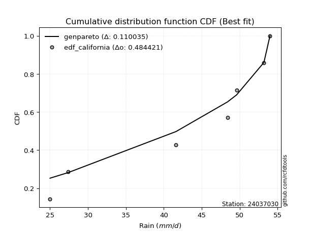</img>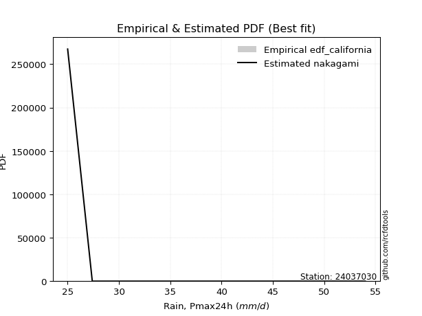</img>

</div>


### 2. EDF Hazen (1930)

Hazen method for plotting positions is a formula used to estimate the empirical cumulative probability distribution of flood events or other hydrological data. This formula often results in biased estimations, particularly when extrapolating to extreme events (high return periods).

<div align="center">


$P=(m-0.5)/n$


</div>


**2.1. Empirical values**

<div align="center">

|                | 0                   | 1                  | 2                  | 3                  | 4         | 5                  |
|:---------------|:--------------------|:-------------------|:-------------------|:-------------------|:----------|:-------------------|
| date           | 2023                | 2021               | 2022               | 2020               | 2024      | 2019               |
| x              | 25.0                | 27.4               | 41.6               | 48.4               | 49.6      | 54.0               |
| m              | 1                   | 2                  | 3                  | 4                  | 5         | 6                  |
| empirical_dist | edf_hazen           | edf_hazen          | edf_hazen          | edf_hazen          | edf_hazen | edf_hazen          |
| empirical      | 0.08333333333333333 | 0.25               | 0.4166666666666667 | 0.5833333333333334 | 0.75      | 0.9166666666666666 |
| empirical_tr   | 1.090909090909091   | 1.3333333333333333 | 1.7142857142857144 | 2.4000000000000004 | 4.0       | 11.999999999999995 |

</div>


**2.2. Kolmogorov-Smirnov fit test (sorted by Δ)**


<div align="center">

|                | 0                   | 1                   | 2                   | 3                   | 4                   | 5                   | 6                  | 7                   | 8                   | 9                   | 10                 | 11                    | 12                  | 13                  | 14                 | 15                | 16                  | 17                  | 18                  | 19                  | 20                  | 21                  | 22                  | 23                 | 24                  | 25                  | 26                  | 27                 | 28                  | 29                  | 30                  | 31                  | 32                  | 33                  | 34                  | 35                  | 36                  | 37                  | 38                  | 39                  | 40                  | 41                 | 42                  | 43                  | 44                  | 45                  | 46                  | 47                  | 48                  | 49                 | 50                  | 51                  | 52                  | 53                  | 54                  | 55                  | 56                 | 57                  | 58                 | 59                  | 60                  | 61                  | 62                 | 63                  | 64                 | 65                  | 66                  | 67                 | 68              | 69             | 70                  | 71                 | 72                  | 73                  | 74                 | 75                 | 76                  | 77                 | 78                 | 79                 | 80                  | 81                  | 82                 | 83                 | 84                 | 85             | 86             | 87             |
|:---------------|:--------------------|:--------------------|:--------------------|:--------------------|:--------------------|:--------------------|:-------------------|:--------------------|:--------------------|:--------------------|:-------------------|:----------------------|:--------------------|:--------------------|:-------------------|:------------------|:--------------------|:--------------------|:--------------------|:--------------------|:--------------------|:--------------------|:--------------------|:-------------------|:--------------------|:--------------------|:--------------------|:-------------------|:--------------------|:--------------------|:--------------------|:--------------------|:--------------------|:--------------------|:--------------------|:--------------------|:--------------------|:--------------------|:--------------------|:--------------------|:--------------------|:-------------------|:--------------------|:--------------------|:--------------------|:--------------------|:--------------------|:--------------------|:--------------------|:-------------------|:--------------------|:--------------------|:--------------------|:--------------------|:--------------------|:--------------------|:-------------------|:--------------------|:-------------------|:--------------------|:--------------------|:--------------------|:-------------------|:--------------------|:-------------------|:--------------------|:--------------------|:-------------------|:----------------|:---------------|:--------------------|:-------------------|:--------------------|:--------------------|:-------------------|:-------------------|:--------------------|:-------------------|:-------------------|:-------------------|:--------------------|:--------------------|:-------------------|:-------------------|:-------------------|:---------------|:---------------|:---------------|
| station        | 24037030            | 24037030            | 24037030            | 24037030            | 24037030            | 24037030            | 24037030           | 24037030            | 24037030            | 24037030            | 24037030           | 24037030              | 24037030            | 24037030            | 24037030           | 24037030          | 24037030            | 24037030            | 24037030            | 24037030            | 24037030            | 24037030            | 24037030            | 24037030           | 24037030            | 24037030            | 24037030            | 24037030           | 24037030            | 24037030            | 24037030            | 24037030            | 24037030            | 24037030            | 24037030            | 24037030            | 24037030            | 24037030            | 24037030            | 24037030            | 24037030            | 24037030           | 24037030            | 24037030            | 24037030            | 24037030            | 24037030            | 24037030            | 24037030            | 24037030           | 24037030            | 24037030            | 24037030            | 24037030            | 24037030            | 24037030            | 24037030           | 24037030            | 24037030           | 24037030            | 24037030            | 24037030            | 24037030           | 24037030            | 24037030           | 24037030            | 24037030            | 24037030           | 24037030        | 24037030       | 24037030            | 24037030           | 24037030            | 24037030            | 24037030           | 24037030           | 24037030            | 24037030           | 24037030           | 24037030           | 24037030            | 24037030            | 24037030           | 24037030           | 24037030           | 24037030       | 24037030       | 24037030       |
| empirical_dist | edf_hazen           | edf_hazen           | edf_hazen           | edf_hazen           | edf_hazen           | edf_hazen           | edf_hazen          | edf_hazen           | edf_hazen           | edf_hazen           | edf_hazen          | edf_hazen             | edf_hazen           | edf_hazen           | edf_hazen          | edf_hazen         | edf_hazen           | edf_hazen           | edf_hazen           | edf_hazen           | edf_hazen           | edf_hazen           | edf_hazen           | edf_hazen          | edf_hazen           | edf_hazen           | edf_hazen           | edf_hazen          | edf_hazen           | edf_hazen           | edf_hazen           | edf_hazen           | edf_hazen           | edf_hazen           | edf_hazen           | edf_hazen           | edf_hazen           | edf_hazen           | edf_hazen           | edf_hazen           | edf_hazen           | edf_hazen          | edf_hazen           | edf_hazen           | edf_hazen           | edf_hazen           | edf_hazen           | edf_hazen           | edf_hazen           | edf_hazen          | edf_hazen           | edf_hazen           | edf_hazen           | edf_hazen           | edf_hazen           | edf_hazen           | edf_hazen          | edf_hazen           | edf_hazen          | edf_hazen           | edf_hazen           | edf_hazen           | edf_hazen          | edf_hazen           | edf_hazen          | edf_hazen           | edf_hazen           | edf_hazen          | edf_hazen       | edf_hazen      | edf_hazen           | edf_hazen          | edf_hazen           | edf_hazen           | edf_hazen          | edf_hazen          | edf_hazen           | edf_hazen          | edf_hazen          | edf_hazen          | edf_hazen           | edf_hazen           | edf_hazen          | edf_hazen          | edf_hazen          | edf_hazen      | edf_hazen      | edf_hazen      |
| p_dist         | logjohnsonsu        | johnsonsu           | laplace_asymmetric  | logmielke           | logloggamma         | weibull_min         | fisk               | logfisk             | gumbel_l            | pearson3            | logpearson3        | loglaplace_asymmetric | gamma               | loggumbel_l         | erlang             | f                 | nct                 | t                   | exponnorm           | crystalball         | norm                | truncnorm           | betaprime           | logweibull_min     | invgamma            | rice                | logerlang           | logf               | alpha               | loginvgamma         | lognct              | logexponnorm        | logcrystalball      | lognorm             | lognorm             | logt                | ncf                 | maxwell             | invgauss            | loggamma            | loggamma            | logbetaprime       | logrice             | rayleigh            | logalpha            | logfatiguelife      | kstwobign           | loginvgauss         | logmaxwell          | logistic           | loglogistic         | lograyleigh         | loginvweibull       | hypsecant           | halfnorm            | gumbel_r            | loghypsecant       | moyal               | loghalfnorm        | loggenexpon         | laplace             | logkstwobign        | loggumbel_r        | genexpon            | expon              | loglaplace          | logncf              | loggompertz        | loghalflogistic | halflogistic   | logmoyal            | nakagami           | logexpon            | wald                | gibrat             | logwald            | logchi2             | loggibrat          | lognakagami        | chi2               | loglognorm          | logtruncnorm        | gompertz           | fatiguelife        | invweibull         | genlogistic    | loggenlogistic | mielke         |
| delta          | 0.10171917584706586 | 0.11202968734167973 | 0.12814574233702425 | 0.13050365887483018 | 0.13389027103721984 | 0.14106264564431015 | 0.1434636626729014 | 0.14444124262741598 | 0.14964175480314168 | 0.15248651920210488 | 0.1596395645990678 | 0.16116437618602308   | 0.16229914079447383 | 0.16235583486448835 | 0.1632583160690544 | 0.163295961962847 | 0.16407482389395966 | 0.16419639383599904 | 0.16420569918970473 | 0.16420582240147696 | 0.16420582384423021 | 0.16420585613530214 | 0.16423830324336608 | 0.1664333203270828 | 0.16674494655817096 | 0.16943097035046184 | 0.17128513648720312 | 0.1718492146110321 | 0.17188252656619996 | 0.17290805733486447 | 0.17315432503892558 | 0.17315433701881877 | 0.17315580113363072 | 0.17315580221783378 | 0.17315580221783378 | 0.17316819249980886 | 0.17361092159434455 | 0.17411472106859527 | 0.17483287788562807 | 0.17578536107986498 | 0.17578536107986498 | 0.1761379924265437 | 0.17659139156259884 | 0.17694603660400454 | 0.17695913694618648 | 0.17730795166169322 | 0.18337959371767354 | 0.18500652878680018 | 0.18679126048791045 | 0.1868558144314839 | 0.19581114023608837 | 0.19582147199809746 | 0.19945365002563448 | 0.20184230477744836 | 0.20279405767774428 | 0.20428554289080447 | 0.2105269211654519 | 0.21720964531483533 | 0.2213769754612404 | 0.22150445433235927 | 0.22192795148050137 | 0.22194870378931358 | 0.2268860142209876 | 0.22898475558959924 | 0.2289939092027447 | 0.22956466909493745 | 0.23583684444073372 | 0.2384647770367206 | 0.25            | 0.25           | 0.25079172032217284 | 0.2510274383971743 | 0.25856313159078553 | 0.27215642797957723 | 0.2984743811572404 | 0.3171922873683805 | 0.32288729572868846 | 0.3478814076046621 | 0.3583492559682326 | 0.3625927198807259 | 0.37741018540994553 | 0.41666194910429016 | 0.4166666660705795 | 0.4367621214664968 | 0.4870276552814871 | 0.75           | 0.75           | nan            |
| deltao         | 0.530385761606      | 0.530385761606      | 0.530385761606      | 0.530385761606      | 0.530385761606      | 0.530385761606      | 0.530385761606     | 0.530385761606      | 0.530385761606      | 0.530385761606      | 0.530385761606     | 0.530385761606        | 0.530385761606      | 0.530385761606      | 0.530385761606     | 0.530385761606    | 0.530385761606      | 0.530385761606      | 0.530385761606      | 0.530385761606      | 0.530385761606      | 0.530385761606      | 0.530385761606      | 0.530385761606     | 0.530385761606      | 0.530385761606      | 0.530385761606      | 0.530385761606     | 0.530385761606      | 0.530385761606      | 0.530385761606      | 0.530385761606      | 0.530385761606      | 0.530385761606      | 0.530385761606      | 0.530385761606      | 0.530385761606      | 0.530385761606      | 0.530385761606      | 0.530385761606      | 0.530385761606      | 0.530385761606     | 0.530385761606      | 0.530385761606      | 0.530385761606      | 0.530385761606      | 0.530385761606      | 0.530385761606      | 0.530385761606      | 0.530385761606     | 0.530385761606      | 0.530385761606      | 0.530385761606      | 0.530385761606      | 0.530385761606      | 0.530385761606      | 0.530385761606     | 0.530385761606      | 0.530385761606     | 0.530385761606      | 0.530385761606      | 0.530385761606      | 0.530385761606     | 0.530385761606      | 0.530385761606     | 0.530385761606      | 0.530385761606      | 0.530385761606     | 0.530385761606  | 0.530385761606 | 0.530385761606      | 0.530385761606     | 0.530385761606      | 0.530385761606      | 0.530385761606     | 0.530385761606     | 0.530385761606      | 0.530385761606     | 0.530385761606     | 0.530385761606     | 0.530385761606      | 0.530385761606      | 0.530385761606     | 0.530385761606     | 0.530385761606     | 0.530385761606 | 0.530385761606 | 0.530385761606 |
| eval           | Δo > Δ              | Δo > Δ              | Δo > Δ              | Δo > Δ              | Δo > Δ              | Δo > Δ              | Δo > Δ             | Δo > Δ              | Δo > Δ              | Δo > Δ              | Δo > Δ             | Δo > Δ                | Δo > Δ              | Δo > Δ              | Δo > Δ             | Δo > Δ            | Δo > Δ              | Δo > Δ              | Δo > Δ              | Δo > Δ              | Δo > Δ              | Δo > Δ              | Δo > Δ              | Δo > Δ             | Δo > Δ              | Δo > Δ              | Δo > Δ              | Δo > Δ             | Δo > Δ              | Δo > Δ              | Δo > Δ              | Δo > Δ              | Δo > Δ              | Δo > Δ              | Δo > Δ              | Δo > Δ              | Δo > Δ              | Δo > Δ              | Δo > Δ              | Δo > Δ              | Δo > Δ              | Δo > Δ             | Δo > Δ              | Δo > Δ              | Δo > Δ              | Δo > Δ              | Δo > Δ              | Δo > Δ              | Δo > Δ              | Δo > Δ             | Δo > Δ              | Δo > Δ              | Δo > Δ              | Δo > Δ              | Δo > Δ              | Δo > Δ              | Δo > Δ             | Δo > Δ              | Δo > Δ             | Δo > Δ              | Δo > Δ              | Δo > Δ              | Δo > Δ             | Δo > Δ              | Δo > Δ             | Δo > Δ              | Δo > Δ              | Δo > Δ             | Δo > Δ          | Δo > Δ         | Δo > Δ              | Δo > Δ             | Δo > Δ              | Δo > Δ              | Δo > Δ             | Δo > Δ             | Δo > Δ              | Δo > Δ             | Δo > Δ             | Δo > Δ             | Δo > Δ              | Δo > Δ              | Δo > Δ             | Δo > Δ             | Δo > Δ             | Δo <= Δ        | Δo <= Δ        | Δo <= Δ        |
| fit            | 1                   | 1                   | 1                   | 1                   | 1                   | 1                   | 1                  | 1                   | 1                   | 1                   | 1                  | 1                     | 1                   | 1                   | 1                  | 1                 | 1                   | 1                   | 1                   | 1                   | 1                   | 1                   | 1                   | 1                  | 1                   | 1                   | 1                   | 1                  | 1                   | 1                   | 1                   | 1                   | 1                   | 1                   | 1                   | 1                   | 1                   | 1                   | 1                   | 1                   | 1                   | 1                  | 1                   | 1                   | 1                   | 1                   | 1                   | 1                   | 1                   | 1                  | 1                   | 1                   | 1                   | 1                   | 1                   | 1                   | 1                  | 1                   | 1                  | 1                   | 1                   | 1                   | 1                  | 1                   | 1                  | 1                   | 1                   | 1                  | 1               | 1              | 1                   | 1                  | 1                   | 1                   | 1                  | 1                  | 1                   | 1                  | 1                  | 1                  | 1                   | 1                   | 1                  | 1                  | 1                  | 0              | 0              | 0              |
| n              | 6                   | 6                   | 6                   | 6                   | 6                   | 6                   | 6                  | 6                   | 6                   | 6                   | 6                  | 6                     | 6                   | 6                   | 6                  | 6                 | 6                   | 6                   | 6                   | 6                   | 6                   | 6                   | 6                   | 6                  | 6                   | 6                   | 6                   | 6                  | 6                   | 6                   | 6                   | 6                   | 6                   | 6                   | 6                   | 6                   | 6                   | 6                   | 6                   | 6                   | 6                   | 6                  | 6                   | 6                   | 6                   | 6                   | 6                   | 6                   | 6                   | 6                  | 6                   | 6                   | 6                   | 6                   | 6                   | 6                   | 6                  | 6                   | 6                  | 6                   | 6                   | 6                   | 6                  | 6                   | 6                  | 6                   | 6                   | 6                  | 6               | 6              | 6                   | 6                  | 6                   | 6                   | 6                  | 6                  | 6                   | 6                  | 6                  | 6                  | 6                   | 6                   | 6                  | 6                  | 6                  | 6              | 6              | 6              |
| best_fit       | 1                   | 0                   | 0                   | 0                   | 0                   | 0                   | 0                  | 0                   | 0                   | 0                   | 0                  | 0                     | 0                   | 0                   | 0                  | 0                 | 0                   | 0                   | 0                   | 0                   | 0                   | 0                   | 0                   | 0                  | 0                   | 0                   | 0                   | 0                  | 0                   | 0                   | 0                   | 0                   | 0                   | 0                   | 0                   | 0                   | 0                   | 0                   | 0                   | 0                   | 0                   | 0                  | 0                   | 0                   | 0                   | 0                   | 0                   | 0                   | 0                   | 0                  | 0                   | 0                   | 0                   | 0                   | 0                   | 0                   | 0                  | 0                   | 0                  | 0                   | 0                   | 0                   | 0                  | 0                   | 0                  | 0                   | 0                   | 0                  | 0               | 0              | 0                   | 0                  | 0                   | 0                   | 0                  | 0                  | 0                   | 0                  | 0                  | 0                  | 0                   | 0                   | 0                  | 0                  | 0                  | 0              | 0              | 0              |
| best_fit_sort  | 1                   | 2                   | 3                   | 4                   | 5                   | 6                   | 7                  | 8                   | 9                   | 10                  | 11                 | 12                    | 13                  | 14                  | 15                 | 16                | 17                  | 18                  | 19                  | 20                  | 21                  | 22                  | 23                  | 24                 | 25                  | 26                  | 27                  | 28                 | 29                  | 30                  | 31                  | 32                  | 33                  | 34                  | 35                  | 36                  | 37                  | 38                  | 39                  | 40                  | 41                  | 42                 | 43                  | 44                  | 45                  | 46                  | 47                  | 48                  | 49                  | 50                 | 51                  | 52                  | 53                  | 54                  | 55                  | 56                  | 57                 | 58                  | 59                 | 60                  | 61                  | 62                  | 63                 | 64                  | 65                 | 66                  | 67                  | 68                 | 69              | 70             | 71                  | 72                 | 73                  | 74                  | 75                 | 76                 | 77                  | 78                 | 79                 | 80                 | 81                  | 82                  | 83                 | 84                 | 85                 | 86             | 87             | 88             |

</div>


**2.3. Best fit**

<div align="center">

|   id |   station | empirical_dist   | p_dist       |    delta |   deltao | eval   |   fit |   n |   best_fit |   best_fit_sort |
|-----:|----------:|:-----------------|:-------------|---------:|---------:|:-------|------:|----:|-----------:|----------------:|
|    0 |  24037030 | edf_hazen        | logjohnsonsu | 0.101719 | 0.530386 | Δo > Δ |     1 |   6 |          1 |               1 |

</div>


<div align="center">

</img>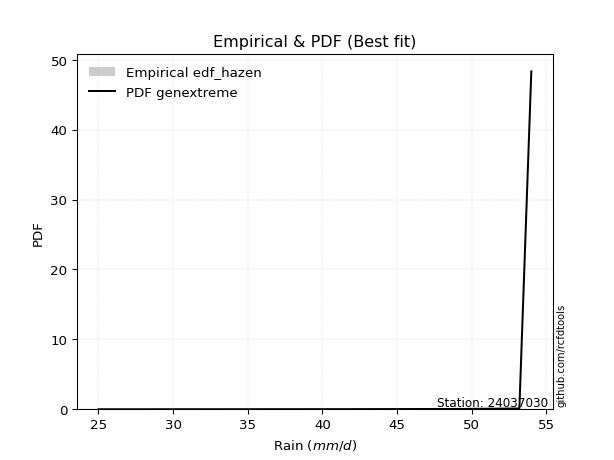</img>

</div>


### 3. EDF Weibull (1939)

Weibull plotting position formula is an empirical method used to estimate the non-exceedance probability or plotting position for a set of observed data, is often recommended or widely used in practice, particularly in flood frequency analysis.

<div align="center">


$P=m/(n+1)$


</div>


**3.1. Empirical values**

<div align="center">

|                | 0                   | 1                  | 2                   | 3                  | 4                  | 5                  |
|:---------------|:--------------------|:-------------------|:--------------------|:-------------------|:-------------------|:-------------------|
| date           | 2023                | 2021               | 2022                | 2020               | 2024               | 2019               |
| x              | 25.0                | 27.4               | 41.6                | 48.4               | 49.6               | 54.0               |
| m              | 1                   | 2                  | 3                   | 4                  | 5                  | 6                  |
| empirical_dist | edf_weibull         | edf_weibull        | edf_weibull         | edf_weibull        | edf_weibull        | edf_weibull        |
| empirical      | 0.14285714285714285 | 0.2857142857142857 | 0.42857142857142855 | 0.5714285714285714 | 0.7142857142857143 | 0.8571428571428571 |
| empirical_tr   | 1.1666666666666665  | 1.4                | 1.75                | 2.333333333333333  | 3.5                | 6.999999999999997  |

</div>


**3.2. Kolmogorov-Smirnov fit test (sorted by Δ)**


<div align="center">

|                | 0                   | 1                   | 2                   | 3                   | 4                   | 5                   | 6                   | 7                     | 8                   | 9                  | 10                  | 11                | 12                 | 13                  | 14                  | 15                 | 16                  | 17                 | 18                  | 19                  | 20                  | 21                  | 22                  | 23                 | 24                  | 25                 | 26                  | 27                  | 28                  | 29                  | 30                  | 31                  | 32                 | 33                  | 34                  | 35                  | 36                  | 37                  | 38                  | 39                  | 40                  | 41                  | 42                  | 43                  | 44                 | 45                  | 46                  | 47                 | 48                  | 49                  | 50                 | 51                 | 52                 | 53                  | 54                 | 55                  | 56                  | 57                  | 58                  | 59                  | 60                  | 61                 | 62                  | 63                  | 64                  | 65                  | 66                  | 67                  | 68                  | 69                  | 70                  | 71                 | 72                 | 73                 | 74                 | 75                  | 76                  | 77                 | 78                  | 79                 | 80                | 81                 | 82                 | 83                | 84                  | 85                 | 86                 | 87             |
|:---------------|:--------------------|:--------------------|:--------------------|:--------------------|:--------------------|:--------------------|:--------------------|:----------------------|:--------------------|:-------------------|:--------------------|:------------------|:-------------------|:--------------------|:--------------------|:-------------------|:--------------------|:-------------------|:--------------------|:--------------------|:--------------------|:--------------------|:--------------------|:-------------------|:--------------------|:-------------------|:--------------------|:--------------------|:--------------------|:--------------------|:--------------------|:--------------------|:-------------------|:--------------------|:--------------------|:--------------------|:--------------------|:--------------------|:--------------------|:--------------------|:--------------------|:--------------------|:--------------------|:--------------------|:-------------------|:--------------------|:--------------------|:-------------------|:--------------------|:--------------------|:-------------------|:-------------------|:-------------------|:--------------------|:-------------------|:--------------------|:--------------------|:--------------------|:--------------------|:--------------------|:--------------------|:-------------------|:--------------------|:--------------------|:--------------------|:--------------------|:--------------------|:--------------------|:--------------------|:--------------------|:--------------------|:-------------------|:-------------------|:-------------------|:-------------------|:--------------------|:--------------------|:-------------------|:--------------------|:-------------------|:------------------|:-------------------|:-------------------|:------------------|:--------------------|:-------------------|:-------------------|:---------------|
| station        | 24037030            | 24037030            | 24037030            | 24037030            | 24037030            | 24037030            | 24037030            | 24037030              | 24037030            | 24037030           | 24037030            | 24037030          | 24037030           | 24037030            | 24037030            | 24037030           | 24037030            | 24037030           | 24037030            | 24037030            | 24037030            | 24037030            | 24037030            | 24037030           | 24037030            | 24037030           | 24037030            | 24037030            | 24037030            | 24037030            | 24037030            | 24037030            | 24037030           | 24037030            | 24037030            | 24037030            | 24037030            | 24037030            | 24037030            | 24037030            | 24037030            | 24037030            | 24037030            | 24037030            | 24037030           | 24037030            | 24037030            | 24037030           | 24037030            | 24037030            | 24037030           | 24037030           | 24037030           | 24037030            | 24037030           | 24037030            | 24037030            | 24037030            | 24037030            | 24037030            | 24037030            | 24037030           | 24037030            | 24037030            | 24037030            | 24037030            | 24037030            | 24037030            | 24037030            | 24037030            | 24037030            | 24037030           | 24037030           | 24037030           | 24037030           | 24037030            | 24037030            | 24037030           | 24037030            | 24037030           | 24037030          | 24037030           | 24037030           | 24037030          | 24037030            | 24037030           | 24037030           | 24037030       |
| empirical_dist | edf_weibull         | edf_weibull         | edf_weibull         | edf_weibull         | edf_weibull         | edf_weibull         | edf_weibull         | edf_weibull           | edf_weibull         | edf_weibull        | edf_weibull         | edf_weibull       | edf_weibull        | edf_weibull         | edf_weibull         | edf_weibull        | edf_weibull         | edf_weibull        | edf_weibull         | edf_weibull         | edf_weibull         | edf_weibull         | edf_weibull         | edf_weibull        | edf_weibull         | edf_weibull        | edf_weibull         | edf_weibull         | edf_weibull         | edf_weibull         | edf_weibull         | edf_weibull         | edf_weibull        | edf_weibull         | edf_weibull         | edf_weibull         | edf_weibull         | edf_weibull         | edf_weibull         | edf_weibull         | edf_weibull         | edf_weibull         | edf_weibull         | edf_weibull         | edf_weibull        | edf_weibull         | edf_weibull         | edf_weibull        | edf_weibull         | edf_weibull         | edf_weibull        | edf_weibull        | edf_weibull        | edf_weibull         | edf_weibull        | edf_weibull         | edf_weibull         | edf_weibull         | edf_weibull         | edf_weibull         | edf_weibull         | edf_weibull        | edf_weibull         | edf_weibull         | edf_weibull         | edf_weibull         | edf_weibull         | edf_weibull         | edf_weibull         | edf_weibull         | edf_weibull         | edf_weibull        | edf_weibull        | edf_weibull        | edf_weibull        | edf_weibull         | edf_weibull         | edf_weibull        | edf_weibull         | edf_weibull        | edf_weibull       | edf_weibull        | edf_weibull        | edf_weibull       | edf_weibull         | edf_weibull        | edf_weibull        | edf_weibull    |
| p_dist         | logjohnsonsu        | johnsonsu           | laplace_asymmetric  | logmielke           | logloggamma         | pearson3            | logpearson3         | loglaplace_asymmetric | loggumbel_l         | gamma              | erlang              | f                 | gumbel_l           | nct                 | t                   | exponnorm          | crystalball         | norm               | truncnorm           | betaprime           | logncf              | weibull_min         | invgamma            | fisk               | logfisk             | logerlang          | logf                | alpha               | loginvgamma         | loginvgauss         | lognct              | logexponnorm        | logcrystalball     | lognorm             | lognorm             | logt                | logweibull_min      | ncf                 | maxwell             | invgauss            | loginvweibull       | loggamma            | loggamma            | logbetaprime        | rice               | logrice             | logalpha            | logfatiguelife     | rayleigh            | logmaxwell          | kstwobign          | lograyleigh        | logistic           | loglogistic         | loggenexpon        | logkstwobign        | hypsecant           | genexpon            | expon               | gumbel_r            | loghypsecant        | loggumbel_r        | loggompertz         | loghalfnorm         | laplace             | halfnorm            | nakagami            | loglaplace          | logmoyal            | logexpon            | moyal               | logchi2            | loghalflogistic    | halflogistic       | wald               | gibrat              | logwald             | loggibrat          | loglognorm          | lognakagami        | chi2              | fatiguelife        | invweibull         | logtruncnorm      | gompertz            | genlogistic        | loggenlogistic     | mielke         |
| delta          | 0.13743346156135156 | 0.14774397305596543 | 0.16386002805130995 | 0.16621794458911587 | 0.16960455675150554 | 0.17116035516106304 | 0.17154432650382978 | 0.17306913809078506   | 0.17426059676925032 | 0.1743940075766032 | 0.17516307797381636 | 0.175200723867609 | 0.1756404343533274 | 0.17597958579872164 | 0.17610115574076102 | 0.1761104610944667 | 0.17611058430623894 | 0.1761105857489922 | 0.17611061804006412 | 0.17614306514812805 | 0.17631303491692418 | 0.17677693135859585 | 0.17864970846293293 | 0.1791779483871871 | 0.18015552834170168 | 0.1831898983919651 | 0.18375397651579406 | 0.18378728847096193 | 0.18481281923962645 | 0.18504282085467638 | 0.18505908694368756 | 0.18505909892358074 | 0.1850605630383927 | 0.18506056412259575 | 0.18506056412259575 | 0.18507295440457083 | 0.18507564012110944 | 0.18551568349910652 | 0.18601948297335724 | 0.18673763979039004 | 0.18754888812087261 | 0.18769012298462695 | 0.18769012298462695 | 0.18804275433130568 | 0.1881641397702971 | 0.18849615346736082 | 0.18886389885094845 | 0.1892127135664552 | 0.18921588118673457 | 0.19379552386482568 | 0.1952843556224355 | 0.1962828726812379 | 0.1987605763362459 | 0.20771590214085034 | 0.2095996924275974 | 0.21004394188455172 | 0.21374706668221033 | 0.21707999368483738 | 0.21708914729798284 | 0.21872246509754795 | 0.22243168307021388 | 0.2229186583298779 | 0.22656001513195873 | 0.22993577147862554 | 0.23383271338526335 | 0.23850834339202998 | 0.23912267649241242 | 0.24146943099969942 | 0.24298332540957354 | 0.24665836968602367 | 0.24694231492450278 | 0.2633634862048789 | 0.2857142857142857 | 0.2857142857142857 | 0.2857142857142857 | 0.29892950967040477 | 0.30528752546361865 | 0.3359766456999002 | 0.34169589969565983 | 0.3464444940634707 | 0.350687957975964 | 0.4248573595617349 | 0.4275038457576776 | 0.428566711009052 | 0.42857142797534137 | 0.7142857142857143 | 0.7142857142857143 | nan            |
| deltao         | 0.530385761606      | 0.530385761606      | 0.530385761606      | 0.530385761606      | 0.530385761606      | 0.530385761606      | 0.530385761606      | 0.530385761606        | 0.530385761606      | 0.530385761606     | 0.530385761606      | 0.530385761606    | 0.530385761606     | 0.530385761606      | 0.530385761606      | 0.530385761606     | 0.530385761606      | 0.530385761606     | 0.530385761606      | 0.530385761606      | 0.530385761606      | 0.530385761606      | 0.530385761606      | 0.530385761606     | 0.530385761606      | 0.530385761606     | 0.530385761606      | 0.530385761606      | 0.530385761606      | 0.530385761606      | 0.530385761606      | 0.530385761606      | 0.530385761606     | 0.530385761606      | 0.530385761606      | 0.530385761606      | 0.530385761606      | 0.530385761606      | 0.530385761606      | 0.530385761606      | 0.530385761606      | 0.530385761606      | 0.530385761606      | 0.530385761606      | 0.530385761606     | 0.530385761606      | 0.530385761606      | 0.530385761606     | 0.530385761606      | 0.530385761606      | 0.530385761606     | 0.530385761606     | 0.530385761606     | 0.530385761606      | 0.530385761606     | 0.530385761606      | 0.530385761606      | 0.530385761606      | 0.530385761606      | 0.530385761606      | 0.530385761606      | 0.530385761606     | 0.530385761606      | 0.530385761606      | 0.530385761606      | 0.530385761606      | 0.530385761606      | 0.530385761606      | 0.530385761606      | 0.530385761606      | 0.530385761606      | 0.530385761606     | 0.530385761606     | 0.530385761606     | 0.530385761606     | 0.530385761606      | 0.530385761606      | 0.530385761606     | 0.530385761606      | 0.530385761606     | 0.530385761606    | 0.530385761606     | 0.530385761606     | 0.530385761606    | 0.530385761606      | 0.530385761606     | 0.530385761606     | 0.530385761606 |
| eval           | Δo > Δ              | Δo > Δ              | Δo > Δ              | Δo > Δ              | Δo > Δ              | Δo > Δ              | Δo > Δ              | Δo > Δ                | Δo > Δ              | Δo > Δ             | Δo > Δ              | Δo > Δ            | Δo > Δ             | Δo > Δ              | Δo > Δ              | Δo > Δ             | Δo > Δ              | Δo > Δ             | Δo > Δ              | Δo > Δ              | Δo > Δ              | Δo > Δ              | Δo > Δ              | Δo > Δ             | Δo > Δ              | Δo > Δ             | Δo > Δ              | Δo > Δ              | Δo > Δ              | Δo > Δ              | Δo > Δ              | Δo > Δ              | Δo > Δ             | Δo > Δ              | Δo > Δ              | Δo > Δ              | Δo > Δ              | Δo > Δ              | Δo > Δ              | Δo > Δ              | Δo > Δ              | Δo > Δ              | Δo > Δ              | Δo > Δ              | Δo > Δ             | Δo > Δ              | Δo > Δ              | Δo > Δ             | Δo > Δ              | Δo > Δ              | Δo > Δ             | Δo > Δ             | Δo > Δ             | Δo > Δ              | Δo > Δ             | Δo > Δ              | Δo > Δ              | Δo > Δ              | Δo > Δ              | Δo > Δ              | Δo > Δ              | Δo > Δ             | Δo > Δ              | Δo > Δ              | Δo > Δ              | Δo > Δ              | Δo > Δ              | Δo > Δ              | Δo > Δ              | Δo > Δ              | Δo > Δ              | Δo > Δ             | Δo > Δ             | Δo > Δ             | Δo > Δ             | Δo > Δ              | Δo > Δ              | Δo > Δ             | Δo > Δ              | Δo > Δ             | Δo > Δ            | Δo > Δ             | Δo > Δ             | Δo > Δ            | Δo > Δ              | Δo <= Δ            | Δo <= Δ            | Δo <= Δ        |
| fit            | 1                   | 1                   | 1                   | 1                   | 1                   | 1                   | 1                   | 1                     | 1                   | 1                  | 1                   | 1                 | 1                  | 1                   | 1                   | 1                  | 1                   | 1                  | 1                   | 1                   | 1                   | 1                   | 1                   | 1                  | 1                   | 1                  | 1                   | 1                   | 1                   | 1                   | 1                   | 1                   | 1                  | 1                   | 1                   | 1                   | 1                   | 1                   | 1                   | 1                   | 1                   | 1                   | 1                   | 1                   | 1                  | 1                   | 1                   | 1                  | 1                   | 1                   | 1                  | 1                  | 1                  | 1                   | 1                  | 1                   | 1                   | 1                   | 1                   | 1                   | 1                   | 1                  | 1                   | 1                   | 1                   | 1                   | 1                   | 1                   | 1                   | 1                   | 1                   | 1                  | 1                  | 1                  | 1                  | 1                   | 1                   | 1                  | 1                   | 1                  | 1                 | 1                  | 1                  | 1                 | 1                   | 0                  | 0                  | 0              |
| n              | 6                   | 6                   | 6                   | 6                   | 6                   | 6                   | 6                   | 6                     | 6                   | 6                  | 6                   | 6                 | 6                  | 6                   | 6                   | 6                  | 6                   | 6                  | 6                   | 6                   | 6                   | 6                   | 6                   | 6                  | 6                   | 6                  | 6                   | 6                   | 6                   | 6                   | 6                   | 6                   | 6                  | 6                   | 6                   | 6                   | 6                   | 6                   | 6                   | 6                   | 6                   | 6                   | 6                   | 6                   | 6                  | 6                   | 6                   | 6                  | 6                   | 6                   | 6                  | 6                  | 6                  | 6                   | 6                  | 6                   | 6                   | 6                   | 6                   | 6                   | 6                   | 6                  | 6                   | 6                   | 6                   | 6                   | 6                   | 6                   | 6                   | 6                   | 6                   | 6                  | 6                  | 6                  | 6                  | 6                   | 6                   | 6                  | 6                   | 6                  | 6                 | 6                  | 6                  | 6                 | 6                   | 6                  | 6                  | 6              |
| best_fit       | 1                   | 0                   | 0                   | 0                   | 0                   | 0                   | 0                   | 0                     | 0                   | 0                  | 0                   | 0                 | 0                  | 0                   | 0                   | 0                  | 0                   | 0                  | 0                   | 0                   | 0                   | 0                   | 0                   | 0                  | 0                   | 0                  | 0                   | 0                   | 0                   | 0                   | 0                   | 0                   | 0                  | 0                   | 0                   | 0                   | 0                   | 0                   | 0                   | 0                   | 0                   | 0                   | 0                   | 0                   | 0                  | 0                   | 0                   | 0                  | 0                   | 0                   | 0                  | 0                  | 0                  | 0                   | 0                  | 0                   | 0                   | 0                   | 0                   | 0                   | 0                   | 0                  | 0                   | 0                   | 0                   | 0                   | 0                   | 0                   | 0                   | 0                   | 0                   | 0                  | 0                  | 0                  | 0                  | 0                   | 0                   | 0                  | 0                   | 0                  | 0                 | 0                  | 0                  | 0                 | 0                   | 0                  | 0                  | 0              |
| best_fit_sort  | 1                   | 2                   | 3                   | 4                   | 5                   | 6                   | 7                   | 8                     | 9                   | 10                 | 11                  | 12                | 13                 | 14                  | 15                  | 16                 | 17                  | 18                 | 19                  | 20                  | 21                  | 22                  | 23                  | 24                 | 25                  | 26                 | 27                  | 28                  | 29                  | 30                  | 31                  | 32                  | 33                 | 34                  | 35                  | 36                  | 37                  | 38                  | 39                  | 40                  | 41                  | 42                  | 43                  | 44                  | 45                 | 46                  | 47                  | 48                 | 49                  | 50                  | 51                 | 52                 | 53                 | 54                  | 55                 | 56                  | 57                  | 58                  | 59                  | 60                  | 61                  | 62                 | 63                  | 64                  | 65                  | 66                  | 67                  | 68                  | 69                  | 70                  | 71                  | 72                 | 73                 | 74                 | 75                 | 76                  | 77                  | 78                 | 79                  | 80                 | 81                | 82                 | 83                 | 84                | 85                  | 86                 | 87                 | 88             |

</div>


**3.3. Best fit**

<div align="center">

|   id |   station | empirical_dist   | p_dist       |    delta |   deltao | eval   |   fit |   n |   best_fit |   best_fit_sort |
|-----:|----------:|:-----------------|:-------------|---------:|---------:|:-------|------:|----:|-----------:|----------------:|
|    0 |  24037030 | edf_weibull      | logjohnsonsu | 0.137433 | 0.530386 | Δo > Δ |     1 |   6 |          1 |               1 |

</div>


<div align="center">

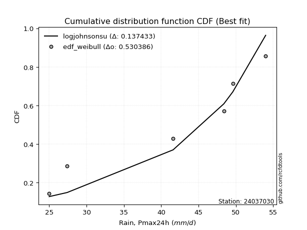</img></img>

</div>


### 4. EDF Beard (1943)

The Beard formula (or Beard´s plotting position formula) in hydrology is used to estimate the empirical non-exceedance probability _(P)_ of a flood event (or other extreme hydrological data point) within a given dataset.

<div align="center">


$P=(m-0.31)/(n+0.38)$


</div>


**4.1. Empirical values**

<div align="center">

|                | 0                   | 1                   | 2                  | 3                  | 4                  | 5                  |
|:---------------|:--------------------|:--------------------|:-------------------|:-------------------|:-------------------|:-------------------|
| date           | 2023                | 2021                | 2022               | 2020               | 2024               | 2019               |
| x              | 25.0                | 27.4                | 41.6               | 48.4               | 49.6               | 54.0               |
| m              | 1                   | 2                   | 3                  | 4                  | 5                  | 6                  |
| empirical_dist | edf_beard           | edf_beard           | edf_beard          | edf_beard          | edf_beard          | edf_beard          |
| empirical      | 0.10815047021943573 | 0.26489028213166144 | 0.4216300940438871 | 0.5783699059561128 | 0.7351097178683387 | 0.8918495297805643 |
| empirical_tr   | 1.1212653778558874  | 1.3603411513859276  | 1.7289972899728996 | 2.3717472118959106 | 3.7751479289940844 | 9.246376811594207  |

</div>


**4.2. Kolmogorov-Smirnov fit test (sorted by Δ)**


<div align="center">

|                | 0                  | 1                   | 2                   | 3                  | 4                   | 5                   | 6                   | 7                   | 8                   | 9                   | 10                  | 11                    | 12                  | 13                 | 14                  | 15                  | 16                  | 17                 | 18                 | 19                  | 20                  | 21                 | 22                  | 23                  | 24                 | 25                 | 26                  | 27                  | 28                 | 29                  | 30                  | 31                  | 32                  | 33                  | 34                  | 35                 | 36                 | 37                  | 38                  | 39                  | 40                  | 41                  | 42                  | 43                 | 44                 | 45                  | 46                  | 47                  | 48                 | 49                  | 50                  | 51                  | 52                  | 53                 | 54                  | 55                 | 56                  | 57                  | 58                  | 59                  | 60                 | 61                  | 62                 | 63                  | 64                  | 65                  | 66                  | 67                | 68                 | 69                  | 70                 | 71                  | 72                  | 73                 | 74                  | 75                  | 76                  | 77                  | 78                  | 79                  | 80                 | 81                 | 82                  | 83                  | 84                 | 85                 | 86                 | 87             |
|:---------------|:-------------------|:--------------------|:--------------------|:-------------------|:--------------------|:--------------------|:--------------------|:--------------------|:--------------------|:--------------------|:--------------------|:----------------------|:--------------------|:-------------------|:--------------------|:--------------------|:--------------------|:-------------------|:-------------------|:--------------------|:--------------------|:-------------------|:--------------------|:--------------------|:-------------------|:-------------------|:--------------------|:--------------------|:-------------------|:--------------------|:--------------------|:--------------------|:--------------------|:--------------------|:--------------------|:-------------------|:-------------------|:--------------------|:--------------------|:--------------------|:--------------------|:--------------------|:--------------------|:-------------------|:-------------------|:--------------------|:--------------------|:--------------------|:-------------------|:--------------------|:--------------------|:--------------------|:--------------------|:-------------------|:--------------------|:-------------------|:--------------------|:--------------------|:--------------------|:--------------------|:-------------------|:--------------------|:-------------------|:--------------------|:--------------------|:--------------------|:--------------------|:------------------|:-------------------|:--------------------|:-------------------|:--------------------|:--------------------|:-------------------|:--------------------|:--------------------|:--------------------|:--------------------|:--------------------|:--------------------|:-------------------|:-------------------|:--------------------|:--------------------|:-------------------|:-------------------|:-------------------|:---------------|
| station        | 24037030           | 24037030            | 24037030            | 24037030           | 24037030            | 24037030            | 24037030            | 24037030            | 24037030            | 24037030            | 24037030            | 24037030              | 24037030            | 24037030           | 24037030            | 24037030            | 24037030            | 24037030           | 24037030           | 24037030            | 24037030            | 24037030           | 24037030            | 24037030            | 24037030           | 24037030           | 24037030            | 24037030            | 24037030           | 24037030            | 24037030            | 24037030            | 24037030            | 24037030            | 24037030            | 24037030           | 24037030           | 24037030            | 24037030            | 24037030            | 24037030            | 24037030            | 24037030            | 24037030           | 24037030           | 24037030            | 24037030            | 24037030            | 24037030           | 24037030            | 24037030            | 24037030            | 24037030            | 24037030           | 24037030            | 24037030           | 24037030            | 24037030            | 24037030            | 24037030            | 24037030           | 24037030            | 24037030           | 24037030            | 24037030            | 24037030            | 24037030            | 24037030          | 24037030           | 24037030            | 24037030           | 24037030            | 24037030            | 24037030           | 24037030            | 24037030            | 24037030            | 24037030            | 24037030            | 24037030            | 24037030           | 24037030           | 24037030            | 24037030            | 24037030           | 24037030           | 24037030           | 24037030       |
| empirical_dist | edf_beard          | edf_beard           | edf_beard           | edf_beard          | edf_beard           | edf_beard           | edf_beard           | edf_beard           | edf_beard           | edf_beard           | edf_beard           | edf_beard             | edf_beard           | edf_beard          | edf_beard           | edf_beard           | edf_beard           | edf_beard          | edf_beard          | edf_beard           | edf_beard           | edf_beard          | edf_beard           | edf_beard           | edf_beard          | edf_beard          | edf_beard           | edf_beard           | edf_beard          | edf_beard           | edf_beard           | edf_beard           | edf_beard           | edf_beard           | edf_beard           | edf_beard          | edf_beard          | edf_beard           | edf_beard           | edf_beard           | edf_beard           | edf_beard           | edf_beard           | edf_beard          | edf_beard          | edf_beard           | edf_beard           | edf_beard           | edf_beard          | edf_beard           | edf_beard           | edf_beard           | edf_beard           | edf_beard          | edf_beard           | edf_beard          | edf_beard           | edf_beard           | edf_beard           | edf_beard           | edf_beard          | edf_beard           | edf_beard          | edf_beard           | edf_beard           | edf_beard           | edf_beard           | edf_beard         | edf_beard          | edf_beard           | edf_beard          | edf_beard           | edf_beard           | edf_beard          | edf_beard           | edf_beard           | edf_beard           | edf_beard           | edf_beard           | edf_beard           | edf_beard          | edf_beard          | edf_beard           | edf_beard           | edf_beard          | edf_beard          | edf_beard          | edf_beard      |
| p_dist         | logjohnsonsu       | johnsonsu           | laplace_asymmetric  | logmielke          | logloggamma         | gumbel_l            | weibull_min         | pearson3            | fisk                | logfisk             | logpearson3         | loglaplace_asymmetric | gamma               | loggumbel_l        | erlang              | f                   | nct                 | t                  | exponnorm          | crystalball         | norm                | truncnorm          | betaprime           | logweibull_min      | invgamma           | rice               | logerlang           | logf                | alpha              | loginvgamma         | lognct              | logexponnorm        | logcrystalball      | lognorm             | lognorm             | logt               | ncf                | maxwell             | invgauss            | loginvgauss         | loggamma            | loggamma            | logbetaprime        | logrice            | rayleigh           | logalpha            | logfatiguelife      | logmaxwell          | kstwobign          | lograyleigh         | logistic            | loginvweibull       | loglogistic         | hypsecant          | gumbel_r            | logncf             | loghypsecant        | loghalfnorm         | loggenexpon         | logkstwobign        | halfnorm           | loggumbel_r         | genexpon           | expon               | moyal               | laplace             | loggompertz         | loglaplace        | logmoyal           | nakagami            | logexpon           | halflogistic        | loghalflogistic     | wald               | gibrat              | logchi2             | logwald             | loggibrat           | lognakagami         | chi2                | loglognorm         | logtruncnorm       | gompertz            | fatiguelife         | invweibull         | genlogistic        | loggenlogistic     | mielke         |
| delta          | 0.1166094579787273 | 0.12691996947334117 | 0.14303602446868569 | 0.1453939410064916 | 0.14878055316888128 | 0.15481643077070315 | 0.15595292777597158 | 0.15744994657932543 | 0.15835394480456283 | 0.15933152475907741 | 0.16460299197628836 | 0.16612780356324364   | 0.16726256817169438 | 0.1673192622417089 | 0.16822174344627494 | 0.16825938934006757 | 0.16903825127118022 | 0.1691598212132196 | 0.1691691265669253 | 0.16916924977869752 | 0.16916925122145077 | 0.1691692835125227 | 0.16920173062058663 | 0.17139674770430335 | 0.1717083739353915 | 0.1743943977276824 | 0.17624856386442367 | 0.17681264198825264 | 0.1768459539434205 | 0.17787148471208503 | 0.17811775241614614 | 0.17811776439603932 | 0.17811922851085127 | 0.17811922959505433 | 0.17811922959505433 | 0.1781316198770294 | 0.1785743489715651 | 0.17907814844581582 | 0.17979630526284862 | 0.18004310140957974 | 0.18074878845708553 | 0.18074878845708553 | 0.18110141980376426 | 0.1815548189398194 | 0.1819094639812251 | 0.18192256432340703 | 0.18227137903891377 | 0.18685418933728426 | 0.1883430210948941 | 0.19085804462087702 | 0.19181924180870447 | 0.19449022264841404 | 0.20077456761330892 | 0.2068057321546689 | 0.20924897026802503 | 0.2110197075546314 | 0.21549034854267246 | 0.21641354808401997 | 0.21654102695513883 | 0.21698527641209314 | 0.2176843398094057 | 0.22192258684376714 | 0.2240213282123788 | 0.22403048182552426 | 0.22611831134187851 | 0.22689137885772193 | 0.23350134965950015 | 0.234528096472158 | 0.2458282929449524 | 0.24606401101995384 | 0.2535997042135651 | 0.26489028213166144 | 0.26489028213166144 | 0.2671930006023568 | 0.29351095378001996 | 0.29807015884258614 | 0.31222885999116007 | 0.34291798022744163 | 0.35338582859101214 | 0.35762929250350545 | 0.3625199032782841 | 0.4216253764815106 | 0.42163009344779995 | 0.43179869408927635 | 0.4622105183953848 | 0.7351097178683387 | 0.7351097178683387 | nan            |
| deltao         | 0.530385761606     | 0.530385761606      | 0.530385761606      | 0.530385761606     | 0.530385761606      | 0.530385761606      | 0.530385761606      | 0.530385761606      | 0.530385761606      | 0.530385761606      | 0.530385761606      | 0.530385761606        | 0.530385761606      | 0.530385761606     | 0.530385761606      | 0.530385761606      | 0.530385761606      | 0.530385761606     | 0.530385761606     | 0.530385761606      | 0.530385761606      | 0.530385761606     | 0.530385761606      | 0.530385761606      | 0.530385761606     | 0.530385761606     | 0.530385761606      | 0.530385761606      | 0.530385761606     | 0.530385761606      | 0.530385761606      | 0.530385761606      | 0.530385761606      | 0.530385761606      | 0.530385761606      | 0.530385761606     | 0.530385761606     | 0.530385761606      | 0.530385761606      | 0.530385761606      | 0.530385761606      | 0.530385761606      | 0.530385761606      | 0.530385761606     | 0.530385761606     | 0.530385761606      | 0.530385761606      | 0.530385761606      | 0.530385761606     | 0.530385761606      | 0.530385761606      | 0.530385761606      | 0.530385761606      | 0.530385761606     | 0.530385761606      | 0.530385761606     | 0.530385761606      | 0.530385761606      | 0.530385761606      | 0.530385761606      | 0.530385761606     | 0.530385761606      | 0.530385761606     | 0.530385761606      | 0.530385761606      | 0.530385761606      | 0.530385761606      | 0.530385761606    | 0.530385761606     | 0.530385761606      | 0.530385761606     | 0.530385761606      | 0.530385761606      | 0.530385761606     | 0.530385761606      | 0.530385761606      | 0.530385761606      | 0.530385761606      | 0.530385761606      | 0.530385761606      | 0.530385761606     | 0.530385761606     | 0.530385761606      | 0.530385761606      | 0.530385761606     | 0.530385761606     | 0.530385761606     | 0.530385761606 |
| eval           | Δo > Δ             | Δo > Δ              | Δo > Δ              | Δo > Δ             | Δo > Δ              | Δo > Δ              | Δo > Δ              | Δo > Δ              | Δo > Δ              | Δo > Δ              | Δo > Δ              | Δo > Δ                | Δo > Δ              | Δo > Δ             | Δo > Δ              | Δo > Δ              | Δo > Δ              | Δo > Δ             | Δo > Δ             | Δo > Δ              | Δo > Δ              | Δo > Δ             | Δo > Δ              | Δo > Δ              | Δo > Δ             | Δo > Δ             | Δo > Δ              | Δo > Δ              | Δo > Δ             | Δo > Δ              | Δo > Δ              | Δo > Δ              | Δo > Δ              | Δo > Δ              | Δo > Δ              | Δo > Δ             | Δo > Δ             | Δo > Δ              | Δo > Δ              | Δo > Δ              | Δo > Δ              | Δo > Δ              | Δo > Δ              | Δo > Δ             | Δo > Δ             | Δo > Δ              | Δo > Δ              | Δo > Δ              | Δo > Δ             | Δo > Δ              | Δo > Δ              | Δo > Δ              | Δo > Δ              | Δo > Δ             | Δo > Δ              | Δo > Δ             | Δo > Δ              | Δo > Δ              | Δo > Δ              | Δo > Δ              | Δo > Δ             | Δo > Δ              | Δo > Δ             | Δo > Δ              | Δo > Δ              | Δo > Δ              | Δo > Δ              | Δo > Δ            | Δo > Δ             | Δo > Δ              | Δo > Δ             | Δo > Δ              | Δo > Δ              | Δo > Δ             | Δo > Δ              | Δo > Δ              | Δo > Δ              | Δo > Δ              | Δo > Δ              | Δo > Δ              | Δo > Δ             | Δo > Δ             | Δo > Δ              | Δo > Δ              | Δo > Δ             | Δo <= Δ            | Δo <= Δ            | Δo <= Δ        |
| fit            | 1                  | 1                   | 1                   | 1                  | 1                   | 1                   | 1                   | 1                   | 1                   | 1                   | 1                   | 1                     | 1                   | 1                  | 1                   | 1                   | 1                   | 1                  | 1                  | 1                   | 1                   | 1                  | 1                   | 1                   | 1                  | 1                  | 1                   | 1                   | 1                  | 1                   | 1                   | 1                   | 1                   | 1                   | 1                   | 1                  | 1                  | 1                   | 1                   | 1                   | 1                   | 1                   | 1                   | 1                  | 1                  | 1                   | 1                   | 1                   | 1                  | 1                   | 1                   | 1                   | 1                   | 1                  | 1                   | 1                  | 1                   | 1                   | 1                   | 1                   | 1                  | 1                   | 1                  | 1                   | 1                   | 1                   | 1                   | 1                 | 1                  | 1                   | 1                  | 1                   | 1                   | 1                  | 1                   | 1                   | 1                   | 1                   | 1                   | 1                   | 1                  | 1                  | 1                   | 1                   | 1                  | 0                  | 0                  | 0              |
| n              | 6                  | 6                   | 6                   | 6                  | 6                   | 6                   | 6                   | 6                   | 6                   | 6                   | 6                   | 6                     | 6                   | 6                  | 6                   | 6                   | 6                   | 6                  | 6                  | 6                   | 6                   | 6                  | 6                   | 6                   | 6                  | 6                  | 6                   | 6                   | 6                  | 6                   | 6                   | 6                   | 6                   | 6                   | 6                   | 6                  | 6                  | 6                   | 6                   | 6                   | 6                   | 6                   | 6                   | 6                  | 6                  | 6                   | 6                   | 6                   | 6                  | 6                   | 6                   | 6                   | 6                   | 6                  | 6                   | 6                  | 6                   | 6                   | 6                   | 6                   | 6                  | 6                   | 6                  | 6                   | 6                   | 6                   | 6                   | 6                 | 6                  | 6                   | 6                  | 6                   | 6                   | 6                  | 6                   | 6                   | 6                   | 6                   | 6                   | 6                   | 6                  | 6                  | 6                   | 6                   | 6                  | 6                  | 6                  | 6              |
| best_fit       | 1                  | 0                   | 0                   | 0                  | 0                   | 0                   | 0                   | 0                   | 0                   | 0                   | 0                   | 0                     | 0                   | 0                  | 0                   | 0                   | 0                   | 0                  | 0                  | 0                   | 0                   | 0                  | 0                   | 0                   | 0                  | 0                  | 0                   | 0                   | 0                  | 0                   | 0                   | 0                   | 0                   | 0                   | 0                   | 0                  | 0                  | 0                   | 0                   | 0                   | 0                   | 0                   | 0                   | 0                  | 0                  | 0                   | 0                   | 0                   | 0                  | 0                   | 0                   | 0                   | 0                   | 0                  | 0                   | 0                  | 0                   | 0                   | 0                   | 0                   | 0                  | 0                   | 0                  | 0                   | 0                   | 0                   | 0                   | 0                 | 0                  | 0                   | 0                  | 0                   | 0                   | 0                  | 0                   | 0                   | 0                   | 0                   | 0                   | 0                   | 0                  | 0                  | 0                   | 0                   | 0                  | 0                  | 0                  | 0              |
| best_fit_sort  | 1                  | 2                   | 3                   | 4                  | 5                   | 6                   | 7                   | 8                   | 9                   | 10                  | 11                  | 12                    | 13                  | 14                 | 15                  | 16                  | 17                  | 18                 | 19                 | 20                  | 21                  | 22                 | 23                  | 24                  | 25                 | 26                 | 27                  | 28                  | 29                 | 30                  | 31                  | 32                  | 33                  | 34                  | 35                  | 36                 | 37                 | 38                  | 39                  | 40                  | 41                  | 42                  | 43                  | 44                 | 45                 | 46                  | 47                  | 48                  | 49                 | 50                  | 51                  | 52                  | 53                  | 54                 | 55                  | 56                 | 57                  | 58                  | 59                  | 60                  | 61                 | 62                  | 63                 | 64                  | 65                  | 66                  | 67                  | 68                | 69                 | 70                  | 71                 | 72                  | 73                  | 74                 | 75                  | 76                  | 77                  | 78                  | 79                  | 80                  | 81                 | 82                 | 83                  | 84                  | 85                 | 86                 | 87                 | 88             |

</div>


**4.3. Best fit**

<div align="center">

|   id |   station | empirical_dist   | p_dist       |    delta |   deltao | eval   |   fit |   n |   best_fit |   best_fit_sort |
|-----:|----------:|:-----------------|:-------------|---------:|---------:|:-------|------:|----:|-----------:|----------------:|
|    0 |  24037030 | edf_beard        | logjohnsonsu | 0.116609 | 0.530386 | Δo > Δ |     1 |   6 |          1 |               1 |

</div>


<div align="center">

</img></img>

</div>


### 5. EDF Chegodayev (1955)

The Chegodayev formula is an empirical plotting position formula used in hydrological frequency analysis to estimate the exceedance probability or return period of a specific event from a set of observed data. It is primarily used for plotting observed data points on probability paper to fit a theoretical distribution, particularly for analyzing extreme events like maximum flood flows or rainfall intensities. The constant _b_ value in the generalized plotting position formula is 0.3.

<div align="center">


$P=(m-b)/(n+1-2b)$


</div>


**5.1. Empirical values**

<div align="center">

|                | 0                   | 1                  | 2                  | 3                  | 4                 | 5                 |
|:---------------|:--------------------|:-------------------|:-------------------|:-------------------|:------------------|:------------------|
| date           | 2023                | 2021               | 2022               | 2020               | 2024              | 2019              |
| x              | 25.0                | 27.4               | 41.6               | 48.4               | 49.6              | 54.0              |
| m              | 1                   | 2                  | 3                  | 4                  | 5                 | 6                 |
| empirical_dist | edf_chegodayev      | edf_chegodayev     | edf_chegodayev     | edf_chegodayev     | edf_chegodayev    | edf_chegodayev    |
| empirical      | 0.10937499999999999 | 0.265625           | 0.421875           | 0.578125           | 0.734375          | 0.890625          |
| empirical_tr   | 1.1228070175438596  | 1.3617021276595744 | 1.7297297297297298 | 2.3703703703703702 | 3.764705882352941 | 9.142857142857142 |

</div>


**5.2. Kolmogorov-Smirnov fit test (sorted by Δ)**


<div align="center">

|                | 0                   | 1                   | 2                   | 3                   | 4                   | 5                  | 6                   | 7                   | 8                  | 9                   | 10                  | 11                    | 12                 | 13                  | 14                  | 15                  | 16                  | 17                  | 18                 | 19                  | 20                  | 21                 | 22                  | 23                  | 24                  | 25                 | 26                  | 27                  | 28                  | 29                  | 30                  | 31                  | 32                  | 33                  | 34                  | 35                  | 36                  | 37                  | 38                  | 39                  | 40                  | 41                  | 42                  | 43                 | 44                 | 45                  | 46                 | 47                  | 48                 | 49                  | 50                  | 51                  | 52                  | 53                  | 54                  | 55                 | 56                  | 57                 | 58                  | 59                  | 60                  | 61                  | 62                  | 63                 | 64                  | 65                  | 66                  | 67                  | 68                  | 69                  | 70                 | 71             | 72              | 73                 | 74                 | 75                  | 76                 | 77                  | 78                  | 79                 | 80                  | 81                 | 82                 | 83                 | 84                 | 85             | 86             | 87             |
|:---------------|:--------------------|:--------------------|:--------------------|:--------------------|:--------------------|:-------------------|:--------------------|:--------------------|:-------------------|:--------------------|:--------------------|:----------------------|:-------------------|:--------------------|:--------------------|:--------------------|:--------------------|:--------------------|:-------------------|:--------------------|:--------------------|:-------------------|:--------------------|:--------------------|:--------------------|:-------------------|:--------------------|:--------------------|:--------------------|:--------------------|:--------------------|:--------------------|:--------------------|:--------------------|:--------------------|:--------------------|:--------------------|:--------------------|:--------------------|:--------------------|:--------------------|:--------------------|:--------------------|:-------------------|:-------------------|:--------------------|:-------------------|:--------------------|:-------------------|:--------------------|:--------------------|:--------------------|:--------------------|:--------------------|:--------------------|:-------------------|:--------------------|:-------------------|:--------------------|:--------------------|:--------------------|:--------------------|:--------------------|:-------------------|:--------------------|:--------------------|:--------------------|:--------------------|:--------------------|:--------------------|:-------------------|:---------------|:----------------|:-------------------|:-------------------|:--------------------|:-------------------|:--------------------|:--------------------|:-------------------|:--------------------|:-------------------|:-------------------|:-------------------|:-------------------|:---------------|:---------------|:---------------|
| station        | 24037030            | 24037030            | 24037030            | 24037030            | 24037030            | 24037030           | 24037030            | 24037030            | 24037030           | 24037030            | 24037030            | 24037030              | 24037030           | 24037030            | 24037030            | 24037030            | 24037030            | 24037030            | 24037030           | 24037030            | 24037030            | 24037030           | 24037030            | 24037030            | 24037030            | 24037030           | 24037030            | 24037030            | 24037030            | 24037030            | 24037030            | 24037030            | 24037030            | 24037030            | 24037030            | 24037030            | 24037030            | 24037030            | 24037030            | 24037030            | 24037030            | 24037030            | 24037030            | 24037030           | 24037030           | 24037030            | 24037030           | 24037030            | 24037030           | 24037030            | 24037030            | 24037030            | 24037030            | 24037030            | 24037030            | 24037030           | 24037030            | 24037030           | 24037030            | 24037030            | 24037030            | 24037030            | 24037030            | 24037030           | 24037030            | 24037030            | 24037030            | 24037030            | 24037030            | 24037030            | 24037030           | 24037030       | 24037030        | 24037030           | 24037030           | 24037030            | 24037030           | 24037030            | 24037030            | 24037030           | 24037030            | 24037030           | 24037030           | 24037030           | 24037030           | 24037030       | 24037030       | 24037030       |
| empirical_dist | edf_chegodayev      | edf_chegodayev      | edf_chegodayev      | edf_chegodayev      | edf_chegodayev      | edf_chegodayev     | edf_chegodayev      | edf_chegodayev      | edf_chegodayev     | edf_chegodayev      | edf_chegodayev      | edf_chegodayev        | edf_chegodayev     | edf_chegodayev      | edf_chegodayev      | edf_chegodayev      | edf_chegodayev      | edf_chegodayev      | edf_chegodayev     | edf_chegodayev      | edf_chegodayev      | edf_chegodayev     | edf_chegodayev      | edf_chegodayev      | edf_chegodayev      | edf_chegodayev     | edf_chegodayev      | edf_chegodayev      | edf_chegodayev      | edf_chegodayev      | edf_chegodayev      | edf_chegodayev      | edf_chegodayev      | edf_chegodayev      | edf_chegodayev      | edf_chegodayev      | edf_chegodayev      | edf_chegodayev      | edf_chegodayev      | edf_chegodayev      | edf_chegodayev      | edf_chegodayev      | edf_chegodayev      | edf_chegodayev     | edf_chegodayev     | edf_chegodayev      | edf_chegodayev     | edf_chegodayev      | edf_chegodayev     | edf_chegodayev      | edf_chegodayev      | edf_chegodayev      | edf_chegodayev      | edf_chegodayev      | edf_chegodayev      | edf_chegodayev     | edf_chegodayev      | edf_chegodayev     | edf_chegodayev      | edf_chegodayev      | edf_chegodayev      | edf_chegodayev      | edf_chegodayev      | edf_chegodayev     | edf_chegodayev      | edf_chegodayev      | edf_chegodayev      | edf_chegodayev      | edf_chegodayev      | edf_chegodayev      | edf_chegodayev     | edf_chegodayev | edf_chegodayev  | edf_chegodayev     | edf_chegodayev     | edf_chegodayev      | edf_chegodayev     | edf_chegodayev      | edf_chegodayev      | edf_chegodayev     | edf_chegodayev      | edf_chegodayev     | edf_chegodayev     | edf_chegodayev     | edf_chegodayev     | edf_chegodayev | edf_chegodayev | edf_chegodayev |
| p_dist         | logjohnsonsu        | johnsonsu           | laplace_asymmetric  | logmielke           | logloggamma         | gumbel_l           | weibull_min         | pearson3            | fisk               | logfisk             | logpearson3         | loglaplace_asymmetric | gamma              | loggumbel_l         | erlang              | f                   | nct                 | t                   | exponnorm          | crystalball         | norm                | truncnorm          | betaprime           | logweibull_min      | invgamma            | rice               | logerlang           | logf                | alpha               | loginvgamma         | lognct              | logexponnorm        | logcrystalball      | lognorm             | lognorm             | logt                | ncf                 | maxwell             | loginvgauss         | invgauss            | loggamma            | loggamma            | logbetaprime        | logrice            | rayleigh           | logalpha            | logfatiguelife     | logmaxwell          | kstwobign          | lograyleigh         | logistic            | loginvweibull       | loglogistic         | hypsecant           | gumbel_r            | logncf             | loghypsecant        | loghalfnorm        | loggenexpon         | logkstwobign        | halfnorm            | loggumbel_r         | genexpon            | expon              | moyal               | laplace             | loggompertz         | loglaplace          | logmoyal            | nakagami            | logexpon           | halflogistic   | loghalflogistic | wald               | gibrat             | logchi2             | logwald            | loggibrat           | lognakagami         | chi2               | loglognorm          | logtruncnorm       | gompertz           | fatiguelife        | invweibull         | genlogistic    | loggenlogistic | mielke         |
| delta          | 0.11734417584706586 | 0.12765468734167973 | 0.14377074233702425 | 0.14612865887483018 | 0.14951527103721984 | 0.1555511486390417 | 0.15668764564431015 | 0.15769485253543825 | 0.1590886626729014 | 0.16006624262741598 | 0.16484789793240118 | 0.16637270951935645   | 0.1675074741278072 | 0.16756416819782172 | 0.16846664940238776 | 0.16850429529618038 | 0.16928315722729304 | 0.16940472716933241 | 0.1694140325230381 | 0.16941415573481033 | 0.16941415717756358 | 0.1694141894686355 | 0.16944663657669945 | 0.17164165366041617 | 0.17195327989150433 | 0.1746393036837952 | 0.17649346982053649 | 0.17705754794436546 | 0.17709085989953333 | 0.17811639066819784 | 0.17836265837225895 | 0.17836267035215214 | 0.17836413446696409 | 0.17836413555116715 | 0.17836413555116715 | 0.17837652583314223 | 0.17881925492767792 | 0.17932305440192864 | 0.17979819545346687 | 0.18004121121896144 | 0.18099369441319835 | 0.18099369441319835 | 0.18134632575987708 | 0.1817997248959322 | 0.1821543699373379 | 0.18216747027951985 | 0.1825162849950266 | 0.18709909529339708 | 0.1885879270510069 | 0.19061313866476415 | 0.19206414776481728 | 0.19424531669230116 | 0.20101947356942174 | 0.20705063811078173 | 0.20949387622413784 | 0.2097951777740671 | 0.21573525449878528 | 0.2161686421279071 | 0.21629612099902595 | 0.21674037045598027 | 0.21841905767774428 | 0.22167768088765427 | 0.22377642225626593 | 0.2237855758694114 | 0.22685302921021708 | 0.22713628481383474 | 0.23325644370338727 | 0.23477300242827082 | 0.24558338698883952 | 0.24581910506384097 | 0.2533547982574522 | 0.265625       | 0.265625        | 0.2669480946462439 | 0.2932660478239071 | 0.29684562906202183 | 0.3119839540350472 | 0.34267307427132876 | 0.35314092263489927 | 0.3573843865473926 | 0.36178518540994553 | 0.4218702824376235 | 0.4218749994039128 | 0.4315537881331635 | 0.4609859886148205 | 0.734375       | 0.734375       | nan            |
| deltao         | 0.530385761606      | 0.530385761606      | 0.530385761606      | 0.530385761606      | 0.530385761606      | 0.530385761606     | 0.530385761606      | 0.530385761606      | 0.530385761606     | 0.530385761606      | 0.530385761606      | 0.530385761606        | 0.530385761606     | 0.530385761606      | 0.530385761606      | 0.530385761606      | 0.530385761606      | 0.530385761606      | 0.530385761606     | 0.530385761606      | 0.530385761606      | 0.530385761606     | 0.530385761606      | 0.530385761606      | 0.530385761606      | 0.530385761606     | 0.530385761606      | 0.530385761606      | 0.530385761606      | 0.530385761606      | 0.530385761606      | 0.530385761606      | 0.530385761606      | 0.530385761606      | 0.530385761606      | 0.530385761606      | 0.530385761606      | 0.530385761606      | 0.530385761606      | 0.530385761606      | 0.530385761606      | 0.530385761606      | 0.530385761606      | 0.530385761606     | 0.530385761606     | 0.530385761606      | 0.530385761606     | 0.530385761606      | 0.530385761606     | 0.530385761606      | 0.530385761606      | 0.530385761606      | 0.530385761606      | 0.530385761606      | 0.530385761606      | 0.530385761606     | 0.530385761606      | 0.530385761606     | 0.530385761606      | 0.530385761606      | 0.530385761606      | 0.530385761606      | 0.530385761606      | 0.530385761606     | 0.530385761606      | 0.530385761606      | 0.530385761606      | 0.530385761606      | 0.530385761606      | 0.530385761606      | 0.530385761606     | 0.530385761606 | 0.530385761606  | 0.530385761606     | 0.530385761606     | 0.530385761606      | 0.530385761606     | 0.530385761606      | 0.530385761606      | 0.530385761606     | 0.530385761606      | 0.530385761606     | 0.530385761606     | 0.530385761606     | 0.530385761606     | 0.530385761606 | 0.530385761606 | 0.530385761606 |
| eval           | Δo > Δ              | Δo > Δ              | Δo > Δ              | Δo > Δ              | Δo > Δ              | Δo > Δ             | Δo > Δ              | Δo > Δ              | Δo > Δ             | Δo > Δ              | Δo > Δ              | Δo > Δ                | Δo > Δ             | Δo > Δ              | Δo > Δ              | Δo > Δ              | Δo > Δ              | Δo > Δ              | Δo > Δ             | Δo > Δ              | Δo > Δ              | Δo > Δ             | Δo > Δ              | Δo > Δ              | Δo > Δ              | Δo > Δ             | Δo > Δ              | Δo > Δ              | Δo > Δ              | Δo > Δ              | Δo > Δ              | Δo > Δ              | Δo > Δ              | Δo > Δ              | Δo > Δ              | Δo > Δ              | Δo > Δ              | Δo > Δ              | Δo > Δ              | Δo > Δ              | Δo > Δ              | Δo > Δ              | Δo > Δ              | Δo > Δ             | Δo > Δ             | Δo > Δ              | Δo > Δ             | Δo > Δ              | Δo > Δ             | Δo > Δ              | Δo > Δ              | Δo > Δ              | Δo > Δ              | Δo > Δ              | Δo > Δ              | Δo > Δ             | Δo > Δ              | Δo > Δ             | Δo > Δ              | Δo > Δ              | Δo > Δ              | Δo > Δ              | Δo > Δ              | Δo > Δ             | Δo > Δ              | Δo > Δ              | Δo > Δ              | Δo > Δ              | Δo > Δ              | Δo > Δ              | Δo > Δ             | Δo > Δ         | Δo > Δ          | Δo > Δ             | Δo > Δ             | Δo > Δ              | Δo > Δ             | Δo > Δ              | Δo > Δ              | Δo > Δ             | Δo > Δ              | Δo > Δ             | Δo > Δ             | Δo > Δ             | Δo > Δ             | Δo <= Δ        | Δo <= Δ        | Δo <= Δ        |
| fit            | 1                   | 1                   | 1                   | 1                   | 1                   | 1                  | 1                   | 1                   | 1                  | 1                   | 1                   | 1                     | 1                  | 1                   | 1                   | 1                   | 1                   | 1                   | 1                  | 1                   | 1                   | 1                  | 1                   | 1                   | 1                   | 1                  | 1                   | 1                   | 1                   | 1                   | 1                   | 1                   | 1                   | 1                   | 1                   | 1                   | 1                   | 1                   | 1                   | 1                   | 1                   | 1                   | 1                   | 1                  | 1                  | 1                   | 1                  | 1                   | 1                  | 1                   | 1                   | 1                   | 1                   | 1                   | 1                   | 1                  | 1                   | 1                  | 1                   | 1                   | 1                   | 1                   | 1                   | 1                  | 1                   | 1                   | 1                   | 1                   | 1                   | 1                   | 1                  | 1              | 1               | 1                  | 1                  | 1                   | 1                  | 1                   | 1                   | 1                  | 1                   | 1                  | 1                  | 1                  | 1                  | 0              | 0              | 0              |
| n              | 6                   | 6                   | 6                   | 6                   | 6                   | 6                  | 6                   | 6                   | 6                  | 6                   | 6                   | 6                     | 6                  | 6                   | 6                   | 6                   | 6                   | 6                   | 6                  | 6                   | 6                   | 6                  | 6                   | 6                   | 6                   | 6                  | 6                   | 6                   | 6                   | 6                   | 6                   | 6                   | 6                   | 6                   | 6                   | 6                   | 6                   | 6                   | 6                   | 6                   | 6                   | 6                   | 6                   | 6                  | 6                  | 6                   | 6                  | 6                   | 6                  | 6                   | 6                   | 6                   | 6                   | 6                   | 6                   | 6                  | 6                   | 6                  | 6                   | 6                   | 6                   | 6                   | 6                   | 6                  | 6                   | 6                   | 6                   | 6                   | 6                   | 6                   | 6                  | 6              | 6               | 6                  | 6                  | 6                   | 6                  | 6                   | 6                   | 6                  | 6                   | 6                  | 6                  | 6                  | 6                  | 6              | 6              | 6              |
| best_fit       | 1                   | 0                   | 0                   | 0                   | 0                   | 0                  | 0                   | 0                   | 0                  | 0                   | 0                   | 0                     | 0                  | 0                   | 0                   | 0                   | 0                   | 0                   | 0                  | 0                   | 0                   | 0                  | 0                   | 0                   | 0                   | 0                  | 0                   | 0                   | 0                   | 0                   | 0                   | 0                   | 0                   | 0                   | 0                   | 0                   | 0                   | 0                   | 0                   | 0                   | 0                   | 0                   | 0                   | 0                  | 0                  | 0                   | 0                  | 0                   | 0                  | 0                   | 0                   | 0                   | 0                   | 0                   | 0                   | 0                  | 0                   | 0                  | 0                   | 0                   | 0                   | 0                   | 0                   | 0                  | 0                   | 0                   | 0                   | 0                   | 0                   | 0                   | 0                  | 0              | 0               | 0                  | 0                  | 0                   | 0                  | 0                   | 0                   | 0                  | 0                   | 0                  | 0                  | 0                  | 0                  | 0              | 0              | 0              |
| best_fit_sort  | 1                   | 2                   | 3                   | 4                   | 5                   | 6                  | 7                   | 8                   | 9                  | 10                  | 11                  | 12                    | 13                 | 14                  | 15                  | 16                  | 17                  | 18                  | 19                 | 20                  | 21                  | 22                 | 23                  | 24                  | 25                  | 26                 | 27                  | 28                  | 29                  | 30                  | 31                  | 32                  | 33                  | 34                  | 35                  | 36                  | 37                  | 38                  | 39                  | 40                  | 41                  | 42                  | 43                  | 44                 | 45                 | 46                  | 47                 | 48                  | 49                 | 50                  | 51                  | 52                  | 53                  | 54                  | 55                  | 56                 | 57                  | 58                 | 59                  | 60                  | 61                  | 62                  | 63                  | 64                 | 65                  | 66                  | 67                  | 68                  | 69                  | 70                  | 71                 | 72             | 73              | 74                 | 75                 | 76                  | 77                 | 78                  | 79                  | 80                 | 81                  | 82                 | 83                 | 84                 | 85                 | 86             | 87             | 88             |

</div>


**5.3. Best fit**

<div align="center">

|   id |   station | empirical_dist   | p_dist       |    delta |   deltao | eval   |   fit |   n |   best_fit |   best_fit_sort |
|-----:|----------:|:-----------------|:-------------|---------:|---------:|:-------|------:|----:|-----------:|----------------:|
|    0 |  24037030 | edf_chegodayev   | logjohnsonsu | 0.117344 | 0.530386 | Δo > Δ |     1 |   6 |          1 |               1 |

</div>


<div align="center">

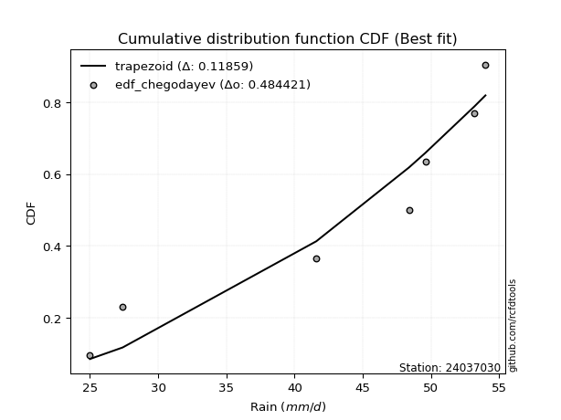</img>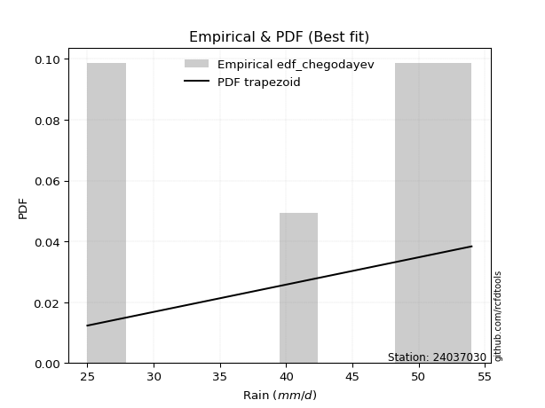</img>

</div>


### 6. EDF Blom (1958)

The Blom formula is a specific "plotting position" formula used in hydrology and statistical analysis to estimate the empirical cumulative probability (or non-exceedance probability) of a data series. It is particularly recommended for data that are approximately normally distributed. The constant _a_ is set to 0.375 (or 3/8).

<div align="center">


$P=(m-a)/(n+1-2a)$


</div>


**6.1. Empirical values**

<div align="center">

|                | 0                  | 1                  | 2                  | 3                 | 4                 | 5                  |
|:---------------|:-------------------|:-------------------|:-------------------|:------------------|:------------------|:-------------------|
| date           | 2023               | 2021               | 2022               | 2020              | 2024              | 2019               |
| x              | 25.0               | 27.4               | 41.6               | 48.4              | 49.6              | 54.0               |
| m              | 1                  | 2                  | 3                  | 4                 | 5                 | 6                  |
| empirical_dist | edf_blom           | edf_blom           | edf_blom           | edf_blom          | edf_blom          | edf_blom           |
| empirical      | 0.1                | 0.26               | 0.42               | 0.58              | 0.74              | 0.9                |
| empirical_tr   | 1.1111111111111112 | 1.3513513513513513 | 1.7241379310344827 | 2.380952380952381 | 3.846153846153846 | 10.000000000000002 |

</div>


**6.2. Kolmogorov-Smirnov fit test (sorted by Δ)**


<div align="center">

|                | 0                   | 1                   | 2                   | 3                   | 4                   | 5                   | 6                  | 7                  | 8                 | 9                   | 10                  | 11                    | 12                  | 13                  | 14                 | 15                  | 16                  | 17                  | 18                  | 19                  | 20                  | 21                  | 22                 | 23                 | 24                  | 25                  | 26                  | 27                 | 28                  | 29                  | 30                | 31                  | 32                  | 33                 | 34                 | 35                  | 36                  | 37                  | 38                  | 39                 | 40                 | 41                  | 42                  | 43                  | 44                 | 45                  | 46                  | 47                  | 48                  | 49                  | 50                  | 51                  | 52                  | 53                  | 54                  | 55                  | 56                  | 57                 | 58                  | 59                  | 60                 | 61                 | 62                 | 63                  | 64                  | 65                 | 66                  | 67                 | 68                  | 69                  | 70                  | 71             | 72              | 73                  | 74                 | 75                  | 76                 | 77                 | 78                 | 79                 | 80                 | 81                  | 82                 | 83                 | 84                 | 85             | 86             | 87             |
|:---------------|:--------------------|:--------------------|:--------------------|:--------------------|:--------------------|:--------------------|:-------------------|:-------------------|:------------------|:--------------------|:--------------------|:----------------------|:--------------------|:--------------------|:-------------------|:--------------------|:--------------------|:--------------------|:--------------------|:--------------------|:--------------------|:--------------------|:-------------------|:-------------------|:--------------------|:--------------------|:--------------------|:-------------------|:--------------------|:--------------------|:------------------|:--------------------|:--------------------|:-------------------|:-------------------|:--------------------|:--------------------|:--------------------|:--------------------|:-------------------|:-------------------|:--------------------|:--------------------|:--------------------|:-------------------|:--------------------|:--------------------|:--------------------|:--------------------|:--------------------|:--------------------|:--------------------|:--------------------|:--------------------|:--------------------|:--------------------|:--------------------|:-------------------|:--------------------|:--------------------|:-------------------|:-------------------|:-------------------|:--------------------|:--------------------|:-------------------|:--------------------|:-------------------|:--------------------|:--------------------|:--------------------|:---------------|:----------------|:--------------------|:-------------------|:--------------------|:-------------------|:-------------------|:-------------------|:-------------------|:-------------------|:--------------------|:-------------------|:-------------------|:-------------------|:---------------|:---------------|:---------------|
| station        | 24037030            | 24037030            | 24037030            | 24037030            | 24037030            | 24037030            | 24037030           | 24037030           | 24037030          | 24037030            | 24037030            | 24037030              | 24037030            | 24037030            | 24037030           | 24037030            | 24037030            | 24037030            | 24037030            | 24037030            | 24037030            | 24037030            | 24037030           | 24037030           | 24037030            | 24037030            | 24037030            | 24037030           | 24037030            | 24037030            | 24037030          | 24037030            | 24037030            | 24037030           | 24037030           | 24037030            | 24037030            | 24037030            | 24037030            | 24037030           | 24037030           | 24037030            | 24037030            | 24037030            | 24037030           | 24037030            | 24037030            | 24037030            | 24037030            | 24037030            | 24037030            | 24037030            | 24037030            | 24037030            | 24037030            | 24037030            | 24037030            | 24037030           | 24037030            | 24037030            | 24037030           | 24037030           | 24037030           | 24037030            | 24037030            | 24037030           | 24037030            | 24037030           | 24037030            | 24037030            | 24037030            | 24037030       | 24037030        | 24037030            | 24037030           | 24037030            | 24037030           | 24037030           | 24037030           | 24037030           | 24037030           | 24037030            | 24037030           | 24037030           | 24037030           | 24037030       | 24037030       | 24037030       |
| empirical_dist | edf_blom            | edf_blom            | edf_blom            | edf_blom            | edf_blom            | edf_blom            | edf_blom           | edf_blom           | edf_blom          | edf_blom            | edf_blom            | edf_blom              | edf_blom            | edf_blom            | edf_blom           | edf_blom            | edf_blom            | edf_blom            | edf_blom            | edf_blom            | edf_blom            | edf_blom            | edf_blom           | edf_blom           | edf_blom            | edf_blom            | edf_blom            | edf_blom           | edf_blom            | edf_blom            | edf_blom          | edf_blom            | edf_blom            | edf_blom           | edf_blom           | edf_blom            | edf_blom            | edf_blom            | edf_blom            | edf_blom           | edf_blom           | edf_blom            | edf_blom            | edf_blom            | edf_blom           | edf_blom            | edf_blom            | edf_blom            | edf_blom            | edf_blom            | edf_blom            | edf_blom            | edf_blom            | edf_blom            | edf_blom            | edf_blom            | edf_blom            | edf_blom           | edf_blom            | edf_blom            | edf_blom           | edf_blom           | edf_blom           | edf_blom            | edf_blom            | edf_blom           | edf_blom            | edf_blom           | edf_blom            | edf_blom            | edf_blom            | edf_blom       | edf_blom        | edf_blom            | edf_blom           | edf_blom            | edf_blom           | edf_blom           | edf_blom           | edf_blom           | edf_blom           | edf_blom            | edf_blom           | edf_blom           | edf_blom           | edf_blom       | edf_blom       | edf_blom       |
| p_dist         | logjohnsonsu        | johnsonsu           | laplace_asymmetric  | logmielke           | logloggamma         | weibull_min         | gumbel_l           | fisk               | logfisk           | pearson3            | logpearson3         | loglaplace_asymmetric | gamma               | loggumbel_l         | erlang             | f                   | nct                 | t                   | exponnorm           | crystalball         | norm                | truncnorm           | betaprime          | logweibull_min     | invgamma            | rice                | logerlang           | logf               | alpha               | loginvgamma         | lognct            | logexponnorm        | logcrystalball      | lognorm            | lognorm            | logt                | ncf                 | maxwell             | invgauss            | loggamma           | loggamma           | logbetaprime        | logrice             | rayleigh            | logalpha           | logfatiguelife      | loginvgauss         | logmaxwell          | kstwobign           | logistic            | lograyleigh         | loginvweibull       | loglogistic         | hypsecant           | gumbel_r            | halfnorm            | loghypsecant        | loghalfnorm        | loggenexpon         | logkstwobign        | logncf             | moyal              | loggumbel_r        | laplace             | genexpon            | expon              | loglaplace          | loggompertz        | logmoyal            | nakagami            | logexpon            | halflogistic   | loghalflogistic | wald                | gibrat             | logchi2             | logwald            | loggibrat          | lognakagami        | chi2               | loglognorm         | logtruncnorm        | gompertz           | fatiguelife        | invweibull         | genlogistic    | loggenlogistic | mielke         |
| delta          | 0.11171917584706587 | 0.12202968734167974 | 0.13814574233702426 | 0.14050365887483018 | 0.14389027103721985 | 0.15106264564431016 | 0.1529750881364751 | 0.1534636626729014 | 0.154441242627416 | 0.15581985253543829 | 0.16297289793240122 | 0.1644977095193565    | 0.16563247412780724 | 0.16568916819782176 | 0.1665916494023878 | 0.16662929529618042 | 0.16740815722729308 | 0.16752972716933245 | 0.16753903252303814 | 0.16753915573481037 | 0.16753915717756362 | 0.16753918946863555 | 0.1675716365766995 | 0.1697666536604162 | 0.17007827989150437 | 0.17276430368379525 | 0.17461846982053653 | 0.1751825479443655 | 0.17521585989953337 | 0.17624139066819788 | 0.176487658372259 | 0.17648767035215218 | 0.17648913446696413 | 0.1764891355511672 | 0.1764891355511672 | 0.17650152583314227 | 0.17694425492767796 | 0.17744805440192868 | 0.17816621121896148 | 0.1791186944131984 | 0.1791186944131984 | 0.17947132575987712 | 0.17992472489593225 | 0.18027936993733795 | 0.1802924702795199 | 0.18064128499502663 | 0.18167319545346688 | 0.18522409529339712 | 0.18671292705100695 | 0.19018914776481732 | 0.19248813866476416 | 0.19612031669230118 | 0.19914447356942178 | 0.20517563811078177 | 0.20761887622413788 | 0.21279405767774429 | 0.21386025449878532 | 0.2180436421279071 | 0.21817112099902597 | 0.21861537045598028 | 0.2191701777740671 | 0.2212280292102171 | 0.2235526808876543 | 0.22526128481383478 | 0.22565142225626594 | 0.2256605758694114 | 0.23289800242827086 | 0.2351314437033873 | 0.24745838698883954 | 0.24769410506384099 | 0.25522979825745223 | 0.26           | 0.26            | 0.26882309464624393 | 0.2951410478239071 | 0.30622062906202185 | 0.3138589540350472 | 0.3445480742713288 | 0.3550159226348993 | 0.3592593865473926 | 0.3674101854099455 | 0.41999528243762346 | 0.4199999994039128 | 0.4334287881331635 | 0.4703609886148205 | 0.74           | 0.74           | nan            |
| deltao         | 0.530385761606      | 0.530385761606      | 0.530385761606      | 0.530385761606      | 0.530385761606      | 0.530385761606      | 0.530385761606     | 0.530385761606     | 0.530385761606    | 0.530385761606      | 0.530385761606      | 0.530385761606        | 0.530385761606      | 0.530385761606      | 0.530385761606     | 0.530385761606      | 0.530385761606      | 0.530385761606      | 0.530385761606      | 0.530385761606      | 0.530385761606      | 0.530385761606      | 0.530385761606     | 0.530385761606     | 0.530385761606      | 0.530385761606      | 0.530385761606      | 0.530385761606     | 0.530385761606      | 0.530385761606      | 0.530385761606    | 0.530385761606      | 0.530385761606      | 0.530385761606     | 0.530385761606     | 0.530385761606      | 0.530385761606      | 0.530385761606      | 0.530385761606      | 0.530385761606     | 0.530385761606     | 0.530385761606      | 0.530385761606      | 0.530385761606      | 0.530385761606     | 0.530385761606      | 0.530385761606      | 0.530385761606      | 0.530385761606      | 0.530385761606      | 0.530385761606      | 0.530385761606      | 0.530385761606      | 0.530385761606      | 0.530385761606      | 0.530385761606      | 0.530385761606      | 0.530385761606     | 0.530385761606      | 0.530385761606      | 0.530385761606     | 0.530385761606     | 0.530385761606     | 0.530385761606      | 0.530385761606      | 0.530385761606     | 0.530385761606      | 0.530385761606     | 0.530385761606      | 0.530385761606      | 0.530385761606      | 0.530385761606 | 0.530385761606  | 0.530385761606      | 0.530385761606     | 0.530385761606      | 0.530385761606     | 0.530385761606     | 0.530385761606     | 0.530385761606     | 0.530385761606     | 0.530385761606      | 0.530385761606     | 0.530385761606     | 0.530385761606     | 0.530385761606 | 0.530385761606 | 0.530385761606 |
| eval           | Δo > Δ              | Δo > Δ              | Δo > Δ              | Δo > Δ              | Δo > Δ              | Δo > Δ              | Δo > Δ             | Δo > Δ             | Δo > Δ            | Δo > Δ              | Δo > Δ              | Δo > Δ                | Δo > Δ              | Δo > Δ              | Δo > Δ             | Δo > Δ              | Δo > Δ              | Δo > Δ              | Δo > Δ              | Δo > Δ              | Δo > Δ              | Δo > Δ              | Δo > Δ             | Δo > Δ             | Δo > Δ              | Δo > Δ              | Δo > Δ              | Δo > Δ             | Δo > Δ              | Δo > Δ              | Δo > Δ            | Δo > Δ              | Δo > Δ              | Δo > Δ             | Δo > Δ             | Δo > Δ              | Δo > Δ              | Δo > Δ              | Δo > Δ              | Δo > Δ             | Δo > Δ             | Δo > Δ              | Δo > Δ              | Δo > Δ              | Δo > Δ             | Δo > Δ              | Δo > Δ              | Δo > Δ              | Δo > Δ              | Δo > Δ              | Δo > Δ              | Δo > Δ              | Δo > Δ              | Δo > Δ              | Δo > Δ              | Δo > Δ              | Δo > Δ              | Δo > Δ             | Δo > Δ              | Δo > Δ              | Δo > Δ             | Δo > Δ             | Δo > Δ             | Δo > Δ              | Δo > Δ              | Δo > Δ             | Δo > Δ              | Δo > Δ             | Δo > Δ              | Δo > Δ              | Δo > Δ              | Δo > Δ         | Δo > Δ          | Δo > Δ              | Δo > Δ             | Δo > Δ              | Δo > Δ             | Δo > Δ             | Δo > Δ             | Δo > Δ             | Δo > Δ             | Δo > Δ              | Δo > Δ             | Δo > Δ             | Δo > Δ             | Δo <= Δ        | Δo <= Δ        | Δo <= Δ        |
| fit            | 1                   | 1                   | 1                   | 1                   | 1                   | 1                   | 1                  | 1                  | 1                 | 1                   | 1                   | 1                     | 1                   | 1                   | 1                  | 1                   | 1                   | 1                   | 1                   | 1                   | 1                   | 1                   | 1                  | 1                  | 1                   | 1                   | 1                   | 1                  | 1                   | 1                   | 1                 | 1                   | 1                   | 1                  | 1                  | 1                   | 1                   | 1                   | 1                   | 1                  | 1                  | 1                   | 1                   | 1                   | 1                  | 1                   | 1                   | 1                   | 1                   | 1                   | 1                   | 1                   | 1                   | 1                   | 1                   | 1                   | 1                   | 1                  | 1                   | 1                   | 1                  | 1                  | 1                  | 1                   | 1                   | 1                  | 1                   | 1                  | 1                   | 1                   | 1                   | 1              | 1               | 1                   | 1                  | 1                   | 1                  | 1                  | 1                  | 1                  | 1                  | 1                   | 1                  | 1                  | 1                  | 0              | 0              | 0              |
| n              | 6                   | 6                   | 6                   | 6                   | 6                   | 6                   | 6                  | 6                  | 6                 | 6                   | 6                   | 6                     | 6                   | 6                   | 6                  | 6                   | 6                   | 6                   | 6                   | 6                   | 6                   | 6                   | 6                  | 6                  | 6                   | 6                   | 6                   | 6                  | 6                   | 6                   | 6                 | 6                   | 6                   | 6                  | 6                  | 6                   | 6                   | 6                   | 6                   | 6                  | 6                  | 6                   | 6                   | 6                   | 6                  | 6                   | 6                   | 6                   | 6                   | 6                   | 6                   | 6                   | 6                   | 6                   | 6                   | 6                   | 6                   | 6                  | 6                   | 6                   | 6                  | 6                  | 6                  | 6                   | 6                   | 6                  | 6                   | 6                  | 6                   | 6                   | 6                   | 6              | 6               | 6                   | 6                  | 6                   | 6                  | 6                  | 6                  | 6                  | 6                  | 6                   | 6                  | 6                  | 6                  | 6              | 6              | 6              |
| best_fit       | 1                   | 0                   | 0                   | 0                   | 0                   | 0                   | 0                  | 0                  | 0                 | 0                   | 0                   | 0                     | 0                   | 0                   | 0                  | 0                   | 0                   | 0                   | 0                   | 0                   | 0                   | 0                   | 0                  | 0                  | 0                   | 0                   | 0                   | 0                  | 0                   | 0                   | 0                 | 0                   | 0                   | 0                  | 0                  | 0                   | 0                   | 0                   | 0                   | 0                  | 0                  | 0                   | 0                   | 0                   | 0                  | 0                   | 0                   | 0                   | 0                   | 0                   | 0                   | 0                   | 0                   | 0                   | 0                   | 0                   | 0                   | 0                  | 0                   | 0                   | 0                  | 0                  | 0                  | 0                   | 0                   | 0                  | 0                   | 0                  | 0                   | 0                   | 0                   | 0              | 0               | 0                   | 0                  | 0                   | 0                  | 0                  | 0                  | 0                  | 0                  | 0                   | 0                  | 0                  | 0                  | 0              | 0              | 0              |
| best_fit_sort  | 1                   | 2                   | 3                   | 4                   | 5                   | 6                   | 7                  | 8                  | 9                 | 10                  | 11                  | 12                    | 13                  | 14                  | 15                 | 16                  | 17                  | 18                  | 19                  | 20                  | 21                  | 22                  | 23                 | 24                 | 25                  | 26                  | 27                  | 28                 | 29                  | 30                  | 31                | 32                  | 33                  | 34                 | 35                 | 36                  | 37                  | 38                  | 39                  | 40                 | 41                 | 42                  | 43                  | 44                  | 45                 | 46                  | 47                  | 48                  | 49                  | 50                  | 51                  | 52                  | 53                  | 54                  | 55                  | 56                  | 57                  | 58                 | 59                  | 60                  | 61                 | 62                 | 63                 | 64                  | 65                  | 66                 | 67                  | 68                 | 69                  | 70                  | 71                  | 72             | 73              | 74                  | 75                 | 76                  | 77                 | 78                 | 79                 | 80                 | 81                 | 82                  | 83                 | 84                 | 85                 | 86             | 87             | 88             |

</div>


**6.3. Best fit**

<div align="center">

|   id |   station | empirical_dist   | p_dist       |    delta |   deltao | eval   |   fit |   n |   best_fit |   best_fit_sort |
|-----:|----------:|:-----------------|:-------------|---------:|---------:|:-------|------:|----:|-----------:|----------------:|
|    0 |  24037030 | edf_blom         | logjohnsonsu | 0.111719 | 0.530386 | Δo > Δ |     1 |   6 |          1 |               1 |

</div>


<div align="center">

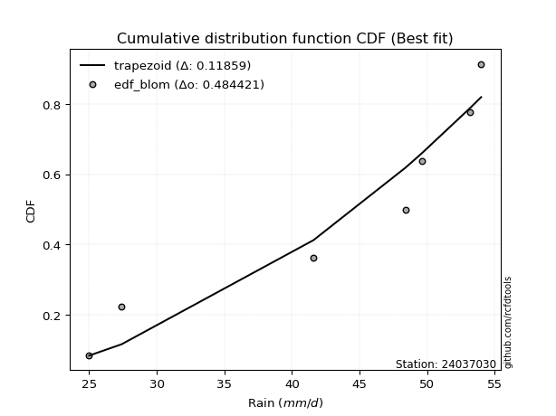</img>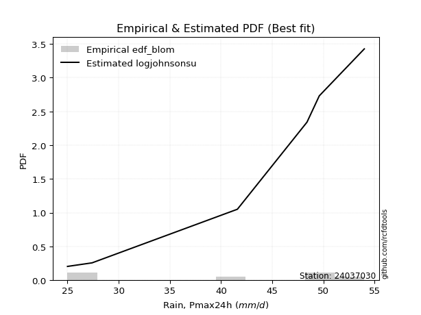</img>

</div>


### 7. EDF Tukey (1962)

In hydrology, the Tukey formula is used as a plotting position formula to estimate the empirical probability or frequency of a flood event (or other hydrological data). The formula parameter is given as _c=0.333_ (or 1/3).

<div align="center">


$P=(m-c)/(n+1-2c)$


</div>


**7.1. Empirical values**

<div align="center">

|                | 0                   | 1                  | 2                   | 3                  | 4                  | 5                  |
|:---------------|:--------------------|:-------------------|:--------------------|:-------------------|:-------------------|:-------------------|
| date           | 2023                | 2021               | 2022                | 2020               | 2024               | 2019               |
| x              | 25.0                | 27.4               | 41.6                | 48.4               | 49.6               | 54.0               |
| m              | 1                   | 2                  | 3                   | 4                  | 5                  | 6                  |
| empirical_dist | edf_tukey           | edf_tukey          | edf_tukey           | edf_tukey          | edf_tukey          | edf_tukey          |
| empirical      | 0.10526315789473684 | 0.2631578947368421 | 0.42105263157894735 | 0.5789473684210527 | 0.7368421052631579 | 0.8947368421052632 |
| empirical_tr   | 1.1176470588235294  | 1.357142857142857  | 1.7272727272727273  | 2.375              | 3.7999999999999994 | 9.5                |

</div>


**7.2. Kolmogorov-Smirnov fit test (sorted by Δ)**


<div align="center">

|                | 0                   | 1                   | 2                   | 3                   | 4                   | 5                  | 6                   | 7                   | 8                  | 9                   | 10                  | 11                    | 12                  | 13                  | 14                 | 15                  | 16                  | 17                  | 18                  | 19                  | 20                  | 21                  | 22                 | 23                  | 24                  | 25                  | 26                  | 27                 | 28                  | 29                 | 30                 | 31                 | 32                  | 33                 | 34                 | 35                  | 36                  | 37                  | 38                  | 39                 | 40                 | 41                  | 42                  | 43                  | 44                  | 45                 | 46                  | 47                  | 48                  | 49                  | 50                 | 51                  | 52                  | 53                  | 54                 | 55                  | 56                  | 57                  | 58                  | 59                 | 60                  | 61                  | 62                  | 63                  | 64                  | 65                 | 66                  | 67                  | 68                  | 69                  | 70                 | 71                 | 72                 | 73                  | 74                  | 75                | 76                  | 77                 | 78                 | 79                  | 80                  | 81                 | 82                  | 83                  | 84                  | 85                 | 86                 | 87             |
|:---------------|:--------------------|:--------------------|:--------------------|:--------------------|:--------------------|:-------------------|:--------------------|:--------------------|:-------------------|:--------------------|:--------------------|:----------------------|:--------------------|:--------------------|:-------------------|:--------------------|:--------------------|:--------------------|:--------------------|:--------------------|:--------------------|:--------------------|:-------------------|:--------------------|:--------------------|:--------------------|:--------------------|:-------------------|:--------------------|:-------------------|:-------------------|:-------------------|:--------------------|:-------------------|:-------------------|:--------------------|:--------------------|:--------------------|:--------------------|:-------------------|:-------------------|:--------------------|:--------------------|:--------------------|:--------------------|:-------------------|:--------------------|:--------------------|:--------------------|:--------------------|:-------------------|:--------------------|:--------------------|:--------------------|:-------------------|:--------------------|:--------------------|:--------------------|:--------------------|:-------------------|:--------------------|:--------------------|:--------------------|:--------------------|:--------------------|:-------------------|:--------------------|:--------------------|:--------------------|:--------------------|:-------------------|:-------------------|:-------------------|:--------------------|:--------------------|:------------------|:--------------------|:-------------------|:-------------------|:--------------------|:--------------------|:-------------------|:--------------------|:--------------------|:--------------------|:-------------------|:-------------------|:---------------|
| station        | 24037030            | 24037030            | 24037030            | 24037030            | 24037030            | 24037030           | 24037030            | 24037030            | 24037030           | 24037030            | 24037030            | 24037030              | 24037030            | 24037030            | 24037030           | 24037030            | 24037030            | 24037030            | 24037030            | 24037030            | 24037030            | 24037030            | 24037030           | 24037030            | 24037030            | 24037030            | 24037030            | 24037030           | 24037030            | 24037030           | 24037030           | 24037030           | 24037030            | 24037030           | 24037030           | 24037030            | 24037030            | 24037030            | 24037030            | 24037030           | 24037030           | 24037030            | 24037030            | 24037030            | 24037030            | 24037030           | 24037030            | 24037030            | 24037030            | 24037030            | 24037030           | 24037030            | 24037030            | 24037030            | 24037030           | 24037030            | 24037030            | 24037030            | 24037030            | 24037030           | 24037030            | 24037030            | 24037030            | 24037030            | 24037030            | 24037030           | 24037030            | 24037030            | 24037030            | 24037030            | 24037030           | 24037030           | 24037030           | 24037030            | 24037030            | 24037030          | 24037030            | 24037030           | 24037030           | 24037030            | 24037030            | 24037030           | 24037030            | 24037030            | 24037030            | 24037030           | 24037030           | 24037030       |
| empirical_dist | edf_tukey           | edf_tukey           | edf_tukey           | edf_tukey           | edf_tukey           | edf_tukey          | edf_tukey           | edf_tukey           | edf_tukey          | edf_tukey           | edf_tukey           | edf_tukey             | edf_tukey           | edf_tukey           | edf_tukey          | edf_tukey           | edf_tukey           | edf_tukey           | edf_tukey           | edf_tukey           | edf_tukey           | edf_tukey           | edf_tukey          | edf_tukey           | edf_tukey           | edf_tukey           | edf_tukey           | edf_tukey          | edf_tukey           | edf_tukey          | edf_tukey          | edf_tukey          | edf_tukey           | edf_tukey          | edf_tukey          | edf_tukey           | edf_tukey           | edf_tukey           | edf_tukey           | edf_tukey          | edf_tukey          | edf_tukey           | edf_tukey           | edf_tukey           | edf_tukey           | edf_tukey          | edf_tukey           | edf_tukey           | edf_tukey           | edf_tukey           | edf_tukey          | edf_tukey           | edf_tukey           | edf_tukey           | edf_tukey          | edf_tukey           | edf_tukey           | edf_tukey           | edf_tukey           | edf_tukey          | edf_tukey           | edf_tukey           | edf_tukey           | edf_tukey           | edf_tukey           | edf_tukey          | edf_tukey           | edf_tukey           | edf_tukey           | edf_tukey           | edf_tukey          | edf_tukey          | edf_tukey          | edf_tukey           | edf_tukey           | edf_tukey         | edf_tukey           | edf_tukey          | edf_tukey          | edf_tukey           | edf_tukey           | edf_tukey          | edf_tukey           | edf_tukey           | edf_tukey           | edf_tukey          | edf_tukey          | edf_tukey      |
| p_dist         | logjohnsonsu        | johnsonsu           | laplace_asymmetric  | logmielke           | logloggamma         | gumbel_l           | weibull_min         | fisk                | pearson3           | logfisk             | logpearson3         | loglaplace_asymmetric | gamma               | loggumbel_l         | erlang             | f                   | nct                 | t                   | exponnorm           | crystalball         | norm                | truncnorm           | betaprime          | logweibull_min      | invgamma            | rice                | logerlang           | logf               | alpha               | loginvgamma        | lognct             | logexponnorm       | logcrystalball      | lognorm            | lognorm            | logt                | ncf                 | maxwell             | invgauss            | loggamma           | loggamma           | logbetaprime        | loginvgauss         | logrice             | rayleigh            | logalpha           | logfatiguelife      | logmaxwell          | kstwobign           | logistic            | lograyleigh        | loginvweibull       | loglogistic         | hypsecant           | gumbel_r           | logncf              | loghypsecant        | halfnorm            | loghalfnorm         | loggenexpon        | logkstwobign        | loggumbel_r         | moyal               | genexpon            | expon               | laplace            | loglaplace          | loggompertz         | logmoyal            | nakagami            | logexpon           | halflogistic       | loghalflogistic    | wald                | gibrat              | logchi2           | logwald             | loggibrat          | lognakagami        | chi2                | loglognorm          | logtruncnorm       | gompertz            | fatiguelife         | invweibull          | genlogistic        | loggenlogistic     | mielke         |
| delta          | 0.11487707058390795 | 0.12518758207852182 | 0.14130363707386634 | 0.14366155361167227 | 0.14704816577406193 | 0.1540277197154224 | 0.15422054038115224 | 0.15662155740974348 | 0.1568724841143856 | 0.15759913736425807 | 0.16402552951134852 | 0.1655503410983038    | 0.16668510570675454 | 0.16674179977676906 | 0.1676442809813351 | 0.16768192687512773 | 0.16846078880624038 | 0.16858235874827976 | 0.16859166410198545 | 0.16859178731375768 | 0.16859178875651093 | 0.16859182104758286 | 0.1686242681556468 | 0.17081928523936352 | 0.17113091147045167 | 0.17381693526274256 | 0.17567110139948383 | 0.1762351795233128 | 0.17626849147848067 | 0.1772940222471452 | 0.1775402899512063 | 0.1775403019310995 | 0.17754176604591143 | 0.1775417671301145 | 0.1775417671301145 | 0.17755415741208957 | 0.17799688650662526 | 0.17850068598087598 | 0.17921884279790878 | 0.1801713259921457 | 0.1801713259921457 | 0.18052395733882443 | 0.18062056387451952 | 0.18097735647487956 | 0.18133200151628526 | 0.1813451018584672 | 0.18169391657397393 | 0.18627672687234442 | 0.18776555862995425 | 0.19124177934376463 | 0.1914355070858168 | 0.19506768511335382 | 0.20019710514836908 | 0.20622826968972907 | 0.2086715078030852 | 0.21390701987933025 | 0.21491288607773262 | 0.21595195241458637 | 0.21699101054895975 | 0.2171184894200786 | 0.21756273887703292 | 0.22250004930870693 | 0.22438592394705917 | 0.22459879067731858 | 0.22460794429046405 | 0.2263139163927821 | 0.23395063400721816 | 0.23407881212443993 | 0.24640575540989218 | 0.24664147348489363 | 0.2541771666785049 | 0.2631578947368421 | 0.2631578947368421 | 0.26777046306729657 | 0.29408841624495974 | 0.300957471167285 | 0.31280632245609985 | 0.3434954426923814 | 0.3539632910559519 | 0.35820675496844523 | 0.36425229067310344 | 0.4210479140165708 | 0.42105263098286017 | 0.43237615655421613 | 0.46509783072008365 | 0.7368421052631579 | 0.7368421052631579 | nan            |
| deltao         | 0.530385761606      | 0.530385761606      | 0.530385761606      | 0.530385761606      | 0.530385761606      | 0.530385761606     | 0.530385761606      | 0.530385761606      | 0.530385761606     | 0.530385761606      | 0.530385761606      | 0.530385761606        | 0.530385761606      | 0.530385761606      | 0.530385761606     | 0.530385761606      | 0.530385761606      | 0.530385761606      | 0.530385761606      | 0.530385761606      | 0.530385761606      | 0.530385761606      | 0.530385761606     | 0.530385761606      | 0.530385761606      | 0.530385761606      | 0.530385761606      | 0.530385761606     | 0.530385761606      | 0.530385761606     | 0.530385761606     | 0.530385761606     | 0.530385761606      | 0.530385761606     | 0.530385761606     | 0.530385761606      | 0.530385761606      | 0.530385761606      | 0.530385761606      | 0.530385761606     | 0.530385761606     | 0.530385761606      | 0.530385761606      | 0.530385761606      | 0.530385761606      | 0.530385761606     | 0.530385761606      | 0.530385761606      | 0.530385761606      | 0.530385761606      | 0.530385761606     | 0.530385761606      | 0.530385761606      | 0.530385761606      | 0.530385761606     | 0.530385761606      | 0.530385761606      | 0.530385761606      | 0.530385761606      | 0.530385761606     | 0.530385761606      | 0.530385761606      | 0.530385761606      | 0.530385761606      | 0.530385761606      | 0.530385761606     | 0.530385761606      | 0.530385761606      | 0.530385761606      | 0.530385761606      | 0.530385761606     | 0.530385761606     | 0.530385761606     | 0.530385761606      | 0.530385761606      | 0.530385761606    | 0.530385761606      | 0.530385761606     | 0.530385761606     | 0.530385761606      | 0.530385761606      | 0.530385761606     | 0.530385761606      | 0.530385761606      | 0.530385761606      | 0.530385761606     | 0.530385761606     | 0.530385761606 |
| eval           | Δo > Δ              | Δo > Δ              | Δo > Δ              | Δo > Δ              | Δo > Δ              | Δo > Δ             | Δo > Δ              | Δo > Δ              | Δo > Δ             | Δo > Δ              | Δo > Δ              | Δo > Δ                | Δo > Δ              | Δo > Δ              | Δo > Δ             | Δo > Δ              | Δo > Δ              | Δo > Δ              | Δo > Δ              | Δo > Δ              | Δo > Δ              | Δo > Δ              | Δo > Δ             | Δo > Δ              | Δo > Δ              | Δo > Δ              | Δo > Δ              | Δo > Δ             | Δo > Δ              | Δo > Δ             | Δo > Δ             | Δo > Δ             | Δo > Δ              | Δo > Δ             | Δo > Δ             | Δo > Δ              | Δo > Δ              | Δo > Δ              | Δo > Δ              | Δo > Δ             | Δo > Δ             | Δo > Δ              | Δo > Δ              | Δo > Δ              | Δo > Δ              | Δo > Δ             | Δo > Δ              | Δo > Δ              | Δo > Δ              | Δo > Δ              | Δo > Δ             | Δo > Δ              | Δo > Δ              | Δo > Δ              | Δo > Δ             | Δo > Δ              | Δo > Δ              | Δo > Δ              | Δo > Δ              | Δo > Δ             | Δo > Δ              | Δo > Δ              | Δo > Δ              | Δo > Δ              | Δo > Δ              | Δo > Δ             | Δo > Δ              | Δo > Δ              | Δo > Δ              | Δo > Δ              | Δo > Δ             | Δo > Δ             | Δo > Δ             | Δo > Δ              | Δo > Δ              | Δo > Δ            | Δo > Δ              | Δo > Δ             | Δo > Δ             | Δo > Δ              | Δo > Δ              | Δo > Δ             | Δo > Δ              | Δo > Δ              | Δo > Δ              | Δo <= Δ            | Δo <= Δ            | Δo <= Δ        |
| fit            | 1                   | 1                   | 1                   | 1                   | 1                   | 1                  | 1                   | 1                   | 1                  | 1                   | 1                   | 1                     | 1                   | 1                   | 1                  | 1                   | 1                   | 1                   | 1                   | 1                   | 1                   | 1                   | 1                  | 1                   | 1                   | 1                   | 1                   | 1                  | 1                   | 1                  | 1                  | 1                  | 1                   | 1                  | 1                  | 1                   | 1                   | 1                   | 1                   | 1                  | 1                  | 1                   | 1                   | 1                   | 1                   | 1                  | 1                   | 1                   | 1                   | 1                   | 1                  | 1                   | 1                   | 1                   | 1                  | 1                   | 1                   | 1                   | 1                   | 1                  | 1                   | 1                   | 1                   | 1                   | 1                   | 1                  | 1                   | 1                   | 1                   | 1                   | 1                  | 1                  | 1                  | 1                   | 1                   | 1                 | 1                   | 1                  | 1                  | 1                   | 1                   | 1                  | 1                   | 1                   | 1                   | 0                  | 0                  | 0              |
| n              | 6                   | 6                   | 6                   | 6                   | 6                   | 6                  | 6                   | 6                   | 6                  | 6                   | 6                   | 6                     | 6                   | 6                   | 6                  | 6                   | 6                   | 6                   | 6                   | 6                   | 6                   | 6                   | 6                  | 6                   | 6                   | 6                   | 6                   | 6                  | 6                   | 6                  | 6                  | 6                  | 6                   | 6                  | 6                  | 6                   | 6                   | 6                   | 6                   | 6                  | 6                  | 6                   | 6                   | 6                   | 6                   | 6                  | 6                   | 6                   | 6                   | 6                   | 6                  | 6                   | 6                   | 6                   | 6                  | 6                   | 6                   | 6                   | 6                   | 6                  | 6                   | 6                   | 6                   | 6                   | 6                   | 6                  | 6                   | 6                   | 6                   | 6                   | 6                  | 6                  | 6                  | 6                   | 6                   | 6                 | 6                   | 6                  | 6                  | 6                   | 6                   | 6                  | 6                   | 6                   | 6                   | 6                  | 6                  | 6              |
| best_fit       | 1                   | 0                   | 0                   | 0                   | 0                   | 0                  | 0                   | 0                   | 0                  | 0                   | 0                   | 0                     | 0                   | 0                   | 0                  | 0                   | 0                   | 0                   | 0                   | 0                   | 0                   | 0                   | 0                  | 0                   | 0                   | 0                   | 0                   | 0                  | 0                   | 0                  | 0                  | 0                  | 0                   | 0                  | 0                  | 0                   | 0                   | 0                   | 0                   | 0                  | 0                  | 0                   | 0                   | 0                   | 0                   | 0                  | 0                   | 0                   | 0                   | 0                   | 0                  | 0                   | 0                   | 0                   | 0                  | 0                   | 0                   | 0                   | 0                   | 0                  | 0                   | 0                   | 0                   | 0                   | 0                   | 0                  | 0                   | 0                   | 0                   | 0                   | 0                  | 0                  | 0                  | 0                   | 0                   | 0                 | 0                   | 0                  | 0                  | 0                   | 0                   | 0                  | 0                   | 0                   | 0                   | 0                  | 0                  | 0              |
| best_fit_sort  | 1                   | 2                   | 3                   | 4                   | 5                   | 6                  | 7                   | 8                   | 9                  | 10                  | 11                  | 12                    | 13                  | 14                  | 15                 | 16                  | 17                  | 18                  | 19                  | 20                  | 21                  | 22                  | 23                 | 24                  | 25                  | 26                  | 27                  | 28                 | 29                  | 30                 | 31                 | 32                 | 33                  | 34                 | 35                 | 36                  | 37                  | 38                  | 39                  | 40                 | 41                 | 42                  | 43                  | 44                  | 45                  | 46                 | 47                  | 48                  | 49                  | 50                  | 51                 | 52                  | 53                  | 54                  | 55                 | 56                  | 57                  | 58                  | 59                  | 60                 | 61                  | 62                  | 63                  | 64                  | 65                  | 66                 | 67                  | 68                  | 69                  | 70                  | 71                 | 72                 | 73                 | 74                  | 75                  | 76                | 77                  | 78                 | 79                 | 80                  | 81                  | 82                 | 83                  | 84                  | 85                  | 86                 | 87                 | 88             |

</div>


**7.3. Best fit**

<div align="center">

|   id |   station | empirical_dist   | p_dist       |    delta |   deltao | eval   |   fit |   n |   best_fit |   best_fit_sort |
|-----:|----------:|:-----------------|:-------------|---------:|---------:|:-------|------:|----:|-----------:|----------------:|
|    0 |  24037030 | edf_tukey        | logjohnsonsu | 0.114877 | 0.530386 | Δo > Δ |     1 |   6 |          1 |               1 |

</div>


<div align="center">

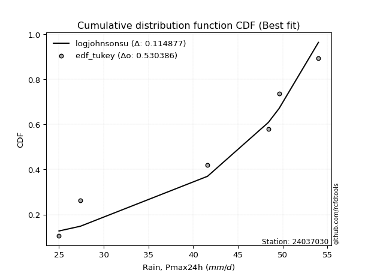</img>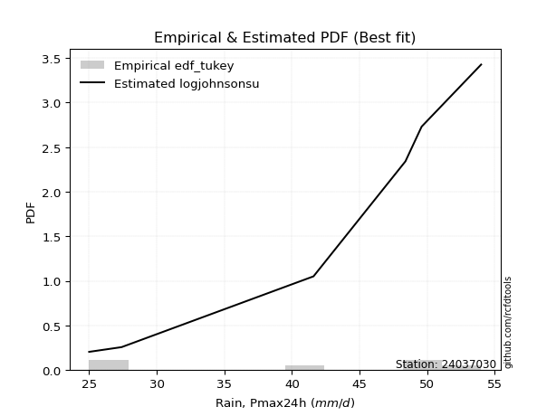</img>

</div>


### 8. EDF Gringorten (1963)

Gringorten plotting position formula is essential for estimating the probability and return periods of extreme events like floods and heavy rainfall. The constant _a=0.44_.

<div align="center">


$P=(m-a)/(n+1-2a)$


</div>


**8.1. Empirical values**

<div align="center">

|                | 0                   | 1                  | 2                   | 3                  | 4                  | 5                  |
|:---------------|:--------------------|:-------------------|:--------------------|:-------------------|:-------------------|:-------------------|
| date           | 2023                | 2021               | 2022                | 2020               | 2024               | 2019               |
| x              | 25.0                | 27.4               | 41.6                | 48.4               | 49.6               | 54.0               |
| m              | 1                   | 2                  | 3                   | 4                  | 5                  | 6                  |
| empirical_dist | edf_gringorten      | edf_gringorten     | edf_gringorten      | edf_gringorten     | edf_gringorten     | edf_gringorten     |
| empirical      | 0.09150326797385622 | 0.2549019607843137 | 0.41830065359477125 | 0.5816993464052288 | 0.7450980392156862 | 0.9084967320261437 |
| empirical_tr   | 1.1007194244604317  | 1.3421052631578947 | 1.7191011235955058  | 2.3906250000000004 | 3.9230769230769216 | 10.928571428571415 |

</div>


**8.2. Kolmogorov-Smirnov fit test (sorted by Δ)**


<div align="center">

|                | 0                   | 1                   | 2                   | 3                   | 4                   | 5                   | 6                  | 7                   | 8                   | 9                   | 10                  | 11                    | 12                 | 13                  | 14                  | 15                  | 16                  | 17                 | 18                 | 19                  | 20                  | 21                 | 22                  | 23                  | 24                  | 25                 | 26                  | 27                  | 28                  | 29                  | 30                  | 31                  | 32                  | 33                  | 34                  | 35                  | 36                  | 37                  | 38                  | 39                  | 40                  | 41                  | 42                 | 43                 | 44                  | 45                 | 46                  | 47                 | 48                  | 49                  | 50                 | 51                  | 52                 | 53                  | 54                  | 55                  | 56                  | 57                 | 58                  | 59                 | 60                  | 61                  | 62                  | 63                  | 64                  | 65                  | 66                  | 67                  | 68                  | 69                  | 70                 | 71                 | 72                  | 73                  | 74                  | 75                 | 76                  | 77                 | 78                | 79                 | 80                 | 81                  | 82                 | 83                 | 84                  | 85                 | 86                 | 87             |
|:---------------|:--------------------|:--------------------|:--------------------|:--------------------|:--------------------|:--------------------|:-------------------|:--------------------|:--------------------|:--------------------|:--------------------|:----------------------|:-------------------|:--------------------|:--------------------|:--------------------|:--------------------|:-------------------|:-------------------|:--------------------|:--------------------|:-------------------|:--------------------|:--------------------|:--------------------|:-------------------|:--------------------|:--------------------|:--------------------|:--------------------|:--------------------|:--------------------|:--------------------|:--------------------|:--------------------|:--------------------|:--------------------|:--------------------|:--------------------|:--------------------|:--------------------|:--------------------|:-------------------|:-------------------|:--------------------|:-------------------|:--------------------|:-------------------|:--------------------|:--------------------|:-------------------|:--------------------|:-------------------|:--------------------|:--------------------|:--------------------|:--------------------|:-------------------|:--------------------|:-------------------|:--------------------|:--------------------|:--------------------|:--------------------|:--------------------|:--------------------|:--------------------|:--------------------|:--------------------|:--------------------|:-------------------|:-------------------|:--------------------|:--------------------|:--------------------|:-------------------|:--------------------|:-------------------|:------------------|:-------------------|:-------------------|:--------------------|:-------------------|:-------------------|:--------------------|:-------------------|:-------------------|:---------------|
| station        | 24037030            | 24037030            | 24037030            | 24037030            | 24037030            | 24037030            | 24037030           | 24037030            | 24037030            | 24037030            | 24037030            | 24037030              | 24037030           | 24037030            | 24037030            | 24037030            | 24037030            | 24037030           | 24037030           | 24037030            | 24037030            | 24037030           | 24037030            | 24037030            | 24037030            | 24037030           | 24037030            | 24037030            | 24037030            | 24037030            | 24037030            | 24037030            | 24037030            | 24037030            | 24037030            | 24037030            | 24037030            | 24037030            | 24037030            | 24037030            | 24037030            | 24037030            | 24037030           | 24037030           | 24037030            | 24037030           | 24037030            | 24037030           | 24037030            | 24037030            | 24037030           | 24037030            | 24037030           | 24037030            | 24037030            | 24037030            | 24037030            | 24037030           | 24037030            | 24037030           | 24037030            | 24037030            | 24037030            | 24037030            | 24037030            | 24037030            | 24037030            | 24037030            | 24037030            | 24037030            | 24037030           | 24037030           | 24037030            | 24037030            | 24037030            | 24037030           | 24037030            | 24037030           | 24037030          | 24037030           | 24037030           | 24037030            | 24037030           | 24037030           | 24037030            | 24037030           | 24037030           | 24037030       |
| empirical_dist | edf_gringorten      | edf_gringorten      | edf_gringorten      | edf_gringorten      | edf_gringorten      | edf_gringorten      | edf_gringorten     | edf_gringorten      | edf_gringorten      | edf_gringorten      | edf_gringorten      | edf_gringorten        | edf_gringorten     | edf_gringorten      | edf_gringorten      | edf_gringorten      | edf_gringorten      | edf_gringorten     | edf_gringorten     | edf_gringorten      | edf_gringorten      | edf_gringorten     | edf_gringorten      | edf_gringorten      | edf_gringorten      | edf_gringorten     | edf_gringorten      | edf_gringorten      | edf_gringorten      | edf_gringorten      | edf_gringorten      | edf_gringorten      | edf_gringorten      | edf_gringorten      | edf_gringorten      | edf_gringorten      | edf_gringorten      | edf_gringorten      | edf_gringorten      | edf_gringorten      | edf_gringorten      | edf_gringorten      | edf_gringorten     | edf_gringorten     | edf_gringorten      | edf_gringorten     | edf_gringorten      | edf_gringorten     | edf_gringorten      | edf_gringorten      | edf_gringorten     | edf_gringorten      | edf_gringorten     | edf_gringorten      | edf_gringorten      | edf_gringorten      | edf_gringorten      | edf_gringorten     | edf_gringorten      | edf_gringorten     | edf_gringorten      | edf_gringorten      | edf_gringorten      | edf_gringorten      | edf_gringorten      | edf_gringorten      | edf_gringorten      | edf_gringorten      | edf_gringorten      | edf_gringorten      | edf_gringorten     | edf_gringorten     | edf_gringorten      | edf_gringorten      | edf_gringorten      | edf_gringorten     | edf_gringorten      | edf_gringorten     | edf_gringorten    | edf_gringorten     | edf_gringorten     | edf_gringorten      | edf_gringorten     | edf_gringorten     | edf_gringorten      | edf_gringorten     | edf_gringorten     | edf_gringorten |
| p_dist         | logjohnsonsu        | johnsonsu           | laplace_asymmetric  | logmielke           | logloggamma         | weibull_min         | fisk               | logfisk             | gumbel_l            | pearson3            | logpearson3         | loglaplace_asymmetric | gamma              | loggumbel_l         | erlang              | f                   | nct                 | t                  | exponnorm          | crystalball         | norm                | truncnorm          | betaprime           | logweibull_min      | invgamma            | rice               | logerlang           | logf                | alpha               | loginvgamma         | lognct              | logexponnorm        | logcrystalball      | lognorm             | lognorm             | logt                | ncf                 | maxwell             | invgauss            | loggamma            | loggamma            | logbetaprime        | logrice            | rayleigh           | logalpha            | logfatiguelife     | loginvgauss         | kstwobign          | logmaxwell          | logistic            | lograyleigh        | loglogistic         | loginvweibull      | hypsecant           | gumbel_r            | halfnorm            | loghypsecant        | moyal              | loghalfnorm         | loggenexpon        | logkstwobign        | laplace             | loggumbel_r         | genexpon            | expon               | logncf              | loglaplace          | loggompertz         | logmoyal            | nakagami            | loghalflogistic    | halflogistic       | logexpon            | wald                | gibrat              | logchi2            | logwald             | loggibrat          | lognakagami       | chi2               | loglognorm         | logtruncnorm        | gompertz           | fatiguelife        | invweibull          | genlogistic        | loggenlogistic     | mielke         |
| delta          | 0.10662113663137956 | 0.11693164812599344 | 0.13304770312133796 | 0.13540561965914388 | 0.13879223182153355 | 0.14596460642862386 | 0.1483656234572151 | 0.14934320341172969 | 0.15127574173124625 | 0.15412050613020944 | 0.16127355152717238 | 0.16279836311412765   | 0.1639331277225784 | 0.16398982179259292 | 0.16489230299715896 | 0.16492994889095158 | 0.16570881082206423 | 0.1658303807641036 | 0.1658396861178093 | 0.16583980932958153 | 0.16583981077233478 | 0.1658398430634067 | 0.16587229017147065 | 0.16806730725518737 | 0.16837893348627553 | 0.1710649572785664 | 0.17291912341530769 | 0.17348320153913666 | 0.17351651349430453 | 0.17454204426296904 | 0.17478831196703015 | 0.17478832394692334 | 0.17478978806173529 | 0.17478978914593835 | 0.17478978914593835 | 0.17480217942791343 | 0.17524490852244912 | 0.17574870799669984 | 0.17646686481373264 | 0.17741934800796955 | 0.17741934800796955 | 0.17777197935464828 | 0.1782253784907034 | 0.1785800235321091 | 0.17859312387429105 | 0.1789419385897978 | 0.18337254185869561 | 0.1850135806457781 | 0.18515727355980588 | 0.18848980135958848 | 0.1941874850699929 | 0.19744512716419294 | 0.1978196630975299 | 0.20347629170555293 | 0.20591952981890904 | 0.20769601846205799 | 0.21216090809355648 | 0.2188436322429399 | 0.21974298853313584 | 0.2198704674042547 | 0.22031471686120901 | 0.22356193840860594 | 0.22525202729288302 | 0.22735076866149467 | 0.22735992227464014 | 0.22766690980021076 | 0.23119865602304202 | 0.23683079010861602 | 0.24915773339406827 | 0.24939345146906972 | 0.2549019607843137 | 0.2549019607843137 | 0.25692914466268096 | 0.27052244105147266 | 0.29684039422913583 | 0.3147173610881655 | 0.31555830044027594 | 0.3462474206765575 | 0.356715269040128 | 0.3609587329526213 | 0.3725082246256318 | 0.41829593603239473 | 0.4183006529986841 | 0.4351281345383922 | 0.47885772064096416 | 0.7450980392156862 | 0.7450980392156862 | nan            |
| deltao         | 0.530385761606      | 0.530385761606      | 0.530385761606      | 0.530385761606      | 0.530385761606      | 0.530385761606      | 0.530385761606     | 0.530385761606      | 0.530385761606      | 0.530385761606      | 0.530385761606      | 0.530385761606        | 0.530385761606     | 0.530385761606      | 0.530385761606      | 0.530385761606      | 0.530385761606      | 0.530385761606     | 0.530385761606     | 0.530385761606      | 0.530385761606      | 0.530385761606     | 0.530385761606      | 0.530385761606      | 0.530385761606      | 0.530385761606     | 0.530385761606      | 0.530385761606      | 0.530385761606      | 0.530385761606      | 0.530385761606      | 0.530385761606      | 0.530385761606      | 0.530385761606      | 0.530385761606      | 0.530385761606      | 0.530385761606      | 0.530385761606      | 0.530385761606      | 0.530385761606      | 0.530385761606      | 0.530385761606      | 0.530385761606     | 0.530385761606     | 0.530385761606      | 0.530385761606     | 0.530385761606      | 0.530385761606     | 0.530385761606      | 0.530385761606      | 0.530385761606     | 0.530385761606      | 0.530385761606     | 0.530385761606      | 0.530385761606      | 0.530385761606      | 0.530385761606      | 0.530385761606     | 0.530385761606      | 0.530385761606     | 0.530385761606      | 0.530385761606      | 0.530385761606      | 0.530385761606      | 0.530385761606      | 0.530385761606      | 0.530385761606      | 0.530385761606      | 0.530385761606      | 0.530385761606      | 0.530385761606     | 0.530385761606     | 0.530385761606      | 0.530385761606      | 0.530385761606      | 0.530385761606     | 0.530385761606      | 0.530385761606     | 0.530385761606    | 0.530385761606     | 0.530385761606     | 0.530385761606      | 0.530385761606     | 0.530385761606     | 0.530385761606      | 0.530385761606     | 0.530385761606     | 0.530385761606 |
| eval           | Δo > Δ              | Δo > Δ              | Δo > Δ              | Δo > Δ              | Δo > Δ              | Δo > Δ              | Δo > Δ             | Δo > Δ              | Δo > Δ              | Δo > Δ              | Δo > Δ              | Δo > Δ                | Δo > Δ             | Δo > Δ              | Δo > Δ              | Δo > Δ              | Δo > Δ              | Δo > Δ             | Δo > Δ             | Δo > Δ              | Δo > Δ              | Δo > Δ             | Δo > Δ              | Δo > Δ              | Δo > Δ              | Δo > Δ             | Δo > Δ              | Δo > Δ              | Δo > Δ              | Δo > Δ              | Δo > Δ              | Δo > Δ              | Δo > Δ              | Δo > Δ              | Δo > Δ              | Δo > Δ              | Δo > Δ              | Δo > Δ              | Δo > Δ              | Δo > Δ              | Δo > Δ              | Δo > Δ              | Δo > Δ             | Δo > Δ             | Δo > Δ              | Δo > Δ             | Δo > Δ              | Δo > Δ             | Δo > Δ              | Δo > Δ              | Δo > Δ             | Δo > Δ              | Δo > Δ             | Δo > Δ              | Δo > Δ              | Δo > Δ              | Δo > Δ              | Δo > Δ             | Δo > Δ              | Δo > Δ             | Δo > Δ              | Δo > Δ              | Δo > Δ              | Δo > Δ              | Δo > Δ              | Δo > Δ              | Δo > Δ              | Δo > Δ              | Δo > Δ              | Δo > Δ              | Δo > Δ             | Δo > Δ             | Δo > Δ              | Δo > Δ              | Δo > Δ              | Δo > Δ             | Δo > Δ              | Δo > Δ             | Δo > Δ            | Δo > Δ             | Δo > Δ             | Δo > Δ              | Δo > Δ             | Δo > Δ             | Δo > Δ              | Δo <= Δ            | Δo <= Δ            | Δo <= Δ        |
| fit            | 1                   | 1                   | 1                   | 1                   | 1                   | 1                   | 1                  | 1                   | 1                   | 1                   | 1                   | 1                     | 1                  | 1                   | 1                   | 1                   | 1                   | 1                  | 1                  | 1                   | 1                   | 1                  | 1                   | 1                   | 1                   | 1                  | 1                   | 1                   | 1                   | 1                   | 1                   | 1                   | 1                   | 1                   | 1                   | 1                   | 1                   | 1                   | 1                   | 1                   | 1                   | 1                   | 1                  | 1                  | 1                   | 1                  | 1                   | 1                  | 1                   | 1                   | 1                  | 1                   | 1                  | 1                   | 1                   | 1                   | 1                   | 1                  | 1                   | 1                  | 1                   | 1                   | 1                   | 1                   | 1                   | 1                   | 1                   | 1                   | 1                   | 1                   | 1                  | 1                  | 1                   | 1                   | 1                   | 1                  | 1                   | 1                  | 1                 | 1                  | 1                  | 1                   | 1                  | 1                  | 1                   | 0                  | 0                  | 0              |
| n              | 6                   | 6                   | 6                   | 6                   | 6                   | 6                   | 6                  | 6                   | 6                   | 6                   | 6                   | 6                     | 6                  | 6                   | 6                   | 6                   | 6                   | 6                  | 6                  | 6                   | 6                   | 6                  | 6                   | 6                   | 6                   | 6                  | 6                   | 6                   | 6                   | 6                   | 6                   | 6                   | 6                   | 6                   | 6                   | 6                   | 6                   | 6                   | 6                   | 6                   | 6                   | 6                   | 6                  | 6                  | 6                   | 6                  | 6                   | 6                  | 6                   | 6                   | 6                  | 6                   | 6                  | 6                   | 6                   | 6                   | 6                   | 6                  | 6                   | 6                  | 6                   | 6                   | 6                   | 6                   | 6                   | 6                   | 6                   | 6                   | 6                   | 6                   | 6                  | 6                  | 6                   | 6                   | 6                   | 6                  | 6                   | 6                  | 6                 | 6                  | 6                  | 6                   | 6                  | 6                  | 6                   | 6                  | 6                  | 6              |
| best_fit       | 1                   | 0                   | 0                   | 0                   | 0                   | 0                   | 0                  | 0                   | 0                   | 0                   | 0                   | 0                     | 0                  | 0                   | 0                   | 0                   | 0                   | 0                  | 0                  | 0                   | 0                   | 0                  | 0                   | 0                   | 0                   | 0                  | 0                   | 0                   | 0                   | 0                   | 0                   | 0                   | 0                   | 0                   | 0                   | 0                   | 0                   | 0                   | 0                   | 0                   | 0                   | 0                   | 0                  | 0                  | 0                   | 0                  | 0                   | 0                  | 0                   | 0                   | 0                  | 0                   | 0                  | 0                   | 0                   | 0                   | 0                   | 0                  | 0                   | 0                  | 0                   | 0                   | 0                   | 0                   | 0                   | 0                   | 0                   | 0                   | 0                   | 0                   | 0                  | 0                  | 0                   | 0                   | 0                   | 0                  | 0                   | 0                  | 0                 | 0                  | 0                  | 0                   | 0                  | 0                  | 0                   | 0                  | 0                  | 0              |
| best_fit_sort  | 1                   | 2                   | 3                   | 4                   | 5                   | 6                   | 7                  | 8                   | 9                   | 10                  | 11                  | 12                    | 13                 | 14                  | 15                  | 16                  | 17                  | 18                 | 19                 | 20                  | 21                  | 22                 | 23                  | 24                  | 25                  | 26                 | 27                  | 28                  | 29                  | 30                  | 31                  | 32                  | 33                  | 34                  | 35                  | 36                  | 37                  | 38                  | 39                  | 40                  | 41                  | 42                  | 43                 | 44                 | 45                  | 46                 | 47                  | 48                 | 49                  | 50                  | 51                 | 52                  | 53                 | 54                  | 55                  | 56                  | 57                  | 58                 | 59                  | 60                 | 61                  | 62                  | 63                  | 64                  | 65                  | 66                  | 67                  | 68                  | 69                  | 70                  | 71                 | 72                 | 73                  | 74                  | 75                  | 76                 | 77                  | 78                 | 79                | 80                 | 81                 | 82                  | 83                 | 84                 | 85                  | 86                 | 87                 | 88             |

</div>


**8.3. Best fit**

<div align="center">

|   id |   station | empirical_dist   | p_dist       |    delta |   deltao | eval   |   fit |   n |   best_fit |   best_fit_sort |
|-----:|----------:|:-----------------|:-------------|---------:|---------:|:-------|------:|----:|-----------:|----------------:|
|    0 |  24037030 | edf_gringorten   | logjohnsonsu | 0.106621 | 0.530386 | Δo > Δ |     1 |   6 |          1 |               1 |

</div>


<div align="center">

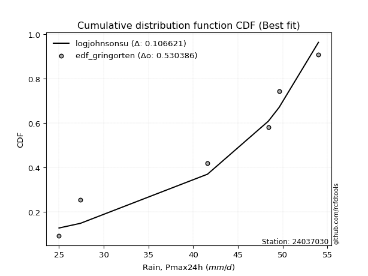</img></img>

</div>


### 9. EDF Filliben (1975)

The specific values of the constants (0.3175) (often denoted as $alpha$) and (0.365) are derived from a method proposed by James J. Filliben in a 1975 paper. This particular formula is the mean value of the $i$-th order statistic of the normal distribution and is considered a robust and effective plotting position formula for the normal probability plot correlation coefficient test for normality.

<div align="center">


$P=(m-0.3175)/(n+0.365)$


</div>


**9.1. Empirical values**

<div align="center">

|                | 0                   | 1                   | 2                  | 3                  | 4                  | 5                  |
|:---------------|:--------------------|:--------------------|:-------------------|:-------------------|:-------------------|:-------------------|
| date           | 2023                | 2021                | 2022               | 2020               | 2024               | 2019               |
| x              | 25.0                | 27.4                | 41.6               | 48.4               | 49.6               | 54.0               |
| m              | 1                   | 2                   | 3                  | 4                  | 5                  | 6                  |
| empirical_dist | edf_filliben        | edf_filliben        | edf_filliben       | edf_filliben       | edf_filliben       | edf_filliben       |
| empirical      | 0.10722702278083267 | 0.26433621366849963 | 0.4214454045561665 | 0.5785545954438335 | 0.7356637863315004 | 0.8927729772191673 |
| empirical_tr   | 1.1201055873295205  | 1.3593166043780034  | 1.7284453496266123 | 2.3727865796831313 | 3.783060921248143  | 9.326007326007321  |

</div>


**9.2. Kolmogorov-Smirnov fit test (sorted by Δ)**


<div align="center">

|                | 0                   | 1                   | 2                   | 3                  | 4                   | 5                   | 6                   | 7                   | 8                   | 9                  | 10                 | 11                    | 12                  | 13                  | 14                  | 15                 | 16                  | 17                  | 18                  | 19                  | 20                 | 21                  | 22                  | 23                 | 24                  | 25                  | 26                | 27                  | 28                  | 29                  | 30                  | 31                  | 32                 | 33                  | 34                  | 35                  | 36                  | 37                  | 38                  | 39                  | 40                  | 41                  | 42                 | 43                  | 44                  | 45                  | 46                  | 47                 | 48                  | 49                  | 50                 | 51                  | 52                  | 53                  | 54                  | 55                  | 56                 | 57                  | 58                  | 59                 | 60                  | 61                  | 62                 | 63                  | 64                 | 65                  | 66                  | 67                  | 68                | 69                  | 70                 | 71                  | 72                  | 73                 | 74                  | 75                 | 76                  | 77                  | 78                  | 79                  | 80                 | 81               | 82                  | 83                  | 84                  | 85                 | 86                 | 87             |
|:---------------|:--------------------|:--------------------|:--------------------|:-------------------|:--------------------|:--------------------|:--------------------|:--------------------|:--------------------|:-------------------|:-------------------|:----------------------|:--------------------|:--------------------|:--------------------|:-------------------|:--------------------|:--------------------|:--------------------|:--------------------|:-------------------|:--------------------|:--------------------|:-------------------|:--------------------|:--------------------|:------------------|:--------------------|:--------------------|:--------------------|:--------------------|:--------------------|:-------------------|:--------------------|:--------------------|:--------------------|:--------------------|:--------------------|:--------------------|:--------------------|:--------------------|:--------------------|:-------------------|:--------------------|:--------------------|:--------------------|:--------------------|:-------------------|:--------------------|:--------------------|:-------------------|:--------------------|:--------------------|:--------------------|:--------------------|:--------------------|:-------------------|:--------------------|:--------------------|:-------------------|:--------------------|:--------------------|:-------------------|:--------------------|:-------------------|:--------------------|:--------------------|:--------------------|:------------------|:--------------------|:-------------------|:--------------------|:--------------------|:-------------------|:--------------------|:-------------------|:--------------------|:--------------------|:--------------------|:--------------------|:-------------------|:-----------------|:--------------------|:--------------------|:--------------------|:-------------------|:-------------------|:---------------|
| station        | 24037030            | 24037030            | 24037030            | 24037030           | 24037030            | 24037030            | 24037030            | 24037030            | 24037030            | 24037030           | 24037030           | 24037030              | 24037030            | 24037030            | 24037030            | 24037030           | 24037030            | 24037030            | 24037030            | 24037030            | 24037030           | 24037030            | 24037030            | 24037030           | 24037030            | 24037030            | 24037030          | 24037030            | 24037030            | 24037030            | 24037030            | 24037030            | 24037030           | 24037030            | 24037030            | 24037030            | 24037030            | 24037030            | 24037030            | 24037030            | 24037030            | 24037030            | 24037030           | 24037030            | 24037030            | 24037030            | 24037030            | 24037030           | 24037030            | 24037030            | 24037030           | 24037030            | 24037030            | 24037030            | 24037030            | 24037030            | 24037030           | 24037030            | 24037030            | 24037030           | 24037030            | 24037030            | 24037030           | 24037030            | 24037030           | 24037030            | 24037030            | 24037030            | 24037030          | 24037030            | 24037030           | 24037030            | 24037030            | 24037030           | 24037030            | 24037030           | 24037030            | 24037030            | 24037030            | 24037030            | 24037030           | 24037030         | 24037030            | 24037030            | 24037030            | 24037030           | 24037030           | 24037030       |
| empirical_dist | edf_filliben        | edf_filliben        | edf_filliben        | edf_filliben       | edf_filliben        | edf_filliben        | edf_filliben        | edf_filliben        | edf_filliben        | edf_filliben       | edf_filliben       | edf_filliben          | edf_filliben        | edf_filliben        | edf_filliben        | edf_filliben       | edf_filliben        | edf_filliben        | edf_filliben        | edf_filliben        | edf_filliben       | edf_filliben        | edf_filliben        | edf_filliben       | edf_filliben        | edf_filliben        | edf_filliben      | edf_filliben        | edf_filliben        | edf_filliben        | edf_filliben        | edf_filliben        | edf_filliben       | edf_filliben        | edf_filliben        | edf_filliben        | edf_filliben        | edf_filliben        | edf_filliben        | edf_filliben        | edf_filliben        | edf_filliben        | edf_filliben       | edf_filliben        | edf_filliben        | edf_filliben        | edf_filliben        | edf_filliben       | edf_filliben        | edf_filliben        | edf_filliben       | edf_filliben        | edf_filliben        | edf_filliben        | edf_filliben        | edf_filliben        | edf_filliben       | edf_filliben        | edf_filliben        | edf_filliben       | edf_filliben        | edf_filliben        | edf_filliben       | edf_filliben        | edf_filliben       | edf_filliben        | edf_filliben        | edf_filliben        | edf_filliben      | edf_filliben        | edf_filliben       | edf_filliben        | edf_filliben        | edf_filliben       | edf_filliben        | edf_filliben       | edf_filliben        | edf_filliben        | edf_filliben        | edf_filliben        | edf_filliben       | edf_filliben     | edf_filliben        | edf_filliben        | edf_filliben        | edf_filliben       | edf_filliben       | edf_filliben   |
| p_dist         | logjohnsonsu        | johnsonsu           | laplace_asymmetric  | logmielke          | logloggamma         | gumbel_l            | weibull_min         | pearson3            | fisk                | logfisk            | logpearson3        | loglaplace_asymmetric | gamma               | loggumbel_l         | erlang              | f                  | nct                 | t                   | exponnorm           | crystalball         | norm               | truncnorm           | betaprime           | logweibull_min     | invgamma            | rice                | logerlang         | logf                | alpha               | loginvgamma         | lognct              | logexponnorm        | logcrystalball     | lognorm             | lognorm             | logt                | ncf                 | maxwell             | invgauss            | loginvgauss         | loggamma            | loggamma            | logbetaprime       | logrice             | rayleigh            | logalpha            | logfatiguelife      | logmaxwell         | kstwobign           | lograyleigh         | logistic           | loginvweibull       | loglogistic         | hypsecant           | gumbel_r            | logncf              | loghypsecant       | loghalfnorm         | loggenexpon         | halfnorm           | logkstwobign        | loggumbel_r         | genexpon           | expon               | moyal              | laplace             | loggompertz         | loglaplace          | logmoyal          | nakagami            | logexpon           | halflogistic        | loghalflogistic     | wald               | gibrat              | logchi2            | logwald             | loggibrat           | lognakagami         | chi2                | loglognorm         | logtruncnorm     | gompertz            | fatiguelife         | invweibull          | genlogistic        | loggenlogistic     | mielke         |
| delta          | 0.11605538951556549 | 0.12636590101017936 | 0.14248195600552388 | 0.1448398725433298 | 0.14822648470571947 | 0.15442049269264158 | 0.15539885931280978 | 0.15726525709160477 | 0.15779987634140102 | 0.1587774562959156 | 0.1644183024885677 | 0.16594311407552298   | 0.16707787868397372 | 0.16713457275398824 | 0.16803705395855428 | 0.1680746998523469 | 0.16885356178345956 | 0.16897513172549894 | 0.16898443707920463 | 0.16898456029097686 | 0.1689845617337301 | 0.16898459402480204 | 0.16901704113286597 | 0.1712120582165827 | 0.17152368444767085 | 0.17420970823996174 | 0.176063874376703 | 0.17662795250053198 | 0.17666126445569985 | 0.17768679522436437 | 0.17793306292842548 | 0.17793307490831867 | 0.1779345390231306 | 0.17793454010733367 | 0.17793454010733367 | 0.17794693038930876 | 0.17838965948384444 | 0.17889345895809516 | 0.17961161577512796 | 0.18022779089730034 | 0.18056409896936487 | 0.18056409896936487 | 0.1809167303160436 | 0.18137012945209874 | 0.18172477449350444 | 0.18173787483568637 | 0.18208668955119311 | 0.1866694998495636 | 0.18815833160717343 | 0.19104273410859762 | 0.1916345523209838 | 0.19467491213613464 | 0.20058987812558826 | 0.20662104266694825 | 0.20906428078030437 | 0.21194315499323435 | 0.2153056590549518 | 0.21659823757174057 | 0.21672571644285943 | 0.2171302713462439 | 0.21716996589981374 | 0.22210727633148775 | 0.2242060177000994 | 0.22421517131324487 | 0.2255642428787167 | 0.22670668937000127 | 0.23368603914722075 | 0.23434340698443734 | 0.246012982432673 | 0.24624870050767445 | 0.2537843937012857 | 0.26433621366849963 | 0.26433621366849963 | 0.2673776900900774 | 0.29369564326774056 | 0.2989936062811891 | 0.31241354947888067 | 0.34310266971516223 | 0.35357051807873274 | 0.35781398199122605 | 0.3630739717414459 | 0.42144068699379 | 0.42144540396007935 | 0.43198338357699695 | 0.46313396583398775 | 0.7356637863315004 | 0.7356637863315004 | nan            |
| deltao         | 0.530385761606      | 0.530385761606      | 0.530385761606      | 0.530385761606     | 0.530385761606      | 0.530385761606      | 0.530385761606      | 0.530385761606      | 0.530385761606      | 0.530385761606     | 0.530385761606     | 0.530385761606        | 0.530385761606      | 0.530385761606      | 0.530385761606      | 0.530385761606     | 0.530385761606      | 0.530385761606      | 0.530385761606      | 0.530385761606      | 0.530385761606     | 0.530385761606      | 0.530385761606      | 0.530385761606     | 0.530385761606      | 0.530385761606      | 0.530385761606    | 0.530385761606      | 0.530385761606      | 0.530385761606      | 0.530385761606      | 0.530385761606      | 0.530385761606     | 0.530385761606      | 0.530385761606      | 0.530385761606      | 0.530385761606      | 0.530385761606      | 0.530385761606      | 0.530385761606      | 0.530385761606      | 0.530385761606      | 0.530385761606     | 0.530385761606      | 0.530385761606      | 0.530385761606      | 0.530385761606      | 0.530385761606     | 0.530385761606      | 0.530385761606      | 0.530385761606     | 0.530385761606      | 0.530385761606      | 0.530385761606      | 0.530385761606      | 0.530385761606      | 0.530385761606     | 0.530385761606      | 0.530385761606      | 0.530385761606     | 0.530385761606      | 0.530385761606      | 0.530385761606     | 0.530385761606      | 0.530385761606     | 0.530385761606      | 0.530385761606      | 0.530385761606      | 0.530385761606    | 0.530385761606      | 0.530385761606     | 0.530385761606      | 0.530385761606      | 0.530385761606     | 0.530385761606      | 0.530385761606     | 0.530385761606      | 0.530385761606      | 0.530385761606      | 0.530385761606      | 0.530385761606     | 0.530385761606   | 0.530385761606      | 0.530385761606      | 0.530385761606      | 0.530385761606     | 0.530385761606     | 0.530385761606 |
| eval           | Δo > Δ              | Δo > Δ              | Δo > Δ              | Δo > Δ             | Δo > Δ              | Δo > Δ              | Δo > Δ              | Δo > Δ              | Δo > Δ              | Δo > Δ             | Δo > Δ             | Δo > Δ                | Δo > Δ              | Δo > Δ              | Δo > Δ              | Δo > Δ             | Δo > Δ              | Δo > Δ              | Δo > Δ              | Δo > Δ              | Δo > Δ             | Δo > Δ              | Δo > Δ              | Δo > Δ             | Δo > Δ              | Δo > Δ              | Δo > Δ            | Δo > Δ              | Δo > Δ              | Δo > Δ              | Δo > Δ              | Δo > Δ              | Δo > Δ             | Δo > Δ              | Δo > Δ              | Δo > Δ              | Δo > Δ              | Δo > Δ              | Δo > Δ              | Δo > Δ              | Δo > Δ              | Δo > Δ              | Δo > Δ             | Δo > Δ              | Δo > Δ              | Δo > Δ              | Δo > Δ              | Δo > Δ             | Δo > Δ              | Δo > Δ              | Δo > Δ             | Δo > Δ              | Δo > Δ              | Δo > Δ              | Δo > Δ              | Δo > Δ              | Δo > Δ             | Δo > Δ              | Δo > Δ              | Δo > Δ             | Δo > Δ              | Δo > Δ              | Δo > Δ             | Δo > Δ              | Δo > Δ             | Δo > Δ              | Δo > Δ              | Δo > Δ              | Δo > Δ            | Δo > Δ              | Δo > Δ             | Δo > Δ              | Δo > Δ              | Δo > Δ             | Δo > Δ              | Δo > Δ             | Δo > Δ              | Δo > Δ              | Δo > Δ              | Δo > Δ              | Δo > Δ             | Δo > Δ           | Δo > Δ              | Δo > Δ              | Δo > Δ              | Δo <= Δ            | Δo <= Δ            | Δo <= Δ        |
| fit            | 1                   | 1                   | 1                   | 1                  | 1                   | 1                   | 1                   | 1                   | 1                   | 1                  | 1                  | 1                     | 1                   | 1                   | 1                   | 1                  | 1                   | 1                   | 1                   | 1                   | 1                  | 1                   | 1                   | 1                  | 1                   | 1                   | 1                 | 1                   | 1                   | 1                   | 1                   | 1                   | 1                  | 1                   | 1                   | 1                   | 1                   | 1                   | 1                   | 1                   | 1                   | 1                   | 1                  | 1                   | 1                   | 1                   | 1                   | 1                  | 1                   | 1                   | 1                  | 1                   | 1                   | 1                   | 1                   | 1                   | 1                  | 1                   | 1                   | 1                  | 1                   | 1                   | 1                  | 1                   | 1                  | 1                   | 1                   | 1                   | 1                 | 1                   | 1                  | 1                   | 1                   | 1                  | 1                   | 1                  | 1                   | 1                   | 1                   | 1                   | 1                  | 1                | 1                   | 1                   | 1                   | 0                  | 0                  | 0              |
| n              | 6                   | 6                   | 6                   | 6                  | 6                   | 6                   | 6                   | 6                   | 6                   | 6                  | 6                  | 6                     | 6                   | 6                   | 6                   | 6                  | 6                   | 6                   | 6                   | 6                   | 6                  | 6                   | 6                   | 6                  | 6                   | 6                   | 6                 | 6                   | 6                   | 6                   | 6                   | 6                   | 6                  | 6                   | 6                   | 6                   | 6                   | 6                   | 6                   | 6                   | 6                   | 6                   | 6                  | 6                   | 6                   | 6                   | 6                   | 6                  | 6                   | 6                   | 6                  | 6                   | 6                   | 6                   | 6                   | 6                   | 6                  | 6                   | 6                   | 6                  | 6                   | 6                   | 6                  | 6                   | 6                  | 6                   | 6                   | 6                   | 6                 | 6                   | 6                  | 6                   | 6                   | 6                  | 6                   | 6                  | 6                   | 6                   | 6                   | 6                   | 6                  | 6                | 6                   | 6                   | 6                   | 6                  | 6                  | 6              |
| best_fit       | 1                   | 0                   | 0                   | 0                  | 0                   | 0                   | 0                   | 0                   | 0                   | 0                  | 0                  | 0                     | 0                   | 0                   | 0                   | 0                  | 0                   | 0                   | 0                   | 0                   | 0                  | 0                   | 0                   | 0                  | 0                   | 0                   | 0                 | 0                   | 0                   | 0                   | 0                   | 0                   | 0                  | 0                   | 0                   | 0                   | 0                   | 0                   | 0                   | 0                   | 0                   | 0                   | 0                  | 0                   | 0                   | 0                   | 0                   | 0                  | 0                   | 0                   | 0                  | 0                   | 0                   | 0                   | 0                   | 0                   | 0                  | 0                   | 0                   | 0                  | 0                   | 0                   | 0                  | 0                   | 0                  | 0                   | 0                   | 0                   | 0                 | 0                   | 0                  | 0                   | 0                   | 0                  | 0                   | 0                  | 0                   | 0                   | 0                   | 0                   | 0                  | 0                | 0                   | 0                   | 0                   | 0                  | 0                  | 0              |
| best_fit_sort  | 1                   | 2                   | 3                   | 4                  | 5                   | 6                   | 7                   | 8                   | 9                   | 10                 | 11                 | 12                    | 13                  | 14                  | 15                  | 16                 | 17                  | 18                  | 19                  | 20                  | 21                 | 22                  | 23                  | 24                 | 25                  | 26                  | 27                | 28                  | 29                  | 30                  | 31                  | 32                  | 33                 | 34                  | 35                  | 36                  | 37                  | 38                  | 39                  | 40                  | 41                  | 42                  | 43                 | 44                  | 45                  | 46                  | 47                  | 48                 | 49                  | 50                  | 51                 | 52                  | 53                  | 54                  | 55                  | 56                  | 57                 | 58                  | 59                  | 60                 | 61                  | 62                  | 63                 | 64                  | 65                 | 66                  | 67                  | 68                  | 69                | 70                  | 71                 | 72                  | 73                  | 74                 | 75                  | 76                 | 77                  | 78                  | 79                  | 80                  | 81                 | 82               | 83                  | 84                  | 85                  | 86                 | 87                 | 88             |

</div>


**9.3. Best fit**

<div align="center">

|   id |   station | empirical_dist   | p_dist       |    delta |   deltao | eval   |   fit |   n |   best_fit |   best_fit_sort |
|-----:|----------:|:-----------------|:-------------|---------:|---------:|:-------|------:|----:|-----------:|----------------:|
|    0 |  24037030 | edf_filliben     | logjohnsonsu | 0.116055 | 0.530386 | Δo > Δ |     1 |   6 |          1 |               1 |

</div>


<div align="center">

</img>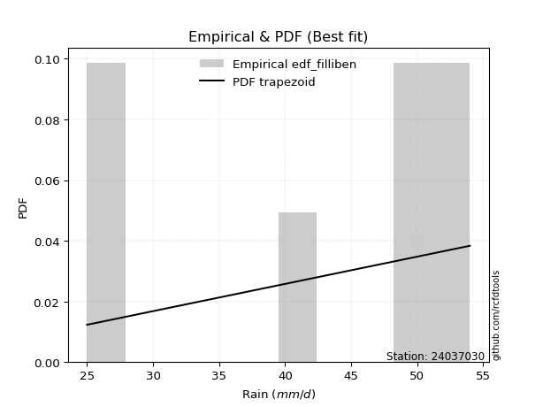</img>

</div>


### 10. EDF Jenkinson (1977)

The Jenkinson formula in hydrology is an empirical plotting position formula used to estimate the non-exceedance probability _(P)_ or return period _(T)_ of a given ordered observation within a sample. It is a widely used method in the frequency analysis of extreme events such as floods and rainfall, as it provides a distribution-free way to plot data. _a≈0.31_ and _b≈0.38_ are constants derived to approximate the median of the probability distribution for the given rank.

<div align="center">


$P=(m-a)/(n+b)$


</div>


**10.1. Empirical values**

<div align="center">

|                | 0                   | 1                   | 2                  | 3                  | 4                  | 5                  |
|:---------------|:--------------------|:--------------------|:-------------------|:-------------------|:-------------------|:-------------------|
| date           | 2023                | 2021                | 2022               | 2020               | 2024               | 2019               |
| x              | 25.0                | 27.4                | 41.6               | 48.4               | 49.6               | 54.0               |
| m              | 1                   | 2                   | 3                  | 4                  | 5                  | 6                  |
| empirical_dist | edf_jenkinson       | edf_jenkinson       | edf_jenkinson      | edf_jenkinson      | edf_jenkinson      | edf_jenkinson      |
| empirical      | 0.10815047021943573 | 0.26489028213166144 | 0.4216300940438871 | 0.5783699059561128 | 0.7351097178683387 | 0.8918495297805643 |
| empirical_tr   | 1.1212653778558874  | 1.3603411513859276  | 1.7289972899728996 | 2.3717472118959106 | 3.7751479289940844 | 9.246376811594207  |

</div>


**10.2. Kolmogorov-Smirnov fit test (sorted by Δ)**


<div align="center">

|                | 0                  | 1                   | 2                   | 3                  | 4                   | 5                   | 6                   | 7                   | 8                   | 9                   | 10                  | 11                    | 12                  | 13                 | 14                  | 15                  | 16                  | 17                 | 18                 | 19                  | 20                  | 21                 | 22                  | 23                  | 24                 | 25                 | 26                  | 27                  | 28                 | 29                  | 30                  | 31                  | 32                  | 33                  | 34                  | 35                 | 36                 | 37                  | 38                  | 39                  | 40                  | 41                  | 42                  | 43                 | 44                 | 45                  | 46                  | 47                  | 48                 | 49                  | 50                  | 51                  | 52                  | 53                 | 54                  | 55                 | 56                  | 57                  | 58                  | 59                  | 60                 | 61                  | 62                 | 63                  | 64                  | 65                  | 66                  | 67                | 68                 | 69                  | 70                 | 71                  | 72                  | 73                 | 74                  | 75                  | 76                  | 77                  | 78                  | 79                  | 80                 | 81                 | 82                  | 83                  | 84                 | 85                 | 86                 | 87             |
|:---------------|:-------------------|:--------------------|:--------------------|:-------------------|:--------------------|:--------------------|:--------------------|:--------------------|:--------------------|:--------------------|:--------------------|:----------------------|:--------------------|:-------------------|:--------------------|:--------------------|:--------------------|:-------------------|:-------------------|:--------------------|:--------------------|:-------------------|:--------------------|:--------------------|:-------------------|:-------------------|:--------------------|:--------------------|:-------------------|:--------------------|:--------------------|:--------------------|:--------------------|:--------------------|:--------------------|:-------------------|:-------------------|:--------------------|:--------------------|:--------------------|:--------------------|:--------------------|:--------------------|:-------------------|:-------------------|:--------------------|:--------------------|:--------------------|:-------------------|:--------------------|:--------------------|:--------------------|:--------------------|:-------------------|:--------------------|:-------------------|:--------------------|:--------------------|:--------------------|:--------------------|:-------------------|:--------------------|:-------------------|:--------------------|:--------------------|:--------------------|:--------------------|:------------------|:-------------------|:--------------------|:-------------------|:--------------------|:--------------------|:-------------------|:--------------------|:--------------------|:--------------------|:--------------------|:--------------------|:--------------------|:-------------------|:-------------------|:--------------------|:--------------------|:-------------------|:-------------------|:-------------------|:---------------|
| station        | 24037030           | 24037030            | 24037030            | 24037030           | 24037030            | 24037030            | 24037030            | 24037030            | 24037030            | 24037030            | 24037030            | 24037030              | 24037030            | 24037030           | 24037030            | 24037030            | 24037030            | 24037030           | 24037030           | 24037030            | 24037030            | 24037030           | 24037030            | 24037030            | 24037030           | 24037030           | 24037030            | 24037030            | 24037030           | 24037030            | 24037030            | 24037030            | 24037030            | 24037030            | 24037030            | 24037030           | 24037030           | 24037030            | 24037030            | 24037030            | 24037030            | 24037030            | 24037030            | 24037030           | 24037030           | 24037030            | 24037030            | 24037030            | 24037030           | 24037030            | 24037030            | 24037030            | 24037030            | 24037030           | 24037030            | 24037030           | 24037030            | 24037030            | 24037030            | 24037030            | 24037030           | 24037030            | 24037030           | 24037030            | 24037030            | 24037030            | 24037030            | 24037030          | 24037030           | 24037030            | 24037030           | 24037030            | 24037030            | 24037030           | 24037030            | 24037030            | 24037030            | 24037030            | 24037030            | 24037030            | 24037030           | 24037030           | 24037030            | 24037030            | 24037030           | 24037030           | 24037030           | 24037030       |
| empirical_dist | edf_jenkinson      | edf_jenkinson       | edf_jenkinson       | edf_jenkinson      | edf_jenkinson       | edf_jenkinson       | edf_jenkinson       | edf_jenkinson       | edf_jenkinson       | edf_jenkinson       | edf_jenkinson       | edf_jenkinson         | edf_jenkinson       | edf_jenkinson      | edf_jenkinson       | edf_jenkinson       | edf_jenkinson       | edf_jenkinson      | edf_jenkinson      | edf_jenkinson       | edf_jenkinson       | edf_jenkinson      | edf_jenkinson       | edf_jenkinson       | edf_jenkinson      | edf_jenkinson      | edf_jenkinson       | edf_jenkinson       | edf_jenkinson      | edf_jenkinson       | edf_jenkinson       | edf_jenkinson       | edf_jenkinson       | edf_jenkinson       | edf_jenkinson       | edf_jenkinson      | edf_jenkinson      | edf_jenkinson       | edf_jenkinson       | edf_jenkinson       | edf_jenkinson       | edf_jenkinson       | edf_jenkinson       | edf_jenkinson      | edf_jenkinson      | edf_jenkinson       | edf_jenkinson       | edf_jenkinson       | edf_jenkinson      | edf_jenkinson       | edf_jenkinson       | edf_jenkinson       | edf_jenkinson       | edf_jenkinson      | edf_jenkinson       | edf_jenkinson      | edf_jenkinson       | edf_jenkinson       | edf_jenkinson       | edf_jenkinson       | edf_jenkinson      | edf_jenkinson       | edf_jenkinson      | edf_jenkinson       | edf_jenkinson       | edf_jenkinson       | edf_jenkinson       | edf_jenkinson     | edf_jenkinson      | edf_jenkinson       | edf_jenkinson      | edf_jenkinson       | edf_jenkinson       | edf_jenkinson      | edf_jenkinson       | edf_jenkinson       | edf_jenkinson       | edf_jenkinson       | edf_jenkinson       | edf_jenkinson       | edf_jenkinson      | edf_jenkinson      | edf_jenkinson       | edf_jenkinson       | edf_jenkinson      | edf_jenkinson      | edf_jenkinson      | edf_jenkinson  |
| p_dist         | logjohnsonsu       | johnsonsu           | laplace_asymmetric  | logmielke          | logloggamma         | gumbel_l            | weibull_min         | pearson3            | fisk                | logfisk             | logpearson3         | loglaplace_asymmetric | gamma               | loggumbel_l        | erlang              | f                   | nct                 | t                  | exponnorm          | crystalball         | norm                | truncnorm          | betaprime           | logweibull_min      | invgamma           | rice               | logerlang           | logf                | alpha              | loginvgamma         | lognct              | logexponnorm        | logcrystalball      | lognorm             | lognorm             | logt               | ncf                | maxwell             | invgauss            | loginvgauss         | loggamma            | loggamma            | logbetaprime        | logrice            | rayleigh           | logalpha            | logfatiguelife      | logmaxwell          | kstwobign          | lograyleigh         | logistic            | loginvweibull       | loglogistic         | hypsecant          | gumbel_r            | logncf             | loghypsecant        | loghalfnorm         | loggenexpon         | logkstwobign        | halfnorm           | loggumbel_r         | genexpon           | expon               | moyal               | laplace             | loggompertz         | loglaplace        | logmoyal           | nakagami            | logexpon           | halflogistic        | loghalflogistic     | wald               | gibrat              | logchi2             | logwald             | loggibrat           | lognakagami         | chi2                | loglognorm         | logtruncnorm       | gompertz            | fatiguelife         | invweibull         | genlogistic        | loggenlogistic     | mielke         |
| delta          | 0.1166094579787273 | 0.12691996947334117 | 0.14303602446868569 | 0.1453939410064916 | 0.14878055316888128 | 0.15481643077070315 | 0.15595292777597158 | 0.15744994657932543 | 0.15835394480456283 | 0.15933152475907741 | 0.16460299197628836 | 0.16612780356324364   | 0.16726256817169438 | 0.1673192622417089 | 0.16822174344627494 | 0.16825938934006757 | 0.16903825127118022 | 0.1691598212132196 | 0.1691691265669253 | 0.16916924977869752 | 0.16916925122145077 | 0.1691692835125227 | 0.16920173062058663 | 0.17139674770430335 | 0.1717083739353915 | 0.1743943977276824 | 0.17624856386442367 | 0.17681264198825264 | 0.1768459539434205 | 0.17787148471208503 | 0.17811775241614614 | 0.17811776439603932 | 0.17811922851085127 | 0.17811922959505433 | 0.17811922959505433 | 0.1781316198770294 | 0.1785743489715651 | 0.17907814844581582 | 0.17979630526284862 | 0.18004310140957974 | 0.18074878845708553 | 0.18074878845708553 | 0.18110141980376426 | 0.1815548189398194 | 0.1819094639812251 | 0.18192256432340703 | 0.18227137903891377 | 0.18685418933728426 | 0.1883430210948941 | 0.19085804462087702 | 0.19181924180870447 | 0.19449022264841404 | 0.20077456761330892 | 0.2068057321546689 | 0.20924897026802503 | 0.2110197075546314 | 0.21549034854267246 | 0.21641354808401997 | 0.21654102695513883 | 0.21698527641209314 | 0.2176843398094057 | 0.22192258684376714 | 0.2240213282123788 | 0.22403048182552426 | 0.22611831134187851 | 0.22689137885772193 | 0.23350134965950015 | 0.234528096472158 | 0.2458282929449524 | 0.24606401101995384 | 0.2535997042135651 | 0.26489028213166144 | 0.26489028213166144 | 0.2671930006023568 | 0.29351095378001996 | 0.29807015884258614 | 0.31222885999116007 | 0.34291798022744163 | 0.35338582859101214 | 0.35762929250350545 | 0.3625199032782841 | 0.4216253764815106 | 0.42163009344779995 | 0.43179869408927635 | 0.4622105183953848 | 0.7351097178683387 | 0.7351097178683387 | nan            |
| deltao         | 0.530385761606     | 0.530385761606      | 0.530385761606      | 0.530385761606     | 0.530385761606      | 0.530385761606      | 0.530385761606      | 0.530385761606      | 0.530385761606      | 0.530385761606      | 0.530385761606      | 0.530385761606        | 0.530385761606      | 0.530385761606     | 0.530385761606      | 0.530385761606      | 0.530385761606      | 0.530385761606     | 0.530385761606     | 0.530385761606      | 0.530385761606      | 0.530385761606     | 0.530385761606      | 0.530385761606      | 0.530385761606     | 0.530385761606     | 0.530385761606      | 0.530385761606      | 0.530385761606     | 0.530385761606      | 0.530385761606      | 0.530385761606      | 0.530385761606      | 0.530385761606      | 0.530385761606      | 0.530385761606     | 0.530385761606     | 0.530385761606      | 0.530385761606      | 0.530385761606      | 0.530385761606      | 0.530385761606      | 0.530385761606      | 0.530385761606     | 0.530385761606     | 0.530385761606      | 0.530385761606      | 0.530385761606      | 0.530385761606     | 0.530385761606      | 0.530385761606      | 0.530385761606      | 0.530385761606      | 0.530385761606     | 0.530385761606      | 0.530385761606     | 0.530385761606      | 0.530385761606      | 0.530385761606      | 0.530385761606      | 0.530385761606     | 0.530385761606      | 0.530385761606     | 0.530385761606      | 0.530385761606      | 0.530385761606      | 0.530385761606      | 0.530385761606    | 0.530385761606     | 0.530385761606      | 0.530385761606     | 0.530385761606      | 0.530385761606      | 0.530385761606     | 0.530385761606      | 0.530385761606      | 0.530385761606      | 0.530385761606      | 0.530385761606      | 0.530385761606      | 0.530385761606     | 0.530385761606     | 0.530385761606      | 0.530385761606      | 0.530385761606     | 0.530385761606     | 0.530385761606     | 0.530385761606 |
| eval           | Δo > Δ             | Δo > Δ              | Δo > Δ              | Δo > Δ             | Δo > Δ              | Δo > Δ              | Δo > Δ              | Δo > Δ              | Δo > Δ              | Δo > Δ              | Δo > Δ              | Δo > Δ                | Δo > Δ              | Δo > Δ             | Δo > Δ              | Δo > Δ              | Δo > Δ              | Δo > Δ             | Δo > Δ             | Δo > Δ              | Δo > Δ              | Δo > Δ             | Δo > Δ              | Δo > Δ              | Δo > Δ             | Δo > Δ             | Δo > Δ              | Δo > Δ              | Δo > Δ             | Δo > Δ              | Δo > Δ              | Δo > Δ              | Δo > Δ              | Δo > Δ              | Δo > Δ              | Δo > Δ             | Δo > Δ             | Δo > Δ              | Δo > Δ              | Δo > Δ              | Δo > Δ              | Δo > Δ              | Δo > Δ              | Δo > Δ             | Δo > Δ             | Δo > Δ              | Δo > Δ              | Δo > Δ              | Δo > Δ             | Δo > Δ              | Δo > Δ              | Δo > Δ              | Δo > Δ              | Δo > Δ             | Δo > Δ              | Δo > Δ             | Δo > Δ              | Δo > Δ              | Δo > Δ              | Δo > Δ              | Δo > Δ             | Δo > Δ              | Δo > Δ             | Δo > Δ              | Δo > Δ              | Δo > Δ              | Δo > Δ              | Δo > Δ            | Δo > Δ             | Δo > Δ              | Δo > Δ             | Δo > Δ              | Δo > Δ              | Δo > Δ             | Δo > Δ              | Δo > Δ              | Δo > Δ              | Δo > Δ              | Δo > Δ              | Δo > Δ              | Δo > Δ             | Δo > Δ             | Δo > Δ              | Δo > Δ              | Δo > Δ             | Δo <= Δ            | Δo <= Δ            | Δo <= Δ        |
| fit            | 1                  | 1                   | 1                   | 1                  | 1                   | 1                   | 1                   | 1                   | 1                   | 1                   | 1                   | 1                     | 1                   | 1                  | 1                   | 1                   | 1                   | 1                  | 1                  | 1                   | 1                   | 1                  | 1                   | 1                   | 1                  | 1                  | 1                   | 1                   | 1                  | 1                   | 1                   | 1                   | 1                   | 1                   | 1                   | 1                  | 1                  | 1                   | 1                   | 1                   | 1                   | 1                   | 1                   | 1                  | 1                  | 1                   | 1                   | 1                   | 1                  | 1                   | 1                   | 1                   | 1                   | 1                  | 1                   | 1                  | 1                   | 1                   | 1                   | 1                   | 1                  | 1                   | 1                  | 1                   | 1                   | 1                   | 1                   | 1                 | 1                  | 1                   | 1                  | 1                   | 1                   | 1                  | 1                   | 1                   | 1                   | 1                   | 1                   | 1                   | 1                  | 1                  | 1                   | 1                   | 1                  | 0                  | 0                  | 0              |
| n              | 6                  | 6                   | 6                   | 6                  | 6                   | 6                   | 6                   | 6                   | 6                   | 6                   | 6                   | 6                     | 6                   | 6                  | 6                   | 6                   | 6                   | 6                  | 6                  | 6                   | 6                   | 6                  | 6                   | 6                   | 6                  | 6                  | 6                   | 6                   | 6                  | 6                   | 6                   | 6                   | 6                   | 6                   | 6                   | 6                  | 6                  | 6                   | 6                   | 6                   | 6                   | 6                   | 6                   | 6                  | 6                  | 6                   | 6                   | 6                   | 6                  | 6                   | 6                   | 6                   | 6                   | 6                  | 6                   | 6                  | 6                   | 6                   | 6                   | 6                   | 6                  | 6                   | 6                  | 6                   | 6                   | 6                   | 6                   | 6                 | 6                  | 6                   | 6                  | 6                   | 6                   | 6                  | 6                   | 6                   | 6                   | 6                   | 6                   | 6                   | 6                  | 6                  | 6                   | 6                   | 6                  | 6                  | 6                  | 6              |
| best_fit       | 1                  | 0                   | 0                   | 0                  | 0                   | 0                   | 0                   | 0                   | 0                   | 0                   | 0                   | 0                     | 0                   | 0                  | 0                   | 0                   | 0                   | 0                  | 0                  | 0                   | 0                   | 0                  | 0                   | 0                   | 0                  | 0                  | 0                   | 0                   | 0                  | 0                   | 0                   | 0                   | 0                   | 0                   | 0                   | 0                  | 0                  | 0                   | 0                   | 0                   | 0                   | 0                   | 0                   | 0                  | 0                  | 0                   | 0                   | 0                   | 0                  | 0                   | 0                   | 0                   | 0                   | 0                  | 0                   | 0                  | 0                   | 0                   | 0                   | 0                   | 0                  | 0                   | 0                  | 0                   | 0                   | 0                   | 0                   | 0                 | 0                  | 0                   | 0                  | 0                   | 0                   | 0                  | 0                   | 0                   | 0                   | 0                   | 0                   | 0                   | 0                  | 0                  | 0                   | 0                   | 0                  | 0                  | 0                  | 0              |
| best_fit_sort  | 1                  | 2                   | 3                   | 4                  | 5                   | 6                   | 7                   | 8                   | 9                   | 10                  | 11                  | 12                    | 13                  | 14                 | 15                  | 16                  | 17                  | 18                 | 19                 | 20                  | 21                  | 22                 | 23                  | 24                  | 25                 | 26                 | 27                  | 28                  | 29                 | 30                  | 31                  | 32                  | 33                  | 34                  | 35                  | 36                 | 37                 | 38                  | 39                  | 40                  | 41                  | 42                  | 43                  | 44                 | 45                 | 46                  | 47                  | 48                  | 49                 | 50                  | 51                  | 52                  | 53                  | 54                 | 55                  | 56                 | 57                  | 58                  | 59                  | 60                  | 61                 | 62                  | 63                 | 64                  | 65                  | 66                  | 67                  | 68                | 69                 | 70                  | 71                 | 72                  | 73                  | 74                 | 75                  | 76                  | 77                  | 78                  | 79                  | 80                  | 81                 | 82                 | 83                  | 84                  | 85                 | 86                 | 87                 | 88             |

</div>


**10.3. Best fit**

<div align="center">

|   id |   station | empirical_dist   | p_dist       |    delta |   deltao | eval   |   fit |   n |   best_fit |   best_fit_sort |
|-----:|----------:|:-----------------|:-------------|---------:|---------:|:-------|------:|----:|-----------:|----------------:|
|    0 |  24037030 | edf_jenkinson    | logjohnsonsu | 0.116609 | 0.530386 | Δo > Δ |     1 |   6 |          1 |               1 |

</div>


<div align="center">

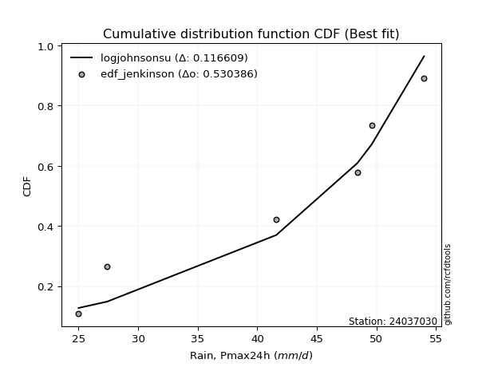</img></img>

</div>


### 11. EDF Cunnane (1978)

Cunnane´s work in statistical hydrology has focused on the performance and evaluation of different probability distributions (such as GEV, Gumbel, Lognormal) for flood frequency estimation. _b_ is a constant, typically set to 0.4.

<div align="center">


$P=(m-b)/(n+1-2b)$


</div>


**11.1. Empirical values**

<div align="center">

|                | 0                  | 1                   | 2                   | 3                  | 4                  | 5                  |
|:---------------|:-------------------|:--------------------|:--------------------|:-------------------|:-------------------|:-------------------|
| date           | 2023               | 2021                | 2022                | 2020               | 2024               | 2019               |
| x              | 25.0               | 27.4                | 41.6                | 48.4               | 49.6               | 54.0               |
| m              | 1                  | 2                   | 3                   | 4                  | 5                  | 6                  |
| empirical_dist | edf_cunnane        | edf_cunnane         | edf_cunnane         | edf_cunnane        | edf_cunnane        | edf_cunnane        |
| empirical      | 0.0967741935483871 | 0.25806451612903225 | 0.41935483870967744 | 0.5806451612903226 | 0.7419354838709676 | 0.9032258064516128 |
| empirical_tr   | 1.1071428571428572 | 1.3478260869565217  | 1.7222222222222225  | 2.384615384615385  | 3.8749999999999982 | 10.333333333333318 |

</div>


**11.2. Kolmogorov-Smirnov fit test (sorted by Δ)**


<div align="center">

|                | 0                   | 1                   | 2                  | 3                   | 4                  | 5                  | 6                   | 7                   | 8                   | 9                   | 10                  | 11                    | 12                  | 13                 | 14                  | 15                  | 16                  | 17                 | 18                  | 19                  | 20                  | 21                 | 22                  | 23                  | 24                 | 25                 | 26                  | 27                  | 28                 | 29                  | 30                  | 31                  | 32                  | 33                  | 34                  | 35                 | 36                 | 37                  | 38                  | 39                  | 40                  | 41                  | 42                 | 43                 | 44                  | 45                  | 46                  | 47                  | 48                 | 49                  | 50                 | 51                  | 52                  | 53                 | 54                  | 55                  | 56                  | 57                  | 58                  | 59                  | 60                  | 61                  | 62                  | 63                  | 64                 | 65                  | 66                 | 67                  | 68                 | 69                  | 70                 | 71                  | 72                  | 73                 | 74                  | 75                 | 76                  | 77                 | 78                  | 79                  | 80                 | 81                 | 82                  | 83                  | 84                  | 85                 | 86                 | 87             |
|:---------------|:--------------------|:--------------------|:-------------------|:--------------------|:-------------------|:-------------------|:--------------------|:--------------------|:--------------------|:--------------------|:--------------------|:----------------------|:--------------------|:-------------------|:--------------------|:--------------------|:--------------------|:-------------------|:--------------------|:--------------------|:--------------------|:-------------------|:--------------------|:--------------------|:-------------------|:-------------------|:--------------------|:--------------------|:-------------------|:--------------------|:--------------------|:--------------------|:--------------------|:--------------------|:--------------------|:-------------------|:-------------------|:--------------------|:--------------------|:--------------------|:--------------------|:--------------------|:-------------------|:-------------------|:--------------------|:--------------------|:--------------------|:--------------------|:-------------------|:--------------------|:-------------------|:--------------------|:--------------------|:-------------------|:--------------------|:--------------------|:--------------------|:--------------------|:--------------------|:--------------------|:--------------------|:--------------------|:--------------------|:--------------------|:-------------------|:--------------------|:-------------------|:--------------------|:-------------------|:--------------------|:-------------------|:--------------------|:--------------------|:-------------------|:--------------------|:-------------------|:--------------------|:-------------------|:--------------------|:--------------------|:-------------------|:-------------------|:--------------------|:--------------------|:--------------------|:-------------------|:-------------------|:---------------|
| station        | 24037030            | 24037030            | 24037030           | 24037030            | 24037030           | 24037030           | 24037030            | 24037030            | 24037030            | 24037030            | 24037030            | 24037030              | 24037030            | 24037030           | 24037030            | 24037030            | 24037030            | 24037030           | 24037030            | 24037030            | 24037030            | 24037030           | 24037030            | 24037030            | 24037030           | 24037030           | 24037030            | 24037030            | 24037030           | 24037030            | 24037030            | 24037030            | 24037030            | 24037030            | 24037030            | 24037030           | 24037030           | 24037030            | 24037030            | 24037030            | 24037030            | 24037030            | 24037030           | 24037030           | 24037030            | 24037030            | 24037030            | 24037030            | 24037030           | 24037030            | 24037030           | 24037030            | 24037030            | 24037030           | 24037030            | 24037030            | 24037030            | 24037030            | 24037030            | 24037030            | 24037030            | 24037030            | 24037030            | 24037030            | 24037030           | 24037030            | 24037030           | 24037030            | 24037030           | 24037030            | 24037030           | 24037030            | 24037030            | 24037030           | 24037030            | 24037030           | 24037030            | 24037030           | 24037030            | 24037030            | 24037030           | 24037030           | 24037030            | 24037030            | 24037030            | 24037030           | 24037030           | 24037030       |
| empirical_dist | edf_cunnane         | edf_cunnane         | edf_cunnane        | edf_cunnane         | edf_cunnane        | edf_cunnane        | edf_cunnane         | edf_cunnane         | edf_cunnane         | edf_cunnane         | edf_cunnane         | edf_cunnane           | edf_cunnane         | edf_cunnane        | edf_cunnane         | edf_cunnane         | edf_cunnane         | edf_cunnane        | edf_cunnane         | edf_cunnane         | edf_cunnane         | edf_cunnane        | edf_cunnane         | edf_cunnane         | edf_cunnane        | edf_cunnane        | edf_cunnane         | edf_cunnane         | edf_cunnane        | edf_cunnane         | edf_cunnane         | edf_cunnane         | edf_cunnane         | edf_cunnane         | edf_cunnane         | edf_cunnane        | edf_cunnane        | edf_cunnane         | edf_cunnane         | edf_cunnane         | edf_cunnane         | edf_cunnane         | edf_cunnane        | edf_cunnane        | edf_cunnane         | edf_cunnane         | edf_cunnane         | edf_cunnane         | edf_cunnane        | edf_cunnane         | edf_cunnane        | edf_cunnane         | edf_cunnane         | edf_cunnane        | edf_cunnane         | edf_cunnane         | edf_cunnane         | edf_cunnane         | edf_cunnane         | edf_cunnane         | edf_cunnane         | edf_cunnane         | edf_cunnane         | edf_cunnane         | edf_cunnane        | edf_cunnane         | edf_cunnane        | edf_cunnane         | edf_cunnane        | edf_cunnane         | edf_cunnane        | edf_cunnane         | edf_cunnane         | edf_cunnane        | edf_cunnane         | edf_cunnane        | edf_cunnane         | edf_cunnane        | edf_cunnane         | edf_cunnane         | edf_cunnane        | edf_cunnane        | edf_cunnane         | edf_cunnane         | edf_cunnane         | edf_cunnane        | edf_cunnane        | edf_cunnane    |
| p_dist         | logjohnsonsu        | johnsonsu           | laplace_asymmetric | logmielke           | logloggamma        | weibull_min        | fisk                | gumbel_l            | logfisk             | pearson3            | logpearson3         | loglaplace_asymmetric | gamma               | loggumbel_l        | erlang              | f                   | nct                 | t                  | exponnorm           | crystalball         | norm                | truncnorm          | betaprime           | logweibull_min      | invgamma           | rice               | logerlang           | logf                | alpha              | loginvgamma         | lognct              | logexponnorm        | logcrystalball      | lognorm             | lognorm             | logt               | ncf                | maxwell             | invgauss            | loggamma            | loggamma            | logbetaprime        | logrice            | rayleigh           | logalpha            | logfatiguelife      | loginvgauss         | logmaxwell          | kstwobign          | logistic            | lograyleigh        | loginvweibull       | loglogistic         | hypsecant          | gumbel_r            | halfnorm            | loghypsecant        | loghalfnorm         | loggenexpon         | logkstwobign        | moyal               | logncf              | loggumbel_r         | laplace             | genexpon           | expon               | loglaplace         | loggompertz         | logmoyal           | nakagami            | logexpon           | halflogistic        | loghalflogistic     | wald               | gibrat              | logchi2            | logwald             | loggibrat          | lognakagami         | chi2                | loglognorm         | logtruncnorm       | gompertz            | fatiguelife         | invweibull          | genlogistic        | loggenlogistic     | mielke         |
| delta          | 0.10978369197609811 | 0.12009420347071198 | 0.1362102584660565 | 0.13856817500386243 | 0.1419547871662521 | 0.1491271617733424 | 0.15152817880193364 | 0.15232992684615243 | 0.15250575875644823 | 0.15517469124511563 | 0.16232773664207856 | 0.16385254822903383   | 0.16498731283748458 | 0.1650440069074991 | 0.16594648811206514 | 0.16598413400585776 | 0.16676299593697042 | 0.1668845658790098 | 0.16689387123271548 | 0.16689399444448771 | 0.16689399588724096 | 0.1668940281783129 | 0.16692647528637683 | 0.16912149237009355 | 0.1694331186011817 | 0.1721191423934726 | 0.17397330853021387 | 0.17453738665404284 | 0.1745706986092107 | 0.17559622937787522 | 0.17584249708193633 | 0.17584250906182952 | 0.17584397317664147 | 0.17584397426084453 | 0.17584397426084453 | 0.1758563645428196 | 0.1762990936373553 | 0.17680289311160602 | 0.17752104992863882 | 0.17847353312287573 | 0.17847353312287573 | 0.17882616446955446 | 0.1792795636056096 | 0.1796342086470153 | 0.17964730898919723 | 0.17999612370470397 | 0.18231835674378943 | 0.18457893400307446 | 0.1860677657606843 | 0.18954398647449466 | 0.1931332999550867 | 0.19676547798262373 | 0.19849931227909912 | 0.2045304768204591 | 0.20697371493381522 | 0.21085857380677653 | 0.21321509320846266 | 0.21868880341822966 | 0.21881628228934852 | 0.21926053174630283 | 0.21989781735784608 | 0.22239598422567985 | 0.22419784217797684 | 0.22461612352351212 | 0.2262965835465885 | 0.22630573715973396 | 0.2322528411379482 | 0.23577660499370984 | 0.2481035482791621 | 0.24833926635416353 | 0.2558749595477748 | 0.25806451612903225 | 0.25806451612903225 | 0.2694682559365665 | 0.29578620911422965 | 0.3094464355136346 | 0.31450411532536976 | 0.3451932355616513 | 0.35566108392522183 | 0.35990454783771514 | 0.3693456692809133 | 0.4193501211473009 | 0.41935483811359026 | 0.43407394942348604 | 0.47358679506643325 | 0.7419354838709676 | 0.7419354838709676 | nan            |
| deltao         | 0.530385761606      | 0.530385761606      | 0.530385761606     | 0.530385761606      | 0.530385761606     | 0.530385761606     | 0.530385761606      | 0.530385761606      | 0.530385761606      | 0.530385761606      | 0.530385761606      | 0.530385761606        | 0.530385761606      | 0.530385761606     | 0.530385761606      | 0.530385761606      | 0.530385761606      | 0.530385761606     | 0.530385761606      | 0.530385761606      | 0.530385761606      | 0.530385761606     | 0.530385761606      | 0.530385761606      | 0.530385761606     | 0.530385761606     | 0.530385761606      | 0.530385761606      | 0.530385761606     | 0.530385761606      | 0.530385761606      | 0.530385761606      | 0.530385761606      | 0.530385761606      | 0.530385761606      | 0.530385761606     | 0.530385761606     | 0.530385761606      | 0.530385761606      | 0.530385761606      | 0.530385761606      | 0.530385761606      | 0.530385761606     | 0.530385761606     | 0.530385761606      | 0.530385761606      | 0.530385761606      | 0.530385761606      | 0.530385761606     | 0.530385761606      | 0.530385761606     | 0.530385761606      | 0.530385761606      | 0.530385761606     | 0.530385761606      | 0.530385761606      | 0.530385761606      | 0.530385761606      | 0.530385761606      | 0.530385761606      | 0.530385761606      | 0.530385761606      | 0.530385761606      | 0.530385761606      | 0.530385761606     | 0.530385761606      | 0.530385761606     | 0.530385761606      | 0.530385761606     | 0.530385761606      | 0.530385761606     | 0.530385761606      | 0.530385761606      | 0.530385761606     | 0.530385761606      | 0.530385761606     | 0.530385761606      | 0.530385761606     | 0.530385761606      | 0.530385761606      | 0.530385761606     | 0.530385761606     | 0.530385761606      | 0.530385761606      | 0.530385761606      | 0.530385761606     | 0.530385761606     | 0.530385761606 |
| eval           | Δo > Δ              | Δo > Δ              | Δo > Δ             | Δo > Δ              | Δo > Δ             | Δo > Δ             | Δo > Δ              | Δo > Δ              | Δo > Δ              | Δo > Δ              | Δo > Δ              | Δo > Δ                | Δo > Δ              | Δo > Δ             | Δo > Δ              | Δo > Δ              | Δo > Δ              | Δo > Δ             | Δo > Δ              | Δo > Δ              | Δo > Δ              | Δo > Δ             | Δo > Δ              | Δo > Δ              | Δo > Δ             | Δo > Δ             | Δo > Δ              | Δo > Δ              | Δo > Δ             | Δo > Δ              | Δo > Δ              | Δo > Δ              | Δo > Δ              | Δo > Δ              | Δo > Δ              | Δo > Δ             | Δo > Δ             | Δo > Δ              | Δo > Δ              | Δo > Δ              | Δo > Δ              | Δo > Δ              | Δo > Δ             | Δo > Δ             | Δo > Δ              | Δo > Δ              | Δo > Δ              | Δo > Δ              | Δo > Δ             | Δo > Δ              | Δo > Δ             | Δo > Δ              | Δo > Δ              | Δo > Δ             | Δo > Δ              | Δo > Δ              | Δo > Δ              | Δo > Δ              | Δo > Δ              | Δo > Δ              | Δo > Δ              | Δo > Δ              | Δo > Δ              | Δo > Δ              | Δo > Δ             | Δo > Δ              | Δo > Δ             | Δo > Δ              | Δo > Δ             | Δo > Δ              | Δo > Δ             | Δo > Δ              | Δo > Δ              | Δo > Δ             | Δo > Δ              | Δo > Δ             | Δo > Δ              | Δo > Δ             | Δo > Δ              | Δo > Δ              | Δo > Δ             | Δo > Δ             | Δo > Δ              | Δo > Δ              | Δo > Δ              | Δo <= Δ            | Δo <= Δ            | Δo <= Δ        |
| fit            | 1                   | 1                   | 1                  | 1                   | 1                  | 1                  | 1                   | 1                   | 1                   | 1                   | 1                   | 1                     | 1                   | 1                  | 1                   | 1                   | 1                   | 1                  | 1                   | 1                   | 1                   | 1                  | 1                   | 1                   | 1                  | 1                  | 1                   | 1                   | 1                  | 1                   | 1                   | 1                   | 1                   | 1                   | 1                   | 1                  | 1                  | 1                   | 1                   | 1                   | 1                   | 1                   | 1                  | 1                  | 1                   | 1                   | 1                   | 1                   | 1                  | 1                   | 1                  | 1                   | 1                   | 1                  | 1                   | 1                   | 1                   | 1                   | 1                   | 1                   | 1                   | 1                   | 1                   | 1                   | 1                  | 1                   | 1                  | 1                   | 1                  | 1                   | 1                  | 1                   | 1                   | 1                  | 1                   | 1                  | 1                   | 1                  | 1                   | 1                   | 1                  | 1                  | 1                   | 1                   | 1                   | 0                  | 0                  | 0              |
| n              | 6                   | 6                   | 6                  | 6                   | 6                  | 6                  | 6                   | 6                   | 6                   | 6                   | 6                   | 6                     | 6                   | 6                  | 6                   | 6                   | 6                   | 6                  | 6                   | 6                   | 6                   | 6                  | 6                   | 6                   | 6                  | 6                  | 6                   | 6                   | 6                  | 6                   | 6                   | 6                   | 6                   | 6                   | 6                   | 6                  | 6                  | 6                   | 6                   | 6                   | 6                   | 6                   | 6                  | 6                  | 6                   | 6                   | 6                   | 6                   | 6                  | 6                   | 6                  | 6                   | 6                   | 6                  | 6                   | 6                   | 6                   | 6                   | 6                   | 6                   | 6                   | 6                   | 6                   | 6                   | 6                  | 6                   | 6                  | 6                   | 6                  | 6                   | 6                  | 6                   | 6                   | 6                  | 6                   | 6                  | 6                   | 6                  | 6                   | 6                   | 6                  | 6                  | 6                   | 6                   | 6                   | 6                  | 6                  | 6              |
| best_fit       | 1                   | 0                   | 0                  | 0                   | 0                  | 0                  | 0                   | 0                   | 0                   | 0                   | 0                   | 0                     | 0                   | 0                  | 0                   | 0                   | 0                   | 0                  | 0                   | 0                   | 0                   | 0                  | 0                   | 0                   | 0                  | 0                  | 0                   | 0                   | 0                  | 0                   | 0                   | 0                   | 0                   | 0                   | 0                   | 0                  | 0                  | 0                   | 0                   | 0                   | 0                   | 0                   | 0                  | 0                  | 0                   | 0                   | 0                   | 0                   | 0                  | 0                   | 0                  | 0                   | 0                   | 0                  | 0                   | 0                   | 0                   | 0                   | 0                   | 0                   | 0                   | 0                   | 0                   | 0                   | 0                  | 0                   | 0                  | 0                   | 0                  | 0                   | 0                  | 0                   | 0                   | 0                  | 0                   | 0                  | 0                   | 0                  | 0                   | 0                   | 0                  | 0                  | 0                   | 0                   | 0                   | 0                  | 0                  | 0              |
| best_fit_sort  | 1                   | 2                   | 3                  | 4                   | 5                  | 6                  | 7                   | 8                   | 9                   | 10                  | 11                  | 12                    | 13                  | 14                 | 15                  | 16                  | 17                  | 18                 | 19                  | 20                  | 21                  | 22                 | 23                  | 24                  | 25                 | 26                 | 27                  | 28                  | 29                 | 30                  | 31                  | 32                  | 33                  | 34                  | 35                  | 36                 | 37                 | 38                  | 39                  | 40                  | 41                  | 42                  | 43                 | 44                 | 45                  | 46                  | 47                  | 48                  | 49                 | 50                  | 51                 | 52                  | 53                  | 54                 | 55                  | 56                  | 57                  | 58                  | 59                  | 60                  | 61                  | 62                  | 63                  | 64                  | 65                 | 66                  | 67                 | 68                  | 69                 | 70                  | 71                 | 72                  | 73                  | 74                 | 75                  | 76                 | 77                  | 78                 | 79                  | 80                  | 81                 | 82                 | 83                  | 84                  | 85                  | 86                 | 87                 | 88             |

</div>


**11.3. Best fit**

<div align="center">

|   id |   station | empirical_dist   | p_dist       |    delta |   deltao | eval   |   fit |   n |   best_fit |   best_fit_sort |
|-----:|----------:|:-----------------|:-------------|---------:|---------:|:-------|------:|----:|-----------:|----------------:|
|    0 |  24037030 | edf_cunnane      | logjohnsonsu | 0.109784 | 0.530386 | Δo > Δ |     1 |   6 |          1 |               1 |

</div>


<div align="center">

</img>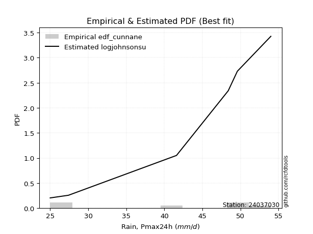</img>

</div>


### 12. EDF Adamowski (1981)

The Adamowski formula in hydrology refers to a specific plotting position formula used for estimating the non-parametric empirical distribution of hydrological events (like flood peaks) to calculate their return periods. This formula provides an alternative to traditional parametric methods (like the Gumbel or Log Pearson Type III distributions). 

<div align="center">


$P=(m-0.25)/(n+0.5)$


</div>


**12.1. Empirical values**

<div align="center">

|                | 0                   | 1                  | 2                  | 3                  | 4                  | 5                  |
|:---------------|:--------------------|:-------------------|:-------------------|:-------------------|:-------------------|:-------------------|
| date           | 2023                | 2021               | 2022               | 2020               | 2024               | 2019               |
| x              | 25.0                | 27.4               | 41.6               | 48.4               | 49.6               | 54.0               |
| m              | 1                   | 2                  | 3                  | 4                  | 5                  | 6                  |
| empirical_dist | edf_adamowski       | edf_adamowski      | edf_adamowski      | edf_adamowski      | edf_adamowski      | edf_adamowski      |
| empirical      | 0.11538461538461539 | 0.2692307692307692 | 0.4230769230769231 | 0.5769230769230769 | 0.7307692307692307 | 0.8846153846153846 |
| empirical_tr   | 1.1304347826086958  | 1.3684210526315788 | 1.7333333333333334 | 2.3636363636363633 | 3.7142857142857135 | 8.666666666666664  |

</div>


**12.2. Kolmogorov-Smirnov fit test (sorted by Δ)**


<div align="center">

|                | 0                   | 1                   | 2                   | 3                  | 4                   | 5                   | 6                   | 7                   | 8                  | 9                  | 10                 | 11                    | 12                  | 13                  | 14                 | 15                 | 16                  | 17                  | 18                  | 19                  | 20                 | 21                  | 22                  | 23                 | 24                  | 25                  | 26                  | 27                  | 28                  | 29                  | 30                 | 31                  | 32                  | 33                  | 34                  | 35                  | 36                  | 37                  | 38                  | 39                  | 40                  | 41                  | 42                 | 43                  | 44                  | 45                  | 46                  | 47                 | 48                  | 49                  | 50                 | 51                 | 52                  | 53                  | 54                  | 55                  | 56                  | 57                  | 58                 | 59                 | 60                 | 61                 | 62                  | 63                  | 64                  | 65                 | 66                 | 67                  | 68                  | 69                 | 70                  | 71                 | 72                 | 73                 | 74                 | 75                 | 76                 | 77                 | 78                 | 79                 | 80                 | 81                  | 82                 | 83                 | 84                  | 85                 | 86                 | 87             |
|:---------------|:--------------------|:--------------------|:--------------------|:-------------------|:--------------------|:--------------------|:--------------------|:--------------------|:-------------------|:-------------------|:-------------------|:----------------------|:--------------------|:--------------------|:-------------------|:-------------------|:--------------------|:--------------------|:--------------------|:--------------------|:-------------------|:--------------------|:--------------------|:-------------------|:--------------------|:--------------------|:--------------------|:--------------------|:--------------------|:--------------------|:-------------------|:--------------------|:--------------------|:--------------------|:--------------------|:--------------------|:--------------------|:--------------------|:--------------------|:--------------------|:--------------------|:--------------------|:-------------------|:--------------------|:--------------------|:--------------------|:--------------------|:-------------------|:--------------------|:--------------------|:-------------------|:-------------------|:--------------------|:--------------------|:--------------------|:--------------------|:--------------------|:--------------------|:-------------------|:-------------------|:-------------------|:-------------------|:--------------------|:--------------------|:--------------------|:-------------------|:-------------------|:--------------------|:--------------------|:-------------------|:--------------------|:-------------------|:-------------------|:-------------------|:-------------------|:-------------------|:-------------------|:-------------------|:-------------------|:-------------------|:-------------------|:--------------------|:-------------------|:-------------------|:--------------------|:-------------------|:-------------------|:---------------|
| station        | 24037030            | 24037030            | 24037030            | 24037030           | 24037030            | 24037030            | 24037030            | 24037030            | 24037030           | 24037030           | 24037030           | 24037030              | 24037030            | 24037030            | 24037030           | 24037030           | 24037030            | 24037030            | 24037030            | 24037030            | 24037030           | 24037030            | 24037030            | 24037030           | 24037030            | 24037030            | 24037030            | 24037030            | 24037030            | 24037030            | 24037030           | 24037030            | 24037030            | 24037030            | 24037030            | 24037030            | 24037030            | 24037030            | 24037030            | 24037030            | 24037030            | 24037030            | 24037030           | 24037030            | 24037030            | 24037030            | 24037030            | 24037030           | 24037030            | 24037030            | 24037030           | 24037030           | 24037030            | 24037030            | 24037030            | 24037030            | 24037030            | 24037030            | 24037030           | 24037030           | 24037030           | 24037030           | 24037030            | 24037030            | 24037030            | 24037030           | 24037030           | 24037030            | 24037030            | 24037030           | 24037030            | 24037030           | 24037030           | 24037030           | 24037030           | 24037030           | 24037030           | 24037030           | 24037030           | 24037030           | 24037030           | 24037030            | 24037030           | 24037030           | 24037030            | 24037030           | 24037030           | 24037030       |
| empirical_dist | edf_adamowski       | edf_adamowski       | edf_adamowski       | edf_adamowski      | edf_adamowski       | edf_adamowski       | edf_adamowski       | edf_adamowski       | edf_adamowski      | edf_adamowski      | edf_adamowski      | edf_adamowski         | edf_adamowski       | edf_adamowski       | edf_adamowski      | edf_adamowski      | edf_adamowski       | edf_adamowski       | edf_adamowski       | edf_adamowski       | edf_adamowski      | edf_adamowski       | edf_adamowski       | edf_adamowski      | edf_adamowski       | edf_adamowski       | edf_adamowski       | edf_adamowski       | edf_adamowski       | edf_adamowski       | edf_adamowski      | edf_adamowski       | edf_adamowski       | edf_adamowski       | edf_adamowski       | edf_adamowski       | edf_adamowski       | edf_adamowski       | edf_adamowski       | edf_adamowski       | edf_adamowski       | edf_adamowski       | edf_adamowski      | edf_adamowski       | edf_adamowski       | edf_adamowski       | edf_adamowski       | edf_adamowski      | edf_adamowski       | edf_adamowski       | edf_adamowski      | edf_adamowski      | edf_adamowski       | edf_adamowski       | edf_adamowski       | edf_adamowski       | edf_adamowski       | edf_adamowski       | edf_adamowski      | edf_adamowski      | edf_adamowski      | edf_adamowski      | edf_adamowski       | edf_adamowski       | edf_adamowski       | edf_adamowski      | edf_adamowski      | edf_adamowski       | edf_adamowski       | edf_adamowski      | edf_adamowski       | edf_adamowski      | edf_adamowski      | edf_adamowski      | edf_adamowski      | edf_adamowski      | edf_adamowski      | edf_adamowski      | edf_adamowski      | edf_adamowski      | edf_adamowski      | edf_adamowski       | edf_adamowski      | edf_adamowski      | edf_adamowski       | edf_adamowski      | edf_adamowski      | edf_adamowski  |
| p_dist         | logjohnsonsu        | johnsonsu           | laplace_asymmetric  | logmielke          | logloggamma         | pearson3            | gumbel_l            | weibull_min         | fisk               | logfisk            | logpearson3        | loglaplace_asymmetric | gamma               | loggumbel_l         | erlang             | f                  | nct                 | t                   | exponnorm           | crystalball         | norm               | truncnorm           | betaprime           | logweibull_min     | invgamma            | rice                | logerlang           | logf                | alpha               | loginvgamma         | loginvgauss        | lognct              | logexponnorm        | logcrystalball      | lognorm             | lognorm             | logt                | ncf                 | maxwell             | invgauss            | loggamma            | loggamma            | logbetaprime       | logrice             | rayleigh            | logalpha            | logfatiguelife      | logmaxwell         | kstwobign           | lograyleigh         | loginvweibull      | logistic           | loglogistic         | logncf              | hypsecant           | gumbel_r            | loghalfnorm         | loggenexpon         | logkstwobign       | loghypsecant       | loggumbel_r        | halfnorm           | genexpon            | expon               | laplace             | moyal              | loggompertz        | loglaplace          | logmoyal            | nakagami           | logexpon            | loghalflogistic    | wald               | halflogistic       | logchi2            | gibrat             | logwald            | loggibrat          | lognakagami        | chi2               | loglognorm         | logtruncnorm        | gompertz           | fatiguelife        | invweibull          | genlogistic        | loggenlogistic     | mielke         |
| delta          | 0.12094994507783507 | 0.13126045657244895 | 0.14737651156779347 | 0.1497344281055994 | 0.15312104026798906 | 0.15889677561236137 | 0.15915691786981093 | 0.16029341487507937 | 0.1626944319036706 | 0.1636720118581852 | 0.1660498210093243 | 0.16757463259627958   | 0.16870939720473033 | 0.16876609127474484 | 0.1696685724793109 | 0.1697062183731035 | 0.17048508030421616 | 0.17060665024625554 | 0.17061595559996123 | 0.17061607881173346 | 0.1706160802544867 | 0.17061611254555864 | 0.17064855965362258 | 0.1728435767373393 | 0.17315520296842746 | 0.17584122676071834 | 0.17769539289745961 | 0.17825947102128858 | 0.17829278297645645 | 0.17931831374512097 | 0.1795483153601709 | 0.17956458144918208 | 0.17956459342907527 | 0.17956605754388721 | 0.17956605862809027 | 0.17956605862809027 | 0.17957844891006536 | 0.18002117800460105 | 0.18052497747885177 | 0.18124313429588457 | 0.18219561749012148 | 0.18219561749012148 | 0.1825482488368002 | 0.18300164797285534 | 0.18335629301426104 | 0.18336939335644298 | 0.18371820807194972 | 0.1883010183703202 | 0.18978985012793004 | 0.19078836718673242 | 0.1930433936153781 | 0.1932660708417404 | 0.20222139664634486 | 0.20378556238945167 | 0.20825256118770485 | 0.21069579930106097 | 0.21496671905098402 | 0.21509419792210288 | 0.2155384473790572 | 0.2169371775757084 | 0.2204757578107312 | 0.2220248269085135 | 0.22257449917934286 | 0.22258365279248832 | 0.22833820789075787 | 0.2304587984409863 | 0.2320545206264642 | 0.23597492550519394 | 0.24438146391191645 | 0.2446171819869179 | 0.25215287518052915 | 0.2692307692307692 | 0.2692307692307692 | 0.2692307692307692 | 0.2908360136774064 | 0.2934350041758993 | 0.3107820309581241 | 0.3414711511944057 | 0.3519389995579762 | 0.3561824634704695 | 0.3581794161791763 | 0.42307220551454655 | 0.4230769224808359 | 0.4303518650562404 | 0.45497637323020507 | 0.7307692307692307 | 0.7307692307692307 | nan            |
| deltao         | 0.530385761606      | 0.530385761606      | 0.530385761606      | 0.530385761606     | 0.530385761606      | 0.530385761606      | 0.530385761606      | 0.530385761606      | 0.530385761606     | 0.530385761606     | 0.530385761606     | 0.530385761606        | 0.530385761606      | 0.530385761606      | 0.530385761606     | 0.530385761606     | 0.530385761606      | 0.530385761606      | 0.530385761606      | 0.530385761606      | 0.530385761606     | 0.530385761606      | 0.530385761606      | 0.530385761606     | 0.530385761606      | 0.530385761606      | 0.530385761606      | 0.530385761606      | 0.530385761606      | 0.530385761606      | 0.530385761606     | 0.530385761606      | 0.530385761606      | 0.530385761606      | 0.530385761606      | 0.530385761606      | 0.530385761606      | 0.530385761606      | 0.530385761606      | 0.530385761606      | 0.530385761606      | 0.530385761606      | 0.530385761606     | 0.530385761606      | 0.530385761606      | 0.530385761606      | 0.530385761606      | 0.530385761606     | 0.530385761606      | 0.530385761606      | 0.530385761606     | 0.530385761606     | 0.530385761606      | 0.530385761606      | 0.530385761606      | 0.530385761606      | 0.530385761606      | 0.530385761606      | 0.530385761606     | 0.530385761606     | 0.530385761606     | 0.530385761606     | 0.530385761606      | 0.530385761606      | 0.530385761606      | 0.530385761606     | 0.530385761606     | 0.530385761606      | 0.530385761606      | 0.530385761606     | 0.530385761606      | 0.530385761606     | 0.530385761606     | 0.530385761606     | 0.530385761606     | 0.530385761606     | 0.530385761606     | 0.530385761606     | 0.530385761606     | 0.530385761606     | 0.530385761606     | 0.530385761606      | 0.530385761606     | 0.530385761606     | 0.530385761606      | 0.530385761606     | 0.530385761606     | 0.530385761606 |
| eval           | Δo > Δ              | Δo > Δ              | Δo > Δ              | Δo > Δ             | Δo > Δ              | Δo > Δ              | Δo > Δ              | Δo > Δ              | Δo > Δ             | Δo > Δ             | Δo > Δ             | Δo > Δ                | Δo > Δ              | Δo > Δ              | Δo > Δ             | Δo > Δ             | Δo > Δ              | Δo > Δ              | Δo > Δ              | Δo > Δ              | Δo > Δ             | Δo > Δ              | Δo > Δ              | Δo > Δ             | Δo > Δ              | Δo > Δ              | Δo > Δ              | Δo > Δ              | Δo > Δ              | Δo > Δ              | Δo > Δ             | Δo > Δ              | Δo > Δ              | Δo > Δ              | Δo > Δ              | Δo > Δ              | Δo > Δ              | Δo > Δ              | Δo > Δ              | Δo > Δ              | Δo > Δ              | Δo > Δ              | Δo > Δ             | Δo > Δ              | Δo > Δ              | Δo > Δ              | Δo > Δ              | Δo > Δ             | Δo > Δ              | Δo > Δ              | Δo > Δ             | Δo > Δ             | Δo > Δ              | Δo > Δ              | Δo > Δ              | Δo > Δ              | Δo > Δ              | Δo > Δ              | Δo > Δ             | Δo > Δ             | Δo > Δ             | Δo > Δ             | Δo > Δ              | Δo > Δ              | Δo > Δ              | Δo > Δ             | Δo > Δ             | Δo > Δ              | Δo > Δ              | Δo > Δ             | Δo > Δ              | Δo > Δ             | Δo > Δ             | Δo > Δ             | Δo > Δ             | Δo > Δ             | Δo > Δ             | Δo > Δ             | Δo > Δ             | Δo > Δ             | Δo > Δ             | Δo > Δ              | Δo > Δ             | Δo > Δ             | Δo > Δ              | Δo <= Δ            | Δo <= Δ            | Δo <= Δ        |
| fit            | 1                   | 1                   | 1                   | 1                  | 1                   | 1                   | 1                   | 1                   | 1                  | 1                  | 1                  | 1                     | 1                   | 1                   | 1                  | 1                  | 1                   | 1                   | 1                   | 1                   | 1                  | 1                   | 1                   | 1                  | 1                   | 1                   | 1                   | 1                   | 1                   | 1                   | 1                  | 1                   | 1                   | 1                   | 1                   | 1                   | 1                   | 1                   | 1                   | 1                   | 1                   | 1                   | 1                  | 1                   | 1                   | 1                   | 1                   | 1                  | 1                   | 1                   | 1                  | 1                  | 1                   | 1                   | 1                   | 1                   | 1                   | 1                   | 1                  | 1                  | 1                  | 1                  | 1                   | 1                   | 1                   | 1                  | 1                  | 1                   | 1                   | 1                  | 1                   | 1                  | 1                  | 1                  | 1                  | 1                  | 1                  | 1                  | 1                  | 1                  | 1                  | 1                   | 1                  | 1                  | 1                   | 0                  | 0                  | 0              |
| n              | 6                   | 6                   | 6                   | 6                  | 6                   | 6                   | 6                   | 6                   | 6                  | 6                  | 6                  | 6                     | 6                   | 6                   | 6                  | 6                  | 6                   | 6                   | 6                   | 6                   | 6                  | 6                   | 6                   | 6                  | 6                   | 6                   | 6                   | 6                   | 6                   | 6                   | 6                  | 6                   | 6                   | 6                   | 6                   | 6                   | 6                   | 6                   | 6                   | 6                   | 6                   | 6                   | 6                  | 6                   | 6                   | 6                   | 6                   | 6                  | 6                   | 6                   | 6                  | 6                  | 6                   | 6                   | 6                   | 6                   | 6                   | 6                   | 6                  | 6                  | 6                  | 6                  | 6                   | 6                   | 6                   | 6                  | 6                  | 6                   | 6                   | 6                  | 6                   | 6                  | 6                  | 6                  | 6                  | 6                  | 6                  | 6                  | 6                  | 6                  | 6                  | 6                   | 6                  | 6                  | 6                   | 6                  | 6                  | 6              |
| best_fit       | 1                   | 0                   | 0                   | 0                  | 0                   | 0                   | 0                   | 0                   | 0                  | 0                  | 0                  | 0                     | 0                   | 0                   | 0                  | 0                  | 0                   | 0                   | 0                   | 0                   | 0                  | 0                   | 0                   | 0                  | 0                   | 0                   | 0                   | 0                   | 0                   | 0                   | 0                  | 0                   | 0                   | 0                   | 0                   | 0                   | 0                   | 0                   | 0                   | 0                   | 0                   | 0                   | 0                  | 0                   | 0                   | 0                   | 0                   | 0                  | 0                   | 0                   | 0                  | 0                  | 0                   | 0                   | 0                   | 0                   | 0                   | 0                   | 0                  | 0                  | 0                  | 0                  | 0                   | 0                   | 0                   | 0                  | 0                  | 0                   | 0                   | 0                  | 0                   | 0                  | 0                  | 0                  | 0                  | 0                  | 0                  | 0                  | 0                  | 0                  | 0                  | 0                   | 0                  | 0                  | 0                   | 0                  | 0                  | 0              |
| best_fit_sort  | 1                   | 2                   | 3                   | 4                  | 5                   | 6                   | 7                   | 8                   | 9                  | 10                 | 11                 | 12                    | 13                  | 14                  | 15                 | 16                 | 17                  | 18                  | 19                  | 20                  | 21                 | 22                  | 23                  | 24                 | 25                  | 26                  | 27                  | 28                  | 29                  | 30                  | 31                 | 32                  | 33                  | 34                  | 35                  | 36                  | 37                  | 38                  | 39                  | 40                  | 41                  | 42                  | 43                 | 44                  | 45                  | 46                  | 47                  | 48                 | 49                  | 50                  | 51                 | 52                 | 53                  | 54                  | 55                  | 56                  | 57                  | 58                  | 59                 | 60                 | 61                 | 62                 | 63                  | 64                  | 65                  | 66                 | 67                 | 68                  | 69                  | 70                 | 71                  | 72                 | 73                 | 74                 | 75                 | 76                 | 77                 | 78                 | 79                 | 80                 | 81                 | 82                  | 83                 | 84                 | 85                  | 86                 | 87                 | 88             |

</div>


**12.3. Best fit**

<div align="center">

|   id |   station | empirical_dist   | p_dist       |   delta |   deltao | eval   |   fit |   n |   best_fit |   best_fit_sort |
|-----:|----------:|:-----------------|:-------------|--------:|---------:|:-------|------:|----:|-----------:|----------------:|
|    0 |  24037030 | edf_adamowski    | logjohnsonsu | 0.12095 | 0.530386 | Δo > Δ |     1 |   6 |          1 |               1 |

</div>


<div align="center">

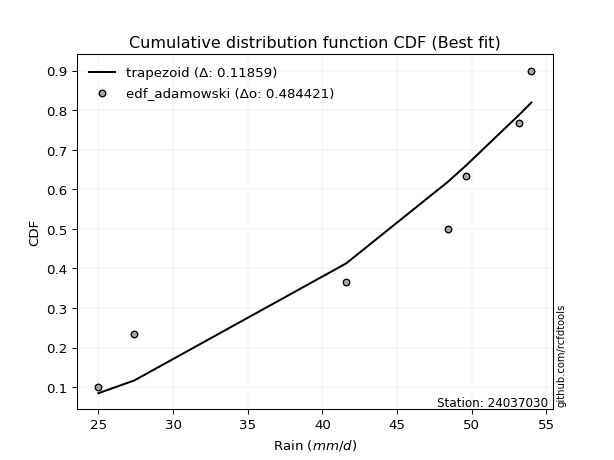</img></img>

</div>


## C. Best fit & Estimate extreme values for specific return periods - Tr

Best fit in probability distribution analysis means finding the theoretical distribution (like Normal, Poisson, Exponential) that most accurately mirrors your real-world data´s patterns (shape, center, spread) for better predictions, using methods like visual checks (Q-Q plots), goodness-of-fit tests (Kolmogorov-Smirnov, Chi-Squared), and information criteria (AIC) to score and select the simplest, most representative model.


### 1. Best fit (ordered by delta Δ)

<div align="center">

|   id |   station | empirical_dist   | p_dist       |    delta |   deltao | eval   |   fit |   n |   best_fit |   best_fit_sort |
|-----:|----------:|:-----------------|:-------------|---------:|---------:|:-------|------:|----:|-----------:|----------------:|
|    0 |  24037030 | edf_hazen        | logjohnsonsu | 0.101719 | 0.530386 | Δo > Δ |     1 |   6 |          1 |               1 |
|    1 |  24037030 | edf_gringorten   | logjohnsonsu | 0.106621 | 0.530386 | Δo > Δ |     1 |   6 |          1 |               2 |
|    2 |  24037030 | edf_cunnane      | logjohnsonsu | 0.109784 | 0.530386 | Δo > Δ |     1 |   6 |          1 |               3 |
|    3 |  24037030 | edf_blom         | logjohnsonsu | 0.111719 | 0.530386 | Δo > Δ |     1 |   6 |          1 |               4 |
|    4 |  24037030 | edf_tukey        | logjohnsonsu | 0.114877 | 0.530386 | Δo > Δ |     1 |   6 |          1 |               5 |
|    5 |  24037030 | edf_filliben     | logjohnsonsu | 0.116055 | 0.530386 | Δo > Δ |     1 |   6 |          1 |               6 |
|    6 |  24037030 | edf_beard        | logjohnsonsu | 0.116609 | 0.530386 | Δo > Δ |     1 |   6 |          1 |               7 |
|    7 |  24037030 | edf_jenkinson    | logjohnsonsu | 0.116609 | 0.530386 | Δo > Δ |     1 |   6 |          1 |               8 |
|    8 |  24037030 | edf_chegodayev   | logjohnsonsu | 0.117344 | 0.530386 | Δo > Δ |     1 |   6 |          1 |               9 |
|    9 |  24037030 | edf_adamowski    | logjohnsonsu | 0.12095  | 0.530386 | Δo > Δ |     1 |   6 |          1 |              10 |
|   10 |  24037030 | edf_weibull      | logjohnsonsu | 0.137433 | 0.530386 | Δo > Δ |     1 |   6 |          1 |              11 |
|   11 |  24037030 | edf_california   | nakagami     | 0.167694 | 0.530386 | Δo > Δ |     1 |   6 |          1 |              12 |

</div>

:file_folder:Tables: [bestfit_24037030.csv](table/bestfit_24037030.csv) | [extreme_24037030.csv](table/extreme_24037030.csv)


### 2. Extreme values

In hydrology, a return period (or recurrence interval $Tr$) is the statistical average time between extreme events like floods or droughts of a specific magnitude, indicating how rare an event is, with a 100-year flood, for example, having a 1% chance of occurring in any given year, not that it happens exactly every century. It is a key tool for infrastructure design (like bridges or dams) and risk assessment, calculated from historical data to determine the probability of future events, although it is important to remember it is statistical average, and events can cluster or be missed.

> risk_rate: assuming the return period as the project useful life.

|   id |      tr |   prob_l |     prob_g |   alpha |   betaprime |     chi2 |   crystalball |   erlang |    expon |   exponnorm |       f |   fatiguelife |    fisk |   gamma |   genexpon |   genlogistic |   gibrat |   gompertz |   gumbel_l |   gumbel_r |   halflogistic |   halfnorm |   hypsecant |   invgamma |   invgauss |      invweibull |   johnsonsu |   kstwobign |   laplace |   laplace_asymmetric |   loggamma |   logistic |   lognorm |   maxwell |   mielke |    moyal |   nakagami |     ncf |     nct |    norm |   pearson3 |   rayleigh |    rice |       t |   truncnorm |     wald |   weibull_min |   logalpha |   logbetaprime |     logchi2 |   logcrystalball |   logerlang |   logexpon |   logexponnorm |    logf |   logfatiguelife |   logfisk |   loggenexpon |   loggenlogistic |   loggibrat |   loggompertz |   loggumbel_l |   loggumbel_r |   loghalflogistic |   loghalfnorm |   loghypsecant |   loginvgamma |   loginvgauss |   loginvweibull |   logjohnsonsu |   logkstwobign |   loglaplace |   loglaplace_asymmetric |   logloggamma |   loglogistic |    loglognorm |   logmaxwell |   logmielke |   logmoyal |   lognakagami |   logncf |   lognct |   logpearson3 |   lograyleigh |   logrice |    logt |   logtruncnorm |   logwald |   logweibull_min |   station |   n |   risk_rate |
|-----:|--------:|---------:|-----------:|--------:|------------:|---------:|--------------:|---------:|---------:|------------:|--------:|--------------:|--------:|--------:|-----------:|--------------:|---------:|-----------:|-----------:|-----------:|---------------:|-----------:|------------:|-----------:|-----------:|----------------:|------------:|------------:|----------:|---------------------:|-----------:|-----------:|----------:|----------:|---------:|---------:|-----------:|--------:|--------:|--------:|-----------:|-----------:|--------:|--------:|------------:|---------:|--------------:|-----------:|---------------:|------------:|-----------------:|------------:|-----------:|---------------:|--------:|-----------------:|----------:|--------------:|-----------------:|------------:|--------------:|--------------:|--------------:|------------------:|--------------:|---------------:|--------------:|--------------:|----------------:|---------------:|---------------:|-------------:|------------------------:|--------------:|--------------:|--------------:|-------------:|------------:|-----------:|--------------:|---------:|---------:|--------------:|--------------:|----------:|--------:|---------------:|----------:|-----------------:|----------:|----:|------------:|
|    0 |    2    | 0.5      | 0.5        | 40.2822 |     40.8298 |  31.7436 |       41      |  40.7944 |  36.0904 |     41      | 40.9767 |       25      | 41.9373 | 40.8131 |    36.0906 |           inf |  37.6687 |    49.7406 |    42.8233 |    39.1767 |        38.2703 |    38.7282 |     41      |    40.3651 |    39.4908 |   894.481       |     45.3697 |     38.5232 |   41      |              44.27   |    38.9794 |    41      |   39.3173 |   40.0508 |  38.9233 |  38.5881 |    34.3576 | 39.5837 | 40.9919 | 41      |    41.7587 |    39.7141 | 40.4318 | 41.0003 |     41      |  37.4024 |       43.0179 |    38.7577 |        38.8091 |     42.2472 |          39.3173 |     39.104  |    34.2171 |        39.3174 | 39.336  |          39.1887 |   40.6033 |       36.551  |              inf |     35.9408 |       36.0385 |       41.297  |       37.4326 |           36.5298 |       36.9826 |        39.3173 |       39.0036 |       38.2242 |         37.449  |        45.842  |        36.7075 |      39.3173 |                 42.856  |       43.4084 |       39.3173 |  25.0348      |      38.3246 |     43.4091 |    36.8436 |       28.0999 |  38.8733 |  39.2503 |       40.3806 |       37.9785 |   38.7625 | 39.317  |        46.0323 |   35.6856 |          41.5189 |  24037030 |   6 |    0.75     |
|    1 |    2.33 | 0.570815 | 0.429185   | 42.3169 |     42.8388 |  33.5154 |       42.9805 |  42.8185 |  38.5339 |     42.9805 | 42.9701 |       25.4783 | 43.8867 | 42.8397 |    38.5342 |           inf |  38.6719 |    50.3157 |    44.5463 |    41.0119 |        40.1571 |    40.8657 |     42.585  |    42.43   |    41.6274 | 33302.7         |     46.9895 |     40.736  |   42.1985 |              45.8528 |    41.1551 |    42.745  |   41.4723 |   42.1084 |  41.1135 |  40.3253 |    37.0868 | 41.6903 | 42.9755 | 42.9805 |    43.6988 |    41.8022 | 42.4729 | 42.9808 |     42.9805 |  38.701  |       44.752  |    40.9513 |        41.0023 |     50.4948 |          41.4723 |     41.2997 |    36.667  |        41.4724 | 41.4993 |          41.3265 |   42.7914 |       38.9379 |              inf |     36.9259 |       38.3497 |       43.2594 |       39.3299 |           38.4347 |       39.1752 |        41.0327 |       41.1881 |       40.5171 |         39.8516 |        47.584  |        39.0191 |      40.6077 |                 44.6263 |       45.2587 |       41.2099 |  25.3491      |      40.5092 |     45.2974 |    38.6091 |       29.9352 |  43.9508 |  41.4155 |       42.5257 |       40.1764 |   40.9613 | 41.4719 |        46.8573 |   36.9562 |          43.3906 |  24037030 |   6 |    0.729209 |
|    2 |    5    | 0.8      | 0.2        | 50.2585 |     50.4122 |  42.8343 |       50.3406 |  50.4729 |  50.751  |     50.3406 | 50.3901 |       35.6396 | 51.4138 | 50.5155 |    50.7516 |           inf |  44.4478 |    52.2153 |    50.1128 |    48.9847 |        48.6947 |    49.9048 |     48.9428 |    50.4857 |    50.3725 |     2.50589e+11 |     51.1955 |     50.1355 |   48.1908 |              49.903  |    50.5394 |    49.4825 |   50.5684 |   50.207  |  50.6289 |  48.3722 |    50.0357 | 50.4524 | 50.3489 | 50.3406 |    50.4922 |    50.1616 | 50.2951 | 50.3409 |     50.3406 |  45.9708 |       50.3541 |    50.549  |        50.5837 |    140.891  |          50.5684 |     50.7826 |    51.8115 |        50.5684 | 50.6416 |          50.3648 |   52.4049 |       50.9557 |              inf |     43.1459 |       49.4366 |       50.259  |       48.7543 |           48.3739 |       49.9794 |        48.6993 |       50.7375 |       51.0353 |         52.2123 |        51.6988 |        50.5755 |      47.7226 |                 49.4752 |       50.3383 |       49.4127 |   2.58766e+32 |      50.3867 |     50.4893 |    47.9565 |       44.3213 |  70.9066 |  50.5937 |       50.7994 |       50.325  |   50.5544 | 50.5677 |        50.0891 |   44.9514 |          50.034  |  24037030 |   6 |    0.67232  |
|    3 |   10    | 0.9      | 0.1        | 55.8831 |     55.5301 |  51.6593 |       55.2231 |  55.6663 |  61.8414 |     55.2231 | 55.3229 |       49.6698 | 56.9572 | 55.734  |    61.8423 |           inf |  51.0318 |    53.2921 |    53.212  |    55.4784 |        55.7848 |    56.5936 |     54.0197 |    56.1823 |    56.9238 |     1.00005e+17 |     52.896  |     57.292  |   53.6304 |              52.2248 |    58.0976 |    54.4445 |   57.6779 |   55.9064 |  58.3798 |  55.3784 |    60.3093 | 57.1939 | 55.2416 | 55.2231 |    54.6455 |    56.122  | 55.6194 | 55.2234 |     55.2231 |  53.6858 |       53.4731 |    58.4427 |        58.4376 |    399.468  |          57.6779 |     58.4337 |    70.9136 |        57.6779 | 57.7992 |          57.446  |   60.8403 |       62.3938 |              inf |     51.5234 |       58.9757 |       54.6358 |       58.0759 |           58.5549 |       59.8503 |        55.8378 |       58.5801 |       60.2587 |         65.0629 |        53.0927 |        61.6195 |      55.2552 |                 52.0552 |       52.2418 |       56.4805 | inf           |      58.7495 |     52.4376 |    57.9196 |       63.7097 |  99.3807 |  57.8105 |       56.4617 |       59.0918 |   58.3066 | 57.677  |        51.8743 |   55.336  |          54.1646 |  24037030 |   6 |    0.651322 |
|    4 |   15    | 0.933333 | 0.0666667  | 58.8049 |     58.1123 |  56.9129 |       57.6596 |  58.2927 |  68.3288 |     57.6596 | 57.7875 |       58.8458 | 59.9775 | 58.3762 |    68.3299 |           inf |  55.5731 |    53.7828 |    54.6156 |    59.1421 |        59.7971 |    60.0744 |     56.917  |    59.137  |    60.432  |     1.44574e+20 |     53.5273 |     61.0912 |   56.8124 |              53.5829 |    62.3402 |    57.148  |   61.5912 |   58.8307 |  62.7531 |  59.4444 |    65.7422 | 60.877  | 57.6835 | 57.6596 |    56.6154 |    59.1931 | 58.3029 | 57.6599 |     57.6596 |  58.6399 |       54.8856 |    62.938  |        62.897  |    755.884  |          61.5912 |     62.7332 |    85.2044 |        61.5912 | 61.7432 |          61.3501 |   65.9946 |       69.432  |              inf |     58.2319 |       64.3757 |       56.7414 |       64.1011 |           65.239  |       65.7355 |        60.3712 |       63.0414 |       65.7339 |         73.6628 |        53.5513 |        68.4315 |      60.2013 |                 53.6247 |       52.8439 |       60.748  | inf           |      63.5655 |     53.0543 |    64.6253 |       77.7014 | 118.374  |  61.7985 |       59.3097 |       64.1892 |   62.6471 | 61.5902 |        52.5395 |   63.237  |          56.1458 |  24037030 |   6 |    0.644736 |
|    5 |   20    | 0.95     | 0.05       | 60.7619 |     59.8136 |  60.6699 |       59.2552 |  60.0252 |  72.9317 |     59.2551 | 59.4027 |       65.6395 | 62.0651 | 60.1203 |    72.9329 |           inf |  59.1354 |    54.0891 |    55.4892 |    61.7073 |        62.6083 |    62.3951 |     58.961  |    61.114  |    62.8189 |     2.35879e+22 |     53.8791 |     63.6505 |   59.07   |              54.5465 |    65.3072 |    59.0166 |   64.2967 |   60.7714 |  65.8153 |  62.324  |    69.3802 | 63.4145 | 59.2828 | 59.2552 |    57.8691 |    61.2343 | 60.0679 | 59.2555 |     59.2552 |  62.3318 |       55.7649 |    66.1091 |        66.0365 |   1199.27   |          64.2967 |     65.7419 |    97.0584 |        64.2967 | 64.4717 |          64.0518 |   69.8101 |       74.6054 |              inf |     64.1    |       68.1381 |       58.0929 |       68.688  |           70.3716 |       69.9774 |        63.789  |       66.1865 |       69.6912 |         80.3522 |        53.7901 |        73.4399 |      63.9768 |                 54.7669 |       53.1395 |       63.8847 | inf           |      66.9777 |     53.357  |    69.8389 |       88.8534 | 133.058  |  64.562  |       61.1764 |       67.8183 |   65.6749 | 64.2956 |        52.8874 |   69.8499 |          57.4155 |  24037030 |   6 |    0.641514 |
|    6 |   25    | 0.96     | 0.04       | 62.2253 |     61.0711 |  63.598  |       60.4297 |  61.3069 |  76.502  |     60.4297 | 60.5923 |       71.0373 | 63.662  | 61.4112 |    76.5033 |           inf |  62.1051 |    54.3074 |    56.1109 |    63.6832 |        64.7742 |    64.1218 |     60.5428 |    62.591  |    64.6222 |     1.19391e+24 |     54.111  |     65.5675 |   60.8212 |              55.2939 |    67.5928 |    60.446  |   66.3639 |   62.2122 |  68.1741 |  64.556  |    72.0918 | 65.3492 | 60.4602 | 60.4297 |    58.7738 |    62.7509 | 61.3705 | 60.4301 |     60.4297 |  65.2889 |       56.3906 |    68.5673 |        68.4665 |   1723      |          66.3639 |     68.0606 |   107.377  |        66.364  | 66.5574 |          66.1176 |   72.8772 |       78.7283 |              inf |     69.4415 |       71.0205 |       59.0741 |       72.4438 |           74.5998 |       73.3102 |        66.5664 |       68.6233 |       72.8121 |         85.9161 |        53.9402 |        77.43   |      67.0676 |                 55.6696 |       53.3151 |       66.3931 | inf           |      69.6288 |     53.5369 |    74.1676 |       98.2299 | 145.199  |  66.677  |       62.5492 |       70.6468 |   68.0022 | 66.3628 |        53.1015 |   75.6421 |          58.3365 |  24037030 |   6 |    0.639603 |
|    7 |   50    | 0.98     | 0.02       | 66.526  |     64.6965 |  72.7569 |       63.7932 |  65.0074 |  87.5924 |     63.7932 | 64.0014 |       88.3561 | 68.5412 | 65.1407 |    87.5939 |           inf |  72.5734 |    54.9012 |    57.7985 |    69.77   |        71.4476 |    69.1406 |     65.4472 |    66.9251 |    70.0079 |     2.12354e+29 |     54.6668 |     71.1968 |   66.2608 |              57.6156 |    74.6502 |    64.8134 |   72.6589 |   66.3908 |  75.4408 |  71.4851 |    79.9837 | 71.2234 | 63.8321 | 63.7932 |    61.28   |    67.1534 | 65.115  | 63.7936 |     63.7932 |  74.9438 |       58.089  |    76.2419 |        76.0313 |   5414.44   |          72.6589 |     75.2257 |   146.966  |        72.6589 | 72.9133 |          72.4158 |   83.1085 |       92.1962 |              inf |     92.0773 |       79.7948 |       61.8221 |       85.3538 |           89.2926 |       83.926  |        75.9699 |       76.2238 |       82.849  |        105.596  |        54.2742 |        90.4445 |      77.6537 |                 58.5696 |       53.6627 |       74.6837 | inf           |      77.9261 |     53.8932 |    89.3906 |      131.644  | 187.566  |  73.1353 |       66.4639 |       79.5437 |   75.158  | 72.6575 |        53.5419 |   98.1129 |          60.9118 |  24037030 |   6 |    0.63583  |
|    8 |   75    | 0.986667 | 0.0133333  | 68.9036 |     66.6568 |  78.1504 |       65.598  |  67.0113 |  94.0798 |     65.5979 | 65.8323 |       98.7862 | 71.3593 | 67.1619 |    94.0815 |           inf |  79.6438 |    55.2021 |    58.6519 |    73.3079 |        75.3269 |    71.8727 |     68.3132 |    69.3163 |    73.0365 |     2.39117e+32 |     54.9091 |     74.294  |   69.4428 |              58.9737 |    78.775  |    67.3359 |   76.2792 |   68.6626 |  79.6649 |  75.5371 |    84.2806 | 74.5929 | 65.6416 | 65.598  |    62.574  |    69.5485 | 67.1316 | 65.5983 |     65.598  |  80.885  |       58.9478 |    80.7859 |        80.4944 |  10696      |          76.2792 |     79.4169 |   176.583  |        76.2792 | 76.5718 |          76.0431 |   89.6597 |      100.571  |              inf |    111.407  |       84.8148 |       63.26   |       93.8901 |           99.1292 |       90.3375 |        82.0687 |       80.719  |       88.9973 |        119.045  |        54.4069 |        98.5157 |      84.6047 |                 60.3355 |       53.7775 |       79.9358 | inf           |      82.8449 |     54.0123 |    99.7022 |      154.411  | 215.994  |  76.8616 |       68.5475 |       84.846  |   79.3172 | 76.2777 |        53.6926 |  115.143  |          62.2571 |  24037030 |   6 |    0.634587 |
|    9 |  100    | 0.99     | 0.01       | 70.5404 |     67.9885 |  81.9903 |       66.8186 |  68.3739 |  98.6827 |     66.8186 | 67.0713 |      106.291  | 73.3489 | 68.537  |    98.6846 |           inf |  85.1209 |    55.3991 |    59.2101 |    75.8118 |        78.0725 |    73.7338 |     70.3463 |    70.9604 |    75.1411 |     3.45447e+34 |     55.0544 |     76.4161 |   71.7005 |              59.9373 |    81.7093 |    69.1168 |   78.8295 |   70.2101 |  82.6546 |  78.4118 |    87.2064 | 76.9638 | 66.8656 | 66.8186 |    63.4293 |    71.1802 | 68.4982 | 66.819  |     66.8186 |  85.2167 |       59.5096 |    84.0446 |        83.6876 |  17407.6    |          78.8295 |     82.4    |   201.15   |        78.8296 | 79.1504 |          78.6006 |   94.5936 |      106.751  |              inf |    129.129  |       88.3312 |       64.2186 |      100.443  |          106.739  |       94.9835 |        86.6895 |       83.9404 |       93.4988 |        129.586  |        54.4824 |       104.458  |      89.9107 |                 61.6206 |       53.8347 |       83.8649 | inf           |      86.3719 |     54.0736 |   107.731  |      172.119  | 237.987  |  79.4918 |       69.9474 |       88.6593 |   82.2651 | 78.8279 |        53.7687 |  129.395  |          63.153  |  24037030 |   6 |    0.633968 |
|   10 |  200    | 0.995    | 0.005      | 74.3421 |     71.0271 |  91.2794 |       69.5875 |  71.4867 | 109.773  |     69.5874 | 69.8836 |      124.662  | 78.1216 | 71.6802 |   109.775  |           inf | 100.022  |    55.8278 |    60.4233 |    81.8317 |        84.6734 |    77.9906 |     75.2441 |    74.7718 |    80.0865 |     5.37884e+39 |     55.3361 |     81.3037 |   77.1401 |              62.259  |    88.829  |    73.3889 |   84.9351 |   73.7504 |  89.8428 |  85.338  |    93.8913 | 82.6341 | 69.6421 | 69.5875 |    65.3108 |    74.9138 | 71.6052 | 69.5878 |     69.5874 |  96.0065 |       60.7306 |    92.0414 |        91.497  |  56925.4    |          84.9351 |     89.6433 |   275.311  |        84.9351 | 85.328  |          84.7306 |  107.565  |      122.498  |              inf |    192.949  |       96.6637 |       66.3525 |      118.129  |          127.513  |      106.528  |        98.9182 |       91.8373 |      104.866  |        158.908  |        54.6189 |       119.543  |     104.102  |                 64.8306 |       53.9202 |       94.0953 | inf           |      95.0162 |     54.1761 |   129.833  |      220.499  | 297.924  |  85.8056 |       73.0878 |       98.0417 |   89.3793 | 84.9333 |        53.8838 |  173.045  |          65.1453 |  24037030 |   6 |    0.633042 |
|   11 |  250    | 0.996    | 0.004      | 75.5292 |     71.9606 |  94.2795 |       70.4336 |  72.4441 | 113.343  |     70.4335 | 70.7436 |      130.649  | 79.6538 | 72.6473 |   113.346  |           inf | 105.369  |    55.9541 |    60.7803 |    83.7669 |        86.7955 |    79.3001 |     76.8208 |    75.9598 |    81.646  |     2.51153e+41 |     55.4105 |     82.8163 |   78.8912 |              63.0065 |    91.141  |    74.7604 |   86.8936 |   74.8402 |  92.1539 |  87.5677 |    95.9456 | 84.452  | 70.4907 | 70.4336 |    65.8697 |    76.0631 | 72.5564 | 70.4339 |     70.4336 |  99.5761 |       61.0899 |    94.6654 |        94.0512 |  83606.1    |          86.8936 |     91.9969 |   304.581  |        86.8936 | 87.3109 |          86.6992 |  112.095  |      127.838  |              inf |    222.856  |       99.3072 |       66.9938 |      124.452  |          135.015  |      110.354  |       103.211  |       94.426  |      108.693  |        169.678  |        54.6527 |       124.639  |     109.132  |                 65.8991 |       53.9373 |       97.6374 | inf           |      97.8474 |     54.201  |   137.872  |      237.911  | 319.514  |  87.8359 |       74.0362 |      101.125  |   91.6776 | 86.8917 |        53.9069 |  190.512  |          65.7434 |  24037030 |   6 |    0.632858 |
|   12 |  500    | 0.998    | 0.002      | 79.1219 |     74.7425 | 103.624  |       72.9428 |  75.2998 | 124.434  |     72.9428 | 73.2953 |      149.43   | 84.4058 | 75.5339 |   124.436  |           inf | 123.846  |    56.3163 |    61.8037 |    89.7737 |        93.3821 |    83.2045 |     81.7182 |    79.5483 |    86.4059 |     3.81023e+46 |     55.6041 |     87.3493 |   84.3309 |              65.3282 |    98.4014 |    79.0139 |   92.9713 |   78.0922 |  99.3273 |  94.4936 |   102.063  | 90.0931 | 73.0074 | 72.9428 |    67.4838 |    79.4922 | 75.3818 | 72.9432 |     72.9428 | 110.926  |       62.1198 |   102.992  |       102.129  | 278024      |          92.9713 |     99.3924 |   416.875  |        92.9713 | 93.468  |          92.8145 |  127.395  |      145.316  |              inf |    366.698  |      107.409  |       68.8666 |      146.314  |          161.229  |      122.597  |       117.769  |      102.632  |      121.15   |        207.979  |        54.7355 |       141.249  |     126.357  |                 69.332  |       53.9714 |      109.493  | inf           |     106.807  |     54.2656 |   166.156  |      298.225  | 394.647  |  94.1515 |       76.8126 |      110.913  |   98.8571 | 92.9691 |        53.9534 |  258.653  |          67.4884 |  24037030 |   6 |    0.632489 |
|   13 |  750    | 0.998667 | 0.00133333 | 81.1659 |     76.2967 | 109.106  |       74.3368 |  76.897  | 130.921  |     74.3367 | 74.7138 |      160.526  | 87.1821 | 77.1494 |   130.924  |           inf | 136.066  |    56.51   |    62.3506 |    93.2852 |        97.2326 |    85.3858 |     84.583  |    81.5851 |    89.1388 |     4.07158e+49 |     55.6961 |     89.8958 |   87.5128 |              66.6863 |   102.712  |    81.499  |   96.5293 |   79.911  | 103.521  |  98.5451 |   105.475  | 93.3967 | 74.4056 | 74.3368 |    68.3526 |    81.4097 | 76.954  | 74.3371 |     74.3368 | 117.731  |       62.6702 |   107.996  |       106.963  | 564104      |          96.5293 |    103.786  |   500.885  |        96.5293 | 97.0751 |          96.3992 |  137.283  |      156.196  |              inf |    509.735  |      112.077  |       69.8889 |      160.833  |          178.852  |      130.018  |       127.219  |      107.558  |      128.862  |        234.258  |        54.7722 |       151.534  |     137.668  |                 71.4224 |       53.9827 |      117.075  | inf           |     112.172  |     54.2981 |   185.32   |      338.199  | 444.862  |  97.8592 |       78.3289 |      116.794  |  103.092  | 96.527  |        53.9689 |  310.698  |          68.44   |  24037030 |   6 |    0.632366 |
|   14 | 1000    | 0.999    | 0.001      | 82.5937 |     77.3705 | 113.001  |       75.2965 |  78.0013 | 135.524  |     75.2964 | 75.6908 |      168.442  | 89.1509 | 78.2666 |   135.527  |           inf | 145.418  |    56.6404 |    62.7187 |    95.776  |        99.9639 |    86.8922 |     86.6156 |    83.0058 |    91.0577 |     5.73082e+51 |     55.7538 |     91.66   |   89.7705 |              67.6499 |   105.801  |    83.2613 |   99.0578 |   81.1681 | 106.496  | 101.42   |   107.83   | 95.7456 | 75.3683 | 75.2965 |    68.9394 |    82.7348 | 78.0374 | 75.2968 |     75.2965 | 122.627  |       63.0407 |   111.612  |       110.447  | 933606      |          99.0578 |    106.937  |   570.571  |        99.0578 | 99.6397 |          98.9487 |  144.756  |      164.223  |              inf |    655.848  |      115.359  |       70.5855 |      171.997  |          192.508  |      135.404  |       134.38   |      111.114  |      134.537  |        254.888  |        54.7942 |       159.094  |     146.302  |                 72.9437 |       53.9884 |      122.768  | inf           |     116.036  |     54.3198 |   200.243  |      368.822  | 483.604  | 100.499  |       79.3611 |      121.039  |  106.115  | 99.0554 |        53.9767 |  354.496  |          69.088  |  24037030 |   6 |    0.632305 |

<div align="center">

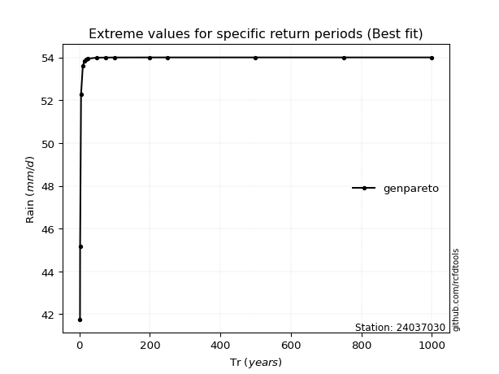</img>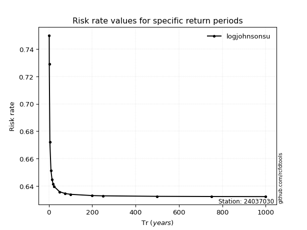</img>

</div>


<sub>**APP DISCLAIMER**: NO WARRANTY - This software is provided by [github.com/rcfdtools](https://github.com/rcfdtools) "as is", without any express or implied warranty, including warranties of merchantability, fitness for a particular purpose, or non-infringement. There is no guarantee that the software will be error-free or operate without interruption. LIMITATION OF LIABILITY - Neither the authors nor copyright holders will be liable for claims or damages arising from the software or its use. You are responsible for determining if the software is appropriate for your use and assume all associated risks, including errors, legal compliance, and data loss. NO PROFESSIONAL ADVICE - The software provides general information and does not offer professional advice. It should not replace consultation with professional advisors.</sub>