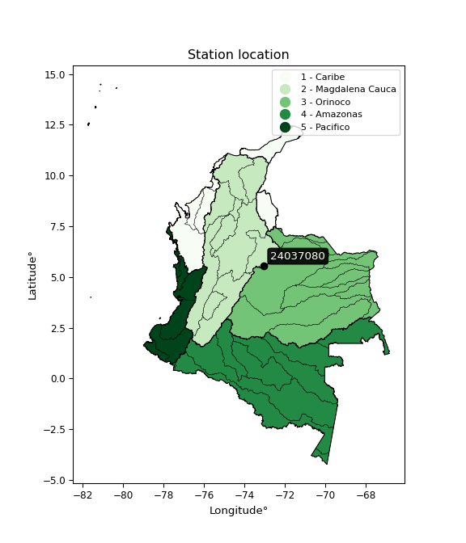

<div align="center">


</div>

# PMP Station (Rain, Pmax24h): 24037080

Probable Maximum Precipitation (PMP) is the greatest amount of rainfall for a specific duration that is meteorologically possible for a given location, acting as a "worst-case" scenario for extreme storms, crucial for designing safety-critical infrastructure like bridges, river deviations, dams, spillways, and nuclear plants to prevent catastrophic failure. PMP is calculated by hydrologists using meteorological data to determine the upper limit of extreme rainfall, often leading to the Probable Maximum Flood (PMF) for flood control design, and is increasingly being studied for climate change impacts. Probable Maximum Precipitation (PMP) is the theoretical upper limit of rainfall, a deterministic estimate for extreme events, while probability distributions (like GEV, Gumbel) describe the likelihood and frequency of various precipitation amounts, including rare ones, showing how often events occur, with PMP representing the extreme end of these distributions, used for critical infrastructure design to ensure safety against the worst conceivable weather, unlike standard statistical forecasts which cover typical probabilities.

The most common probability distributions in hydrology, used for analyzing floods, rainfall, and streamflow, include the Normal, Log-Normal, Gumbel, Gamma (including Log-Pearson Type III), and Generalized Extreme Value (GEV) distributions, often chosen based on the data´s skewness and whether modeling extremes or general conditions, with Gumbel and GEV popular for extreme events like floods, while the Normal distribution serves as a baseline, though often requiring transformations for skewed hydrological data. These distributions help in designing water infrastructure, managing water resources, and forecasting hydrologic events.

> Hydrological data often isn´t perfectly normal (it´s skewed), so different distributions are needed for different applications, such as: **Flood Frequency Analysis**: Using Gumbel, GEV, or Log-Pearson Type III for predicting extreme flood magnitudes and their return periods, **Rainfall Analysis**: Normal for annual totals, but Log-Normal, Weibull, or GEV for intensity or extreme daily rainfall, **Streamflow Modeling**: Gamma and Log-Normal for maximum flows, GEV for minimum flows, and Kappa for daily flows.

<div align="center">

</img>

</div>


## A. General information


### 1. General running parameters

• app_version: _v20260113_. • runtime: _2026-01-17 18:24:04.630693_. • Python version: _3.14.0_. • SciPy version: _1.16.3_. • Pandas version: _2.3.3_. • NumPy version: _2.3.5_. • Stations dataset (station_dataset_file): _dataset/pmax24h_in/automatic_colombia_2003_2025.csv_. • Stations catalog (station_catalog_file): _dataset/CNE.xls_. • Minimum year to eval til year_max (date_min): _1900_. • Maximum year to eval since year_min (date_max): _2025_. • Creates, save and include plots into reports (create_plot): _False_. • Plot only fit distributions with Δo > Δ (plot_only_fit): _True_. • Plot only simple graphs avoiding multiple CDFs and multiple Extreme values plots (plot_only_simple): _True_. • Eval low extreme values, if False, evaluates high extreme values (low_extreme): _False_. • Eval every SciPy distribution as logarithmic (pdist_logarithmic_on): _True_. • Standard deviation normalized (ddof): _1.0_. • Return periods to eval in years (Tr): _[2, 2.33, 5, 10, 15, 20, 25, 50, 75, 100, 200, 250, 500, 750, 1000]_. • Minimum data sample per station, 0 means any (minimum_sample): _5_. • Z-Score maximum threshold to adjust a value, 0 means disable (zscore_max): _3.5_. • Z-Score minimum threshold to adjust a value, 0 means disable (zscore_min): _-2.5_. • Avoid zeros, e.g. rain = 0 (avoid_zeros): _True_. • Avoid null values (avoid_nans): _True_. 

:file_folder:Table: [dataset.csv](../../dataset/pmax24h_in/automatic_colombia_2003_2025.csv)

> Delta Degrees of Freedom (DDOF): is a parameter used in the formulas for calculating variance and standard deviation. When ddof=0, the divisor is $N$ (the total number of observations) and this is used when your data set is the entire population. When ddof=1, the divisor is $N-1$ and this is used when your data set is a sample drawn from a larger population. Using $N-1$ provides an unbiased estimate of the population variance (known as Bessel´s correction).


### 2. Station info and location

|   id |   CODIGO | NOMBRE                     | CATEGORIA    | TECNOLOGIA                              | ESTADO           | FECHA_INSTALACION   |   FECHA_SUSPENSION |   ALTITUD |   LATITUD |   LONGITUD | DEPARTAMENTO   | MUNICIPIO   | AREA_OPERATIVA                              | ENTIDAD                                                     | AREA_HIDROGRAFICA   | ZONA_HIDROGRAFICA   | SUBZONA_HIDROGRAFICA   | CORRIENTE   | Catalogo   |   Version |
|-----:|---------:|:---------------------------|:-------------|:----------------------------------------|:-----------------|:--------------------|-------------------:|----------:|----------:|-----------:|:---------------|:------------|:--------------------------------------------|:------------------------------------------------------------|:--------------------|:--------------------|:-----------------------|:------------|:-----------|----------:|
|    0 | 24037080 | LA GRUTA  - AUT [24037080] | Limnimétrica | Automática con Telemetría, Convencional | En Mantenimiento | 15/03/1979          |                nan |      2500 |   5.56697 |   -73.0467 | Boyacá         | Pesca       | Area Operativa 06 - Boyacá-Casanare-Vichada | INSTITUTO DE HIDROLOGIA METEOROLOGIA Y ESTUDIOS AMBIENTALES | Magdalena Cauca     | Sogamoso            | Río Chicamocha         | Pesca       | CNE_IDEAM  |  20251226 |

<div align="center">

Dynamic map: [:earth_americas:Google](http://maps.google.com/maps?q=5.566972222,-73.04672222) [:earth_americas:OSM](https://www.openstreetmap.org/#map=18/5.566972222/-73.04672222&layers=P) [:earth_americas:Bing](https://www.bing.com/maps?cp=5.566972222~-73.04672222&lvl=18) [:earth_americas:Apple](https://maps.apple.com/frame?center=5.566972222%2C-73.04672222&span=0.003%2C0.006)

</div>


<div align="center">

```geojson
{
  "type": "Feature",
  "geometry": {
    "type": "Point", 
    "coordinates": [-73.04672222, 5.566972222]
  }, 
  "properties": {
    "Name": "24037080"
  }
}
```

</div>


### 3. Discrete values table and plot

<div align="center">

|               |           0 |           1 |           2 |          3 |          4 |
|:--------------|------------:|------------:|------------:|-----------:|-----------:|
| Date          | 2019        | 2020        | 2021        | 2022       | 2025       |
| Value         |   49.2      |   28.4      |   21.2      |   56       |   11.8     |
| Value_initial |   49.2      |   28.4      |   21.2      |   56       |   11.8     |
| count         |    5        |    5        |    5        |    5       |    5       |
| mean          |   33.32     |   33.32     |   33.32     |   33.32    |   33.32    |
| std           |   18.7134   |   18.7134   |   18.7134   |   18.7134  |   18.7134  |
| zscore        |    0.848589 |   -0.262913 |   -0.647664 |    1.21196 |   -1.14998 |


</div>


> The initial value (value_initial) correspond to the initial obtained or null completed value, and value (value) is adjusted only when the initial value is outside the valid range (outlier) definite through the Z-Score value. If Z-Score is active, values out of range or outliers are replaced with the station mean value. A Z-Score (or standard score) measures how many standard deviations a data point is from the mean of a dataset, indicating its relative position; positive scores mean above the mean, negative mean below, and a score of zero is exactly at the mean, allowing for comparison of values from different distributions. It´s calculated using the formula $z=(x–μ)/σ$, where $x$ is the data point, $μ$ is the mean, and $σ$ is the standard deviation, helping identify outliers and understand probability.
>
> <sub>**Note**: In this study, "completing" (filling gaps in) and "extending" (forecasting or lengthening the historical record) rainfall data series are avoided for certain critical analyses because they introduce artificial bias and uncertainty, which can distort the statistics of rare events (extremes), alter day-to-day variability, and compromise the integrity and homogeneity of the original data. Some reasons against Completing/Extending rainfall data are: **Distortion of Extremes and Variability**: The primary issue is that most gap-filling or extension methods rely on averaging or regression with nearby stations, which inherently smooths the data. Rainfall is highly variable in space and time, with a large percentage of zero values and occasional large storms. Infilling methods often underestimate the highest values and overestimate the lowest (zero) values, which severely distorts analyses focused on flood frequency, drought severity, and intensity-duration-frequency (IDF) curves, **Loss of Data Homogeneity**: Infilled or extended data are synthetic estimates, not actual measurements. Combining these estimates with observed data can violate the assumption of data homogeneity, which requires that the data properties do not change over time. Inhomogeneity can lead to incorrect conclusions about long-term trends or changes in climate patterns, **Propagation of Errors**: Errors and biases from the original data (e.g., wind-induced undercatch, instrument errors, site changes) or the data used for imputation can propagate through the analysis, leading to unreliable hydrological models and inaccurate predictions, **Compromised Statistical Integrity**: For statistical analyses, especially those involving the frequency of events, using artificial data can introduce time bias or autocorrelation that doesn´t exist in reality, making it difficult to assess the true probability of events, **Difficulty in Validation**: It is difficult to accurately validate the quality of filled or extended data, especially for past periods where ground-truth measurements are unavailable. The reliability of imputation techniques heavily depends on the density of the surrounding station network and the complexity of the local topography.</sub>


### 4. Active continuous probability distributions from SciPy (80 of 104 available)

A Probability Density Function (PDF) describes the relative likelihood of a continuous random variable falling within a specific range, where the total area under its curve equals 1, and the area over any interval gives the actual probability for that range. Unlike discrete probabilities (like rolling a die), a PDF shows density, not direct probability for a single point (which is zero), with higher points indicating higher likelihood, often visualized as a bell curve for normal distributions.

A log of a probability density function (log-PDF) is simply the logarithm of the PDF´s value, denoted as $log(f(x))$, useful for converting multiplication of probabilities into addition, improving numerical stability with tiny numbers, and connecting to information theory concepts like entropy. Instead of dealing with very small probabilities (e.g., 0.000001), log-PDFs use negative numbers (e.g., $log(0.00001) ≈ -11.51$ that are easier for computers to handle, preventing underflow errors and simplifying complex calculations. In this study, each active probability distribution from SciPy is also evaluated in the $log$ form.

[scipy.stats](https://docs.scipy.org/doc/scipy/reference/stats.html) is a Python´s powerful submodule within the SciPy library for comprehensive statistical analysis, offering over 130 probability distributions (like Normal, Poisson), functions for descriptive stats (mean, variance), hypothesis testing (t-tests, chi-square), random variable generation, and statistical tests, making it essential for data science, modeling, and research. It provides tools to explore, model, and draw conclusions from data efficiently, working seamlessly with NumPy.

<div align="center">

|   id | p_dist           |   n_parameter | fit_method   | label                                                                       | active   | ref                                                                                                      |
|-----:|:-----------------|--------------:|:-------------|:----------------------------------------------------------------------------|:---------|:---------------------------------------------------------------------------------------------------------|
|    0 | alpha            |             3 | MLE          | Alpha                                                                       | True     | [:mortar_board:](https://docs.scipy.org/doc/scipy/reference/generated/scipy.stats.alpha.html)            |
|    1 | anglit           |             2 | MM           | Anglit                                                                      | True     | [:mortar_board:](https://docs.scipy.org/doc/scipy/reference/generated/scipy.stats.anglit.html)           |
|    2 | arcsine          |             2 | MM           | Arcsine                                                                     | True     | [:mortar_board:](https://docs.scipy.org/doc/scipy/reference/generated/scipy.stats.arcsine.html)          |
|    3 | argus            |             3 | MLE          | Argus                                                                       | True     | [:mortar_board:](https://docs.scipy.org/doc/scipy/reference/generated/scipy.stats.argus.html)            |
|    4 | beta             |             4 | MLE          | Beta                                                                        | True     | [:mortar_board:](https://docs.scipy.org/doc/scipy/reference/generated/scipy.stats.beta.html)             |
|    5 | betaprime        |             4 | MLE          | Beta prime                                                                  | True     | [:mortar_board:](https://docs.scipy.org/doc/scipy/reference/generated/scipy.stats.betaprime.html)        |
|    6 | bradford         |             3 | MLE          | Bradford                                                                    | True     | [:mortar_board:](https://docs.scipy.org/doc/scipy/reference/generated/scipy.stats.bradford.html)         |
|    7 | burr             |             4 | MLE          | Burr (Type III)                                                             | True     | [:mortar_board:](https://docs.scipy.org/doc/scipy/reference/generated/scipy.stats.burr.html)             |
|    8 | burr12           |             4 | MLE          | Burr (Type III) 12                                                          | True     | [:mortar_board:](https://docs.scipy.org/doc/scipy/reference/generated/scipy.stats.burr12.html)           |
|    9 | cosine           |             2 | MLE          | Cosine                                                                      | True     | [:mortar_board:](https://docs.scipy.org/doc/scipy/reference/generated/scipy.stats.cosine.html)           |
|   10 | crystalball      |             4 | MLE          | Crystalball                                                                 | True     | [:mortar_board:](https://docs.scipy.org/doc/scipy/reference/generated/scipy.stats.crystalball.html)      |
|   11 | dgamma           |             3 | MLE          | Double gamma                                                                | True     | [:mortar_board:](https://docs.scipy.org/doc/scipy/reference/generated/scipy.stats.dgamma.html)           |
|   12 | dweibull         |             3 | MLE          | Double Weibull                                                              | True     | [:mortar_board:](https://docs.scipy.org/doc/scipy/reference/generated/scipy.stats.dweibull.html)         |
|   13 | erlang           |             3 | MLE          | Erlang                                                                      | True     | [:mortar_board:](https://docs.scipy.org/doc/scipy/reference/generated/scipy.stats.erlang.html)           |
|   14 | exponnorm        |             3 | MLE          | Exponentially modified Normal                                               | True     | [:mortar_board:](https://docs.scipy.org/doc/scipy/reference/generated/scipy.stats.exponnorm.html)        |
|   15 | exponpow         |             3 | MLE          | Exponential power                                                           | True     | [:mortar_board:](https://docs.scipy.org/doc/scipy/reference/generated/scipy.stats.exponpow.html)         |
|   16 | exponweib        |             4 | MLE          | Exponentiated Weibull                                                       | True     | [:mortar_board:](https://docs.scipy.org/doc/scipy/reference/generated/scipy.stats.exponweib.html)        |
|   17 | f                |             4 | MLE          | F                                                                           | True     | [:mortar_board:](https://docs.scipy.org/doc/scipy/reference/generated/scipy.stats.f.html)                |
|   18 | fatiguelife      |             3 | MLE          | Fatigue-life (Birnbaum-Saunders)                                            | True     | [:mortar_board:](https://docs.scipy.org/doc/scipy/reference/generated/scipy.stats.fatiguelife.html)      |
|   19 | foldnorm         |             3 | MM           | Fold Normal                                                                 | True     | [:mortar_board:](https://docs.scipy.org/doc/scipy/reference/generated/scipy.stats.foldnorm.html)         |
|   20 | gamma            |             3 | MLE          | Gamma                                                                       | True     | [:mortar_board:](https://docs.scipy.org/doc/scipy/reference/generated/scipy.stats.gamma.html)            |
|   21 | gausshyper       |             6 | MLE          | Gauss hypergeometric                                                        | True     | [:mortar_board:](https://docs.scipy.org/doc/scipy/reference/generated/scipy.stats.gausshyper.html)       |
|   22 | genexpon         |             5 | MLE          | Generalized exponential                                                     | True     | [:mortar_board:](https://docs.scipy.org/doc/scipy/reference/generated/scipy.stats.genexpon.html)         |
|   23 | genextreme       |             3 | MLE          | Generalized exponential                                                     | True     | [:mortar_board:](https://docs.scipy.org/doc/scipy/reference/generated/scipy.stats.genextreme.html)       |
|   24 | gengamma         |             4 | MLE          | Generalized gamma                                                           | True     | [:mortar_board:](https://docs.scipy.org/doc/scipy/reference/generated/scipy.stats.gengamma.html)         |
|   25 | genhalflogistic  |             3 | MLE          | Generalized half-logistic                                                   | True     | [:mortar_board:](https://docs.scipy.org/doc/scipy/reference/generated/scipy.stats.genhalflogistic.html)  |
|   26 | genlogistic      |             3 | MLE          | Generalized logistic                                                        | True     | [:mortar_board:](https://docs.scipy.org/doc/scipy/reference/generated/scipy.stats.genlogistic.html)      |
|   27 | gennorm          |             3 | MLE          | Generalized Normal                                                          | True     | [:mortar_board:](https://docs.scipy.org/doc/scipy/reference/generated/scipy.stats.gennorm.html)          |
|   28 | genpareto        |             3 | MLE          | Generalized Pareto                                                          | True     | [:mortar_board:](https://docs.scipy.org/doc/scipy/reference/generated/scipy.stats.genpareto.html)        |
|   29 | gompertz         |             3 | MLE          | Gompertz (or truncated Gumbel)                                              | True     | [:mortar_board:](https://docs.scipy.org/doc/scipy/reference/generated/scipy.stats.gompertz.html)         |
|   30 | gumbel_l         |             2 | MM           | Gumbel Left Skew                                                            | True     | [:mortar_board:](https://docs.scipy.org/doc/scipy/reference/generated/scipy.stats.gumbel_l.html)         |
|   31 | gumbel_r         |             2 | MM           | Gumbel Right Skew                                                           | True     | [:mortar_board:](https://docs.scipy.org/doc/scipy/reference/generated/scipy.stats.gumbel_r.html)         |
|   32 | halfgennorm      |             3 | MLE          | Upper half of a generalized normal                                          | True     | [:mortar_board:](https://docs.scipy.org/doc/scipy/reference/generated/scipy.stats.halfgennorm.html)      |
|   33 | halflogistic     |             2 | MM           | Half-logistic                                                               | True     | [:mortar_board:](https://docs.scipy.org/doc/scipy/reference/generated/scipy.stats.halflogistic.html)     |
|   34 | halfnorm         |             2 | MM           | Half Normal                                                                 | True     | [:mortar_board:](https://docs.scipy.org/doc/scipy/reference/generated/scipy.stats.halfnorm.html)         |
|   35 | hypsecant        |             2 | MM           | hyperbolic secant                                                           | True     | [:mortar_board:](https://docs.scipy.org/doc/scipy/reference/generated/scipy.stats.hypsecant.html)        |
|   36 | invgamma         |             3 | MLE          | Inverted gamma                                                              | True     | [:mortar_board:](https://docs.scipy.org/doc/scipy/reference/generated/scipy.stats.invgamma.html)         |
|   37 | invgauss         |             3 | MLE          | Inverse Gaussian                                                            | True     | [:mortar_board:](https://docs.scipy.org/doc/scipy/reference/generated/scipy.stats.invgauss.html)         |
|   38 | invweibull       |             3 | MLE          | Inverted Weibull                                                            | True     | [:mortar_board:](https://docs.scipy.org/doc/scipy/reference/generated/scipy.stats.invweibull.html)       |
|   39 | johnsonsb        |             4 | MLE          | Johnson SB                                                                  | True     | [:mortar_board:](https://docs.scipy.org/doc/scipy/reference/generated/scipy.stats.johnsonsb.html)        |
|   40 | johnsonsu        |             4 | MLE          | Johnson Su                                                                  | True     | [:mortar_board:](https://docs.scipy.org/doc/scipy/reference/generated/scipy.stats.johnsonsu.html)        |
|   41 | kappa3           |             3 | MLE          | Kappa 3                                                                     | True     | [:mortar_board:](https://docs.scipy.org/doc/scipy/reference/generated/scipy.stats.kappa3.html)           |
|   42 | kappa4           |             4 | MLE          | Kappa 4                                                                     | True     | [:mortar_board:](https://docs.scipy.org/doc/scipy/reference/generated/scipy.stats.kappa4.html)           |
|   43 | ksone            |             3 | MLE          | Kolmogorov-Smirnov one-sided test statistic distribution                    | True     | [:mortar_board:](https://docs.scipy.org/doc/scipy/reference/generated/scipy.stats.ksone.html)            |
|   44 | kstwobign        |             2 | MLE          | Limiting distribution of scaled Kolmogorov-Smirnov two-sided test statistic | True     | [:mortar_board:](https://docs.scipy.org/doc/scipy/reference/generated/scipy.stats.kstwobign.html)        |
|   45 | laplace          |             2 | MM           | Laplace                                                                     | True     | [:mortar_board:](https://docs.scipy.org/doc/scipy/reference/generated/scipy.stats.laplace.html)          |
|   46 | levy_l           |             2 | MLE          | Left-skewed Levy                                                            | True     | [:mortar_board:](https://docs.scipy.org/doc/scipy/reference/generated/scipy.stats.levy_l.html)           |
|   47 | loggamma         |             3 | MLE          | Log gamma                                                                   | True     | [:mortar_board:](https://docs.scipy.org/doc/scipy/reference/generated/scipy.stats.loggamma.html)         |
|   48 | logistic         |             2 | MM           | Logistic (or Sech-squared)                                                  | True     | [:mortar_board:](https://docs.scipy.org/doc/scipy/reference/generated/scipy.stats.logistic.html)         |
|   49 | loglaplace       |             3 | MLE          | Log-Laplace                                                                 | True     | [:mortar_board:](https://docs.scipy.org/doc/scipy/reference/generated/scipy.stats.loglaplace.html)       |
|   50 | lomax            |             3 | MLE          | Lomax (Pareto of the second kind)                                           | True     | [:mortar_board:](https://docs.scipy.org/doc/scipy/reference/generated/scipy.stats.lomax.html)            |
|   51 | maxwell          |             2 | MM           | Maxwell                                                                     | True     | [:mortar_board:](https://docs.scipy.org/doc/scipy/reference/generated/scipy.stats.maxwell.html)          |
|   52 | mielke           |             4 | MLE          | Mielke Beta-Kappa / Dagum                                                   | True     | [:mortar_board:](https://docs.scipy.org/doc/scipy/reference/generated/scipy.stats.mielke.html)           |
|   53 | moyal            |             2 | MM           | Moyal                                                                       | True     | [:mortar_board:](https://docs.scipy.org/doc/scipy/reference/generated/scipy.stats.moyal.html)            |
|   54 | nakagami         |             3 | MLE          | Nakagami                                                                    | True     | [:mortar_board:](https://docs.scipy.org/doc/scipy/reference/generated/scipy.stats.nakagami.html)         |
|   55 | ncf              |             5 | MLE          | Non-central F distribution                                                  | True     | [:mortar_board:](https://docs.scipy.org/doc/scipy/reference/generated/scipy.stats.ncf.html)              |
|   56 | nct              |             4 | MLE          | Non-central Student’s t                                                     | True     | [:mortar_board:](https://docs.scipy.org/doc/scipy/reference/generated/scipy.stats.nct.html)              |
|   57 | norm             |             2 | MM           | Normal                                                                      | True     | [:mortar_board:](https://docs.scipy.org/doc/scipy/reference/generated/scipy.stats.norm.html)             |
|   58 | pearson3         |             3 | MM           | Pearson type III                                                            | True     | [:mortar_board:](https://docs.scipy.org/doc/scipy/reference/generated/scipy.stats.pearson3.html)         |
|   59 | powerlaw         |             3 | MLE          | Power-function                                                              | True     | [:mortar_board:](https://docs.scipy.org/doc/scipy/reference/generated/scipy.stats.powerlaw.html)         |
|   60 | rayleigh         |             2 | MM           | Rayleigh                                                                    | True     | [:mortar_board:](https://docs.scipy.org/doc/scipy/reference/generated/scipy.stats.rayleigh.html)         |
|   61 | rdist            |             3 | MLE          | R-distributed (symmetric beta)                                              | True     | [:mortar_board:](https://docs.scipy.org/doc/scipy/reference/generated/scipy.stats.rdist.html)            |
|   62 | rice             |             3 | MLE          | Rice                                                                        | True     | [:mortar_board:](https://docs.scipy.org/doc/scipy/reference/generated/scipy.stats.rice.html)             |
|   63 | semicircular     |             2 | MM           | Semicircular                                                                | True     | [:mortar_board:](https://docs.scipy.org/doc/scipy/reference/generated/scipy.stats.semicircular.html)     |
|   64 | skewnorm         |             3 | MLE          | Skew normal                                                                 | True     | [:mortar_board:](https://docs.scipy.org/doc/scipy/reference/generated/scipy.stats.skewnorm.html)         |
|   65 | t                |             3 | MLE          | Student’s t                                                                 | True     | [:mortar_board:](https://docs.scipy.org/doc/scipy/reference/generated/scipy.stats.t.html)                |
|   66 | trapezoid        |             4 | MLE          | Trapezoid                                                                   | True     | [:mortar_board:](https://docs.scipy.org/doc/scipy/reference/generated/scipy.stats.trapezoid.html)        |
|   67 | triang           |             3 | MLE          | Triangular                                                                  | True     | [:mortar_board:](https://docs.scipy.org/doc/scipy/reference/generated/scipy.stats.triang.html)           |
|   68 | truncexpon       |             3 | MLE          | Truncated exponential                                                       | True     | [:mortar_board:](https://docs.scipy.org/doc/scipy/reference/generated/scipy.stats.truncexpon.html)       |
|   69 | truncnorm        |             4 | MLE          | Truncated normal                                                            | True     | [:mortar_board:](https://docs.scipy.org/doc/scipy/reference/generated/scipy.stats.truncnorm.html)        |
|   70 | truncpareto      |             4 | MLE          | Upper truncated Pareto                                                      | True     | [:mortar_board:](https://docs.scipy.org/doc/scipy/reference/generated/scipy.stats.truncpareto.html)      |
|   71 | truncweibull_min |             5 | MLE          | Doubly truncated Weibull minimum                                            | True     | [:mortar_board:](https://docs.scipy.org/doc/scipy/reference/generated/scipy.stats.truncweibull_min.html) |
|   72 | tukeylambda      |             3 | MLE          | Tukey-Lamdba                                                                | True     | [:mortar_board:](https://docs.scipy.org/doc/scipy/reference/generated/scipy.stats.tukeylambda.html)      |
|   73 | uniform          |             2 | MLE          | Uniform                                                                     | True     | [:mortar_board:](https://docs.scipy.org/doc/scipy/reference/generated/scipy.stats.uniform.html)          |
|   74 | vonmises         |             3 | MLE          | Von Mises                                                                   | True     | [:mortar_board:](https://docs.scipy.org/doc/scipy/reference/generated/scipy.stats.vonmises.html)         |
|   75 | vonmises_line    |             3 | MLE          | Von Mises line                                                              | True     | [:mortar_board:](https://docs.scipy.org/doc/scipy/reference/generated/scipy.stats.vonmises_line.html)    |
|   76 | wald             |             2 | MM           | Wald                                                                        | True     | [:mortar_board:](https://docs.scipy.org/doc/scipy/reference/generated/scipy.stats.wald.html)             |
|   77 | weibull_max      |             3 | MLE          | Weibull maximum                                                             | True     | [:mortar_board:](https://docs.scipy.org/doc/scipy/reference/generated/scipy.stats.weibull_max.html)      |
|   78 | weibull_min      |             3 | MLE          | Weibull minimum                                                             | True     | [:mortar_board:](https://docs.scipy.org/doc/scipy/reference/generated/scipy.stats.weibull_min.html)      |
|   79 | wrapcauchy       |             3 | MLE          | Wrapped  Cauchy                                                             | True     | [:mortar_board:](https://docs.scipy.org/doc/scipy/reference/generated/scipy.stats.wrapcauchy.html)       |

</div>

> **n_parameter:** # arguments & localization & scale.
>
> **Fit methods:** (MLE) maximum likelihood, (MM) L-moments.
>
>**Inactive** (With the only purpose of prevent loops, zero divisions, infinite values, over high estimated values or horizontal trending for recurrence intervals estimations, the follow distributions were disabled.)**:** lognorm, norminvgauss, powernorm, powerlognorm, cauchy, halfcauchy, foldcauchy, skewcauchy, chi2, expon, fisk, genhyperbolic, geninvgauss, gibrat, kstwo, laplace_asymmetric, levy, levy_stable, ncx2, pareto, rel_breitwigner, recipinvgauss, studentized_range, loguniform, 


## B. Probability (PDF) vs. Empirical (EDF) distributions functions

A continuous probability distribution (CPD) describes probabilities for variables that can take any value within a range (like rain any time), unlike discrete variables with specific outcomes (like temperature). It uses a Probability Density Function (PDF), a curve where the total area under it equals 1, and the probability of the variable falling within an interval (a to b) is found by calculating the area under the curve between those points. A key feature is that the probability of hitting any single exact value is zero, so probabilities are always expressed for ranges, e.g., $P(a ≤ X ≤ b)$.

<div align="center">

Distributions parameters from station values
|     |   station | p_dist              |   n |             loc |            scale | shape                  | shape1                 | shape2              | shape3             |
|----:|----------:|:--------------------|----:|----------------:|-----------------:|:-----------------------|:-----------------------|:--------------------|:-------------------|
|   0 |  24037080 | alpha               |   5 |  -107.86        |   1185.4         | 8.51536079531003       |                        |                     |                    |
|   1 |  24037080 | anglit              |   5 |    33.32        |     48.9647      |                        |                        |                     |                    |
|   2 |  24037080 | arcsine             |   5 |     9.64919     |     47.3416      |                        |                        |                     |                    |
|   3 |  24037080 | argus               |   5 |    -1.30222     |     61.088       | 3.8466796847846165e-05 |                        |                     |                    |
|   4 |  24037080 | beta                |   5 |     7.72011     |     48.2799      | 0.39421737534788936    | 0.4046978206140047     |                     |                    |
|   5 |  24037080 | betaprime           |   5 |    11.7997      |     58.1841      | 0.8363312545202743     | 2.921901498413597      |                     |                    |
|   6 |  24037080 | bradford            |   5 |    11.8         |     44.2005      | 0.9904478114066595     |                        |                     |                    |
|   7 |  24037080 | burr                |   5 |    -0.394036    |     57.0336      | 398.35600255030363     | 0.003787199240110898   |                     |                    |
|   8 |  24037080 | burr12              |   5 |    -1.01629     |     12.6982      | 472.5979225615719      | 0.0024687930610318223  |                     |                    |
|   9 |  24037080 | cosine              |   5 |    33.6436      |     13.2658      |                        |                        |                     |                    |
|  10 |  24037080 | crystalball         |   5 |    33.32        |     16.7378      | 3673.184127786619      | 27.188985424258327     |                     |                    |
|  11 |  24037080 | dgamma              |   5 |    37.5114      |      2.03997     | 7.971828493795781      |                        |                     |                    |
|  12 |  24037080 | dweibull            |   5 |    36.5282      |     18.0109      | 3.1408955554982168     |                        |                     |                    |
|  13 |  24037080 | erlang              |   5 |   -20.0461      |      5.16042     | 10.297498251109744     |                        |                     |                    |
|  14 |  24037080 | exponnorm           |   5 |    31.5638      |     16.6454      | 0.10550671825577831    |                        |                     |                    |
|  15 |  24037080 | exponpow            |   5 |    11.8         |     33.8452      | 0.813014476206712      |                        |                     |                    |
|  16 |  24037080 | exponweib           |   5 |    11.8         |      0.558067    | 1.3849038271536096     | 0.20867380284486145    |                     |                    |
|  17 |  24037080 | f                   |   5 |    11.8         |     16.7953      | 1.4105402115056584     | 27.03373003161595      |                     |                    |
|  18 |  24037080 | fatiguelife         |   5 |    11.8         |      1.15106e-05 | 1389.2116261398305     |                        |                     |                    |
|  19 |  24037080 | foldnorm            |   5 |    -2.69388     |     17.243       | 2.0747468500721435     |                        |                     |                    |
|  20 |  24037080 | gamma               |   5 |   -28.8272      |      4.19879     | 14.792243951764469     |                        |                     |                    |
|  21 |  24037080 | gausshyper          |   5 |     9.51429     |     46.4857      | 1.1774710129356967     | 0.7401598411302683     | 1.058980246107991   | 0.9842788090239758 |
|  22 |  24037080 | genexpon            |   5 |    11.8         |      4.77449     | 0.18090247083502986    | 0.23394261127983915    | 0.05452594644519823 |                    |
|  23 |  24037080 | genextreme          |   5 |    12.7453      |      6.53527     | -6.913288611891414     |                        |                     |                    |
|  24 |  24037080 | gengamma            |   5 |    11.8         |      0.466563    | 1.392447622939877      | 0.23561384015517264    |                     |                    |
|  25 |  24037080 | genhalflogistic     |   5 |     9.30081     |     50.3622      | 1.07843786113453       |                        |                     |                    |
|  26 |  24037080 | genlogistic         |   5 |   -67.4989      |     14.0459      | 732.5744767130932      |                        |                     |                    |
|  27 |  24037080 | gennorm             |   5 |    28.4         |     14.2692      | 1.0186626594084904     |                        |                     |                    |
|  28 |  24037080 | genpareto           |   5 |    -0.151917    |     96.0071      | -1.7097737173068364    |                        |                     |                    |
|  29 |  24037080 | gompertz            |   5 |    11.8         |     33.8874      | 0.8815803865364034     |                        |                     |                    |
|  30 |  24037080 | gumbel_l            |   5 |    40.8529      |     13.0504      |                        |                        |                     |                    |
|  31 |  24037080 | gumbel_r            |   5 |    25.7871      |     13.0504      |                        |                        |                     |                    |
|  32 |  24037080 | halfgennorm         |   5 |    11.8         |      0.725676    | 0.35467136110141595    |                        |                     |                    |
|  33 |  24037080 | halflogistic        |   5 |    13.4818      |     14.3102      |                        |                        |                     |                    |
|  34 |  24037080 | halfnorm            |   5 |    11.1657      |     27.7663      |                        |                        |                     |                    |
|  35 |  24037080 | hypsecant           |   5 |    33.32        |     10.6556      |                        |                        |                     |                    |
|  36 |  24037080 | invgamma            |   5 |   -31.5733      |    898.527       | 14.82174662738585      |                        |                     |                    |
|  37 |  24037080 | invgauss            |   5 |    -2.50887     |    121.076       | 0.29592082450422497    |                        |                     |                    |
|  38 |  24037080 | invweibull          |   5 |    11.8         |      1.85404     | 0.05235836020395657    |                        |                     |                    |
|  39 |  24037080 | johnsonsb           |   5 |    11.799       |     44.201       | 0.9638715720887612     | 0.10974476686333044    |                     |                    |
|  40 |  24037080 | johnsonsu           |   5 |     1.60834e+08 | 635269           | 59107865.40877923      | 9491836.846878301      |                     |                    |
|  41 |  24037080 | kappa3              |   5 |    11.8         |     49.5451      | 263.5279143055311      |                        |                     |                    |
|  42 |  24037080 | kappa4              |   5 |     4.18072     |     51.7094      | 1.1727320733250801     | 0.9949515407231699     |                     |                    |
|  43 |  24037080 | ksone               |   5 |     4.3293      |     57.9814      | 1.0                    |                        |                     |                    |
|  44 |  24037080 | kstwobign           |   5 |   -23.0684      |     64.3651      |                        |                        |                     |                    |
|  45 |  24037080 | laplace             |   5 |    33.32        |     11.8354      |                        |                        |                     |                    |
|  46 |  24037080 | levy_l              |   5 |    57.5593      |      5.92013     |                        |                        |                     |                    |
|  47 |  24037080 | loggamma            |   5 | -3891.04        |    559.43        | 1113.5263084874086     |                        |                     |                    |
|  48 |  24037080 | logistic            |   5 |    33.32        |      9.22803     |                        |                        |                     |                    |
|  49 |  24037080 | loglaplace          |   5 |    -0.0705829   |     28.4706      | 2.0897507974819174     |                        |                     |                    |
|  50 |  24037080 | lomax               |   5 |    11.8         |    671.334       | 32.0083704695727       |                        |                     |                    |
|  51 |  24037080 | maxwell             |   5 |    -6.34153     |     24.8542      |                        |                        |                     |                    |
|  52 |  24037080 | mielke              |   5 |    -2.40689     |     58.8271      | 1.6171507516542691     | 592.4683557250578      |                     |                    |
|  53 |  24037080 | moyal               |   5 |    23.7483      |      7.53465     |                        |                        |                     |                    |
|  54 |  24037080 | nakagami            |   5 |    21.2         |     23.3926      | 0.32829325017559696    |                        |                     |                    |
|  55 |  24037080 | ncf                 |   5 |    -0.847534    |     30.5154      | 7.568153115679532      | 311.21676430341233     | 0.8561936400293679  |                    |
|  56 |  24037080 | nct                 |   5 |  -548.585       |     16.7095      | 182292.69999316568     | 34.82460135058599      |                     |                    |
|  57 |  24037080 | norm                |   5 |    33.32        |     16.7378      |                        |                        |                     |                    |
|  58 |  24037080 | pearson3            |   5 |    33.32        |     16.7378      | 0.16230836985631097    |                        |                     |                    |
|  59 |  24037080 | powerlaw            |   5 |    11.8         |     44.2         | 0.12361756036252809    |                        |                     |                    |
|  60 |  24037080 | rayleigh            |   5 |     1.29963     |     25.5486      |                        |                        |                     |                    |
|  61 |  24037080 | rdist               |   5 |    34.4289      |     22.6289      | 1.0456476990641121     |                        |                     |                    |
|  62 |  24037080 | rice                |   5 |     3.08398     |     21.6144      | 0.7460065808991448     |                        |                     |                    |
|  63 |  24037080 | semicircular        |   5 |    33.32        |     33.4756      |                        |                        |                     |                    |
|  64 |  24037080 | skewnorm            |   5 |    11.8         |     27.2609      | 17221563.74080593      |                        |                     |                    |
|  65 |  24037080 | t                   |   5 |    33.32        |     16.7378      | 2489856269.2176776     |                        |                     |                    |
|  66 |  24037080 | trapezoid           |   5 |   -14.7227      |     71.0124      | 1.0                    | 1.0                    |                     |                    |
|  67 |  24037080 | triang              |   5 |    -4.60542     |     60.6308      | 0.9995806555381612     |                        |                     |                    |
|  68 |  24037080 | truncexpon          |   5 |    10.5324      |     61.802       | 0.7356987598792961     |                        |                     |                    |
|  69 |  24037080 | truncnorm           |   5 |    33.32        |     16.7378      | -103.83854889880948    | 100.83650736783682     |                     |                    |
|  70 |  24037080 | truncpareto         |   5 |    11.6025      |      0.197464    | 0.2632738451043254     | 224.83772294395675     |                     |                    |
|  71 |  24037080 | truncweibull_min    |   5 |    11.7326      |     40.6183      | 0.7209377069139771     | 0.0016551883592210753  | 1.0898373098073084  |                    |
|  72 |  24037080 | tukeylambda         |   5 |    33.9565      |     24.791       | 1.1189054194190535     |                        |                     |                    |
|  73 |  24037080 | uniform             |   5 |    11.8         |     44.2         |                        |                        |                     |                    |
|  74 |  24037080 | vonmises            |   5 |    -1.33427     |      1           | 0.6511847678405838     |                        |                     |                    |
|  75 |  24037080 | vonmises_line       |   5 |    33.8716      |      7.04377     | 6.600209196952964e-06  |                        |                     |                    |
|  76 |  24037080 | wald                |   5 |    16.5822      |     16.7378      |                        |                        |                     |                    |
|  77 |  24037080 | weibull_max         |   5 |    56           |      1.50388     | 0.37840343392012676    |                        |                     |                    |
|  78 |  24037080 | weibull_min         |   5 |    11.8         |     26.7966      | 0.17401590800752187    |                        |                     |                    |
|  79 |  24037080 | wrapcauchy          |   5 |    11.8         |      7.03471     | 0.47732208813920407    |                        |                     |                    |
|  80 |  24037080 | logalpha            |   5 |    -8.05228     |    225.793       | 19.847290893250808     |                        |                     |                    |
|  81 |  24037080 | loganglit           |   5 |     3.35795     |      1.66474     |                        |                        |                     |                    |
|  82 |  24037080 | logarcsine          |   5 |     2.55318     |      1.60954     |                        |                        |                     |                    |
|  83 |  24037080 | logargus            |   5 |     1.94983     |      2.16783     | 1.598339845136638      |                        |                     |                    |
|  84 |  24037080 | logbeta             |   5 |     2.38151     |      1.64384     | 0.8196418099364975     | 0.6560895859948463     |                     |                    |
|  85 |  24037080 | logbetaprime        |   5 |    -5.75184     |      7.97796     | 534.5485846397569      | 469.2158287104005      |                     |                    |
|  86 |  24037080 | logbradford         |   5 |     2.4662      |      1.55977     | 2.9751412380144525e-05 |                        |                     |                    |
|  87 |  24037080 | logburr             |   5 | -9375.71        |   9379.76        | 1402413.2034128984     | 0.009732368521759774   |                     |                    |
|  88 |  24037080 | logburr12           |   5 |   -13.5645      |     21.1117      | 36.37117370243021      | 1764.5327503964827     |                     |                    |
|  89 |  24037080 | logcosine           |   5 |     3.32981     |      0.461009    |                        |                        |                     |                    |
|  90 |  24037080 | logcrystalball      |   5 |     3.35795     |      0.569062    | 9.177308276993504      | 154.89227290295116     |                     |                    |
|  91 |  24037080 | logdgamma           |   5 |     3.22653     |      0.252166    | 1.9979073491620483     |                        |                     |                    |
|  92 |  24037080 | logdweibull         |   5 |     3.34639     |      0.42687     | 0.9634506141540897     |                        |                     |                    |
|  93 |  24037080 | logerlang           |   5 |    -6.19572     |      0.0351009   | 272.14412986713046     |                        |                     |                    |
|  94 |  24037080 | logexponnorm        |   5 |     3.35757     |      0.569058    | 0.0006654391160717443  |                        |                     |                    |
|  95 |  24037080 | logexponpow         |   5 |     2.4681      |      1.81747     | 0.36578043654912407    |                        |                     |                    |
|  96 |  24037080 | logexponweib        |   5 |     2.4681      |      1.13707     | 0.6933526434663011     | 1.1112792031725616     |                     |                    |
|  97 |  24037080 | logf                |   5 |  -263.423       |    266.78        | 1180840.7272177248     | 693463.1539468672      |                     |                    |
|  98 |  24037080 | logfatiguelife      |   5 |   -85.6792      |     89.0318      | 0.006375574488788609   |                        |                     |                    |
|  99 |  24037080 | logfoldnorm         |   5 |     0.478578    |      0.562142    | 5.1234784581730946     |                        |                     |                    |
| 100 |  24037080 | loggamma            |   5 |    -5.74664     |      0.0364731   | 249.63223038709492     |                        |                     |                    |
| 101 |  24037080 | loggausshyper       |   5 |     2.21511     |      1.81024     | 1.1266177243801025     | 0.31256281161617516    | 2.1947895750323014  | 0.327173475819659  |
| 102 |  24037080 | loggenexpon         |   5 |     2.4681      |      0.859378    | 0.6079220667233651     | 2.358973857063997      | 0.22650312128875721 |                    |
| 103 |  24037080 | loggenextreme       |   5 |     3.43794     |      0.794082    | 1.3518327390872826     |                        |                     |                    |
| 104 |  24037080 | loggengamma         |   5 |     2.4681      |      1.13707     | 0.6933526434663011     | 1.1112792031725616     |                     |                    |
| 105 |  24037080 | loggenhalflogistic  |   5 |     2.1516      |      1.95756     | 1.044730166387565      |                        |                     |                    |
| 106 |  24037080 | loggenlogistic      |   5 |     4.02547     |      3.18775e-06 | 4.765289277350198e-06  |                        |                     |                    |
| 107 |  24037080 | loggennorm          |   5 |     3.24673     |      0.778627    | 15490849.377461795     |                        |                     |                    |
| 108 |  24037080 | loggenpareto        |   5 |    -0.00125938  |      8.27322     | -2.0546356179468104    |                        |                     |                    |
| 109 |  24037080 | loggompertz         |   5 |     2.4681      |      0.699891    | 0.2664767240421571     |                        |                     |                    |
| 110 |  24037080 | loggumbel_l         |   5 |     3.61406     |      0.443696    |                        |                        |                     |                    |
| 111 |  24037080 | loggumbel_r         |   5 |     3.10184     |      0.443696    |                        |                        |                     |                    |
| 112 |  24037080 | loghalfgennorm      |   5 |     2.46753     |      1.56008     | 4639.793046330444      |                        |                     |                    |
| 113 |  24037080 | loghalflogistic     |   5 |     2.68348     |      0.486526    |                        |                        |                     |                    |
| 114 |  24037080 | loghalfnorm         |   5 |     2.6047      |      0.944049    |                        |                        |                     |                    |
| 115 |  24037080 | loghypsecant        |   5 |     3.35795     |      0.362276    |                        |                        |                     |                    |
| 116 |  24037080 | loginvgamma         |   5 |    -6.90059     |   3248.03        | 317.7371670447194      |                        |                     |                    |
| 117 |  24037080 | loginvgauss         |   5 |    -1.1116      |    250.237       | 0.017822115966731472   |                        |                     |                    |
| 118 |  24037080 | loginvweibull       |   5 |    -1.74424e+07 |      1.74424e+07 | 31850852.133072365     |                        |                     |                    |
| 119 |  24037080 | logjohnsonsb        |   5 |     2.46684     |      1.55851     | 0.3414597157376257     | 0.09595641702705891    |                     |                    |
| 120 |  24037080 | logjohnsonsu        |   5 |     4.02535     |      2.26249e-12 | 1.2366827019350106     | 0.09546348686769872    |                     |                    |
| 121 |  24037080 | logkappa3           |   5 |     2.44814     |      1.54863     | 56.75745437717367      |                        |                     |                    |
| 122 |  24037080 | logkappa4           |   5 |     2.30367     |      1.93322     | 1.0929885727550737     | 1.1228730899482078     |                     |                    |
| 123 |  24037080 | logksone            |   5 |     2.3723      |      1.97129     | 1.0                    |                        |                     |                    |
| 124 |  24037080 | logkstwobign        |   5 |     1.16924     |      2.49592     |                        |                        |                     |                    |
| 125 |  24037080 | loglaplace          |   5 |     3.35795     |      0.402388    |                        |                        |                     |                    |
| 126 |  24037080 | loglevy_l           |   5 |     4.06098     |      0.13464     |                        |                        |                     |                    |
| 127 |  24037080 | logloggamma         |   5 |     4.02544     |      4.20636e-06 | 6.30657183133191e-06   |                        |                     |                    |
| 128 |  24037080 | loglogistic         |   5 |     3.35795     |      0.313741    |                        |                        |                     |                    |
| 129 |  24037080 | logloglaplace       |   5 |    -0.0155935   |      3.36198     | 6.856820958984816      |                        |                     |                    |
| 130 |  24037080 | loglomax            |   5 |     2.4681      |      5.333e+10   | 39408819739.161575     |                        |                     |                    |
| 131 |  24037080 | logmaxwell          |   5 |     2.00951     |      0.845009    |                        |                        |                     |                    |
| 132 |  24037080 | logmielke           |   5 |    -6.19912e+06 |      6.19913e+06 | 9007066.188250275      | 898311984.9477963      |                     |                    |
| 133 |  24037080 | logmoyal            |   5 |     3.03252     |      0.256168    |                        |                        |                     |                    |
| 134 |  24037080 | lognakagami         |   5 |     3.054       |      0.670248    | 0.3063217602317697     |                        |                     |                    |
| 135 |  24037080 | logncf              |   5 |    -3.7145      |      6.92083     | 387.8688706001292      | 543.27395877145        | 6.228674443278289   |                    |
| 136 |  24037080 | lognct              |   5 |    32.984       |      0.565014    | 87473.66938692823      | -52.433408656730705    |                     |                    |
| 137 |  24037080 | lognorm             |   5 |     3.35795     |      0.569063    |                        |                        |                     |                    |
| 138 |  24037080 | logpearson3         |   5 |     3.35795     |      0.569064    | -0.3036353519486662    |                        |                     |                    |
| 139 |  24037080 | logpowerlaw         |   5 |     2.4681      |      1.55725     | 0.13358108494353832    |                        |                     |                    |
| 140 |  24037080 | lograyleigh         |   5 |     2.2693      |      0.868617    |                        |                        |                     |                    |
| 141 |  24037080 | logrdist            |   5 |     3.13461     |      0.890739    | 1.129500424558342      |                        |                     |                    |
| 142 |  24037080 | logrice             |   5 |     2.13337     |      0.650169    | 1.5210664430190963     |                        |                     |                    |
| 143 |  24037080 | logsemicircular     |   5 |     3.35795     |      1.13813     |                        |                        |                     |                    |
| 144 |  24037080 | logskewnorm         |   5 |     4.02535     |      0.876968    | -16785841.570462115    |                        |                     |                    |
| 145 |  24037080 | logt                |   5 |     3.35795     |      0.569062    | 25059033854.379723     |                        |                     |                    |
| 146 |  24037080 | logtrapezoid        |   5 |     1.7484      |      2.41433     | 1.0                    | 1.0                    |                     |                    |
| 147 |  24037080 | logtriang           |   5 |     2.02046     |      2.00489     | 0.9999999881839489     |                        |                     |                    |
| 148 |  24037080 | logtruncexpon       |   5 |     2.46809     |      1.77413     | 0.8777597880997849     |                        |                     |                    |
| 149 |  24037080 | logtruncnorm        |   5 |    -0.192137    |      1.67683     | 1.935881986520008      | 2.550189034860095      |                     |                    |
| 150 |  24037080 | logtruncpareto      |   5 |     2.45935     |      0.0087518   | 0.26143638323378254    | 178.93504697992495     |                     |                    |
| 151 |  24037080 | logtruncweibull_min |   5 |     2.46751     |      1.90807     | 0.9290080764897024     | 0.00030633220768503744 | 0.816445254668037   |                    |
| 152 |  24037080 | logtukeylambda      |   5 |     3.24673     |      0.902451    | 1.1590255105017602     |                        |                     |                    |
| 153 |  24037080 | loguniform          |   5 |     2.4681      |      1.55725     |                        |                        |                     |                    |
| 154 |  24037080 | logvonmises         |   5 |    -2.91495     |      1           | 3.5887599163362354     |                        |                     |                    |
| 155 |  24037080 | logvonmises_line    |   5 |     3.56894     |      0.35041     | 0.3319365786011311     |                        |                     |                    |
| 156 |  24037080 | logwald             |   5 |     2.78885     |      0.569092    |                        |                        |                     |                    |
| 157 |  24037080 | logweibull_max      |   5 |     4.02535     |      1.16302     | 0.4785833180195128     |                        |                     |                    |
| 158 |  24037080 | logweibull_min      |   5 |    -7.78664     |     11.408       | 23.962534337596736     |                        |                     |                    |
| 159 |  24037080 | logwrapcauchy       |   5 |     2.4681      |      0.247847    | 0.5865742005493009     |                        |                     |                    |

</div>

> **loc** (Location parameter): This shifts the distribution along the x-axis. For many common distributions, like the normal (Gaussian) distribution, loc represents the mean $μ$. For others, like the uniform distribution, it might represent the minimum value, or for the beta distribution, the left end of the support interval.
>
> **scale** (Scale parameter): This determines the width or spread of the distribution. For the normal distribution, scale represents the standard deviation $σ$. For a uniform distribution, it defines the length of the interval (from $loc$ to $loc + scale$).
>
> **shape** (Shape parameters): Refers to parameters that define the specific form of a probability distribution, distinct from its location (loc) and scale (scale). These parameters are required arguments for most distribution functions. For example, a normal (Gaussian) distribution is fully defined by its location (mean) and scale (standard deviation), so it has no specific shape parameters beyond loc and scale. However, other distributions have intrinsic properties that need specification, as Gamma distribution that takes a shape parameter, often named $a$ or $alpha$.


### 0. Cumulative distribution values - CDF (160 evaluated)

Cumulative Distribution Function (CDF), denoted as $F$<sub>$X$</sub>$(x)$, is a function that gives the probability that a random variable $X$ will take a value less than or equal to a specific value, $x$ (i.e., $(P(X≥x)$. It essentially "accumulates" probabilities from a given point up to the far right (positive infinity), providing a complete picture of the distribution´s probabilities for both discrete (like rain) and continuous (like temperature) variables, helping to find probabilities over ranges or above certain values. Each station is evaluated separately ordering the $x$ values ascending, calculating the CDF and PDF values for the activated distributions and their logarithmic forms.

<div align="center">

CDF ordered by x ascending and calculating $log(f(x))$ separately
|   id |   Station |   date |    x |   count |   mean |     std |    zscore |   Value_initial |   station |   m |     alpha |   alpha_pdf |   anglit |   anglit_pdf |   arcsine |   arcsine_pdf |     argus |   argus_pdf |     beta |    beta_pdf |   betaprime |   betaprime_pdf |   bradford |   bradford_pdf |      burr |   burr_pdf |    burr12 |   burr12_pdf |    cosine |   cosine_pdf |   crystalball |   crystalball_pdf |    dgamma |   dgamma_pdf |   dweibull |   dweibull_pdf |    erlang |   erlang_pdf |   exponnorm |   exponnorm_pdf |    exponpow |   exponpow_pdf |   exponweib |   exponweib_pdf |           f |      f_pdf |   fatiguelife |   fatiguelife_pdf |   foldnorm |   foldnorm_pdf |     gamma |   gamma_pdf |   gausshyper |   gausshyper_pdf |   genexpon |   genexpon_pdf |   genextreme |   genextreme_pdf |    gengamma |   gengamma_pdf |   genhalflogistic |   genhalflogistic_pdf |   genlogistic |   genlogistic_pdf |   gennorm |   gennorm_pdf |   genpareto |   genpareto_pdf |    gompertz |   gompertz_pdf |   gumbel_l |   gumbel_l_pdf |   gumbel_r |   gumbel_r_pdf |   halfgennorm |   halfgennorm_pdf |   halflogistic |   halflogistic_pdf |   halfnorm |   halfnorm_pdf |   hypsecant |   hypsecant_pdf |   invgamma |   invgamma_pdf |   invgauss |   invgauss_pdf |   invweibull |   invweibull_pdf |   johnsonsb |   johnsonsb_pdf |   johnsonsu |   johnsonsu_pdf |      kappa3 |   kappa3_pdf |      kappa4 |   kappa4_pdf |    ksone |   ksone_pdf |   kstwobign |   kstwobign_pdf |   laplace |   laplace_pdf |   levy_l |   levy_l_pdf |   loggamma |   loggamma_pdf |   logistic |   logistic_pdf |   loglaplace |   loglaplace_pdf |       lomax |   lomax_pdf |   maxwell |   maxwell_pdf |   mielke |   mielke_pdf |     moyal |   moyal_pdf |    nakagami |   nakagami_pdf |      ncf |    ncf_pdf |       nct |    nct_pdf |      norm |   norm_pdf |   pearson3 |   pearson3_pdf |   powerlaw |   powerlaw_pdf |   rayleigh |   rayleigh_pdf |      rdist |      rdist_pdf |      rice |   rice_pdf |   semicircular |   semicircular_pdf |   skewnorm |   skewnorm_pdf |         t |      t_pdf |   trapezoid |   trapezoid_pdf |    triang |   triang_pdf |   truncexpon |   truncexpon_pdf |   truncnorm |   truncnorm_pdf |   truncpareto |   truncpareto_pdf |   truncweibull_min |   truncweibull_min_pdf |   tukeylambda |   tukeylambda_pdf |   uniform |   uniform_pdf |   vonmises |   vonmises_pdf |   vonmises_line |   vonmises_line_pdf |     wald |   wald_pdf |   weibull_max |   weibull_max_pdf |   weibull_min |   weibull_min_pdf |   wrapcauchy |   wrapcauchy_pdf |   logalpha |   logalpha_pdf |   loganglit |   loganglit_pdf |   logarcsine |   logarcsine_pdf |   logargus |   logargus_pdf |   logbeta |   logbeta_pdf |   logbetaprime |   logbetaprime_pdf |   logbradford |   logbradford_pdf |   logburr |   logburr_pdf |   logburr12 |   logburr12_pdf |   logcosine |   logcosine_pdf |   logcrystalball |   logcrystalball_pdf |   logdgamma |   logdgamma_pdf |   logdweibull |   logdweibull_pdf |   logerlang |   logerlang_pdf |   logexponnorm |   logexponnorm_pdf |   logexponpow |   logexponpow_pdf |   logexponweib |   logexponweib_pdf |      logf |   logf_pdf |   logfatiguelife |   logfatiguelife_pdf |   logfoldnorm |   logfoldnorm_pdf |   loggausshyper |   loggausshyper_pdf |   loggenexpon |   loggenexpon_pdf |   loggenextreme |   loggenextreme_pdf |   loggengamma |   loggengamma_pdf |   loggenhalflogistic |   loggenhalflogistic_pdf |   loggenlogistic |   loggenlogistic_pdf |   loggennorm |   loggennorm_pdf |   loggenpareto |   loggenpareto_pdf |   loggompertz |   loggompertz_pdf |   loggumbel_l |   loggumbel_l_pdf |   loggumbel_r |   loggumbel_r_pdf |   loghalfgennorm |   loghalfgennorm_pdf |   loghalflogistic |   loghalflogistic_pdf |   loghalfnorm |   loghalfnorm_pdf |   loghypsecant |   loghypsecant_pdf |   loginvgamma |   loginvgamma_pdf |   loginvgauss |   loginvgauss_pdf |   loginvweibull |   loginvweibull_pdf |   logjohnsonsb |   logjohnsonsb_pdf |   logjohnsonsu |   logjohnsonsu_pdf |   logkappa3 |   logkappa3_pdf |   logkappa4 |   logkappa4_pdf |   logksone |   logksone_pdf |   logkstwobign |   logkstwobign_pdf |   loglevy_l |   loglevy_l_pdf |   logloggamma |   logloggamma_pdf |   loglogistic |   loglogistic_pdf |   logloglaplace |   logloglaplace_pdf |   loglomax |   loglomax_pdf |   logmaxwell |   logmaxwell_pdf |   logmielke |   logmielke_pdf |   logmoyal |   logmoyal_pdf |   lognakagami |   lognakagami_pdf |    logncf |   logncf_pdf |    lognct |   lognct_pdf |   lognorm |   lognorm_pdf |   logpearson3 |   logpearson3_pdf |   logpowerlaw |   logpowerlaw_pdf |   lograyleigh |   lograyleigh_pdf |   logrdist |   logrdist_pdf |   logrice |   logrice_pdf |   logsemicircular |   logsemicircular_pdf |   logskewnorm |   logskewnorm_pdf |      logt |   logt_pdf |   logtrapezoid |   logtrapezoid_pdf |   logtriang |   logtriang_pdf |   logtruncexpon |   logtruncexpon_pdf |   logtruncnorm |   logtruncnorm_pdf |   logtruncpareto |   logtruncpareto_pdf |   logtruncweibull_min |   logtruncweibull_min_pdf |   logtukeylambda |   logtukeylambda_pdf |   loguniform |   loguniform_pdf |   logvonmises |   logvonmises_pdf |   logvonmises_line |   logvonmises_line_pdf |   logwald |   logwald_pdf |   logweibull_max |   logweibull_max_pdf |   logweibull_min |   logweibull_min_pdf |   logwrapcauchy |   logwrapcauchy_pdf |
|-----:|----------:|-------:|-----:|--------:|-------:|--------:|----------:|----------------:|----------:|----:|----------:|------------:|---------:|-------------:|----------:|--------------:|----------:|------------:|---------:|------------:|------------:|----------------:|-----------:|---------------:|----------:|-----------:|----------:|-------------:|----------:|-------------:|--------------:|------------------:|----------:|-------------:|-----------:|---------------:|----------:|-------------:|------------:|----------------:|------------:|---------------:|------------:|----------------:|------------:|-----------:|--------------:|------------------:|-----------:|---------------:|----------:|------------:|-------------:|-----------------:|-----------:|---------------:|-------------:|-----------------:|------------:|---------------:|------------------:|----------------------:|--------------:|------------------:|----------:|--------------:|------------:|----------------:|------------:|---------------:|-----------:|---------------:|-----------:|---------------:|--------------:|------------------:|---------------:|-------------------:|-----------:|---------------:|------------:|----------------:|-----------:|---------------:|-----------:|---------------:|-------------:|-----------------:|------------:|----------------:|------------:|----------------:|------------:|-------------:|------------:|-------------:|---------:|------------:|------------:|----------------:|----------:|--------------:|---------:|-------------:|-----------:|---------------:|-----------:|---------------:|-------------:|-----------------:|------------:|------------:|----------:|--------------:|---------:|-------------:|----------:|------------:|------------:|---------------:|---------:|-----------:|----------:|-----------:|----------:|-----------:|-----------:|---------------:|-----------:|---------------:|-----------:|---------------:|-----------:|---------------:|----------:|-----------:|---------------:|-------------------:|-----------:|---------------:|----------:|-----------:|------------:|----------------:|----------:|-------------:|-------------:|-----------------:|------------:|----------------:|--------------:|------------------:|-------------------:|-----------------------:|--------------:|------------------:|----------:|--------------:|-----------:|---------------:|----------------:|--------------------:|---------:|-----------:|--------------:|------------------:|--------------:|------------------:|-------------:|-----------------:|-----------:|---------------:|------------:|----------------:|-------------:|-----------------:|-----------:|---------------:|----------:|--------------:|---------------:|-------------------:|--------------:|------------------:|----------:|--------------:|------------:|----------------:|------------:|----------------:|-----------------:|---------------------:|------------:|----------------:|--------------:|------------------:|------------:|----------------:|---------------:|-------------------:|--------------:|------------------:|---------------:|-------------------:|----------:|-----------:|-----------------:|---------------------:|--------------:|------------------:|----------------:|--------------------:|--------------:|------------------:|----------------:|--------------------:|--------------:|------------------:|---------------------:|-------------------------:|-----------------:|---------------------:|-------------:|-----------------:|---------------:|-------------------:|--------------:|------------------:|--------------:|------------------:|--------------:|------------------:|-----------------:|---------------------:|------------------:|----------------------:|--------------:|------------------:|---------------:|-------------------:|--------------:|------------------:|--------------:|------------------:|----------------:|--------------------:|---------------:|-------------------:|---------------:|-------------------:|------------:|----------------:|------------:|----------------:|-----------:|---------------:|---------------:|-------------------:|------------:|----------------:|--------------:|------------------:|--------------:|------------------:|----------------:|--------------------:|-----------:|---------------:|-------------:|-----------------:|------------:|----------------:|-----------:|---------------:|--------------:|------------------:|----------:|-------------:|----------:|-------------:|----------:|--------------:|--------------:|------------------:|--------------:|------------------:|--------------:|------------------:|-----------:|---------------:|----------:|--------------:|------------------:|----------------------:|--------------:|------------------:|----------:|-----------:|---------------:|-------------------:|------------:|----------------:|----------------:|--------------------:|---------------:|-------------------:|-----------------:|---------------------:|----------------------:|--------------------------:|-----------------:|---------------------:|-------------:|-----------------:|--------------:|------------------:|-------------------:|-----------------------:|----------:|--------------:|-----------------:|---------------------:|-----------------:|---------------------:|----------------:|--------------------:|
|    0 |  24037080 |   2025 | 11.8 |       5 |  33.32 | 18.7134 | -1.14998  |            11.8 |  24037080 |   1 | 0.0821063 |  0.0125516  | 0.114949 |    0.0130282 |  0.136743 |     0.0322867 | 0.0682035 |   0.0102879 | 0.229521 | 0.023033    |  9.5449e-05 |      0.268904   | 9.5043e-07 |      0.0325528 | 0.0975499 |  0.0120689 | 0.0107699 |   0.0889346  | 0.0792358 |    0.0110887 |     0.0992716 |         0.0104293 | 0.0325252 |    0.0081339 |  0.0333934 |      0.0114786 | 0.0798704 |   0.0126755  |   0.0992207 |      0.010435   | 5.80967e-14 |    26.5901     | 6.45859e-05 |     1.05024e+10 | 9.37214e-05 | 1.61615    |     0.0602011 |       3.75085e+10 |   0.106792 |     0.0111331  | 0.0756224 |  0.0117443  |    0.0321964 |        0.0163101 | 2.3296e-09 |     0.0378894  |  0.000509913 |     714.307      | 1.50364e-05 |    2.77665e+09 |         0.0254952 |             0.0104826 |     0.0755144 |        0.0138647  |  0.152093 |    0.0109957  |    0.130625 |       0.0115039 | 7.61132e-11 |      0.026015  |   0.102316 |     0.00742455 |  0.0539034 |     0.0120631  |   2.39902e-12 |        0.286726   |       0        |         0          |  0.0182248 |     0.0287283  |   0.0839946 |      0.0077915  |  0.0736255 |     0.0138681  |   0.060501 |     0.0176265  |   0.00221096 |      3.98461e+11 |    0.417761 |    41.9274      |    0.102037 |      0.0105105  | 1.52914e-09 |    0.0197612 | 2.48523e-14 |    4.32551   | 0.128847 |   0.0172469 |   0.0691193 |      0.0146842  | 0.0811529 |    0.00685679 | 0.280919 |   0.00293943 |  0.0574266 |       0.213942 |  0.0885051 |     0.00874206 |    0.0547727 |         0.136119 | 7.49546e-13 |  0.0476787  | 0.0883673 |    0.0131038  | 0.100483 |    0.0114378 | 0.0271213 |  0.0101824  | 0           |     0          | 0.071124 | 0.0153294  | 0.0992628 | 0.0104314  | 0.0992716 |  0.0104293 |   0.095764 |     0.0109338  | 0.00940112 |    6.54229e+11 |  0.0809907 |      0.014784  | 2.0549e-09 | 427635         | 0.0597821 | 0.0133181  |       0.121007 |          0.0145671 |   0        |      0.0292684 | 0.0992722 | 0.0104293  |    0.139498 |       0.0105191 | 0.0732436 |   0.00892919 |    0.0389808 |        0.0304365 |   0.0992716 |       0.0104293 |   1.46146e-16 |        1.75508    |        2.20819e-05 |             0.162603   |   7.10543e-15 |         0.039516  |  0        |     0.0226244 |    2.6511  |      0.24852   |      0.00128837 |           0.022595  | 0        | 0          |     0.0274887 |       0.00084579  |    0.00152877 |       1.49647e+11 |  3.92079e-10 |       0.0639462  |  0.0531428 |       0.220855 |   0.0616266 |        0.288906 |     0        |         0        |  0.0496406 |       0.19574  | 0.0621828 |      0.594682 |      0.0558384 |           0.216778 |    0.00122104 |          0.641132 |  0.10074  |      0.146615 |   0.0762904 |        0.16629  |   0.0503885 |        0.243742 |        0.0589431 |             0.206436 |   0.0987976 |        0.294228 |     0.0673999 |          0.148163 |   0.0588267 |        0.216221 |      0.0589405 |           0.20643  |   1.94732e-06 |       1.60394e+09 |    1.34203e-12 |        2328.47     | 0.0594782 |   0.208026 |        0.0586718 |             0.208281 |     0.0565625 |          0.202312 |       0.0514591 |         0.230127    |   8.85453e-10 |          0.707398 |        0.127848 |            0.124919 |   1.47899e-12 |       2566.1      |             0.088318 |                 0.304934 |         0        |             0.145725 |  4.42149e-07 |         0.642156 |       0.370211 |         0.196835   |   5.27455e-09 |          0.38074  |     0.0727815 |          0.157915 |     0.0154264 |          0.145041 |         0        |             0.641074 |          0        |              0        |      0        |          0        |      0.0544598 |           0.149594 |     0.0552491 |          0.218701 |     0.0562426 |          0.238908 |       0.0506453 |            0.275863 |       0.366358 |       28.6263      |      0.0761318 |        0.00877731  |   0.0120004 |        0.60138  | 0.000913074 |        1.0026   |  0.0485964 |       0.507282 |      0.0506138 |           0.316081 |    0.228745 |       0.0698018 |     0.0968189 |          0.14516  |     0.0553963 |          0.166786 |       0.0627068 |            0.173117 |  9.799e-13 |       0.738961 |    0.0389461 |         0.240023 |    0.101042 |        0.14681  |  0.0026197 |      0.0506467 |   0           |          0        | 0.0872147 |     0.270587 | 0.0590721 |     0.206459 | 0.0589431 |      0.206436 |     0.0662389 |          0.196286 |    0.00838488 |       2.52215e+12 |     0.0258512 |          0.256679 |   0.212274 |    0.555256    | 0.0420349 |      0.252857 |         0.0591122 |              0.348739 |     0.0757784 |          0.188039 | 0.0589431 |   0.206436 |      0.0888619 |           0.24694  |   0.0498511 |        0.222729 |      5.5929e-06 |            0.964689 |    0           |           0        |      1.49559e-16 |           40.2412    |           1.69523e-07 |                  1.536    |      7.10543e-15 |             1.1019   |     0        |         0.642157 |       1.05824 |          0.186217 |         2.0843e-10 |               0.317106 |  0        |      0        |         0.31666  |          0.111908    |        0.0748389 |             0.168165 |     7.46018e-09 |            2.46433  |
|    1 |  24037080 |   2021 | 21.2 |       5 |  33.32 | 18.7134 | -0.647664 |            21.2 |  24037080 |   2 | 0.251584  |  0.0226912  | 0.262462 |    0.017971  |  0.328896 |     0.0156552 | 0.196462  |   0.0168178 | 0.381988 | 0.0128749   |  0.432      |      0.0280902  | 0.277683   |      0.026889  | 0.231022  |  0.0161402 | 0.479328  |   0.0273445  | 0.222368  |    0.0190925 |     0.234499  |         0.0183381 | 0.224758  |    0.0341676 |  0.273704  |      0.0337943 | 0.250175  |   0.0227108  |   0.234539  |      0.0183505  | 0.345055    |     0.0284516  | 0.779203    |     0.00852442  | 0.48127     | 0.0282178  |     0.742315  |       0.0111716   |   0.245133 |     0.0183057  | 0.237369  |  0.0220916  |    0.204816  |        0.0192867 | 0.316153   |     0.0293212  |  0.488064    |       0.00538729 | 0.773657    |    0.00994239  |         0.13552   |             0.0130781 |     0.266038  |        0.0250568  |  0.2993   |    0.021455   |    0.244087 |       0.0127044 | 0.245593    |      0.0258999 |   0.198934 |     0.0136154  |  0.241428  |     0.0262914  |   0.496507    |        0.0240036  |       0.263321 |         0.0325174  |  0.282187  |     0.0269193  |   0.197534  |      0.0173709  |  0.263649  |     0.0249267  |   0.296903 |     0.0283909  |   0.399111   |      0.00204192  |    0.79396  |     0.00422549  |    0.237217 |      0.0182297  | 0.185755    |    0.0197612 | 0.267369    |    0.0242389 | 0.290967 |   0.0172469 |   0.268513  |      0.0255736  | 0.179569  |    0.0151722  | 0.313429 |   0.00408127 |  0.304072  |       0.620879 |  0.21192   |     0.0180981  |    0.234922  |         0.583819 | 0.359221    |  0.0301296  | 0.253689  |    0.0213341  | 0.228422 |    0.0156476 | 0.236317  |  0.0310995  | 3.19028e-11 |  5896.05       | 0.271188 | 0.0251441  | 0.234521  | 0.0183421  | 0.234499  |  0.0183381 |   0.238352 |     0.0192642  | 0.825834   |    0.0108604   |  0.261667  |      0.0225103 | 0.295664   |      0.0177105 | 0.234725  | 0.0227319  |       0.274648 |          0.0177272 |   0.269767 |      0.0275792 | 0.2345    | 0.0183381  |    0.255899 |       0.0142472 | 0.181224  |   0.0140455  |    0.304388  |        0.026142  |   0.234499  |       0.0183381 |   0.842865    |        0.0129889  |        0.44249     |             0.0291125  |   0.218909    |         0.0223377 |  0.21267  |     0.0226244 |    4.04197 |      0.0821931 |      0.213682   |           0.0225951 | 0.139932 | 0.0635937  |     0.0375126 |       0.00133917  |    0.565412   |       0.00670455  |  0.36585     |       0.0173661  |  0.314588  |       0.649903 |   0.321451  |        0.561091 |     0.376721 |         0.427168 |  0.242558  |       0.478557 | 0.35682   |      0.483308 |      0.308063  |           0.631809 |    0.376859   |          0.641124 |  0.236329 |      0.343926 |   0.253799  |        0.478076 |   0.315145  |        0.6305   |        0.29663   |             0.607858 |   0.424618  |        0.685564 |     0.249663  |          0.571339 |   0.305638  |        0.618575 |      0.296625  |           0.607858 |   0.608052    |       0.313211    |    0.5116      |           0.524583 | 0.297984  |   0.608023 |        0.299126  |             0.613785 |     0.293897  |          0.612724 |       0.205838  |         0.299818    |   0.41286     |          0.64596  |        0.234402 |            0.258967 |   0.549039    |          0.538785 |             0.304471 |                 0.447033 |         0        |             0.349875 |  0.5         |         0.642156 |       0.499471 |         0.250795   |   0.294617    |          0.620321 |     0.246493  |          0.480634 |     0.328295  |          0.824143 |         0        |             0.641074 |          0.363385 |              0.891989 |      0.365872 |          0.754676 |      0.259683  |           0.6399   |     0.310672  |          0.637902 |     0.327858  |          0.651363 |       0.359415  |            0.671589 |       0.615299 |        0.100207    |      0.0827936 |        0.014994    |   0.36435   |        0.60138  | 0.376182    |        0.603117 |  0.345814  |       0.507282 |      0.381471  |           0.673385 |    0.285381 |       0.135497  |     0.233056  |          0.34942  |     0.275124  |          0.635654 |       0.267933  |            0.598506 |  0.351413  |       0.479281 |    0.324149  |         0.672037 |    0.236708 |        0.343926 |  0.337589  |      0.942964  |   3.89823e-10 |     537780        | 0.344449  |     0.577134 | 0.296551  |     0.607189 | 0.29663   |      0.607858 |     0.284127  |          0.56528  |    0.877587   |       0.200083    |     0.335062  |          0.691561 |   0.468648 |    0.389852    | 0.314187  |      0.639031 |         0.332028  |              0.539043 |     0.268024  |          0.492667 | 0.29663   |   0.607858 |      0.292437  |           0.447971 |   0.26575   |        0.514252 |      0.481367   |            0.693366 |    1.49308e-06 |           1.73467  |      0.900006    |            0.196567  |           0.503967    |                  0.673599 |      0.380623    |             0.621039 |     0.376241 |         0.642157 |       1.28509 |          0.607602 |         0.21391    |               0.457019 |  0.33426  |      1.62301  |         0.399548 |          0.180601    |        0.25512   |             0.48495  |     0.466148    |            0.193211 |
|    2 |  24037080 |   2020 | 28.4 |       5 |  33.32 | 18.7134 | -0.262913 |            28.4 |  24037080 |   3 | 0.426935  |  0.0250422  | 0.400194 |    0.0200119 |  0.433353 |     0.0137476 | 0.332748  |   0.0208655 | 0.468256 | 0.0114046   |  0.591885   |      0.0174946  | 0.459427   |      0.023727  | 0.356606  |  0.0186842 | 0.624752  |   0.0148836  | 0.375806  |    0.0230697 |     0.3844    |         0.022827  | 0.457213  |    0.0201012 |  0.460559  |      0.0146231 | 0.425697  |   0.0251166  |   0.384522  |      0.022836   | 0.528244    |     0.0226741  | 0.822816    |     0.00439694  | 0.641751    | 0.0175764  |     0.806328  |       0.00714896  |   0.392963 |     0.0223121  | 0.411668  |  0.0254053  |    0.345461  |        0.0197418 | 0.504116   |     0.0229847  |  0.516509    |       0.00297348 | 0.824291    |    0.00507212  |         0.23911   |             0.0158379 |     0.452328  |        0.0255347  |  0.499999 |    0.0353092  |    0.339926 |       0.0139877 | 0.427208    |      0.02432   |   0.319627 |     0.0200776  |  0.441069  |     0.027665   |   0.626959    |        0.013789   |       0.478658 |         0.0269348  |  0.465197  |     0.0237009  |   0.357987  |      0.0269485  |  0.449017  |     0.0254441  |   0.490782 |     0.0246192  |   0.410012   |      0.001153    |    0.818083 |     0.00279653  |    0.385767 |      0.022572   | 0.328036    |    0.0197612 | 0.434033    |    0.0222669 | 0.415145 |   0.0172469 |   0.455258  |      0.0252879  | 0.329938  |    0.0278772  | 0.347711 |   0.00556958 |  0.500235  |       0.692812 |  0.369781  |     0.0252538  |    0.485843  |         1.2074   | 0.542437    |  0.0212896  | 0.417967  |    0.0236134  | 0.351313 |    0.0184415 | 0.4627    |  0.0296937  | 0.355409    |     0.0316594  | 0.454052 | 0.0247294  | 0.384448  | 0.0228298  | 0.3844    |  0.022827  |   0.393885 |     0.0233557  | 0.88598    |    0.00659775  |  0.430265  |      0.0236546 | 0.411521   |      0.0150254 | 0.408564  | 0.0247977  |       0.406772 |          0.0188109 |   0.45743  |      0.0243154 | 0.384401  | 0.022827   |    0.368759 |       0.0171028 | 0.29646   |   0.0179643  |    0.48206   |        0.0232671 |   0.3844    |       0.022827  |   0.907744    |        0.00640453 |        0.618961    |             0.0208456  |   0.378178    |         0.0219715 |  0.375566 |     0.0226244 |    5.1367  |      0.133554  |      0.376367   |           0.0225952 | 0.519587 | 0.0377903  |     0.0494213 |       0.00203774  |    0.601499   |       0.00384343  |  0.45391     |       0.00916918 |  0.515397  |       0.692769 |   0.493057  |        0.600638 |     0.495428 |         0.395571 |  0.407971  |       0.656231 | 0.5015    |      0.512195 |      0.505995  |           0.692867 |    0.564315   |          0.641121 |  0.361667 |      0.526314 |   0.424231  |        0.683516 |   0.511447  |        0.69024  |        0.491898  |             0.700907 |   0.541556  |        0.587354 |     0.5       |          3.98215  |   0.500902  |        0.689385 |      0.491894  |           0.700913 |   0.684022    |       0.217057    |    0.64213     |           0.378129 | 0.492965  |   0.698843 |        0.495641  |             0.70283  |     0.491262  |          0.709512 |       0.301513  |         0.360954    |   0.585219    |          0.528697 |        0.328541 |            0.39843  |   0.680756    |          0.374091 |             0.450904 |                 0.561574 |         0        |             0.541672 |  0.5         |         0.642156 |       0.579533 |         0.301406   |   0.487361    |          0.684597 |     0.42133   |          0.713429 |     0.561987  |          0.729914 |         0        |             0.641074 |          0.592342 |              0.667108 |      0.567923 |          0.620747 |      0.489847  |           0.878191 |     0.509621  |          0.693164 |     0.525334  |          0.670463 |       0.548838  |            0.601277 |       0.642929 |        0.0934226   |      0.0881339 |        0.0224792   |   0.540186  |        0.60138  | 0.552426    |        0.605206 |  0.494137  |       0.507282 |      0.567883  |           0.585036 |    0.335761 |       0.220544  |     0.361281  |          0.541666 |     0.490791  |          0.796566 |       0.5       |            1.01976  |  0.477443  |       0.386148 |    0.525253  |         0.676113 |    0.362004 |        0.525976 |  0.587868  |      0.728708  |   0.460722    |          0.923103 | 0.519485  |     0.600143 | 0.491637  |     0.700427 | 0.491898  |      0.700907 |     0.471735  |          0.697411 |    0.926351   |       0.140891    |     0.536436  |          0.661769 |   0.582958 |    0.398423    | 0.510401  |      0.678346 |         0.493535  |              0.55933  |     0.438803  |          0.674211 | 0.491898  |   0.700907 |      0.438084  |           0.548293 |   0.43738   |        0.659733 |      0.668274   |            0.588015 |    0.428475    |           1.21903  |      0.944391    |            0.118693  |           0.68387     |                  0.561984 |      0.561672    |             0.619245 |     0.564    |         0.642157 |       1.48418 |          0.723712 |         0.365865   |               0.577311 |  0.659878 |      0.722766 |         0.461663 |          0.251519    |        0.427255  |             0.687039 |     0.516888    |            0.17379  |
|    3 |  24037080 |   2019 | 49.2 |       5 |  33.32 | 18.7134 |  0.848589 |            49.2 |  24037080 |   4 | 0.833461  |  0.0120005  | 0.802048 |    0.0162752 |  0.734079 |     0.0181335 | 0.821904  |   0.0228422 | 0.729055 | 0.0172243   |  0.810572   |      0.00609019 | 0.884293   |      0.0177104 | 0.809883  |  0.0246367 | 0.798936  |   0.0046716  | 0.833344  |    0.0166487 |     0.828626  |         0.0151968 | 0.611455  |    0.0322663 |  0.641052  |      0.0294876 | 0.839033  |   0.012355   |   0.828652  |      0.0151847  | 0.858891    |     0.00984187 | 0.877179    |     0.00161767  | 0.860136    | 0.00592403 |     0.902776  |       0.00298222  |   0.82506  |     0.0149464  | 0.840687  |  0.0128988  |    0.783637  |        0.0242607 | 0.827641   |     0.00946629 |  0.555756    |       0.00126264 | 0.886077    |    0.00180155  |         0.713035  |             0.0335167 |     0.834839  |        0.0107279  |  0.887784 |    0.00813494 |    0.709092 |       0.0250212 | 0.830776    |      0.0132739 |   0.849792 |     0.0218196  |  0.846803  |     0.0107899  |   0.799539    |        0.00500599 |       0.847721 |         0.00983108 |  0.829251  |     0.0112455  |   0.858921  |      0.0128106  |  0.832926  |     0.0108445  |   0.830882 |     0.00938017 |   0.425518   |      0.000509    |    0.875126 |     0.00392352  |    0.825662 |      0.0151762  | 0.739068    |    0.0197612 | 0.865971    |    0.0196242 | 0.773881 |   0.0172469 |   0.839374  |      0.0111904  | 0.869304  |    0.0110428  | 0.59996  |   0.028186   |  0.82544   |       0.429838 |  0.848238  |     0.01395    |    0.868669  |         0.32638  | 0.82365     |  0.00796444 | 0.827753  |    0.0132     | 0.809158 |    0.0253557 | 0.853458  |  0.00961444 | 0.784317    |     0.0127993  | 0.830234 | 0.0109864  | 0.828648  | 0.0151932  | 0.828626  |  0.0151968 |   0.829535 |     0.0144141  | 0.979561   |    0.00323773  |  0.827538  |      0.0126561 | 0.732525   |      0.0189078 | 0.831356  | 0.0133605  |       0.790253 |          0.0167415 |   0.829914 |      0.0114206 | 0.828627  | 0.0151967  |    0.810292 |       0.0253522 | 0.787856  |   0.0292854  |    0.892993  |        0.0166179 |   0.828626  |       0.0151968 |   0.985846    |        0.00231446 |        0.931473    |             0.010955   |   0.836946    |         0.022597  |  0.846154 |     0.0226244 |    8.57341 |      0.268904  |      0.846347   |           0.022595  | 0.87968  | 0.00695468 |     0.170338  |       0.0167773   |    0.653451   |       0.00170875  |  0.688793    |       0.0254817  |  0.828847  |       0.401974 |   0.801112  |        0.479552 |     0.73304  |         0.531798 |  0.849922  |       0.867866 | 0.836733  |      0.834922 |      0.826679  |           0.419037 |    0.916612   |          0.641114 |  0.804615 |      1.17084  |   0.828946  |        0.628861 |   0.845321  |        0.461296 |        0.827753  |             0.448436 |   0.871722  |        0.369777 |     0.860349  |          0.312298 |   0.824895  |        0.429323 |      0.827752  |           0.448441 |   0.776438    |       0.130986    |    0.799488    |           0.211665 | 0.827422  |   0.44664  |        0.830018  |             0.443076 |     0.830366  |          0.449537 |       0.596486  |         0.996461    |   0.81044     |          0.297282 |        0.72131  |            1.34648  |   0.831666    |          0.195512 |             0.856208 |                 0.986729 |         0        |             1.23164  |  0.5         |         0.642156 |       0.812309 |         0.705633   |   0.831857    |          0.492355 |     0.848536  |          0.644301 |     0.846182  |          0.318529 |         0.915689 |             0.641074 |          0.847155 |              0.290147 |      0.828598 |          0.331696 |      0.858184  |           0.378636 |     0.82803   |          0.413289 |     0.825522  |          0.386335 |       0.802555  |            0.322346 |       0.716302 |        0.27384     |      0.116213  |        0.144204    |   0.870641  |        0.601144 | 0.899712    |        0.693366 |  0.772891  |       0.507282 |      0.816307  |           0.320853 |    0.633519 |       1.45152   |     0.823467  |          1.23462  |     0.847435  |          0.412089 |       0.822925  |            0.310413 |  0.651837  |       0.257279 |    0.826994  |         0.389452 |    0.804371 |        1.16872  |  0.852905  |      0.283831  |   0.803952    |          0.400645 | 0.80162   |     0.390782 | 0.82749   |     0.448824 | 0.827752  |      0.448436 |     0.827284  |          0.498106 |    0.988473   |       0.0924792   |     0.82681   |          0.373375 |   0.845737 |    0.687318    | 0.82545   |      0.418279 |         0.789292  |              0.492932 |     0.882642  |          0.899963 | 0.827753  |   0.448436 |      0.791176  |           0.736835 |   0.875027  |        0.933147 |      0.946141   |            0.431393 |    0.904927    |           0.57858  |      0.992081    |            0.0646115 |           0.948576    |                  0.41138  |      0.909297    |             0.664444 |     0.916868 |         0.642157 |       1.82768 |          0.444584 |         0.692455   |               0.538508 |  0.879275 |      0.205357 |         0.704902 |          0.911272    |        0.829328  |             0.618932 |     0.745944    |            1.28656  |
|    4 |  24037080 |   2022 | 56   |       5 |  33.32 | 18.7134 |  1.21196  |            56   |  24037080 |   5 | 0.899928  |  0.00775212 | 0.899726 |    0.0122686 |  0.907577 |     0.0469706 | 0.958377  |   0.0159647 | 1        | 1.53904e+07 |  0.846529   |      0.00457705 | 0.999992   |      0.0163546 | 0.983088  |  0.0260085 | 0.826626  |   0.00354781 | 0.926332  |    0.010627  |     0.912294  |         0.0095173 | 0.843487  |    0.028149  |  0.860642  |      0.0287185 | 0.907249  |   0.00790314 |   0.912252  |      0.00951027 | 0.914889    |     0.00673697 | 0.887053    |     0.00130551  | 0.894639    | 0.00431944 |     0.920814  |       0.00235393  |   0.908107 |     0.00956437 | 0.911329  |  0.00808559 |    1         |      195.513     | 0.88233    |     0.00674372 |  0.563605    |       0.00105761 | 0.897017    |    0.00143853  |         1         |             0.530452  |     0.894718  |        0.00708578 |  0.931521 |    0.00498256 |    1        |   43740.4       | 0.906257    |      0.0089871 |   0.958912 |     0.0100498  |  0.905963  |     0.00685574 |   0.829633    |        0.00391003 |       0.90251  |         0.00648056 |  0.893625  |     0.00780301 |   0.924584  |      0.00701158 |  0.893462  |     0.00716042 |   0.884247 |     0.00647962 |   0.428696   |      0.000430131 |    1        |     3.39973e+07 |    0.909628 |      0.00961301 | 0.873444    |    0.0197612 | 0.99715     |    0.0187843 | 0.89116  |   0.0172469 |   0.902224  |      0.00746176 | 0.926424  |    0.00621663 | 0.948644 |   0.0746878  |  0.875248  |       0.340307 |  0.921125  |     0.00787317 |    0.904798  |         0.236592 | 0.870092    |  0.00581125 | 0.901743  |    0.00869178 | 0.988436 |    0.0269815 | 0.906362  |  0.00618519 | 0.858661    |     0.00919381 | 0.89218  | 0.00740341 | 0.912295  | 0.00951499 | 0.912294  |  0.0095173 |   0.909083 |     0.00911965 | 1          |    0.00279678  |  0.898938  |      0.0084693 | 0.908712   |      0.0454567 | 0.905777  | 0.00867215 |       0.89556  |          0.0139876 |   0.895061 |      0.0078624 | 0.912294  | 0.00951727 |    0.991857 |       0.0280492 | 0.999581  |   0.0329865  |    1         |        0.0148865 |   0.912294  |       0.0095173 |   1           |        0.00187604 |        1           |             0.00926935 |   0.996858    |         0.0268273 |  1        |     0.0226244 |    9.70298 |      0.227447  |      0.999993   |           0.022595  | 0.91777  | 0.00446605 |     0.999995  |       1.31335e+08 |    0.664116   |       0.0014427   |  0.999974    |       0.0639462  |  0.875377  |       0.317972 |   0.85931   |        0.417726 |     0.811266 |         0.707835 |  0.954119  |       0.698677 | 1         | 105338        |      0.875219  |           0.331694 |    0.99961    |          0.641112 |  0.970938 |      1.34461  |   0.900707  |        0.473893 |   0.898972  |        0.366642 |        0.879565  |             0.352424 |   0.912468  |        0.264002 |     0.895331  |          0.232265 |   0.874681  |        0.340437 |      0.879565  |           0.352427 |   0.792565    |       0.118475    |    0.825124    |           0.184989 | 0.879055  |   0.351444 |        0.881151  |             0.347404 |     0.88217   |          0.351296 |       1         |         1.46498e+10 |   0.845905    |          0.251402 |        1        |        17886.8      |   0.855165    |          0.168224 |             1        |                 4.78104  |         0.999826 |             1.49462  |  1           |         0.642156 |       1        |         1.8696e+07 |   0.889124    |          0.390632 |     0.92009   |          0.455087 |     0.882714  |          0.248193 |         0.998681 |             0.640285 |          0.880734 |              0.230519 |      0.867636 |          0.272397 |      0.899953  |           0.271637 |     0.875879  |          0.326867 |     0.870469  |          0.309117 |       0.840593  |            0.266543 |       0.999945 |        1.25429e+11 |      0.885073  |        7.63832e+09 |   0.947689  |        0.572395 | 1           |       28.8129   |  0.838562  |       0.507282 |      0.854289  |           0.266907 |    0.948092 |       3.29013   |     0.999864  |          1.49909  |     0.893524  |          0.303241 |       0.858357  |            0.240345 |  0.6836    |       0.233808 |    0.872351  |         0.312232 |    0.970341 |        1.33987  |  0.88549   |      0.221965  |   0.85067     |          0.322985 | 0.84792   |     0.324787 | 0.879357  |     0.352862 | 0.879565  |      0.352424 |     0.884786  |          0.389409 |    1          |       0.08578     |     0.870435  |          0.301558 |   1        |    1.86866e+06 | 0.874126  |      0.334257 |         0.850655  |              0.453089 |     1         |          0.909822 | 0.879565  |   0.352424 |      0.889441  |           0.781254 |   1         |        0.99756  |      1          |            0.401035 |    0.973138    |           0.477888 |      1           |            0.0579481 |           1           |                  0.383454 |      0.999994    |             0.96521  |     1        |         0.642157 |       1.87859 |          0.343064 |         0.758593   |               0.482589 |  0.902742 |      0.159498 |         1        |          3.13813e+07 |        0.899977  |             0.467178 |     0.99996     |            2.46433  |


</div>

An Empirical Distribution Function (EDF) is a step-function estimate of a true cumulative distribution function (CDF) based on observed sample data, representing the proportion of data points less than or equal to a given value. It is calculated by ordering your data and jumping up by $1/n$ (where $n$ is sample size) at each unique data point, allowing analysis without assuming an underlying population distribution, and it gets closer to the true CDF as the sample size grows. For the empirical probability calculations, the parameter $m$ correspond to the order number which means the position of the $x$ values in an ascending order list.

The Kolmogorov-Smirnov (K-S) test is a non-parametric statistical test used to determine if a sample data set comes from a specific theoretical distribution (one-sample) or if two different samples come from the same underlying distribution (two-sample), by comparing their cumulative distribution functions (CDFs). It calculates the maximum vertical difference (D statistic) between these functions, with a small p-value indicating a significant difference and rejection of the null hypothesis (that the data/samples match).


### 1. EDF California (1923)

California´s estimates the true probability distribution of water-related data (like rainfall, streamflow) using observed samples, crucial for risk assessment.

<div align="center">


$P=m/n$


</div>


**1.1. Empirical values**

<div align="center">

|                | 0              | 1                  | 2              | 3                 | 4              |
|:---------------|:---------------|:-------------------|:---------------|:------------------|:---------------|
| date           | 2025           | 2021               | 2020           | 2019              | 2022           |
| x              | 11.8           | 21.2               | 28.4           | 49.2              | 56.0           |
| m              | 1              | 2                  | 3              | 4                 | 5              |
| empirical_dist | edf_california | edf_california     | edf_california | edf_california    | edf_california |
| empirical      | 0.2            | 0.4                | 0.6            | 0.8               | 1.0            |
| empirical_tr   | 1.25           | 1.6666666666666667 | 2.5            | 5.000000000000001 | inf            |

</div>


**1.2. Kolmogorov-Smirnov fit test (sorted by Δ)**


<div align="center">

|                | 0                   | 1                   | 2                   | 3                   | 4                   | 5                   | 6                   | 7                   | 8                   | 9                   | 10                  | 11                  | 12                 | 13                 | 14                  | 15                  | 16                  | 17                  | 18                  | 19                  | 20                  | 21                 | 22                 | 23                  | 24                 | 25                  | 26                  | 27                 | 28                  | 29                 | 30                 | 31                  | 32                  | 33                 | 34                  | 35                  | 36                  | 37                  | 38                  | 39                 | 40                  | 41                 | 42                  | 43                  | 44                  | 45                  | 46                 | 47                 | 48                  | 49                 | 50                  | 51                  | 52                  | 53                  | 54                  | 55                 | 56                 | 57                  | 58                  | 59                  | 60                  | 61                 | 62                  | 63                  | 64                  | 65                  | 66                 | 67                  | 68                  | 69                  | 70                  | 71                  | 72                  | 73                  | 74                  | 75                  | 76                  | 77                  | 78                 | 79                  | 80                  | 81                  | 82                 | 83                  | 84                  | 85                  | 86                 | 87                  | 88                  | 89                  | 90                  | 91                  | 92                  | 93                 | 94                 | 95                 | 96                 | 97                 | 98                 | 99                 | 100                | 101                | 102                 | 103                 | 104                 | 105                 | 106                 | 107                 | 108                 | 109                | 110                | 111                 | 112                 | 113                 | 114                 | 115                 | 116                | 117                 | 118                | 119                 | 120                 | 121                 | 122                 | 123                 | 124                 | 125                | 126                 | 127                 | 128                 | 129                | 130                | 131                 | 132                 | 133                | 134                | 135                | 136                 | 137                 | 138                 | 139                 | 140                 | 141                 | 142                | 143                | 144                 | 145                | 146                 | 147                 | 148                 | 149                 | 150                | 151                | 152                | 153                | 154                | 155                | 156                | 157                | 158                | 159                |
|:---------------|:--------------------|:--------------------|:--------------------|:--------------------|:--------------------|:--------------------|:--------------------|:--------------------|:--------------------|:--------------------|:--------------------|:--------------------|:-------------------|:-------------------|:--------------------|:--------------------|:--------------------|:--------------------|:--------------------|:--------------------|:--------------------|:-------------------|:-------------------|:--------------------|:-------------------|:--------------------|:--------------------|:-------------------|:--------------------|:-------------------|:-------------------|:--------------------|:--------------------|:-------------------|:--------------------|:--------------------|:--------------------|:--------------------|:--------------------|:-------------------|:--------------------|:-------------------|:--------------------|:--------------------|:--------------------|:--------------------|:-------------------|:-------------------|:--------------------|:-------------------|:--------------------|:--------------------|:--------------------|:--------------------|:--------------------|:-------------------|:-------------------|:--------------------|:--------------------|:--------------------|:--------------------|:-------------------|:--------------------|:--------------------|:--------------------|:--------------------|:-------------------|:--------------------|:--------------------|:--------------------|:--------------------|:--------------------|:--------------------|:--------------------|:--------------------|:--------------------|:--------------------|:--------------------|:-------------------|:--------------------|:--------------------|:--------------------|:-------------------|:--------------------|:--------------------|:--------------------|:-------------------|:--------------------|:--------------------|:--------------------|:--------------------|:--------------------|:--------------------|:-------------------|:-------------------|:-------------------|:-------------------|:-------------------|:-------------------|:-------------------|:-------------------|:-------------------|:--------------------|:--------------------|:--------------------|:--------------------|:--------------------|:--------------------|:--------------------|:-------------------|:-------------------|:--------------------|:--------------------|:--------------------|:--------------------|:--------------------|:-------------------|:--------------------|:-------------------|:--------------------|:--------------------|:--------------------|:--------------------|:--------------------|:--------------------|:-------------------|:--------------------|:--------------------|:--------------------|:-------------------|:-------------------|:--------------------|:--------------------|:-------------------|:-------------------|:-------------------|:--------------------|:--------------------|:--------------------|:--------------------|:--------------------|:--------------------|:-------------------|:-------------------|:--------------------|:-------------------|:--------------------|:--------------------|:--------------------|:--------------------|:-------------------|:-------------------|:-------------------|:-------------------|:-------------------|:-------------------|:-------------------|:-------------------|:-------------------|:-------------------|
| station        | 24037080            | 24037080            | 24037080            | 24037080            | 24037080            | 24037080            | 24037080            | 24037080            | 24037080            | 24037080            | 24037080            | 24037080            | 24037080           | 24037080           | 24037080            | 24037080            | 24037080            | 24037080            | 24037080            | 24037080            | 24037080            | 24037080           | 24037080           | 24037080            | 24037080           | 24037080            | 24037080            | 24037080           | 24037080            | 24037080           | 24037080           | 24037080            | 24037080            | 24037080           | 24037080            | 24037080            | 24037080            | 24037080            | 24037080            | 24037080           | 24037080            | 24037080           | 24037080            | 24037080            | 24037080            | 24037080            | 24037080           | 24037080           | 24037080            | 24037080           | 24037080            | 24037080            | 24037080            | 24037080            | 24037080            | 24037080           | 24037080           | 24037080            | 24037080            | 24037080            | 24037080            | 24037080           | 24037080            | 24037080            | 24037080            | 24037080            | 24037080           | 24037080            | 24037080            | 24037080            | 24037080            | 24037080            | 24037080            | 24037080            | 24037080            | 24037080            | 24037080            | 24037080            | 24037080           | 24037080            | 24037080            | 24037080            | 24037080           | 24037080            | 24037080            | 24037080            | 24037080           | 24037080            | 24037080            | 24037080            | 24037080            | 24037080            | 24037080            | 24037080           | 24037080           | 24037080           | 24037080           | 24037080           | 24037080           | 24037080           | 24037080           | 24037080           | 24037080            | 24037080            | 24037080            | 24037080            | 24037080            | 24037080            | 24037080            | 24037080           | 24037080           | 24037080            | 24037080            | 24037080            | 24037080            | 24037080            | 24037080           | 24037080            | 24037080           | 24037080            | 24037080            | 24037080            | 24037080            | 24037080            | 24037080            | 24037080           | 24037080            | 24037080            | 24037080            | 24037080           | 24037080           | 24037080            | 24037080            | 24037080           | 24037080           | 24037080           | 24037080            | 24037080            | 24037080            | 24037080            | 24037080            | 24037080            | 24037080           | 24037080           | 24037080            | 24037080           | 24037080            | 24037080            | 24037080            | 24037080            | 24037080           | 24037080           | 24037080           | 24037080           | 24037080           | 24037080           | 24037080           | 24037080           | 24037080           | 24037080           |
| empirical_dist | edf_california      | edf_california      | edf_california      | edf_california      | edf_california      | edf_california      | edf_california      | edf_california      | edf_california      | edf_california      | edf_california      | edf_california      | edf_california     | edf_california     | edf_california      | edf_california      | edf_california      | edf_california      | edf_california      | edf_california      | edf_california      | edf_california     | edf_california     | edf_california      | edf_california     | edf_california      | edf_california      | edf_california     | edf_california      | edf_california     | edf_california     | edf_california      | edf_california      | edf_california     | edf_california      | edf_california      | edf_california      | edf_california      | edf_california      | edf_california     | edf_california      | edf_california     | edf_california      | edf_california      | edf_california      | edf_california      | edf_california     | edf_california     | edf_california      | edf_california     | edf_california      | edf_california      | edf_california      | edf_california      | edf_california      | edf_california     | edf_california     | edf_california      | edf_california      | edf_california      | edf_california      | edf_california     | edf_california      | edf_california      | edf_california      | edf_california      | edf_california     | edf_california      | edf_california      | edf_california      | edf_california      | edf_california      | edf_california      | edf_california      | edf_california      | edf_california      | edf_california      | edf_california      | edf_california     | edf_california      | edf_california      | edf_california      | edf_california     | edf_california      | edf_california      | edf_california      | edf_california     | edf_california      | edf_california      | edf_california      | edf_california      | edf_california      | edf_california      | edf_california     | edf_california     | edf_california     | edf_california     | edf_california     | edf_california     | edf_california     | edf_california     | edf_california     | edf_california      | edf_california      | edf_california      | edf_california      | edf_california      | edf_california      | edf_california      | edf_california     | edf_california     | edf_california      | edf_california      | edf_california      | edf_california      | edf_california      | edf_california     | edf_california      | edf_california     | edf_california      | edf_california      | edf_california      | edf_california      | edf_california      | edf_california      | edf_california     | edf_california      | edf_california      | edf_california      | edf_california     | edf_california     | edf_california      | edf_california      | edf_california     | edf_california     | edf_california     | edf_california      | edf_california      | edf_california      | edf_california      | edf_california      | edf_california      | edf_california     | edf_california     | edf_california      | edf_california     | edf_california      | edf_california      | edf_california      | edf_california      | edf_california     | edf_california     | edf_california     | edf_california     | edf_california     | edf_california     | edf_california     | edf_california     | edf_california     | edf_california     |
| p_dist         | logrdist            | gennorm             | logdgamma           | beta                | logpearson3         | logbeta             | logweibull_max      | invgauss            | logf                | loganglit           | lognct              | logcrystalball      | lognorm            | logt               | logexponnorm        | logerlang           | logfatiguelife      | logloglaplace       | loggamma            | loggamma            | logfoldnorm         | loginvgauss        | logbetaprime       | loglogistic         | kstwobign          | loginvgamma         | loghypsecant        | ncf                | logalpha            | genlogistic        | loggenhalflogistic | logsemicircular     | logkstwobign        | logcosine          | logdweibull         | invgamma            | logncf              | logrice             | gumbel_r            | loginvweibull      | truncexpon          | logmaxwell         | logskewnorm         | logksone            | logtrapezoid        | logtriang           | loglaplace         | loglaplace         | dweibull            | arcsine            | rayleigh            | loggenpareto        | logweibull_min      | moyal               | alpha               | lograyleigh        | erlang             | logburr12           | loggumbel_l         | halfnorm            | maxwell             | loggumbel_r        | ksone               | logkappa3           | gamma               | dgamma              | burr12             | rice                | logargus            | semicircular        | logmoyal            | logbradford         | logkappa4           | anglit              | betaprime           | f                   | truncweibull_min    | logtruncexpon       | bradford           | logtruncweibull_min | logwrapcauchy       | loggompertz         | genexpon           | rdist               | loggenexpon         | wrapcauchy          | gompertz           | halfgennorm         | loggengamma         | logexponweib        | lomax               | exponpow            | kappa4              | logtukeylambda     | logarcsine         | loghalflogistic    | logwald            | loguniform         | loghalfnorm        | skewnorm           | halflogistic       | pearson3           | foldnorm            | logexponpow         | johnsonsu           | logjohnsonsb        | exponnorm           | nct                 | t                   | truncnorm          | norm               | crystalball         | tukeylambda         | vonmises_line       | cosine              | uniform             | logistic           | trapezoid           | logmielke          | logburr             | logloggamma         | logvonmises_line    | hypsecant           | burr                | mielke              | levy_l             | gausshyper          | wald                | genpareto           | loglevy_l          | argus              | laplace             | loggenextreme       | kappa3             | gumbel_l           | loggausshyper      | loggennorm          | triang              | loglomax            | weibull_min         | fatiguelife         | genhalflogistic     | gengamma           | exponweib          | johnsonsb           | logtruncnorm       | lognakagami         | nakagami            | powerlaw            | genextreme          | truncpareto        | logpowerlaw        | logtruncpareto     | invweibull         | loghalfgennorm     | weibull_max        | logjohnsonsu       | loggenlogistic     | logvonmises        | vonmises           |
| delta          | 0.06864820885111972 | 0.10070036233006407 | 0.10120237048725042 | 0.13174390342214343 | 0.13376112490378333 | 0.13781724403260776 | 0.13833725536526092 | 0.13949903826820376 | 0.14052183152226477 | 0.14069032358069433 | 0.14092785723162554 | 0.14105686900887032 | 0.141056898129734  | 0.1410569119461924 | 0.14105954084892153 | 0.14117332902361085 | 0.14132821671165502 | 0.14164320500900573 | 0.14257341634109602 | 0.14257341634109602 | 0.14343751308197306 | 0.1437574195866574 | 0.1441616281066595 | 0.14460367667945762 | 0.1447418142222348 | 0.14475092895977423 | 0.14554021207763473 | 0.1459480073238663 | 0.14685720867651125 | 0.1476715854738047 | 0.1490961699535962 | 0.14934486720522178 | 0.14938615538917088 | 0.1496114851397577 | 0.15033727017681664 | 0.15098335370273552 | 0.15207974686779158 | 0.15796510935232747 | 0.15893107663203182 | 0.1594067263221539 | 0.16101916701864183 | 0.1610539026625186 | 0.16119722822101878 | 0.16143767594808944 | 0.16191558219520802 | 0.16262024107535666 | 0.1650781576607609 | 0.1650781576607609 | 0.16660657031895013 | 0.1666468984786152 | 0.16973478288789456 | 0.17021084612748677 | 0.17274486494849584 | 0.17287866384075742 | 0.17306451002219164 | 0.1741487581125405 | 0.1743031895999494 | 0.17576930180494277 | 0.17867005657999702 | 0.18177524856531244 | 0.18203292232674823 | 0.1845735931676891 | 0.18485479253277953 | 0.18799961519292802 | 0.18833226088965205 | 0.18854494797332833 | 0.189230109628719  | 0.19143595726411988 | 0.19202925442280705 | 0.19322784553019862 | 0.19738029639174276 | 0.19877895931794984 | 0.19908692593017985 | 0.19980555981763654 | 0.19990455102473897 | 0.19990627863090285 | 0.19997791814975666 | 0.19999440709872834 | 0.1999990495695959 | 0.1999998304765898  | 0.19999999253982104 | 0.19999999472545496 | 0.1999999976704031 | 0.19999999794509607 | 0.19999999911454724 | 0.19999999960792145 | 0.1999999999238868 | 0.19999999999760099 | 0.19999999999852103 | 0.19999999999865797 | 0.19999999999925047 | 0.19999999999994192 | 0.19999999999997517 | 0.1999999999999929 | 0.2                | 0.2                | 0.2                | 0.2                | 0.2                | 0.2                | 0.2                | 0.2061149697019078 | 0.20703651721739347 | 0.20805239590309288 | 0.21423263835169049 | 0.21529888561701715 | 0.21547750009914585 | 0.21555219072690263 | 0.21559912912783985 | 0.2156002403759948 | 0.2156002727639989 | 0.21560027643640733 | 0.22182239949934368 | 0.22363329687196015 | 0.22419364850336798 | 0.22443438914027153 | 0.2302194535405651 | 0.23124055174294766 | 0.2379964128230459 | 0.23833263383338793 | 0.23871915520856674 | 0.24140723531872943 | 0.24201272385727718 | 0.24339406780961925 | 0.24868670794327752 | 0.2522885471693973 | 0.25453920292440213 | 0.26006787875454573 | 0.26007425015498103 | 0.264239139084698  | 0.2672524845524883 | 0.27006152075451223 | 0.27145930274515895 | 0.2719642932734063 | 0.2803729880892518 | 0.2984868474077591 | 0.30000000000000004 | 0.30354044597794755 | 0.31639969958068004 | 0.33588356074647896 | 0.34231460669470926 | 0.36088992907590384 | 0.373656753818958  | 0.379202656768846  | 0.39395970236038724 | 0.3999985069233521 | 0.39999999961017707 | 0.39999999996809715 | 0.42583370611749194 | 0.43639499140536864 | 0.442865403889119  | 0.4775871555288478 | 0.5000060561990215 | 0.5713036510416544 | 0.6                | 0.6296623798743203 | 0.6837870352658806 | 0.8                | 1.0276790442660901 | 8.702979941592613  |
| deltao         | 0.5865427407550001  | 0.5865427407550001  | 0.5865427407550001  | 0.5865427407550001  | 0.5865427407550001  | 0.5865427407550001  | 0.5865427407550001  | 0.5865427407550001  | 0.5865427407550001  | 0.5865427407550001  | 0.5865427407550001  | 0.5865427407550001  | 0.5865427407550001 | 0.5865427407550001 | 0.5865427407550001  | 0.5865427407550001  | 0.5865427407550001  | 0.5865427407550001  | 0.5865427407550001  | 0.5865427407550001  | 0.5865427407550001  | 0.5865427407550001 | 0.5865427407550001 | 0.5865427407550001  | 0.5865427407550001 | 0.5865427407550001  | 0.5865427407550001  | 0.5865427407550001 | 0.5865427407550001  | 0.5865427407550001 | 0.5865427407550001 | 0.5865427407550001  | 0.5865427407550001  | 0.5865427407550001 | 0.5865427407550001  | 0.5865427407550001  | 0.5865427407550001  | 0.5865427407550001  | 0.5865427407550001  | 0.5865427407550001 | 0.5865427407550001  | 0.5865427407550001 | 0.5865427407550001  | 0.5865427407550001  | 0.5865427407550001  | 0.5865427407550001  | 0.5865427407550001 | 0.5865427407550001 | 0.5865427407550001  | 0.5865427407550001 | 0.5865427407550001  | 0.5865427407550001  | 0.5865427407550001  | 0.5865427407550001  | 0.5865427407550001  | 0.5865427407550001 | 0.5865427407550001 | 0.5865427407550001  | 0.5865427407550001  | 0.5865427407550001  | 0.5865427407550001  | 0.5865427407550001 | 0.5865427407550001  | 0.5865427407550001  | 0.5865427407550001  | 0.5865427407550001  | 0.5865427407550001 | 0.5865427407550001  | 0.5865427407550001  | 0.5865427407550001  | 0.5865427407550001  | 0.5865427407550001  | 0.5865427407550001  | 0.5865427407550001  | 0.5865427407550001  | 0.5865427407550001  | 0.5865427407550001  | 0.5865427407550001  | 0.5865427407550001 | 0.5865427407550001  | 0.5865427407550001  | 0.5865427407550001  | 0.5865427407550001 | 0.5865427407550001  | 0.5865427407550001  | 0.5865427407550001  | 0.5865427407550001 | 0.5865427407550001  | 0.5865427407550001  | 0.5865427407550001  | 0.5865427407550001  | 0.5865427407550001  | 0.5865427407550001  | 0.5865427407550001 | 0.5865427407550001 | 0.5865427407550001 | 0.5865427407550001 | 0.5865427407550001 | 0.5865427407550001 | 0.5865427407550001 | 0.5865427407550001 | 0.5865427407550001 | 0.5865427407550001  | 0.5865427407550001  | 0.5865427407550001  | 0.5865427407550001  | 0.5865427407550001  | 0.5865427407550001  | 0.5865427407550001  | 0.5865427407550001 | 0.5865427407550001 | 0.5865427407550001  | 0.5865427407550001  | 0.5865427407550001  | 0.5865427407550001  | 0.5865427407550001  | 0.5865427407550001 | 0.5865427407550001  | 0.5865427407550001 | 0.5865427407550001  | 0.5865427407550001  | 0.5865427407550001  | 0.5865427407550001  | 0.5865427407550001  | 0.5865427407550001  | 0.5865427407550001 | 0.5865427407550001  | 0.5865427407550001  | 0.5865427407550001  | 0.5865427407550001 | 0.5865427407550001 | 0.5865427407550001  | 0.5865427407550001  | 0.5865427407550001 | 0.5865427407550001 | 0.5865427407550001 | 0.5865427407550001  | 0.5865427407550001  | 0.5865427407550001  | 0.5865427407550001  | 0.5865427407550001  | 0.5865427407550001  | 0.5865427407550001 | 0.5865427407550001 | 0.5865427407550001  | 0.5865427407550001 | 0.5865427407550001  | 0.5865427407550001  | 0.5865427407550001  | 0.5865427407550001  | 0.5865427407550001 | 0.5865427407550001 | 0.5865427407550001 | 0.5865427407550001 | 0.5865427407550001 | 0.5865427407550001 | 0.5865427407550001 | 0.5865427407550001 | 0.5865427407550001 | 0.5865427407550001 |
| eval           | Δo > Δ              | Δo > Δ              | Δo > Δ              | Δo > Δ              | Δo > Δ              | Δo > Δ              | Δo > Δ              | Δo > Δ              | Δo > Δ              | Δo > Δ              | Δo > Δ              | Δo > Δ              | Δo > Δ             | Δo > Δ             | Δo > Δ              | Δo > Δ              | Δo > Δ              | Δo > Δ              | Δo > Δ              | Δo > Δ              | Δo > Δ              | Δo > Δ             | Δo > Δ             | Δo > Δ              | Δo > Δ             | Δo > Δ              | Δo > Δ              | Δo > Δ             | Δo > Δ              | Δo > Δ             | Δo > Δ             | Δo > Δ              | Δo > Δ              | Δo > Δ             | Δo > Δ              | Δo > Δ              | Δo > Δ              | Δo > Δ              | Δo > Δ              | Δo > Δ             | Δo > Δ              | Δo > Δ             | Δo > Δ              | Δo > Δ              | Δo > Δ              | Δo > Δ              | Δo > Δ             | Δo > Δ             | Δo > Δ              | Δo > Δ             | Δo > Δ              | Δo > Δ              | Δo > Δ              | Δo > Δ              | Δo > Δ              | Δo > Δ             | Δo > Δ             | Δo > Δ              | Δo > Δ              | Δo > Δ              | Δo > Δ              | Δo > Δ             | Δo > Δ              | Δo > Δ              | Δo > Δ              | Δo > Δ              | Δo > Δ             | Δo > Δ              | Δo > Δ              | Δo > Δ              | Δo > Δ              | Δo > Δ              | Δo > Δ              | Δo > Δ              | Δo > Δ              | Δo > Δ              | Δo > Δ              | Δo > Δ              | Δo > Δ             | Δo > Δ              | Δo > Δ              | Δo > Δ              | Δo > Δ             | Δo > Δ              | Δo > Δ              | Δo > Δ              | Δo > Δ             | Δo > Δ              | Δo > Δ              | Δo > Δ              | Δo > Δ              | Δo > Δ              | Δo > Δ              | Δo > Δ             | Δo > Δ             | Δo > Δ             | Δo > Δ             | Δo > Δ             | Δo > Δ             | Δo > Δ             | Δo > Δ             | Δo > Δ             | Δo > Δ              | Δo > Δ              | Δo > Δ              | Δo > Δ              | Δo > Δ              | Δo > Δ              | Δo > Δ              | Δo > Δ             | Δo > Δ             | Δo > Δ              | Δo > Δ              | Δo > Δ              | Δo > Δ              | Δo > Δ              | Δo > Δ             | Δo > Δ              | Δo > Δ             | Δo > Δ              | Δo > Δ              | Δo > Δ              | Δo > Δ              | Δo > Δ              | Δo > Δ              | Δo > Δ             | Δo > Δ              | Δo > Δ              | Δo > Δ              | Δo > Δ             | Δo > Δ             | Δo > Δ              | Δo > Δ              | Δo > Δ             | Δo > Δ             | Δo > Δ             | Δo > Δ              | Δo > Δ              | Δo > Δ              | Δo > Δ              | Δo > Δ              | Δo > Δ              | Δo > Δ             | Δo > Δ             | Δo > Δ              | Δo > Δ             | Δo > Δ              | Δo > Δ              | Δo > Δ              | Δo > Δ              | Δo > Δ             | Δo > Δ             | Δo > Δ             | Δo > Δ             | Δo <= Δ            | Δo <= Δ            | Δo <= Δ            | Δo <= Δ            | Δo <= Δ            | Δo <= Δ            |
| fit            | 1                   | 1                   | 1                   | 1                   | 1                   | 1                   | 1                   | 1                   | 1                   | 1                   | 1                   | 1                   | 1                  | 1                  | 1                   | 1                   | 1                   | 1                   | 1                   | 1                   | 1                   | 1                  | 1                  | 1                   | 1                  | 1                   | 1                   | 1                  | 1                   | 1                  | 1                  | 1                   | 1                   | 1                  | 1                   | 1                   | 1                   | 1                   | 1                   | 1                  | 1                   | 1                  | 1                   | 1                   | 1                   | 1                   | 1                  | 1                  | 1                   | 1                  | 1                   | 1                   | 1                   | 1                   | 1                   | 1                  | 1                  | 1                   | 1                   | 1                   | 1                   | 1                  | 1                   | 1                   | 1                   | 1                   | 1                  | 1                   | 1                   | 1                   | 1                   | 1                   | 1                   | 1                   | 1                   | 1                   | 1                   | 1                   | 1                  | 1                   | 1                   | 1                   | 1                  | 1                   | 1                   | 1                   | 1                  | 1                   | 1                   | 1                   | 1                   | 1                   | 1                   | 1                  | 1                  | 1                  | 1                  | 1                  | 1                  | 1                  | 1                  | 1                  | 1                   | 1                   | 1                   | 1                   | 1                   | 1                   | 1                   | 1                  | 1                  | 1                   | 1                   | 1                   | 1                   | 1                   | 1                  | 1                   | 1                  | 1                   | 1                   | 1                   | 1                   | 1                   | 1                   | 1                  | 1                   | 1                   | 1                   | 1                  | 1                  | 1                   | 1                   | 1                  | 1                  | 1                  | 1                   | 1                   | 1                   | 1                   | 1                   | 1                   | 1                  | 1                  | 1                   | 1                  | 1                   | 1                   | 1                   | 1                   | 1                  | 1                  | 1                  | 1                  | 0                  | 0                  | 0                  | 0                  | 0                  | 0                  |
| n              | 5                   | 5                   | 5                   | 5                   | 5                   | 5                   | 5                   | 5                   | 5                   | 5                   | 5                   | 5                   | 5                  | 5                  | 5                   | 5                   | 5                   | 5                   | 5                   | 5                   | 5                   | 5                  | 5                  | 5                   | 5                  | 5                   | 5                   | 5                  | 5                   | 5                  | 5                  | 5                   | 5                   | 5                  | 5                   | 5                   | 5                   | 5                   | 5                   | 5                  | 5                   | 5                  | 5                   | 5                   | 5                   | 5                   | 5                  | 5                  | 5                   | 5                  | 5                   | 5                   | 5                   | 5                   | 5                   | 5                  | 5                  | 5                   | 5                   | 5                   | 5                   | 5                  | 5                   | 5                   | 5                   | 5                   | 5                  | 5                   | 5                   | 5                   | 5                   | 5                   | 5                   | 5                   | 5                   | 5                   | 5                   | 5                   | 5                  | 5                   | 5                   | 5                   | 5                  | 5                   | 5                   | 5                   | 5                  | 5                   | 5                   | 5                   | 5                   | 5                   | 5                   | 5                  | 5                  | 5                  | 5                  | 5                  | 5                  | 5                  | 5                  | 5                  | 5                   | 5                   | 5                   | 5                   | 5                   | 5                   | 5                   | 5                  | 5                  | 5                   | 5                   | 5                   | 5                   | 5                   | 5                  | 5                   | 5                  | 5                   | 5                   | 5                   | 5                   | 5                   | 5                   | 5                  | 5                   | 5                   | 5                   | 5                  | 5                  | 5                   | 5                   | 5                  | 5                  | 5                  | 5                   | 5                   | 5                   | 5                   | 5                   | 5                   | 5                  | 5                  | 5                   | 5                  | 5                   | 5                   | 5                   | 5                   | 5                  | 5                  | 5                  | 5                  | 5                  | 5                  | 5                  | 5                  | 5                  | 5                  |
| best_fit       | 1                   | 0                   | 0                   | 0                   | 0                   | 0                   | 0                   | 0                   | 0                   | 0                   | 0                   | 0                   | 0                  | 0                  | 0                   | 0                   | 0                   | 0                   | 0                   | 0                   | 0                   | 0                  | 0                  | 0                   | 0                  | 0                   | 0                   | 0                  | 0                   | 0                  | 0                  | 0                   | 0                   | 0                  | 0                   | 0                   | 0                   | 0                   | 0                   | 0                  | 0                   | 0                  | 0                   | 0                   | 0                   | 0                   | 0                  | 0                  | 0                   | 0                  | 0                   | 0                   | 0                   | 0                   | 0                   | 0                  | 0                  | 0                   | 0                   | 0                   | 0                   | 0                  | 0                   | 0                   | 0                   | 0                   | 0                  | 0                   | 0                   | 0                   | 0                   | 0                   | 0                   | 0                   | 0                   | 0                   | 0                   | 0                   | 0                  | 0                   | 0                   | 0                   | 0                  | 0                   | 0                   | 0                   | 0                  | 0                   | 0                   | 0                   | 0                   | 0                   | 0                   | 0                  | 0                  | 0                  | 0                  | 0                  | 0                  | 0                  | 0                  | 0                  | 0                   | 0                   | 0                   | 0                   | 0                   | 0                   | 0                   | 0                  | 0                  | 0                   | 0                   | 0                   | 0                   | 0                   | 0                  | 0                   | 0                  | 0                   | 0                   | 0                   | 0                   | 0                   | 0                   | 0                  | 0                   | 0                   | 0                   | 0                  | 0                  | 0                   | 0                   | 0                  | 0                  | 0                  | 0                   | 0                   | 0                   | 0                   | 0                   | 0                   | 0                  | 0                  | 0                   | 0                  | 0                   | 0                   | 0                   | 0                   | 0                  | 0                  | 0                  | 0                  | 0                  | 0                  | 0                  | 0                  | 0                  | 0                  |
| best_fit_sort  | 1                   | 2                   | 3                   | 4                   | 5                   | 6                   | 7                   | 8                   | 9                   | 10                  | 11                  | 12                  | 13                 | 14                 | 15                  | 16                  | 17                  | 18                  | 19                  | 20                  | 21                  | 22                 | 23                 | 24                  | 25                 | 26                  | 27                  | 28                 | 29                  | 30                 | 31                 | 32                  | 33                  | 34                 | 35                  | 36                  | 37                  | 38                  | 39                  | 40                 | 41                  | 42                 | 43                  | 44                  | 45                  | 46                  | 47                 | 48                 | 49                  | 50                 | 51                  | 52                  | 53                  | 54                  | 55                  | 56                 | 57                 | 58                  | 59                  | 60                  | 61                  | 62                 | 63                  | 64                  | 65                  | 66                  | 67                 | 68                  | 69                  | 70                  | 71                  | 72                  | 73                  | 74                  | 75                  | 76                  | 77                  | 78                  | 79                 | 80                  | 81                  | 82                  | 83                 | 84                  | 85                  | 86                  | 87                 | 88                  | 89                  | 90                  | 91                  | 92                  | 93                  | 94                 | 95                 | 96                 | 97                 | 98                 | 99                 | 100                | 101                | 102                | 103                 | 104                 | 105                 | 106                 | 107                 | 108                 | 109                 | 110                | 111                | 112                 | 113                 | 114                 | 115                 | 116                 | 117                | 118                 | 119                | 120                 | 121                 | 122                 | 123                 | 124                 | 125                 | 126                | 127                 | 128                 | 129                 | 130                | 131                | 132                 | 133                 | 134                | 135                | 136                | 137                 | 138                 | 139                 | 140                 | 141                 | 142                 | 143                | 144                | 145                 | 146                | 147                 | 148                 | 149                 | 150                 | 151                | 152                | 153                | 154                | 155                | 156                | 157                | 158                | 159                | 160                |

</div>


**1.3. Best fit**

<div align="center">

|   id |   station | empirical_dist   | p_dist   |     delta |   deltao | eval   |   fit |   n |   best_fit |   best_fit_sort |
|-----:|----------:|:-----------------|:---------|----------:|---------:|:-------|------:|----:|-----------:|----------------:|
|    0 |  24037080 | edf_california   | logrdist | 0.0686482 | 0.586543 | Δo > Δ |     1 |   5 |          1 |               1 |

</div>


### 2. EDF Hazen (1930)

Hazen method for plotting positions is a formula used to estimate the empirical cumulative probability distribution of flood events or other hydrological data. This formula often results in biased estimations, particularly when extrapolating to extreme events (high return periods).

<div align="center">


$P=(m-0.5)/n$


</div>


**2.1. Empirical values**

<div align="center">

|                | 0                  | 1                  | 2         | 3                 | 4                  |
|:---------------|:-------------------|:-------------------|:----------|:------------------|:-------------------|
| date           | 2025               | 2021               | 2020      | 2019              | 2022               |
| x              | 11.8               | 21.2               | 28.4      | 49.2              | 56.0               |
| m              | 1                  | 2                  | 3         | 4                 | 5                  |
| empirical_dist | edf_hazen          | edf_hazen          | edf_hazen | edf_hazen         | edf_hazen          |
| empirical      | 0.1                | 0.3                | 0.5       | 0.7               | 0.9                |
| empirical_tr   | 1.1111111111111112 | 1.4285714285714286 | 2.0       | 3.333333333333333 | 10.000000000000002 |

</div>


**2.2. Kolmogorov-Smirnov fit test (sorted by Δ)**


<div align="center">

|                | 0                   | 1                   | 2                   | 3                   | 4                   | 5                  | 6                   | 7                   | 8                   | 9                   | 10                 | 11                  | 12                  | 13                  | 14                  | 15                  | 16                  | 17                  | 18                  | 19                  | 20                  | 21                 | 22                 | 23                  | 24                 | 25                  | 26                 | 27                  | 28                  | 29                  | 30                  | 31                  | 32                  | 33                 | 34                  | 35                 | 36                  | 37                 | 38                  | 39                  | 40                  | 41                 | 42                 | 43                  | 44                 | 45                  | 46                  | 47                  | 48                  | 49                  | 50                 | 51                  | 52                  | 53                  | 54                  | 55                  | 56                  | 57                  | 58                  | 59                 | 60                  | 61                 | 62                  | 63                 | 64                  | 65                 | 66                  | 67                 | 68                  | 69                  | 70                  | 71                  | 72                  | 73                  | 74                  | 75                  | 76                  | 77                 | 78                 | 79                 | 80                  | 81                 | 82                 | 83                  | 84                 | 85                  | 86                  | 87                  | 88                  | 89                 | 90                  | 91                  | 92                 | 93                  | 94                  | 95                  | 96                  | 97                 | 98                 | 99                  | 100                 | 101                | 102                 | 103                | 104                | 105                 | 106                | 107                 | 108                | 109                 | 110                 | 111                 | 112                 | 113                 | 114                 | 115                | 116                 | 117                 | 118                 | 119                 | 120                 | 121                 | 122                 | 123                | 124                | 125                 | 126                 | 127                | 128                 | 129                | 130                 | 131                 | 132                 | 133                 | 134                 | 135                | 136                 | 137                | 138                | 139                 | 140                 | 141                | 142                | 143                | 144                 | 145                | 146                | 147                 | 148                 | 149                | 150                | 151                | 152                | 153                | 154                | 155                | 156                | 157                | 158                | 159                |
|:---------------|:--------------------|:--------------------|:--------------------|:--------------------|:--------------------|:-------------------|:--------------------|:--------------------|:--------------------|:--------------------|:-------------------|:--------------------|:--------------------|:--------------------|:--------------------|:--------------------|:--------------------|:--------------------|:--------------------|:--------------------|:--------------------|:-------------------|:-------------------|:--------------------|:-------------------|:--------------------|:-------------------|:--------------------|:--------------------|:--------------------|:--------------------|:--------------------|:--------------------|:-------------------|:--------------------|:-------------------|:--------------------|:-------------------|:--------------------|:--------------------|:--------------------|:-------------------|:-------------------|:--------------------|:-------------------|:--------------------|:--------------------|:--------------------|:--------------------|:--------------------|:-------------------|:--------------------|:--------------------|:--------------------|:--------------------|:--------------------|:--------------------|:--------------------|:--------------------|:-------------------|:--------------------|:-------------------|:--------------------|:-------------------|:--------------------|:-------------------|:--------------------|:-------------------|:--------------------|:--------------------|:--------------------|:--------------------|:--------------------|:--------------------|:--------------------|:--------------------|:--------------------|:-------------------|:-------------------|:-------------------|:--------------------|:-------------------|:-------------------|:--------------------|:-------------------|:--------------------|:--------------------|:--------------------|:--------------------|:-------------------|:--------------------|:--------------------|:-------------------|:--------------------|:--------------------|:--------------------|:--------------------|:-------------------|:-------------------|:--------------------|:--------------------|:-------------------|:--------------------|:-------------------|:-------------------|:--------------------|:-------------------|:--------------------|:-------------------|:--------------------|:--------------------|:--------------------|:--------------------|:--------------------|:--------------------|:-------------------|:--------------------|:--------------------|:--------------------|:--------------------|:--------------------|:--------------------|:--------------------|:-------------------|:-------------------|:--------------------|:--------------------|:-------------------|:--------------------|:-------------------|:--------------------|:--------------------|:--------------------|:--------------------|:--------------------|:-------------------|:--------------------|:-------------------|:-------------------|:--------------------|:--------------------|:-------------------|:-------------------|:-------------------|:--------------------|:-------------------|:-------------------|:--------------------|:--------------------|:-------------------|:-------------------|:-------------------|:-------------------|:-------------------|:-------------------|:-------------------|:-------------------|:-------------------|:-------------------|:-------------------|
| station        | 24037080            | 24037080            | 24037080            | 24037080            | 24037080            | 24037080           | 24037080            | 24037080            | 24037080            | 24037080            | 24037080           | 24037080            | 24037080            | 24037080            | 24037080            | 24037080            | 24037080            | 24037080            | 24037080            | 24037080            | 24037080            | 24037080           | 24037080           | 24037080            | 24037080           | 24037080            | 24037080           | 24037080            | 24037080            | 24037080            | 24037080            | 24037080            | 24037080            | 24037080           | 24037080            | 24037080           | 24037080            | 24037080           | 24037080            | 24037080            | 24037080            | 24037080           | 24037080           | 24037080            | 24037080           | 24037080            | 24037080            | 24037080            | 24037080            | 24037080            | 24037080           | 24037080            | 24037080            | 24037080            | 24037080            | 24037080            | 24037080            | 24037080            | 24037080            | 24037080           | 24037080            | 24037080           | 24037080            | 24037080           | 24037080            | 24037080           | 24037080            | 24037080           | 24037080            | 24037080            | 24037080            | 24037080            | 24037080            | 24037080            | 24037080            | 24037080            | 24037080            | 24037080           | 24037080           | 24037080           | 24037080            | 24037080           | 24037080           | 24037080            | 24037080           | 24037080            | 24037080            | 24037080            | 24037080            | 24037080           | 24037080            | 24037080            | 24037080           | 24037080            | 24037080            | 24037080            | 24037080            | 24037080           | 24037080           | 24037080            | 24037080            | 24037080           | 24037080            | 24037080           | 24037080           | 24037080            | 24037080           | 24037080            | 24037080           | 24037080            | 24037080            | 24037080            | 24037080            | 24037080            | 24037080            | 24037080           | 24037080            | 24037080            | 24037080            | 24037080            | 24037080            | 24037080            | 24037080            | 24037080           | 24037080           | 24037080            | 24037080            | 24037080           | 24037080            | 24037080           | 24037080            | 24037080            | 24037080            | 24037080            | 24037080            | 24037080           | 24037080            | 24037080           | 24037080           | 24037080            | 24037080            | 24037080           | 24037080           | 24037080           | 24037080            | 24037080           | 24037080           | 24037080            | 24037080            | 24037080           | 24037080           | 24037080           | 24037080           | 24037080           | 24037080           | 24037080           | 24037080           | 24037080           | 24037080           | 24037080           |
| empirical_dist | edf_hazen           | edf_hazen           | edf_hazen           | edf_hazen           | edf_hazen           | edf_hazen          | edf_hazen           | edf_hazen           | edf_hazen           | edf_hazen           | edf_hazen          | edf_hazen           | edf_hazen           | edf_hazen           | edf_hazen           | edf_hazen           | edf_hazen           | edf_hazen           | edf_hazen           | edf_hazen           | edf_hazen           | edf_hazen          | edf_hazen          | edf_hazen           | edf_hazen          | edf_hazen           | edf_hazen          | edf_hazen           | edf_hazen           | edf_hazen           | edf_hazen           | edf_hazen           | edf_hazen           | edf_hazen          | edf_hazen           | edf_hazen          | edf_hazen           | edf_hazen          | edf_hazen           | edf_hazen           | edf_hazen           | edf_hazen          | edf_hazen          | edf_hazen           | edf_hazen          | edf_hazen           | edf_hazen           | edf_hazen           | edf_hazen           | edf_hazen           | edf_hazen          | edf_hazen           | edf_hazen           | edf_hazen           | edf_hazen           | edf_hazen           | edf_hazen           | edf_hazen           | edf_hazen           | edf_hazen          | edf_hazen           | edf_hazen          | edf_hazen           | edf_hazen          | edf_hazen           | edf_hazen          | edf_hazen           | edf_hazen          | edf_hazen           | edf_hazen           | edf_hazen           | edf_hazen           | edf_hazen           | edf_hazen           | edf_hazen           | edf_hazen           | edf_hazen           | edf_hazen          | edf_hazen          | edf_hazen          | edf_hazen           | edf_hazen          | edf_hazen          | edf_hazen           | edf_hazen          | edf_hazen           | edf_hazen           | edf_hazen           | edf_hazen           | edf_hazen          | edf_hazen           | edf_hazen           | edf_hazen          | edf_hazen           | edf_hazen           | edf_hazen           | edf_hazen           | edf_hazen          | edf_hazen          | edf_hazen           | edf_hazen           | edf_hazen          | edf_hazen           | edf_hazen          | edf_hazen          | edf_hazen           | edf_hazen          | edf_hazen           | edf_hazen          | edf_hazen           | edf_hazen           | edf_hazen           | edf_hazen           | edf_hazen           | edf_hazen           | edf_hazen          | edf_hazen           | edf_hazen           | edf_hazen           | edf_hazen           | edf_hazen           | edf_hazen           | edf_hazen           | edf_hazen          | edf_hazen          | edf_hazen           | edf_hazen           | edf_hazen          | edf_hazen           | edf_hazen          | edf_hazen           | edf_hazen           | edf_hazen           | edf_hazen           | edf_hazen           | edf_hazen          | edf_hazen           | edf_hazen          | edf_hazen          | edf_hazen           | edf_hazen           | edf_hazen          | edf_hazen          | edf_hazen          | edf_hazen           | edf_hazen          | edf_hazen          | edf_hazen           | edf_hazen           | edf_hazen          | edf_hazen          | edf_hazen          | edf_hazen          | edf_hazen          | edf_hazen          | edf_hazen          | edf_hazen          | edf_hazen          | edf_hazen          | edf_hazen          |
| p_dist         | dweibull            | arcsine             | logksone            | ksone               | dgamma              | logsemicircular    | logtrapezoid        | semicircular        | rdist               | wrapcauchy          | logarcsine         | loganglit           | logncf              | anglit              | loginvweibull       | loggenexpon         | logkstwobign        | logloglaplace       | lomax               | logerlang           | foldnorm            | loggamma           | loggamma           | logrice             | loginvgauss        | johnsonsu           | logbetaprime       | lograyleigh         | logmaxwell          | logpearson3         | logf                | lognct              | rayleigh            | genexpon           | logexponnorm        | lognorm            | logcrystalball      | logt               | maxwell             | loginvgamma         | loghalfnorm         | crystalball        | norm               | truncnorm           | t                  | nct                 | exponnorm           | logalpha            | logburr12           | halfnorm            | logweibull_min     | beta                | pearson3            | skewnorm            | logfatiguelife      | ncf                 | logfoldnorm         | gompertz            | invgauss            | trapezoid          | rice                | loggompertz        | betaprime           | invgamma           | cosine              | alpha              | genlogistic         | logbeta            | tukeylambda         | logmielke           | logburr             | logloggamma         | erlang              | kstwobign           | gamma               | logvonmises_line    | burr                | logcosine          | uniform            | loggumbel_r        | vonmises_line       | gumbel_r           | loghalflogistic    | loglogistic         | halflogistic       | logistic            | loggumbel_l         | mielke              | logargus            | logmoyal           | moyal               | gausshyper          | loggenhalflogistic | loghypsecant        | exponpow            | hypsecant           | genpareto           | logdweibull        | loglevy_l          | kappa4              | logwrapcauchy       | argus              | logrdist            | loglaplace         | loglaplace         | laplace             | logkappa3          | loggenextreme       | logdgamma          | kappa3              | logtriang           | logwald             | burr12              | wald                | gumbel_l            | levy_l             | f                   | logskewnorm         | bradford            | gennorm             | truncexpon          | halfgennorm         | loggausshyper       | logkappa4          | loggennorm         | triang              | logtukeylambda      | logexponweib       | loglomax            | logbradford        | logweibull_max      | loguniform          | truncweibull_min    | logtruncexpon       | logtruncweibull_min | loggengamma        | genhalflogistic     | weibull_min        | loggenpareto       | logtruncnorm        | lognakagami         | nakagami           | logexponpow        | logjohnsonsb       | genextreme          | fatiguelife        | invweibull         | gengamma            | exponweib           | johnsonsb          | loghalfgennorm     | powerlaw           | weibull_max        | truncpareto        | logpowerlaw        | logjohnsonsu       | logtruncpareto     | loggenlogistic     | logvonmises        | vonmises           |
| delta          | 0.06660657031895012 | 0.06664689847861521 | 0.07289058547146354 | 0.08485479253277955 | 0.08854494797332824 | 0.0892916856075947 | 0.09117626554350367 | 0.09322784553019864 | 0.09999999794509605 | 0.09999999960792144 | 0.1                | 0.10111237177950627 | 0.10162016843352584 | 0.10204773735677475 | 0.10255471463362209 | 0.11286009169014738 | 0.11630686320838568 | 0.12292451988261344 | 0.12365010619100247 | 0.12489545873123942 | 0.12506016489918137 | 0.125439566873367  | 0.125439566873367  | 0.12545011562238917 | 0.1255221568201692 | 0.12566238642251115 | 0.1266789000509858 | 0.12681035188225875 | 0.12699398103235637 | 0.12728385409137843 | 0.12742220587799813 | 0.12748987893449837 | 0.12753816898088943 | 0.1276409402723716 | 0.12775170275966663 | 0.1277524177980538 | 0.12775251593720194 | 0.1277525867341045 | 0.12775310701366838 | 0.12802970472914466 | 0.12859842010153066 | 0.1286264459008961 | 0.1286264477257113 | 0.12862645979300436 | 0.1286269373020592 | 0.12864787743206751 | 0.12865163592117435 | 0.12884730872799688 | 0.12894584782230767 | 0.12925115952935828 | 0.1293280397919676 | 0.12952101018723888 | 0.12953452117430986 | 0.12991398610146454 | 0.13001790119246381 | 0.13023375128508907 | 0.13036607360526897 | 0.13077567307612348 | 0.13088245470634952 | 0.1312405517429477 | 0.13135563542214035 | 0.1318571639567261 | 0.13200018364604493 | 0.1329264025619893 | 0.13334388685613152 | 0.1334608688443315 | 0.13483864361322062 | 0.1367334449901203 | 0.13694572428868956 | 0.13799641282304592 | 0.13833263383338795 | 0.13871915520856676 | 0.13903295677302296 | 0.13937431809885004 | 0.14068725418155892 | 0.14140723531872945 | 0.14339406780961927 | 0.1453214766562928 | 0.1461538461538463 | 0.1461819635978201 | 0.14634688217753566 | 0.146802666170329  | 0.147155120156771  | 0.14743483343694308 | 0.1477205080202485 | 0.14823758717695712 | 0.14853633439424263 | 0.14868670794327754 | 0.14992206217690507 | 0.1529050014677822 | 0.15345808690530338 | 0.15453920292440215 | 0.1562080905114478 | 0.15818395858574508 | 0.15889051568600665 | 0.15892134674731984 | 0.16007425015498106 | 0.1603489438420973 | 0.164239139084698  | 0.16597100921511765 | 0.16614845749810658 | 0.1672524845524883 | 0.16864820885111975 | 0.1686687551437911 | 0.1686687551437911 | 0.17006152075451225 | 0.1706408568133394 | 0.17145930274515897 | 0.1717218307787265 | 0.17196429327340634 | 0.17502712998850567 | 0.17927488694844362 | 0.17932796900173037 | 0.17967962578652252 | 0.18037298808925184 | 0.1809194539763622 | 0.18127038926836636 | 0.18264232573392492 | 0.18429289320324738 | 0.18778436157506417 | 0.19299290480814224 | 0.19650654871128553 | 0.19848684740775913 | 0.1997119919568917 | 0.2                | 0.20354044597794757 | 0.20929724142242923 | 0.211599903060185  | 0.21639969958068006 | 0.2166124015348243 | 0.21665971424460842 | 0.21686762707838425 | 0.23147326747677832 | 0.24614114851416324 | 0.2485763156982561  | 0.2490388159855637 | 0.26088992907590386 | 0.2654121163221887 | 0.2702108461274868 | 0.29999850692335206 | 0.29999999961017704 | 0.2999999999680971 | 0.3080523959030929 | 0.3152988856170172 | 0.33639499140536866 | 0.4423146066947093 | 0.4713036510416544 | 0.47365675381895805 | 0.47920265676884605 | 0.4939597023603873 | 0.5                | 0.525833706117492  | 0.5296623798743202 | 0.542865403889119  | 0.5775871555288479 | 0.5837870352658805 | 0.6000060561990215 | 0.7                | 1.1276790442660902 | 8.802979941592612  |
| deltao         | 0.5865427407550001  | 0.5865427407550001  | 0.5865427407550001  | 0.5865427407550001  | 0.5865427407550001  | 0.5865427407550001 | 0.5865427407550001  | 0.5865427407550001  | 0.5865427407550001  | 0.5865427407550001  | 0.5865427407550001 | 0.5865427407550001  | 0.5865427407550001  | 0.5865427407550001  | 0.5865427407550001  | 0.5865427407550001  | 0.5865427407550001  | 0.5865427407550001  | 0.5865427407550001  | 0.5865427407550001  | 0.5865427407550001  | 0.5865427407550001 | 0.5865427407550001 | 0.5865427407550001  | 0.5865427407550001 | 0.5865427407550001  | 0.5865427407550001 | 0.5865427407550001  | 0.5865427407550001  | 0.5865427407550001  | 0.5865427407550001  | 0.5865427407550001  | 0.5865427407550001  | 0.5865427407550001 | 0.5865427407550001  | 0.5865427407550001 | 0.5865427407550001  | 0.5865427407550001 | 0.5865427407550001  | 0.5865427407550001  | 0.5865427407550001  | 0.5865427407550001 | 0.5865427407550001 | 0.5865427407550001  | 0.5865427407550001 | 0.5865427407550001  | 0.5865427407550001  | 0.5865427407550001  | 0.5865427407550001  | 0.5865427407550001  | 0.5865427407550001 | 0.5865427407550001  | 0.5865427407550001  | 0.5865427407550001  | 0.5865427407550001  | 0.5865427407550001  | 0.5865427407550001  | 0.5865427407550001  | 0.5865427407550001  | 0.5865427407550001 | 0.5865427407550001  | 0.5865427407550001 | 0.5865427407550001  | 0.5865427407550001 | 0.5865427407550001  | 0.5865427407550001 | 0.5865427407550001  | 0.5865427407550001 | 0.5865427407550001  | 0.5865427407550001  | 0.5865427407550001  | 0.5865427407550001  | 0.5865427407550001  | 0.5865427407550001  | 0.5865427407550001  | 0.5865427407550001  | 0.5865427407550001  | 0.5865427407550001 | 0.5865427407550001 | 0.5865427407550001 | 0.5865427407550001  | 0.5865427407550001 | 0.5865427407550001 | 0.5865427407550001  | 0.5865427407550001 | 0.5865427407550001  | 0.5865427407550001  | 0.5865427407550001  | 0.5865427407550001  | 0.5865427407550001 | 0.5865427407550001  | 0.5865427407550001  | 0.5865427407550001 | 0.5865427407550001  | 0.5865427407550001  | 0.5865427407550001  | 0.5865427407550001  | 0.5865427407550001 | 0.5865427407550001 | 0.5865427407550001  | 0.5865427407550001  | 0.5865427407550001 | 0.5865427407550001  | 0.5865427407550001 | 0.5865427407550001 | 0.5865427407550001  | 0.5865427407550001 | 0.5865427407550001  | 0.5865427407550001 | 0.5865427407550001  | 0.5865427407550001  | 0.5865427407550001  | 0.5865427407550001  | 0.5865427407550001  | 0.5865427407550001  | 0.5865427407550001 | 0.5865427407550001  | 0.5865427407550001  | 0.5865427407550001  | 0.5865427407550001  | 0.5865427407550001  | 0.5865427407550001  | 0.5865427407550001  | 0.5865427407550001 | 0.5865427407550001 | 0.5865427407550001  | 0.5865427407550001  | 0.5865427407550001 | 0.5865427407550001  | 0.5865427407550001 | 0.5865427407550001  | 0.5865427407550001  | 0.5865427407550001  | 0.5865427407550001  | 0.5865427407550001  | 0.5865427407550001 | 0.5865427407550001  | 0.5865427407550001 | 0.5865427407550001 | 0.5865427407550001  | 0.5865427407550001  | 0.5865427407550001 | 0.5865427407550001 | 0.5865427407550001 | 0.5865427407550001  | 0.5865427407550001 | 0.5865427407550001 | 0.5865427407550001  | 0.5865427407550001  | 0.5865427407550001 | 0.5865427407550001 | 0.5865427407550001 | 0.5865427407550001 | 0.5865427407550001 | 0.5865427407550001 | 0.5865427407550001 | 0.5865427407550001 | 0.5865427407550001 | 0.5865427407550001 | 0.5865427407550001 |
| eval           | Δo > Δ              | Δo > Δ              | Δo > Δ              | Δo > Δ              | Δo > Δ              | Δo > Δ             | Δo > Δ              | Δo > Δ              | Δo > Δ              | Δo > Δ              | Δo > Δ             | Δo > Δ              | Δo > Δ              | Δo > Δ              | Δo > Δ              | Δo > Δ              | Δo > Δ              | Δo > Δ              | Δo > Δ              | Δo > Δ              | Δo > Δ              | Δo > Δ             | Δo > Δ             | Δo > Δ              | Δo > Δ             | Δo > Δ              | Δo > Δ             | Δo > Δ              | Δo > Δ              | Δo > Δ              | Δo > Δ              | Δo > Δ              | Δo > Δ              | Δo > Δ             | Δo > Δ              | Δo > Δ             | Δo > Δ              | Δo > Δ             | Δo > Δ              | Δo > Δ              | Δo > Δ              | Δo > Δ             | Δo > Δ             | Δo > Δ              | Δo > Δ             | Δo > Δ              | Δo > Δ              | Δo > Δ              | Δo > Δ              | Δo > Δ              | Δo > Δ             | Δo > Δ              | Δo > Δ              | Δo > Δ              | Δo > Δ              | Δo > Δ              | Δo > Δ              | Δo > Δ              | Δo > Δ              | Δo > Δ             | Δo > Δ              | Δo > Δ             | Δo > Δ              | Δo > Δ             | Δo > Δ              | Δo > Δ             | Δo > Δ              | Δo > Δ             | Δo > Δ              | Δo > Δ              | Δo > Δ              | Δo > Δ              | Δo > Δ              | Δo > Δ              | Δo > Δ              | Δo > Δ              | Δo > Δ              | Δo > Δ             | Δo > Δ             | Δo > Δ             | Δo > Δ              | Δo > Δ             | Δo > Δ             | Δo > Δ              | Δo > Δ             | Δo > Δ              | Δo > Δ              | Δo > Δ              | Δo > Δ              | Δo > Δ             | Δo > Δ              | Δo > Δ              | Δo > Δ             | Δo > Δ              | Δo > Δ              | Δo > Δ              | Δo > Δ              | Δo > Δ             | Δo > Δ             | Δo > Δ              | Δo > Δ              | Δo > Δ             | Δo > Δ              | Δo > Δ             | Δo > Δ             | Δo > Δ              | Δo > Δ             | Δo > Δ              | Δo > Δ             | Δo > Δ              | Δo > Δ              | Δo > Δ              | Δo > Δ              | Δo > Δ              | Δo > Δ              | Δo > Δ             | Δo > Δ              | Δo > Δ              | Δo > Δ              | Δo > Δ              | Δo > Δ              | Δo > Δ              | Δo > Δ              | Δo > Δ             | Δo > Δ             | Δo > Δ              | Δo > Δ              | Δo > Δ             | Δo > Δ              | Δo > Δ             | Δo > Δ              | Δo > Δ              | Δo > Δ              | Δo > Δ              | Δo > Δ              | Δo > Δ             | Δo > Δ              | Δo > Δ             | Δo > Δ             | Δo > Δ              | Δo > Δ              | Δo > Δ             | Δo > Δ             | Δo > Δ             | Δo > Δ              | Δo > Δ             | Δo > Δ             | Δo > Δ              | Δo > Δ              | Δo > Δ             | Δo > Δ             | Δo > Δ             | Δo > Δ             | Δo > Δ             | Δo > Δ             | Δo > Δ             | Δo <= Δ            | Δo <= Δ            | Δo <= Δ            | Δo <= Δ            |
| fit            | 1                   | 1                   | 1                   | 1                   | 1                   | 1                  | 1                   | 1                   | 1                   | 1                   | 1                  | 1                   | 1                   | 1                   | 1                   | 1                   | 1                   | 1                   | 1                   | 1                   | 1                   | 1                  | 1                  | 1                   | 1                  | 1                   | 1                  | 1                   | 1                   | 1                   | 1                   | 1                   | 1                   | 1                  | 1                   | 1                  | 1                   | 1                  | 1                   | 1                   | 1                   | 1                  | 1                  | 1                   | 1                  | 1                   | 1                   | 1                   | 1                   | 1                   | 1                  | 1                   | 1                   | 1                   | 1                   | 1                   | 1                   | 1                   | 1                   | 1                  | 1                   | 1                  | 1                   | 1                  | 1                   | 1                  | 1                   | 1                  | 1                   | 1                   | 1                   | 1                   | 1                   | 1                   | 1                   | 1                   | 1                   | 1                  | 1                  | 1                  | 1                   | 1                  | 1                  | 1                   | 1                  | 1                   | 1                   | 1                   | 1                   | 1                  | 1                   | 1                   | 1                  | 1                   | 1                   | 1                   | 1                   | 1                  | 1                  | 1                   | 1                   | 1                  | 1                   | 1                  | 1                  | 1                   | 1                  | 1                   | 1                  | 1                   | 1                   | 1                   | 1                   | 1                   | 1                   | 1                  | 1                   | 1                   | 1                   | 1                   | 1                   | 1                   | 1                   | 1                  | 1                  | 1                   | 1                   | 1                  | 1                   | 1                  | 1                   | 1                   | 1                   | 1                   | 1                   | 1                  | 1                   | 1                  | 1                  | 1                   | 1                   | 1                  | 1                  | 1                  | 1                   | 1                  | 1                  | 1                   | 1                   | 1                  | 1                  | 1                  | 1                  | 1                  | 1                  | 1                  | 0                  | 0                  | 0                  | 0                  |
| n              | 5                   | 5                   | 5                   | 5                   | 5                   | 5                  | 5                   | 5                   | 5                   | 5                   | 5                  | 5                   | 5                   | 5                   | 5                   | 5                   | 5                   | 5                   | 5                   | 5                   | 5                   | 5                  | 5                  | 5                   | 5                  | 5                   | 5                  | 5                   | 5                   | 5                   | 5                   | 5                   | 5                   | 5                  | 5                   | 5                  | 5                   | 5                  | 5                   | 5                   | 5                   | 5                  | 5                  | 5                   | 5                  | 5                   | 5                   | 5                   | 5                   | 5                   | 5                  | 5                   | 5                   | 5                   | 5                   | 5                   | 5                   | 5                   | 5                   | 5                  | 5                   | 5                  | 5                   | 5                  | 5                   | 5                  | 5                   | 5                  | 5                   | 5                   | 5                   | 5                   | 5                   | 5                   | 5                   | 5                   | 5                   | 5                  | 5                  | 5                  | 5                   | 5                  | 5                  | 5                   | 5                  | 5                   | 5                   | 5                   | 5                   | 5                  | 5                   | 5                   | 5                  | 5                   | 5                   | 5                   | 5                   | 5                  | 5                  | 5                   | 5                   | 5                  | 5                   | 5                  | 5                  | 5                   | 5                  | 5                   | 5                  | 5                   | 5                   | 5                   | 5                   | 5                   | 5                   | 5                  | 5                   | 5                   | 5                   | 5                   | 5                   | 5                   | 5                   | 5                  | 5                  | 5                   | 5                   | 5                  | 5                   | 5                  | 5                   | 5                   | 5                   | 5                   | 5                   | 5                  | 5                   | 5                  | 5                  | 5                   | 5                   | 5                  | 5                  | 5                  | 5                   | 5                  | 5                  | 5                   | 5                   | 5                  | 5                  | 5                  | 5                  | 5                  | 5                  | 5                  | 5                  | 5                  | 5                  | 5                  |
| best_fit       | 1                   | 0                   | 0                   | 0                   | 0                   | 0                  | 0                   | 0                   | 0                   | 0                   | 0                  | 0                   | 0                   | 0                   | 0                   | 0                   | 0                   | 0                   | 0                   | 0                   | 0                   | 0                  | 0                  | 0                   | 0                  | 0                   | 0                  | 0                   | 0                   | 0                   | 0                   | 0                   | 0                   | 0                  | 0                   | 0                  | 0                   | 0                  | 0                   | 0                   | 0                   | 0                  | 0                  | 0                   | 0                  | 0                   | 0                   | 0                   | 0                   | 0                   | 0                  | 0                   | 0                   | 0                   | 0                   | 0                   | 0                   | 0                   | 0                   | 0                  | 0                   | 0                  | 0                   | 0                  | 0                   | 0                  | 0                   | 0                  | 0                   | 0                   | 0                   | 0                   | 0                   | 0                   | 0                   | 0                   | 0                   | 0                  | 0                  | 0                  | 0                   | 0                  | 0                  | 0                   | 0                  | 0                   | 0                   | 0                   | 0                   | 0                  | 0                   | 0                   | 0                  | 0                   | 0                   | 0                   | 0                   | 0                  | 0                  | 0                   | 0                   | 0                  | 0                   | 0                  | 0                  | 0                   | 0                  | 0                   | 0                  | 0                   | 0                   | 0                   | 0                   | 0                   | 0                   | 0                  | 0                   | 0                   | 0                   | 0                   | 0                   | 0                   | 0                   | 0                  | 0                  | 0                   | 0                   | 0                  | 0                   | 0                  | 0                   | 0                   | 0                   | 0                   | 0                   | 0                  | 0                   | 0                  | 0                  | 0                   | 0                   | 0                  | 0                  | 0                  | 0                   | 0                  | 0                  | 0                   | 0                   | 0                  | 0                  | 0                  | 0                  | 0                  | 0                  | 0                  | 0                  | 0                  | 0                  | 0                  |
| best_fit_sort  | 1                   | 2                   | 3                   | 4                   | 5                   | 6                  | 7                   | 8                   | 9                   | 10                  | 11                 | 12                  | 13                  | 14                  | 15                  | 16                  | 17                  | 18                  | 19                  | 20                  | 21                  | 22                 | 23                 | 24                  | 25                 | 26                  | 27                 | 28                  | 29                  | 30                  | 31                  | 32                  | 33                  | 34                 | 35                  | 36                 | 37                  | 38                 | 39                  | 40                  | 41                  | 42                 | 43                 | 44                  | 45                 | 46                  | 47                  | 48                  | 49                  | 50                  | 51                 | 52                  | 53                  | 54                  | 55                  | 56                  | 57                  | 58                  | 59                  | 60                 | 61                  | 62                 | 63                  | 64                 | 65                  | 66                 | 67                  | 68                 | 69                  | 70                  | 71                  | 72                  | 73                  | 74                  | 75                  | 76                  | 77                  | 78                 | 79                 | 80                 | 81                  | 82                 | 83                 | 84                  | 85                 | 86                  | 87                  | 88                  | 89                  | 90                 | 91                  | 92                  | 93                 | 94                  | 95                  | 96                  | 97                  | 98                 | 99                 | 100                 | 101                 | 102                | 103                 | 104                | 105                | 106                 | 107                | 108                 | 109                | 110                 | 111                 | 112                 | 113                 | 114                 | 115                 | 116                | 117                 | 118                 | 119                 | 120                 | 121                 | 122                 | 123                 | 124                | 125                | 126                 | 127                 | 128                | 129                 | 130                | 131                 | 132                 | 133                 | 134                 | 135                 | 136                | 137                 | 138                | 139                | 140                 | 141                 | 142                | 143                | 144                | 145                 | 146                | 147                | 148                 | 149                 | 150                | 151                | 152                | 153                | 154                | 155                | 156                | 157                | 158                | 159                | 160                |

</div>


**2.3. Best fit**

<div align="center">

|   id |   station | empirical_dist   | p_dist   |     delta |   deltao | eval   |   fit |   n |   best_fit |   best_fit_sort |
|-----:|----------:|:-----------------|:---------|----------:|---------:|:-------|------:|----:|-----------:|----------------:|
|    0 |  24037080 | edf_hazen        | dweibull | 0.0666066 | 0.586543 | Δo > Δ |     1 |   5 |          1 |               1 |

</div>


### 3. EDF Weibull (1939)

Weibull plotting position formula is an empirical method used to estimate the non-exceedance probability or plotting position for a set of observed data, is often recommended or widely used in practice, particularly in flood frequency analysis.

<div align="center">


$P=m/(n+1)$


</div>


**3.1. Empirical values**

<div align="center">

|                | 0                   | 1                  | 2           | 3                  | 4                  |
|:---------------|:--------------------|:-------------------|:------------|:-------------------|:-------------------|
| date           | 2025                | 2021               | 2020        | 2019               | 2022               |
| x              | 11.8                | 21.2               | 28.4        | 49.2               | 56.0               |
| m              | 1                   | 2                  | 3           | 4                  | 5                  |
| empirical_dist | edf_weibull         | edf_weibull        | edf_weibull | edf_weibull        | edf_weibull        |
| empirical      | 0.16666666666666666 | 0.3333333333333333 | 0.5         | 0.6666666666666666 | 0.8333333333333334 |
| empirical_tr   | 1.2                 | 1.4999999999999998 | 2.0         | 2.9999999999999996 | 6.000000000000002  |

</div>


**3.2. Kolmogorov-Smirnov fit test (sorted by Δ)**


<div align="center">

|                | 0                   | 1                  | 2                   | 3                   | 4                   | 5                   | 6                   | 7                   | 8                  | 9                   | 10                  | 11                  | 12                  | 13                  | 14                 | 15                  | 16                  | 17                 | 18                  | 19                  | 20                  | 21                 | 22                  | 23                  | 24                  | 25                 | 26                  | 27                  | 28                  | 29                  | 30                 | 31                  | 32                  | 33                 | 34                  | 35                  | 36                  | 37                  | 38                  | 39                 | 40                  | 41                  | 42                  | 43                  | 44                  | 45                  | 46                  | 47                 | 48                 | 49                 | 50                  | 51                  | 52                  | 53                 | 54                 | 55                  | 56                 | 57                  | 58                 | 59                  | 60                  | 61                  | 62                  | 63                  | 64                 | 65                  | 66                  | 67                 | 68                  | 69                 | 70                 | 71                  | 72                  | 73                  | 74                  | 75                  | 76                  | 77                  | 78                  | 79                  | 80                  | 81                  | 82                 | 83                  | 84                  | 85                 | 86                  | 87                  | 88                 | 89                  | 90                  | 91                  | 92                  | 93                  | 94                  | 95                  | 96                 | 97                  | 98                  | 99                 | 100                 | 101                 | 102                 | 103                 | 104                | 105                | 106                | 107                 | 108                | 109                 | 110                 | 111                 | 112                 | 113                 | 114                 | 115                 | 116                 | 117                | 118                 | 119                 | 120                 | 121                 | 122                | 123                 | 124                 | 125                 | 126                 | 127                | 128                | 129                 | 130                 | 131                 | 132                 | 133                 | 134                | 135                 | 136                 | 137                | 138                | 139                 | 140                 | 141                 | 142                | 143                 | 144                 | 145                 | 146                 | 147                 | 148                | 149                 | 150                 | 151                 | 152                | 153                | 154                | 155                | 156                | 157                | 158                | 159                |
|:---------------|:--------------------|:-------------------|:--------------------|:--------------------|:--------------------|:--------------------|:--------------------|:--------------------|:-------------------|:--------------------|:--------------------|:--------------------|:--------------------|:--------------------|:-------------------|:--------------------|:--------------------|:-------------------|:--------------------|:--------------------|:--------------------|:-------------------|:--------------------|:--------------------|:--------------------|:-------------------|:--------------------|:--------------------|:--------------------|:--------------------|:-------------------|:--------------------|:--------------------|:-------------------|:--------------------|:--------------------|:--------------------|:--------------------|:--------------------|:-------------------|:--------------------|:--------------------|:--------------------|:--------------------|:--------------------|:--------------------|:--------------------|:-------------------|:-------------------|:-------------------|:--------------------|:--------------------|:--------------------|:-------------------|:-------------------|:--------------------|:-------------------|:--------------------|:-------------------|:--------------------|:--------------------|:--------------------|:--------------------|:--------------------|:-------------------|:--------------------|:--------------------|:-------------------|:--------------------|:-------------------|:-------------------|:--------------------|:--------------------|:--------------------|:--------------------|:--------------------|:--------------------|:--------------------|:--------------------|:--------------------|:--------------------|:--------------------|:-------------------|:--------------------|:--------------------|:-------------------|:--------------------|:--------------------|:-------------------|:--------------------|:--------------------|:--------------------|:--------------------|:--------------------|:--------------------|:--------------------|:-------------------|:--------------------|:--------------------|:-------------------|:--------------------|:--------------------|:--------------------|:--------------------|:-------------------|:-------------------|:-------------------|:--------------------|:-------------------|:--------------------|:--------------------|:--------------------|:--------------------|:--------------------|:--------------------|:--------------------|:--------------------|:-------------------|:--------------------|:--------------------|:--------------------|:--------------------|:-------------------|:--------------------|:--------------------|:--------------------|:--------------------|:-------------------|:-------------------|:--------------------|:--------------------|:--------------------|:--------------------|:--------------------|:-------------------|:--------------------|:--------------------|:-------------------|:-------------------|:--------------------|:--------------------|:--------------------|:-------------------|:--------------------|:--------------------|:--------------------|:--------------------|:--------------------|:-------------------|:--------------------|:--------------------|:--------------------|:-------------------|:-------------------|:-------------------|:-------------------|:-------------------|:-------------------|:-------------------|:-------------------|
| station        | 24037080            | 24037080           | 24037080            | 24037080            | 24037080            | 24037080            | 24037080            | 24037080            | 24037080           | 24037080            | 24037080            | 24037080            | 24037080            | 24037080            | 24037080           | 24037080            | 24037080            | 24037080           | 24037080            | 24037080            | 24037080            | 24037080           | 24037080            | 24037080            | 24037080            | 24037080           | 24037080            | 24037080            | 24037080            | 24037080            | 24037080           | 24037080            | 24037080            | 24037080           | 24037080            | 24037080            | 24037080            | 24037080            | 24037080            | 24037080           | 24037080            | 24037080            | 24037080            | 24037080            | 24037080            | 24037080            | 24037080            | 24037080           | 24037080           | 24037080           | 24037080            | 24037080            | 24037080            | 24037080           | 24037080           | 24037080            | 24037080           | 24037080            | 24037080           | 24037080            | 24037080            | 24037080            | 24037080            | 24037080            | 24037080           | 24037080            | 24037080            | 24037080           | 24037080            | 24037080           | 24037080           | 24037080            | 24037080            | 24037080            | 24037080            | 24037080            | 24037080            | 24037080            | 24037080            | 24037080            | 24037080            | 24037080            | 24037080           | 24037080            | 24037080            | 24037080           | 24037080            | 24037080            | 24037080           | 24037080            | 24037080            | 24037080            | 24037080            | 24037080            | 24037080            | 24037080            | 24037080           | 24037080            | 24037080            | 24037080           | 24037080            | 24037080            | 24037080            | 24037080            | 24037080           | 24037080           | 24037080           | 24037080            | 24037080           | 24037080            | 24037080            | 24037080            | 24037080            | 24037080            | 24037080            | 24037080            | 24037080            | 24037080           | 24037080            | 24037080            | 24037080            | 24037080            | 24037080           | 24037080            | 24037080            | 24037080            | 24037080            | 24037080           | 24037080           | 24037080            | 24037080            | 24037080            | 24037080            | 24037080            | 24037080           | 24037080            | 24037080            | 24037080           | 24037080           | 24037080            | 24037080            | 24037080            | 24037080           | 24037080            | 24037080            | 24037080            | 24037080            | 24037080            | 24037080           | 24037080            | 24037080            | 24037080            | 24037080           | 24037080           | 24037080           | 24037080           | 24037080           | 24037080           | 24037080           | 24037080           |
| empirical_dist | edf_weibull         | edf_weibull        | edf_weibull         | edf_weibull         | edf_weibull         | edf_weibull         | edf_weibull         | edf_weibull         | edf_weibull        | edf_weibull         | edf_weibull         | edf_weibull         | edf_weibull         | edf_weibull         | edf_weibull        | edf_weibull         | edf_weibull         | edf_weibull        | edf_weibull         | edf_weibull         | edf_weibull         | edf_weibull        | edf_weibull         | edf_weibull         | edf_weibull         | edf_weibull        | edf_weibull         | edf_weibull         | edf_weibull         | edf_weibull         | edf_weibull        | edf_weibull         | edf_weibull         | edf_weibull        | edf_weibull         | edf_weibull         | edf_weibull         | edf_weibull         | edf_weibull         | edf_weibull        | edf_weibull         | edf_weibull         | edf_weibull         | edf_weibull         | edf_weibull         | edf_weibull         | edf_weibull         | edf_weibull        | edf_weibull        | edf_weibull        | edf_weibull         | edf_weibull         | edf_weibull         | edf_weibull        | edf_weibull        | edf_weibull         | edf_weibull        | edf_weibull         | edf_weibull        | edf_weibull         | edf_weibull         | edf_weibull         | edf_weibull         | edf_weibull         | edf_weibull        | edf_weibull         | edf_weibull         | edf_weibull        | edf_weibull         | edf_weibull        | edf_weibull        | edf_weibull         | edf_weibull         | edf_weibull         | edf_weibull         | edf_weibull         | edf_weibull         | edf_weibull         | edf_weibull         | edf_weibull         | edf_weibull         | edf_weibull         | edf_weibull        | edf_weibull         | edf_weibull         | edf_weibull        | edf_weibull         | edf_weibull         | edf_weibull        | edf_weibull         | edf_weibull         | edf_weibull         | edf_weibull         | edf_weibull         | edf_weibull         | edf_weibull         | edf_weibull        | edf_weibull         | edf_weibull         | edf_weibull        | edf_weibull         | edf_weibull         | edf_weibull         | edf_weibull         | edf_weibull        | edf_weibull        | edf_weibull        | edf_weibull         | edf_weibull        | edf_weibull         | edf_weibull         | edf_weibull         | edf_weibull         | edf_weibull         | edf_weibull         | edf_weibull         | edf_weibull         | edf_weibull        | edf_weibull         | edf_weibull         | edf_weibull         | edf_weibull         | edf_weibull        | edf_weibull         | edf_weibull         | edf_weibull         | edf_weibull         | edf_weibull        | edf_weibull        | edf_weibull         | edf_weibull         | edf_weibull         | edf_weibull         | edf_weibull         | edf_weibull        | edf_weibull         | edf_weibull         | edf_weibull        | edf_weibull        | edf_weibull         | edf_weibull         | edf_weibull         | edf_weibull        | edf_weibull         | edf_weibull         | edf_weibull         | edf_weibull         | edf_weibull         | edf_weibull        | edf_weibull         | edf_weibull         | edf_weibull         | edf_weibull        | edf_weibull        | edf_weibull        | edf_weibull        | edf_weibull        | edf_weibull        | edf_weibull        | edf_weibull        |
| p_dist         | arcsine             | ksone              | logksone            | logsemicircular     | semicircular        | logtrapezoid        | dweibull            | dgamma              | loganglit          | logncf              | anglit              | loginvweibull       | logmielke           | logburr             | logkstwobign       | burr                | levy_l              | mielke             | burr12              | logloglaplace       | logerlang           | foldnorm           | trapezoid           | loggamma            | loggamma            | logrice            | loginvgauss         | johnsonsu           | logbetaprime        | lograyleigh         | logmaxwell         | logpearson3         | logf                | lognct             | rayleigh            | logexponnorm        | lognorm             | logcrystalball      | logt                | maxwell            | loginvgamma         | crystalball         | norm                | truncnorm           | t                   | nct                 | exponnorm           | logalpha           | logburr12          | halfnorm           | logweibull_min      | pearson3            | logfatiguelife      | ncf                | logfoldnorm        | invgauss            | loglevy_l          | rice                | invgamma           | logloggamma         | betaprime           | beta                | logweibull_max      | logwrapcauchy       | loggompertz        | genexpon            | rdist               | loggenexpon        | genpareto           | wrapcauchy         | logvonmises_line   | gompertz            | halfgennorm         | loglomax            | lomax               | skewnorm            | logarcsine          | loghalfnorm         | loggennorm          | gausshyper          | cosine              | alpha               | argus              | genlogistic         | logbeta             | tukeylambda        | loggenextreme       | kappa3              | erlang             | kstwobign           | gamma               | logexponweib        | logcosine           | logrdist            | uniform             | loggumbel_r         | vonmises_line      | gumbel_r            | loghalflogistic     | loglogistic        | halflogistic        | logistic            | loggumbel_l         | gumbel_l            | logargus           | logmoyal           | moyal              | loggenhalflogistic  | loghypsecant       | exponpow            | hypsecant           | f                   | logdweibull         | loggausshyper       | kappa4              | loglaplace          | loglaplace          | laplace            | triang              | loggenpareto        | logkappa3           | logdgamma           | logtriang          | logwald             | wald                | loggengamma         | logskewnorm         | bradford           | gennorm            | truncexpon          | weibull_min         | logkappa4           | logtukeylambda      | logbradford         | loguniform         | genhalflogistic     | truncweibull_min    | genextreme         | logexponpow        | logtruncexpon       | logtruncweibull_min | logjohnsonsb        | logtruncnorm       | lognakagami         | nakagami            | invweibull          | fatiguelife         | gengamma            | exponweib          | johnsonsb           | powerlaw            | weibull_max         | loghalfgennorm     | truncpareto        | logpowerlaw        | logjohnsonsu       | logtruncpareto     | loggenlogistic     | logvonmises        | vonmises           |
| delta          | 0.07424363744137308 | 0.1072142490692154 | 0.11807022801499462 | 0.12262501894092803 | 0.12358683095359801 | 0.12450959887683699 | 0.13327323698561677 | 0.13414146373659008 | 0.1344457051128396 | 0.13495350176685916 | 0.13538107069010807 | 0.13588804796695542 | 0.13799641282304592 | 0.13833263383338795 | 0.149640196541719  | 0.14975477190027486 | 0.15228854716939733 | 0.1551024701089373 | 0.15589677629538565 | 0.15625785321594676 | 0.15822879206457274 | 0.1583934982325147 | 0.15852338537894706 | 0.15877290020670032 | 0.15877290020670032 | 0.1587834489557225 | 0.15885549015350253 | 0.15899571975584448 | 0.16001223338431914 | 0.16014368521559208 | 0.1603273143656897 | 0.16061718742471176 | 0.16075553921133146 | 0.1608232122678317 | 0.16087150231422276 | 0.16108503609299996 | 0.16108575113138712 | 0.16108584927053526 | 0.16108592006743783 | 0.1610864403470017 | 0.16136303806247798 | 0.16195977923422944 | 0.16195978105904463 | 0.16195979312633768 | 0.16196027063539253 | 0.16198121076540084 | 0.16198496925450767 | 0.1621806420613302 | 0.162279181155641  | 0.1625844928626916 | 0.16266137312530093 | 0.16286785450764318 | 0.16335123452579714 | 0.1635670846184224 | 0.1636994069386023 | 0.16421578803968284 | 0.164239139084698  | 0.16468896875547367 | 0.1662597358953226 | 0.16653064776762305 | 0.16657121769140562 | 0.16666646282398145 | 0.16666660842765801 | 0.16666665920648768 | 0.1666666613921216 | 0.16666666433706975 | 0.16666666461176272 | 0.1666666657812139 | 0.16666666620044146 | 0.1666666662745881 | 0.1666666664582366 | 0.16666666659055346 | 0.16666666666426763 | 0.16666666666568675 | 0.16666666666591712 | 0.16666666666666666 | 0.16666666666666666 | 0.16666666666666666 | 0.16666666666666669 | 0.16666666667114705 | 0.16667722018946485 | 0.16679420217766483 | 0.1672524845524883 | 0.16817197694655395 | 0.17006677832345363 | 0.1702790576220229 | 0.17145930274515897 | 0.17196429327340634 | 0.1723662901063563 | 0.17270765143218336 | 0.17402058751489224 | 0.17826656972685168 | 0.17865480998962613 | 0.17907026203902232 | 0.17948717948717963 | 0.17951529693115342 | 0.179680215510869  | 0.18013599950366233 | 0.18048845349010434 | 0.1807681667702764 | 0.18105384135358182 | 0.18157092051029045 | 0.18186966772757596 | 0.18312503064894048 | 0.1832553955102384 | 0.1862383348011155 | 0.1867914202386367 | 0.18954142384478112 | 0.1915172919190784 | 0.19222384901933998 | 0.19225468008065316 | 0.19346975357983554 | 0.19368227717543063 | 0.19848684740775913 | 0.19930434254845097 | 0.20200208847712442 | 0.20200208847712442 | 0.2026377130020779 | 0.20354044597794757 | 0.20354417946082012 | 0.20397419014667273 | 0.20505516411205982 | 0.208360463321839  | 0.21260822028177695 | 0.21301295911985585 | 0.21570548265223038 | 0.21597565906725824 | 0.2176262265365807 | 0.2211176949083975 | 0.22632623814147557 | 0.23207878298885537 | 0.23304532529022504 | 0.24263057475576255 | 0.24994573486815763 | 0.2502009604117176 | 0.26088992907590386 | 0.26480660081011165 | 0.269728324738702  | 0.2747190625697596 | 0.27947448184749657 | 0.28190964903158944 | 0.28196555228368386 | 0.3333318402566854 | 0.33333333294351036 | 0.33333333330143045 | 0.40463698437498774 | 0.40898127336137596 | 0.44032342048562473 | 0.4458693234355127 | 0.46062636902705395 | 0.49250037278415865 | 0.49632904654098686 | 0.5                | 0.5095320705557858 | 0.5442538221955144 | 0.5504537019325473 | 0.5666727228656883 | 0.6666666666666666 | 1.1610123775994237 | 8.869646608259279  |
| deltao         | 0.5865427407550001  | 0.5865427407550001 | 0.5865427407550001  | 0.5865427407550001  | 0.5865427407550001  | 0.5865427407550001  | 0.5865427407550001  | 0.5865427407550001  | 0.5865427407550001 | 0.5865427407550001  | 0.5865427407550001  | 0.5865427407550001  | 0.5865427407550001  | 0.5865427407550001  | 0.5865427407550001 | 0.5865427407550001  | 0.5865427407550001  | 0.5865427407550001 | 0.5865427407550001  | 0.5865427407550001  | 0.5865427407550001  | 0.5865427407550001 | 0.5865427407550001  | 0.5865427407550001  | 0.5865427407550001  | 0.5865427407550001 | 0.5865427407550001  | 0.5865427407550001  | 0.5865427407550001  | 0.5865427407550001  | 0.5865427407550001 | 0.5865427407550001  | 0.5865427407550001  | 0.5865427407550001 | 0.5865427407550001  | 0.5865427407550001  | 0.5865427407550001  | 0.5865427407550001  | 0.5865427407550001  | 0.5865427407550001 | 0.5865427407550001  | 0.5865427407550001  | 0.5865427407550001  | 0.5865427407550001  | 0.5865427407550001  | 0.5865427407550001  | 0.5865427407550001  | 0.5865427407550001 | 0.5865427407550001 | 0.5865427407550001 | 0.5865427407550001  | 0.5865427407550001  | 0.5865427407550001  | 0.5865427407550001 | 0.5865427407550001 | 0.5865427407550001  | 0.5865427407550001 | 0.5865427407550001  | 0.5865427407550001 | 0.5865427407550001  | 0.5865427407550001  | 0.5865427407550001  | 0.5865427407550001  | 0.5865427407550001  | 0.5865427407550001 | 0.5865427407550001  | 0.5865427407550001  | 0.5865427407550001 | 0.5865427407550001  | 0.5865427407550001 | 0.5865427407550001 | 0.5865427407550001  | 0.5865427407550001  | 0.5865427407550001  | 0.5865427407550001  | 0.5865427407550001  | 0.5865427407550001  | 0.5865427407550001  | 0.5865427407550001  | 0.5865427407550001  | 0.5865427407550001  | 0.5865427407550001  | 0.5865427407550001 | 0.5865427407550001  | 0.5865427407550001  | 0.5865427407550001 | 0.5865427407550001  | 0.5865427407550001  | 0.5865427407550001 | 0.5865427407550001  | 0.5865427407550001  | 0.5865427407550001  | 0.5865427407550001  | 0.5865427407550001  | 0.5865427407550001  | 0.5865427407550001  | 0.5865427407550001 | 0.5865427407550001  | 0.5865427407550001  | 0.5865427407550001 | 0.5865427407550001  | 0.5865427407550001  | 0.5865427407550001  | 0.5865427407550001  | 0.5865427407550001 | 0.5865427407550001 | 0.5865427407550001 | 0.5865427407550001  | 0.5865427407550001 | 0.5865427407550001  | 0.5865427407550001  | 0.5865427407550001  | 0.5865427407550001  | 0.5865427407550001  | 0.5865427407550001  | 0.5865427407550001  | 0.5865427407550001  | 0.5865427407550001 | 0.5865427407550001  | 0.5865427407550001  | 0.5865427407550001  | 0.5865427407550001  | 0.5865427407550001 | 0.5865427407550001  | 0.5865427407550001  | 0.5865427407550001  | 0.5865427407550001  | 0.5865427407550001 | 0.5865427407550001 | 0.5865427407550001  | 0.5865427407550001  | 0.5865427407550001  | 0.5865427407550001  | 0.5865427407550001  | 0.5865427407550001 | 0.5865427407550001  | 0.5865427407550001  | 0.5865427407550001 | 0.5865427407550001 | 0.5865427407550001  | 0.5865427407550001  | 0.5865427407550001  | 0.5865427407550001 | 0.5865427407550001  | 0.5865427407550001  | 0.5865427407550001  | 0.5865427407550001  | 0.5865427407550001  | 0.5865427407550001 | 0.5865427407550001  | 0.5865427407550001  | 0.5865427407550001  | 0.5865427407550001 | 0.5865427407550001 | 0.5865427407550001 | 0.5865427407550001 | 0.5865427407550001 | 0.5865427407550001 | 0.5865427407550001 | 0.5865427407550001 |
| eval           | Δo > Δ              | Δo > Δ             | Δo > Δ              | Δo > Δ              | Δo > Δ              | Δo > Δ              | Δo > Δ              | Δo > Δ              | Δo > Δ             | Δo > Δ              | Δo > Δ              | Δo > Δ              | Δo > Δ              | Δo > Δ              | Δo > Δ             | Δo > Δ              | Δo > Δ              | Δo > Δ             | Δo > Δ              | Δo > Δ              | Δo > Δ              | Δo > Δ             | Δo > Δ              | Δo > Δ              | Δo > Δ              | Δo > Δ             | Δo > Δ              | Δo > Δ              | Δo > Δ              | Δo > Δ              | Δo > Δ             | Δo > Δ              | Δo > Δ              | Δo > Δ             | Δo > Δ              | Δo > Δ              | Δo > Δ              | Δo > Δ              | Δo > Δ              | Δo > Δ             | Δo > Δ              | Δo > Δ              | Δo > Δ              | Δo > Δ              | Δo > Δ              | Δo > Δ              | Δo > Δ              | Δo > Δ             | Δo > Δ             | Δo > Δ             | Δo > Δ              | Δo > Δ              | Δo > Δ              | Δo > Δ             | Δo > Δ             | Δo > Δ              | Δo > Δ             | Δo > Δ              | Δo > Δ             | Δo > Δ              | Δo > Δ              | Δo > Δ              | Δo > Δ              | Δo > Δ              | Δo > Δ             | Δo > Δ              | Δo > Δ              | Δo > Δ             | Δo > Δ              | Δo > Δ             | Δo > Δ             | Δo > Δ              | Δo > Δ              | Δo > Δ              | Δo > Δ              | Δo > Δ              | Δo > Δ              | Δo > Δ              | Δo > Δ              | Δo > Δ              | Δo > Δ              | Δo > Δ              | Δo > Δ             | Δo > Δ              | Δo > Δ              | Δo > Δ             | Δo > Δ              | Δo > Δ              | Δo > Δ             | Δo > Δ              | Δo > Δ              | Δo > Δ              | Δo > Δ              | Δo > Δ              | Δo > Δ              | Δo > Δ              | Δo > Δ             | Δo > Δ              | Δo > Δ              | Δo > Δ             | Δo > Δ              | Δo > Δ              | Δo > Δ              | Δo > Δ              | Δo > Δ             | Δo > Δ             | Δo > Δ             | Δo > Δ              | Δo > Δ             | Δo > Δ              | Δo > Δ              | Δo > Δ              | Δo > Δ              | Δo > Δ              | Δo > Δ              | Δo > Δ              | Δo > Δ              | Δo > Δ             | Δo > Δ              | Δo > Δ              | Δo > Δ              | Δo > Δ              | Δo > Δ             | Δo > Δ              | Δo > Δ              | Δo > Δ              | Δo > Δ              | Δo > Δ             | Δo > Δ             | Δo > Δ              | Δo > Δ              | Δo > Δ              | Δo > Δ              | Δo > Δ              | Δo > Δ             | Δo > Δ              | Δo > Δ              | Δo > Δ             | Δo > Δ             | Δo > Δ              | Δo > Δ              | Δo > Δ              | Δo > Δ             | Δo > Δ              | Δo > Δ              | Δo > Δ              | Δo > Δ              | Δo > Δ              | Δo > Δ             | Δo > Δ              | Δo > Δ              | Δo > Δ              | Δo > Δ             | Δo > Δ             | Δo > Δ             | Δo > Δ             | Δo > Δ             | Δo <= Δ            | Δo <= Δ            | Δo <= Δ            |
| fit            | 1                   | 1                  | 1                   | 1                   | 1                   | 1                   | 1                   | 1                   | 1                  | 1                   | 1                   | 1                   | 1                   | 1                   | 1                  | 1                   | 1                   | 1                  | 1                   | 1                   | 1                   | 1                  | 1                   | 1                   | 1                   | 1                  | 1                   | 1                   | 1                   | 1                   | 1                  | 1                   | 1                   | 1                  | 1                   | 1                   | 1                   | 1                   | 1                   | 1                  | 1                   | 1                   | 1                   | 1                   | 1                   | 1                   | 1                   | 1                  | 1                  | 1                  | 1                   | 1                   | 1                   | 1                  | 1                  | 1                   | 1                  | 1                   | 1                  | 1                   | 1                   | 1                   | 1                   | 1                   | 1                  | 1                   | 1                   | 1                  | 1                   | 1                  | 1                  | 1                   | 1                   | 1                   | 1                   | 1                   | 1                   | 1                   | 1                   | 1                   | 1                   | 1                   | 1                  | 1                   | 1                   | 1                  | 1                   | 1                   | 1                  | 1                   | 1                   | 1                   | 1                   | 1                   | 1                   | 1                   | 1                  | 1                   | 1                   | 1                  | 1                   | 1                   | 1                   | 1                   | 1                  | 1                  | 1                  | 1                   | 1                  | 1                   | 1                   | 1                   | 1                   | 1                   | 1                   | 1                   | 1                   | 1                  | 1                   | 1                   | 1                   | 1                   | 1                  | 1                   | 1                   | 1                   | 1                   | 1                  | 1                  | 1                   | 1                   | 1                   | 1                   | 1                   | 1                  | 1                   | 1                   | 1                  | 1                  | 1                   | 1                   | 1                   | 1                  | 1                   | 1                   | 1                   | 1                   | 1                   | 1                  | 1                   | 1                   | 1                   | 1                  | 1                  | 1                  | 1                  | 1                  | 0                  | 0                  | 0                  |
| n              | 5                   | 5                  | 5                   | 5                   | 5                   | 5                   | 5                   | 5                   | 5                  | 5                   | 5                   | 5                   | 5                   | 5                   | 5                  | 5                   | 5                   | 5                  | 5                   | 5                   | 5                   | 5                  | 5                   | 5                   | 5                   | 5                  | 5                   | 5                   | 5                   | 5                   | 5                  | 5                   | 5                   | 5                  | 5                   | 5                   | 5                   | 5                   | 5                   | 5                  | 5                   | 5                   | 5                   | 5                   | 5                   | 5                   | 5                   | 5                  | 5                  | 5                  | 5                   | 5                   | 5                   | 5                  | 5                  | 5                   | 5                  | 5                   | 5                  | 5                   | 5                   | 5                   | 5                   | 5                   | 5                  | 5                   | 5                   | 5                  | 5                   | 5                  | 5                  | 5                   | 5                   | 5                   | 5                   | 5                   | 5                   | 5                   | 5                   | 5                   | 5                   | 5                   | 5                  | 5                   | 5                   | 5                  | 5                   | 5                   | 5                  | 5                   | 5                   | 5                   | 5                   | 5                   | 5                   | 5                   | 5                  | 5                   | 5                   | 5                  | 5                   | 5                   | 5                   | 5                   | 5                  | 5                  | 5                  | 5                   | 5                  | 5                   | 5                   | 5                   | 5                   | 5                   | 5                   | 5                   | 5                   | 5                  | 5                   | 5                   | 5                   | 5                   | 5                  | 5                   | 5                   | 5                   | 5                   | 5                  | 5                  | 5                   | 5                   | 5                   | 5                   | 5                   | 5                  | 5                   | 5                   | 5                  | 5                  | 5                   | 5                   | 5                   | 5                  | 5                   | 5                   | 5                   | 5                   | 5                   | 5                  | 5                   | 5                   | 5                   | 5                  | 5                  | 5                  | 5                  | 5                  | 5                  | 5                  | 5                  |
| best_fit       | 1                   | 0                  | 0                   | 0                   | 0                   | 0                   | 0                   | 0                   | 0                  | 0                   | 0                   | 0                   | 0                   | 0                   | 0                  | 0                   | 0                   | 0                  | 0                   | 0                   | 0                   | 0                  | 0                   | 0                   | 0                   | 0                  | 0                   | 0                   | 0                   | 0                   | 0                  | 0                   | 0                   | 0                  | 0                   | 0                   | 0                   | 0                   | 0                   | 0                  | 0                   | 0                   | 0                   | 0                   | 0                   | 0                   | 0                   | 0                  | 0                  | 0                  | 0                   | 0                   | 0                   | 0                  | 0                  | 0                   | 0                  | 0                   | 0                  | 0                   | 0                   | 0                   | 0                   | 0                   | 0                  | 0                   | 0                   | 0                  | 0                   | 0                  | 0                  | 0                   | 0                   | 0                   | 0                   | 0                   | 0                   | 0                   | 0                   | 0                   | 0                   | 0                   | 0                  | 0                   | 0                   | 0                  | 0                   | 0                   | 0                  | 0                   | 0                   | 0                   | 0                   | 0                   | 0                   | 0                   | 0                  | 0                   | 0                   | 0                  | 0                   | 0                   | 0                   | 0                   | 0                  | 0                  | 0                  | 0                   | 0                  | 0                   | 0                   | 0                   | 0                   | 0                   | 0                   | 0                   | 0                   | 0                  | 0                   | 0                   | 0                   | 0                   | 0                  | 0                   | 0                   | 0                   | 0                   | 0                  | 0                  | 0                   | 0                   | 0                   | 0                   | 0                   | 0                  | 0                   | 0                   | 0                  | 0                  | 0                   | 0                   | 0                   | 0                  | 0                   | 0                   | 0                   | 0                   | 0                   | 0                  | 0                   | 0                   | 0                   | 0                  | 0                  | 0                  | 0                  | 0                  | 0                  | 0                  | 0                  |
| best_fit_sort  | 1                   | 2                  | 3                   | 4                   | 5                   | 6                   | 7                   | 8                   | 9                  | 10                  | 11                  | 12                  | 13                  | 14                  | 15                 | 16                  | 17                  | 18                 | 19                  | 20                  | 21                  | 22                 | 23                  | 24                  | 25                  | 26                 | 27                  | 28                  | 29                  | 30                  | 31                 | 32                  | 33                  | 34                 | 35                  | 36                  | 37                  | 38                  | 39                  | 40                 | 41                  | 42                  | 43                  | 44                  | 45                  | 46                  | 47                  | 48                 | 49                 | 50                 | 51                  | 52                  | 53                  | 54                 | 55                 | 56                  | 57                 | 58                  | 59                 | 60                  | 61                  | 62                  | 63                  | 64                  | 65                 | 66                  | 67                  | 68                 | 69                  | 70                 | 71                 | 72                  | 73                  | 74                  | 75                  | 76                  | 77                  | 78                  | 79                  | 80                  | 81                  | 82                  | 83                 | 84                  | 85                  | 86                 | 87                  | 88                  | 89                 | 90                  | 91                  | 92                  | 93                  | 94                  | 95                  | 96                  | 97                 | 98                  | 99                  | 100                | 101                 | 102                 | 103                 | 104                 | 105                | 106                | 107                | 108                 | 109                | 110                 | 111                 | 112                 | 113                 | 114                 | 115                 | 116                 | 117                 | 118                | 119                 | 120                 | 121                 | 122                 | 123                | 124                 | 125                 | 126                 | 127                 | 128                | 129                | 130                 | 131                 | 132                 | 133                 | 134                 | 135                | 136                 | 137                 | 138                | 139                | 140                 | 141                 | 142                 | 143                | 144                 | 145                 | 146                 | 147                 | 148                 | 149                | 150                 | 151                 | 152                 | 153                | 154                | 155                | 156                | 157                | 158                | 159                | 160                |

</div>


**3.3. Best fit**

<div align="center">

|   id |   station | empirical_dist   | p_dist   |     delta |   deltao | eval   |   fit |   n |   best_fit |   best_fit_sort |
|-----:|----------:|:-----------------|:---------|----------:|---------:|:-------|------:|----:|-----------:|----------------:|
|    0 |  24037080 | edf_weibull      | arcsine  | 0.0742436 | 0.586543 | Δo > Δ |     1 |   5 |          1 |               1 |

</div>


### 4. EDF Beard (1943)

The Beard formula (or Beard´s plotting position formula) in hydrology is used to estimate the empirical non-exceedance probability _(P)_ of a flood event (or other extreme hydrological data point) within a given dataset.

<div align="center">


$P=(m-0.31)/(n+0.38)$


</div>


**4.1. Empirical values**

<div align="center">

|                | 0                   | 1                  | 2         | 3                  | 4                  |
|:---------------|:--------------------|:-------------------|:----------|:-------------------|:-------------------|
| date           | 2025                | 2021               | 2020      | 2019               | 2022               |
| x              | 11.8                | 21.2               | 28.4      | 49.2               | 56.0               |
| m              | 1                   | 2                  | 3         | 4                  | 5                  |
| empirical_dist | edf_beard           | edf_beard          | edf_beard | edf_beard          | edf_beard          |
| empirical      | 0.12825278810408922 | 0.3141263940520446 | 0.5       | 0.6858736059479554 | 0.8717472118959109 |
| empirical_tr   | 1.1471215351812367  | 1.4579945799457996 | 2.0       | 3.183431952662722  | 7.797101449275368  |

</div>


**4.2. Kolmogorov-Smirnov fit test (sorted by Δ)**


<div align="center">

|                | 0                   | 1                   | 2                   | 3                   | 4                   | 5                   | 6                   | 7                   | 8                  | 9                   | 10                  | 11                  | 12                  | 13                  | 14                  | 15                  | 16                  | 17                  | 18                 | 19                 | 20                  | 21                  | 22                 | 23                  | 24                  | 25                  | 26                  | 27                 | 28                  | 29                  | 30                 | 31                  | 32                  | 33                  | 34                  | 35                 | 36                  | 37                  | 38                 | 39                  | 40                  | 41                  | 42                  | 43                  | 44                  | 45                 | 46                  | 47                  | 48                  | 49                  | 50                  | 51                  | 52                  | 53                  | 54                 | 55                 | 56                 | 57                  | 58                  | 59                  | 60                  | 61                  | 62                 | 63                 | 64                 | 65                  | 66                  | 67                 | 68                 | 69                  | 70                  | 71                  | 72                  | 73                  | 74                  | 75                  | 76                  | 77                 | 78                  | 79                  | 80                  | 81                  | 82                  | 83                  | 84                  | 85                  | 86                 | 87                  | 88                  | 89                 | 90                  | 91                  | 92                  | 93                 | 94                 | 95                  | 96                 | 97                 | 98                 | 99                  | 100                 | 101                 | 102                | 103                 | 104                 | 105                 | 106                 | 107                 | 108                 | 109                | 110                 | 111                 | 112                | 113                 | 114                | 115                 | 116                | 117                | 118                | 119                 | 120                 | 121                 | 122                 | 123                | 124                 | 125                | 126                 | 127                 | 128                 | 129                 | 130                 | 131                 | 132                 | 133                 | 134                 | 135                 | 136                 | 137                 | 138                 | 139                | 140                 | 141                | 142                | 143                 | 144                 | 145                 | 146                 | 147                | 148                | 149                 | 150                | 151                | 152                | 153                | 154                | 155                | 156                | 157                | 158                | 159                |
|:---------------|:--------------------|:--------------------|:--------------------|:--------------------|:--------------------|:--------------------|:--------------------|:--------------------|:-------------------|:--------------------|:--------------------|:--------------------|:--------------------|:--------------------|:--------------------|:--------------------|:--------------------|:--------------------|:-------------------|:-------------------|:--------------------|:--------------------|:-------------------|:--------------------|:--------------------|:--------------------|:--------------------|:-------------------|:--------------------|:--------------------|:-------------------|:--------------------|:--------------------|:--------------------|:--------------------|:-------------------|:--------------------|:--------------------|:-------------------|:--------------------|:--------------------|:--------------------|:--------------------|:--------------------|:--------------------|:-------------------|:--------------------|:--------------------|:--------------------|:--------------------|:--------------------|:--------------------|:--------------------|:--------------------|:-------------------|:-------------------|:-------------------|:--------------------|:--------------------|:--------------------|:--------------------|:--------------------|:-------------------|:-------------------|:-------------------|:--------------------|:--------------------|:-------------------|:-------------------|:--------------------|:--------------------|:--------------------|:--------------------|:--------------------|:--------------------|:--------------------|:--------------------|:-------------------|:--------------------|:--------------------|:--------------------|:--------------------|:--------------------|:--------------------|:--------------------|:--------------------|:-------------------|:--------------------|:--------------------|:-------------------|:--------------------|:--------------------|:--------------------|:-------------------|:-------------------|:--------------------|:-------------------|:-------------------|:-------------------|:--------------------|:--------------------|:--------------------|:-------------------|:--------------------|:--------------------|:--------------------|:--------------------|:--------------------|:--------------------|:-------------------|:--------------------|:--------------------|:-------------------|:--------------------|:-------------------|:--------------------|:-------------------|:-------------------|:-------------------|:--------------------|:--------------------|:--------------------|:--------------------|:-------------------|:--------------------|:-------------------|:--------------------|:--------------------|:--------------------|:--------------------|:--------------------|:--------------------|:--------------------|:--------------------|:--------------------|:--------------------|:--------------------|:--------------------|:--------------------|:-------------------|:--------------------|:-------------------|:-------------------|:--------------------|:--------------------|:--------------------|:--------------------|:-------------------|:-------------------|:--------------------|:-------------------|:-------------------|:-------------------|:-------------------|:-------------------|:-------------------|:-------------------|:-------------------|:-------------------|:-------------------|
| station        | 24037080            | 24037080            | 24037080            | 24037080            | 24037080            | 24037080            | 24037080            | 24037080            | 24037080           | 24037080            | 24037080            | 24037080            | 24037080            | 24037080            | 24037080            | 24037080            | 24037080            | 24037080            | 24037080           | 24037080           | 24037080            | 24037080            | 24037080           | 24037080            | 24037080            | 24037080            | 24037080            | 24037080           | 24037080            | 24037080            | 24037080           | 24037080            | 24037080            | 24037080            | 24037080            | 24037080           | 24037080            | 24037080            | 24037080           | 24037080            | 24037080            | 24037080            | 24037080            | 24037080            | 24037080            | 24037080           | 24037080            | 24037080            | 24037080            | 24037080            | 24037080            | 24037080            | 24037080            | 24037080            | 24037080           | 24037080           | 24037080           | 24037080            | 24037080            | 24037080            | 24037080            | 24037080            | 24037080           | 24037080           | 24037080           | 24037080            | 24037080            | 24037080           | 24037080           | 24037080            | 24037080            | 24037080            | 24037080            | 24037080            | 24037080            | 24037080            | 24037080            | 24037080           | 24037080            | 24037080            | 24037080            | 24037080            | 24037080            | 24037080            | 24037080            | 24037080            | 24037080           | 24037080            | 24037080            | 24037080           | 24037080            | 24037080            | 24037080            | 24037080           | 24037080           | 24037080            | 24037080           | 24037080           | 24037080           | 24037080            | 24037080            | 24037080            | 24037080           | 24037080            | 24037080            | 24037080            | 24037080            | 24037080            | 24037080            | 24037080           | 24037080            | 24037080            | 24037080           | 24037080            | 24037080           | 24037080            | 24037080           | 24037080           | 24037080           | 24037080            | 24037080            | 24037080            | 24037080            | 24037080           | 24037080            | 24037080           | 24037080            | 24037080            | 24037080            | 24037080            | 24037080            | 24037080            | 24037080            | 24037080            | 24037080            | 24037080            | 24037080            | 24037080            | 24037080            | 24037080           | 24037080            | 24037080           | 24037080           | 24037080            | 24037080            | 24037080            | 24037080            | 24037080           | 24037080           | 24037080            | 24037080           | 24037080           | 24037080           | 24037080           | 24037080           | 24037080           | 24037080           | 24037080           | 24037080           | 24037080           |
| empirical_dist | edf_beard           | edf_beard           | edf_beard           | edf_beard           | edf_beard           | edf_beard           | edf_beard           | edf_beard           | edf_beard          | edf_beard           | edf_beard           | edf_beard           | edf_beard           | edf_beard           | edf_beard           | edf_beard           | edf_beard           | edf_beard           | edf_beard          | edf_beard          | edf_beard           | edf_beard           | edf_beard          | edf_beard           | edf_beard           | edf_beard           | edf_beard           | edf_beard          | edf_beard           | edf_beard           | edf_beard          | edf_beard           | edf_beard           | edf_beard           | edf_beard           | edf_beard          | edf_beard           | edf_beard           | edf_beard          | edf_beard           | edf_beard           | edf_beard           | edf_beard           | edf_beard           | edf_beard           | edf_beard          | edf_beard           | edf_beard           | edf_beard           | edf_beard           | edf_beard           | edf_beard           | edf_beard           | edf_beard           | edf_beard          | edf_beard          | edf_beard          | edf_beard           | edf_beard           | edf_beard           | edf_beard           | edf_beard           | edf_beard          | edf_beard          | edf_beard          | edf_beard           | edf_beard           | edf_beard          | edf_beard          | edf_beard           | edf_beard           | edf_beard           | edf_beard           | edf_beard           | edf_beard           | edf_beard           | edf_beard           | edf_beard          | edf_beard           | edf_beard           | edf_beard           | edf_beard           | edf_beard           | edf_beard           | edf_beard           | edf_beard           | edf_beard          | edf_beard           | edf_beard           | edf_beard          | edf_beard           | edf_beard           | edf_beard           | edf_beard          | edf_beard          | edf_beard           | edf_beard          | edf_beard          | edf_beard          | edf_beard           | edf_beard           | edf_beard           | edf_beard          | edf_beard           | edf_beard           | edf_beard           | edf_beard           | edf_beard           | edf_beard           | edf_beard          | edf_beard           | edf_beard           | edf_beard          | edf_beard           | edf_beard          | edf_beard           | edf_beard          | edf_beard          | edf_beard          | edf_beard           | edf_beard           | edf_beard           | edf_beard           | edf_beard          | edf_beard           | edf_beard          | edf_beard           | edf_beard           | edf_beard           | edf_beard           | edf_beard           | edf_beard           | edf_beard           | edf_beard           | edf_beard           | edf_beard           | edf_beard           | edf_beard           | edf_beard           | edf_beard          | edf_beard           | edf_beard          | edf_beard          | edf_beard           | edf_beard           | edf_beard           | edf_beard           | edf_beard          | edf_beard          | edf_beard           | edf_beard          | edf_beard          | edf_beard          | edf_beard          | edf_beard          | edf_beard          | edf_beard          | edf_beard          | edf_beard          | edf_beard          |
| p_dist         | arcsine             | logksone            | ksone               | dweibull            | dgamma              | logsemicircular     | semicircular        | logtrapezoid        | loganglit          | logncf              | anglit              | loginvweibull       | betaprime           | beta                | rdist               | loggenexpon         | wrapcauchy          | logarcsine          | logkstwobign       | trapezoid          | logvonmises_line    | logloglaplace       | lomax              | logmielke           | logburr             | logloggamma         | logerlang           | foldnorm           | loggamma            | loggamma            | logrice            | loginvgauss         | johnsonsu           | logbetaprime        | lograyleigh         | logmaxwell         | logpearson3         | logf                | lognct             | rayleigh            | genexpon            | logexponnorm        | lognorm             | logcrystalball      | logt                | maxwell            | loginvgamma         | loghalfnorm         | crystalball         | norm                | truncnorm           | t                   | nct                 | exponnorm           | logalpha           | logburr12          | halfnorm           | burr                | logweibull_min      | pearson3            | skewnorm            | logfatiguelife      | ncf                | logfoldnorm        | gompertz           | invgauss            | rice                | loggompertz        | invgamma           | cosine              | alpha               | mielke              | genlogistic         | logbeta             | tukeylambda         | logwrapcauchy       | levy_l              | erlang             | kstwobign           | gausshyper          | gamma               | logcosine           | logrdist            | genpareto           | uniform             | loggumbel_r         | vonmises_line      | gumbel_r            | loghalflogistic     | loglogistic        | halflogistic        | logistic            | loggumbel_l         | logargus           | loglevy_l          | burr12              | logmoyal           | argus              | moyal              | loggenhalflogistic  | loggenextreme       | kappa3              | loghypsecant       | exponpow            | hypsecant           | f                   | logdweibull         | kappa4              | gumbel_l            | halfgennorm        | loglaplace          | loglaplace          | laplace            | logkappa3           | logdgamma          | loggennorm          | loglomax           | logweibull_max     | logtriang          | logwald             | wald                | logskewnorm         | logexponweib        | bradford           | loggausshyper       | gennorm            | triang              | truncexpon          | logkappa4           | logtukeylambda      | logbradford         | loguniform          | loggengamma         | loggenpareto        | truncweibull_min    | weibull_min         | logtruncexpon       | genhalflogistic     | logtruncweibull_min | logexponpow        | logjohnsonsb        | genextreme         | logtruncnorm       | lognakagami         | nakagami            | fatiguelife         | invweibull          | gengamma           | exponweib          | johnsonsb           | loghalfgennorm     | powerlaw           | weibull_max        | truncpareto        | logpowerlaw        | logjohnsonsu       | logtruncpareto     | loggenlogistic     | logvonmises        | vonmises           |
| delta          | 0.06664689847861521 | 0.08701697952350806 | 0.08800730978792659 | 0.09485935842303933 | 0.09572758517401264 | 0.10341807965963923 | 0.10437989167230921 | 0.10530265959554819 | 0.1152387658315508 | 0.11574656248557036 | 0.11617413140881927 | 0.11668110868566661 | 0.12815733912882818 | 0.12825258426140396 | 0.12825278604918527 | 0.12825278721863645 | 0.12825278771201065 | 0.12825278810408922 | 0.1304332572604302 | 0.1312405517429477 | 0.13413450501338942 | 0.13705091393465796 | 0.137776500243047  | 0.13799641282304592 | 0.13833263383338795 | 0.13871915520856676 | 0.13902185278328394 | 0.1391865589512259 | 0.13956596092541151 | 0.13956596092541151 | 0.1395765096744337 | 0.13964855087221373 | 0.13978878047455567 | 0.14080529410303033 | 0.14093674593430328 | 0.1411203750844009 | 0.14141024814342296 | 0.14154859993004265 | 0.1416162729865429 | 0.14166456303293395 | 0.14176733432441613 | 0.14187809681171115 | 0.14187881185009832 | 0.14187890998924646 | 0.14187898078614902 | 0.1418795010657129 | 0.14215609878118918 | 0.14272481415357519 | 0.14275283995294064 | 0.14275284177775582 | 0.14275285384504888 | 0.14275333135410373 | 0.14277427148411204 | 0.14277802997321887 | 0.1429737027800414 | 0.1430722418743522 | 0.1433775535814028 | 0.14339406780961927 | 0.14345443384401213 | 0.14366091522635438 | 0.14404038015350906 | 0.14414429524450834 | 0.1443601453371336 | 0.1444924676573135 | 0.144902067128168  | 0.14500884875839404 | 0.14548202947418487 | 0.1459835580087706 | 0.1470527966140338 | 0.14747028090817604 | 0.14758726289637603 | 0.14868670794327754 | 0.14896503766526514 | 0.15085983904216482 | 0.15107211834073409 | 0.15202206344606195 | 0.15266666587227298 | 0.1531593508250675 | 0.15350071215089456 | 0.15453920292440215 | 0.15481364823360344 | 0.15944787070833732 | 0.15986332275773352 | 0.16007425015498106 | 0.16028024020589082 | 0.16030835764986462 | 0.1604732762295802 | 0.16092906022237352 | 0.16128151420881554 | 0.1615612274889876 | 0.16184690207229302 | 0.16236398122900164 | 0.16266272844628715 | 0.1640484562289496 | 0.164239139084698  | 0.16520157494968574 | 0.1670313955198267 | 0.1672524845524883 | 0.1675844809573479 | 0.17033448456349232 | 0.17145930274515897 | 0.17196429327340634 | 0.1723103526377896 | 0.17301690973805117 | 0.17304774079936436 | 0.17426281429854673 | 0.17447533789414182 | 0.18009740326716217 | 0.18037298808925184 | 0.1823801546592409 | 0.18279514919583562 | 0.18279514919583562 | 0.1834307737207891 | 0.18476725086538393 | 0.185848224830771  | 0.18587360594795543 | 0.1881469114765909 | 0.1884069261405192 | 0.1891535240405502 | 0.19340128100048815 | 0.19380601983856705 | 0.19676871978596944 | 0.19747350900814037 | 0.1984192872552919 | 0.19848684740775913 | 0.2019107556271087 | 0.20354044597794757 | 0.20711929886018676 | 0.21383838600893623 | 0.22342363547447375 | 0.23073879558686883 | 0.23099402113042877 | 0.23491242193351908 | 0.24195805802339757 | 0.24559966152882284 | 0.25128572227014406 | 0.26026754256620777 | 0.26088992907590386 | 0.26270270975030063 | 0.2939260018510483 | 0.30117249156497256 | 0.3081422033012795 | 0.3141249009753967 | 0.31412639366222167 | 0.31412639402014175 | 0.42818821264266466 | 0.44305086293756524 | 0.4595303597669134 | 0.4650762627168014 | 0.47983330830834264 | 0.5                | 0.5117073120654474 | 0.5155359858222757 | 0.5287390098370743 | 0.5634607614768032 | 0.5696606412138361 | 0.5858796621469768 | 0.6858736059479554 | 1.1418054383181349 | 8.831232729696701  |
| deltao         | 0.5865427407550001  | 0.5865427407550001  | 0.5865427407550001  | 0.5865427407550001  | 0.5865427407550001  | 0.5865427407550001  | 0.5865427407550001  | 0.5865427407550001  | 0.5865427407550001 | 0.5865427407550001  | 0.5865427407550001  | 0.5865427407550001  | 0.5865427407550001  | 0.5865427407550001  | 0.5865427407550001  | 0.5865427407550001  | 0.5865427407550001  | 0.5865427407550001  | 0.5865427407550001 | 0.5865427407550001 | 0.5865427407550001  | 0.5865427407550001  | 0.5865427407550001 | 0.5865427407550001  | 0.5865427407550001  | 0.5865427407550001  | 0.5865427407550001  | 0.5865427407550001 | 0.5865427407550001  | 0.5865427407550001  | 0.5865427407550001 | 0.5865427407550001  | 0.5865427407550001  | 0.5865427407550001  | 0.5865427407550001  | 0.5865427407550001 | 0.5865427407550001  | 0.5865427407550001  | 0.5865427407550001 | 0.5865427407550001  | 0.5865427407550001  | 0.5865427407550001  | 0.5865427407550001  | 0.5865427407550001  | 0.5865427407550001  | 0.5865427407550001 | 0.5865427407550001  | 0.5865427407550001  | 0.5865427407550001  | 0.5865427407550001  | 0.5865427407550001  | 0.5865427407550001  | 0.5865427407550001  | 0.5865427407550001  | 0.5865427407550001 | 0.5865427407550001 | 0.5865427407550001 | 0.5865427407550001  | 0.5865427407550001  | 0.5865427407550001  | 0.5865427407550001  | 0.5865427407550001  | 0.5865427407550001 | 0.5865427407550001 | 0.5865427407550001 | 0.5865427407550001  | 0.5865427407550001  | 0.5865427407550001 | 0.5865427407550001 | 0.5865427407550001  | 0.5865427407550001  | 0.5865427407550001  | 0.5865427407550001  | 0.5865427407550001  | 0.5865427407550001  | 0.5865427407550001  | 0.5865427407550001  | 0.5865427407550001 | 0.5865427407550001  | 0.5865427407550001  | 0.5865427407550001  | 0.5865427407550001  | 0.5865427407550001  | 0.5865427407550001  | 0.5865427407550001  | 0.5865427407550001  | 0.5865427407550001 | 0.5865427407550001  | 0.5865427407550001  | 0.5865427407550001 | 0.5865427407550001  | 0.5865427407550001  | 0.5865427407550001  | 0.5865427407550001 | 0.5865427407550001 | 0.5865427407550001  | 0.5865427407550001 | 0.5865427407550001 | 0.5865427407550001 | 0.5865427407550001  | 0.5865427407550001  | 0.5865427407550001  | 0.5865427407550001 | 0.5865427407550001  | 0.5865427407550001  | 0.5865427407550001  | 0.5865427407550001  | 0.5865427407550001  | 0.5865427407550001  | 0.5865427407550001 | 0.5865427407550001  | 0.5865427407550001  | 0.5865427407550001 | 0.5865427407550001  | 0.5865427407550001 | 0.5865427407550001  | 0.5865427407550001 | 0.5865427407550001 | 0.5865427407550001 | 0.5865427407550001  | 0.5865427407550001  | 0.5865427407550001  | 0.5865427407550001  | 0.5865427407550001 | 0.5865427407550001  | 0.5865427407550001 | 0.5865427407550001  | 0.5865427407550001  | 0.5865427407550001  | 0.5865427407550001  | 0.5865427407550001  | 0.5865427407550001  | 0.5865427407550001  | 0.5865427407550001  | 0.5865427407550001  | 0.5865427407550001  | 0.5865427407550001  | 0.5865427407550001  | 0.5865427407550001  | 0.5865427407550001 | 0.5865427407550001  | 0.5865427407550001 | 0.5865427407550001 | 0.5865427407550001  | 0.5865427407550001  | 0.5865427407550001  | 0.5865427407550001  | 0.5865427407550001 | 0.5865427407550001 | 0.5865427407550001  | 0.5865427407550001 | 0.5865427407550001 | 0.5865427407550001 | 0.5865427407550001 | 0.5865427407550001 | 0.5865427407550001 | 0.5865427407550001 | 0.5865427407550001 | 0.5865427407550001 | 0.5865427407550001 |
| eval           | Δo > Δ              | Δo > Δ              | Δo > Δ              | Δo > Δ              | Δo > Δ              | Δo > Δ              | Δo > Δ              | Δo > Δ              | Δo > Δ             | Δo > Δ              | Δo > Δ              | Δo > Δ              | Δo > Δ              | Δo > Δ              | Δo > Δ              | Δo > Δ              | Δo > Δ              | Δo > Δ              | Δo > Δ             | Δo > Δ             | Δo > Δ              | Δo > Δ              | Δo > Δ             | Δo > Δ              | Δo > Δ              | Δo > Δ              | Δo > Δ              | Δo > Δ             | Δo > Δ              | Δo > Δ              | Δo > Δ             | Δo > Δ              | Δo > Δ              | Δo > Δ              | Δo > Δ              | Δo > Δ             | Δo > Δ              | Δo > Δ              | Δo > Δ             | Δo > Δ              | Δo > Δ              | Δo > Δ              | Δo > Δ              | Δo > Δ              | Δo > Δ              | Δo > Δ             | Δo > Δ              | Δo > Δ              | Δo > Δ              | Δo > Δ              | Δo > Δ              | Δo > Δ              | Δo > Δ              | Δo > Δ              | Δo > Δ             | Δo > Δ             | Δo > Δ             | Δo > Δ              | Δo > Δ              | Δo > Δ              | Δo > Δ              | Δo > Δ              | Δo > Δ             | Δo > Δ             | Δo > Δ             | Δo > Δ              | Δo > Δ              | Δo > Δ             | Δo > Δ             | Δo > Δ              | Δo > Δ              | Δo > Δ              | Δo > Δ              | Δo > Δ              | Δo > Δ              | Δo > Δ              | Δo > Δ              | Δo > Δ             | Δo > Δ              | Δo > Δ              | Δo > Δ              | Δo > Δ              | Δo > Δ              | Δo > Δ              | Δo > Δ              | Δo > Δ              | Δo > Δ             | Δo > Δ              | Δo > Δ              | Δo > Δ             | Δo > Δ              | Δo > Δ              | Δo > Δ              | Δo > Δ             | Δo > Δ             | Δo > Δ              | Δo > Δ             | Δo > Δ             | Δo > Δ             | Δo > Δ              | Δo > Δ              | Δo > Δ              | Δo > Δ             | Δo > Δ              | Δo > Δ              | Δo > Δ              | Δo > Δ              | Δo > Δ              | Δo > Δ              | Δo > Δ             | Δo > Δ              | Δo > Δ              | Δo > Δ             | Δo > Δ              | Δo > Δ             | Δo > Δ              | Δo > Δ             | Δo > Δ             | Δo > Δ             | Δo > Δ              | Δo > Δ              | Δo > Δ              | Δo > Δ              | Δo > Δ             | Δo > Δ              | Δo > Δ             | Δo > Δ              | Δo > Δ              | Δo > Δ              | Δo > Δ              | Δo > Δ              | Δo > Δ              | Δo > Δ              | Δo > Δ              | Δo > Δ              | Δo > Δ              | Δo > Δ              | Δo > Δ              | Δo > Δ              | Δo > Δ             | Δo > Δ              | Δo > Δ             | Δo > Δ             | Δo > Δ              | Δo > Δ              | Δo > Δ              | Δo > Δ              | Δo > Δ             | Δo > Δ             | Δo > Δ              | Δo > Δ             | Δo > Δ             | Δo > Δ             | Δo > Δ             | Δo > Δ             | Δo > Δ             | Δo > Δ             | Δo <= Δ            | Δo <= Δ            | Δo <= Δ            |
| fit            | 1                   | 1                   | 1                   | 1                   | 1                   | 1                   | 1                   | 1                   | 1                  | 1                   | 1                   | 1                   | 1                   | 1                   | 1                   | 1                   | 1                   | 1                   | 1                  | 1                  | 1                   | 1                   | 1                  | 1                   | 1                   | 1                   | 1                   | 1                  | 1                   | 1                   | 1                  | 1                   | 1                   | 1                   | 1                   | 1                  | 1                   | 1                   | 1                  | 1                   | 1                   | 1                   | 1                   | 1                   | 1                   | 1                  | 1                   | 1                   | 1                   | 1                   | 1                   | 1                   | 1                   | 1                   | 1                  | 1                  | 1                  | 1                   | 1                   | 1                   | 1                   | 1                   | 1                  | 1                  | 1                  | 1                   | 1                   | 1                  | 1                  | 1                   | 1                   | 1                   | 1                   | 1                   | 1                   | 1                   | 1                   | 1                  | 1                   | 1                   | 1                   | 1                   | 1                   | 1                   | 1                   | 1                   | 1                  | 1                   | 1                   | 1                  | 1                   | 1                   | 1                   | 1                  | 1                  | 1                   | 1                  | 1                  | 1                  | 1                   | 1                   | 1                   | 1                  | 1                   | 1                   | 1                   | 1                   | 1                   | 1                   | 1                  | 1                   | 1                   | 1                  | 1                   | 1                  | 1                   | 1                  | 1                  | 1                  | 1                   | 1                   | 1                   | 1                   | 1                  | 1                   | 1                  | 1                   | 1                   | 1                   | 1                   | 1                   | 1                   | 1                   | 1                   | 1                   | 1                   | 1                   | 1                   | 1                   | 1                  | 1                   | 1                  | 1                  | 1                   | 1                   | 1                   | 1                   | 1                  | 1                  | 1                   | 1                  | 1                  | 1                  | 1                  | 1                  | 1                  | 1                  | 0                  | 0                  | 0                  |
| n              | 5                   | 5                   | 5                   | 5                   | 5                   | 5                   | 5                   | 5                   | 5                  | 5                   | 5                   | 5                   | 5                   | 5                   | 5                   | 5                   | 5                   | 5                   | 5                  | 5                  | 5                   | 5                   | 5                  | 5                   | 5                   | 5                   | 5                   | 5                  | 5                   | 5                   | 5                  | 5                   | 5                   | 5                   | 5                   | 5                  | 5                   | 5                   | 5                  | 5                   | 5                   | 5                   | 5                   | 5                   | 5                   | 5                  | 5                   | 5                   | 5                   | 5                   | 5                   | 5                   | 5                   | 5                   | 5                  | 5                  | 5                  | 5                   | 5                   | 5                   | 5                   | 5                   | 5                  | 5                  | 5                  | 5                   | 5                   | 5                  | 5                  | 5                   | 5                   | 5                   | 5                   | 5                   | 5                   | 5                   | 5                   | 5                  | 5                   | 5                   | 5                   | 5                   | 5                   | 5                   | 5                   | 5                   | 5                  | 5                   | 5                   | 5                  | 5                   | 5                   | 5                   | 5                  | 5                  | 5                   | 5                  | 5                  | 5                  | 5                   | 5                   | 5                   | 5                  | 5                   | 5                   | 5                   | 5                   | 5                   | 5                   | 5                  | 5                   | 5                   | 5                  | 5                   | 5                  | 5                   | 5                  | 5                  | 5                  | 5                   | 5                   | 5                   | 5                   | 5                  | 5                   | 5                  | 5                   | 5                   | 5                   | 5                   | 5                   | 5                   | 5                   | 5                   | 5                   | 5                   | 5                   | 5                   | 5                   | 5                  | 5                   | 5                  | 5                  | 5                   | 5                   | 5                   | 5                   | 5                  | 5                  | 5                   | 5                  | 5                  | 5                  | 5                  | 5                  | 5                  | 5                  | 5                  | 5                  | 5                  |
| best_fit       | 1                   | 0                   | 0                   | 0                   | 0                   | 0                   | 0                   | 0                   | 0                  | 0                   | 0                   | 0                   | 0                   | 0                   | 0                   | 0                   | 0                   | 0                   | 0                  | 0                  | 0                   | 0                   | 0                  | 0                   | 0                   | 0                   | 0                   | 0                  | 0                   | 0                   | 0                  | 0                   | 0                   | 0                   | 0                   | 0                  | 0                   | 0                   | 0                  | 0                   | 0                   | 0                   | 0                   | 0                   | 0                   | 0                  | 0                   | 0                   | 0                   | 0                   | 0                   | 0                   | 0                   | 0                   | 0                  | 0                  | 0                  | 0                   | 0                   | 0                   | 0                   | 0                   | 0                  | 0                  | 0                  | 0                   | 0                   | 0                  | 0                  | 0                   | 0                   | 0                   | 0                   | 0                   | 0                   | 0                   | 0                   | 0                  | 0                   | 0                   | 0                   | 0                   | 0                   | 0                   | 0                   | 0                   | 0                  | 0                   | 0                   | 0                  | 0                   | 0                   | 0                   | 0                  | 0                  | 0                   | 0                  | 0                  | 0                  | 0                   | 0                   | 0                   | 0                  | 0                   | 0                   | 0                   | 0                   | 0                   | 0                   | 0                  | 0                   | 0                   | 0                  | 0                   | 0                  | 0                   | 0                  | 0                  | 0                  | 0                   | 0                   | 0                   | 0                   | 0                  | 0                   | 0                  | 0                   | 0                   | 0                   | 0                   | 0                   | 0                   | 0                   | 0                   | 0                   | 0                   | 0                   | 0                   | 0                   | 0                  | 0                   | 0                  | 0                  | 0                   | 0                   | 0                   | 0                   | 0                  | 0                  | 0                   | 0                  | 0                  | 0                  | 0                  | 0                  | 0                  | 0                  | 0                  | 0                  | 0                  |
| best_fit_sort  | 1                   | 2                   | 3                   | 4                   | 5                   | 6                   | 7                   | 8                   | 9                  | 10                  | 11                  | 12                  | 13                  | 14                  | 15                  | 16                  | 17                  | 18                  | 19                 | 20                 | 21                  | 22                  | 23                 | 24                  | 25                  | 26                  | 27                  | 28                 | 29                  | 30                  | 31                 | 32                  | 33                  | 34                  | 35                  | 36                 | 37                  | 38                  | 39                 | 40                  | 41                  | 42                  | 43                  | 44                  | 45                  | 46                 | 47                  | 48                  | 49                  | 50                  | 51                  | 52                  | 53                  | 54                  | 55                 | 56                 | 57                 | 58                  | 59                  | 60                  | 61                  | 62                  | 63                 | 64                 | 65                 | 66                  | 67                  | 68                 | 69                 | 70                  | 71                  | 72                  | 73                  | 74                  | 75                  | 76                  | 77                  | 78                 | 79                  | 80                  | 81                  | 82                  | 83                  | 84                  | 85                  | 86                  | 87                 | 88                  | 89                  | 90                 | 91                  | 92                  | 93                  | 94                 | 95                 | 96                  | 97                 | 98                 | 99                 | 100                 | 101                 | 102                 | 103                | 104                 | 105                 | 106                 | 107                 | 108                 | 109                 | 110                | 111                 | 112                 | 113                | 114                 | 115                | 116                 | 117                | 118                | 119                | 120                 | 121                 | 122                 | 123                 | 124                | 125                 | 126                | 127                 | 128                 | 129                 | 130                 | 131                 | 132                 | 133                 | 134                 | 135                 | 136                 | 137                 | 138                 | 139                 | 140                | 141                 | 142                | 143                | 144                 | 145                 | 146                 | 147                 | 148                | 149                | 150                 | 151                | 152                | 153                | 154                | 155                | 156                | 157                | 158                | 159                | 160                |

</div>


**4.3. Best fit**

<div align="center">

|   id |   station | empirical_dist   | p_dist   |     delta |   deltao | eval   |   fit |   n |   best_fit |   best_fit_sort |
|-----:|----------:|:-----------------|:---------|----------:|---------:|:-------|------:|----:|-----------:|----------------:|
|    0 |  24037080 | edf_beard        | arcsine  | 0.0666469 | 0.586543 | Δo > Δ |     1 |   5 |          1 |               1 |

</div>


### 5. EDF Chegodayev (1955)

The Chegodayev formula is an empirical plotting position formula used in hydrological frequency analysis to estimate the exceedance probability or return period of a specific event from a set of observed data. It is primarily used for plotting observed data points on probability paper to fit a theoretical distribution, particularly for analyzing extreme events like maximum flood flows or rainfall intensities. The constant _b_ value in the generalized plotting position formula is 0.3.

<div align="center">


$P=(m-b)/(n+1-2b)$


</div>


**5.1. Empirical values**

<div align="center">

|                | 0                   | 1                   | 2              | 3                  | 4                  |
|:---------------|:--------------------|:--------------------|:---------------|:-------------------|:-------------------|
| date           | 2025                | 2021                | 2020           | 2019               | 2022               |
| x              | 11.8                | 21.2                | 28.4           | 49.2               | 56.0               |
| m              | 1                   | 2                   | 3              | 4                  | 5                  |
| empirical_dist | edf_chegodayev      | edf_chegodayev      | edf_chegodayev | edf_chegodayev     | edf_chegodayev     |
| empirical      | 0.12962962962962962 | 0.31481481481481477 | 0.5            | 0.6851851851851851 | 0.8703703703703703 |
| empirical_tr   | 1.148936170212766   | 1.4594594594594594  | 2.0            | 3.1764705882352935 | 7.714285714285713  |

</div>


**5.2. Kolmogorov-Smirnov fit test (sorted by Δ)**


<div align="center">

|                | 0                   | 1                   | 2                  | 3                   | 4                   | 5                   | 6                   | 7                  | 8                   | 9                   | 10                  | 11                  | 12                  | 13                  | 14                  | 15                  | 16                  | 17                  | 18                  | 19                 | 20                  | 21                  | 22                  | 23                  | 24                 | 25                  | 26                  | 27                 | 28                  | 29                  | 30                 | 31                  | 32                 | 33                  | 34                 | 35                 | 36                  | 37                  | 38                 | 39                  | 40                  | 41                  | 42                  | 43                  | 44                  | 45                 | 46                 | 47                  | 48                 | 49                  | 50                  | 51                 | 52                  | 53                  | 54                  | 55                  | 56                 | 57                  | 58                  | 59                 | 60                  | 61                  | 62                 | 63                 | 64                 | 65                  | 66                  | 67                  | 68                  | 69                  | 70                  | 71                  | 72                  | 73                 | 74                  | 75                 | 76                  | 77                 | 78                  | 79                  | 80                  | 81                  | 82                  | 83                  | 84                  | 85                  | 86                 | 87                  | 88                  | 89                  | 90                  | 91                  | 92                  | 93                 | 94                 | 95                 | 96                 | 97                  | 98                  | 99                  | 100                 | 101                 | 102                | 103                | 104                 | 105                 | 106                 | 107                 | 108                 | 109                 | 110                 | 111                 | 112                | 113                 | 114                 | 115                 | 116                | 117                | 118                | 119                 | 120                 | 121                 | 122                 | 123                 | 124                | 125                | 126                 | 127                 | 128                 | 129                 | 130                 | 131                | 132                 | 133                 | 134                 | 135                | 136                 | 137                | 138                 | 139                 | 140                | 141                | 142                 | 143                | 144                | 145                | 146                | 147                | 148                 | 149                | 150                | 151                | 152                | 153                | 154                | 155                | 156                | 157                | 158                | 159                |
|:---------------|:--------------------|:--------------------|:-------------------|:--------------------|:--------------------|:--------------------|:--------------------|:-------------------|:--------------------|:--------------------|:--------------------|:--------------------|:--------------------|:--------------------|:--------------------|:--------------------|:--------------------|:--------------------|:--------------------|:-------------------|:--------------------|:--------------------|:--------------------|:--------------------|:-------------------|:--------------------|:--------------------|:-------------------|:--------------------|:--------------------|:-------------------|:--------------------|:-------------------|:--------------------|:-------------------|:-------------------|:--------------------|:--------------------|:-------------------|:--------------------|:--------------------|:--------------------|:--------------------|:--------------------|:--------------------|:-------------------|:-------------------|:--------------------|:-------------------|:--------------------|:--------------------|:-------------------|:--------------------|:--------------------|:--------------------|:--------------------|:-------------------|:--------------------|:--------------------|:-------------------|:--------------------|:--------------------|:-------------------|:-------------------|:-------------------|:--------------------|:--------------------|:--------------------|:--------------------|:--------------------|:--------------------|:--------------------|:--------------------|:-------------------|:--------------------|:-------------------|:--------------------|:-------------------|:--------------------|:--------------------|:--------------------|:--------------------|:--------------------|:--------------------|:--------------------|:--------------------|:-------------------|:--------------------|:--------------------|:--------------------|:--------------------|:--------------------|:--------------------|:-------------------|:-------------------|:-------------------|:-------------------|:--------------------|:--------------------|:--------------------|:--------------------|:--------------------|:-------------------|:-------------------|:--------------------|:--------------------|:--------------------|:--------------------|:--------------------|:--------------------|:--------------------|:--------------------|:-------------------|:--------------------|:--------------------|:--------------------|:-------------------|:-------------------|:-------------------|:--------------------|:--------------------|:--------------------|:--------------------|:--------------------|:-------------------|:-------------------|:--------------------|:--------------------|:--------------------|:--------------------|:--------------------|:-------------------|:--------------------|:--------------------|:--------------------|:-------------------|:--------------------|:-------------------|:--------------------|:--------------------|:-------------------|:-------------------|:--------------------|:-------------------|:-------------------|:-------------------|:-------------------|:-------------------|:--------------------|:-------------------|:-------------------|:-------------------|:-------------------|:-------------------|:-------------------|:-------------------|:-------------------|:-------------------|:-------------------|:-------------------|
| station        | 24037080            | 24037080            | 24037080           | 24037080            | 24037080            | 24037080            | 24037080            | 24037080           | 24037080            | 24037080            | 24037080            | 24037080            | 24037080            | 24037080            | 24037080            | 24037080            | 24037080            | 24037080            | 24037080            | 24037080           | 24037080            | 24037080            | 24037080            | 24037080            | 24037080           | 24037080            | 24037080            | 24037080           | 24037080            | 24037080            | 24037080           | 24037080            | 24037080           | 24037080            | 24037080           | 24037080           | 24037080            | 24037080            | 24037080           | 24037080            | 24037080            | 24037080            | 24037080            | 24037080            | 24037080            | 24037080           | 24037080           | 24037080            | 24037080           | 24037080            | 24037080            | 24037080           | 24037080            | 24037080            | 24037080            | 24037080            | 24037080           | 24037080            | 24037080            | 24037080           | 24037080            | 24037080            | 24037080           | 24037080           | 24037080           | 24037080            | 24037080            | 24037080            | 24037080            | 24037080            | 24037080            | 24037080            | 24037080            | 24037080           | 24037080            | 24037080           | 24037080            | 24037080           | 24037080            | 24037080            | 24037080            | 24037080            | 24037080            | 24037080            | 24037080            | 24037080            | 24037080           | 24037080            | 24037080            | 24037080            | 24037080            | 24037080            | 24037080            | 24037080           | 24037080           | 24037080           | 24037080           | 24037080            | 24037080            | 24037080            | 24037080            | 24037080            | 24037080           | 24037080           | 24037080            | 24037080            | 24037080            | 24037080            | 24037080            | 24037080            | 24037080            | 24037080            | 24037080           | 24037080            | 24037080            | 24037080            | 24037080           | 24037080           | 24037080           | 24037080            | 24037080            | 24037080            | 24037080            | 24037080            | 24037080           | 24037080           | 24037080            | 24037080            | 24037080            | 24037080            | 24037080            | 24037080           | 24037080            | 24037080            | 24037080            | 24037080           | 24037080            | 24037080           | 24037080            | 24037080            | 24037080           | 24037080           | 24037080            | 24037080           | 24037080           | 24037080           | 24037080           | 24037080           | 24037080            | 24037080           | 24037080           | 24037080           | 24037080           | 24037080           | 24037080           | 24037080           | 24037080           | 24037080           | 24037080           | 24037080           |
| empirical_dist | edf_chegodayev      | edf_chegodayev      | edf_chegodayev     | edf_chegodayev      | edf_chegodayev      | edf_chegodayev      | edf_chegodayev      | edf_chegodayev     | edf_chegodayev      | edf_chegodayev      | edf_chegodayev      | edf_chegodayev      | edf_chegodayev      | edf_chegodayev      | edf_chegodayev      | edf_chegodayev      | edf_chegodayev      | edf_chegodayev      | edf_chegodayev      | edf_chegodayev     | edf_chegodayev      | edf_chegodayev      | edf_chegodayev      | edf_chegodayev      | edf_chegodayev     | edf_chegodayev      | edf_chegodayev      | edf_chegodayev     | edf_chegodayev      | edf_chegodayev      | edf_chegodayev     | edf_chegodayev      | edf_chegodayev     | edf_chegodayev      | edf_chegodayev     | edf_chegodayev     | edf_chegodayev      | edf_chegodayev      | edf_chegodayev     | edf_chegodayev      | edf_chegodayev      | edf_chegodayev      | edf_chegodayev      | edf_chegodayev      | edf_chegodayev      | edf_chegodayev     | edf_chegodayev     | edf_chegodayev      | edf_chegodayev     | edf_chegodayev      | edf_chegodayev      | edf_chegodayev     | edf_chegodayev      | edf_chegodayev      | edf_chegodayev      | edf_chegodayev      | edf_chegodayev     | edf_chegodayev      | edf_chegodayev      | edf_chegodayev     | edf_chegodayev      | edf_chegodayev      | edf_chegodayev     | edf_chegodayev     | edf_chegodayev     | edf_chegodayev      | edf_chegodayev      | edf_chegodayev      | edf_chegodayev      | edf_chegodayev      | edf_chegodayev      | edf_chegodayev      | edf_chegodayev      | edf_chegodayev     | edf_chegodayev      | edf_chegodayev     | edf_chegodayev      | edf_chegodayev     | edf_chegodayev      | edf_chegodayev      | edf_chegodayev      | edf_chegodayev      | edf_chegodayev      | edf_chegodayev      | edf_chegodayev      | edf_chegodayev      | edf_chegodayev     | edf_chegodayev      | edf_chegodayev      | edf_chegodayev      | edf_chegodayev      | edf_chegodayev      | edf_chegodayev      | edf_chegodayev     | edf_chegodayev     | edf_chegodayev     | edf_chegodayev     | edf_chegodayev      | edf_chegodayev      | edf_chegodayev      | edf_chegodayev      | edf_chegodayev      | edf_chegodayev     | edf_chegodayev     | edf_chegodayev      | edf_chegodayev      | edf_chegodayev      | edf_chegodayev      | edf_chegodayev      | edf_chegodayev      | edf_chegodayev      | edf_chegodayev      | edf_chegodayev     | edf_chegodayev      | edf_chegodayev      | edf_chegodayev      | edf_chegodayev     | edf_chegodayev     | edf_chegodayev     | edf_chegodayev      | edf_chegodayev      | edf_chegodayev      | edf_chegodayev      | edf_chegodayev      | edf_chegodayev     | edf_chegodayev     | edf_chegodayev      | edf_chegodayev      | edf_chegodayev      | edf_chegodayev      | edf_chegodayev      | edf_chegodayev     | edf_chegodayev      | edf_chegodayev      | edf_chegodayev      | edf_chegodayev     | edf_chegodayev      | edf_chegodayev     | edf_chegodayev      | edf_chegodayev      | edf_chegodayev     | edf_chegodayev     | edf_chegodayev      | edf_chegodayev     | edf_chegodayev     | edf_chegodayev     | edf_chegodayev     | edf_chegodayev     | edf_chegodayev      | edf_chegodayev     | edf_chegodayev     | edf_chegodayev     | edf_chegodayev     | edf_chegodayev     | edf_chegodayev     | edf_chegodayev     | edf_chegodayev     | edf_chegodayev     | edf_chegodayev     | edf_chegodayev     |
| p_dist         | arcsine             | logksone            | ksone              | dweibull            | dgamma              | logsemicircular     | semicircular        | logtrapezoid       | loganglit           | logncf              | anglit              | loginvweibull       | betaprime           | beta                | rdist               | loggenexpon         | wrapcauchy          | logarcsine          | logkstwobign        | trapezoid          | logvonmises_line    | logloglaplace       | logmielke           | logburr             | lomax              | logloggamma         | logerlang           | foldnorm           | loggamma            | loggamma            | logrice            | loginvgauss         | johnsonsu          | logbetaprime        | lograyleigh        | logmaxwell         | logpearson3         | logf                | lognct             | rayleigh            | genexpon            | logexponnorm        | lognorm             | logcrystalball      | logt                | maxwell            | loginvgamma        | burr                | loghalfnorm        | crystalball         | norm                | truncnorm          | t                   | nct                 | exponnorm           | logalpha            | logburr12          | halfnorm            | logweibull_min      | pearson3           | skewnorm            | logfatiguelife      | ncf                | logfoldnorm        | gompertz           | invgauss            | rice                | loggompertz         | invgamma            | cosine              | alpha               | mielke              | genlogistic         | logwrapcauchy      | logbeta             | tukeylambda        | levy_l              | erlang             | kstwobign           | gausshyper          | gamma               | genpareto           | logcosine           | logrdist            | uniform             | loggumbel_r         | vonmises_line      | gumbel_r            | loghalflogistic     | loglogistic         | halflogistic        | logistic            | loggumbel_l         | loglevy_l          | burr12             | logargus           | argus              | logmoyal            | moyal               | loggenhalflogistic  | loggenextreme       | kappa3              | loghypsecant       | exponpow           | hypsecant           | f                   | logdweibull         | gumbel_l            | kappa4              | halfgennorm         | loglaplace          | loglaplace          | laplace            | loggennorm          | logkappa3           | logdgamma           | loglomax           | logweibull_max     | logtriang          | logwald             | wald                | logexponweib        | logskewnorm         | loggausshyper       | bradford           | gennorm            | triang              | truncexpon          | logkappa4           | logtukeylambda      | logbradford         | loguniform         | loggengamma         | loggenpareto        | truncweibull_min    | weibull_min        | genhalflogistic     | logtruncexpon      | logtruncweibull_min | logexponpow         | logjohnsonsb       | genextreme         | logtruncnorm        | lognakagami        | nakagami           | fatiguelife        | invweibull         | gengamma           | exponweib           | johnsonsb          | loghalfgennorm     | powerlaw           | weibull_max        | truncpareto        | logpowerlaw        | logjohnsonsu       | logtruncpareto     | loggenlogistic     | logvonmises        | vonmises           |
| delta          | 0.06664689847861521 | 0.08770540028627838 | 0.0886957305506969 | 0.09623619994857974 | 0.09710442669955305 | 0.10410650042240954 | 0.10506831243507953 | 0.1059910803583185 | 0.11592718659432111 | 0.11643498324834067 | 0.11686255217158958 | 0.11736952944843693 | 0.12953418065436859 | 0.12962942578694447 | 0.12962962757472568 | 0.12962962874417686 | 0.12962962923755106 | 0.12962962962962962 | 0.13112167802320052 | 0.1312405517429477 | 0.13413450501338942 | 0.13773933469742827 | 0.13799641282304592 | 0.13833263383338795 | 0.1384649210058173 | 0.13871915520856676 | 0.13971027354605425 | 0.1398749797139962 | 0.14025438168818183 | 0.14025438168818183 | 0.140264930437204  | 0.14033697163498404 | 0.140477201237326  | 0.14149371486580065 | 0.1416251666970736 | 0.1418087958471712 | 0.14209866890619327 | 0.14223702069281297 | 0.1423046937493132 | 0.14235298379570427 | 0.14245575508718644 | 0.14256651757448147 | 0.14256723261286863 | 0.14256733075201677 | 0.14256740154891934 | 0.1425679218284832 | 0.1428445195439595 | 0.14339406780961927 | 0.1434132349163455 | 0.14344126071571095 | 0.14344126254052614 | 0.1434412746078192 | 0.14344175211687404 | 0.14346269224688235 | 0.14346645073598918 | 0.14366212354281171 | 0.1437606626371225 | 0.14406597434417312 | 0.14414285460678244 | 0.1443493359891247 | 0.14472880091627938 | 0.14483271600727865 | 0.1450485660999039 | 0.1451808884200838 | 0.1455904878909383 | 0.14569726952116435 | 0.14617045023695519 | 0.14667197877154092 | 0.14774121737680412 | 0.14815870167094636 | 0.14827568365914634 | 0.14868670794327754 | 0.14965345842803546 | 0.1513336426832918 | 0.15154825980493514 | 0.1517605391035044 | 0.15228854716939733 | 0.1538477715878378 | 0.15418913291366487 | 0.15453920292440215 | 0.15550206899637375 | 0.16007425015498106 | 0.16013629147110764 | 0.16055174352050383 | 0.16096866096866114 | 0.16099677841263493 | 0.1611616969923505 | 0.16161748098514384 | 0.16196993497158585 | 0.16224964825175792 | 0.16253532283506333 | 0.16305240199177196 | 0.16335114920905747 | 0.164239139084698  | 0.1645131541869156 | 0.1647368769917199 | 0.1672524845524883 | 0.16771981628259702 | 0.16827290172011822 | 0.17102290532626263 | 0.17145930274515897 | 0.17196429327340634 | 0.1729987734005599 | 0.1737053305008215 | 0.17373616156213467 | 0.17495123506131705 | 0.17516375865691214 | 0.18037298808925184 | 0.18078582402993248 | 0.18169173389647075 | 0.18348356995860593 | 0.18348356995860593 | 0.1841191944835594 | 0.18518518518518523 | 0.18545567162815424 | 0.18653664559354133 | 0.1867700699510504 | 0.1870300846149788 | 0.1898419448033205 | 0.19408970176325846 | 0.19449444060133736 | 0.19678508824537022 | 0.19745714054873975 | 0.19848684740775913 | 0.1991077080180622 | 0.202599176389879  | 0.20354044597794757 | 0.20780771962295708 | 0.21452680677170655 | 0.22411205623724406 | 0.23142721634963914 | 0.2316824418931991 | 0.23422400117074893 | 0.24058121649785716 | 0.24628808229159316 | 0.2505973015073739 | 0.26088992907590386 | 0.2609559633289781 | 0.26339113051307095 | 0.29323758108827813 | 0.3004840708022024 | 0.306765361775739  | 0.31481332173816684 | 0.3148148144249918 | 0.3148148147829119 | 0.4274997918798945 | 0.4416740214120247 | 0.4588419390041433 | 0.46438784195403127 | 0.4791448875455725 | 0.5                | 0.5110188913026772 | 0.5148475650595054 | 0.5280505890743042 | 0.562772340714033  | 0.5689722204510657 | 0.5851912413842068 | 0.6851851851851851 | 1.142493859080905  | 8.832609571222243  |
| deltao         | 0.5865427407550001  | 0.5865427407550001  | 0.5865427407550001 | 0.5865427407550001  | 0.5865427407550001  | 0.5865427407550001  | 0.5865427407550001  | 0.5865427407550001 | 0.5865427407550001  | 0.5865427407550001  | 0.5865427407550001  | 0.5865427407550001  | 0.5865427407550001  | 0.5865427407550001  | 0.5865427407550001  | 0.5865427407550001  | 0.5865427407550001  | 0.5865427407550001  | 0.5865427407550001  | 0.5865427407550001 | 0.5865427407550001  | 0.5865427407550001  | 0.5865427407550001  | 0.5865427407550001  | 0.5865427407550001 | 0.5865427407550001  | 0.5865427407550001  | 0.5865427407550001 | 0.5865427407550001  | 0.5865427407550001  | 0.5865427407550001 | 0.5865427407550001  | 0.5865427407550001 | 0.5865427407550001  | 0.5865427407550001 | 0.5865427407550001 | 0.5865427407550001  | 0.5865427407550001  | 0.5865427407550001 | 0.5865427407550001  | 0.5865427407550001  | 0.5865427407550001  | 0.5865427407550001  | 0.5865427407550001  | 0.5865427407550001  | 0.5865427407550001 | 0.5865427407550001 | 0.5865427407550001  | 0.5865427407550001 | 0.5865427407550001  | 0.5865427407550001  | 0.5865427407550001 | 0.5865427407550001  | 0.5865427407550001  | 0.5865427407550001  | 0.5865427407550001  | 0.5865427407550001 | 0.5865427407550001  | 0.5865427407550001  | 0.5865427407550001 | 0.5865427407550001  | 0.5865427407550001  | 0.5865427407550001 | 0.5865427407550001 | 0.5865427407550001 | 0.5865427407550001  | 0.5865427407550001  | 0.5865427407550001  | 0.5865427407550001  | 0.5865427407550001  | 0.5865427407550001  | 0.5865427407550001  | 0.5865427407550001  | 0.5865427407550001 | 0.5865427407550001  | 0.5865427407550001 | 0.5865427407550001  | 0.5865427407550001 | 0.5865427407550001  | 0.5865427407550001  | 0.5865427407550001  | 0.5865427407550001  | 0.5865427407550001  | 0.5865427407550001  | 0.5865427407550001  | 0.5865427407550001  | 0.5865427407550001 | 0.5865427407550001  | 0.5865427407550001  | 0.5865427407550001  | 0.5865427407550001  | 0.5865427407550001  | 0.5865427407550001  | 0.5865427407550001 | 0.5865427407550001 | 0.5865427407550001 | 0.5865427407550001 | 0.5865427407550001  | 0.5865427407550001  | 0.5865427407550001  | 0.5865427407550001  | 0.5865427407550001  | 0.5865427407550001 | 0.5865427407550001 | 0.5865427407550001  | 0.5865427407550001  | 0.5865427407550001  | 0.5865427407550001  | 0.5865427407550001  | 0.5865427407550001  | 0.5865427407550001  | 0.5865427407550001  | 0.5865427407550001 | 0.5865427407550001  | 0.5865427407550001  | 0.5865427407550001  | 0.5865427407550001 | 0.5865427407550001 | 0.5865427407550001 | 0.5865427407550001  | 0.5865427407550001  | 0.5865427407550001  | 0.5865427407550001  | 0.5865427407550001  | 0.5865427407550001 | 0.5865427407550001 | 0.5865427407550001  | 0.5865427407550001  | 0.5865427407550001  | 0.5865427407550001  | 0.5865427407550001  | 0.5865427407550001 | 0.5865427407550001  | 0.5865427407550001  | 0.5865427407550001  | 0.5865427407550001 | 0.5865427407550001  | 0.5865427407550001 | 0.5865427407550001  | 0.5865427407550001  | 0.5865427407550001 | 0.5865427407550001 | 0.5865427407550001  | 0.5865427407550001 | 0.5865427407550001 | 0.5865427407550001 | 0.5865427407550001 | 0.5865427407550001 | 0.5865427407550001  | 0.5865427407550001 | 0.5865427407550001 | 0.5865427407550001 | 0.5865427407550001 | 0.5865427407550001 | 0.5865427407550001 | 0.5865427407550001 | 0.5865427407550001 | 0.5865427407550001 | 0.5865427407550001 | 0.5865427407550001 |
| eval           | Δo > Δ              | Δo > Δ              | Δo > Δ             | Δo > Δ              | Δo > Δ              | Δo > Δ              | Δo > Δ              | Δo > Δ             | Δo > Δ              | Δo > Δ              | Δo > Δ              | Δo > Δ              | Δo > Δ              | Δo > Δ              | Δo > Δ              | Δo > Δ              | Δo > Δ              | Δo > Δ              | Δo > Δ              | Δo > Δ             | Δo > Δ              | Δo > Δ              | Δo > Δ              | Δo > Δ              | Δo > Δ             | Δo > Δ              | Δo > Δ              | Δo > Δ             | Δo > Δ              | Δo > Δ              | Δo > Δ             | Δo > Δ              | Δo > Δ             | Δo > Δ              | Δo > Δ             | Δo > Δ             | Δo > Δ              | Δo > Δ              | Δo > Δ             | Δo > Δ              | Δo > Δ              | Δo > Δ              | Δo > Δ              | Δo > Δ              | Δo > Δ              | Δo > Δ             | Δo > Δ             | Δo > Δ              | Δo > Δ             | Δo > Δ              | Δo > Δ              | Δo > Δ             | Δo > Δ              | Δo > Δ              | Δo > Δ              | Δo > Δ              | Δo > Δ             | Δo > Δ              | Δo > Δ              | Δo > Δ             | Δo > Δ              | Δo > Δ              | Δo > Δ             | Δo > Δ             | Δo > Δ             | Δo > Δ              | Δo > Δ              | Δo > Δ              | Δo > Δ              | Δo > Δ              | Δo > Δ              | Δo > Δ              | Δo > Δ              | Δo > Δ             | Δo > Δ              | Δo > Δ             | Δo > Δ              | Δo > Δ             | Δo > Δ              | Δo > Δ              | Δo > Δ              | Δo > Δ              | Δo > Δ              | Δo > Δ              | Δo > Δ              | Δo > Δ              | Δo > Δ             | Δo > Δ              | Δo > Δ              | Δo > Δ              | Δo > Δ              | Δo > Δ              | Δo > Δ              | Δo > Δ             | Δo > Δ             | Δo > Δ             | Δo > Δ             | Δo > Δ              | Δo > Δ              | Δo > Δ              | Δo > Δ              | Δo > Δ              | Δo > Δ             | Δo > Δ             | Δo > Δ              | Δo > Δ              | Δo > Δ              | Δo > Δ              | Δo > Δ              | Δo > Δ              | Δo > Δ              | Δo > Δ              | Δo > Δ             | Δo > Δ              | Δo > Δ              | Δo > Δ              | Δo > Δ             | Δo > Δ             | Δo > Δ             | Δo > Δ              | Δo > Δ              | Δo > Δ              | Δo > Δ              | Δo > Δ              | Δo > Δ             | Δo > Δ             | Δo > Δ              | Δo > Δ              | Δo > Δ              | Δo > Δ              | Δo > Δ              | Δo > Δ             | Δo > Δ              | Δo > Δ              | Δo > Δ              | Δo > Δ             | Δo > Δ              | Δo > Δ             | Δo > Δ              | Δo > Δ              | Δo > Δ             | Δo > Δ             | Δo > Δ              | Δo > Δ             | Δo > Δ             | Δo > Δ             | Δo > Δ             | Δo > Δ             | Δo > Δ              | Δo > Δ             | Δo > Δ             | Δo > Δ             | Δo > Δ             | Δo > Δ             | Δo > Δ             | Δo > Δ             | Δo > Δ             | Δo <= Δ            | Δo <= Δ            | Δo <= Δ            |
| fit            | 1                   | 1                   | 1                  | 1                   | 1                   | 1                   | 1                   | 1                  | 1                   | 1                   | 1                   | 1                   | 1                   | 1                   | 1                   | 1                   | 1                   | 1                   | 1                   | 1                  | 1                   | 1                   | 1                   | 1                   | 1                  | 1                   | 1                   | 1                  | 1                   | 1                   | 1                  | 1                   | 1                  | 1                   | 1                  | 1                  | 1                   | 1                   | 1                  | 1                   | 1                   | 1                   | 1                   | 1                   | 1                   | 1                  | 1                  | 1                   | 1                  | 1                   | 1                   | 1                  | 1                   | 1                   | 1                   | 1                   | 1                  | 1                   | 1                   | 1                  | 1                   | 1                   | 1                  | 1                  | 1                  | 1                   | 1                   | 1                   | 1                   | 1                   | 1                   | 1                   | 1                   | 1                  | 1                   | 1                  | 1                   | 1                  | 1                   | 1                   | 1                   | 1                   | 1                   | 1                   | 1                   | 1                   | 1                  | 1                   | 1                   | 1                   | 1                   | 1                   | 1                   | 1                  | 1                  | 1                  | 1                  | 1                   | 1                   | 1                   | 1                   | 1                   | 1                  | 1                  | 1                   | 1                   | 1                   | 1                   | 1                   | 1                   | 1                   | 1                   | 1                  | 1                   | 1                   | 1                   | 1                  | 1                  | 1                  | 1                   | 1                   | 1                   | 1                   | 1                   | 1                  | 1                  | 1                   | 1                   | 1                   | 1                   | 1                   | 1                  | 1                   | 1                   | 1                   | 1                  | 1                   | 1                  | 1                   | 1                   | 1                  | 1                  | 1                   | 1                  | 1                  | 1                  | 1                  | 1                  | 1                   | 1                  | 1                  | 1                  | 1                  | 1                  | 1                  | 1                  | 1                  | 0                  | 0                  | 0                  |
| n              | 5                   | 5                   | 5                  | 5                   | 5                   | 5                   | 5                   | 5                  | 5                   | 5                   | 5                   | 5                   | 5                   | 5                   | 5                   | 5                   | 5                   | 5                   | 5                   | 5                  | 5                   | 5                   | 5                   | 5                   | 5                  | 5                   | 5                   | 5                  | 5                   | 5                   | 5                  | 5                   | 5                  | 5                   | 5                  | 5                  | 5                   | 5                   | 5                  | 5                   | 5                   | 5                   | 5                   | 5                   | 5                   | 5                  | 5                  | 5                   | 5                  | 5                   | 5                   | 5                  | 5                   | 5                   | 5                   | 5                   | 5                  | 5                   | 5                   | 5                  | 5                   | 5                   | 5                  | 5                  | 5                  | 5                   | 5                   | 5                   | 5                   | 5                   | 5                   | 5                   | 5                   | 5                  | 5                   | 5                  | 5                   | 5                  | 5                   | 5                   | 5                   | 5                   | 5                   | 5                   | 5                   | 5                   | 5                  | 5                   | 5                   | 5                   | 5                   | 5                   | 5                   | 5                  | 5                  | 5                  | 5                  | 5                   | 5                   | 5                   | 5                   | 5                   | 5                  | 5                  | 5                   | 5                   | 5                   | 5                   | 5                   | 5                   | 5                   | 5                   | 5                  | 5                   | 5                   | 5                   | 5                  | 5                  | 5                  | 5                   | 5                   | 5                   | 5                   | 5                   | 5                  | 5                  | 5                   | 5                   | 5                   | 5                   | 5                   | 5                  | 5                   | 5                   | 5                   | 5                  | 5                   | 5                  | 5                   | 5                   | 5                  | 5                  | 5                   | 5                  | 5                  | 5                  | 5                  | 5                  | 5                   | 5                  | 5                  | 5                  | 5                  | 5                  | 5                  | 5                  | 5                  | 5                  | 5                  | 5                  |
| best_fit       | 1                   | 0                   | 0                  | 0                   | 0                   | 0                   | 0                   | 0                  | 0                   | 0                   | 0                   | 0                   | 0                   | 0                   | 0                   | 0                   | 0                   | 0                   | 0                   | 0                  | 0                   | 0                   | 0                   | 0                   | 0                  | 0                   | 0                   | 0                  | 0                   | 0                   | 0                  | 0                   | 0                  | 0                   | 0                  | 0                  | 0                   | 0                   | 0                  | 0                   | 0                   | 0                   | 0                   | 0                   | 0                   | 0                  | 0                  | 0                   | 0                  | 0                   | 0                   | 0                  | 0                   | 0                   | 0                   | 0                   | 0                  | 0                   | 0                   | 0                  | 0                   | 0                   | 0                  | 0                  | 0                  | 0                   | 0                   | 0                   | 0                   | 0                   | 0                   | 0                   | 0                   | 0                  | 0                   | 0                  | 0                   | 0                  | 0                   | 0                   | 0                   | 0                   | 0                   | 0                   | 0                   | 0                   | 0                  | 0                   | 0                   | 0                   | 0                   | 0                   | 0                   | 0                  | 0                  | 0                  | 0                  | 0                   | 0                   | 0                   | 0                   | 0                   | 0                  | 0                  | 0                   | 0                   | 0                   | 0                   | 0                   | 0                   | 0                   | 0                   | 0                  | 0                   | 0                   | 0                   | 0                  | 0                  | 0                  | 0                   | 0                   | 0                   | 0                   | 0                   | 0                  | 0                  | 0                   | 0                   | 0                   | 0                   | 0                   | 0                  | 0                   | 0                   | 0                   | 0                  | 0                   | 0                  | 0                   | 0                   | 0                  | 0                  | 0                   | 0                  | 0                  | 0                  | 0                  | 0                  | 0                   | 0                  | 0                  | 0                  | 0                  | 0                  | 0                  | 0                  | 0                  | 0                  | 0                  | 0                  |
| best_fit_sort  | 1                   | 2                   | 3                  | 4                   | 5                   | 6                   | 7                   | 8                  | 9                   | 10                  | 11                  | 12                  | 13                  | 14                  | 15                  | 16                  | 17                  | 18                  | 19                  | 20                 | 21                  | 22                  | 23                  | 24                  | 25                 | 26                  | 27                  | 28                 | 29                  | 30                  | 31                 | 32                  | 33                 | 34                  | 35                 | 36                 | 37                  | 38                  | 39                 | 40                  | 41                  | 42                  | 43                  | 44                  | 45                  | 46                 | 47                 | 48                  | 49                 | 50                  | 51                  | 52                 | 53                  | 54                  | 55                  | 56                  | 57                 | 58                  | 59                  | 60                 | 61                  | 62                  | 63                 | 64                 | 65                 | 66                  | 67                  | 68                  | 69                  | 70                  | 71                  | 72                  | 73                  | 74                 | 75                  | 76                 | 77                  | 78                 | 79                  | 80                  | 81                  | 82                  | 83                  | 84                  | 85                  | 86                  | 87                 | 88                  | 89                  | 90                  | 91                  | 92                  | 93                  | 94                 | 95                 | 96                 | 97                 | 98                  | 99                  | 100                 | 101                 | 102                 | 103                | 104                | 105                 | 106                 | 107                 | 108                 | 109                 | 110                 | 111                 | 112                 | 113                | 114                 | 115                 | 116                 | 117                | 118                | 119                | 120                 | 121                 | 122                 | 123                 | 124                 | 125                | 126                | 127                 | 128                 | 129                 | 130                 | 131                 | 132                | 133                 | 134                 | 135                 | 136                | 137                 | 138                | 139                 | 140                 | 141                | 142                | 143                 | 144                | 145                | 146                | 147                | 148                | 149                 | 150                | 151                | 152                | 153                | 154                | 155                | 156                | 157                | 158                | 159                | 160                |

</div>


**5.3. Best fit**

<div align="center">

|   id |   station | empirical_dist   | p_dist   |     delta |   deltao | eval   |   fit |   n |   best_fit |   best_fit_sort |
|-----:|----------:|:-----------------|:---------|----------:|---------:|:-------|------:|----:|-----------:|----------------:|
|    0 |  24037080 | edf_chegodayev   | arcsine  | 0.0666469 | 0.586543 | Δo > Δ |     1 |   5 |          1 |               1 |

</div>


### 6. EDF Blom (1958)

The Blom formula is a specific "plotting position" formula used in hydrology and statistical analysis to estimate the empirical cumulative probability (or non-exceedance probability) of a data series. It is particularly recommended for data that are approximately normally distributed. The constant _a_ is set to 0.375 (or 3/8).

<div align="center">


$P=(m-a)/(n+1-2a)$


</div>


**6.1. Empirical values**

<div align="center">

|                | 0                   | 1                   | 2        | 3                  | 4                  |
|:---------------|:--------------------|:--------------------|:---------|:-------------------|:-------------------|
| date           | 2025                | 2021                | 2020     | 2019               | 2022               |
| x              | 11.8                | 21.2                | 28.4     | 49.2               | 56.0               |
| m              | 1                   | 2                   | 3        | 4                  | 5                  |
| empirical_dist | edf_blom            | edf_blom            | edf_blom | edf_blom           | edf_blom           |
| empirical      | 0.11904761904761904 | 0.30952380952380953 | 0.5      | 0.6904761904761905 | 0.8809523809523809 |
| empirical_tr   | 1.135135135135135   | 1.4482758620689655  | 2.0      | 3.230769230769231  | 8.399999999999999  |

</div>


**6.2. Kolmogorov-Smirnov fit test (sorted by Δ)**


<div align="center">

|                | 0                   | 1                   | 2                   | 3                   | 4                   | 5                  | 6                   | 7                   | 8                   | 9                   | 10                  | 11                  | 12                  | 13                  | 14                  | 15                  | 16                  | 17                  | 18                  | 19                 | 20                  | 21                  | 22                  | 23                 | 24                  | 25                  | 26                  | 27                  | 28                 | 29                  | 30                 | 31                  | 32                  | 33                  | 34                  | 35                  | 36                  | 37                 | 38                  | 39                 | 40                  | 41                 | 42                  | 43                  | 44                  | 45                  | 46                 | 47                 | 48                  | 49                 | 50                 | 51                  | 52                  | 53                  | 54                  | 55                  | 56                  | 57                 | 58                  | 59                  | 60                 | 61                  | 62                  | 63                  | 64                 | 65                  | 66                  | 67                  | 68                 | 69                 | 70                  | 71                 | 72                 | 73                  | 74                  | 75                  | 76                  | 77                 | 78                  | 79                 | 80                 | 81                 | 82                  | 83                 | 84                  | 85                 | 86                  | 87                 | 88                 | 89                  | 90                 | 91                  | 92                  | 93                  | 94                  | 95                  | 96                 | 97                  | 98                 | 99                  | 100                 | 101                 | 102                 | 103                | 104                 | 105                 | 106                 | 107                 | 108                 | 109                 | 110                 | 111                | 112                 | 113                 | 114                 | 115                | 116                | 117                | 118                 | 119                | 120                 | 121                 | 122                 | 123                 | 124                 | 125                 | 126                 | 127                 | 128                | 129                 | 130                | 131                 | 132                 | 133                | 134                | 135                 | 136                 | 137                 | 138                 | 139                 | 140                 | 141                | 142                | 143                 | 144                 | 145                 | 146                | 147                | 148                | 149                 | 150                | 151                | 152                | 153                | 154                | 155                | 156                | 157                | 158                | 159                |
|:---------------|:--------------------|:--------------------|:--------------------|:--------------------|:--------------------|:-------------------|:--------------------|:--------------------|:--------------------|:--------------------|:--------------------|:--------------------|:--------------------|:--------------------|:--------------------|:--------------------|:--------------------|:--------------------|:--------------------|:-------------------|:--------------------|:--------------------|:--------------------|:-------------------|:--------------------|:--------------------|:--------------------|:--------------------|:-------------------|:--------------------|:-------------------|:--------------------|:--------------------|:--------------------|:--------------------|:--------------------|:--------------------|:-------------------|:--------------------|:-------------------|:--------------------|:-------------------|:--------------------|:--------------------|:--------------------|:--------------------|:-------------------|:-------------------|:--------------------|:-------------------|:-------------------|:--------------------|:--------------------|:--------------------|:--------------------|:--------------------|:--------------------|:-------------------|:--------------------|:--------------------|:-------------------|:--------------------|:--------------------|:--------------------|:-------------------|:--------------------|:--------------------|:--------------------|:-------------------|:-------------------|:--------------------|:-------------------|:-------------------|:--------------------|:--------------------|:--------------------|:--------------------|:-------------------|:--------------------|:-------------------|:-------------------|:-------------------|:--------------------|:-------------------|:--------------------|:-------------------|:--------------------|:-------------------|:-------------------|:--------------------|:-------------------|:--------------------|:--------------------|:--------------------|:--------------------|:--------------------|:-------------------|:--------------------|:-------------------|:--------------------|:--------------------|:--------------------|:--------------------|:-------------------|:--------------------|:--------------------|:--------------------|:--------------------|:--------------------|:--------------------|:--------------------|:-------------------|:--------------------|:--------------------|:--------------------|:-------------------|:-------------------|:-------------------|:--------------------|:-------------------|:--------------------|:--------------------|:--------------------|:--------------------|:--------------------|:--------------------|:--------------------|:--------------------|:-------------------|:--------------------|:-------------------|:--------------------|:--------------------|:-------------------|:-------------------|:--------------------|:--------------------|:--------------------|:--------------------|:--------------------|:--------------------|:-------------------|:-------------------|:--------------------|:--------------------|:--------------------|:-------------------|:-------------------|:-------------------|:--------------------|:-------------------|:-------------------|:-------------------|:-------------------|:-------------------|:-------------------|:-------------------|:-------------------|:-------------------|:-------------------|
| station        | 24037080            | 24037080            | 24037080            | 24037080            | 24037080            | 24037080           | 24037080            | 24037080            | 24037080            | 24037080            | 24037080            | 24037080            | 24037080            | 24037080            | 24037080            | 24037080            | 24037080            | 24037080            | 24037080            | 24037080           | 24037080            | 24037080            | 24037080            | 24037080           | 24037080            | 24037080            | 24037080            | 24037080            | 24037080           | 24037080            | 24037080           | 24037080            | 24037080            | 24037080            | 24037080            | 24037080            | 24037080            | 24037080           | 24037080            | 24037080           | 24037080            | 24037080           | 24037080            | 24037080            | 24037080            | 24037080            | 24037080           | 24037080           | 24037080            | 24037080           | 24037080           | 24037080            | 24037080            | 24037080            | 24037080            | 24037080            | 24037080            | 24037080           | 24037080            | 24037080            | 24037080           | 24037080            | 24037080            | 24037080            | 24037080           | 24037080            | 24037080            | 24037080            | 24037080           | 24037080           | 24037080            | 24037080           | 24037080           | 24037080            | 24037080            | 24037080            | 24037080            | 24037080           | 24037080            | 24037080           | 24037080           | 24037080           | 24037080            | 24037080           | 24037080            | 24037080           | 24037080            | 24037080           | 24037080           | 24037080            | 24037080           | 24037080            | 24037080            | 24037080            | 24037080            | 24037080            | 24037080           | 24037080            | 24037080           | 24037080            | 24037080            | 24037080            | 24037080            | 24037080           | 24037080            | 24037080            | 24037080            | 24037080            | 24037080            | 24037080            | 24037080            | 24037080           | 24037080            | 24037080            | 24037080            | 24037080           | 24037080           | 24037080           | 24037080            | 24037080           | 24037080            | 24037080            | 24037080            | 24037080            | 24037080            | 24037080            | 24037080            | 24037080            | 24037080           | 24037080            | 24037080           | 24037080            | 24037080            | 24037080           | 24037080           | 24037080            | 24037080            | 24037080            | 24037080            | 24037080            | 24037080            | 24037080           | 24037080           | 24037080            | 24037080            | 24037080            | 24037080           | 24037080           | 24037080           | 24037080            | 24037080           | 24037080           | 24037080           | 24037080           | 24037080           | 24037080           | 24037080           | 24037080           | 24037080           | 24037080           |
| empirical_dist | edf_blom            | edf_blom            | edf_blom            | edf_blom            | edf_blom            | edf_blom           | edf_blom            | edf_blom            | edf_blom            | edf_blom            | edf_blom            | edf_blom            | edf_blom            | edf_blom            | edf_blom            | edf_blom            | edf_blom            | edf_blom            | edf_blom            | edf_blom           | edf_blom            | edf_blom            | edf_blom            | edf_blom           | edf_blom            | edf_blom            | edf_blom            | edf_blom            | edf_blom           | edf_blom            | edf_blom           | edf_blom            | edf_blom            | edf_blom            | edf_blom            | edf_blom            | edf_blom            | edf_blom           | edf_blom            | edf_blom           | edf_blom            | edf_blom           | edf_blom            | edf_blom            | edf_blom            | edf_blom            | edf_blom           | edf_blom           | edf_blom            | edf_blom           | edf_blom           | edf_blom            | edf_blom            | edf_blom            | edf_blom            | edf_blom            | edf_blom            | edf_blom           | edf_blom            | edf_blom            | edf_blom           | edf_blom            | edf_blom            | edf_blom            | edf_blom           | edf_blom            | edf_blom            | edf_blom            | edf_blom           | edf_blom           | edf_blom            | edf_blom           | edf_blom           | edf_blom            | edf_blom            | edf_blom            | edf_blom            | edf_blom           | edf_blom            | edf_blom           | edf_blom           | edf_blom           | edf_blom            | edf_blom           | edf_blom            | edf_blom           | edf_blom            | edf_blom           | edf_blom           | edf_blom            | edf_blom           | edf_blom            | edf_blom            | edf_blom            | edf_blom            | edf_blom            | edf_blom           | edf_blom            | edf_blom           | edf_blom            | edf_blom            | edf_blom            | edf_blom            | edf_blom           | edf_blom            | edf_blom            | edf_blom            | edf_blom            | edf_blom            | edf_blom            | edf_blom            | edf_blom           | edf_blom            | edf_blom            | edf_blom            | edf_blom           | edf_blom           | edf_blom           | edf_blom            | edf_blom           | edf_blom            | edf_blom            | edf_blom            | edf_blom            | edf_blom            | edf_blom            | edf_blom            | edf_blom            | edf_blom           | edf_blom            | edf_blom           | edf_blom            | edf_blom            | edf_blom           | edf_blom           | edf_blom            | edf_blom            | edf_blom            | edf_blom            | edf_blom            | edf_blom            | edf_blom           | edf_blom           | edf_blom            | edf_blom            | edf_blom            | edf_blom           | edf_blom           | edf_blom           | edf_blom            | edf_blom           | edf_blom           | edf_blom           | edf_blom           | edf_blom           | edf_blom           | edf_blom           | edf_blom           | edf_blom           | edf_blom           |
| p_dist         | arcsine             | logksone            | ksone               | dweibull            | dgamma              | logsemicircular    | semicircular        | logtrapezoid        | loganglit           | logncf              | anglit              | loginvweibull       | beta                | rdist               | wrapcauchy          | logarcsine          | loggenexpon         | betaprime           | logkstwobign        | trapezoid          | logloglaplace       | lomax               | logvonmises_line    | logerlang          | foldnorm            | loggamma            | loggamma            | logrice             | loginvgauss        | johnsonsu           | logbetaprime       | lograyleigh         | logmaxwell          | logpearson3         | logf                | lognct              | rayleigh            | genexpon           | logexponnorm        | lognorm            | logcrystalball      | logt               | maxwell             | loginvgamma         | logmielke           | loghalfnorm         | crystalball        | norm               | truncnorm           | t                  | nct                | exponnorm           | logburr             | logalpha            | logburr12           | logloggamma         | halfnorm            | logweibull_min     | pearson3            | skewnorm            | logfatiguelife     | ncf                 | logfoldnorm         | gompertz            | invgauss           | rice                | loggompertz         | invgamma            | cosine             | alpha              | burr                | genlogistic        | logbeta            | tukeylambda         | erlang              | mielke              | kstwobign           | gamma              | gausshyper          | logcosine          | uniform            | loggumbel_r        | vonmises_line       | gumbel_r           | logwrapcauchy       | loghalflogistic    | loglogistic         | halflogistic       | logistic           | loggumbel_l         | logrdist           | logargus            | genpareto           | levy_l              | logmoyal            | moyal               | loglevy_l          | loggenhalflogistic  | argus              | loghypsecant        | exponpow            | hypsecant           | burr12              | logdweibull        | loggenextreme       | f                   | kappa3              | kappa4              | loglaplace          | loglaplace          | laplace             | logkappa3          | gumbel_l            | logdgamma           | logtriang           | halfgennorm        | logwald            | wald               | loggennorm          | logskewnorm        | bradford            | gennorm             | loglomax            | logweibull_max      | loggausshyper       | logexponweib        | truncexpon          | triang              | logkappa4          | logtukeylambda      | logbradford        | loguniform          | loggengamma         | truncweibull_min   | loggenpareto       | logtruncexpon       | weibull_min         | logtruncweibull_min | genhalflogistic     | logexponpow         | logjohnsonsb        | logtruncnorm       | lognakagami        | nakagami            | genextreme          | fatiguelife         | invweibull         | gengamma           | exponweib          | johnsonsb           | loghalfgennorm     | powerlaw           | weibull_max        | truncpareto        | logpowerlaw        | logjohnsonsu       | logtruncpareto     | loggenlogistic     | logvonmises        | vonmises           |
| delta          | 0.06664689847861521 | 0.08241439499527303 | 0.08485479253277955 | 0.08565418936656916 | 0.08652241611754247 | 0.0988154951314042 | 0.09977730714407418 | 0.10070007506731316 | 0.11063618130331576 | 0.11114397795733533 | 0.11157154688058424 | 0.11207852415743158 | 0.11904741520493389 | 0.11904761699271509 | 0.11904761865554048 | 0.11904761904761904 | 0.11996331552078521 | 0.12247637412223539 | 0.12583067273219517 | 0.1312405517429477 | 0.13244832940642293 | 0.13317391571481196 | 0.13413450501338942 | 0.1344192682550489 | 0.13458397442299086 | 0.13496337639717648 | 0.13496337639717648 | 0.13497392514619866 | 0.1350459663439787 | 0.13518619594632064 | 0.1362027095747953 | 0.13633416140606824 | 0.13651779055616586 | 0.13680766361518792 | 0.13694601540180762 | 0.13701368845830786 | 0.13706197850469892 | 0.1371647497961811 | 0.13727551228347612 | 0.1372762273218633 | 0.13727632546101143 | 0.137276396257914  | 0.13727691653747787 | 0.13755351425295415 | 0.13799641282304592 | 0.13812222962534015 | 0.1381502554247056 | 0.1381502572495208 | 0.13815026931681385 | 0.1381507468258687 | 0.138171686955877  | 0.13817544544498384 | 0.13833263383338795 | 0.13837111825180637 | 0.13846965734611716 | 0.13871915520856676 | 0.13877496905316777 | 0.1388518493157771 | 0.13905833069811935 | 0.13943779562527403 | 0.1395417107162733 | 0.13975756080889856 | 0.13988988312907846 | 0.14029948259993297 | 0.140406264230159  | 0.14087944494594984 | 0.14138097348053558 | 0.14245021208579878 | 0.142867696379941  | 0.142984678368141  | 0.14339406780961927 | 0.1443624531370301 | 0.1462572545139298 | 0.14646953381249905 | 0.14855676629683245 | 0.14868670794327754 | 0.14889812762265953 | 0.1502110637053684 | 0.15453920292440215 | 0.1548452861801023 | 0.1556776556776558 | 0.1557057731216296 | 0.15587069170134515 | 0.1563264756941385 | 0.15662464797429704 | 0.1566789296805805 | 0.15695864296075257 | 0.157244317544058  | 0.1577613967007666 | 0.15806014391805212 | 0.1591243993273102 | 0.15944587170071456 | 0.16007425015498106 | 0.16187183492874316 | 0.16242881099159168 | 0.16298189642911287 | 0.164239139084698  | 0.16573190003525728 | 0.1672524845524883 | 0.16770776810955457 | 0.16841432520981614 | 0.16844515627112933 | 0.16980415947792082 | 0.1698727533659068 | 0.17145930274515897 | 0.17174657974455682 | 0.17196429327340634 | 0.17549481873892714 | 0.17819256466760058 | 0.17819256466760058 | 0.17882818919255405 | 0.1801646663371489 | 0.18037298808925184 | 0.18124564030253598 | 0.18455093951231516 | 0.186982739187476  | 0.1887986964722531 | 0.189203435310332  | 0.19047619047619047 | 0.1921661352577344 | 0.19381670272705687 | 0.19730817109887366 | 0.19735208053306097 | 0.19761209519698938 | 0.19848684740775913 | 0.20207609353637546 | 0.20251671433195173 | 0.20354044597794757 | 0.2092358014807012 | 0.21882105094623872 | 0.2261362110586338 | 0.22639143660219374 | 0.23951500646175417 | 0.2409970770005878 | 0.2511632270798677 | 0.25566495803797273 | 0.25588830679837915 | 0.2581001252220656  | 0.26088992907590386 | 0.29852858637928337 | 0.30577507609320764 | 0.3095223164471616 | 0.3095238091339866 | 0.30952380949190667 | 0.31734737235774957 | 0.43279079717089974 | 0.4522560319940353 | 0.4641329442951485 | 0.4696788472450365 | 0.48443589283657773 | 0.5                | 0.5163098965936824 | 0.5201385703505107 | 0.5333415943653095 | 0.5680633460050383 | 0.574263225742071  | 0.590482246675212  | 0.6904761904761905 | 1.1372028537898997 | 8.822027560640231  |
| deltao         | 0.5865427407550001  | 0.5865427407550001  | 0.5865427407550001  | 0.5865427407550001  | 0.5865427407550001  | 0.5865427407550001 | 0.5865427407550001  | 0.5865427407550001  | 0.5865427407550001  | 0.5865427407550001  | 0.5865427407550001  | 0.5865427407550001  | 0.5865427407550001  | 0.5865427407550001  | 0.5865427407550001  | 0.5865427407550001  | 0.5865427407550001  | 0.5865427407550001  | 0.5865427407550001  | 0.5865427407550001 | 0.5865427407550001  | 0.5865427407550001  | 0.5865427407550001  | 0.5865427407550001 | 0.5865427407550001  | 0.5865427407550001  | 0.5865427407550001  | 0.5865427407550001  | 0.5865427407550001 | 0.5865427407550001  | 0.5865427407550001 | 0.5865427407550001  | 0.5865427407550001  | 0.5865427407550001  | 0.5865427407550001  | 0.5865427407550001  | 0.5865427407550001  | 0.5865427407550001 | 0.5865427407550001  | 0.5865427407550001 | 0.5865427407550001  | 0.5865427407550001 | 0.5865427407550001  | 0.5865427407550001  | 0.5865427407550001  | 0.5865427407550001  | 0.5865427407550001 | 0.5865427407550001 | 0.5865427407550001  | 0.5865427407550001 | 0.5865427407550001 | 0.5865427407550001  | 0.5865427407550001  | 0.5865427407550001  | 0.5865427407550001  | 0.5865427407550001  | 0.5865427407550001  | 0.5865427407550001 | 0.5865427407550001  | 0.5865427407550001  | 0.5865427407550001 | 0.5865427407550001  | 0.5865427407550001  | 0.5865427407550001  | 0.5865427407550001 | 0.5865427407550001  | 0.5865427407550001  | 0.5865427407550001  | 0.5865427407550001 | 0.5865427407550001 | 0.5865427407550001  | 0.5865427407550001 | 0.5865427407550001 | 0.5865427407550001  | 0.5865427407550001  | 0.5865427407550001  | 0.5865427407550001  | 0.5865427407550001 | 0.5865427407550001  | 0.5865427407550001 | 0.5865427407550001 | 0.5865427407550001 | 0.5865427407550001  | 0.5865427407550001 | 0.5865427407550001  | 0.5865427407550001 | 0.5865427407550001  | 0.5865427407550001 | 0.5865427407550001 | 0.5865427407550001  | 0.5865427407550001 | 0.5865427407550001  | 0.5865427407550001  | 0.5865427407550001  | 0.5865427407550001  | 0.5865427407550001  | 0.5865427407550001 | 0.5865427407550001  | 0.5865427407550001 | 0.5865427407550001  | 0.5865427407550001  | 0.5865427407550001  | 0.5865427407550001  | 0.5865427407550001 | 0.5865427407550001  | 0.5865427407550001  | 0.5865427407550001  | 0.5865427407550001  | 0.5865427407550001  | 0.5865427407550001  | 0.5865427407550001  | 0.5865427407550001 | 0.5865427407550001  | 0.5865427407550001  | 0.5865427407550001  | 0.5865427407550001 | 0.5865427407550001 | 0.5865427407550001 | 0.5865427407550001  | 0.5865427407550001 | 0.5865427407550001  | 0.5865427407550001  | 0.5865427407550001  | 0.5865427407550001  | 0.5865427407550001  | 0.5865427407550001  | 0.5865427407550001  | 0.5865427407550001  | 0.5865427407550001 | 0.5865427407550001  | 0.5865427407550001 | 0.5865427407550001  | 0.5865427407550001  | 0.5865427407550001 | 0.5865427407550001 | 0.5865427407550001  | 0.5865427407550001  | 0.5865427407550001  | 0.5865427407550001  | 0.5865427407550001  | 0.5865427407550001  | 0.5865427407550001 | 0.5865427407550001 | 0.5865427407550001  | 0.5865427407550001  | 0.5865427407550001  | 0.5865427407550001 | 0.5865427407550001 | 0.5865427407550001 | 0.5865427407550001  | 0.5865427407550001 | 0.5865427407550001 | 0.5865427407550001 | 0.5865427407550001 | 0.5865427407550001 | 0.5865427407550001 | 0.5865427407550001 | 0.5865427407550001 | 0.5865427407550001 | 0.5865427407550001 |
| eval           | Δo > Δ              | Δo > Δ              | Δo > Δ              | Δo > Δ              | Δo > Δ              | Δo > Δ             | Δo > Δ              | Δo > Δ              | Δo > Δ              | Δo > Δ              | Δo > Δ              | Δo > Δ              | Δo > Δ              | Δo > Δ              | Δo > Δ              | Δo > Δ              | Δo > Δ              | Δo > Δ              | Δo > Δ              | Δo > Δ             | Δo > Δ              | Δo > Δ              | Δo > Δ              | Δo > Δ             | Δo > Δ              | Δo > Δ              | Δo > Δ              | Δo > Δ              | Δo > Δ             | Δo > Δ              | Δo > Δ             | Δo > Δ              | Δo > Δ              | Δo > Δ              | Δo > Δ              | Δo > Δ              | Δo > Δ              | Δo > Δ             | Δo > Δ              | Δo > Δ             | Δo > Δ              | Δo > Δ             | Δo > Δ              | Δo > Δ              | Δo > Δ              | Δo > Δ              | Δo > Δ             | Δo > Δ             | Δo > Δ              | Δo > Δ             | Δo > Δ             | Δo > Δ              | Δo > Δ              | Δo > Δ              | Δo > Δ              | Δo > Δ              | Δo > Δ              | Δo > Δ             | Δo > Δ              | Δo > Δ              | Δo > Δ             | Δo > Δ              | Δo > Δ              | Δo > Δ              | Δo > Δ             | Δo > Δ              | Δo > Δ              | Δo > Δ              | Δo > Δ             | Δo > Δ             | Δo > Δ              | Δo > Δ             | Δo > Δ             | Δo > Δ              | Δo > Δ              | Δo > Δ              | Δo > Δ              | Δo > Δ             | Δo > Δ              | Δo > Δ             | Δo > Δ             | Δo > Δ             | Δo > Δ              | Δo > Δ             | Δo > Δ              | Δo > Δ             | Δo > Δ              | Δo > Δ             | Δo > Δ             | Δo > Δ              | Δo > Δ             | Δo > Δ              | Δo > Δ              | Δo > Δ              | Δo > Δ              | Δo > Δ              | Δo > Δ             | Δo > Δ              | Δo > Δ             | Δo > Δ              | Δo > Δ              | Δo > Δ              | Δo > Δ              | Δo > Δ             | Δo > Δ              | Δo > Δ              | Δo > Δ              | Δo > Δ              | Δo > Δ              | Δo > Δ              | Δo > Δ              | Δo > Δ             | Δo > Δ              | Δo > Δ              | Δo > Δ              | Δo > Δ             | Δo > Δ             | Δo > Δ             | Δo > Δ              | Δo > Δ             | Δo > Δ              | Δo > Δ              | Δo > Δ              | Δo > Δ              | Δo > Δ              | Δo > Δ              | Δo > Δ              | Δo > Δ              | Δo > Δ             | Δo > Δ              | Δo > Δ             | Δo > Δ              | Δo > Δ              | Δo > Δ             | Δo > Δ             | Δo > Δ              | Δo > Δ              | Δo > Δ              | Δo > Δ              | Δo > Δ              | Δo > Δ              | Δo > Δ             | Δo > Δ             | Δo > Δ              | Δo > Δ              | Δo > Δ              | Δo > Δ             | Δo > Δ             | Δo > Δ             | Δo > Δ              | Δo > Δ             | Δo > Δ             | Δo > Δ             | Δo > Δ             | Δo > Δ             | Δo > Δ             | Δo <= Δ            | Δo <= Δ            | Δo <= Δ            | Δo <= Δ            |
| fit            | 1                   | 1                   | 1                   | 1                   | 1                   | 1                  | 1                   | 1                   | 1                   | 1                   | 1                   | 1                   | 1                   | 1                   | 1                   | 1                   | 1                   | 1                   | 1                   | 1                  | 1                   | 1                   | 1                   | 1                  | 1                   | 1                   | 1                   | 1                   | 1                  | 1                   | 1                  | 1                   | 1                   | 1                   | 1                   | 1                   | 1                   | 1                  | 1                   | 1                  | 1                   | 1                  | 1                   | 1                   | 1                   | 1                   | 1                  | 1                  | 1                   | 1                  | 1                  | 1                   | 1                   | 1                   | 1                   | 1                   | 1                   | 1                  | 1                   | 1                   | 1                  | 1                   | 1                   | 1                   | 1                  | 1                   | 1                   | 1                   | 1                  | 1                  | 1                   | 1                  | 1                  | 1                   | 1                   | 1                   | 1                   | 1                  | 1                   | 1                  | 1                  | 1                  | 1                   | 1                  | 1                   | 1                  | 1                   | 1                  | 1                  | 1                   | 1                  | 1                   | 1                   | 1                   | 1                   | 1                   | 1                  | 1                   | 1                  | 1                   | 1                   | 1                   | 1                   | 1                  | 1                   | 1                   | 1                   | 1                   | 1                   | 1                   | 1                   | 1                  | 1                   | 1                   | 1                   | 1                  | 1                  | 1                  | 1                   | 1                  | 1                   | 1                   | 1                   | 1                   | 1                   | 1                   | 1                   | 1                   | 1                  | 1                   | 1                  | 1                   | 1                   | 1                  | 1                  | 1                   | 1                   | 1                   | 1                   | 1                   | 1                   | 1                  | 1                  | 1                   | 1                   | 1                   | 1                  | 1                  | 1                  | 1                   | 1                  | 1                  | 1                  | 1                  | 1                  | 1                  | 0                  | 0                  | 0                  | 0                  |
| n              | 5                   | 5                   | 5                   | 5                   | 5                   | 5                  | 5                   | 5                   | 5                   | 5                   | 5                   | 5                   | 5                   | 5                   | 5                   | 5                   | 5                   | 5                   | 5                   | 5                  | 5                   | 5                   | 5                   | 5                  | 5                   | 5                   | 5                   | 5                   | 5                  | 5                   | 5                  | 5                   | 5                   | 5                   | 5                   | 5                   | 5                   | 5                  | 5                   | 5                  | 5                   | 5                  | 5                   | 5                   | 5                   | 5                   | 5                  | 5                  | 5                   | 5                  | 5                  | 5                   | 5                   | 5                   | 5                   | 5                   | 5                   | 5                  | 5                   | 5                   | 5                  | 5                   | 5                   | 5                   | 5                  | 5                   | 5                   | 5                   | 5                  | 5                  | 5                   | 5                  | 5                  | 5                   | 5                   | 5                   | 5                   | 5                  | 5                   | 5                  | 5                  | 5                  | 5                   | 5                  | 5                   | 5                  | 5                   | 5                  | 5                  | 5                   | 5                  | 5                   | 5                   | 5                   | 5                   | 5                   | 5                  | 5                   | 5                  | 5                   | 5                   | 5                   | 5                   | 5                  | 5                   | 5                   | 5                   | 5                   | 5                   | 5                   | 5                   | 5                  | 5                   | 5                   | 5                   | 5                  | 5                  | 5                  | 5                   | 5                  | 5                   | 5                   | 5                   | 5                   | 5                   | 5                   | 5                   | 5                   | 5                  | 5                   | 5                  | 5                   | 5                   | 5                  | 5                  | 5                   | 5                   | 5                   | 5                   | 5                   | 5                   | 5                  | 5                  | 5                   | 5                   | 5                   | 5                  | 5                  | 5                  | 5                   | 5                  | 5                  | 5                  | 5                  | 5                  | 5                  | 5                  | 5                  | 5                  | 5                  |
| best_fit       | 1                   | 0                   | 0                   | 0                   | 0                   | 0                  | 0                   | 0                   | 0                   | 0                   | 0                   | 0                   | 0                   | 0                   | 0                   | 0                   | 0                   | 0                   | 0                   | 0                  | 0                   | 0                   | 0                   | 0                  | 0                   | 0                   | 0                   | 0                   | 0                  | 0                   | 0                  | 0                   | 0                   | 0                   | 0                   | 0                   | 0                   | 0                  | 0                   | 0                  | 0                   | 0                  | 0                   | 0                   | 0                   | 0                   | 0                  | 0                  | 0                   | 0                  | 0                  | 0                   | 0                   | 0                   | 0                   | 0                   | 0                   | 0                  | 0                   | 0                   | 0                  | 0                   | 0                   | 0                   | 0                  | 0                   | 0                   | 0                   | 0                  | 0                  | 0                   | 0                  | 0                  | 0                   | 0                   | 0                   | 0                   | 0                  | 0                   | 0                  | 0                  | 0                  | 0                   | 0                  | 0                   | 0                  | 0                   | 0                  | 0                  | 0                   | 0                  | 0                   | 0                   | 0                   | 0                   | 0                   | 0                  | 0                   | 0                  | 0                   | 0                   | 0                   | 0                   | 0                  | 0                   | 0                   | 0                   | 0                   | 0                   | 0                   | 0                   | 0                  | 0                   | 0                   | 0                   | 0                  | 0                  | 0                  | 0                   | 0                  | 0                   | 0                   | 0                   | 0                   | 0                   | 0                   | 0                   | 0                   | 0                  | 0                   | 0                  | 0                   | 0                   | 0                  | 0                  | 0                   | 0                   | 0                   | 0                   | 0                   | 0                   | 0                  | 0                  | 0                   | 0                   | 0                   | 0                  | 0                  | 0                  | 0                   | 0                  | 0                  | 0                  | 0                  | 0                  | 0                  | 0                  | 0                  | 0                  | 0                  |
| best_fit_sort  | 1                   | 2                   | 3                   | 4                   | 5                   | 6                  | 7                   | 8                   | 9                   | 10                  | 11                  | 12                  | 13                  | 14                  | 15                  | 16                  | 17                  | 18                  | 19                  | 20                 | 21                  | 22                  | 23                  | 24                 | 25                  | 26                  | 27                  | 28                  | 29                 | 30                  | 31                 | 32                  | 33                  | 34                  | 35                  | 36                  | 37                  | 38                 | 39                  | 40                 | 41                  | 42                 | 43                  | 44                  | 45                  | 46                  | 47                 | 48                 | 49                  | 50                 | 51                 | 52                  | 53                  | 54                  | 55                  | 56                  | 57                  | 58                 | 59                  | 60                  | 61                 | 62                  | 63                  | 64                  | 65                 | 66                  | 67                  | 68                  | 69                 | 70                 | 71                  | 72                 | 73                 | 74                  | 75                  | 76                  | 77                  | 78                 | 79                  | 80                 | 81                 | 82                 | 83                  | 84                 | 85                  | 86                 | 87                  | 88                 | 89                 | 90                  | 91                 | 92                  | 93                  | 94                  | 95                  | 96                  | 97                 | 98                  | 99                 | 100                 | 101                 | 102                 | 103                 | 104                | 105                 | 106                 | 107                 | 108                 | 109                 | 110                 | 111                 | 112                | 113                 | 114                 | 115                 | 116                | 117                | 118                | 119                 | 120                | 121                 | 122                 | 123                 | 124                 | 125                 | 126                 | 127                 | 128                 | 129                | 130                 | 131                | 132                 | 133                 | 134                | 135                | 136                 | 137                 | 138                 | 139                 | 140                 | 141                 | 142                | 143                | 144                 | 145                 | 146                 | 147                | 148                | 149                | 150                 | 151                | 152                | 153                | 154                | 155                | 156                | 157                | 158                | 159                | 160                |

</div>


**6.3. Best fit**

<div align="center">

|   id |   station | empirical_dist   | p_dist   |     delta |   deltao | eval   |   fit |   n |   best_fit |   best_fit_sort |
|-----:|----------:|:-----------------|:---------|----------:|---------:|:-------|------:|----:|-----------:|----------------:|
|    0 |  24037080 | edf_blom         | arcsine  | 0.0666469 | 0.586543 | Δo > Δ |     1 |   5 |          1 |               1 |

</div>


### 7. EDF Tukey (1962)

In hydrology, the Tukey formula is used as a plotting position formula to estimate the empirical probability or frequency of a flood event (or other hydrological data). The formula parameter is given as _c=0.333_ (or 1/3).

<div align="center">


$P=(m-c)/(n+1-2c)$


</div>


**7.1. Empirical values**

<div align="center">

|                | 0                  | 1                  | 2         | 3         | 4         |
|:---------------|:-------------------|:-------------------|:----------|:----------|:----------|
| date           | 2025               | 2021               | 2020      | 2019      | 2022      |
| x              | 11.8               | 21.2               | 28.4      | 49.2      | 56.0      |
| m              | 1                  | 2                  | 3         | 4         | 5         |
| empirical_dist | edf_tukey          | edf_tukey          | edf_tukey | edf_tukey | edf_tukey |
| empirical      | 0.125              | 0.3125             | 0.5       | 0.6875    | 0.875     |
| empirical_tr   | 1.1428571428571428 | 1.4545454545454546 | 2.0       | 3.2       | 8.0       |

</div>


**7.2. Kolmogorov-Smirnov fit test (sorted by Δ)**


<div align="center">

|                | 0                   | 1                  | 2                   | 3                   | 4                   | 5                   | 6                   | 7                   | 8                   | 9                   | 10                 | 11                  | 12                  | 13                  | 14                  | 15                  | 16                  | 17                 | 18                  | 19                 | 20                  | 21                 | 22                  | 23                  | 24                  | 25                  | 26                  | 27                  | 28                  | 29                  | 30                 | 31                  | 32                  | 33                  | 34                 | 35                  | 36                 | 37                  | 38                  | 39                 | 40                  | 41                  | 42                  | 43                 | 44                  | 45                  | 46                 | 47                  | 48                  | 49                  | 50                 | 51                  | 52                  | 53                 | 54                  | 55                  | 56                  | 57                  | 58                 | 59                 | 60                  | 61                  | 62                  | 63                  | 64                  | 65                  | 66                 | 67                  | 68                  | 69                  | 70                  | 71                  | 72                  | 73                  | 74                  | 75                  | 76                 | 77                  | 78                  | 79                  | 80                 | 81                  | 82                  | 83                  | 84                  | 85                  | 86                  | 87                  | 88                  | 89                  | 90                  | 91                  | 92                 | 93                  | 94                 | 95                  | 96                  | 97                  | 98                 | 99                  | 100                 | 101                | 102                | 103                 | 104                 | 105                 | 106                 | 107                | 108                 | 109                 | 110                 | 111                 | 112                 | 113                 | 114                 | 115                | 116                 | 117                 | 118                 | 119                 | 120                 | 121                 | 122                 | 123                 | 124                | 125                 | 126                 | 127                | 128                 | 129                 | 130                 | 131                | 132                | 133                 | 134                 | 135                | 136                | 137                 | 138                 | 139                | 140                | 141                 | 142                 | 143                 | 144                 | 145                | 146                 | 147                 | 148                 | 149                 | 150                | 151                | 152                | 153                | 154                | 155                | 156                | 157                | 158                | 159                |
|:---------------|:--------------------|:-------------------|:--------------------|:--------------------|:--------------------|:--------------------|:--------------------|:--------------------|:--------------------|:--------------------|:-------------------|:--------------------|:--------------------|:--------------------|:--------------------|:--------------------|:--------------------|:-------------------|:--------------------|:-------------------|:--------------------|:-------------------|:--------------------|:--------------------|:--------------------|:--------------------|:--------------------|:--------------------|:--------------------|:--------------------|:-------------------|:--------------------|:--------------------|:--------------------|:-------------------|:--------------------|:-------------------|:--------------------|:--------------------|:-------------------|:--------------------|:--------------------|:--------------------|:-------------------|:--------------------|:--------------------|:-------------------|:--------------------|:--------------------|:--------------------|:-------------------|:--------------------|:--------------------|:-------------------|:--------------------|:--------------------|:--------------------|:--------------------|:-------------------|:-------------------|:--------------------|:--------------------|:--------------------|:--------------------|:--------------------|:--------------------|:-------------------|:--------------------|:--------------------|:--------------------|:--------------------|:--------------------|:--------------------|:--------------------|:--------------------|:--------------------|:-------------------|:--------------------|:--------------------|:--------------------|:-------------------|:--------------------|:--------------------|:--------------------|:--------------------|:--------------------|:--------------------|:--------------------|:--------------------|:--------------------|:--------------------|:--------------------|:-------------------|:--------------------|:-------------------|:--------------------|:--------------------|:--------------------|:-------------------|:--------------------|:--------------------|:-------------------|:-------------------|:--------------------|:--------------------|:--------------------|:--------------------|:-------------------|:--------------------|:--------------------|:--------------------|:--------------------|:--------------------|:--------------------|:--------------------|:-------------------|:--------------------|:--------------------|:--------------------|:--------------------|:--------------------|:--------------------|:--------------------|:--------------------|:-------------------|:--------------------|:--------------------|:-------------------|:--------------------|:--------------------|:--------------------|:-------------------|:-------------------|:--------------------|:--------------------|:-------------------|:-------------------|:--------------------|:--------------------|:-------------------|:-------------------|:--------------------|:--------------------|:--------------------|:--------------------|:-------------------|:--------------------|:--------------------|:--------------------|:--------------------|:-------------------|:-------------------|:-------------------|:-------------------|:-------------------|:-------------------|:-------------------|:-------------------|:-------------------|:-------------------|
| station        | 24037080            | 24037080           | 24037080            | 24037080            | 24037080            | 24037080            | 24037080            | 24037080            | 24037080            | 24037080            | 24037080           | 24037080            | 24037080            | 24037080            | 24037080            | 24037080            | 24037080            | 24037080           | 24037080            | 24037080           | 24037080            | 24037080           | 24037080            | 24037080            | 24037080            | 24037080            | 24037080            | 24037080            | 24037080            | 24037080            | 24037080           | 24037080            | 24037080            | 24037080            | 24037080           | 24037080            | 24037080           | 24037080            | 24037080            | 24037080           | 24037080            | 24037080            | 24037080            | 24037080           | 24037080            | 24037080            | 24037080           | 24037080            | 24037080            | 24037080            | 24037080           | 24037080            | 24037080            | 24037080           | 24037080            | 24037080            | 24037080            | 24037080            | 24037080           | 24037080           | 24037080            | 24037080            | 24037080            | 24037080            | 24037080            | 24037080            | 24037080           | 24037080            | 24037080            | 24037080            | 24037080            | 24037080            | 24037080            | 24037080            | 24037080            | 24037080            | 24037080           | 24037080            | 24037080            | 24037080            | 24037080           | 24037080            | 24037080            | 24037080            | 24037080            | 24037080            | 24037080            | 24037080            | 24037080            | 24037080            | 24037080            | 24037080            | 24037080           | 24037080            | 24037080           | 24037080            | 24037080            | 24037080            | 24037080           | 24037080            | 24037080            | 24037080           | 24037080           | 24037080            | 24037080            | 24037080            | 24037080            | 24037080           | 24037080            | 24037080            | 24037080            | 24037080            | 24037080            | 24037080            | 24037080            | 24037080           | 24037080            | 24037080            | 24037080            | 24037080            | 24037080            | 24037080            | 24037080            | 24037080            | 24037080           | 24037080            | 24037080            | 24037080           | 24037080            | 24037080            | 24037080            | 24037080           | 24037080           | 24037080            | 24037080            | 24037080           | 24037080           | 24037080            | 24037080            | 24037080           | 24037080           | 24037080            | 24037080            | 24037080            | 24037080            | 24037080           | 24037080            | 24037080            | 24037080            | 24037080            | 24037080           | 24037080           | 24037080           | 24037080           | 24037080           | 24037080           | 24037080           | 24037080           | 24037080           | 24037080           |
| empirical_dist | edf_tukey           | edf_tukey          | edf_tukey           | edf_tukey           | edf_tukey           | edf_tukey           | edf_tukey           | edf_tukey           | edf_tukey           | edf_tukey           | edf_tukey          | edf_tukey           | edf_tukey           | edf_tukey           | edf_tukey           | edf_tukey           | edf_tukey           | edf_tukey          | edf_tukey           | edf_tukey          | edf_tukey           | edf_tukey          | edf_tukey           | edf_tukey           | edf_tukey           | edf_tukey           | edf_tukey           | edf_tukey           | edf_tukey           | edf_tukey           | edf_tukey          | edf_tukey           | edf_tukey           | edf_tukey           | edf_tukey          | edf_tukey           | edf_tukey          | edf_tukey           | edf_tukey           | edf_tukey          | edf_tukey           | edf_tukey           | edf_tukey           | edf_tukey          | edf_tukey           | edf_tukey           | edf_tukey          | edf_tukey           | edf_tukey           | edf_tukey           | edf_tukey          | edf_tukey           | edf_tukey           | edf_tukey          | edf_tukey           | edf_tukey           | edf_tukey           | edf_tukey           | edf_tukey          | edf_tukey          | edf_tukey           | edf_tukey           | edf_tukey           | edf_tukey           | edf_tukey           | edf_tukey           | edf_tukey          | edf_tukey           | edf_tukey           | edf_tukey           | edf_tukey           | edf_tukey           | edf_tukey           | edf_tukey           | edf_tukey           | edf_tukey           | edf_tukey          | edf_tukey           | edf_tukey           | edf_tukey           | edf_tukey          | edf_tukey           | edf_tukey           | edf_tukey           | edf_tukey           | edf_tukey           | edf_tukey           | edf_tukey           | edf_tukey           | edf_tukey           | edf_tukey           | edf_tukey           | edf_tukey          | edf_tukey           | edf_tukey          | edf_tukey           | edf_tukey           | edf_tukey           | edf_tukey          | edf_tukey           | edf_tukey           | edf_tukey          | edf_tukey          | edf_tukey           | edf_tukey           | edf_tukey           | edf_tukey           | edf_tukey          | edf_tukey           | edf_tukey           | edf_tukey           | edf_tukey           | edf_tukey           | edf_tukey           | edf_tukey           | edf_tukey          | edf_tukey           | edf_tukey           | edf_tukey           | edf_tukey           | edf_tukey           | edf_tukey           | edf_tukey           | edf_tukey           | edf_tukey          | edf_tukey           | edf_tukey           | edf_tukey          | edf_tukey           | edf_tukey           | edf_tukey           | edf_tukey          | edf_tukey          | edf_tukey           | edf_tukey           | edf_tukey          | edf_tukey          | edf_tukey           | edf_tukey           | edf_tukey          | edf_tukey          | edf_tukey           | edf_tukey           | edf_tukey           | edf_tukey           | edf_tukey          | edf_tukey           | edf_tukey           | edf_tukey           | edf_tukey           | edf_tukey          | edf_tukey          | edf_tukey          | edf_tukey          | edf_tukey          | edf_tukey          | edf_tukey          | edf_tukey          | edf_tukey          | edf_tukey          |
| p_dist         | arcsine             | logksone           | ksone               | dweibull            | dgamma              | logsemicircular     | semicircular        | logtrapezoid        | loganglit           | logncf              | anglit             | loginvweibull       | betaprime           | beta                | rdist               | loggenexpon         | wrapcauchy          | logarcsine         | logkstwobign        | trapezoid          | logvonmises_line    | logloglaplace      | lomax               | logerlang           | foldnorm            | loggamma            | loggamma            | logrice             | logmielke           | loginvgauss         | johnsonsu          | logburr             | logloggamma         | logbetaprime        | lograyleigh        | logmaxwell          | logpearson3        | logf                | lognct              | rayleigh           | genexpon            | logexponnorm        | lognorm             | logcrystalball     | logt                | maxwell             | loginvgamma        | loghalfnorm         | crystalball         | norm                | truncnorm          | t                   | nct                 | exponnorm          | logalpha            | logburr12           | halfnorm            | logweibull_min      | pearson3           | skewnorm           | logfatiguelife      | ncf                 | logfoldnorm         | gompertz            | invgauss            | burr                | rice               | loggompertz         | invgamma            | cosine              | alpha               | genlogistic         | mielke              | logbeta             | tukeylambda         | erlang              | kstwobign          | gamma               | logwrapcauchy       | gausshyper          | levy_l             | logcosine           | logrdist            | uniform             | loggumbel_r         | vonmises_line       | gumbel_r            | loghalflogistic     | loglogistic         | genpareto           | halflogistic        | logistic            | loggumbel_l        | logargus            | loglevy_l          | logmoyal            | moyal               | burr12              | argus              | loggenhalflogistic  | loghypsecant        | exponpow           | hypsecant          | loggenextreme       | kappa3              | f                   | logdweibull         | kappa4             | gumbel_l            | loglaplace          | loglaplace          | laplace             | logkappa3           | halfgennorm         | logdgamma           | loggennorm         | logtriang           | loglomax            | logweibull_max      | logwald             | wald                | logskewnorm         | bradford            | loggausshyper       | logexponweib       | gennorm             | triang              | truncexpon         | logkappa4           | logtukeylambda      | logbradford         | loguniform         | loggengamma        | truncweibull_min    | loggenpareto        | weibull_min        | logtruncexpon      | genhalflogistic     | logtruncweibull_min | logexponpow        | logjohnsonsb       | genextreme          | logtruncnorm        | lognakagami         | nakagami            | fatiguelife        | invweibull          | gengamma            | exponweib           | johnsonsb           | loghalfgennorm     | powerlaw           | weibull_max        | truncpareto        | logpowerlaw        | logjohnsonsu       | logtruncpareto     | loggenlogistic     | logvonmises        | vonmises           |
| delta          | 0.06664689847861521 | 0.0853905854714635 | 0.08638091573588202 | 0.09160657031895011 | 0.09247479706992343 | 0.10179168560759466 | 0.10275349762026464 | 0.10367626554350362 | 0.11361237177950623 | 0.11412016843352579 | 0.1145477373567747 | 0.11505471463362205 | 0.12490455102473898 | 0.12499979615731482 | 0.12499999794509604 | 0.12499999911454722 | 0.12499999960792144 | 0.125              | 0.12880686320838564 | 0.1312405517429477 | 0.13413450501338942 | 0.1354245198826134 | 0.13615010619100243 | 0.13739545873123937 | 0.13756016489918133 | 0.13793956687336695 | 0.13793956687336695 | 0.13795011562238912 | 0.13799641282304592 | 0.13802215682016916 | 0.1381623864225111 | 0.13833263383338795 | 0.13871915520856676 | 0.13917890005098577 | 0.1393103518822587 | 0.13949398103235633 | 0.1397838540913784 | 0.13992220587799808 | 0.13998987893449832 | 0.1400381689808894 | 0.14014094027237156 | 0.14025170275966659 | 0.14025241779805375 | 0.1402525159372019 | 0.14025258673410446 | 0.14025310701366833 | 0.1405297047291446 | 0.14109842010153062 | 0.14112644590089607 | 0.14112644772571126 | 0.1411264597930043 | 0.14112693730205916 | 0.14114787743206747 | 0.1411516359211743 | 0.14134730872799683 | 0.14144584782230762 | 0.14175115952935824 | 0.14182803979196756 | 0.1420345211743098 | 0.1424139861014645 | 0.14251790119246377 | 0.14273375128508903 | 0.14286607360526893 | 0.14327567307612343 | 0.14338245470634947 | 0.14339406780961927 | 0.1438556354221403 | 0.14435716395672604 | 0.14542640256198924 | 0.14584388685613148 | 0.14596086884433146 | 0.14733864361322058 | 0.14868670794327754 | 0.14923344499012026 | 0.14944572428868952 | 0.15153295677302292 | 0.15187431809885   | 0.15318725418155887 | 0.15364845749810657 | 0.15453920292440215 | 0.1559194539763622 | 0.15782147665629276 | 0.15823692870568895 | 0.15865384615384626 | 0.15868196359782005 | 0.15884688217753562 | 0.15930266617032895 | 0.15965512015677097 | 0.15993483343694304 | 0.16007425015498106 | 0.16022050802024845 | 0.16073758717695708 | 0.1610363343942426 | 0.16242206217690502 | 0.164239139084698  | 0.16540500146778214 | 0.16595808690530334 | 0.16682796900173036 | 0.1672524845524883 | 0.16870809051144775 | 0.17068395858574503 | 0.1713905156860066 | 0.1714213467473198 | 0.17145930274515897 | 0.17196429327340634 | 0.17263642024650216 | 0.17284894384209726 | 0.1784710092151176 | 0.18037298808925184 | 0.18116875514379105 | 0.18116875514379105 | 0.18180437966874452 | 0.18314085681333936 | 0.18400654871128552 | 0.18422183077872645 | 0.1875             | 0.18752712998850563 | 0.19139969958068004 | 0.19165971424460843 | 0.19177488694844358 | 0.19217962578652248 | 0.19514232573392487 | 0.19679289320324733 | 0.19848684740775913 | 0.199099903060185  | 0.20028436157506413 | 0.20354044597794757 | 0.2054929048081422 | 0.21221199195689167 | 0.22179724142242918 | 0.22911240153482426 | 0.2293676270783842 | 0.2365388159855637 | 0.24397326747677828 | 0.24521084612748678 | 0.2529121163221887 | 0.2586411485141632 | 0.26088992907590386 | 0.26107631569825607 | 0.2955523959030929 | 0.3027988856170172 | 0.31139499140536864 | 0.31249850692335207 | 0.31249999961017705 | 0.31249999996809713 | 0.4298146066947093 | 0.44630365104165437 | 0.46115675381895804 | 0.46670265676884604 | 0.48145970236038726 | 0.5                | 0.513333706117492  | 0.5171623798743202 | 0.530365403889119  | 0.5650871555288478 | 0.5712870352658805 | 0.5875060561990215 | 0.6875             | 1.1401790442660902 | 8.827979941592613  |
| deltao         | 0.5865427407550001  | 0.5865427407550001 | 0.5865427407550001  | 0.5865427407550001  | 0.5865427407550001  | 0.5865427407550001  | 0.5865427407550001  | 0.5865427407550001  | 0.5865427407550001  | 0.5865427407550001  | 0.5865427407550001 | 0.5865427407550001  | 0.5865427407550001  | 0.5865427407550001  | 0.5865427407550001  | 0.5865427407550001  | 0.5865427407550001  | 0.5865427407550001 | 0.5865427407550001  | 0.5865427407550001 | 0.5865427407550001  | 0.5865427407550001 | 0.5865427407550001  | 0.5865427407550001  | 0.5865427407550001  | 0.5865427407550001  | 0.5865427407550001  | 0.5865427407550001  | 0.5865427407550001  | 0.5865427407550001  | 0.5865427407550001 | 0.5865427407550001  | 0.5865427407550001  | 0.5865427407550001  | 0.5865427407550001 | 0.5865427407550001  | 0.5865427407550001 | 0.5865427407550001  | 0.5865427407550001  | 0.5865427407550001 | 0.5865427407550001  | 0.5865427407550001  | 0.5865427407550001  | 0.5865427407550001 | 0.5865427407550001  | 0.5865427407550001  | 0.5865427407550001 | 0.5865427407550001  | 0.5865427407550001  | 0.5865427407550001  | 0.5865427407550001 | 0.5865427407550001  | 0.5865427407550001  | 0.5865427407550001 | 0.5865427407550001  | 0.5865427407550001  | 0.5865427407550001  | 0.5865427407550001  | 0.5865427407550001 | 0.5865427407550001 | 0.5865427407550001  | 0.5865427407550001  | 0.5865427407550001  | 0.5865427407550001  | 0.5865427407550001  | 0.5865427407550001  | 0.5865427407550001 | 0.5865427407550001  | 0.5865427407550001  | 0.5865427407550001  | 0.5865427407550001  | 0.5865427407550001  | 0.5865427407550001  | 0.5865427407550001  | 0.5865427407550001  | 0.5865427407550001  | 0.5865427407550001 | 0.5865427407550001  | 0.5865427407550001  | 0.5865427407550001  | 0.5865427407550001 | 0.5865427407550001  | 0.5865427407550001  | 0.5865427407550001  | 0.5865427407550001  | 0.5865427407550001  | 0.5865427407550001  | 0.5865427407550001  | 0.5865427407550001  | 0.5865427407550001  | 0.5865427407550001  | 0.5865427407550001  | 0.5865427407550001 | 0.5865427407550001  | 0.5865427407550001 | 0.5865427407550001  | 0.5865427407550001  | 0.5865427407550001  | 0.5865427407550001 | 0.5865427407550001  | 0.5865427407550001  | 0.5865427407550001 | 0.5865427407550001 | 0.5865427407550001  | 0.5865427407550001  | 0.5865427407550001  | 0.5865427407550001  | 0.5865427407550001 | 0.5865427407550001  | 0.5865427407550001  | 0.5865427407550001  | 0.5865427407550001  | 0.5865427407550001  | 0.5865427407550001  | 0.5865427407550001  | 0.5865427407550001 | 0.5865427407550001  | 0.5865427407550001  | 0.5865427407550001  | 0.5865427407550001  | 0.5865427407550001  | 0.5865427407550001  | 0.5865427407550001  | 0.5865427407550001  | 0.5865427407550001 | 0.5865427407550001  | 0.5865427407550001  | 0.5865427407550001 | 0.5865427407550001  | 0.5865427407550001  | 0.5865427407550001  | 0.5865427407550001 | 0.5865427407550001 | 0.5865427407550001  | 0.5865427407550001  | 0.5865427407550001 | 0.5865427407550001 | 0.5865427407550001  | 0.5865427407550001  | 0.5865427407550001 | 0.5865427407550001 | 0.5865427407550001  | 0.5865427407550001  | 0.5865427407550001  | 0.5865427407550001  | 0.5865427407550001 | 0.5865427407550001  | 0.5865427407550001  | 0.5865427407550001  | 0.5865427407550001  | 0.5865427407550001 | 0.5865427407550001 | 0.5865427407550001 | 0.5865427407550001 | 0.5865427407550001 | 0.5865427407550001 | 0.5865427407550001 | 0.5865427407550001 | 0.5865427407550001 | 0.5865427407550001 |
| eval           | Δo > Δ              | Δo > Δ             | Δo > Δ              | Δo > Δ              | Δo > Δ              | Δo > Δ              | Δo > Δ              | Δo > Δ              | Δo > Δ              | Δo > Δ              | Δo > Δ             | Δo > Δ              | Δo > Δ              | Δo > Δ              | Δo > Δ              | Δo > Δ              | Δo > Δ              | Δo > Δ             | Δo > Δ              | Δo > Δ             | Δo > Δ              | Δo > Δ             | Δo > Δ              | Δo > Δ              | Δo > Δ              | Δo > Δ              | Δo > Δ              | Δo > Δ              | Δo > Δ              | Δo > Δ              | Δo > Δ             | Δo > Δ              | Δo > Δ              | Δo > Δ              | Δo > Δ             | Δo > Δ              | Δo > Δ             | Δo > Δ              | Δo > Δ              | Δo > Δ             | Δo > Δ              | Δo > Δ              | Δo > Δ              | Δo > Δ             | Δo > Δ              | Δo > Δ              | Δo > Δ             | Δo > Δ              | Δo > Δ              | Δo > Δ              | Δo > Δ             | Δo > Δ              | Δo > Δ              | Δo > Δ             | Δo > Δ              | Δo > Δ              | Δo > Δ              | Δo > Δ              | Δo > Δ             | Δo > Δ             | Δo > Δ              | Δo > Δ              | Δo > Δ              | Δo > Δ              | Δo > Δ              | Δo > Δ              | Δo > Δ             | Δo > Δ              | Δo > Δ              | Δo > Δ              | Δo > Δ              | Δo > Δ              | Δo > Δ              | Δo > Δ              | Δo > Δ              | Δo > Δ              | Δo > Δ             | Δo > Δ              | Δo > Δ              | Δo > Δ              | Δo > Δ             | Δo > Δ              | Δo > Δ              | Δo > Δ              | Δo > Δ              | Δo > Δ              | Δo > Δ              | Δo > Δ              | Δo > Δ              | Δo > Δ              | Δo > Δ              | Δo > Δ              | Δo > Δ             | Δo > Δ              | Δo > Δ             | Δo > Δ              | Δo > Δ              | Δo > Δ              | Δo > Δ             | Δo > Δ              | Δo > Δ              | Δo > Δ             | Δo > Δ             | Δo > Δ              | Δo > Δ              | Δo > Δ              | Δo > Δ              | Δo > Δ             | Δo > Δ              | Δo > Δ              | Δo > Δ              | Δo > Δ              | Δo > Δ              | Δo > Δ              | Δo > Δ              | Δo > Δ             | Δo > Δ              | Δo > Δ              | Δo > Δ              | Δo > Δ              | Δo > Δ              | Δo > Δ              | Δo > Δ              | Δo > Δ              | Δo > Δ             | Δo > Δ              | Δo > Δ              | Δo > Δ             | Δo > Δ              | Δo > Δ              | Δo > Δ              | Δo > Δ             | Δo > Δ             | Δo > Δ              | Δo > Δ              | Δo > Δ             | Δo > Δ             | Δo > Δ              | Δo > Δ              | Δo > Δ             | Δo > Δ             | Δo > Δ              | Δo > Δ              | Δo > Δ              | Δo > Δ              | Δo > Δ             | Δo > Δ              | Δo > Δ              | Δo > Δ              | Δo > Δ              | Δo > Δ             | Δo > Δ             | Δo > Δ             | Δo > Δ             | Δo > Δ             | Δo > Δ             | Δo <= Δ            | Δo <= Δ            | Δo <= Δ            | Δo <= Δ            |
| fit            | 1                   | 1                  | 1                   | 1                   | 1                   | 1                   | 1                   | 1                   | 1                   | 1                   | 1                  | 1                   | 1                   | 1                   | 1                   | 1                   | 1                   | 1                  | 1                   | 1                  | 1                   | 1                  | 1                   | 1                   | 1                   | 1                   | 1                   | 1                   | 1                   | 1                   | 1                  | 1                   | 1                   | 1                   | 1                  | 1                   | 1                  | 1                   | 1                   | 1                  | 1                   | 1                   | 1                   | 1                  | 1                   | 1                   | 1                  | 1                   | 1                   | 1                   | 1                  | 1                   | 1                   | 1                  | 1                   | 1                   | 1                   | 1                   | 1                  | 1                  | 1                   | 1                   | 1                   | 1                   | 1                   | 1                   | 1                  | 1                   | 1                   | 1                   | 1                   | 1                   | 1                   | 1                   | 1                   | 1                   | 1                  | 1                   | 1                   | 1                   | 1                  | 1                   | 1                   | 1                   | 1                   | 1                   | 1                   | 1                   | 1                   | 1                   | 1                   | 1                   | 1                  | 1                   | 1                  | 1                   | 1                   | 1                   | 1                  | 1                   | 1                   | 1                  | 1                  | 1                   | 1                   | 1                   | 1                   | 1                  | 1                   | 1                   | 1                   | 1                   | 1                   | 1                   | 1                   | 1                  | 1                   | 1                   | 1                   | 1                   | 1                   | 1                   | 1                   | 1                   | 1                  | 1                   | 1                   | 1                  | 1                   | 1                   | 1                   | 1                  | 1                  | 1                   | 1                   | 1                  | 1                  | 1                   | 1                   | 1                  | 1                  | 1                   | 1                   | 1                   | 1                   | 1                  | 1                   | 1                   | 1                   | 1                   | 1                  | 1                  | 1                  | 1                  | 1                  | 1                  | 0                  | 0                  | 0                  | 0                  |
| n              | 5                   | 5                  | 5                   | 5                   | 5                   | 5                   | 5                   | 5                   | 5                   | 5                   | 5                  | 5                   | 5                   | 5                   | 5                   | 5                   | 5                   | 5                  | 5                   | 5                  | 5                   | 5                  | 5                   | 5                   | 5                   | 5                   | 5                   | 5                   | 5                   | 5                   | 5                  | 5                   | 5                   | 5                   | 5                  | 5                   | 5                  | 5                   | 5                   | 5                  | 5                   | 5                   | 5                   | 5                  | 5                   | 5                   | 5                  | 5                   | 5                   | 5                   | 5                  | 5                   | 5                   | 5                  | 5                   | 5                   | 5                   | 5                   | 5                  | 5                  | 5                   | 5                   | 5                   | 5                   | 5                   | 5                   | 5                  | 5                   | 5                   | 5                   | 5                   | 5                   | 5                   | 5                   | 5                   | 5                   | 5                  | 5                   | 5                   | 5                   | 5                  | 5                   | 5                   | 5                   | 5                   | 5                   | 5                   | 5                   | 5                   | 5                   | 5                   | 5                   | 5                  | 5                   | 5                  | 5                   | 5                   | 5                   | 5                  | 5                   | 5                   | 5                  | 5                  | 5                   | 5                   | 5                   | 5                   | 5                  | 5                   | 5                   | 5                   | 5                   | 5                   | 5                   | 5                   | 5                  | 5                   | 5                   | 5                   | 5                   | 5                   | 5                   | 5                   | 5                   | 5                  | 5                   | 5                   | 5                  | 5                   | 5                   | 5                   | 5                  | 5                  | 5                   | 5                   | 5                  | 5                  | 5                   | 5                   | 5                  | 5                  | 5                   | 5                   | 5                   | 5                   | 5                  | 5                   | 5                   | 5                   | 5                   | 5                  | 5                  | 5                  | 5                  | 5                  | 5                  | 5                  | 5                  | 5                  | 5                  |
| best_fit       | 1                   | 0                  | 0                   | 0                   | 0                   | 0                   | 0                   | 0                   | 0                   | 0                   | 0                  | 0                   | 0                   | 0                   | 0                   | 0                   | 0                   | 0                  | 0                   | 0                  | 0                   | 0                  | 0                   | 0                   | 0                   | 0                   | 0                   | 0                   | 0                   | 0                   | 0                  | 0                   | 0                   | 0                   | 0                  | 0                   | 0                  | 0                   | 0                   | 0                  | 0                   | 0                   | 0                   | 0                  | 0                   | 0                   | 0                  | 0                   | 0                   | 0                   | 0                  | 0                   | 0                   | 0                  | 0                   | 0                   | 0                   | 0                   | 0                  | 0                  | 0                   | 0                   | 0                   | 0                   | 0                   | 0                   | 0                  | 0                   | 0                   | 0                   | 0                   | 0                   | 0                   | 0                   | 0                   | 0                   | 0                  | 0                   | 0                   | 0                   | 0                  | 0                   | 0                   | 0                   | 0                   | 0                   | 0                   | 0                   | 0                   | 0                   | 0                   | 0                   | 0                  | 0                   | 0                  | 0                   | 0                   | 0                   | 0                  | 0                   | 0                   | 0                  | 0                  | 0                   | 0                   | 0                   | 0                   | 0                  | 0                   | 0                   | 0                   | 0                   | 0                   | 0                   | 0                   | 0                  | 0                   | 0                   | 0                   | 0                   | 0                   | 0                   | 0                   | 0                   | 0                  | 0                   | 0                   | 0                  | 0                   | 0                   | 0                   | 0                  | 0                  | 0                   | 0                   | 0                  | 0                  | 0                   | 0                   | 0                  | 0                  | 0                   | 0                   | 0                   | 0                   | 0                  | 0                   | 0                   | 0                   | 0                   | 0                  | 0                  | 0                  | 0                  | 0                  | 0                  | 0                  | 0                  | 0                  | 0                  |
| best_fit_sort  | 1                   | 2                  | 3                   | 4                   | 5                   | 6                   | 7                   | 8                   | 9                   | 10                  | 11                 | 12                  | 13                  | 14                  | 15                  | 16                  | 17                  | 18                 | 19                  | 20                 | 21                  | 22                 | 23                  | 24                  | 25                  | 26                  | 27                  | 28                  | 29                  | 30                  | 31                 | 32                  | 33                  | 34                  | 35                 | 36                  | 37                 | 38                  | 39                  | 40                 | 41                  | 42                  | 43                  | 44                 | 45                  | 46                  | 47                 | 48                  | 49                  | 50                  | 51                 | 52                  | 53                  | 54                 | 55                  | 56                  | 57                  | 58                  | 59                 | 60                 | 61                  | 62                  | 63                  | 64                  | 65                  | 66                  | 67                 | 68                  | 69                  | 70                  | 71                  | 72                  | 73                  | 74                  | 75                  | 76                  | 77                 | 78                  | 79                  | 80                  | 81                 | 82                  | 83                  | 84                  | 85                  | 86                  | 87                  | 88                  | 89                  | 90                  | 91                  | 92                  | 93                 | 94                  | 95                 | 96                  | 97                  | 98                  | 99                 | 100                 | 101                 | 102                | 103                | 104                 | 105                 | 106                 | 107                 | 108                | 109                 | 110                 | 111                 | 112                 | 113                 | 114                 | 115                 | 116                | 117                 | 118                 | 119                 | 120                 | 121                 | 122                 | 123                 | 124                 | 125                | 126                 | 127                 | 128                | 129                 | 130                 | 131                 | 132                | 133                | 134                 | 135                 | 136                | 137                | 138                 | 139                 | 140                | 141                | 142                 | 143                 | 144                 | 145                 | 146                | 147                 | 148                 | 149                 | 150                 | 151                | 152                | 153                | 154                | 155                | 156                | 157                | 158                | 159                | 160                |

</div>


**7.3. Best fit**

<div align="center">

|   id |   station | empirical_dist   | p_dist   |     delta |   deltao | eval   |   fit |   n |   best_fit |   best_fit_sort |
|-----:|----------:|:-----------------|:---------|----------:|---------:|:-------|------:|----:|-----------:|----------------:|
|    0 |  24037080 | edf_tukey        | arcsine  | 0.0666469 | 0.586543 | Δo > Δ |     1 |   5 |          1 |               1 |

</div>


### 8. EDF Gringorten (1963)

Gringorten plotting position formula is essential for estimating the probability and return periods of extreme events like floods and heavy rainfall. The constant _a=0.44_.

<div align="center">


$P=(m-a)/(n+1-2a)$


</div>


**8.1. Empirical values**

<div align="center">

|                | 0                   | 1                  | 2              | 3                 | 4                  |
|:---------------|:--------------------|:-------------------|:---------------|:------------------|:-------------------|
| date           | 2025                | 2021               | 2020           | 2019              | 2022               |
| x              | 11.8                | 21.2               | 28.4           | 49.2              | 56.0               |
| m              | 1                   | 2                  | 3              | 4                 | 5                  |
| empirical_dist | edf_gringorten      | edf_gringorten     | edf_gringorten | edf_gringorten    | edf_gringorten     |
| empirical      | 0.10937500000000001 | 0.3046875          | 0.5            | 0.6953125         | 0.8906249999999999 |
| empirical_tr   | 1.1228070175438596  | 1.4382022471910112 | 2.0            | 3.282051282051282 | 9.142857142857133  |

</div>


**8.2. Kolmogorov-Smirnov fit test (sorted by Δ)**


<div align="center">

|                | 0                   | 1                   | 2                  | 3                   | 4                   | 5                   | 6                   | 7                   | 8                   | 9                   | 10                 | 11                  | 12                  | 13                  | 14                  | 15                  | 16                  | 17                  | 18                  | 19                 | 20                  | 21                  | 22                  | 23                  | 24                  | 25                  | 26                  | 27                 | 28                 | 29                  | 30                 | 31                  | 32                 | 33                  | 34                  | 35                 | 36                  | 37                  | 38                  | 39                 | 40                  | 41                  | 42                 | 43                  | 44                  | 45                  | 46                 | 47                  | 48                  | 49                 | 50                  | 51                  | 52                  | 53                  | 54                  | 55                 | 56                 | 57                  | 58                  | 59                  | 60                  | 61                  | 62                 | 63                  | 64                  | 65                  | 66                  | 67                  | 68                  | 69                  | 70                  | 71                  | 72                  | 73                  | 74                  | 75                 | 76                  | 77                  | 78                  | 79                  | 80                  | 81                  | 82                  | 83                  | 84                  | 85                  | 86                  | 87                 | 88                  | 89                  | 90                  | 91                  | 92                  | 93                  | 94                  | 95                  | 96                 | 97                 | 98                  | 99                 | 100                 | 101                | 102                | 103                 | 104                | 105                 | 106                 | 107                 | 108                 | 109                 | 110                 | 111                 | 112                 | 113                 | 114                 | 115                 | 116                 | 117                 | 118                 | 119                 | 120                 | 121                | 122                | 123                 | 124                 | 125                 | 126                | 127                 | 128                 | 129                 | 130                 | 131                | 132                 | 133                | 134                | 135                 | 136                | 137                | 138                 | 139                | 140                 | 141                 | 142                 | 143                | 144                | 145                | 146                 | 147                 | 148                 | 149                 | 150                | 151                | 152                | 153                | 154                | 155                | 156                | 157                | 158                | 159                |
|:---------------|:--------------------|:--------------------|:-------------------|:--------------------|:--------------------|:--------------------|:--------------------|:--------------------|:--------------------|:--------------------|:-------------------|:--------------------|:--------------------|:--------------------|:--------------------|:--------------------|:--------------------|:--------------------|:--------------------|:-------------------|:--------------------|:--------------------|:--------------------|:--------------------|:--------------------|:--------------------|:--------------------|:-------------------|:-------------------|:--------------------|:-------------------|:--------------------|:-------------------|:--------------------|:--------------------|:-------------------|:--------------------|:--------------------|:--------------------|:-------------------|:--------------------|:--------------------|:-------------------|:--------------------|:--------------------|:--------------------|:-------------------|:--------------------|:--------------------|:-------------------|:--------------------|:--------------------|:--------------------|:--------------------|:--------------------|:-------------------|:-------------------|:--------------------|:--------------------|:--------------------|:--------------------|:--------------------|:-------------------|:--------------------|:--------------------|:--------------------|:--------------------|:--------------------|:--------------------|:--------------------|:--------------------|:--------------------|:--------------------|:--------------------|:--------------------|:-------------------|:--------------------|:--------------------|:--------------------|:--------------------|:--------------------|:--------------------|:--------------------|:--------------------|:--------------------|:--------------------|:--------------------|:-------------------|:--------------------|:--------------------|:--------------------|:--------------------|:--------------------|:--------------------|:--------------------|:--------------------|:-------------------|:-------------------|:--------------------|:-------------------|:--------------------|:-------------------|:-------------------|:--------------------|:-------------------|:--------------------|:--------------------|:--------------------|:--------------------|:--------------------|:--------------------|:--------------------|:--------------------|:--------------------|:--------------------|:--------------------|:--------------------|:--------------------|:--------------------|:--------------------|:--------------------|:-------------------|:-------------------|:--------------------|:--------------------|:--------------------|:-------------------|:--------------------|:--------------------|:--------------------|:--------------------|:-------------------|:--------------------|:-------------------|:-------------------|:--------------------|:-------------------|:-------------------|:--------------------|:-------------------|:--------------------|:--------------------|:--------------------|:-------------------|:-------------------|:-------------------|:--------------------|:--------------------|:--------------------|:--------------------|:-------------------|:-------------------|:-------------------|:-------------------|:-------------------|:-------------------|:-------------------|:-------------------|:-------------------|:-------------------|
| station        | 24037080            | 24037080            | 24037080           | 24037080            | 24037080            | 24037080            | 24037080            | 24037080            | 24037080            | 24037080            | 24037080           | 24037080            | 24037080            | 24037080            | 24037080            | 24037080            | 24037080            | 24037080            | 24037080            | 24037080           | 24037080            | 24037080            | 24037080            | 24037080            | 24037080            | 24037080            | 24037080            | 24037080           | 24037080           | 24037080            | 24037080           | 24037080            | 24037080           | 24037080            | 24037080            | 24037080           | 24037080            | 24037080            | 24037080            | 24037080           | 24037080            | 24037080            | 24037080           | 24037080            | 24037080            | 24037080            | 24037080           | 24037080            | 24037080            | 24037080           | 24037080            | 24037080            | 24037080            | 24037080            | 24037080            | 24037080           | 24037080           | 24037080            | 24037080            | 24037080            | 24037080            | 24037080            | 24037080           | 24037080            | 24037080            | 24037080            | 24037080            | 24037080            | 24037080            | 24037080            | 24037080            | 24037080            | 24037080            | 24037080            | 24037080            | 24037080           | 24037080            | 24037080            | 24037080            | 24037080            | 24037080            | 24037080            | 24037080            | 24037080            | 24037080            | 24037080            | 24037080            | 24037080           | 24037080            | 24037080            | 24037080            | 24037080            | 24037080            | 24037080            | 24037080            | 24037080            | 24037080           | 24037080           | 24037080            | 24037080           | 24037080            | 24037080           | 24037080           | 24037080            | 24037080           | 24037080            | 24037080            | 24037080            | 24037080            | 24037080            | 24037080            | 24037080            | 24037080            | 24037080            | 24037080            | 24037080            | 24037080            | 24037080            | 24037080            | 24037080            | 24037080            | 24037080           | 24037080           | 24037080            | 24037080            | 24037080            | 24037080           | 24037080            | 24037080            | 24037080            | 24037080            | 24037080           | 24037080            | 24037080           | 24037080           | 24037080            | 24037080           | 24037080           | 24037080            | 24037080           | 24037080            | 24037080            | 24037080            | 24037080           | 24037080           | 24037080           | 24037080            | 24037080            | 24037080            | 24037080            | 24037080           | 24037080           | 24037080           | 24037080           | 24037080           | 24037080           | 24037080           | 24037080           | 24037080           | 24037080           |
| empirical_dist | edf_gringorten      | edf_gringorten      | edf_gringorten     | edf_gringorten      | edf_gringorten      | edf_gringorten      | edf_gringorten      | edf_gringorten      | edf_gringorten      | edf_gringorten      | edf_gringorten     | edf_gringorten      | edf_gringorten      | edf_gringorten      | edf_gringorten      | edf_gringorten      | edf_gringorten      | edf_gringorten      | edf_gringorten      | edf_gringorten     | edf_gringorten      | edf_gringorten      | edf_gringorten      | edf_gringorten      | edf_gringorten      | edf_gringorten      | edf_gringorten      | edf_gringorten     | edf_gringorten     | edf_gringorten      | edf_gringorten     | edf_gringorten      | edf_gringorten     | edf_gringorten      | edf_gringorten      | edf_gringorten     | edf_gringorten      | edf_gringorten      | edf_gringorten      | edf_gringorten     | edf_gringorten      | edf_gringorten      | edf_gringorten     | edf_gringorten      | edf_gringorten      | edf_gringorten      | edf_gringorten     | edf_gringorten      | edf_gringorten      | edf_gringorten     | edf_gringorten      | edf_gringorten      | edf_gringorten      | edf_gringorten      | edf_gringorten      | edf_gringorten     | edf_gringorten     | edf_gringorten      | edf_gringorten      | edf_gringorten      | edf_gringorten      | edf_gringorten      | edf_gringorten     | edf_gringorten      | edf_gringorten      | edf_gringorten      | edf_gringorten      | edf_gringorten      | edf_gringorten      | edf_gringorten      | edf_gringorten      | edf_gringorten      | edf_gringorten      | edf_gringorten      | edf_gringorten      | edf_gringorten     | edf_gringorten      | edf_gringorten      | edf_gringorten      | edf_gringorten      | edf_gringorten      | edf_gringorten      | edf_gringorten      | edf_gringorten      | edf_gringorten      | edf_gringorten      | edf_gringorten      | edf_gringorten     | edf_gringorten      | edf_gringorten      | edf_gringorten      | edf_gringorten      | edf_gringorten      | edf_gringorten      | edf_gringorten      | edf_gringorten      | edf_gringorten     | edf_gringorten     | edf_gringorten      | edf_gringorten     | edf_gringorten      | edf_gringorten     | edf_gringorten     | edf_gringorten      | edf_gringorten     | edf_gringorten      | edf_gringorten      | edf_gringorten      | edf_gringorten      | edf_gringorten      | edf_gringorten      | edf_gringorten      | edf_gringorten      | edf_gringorten      | edf_gringorten      | edf_gringorten      | edf_gringorten      | edf_gringorten      | edf_gringorten      | edf_gringorten      | edf_gringorten      | edf_gringorten     | edf_gringorten     | edf_gringorten      | edf_gringorten      | edf_gringorten      | edf_gringorten     | edf_gringorten      | edf_gringorten      | edf_gringorten      | edf_gringorten      | edf_gringorten     | edf_gringorten      | edf_gringorten     | edf_gringorten     | edf_gringorten      | edf_gringorten     | edf_gringorten     | edf_gringorten      | edf_gringorten     | edf_gringorten      | edf_gringorten      | edf_gringorten      | edf_gringorten     | edf_gringorten     | edf_gringorten     | edf_gringorten      | edf_gringorten      | edf_gringorten      | edf_gringorten      | edf_gringorten     | edf_gringorten     | edf_gringorten     | edf_gringorten     | edf_gringorten     | edf_gringorten     | edf_gringorten     | edf_gringorten     | edf_gringorten     | edf_gringorten     |
| p_dist         | arcsine             | dweibull            | logksone           | dgamma              | ksone               | logsemicircular     | semicircular        | logtrapezoid        | loganglit           | logncf              | anglit             | loginvweibull       | rdist               | wrapcauchy          | logarcsine          | loggenexpon         | beta                | logkstwobign        | betaprime           | logloglaplace      | lomax               | logerlang           | foldnorm            | loggamma            | loggamma            | logrice             | loginvgauss         | johnsonsu          | trapezoid          | logbetaprime        | lograyleigh        | logmaxwell          | logpearson3        | logf                | lognct              | rayleigh           | genexpon            | logexponnorm        | lognorm             | logcrystalball     | logt                | maxwell             | loginvgamma        | loghalfnorm         | crystalball         | norm                | truncnorm          | t                   | nct                 | exponnorm          | logalpha            | logburr12           | halfnorm            | logweibull_min      | logvonmises_line    | pearson3           | skewnorm           | logfatiguelife      | ncf                 | logfoldnorm         | gompertz            | invgauss            | rice               | loggompertz         | invgamma            | logmielke           | cosine              | alpha               | logburr             | logloggamma         | genlogistic         | logbeta             | tukeylambda         | burr                | erlang              | kstwobign          | gamma               | mielke              | logcosine           | uniform             | loggumbel_r         | vonmises_line       | gumbel_r            | loghalflogistic     | loglogistic         | halflogistic        | logistic            | loggumbel_l        | gausshyper          | logargus            | logmoyal            | moyal               | genpareto           | loggenhalflogistic  | logwrapcauchy       | loghypsecant        | exponpow           | hypsecant          | logrdist            | loglevy_l          | logdweibull         | argus              | kappa4             | loggenextreme       | levy_l             | kappa3              | loglaplace          | loglaplace          | laplace             | burr12              | logkappa3           | logdgamma           | f                   | logtriang           | gumbel_l            | logwald             | wald                | logskewnorm         | bradford            | halfgennorm         | gennorm             | loggennorm         | truncexpon         | loggausshyper       | triang              | logkappa4           | logexponweib       | loglomax            | logweibull_max      | logtukeylambda      | logbradford         | loguniform         | truncweibull_min    | loggengamma        | logtruncexpon      | logtruncweibull_min | weibull_min        | loggenpareto       | genhalflogistic     | logexponpow        | logtruncnorm        | lognakagami         | nakagami            | logjohnsonsb       | genextreme         | fatiguelife        | invweibull          | gengamma            | exponweib           | johnsonsb           | loghalfgennorm     | powerlaw           | weibull_max        | truncpareto        | logpowerlaw        | logjohnsonsu       | logtruncpareto     | loggenlogistic     | logvonmises        | vonmises           |
| delta          | 0.06664689847861521 | 0.07598157031895014 | 0.0775780854714635 | 0.08385744797332828 | 0.08485479253277955 | 0.09397918560759466 | 0.09494099762026464 | 0.09586376554350362 | 0.10579987177950623 | 0.10630766843352579 | 0.1067352373567747 | 0.10724221463362205 | 0.10937499794509606 | 0.10937499960792145 | 0.10937500000000001 | 0.11512700599697567 | 0.12014601018723887 | 0.12099436320838564 | 0.12731268364604492 | 0.1276120198826134 | 0.12833760619100243 | 0.12958295873123937 | 0.12974766489918133 | 0.13012706687336695 | 0.13012706687336695 | 0.13013761562238912 | 0.13020965682016916 | 0.1303498864225111 | 0.1312405517429477 | 0.13136640005098577 | 0.1314978518822587 | 0.13168148103235633 | 0.1319713540913784 | 0.13210970587799808 | 0.13217737893449832 | 0.1322256689808894 | 0.13232844027237156 | 0.13243920275966659 | 0.13243991779805375 | 0.1324400159372019 | 0.13244008673410446 | 0.13244060701366833 | 0.1327172047291446 | 0.13328592010153062 | 0.13331394590089607 | 0.13331394772571126 | 0.1333139597930043 | 0.13331443730205916 | 0.13333537743206747 | 0.1333391359211743 | 0.13353480872799683 | 0.13363334782230762 | 0.13393865952935824 | 0.13401553979196756 | 0.13413450501338942 | 0.1342220211743098 | 0.1346014861014645 | 0.13470540119246377 | 0.13492125128508903 | 0.13505357360526893 | 0.13546317307612343 | 0.13556995470634947 | 0.1360431354221403 | 0.13654466395672604 | 0.13761390256198924 | 0.13799641282304592 | 0.13803138685613148 | 0.13814836884433146 | 0.13833263383338795 | 0.13871915520856676 | 0.13952614361322058 | 0.14142094499012026 | 0.14163322428868952 | 0.14339406780961927 | 0.14372045677302292 | 0.14406181809885   | 0.14537475418155887 | 0.14868670794327754 | 0.15000897665629276 | 0.15084134615384626 | 0.15086946359782005 | 0.15103438217753562 | 0.15149016617032895 | 0.15184262015677097 | 0.15212233343694304 | 0.15240800802024845 | 0.15292508717695708 | 0.1532238343942426 | 0.15453920292440215 | 0.15460956217690502 | 0.15759250146778214 | 0.15814558690530334 | 0.16007425015498106 | 0.16089559051144775 | 0.16146095749810657 | 0.16287145858574503 | 0.1635780156860066 | 0.1636088467473198 | 0.16396070885111974 | 0.164239139084698  | 0.16503644384209726 | 0.1672524845524883 | 0.1706585092151176 | 0.17145930274515897 | 0.1715444539763622 | 0.17196429327340634 | 0.17335625514379105 | 0.17335625514379105 | 0.17399187966874452 | 0.17464046900173036 | 0.17532835681333936 | 0.17640933077872645 | 0.17658288926836635 | 0.17971462998850563 | 0.18037298808925184 | 0.18396238694844358 | 0.18436712578652248 | 0.18732982573392487 | 0.18898039320324733 | 0.19181904871128552 | 0.19247186157506413 | 0.1953125          | 0.1976804048081422 | 0.19848684740775913 | 0.20354044597794757 | 0.20439949195689167 | 0.206912403060185  | 0.20702469958067993 | 0.20728471424460843 | 0.21398474142242918 | 0.22129990153482426 | 0.2215551270783842 | 0.23616076747677828 | 0.2443513159855637 | 0.2508286485141632 | 0.25326381569825607 | 0.2607246163221887 | 0.2608358461274868 | 0.26088992907590386 | 0.3033648959030929 | 0.30468600692335207 | 0.30468749961017705 | 0.30468749996809713 | 0.3106113856170172 | 0.3270199914053685 | 0.4376271066947093 | 0.46192865104165426 | 0.46896925381895804 | 0.47451515676884604 | 0.48927220236038726 | 0.5                | 0.521146206117492  | 0.5249748798743202 | 0.538177903889119  | 0.5728996555288478 | 0.5790995352658805 | 0.5953185561990215 | 0.6953125          | 1.1323665442660902 | 8.812354941592613  |
| deltao         | 0.5865427407550001  | 0.5865427407550001  | 0.5865427407550001 | 0.5865427407550001  | 0.5865427407550001  | 0.5865427407550001  | 0.5865427407550001  | 0.5865427407550001  | 0.5865427407550001  | 0.5865427407550001  | 0.5865427407550001 | 0.5865427407550001  | 0.5865427407550001  | 0.5865427407550001  | 0.5865427407550001  | 0.5865427407550001  | 0.5865427407550001  | 0.5865427407550001  | 0.5865427407550001  | 0.5865427407550001 | 0.5865427407550001  | 0.5865427407550001  | 0.5865427407550001  | 0.5865427407550001  | 0.5865427407550001  | 0.5865427407550001  | 0.5865427407550001  | 0.5865427407550001 | 0.5865427407550001 | 0.5865427407550001  | 0.5865427407550001 | 0.5865427407550001  | 0.5865427407550001 | 0.5865427407550001  | 0.5865427407550001  | 0.5865427407550001 | 0.5865427407550001  | 0.5865427407550001  | 0.5865427407550001  | 0.5865427407550001 | 0.5865427407550001  | 0.5865427407550001  | 0.5865427407550001 | 0.5865427407550001  | 0.5865427407550001  | 0.5865427407550001  | 0.5865427407550001 | 0.5865427407550001  | 0.5865427407550001  | 0.5865427407550001 | 0.5865427407550001  | 0.5865427407550001  | 0.5865427407550001  | 0.5865427407550001  | 0.5865427407550001  | 0.5865427407550001 | 0.5865427407550001 | 0.5865427407550001  | 0.5865427407550001  | 0.5865427407550001  | 0.5865427407550001  | 0.5865427407550001  | 0.5865427407550001 | 0.5865427407550001  | 0.5865427407550001  | 0.5865427407550001  | 0.5865427407550001  | 0.5865427407550001  | 0.5865427407550001  | 0.5865427407550001  | 0.5865427407550001  | 0.5865427407550001  | 0.5865427407550001  | 0.5865427407550001  | 0.5865427407550001  | 0.5865427407550001 | 0.5865427407550001  | 0.5865427407550001  | 0.5865427407550001  | 0.5865427407550001  | 0.5865427407550001  | 0.5865427407550001  | 0.5865427407550001  | 0.5865427407550001  | 0.5865427407550001  | 0.5865427407550001  | 0.5865427407550001  | 0.5865427407550001 | 0.5865427407550001  | 0.5865427407550001  | 0.5865427407550001  | 0.5865427407550001  | 0.5865427407550001  | 0.5865427407550001  | 0.5865427407550001  | 0.5865427407550001  | 0.5865427407550001 | 0.5865427407550001 | 0.5865427407550001  | 0.5865427407550001 | 0.5865427407550001  | 0.5865427407550001 | 0.5865427407550001 | 0.5865427407550001  | 0.5865427407550001 | 0.5865427407550001  | 0.5865427407550001  | 0.5865427407550001  | 0.5865427407550001  | 0.5865427407550001  | 0.5865427407550001  | 0.5865427407550001  | 0.5865427407550001  | 0.5865427407550001  | 0.5865427407550001  | 0.5865427407550001  | 0.5865427407550001  | 0.5865427407550001  | 0.5865427407550001  | 0.5865427407550001  | 0.5865427407550001  | 0.5865427407550001 | 0.5865427407550001 | 0.5865427407550001  | 0.5865427407550001  | 0.5865427407550001  | 0.5865427407550001 | 0.5865427407550001  | 0.5865427407550001  | 0.5865427407550001  | 0.5865427407550001  | 0.5865427407550001 | 0.5865427407550001  | 0.5865427407550001 | 0.5865427407550001 | 0.5865427407550001  | 0.5865427407550001 | 0.5865427407550001 | 0.5865427407550001  | 0.5865427407550001 | 0.5865427407550001  | 0.5865427407550001  | 0.5865427407550001  | 0.5865427407550001 | 0.5865427407550001 | 0.5865427407550001 | 0.5865427407550001  | 0.5865427407550001  | 0.5865427407550001  | 0.5865427407550001  | 0.5865427407550001 | 0.5865427407550001 | 0.5865427407550001 | 0.5865427407550001 | 0.5865427407550001 | 0.5865427407550001 | 0.5865427407550001 | 0.5865427407550001 | 0.5865427407550001 | 0.5865427407550001 |
| eval           | Δo > Δ              | Δo > Δ              | Δo > Δ             | Δo > Δ              | Δo > Δ              | Δo > Δ              | Δo > Δ              | Δo > Δ              | Δo > Δ              | Δo > Δ              | Δo > Δ             | Δo > Δ              | Δo > Δ              | Δo > Δ              | Δo > Δ              | Δo > Δ              | Δo > Δ              | Δo > Δ              | Δo > Δ              | Δo > Δ             | Δo > Δ              | Δo > Δ              | Δo > Δ              | Δo > Δ              | Δo > Δ              | Δo > Δ              | Δo > Δ              | Δo > Δ             | Δo > Δ             | Δo > Δ              | Δo > Δ             | Δo > Δ              | Δo > Δ             | Δo > Δ              | Δo > Δ              | Δo > Δ             | Δo > Δ              | Δo > Δ              | Δo > Δ              | Δo > Δ             | Δo > Δ              | Δo > Δ              | Δo > Δ             | Δo > Δ              | Δo > Δ              | Δo > Δ              | Δo > Δ             | Δo > Δ              | Δo > Δ              | Δo > Δ             | Δo > Δ              | Δo > Δ              | Δo > Δ              | Δo > Δ              | Δo > Δ              | Δo > Δ             | Δo > Δ             | Δo > Δ              | Δo > Δ              | Δo > Δ              | Δo > Δ              | Δo > Δ              | Δo > Δ             | Δo > Δ              | Δo > Δ              | Δo > Δ              | Δo > Δ              | Δo > Δ              | Δo > Δ              | Δo > Δ              | Δo > Δ              | Δo > Δ              | Δo > Δ              | Δo > Δ              | Δo > Δ              | Δo > Δ             | Δo > Δ              | Δo > Δ              | Δo > Δ              | Δo > Δ              | Δo > Δ              | Δo > Δ              | Δo > Δ              | Δo > Δ              | Δo > Δ              | Δo > Δ              | Δo > Δ              | Δo > Δ             | Δo > Δ              | Δo > Δ              | Δo > Δ              | Δo > Δ              | Δo > Δ              | Δo > Δ              | Δo > Δ              | Δo > Δ              | Δo > Δ             | Δo > Δ             | Δo > Δ              | Δo > Δ             | Δo > Δ              | Δo > Δ             | Δo > Δ             | Δo > Δ              | Δo > Δ             | Δo > Δ              | Δo > Δ              | Δo > Δ              | Δo > Δ              | Δo > Δ              | Δo > Δ              | Δo > Δ              | Δo > Δ              | Δo > Δ              | Δo > Δ              | Δo > Δ              | Δo > Δ              | Δo > Δ              | Δo > Δ              | Δo > Δ              | Δo > Δ              | Δo > Δ             | Δo > Δ             | Δo > Δ              | Δo > Δ              | Δo > Δ              | Δo > Δ             | Δo > Δ              | Δo > Δ              | Δo > Δ              | Δo > Δ              | Δo > Δ             | Δo > Δ              | Δo > Δ             | Δo > Δ             | Δo > Δ              | Δo > Δ             | Δo > Δ             | Δo > Δ              | Δo > Δ             | Δo > Δ              | Δo > Δ              | Δo > Δ              | Δo > Δ             | Δo > Δ             | Δo > Δ             | Δo > Δ              | Δo > Δ              | Δo > Δ              | Δo > Δ              | Δo > Δ             | Δo > Δ             | Δo > Δ             | Δo > Δ             | Δo > Δ             | Δo > Δ             | Δo <= Δ            | Δo <= Δ            | Δo <= Δ            | Δo <= Δ            |
| fit            | 1                   | 1                   | 1                  | 1                   | 1                   | 1                   | 1                   | 1                   | 1                   | 1                   | 1                  | 1                   | 1                   | 1                   | 1                   | 1                   | 1                   | 1                   | 1                   | 1                  | 1                   | 1                   | 1                   | 1                   | 1                   | 1                   | 1                   | 1                  | 1                  | 1                   | 1                  | 1                   | 1                  | 1                   | 1                   | 1                  | 1                   | 1                   | 1                   | 1                  | 1                   | 1                   | 1                  | 1                   | 1                   | 1                   | 1                  | 1                   | 1                   | 1                  | 1                   | 1                   | 1                   | 1                   | 1                   | 1                  | 1                  | 1                   | 1                   | 1                   | 1                   | 1                   | 1                  | 1                   | 1                   | 1                   | 1                   | 1                   | 1                   | 1                   | 1                   | 1                   | 1                   | 1                   | 1                   | 1                  | 1                   | 1                   | 1                   | 1                   | 1                   | 1                   | 1                   | 1                   | 1                   | 1                   | 1                   | 1                  | 1                   | 1                   | 1                   | 1                   | 1                   | 1                   | 1                   | 1                   | 1                  | 1                  | 1                   | 1                  | 1                   | 1                  | 1                  | 1                   | 1                  | 1                   | 1                   | 1                   | 1                   | 1                   | 1                   | 1                   | 1                   | 1                   | 1                   | 1                   | 1                   | 1                   | 1                   | 1                   | 1                   | 1                  | 1                  | 1                   | 1                   | 1                   | 1                  | 1                   | 1                   | 1                   | 1                   | 1                  | 1                   | 1                  | 1                  | 1                   | 1                  | 1                  | 1                   | 1                  | 1                   | 1                   | 1                   | 1                  | 1                  | 1                  | 1                   | 1                   | 1                   | 1                   | 1                  | 1                  | 1                  | 1                  | 1                  | 1                  | 0                  | 0                  | 0                  | 0                  |
| n              | 5                   | 5                   | 5                  | 5                   | 5                   | 5                   | 5                   | 5                   | 5                   | 5                   | 5                  | 5                   | 5                   | 5                   | 5                   | 5                   | 5                   | 5                   | 5                   | 5                  | 5                   | 5                   | 5                   | 5                   | 5                   | 5                   | 5                   | 5                  | 5                  | 5                   | 5                  | 5                   | 5                  | 5                   | 5                   | 5                  | 5                   | 5                   | 5                   | 5                  | 5                   | 5                   | 5                  | 5                   | 5                   | 5                   | 5                  | 5                   | 5                   | 5                  | 5                   | 5                   | 5                   | 5                   | 5                   | 5                  | 5                  | 5                   | 5                   | 5                   | 5                   | 5                   | 5                  | 5                   | 5                   | 5                   | 5                   | 5                   | 5                   | 5                   | 5                   | 5                   | 5                   | 5                   | 5                   | 5                  | 5                   | 5                   | 5                   | 5                   | 5                   | 5                   | 5                   | 5                   | 5                   | 5                   | 5                   | 5                  | 5                   | 5                   | 5                   | 5                   | 5                   | 5                   | 5                   | 5                   | 5                  | 5                  | 5                   | 5                  | 5                   | 5                  | 5                  | 5                   | 5                  | 5                   | 5                   | 5                   | 5                   | 5                   | 5                   | 5                   | 5                   | 5                   | 5                   | 5                   | 5                   | 5                   | 5                   | 5                   | 5                   | 5                  | 5                  | 5                   | 5                   | 5                   | 5                  | 5                   | 5                   | 5                   | 5                   | 5                  | 5                   | 5                  | 5                  | 5                   | 5                  | 5                  | 5                   | 5                  | 5                   | 5                   | 5                   | 5                  | 5                  | 5                  | 5                   | 5                   | 5                   | 5                   | 5                  | 5                  | 5                  | 5                  | 5                  | 5                  | 5                  | 5                  | 5                  | 5                  |
| best_fit       | 1                   | 0                   | 0                  | 0                   | 0                   | 0                   | 0                   | 0                   | 0                   | 0                   | 0                  | 0                   | 0                   | 0                   | 0                   | 0                   | 0                   | 0                   | 0                   | 0                  | 0                   | 0                   | 0                   | 0                   | 0                   | 0                   | 0                   | 0                  | 0                  | 0                   | 0                  | 0                   | 0                  | 0                   | 0                   | 0                  | 0                   | 0                   | 0                   | 0                  | 0                   | 0                   | 0                  | 0                   | 0                   | 0                   | 0                  | 0                   | 0                   | 0                  | 0                   | 0                   | 0                   | 0                   | 0                   | 0                  | 0                  | 0                   | 0                   | 0                   | 0                   | 0                   | 0                  | 0                   | 0                   | 0                   | 0                   | 0                   | 0                   | 0                   | 0                   | 0                   | 0                   | 0                   | 0                   | 0                  | 0                   | 0                   | 0                   | 0                   | 0                   | 0                   | 0                   | 0                   | 0                   | 0                   | 0                   | 0                  | 0                   | 0                   | 0                   | 0                   | 0                   | 0                   | 0                   | 0                   | 0                  | 0                  | 0                   | 0                  | 0                   | 0                  | 0                  | 0                   | 0                  | 0                   | 0                   | 0                   | 0                   | 0                   | 0                   | 0                   | 0                   | 0                   | 0                   | 0                   | 0                   | 0                   | 0                   | 0                   | 0                   | 0                  | 0                  | 0                   | 0                   | 0                   | 0                  | 0                   | 0                   | 0                   | 0                   | 0                  | 0                   | 0                  | 0                  | 0                   | 0                  | 0                  | 0                   | 0                  | 0                   | 0                   | 0                   | 0                  | 0                  | 0                  | 0                   | 0                   | 0                   | 0                   | 0                  | 0                  | 0                  | 0                  | 0                  | 0                  | 0                  | 0                  | 0                  | 0                  |
| best_fit_sort  | 1                   | 2                   | 3                  | 4                   | 5                   | 6                   | 7                   | 8                   | 9                   | 10                  | 11                 | 12                  | 13                  | 14                  | 15                  | 16                  | 17                  | 18                  | 19                  | 20                 | 21                  | 22                  | 23                  | 24                  | 25                  | 26                  | 27                  | 28                 | 29                 | 30                  | 31                 | 32                  | 33                 | 34                  | 35                  | 36                 | 37                  | 38                  | 39                  | 40                 | 41                  | 42                  | 43                 | 44                  | 45                  | 46                  | 47                 | 48                  | 49                  | 50                 | 51                  | 52                  | 53                  | 54                  | 55                  | 56                 | 57                 | 58                  | 59                  | 60                  | 61                  | 62                  | 63                 | 64                  | 65                  | 66                  | 67                  | 68                  | 69                  | 70                  | 71                  | 72                  | 73                  | 74                  | 75                  | 76                 | 77                  | 78                  | 79                  | 80                  | 81                  | 82                  | 83                  | 84                  | 85                  | 86                  | 87                  | 88                 | 89                  | 90                  | 91                  | 92                  | 93                  | 94                  | 95                  | 96                  | 97                 | 98                 | 99                  | 100                | 101                 | 102                | 103                | 104                 | 105                | 106                 | 107                 | 108                 | 109                 | 110                 | 111                 | 112                 | 113                 | 114                 | 115                 | 116                 | 117                 | 118                 | 119                 | 120                 | 121                 | 122                | 123                | 124                 | 125                 | 126                 | 127                | 128                 | 129                 | 130                 | 131                 | 132                | 133                 | 134                | 135                | 136                 | 137                | 138                | 139                 | 140                | 141                 | 142                 | 143                 | 144                | 145                | 146                | 147                 | 148                 | 149                 | 150                 | 151                | 152                | 153                | 154                | 155                | 156                | 157                | 158                | 159                | 160                |

</div>


**8.3. Best fit**

<div align="center">

|   id |   station | empirical_dist   | p_dist   |     delta |   deltao | eval   |   fit |   n |   best_fit |   best_fit_sort |
|-----:|----------:|:-----------------|:---------|----------:|---------:|:-------|------:|----:|-----------:|----------------:|
|    0 |  24037080 | edf_gringorten   | arcsine  | 0.0666469 | 0.586543 | Δo > Δ |     1 |   5 |          1 |               1 |

</div>


### 9. EDF Filliben (1975)

The specific values of the constants (0.3175) (often denoted as $alpha$) and (0.365) are derived from a method proposed by James J. Filliben in a 1975 paper. This particular formula is the mean value of the $i$-th order statistic of the normal distribution and is considered a robust and effective plotting position formula for the normal probability plot correlation coefficient test for normality.

<div align="center">


$P=(m-0.3175)/(n+0.365)$


</div>


**9.1. Empirical values**

<div align="center">

|                | 0                   | 1                  | 2            | 3                  | 4                  |
|:---------------|:--------------------|:-------------------|:-------------|:-------------------|:-------------------|
| date           | 2025                | 2021               | 2020         | 2019               | 2022               |
| x              | 11.8                | 21.2               | 28.4         | 49.2               | 56.0               |
| m              | 1                   | 2                  | 3            | 4                  | 5                  |
| empirical_dist | edf_filliben        | edf_filliben       | edf_filliben | edf_filliben       | edf_filliben       |
| empirical      | 0.12721342031686858 | 0.3136067101584343 | 0.5          | 0.6863932898415657 | 0.8727865796831314 |
| empirical_tr   | 1.1457554725040042  | 1.456890699253225  | 2.0          | 3.188707280832095  | 7.860805860805863  |

</div>


**9.2. Kolmogorov-Smirnov fit test (sorted by Δ)**


<div align="center">

|                | 0                   | 1                   | 2                   | 3                  | 4                  | 5                  | 6                   | 7                   | 8                   | 9                   | 10                  | 11                  | 12                  | 13                  | 14                  | 15                  | 16                  | 17                  | 18                  | 19                 | 20                  | 21                  | 22                  | 23                  | 24                  | 25                 | 26                  | 27                  | 28                  | 29                  | 30                  | 31                 | 32                  | 33                 | 34                  | 35                  | 36                  | 37                  | 38                  | 39                  | 40                 | 41                  | 42                  | 43                  | 44                 | 45                  | 46                  | 47                  | 48                 | 49                 | 50                  | 51                 | 52                 | 53                  | 54                  | 55                  | 56                  | 57                 | 58                  | 59                  | 60                  | 61                 | 62                  | 63                  | 64                  | 65                 | 66                  | 67                  | 68                  | 69                 | 70                 | 71                 | 72                  | 73                 | 74                  | 75                 | 76                  | 77                  | 78                  | 79                 | 80                  | 81                 | 82                  | 83                 | 84                  | 85                  | 86                  | 87                 | 88                 | 89                  | 90                  | 91                 | 92                  | 93                  | 94                 | 95                  | 96                  | 97                  | 98                 | 99                  | 100                 | 101                 | 102                 | 103                 | 104                 | 105                | 106                | 107                 | 108                 | 109                 | 110                 | 111                 | 112                 | 113                | 114                 | 115                 | 116                 | 117                 | 118                 | 119                | 120                | 121                | 122                 | 123                 | 124                 | 125                 | 126                 | 127                 | 128                | 129                | 130                | 131                 | 132                 | 133                | 134                | 135                | 136                 | 137                 | 138                 | 139                | 140                | 141                | 142                 | 143                | 144                | 145                | 146                | 147                 | 148                 | 149                | 150                | 151                | 152                | 153                | 154                | 155                | 156                | 157                | 158                | 159                |
|:---------------|:--------------------|:--------------------|:--------------------|:-------------------|:-------------------|:-------------------|:--------------------|:--------------------|:--------------------|:--------------------|:--------------------|:--------------------|:--------------------|:--------------------|:--------------------|:--------------------|:--------------------|:--------------------|:--------------------|:-------------------|:--------------------|:--------------------|:--------------------|:--------------------|:--------------------|:-------------------|:--------------------|:--------------------|:--------------------|:--------------------|:--------------------|:-------------------|:--------------------|:-------------------|:--------------------|:--------------------|:--------------------|:--------------------|:--------------------|:--------------------|:-------------------|:--------------------|:--------------------|:--------------------|:-------------------|:--------------------|:--------------------|:--------------------|:-------------------|:-------------------|:--------------------|:-------------------|:-------------------|:--------------------|:--------------------|:--------------------|:--------------------|:-------------------|:--------------------|:--------------------|:--------------------|:-------------------|:--------------------|:--------------------|:--------------------|:-------------------|:--------------------|:--------------------|:--------------------|:-------------------|:-------------------|:-------------------|:--------------------|:-------------------|:--------------------|:-------------------|:--------------------|:--------------------|:--------------------|:-------------------|:--------------------|:-------------------|:--------------------|:-------------------|:--------------------|:--------------------|:--------------------|:-------------------|:-------------------|:--------------------|:--------------------|:-------------------|:--------------------|:--------------------|:-------------------|:--------------------|:--------------------|:--------------------|:-------------------|:--------------------|:--------------------|:--------------------|:--------------------|:--------------------|:--------------------|:-------------------|:-------------------|:--------------------|:--------------------|:--------------------|:--------------------|:--------------------|:--------------------|:-------------------|:--------------------|:--------------------|:--------------------|:--------------------|:--------------------|:-------------------|:-------------------|:-------------------|:--------------------|:--------------------|:--------------------|:--------------------|:--------------------|:--------------------|:-------------------|:-------------------|:-------------------|:--------------------|:--------------------|:-------------------|:-------------------|:-------------------|:--------------------|:--------------------|:--------------------|:-------------------|:-------------------|:-------------------|:--------------------|:-------------------|:-------------------|:-------------------|:-------------------|:--------------------|:--------------------|:-------------------|:-------------------|:-------------------|:-------------------|:-------------------|:-------------------|:-------------------|:-------------------|:-------------------|:-------------------|:-------------------|
| station        | 24037080            | 24037080            | 24037080            | 24037080           | 24037080           | 24037080           | 24037080            | 24037080            | 24037080            | 24037080            | 24037080            | 24037080            | 24037080            | 24037080            | 24037080            | 24037080            | 24037080            | 24037080            | 24037080            | 24037080           | 24037080            | 24037080            | 24037080            | 24037080            | 24037080            | 24037080           | 24037080            | 24037080            | 24037080            | 24037080            | 24037080            | 24037080           | 24037080            | 24037080           | 24037080            | 24037080            | 24037080            | 24037080            | 24037080            | 24037080            | 24037080           | 24037080            | 24037080            | 24037080            | 24037080           | 24037080            | 24037080            | 24037080            | 24037080           | 24037080           | 24037080            | 24037080           | 24037080           | 24037080            | 24037080            | 24037080            | 24037080            | 24037080           | 24037080            | 24037080            | 24037080            | 24037080           | 24037080            | 24037080            | 24037080            | 24037080           | 24037080            | 24037080            | 24037080            | 24037080           | 24037080           | 24037080           | 24037080            | 24037080           | 24037080            | 24037080           | 24037080            | 24037080            | 24037080            | 24037080           | 24037080            | 24037080           | 24037080            | 24037080           | 24037080            | 24037080            | 24037080            | 24037080           | 24037080           | 24037080            | 24037080            | 24037080           | 24037080            | 24037080            | 24037080           | 24037080            | 24037080            | 24037080            | 24037080           | 24037080            | 24037080            | 24037080            | 24037080            | 24037080            | 24037080            | 24037080           | 24037080           | 24037080            | 24037080            | 24037080            | 24037080            | 24037080            | 24037080            | 24037080           | 24037080            | 24037080            | 24037080            | 24037080            | 24037080            | 24037080           | 24037080           | 24037080           | 24037080            | 24037080            | 24037080            | 24037080            | 24037080            | 24037080            | 24037080           | 24037080           | 24037080           | 24037080            | 24037080            | 24037080           | 24037080           | 24037080           | 24037080            | 24037080            | 24037080            | 24037080           | 24037080           | 24037080           | 24037080            | 24037080           | 24037080           | 24037080           | 24037080           | 24037080            | 24037080            | 24037080           | 24037080           | 24037080           | 24037080           | 24037080           | 24037080           | 24037080           | 24037080           | 24037080           | 24037080           | 24037080           |
| empirical_dist | edf_filliben        | edf_filliben        | edf_filliben        | edf_filliben       | edf_filliben       | edf_filliben       | edf_filliben        | edf_filliben        | edf_filliben        | edf_filliben        | edf_filliben        | edf_filliben        | edf_filliben        | edf_filliben        | edf_filliben        | edf_filliben        | edf_filliben        | edf_filliben        | edf_filliben        | edf_filliben       | edf_filliben        | edf_filliben        | edf_filliben        | edf_filliben        | edf_filliben        | edf_filliben       | edf_filliben        | edf_filliben        | edf_filliben        | edf_filliben        | edf_filliben        | edf_filliben       | edf_filliben        | edf_filliben       | edf_filliben        | edf_filliben        | edf_filliben        | edf_filliben        | edf_filliben        | edf_filliben        | edf_filliben       | edf_filliben        | edf_filliben        | edf_filliben        | edf_filliben       | edf_filliben        | edf_filliben        | edf_filliben        | edf_filliben       | edf_filliben       | edf_filliben        | edf_filliben       | edf_filliben       | edf_filliben        | edf_filliben        | edf_filliben        | edf_filliben        | edf_filliben       | edf_filliben        | edf_filliben        | edf_filliben        | edf_filliben       | edf_filliben        | edf_filliben        | edf_filliben        | edf_filliben       | edf_filliben        | edf_filliben        | edf_filliben        | edf_filliben       | edf_filliben       | edf_filliben       | edf_filliben        | edf_filliben       | edf_filliben        | edf_filliben       | edf_filliben        | edf_filliben        | edf_filliben        | edf_filliben       | edf_filliben        | edf_filliben       | edf_filliben        | edf_filliben       | edf_filliben        | edf_filliben        | edf_filliben        | edf_filliben       | edf_filliben       | edf_filliben        | edf_filliben        | edf_filliben       | edf_filliben        | edf_filliben        | edf_filliben       | edf_filliben        | edf_filliben        | edf_filliben        | edf_filliben       | edf_filliben        | edf_filliben        | edf_filliben        | edf_filliben        | edf_filliben        | edf_filliben        | edf_filliben       | edf_filliben       | edf_filliben        | edf_filliben        | edf_filliben        | edf_filliben        | edf_filliben        | edf_filliben        | edf_filliben       | edf_filliben        | edf_filliben        | edf_filliben        | edf_filliben        | edf_filliben        | edf_filliben       | edf_filliben       | edf_filliben       | edf_filliben        | edf_filliben        | edf_filliben        | edf_filliben        | edf_filliben        | edf_filliben        | edf_filliben       | edf_filliben       | edf_filliben       | edf_filliben        | edf_filliben        | edf_filliben       | edf_filliben       | edf_filliben       | edf_filliben        | edf_filliben        | edf_filliben        | edf_filliben       | edf_filliben       | edf_filliben       | edf_filliben        | edf_filliben       | edf_filliben       | edf_filliben       | edf_filliben       | edf_filliben        | edf_filliben        | edf_filliben       | edf_filliben       | edf_filliben       | edf_filliben       | edf_filliben       | edf_filliben       | edf_filliben       | edf_filliben       | edf_filliben       | edf_filliben       | edf_filliben       |
| p_dist         | arcsine             | logksone            | ksone               | dweibull           | dgamma             | logsemicircular    | semicircular        | logtrapezoid        | loganglit           | logncf              | anglit              | loginvweibull       | betaprime           | beta                | rdist               | loggenexpon         | wrapcauchy          | logarcsine          | logkstwobign        | trapezoid          | logvonmises_line    | logloglaplace       | lomax               | logmielke           | logburr             | logerlang          | foldnorm            | logloggamma         | loggamma            | loggamma            | logrice             | loginvgauss        | johnsonsu           | logbetaprime       | lograyleigh         | logmaxwell          | logpearson3         | logf                | lognct              | rayleigh            | genexpon           | logexponnorm        | lognorm             | logcrystalball      | logt               | maxwell             | loginvgamma         | loghalfnorm         | crystalball        | norm               | truncnorm           | t                  | nct                | exponnorm           | logalpha            | logburr12           | halfnorm            | logweibull_min     | pearson3            | burr                | skewnorm            | logfatiguelife     | ncf                 | logfoldnorm         | gompertz            | invgauss           | rice                | loggompertz         | invgamma            | cosine             | alpha              | genlogistic        | mielke              | logbeta            | tukeylambda         | logwrapcauchy      | erlang              | kstwobign           | levy_l              | gamma              | gausshyper          | logcosine          | logrdist            | uniform            | loggumbel_r         | vonmises_line       | genpareto           | gumbel_r           | loghalflogistic    | loglogistic         | halflogistic        | logistic           | loggumbel_l         | logargus            | loglevy_l          | burr12              | logmoyal            | moyal               | argus              | loggenhalflogistic  | loggenextreme       | loghypsecant        | kappa3              | exponpow            | hypsecant           | f                  | logdweibull        | kappa4              | gumbel_l            | loglaplace          | loglaplace          | halfgennorm         | laplace             | logkappa3          | logdgamma           | loggennorm          | logtriang           | loglomax            | logweibull_max      | logwald            | wald               | logskewnorm        | bradford            | logexponweib        | loggausshyper       | gennorm             | triang              | truncexpon          | logkappa4          | logtukeylambda     | logbradford        | loguniform          | loggengamma         | loggenpareto       | truncweibull_min   | weibull_min        | logtruncexpon       | genhalflogistic     | logtruncweibull_min | logexponpow        | logjohnsonsb       | genextreme         | logtruncnorm        | lognakagami        | nakagami           | fatiguelife        | invweibull         | gengamma            | exponweib           | johnsonsb          | loghalfgennorm     | powerlaw           | weibull_max        | truncpareto        | logpowerlaw        | logjohnsonsu       | logtruncpareto     | loggenlogistic     | logvonmises        | vonmises           |
| delta          | 0.06664689847861521 | 0.08649729562989783 | 0.08748762589431636 | 0.0938199906358187 | 0.094688217386792  | 0.102898395766029  | 0.10386020777869898 | 0.10478297570193795 | 0.11471908193794056 | 0.11522687859196012 | 0.11565444751520904 | 0.11616142479205638 | 0.12711797134160754 | 0.12721321647418338 | 0.12721341826196464 | 0.12721341943141581 | 0.12721341992479002 | 0.12721342031686858 | 0.12991357336681997 | 0.1312405517429477 | 0.13413450501338942 | 0.13653123004104772 | 0.13725681634943676 | 0.13799641282304592 | 0.13833263383338795 | 0.1385021688896737 | 0.13866687505761566 | 0.13871915520856676 | 0.13904627703180128 | 0.13904627703180128 | 0.13905682578082346 | 0.1391288669786035 | 0.13926909658094544 | 0.1402856102094201 | 0.14041706204069304 | 0.14060069119079066 | 0.14089056424981272 | 0.14102891603643242 | 0.14109658909293266 | 0.14114487913932372 | 0.1412476504308059 | 0.14135841291810092 | 0.14135912795648808 | 0.14135922609563623 | 0.1413592968925388 | 0.14135981717210266 | 0.14163641488757894 | 0.14220513025996495 | 0.1422331560593304 | 0.1422331578841456 | 0.14223316995143864 | 0.1422336474604935 | 0.1422545875905018 | 0.14225834607960863 | 0.14245401888643117 | 0.14255255798074196 | 0.14285786968779257 | 0.1429347499504019 | 0.14314123133274415 | 0.14339406780961927 | 0.14352069625989883 | 0.1436246113508981 | 0.14384046144352336 | 0.14397278376370326 | 0.14438238323455777 | 0.1444891648647838 | 0.14496234558057464 | 0.14546387411516037 | 0.14653311272042358 | 0.1469505970145658 | 0.1470675790027658 | 0.1484453537716549 | 0.14868670794327754 | 0.1503401551485546 | 0.15055243444712385 | 0.1525417473396723 | 0.15263966693145725 | 0.15298102825728432 | 0.15370603365949362 | 0.1542939643399932 | 0.15453920292440215 | 0.1589281868147271 | 0.15934363886412328 | 0.1597605563122806 | 0.15978867375625438 | 0.15995359233596995 | 0.16007425015498106 | 0.1604093763287633 | 0.1607618303152053 | 0.16104154359537737 | 0.16132721817868279 | 0.1618442973353914 | 0.16214304455267692 | 0.16352877233533936 | 0.164239139084698  | 0.16572125884329608 | 0.16651171162621647 | 0.16706479706373767 | 0.1672524845524883 | 0.16981480066988208 | 0.17145930274515897 | 0.17179066874417936 | 0.17196429327340634 | 0.17249722584444094 | 0.17252805690575412 | 0.1737431304049365 | 0.1739556540005316 | 0.17957771937355194 | 0.18037298808925184 | 0.18227546530222538 | 0.18227546530222538 | 0.18289983855285125 | 0.18291108982717885 | 0.1842475669717737 | 0.18532854093716078 | 0.18639328984156572 | 0.18863384014693996 | 0.18918627926381149 | 0.18944629392773984 | 0.1928815971068779 | 0.1932863359449568 | 0.1962490358923592 | 0.19789960336168166 | 0.19799319290175071 | 0.19848684740775913 | 0.20139107173349846 | 0.20354044597794757 | 0.20659961496657653 | 0.213318702115326  | 0.2229039515808635 | 0.2302191116932586 | 0.23047433723681854 | 0.23543210582712942 | 0.2429974258106182 | 0.2450799776352126 | 0.2518054061637544 | 0.25974785867259753 | 0.26088992907590386 | 0.2621830258566904  | 0.2944456857446586 | 0.3016921754585829 | 0.3091815710885001 | 0.31360521708178635 | 0.3136067097686113 | 0.3136067101265314 | 0.428707896536275  | 0.4440902307247858 | 0.46005004366052377 | 0.46559594661041176 | 0.480352992201953  | 0.5                | 0.5122269959590577 | 0.5160556697158859 | 0.5292586937306847 | 0.5639804453704136 | 0.5701803251074462 | 0.5863993460405872 | 0.6863932898415657 | 1.1412857544245245 | 8.830193361909481  |
| deltao         | 0.5865427407550001  | 0.5865427407550001  | 0.5865427407550001  | 0.5865427407550001 | 0.5865427407550001 | 0.5865427407550001 | 0.5865427407550001  | 0.5865427407550001  | 0.5865427407550001  | 0.5865427407550001  | 0.5865427407550001  | 0.5865427407550001  | 0.5865427407550001  | 0.5865427407550001  | 0.5865427407550001  | 0.5865427407550001  | 0.5865427407550001  | 0.5865427407550001  | 0.5865427407550001  | 0.5865427407550001 | 0.5865427407550001  | 0.5865427407550001  | 0.5865427407550001  | 0.5865427407550001  | 0.5865427407550001  | 0.5865427407550001 | 0.5865427407550001  | 0.5865427407550001  | 0.5865427407550001  | 0.5865427407550001  | 0.5865427407550001  | 0.5865427407550001 | 0.5865427407550001  | 0.5865427407550001 | 0.5865427407550001  | 0.5865427407550001  | 0.5865427407550001  | 0.5865427407550001  | 0.5865427407550001  | 0.5865427407550001  | 0.5865427407550001 | 0.5865427407550001  | 0.5865427407550001  | 0.5865427407550001  | 0.5865427407550001 | 0.5865427407550001  | 0.5865427407550001  | 0.5865427407550001  | 0.5865427407550001 | 0.5865427407550001 | 0.5865427407550001  | 0.5865427407550001 | 0.5865427407550001 | 0.5865427407550001  | 0.5865427407550001  | 0.5865427407550001  | 0.5865427407550001  | 0.5865427407550001 | 0.5865427407550001  | 0.5865427407550001  | 0.5865427407550001  | 0.5865427407550001 | 0.5865427407550001  | 0.5865427407550001  | 0.5865427407550001  | 0.5865427407550001 | 0.5865427407550001  | 0.5865427407550001  | 0.5865427407550001  | 0.5865427407550001 | 0.5865427407550001 | 0.5865427407550001 | 0.5865427407550001  | 0.5865427407550001 | 0.5865427407550001  | 0.5865427407550001 | 0.5865427407550001  | 0.5865427407550001  | 0.5865427407550001  | 0.5865427407550001 | 0.5865427407550001  | 0.5865427407550001 | 0.5865427407550001  | 0.5865427407550001 | 0.5865427407550001  | 0.5865427407550001  | 0.5865427407550001  | 0.5865427407550001 | 0.5865427407550001 | 0.5865427407550001  | 0.5865427407550001  | 0.5865427407550001 | 0.5865427407550001  | 0.5865427407550001  | 0.5865427407550001 | 0.5865427407550001  | 0.5865427407550001  | 0.5865427407550001  | 0.5865427407550001 | 0.5865427407550001  | 0.5865427407550001  | 0.5865427407550001  | 0.5865427407550001  | 0.5865427407550001  | 0.5865427407550001  | 0.5865427407550001 | 0.5865427407550001 | 0.5865427407550001  | 0.5865427407550001  | 0.5865427407550001  | 0.5865427407550001  | 0.5865427407550001  | 0.5865427407550001  | 0.5865427407550001 | 0.5865427407550001  | 0.5865427407550001  | 0.5865427407550001  | 0.5865427407550001  | 0.5865427407550001  | 0.5865427407550001 | 0.5865427407550001 | 0.5865427407550001 | 0.5865427407550001  | 0.5865427407550001  | 0.5865427407550001  | 0.5865427407550001  | 0.5865427407550001  | 0.5865427407550001  | 0.5865427407550001 | 0.5865427407550001 | 0.5865427407550001 | 0.5865427407550001  | 0.5865427407550001  | 0.5865427407550001 | 0.5865427407550001 | 0.5865427407550001 | 0.5865427407550001  | 0.5865427407550001  | 0.5865427407550001  | 0.5865427407550001 | 0.5865427407550001 | 0.5865427407550001 | 0.5865427407550001  | 0.5865427407550001 | 0.5865427407550001 | 0.5865427407550001 | 0.5865427407550001 | 0.5865427407550001  | 0.5865427407550001  | 0.5865427407550001 | 0.5865427407550001 | 0.5865427407550001 | 0.5865427407550001 | 0.5865427407550001 | 0.5865427407550001 | 0.5865427407550001 | 0.5865427407550001 | 0.5865427407550001 | 0.5865427407550001 | 0.5865427407550001 |
| eval           | Δo > Δ              | Δo > Δ              | Δo > Δ              | Δo > Δ             | Δo > Δ             | Δo > Δ             | Δo > Δ              | Δo > Δ              | Δo > Δ              | Δo > Δ              | Δo > Δ              | Δo > Δ              | Δo > Δ              | Δo > Δ              | Δo > Δ              | Δo > Δ              | Δo > Δ              | Δo > Δ              | Δo > Δ              | Δo > Δ             | Δo > Δ              | Δo > Δ              | Δo > Δ              | Δo > Δ              | Δo > Δ              | Δo > Δ             | Δo > Δ              | Δo > Δ              | Δo > Δ              | Δo > Δ              | Δo > Δ              | Δo > Δ             | Δo > Δ              | Δo > Δ             | Δo > Δ              | Δo > Δ              | Δo > Δ              | Δo > Δ              | Δo > Δ              | Δo > Δ              | Δo > Δ             | Δo > Δ              | Δo > Δ              | Δo > Δ              | Δo > Δ             | Δo > Δ              | Δo > Δ              | Δo > Δ              | Δo > Δ             | Δo > Δ             | Δo > Δ              | Δo > Δ             | Δo > Δ             | Δo > Δ              | Δo > Δ              | Δo > Δ              | Δo > Δ              | Δo > Δ             | Δo > Δ              | Δo > Δ              | Δo > Δ              | Δo > Δ             | Δo > Δ              | Δo > Δ              | Δo > Δ              | Δo > Δ             | Δo > Δ              | Δo > Δ              | Δo > Δ              | Δo > Δ             | Δo > Δ             | Δo > Δ             | Δo > Δ              | Δo > Δ             | Δo > Δ              | Δo > Δ             | Δo > Δ              | Δo > Δ              | Δo > Δ              | Δo > Δ             | Δo > Δ              | Δo > Δ             | Δo > Δ              | Δo > Δ             | Δo > Δ              | Δo > Δ              | Δo > Δ              | Δo > Δ             | Δo > Δ             | Δo > Δ              | Δo > Δ              | Δo > Δ             | Δo > Δ              | Δo > Δ              | Δo > Δ             | Δo > Δ              | Δo > Δ              | Δo > Δ              | Δo > Δ             | Δo > Δ              | Δo > Δ              | Δo > Δ              | Δo > Δ              | Δo > Δ              | Δo > Δ              | Δo > Δ             | Δo > Δ             | Δo > Δ              | Δo > Δ              | Δo > Δ              | Δo > Δ              | Δo > Δ              | Δo > Δ              | Δo > Δ             | Δo > Δ              | Δo > Δ              | Δo > Δ              | Δo > Δ              | Δo > Δ              | Δo > Δ             | Δo > Δ             | Δo > Δ             | Δo > Δ              | Δo > Δ              | Δo > Δ              | Δo > Δ              | Δo > Δ              | Δo > Δ              | Δo > Δ             | Δo > Δ             | Δo > Δ             | Δo > Δ              | Δo > Δ              | Δo > Δ             | Δo > Δ             | Δo > Δ             | Δo > Δ              | Δo > Δ              | Δo > Δ              | Δo > Δ             | Δo > Δ             | Δo > Δ             | Δo > Δ              | Δo > Δ             | Δo > Δ             | Δo > Δ             | Δo > Δ             | Δo > Δ              | Δo > Δ              | Δo > Δ             | Δo > Δ             | Δo > Δ             | Δo > Δ             | Δo > Δ             | Δo > Δ             | Δo > Δ             | Δo > Δ             | Δo <= Δ            | Δo <= Δ            | Δo <= Δ            |
| fit            | 1                   | 1                   | 1                   | 1                  | 1                  | 1                  | 1                   | 1                   | 1                   | 1                   | 1                   | 1                   | 1                   | 1                   | 1                   | 1                   | 1                   | 1                   | 1                   | 1                  | 1                   | 1                   | 1                   | 1                   | 1                   | 1                  | 1                   | 1                   | 1                   | 1                   | 1                   | 1                  | 1                   | 1                  | 1                   | 1                   | 1                   | 1                   | 1                   | 1                   | 1                  | 1                   | 1                   | 1                   | 1                  | 1                   | 1                   | 1                   | 1                  | 1                  | 1                   | 1                  | 1                  | 1                   | 1                   | 1                   | 1                   | 1                  | 1                   | 1                   | 1                   | 1                  | 1                   | 1                   | 1                   | 1                  | 1                   | 1                   | 1                   | 1                  | 1                  | 1                  | 1                   | 1                  | 1                   | 1                  | 1                   | 1                   | 1                   | 1                  | 1                   | 1                  | 1                   | 1                  | 1                   | 1                   | 1                   | 1                  | 1                  | 1                   | 1                   | 1                  | 1                   | 1                   | 1                  | 1                   | 1                   | 1                   | 1                  | 1                   | 1                   | 1                   | 1                   | 1                   | 1                   | 1                  | 1                  | 1                   | 1                   | 1                   | 1                   | 1                   | 1                   | 1                  | 1                   | 1                   | 1                   | 1                   | 1                   | 1                  | 1                  | 1                  | 1                   | 1                   | 1                   | 1                   | 1                   | 1                   | 1                  | 1                  | 1                  | 1                   | 1                   | 1                  | 1                  | 1                  | 1                   | 1                   | 1                   | 1                  | 1                  | 1                  | 1                   | 1                  | 1                  | 1                  | 1                  | 1                   | 1                   | 1                  | 1                  | 1                  | 1                  | 1                  | 1                  | 1                  | 1                  | 0                  | 0                  | 0                  |
| n              | 5                   | 5                   | 5                   | 5                  | 5                  | 5                  | 5                   | 5                   | 5                   | 5                   | 5                   | 5                   | 5                   | 5                   | 5                   | 5                   | 5                   | 5                   | 5                   | 5                  | 5                   | 5                   | 5                   | 5                   | 5                   | 5                  | 5                   | 5                   | 5                   | 5                   | 5                   | 5                  | 5                   | 5                  | 5                   | 5                   | 5                   | 5                   | 5                   | 5                   | 5                  | 5                   | 5                   | 5                   | 5                  | 5                   | 5                   | 5                   | 5                  | 5                  | 5                   | 5                  | 5                  | 5                   | 5                   | 5                   | 5                   | 5                  | 5                   | 5                   | 5                   | 5                  | 5                   | 5                   | 5                   | 5                  | 5                   | 5                   | 5                   | 5                  | 5                  | 5                  | 5                   | 5                  | 5                   | 5                  | 5                   | 5                   | 5                   | 5                  | 5                   | 5                  | 5                   | 5                  | 5                   | 5                   | 5                   | 5                  | 5                  | 5                   | 5                   | 5                  | 5                   | 5                   | 5                  | 5                   | 5                   | 5                   | 5                  | 5                   | 5                   | 5                   | 5                   | 5                   | 5                   | 5                  | 5                  | 5                   | 5                   | 5                   | 5                   | 5                   | 5                   | 5                  | 5                   | 5                   | 5                   | 5                   | 5                   | 5                  | 5                  | 5                  | 5                   | 5                   | 5                   | 5                   | 5                   | 5                   | 5                  | 5                  | 5                  | 5                   | 5                   | 5                  | 5                  | 5                  | 5                   | 5                   | 5                   | 5                  | 5                  | 5                  | 5                   | 5                  | 5                  | 5                  | 5                  | 5                   | 5                   | 5                  | 5                  | 5                  | 5                  | 5                  | 5                  | 5                  | 5                  | 5                  | 5                  | 5                  |
| best_fit       | 1                   | 0                   | 0                   | 0                  | 0                  | 0                  | 0                   | 0                   | 0                   | 0                   | 0                   | 0                   | 0                   | 0                   | 0                   | 0                   | 0                   | 0                   | 0                   | 0                  | 0                   | 0                   | 0                   | 0                   | 0                   | 0                  | 0                   | 0                   | 0                   | 0                   | 0                   | 0                  | 0                   | 0                  | 0                   | 0                   | 0                   | 0                   | 0                   | 0                   | 0                  | 0                   | 0                   | 0                   | 0                  | 0                   | 0                   | 0                   | 0                  | 0                  | 0                   | 0                  | 0                  | 0                   | 0                   | 0                   | 0                   | 0                  | 0                   | 0                   | 0                   | 0                  | 0                   | 0                   | 0                   | 0                  | 0                   | 0                   | 0                   | 0                  | 0                  | 0                  | 0                   | 0                  | 0                   | 0                  | 0                   | 0                   | 0                   | 0                  | 0                   | 0                  | 0                   | 0                  | 0                   | 0                   | 0                   | 0                  | 0                  | 0                   | 0                   | 0                  | 0                   | 0                   | 0                  | 0                   | 0                   | 0                   | 0                  | 0                   | 0                   | 0                   | 0                   | 0                   | 0                   | 0                  | 0                  | 0                   | 0                   | 0                   | 0                   | 0                   | 0                   | 0                  | 0                   | 0                   | 0                   | 0                   | 0                   | 0                  | 0                  | 0                  | 0                   | 0                   | 0                   | 0                   | 0                   | 0                   | 0                  | 0                  | 0                  | 0                   | 0                   | 0                  | 0                  | 0                  | 0                   | 0                   | 0                   | 0                  | 0                  | 0                  | 0                   | 0                  | 0                  | 0                  | 0                  | 0                   | 0                   | 0                  | 0                  | 0                  | 0                  | 0                  | 0                  | 0                  | 0                  | 0                  | 0                  | 0                  |
| best_fit_sort  | 1                   | 2                   | 3                   | 4                  | 5                  | 6                  | 7                   | 8                   | 9                   | 10                  | 11                  | 12                  | 13                  | 14                  | 15                  | 16                  | 17                  | 18                  | 19                  | 20                 | 21                  | 22                  | 23                  | 24                  | 25                  | 26                 | 27                  | 28                  | 29                  | 30                  | 31                  | 32                 | 33                  | 34                 | 35                  | 36                  | 37                  | 38                  | 39                  | 40                  | 41                 | 42                  | 43                  | 44                  | 45                 | 46                  | 47                  | 48                  | 49                 | 50                 | 51                  | 52                 | 53                 | 54                  | 55                  | 56                  | 57                  | 58                 | 59                  | 60                  | 61                  | 62                 | 63                  | 64                  | 65                  | 66                 | 67                  | 68                  | 69                  | 70                 | 71                 | 72                 | 73                  | 74                 | 75                  | 76                 | 77                  | 78                  | 79                  | 80                 | 81                  | 82                 | 83                  | 84                 | 85                  | 86                  | 87                  | 88                 | 89                 | 90                  | 91                  | 92                 | 93                  | 94                  | 95                 | 96                  | 97                  | 98                  | 99                 | 100                 | 101                 | 102                 | 103                 | 104                 | 105                 | 106                | 107                | 108                 | 109                 | 110                 | 111                 | 112                 | 113                 | 114                | 115                 | 116                 | 117                 | 118                 | 119                 | 120                | 121                | 122                | 123                 | 124                 | 125                 | 126                 | 127                 | 128                 | 129                | 130                | 131                | 132                 | 133                 | 134                | 135                | 136                | 137                 | 138                 | 139                 | 140                | 141                | 142                | 143                 | 144                | 145                | 146                | 147                | 148                 | 149                 | 150                | 151                | 152                | 153                | 154                | 155                | 156                | 157                | 158                | 159                | 160                |

</div>


**9.3. Best fit**

<div align="center">

|   id |   station | empirical_dist   | p_dist   |     delta |   deltao | eval   |   fit |   n |   best_fit |   best_fit_sort |
|-----:|----------:|:-----------------|:---------|----------:|---------:|:-------|------:|----:|-----------:|----------------:|
|    0 |  24037080 | edf_filliben     | arcsine  | 0.0666469 | 0.586543 | Δo > Δ |     1 |   5 |          1 |               1 |

</div>


### 10. EDF Jenkinson (1977)

The Jenkinson formula in hydrology is an empirical plotting position formula used to estimate the non-exceedance probability _(P)_ or return period _(T)_ of a given ordered observation within a sample. It is a widely used method in the frequency analysis of extreme events such as floods and rainfall, as it provides a distribution-free way to plot data. _a≈0.31_ and _b≈0.38_ are constants derived to approximate the median of the probability distribution for the given rank.

<div align="center">


$P=(m-a)/(n+b)$


</div>


**10.1. Empirical values**

<div align="center">

|                | 0                   | 1                  | 2             | 3                  | 4                  |
|:---------------|:--------------------|:-------------------|:--------------|:-------------------|:-------------------|
| date           | 2025                | 2021               | 2020          | 2019               | 2022               |
| x              | 11.8                | 21.2               | 28.4          | 49.2               | 56.0               |
| m              | 1                   | 2                  | 3             | 4                  | 5                  |
| empirical_dist | edf_jenkinson       | edf_jenkinson      | edf_jenkinson | edf_jenkinson      | edf_jenkinson      |
| empirical      | 0.12825278810408922 | 0.3141263940520446 | 0.5           | 0.6858736059479554 | 0.8717472118959109 |
| empirical_tr   | 1.1471215351812367  | 1.4579945799457996 | 2.0           | 3.183431952662722  | 7.797101449275368  |

</div>


**10.2. Kolmogorov-Smirnov fit test (sorted by Δ)**


<div align="center">

|                | 0                   | 1                   | 2                   | 3                   | 4                   | 5                   | 6                   | 7                   | 8                  | 9                   | 10                  | 11                  | 12                  | 13                  | 14                  | 15                  | 16                  | 17                  | 18                 | 19                 | 20                  | 21                  | 22                 | 23                  | 24                  | 25                  | 26                  | 27                 | 28                  | 29                  | 30                 | 31                  | 32                  | 33                  | 34                  | 35                 | 36                  | 37                  | 38                 | 39                  | 40                  | 41                  | 42                  | 43                  | 44                  | 45                 | 46                  | 47                  | 48                  | 49                  | 50                  | 51                  | 52                  | 53                  | 54                 | 55                 | 56                 | 57                  | 58                  | 59                  | 60                  | 61                  | 62                 | 63                 | 64                 | 65                  | 66                  | 67                 | 68                 | 69                  | 70                  | 71                  | 72                  | 73                  | 74                  | 75                  | 76                  | 77                 | 78                  | 79                  | 80                  | 81                  | 82                  | 83                  | 84                  | 85                  | 86                 | 87                  | 88                  | 89                 | 90                  | 91                  | 92                  | 93                 | 94                 | 95                  | 96                 | 97                 | 98                 | 99                  | 100                 | 101                 | 102                | 103                 | 104                 | 105                 | 106                 | 107                 | 108                 | 109                | 110                 | 111                 | 112                | 113                 | 114                | 115                 | 116                | 117                | 118                | 119                 | 120                 | 121                 | 122                 | 123                | 124                 | 125                | 126                 | 127                 | 128                 | 129                 | 130                 | 131                 | 132                 | 133                 | 134                 | 135                 | 136                 | 137                 | 138                 | 139                | 140                 | 141                | 142                | 143                 | 144                 | 145                 | 146                 | 147                | 148                | 149                 | 150                | 151                | 152                | 153                | 154                | 155                | 156                | 157                | 158                | 159                |
|:---------------|:--------------------|:--------------------|:--------------------|:--------------------|:--------------------|:--------------------|:--------------------|:--------------------|:-------------------|:--------------------|:--------------------|:--------------------|:--------------------|:--------------------|:--------------------|:--------------------|:--------------------|:--------------------|:-------------------|:-------------------|:--------------------|:--------------------|:-------------------|:--------------------|:--------------------|:--------------------|:--------------------|:-------------------|:--------------------|:--------------------|:-------------------|:--------------------|:--------------------|:--------------------|:--------------------|:-------------------|:--------------------|:--------------------|:-------------------|:--------------------|:--------------------|:--------------------|:--------------------|:--------------------|:--------------------|:-------------------|:--------------------|:--------------------|:--------------------|:--------------------|:--------------------|:--------------------|:--------------------|:--------------------|:-------------------|:-------------------|:-------------------|:--------------------|:--------------------|:--------------------|:--------------------|:--------------------|:-------------------|:-------------------|:-------------------|:--------------------|:--------------------|:-------------------|:-------------------|:--------------------|:--------------------|:--------------------|:--------------------|:--------------------|:--------------------|:--------------------|:--------------------|:-------------------|:--------------------|:--------------------|:--------------------|:--------------------|:--------------------|:--------------------|:--------------------|:--------------------|:-------------------|:--------------------|:--------------------|:-------------------|:--------------------|:--------------------|:--------------------|:-------------------|:-------------------|:--------------------|:-------------------|:-------------------|:-------------------|:--------------------|:--------------------|:--------------------|:-------------------|:--------------------|:--------------------|:--------------------|:--------------------|:--------------------|:--------------------|:-------------------|:--------------------|:--------------------|:-------------------|:--------------------|:-------------------|:--------------------|:-------------------|:-------------------|:-------------------|:--------------------|:--------------------|:--------------------|:--------------------|:-------------------|:--------------------|:-------------------|:--------------------|:--------------------|:--------------------|:--------------------|:--------------------|:--------------------|:--------------------|:--------------------|:--------------------|:--------------------|:--------------------|:--------------------|:--------------------|:-------------------|:--------------------|:-------------------|:-------------------|:--------------------|:--------------------|:--------------------|:--------------------|:-------------------|:-------------------|:--------------------|:-------------------|:-------------------|:-------------------|:-------------------|:-------------------|:-------------------|:-------------------|:-------------------|:-------------------|:-------------------|
| station        | 24037080            | 24037080            | 24037080            | 24037080            | 24037080            | 24037080            | 24037080            | 24037080            | 24037080           | 24037080            | 24037080            | 24037080            | 24037080            | 24037080            | 24037080            | 24037080            | 24037080            | 24037080            | 24037080           | 24037080           | 24037080            | 24037080            | 24037080           | 24037080            | 24037080            | 24037080            | 24037080            | 24037080           | 24037080            | 24037080            | 24037080           | 24037080            | 24037080            | 24037080            | 24037080            | 24037080           | 24037080            | 24037080            | 24037080           | 24037080            | 24037080            | 24037080            | 24037080            | 24037080            | 24037080            | 24037080           | 24037080            | 24037080            | 24037080            | 24037080            | 24037080            | 24037080            | 24037080            | 24037080            | 24037080           | 24037080           | 24037080           | 24037080            | 24037080            | 24037080            | 24037080            | 24037080            | 24037080           | 24037080           | 24037080           | 24037080            | 24037080            | 24037080           | 24037080           | 24037080            | 24037080            | 24037080            | 24037080            | 24037080            | 24037080            | 24037080            | 24037080            | 24037080           | 24037080            | 24037080            | 24037080            | 24037080            | 24037080            | 24037080            | 24037080            | 24037080            | 24037080           | 24037080            | 24037080            | 24037080           | 24037080            | 24037080            | 24037080            | 24037080           | 24037080           | 24037080            | 24037080           | 24037080           | 24037080           | 24037080            | 24037080            | 24037080            | 24037080           | 24037080            | 24037080            | 24037080            | 24037080            | 24037080            | 24037080            | 24037080           | 24037080            | 24037080            | 24037080           | 24037080            | 24037080           | 24037080            | 24037080           | 24037080           | 24037080           | 24037080            | 24037080            | 24037080            | 24037080            | 24037080           | 24037080            | 24037080           | 24037080            | 24037080            | 24037080            | 24037080            | 24037080            | 24037080            | 24037080            | 24037080            | 24037080            | 24037080            | 24037080            | 24037080            | 24037080            | 24037080           | 24037080            | 24037080           | 24037080           | 24037080            | 24037080            | 24037080            | 24037080            | 24037080           | 24037080           | 24037080            | 24037080           | 24037080           | 24037080           | 24037080           | 24037080           | 24037080           | 24037080           | 24037080           | 24037080           | 24037080           |
| empirical_dist | edf_jenkinson       | edf_jenkinson       | edf_jenkinson       | edf_jenkinson       | edf_jenkinson       | edf_jenkinson       | edf_jenkinson       | edf_jenkinson       | edf_jenkinson      | edf_jenkinson       | edf_jenkinson       | edf_jenkinson       | edf_jenkinson       | edf_jenkinson       | edf_jenkinson       | edf_jenkinson       | edf_jenkinson       | edf_jenkinson       | edf_jenkinson      | edf_jenkinson      | edf_jenkinson       | edf_jenkinson       | edf_jenkinson      | edf_jenkinson       | edf_jenkinson       | edf_jenkinson       | edf_jenkinson       | edf_jenkinson      | edf_jenkinson       | edf_jenkinson       | edf_jenkinson      | edf_jenkinson       | edf_jenkinson       | edf_jenkinson       | edf_jenkinson       | edf_jenkinson      | edf_jenkinson       | edf_jenkinson       | edf_jenkinson      | edf_jenkinson       | edf_jenkinson       | edf_jenkinson       | edf_jenkinson       | edf_jenkinson       | edf_jenkinson       | edf_jenkinson      | edf_jenkinson       | edf_jenkinson       | edf_jenkinson       | edf_jenkinson       | edf_jenkinson       | edf_jenkinson       | edf_jenkinson       | edf_jenkinson       | edf_jenkinson      | edf_jenkinson      | edf_jenkinson      | edf_jenkinson       | edf_jenkinson       | edf_jenkinson       | edf_jenkinson       | edf_jenkinson       | edf_jenkinson      | edf_jenkinson      | edf_jenkinson      | edf_jenkinson       | edf_jenkinson       | edf_jenkinson      | edf_jenkinson      | edf_jenkinson       | edf_jenkinson       | edf_jenkinson       | edf_jenkinson       | edf_jenkinson       | edf_jenkinson       | edf_jenkinson       | edf_jenkinson       | edf_jenkinson      | edf_jenkinson       | edf_jenkinson       | edf_jenkinson       | edf_jenkinson       | edf_jenkinson       | edf_jenkinson       | edf_jenkinson       | edf_jenkinson       | edf_jenkinson      | edf_jenkinson       | edf_jenkinson       | edf_jenkinson      | edf_jenkinson       | edf_jenkinson       | edf_jenkinson       | edf_jenkinson      | edf_jenkinson      | edf_jenkinson       | edf_jenkinson      | edf_jenkinson      | edf_jenkinson      | edf_jenkinson       | edf_jenkinson       | edf_jenkinson       | edf_jenkinson      | edf_jenkinson       | edf_jenkinson       | edf_jenkinson       | edf_jenkinson       | edf_jenkinson       | edf_jenkinson       | edf_jenkinson      | edf_jenkinson       | edf_jenkinson       | edf_jenkinson      | edf_jenkinson       | edf_jenkinson      | edf_jenkinson       | edf_jenkinson      | edf_jenkinson      | edf_jenkinson      | edf_jenkinson       | edf_jenkinson       | edf_jenkinson       | edf_jenkinson       | edf_jenkinson      | edf_jenkinson       | edf_jenkinson      | edf_jenkinson       | edf_jenkinson       | edf_jenkinson       | edf_jenkinson       | edf_jenkinson       | edf_jenkinson       | edf_jenkinson       | edf_jenkinson       | edf_jenkinson       | edf_jenkinson       | edf_jenkinson       | edf_jenkinson       | edf_jenkinson       | edf_jenkinson      | edf_jenkinson       | edf_jenkinson      | edf_jenkinson      | edf_jenkinson       | edf_jenkinson       | edf_jenkinson       | edf_jenkinson       | edf_jenkinson      | edf_jenkinson      | edf_jenkinson       | edf_jenkinson      | edf_jenkinson      | edf_jenkinson      | edf_jenkinson      | edf_jenkinson      | edf_jenkinson      | edf_jenkinson      | edf_jenkinson      | edf_jenkinson      | edf_jenkinson      |
| p_dist         | arcsine             | logksone            | ksone               | dweibull            | dgamma              | logsemicircular     | semicircular        | logtrapezoid        | loganglit          | logncf              | anglit              | loginvweibull       | betaprime           | beta                | rdist               | loggenexpon         | wrapcauchy          | logarcsine          | logkstwobign       | trapezoid          | logvonmises_line    | logloglaplace       | lomax              | logmielke           | logburr             | logloggamma         | logerlang           | foldnorm           | loggamma            | loggamma            | logrice            | loginvgauss         | johnsonsu           | logbetaprime        | lograyleigh         | logmaxwell         | logpearson3         | logf                | lognct             | rayleigh            | genexpon            | logexponnorm        | lognorm             | logcrystalball      | logt                | maxwell            | loginvgamma         | loghalfnorm         | crystalball         | norm                | truncnorm           | t                   | nct                 | exponnorm           | logalpha           | logburr12          | halfnorm           | burr                | logweibull_min      | pearson3            | skewnorm            | logfatiguelife      | ncf                | logfoldnorm        | gompertz           | invgauss            | rice                | loggompertz        | invgamma           | cosine              | alpha               | mielke              | genlogistic         | logbeta             | tukeylambda         | logwrapcauchy       | levy_l              | erlang             | kstwobign           | gausshyper          | gamma               | logcosine           | logrdist            | genpareto           | uniform             | loggumbel_r         | vonmises_line      | gumbel_r            | loghalflogistic     | loglogistic        | halflogistic        | logistic            | loggumbel_l         | logargus           | loglevy_l          | burr12              | logmoyal           | argus              | moyal              | loggenhalflogistic  | loggenextreme       | kappa3              | loghypsecant       | exponpow            | hypsecant           | f                   | logdweibull         | kappa4              | gumbel_l            | halfgennorm        | loglaplace          | loglaplace          | laplace            | logkappa3           | logdgamma          | loggennorm          | loglomax           | logweibull_max     | logtriang          | logwald             | wald                | logskewnorm         | logexponweib        | bradford           | loggausshyper       | gennorm            | triang              | truncexpon          | logkappa4           | logtukeylambda      | logbradford         | loguniform          | loggengamma         | loggenpareto        | truncweibull_min    | weibull_min         | logtruncexpon       | genhalflogistic     | logtruncweibull_min | logexponpow        | logjohnsonsb        | genextreme         | logtruncnorm       | lognakagami         | nakagami            | fatiguelife         | invweibull          | gengamma           | exponweib          | johnsonsb           | loghalfgennorm     | powerlaw           | weibull_max        | truncpareto        | logpowerlaw        | logjohnsonsu       | logtruncpareto     | loggenlogistic     | logvonmises        | vonmises           |
| delta          | 0.06664689847861521 | 0.08701697952350806 | 0.08800730978792659 | 0.09485935842303933 | 0.09572758517401264 | 0.10341807965963923 | 0.10437989167230921 | 0.10530265959554819 | 0.1152387658315508 | 0.11574656248557036 | 0.11617413140881927 | 0.11668110868566661 | 0.12815733912882818 | 0.12825258426140396 | 0.12825278604918527 | 0.12825278721863645 | 0.12825278771201065 | 0.12825278810408922 | 0.1304332572604302 | 0.1312405517429477 | 0.13413450501338942 | 0.13705091393465796 | 0.137776500243047  | 0.13799641282304592 | 0.13833263383338795 | 0.13871915520856676 | 0.13902185278328394 | 0.1391865589512259 | 0.13956596092541151 | 0.13956596092541151 | 0.1395765096744337 | 0.13964855087221373 | 0.13978878047455567 | 0.14080529410303033 | 0.14093674593430328 | 0.1411203750844009 | 0.14141024814342296 | 0.14154859993004265 | 0.1416162729865429 | 0.14166456303293395 | 0.14176733432441613 | 0.14187809681171115 | 0.14187881185009832 | 0.14187890998924646 | 0.14187898078614902 | 0.1418795010657129 | 0.14215609878118918 | 0.14272481415357519 | 0.14275283995294064 | 0.14275284177775582 | 0.14275285384504888 | 0.14275333135410373 | 0.14277427148411204 | 0.14277802997321887 | 0.1429737027800414 | 0.1430722418743522 | 0.1433775535814028 | 0.14339406780961927 | 0.14345443384401213 | 0.14366091522635438 | 0.14404038015350906 | 0.14414429524450834 | 0.1443601453371336 | 0.1444924676573135 | 0.144902067128168  | 0.14500884875839404 | 0.14548202947418487 | 0.1459835580087706 | 0.1470527966140338 | 0.14747028090817604 | 0.14758726289637603 | 0.14868670794327754 | 0.14896503766526514 | 0.15085983904216482 | 0.15107211834073409 | 0.15202206344606195 | 0.15266666587227298 | 0.1531593508250675 | 0.15350071215089456 | 0.15453920292440215 | 0.15481364823360344 | 0.15944787070833732 | 0.15986332275773352 | 0.16007425015498106 | 0.16028024020589082 | 0.16030835764986462 | 0.1604732762295802 | 0.16092906022237352 | 0.16128151420881554 | 0.1615612274889876 | 0.16184690207229302 | 0.16236398122900164 | 0.16266272844628715 | 0.1640484562289496 | 0.164239139084698  | 0.16520157494968574 | 0.1670313955198267 | 0.1672524845524883 | 0.1675844809573479 | 0.17033448456349232 | 0.17145930274515897 | 0.17196429327340634 | 0.1723103526377896 | 0.17301690973805117 | 0.17304774079936436 | 0.17426281429854673 | 0.17447533789414182 | 0.18009740326716217 | 0.18037298808925184 | 0.1823801546592409 | 0.18279514919583562 | 0.18279514919583562 | 0.1834307737207891 | 0.18476725086538393 | 0.185848224830771  | 0.18587360594795543 | 0.1881469114765909 | 0.1884069261405192 | 0.1891535240405502 | 0.19340128100048815 | 0.19380601983856705 | 0.19676871978596944 | 0.19747350900814037 | 0.1984192872552919 | 0.19848684740775913 | 0.2019107556271087 | 0.20354044597794757 | 0.20711929886018676 | 0.21383838600893623 | 0.22342363547447375 | 0.23073879558686883 | 0.23099402113042877 | 0.23491242193351908 | 0.24195805802339757 | 0.24559966152882284 | 0.25128572227014406 | 0.26026754256620777 | 0.26088992907590386 | 0.26270270975030063 | 0.2939260018510483 | 0.30117249156497256 | 0.3081422033012795 | 0.3141249009753967 | 0.31412639366222167 | 0.31412639402014175 | 0.42818821264266466 | 0.44305086293756524 | 0.4595303597669134 | 0.4650762627168014 | 0.47983330830834264 | 0.5                | 0.5117073120654474 | 0.5155359858222757 | 0.5287390098370743 | 0.5634607614768032 | 0.5696606412138361 | 0.5858796621469768 | 0.6858736059479554 | 1.1418054383181349 | 8.831232729696701  |
| deltao         | 0.5865427407550001  | 0.5865427407550001  | 0.5865427407550001  | 0.5865427407550001  | 0.5865427407550001  | 0.5865427407550001  | 0.5865427407550001  | 0.5865427407550001  | 0.5865427407550001 | 0.5865427407550001  | 0.5865427407550001  | 0.5865427407550001  | 0.5865427407550001  | 0.5865427407550001  | 0.5865427407550001  | 0.5865427407550001  | 0.5865427407550001  | 0.5865427407550001  | 0.5865427407550001 | 0.5865427407550001 | 0.5865427407550001  | 0.5865427407550001  | 0.5865427407550001 | 0.5865427407550001  | 0.5865427407550001  | 0.5865427407550001  | 0.5865427407550001  | 0.5865427407550001 | 0.5865427407550001  | 0.5865427407550001  | 0.5865427407550001 | 0.5865427407550001  | 0.5865427407550001  | 0.5865427407550001  | 0.5865427407550001  | 0.5865427407550001 | 0.5865427407550001  | 0.5865427407550001  | 0.5865427407550001 | 0.5865427407550001  | 0.5865427407550001  | 0.5865427407550001  | 0.5865427407550001  | 0.5865427407550001  | 0.5865427407550001  | 0.5865427407550001 | 0.5865427407550001  | 0.5865427407550001  | 0.5865427407550001  | 0.5865427407550001  | 0.5865427407550001  | 0.5865427407550001  | 0.5865427407550001  | 0.5865427407550001  | 0.5865427407550001 | 0.5865427407550001 | 0.5865427407550001 | 0.5865427407550001  | 0.5865427407550001  | 0.5865427407550001  | 0.5865427407550001  | 0.5865427407550001  | 0.5865427407550001 | 0.5865427407550001 | 0.5865427407550001 | 0.5865427407550001  | 0.5865427407550001  | 0.5865427407550001 | 0.5865427407550001 | 0.5865427407550001  | 0.5865427407550001  | 0.5865427407550001  | 0.5865427407550001  | 0.5865427407550001  | 0.5865427407550001  | 0.5865427407550001  | 0.5865427407550001  | 0.5865427407550001 | 0.5865427407550001  | 0.5865427407550001  | 0.5865427407550001  | 0.5865427407550001  | 0.5865427407550001  | 0.5865427407550001  | 0.5865427407550001  | 0.5865427407550001  | 0.5865427407550001 | 0.5865427407550001  | 0.5865427407550001  | 0.5865427407550001 | 0.5865427407550001  | 0.5865427407550001  | 0.5865427407550001  | 0.5865427407550001 | 0.5865427407550001 | 0.5865427407550001  | 0.5865427407550001 | 0.5865427407550001 | 0.5865427407550001 | 0.5865427407550001  | 0.5865427407550001  | 0.5865427407550001  | 0.5865427407550001 | 0.5865427407550001  | 0.5865427407550001  | 0.5865427407550001  | 0.5865427407550001  | 0.5865427407550001  | 0.5865427407550001  | 0.5865427407550001 | 0.5865427407550001  | 0.5865427407550001  | 0.5865427407550001 | 0.5865427407550001  | 0.5865427407550001 | 0.5865427407550001  | 0.5865427407550001 | 0.5865427407550001 | 0.5865427407550001 | 0.5865427407550001  | 0.5865427407550001  | 0.5865427407550001  | 0.5865427407550001  | 0.5865427407550001 | 0.5865427407550001  | 0.5865427407550001 | 0.5865427407550001  | 0.5865427407550001  | 0.5865427407550001  | 0.5865427407550001  | 0.5865427407550001  | 0.5865427407550001  | 0.5865427407550001  | 0.5865427407550001  | 0.5865427407550001  | 0.5865427407550001  | 0.5865427407550001  | 0.5865427407550001  | 0.5865427407550001  | 0.5865427407550001 | 0.5865427407550001  | 0.5865427407550001 | 0.5865427407550001 | 0.5865427407550001  | 0.5865427407550001  | 0.5865427407550001  | 0.5865427407550001  | 0.5865427407550001 | 0.5865427407550001 | 0.5865427407550001  | 0.5865427407550001 | 0.5865427407550001 | 0.5865427407550001 | 0.5865427407550001 | 0.5865427407550001 | 0.5865427407550001 | 0.5865427407550001 | 0.5865427407550001 | 0.5865427407550001 | 0.5865427407550001 |
| eval           | Δo > Δ              | Δo > Δ              | Δo > Δ              | Δo > Δ              | Δo > Δ              | Δo > Δ              | Δo > Δ              | Δo > Δ              | Δo > Δ             | Δo > Δ              | Δo > Δ              | Δo > Δ              | Δo > Δ              | Δo > Δ              | Δo > Δ              | Δo > Δ              | Δo > Δ              | Δo > Δ              | Δo > Δ             | Δo > Δ             | Δo > Δ              | Δo > Δ              | Δo > Δ             | Δo > Δ              | Δo > Δ              | Δo > Δ              | Δo > Δ              | Δo > Δ             | Δo > Δ              | Δo > Δ              | Δo > Δ             | Δo > Δ              | Δo > Δ              | Δo > Δ              | Δo > Δ              | Δo > Δ             | Δo > Δ              | Δo > Δ              | Δo > Δ             | Δo > Δ              | Δo > Δ              | Δo > Δ              | Δo > Δ              | Δo > Δ              | Δo > Δ              | Δo > Δ             | Δo > Δ              | Δo > Δ              | Δo > Δ              | Δo > Δ              | Δo > Δ              | Δo > Δ              | Δo > Δ              | Δo > Δ              | Δo > Δ             | Δo > Δ             | Δo > Δ             | Δo > Δ              | Δo > Δ              | Δo > Δ              | Δo > Δ              | Δo > Δ              | Δo > Δ             | Δo > Δ             | Δo > Δ             | Δo > Δ              | Δo > Δ              | Δo > Δ             | Δo > Δ             | Δo > Δ              | Δo > Δ              | Δo > Δ              | Δo > Δ              | Δo > Δ              | Δo > Δ              | Δo > Δ              | Δo > Δ              | Δo > Δ             | Δo > Δ              | Δo > Δ              | Δo > Δ              | Δo > Δ              | Δo > Δ              | Δo > Δ              | Δo > Δ              | Δo > Δ              | Δo > Δ             | Δo > Δ              | Δo > Δ              | Δo > Δ             | Δo > Δ              | Δo > Δ              | Δo > Δ              | Δo > Δ             | Δo > Δ             | Δo > Δ              | Δo > Δ             | Δo > Δ             | Δo > Δ             | Δo > Δ              | Δo > Δ              | Δo > Δ              | Δo > Δ             | Δo > Δ              | Δo > Δ              | Δo > Δ              | Δo > Δ              | Δo > Δ              | Δo > Δ              | Δo > Δ             | Δo > Δ              | Δo > Δ              | Δo > Δ             | Δo > Δ              | Δo > Δ             | Δo > Δ              | Δo > Δ             | Δo > Δ             | Δo > Δ             | Δo > Δ              | Δo > Δ              | Δo > Δ              | Δo > Δ              | Δo > Δ             | Δo > Δ              | Δo > Δ             | Δo > Δ              | Δo > Δ              | Δo > Δ              | Δo > Δ              | Δo > Δ              | Δo > Δ              | Δo > Δ              | Δo > Δ              | Δo > Δ              | Δo > Δ              | Δo > Δ              | Δo > Δ              | Δo > Δ              | Δo > Δ             | Δo > Δ              | Δo > Δ             | Δo > Δ             | Δo > Δ              | Δo > Δ              | Δo > Δ              | Δo > Δ              | Δo > Δ             | Δo > Δ             | Δo > Δ              | Δo > Δ             | Δo > Δ             | Δo > Δ             | Δo > Δ             | Δo > Δ             | Δo > Δ             | Δo > Δ             | Δo <= Δ            | Δo <= Δ            | Δo <= Δ            |
| fit            | 1                   | 1                   | 1                   | 1                   | 1                   | 1                   | 1                   | 1                   | 1                  | 1                   | 1                   | 1                   | 1                   | 1                   | 1                   | 1                   | 1                   | 1                   | 1                  | 1                  | 1                   | 1                   | 1                  | 1                   | 1                   | 1                   | 1                   | 1                  | 1                   | 1                   | 1                  | 1                   | 1                   | 1                   | 1                   | 1                  | 1                   | 1                   | 1                  | 1                   | 1                   | 1                   | 1                   | 1                   | 1                   | 1                  | 1                   | 1                   | 1                   | 1                   | 1                   | 1                   | 1                   | 1                   | 1                  | 1                  | 1                  | 1                   | 1                   | 1                   | 1                   | 1                   | 1                  | 1                  | 1                  | 1                   | 1                   | 1                  | 1                  | 1                   | 1                   | 1                   | 1                   | 1                   | 1                   | 1                   | 1                   | 1                  | 1                   | 1                   | 1                   | 1                   | 1                   | 1                   | 1                   | 1                   | 1                  | 1                   | 1                   | 1                  | 1                   | 1                   | 1                   | 1                  | 1                  | 1                   | 1                  | 1                  | 1                  | 1                   | 1                   | 1                   | 1                  | 1                   | 1                   | 1                   | 1                   | 1                   | 1                   | 1                  | 1                   | 1                   | 1                  | 1                   | 1                  | 1                   | 1                  | 1                  | 1                  | 1                   | 1                   | 1                   | 1                   | 1                  | 1                   | 1                  | 1                   | 1                   | 1                   | 1                   | 1                   | 1                   | 1                   | 1                   | 1                   | 1                   | 1                   | 1                   | 1                   | 1                  | 1                   | 1                  | 1                  | 1                   | 1                   | 1                   | 1                   | 1                  | 1                  | 1                   | 1                  | 1                  | 1                  | 1                  | 1                  | 1                  | 1                  | 0                  | 0                  | 0                  |
| n              | 5                   | 5                   | 5                   | 5                   | 5                   | 5                   | 5                   | 5                   | 5                  | 5                   | 5                   | 5                   | 5                   | 5                   | 5                   | 5                   | 5                   | 5                   | 5                  | 5                  | 5                   | 5                   | 5                  | 5                   | 5                   | 5                   | 5                   | 5                  | 5                   | 5                   | 5                  | 5                   | 5                   | 5                   | 5                   | 5                  | 5                   | 5                   | 5                  | 5                   | 5                   | 5                   | 5                   | 5                   | 5                   | 5                  | 5                   | 5                   | 5                   | 5                   | 5                   | 5                   | 5                   | 5                   | 5                  | 5                  | 5                  | 5                   | 5                   | 5                   | 5                   | 5                   | 5                  | 5                  | 5                  | 5                   | 5                   | 5                  | 5                  | 5                   | 5                   | 5                   | 5                   | 5                   | 5                   | 5                   | 5                   | 5                  | 5                   | 5                   | 5                   | 5                   | 5                   | 5                   | 5                   | 5                   | 5                  | 5                   | 5                   | 5                  | 5                   | 5                   | 5                   | 5                  | 5                  | 5                   | 5                  | 5                  | 5                  | 5                   | 5                   | 5                   | 5                  | 5                   | 5                   | 5                   | 5                   | 5                   | 5                   | 5                  | 5                   | 5                   | 5                  | 5                   | 5                  | 5                   | 5                  | 5                  | 5                  | 5                   | 5                   | 5                   | 5                   | 5                  | 5                   | 5                  | 5                   | 5                   | 5                   | 5                   | 5                   | 5                   | 5                   | 5                   | 5                   | 5                   | 5                   | 5                   | 5                   | 5                  | 5                   | 5                  | 5                  | 5                   | 5                   | 5                   | 5                   | 5                  | 5                  | 5                   | 5                  | 5                  | 5                  | 5                  | 5                  | 5                  | 5                  | 5                  | 5                  | 5                  |
| best_fit       | 1                   | 0                   | 0                   | 0                   | 0                   | 0                   | 0                   | 0                   | 0                  | 0                   | 0                   | 0                   | 0                   | 0                   | 0                   | 0                   | 0                   | 0                   | 0                  | 0                  | 0                   | 0                   | 0                  | 0                   | 0                   | 0                   | 0                   | 0                  | 0                   | 0                   | 0                  | 0                   | 0                   | 0                   | 0                   | 0                  | 0                   | 0                   | 0                  | 0                   | 0                   | 0                   | 0                   | 0                   | 0                   | 0                  | 0                   | 0                   | 0                   | 0                   | 0                   | 0                   | 0                   | 0                   | 0                  | 0                  | 0                  | 0                   | 0                   | 0                   | 0                   | 0                   | 0                  | 0                  | 0                  | 0                   | 0                   | 0                  | 0                  | 0                   | 0                   | 0                   | 0                   | 0                   | 0                   | 0                   | 0                   | 0                  | 0                   | 0                   | 0                   | 0                   | 0                   | 0                   | 0                   | 0                   | 0                  | 0                   | 0                   | 0                  | 0                   | 0                   | 0                   | 0                  | 0                  | 0                   | 0                  | 0                  | 0                  | 0                   | 0                   | 0                   | 0                  | 0                   | 0                   | 0                   | 0                   | 0                   | 0                   | 0                  | 0                   | 0                   | 0                  | 0                   | 0                  | 0                   | 0                  | 0                  | 0                  | 0                   | 0                   | 0                   | 0                   | 0                  | 0                   | 0                  | 0                   | 0                   | 0                   | 0                   | 0                   | 0                   | 0                   | 0                   | 0                   | 0                   | 0                   | 0                   | 0                   | 0                  | 0                   | 0                  | 0                  | 0                   | 0                   | 0                   | 0                   | 0                  | 0                  | 0                   | 0                  | 0                  | 0                  | 0                  | 0                  | 0                  | 0                  | 0                  | 0                  | 0                  |
| best_fit_sort  | 1                   | 2                   | 3                   | 4                   | 5                   | 6                   | 7                   | 8                   | 9                  | 10                  | 11                  | 12                  | 13                  | 14                  | 15                  | 16                  | 17                  | 18                  | 19                 | 20                 | 21                  | 22                  | 23                 | 24                  | 25                  | 26                  | 27                  | 28                 | 29                  | 30                  | 31                 | 32                  | 33                  | 34                  | 35                  | 36                 | 37                  | 38                  | 39                 | 40                  | 41                  | 42                  | 43                  | 44                  | 45                  | 46                 | 47                  | 48                  | 49                  | 50                  | 51                  | 52                  | 53                  | 54                  | 55                 | 56                 | 57                 | 58                  | 59                  | 60                  | 61                  | 62                  | 63                 | 64                 | 65                 | 66                  | 67                  | 68                 | 69                 | 70                  | 71                  | 72                  | 73                  | 74                  | 75                  | 76                  | 77                  | 78                 | 79                  | 80                  | 81                  | 82                  | 83                  | 84                  | 85                  | 86                  | 87                 | 88                  | 89                  | 90                 | 91                  | 92                  | 93                  | 94                 | 95                 | 96                  | 97                 | 98                 | 99                 | 100                 | 101                 | 102                 | 103                | 104                 | 105                 | 106                 | 107                 | 108                 | 109                 | 110                | 111                 | 112                 | 113                | 114                 | 115                | 116                 | 117                | 118                | 119                | 120                 | 121                 | 122                 | 123                 | 124                | 125                 | 126                | 127                 | 128                 | 129                 | 130                 | 131                 | 132                 | 133                 | 134                 | 135                 | 136                 | 137                 | 138                 | 139                 | 140                | 141                 | 142                | 143                | 144                 | 145                 | 146                 | 147                 | 148                | 149                | 150                 | 151                | 152                | 153                | 154                | 155                | 156                | 157                | 158                | 159                | 160                |

</div>


**10.3. Best fit**

<div align="center">

|   id |   station | empirical_dist   | p_dist   |     delta |   deltao | eval   |   fit |   n |   best_fit |   best_fit_sort |
|-----:|----------:|:-----------------|:---------|----------:|---------:|:-------|------:|----:|-----------:|----------------:|
|    0 |  24037080 | edf_jenkinson    | arcsine  | 0.0666469 | 0.586543 | Δo > Δ |     1 |   5 |          1 |               1 |

</div>


### 11. EDF Cunnane (1978)

Cunnane´s work in statistical hydrology has focused on the performance and evaluation of different probability distributions (such as GEV, Gumbel, Lognormal) for flood frequency estimation. _b_ is a constant, typically set to 0.4.

<div align="center">


$P=(m-b)/(n+1-2b)$


</div>


**11.1. Empirical values**

<div align="center">

|                | 0                   | 1                  | 2           | 3                  | 4                  |
|:---------------|:--------------------|:-------------------|:------------|:-------------------|:-------------------|
| date           | 2025                | 2021               | 2020        | 2019               | 2022               |
| x              | 11.8                | 21.2               | 28.4        | 49.2               | 56.0               |
| m              | 1                   | 2                  | 3           | 4                  | 5                  |
| empirical_dist | edf_cunnane         | edf_cunnane        | edf_cunnane | edf_cunnane        | edf_cunnane        |
| empirical      | 0.11538461538461538 | 0.3076923076923077 | 0.5         | 0.6923076923076923 | 0.8846153846153845 |
| empirical_tr   | 1.1304347826086958  | 1.4444444444444444 | 2.0         | 3.25               | 8.666666666666655  |

</div>


**11.2. Kolmogorov-Smirnov fit test (sorted by Δ)**


<div align="center">

|                | 0                   | 1                   | 2                  | 3                   | 4                   | 5                   | 6                   | 7                   | 8                   | 9                  | 10                  | 11                  | 12                  | 13                  | 14                  | 15                  | 16                  | 17                  | 18                  | 19                 | 20                 | 21                  | 22                  | 23                  | 24                  | 25                  | 26                  | 27                  | 28                  | 29                  | 30                  | 31                  | 32                  | 33                 | 34                 | 35                  | 36                 | 37                  | 38                 | 39                  | 40                 | 41                  | 42                  | 43                  | 44                  | 45                  | 46                  | 47                  | 48                  | 49                  | 50                 | 51                  | 52                  | 53                  | 54                  | 55                  | 56                 | 57                  | 58                  | 59                  | 60                  | 61                  | 62                  | 63                  | 64                  | 65                 | 66                  | 67                  | 68                 | 69                  | 70                 | 71                  | 72                  | 73                  | 74                  | 75                 | 76                  | 77                  | 78                  | 79                  | 80                  | 81                  | 82                  | 83                  | 84                  | 85                  | 86                  | 87                  | 88                 | 89                  | 90                  | 91                  | 92                  | 93                  | 94                  | 95                  | 96                 | 97                  | 98                  | 99                  | 100                | 101                | 102                 | 103                 | 104                 | 105                 | 106                 | 107                | 108                 | 109                 | 110                 | 111                 | 112                 | 113                 | 114                 | 115                | 116                | 117                | 118                 | 119                 | 120                | 121                 | 122                 | 123                | 124                | 125                 | 126                 | 127                 | 128                 | 129                | 130                 | 131                 | 132                | 133                | 134                | 135                | 136                 | 137                | 138                 | 139                | 140                 | 141                | 142                 | 143                 | 144                | 145                 | 146                 | 147                 | 148                | 149                 | 150                | 151                | 152                | 153                | 154                | 155                | 156                | 157                | 158                | 159                |
|:---------------|:--------------------|:--------------------|:-------------------|:--------------------|:--------------------|:--------------------|:--------------------|:--------------------|:--------------------|:-------------------|:--------------------|:--------------------|:--------------------|:--------------------|:--------------------|:--------------------|:--------------------|:--------------------|:--------------------|:-------------------|:-------------------|:--------------------|:--------------------|:--------------------|:--------------------|:--------------------|:--------------------|:--------------------|:--------------------|:--------------------|:--------------------|:--------------------|:--------------------|:-------------------|:-------------------|:--------------------|:-------------------|:--------------------|:-------------------|:--------------------|:-------------------|:--------------------|:--------------------|:--------------------|:--------------------|:--------------------|:--------------------|:--------------------|:--------------------|:--------------------|:-------------------|:--------------------|:--------------------|:--------------------|:--------------------|:--------------------|:-------------------|:--------------------|:--------------------|:--------------------|:--------------------|:--------------------|:--------------------|:--------------------|:--------------------|:-------------------|:--------------------|:--------------------|:-------------------|:--------------------|:-------------------|:--------------------|:--------------------|:--------------------|:--------------------|:-------------------|:--------------------|:--------------------|:--------------------|:--------------------|:--------------------|:--------------------|:--------------------|:--------------------|:--------------------|:--------------------|:--------------------|:--------------------|:-------------------|:--------------------|:--------------------|:--------------------|:--------------------|:--------------------|:--------------------|:--------------------|:-------------------|:--------------------|:--------------------|:--------------------|:-------------------|:-------------------|:--------------------|:--------------------|:--------------------|:--------------------|:--------------------|:-------------------|:--------------------|:--------------------|:--------------------|:--------------------|:--------------------|:--------------------|:--------------------|:-------------------|:-------------------|:-------------------|:--------------------|:--------------------|:-------------------|:--------------------|:--------------------|:-------------------|:-------------------|:--------------------|:--------------------|:--------------------|:--------------------|:-------------------|:--------------------|:--------------------|:-------------------|:-------------------|:-------------------|:-------------------|:--------------------|:-------------------|:--------------------|:-------------------|:--------------------|:-------------------|:--------------------|:--------------------|:-------------------|:--------------------|:--------------------|:--------------------|:-------------------|:--------------------|:-------------------|:-------------------|:-------------------|:-------------------|:-------------------|:-------------------|:-------------------|:-------------------|:-------------------|:-------------------|
| station        | 24037080            | 24037080            | 24037080           | 24037080            | 24037080            | 24037080            | 24037080            | 24037080            | 24037080            | 24037080           | 24037080            | 24037080            | 24037080            | 24037080            | 24037080            | 24037080            | 24037080            | 24037080            | 24037080            | 24037080           | 24037080           | 24037080            | 24037080            | 24037080            | 24037080            | 24037080            | 24037080            | 24037080            | 24037080            | 24037080            | 24037080            | 24037080            | 24037080            | 24037080           | 24037080           | 24037080            | 24037080           | 24037080            | 24037080           | 24037080            | 24037080           | 24037080            | 24037080            | 24037080            | 24037080            | 24037080            | 24037080            | 24037080            | 24037080            | 24037080            | 24037080           | 24037080            | 24037080            | 24037080            | 24037080            | 24037080            | 24037080           | 24037080            | 24037080            | 24037080            | 24037080            | 24037080            | 24037080            | 24037080            | 24037080            | 24037080           | 24037080            | 24037080            | 24037080           | 24037080            | 24037080           | 24037080            | 24037080            | 24037080            | 24037080            | 24037080           | 24037080            | 24037080            | 24037080            | 24037080            | 24037080            | 24037080            | 24037080            | 24037080            | 24037080            | 24037080            | 24037080            | 24037080            | 24037080           | 24037080            | 24037080            | 24037080            | 24037080            | 24037080            | 24037080            | 24037080            | 24037080           | 24037080            | 24037080            | 24037080            | 24037080           | 24037080           | 24037080            | 24037080            | 24037080            | 24037080            | 24037080            | 24037080           | 24037080            | 24037080            | 24037080            | 24037080            | 24037080            | 24037080            | 24037080            | 24037080           | 24037080           | 24037080           | 24037080            | 24037080            | 24037080           | 24037080            | 24037080            | 24037080           | 24037080           | 24037080            | 24037080            | 24037080            | 24037080            | 24037080           | 24037080            | 24037080            | 24037080           | 24037080           | 24037080           | 24037080           | 24037080            | 24037080           | 24037080            | 24037080           | 24037080            | 24037080           | 24037080            | 24037080            | 24037080           | 24037080            | 24037080            | 24037080            | 24037080           | 24037080            | 24037080           | 24037080           | 24037080           | 24037080           | 24037080           | 24037080           | 24037080           | 24037080           | 24037080           | 24037080           |
| empirical_dist | edf_cunnane         | edf_cunnane         | edf_cunnane        | edf_cunnane         | edf_cunnane         | edf_cunnane         | edf_cunnane         | edf_cunnane         | edf_cunnane         | edf_cunnane        | edf_cunnane         | edf_cunnane         | edf_cunnane         | edf_cunnane         | edf_cunnane         | edf_cunnane         | edf_cunnane         | edf_cunnane         | edf_cunnane         | edf_cunnane        | edf_cunnane        | edf_cunnane         | edf_cunnane         | edf_cunnane         | edf_cunnane         | edf_cunnane         | edf_cunnane         | edf_cunnane         | edf_cunnane         | edf_cunnane         | edf_cunnane         | edf_cunnane         | edf_cunnane         | edf_cunnane        | edf_cunnane        | edf_cunnane         | edf_cunnane        | edf_cunnane         | edf_cunnane        | edf_cunnane         | edf_cunnane        | edf_cunnane         | edf_cunnane         | edf_cunnane         | edf_cunnane         | edf_cunnane         | edf_cunnane         | edf_cunnane         | edf_cunnane         | edf_cunnane         | edf_cunnane        | edf_cunnane         | edf_cunnane         | edf_cunnane         | edf_cunnane         | edf_cunnane         | edf_cunnane        | edf_cunnane         | edf_cunnane         | edf_cunnane         | edf_cunnane         | edf_cunnane         | edf_cunnane         | edf_cunnane         | edf_cunnane         | edf_cunnane        | edf_cunnane         | edf_cunnane         | edf_cunnane        | edf_cunnane         | edf_cunnane        | edf_cunnane         | edf_cunnane         | edf_cunnane         | edf_cunnane         | edf_cunnane        | edf_cunnane         | edf_cunnane         | edf_cunnane         | edf_cunnane         | edf_cunnane         | edf_cunnane         | edf_cunnane         | edf_cunnane         | edf_cunnane         | edf_cunnane         | edf_cunnane         | edf_cunnane         | edf_cunnane        | edf_cunnane         | edf_cunnane         | edf_cunnane         | edf_cunnane         | edf_cunnane         | edf_cunnane         | edf_cunnane         | edf_cunnane        | edf_cunnane         | edf_cunnane         | edf_cunnane         | edf_cunnane        | edf_cunnane        | edf_cunnane         | edf_cunnane         | edf_cunnane         | edf_cunnane         | edf_cunnane         | edf_cunnane        | edf_cunnane         | edf_cunnane         | edf_cunnane         | edf_cunnane         | edf_cunnane         | edf_cunnane         | edf_cunnane         | edf_cunnane        | edf_cunnane        | edf_cunnane        | edf_cunnane         | edf_cunnane         | edf_cunnane        | edf_cunnane         | edf_cunnane         | edf_cunnane        | edf_cunnane        | edf_cunnane         | edf_cunnane         | edf_cunnane         | edf_cunnane         | edf_cunnane        | edf_cunnane         | edf_cunnane         | edf_cunnane        | edf_cunnane        | edf_cunnane        | edf_cunnane        | edf_cunnane         | edf_cunnane        | edf_cunnane         | edf_cunnane        | edf_cunnane         | edf_cunnane        | edf_cunnane         | edf_cunnane         | edf_cunnane        | edf_cunnane         | edf_cunnane         | edf_cunnane         | edf_cunnane        | edf_cunnane         | edf_cunnane        | edf_cunnane        | edf_cunnane        | edf_cunnane        | edf_cunnane        | edf_cunnane        | edf_cunnane        | edf_cunnane        | edf_cunnane        | edf_cunnane        |
| p_dist         | arcsine             | logksone            | dweibull           | dgamma              | ksone               | logsemicircular     | semicircular        | logtrapezoid        | loganglit           | logncf             | anglit              | loginvweibull       | beta                | rdist               | wrapcauchy          | logarcsine          | loggenexpon         | logkstwobign        | betaprime           | logloglaplace      | trapezoid          | lomax               | logerlang           | foldnorm            | loggamma            | loggamma            | logrice             | loginvgauss         | johnsonsu           | logvonmises_line    | logbetaprime        | lograyleigh         | logmaxwell          | logpearson3        | logf               | lognct              | rayleigh           | genexpon            | logexponnorm       | lognorm             | logcrystalball     | logt                | maxwell             | loginvgamma         | loghalfnorm         | crystalball         | norm                | truncnorm           | t                   | nct                 | exponnorm          | logalpha            | logburr12           | halfnorm            | logweibull_min      | pearson3            | skewnorm           | logfatiguelife      | ncf                 | logmielke           | logfoldnorm         | logburr             | gompertz            | invgauss            | logloggamma         | rice               | loggompertz         | invgamma            | cosine             | alpha               | genlogistic        | burr                | logbeta             | tukeylambda         | erlang              | kstwobign          | gamma               | mielke              | logcosine           | uniform             | loggumbel_r         | vonmises_line       | gumbel_r            | gausshyper          | loghalflogistic     | loglogistic         | halflogistic        | logistic            | loggumbel_l        | logargus            | logwrapcauchy       | genpareto           | logmoyal            | logrdist            | moyal               | loggenhalflogistic  | loglevy_l          | levy_l              | loghypsecant        | exponpow            | hypsecant          | argus              | logdweibull         | loggenextreme       | burr12              | kappa3              | f                   | kappa4             | loglaplace          | loglaplace          | laplace             | logkappa3           | logdgamma           | gumbel_l            | logtriang           | logwald            | wald               | halfgennorm        | logskewnorm         | bradford            | loggennorm         | gennorm             | loggausshyper       | truncexpon         | loglomax           | logweibull_max      | triang              | logexponweib        | logkappa4           | logtukeylambda     | logbradford         | loguniform          | truncweibull_min   | loggengamma        | logtruncexpon      | loggenpareto       | logtruncweibull_min | weibull_min        | genhalflogistic     | logexponpow        | logjohnsonsb        | logtruncnorm       | lognakagami         | nakagami            | genextreme         | fatiguelife         | invweibull          | gengamma            | exponweib          | johnsonsb           | loghalfgennorm     | powerlaw           | weibull_max        | truncpareto        | logpowerlaw        | logjohnsonsu       | logtruncpareto     | loggenlogistic     | logvonmises        | vonmises           |
| delta          | 0.06664689847861521 | 0.08058289316377121 | 0.0819911857035655 | 0.08293385782832449 | 0.08485479253277955 | 0.09698399329990237 | 0.09794580531257235 | 0.09886857323581133 | 0.10880467947181394 | 0.1093124761258335 | 0.10974004504908241 | 0.11024702232592976 | 0.11538441154193035 | 0.11538461332971142 | 0.11538461499253681 | 0.11538461538461538 | 0.11813181368928338 | 0.12399917090069335 | 0.12430787595373721 | 0.1306168275749211 | 0.1312405517429477 | 0.13134241388331014 | 0.13258776642354708 | 0.13275247259148903 | 0.13313187456567466 | 0.13313187456567466 | 0.13314242331469683 | 0.13321446451247687 | 0.13335469411481882 | 0.13413450501338942 | 0.13437120774329347 | 0.13450265957456642 | 0.13468628872466404 | 0.1349761617836861 | 0.1351145135703058 | 0.13518218662680603 | 0.1352304766731971 | 0.13533324796467927 | 0.1354440104519743 | 0.13544472549036146 | 0.1354448236295096 | 0.13544489442641217 | 0.13544541470597604 | 0.13572201242145232 | 0.13629072779383833 | 0.13631875359320378 | 0.13631875541801897 | 0.13631876748531202 | 0.13631924499436687 | 0.13634018512437518 | 0.136343943613482  | 0.13653961642030454 | 0.13663815551461533 | 0.13694346722166595 | 0.13702034748427527 | 0.13722682886661752 | 0.1376062937937722 | 0.13771020888477148 | 0.13792605897739674 | 0.13799641282304592 | 0.13805838129757664 | 0.13833263383338795 | 0.13846798076843114 | 0.13857476239865718 | 0.13871915520856676 | 0.139047943114448  | 0.13954947164903375 | 0.14061871025429695 | 0.1410361945484392 | 0.14115317653663917 | 0.1425309513055283 | 0.14339406780961927 | 0.14442575268242797 | 0.14463803198099723 | 0.14672526446533063 | 0.1470666257911577 | 0.14837956187386658 | 0.14868670794327754 | 0.15301378434860047 | 0.15384615384615397 | 0.15387427129012776 | 0.15403918986984333 | 0.15449497386263666 | 0.15453920292440215 | 0.15484742784907868 | 0.15512714112925075 | 0.15541281571255616 | 0.15592989486926478 | 0.1562286420865503 | 0.15761436986921273 | 0.15845614980579886 | 0.16007425015498106 | 0.16059730916008985 | 0.16095590115881203 | 0.16115039459761105 | 0.16390039820375546 | 0.164239139084698  | 0.16553483859174684 | 0.16587626627805274 | 0.16658282337831432 | 0.1666136544396275 | 0.1672524845524883 | 0.16804125153440497 | 0.17145930274515897 | 0.17163566130942265 | 0.17196429327340634 | 0.17357808157605864 | 0.1736633169074253 | 0.17636106283609876 | 0.17636106283609876 | 0.17699668736105223 | 0.17833316450564707 | 0.17941413847103416 | 0.18037298808925184 | 0.18271943768081333 | 0.1869671946407513 | 0.1873719334788302 | 0.1888142410189778 | 0.19033463342623258 | 0.19198520089555504 | 0.1923076923076923 | 0.19547666926737184 | 0.19848684740775913 | 0.2006852125004499 | 0.2010150841960645 | 0.20127509885999306 | 0.20354044597794757 | 0.20390759536787728 | 0.20740429964919938 | 0.2169895491147369 | 0.22430470922713197 | 0.22455993477069192 | 0.239165575169086  | 0.241346508293256  | 0.2538334562064709 | 0.2548262307428714 | 0.2562686233905638  | 0.257719808629881  | 0.26088992907590386 | 0.3003600882107852 | 0.30760657792470947 | 0.3076908146156598 | 0.30769230730248476 | 0.30769230766040484 | 0.3210103760207531 | 0.43462229900240157 | 0.45591903565703884 | 0.46596444612665033 | 0.4715103490765383 | 0.48626739466807956 | 0.5                | 0.5181413984251843 | 0.5219700721820125 | 0.5351730961968113 | 0.5698948478365401 | 0.5760947275735728 | 0.5923137485067138 | 0.6923076923076923 | 1.135371351958398  | 8.818364556977228  |
| deltao         | 0.5865427407550001  | 0.5865427407550001  | 0.5865427407550001 | 0.5865427407550001  | 0.5865427407550001  | 0.5865427407550001  | 0.5865427407550001  | 0.5865427407550001  | 0.5865427407550001  | 0.5865427407550001 | 0.5865427407550001  | 0.5865427407550001  | 0.5865427407550001  | 0.5865427407550001  | 0.5865427407550001  | 0.5865427407550001  | 0.5865427407550001  | 0.5865427407550001  | 0.5865427407550001  | 0.5865427407550001 | 0.5865427407550001 | 0.5865427407550001  | 0.5865427407550001  | 0.5865427407550001  | 0.5865427407550001  | 0.5865427407550001  | 0.5865427407550001  | 0.5865427407550001  | 0.5865427407550001  | 0.5865427407550001  | 0.5865427407550001  | 0.5865427407550001  | 0.5865427407550001  | 0.5865427407550001 | 0.5865427407550001 | 0.5865427407550001  | 0.5865427407550001 | 0.5865427407550001  | 0.5865427407550001 | 0.5865427407550001  | 0.5865427407550001 | 0.5865427407550001  | 0.5865427407550001  | 0.5865427407550001  | 0.5865427407550001  | 0.5865427407550001  | 0.5865427407550001  | 0.5865427407550001  | 0.5865427407550001  | 0.5865427407550001  | 0.5865427407550001 | 0.5865427407550001  | 0.5865427407550001  | 0.5865427407550001  | 0.5865427407550001  | 0.5865427407550001  | 0.5865427407550001 | 0.5865427407550001  | 0.5865427407550001  | 0.5865427407550001  | 0.5865427407550001  | 0.5865427407550001  | 0.5865427407550001  | 0.5865427407550001  | 0.5865427407550001  | 0.5865427407550001 | 0.5865427407550001  | 0.5865427407550001  | 0.5865427407550001 | 0.5865427407550001  | 0.5865427407550001 | 0.5865427407550001  | 0.5865427407550001  | 0.5865427407550001  | 0.5865427407550001  | 0.5865427407550001 | 0.5865427407550001  | 0.5865427407550001  | 0.5865427407550001  | 0.5865427407550001  | 0.5865427407550001  | 0.5865427407550001  | 0.5865427407550001  | 0.5865427407550001  | 0.5865427407550001  | 0.5865427407550001  | 0.5865427407550001  | 0.5865427407550001  | 0.5865427407550001 | 0.5865427407550001  | 0.5865427407550001  | 0.5865427407550001  | 0.5865427407550001  | 0.5865427407550001  | 0.5865427407550001  | 0.5865427407550001  | 0.5865427407550001 | 0.5865427407550001  | 0.5865427407550001  | 0.5865427407550001  | 0.5865427407550001 | 0.5865427407550001 | 0.5865427407550001  | 0.5865427407550001  | 0.5865427407550001  | 0.5865427407550001  | 0.5865427407550001  | 0.5865427407550001 | 0.5865427407550001  | 0.5865427407550001  | 0.5865427407550001  | 0.5865427407550001  | 0.5865427407550001  | 0.5865427407550001  | 0.5865427407550001  | 0.5865427407550001 | 0.5865427407550001 | 0.5865427407550001 | 0.5865427407550001  | 0.5865427407550001  | 0.5865427407550001 | 0.5865427407550001  | 0.5865427407550001  | 0.5865427407550001 | 0.5865427407550001 | 0.5865427407550001  | 0.5865427407550001  | 0.5865427407550001  | 0.5865427407550001  | 0.5865427407550001 | 0.5865427407550001  | 0.5865427407550001  | 0.5865427407550001 | 0.5865427407550001 | 0.5865427407550001 | 0.5865427407550001 | 0.5865427407550001  | 0.5865427407550001 | 0.5865427407550001  | 0.5865427407550001 | 0.5865427407550001  | 0.5865427407550001 | 0.5865427407550001  | 0.5865427407550001  | 0.5865427407550001 | 0.5865427407550001  | 0.5865427407550001  | 0.5865427407550001  | 0.5865427407550001 | 0.5865427407550001  | 0.5865427407550001 | 0.5865427407550001 | 0.5865427407550001 | 0.5865427407550001 | 0.5865427407550001 | 0.5865427407550001 | 0.5865427407550001 | 0.5865427407550001 | 0.5865427407550001 | 0.5865427407550001 |
| eval           | Δo > Δ              | Δo > Δ              | Δo > Δ             | Δo > Δ              | Δo > Δ              | Δo > Δ              | Δo > Δ              | Δo > Δ              | Δo > Δ              | Δo > Δ             | Δo > Δ              | Δo > Δ              | Δo > Δ              | Δo > Δ              | Δo > Δ              | Δo > Δ              | Δo > Δ              | Δo > Δ              | Δo > Δ              | Δo > Δ             | Δo > Δ             | Δo > Δ              | Δo > Δ              | Δo > Δ              | Δo > Δ              | Δo > Δ              | Δo > Δ              | Δo > Δ              | Δo > Δ              | Δo > Δ              | Δo > Δ              | Δo > Δ              | Δo > Δ              | Δo > Δ             | Δo > Δ             | Δo > Δ              | Δo > Δ             | Δo > Δ              | Δo > Δ             | Δo > Δ              | Δo > Δ             | Δo > Δ              | Δo > Δ              | Δo > Δ              | Δo > Δ              | Δo > Δ              | Δo > Δ              | Δo > Δ              | Δo > Δ              | Δo > Δ              | Δo > Δ             | Δo > Δ              | Δo > Δ              | Δo > Δ              | Δo > Δ              | Δo > Δ              | Δo > Δ             | Δo > Δ              | Δo > Δ              | Δo > Δ              | Δo > Δ              | Δo > Δ              | Δo > Δ              | Δo > Δ              | Δo > Δ              | Δo > Δ             | Δo > Δ              | Δo > Δ              | Δo > Δ             | Δo > Δ              | Δo > Δ             | Δo > Δ              | Δo > Δ              | Δo > Δ              | Δo > Δ              | Δo > Δ             | Δo > Δ              | Δo > Δ              | Δo > Δ              | Δo > Δ              | Δo > Δ              | Δo > Δ              | Δo > Δ              | Δo > Δ              | Δo > Δ              | Δo > Δ              | Δo > Δ              | Δo > Δ              | Δo > Δ             | Δo > Δ              | Δo > Δ              | Δo > Δ              | Δo > Δ              | Δo > Δ              | Δo > Δ              | Δo > Δ              | Δo > Δ             | Δo > Δ              | Δo > Δ              | Δo > Δ              | Δo > Δ             | Δo > Δ             | Δo > Δ              | Δo > Δ              | Δo > Δ              | Δo > Δ              | Δo > Δ              | Δo > Δ             | Δo > Δ              | Δo > Δ              | Δo > Δ              | Δo > Δ              | Δo > Δ              | Δo > Δ              | Δo > Δ              | Δo > Δ             | Δo > Δ             | Δo > Δ             | Δo > Δ              | Δo > Δ              | Δo > Δ             | Δo > Δ              | Δo > Δ              | Δo > Δ             | Δo > Δ             | Δo > Δ              | Δo > Δ              | Δo > Δ              | Δo > Δ              | Δo > Δ             | Δo > Δ              | Δo > Δ              | Δo > Δ             | Δo > Δ             | Δo > Δ             | Δo > Δ             | Δo > Δ              | Δo > Δ             | Δo > Δ              | Δo > Δ             | Δo > Δ              | Δo > Δ             | Δo > Δ              | Δo > Δ              | Δo > Δ             | Δo > Δ              | Δo > Δ              | Δo > Δ              | Δo > Δ             | Δo > Δ              | Δo > Δ             | Δo > Δ             | Δo > Δ             | Δo > Δ             | Δo > Δ             | Δo > Δ             | Δo <= Δ            | Δo <= Δ            | Δo <= Δ            | Δo <= Δ            |
| fit            | 1                   | 1                   | 1                  | 1                   | 1                   | 1                   | 1                   | 1                   | 1                   | 1                  | 1                   | 1                   | 1                   | 1                   | 1                   | 1                   | 1                   | 1                   | 1                   | 1                  | 1                  | 1                   | 1                   | 1                   | 1                   | 1                   | 1                   | 1                   | 1                   | 1                   | 1                   | 1                   | 1                   | 1                  | 1                  | 1                   | 1                  | 1                   | 1                  | 1                   | 1                  | 1                   | 1                   | 1                   | 1                   | 1                   | 1                   | 1                   | 1                   | 1                   | 1                  | 1                   | 1                   | 1                   | 1                   | 1                   | 1                  | 1                   | 1                   | 1                   | 1                   | 1                   | 1                   | 1                   | 1                   | 1                  | 1                   | 1                   | 1                  | 1                   | 1                  | 1                   | 1                   | 1                   | 1                   | 1                  | 1                   | 1                   | 1                   | 1                   | 1                   | 1                   | 1                   | 1                   | 1                   | 1                   | 1                   | 1                   | 1                  | 1                   | 1                   | 1                   | 1                   | 1                   | 1                   | 1                   | 1                  | 1                   | 1                   | 1                   | 1                  | 1                  | 1                   | 1                   | 1                   | 1                   | 1                   | 1                  | 1                   | 1                   | 1                   | 1                   | 1                   | 1                   | 1                   | 1                  | 1                  | 1                  | 1                   | 1                   | 1                  | 1                   | 1                   | 1                  | 1                  | 1                   | 1                   | 1                   | 1                   | 1                  | 1                   | 1                   | 1                  | 1                  | 1                  | 1                  | 1                   | 1                  | 1                   | 1                  | 1                   | 1                  | 1                   | 1                   | 1                  | 1                   | 1                   | 1                   | 1                  | 1                   | 1                  | 1                  | 1                  | 1                  | 1                  | 1                  | 0                  | 0                  | 0                  | 0                  |
| n              | 5                   | 5                   | 5                  | 5                   | 5                   | 5                   | 5                   | 5                   | 5                   | 5                  | 5                   | 5                   | 5                   | 5                   | 5                   | 5                   | 5                   | 5                   | 5                   | 5                  | 5                  | 5                   | 5                   | 5                   | 5                   | 5                   | 5                   | 5                   | 5                   | 5                   | 5                   | 5                   | 5                   | 5                  | 5                  | 5                   | 5                  | 5                   | 5                  | 5                   | 5                  | 5                   | 5                   | 5                   | 5                   | 5                   | 5                   | 5                   | 5                   | 5                   | 5                  | 5                   | 5                   | 5                   | 5                   | 5                   | 5                  | 5                   | 5                   | 5                   | 5                   | 5                   | 5                   | 5                   | 5                   | 5                  | 5                   | 5                   | 5                  | 5                   | 5                  | 5                   | 5                   | 5                   | 5                   | 5                  | 5                   | 5                   | 5                   | 5                   | 5                   | 5                   | 5                   | 5                   | 5                   | 5                   | 5                   | 5                   | 5                  | 5                   | 5                   | 5                   | 5                   | 5                   | 5                   | 5                   | 5                  | 5                   | 5                   | 5                   | 5                  | 5                  | 5                   | 5                   | 5                   | 5                   | 5                   | 5                  | 5                   | 5                   | 5                   | 5                   | 5                   | 5                   | 5                   | 5                  | 5                  | 5                  | 5                   | 5                   | 5                  | 5                   | 5                   | 5                  | 5                  | 5                   | 5                   | 5                   | 5                   | 5                  | 5                   | 5                   | 5                  | 5                  | 5                  | 5                  | 5                   | 5                  | 5                   | 5                  | 5                   | 5                  | 5                   | 5                   | 5                  | 5                   | 5                   | 5                   | 5                  | 5                   | 5                  | 5                  | 5                  | 5                  | 5                  | 5                  | 5                  | 5                  | 5                  | 5                  |
| best_fit       | 1                   | 0                   | 0                  | 0                   | 0                   | 0                   | 0                   | 0                   | 0                   | 0                  | 0                   | 0                   | 0                   | 0                   | 0                   | 0                   | 0                   | 0                   | 0                   | 0                  | 0                  | 0                   | 0                   | 0                   | 0                   | 0                   | 0                   | 0                   | 0                   | 0                   | 0                   | 0                   | 0                   | 0                  | 0                  | 0                   | 0                  | 0                   | 0                  | 0                   | 0                  | 0                   | 0                   | 0                   | 0                   | 0                   | 0                   | 0                   | 0                   | 0                   | 0                  | 0                   | 0                   | 0                   | 0                   | 0                   | 0                  | 0                   | 0                   | 0                   | 0                   | 0                   | 0                   | 0                   | 0                   | 0                  | 0                   | 0                   | 0                  | 0                   | 0                  | 0                   | 0                   | 0                   | 0                   | 0                  | 0                   | 0                   | 0                   | 0                   | 0                   | 0                   | 0                   | 0                   | 0                   | 0                   | 0                   | 0                   | 0                  | 0                   | 0                   | 0                   | 0                   | 0                   | 0                   | 0                   | 0                  | 0                   | 0                   | 0                   | 0                  | 0                  | 0                   | 0                   | 0                   | 0                   | 0                   | 0                  | 0                   | 0                   | 0                   | 0                   | 0                   | 0                   | 0                   | 0                  | 0                  | 0                  | 0                   | 0                   | 0                  | 0                   | 0                   | 0                  | 0                  | 0                   | 0                   | 0                   | 0                   | 0                  | 0                   | 0                   | 0                  | 0                  | 0                  | 0                  | 0                   | 0                  | 0                   | 0                  | 0                   | 0                  | 0                   | 0                   | 0                  | 0                   | 0                   | 0                   | 0                  | 0                   | 0                  | 0                  | 0                  | 0                  | 0                  | 0                  | 0                  | 0                  | 0                  | 0                  |
| best_fit_sort  | 1                   | 2                   | 3                  | 4                   | 5                   | 6                   | 7                   | 8                   | 9                   | 10                 | 11                  | 12                  | 13                  | 14                  | 15                  | 16                  | 17                  | 18                  | 19                  | 20                 | 21                 | 22                  | 23                  | 24                  | 25                  | 26                  | 27                  | 28                  | 29                  | 30                  | 31                  | 32                  | 33                  | 34                 | 35                 | 36                  | 37                 | 38                  | 39                 | 40                  | 41                 | 42                  | 43                  | 44                  | 45                  | 46                  | 47                  | 48                  | 49                  | 50                  | 51                 | 52                  | 53                  | 54                  | 55                  | 56                  | 57                 | 58                  | 59                  | 60                  | 61                  | 62                  | 63                  | 64                  | 65                  | 66                 | 67                  | 68                  | 69                 | 70                  | 71                 | 72                  | 73                  | 74                  | 75                  | 76                 | 77                  | 78                  | 79                  | 80                  | 81                  | 82                  | 83                  | 84                  | 85                  | 86                  | 87                  | 88                  | 89                 | 90                  | 91                  | 92                  | 93                  | 94                  | 95                  | 96                  | 97                 | 98                  | 99                  | 100                 | 101                | 102                | 103                 | 104                 | 105                 | 106                 | 107                 | 108                | 109                 | 110                 | 111                 | 112                 | 113                 | 114                 | 115                 | 116                | 117                | 118                | 119                 | 120                 | 121                | 122                 | 123                 | 124                | 125                | 126                 | 127                 | 128                 | 129                 | 130                | 131                 | 132                 | 133                | 134                | 135                | 136                | 137                 | 138                | 139                 | 140                | 141                 | 142                | 143                 | 144                 | 145                | 146                 | 147                 | 148                 | 149                | 150                 | 151                | 152                | 153                | 154                | 155                | 156                | 157                | 158                | 159                | 160                |

</div>


**11.3. Best fit**

<div align="center">

|   id |   station | empirical_dist   | p_dist   |     delta |   deltao | eval   |   fit |   n |   best_fit |   best_fit_sort |
|-----:|----------:|:-----------------|:---------|----------:|---------:|:-------|------:|----:|-----------:|----------------:|
|    0 |  24037080 | edf_cunnane      | arcsine  | 0.0666469 | 0.586543 | Δo > Δ |     1 |   5 |          1 |               1 |

</div>


### 12. EDF Adamowski (1981)

The Adamowski formula in hydrology refers to a specific plotting position formula used for estimating the non-parametric empirical distribution of hydrological events (like flood peaks) to calculate their return periods. This formula provides an alternative to traditional parametric methods (like the Gumbel or Log Pearson Type III distributions). 

<div align="center">


$P=(m-0.25)/(n+0.5)$


</div>


**12.1. Empirical values**

<div align="center">

|                | 0                   | 1                  | 2             | 3                  | 4                  |
|:---------------|:--------------------|:-------------------|:--------------|:-------------------|:-------------------|
| date           | 2025                | 2021               | 2020          | 2019               | 2022               |
| x              | 11.8                | 21.2               | 28.4          | 49.2               | 56.0               |
| m              | 1                   | 2                  | 3             | 4                  | 5                  |
| empirical_dist | edf_adamowski       | edf_adamowski      | edf_adamowski | edf_adamowski      | edf_adamowski      |
| empirical      | 0.13636363636363635 | 0.3181818181818182 | 0.5           | 0.6818181818181818 | 0.8636363636363636 |
| empirical_tr   | 1.1578947368421053  | 1.4666666666666666 | 2.0           | 3.1428571428571423 | 7.333333333333334  |

</div>


**12.2. Kolmogorov-Smirnov fit test (sorted by Δ)**


<div align="center">

|                | 0                   | 1                   | 2                   | 3                   | 4                   | 5                  | 6                   | 7                   | 8                   | 9                   | 10                  | 11                  | 12                 | 13                  | 14                  | 15                  | 16                 | 17                 | 18                 | 19                 | 20                  | 21                  | 22                  | 23                  | 24                  | 25                  | 26                 | 27                  | 28                  | 29                  | 30                  | 31                  | 32                 | 33                  | 34                 | 35                  | 36                  | 37                  | 38                  | 39                  | 40                  | 41                 | 42                  | 43                  | 44                  | 45                 | 46                  | 47                  | 48                  | 49                 | 50                 | 51                  | 52                 | 53                 | 54                  | 55                  | 56                  | 57                  | 58                 | 59                  | 60                 | 61                  | 62                 | 63                  | 64                  | 65                  | 66                  | 67                 | 68                  | 69                  | 70                  | 71                 | 72                 | 73                  | 74                 | 75                  | 76                 | 77                  | 78                  | 79                  | 80                 | 81                  | 82                  | 83                 | 84                  | 85                 | 86                 | 87                  | 88                  | 89                 | 90                 | 91                  | 92                  | 93                 | 94                  | 95                 | 96                  | 97                  | 98                  | 99                  | 100                 | 101                 | 102                 | 103                 | 104                 | 105                | 106                 | 107                | 108                 | 109                 | 110                 | 111                 | 112                 | 113                 | 114                 | 115                 | 116                | 117                 | 118                 | 119                | 120                | 121                | 122                 | 123                | 124                 | 125                 | 126                 | 127                 | 128                | 129                | 130                 | 131                 | 132                | 133                 | 134                | 135                | 136                 | 137                 | 138                 | 139                | 140                | 141                | 142                 | 143                | 144                | 145                | 146                | 147                 | 148                 | 149                | 150                | 151                | 152                | 153                | 154                | 155                | 156                | 157                | 158                | 159                |
|:---------------|:--------------------|:--------------------|:--------------------|:--------------------|:--------------------|:-------------------|:--------------------|:--------------------|:--------------------|:--------------------|:--------------------|:--------------------|:-------------------|:--------------------|:--------------------|:--------------------|:-------------------|:-------------------|:-------------------|:-------------------|:--------------------|:--------------------|:--------------------|:--------------------|:--------------------|:--------------------|:-------------------|:--------------------|:--------------------|:--------------------|:--------------------|:--------------------|:-------------------|:--------------------|:-------------------|:--------------------|:--------------------|:--------------------|:--------------------|:--------------------|:--------------------|:-------------------|:--------------------|:--------------------|:--------------------|:-------------------|:--------------------|:--------------------|:--------------------|:-------------------|:-------------------|:--------------------|:-------------------|:-------------------|:--------------------|:--------------------|:--------------------|:--------------------|:-------------------|:--------------------|:-------------------|:--------------------|:-------------------|:--------------------|:--------------------|:--------------------|:--------------------|:-------------------|:--------------------|:--------------------|:--------------------|:-------------------|:-------------------|:--------------------|:-------------------|:--------------------|:-------------------|:--------------------|:--------------------|:--------------------|:-------------------|:--------------------|:--------------------|:-------------------|:--------------------|:-------------------|:-------------------|:--------------------|:--------------------|:-------------------|:-------------------|:--------------------|:--------------------|:-------------------|:--------------------|:-------------------|:--------------------|:--------------------|:--------------------|:--------------------|:--------------------|:--------------------|:--------------------|:--------------------|:--------------------|:-------------------|:--------------------|:-------------------|:--------------------|:--------------------|:--------------------|:--------------------|:--------------------|:--------------------|:--------------------|:--------------------|:-------------------|:--------------------|:--------------------|:-------------------|:-------------------|:-------------------|:--------------------|:-------------------|:--------------------|:--------------------|:--------------------|:--------------------|:-------------------|:-------------------|:--------------------|:--------------------|:-------------------|:--------------------|:-------------------|:-------------------|:--------------------|:--------------------|:--------------------|:-------------------|:-------------------|:-------------------|:--------------------|:-------------------|:-------------------|:-------------------|:-------------------|:--------------------|:--------------------|:-------------------|:-------------------|:-------------------|:-------------------|:-------------------|:-------------------|:-------------------|:-------------------|:-------------------|:-------------------|:-------------------|
| station        | 24037080            | 24037080            | 24037080            | 24037080            | 24037080            | 24037080           | 24037080            | 24037080            | 24037080            | 24037080            | 24037080            | 24037080            | 24037080           | 24037080            | 24037080            | 24037080            | 24037080           | 24037080           | 24037080           | 24037080           | 24037080            | 24037080            | 24037080            | 24037080            | 24037080            | 24037080            | 24037080           | 24037080            | 24037080            | 24037080            | 24037080            | 24037080            | 24037080           | 24037080            | 24037080           | 24037080            | 24037080            | 24037080            | 24037080            | 24037080            | 24037080            | 24037080           | 24037080            | 24037080            | 24037080            | 24037080           | 24037080            | 24037080            | 24037080            | 24037080           | 24037080           | 24037080            | 24037080           | 24037080           | 24037080            | 24037080            | 24037080            | 24037080            | 24037080           | 24037080            | 24037080           | 24037080            | 24037080           | 24037080            | 24037080            | 24037080            | 24037080            | 24037080           | 24037080            | 24037080            | 24037080            | 24037080           | 24037080           | 24037080            | 24037080           | 24037080            | 24037080           | 24037080            | 24037080            | 24037080            | 24037080           | 24037080            | 24037080            | 24037080           | 24037080            | 24037080           | 24037080           | 24037080            | 24037080            | 24037080           | 24037080           | 24037080            | 24037080            | 24037080           | 24037080            | 24037080           | 24037080            | 24037080            | 24037080            | 24037080            | 24037080            | 24037080            | 24037080            | 24037080            | 24037080            | 24037080           | 24037080            | 24037080           | 24037080            | 24037080            | 24037080            | 24037080            | 24037080            | 24037080            | 24037080            | 24037080            | 24037080           | 24037080            | 24037080            | 24037080           | 24037080           | 24037080           | 24037080            | 24037080           | 24037080            | 24037080            | 24037080            | 24037080            | 24037080           | 24037080           | 24037080            | 24037080            | 24037080           | 24037080            | 24037080           | 24037080           | 24037080            | 24037080            | 24037080            | 24037080           | 24037080           | 24037080           | 24037080            | 24037080           | 24037080           | 24037080           | 24037080           | 24037080            | 24037080            | 24037080           | 24037080           | 24037080           | 24037080           | 24037080           | 24037080           | 24037080           | 24037080           | 24037080           | 24037080           | 24037080           |
| empirical_dist | edf_adamowski       | edf_adamowski       | edf_adamowski       | edf_adamowski       | edf_adamowski       | edf_adamowski      | edf_adamowski       | edf_adamowski       | edf_adamowski       | edf_adamowski       | edf_adamowski       | edf_adamowski       | edf_adamowski      | edf_adamowski       | edf_adamowski       | edf_adamowski       | edf_adamowski      | edf_adamowski      | edf_adamowski      | edf_adamowski      | edf_adamowski       | edf_adamowski       | edf_adamowski       | edf_adamowski       | edf_adamowski       | edf_adamowski       | edf_adamowski      | edf_adamowski       | edf_adamowski       | edf_adamowski       | edf_adamowski       | edf_adamowski       | edf_adamowski      | edf_adamowski       | edf_adamowski      | edf_adamowski       | edf_adamowski       | edf_adamowski       | edf_adamowski       | edf_adamowski       | edf_adamowski       | edf_adamowski      | edf_adamowski       | edf_adamowski       | edf_adamowski       | edf_adamowski      | edf_adamowski       | edf_adamowski       | edf_adamowski       | edf_adamowski      | edf_adamowski      | edf_adamowski       | edf_adamowski      | edf_adamowski      | edf_adamowski       | edf_adamowski       | edf_adamowski       | edf_adamowski       | edf_adamowski      | edf_adamowski       | edf_adamowski      | edf_adamowski       | edf_adamowski      | edf_adamowski       | edf_adamowski       | edf_adamowski       | edf_adamowski       | edf_adamowski      | edf_adamowski       | edf_adamowski       | edf_adamowski       | edf_adamowski      | edf_adamowski      | edf_adamowski       | edf_adamowski      | edf_adamowski       | edf_adamowski      | edf_adamowski       | edf_adamowski       | edf_adamowski       | edf_adamowski      | edf_adamowski       | edf_adamowski       | edf_adamowski      | edf_adamowski       | edf_adamowski      | edf_adamowski      | edf_adamowski       | edf_adamowski       | edf_adamowski      | edf_adamowski      | edf_adamowski       | edf_adamowski       | edf_adamowski      | edf_adamowski       | edf_adamowski      | edf_adamowski       | edf_adamowski       | edf_adamowski       | edf_adamowski       | edf_adamowski       | edf_adamowski       | edf_adamowski       | edf_adamowski       | edf_adamowski       | edf_adamowski      | edf_adamowski       | edf_adamowski      | edf_adamowski       | edf_adamowski       | edf_adamowski       | edf_adamowski       | edf_adamowski       | edf_adamowski       | edf_adamowski       | edf_adamowski       | edf_adamowski      | edf_adamowski       | edf_adamowski       | edf_adamowski      | edf_adamowski      | edf_adamowski      | edf_adamowski       | edf_adamowski      | edf_adamowski       | edf_adamowski       | edf_adamowski       | edf_adamowski       | edf_adamowski      | edf_adamowski      | edf_adamowski       | edf_adamowski       | edf_adamowski      | edf_adamowski       | edf_adamowski      | edf_adamowski      | edf_adamowski       | edf_adamowski       | edf_adamowski       | edf_adamowski      | edf_adamowski      | edf_adamowski      | edf_adamowski       | edf_adamowski      | edf_adamowski      | edf_adamowski      | edf_adamowski      | edf_adamowski       | edf_adamowski       | edf_adamowski      | edf_adamowski      | edf_adamowski      | edf_adamowski      | edf_adamowski      | edf_adamowski      | edf_adamowski      | edf_adamowski      | edf_adamowski      | edf_adamowski      | edf_adamowski      |
| p_dist         | arcsine             | logksone            | ksone               | dweibull            | dgamma              | logsemicircular    | semicircular        | logtrapezoid        | loganglit           | logncf              | anglit              | loginvweibull       | trapezoid          | logkstwobign        | betaprime           | beta                | rdist              | loggenexpon        | wrapcauchy         | logvonmises_line   | logarcsine          | logmielke           | logburr             | logloglaplace       | logloggamma         | lomax               | logerlang          | foldnorm            | burr                | loggamma            | loggamma            | logrice             | loginvgauss        | johnsonsu           | logbetaprime       | lograyleigh         | logmaxwell          | logpearson3         | logf                | lognct              | rayleigh            | genexpon           | logexponnorm        | lognorm             | logcrystalball      | logt               | maxwell             | loginvgamma         | loghalfnorm         | crystalball        | norm               | truncnorm           | t                  | nct                | exponnorm           | logalpha            | logburr12           | halfnorm            | logweibull_min     | pearson3            | logwrapcauchy      | skewnorm            | logfatiguelife     | ncf                 | logfoldnorm         | mielke              | gompertz            | invgauss           | rice                | loggompertz         | invgamma            | cosine             | alpha              | levy_l              | genlogistic        | gausshyper          | logbeta            | tukeylambda         | erlang              | kstwobign           | gamma              | genpareto           | burr12              | logcosine          | logrdist            | loglevy_l          | uniform            | loggumbel_r         | vonmises_line       | gumbel_r           | loghalflogistic    | loglogistic         | halflogistic        | logistic           | loggumbel_l         | argus              | logargus            | logmoyal            | loggenextreme       | moyal               | kappa3              | loggenhalflogistic  | loghypsecant        | exponpow            | hypsecant           | f                  | halfgennorm         | logdweibull        | loglomax            | logweibull_max      | gumbel_l            | loggennorm          | kappa4              | loglaplace          | loglaplace          | laplace             | logkappa3          | logdgamma           | logtriang           | logexponweib       | logwald            | wald               | loggausshyper       | logskewnorm        | bradford            | triang              | gennorm             | truncexpon          | logkappa4          | logtukeylambda     | loggengamma         | loggenpareto        | logbradford        | loguniform          | weibull_min        | truncweibull_min   | genhalflogistic     | logtruncexpon       | logtruncweibull_min | logexponpow        | logjohnsonsb       | genextreme         | logtruncnorm        | lognakagami        | nakagami           | fatiguelife        | invweibull         | gengamma            | exponweib           | johnsonsb          | loghalfgennorm     | powerlaw           | weibull_max        | truncpareto        | logpowerlaw        | logjohnsonsu       | logtruncpareto     | loggenlogistic     | logvonmises        | vonmises           |
| delta          | 0.06664689847861521 | 0.09107240365328173 | 0.09206273391770026 | 0.10297020668258647 | 0.10383843343355978 | 0.1074735037894129 | 0.10843531580208288 | 0.10935808372532185 | 0.11929418996132446 | 0.11980198661534402 | 0.12022955553859294 | 0.12073653281544028 | 0.1312405517429477 | 0.13448868139020387 | 0.13626818738837532 | 0.13636343252095118 | 0.1363636343087324 | 0.1363636354781836 | 0.1363636359715578 | 0.1363636361552063 | 0.13636363636363635 | 0.13799641282304592 | 0.13833263383338795 | 0.14110633806443162 | 0.14164900876261266 | 0.14183192437282066 | 0.1430772769130576 | 0.14324198308099956 | 0.14339406780961927 | 0.14362138505518518 | 0.14362138505518518 | 0.14363193380420736 | 0.1437039750019874 | 0.14384420460432934 | 0.144860718232804  | 0.14499217006407694 | 0.14517579921417456 | 0.14546567227319662 | 0.14560402405981632 | 0.14567169711631656 | 0.14571998716270762 | 0.1458227584541898 | 0.14593352094148482 | 0.14593423597987198 | 0.14593433411902013 | 0.1459344049159227 | 0.14593492519548656 | 0.14621152291096284 | 0.14678023828334885 | 0.1468082640827143 | 0.1468082659075295 | 0.14680827797482254 | 0.1468087554838774 | 0.1468296956138857 | 0.14683345410299253 | 0.14702912690981507 | 0.14712766600412586 | 0.14743297771117647 | 0.1475098579737858 | 0.14771633935612805 | 0.1479666393162884 | 0.14809580428328273 | 0.148199719374282  | 0.14841556946690726 | 0.14854789178708716 | 0.14868670794327754 | 0.14895749125794167 | 0.1490642728881677 | 0.14953745360395854 | 0.15003898213854427 | 0.15110822074380748 | 0.1515257050379497 | 0.1516426870261497 | 0.15228854716939733 | 0.1530204617950388 | 0.15453920292440215 | 0.1549152631719385 | 0.15512754247050775 | 0.15721477495484115 | 0.15755613628066822 | 0.1588690723633771 | 0.16007425015498106 | 0.16114615081991218 | 0.163503294838111  | 0.16391874688750718 | 0.164239139084698  | 0.1643356643356645 | 0.16436378177963828 | 0.16452870035935385 | 0.1649844843521472 | 0.1653369383385892 | 0.16561665161876127 | 0.16590232620206669 | 0.1664194053587753 | 0.16671815257606082 | 0.1672524845524883 | 0.16810388035872326 | 0.17108681964960037 | 0.17145930274515897 | 0.17163990508712157 | 0.17196429327340634 | 0.17438990869326598 | 0.17636577676756326 | 0.17707233386782484 | 0.17710316492913802 | 0.1783182384283204 | 0.17832473052946735 | 0.1785307620239155 | 0.18003606321704368 | 0.18029607788097207 | 0.18037298808925184 | 0.18181818181818182 | 0.18415282739693584 | 0.18685057332560928 | 0.18685057332560928 | 0.18748619785056275 | 0.1888226749951576 | 0.18990364896054468 | 0.19320894817032386 | 0.1934180848783668 | 0.1974567051302618 | 0.1978614439683407 | 0.19848684740775913 | 0.2008241439157431 | 0.20247471138506556 | 0.20354044597794757 | 0.20596617975688236 | 0.21117472298996043 | 0.2178938101387099 | 0.2274790596042474 | 0.23085699780374552 | 0.23384720976385043 | 0.2347942197166425 | 0.23504944526020244 | 0.2472302981403705 | 0.2496550856585965 | 0.26088992907590386 | 0.26432296669598143 | 0.2667581338800743  | 0.2898705777212747 | 0.297117067435199  | 0.3000313550417323 | 0.31818032510517025 | 0.3181818177919952 | 0.3181818181499153 | 0.4241327885128911 | 0.434940014678018  | 0.45547493563713987 | 0.46102083858702786 | 0.4757778841785691 | 0.5                | 0.5076518879356737 | 0.511480561692502  | 0.5246835857073009 | 0.5594053373470296 | 0.5656052170840624 | 0.5818242380172034 | 0.6818181818181818 | 1.1458608624479085 | 8.83934357795625   |
| deltao         | 0.5865427407550001  | 0.5865427407550001  | 0.5865427407550001  | 0.5865427407550001  | 0.5865427407550001  | 0.5865427407550001 | 0.5865427407550001  | 0.5865427407550001  | 0.5865427407550001  | 0.5865427407550001  | 0.5865427407550001  | 0.5865427407550001  | 0.5865427407550001 | 0.5865427407550001  | 0.5865427407550001  | 0.5865427407550001  | 0.5865427407550001 | 0.5865427407550001 | 0.5865427407550001 | 0.5865427407550001 | 0.5865427407550001  | 0.5865427407550001  | 0.5865427407550001  | 0.5865427407550001  | 0.5865427407550001  | 0.5865427407550001  | 0.5865427407550001 | 0.5865427407550001  | 0.5865427407550001  | 0.5865427407550001  | 0.5865427407550001  | 0.5865427407550001  | 0.5865427407550001 | 0.5865427407550001  | 0.5865427407550001 | 0.5865427407550001  | 0.5865427407550001  | 0.5865427407550001  | 0.5865427407550001  | 0.5865427407550001  | 0.5865427407550001  | 0.5865427407550001 | 0.5865427407550001  | 0.5865427407550001  | 0.5865427407550001  | 0.5865427407550001 | 0.5865427407550001  | 0.5865427407550001  | 0.5865427407550001  | 0.5865427407550001 | 0.5865427407550001 | 0.5865427407550001  | 0.5865427407550001 | 0.5865427407550001 | 0.5865427407550001  | 0.5865427407550001  | 0.5865427407550001  | 0.5865427407550001  | 0.5865427407550001 | 0.5865427407550001  | 0.5865427407550001 | 0.5865427407550001  | 0.5865427407550001 | 0.5865427407550001  | 0.5865427407550001  | 0.5865427407550001  | 0.5865427407550001  | 0.5865427407550001 | 0.5865427407550001  | 0.5865427407550001  | 0.5865427407550001  | 0.5865427407550001 | 0.5865427407550001 | 0.5865427407550001  | 0.5865427407550001 | 0.5865427407550001  | 0.5865427407550001 | 0.5865427407550001  | 0.5865427407550001  | 0.5865427407550001  | 0.5865427407550001 | 0.5865427407550001  | 0.5865427407550001  | 0.5865427407550001 | 0.5865427407550001  | 0.5865427407550001 | 0.5865427407550001 | 0.5865427407550001  | 0.5865427407550001  | 0.5865427407550001 | 0.5865427407550001 | 0.5865427407550001  | 0.5865427407550001  | 0.5865427407550001 | 0.5865427407550001  | 0.5865427407550001 | 0.5865427407550001  | 0.5865427407550001  | 0.5865427407550001  | 0.5865427407550001  | 0.5865427407550001  | 0.5865427407550001  | 0.5865427407550001  | 0.5865427407550001  | 0.5865427407550001  | 0.5865427407550001 | 0.5865427407550001  | 0.5865427407550001 | 0.5865427407550001  | 0.5865427407550001  | 0.5865427407550001  | 0.5865427407550001  | 0.5865427407550001  | 0.5865427407550001  | 0.5865427407550001  | 0.5865427407550001  | 0.5865427407550001 | 0.5865427407550001  | 0.5865427407550001  | 0.5865427407550001 | 0.5865427407550001 | 0.5865427407550001 | 0.5865427407550001  | 0.5865427407550001 | 0.5865427407550001  | 0.5865427407550001  | 0.5865427407550001  | 0.5865427407550001  | 0.5865427407550001 | 0.5865427407550001 | 0.5865427407550001  | 0.5865427407550001  | 0.5865427407550001 | 0.5865427407550001  | 0.5865427407550001 | 0.5865427407550001 | 0.5865427407550001  | 0.5865427407550001  | 0.5865427407550001  | 0.5865427407550001 | 0.5865427407550001 | 0.5865427407550001 | 0.5865427407550001  | 0.5865427407550001 | 0.5865427407550001 | 0.5865427407550001 | 0.5865427407550001 | 0.5865427407550001  | 0.5865427407550001  | 0.5865427407550001 | 0.5865427407550001 | 0.5865427407550001 | 0.5865427407550001 | 0.5865427407550001 | 0.5865427407550001 | 0.5865427407550001 | 0.5865427407550001 | 0.5865427407550001 | 0.5865427407550001 | 0.5865427407550001 |
| eval           | Δo > Δ              | Δo > Δ              | Δo > Δ              | Δo > Δ              | Δo > Δ              | Δo > Δ             | Δo > Δ              | Δo > Δ              | Δo > Δ              | Δo > Δ              | Δo > Δ              | Δo > Δ              | Δo > Δ             | Δo > Δ              | Δo > Δ              | Δo > Δ              | Δo > Δ             | Δo > Δ             | Δo > Δ             | Δo > Δ             | Δo > Δ              | Δo > Δ              | Δo > Δ              | Δo > Δ              | Δo > Δ              | Δo > Δ              | Δo > Δ             | Δo > Δ              | Δo > Δ              | Δo > Δ              | Δo > Δ              | Δo > Δ              | Δo > Δ             | Δo > Δ              | Δo > Δ             | Δo > Δ              | Δo > Δ              | Δo > Δ              | Δo > Δ              | Δo > Δ              | Δo > Δ              | Δo > Δ             | Δo > Δ              | Δo > Δ              | Δo > Δ              | Δo > Δ             | Δo > Δ              | Δo > Δ              | Δo > Δ              | Δo > Δ             | Δo > Δ             | Δo > Δ              | Δo > Δ             | Δo > Δ             | Δo > Δ              | Δo > Δ              | Δo > Δ              | Δo > Δ              | Δo > Δ             | Δo > Δ              | Δo > Δ             | Δo > Δ              | Δo > Δ             | Δo > Δ              | Δo > Δ              | Δo > Δ              | Δo > Δ              | Δo > Δ             | Δo > Δ              | Δo > Δ              | Δo > Δ              | Δo > Δ             | Δo > Δ             | Δo > Δ              | Δo > Δ             | Δo > Δ              | Δo > Δ             | Δo > Δ              | Δo > Δ              | Δo > Δ              | Δo > Δ             | Δo > Δ              | Δo > Δ              | Δo > Δ             | Δo > Δ              | Δo > Δ             | Δo > Δ             | Δo > Δ              | Δo > Δ              | Δo > Δ             | Δo > Δ             | Δo > Δ              | Δo > Δ              | Δo > Δ             | Δo > Δ              | Δo > Δ             | Δo > Δ              | Δo > Δ              | Δo > Δ              | Δo > Δ              | Δo > Δ              | Δo > Δ              | Δo > Δ              | Δo > Δ              | Δo > Δ              | Δo > Δ             | Δo > Δ              | Δo > Δ             | Δo > Δ              | Δo > Δ              | Δo > Δ              | Δo > Δ              | Δo > Δ              | Δo > Δ              | Δo > Δ              | Δo > Δ              | Δo > Δ             | Δo > Δ              | Δo > Δ              | Δo > Δ             | Δo > Δ             | Δo > Δ             | Δo > Δ              | Δo > Δ             | Δo > Δ              | Δo > Δ              | Δo > Δ              | Δo > Δ              | Δo > Δ             | Δo > Δ             | Δo > Δ              | Δo > Δ              | Δo > Δ             | Δo > Δ              | Δo > Δ             | Δo > Δ             | Δo > Δ              | Δo > Δ              | Δo > Δ              | Δo > Δ             | Δo > Δ             | Δo > Δ             | Δo > Δ              | Δo > Δ             | Δo > Δ             | Δo > Δ             | Δo > Δ             | Δo > Δ              | Δo > Δ              | Δo > Δ             | Δo > Δ             | Δo > Δ             | Δo > Δ             | Δo > Δ             | Δo > Δ             | Δo > Δ             | Δo > Δ             | Δo <= Δ            | Δo <= Δ            | Δo <= Δ            |
| fit            | 1                   | 1                   | 1                   | 1                   | 1                   | 1                  | 1                   | 1                   | 1                   | 1                   | 1                   | 1                   | 1                  | 1                   | 1                   | 1                   | 1                  | 1                  | 1                  | 1                  | 1                   | 1                   | 1                   | 1                   | 1                   | 1                   | 1                  | 1                   | 1                   | 1                   | 1                   | 1                   | 1                  | 1                   | 1                  | 1                   | 1                   | 1                   | 1                   | 1                   | 1                   | 1                  | 1                   | 1                   | 1                   | 1                  | 1                   | 1                   | 1                   | 1                  | 1                  | 1                   | 1                  | 1                  | 1                   | 1                   | 1                   | 1                   | 1                  | 1                   | 1                  | 1                   | 1                  | 1                   | 1                   | 1                   | 1                   | 1                  | 1                   | 1                   | 1                   | 1                  | 1                  | 1                   | 1                  | 1                   | 1                  | 1                   | 1                   | 1                   | 1                  | 1                   | 1                   | 1                  | 1                   | 1                  | 1                  | 1                   | 1                   | 1                  | 1                  | 1                   | 1                   | 1                  | 1                   | 1                  | 1                   | 1                   | 1                   | 1                   | 1                   | 1                   | 1                   | 1                   | 1                   | 1                  | 1                   | 1                  | 1                   | 1                   | 1                   | 1                   | 1                   | 1                   | 1                   | 1                   | 1                  | 1                   | 1                   | 1                  | 1                  | 1                  | 1                   | 1                  | 1                   | 1                   | 1                   | 1                   | 1                  | 1                  | 1                   | 1                   | 1                  | 1                   | 1                  | 1                  | 1                   | 1                   | 1                   | 1                  | 1                  | 1                  | 1                   | 1                  | 1                  | 1                  | 1                  | 1                   | 1                   | 1                  | 1                  | 1                  | 1                  | 1                  | 1                  | 1                  | 1                  | 0                  | 0                  | 0                  |
| n              | 5                   | 5                   | 5                   | 5                   | 5                   | 5                  | 5                   | 5                   | 5                   | 5                   | 5                   | 5                   | 5                  | 5                   | 5                   | 5                   | 5                  | 5                  | 5                  | 5                  | 5                   | 5                   | 5                   | 5                   | 5                   | 5                   | 5                  | 5                   | 5                   | 5                   | 5                   | 5                   | 5                  | 5                   | 5                  | 5                   | 5                   | 5                   | 5                   | 5                   | 5                   | 5                  | 5                   | 5                   | 5                   | 5                  | 5                   | 5                   | 5                   | 5                  | 5                  | 5                   | 5                  | 5                  | 5                   | 5                   | 5                   | 5                   | 5                  | 5                   | 5                  | 5                   | 5                  | 5                   | 5                   | 5                   | 5                   | 5                  | 5                   | 5                   | 5                   | 5                  | 5                  | 5                   | 5                  | 5                   | 5                  | 5                   | 5                   | 5                   | 5                  | 5                   | 5                   | 5                  | 5                   | 5                  | 5                  | 5                   | 5                   | 5                  | 5                  | 5                   | 5                   | 5                  | 5                   | 5                  | 5                   | 5                   | 5                   | 5                   | 5                   | 5                   | 5                   | 5                   | 5                   | 5                  | 5                   | 5                  | 5                   | 5                   | 5                   | 5                   | 5                   | 5                   | 5                   | 5                   | 5                  | 5                   | 5                   | 5                  | 5                  | 5                  | 5                   | 5                  | 5                   | 5                   | 5                   | 5                   | 5                  | 5                  | 5                   | 5                   | 5                  | 5                   | 5                  | 5                  | 5                   | 5                   | 5                   | 5                  | 5                  | 5                  | 5                   | 5                  | 5                  | 5                  | 5                  | 5                   | 5                   | 5                  | 5                  | 5                  | 5                  | 5                  | 5                  | 5                  | 5                  | 5                  | 5                  | 5                  |
| best_fit       | 1                   | 0                   | 0                   | 0                   | 0                   | 0                  | 0                   | 0                   | 0                   | 0                   | 0                   | 0                   | 0                  | 0                   | 0                   | 0                   | 0                  | 0                  | 0                  | 0                  | 0                   | 0                   | 0                   | 0                   | 0                   | 0                   | 0                  | 0                   | 0                   | 0                   | 0                   | 0                   | 0                  | 0                   | 0                  | 0                   | 0                   | 0                   | 0                   | 0                   | 0                   | 0                  | 0                   | 0                   | 0                   | 0                  | 0                   | 0                   | 0                   | 0                  | 0                  | 0                   | 0                  | 0                  | 0                   | 0                   | 0                   | 0                   | 0                  | 0                   | 0                  | 0                   | 0                  | 0                   | 0                   | 0                   | 0                   | 0                  | 0                   | 0                   | 0                   | 0                  | 0                  | 0                   | 0                  | 0                   | 0                  | 0                   | 0                   | 0                   | 0                  | 0                   | 0                   | 0                  | 0                   | 0                  | 0                  | 0                   | 0                   | 0                  | 0                  | 0                   | 0                   | 0                  | 0                   | 0                  | 0                   | 0                   | 0                   | 0                   | 0                   | 0                   | 0                   | 0                   | 0                   | 0                  | 0                   | 0                  | 0                   | 0                   | 0                   | 0                   | 0                   | 0                   | 0                   | 0                   | 0                  | 0                   | 0                   | 0                  | 0                  | 0                  | 0                   | 0                  | 0                   | 0                   | 0                   | 0                   | 0                  | 0                  | 0                   | 0                   | 0                  | 0                   | 0                  | 0                  | 0                   | 0                   | 0                   | 0                  | 0                  | 0                  | 0                   | 0                  | 0                  | 0                  | 0                  | 0                   | 0                   | 0                  | 0                  | 0                  | 0                  | 0                  | 0                  | 0                  | 0                  | 0                  | 0                  | 0                  |
| best_fit_sort  | 1                   | 2                   | 3                   | 4                   | 5                   | 6                  | 7                   | 8                   | 9                   | 10                  | 11                  | 12                  | 13                 | 14                  | 15                  | 16                  | 17                 | 18                 | 19                 | 20                 | 21                  | 22                  | 23                  | 24                  | 25                  | 26                  | 27                 | 28                  | 29                  | 30                  | 31                  | 32                  | 33                 | 34                  | 35                 | 36                  | 37                  | 38                  | 39                  | 40                  | 41                  | 42                 | 43                  | 44                  | 45                  | 46                 | 47                  | 48                  | 49                  | 50                 | 51                 | 52                  | 53                 | 54                 | 55                  | 56                  | 57                  | 58                  | 59                 | 60                  | 61                 | 62                  | 63                 | 64                  | 65                  | 66                  | 67                  | 68                 | 69                  | 70                  | 71                  | 72                 | 73                 | 74                  | 75                 | 76                  | 77                 | 78                  | 79                  | 80                  | 81                 | 82                  | 83                  | 84                 | 85                  | 86                 | 87                 | 88                  | 89                  | 90                 | 91                 | 92                  | 93                  | 94                 | 95                  | 96                 | 97                  | 98                  | 99                  | 100                 | 101                 | 102                 | 103                 | 104                 | 105                 | 106                | 107                 | 108                | 109                 | 110                 | 111                 | 112                 | 113                 | 114                 | 115                 | 116                 | 117                | 118                 | 119                 | 120                | 121                | 122                | 123                 | 124                | 125                 | 126                 | 127                 | 128                 | 129                | 130                | 131                 | 132                 | 133                | 134                 | 135                | 136                | 137                 | 138                 | 139                 | 140                | 141                | 142                | 143                 | 144                | 145                | 146                | 147                | 148                 | 149                 | 150                | 151                | 152                | 153                | 154                | 155                | 156                | 157                | 158                | 159                | 160                |

</div>


**12.3. Best fit**

<div align="center">

|   id |   station | empirical_dist   | p_dist   |     delta |   deltao | eval   |   fit |   n |   best_fit |   best_fit_sort |
|-----:|----------:|:-----------------|:---------|----------:|---------:|:-------|------:|----:|-----------:|----------------:|
|    0 |  24037080 | edf_adamowski    | arcsine  | 0.0666469 | 0.586543 | Δo > Δ |     1 |   5 |          1 |               1 |

</div>


## C. Best fit & Estimate extreme values for specific return periods - Tr

Best fit in probability distribution analysis means finding the theoretical distribution (like Normal, Poisson, Exponential) that most accurately mirrors your real-world data´s patterns (shape, center, spread) for better predictions, using methods like visual checks (Q-Q plots), goodness-of-fit tests (Kolmogorov-Smirnov, Chi-Squared), and information criteria (AIC) to score and select the simplest, most representative model.


### 1. Best fit (ordered by delta Δ)

:file_folder:Table: [bestfit_24037080.csv](table/bestfit_24037080.csv)

<div align="center">

|   id |   station | empirical_dist   | p_dist   |     delta |   deltao | eval   |   fit |   n |   best_fit |   best_fit_sort |
|-----:|----------:|:-----------------|:---------|----------:|---------:|:-------|------:|----:|-----------:|----------------:|
|    0 |  24037080 | edf_hazen        | dweibull | 0.0666066 | 0.586543 | Δo > Δ |     1 |   5 |          1 |               1 |
|    1 |  24037080 | edf_adamowski    | arcsine  | 0.0666469 | 0.586543 | Δo > Δ |     1 |   5 |          1 |               2 |
|    2 |  24037080 | edf_jenkinson    | arcsine  | 0.0666469 | 0.586543 | Δo > Δ |     1 |   5 |          1 |               3 |
|    3 |  24037080 | edf_cunnane      | arcsine  | 0.0666469 | 0.586543 | Δo > Δ |     1 |   5 |          1 |               4 |
|    4 |  24037080 | edf_gringorten   | arcsine  | 0.0666469 | 0.586543 | Δo > Δ |     1 |   5 |          1 |               5 |
|    5 |  24037080 | edf_tukey        | arcsine  | 0.0666469 | 0.586543 | Δo > Δ |     1 |   5 |          1 |               6 |
|    6 |  24037080 | edf_blom         | arcsine  | 0.0666469 | 0.586543 | Δo > Δ |     1 |   5 |          1 |               7 |
|    7 |  24037080 | edf_filliben     | arcsine  | 0.0666469 | 0.586543 | Δo > Δ |     1 |   5 |          1 |               8 |
|    8 |  24037080 | edf_chegodayev   | arcsine  | 0.0666469 | 0.586543 | Δo > Δ |     1 |   5 |          1 |               9 |
|    9 |  24037080 | edf_beard        | arcsine  | 0.0666469 | 0.586543 | Δo > Δ |     1 |   5 |          1 |              10 |
|   10 |  24037080 | edf_california   | logrdist | 0.0686482 | 0.586543 | Δo > Δ |     1 |   5 |          1 |              11 |
|   11 |  24037080 | edf_weibull      | arcsine  | 0.0742436 | 0.586543 | Δo > Δ |     1 |   5 |          1 |              12 |

</div>


### 2. Extreme values and % difference analysis

In hydrology, a return period (or recurrence interval $Tr$) is the statistical average time between extreme events like floods or droughts of a specific magnitude, indicating how rare an event is, with a 100-year flood, for example, having a 1% chance of occurring in any given year, not that it happens exactly every century. It is a key tool for infrastructure design (like bridges or dams) and risk assessment, calculated from historical data to determine the probability of future events, although it is important to remember it is statistical average, and events can cluster or be missed.

The extreme value porcentage difference is evaluated as $pdiff = 1 - (ETrBf / ETr) * 100$, where _ETrBf_ correspond to the bestfit extreme value for a specific recurrence interval and _ETr_ correspond to the extreme value for one of the most used PDFsused in hydrology.

> risk_rate: assuming the return period as the project useful life.

:file_folder:Table: [extreme_24037080.csv](table/extreme_24037080.csv), all PDFs.  
:file_folder:Table: [extremepdiff_24037080.csv](table/extremepdiff_24037080.csv), % difference between bestfit and most used PDFs in Hydrology.

<div align="center">

Extreme values table for only best fit PDFs
|   id |      tr |   prob_l |     prob_g |    alpha |   anglit |   arcsine |   argus |    beta |   betaprime |   bradford |    burr |   burr12 |   cosine |   crystalball |   dgamma |   dweibull |   erlang |   exponnorm |   exponpow |   exponweib |        f |   fatiguelife |   foldnorm |   gamma |   gausshyper |   genexpon |      genextreme |   gengamma |   genhalflogistic |   genlogistic |   gennorm |   genpareto |   gompertz |   gumbel_l |   gumbel_r |   halfgennorm |   halflogistic |   halfnorm |   hypsecant |   invgamma |   invgauss |       invweibull |   johnsonsb |   johnsonsu |   kappa3 |   kappa4 |   ksone |   kstwobign |   laplace |   levy_l |   loggamma |   logistic |   loglaplace |    lomax |   maxwell |   mielke |    moyal |   nakagami |      ncf |     nct |    norm |   pearson3 |   powerlaw |   rayleigh |   rdist |    rice |   semicircular |   skewnorm |       t |   trapezoid |   triang |   truncexpon |   truncnorm |   truncpareto |   truncweibull_min |   tukeylambda |   uniform |   vonmises |   vonmises_line |     wald |   weibull_max |      weibull_min |   wrapcauchy |   logalpha |   loganglit |   logarcsine |   logargus |   logbeta |   logbetaprime |   logbradford |   logburr |   logburr12 |   logcosine |   logcrystalball |   logdgamma |   logdweibull |   logerlang |   logexponnorm |      logexponpow |   logexponweib |     logf |   logfatiguelife |   logfoldnorm |   loggausshyper |   loggenexpon |   loggenextreme |   loggengamma |   loggenhalflogistic |   loggenlogistic |   loggennorm |   loggenpareto |   loggompertz |   loggumbel_l |   loggumbel_r |   loghalfgennorm |   loghalflogistic |   loghalfnorm |   loghypsecant |   loginvgamma |   loginvgauss |   loginvweibull |   logjohnsonsb |   logjohnsonsu |   logkappa3 |   logkappa4 |   logksone |   logkstwobign |   loglevy_l |   logloggamma |   loglogistic |   logloglaplace |    loglomax |   logmaxwell |   logmielke |   logmoyal |   lognakagami |   logncf |   lognct |   lognorm |   logpearson3 |   logpowerlaw |   lograyleigh |   logrdist |   logrice |   logsemicircular |   logskewnorm |     logt |   logtrapezoid |   logtriang |   logtruncexpon |   logtruncnorm |   logtruncpareto |   logtruncweibull_min |   logtukeylambda |   loguniform |   logvonmises |   logvonmises_line |   logwald |   logweibull_max |   logweibull_min |   logwrapcauchy |   station |   n |   risk_rate |
|-----:|--------:|---------:|-----------:|---------:|---------:|----------:|--------:|--------:|------------:|-----------:|--------:|---------:|---------:|--------------:|---------:|-----------:|---------:|------------:|-----------:|------------:|---------:|--------------:|-----------:|--------:|-------------:|-----------:|----------------:|-----------:|------------------:|--------------:|----------:|------------:|-----------:|-----------:|-----------:|--------------:|---------------:|-----------:|------------:|-----------:|-----------:|-----------------:|------------:|------------:|---------:|---------:|--------:|------------:|----------:|---------:|-----------:|-----------:|-------------:|---------:|----------:|---------:|---------:|-----------:|---------:|--------:|--------:|-----------:|-----------:|-----------:|--------:|--------:|---------------:|-----------:|--------:|------------:|---------:|-------------:|------------:|--------------:|-------------------:|--------------:|----------:|-----------:|----------------:|---------:|--------------:|-----------------:|-------------:|-----------:|------------:|-------------:|-----------:|----------:|---------------:|--------------:|----------:|------------:|------------:|-----------------:|------------:|--------------:|------------:|---------------:|-----------------:|---------------:|---------:|-----------------:|--------------:|----------------:|--------------:|----------------:|--------------:|---------------------:|-----------------:|-------------:|---------------:|--------------:|--------------:|--------------:|-----------------:|------------------:|--------------:|---------------:|--------------:|--------------:|----------------:|---------------:|---------------:|------------:|------------:|-----------:|---------------:|------------:|--------------:|--------------:|----------------:|------------:|-------------:|------------:|-----------:|--------------:|---------:|---------:|----------:|--------------:|--------------:|--------------:|-----------:|----------:|------------------:|--------------:|---------:|---------------:|------------:|----------------:|---------------:|-----------------:|----------------------:|-----------------:|-------------:|--------------:|-------------------:|----------:|-----------------:|-----------------:|----------------:|----------:|----:|------------:|
|    0 |    2    | 0.5      | 0.5        |  31.3472 |  33.32   |   33.32   | 35.8581 | 31.2058 |     23.8558 |    30.1341 | 35.6303 |  21.985  |  33.6436 |       33.32   |  37.5114 |    36.5282 |  31.3835 |     33.3137 |    27.1783 |     12.1982 |  21.8805 |       11.8    |    33.0816 | 31.8885 |      36.1274 |    28.2215 |    23.7124      |    12.439  |           41.7188 |       30.2974 |   28.4    |     38.8339 |    31.4588 |    36.0698 |    30.5702 |       21.3465 |        29.2032 |    29.8938 |     33.32   |    30.4378 |    28.7767 |   2045.18        |     11.8058 |     33.3202 |  37.1021 |  31.4008 | 33.32   |     30.1985 |   33.32   |  44.5462 |    28.3904 |    33.32   |      28.7301 |  26.4964 |   31.8885 |  35.9134 |  29.6825 |    33.5843 |  30.2901 | 33.3176 | 33.32   |    32.8674 |    11.9623 |    31.3808 | 34.4289 | 32.1202 |        33.32   |    30.1872 | 33.32   |     35.4907 |  38.2581 |      29.1759 |     33.32   |       12.8148 |            23.2882 |       33.9565 |   33.9    |  -1.33427  |         33.8716 |  27.8943 |       55.4291 |     15.0611      |      33.9002 |    27.7773 |     28.7301 |      28.7302 |    32.4024 |   28.3169 |        28.1555 |       25.6892 |   35.4795 |     31.5813 |     27.933  |          28.7301 |     25.1921 |       28.4    |     28.3629 |        28.7303 |     16.1655      |        20.7422 |  28.6873 |          28.5767 |       28.7519 |         43.5448 |       24.3987 |         39.1519 |       19.4536 |              30.8989 |         inf      |       25.706 |        21.2447 |       28.9288 |       31.5456 |       26.166  |          11.7932 |           24.9777 |       25.5709 |        28.7301 |       28.009  |       27.3527 |         26.2408 |        12.3049 |        56      |     26.5642 |     26.0385 |    28.7301 |        25.4014 |     43.165  |       35.2733 |       28.7301 |         28.4    |     30.1475 |      27.3653 |     35.4691 |    25.388  |       29.6819 |  27.4954 |  28.7411 |   28.7301 |       29.5684 |       11.9029 |       26.897  |    22.9797 |   27.9684 |           28.7301 |       30.9956 |  28.7301 |        31.6767 |     31.1288 |         21.7819 |        30.1853 |          12.3167 |               21.0758 |          25.7061 |      25.706  |     0.0542068 |            35.4791 |   23.8902 |          32.6096 |          31.4433 |         25.7062 |  24037080 |   5 |    0.75     |
|    1 |    2.33 | 0.570815 | 0.429185   |  34.3269 |  36.7992 |   38.5428 | 38.8034 | 37.4478 |     27.2376 |    33.2793 | 38.9362 |  25.2016 |  36.6072 |       36.3069 |  47.8238 |    46.4298 |  34.3374 |     36.3005 |    30.3366 |     12.6805 |  24.7944 |       12.5074 |    36.1582 | 34.7769 |      39.5744 |    31.47   |    63.4101      |    13.0765 |           44.4753 |       33.2775 |   30.5538 |     42.7789 |    34.5955 |    38.6684 |    33.3379 |       24.8071 |        32.0488 |    33.1174 |     35.7104 |    33.432  |    31.8507 | 116776           |     11.8334 |     36.3439 |  40.6857 |  34.7012 | 37.426  |     33.2056 |   35.1275 |  48.0876 |    31.475  |    35.9516 |      30.5511 |  29.7775 |   34.9916 |  39.1843 |  32.3025 |    36.6346 |  33.3735 | 36.3044 | 36.3069 |    35.8649 |    12.2738 |    34.5298 | 39.2744 | 35.1146 |        37.0515 |    33.3521 | 36.3068 |     38.9288 |  41.193  |      32.3374 |     36.3069 |       13.3137 |            26.1923 |       37.1887 |   37.03   |  -1.07514  |         37.0057 |  29.8528 |       55.674  |     22.0404      |      41.9041 |    30.7975 |     32.3377 |      34.3127 |    35.5344 |   32.4107 |        31.2173 |       28.6894 |   38.8605 |     34.6745 |     30.9632 |          31.801  |     29.7359 |       30.1775 |     31.4599 |        31.8011 |     19.0082      |        23.9254 |  31.7641 |          31.6248 |       31.7857 |         47.8665 |       27.645  |         42.8051 |       22.0986 |              34.545  |         inf      |       25.706 |        27.5816 |       32.079  |       34.4595 |       28.7477 |          11.7932 |           27.515  |       28.5329 |        31.1626 |       31.0532 |       30.4214 |         29.4724 |        14.9966 |        56      |     29.8839 |     29.2753 |    33.0342 |        28.543  |     46.7853 |       38.5314 |       31.4192 |         30.634  |     37.0686 |      30.4103 |     38.8546 |    27.7532 |       32.4248 |  30.9672 |  31.815  |   31.801  |       32.684  |       12.0795 |       29.9365 |    27.5445 |   31.0776 |           32.6163 |       34.064  |  31.801  |        35.6046 |     34.302  |         24.2384 |        32.227  |          12.5712 |               23.4893 |          28.8224 |      28.703  |     0.0598079 |            39.8296 |   25.5352 |          39.5743 |          34.5336 |         36.6393 |  24037080 |   5 |    0.729209 |
|    2 |    5    | 0.8      | 0.2        |  46.6148 |  49.0744 |   52.4701 | 48.2508 | 52.6781 |     47.5272 |    44.5759 | 48.798  |  49.4289 |  47.2868 |       47.4069 |  54.5662 |    54.0447 |  46.2973 |     47.404  |    43.9521 |     24.0475 |  40.9443 |       27.5351 |    47.5929 | 46.3078 |      49.8673 |    46.4667 | 30142.1         |    24.3432 |           51.6326 |       46.222  |   41.2071 |     52.4167 |    46.9999 |    47.0634 |    45.3619 |       49.2923 |        44.9246 |    46.7496 |     45.2988 |    46.4003 |    46.1661 |      5.12393e+12 |     22.7226 |     47.5811 |  52.2834 |  45.8644 | 50.7144 |     45.9792 |   44.1647 |  53.9547 |    46.4938 |    46.1128 |      41.5398 |  46.4189 |   47.2054 |  48.8381 |  44.4383 |    50.4614 |  46.6337 | 47.4052 | 47.4069 |    47.2587 |    19.069  |    47.1369 | 52.4376 | 46.9902 |        49.7854 |    46.7363 | 47.4068 |     48.7927 |  49.6131 |      43.8431 |     47.4069 |       18.5081 |            38.8022 |       47.5581 |   47.16   |  -0.065929 |         47.1488 |  40.8167 |       55.9714 |    424.614       |      52.4605 |    45.9704 |     49.0861 |      55.0929 |    46.4796 |   46.9717 |        46.3052 |       41.0177 |   49.0059 |     47.0601 |     44.8774 |          46.3806 |     41.9263 |       41.9396 |     46.544  |        46.3807 |     59.7183      |        49.3193 |  46.4009 |          46.1365 |       46.1462 |         55.2223 |       47.5377 |         51.8328 |       42.4159 |              46.3697 |         inf      |       25.706 |        48.32   |       46.2463 |       45.8421 |       43.2655 |          11.7932 |           42.627  |       45.3564 |        43.1728 |       46.1324 |       46.2017 |         48.8138 |        55.529  |        56      |     43.7468 |     42.3491 |    51.9008 |        46.8402 |     53.4637 |       48.2603 |       44.3842 |         45.9273 |    104.175  |      46.064  |     49.0158 |    41.9281 |       48.7208 |  48.997  |  46.4074 |   46.3806 |       46.6806 |       15.8174 |       45.9568 |    45.733  |   46.4188 |           50.287  |       44.8433 |  46.3806 |        49.7911 |     45.3173 |         36.0846 |        41.8755 |          15.3959 |               35.3984 |          41.569  |      41.0135 |     0.0866052 |            61.2381 |   37.0709 |          53.235  |          47.001  |         51.0405 |  24037080 |   5 |    0.67232  |
|    3 |   10    | 0.9      | 0.1        |  56.0093 |  56.0224 |   55.8323 | 52.8066 | 55.3857 |     71.5052 |    50.0917 | 52.7924 | inf      |  53.7391 |       54.7703 |  58.3193 |    57.4856 |  55.1115 |     54.7735 |    53.9237 |     67.5599 |  57.2774 |       48.2844 |    55.1786 | 54.6675 |      53.5567 |    58.8161 |     5.39622e+06 |    58.1421 |           54.049  |       56.7636 |   50.7891 |     54.9046 |    55.3192 |    51.7374 |    55.1553 |       82.3726 |        55.6174 |    56.8372 |     52.9554 |    56.9407 |    58.6107 |      8.59287e+18 |     53.6832 |     55.0355 |  57.3438 |  50.9411 | 56.5126 |     55.7047 |   52.3683 |  55.3712 |    60.5874 |    53.596  |      54.9029 |  61.8732 |   55.8008 |  52.7097 |  55.0045 |    61.1389 |  57.092  | 54.77   | 54.7703 |    55.0401 |    30.6481 |    56.126  | 55.8003 | 55.349  |        56.3194 |    56.6402 | 54.7703 |     52.6456 |  52.902  |      49.6231 |     54.7703 |       27.2439 |            46.429  |       51.9641 |   51.58   |   0.649423 |         51.5746 |  52.4519 |       55.9961 |   3244.67        |      54.3901 |    60.917  |     62.1653 |      61.7645 |    52.193  |   52.6539 |        60.7255 |       47.9415 |   53.1375 |     55.9166 |     56.1577 |          59.5746 |     53.565  |       57.164  |     60.7018 |        59.5746 |    226.782       |        94.701  |  59.6832 |          59.3241 |       59.0933 |         55.9146 |       72.3118 |         54.4516 |       77.0193 |              51.3622 |         inf      |       25.706 |        54.0465 |       57.6309 |       53.7376 |       60.3595 |          48.0105 |           61.3152 |       63.9133 |        56.0097 |       60.6596 |       62.2267 |         73.6238 |        55.9951 |        56      |     51.6645 |     49.2204 |    63.21   |        68.2975 |     55.2141 |       52.2045 |       57.243  |         69.1184 |    266.154  |      61.6988 |     53.1548 |    60.0508 |       66.9268 |  67.4562 |  59.6096 |   59.5746 |       58.3372 |       23.9446 |       62.3847 |    52.6987 |   60.9044 |           62.7962 |       50.1566 |  59.5746 |        56.7598 |     50.525  |         44.3466 |        48.7853 |          21.1993 |               43.881  |          48.5145 |      47.9245 |     0.111852  |            78.8014 |   55.0606 |          55.412  |          56.0028 |         53.7046 |  24037080 |   5 |    0.651322 |
|    4 |   15    | 0.933333 | 0.0666667  |  61.1381 |  58.9893 |   56.4735 | 54.5385 | 55.7736 |     88.4866 |    52.0163 | 54.0901 | inf      |  56.6782 |       58.4449 |  60.2026 |    59.0397 |  59.7799 |     58.4522 |    59.0004 |    123.962  |  67.4395 |       61.8549 |    58.964  | 59.0563 |      54.581  |    65.6495 |     1.00754e+08 |    96.2569 |           54.7635 |       62.7107 |   56.3686 |     55.4523 |    59.3809 |    53.8541 |    60.6806 |      106.81   |        61.6686 |    62.0867 |     57.325  |    62.9046 |    65.8303 |      2.79234e+22 |     55.6717 |     58.7555 |  59.0306 |  52.6605 | 58.4453 |     60.8678 |   57.1672 |  55.7991 |    69.2696 |    57.6733 |      64.6327 |  71.0697 |   60.211  |  53.9632 |  61.1366 |    66.7513 |  62.8352 | 58.4454 | 58.4449 |    58.9903 |    37.0951 |    60.7576 | 56.476  | 59.6225 |        58.8674 |    61.7942 | 58.4448 |     53.8818 |  53.9573 |      51.6765 |     58.4449 |       33.0771 |            49.3702 |       53.3964 |   53.0533 |   0.979939 |         53.0498 |  59.9235 |       55.9987 |   8222.6         |      54.9443 |    70.4598 |     68.7632 |      63.1259 |    54.4311 |   54.1673 |        69.7276 |       50.5001 |   54.4826 |     60.493  |     62.1967 |          67.5021 |     61.2221 |       68.6936 |     69.4236 |        67.502  |    530.935       |       138.041  |  67.6783 |          67.2716 |       66.8551 |         55.9766 |       90.5849 |         55.1211 |      109.073  |              52.9726 |         inf      |       25.706 |        55.1423 |       63.8555 |       57.7474 |       72.8332 |          50.5729 |           75.3209 |       76.4021 |        64.9803 |       69.7815 |       72.6579 |         92.8352 |        55.9995 |        56      |     54.6354 |     51.5913 |    67.5031 |        83.4363 |     55.754  |       53.4863 |       65.7544 |         89.5504 |    460.711  |      71.6796 |     54.5024 |    73.9711 |       79.1108 |  79.5036 |  67.5405 |   67.5021 |       64.9432 |       29.8796 |       73.0239 |    54.3568 |   69.8203 |           68.4788 |       52.0389 |  67.5021 |        59.1962 |     52.3195 |         47.7725 |        51.7714 |          26.0257 |               47.4279 |          50.9974 |      50.4779 |     0.12778   |            86.7913 |   70.9852 |          55.7565 |          60.6807 |         54.4858 |  24037080 |   5 |    0.644736 |
|    5 |   20    | 0.95     | 0.05       |  64.6744 |  60.7346 |   56.6994 | 55.4892 | 55.8887 |    102.071  |    52.9953 | 54.7331 | inf      |  58.4857 |       60.8512 |  61.453  |    60.0169 |  62.9361 |     60.8617 |    62.3319 |    185.774  |  74.9044 |       71.9021 |    61.443  | 62.0098 |      55.0361 |    70.3582 |     7.82172e+08 |   134.833  |           55.1017 |       66.8747 |   60.3181 |     55.6651 |    61.9934 |    55.1716 |    64.5493 |      126.531  |        65.9082 |    65.5866 |     60.4075 |    67.0974 |    70.9491 |      8.0327e+24  |     55.9109 |     61.1915 |  59.874  |  53.5258 | 59.4116 |     64.3458 |   60.572  |  56.0182 |    75.668  |    60.4914 |      72.5648 |  77.6658 |   63.1379 |  54.5836 |  65.4795 |    70.5034 |  66.7914 | 60.8524 | 60.8512 |    61.6015 |    40.9889 |    63.836  | 56.7216 | 62.4511 |        60.2807 |    65.2304 | 60.8512 |     54.4917 |  54.4778 |      52.7293 |     60.8512 |       37.0304 |            50.9286 |       54.1013 |   53.79   |   1.16813  |         53.7874 |  65.4913 |       55.9994 |  14679.2         |      55.2128 |    77.6529 |     72.967  |      63.6125 |    55.6742 |   54.81   |        76.4171 |       51.8301 |   55.1509 |     63.5404 |     66.2288 |          73.2568 |     67.1279 |       78.3267 |     75.8509 |        73.2567 |    990.023       |       179.93   |  73.4884 |          73.0516 |       72.4825 |         55.9907 |      105.562  |         55.4097 |      139.508  |              53.7621 |         inf      |       25.706 |        55.5234 |       68.1177 |       60.393  |       83.0716 |          51.905  |           86.9992 |       86.0567 |        72.16   |       76.5846 |       80.6092 |        109.198  |        55.9999 |        56      |     56.2274 |     52.7696 |    69.7577 |        95.4834 |     56.0326 |       54.1215 |       72.366  |        108.643  |    679.989  |      79.1794 |     55.1723 |    85.7406 |       88.4755 |  88.6932 |  73.297  |   73.2568 |       69.5711 |       34.0833 |       81.0812 |    55.005  |   76.3792 |           71.8495 |       53.0036 |  73.2568 |        60.4364 |     53.2281 |         49.6432 |        53.4425 |          29.823  |               49.3707 |          52.2605 |      51.8051 |     0.139803  |            91.2699 |   85.7795 |          55.8688 |          63.8053 |         54.8675 |  24037080 |   5 |    0.641514 |
|    6 |   25    | 0.96     | 0.04       |  67.3737 |  61.9174 |   56.8042 | 56.1023 | 55.9358 |    113.58   |    53.5881 | 55.1171 | inf      |  59.7532 |       62.6226 |  62.3845 |    60.7189 |  65.3099 |     62.6357 |    64.7811 |    249.997  |  80.8371 |       79.8851 |    63.2679 | 64.2244 |      55.2862 |    73.9405 |     3.792e+09   |   172.798  |           55.2977 |       70.0821 |   63.3768 |     55.7713 |    63.8896 |    56.1092 |    67.5293 |      143.23   |        69.1746 |    68.1907 |     62.7932 |    70.3404 |    74.9223 |      6.29296e+26 |     55.966  |     62.9848 |  60.3801 |  54.0469 | 59.9914 |     66.9509 |   63.213  |  56.1557 |    80.7793 |    62.6472 |      79.3819 |  82.8231 |   65.3108 |  54.9538 |  68.8456 |    73.2983 |  69.8043 | 62.6244 | 62.6226 |    63.5361 |    43.5692 |    66.1233 | 56.8382 | 64.5469 |        61.1975 |    67.7871 | 62.6226 |     54.855  |  54.788  |      53.3698 |     62.6226 |       39.8488 |            51.8938 |       54.5193 |   54.232  |   1.28823  |         54.23   |  69.951  |       55.9997 |  22176.1         |      55.372  |    83.4955 |     75.9609 |      63.8395 |    56.4812 |   55.1501 |        81.7935 |       52.6449 |   55.5529 |     65.8077 |     69.2113 |          77.8043 |     72.0108 |       86.7574 |     80.9851 |        77.8042 |   1618.27        |       220.697  |  78.0833 |          77.6252 |       76.9255 |         55.9954 |      118.466  |         55.5659 |      168.764  |              54.2293 |         inf      |       25.706 |        55.6982 |       71.3463 |       62.3492 |       91.929  |          52.721  |           97.2177 |       94.0235 |        78.2567 |       82.0671 |       87.1185 |        123.744  |        56      |        56      |     57.2482 |     53.4678 |    71.1465 |       105.633  |     56.2081 |       54.5008 |       77.8693 |        126.932  |    919.699  |      85.2504 |     55.5757 |    96.1367 |       96.1664 |  96.2175 |  77.8454 |   77.8043 |       73.1354 |       37.1625 |       87.638  |    55.3272 |   81.6096 |           74.1245 |       53.5903 |  77.8043 |        61.1875 |     53.7769 |         50.8212 |        54.5115 |          32.8249 |               50.5962 |          53.0221 |      52.6182 |     0.14962   |            94.1164 |   99.8243 |          55.9185 |          66.1348 |         55.0948 |  24037080 |   5 |    0.639603 |
|    7 |   50    | 0.98     | 0.02       |  75.5925 |  64.8288 |   56.9441 | 57.4922 | 55.9884 |    155.535  |    54.786  | 55.8816 | inf      |  63.0723 |       67.6952 |  65.1138 |    62.6606 |  72.3468 |     67.717  |    71.7486 |    574.921  | 100.048  |      105.498  |    68.4936 | 70.7577 |      55.7197 |    84.7345 |     4.9065e+11  |   347.592  |           55.671  |       79.9623 |   72.8551 |     55.9301 |    69.1823 |    58.6544 |    76.709  |      203.209  |        79.239  |    75.7597 |     70.1896 |    80.4289 |    87.3006 |      4.29884e+32 |     55.9979 |     68.1201 |  61.3931 |  55.0942 | 61.1511 |     74.601  |   71.4167 |  56.4654 |    97.5586 |    69.2338 |     104.919  |  99.0743 |   71.6127 |  55.6899 |  79.2956 |    81.4289 |  78.9136 | 67.6987 | 67.6952 |    69.1339 |    49.3358 |    72.7628 | 56.9994 | 70.6035 |        63.2921 |    75.2184 | 67.6952 |     55.576  |  55.4035 |      54.6709 |     67.6952 |       46.7779 |            53.896  |       55.3394 |   55.116  |   1.54212  |         55.1152 |  84.512  |       56      |  67990.7         |      55.6873 |   103.266  |     83.8648 |      64.1439 |    58.3262 |   55.7028 |        99.6374 |       54.3131 |   56.3905 |     72.4047 |     77.6731 |          92.4491 |     89.0948 |      119.431  |     97.8376 |        92.4488 |   7664.05        |       413.213  |  92.9006 |          92.3897 |       91.2135 |         55.9995 |      166.869  |         55.8319 |      303.945  |              55.1436 |         inf      |       25.706 |        55.9272 |       81.0036 |       67.9846 |      125.601  |          54.3917 |          136.883  |      121.619  |       100.631  |      100.352  |      109.443  |        181.893  |        56      |        56      |     59.6649 |     54.8215 |    74.0075 |       142.113  |     56.6054 |       55.2555 |       97.4139 |        212.843  |   2349.71   |     105.62   |     56.419  |   137.148  |      122.561  | 122.013  |  92.4909 |   92.4491 |       84.1069 |       45.0052 |      109.832  |    55.8017 |   98.7127 |           79.5955 |       54.7823 |  92.4491 |        62.706  |     54.8829 |         53.3125 |        56.8189 |          41.4011 |               53.1924 |          54.5424 |      54.2828 |     0.183553  |           100.166  |  163.775  |          55.9813 |          72.9358 |         55.5477 |  24037080 |   5 |    0.63583  |
|    8 |   75    | 0.986667 | 0.0133333  |  80.3284 |  66.1102 |   56.97   | 58.0435 | 55.9957 |    185.136  |    55.189  | 56.1386 | inf      |  64.6574 |       70.417  |  66.6207 |    63.6666 |  76.2701 |     70.4442 |    75.4437 |    885.407  | 111.833  |      120.923  |    71.2975 | 74.3812 |      55.8378 |    90.8491 |     8.28496e+12 |   500.137  |           55.7883 |       85.7049 |   78.3853 |     55.9651 |    71.9338 |    59.9414 |    82.0446 |      244.206  |        85.0894 |    79.88   |     74.512  |    86.3799 |    94.5765 |      1.05824e+36 |     55.9995 |     70.8755 |  61.7351 |  55.4451 | 61.5376 |     78.81   |   76.2155 |  56.5927 |   108.058  |    73.038  |     123.512  | 108.745  |   75.0389 |  55.9347 |  85.4066 |    85.8554 |  84.1019 | 70.4216 | 70.417  |    72.1732 |    51.4519 |    76.3749 | 57.0309 | 73.8828 |        64.1288 |    79.2637 | 70.417  |     55.8147 |  55.6072 |      55.1108 |     70.417  |       49.5568 |            54.5856 |       55.6059 |   55.4107 |   1.62978  |         55.4102 |  93.4722 |       56      | 119824           |      55.7918 |   116.087  |     87.599  |      64.2005 |    59.0636 |   55.8396 |       110.948  |       54.8808 |   56.713  |     76.0038 |     82.0716 |         101.412  |    100.623  |      144.166  |    108.381  |       101.412  |  19247.5         |       593.519  | 101.983  |         101.452  |       99.9445 |         55.9999 |      202.028  |         55.9032 |      427.871  |              55.4398 |         inf      |       25.706 |        55.9683 |       86.428  |       71.0255 |      150.583  |          54.9603 |          167.006  |      139.907  |       116.562  |      112.008  |      124.138  |        227.537  |        56      |        56      |     60.77   |     55.2493 |    74.9865 |       167.308  |     56.7694 |       55.5059 |      110.864  |        295.318  |   4067.34   |     118.669  |     56.7458 |   168.818  |      139.861  | 138.972  | 101.453  |  101.412  |       90.4765 |       48.2538 |      124.183  |    55.9032 |  109.358  |           81.8923 |       55.1853 | 101.412  |        63.217  |     55.254  |         54.1855 |        57.6438 |          45.3809 |               54.1037 |          55.0429 |      54.8492 |     0.206483  |           102.286  |  222.103  |          55.992  |          76.6602 |         55.6986 |  24037080 |   5 |    0.634587 |
|    9 |  100    | 0.99     | 0.01       |  83.6727 |  66.8721 |   56.9791 | 58.3512 | 55.9979 |    208.782  |    55.3912 | 56.2713 | inf      |  65.6508 |       72.2579 |  67.6582 |    64.3346 |  78.9826 |     72.2891 |    77.9209 |   1177.74   | 120.441  |      132.022  |    73.194  | 76.8792 |      55.89   |    95.1112 |     6.12465e+13 |   636.311  |           55.8451 |       89.7694 |   82.3034 |     55.9786 |    73.7589 |    60.7832 |    85.8209 |      276.044  |        89.2302 |    82.6869 |     77.5781 |    90.6388 |    99.7571 |      2.65929e+38 |     55.9998 |     72.7392 |  61.9122 |  55.621  | 61.7309 |     81.6938 |   79.6204 |  56.667  |   115.837  |    75.7239 |     138.67   | 115.681  |   77.3727 |  56.0583 |  89.7421 |    88.87   |  87.7326 | 72.2633 | 72.2579 |    74.243  |    52.5487 |    78.8358 | 57.0423 | 76.1108 |        64.5973 |    82.0195 | 72.2579 |     55.9338 |  55.7089 |      55.3319 |     72.2579 |       51.0504 |            54.9347 |       55.737  |   55.558  |   1.67397  |         55.5577 | 100.005  |       56      | 173587           |      55.844  |   125.805  |     89.8979 |      64.2204 |    59.4767 |   55.8965 |       119.395  |       55.1669 |   56.9017 |     78.4601 |     84.9545 |         107.963  |    109.586  |      164.844  |    116.192  |       107.962  |  37061.8         |       765.862  | 108.627  |         108.085  |      106.319  |         55.9999 |      230.58   |         55.9345 |      544.834  |              55.5854 |         inf      |       25.706 |        55.9825 |       90.1894 |       73.0876 |      171.213  |          55.2468 |          192.253  |      153.917  |       129.368  |      120.745  |      135.374  |        266.607  |        56      |        56      |     61.4793 |     55.4554 |    75.4809 |       187.104  |     56.8656 |       55.6309 |      121.465  |        377.074  |   6003.21   |     128.468  |     56.9379 |   195.629  |      153.02   | 151.926  | 108.001  |  107.963  |       94.9814 |       50.0232 |      135.02   |    55.9418 |  117.214  |           83.2073 |       55.3879 | 107.962  |        63.4734 |     55.44   |         54.6304 |        58.0676 |          47.6622 |               54.5684 |          55.2903 |      55.1347 |     0.22454   |           103.365  |  277.344  |          55.9956 |          79.2074 |         55.774  |  24037080 |   5 |    0.633968 |
|   10 |  200    | 0.995    | 0.005      |  91.7178 |  68.3116 |   56.9879 | 58.886  | 55.9996 |    276.325  |    55.6953 | 56.4946 | inf      |  67.6708 |       76.4337 |  70.0695 |    65.8169 |  85.3131 |     76.475  |    83.4641 |   2203.36   | 142.034  |      159.19   |    77.4958 | 82.6872 |      55.9569 |   105.155  |     7.51176e+15 |  1080.58   |           55.9268 |       99.5407 |   91.7262 |     55.9935 |    77.7903 |    62.613  |    94.8996 |      362.489  |        99.1852 |    89.1066 |     84.9647 |   101.062  |   112.305  |      1.56693e+44 |     56      |     76.9666 |  62.2106 |  55.8857 | 62.0208 |     88.3359 |   87.8241 |  56.808  |   135.773  |    82.1668 |     183.279  | 132.652  |   82.7119 |  56.2553 | 100.188  |    95.7602 |  96.3384 | 76.441  | 76.4337 |    78.9804 |    54.2436 |    84.4665 | 57.0537 | 81.1917 |        65.4142 |    88.3223 | 76.4337 |     56.112  |  55.861  |      55.665  |     76.4337 |       53.4329 |            55.464  |       55.93   |   55.779  |   1.74055  |         55.779  | 116.278  |       56      | 388530           |      55.9222 |   151.545  |     94.4069 |      64.2395 |    60.1969 |   55.964  |       141.3    |       55.5988 |   57.2788 |     84.0935 |     91.1325 |         124.431  |    134.225  |      228.024  |    136.206  |       124.431  | 179540           |      1406.68   | 125.354  |         124.806  |      122.326  |         56      |      313.857  |         55.9744 |      972.123  |              55.7992 |         inf      |       25.706 |        55.9958 |       98.9898 |       77.7789 |      233.124  |          55.6794 |          269.688  |      191.461  |       166.301  |      143.518  |      165.497  |        390.232  |        56      |        56.0001 |     63.0463 |     55.7492 |    76.2285 |       242.071  |     57.0481 |       55.8182 |      151.21   |        709.928  |  15337.4    |     154.039  |     57.3235 |   279.04   |      187.928  | 186.579  | 124.463  |  124.431  |      105.803  |       52.8786 |      163.508  |    55.9829 |  137.232  |           85.5505 |       55.6931 | 124.431  |        63.8591 |     55.7197 |         55.3086 |        58.7183 |          51.5207 |               55.2771 |          55.6549 |      55.5657 |     0.276205  |           105.006  |  482.282  |          55.999  |          85.0655 |         55.8874 |  24037080 |   5 |    0.633042 |
|   11 |  250    | 0.996    | 0.004      |  94.3129 |  68.6779 |   56.9889 | 59.0112 | 55.9998 |    301.713  |    55.7563 | 56.5492 | inf      |  68.2246 |       77.7098 |  70.8231 |    66.2615 |  87.2972 |     77.7544 |    85.1354 |   2652.95   | 149.247  |      168.045  |    78.8104 | 84.5017 |      55.9681 |   108.329  |     3.52546e+16 |  1264.5    |           55.9425 |      102.682  |   94.7548 |     55.9955 |    78.9924 |    63.1514 |    97.8182 |      393.337  |       102.386  |    91.0815 |     87.3425 |   104.475  |   116.365  |      1.1223e+46  |     56      |     78.2584 |  62.2836 |  55.9388 | 62.0788 |     90.3915 |   90.465  |  56.8447 |   142.569  |    84.2352 |     200.498  | 138.194  |   84.3555 |  56.3005 | 103.55   |    97.8784 |  99.0725 | 77.7177 | 77.7098 |    80.4399 |    54.5899 |    86.1998 | 57.0551 | 82.7511 |        65.6058 |    90.2613 | 77.7098 |     56.1476 |  55.8914 |      55.7319 |     77.7098 |       53.931  |            55.5707 |       55.9678 |   55.8232 |   1.7539   |         55.8233 | 121.661  |       56      | 492468           |      55.9379 |   160.589  |     95.5901 |      64.2418 |    60.3659 |   55.9744 |       148.846  |       55.6856 |   57.3859 |     85.8313 |     92.9032 |         129.949  |    143.177  |      253.233  |    143.027  |       129.948  | 297879           |      1707.8    | 130.964  |         130.42   |      127.682  |         56      |      345.675  |         55.9811 |     1170.19   |              55.841  |         inf      |       25.706 |        55.9973 |      101.752  |       79.2156 |      257.444  |          55.7663 |          300.689  |      204.758  |       180.303  |      151.401  |      176.191  |        441.075  |        56      |        56.0002 |     63.5265 |     55.8047 |    76.3789 |       262.157  |     57.0957 |       55.8556 |      162.227  |        882.576  |  20744.2    |     162.892  |     57.4333 |   312.837  |      200.181  | 198.855  | 129.977  |  129.949  |      109.28   |       53.4807 |      173.433  |    55.9885 |  144.017  |           86.1097 |       55.7544 | 129.949  |        63.9364 |     55.7757 |         55.4458 |        58.8507 |          52.3631 |               55.4205 |          55.7264 |      55.6523 |     0.296038  |           105.338  |  579.153  |          55.9994 |          86.8771 |         55.9101 |  24037080 |   5 |    0.632858 |
|   12 |  500    | 0.998    | 0.002      | 102.421  |  69.5863 |   56.9903 | 59.299  | 56      |    394.174  |    55.8783 | 56.6914 | inf      |  69.6982 |       81.4941 |  73.1055 |    67.5589 |  93.3187 |     81.5496 |    90.0241 |   4530.98   | 172.481  |      195.82   |    82.7089 | 89.9921 |      55.9875 |   118.025  |     4.27891e+18 |  1989.98   |           55.9728 |      112.432  |  104.149  |     55.9986 |    82.4755 |    64.6947 |   106.877  |      498.911  |       112.319  |    96.9699 |     94.7285 |   115.283  |   129.038  |      6.42454e+51 |     56      |     82.0895 |  62.4742 |  56.0453 | 62.1947 |     96.5516 |   98.6687 |  56.9394 |   164.933  |    90.6501 |     264.996  | 155.657  |   89.2599 |  56.4124 | 113.996  |   104.189  | 107.473  | 81.504  | 81.4941 |    84.8006 |    55.2899 |    91.3713 | 57.0571 | 87.392  |        66.0471 |    96.0426 | 81.4941 |     56.2187 |  55.9521 |      55.8658 |     81.4941 |       54.9499 |            55.7848 |       56.0422 |   55.9116 |   1.7806   |         55.9118 | 138.778  |       56      | 971667           |      55.9691 |   191.292  |     98.5883 |      64.2448 |    60.755  |   55.9911 |       173.951  |       55.8596 |   57.6947 |     91.0272 |     97.7848 |         147.791  |    174.658  |      351.134  |    165.47   |       147.79   |      1.42241e+06 |      3104.25   | 149.128  |         148.618  |      144.986  |         56      |      463.242  |         55.9926 |     2075.83   |              55.9229 |          55.9315 |       25.706 |        55.9994 |      110.134  |       83.4832 |      350.301  |          55.9405 |          421.49   |      250.144  |       231.772  |      177.755  |      212.866  |        645.066  |        56      |        56.0019 |     64.9875 |     55.9102 |    76.6807 |       332.892  |     57.2189 |       55.9303 |      201.763  |       1818.97   |  52998.8    |     192.449  |     57.751  |   446.218  |      241.62   | 240.846  | 147.806  |  147.791  |      120.068  |       54.7177 |      206.771  |    55.9966 |  166.208  |           87.4113 |       55.877  | 147.791  |        64.0912 |     55.8878 |         55.7219 |        59.1176 |          54.1259 |               55.7091 |          55.867  |      55.8259 |     0.372266  |           106.004  | 1036.46   |          55.9999 |          92.3057 |         55.9555 |  24037080 |   5 |    0.632489 |
|   13 |  750    | 0.998667 | 0.00133333 | 107.213  |  69.9885 |   56.9906 | 59.4146 | 56      |    459.354  |    55.919  | 56.7631 | inf      |  70.4123 |       83.5963 |  74.405  |    68.2669 |  96.753  |     83.6584 |    92.6948 |   6041.24   | 186.669  |      212.231  |    84.8746 | 93.1133 |      55.9928 |   123.596  |     7.07464e+19 |  2539.66   |           55.9824 |      118.132  |  109.636  |     55.9993 |    84.3585 |    65.5195 |   112.173  |      567.722  |       118.126  |   100.26   |     99.049  |   121.765  |   136.494  |      1.49212e+55 |     56      |     84.2176 |  62.5705 |  56.0809 | 62.2334 |    100.012  |  103.468  |  56.9843 |   178.938  |    94.3979 |     311.959  | 166.049  |   92.003  |  56.466  | 120.106  |   107.711  | 112.331  | 83.6074 | 83.5963 |    87.2442 |    55.5255 |    94.2632 | 57.0574 | 89.9798 |        66.2247 |    99.2723 | 83.5963 |     56.2424 |  55.9723 |      55.9105 |     83.5963 |       55.2964 |            55.8564 |       56.0664 |   55.9411 |   1.78951  |         55.9413 | 149.042  |       56      |      1.39719e+06 |      55.9796 |   211.246  |     99.9456 |      64.2454 |    60.9117 |   55.9952 |       189.877  |       55.9177 |   57.8651 |     93.9398 |    100.242  |         158.741  |    195.974  |      425.433  |    179.521  |       158.74   |      3.52105e+06 |      4388.94   | 160.291  |         159.815  |      155.593  |         56      |      547.3    |         55.9957 |     2897.17   |              55.9496 |          55.9565 |       25.706 |        55.9997 |      114.913  |       85.8575 |      419.408  |          55.9987 |          513.489  |      279.746  |       268.445  |      194.569  |      236.97   |        805.594  |        56      |        56.0069 |     65.8362 |     55.943  |    76.7815 |       380.7    |     57.2774 |       55.9553 |      229.181  |       2876.18   |  91740.6    |     211.26   |     57.9266 |   549.244  |      268.365  | 268.352  | 158.745  |  158.741  |      126.373  |       55.14   |      228.134  |    55.9984 |  180.001  |           87.9407 |       55.918  | 158.741  |        64.1429 |     55.9252 |         55.8144 |        59.2073 |          54.7378 |               55.8058 |          55.9127 |      55.8838 |     0.431126  |           106.228  | 1469.27   |          55.9999 |          95.3565 |         55.9706 |  24037080 |   5 |    0.632366 |
|   14 | 1000    | 0.999    | 0.001      | 110.641  |  70.2281 |   56.9907 | 59.4796 | 56      |    511.407  |    55.9394 | 56.8111 | inf      |  70.8628 |       85.0437 |  75.3131 |    68.7495 |  99.1548 |     85.1106 |    94.5142 |   7335.93   | 197.011  |      223.938  |    86.3656 | 95.292  |      55.9951 |   127.509  |     5.17539e+20 |  2994.4    |           55.9871 |      122.175  |  113.525  |     55.9996 |    85.6337 |    66.0747 |   115.93   |      619.801  |       122.245  |   102.531  |    102.114  |   126.442  |   141.802  |      3.64259e+57 |     56      |     85.6829 |  62.6349 |  56.0987 | 62.2527 |    102.41   |  106.872  |  57.0126 |   189.311  |    97.0557 |     350.244  | 173.503  |   93.8989 |  56.5012 | 124.441  |   110.141  | 115.757  | 85.0556 | 85.0437 |    88.9353 |    55.6437 |    96.2616 | 57.0576 | 91.7651 |        66.3245 |   101.503  | 85.0437 |     56.2542 |  55.9824 |      55.9329 |     85.0437 |       55.471  |            55.8923 |       56.0784 |   55.9558 |   1.79396  |         55.9561 | 156.424  |       56      |      1.78409e+06 |      55.9848 |   226.376  |    100.763  |      64.2456 |    60.9997 |   55.9969 |       201.767  |       55.9468 |   57.9834 |     95.9555 |    101.824  |         166.748  |    212.565  |      487.648  |    189.926  |       166.746  |      6.6702e+06  |      5603.9    | 168.46   |         168.016  |      163.343  |         56      |      614.932  |         55.9971 |     3667.24   |              55.9626 |          55.969  |       25.706 |        55.9998 |      118.252  |       87.4933 |      476.545  |          56.028  |          590.68   |      302.21   |       297.932  |      207.169  |      255.372  |        943.139  |        56      |        56.0171 |     66.4405 |     55.9588 |    76.832  |       417.791  |     57.3142 |       55.9677 |      250.855  |       4048.65   | 135405      |     225.326  |     58.0486 |   636.467  |      288.529  | 289.304  | 166.744  |  166.748  |      130.845  |       55.353  |      244.173  |    55.999  |  190.165  |           88.2395 |       55.9385 | 166.748  |        64.1687 |     55.9439 |         55.8607 |        59.2523 |          55.0485 |               55.8543 |          55.9353 |      55.9129 |     0.481644  |           106.339  | 1888.5    |          56      |          97.471  |         55.9782 |  24037080 |   5 |    0.632305 |


</div>


<sub>**APP DISCLAIMER**: NO WARRANTY - This software is provided by [github.com/rcfdtools](https://github.com/rcfdtools) "as is", without any express or implied warranty, including warranties of merchantability, fitness for a particular purpose, or non-infringement. There is no guarantee that the software will be error-free or operate without interruption. LIMITATION OF LIABILITY - Neither the authors nor copyright holders will be liable for claims or damages arising from the software or its use. You are responsible for determining if the software is appropriate for your use and assume all associated risks, including errors, legal compliance, and data loss. NO PROFESSIONAL ADVICE - The software provides general information and does not offer professional advice. It should not replace consultation with professional advisors.</sub>