<div align="center">


</div>

# Station (rain, Pmax24h): 24037190

Probable Maximum Precipitation (PMP) is the greatest amount of rainfall for a specific duration that is meteorologically possible for a given location, acting as a "worst-case" scenario for extreme storms, crucial for designing safety-critical infrastructure like bridges, river deviations, dams, spillways, and nuclear plants to prevent catastrophic failure. PMP is calculated by hydrologists using meteorological data to determine the upper limit of extreme rainfall, often leading to the Probable Maximum Flood (PMF) for flood control design, and is increasingly being studied for climate change impacts.

<div align="center">

</img>

</div>


## A. General information


### 1. General running parameters

• app_version: _v20251225_. • runtime: _2025-12-26 14:29:50.888910_. • Python version: _3.14.0_. • SciPy version: _1.16.3_. • Pandas version: _2.3.3_. • NumPy version: _2.3.5_. • Stations dataset (station_dataset_file): _dataset/pmax24h_in/automatic_colombia.csv_. • Stations catalog (station_catalog_file): _dataset/CNE_IDEAM.xls_. • Plot only fit distributions with Δo > Δ (plot_only_fit): _True_. • Eval low extreme values, if False, evaluates high extreme values (low_extreme): _False_. • Eval every SciPy distribution as logarithmic (pdist_logarithmic_on): _True_. • Standard deviation normalized (ddof): _1.0_. • Return periods to eval in years (Tr): _[2, 2.33, 5, 10, 15, 20, 25, 50, 75, 100, 200, 250, 500, 750, 1000]_. • Minimum data sample per station, 0 means any (minimum_sample): _5_. • Z-Score threshold to adjust a value, 0 means disable (zscore): _3.5_. • Avoid zeros, e.g. rain = 0 (avoid_zeros): _True_. • Avoid null values (avoid_nans): _True_. [:file_folder:Dataset file.](../../dataset/pmax24h_in/automatic_colombia.csv)


### 2. Station info and location

|   id |   CODIGO | NOMBRE                       | CATEGORIA    | TECNOLOGIA                              | ESTADO   | FECHA_INSTALACION   |   FECHA_SUSPENSION |   ALTITUD |   LATITUD |   LONGITUD | DEPARTAMENTO   | MUNICIPIO   | AREA_OPERATIVA                              | ENTIDAD                                                     | AREA_HIDROGRAFICA   | ZONA_HIDROGRAFICA   | SUBZONA_HIDROGRAFICA   | CORRIENTE   | OBSERVACION                                                                                   | SUBRED                          | Catalogo   |
|-----:|---------:|:-----------------------------|:-------------|:----------------------------------------|:---------|:--------------------|-------------------:|----------:|----------:|-----------:|:---------------|:------------|:--------------------------------------------|:------------------------------------------------------------|:--------------------|:--------------------|:-----------------------|:------------|:----------------------------------------------------------------------------------------------|:--------------------------------|:-----------|
|    0 | 24037190 | SAN RAFAEL  - AUT [24037190] | Limnigráfica | Automática con Telemetría, Convencional | Activa   | 15/02/1972          |                nan |      2500 |   5.80761 |   -73.0138 | Boyacá         | Tibasosa    | Area Operativa 06 - Boyacá-Casanare-Vichada | INSTITUTO DE HIDROLOGIA METEOROLOGIA Y ESTUDIOS AMBIENTALES | Magdalena Cauca     | Sogamoso            | Río Chicamocha         | Chicamocha  | Actualizada Tecnologia y Tipo de Transmision por solicitud del coordinador del AO. (08022023) | RED ALERTAS - AREA OPERATIVA 06 | CNE_IDEAM  |

<div align="center">

Map location in: [:earth_americas:Google](http://maps.google.com/maps?q=5.807611111,-73.01380556) [:earth_americas:OSM](https://www.openstreetmap.org/#map=18/5.807611111/-73.01380556&layers=P) [:earth_americas:Bing](https://www.bing.com/maps?cp=5.807611111~-73.01380556&lvl=18) [:earth_americas:Apple](https://maps.apple.com/frame?center=5.807611111%2C-73.01380556&span=0.003%2C0.006)

</div>


<div align="center">

```geojson
{
  "type": "Feature",
  "geometry": {
    "type": "Point", 
    "coordinates": [-73.01380556, 5.807611111]
  }, 
  "properties": {
    "Name": "24037190"
  }
}
```

</div>


### 3. Discrete values table and plot

|               |           0 |          1 |          2 |           3 |           4 |          5 |           6 |
|:--------------|------------:|-----------:|-----------:|------------:|------------:|-----------:|------------:|
| Date          | 2019        | 2020       | 2021       | 2022        | 2023        | 2024       | 2025        |
| Value         |   38.2      |   10       |    1.2     |   42.2      |   42.2      |   38.8     |   38.6      |
| Value_initial |   38.2      |   10       |    1.2     |   42.2      |   42.2      |   38.8     |   38.6      |
| count         |    7        |    7       |    7       |    7        |    7        |    7       |    7        |
| mean          |   30.1714   |   30.1714  |   30.1714  |   30.1714   |   30.1714   |   30.1714  |   30.1714   |
| std           |   17.0565   |   17.0565  |   17.0565  |   17.0565   |   17.0565   |   17.0565  |   17.0565   |
| zscore        |    0.470703 |   -1.18262 |   -1.69855 |    0.705217 |    0.705217 |    0.50588 |    0.494155 |

<div align="center">

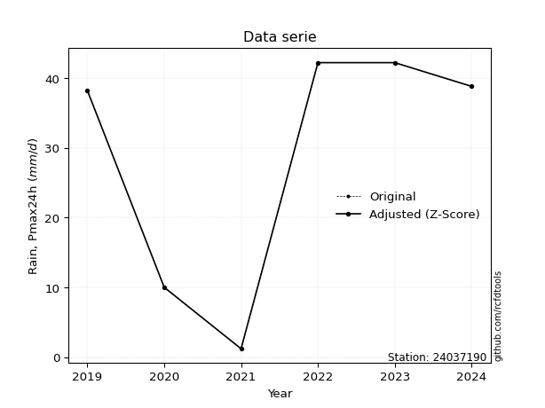</img>

</div>

> If Z-Score is active, values out of range or outliers are replaced with the station mean value.


### 4. Active continuous probability distributions from SciPy (45 of 104 available)

[scipy.stats](https://docs.scipy.org/doc/scipy/reference/stats.html) is a Python´s powerful submodule within the SciPy library for comprehensive statistical analysis, offering over 130 probability distributions (like Normal, Poisson), functions for descriptive stats (mean, variance), hypothesis testing (t-tests, chi-square), random variable generation, and statistical tests, making it essential for data science, modeling, and research. It provides tools to explore, model, and draw conclusions from data efficiently, working seamlessly with NumPy.

<div align="center">

|   id | p_dist             |   n_parameter | fit_method   | label                                                                       | active   | ref                                                                                                        |
|-----:|:-------------------|--------------:|:-------------|:----------------------------------------------------------------------------|:---------|:-----------------------------------------------------------------------------------------------------------|
|    0 | alpha              |             3 | MLE          | Alpha                                                                       | True     | [:mortar_board:](https://docs.scipy.org/doc/scipy/reference/generated/scipy.stats.alpha.html)              |
|    1 | betaprime          |             4 | MLE          | Beta prime                                                                  | True     | [:mortar_board:](https://docs.scipy.org/doc/scipy/reference/generated/scipy.stats.betaprime.html)          |
|    2 | chi2               |             3 | MLE          | Chi²                                                                        | True     | [:mortar_board:](https://docs.scipy.org/doc/scipy/reference/generated/scipy.stats.chi2.html)               |
|    3 | crystalball        |             4 | MLE          | Crystalball                                                                 | True     | [:mortar_board:](https://docs.scipy.org/doc/scipy/reference/generated/scipy.stats.crystalball.html)        |
|    4 | erlang             |             3 | MLE          | Erlang                                                                      | True     | [:mortar_board:](https://docs.scipy.org/doc/scipy/reference/generated/scipy.stats.erlang.html)             |
|    5 | expon              |             2 | MLE          | Exponential                                                                 | True     | [:mortar_board:](https://docs.scipy.org/doc/scipy/reference/generated/scipy.stats.expon.html)              |
|    6 | exponnorm          |             3 | MLE          | Exponentially modified Normal                                               | True     | [:mortar_board:](https://docs.scipy.org/doc/scipy/reference/generated/scipy.stats.exponnorm.html)          |
|    7 | f                  |             4 | MLE          | F                                                                           | True     | [:mortar_board:](https://docs.scipy.org/doc/scipy/reference/generated/scipy.stats.f.html)                  |
|    8 | fatiguelife        |             3 | MLE          | Fatigue-life (Birnbaum-Saunders)                                            | True     | [:mortar_board:](https://docs.scipy.org/doc/scipy/reference/generated/scipy.stats.fatiguelife.html)        |
|    9 | fisk               |             3 | MLE          | Fisk                                                                        | True     | [:mortar_board:](https://docs.scipy.org/doc/scipy/reference/generated/scipy.stats.fisk.html)               |
|   10 | gamma              |             3 | MLE          | Gamma                                                                       | True     | [:mortar_board:](https://docs.scipy.org/doc/scipy/reference/generated/scipy.stats.gamma.html)              |
|   11 | genexpon           |             5 | MLE          | Generalized exponential                                                     | True     | [:mortar_board:](https://docs.scipy.org/doc/scipy/reference/generated/scipy.stats.genexpon.html)           |
|   12 | genlogistic        |             3 | MLE          | Generalized logistic                                                        | True     | [:mortar_board:](https://docs.scipy.org/doc/scipy/reference/generated/scipy.stats.genlogistic.html)        |
|   13 | gibrat             |             2 | MM           | Gibrat                                                                      | True     | [:mortar_board:](https://docs.scipy.org/doc/scipy/reference/generated/scipy.stats.gibrat.html)             |
|   14 | gompertz           |             3 | MLE          | Gompertz (or truncated Gumbel)                                              | True     | [:mortar_board:](https://docs.scipy.org/doc/scipy/reference/generated/scipy.stats.gompertz.html)           |
|   15 | gumbel_l           |             2 | MM           | Gumbel Left Skew                                                            | True     | [:mortar_board:](https://docs.scipy.org/doc/scipy/reference/generated/scipy.stats.gumbel_l.html)           |
|   16 | gumbel_r           |             2 | MM           | Gumbel Right Skew                                                           | True     | [:mortar_board:](https://docs.scipy.org/doc/scipy/reference/generated/scipy.stats.gumbel_r.html)           |
|   17 | halflogistic       |             2 | MM           | Half-logistic                                                               | True     | [:mortar_board:](https://docs.scipy.org/doc/scipy/reference/generated/scipy.stats.halflogistic.html)       |
|   18 | halfnorm           |             2 | MM           | Half Normal                                                                 | True     | [:mortar_board:](https://docs.scipy.org/doc/scipy/reference/generated/scipy.stats.halfnorm.html)           |
|   19 | hypsecant          |             2 | MM           | hyperbolic secant                                                           | True     | [:mortar_board:](https://docs.scipy.org/doc/scipy/reference/generated/scipy.stats.hypsecant.html)          |
|   20 | invgamma           |             3 | MLE          | Inverted gamma                                                              | True     | [:mortar_board:](https://docs.scipy.org/doc/scipy/reference/generated/scipy.stats.invgamma.html)           |
|   21 | invgauss           |             3 | MLE          | Inverse Gaussian                                                            | True     | [:mortar_board:](https://docs.scipy.org/doc/scipy/reference/generated/scipy.stats.invgauss.html)           |
|   22 | invweibull         |             3 | MLE          | Inverted Weibull                                                            | True     | [:mortar_board:](https://docs.scipy.org/doc/scipy/reference/generated/scipy.stats.invweibull.html)         |
|   23 | johnsonsu          |             4 | MLE          | Johnson Su                                                                  | True     | [:mortar_board:](https://docs.scipy.org/doc/scipy/reference/generated/scipy.stats.johnsonsu.html)          |
|   24 | kstwobign          |             2 | MLE          | Limiting distribution of scaled Kolmogorov-Smirnov two-sided test statistic | True     | [:mortar_board:](https://docs.scipy.org/doc/scipy/reference/generated/scipy.stats.kstwobign.html)          |
|   25 | laplace            |             2 | MM           | Laplace                                                                     | True     | [:mortar_board:](https://docs.scipy.org/doc/scipy/reference/generated/scipy.stats.laplace.html)            |
|   26 | laplace_asymmetric |             3 | MLE          | Asymmetric Laplace                                                          | True     | [:mortar_board:](https://docs.scipy.org/doc/scipy/reference/generated/scipy.stats.laplace_asymmetric.html) |
|   27 | loggamma           |             3 | MLE          | Log gamma                                                                   | True     | [:mortar_board:](https://docs.scipy.org/doc/scipy/reference/generated/scipy.stats.loggamma.html)           |
|   28 | logistic           |             2 | MM           | Logistic (or Sech-squared)                                                  | True     | [:mortar_board:](https://docs.scipy.org/doc/scipy/reference/generated/scipy.stats.logistic.html)           |
|   29 | lognorm            |             3 | MLE          | Log Normal                                                                  | True     | [:mortar_board:](https://docs.scipy.org/doc/scipy/reference/generated/scipy.stats.lognorm.html)            |
|   30 | maxwell            |             2 | MM           | Maxwell                                                                     | True     | [:mortar_board:](https://docs.scipy.org/doc/scipy/reference/generated/scipy.stats.maxwell.html)            |
|   31 | mielke             |             4 | MLE          | Mielke Beta-Kappa / Dagum                                                   | True     | [:mortar_board:](https://docs.scipy.org/doc/scipy/reference/generated/scipy.stats.mielke.html)             |
|   32 | moyal              |             2 | MM           | Moyal                                                                       | True     | [:mortar_board:](https://docs.scipy.org/doc/scipy/reference/generated/scipy.stats.moyal.html)              |
|   33 | nakagami           |             3 | MLE          | Nakagami                                                                    | True     | [:mortar_board:](https://docs.scipy.org/doc/scipy/reference/generated/scipy.stats.nakagami.html)           |
|   34 | ncf                |             5 | MLE          | Non-central F distribution                                                  | True     | [:mortar_board:](https://docs.scipy.org/doc/scipy/reference/generated/scipy.stats.ncf.html)                |
|   35 | nct                |             4 | MLE          | Non-central Student’s t                                                     | True     | [:mortar_board:](https://docs.scipy.org/doc/scipy/reference/generated/scipy.stats.nct.html)                |
|   36 | norm               |             2 | MM           | Normal                                                                      | True     | [:mortar_board:](https://docs.scipy.org/doc/scipy/reference/generated/scipy.stats.norm.html)               |
|   37 | pareto             |             3 | MLE          | Pareto                                                                      | True     | [:mortar_board:](https://docs.scipy.org/doc/scipy/reference/generated/scipy.stats.pareto.html)             |
|   38 | pearson3           |             3 | MM           | Pearson type III                                                            | True     | [:mortar_board:](https://docs.scipy.org/doc/scipy/reference/generated/scipy.stats.pearson3.html)           |
|   39 | rayleigh           |             2 | MM           | Rayleigh                                                                    | True     | [:mortar_board:](https://docs.scipy.org/doc/scipy/reference/generated/scipy.stats.rayleigh.html)           |
|   40 | rice               |             3 | MLE          | Rice                                                                        | True     | [:mortar_board:](https://docs.scipy.org/doc/scipy/reference/generated/scipy.stats.rice.html)               |
|   41 | t                  |             3 | MLE          | Student’s t                                                                 | True     | [:mortar_board:](https://docs.scipy.org/doc/scipy/reference/generated/scipy.stats.t.html)                  |
|   42 | truncnorm          |             4 | MLE          | Truncated normal                                                            | True     | [:mortar_board:](https://docs.scipy.org/doc/scipy/reference/generated/scipy.stats.truncnorm.html)          |
|   43 | wald               |             2 | MM           | Wald                                                                        | True     | [:mortar_board:](https://docs.scipy.org/doc/scipy/reference/generated/scipy.stats.wald.html)               |
|   44 | weibull_min        |             3 | MLE          | Weibull minimum                                                             | True     | [:mortar_board:](https://docs.scipy.org/doc/scipy/reference/generated/scipy.stats.weibull_min.html)        |

</div>

> **n_parameter:** # arguments & localization & scale.
>
> **Fit methods:** (MLE) maximum likelihood, (MM) L-moments.
>
>**Inactive:** foldnorm, gennorm, norminvgauss, powernorm, powerlognorm, skewnorm, genextreme, anglit, arcsine, argus, beta, bradford, burr, burr12, cauchy, cosine, halfcauchy, foldcauchy, skewcauchy, wrapcauchy, dgamma, gengamma, exponweib, exponpow, truncexpon, gausshyper, genhalflogistic, genhyperbolic, geninvgauss, halfgennorm, johnsonsb, kappa4, kappa3, ksone, kstwo, loglaplace, levy, levy_l, levy_stable, ncx2, genpareto, truncpareto, lomax, powerlaw, rdist, rel_breitwigner, recipinvgauss, semicircular, studentized_range, trapezoid, triang, truncweibull_min, tukeylambda, uniform, loguniform, vonmises, vonmises_line, weibull_max, dweibull, 


## B. Probability distributions vs. Empirical distributions

A continuous probability distribution (CPD) describes probabilities for variables that can take any value within a range (like rain any time), unlike discrete variables with specific outcomes (like temperature). It uses a Probability Density Function (PDF), a curve where the total area under it equals 1, and the probability of the variable falling within an interval (a to b) is found by calculating the area under the curve between those points. A key feature is that the probability of hitting any single exact value is zero, so probabilities are always expressed for ranges, e.g., $P(a ≤ X ≤ b)$.

<div align="center">

Distributions parameters
|    |   station | p_dist                |   n |               loc |            scale | shape                  | shape1                 | shape2                 | shape3   |
|---:|----------:|:----------------------|----:|------------------:|-----------------:|:-----------------------|:-----------------------|:-----------------------|:---------|
|  0 |  24037190 | alpha                 |   7 |    -113.962       |    995.821       | 7.071691711193395      |                        |                        |          |
|  1 |  24037190 | betaprime             |   7 |    -535.688       |  36729.2         | 1249.3372479118248     | 81113.18185547553      |                        |          |
|  2 |  24037190 | chi2                  |   7 |    -141.621       |      0.786489    | 218.10548245695577     |                        |                        |          |
|  3 |  24037190 | crystalball           |   7 |      30.1714      |     15.7913      | 1939.5993829471413     | 370.26451556490724     |                        |          |
|  4 |  24037190 | erlang                |   7 |    -206.332       |      1.1723      | 201.47515063584814     |                        |                        |          |
|  5 |  24037190 | expon                 |   7 |       1.2         |     28.9714      |                        |                        |                        |          |
|  6 |  24037190 | exponnorm             |   7 |      30.1625      |     15.7914      | 0.0005698232186676924  |                        |                        |          |
|  7 |  24037190 | f                     |   7 |  -10180.3         |  10210.5         | 1275856.3061001506     | 2407837.9601260656     |                        |          |
|  8 |  24037190 | fatiguelife           |   7 |       1.2         |      1.59834e-05 | 1055.3916359614057     |                        |                        |          |
|  9 |  24037190 | fisk                  |   7 | -139212           | 139246           | 15446.75856226185      |                        |                        |          |
| 10 |  24037190 | gamma                 |   7 |    -191.691       |      1.18395     | 187.37166035521875     |                        |                        |          |
| 11 |  24037190 | genexpon              |   7 |       1.19999     |      1.72162     | 0.059457305252915926   | 1.0996526337958219e-07 | 1.8317732041490749     |          |
| 12 |  24037190 | genlogistic           |   7 |      42.2001      |      7.11187e-06 | 5.915556830783377e-07  |                        |                        |          |
| 13 |  24037190 | gibrat                |   7 |      18.1246      |      7.30676     |                        |                        |                        |          |
| 14 |  24037190 | gompertz              |   7 |      10           |      4.92305     | 0.002533237181533662   |                        |                        |          |
| 15 |  24037190 | gumbel_l              |   7 |      37.2784      |     12.3124      |                        |                        |                        |          |
| 16 |  24037190 | gumbel_r              |   7 |      23.0645      |     12.3124      |                        |                        |                        |          |
| 17 |  24037190 | halflogistic          |   7 |      11.4551      |     13.501       |                        |                        |                        |          |
| 18 |  24037190 | halfnorm              |   7 |       9.26996     |     26.1961      |                        |                        |                        |          |
| 19 |  24037190 | hypsecant             |   7 |      30.1714      |     10.053       |                        |                        |                        |          |
| 20 |  24037190 | invgamma              |   7 |    -182.34        |  33748.4         | 160.029570505432       |                        |                        |          |
| 21 |  24037190 | invgauss              |   7 |     -87.9142      |   5166.52        | 0.022822575343382653   |                        |                        |          |
| 22 |  24037190 | invweibull            |   7 |      -1.65932e+09 |      1.65932e+09 | 97311181.45145231      |                        |                        |          |
| 23 |  24037190 | johnsonsu             |   7 |      42.2         |      3.79769e-10 | 3.92819776376177       | 0.20845888390356376    |                        |          |
| 24 |  24037190 | kstwobign             |   7 |     -37.2926      |     76.7546      |                        |                        |                        |          |
| 25 |  24037190 | laplace               |   7 |      30.1714      |     11.1661      |                        |                        |                        |          |
| 26 |  24037190 | laplace_asymmetric    |   7 |      42.2         |      0.117682    | 101.97543863029551     |                        |                        |          |
| 27 |  24037190 | loggamma              |   7 |      42.2004      |      1.6321e-05  | 1.3538467366954646e-06 |                        |                        |          |
| 28 |  24037190 | logistic              |   7 |      30.1714      |      8.7062      |                        |                        |                        |          |
| 29 |  24037190 | lognorm               |   7 |       1.2         |      0.107957    | 13.815518442927623     |                        |                        |          |
| 30 |  24037190 | maxwell               |   7 |      -7.2473      |     23.4487      |                        |                        |                        |          |
| 31 |  24037190 | mielke                |   7 |      -5.02375e+08 |      5.02375e+08 | 41774994.41585094      | 181635827722.35544     |                        |          |
| 32 |  24037190 | moyal                 |   7 |      21.141       |      7.10858     |                        |                        |                        |          |
| 33 |  24037190 | nakagami              |   7 |       1.2         |     32.9272      | 0.3947831597839582     |                        |                        |          |
| 34 |  24037190 | ncf                   |   7 |       0.0275443   |      6.18468e-08 | 2.055877078614157e-08  | 16.23436579922052      | 9.677315445310896      |          |
| 35 |  24037190 | nct                   |   7 |   -1268.03        |     15.7678      | 1011385.428342307      | 82.33257534500865      |                        |          |
| 36 |  24037190 | norm                  |   7 |      30.1714      |     15.7913      |                        |                        |                        |          |
| 37 |  24037190 | pareto                |   7 |       1.17073     |      0.0292742   | 0.16804753813172438    |                        |                        |          |
| 38 |  24037190 | pearson3              |   7 |      30.1714      |     15.7913      | -0.9898449651001624    |                        |                        |          |
| 39 |  24037190 | rayleigh              |   7 |      -0.0382346   |     24.1038      |                        |                        |                        |          |
| 40 |  24037190 | rice                  |   7 |      -8.83848     |     17.3096      | 1.9776791353030132     |                        |                        |          |
| 41 |  24037190 | t                     |   7 |      30.1714      |     15.7916      | 39543039.03336852      |                        |                        |          |
| 42 |  24037190 | truncnorm             |   7 |       0.0299302   |      3.48979     | 0.3170068252002926     | 12.08383326222802      |                        |          |
| 43 |  24037190 | wald                  |   7 |      14.3802      |     15.7913      |                        |                        |                        |          |
| 44 |  24037190 | weibull_min           |   7 |      -1.78935e+07 |      1.78936e+07 | 1833983.8991877935     |                        |                        |          |
| 45 |  24037190 | logalpha              |   7 |     -30.9655      |    841.708       | 24.829829661058902     |                        |                        |          |
| 46 |  24037190 | logbetaprime          |   7 |     -32.092       |   3508.48        | 753.9479135251804      | 75401.73642508505      |                        |          |
| 47 |  24037190 | logchi2               |   7 |     -16.8548      |      0.0439011   | 452.45022455961225     |                        |                        |          |
| 48 |  24037190 | logcrystalball        |   7 |       2.98918     |      1.24216     | 420.09296770245214     | 1275.051070064943      |                        |          |
| 49 |  24037190 | logerlang             |   7 |     -18.4095      |      0.0796576   | 268.7942197845945      |                        |                        |          |
| 50 |  24037190 | logexpon              |   7 |       0.182322    |      2.80686     |                        |                        |                        |          |
| 51 |  24037190 | logexponnorm          |   7 |       2.9884      |      1.24216     | 0.0006351288615862376  |                        |                        |          |
| 52 |  24037190 | logf                  |   7 |   -1105.51        |   1108.5         | 1846107.335516789      | 10998917.22156363      |                        |          |
| 53 |  24037190 | logfatiguelife        |   7 |    -787.645       |    790.625       | 0.0015731166569902277  |                        |                        |          |
| 54 |  24037190 | logfisk               |   7 |      -1.20583e+08 |      1.20583e+08 | 193631383.13229573     |                        |                        |          |
| 55 |  24037190 | loggamma              |   7 |     -18.3189      |      0.0832435   | 255.59816658390662     |                        |                        |          |
| 56 |  24037190 | loggenexpon           |   7 |      -0.600267    |      0.0893144   | 2.6629890440469555e-07 | 3.232815838535453      | 0.00034338476946463325 |          |
| 57 |  24037190 | loggenlogistic        |   7 |       3.74246     |      2.88694e-06 | 3.829907001706708e-06  |                        |                        |          |
| 58 |  24037190 | loggibrat             |   7 |       2.04159     |      0.574748    |                        |                        |                        |          |
| 59 |  24037190 | loggompertz           |   7 |       0.182321    |      0.69077     | 0.00856864295124997    |                        |                        |          |
| 60 |  24037190 | loggumbel_l           |   7 |       3.54822     |      0.968509    |                        |                        |                        |          |
| 61 |  24037190 | loggumbel_r           |   7 |       2.43014     |      0.968509    |                        |                        |                        |          |
| 62 |  24037190 | loghalflogistic       |   7 |       1.51696     |      1.06199     |                        |                        |                        |          |
| 63 |  24037190 | loghalfnorm           |   7 |       1.34506     |      2.0606      |                        |                        |                        |          |
| 64 |  24037190 | loghypsecant          |   7 |       2.98918     |      0.790784    |                        |                        |                        |          |
| 65 |  24037190 | loginvgamma           |   7 |     -23.625       |  10632.9         | 400.7645410490181      |                        |                        |          |
| 66 |  24037190 | loginvgauss           |   7 |     -11.3795      |   1539.97        | 0.009334391919595137   |                        |                        |          |
| 67 |  24037190 | loginvweibull         |   7 | -135503           | 135505           | 89012.21948167296      |                        |                        |          |
| 68 |  24037190 | logjohnsonsu          |   7 |       3.74242     |      5.39862e-14 | 2.0235267037945306     | 0.15365511003185567    |                        |          |
| 69 |  24037190 | logkstwobign          |   7 |      -3.14158     |      7.00898     |                        |                        |                        |          |
| 70 |  24037190 | loglaplace            |   7 |       2.98918     |      0.878341    |                        |                        |                        |          |
| 71 |  24037190 | loglaplace_asymmetric |   7 |       3.74242     |      0.00567478  | 132.6303351902257      |                        |                        |          |
| 72 |  24037190 | logloggamma           |   7 |       3.74244     |      1.13349e-06 | 1.5016388064398046e-06 |                        |                        |          |
| 73 |  24037190 | loglogistic           |   7 |       2.98918     |      0.684839    |                        |                        |                        |          |
| 74 |  24037190 | loglognorm            |   7 |       0.182322    |      0.0117619   | 13.750984501736697     |                        |                        |          |
| 75 |  24037190 | logmaxwell            |   7 |       0.0457792   |      1.8445      |                        |                        |                        |          |
| 76 |  24037190 | logmielke             |   7 |      -5.73803e+07 |      5.73803e+07 | 80165599.85370848      | 10236321217.9276       |                        |          |
| 77 |  24037190 | logmoyal              |   7 |       2.27883     |      0.559169    |                        |                        |                        |          |
| 78 |  24037190 | lognakagami           |   7 |       0.182322    |      3.44993     | 0.2029183066156105     |                        |                        |          |
| 79 |  24037190 | logncf                |   7 |      -0.21751     |      1.15144e-07 | 7.312639560769987e-07  | 20.399573478691796     | 19.828215413707976     |          |
| 80 |  24037190 | lognct                |   7 |     -73.1801      |      1.17114     | 15330.94848545686      | 65.03502207346037      |                        |          |
| 81 |  24037190 | lognorm               |   7 |       2.98918     |      1.24216     |                        |                        |                        |          |
| 82 |  24037190 | logpareto             |   7 |       0.179236    |      0.0030855   | 0.1678054421805996     |                        |                        |          |
| 83 |  24037190 | logpearson3           |   7 |       2.98918     |      1.24217     | -1.5437293064318847    |                        |                        |          |
| 84 |  24037190 | lograyleigh           |   7 |       0.612875    |      1.89602     |                        |                        |                        |          |
| 85 |  24037190 | logrice               |   7 |    -854.262       |      1.24216     | 690.1267268297729      |                        |                        |          |
| 86 |  24037190 | logt                  |   7 |       3.6545      |      0.00807576  | 0.30067909915933033    |                        |                        |          |
| 87 |  24037190 | logtruncnorm          |   7 |      -0.347065    |      3.47966     | 0.15213731844094758    | 1.1752545259849718     |                        |          |
| 88 |  24037190 | logwald               |   7 |       1.74701     |      1.24216     |                        |                        |                        |          |
| 89 |  24037190 | logweibull_min        |   7 |      -4.25934e+08 |      4.25934e+08 | 597205562.1059119      |                        |                        |          |

</div>

> **loc** (Location parameter): This shifts the distribution along the x-axis. For many common distributions, like the normal (Gaussian) distribution, loc represents the mean $μ$. For others, like the uniform distribution, it might represent the minimum value, or for the beta distribution, the left end of the support interval.
>
> **scale** (Scale parameter): This determines the width or spread of the distribution. For the normal distribution, scale represents the standard deviation $σ$. For a uniform distribution, it defines the length of the interval (from $loc$ to $loc + scale$).
>
> **shape** (Shape parameters): Refers to parameters that define the specific form of a probability distribution, distinct from its location (loc) and scale (scale). These parameters are required arguments for most distribution functions. For example, a normal (Gaussian) distribution is fully defined by its location (mean) and scale (standard deviation), so it has no specific shape parameters beyond loc and scale. However, other distributions have intrinsic properties that need specification, as Gamma distribution that takes a shape parameter, often named $a$ or $alpha$.


### 0. Cumulative distribution values - CDF (90 evaluated)

> Ordered by x ascending and calculating $log(f(x))$ separately. 

|   id |   Station |   date |    x |   count |    mean |     std |    zscore |   Value_initial |   station |   m |     alpha |   alpha_pdf |   betaprime |   betaprime_pdf |      chi2 |   chi2_pdf |   crystalball |   crystalball_pdf |   erlang |   erlang_pdf |    expon |   expon_pdf |   exponnorm |   exponnorm_pdf |         f |      f_pdf |   fatiguelife |   fatiguelife_pdf |      fisk |   fisk_pdf |     gamma |   gamma_pdf |    genexpon |   genexpon_pdf |   genlogistic |   genlogistic_pdf |   gibrat |   gibrat_pdf |   gompertz |   gompertz_pdf |   gumbel_l |   gumbel_l_pdf |   gumbel_r |   gumbel_r_pdf |   halflogistic |   halflogistic_pdf |   halfnorm |   halfnorm_pdf |   hypsecant |   hypsecant_pdf |   invgamma |   invgamma_pdf |   invgauss |   invgauss_pdf |   invweibull |   invweibull_pdf |   johnsonsu |    johnsonsu_pdf |   kstwobign |   kstwobign_pdf |   laplace |   laplace_pdf |   laplace_asymmetric |   laplace_asymmetric_pdf |   loggamma |   loggamma_pdf |   logistic |   logistic_pdf |   lognorm |   lognorm_pdf |   maxwell |   maxwell_pdf |    mielke |   mielke_pdf |       moyal |   moyal_pdf |    nakagami |   nakagami_pdf |       ncf |    ncf_pdf |       nct |    nct_pdf |      norm |   norm_pdf |   pareto |   pareto_pdf |   pearson3 |   pearson3_pdf |   rayleigh |   rayleigh_pdf |      rice |   rice_pdf |         t |      t_pdf |   truncnorm |   truncnorm_pdf |     wald |   wald_pdf |   weibull_min |   weibull_min_pdf |   logalpha |   logalpha_pdf |   logbetaprime |   logbetaprime_pdf |   logchi2 |   logchi2_pdf |   logcrystalball |   logcrystalball_pdf |   logerlang |   logerlang_pdf |   logexpon |   logexpon_pdf |   logexponnorm |   logexponnorm_pdf |     logf |   logf_pdf |   logfatiguelife |   logfatiguelife_pdf |    logfisk |   logfisk_pdf |   loggenexpon |   loggenexpon_pdf |   loggenlogistic |   loggenlogistic_pdf |   loggibrat |   loggibrat_pdf |   loggompertz |   loggompertz_pdf |   loggumbel_l |   loggumbel_l_pdf |   loggumbel_r |   loggumbel_r_pdf |   loghalflogistic |   loghalflogistic_pdf |   loghalfnorm |   loghalfnorm_pdf |   loghypsecant |   loghypsecant_pdf |   loginvgamma |   loginvgamma_pdf |   loginvgauss |   loginvgauss_pdf |   loginvweibull |   loginvweibull_pdf |   logjohnsonsu |   logjohnsonsu_pdf |   logkstwobign |   logkstwobign_pdf |   loglaplace |   loglaplace_pdf |   loglaplace_asymmetric |   loglaplace_asymmetric_pdf |   logloggamma |   logloggamma_pdf |   loglogistic |   loglogistic_pdf |   loglognorm |   loglognorm_pdf |   logmaxwell |   logmaxwell_pdf |   logmielke |   logmielke_pdf |   logmoyal |   logmoyal_pdf |   lognakagami |   lognakagami_pdf |     logncf |   logncf_pdf |    lognct |   lognct_pdf |   logpareto |   logpareto_pdf |   logpearson3 |   logpearson3_pdf |   lograyleigh |   lograyleigh_pdf |   logrice |   logrice_pdf |      logt |    logt_pdf |   logtruncnorm |   logtruncnorm_pdf |   logwald |   logwald_pdf |   logweibull_min |   logweibull_min_pdf |
|-----:|----------:|-------:|-----:|--------:|--------:|--------:|----------:|----------------:|----------:|----:|----------:|------------:|------------:|----------------:|----------:|-----------:|--------------:|------------------:|---------:|-------------:|---------:|------------:|------------:|----------------:|----------:|-----------:|--------------:|------------------:|----------:|-----------:|----------:|------------:|------------:|---------------:|--------------:|------------------:|---------:|-------------:|-----------:|---------------:|-----------:|---------------:|-----------:|---------------:|---------------:|-------------------:|-----------:|---------------:|------------:|----------------:|-----------:|---------------:|-----------:|---------------:|-------------:|-----------------:|------------:|-----------------:|------------:|----------------:|----------:|--------------:|---------------------:|-------------------------:|-----------:|---------------:|-----------:|---------------:|----------:|--------------:|----------:|--------------:|----------:|-------------:|------------:|------------:|------------:|---------------:|----------:|-----------:|----------:|-----------:|----------:|-----------:|---------:|-------------:|-----------:|---------------:|-----------:|---------------:|----------:|-----------:|----------:|-----------:|------------:|----------------:|---------:|-----------:|--------------:|------------------:|-----------:|---------------:|---------------:|-------------------:|----------:|--------------:|-----------------:|---------------------:|------------:|----------------:|-----------:|---------------:|---------------:|-------------------:|---------:|-----------:|-----------------:|---------------------:|-----------:|--------------:|--------------:|------------------:|-----------------:|---------------------:|------------:|----------------:|--------------:|------------------:|--------------:|------------------:|--------------:|------------------:|------------------:|----------------------:|--------------:|------------------:|---------------:|-------------------:|--------------:|------------------:|--------------:|------------------:|----------------:|--------------------:|---------------:|-------------------:|---------------:|-------------------:|-------------:|-----------------:|------------------------:|----------------------------:|--------------:|------------------:|--------------:|------------------:|-------------:|-----------------:|-------------:|-----------------:|------------:|----------------:|-----------:|---------------:|--------------:|------------------:|-----------:|-------------:|----------:|-------------:|------------:|----------------:|--------------:|------------------:|--------------:|------------------:|----------:|--------------:|----------:|------------:|---------------:|-------------------:|----------:|--------------:|-----------------:|---------------------:|
|    0 |  24037190 |   2021 |  1.2 |       7 | 30.1714 | 17.0565 | -1.69855  |             1.2 |  24037190 |   1 | 0.0575758 |  0.00865969 |   0.0351418 |      0.00498039 | 0.0340672 | 0.00520204 |     0.0332791 |        0.00469452 | 0.038075 |   0.00542475 | 0        |  0.0345168  |   0.0332792 |      0.00469451 | 0.0332004 | 0.00469118 |     0.0207148 |       1.47383e+10 | 0.0281581 | 0.00303636 | 0.0324615 |  0.00492124 | 2.18305e-07 |     0.0345357  |       0       |        0.0027474  | 0        |    0         | 0          |    0           |  0.0519843 |     0.00411041 | 0.00272563 |     0.00130721 |       0        |          0         |  0         |      0         |   0.035633  |      0.0035371  |  0.0340162 |     0.00545097 |  0.0367303 |     0.00604782 |    0.0364379 |       0.00707776 |   0.0652416 |      0.000646526 |   0.0370235 |      0.00847433 | 0.0373386 |    0.00334391 |            0.0328246 |               0.00273523 |  0.0152765 |      0.0317431 |  0.0346337 |     0.00384028 | 0.0119213 |     0.0250016 | 0.0119611 |    0.00413846 | 0.0330085 |   0.00274482 | 4.78786e-05 |  5.8716e-05 | 2.16131e-14 |     76.8538    | 0.0165441 | 0.00834594 | 0.0332955 | 0.00469625 | 0.0332791 | 0.00469452 | 0        |   5.74046    |  0.0527704 |     0.00445277 | 0.00131861 |     0.00212842 | 0.0255929 | 0.00543627 | 0.0332817 | 0.00469474 |   0.0184058 |     0.287708    | 0        | 0          |     0.0251377 |        0.00254381 |  0.0141468 |      0.0312406 |      0.0126737 |          0.0269804 | 0.0129299 |      0.027963 |        0.0119213 |            0.0250016 |   0.0125029 |       0.0272407 |   0        |       0.35627  |      0.0119211 |          0.0250012 | 0.01204  |  0.0251711 |        0.0121048 |            0.0253927 | 0.00703574 |     0.0112185 |     0.0416805 |          0.104213 |         0        |            0.0117918 |    0        |        0        |   9.00443e-10 |         0.0124045 |     0.0304773 |         0.0309838 |   3.77356e-05 |        0.00039683 |          0        |              0        |      0        |          0        |      0.0182915 |          0.0231181 |      0.013032 |         0.0292535 |     0.0134522 |         0.0310876 |       0.0167022 |           0.0448987 |     0.00147808 |        0.0002078   |      0.0219146 |          0.0657404 |    0.0204702 |        0.0233056 |              0.00882511 |                   0.0117254 |    0.00894738 |         0.0118534 |     0.0163255 |         0.0234493 |   0.00715683 |      5.20656e+13 |  0.000107713 |         0.002364 |  0.00672583 |      0.00939661 | 7.0946e-11 |    2.75644e-09 |   9.10597e-08 |       1.33146e+09 | 0.00440681 |    0.0259161 | 0.0121015 |    0.0254005 |    0        |      54.3852    |     0.0354585 |         0.0324676 |      0        |          0        | 0.0119213 |     0.0250016 | 0.0564228 |  0.00488602 |    2.90535e-08 |           0.354609 |  0        |      0        |       0.00989873 |            0.0138102 |
|    1 |  24037190 |   2020 | 10   |       7 | 30.1714 | 17.0565 | -1.18262  |            10   |  24037190 |   2 | 0.168126  |  0.0162827  |   0.106038  |      0.0116356  | 0.109241  | 0.0123693  |     0.100735  |        0.0111731  | 0.114131 |   0.0123026  | 0.261953 |  0.025475   |   0.100734  |      0.0111731  | 0.100631  | 0.0111699  |     0.758991  |       0.0124468   | 0.0714274 | 0.00735883 | 0.104116  |  0.0118836  | 0.262077    |     0.0254848  |       0       |        0.00571233 | 0        |    0         | 3.7021e-10 |    0.000514567 |  0.103357  |     0.00794493 | 0.055604   |     0.0130492  |       0        |          0         |  0.0222328 |      0.0304463 |   0.0850887 |      0.00836353 |  0.113337  |     0.013029   |  0.122938  |     0.0138558  |    0.138501  |       0.0160571  |   0.0718933 |      0.000887237 |   0.157801  |      0.0183493  | 0.0821153 |    0.00735396 |            0.0683383 |               0.00569455 |  0.31678   |      0.273184  |  0.0897325 |     0.00938189 | 0.29022   |     0.275669  | 0.0902061 |    0.0140458  | 0.0686161 |   0.00570577 | 0.0285678   |  0.0111831  | 0.273225    |      0.0240233 | 0.1459    | 0.0196011  | 0.100768  | 0.0111749  | 0.100735  | 0.0111731  | 0.616879 |   0.00729194 |  0.108146  |     0.00848442 | 0.083065   |     0.0158425  | 0.102895  | 0.0124963  | 0.100739  | 0.0111733  |   0.994306  |     0.00514049  | 0        | 0          |     0.0608137 |        0.00603956 |  0.318841  |      0.271554  |      0.299228  |          0.274088  | 0.30201   |      0.270498 |        0.29022   |            0.275669  |   0.301137  |       0.272637  |   0.530171 |       0.167386 |      0.290218  |          0.275668  | 0.290026 |  0.274676  |        0.292778  |            0.276685  | 0.175813   |     0.232684  |     0.442426  |          0.22399  |         0        |            0.196413  |    0.214934 |        1.11931  |   0.161306    |         0.223983  |     0.241443  |         0.216433  |   0.319573    |        0.376413   |          0.353888 |              0.411851 |      0.357842 |          0.347582 |      0.252969  |          0.28727   |      0.315843 |         0.276698  |     0.321468  |         0.271451  |       0.361887  |           0.241625  |     0.0023045  |        0.000769389 |      0.417595  |          0.236993  |    0.228815  |        0.260508  |              0.147625   |                   0.19614   |    0.148452   |         0.196667  |     0.268438  |         0.286752  |   0.647192   |      0.0127409   |  0.317044    |         0.306348 |  0.130081   |      0.181736   | 0.327588   |    0.43254     |   0.639068    |       0.114751    | 0.371685   |    0.254436  | 0.291971  |    0.275443  |    0.665944 |       0.0264    |     0.22916   |         0.190152  |      0.327739 |          0.315984 | 0.29022   |     0.275669  | 0.0749252 |  0.016664   |    0.676957    |           0.268452 |  0.316806 |      0.763052 |       0.176719   |            0.224469  |
|    2 |  24037190 |   2019 | 38.2 |       7 | 30.1714 | 17.0565 |  0.470703 |            38.2 |  24037190 |   3 | 0.700974  |  0.0149322  |   0.696142  |      0.0214727  | 0.701326  | 0.0204665  |     0.69442   |        0.0222005  | 0.698136 |   0.0204722  | 0.721161 |  0.00962462 |   0.694416  |      0.0222005  | 0.693726  | 0.022178   |     0.925296  |       0.00274939  | 0.637265  | 0.0256419  | 0.696805  |  0.0210478  | 0.721357    |     0.00962315 |       0       |        0.0596364  | 0.843919 |    0.0119242 | 0.539844   |    0.0727871   |  0.659632  |     0.029793   | 0.746394   |     0.0177318  |       0.757567 |          0.01578   |  0.730565  |      0.0165526 |   0.73083   |      0.0236961  |  0.703823  |     0.0195318  |  0.699024  |     0.0183371  |    0.68508   |       0.0151956  |   0.152197  |      0.0122691   |   0.711957  |      0.0146304  | 0.756383  |    0.0218175  |            0.716475  |               0.059703   |  0.701931  |      0.255027  |  0.715484  |     0.0233818  | 0.700634  |     0.279641  | 0.711008  |    0.0195387  | 0.715869  |   0.059528   | 0.763241    |  0.0161554  | 0.750827    |      0.0110953 | 0.680455  | 0.0131275  | 0.69439   | 0.0221964  | 0.69442   | 0.0222005  | 0.698903 |   0.00136645 |  0.65144   |     0.0282976  | 0.715871   |     0.0187     | 0.697719  | 0.0210913  | 0.694418  | 0.0222002  |   1         |     3.20363e-27 | 0.812441 | 0.012517   |     0.676741  |        0.0374161  |  0.694575  |      0.24631   |      0.697614  |          0.268392  | 0.690602  |      0.261355 |        0.700634  |            0.279641  |   0.693619  |       0.263496  |   0.708548 |       0.103836 |      0.700632  |          0.279642  | 0.69903  |  0.279138  |        0.702746  |            0.278153  | 0.6473     |     0.366608  |     0.712334  |          0.168483 |         0        |            1.1624    |    0.847226 |        0.147396 |   0.720697    |         0.519178  |     0.668002  |         0.377972  |   0.75134     |        0.22179    |          0.761968 |              0.197462 |      0.735193 |          0.207938 |      0.737431  |          0.295642  |      0.701539 |         0.252344  |     0.693176  |         0.242317  |       0.656109  |           0.181631  |     0.00770268 |        0.0327128   |      0.694062  |          0.167163  |    0.762442  |        0.270463  |              0.876017   |                   1.16391   |    0.876385   |         1.16102   |     0.722013  |         0.293077  |   0.660334   |      0.00769715  |  0.716472    |         0.245679 |  0.846081   |      1.18205    | 0.767744   |    0.201712    |   0.763883    |       0.0755035   | 0.666463   |    0.174037  | 0.700272  |    0.277618  |    0.692277 |       0.0149086 |     0.63771   |         0.424538  |      0.721101 |          0.235071 | 0.700633  |     0.279641  | 0.309191  |  7.3876     |    0.98179     |           0.185899 |  0.815922 |      0.155561 |       0.720103   |            0.499715  |
|    3 |  24037190 |   2025 | 38.6 |       7 | 30.1714 | 17.0565 |  0.494155 |            38.6 |  24037190 |   4 | 0.706904  |  0.0147181  |   0.704675  |      0.0211873  | 0.709455  | 0.0201778  |     0.703242  |        0.0219094  | 0.70627  |   0.0201967  | 0.724984 |  0.00949265 |   0.703239  |      0.0219094  | 0.70254   | 0.0218881  |     0.926387  |       0.0027041   | 0.647458  | 0.0253199  | 0.705166  |  0.0207582  | 0.72518     |     0.00949113 |       0       |        0.061654   | 0.848595 |    0.0114582 | 0.569197   |    0.073912    |  0.671532  |     0.0297008  | 0.753406   |     0.0173262  |       0.763808 |          0.0154284 |  0.73713   |      0.0162739 |   0.740183  |      0.0230689  |  0.711579  |     0.0192458  |  0.706307  |     0.0180766  |    0.691114  |       0.014974   |   0.157426  |      0.01394     |   0.717767  |      0.0144192  | 0.764956  |    0.0210498  |            0.740758  |               0.0617265  |  0.704581  |      0.253906  |  0.724743  |     0.0229136  | 0.703541  |     0.2784    | 0.718763  |    0.0192347  | 0.74008   |   0.0615413  | 0.769622    |  0.0157462  | 0.755236    |      0.0109509 | 0.685668  | 0.0129337  | 0.70321   | 0.0219055  | 0.703242  | 0.0219094  | 0.699446 |   0.00134941 |  0.662755  |     0.0282723  | 0.723292   |     0.0184021  | 0.7061    | 0.020811   | 0.70324   | 0.0219091  |   1         |     9.08505e-28 | 0.817368 | 0.0121207  |     0.691663  |        0.0371825  |  0.697135  |      0.24524   |      0.700403  |          0.26722   | 0.693319  |      0.260257 |        0.703541  |            0.2784    |   0.696358  |       0.262365  |   0.709627 |       0.103451 |      0.703538  |          0.278401  | 0.701931 |  0.277913  |        0.705637  |            0.276904  | 0.651109   |     0.364783  |     0.714086  |          0.167865 |         0        |            1.17857   |    0.848751 |        0.14547  |   0.726093    |         0.516883  |     0.671937  |         0.377531  |   0.753642    |        0.220089   |          0.764017 |              0.19599  |      0.737353 |          0.206767 |      0.740497  |          0.292997  |      0.704161 |         0.2512    |     0.695695  |         0.241267  |       0.657997  |           0.180911  |     0.0080701  |        0.0380628   |      0.695799  |          0.1665    |    0.765242  |        0.267274  |              0.888225   |                   1.18013   |    0.888563   |         1.17716   |     0.725055  |         0.29109   |   0.660414   |      0.00767335  |  0.719025    |         0.244393 |  0.858484   |      1.19938    | 0.769836   |    0.200003    |   0.764669    |       0.075276    | 0.668272   |    0.173267  | 0.703158  |    0.276389  |    0.692432 |       0.0148564 |     0.64214   |         0.425996  |      0.723543 |          0.233814 | 0.70354   |     0.2784    | 0.465154  | 27.0428     |    0.983723    |           0.185261 |  0.817534 |      0.153918 |       0.725298   |            0.497656  |
|    4 |  24037190 |   2024 | 38.8 |       7 | 30.1714 | 17.0565 |  0.50588  |            38.8 |  24037190 |   5 | 0.709837  |  0.0146109  |   0.708898  |      0.0210414  | 0.713476  | 0.020031   |     0.707609  |        0.02176    | 0.710295 |   0.0200564  | 0.726876 |  0.00942735 |   0.707606  |      0.02176    | 0.706902  | 0.0217394  |     0.926925  |       0.0026818   | 0.652505  | 0.0251519  | 0.709303  |  0.0206106  | 0.727072    |     0.0094258  |       0       |        0.0626882  | 0.850864 |    0.0112337 | 0.584022   |    0.0743275   |  0.677466  |     0.0296418  | 0.756851   |     0.017125   |       0.766877 |          0.0152544 |  0.740371  |      0.0161349 |   0.744765  |      0.0227543  |  0.715414  |     0.0191009  |  0.709909  |     0.0179451  |    0.694098  |       0.0148633  |   0.160311  |      0.0149368   |   0.72064   |      0.0143138  | 0.769128  |    0.0206761  |            0.753207  |               0.0627638  |  0.705892  |      0.253346  |  0.729302  |     0.0226759  | 0.704978  |     0.277779  | 0.722595  |    0.0190813  | 0.752492  |   0.0625734  | 0.772751    |  0.0155448  | 0.757419    |      0.010879  | 0.688245  | 0.0128374  | 0.707577  | 0.0217562  | 0.707609  | 0.02176    | 0.699715 |   0.00134103 |  0.668408  |     0.0282503  | 0.726957   |     0.0182523  | 0.710247  | 0.0206678  | 0.707607  | 0.0217597  |   1         |     4.81426e-28 | 0.819773 | 0.0119283  |     0.699086  |        0.037039   |  0.698401  |      0.244707  |      0.701783  |          0.266634  | 0.694662  |      0.259708 |        0.704978  |            0.277779  |   0.697712  |       0.261799  |   0.710161 |       0.103261 |      0.704975  |          0.27778   | 0.703366 |  0.277301  |        0.707067  |            0.276279  | 0.652992   |     0.363863  |     0.714953  |          0.167558 |         0        |            1.18668   |    0.849501 |        0.144527 |   0.728761    |         0.515692  |     0.673887  |         0.377295  |   0.754777    |        0.219248   |          0.765028 |              0.195262 |      0.73842  |          0.206186 |      0.742008  |          0.291684  |      0.705458 |         0.250629  |     0.69694   |         0.240744  |       0.658931  |           0.180554  |     0.00827499 |        0.0413045   |      0.696659  |          0.166171  |    0.766619  |        0.265706  |              0.894345   |                   1.18826   |    0.894668   |         1.18524   |     0.726557  |         0.2901    |   0.660454   |      0.0076616   |  0.720286    |         0.243754 |  0.864705   |      1.20807    | 0.770867   |    0.199159    |   0.765057    |       0.0751635   | 0.669166   |    0.172885  | 0.704585  |    0.275774  |    0.692509 |       0.0148307 |     0.644343  |         0.426708  |      0.72475  |          0.233189 | 0.704977  |     0.277779  | 0.597484  | 19.5027     |    0.98468     |           0.184945 |  0.818327 |      0.15311  |       0.727867   |            0.496587  |
|    5 |  24037190 |   2022 | 42.2 |       7 | 30.1714 | 17.0565 |  0.705217 |            42.2 |  24037190 |   6 | 0.756421  |  0.0127969  |   0.775888  |      0.0182886  | 0.777097  | 0.0173406  |     0.776887  |        0.0189016  | 0.774169 |   0.0174573  | 0.75712  |  0.00838344 |   0.776884  |      0.0189017  | 0.77613   | 0.0188933  |     0.935436  |       0.0023343   | 0.732475  | 0.0217363  | 0.774829  |  0.017871   | 0.757309    |     0.00838151 |       0.99999 |        0.0831778  | 0.883446 |    0.0081395 | 0.826635   |    0.0617984   |  0.774948  |     0.0272609  | 0.809477   |     0.0138962  |       0.813948 |          0.0124987 |  0.791268  |      0.0138219 |   0.813141  |      0.017538   |  0.776001  |     0.0165042  |  0.767008  |     0.0156207  |    0.74146   |       0.0130073  |   0.999827  | 131034           |   0.766294  |      0.0125531  | 0.829732  |    0.0152486  |            0.999903  |               0.0833207  |  0.726782  |      0.243939  |  0.79925   |     0.0184294  | 0.727874  |     0.267229  | 0.782915  |    0.0163779  | 0.998362  |   0.082952   | 0.820148    |  0.0124339  | 0.792371    |      0.0096921 | 0.729186  | 0.0112678  | 0.776844  | 0.0188991  | 0.776887  | 0.0189016  | 0.704049 |   0.00121216 |  0.76262   |     0.0268275  | 0.784621   |     0.015658   | 0.776079  | 0.0179879  | 0.776884  | 0.0189014  |   1         |     5.9667e-33  | 0.855378 | 0.00916367 |     0.817611  |        0.0318096  |  0.718585  |      0.23578   |      0.723769  |          0.256734  | 0.716093  |      0.250451 |        0.727874  |            0.267229  |   0.719308  |       0.252263  |   0.718707 |       0.100216 |      0.727872  |          0.26723   | 0.726227 |  0.266883  |        0.729834  |            0.265672  | 0.682894   |     0.347735  |     0.728817  |          0.162526 |         0.999953 |            1.32656   |    0.861026 |        0.13021  |   0.771124    |         0.491416  |     0.70537   |         0.371755  |   0.772626    |        0.205787   |          0.78094  |              0.18368  |      0.755345 |          0.196799 |      0.765612  |          0.270331  |      0.726113 |         0.241075  |     0.716799  |         0.232013  |       0.673853  |           0.174731  |     0.975937   |        1.53763e+11 |      0.710393  |          0.160834  |    0.787905  |        0.241473  |              0.999943   |                   1.32857   |    0.999979   |         1.32476   |     0.750238  |         0.273613  |   0.661089   |      0.00747545  |  0.74032     |         0.2332   |  0.972167   |      1.32126    | 0.787032   |    0.185844    |   0.771295    |       0.0733617   | 0.683429   |    0.166708  | 0.727317  |    0.265337  |    0.693738 |       0.0144232 |     0.68064   |         0.437118  |      0.743909 |          0.222942 | 0.727873  |     0.267229  | 0.829628  |  0.581816   |    1           |           0.179824 |  0.830657 |      0.140683 |       0.768723   |            0.474785  |
|    6 |  24037190 |   2023 | 42.2 |       7 | 30.1714 | 17.0565 |  0.705217 |            42.2 |  24037190 |   7 | 0.756421  |  0.0127969  |   0.775888  |      0.0182886  | 0.777097  | 0.0173406  |     0.776887  |        0.0189016  | 0.774169 |   0.0174573  | 0.75712  |  0.00838344 |   0.776884  |      0.0189017  | 0.77613   | 0.0188933  |     0.935436  |       0.0023343   | 0.732475  | 0.0217363  | 0.774829  |  0.017871   | 0.757309    |     0.00838151 |       0.99999 |        0.0831778  | 0.883446 |    0.0081395 | 0.826635   |    0.0617984   |  0.774948  |     0.0272609  | 0.809477   |     0.0138962  |       0.813948 |          0.0124987 |  0.791268  |      0.0138219 |   0.813141  |      0.017538   |  0.776001  |     0.0165042  |  0.767008  |     0.0156207  |    0.74146   |       0.0130073  |   0.999827  | 131034           |   0.766294  |      0.0125531  | 0.829732  |    0.0152486  |            0.999903  |               0.0833207  |  0.726782  |      0.243939  |  0.79925   |     0.0184294  | 0.727874  |     0.267229  | 0.782915  |    0.0163779  | 0.998362  |   0.082952   | 0.820148    |  0.0124339  | 0.792371    |      0.0096921 | 0.729186  | 0.0112678  | 0.776844  | 0.0188991  | 0.776887  | 0.0189016  | 0.704049 |   0.00121216 |  0.76262   |     0.0268275  | 0.784621   |     0.015658   | 0.776079  | 0.0179879  | 0.776884  | 0.0189014  |   1         |     5.9667e-33  | 0.855378 | 0.00916367 |     0.817611  |        0.0318096  |  0.718585  |      0.23578   |      0.723769  |          0.256734  | 0.716093  |      0.250451 |        0.727874  |            0.267229  |   0.719308  |       0.252263  |   0.718707 |       0.100216 |      0.727872  |          0.26723   | 0.726227 |  0.266883  |        0.729834  |            0.265672  | 0.682894   |     0.347735  |     0.728817  |          0.162526 |         0.999953 |            1.32656   |    0.861026 |        0.13021  |   0.771124    |         0.491416  |     0.70537   |         0.371755  |   0.772626    |        0.205787   |          0.78094  |              0.18368  |      0.755345 |          0.196799 |      0.765612  |          0.270331  |      0.726113 |         0.241075  |     0.716799  |         0.232013  |       0.673853  |           0.174731  |     0.975937   |        1.53763e+11 |      0.710393  |          0.160834  |    0.787905  |        0.241473  |              0.999943   |                   1.32857   |    0.999979   |         1.32476   |     0.750238  |         0.273613  |   0.661089   |      0.00747545  |  0.74032     |         0.2332   |  0.972167   |      1.32126    | 0.787032   |    0.185844    |   0.771295    |       0.0733617   | 0.683429   |    0.166708  | 0.727317  |    0.265337  |    0.693738 |       0.0144232 |     0.68064   |         0.437118  |      0.743909 |          0.222942 | 0.727873  |     0.267229  | 0.829628  |  0.581816   |    1           |           0.179824 |  0.830657 |      0.140683 |       0.768723   |            0.474785  |

An Empirical Distribution Function (EDF) is a step-function estimate of a true cumulative distribution function (CDF) based on observed sample data, representing the proportion of data points less than or equal to a given value. It is calculated by ordering your data and jumping up by $1/n$ (where $n$ is sample size) at each unique data point, allowing analysis without assuming an underlying population distribution, and it gets closer to the true CDF as the sample size grows.


### 1. Empirical - EDF California (1923)

California´s estimates the true probability distribution of water-related data (like rainfall, streamflow) using observed samples, crucial for risk assessment.

<div align="center">


$P=m/n$


</div>


**1.1. Empirical values**

<div align="center">

|                | 0                   | 1                  | 2                   | 3                  | 4                  | 5                  | 6              |
|:---------------|:--------------------|:-------------------|:--------------------|:-------------------|:-------------------|:-------------------|:---------------|
| date           | 2021                | 2020               | 2019                | 2025               | 2024               | 2022               | 2023           |
| x              | 1.2                 | 10.0               | 38.2                | 38.6               | 38.8               | 42.2               | 42.2           |
| m              | 1                   | 2                  | 3                   | 4                  | 5                  | 6                  | 7              |
| empirical_dist | edf_california      | edf_california     | edf_california      | edf_california     | edf_california     | edf_california     | edf_california |
| empirical      | 0.14285714285714285 | 0.2857142857142857 | 0.42857142857142855 | 0.5714285714285714 | 0.7142857142857143 | 0.8571428571428571 | 1.0            |
| empirical_tr   | 1.1666666666666665  | 1.4                | 1.75                | 2.333333333333333  | 3.5                | 6.999999999999997  | inf            |

</div>


**1.2. Kolmogorov-Smirnov fit test (sorted by Δ)**


<div align="center">

|                | 0                   | 1                   | 2                   | 3                   | 4                   | 5                   | 6                   | 7                   | 8                   | 9                   | 10                  | 11                  | 12                  | 13                  | 14                  | 15                  | 16                  | 17                  | 18                  | 19                  | 20                  | 21                  | 22                  | 23                  | 24                  | 25                  | 26                  | 27                  | 28                  | 29                  | 30                  | 31                  | 32                  | 33                  | 34                  | 35                  | 36                  | 37                  | 38                  | 39                  | 40                  | 41                  | 42                  | 43                  | 44                  | 45                  | 46                  | 47                  | 48                  | 49                  | 50                  | 51                  | 52                  | 53                  | 54                  | 55                  | 56                  | 57                  | 58                  | 59                  | 60                  | 61                  | 62                  | 63                  | 64                  | 65                  | 66                  | 67                  | 68                  | 69                  | 70                  | 71                  | 72                  | 73                  | 74                  | 75                  | 76                  | 77                  | 78                  | 79                  | 80                  | 81                    | 82                  | 83                  | 84                  | 85                  | 86                  | 87                  | 88                  | 89                  |
|:---------------|:--------------------|:--------------------|:--------------------|:--------------------|:--------------------|:--------------------|:--------------------|:--------------------|:--------------------|:--------------------|:--------------------|:--------------------|:--------------------|:--------------------|:--------------------|:--------------------|:--------------------|:--------------------|:--------------------|:--------------------|:--------------------|:--------------------|:--------------------|:--------------------|:--------------------|:--------------------|:--------------------|:--------------------|:--------------------|:--------------------|:--------------------|:--------------------|:--------------------|:--------------------|:--------------------|:--------------------|:--------------------|:--------------------|:--------------------|:--------------------|:--------------------|:--------------------|:--------------------|:--------------------|:--------------------|:--------------------|:--------------------|:--------------------|:--------------------|:--------------------|:--------------------|:--------------------|:--------------------|:--------------------|:--------------------|:--------------------|:--------------------|:--------------------|:--------------------|:--------------------|:--------------------|:--------------------|:--------------------|:--------------------|:--------------------|:--------------------|:--------------------|:--------------------|:--------------------|:--------------------|:--------------------|:--------------------|:--------------------|:--------------------|:--------------------|:--------------------|:--------------------|:--------------------|:--------------------|:--------------------|:--------------------|:----------------------|:--------------------|:--------------------|:--------------------|:--------------------|:--------------------|:--------------------|:--------------------|:--------------------|
| station        | 24037190            | 24037190            | 24037190            | 24037190            | 24037190            | 24037190            | 24037190            | 24037190            | 24037190            | 24037190            | 24037190            | 24037190            | 24037190            | 24037190            | 24037190            | 24037190            | 24037190            | 24037190            | 24037190            | 24037190            | 24037190            | 24037190            | 24037190            | 24037190            | 24037190            | 24037190            | 24037190            | 24037190            | 24037190            | 24037190            | 24037190            | 24037190            | 24037190            | 24037190            | 24037190            | 24037190            | 24037190            | 24037190            | 24037190            | 24037190            | 24037190            | 24037190            | 24037190            | 24037190            | 24037190            | 24037190            | 24037190            | 24037190            | 24037190            | 24037190            | 24037190            | 24037190            | 24037190            | 24037190            | 24037190            | 24037190            | 24037190            | 24037190            | 24037190            | 24037190            | 24037190            | 24037190            | 24037190            | 24037190            | 24037190            | 24037190            | 24037190            | 24037190            | 24037190            | 24037190            | 24037190            | 24037190            | 24037190            | 24037190            | 24037190            | 24037190            | 24037190            | 24037190            | 24037190            | 24037190            | 24037190            | 24037190              | 24037190            | 24037190            | 24037190            | 24037190            | 24037190            | 24037190            | 24037190            | 24037190            |
| empirical_dist | edf_california      | edf_california      | edf_california      | edf_california      | edf_california      | edf_california      | edf_california      | edf_california      | edf_california      | edf_california      | edf_california      | edf_california      | edf_california      | edf_california      | edf_california      | edf_california      | edf_california      | edf_california      | edf_california      | edf_california      | edf_california      | edf_california      | edf_california      | edf_california      | edf_california      | edf_california      | edf_california      | edf_california      | edf_california      | edf_california      | edf_california      | edf_california      | edf_california      | edf_california      | edf_california      | edf_california      | edf_california      | edf_california      | edf_california      | edf_california      | edf_california      | edf_california      | edf_california      | edf_california      | edf_california      | edf_california      | edf_california      | edf_california      | edf_california      | edf_california      | edf_california      | edf_california      | edf_california      | edf_california      | edf_california      | edf_california      | edf_california      | edf_california      | edf_california      | edf_california      | edf_california      | edf_california      | edf_california      | edf_california      | edf_california      | edf_california      | edf_california      | edf_california      | edf_california      | edf_california      | edf_california      | edf_california      | edf_california      | edf_california      | edf_california      | edf_california      | edf_california      | edf_california      | edf_california      | edf_california      | edf_california      | edf_california        | edf_california      | edf_california      | edf_california      | edf_california      | edf_california      | edf_california      | edf_california      | edf_california      |
| p_dist         | logt                | gumbel_l            | pearson3            | weibull_min         | invweibull          | f                   | nct                 | exponnorm           | t                   | crystalball         | norm                | fisk                | betaprime           | gamma               | rice                | erlang              | invgauss            | ncf                 | lognorm             | lognorm             | logcrystalball      | logrice             | logexponnorm        | alpha               | lognct              | chi2                | loggamma            | loggamma            | logf                | loginvgamma         | logfatiguelife      | invgamma            | logbetaprime        | logerlang           | logexpon            | logalpha            | maxwell             | loginvgauss         | kstwobign           | loggenexpon         | logchi2             | gompertz            | logistic            | mielke              | rayleigh            | logmaxwell          | laplace_asymmetric  | logkstwobign        | logweibull_min      | loggompertz         | lograyleigh         | expon               | genexpon            | loglogistic         | loggumbel_l         | halfnorm            | hypsecant           | loghalfnorm         | loghypsecant        | logncf              | logfisk             | gumbel_r            | logpearson3         | nakagami            | loggumbel_r         | loginvweibull       | laplace             | halflogistic        | pareto              | loghalflogistic     | loglaplace          | moyal               | logmoyal            | lognakagami         | loglognorm          | logpareto           | wald                | logwald             | gibrat              | logmielke           | loggibrat           | loglaplace_asymmetric | logloggamma         | fatiguelife         | logtruncnorm        | johnsonsu           | logjohnsonsu        | truncnorm           | loggenlogistic      | genlogistic         |
| delta          | 0.21078904226831763 | 0.2310606734121346  | 0.2373796407802995  | 0.24816961435586765 | 0.2585401637149023  | 0.26515456833440426 | 0.26581831949410467 | 0.2658450455535121  | 0.2658466299354288  | 0.26584831448754326 | 0.265848331386996   | 0.2675248006619131  | 0.2675709803600666  | 0.2682335625517706  | 0.2691473723006174  | 0.269564665827464   | 0.27045234329623885 | 0.27081352431096906 | 0.27212606630470304 | 0.27212606630470304 | 0.27212608294618523 | 0.27212689568071025 | 0.27212833989227125 | 0.2724026151544398  | 0.2726830256983175  | 0.2727542273167765  | 0.27335932771971755 | 0.27335932771971755 | 0.2737727789201877  | 0.27388681246787516 | 0.2741748808563759  | 0.2752517646348707  | 0.2762308835776367  | 0.2806924680362656  | 0.2812933079605324  | 0.2814148517608236  | 0.2824366699724106  | 0.28320089578551666 | 0.28338521164343483 | 0.28376257207321803 | 0.28390682939154277 | 0.28571428534407545 | 0.28691213534943855 | 0.2872973331103839  | 0.28729981395404286 | 0.2879010255403243  | 0.2879032122069201  | 0.28960680894476654 | 0.29153170945850587 | 0.2921253855722071  | 0.2925296851103492  | 0.2925894573626074  | 0.2927858687119011  | 0.29344112829546615 | 0.29463022789134485 | 0.3019933664618934  | 0.3022582911258303  | 0.3066215145572648  | 0.30885976341446447 | 0.31657119456507776 | 0.3171061710450752  | 0.3178229472121204  | 0.3193597886397548  | 0.32225508219694027 | 0.3227689554183886  | 0.326146798139873   | 0.3278116572347534  | 0.3289954900082244  | 0.3311644736223437  | 0.33339642535231423 | 0.3338701557244042  | 0.33467004240774795 | 0.3391723008645588  | 0.35335412540235434 | 0.3614774363378441  | 0.3802298276740511  | 0.38386938152973765 | 0.3873505249643416  | 0.41534746631260827 | 0.41750949466430126 | 0.4186544925445453  | 0.4474455348765573    | 0.44781380436582435 | 0.49672471940691515 | 0.553218750681546   | 0.5539743244202546  | 0.7060107227999882  | 0.7085915299864772  | 0.7142857142857143  | 0.7142857142857143  |
| deltao         | 0.48442053926100004 | 0.48442053926100004 | 0.48442053926100004 | 0.48442053926100004 | 0.48442053926100004 | 0.48442053926100004 | 0.48442053926100004 | 0.48442053926100004 | 0.48442053926100004 | 0.48442053926100004 | 0.48442053926100004 | 0.48442053926100004 | 0.48442053926100004 | 0.48442053926100004 | 0.48442053926100004 | 0.48442053926100004 | 0.48442053926100004 | 0.48442053926100004 | 0.48442053926100004 | 0.48442053926100004 | 0.48442053926100004 | 0.48442053926100004 | 0.48442053926100004 | 0.48442053926100004 | 0.48442053926100004 | 0.48442053926100004 | 0.48442053926100004 | 0.48442053926100004 | 0.48442053926100004 | 0.48442053926100004 | 0.48442053926100004 | 0.48442053926100004 | 0.48442053926100004 | 0.48442053926100004 | 0.48442053926100004 | 0.48442053926100004 | 0.48442053926100004 | 0.48442053926100004 | 0.48442053926100004 | 0.48442053926100004 | 0.48442053926100004 | 0.48442053926100004 | 0.48442053926100004 | 0.48442053926100004 | 0.48442053926100004 | 0.48442053926100004 | 0.48442053926100004 | 0.48442053926100004 | 0.48442053926100004 | 0.48442053926100004 | 0.48442053926100004 | 0.48442053926100004 | 0.48442053926100004 | 0.48442053926100004 | 0.48442053926100004 | 0.48442053926100004 | 0.48442053926100004 | 0.48442053926100004 | 0.48442053926100004 | 0.48442053926100004 | 0.48442053926100004 | 0.48442053926100004 | 0.48442053926100004 | 0.48442053926100004 | 0.48442053926100004 | 0.48442053926100004 | 0.48442053926100004 | 0.48442053926100004 | 0.48442053926100004 | 0.48442053926100004 | 0.48442053926100004 | 0.48442053926100004 | 0.48442053926100004 | 0.48442053926100004 | 0.48442053926100004 | 0.48442053926100004 | 0.48442053926100004 | 0.48442053926100004 | 0.48442053926100004 | 0.48442053926100004 | 0.48442053926100004 | 0.48442053926100004   | 0.48442053926100004 | 0.48442053926100004 | 0.48442053926100004 | 0.48442053926100004 | 0.48442053926100004 | 0.48442053926100004 | 0.48442053926100004 | 0.48442053926100004 |
| eval           | Δo > Δ              | Δo > Δ              | Δo > Δ              | Δo > Δ              | Δo > Δ              | Δo > Δ              | Δo > Δ              | Δo > Δ              | Δo > Δ              | Δo > Δ              | Δo > Δ              | Δo > Δ              | Δo > Δ              | Δo > Δ              | Δo > Δ              | Δo > Δ              | Δo > Δ              | Δo > Δ              | Δo > Δ              | Δo > Δ              | Δo > Δ              | Δo > Δ              | Δo > Δ              | Δo > Δ              | Δo > Δ              | Δo > Δ              | Δo > Δ              | Δo > Δ              | Δo > Δ              | Δo > Δ              | Δo > Δ              | Δo > Δ              | Δo > Δ              | Δo > Δ              | Δo > Δ              | Δo > Δ              | Δo > Δ              | Δo > Δ              | Δo > Δ              | Δo > Δ              | Δo > Δ              | Δo > Δ              | Δo > Δ              | Δo > Δ              | Δo > Δ              | Δo > Δ              | Δo > Δ              | Δo > Δ              | Δo > Δ              | Δo > Δ              | Δo > Δ              | Δo > Δ              | Δo > Δ              | Δo > Δ              | Δo > Δ              | Δo > Δ              | Δo > Δ              | Δo > Δ              | Δo > Δ              | Δo > Δ              | Δo > Δ              | Δo > Δ              | Δo > Δ              | Δo > Δ              | Δo > Δ              | Δo > Δ              | Δo > Δ              | Δo > Δ              | Δo > Δ              | Δo > Δ              | Δo > Δ              | Δo > Δ              | Δo > Δ              | Δo > Δ              | Δo > Δ              | Δo > Δ              | Δo > Δ              | Δo > Δ              | Δo > Δ              | Δo > Δ              | Δo > Δ              | Δo > Δ                | Δo > Δ              | Δo <= Δ             | Δo <= Δ             | Δo <= Δ             | Δo <= Δ             | Δo <= Δ             | Δo <= Δ             | Δo <= Δ             |
| fit            | 1                   | 1                   | 1                   | 1                   | 1                   | 1                   | 1                   | 1                   | 1                   | 1                   | 1                   | 1                   | 1                   | 1                   | 1                   | 1                   | 1                   | 1                   | 1                   | 1                   | 1                   | 1                   | 1                   | 1                   | 1                   | 1                   | 1                   | 1                   | 1                   | 1                   | 1                   | 1                   | 1                   | 1                   | 1                   | 1                   | 1                   | 1                   | 1                   | 1                   | 1                   | 1                   | 1                   | 1                   | 1                   | 1                   | 1                   | 1                   | 1                   | 1                   | 1                   | 1                   | 1                   | 1                   | 1                   | 1                   | 1                   | 1                   | 1                   | 1                   | 1                   | 1                   | 1                   | 1                   | 1                   | 1                   | 1                   | 1                   | 1                   | 1                   | 1                   | 1                   | 1                   | 1                   | 1                   | 1                   | 1                   | 1                   | 1                   | 1                   | 1                   | 1                     | 1                   | 0                   | 0                   | 0                   | 0                   | 0                   | 0                   | 0                   |
| n              | 7                   | 7                   | 7                   | 7                   | 7                   | 7                   | 7                   | 7                   | 7                   | 7                   | 7                   | 7                   | 7                   | 7                   | 7                   | 7                   | 7                   | 7                   | 7                   | 7                   | 7                   | 7                   | 7                   | 7                   | 7                   | 7                   | 7                   | 7                   | 7                   | 7                   | 7                   | 7                   | 7                   | 7                   | 7                   | 7                   | 7                   | 7                   | 7                   | 7                   | 7                   | 7                   | 7                   | 7                   | 7                   | 7                   | 7                   | 7                   | 7                   | 7                   | 7                   | 7                   | 7                   | 7                   | 7                   | 7                   | 7                   | 7                   | 7                   | 7                   | 7                   | 7                   | 7                   | 7                   | 7                   | 7                   | 7                   | 7                   | 7                   | 7                   | 7                   | 7                   | 7                   | 7                   | 7                   | 7                   | 7                   | 7                   | 7                   | 7                   | 7                   | 7                     | 7                   | 7                   | 7                   | 7                   | 7                   | 7                   | 7                   | 7                   |
| best_fit       | 1                   | 0                   | 0                   | 0                   | 0                   | 0                   | 0                   | 0                   | 0                   | 0                   | 0                   | 0                   | 0                   | 0                   | 0                   | 0                   | 0                   | 0                   | 0                   | 0                   | 0                   | 0                   | 0                   | 0                   | 0                   | 0                   | 0                   | 0                   | 0                   | 0                   | 0                   | 0                   | 0                   | 0                   | 0                   | 0                   | 0                   | 0                   | 0                   | 0                   | 0                   | 0                   | 0                   | 0                   | 0                   | 0                   | 0                   | 0                   | 0                   | 0                   | 0                   | 0                   | 0                   | 0                   | 0                   | 0                   | 0                   | 0                   | 0                   | 0                   | 0                   | 0                   | 0                   | 0                   | 0                   | 0                   | 0                   | 0                   | 0                   | 0                   | 0                   | 0                   | 0                   | 0                   | 0                   | 0                   | 0                   | 0                   | 0                   | 0                   | 0                   | 0                     | 0                   | 0                   | 0                   | 0                   | 0                   | 0                   | 0                   | 0                   |
| best_fit_sort  | 1                   | 2                   | 3                   | 4                   | 5                   | 6                   | 7                   | 8                   | 9                   | 10                  | 11                  | 12                  | 13                  | 14                  | 15                  | 16                  | 17                  | 18                  | 19                  | 20                  | 21                  | 22                  | 23                  | 24                  | 25                  | 26                  | 27                  | 28                  | 29                  | 30                  | 31                  | 32                  | 33                  | 34                  | 35                  | 36                  | 37                  | 38                  | 39                  | 40                  | 41                  | 42                  | 43                  | 44                  | 45                  | 46                  | 47                  | 48                  | 49                  | 50                  | 51                  | 52                  | 53                  | 54                  | 55                  | 56                  | 57                  | 58                  | 59                  | 60                  | 61                  | 62                  | 63                  | 64                  | 65                  | 66                  | 67                  | 68                  | 69                  | 70                  | 71                  | 72                  | 73                  | 74                  | 75                  | 76                  | 77                  | 78                  | 79                  | 80                  | 81                  | 82                    | 83                  | 84                  | 85                  | 86                  | 87                  | 88                  | 89                  | 90                  |

</div>


<div align="center">

</img>

</div>


**1.3. Best fit**

<div align="center">

|   id |   station | empirical_dist   | p_dist   |    delta |   deltao | eval   |   fit |   n |   best_fit |   best_fit_sort |
|-----:|----------:|:-----------------|:---------|---------:|---------:|:-------|------:|----:|-----------:|----------------:|
|    0 |  24037190 | edf_california   | logt     | 0.210789 | 0.484421 | Δo > Δ |     1 |   7 |          1 |               1 |

</div>


<div align="center">

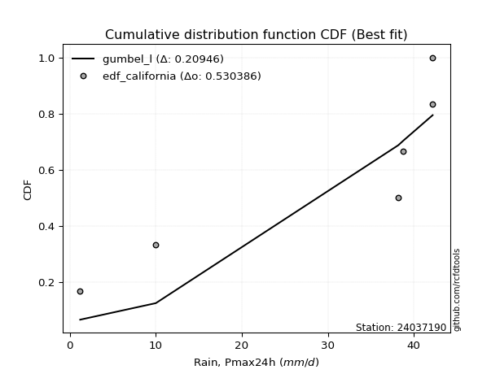</img>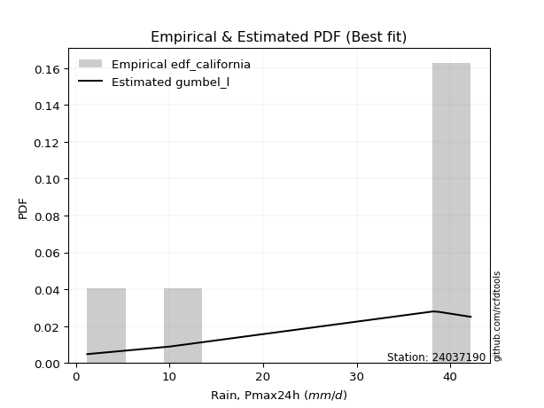</img>

</div>


### 2. Empirical - EDF Hazen (1930)

Hazen method for plotting positions is a formula used to estimate the empirical cumulative probability distribution of flood events or other hydrological data. This formula often results in biased estimations, particularly when extrapolating to extreme events (high return periods).

<div align="center">


$P=(m-0.5)/n$


</div>


**2.1. Empirical values**

<div align="center">

|                | 0                   | 1                   | 2                   | 3         | 4                  | 5                  | 6                  |
|:---------------|:--------------------|:--------------------|:--------------------|:----------|:-------------------|:-------------------|:-------------------|
| date           | 2021                | 2020                | 2019                | 2025      | 2024               | 2022               | 2023               |
| x              | 1.2                 | 10.0                | 38.2                | 38.6      | 38.8               | 42.2               | 42.2               |
| m              | 1                   | 2                   | 3                   | 4         | 5                  | 6                  | 7                  |
| empirical_dist | edf_hazen           | edf_hazen           | edf_hazen           | edf_hazen | edf_hazen          | edf_hazen          | edf_hazen          |
| empirical      | 0.07142857142857142 | 0.21428571428571427 | 0.35714285714285715 | 0.5       | 0.6428571428571429 | 0.7857142857142857 | 0.9285714285714286 |
| empirical_tr   | 1.0769230769230769  | 1.2727272727272727  | 1.5555555555555558  | 2.0       | 2.8000000000000003 | 4.666666666666666  | 14.000000000000007 |

</div>


**2.2. Kolmogorov-Smirnov fit test (sorted by Δ)**


<div align="center">

|                | 0                   | 1                   | 2                   | 3                   | 4                   | 5                   | 6                   | 7                   | 8                   | 9                   | 10                  | 11                  | 12                  | 13                  | 14                  | 15                  | 16                  | 17                  | 18                  | 19                  | 20                  | 21                  | 22                  | 23                  | 24                  | 25                  | 26                  | 27                  | 28                  | 29                  | 30                  | 31                  | 32                  | 33                  | 34                  | 35                  | 36                  | 37                  | 38                  | 39                  | 40                  | 41                  | 42                  | 43                  | 44                  | 45                  | 46                  | 47                  | 48                  | 49                  | 50                  | 51                  | 52                  | 53                  | 54                  | 55                  | 56                  | 57                  | 58                  | 59                  | 60                  | 61                  | 62                  | 63                  | 64                  | 65                  | 66                  | 67                  | 68                  | 69                  | 70                  | 71                  | 72                  | 73                  | 74                  | 75                  | 76                  | 77                  | 78                  | 79                  | 80                  | 81                  | 82                    | 83                  | 84                  | 85                  | 86                  | 87                  | 88                  | 89                  |
|:---------------|:--------------------|:--------------------|:--------------------|:--------------------|:--------------------|:--------------------|:--------------------|:--------------------|:--------------------|:--------------------|:--------------------|:--------------------|:--------------------|:--------------------|:--------------------|:--------------------|:--------------------|:--------------------|:--------------------|:--------------------|:--------------------|:--------------------|:--------------------|:--------------------|:--------------------|:--------------------|:--------------------|:--------------------|:--------------------|:--------------------|:--------------------|:--------------------|:--------------------|:--------------------|:--------------------|:--------------------|:--------------------|:--------------------|:--------------------|:--------------------|:--------------------|:--------------------|:--------------------|:--------------------|:--------------------|:--------------------|:--------------------|:--------------------|:--------------------|:--------------------|:--------------------|:--------------------|:--------------------|:--------------------|:--------------------|:--------------------|:--------------------|:--------------------|:--------------------|:--------------------|:--------------------|:--------------------|:--------------------|:--------------------|:--------------------|:--------------------|:--------------------|:--------------------|:--------------------|:--------------------|:--------------------|:--------------------|:--------------------|:--------------------|:--------------------|:--------------------|:--------------------|:--------------------|:--------------------|:--------------------|:--------------------|:--------------------|:----------------------|:--------------------|:--------------------|:--------------------|:--------------------|:--------------------|:--------------------|:--------------------|
| station        | 24037190            | 24037190            | 24037190            | 24037190            | 24037190            | 24037190            | 24037190            | 24037190            | 24037190            | 24037190            | 24037190            | 24037190            | 24037190            | 24037190            | 24037190            | 24037190            | 24037190            | 24037190            | 24037190            | 24037190            | 24037190            | 24037190            | 24037190            | 24037190            | 24037190            | 24037190            | 24037190            | 24037190            | 24037190            | 24037190            | 24037190            | 24037190            | 24037190            | 24037190            | 24037190            | 24037190            | 24037190            | 24037190            | 24037190            | 24037190            | 24037190            | 24037190            | 24037190            | 24037190            | 24037190            | 24037190            | 24037190            | 24037190            | 24037190            | 24037190            | 24037190            | 24037190            | 24037190            | 24037190            | 24037190            | 24037190            | 24037190            | 24037190            | 24037190            | 24037190            | 24037190            | 24037190            | 24037190            | 24037190            | 24037190            | 24037190            | 24037190            | 24037190            | 24037190            | 24037190            | 24037190            | 24037190            | 24037190            | 24037190            | 24037190            | 24037190            | 24037190            | 24037190            | 24037190            | 24037190            | 24037190            | 24037190            | 24037190              | 24037190            | 24037190            | 24037190            | 24037190            | 24037190            | 24037190            | 24037190            |
| empirical_dist | edf_hazen           | edf_hazen           | edf_hazen           | edf_hazen           | edf_hazen           | edf_hazen           | edf_hazen           | edf_hazen           | edf_hazen           | edf_hazen           | edf_hazen           | edf_hazen           | edf_hazen           | edf_hazen           | edf_hazen           | edf_hazen           | edf_hazen           | edf_hazen           | edf_hazen           | edf_hazen           | edf_hazen           | edf_hazen           | edf_hazen           | edf_hazen           | edf_hazen           | edf_hazen           | edf_hazen           | edf_hazen           | edf_hazen           | edf_hazen           | edf_hazen           | edf_hazen           | edf_hazen           | edf_hazen           | edf_hazen           | edf_hazen           | edf_hazen           | edf_hazen           | edf_hazen           | edf_hazen           | edf_hazen           | edf_hazen           | edf_hazen           | edf_hazen           | edf_hazen           | edf_hazen           | edf_hazen           | edf_hazen           | edf_hazen           | edf_hazen           | edf_hazen           | edf_hazen           | edf_hazen           | edf_hazen           | edf_hazen           | edf_hazen           | edf_hazen           | edf_hazen           | edf_hazen           | edf_hazen           | edf_hazen           | edf_hazen           | edf_hazen           | edf_hazen           | edf_hazen           | edf_hazen           | edf_hazen           | edf_hazen           | edf_hazen           | edf_hazen           | edf_hazen           | edf_hazen           | edf_hazen           | edf_hazen           | edf_hazen           | edf_hazen           | edf_hazen           | edf_hazen           | edf_hazen           | edf_hazen           | edf_hazen           | edf_hazen           | edf_hazen             | edf_hazen           | edf_hazen           | edf_hazen           | edf_hazen           | edf_hazen           | edf_hazen           | edf_hazen           |
| p_dist         | logt                | gompertz            | fisk                | logpearson3         | logfisk             | pearson3            | loginvweibull       | gumbel_l            | logncf              | loggumbel_l         | weibull_min         | ncf                 | invweibull          | logchi2             | loginvgauss         | logerlang           | f                   | logkstwobign        | nct                 | exponnorm           | t                   | crystalball         | norm                | logalpha            | betaprime           | gamma               | logbetaprime        | rice                | erlang              | invgauss            | logf                | lognct              | logexponnorm        | logrice             | logcrystalball      | lognorm             | lognorm             | alpha               | chi2                | loginvgamma         | loggamma            | loggamma            | logfatiguelife      | invgamma            | logexpon            | maxwell             | kstwobign           | loggenexpon         | logistic            | mielke              | rayleigh            | logmaxwell          | laplace_asymmetric  | logweibull_min      | loggompertz         | lograyleigh         | expon               | genexpon            | loglogistic         | halfnorm            | hypsecant           | loghalfnorm         | loghypsecant        | gumbel_r            | nakagami            | loggumbel_r         | laplace             | halflogistic        | pareto              | loghalflogistic     | loglaplace          | moyal               | logmoyal            | lognakagami         | loglognorm          | logpareto           | wald                | logwald             | johnsonsu           | gibrat              | logmielke           | loggibrat           | loglaplace_asymmetric | logloggamma         | fatiguelife         | logtruncnorm        | logjohnsonsu        | genlogistic         | loggenlogistic      | truncnorm           |
| delta          | 0.13936047083974623 | 0.214285713915504   | 0.2801220345674325  | 0.2805671079704803  | 0.2901566776412114  | 0.2942975268605384  | 0.29896590529253025 | 0.302489244840706   | 0.309320141139588   | 0.31085885739087843 | 0.31959818578443905 | 0.3233126349765277  | 0.3279374484386322  | 0.3334589253404729  | 0.3360333426478382  | 0.336476262972848   | 0.33658313976297566 | 0.33691876984569463 | 0.33724689092267607 | 0.3372736169820835  | 0.3372752013640002  | 0.33727688591611465 | 0.3372769028155674  | 0.33743242879888774 | 0.338999551788638   | 0.339662133980342   | 0.340470727598087   | 0.3405759437291888  | 0.3409932372560354  | 0.34188091472481025 | 0.34188678727606    | 0.3431295160303059  | 0.3434888222519043  | 0.3434903688078222  | 0.343491186304612   | 0.3434912029554234  | 0.3434912029554234  | 0.3438311865830112  | 0.3441827987453479  | 0.3443958761637039  | 0.34478789914828895 | 0.34478789914828895 | 0.3456034522849473  | 0.3466803360634421  | 0.3514046561736011  | 0.353865241400982   | 0.35481378307200623 | 0.35519114350178943 | 0.35834070677800994 | 0.3587259045389553  | 0.35872838538261426 | 0.3593295969688957  | 0.3593317836354915  | 0.36296028088707727 | 0.36355395700077847 | 0.3639582565389206  | 0.3640180287911788  | 0.3642144401404725  | 0.36486969972403754 | 0.3734219378904648  | 0.3736868625544017  | 0.37805008598583617 | 0.38028833484303587 | 0.3892515186406918  | 0.39368365362551166 | 0.39419752684696    | 0.3992402286633248  | 0.4004240614367958  | 0.4025930450509151  | 0.4048249967808856  | 0.4052987271529756  | 0.40609861383631934 | 0.4106008722931302  | 0.42478269683092573 | 0.4329060077664155  | 0.4516583991026225  | 0.45529795295830905 | 0.458779096392913   | 0.4825457529916832  | 0.48677603774117967 | 0.48893806609287266 | 0.4900830639731167  | 0.5188741063051288    | 0.5192423757943958  | 0.5681532908354865  | 0.6246473221101174  | 0.6345821513714168  | 0.6428571428571429  | 0.6428571428571429  | 0.7800201014150486  |
| deltao         | 0.48442053926100004 | 0.48442053926100004 | 0.48442053926100004 | 0.48442053926100004 | 0.48442053926100004 | 0.48442053926100004 | 0.48442053926100004 | 0.48442053926100004 | 0.48442053926100004 | 0.48442053926100004 | 0.48442053926100004 | 0.48442053926100004 | 0.48442053926100004 | 0.48442053926100004 | 0.48442053926100004 | 0.48442053926100004 | 0.48442053926100004 | 0.48442053926100004 | 0.48442053926100004 | 0.48442053926100004 | 0.48442053926100004 | 0.48442053926100004 | 0.48442053926100004 | 0.48442053926100004 | 0.48442053926100004 | 0.48442053926100004 | 0.48442053926100004 | 0.48442053926100004 | 0.48442053926100004 | 0.48442053926100004 | 0.48442053926100004 | 0.48442053926100004 | 0.48442053926100004 | 0.48442053926100004 | 0.48442053926100004 | 0.48442053926100004 | 0.48442053926100004 | 0.48442053926100004 | 0.48442053926100004 | 0.48442053926100004 | 0.48442053926100004 | 0.48442053926100004 | 0.48442053926100004 | 0.48442053926100004 | 0.48442053926100004 | 0.48442053926100004 | 0.48442053926100004 | 0.48442053926100004 | 0.48442053926100004 | 0.48442053926100004 | 0.48442053926100004 | 0.48442053926100004 | 0.48442053926100004 | 0.48442053926100004 | 0.48442053926100004 | 0.48442053926100004 | 0.48442053926100004 | 0.48442053926100004 | 0.48442053926100004 | 0.48442053926100004 | 0.48442053926100004 | 0.48442053926100004 | 0.48442053926100004 | 0.48442053926100004 | 0.48442053926100004 | 0.48442053926100004 | 0.48442053926100004 | 0.48442053926100004 | 0.48442053926100004 | 0.48442053926100004 | 0.48442053926100004 | 0.48442053926100004 | 0.48442053926100004 | 0.48442053926100004 | 0.48442053926100004 | 0.48442053926100004 | 0.48442053926100004 | 0.48442053926100004 | 0.48442053926100004 | 0.48442053926100004 | 0.48442053926100004 | 0.48442053926100004 | 0.48442053926100004   | 0.48442053926100004 | 0.48442053926100004 | 0.48442053926100004 | 0.48442053926100004 | 0.48442053926100004 | 0.48442053926100004 | 0.48442053926100004 |
| eval           | Δo > Δ              | Δo > Δ              | Δo > Δ              | Δo > Δ              | Δo > Δ              | Δo > Δ              | Δo > Δ              | Δo > Δ              | Δo > Δ              | Δo > Δ              | Δo > Δ              | Δo > Δ              | Δo > Δ              | Δo > Δ              | Δo > Δ              | Δo > Δ              | Δo > Δ              | Δo > Δ              | Δo > Δ              | Δo > Δ              | Δo > Δ              | Δo > Δ              | Δo > Δ              | Δo > Δ              | Δo > Δ              | Δo > Δ              | Δo > Δ              | Δo > Δ              | Δo > Δ              | Δo > Δ              | Δo > Δ              | Δo > Δ              | Δo > Δ              | Δo > Δ              | Δo > Δ              | Δo > Δ              | Δo > Δ              | Δo > Δ              | Δo > Δ              | Δo > Δ              | Δo > Δ              | Δo > Δ              | Δo > Δ              | Δo > Δ              | Δo > Δ              | Δo > Δ              | Δo > Δ              | Δo > Δ              | Δo > Δ              | Δo > Δ              | Δo > Δ              | Δo > Δ              | Δo > Δ              | Δo > Δ              | Δo > Δ              | Δo > Δ              | Δo > Δ              | Δo > Δ              | Δo > Δ              | Δo > Δ              | Δo > Δ              | Δo > Δ              | Δo > Δ              | Δo > Δ              | Δo > Δ              | Δo > Δ              | Δo > Δ              | Δo > Δ              | Δo > Δ              | Δo > Δ              | Δo > Δ              | Δo > Δ              | Δo > Δ              | Δo > Δ              | Δo > Δ              | Δo > Δ              | Δo > Δ              | Δo > Δ              | Δo > Δ              | Δo <= Δ             | Δo <= Δ             | Δo <= Δ             | Δo <= Δ               | Δo <= Δ             | Δo <= Δ             | Δo <= Δ             | Δo <= Δ             | Δo <= Δ             | Δo <= Δ             | Δo <= Δ             |
| fit            | 1                   | 1                   | 1                   | 1                   | 1                   | 1                   | 1                   | 1                   | 1                   | 1                   | 1                   | 1                   | 1                   | 1                   | 1                   | 1                   | 1                   | 1                   | 1                   | 1                   | 1                   | 1                   | 1                   | 1                   | 1                   | 1                   | 1                   | 1                   | 1                   | 1                   | 1                   | 1                   | 1                   | 1                   | 1                   | 1                   | 1                   | 1                   | 1                   | 1                   | 1                   | 1                   | 1                   | 1                   | 1                   | 1                   | 1                   | 1                   | 1                   | 1                   | 1                   | 1                   | 1                   | 1                   | 1                   | 1                   | 1                   | 1                   | 1                   | 1                   | 1                   | 1                   | 1                   | 1                   | 1                   | 1                   | 1                   | 1                   | 1                   | 1                   | 1                   | 1                   | 1                   | 1                   | 1                   | 1                   | 1                   | 1                   | 1                   | 0                   | 0                   | 0                   | 0                     | 0                   | 0                   | 0                   | 0                   | 0                   | 0                   | 0                   |
| n              | 7                   | 7                   | 7                   | 7                   | 7                   | 7                   | 7                   | 7                   | 7                   | 7                   | 7                   | 7                   | 7                   | 7                   | 7                   | 7                   | 7                   | 7                   | 7                   | 7                   | 7                   | 7                   | 7                   | 7                   | 7                   | 7                   | 7                   | 7                   | 7                   | 7                   | 7                   | 7                   | 7                   | 7                   | 7                   | 7                   | 7                   | 7                   | 7                   | 7                   | 7                   | 7                   | 7                   | 7                   | 7                   | 7                   | 7                   | 7                   | 7                   | 7                   | 7                   | 7                   | 7                   | 7                   | 7                   | 7                   | 7                   | 7                   | 7                   | 7                   | 7                   | 7                   | 7                   | 7                   | 7                   | 7                   | 7                   | 7                   | 7                   | 7                   | 7                   | 7                   | 7                   | 7                   | 7                   | 7                   | 7                   | 7                   | 7                   | 7                   | 7                   | 7                   | 7                     | 7                   | 7                   | 7                   | 7                   | 7                   | 7                   | 7                   |
| best_fit       | 1                   | 0                   | 0                   | 0                   | 0                   | 0                   | 0                   | 0                   | 0                   | 0                   | 0                   | 0                   | 0                   | 0                   | 0                   | 0                   | 0                   | 0                   | 0                   | 0                   | 0                   | 0                   | 0                   | 0                   | 0                   | 0                   | 0                   | 0                   | 0                   | 0                   | 0                   | 0                   | 0                   | 0                   | 0                   | 0                   | 0                   | 0                   | 0                   | 0                   | 0                   | 0                   | 0                   | 0                   | 0                   | 0                   | 0                   | 0                   | 0                   | 0                   | 0                   | 0                   | 0                   | 0                   | 0                   | 0                   | 0                   | 0                   | 0                   | 0                   | 0                   | 0                   | 0                   | 0                   | 0                   | 0                   | 0                   | 0                   | 0                   | 0                   | 0                   | 0                   | 0                   | 0                   | 0                   | 0                   | 0                   | 0                   | 0                   | 0                   | 0                   | 0                   | 0                     | 0                   | 0                   | 0                   | 0                   | 0                   | 0                   | 0                   |
| best_fit_sort  | 1                   | 2                   | 3                   | 4                   | 5                   | 6                   | 7                   | 8                   | 9                   | 10                  | 11                  | 12                  | 13                  | 14                  | 15                  | 16                  | 17                  | 18                  | 19                  | 20                  | 21                  | 22                  | 23                  | 24                  | 25                  | 26                  | 27                  | 28                  | 29                  | 30                  | 31                  | 32                  | 33                  | 34                  | 35                  | 36                  | 37                  | 38                  | 39                  | 40                  | 41                  | 42                  | 43                  | 44                  | 45                  | 46                  | 47                  | 48                  | 49                  | 50                  | 51                  | 52                  | 53                  | 54                  | 55                  | 56                  | 57                  | 58                  | 59                  | 60                  | 61                  | 62                  | 63                  | 64                  | 65                  | 66                  | 67                  | 68                  | 69                  | 70                  | 71                  | 72                  | 73                  | 74                  | 75                  | 76                  | 77                  | 78                  | 79                  | 80                  | 81                  | 82                  | 83                    | 84                  | 85                  | 86                  | 87                  | 88                  | 89                  | 90                  |

</div>


<div align="center">

</img>

</div>


**2.3. Best fit**

<div align="center">

|   id |   station | empirical_dist   | p_dist   |   delta |   deltao | eval   |   fit |   n |   best_fit |   best_fit_sort |
|-----:|----------:|:-----------------|:---------|--------:|---------:|:-------|------:|----:|-----------:|----------------:|
|    0 |  24037190 | edf_hazen        | logt     | 0.13936 | 0.484421 | Δo > Δ |     1 |   7 |          1 |               1 |

</div>


<div align="center">

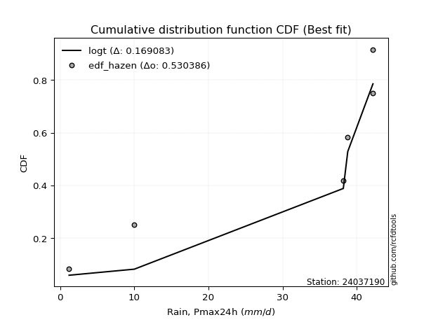</img>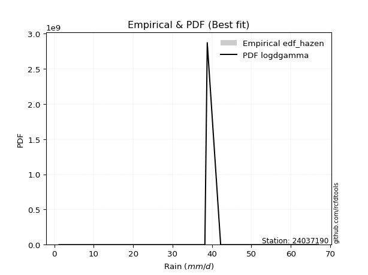</img>

</div>


### 3. Empirical - EDF Weibull (1939)

Weibull plotting position formula is an empirical method used to estimate the non-exceedance probability or plotting position for a set of observed data, is often recommended or widely used in practice, particularly in flood frequency analysis.

<div align="center">


$P=m/(n+1)$


</div>


**3.1. Empirical values**

<div align="center">

|                | 0                  | 1                  | 2           | 3           | 4                  | 5           | 6           |
|:---------------|:-------------------|:-------------------|:------------|:------------|:-------------------|:------------|:------------|
| date           | 2021               | 2020               | 2019        | 2025        | 2024               | 2022        | 2023        |
| x              | 1.2                | 10.0               | 38.2        | 38.6        | 38.8               | 42.2        | 42.2        |
| m              | 1                  | 2                  | 3           | 4           | 5                  | 6           | 7           |
| empirical_dist | edf_weibull        | edf_weibull        | edf_weibull | edf_weibull | edf_weibull        | edf_weibull | edf_weibull |
| empirical      | 0.125              | 0.25               | 0.375       | 0.5         | 0.625              | 0.75        | 0.875       |
| empirical_tr   | 1.1428571428571428 | 1.3333333333333333 | 1.6         | 2.0         | 2.6666666666666665 | 4.0         | 8.0         |

</div>


**3.2. Kolmogorov-Smirnov fit test (sorted by Δ)**


<div align="center">

|                | 0                   | 1                   | 2                   | 3                   | 4                   | 5                   | 6                   | 7                   | 8                   | 9                   | 10                  | 11                  | 12                  | 13                  | 14                  | 15                  | 16                  | 17                  | 18                  | 19                  | 20                  | 21                  | 22                  | 23                  | 24                  | 25                  | 26                  | 27                  | 28                  | 29                  | 30                  | 31                  | 32                  | 33                  | 34                  | 35                  | 36                  | 37                  | 38                  | 39                  | 40                  | 41                  | 42                  | 43                  | 44                  | 45                  | 46                  | 47                  | 48                  | 49                  | 50                  | 51                  | 52                  | 53                  | 54                  | 55                  | 56                  | 57                  | 58                  | 59                  | 60                  | 61                  | 62                  | 63                  | 64                  | 65                  | 66                  | 67                  | 68                  | 69                  | 70                  | 71                  | 72                  | 73                  | 74                  | 75                  | 76                  | 77                  | 78                  | 79                  | 80                  | 81                  | 82                    | 83                  | 84                  | 85                  | 86                  | 87                  | 88                  | 89                  |
|:---------------|:--------------------|:--------------------|:--------------------|:--------------------|:--------------------|:--------------------|:--------------------|:--------------------|:--------------------|:--------------------|:--------------------|:--------------------|:--------------------|:--------------------|:--------------------|:--------------------|:--------------------|:--------------------|:--------------------|:--------------------|:--------------------|:--------------------|:--------------------|:--------------------|:--------------------|:--------------------|:--------------------|:--------------------|:--------------------|:--------------------|:--------------------|:--------------------|:--------------------|:--------------------|:--------------------|:--------------------|:--------------------|:--------------------|:--------------------|:--------------------|:--------------------|:--------------------|:--------------------|:--------------------|:--------------------|:--------------------|:--------------------|:--------------------|:--------------------|:--------------------|:--------------------|:--------------------|:--------------------|:--------------------|:--------------------|:--------------------|:--------------------|:--------------------|:--------------------|:--------------------|:--------------------|:--------------------|:--------------------|:--------------------|:--------------------|:--------------------|:--------------------|:--------------------|:--------------------|:--------------------|:--------------------|:--------------------|:--------------------|:--------------------|:--------------------|:--------------------|:--------------------|:--------------------|:--------------------|:--------------------|:--------------------|:--------------------|:----------------------|:--------------------|:--------------------|:--------------------|:--------------------|:--------------------|:--------------------|:--------------------|
| station        | 24037190            | 24037190            | 24037190            | 24037190            | 24037190            | 24037190            | 24037190            | 24037190            | 24037190            | 24037190            | 24037190            | 24037190            | 24037190            | 24037190            | 24037190            | 24037190            | 24037190            | 24037190            | 24037190            | 24037190            | 24037190            | 24037190            | 24037190            | 24037190            | 24037190            | 24037190            | 24037190            | 24037190            | 24037190            | 24037190            | 24037190            | 24037190            | 24037190            | 24037190            | 24037190            | 24037190            | 24037190            | 24037190            | 24037190            | 24037190            | 24037190            | 24037190            | 24037190            | 24037190            | 24037190            | 24037190            | 24037190            | 24037190            | 24037190            | 24037190            | 24037190            | 24037190            | 24037190            | 24037190            | 24037190            | 24037190            | 24037190            | 24037190            | 24037190            | 24037190            | 24037190            | 24037190            | 24037190            | 24037190            | 24037190            | 24037190            | 24037190            | 24037190            | 24037190            | 24037190            | 24037190            | 24037190            | 24037190            | 24037190            | 24037190            | 24037190            | 24037190            | 24037190            | 24037190            | 24037190            | 24037190            | 24037190            | 24037190              | 24037190            | 24037190            | 24037190            | 24037190            | 24037190            | 24037190            | 24037190            |
| empirical_dist | edf_weibull         | edf_weibull         | edf_weibull         | edf_weibull         | edf_weibull         | edf_weibull         | edf_weibull         | edf_weibull         | edf_weibull         | edf_weibull         | edf_weibull         | edf_weibull         | edf_weibull         | edf_weibull         | edf_weibull         | edf_weibull         | edf_weibull         | edf_weibull         | edf_weibull         | edf_weibull         | edf_weibull         | edf_weibull         | edf_weibull         | edf_weibull         | edf_weibull         | edf_weibull         | edf_weibull         | edf_weibull         | edf_weibull         | edf_weibull         | edf_weibull         | edf_weibull         | edf_weibull         | edf_weibull         | edf_weibull         | edf_weibull         | edf_weibull         | edf_weibull         | edf_weibull         | edf_weibull         | edf_weibull         | edf_weibull         | edf_weibull         | edf_weibull         | edf_weibull         | edf_weibull         | edf_weibull         | edf_weibull         | edf_weibull         | edf_weibull         | edf_weibull         | edf_weibull         | edf_weibull         | edf_weibull         | edf_weibull         | edf_weibull         | edf_weibull         | edf_weibull         | edf_weibull         | edf_weibull         | edf_weibull         | edf_weibull         | edf_weibull         | edf_weibull         | edf_weibull         | edf_weibull         | edf_weibull         | edf_weibull         | edf_weibull         | edf_weibull         | edf_weibull         | edf_weibull         | edf_weibull         | edf_weibull         | edf_weibull         | edf_weibull         | edf_weibull         | edf_weibull         | edf_weibull         | edf_weibull         | edf_weibull         | edf_weibull         | edf_weibull           | edf_weibull         | edf_weibull         | edf_weibull         | edf_weibull         | edf_weibull         | edf_weibull         | edf_weibull         |
| p_dist         | logt                | gompertz            | fisk                | logpearson3         | logfisk             | pearson3            | loginvweibull       | gumbel_l            | logncf              | loggumbel_l         | weibull_min         | ncf                 | invweibull          | logchi2             | loginvgauss         | logerlang           | f                   | logkstwobign        | nct                 | exponnorm           | t                   | crystalball         | norm                | logalpha            | betaprime           | gamma               | logbetaprime        | rice                | erlang              | invgauss            | logf                | lognct              | logexponnorm        | logrice             | logcrystalball      | lognorm             | lognorm             | alpha               | chi2                | loginvgamma         | loggamma            | loggamma            | logfatiguelife      | invgamma            | logexpon            | maxwell             | kstwobign           | loggenexpon         | logistic            | mielke              | rayleigh            | logmaxwell          | laplace_asymmetric  | logweibull_min      | loggompertz         | lograyleigh         | expon               | genexpon            | loglogistic         | halfnorm            | hypsecant           | loghalfnorm         | loghypsecant        | pareto              | gumbel_r            | nakagami            | loggumbel_r         | laplace             | halflogistic        | loghalflogistic     | loglaplace          | moyal               | lognakagami         | logmoyal            | loglognorm          | logpareto           | wald                | logwald             | johnsonsu           | gibrat              | logmielke           | loggibrat           | loglaplace_asymmetric | logloggamma         | fatiguelife         | logtruncnorm        | logjohnsonsu        | genlogistic         | loggenlogistic      | truncnorm           |
| delta          | 0.17507475655403193 | 0.24999999962978972 | 0.26226489171028966 | 0.26270996511333744 | 0.27229953478406854 | 0.27644038400339555 | 0.2811087624353874  | 0.28463210198356315 | 0.29146299828244515 | 0.2930017145337356  | 0.3017410429272962  | 0.30545549211938483 | 0.31008030558148936 | 0.31560178248333004 | 0.31817619979069534 | 0.31861912011570515 | 0.3187259969058328  | 0.3190616269885518  | 0.3193897480655332  | 0.3194164741249407  | 0.31941805850685734 | 0.3194197430589718  | 0.31941975995842453 | 0.3195752859417449  | 0.32114240893149515 | 0.32180499112319916 | 0.32261358474094415 | 0.32271880087204596 | 0.32313609439889257 | 0.3240237718676674  | 0.32402964441891713 | 0.32527237317316304 | 0.32563167939476145 | 0.32563322595067934 | 0.32563404344746916 | 0.32563406009828055 | 0.32563406009828055 | 0.32597404372586836 | 0.32632565588820506 | 0.326538733306561   | 0.3269307562911461  | 0.3269307562911461  | 0.32774630942780447 | 0.32882319320629927 | 0.33354751331645827 | 0.3360080985438392  | 0.3369566402148634  | 0.3373340006446466  | 0.3404835639208671  | 0.34086876168181246 | 0.3408712425254714  | 0.34147245411175287 | 0.34147464077834866 | 0.3451031380299344  | 0.3456968141436356  | 0.34610111368177776 | 0.34616088593403593 | 0.34635729728332965 | 0.3470125568668947  | 0.35556479503332195 | 0.35582971969725885 | 0.3601929431286933  | 0.362431191985893   | 0.3668787593366294  | 0.37139437578354895 | 0.3758265107683688  | 0.3763403839898172  | 0.38138308580618197 | 0.38256691857965297 | 0.3869678539237428  | 0.38744158429583275 | 0.3882414709791765  | 0.38906841111664003 | 0.39274372943598734 | 0.3971917220521298  | 0.4159441133883368  | 0.4374408101011662  | 0.44092195353577013 | 0.46468861013454027 | 0.4689188948840368  | 0.4710809232357298  | 0.47222592111597383 | 0.5010169634479859    | 0.5013852329372529  | 0.5502961479783437  | 0.6067901792529745  | 0.6167250085142739  | 0.625               | 0.625               | 0.7443058157007629  |
| deltao         | 0.48442053926100004 | 0.48442053926100004 | 0.48442053926100004 | 0.48442053926100004 | 0.48442053926100004 | 0.48442053926100004 | 0.48442053926100004 | 0.48442053926100004 | 0.48442053926100004 | 0.48442053926100004 | 0.48442053926100004 | 0.48442053926100004 | 0.48442053926100004 | 0.48442053926100004 | 0.48442053926100004 | 0.48442053926100004 | 0.48442053926100004 | 0.48442053926100004 | 0.48442053926100004 | 0.48442053926100004 | 0.48442053926100004 | 0.48442053926100004 | 0.48442053926100004 | 0.48442053926100004 | 0.48442053926100004 | 0.48442053926100004 | 0.48442053926100004 | 0.48442053926100004 | 0.48442053926100004 | 0.48442053926100004 | 0.48442053926100004 | 0.48442053926100004 | 0.48442053926100004 | 0.48442053926100004 | 0.48442053926100004 | 0.48442053926100004 | 0.48442053926100004 | 0.48442053926100004 | 0.48442053926100004 | 0.48442053926100004 | 0.48442053926100004 | 0.48442053926100004 | 0.48442053926100004 | 0.48442053926100004 | 0.48442053926100004 | 0.48442053926100004 | 0.48442053926100004 | 0.48442053926100004 | 0.48442053926100004 | 0.48442053926100004 | 0.48442053926100004 | 0.48442053926100004 | 0.48442053926100004 | 0.48442053926100004 | 0.48442053926100004 | 0.48442053926100004 | 0.48442053926100004 | 0.48442053926100004 | 0.48442053926100004 | 0.48442053926100004 | 0.48442053926100004 | 0.48442053926100004 | 0.48442053926100004 | 0.48442053926100004 | 0.48442053926100004 | 0.48442053926100004 | 0.48442053926100004 | 0.48442053926100004 | 0.48442053926100004 | 0.48442053926100004 | 0.48442053926100004 | 0.48442053926100004 | 0.48442053926100004 | 0.48442053926100004 | 0.48442053926100004 | 0.48442053926100004 | 0.48442053926100004 | 0.48442053926100004 | 0.48442053926100004 | 0.48442053926100004 | 0.48442053926100004 | 0.48442053926100004 | 0.48442053926100004   | 0.48442053926100004 | 0.48442053926100004 | 0.48442053926100004 | 0.48442053926100004 | 0.48442053926100004 | 0.48442053926100004 | 0.48442053926100004 |
| eval           | Δo > Δ              | Δo > Δ              | Δo > Δ              | Δo > Δ              | Δo > Δ              | Δo > Δ              | Δo > Δ              | Δo > Δ              | Δo > Δ              | Δo > Δ              | Δo > Δ              | Δo > Δ              | Δo > Δ              | Δo > Δ              | Δo > Δ              | Δo > Δ              | Δo > Δ              | Δo > Δ              | Δo > Δ              | Δo > Δ              | Δo > Δ              | Δo > Δ              | Δo > Δ              | Δo > Δ              | Δo > Δ              | Δo > Δ              | Δo > Δ              | Δo > Δ              | Δo > Δ              | Δo > Δ              | Δo > Δ              | Δo > Δ              | Δo > Δ              | Δo > Δ              | Δo > Δ              | Δo > Δ              | Δo > Δ              | Δo > Δ              | Δo > Δ              | Δo > Δ              | Δo > Δ              | Δo > Δ              | Δo > Δ              | Δo > Δ              | Δo > Δ              | Δo > Δ              | Δo > Δ              | Δo > Δ              | Δo > Δ              | Δo > Δ              | Δo > Δ              | Δo > Δ              | Δo > Δ              | Δo > Δ              | Δo > Δ              | Δo > Δ              | Δo > Δ              | Δo > Δ              | Δo > Δ              | Δo > Δ              | Δo > Δ              | Δo > Δ              | Δo > Δ              | Δo > Δ              | Δo > Δ              | Δo > Δ              | Δo > Δ              | Δo > Δ              | Δo > Δ              | Δo > Δ              | Δo > Δ              | Δo > Δ              | Δo > Δ              | Δo > Δ              | Δo > Δ              | Δo > Δ              | Δo > Δ              | Δo > Δ              | Δo > Δ              | Δo > Δ              | Δo > Δ              | Δo > Δ              | Δo <= Δ               | Δo <= Δ             | Δo <= Δ             | Δo <= Δ             | Δo <= Δ             | Δo <= Δ             | Δo <= Δ             | Δo <= Δ             |
| fit            | 1                   | 1                   | 1                   | 1                   | 1                   | 1                   | 1                   | 1                   | 1                   | 1                   | 1                   | 1                   | 1                   | 1                   | 1                   | 1                   | 1                   | 1                   | 1                   | 1                   | 1                   | 1                   | 1                   | 1                   | 1                   | 1                   | 1                   | 1                   | 1                   | 1                   | 1                   | 1                   | 1                   | 1                   | 1                   | 1                   | 1                   | 1                   | 1                   | 1                   | 1                   | 1                   | 1                   | 1                   | 1                   | 1                   | 1                   | 1                   | 1                   | 1                   | 1                   | 1                   | 1                   | 1                   | 1                   | 1                   | 1                   | 1                   | 1                   | 1                   | 1                   | 1                   | 1                   | 1                   | 1                   | 1                   | 1                   | 1                   | 1                   | 1                   | 1                   | 1                   | 1                   | 1                   | 1                   | 1                   | 1                   | 1                   | 1                   | 1                   | 1                   | 1                   | 0                     | 0                   | 0                   | 0                   | 0                   | 0                   | 0                   | 0                   |
| n              | 7                   | 7                   | 7                   | 7                   | 7                   | 7                   | 7                   | 7                   | 7                   | 7                   | 7                   | 7                   | 7                   | 7                   | 7                   | 7                   | 7                   | 7                   | 7                   | 7                   | 7                   | 7                   | 7                   | 7                   | 7                   | 7                   | 7                   | 7                   | 7                   | 7                   | 7                   | 7                   | 7                   | 7                   | 7                   | 7                   | 7                   | 7                   | 7                   | 7                   | 7                   | 7                   | 7                   | 7                   | 7                   | 7                   | 7                   | 7                   | 7                   | 7                   | 7                   | 7                   | 7                   | 7                   | 7                   | 7                   | 7                   | 7                   | 7                   | 7                   | 7                   | 7                   | 7                   | 7                   | 7                   | 7                   | 7                   | 7                   | 7                   | 7                   | 7                   | 7                   | 7                   | 7                   | 7                   | 7                   | 7                   | 7                   | 7                   | 7                   | 7                   | 7                   | 7                     | 7                   | 7                   | 7                   | 7                   | 7                   | 7                   | 7                   |
| best_fit       | 1                   | 0                   | 0                   | 0                   | 0                   | 0                   | 0                   | 0                   | 0                   | 0                   | 0                   | 0                   | 0                   | 0                   | 0                   | 0                   | 0                   | 0                   | 0                   | 0                   | 0                   | 0                   | 0                   | 0                   | 0                   | 0                   | 0                   | 0                   | 0                   | 0                   | 0                   | 0                   | 0                   | 0                   | 0                   | 0                   | 0                   | 0                   | 0                   | 0                   | 0                   | 0                   | 0                   | 0                   | 0                   | 0                   | 0                   | 0                   | 0                   | 0                   | 0                   | 0                   | 0                   | 0                   | 0                   | 0                   | 0                   | 0                   | 0                   | 0                   | 0                   | 0                   | 0                   | 0                   | 0                   | 0                   | 0                   | 0                   | 0                   | 0                   | 0                   | 0                   | 0                   | 0                   | 0                   | 0                   | 0                   | 0                   | 0                   | 0                   | 0                   | 0                   | 0                     | 0                   | 0                   | 0                   | 0                   | 0                   | 0                   | 0                   |
| best_fit_sort  | 1                   | 2                   | 3                   | 4                   | 5                   | 6                   | 7                   | 8                   | 9                   | 10                  | 11                  | 12                  | 13                  | 14                  | 15                  | 16                  | 17                  | 18                  | 19                  | 20                  | 21                  | 22                  | 23                  | 24                  | 25                  | 26                  | 27                  | 28                  | 29                  | 30                  | 31                  | 32                  | 33                  | 34                  | 35                  | 36                  | 37                  | 38                  | 39                  | 40                  | 41                  | 42                  | 43                  | 44                  | 45                  | 46                  | 47                  | 48                  | 49                  | 50                  | 51                  | 52                  | 53                  | 54                  | 55                  | 56                  | 57                  | 58                  | 59                  | 60                  | 61                  | 62                  | 63                  | 64                  | 65                  | 66                  | 67                  | 68                  | 69                  | 70                  | 71                  | 72                  | 73                  | 74                  | 75                  | 76                  | 77                  | 78                  | 79                  | 80                  | 81                  | 82                  | 83                    | 84                  | 85                  | 86                  | 87                  | 88                  | 89                  | 90                  |

</div>


<div align="center">

</img>

</div>


**3.3. Best fit**

<div align="center">

|   id |   station | empirical_dist   | p_dist   |    delta |   deltao | eval   |   fit |   n |   best_fit |   best_fit_sort |
|-----:|----------:|:-----------------|:---------|---------:|---------:|:-------|------:|----:|-----------:|----------------:|
|    0 |  24037190 | edf_weibull      | logt     | 0.175075 | 0.484421 | Δo > Δ |     1 |   7 |          1 |               1 |

</div>


<div align="center">

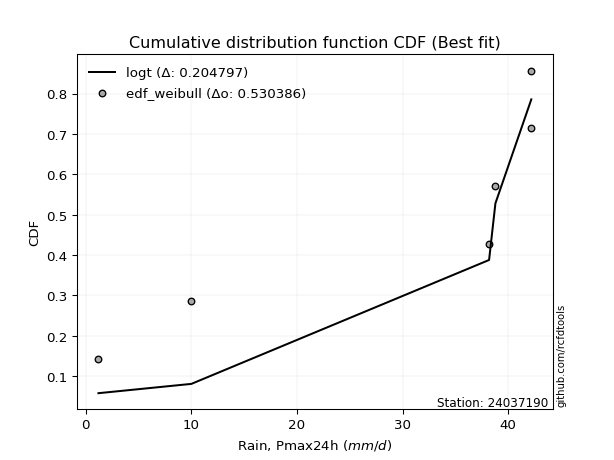</img></img>

</div>


### 4. Empirical - EDF Beard (1943)

The Beard formula (or Beard´s plotting position formula) in hydrology is used to estimate the empirical non-exceedance probability _(P)_ of a flood event (or other extreme hydrological data point) within a given dataset.

<div align="center">


$P=(m-0.31)/(n+0.38)$


</div>


**4.1. Empirical values**

<div align="center">

|                | 0                   | 1                   | 2                   | 3         | 4                  | 5                  | 6                  |
|:---------------|:--------------------|:--------------------|:--------------------|:----------|:-------------------|:-------------------|:-------------------|
| date           | 2021                | 2020                | 2019                | 2025      | 2024               | 2022               | 2023               |
| x              | 1.2                 | 10.0                | 38.2                | 38.6      | 38.8               | 42.2               | 42.2               |
| m              | 1                   | 2                   | 3                   | 4         | 5                  | 6                  | 7                  |
| empirical_dist | edf_beard           | edf_beard           | edf_beard           | edf_beard | edf_beard          | edf_beard          | edf_beard          |
| empirical      | 0.09349593495934959 | 0.22899728997289973 | 0.36449864498644985 | 0.5       | 0.6355013550135502 | 0.7710027100271003 | 0.9065040650406505 |
| empirical_tr   | 1.1031390134529149  | 1.29701230228471    | 1.5735607675906182  | 2.0       | 2.743494423791822  | 4.366863905325444  | 10.695652173913055 |

</div>


**4.2. Kolmogorov-Smirnov fit test (sorted by Δ)**


<div align="center">

|                | 0                   | 1                   | 2                   | 3                   | 4                   | 5                   | 6                   | 7                   | 8                   | 9                   | 10                  | 11                  | 12                  | 13                  | 14                  | 15                  | 16                  | 17                  | 18                  | 19                  | 20                  | 21                  | 22                  | 23                  | 24                  | 25                  | 26                  | 27                  | 28                  | 29                  | 30                  | 31                  | 32                  | 33                  | 34                  | 35                  | 36                  | 37                  | 38                  | 39                  | 40                  | 41                  | 42                  | 43                  | 44                  | 45                  | 46                  | 47                  | 48                  | 49                  | 50                  | 51                  | 52                  | 53                  | 54                  | 55                  | 56                  | 57                  | 58                  | 59                  | 60                  | 61                  | 62                  | 63                  | 64                  | 65                  | 66                  | 67                  | 68                  | 69                  | 70                  | 71                  | 72                  | 73                  | 74                  | 75                  | 76                  | 77                  | 78                  | 79                  | 80                  | 81                  | 82                    | 83                  | 84                  | 85                  | 86                  | 87                  | 88                  | 89                  |
|:---------------|:--------------------|:--------------------|:--------------------|:--------------------|:--------------------|:--------------------|:--------------------|:--------------------|:--------------------|:--------------------|:--------------------|:--------------------|:--------------------|:--------------------|:--------------------|:--------------------|:--------------------|:--------------------|:--------------------|:--------------------|:--------------------|:--------------------|:--------------------|:--------------------|:--------------------|:--------------------|:--------------------|:--------------------|:--------------------|:--------------------|:--------------------|:--------------------|:--------------------|:--------------------|:--------------------|:--------------------|:--------------------|:--------------------|:--------------------|:--------------------|:--------------------|:--------------------|:--------------------|:--------------------|:--------------------|:--------------------|:--------------------|:--------------------|:--------------------|:--------------------|:--------------------|:--------------------|:--------------------|:--------------------|:--------------------|:--------------------|:--------------------|:--------------------|:--------------------|:--------------------|:--------------------|:--------------------|:--------------------|:--------------------|:--------------------|:--------------------|:--------------------|:--------------------|:--------------------|:--------------------|:--------------------|:--------------------|:--------------------|:--------------------|:--------------------|:--------------------|:--------------------|:--------------------|:--------------------|:--------------------|:--------------------|:--------------------|:----------------------|:--------------------|:--------------------|:--------------------|:--------------------|:--------------------|:--------------------|:--------------------|
| station        | 24037190            | 24037190            | 24037190            | 24037190            | 24037190            | 24037190            | 24037190            | 24037190            | 24037190            | 24037190            | 24037190            | 24037190            | 24037190            | 24037190            | 24037190            | 24037190            | 24037190            | 24037190            | 24037190            | 24037190            | 24037190            | 24037190            | 24037190            | 24037190            | 24037190            | 24037190            | 24037190            | 24037190            | 24037190            | 24037190            | 24037190            | 24037190            | 24037190            | 24037190            | 24037190            | 24037190            | 24037190            | 24037190            | 24037190            | 24037190            | 24037190            | 24037190            | 24037190            | 24037190            | 24037190            | 24037190            | 24037190            | 24037190            | 24037190            | 24037190            | 24037190            | 24037190            | 24037190            | 24037190            | 24037190            | 24037190            | 24037190            | 24037190            | 24037190            | 24037190            | 24037190            | 24037190            | 24037190            | 24037190            | 24037190            | 24037190            | 24037190            | 24037190            | 24037190            | 24037190            | 24037190            | 24037190            | 24037190            | 24037190            | 24037190            | 24037190            | 24037190            | 24037190            | 24037190            | 24037190            | 24037190            | 24037190            | 24037190              | 24037190            | 24037190            | 24037190            | 24037190            | 24037190            | 24037190            | 24037190            |
| empirical_dist | edf_beard           | edf_beard           | edf_beard           | edf_beard           | edf_beard           | edf_beard           | edf_beard           | edf_beard           | edf_beard           | edf_beard           | edf_beard           | edf_beard           | edf_beard           | edf_beard           | edf_beard           | edf_beard           | edf_beard           | edf_beard           | edf_beard           | edf_beard           | edf_beard           | edf_beard           | edf_beard           | edf_beard           | edf_beard           | edf_beard           | edf_beard           | edf_beard           | edf_beard           | edf_beard           | edf_beard           | edf_beard           | edf_beard           | edf_beard           | edf_beard           | edf_beard           | edf_beard           | edf_beard           | edf_beard           | edf_beard           | edf_beard           | edf_beard           | edf_beard           | edf_beard           | edf_beard           | edf_beard           | edf_beard           | edf_beard           | edf_beard           | edf_beard           | edf_beard           | edf_beard           | edf_beard           | edf_beard           | edf_beard           | edf_beard           | edf_beard           | edf_beard           | edf_beard           | edf_beard           | edf_beard           | edf_beard           | edf_beard           | edf_beard           | edf_beard           | edf_beard           | edf_beard           | edf_beard           | edf_beard           | edf_beard           | edf_beard           | edf_beard           | edf_beard           | edf_beard           | edf_beard           | edf_beard           | edf_beard           | edf_beard           | edf_beard           | edf_beard           | edf_beard           | edf_beard           | edf_beard             | edf_beard           | edf_beard           | edf_beard           | edf_beard           | edf_beard           | edf_beard           | edf_beard           |
| p_dist         | logt                | gompertz            | fisk                | logpearson3         | logfisk             | pearson3            | loginvweibull       | gumbel_l            | logncf              | loggumbel_l         | weibull_min         | ncf                 | invweibull          | logchi2             | loginvgauss         | logerlang           | f                   | logkstwobign        | nct                 | exponnorm           | t                   | crystalball         | norm                | logalpha            | betaprime           | gamma               | logbetaprime        | rice                | erlang              | invgauss            | logf                | lognct              | logexponnorm        | logrice             | logcrystalball      | lognorm             | lognorm             | alpha               | chi2                | loginvgamma         | loggamma            | loggamma            | logfatiguelife      | invgamma            | logexpon            | maxwell             | kstwobign           | loggenexpon         | logistic            | mielke              | rayleigh            | logmaxwell          | laplace_asymmetric  | logweibull_min      | loggompertz         | lograyleigh         | expon               | genexpon            | loglogistic         | halfnorm            | hypsecant           | loghalfnorm         | loghypsecant        | gumbel_r            | nakagami            | loggumbel_r         | pareto              | laplace             | halflogistic        | loghalflogistic     | loglaplace          | moyal               | logmoyal            | lognakagami         | loglognorm          | logpareto           | wald                | logwald             | johnsonsu           | gibrat              | logmielke           | loggibrat           | loglaplace_asymmetric | logloggamma         | fatiguelife         | logtruncnorm        | logjohnsonsu        | genlogistic         | loggenlogistic      | truncnorm           |
| delta          | 0.15407204652693168 | 0.22899728960268945 | 0.2727662467238398  | 0.2732113201268876  | 0.2828008897976187  | 0.2869417390169457  | 0.29161011744893756 | 0.2951334569971133  | 0.3019643532959953  | 0.30350306954728573 | 0.31224239794084635 | 0.315956847132935   | 0.3205816605950395  | 0.3261031374968802  | 0.3286775548042455  | 0.3291204751292553  | 0.32922735191938296 | 0.32956298200210193 | 0.32989110307908337 | 0.3299178291384908  | 0.3299194135204075  | 0.32992109807252196 | 0.3299211149719747  | 0.33007664095529504 | 0.3316437639450453  | 0.3323063461367493  | 0.3331149397544943  | 0.3332201558855961  | 0.3336374494124427  | 0.33452512688121755 | 0.3345309994324673  | 0.3357737281867132  | 0.3361330344083116  | 0.3361345809642295  | 0.3361353984610193  | 0.3361354151118307  | 0.3361354151118307  | 0.3364753987394185  | 0.3368270109017552  | 0.3370400883201112  | 0.33743211130469625 | 0.33743211130469625 | 0.3382476644413546  | 0.3393245482198494  | 0.3440488683300084  | 0.3465094535573893  | 0.34745799522841353 | 0.34783535565819673 | 0.35098491893441724 | 0.3513701166953626  | 0.35137259753902156 | 0.351973809125303   | 0.3519759957918988  | 0.35560449304348457 | 0.3561981691571858  | 0.3566024686953279  | 0.3566622409475861  | 0.3568586522968798  | 0.35751391188044485 | 0.3660661500468721  | 0.366331074710809   | 0.3706942981422435  | 0.37293254699944317 | 0.3818957307970991  | 0.38632786578191897 | 0.3868417390033673  | 0.3878814693637297  | 0.3918844408197321  | 0.3930682735932031  | 0.39746920893729293 | 0.3979429393093829  | 0.39874282599272665 | 0.4032450844495375  | 0.41007112114374034 | 0.4181944320792301  | 0.4369468234154371  | 0.44794216511471635 | 0.4514233085493203  | 0.4751899651480905  | 0.47942024989758697 | 0.48158227824927996 | 0.482727276129524   | 0.511518318461536     | 0.511886587950803   | 0.5607975029918939  | 0.6172915342665246  | 0.6272263635278241  | 0.6355013550135502  | 0.6355013550135502  | 0.7653085257278632  |
| deltao         | 0.48442053926100004 | 0.48442053926100004 | 0.48442053926100004 | 0.48442053926100004 | 0.48442053926100004 | 0.48442053926100004 | 0.48442053926100004 | 0.48442053926100004 | 0.48442053926100004 | 0.48442053926100004 | 0.48442053926100004 | 0.48442053926100004 | 0.48442053926100004 | 0.48442053926100004 | 0.48442053926100004 | 0.48442053926100004 | 0.48442053926100004 | 0.48442053926100004 | 0.48442053926100004 | 0.48442053926100004 | 0.48442053926100004 | 0.48442053926100004 | 0.48442053926100004 | 0.48442053926100004 | 0.48442053926100004 | 0.48442053926100004 | 0.48442053926100004 | 0.48442053926100004 | 0.48442053926100004 | 0.48442053926100004 | 0.48442053926100004 | 0.48442053926100004 | 0.48442053926100004 | 0.48442053926100004 | 0.48442053926100004 | 0.48442053926100004 | 0.48442053926100004 | 0.48442053926100004 | 0.48442053926100004 | 0.48442053926100004 | 0.48442053926100004 | 0.48442053926100004 | 0.48442053926100004 | 0.48442053926100004 | 0.48442053926100004 | 0.48442053926100004 | 0.48442053926100004 | 0.48442053926100004 | 0.48442053926100004 | 0.48442053926100004 | 0.48442053926100004 | 0.48442053926100004 | 0.48442053926100004 | 0.48442053926100004 | 0.48442053926100004 | 0.48442053926100004 | 0.48442053926100004 | 0.48442053926100004 | 0.48442053926100004 | 0.48442053926100004 | 0.48442053926100004 | 0.48442053926100004 | 0.48442053926100004 | 0.48442053926100004 | 0.48442053926100004 | 0.48442053926100004 | 0.48442053926100004 | 0.48442053926100004 | 0.48442053926100004 | 0.48442053926100004 | 0.48442053926100004 | 0.48442053926100004 | 0.48442053926100004 | 0.48442053926100004 | 0.48442053926100004 | 0.48442053926100004 | 0.48442053926100004 | 0.48442053926100004 | 0.48442053926100004 | 0.48442053926100004 | 0.48442053926100004 | 0.48442053926100004 | 0.48442053926100004   | 0.48442053926100004 | 0.48442053926100004 | 0.48442053926100004 | 0.48442053926100004 | 0.48442053926100004 | 0.48442053926100004 | 0.48442053926100004 |
| eval           | Δo > Δ              | Δo > Δ              | Δo > Δ              | Δo > Δ              | Δo > Δ              | Δo > Δ              | Δo > Δ              | Δo > Δ              | Δo > Δ              | Δo > Δ              | Δo > Δ              | Δo > Δ              | Δo > Δ              | Δo > Δ              | Δo > Δ              | Δo > Δ              | Δo > Δ              | Δo > Δ              | Δo > Δ              | Δo > Δ              | Δo > Δ              | Δo > Δ              | Δo > Δ              | Δo > Δ              | Δo > Δ              | Δo > Δ              | Δo > Δ              | Δo > Δ              | Δo > Δ              | Δo > Δ              | Δo > Δ              | Δo > Δ              | Δo > Δ              | Δo > Δ              | Δo > Δ              | Δo > Δ              | Δo > Δ              | Δo > Δ              | Δo > Δ              | Δo > Δ              | Δo > Δ              | Δo > Δ              | Δo > Δ              | Δo > Δ              | Δo > Δ              | Δo > Δ              | Δo > Δ              | Δo > Δ              | Δo > Δ              | Δo > Δ              | Δo > Δ              | Δo > Δ              | Δo > Δ              | Δo > Δ              | Δo > Δ              | Δo > Δ              | Δo > Δ              | Δo > Δ              | Δo > Δ              | Δo > Δ              | Δo > Δ              | Δo > Δ              | Δo > Δ              | Δo > Δ              | Δo > Δ              | Δo > Δ              | Δo > Δ              | Δo > Δ              | Δo > Δ              | Δo > Δ              | Δo > Δ              | Δo > Δ              | Δo > Δ              | Δo > Δ              | Δo > Δ              | Δo > Δ              | Δo > Δ              | Δo > Δ              | Δo > Δ              | Δo > Δ              | Δo > Δ              | Δo > Δ              | Δo <= Δ               | Δo <= Δ             | Δo <= Δ             | Δo <= Δ             | Δo <= Δ             | Δo <= Δ             | Δo <= Δ             | Δo <= Δ             |
| fit            | 1                   | 1                   | 1                   | 1                   | 1                   | 1                   | 1                   | 1                   | 1                   | 1                   | 1                   | 1                   | 1                   | 1                   | 1                   | 1                   | 1                   | 1                   | 1                   | 1                   | 1                   | 1                   | 1                   | 1                   | 1                   | 1                   | 1                   | 1                   | 1                   | 1                   | 1                   | 1                   | 1                   | 1                   | 1                   | 1                   | 1                   | 1                   | 1                   | 1                   | 1                   | 1                   | 1                   | 1                   | 1                   | 1                   | 1                   | 1                   | 1                   | 1                   | 1                   | 1                   | 1                   | 1                   | 1                   | 1                   | 1                   | 1                   | 1                   | 1                   | 1                   | 1                   | 1                   | 1                   | 1                   | 1                   | 1                   | 1                   | 1                   | 1                   | 1                   | 1                   | 1                   | 1                   | 1                   | 1                   | 1                   | 1                   | 1                   | 1                   | 1                   | 1                   | 0                     | 0                   | 0                   | 0                   | 0                   | 0                   | 0                   | 0                   |
| n              | 7                   | 7                   | 7                   | 7                   | 7                   | 7                   | 7                   | 7                   | 7                   | 7                   | 7                   | 7                   | 7                   | 7                   | 7                   | 7                   | 7                   | 7                   | 7                   | 7                   | 7                   | 7                   | 7                   | 7                   | 7                   | 7                   | 7                   | 7                   | 7                   | 7                   | 7                   | 7                   | 7                   | 7                   | 7                   | 7                   | 7                   | 7                   | 7                   | 7                   | 7                   | 7                   | 7                   | 7                   | 7                   | 7                   | 7                   | 7                   | 7                   | 7                   | 7                   | 7                   | 7                   | 7                   | 7                   | 7                   | 7                   | 7                   | 7                   | 7                   | 7                   | 7                   | 7                   | 7                   | 7                   | 7                   | 7                   | 7                   | 7                   | 7                   | 7                   | 7                   | 7                   | 7                   | 7                   | 7                   | 7                   | 7                   | 7                   | 7                   | 7                   | 7                   | 7                     | 7                   | 7                   | 7                   | 7                   | 7                   | 7                   | 7                   |
| best_fit       | 1                   | 0                   | 0                   | 0                   | 0                   | 0                   | 0                   | 0                   | 0                   | 0                   | 0                   | 0                   | 0                   | 0                   | 0                   | 0                   | 0                   | 0                   | 0                   | 0                   | 0                   | 0                   | 0                   | 0                   | 0                   | 0                   | 0                   | 0                   | 0                   | 0                   | 0                   | 0                   | 0                   | 0                   | 0                   | 0                   | 0                   | 0                   | 0                   | 0                   | 0                   | 0                   | 0                   | 0                   | 0                   | 0                   | 0                   | 0                   | 0                   | 0                   | 0                   | 0                   | 0                   | 0                   | 0                   | 0                   | 0                   | 0                   | 0                   | 0                   | 0                   | 0                   | 0                   | 0                   | 0                   | 0                   | 0                   | 0                   | 0                   | 0                   | 0                   | 0                   | 0                   | 0                   | 0                   | 0                   | 0                   | 0                   | 0                   | 0                   | 0                   | 0                   | 0                     | 0                   | 0                   | 0                   | 0                   | 0                   | 0                   | 0                   |
| best_fit_sort  | 1                   | 2                   | 3                   | 4                   | 5                   | 6                   | 7                   | 8                   | 9                   | 10                  | 11                  | 12                  | 13                  | 14                  | 15                  | 16                  | 17                  | 18                  | 19                  | 20                  | 21                  | 22                  | 23                  | 24                  | 25                  | 26                  | 27                  | 28                  | 29                  | 30                  | 31                  | 32                  | 33                  | 34                  | 35                  | 36                  | 37                  | 38                  | 39                  | 40                  | 41                  | 42                  | 43                  | 44                  | 45                  | 46                  | 47                  | 48                  | 49                  | 50                  | 51                  | 52                  | 53                  | 54                  | 55                  | 56                  | 57                  | 58                  | 59                  | 60                  | 61                  | 62                  | 63                  | 64                  | 65                  | 66                  | 67                  | 68                  | 69                  | 70                  | 71                  | 72                  | 73                  | 74                  | 75                  | 76                  | 77                  | 78                  | 79                  | 80                  | 81                  | 82                  | 83                    | 84                  | 85                  | 86                  | 87                  | 88                  | 89                  | 90                  |

</div>


<div align="center">

</img>

</div>


**4.3. Best fit**

<div align="center">

|   id |   station | empirical_dist   | p_dist   |    delta |   deltao | eval   |   fit |   n |   best_fit |   best_fit_sort |
|-----:|----------:|:-----------------|:---------|---------:|---------:|:-------|------:|----:|-----------:|----------------:|
|    0 |  24037190 | edf_beard        | logt     | 0.154072 | 0.484421 | Δo > Δ |     1 |   7 |          1 |               1 |

</div>


<div align="center">

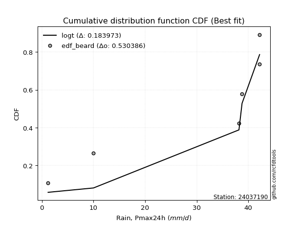</img>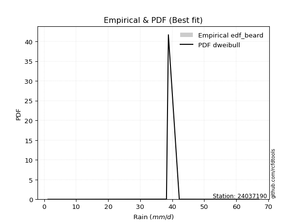</img>

</div>


### 5. Empirical - EDF Chegodayev (1955)

The Chegodayev formula is an empirical plotting position formula used in hydrological frequency analysis to estimate the exceedance probability or return period of a specific event from a set of observed data. It is primarily used for plotting observed data points on probability paper to fit a theoretical distribution, particularly for analyzing extreme events like maximum flood flows or rainfall intensities. The constant _b_ value in the generalized plotting position formula is 0.3.

<div align="center">


$P=(m-b)/(n+1-2b)$


</div>


**5.1. Empirical values**

<div align="center">

|                | 0                   | 1                   | 2                   | 3              | 4                  | 5                  | 6                  |
|:---------------|:--------------------|:--------------------|:--------------------|:---------------|:-------------------|:-------------------|:-------------------|
| date           | 2021                | 2020                | 2019                | 2025           | 2024               | 2022               | 2023               |
| x              | 1.2                 | 10.0                | 38.2                | 38.6           | 38.8               | 42.2               | 42.2               |
| m              | 1                   | 2                   | 3                   | 4              | 5                  | 6                  | 7                  |
| empirical_dist | edf_chegodayev      | edf_chegodayev      | edf_chegodayev      | edf_chegodayev | edf_chegodayev     | edf_chegodayev     | edf_chegodayev     |
| empirical      | 0.09459459459459459 | 0.22972972972972971 | 0.36486486486486486 | 0.5            | 0.6351351351351351 | 0.7702702702702703 | 0.9054054054054054 |
| empirical_tr   | 1.1044776119402986  | 1.2982456140350878  | 1.574468085106383   | 2.0            | 2.7407407407407405 | 4.352941176470589  | 10.571428571428568 |

</div>


**5.2. Kolmogorov-Smirnov fit test (sorted by Δ)**


<div align="center">

|                | 0                   | 1                   | 2                   | 3                   | 4                   | 5                   | 6                   | 7                   | 8                   | 9                   | 10                  | 11                  | 12                  | 13                  | 14                  | 15                  | 16                  | 17                  | 18                  | 19                  | 20                  | 21                  | 22                  | 23                  | 24                  | 25                  | 26                  | 27                  | 28                  | 29                  | 30                  | 31                  | 32                  | 33                  | 34                  | 35                  | 36                  | 37                  | 38                  | 39                  | 40                  | 41                  | 42                  | 43                  | 44                  | 45                  | 46                  | 47                  | 48                  | 49                  | 50                  | 51                  | 52                  | 53                  | 54                  | 55                  | 56                  | 57                  | 58                  | 59                  | 60                  | 61                  | 62                  | 63                  | 64                  | 65                  | 66                  | 67                  | 68                  | 69                  | 70                  | 71                  | 72                  | 73                  | 74                  | 75                  | 76                  | 77                  | 78                  | 79                  | 80                  | 81                  | 82                    | 83                  | 84                  | 85                  | 86                  | 87                  | 88                  | 89                  |
|:---------------|:--------------------|:--------------------|:--------------------|:--------------------|:--------------------|:--------------------|:--------------------|:--------------------|:--------------------|:--------------------|:--------------------|:--------------------|:--------------------|:--------------------|:--------------------|:--------------------|:--------------------|:--------------------|:--------------------|:--------------------|:--------------------|:--------------------|:--------------------|:--------------------|:--------------------|:--------------------|:--------------------|:--------------------|:--------------------|:--------------------|:--------------------|:--------------------|:--------------------|:--------------------|:--------------------|:--------------------|:--------------------|:--------------------|:--------------------|:--------------------|:--------------------|:--------------------|:--------------------|:--------------------|:--------------------|:--------------------|:--------------------|:--------------------|:--------------------|:--------------------|:--------------------|:--------------------|:--------------------|:--------------------|:--------------------|:--------------------|:--------------------|:--------------------|:--------------------|:--------------------|:--------------------|:--------------------|:--------------------|:--------------------|:--------------------|:--------------------|:--------------------|:--------------------|:--------------------|:--------------------|:--------------------|:--------------------|:--------------------|:--------------------|:--------------------|:--------------------|:--------------------|:--------------------|:--------------------|:--------------------|:--------------------|:--------------------|:----------------------|:--------------------|:--------------------|:--------------------|:--------------------|:--------------------|:--------------------|:--------------------|
| station        | 24037190            | 24037190            | 24037190            | 24037190            | 24037190            | 24037190            | 24037190            | 24037190            | 24037190            | 24037190            | 24037190            | 24037190            | 24037190            | 24037190            | 24037190            | 24037190            | 24037190            | 24037190            | 24037190            | 24037190            | 24037190            | 24037190            | 24037190            | 24037190            | 24037190            | 24037190            | 24037190            | 24037190            | 24037190            | 24037190            | 24037190            | 24037190            | 24037190            | 24037190            | 24037190            | 24037190            | 24037190            | 24037190            | 24037190            | 24037190            | 24037190            | 24037190            | 24037190            | 24037190            | 24037190            | 24037190            | 24037190            | 24037190            | 24037190            | 24037190            | 24037190            | 24037190            | 24037190            | 24037190            | 24037190            | 24037190            | 24037190            | 24037190            | 24037190            | 24037190            | 24037190            | 24037190            | 24037190            | 24037190            | 24037190            | 24037190            | 24037190            | 24037190            | 24037190            | 24037190            | 24037190            | 24037190            | 24037190            | 24037190            | 24037190            | 24037190            | 24037190            | 24037190            | 24037190            | 24037190            | 24037190            | 24037190            | 24037190              | 24037190            | 24037190            | 24037190            | 24037190            | 24037190            | 24037190            | 24037190            |
| empirical_dist | edf_chegodayev      | edf_chegodayev      | edf_chegodayev      | edf_chegodayev      | edf_chegodayev      | edf_chegodayev      | edf_chegodayev      | edf_chegodayev      | edf_chegodayev      | edf_chegodayev      | edf_chegodayev      | edf_chegodayev      | edf_chegodayev      | edf_chegodayev      | edf_chegodayev      | edf_chegodayev      | edf_chegodayev      | edf_chegodayev      | edf_chegodayev      | edf_chegodayev      | edf_chegodayev      | edf_chegodayev      | edf_chegodayev      | edf_chegodayev      | edf_chegodayev      | edf_chegodayev      | edf_chegodayev      | edf_chegodayev      | edf_chegodayev      | edf_chegodayev      | edf_chegodayev      | edf_chegodayev      | edf_chegodayev      | edf_chegodayev      | edf_chegodayev      | edf_chegodayev      | edf_chegodayev      | edf_chegodayev      | edf_chegodayev      | edf_chegodayev      | edf_chegodayev      | edf_chegodayev      | edf_chegodayev      | edf_chegodayev      | edf_chegodayev      | edf_chegodayev      | edf_chegodayev      | edf_chegodayev      | edf_chegodayev      | edf_chegodayev      | edf_chegodayev      | edf_chegodayev      | edf_chegodayev      | edf_chegodayev      | edf_chegodayev      | edf_chegodayev      | edf_chegodayev      | edf_chegodayev      | edf_chegodayev      | edf_chegodayev      | edf_chegodayev      | edf_chegodayev      | edf_chegodayev      | edf_chegodayev      | edf_chegodayev      | edf_chegodayev      | edf_chegodayev      | edf_chegodayev      | edf_chegodayev      | edf_chegodayev      | edf_chegodayev      | edf_chegodayev      | edf_chegodayev      | edf_chegodayev      | edf_chegodayev      | edf_chegodayev      | edf_chegodayev      | edf_chegodayev      | edf_chegodayev      | edf_chegodayev      | edf_chegodayev      | edf_chegodayev      | edf_chegodayev        | edf_chegodayev      | edf_chegodayev      | edf_chegodayev      | edf_chegodayev      | edf_chegodayev      | edf_chegodayev      | edf_chegodayev      |
| p_dist         | logt                | gompertz            | fisk                | logpearson3         | logfisk             | pearson3            | loginvweibull       | gumbel_l            | logncf              | loggumbel_l         | weibull_min         | ncf                 | invweibull          | logchi2             | loginvgauss         | logerlang           | f                   | logkstwobign        | nct                 | exponnorm           | t                   | crystalball         | norm                | logalpha            | betaprime           | gamma               | logbetaprime        | rice                | erlang              | invgauss            | logf                | lognct              | logexponnorm        | logrice             | logcrystalball      | lognorm             | lognorm             | alpha               | chi2                | loginvgamma         | loggamma            | loggamma            | logfatiguelife      | invgamma            | logexpon            | maxwell             | kstwobign           | loggenexpon         | logistic            | mielke              | rayleigh            | logmaxwell          | laplace_asymmetric  | logweibull_min      | loggompertz         | lograyleigh         | expon               | genexpon            | loglogistic         | halfnorm            | hypsecant           | loghalfnorm         | loghypsecant        | gumbel_r            | nakagami            | loggumbel_r         | pareto              | laplace             | halflogistic        | loghalflogistic     | loglaplace          | moyal               | logmoyal            | lognakagami         | loglognorm          | logpareto           | wald                | logwald             | johnsonsu           | gibrat              | logmielke           | loggibrat           | loglaplace_asymmetric | logloggamma         | fatiguelife         | logtruncnorm        | logjohnsonsu        | genlogistic         | loggenlogistic      | truncnorm           |
| delta          | 0.15480448628376164 | 0.22972972935951944 | 0.2724000268454248  | 0.2728451002484726  | 0.2824346699192037  | 0.2865755191385307  | 0.29124389757052255 | 0.2947672371186983  | 0.3015981334175803  | 0.3031368496688707  | 0.31187617806243134 | 0.31559062725452    | 0.3202154407166245  | 0.3257369176184652  | 0.3283113349258305  | 0.3287542552508403  | 0.32886113204096795 | 0.3291967621236869  | 0.32952488320066836 | 0.3295516092600758  | 0.3295531936419925  | 0.32955487819410695 | 0.3295548950935597  | 0.32971042107688003 | 0.3312775440666303  | 0.3319401262583343  | 0.3327487198760793  | 0.3328539360071811  | 0.3332712295340277  | 0.33415890700280254 | 0.33416477955405227 | 0.3354075083082982  | 0.3357668145298966  | 0.3357683610858145  | 0.3357691785826043  | 0.3357691952334157  | 0.3357691952334157  | 0.3361091788610035  | 0.3364607910233402  | 0.33667386844169617 | 0.33706589142628124 | 0.33706589142628124 | 0.3378814445629396  | 0.3389583283414344  | 0.3436826484515934  | 0.3461432336789743  | 0.3470917753499985  | 0.3474691357797817  | 0.35061869905600224 | 0.3510038968169476  | 0.35100637766060655 | 0.351607589246888   | 0.3516097759134838  | 0.35523827316506956 | 0.35583194927877076 | 0.3562362488169129  | 0.3562960210691711  | 0.3564924324184648  | 0.35714769200202984 | 0.3656999301684571  | 0.365964854832394   | 0.37032807826382846 | 0.37256632712102816 | 0.3815295109186841  | 0.38596164590350396 | 0.3864755191249523  | 0.3871490296068997  | 0.3915182209413171  | 0.3927020537147881  | 0.3971029890588779  | 0.3975767194309679  | 0.39837660611431164 | 0.4028788645711225  | 0.4093386813869103  | 0.4174619923224001  | 0.4362143836586071  | 0.44757594523630134 | 0.45105708867090527 | 0.47482374526967536 | 0.47905403001917196 | 0.48121605837086495 | 0.482361056251109   | 0.511152098583121     | 0.5115203680723881  | 0.5604312831134788  | 0.6169253143881097  | 0.626860143649409   | 0.6351351351351351  | 0.6351351351351351  | 0.7645760859710332  |
| deltao         | 0.48442053926100004 | 0.48442053926100004 | 0.48442053926100004 | 0.48442053926100004 | 0.48442053926100004 | 0.48442053926100004 | 0.48442053926100004 | 0.48442053926100004 | 0.48442053926100004 | 0.48442053926100004 | 0.48442053926100004 | 0.48442053926100004 | 0.48442053926100004 | 0.48442053926100004 | 0.48442053926100004 | 0.48442053926100004 | 0.48442053926100004 | 0.48442053926100004 | 0.48442053926100004 | 0.48442053926100004 | 0.48442053926100004 | 0.48442053926100004 | 0.48442053926100004 | 0.48442053926100004 | 0.48442053926100004 | 0.48442053926100004 | 0.48442053926100004 | 0.48442053926100004 | 0.48442053926100004 | 0.48442053926100004 | 0.48442053926100004 | 0.48442053926100004 | 0.48442053926100004 | 0.48442053926100004 | 0.48442053926100004 | 0.48442053926100004 | 0.48442053926100004 | 0.48442053926100004 | 0.48442053926100004 | 0.48442053926100004 | 0.48442053926100004 | 0.48442053926100004 | 0.48442053926100004 | 0.48442053926100004 | 0.48442053926100004 | 0.48442053926100004 | 0.48442053926100004 | 0.48442053926100004 | 0.48442053926100004 | 0.48442053926100004 | 0.48442053926100004 | 0.48442053926100004 | 0.48442053926100004 | 0.48442053926100004 | 0.48442053926100004 | 0.48442053926100004 | 0.48442053926100004 | 0.48442053926100004 | 0.48442053926100004 | 0.48442053926100004 | 0.48442053926100004 | 0.48442053926100004 | 0.48442053926100004 | 0.48442053926100004 | 0.48442053926100004 | 0.48442053926100004 | 0.48442053926100004 | 0.48442053926100004 | 0.48442053926100004 | 0.48442053926100004 | 0.48442053926100004 | 0.48442053926100004 | 0.48442053926100004 | 0.48442053926100004 | 0.48442053926100004 | 0.48442053926100004 | 0.48442053926100004 | 0.48442053926100004 | 0.48442053926100004 | 0.48442053926100004 | 0.48442053926100004 | 0.48442053926100004 | 0.48442053926100004   | 0.48442053926100004 | 0.48442053926100004 | 0.48442053926100004 | 0.48442053926100004 | 0.48442053926100004 | 0.48442053926100004 | 0.48442053926100004 |
| eval           | Δo > Δ              | Δo > Δ              | Δo > Δ              | Δo > Δ              | Δo > Δ              | Δo > Δ              | Δo > Δ              | Δo > Δ              | Δo > Δ              | Δo > Δ              | Δo > Δ              | Δo > Δ              | Δo > Δ              | Δo > Δ              | Δo > Δ              | Δo > Δ              | Δo > Δ              | Δo > Δ              | Δo > Δ              | Δo > Δ              | Δo > Δ              | Δo > Δ              | Δo > Δ              | Δo > Δ              | Δo > Δ              | Δo > Δ              | Δo > Δ              | Δo > Δ              | Δo > Δ              | Δo > Δ              | Δo > Δ              | Δo > Δ              | Δo > Δ              | Δo > Δ              | Δo > Δ              | Δo > Δ              | Δo > Δ              | Δo > Δ              | Δo > Δ              | Δo > Δ              | Δo > Δ              | Δo > Δ              | Δo > Δ              | Δo > Δ              | Δo > Δ              | Δo > Δ              | Δo > Δ              | Δo > Δ              | Δo > Δ              | Δo > Δ              | Δo > Δ              | Δo > Δ              | Δo > Δ              | Δo > Δ              | Δo > Δ              | Δo > Δ              | Δo > Δ              | Δo > Δ              | Δo > Δ              | Δo > Δ              | Δo > Δ              | Δo > Δ              | Δo > Δ              | Δo > Δ              | Δo > Δ              | Δo > Δ              | Δo > Δ              | Δo > Δ              | Δo > Δ              | Δo > Δ              | Δo > Δ              | Δo > Δ              | Δo > Δ              | Δo > Δ              | Δo > Δ              | Δo > Δ              | Δo > Δ              | Δo > Δ              | Δo > Δ              | Δo > Δ              | Δo > Δ              | Δo > Δ              | Δo <= Δ               | Δo <= Δ             | Δo <= Δ             | Δo <= Δ             | Δo <= Δ             | Δo <= Δ             | Δo <= Δ             | Δo <= Δ             |
| fit            | 1                   | 1                   | 1                   | 1                   | 1                   | 1                   | 1                   | 1                   | 1                   | 1                   | 1                   | 1                   | 1                   | 1                   | 1                   | 1                   | 1                   | 1                   | 1                   | 1                   | 1                   | 1                   | 1                   | 1                   | 1                   | 1                   | 1                   | 1                   | 1                   | 1                   | 1                   | 1                   | 1                   | 1                   | 1                   | 1                   | 1                   | 1                   | 1                   | 1                   | 1                   | 1                   | 1                   | 1                   | 1                   | 1                   | 1                   | 1                   | 1                   | 1                   | 1                   | 1                   | 1                   | 1                   | 1                   | 1                   | 1                   | 1                   | 1                   | 1                   | 1                   | 1                   | 1                   | 1                   | 1                   | 1                   | 1                   | 1                   | 1                   | 1                   | 1                   | 1                   | 1                   | 1                   | 1                   | 1                   | 1                   | 1                   | 1                   | 1                   | 1                   | 1                   | 0                     | 0                   | 0                   | 0                   | 0                   | 0                   | 0                   | 0                   |
| n              | 7                   | 7                   | 7                   | 7                   | 7                   | 7                   | 7                   | 7                   | 7                   | 7                   | 7                   | 7                   | 7                   | 7                   | 7                   | 7                   | 7                   | 7                   | 7                   | 7                   | 7                   | 7                   | 7                   | 7                   | 7                   | 7                   | 7                   | 7                   | 7                   | 7                   | 7                   | 7                   | 7                   | 7                   | 7                   | 7                   | 7                   | 7                   | 7                   | 7                   | 7                   | 7                   | 7                   | 7                   | 7                   | 7                   | 7                   | 7                   | 7                   | 7                   | 7                   | 7                   | 7                   | 7                   | 7                   | 7                   | 7                   | 7                   | 7                   | 7                   | 7                   | 7                   | 7                   | 7                   | 7                   | 7                   | 7                   | 7                   | 7                   | 7                   | 7                   | 7                   | 7                   | 7                   | 7                   | 7                   | 7                   | 7                   | 7                   | 7                   | 7                   | 7                   | 7                     | 7                   | 7                   | 7                   | 7                   | 7                   | 7                   | 7                   |
| best_fit       | 1                   | 0                   | 0                   | 0                   | 0                   | 0                   | 0                   | 0                   | 0                   | 0                   | 0                   | 0                   | 0                   | 0                   | 0                   | 0                   | 0                   | 0                   | 0                   | 0                   | 0                   | 0                   | 0                   | 0                   | 0                   | 0                   | 0                   | 0                   | 0                   | 0                   | 0                   | 0                   | 0                   | 0                   | 0                   | 0                   | 0                   | 0                   | 0                   | 0                   | 0                   | 0                   | 0                   | 0                   | 0                   | 0                   | 0                   | 0                   | 0                   | 0                   | 0                   | 0                   | 0                   | 0                   | 0                   | 0                   | 0                   | 0                   | 0                   | 0                   | 0                   | 0                   | 0                   | 0                   | 0                   | 0                   | 0                   | 0                   | 0                   | 0                   | 0                   | 0                   | 0                   | 0                   | 0                   | 0                   | 0                   | 0                   | 0                   | 0                   | 0                   | 0                   | 0                     | 0                   | 0                   | 0                   | 0                   | 0                   | 0                   | 0                   |
| best_fit_sort  | 1                   | 2                   | 3                   | 4                   | 5                   | 6                   | 7                   | 8                   | 9                   | 10                  | 11                  | 12                  | 13                  | 14                  | 15                  | 16                  | 17                  | 18                  | 19                  | 20                  | 21                  | 22                  | 23                  | 24                  | 25                  | 26                  | 27                  | 28                  | 29                  | 30                  | 31                  | 32                  | 33                  | 34                  | 35                  | 36                  | 37                  | 38                  | 39                  | 40                  | 41                  | 42                  | 43                  | 44                  | 45                  | 46                  | 47                  | 48                  | 49                  | 50                  | 51                  | 52                  | 53                  | 54                  | 55                  | 56                  | 57                  | 58                  | 59                  | 60                  | 61                  | 62                  | 63                  | 64                  | 65                  | 66                  | 67                  | 68                  | 69                  | 70                  | 71                  | 72                  | 73                  | 74                  | 75                  | 76                  | 77                  | 78                  | 79                  | 80                  | 81                  | 82                  | 83                    | 84                  | 85                  | 86                  | 87                  | 88                  | 89                  | 90                  |

</div>


<div align="center">

</img>

</div>


**5.3. Best fit**

<div align="center">

|   id |   station | empirical_dist   | p_dist   |    delta |   deltao | eval   |   fit |   n |   best_fit |   best_fit_sort |
|-----:|----------:|:-----------------|:---------|---------:|---------:|:-------|------:|----:|-----------:|----------------:|
|    0 |  24037190 | edf_chegodayev   | logt     | 0.154804 | 0.484421 | Δo > Δ |     1 |   7 |          1 |               1 |

</div>


<div align="center">

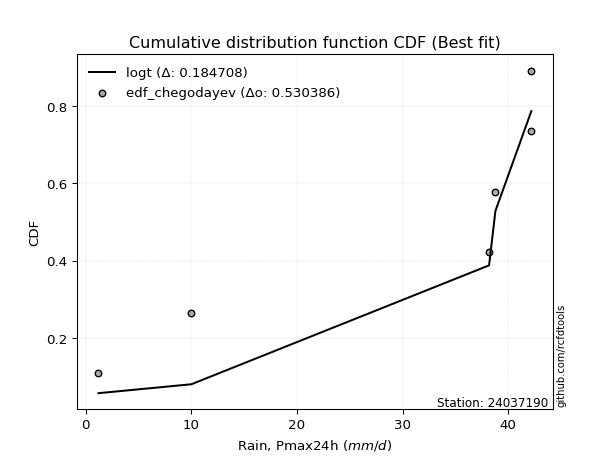</img></img>

</div>


### 6. Empirical - EDF Blom (1958)

The Blom formula is a specific "plotting position" formula used in hydrology and statistical analysis to estimate the empirical cumulative probability (or non-exceedance probability) of a data series. It is particularly recommended for data that are approximately normally distributed. The constant _a_ is set to 0.375 (or 3/8).

<div align="center">


$P=(m-a)/(n+1-2a)$


</div>


**6.1. Empirical values**

<div align="center">

|                | 0                   | 1                   | 2                  | 3        | 4                  | 5                  | 6                  |
|:---------------|:--------------------|:--------------------|:-------------------|:---------|:-------------------|:-------------------|:-------------------|
| date           | 2021                | 2020                | 2019               | 2025     | 2024               | 2022               | 2023               |
| x              | 1.2                 | 10.0                | 38.2               | 38.6     | 38.8               | 42.2               | 42.2               |
| m              | 1                   | 2                   | 3                  | 4        | 5                  | 6                  | 7                  |
| empirical_dist | edf_blom            | edf_blom            | edf_blom           | edf_blom | edf_blom           | edf_blom           | edf_blom           |
| empirical      | 0.08620689655172414 | 0.22413793103448276 | 0.3620689655172414 | 0.5      | 0.6379310344827587 | 0.7758620689655172 | 0.9137931034482759 |
| empirical_tr   | 1.0943396226415094  | 1.288888888888889   | 1.5675675675675675 | 2.0      | 2.7619047619047623 | 4.461538461538462  | 11.600000000000007 |

</div>


**6.2. Kolmogorov-Smirnov fit test (sorted by Δ)**


<div align="center">

|                | 0                   | 1                   | 2                   | 3                   | 4                   | 5                   | 6                   | 7                   | 8                   | 9                   | 10                  | 11                  | 12                  | 13                  | 14                  | 15                  | 16                  | 17                  | 18                  | 19                  | 20                  | 21                  | 22                  | 23                  | 24                  | 25                  | 26                  | 27                  | 28                  | 29                  | 30                  | 31                  | 32                  | 33                  | 34                  | 35                  | 36                  | 37                  | 38                  | 39                  | 40                  | 41                  | 42                  | 43                  | 44                  | 45                  | 46                  | 47                  | 48                  | 49                  | 50                  | 51                  | 52                  | 53                  | 54                  | 55                  | 56                  | 57                  | 58                  | 59                  | 60                  | 61                  | 62                  | 63                  | 64                  | 65                  | 66                  | 67                  | 68                  | 69                  | 70                  | 71                  | 72                  | 73                  | 74                  | 75                  | 76                  | 77                  | 78                  | 79                  | 80                  | 81                  | 82                    | 83                  | 84                  | 85                  | 86                  | 87                  | 88                  | 89                  |
|:---------------|:--------------------|:--------------------|:--------------------|:--------------------|:--------------------|:--------------------|:--------------------|:--------------------|:--------------------|:--------------------|:--------------------|:--------------------|:--------------------|:--------------------|:--------------------|:--------------------|:--------------------|:--------------------|:--------------------|:--------------------|:--------------------|:--------------------|:--------------------|:--------------------|:--------------------|:--------------------|:--------------------|:--------------------|:--------------------|:--------------------|:--------------------|:--------------------|:--------------------|:--------------------|:--------------------|:--------------------|:--------------------|:--------------------|:--------------------|:--------------------|:--------------------|:--------------------|:--------------------|:--------------------|:--------------------|:--------------------|:--------------------|:--------------------|:--------------------|:--------------------|:--------------------|:--------------------|:--------------------|:--------------------|:--------------------|:--------------------|:--------------------|:--------------------|:--------------------|:--------------------|:--------------------|:--------------------|:--------------------|:--------------------|:--------------------|:--------------------|:--------------------|:--------------------|:--------------------|:--------------------|:--------------------|:--------------------|:--------------------|:--------------------|:--------------------|:--------------------|:--------------------|:--------------------|:--------------------|:--------------------|:--------------------|:--------------------|:----------------------|:--------------------|:--------------------|:--------------------|:--------------------|:--------------------|:--------------------|:--------------------|
| station        | 24037190            | 24037190            | 24037190            | 24037190            | 24037190            | 24037190            | 24037190            | 24037190            | 24037190            | 24037190            | 24037190            | 24037190            | 24037190            | 24037190            | 24037190            | 24037190            | 24037190            | 24037190            | 24037190            | 24037190            | 24037190            | 24037190            | 24037190            | 24037190            | 24037190            | 24037190            | 24037190            | 24037190            | 24037190            | 24037190            | 24037190            | 24037190            | 24037190            | 24037190            | 24037190            | 24037190            | 24037190            | 24037190            | 24037190            | 24037190            | 24037190            | 24037190            | 24037190            | 24037190            | 24037190            | 24037190            | 24037190            | 24037190            | 24037190            | 24037190            | 24037190            | 24037190            | 24037190            | 24037190            | 24037190            | 24037190            | 24037190            | 24037190            | 24037190            | 24037190            | 24037190            | 24037190            | 24037190            | 24037190            | 24037190            | 24037190            | 24037190            | 24037190            | 24037190            | 24037190            | 24037190            | 24037190            | 24037190            | 24037190            | 24037190            | 24037190            | 24037190            | 24037190            | 24037190            | 24037190            | 24037190            | 24037190            | 24037190              | 24037190            | 24037190            | 24037190            | 24037190            | 24037190            | 24037190            | 24037190            |
| empirical_dist | edf_blom            | edf_blom            | edf_blom            | edf_blom            | edf_blom            | edf_blom            | edf_blom            | edf_blom            | edf_blom            | edf_blom            | edf_blom            | edf_blom            | edf_blom            | edf_blom            | edf_blom            | edf_blom            | edf_blom            | edf_blom            | edf_blom            | edf_blom            | edf_blom            | edf_blom            | edf_blom            | edf_blom            | edf_blom            | edf_blom            | edf_blom            | edf_blom            | edf_blom            | edf_blom            | edf_blom            | edf_blom            | edf_blom            | edf_blom            | edf_blom            | edf_blom            | edf_blom            | edf_blom            | edf_blom            | edf_blom            | edf_blom            | edf_blom            | edf_blom            | edf_blom            | edf_blom            | edf_blom            | edf_blom            | edf_blom            | edf_blom            | edf_blom            | edf_blom            | edf_blom            | edf_blom            | edf_blom            | edf_blom            | edf_blom            | edf_blom            | edf_blom            | edf_blom            | edf_blom            | edf_blom            | edf_blom            | edf_blom            | edf_blom            | edf_blom            | edf_blom            | edf_blom            | edf_blom            | edf_blom            | edf_blom            | edf_blom            | edf_blom            | edf_blom            | edf_blom            | edf_blom            | edf_blom            | edf_blom            | edf_blom            | edf_blom            | edf_blom            | edf_blom            | edf_blom            | edf_blom              | edf_blom            | edf_blom            | edf_blom            | edf_blom            | edf_blom            | edf_blom            | edf_blom            |
| p_dist         | logt                | gompertz            | fisk                | logpearson3         | logfisk             | pearson3            | loginvweibull       | gumbel_l            | logncf              | loggumbel_l         | weibull_min         | ncf                 | invweibull          | logchi2             | loginvgauss         | logerlang           | f                   | logkstwobign        | nct                 | exponnorm           | t                   | crystalball         | norm                | logalpha            | betaprime           | gamma               | logbetaprime        | rice                | erlang              | invgauss            | logf                | lognct              | logexponnorm        | logrice             | logcrystalball      | lognorm             | lognorm             | alpha               | chi2                | loginvgamma         | loggamma            | loggamma            | logfatiguelife      | invgamma            | logexpon            | maxwell             | kstwobign           | loggenexpon         | logistic            | mielke              | rayleigh            | logmaxwell          | laplace_asymmetric  | logweibull_min      | loggompertz         | lograyleigh         | expon               | genexpon            | loglogistic         | halfnorm            | hypsecant           | loghalfnorm         | loghypsecant        | gumbel_r            | nakagami            | loggumbel_r         | pareto              | laplace             | halflogistic        | loghalflogistic     | loglaplace          | moyal               | logmoyal            | lognakagami         | loglognorm          | logpareto           | wald                | logwald             | johnsonsu           | gibrat              | logmielke           | loggibrat           | loglaplace_asymmetric | logloggamma         | fatiguelife         | logtruncnorm        | logjohnsonsu        | genlogistic         | loggenlogistic      | truncnorm           |
| delta          | 0.1492126875885147  | 0.22413793066427248 | 0.2751959261930483  | 0.27564099959609606 | 0.28523056926682716 | 0.28937141848615416 | 0.294039796918146   | 0.29756313646632176 | 0.30439403276520377 | 0.3059327490164942  | 0.3146720774100548  | 0.31838652660214345 | 0.323011340064248   | 0.32853281696608866 | 0.33110723427345395 | 0.33155015459846376 | 0.33165703138859143 | 0.3319926614713104  | 0.33232078254829184 | 0.3323475086076993  | 0.33234909298961596 | 0.3323507775417304  | 0.33235079444118315 | 0.3325063204245035  | 0.33407344341425377 | 0.3347360256059578  | 0.33554461922370277 | 0.3356498353548046  | 0.3360671288816512  | 0.336954806350426   | 0.33696067890167575 | 0.33820340765592166 | 0.33856271387752007 | 0.33856426043343796 | 0.3385650779302278  | 0.33856509458103917 | 0.33856509458103917 | 0.338905078208627   | 0.3392566903709637  | 0.33946976778931964 | 0.3398617907739047  | 0.3398617907739047  | 0.3406773439105631  | 0.3417542276890579  | 0.3464785477992169  | 0.3489391330265978  | 0.349887674697622   | 0.3502650351274052  | 0.3534145984036257  | 0.3537997961645711  | 0.35380227700823    | 0.3544034885945115  | 0.3544056752611073  | 0.35803417251269304 | 0.35862784862639424 | 0.3590321481645364  | 0.35909192041679455 | 0.35928833176608826 | 0.3599435913496533  | 0.36849582951608056 | 0.36876075418001747 | 0.37312397761145194 | 0.37536222646865164 | 0.38432541026630757 | 0.38875754525112743 | 0.3892714184725758  | 0.3927408283021466  | 0.3943141202889406  | 0.3954979530624116  | 0.3998988884065014  | 0.40037261877859137 | 0.4011725054619351  | 0.40567476391874596 | 0.41493048008215727 | 0.42305379101764706 | 0.44180618235385405 | 0.4503718445839248  | 0.45385298801852875 | 0.47761964461729894 | 0.48184992936679544 | 0.48401195771848843 | 0.48515695559873245 | 0.5139479979307444    | 0.5143162674200115  | 0.5632271824611024  | 0.6197212137357331  | 0.6296560429970326  | 0.6379310344827587  | 0.6379310344827587  | 0.7701678846662802  |
| deltao         | 0.48442053926100004 | 0.48442053926100004 | 0.48442053926100004 | 0.48442053926100004 | 0.48442053926100004 | 0.48442053926100004 | 0.48442053926100004 | 0.48442053926100004 | 0.48442053926100004 | 0.48442053926100004 | 0.48442053926100004 | 0.48442053926100004 | 0.48442053926100004 | 0.48442053926100004 | 0.48442053926100004 | 0.48442053926100004 | 0.48442053926100004 | 0.48442053926100004 | 0.48442053926100004 | 0.48442053926100004 | 0.48442053926100004 | 0.48442053926100004 | 0.48442053926100004 | 0.48442053926100004 | 0.48442053926100004 | 0.48442053926100004 | 0.48442053926100004 | 0.48442053926100004 | 0.48442053926100004 | 0.48442053926100004 | 0.48442053926100004 | 0.48442053926100004 | 0.48442053926100004 | 0.48442053926100004 | 0.48442053926100004 | 0.48442053926100004 | 0.48442053926100004 | 0.48442053926100004 | 0.48442053926100004 | 0.48442053926100004 | 0.48442053926100004 | 0.48442053926100004 | 0.48442053926100004 | 0.48442053926100004 | 0.48442053926100004 | 0.48442053926100004 | 0.48442053926100004 | 0.48442053926100004 | 0.48442053926100004 | 0.48442053926100004 | 0.48442053926100004 | 0.48442053926100004 | 0.48442053926100004 | 0.48442053926100004 | 0.48442053926100004 | 0.48442053926100004 | 0.48442053926100004 | 0.48442053926100004 | 0.48442053926100004 | 0.48442053926100004 | 0.48442053926100004 | 0.48442053926100004 | 0.48442053926100004 | 0.48442053926100004 | 0.48442053926100004 | 0.48442053926100004 | 0.48442053926100004 | 0.48442053926100004 | 0.48442053926100004 | 0.48442053926100004 | 0.48442053926100004 | 0.48442053926100004 | 0.48442053926100004 | 0.48442053926100004 | 0.48442053926100004 | 0.48442053926100004 | 0.48442053926100004 | 0.48442053926100004 | 0.48442053926100004 | 0.48442053926100004 | 0.48442053926100004 | 0.48442053926100004 | 0.48442053926100004   | 0.48442053926100004 | 0.48442053926100004 | 0.48442053926100004 | 0.48442053926100004 | 0.48442053926100004 | 0.48442053926100004 | 0.48442053926100004 |
| eval           | Δo > Δ              | Δo > Δ              | Δo > Δ              | Δo > Δ              | Δo > Δ              | Δo > Δ              | Δo > Δ              | Δo > Δ              | Δo > Δ              | Δo > Δ              | Δo > Δ              | Δo > Δ              | Δo > Δ              | Δo > Δ              | Δo > Δ              | Δo > Δ              | Δo > Δ              | Δo > Δ              | Δo > Δ              | Δo > Δ              | Δo > Δ              | Δo > Δ              | Δo > Δ              | Δo > Δ              | Δo > Δ              | Δo > Δ              | Δo > Δ              | Δo > Δ              | Δo > Δ              | Δo > Δ              | Δo > Δ              | Δo > Δ              | Δo > Δ              | Δo > Δ              | Δo > Δ              | Δo > Δ              | Δo > Δ              | Δo > Δ              | Δo > Δ              | Δo > Δ              | Δo > Δ              | Δo > Δ              | Δo > Δ              | Δo > Δ              | Δo > Δ              | Δo > Δ              | Δo > Δ              | Δo > Δ              | Δo > Δ              | Δo > Δ              | Δo > Δ              | Δo > Δ              | Δo > Δ              | Δo > Δ              | Δo > Δ              | Δo > Δ              | Δo > Δ              | Δo > Δ              | Δo > Δ              | Δo > Δ              | Δo > Δ              | Δo > Δ              | Δo > Δ              | Δo > Δ              | Δo > Δ              | Δo > Δ              | Δo > Δ              | Δo > Δ              | Δo > Δ              | Δo > Δ              | Δo > Δ              | Δo > Δ              | Δo > Δ              | Δo > Δ              | Δo > Δ              | Δo > Δ              | Δo > Δ              | Δo > Δ              | Δo > Δ              | Δo > Δ              | Δo > Δ              | Δo <= Δ             | Δo <= Δ               | Δo <= Δ             | Δo <= Δ             | Δo <= Δ             | Δo <= Δ             | Δo <= Δ             | Δo <= Δ             | Δo <= Δ             |
| fit            | 1                   | 1                   | 1                   | 1                   | 1                   | 1                   | 1                   | 1                   | 1                   | 1                   | 1                   | 1                   | 1                   | 1                   | 1                   | 1                   | 1                   | 1                   | 1                   | 1                   | 1                   | 1                   | 1                   | 1                   | 1                   | 1                   | 1                   | 1                   | 1                   | 1                   | 1                   | 1                   | 1                   | 1                   | 1                   | 1                   | 1                   | 1                   | 1                   | 1                   | 1                   | 1                   | 1                   | 1                   | 1                   | 1                   | 1                   | 1                   | 1                   | 1                   | 1                   | 1                   | 1                   | 1                   | 1                   | 1                   | 1                   | 1                   | 1                   | 1                   | 1                   | 1                   | 1                   | 1                   | 1                   | 1                   | 1                   | 1                   | 1                   | 1                   | 1                   | 1                   | 1                   | 1                   | 1                   | 1                   | 1                   | 1                   | 1                   | 1                   | 1                   | 0                   | 0                     | 0                   | 0                   | 0                   | 0                   | 0                   | 0                   | 0                   |
| n              | 7                   | 7                   | 7                   | 7                   | 7                   | 7                   | 7                   | 7                   | 7                   | 7                   | 7                   | 7                   | 7                   | 7                   | 7                   | 7                   | 7                   | 7                   | 7                   | 7                   | 7                   | 7                   | 7                   | 7                   | 7                   | 7                   | 7                   | 7                   | 7                   | 7                   | 7                   | 7                   | 7                   | 7                   | 7                   | 7                   | 7                   | 7                   | 7                   | 7                   | 7                   | 7                   | 7                   | 7                   | 7                   | 7                   | 7                   | 7                   | 7                   | 7                   | 7                   | 7                   | 7                   | 7                   | 7                   | 7                   | 7                   | 7                   | 7                   | 7                   | 7                   | 7                   | 7                   | 7                   | 7                   | 7                   | 7                   | 7                   | 7                   | 7                   | 7                   | 7                   | 7                   | 7                   | 7                   | 7                   | 7                   | 7                   | 7                   | 7                   | 7                   | 7                   | 7                     | 7                   | 7                   | 7                   | 7                   | 7                   | 7                   | 7                   |
| best_fit       | 1                   | 0                   | 0                   | 0                   | 0                   | 0                   | 0                   | 0                   | 0                   | 0                   | 0                   | 0                   | 0                   | 0                   | 0                   | 0                   | 0                   | 0                   | 0                   | 0                   | 0                   | 0                   | 0                   | 0                   | 0                   | 0                   | 0                   | 0                   | 0                   | 0                   | 0                   | 0                   | 0                   | 0                   | 0                   | 0                   | 0                   | 0                   | 0                   | 0                   | 0                   | 0                   | 0                   | 0                   | 0                   | 0                   | 0                   | 0                   | 0                   | 0                   | 0                   | 0                   | 0                   | 0                   | 0                   | 0                   | 0                   | 0                   | 0                   | 0                   | 0                   | 0                   | 0                   | 0                   | 0                   | 0                   | 0                   | 0                   | 0                   | 0                   | 0                   | 0                   | 0                   | 0                   | 0                   | 0                   | 0                   | 0                   | 0                   | 0                   | 0                   | 0                   | 0                     | 0                   | 0                   | 0                   | 0                   | 0                   | 0                   | 0                   |
| best_fit_sort  | 1                   | 2                   | 3                   | 4                   | 5                   | 6                   | 7                   | 8                   | 9                   | 10                  | 11                  | 12                  | 13                  | 14                  | 15                  | 16                  | 17                  | 18                  | 19                  | 20                  | 21                  | 22                  | 23                  | 24                  | 25                  | 26                  | 27                  | 28                  | 29                  | 30                  | 31                  | 32                  | 33                  | 34                  | 35                  | 36                  | 37                  | 38                  | 39                  | 40                  | 41                  | 42                  | 43                  | 44                  | 45                  | 46                  | 47                  | 48                  | 49                  | 50                  | 51                  | 52                  | 53                  | 54                  | 55                  | 56                  | 57                  | 58                  | 59                  | 60                  | 61                  | 62                  | 63                  | 64                  | 65                  | 66                  | 67                  | 68                  | 69                  | 70                  | 71                  | 72                  | 73                  | 74                  | 75                  | 76                  | 77                  | 78                  | 79                  | 80                  | 81                  | 82                  | 83                    | 84                  | 85                  | 86                  | 87                  | 88                  | 89                  | 90                  |

</div>


<div align="center">

</img>

</div>


**6.3. Best fit**

<div align="center">

|   id |   station | empirical_dist   | p_dist   |    delta |   deltao | eval   |   fit |   n |   best_fit |   best_fit_sort |
|-----:|----------:|:-----------------|:---------|---------:|---------:|:-------|------:|----:|-----------:|----------------:|
|    0 |  24037190 | edf_blom         | logt     | 0.149213 | 0.484421 | Δo > Δ |     1 |   7 |          1 |               1 |

</div>


<div align="center">

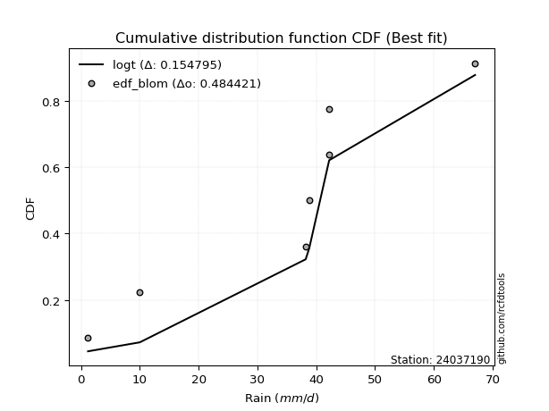</img>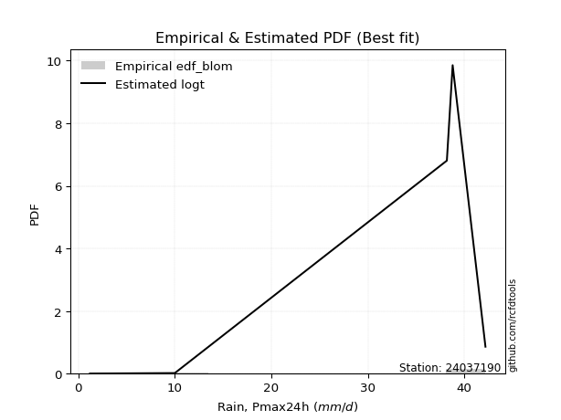</img>

</div>


### 7. Empirical - EDF Tukey (1962)

In hydrology, the Tukey formula is used as a plotting position formula to estimate the empirical probability or frequency of a flood event (or other hydrological data). The formula parameter is given as _c=0.333_ (or 1/3).

<div align="center">


$P=(m-c)/(n+1-2c)$


</div>


**7.1. Empirical values**

<div align="center">

|                | 0                   | 1                   | 2                   | 3         | 4                  | 5                  | 6                  |
|:---------------|:--------------------|:--------------------|:--------------------|:----------|:-------------------|:-------------------|:-------------------|
| date           | 2021                | 2020                | 2019                | 2025      | 2024               | 2022               | 2023               |
| x              | 1.2                 | 10.0                | 38.2                | 38.6      | 38.8               | 42.2               | 42.2               |
| m              | 1                   | 2                   | 3                   | 4         | 5                  | 6                  | 7                  |
| empirical_dist | edf_tukey           | edf_tukey           | edf_tukey           | edf_tukey | edf_tukey          | edf_tukey          | edf_tukey          |
| empirical      | 0.09090909090909091 | 0.22727272727272727 | 0.36363636363636365 | 0.5       | 0.6363636363636364 | 0.7727272727272727 | 0.9090909090909091 |
| empirical_tr   | 1.1                 | 1.2941176470588236  | 1.5714285714285714  | 2.0       | 2.75               | 4.3999999999999995 | 10.999999999999996 |

</div>


**7.2. Kolmogorov-Smirnov fit test (sorted by Δ)**


<div align="center">

|                | 0                   | 1                   | 2                   | 3                   | 4                   | 5                   | 6                   | 7                   | 8                   | 9                   | 10                  | 11                  | 12                  | 13                  | 14                  | 15                  | 16                  | 17                  | 18                  | 19                  | 20                  | 21                  | 22                  | 23                  | 24                  | 25                  | 26                  | 27                  | 28                  | 29                  | 30                  | 31                  | 32                  | 33                  | 34                  | 35                  | 36                  | 37                  | 38                  | 39                  | 40                  | 41                  | 42                  | 43                  | 44                  | 45                  | 46                  | 47                  | 48                  | 49                  | 50                  | 51                  | 52                  | 53                  | 54                  | 55                  | 56                  | 57                  | 58                  | 59                  | 60                  | 61                  | 62                  | 63                  | 64                  | 65                  | 66                  | 67                  | 68                  | 69                  | 70                  | 71                  | 72                  | 73                  | 74                  | 75                  | 76                  | 77                  | 78                  | 79                  | 80                  | 81                  | 82                    | 83                  | 84                  | 85                  | 86                  | 87                  | 88                  | 89                  |
|:---------------|:--------------------|:--------------------|:--------------------|:--------------------|:--------------------|:--------------------|:--------------------|:--------------------|:--------------------|:--------------------|:--------------------|:--------------------|:--------------------|:--------------------|:--------------------|:--------------------|:--------------------|:--------------------|:--------------------|:--------------------|:--------------------|:--------------------|:--------------------|:--------------------|:--------------------|:--------------------|:--------------------|:--------------------|:--------------------|:--------------------|:--------------------|:--------------------|:--------------------|:--------------------|:--------------------|:--------------------|:--------------------|:--------------------|:--------------------|:--------------------|:--------------------|:--------------------|:--------------------|:--------------------|:--------------------|:--------------------|:--------------------|:--------------------|:--------------------|:--------------------|:--------------------|:--------------------|:--------------------|:--------------------|:--------------------|:--------------------|:--------------------|:--------------------|:--------------------|:--------------------|:--------------------|:--------------------|:--------------------|:--------------------|:--------------------|:--------------------|:--------------------|:--------------------|:--------------------|:--------------------|:--------------------|:--------------------|:--------------------|:--------------------|:--------------------|:--------------------|:--------------------|:--------------------|:--------------------|:--------------------|:--------------------|:--------------------|:----------------------|:--------------------|:--------------------|:--------------------|:--------------------|:--------------------|:--------------------|:--------------------|
| station        | 24037190            | 24037190            | 24037190            | 24037190            | 24037190            | 24037190            | 24037190            | 24037190            | 24037190            | 24037190            | 24037190            | 24037190            | 24037190            | 24037190            | 24037190            | 24037190            | 24037190            | 24037190            | 24037190            | 24037190            | 24037190            | 24037190            | 24037190            | 24037190            | 24037190            | 24037190            | 24037190            | 24037190            | 24037190            | 24037190            | 24037190            | 24037190            | 24037190            | 24037190            | 24037190            | 24037190            | 24037190            | 24037190            | 24037190            | 24037190            | 24037190            | 24037190            | 24037190            | 24037190            | 24037190            | 24037190            | 24037190            | 24037190            | 24037190            | 24037190            | 24037190            | 24037190            | 24037190            | 24037190            | 24037190            | 24037190            | 24037190            | 24037190            | 24037190            | 24037190            | 24037190            | 24037190            | 24037190            | 24037190            | 24037190            | 24037190            | 24037190            | 24037190            | 24037190            | 24037190            | 24037190            | 24037190            | 24037190            | 24037190            | 24037190            | 24037190            | 24037190            | 24037190            | 24037190            | 24037190            | 24037190            | 24037190            | 24037190              | 24037190            | 24037190            | 24037190            | 24037190            | 24037190            | 24037190            | 24037190            |
| empirical_dist | edf_tukey           | edf_tukey           | edf_tukey           | edf_tukey           | edf_tukey           | edf_tukey           | edf_tukey           | edf_tukey           | edf_tukey           | edf_tukey           | edf_tukey           | edf_tukey           | edf_tukey           | edf_tukey           | edf_tukey           | edf_tukey           | edf_tukey           | edf_tukey           | edf_tukey           | edf_tukey           | edf_tukey           | edf_tukey           | edf_tukey           | edf_tukey           | edf_tukey           | edf_tukey           | edf_tukey           | edf_tukey           | edf_tukey           | edf_tukey           | edf_tukey           | edf_tukey           | edf_tukey           | edf_tukey           | edf_tukey           | edf_tukey           | edf_tukey           | edf_tukey           | edf_tukey           | edf_tukey           | edf_tukey           | edf_tukey           | edf_tukey           | edf_tukey           | edf_tukey           | edf_tukey           | edf_tukey           | edf_tukey           | edf_tukey           | edf_tukey           | edf_tukey           | edf_tukey           | edf_tukey           | edf_tukey           | edf_tukey           | edf_tukey           | edf_tukey           | edf_tukey           | edf_tukey           | edf_tukey           | edf_tukey           | edf_tukey           | edf_tukey           | edf_tukey           | edf_tukey           | edf_tukey           | edf_tukey           | edf_tukey           | edf_tukey           | edf_tukey           | edf_tukey           | edf_tukey           | edf_tukey           | edf_tukey           | edf_tukey           | edf_tukey           | edf_tukey           | edf_tukey           | edf_tukey           | edf_tukey           | edf_tukey           | edf_tukey           | edf_tukey             | edf_tukey           | edf_tukey           | edf_tukey           | edf_tukey           | edf_tukey           | edf_tukey           | edf_tukey           |
| p_dist         | logt                | gompertz            | fisk                | logpearson3         | logfisk             | pearson3            | loginvweibull       | gumbel_l            | logncf              | loggumbel_l         | weibull_min         | ncf                 | invweibull          | logchi2             | loginvgauss         | logerlang           | f                   | logkstwobign        | nct                 | exponnorm           | t                   | crystalball         | norm                | logalpha            | betaprime           | gamma               | logbetaprime        | rice                | erlang              | invgauss            | logf                | lognct              | logexponnorm        | logrice             | logcrystalball      | lognorm             | lognorm             | alpha               | chi2                | loginvgamma         | loggamma            | loggamma            | logfatiguelife      | invgamma            | logexpon            | maxwell             | kstwobign           | loggenexpon         | logistic            | mielke              | rayleigh            | logmaxwell          | laplace_asymmetric  | logweibull_min      | loggompertz         | lograyleigh         | expon               | genexpon            | loglogistic         | halfnorm            | hypsecant           | loghalfnorm         | loghypsecant        | gumbel_r            | nakagami            | loggumbel_r         | pareto              | laplace             | halflogistic        | loghalflogistic     | loglaplace          | moyal               | logmoyal            | lognakagami         | loglognorm          | logpareto           | wald                | logwald             | johnsonsu           | gibrat              | logmielke           | loggibrat           | loglaplace_asymmetric | logloggamma         | fatiguelife         | logtruncnorm        | logjohnsonsu        | genlogistic         | loggenlogistic      | truncnorm           |
| delta          | 0.15234748382675922 | 0.22727272690251699 | 0.273628528073926   | 0.2740736014769738  | 0.2836631711477049  | 0.2878040203670319  | 0.29247239879902376 | 0.2959957383471995  | 0.3028266346460815  | 0.30436535089737193 | 0.31310467929093255 | 0.3168191284830212  | 0.3214439419451257  | 0.3269654188469664  | 0.3295398361543317  | 0.3299827564793415  | 0.33008963326946916 | 0.33042526335218814 | 0.3307533844291696  | 0.33078011048857703 | 0.3307816948704937  | 0.33078337942260816 | 0.3307833963220609  | 0.33093892230538124 | 0.3325060452951315  | 0.3331686274868355  | 0.3339772211045805  | 0.3340824372356823  | 0.3344997307625289  | 0.33538740823130375 | 0.3353932807825535  | 0.3366360095367994  | 0.3369953157583978  | 0.3369968623143157  | 0.3369976798111055  | 0.3369976964619169  | 0.3369976964619169  | 0.3373376800895047  | 0.3376892922518414  | 0.3379023696701974  | 0.33829439265478245 | 0.33829439265478245 | 0.3391099457914408  | 0.3401868295699356  | 0.3449111496800946  | 0.3473717349074755  | 0.34832027657849973 | 0.34869763700828293 | 0.35184720028450345 | 0.3522323980454488  | 0.35223487888910776 | 0.3528360904753892  | 0.352838277141985   | 0.3564667743935708  | 0.357060450507272   | 0.3574647500454141  | 0.3575245222976723  | 0.357720933646966   | 0.35837619323053105 | 0.3669284313969583  | 0.3671933560608952  | 0.3715565794923297  | 0.3737948283495294  | 0.3827580121471853  | 0.38719014713200517 | 0.3877040203534535  | 0.3896060320639021  | 0.3927467221698183  | 0.3939305549432893  | 0.39833149028737913 | 0.3988052206594691  | 0.39960510734281285 | 0.4041073657996237  | 0.41179568384391274 | 0.41991899477940253 | 0.4386713861156095  | 0.44880444646480255 | 0.4522855898994065  | 0.4760522464981766  | 0.4802825312476732  | 0.48244455959936616 | 0.4835895574796102  | 0.5123805998116222    | 0.5127488693008893  | 0.56165978434198    | 0.6181538156166109  | 0.6280886448779103  | 0.6363636363636364  | 0.6363636363636364  | 0.7670330884280356  |
| deltao         | 0.48442053926100004 | 0.48442053926100004 | 0.48442053926100004 | 0.48442053926100004 | 0.48442053926100004 | 0.48442053926100004 | 0.48442053926100004 | 0.48442053926100004 | 0.48442053926100004 | 0.48442053926100004 | 0.48442053926100004 | 0.48442053926100004 | 0.48442053926100004 | 0.48442053926100004 | 0.48442053926100004 | 0.48442053926100004 | 0.48442053926100004 | 0.48442053926100004 | 0.48442053926100004 | 0.48442053926100004 | 0.48442053926100004 | 0.48442053926100004 | 0.48442053926100004 | 0.48442053926100004 | 0.48442053926100004 | 0.48442053926100004 | 0.48442053926100004 | 0.48442053926100004 | 0.48442053926100004 | 0.48442053926100004 | 0.48442053926100004 | 0.48442053926100004 | 0.48442053926100004 | 0.48442053926100004 | 0.48442053926100004 | 0.48442053926100004 | 0.48442053926100004 | 0.48442053926100004 | 0.48442053926100004 | 0.48442053926100004 | 0.48442053926100004 | 0.48442053926100004 | 0.48442053926100004 | 0.48442053926100004 | 0.48442053926100004 | 0.48442053926100004 | 0.48442053926100004 | 0.48442053926100004 | 0.48442053926100004 | 0.48442053926100004 | 0.48442053926100004 | 0.48442053926100004 | 0.48442053926100004 | 0.48442053926100004 | 0.48442053926100004 | 0.48442053926100004 | 0.48442053926100004 | 0.48442053926100004 | 0.48442053926100004 | 0.48442053926100004 | 0.48442053926100004 | 0.48442053926100004 | 0.48442053926100004 | 0.48442053926100004 | 0.48442053926100004 | 0.48442053926100004 | 0.48442053926100004 | 0.48442053926100004 | 0.48442053926100004 | 0.48442053926100004 | 0.48442053926100004 | 0.48442053926100004 | 0.48442053926100004 | 0.48442053926100004 | 0.48442053926100004 | 0.48442053926100004 | 0.48442053926100004 | 0.48442053926100004 | 0.48442053926100004 | 0.48442053926100004 | 0.48442053926100004 | 0.48442053926100004 | 0.48442053926100004   | 0.48442053926100004 | 0.48442053926100004 | 0.48442053926100004 | 0.48442053926100004 | 0.48442053926100004 | 0.48442053926100004 | 0.48442053926100004 |
| eval           | Δo > Δ              | Δo > Δ              | Δo > Δ              | Δo > Δ              | Δo > Δ              | Δo > Δ              | Δo > Δ              | Δo > Δ              | Δo > Δ              | Δo > Δ              | Δo > Δ              | Δo > Δ              | Δo > Δ              | Δo > Δ              | Δo > Δ              | Δo > Δ              | Δo > Δ              | Δo > Δ              | Δo > Δ              | Δo > Δ              | Δo > Δ              | Δo > Δ              | Δo > Δ              | Δo > Δ              | Δo > Δ              | Δo > Δ              | Δo > Δ              | Δo > Δ              | Δo > Δ              | Δo > Δ              | Δo > Δ              | Δo > Δ              | Δo > Δ              | Δo > Δ              | Δo > Δ              | Δo > Δ              | Δo > Δ              | Δo > Δ              | Δo > Δ              | Δo > Δ              | Δo > Δ              | Δo > Δ              | Δo > Δ              | Δo > Δ              | Δo > Δ              | Δo > Δ              | Δo > Δ              | Δo > Δ              | Δo > Δ              | Δo > Δ              | Δo > Δ              | Δo > Δ              | Δo > Δ              | Δo > Δ              | Δo > Δ              | Δo > Δ              | Δo > Δ              | Δo > Δ              | Δo > Δ              | Δo > Δ              | Δo > Δ              | Δo > Δ              | Δo > Δ              | Δo > Δ              | Δo > Δ              | Δo > Δ              | Δo > Δ              | Δo > Δ              | Δo > Δ              | Δo > Δ              | Δo > Δ              | Δo > Δ              | Δo > Δ              | Δo > Δ              | Δo > Δ              | Δo > Δ              | Δo > Δ              | Δo > Δ              | Δo > Δ              | Δo > Δ              | Δo > Δ              | Δo > Δ              | Δo <= Δ               | Δo <= Δ             | Δo <= Δ             | Δo <= Δ             | Δo <= Δ             | Δo <= Δ             | Δo <= Δ             | Δo <= Δ             |
| fit            | 1                   | 1                   | 1                   | 1                   | 1                   | 1                   | 1                   | 1                   | 1                   | 1                   | 1                   | 1                   | 1                   | 1                   | 1                   | 1                   | 1                   | 1                   | 1                   | 1                   | 1                   | 1                   | 1                   | 1                   | 1                   | 1                   | 1                   | 1                   | 1                   | 1                   | 1                   | 1                   | 1                   | 1                   | 1                   | 1                   | 1                   | 1                   | 1                   | 1                   | 1                   | 1                   | 1                   | 1                   | 1                   | 1                   | 1                   | 1                   | 1                   | 1                   | 1                   | 1                   | 1                   | 1                   | 1                   | 1                   | 1                   | 1                   | 1                   | 1                   | 1                   | 1                   | 1                   | 1                   | 1                   | 1                   | 1                   | 1                   | 1                   | 1                   | 1                   | 1                   | 1                   | 1                   | 1                   | 1                   | 1                   | 1                   | 1                   | 1                   | 1                   | 1                   | 0                     | 0                   | 0                   | 0                   | 0                   | 0                   | 0                   | 0                   |
| n              | 7                   | 7                   | 7                   | 7                   | 7                   | 7                   | 7                   | 7                   | 7                   | 7                   | 7                   | 7                   | 7                   | 7                   | 7                   | 7                   | 7                   | 7                   | 7                   | 7                   | 7                   | 7                   | 7                   | 7                   | 7                   | 7                   | 7                   | 7                   | 7                   | 7                   | 7                   | 7                   | 7                   | 7                   | 7                   | 7                   | 7                   | 7                   | 7                   | 7                   | 7                   | 7                   | 7                   | 7                   | 7                   | 7                   | 7                   | 7                   | 7                   | 7                   | 7                   | 7                   | 7                   | 7                   | 7                   | 7                   | 7                   | 7                   | 7                   | 7                   | 7                   | 7                   | 7                   | 7                   | 7                   | 7                   | 7                   | 7                   | 7                   | 7                   | 7                   | 7                   | 7                   | 7                   | 7                   | 7                   | 7                   | 7                   | 7                   | 7                   | 7                   | 7                   | 7                     | 7                   | 7                   | 7                   | 7                   | 7                   | 7                   | 7                   |
| best_fit       | 1                   | 0                   | 0                   | 0                   | 0                   | 0                   | 0                   | 0                   | 0                   | 0                   | 0                   | 0                   | 0                   | 0                   | 0                   | 0                   | 0                   | 0                   | 0                   | 0                   | 0                   | 0                   | 0                   | 0                   | 0                   | 0                   | 0                   | 0                   | 0                   | 0                   | 0                   | 0                   | 0                   | 0                   | 0                   | 0                   | 0                   | 0                   | 0                   | 0                   | 0                   | 0                   | 0                   | 0                   | 0                   | 0                   | 0                   | 0                   | 0                   | 0                   | 0                   | 0                   | 0                   | 0                   | 0                   | 0                   | 0                   | 0                   | 0                   | 0                   | 0                   | 0                   | 0                   | 0                   | 0                   | 0                   | 0                   | 0                   | 0                   | 0                   | 0                   | 0                   | 0                   | 0                   | 0                   | 0                   | 0                   | 0                   | 0                   | 0                   | 0                   | 0                   | 0                     | 0                   | 0                   | 0                   | 0                   | 0                   | 0                   | 0                   |
| best_fit_sort  | 1                   | 2                   | 3                   | 4                   | 5                   | 6                   | 7                   | 8                   | 9                   | 10                  | 11                  | 12                  | 13                  | 14                  | 15                  | 16                  | 17                  | 18                  | 19                  | 20                  | 21                  | 22                  | 23                  | 24                  | 25                  | 26                  | 27                  | 28                  | 29                  | 30                  | 31                  | 32                  | 33                  | 34                  | 35                  | 36                  | 37                  | 38                  | 39                  | 40                  | 41                  | 42                  | 43                  | 44                  | 45                  | 46                  | 47                  | 48                  | 49                  | 50                  | 51                  | 52                  | 53                  | 54                  | 55                  | 56                  | 57                  | 58                  | 59                  | 60                  | 61                  | 62                  | 63                  | 64                  | 65                  | 66                  | 67                  | 68                  | 69                  | 70                  | 71                  | 72                  | 73                  | 74                  | 75                  | 76                  | 77                  | 78                  | 79                  | 80                  | 81                  | 82                  | 83                    | 84                  | 85                  | 86                  | 87                  | 88                  | 89                  | 90                  |

</div>


<div align="center">

</img>

</div>


**7.3. Best fit**

<div align="center">

|   id |   station | empirical_dist   | p_dist   |    delta |   deltao | eval   |   fit |   n |   best_fit |   best_fit_sort |
|-----:|----------:|:-----------------|:---------|---------:|---------:|:-------|------:|----:|-----------:|----------------:|
|    0 |  24037190 | edf_tukey        | logt     | 0.152347 | 0.484421 | Δo > Δ |     1 |   7 |          1 |               1 |

</div>


<div align="center">

</img></img>

</div>


### 8. Empirical - EDF Gringorten (1963)

Gringorten plotting position formula is essential for estimating the probability and return periods of extreme events like floods and heavy rainfall. The constant _a=0.44_.

<div align="center">


$P=(m-a)/(n+1-2a)$


</div>


**8.1. Empirical values**

<div align="center">

|                | 0                   | 1                   | 2                  | 3              | 4                  | 5                  | 6                  |
|:---------------|:--------------------|:--------------------|:-------------------|:---------------|:-------------------|:-------------------|:-------------------|
| date           | 2021                | 2020                | 2019               | 2025           | 2024               | 2022               | 2023               |
| x              | 1.2                 | 10.0                | 38.2               | 38.6           | 38.8               | 42.2               | 42.2               |
| m              | 1                   | 2                   | 3                  | 4              | 5                  | 6                  | 7                  |
| empirical_dist | edf_gringorten      | edf_gringorten      | edf_gringorten     | edf_gringorten | edf_gringorten     | edf_gringorten     | edf_gringorten     |
| empirical      | 0.07865168539325844 | 0.21910112359550563 | 0.3595505617977528 | 0.5            | 0.6404494382022471 | 0.7808988764044943 | 0.9213483146067415 |
| empirical_tr   | 1.0853658536585364  | 1.2805755395683454  | 1.5614035087719298 | 2.0            | 2.781249999999999  | 4.564102564102562  | 12.714285714285701 |

</div>


**8.2. Kolmogorov-Smirnov fit test (sorted by Δ)**


<div align="center">

|                | 0                   | 1                   | 2                   | 3                   | 4                   | 5                   | 6                   | 7                   | 8                   | 9                   | 10                  | 11                  | 12                  | 13                  | 14                  | 15                  | 16                  | 17                  | 18                  | 19                  | 20                  | 21                  | 22                  | 23                  | 24                  | 25                  | 26                  | 27                  | 28                  | 29                  | 30                  | 31                  | 32                  | 33                  | 34                  | 35                  | 36                  | 37                  | 38                  | 39                  | 40                  | 41                  | 42                  | 43                  | 44                  | 45                  | 46                  | 47                  | 48                  | 49                  | 50                  | 51                  | 52                  | 53                  | 54                  | 55                  | 56                  | 57                  | 58                  | 59                  | 60                  | 61                  | 62                  | 63                  | 64                  | 65                  | 66                  | 67                  | 68                  | 69                  | 70                  | 71                  | 72                  | 73                  | 74                  | 75                  | 76                  | 77                  | 78                  | 79                  | 80                  | 81                  | 82                    | 83                  | 84                  | 85                  | 86                  | 87                  | 88                  | 89                  |
|:---------------|:--------------------|:--------------------|:--------------------|:--------------------|:--------------------|:--------------------|:--------------------|:--------------------|:--------------------|:--------------------|:--------------------|:--------------------|:--------------------|:--------------------|:--------------------|:--------------------|:--------------------|:--------------------|:--------------------|:--------------------|:--------------------|:--------------------|:--------------------|:--------------------|:--------------------|:--------------------|:--------------------|:--------------------|:--------------------|:--------------------|:--------------------|:--------------------|:--------------------|:--------------------|:--------------------|:--------------------|:--------------------|:--------------------|:--------------------|:--------------------|:--------------------|:--------------------|:--------------------|:--------------------|:--------------------|:--------------------|:--------------------|:--------------------|:--------------------|:--------------------|:--------------------|:--------------------|:--------------------|:--------------------|:--------------------|:--------------------|:--------------------|:--------------------|:--------------------|:--------------------|:--------------------|:--------------------|:--------------------|:--------------------|:--------------------|:--------------------|:--------------------|:--------------------|:--------------------|:--------------------|:--------------------|:--------------------|:--------------------|:--------------------|:--------------------|:--------------------|:--------------------|:--------------------|:--------------------|:--------------------|:--------------------|:--------------------|:----------------------|:--------------------|:--------------------|:--------------------|:--------------------|:--------------------|:--------------------|:--------------------|
| station        | 24037190            | 24037190            | 24037190            | 24037190            | 24037190            | 24037190            | 24037190            | 24037190            | 24037190            | 24037190            | 24037190            | 24037190            | 24037190            | 24037190            | 24037190            | 24037190            | 24037190            | 24037190            | 24037190            | 24037190            | 24037190            | 24037190            | 24037190            | 24037190            | 24037190            | 24037190            | 24037190            | 24037190            | 24037190            | 24037190            | 24037190            | 24037190            | 24037190            | 24037190            | 24037190            | 24037190            | 24037190            | 24037190            | 24037190            | 24037190            | 24037190            | 24037190            | 24037190            | 24037190            | 24037190            | 24037190            | 24037190            | 24037190            | 24037190            | 24037190            | 24037190            | 24037190            | 24037190            | 24037190            | 24037190            | 24037190            | 24037190            | 24037190            | 24037190            | 24037190            | 24037190            | 24037190            | 24037190            | 24037190            | 24037190            | 24037190            | 24037190            | 24037190            | 24037190            | 24037190            | 24037190            | 24037190            | 24037190            | 24037190            | 24037190            | 24037190            | 24037190            | 24037190            | 24037190            | 24037190            | 24037190            | 24037190            | 24037190              | 24037190            | 24037190            | 24037190            | 24037190            | 24037190            | 24037190            | 24037190            |
| empirical_dist | edf_gringorten      | edf_gringorten      | edf_gringorten      | edf_gringorten      | edf_gringorten      | edf_gringorten      | edf_gringorten      | edf_gringorten      | edf_gringorten      | edf_gringorten      | edf_gringorten      | edf_gringorten      | edf_gringorten      | edf_gringorten      | edf_gringorten      | edf_gringorten      | edf_gringorten      | edf_gringorten      | edf_gringorten      | edf_gringorten      | edf_gringorten      | edf_gringorten      | edf_gringorten      | edf_gringorten      | edf_gringorten      | edf_gringorten      | edf_gringorten      | edf_gringorten      | edf_gringorten      | edf_gringorten      | edf_gringorten      | edf_gringorten      | edf_gringorten      | edf_gringorten      | edf_gringorten      | edf_gringorten      | edf_gringorten      | edf_gringorten      | edf_gringorten      | edf_gringorten      | edf_gringorten      | edf_gringorten      | edf_gringorten      | edf_gringorten      | edf_gringorten      | edf_gringorten      | edf_gringorten      | edf_gringorten      | edf_gringorten      | edf_gringorten      | edf_gringorten      | edf_gringorten      | edf_gringorten      | edf_gringorten      | edf_gringorten      | edf_gringorten      | edf_gringorten      | edf_gringorten      | edf_gringorten      | edf_gringorten      | edf_gringorten      | edf_gringorten      | edf_gringorten      | edf_gringorten      | edf_gringorten      | edf_gringorten      | edf_gringorten      | edf_gringorten      | edf_gringorten      | edf_gringorten      | edf_gringorten      | edf_gringorten      | edf_gringorten      | edf_gringorten      | edf_gringorten      | edf_gringorten      | edf_gringorten      | edf_gringorten      | edf_gringorten      | edf_gringorten      | edf_gringorten      | edf_gringorten      | edf_gringorten        | edf_gringorten      | edf_gringorten      | edf_gringorten      | edf_gringorten      | edf_gringorten      | edf_gringorten      | edf_gringorten      |
| p_dist         | logt                | gompertz            | fisk                | logpearson3         | logfisk             | pearson3            | loginvweibull       | gumbel_l            | logncf              | loggumbel_l         | weibull_min         | ncf                 | invweibull          | logchi2             | loginvgauss         | logerlang           | f                   | logkstwobign        | nct                 | exponnorm           | t                   | crystalball         | norm                | logalpha            | betaprime           | gamma               | logbetaprime        | rice                | erlang              | invgauss            | logf                | lognct              | logexponnorm        | logrice             | logcrystalball      | lognorm             | lognorm             | alpha               | chi2                | loginvgamma         | loggamma            | loggamma            | logfatiguelife      | invgamma            | logexpon            | maxwell             | kstwobign           | loggenexpon         | logistic            | mielke              | rayleigh            | logmaxwell          | laplace_asymmetric  | logweibull_min      | loggompertz         | lograyleigh         | expon               | genexpon            | loglogistic         | halfnorm            | hypsecant           | loghalfnorm         | loghypsecant        | gumbel_r            | nakagami            | loggumbel_r         | laplace             | pareto              | halflogistic        | loghalflogistic     | loglaplace          | moyal               | logmoyal            | lognakagami         | loglognorm          | logpareto           | wald                | logwald             | johnsonsu           | gibrat              | logmielke           | loggibrat           | loglaplace_asymmetric | logloggamma         | fatiguelife         | logtruncnorm        | logjohnsonsu        | genlogistic         | loggenlogistic      | truncnorm           |
| delta          | 0.14417588014953758 | 0.21910112322529535 | 0.27771432991253686 | 0.27815940331558464 | 0.28774897298631574 | 0.29188982220564275 | 0.2965582006376346  | 0.30008154018581035 | 0.30691243648469235 | 0.3084511527359828  | 0.3171904811295434  | 0.32090493032163203 | 0.32552974378373656 | 0.33105122068557724 | 0.33362563799294254 | 0.33406855831795235 | 0.33417543510808    | 0.334511065190799   | 0.3348391862677804  | 0.3348659123271879  | 0.33486749670910454 | 0.334869181261219   | 0.33486919816067173 | 0.3350247241439921  | 0.33659184713374235 | 0.33725442932544636 | 0.33806302294319135 | 0.33816823907429316 | 0.33858553260113977 | 0.3394732100699146  | 0.33947908262116433 | 0.34072181137541024 | 0.34108111759700865 | 0.34108266415292654 | 0.34108348164971636 | 0.34108349830052775 | 0.34108349830052775 | 0.34142348192811556 | 0.34177509409045226 | 0.3419881715088082  | 0.3423801944933933  | 0.3423801944933933  | 0.3431957476300517  | 0.34427263140854647 | 0.34899695151870547 | 0.3514575367460864  | 0.3524060784171106  | 0.3527834388468938  | 0.3559330021231143  | 0.35631819988405966 | 0.3563206807277186  | 0.35692189231400007 | 0.35692407898059586 | 0.3605525762321816  | 0.3611462523458828  | 0.36155055188402496 | 0.36161032413628313 | 0.36180673548557685 | 0.3624619950691419  | 0.37101423323556915 | 0.37127915789950605 | 0.3756423813309405  | 0.3778806301881402  | 0.38684381398579615 | 0.391275948970616   | 0.3917898221920644  | 0.39683252400842917 | 0.3977776357411238  | 0.39801635678190017 | 0.40241729212599    | 0.40289102249807995 | 0.4036909091814237  | 0.40819316763823454 | 0.41996728752113444 | 0.4280905984566242  | 0.4468429897928312  | 0.4528902483034134  | 0.45637139173801733 | 0.48013804833678736 | 0.484368333086284   | 0.486530361437977   | 0.48767535931822104 | 0.516466401650233     | 0.5168346711395001  | 0.5657455861805909  | 0.6222396174552217  | 0.632174446716521   | 0.6404494382022471  | 0.6404494382022471  | 0.7752046921052573  |
| deltao         | 0.48442053926100004 | 0.48442053926100004 | 0.48442053926100004 | 0.48442053926100004 | 0.48442053926100004 | 0.48442053926100004 | 0.48442053926100004 | 0.48442053926100004 | 0.48442053926100004 | 0.48442053926100004 | 0.48442053926100004 | 0.48442053926100004 | 0.48442053926100004 | 0.48442053926100004 | 0.48442053926100004 | 0.48442053926100004 | 0.48442053926100004 | 0.48442053926100004 | 0.48442053926100004 | 0.48442053926100004 | 0.48442053926100004 | 0.48442053926100004 | 0.48442053926100004 | 0.48442053926100004 | 0.48442053926100004 | 0.48442053926100004 | 0.48442053926100004 | 0.48442053926100004 | 0.48442053926100004 | 0.48442053926100004 | 0.48442053926100004 | 0.48442053926100004 | 0.48442053926100004 | 0.48442053926100004 | 0.48442053926100004 | 0.48442053926100004 | 0.48442053926100004 | 0.48442053926100004 | 0.48442053926100004 | 0.48442053926100004 | 0.48442053926100004 | 0.48442053926100004 | 0.48442053926100004 | 0.48442053926100004 | 0.48442053926100004 | 0.48442053926100004 | 0.48442053926100004 | 0.48442053926100004 | 0.48442053926100004 | 0.48442053926100004 | 0.48442053926100004 | 0.48442053926100004 | 0.48442053926100004 | 0.48442053926100004 | 0.48442053926100004 | 0.48442053926100004 | 0.48442053926100004 | 0.48442053926100004 | 0.48442053926100004 | 0.48442053926100004 | 0.48442053926100004 | 0.48442053926100004 | 0.48442053926100004 | 0.48442053926100004 | 0.48442053926100004 | 0.48442053926100004 | 0.48442053926100004 | 0.48442053926100004 | 0.48442053926100004 | 0.48442053926100004 | 0.48442053926100004 | 0.48442053926100004 | 0.48442053926100004 | 0.48442053926100004 | 0.48442053926100004 | 0.48442053926100004 | 0.48442053926100004 | 0.48442053926100004 | 0.48442053926100004 | 0.48442053926100004 | 0.48442053926100004 | 0.48442053926100004 | 0.48442053926100004   | 0.48442053926100004 | 0.48442053926100004 | 0.48442053926100004 | 0.48442053926100004 | 0.48442053926100004 | 0.48442053926100004 | 0.48442053926100004 |
| eval           | Δo > Δ              | Δo > Δ              | Δo > Δ              | Δo > Δ              | Δo > Δ              | Δo > Δ              | Δo > Δ              | Δo > Δ              | Δo > Δ              | Δo > Δ              | Δo > Δ              | Δo > Δ              | Δo > Δ              | Δo > Δ              | Δo > Δ              | Δo > Δ              | Δo > Δ              | Δo > Δ              | Δo > Δ              | Δo > Δ              | Δo > Δ              | Δo > Δ              | Δo > Δ              | Δo > Δ              | Δo > Δ              | Δo > Δ              | Δo > Δ              | Δo > Δ              | Δo > Δ              | Δo > Δ              | Δo > Δ              | Δo > Δ              | Δo > Δ              | Δo > Δ              | Δo > Δ              | Δo > Δ              | Δo > Δ              | Δo > Δ              | Δo > Δ              | Δo > Δ              | Δo > Δ              | Δo > Δ              | Δo > Δ              | Δo > Δ              | Δo > Δ              | Δo > Δ              | Δo > Δ              | Δo > Δ              | Δo > Δ              | Δo > Δ              | Δo > Δ              | Δo > Δ              | Δo > Δ              | Δo > Δ              | Δo > Δ              | Δo > Δ              | Δo > Δ              | Δo > Δ              | Δo > Δ              | Δo > Δ              | Δo > Δ              | Δo > Δ              | Δo > Δ              | Δo > Δ              | Δo > Δ              | Δo > Δ              | Δo > Δ              | Δo > Δ              | Δo > Δ              | Δo > Δ              | Δo > Δ              | Δo > Δ              | Δo > Δ              | Δo > Δ              | Δo > Δ              | Δo > Δ              | Δo > Δ              | Δo > Δ              | Δo > Δ              | Δo > Δ              | Δo <= Δ             | Δo <= Δ             | Δo <= Δ               | Δo <= Δ             | Δo <= Δ             | Δo <= Δ             | Δo <= Δ             | Δo <= Δ             | Δo <= Δ             | Δo <= Δ             |
| fit            | 1                   | 1                   | 1                   | 1                   | 1                   | 1                   | 1                   | 1                   | 1                   | 1                   | 1                   | 1                   | 1                   | 1                   | 1                   | 1                   | 1                   | 1                   | 1                   | 1                   | 1                   | 1                   | 1                   | 1                   | 1                   | 1                   | 1                   | 1                   | 1                   | 1                   | 1                   | 1                   | 1                   | 1                   | 1                   | 1                   | 1                   | 1                   | 1                   | 1                   | 1                   | 1                   | 1                   | 1                   | 1                   | 1                   | 1                   | 1                   | 1                   | 1                   | 1                   | 1                   | 1                   | 1                   | 1                   | 1                   | 1                   | 1                   | 1                   | 1                   | 1                   | 1                   | 1                   | 1                   | 1                   | 1                   | 1                   | 1                   | 1                   | 1                   | 1                   | 1                   | 1                   | 1                   | 1                   | 1                   | 1                   | 1                   | 1                   | 1                   | 0                   | 0                   | 0                     | 0                   | 0                   | 0                   | 0                   | 0                   | 0                   | 0                   |
| n              | 7                   | 7                   | 7                   | 7                   | 7                   | 7                   | 7                   | 7                   | 7                   | 7                   | 7                   | 7                   | 7                   | 7                   | 7                   | 7                   | 7                   | 7                   | 7                   | 7                   | 7                   | 7                   | 7                   | 7                   | 7                   | 7                   | 7                   | 7                   | 7                   | 7                   | 7                   | 7                   | 7                   | 7                   | 7                   | 7                   | 7                   | 7                   | 7                   | 7                   | 7                   | 7                   | 7                   | 7                   | 7                   | 7                   | 7                   | 7                   | 7                   | 7                   | 7                   | 7                   | 7                   | 7                   | 7                   | 7                   | 7                   | 7                   | 7                   | 7                   | 7                   | 7                   | 7                   | 7                   | 7                   | 7                   | 7                   | 7                   | 7                   | 7                   | 7                   | 7                   | 7                   | 7                   | 7                   | 7                   | 7                   | 7                   | 7                   | 7                   | 7                   | 7                   | 7                     | 7                   | 7                   | 7                   | 7                   | 7                   | 7                   | 7                   |
| best_fit       | 1                   | 0                   | 0                   | 0                   | 0                   | 0                   | 0                   | 0                   | 0                   | 0                   | 0                   | 0                   | 0                   | 0                   | 0                   | 0                   | 0                   | 0                   | 0                   | 0                   | 0                   | 0                   | 0                   | 0                   | 0                   | 0                   | 0                   | 0                   | 0                   | 0                   | 0                   | 0                   | 0                   | 0                   | 0                   | 0                   | 0                   | 0                   | 0                   | 0                   | 0                   | 0                   | 0                   | 0                   | 0                   | 0                   | 0                   | 0                   | 0                   | 0                   | 0                   | 0                   | 0                   | 0                   | 0                   | 0                   | 0                   | 0                   | 0                   | 0                   | 0                   | 0                   | 0                   | 0                   | 0                   | 0                   | 0                   | 0                   | 0                   | 0                   | 0                   | 0                   | 0                   | 0                   | 0                   | 0                   | 0                   | 0                   | 0                   | 0                   | 0                   | 0                   | 0                     | 0                   | 0                   | 0                   | 0                   | 0                   | 0                   | 0                   |
| best_fit_sort  | 1                   | 2                   | 3                   | 4                   | 5                   | 6                   | 7                   | 8                   | 9                   | 10                  | 11                  | 12                  | 13                  | 14                  | 15                  | 16                  | 17                  | 18                  | 19                  | 20                  | 21                  | 22                  | 23                  | 24                  | 25                  | 26                  | 27                  | 28                  | 29                  | 30                  | 31                  | 32                  | 33                  | 34                  | 35                  | 36                  | 37                  | 38                  | 39                  | 40                  | 41                  | 42                  | 43                  | 44                  | 45                  | 46                  | 47                  | 48                  | 49                  | 50                  | 51                  | 52                  | 53                  | 54                  | 55                  | 56                  | 57                  | 58                  | 59                  | 60                  | 61                  | 62                  | 63                  | 64                  | 65                  | 66                  | 67                  | 68                  | 69                  | 70                  | 71                  | 72                  | 73                  | 74                  | 75                  | 76                  | 77                  | 78                  | 79                  | 80                  | 81                  | 82                  | 83                    | 84                  | 85                  | 86                  | 87                  | 88                  | 89                  | 90                  |

</div>


<div align="center">

</img>

</div>


**8.3. Best fit**

<div align="center">

|   id |   station | empirical_dist   | p_dist   |    delta |   deltao | eval   |   fit |   n |   best_fit |   best_fit_sort |
|-----:|----------:|:-----------------|:---------|---------:|---------:|:-------|------:|----:|-----------:|----------------:|
|    0 |  24037190 | edf_gringorten   | logt     | 0.144176 | 0.484421 | Δo > Δ |     1 |   7 |          1 |               1 |

</div>


<div align="center">

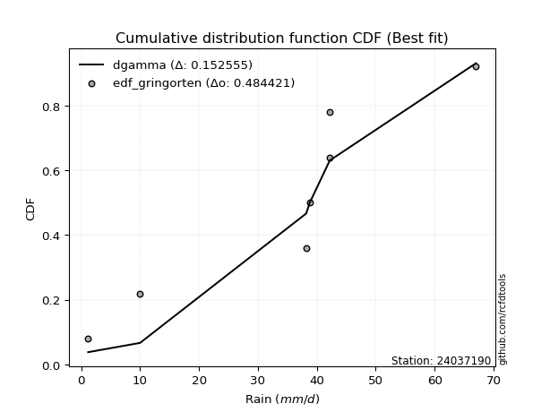</img>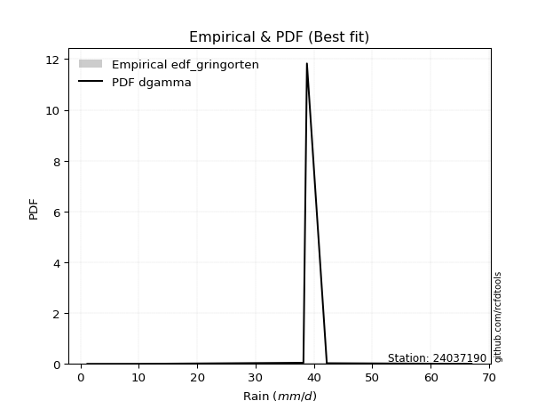</img>

</div>


### 9. Empirical - EDF Filliben (1975)

The specific values of the constants (0.3175) (often denoted as $alpha$) and (0.365) are derived from a method proposed by James J. Filliben in a 1975 paper. This particular formula is the mean value of the $i$-th order statistic of the normal distribution and is considered a robust and effective plotting position formula for the normal probability plot correlation coefficient test for normality.

<div align="center">


$P=(m-0.3175)/(n+0.365)$


</div>


**9.1. Empirical values**

<div align="center">

|                | 0                   | 1                   | 2                   | 3            | 4                  | 5                  | 6                  |
|:---------------|:--------------------|:--------------------|:--------------------|:-------------|:-------------------|:-------------------|:-------------------|
| date           | 2021                | 2020                | 2019                | 2025         | 2024               | 2022               | 2023               |
| x              | 1.2                 | 10.0                | 38.2                | 38.6         | 38.8               | 42.2               | 42.2               |
| m              | 1                   | 2                   | 3                   | 4            | 5                  | 6                  | 7                  |
| empirical_dist | edf_filliben        | edf_filliben        | edf_filliben        | edf_filliben | edf_filliben       | edf_filliben       | edf_filliben       |
| empirical      | 0.09266802443991853 | 0.22844534962661237 | 0.36422267481330617 | 0.5          | 0.6357773251866938 | 0.7715546503733877 | 0.9073319755600815 |
| empirical_tr   | 1.1021324354657687  | 1.2960844698636163  | 1.5728777362520021  | 2.0          | 2.7455731593662627 | 4.377414561664191  | 10.791208791208794 |

</div>


**9.2. Kolmogorov-Smirnov fit test (sorted by Δ)**


<div align="center">

|                | 0                   | 1                   | 2                   | 3                   | 4                   | 5                   | 6                   | 7                   | 8                   | 9                   | 10                  | 11                  | 12                  | 13                  | 14                  | 15                  | 16                  | 17                  | 18                  | 19                  | 20                  | 21                  | 22                  | 23                  | 24                  | 25                  | 26                  | 27                  | 28                  | 29                  | 30                  | 31                  | 32                  | 33                  | 34                  | 35                  | 36                  | 37                  | 38                  | 39                  | 40                  | 41                  | 42                  | 43                  | 44                  | 45                  | 46                  | 47                  | 48                  | 49                  | 50                  | 51                  | 52                  | 53                  | 54                  | 55                  | 56                  | 57                  | 58                  | 59                  | 60                  | 61                  | 62                  | 63                  | 64                  | 65                  | 66                  | 67                  | 68                  | 69                  | 70                  | 71                  | 72                  | 73                  | 74                  | 75                  | 76                  | 77                  | 78                  | 79                  | 80                  | 81                  | 82                    | 83                  | 84                  | 85                  | 86                  | 87                  | 88                  | 89                  |
|:---------------|:--------------------|:--------------------|:--------------------|:--------------------|:--------------------|:--------------------|:--------------------|:--------------------|:--------------------|:--------------------|:--------------------|:--------------------|:--------------------|:--------------------|:--------------------|:--------------------|:--------------------|:--------------------|:--------------------|:--------------------|:--------------------|:--------------------|:--------------------|:--------------------|:--------------------|:--------------------|:--------------------|:--------------------|:--------------------|:--------------------|:--------------------|:--------------------|:--------------------|:--------------------|:--------------------|:--------------------|:--------------------|:--------------------|:--------------------|:--------------------|:--------------------|:--------------------|:--------------------|:--------------------|:--------------------|:--------------------|:--------------------|:--------------------|:--------------------|:--------------------|:--------------------|:--------------------|:--------------------|:--------------------|:--------------------|:--------------------|:--------------------|:--------------------|:--------------------|:--------------------|:--------------------|:--------------------|:--------------------|:--------------------|:--------------------|:--------------------|:--------------------|:--------------------|:--------------------|:--------------------|:--------------------|:--------------------|:--------------------|:--------------------|:--------------------|:--------------------|:--------------------|:--------------------|:--------------------|:--------------------|:--------------------|:--------------------|:----------------------|:--------------------|:--------------------|:--------------------|:--------------------|:--------------------|:--------------------|:--------------------|
| station        | 24037190            | 24037190            | 24037190            | 24037190            | 24037190            | 24037190            | 24037190            | 24037190            | 24037190            | 24037190            | 24037190            | 24037190            | 24037190            | 24037190            | 24037190            | 24037190            | 24037190            | 24037190            | 24037190            | 24037190            | 24037190            | 24037190            | 24037190            | 24037190            | 24037190            | 24037190            | 24037190            | 24037190            | 24037190            | 24037190            | 24037190            | 24037190            | 24037190            | 24037190            | 24037190            | 24037190            | 24037190            | 24037190            | 24037190            | 24037190            | 24037190            | 24037190            | 24037190            | 24037190            | 24037190            | 24037190            | 24037190            | 24037190            | 24037190            | 24037190            | 24037190            | 24037190            | 24037190            | 24037190            | 24037190            | 24037190            | 24037190            | 24037190            | 24037190            | 24037190            | 24037190            | 24037190            | 24037190            | 24037190            | 24037190            | 24037190            | 24037190            | 24037190            | 24037190            | 24037190            | 24037190            | 24037190            | 24037190            | 24037190            | 24037190            | 24037190            | 24037190            | 24037190            | 24037190            | 24037190            | 24037190            | 24037190            | 24037190              | 24037190            | 24037190            | 24037190            | 24037190            | 24037190            | 24037190            | 24037190            |
| empirical_dist | edf_filliben        | edf_filliben        | edf_filliben        | edf_filliben        | edf_filliben        | edf_filliben        | edf_filliben        | edf_filliben        | edf_filliben        | edf_filliben        | edf_filliben        | edf_filliben        | edf_filliben        | edf_filliben        | edf_filliben        | edf_filliben        | edf_filliben        | edf_filliben        | edf_filliben        | edf_filliben        | edf_filliben        | edf_filliben        | edf_filliben        | edf_filliben        | edf_filliben        | edf_filliben        | edf_filliben        | edf_filliben        | edf_filliben        | edf_filliben        | edf_filliben        | edf_filliben        | edf_filliben        | edf_filliben        | edf_filliben        | edf_filliben        | edf_filliben        | edf_filliben        | edf_filliben        | edf_filliben        | edf_filliben        | edf_filliben        | edf_filliben        | edf_filliben        | edf_filliben        | edf_filliben        | edf_filliben        | edf_filliben        | edf_filliben        | edf_filliben        | edf_filliben        | edf_filliben        | edf_filliben        | edf_filliben        | edf_filliben        | edf_filliben        | edf_filliben        | edf_filliben        | edf_filliben        | edf_filliben        | edf_filliben        | edf_filliben        | edf_filliben        | edf_filliben        | edf_filliben        | edf_filliben        | edf_filliben        | edf_filliben        | edf_filliben        | edf_filliben        | edf_filliben        | edf_filliben        | edf_filliben        | edf_filliben        | edf_filliben        | edf_filliben        | edf_filliben        | edf_filliben        | edf_filliben        | edf_filliben        | edf_filliben        | edf_filliben        | edf_filliben          | edf_filliben        | edf_filliben        | edf_filliben        | edf_filliben        | edf_filliben        | edf_filliben        | edf_filliben        |
| p_dist         | logt                | gompertz            | fisk                | logpearson3         | logfisk             | pearson3            | loginvweibull       | gumbel_l            | logncf              | loggumbel_l         | weibull_min         | ncf                 | invweibull          | logchi2             | loginvgauss         | logerlang           | f                   | logkstwobign        | nct                 | exponnorm           | t                   | crystalball         | norm                | logalpha            | betaprime           | gamma               | logbetaprime        | rice                | erlang              | invgauss            | logf                | lognct              | logexponnorm        | logrice             | logcrystalball      | lognorm             | lognorm             | alpha               | chi2                | loginvgamma         | loggamma            | loggamma            | logfatiguelife      | invgamma            | logexpon            | maxwell             | kstwobign           | loggenexpon         | logistic            | mielke              | rayleigh            | logmaxwell          | laplace_asymmetric  | logweibull_min      | loggompertz         | lograyleigh         | expon               | genexpon            | loglogistic         | halfnorm            | hypsecant           | loghalfnorm         | loghypsecant        | gumbel_r            | nakagami            | loggumbel_r         | pareto              | laplace             | halflogistic        | loghalflogistic     | loglaplace          | moyal               | logmoyal            | lognakagami         | loglognorm          | logpareto           | wald                | logwald             | johnsonsu           | gibrat              | logmielke           | loggibrat           | loglaplace_asymmetric | logloggamma         | fatiguelife         | logtruncnorm        | logjohnsonsu        | genlogistic         | loggenlogistic      | truncnorm           |
| delta          | 0.15352010618064432 | 0.22844534925640209 | 0.2730422168969835  | 0.27348729030003127 | 0.2830768599707624  | 0.2872177091900894  | 0.29188608762208124 | 0.295409427170257   | 0.302240323469139   | 0.3037790397204294  | 0.31251836811399003 | 0.31623281730607866 | 0.3208576307681832  | 0.32637910767002387 | 0.32895352497738917 | 0.329396445302399   | 0.32950332209252664 | 0.3298389521752456  | 0.33016707325222705 | 0.3301937993116345  | 0.33019538369355117 | 0.33019706824566564 | 0.33019708514511836 | 0.3303526111284387  | 0.331919734118189   | 0.332582316309893   | 0.333390909927638   | 0.3334961260587398  | 0.3339134195855864  | 0.33480109705436123 | 0.33480696960561096 | 0.3360496983598569  | 0.3364090045814553  | 0.33641055113737317 | 0.336411368634163   | 0.3364113852849744  | 0.3364113852849744  | 0.3367513689125622  | 0.3371029810748989  | 0.33731605849325486 | 0.3377080814778399  | 0.3377080814778399  | 0.3385236346144983  | 0.3396005183929931  | 0.3443248385031521  | 0.346785423730533   | 0.3477339654015572  | 0.3481113258313404  | 0.3512608891075609  | 0.3516460868685063  | 0.35164856771216524 | 0.3522497792984467  | 0.3522519659650425  | 0.35588046321662825 | 0.35647413933032945 | 0.3568784388684716  | 0.35693821112072976 | 0.3571346224700235  | 0.3577898820535885  | 0.3663421202200158  | 0.3666070448839527  | 0.37097026831538715 | 0.37320851717258685 | 0.3821717009702428  | 0.38660383595506265 | 0.387117709176511   | 0.38843340971001705 | 0.3921604109928758  | 0.3933442437663468  | 0.3977451791104366  | 0.3982189094825266  | 0.3990187961658703  | 0.4035210546226812  | 0.4106230614900277  | 0.4187463724255175  | 0.4374987637617245  | 0.44821813528786003 | 0.45169927872246396 | 0.4754659353212341  | 0.47969622007073065 | 0.48185824842242364 | 0.48300324630266767 | 0.5117942886346797    | 0.5121625581239467  | 0.5610734731650375  | 0.6175675044396683  | 0.6275023337009678  | 0.6357773251866938  | 0.6357773251866938  | 0.7658604660741506  |
| deltao         | 0.48442053926100004 | 0.48442053926100004 | 0.48442053926100004 | 0.48442053926100004 | 0.48442053926100004 | 0.48442053926100004 | 0.48442053926100004 | 0.48442053926100004 | 0.48442053926100004 | 0.48442053926100004 | 0.48442053926100004 | 0.48442053926100004 | 0.48442053926100004 | 0.48442053926100004 | 0.48442053926100004 | 0.48442053926100004 | 0.48442053926100004 | 0.48442053926100004 | 0.48442053926100004 | 0.48442053926100004 | 0.48442053926100004 | 0.48442053926100004 | 0.48442053926100004 | 0.48442053926100004 | 0.48442053926100004 | 0.48442053926100004 | 0.48442053926100004 | 0.48442053926100004 | 0.48442053926100004 | 0.48442053926100004 | 0.48442053926100004 | 0.48442053926100004 | 0.48442053926100004 | 0.48442053926100004 | 0.48442053926100004 | 0.48442053926100004 | 0.48442053926100004 | 0.48442053926100004 | 0.48442053926100004 | 0.48442053926100004 | 0.48442053926100004 | 0.48442053926100004 | 0.48442053926100004 | 0.48442053926100004 | 0.48442053926100004 | 0.48442053926100004 | 0.48442053926100004 | 0.48442053926100004 | 0.48442053926100004 | 0.48442053926100004 | 0.48442053926100004 | 0.48442053926100004 | 0.48442053926100004 | 0.48442053926100004 | 0.48442053926100004 | 0.48442053926100004 | 0.48442053926100004 | 0.48442053926100004 | 0.48442053926100004 | 0.48442053926100004 | 0.48442053926100004 | 0.48442053926100004 | 0.48442053926100004 | 0.48442053926100004 | 0.48442053926100004 | 0.48442053926100004 | 0.48442053926100004 | 0.48442053926100004 | 0.48442053926100004 | 0.48442053926100004 | 0.48442053926100004 | 0.48442053926100004 | 0.48442053926100004 | 0.48442053926100004 | 0.48442053926100004 | 0.48442053926100004 | 0.48442053926100004 | 0.48442053926100004 | 0.48442053926100004 | 0.48442053926100004 | 0.48442053926100004 | 0.48442053926100004 | 0.48442053926100004   | 0.48442053926100004 | 0.48442053926100004 | 0.48442053926100004 | 0.48442053926100004 | 0.48442053926100004 | 0.48442053926100004 | 0.48442053926100004 |
| eval           | Δo > Δ              | Δo > Δ              | Δo > Δ              | Δo > Δ              | Δo > Δ              | Δo > Δ              | Δo > Δ              | Δo > Δ              | Δo > Δ              | Δo > Δ              | Δo > Δ              | Δo > Δ              | Δo > Δ              | Δo > Δ              | Δo > Δ              | Δo > Δ              | Δo > Δ              | Δo > Δ              | Δo > Δ              | Δo > Δ              | Δo > Δ              | Δo > Δ              | Δo > Δ              | Δo > Δ              | Δo > Δ              | Δo > Δ              | Δo > Δ              | Δo > Δ              | Δo > Δ              | Δo > Δ              | Δo > Δ              | Δo > Δ              | Δo > Δ              | Δo > Δ              | Δo > Δ              | Δo > Δ              | Δo > Δ              | Δo > Δ              | Δo > Δ              | Δo > Δ              | Δo > Δ              | Δo > Δ              | Δo > Δ              | Δo > Δ              | Δo > Δ              | Δo > Δ              | Δo > Δ              | Δo > Δ              | Δo > Δ              | Δo > Δ              | Δo > Δ              | Δo > Δ              | Δo > Δ              | Δo > Δ              | Δo > Δ              | Δo > Δ              | Δo > Δ              | Δo > Δ              | Δo > Δ              | Δo > Δ              | Δo > Δ              | Δo > Δ              | Δo > Δ              | Δo > Δ              | Δo > Δ              | Δo > Δ              | Δo > Δ              | Δo > Δ              | Δo > Δ              | Δo > Δ              | Δo > Δ              | Δo > Δ              | Δo > Δ              | Δo > Δ              | Δo > Δ              | Δo > Δ              | Δo > Δ              | Δo > Δ              | Δo > Δ              | Δo > Δ              | Δo > Δ              | Δo > Δ              | Δo <= Δ               | Δo <= Δ             | Δo <= Δ             | Δo <= Δ             | Δo <= Δ             | Δo <= Δ             | Δo <= Δ             | Δo <= Δ             |
| fit            | 1                   | 1                   | 1                   | 1                   | 1                   | 1                   | 1                   | 1                   | 1                   | 1                   | 1                   | 1                   | 1                   | 1                   | 1                   | 1                   | 1                   | 1                   | 1                   | 1                   | 1                   | 1                   | 1                   | 1                   | 1                   | 1                   | 1                   | 1                   | 1                   | 1                   | 1                   | 1                   | 1                   | 1                   | 1                   | 1                   | 1                   | 1                   | 1                   | 1                   | 1                   | 1                   | 1                   | 1                   | 1                   | 1                   | 1                   | 1                   | 1                   | 1                   | 1                   | 1                   | 1                   | 1                   | 1                   | 1                   | 1                   | 1                   | 1                   | 1                   | 1                   | 1                   | 1                   | 1                   | 1                   | 1                   | 1                   | 1                   | 1                   | 1                   | 1                   | 1                   | 1                   | 1                   | 1                   | 1                   | 1                   | 1                   | 1                   | 1                   | 1                   | 1                   | 0                     | 0                   | 0                   | 0                   | 0                   | 0                   | 0                   | 0                   |
| n              | 7                   | 7                   | 7                   | 7                   | 7                   | 7                   | 7                   | 7                   | 7                   | 7                   | 7                   | 7                   | 7                   | 7                   | 7                   | 7                   | 7                   | 7                   | 7                   | 7                   | 7                   | 7                   | 7                   | 7                   | 7                   | 7                   | 7                   | 7                   | 7                   | 7                   | 7                   | 7                   | 7                   | 7                   | 7                   | 7                   | 7                   | 7                   | 7                   | 7                   | 7                   | 7                   | 7                   | 7                   | 7                   | 7                   | 7                   | 7                   | 7                   | 7                   | 7                   | 7                   | 7                   | 7                   | 7                   | 7                   | 7                   | 7                   | 7                   | 7                   | 7                   | 7                   | 7                   | 7                   | 7                   | 7                   | 7                   | 7                   | 7                   | 7                   | 7                   | 7                   | 7                   | 7                   | 7                   | 7                   | 7                   | 7                   | 7                   | 7                   | 7                   | 7                   | 7                     | 7                   | 7                   | 7                   | 7                   | 7                   | 7                   | 7                   |
| best_fit       | 1                   | 0                   | 0                   | 0                   | 0                   | 0                   | 0                   | 0                   | 0                   | 0                   | 0                   | 0                   | 0                   | 0                   | 0                   | 0                   | 0                   | 0                   | 0                   | 0                   | 0                   | 0                   | 0                   | 0                   | 0                   | 0                   | 0                   | 0                   | 0                   | 0                   | 0                   | 0                   | 0                   | 0                   | 0                   | 0                   | 0                   | 0                   | 0                   | 0                   | 0                   | 0                   | 0                   | 0                   | 0                   | 0                   | 0                   | 0                   | 0                   | 0                   | 0                   | 0                   | 0                   | 0                   | 0                   | 0                   | 0                   | 0                   | 0                   | 0                   | 0                   | 0                   | 0                   | 0                   | 0                   | 0                   | 0                   | 0                   | 0                   | 0                   | 0                   | 0                   | 0                   | 0                   | 0                   | 0                   | 0                   | 0                   | 0                   | 0                   | 0                   | 0                   | 0                     | 0                   | 0                   | 0                   | 0                   | 0                   | 0                   | 0                   |
| best_fit_sort  | 1                   | 2                   | 3                   | 4                   | 5                   | 6                   | 7                   | 8                   | 9                   | 10                  | 11                  | 12                  | 13                  | 14                  | 15                  | 16                  | 17                  | 18                  | 19                  | 20                  | 21                  | 22                  | 23                  | 24                  | 25                  | 26                  | 27                  | 28                  | 29                  | 30                  | 31                  | 32                  | 33                  | 34                  | 35                  | 36                  | 37                  | 38                  | 39                  | 40                  | 41                  | 42                  | 43                  | 44                  | 45                  | 46                  | 47                  | 48                  | 49                  | 50                  | 51                  | 52                  | 53                  | 54                  | 55                  | 56                  | 57                  | 58                  | 59                  | 60                  | 61                  | 62                  | 63                  | 64                  | 65                  | 66                  | 67                  | 68                  | 69                  | 70                  | 71                  | 72                  | 73                  | 74                  | 75                  | 76                  | 77                  | 78                  | 79                  | 80                  | 81                  | 82                  | 83                    | 84                  | 85                  | 86                  | 87                  | 88                  | 89                  | 90                  |

</div>


<div align="center">

</img>

</div>


**9.3. Best fit**

<div align="center">

|   id |   station | empirical_dist   | p_dist   |   delta |   deltao | eval   |   fit |   n |   best_fit |   best_fit_sort |
|-----:|----------:|:-----------------|:---------|--------:|---------:|:-------|------:|----:|-----------:|----------------:|
|    0 |  24037190 | edf_filliben     | logt     | 0.15352 | 0.484421 | Δo > Δ |     1 |   7 |          1 |               1 |

</div>


<div align="center">

</img>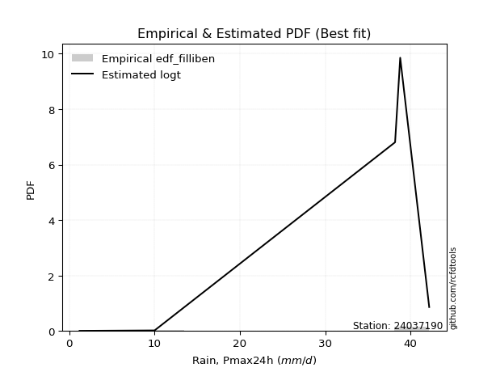</img>

</div>


### 10. Empirical - EDF Jenkinson (1977)

The Jenkinson formula in hydrology is an empirical plotting position formula used to estimate the non-exceedance probability _(P)_ or return period _(T)_ of a given ordered observation within a sample. It is a widely used method in the frequency analysis of extreme events such as floods and rainfall, as it provides a distribution-free way to plot data. _a≈0.31_ and _b≈0.38_ are constants derived to approximate the median of the probability distribution for the given rank.

<div align="center">


$P=(m-a)/(n+b)$


</div>


**10.1. Empirical values**

<div align="center">

|                | 0                   | 1                   | 2                   | 3             | 4                  | 5                  | 6                  |
|:---------------|:--------------------|:--------------------|:--------------------|:--------------|:-------------------|:-------------------|:-------------------|
| date           | 2021                | 2020                | 2019                | 2025          | 2024               | 2022               | 2023               |
| x              | 1.2                 | 10.0                | 38.2                | 38.6          | 38.8               | 42.2               | 42.2               |
| m              | 1                   | 2                   | 3                   | 4             | 5                  | 6                  | 7                  |
| empirical_dist | edf_jenkinson       | edf_jenkinson       | edf_jenkinson       | edf_jenkinson | edf_jenkinson      | edf_jenkinson      | edf_jenkinson      |
| empirical      | 0.09349593495934959 | 0.22899728997289973 | 0.36449864498644985 | 0.5           | 0.6355013550135502 | 0.7710027100271003 | 0.9065040650406505 |
| empirical_tr   | 1.1031390134529149  | 1.29701230228471    | 1.5735607675906182  | 2.0           | 2.743494423791822  | 4.366863905325444  | 10.695652173913055 |

</div>


**10.2. Kolmogorov-Smirnov fit test (sorted by Δ)**


<div align="center">

|                | 0                   | 1                   | 2                   | 3                   | 4                   | 5                   | 6                   | 7                   | 8                   | 9                   | 10                  | 11                  | 12                  | 13                  | 14                  | 15                  | 16                  | 17                  | 18                  | 19                  | 20                  | 21                  | 22                  | 23                  | 24                  | 25                  | 26                  | 27                  | 28                  | 29                  | 30                  | 31                  | 32                  | 33                  | 34                  | 35                  | 36                  | 37                  | 38                  | 39                  | 40                  | 41                  | 42                  | 43                  | 44                  | 45                  | 46                  | 47                  | 48                  | 49                  | 50                  | 51                  | 52                  | 53                  | 54                  | 55                  | 56                  | 57                  | 58                  | 59                  | 60                  | 61                  | 62                  | 63                  | 64                  | 65                  | 66                  | 67                  | 68                  | 69                  | 70                  | 71                  | 72                  | 73                  | 74                  | 75                  | 76                  | 77                  | 78                  | 79                  | 80                  | 81                  | 82                    | 83                  | 84                  | 85                  | 86                  | 87                  | 88                  | 89                  |
|:---------------|:--------------------|:--------------------|:--------------------|:--------------------|:--------------------|:--------------------|:--------------------|:--------------------|:--------------------|:--------------------|:--------------------|:--------------------|:--------------------|:--------------------|:--------------------|:--------------------|:--------------------|:--------------------|:--------------------|:--------------------|:--------------------|:--------------------|:--------------------|:--------------------|:--------------------|:--------------------|:--------------------|:--------------------|:--------------------|:--------------------|:--------------------|:--------------------|:--------------------|:--------------------|:--------------------|:--------------------|:--------------------|:--------------------|:--------------------|:--------------------|:--------------------|:--------------------|:--------------------|:--------------------|:--------------------|:--------------------|:--------------------|:--------------------|:--------------------|:--------------------|:--------------------|:--------------------|:--------------------|:--------------------|:--------------------|:--------------------|:--------------------|:--------------------|:--------------------|:--------------------|:--------------------|:--------------------|:--------------------|:--------------------|:--------------------|:--------------------|:--------------------|:--------------------|:--------------------|:--------------------|:--------------------|:--------------------|:--------------------|:--------------------|:--------------------|:--------------------|:--------------------|:--------------------|:--------------------|:--------------------|:--------------------|:--------------------|:----------------------|:--------------------|:--------------------|:--------------------|:--------------------|:--------------------|:--------------------|:--------------------|
| station        | 24037190            | 24037190            | 24037190            | 24037190            | 24037190            | 24037190            | 24037190            | 24037190            | 24037190            | 24037190            | 24037190            | 24037190            | 24037190            | 24037190            | 24037190            | 24037190            | 24037190            | 24037190            | 24037190            | 24037190            | 24037190            | 24037190            | 24037190            | 24037190            | 24037190            | 24037190            | 24037190            | 24037190            | 24037190            | 24037190            | 24037190            | 24037190            | 24037190            | 24037190            | 24037190            | 24037190            | 24037190            | 24037190            | 24037190            | 24037190            | 24037190            | 24037190            | 24037190            | 24037190            | 24037190            | 24037190            | 24037190            | 24037190            | 24037190            | 24037190            | 24037190            | 24037190            | 24037190            | 24037190            | 24037190            | 24037190            | 24037190            | 24037190            | 24037190            | 24037190            | 24037190            | 24037190            | 24037190            | 24037190            | 24037190            | 24037190            | 24037190            | 24037190            | 24037190            | 24037190            | 24037190            | 24037190            | 24037190            | 24037190            | 24037190            | 24037190            | 24037190            | 24037190            | 24037190            | 24037190            | 24037190            | 24037190            | 24037190              | 24037190            | 24037190            | 24037190            | 24037190            | 24037190            | 24037190            | 24037190            |
| empirical_dist | edf_jenkinson       | edf_jenkinson       | edf_jenkinson       | edf_jenkinson       | edf_jenkinson       | edf_jenkinson       | edf_jenkinson       | edf_jenkinson       | edf_jenkinson       | edf_jenkinson       | edf_jenkinson       | edf_jenkinson       | edf_jenkinson       | edf_jenkinson       | edf_jenkinson       | edf_jenkinson       | edf_jenkinson       | edf_jenkinson       | edf_jenkinson       | edf_jenkinson       | edf_jenkinson       | edf_jenkinson       | edf_jenkinson       | edf_jenkinson       | edf_jenkinson       | edf_jenkinson       | edf_jenkinson       | edf_jenkinson       | edf_jenkinson       | edf_jenkinson       | edf_jenkinson       | edf_jenkinson       | edf_jenkinson       | edf_jenkinson       | edf_jenkinson       | edf_jenkinson       | edf_jenkinson       | edf_jenkinson       | edf_jenkinson       | edf_jenkinson       | edf_jenkinson       | edf_jenkinson       | edf_jenkinson       | edf_jenkinson       | edf_jenkinson       | edf_jenkinson       | edf_jenkinson       | edf_jenkinson       | edf_jenkinson       | edf_jenkinson       | edf_jenkinson       | edf_jenkinson       | edf_jenkinson       | edf_jenkinson       | edf_jenkinson       | edf_jenkinson       | edf_jenkinson       | edf_jenkinson       | edf_jenkinson       | edf_jenkinson       | edf_jenkinson       | edf_jenkinson       | edf_jenkinson       | edf_jenkinson       | edf_jenkinson       | edf_jenkinson       | edf_jenkinson       | edf_jenkinson       | edf_jenkinson       | edf_jenkinson       | edf_jenkinson       | edf_jenkinson       | edf_jenkinson       | edf_jenkinson       | edf_jenkinson       | edf_jenkinson       | edf_jenkinson       | edf_jenkinson       | edf_jenkinson       | edf_jenkinson       | edf_jenkinson       | edf_jenkinson       | edf_jenkinson         | edf_jenkinson       | edf_jenkinson       | edf_jenkinson       | edf_jenkinson       | edf_jenkinson       | edf_jenkinson       | edf_jenkinson       |
| p_dist         | logt                | gompertz            | fisk                | logpearson3         | logfisk             | pearson3            | loginvweibull       | gumbel_l            | logncf              | loggumbel_l         | weibull_min         | ncf                 | invweibull          | logchi2             | loginvgauss         | logerlang           | f                   | logkstwobign        | nct                 | exponnorm           | t                   | crystalball         | norm                | logalpha            | betaprime           | gamma               | logbetaprime        | rice                | erlang              | invgauss            | logf                | lognct              | logexponnorm        | logrice             | logcrystalball      | lognorm             | lognorm             | alpha               | chi2                | loginvgamma         | loggamma            | loggamma            | logfatiguelife      | invgamma            | logexpon            | maxwell             | kstwobign           | loggenexpon         | logistic            | mielke              | rayleigh            | logmaxwell          | laplace_asymmetric  | logweibull_min      | loggompertz         | lograyleigh         | expon               | genexpon            | loglogistic         | halfnorm            | hypsecant           | loghalfnorm         | loghypsecant        | gumbel_r            | nakagami            | loggumbel_r         | pareto              | laplace             | halflogistic        | loghalflogistic     | loglaplace          | moyal               | logmoyal            | lognakagami         | loglognorm          | logpareto           | wald                | logwald             | johnsonsu           | gibrat              | logmielke           | loggibrat           | loglaplace_asymmetric | logloggamma         | fatiguelife         | logtruncnorm        | logjohnsonsu        | genlogistic         | loggenlogistic      | truncnorm           |
| delta          | 0.15407204652693168 | 0.22899728960268945 | 0.2727662467238398  | 0.2732113201268876  | 0.2828008897976187  | 0.2869417390169457  | 0.29161011744893756 | 0.2951334569971133  | 0.3019643532959953  | 0.30350306954728573 | 0.31224239794084635 | 0.315956847132935   | 0.3205816605950395  | 0.3261031374968802  | 0.3286775548042455  | 0.3291204751292553  | 0.32922735191938296 | 0.32956298200210193 | 0.32989110307908337 | 0.3299178291384908  | 0.3299194135204075  | 0.32992109807252196 | 0.3299211149719747  | 0.33007664095529504 | 0.3316437639450453  | 0.3323063461367493  | 0.3331149397544943  | 0.3332201558855961  | 0.3336374494124427  | 0.33452512688121755 | 0.3345309994324673  | 0.3357737281867132  | 0.3361330344083116  | 0.3361345809642295  | 0.3361353984610193  | 0.3361354151118307  | 0.3361354151118307  | 0.3364753987394185  | 0.3368270109017552  | 0.3370400883201112  | 0.33743211130469625 | 0.33743211130469625 | 0.3382476644413546  | 0.3393245482198494  | 0.3440488683300084  | 0.3465094535573893  | 0.34745799522841353 | 0.34783535565819673 | 0.35098491893441724 | 0.3513701166953626  | 0.35137259753902156 | 0.351973809125303   | 0.3519759957918988  | 0.35560449304348457 | 0.3561981691571858  | 0.3566024686953279  | 0.3566622409475861  | 0.3568586522968798  | 0.35751391188044485 | 0.3660661500468721  | 0.366331074710809   | 0.3706942981422435  | 0.37293254699944317 | 0.3818957307970991  | 0.38632786578191897 | 0.3868417390033673  | 0.3878814693637297  | 0.3918844408197321  | 0.3930682735932031  | 0.39746920893729293 | 0.3979429393093829  | 0.39874282599272665 | 0.4032450844495375  | 0.41007112114374034 | 0.4181944320792301  | 0.4369468234154371  | 0.44794216511471635 | 0.4514233085493203  | 0.4751899651480905  | 0.47942024989758697 | 0.48158227824927996 | 0.482727276129524   | 0.511518318461536     | 0.511886587950803   | 0.5607975029918939  | 0.6172915342665246  | 0.6272263635278241  | 0.6355013550135502  | 0.6355013550135502  | 0.7653085257278632  |
| deltao         | 0.48442053926100004 | 0.48442053926100004 | 0.48442053926100004 | 0.48442053926100004 | 0.48442053926100004 | 0.48442053926100004 | 0.48442053926100004 | 0.48442053926100004 | 0.48442053926100004 | 0.48442053926100004 | 0.48442053926100004 | 0.48442053926100004 | 0.48442053926100004 | 0.48442053926100004 | 0.48442053926100004 | 0.48442053926100004 | 0.48442053926100004 | 0.48442053926100004 | 0.48442053926100004 | 0.48442053926100004 | 0.48442053926100004 | 0.48442053926100004 | 0.48442053926100004 | 0.48442053926100004 | 0.48442053926100004 | 0.48442053926100004 | 0.48442053926100004 | 0.48442053926100004 | 0.48442053926100004 | 0.48442053926100004 | 0.48442053926100004 | 0.48442053926100004 | 0.48442053926100004 | 0.48442053926100004 | 0.48442053926100004 | 0.48442053926100004 | 0.48442053926100004 | 0.48442053926100004 | 0.48442053926100004 | 0.48442053926100004 | 0.48442053926100004 | 0.48442053926100004 | 0.48442053926100004 | 0.48442053926100004 | 0.48442053926100004 | 0.48442053926100004 | 0.48442053926100004 | 0.48442053926100004 | 0.48442053926100004 | 0.48442053926100004 | 0.48442053926100004 | 0.48442053926100004 | 0.48442053926100004 | 0.48442053926100004 | 0.48442053926100004 | 0.48442053926100004 | 0.48442053926100004 | 0.48442053926100004 | 0.48442053926100004 | 0.48442053926100004 | 0.48442053926100004 | 0.48442053926100004 | 0.48442053926100004 | 0.48442053926100004 | 0.48442053926100004 | 0.48442053926100004 | 0.48442053926100004 | 0.48442053926100004 | 0.48442053926100004 | 0.48442053926100004 | 0.48442053926100004 | 0.48442053926100004 | 0.48442053926100004 | 0.48442053926100004 | 0.48442053926100004 | 0.48442053926100004 | 0.48442053926100004 | 0.48442053926100004 | 0.48442053926100004 | 0.48442053926100004 | 0.48442053926100004 | 0.48442053926100004 | 0.48442053926100004   | 0.48442053926100004 | 0.48442053926100004 | 0.48442053926100004 | 0.48442053926100004 | 0.48442053926100004 | 0.48442053926100004 | 0.48442053926100004 |
| eval           | Δo > Δ              | Δo > Δ              | Δo > Δ              | Δo > Δ              | Δo > Δ              | Δo > Δ              | Δo > Δ              | Δo > Δ              | Δo > Δ              | Δo > Δ              | Δo > Δ              | Δo > Δ              | Δo > Δ              | Δo > Δ              | Δo > Δ              | Δo > Δ              | Δo > Δ              | Δo > Δ              | Δo > Δ              | Δo > Δ              | Δo > Δ              | Δo > Δ              | Δo > Δ              | Δo > Δ              | Δo > Δ              | Δo > Δ              | Δo > Δ              | Δo > Δ              | Δo > Δ              | Δo > Δ              | Δo > Δ              | Δo > Δ              | Δo > Δ              | Δo > Δ              | Δo > Δ              | Δo > Δ              | Δo > Δ              | Δo > Δ              | Δo > Δ              | Δo > Δ              | Δo > Δ              | Δo > Δ              | Δo > Δ              | Δo > Δ              | Δo > Δ              | Δo > Δ              | Δo > Δ              | Δo > Δ              | Δo > Δ              | Δo > Δ              | Δo > Δ              | Δo > Δ              | Δo > Δ              | Δo > Δ              | Δo > Δ              | Δo > Δ              | Δo > Δ              | Δo > Δ              | Δo > Δ              | Δo > Δ              | Δo > Δ              | Δo > Δ              | Δo > Δ              | Δo > Δ              | Δo > Δ              | Δo > Δ              | Δo > Δ              | Δo > Δ              | Δo > Δ              | Δo > Δ              | Δo > Δ              | Δo > Δ              | Δo > Δ              | Δo > Δ              | Δo > Δ              | Δo > Δ              | Δo > Δ              | Δo > Δ              | Δo > Δ              | Δo > Δ              | Δo > Δ              | Δo > Δ              | Δo <= Δ               | Δo <= Δ             | Δo <= Δ             | Δo <= Δ             | Δo <= Δ             | Δo <= Δ             | Δo <= Δ             | Δo <= Δ             |
| fit            | 1                   | 1                   | 1                   | 1                   | 1                   | 1                   | 1                   | 1                   | 1                   | 1                   | 1                   | 1                   | 1                   | 1                   | 1                   | 1                   | 1                   | 1                   | 1                   | 1                   | 1                   | 1                   | 1                   | 1                   | 1                   | 1                   | 1                   | 1                   | 1                   | 1                   | 1                   | 1                   | 1                   | 1                   | 1                   | 1                   | 1                   | 1                   | 1                   | 1                   | 1                   | 1                   | 1                   | 1                   | 1                   | 1                   | 1                   | 1                   | 1                   | 1                   | 1                   | 1                   | 1                   | 1                   | 1                   | 1                   | 1                   | 1                   | 1                   | 1                   | 1                   | 1                   | 1                   | 1                   | 1                   | 1                   | 1                   | 1                   | 1                   | 1                   | 1                   | 1                   | 1                   | 1                   | 1                   | 1                   | 1                   | 1                   | 1                   | 1                   | 1                   | 1                   | 0                     | 0                   | 0                   | 0                   | 0                   | 0                   | 0                   | 0                   |
| n              | 7                   | 7                   | 7                   | 7                   | 7                   | 7                   | 7                   | 7                   | 7                   | 7                   | 7                   | 7                   | 7                   | 7                   | 7                   | 7                   | 7                   | 7                   | 7                   | 7                   | 7                   | 7                   | 7                   | 7                   | 7                   | 7                   | 7                   | 7                   | 7                   | 7                   | 7                   | 7                   | 7                   | 7                   | 7                   | 7                   | 7                   | 7                   | 7                   | 7                   | 7                   | 7                   | 7                   | 7                   | 7                   | 7                   | 7                   | 7                   | 7                   | 7                   | 7                   | 7                   | 7                   | 7                   | 7                   | 7                   | 7                   | 7                   | 7                   | 7                   | 7                   | 7                   | 7                   | 7                   | 7                   | 7                   | 7                   | 7                   | 7                   | 7                   | 7                   | 7                   | 7                   | 7                   | 7                   | 7                   | 7                   | 7                   | 7                   | 7                   | 7                   | 7                   | 7                     | 7                   | 7                   | 7                   | 7                   | 7                   | 7                   | 7                   |
| best_fit       | 1                   | 0                   | 0                   | 0                   | 0                   | 0                   | 0                   | 0                   | 0                   | 0                   | 0                   | 0                   | 0                   | 0                   | 0                   | 0                   | 0                   | 0                   | 0                   | 0                   | 0                   | 0                   | 0                   | 0                   | 0                   | 0                   | 0                   | 0                   | 0                   | 0                   | 0                   | 0                   | 0                   | 0                   | 0                   | 0                   | 0                   | 0                   | 0                   | 0                   | 0                   | 0                   | 0                   | 0                   | 0                   | 0                   | 0                   | 0                   | 0                   | 0                   | 0                   | 0                   | 0                   | 0                   | 0                   | 0                   | 0                   | 0                   | 0                   | 0                   | 0                   | 0                   | 0                   | 0                   | 0                   | 0                   | 0                   | 0                   | 0                   | 0                   | 0                   | 0                   | 0                   | 0                   | 0                   | 0                   | 0                   | 0                   | 0                   | 0                   | 0                   | 0                   | 0                     | 0                   | 0                   | 0                   | 0                   | 0                   | 0                   | 0                   |
| best_fit_sort  | 1                   | 2                   | 3                   | 4                   | 5                   | 6                   | 7                   | 8                   | 9                   | 10                  | 11                  | 12                  | 13                  | 14                  | 15                  | 16                  | 17                  | 18                  | 19                  | 20                  | 21                  | 22                  | 23                  | 24                  | 25                  | 26                  | 27                  | 28                  | 29                  | 30                  | 31                  | 32                  | 33                  | 34                  | 35                  | 36                  | 37                  | 38                  | 39                  | 40                  | 41                  | 42                  | 43                  | 44                  | 45                  | 46                  | 47                  | 48                  | 49                  | 50                  | 51                  | 52                  | 53                  | 54                  | 55                  | 56                  | 57                  | 58                  | 59                  | 60                  | 61                  | 62                  | 63                  | 64                  | 65                  | 66                  | 67                  | 68                  | 69                  | 70                  | 71                  | 72                  | 73                  | 74                  | 75                  | 76                  | 77                  | 78                  | 79                  | 80                  | 81                  | 82                  | 83                    | 84                  | 85                  | 86                  | 87                  | 88                  | 89                  | 90                  |

</div>


<div align="center">

</img>

</div>


**10.3. Best fit**

<div align="center">

|   id |   station | empirical_dist   | p_dist   |    delta |   deltao | eval   |   fit |   n |   best_fit |   best_fit_sort |
|-----:|----------:|:-----------------|:---------|---------:|---------:|:-------|------:|----:|-----------:|----------------:|
|    0 |  24037190 | edf_jenkinson    | logt     | 0.154072 | 0.484421 | Δo > Δ |     1 |   7 |          1 |               1 |

</div>


<div align="center">

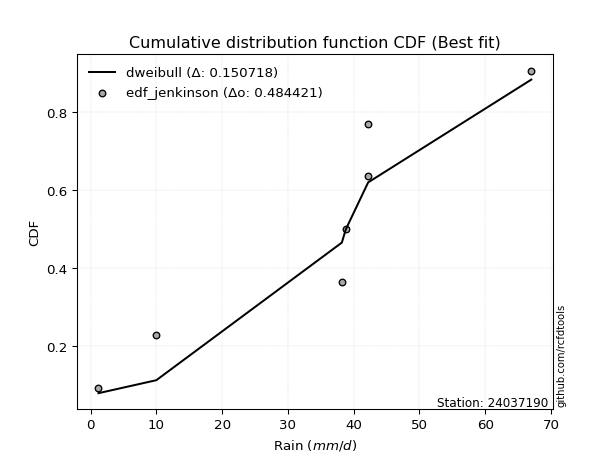</img></img>

</div>


### 11. Empirical - EDF Cunnane (1978)

Cunnane´s work in statistical hydrology has focused on the performance and evaluation of different probability distributions (such as GEV, Gumbel, Lognormal) for flood frequency estimation. _b_ is a constant, typically set to 0.4.

<div align="center">


$P=(m-b)/(n+1-2b)$


</div>


**11.1. Empirical values**

<div align="center">

|                | 0                   | 1                   | 2                  | 3           | 4                  | 5                  | 6                  |
|:---------------|:--------------------|:--------------------|:-------------------|:------------|:-------------------|:-------------------|:-------------------|
| date           | 2021                | 2020                | 2019               | 2025        | 2024               | 2022               | 2023               |
| x              | 1.2                 | 10.0                | 38.2               | 38.6        | 38.8               | 42.2               | 42.2               |
| m              | 1                   | 2                   | 3                  | 4           | 5                  | 6                  | 7                  |
| empirical_dist | edf_cunnane         | edf_cunnane         | edf_cunnane        | edf_cunnane | edf_cunnane        | edf_cunnane        | edf_cunnane        |
| empirical      | 0.08333333333333333 | 0.22222222222222224 | 0.3611111111111111 | 0.5         | 0.6388888888888888 | 0.7777777777777777 | 0.9166666666666666 |
| empirical_tr   | 1.090909090909091   | 1.2857142857142856  | 1.565217391304348  | 2.0         | 2.7692307692307687 | 4.499999999999998  | 11.999999999999995 |

</div>


**11.2. Kolmogorov-Smirnov fit test (sorted by Δ)**


<div align="center">

|                | 0                   | 1                   | 2                   | 3                   | 4                   | 5                   | 6                   | 7                   | 8                   | 9                   | 10                  | 11                  | 12                  | 13                  | 14                  | 15                  | 16                  | 17                  | 18                  | 19                  | 20                  | 21                  | 22                  | 23                  | 24                  | 25                  | 26                  | 27                  | 28                  | 29                  | 30                  | 31                  | 32                  | 33                  | 34                  | 35                  | 36                  | 37                  | 38                  | 39                  | 40                  | 41                  | 42                  | 43                  | 44                  | 45                  | 46                  | 47                  | 48                  | 49                  | 50                  | 51                  | 52                  | 53                  | 54                  | 55                  | 56                  | 57                  | 58                  | 59                  | 60                  | 61                  | 62                  | 63                  | 64                  | 65                  | 66                  | 67                  | 68                  | 69                  | 70                  | 71                  | 72                  | 73                  | 74                  | 75                  | 76                  | 77                  | 78                  | 79                  | 80                  | 81                  | 82                    | 83                  | 84                  | 85                  | 86                  | 87                  | 88                  | 89                  |
|:---------------|:--------------------|:--------------------|:--------------------|:--------------------|:--------------------|:--------------------|:--------------------|:--------------------|:--------------------|:--------------------|:--------------------|:--------------------|:--------------------|:--------------------|:--------------------|:--------------------|:--------------------|:--------------------|:--------------------|:--------------------|:--------------------|:--------------------|:--------------------|:--------------------|:--------------------|:--------------------|:--------------------|:--------------------|:--------------------|:--------------------|:--------------------|:--------------------|:--------------------|:--------------------|:--------------------|:--------------------|:--------------------|:--------------------|:--------------------|:--------------------|:--------------------|:--------------------|:--------------------|:--------------------|:--------------------|:--------------------|:--------------------|:--------------------|:--------------------|:--------------------|:--------------------|:--------------------|:--------------------|:--------------------|:--------------------|:--------------------|:--------------------|:--------------------|:--------------------|:--------------------|:--------------------|:--------------------|:--------------------|:--------------------|:--------------------|:--------------------|:--------------------|:--------------------|:--------------------|:--------------------|:--------------------|:--------------------|:--------------------|:--------------------|:--------------------|:--------------------|:--------------------|:--------------------|:--------------------|:--------------------|:--------------------|:--------------------|:----------------------|:--------------------|:--------------------|:--------------------|:--------------------|:--------------------|:--------------------|:--------------------|
| station        | 24037190            | 24037190            | 24037190            | 24037190            | 24037190            | 24037190            | 24037190            | 24037190            | 24037190            | 24037190            | 24037190            | 24037190            | 24037190            | 24037190            | 24037190            | 24037190            | 24037190            | 24037190            | 24037190            | 24037190            | 24037190            | 24037190            | 24037190            | 24037190            | 24037190            | 24037190            | 24037190            | 24037190            | 24037190            | 24037190            | 24037190            | 24037190            | 24037190            | 24037190            | 24037190            | 24037190            | 24037190            | 24037190            | 24037190            | 24037190            | 24037190            | 24037190            | 24037190            | 24037190            | 24037190            | 24037190            | 24037190            | 24037190            | 24037190            | 24037190            | 24037190            | 24037190            | 24037190            | 24037190            | 24037190            | 24037190            | 24037190            | 24037190            | 24037190            | 24037190            | 24037190            | 24037190            | 24037190            | 24037190            | 24037190            | 24037190            | 24037190            | 24037190            | 24037190            | 24037190            | 24037190            | 24037190            | 24037190            | 24037190            | 24037190            | 24037190            | 24037190            | 24037190            | 24037190            | 24037190            | 24037190            | 24037190            | 24037190              | 24037190            | 24037190            | 24037190            | 24037190            | 24037190            | 24037190            | 24037190            |
| empirical_dist | edf_cunnane         | edf_cunnane         | edf_cunnane         | edf_cunnane         | edf_cunnane         | edf_cunnane         | edf_cunnane         | edf_cunnane         | edf_cunnane         | edf_cunnane         | edf_cunnane         | edf_cunnane         | edf_cunnane         | edf_cunnane         | edf_cunnane         | edf_cunnane         | edf_cunnane         | edf_cunnane         | edf_cunnane         | edf_cunnane         | edf_cunnane         | edf_cunnane         | edf_cunnane         | edf_cunnane         | edf_cunnane         | edf_cunnane         | edf_cunnane         | edf_cunnane         | edf_cunnane         | edf_cunnane         | edf_cunnane         | edf_cunnane         | edf_cunnane         | edf_cunnane         | edf_cunnane         | edf_cunnane         | edf_cunnane         | edf_cunnane         | edf_cunnane         | edf_cunnane         | edf_cunnane         | edf_cunnane         | edf_cunnane         | edf_cunnane         | edf_cunnane         | edf_cunnane         | edf_cunnane         | edf_cunnane         | edf_cunnane         | edf_cunnane         | edf_cunnane         | edf_cunnane         | edf_cunnane         | edf_cunnane         | edf_cunnane         | edf_cunnane         | edf_cunnane         | edf_cunnane         | edf_cunnane         | edf_cunnane         | edf_cunnane         | edf_cunnane         | edf_cunnane         | edf_cunnane         | edf_cunnane         | edf_cunnane         | edf_cunnane         | edf_cunnane         | edf_cunnane         | edf_cunnane         | edf_cunnane         | edf_cunnane         | edf_cunnane         | edf_cunnane         | edf_cunnane         | edf_cunnane         | edf_cunnane         | edf_cunnane         | edf_cunnane         | edf_cunnane         | edf_cunnane         | edf_cunnane         | edf_cunnane           | edf_cunnane         | edf_cunnane         | edf_cunnane         | edf_cunnane         | edf_cunnane         | edf_cunnane         | edf_cunnane         |
| p_dist         | logt                | gompertz            | fisk                | logpearson3         | logfisk             | pearson3            | loginvweibull       | gumbel_l            | logncf              | loggumbel_l         | weibull_min         | ncf                 | invweibull          | logchi2             | loginvgauss         | logerlang           | f                   | logkstwobign        | nct                 | exponnorm           | t                   | crystalball         | norm                | logalpha            | betaprime           | gamma               | logbetaprime        | rice                | erlang              | invgauss            | logf                | lognct              | logexponnorm        | logrice             | logcrystalball      | lognorm             | lognorm             | alpha               | chi2                | loginvgamma         | loggamma            | loggamma            | logfatiguelife      | invgamma            | logexpon            | maxwell             | kstwobign           | loggenexpon         | logistic            | mielke              | rayleigh            | logmaxwell          | laplace_asymmetric  | logweibull_min      | loggompertz         | lograyleigh         | expon               | genexpon            | loglogistic         | halfnorm            | hypsecant           | loghalfnorm         | loghypsecant        | gumbel_r            | nakagami            | loggumbel_r         | pareto              | laplace             | halflogistic        | loghalflogistic     | loglaplace          | moyal               | logmoyal            | lognakagami         | loglognorm          | logpareto           | wald                | logwald             | johnsonsu           | gibrat              | logmielke           | loggibrat           | loglaplace_asymmetric | logloggamma         | fatiguelife         | logtruncnorm        | logjohnsonsu        | genlogistic         | loggenlogistic      | truncnorm           |
| delta          | 0.1472969787762542  | 0.22222222185201196 | 0.27615378059917856 | 0.27659885400222634 | 0.28618842367295744 | 0.29032927289228444 | 0.2949976513242763  | 0.29852099087245204 | 0.30535188717133405 | 0.3068906034226245  | 0.3156299318161851  | 0.3193443810082737  | 0.32396919447037825 | 0.32949067137221894 | 0.33206508867958423 | 0.33250800900459404 | 0.3326148857947217  | 0.3329505158774407  | 0.3332786369544221  | 0.33330536301382957 | 0.33330694739574623 | 0.3333086319478607  | 0.3333086488473134  | 0.3334641748306338  | 0.33503129782038404 | 0.33569388001208805 | 0.33650247362983304 | 0.33660768976093486 | 0.33702498328778147 | 0.3379126607565563  | 0.337918533307806   | 0.33916126206205194 | 0.33952056828365035 | 0.33952211483956823 | 0.33952293233635805 | 0.33952294898716945 | 0.33952294898716945 | 0.33986293261475725 | 0.34021454477709395 | 0.3404276221954499  | 0.340819645180035   | 0.340819645180035   | 0.34163519831669337 | 0.34271208209518816 | 0.34743640220534716 | 0.34989698743272807 | 0.3508455291037523  | 0.3512228895335355  | 0.354372452809756   | 0.35475765057070135 | 0.3547601314143603  | 0.35536134300064176 | 0.35536352966723755 | 0.3589920269188233  | 0.3595857030325245  | 0.35999000257066666 | 0.36004977482292483 | 0.36024618617221854 | 0.3609014457557836  | 0.36945368392221084 | 0.36971860858614775 | 0.3740818320175822  | 0.3763200808747819  | 0.38528326467243784 | 0.3897153996572577  | 0.39022927287870607 | 0.3946565371144072  | 0.39527197469507086 | 0.39645580746854187 | 0.4008567428126317  | 0.40133047318472165 | 0.4021303598680654  | 0.40663261832487624 | 0.4168461888944178  | 0.4249694998299076  | 0.4437218911661146  | 0.4513296989900551  | 0.454810842424659   | 0.4785774990234291  | 0.4828077837729257  | 0.4849698121246187  | 0.48611481000486273 | 0.5149058523368748    | 0.5152741218261419  | 0.5641850368672325  | 0.6206790681418635  | 0.6306138974031628  | 0.6388888888888888  | 0.6388888888888888  | 0.7720835934785407  |
| deltao         | 0.48442053926100004 | 0.48442053926100004 | 0.48442053926100004 | 0.48442053926100004 | 0.48442053926100004 | 0.48442053926100004 | 0.48442053926100004 | 0.48442053926100004 | 0.48442053926100004 | 0.48442053926100004 | 0.48442053926100004 | 0.48442053926100004 | 0.48442053926100004 | 0.48442053926100004 | 0.48442053926100004 | 0.48442053926100004 | 0.48442053926100004 | 0.48442053926100004 | 0.48442053926100004 | 0.48442053926100004 | 0.48442053926100004 | 0.48442053926100004 | 0.48442053926100004 | 0.48442053926100004 | 0.48442053926100004 | 0.48442053926100004 | 0.48442053926100004 | 0.48442053926100004 | 0.48442053926100004 | 0.48442053926100004 | 0.48442053926100004 | 0.48442053926100004 | 0.48442053926100004 | 0.48442053926100004 | 0.48442053926100004 | 0.48442053926100004 | 0.48442053926100004 | 0.48442053926100004 | 0.48442053926100004 | 0.48442053926100004 | 0.48442053926100004 | 0.48442053926100004 | 0.48442053926100004 | 0.48442053926100004 | 0.48442053926100004 | 0.48442053926100004 | 0.48442053926100004 | 0.48442053926100004 | 0.48442053926100004 | 0.48442053926100004 | 0.48442053926100004 | 0.48442053926100004 | 0.48442053926100004 | 0.48442053926100004 | 0.48442053926100004 | 0.48442053926100004 | 0.48442053926100004 | 0.48442053926100004 | 0.48442053926100004 | 0.48442053926100004 | 0.48442053926100004 | 0.48442053926100004 | 0.48442053926100004 | 0.48442053926100004 | 0.48442053926100004 | 0.48442053926100004 | 0.48442053926100004 | 0.48442053926100004 | 0.48442053926100004 | 0.48442053926100004 | 0.48442053926100004 | 0.48442053926100004 | 0.48442053926100004 | 0.48442053926100004 | 0.48442053926100004 | 0.48442053926100004 | 0.48442053926100004 | 0.48442053926100004 | 0.48442053926100004 | 0.48442053926100004 | 0.48442053926100004 | 0.48442053926100004 | 0.48442053926100004   | 0.48442053926100004 | 0.48442053926100004 | 0.48442053926100004 | 0.48442053926100004 | 0.48442053926100004 | 0.48442053926100004 | 0.48442053926100004 |
| eval           | Δo > Δ              | Δo > Δ              | Δo > Δ              | Δo > Δ              | Δo > Δ              | Δo > Δ              | Δo > Δ              | Δo > Δ              | Δo > Δ              | Δo > Δ              | Δo > Δ              | Δo > Δ              | Δo > Δ              | Δo > Δ              | Δo > Δ              | Δo > Δ              | Δo > Δ              | Δo > Δ              | Δo > Δ              | Δo > Δ              | Δo > Δ              | Δo > Δ              | Δo > Δ              | Δo > Δ              | Δo > Δ              | Δo > Δ              | Δo > Δ              | Δo > Δ              | Δo > Δ              | Δo > Δ              | Δo > Δ              | Δo > Δ              | Δo > Δ              | Δo > Δ              | Δo > Δ              | Δo > Δ              | Δo > Δ              | Δo > Δ              | Δo > Δ              | Δo > Δ              | Δo > Δ              | Δo > Δ              | Δo > Δ              | Δo > Δ              | Δo > Δ              | Δo > Δ              | Δo > Δ              | Δo > Δ              | Δo > Δ              | Δo > Δ              | Δo > Δ              | Δo > Δ              | Δo > Δ              | Δo > Δ              | Δo > Δ              | Δo > Δ              | Δo > Δ              | Δo > Δ              | Δo > Δ              | Δo > Δ              | Δo > Δ              | Δo > Δ              | Δo > Δ              | Δo > Δ              | Δo > Δ              | Δo > Δ              | Δo > Δ              | Δo > Δ              | Δo > Δ              | Δo > Δ              | Δo > Δ              | Δo > Δ              | Δo > Δ              | Δo > Δ              | Δo > Δ              | Δo > Δ              | Δo > Δ              | Δo > Δ              | Δo > Δ              | Δo > Δ              | Δo <= Δ             | Δo <= Δ             | Δo <= Δ               | Δo <= Δ             | Δo <= Δ             | Δo <= Δ             | Δo <= Δ             | Δo <= Δ             | Δo <= Δ             | Δo <= Δ             |
| fit            | 1                   | 1                   | 1                   | 1                   | 1                   | 1                   | 1                   | 1                   | 1                   | 1                   | 1                   | 1                   | 1                   | 1                   | 1                   | 1                   | 1                   | 1                   | 1                   | 1                   | 1                   | 1                   | 1                   | 1                   | 1                   | 1                   | 1                   | 1                   | 1                   | 1                   | 1                   | 1                   | 1                   | 1                   | 1                   | 1                   | 1                   | 1                   | 1                   | 1                   | 1                   | 1                   | 1                   | 1                   | 1                   | 1                   | 1                   | 1                   | 1                   | 1                   | 1                   | 1                   | 1                   | 1                   | 1                   | 1                   | 1                   | 1                   | 1                   | 1                   | 1                   | 1                   | 1                   | 1                   | 1                   | 1                   | 1                   | 1                   | 1                   | 1                   | 1                   | 1                   | 1                   | 1                   | 1                   | 1                   | 1                   | 1                   | 1                   | 1                   | 0                   | 0                   | 0                     | 0                   | 0                   | 0                   | 0                   | 0                   | 0                   | 0                   |
| n              | 7                   | 7                   | 7                   | 7                   | 7                   | 7                   | 7                   | 7                   | 7                   | 7                   | 7                   | 7                   | 7                   | 7                   | 7                   | 7                   | 7                   | 7                   | 7                   | 7                   | 7                   | 7                   | 7                   | 7                   | 7                   | 7                   | 7                   | 7                   | 7                   | 7                   | 7                   | 7                   | 7                   | 7                   | 7                   | 7                   | 7                   | 7                   | 7                   | 7                   | 7                   | 7                   | 7                   | 7                   | 7                   | 7                   | 7                   | 7                   | 7                   | 7                   | 7                   | 7                   | 7                   | 7                   | 7                   | 7                   | 7                   | 7                   | 7                   | 7                   | 7                   | 7                   | 7                   | 7                   | 7                   | 7                   | 7                   | 7                   | 7                   | 7                   | 7                   | 7                   | 7                   | 7                   | 7                   | 7                   | 7                   | 7                   | 7                   | 7                   | 7                   | 7                   | 7                     | 7                   | 7                   | 7                   | 7                   | 7                   | 7                   | 7                   |
| best_fit       | 1                   | 0                   | 0                   | 0                   | 0                   | 0                   | 0                   | 0                   | 0                   | 0                   | 0                   | 0                   | 0                   | 0                   | 0                   | 0                   | 0                   | 0                   | 0                   | 0                   | 0                   | 0                   | 0                   | 0                   | 0                   | 0                   | 0                   | 0                   | 0                   | 0                   | 0                   | 0                   | 0                   | 0                   | 0                   | 0                   | 0                   | 0                   | 0                   | 0                   | 0                   | 0                   | 0                   | 0                   | 0                   | 0                   | 0                   | 0                   | 0                   | 0                   | 0                   | 0                   | 0                   | 0                   | 0                   | 0                   | 0                   | 0                   | 0                   | 0                   | 0                   | 0                   | 0                   | 0                   | 0                   | 0                   | 0                   | 0                   | 0                   | 0                   | 0                   | 0                   | 0                   | 0                   | 0                   | 0                   | 0                   | 0                   | 0                   | 0                   | 0                   | 0                   | 0                     | 0                   | 0                   | 0                   | 0                   | 0                   | 0                   | 0                   |
| best_fit_sort  | 1                   | 2                   | 3                   | 4                   | 5                   | 6                   | 7                   | 8                   | 9                   | 10                  | 11                  | 12                  | 13                  | 14                  | 15                  | 16                  | 17                  | 18                  | 19                  | 20                  | 21                  | 22                  | 23                  | 24                  | 25                  | 26                  | 27                  | 28                  | 29                  | 30                  | 31                  | 32                  | 33                  | 34                  | 35                  | 36                  | 37                  | 38                  | 39                  | 40                  | 41                  | 42                  | 43                  | 44                  | 45                  | 46                  | 47                  | 48                  | 49                  | 50                  | 51                  | 52                  | 53                  | 54                  | 55                  | 56                  | 57                  | 58                  | 59                  | 60                  | 61                  | 62                  | 63                  | 64                  | 65                  | 66                  | 67                  | 68                  | 69                  | 70                  | 71                  | 72                  | 73                  | 74                  | 75                  | 76                  | 77                  | 78                  | 79                  | 80                  | 81                  | 82                  | 83                    | 84                  | 85                  | 86                  | 87                  | 88                  | 89                  | 90                  |

</div>


<div align="center">

</img>

</div>


**11.3. Best fit**

<div align="center">

|   id |   station | empirical_dist   | p_dist   |    delta |   deltao | eval   |   fit |   n |   best_fit |   best_fit_sort |
|-----:|----------:|:-----------------|:---------|---------:|---------:|:-------|------:|----:|-----------:|----------------:|
|    0 |  24037190 | edf_cunnane      | logt     | 0.147297 | 0.484421 | Δo > Δ |     1 |   7 |          1 |               1 |

</div>


<div align="center">

</img></img>

</div>


### 12. Empirical - EDF Adamowski (1981)

The Adamowski formula in hydrology refers to a specific plotting position formula used for estimating the non-parametric empirical distribution of hydrological events (like flood peaks) to calculate their return periods. This formula provides an alternative to traditional parametric methods (like the Gumbel or Log Pearson Type III distributions). 

<div align="center">


$P=(m-0.25)/(n+0.5)$


</div>


**12.1. Empirical values**

<div align="center">

|                | 0                  | 1                   | 2                   | 3             | 4                  | 5                  | 6                  |
|:---------------|:-------------------|:--------------------|:--------------------|:--------------|:-------------------|:-------------------|:-------------------|
| date           | 2021               | 2020                | 2019                | 2025          | 2024               | 2022               | 2023               |
| x              | 1.2                | 10.0                | 38.2                | 38.6          | 38.8               | 42.2               | 42.2               |
| m              | 1                  | 2                   | 3                   | 4             | 5                  | 6                  | 7                  |
| empirical_dist | edf_adamowski      | edf_adamowski       | edf_adamowski       | edf_adamowski | edf_adamowski      | edf_adamowski      | edf_adamowski      |
| empirical      | 0.1                | 0.23333333333333334 | 0.36666666666666664 | 0.5           | 0.6333333333333333 | 0.7666666666666667 | 0.9                |
| empirical_tr   | 1.1111111111111112 | 1.3043478260869565  | 1.5789473684210527  | 2.0           | 2.727272727272727  | 4.2857142857142865 | 10.000000000000002 |

</div>


**12.2. Kolmogorov-Smirnov fit test (sorted by Δ)**


<div align="center">

|                | 0                   | 1                   | 2                   | 3                   | 4                   | 5                   | 6                   | 7                   | 8                   | 9                   | 10                  | 11                  | 12                  | 13                  | 14                  | 15                  | 16                  | 17                  | 18                  | 19                  | 20                  | 21                  | 22                  | 23                  | 24                  | 25                  | 26                  | 27                  | 28                  | 29                  | 30                  | 31                  | 32                  | 33                  | 34                  | 35                  | 36                  | 37                  | 38                  | 39                  | 40                  | 41                  | 42                  | 43                  | 44                  | 45                  | 46                  | 47                  | 48                  | 49                  | 50                  | 51                  | 52                  | 53                  | 54                  | 55                  | 56                  | 57                  | 58                  | 59                  | 60                  | 61                  | 62                  | 63                  | 64                  | 65                  | 66                  | 67                  | 68                  | 69                  | 70                  | 71                  | 72                  | 73                  | 74                  | 75                  | 76                  | 77                  | 78                  | 79                  | 80                  | 81                  | 82                    | 83                  | 84                  | 85                  | 86                  | 87                  | 88                  | 89                  |
|:---------------|:--------------------|:--------------------|:--------------------|:--------------------|:--------------------|:--------------------|:--------------------|:--------------------|:--------------------|:--------------------|:--------------------|:--------------------|:--------------------|:--------------------|:--------------------|:--------------------|:--------------------|:--------------------|:--------------------|:--------------------|:--------------------|:--------------------|:--------------------|:--------------------|:--------------------|:--------------------|:--------------------|:--------------------|:--------------------|:--------------------|:--------------------|:--------------------|:--------------------|:--------------------|:--------------------|:--------------------|:--------------------|:--------------------|:--------------------|:--------------------|:--------------------|:--------------------|:--------------------|:--------------------|:--------------------|:--------------------|:--------------------|:--------------------|:--------------------|:--------------------|:--------------------|:--------------------|:--------------------|:--------------------|:--------------------|:--------------------|:--------------------|:--------------------|:--------------------|:--------------------|:--------------------|:--------------------|:--------------------|:--------------------|:--------------------|:--------------------|:--------------------|:--------------------|:--------------------|:--------------------|:--------------------|:--------------------|:--------------------|:--------------------|:--------------------|:--------------------|:--------------------|:--------------------|:--------------------|:--------------------|:--------------------|:--------------------|:----------------------|:--------------------|:--------------------|:--------------------|:--------------------|:--------------------|:--------------------|:--------------------|
| station        | 24037190            | 24037190            | 24037190            | 24037190            | 24037190            | 24037190            | 24037190            | 24037190            | 24037190            | 24037190            | 24037190            | 24037190            | 24037190            | 24037190            | 24037190            | 24037190            | 24037190            | 24037190            | 24037190            | 24037190            | 24037190            | 24037190            | 24037190            | 24037190            | 24037190            | 24037190            | 24037190            | 24037190            | 24037190            | 24037190            | 24037190            | 24037190            | 24037190            | 24037190            | 24037190            | 24037190            | 24037190            | 24037190            | 24037190            | 24037190            | 24037190            | 24037190            | 24037190            | 24037190            | 24037190            | 24037190            | 24037190            | 24037190            | 24037190            | 24037190            | 24037190            | 24037190            | 24037190            | 24037190            | 24037190            | 24037190            | 24037190            | 24037190            | 24037190            | 24037190            | 24037190            | 24037190            | 24037190            | 24037190            | 24037190            | 24037190            | 24037190            | 24037190            | 24037190            | 24037190            | 24037190            | 24037190            | 24037190            | 24037190            | 24037190            | 24037190            | 24037190            | 24037190            | 24037190            | 24037190            | 24037190            | 24037190            | 24037190              | 24037190            | 24037190            | 24037190            | 24037190            | 24037190            | 24037190            | 24037190            |
| empirical_dist | edf_adamowski       | edf_adamowski       | edf_adamowski       | edf_adamowski       | edf_adamowski       | edf_adamowski       | edf_adamowski       | edf_adamowski       | edf_adamowski       | edf_adamowski       | edf_adamowski       | edf_adamowski       | edf_adamowski       | edf_adamowski       | edf_adamowski       | edf_adamowski       | edf_adamowski       | edf_adamowski       | edf_adamowski       | edf_adamowski       | edf_adamowski       | edf_adamowski       | edf_adamowski       | edf_adamowski       | edf_adamowski       | edf_adamowski       | edf_adamowski       | edf_adamowski       | edf_adamowski       | edf_adamowski       | edf_adamowski       | edf_adamowski       | edf_adamowski       | edf_adamowski       | edf_adamowski       | edf_adamowski       | edf_adamowski       | edf_adamowski       | edf_adamowski       | edf_adamowski       | edf_adamowski       | edf_adamowski       | edf_adamowski       | edf_adamowski       | edf_adamowski       | edf_adamowski       | edf_adamowski       | edf_adamowski       | edf_adamowski       | edf_adamowski       | edf_adamowski       | edf_adamowski       | edf_adamowski       | edf_adamowski       | edf_adamowski       | edf_adamowski       | edf_adamowski       | edf_adamowski       | edf_adamowski       | edf_adamowski       | edf_adamowski       | edf_adamowski       | edf_adamowski       | edf_adamowski       | edf_adamowski       | edf_adamowski       | edf_adamowski       | edf_adamowski       | edf_adamowski       | edf_adamowski       | edf_adamowski       | edf_adamowski       | edf_adamowski       | edf_adamowski       | edf_adamowski       | edf_adamowski       | edf_adamowski       | edf_adamowski       | edf_adamowski       | edf_adamowski       | edf_adamowski       | edf_adamowski       | edf_adamowski         | edf_adamowski       | edf_adamowski       | edf_adamowski       | edf_adamowski       | edf_adamowski       | edf_adamowski       | edf_adamowski       |
| p_dist         | logt                | gompertz            | fisk                | logpearson3         | logfisk             | pearson3            | loginvweibull       | gumbel_l            | logncf              | loggumbel_l         | weibull_min         | ncf                 | invweibull          | logchi2             | loginvgauss         | logerlang           | f                   | logkstwobign        | nct                 | exponnorm           | t                   | crystalball         | norm                | logalpha            | betaprime           | gamma               | logbetaprime        | rice                | erlang              | invgauss            | logf                | lognct              | logexponnorm        | logrice             | logcrystalball      | lognorm             | lognorm             | alpha               | chi2                | loginvgamma         | loggamma            | loggamma            | logfatiguelife      | invgamma            | logexpon            | maxwell             | kstwobign           | loggenexpon         | logistic            | mielke              | rayleigh            | logmaxwell          | laplace_asymmetric  | logweibull_min      | loggompertz         | lograyleigh         | expon               | genexpon            | loglogistic         | halfnorm            | hypsecant           | loghalfnorm         | loghypsecant        | gumbel_r            | pareto              | nakagami            | loggumbel_r         | laplace             | halflogistic        | loghalflogistic     | loglaplace          | moyal               | logmoyal            | lognakagami         | loglognorm          | logpareto           | wald                | logwald             | johnsonsu           | gibrat              | logmielke           | loggibrat           | loglaplace_asymmetric | logloggamma         | fatiguelife         | logtruncnorm        | logjohnsonsu        | genlogistic         | loggenlogistic      | truncnorm           |
| delta          | 0.15840808988736527 | 0.23333333296312306 | 0.270598225043623   | 0.2710432984466708  | 0.2806328681174019  | 0.2847737173367289  | 0.28944209576872076 | 0.2929654353168965  | 0.2997963316157785  | 0.30133504786706894 | 0.31007437626062956 | 0.3137888254527182  | 0.3184136389148227  | 0.3239351158166634  | 0.3265095331240287  | 0.3269524534490385  | 0.32705933023916617 | 0.32739496032188514 | 0.3277230813988666  | 0.32774980745827403 | 0.3277513918401907  | 0.32775307639230516 | 0.3277530932917579  | 0.32790861927507825 | 0.3294757422648285  | 0.3301383244565325  | 0.3309469180742775  | 0.3310521342053793  | 0.33146942773222593 | 0.33235710520100076 | 0.3323629777522505  | 0.3336057065064964  | 0.3339650127280948  | 0.3339665592840127  | 0.3339673767808025  | 0.3339673934316139  | 0.3339673934316139  | 0.3343073770592017  | 0.3346589892215384  | 0.3348720666398944  | 0.33526408962447946 | 0.33526408962447946 | 0.33607964276113783 | 0.33715652653963263 | 0.3418808466497916  | 0.34434143187717253 | 0.34528997354819674 | 0.34566733397797994 | 0.34881689725420045 | 0.3492020950151458  | 0.34920457585880477 | 0.3498057874450862  | 0.349807974111682   | 0.3534364713632678  | 0.354030147476969   | 0.3544344470151111  | 0.3544942192673693  | 0.354690630616663   | 0.35534589020022805 | 0.3638981283666553  | 0.3641630530305922  | 0.3685262764620267  | 0.3707645253192264  | 0.3797277091168823  | 0.38354542600329605 | 0.3841598441017022  | 0.38467371732315053 | 0.3897164191395153  | 0.39090025191298633 | 0.39530118725707614 | 0.3957749176291661  | 0.39657480431250985 | 0.4010770627693207  | 0.4057350777833067  | 0.4138583887187965  | 0.4326107800550035  | 0.44577414343449956 | 0.4492552868691035  | 0.4730219434678736  | 0.4772522282173702  | 0.47941425656906317 | 0.4805592544493072  | 0.5093502967813193    | 0.5097185662705863  | 0.558629481311677   | 0.6151235125863079  | 0.6250583418476072  | 0.6333333333333333  | 0.6333333333333333  | 0.7609724823674295  |
| deltao         | 0.48442053926100004 | 0.48442053926100004 | 0.48442053926100004 | 0.48442053926100004 | 0.48442053926100004 | 0.48442053926100004 | 0.48442053926100004 | 0.48442053926100004 | 0.48442053926100004 | 0.48442053926100004 | 0.48442053926100004 | 0.48442053926100004 | 0.48442053926100004 | 0.48442053926100004 | 0.48442053926100004 | 0.48442053926100004 | 0.48442053926100004 | 0.48442053926100004 | 0.48442053926100004 | 0.48442053926100004 | 0.48442053926100004 | 0.48442053926100004 | 0.48442053926100004 | 0.48442053926100004 | 0.48442053926100004 | 0.48442053926100004 | 0.48442053926100004 | 0.48442053926100004 | 0.48442053926100004 | 0.48442053926100004 | 0.48442053926100004 | 0.48442053926100004 | 0.48442053926100004 | 0.48442053926100004 | 0.48442053926100004 | 0.48442053926100004 | 0.48442053926100004 | 0.48442053926100004 | 0.48442053926100004 | 0.48442053926100004 | 0.48442053926100004 | 0.48442053926100004 | 0.48442053926100004 | 0.48442053926100004 | 0.48442053926100004 | 0.48442053926100004 | 0.48442053926100004 | 0.48442053926100004 | 0.48442053926100004 | 0.48442053926100004 | 0.48442053926100004 | 0.48442053926100004 | 0.48442053926100004 | 0.48442053926100004 | 0.48442053926100004 | 0.48442053926100004 | 0.48442053926100004 | 0.48442053926100004 | 0.48442053926100004 | 0.48442053926100004 | 0.48442053926100004 | 0.48442053926100004 | 0.48442053926100004 | 0.48442053926100004 | 0.48442053926100004 | 0.48442053926100004 | 0.48442053926100004 | 0.48442053926100004 | 0.48442053926100004 | 0.48442053926100004 | 0.48442053926100004 | 0.48442053926100004 | 0.48442053926100004 | 0.48442053926100004 | 0.48442053926100004 | 0.48442053926100004 | 0.48442053926100004 | 0.48442053926100004 | 0.48442053926100004 | 0.48442053926100004 | 0.48442053926100004 | 0.48442053926100004 | 0.48442053926100004   | 0.48442053926100004 | 0.48442053926100004 | 0.48442053926100004 | 0.48442053926100004 | 0.48442053926100004 | 0.48442053926100004 | 0.48442053926100004 |
| eval           | Δo > Δ              | Δo > Δ              | Δo > Δ              | Δo > Δ              | Δo > Δ              | Δo > Δ              | Δo > Δ              | Δo > Δ              | Δo > Δ              | Δo > Δ              | Δo > Δ              | Δo > Δ              | Δo > Δ              | Δo > Δ              | Δo > Δ              | Δo > Δ              | Δo > Δ              | Δo > Δ              | Δo > Δ              | Δo > Δ              | Δo > Δ              | Δo > Δ              | Δo > Δ              | Δo > Δ              | Δo > Δ              | Δo > Δ              | Δo > Δ              | Δo > Δ              | Δo > Δ              | Δo > Δ              | Δo > Δ              | Δo > Δ              | Δo > Δ              | Δo > Δ              | Δo > Δ              | Δo > Δ              | Δo > Δ              | Δo > Δ              | Δo > Δ              | Δo > Δ              | Δo > Δ              | Δo > Δ              | Δo > Δ              | Δo > Δ              | Δo > Δ              | Δo > Δ              | Δo > Δ              | Δo > Δ              | Δo > Δ              | Δo > Δ              | Δo > Δ              | Δo > Δ              | Δo > Δ              | Δo > Δ              | Δo > Δ              | Δo > Δ              | Δo > Δ              | Δo > Δ              | Δo > Δ              | Δo > Δ              | Δo > Δ              | Δo > Δ              | Δo > Δ              | Δo > Δ              | Δo > Δ              | Δo > Δ              | Δo > Δ              | Δo > Δ              | Δo > Δ              | Δo > Δ              | Δo > Δ              | Δo > Δ              | Δo > Δ              | Δo > Δ              | Δo > Δ              | Δo > Δ              | Δo > Δ              | Δo > Δ              | Δo > Δ              | Δo > Δ              | Δo > Δ              | Δo > Δ              | Δo <= Δ               | Δo <= Δ             | Δo <= Δ             | Δo <= Δ             | Δo <= Δ             | Δo <= Δ             | Δo <= Δ             | Δo <= Δ             |
| fit            | 1                   | 1                   | 1                   | 1                   | 1                   | 1                   | 1                   | 1                   | 1                   | 1                   | 1                   | 1                   | 1                   | 1                   | 1                   | 1                   | 1                   | 1                   | 1                   | 1                   | 1                   | 1                   | 1                   | 1                   | 1                   | 1                   | 1                   | 1                   | 1                   | 1                   | 1                   | 1                   | 1                   | 1                   | 1                   | 1                   | 1                   | 1                   | 1                   | 1                   | 1                   | 1                   | 1                   | 1                   | 1                   | 1                   | 1                   | 1                   | 1                   | 1                   | 1                   | 1                   | 1                   | 1                   | 1                   | 1                   | 1                   | 1                   | 1                   | 1                   | 1                   | 1                   | 1                   | 1                   | 1                   | 1                   | 1                   | 1                   | 1                   | 1                   | 1                   | 1                   | 1                   | 1                   | 1                   | 1                   | 1                   | 1                   | 1                   | 1                   | 1                   | 1                   | 0                     | 0                   | 0                   | 0                   | 0                   | 0                   | 0                   | 0                   |
| n              | 7                   | 7                   | 7                   | 7                   | 7                   | 7                   | 7                   | 7                   | 7                   | 7                   | 7                   | 7                   | 7                   | 7                   | 7                   | 7                   | 7                   | 7                   | 7                   | 7                   | 7                   | 7                   | 7                   | 7                   | 7                   | 7                   | 7                   | 7                   | 7                   | 7                   | 7                   | 7                   | 7                   | 7                   | 7                   | 7                   | 7                   | 7                   | 7                   | 7                   | 7                   | 7                   | 7                   | 7                   | 7                   | 7                   | 7                   | 7                   | 7                   | 7                   | 7                   | 7                   | 7                   | 7                   | 7                   | 7                   | 7                   | 7                   | 7                   | 7                   | 7                   | 7                   | 7                   | 7                   | 7                   | 7                   | 7                   | 7                   | 7                   | 7                   | 7                   | 7                   | 7                   | 7                   | 7                   | 7                   | 7                   | 7                   | 7                   | 7                   | 7                   | 7                   | 7                     | 7                   | 7                   | 7                   | 7                   | 7                   | 7                   | 7                   |
| best_fit       | 1                   | 0                   | 0                   | 0                   | 0                   | 0                   | 0                   | 0                   | 0                   | 0                   | 0                   | 0                   | 0                   | 0                   | 0                   | 0                   | 0                   | 0                   | 0                   | 0                   | 0                   | 0                   | 0                   | 0                   | 0                   | 0                   | 0                   | 0                   | 0                   | 0                   | 0                   | 0                   | 0                   | 0                   | 0                   | 0                   | 0                   | 0                   | 0                   | 0                   | 0                   | 0                   | 0                   | 0                   | 0                   | 0                   | 0                   | 0                   | 0                   | 0                   | 0                   | 0                   | 0                   | 0                   | 0                   | 0                   | 0                   | 0                   | 0                   | 0                   | 0                   | 0                   | 0                   | 0                   | 0                   | 0                   | 0                   | 0                   | 0                   | 0                   | 0                   | 0                   | 0                   | 0                   | 0                   | 0                   | 0                   | 0                   | 0                   | 0                   | 0                   | 0                   | 0                     | 0                   | 0                   | 0                   | 0                   | 0                   | 0                   | 0                   |
| best_fit_sort  | 1                   | 2                   | 3                   | 4                   | 5                   | 6                   | 7                   | 8                   | 9                   | 10                  | 11                  | 12                  | 13                  | 14                  | 15                  | 16                  | 17                  | 18                  | 19                  | 20                  | 21                  | 22                  | 23                  | 24                  | 25                  | 26                  | 27                  | 28                  | 29                  | 30                  | 31                  | 32                  | 33                  | 34                  | 35                  | 36                  | 37                  | 38                  | 39                  | 40                  | 41                  | 42                  | 43                  | 44                  | 45                  | 46                  | 47                  | 48                  | 49                  | 50                  | 51                  | 52                  | 53                  | 54                  | 55                  | 56                  | 57                  | 58                  | 59                  | 60                  | 61                  | 62                  | 63                  | 64                  | 65                  | 66                  | 67                  | 68                  | 69                  | 70                  | 71                  | 72                  | 73                  | 74                  | 75                  | 76                  | 77                  | 78                  | 79                  | 80                  | 81                  | 82                  | 83                    | 84                  | 85                  | 86                  | 87                  | 88                  | 89                  | 90                  |

</div>


<div align="center">

</img>

</div>


**12.3. Best fit**

<div align="center">

|   id |   station | empirical_dist   | p_dist   |    delta |   deltao | eval   |   fit |   n |   best_fit |   best_fit_sort |
|-----:|----------:|:-----------------|:---------|---------:|---------:|:-------|------:|----:|-----------:|----------------:|
|    0 |  24037190 | edf_adamowski    | logt     | 0.158408 | 0.484421 | Δo > Δ |     1 |   7 |          1 |               1 |

</div>


<div align="center">

</img>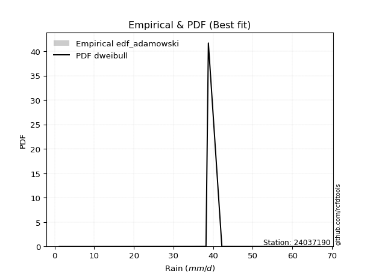</img>

</div>


## C. Best fit & Estimate extreme values for specific return periods - Tr


### 1. Best fit (ordered by delta Δ)

<div align="center">

|   id |   station | empirical_dist   | p_dist   |    delta |   deltao | eval   |   fit |   n |   best_fit |   best_fit_sort |
|-----:|----------:|:-----------------|:---------|---------:|---------:|:-------|------:|----:|-----------:|----------------:|
|    0 |  24037190 | edf_hazen        | logt     | 0.13936  | 0.484421 | Δo > Δ |     1 |   7 |          1 |               1 |
|    1 |  24037190 | edf_gringorten   | logt     | 0.144176 | 0.484421 | Δo > Δ |     1 |   7 |          1 |               2 |
|    2 |  24037190 | edf_cunnane      | logt     | 0.147297 | 0.484421 | Δo > Δ |     1 |   7 |          1 |               3 |
|    3 |  24037190 | edf_blom         | logt     | 0.149213 | 0.484421 | Δo > Δ |     1 |   7 |          1 |               4 |
|    4 |  24037190 | edf_tukey        | logt     | 0.152347 | 0.484421 | Δo > Δ |     1 |   7 |          1 |               5 |
|    5 |  24037190 | edf_filliben     | logt     | 0.15352  | 0.484421 | Δo > Δ |     1 |   7 |          1 |               6 |
|    6 |  24037190 | edf_beard        | logt     | 0.154072 | 0.484421 | Δo > Δ |     1 |   7 |          1 |               7 |
|    7 |  24037190 | edf_jenkinson    | logt     | 0.154072 | 0.484421 | Δo > Δ |     1 |   7 |          1 |               8 |
|    8 |  24037190 | edf_chegodayev   | logt     | 0.154804 | 0.484421 | Δo > Δ |     1 |   7 |          1 |               9 |
|    9 |  24037190 | edf_adamowski    | logt     | 0.158408 | 0.484421 | Δo > Δ |     1 |   7 |          1 |              10 |
|   10 |  24037190 | edf_weibull      | logt     | 0.175075 | 0.484421 | Δo > Δ |     1 |   7 |          1 |              11 |
|   11 |  24037190 | edf_california   | logt     | 0.210789 | 0.484421 | Δo > Δ |     1 |   7 |          1 |              12 |

</div>

:file_folder:Tables: [bestfit_24037190.csv](table/bestfit_24037190.csv) | [extreme_24037190.csv](table/extreme_24037190.csv)


### 2. Extreme values

In hydrology, a return period (or recurrence interval $Tr$) is the statistical average time between extreme events like floods or droughts of a specific magnitude, indicating how rare an event is, with a 100-year flood, for example, having a 1% chance of occurring in any given year, not that it happens exactly every century. It is a key tool for infrastructure design (like bridges or dams) and risk assessment, calculated from historical data to determine the probability of future events, although it is important to remember it is statistical average, and events can cluster or be missed.

> risk_rate: assuming the return period as the project useful life.

|   id |      tr |   prob_l |     prob_g |    alpha |   betaprime |    chi2 |   crystalball |   erlang |    expon |   exponnorm |       f |   fatiguelife |    fisk |   gamma |   genexpon |   genlogistic |   gibrat |   gompertz |   gumbel_l |   gumbel_r |   halflogistic |   halfnorm |   hypsecant |   invgamma |   invgauss |   invweibull |   johnsonsu |   kstwobign |   laplace |   laplace_asymmetric |   loggamma |   logistic |   lognorm |   maxwell |       mielke |    moyal |   nakagami |      ncf |     nct |    norm |           pareto |   pearson3 |   rayleigh |    rice |       t |   truncnorm |     wald |   weibull_min |   logalpha |   logbetaprime |   logchi2 |   logcrystalball |   logerlang |         logexpon |   logexponnorm |     logf |   logfatiguelife |   logfisk |   loggenexpon |   loggenlogistic |        loggibrat |   loggompertz |   loggumbel_l |   loggumbel_r |   loghalflogistic |   loghalfnorm |   loghypsecant |   loginvgamma |   loginvgauss |   loginvweibull |   logjohnsonsu |   logkstwobign |   loglaplace |   loglaplace_asymmetric |   logloggamma |   loglogistic |   loglognorm |   logmaxwell |   logmielke |   logmoyal |      lognakagami |           logncf |   lognct |     logpareto |   logpearson3 |   lograyleigh |   logrice |            logt |   logtruncnorm |     logwald |   logweibull_min |   station |   n |   risk_rate |
|-----:|--------:|---------:|-----------:|---------:|------------:|--------:|--------------:|---------:|---------:|------------:|--------:|--------------:|--------:|--------:|-----------:|--------------:|---------:|-----------:|-----------:|-----------:|---------------:|-----------:|------------:|-----------:|-----------:|-------------:|------------:|------------:|----------:|---------------------:|-----------:|-----------:|----------:|----------:|-------------:|---------:|-----------:|---------:|--------:|--------:|-----------------:|-----------:|-----------:|--------:|--------:|------------:|---------:|--------------:|-----------:|---------------:|----------:|-----------------:|------------:|-----------------:|---------------:|---------:|-----------------:|----------:|--------------:|-----------------:|-----------------:|--------------:|--------------:|--------------:|------------------:|--------------:|---------------:|--------------:|--------------:|----------------:|---------------:|---------------:|-------------:|------------------------:|--------------:|--------------:|-------------:|-------------:|------------:|-----------:|-----------------:|-----------------:|---------:|--------------:|--------------:|--------------:|----------:|----------------:|---------------:|------------:|-----------------:|----------:|----:|------------:|
|    0 |    2    | 0.5      | 0.5        |  26.8561 |     29.8811 | 29.3919 |       30.1714 |  29.4659 |  21.2815 |     30.1715 | 30.1893 |       1.20002 | 33.1201 | 29.7535 |    21.2704 |           inf |  25.4314 |    37.6448 |    32.7657 |    27.5772 |        26.2874 |    26.939  |     30.1714 |    28.9889 |    28.671  |      27.8706 |     42.171  |     26.2275 |   30.1714 |              33.8829 |    18.7325 |    30.1714 |   19.8694 |   28.8209 | -5.02375e+08 |  26.7397 |    20.879  |  26.9164 | 30.1711 | 30.1714 |      2.98133     |    32.7353 |    28.3418 | 29.696  | 30.1714 |     3.12188 |  25.0526 |       33.4377 |    18.7947 |        19.5744 |   19.6692 |          19.8694 |     19.5993 |      8.39711     |        19.8695 |  19.9318 |          19.6975 |   26.1726 |       12.966  |         inf      |     13.6855      |       25.165  |       24.3674 |       16.2016 |           14.6389 |       15.4084 |        19.8694 |       18.7015 |       18.6999 |         17.9096 |           42.2 |        14.2801 |      19.8694 |                 25.0473 |       25.0087 |       19.8694 |      1.2142  |      17.8668 |     26.2151 |    15.1687 |      3.72442     |     16.884       |  19.807  |   1.44949     |       26.9789 |       17.2061 |   19.8694 |   38.6482       |        5.38536 |     13.2834 |          24.7567 |  24037190 |   7 |    0.75     |
|    1 |    2.33 | 0.570815 | 0.429185   |  30.5016 |     32.7637 | 32.3347 |       32.9894 |  32.4449 |  25.706  |     32.9895 | 33.0113 |       1.76697 | 35.6909 | 32.6551 |    25.6925 |           inf |  26.8588 |    38.6219 |    35.2174 |    30.1883 |        28.9721 |    29.9803 |     32.4266 |    32.0009 |    31.8477 |      31.4869 |     42.1877 |     29.8134 |   31.8767 |              35.4725 |    23.7707 |    32.6543 |   24.8    |   31.7485 | -5.02375e+08 |  29.2114 |    24.9952 |  30.8783 | 32.9896 | 32.9894 |      5.66344     |    35.3356 |    31.3128 | 32.6109 | 32.9894 |     3.48307 |  26.9003 |       35.3804 |    24.022  |        24.6259 |   24.9145 |          24.8    |     24.7598 |     12.8913      |        24.8002 |  24.8992 |          24.5932 |   31.2589 |       18.0682 |         inf      |     15.3117      |       28.8317 |       29.5504 |       19.8958 |           18.0809 |       19.5728 |        23.7261 |       23.7314 |       23.9758 |         24.7341 |           42.2 |        19.8128 |      22.7217 |                 27.6731 |       27.6384 |       24.1547 |      1.37596 |      22.4937 |     28.8221 |    18.4242 |      5.84469     |     23.2404      |  24.7557 |   1.92749     |       32.4755 |       21.7359 |   24.8001 |   38.7516       |        6.839   |     15.3614 |          28.5344 |  24037190 |   7 |    0.729209 |
|    2 |    5    | 0.8      | 0.2        |  45.8793 |     43.5631 | 43.5658 |       43.4617 |  43.7349 |  47.8277 |     43.4619 | 43.5049 |      13.8104  | 45.6175 | 43.6599 |    47.802  |           inf |  35.0772 |    41.7818 |    43.1376 |    41.5324 |        41.1198 |    42.8416 |     41.4728 |    43.7087 |    44.4228 |      47.1975 |     42.1995 |     45.0458 |   40.4028 |              39.5233 |    58.5111 |    42.2408 |   56.5208 |   43.2716 | -5.02375e+08 |  40.661  |    42.9983 |  49.4425 | 43.4643 | 43.4617 |    423.687       |    43.6243 |    43.207  | 43.5746 | 43.4619 |     5.05055 |  37.2442 |       41.6566 |    61.739  |        58.3135 |   60.9699 |          56.5208 |     59.9029 |    109.924       |        56.5213 |  56.9443 |          56.1456 |   62.0548 |       68.3059 |         inf      |     29.2264      |       44.8148 |       55.0982 |       48.5622 |           47.0116 |       53.8296 |        48.3352 |       58.9897 |       62.7282 |        100.564  |           42.2 |        79.6227 |      44.4335 |                 35.6773 |       35.6589 |       51.345  |    inf       |      55.6819 |     36.699  |    45.3452 |     63.9088      |     98.4792      |  56.7826 |   4.86917e+19 |       55.1457 |       55.3991 |   56.521  |   40.6912       |       16.2352  |     34.6578 |          45.146  |  24037190 |   7 |    0.67232  |
|    3 |   10    | 0.9      | 0.1        |  58.0239 |     50.8032 | 51.2752 |       50.4088 |  51.4166 |  67.9092 |     50.409  | 50.4714 |      30.4394  | 52.9285 | 51.1543 |    67.8724 |           inf |  44.4452 |    43.5426 |    47.5473 |    50.772  |        51.2079 |    52.3587 |     48.6965 |    51.9482 |    53.4656 |      59.9935 |     42.1999 |     56.6433 |   48.1426 |              40.9368 |   107.811  |    49.3009 |   97.6191 |   51.381  | 40.9527      |  50.6297 |    56.6033 |  66.0435 | 50.4133 | 50.4088 |  26133.7         |    48.0098 |    51.6878 | 50.9273 | 50.4091 |     6.24074 |  48.2214 |       45.151  |   118.919  |       104.107  |  111.993  |          97.6191 |    109.055  |    769.2         |        97.6199 |  98.603  |          97.1275 |  102.824  |      176.546  |         inf      |     61.0661      |       57.3305 |       77.9436 |      100.448  |          103.952  |      113.8    |        85.3176 |      110.415  |      122.856  |        315.2    |           42.2 |       229.602  |      81.6804 |                 38.9845 |       38.9744 |       89.4719 |    inf       |     105.377  |     39.9271 |    99.3301 |    484.092       |    339.541       |  98.6079 | inf           |       69.4718 |      107.95   |   97.6195 |   64.8503       |       25.3062  |     82.1879 |          58.2846 |  24037190 |   7 |    0.651322 |
|    4 |   15    | 0.933333 | 0.0666667  |  64.8017 |     54.4389 | 55.2004 |       53.8755 |  55.3076 |  79.6561 |     53.8757 | 53.9494 |      41.315   | 56.912  | 54.9526 |    79.6128 |           inf |  50.9068 |    44.3403 |    49.5443 |    55.9849 |        56.9169 |    57.3114 |     52.819  |    56.2093 |    58.1969 |      67.2129 |     42.2    |     62.8002 |   52.6701 |              41.3732 |   146.857  |    53.1476 |  128.223  |   55.5418 | 41.39        |  56.415  |    63.719  |  75.9911 | 53.881  | 53.8755 | 291776           |    49.8939 |    56.0574 | 54.6135 | 53.8759 |     6.86733 |  55.2705 |       46.7335 |   166.469  |       139.347  |  152.351  |         128.223  |    147.634  |   2400.5         |       128.224  | 129.691  |         127.698  |  135.391  |      288.098  |         inf      |    101.517       |       64.1029 |       91.2018 |      151.365  |          162.878  |      168.01   |       117.997  |      152.04   |      173.635  |        600.495  |           42.2 |       402.853  |     116.623  |                 40.0663 |       40.0592 |      121.087  |    inf       |     146.18   |     40.9801 |   156.575  |   1434.46        |    699.958       | 129.922  | inf           |       75.6833 |      152.229  |  128.223  |  283.745        |       29.7418  |    143.094  |          65.4324 |  24037190 |   7 |    0.644736 |
|    5 |   20    | 0.95     | 0.05       |  69.5375 |     56.828  | 57.7992 |       56.1458 |  57.8767 |  87.9906 |     56.146  | 56.2276 |      49.3671  | 59.6654 | 57.4611 |    87.9428 |           inf |  55.9754 |    44.8369 |    50.7874 |    59.6348 |        60.9168 |    60.6134 |     55.7272 |    59.0557 |    61.3764 |      72.2677 |     42.2    |     66.9477 |   55.8824 |              41.5856 |   180.07   |    55.8063 |  153.293  |   58.3032 | 41.6029      |  60.5123 |    68.4698 |  83.2158 | 56.152  | 56.1458 |      1.6163e+06  |    51.0244 |    58.9618 | 57.0326 | 56.1462 |     7.28731 |  60.5235 |       47.7185 |   208.208  |       168.802  |  186.661  |         153.293  |    180.28   |   5382.54        |       153.294  | 155.191  |         152.768  |  163.75   |      399.004  |         inf      |    151.248       |       68.7187 |      100.57   |      201.704  |          223.102  |      217.84   |       148.328  |      187.962  |      218.627  |        942.984  |           42.2 |       588.341  |     150.15   |                 40.6036 |       40.598  |      149.254  |    inf       |     181.645  |     41.5029 |   216.119  |   2976.86        |   1175.08        | 155.659  | inf           |       79.3146 |      191.301  |  153.294  | 6935.11         |       32.3434  |    216.309  |          70.3177 |  24037190 |   7 |    0.641514 |
|    6 |   25    | 0.96     | 0.04       |  73.1872 |     58.5909 | 59.7266 |       57.817  |  59.7785 |  94.4554 |     57.8173 | 57.905  |      55.7648  | 61.7718 | 59.3184 |    94.404  |           inf |  60.2009 |    45.1903 |    51.672  |    62.4462 |        63.9985 |    63.0702 |     57.9779 |    61.1798 |    63.7584 |      76.1613 |     42.2    |     70.0543 |   58.374  |              41.7113 |   209.388  |    57.8402 |  174.83   |   60.3532 | 41.7288      |  63.6881 |    72.0066 |  88.932  | 57.8238 | 57.817  |      6.09822e+06 |    51.8064 |    61.1197 | 58.8157 | 57.8174 |     7.60081 |  64.731  |       48.4195 |   245.922  |       194.477  |  216.935  |         174.83   |    208.99   |  10069.3         |       174.831  | 177.116  |         174.321  |  189.393  |      508.277  |         inf      |    210.882       |       72.2052 |      107.817  |      251.628  |          284.302  |      264.281  |       177.057  |      220.017  |      259.551  |       1334.97   |           42.2 |       781.327  |     182.66   |                 40.9249 |       40.9201 |      175.149  |    inf       |     213.431  |     41.8161 |   277.451  |   5133.9         |   1763.39        | 177.822  | inf           |       81.7525 |      226.691  |  174.831  |    2.09552e+06  |       34.0492  |    301.17   |          74.0146 |  24037190 |   7 |    0.639603 |
|    7 |   50    | 0.98     | 0.02       |  84.4903 |     63.6587 | 65.3137 |       62.6028 |  65.2744 | 114.537  |     62.603  | 62.7097 |      76.2915  | 68.2075 | 64.6876 |   114.474  |           inf |  75.096  |    46.1497 |    54.0732 |    71.1068 |        73.4937 |    70.2112 |     64.9561 |    67.4012 |    70.7781 |      88.1555 |     42.2    |     79.1769 |   66.1138 |              41.9587 |   323.652  |    64.0544 |  254.746  |   66.2988 | 41.9768      |  73.5472 |    82.2914 | 107.415  | 62.6112 | 62.6028 |      3.77173e+08 |    53.8213 |    67.3838 | 63.9316 | 62.6033 |     8.51634 |  78.4685 |       50.3222 |   399.534  |       292.296  |  334.871  |         254.746  |    320.167  |  70460.9         |       254.748  | 258.603  |         254.414  |  295.397  |     1026.69   |         inf      |    680.575       |       82.5911 |      130.232  |      497.305  |          600.004  |      463.465  |       306.55   |      347.577  |      428.231  |       3895.26   |           42.2 |      1797.29   |     335.777  |                 41.565  |       41.562  |      285.56   |    inf       |     340.698  |     42.4553 |   602.548  |  25124.5         |   6410.74        | 260.416  | inf           |       87.6164 |      371.044  |  254.747  |    1.13801e+49  |       37.8345  |    887.396  |          85.0599 |  24037190 |   7 |    0.63583  |
|    8 |   75    | 0.986667 | 0.0133333  |  91.1368 |     66.3899 | 68.3531 |       65.1707 |  68.2539 | 126.284  |     65.1709 | 65.2886 |      88.6536  | 71.9247 | 67.5994 |   126.215  |           inf |  85.1561 |    46.6349 |    55.2874 |    76.1407 |        79.0133 |    74.0985 |     69.0341 |    70.8263 |    74.6679 |      95.127  |     42.2    |     84.1961 |   70.6413 |              42.0401 |   409.731  |    67.6435 |  311.768  |   69.5312 | 42.0583      |  79.3126 |    87.8904 | 118.805  | 65.18   | 65.1707 |      4.21121e+09 |    54.7727 |    70.7916 | 66.682  | 65.1712 |     9.01705 |  86.922  |       51.2844 |   521.155  |       364.167  |  423.682  |         311.768  |    403.344  | 219893           |       311.77   | 316.848  |         311.654  |  381.855  |     1505.46   |         inf      |   1501.57        |       88.401  |      143.284  |      738.908  |          926.214  |      629.237  |       422.488  |      445.99   |      563.47   |       7258.58   |           42.2 |      2842.31   |     479.424  |                 41.7776 |       41.7752 |      378.711  |    inf       |     439.337  |     42.6905 |   948.308  |  59656.3         |  13992.7         | 319.633  | inf           |       90.1036 |      485.116  |  311.77   |    2.63315e+184 |       39.2198  |   1725.47   |          91.2581 |  24037190 |   7 |    0.634587 |
|    9 |  100    | 0.99     | 0.01       |  95.8905 |     68.2419 | 70.4253 |       66.9075 |  70.2813 | 134.618  |     66.9078 | 67.0332 |      97.5485  | 74.5492 | 69.5812 |   134.545  |           inf |  92.9493 |    46.9523 |    56.0816 |    79.7035 |        82.9199 |    76.7467 |     71.9268 |    73.1782 |    77.3485 |     100.061  |     42.2    |     87.635  |   73.8536 |              42.0806 |   480.999  |    70.1774 |  357.408  |   71.733  | 42.0988      |  83.4029 |    91.7042 | 127.175  | 66.9175 | 66.9075 |      2.33281e+10 |    55.3679 |    73.1134 | 68.5442 | 66.908  |     9.35896 |  93.0854 |       51.9138 |   625.135  |       422.754  |  497.203  |         357.408  |    471.922  | 493057           |       357.411  | 363.517  |         357.515  |  457.737  |     1954.19   |         inf      |   2771.86        |       92.4212 |      152.521  |      977.919  |         1259.41   |      774.961  |       530.44   |      528.747  |      679.978  |      11276.4    |           42.2 |      3890.92   |     617.246  |                 41.8838 |       41.8817 |      462.246  |    inf       |     522.413  |     42.8238 |  1308.23   | 107475           |  24670.1         | 367.173  | inf           |       91.5442 |      582.317  |  357.41   |  inf            |       39.9378  |   2801.96   |          95.5546 |  24037190 |   7 |    0.633968 |
|   10 |  200    | 0.995    | 0.005      | 107.535  |     72.4571 | 75.1752 |       70.8471 |  74.9165 | 154.7    |     70.8474 | 70.9915 |     119.322   | 80.845  | 74.1132 |   154.615  |           inf | 114.152  |    47.6422 |    57.8079 |    88.2688 |        92.312  |    82.8033 |     78.8957 |    78.6211 |    83.5797 |     111.923  |     42.2    |     95.5556 |   81.5934 |              42.141  |   693.812  |    76.256  |  487.248  |   76.7703 | 42.1594      |  93.2578 |   100.424  | 148.415  | 70.8586 | 70.8471 |      1.44284e+12 |    56.5816 |    78.4257 | 72.7735 | 70.8477 |    10.1431  | 108.438  |       53.2818 |   950.781  |       593.852  |  716.718  |         487.249  |    675.504  |      3.45021e+06 |       487.253  | 496.482  |         488.171  |  707.038  |     3550.92   |         inf      |  14691.7         |      101.803  |      174.705  |     1918.28   |         2636.43   |     1247.92   |       917.713  |      781.664  |     1048.78   |      32518      |           42.2 |      8019.99   |    1134.66   |                 42.0429 |       42.0413 |      745.64   |    inf       |     776.425  |     43.081  |  2840.18   | 412123           | 101727           | 502.997  | inf           |       94.1638 |      884.377  |  487.251  |  inf            |       41.0481  |   9374.12   |         105.604  |  24037190 |   7 |    0.633042 |
|   11 |  250    | 0.996    | 0.004      | 111.356  |     73.7492 | 76.6406 |       72.051  |  76.3431 | 161.165  |     72.0513 | 72.2014 |     126.418   | 82.8663 | 75.5085 |   161.076  |           inf | 121.759  |    47.8452 |    58.3159 |    91.0224 |        95.3314 |    84.6666 |     81.139  |    80.315  |    85.5262 |     115.737  |     42.2    |     98.0069 |   84.085  |              42.1531 |   776.554  |    78.2075 |  535.648  |   78.3209 | 42.1715      |  96.4303 |   103.105  | 155.6    | 72.063  | 72.051  |      5.44377e+12 |    56.9166 |    80.0609 | 74.0673 | 72.0517 |    10.3849  | 113.517  |       53.6843 |  1082.8    |       659.107  |  802.065  |         535.648  |    754.265  |      6.45443e+06 |       535.652  | 546.11   |         536.937  |  812.952  |     4267.97   |         inf      |  26727.3         |      104.741  |      181.827  |     2382.21   |         3343.22   |     1444.91   |      1094.82   |      882.041  |     1199.63   |      45708      |           42.2 |     10032      |    1380.34   |                 42.0747 |       42.0732 |      869.352  |    inf       |     877.147  |     43.152  |  3645.23   | 622675           | 163171           | 553.818  | inf           |       94.804  |     1005.77   |  535.651  |  inf            |       41.2751  |  13977.8    |         108.757  |  24037190 |   7 |    0.632858 |
|   12 |  500    | 0.998    | 0.002      | 123.504  |     77.5917 | 81.024  |       75.6213 |  80.6016 | 181.246  |     75.6216 | 75.7901 |     148.678   | 89.1352 | 79.6742 |   181.147  |           inf | 148.05   |    48.4272 |    59.7719 |    99.569  |       104.703  |    90.222  |     88.1074 |    85.4244 |    91.4166 |     127.573  |     42.2    |    105.353  |   91.8248 |              42.1771 |  1086.75   |    84.2596 |  709.329  |   82.948  | 42.1956      | 106.285  |   111.097  | 179.094  | 75.6348 | 75.6213 |      3.36696e+14 |    57.8184 |    84.94   | 77.9074 | 75.622  |    11.1072  | 129.666  |       54.8381 |  1600.71   |       898.896  | 1122.06   |         709.329  |   1048.04   |      4.51654e+07 |       709.335  | 724.436  |         712.163  | 1253.35   |     7390.51   |          42.1379 | 211397           |      113.643  |      203.892  |     4666.08   |         6987.44   |     2236.78   |      1894.08   |     1266.85   |     1796.73   |     131507      |           42.2 |     19620.6    |    2537.42   |                 42.1383 |       42.1369 |     1399.42   |    inf       |    1262.25   |     43.3534 |  7913.7    |      2.12604e+06 | 748848           | 736.898  | inf           |       96.3312 |     1476.32   |  709.334  |  inf            |       41.7341  |  49790.1    |         118.328  |  24037190 |   7 |    0.632489 |
|   13 |  750    | 0.998667 | 0.00133333 | 130.836  |     79.7334 | 83.4837 |       77.6047 |  82.9854 | 192.993  |     77.605  | 77.7842 |     161.83    | 92.7978 | 82.0066 |   192.887  |           inf | 165.437  |    48.7382 |    60.5501 |   104.565  |       110.182  |    93.3256 |     92.1835 |    88.3195 |    94.766  |     134.493  |     42.2    |    109.48   |   96.3523 |              42.1852 |  1311.5    |    87.7955 |  829.092  |   85.536  | 42.2037      | 112.049  |   115.559  | 193.718  | 77.619  | 77.6047 |      3.75927e+15 |    58.2633 |    87.6684 | 80.0427 | 77.6054 |    11.5116  | 139.349  |       55.4547 |  1995.9    |      1068.76   | 1353.94   |         829.092  |   1259.7    |      1.40951e+08 |       829.099  | 847.583  |         833.173  | 1614.03   |    10048.2    |          42.1591 | 829994           |      118.708  |      216.763  |     6912.56   |        10751.7    |     2855.27   |      2610.05   |     1552.91   |     2256.73   |     243926      |           42.2 |     28600.4    |    3622.93   |                 42.1595 |       42.1582 |     1848.17   |    inf       |    1547.23   |     43.4628 | 12454      |      4.21468e+06 |      1.90426e+06 | 863.7    | inf           |       96.9738 |     1829.72   |  829.098  |  inf            |       41.8887  | 106643      |         123.784  |  24037190 |   7 |    0.632366 |
|   14 | 1000    | 0.999    | 0.001      | 136.153  |     81.2108 | 85.1874 |       78.9702 |  84.6341 | 201.328  |     78.9705 | 79.1574 |     171.211   | 95.3953 | 83.6201 |   201.217  |           inf | 178.743  |    48.9476 |    61.0739 |   108.11   |       114.068  |    95.4689 |     95.0756 |    90.3368 |    97.1045 |     139.401  |     42.2    |    112.339  |   99.5645 |              42.1892 |  1493.51   |    90.303  |  923.107  |   87.3247 | 42.2077      | 116.139  |   118.64   | 204.516  | 78.9851 | 78.9702 |      2.08246e+16 |    58.5479 |    89.5538 | 81.5137 | 78.971  |    11.7911  | 146.314  |       55.8698 |  2326.8    |      1204.38   | 1541.74   |         923.107  |   1430.51   |      3.16049e+08 |       923.115  | 944.345  |         928.257  | 1931.11   |    12425.5    |          42.1697 |      2.36383e+06 |      122.243  |      225.88   |     9135.1    |        14596.2    |     3379.62   |      3276.79   |     1788.44   |     2644.14   |     378076      |           42.2 |     37132.5    |    4664.43   |                 42.1701 |       42.1688 |     2251.15   |    inf       |    1780.98   |     43.5384 | 17180.4    |      6.75603e+06 |      3.76725e+06 | 963.519  | inf           |       97.3447 |     2122.24   |  923.114  |  inf            |       41.9662  | 184449      |         127.597  |  24037190 |   7 |    0.632305 |

<div align="center">

</img>

</div>


<div align="center">

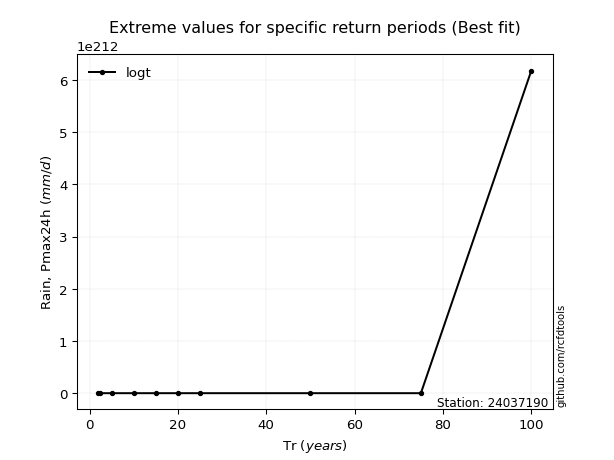</img>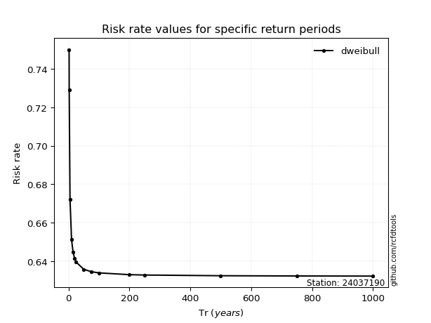</img>

</div>


<sub>**APP DISCLAIMER**: NO WARRANTY - This software is provided by [github.com/rcfdtools](https://github.com/rcfdtools) "as is", without any express or implied warranty, including warranties of merchantability, fitness for a particular purpose, or non-infringement. There is no guarantee that the software will be error-free or operate without interruption. LIMITATION OF LIABILITY - Neither the authors nor copyright holders will be liable for claims or damages arising from the software or its use. You are responsible for determining if the software is appropriate for your use and assume all associated risks, including errors, legal compliance, and data loss. NO PROFESSIONAL ADVICE - The software provides general information and does not offer professional advice. It should not replace consultation with professional advisors.</sub>