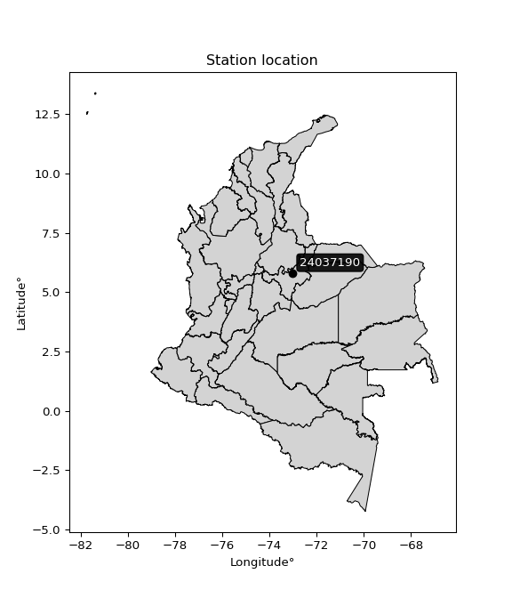

<div align="center">


</div>

# Station (rain, Pmax24h): 24037190

Probable Maximum Precipitation (PMP) is the greatest amount of rainfall for a specific duration that is meteorologically possible for a given location, acting as a "worst-case" scenario for extreme storms, crucial for designing safety-critical infrastructure like bridges, river deviations, dams, spillways, and nuclear plants to prevent catastrophic failure. PMP is calculated by hydrologists using meteorological data to determine the upper limit of extreme rainfall, often leading to the Probable Maximum Flood (PMF) for flood control design, and is increasingly being studied for climate change impacts.

<div align="center">

</img>

</div>


## A. General information


### 1. General running parameters

• app_version: _v20251226_. • runtime: _2025-12-26 15:38:16.554582_. • Python version: _3.14.0_. • SciPy version: _1.16.3_. • Pandas version: _2.3.3_. • NumPy version: _2.3.5_. • Stations dataset (station_dataset_file): _dataset/pmax24h_in/automatic_colombia_2003_2024.csv_. • Stations catalog (station_catalog_file): _dataset/CNE_IDEAM.xls_. • Minimum year to eval til year_max (date_min): _2003_. • Maximum year to eval since year_min (date_max): _2024_. • Creates, save and include plots into reports (create_plot): _False_. • Plot only fit distributions with Δo > Δ (plot_only_fit): _True_. • Eval low extreme values, if False, evaluates high extreme values (low_extreme): _False_. • Eval every SciPy distribution as logarithmic (pdist_logarithmic_on): _True_. • Standard deviation normalized (ddof): _1.0_. • Return periods to eval in years (Tr): _[2, 2.33, 5, 10, 15, 20, 25, 50, 75, 100, 200, 250, 500, 750, 1000]_. • Minimum data sample per station, 0 means any (minimum_sample): _5_. • Z-Score threshold to adjust a value, 0 means disable (zscore): _3.5_. • Avoid zeros, e.g. rain = 0 (avoid_zeros): _True_. • Avoid null values (avoid_nans): _True_. [:file_folder:Dataset file.](../../dataset/pmax24h_in/automatic_colombia_2003_2024.csv)


### 2. Station info and location

|   id |   CODIGO | NOMBRE                       | CATEGORIA    | TECNOLOGIA                              | ESTADO   | FECHA_INSTALACION   |   FECHA_SUSPENSION |   ALTITUD |   LATITUD |   LONGITUD | DEPARTAMENTO   | MUNICIPIO   | AREA_OPERATIVA                              | ENTIDAD                                                     | AREA_HIDROGRAFICA   | ZONA_HIDROGRAFICA   | SUBZONA_HIDROGRAFICA   | CORRIENTE   | OBSERVACION                                                                                   | SUBRED                          | Catalogo   |
|-----:|---------:|:-----------------------------|:-------------|:----------------------------------------|:---------|:--------------------|-------------------:|----------:|----------:|-----------:|:---------------|:------------|:--------------------------------------------|:------------------------------------------------------------|:--------------------|:--------------------|:-----------------------|:------------|:----------------------------------------------------------------------------------------------|:--------------------------------|:-----------|
|    0 | 24037190 | SAN RAFAEL  - AUT [24037190] | Limnigráfica | Automática con Telemetría, Convencional | Activa   | 15/02/1972          |                nan |      2500 |   5.80761 |   -73.0138 | Boyacá         | Tibasosa    | Area Operativa 06 - Boyacá-Casanare-Vichada | INSTITUTO DE HIDROLOGIA METEOROLOGIA Y ESTUDIOS AMBIENTALES | Magdalena Cauca     | Sogamoso            | Río Chicamocha         | Chicamocha  | Actualizada Tecnologia y Tipo de Transmision por solicitud del coordinador del AO. (08022023) | RED ALERTAS - AREA OPERATIVA 06 | CNE_IDEAM  |

<div align="center">

Map location in: [:earth_americas:Google](http://maps.google.com/maps?q=5.807611111,-73.01380556) [:earth_americas:OSM](https://www.openstreetmap.org/#map=18/5.807611111/-73.01380556&layers=P) [:earth_americas:Bing](https://www.bing.com/maps?cp=5.807611111~-73.01380556&lvl=18) [:earth_americas:Apple](https://maps.apple.com/frame?center=5.807611111%2C-73.01380556&span=0.003%2C0.006)

</div>


<div align="center">

```geojson
{
  "type": "Feature",
  "geometry": {
    "type": "Point", 
    "coordinates": [-73.01380556, 5.807611111]
  }, 
  "properties": {
    "Name": "24037190"
  }
}
```

</div>


### 3. Discrete values table and plot

|               |           0 |          1 |         2 |           3 |           4 |           5 |
|:--------------|------------:|-----------:|----------:|------------:|------------:|------------:|
| Date          | 2019        | 2020       | 2021      | 2022        | 2023        | 2024        |
| Value         |   38.2      |   10       |    1.2    |   42.2      |   42.2      |   38.8      |
| Value_initial |   38.2      |   10       |    1.2    |   42.2      |   42.2      |   38.8      |
| count         |    6        |    6       |    6      |    6        |    6        |    6        |
| mean          |   28.7667   |   28.7667  |   28.7667 |   28.7667   |   28.7667   |   28.7667   |
| std           |   18.2355   |   18.2355  |   18.2355 |   18.2355   |   18.2355   |   18.2355   |
| zscore        |    0.517305 |   -1.02913 |   -1.5117 |    0.736657 |    0.736657 |    0.550208 |
> If Z-Score is active, values out of range or outliers are replaced with the station mean value.


### 4. Active continuous probability distributions from SciPy (45 of 104 available)

[scipy.stats](https://docs.scipy.org/doc/scipy/reference/stats.html) is a Python´s powerful submodule within the SciPy library for comprehensive statistical analysis, offering over 130 probability distributions (like Normal, Poisson), functions for descriptive stats (mean, variance), hypothesis testing (t-tests, chi-square), random variable generation, and statistical tests, making it essential for data science, modeling, and research. It provides tools to explore, model, and draw conclusions from data efficiently, working seamlessly with NumPy.

<div align="center">

|   id | p_dist             |   n_parameter | fit_method   | label                                                                       | active   | ref                                                                                                        |
|-----:|:-------------------|--------------:|:-------------|:----------------------------------------------------------------------------|:---------|:-----------------------------------------------------------------------------------------------------------|
|    0 | alpha              |             3 | MLE          | Alpha                                                                       | True     | [:mortar_board:](https://docs.scipy.org/doc/scipy/reference/generated/scipy.stats.alpha.html)              |
|    1 | betaprime          |             4 | MLE          | Beta prime                                                                  | True     | [:mortar_board:](https://docs.scipy.org/doc/scipy/reference/generated/scipy.stats.betaprime.html)          |
|    2 | chi2               |             3 | MLE          | Chi²                                                                        | True     | [:mortar_board:](https://docs.scipy.org/doc/scipy/reference/generated/scipy.stats.chi2.html)               |
|    3 | crystalball        |             4 | MLE          | Crystalball                                                                 | True     | [:mortar_board:](https://docs.scipy.org/doc/scipy/reference/generated/scipy.stats.crystalball.html)        |
|    4 | erlang             |             3 | MLE          | Erlang                                                                      | True     | [:mortar_board:](https://docs.scipy.org/doc/scipy/reference/generated/scipy.stats.erlang.html)             |
|    5 | expon              |             2 | MLE          | Exponential                                                                 | True     | [:mortar_board:](https://docs.scipy.org/doc/scipy/reference/generated/scipy.stats.expon.html)              |
|    6 | exponnorm          |             3 | MLE          | Exponentially modified Normal                                               | True     | [:mortar_board:](https://docs.scipy.org/doc/scipy/reference/generated/scipy.stats.exponnorm.html)          |
|    7 | f                  |             4 | MLE          | F                                                                           | True     | [:mortar_board:](https://docs.scipy.org/doc/scipy/reference/generated/scipy.stats.f.html)                  |
|    8 | fatiguelife        |             3 | MLE          | Fatigue-life (Birnbaum-Saunders)                                            | True     | [:mortar_board:](https://docs.scipy.org/doc/scipy/reference/generated/scipy.stats.fatiguelife.html)        |
|    9 | fisk               |             3 | MLE          | Fisk                                                                        | True     | [:mortar_board:](https://docs.scipy.org/doc/scipy/reference/generated/scipy.stats.fisk.html)               |
|   10 | gamma              |             3 | MLE          | Gamma                                                                       | True     | [:mortar_board:](https://docs.scipy.org/doc/scipy/reference/generated/scipy.stats.gamma.html)              |
|   11 | genexpon           |             5 | MLE          | Generalized exponential                                                     | True     | [:mortar_board:](https://docs.scipy.org/doc/scipy/reference/generated/scipy.stats.genexpon.html)           |
|   12 | genlogistic        |             3 | MLE          | Generalized logistic                                                        | True     | [:mortar_board:](https://docs.scipy.org/doc/scipy/reference/generated/scipy.stats.genlogistic.html)        |
|   13 | gibrat             |             2 | MM           | Gibrat                                                                      | True     | [:mortar_board:](https://docs.scipy.org/doc/scipy/reference/generated/scipy.stats.gibrat.html)             |
|   14 | gompertz           |             3 | MLE          | Gompertz (or truncated Gumbel)                                              | True     | [:mortar_board:](https://docs.scipy.org/doc/scipy/reference/generated/scipy.stats.gompertz.html)           |
|   15 | gumbel_l           |             2 | MM           | Gumbel Left Skew                                                            | True     | [:mortar_board:](https://docs.scipy.org/doc/scipy/reference/generated/scipy.stats.gumbel_l.html)           |
|   16 | gumbel_r           |             2 | MM           | Gumbel Right Skew                                                           | True     | [:mortar_board:](https://docs.scipy.org/doc/scipy/reference/generated/scipy.stats.gumbel_r.html)           |
|   17 | halflogistic       |             2 | MM           | Half-logistic                                                               | True     | [:mortar_board:](https://docs.scipy.org/doc/scipy/reference/generated/scipy.stats.halflogistic.html)       |
|   18 | halfnorm           |             2 | MM           | Half Normal                                                                 | True     | [:mortar_board:](https://docs.scipy.org/doc/scipy/reference/generated/scipy.stats.halfnorm.html)           |
|   19 | hypsecant          |             2 | MM           | hyperbolic secant                                                           | True     | [:mortar_board:](https://docs.scipy.org/doc/scipy/reference/generated/scipy.stats.hypsecant.html)          |
|   20 | invgamma           |             3 | MLE          | Inverted gamma                                                              | True     | [:mortar_board:](https://docs.scipy.org/doc/scipy/reference/generated/scipy.stats.invgamma.html)           |
|   21 | invgauss           |             3 | MLE          | Inverse Gaussian                                                            | True     | [:mortar_board:](https://docs.scipy.org/doc/scipy/reference/generated/scipy.stats.invgauss.html)           |
|   22 | invweibull         |             3 | MLE          | Inverted Weibull                                                            | True     | [:mortar_board:](https://docs.scipy.org/doc/scipy/reference/generated/scipy.stats.invweibull.html)         |
|   23 | johnsonsu          |             4 | MLE          | Johnson Su                                                                  | True     | [:mortar_board:](https://docs.scipy.org/doc/scipy/reference/generated/scipy.stats.johnsonsu.html)          |
|   24 | kstwobign          |             2 | MLE          | Limiting distribution of scaled Kolmogorov-Smirnov two-sided test statistic | True     | [:mortar_board:](https://docs.scipy.org/doc/scipy/reference/generated/scipy.stats.kstwobign.html)          |
|   25 | laplace            |             2 | MM           | Laplace                                                                     | True     | [:mortar_board:](https://docs.scipy.org/doc/scipy/reference/generated/scipy.stats.laplace.html)            |
|   26 | laplace_asymmetric |             3 | MLE          | Asymmetric Laplace                                                          | True     | [:mortar_board:](https://docs.scipy.org/doc/scipy/reference/generated/scipy.stats.laplace_asymmetric.html) |
|   27 | loggamma           |             3 | MLE          | Log gamma                                                                   | True     | [:mortar_board:](https://docs.scipy.org/doc/scipy/reference/generated/scipy.stats.loggamma.html)           |
|   28 | logistic           |             2 | MM           | Logistic (or Sech-squared)                                                  | True     | [:mortar_board:](https://docs.scipy.org/doc/scipy/reference/generated/scipy.stats.logistic.html)           |
|   29 | lognorm            |             3 | MLE          | Log Normal                                                                  | True     | [:mortar_board:](https://docs.scipy.org/doc/scipy/reference/generated/scipy.stats.lognorm.html)            |
|   30 | maxwell            |             2 | MM           | Maxwell                                                                     | True     | [:mortar_board:](https://docs.scipy.org/doc/scipy/reference/generated/scipy.stats.maxwell.html)            |
|   31 | mielke             |             4 | MLE          | Mielke Beta-Kappa / Dagum                                                   | True     | [:mortar_board:](https://docs.scipy.org/doc/scipy/reference/generated/scipy.stats.mielke.html)             |
|   32 | moyal              |             2 | MM           | Moyal                                                                       | True     | [:mortar_board:](https://docs.scipy.org/doc/scipy/reference/generated/scipy.stats.moyal.html)              |
|   33 | nakagami           |             3 | MLE          | Nakagami                                                                    | True     | [:mortar_board:](https://docs.scipy.org/doc/scipy/reference/generated/scipy.stats.nakagami.html)           |
|   34 | ncf                |             5 | MLE          | Non-central F distribution                                                  | True     | [:mortar_board:](https://docs.scipy.org/doc/scipy/reference/generated/scipy.stats.ncf.html)                |
|   35 | nct                |             4 | MLE          | Non-central Student’s t                                                     | True     | [:mortar_board:](https://docs.scipy.org/doc/scipy/reference/generated/scipy.stats.nct.html)                |
|   36 | norm               |             2 | MM           | Normal                                                                      | True     | [:mortar_board:](https://docs.scipy.org/doc/scipy/reference/generated/scipy.stats.norm.html)               |
|   37 | pareto             |             3 | MLE          | Pareto                                                                      | True     | [:mortar_board:](https://docs.scipy.org/doc/scipy/reference/generated/scipy.stats.pareto.html)             |
|   38 | pearson3           |             3 | MM           | Pearson type III                                                            | True     | [:mortar_board:](https://docs.scipy.org/doc/scipy/reference/generated/scipy.stats.pearson3.html)           |
|   39 | rayleigh           |             2 | MM           | Rayleigh                                                                    | True     | [:mortar_board:](https://docs.scipy.org/doc/scipy/reference/generated/scipy.stats.rayleigh.html)           |
|   40 | rice               |             3 | MLE          | Rice                                                                        | True     | [:mortar_board:](https://docs.scipy.org/doc/scipy/reference/generated/scipy.stats.rice.html)               |
|   41 | t                  |             3 | MLE          | Student’s t                                                                 | True     | [:mortar_board:](https://docs.scipy.org/doc/scipy/reference/generated/scipy.stats.t.html)                  |
|   42 | truncnorm          |             4 | MLE          | Truncated normal                                                            | True     | [:mortar_board:](https://docs.scipy.org/doc/scipy/reference/generated/scipy.stats.truncnorm.html)          |
|   43 | wald               |             2 | MM           | Wald                                                                        | True     | [:mortar_board:](https://docs.scipy.org/doc/scipy/reference/generated/scipy.stats.wald.html)               |
|   44 | weibull_min        |             3 | MLE          | Weibull minimum                                                             | True     | [:mortar_board:](https://docs.scipy.org/doc/scipy/reference/generated/scipy.stats.weibull_min.html)        |

</div>

> **n_parameter:** # arguments & localization & scale.
>
> **Fit methods:** (MLE) maximum likelihood, (MM) L-moments.
>
>**Inactive:** foldnorm, gennorm, norminvgauss, powernorm, powerlognorm, skewnorm, genextreme, anglit, arcsine, argus, beta, bradford, burr, burr12, cauchy, cosine, halfcauchy, foldcauchy, skewcauchy, wrapcauchy, dgamma, gengamma, exponweib, exponpow, truncexpon, gausshyper, genhalflogistic, genhyperbolic, geninvgauss, halfgennorm, johnsonsb, kappa4, kappa3, ksone, kstwo, loglaplace, levy, levy_l, levy_stable, ncx2, genpareto, truncpareto, lomax, powerlaw, rdist, rel_breitwigner, recipinvgauss, semicircular, studentized_range, trapezoid, triang, truncweibull_min, tukeylambda, uniform, loguniform, vonmises, vonmises_line, weibull_max, dweibull, 


## B. Probability distributions vs. Empirical distributions

A continuous probability distribution (CPD) describes probabilities for variables that can take any value within a range (like rain any time), unlike discrete variables with specific outcomes (like temperature). It uses a Probability Density Function (PDF), a curve where the total area under it equals 1, and the probability of the variable falling within an interval (a to b) is found by calculating the area under the curve between those points. A key feature is that the probability of hitting any single exact value is zero, so probabilities are always expressed for ranges, e.g., $P(a ≤ X ≤ b)$.

<div align="center">

Distributions parameters
|    |   station | p_dist                |   n |             loc |            scale | shape                  | shape1                | shape2             | shape3   |
|---:|----------:|:----------------------|----:|----------------:|-----------------:|:-----------------------|:----------------------|:-------------------|:---------|
|  0 |  24037190 | alpha                 |   6 |  -287.057       |   6390.85        | 20.36652749791601      |                       |                    |          |
|  1 |  24037190 | betaprime             |   6 |  -399.706       | 101586           | 634.0203938330197      | 150237.79929651524    |                    |          |
|  2 |  24037190 | chi2                  |   6 |     1.2         |      3.02766     | 1.3953953279399987     |                       |                    |          |
|  3 |  24037190 | crystalball           |   6 |    28.7667      |     16.6467      | 1585.0082422953797     | 523.7796792981871     |                    |          |
|  4 |  24037190 | erlang                |   6 |  -233.083       |      1.12166     | 233.42624189621733     |                       |                    |          |
|  5 |  24037190 | expon                 |   6 |     1.2         |     27.5667      |                        |                       |                    |          |
|  6 |  24037190 | exponnorm             |   6 |    28.7528      |     16.6467      | 0.0008325077352713439  |                       |                    |          |
|  7 |  24037190 | f                     |   6 |     1.2         |     24.3163      | 1.2369181453088611     | 906.9414065530734     |                    |          |
|  8 |  24037190 | fatiguelife           |   6 |     1.2         |      3.14376e-05 | 882.860876720925       |                       |                    |          |
|  9 |  24037190 | fisk                  |   6 |    -1.5326e+09  |      1.5326e+09  | 152842378.79055864     |                       |                    |          |
| 10 |  24037190 | gamma                 |   6 |  -268.134       |      0.986409    | 301.01986393449806     |                       |                    |          |
| 11 |  24037190 | genexpon              |   6 |     1.19998     |      1.26951     | 0.045682393415753794   | 0.0012123380302092187 | 0.9522522963682877 |          |
| 12 |  24037190 | genlogistic           |   6 |    42.2003      |      6.9589e-06  | 5.183943503218283e-07  |                       |                    |          |
| 13 |  24037190 | gibrat                |   6 |    16.0673      |      7.70254     |                        |                       |                    |          |
| 14 |  24037190 | gompertz              |   6 |    10           |      5.66396     | 0.005607073629572831   |                       |                    |          |
| 15 |  24037190 | gumbel_l              |   6 |    36.2586      |     12.9794      |                        |                       |                    |          |
| 16 |  24037190 | gumbel_r              |   6 |    21.2748      |     12.9794      |                        |                       |                    |          |
| 17 |  24037190 | halflogistic          |   6 |     9.03646     |     14.2323      |                        |                       |                    |          |
| 18 |  24037190 | halfnorm              |   6 |     6.73301     |     27.6151      |                        |                       |                    |          |
| 19 |  24037190 | hypsecant             |   6 |    28.7667      |     10.5976      |                        |                       |                    |          |
| 20 |  24037190 | invgamma              |   6 |  -231.496       |  58872.4         | 227.06756233576613     |                       |                    |          |
| 21 |  24037190 | invgauss              |   6 |   -87.0148      |   4700.15        | 0.024606900348508307   |                       |                    |          |
| 22 |  24037190 | invweibull            |   6 |    -1.02563e+09 |      1.02563e+09 | 60108131.9701298       |                       |                    |          |
| 23 |  24037190 | johnsonsu             |   6 |    42.2         |      4.53688e-17 | 1.5265648545653034     | 0.13099589401562725   |                    |          |
| 24 |  24037190 | kstwobign             |   6 |   -38.3416      |     76.2666      |                        |                       |                    |          |
| 25 |  24037190 | laplace               |   6 |    28.7667      |     11.771       |                        |                       |                    |          |
| 26 |  24037190 | laplace_asymmetric    |   6 |    42.2         |      0.142257    | 94.48333642037034      |                       |                    |          |
| 27 |  24037190 | loggamma              |   6 |    42.2001      |      4.04911e-06 | 3.017699881885775e-07  |                       |                    |          |
| 28 |  24037190 | logistic              |   6 |    28.7667      |      9.1778      |                        |                       |                    |          |
| 29 |  24037190 | lognorm               |   6 |     1.2         |      0.0407362   | 14.697987765450845     |                       |                    |          |
| 30 |  24037190 | maxwell               |   6 |   -10.679       |     24.7189      |                        |                       |                    |          |
| 31 |  24037190 | mielke                |   6 |    -2.31994e+09 |      2.31994e+09 | 197320133.38716346     | 2744740028905.7847    |                    |          |
| 32 |  24037190 | moyal                 |   6 |    19.247       |      7.49364     |                        |                       |                    |          |
| 33 |  24037190 | nakagami              |   6 |     1.2         |     29.8222      | 0.39979955555893554    |                       |                    |          |
| 34 |  24037190 | ncf                   |   6 |     1.2         |      6.55689     | 1.1523935326381494     | 83.02445564617204     | 3.7742541767289426 |          |
| 35 |  24037190 | nct                   |   6 | -1226.38        |     16.5936      | 412699.9992070908      | 75.64004172262534     |                    |          |
| 36 |  24037190 | norm                  |   6 |    28.7667      |     16.6467      |                        |                       |                    |          |
| 37 |  24037190 | pareto                |   6 |     1.11827     |      0.0817325   | 0.20422791755519604    |                       |                    |          |
| 38 |  24037190 | pearson3              |   6 |    28.7667      |     16.6466      | -0.7536450662030708    |                       |                    |          |
| 39 |  24037190 | rayleigh              |   6 |    -3.07942     |     25.4095      |                        |                       |                    |          |
| 40 |  24037190 | rice                  |   6 |    -8.86076     |     18.6806      | 1.6885793110281617     |                       |                    |          |
| 41 |  24037190 | t                     |   6 |    28.7647      |     16.6478      | 2566727.284443617      |                       |                    |          |
| 42 |  24037190 | truncnorm             |   6 |     0.0299302   |      3.48979     | 0.3170068252002926     | 12.08383326222802     |                    |          |
| 43 |  24037190 | wald                  |   6 |    12.12        |     16.6467      |                        |                       |                    |          |
| 44 |  24037190 | weibull_min           |   6 |    -2.32318e+09 |      2.32318e+09 | 209178112.64718917     |                       |                    |          |
| 45 |  24037190 | logalpha              |   6 |     0.00219868  |      0.439071    | 3.73239720014966e-07   |                       |                    |          |
| 46 |  24037190 | logbetaprime          |   6 |   -47.5958      |    612.405       | 1523.5715919000932     | 18493.310800438383    |                    |          |
| 47 |  24037190 | logchi2               |   6 |     0.182322    |      1.72032     | 0.3112648672066792     |                       |                    |          |
| 48 |  24037190 | logcrystalball        |   6 |     3.74242     |      2.7357e-06  | 3.326231725699601e-06  | 67.73243873058627     |                    |          |
| 49 |  24037190 | logerlang             |   6 |   -16.997       |      0.0992686   | 200.05392414253276     |                       |                    |          |
| 50 |  24037190 | logexpon              |   6 |     0.182322    |      2.69618     |                        |                       |                    |          |
| 51 |  24037190 | logexponnorm          |   6 |     2.87752     |      1.30934     | 0.0007462929816734174  |                       |                    |          |
| 52 |  24037190 | logf                  |   6 | -2226.69        |   2229.57        | 9266153.582752641      | 15228833.561704427    |                    |          |
| 53 |  24037190 | logfatiguelife        |   6 |  -873.936       |    876.815       | 0.001491137568968382   |                       |                    |          |
| 54 |  24037190 | logfisk               |   6 |    -7.44843e+08 |      7.44843e+08 | 1058043829.7966919     |                       |                    |          |
| 55 |  24037190 | loggamma              |   6 |   -18.222       |      0.0908145   | 232.46026143684367     |                       |                    |          |
| 56 |  24037190 | loggenexpon           |   6 |     0.175355    |     23.3167      | 3.219850051886894      | 35.49965993901969     | 2.2053145282046263 |          |
| 57 |  24037190 | loggenlogistic        |   6 |     3.74247     |      1.60239e-06 | 1.8425927283157229e-06 |                       |                    |          |
| 58 |  24037190 | loggibrat             |   6 |     1.87959     |      0.605861    |                        |                       |                    |          |
| 59 |  24037190 | loggompertz           |   6 |     0.182322    |      1.73984     | 0.22318539470078438    |                       |                    |          |
| 60 |  24037190 | loggumbel_l           |   6 |     3.46777     |      1.02089     |                        |                       |                    |          |
| 61 |  24037190 | loggumbel_r           |   6 |     2.28923     |      1.02089     |                        |                       |                    |          |
| 62 |  24037190 | loghalflogistic       |   6 |     1.32666     |      1.11943     |                        |                       |                    |          |
| 63 |  24037190 | loghalfnorm           |   6 |     1.14548     |      2.17204     |                        |                       |                    |          |
| 64 |  24037190 | loghypsecant          |   6 |     2.8785      |      0.833553    |                        |                       |                    |          |
| 65 |  24037190 | loginvgamma           |   6 |   -28.0155      |  15159.5         | 492.01446543742406     |                       |                    |          |
| 66 |  24037190 | loginvgauss           |   6 |   -11.0028      |   1313.29        | 0.01056805409187005    |                       |                    |          |
| 67 |  24037190 | loginvweibull         |   6 |    -1.06175e+08 |      1.06175e+08 | 69637636.19222966      |                       |                    |          |
| 68 |  24037190 | logjohnsonsu          |   6 |     3.74242     |      1.42217e-18 | 1.2490970819976894     | 0.12676095343648572   |                    |          |
| 69 |  24037190 | logkstwobign          |   6 |    -3.24582     |      6.98948     |                        |                       |                    |          |
| 70 |  24037190 | loglaplace            |   6 |     2.8785      |      0.925845    |                        |                       |                    |          |
| 71 |  24037190 | loglaplace_asymmetric |   6 |     3.74242     |      0.00685013  | 125.96939165530696     |                       |                    |          |
| 72 |  24037190 | logloggamma           |   6 |     3.74385     |      2.49317e-06 | 2.877961273234704e-06  |                       |                    |          |
| 73 |  24037190 | loglogistic           |   6 |     2.8785      |      0.721878    |                        |                       |                    |          |
| 74 |  24037190 | loglognorm            |   6 |     0.182322    |      0.00455844  | 14.639504661100489     |                       |                    |          |
| 75 |  24037190 | logmaxwell            |   6 |    -0.22409     |      1.94426     |                        |                       |                    |          |
| 76 |  24037190 | logmielke             |   6 |    -6.17977e+07 |      6.17977e+07 | 64683280.95649572      | 113240032462.27167    |                    |          |
| 77 |  24037190 | logmoyal              |   6 |     2.12973     |      0.589411    |                        |                       |                    |          |
| 78 |  24037190 | lognakagami           |   6 | -1029.55        |   1032.43        | 155091.58310109703     |                       |                    |          |
| 79 |  24037190 | logncf                |   6 |    -0.0492534   |      6.58834e-08 | 2.999236975844743e-07  | 9.602094285893251     | 12.579054779541671 |          |
| 80 |  24037190 | lognct                |   6 |    86.3135      |      1.29138     | 77844.50919600468      | -64.60850538426463    |                    |          |
| 81 |  24037190 | lognorm               |   6 |     2.8785      |      1.30934     |                        |                       |                    |          |
| 82 |  24037190 | logpareto             |   6 |     0.173601    |      0.00872025  | 0.2033691526062106     |                       |                    |          |
| 83 |  24037190 | logpearson3           |   6 |     2.87849     |      1.30935     | -1.3052794361062583    |                       |                    |          |
| 84 |  24037190 | lograyleigh           |   6 |     0.373696    |      1.99855     |                        |                       |                    |          |
| 85 |  24037190 | logrice               |   6 |  -376.763       |      1.30935     | 289.94473271818197     |                       |                    |          |
| 86 |  24037190 | logt                  |   6 |     3.65559     |      0.024015    | 0.3553140856095318     |                       |                    |          |
| 87 |  24037190 | logtruncnorm          |   6 |    -0.336972    |      3.50387     | 0.09669262354844244    | 1.1642531681449046    |                    |          |
| 88 |  24037190 | logwald               |   6 |     1.56915     |      1.30935     |                        |                       |                    |          |
| 89 |  24037190 | logweibull_min        |   6 |    -1.60885e+08 |      1.60885e+08 | 211924735.45699129     |                       |                    |          |

</div>

> **loc** (Location parameter): This shifts the distribution along the x-axis. For many common distributions, like the normal (Gaussian) distribution, loc represents the mean $μ$. For others, like the uniform distribution, it might represent the minimum value, or for the beta distribution, the left end of the support interval.
>
> **scale** (Scale parameter): This determines the width or spread of the distribution. For the normal distribution, scale represents the standard deviation $σ$. For a uniform distribution, it defines the length of the interval (from $loc$ to $loc + scale$).
>
> **shape** (Shape parameters): Refers to parameters that define the specific form of a probability distribution, distinct from its location (loc) and scale (scale). These parameters are required arguments for most distribution functions. For example, a normal (Gaussian) distribution is fully defined by its location (mean) and scale (standard deviation), so it has no specific shape parameters beyond loc and scale. However, other distributions have intrinsic properties that need specification, as Gamma distribution that takes a shape parameter, often named $a$ or $alpha$.


### 0. Cumulative distribution values - CDF (90 evaluated)

> Ordered by x ascending and calculating $log(f(x))$ separately. 

|   id |   Station |   date |    x |   count |    mean |     std |    zscore |   Value_initial |   station |   m |    alpha |   alpha_pdf |   betaprime |   betaprime_pdf |        chi2 |        chi2_pdf |   crystalball |   crystalball_pdf |    erlang |   erlang_pdf |    expon |   expon_pdf |   exponnorm |   exponnorm_pdf |           f |          f_pdf |   fatiguelife |   fatiguelife_pdf |     fisk |   fisk_pdf |     gamma |   gamma_pdf |    genexpon |   genexpon_pdf |   genlogistic |   genlogistic_pdf |   gibrat |   gibrat_pdf |    gompertz |   gompertz_pdf |   gumbel_l |   gumbel_l_pdf |   gumbel_r |   gumbel_r_pdf |   halflogistic |   halflogistic_pdf |   halfnorm |   halfnorm_pdf |   hypsecant |   hypsecant_pdf |   invgamma |   invgamma_pdf |   invgauss |   invgauss_pdf |   invweibull |   invweibull_pdf |   johnsonsu |   johnsonsu_pdf |   kstwobign |   kstwobign_pdf |   laplace |   laplace_pdf |   laplace_asymmetric |   laplace_asymmetric_pdf |   loggamma |   loggamma_pdf |   logistic |   logistic_pdf |   lognorm |   lognorm_pdf |   maxwell |   maxwell_pdf |    mielke |   mielke_pdf |       moyal |   moyal_pdf |    nakagami |   nakagami_pdf |         ncf |      ncf_pdf |       nct |    nct_pdf |      norm |   norm_pdf |   pareto |   pareto_pdf |   pearson3 |   pearson3_pdf |   rayleigh |   rayleigh_pdf |      rice |   rice_pdf |         t |      t_pdf |   truncnorm |   truncnorm_pdf |     wald |   wald_pdf |   weibull_min |   weibull_min_pdf |   logalpha |   logalpha_pdf |   logbetaprime |   logbetaprime_pdf |    logchi2 |   logchi2_pdf |   logcrystalball |   logcrystalball_pdf |   logerlang |   logerlang_pdf |   logexpon |   logexpon_pdf |   logexponnorm |   logexponnorm_pdf |      logf |   logf_pdf |   logfatiguelife |   logfatiguelife_pdf |   logfisk |   logfisk_pdf |   loggenexpon |   loggenexpon_pdf |   loggenlogistic |   loggenlogistic_pdf |   loggibrat |   loggibrat_pdf |   loggompertz |   loggompertz_pdf |   loggumbel_l |   loggumbel_l_pdf |   loggumbel_r |   loggumbel_r_pdf |   loghalflogistic |   loghalflogistic_pdf |   loghalfnorm |   loghalfnorm_pdf |   loghypsecant |   loghypsecant_pdf |   loginvgamma |   loginvgamma_pdf |   loginvgauss |   loginvgauss_pdf |   loginvweibull |   loginvweibull_pdf |   logjohnsonsu |   logjohnsonsu_pdf |   logkstwobign |   logkstwobign_pdf |   loglaplace |   loglaplace_pdf |   loglaplace_asymmetric |   loglaplace_asymmetric_pdf |   logloggamma |   logloggamma_pdf |   loglogistic |   loglogistic_pdf |   loglognorm |   loglognorm_pdf |   logmaxwell |   logmaxwell_pdf |   logmielke |   logmielke_pdf |   logmoyal |   logmoyal_pdf |   lognakagami |   lognakagami_pdf |    logncf |   logncf_pdf |    lognct |   lognct_pdf |   logpareto |   logpareto_pdf |   logpearson3 |   logpearson3_pdf |   lograyleigh |   lograyleigh_pdf |   logrice |   logrice_pdf |      logt |   logt_pdf |   logtruncnorm |   logtruncnorm_pdf |   logwald |   logwald_pdf |   logweibull_min |   logweibull_min_pdf |
|-----:|----------:|-------:|-----:|--------:|--------:|--------:|----------:|----------------:|----------:|----:|---------:|------------:|------------:|----------------:|------------:|----------------:|--------------:|------------------:|----------:|-------------:|---------:|------------:|------------:|----------------:|------------:|---------------:|--------------:|------------------:|---------:|-----------:|----------:|------------:|------------:|---------------:|--------------:|------------------:|---------:|-------------:|------------:|---------------:|-----------:|---------------:|-----------:|---------------:|---------------:|-------------------:|-----------:|---------------:|------------:|----------------:|-----------:|---------------:|-----------:|---------------:|-------------:|-----------------:|------------:|----------------:|------------:|----------------:|----------:|--------------:|---------------------:|-------------------------:|-----------:|---------------:|-----------:|---------------:|----------:|--------------:|----------:|--------------:|----------:|-------------:|------------:|------------:|------------:|---------------:|------------:|-------------:|----------:|-----------:|----------:|-----------:|---------:|-------------:|-----------:|---------------:|-----------:|---------------:|----------:|-----------:|----------:|-----------:|------------:|----------------:|---------:|-----------:|--------------:|------------------:|-----------:|---------------:|---------------:|-------------------:|-----------:|--------------:|-----------------:|---------------------:|------------:|----------------:|-----------:|---------------:|---------------:|-------------------:|----------:|-----------:|-----------------:|---------------------:|----------:|--------------:|--------------:|------------------:|-----------------:|---------------------:|------------:|----------------:|--------------:|------------------:|--------------:|------------------:|--------------:|------------------:|------------------:|----------------------:|--------------:|------------------:|---------------:|-------------------:|--------------:|------------------:|--------------:|------------------:|----------------:|--------------------:|---------------:|-------------------:|---------------:|-------------------:|-------------:|-----------------:|------------------------:|----------------------------:|--------------:|------------------:|--------------:|------------------:|-------------:|-----------------:|-------------:|-----------------:|------------:|----------------:|-----------:|---------------:|--------------:|------------------:|----------:|-------------:|----------:|-------------:|------------:|----------------:|--------------:|------------------:|--------------:|------------------:|----------:|--------------:|----------:|-----------:|---------------:|-------------------:|----------:|--------------:|-----------------:|---------------------:|
|    0 |  24037190 |   2021 |  1.2 |       6 | 28.7667 | 18.2355 | -1.5117   |             1.2 |  24037190 |   1 | 0.035602 |   0.0060268 |   0.0491801 |      0.00623996 | 3.75552e-12 | 11800.4         |     0.0488624 |        0.00608278 | 0.0499577 |   0.00647824 | 0        |  0.0362757  |   0.0488622 |      0.00608277 | 2.40126e-11 | 66882.1        |     0.0349092 |        5.697e+09  | 0.047627 | 0.0045235  | 0.0498932 |   0.0064214 | 7.08241e-07 |     0.0359844  |      0        |        0.00351294 | 0        |   0          | 0           |    0           |  0.0649279 |     0.00483637 | 0.00913359 |     0.00330444 |      0         |          0         |  0         |      0         |   0.0471403 |      0.00443195 |  0.0463396 |     0.00651658 |  0.0485244 |     0.00736756 |    0.0499938 |       0.00877771 | 3.44147e-05 |     4.62564e-07 |   0.0491084 |       0.010158  | 0.0480716 |    0.00408391 |            0.0473354 |               0.00352174 |  0.0215389 |      0.0408167 |  0.0472624 |     0.00490626 | 0.0197382 |     0.0365678 | 0.0275537 |    0.00664146 | 0.0305672 |   0.00259987 | 0.000856244 | 0.000684772 | 1.57451e-14 |    56.6992     | 1.92862e-09 | 5979.32      | 0.0489055 | 0.00608728 | 0.0488624 | 0.00608278 | 0        |   2.49874    |  0.0642133 |     0.00547491 |  0.0140822 |     0.00653481 | 0.0358346 | 0.00729878 | 0.0488859 | 0.00608469 |   0.0184058 |     0.287708    | 0        | 0          |     0.041677  |        0.00367327 |  0.0147843 |      0.553413  |      0.0216668 |          0.0400645 | 0.00234794 |   1.31655e+13 |              nan |                  nan |   0.0239617 |       0.0442652 |   0        |      0.370895  |      0.0197386 |          0.0365683 | 0.0200289 |   0.036943 |        0.0194368 |            0.0362569 | 0.0147656 |     0.0206647 |   0.000965105 |          0.138961 |         0        |             0.019175 |    0        |        0        |   4.06763e-09 |          0.128279 |     0.0392356 |         0.0376687 |   0.000379829 |        0.00293024 |          0        |              0        |      0        |          0        |      0.0250555 |          0.0300277 |     0.0221971 |         0.0428531 |     0.0199541 |         0.0423299 |       0.0262435 |           0.0626594 |    1.28317e-05 |        2.02177e-06 |       0.030286 |          0.0817794 |    0.0271799 |        0.0293569 |               0.0161511 |                   0.0187171 |     0.0163878 |         0.0189171 |     0.0233176 |         0.0315482 |    0.0126795 |      8.06251e+13 |   0.00239755 |        0.0175437 |   0.0239936 |       0.0251139 | 1.8145e-07 |    4.33431e-06 |     0.0196973 |         0.0364946 | 0.0127367 |    0.0692068 | 0.0197329 |     0.036518 |    0        |      23.3215    |     0.0425198 |         0.0395235 |      0        |          0        | 0.0197383 |     0.0365679 | 0.0578851 | 0.00592156 |      0.0601047 |           0.331877 |  0        |      0        |        0.0139287 |            0.0182192 |
|    1 |  24037190 |   2020 | 10   |       6 | 28.7667 | 18.2355 | -1.02913  |            10   |  24037190 |   2 | 0.12561  |   0.0149594 |   0.131934  |      0.0129121  | 0.859621    |     0.0264925   |     0.129797  |        0.0126942  | 0.135889  |   0.0133731  | 0.273289 |  0.026362   |   0.129797  |      0.0126942  | 0.406849    |     0.0248408  |     0.725504  |        0.0113512  | 0.107364 | 0.00955756 | 0.135021  |   0.0132536 | 0.276602    |     0.0267209  |      0        |        0.0067666  | 0        |   0          | 3.48691e-10 |    0.000989957 |  0.123874  |     0.00892672 | 0.0922055  |     0.0169341  |      0.0338373 |          0.0350911 |  0.0941736 |      0.0286916 |   0.107318  |      0.00993587 |  0.134567  |     0.0138419  |  0.147469  |     0.0152547  |    0.167176  |       0.0175249  | 3.9297e-05  |     6.67717e-07 |   0.183451  |       0.0195109 | 0.101524  |    0.00862491 |            0.0911017 |               0.00677793 |  0.342579  |      0.270394  |  0.11458   |     0.011054   | 0.330022  |     0.276596  | 0.126759  |    0.01592    | 0.0646123 |   0.00549554 | 0.0638332   | 0.0177132   | 0.291494    |     0.0258343  | 0.225024    |    0.0218838 | 0.129886  | 0.0126994  | 0.129797  | 0.0126942  | 0.616142 |   0.0088265  |  0.131245  |     0.0100979  |  0.124081  |     0.0177444  | 0.13182   | 0.0145903  | 0.129838  | 0.0126961  |   0.994306  |     0.00514049  | 0        | 0          |     0.0897354 |        0.00770585 |  0.848629  |      0.0650074 |      0.342204  |          0.27531   | 0.925231   |   0.0394744   |              nan |                  nan |   0.352468  |       0.269533  |   0.544516 |      0.168937  |      0.330024  |          0.276596  | 0.330664  |   0.275961 |        0.329675  |            0.277061  | 0.23348   |     0.254221  |   0.450511    |          0.228348 |         0        |             0.219577 |    0.359688 |        0.884187 |   0.412436    |          0.254957 |     0.273407  |         0.227317  |   0.372693    |        0.360321   |          0.410245 |              0.371485 |      0.405778 |          0.318747 |      0.295736  |          0.305906  |     0.354281  |         0.273635  |     0.359498  |         0.27381   |       0.404079  |           0.240152  |    2.11875e-05 |        8.04963e-06 |       0.445775 |          0.234244  |    0.268423  |        0.289923  |               0.188502  |                   0.218449  |     0.189435  |         0.218672  |     0.310496  |         0.296571  |    0.662601  |      0.0117697   |   0.360584   |        0.297884  |   0.220755  |       0.231062  | 0.3878     |    0.402584    |     0.32937   |         0.27612   | 0.43057   |    0.213888  | 0.329717  |     0.276555 |    0.673091 |       0.0312277 |     0.268157  |         0.210644  |      0.372338 |          0.303113 | 0.330022  |     0.276595  | 0.0809174 | 0.0212484  |      0.695082  |           0.252648 |  0.415474 |      0.611498 |        0.204698  |            0.239937  |
|    2 |  24037190 |   2019 | 38.2 |       6 | 28.7667 | 18.2355 |  0.517305 |            38.2 |  24037190 |   3 | 0.763586 |   0.0186255 |   0.708357  |      0.0198312  | 0.999054    |     0.000162941 |     0.714534  |        0.0204104  | 0.714681  |   0.0193564  | 0.73873  |  0.00947775 |   0.714534  |      0.0204104  | 0.779194    |     0.00700929 |     0.890428  |        0.00311371 | 0.666935 | 0.0221527  | 0.713287  |   0.0194835 | 0.744743    |     0.00942904 |      0        |        0.0552971  | 0.854403 |   0.0103265  | 0.554759    |    0.0640468   |  0.686935  |     0.0280119  | 0.76228    |     0.0159418  |      0.771714  |          0.0142091 |  0.745499  |      0.0150954 |   0.751967  |      0.021107   |  0.714951  |     0.0187214  |  0.721033  |     0.0171715  |    0.709924  |       0.0142541  | 0.000118723 |     1.52303e-05 |   0.733846  |       0.0139095 | 0.775651  |    0.0190595  |            0.742516  |               0.0552429  |  0.712273  |      0.240589  |  0.736497  |     0.0211455  | 0.720307  |     0.256957  | 0.728662  |    0.0178662  | 0.711184  |   0.0604892  | 0.777674    | 0.0144443   | 0.790567    |     0.0108405  | 0.709904    |    0.0115322 | 0.714555  | 0.0204022  | 0.714534  | 0.0204104  | 0.713309 |   0.00157895 |  0.68601   |     0.0249569  |  0.73276   |     0.0170861  | 0.718833  | 0.01912    | 0.714561  | 0.0204081  |   1         |     3.20363e-27 | 0.823542 | 0.0110307  |     0.696108  |        0.0325907  |  0.904006  |      0.0262399 |      0.721923  |          0.246727  | 0.960991   |   0.0176808   |              nan |                  nan |   0.716486  |       0.235051  |   0.722931 |      0.102764  |      0.720309  |          0.256956  | 0.719751  |   0.256273 |        0.720445  |            0.257043  | 0.671516  |     0.313335  |   0.715538    |          0.160378 |         0        |             1.02542  |    0.857298 |        0.127877 |   0.755339    |          0.229365 |     0.694883  |         0.354781  |   0.766776    |        0.199459   |          0.775723 |              0.177883 |      0.749763 |          0.189674 |      0.757909  |          0.263232  |     0.720363  |         0.233577  |     0.717389  |         0.224958  |       0.686455  |           0.169383  |    8.64909e-05 |        0.000439616 |       0.714216 |          0.159765  |    0.781004  |        0.236537  |               0.890948  |                   1.0325    |     0.889936  |         1.02729   |     0.742464  |         0.26488   |    0.674738  |      0.00710683  |   0.733712   |        0.224616  |   0.897743  |       0.939661  | 0.781744   |    0.180458    |     0.719307  |         0.257052  | 0.663667  |    0.13436   | 0.720245  |     0.257256 |    0.703994 |       0.0173521 |     0.675042  |         0.376921  |      0.737591 |          0.214775 | 0.720306  |     0.256957  | 0.387936  | 6.80472    |      0.982752  |           0.176036 |  0.826644 |      0.137277 |        0.737762  |            0.462361  |
|    3 |  24037190 |   2024 | 38.8 |       6 | 28.7667 | 18.2355 |  0.550208 |            38.8 |  24037190 |   4 | 0.774594 |   0.0180694 |   0.720135  |      0.0194283  | 0.999147    |     0.000146854 |     0.726653  |        0.0199847  | 0.726172  |   0.018946   | 0.744355 |  0.00927369 |   0.726654  |      0.0199847  | 0.783355    |     0.00686097 |     0.892277  |        0.00305118 | 0.680092 | 0.0216974  | 0.724855  |   0.0190746 | 0.750338    |     0.00922235 |      0        |        0.0578247  | 0.86043  |   0.00977058 | 0.593506    |    0.0650074   |  0.703673  |     0.0277687  | 0.771685   |     0.0154094  |      0.780102  |          0.0137518 |  0.754444  |      0.0147228 |   0.764376  |      0.0202581  |  0.72606   |     0.0183092  |  0.731218  |     0.0167797  |    0.718378  |       0.0139254  | 0.000129021 |     1.93719e-05 |   0.742097  |       0.0135928 | 0.7868    |    0.0181123  |            0.776413  |               0.0577648  |  0.71601   |      0.238985  |  0.748987  |     0.0204848  | 0.724298  |     0.255159  | 0.739255  |    0.0174445  | 0.74842   |   0.0636562  | 0.786183    | 0.01392     | 0.796996    |     0.0105904  | 0.716754    |    0.0113022 | 0.726669  | 0.0199767  | 0.726653  | 0.0199847  | 0.714247 |   0.00154873 |  0.700914  |     0.0247182  |  0.742889  |     0.0166774  | 0.730184  | 0.0187154  | 0.726679  | 0.0199824  |   1         |     4.81426e-28 | 0.830013 | 0.0105457  |     0.715551  |        0.032199   |  0.904413  |      0.0260183 |      0.725754  |          0.244999  | 0.961265   |   0.0175343   |              nan |                  nan |   0.720137  |       0.23347   |   0.724528 |      0.102171  |      0.724299  |          0.255158  | 0.723731  |   0.254491 |        0.724437  |            0.255238  | 0.676381  |     0.310931  |   0.71803     |          0.159428 |         0        |             1.04396  |    0.859273 |        0.125566 |   0.758903    |          0.228058 |     0.700404  |         0.35372   |   0.769867    |        0.197229   |          0.77848  |              0.175969 |      0.752707 |          0.188111 |      0.761984  |          0.259669  |     0.72399   |         0.231941  |     0.720883  |         0.223375  |       0.689087  |           0.168303  |    9.42513e-05 |        0.000565031 |       0.716698 |          0.158772  |    0.784659  |        0.232588  |               0.907185  |                   1.05131   |     0.906091  |         1.04594   |     0.74657   |         0.262098  |    0.674848  |      0.00707398  |   0.737199   |        0.222842  |   0.912507  |       0.955115  | 0.78454    |    0.178267    |     0.723299  |         0.255264  | 0.665754  |    0.133516  | 0.72424   |     0.255458 |    0.704264 |       0.0172587 |     0.68092   |         0.37738   |      0.740925 |          0.213057 | 0.724296  |     0.255159  | 0.528367  | 9.85174    |      0.985488  |           0.175147 |  0.828768 |      0.135257 |        0.744943  |            0.459029  |
|    4 |  24037190 |   2022 | 42.2 |       6 | 28.7667 | 18.2355 |  0.736657 |            42.2 |  24037190 |   5 | 0.830612 |   0.0148832 |   0.782015  |      0.0169154  | 0.999525    |     8.1596e-05  |     0.790157  |        0.0173052  | 0.786385  |   0.0164272  | 0.774019 |  0.00819762 |   0.790158  |      0.0173052  | 0.805338    |     0.00608859 |     0.902085  |        0.00272609 | 0.748996 | 0.0187488  | 0.785507  |   0.0165544 | 0.779805    |     0.00813387 |      0.999981 |        0.0744923  | 0.889077 |   0.00723863 | 0.807051    |    0.056241    |  0.794134  |     0.0250688  | 0.819181   |     0.0125881  |      0.822688  |          0.0113539 |  0.800974  |      0.012665  |   0.825305  |      0.0156692  |  0.784158  |     0.0158345  |  0.784415  |     0.0145026  |    0.762614  |       0.0121122  | 0.936565    |     3.59229e+14 |   0.785317  |       0.0118464 | 0.840286  |    0.0135684  |            0.999888  |               0.0743913  |  0.735713  |      0.230056  |  0.812094  |     0.0166268  | 0.745313  |     0.245088  | 0.794409  |    0.0149866  | 0.999393  |   0.0849842  | 0.828823    | 0.0112446   | 0.830663    |     0.00923008 | 0.753029    |    0.0100513 | 0.790148  | 0.0172986  | 0.790157  | 0.0173052  | 0.719244 |   0.00139571 |  0.78166   |     0.0225499  |  0.795613  |     0.0143338  | 0.789684  | 0.0162406  | 0.790175  | 0.0173031  |   1         |     5.9667e-33  | 0.861752 | 0.00823951 |     0.818679  |        0.0278765  |  0.90655   |      0.0248707 |      0.745933  |          0.235365  | 0.962706   |   0.0167698   |              nan |                  nan |   0.739383  |       0.22469   |   0.732978 |      0.0990372 |      0.745314  |          0.245087  | 0.744693  |   0.244501 |        0.745457  |            0.245128  | 0.701931  |     0.297201  |   0.731207    |          0.154307 |         0.999938 |             1.14983  |    0.869324 |        0.11397  |   0.777752    |          0.220627 |     0.729826  |         0.346339  |   0.785936    |        0.185442   |          0.792835 |              0.165894 |      0.768156 |          0.179745 |      0.782994  |          0.240636  |     0.743095  |         0.222886  |     0.739282  |         0.214664  |       0.70298   |           0.162493  |    0.894185    |        1.62983e+16 |       0.729811 |          0.153444  |    0.803337  |        0.212415  |               0.999937  |                   1.1588    |     0.998351  |         1.15244   |     0.767949  |         0.246861  |    0.675435  |      0.00690196  |   0.755512   |        0.213164  |   0.996368  |       1.04111   | 0.799029   |    0.166832    |     0.744324  |         0.245243  | 0.67678   |    0.129033  | 0.745279  |     0.245379 |    0.705693 |       0.0167711 |     0.71268   |         0.378388  |      0.758431 |          0.203741 | 0.745311  |     0.245088  | 0.785903  | 0.862691   |      1         |           0.170375 |  0.839691 |      0.124971 |        0.782623  |            0.436988  |
|    5 |  24037190 |   2023 | 42.2 |       6 | 28.7667 | 18.2355 |  0.736657 |            42.2 |  24037190 |   6 | 0.830612 |   0.0148832 |   0.782015  |      0.0169154  | 0.999525    |     8.1596e-05  |     0.790157  |        0.0173052  | 0.786385  |   0.0164272  | 0.774019 |  0.00819762 |   0.790158  |      0.0173052  | 0.805338    |     0.00608859 |     0.902085  |        0.00272609 | 0.748996 | 0.0187488  | 0.785507  |   0.0165544 | 0.779805    |     0.00813387 |      0.999981 |        0.0744923  | 0.889077 |   0.00723863 | 0.807051    |    0.056241    |  0.794134  |     0.0250688  | 0.819181   |     0.0125881  |      0.822688  |          0.0113539 |  0.800974  |      0.012665  |   0.825305  |      0.0156692  |  0.784158  |     0.0158345  |  0.784415  |     0.0145026  |    0.762614  |       0.0121122  | 0.936565    |     3.59229e+14 |   0.785317  |       0.0118464 | 0.840286  |    0.0135684  |            0.999888  |               0.0743913  |  0.735713  |      0.230056  |  0.812094  |     0.0166268  | 0.745313  |     0.245088  | 0.794409  |    0.0149866  | 0.999393  |   0.0849842  | 0.828823    | 0.0112446   | 0.830663    |     0.00923008 | 0.753029    |    0.0100513 | 0.790148  | 0.0172986  | 0.790157  | 0.0173052  | 0.719244 |   0.00139571 |  0.78166   |     0.0225499  |  0.795613  |     0.0143338  | 0.789684  | 0.0162406  | 0.790175  | 0.0173031  |   1         |     5.9667e-33  | 0.861752 | 0.00823951 |     0.818679  |        0.0278765  |  0.90655   |      0.0248707 |      0.745933  |          0.235365  | 0.962706   |   0.0167698   |              nan |                  nan |   0.739383  |       0.22469   |   0.732978 |      0.0990372 |      0.745314  |          0.245087  | 0.744693  |   0.244501 |        0.745457  |            0.245128  | 0.701931  |     0.297201  |   0.731207    |          0.154307 |         0.999938 |             1.14983  |    0.869324 |        0.11397  |   0.777752    |          0.220627 |     0.729826  |         0.346339  |   0.785936    |        0.185442   |          0.792835 |              0.165894 |      0.768156 |          0.179745 |      0.782994  |          0.240636  |     0.743095  |         0.222886  |     0.739282  |         0.214664  |       0.70298   |           0.162493  |    0.894185    |        1.62983e+16 |       0.729811 |          0.153444  |    0.803337  |        0.212415  |               0.999937  |                   1.1588    |     0.998351  |         1.15244   |     0.767949  |         0.246861  |    0.675435  |      0.00690196  |   0.755512   |        0.213164  |   0.996368  |       1.04111   | 0.799029   |    0.166832    |     0.744324  |         0.245243  | 0.67678   |    0.129033  | 0.745279  |     0.245379 |    0.705693 |       0.0167711 |     0.71268   |         0.378388  |      0.758431 |          0.203741 | 0.745311  |     0.245088  | 0.785903  | 0.862691   |      1         |           0.170375 |  0.839691 |      0.124971 |        0.782623  |            0.436988  |

An Empirical Distribution Function (EDF) is a step-function estimate of a true cumulative distribution function (CDF) based on observed sample data, representing the proportion of data points less than or equal to a given value. It is calculated by ordering your data and jumping up by $1/n$ (where $n$ is sample size) at each unique data point, allowing analysis without assuming an underlying population distribution, and it gets closer to the true CDF as the sample size grows.


### 1. Empirical - EDF California (1923)

California´s estimates the true probability distribution of water-related data (like rainfall, streamflow) using observed samples, crucial for risk assessment.

<div align="center">


$P=m/n$


</div>


**1.1. Empirical values**

<div align="center">

|                | 0                   | 1                  | 2              | 3                  | 4                  | 5              |
|:---------------|:--------------------|:-------------------|:---------------|:-------------------|:-------------------|:---------------|
| date           | 2021                | 2020               | 2019           | 2024               | 2022               | 2023           |
| x              | 1.2                 | 10.0               | 38.2           | 38.8               | 42.2               | 42.2           |
| m              | 1                   | 2                  | 3              | 4                  | 5                  | 6              |
| empirical_dist | edf_california      | edf_california     | edf_california | edf_california     | edf_california     | edf_california |
| empirical      | 0.16666666666666666 | 0.3333333333333333 | 0.5            | 0.6666666666666666 | 0.8333333333333334 | 1.0            |
| empirical_tr   | 1.2                 | 1.4999999999999998 | 2.0            | 2.9999999999999996 | 6.000000000000002  | inf            |

</div>


**1.2. Kolmogorov-Smirnov fit test (sorted by Δ)**


<div align="center">

|                | 0                   | 1                   | 2                   | 3                   | 4                  | 5                   | 6                  | 7                   | 8                  | 9                   | 10                  | 11                 | 12                  | 13                  | 14                  | 15                  | 16                  | 17                  | 18                 | 19                 | 20                  | 21                  | 22                  | 23                | 24                  | 25                  | 26                 | 27                 | 28                 | 29                 | 30                  | 31                  | 32                  | 33                 | 34                | 35                  | 36                  | 37                  | 38                 | 39                | 40                 | 41                  | 42                  | 43                  | 44                  | 45                  | 46                  | 47                 | 48                  | 49                  | 50                  | 51                 | 52                 | 53                 | 54                  | 55                 | 56                 | 57                  | 58                 | 59                 | 60                 | 61                  | 62                  | 63                  | 64                 | 65                  | 66                  | 67                  | 68                 | 69                  | 70                  | 71                  | 72                 | 73                  | 74                 | 75                  | 76                  | 77                    | 78                 | 79                 | 80                  | 81                 | 82                 | 83                | 84                 | 85                 | 86                | 87                 | 88                 | 89             |
|:---------------|:--------------------|:--------------------|:--------------------|:--------------------|:-------------------|:--------------------|:-------------------|:--------------------|:-------------------|:--------------------|:--------------------|:-------------------|:--------------------|:--------------------|:--------------------|:--------------------|:--------------------|:--------------------|:-------------------|:-------------------|:--------------------|:--------------------|:--------------------|:------------------|:--------------------|:--------------------|:-------------------|:-------------------|:-------------------|:-------------------|:--------------------|:--------------------|:--------------------|:-------------------|:------------------|:--------------------|:--------------------|:--------------------|:-------------------|:------------------|:-------------------|:--------------------|:--------------------|:--------------------|:--------------------|:--------------------|:--------------------|:-------------------|:--------------------|:--------------------|:--------------------|:-------------------|:-------------------|:-------------------|:--------------------|:-------------------|:-------------------|:--------------------|:-------------------|:-------------------|:-------------------|:--------------------|:--------------------|:--------------------|:-------------------|:--------------------|:--------------------|:--------------------|:-------------------|:--------------------|:--------------------|:--------------------|:-------------------|:--------------------|:-------------------|:--------------------|:--------------------|:----------------------|:-------------------|:-------------------|:--------------------|:-------------------|:-------------------|:------------------|:-------------------|:-------------------|:------------------|:-------------------|:-------------------|:---------------|
| station        | 24037190            | 24037190            | 24037190            | 24037190            | 24037190           | 24037190            | 24037190           | 24037190            | 24037190           | 24037190            | 24037190            | 24037190           | 24037190            | 24037190            | 24037190            | 24037190            | 24037190            | 24037190            | 24037190           | 24037190           | 24037190            | 24037190            | 24037190            | 24037190          | 24037190            | 24037190            | 24037190           | 24037190           | 24037190           | 24037190           | 24037190            | 24037190            | 24037190            | 24037190           | 24037190          | 24037190            | 24037190            | 24037190            | 24037190           | 24037190          | 24037190           | 24037190            | 24037190            | 24037190            | 24037190            | 24037190            | 24037190            | 24037190           | 24037190            | 24037190            | 24037190            | 24037190           | 24037190           | 24037190           | 24037190            | 24037190           | 24037190           | 24037190            | 24037190           | 24037190           | 24037190           | 24037190            | 24037190            | 24037190            | 24037190           | 24037190            | 24037190            | 24037190            | 24037190           | 24037190            | 24037190            | 24037190            | 24037190           | 24037190            | 24037190           | 24037190            | 24037190            | 24037190              | 24037190           | 24037190           | 24037190            | 24037190           | 24037190           | 24037190          | 24037190           | 24037190           | 24037190          | 24037190           | 24037190           | 24037190       |
| empirical_dist | edf_california      | edf_california      | edf_california      | edf_california      | edf_california     | edf_california      | edf_california     | edf_california      | edf_california     | edf_california      | edf_california      | edf_california     | edf_california      | edf_california      | edf_california      | edf_california      | edf_california      | edf_california      | edf_california     | edf_california     | edf_california      | edf_california      | edf_california      | edf_california    | edf_california      | edf_california      | edf_california     | edf_california     | edf_california     | edf_california     | edf_california      | edf_california      | edf_california      | edf_california     | edf_california    | edf_california      | edf_california      | edf_california      | edf_california     | edf_california    | edf_california     | edf_california      | edf_california      | edf_california      | edf_california      | edf_california      | edf_california      | edf_california     | edf_california      | edf_california      | edf_california      | edf_california     | edf_california     | edf_california     | edf_california      | edf_california     | edf_california     | edf_california      | edf_california     | edf_california     | edf_california     | edf_california      | edf_california      | edf_california      | edf_california     | edf_california      | edf_california      | edf_california      | edf_california     | edf_california      | edf_california      | edf_california      | edf_california     | edf_california      | edf_california     | edf_california      | edf_california      | edf_california        | edf_california     | edf_california     | edf_california      | edf_california     | edf_california     | edf_california    | edf_california     | edf_california     | edf_california    | edf_california     | edf_california     | edf_california |
| p_dist         | gumbel_l            | gamma               | norm                | crystalball         | exponnorm          | nct                 | t                  | erlang              | invgamma           | betaprime           | pearson3            | rice               | invgauss            | maxwell             | rayleigh            | kstwobign           | logistic            | invweibull          | logweibull_min     | expon              | lograyleigh         | loglogistic         | laplace_asymmetric  | weibull_min       | logmaxwell          | genexpon            | halfnorm           | ncf                | loghalfnorm        | fisk               | hypsecant           | logt                | logbetaprime        | logfatiguelife     | logexponnorm      | lognorm             | lognorm             | logrice             | lognct             | logf              | loggompertz        | lognakagami         | loginvgamma         | loghypsecant        | logerlang           | loginvgauss         | gumbel_r            | alpha              | loggamma            | loggamma            | loggumbel_r         | logexpon           | mielke             | loggenexpon        | loggumbel_l         | logkstwobign       | laplace            | loghalflogistic     | moyal              | f                  | loglaplace         | logmoyal            | pareto              | logpearson3         | nakagami           | loginvweibull       | logfisk             | halflogistic        | logncf             | logwald             | loglognorm          | gompertz            | wald               | logpareto           | gibrat             | loggibrat           | logloggamma         | loglaplace_asymmetric | fatiguelife        | logmielke          | logtruncnorm        | logalpha           | chi2               | logchi2           | truncnorm          | johnsonsu          | logjohnsonsu      | genlogistic        | loggenlogistic     | logcrystalball |
| delta          | 0.20945976306268654 | 0.21449318866646183 | 0.21453395271520548 | 0.21453395905630845 | 0.2145344478389517 | 0.21455469356739054 | 0.2145609235233814 | 0.21468097705600864 | 0.2158424863772661 | 0.21798537434098475 | 0.21834029776163955 | 0.2188331736104242 | 0.22103256855486753 | 0.22866151800092782 | 0.23275993885292812 | 0.23384602328903292 | 0.23649741230368093 | 0.23738580339484994 | 0.2377624833474905 | 0.2387299482435905 | 0.24156904739773966 | 0.24246396585170793 | 0.24251630863618223 | 0.243597930761602 | 0.24448793335907215 | 0.24474272154959908 | 0.2454989119090536 | 0.2469708185631384 | 0.2497631771793004 | 0.2510036757425189 | 0.25196651641758583 | 0.25241595060749544 | 0.25406675448098415 | 0.2545431990439325 | 0.254686115653459 | 0.25468717578704336 | 0.25468717578704336 | 0.25468880848686903 | 0.2547205832314917 | 0.255307012570525 | 0.2553388689554801 | 0.25567559062408285 | 0.25690463659053253 | 0.25790909368753423 | 0.26061707541715284 | 0.26071767072715535 | 0.26228017726541164 | 0.2635856527645771 | 0.26428684024198024 | 0.26428684024198024 | 0.26677566868152314 | 0.2670221287988255 | 0.2687210339993653 | 0.2687930886451563 | 0.27017384893576635 | 0.2701892202510585 | 0.2756510701279242 | 0.27572251258563474 | 0.2776742875397481 | 0.2791939651304848 | 0.2810039547130705 | 0.28174449402508817 | 0.28280835722405223 | 0.28732003098930636 | 0.2905671656980521 | 0.29702018327313073 | 0.29806902264296586 | 0.29949598981348086 | 0.3232198412608025 | 0.32664442484819867 | 0.32926732361356387 | 0.33333333298464196 | 0.3333333333333333 | 0.33975756771174553 | 0.3544028578192028 | 0.35729829811784986 | 0.38993633092339064 | 0.39094812898303866   | 0.3921702633833029 | 0.3977425087807315 | 0.48275172278052836 | 0.5152953312847872 | 0.5262881581059866 | 0.591897797857702 | 0.6609724823674297 | 0.6665376456346643 | 0.666572415340303 | 0.6666666666666666 | 0.6666666666666666 | nan            |
| deltao         | 0.530385761606      | 0.530385761606      | 0.530385761606      | 0.530385761606      | 0.530385761606     | 0.530385761606      | 0.530385761606     | 0.530385761606      | 0.530385761606     | 0.530385761606      | 0.530385761606      | 0.530385761606     | 0.530385761606      | 0.530385761606      | 0.530385761606      | 0.530385761606      | 0.530385761606      | 0.530385761606      | 0.530385761606     | 0.530385761606     | 0.530385761606      | 0.530385761606      | 0.530385761606      | 0.530385761606    | 0.530385761606      | 0.530385761606      | 0.530385761606     | 0.530385761606     | 0.530385761606     | 0.530385761606     | 0.530385761606      | 0.530385761606      | 0.530385761606      | 0.530385761606     | 0.530385761606    | 0.530385761606      | 0.530385761606      | 0.530385761606      | 0.530385761606     | 0.530385761606    | 0.530385761606     | 0.530385761606      | 0.530385761606      | 0.530385761606      | 0.530385761606      | 0.530385761606      | 0.530385761606      | 0.530385761606     | 0.530385761606      | 0.530385761606      | 0.530385761606      | 0.530385761606     | 0.530385761606     | 0.530385761606     | 0.530385761606      | 0.530385761606     | 0.530385761606     | 0.530385761606      | 0.530385761606     | 0.530385761606     | 0.530385761606     | 0.530385761606      | 0.530385761606      | 0.530385761606      | 0.530385761606     | 0.530385761606      | 0.530385761606      | 0.530385761606      | 0.530385761606     | 0.530385761606      | 0.530385761606      | 0.530385761606      | 0.530385761606     | 0.530385761606      | 0.530385761606     | 0.530385761606      | 0.530385761606      | 0.530385761606        | 0.530385761606     | 0.530385761606     | 0.530385761606      | 0.530385761606     | 0.530385761606     | 0.530385761606    | 0.530385761606     | 0.530385761606     | 0.530385761606    | 0.530385761606     | 0.530385761606     | 0.530385761606 |
| eval           | Δo > Δ              | Δo > Δ              | Δo > Δ              | Δo > Δ              | Δo > Δ             | Δo > Δ              | Δo > Δ             | Δo > Δ              | Δo > Δ             | Δo > Δ              | Δo > Δ              | Δo > Δ             | Δo > Δ              | Δo > Δ              | Δo > Δ              | Δo > Δ              | Δo > Δ              | Δo > Δ              | Δo > Δ             | Δo > Δ             | Δo > Δ              | Δo > Δ              | Δo > Δ              | Δo > Δ            | Δo > Δ              | Δo > Δ              | Δo > Δ             | Δo > Δ             | Δo > Δ             | Δo > Δ             | Δo > Δ              | Δo > Δ              | Δo > Δ              | Δo > Δ             | Δo > Δ            | Δo > Δ              | Δo > Δ              | Δo > Δ              | Δo > Δ             | Δo > Δ            | Δo > Δ             | Δo > Δ              | Δo > Δ              | Δo > Δ              | Δo > Δ              | Δo > Δ              | Δo > Δ              | Δo > Δ             | Δo > Δ              | Δo > Δ              | Δo > Δ              | Δo > Δ             | Δo > Δ             | Δo > Δ             | Δo > Δ              | Δo > Δ             | Δo > Δ             | Δo > Δ              | Δo > Δ             | Δo > Δ             | Δo > Δ             | Δo > Δ              | Δo > Δ              | Δo > Δ              | Δo > Δ             | Δo > Δ              | Δo > Δ              | Δo > Δ              | Δo > Δ             | Δo > Δ              | Δo > Δ              | Δo > Δ              | Δo > Δ             | Δo > Δ              | Δo > Δ             | Δo > Δ              | Δo > Δ              | Δo > Δ                | Δo > Δ             | Δo > Δ             | Δo > Δ              | Δo > Δ             | Δo > Δ             | Δo <= Δ           | Δo <= Δ            | Δo <= Δ            | Δo <= Δ           | Δo <= Δ            | Δo <= Δ            | Δo <= Δ        |
| fit            | 1                   | 1                   | 1                   | 1                   | 1                  | 1                   | 1                  | 1                   | 1                  | 1                   | 1                   | 1                  | 1                   | 1                   | 1                   | 1                   | 1                   | 1                   | 1                  | 1                  | 1                   | 1                   | 1                   | 1                 | 1                   | 1                   | 1                  | 1                  | 1                  | 1                  | 1                   | 1                   | 1                   | 1                  | 1                 | 1                   | 1                   | 1                   | 1                  | 1                 | 1                  | 1                   | 1                   | 1                   | 1                   | 1                   | 1                   | 1                  | 1                   | 1                   | 1                   | 1                  | 1                  | 1                  | 1                   | 1                  | 1                  | 1                   | 1                  | 1                  | 1                  | 1                   | 1                   | 1                   | 1                  | 1                   | 1                   | 1                   | 1                  | 1                   | 1                   | 1                   | 1                  | 1                   | 1                  | 1                   | 1                   | 1                     | 1                  | 1                  | 1                   | 1                  | 1                  | 0                 | 0                  | 0                  | 0                 | 0                  | 0                  | 0              |
| n              | 6                   | 6                   | 6                   | 6                   | 6                  | 6                   | 6                  | 6                   | 6                  | 6                   | 6                   | 6                  | 6                   | 6                   | 6                   | 6                   | 6                   | 6                   | 6                  | 6                  | 6                   | 6                   | 6                   | 6                 | 6                   | 6                   | 6                  | 6                  | 6                  | 6                  | 6                   | 6                   | 6                   | 6                  | 6                 | 6                   | 6                   | 6                   | 6                  | 6                 | 6                  | 6                   | 6                   | 6                   | 6                   | 6                   | 6                   | 6                  | 6                   | 6                   | 6                   | 6                  | 6                  | 6                  | 6                   | 6                  | 6                  | 6                   | 6                  | 6                  | 6                  | 6                   | 6                   | 6                   | 6                  | 6                   | 6                   | 6                   | 6                  | 6                   | 6                   | 6                   | 6                  | 6                   | 6                  | 6                   | 6                   | 6                     | 6                  | 6                  | 6                   | 6                  | 6                  | 6                 | 6                  | 6                  | 6                 | 6                  | 6                  | 6              |
| best_fit       | 1                   | 0                   | 0                   | 0                   | 0                  | 0                   | 0                  | 0                   | 0                  | 0                   | 0                   | 0                  | 0                   | 0                   | 0                   | 0                   | 0                   | 0                   | 0                  | 0                  | 0                   | 0                   | 0                   | 0                 | 0                   | 0                   | 0                  | 0                  | 0                  | 0                  | 0                   | 0                   | 0                   | 0                  | 0                 | 0                   | 0                   | 0                   | 0                  | 0                 | 0                  | 0                   | 0                   | 0                   | 0                   | 0                   | 0                   | 0                  | 0                   | 0                   | 0                   | 0                  | 0                  | 0                  | 0                   | 0                  | 0                  | 0                   | 0                  | 0                  | 0                  | 0                   | 0                   | 0                   | 0                  | 0                   | 0                   | 0                   | 0                  | 0                   | 0                   | 0                   | 0                  | 0                   | 0                  | 0                   | 0                   | 0                     | 0                  | 0                  | 0                   | 0                  | 0                  | 0                 | 0                  | 0                  | 0                 | 0                  | 0                  | 0              |
| best_fit_sort  | 1                   | 2                   | 3                   | 4                   | 5                  | 6                   | 7                  | 8                   | 9                  | 10                  | 11                  | 12                 | 13                  | 14                  | 15                  | 16                  | 17                  | 18                  | 19                 | 20                 | 21                  | 22                  | 23                  | 24                | 25                  | 26                  | 27                 | 28                 | 29                 | 30                 | 31                  | 32                  | 33                  | 34                 | 35                | 36                  | 37                  | 38                  | 39                 | 40                | 41                 | 42                  | 43                  | 44                  | 45                  | 46                  | 47                  | 48                 | 49                  | 50                  | 51                  | 52                 | 53                 | 54                 | 55                  | 56                 | 57                 | 58                  | 59                 | 60                 | 61                 | 62                  | 63                  | 64                  | 65                 | 66                  | 67                  | 68                  | 69                 | 70                  | 71                  | 72                  | 73                 | 74                  | 75                 | 76                  | 77                  | 78                    | 79                 | 80                 | 81                  | 82                 | 83                 | 84                | 85                 | 86                 | 87                | 88                 | 89                 | 90             |

</div>


**1.3. Best fit**

<div align="center">

|   id |   station | empirical_dist   | p_dist   |   delta |   deltao | eval   |   fit |   n |   best_fit |   best_fit_sort |
|-----:|----------:|:-----------------|:---------|--------:|---------:|:-------|------:|----:|-----------:|----------------:|
|    0 |  24037190 | edf_california   | gumbel_l | 0.20946 | 0.530386 | Δo > Δ |     1 |   6 |          1 |               1 |

</div>


### 2. Empirical - EDF Hazen (1930)

Hazen method for plotting positions is a formula used to estimate the empirical cumulative probability distribution of flood events or other hydrological data. This formula often results in biased estimations, particularly when extrapolating to extreme events (high return periods).

<div align="center">


$P=(m-0.5)/n$


</div>


**2.1. Empirical values**

<div align="center">

|                | 0                   | 1                  | 2                  | 3                  | 4         | 5                  |
|:---------------|:--------------------|:-------------------|:-------------------|:-------------------|:----------|:-------------------|
| date           | 2021                | 2020               | 2019               | 2024               | 2022      | 2023               |
| x              | 1.2                 | 10.0               | 38.2               | 38.8               | 42.2      | 42.2               |
| m              | 1                   | 2                  | 3                  | 4                  | 5         | 6                  |
| empirical_dist | edf_hazen           | edf_hazen          | edf_hazen          | edf_hazen          | edf_hazen | edf_hazen          |
| empirical      | 0.08333333333333333 | 0.25               | 0.4166666666666667 | 0.5833333333333334 | 0.75      | 0.9166666666666666 |
| empirical_tr   | 1.090909090909091   | 1.3333333333333333 | 1.7142857142857144 | 2.4000000000000004 | 4.0       | 11.999999999999995 |

</div>


**2.2. Kolmogorov-Smirnov fit test (sorted by Δ)**


<div align="center">

|                | 0                   | 1                  | 2                   | 3                   | 4                   | 5                  | 6                  | 7                 | 8                   | 9                  | 10                  | 11                  | 12                 | 13                  | 14                 | 15                 | 16                 | 17                  | 18                  | 19                 | 20                  | 21                | 22                  | 23                 | 24                  | 25                  | 26                  | 27                  | 28                  | 29                 | 30                  | 31                  | 32                 | 33                  | 34               | 35               | 36                  | 37                  | 38                 | 39                  | 40                 | 41                  | 42                  | 43                  | 44                 | 45                  | 46                  | 47                 | 48                 | 49                 | 50                  | 51                  | 52                 | 53                 | 54                 | 55                  | 56                 | 57                  | 58                  | 59                  | 60                  | 61                  | 62                  | 63                  | 64                 | 65                 | 66                 | 67                 | 68                  | 69                 | 70                 | 71                | 72                 | 73                  | 74                 | 75                  | 76                  | 77                    | 78                 | 79                 | 80                 | 81                 | 82                 | 83                 | 84                 | 85                 | 86               | 87                 | 88                 | 89             |
|:---------------|:--------------------|:-------------------|:--------------------|:--------------------|:--------------------|:-------------------|:-------------------|:------------------|:--------------------|:-------------------|:--------------------|:--------------------|:-------------------|:--------------------|:-------------------|:-------------------|:-------------------|:--------------------|:--------------------|:-------------------|:--------------------|:------------------|:--------------------|:-------------------|:--------------------|:--------------------|:--------------------|:--------------------|:--------------------|:-------------------|:--------------------|:--------------------|:-------------------|:--------------------|:-----------------|:-----------------|:--------------------|:--------------------|:-------------------|:--------------------|:-------------------|:--------------------|:--------------------|:--------------------|:-------------------|:--------------------|:--------------------|:-------------------|:-------------------|:-------------------|:--------------------|:--------------------|:-------------------|:-------------------|:-------------------|:--------------------|:-------------------|:--------------------|:--------------------|:--------------------|:--------------------|:--------------------|:--------------------|:--------------------|:-------------------|:-------------------|:-------------------|:-------------------|:--------------------|:-------------------|:-------------------|:------------------|:-------------------|:--------------------|:-------------------|:--------------------|:--------------------|:----------------------|:-------------------|:-------------------|:-------------------|:-------------------|:-------------------|:-------------------|:-------------------|:-------------------|:-----------------|:-------------------|:-------------------|:---------------|
| station        | 24037190            | 24037190           | 24037190            | 24037190            | 24037190            | 24037190           | 24037190           | 24037190          | 24037190            | 24037190           | 24037190            | 24037190            | 24037190           | 24037190            | 24037190           | 24037190           | 24037190           | 24037190            | 24037190            | 24037190           | 24037190            | 24037190          | 24037190            | 24037190           | 24037190            | 24037190            | 24037190            | 24037190            | 24037190            | 24037190           | 24037190            | 24037190            | 24037190           | 24037190            | 24037190         | 24037190         | 24037190            | 24037190            | 24037190           | 24037190            | 24037190           | 24037190            | 24037190            | 24037190            | 24037190           | 24037190            | 24037190            | 24037190           | 24037190           | 24037190           | 24037190            | 24037190            | 24037190           | 24037190           | 24037190           | 24037190            | 24037190           | 24037190            | 24037190            | 24037190            | 24037190            | 24037190            | 24037190            | 24037190            | 24037190           | 24037190           | 24037190           | 24037190           | 24037190            | 24037190           | 24037190           | 24037190          | 24037190           | 24037190            | 24037190           | 24037190            | 24037190            | 24037190              | 24037190           | 24037190           | 24037190           | 24037190           | 24037190           | 24037190           | 24037190           | 24037190           | 24037190         | 24037190           | 24037190           | 24037190       |
| empirical_dist | edf_hazen           | edf_hazen          | edf_hazen           | edf_hazen           | edf_hazen           | edf_hazen          | edf_hazen          | edf_hazen         | edf_hazen           | edf_hazen          | edf_hazen           | edf_hazen           | edf_hazen          | edf_hazen           | edf_hazen          | edf_hazen          | edf_hazen          | edf_hazen           | edf_hazen           | edf_hazen          | edf_hazen           | edf_hazen         | edf_hazen           | edf_hazen          | edf_hazen           | edf_hazen           | edf_hazen           | edf_hazen           | edf_hazen           | edf_hazen          | edf_hazen           | edf_hazen           | edf_hazen          | edf_hazen           | edf_hazen        | edf_hazen        | edf_hazen           | edf_hazen           | edf_hazen          | edf_hazen           | edf_hazen          | edf_hazen           | edf_hazen           | edf_hazen           | edf_hazen          | edf_hazen           | edf_hazen           | edf_hazen          | edf_hazen          | edf_hazen          | edf_hazen           | edf_hazen           | edf_hazen          | edf_hazen          | edf_hazen          | edf_hazen           | edf_hazen          | edf_hazen           | edf_hazen           | edf_hazen           | edf_hazen           | edf_hazen           | edf_hazen           | edf_hazen           | edf_hazen          | edf_hazen          | edf_hazen          | edf_hazen          | edf_hazen           | edf_hazen          | edf_hazen          | edf_hazen         | edf_hazen          | edf_hazen           | edf_hazen          | edf_hazen           | edf_hazen           | edf_hazen             | edf_hazen          | edf_hazen          | edf_hazen          | edf_hazen          | edf_hazen          | edf_hazen          | edf_hazen          | edf_hazen          | edf_hazen        | edf_hazen          | edf_hazen          | edf_hazen      |
| p_dist         | logt                | logncf             | gompertz            | fisk                | logfisk             | logpearson3        | pearson3           | loginvweibull     | gumbel_l            | loggumbel_l        | weibull_min         | betaprime           | ncf                | invweibull          | mielke             | loggamma           | loggamma           | gamma               | logkstwobign        | norm               | crystalball         | exponnorm         | nct                 | t                  | erlang              | invgamma            | loggenexpon         | logerlang           | loginvgauss         | rice               | lognakagami         | logf                | lognct             | logrice             | lognorm          | lognorm          | logexponnorm        | loginvgamma         | logfatiguelife     | invgauss            | logbetaprime       | logexpon            | maxwell             | rayleigh            | logmaxwell         | kstwobign           | logistic            | lograyleigh        | logweibull_min     | expon              | loglogistic         | laplace_asymmetric  | genexpon           | halfnorm           | loghalfnorm        | hypsecant           | loggompertz        | loghypsecant        | gumbel_r            | alpha               | loggumbel_r         | halflogistic        | laplace             | loghalflogistic     | moyal              | f                  | loglaplace         | logmoyal           | pareto              | nakagami           | wald               | logwald           | loglognorm         | logpareto           | gibrat             | loggibrat           | logloggamma         | loglaplace_asymmetric | fatiguelife        | logmielke          | logtruncnorm       | johnsonsu          | logjohnsonsu       | loggenlogistic     | genlogistic        | logalpha           | chi2             | logchi2            | truncnorm          | logcrystalball |
| delta          | 0.16908261727416216 | 0.2469998803369851 | 0.24999999965130865 | 0.25026876049355057 | 0.25484956777068407 | 0.2583751983827797 | 0.2693429068562448 | 0.269788494044878 | 0.27026848782266405 | 0.2782162414092479 | 0.27944157089490423 | 0.29168995124041813 | 0.2932373737916339 | 0.29325758378477557 | 0.2945176278638261 | 0.2956065346148575 | 0.2956065346148575 | 0.29662002020764616 | 0.29754912629179003 | 0.2978672860485388 | 0.29786729238964177 | 0.297867781172285 | 0.29788802690072386 | 0.2978942568567147 | 0.29801431038934195 | 0.29828397172033144 | 0.29887130051045424 | 0.29981976826952844 | 0.30072247233279387 | 0.3021665069437575 | 0.30263990082490727 | 0.30308423817317115 | 0.3035779444600893 | 0.30363915591139684 | 0.30364079931838 | 0.30364079931838 | 0.30364195039255976 | 0.30369585443887953 | 0.3037785267204746 | 0.30436590188820084 | 0.3052559305081444 | 0.30626420653795644 | 0.31199485133426114 | 0.31609327218626143 | 0.3170451690249934 | 0.31717935662236624 | 0.31983074563701425 | 0.3209243832512542 | 0.3210958166808238 | 0.3220632815769238 | 0.32579729918504124 | 0.32584964196951555 | 0.3280760548829324 | 0.3288322452423869 | 0.3330965105126337 | 0.33529984975091914 | 0.3386722022888134 | 0.34124242702086754 | 0.34561351059874496 | 0.34691898609791044 | 0.35010900201485645 | 0.35504762089601777 | 0.35898440346125754 | 0.35905584591896805 | 0.3610076208730814 | 0.3625272984638181 | 0.3643372880464038 | 0.3650778273584215 | 0.36614169055738555 | 0.3739004990313854 | 0.4068750951143762 | 0.409977758181532 | 0.4126006569468972 | 0.42309090104507885 | 0.4377361911525361 | 0.44063163145118317 | 0.47326966425672395 | 0.47428146231637197   | 0.4755035967166362 | 0.4810758421140648 | 0.5660850561138617 | 0.5832043123013311 | 0.5832390820069697 | 0.5833333333333334 | 0.5833333333333334 | 0.5986286646181206 | 0.60962149143932 | 0.6752311311910354 | 0.7443058157007629 | nan            |
| deltao         | 0.530385761606      | 0.530385761606     | 0.530385761606      | 0.530385761606      | 0.530385761606      | 0.530385761606     | 0.530385761606     | 0.530385761606    | 0.530385761606      | 0.530385761606     | 0.530385761606      | 0.530385761606      | 0.530385761606     | 0.530385761606      | 0.530385761606     | 0.530385761606     | 0.530385761606     | 0.530385761606      | 0.530385761606      | 0.530385761606     | 0.530385761606      | 0.530385761606    | 0.530385761606      | 0.530385761606     | 0.530385761606      | 0.530385761606      | 0.530385761606      | 0.530385761606      | 0.530385761606      | 0.530385761606     | 0.530385761606      | 0.530385761606      | 0.530385761606     | 0.530385761606      | 0.530385761606   | 0.530385761606   | 0.530385761606      | 0.530385761606      | 0.530385761606     | 0.530385761606      | 0.530385761606     | 0.530385761606      | 0.530385761606      | 0.530385761606      | 0.530385761606     | 0.530385761606      | 0.530385761606      | 0.530385761606     | 0.530385761606     | 0.530385761606     | 0.530385761606      | 0.530385761606      | 0.530385761606     | 0.530385761606     | 0.530385761606     | 0.530385761606      | 0.530385761606     | 0.530385761606      | 0.530385761606      | 0.530385761606      | 0.530385761606      | 0.530385761606      | 0.530385761606      | 0.530385761606      | 0.530385761606     | 0.530385761606     | 0.530385761606     | 0.530385761606     | 0.530385761606      | 0.530385761606     | 0.530385761606     | 0.530385761606    | 0.530385761606     | 0.530385761606      | 0.530385761606     | 0.530385761606      | 0.530385761606      | 0.530385761606        | 0.530385761606     | 0.530385761606     | 0.530385761606     | 0.530385761606     | 0.530385761606     | 0.530385761606     | 0.530385761606     | 0.530385761606     | 0.530385761606   | 0.530385761606     | 0.530385761606     | 0.530385761606 |
| eval           | Δo > Δ              | Δo > Δ             | Δo > Δ              | Δo > Δ              | Δo > Δ              | Δo > Δ             | Δo > Δ             | Δo > Δ            | Δo > Δ              | Δo > Δ             | Δo > Δ              | Δo > Δ              | Δo > Δ             | Δo > Δ              | Δo > Δ             | Δo > Δ             | Δo > Δ             | Δo > Δ              | Δo > Δ              | Δo > Δ             | Δo > Δ              | Δo > Δ            | Δo > Δ              | Δo > Δ             | Δo > Δ              | Δo > Δ              | Δo > Δ              | Δo > Δ              | Δo > Δ              | Δo > Δ             | Δo > Δ              | Δo > Δ              | Δo > Δ             | Δo > Δ              | Δo > Δ           | Δo > Δ           | Δo > Δ              | Δo > Δ              | Δo > Δ             | Δo > Δ              | Δo > Δ             | Δo > Δ              | Δo > Δ              | Δo > Δ              | Δo > Δ             | Δo > Δ              | Δo > Δ              | Δo > Δ             | Δo > Δ             | Δo > Δ             | Δo > Δ              | Δo > Δ              | Δo > Δ             | Δo > Δ             | Δo > Δ             | Δo > Δ              | Δo > Δ             | Δo > Δ              | Δo > Δ              | Δo > Δ              | Δo > Δ              | Δo > Δ              | Δo > Δ              | Δo > Δ              | Δo > Δ             | Δo > Δ             | Δo > Δ             | Δo > Δ             | Δo > Δ              | Δo > Δ             | Δo > Δ             | Δo > Δ            | Δo > Δ             | Δo > Δ              | Δo > Δ             | Δo > Δ              | Δo > Δ              | Δo > Δ                | Δo > Δ             | Δo > Δ             | Δo <= Δ            | Δo <= Δ            | Δo <= Δ            | Δo <= Δ            | Δo <= Δ            | Δo <= Δ            | Δo <= Δ          | Δo <= Δ            | Δo <= Δ            | Δo <= Δ        |
| fit            | 1                   | 1                  | 1                   | 1                   | 1                   | 1                  | 1                  | 1                 | 1                   | 1                  | 1                   | 1                   | 1                  | 1                   | 1                  | 1                  | 1                  | 1                   | 1                   | 1                  | 1                   | 1                 | 1                   | 1                  | 1                   | 1                   | 1                   | 1                   | 1                   | 1                  | 1                   | 1                   | 1                  | 1                   | 1                | 1                | 1                   | 1                   | 1                  | 1                   | 1                  | 1                   | 1                   | 1                   | 1                  | 1                   | 1                   | 1                  | 1                  | 1                  | 1                   | 1                   | 1                  | 1                  | 1                  | 1                   | 1                  | 1                   | 1                   | 1                   | 1                   | 1                   | 1                   | 1                   | 1                  | 1                  | 1                  | 1                  | 1                   | 1                  | 1                  | 1                 | 1                  | 1                   | 1                  | 1                   | 1                   | 1                     | 1                  | 1                  | 0                  | 0                  | 0                  | 0                  | 0                  | 0                  | 0                | 0                  | 0                  | 0              |
| n              | 6                   | 6                  | 6                   | 6                   | 6                   | 6                  | 6                  | 6                 | 6                   | 6                  | 6                   | 6                   | 6                  | 6                   | 6                  | 6                  | 6                  | 6                   | 6                   | 6                  | 6                   | 6                 | 6                   | 6                  | 6                   | 6                   | 6                   | 6                   | 6                   | 6                  | 6                   | 6                   | 6                  | 6                   | 6                | 6                | 6                   | 6                   | 6                  | 6                   | 6                  | 6                   | 6                   | 6                   | 6                  | 6                   | 6                   | 6                  | 6                  | 6                  | 6                   | 6                   | 6                  | 6                  | 6                  | 6                   | 6                  | 6                   | 6                   | 6                   | 6                   | 6                   | 6                   | 6                   | 6                  | 6                  | 6                  | 6                  | 6                   | 6                  | 6                  | 6                 | 6                  | 6                   | 6                  | 6                   | 6                   | 6                     | 6                  | 6                  | 6                  | 6                  | 6                  | 6                  | 6                  | 6                  | 6                | 6                  | 6                  | 6              |
| best_fit       | 1                   | 0                  | 0                   | 0                   | 0                   | 0                  | 0                  | 0                 | 0                   | 0                  | 0                   | 0                   | 0                  | 0                   | 0                  | 0                  | 0                  | 0                   | 0                   | 0                  | 0                   | 0                 | 0                   | 0                  | 0                   | 0                   | 0                   | 0                   | 0                   | 0                  | 0                   | 0                   | 0                  | 0                   | 0                | 0                | 0                   | 0                   | 0                  | 0                   | 0                  | 0                   | 0                   | 0                   | 0                  | 0                   | 0                   | 0                  | 0                  | 0                  | 0                   | 0                   | 0                  | 0                  | 0                  | 0                   | 0                  | 0                   | 0                   | 0                   | 0                   | 0                   | 0                   | 0                   | 0                  | 0                  | 0                  | 0                  | 0                   | 0                  | 0                  | 0                 | 0                  | 0                   | 0                  | 0                   | 0                   | 0                     | 0                  | 0                  | 0                  | 0                  | 0                  | 0                  | 0                  | 0                  | 0                | 0                  | 0                  | 0              |
| best_fit_sort  | 1                   | 2                  | 3                   | 4                   | 5                   | 6                  | 7                  | 8                 | 9                   | 10                 | 11                  | 12                  | 13                 | 14                  | 15                 | 16                 | 17                 | 18                  | 19                  | 20                 | 21                  | 22                | 23                  | 24                 | 25                  | 26                  | 27                  | 28                  | 29                  | 30                 | 31                  | 32                  | 33                 | 34                  | 35               | 36               | 37                  | 38                  | 39                 | 40                  | 41                 | 42                  | 43                  | 44                  | 45                 | 46                  | 47                  | 48                 | 49                 | 50                 | 51                  | 52                  | 53                 | 54                 | 55                 | 56                  | 57                 | 58                  | 59                  | 60                  | 61                  | 62                  | 63                  | 64                  | 65                 | 66                 | 67                 | 68                 | 69                  | 70                 | 71                 | 72                | 73                 | 74                  | 75                 | 76                  | 77                  | 78                    | 79                 | 80                 | 81                 | 82                 | 83                 | 84                 | 85                 | 86                 | 87               | 88                 | 89                 | 90             |

</div>


**2.3. Best fit**

<div align="center">

|   id |   station | empirical_dist   | p_dist   |    delta |   deltao | eval   |   fit |   n |   best_fit |   best_fit_sort |
|-----:|----------:|:-----------------|:---------|---------:|---------:|:-------|------:|----:|-----------:|----------------:|
|    0 |  24037190 | edf_hazen        | logt     | 0.169083 | 0.530386 | Δo > Δ |     1 |   6 |          1 |               1 |

</div>


### 3. Empirical - EDF Weibull (1939)

Weibull plotting position formula is an empirical method used to estimate the non-exceedance probability or plotting position for a set of observed data, is often recommended or widely used in practice, particularly in flood frequency analysis.

<div align="center">


$P=m/(n+1)$


</div>


**3.1. Empirical values**

<div align="center">

|                | 0                   | 1                  | 2                   | 3                  | 4                  | 5                  |
|:---------------|:--------------------|:-------------------|:--------------------|:-------------------|:-------------------|:-------------------|
| date           | 2021                | 2020               | 2019                | 2024               | 2022               | 2023               |
| x              | 1.2                 | 10.0               | 38.2                | 38.8               | 42.2               | 42.2               |
| m              | 1                   | 2                  | 3                   | 4                  | 5                  | 6                  |
| empirical_dist | edf_weibull         | edf_weibull        | edf_weibull         | edf_weibull        | edf_weibull        | edf_weibull        |
| empirical      | 0.14285714285714285 | 0.2857142857142857 | 0.42857142857142855 | 0.5714285714285714 | 0.7142857142857143 | 0.8571428571428571 |
| empirical_tr   | 1.1666666666666665  | 1.4                | 1.75                | 2.333333333333333  | 3.5                | 6.999999999999997  |

</div>


**3.2. Kolmogorov-Smirnov fit test (sorted by Δ)**


<div align="center">

|                | 0                   | 1                   | 2                  | 3                  | 4                   | 5                   | 6                  | 7                  | 8                 | 9                   | 10                  | 11                  | 12                 | 13                 | 14                 | 15                 | 16                 | 17                  | 18                  | 19                  | 20                 | 21                  | 22                | 23                  | 24                 | 25                 | 26                 | 27                 | 28                | 29                  | 30                 | 31                 | 32                 | 33                | 34                  | 35                  | 36                 | 37                  | 38                  | 39                | 40                  | 41                 | 42                 | 43                  | 44                  | 45                 | 46                 | 47                  | 48                  | 49                  | 50                 | 51                 | 52                  | 53                  | 54                  | 55                 | 56                  | 57                 | 58                  | 59                 | 60                 | 61                 | 62                 | 63                 | 64                 | 65                  | 66                  | 67                  | 68                 | 69                  | 70                 | 71                  | 72                  | 73                 | 74                  | 75                 | 76                 | 77                  | 78                    | 79                 | 80                 | 81                 | 82                 | 83                 | 84                 | 85                 | 86                 | 87                 | 88                 | 89             |
|:---------------|:--------------------|:--------------------|:-------------------|:-------------------|:--------------------|:--------------------|:-------------------|:-------------------|:------------------|:--------------------|:--------------------|:--------------------|:-------------------|:-------------------|:-------------------|:-------------------|:-------------------|:--------------------|:--------------------|:--------------------|:-------------------|:--------------------|:------------------|:--------------------|:-------------------|:-------------------|:-------------------|:-------------------|:------------------|:--------------------|:-------------------|:-------------------|:-------------------|:------------------|:--------------------|:--------------------|:-------------------|:--------------------|:--------------------|:------------------|:--------------------|:-------------------|:-------------------|:--------------------|:--------------------|:-------------------|:-------------------|:--------------------|:--------------------|:--------------------|:-------------------|:-------------------|:--------------------|:--------------------|:--------------------|:-------------------|:--------------------|:-------------------|:--------------------|:-------------------|:-------------------|:-------------------|:-------------------|:-------------------|:-------------------|:--------------------|:--------------------|:--------------------|:-------------------|:--------------------|:-------------------|:--------------------|:--------------------|:-------------------|:--------------------|:-------------------|:-------------------|:--------------------|:----------------------|:-------------------|:-------------------|:-------------------|:-------------------|:-------------------|:-------------------|:-------------------|:-------------------|:-------------------|:-------------------|:---------------|
| station        | 24037190            | 24037190            | 24037190           | 24037190           | 24037190            | 24037190            | 24037190           | 24037190           | 24037190          | 24037190            | 24037190            | 24037190            | 24037190           | 24037190           | 24037190           | 24037190           | 24037190           | 24037190            | 24037190            | 24037190            | 24037190           | 24037190            | 24037190          | 24037190            | 24037190           | 24037190           | 24037190           | 24037190           | 24037190          | 24037190            | 24037190           | 24037190           | 24037190           | 24037190          | 24037190            | 24037190            | 24037190           | 24037190            | 24037190            | 24037190          | 24037190            | 24037190           | 24037190           | 24037190            | 24037190            | 24037190           | 24037190           | 24037190            | 24037190            | 24037190            | 24037190           | 24037190           | 24037190            | 24037190            | 24037190            | 24037190           | 24037190            | 24037190           | 24037190            | 24037190           | 24037190           | 24037190           | 24037190           | 24037190           | 24037190           | 24037190            | 24037190            | 24037190            | 24037190           | 24037190            | 24037190           | 24037190            | 24037190            | 24037190           | 24037190            | 24037190           | 24037190           | 24037190            | 24037190              | 24037190           | 24037190           | 24037190           | 24037190           | 24037190           | 24037190           | 24037190           | 24037190           | 24037190           | 24037190           | 24037190       |
| empirical_dist | edf_weibull         | edf_weibull         | edf_weibull        | edf_weibull        | edf_weibull         | edf_weibull         | edf_weibull        | edf_weibull        | edf_weibull       | edf_weibull         | edf_weibull         | edf_weibull         | edf_weibull        | edf_weibull        | edf_weibull        | edf_weibull        | edf_weibull        | edf_weibull         | edf_weibull         | edf_weibull         | edf_weibull        | edf_weibull         | edf_weibull       | edf_weibull         | edf_weibull        | edf_weibull        | edf_weibull        | edf_weibull        | edf_weibull       | edf_weibull         | edf_weibull        | edf_weibull        | edf_weibull        | edf_weibull       | edf_weibull         | edf_weibull         | edf_weibull        | edf_weibull         | edf_weibull         | edf_weibull       | edf_weibull         | edf_weibull        | edf_weibull        | edf_weibull         | edf_weibull         | edf_weibull        | edf_weibull        | edf_weibull         | edf_weibull         | edf_weibull         | edf_weibull        | edf_weibull        | edf_weibull         | edf_weibull         | edf_weibull         | edf_weibull        | edf_weibull         | edf_weibull        | edf_weibull         | edf_weibull        | edf_weibull        | edf_weibull        | edf_weibull        | edf_weibull        | edf_weibull        | edf_weibull         | edf_weibull         | edf_weibull         | edf_weibull        | edf_weibull         | edf_weibull        | edf_weibull         | edf_weibull         | edf_weibull        | edf_weibull         | edf_weibull        | edf_weibull        | edf_weibull         | edf_weibull           | edf_weibull        | edf_weibull        | edf_weibull        | edf_weibull        | edf_weibull        | edf_weibull        | edf_weibull        | edf_weibull        | edf_weibull        | edf_weibull        | edf_weibull    |
| p_dist         | logt                | logncf              | fisk               | logfisk            | logpearson3         | pearson3            | loginvweibull      | gumbel_l           | loggumbel_l       | weibull_min         | betaprime           | ncf                 | invweibull         | loggamma           | loggamma           | gamma              | mielke             | logkstwobign        | gompertz            | norm                | crystalball        | exponnorm           | nct               | t                   | erlang             | invgamma           | loggenexpon        | logerlang          | loginvgauss       | rice                | lognakagami        | logf               | lognct             | logrice           | lognorm             | lognorm             | logexponnorm       | loginvgamma         | logfatiguelife      | invgauss          | logbetaprime        | logexpon           | maxwell            | rayleigh            | logmaxwell          | kstwobign          | logistic           | lograyleigh         | logweibull_min      | expon               | loglogistic        | laplace_asymmetric | genexpon            | halfnorm            | loghalfnorm         | hypsecant          | loggompertz         | loghypsecant       | pareto              | gumbel_r           | alpha              | loggumbel_r        | halflogistic       | laplace            | loghalflogistic    | moyal               | f                   | loglaplace          | logmoyal           | nakagami            | loglognorm         | logpareto           | wald                | logwald            | gibrat              | loggibrat          | logloggamma        | fatiguelife         | loglaplace_asymmetric | logmielke          | logtruncnorm       | logalpha           | johnsonsu          | logjohnsonsu       | genlogistic        | loggenlogistic     | chi2               | logchi2            | truncnorm          | logcrystalball |
| delta          | 0.20479690298844785 | 0.23509511843222325 | 0.2383639985887887 | 0.2429448058659222 | 0.24647043647801786 | 0.25743814495148293 | 0.2578837321401161 | 0.2583637259179022 | 0.266311479504486 | 0.26753680899014237 | 0.27978518933565627 | 0.28133261188687203 | 0.2813528218800137 | 0.2837017727100956 | 0.2837017727100956 | 0.2847152583028843 | 0.2851073476172241 | 0.28564436438702817 | 0.28571428536559434 | 0.28596252414377693 | 0.2859625304848799 | 0.28596301926752316 | 0.285983264995962 | 0.28598949495195286 | 0.2861095484845801 | 0.2863792098155696 | 0.2869665386056924 | 0.2879150063647666 | 0.288817710428032 | 0.29026174503899566 | 0.2907351389201454 | 0.2911794762684093 | 0.2916731825553274 | 0.291734394006635 | 0.29173603741361814 | 0.29173603741361814 | 0.2917371884877979 | 0.29179109253411767 | 0.29187376481571276 | 0.292461139983439 | 0.29335116860338256 | 0.2943594446331946 | 0.3000900894294993 | 0.30418851028149957 | 0.30514040712023155 | 0.3052745947176044 | 0.3079259837322524 | 0.30901962134649236 | 0.30919105477606196 | 0.31015851967216196 | 0.3138925372802794 | 0.3139448800647537 | 0.31617129297817054 | 0.31692748333762505 | 0.32119174860787186 | 0.3233950878461573 | 0.32676744038405153 | 0.3293376651161057 | 0.33042740484309985 | 0.3337087486939831 | 0.3350142241931486 | 0.3382042401100946 | 0.3431428589912559 | 0.3470796415564957 | 0.3471510840142062 | 0.34910285896831955 | 0.35062253655905623 | 0.35243252614164194 | 0.3531730654536596 | 0.36199573712662353 | 0.3768863712326115 | 0.38737661533079315 | 0.39497033320961433 | 0.3980729962767701 | 0.42583142924777423 | 0.4287268695464213 | 0.4613649023519621 | 0.46185627949015845 | 0.4623767004116101    | 0.4691710802093029 | 0.5541802942090999 | 0.5629143789038349 | 0.5712995503965691 | 0.5713343201022077 | 0.5714285714285714 | 0.5714285714285714 | 0.5739072057250343 | 0.6395168454767497 | 0.7085915299864772 | nan            |
| deltao         | 0.530385761606      | 0.530385761606      | 0.530385761606     | 0.530385761606     | 0.530385761606      | 0.530385761606      | 0.530385761606     | 0.530385761606     | 0.530385761606    | 0.530385761606      | 0.530385761606      | 0.530385761606      | 0.530385761606     | 0.530385761606     | 0.530385761606     | 0.530385761606     | 0.530385761606     | 0.530385761606      | 0.530385761606      | 0.530385761606      | 0.530385761606     | 0.530385761606      | 0.530385761606    | 0.530385761606      | 0.530385761606     | 0.530385761606     | 0.530385761606     | 0.530385761606     | 0.530385761606    | 0.530385761606      | 0.530385761606     | 0.530385761606     | 0.530385761606     | 0.530385761606    | 0.530385761606      | 0.530385761606      | 0.530385761606     | 0.530385761606      | 0.530385761606      | 0.530385761606    | 0.530385761606      | 0.530385761606     | 0.530385761606     | 0.530385761606      | 0.530385761606      | 0.530385761606     | 0.530385761606     | 0.530385761606      | 0.530385761606      | 0.530385761606      | 0.530385761606     | 0.530385761606     | 0.530385761606      | 0.530385761606      | 0.530385761606      | 0.530385761606     | 0.530385761606      | 0.530385761606     | 0.530385761606      | 0.530385761606     | 0.530385761606     | 0.530385761606     | 0.530385761606     | 0.530385761606     | 0.530385761606     | 0.530385761606      | 0.530385761606      | 0.530385761606      | 0.530385761606     | 0.530385761606      | 0.530385761606     | 0.530385761606      | 0.530385761606      | 0.530385761606     | 0.530385761606      | 0.530385761606     | 0.530385761606     | 0.530385761606      | 0.530385761606        | 0.530385761606     | 0.530385761606     | 0.530385761606     | 0.530385761606     | 0.530385761606     | 0.530385761606     | 0.530385761606     | 0.530385761606     | 0.530385761606     | 0.530385761606     | 0.530385761606 |
| eval           | Δo > Δ              | Δo > Δ              | Δo > Δ             | Δo > Δ             | Δo > Δ              | Δo > Δ              | Δo > Δ             | Δo > Δ             | Δo > Δ            | Δo > Δ              | Δo > Δ              | Δo > Δ              | Δo > Δ             | Δo > Δ             | Δo > Δ             | Δo > Δ             | Δo > Δ             | Δo > Δ              | Δo > Δ              | Δo > Δ              | Δo > Δ             | Δo > Δ              | Δo > Δ            | Δo > Δ              | Δo > Δ             | Δo > Δ             | Δo > Δ             | Δo > Δ             | Δo > Δ            | Δo > Δ              | Δo > Δ             | Δo > Δ             | Δo > Δ             | Δo > Δ            | Δo > Δ              | Δo > Δ              | Δo > Δ             | Δo > Δ              | Δo > Δ              | Δo > Δ            | Δo > Δ              | Δo > Δ             | Δo > Δ             | Δo > Δ              | Δo > Δ              | Δo > Δ             | Δo > Δ             | Δo > Δ              | Δo > Δ              | Δo > Δ              | Δo > Δ             | Δo > Δ             | Δo > Δ              | Δo > Δ              | Δo > Δ              | Δo > Δ             | Δo > Δ              | Δo > Δ             | Δo > Δ              | Δo > Δ             | Δo > Δ             | Δo > Δ             | Δo > Δ             | Δo > Δ             | Δo > Δ             | Δo > Δ              | Δo > Δ              | Δo > Δ              | Δo > Δ             | Δo > Δ              | Δo > Δ             | Δo > Δ              | Δo > Δ              | Δo > Δ             | Δo > Δ              | Δo > Δ             | Δo > Δ             | Δo > Δ              | Δo > Δ                | Δo > Δ             | Δo <= Δ            | Δo <= Δ            | Δo <= Δ            | Δo <= Δ            | Δo <= Δ            | Δo <= Δ            | Δo <= Δ            | Δo <= Δ            | Δo <= Δ            | Δo <= Δ        |
| fit            | 1                   | 1                   | 1                  | 1                  | 1                   | 1                   | 1                  | 1                  | 1                 | 1                   | 1                   | 1                   | 1                  | 1                  | 1                  | 1                  | 1                  | 1                   | 1                   | 1                   | 1                  | 1                   | 1                 | 1                   | 1                  | 1                  | 1                  | 1                  | 1                 | 1                   | 1                  | 1                  | 1                  | 1                 | 1                   | 1                   | 1                  | 1                   | 1                   | 1                 | 1                   | 1                  | 1                  | 1                   | 1                   | 1                  | 1                  | 1                   | 1                   | 1                   | 1                  | 1                  | 1                   | 1                   | 1                   | 1                  | 1                   | 1                  | 1                   | 1                  | 1                  | 1                  | 1                  | 1                  | 1                  | 1                   | 1                   | 1                   | 1                  | 1                   | 1                  | 1                   | 1                   | 1                  | 1                   | 1                  | 1                  | 1                   | 1                     | 1                  | 0                  | 0                  | 0                  | 0                  | 0                  | 0                  | 0                  | 0                  | 0                  | 0              |
| n              | 6                   | 6                   | 6                  | 6                  | 6                   | 6                   | 6                  | 6                  | 6                 | 6                   | 6                   | 6                   | 6                  | 6                  | 6                  | 6                  | 6                  | 6                   | 6                   | 6                   | 6                  | 6                   | 6                 | 6                   | 6                  | 6                  | 6                  | 6                  | 6                 | 6                   | 6                  | 6                  | 6                  | 6                 | 6                   | 6                   | 6                  | 6                   | 6                   | 6                 | 6                   | 6                  | 6                  | 6                   | 6                   | 6                  | 6                  | 6                   | 6                   | 6                   | 6                  | 6                  | 6                   | 6                   | 6                   | 6                  | 6                   | 6                  | 6                   | 6                  | 6                  | 6                  | 6                  | 6                  | 6                  | 6                   | 6                   | 6                   | 6                  | 6                   | 6                  | 6                   | 6                   | 6                  | 6                   | 6                  | 6                  | 6                   | 6                     | 6                  | 6                  | 6                  | 6                  | 6                  | 6                  | 6                  | 6                  | 6                  | 6                  | 6              |
| best_fit       | 1                   | 0                   | 0                  | 0                  | 0                   | 0                   | 0                  | 0                  | 0                 | 0                   | 0                   | 0                   | 0                  | 0                  | 0                  | 0                  | 0                  | 0                   | 0                   | 0                   | 0                  | 0                   | 0                 | 0                   | 0                  | 0                  | 0                  | 0                  | 0                 | 0                   | 0                  | 0                  | 0                  | 0                 | 0                   | 0                   | 0                  | 0                   | 0                   | 0                 | 0                   | 0                  | 0                  | 0                   | 0                   | 0                  | 0                  | 0                   | 0                   | 0                   | 0                  | 0                  | 0                   | 0                   | 0                   | 0                  | 0                   | 0                  | 0                   | 0                  | 0                  | 0                  | 0                  | 0                  | 0                  | 0                   | 0                   | 0                   | 0                  | 0                   | 0                  | 0                   | 0                   | 0                  | 0                   | 0                  | 0                  | 0                   | 0                     | 0                  | 0                  | 0                  | 0                  | 0                  | 0                  | 0                  | 0                  | 0                  | 0                  | 0              |
| best_fit_sort  | 1                   | 2                   | 3                  | 4                  | 5                   | 6                   | 7                  | 8                  | 9                 | 10                  | 11                  | 12                  | 13                 | 14                 | 15                 | 16                 | 17                 | 18                  | 19                  | 20                  | 21                 | 22                  | 23                | 24                  | 25                 | 26                 | 27                 | 28                 | 29                | 30                  | 31                 | 32                 | 33                 | 34                | 35                  | 36                  | 37                 | 38                  | 39                  | 40                | 41                  | 42                 | 43                 | 44                  | 45                  | 46                 | 47                 | 48                  | 49                  | 50                  | 51                 | 52                 | 53                  | 54                  | 55                  | 56                 | 57                  | 58                 | 59                  | 60                 | 61                 | 62                 | 63                 | 64                 | 65                 | 66                  | 67                  | 68                  | 69                 | 70                  | 71                 | 72                  | 73                  | 74                 | 75                  | 76                 | 77                 | 78                  | 79                    | 80                 | 81                 | 82                 | 83                 | 84                 | 85                 | 86                 | 87                 | 88                 | 89                 | 90             |

</div>


**3.3. Best fit**

<div align="center">

|   id |   station | empirical_dist   | p_dist   |    delta |   deltao | eval   |   fit |   n |   best_fit |   best_fit_sort |
|-----:|----------:|:-----------------|:---------|---------:|---------:|:-------|------:|----:|-----------:|----------------:|
|    0 |  24037190 | edf_weibull      | logt     | 0.204797 | 0.530386 | Δo > Δ |     1 |   6 |          1 |               1 |

</div>


### 4. Empirical - EDF Beard (1943)

The Beard formula (or Beard´s plotting position formula) in hydrology is used to estimate the empirical non-exceedance probability _(P)_ of a flood event (or other extreme hydrological data point) within a given dataset.

<div align="center">


$P=(m-0.31)/(n+0.38)$


</div>


**4.1. Empirical values**

<div align="center">

|                | 0                   | 1                   | 2                  | 3                  | 4                  | 5                  |
|:---------------|:--------------------|:--------------------|:-------------------|:-------------------|:-------------------|:-------------------|
| date           | 2021                | 2020                | 2019               | 2024               | 2022               | 2023               |
| x              | 1.2                 | 10.0                | 38.2               | 38.8               | 42.2               | 42.2               |
| m              | 1                   | 2                   | 3                  | 4                  | 5                  | 6                  |
| empirical_dist | edf_beard           | edf_beard           | edf_beard          | edf_beard          | edf_beard          | edf_beard          |
| empirical      | 0.10815047021943573 | 0.26489028213166144 | 0.4216300940438871 | 0.5783699059561128 | 0.7351097178683387 | 0.8918495297805643 |
| empirical_tr   | 1.1212653778558874  | 1.3603411513859276  | 1.7289972899728996 | 2.3717472118959106 | 3.7751479289940844 | 9.246376811594207  |

</div>


**4.2. Kolmogorov-Smirnov fit test (sorted by Δ)**


<div align="center">

|                | 0                  | 1                   | 2                   | 3                   | 4                  | 5                   | 6                   | 7                  | 8                  | 9                   | 10                 | 11                 | 12                  | 13                 | 14                 | 15                  | 16                  | 17                 | 18                 | 19                  | 20                 | 21                 | 22                 | 23                 | 24                 | 25                | 26                 | 27                | 28                 | 29                 | 30                  | 31                 | 32                  | 33                 | 34                  | 35                  | 36                 | 37                 | 38                 | 39                 | 40                | 41                | 42                 | 43                | 44                  | 45                 | 46                 | 47                 | 48                 | 49                 | 50                 | 51                 | 52                  | 53                  | 54                 | 55                 | 56                  | 57                 | 58                 | 59               | 60                | 61                 | 62                 | 63                 | 64                 | 65                  | 66                  | 67                  | 68                  | 69                  | 70                  | 71                  | 72                  | 73                 | 74                  | 75                  | 76                 | 77                  | 78                    | 79                  | 80                 | 81                 | 82                 | 83                 | 84                 | 85                 | 86                 | 87                | 88                 | 89             |
|:---------------|:-------------------|:--------------------|:--------------------|:--------------------|:-------------------|:--------------------|:--------------------|:-------------------|:-------------------|:--------------------|:-------------------|:-------------------|:--------------------|:-------------------|:-------------------|:--------------------|:--------------------|:-------------------|:-------------------|:--------------------|:-------------------|:-------------------|:-------------------|:-------------------|:-------------------|:------------------|:-------------------|:------------------|:-------------------|:-------------------|:--------------------|:-------------------|:--------------------|:-------------------|:--------------------|:--------------------|:-------------------|:-------------------|:-------------------|:-------------------|:------------------|:------------------|:-------------------|:------------------|:--------------------|:-------------------|:-------------------|:-------------------|:-------------------|:-------------------|:-------------------|:-------------------|:--------------------|:--------------------|:-------------------|:-------------------|:--------------------|:-------------------|:-------------------|:-----------------|:------------------|:-------------------|:-------------------|:-------------------|:-------------------|:--------------------|:--------------------|:--------------------|:--------------------|:--------------------|:--------------------|:--------------------|:--------------------|:-------------------|:--------------------|:--------------------|:-------------------|:--------------------|:----------------------|:--------------------|:-------------------|:-------------------|:-------------------|:-------------------|:-------------------|:-------------------|:-------------------|:------------------|:-------------------|:---------------|
| station        | 24037190           | 24037190            | 24037190            | 24037190            | 24037190           | 24037190            | 24037190            | 24037190           | 24037190           | 24037190            | 24037190           | 24037190           | 24037190            | 24037190           | 24037190           | 24037190            | 24037190            | 24037190           | 24037190           | 24037190            | 24037190           | 24037190           | 24037190           | 24037190           | 24037190           | 24037190          | 24037190           | 24037190          | 24037190           | 24037190           | 24037190            | 24037190           | 24037190            | 24037190           | 24037190            | 24037190            | 24037190           | 24037190           | 24037190           | 24037190           | 24037190          | 24037190          | 24037190           | 24037190          | 24037190            | 24037190           | 24037190           | 24037190           | 24037190           | 24037190           | 24037190           | 24037190           | 24037190            | 24037190            | 24037190           | 24037190           | 24037190            | 24037190           | 24037190           | 24037190         | 24037190          | 24037190           | 24037190           | 24037190           | 24037190           | 24037190            | 24037190            | 24037190            | 24037190            | 24037190            | 24037190            | 24037190            | 24037190            | 24037190           | 24037190            | 24037190            | 24037190           | 24037190            | 24037190              | 24037190            | 24037190           | 24037190           | 24037190           | 24037190           | 24037190           | 24037190           | 24037190           | 24037190          | 24037190           | 24037190       |
| empirical_dist | edf_beard          | edf_beard           | edf_beard           | edf_beard           | edf_beard          | edf_beard           | edf_beard           | edf_beard          | edf_beard          | edf_beard           | edf_beard          | edf_beard          | edf_beard           | edf_beard          | edf_beard          | edf_beard           | edf_beard           | edf_beard          | edf_beard          | edf_beard           | edf_beard          | edf_beard          | edf_beard          | edf_beard          | edf_beard          | edf_beard         | edf_beard          | edf_beard         | edf_beard          | edf_beard          | edf_beard           | edf_beard          | edf_beard           | edf_beard          | edf_beard           | edf_beard           | edf_beard          | edf_beard          | edf_beard          | edf_beard          | edf_beard         | edf_beard         | edf_beard          | edf_beard         | edf_beard           | edf_beard          | edf_beard          | edf_beard          | edf_beard          | edf_beard          | edf_beard          | edf_beard          | edf_beard           | edf_beard           | edf_beard          | edf_beard          | edf_beard           | edf_beard          | edf_beard          | edf_beard        | edf_beard         | edf_beard          | edf_beard          | edf_beard          | edf_beard          | edf_beard           | edf_beard           | edf_beard           | edf_beard           | edf_beard           | edf_beard           | edf_beard           | edf_beard           | edf_beard          | edf_beard           | edf_beard           | edf_beard          | edf_beard           | edf_beard             | edf_beard           | edf_beard          | edf_beard          | edf_beard          | edf_beard          | edf_beard          | edf_beard          | edf_beard          | edf_beard         | edf_beard          | edf_beard      |
| p_dist         | logt               | logncf              | fisk                | logfisk             | logpearson3        | pearson3            | loginvweibull       | gompertz           | gumbel_l           | loggumbel_l         | weibull_min        | betaprime          | ncf                 | invweibull         | mielke             | loggamma            | loggamma            | gamma              | logkstwobign       | norm                | crystalball        | exponnorm          | nct                | t                  | erlang             | invgamma          | loggenexpon        | logerlang         | loginvgauss        | rice               | lognakagami         | logf               | lognct              | logrice            | lognorm             | lognorm             | logexponnorm       | loginvgamma        | logfatiguelife     | invgauss           | logbetaprime      | logexpon          | maxwell            | rayleigh          | logmaxwell          | kstwobign          | logistic           | lograyleigh        | logweibull_min     | expon              | loglogistic        | laplace_asymmetric | genexpon            | halfnorm            | loghalfnorm        | hypsecant          | loggompertz         | loghypsecant       | gumbel_r           | alpha            | loggumbel_r       | halflogistic       | pareto             | laplace            | loghalflogistic    | moyal               | f                   | loglaplace          | logmoyal            | nakagami            | loglognorm          | wald                | logwald             | logpareto          | gibrat              | loggibrat           | logloggamma        | fatiguelife         | loglaplace_asymmetric | logmielke           | logtruncnorm       | johnsonsu          | logjohnsonsu       | loggenlogistic     | genlogistic        | logalpha           | chi2               | logchi2           | truncnorm          | logcrystalball |
| delta          | 0.1839728994058236 | 0.24203645295976467 | 0.24530533311633013 | 0.24988614039346363 | 0.2534117710055593 | 0.26437947947902435 | 0.26482506666765754 | 0.2648902817829701 | 0.2653050604454436 | 0.27325281403202745 | 0.2744781435176838 | 0.2867265238631977 | 0.28827394641441345 | 0.2882941564075551 | 0.2895542004866057 | 0.29064310723763703 | 0.29064310723763703 | 0.2916565928304257 | 0.2925856989145696 | 0.29290385867131835 | 0.2929038650124213 | 0.2929043537950646 | 0.2929245995235034 | 0.2929308294794943 | 0.2930508830121215 | 0.293320544343111 | 0.2939078731332338 | 0.294856340892308 | 0.2957590449555734 | 0.2972030795665371 | 0.29767647344768683 | 0.2981208107959507 | 0.29861451708286885 | 0.2986757285341764 | 0.29867737194115956 | 0.29867737194115956 | 0.2986785230153393 | 0.2987324270616591 | 0.2988150993432542 | 0.2994024745109804 | 0.300292503130924 | 0.301300779160736 | 0.3070314239570407 | 0.311129844809041 | 0.31208174164777297 | 0.3122159292451458 | 0.3148673182597938 | 0.3159609558740338 | 0.3161323893036034 | 0.3170998541997034 | 0.3208338718078208 | 0.3208862145922951 | 0.32311262750571196 | 0.32386881786516647 | 0.3281330831354133 | 0.3303364223736987 | 0.33370877491159295 | 0.3362789996436471 | 0.3406500832215245 | 0.34195555872069 | 0.345145574637636 | 0.3500841935187973 | 0.3512514084257241 | 0.3540209760840371 | 0.3540924185417476 | 0.35604419349586097 | 0.35756387108659765 | 0.35937386066918336 | 0.36011439998120104 | 0.36893707165416495 | 0.39771037481523575 | 0.40191166773715575 | 0.40501433080431154 | 0.4082006189134174 | 0.43277276377531565 | 0.43566820407396273 | 0.4683062368795035 | 0.46879761401769987 | 0.46931803493915153   | 0.47611241473684435 | 0.5611216287366412 | 0.5782408849241105 | 0.5782756546297492 | 0.5783699059561128 | 0.5783699059561128 | 0.5837383824864592 | 0.5947312093076585 | 0.660340849059374 | 0.7294155335691015 | nan            |
| deltao         | 0.530385761606     | 0.530385761606      | 0.530385761606      | 0.530385761606      | 0.530385761606     | 0.530385761606      | 0.530385761606      | 0.530385761606     | 0.530385761606     | 0.530385761606      | 0.530385761606     | 0.530385761606     | 0.530385761606      | 0.530385761606     | 0.530385761606     | 0.530385761606      | 0.530385761606      | 0.530385761606     | 0.530385761606     | 0.530385761606      | 0.530385761606     | 0.530385761606     | 0.530385761606     | 0.530385761606     | 0.530385761606     | 0.530385761606    | 0.530385761606     | 0.530385761606    | 0.530385761606     | 0.530385761606     | 0.530385761606      | 0.530385761606     | 0.530385761606      | 0.530385761606     | 0.530385761606      | 0.530385761606      | 0.530385761606     | 0.530385761606     | 0.530385761606     | 0.530385761606     | 0.530385761606    | 0.530385761606    | 0.530385761606     | 0.530385761606    | 0.530385761606      | 0.530385761606     | 0.530385761606     | 0.530385761606     | 0.530385761606     | 0.530385761606     | 0.530385761606     | 0.530385761606     | 0.530385761606      | 0.530385761606      | 0.530385761606     | 0.530385761606     | 0.530385761606      | 0.530385761606     | 0.530385761606     | 0.530385761606   | 0.530385761606    | 0.530385761606     | 0.530385761606     | 0.530385761606     | 0.530385761606     | 0.530385761606      | 0.530385761606      | 0.530385761606      | 0.530385761606      | 0.530385761606      | 0.530385761606      | 0.530385761606      | 0.530385761606      | 0.530385761606     | 0.530385761606      | 0.530385761606      | 0.530385761606     | 0.530385761606      | 0.530385761606        | 0.530385761606      | 0.530385761606     | 0.530385761606     | 0.530385761606     | 0.530385761606     | 0.530385761606     | 0.530385761606     | 0.530385761606     | 0.530385761606    | 0.530385761606     | 0.530385761606 |
| eval           | Δo > Δ             | Δo > Δ              | Δo > Δ              | Δo > Δ              | Δo > Δ             | Δo > Δ              | Δo > Δ              | Δo > Δ             | Δo > Δ             | Δo > Δ              | Δo > Δ             | Δo > Δ             | Δo > Δ              | Δo > Δ             | Δo > Δ             | Δo > Δ              | Δo > Δ              | Δo > Δ             | Δo > Δ             | Δo > Δ              | Δo > Δ             | Δo > Δ             | Δo > Δ             | Δo > Δ             | Δo > Δ             | Δo > Δ            | Δo > Δ             | Δo > Δ            | Δo > Δ             | Δo > Δ             | Δo > Δ              | Δo > Δ             | Δo > Δ              | Δo > Δ             | Δo > Δ              | Δo > Δ              | Δo > Δ             | Δo > Δ             | Δo > Δ             | Δo > Δ             | Δo > Δ            | Δo > Δ            | Δo > Δ             | Δo > Δ            | Δo > Δ              | Δo > Δ             | Δo > Δ             | Δo > Δ             | Δo > Δ             | Δo > Δ             | Δo > Δ             | Δo > Δ             | Δo > Δ              | Δo > Δ              | Δo > Δ             | Δo > Δ             | Δo > Δ              | Δo > Δ             | Δo > Δ             | Δo > Δ           | Δo > Δ            | Δo > Δ             | Δo > Δ             | Δo > Δ             | Δo > Δ             | Δo > Δ              | Δo > Δ              | Δo > Δ              | Δo > Δ              | Δo > Δ              | Δo > Δ              | Δo > Δ              | Δo > Δ              | Δo > Δ             | Δo > Δ              | Δo > Δ              | Δo > Δ             | Δo > Δ              | Δo > Δ                | Δo > Δ              | Δo <= Δ            | Δo <= Δ            | Δo <= Δ            | Δo <= Δ            | Δo <= Δ            | Δo <= Δ            | Δo <= Δ            | Δo <= Δ           | Δo <= Δ            | Δo <= Δ        |
| fit            | 1                  | 1                   | 1                   | 1                   | 1                  | 1                   | 1                   | 1                  | 1                  | 1                   | 1                  | 1                  | 1                   | 1                  | 1                  | 1                   | 1                   | 1                  | 1                  | 1                   | 1                  | 1                  | 1                  | 1                  | 1                  | 1                 | 1                  | 1                 | 1                  | 1                  | 1                   | 1                  | 1                   | 1                  | 1                   | 1                   | 1                  | 1                  | 1                  | 1                  | 1                 | 1                 | 1                  | 1                 | 1                   | 1                  | 1                  | 1                  | 1                  | 1                  | 1                  | 1                  | 1                   | 1                   | 1                  | 1                  | 1                   | 1                  | 1                  | 1                | 1                 | 1                  | 1                  | 1                  | 1                  | 1                   | 1                   | 1                   | 1                   | 1                   | 1                   | 1                   | 1                   | 1                  | 1                   | 1                   | 1                  | 1                   | 1                     | 1                   | 0                  | 0                  | 0                  | 0                  | 0                  | 0                  | 0                  | 0                 | 0                  | 0              |
| n              | 6                  | 6                   | 6                   | 6                   | 6                  | 6                   | 6                   | 6                  | 6                  | 6                   | 6                  | 6                  | 6                   | 6                  | 6                  | 6                   | 6                   | 6                  | 6                  | 6                   | 6                  | 6                  | 6                  | 6                  | 6                  | 6                 | 6                  | 6                 | 6                  | 6                  | 6                   | 6                  | 6                   | 6                  | 6                   | 6                   | 6                  | 6                  | 6                  | 6                  | 6                 | 6                 | 6                  | 6                 | 6                   | 6                  | 6                  | 6                  | 6                  | 6                  | 6                  | 6                  | 6                   | 6                   | 6                  | 6                  | 6                   | 6                  | 6                  | 6                | 6                 | 6                  | 6                  | 6                  | 6                  | 6                   | 6                   | 6                   | 6                   | 6                   | 6                   | 6                   | 6                   | 6                  | 6                   | 6                   | 6                  | 6                   | 6                     | 6                   | 6                  | 6                  | 6                  | 6                  | 6                  | 6                  | 6                  | 6                 | 6                  | 6              |
| best_fit       | 1                  | 0                   | 0                   | 0                   | 0                  | 0                   | 0                   | 0                  | 0                  | 0                   | 0                  | 0                  | 0                   | 0                  | 0                  | 0                   | 0                   | 0                  | 0                  | 0                   | 0                  | 0                  | 0                  | 0                  | 0                  | 0                 | 0                  | 0                 | 0                  | 0                  | 0                   | 0                  | 0                   | 0                  | 0                   | 0                   | 0                  | 0                  | 0                  | 0                  | 0                 | 0                 | 0                  | 0                 | 0                   | 0                  | 0                  | 0                  | 0                  | 0                  | 0                  | 0                  | 0                   | 0                   | 0                  | 0                  | 0                   | 0                  | 0                  | 0                | 0                 | 0                  | 0                  | 0                  | 0                  | 0                   | 0                   | 0                   | 0                   | 0                   | 0                   | 0                   | 0                   | 0                  | 0                   | 0                   | 0                  | 0                   | 0                     | 0                   | 0                  | 0                  | 0                  | 0                  | 0                  | 0                  | 0                  | 0                 | 0                  | 0              |
| best_fit_sort  | 1                  | 2                   | 3                   | 4                   | 5                  | 6                   | 7                   | 8                  | 9                  | 10                  | 11                 | 12                 | 13                  | 14                 | 15                 | 16                  | 17                  | 18                 | 19                 | 20                  | 21                 | 22                 | 23                 | 24                 | 25                 | 26                | 27                 | 28                | 29                 | 30                 | 31                  | 32                 | 33                  | 34                 | 35                  | 36                  | 37                 | 38                 | 39                 | 40                 | 41                | 42                | 43                 | 44                | 45                  | 46                 | 47                 | 48                 | 49                 | 50                 | 51                 | 52                 | 53                  | 54                  | 55                 | 56                 | 57                  | 58                 | 59                 | 60               | 61                | 62                 | 63                 | 64                 | 65                 | 66                  | 67                  | 68                  | 69                  | 70                  | 71                  | 72                  | 73                  | 74                 | 75                  | 76                  | 77                 | 78                  | 79                    | 80                  | 81                 | 82                 | 83                 | 84                 | 85                 | 86                 | 87                 | 88                | 89                 | 90             |

</div>


**4.3. Best fit**

<div align="center">

|   id |   station | empirical_dist   | p_dist   |    delta |   deltao | eval   |   fit |   n |   best_fit |   best_fit_sort |
|-----:|----------:|:-----------------|:---------|---------:|---------:|:-------|------:|----:|-----------:|----------------:|
|    0 |  24037190 | edf_beard        | logt     | 0.183973 | 0.530386 | Δo > Δ |     1 |   6 |          1 |               1 |

</div>


### 5. Empirical - EDF Chegodayev (1955)

The Chegodayev formula is an empirical plotting position formula used in hydrological frequency analysis to estimate the exceedance probability or return period of a specific event from a set of observed data. It is primarily used for plotting observed data points on probability paper to fit a theoretical distribution, particularly for analyzing extreme events like maximum flood flows or rainfall intensities. The constant _b_ value in the generalized plotting position formula is 0.3.

<div align="center">


$P=(m-b)/(n+1-2b)$


</div>


**5.1. Empirical values**

<div align="center">

|                | 0                   | 1                  | 2                  | 3                  | 4                 | 5                 |
|:---------------|:--------------------|:-------------------|:-------------------|:-------------------|:------------------|:------------------|
| date           | 2021                | 2020               | 2019               | 2024               | 2022              | 2023              |
| x              | 1.2                 | 10.0               | 38.2               | 38.8               | 42.2              | 42.2              |
| m              | 1                   | 2                  | 3                  | 4                  | 5                 | 6                 |
| empirical_dist | edf_chegodayev      | edf_chegodayev     | edf_chegodayev     | edf_chegodayev     | edf_chegodayev    | edf_chegodayev    |
| empirical      | 0.10937499999999999 | 0.265625           | 0.421875           | 0.578125           | 0.734375          | 0.890625          |
| empirical_tr   | 1.1228070175438596  | 1.3617021276595744 | 1.7297297297297298 | 2.3703703703703702 | 3.764705882352941 | 9.142857142857142 |

</div>


**5.2. Kolmogorov-Smirnov fit test (sorted by Δ)**


<div align="center">

|                | 0                   | 1                  | 2                   | 3                   | 4                  | 5                  | 6                   | 7                   | 8                   | 9                  | 10                 | 11                 | 12                 | 13                  | 14                 | 15                  | 16                  | 17                  | 18                 | 19                 | 20                  | 21                 | 22                  | 23                 | 24                  | 25                 | 26                 | 27                 | 28                  | 29                 | 30                  | 31                  | 32                | 33                 | 34                 | 35                 | 36                  | 37                 | 38                 | 39                 | 40                 | 41                 | 42                 | 43                 | 44                 | 45                 | 46                  | 47                 | 48                 | 49                 | 50                  | 51                  | 52                 | 53                 | 54                 | 55                  | 56                 | 57                  | 58                  | 59                 | 60                  | 61                  | 62                  | 63                 | 64                  | 65                 | 66                 | 67                 | 68                  | 69                 | 70                 | 71                 | 72                  | 73                  | 74                 | 75                  | 76                  | 77                | 78                    | 79                 | 80                 | 81                 | 82                 | 83             | 84             | 85                 | 86               | 87                 | 88                 | 89             |
|:---------------|:--------------------|:-------------------|:--------------------|:--------------------|:-------------------|:-------------------|:--------------------|:--------------------|:--------------------|:-------------------|:-------------------|:-------------------|:-------------------|:--------------------|:-------------------|:--------------------|:--------------------|:--------------------|:-------------------|:-------------------|:--------------------|:-------------------|:--------------------|:-------------------|:--------------------|:-------------------|:-------------------|:-------------------|:--------------------|:-------------------|:--------------------|:--------------------|:------------------|:-------------------|:-------------------|:-------------------|:--------------------|:-------------------|:-------------------|:-------------------|:-------------------|:-------------------|:-------------------|:-------------------|:-------------------|:-------------------|:--------------------|:-------------------|:-------------------|:-------------------|:--------------------|:--------------------|:-------------------|:-------------------|:-------------------|:--------------------|:-------------------|:--------------------|:--------------------|:-------------------|:--------------------|:--------------------|:--------------------|:-------------------|:--------------------|:-------------------|:-------------------|:-------------------|:--------------------|:-------------------|:-------------------|:-------------------|:--------------------|:--------------------|:-------------------|:--------------------|:--------------------|:------------------|:----------------------|:-------------------|:-------------------|:-------------------|:-------------------|:---------------|:---------------|:-------------------|:-----------------|:-------------------|:-------------------|:---------------|
| station        | 24037190            | 24037190           | 24037190            | 24037190            | 24037190           | 24037190           | 24037190            | 24037190            | 24037190            | 24037190           | 24037190           | 24037190           | 24037190           | 24037190            | 24037190           | 24037190            | 24037190            | 24037190            | 24037190           | 24037190           | 24037190            | 24037190           | 24037190            | 24037190           | 24037190            | 24037190           | 24037190           | 24037190           | 24037190            | 24037190           | 24037190            | 24037190            | 24037190          | 24037190           | 24037190           | 24037190           | 24037190            | 24037190           | 24037190           | 24037190           | 24037190           | 24037190           | 24037190           | 24037190           | 24037190           | 24037190           | 24037190            | 24037190           | 24037190           | 24037190           | 24037190            | 24037190            | 24037190           | 24037190           | 24037190           | 24037190            | 24037190           | 24037190            | 24037190            | 24037190           | 24037190            | 24037190            | 24037190            | 24037190           | 24037190            | 24037190           | 24037190           | 24037190           | 24037190            | 24037190           | 24037190           | 24037190           | 24037190            | 24037190            | 24037190           | 24037190            | 24037190            | 24037190          | 24037190              | 24037190           | 24037190           | 24037190           | 24037190           | 24037190       | 24037190       | 24037190           | 24037190         | 24037190           | 24037190           | 24037190       |
| empirical_dist | edf_chegodayev      | edf_chegodayev     | edf_chegodayev      | edf_chegodayev      | edf_chegodayev     | edf_chegodayev     | edf_chegodayev      | edf_chegodayev      | edf_chegodayev      | edf_chegodayev     | edf_chegodayev     | edf_chegodayev     | edf_chegodayev     | edf_chegodayev      | edf_chegodayev     | edf_chegodayev      | edf_chegodayev      | edf_chegodayev      | edf_chegodayev     | edf_chegodayev     | edf_chegodayev      | edf_chegodayev     | edf_chegodayev      | edf_chegodayev     | edf_chegodayev      | edf_chegodayev     | edf_chegodayev     | edf_chegodayev     | edf_chegodayev      | edf_chegodayev     | edf_chegodayev      | edf_chegodayev      | edf_chegodayev    | edf_chegodayev     | edf_chegodayev     | edf_chegodayev     | edf_chegodayev      | edf_chegodayev     | edf_chegodayev     | edf_chegodayev     | edf_chegodayev     | edf_chegodayev     | edf_chegodayev     | edf_chegodayev     | edf_chegodayev     | edf_chegodayev     | edf_chegodayev      | edf_chegodayev     | edf_chegodayev     | edf_chegodayev     | edf_chegodayev      | edf_chegodayev      | edf_chegodayev     | edf_chegodayev     | edf_chegodayev     | edf_chegodayev      | edf_chegodayev     | edf_chegodayev      | edf_chegodayev      | edf_chegodayev     | edf_chegodayev      | edf_chegodayev      | edf_chegodayev      | edf_chegodayev     | edf_chegodayev      | edf_chegodayev     | edf_chegodayev     | edf_chegodayev     | edf_chegodayev      | edf_chegodayev     | edf_chegodayev     | edf_chegodayev     | edf_chegodayev      | edf_chegodayev      | edf_chegodayev     | edf_chegodayev      | edf_chegodayev      | edf_chegodayev    | edf_chegodayev        | edf_chegodayev     | edf_chegodayev     | edf_chegodayev     | edf_chegodayev     | edf_chegodayev | edf_chegodayev | edf_chegodayev     | edf_chegodayev   | edf_chegodayev     | edf_chegodayev     | edf_chegodayev |
| p_dist         | logt                | logncf             | fisk                | logfisk             | logpearson3        | pearson3           | loginvweibull       | gumbel_l            | gompertz            | loggumbel_l        | weibull_min        | betaprime          | ncf                | invweibull          | mielke             | loggamma            | loggamma            | gamma               | logkstwobign       | norm               | crystalball         | exponnorm          | nct                 | t                  | erlang              | invgamma           | loggenexpon        | logerlang          | loginvgauss         | rice               | lognakagami         | logf                | lognct            | logrice            | lognorm            | lognorm            | logexponnorm        | loginvgamma        | logfatiguelife     | invgauss           | logbetaprime       | logexpon           | maxwell            | rayleigh           | logmaxwell         | kstwobign          | logistic            | lograyleigh        | logweibull_min     | expon              | loglogistic         | laplace_asymmetric  | genexpon           | halfnorm           | loghalfnorm        | hypsecant           | loggompertz        | loghypsecant        | gumbel_r            | alpha              | loggumbel_r         | halflogistic        | pareto              | laplace            | loghalflogistic     | moyal              | f                  | loglaplace         | logmoyal            | nakagami           | loglognorm         | wald               | logwald             | logpareto           | gibrat             | loggibrat           | logloggamma         | fatiguelife       | loglaplace_asymmetric | logmielke          | logtruncnorm       | johnsonsu          | logjohnsonsu       | loggenlogistic | genlogistic    | logalpha           | chi2             | logchi2            | truncnorm          | logcrystalball |
| delta          | 0.18470761727416216 | 0.2417915470036518 | 0.24506042716021725 | 0.24964123443735076 | 0.2531668650494464 | 0.2641345735229115 | 0.26458016071154467 | 0.26506015448933073 | 0.26562499965130865 | 0.2730079080759146 | 0.2742332375615709 | 0.2864816179070848 | 0.2880290404583006 | 0.28804925045144225 | 0.2893092945304928 | 0.29039820128152416 | 0.29039820128152416 | 0.29141168687431285 | 0.2923407929584567 | 0.2926589527152055 | 0.29265895905630845 | 0.2926594478389517 | 0.29267969356739054 | 0.2926859235233814 | 0.29280597705600864 | 0.2930756383869981 | 0.2936629671771209 | 0.2946114349361951 | 0.29551413899946055 | 0.2969581736104242 | 0.29743156749157396 | 0.29787590483983784 | 0.298369611126756 | 0.2984308225780635 | 0.2984324659850467 | 0.2984324659850467 | 0.29843361705922644 | 0.2984875211055462 | 0.2985701933871413 | 0.2991575685548675 | 0.3000475971748111 | 0.3010558732046231 | 0.3067865180009278 | 0.3108849388529281 | 0.3118368356916601 | 0.3119710232890329 | 0.31462241230368093 | 0.3157160499179209 | 0.3158874833474905 | 0.3168549482435905 | 0.32058896585170793 | 0.32064130863618223 | 0.3228677215495991 | 0.3236239119090536 | 0.3278881771793004 | 0.33009151641758583 | 0.3334638689554801 | 0.33603409368753423 | 0.34040517726541164 | 0.3417106527645771 | 0.34490066868152314 | 0.34983928756268445 | 0.35051669055738555 | 0.3537760701279242 | 0.35384751258563474 | 0.3557992875397481 | 0.3573189651304848 | 0.3591289547130705 | 0.35986949402508817 | 0.3686921656980521 | 0.3969756569468972 | 0.4016667617810429 | 0.40476942484819867 | 0.40746590104507885 | 0.4325278578192028 | 0.43542329811784986 | 0.46806133092339064 | 0.468552708061587 | 0.46907312898303866   | 0.4758675087807315 | 0.5608767227805284 | 0.5779959789679977 | 0.5780307486736364 | 0.578125       | 0.578125       | 0.5830036646181206 | 0.59399649143932 | 0.6596061311910354 | 0.7286808157007629 | nan            |
| deltao         | 0.530385761606      | 0.530385761606     | 0.530385761606      | 0.530385761606      | 0.530385761606     | 0.530385761606     | 0.530385761606      | 0.530385761606      | 0.530385761606      | 0.530385761606     | 0.530385761606     | 0.530385761606     | 0.530385761606     | 0.530385761606      | 0.530385761606     | 0.530385761606      | 0.530385761606      | 0.530385761606      | 0.530385761606     | 0.530385761606     | 0.530385761606      | 0.530385761606     | 0.530385761606      | 0.530385761606     | 0.530385761606      | 0.530385761606     | 0.530385761606     | 0.530385761606     | 0.530385761606      | 0.530385761606     | 0.530385761606      | 0.530385761606      | 0.530385761606    | 0.530385761606     | 0.530385761606     | 0.530385761606     | 0.530385761606      | 0.530385761606     | 0.530385761606     | 0.530385761606     | 0.530385761606     | 0.530385761606     | 0.530385761606     | 0.530385761606     | 0.530385761606     | 0.530385761606     | 0.530385761606      | 0.530385761606     | 0.530385761606     | 0.530385761606     | 0.530385761606      | 0.530385761606      | 0.530385761606     | 0.530385761606     | 0.530385761606     | 0.530385761606      | 0.530385761606     | 0.530385761606      | 0.530385761606      | 0.530385761606     | 0.530385761606      | 0.530385761606      | 0.530385761606      | 0.530385761606     | 0.530385761606      | 0.530385761606     | 0.530385761606     | 0.530385761606     | 0.530385761606      | 0.530385761606     | 0.530385761606     | 0.530385761606     | 0.530385761606      | 0.530385761606      | 0.530385761606     | 0.530385761606      | 0.530385761606      | 0.530385761606    | 0.530385761606        | 0.530385761606     | 0.530385761606     | 0.530385761606     | 0.530385761606     | 0.530385761606 | 0.530385761606 | 0.530385761606     | 0.530385761606   | 0.530385761606     | 0.530385761606     | 0.530385761606 |
| eval           | Δo > Δ              | Δo > Δ             | Δo > Δ              | Δo > Δ              | Δo > Δ             | Δo > Δ             | Δo > Δ              | Δo > Δ              | Δo > Δ              | Δo > Δ             | Δo > Δ             | Δo > Δ             | Δo > Δ             | Δo > Δ              | Δo > Δ             | Δo > Δ              | Δo > Δ              | Δo > Δ              | Δo > Δ             | Δo > Δ             | Δo > Δ              | Δo > Δ             | Δo > Δ              | Δo > Δ             | Δo > Δ              | Δo > Δ             | Δo > Δ             | Δo > Δ             | Δo > Δ              | Δo > Δ             | Δo > Δ              | Δo > Δ              | Δo > Δ            | Δo > Δ             | Δo > Δ             | Δo > Δ             | Δo > Δ              | Δo > Δ             | Δo > Δ             | Δo > Δ             | Δo > Δ             | Δo > Δ             | Δo > Δ             | Δo > Δ             | Δo > Δ             | Δo > Δ             | Δo > Δ              | Δo > Δ             | Δo > Δ             | Δo > Δ             | Δo > Δ              | Δo > Δ              | Δo > Δ             | Δo > Δ             | Δo > Δ             | Δo > Δ              | Δo > Δ             | Δo > Δ              | Δo > Δ              | Δo > Δ             | Δo > Δ              | Δo > Δ              | Δo > Δ              | Δo > Δ             | Δo > Δ              | Δo > Δ             | Δo > Δ             | Δo > Δ             | Δo > Δ              | Δo > Δ             | Δo > Δ             | Δo > Δ             | Δo > Δ              | Δo > Δ              | Δo > Δ             | Δo > Δ              | Δo > Δ              | Δo > Δ            | Δo > Δ                | Δo > Δ             | Δo <= Δ            | Δo <= Δ            | Δo <= Δ            | Δo <= Δ        | Δo <= Δ        | Δo <= Δ            | Δo <= Δ          | Δo <= Δ            | Δo <= Δ            | Δo <= Δ        |
| fit            | 1                   | 1                  | 1                   | 1                   | 1                  | 1                  | 1                   | 1                   | 1                   | 1                  | 1                  | 1                  | 1                  | 1                   | 1                  | 1                   | 1                   | 1                   | 1                  | 1                  | 1                   | 1                  | 1                   | 1                  | 1                   | 1                  | 1                  | 1                  | 1                   | 1                  | 1                   | 1                   | 1                 | 1                  | 1                  | 1                  | 1                   | 1                  | 1                  | 1                  | 1                  | 1                  | 1                  | 1                  | 1                  | 1                  | 1                   | 1                  | 1                  | 1                  | 1                   | 1                   | 1                  | 1                  | 1                  | 1                   | 1                  | 1                   | 1                   | 1                  | 1                   | 1                   | 1                   | 1                  | 1                   | 1                  | 1                  | 1                  | 1                   | 1                  | 1                  | 1                  | 1                   | 1                   | 1                  | 1                   | 1                   | 1                 | 1                     | 1                  | 0                  | 0                  | 0                  | 0              | 0              | 0                  | 0                | 0                  | 0                  | 0              |
| n              | 6                   | 6                  | 6                   | 6                   | 6                  | 6                  | 6                   | 6                   | 6                   | 6                  | 6                  | 6                  | 6                  | 6                   | 6                  | 6                   | 6                   | 6                   | 6                  | 6                  | 6                   | 6                  | 6                   | 6                  | 6                   | 6                  | 6                  | 6                  | 6                   | 6                  | 6                   | 6                   | 6                 | 6                  | 6                  | 6                  | 6                   | 6                  | 6                  | 6                  | 6                  | 6                  | 6                  | 6                  | 6                  | 6                  | 6                   | 6                  | 6                  | 6                  | 6                   | 6                   | 6                  | 6                  | 6                  | 6                   | 6                  | 6                   | 6                   | 6                  | 6                   | 6                   | 6                   | 6                  | 6                   | 6                  | 6                  | 6                  | 6                   | 6                  | 6                  | 6                  | 6                   | 6                   | 6                  | 6                   | 6                   | 6                 | 6                     | 6                  | 6                  | 6                  | 6                  | 6              | 6              | 6                  | 6                | 6                  | 6                  | 6              |
| best_fit       | 1                   | 0                  | 0                   | 0                   | 0                  | 0                  | 0                   | 0                   | 0                   | 0                  | 0                  | 0                  | 0                  | 0                   | 0                  | 0                   | 0                   | 0                   | 0                  | 0                  | 0                   | 0                  | 0                   | 0                  | 0                   | 0                  | 0                  | 0                  | 0                   | 0                  | 0                   | 0                   | 0                 | 0                  | 0                  | 0                  | 0                   | 0                  | 0                  | 0                  | 0                  | 0                  | 0                  | 0                  | 0                  | 0                  | 0                   | 0                  | 0                  | 0                  | 0                   | 0                   | 0                  | 0                  | 0                  | 0                   | 0                  | 0                   | 0                   | 0                  | 0                   | 0                   | 0                   | 0                  | 0                   | 0                  | 0                  | 0                  | 0                   | 0                  | 0                  | 0                  | 0                   | 0                   | 0                  | 0                   | 0                   | 0                 | 0                     | 0                  | 0                  | 0                  | 0                  | 0              | 0              | 0                  | 0                | 0                  | 0                  | 0              |
| best_fit_sort  | 1                   | 2                  | 3                   | 4                   | 5                  | 6                  | 7                   | 8                   | 9                   | 10                 | 11                 | 12                 | 13                 | 14                  | 15                 | 16                  | 17                  | 18                  | 19                 | 20                 | 21                  | 22                 | 23                  | 24                 | 25                  | 26                 | 27                 | 28                 | 29                  | 30                 | 31                  | 32                  | 33                | 34                 | 35                 | 36                 | 37                  | 38                 | 39                 | 40                 | 41                 | 42                 | 43                 | 44                 | 45                 | 46                 | 47                  | 48                 | 49                 | 50                 | 51                  | 52                  | 53                 | 54                 | 55                 | 56                  | 57                 | 58                  | 59                  | 60                 | 61                  | 62                  | 63                  | 64                 | 65                  | 66                 | 67                 | 68                 | 69                  | 70                 | 71                 | 72                 | 73                  | 74                  | 75                 | 76                  | 77                  | 78                | 79                    | 80                 | 81                 | 82                 | 83                 | 84             | 85             | 86                 | 87               | 88                 | 89                 | 90             |

</div>


**5.3. Best fit**

<div align="center">

|   id |   station | empirical_dist   | p_dist   |    delta |   deltao | eval   |   fit |   n |   best_fit |   best_fit_sort |
|-----:|----------:|:-----------------|:---------|---------:|---------:|:-------|------:|----:|-----------:|----------------:|
|    0 |  24037190 | edf_chegodayev   | logt     | 0.184708 | 0.530386 | Δo > Δ |     1 |   6 |          1 |               1 |

</div>


### 6. Empirical - EDF Blom (1958)

The Blom formula is a specific "plotting position" formula used in hydrology and statistical analysis to estimate the empirical cumulative probability (or non-exceedance probability) of a data series. It is particularly recommended for data that are approximately normally distributed. The constant _a_ is set to 0.375 (or 3/8).

<div align="center">


$P=(m-a)/(n+1-2a)$


</div>


**6.1. Empirical values**

<div align="center">

|                | 0                  | 1                  | 2                  | 3                 | 4                 | 5                  |
|:---------------|:-------------------|:-------------------|:-------------------|:------------------|:------------------|:-------------------|
| date           | 2021               | 2020               | 2019               | 2024              | 2022              | 2023               |
| x              | 1.2                | 10.0               | 38.2               | 38.8              | 42.2              | 42.2               |
| m              | 1                  | 2                  | 3                  | 4                 | 5                 | 6                  |
| empirical_dist | edf_blom           | edf_blom           | edf_blom           | edf_blom          | edf_blom          | edf_blom           |
| empirical      | 0.1                | 0.26               | 0.42               | 0.58              | 0.74              | 0.9                |
| empirical_tr   | 1.1111111111111112 | 1.3513513513513513 | 1.7241379310344827 | 2.380952380952381 | 3.846153846153846 | 10.000000000000002 |

</div>


**6.2. Kolmogorov-Smirnov fit test (sorted by Δ)**


<div align="center">

|                | 0                   | 1                  | 2                   | 3                   | 4                  | 5                   | 6                  | 7                  | 8                   | 9                  | 10                  | 11                  | 12                 | 13                  | 14                 | 15                 | 16                 | 17                  | 18                  | 19                 | 20                  | 21                 | 22                  | 23                 | 24                  | 25                  | 26                  | 27                  | 28                  | 29                 | 30                  | 31                  | 32                | 33                  | 34                 | 35                 | 36                  | 37                  | 38                 | 39                  | 40                 | 41                  | 42                  | 43                  | 44                 | 45                  | 46                  | 47                 | 48                 | 49                 | 50                  | 51                  | 52                 | 53                 | 54                 | 55                  | 56                 | 57                  | 58                  | 59                  | 60                  | 61                  | 62                  | 63                  | 64                  | 65                 | 66                 | 67                 | 68                 | 69                 | 70                 | 71                 | 72                 | 73                  | 74                 | 75                  | 76                  | 77                | 78                    | 79                 | 80                 | 81                 | 82                 | 83             | 84             | 85                 | 86               | 87                 | 88                 | 89             |
|:---------------|:--------------------|:-------------------|:--------------------|:--------------------|:-------------------|:--------------------|:-------------------|:-------------------|:--------------------|:-------------------|:--------------------|:--------------------|:-------------------|:--------------------|:-------------------|:-------------------|:-------------------|:--------------------|:--------------------|:-------------------|:--------------------|:-------------------|:--------------------|:-------------------|:--------------------|:--------------------|:--------------------|:--------------------|:--------------------|:-------------------|:--------------------|:--------------------|:------------------|:--------------------|:-------------------|:-------------------|:--------------------|:--------------------|:-------------------|:--------------------|:-------------------|:--------------------|:--------------------|:--------------------|:-------------------|:--------------------|:--------------------|:-------------------|:-------------------|:-------------------|:--------------------|:--------------------|:-------------------|:-------------------|:-------------------|:--------------------|:-------------------|:--------------------|:--------------------|:--------------------|:--------------------|:--------------------|:--------------------|:--------------------|:--------------------|:-------------------|:-------------------|:-------------------|:-------------------|:-------------------|:-------------------|:-------------------|:-------------------|:--------------------|:-------------------|:--------------------|:--------------------|:------------------|:----------------------|:-------------------|:-------------------|:-------------------|:-------------------|:---------------|:---------------|:-------------------|:-----------------|:-------------------|:-------------------|:---------------|
| station        | 24037190            | 24037190           | 24037190            | 24037190            | 24037190           | 24037190            | 24037190           | 24037190           | 24037190            | 24037190           | 24037190            | 24037190            | 24037190           | 24037190            | 24037190           | 24037190           | 24037190           | 24037190            | 24037190            | 24037190           | 24037190            | 24037190           | 24037190            | 24037190           | 24037190            | 24037190            | 24037190            | 24037190            | 24037190            | 24037190           | 24037190            | 24037190            | 24037190          | 24037190            | 24037190           | 24037190           | 24037190            | 24037190            | 24037190           | 24037190            | 24037190           | 24037190            | 24037190            | 24037190            | 24037190           | 24037190            | 24037190            | 24037190           | 24037190           | 24037190           | 24037190            | 24037190            | 24037190           | 24037190           | 24037190           | 24037190            | 24037190           | 24037190            | 24037190            | 24037190            | 24037190            | 24037190            | 24037190            | 24037190            | 24037190            | 24037190           | 24037190           | 24037190           | 24037190           | 24037190           | 24037190           | 24037190           | 24037190           | 24037190            | 24037190           | 24037190            | 24037190            | 24037190          | 24037190              | 24037190           | 24037190           | 24037190           | 24037190           | 24037190       | 24037190       | 24037190           | 24037190         | 24037190           | 24037190           | 24037190       |
| empirical_dist | edf_blom            | edf_blom           | edf_blom            | edf_blom            | edf_blom           | edf_blom            | edf_blom           | edf_blom           | edf_blom            | edf_blom           | edf_blom            | edf_blom            | edf_blom           | edf_blom            | edf_blom           | edf_blom           | edf_blom           | edf_blom            | edf_blom            | edf_blom           | edf_blom            | edf_blom           | edf_blom            | edf_blom           | edf_blom            | edf_blom            | edf_blom            | edf_blom            | edf_blom            | edf_blom           | edf_blom            | edf_blom            | edf_blom          | edf_blom            | edf_blom           | edf_blom           | edf_blom            | edf_blom            | edf_blom           | edf_blom            | edf_blom           | edf_blom            | edf_blom            | edf_blom            | edf_blom           | edf_blom            | edf_blom            | edf_blom           | edf_blom           | edf_blom           | edf_blom            | edf_blom            | edf_blom           | edf_blom           | edf_blom           | edf_blom            | edf_blom           | edf_blom            | edf_blom            | edf_blom            | edf_blom            | edf_blom            | edf_blom            | edf_blom            | edf_blom            | edf_blom           | edf_blom           | edf_blom           | edf_blom           | edf_blom           | edf_blom           | edf_blom           | edf_blom           | edf_blom            | edf_blom           | edf_blom            | edf_blom            | edf_blom          | edf_blom              | edf_blom           | edf_blom           | edf_blom           | edf_blom           | edf_blom       | edf_blom       | edf_blom           | edf_blom         | edf_blom           | edf_blom           | edf_blom       |
| p_dist         | logt                | logncf             | fisk                | logfisk             | logpearson3        | gompertz            | pearson3           | loginvweibull      | gumbel_l            | loggumbel_l        | weibull_min         | betaprime           | ncf                | invweibull          | mielke             | loggamma           | loggamma           | gamma               | logkstwobign        | norm               | crystalball         | exponnorm          | nct                 | t                  | erlang              | invgamma            | loggenexpon         | logerlang           | loginvgauss         | rice               | lognakagami         | logf                | lognct            | logrice             | lognorm            | lognorm            | logexponnorm        | loginvgamma         | logfatiguelife     | invgauss            | logbetaprime       | logexpon            | maxwell             | rayleigh            | logmaxwell         | kstwobign           | logistic            | lograyleigh        | logweibull_min     | expon              | loglogistic         | laplace_asymmetric  | genexpon           | halfnorm           | loghalfnorm        | hypsecant           | loggompertz        | loghypsecant        | gumbel_r            | alpha               | loggumbel_r         | halflogistic        | laplace             | loghalflogistic     | pareto              | moyal              | f                  | loglaplace         | logmoyal           | nakagami           | loglognorm         | wald               | logwald            | logpareto           | gibrat             | loggibrat           | logloggamma         | fatiguelife       | loglaplace_asymmetric | logmielke          | logtruncnorm       | johnsonsu          | logjohnsonsu       | loggenlogistic | genlogistic    | logalpha           | chi2             | logchi2            | truncnorm          | logcrystalball |
| delta          | 0.17908261727416216 | 0.2436665470036518 | 0.24693542716021727 | 0.25151623443735077 | 0.2550418650494464 | 0.25999999965130866 | 0.2660095735229115 | 0.2664551607115447 | 0.26693515448933075 | 0.2748829080759146 | 0.27610823756157094 | 0.28835661790708483 | 0.2899040404583006 | 0.28992425045144227 | 0.2911842945304928 | 0.2922732012815242 | 0.2922732012815242 | 0.29328668687431286 | 0.29421579295845673 | 0.2945339527152055 | 0.29453395905630847 | 0.2945344478389517 | 0.29455469356739056 | 0.2945609235233814 | 0.29468097705600865 | 0.29495063838699814 | 0.29553796717712094 | 0.29648643493619514 | 0.29738913899946057 | 0.2988331736104242 | 0.29930656749157397 | 0.29975090483983785 | 0.300244611126756 | 0.30030582257806354 | 0.3003074659850467 | 0.3003074659850467 | 0.30030861705922646 | 0.30036252110554623 | 0.3004451933871413 | 0.30103256855486754 | 0.3019225971748111 | 0.30293087320462314 | 0.30866151800092784 | 0.31275993885292813 | 0.3137118356916601 | 0.31384602328903294 | 0.31649741230368095 | 0.3175910499179209 | 0.3177624833474905 | 0.3187299482435905 | 0.32246396585170795 | 0.32251630863618225 | 0.3247427215495991 | 0.3254989119090536 | 0.3297631771793004 | 0.33196651641758584 | 0.3353388689554801 | 0.33790909368753425 | 0.34228017726541166 | 0.34358565276457714 | 0.34677566868152315 | 0.35171428756268447 | 0.35565107012792424 | 0.35572251258563475 | 0.35614169055738554 | 0.3576742875397481 | 0.3591939651304848 | 0.3610039547130705 | 0.3617444940250882 | 0.3705671656980521 | 0.4026006569468972 | 0.4035417617810429 | 0.4066444248481987 | 0.41309090104507884 | 0.4344028578192028 | 0.43729829811784987 | 0.46993633092339065 | 0.470427708061587 | 0.47094812898303867   | 0.4777425087807315 | 0.5627517227805283 | 0.5798709789679977 | 0.5799057486736363 | 0.58           | 0.58           | 0.5886286646181206 | 0.59962149143932 | 0.6652311311910354 | 0.7343058157007629 | nan            |
| deltao         | 0.530385761606      | 0.530385761606     | 0.530385761606      | 0.530385761606      | 0.530385761606     | 0.530385761606      | 0.530385761606     | 0.530385761606     | 0.530385761606      | 0.530385761606     | 0.530385761606      | 0.530385761606      | 0.530385761606     | 0.530385761606      | 0.530385761606     | 0.530385761606     | 0.530385761606     | 0.530385761606      | 0.530385761606      | 0.530385761606     | 0.530385761606      | 0.530385761606     | 0.530385761606      | 0.530385761606     | 0.530385761606      | 0.530385761606      | 0.530385761606      | 0.530385761606      | 0.530385761606      | 0.530385761606     | 0.530385761606      | 0.530385761606      | 0.530385761606    | 0.530385761606      | 0.530385761606     | 0.530385761606     | 0.530385761606      | 0.530385761606      | 0.530385761606     | 0.530385761606      | 0.530385761606     | 0.530385761606      | 0.530385761606      | 0.530385761606      | 0.530385761606     | 0.530385761606      | 0.530385761606      | 0.530385761606     | 0.530385761606     | 0.530385761606     | 0.530385761606      | 0.530385761606      | 0.530385761606     | 0.530385761606     | 0.530385761606     | 0.530385761606      | 0.530385761606     | 0.530385761606      | 0.530385761606      | 0.530385761606      | 0.530385761606      | 0.530385761606      | 0.530385761606      | 0.530385761606      | 0.530385761606      | 0.530385761606     | 0.530385761606     | 0.530385761606     | 0.530385761606     | 0.530385761606     | 0.530385761606     | 0.530385761606     | 0.530385761606     | 0.530385761606      | 0.530385761606     | 0.530385761606      | 0.530385761606      | 0.530385761606    | 0.530385761606        | 0.530385761606     | 0.530385761606     | 0.530385761606     | 0.530385761606     | 0.530385761606 | 0.530385761606 | 0.530385761606     | 0.530385761606   | 0.530385761606     | 0.530385761606     | 0.530385761606 |
| eval           | Δo > Δ              | Δo > Δ             | Δo > Δ              | Δo > Δ              | Δo > Δ             | Δo > Δ              | Δo > Δ             | Δo > Δ             | Δo > Δ              | Δo > Δ             | Δo > Δ              | Δo > Δ              | Δo > Δ             | Δo > Δ              | Δo > Δ             | Δo > Δ             | Δo > Δ             | Δo > Δ              | Δo > Δ              | Δo > Δ             | Δo > Δ              | Δo > Δ             | Δo > Δ              | Δo > Δ             | Δo > Δ              | Δo > Δ              | Δo > Δ              | Δo > Δ              | Δo > Δ              | Δo > Δ             | Δo > Δ              | Δo > Δ              | Δo > Δ            | Δo > Δ              | Δo > Δ             | Δo > Δ             | Δo > Δ              | Δo > Δ              | Δo > Δ             | Δo > Δ              | Δo > Δ             | Δo > Δ              | Δo > Δ              | Δo > Δ              | Δo > Δ             | Δo > Δ              | Δo > Δ              | Δo > Δ             | Δo > Δ             | Δo > Δ             | Δo > Δ              | Δo > Δ              | Δo > Δ             | Δo > Δ             | Δo > Δ             | Δo > Δ              | Δo > Δ             | Δo > Δ              | Δo > Δ              | Δo > Δ              | Δo > Δ              | Δo > Δ              | Δo > Δ              | Δo > Δ              | Δo > Δ              | Δo > Δ             | Δo > Δ             | Δo > Δ             | Δo > Δ             | Δo > Δ             | Δo > Δ             | Δo > Δ             | Δo > Δ             | Δo > Δ              | Δo > Δ             | Δo > Δ              | Δo > Δ              | Δo > Δ            | Δo > Δ                | Δo > Δ             | Δo <= Δ            | Δo <= Δ            | Δo <= Δ            | Δo <= Δ        | Δo <= Δ        | Δo <= Δ            | Δo <= Δ          | Δo <= Δ            | Δo <= Δ            | Δo <= Δ        |
| fit            | 1                   | 1                  | 1                   | 1                   | 1                  | 1                   | 1                  | 1                  | 1                   | 1                  | 1                   | 1                   | 1                  | 1                   | 1                  | 1                  | 1                  | 1                   | 1                   | 1                  | 1                   | 1                  | 1                   | 1                  | 1                   | 1                   | 1                   | 1                   | 1                   | 1                  | 1                   | 1                   | 1                 | 1                   | 1                  | 1                  | 1                   | 1                   | 1                  | 1                   | 1                  | 1                   | 1                   | 1                   | 1                  | 1                   | 1                   | 1                  | 1                  | 1                  | 1                   | 1                   | 1                  | 1                  | 1                  | 1                   | 1                  | 1                   | 1                   | 1                   | 1                   | 1                   | 1                   | 1                   | 1                   | 1                  | 1                  | 1                  | 1                  | 1                  | 1                  | 1                  | 1                  | 1                   | 1                  | 1                   | 1                   | 1                 | 1                     | 1                  | 0                  | 0                  | 0                  | 0              | 0              | 0                  | 0                | 0                  | 0                  | 0              |
| n              | 6                   | 6                  | 6                   | 6                   | 6                  | 6                   | 6                  | 6                  | 6                   | 6                  | 6                   | 6                   | 6                  | 6                   | 6                  | 6                  | 6                  | 6                   | 6                   | 6                  | 6                   | 6                  | 6                   | 6                  | 6                   | 6                   | 6                   | 6                   | 6                   | 6                  | 6                   | 6                   | 6                 | 6                   | 6                  | 6                  | 6                   | 6                   | 6                  | 6                   | 6                  | 6                   | 6                   | 6                   | 6                  | 6                   | 6                   | 6                  | 6                  | 6                  | 6                   | 6                   | 6                  | 6                  | 6                  | 6                   | 6                  | 6                   | 6                   | 6                   | 6                   | 6                   | 6                   | 6                   | 6                   | 6                  | 6                  | 6                  | 6                  | 6                  | 6                  | 6                  | 6                  | 6                   | 6                  | 6                   | 6                   | 6                 | 6                     | 6                  | 6                  | 6                  | 6                  | 6              | 6              | 6                  | 6                | 6                  | 6                  | 6              |
| best_fit       | 1                   | 0                  | 0                   | 0                   | 0                  | 0                   | 0                  | 0                  | 0                   | 0                  | 0                   | 0                   | 0                  | 0                   | 0                  | 0                  | 0                  | 0                   | 0                   | 0                  | 0                   | 0                  | 0                   | 0                  | 0                   | 0                   | 0                   | 0                   | 0                   | 0                  | 0                   | 0                   | 0                 | 0                   | 0                  | 0                  | 0                   | 0                   | 0                  | 0                   | 0                  | 0                   | 0                   | 0                   | 0                  | 0                   | 0                   | 0                  | 0                  | 0                  | 0                   | 0                   | 0                  | 0                  | 0                  | 0                   | 0                  | 0                   | 0                   | 0                   | 0                   | 0                   | 0                   | 0                   | 0                   | 0                  | 0                  | 0                  | 0                  | 0                  | 0                  | 0                  | 0                  | 0                   | 0                  | 0                   | 0                   | 0                 | 0                     | 0                  | 0                  | 0                  | 0                  | 0              | 0              | 0                  | 0                | 0                  | 0                  | 0              |
| best_fit_sort  | 1                   | 2                  | 3                   | 4                   | 5                  | 6                   | 7                  | 8                  | 9                   | 10                 | 11                  | 12                  | 13                 | 14                  | 15                 | 16                 | 17                 | 18                  | 19                  | 20                 | 21                  | 22                 | 23                  | 24                 | 25                  | 26                  | 27                  | 28                  | 29                  | 30                 | 31                  | 32                  | 33                | 34                  | 35                 | 36                 | 37                  | 38                  | 39                 | 40                  | 41                 | 42                  | 43                  | 44                  | 45                 | 46                  | 47                  | 48                 | 49                 | 50                 | 51                  | 52                  | 53                 | 54                 | 55                 | 56                  | 57                 | 58                  | 59                  | 60                  | 61                  | 62                  | 63                  | 64                  | 65                  | 66                 | 67                 | 68                 | 69                 | 70                 | 71                 | 72                 | 73                 | 74                  | 75                 | 76                  | 77                  | 78                | 79                    | 80                 | 81                 | 82                 | 83                 | 84             | 85             | 86                 | 87               | 88                 | 89                 | 90             |

</div>


**6.3. Best fit**

<div align="center">

|   id |   station | empirical_dist   | p_dist   |    delta |   deltao | eval   |   fit |   n |   best_fit |   best_fit_sort |
|-----:|----------:|:-----------------|:---------|---------:|---------:|:-------|------:|----:|-----------:|----------------:|
|    0 |  24037190 | edf_blom         | logt     | 0.179083 | 0.530386 | Δo > Δ |     1 |   6 |          1 |               1 |

</div>


### 7. Empirical - EDF Tukey (1962)

In hydrology, the Tukey formula is used as a plotting position formula to estimate the empirical probability or frequency of a flood event (or other hydrological data). The formula parameter is given as _c=0.333_ (or 1/3).

<div align="center">


$P=(m-c)/(n+1-2c)$


</div>


**7.1. Empirical values**

<div align="center">

|                | 0                   | 1                  | 2                   | 3                  | 4                  | 5                  |
|:---------------|:--------------------|:-------------------|:--------------------|:-------------------|:-------------------|:-------------------|
| date           | 2021                | 2020               | 2019                | 2024               | 2022               | 2023               |
| x              | 1.2                 | 10.0               | 38.2                | 38.8               | 42.2               | 42.2               |
| m              | 1                   | 2                  | 3                   | 4                  | 5                  | 6                  |
| empirical_dist | edf_tukey           | edf_tukey          | edf_tukey           | edf_tukey          | edf_tukey          | edf_tukey          |
| empirical      | 0.10526315789473684 | 0.2631578947368421 | 0.42105263157894735 | 0.5789473684210527 | 0.7368421052631579 | 0.8947368421052632 |
| empirical_tr   | 1.1176470588235294  | 1.357142857142857  | 1.7272727272727273  | 2.375              | 3.7999999999999994 | 9.5                |

</div>


**7.2. Kolmogorov-Smirnov fit test (sorted by Δ)**


<div align="center">

|                | 0                   | 1                   | 2                  | 3                  | 4                   | 5                   | 6                   | 7                  | 8                  | 9                   | 10                 | 11                 | 12                  | 13                 | 14                  | 15                 | 16                 | 17                 | 18                 | 19                  | 20                 | 21                  | 22                 | 23                  | 24                 | 25                 | 26                 | 27                 | 28                 | 29                  | 30                 | 31                 | 32                  | 33                 | 34                  | 35                  | 36                 | 37                  | 38                  | 39                 | 40                  | 41                 | 42                 | 43                  | 44                  | 45                 | 46                 | 47                  | 48                  | 49                  | 50                 | 51                 | 52                  | 53                  | 54                  | 55                 | 56                  | 57                 | 58                 | 59                 | 60                 | 61                 | 62                  | 63                 | 64                 | 65                  | 66                  | 67                  | 68                 | 69                  | 70                 | 71                  | 72                 | 73                  | 74                  | 75                 | 76                 | 77                  | 78                    | 79                  | 80                | 81                 | 82                | 83                 | 84                 | 85                 | 86                 | 87                 | 88                 | 89             |
|:---------------|:--------------------|:--------------------|:-------------------|:-------------------|:--------------------|:--------------------|:--------------------|:-------------------|:-------------------|:--------------------|:-------------------|:-------------------|:--------------------|:-------------------|:--------------------|:-------------------|:-------------------|:-------------------|:-------------------|:--------------------|:-------------------|:--------------------|:-------------------|:--------------------|:-------------------|:-------------------|:-------------------|:-------------------|:-------------------|:--------------------|:-------------------|:-------------------|:--------------------|:-------------------|:--------------------|:--------------------|:-------------------|:--------------------|:--------------------|:-------------------|:--------------------|:-------------------|:-------------------|:--------------------|:--------------------|:-------------------|:-------------------|:--------------------|:--------------------|:--------------------|:-------------------|:-------------------|:--------------------|:--------------------|:--------------------|:-------------------|:--------------------|:-------------------|:-------------------|:-------------------|:-------------------|:-------------------|:--------------------|:-------------------|:-------------------|:--------------------|:--------------------|:--------------------|:-------------------|:--------------------|:-------------------|:--------------------|:-------------------|:--------------------|:--------------------|:-------------------|:-------------------|:--------------------|:----------------------|:--------------------|:------------------|:-------------------|:------------------|:-------------------|:-------------------|:-------------------|:-------------------|:-------------------|:-------------------|:---------------|
| station        | 24037190            | 24037190            | 24037190           | 24037190           | 24037190            | 24037190            | 24037190            | 24037190           | 24037190           | 24037190            | 24037190           | 24037190           | 24037190            | 24037190           | 24037190            | 24037190           | 24037190           | 24037190           | 24037190           | 24037190            | 24037190           | 24037190            | 24037190           | 24037190            | 24037190           | 24037190           | 24037190           | 24037190           | 24037190           | 24037190            | 24037190           | 24037190           | 24037190            | 24037190           | 24037190            | 24037190            | 24037190           | 24037190            | 24037190            | 24037190           | 24037190            | 24037190           | 24037190           | 24037190            | 24037190            | 24037190           | 24037190           | 24037190            | 24037190            | 24037190            | 24037190           | 24037190           | 24037190            | 24037190            | 24037190            | 24037190           | 24037190            | 24037190           | 24037190           | 24037190           | 24037190           | 24037190           | 24037190            | 24037190           | 24037190           | 24037190            | 24037190            | 24037190            | 24037190           | 24037190            | 24037190           | 24037190            | 24037190           | 24037190            | 24037190            | 24037190           | 24037190           | 24037190            | 24037190              | 24037190            | 24037190          | 24037190           | 24037190          | 24037190           | 24037190           | 24037190           | 24037190           | 24037190           | 24037190           | 24037190       |
| empirical_dist | edf_tukey           | edf_tukey           | edf_tukey          | edf_tukey          | edf_tukey           | edf_tukey           | edf_tukey           | edf_tukey          | edf_tukey          | edf_tukey           | edf_tukey          | edf_tukey          | edf_tukey           | edf_tukey          | edf_tukey           | edf_tukey          | edf_tukey          | edf_tukey          | edf_tukey          | edf_tukey           | edf_tukey          | edf_tukey           | edf_tukey          | edf_tukey           | edf_tukey          | edf_tukey          | edf_tukey          | edf_tukey          | edf_tukey          | edf_tukey           | edf_tukey          | edf_tukey          | edf_tukey           | edf_tukey          | edf_tukey           | edf_tukey           | edf_tukey          | edf_tukey           | edf_tukey           | edf_tukey          | edf_tukey           | edf_tukey          | edf_tukey          | edf_tukey           | edf_tukey           | edf_tukey          | edf_tukey          | edf_tukey           | edf_tukey           | edf_tukey           | edf_tukey          | edf_tukey          | edf_tukey           | edf_tukey           | edf_tukey           | edf_tukey          | edf_tukey           | edf_tukey          | edf_tukey          | edf_tukey          | edf_tukey          | edf_tukey          | edf_tukey           | edf_tukey          | edf_tukey          | edf_tukey           | edf_tukey           | edf_tukey           | edf_tukey          | edf_tukey           | edf_tukey          | edf_tukey           | edf_tukey          | edf_tukey           | edf_tukey           | edf_tukey          | edf_tukey          | edf_tukey           | edf_tukey             | edf_tukey           | edf_tukey         | edf_tukey          | edf_tukey         | edf_tukey          | edf_tukey          | edf_tukey          | edf_tukey          | edf_tukey          | edf_tukey          | edf_tukey      |
| p_dist         | logt                | logncf              | fisk               | logfisk            | logpearson3         | gompertz            | pearson3            | loginvweibull      | gumbel_l           | loggumbel_l         | weibull_min        | betaprime          | ncf                 | invweibull         | mielke              | loggamma           | loggamma           | gamma              | logkstwobign       | norm                | crystalball        | exponnorm           | nct                | t                   | erlang             | invgamma           | loggenexpon        | logerlang          | loginvgauss        | rice                | lognakagami        | logf               | lognct              | logrice            | lognorm             | lognorm             | logexponnorm       | loginvgamma         | logfatiguelife      | invgauss           | logbetaprime        | logexpon           | maxwell            | rayleigh            | logmaxwell          | kstwobign          | logistic           | lograyleigh         | logweibull_min      | expon               | loglogistic        | laplace_asymmetric | genexpon            | halfnorm            | loghalfnorm         | hypsecant          | loggompertz         | loghypsecant       | gumbel_r           | alpha              | loggumbel_r        | halflogistic       | pareto              | laplace            | loghalflogistic    | moyal               | f                   | loglaplace          | logmoyal           | nakagami            | loglognorm         | wald                | logwald            | logpareto           | gibrat              | loggibrat          | logloggamma        | fatiguelife         | loglaplace_asymmetric | logmielke           | logtruncnorm      | johnsonsu          | logjohnsonsu      | loggenlogistic     | genlogistic        | logalpha           | chi2               | logchi2            | truncnorm          | logcrystalball |
| delta          | 0.18224051201100425 | 0.24261391542470445 | 0.2458827955812699 | 0.2504636028584034 | 0.25398923347049907 | 0.26315789438815074 | 0.26495694194396413 | 0.2654025291325973 | 0.2658825229103834 | 0.27383027649696723 | 0.2750556059826236 | 0.2873039863281375 | 0.28885140887935323 | 0.2888716188724949 | 0.29013166295154547 | 0.2912205697025768 | 0.2912205697025768 | 0.2922340552953655 | 0.2931631613795094 | 0.29348132113625813 | 0.2934813274773611 | 0.29348181626000436 | 0.2935020619884432 | 0.29350829194443406 | 0.2936283454770613 | 0.2938980068080508 | 0.2944853355981736 | 0.2954338033572478 | 0.2963365074205132 | 0.29778054203147686 | 0.2982539359126266 | 0.2986982732608905 | 0.29919197954780863 | 0.2992531909991162 | 0.29925483440609935 | 0.29925483440609935 | 0.2992559854802791 | 0.29930988952659887 | 0.29939256180819396 | 0.2999799369759202 | 0.30086996559586376 | 0.3018782416256758 | 0.3076088864219805 | 0.31170730727398077 | 0.31265920411271275 | 0.3127933917100856 | 0.3154447807247336 | 0.31653841833897356 | 0.31670985176854316 | 0.31767731666464316 | 0.3214113342727606 | 0.3214636770572349 | 0.32369008997065174 | 0.32444628033010625 | 0.32871054560035307 | 0.3309138848386385 | 0.33428623737653274 | 0.3368564621085869 | 0.3412275456864643 | 0.3425330211856298 | 0.3457230371025758 | 0.3506616559837371 | 0.35298379582054346 | 0.3545984385489769 | 0.3546698810066874 | 0.35662165596080075 | 0.35814133355153743 | 0.35995132313412315 | 0.3606918624461408 | 0.36951453411910473 | 0.3994427622100551 | 0.40248913020209554 | 0.4055917932692513 | 0.40993300630823676 | 0.43335022624025543 | 0.4362456665389025 | 0.4688836993444433 | 0.46937507648263965 | 0.4698954974040913    | 0.47668987720178413 | 0.561699091201581 | 0.5788183473890504 | 0.578853117094689 | 0.5789473684210527 | 0.5789473684210527 | 0.5854707698812784 | 0.5964635967024778 | 0.6620732364541932 | 0.7311479209639209 | nan            |
| deltao         | 0.530385761606      | 0.530385761606      | 0.530385761606     | 0.530385761606     | 0.530385761606      | 0.530385761606      | 0.530385761606      | 0.530385761606     | 0.530385761606     | 0.530385761606      | 0.530385761606     | 0.530385761606     | 0.530385761606      | 0.530385761606     | 0.530385761606      | 0.530385761606     | 0.530385761606     | 0.530385761606     | 0.530385761606     | 0.530385761606      | 0.530385761606     | 0.530385761606      | 0.530385761606     | 0.530385761606      | 0.530385761606     | 0.530385761606     | 0.530385761606     | 0.530385761606     | 0.530385761606     | 0.530385761606      | 0.530385761606     | 0.530385761606     | 0.530385761606      | 0.530385761606     | 0.530385761606      | 0.530385761606      | 0.530385761606     | 0.530385761606      | 0.530385761606      | 0.530385761606     | 0.530385761606      | 0.530385761606     | 0.530385761606     | 0.530385761606      | 0.530385761606      | 0.530385761606     | 0.530385761606     | 0.530385761606      | 0.530385761606      | 0.530385761606      | 0.530385761606     | 0.530385761606     | 0.530385761606      | 0.530385761606      | 0.530385761606      | 0.530385761606     | 0.530385761606      | 0.530385761606     | 0.530385761606     | 0.530385761606     | 0.530385761606     | 0.530385761606     | 0.530385761606      | 0.530385761606     | 0.530385761606     | 0.530385761606      | 0.530385761606      | 0.530385761606      | 0.530385761606     | 0.530385761606      | 0.530385761606     | 0.530385761606      | 0.530385761606     | 0.530385761606      | 0.530385761606      | 0.530385761606     | 0.530385761606     | 0.530385761606      | 0.530385761606        | 0.530385761606      | 0.530385761606    | 0.530385761606     | 0.530385761606    | 0.530385761606     | 0.530385761606     | 0.530385761606     | 0.530385761606     | 0.530385761606     | 0.530385761606     | 0.530385761606 |
| eval           | Δo > Δ              | Δo > Δ              | Δo > Δ             | Δo > Δ             | Δo > Δ              | Δo > Δ              | Δo > Δ              | Δo > Δ             | Δo > Δ             | Δo > Δ              | Δo > Δ             | Δo > Δ             | Δo > Δ              | Δo > Δ             | Δo > Δ              | Δo > Δ             | Δo > Δ             | Δo > Δ             | Δo > Δ             | Δo > Δ              | Δo > Δ             | Δo > Δ              | Δo > Δ             | Δo > Δ              | Δo > Δ             | Δo > Δ             | Δo > Δ             | Δo > Δ             | Δo > Δ             | Δo > Δ              | Δo > Δ             | Δo > Δ             | Δo > Δ              | Δo > Δ             | Δo > Δ              | Δo > Δ              | Δo > Δ             | Δo > Δ              | Δo > Δ              | Δo > Δ             | Δo > Δ              | Δo > Δ             | Δo > Δ             | Δo > Δ              | Δo > Δ              | Δo > Δ             | Δo > Δ             | Δo > Δ              | Δo > Δ              | Δo > Δ              | Δo > Δ             | Δo > Δ             | Δo > Δ              | Δo > Δ              | Δo > Δ              | Δo > Δ             | Δo > Δ              | Δo > Δ             | Δo > Δ             | Δo > Δ             | Δo > Δ             | Δo > Δ             | Δo > Δ              | Δo > Δ             | Δo > Δ             | Δo > Δ              | Δo > Δ              | Δo > Δ              | Δo > Δ             | Δo > Δ              | Δo > Δ             | Δo > Δ              | Δo > Δ             | Δo > Δ              | Δo > Δ              | Δo > Δ             | Δo > Δ             | Δo > Δ              | Δo > Δ                | Δo > Δ              | Δo <= Δ           | Δo <= Δ            | Δo <= Δ           | Δo <= Δ            | Δo <= Δ            | Δo <= Δ            | Δo <= Δ            | Δo <= Δ            | Δo <= Δ            | Δo <= Δ        |
| fit            | 1                   | 1                   | 1                  | 1                  | 1                   | 1                   | 1                   | 1                  | 1                  | 1                   | 1                  | 1                  | 1                   | 1                  | 1                   | 1                  | 1                  | 1                  | 1                  | 1                   | 1                  | 1                   | 1                  | 1                   | 1                  | 1                  | 1                  | 1                  | 1                  | 1                   | 1                  | 1                  | 1                   | 1                  | 1                   | 1                   | 1                  | 1                   | 1                   | 1                  | 1                   | 1                  | 1                  | 1                   | 1                   | 1                  | 1                  | 1                   | 1                   | 1                   | 1                  | 1                  | 1                   | 1                   | 1                   | 1                  | 1                   | 1                  | 1                  | 1                  | 1                  | 1                  | 1                   | 1                  | 1                  | 1                   | 1                   | 1                   | 1                  | 1                   | 1                  | 1                   | 1                  | 1                   | 1                   | 1                  | 1                  | 1                   | 1                     | 1                   | 0                 | 0                  | 0                 | 0                  | 0                  | 0                  | 0                  | 0                  | 0                  | 0              |
| n              | 6                   | 6                   | 6                  | 6                  | 6                   | 6                   | 6                   | 6                  | 6                  | 6                   | 6                  | 6                  | 6                   | 6                  | 6                   | 6                  | 6                  | 6                  | 6                  | 6                   | 6                  | 6                   | 6                  | 6                   | 6                  | 6                  | 6                  | 6                  | 6                  | 6                   | 6                  | 6                  | 6                   | 6                  | 6                   | 6                   | 6                  | 6                   | 6                   | 6                  | 6                   | 6                  | 6                  | 6                   | 6                   | 6                  | 6                  | 6                   | 6                   | 6                   | 6                  | 6                  | 6                   | 6                   | 6                   | 6                  | 6                   | 6                  | 6                  | 6                  | 6                  | 6                  | 6                   | 6                  | 6                  | 6                   | 6                   | 6                   | 6                  | 6                   | 6                  | 6                   | 6                  | 6                   | 6                   | 6                  | 6                  | 6                   | 6                     | 6                   | 6                 | 6                  | 6                 | 6                  | 6                  | 6                  | 6                  | 6                  | 6                  | 6              |
| best_fit       | 1                   | 0                   | 0                  | 0                  | 0                   | 0                   | 0                   | 0                  | 0                  | 0                   | 0                  | 0                  | 0                   | 0                  | 0                   | 0                  | 0                  | 0                  | 0                  | 0                   | 0                  | 0                   | 0                  | 0                   | 0                  | 0                  | 0                  | 0                  | 0                  | 0                   | 0                  | 0                  | 0                   | 0                  | 0                   | 0                   | 0                  | 0                   | 0                   | 0                  | 0                   | 0                  | 0                  | 0                   | 0                   | 0                  | 0                  | 0                   | 0                   | 0                   | 0                  | 0                  | 0                   | 0                   | 0                   | 0                  | 0                   | 0                  | 0                  | 0                  | 0                  | 0                  | 0                   | 0                  | 0                  | 0                   | 0                   | 0                   | 0                  | 0                   | 0                  | 0                   | 0                  | 0                   | 0                   | 0                  | 0                  | 0                   | 0                     | 0                   | 0                 | 0                  | 0                 | 0                  | 0                  | 0                  | 0                  | 0                  | 0                  | 0              |
| best_fit_sort  | 1                   | 2                   | 3                  | 4                  | 5                   | 6                   | 7                   | 8                  | 9                  | 10                  | 11                 | 12                 | 13                  | 14                 | 15                  | 16                 | 17                 | 18                 | 19                 | 20                  | 21                 | 22                  | 23                 | 24                  | 25                 | 26                 | 27                 | 28                 | 29                 | 30                  | 31                 | 32                 | 33                  | 34                 | 35                  | 36                  | 37                 | 38                  | 39                  | 40                 | 41                  | 42                 | 43                 | 44                  | 45                  | 46                 | 47                 | 48                  | 49                  | 50                  | 51                 | 52                 | 53                  | 54                  | 55                  | 56                 | 57                  | 58                 | 59                 | 60                 | 61                 | 62                 | 63                  | 64                 | 65                 | 66                  | 67                  | 68                  | 69                 | 70                  | 71                 | 72                  | 73                 | 74                  | 75                  | 76                 | 77                 | 78                  | 79                    | 80                  | 81                | 82                 | 83                | 84                 | 85                 | 86                 | 87                 | 88                 | 89                 | 90             |

</div>


**7.3. Best fit**

<div align="center">

|   id |   station | empirical_dist   | p_dist   |    delta |   deltao | eval   |   fit |   n |   best_fit |   best_fit_sort |
|-----:|----------:|:-----------------|:---------|---------:|---------:|:-------|------:|----:|-----------:|----------------:|
|    0 |  24037190 | edf_tukey        | logt     | 0.182241 | 0.530386 | Δo > Δ |     1 |   6 |          1 |               1 |

</div>


### 8. Empirical - EDF Gringorten (1963)

Gringorten plotting position formula is essential for estimating the probability and return periods of extreme events like floods and heavy rainfall. The constant _a=0.44_.

<div align="center">


$P=(m-a)/(n+1-2a)$


</div>


**8.1. Empirical values**

<div align="center">

|                | 0                   | 1                  | 2                   | 3                  | 4                  | 5                  |
|:---------------|:--------------------|:-------------------|:--------------------|:-------------------|:-------------------|:-------------------|
| date           | 2021                | 2020               | 2019                | 2024               | 2022               | 2023               |
| x              | 1.2                 | 10.0               | 38.2                | 38.8               | 42.2               | 42.2               |
| m              | 1                   | 2                  | 3                   | 4                  | 5                  | 6                  |
| empirical_dist | edf_gringorten      | edf_gringorten     | edf_gringorten      | edf_gringorten     | edf_gringorten     | edf_gringorten     |
| empirical      | 0.09150326797385622 | 0.2549019607843137 | 0.41830065359477125 | 0.5816993464052288 | 0.7450980392156862 | 0.9084967320261437 |
| empirical_tr   | 1.1007194244604317  | 1.3421052631578947 | 1.7191011235955058  | 2.3906250000000004 | 3.9230769230769216 | 10.928571428571415 |

</div>


**8.2. Kolmogorov-Smirnov fit test (sorted by Δ)**


<div align="center">

|                | 0                   | 1                   | 2                 | 3                  | 4                   | 5                   | 6                  | 7                  | 8                  | 9                  | 10                  | 11                  | 12                 | 13                | 14                  | 15                 | 16                 | 17                 | 18                  | 19                 | 20                 | 21                  | 22                 | 23                  | 24                 | 25                 | 26                  | 27                 | 28                 | 29                  | 30                 | 31                 | 32                 | 33                  | 34                  | 35                  | 36                 | 37                  | 38                  | 39                  | 40                  | 41                  | 42                  | 43                  | 44                  | 45                  | 46                 | 47                  | 48                  | 49                  | 50                 | 51                 | 52                  | 53                  | 54                  | 55                 | 56                 | 57                | 58                 | 59                 | 60                 | 61                 | 62                  | 63                 | 64                  | 65                 | 66                  | 67                  | 68                 | 69                 | 70                 | 71                 | 72                 | 73                  | 74                 | 75                 | 76                 | 77                  | 78                    | 79                 | 80                 | 81                 | 82                 | 83                 | 84                 | 85                 | 86                 | 87                 | 88                 | 89             |
|:---------------|:--------------------|:--------------------|:------------------|:-------------------|:--------------------|:--------------------|:-------------------|:-------------------|:-------------------|:-------------------|:--------------------|:--------------------|:-------------------|:------------------|:--------------------|:-------------------|:-------------------|:-------------------|:--------------------|:-------------------|:-------------------|:--------------------|:-------------------|:--------------------|:-------------------|:-------------------|:--------------------|:-------------------|:-------------------|:--------------------|:-------------------|:-------------------|:-------------------|:--------------------|:--------------------|:--------------------|:-------------------|:--------------------|:--------------------|:--------------------|:--------------------|:--------------------|:--------------------|:--------------------|:--------------------|:--------------------|:-------------------|:--------------------|:--------------------|:--------------------|:-------------------|:-------------------|:--------------------|:--------------------|:--------------------|:-------------------|:-------------------|:------------------|:-------------------|:-------------------|:-------------------|:-------------------|:--------------------|:-------------------|:--------------------|:-------------------|:--------------------|:--------------------|:-------------------|:-------------------|:-------------------|:-------------------|:-------------------|:--------------------|:-------------------|:-------------------|:-------------------|:--------------------|:----------------------|:-------------------|:-------------------|:-------------------|:-------------------|:-------------------|:-------------------|:-------------------|:-------------------|:-------------------|:-------------------|:---------------|
| station        | 24037190            | 24037190            | 24037190          | 24037190           | 24037190            | 24037190            | 24037190           | 24037190           | 24037190           | 24037190           | 24037190            | 24037190            | 24037190           | 24037190          | 24037190            | 24037190           | 24037190           | 24037190           | 24037190            | 24037190           | 24037190           | 24037190            | 24037190           | 24037190            | 24037190           | 24037190           | 24037190            | 24037190           | 24037190           | 24037190            | 24037190           | 24037190           | 24037190           | 24037190            | 24037190            | 24037190            | 24037190           | 24037190            | 24037190            | 24037190            | 24037190            | 24037190            | 24037190            | 24037190            | 24037190            | 24037190            | 24037190           | 24037190            | 24037190            | 24037190            | 24037190           | 24037190           | 24037190            | 24037190            | 24037190            | 24037190           | 24037190           | 24037190          | 24037190           | 24037190           | 24037190           | 24037190           | 24037190            | 24037190           | 24037190            | 24037190           | 24037190            | 24037190            | 24037190           | 24037190           | 24037190           | 24037190           | 24037190           | 24037190            | 24037190           | 24037190           | 24037190           | 24037190            | 24037190              | 24037190           | 24037190           | 24037190           | 24037190           | 24037190           | 24037190           | 24037190           | 24037190           | 24037190           | 24037190           | 24037190       |
| empirical_dist | edf_gringorten      | edf_gringorten      | edf_gringorten    | edf_gringorten     | edf_gringorten      | edf_gringorten      | edf_gringorten     | edf_gringorten     | edf_gringorten     | edf_gringorten     | edf_gringorten      | edf_gringorten      | edf_gringorten     | edf_gringorten    | edf_gringorten      | edf_gringorten     | edf_gringorten     | edf_gringorten     | edf_gringorten      | edf_gringorten     | edf_gringorten     | edf_gringorten      | edf_gringorten     | edf_gringorten      | edf_gringorten     | edf_gringorten     | edf_gringorten      | edf_gringorten     | edf_gringorten     | edf_gringorten      | edf_gringorten     | edf_gringorten     | edf_gringorten     | edf_gringorten      | edf_gringorten      | edf_gringorten      | edf_gringorten     | edf_gringorten      | edf_gringorten      | edf_gringorten      | edf_gringorten      | edf_gringorten      | edf_gringorten      | edf_gringorten      | edf_gringorten      | edf_gringorten      | edf_gringorten     | edf_gringorten      | edf_gringorten      | edf_gringorten      | edf_gringorten     | edf_gringorten     | edf_gringorten      | edf_gringorten      | edf_gringorten      | edf_gringorten     | edf_gringorten     | edf_gringorten    | edf_gringorten     | edf_gringorten     | edf_gringorten     | edf_gringorten     | edf_gringorten      | edf_gringorten     | edf_gringorten      | edf_gringorten     | edf_gringorten      | edf_gringorten      | edf_gringorten     | edf_gringorten     | edf_gringorten     | edf_gringorten     | edf_gringorten     | edf_gringorten      | edf_gringorten     | edf_gringorten     | edf_gringorten     | edf_gringorten      | edf_gringorten        | edf_gringorten     | edf_gringorten     | edf_gringorten     | edf_gringorten     | edf_gringorten     | edf_gringorten     | edf_gringorten     | edf_gringorten     | edf_gringorten     | edf_gringorten     | edf_gringorten |
| p_dist         | logt                | logncf              | fisk              | logfisk            | gompertz            | logpearson3         | pearson3           | loginvweibull      | gumbel_l           | loggumbel_l        | weibull_min         | betaprime           | ncf                | invweibull        | mielke              | loggamma           | loggamma           | gamma              | logkstwobign        | norm               | crystalball        | exponnorm           | nct                | t                   | erlang             | invgamma           | loggenexpon         | logerlang          | loginvgauss        | rice                | lognakagami        | logf               | lognct             | logrice             | lognorm             | lognorm             | logexponnorm       | loginvgamma         | logfatiguelife      | invgauss            | logbetaprime        | logexpon            | maxwell             | rayleigh            | logmaxwell          | kstwobign           | logistic           | lograyleigh         | logweibull_min      | expon               | loglogistic        | laplace_asymmetric | genexpon            | halfnorm            | loghalfnorm         | hypsecant          | loggompertz        | loghypsecant      | gumbel_r           | alpha              | loggumbel_r        | halflogistic       | laplace             | loghalflogistic    | moyal               | f                  | pareto              | loglaplace          | logmoyal           | nakagami           | wald               | loglognorm         | logwald            | logpareto           | gibrat             | loggibrat          | logloggamma        | fatiguelife         | loglaplace_asymmetric | logmielke          | logtruncnorm       | johnsonsu          | logjohnsonsu       | loggenlogistic     | genlogistic        | logalpha           | chi2               | logchi2            | truncnorm          | logcrystalball |
| delta          | 0.17398457805847586 | 0.24536589340888054 | 0.248634773565446 | 0.2532155808425795 | 0.25490196043562235 | 0.25674121145467516 | 0.2677089199281402 | 0.2681545071167734 | 0.2686345008945595 | 0.2765822544811433 | 0.27780758396679966 | 0.29005596431231356 | 0.2916033868635293 | 0.291623596856671 | 0.29288364093572156 | 0.2939725476867529 | 0.2939725476867529 | 0.2949860332795416 | 0.29591513936368546 | 0.2962332991204342 | 0.2962333054615372 | 0.29623379424418045 | 0.2962540399726193 | 0.29626026992861015 | 0.2963803234612374 | 0.2966499847922269 | 0.29723731358234967 | 0.2981857813414239 | 0.2990884854046893 | 0.30053252001565295 | 0.3010059138968027 | 0.3014502512450666 | 0.3019439575319847 | 0.30200516898329227 | 0.30200681239027544 | 0.30200681239027544 | 0.3020079634644552 | 0.30206186751077496 | 0.30214453979237005 | 0.30273191496009627 | 0.30362194358003985 | 0.30463021960985187 | 0.31036086440615657 | 0.31445928525815686 | 0.31541118209688884 | 0.31554536969426167 | 0.3181967587089097 | 0.31929039632314965 | 0.31946182975271925 | 0.32042929464881925 | 0.3241633122569367 | 0.324215655041411  | 0.32644206795482783 | 0.32719825831428234 | 0.33146252358452916 | 0.3336658628228146 | 0.3370382153607088 | 0.339608440092763 | 0.3439795236706404 | 0.3452849991698059 | 0.3484750150867519 | 0.3534136339679132 | 0.35735041653315297 | 0.3574218589908635 | 0.35937363394497684 | 0.3608933115357135 | 0.36123972977307184 | 0.36270330111829924 | 0.3634438404303169 | 0.3722665121032808 | 0.4052411081862716 | 0.4076986961625835 | 0.4083437712534274 | 0.41818894026076514 | 0.4361022042244315 | 0.4389976445230786 | 0.4716356773286194 | 0.47212705446681574 | 0.4726474753882674    | 0.4794418551859602 | 0.5644510691857572 | 0.5815703253732265 | 0.5816050950788652 | 0.5816993464052288 | 0.5816993464052288 | 0.5937267038338069 | 0.6047195306550063 | 0.6703291704067217 | 0.7394038549164492 | nan            |
| deltao         | 0.530385761606      | 0.530385761606      | 0.530385761606    | 0.530385761606     | 0.530385761606      | 0.530385761606      | 0.530385761606     | 0.530385761606     | 0.530385761606     | 0.530385761606     | 0.530385761606      | 0.530385761606      | 0.530385761606     | 0.530385761606    | 0.530385761606      | 0.530385761606     | 0.530385761606     | 0.530385761606     | 0.530385761606      | 0.530385761606     | 0.530385761606     | 0.530385761606      | 0.530385761606     | 0.530385761606      | 0.530385761606     | 0.530385761606     | 0.530385761606      | 0.530385761606     | 0.530385761606     | 0.530385761606      | 0.530385761606     | 0.530385761606     | 0.530385761606     | 0.530385761606      | 0.530385761606      | 0.530385761606      | 0.530385761606     | 0.530385761606      | 0.530385761606      | 0.530385761606      | 0.530385761606      | 0.530385761606      | 0.530385761606      | 0.530385761606      | 0.530385761606      | 0.530385761606      | 0.530385761606     | 0.530385761606      | 0.530385761606      | 0.530385761606      | 0.530385761606     | 0.530385761606     | 0.530385761606      | 0.530385761606      | 0.530385761606      | 0.530385761606     | 0.530385761606     | 0.530385761606    | 0.530385761606     | 0.530385761606     | 0.530385761606     | 0.530385761606     | 0.530385761606      | 0.530385761606     | 0.530385761606      | 0.530385761606     | 0.530385761606      | 0.530385761606      | 0.530385761606     | 0.530385761606     | 0.530385761606     | 0.530385761606     | 0.530385761606     | 0.530385761606      | 0.530385761606     | 0.530385761606     | 0.530385761606     | 0.530385761606      | 0.530385761606        | 0.530385761606     | 0.530385761606     | 0.530385761606     | 0.530385761606     | 0.530385761606     | 0.530385761606     | 0.530385761606     | 0.530385761606     | 0.530385761606     | 0.530385761606     | 0.530385761606 |
| eval           | Δo > Δ              | Δo > Δ              | Δo > Δ            | Δo > Δ             | Δo > Δ              | Δo > Δ              | Δo > Δ             | Δo > Δ             | Δo > Δ             | Δo > Δ             | Δo > Δ              | Δo > Δ              | Δo > Δ             | Δo > Δ            | Δo > Δ              | Δo > Δ             | Δo > Δ             | Δo > Δ             | Δo > Δ              | Δo > Δ             | Δo > Δ             | Δo > Δ              | Δo > Δ             | Δo > Δ              | Δo > Δ             | Δo > Δ             | Δo > Δ              | Δo > Δ             | Δo > Δ             | Δo > Δ              | Δo > Δ             | Δo > Δ             | Δo > Δ             | Δo > Δ              | Δo > Δ              | Δo > Δ              | Δo > Δ             | Δo > Δ              | Δo > Δ              | Δo > Δ              | Δo > Δ              | Δo > Δ              | Δo > Δ              | Δo > Δ              | Δo > Δ              | Δo > Δ              | Δo > Δ             | Δo > Δ              | Δo > Δ              | Δo > Δ              | Δo > Δ             | Δo > Δ             | Δo > Δ              | Δo > Δ              | Δo > Δ              | Δo > Δ             | Δo > Δ             | Δo > Δ            | Δo > Δ             | Δo > Δ             | Δo > Δ             | Δo > Δ             | Δo > Δ              | Δo > Δ             | Δo > Δ              | Δo > Δ             | Δo > Δ              | Δo > Δ              | Δo > Δ             | Δo > Δ             | Δo > Δ             | Δo > Δ             | Δo > Δ             | Δo > Δ              | Δo > Δ             | Δo > Δ             | Δo > Δ             | Δo > Δ              | Δo > Δ                | Δo > Δ             | Δo <= Δ            | Δo <= Δ            | Δo <= Δ            | Δo <= Δ            | Δo <= Δ            | Δo <= Δ            | Δo <= Δ            | Δo <= Δ            | Δo <= Δ            | Δo <= Δ        |
| fit            | 1                   | 1                   | 1                 | 1                  | 1                   | 1                   | 1                  | 1                  | 1                  | 1                  | 1                   | 1                   | 1                  | 1                 | 1                   | 1                  | 1                  | 1                  | 1                   | 1                  | 1                  | 1                   | 1                  | 1                   | 1                  | 1                  | 1                   | 1                  | 1                  | 1                   | 1                  | 1                  | 1                  | 1                   | 1                   | 1                   | 1                  | 1                   | 1                   | 1                   | 1                   | 1                   | 1                   | 1                   | 1                   | 1                   | 1                  | 1                   | 1                   | 1                   | 1                  | 1                  | 1                   | 1                   | 1                   | 1                  | 1                  | 1                 | 1                  | 1                  | 1                  | 1                  | 1                   | 1                  | 1                   | 1                  | 1                   | 1                   | 1                  | 1                  | 1                  | 1                  | 1                  | 1                   | 1                  | 1                  | 1                  | 1                   | 1                     | 1                  | 0                  | 0                  | 0                  | 0                  | 0                  | 0                  | 0                  | 0                  | 0                  | 0              |
| n              | 6                   | 6                   | 6                 | 6                  | 6                   | 6                   | 6                  | 6                  | 6                  | 6                  | 6                   | 6                   | 6                  | 6                 | 6                   | 6                  | 6                  | 6                  | 6                   | 6                  | 6                  | 6                   | 6                  | 6                   | 6                  | 6                  | 6                   | 6                  | 6                  | 6                   | 6                  | 6                  | 6                  | 6                   | 6                   | 6                   | 6                  | 6                   | 6                   | 6                   | 6                   | 6                   | 6                   | 6                   | 6                   | 6                   | 6                  | 6                   | 6                   | 6                   | 6                  | 6                  | 6                   | 6                   | 6                   | 6                  | 6                  | 6                 | 6                  | 6                  | 6                  | 6                  | 6                   | 6                  | 6                   | 6                  | 6                   | 6                   | 6                  | 6                  | 6                  | 6                  | 6                  | 6                   | 6                  | 6                  | 6                  | 6                   | 6                     | 6                  | 6                  | 6                  | 6                  | 6                  | 6                  | 6                  | 6                  | 6                  | 6                  | 6              |
| best_fit       | 1                   | 0                   | 0                 | 0                  | 0                   | 0                   | 0                  | 0                  | 0                  | 0                  | 0                   | 0                   | 0                  | 0                 | 0                   | 0                  | 0                  | 0                  | 0                   | 0                  | 0                  | 0                   | 0                  | 0                   | 0                  | 0                  | 0                   | 0                  | 0                  | 0                   | 0                  | 0                  | 0                  | 0                   | 0                   | 0                   | 0                  | 0                   | 0                   | 0                   | 0                   | 0                   | 0                   | 0                   | 0                   | 0                   | 0                  | 0                   | 0                   | 0                   | 0                  | 0                  | 0                   | 0                   | 0                   | 0                  | 0                  | 0                 | 0                  | 0                  | 0                  | 0                  | 0                   | 0                  | 0                   | 0                  | 0                   | 0                   | 0                  | 0                  | 0                  | 0                  | 0                  | 0                   | 0                  | 0                  | 0                  | 0                   | 0                     | 0                  | 0                  | 0                  | 0                  | 0                  | 0                  | 0                  | 0                  | 0                  | 0                  | 0              |
| best_fit_sort  | 1                   | 2                   | 3                 | 4                  | 5                   | 6                   | 7                  | 8                  | 9                  | 10                 | 11                  | 12                  | 13                 | 14                | 15                  | 16                 | 17                 | 18                 | 19                  | 20                 | 21                 | 22                  | 23                 | 24                  | 25                 | 26                 | 27                  | 28                 | 29                 | 30                  | 31                 | 32                 | 33                 | 34                  | 35                  | 36                  | 37                 | 38                  | 39                  | 40                  | 41                  | 42                  | 43                  | 44                  | 45                  | 46                  | 47                 | 48                  | 49                  | 50                  | 51                 | 52                 | 53                  | 54                  | 55                  | 56                 | 57                 | 58                | 59                 | 60                 | 61                 | 62                 | 63                  | 64                 | 65                  | 66                 | 67                  | 68                  | 69                 | 70                 | 71                 | 72                 | 73                 | 74                  | 75                 | 76                 | 77                 | 78                  | 79                    | 80                 | 81                 | 82                 | 83                 | 84                 | 85                 | 86                 | 87                 | 88                 | 89                 | 90             |

</div>


**8.3. Best fit**

<div align="center">

|   id |   station | empirical_dist   | p_dist   |    delta |   deltao | eval   |   fit |   n |   best_fit |   best_fit_sort |
|-----:|----------:|:-----------------|:---------|---------:|---------:|:-------|------:|----:|-----------:|----------------:|
|    0 |  24037190 | edf_gringorten   | logt     | 0.173985 | 0.530386 | Δo > Δ |     1 |   6 |          1 |               1 |

</div>


### 9. Empirical - EDF Filliben (1975)

The specific values of the constants (0.3175) (often denoted as $alpha$) and (0.365) are derived from a method proposed by James J. Filliben in a 1975 paper. This particular formula is the mean value of the $i$-th order statistic of the normal distribution and is considered a robust and effective plotting position formula for the normal probability plot correlation coefficient test for normality.

<div align="center">


$P=(m-0.3175)/(n+0.365)$


</div>


**9.1. Empirical values**

<div align="center">

|                | 0                   | 1                   | 2                  | 3                  | 4                  | 5                  |
|:---------------|:--------------------|:--------------------|:-------------------|:-------------------|:-------------------|:-------------------|
| date           | 2021                | 2020                | 2019               | 2024               | 2022               | 2023               |
| x              | 1.2                 | 10.0                | 38.2               | 38.8               | 42.2               | 42.2               |
| m              | 1                   | 2                   | 3                  | 4                  | 5                  | 6                  |
| empirical_dist | edf_filliben        | edf_filliben        | edf_filliben       | edf_filliben       | edf_filliben       | edf_filliben       |
| empirical      | 0.10722702278083267 | 0.26433621366849963 | 0.4214454045561665 | 0.5785545954438335 | 0.7356637863315004 | 0.8927729772191673 |
| empirical_tr   | 1.1201055873295205  | 1.3593166043780034  | 1.7284453496266123 | 2.3727865796831313 | 3.783060921248143  | 9.326007326007321  |

</div>


**9.2. Kolmogorov-Smirnov fit test (sorted by Δ)**


<div align="center">

|                | 0                  | 1                   | 2                   | 3                   | 4                  | 5                  | 6                   | 7                   | 8                  | 9                   | 10                 | 11                 | 12                  | 13                 | 14                 | 15                  | 16                  | 17                 | 18                 | 19                  | 20                  | 21                 | 22                | 23                 | 24                 | 25                 | 26                 | 27                 | 28                | 29                 | 30                  | 31                 | 32                  | 33                | 34                  | 35                  | 36                 | 37                 | 38                 | 39                | 40                 | 41                 | 42                 | 43                 | 44                  | 45                 | 46                 | 47                 | 48                | 49                | 50                 | 51                 | 52                  | 53                  | 54                 | 55                 | 56                  | 57                 | 58                 | 59                 | 60                 | 61                  | 62                 | 63                 | 64                 | 65                 | 66                  | 67                  | 68                  | 69                  | 70                  | 71                  | 72                  | 73                 | 74                  | 75                  | 76                 | 77                 | 78                    | 79                  | 80                 | 81                 | 82                 | 83                 | 84                 | 85                | 86                 | 87                 | 88                 | 89             |
|:---------------|:-------------------|:--------------------|:--------------------|:--------------------|:-------------------|:-------------------|:--------------------|:--------------------|:-------------------|:--------------------|:-------------------|:-------------------|:--------------------|:-------------------|:-------------------|:--------------------|:--------------------|:-------------------|:-------------------|:--------------------|:--------------------|:-------------------|:------------------|:-------------------|:-------------------|:-------------------|:-------------------|:-------------------|:------------------|:-------------------|:--------------------|:-------------------|:--------------------|:------------------|:--------------------|:--------------------|:-------------------|:-------------------|:-------------------|:------------------|:-------------------|:-------------------|:-------------------|:-------------------|:--------------------|:-------------------|:-------------------|:-------------------|:------------------|:------------------|:-------------------|:-------------------|:--------------------|:--------------------|:-------------------|:-------------------|:--------------------|:-------------------|:-------------------|:-------------------|:-------------------|:--------------------|:-------------------|:-------------------|:-------------------|:-------------------|:--------------------|:--------------------|:--------------------|:--------------------|:--------------------|:--------------------|:--------------------|:-------------------|:--------------------|:--------------------|:-------------------|:-------------------|:----------------------|:--------------------|:-------------------|:-------------------|:-------------------|:-------------------|:-------------------|:------------------|:-------------------|:-------------------|:-------------------|:---------------|
| station        | 24037190           | 24037190            | 24037190            | 24037190            | 24037190           | 24037190           | 24037190            | 24037190            | 24037190           | 24037190            | 24037190           | 24037190           | 24037190            | 24037190           | 24037190           | 24037190            | 24037190            | 24037190           | 24037190           | 24037190            | 24037190            | 24037190           | 24037190          | 24037190           | 24037190           | 24037190           | 24037190           | 24037190           | 24037190          | 24037190           | 24037190            | 24037190           | 24037190            | 24037190          | 24037190            | 24037190            | 24037190           | 24037190           | 24037190           | 24037190          | 24037190           | 24037190           | 24037190           | 24037190           | 24037190            | 24037190           | 24037190           | 24037190           | 24037190          | 24037190          | 24037190           | 24037190           | 24037190            | 24037190            | 24037190           | 24037190           | 24037190            | 24037190           | 24037190           | 24037190           | 24037190           | 24037190            | 24037190           | 24037190           | 24037190           | 24037190           | 24037190            | 24037190            | 24037190            | 24037190            | 24037190            | 24037190            | 24037190            | 24037190           | 24037190            | 24037190            | 24037190           | 24037190           | 24037190              | 24037190            | 24037190           | 24037190           | 24037190           | 24037190           | 24037190           | 24037190          | 24037190           | 24037190           | 24037190           | 24037190       |
| empirical_dist | edf_filliben       | edf_filliben        | edf_filliben        | edf_filliben        | edf_filliben       | edf_filliben       | edf_filliben        | edf_filliben        | edf_filliben       | edf_filliben        | edf_filliben       | edf_filliben       | edf_filliben        | edf_filliben       | edf_filliben       | edf_filliben        | edf_filliben        | edf_filliben       | edf_filliben       | edf_filliben        | edf_filliben        | edf_filliben       | edf_filliben      | edf_filliben       | edf_filliben       | edf_filliben       | edf_filliben       | edf_filliben       | edf_filliben      | edf_filliben       | edf_filliben        | edf_filliben       | edf_filliben        | edf_filliben      | edf_filliben        | edf_filliben        | edf_filliben       | edf_filliben       | edf_filliben       | edf_filliben      | edf_filliben       | edf_filliben       | edf_filliben       | edf_filliben       | edf_filliben        | edf_filliben       | edf_filliben       | edf_filliben       | edf_filliben      | edf_filliben      | edf_filliben       | edf_filliben       | edf_filliben        | edf_filliben        | edf_filliben       | edf_filliben       | edf_filliben        | edf_filliben       | edf_filliben       | edf_filliben       | edf_filliben       | edf_filliben        | edf_filliben       | edf_filliben       | edf_filliben       | edf_filliben       | edf_filliben        | edf_filliben        | edf_filliben        | edf_filliben        | edf_filliben        | edf_filliben        | edf_filliben        | edf_filliben       | edf_filliben        | edf_filliben        | edf_filliben       | edf_filliben       | edf_filliben          | edf_filliben        | edf_filliben       | edf_filliben       | edf_filliben       | edf_filliben       | edf_filliben       | edf_filliben      | edf_filliben       | edf_filliben       | edf_filliben       | edf_filliben   |
| p_dist         | logt               | logncf              | fisk                | logfisk             | logpearson3        | gompertz           | pearson3            | loginvweibull       | gumbel_l           | loggumbel_l         | weibull_min        | betaprime          | ncf                 | invweibull         | mielke             | loggamma            | loggamma            | gamma              | logkstwobign       | norm                | crystalball         | exponnorm          | nct               | t                  | erlang             | invgamma           | loggenexpon        | logerlang          | loginvgauss       | rice               | lognakagami         | logf               | lognct              | logrice           | lognorm             | lognorm             | logexponnorm       | loginvgamma        | logfatiguelife     | invgauss          | logbetaprime       | logexpon           | maxwell            | rayleigh           | logmaxwell          | kstwobign          | logistic           | lograyleigh        | logweibull_min    | expon             | loglogistic        | laplace_asymmetric | genexpon            | halfnorm            | loghalfnorm        | hypsecant          | loggompertz         | loghypsecant       | gumbel_r           | alpha              | loggumbel_r        | halflogistic        | pareto             | laplace            | loghalflogistic    | moyal              | f                   | loglaplace          | logmoyal            | nakagami            | loglognorm          | wald                | logwald             | logpareto          | gibrat              | loggibrat           | logloggamma        | fatiguelife        | loglaplace_asymmetric | logmielke           | logtruncnorm       | johnsonsu          | logjohnsonsu       | loggenlogistic     | genlogistic        | logalpha          | chi2               | logchi2            | truncnorm          | logcrystalball |
| delta          | 0.1834188309426618 | 0.24222114244748527 | 0.24549002260405073 | 0.25007082988118423 | 0.2535964604932799 | 0.2643362133198083 | 0.26456416896674495 | 0.26500975615537814 | 0.2654897499331642 | 0.27343750351974805 | 0.2746628330054044 | 0.2869112133509183 | 0.28845863590213405 | 0.2884788458952757 | 0.2897388899743263 | 0.29082779672535763 | 0.29082779672535763 | 0.2918412823181463 | 0.2927703884022902 | 0.29308854815903895 | 0.29308855450014193 | 0.2930890432827852 | 0.293109289011224 | 0.2931155189672149 | 0.2932355724998421 | 0.2935052338308316 | 0.2940925626209544 | 0.2950410303800286 | 0.295943734443294 | 0.2973877690542577 | 0.29786116293540743 | 0.2983055002836713 | 0.29879920657058945 | 0.298860418021897 | 0.29886206142888017 | 0.29886206142888017 | 0.2988632125030599 | 0.2989171165493797 | 0.2989997888309748 | 0.299587163998701 | 0.3004771926186446 | 0.3014854686484566 | 0.3072161134447613 | 0.3113145342967616 | 0.31226643113549357 | 0.3124006187328664 | 0.3150520077475144 | 0.3161456453617544 | 0.316317078791324 | 0.317284543687424 | 0.3210185612955414 | 0.3210709040800157 | 0.32329731699343256 | 0.32405350735288707 | 0.3283177726231339 | 0.3305211118614193 | 0.33389346439931356 | 0.3364636891313677 | 0.3408347727092451 | 0.3421402482084106 | 0.3453302641253566 | 0.35026888300651793 | 0.3518054768888859 | 0.3542056655717577 | 0.3542771080294682 | 0.3562288829835816 | 0.35774856057431825 | 0.35955855015690397 | 0.36029908946892164 | 0.36912176114188555 | 0.39826444327839755 | 0.40209635722487636 | 0.40519902029203214 | 0.4087546873765792 | 0.43295745326303625 | 0.43585289356168333 | 0.4684909263672241 | 0.4689823035054205 | 0.46950272442687213   | 0.47629710422456495 | 0.5613063182243618 | 0.5784255744118312 | 0.5784603441174698 | 0.5785545954438335 | 0.5785545954438335 | 0.584292450949621 | 0.5952852777708204 | 0.6608949175225358 | 0.7299696020322632 | nan            |
| deltao         | 0.530385761606     | 0.530385761606      | 0.530385761606      | 0.530385761606      | 0.530385761606     | 0.530385761606     | 0.530385761606      | 0.530385761606      | 0.530385761606     | 0.530385761606      | 0.530385761606     | 0.530385761606     | 0.530385761606      | 0.530385761606     | 0.530385761606     | 0.530385761606      | 0.530385761606      | 0.530385761606     | 0.530385761606     | 0.530385761606      | 0.530385761606      | 0.530385761606     | 0.530385761606    | 0.530385761606     | 0.530385761606     | 0.530385761606     | 0.530385761606     | 0.530385761606     | 0.530385761606    | 0.530385761606     | 0.530385761606      | 0.530385761606     | 0.530385761606      | 0.530385761606    | 0.530385761606      | 0.530385761606      | 0.530385761606     | 0.530385761606     | 0.530385761606     | 0.530385761606    | 0.530385761606     | 0.530385761606     | 0.530385761606     | 0.530385761606     | 0.530385761606      | 0.530385761606     | 0.530385761606     | 0.530385761606     | 0.530385761606    | 0.530385761606    | 0.530385761606     | 0.530385761606     | 0.530385761606      | 0.530385761606      | 0.530385761606     | 0.530385761606     | 0.530385761606      | 0.530385761606     | 0.530385761606     | 0.530385761606     | 0.530385761606     | 0.530385761606      | 0.530385761606     | 0.530385761606     | 0.530385761606     | 0.530385761606     | 0.530385761606      | 0.530385761606      | 0.530385761606      | 0.530385761606      | 0.530385761606      | 0.530385761606      | 0.530385761606      | 0.530385761606     | 0.530385761606      | 0.530385761606      | 0.530385761606     | 0.530385761606     | 0.530385761606        | 0.530385761606      | 0.530385761606     | 0.530385761606     | 0.530385761606     | 0.530385761606     | 0.530385761606     | 0.530385761606    | 0.530385761606     | 0.530385761606     | 0.530385761606     | 0.530385761606 |
| eval           | Δo > Δ             | Δo > Δ              | Δo > Δ              | Δo > Δ              | Δo > Δ             | Δo > Δ             | Δo > Δ              | Δo > Δ              | Δo > Δ             | Δo > Δ              | Δo > Δ             | Δo > Δ             | Δo > Δ              | Δo > Δ             | Δo > Δ             | Δo > Δ              | Δo > Δ              | Δo > Δ             | Δo > Δ             | Δo > Δ              | Δo > Δ              | Δo > Δ             | Δo > Δ            | Δo > Δ             | Δo > Δ             | Δo > Δ             | Δo > Δ             | Δo > Δ             | Δo > Δ            | Δo > Δ             | Δo > Δ              | Δo > Δ             | Δo > Δ              | Δo > Δ            | Δo > Δ              | Δo > Δ              | Δo > Δ             | Δo > Δ             | Δo > Δ             | Δo > Δ            | Δo > Δ             | Δo > Δ             | Δo > Δ             | Δo > Δ             | Δo > Δ              | Δo > Δ             | Δo > Δ             | Δo > Δ             | Δo > Δ            | Δo > Δ            | Δo > Δ             | Δo > Δ             | Δo > Δ              | Δo > Δ              | Δo > Δ             | Δo > Δ             | Δo > Δ              | Δo > Δ             | Δo > Δ             | Δo > Δ             | Δo > Δ             | Δo > Δ              | Δo > Δ             | Δo > Δ             | Δo > Δ             | Δo > Δ             | Δo > Δ              | Δo > Δ              | Δo > Δ              | Δo > Δ              | Δo > Δ              | Δo > Δ              | Δo > Δ              | Δo > Δ             | Δo > Δ              | Δo > Δ              | Δo > Δ             | Δo > Δ             | Δo > Δ                | Δo > Δ              | Δo <= Δ            | Δo <= Δ            | Δo <= Δ            | Δo <= Δ            | Δo <= Δ            | Δo <= Δ           | Δo <= Δ            | Δo <= Δ            | Δo <= Δ            | Δo <= Δ        |
| fit            | 1                  | 1                   | 1                   | 1                   | 1                  | 1                  | 1                   | 1                   | 1                  | 1                   | 1                  | 1                  | 1                   | 1                  | 1                  | 1                   | 1                   | 1                  | 1                  | 1                   | 1                   | 1                  | 1                 | 1                  | 1                  | 1                  | 1                  | 1                  | 1                 | 1                  | 1                   | 1                  | 1                   | 1                 | 1                   | 1                   | 1                  | 1                  | 1                  | 1                 | 1                  | 1                  | 1                  | 1                  | 1                   | 1                  | 1                  | 1                  | 1                 | 1                 | 1                  | 1                  | 1                   | 1                   | 1                  | 1                  | 1                   | 1                  | 1                  | 1                  | 1                  | 1                   | 1                  | 1                  | 1                  | 1                  | 1                   | 1                   | 1                   | 1                   | 1                   | 1                   | 1                   | 1                  | 1                   | 1                   | 1                  | 1                  | 1                     | 1                   | 0                  | 0                  | 0                  | 0                  | 0                  | 0                 | 0                  | 0                  | 0                  | 0              |
| n              | 6                  | 6                   | 6                   | 6                   | 6                  | 6                  | 6                   | 6                   | 6                  | 6                   | 6                  | 6                  | 6                   | 6                  | 6                  | 6                   | 6                   | 6                  | 6                  | 6                   | 6                   | 6                  | 6                 | 6                  | 6                  | 6                  | 6                  | 6                  | 6                 | 6                  | 6                   | 6                  | 6                   | 6                 | 6                   | 6                   | 6                  | 6                  | 6                  | 6                 | 6                  | 6                  | 6                  | 6                  | 6                   | 6                  | 6                  | 6                  | 6                 | 6                 | 6                  | 6                  | 6                   | 6                   | 6                  | 6                  | 6                   | 6                  | 6                  | 6                  | 6                  | 6                   | 6                  | 6                  | 6                  | 6                  | 6                   | 6                   | 6                   | 6                   | 6                   | 6                   | 6                   | 6                  | 6                   | 6                   | 6                  | 6                  | 6                     | 6                   | 6                  | 6                  | 6                  | 6                  | 6                  | 6                 | 6                  | 6                  | 6                  | 6              |
| best_fit       | 1                  | 0                   | 0                   | 0                   | 0                  | 0                  | 0                   | 0                   | 0                  | 0                   | 0                  | 0                  | 0                   | 0                  | 0                  | 0                   | 0                   | 0                  | 0                  | 0                   | 0                   | 0                  | 0                 | 0                  | 0                  | 0                  | 0                  | 0                  | 0                 | 0                  | 0                   | 0                  | 0                   | 0                 | 0                   | 0                   | 0                  | 0                  | 0                  | 0                 | 0                  | 0                  | 0                  | 0                  | 0                   | 0                  | 0                  | 0                  | 0                 | 0                 | 0                  | 0                  | 0                   | 0                   | 0                  | 0                  | 0                   | 0                  | 0                  | 0                  | 0                  | 0                   | 0                  | 0                  | 0                  | 0                  | 0                   | 0                   | 0                   | 0                   | 0                   | 0                   | 0                   | 0                  | 0                   | 0                   | 0                  | 0                  | 0                     | 0                   | 0                  | 0                  | 0                  | 0                  | 0                  | 0                 | 0                  | 0                  | 0                  | 0              |
| best_fit_sort  | 1                  | 2                   | 3                   | 4                   | 5                  | 6                  | 7                   | 8                   | 9                  | 10                  | 11                 | 12                 | 13                  | 14                 | 15                 | 16                  | 17                  | 18                 | 19                 | 20                  | 21                  | 22                 | 23                | 24                 | 25                 | 26                 | 27                 | 28                 | 29                | 30                 | 31                  | 32                 | 33                  | 34                | 35                  | 36                  | 37                 | 38                 | 39                 | 40                | 41                 | 42                 | 43                 | 44                 | 45                  | 46                 | 47                 | 48                 | 49                | 50                | 51                 | 52                 | 53                  | 54                  | 55                 | 56                 | 57                  | 58                 | 59                 | 60                 | 61                 | 62                  | 63                 | 64                 | 65                 | 66                 | 67                  | 68                  | 69                  | 70                  | 71                  | 72                  | 73                  | 74                 | 75                  | 76                  | 77                 | 78                 | 79                    | 80                  | 81                 | 82                 | 83                 | 84                 | 85                 | 86                | 87                 | 88                 | 89                 | 90             |

</div>


**9.3. Best fit**

<div align="center">

|   id |   station | empirical_dist   | p_dist   |    delta |   deltao | eval   |   fit |   n |   best_fit |   best_fit_sort |
|-----:|----------:|:-----------------|:---------|---------:|---------:|:-------|------:|----:|-----------:|----------------:|
|    0 |  24037190 | edf_filliben     | logt     | 0.183419 | 0.530386 | Δo > Δ |     1 |   6 |          1 |               1 |

</div>


### 10. Empirical - EDF Jenkinson (1977)

The Jenkinson formula in hydrology is an empirical plotting position formula used to estimate the non-exceedance probability _(P)_ or return period _(T)_ of a given ordered observation within a sample. It is a widely used method in the frequency analysis of extreme events such as floods and rainfall, as it provides a distribution-free way to plot data. _a≈0.31_ and _b≈0.38_ are constants derived to approximate the median of the probability distribution for the given rank.

<div align="center">


$P=(m-a)/(n+b)$


</div>


**10.1. Empirical values**

<div align="center">

|                | 0                   | 1                   | 2                  | 3                  | 4                  | 5                  |
|:---------------|:--------------------|:--------------------|:-------------------|:-------------------|:-------------------|:-------------------|
| date           | 2021                | 2020                | 2019               | 2024               | 2022               | 2023               |
| x              | 1.2                 | 10.0                | 38.2               | 38.8               | 42.2               | 42.2               |
| m              | 1                   | 2                   | 3                  | 4                  | 5                  | 6                  |
| empirical_dist | edf_jenkinson       | edf_jenkinson       | edf_jenkinson      | edf_jenkinson      | edf_jenkinson      | edf_jenkinson      |
| empirical      | 0.10815047021943573 | 0.26489028213166144 | 0.4216300940438871 | 0.5783699059561128 | 0.7351097178683387 | 0.8918495297805643 |
| empirical_tr   | 1.1212653778558874  | 1.3603411513859276  | 1.7289972899728996 | 2.3717472118959106 | 3.7751479289940844 | 9.246376811594207  |

</div>


**10.2. Kolmogorov-Smirnov fit test (sorted by Δ)**


<div align="center">

|                | 0                  | 1                   | 2                   | 3                   | 4                  | 5                   | 6                   | 7                  | 8                  | 9                   | 10                 | 11                 | 12                  | 13                 | 14                 | 15                  | 16                  | 17                 | 18                 | 19                  | 20                 | 21                 | 22                 | 23                 | 24                 | 25                | 26                 | 27                | 28                 | 29                 | 30                  | 31                 | 32                  | 33                 | 34                  | 35                  | 36                 | 37                 | 38                 | 39                 | 40                | 41                | 42                 | 43                | 44                  | 45                 | 46                 | 47                 | 48                 | 49                 | 50                 | 51                 | 52                  | 53                  | 54                 | 55                 | 56                  | 57                 | 58                 | 59               | 60                | 61                 | 62                 | 63                 | 64                 | 65                  | 66                  | 67                  | 68                  | 69                  | 70                  | 71                  | 72                  | 73                 | 74                  | 75                  | 76                 | 77                  | 78                    | 79                  | 80                 | 81                 | 82                 | 83                 | 84                 | 85                 | 86                 | 87                | 88                 | 89             |
|:---------------|:-------------------|:--------------------|:--------------------|:--------------------|:-------------------|:--------------------|:--------------------|:-------------------|:-------------------|:--------------------|:-------------------|:-------------------|:--------------------|:-------------------|:-------------------|:--------------------|:--------------------|:-------------------|:-------------------|:--------------------|:-------------------|:-------------------|:-------------------|:-------------------|:-------------------|:------------------|:-------------------|:------------------|:-------------------|:-------------------|:--------------------|:-------------------|:--------------------|:-------------------|:--------------------|:--------------------|:-------------------|:-------------------|:-------------------|:-------------------|:------------------|:------------------|:-------------------|:------------------|:--------------------|:-------------------|:-------------------|:-------------------|:-------------------|:-------------------|:-------------------|:-------------------|:--------------------|:--------------------|:-------------------|:-------------------|:--------------------|:-------------------|:-------------------|:-----------------|:------------------|:-------------------|:-------------------|:-------------------|:-------------------|:--------------------|:--------------------|:--------------------|:--------------------|:--------------------|:--------------------|:--------------------|:--------------------|:-------------------|:--------------------|:--------------------|:-------------------|:--------------------|:----------------------|:--------------------|:-------------------|:-------------------|:-------------------|:-------------------|:-------------------|:-------------------|:-------------------|:------------------|:-------------------|:---------------|
| station        | 24037190           | 24037190            | 24037190            | 24037190            | 24037190           | 24037190            | 24037190            | 24037190           | 24037190           | 24037190            | 24037190           | 24037190           | 24037190            | 24037190           | 24037190           | 24037190            | 24037190            | 24037190           | 24037190           | 24037190            | 24037190           | 24037190           | 24037190           | 24037190           | 24037190           | 24037190          | 24037190           | 24037190          | 24037190           | 24037190           | 24037190            | 24037190           | 24037190            | 24037190           | 24037190            | 24037190            | 24037190           | 24037190           | 24037190           | 24037190           | 24037190          | 24037190          | 24037190           | 24037190          | 24037190            | 24037190           | 24037190           | 24037190           | 24037190           | 24037190           | 24037190           | 24037190           | 24037190            | 24037190            | 24037190           | 24037190           | 24037190            | 24037190           | 24037190           | 24037190         | 24037190          | 24037190           | 24037190           | 24037190           | 24037190           | 24037190            | 24037190            | 24037190            | 24037190            | 24037190            | 24037190            | 24037190            | 24037190            | 24037190           | 24037190            | 24037190            | 24037190           | 24037190            | 24037190              | 24037190            | 24037190           | 24037190           | 24037190           | 24037190           | 24037190           | 24037190           | 24037190           | 24037190          | 24037190           | 24037190       |
| empirical_dist | edf_jenkinson      | edf_jenkinson       | edf_jenkinson       | edf_jenkinson       | edf_jenkinson      | edf_jenkinson       | edf_jenkinson       | edf_jenkinson      | edf_jenkinson      | edf_jenkinson       | edf_jenkinson      | edf_jenkinson      | edf_jenkinson       | edf_jenkinson      | edf_jenkinson      | edf_jenkinson       | edf_jenkinson       | edf_jenkinson      | edf_jenkinson      | edf_jenkinson       | edf_jenkinson      | edf_jenkinson      | edf_jenkinson      | edf_jenkinson      | edf_jenkinson      | edf_jenkinson     | edf_jenkinson      | edf_jenkinson     | edf_jenkinson      | edf_jenkinson      | edf_jenkinson       | edf_jenkinson      | edf_jenkinson       | edf_jenkinson      | edf_jenkinson       | edf_jenkinson       | edf_jenkinson      | edf_jenkinson      | edf_jenkinson      | edf_jenkinson      | edf_jenkinson     | edf_jenkinson     | edf_jenkinson      | edf_jenkinson     | edf_jenkinson       | edf_jenkinson      | edf_jenkinson      | edf_jenkinson      | edf_jenkinson      | edf_jenkinson      | edf_jenkinson      | edf_jenkinson      | edf_jenkinson       | edf_jenkinson       | edf_jenkinson      | edf_jenkinson      | edf_jenkinson       | edf_jenkinson      | edf_jenkinson      | edf_jenkinson    | edf_jenkinson     | edf_jenkinson      | edf_jenkinson      | edf_jenkinson      | edf_jenkinson      | edf_jenkinson       | edf_jenkinson       | edf_jenkinson       | edf_jenkinson       | edf_jenkinson       | edf_jenkinson       | edf_jenkinson       | edf_jenkinson       | edf_jenkinson      | edf_jenkinson       | edf_jenkinson       | edf_jenkinson      | edf_jenkinson       | edf_jenkinson         | edf_jenkinson       | edf_jenkinson      | edf_jenkinson      | edf_jenkinson      | edf_jenkinson      | edf_jenkinson      | edf_jenkinson      | edf_jenkinson      | edf_jenkinson     | edf_jenkinson      | edf_jenkinson  |
| p_dist         | logt               | logncf              | fisk                | logfisk             | logpearson3        | pearson3            | loginvweibull       | gompertz           | gumbel_l           | loggumbel_l         | weibull_min        | betaprime          | ncf                 | invweibull         | mielke             | loggamma            | loggamma            | gamma              | logkstwobign       | norm                | crystalball        | exponnorm          | nct                | t                  | erlang             | invgamma          | loggenexpon        | logerlang         | loginvgauss        | rice               | lognakagami         | logf               | lognct              | logrice            | lognorm             | lognorm             | logexponnorm       | loginvgamma        | logfatiguelife     | invgauss           | logbetaprime      | logexpon          | maxwell            | rayleigh          | logmaxwell          | kstwobign          | logistic           | lograyleigh        | logweibull_min     | expon              | loglogistic        | laplace_asymmetric | genexpon            | halfnorm            | loghalfnorm        | hypsecant          | loggompertz         | loghypsecant       | gumbel_r           | alpha            | loggumbel_r       | halflogistic       | pareto             | laplace            | loghalflogistic    | moyal               | f                   | loglaplace          | logmoyal            | nakagami            | loglognorm          | wald                | logwald             | logpareto          | gibrat              | loggibrat           | logloggamma        | fatiguelife         | loglaplace_asymmetric | logmielke           | logtruncnorm       | johnsonsu          | logjohnsonsu       | loggenlogistic     | genlogistic        | logalpha           | chi2               | logchi2           | truncnorm          | logcrystalball |
| delta          | 0.1839728994058236 | 0.24203645295976467 | 0.24530533311633013 | 0.24988614039346363 | 0.2534117710055593 | 0.26437947947902435 | 0.26482506666765754 | 0.2648902817829701 | 0.2653050604454436 | 0.27325281403202745 | 0.2744781435176838 | 0.2867265238631977 | 0.28827394641441345 | 0.2882941564075551 | 0.2895542004866057 | 0.29064310723763703 | 0.29064310723763703 | 0.2916565928304257 | 0.2925856989145696 | 0.29290385867131835 | 0.2929038650124213 | 0.2929043537950646 | 0.2929245995235034 | 0.2929308294794943 | 0.2930508830121215 | 0.293320544343111 | 0.2939078731332338 | 0.294856340892308 | 0.2957590449555734 | 0.2972030795665371 | 0.29767647344768683 | 0.2981208107959507 | 0.29861451708286885 | 0.2986757285341764 | 0.29867737194115956 | 0.29867737194115956 | 0.2986785230153393 | 0.2987324270616591 | 0.2988150993432542 | 0.2994024745109804 | 0.300292503130924 | 0.301300779160736 | 0.3070314239570407 | 0.311129844809041 | 0.31208174164777297 | 0.3122159292451458 | 0.3148673182597938 | 0.3159609558740338 | 0.3161323893036034 | 0.3170998541997034 | 0.3208338718078208 | 0.3208862145922951 | 0.32311262750571196 | 0.32386881786516647 | 0.3281330831354133 | 0.3303364223736987 | 0.33370877491159295 | 0.3362789996436471 | 0.3406500832215245 | 0.34195555872069 | 0.345145574637636 | 0.3500841935187973 | 0.3512514084257241 | 0.3540209760840371 | 0.3540924185417476 | 0.35604419349586097 | 0.35756387108659765 | 0.35937386066918336 | 0.36011439998120104 | 0.36893707165416495 | 0.39771037481523575 | 0.40191166773715575 | 0.40501433080431154 | 0.4082006189134174 | 0.43277276377531565 | 0.43566820407396273 | 0.4683062368795035 | 0.46879761401769987 | 0.46931803493915153   | 0.47611241473684435 | 0.5611216287366412 | 0.5782408849241105 | 0.5782756546297492 | 0.5783699059561128 | 0.5783699059561128 | 0.5837383824864592 | 0.5947312093076585 | 0.660340849059374 | 0.7294155335691015 | nan            |
| deltao         | 0.530385761606     | 0.530385761606      | 0.530385761606      | 0.530385761606      | 0.530385761606     | 0.530385761606      | 0.530385761606      | 0.530385761606     | 0.530385761606     | 0.530385761606      | 0.530385761606     | 0.530385761606     | 0.530385761606      | 0.530385761606     | 0.530385761606     | 0.530385761606      | 0.530385761606      | 0.530385761606     | 0.530385761606     | 0.530385761606      | 0.530385761606     | 0.530385761606     | 0.530385761606     | 0.530385761606     | 0.530385761606     | 0.530385761606    | 0.530385761606     | 0.530385761606    | 0.530385761606     | 0.530385761606     | 0.530385761606      | 0.530385761606     | 0.530385761606      | 0.530385761606     | 0.530385761606      | 0.530385761606      | 0.530385761606     | 0.530385761606     | 0.530385761606     | 0.530385761606     | 0.530385761606    | 0.530385761606    | 0.530385761606     | 0.530385761606    | 0.530385761606      | 0.530385761606     | 0.530385761606     | 0.530385761606     | 0.530385761606     | 0.530385761606     | 0.530385761606     | 0.530385761606     | 0.530385761606      | 0.530385761606      | 0.530385761606     | 0.530385761606     | 0.530385761606      | 0.530385761606     | 0.530385761606     | 0.530385761606   | 0.530385761606    | 0.530385761606     | 0.530385761606     | 0.530385761606     | 0.530385761606     | 0.530385761606      | 0.530385761606      | 0.530385761606      | 0.530385761606      | 0.530385761606      | 0.530385761606      | 0.530385761606      | 0.530385761606      | 0.530385761606     | 0.530385761606      | 0.530385761606      | 0.530385761606     | 0.530385761606      | 0.530385761606        | 0.530385761606      | 0.530385761606     | 0.530385761606     | 0.530385761606     | 0.530385761606     | 0.530385761606     | 0.530385761606     | 0.530385761606     | 0.530385761606    | 0.530385761606     | 0.530385761606 |
| eval           | Δo > Δ             | Δo > Δ              | Δo > Δ              | Δo > Δ              | Δo > Δ             | Δo > Δ              | Δo > Δ              | Δo > Δ             | Δo > Δ             | Δo > Δ              | Δo > Δ             | Δo > Δ             | Δo > Δ              | Δo > Δ             | Δo > Δ             | Δo > Δ              | Δo > Δ              | Δo > Δ             | Δo > Δ             | Δo > Δ              | Δo > Δ             | Δo > Δ             | Δo > Δ             | Δo > Δ             | Δo > Δ             | Δo > Δ            | Δo > Δ             | Δo > Δ            | Δo > Δ             | Δo > Δ             | Δo > Δ              | Δo > Δ             | Δo > Δ              | Δo > Δ             | Δo > Δ              | Δo > Δ              | Δo > Δ             | Δo > Δ             | Δo > Δ             | Δo > Δ             | Δo > Δ            | Δo > Δ            | Δo > Δ             | Δo > Δ            | Δo > Δ              | Δo > Δ             | Δo > Δ             | Δo > Δ             | Δo > Δ             | Δo > Δ             | Δo > Δ             | Δo > Δ             | Δo > Δ              | Δo > Δ              | Δo > Δ             | Δo > Δ             | Δo > Δ              | Δo > Δ             | Δo > Δ             | Δo > Δ           | Δo > Δ            | Δo > Δ             | Δo > Δ             | Δo > Δ             | Δo > Δ             | Δo > Δ              | Δo > Δ              | Δo > Δ              | Δo > Δ              | Δo > Δ              | Δo > Δ              | Δo > Δ              | Δo > Δ              | Δo > Δ             | Δo > Δ              | Δo > Δ              | Δo > Δ             | Δo > Δ              | Δo > Δ                | Δo > Δ              | Δo <= Δ            | Δo <= Δ            | Δo <= Δ            | Δo <= Δ            | Δo <= Δ            | Δo <= Δ            | Δo <= Δ            | Δo <= Δ           | Δo <= Δ            | Δo <= Δ        |
| fit            | 1                  | 1                   | 1                   | 1                   | 1                  | 1                   | 1                   | 1                  | 1                  | 1                   | 1                  | 1                  | 1                   | 1                  | 1                  | 1                   | 1                   | 1                  | 1                  | 1                   | 1                  | 1                  | 1                  | 1                  | 1                  | 1                 | 1                  | 1                 | 1                  | 1                  | 1                   | 1                  | 1                   | 1                  | 1                   | 1                   | 1                  | 1                  | 1                  | 1                  | 1                 | 1                 | 1                  | 1                 | 1                   | 1                  | 1                  | 1                  | 1                  | 1                  | 1                  | 1                  | 1                   | 1                   | 1                  | 1                  | 1                   | 1                  | 1                  | 1                | 1                 | 1                  | 1                  | 1                  | 1                  | 1                   | 1                   | 1                   | 1                   | 1                   | 1                   | 1                   | 1                   | 1                  | 1                   | 1                   | 1                  | 1                   | 1                     | 1                   | 0                  | 0                  | 0                  | 0                  | 0                  | 0                  | 0                  | 0                 | 0                  | 0              |
| n              | 6                  | 6                   | 6                   | 6                   | 6                  | 6                   | 6                   | 6                  | 6                  | 6                   | 6                  | 6                  | 6                   | 6                  | 6                  | 6                   | 6                   | 6                  | 6                  | 6                   | 6                  | 6                  | 6                  | 6                  | 6                  | 6                 | 6                  | 6                 | 6                  | 6                  | 6                   | 6                  | 6                   | 6                  | 6                   | 6                   | 6                  | 6                  | 6                  | 6                  | 6                 | 6                 | 6                  | 6                 | 6                   | 6                  | 6                  | 6                  | 6                  | 6                  | 6                  | 6                  | 6                   | 6                   | 6                  | 6                  | 6                   | 6                  | 6                  | 6                | 6                 | 6                  | 6                  | 6                  | 6                  | 6                   | 6                   | 6                   | 6                   | 6                   | 6                   | 6                   | 6                   | 6                  | 6                   | 6                   | 6                  | 6                   | 6                     | 6                   | 6                  | 6                  | 6                  | 6                  | 6                  | 6                  | 6                  | 6                 | 6                  | 6              |
| best_fit       | 1                  | 0                   | 0                   | 0                   | 0                  | 0                   | 0                   | 0                  | 0                  | 0                   | 0                  | 0                  | 0                   | 0                  | 0                  | 0                   | 0                   | 0                  | 0                  | 0                   | 0                  | 0                  | 0                  | 0                  | 0                  | 0                 | 0                  | 0                 | 0                  | 0                  | 0                   | 0                  | 0                   | 0                  | 0                   | 0                   | 0                  | 0                  | 0                  | 0                  | 0                 | 0                 | 0                  | 0                 | 0                   | 0                  | 0                  | 0                  | 0                  | 0                  | 0                  | 0                  | 0                   | 0                   | 0                  | 0                  | 0                   | 0                  | 0                  | 0                | 0                 | 0                  | 0                  | 0                  | 0                  | 0                   | 0                   | 0                   | 0                   | 0                   | 0                   | 0                   | 0                   | 0                  | 0                   | 0                   | 0                  | 0                   | 0                     | 0                   | 0                  | 0                  | 0                  | 0                  | 0                  | 0                  | 0                  | 0                 | 0                  | 0              |
| best_fit_sort  | 1                  | 2                   | 3                   | 4                   | 5                  | 6                   | 7                   | 8                  | 9                  | 10                  | 11                 | 12                 | 13                  | 14                 | 15                 | 16                  | 17                  | 18                 | 19                 | 20                  | 21                 | 22                 | 23                 | 24                 | 25                 | 26                | 27                 | 28                | 29                 | 30                 | 31                  | 32                 | 33                  | 34                 | 35                  | 36                  | 37                 | 38                 | 39                 | 40                 | 41                | 42                | 43                 | 44                | 45                  | 46                 | 47                 | 48                 | 49                 | 50                 | 51                 | 52                 | 53                  | 54                  | 55                 | 56                 | 57                  | 58                 | 59                 | 60               | 61                | 62                 | 63                 | 64                 | 65                 | 66                  | 67                  | 68                  | 69                  | 70                  | 71                  | 72                  | 73                  | 74                 | 75                  | 76                  | 77                 | 78                  | 79                    | 80                  | 81                 | 82                 | 83                 | 84                 | 85                 | 86                 | 87                 | 88                | 89                 | 90             |

</div>


**10.3. Best fit**

<div align="center">

|   id |   station | empirical_dist   | p_dist   |    delta |   deltao | eval   |   fit |   n |   best_fit |   best_fit_sort |
|-----:|----------:|:-----------------|:---------|---------:|---------:|:-------|------:|----:|-----------:|----------------:|
|    0 |  24037190 | edf_jenkinson    | logt     | 0.183973 | 0.530386 | Δo > Δ |     1 |   6 |          1 |               1 |

</div>


### 11. Empirical - EDF Cunnane (1978)

Cunnane´s work in statistical hydrology has focused on the performance and evaluation of different probability distributions (such as GEV, Gumbel, Lognormal) for flood frequency estimation. _b_ is a constant, typically set to 0.4.

<div align="center">


$P=(m-b)/(n+1-2b)$


</div>


**11.1. Empirical values**

<div align="center">

|                | 0                  | 1                   | 2                   | 3                  | 4                  | 5                  |
|:---------------|:-------------------|:--------------------|:--------------------|:-------------------|:-------------------|:-------------------|
| date           | 2021               | 2020                | 2019                | 2024               | 2022               | 2023               |
| x              | 1.2                | 10.0                | 38.2                | 38.8               | 42.2               | 42.2               |
| m              | 1                  | 2                   | 3                   | 4                  | 5                  | 6                  |
| empirical_dist | edf_cunnane        | edf_cunnane         | edf_cunnane         | edf_cunnane        | edf_cunnane        | edf_cunnane        |
| empirical      | 0.0967741935483871 | 0.25806451612903225 | 0.41935483870967744 | 0.5806451612903226 | 0.7419354838709676 | 0.9032258064516128 |
| empirical_tr   | 1.1071428571428572 | 1.3478260869565217  | 1.7222222222222225  | 2.384615384615385  | 3.8749999999999982 | 10.333333333333318 |

</div>


**11.2. Kolmogorov-Smirnov fit test (sorted by Δ)**


<div align="center">

|                | 0                  | 1                   | 2                   | 3                  | 4                 | 5                  | 6                   | 7                   | 8                  | 9                   | 10                 | 11                 | 12                  | 13                 | 14                 | 15                 | 16                 | 17                 | 18                 | 19                  | 20                | 21                  | 22                 | 23                | 24                 | 25                 | 26                 | 27                 | 28                 | 29                  | 30                 | 31                 | 32                  | 33                 | 34                  | 35                  | 36                | 37                 | 38                  | 39                 | 40                 | 41                 | 42                 | 43                 | 44                  | 45                 | 46                 | 47                  | 48                  | 49                  | 50                 | 51                 | 52                  | 53                  | 54                | 55                 | 56                  | 57                 | 58                 | 59                 | 60                 | 61                | 62                 | 63                 | 64                 | 65                  | 66                  | 67                  | 68                  | 69                  | 70                  | 71                  | 72                  | 73                 | 74                  | 75                 | 76                 | 77                  | 78                    | 79                  | 80                | 81                 | 82                | 83                 | 84                 | 85                 | 86                 | 87                 | 88                 | 89             |
|:---------------|:-------------------|:--------------------|:--------------------|:-------------------|:------------------|:-------------------|:--------------------|:--------------------|:-------------------|:--------------------|:-------------------|:-------------------|:--------------------|:-------------------|:-------------------|:-------------------|:-------------------|:-------------------|:-------------------|:--------------------|:------------------|:--------------------|:-------------------|:------------------|:-------------------|:-------------------|:-------------------|:-------------------|:-------------------|:--------------------|:-------------------|:-------------------|:--------------------|:-------------------|:--------------------|:--------------------|:------------------|:-------------------|:--------------------|:-------------------|:-------------------|:-------------------|:-------------------|:-------------------|:--------------------|:-------------------|:-------------------|:--------------------|:--------------------|:--------------------|:-------------------|:-------------------|:--------------------|:--------------------|:------------------|:-------------------|:--------------------|:-------------------|:-------------------|:-------------------|:-------------------|:------------------|:-------------------|:-------------------|:-------------------|:--------------------|:--------------------|:--------------------|:--------------------|:--------------------|:--------------------|:--------------------|:--------------------|:-------------------|:--------------------|:-------------------|:-------------------|:--------------------|:----------------------|:--------------------|:------------------|:-------------------|:------------------|:-------------------|:-------------------|:-------------------|:-------------------|:-------------------|:-------------------|:---------------|
| station        | 24037190           | 24037190            | 24037190            | 24037190           | 24037190          | 24037190           | 24037190            | 24037190            | 24037190           | 24037190            | 24037190           | 24037190           | 24037190            | 24037190           | 24037190           | 24037190           | 24037190           | 24037190           | 24037190           | 24037190            | 24037190          | 24037190            | 24037190           | 24037190          | 24037190           | 24037190           | 24037190           | 24037190           | 24037190           | 24037190            | 24037190           | 24037190           | 24037190            | 24037190           | 24037190            | 24037190            | 24037190          | 24037190           | 24037190            | 24037190           | 24037190           | 24037190           | 24037190           | 24037190           | 24037190            | 24037190           | 24037190           | 24037190            | 24037190            | 24037190            | 24037190           | 24037190           | 24037190            | 24037190            | 24037190          | 24037190           | 24037190            | 24037190           | 24037190           | 24037190           | 24037190           | 24037190          | 24037190           | 24037190           | 24037190           | 24037190            | 24037190            | 24037190            | 24037190            | 24037190            | 24037190            | 24037190            | 24037190            | 24037190           | 24037190            | 24037190           | 24037190           | 24037190            | 24037190              | 24037190            | 24037190          | 24037190           | 24037190          | 24037190           | 24037190           | 24037190           | 24037190           | 24037190           | 24037190           | 24037190       |
| empirical_dist | edf_cunnane        | edf_cunnane         | edf_cunnane         | edf_cunnane        | edf_cunnane       | edf_cunnane        | edf_cunnane         | edf_cunnane         | edf_cunnane        | edf_cunnane         | edf_cunnane        | edf_cunnane        | edf_cunnane         | edf_cunnane        | edf_cunnane        | edf_cunnane        | edf_cunnane        | edf_cunnane        | edf_cunnane        | edf_cunnane         | edf_cunnane       | edf_cunnane         | edf_cunnane        | edf_cunnane       | edf_cunnane        | edf_cunnane        | edf_cunnane        | edf_cunnane        | edf_cunnane        | edf_cunnane         | edf_cunnane        | edf_cunnane        | edf_cunnane         | edf_cunnane        | edf_cunnane         | edf_cunnane         | edf_cunnane       | edf_cunnane        | edf_cunnane         | edf_cunnane        | edf_cunnane        | edf_cunnane        | edf_cunnane        | edf_cunnane        | edf_cunnane         | edf_cunnane        | edf_cunnane        | edf_cunnane         | edf_cunnane         | edf_cunnane         | edf_cunnane        | edf_cunnane        | edf_cunnane         | edf_cunnane         | edf_cunnane       | edf_cunnane        | edf_cunnane         | edf_cunnane        | edf_cunnane        | edf_cunnane        | edf_cunnane        | edf_cunnane       | edf_cunnane        | edf_cunnane        | edf_cunnane        | edf_cunnane         | edf_cunnane         | edf_cunnane         | edf_cunnane         | edf_cunnane         | edf_cunnane         | edf_cunnane         | edf_cunnane         | edf_cunnane        | edf_cunnane         | edf_cunnane        | edf_cunnane        | edf_cunnane         | edf_cunnane           | edf_cunnane         | edf_cunnane       | edf_cunnane        | edf_cunnane       | edf_cunnane        | edf_cunnane        | edf_cunnane        | edf_cunnane        | edf_cunnane        | edf_cunnane        | edf_cunnane    |
| p_dist         | logt               | logncf              | fisk                | logfisk            | logpearson3       | gompertz           | pearson3            | loginvweibull       | gumbel_l           | loggumbel_l         | weibull_min        | betaprime          | ncf                 | invweibull         | mielke             | loggamma           | loggamma           | gamma              | logkstwobign       | norm                | crystalball       | exponnorm           | nct                | t                 | erlang             | invgamma           | loggenexpon        | logerlang          | loginvgauss        | rice                | lognakagami        | logf               | lognct              | logrice            | lognorm             | lognorm             | logexponnorm      | loginvgamma        | logfatiguelife      | invgauss           | logbetaprime       | logexpon           | maxwell            | rayleigh           | logmaxwell          | kstwobign          | logistic           | lograyleigh         | logweibull_min      | expon               | loglogistic        | laplace_asymmetric | genexpon            | halfnorm            | loghalfnorm       | hypsecant          | loggompertz         | loghypsecant       | gumbel_r           | alpha              | loggumbel_r        | halflogistic      | laplace            | loghalflogistic    | pareto             | moyal               | f                   | loglaplace          | logmoyal            | nakagami            | wald                | loglognorm          | logwald             | logpareto          | gibrat              | loggibrat          | logloggamma        | fatiguelife         | loglaplace_asymmetric | logmielke           | logtruncnorm      | johnsonsu          | logjohnsonsu      | loggenlogistic     | genlogistic        | logalpha           | chi2               | logchi2            | truncnorm          | logcrystalball |
| delta          | 0.1771471334031944 | 0.24431170829397436 | 0.24758058845053982 | 0.2521613957276733 | 0.255687026339769 | 0.2580645157803409 | 0.26665473481323404 | 0.26710032200186723 | 0.2675803157796533 | 0.27552806936623714 | 0.2767533988518935 | 0.2890017791974074 | 0.29054920174862314 | 0.2905694117417648 | 0.2918294558208154 | 0.2929183625718467 | 0.2929183625718467 | 0.2939318481646354 | 0.2948609542487793 | 0.29517911400552804 | 0.295179120346631 | 0.29517960912927427 | 0.2951998548577131 | 0.295206084813704 | 0.2953261383463312 | 0.2955957996773207 | 0.2961831284674435 | 0.2971315962265177 | 0.2980343002897831 | 0.29947833490074677 | 0.2999517287818965 | 0.3003960661301604 | 0.30088977241707854 | 0.3009509838683861 | 0.30095262727536926 | 0.30095262727536926 | 0.300953778349549 | 0.3010076823958688 | 0.30109035467746387 | 0.3016777298451901 | 0.3025677584651337 | 0.3035760344949457 | 0.3093066792912504 | 0.3134051001432507 | 0.31435699698198266 | 0.3144911845793555 | 0.3171425735940035 | 0.31823621120824347 | 0.31840764463781307 | 0.31937510953391307 | 0.3231091271420305 | 0.3231614699265048 | 0.32538788283992165 | 0.32614407319937616 | 0.330408338469623 | 0.3326116777079084 | 0.33598403024580265 | 0.3385542549778568 | 0.3429253385557342 | 0.3442308140548997 | 0.3474208299718457 | 0.352359448853007 | 0.3562962314182468 | 0.3563676738759573 | 0.3580771744283533 | 0.35831944883007066 | 0.35983912642080734 | 0.36164911600339306 | 0.36238965531541073 | 0.37121232698837464 | 0.40418692307136544 | 0.40453614081786493 | 0.40728958613852123 | 0.4150263849160466 | 0.43504801910952534 | 0.4379434594081724 | 0.4705814922137132 | 0.47107286935190956 | 0.4715932902733612    | 0.47838767007105404 | 0.563396884070851 | 0.5805161402583203 | 0.580550909963959 | 0.5806451612903226 | 0.5806451612903226 | 0.5905641484890883 | 0.6015569753102877 | 0.6671666150620031 | 0.7362412995717307 | nan            |
| deltao         | 0.530385761606     | 0.530385761606      | 0.530385761606      | 0.530385761606     | 0.530385761606    | 0.530385761606     | 0.530385761606      | 0.530385761606      | 0.530385761606     | 0.530385761606      | 0.530385761606     | 0.530385761606     | 0.530385761606      | 0.530385761606     | 0.530385761606     | 0.530385761606     | 0.530385761606     | 0.530385761606     | 0.530385761606     | 0.530385761606      | 0.530385761606    | 0.530385761606      | 0.530385761606     | 0.530385761606    | 0.530385761606     | 0.530385761606     | 0.530385761606     | 0.530385761606     | 0.530385761606     | 0.530385761606      | 0.530385761606     | 0.530385761606     | 0.530385761606      | 0.530385761606     | 0.530385761606      | 0.530385761606      | 0.530385761606    | 0.530385761606     | 0.530385761606      | 0.530385761606     | 0.530385761606     | 0.530385761606     | 0.530385761606     | 0.530385761606     | 0.530385761606      | 0.530385761606     | 0.530385761606     | 0.530385761606      | 0.530385761606      | 0.530385761606      | 0.530385761606     | 0.530385761606     | 0.530385761606      | 0.530385761606      | 0.530385761606    | 0.530385761606     | 0.530385761606      | 0.530385761606     | 0.530385761606     | 0.530385761606     | 0.530385761606     | 0.530385761606    | 0.530385761606     | 0.530385761606     | 0.530385761606     | 0.530385761606      | 0.530385761606      | 0.530385761606      | 0.530385761606      | 0.530385761606      | 0.530385761606      | 0.530385761606      | 0.530385761606      | 0.530385761606     | 0.530385761606      | 0.530385761606     | 0.530385761606     | 0.530385761606      | 0.530385761606        | 0.530385761606      | 0.530385761606    | 0.530385761606     | 0.530385761606    | 0.530385761606     | 0.530385761606     | 0.530385761606     | 0.530385761606     | 0.530385761606     | 0.530385761606     | 0.530385761606 |
| eval           | Δo > Δ             | Δo > Δ              | Δo > Δ              | Δo > Δ             | Δo > Δ            | Δo > Δ             | Δo > Δ              | Δo > Δ              | Δo > Δ             | Δo > Δ              | Δo > Δ             | Δo > Δ             | Δo > Δ              | Δo > Δ             | Δo > Δ             | Δo > Δ             | Δo > Δ             | Δo > Δ             | Δo > Δ             | Δo > Δ              | Δo > Δ            | Δo > Δ              | Δo > Δ             | Δo > Δ            | Δo > Δ             | Δo > Δ             | Δo > Δ             | Δo > Δ             | Δo > Δ             | Δo > Δ              | Δo > Δ             | Δo > Δ             | Δo > Δ              | Δo > Δ             | Δo > Δ              | Δo > Δ              | Δo > Δ            | Δo > Δ             | Δo > Δ              | Δo > Δ             | Δo > Δ             | Δo > Δ             | Δo > Δ             | Δo > Δ             | Δo > Δ              | Δo > Δ             | Δo > Δ             | Δo > Δ              | Δo > Δ              | Δo > Δ              | Δo > Δ             | Δo > Δ             | Δo > Δ              | Δo > Δ              | Δo > Δ            | Δo > Δ             | Δo > Δ              | Δo > Δ             | Δo > Δ             | Δo > Δ             | Δo > Δ             | Δo > Δ            | Δo > Δ             | Δo > Δ             | Δo > Δ             | Δo > Δ              | Δo > Δ              | Δo > Δ              | Δo > Δ              | Δo > Δ              | Δo > Δ              | Δo > Δ              | Δo > Δ              | Δo > Δ             | Δo > Δ              | Δo > Δ             | Δo > Δ             | Δo > Δ              | Δo > Δ                | Δo > Δ              | Δo <= Δ           | Δo <= Δ            | Δo <= Δ           | Δo <= Δ            | Δo <= Δ            | Δo <= Δ            | Δo <= Δ            | Δo <= Δ            | Δo <= Δ            | Δo <= Δ        |
| fit            | 1                  | 1                   | 1                   | 1                  | 1                 | 1                  | 1                   | 1                   | 1                  | 1                   | 1                  | 1                  | 1                   | 1                  | 1                  | 1                  | 1                  | 1                  | 1                  | 1                   | 1                 | 1                   | 1                  | 1                 | 1                  | 1                  | 1                  | 1                  | 1                  | 1                   | 1                  | 1                  | 1                   | 1                  | 1                   | 1                   | 1                 | 1                  | 1                   | 1                  | 1                  | 1                  | 1                  | 1                  | 1                   | 1                  | 1                  | 1                   | 1                   | 1                   | 1                  | 1                  | 1                   | 1                   | 1                 | 1                  | 1                   | 1                  | 1                  | 1                  | 1                  | 1                 | 1                  | 1                  | 1                  | 1                   | 1                   | 1                   | 1                   | 1                   | 1                   | 1                   | 1                   | 1                  | 1                   | 1                  | 1                  | 1                   | 1                     | 1                   | 0                 | 0                  | 0                 | 0                  | 0                  | 0                  | 0                  | 0                  | 0                  | 0              |
| n              | 6                  | 6                   | 6                   | 6                  | 6                 | 6                  | 6                   | 6                   | 6                  | 6                   | 6                  | 6                  | 6                   | 6                  | 6                  | 6                  | 6                  | 6                  | 6                  | 6                   | 6                 | 6                   | 6                  | 6                 | 6                  | 6                  | 6                  | 6                  | 6                  | 6                   | 6                  | 6                  | 6                   | 6                  | 6                   | 6                   | 6                 | 6                  | 6                   | 6                  | 6                  | 6                  | 6                  | 6                  | 6                   | 6                  | 6                  | 6                   | 6                   | 6                   | 6                  | 6                  | 6                   | 6                   | 6                 | 6                  | 6                   | 6                  | 6                  | 6                  | 6                  | 6                 | 6                  | 6                  | 6                  | 6                   | 6                   | 6                   | 6                   | 6                   | 6                   | 6                   | 6                   | 6                  | 6                   | 6                  | 6                  | 6                   | 6                     | 6                   | 6                 | 6                  | 6                 | 6                  | 6                  | 6                  | 6                  | 6                  | 6                  | 6              |
| best_fit       | 1                  | 0                   | 0                   | 0                  | 0                 | 0                  | 0                   | 0                   | 0                  | 0                   | 0                  | 0                  | 0                   | 0                  | 0                  | 0                  | 0                  | 0                  | 0                  | 0                   | 0                 | 0                   | 0                  | 0                 | 0                  | 0                  | 0                  | 0                  | 0                  | 0                   | 0                  | 0                  | 0                   | 0                  | 0                   | 0                   | 0                 | 0                  | 0                   | 0                  | 0                  | 0                  | 0                  | 0                  | 0                   | 0                  | 0                  | 0                   | 0                   | 0                   | 0                  | 0                  | 0                   | 0                   | 0                 | 0                  | 0                   | 0                  | 0                  | 0                  | 0                  | 0                 | 0                  | 0                  | 0                  | 0                   | 0                   | 0                   | 0                   | 0                   | 0                   | 0                   | 0                   | 0                  | 0                   | 0                  | 0                  | 0                   | 0                     | 0                   | 0                 | 0                  | 0                 | 0                  | 0                  | 0                  | 0                  | 0                  | 0                  | 0              |
| best_fit_sort  | 1                  | 2                   | 3                   | 4                  | 5                 | 6                  | 7                   | 8                   | 9                  | 10                  | 11                 | 12                 | 13                  | 14                 | 15                 | 16                 | 17                 | 18                 | 19                 | 20                  | 21                | 22                  | 23                 | 24                | 25                 | 26                 | 27                 | 28                 | 29                 | 30                  | 31                 | 32                 | 33                  | 34                 | 35                  | 36                  | 37                | 38                 | 39                  | 40                 | 41                 | 42                 | 43                 | 44                 | 45                  | 46                 | 47                 | 48                  | 49                  | 50                  | 51                 | 52                 | 53                  | 54                  | 55                | 56                 | 57                  | 58                 | 59                 | 60                 | 61                 | 62                | 63                 | 64                 | 65                 | 66                  | 67                  | 68                  | 69                  | 70                  | 71                  | 72                  | 73                  | 74                 | 75                  | 76                 | 77                 | 78                  | 79                    | 80                  | 81                | 82                 | 83                | 84                 | 85                 | 86                 | 87                 | 88                 | 89                 | 90             |

</div>


**11.3. Best fit**

<div align="center">

|   id |   station | empirical_dist   | p_dist   |    delta |   deltao | eval   |   fit |   n |   best_fit |   best_fit_sort |
|-----:|----------:|:-----------------|:---------|---------:|---------:|:-------|------:|----:|-----------:|----------------:|
|    0 |  24037190 | edf_cunnane      | logt     | 0.177147 | 0.530386 | Δo > Δ |     1 |   6 |          1 |               1 |

</div>


### 12. Empirical - EDF Adamowski (1981)

The Adamowski formula in hydrology refers to a specific plotting position formula used for estimating the non-parametric empirical distribution of hydrological events (like flood peaks) to calculate their return periods. This formula provides an alternative to traditional parametric methods (like the Gumbel or Log Pearson Type III distributions). 

<div align="center">


$P=(m-0.25)/(n+0.5)$


</div>


**12.1. Empirical values**

<div align="center">

|                | 0                   | 1                  | 2                  | 3                  | 4                  | 5                  |
|:---------------|:--------------------|:-------------------|:-------------------|:-------------------|:-------------------|:-------------------|
| date           | 2021                | 2020               | 2019               | 2024               | 2022               | 2023               |
| x              | 1.2                 | 10.0               | 38.2               | 38.8               | 42.2               | 42.2               |
| m              | 1                   | 2                  | 3                  | 4                  | 5                  | 6                  |
| empirical_dist | edf_adamowski       | edf_adamowski      | edf_adamowski      | edf_adamowski      | edf_adamowski      | edf_adamowski      |
| empirical      | 0.11538461538461539 | 0.2692307692307692 | 0.4230769230769231 | 0.5769230769230769 | 0.7307692307692307 | 0.8846153846153846 |
| empirical_tr   | 1.1304347826086958  | 1.3684210526315788 | 1.7333333333333334 | 2.3636363636363633 | 3.7142857142857135 | 8.666666666666664  |

</div>


**12.2. Kolmogorov-Smirnov fit test (sorted by Δ)**


<div align="center">

|                | 0                   | 1                   | 2                   | 3                   | 4                   | 5                  | 6                  | 7                   | 8                   | 9                  | 10                  | 11                  | 12                 | 13                 | 14                  | 15                 | 16                 | 17                 | 18                  | 19                 | 20                 | 21                  | 22                  | 23                  | 24                  | 25                  | 26                  | 27                  | 28                 | 29                  | 30                 | 31                  | 32                 | 33                  | 34                 | 35                 | 36                  | 37                  | 38                  | 39                  | 40                  | 41                  | 42                  | 43                  | 44                | 45                  | 46                  | 47                  | 48                  | 49                  | 50                  | 51                  | 52                | 53                 | 54                  | 55                  | 56                | 57                  | 58                  | 59                  | 60                  | 61                  | 62                 | 63                  | 64                  | 65                | 66                 | 67                 | 68                 | 69                | 70                  | 71                 | 72                 | 73                  | 74                 | 75                 | 76                  | 77                 | 78                    | 79                 | 80                 | 81                 | 82                 | 83                 | 84                 | 85                 | 86                 | 87                 | 88                 | 89             |
|:---------------|:--------------------|:--------------------|:--------------------|:--------------------|:--------------------|:-------------------|:-------------------|:--------------------|:--------------------|:-------------------|:--------------------|:--------------------|:-------------------|:-------------------|:--------------------|:-------------------|:-------------------|:-------------------|:--------------------|:-------------------|:-------------------|:--------------------|:--------------------|:--------------------|:--------------------|:--------------------|:--------------------|:--------------------|:-------------------|:--------------------|:-------------------|:--------------------|:-------------------|:--------------------|:-------------------|:-------------------|:--------------------|:--------------------|:--------------------|:--------------------|:--------------------|:--------------------|:--------------------|:--------------------|:------------------|:--------------------|:--------------------|:--------------------|:--------------------|:--------------------|:--------------------|:--------------------|:------------------|:-------------------|:--------------------|:--------------------|:------------------|:--------------------|:--------------------|:--------------------|:--------------------|:--------------------|:-------------------|:--------------------|:--------------------|:------------------|:-------------------|:-------------------|:-------------------|:------------------|:--------------------|:-------------------|:-------------------|:--------------------|:-------------------|:-------------------|:--------------------|:-------------------|:----------------------|:-------------------|:-------------------|:-------------------|:-------------------|:-------------------|:-------------------|:-------------------|:-------------------|:-------------------|:-------------------|:---------------|
| station        | 24037190            | 24037190            | 24037190            | 24037190            | 24037190            | 24037190           | 24037190           | 24037190            | 24037190            | 24037190           | 24037190            | 24037190            | 24037190           | 24037190           | 24037190            | 24037190           | 24037190           | 24037190           | 24037190            | 24037190           | 24037190           | 24037190            | 24037190            | 24037190            | 24037190            | 24037190            | 24037190            | 24037190            | 24037190           | 24037190            | 24037190           | 24037190            | 24037190           | 24037190            | 24037190           | 24037190           | 24037190            | 24037190            | 24037190            | 24037190            | 24037190            | 24037190            | 24037190            | 24037190            | 24037190          | 24037190            | 24037190            | 24037190            | 24037190            | 24037190            | 24037190            | 24037190            | 24037190          | 24037190           | 24037190            | 24037190            | 24037190          | 24037190            | 24037190            | 24037190            | 24037190            | 24037190            | 24037190           | 24037190            | 24037190            | 24037190          | 24037190           | 24037190           | 24037190           | 24037190          | 24037190            | 24037190           | 24037190           | 24037190            | 24037190           | 24037190           | 24037190            | 24037190           | 24037190              | 24037190           | 24037190           | 24037190           | 24037190           | 24037190           | 24037190           | 24037190           | 24037190           | 24037190           | 24037190           | 24037190       |
| empirical_dist | edf_adamowski       | edf_adamowski       | edf_adamowski       | edf_adamowski       | edf_adamowski       | edf_adamowski      | edf_adamowski      | edf_adamowski       | edf_adamowski       | edf_adamowski      | edf_adamowski       | edf_adamowski       | edf_adamowski      | edf_adamowski      | edf_adamowski       | edf_adamowski      | edf_adamowski      | edf_adamowski      | edf_adamowski       | edf_adamowski      | edf_adamowski      | edf_adamowski       | edf_adamowski       | edf_adamowski       | edf_adamowski       | edf_adamowski       | edf_adamowski       | edf_adamowski       | edf_adamowski      | edf_adamowski       | edf_adamowski      | edf_adamowski       | edf_adamowski      | edf_adamowski       | edf_adamowski      | edf_adamowski      | edf_adamowski       | edf_adamowski       | edf_adamowski       | edf_adamowski       | edf_adamowski       | edf_adamowski       | edf_adamowski       | edf_adamowski       | edf_adamowski     | edf_adamowski       | edf_adamowski       | edf_adamowski       | edf_adamowski       | edf_adamowski       | edf_adamowski       | edf_adamowski       | edf_adamowski     | edf_adamowski      | edf_adamowski       | edf_adamowski       | edf_adamowski     | edf_adamowski       | edf_adamowski       | edf_adamowski       | edf_adamowski       | edf_adamowski       | edf_adamowski      | edf_adamowski       | edf_adamowski       | edf_adamowski     | edf_adamowski      | edf_adamowski      | edf_adamowski      | edf_adamowski     | edf_adamowski       | edf_adamowski      | edf_adamowski      | edf_adamowski       | edf_adamowski      | edf_adamowski      | edf_adamowski       | edf_adamowski      | edf_adamowski         | edf_adamowski      | edf_adamowski      | edf_adamowski      | edf_adamowski      | edf_adamowski      | edf_adamowski      | edf_adamowski      | edf_adamowski      | edf_adamowski      | edf_adamowski      | edf_adamowski  |
| p_dist         | logt                | logncf              | fisk                | logfisk             | logpearson3         | pearson3           | loginvweibull      | gumbel_l            | gompertz            | loggumbel_l        | weibull_min         | betaprime           | ncf                | invweibull         | mielke              | loggamma           | loggamma           | gamma              | logkstwobign        | norm               | crystalball        | exponnorm           | nct                 | t                   | erlang              | invgamma            | loggenexpon         | logerlang           | loginvgauss        | rice                | lognakagami        | logf                | lognct             | logrice             | lognorm            | lognorm            | logexponnorm        | loginvgamma         | logfatiguelife      | invgauss            | logbetaprime        | logexpon            | maxwell             | rayleigh            | logmaxwell        | kstwobign           | logistic            | lograyleigh         | logweibull_min      | expon               | loglogistic         | laplace_asymmetric  | genexpon          | halfnorm           | loghalfnorm         | hypsecant           | loggompertz       | loghypsecant        | gumbel_r            | alpha               | loggumbel_r         | pareto              | halflogistic       | laplace             | loghalflogistic     | moyal             | f                  | loglaplace         | logmoyal           | nakagami          | loglognorm          | wald               | logwald            | logpareto           | gibrat             | loggibrat          | logloggamma         | fatiguelife        | loglaplace_asymmetric | logmielke          | logtruncnorm       | johnsonsu          | logjohnsonsu       | loggenlogistic     | genlogistic        | logalpha           | chi2               | logchi2            | truncnorm          | logcrystalball |
| delta          | 0.18831338650493137 | 0.24058962392672872 | 0.24385850408329418 | 0.24843931136042768 | 0.25196494197252334 | 0.2629326504459884 | 0.2633782376346216 | 0.26385823141240766 | 0.26923076888207786 | 0.2718059849989915 | 0.27303131448464785 | 0.28527969483016175 | 0.2868271173813775 | 0.2868473273745192 | 0.28810737145356974 | 0.2891962782046011 | 0.2891962782046011 | 0.2902097637973898 | 0.29113886988153365 | 0.2914570296382824 | 0.2914570359793854 | 0.29145752476202863 | 0.29147777049046747 | 0.29148400044645834 | 0.29160405397908556 | 0.29187371531007505 | 0.29246104410019785 | 0.29340951185927205 | 0.2943122159225375 | 0.29575625053350113 | 0.2962296444146509 | 0.29667398176291476 | 0.2971676880498329 | 0.29722889950114045 | 0.2972305429081236 | 0.2972305429081236 | 0.29723169398230337 | 0.29728559802862314 | 0.29736827031021823 | 0.29795564547794445 | 0.29884567409788804 | 0.29985395012770005 | 0.30558459492400475 | 0.30968301577600504 | 0.310634912614737 | 0.31076910021210985 | 0.31342048922675786 | 0.31451412684099783 | 0.31468556027056743 | 0.31565302516666743 | 0.31938704277478486 | 0.31943938555925916 | 0.321665798472676 | 0.3224219888321305 | 0.32668625410237734 | 0.32888959334066276 | 0.332261945878557 | 0.33483217061061116 | 0.33920325418848857 | 0.34050872968765405 | 0.34369874560460006 | 0.34691092132661633 | 0.3486373644857614 | 0.35257414705100115 | 0.35264558950871167 | 0.354597364462825 | 0.3561170420535617 | 0.3579270316361474 | 0.3586675709481651 | 0.367490242621129 | 0.39336988771612796 | 0.4004648387041198 | 0.4035675017712756 | 0.40386013181430963 | 0.4313259347422797 | 0.4342213750409268 | 0.46685940784646757 | 0.4673507849846639 | 0.4678712059061156    | 0.4746655857038084 | 0.5596747997036053 | 0.5767940558910746 | 0.5768288255967132 | 0.5769230769230769 | 0.5769230769230769 | 0.5793978953873513 | 0.5903907222085507 | 0.6560003619602661 | 0.7250750464699938 | nan            |
| deltao         | 0.530385761606      | 0.530385761606      | 0.530385761606      | 0.530385761606      | 0.530385761606      | 0.530385761606     | 0.530385761606     | 0.530385761606      | 0.530385761606      | 0.530385761606     | 0.530385761606      | 0.530385761606      | 0.530385761606     | 0.530385761606     | 0.530385761606      | 0.530385761606     | 0.530385761606     | 0.530385761606     | 0.530385761606      | 0.530385761606     | 0.530385761606     | 0.530385761606      | 0.530385761606      | 0.530385761606      | 0.530385761606      | 0.530385761606      | 0.530385761606      | 0.530385761606      | 0.530385761606     | 0.530385761606      | 0.530385761606     | 0.530385761606      | 0.530385761606     | 0.530385761606      | 0.530385761606     | 0.530385761606     | 0.530385761606      | 0.530385761606      | 0.530385761606      | 0.530385761606      | 0.530385761606      | 0.530385761606      | 0.530385761606      | 0.530385761606      | 0.530385761606    | 0.530385761606      | 0.530385761606      | 0.530385761606      | 0.530385761606      | 0.530385761606      | 0.530385761606      | 0.530385761606      | 0.530385761606    | 0.530385761606     | 0.530385761606      | 0.530385761606      | 0.530385761606    | 0.530385761606      | 0.530385761606      | 0.530385761606      | 0.530385761606      | 0.530385761606      | 0.530385761606     | 0.530385761606      | 0.530385761606      | 0.530385761606    | 0.530385761606     | 0.530385761606     | 0.530385761606     | 0.530385761606    | 0.530385761606      | 0.530385761606     | 0.530385761606     | 0.530385761606      | 0.530385761606     | 0.530385761606     | 0.530385761606      | 0.530385761606     | 0.530385761606        | 0.530385761606     | 0.530385761606     | 0.530385761606     | 0.530385761606     | 0.530385761606     | 0.530385761606     | 0.530385761606     | 0.530385761606     | 0.530385761606     | 0.530385761606     | 0.530385761606 |
| eval           | Δo > Δ              | Δo > Δ              | Δo > Δ              | Δo > Δ              | Δo > Δ              | Δo > Δ             | Δo > Δ             | Δo > Δ              | Δo > Δ              | Δo > Δ             | Δo > Δ              | Δo > Δ              | Δo > Δ             | Δo > Δ             | Δo > Δ              | Δo > Δ             | Δo > Δ             | Δo > Δ             | Δo > Δ              | Δo > Δ             | Δo > Δ             | Δo > Δ              | Δo > Δ              | Δo > Δ              | Δo > Δ              | Δo > Δ              | Δo > Δ              | Δo > Δ              | Δo > Δ             | Δo > Δ              | Δo > Δ             | Δo > Δ              | Δo > Δ             | Δo > Δ              | Δo > Δ             | Δo > Δ             | Δo > Δ              | Δo > Δ              | Δo > Δ              | Δo > Δ              | Δo > Δ              | Δo > Δ              | Δo > Δ              | Δo > Δ              | Δo > Δ            | Δo > Δ              | Δo > Δ              | Δo > Δ              | Δo > Δ              | Δo > Δ              | Δo > Δ              | Δo > Δ              | Δo > Δ            | Δo > Δ             | Δo > Δ              | Δo > Δ              | Δo > Δ            | Δo > Δ              | Δo > Δ              | Δo > Δ              | Δo > Δ              | Δo > Δ              | Δo > Δ             | Δo > Δ              | Δo > Δ              | Δo > Δ            | Δo > Δ             | Δo > Δ             | Δo > Δ             | Δo > Δ            | Δo > Δ              | Δo > Δ             | Δo > Δ             | Δo > Δ              | Δo > Δ             | Δo > Δ             | Δo > Δ              | Δo > Δ             | Δo > Δ                | Δo > Δ             | Δo <= Δ            | Δo <= Δ            | Δo <= Δ            | Δo <= Δ            | Δo <= Δ            | Δo <= Δ            | Δo <= Δ            | Δo <= Δ            | Δo <= Δ            | Δo <= Δ        |
| fit            | 1                   | 1                   | 1                   | 1                   | 1                   | 1                  | 1                  | 1                   | 1                   | 1                  | 1                   | 1                   | 1                  | 1                  | 1                   | 1                  | 1                  | 1                  | 1                   | 1                  | 1                  | 1                   | 1                   | 1                   | 1                   | 1                   | 1                   | 1                   | 1                  | 1                   | 1                  | 1                   | 1                  | 1                   | 1                  | 1                  | 1                   | 1                   | 1                   | 1                   | 1                   | 1                   | 1                   | 1                   | 1                 | 1                   | 1                   | 1                   | 1                   | 1                   | 1                   | 1                   | 1                 | 1                  | 1                   | 1                   | 1                 | 1                   | 1                   | 1                   | 1                   | 1                   | 1                  | 1                   | 1                   | 1                 | 1                  | 1                  | 1                  | 1                 | 1                   | 1                  | 1                  | 1                   | 1                  | 1                  | 1                   | 1                  | 1                     | 1                  | 0                  | 0                  | 0                  | 0                  | 0                  | 0                  | 0                  | 0                  | 0                  | 0              |
| n              | 6                   | 6                   | 6                   | 6                   | 6                   | 6                  | 6                  | 6                   | 6                   | 6                  | 6                   | 6                   | 6                  | 6                  | 6                   | 6                  | 6                  | 6                  | 6                   | 6                  | 6                  | 6                   | 6                   | 6                   | 6                   | 6                   | 6                   | 6                   | 6                  | 6                   | 6                  | 6                   | 6                  | 6                   | 6                  | 6                  | 6                   | 6                   | 6                   | 6                   | 6                   | 6                   | 6                   | 6                   | 6                 | 6                   | 6                   | 6                   | 6                   | 6                   | 6                   | 6                   | 6                 | 6                  | 6                   | 6                   | 6                 | 6                   | 6                   | 6                   | 6                   | 6                   | 6                  | 6                   | 6                   | 6                 | 6                  | 6                  | 6                  | 6                 | 6                   | 6                  | 6                  | 6                   | 6                  | 6                  | 6                   | 6                  | 6                     | 6                  | 6                  | 6                  | 6                  | 6                  | 6                  | 6                  | 6                  | 6                  | 6                  | 6              |
| best_fit       | 1                   | 0                   | 0                   | 0                   | 0                   | 0                  | 0                  | 0                   | 0                   | 0                  | 0                   | 0                   | 0                  | 0                  | 0                   | 0                  | 0                  | 0                  | 0                   | 0                  | 0                  | 0                   | 0                   | 0                   | 0                   | 0                   | 0                   | 0                   | 0                  | 0                   | 0                  | 0                   | 0                  | 0                   | 0                  | 0                  | 0                   | 0                   | 0                   | 0                   | 0                   | 0                   | 0                   | 0                   | 0                 | 0                   | 0                   | 0                   | 0                   | 0                   | 0                   | 0                   | 0                 | 0                  | 0                   | 0                   | 0                 | 0                   | 0                   | 0                   | 0                   | 0                   | 0                  | 0                   | 0                   | 0                 | 0                  | 0                  | 0                  | 0                 | 0                   | 0                  | 0                  | 0                   | 0                  | 0                  | 0                   | 0                  | 0                     | 0                  | 0                  | 0                  | 0                  | 0                  | 0                  | 0                  | 0                  | 0                  | 0                  | 0              |
| best_fit_sort  | 1                   | 2                   | 3                   | 4                   | 5                   | 6                  | 7                  | 8                   | 9                   | 10                 | 11                  | 12                  | 13                 | 14                 | 15                  | 16                 | 17                 | 18                 | 19                  | 20                 | 21                 | 22                  | 23                  | 24                  | 25                  | 26                  | 27                  | 28                  | 29                 | 30                  | 31                 | 32                  | 33                 | 34                  | 35                 | 36                 | 37                  | 38                  | 39                  | 40                  | 41                  | 42                  | 43                  | 44                  | 45                | 46                  | 47                  | 48                  | 49                  | 50                  | 51                  | 52                  | 53                | 54                 | 55                  | 56                  | 57                | 58                  | 59                  | 60                  | 61                  | 62                  | 63                 | 64                  | 65                  | 66                | 67                 | 68                 | 69                 | 70                | 71                  | 72                 | 73                 | 74                  | 75                 | 76                 | 77                  | 78                 | 79                    | 80                 | 81                 | 82                 | 83                 | 84                 | 85                 | 86                 | 87                 | 88                 | 89                 | 90             |

</div>


**12.3. Best fit**

<div align="center">

|   id |   station | empirical_dist   | p_dist   |    delta |   deltao | eval   |   fit |   n |   best_fit |   best_fit_sort |
|-----:|----------:|:-----------------|:---------|---------:|---------:|:-------|------:|----:|-----------:|----------------:|
|    0 |  24037190 | edf_adamowski    | logt     | 0.188313 | 0.530386 | Δo > Δ |     1 |   6 |          1 |               1 |

</div>


## C. Best fit & Estimate extreme values for specific return periods - Tr


### 1. Best fit (ordered by delta Δ)

<div align="center">

|   id |   station | empirical_dist   | p_dist   |    delta |   deltao | eval   |   fit |   n |   best_fit |   best_fit_sort |
|-----:|----------:|:-----------------|:---------|---------:|---------:|:-------|------:|----:|-----------:|----------------:|
|    0 |  24037190 | edf_hazen        | logt     | 0.169083 | 0.530386 | Δo > Δ |     1 |   6 |          1 |               1 |
|    1 |  24037190 | edf_gringorten   | logt     | 0.173985 | 0.530386 | Δo > Δ |     1 |   6 |          1 |               2 |
|    2 |  24037190 | edf_cunnane      | logt     | 0.177147 | 0.530386 | Δo > Δ |     1 |   6 |          1 |               3 |
|    3 |  24037190 | edf_blom         | logt     | 0.179083 | 0.530386 | Δo > Δ |     1 |   6 |          1 |               4 |
|    4 |  24037190 | edf_tukey        | logt     | 0.182241 | 0.530386 | Δo > Δ |     1 |   6 |          1 |               5 |
|    5 |  24037190 | edf_filliben     | logt     | 0.183419 | 0.530386 | Δo > Δ |     1 |   6 |          1 |               6 |
|    6 |  24037190 | edf_beard        | logt     | 0.183973 | 0.530386 | Δo > Δ |     1 |   6 |          1 |               7 |
|    7 |  24037190 | edf_jenkinson    | logt     | 0.183973 | 0.530386 | Δo > Δ |     1 |   6 |          1 |               8 |
|    8 |  24037190 | edf_chegodayev   | logt     | 0.184708 | 0.530386 | Δo > Δ |     1 |   6 |          1 |               9 |
|    9 |  24037190 | edf_adamowski    | logt     | 0.188313 | 0.530386 | Δo > Δ |     1 |   6 |          1 |              10 |
|   10 |  24037190 | edf_weibull      | logt     | 0.204797 | 0.530386 | Δo > Δ |     1 |   6 |          1 |              11 |
|   11 |  24037190 | edf_california   | gumbel_l | 0.20946  | 0.530386 | Δo > Δ |     1 |   6 |          1 |              12 |

</div>

:file_folder:Tables: [bestfit_24037190.csv](table/bestfit_24037190.csv) | [extreme_24037190.csv](table/extreme_24037190.csv)


### 2. Extreme values

In hydrology, a return period (or recurrence interval $Tr$) is the statistical average time between extreme events like floods or droughts of a specific magnitude, indicating how rare an event is, with a 100-year flood, for example, having a 1% chance of occurring in any given year, not that it happens exactly every century. It is a key tool for infrastructure design (like bridges or dams) and risk assessment, calculated from historical data to determine the probability of future events, although it is important to remember it is statistical average, and events can cluster or be missed.

> risk_rate: assuming the return period as the project useful life.

|   id |      tr |   prob_l |     prob_g |   alpha |   betaprime |     chi2 |   crystalball |   erlang |    expon |   exponnorm |        f |   fatiguelife |     fisk |   gamma |   genexpon |   genlogistic |   gibrat |   gompertz |   gumbel_l |   gumbel_r |   halflogistic |   halfnorm |   hypsecant |   invgamma |   invgauss |   invweibull |   johnsonsu |   kstwobign |   laplace |   laplace_asymmetric |   loggamma |   logistic |   lognorm |   maxwell |       mielke |    moyal |   nakagami |      ncf |     nct |    norm |           pareto |   pearson3 |   rayleigh |    rice |       t |   truncnorm |     wald |   weibull_min |        logalpha |   logbetaprime |      logchi2 |   logcrystalball |   logerlang |         logexpon |   logexponnorm |      logf |   logfatiguelife |   logfisk |   loggenexpon |   loggenlogistic |        loggibrat |   loggompertz |   loggumbel_l |   loggumbel_r |   loghalflogistic |   loghalfnorm |   loghypsecant |   loginvgamma |   loginvgauss |   loginvweibull |   logjohnsonsu |   logkstwobign |   loglaplace |   loglaplace_asymmetric |   logloggamma |   loglogistic |   loglognorm |   logmaxwell |   logmielke |   logmoyal |   lognakagami |           logncf |    lognct |     logpareto |   logpearson3 |   lograyleigh |   logrice |              logt |   logtruncnorm |     logwald |   logweibull_min |   station |   n |   risk_rate |
|-----:|--------:|---------:|-----------:|--------:|------------:|---------:|--------------:|---------:|---------:|------------:|---------:|--------------:|---------:|--------:|-----------:|--------------:|---------:|-----------:|-----------:|-----------:|---------------:|-----------:|------------:|-----------:|-----------:|-------------:|------------:|------------:|----------:|---------------------:|-----------:|-----------:|----------:|----------:|-------------:|---------:|-----------:|---------:|--------:|--------:|-----------------:|-----------:|-----------:|--------:|--------:|------------:|---------:|--------------:|----------------:|---------------:|-------------:|-----------------:|------------:|-----------------:|---------------:|----------:|-----------------:|----------:|--------------:|-----------------:|-----------------:|--------------:|--------------:|--------------:|------------------:|--------------:|---------------:|--------------:|--------------:|----------------:|---------------:|---------------:|-------------:|------------------------:|--------------:|--------------:|-------------:|-------------:|------------:|-----------:|--------------:|-----------------:|----------:|--------------:|--------------:|--------------:|----------:|------------------:|---------------:|------------:|-----------------:|----------:|----:|------------:|
|    0 |    2    | 0.5      | 0.5        | 26.7353 |     28.7745 |  3.65412 |       28.7667 |  28.3688 |  20.3078 |     28.7667 |  14.2802 |       1.20003 |  31.2375 | 28.4663 |    19.9989 |           inf |  23.7698 |    37.3301 |    31.5015 |    26.0319 |        24.6723 |    25.3591 |     28.7667 |    28.157  |    27.2385 |      26.1759 |        42.2 |     24.7746 |   28.7667 |              32.885  |    17.4358 |    28.7667 |   17.7876 |   27.3429 | -2.31994e+09 |  25.149  |    19.155  |  23.7299 | 28.7627 | 28.7667 |      3.55263     |    30.8391 |    26.838  | 28.0994 | 28.7647 |     3.12188 |  23.3705 |       32.1873 |    1.92162      |        17.2358 |      1.23097 |                0 |     16.9286 |      7.777       |        17.7875 |   17.7796 |          17.7918 |   23.0912 |       12.4644 |         inf      |     12.0066      |       14.008  |       22.0564 |       14.3449 |           12.8902 |       13.6058 |        17.7876 |       16.7183 |       16.4977 |         15.0463 |           42.2 |        12.6605 |      17.7876 |                 23.2047 |       23.1821 |       17.7876 |      1.20548 |      15.9031 |      0      |    13.3826 |       17.8401 |     14.0491      |   17.8031 |   1.54818     |       23.4536 |       15.284  |   17.7877 |     38.6903       |        4.87141 |     11.6355 |          23.1793 |  24037190 |   6 |    0.75     |
|    1 |    2.33 | 0.570815 | 0.429185   | 29.509  |     31.8255 |  4.3554  |       31.7373 |  31.4363 |  24.5178 |     31.7373 |  18.387  |       1.98038 |  34.097  | 31.5288 |    24.1333 |           inf |  25.2746 |    38.4497 |    34.0859 |    28.7845 |        27.5024 |    28.5652 |     31.144  |    31.2583 |    30.472  |      29.7945 |        42.2 |     28.3378 |   30.5643 |              34.6653 |    22.3398 |    31.384  |   22.4694 |   30.4292 | -2.31994e+09 |  27.7547 |    22.8702 |  27.9786 | 31.7341 | 31.7373 |      6.26047     |    33.6611 |    29.9699 | 31.1811 | 31.7355 |     3.48307 |  25.3184 |       34.3988 |    2.17446      |        21.9188 |      1.27447 |                0 |     21.7665 |     11.7392      |        22.4693 |   22.4756 |          22.4678 |   28.2252 |       17.3701 |         inf      |     13.5152      |       18.3169 |       27.0283 |       17.8125 |           16.104  |       17.5082 |        21.445  |       21.455  |       21.2953 |         20.7901 |           42.2 |        17.5496 |      20.4892 |                 26.0144 |       26.0008 |       21.8536 |      1.27694 |      20.2725 |      0      |    16.4266 |       22.5418 |     20.7255      |   22.4855 |   2.07906     |       28.7909 |       19.5533 |   22.4695 |     38.9777       |        6.25684 |     13.5619 |          26.9619 |  24037190 |   6 |    0.729209 |
|    2 |    5    | 0.8      | 0.2        | 40.2613 |     43.291  |  8.14533 |       42.7769 |  43.0458 |  45.5668 |     42.7768 |  41.3364 |      18.5568  |  45.1383 | 43.0944 |    44.8042 |           inf |  33.9382 |    42.0755 |    42.4352 |    40.743  |        40.3081 |    42.1232 |     40.6803 |    43.2255 |    43.3029 |      45.5156 |        42.2 |     43.4733 |   39.5523 |              39.2022 |    57.0775 |    41.4898 |   53.5422 |   42.5765 | -2.31994e+09 |  39.8245 |    39.0852 |  47.3155 | 42.7776 | 42.7769 |    217.338       |    43.0265 |    42.5083 | 42.845  | 42.7759 |     5.05055 |  36.2225 |       41.5432 |    5.67052      |        53.9346 |      2.18723 |                0 |     56.4353 |     91.9876      |        53.542  |   53.7258 |          53.5066 |   61.2754 |       69.125  |         inf      |     26.7161      |       46.7845 |       52.1227 |       45.627  |           44.0923 |       50.8592 |        45.4023 |       55.5293 |       57.3334 |         84.7106 |           42.2 |        70.2552 |      41.5477 |                 34.8106 |       34.8322 |       48.3872 |    inf       |      52.7049 |     34.2164 |    42.4468 |       53.777  |    142.825       |   53.5343 |   2.71108e+10 |       53.2964 |       52.4225 |   53.5426 |     42.9926       |       15.4674  |     31.9744 |          43.9377 |  24037190 |   6 |    0.67232  |
|    3 |   10    | 0.9      | 0.1        | 47.8063 |     51.0081 | 11.8132  |       50.1003 |  50.9309 |  64.6746 |     50.1002 |  64.1486 |      41.4446  |  53.2698 | 50.928  |    63.5687 |           inf |  43.8136 |    44.0981 |    47.0838 |    50.4831 |        50.9427 |    52.1558 |     48.2952 |    51.5669 |    52.5574 |      58.3202 |        42.2 |     54.9971 |   47.7113 |              40.7854 |   107.938  |    48.9324 |   95.2485 |   51.1251 | -2.31994e+09 |  50.3331 |    51.3232 |  63.4113 | 50.1044 | 50.1003 |   6441.11        |    48.311  |    51.4485 | 50.7064 | 50.0997 |     6.24074 |  47.7944 |       45.5209 |   32.9925       |        98.6312 |      5.91645 |                0 |    107.918  |    596.156       |        95.2482 |   95.7897 |          95.1928 |  108.447  |      193.742  |         inf      |     58.0927      |       81.7518 |       75.1307 |       98.1605 |          101.772  |      111.963  |        82.6416 |      106.614  |      114.819  |        265.974  |           42.2 |       201.993  |      78.9322 |                 38.5347 |       38.5739 |       86.8888 |    inf       |     103.245  |     38.2918 |    97.0092 |       95.7525 |    935.606       |   95.1557 | inf           |       71.5404 |      105.902  |   95.2494 |     81.5413       |       24.6357  |     79.4496 |          57.6658 |  24037190 |   6 |    0.651322 |
|    4 |   15    | 0.933333 | 0.0666667  | 51.7031 |     54.8924 | 14.0159  |       53.7548 |  54.9209 |  75.8519 |     53.7547 |  78.0007 |      56.4136  |  57.7002 | 54.8855 |    74.5452 |           inf |  50.6252 |    45.0147 |    49.189  |    55.9784 |        56.9609 |    57.3768 |     52.641  |    55.8556 |    57.4077 |      65.5444 |        42.2 |     61.1148 |   52.4841 |              41.2742 |   149.003  |    52.9874 |  126.968  |   55.5113 | -2.31994e+09 |  56.4319 |    57.722  |  72.4876 | 53.7608 | 53.7548 |  46894.8         |    50.6869 |    56.0549 | 54.6547 | 53.7545 |     6.86733 |  55.2253 |       47.3223 |  190.757        |       133.552  |     12.4727  |                0 |    149.871  |   1778.83        |       126.968  |  127.839  |         126.917  |  148.013  |      334.178  |         inf      |     99.268       |      105.923  |       88.6604 |      151.235  |          163.382  |      168.817  |       116.318  |      148.613  |      164.26   |        507.209  |           42.2 |       353.858  |     114.891  |                 39.7631 |       39.8086 |      119.531  |    inf       |     145.78   |     39.6456 |   156.726  |      127.702  |   3090.5         |  126.782  | inf           |       80.4421 |      152.143  |  126.969  |    399.236        |       29.1921  |    142.537  |          65.222  |  24037190 |   6 |    0.644736 |
|    5 |   20    | 0.95     | 0.05       | 54.3045 |     57.4482 | 15.5972  |       56.148  |  57.5538 |  83.7824 |     56.148  |  87.9952 |      67.4963  |  60.7623 | 57.4948 |    82.3331 |           inf |  55.9684 |    45.5854 |    50.4994 |    59.826  |        61.1775 |    60.8576 |     55.7068 |    58.7109 |    60.6701 |      70.6026 |        42.2 |     65.2359 |   55.8704 |              41.5121 |   184.33   |    55.7901 |  153.266  |   58.4223 | 41.6041      |  60.7511 |    61.9937 |  78.826  | 56.1554 | 56.148  | 191813           |    52.1521 |    59.1166 | 57.2478 | 56.1479 |     7.28731 |  60.7628 |       48.4436 | 1101.22         |       162.987  |     22.3752  |                0 |    186.159  |   3863.59        |       153.266  |  154.439  |         153.23   |  183.513  |      482.65   |         inf      |    151.125       |      124.661  |       98.2861 |      204.684  |          227.634  |      221.983  |       148.038  |      185.171  |      208.555  |        797.038  |           42.2 |       516.243  |     149.955  |                 40.3751 |       40.4237 |      149.012  |    inf       |     183.288  |     40.3217 |   220.132  |      154.204  |   7597.84        |  152.989  | inf           |       86.0295 |      193.569  |  153.268  |   7334.63         |       31.8839  |    220.337  |          70.4175 |  24037190 |   6 |    0.641514 |
|    6 |   25    | 0.96     | 0.04       | 56.2451 |     59.3357 | 16.8324  |       57.9098 |  59.5021 |  89.9337 |     57.9097 |  95.8272 |      76.302   |  63.1049 | 59.4244 |    88.3739 |           inf |  60.4228 |    45.9916 |    51.4319 |    62.7897 |        64.4261 |    63.4475 |     58.0794 |    60.8369 |    63.1159 |      74.4988 |        42.2 |     68.3228 |   58.497  |              41.6528 |   215.761  |    57.9342 |  176.046  |   60.5834 | 41.7272      |  64.0989 |    65.1738 |  83.6974 | 57.9182 | 57.9098 | 571999           |    53.186  |    61.3914 | 59.16   | 57.9098 |     7.60081 |  65.1982 |       49.2415 | 6353.31         |       188.791  |     36.1475  |                0 |    218.572  |   7051.44        |       176.046  |  177.497  |         176.032  |  216.317  |      635.972  |         inf      |    214.535       |      140.079  |      105.766  |      258.418  |          293.906  |      272.137  |       178.411  |      217.986  |      249.166  |       1128.95   |           42.2 |       685.038  |     184.368  |                 40.7416 |       40.792  |      176.385  |    inf       |     217.248  |     40.7271 |   286.447  |      177.169  |  15772.2         |  175.681  | inf           |       89.9778 |      231.495  |  176.048  | 717654            |       33.6562  |    312.32   |          74.3648 |  24037190 |   6 |    0.639603 |
|    7 |   50    | 0.98     | 0.02       | 61.9265 |     64.7695 | 20.7092  |       62.9548 |  65.129  | 109.041  |     62.9547 | 120.52   |     104.554   |  70.262  | 64.9919 |   107.138  |           inf |  76.1246 |    47.0945 |    53.9631 |    71.9195 |        74.4357 |    70.9754 |     65.4356 |    67.0405 |    70.3305 |      86.501  |        42.2 |     77.3873 |   66.656  |              41.93   |   339.977  |    64.485  |  261.795  |   66.851  | 41.9696      |  74.4921 |    74.421  |  98.6459 | 62.9663 | 62.9548 |      1.70367e+07 |    55.9434 |    67.9948 | 64.6501 | 62.9552 |     8.51634 |  79.6799 |       51.4074 |    4.04982e+07  |       288.047  |    180.455   |                0 |    347.581  |  45699.2         |       261.794  |  264.409  |         261.917  |  357.531  |     1435.38   |         inf      |    737.701       |      192.754  |      129.066  |      529.893  |          645.839  |      491.962  |       318.202  |      349.868  |      419.015  |       3299.44   |           42.2 |      1572.15   |     350.261  |                 41.473  |       41.5272 |      295.279  |    inf       |     355.674  |     41.5374 |   648.733  |      263.665  | 186982           |  261.033  | inf           |      100.328  |      389.138  |  261.798  |      4.09549e+31  |       37.609   |    975.637  |          86.2315 |  24037190 |   6 |    0.63583  |
|    8 |   75    | 0.986667 | 0.0133333  | 65.0532 |     67.7027 | 22.9993  |       65.6618 |  68.1775 | 120.219  |     65.6617 | 135.174  |     121.569   |  74.3957 | 68.0048 |   118.115  |           inf |  86.7297 |    47.6523 |    55.2431 |    77.226  |        80.2543 |    75.0732 |     69.7345 |    70.4412 |    74.3329 |      93.4771 |        42.2 |     82.3746 |   71.4287 |              42.0211 |   434.947  |    68.2685 |  323.914  |   70.2585 | 42.0493      |  80.5697 |    79.4552 | 107.301  | 65.675  | 65.6618 |      1.24055e+08 |    57.3027 |    71.5872 | 67.6036 | 65.6623 |     9.01705 |  88.5913 |       52.5027 |    2.57834e+11  |       361.699  |    493.691   |                0 |    446.97   | 136358           |       323.913  |  327.46   |         324.186  |  477.916  |     2253.84   |         inf      |   1698.84        |      226.819  |      142.737  |      804.372  |         1020.66   |      679.063  |       446.221  |      452.638  |      557.342  |       6154.05   |           42.2 |      2483.09   |     509.83   |                 41.7163 |       41.7718 |      397.625  |    inf       |     464.999  |     41.8073 |  1046.35   |      326.368  | 932404           |  322.815  | inf           |      105.217  |      516.2    |  323.918  |      3.76277e+95  |       39.0622  |   1966.51   |          92.9353 |  24037190 |   6 |    0.634587 |
|    9 |  100    | 0.99     | 0.01       | 67.1999 |     69.6935 | 24.6324  |       67.4927 |  70.2509 | 128.149  |     67.4926 | 145.65   |     133.812   |  77.3143 | 70.0528 |   125.903  |           inf |  94.945  |    48.0172 |    56.0804 |    80.9818 |        84.3725 |    77.8648 |     72.7839 |    72.7704 |    77.0928 |      98.4146 |        42.2 |     85.7917 |   74.815  |              42.0664 |   514.286  |    70.9398 |  374.086  |   72.5796 | 42.089       |  84.8816 |    82.8842 | 113.416  | 67.5072 | 67.4927 |      5.07429e+08 |    58.1761 |    74.0347 | 69.6039 | 67.4934 |     9.35896 |  95.0885 |       53.2192 |    1.64102e+15  |       422.085  |   1032.21    |                0 |    530.394  | 296169           |       374.085  |  378.429  |         374.504  |  586.594  |     3075.4    |         inf      |   3241.84        |      252.404  |      152.453  |     1080.82   |         1411.09   |      845.801  |       567.174  |      539.561  |      677.683  |       9566.8    |           42.2 |      3396.21   |     665.425  |                 41.8379 |       41.894  |      490.594  |    inf       |     558.132  |     41.9422 |  1468.82   |      377.033  |      3.15873e+06 |  372.689  | inf           |      108.241  |      625.779  |  374.09   |      6.18063e+212 |       39.8168  |   3278.23   |          97.5996 |  24037190 |   6 |    0.633968 |
|   10 |  200    | 0.995    | 0.005      | 72.1677 |     74.2302 | 28.5904  |       71.6457 |  74.9889 | 147.257  |     71.6456 | 171.116  |     163.781   |  84.3152 | 74.7287 |   144.667  |           inf | 117.296  |    48.8104 |    57.9002 |    90.0111 |        94.2733 |    84.2496 |     80.1303 |    78.1427 |    83.5137 |     110.285  |        42.2 |     93.662  |   82.9741 |              42.1341 |   754.209  |    77.3476 |  518.605  |   77.8898 | 42.1482      |  95.2703 |    90.7244 | 128.099  | 71.6632 | 71.6457 |      1.51135e+10 |    60.0248 |    79.6348 | 74.1486 | 71.6467 |    10.1431  | 111.272  |       54.7764 |    2.69072e+30  |       599.806  |   6515.3     |                0 |    784.37   |      1.91942e+06 |       518.604  |  525.424  |         519.56   |  958.953  |     6328.5    |         inf      |  18806.3         |      318.755  |      175.914  |     2198.8    |         3074.36   |     1397.54   |      1010.8    |      807.293  |     1064.08   |      27631.6    |           42.2 |      6986.21   |    1264.17   |                 42.0201 |       42.0773 |      812.098  |    inf       |     847.48   |     42.1446 |  3325.35   |      523.058  |      8.09693e+07 |  516.243  | inf           |      114.244  |      972.105  |  518.611  |    inf            |       40.9854  |  11707.8    |         108.561  |  24037190 |   6 |    0.633042 |
|   11 |  250    | 0.996    | 0.004      | 73.7137 |     75.6224 | 29.8706  |       72.9148 |  76.4464 | 153.408  |     72.9148 | 179.375  |     173.547   |  86.5628 | 76.1661 |   150.708  |           inf | 125.315  |    49.0438 |    58.4357 |    92.9139 |        97.4563 |    86.2138 |     82.4951 |    79.8095 |    85.5209 |     114.101  |        42.2 |     96.0976 |   85.6007 |              42.1476 |   848.492  |    79.4047 |  573.046  |   79.5244 | 42.16        |  98.6147 |    93.1354 | 132.818  | 72.9333 | 72.9148 |      4.50697e+10 |    60.5541 |    81.3586 | 75.5393 | 72.9159 |    10.3849  | 116.627  |       55.2345 |    1.0894e+38   |       668.022  |  11988.4     |                0 |    884.75   |      3.50313e+06 |       573.046  |  580.856  |         574.243  | 1122.86   |     7926.13   |         inf      |  35339           |      341.501  |      183.481  |     2762.76   |         3948.96   |     1631.02   |      1217.43   |      914.22   |     1224.03   |      38859.2    |           42.2 |      8733.41   |    1554.28   |                 42.0566 |       42.1139 |      954.73   |    inf       |     963.755  |     42.1851 |  4325.92   |      578.095  |      2.54267e+08 |  570.286  | inf           |      115.844  |     1113.26   |  573.054  |    inf            |       41.2245  |  17838.9    |         112.015  |  24037190 |   6 |    0.632858 |
|   12 |  500    | 0.998    | 0.002      | 78.3778 |     79.7669 | 33.863   |       76.6785 |  80.7954 | 172.516  |     76.6784 | 205.187  |     204.185   |  93.5333 | 80.452  |   169.473  |           inf | 153.031  |    49.713  |    59.9706 |   101.923  |       107.336  |    92.0701 |     89.8409 |    84.8227 |    91.5991 |     125.945  |        42.2 |    103.397  |   93.7597 |              42.1746 |  1205.83   |    85.7847 |  770.468  |   84.4021 | 42.1836      | 109.003  |   100.321  | 147.479  | 76.6999 | 76.6785 |      1.34238e+12 |    62.0296 |    86.502  | 79.6681 | 76.6799 |    11.1072  | 133.651  |       56.548  |    1.18483e+76  |       920.26   |  83113.7     |                0 |   1267.48   |      2.27032e+07 |       770.468  |  782.083  |         772.69   | 1831.72   |    15646.1    |         inf      | 312621           |      416.359  |      207.025  |     5611.84   |         8589.14   |     2585.28   |      2169.57   |     1326.68   |     1865.34   |     111978      |           42.2 |     17049      |    2952.82   |                 42.1295 |       42.1872 |     1576.94   |    inf       |    1414.45   |     42.2667 |  9793.57   |      777.782  |      1.26118e+10 |  766.129  | inf           |      119.978  |     1668.36   |  770.479  |    inf            |       41.7085  |  68062.7    |         122.537  |  24037190 |   6 |    0.632489 |
|   13 |  750    | 0.998667 | 0.00133333 | 81.0213 |     82.0796 | 36.208   |       78.7693 |  83.2286 | 183.693  |     78.7692 | 220.386  |     222.288   |  97.6058 | 82.848  |   180.449  |           inf | 171.36   |    50.0707 |    60.791  |   107.19   |       113.111  |    95.3418 |     94.1379 |    87.6537 |    95.0579 |     132.869  |        42.2 |    107.497  |   98.5324 |              42.1836 |  1467.87   |    89.5121 |  908.185  |   87.1303 | 42.1915      | 115.08   |   104.334  | 156.068  | 78.7924 | 78.7693 |      9.77472e+12 |    62.7904 |    89.3782 | 81.9645 | 78.7708 |    11.5116  | 143.858  |       57.2499 |    1.28846e+114 |      1100.14   | 264580       |                0 |   1550.01   |      6.77424e+07 |       908.185  |  922.621  |         911.244  | 2437.98   |    23013.2    |         inf      |      1.32175e+06 |      463.041  |      220.824  |     8492.26   |        13528      |     3343.99   |      3041.98   |     1635.27   |     2366.47   |     207890      |           42.2 |     24825.9    |    4298.03   |                 42.1537 |       42.2116 |     2114.18   |    inf       |    1752.99   |     42.2953 | 15795.1    |      917.162  |      1.6206e+11  |  902.64   | inf           |      121.901  |     2091.87   |  908.198  |    inf            |       41.8715  | 151910      |         128.56   |  24037190 |   6 |    0.632366 |
|   14 | 1000    | 0.999    | 0.001      | 82.8636 |     83.6761 | 37.8756  |       80.2088 |  84.911  | 191.624  |     80.2087 | 231.21   |     235.2     | 100.494  | 84.5039 |   188.237  |           inf | 185.386  |    50.3114 |    61.3431 |   110.927  |       117.208  |    97.6013 |     97.1867 |    89.6224 |    97.4739 |     137.781  |        42.2 |    110.338  |  101.919  |              42.1881 |  1681.66   |    92.1555 | 1017.06   |   89.0159 | 42.1954      | 119.392  |   107.104  | 162.173  | 80.2331 | 80.2088 |      3.99821e+13 |    63.2905 |    91.3657 | 83.5467 | 80.2104 |    11.7911  | 151.201  |       57.7224 |    1.40112e+152 |      1244.34   | 607527       |                0 |   1781.48   |      1.47136e+08 |      1017.06   | 1033.81   |        1020.84   | 2985.97   |    30116.3    |          42.1656 |      3.98379e+06 |      497.432  |      230.625  |    11393.2    |        18671.3    |     3994.35   |      3866.33   |     1890.34   |     2792.32   |     322430      |           42.2 |     32208.5    |    5609.75   |                 42.1659 |       42.2238 |     2602.78   |    inf       |    2033.24   |     42.3108 | 22171.9    |     1027.39   |      1.13314e+12 | 1010.51   | inf           |      123.082  |     2445.84   | 1017.08   |    inf            |       41.9533  | 270646      |         132.779  |  24037190 |   6 |    0.632305 |

<sub>**APP DISCLAIMER**: NO WARRANTY - This software is provided by [github.com/rcfdtools](https://github.com/rcfdtools) "as is", without any express or implied warranty, including warranties of merchantability, fitness for a particular purpose, or non-infringement. There is no guarantee that the software will be error-free or operate without interruption. LIMITATION OF LIABILITY - Neither the authors nor copyright holders will be liable for claims or damages arising from the software or its use. You are responsible for determining if the software is appropriate for your use and assume all associated risks, including errors, legal compliance, and data loss. NO PROFESSIONAL ADVICE - The software provides general information and does not offer professional advice. It should not replace consultation with professional advisors.</sub>