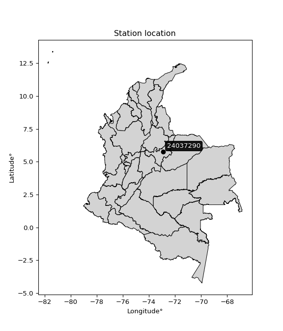

<div align="center">


</div>

# PMP Station (Rain, Pmax24h): 24037290

Probable Maximum Precipitation (PMP) is the greatest amount of rainfall for a specific duration that is meteorologically possible for a given location, acting as a "worst-case" scenario for extreme storms, crucial for designing safety-critical infrastructure like bridges, river deviations, dams, spillways, and nuclear plants to prevent catastrophic failure. PMP is calculated by hydrologists using meteorological data to determine the upper limit of extreme rainfall, often leading to the Probable Maximum Flood (PMF) for flood control design, and is increasingly being studied for climate change impacts. Probable Maximum Precipitation (PMP) is the theoretical upper limit of rainfall, a deterministic estimate for extreme events, while probability distributions (like GEV, Gumbel) describe the likelihood and frequency of various precipitation amounts, including rare ones, showing how often events occur, with PMP representing the extreme end of these distributions, used for critical infrastructure design to ensure safety against the worst conceivable weather, unlike standard statistical forecasts which cover typical probabilities.

The most common probability distributions in hydrology, used for analyzing floods, rainfall, and streamflow, include the Normal, Log-Normal, Gumbel, Gamma (including Log-Pearson Type III), and Generalized Extreme Value (GEV) distributions, often chosen based on the data´s skewness and whether modeling extremes or general conditions, with Gumbel and GEV popular for extreme events like floods, while the Normal distribution serves as a baseline, though often requiring transformations for skewed hydrological data. These distributions help in designing water infrastructure, managing water resources, and forecasting hydrologic events.

> Hydrological data often isn´t perfectly normal (it´s skewed), so different distributions are needed for different applications, such as: **Flood Frequency Analysis**: Using Gumbel, GEV, or Log-Pearson Type III for predicting extreme flood magnitudes and their return periods, **Rainfall Analysis**: Normal for annual totals, but Log-Normal, Weibull, or GEV for intensity or extreme daily rainfall, **Streamflow Modeling**: Gamma and Log-Normal for maximum flows, GEV for minimum flows, and Kappa for daily flows.

<div align="center">

</img>

</div>


## A. General information


### 1. General running parameters

• app_version: _v20260108_. • runtime: _2026-01-09 11:32:22.148588_. • Python version: _3.14.0_. • SciPy version: _1.16.3_. • Pandas version: _2.3.3_. • NumPy version: _2.3.5_. • Stations dataset (station_dataset_file): _dataset/pmax24h_in/automatic_colombia_2003_2024.csv_. • Stations catalog (station_catalog_file): _dataset/CNE.xls_. • Minimum year to eval til year_max (date_min): _1900_. • Maximum year to eval since year_min (date_max): _2024_. • Creates, save and include plots into reports (create_plot): _False_. • Plot only fit distributions with Δo > Δ (plot_only_fit): _True_. • Plot only simple graphs avoiding multiple CDFs and multiple Extreme values plots (plot_only_simple): _True_. • Eval low extreme values, if False, evaluates high extreme values (low_extreme): _False_. • Eval every SciPy distribution as logarithmic (pdist_logarithmic_on): _True_. • Standard deviation normalized (ddof): _1.0_. • Return periods to eval in years (Tr): _[2, 2.33, 5, 10, 15, 20, 25, 50, 75, 100, 200, 250, 500, 750, 1000]_. • Minimum data sample per station, 0 means any (minimum_sample): _5_. • Z-Score maximum threshold to adjust a value, 0 means disable (zscore_max): _3.5_. • Z-Score minimum threshold to adjust a value, 0 means disable (zscore_min): _-2.5_. • Avoid zeros, e.g. rain = 0 (avoid_zeros): _True_. • Avoid null values (avoid_nans): _True_. 

:file_folder:Table: [dataset.csv](../../dataset/pmax24h_in/automatic_colombia_2003_2024.csv)

> Delta Degrees of Freedom (DDOF): is a parameter used in the formulas for calculating variance and standard deviation. When ddof=0, the divisor is $N$ (the total number of observations) and this is used when your data set is the entire population. When ddof=1, the divisor is $N-1$ and this is used when your data set is a sample drawn from a larger population. Using $N-1$ provides an unbiased estimate of the population variance (known as Bessel´s correction).


### 2. Station info and location

|   id |   CODIGO | NOMBRE                           | CATEGORIA    | TECNOLOGIA                              | ESTADO   | FECHA_INSTALACION   |   FECHA_SUSPENSION |   ALTITUD |   LATITUD |   LONGITUD | DEPARTAMENTO   | MUNICIPIO   | AREA_OPERATIVA                              | ENTIDAD                                                     | AREA_HIDROGRAFICA   | ZONA_HIDROGRAFICA   | SUBZONA_HIDROGRAFICA   | CORRIENTE   | Catalogo   |   Version |
|-----:|---------:|:---------------------------------|:-------------|:----------------------------------------|:---------|:--------------------|-------------------:|----------:|----------:|-----------:|:---------------|:------------|:--------------------------------------------|:------------------------------------------------------------|:--------------------|:--------------------|:-----------------------|:------------|:-----------|----------:|
|    0 | 24037290 | PUENTE CHAMEZA  - AUT [24037290] | Limnigráfica | Automática con Telemetría, Convencional | Activa   | 15/02/1971          |                nan |      2490 |   5.75989 |   -72.9065 | Boyacá         | Sogamoso    | Area Operativa 06 - Boyacá-Casanare-Vichada | INSTITUTO DE HIDROLOGIA METEOROLOGIA Y ESTUDIOS AMBIENTALES | Magdalena Cauca     | Sogamoso            | Río Chicamocha         | Chicamocha  | CNE_IDEAM  |  20251226 |

<div align="center">

Dynamic map: [:earth_americas:Google](http://maps.google.com/maps?q=5.759888889,-72.90652778) [:earth_americas:OSM](https://www.openstreetmap.org/#map=18/5.759888889/-72.90652778&layers=P) [:earth_americas:Bing](https://www.bing.com/maps?cp=5.759888889~-72.90652778&lvl=18) [:earth_americas:Apple](https://maps.apple.com/frame?center=5.759888889%2C-72.90652778&span=0.003%2C0.006)

</div>


<div align="center">

```geojson
{
  "type": "Feature",
  "geometry": {
    "type": "Point", 
    "coordinates": [-72.90652778, 5.759888889]
  }, 
  "properties": {
    "Name": "24037290"
  }
}
```

</div>


### 3. Discrete values table and plot

<div align="center">

|               |           0 |           1 |           2 |           3 |         4 |          5 |
|:--------------|------------:|------------:|------------:|------------:|----------:|-----------:|
| Date          | 2019        | 2020        | 2021        | 2022        | 2023      | 2024       |
| Value         |   35.8      |   45.2      |   40.4      |   27.4      |   24.8    |   56.4     |
| Value_initial |   35.8      |   45.2      |   40.4      |   27.4      |   24.8    |   56.4     |
| count         |    6        |    6        |    6        |    6        |    6      |    6       |
| mean          |   38.3333   |   38.3333   |   38.3333   |   38.3333   |   38.3333 |   38.3333  |
| std           |   11.7212   |   11.7212   |   11.7212   |   11.7212   |   11.7212 |   11.7212  |
| zscore        |   -0.216132 |    0.585833 |    0.176319 |   -0.932782 |   -1.1546 |    1.54137 |


</div>


> The initial value (value_initial) correspond to the initial obtained or null completed value, and value (value) is adjusted only when the initial value is outside the valid range (outlier) definite through the Z-Score value. If Z-Score is active, values out of range or outliers are replaced with the station mean value. A Z-Score (or standard score) measures how many standard deviations a data point is from the mean of a dataset, indicating its relative position; positive scores mean above the mean, negative mean below, and a score of zero is exactly at the mean, allowing for comparison of values from different distributions. It´s calculated using the formula $z=(x–μ)/σ$, where $x$ is the data point, $μ$ is the mean, and $σ$ is the standard deviation, helping identify outliers and understand probability.
>
> <sub>**Note**: In this study, "completing" (filling gaps in) and "extending" (forecasting or lengthening the historical record) rainfall data series are avoided for certain critical analyses because they introduce artificial bias and uncertainty, which can distort the statistics of rare events (extremes), alter day-to-day variability, and compromise the integrity and homogeneity of the original data. Some reasons against Completing/Extending rainfall data are: **Distortion of Extremes and Variability**: The primary issue is that most gap-filling or extension methods rely on averaging or regression with nearby stations, which inherently smooths the data. Rainfall is highly variable in space and time, with a large percentage of zero values and occasional large storms. Infilling methods often underestimate the highest values and overestimate the lowest (zero) values, which severely distorts analyses focused on flood frequency, drought severity, and intensity-duration-frequency (IDF) curves, **Loss of Data Homogeneity**: Infilled or extended data are synthetic estimates, not actual measurements. Combining these estimates with observed data can violate the assumption of data homogeneity, which requires that the data properties do not change over time. Inhomogeneity can lead to incorrect conclusions about long-term trends or changes in climate patterns, **Propagation of Errors**: Errors and biases from the original data (e.g., wind-induced undercatch, instrument errors, site changes) or the data used for imputation can propagate through the analysis, leading to unreliable hydrological models and inaccurate predictions, **Compromised Statistical Integrity**: For statistical analyses, especially those involving the frequency of events, using artificial data can introduce time bias or autocorrelation that doesn´t exist in reality, making it difficult to assess the true probability of events, **Difficulty in Validation**: It is difficult to accurately validate the quality of filled or extended data, especially for past periods where ground-truth measurements are unavailable. The reliability of imputation techniques heavily depends on the density of the surrounding station network and the complexity of the local topography.</sub>


### 4. Active continuous probability distributions from SciPy (45 of 104 available)

A Probability Density Function (PDF) describes the relative likelihood of a continuous random variable falling within a specific range, where the total area under its curve equals 1, and the area over any interval gives the actual probability for that range. Unlike discrete probabilities (like rolling a die), a PDF shows density, not direct probability for a single point (which is zero), with higher points indicating higher likelihood, often visualized as a bell curve for normal distributions.

A log of a probability density function (log-PDF) is simply the logarithm of the PDF´s value, denoted as $log(f(x))$, useful for converting multiplication of probabilities into addition, improving numerical stability with tiny numbers, and connecting to information theory concepts like entropy. Instead of dealing with very small probabilities (e.g., 0.000001), log-PDFs use negative numbers (e.g., $log(0.00001) ≈ -11.51$ that are easier for computers to handle, preventing underflow errors and simplifying complex calculations. In this study, each active probability distribution from SciPy is also evaluated in the $log$ form.

[scipy.stats](https://docs.scipy.org/doc/scipy/reference/stats.html) is a Python´s powerful submodule within the SciPy library for comprehensive statistical analysis, offering over 130 probability distributions (like Normal, Poisson), functions for descriptive stats (mean, variance), hypothesis testing (t-tests, chi-square), random variable generation, and statistical tests, making it essential for data science, modeling, and research. It provides tools to explore, model, and draw conclusions from data efficiently, working seamlessly with NumPy.

<div align="center">

|   id | p_dist             |   n_parameter | fit_method   | label                                                                       | active   | ref                                                                                                        |
|-----:|:-------------------|--------------:|:-------------|:----------------------------------------------------------------------------|:---------|:-----------------------------------------------------------------------------------------------------------|
|    0 | alpha              |             3 | MLE          | Alpha                                                                       | True     | [:mortar_board:](https://docs.scipy.org/doc/scipy/reference/generated/scipy.stats.alpha.html)              |
|    1 | betaprime          |             4 | MLE          | Beta prime                                                                  | True     | [:mortar_board:](https://docs.scipy.org/doc/scipy/reference/generated/scipy.stats.betaprime.html)          |
|    2 | chi2               |             3 | MLE          | Chi²                                                                        | True     | [:mortar_board:](https://docs.scipy.org/doc/scipy/reference/generated/scipy.stats.chi2.html)               |
|    3 | crystalball        |             4 | MLE          | Crystalball                                                                 | True     | [:mortar_board:](https://docs.scipy.org/doc/scipy/reference/generated/scipy.stats.crystalball.html)        |
|    4 | dweibull           |             3 | MLE          | Double Weibull                                                              | True     | [:mortar_board:](https://docs.scipy.org/doc/scipy/reference/generated/scipy.stats.dweibull.html)           |
|    5 | erlang             |             3 | MLE          | Erlang                                                                      | True     | [:mortar_board:](https://docs.scipy.org/doc/scipy/reference/generated/scipy.stats.erlang.html)             |
|    6 | expon              |             2 | MLE          | Exponential                                                                 | True     | [:mortar_board:](https://docs.scipy.org/doc/scipy/reference/generated/scipy.stats.expon.html)              |
|    7 | exponnorm          |             3 | MLE          | Exponentially modified Normal                                               | True     | [:mortar_board:](https://docs.scipy.org/doc/scipy/reference/generated/scipy.stats.exponnorm.html)          |
|    8 | f                  |             4 | MLE          | F                                                                           | True     | [:mortar_board:](https://docs.scipy.org/doc/scipy/reference/generated/scipy.stats.f.html)                  |
|    9 | fatiguelife        |             3 | MLE          | Fatigue-life (Birnbaum-Saunders)                                            | True     | [:mortar_board:](https://docs.scipy.org/doc/scipy/reference/generated/scipy.stats.fatiguelife.html)        |
|   10 | fisk               |             3 | MLE          | Fisk                                                                        | True     | [:mortar_board:](https://docs.scipy.org/doc/scipy/reference/generated/scipy.stats.fisk.html)               |
|   11 | gamma              |             3 | MLE          | Gamma                                                                       | True     | [:mortar_board:](https://docs.scipy.org/doc/scipy/reference/generated/scipy.stats.gamma.html)              |
|   12 | genexpon           |             5 | MLE          | Generalized exponential                                                     | True     | [:mortar_board:](https://docs.scipy.org/doc/scipy/reference/generated/scipy.stats.genexpon.html)           |
|   13 | genlogistic        |             3 | MLE          | Generalized logistic                                                        | True     | [:mortar_board:](https://docs.scipy.org/doc/scipy/reference/generated/scipy.stats.genlogistic.html)        |
|   14 | gibrat             |             2 | MM           | Gibrat                                                                      | True     | [:mortar_board:](https://docs.scipy.org/doc/scipy/reference/generated/scipy.stats.gibrat.html)             |
|   15 | gompertz           |             3 | MLE          | Gompertz (or truncated Gumbel)                                              | True     | [:mortar_board:](https://docs.scipy.org/doc/scipy/reference/generated/scipy.stats.gompertz.html)           |
|   16 | gumbel_l           |             2 | MM           | Gumbel Left Skew                                                            | True     | [:mortar_board:](https://docs.scipy.org/doc/scipy/reference/generated/scipy.stats.gumbel_l.html)           |
|   17 | gumbel_r           |             2 | MM           | Gumbel Right Skew                                                           | True     | [:mortar_board:](https://docs.scipy.org/doc/scipy/reference/generated/scipy.stats.gumbel_r.html)           |
|   18 | halflogistic       |             2 | MM           | Half-logistic                                                               | True     | [:mortar_board:](https://docs.scipy.org/doc/scipy/reference/generated/scipy.stats.halflogistic.html)       |
|   19 | halfnorm           |             2 | MM           | Half Normal                                                                 | True     | [:mortar_board:](https://docs.scipy.org/doc/scipy/reference/generated/scipy.stats.halfnorm.html)           |
|   20 | hypsecant          |             2 | MM           | hyperbolic secant                                                           | True     | [:mortar_board:](https://docs.scipy.org/doc/scipy/reference/generated/scipy.stats.hypsecant.html)          |
|   21 | invgamma           |             3 | MLE          | Inverted gamma                                                              | True     | [:mortar_board:](https://docs.scipy.org/doc/scipy/reference/generated/scipy.stats.invgamma.html)           |
|   22 | invgauss           |             3 | MLE          | Inverse Gaussian                                                            | True     | [:mortar_board:](https://docs.scipy.org/doc/scipy/reference/generated/scipy.stats.invgauss.html)           |
|   23 | invweibull         |             3 | MLE          | Inverted Weibull                                                            | True     | [:mortar_board:](https://docs.scipy.org/doc/scipy/reference/generated/scipy.stats.invweibull.html)         |
|   24 | kappa4             |             4 | MLE          | Kappa 4                                                                     | True     | [:mortar_board:](https://docs.scipy.org/doc/scipy/reference/generated/scipy.stats.kappa4.html)             |
|   25 | kstwobign          |             2 | MLE          | Limiting distribution of scaled Kolmogorov-Smirnov two-sided test statistic | True     | [:mortar_board:](https://docs.scipy.org/doc/scipy/reference/generated/scipy.stats.kstwobign.html)          |
|   26 | laplace            |             2 | MM           | Laplace                                                                     | True     | [:mortar_board:](https://docs.scipy.org/doc/scipy/reference/generated/scipy.stats.laplace.html)            |
|   27 | laplace_asymmetric |             3 | MLE          | Asymmetric Laplace                                                          | True     | [:mortar_board:](https://docs.scipy.org/doc/scipy/reference/generated/scipy.stats.laplace_asymmetric.html) |
|   28 | loggamma           |             3 | MLE          | Log gamma                                                                   | True     | [:mortar_board:](https://docs.scipy.org/doc/scipy/reference/generated/scipy.stats.loggamma.html)           |
|   29 | logistic           |             2 | MM           | Logistic (or Sech-squared)                                                  | True     | [:mortar_board:](https://docs.scipy.org/doc/scipy/reference/generated/scipy.stats.logistic.html)           |
|   30 | lognorm            |             3 | MLE          | Log Normal                                                                  | True     | [:mortar_board:](https://docs.scipy.org/doc/scipy/reference/generated/scipy.stats.lognorm.html)            |
|   31 | maxwell            |             2 | MM           | Maxwell                                                                     | True     | [:mortar_board:](https://docs.scipy.org/doc/scipy/reference/generated/scipy.stats.maxwell.html)            |
|   32 | mielke             |             4 | MLE          | Mielke Beta-Kappa / Dagum                                                   | True     | [:mortar_board:](https://docs.scipy.org/doc/scipy/reference/generated/scipy.stats.mielke.html)             |
|   33 | moyal              |             2 | MM           | Moyal                                                                       | True     | [:mortar_board:](https://docs.scipy.org/doc/scipy/reference/generated/scipy.stats.moyal.html)              |
|   34 | nakagami           |             3 | MLE          | Nakagami                                                                    | True     | [:mortar_board:](https://docs.scipy.org/doc/scipy/reference/generated/scipy.stats.nakagami.html)           |
|   35 | ncf                |             5 | MLE          | Non-central F distribution                                                  | True     | [:mortar_board:](https://docs.scipy.org/doc/scipy/reference/generated/scipy.stats.ncf.html)                |
|   36 | nct                |             4 | MLE          | Non-central Student’s t                                                     | True     | [:mortar_board:](https://docs.scipy.org/doc/scipy/reference/generated/scipy.stats.nct.html)                |
|   37 | norm               |             2 | MM           | Normal                                                                      | True     | [:mortar_board:](https://docs.scipy.org/doc/scipy/reference/generated/scipy.stats.norm.html)               |
|   38 | pearson3           |             3 | MM           | Pearson type III                                                            | True     | [:mortar_board:](https://docs.scipy.org/doc/scipy/reference/generated/scipy.stats.pearson3.html)           |
|   39 | rayleigh           |             2 | MM           | Rayleigh                                                                    | True     | [:mortar_board:](https://docs.scipy.org/doc/scipy/reference/generated/scipy.stats.rayleigh.html)           |
|   40 | rice               |             3 | MLE          | Rice                                                                        | True     | [:mortar_board:](https://docs.scipy.org/doc/scipy/reference/generated/scipy.stats.rice.html)               |
|   41 | t                  |             3 | MLE          | Student’s t                                                                 | True     | [:mortar_board:](https://docs.scipy.org/doc/scipy/reference/generated/scipy.stats.t.html)                  |
|   42 | truncnorm          |             4 | MLE          | Truncated normal                                                            | True     | [:mortar_board:](https://docs.scipy.org/doc/scipy/reference/generated/scipy.stats.truncnorm.html)          |
|   43 | wald               |             2 | MM           | Wald                                                                        | True     | [:mortar_board:](https://docs.scipy.org/doc/scipy/reference/generated/scipy.stats.wald.html)               |
|   44 | weibull_min        |             3 | MLE          | Weibull minimum                                                             | True     | [:mortar_board:](https://docs.scipy.org/doc/scipy/reference/generated/scipy.stats.weibull_min.html)        |

</div>

> **n_parameter:** # arguments & localization & scale.
>
> **Fit methods:** (MLE) maximum likelihood, (MM) L-moments.
>
>**Inactive** (With the only purpose of prevent loops, zero divisions, infinite values, over high estimated values or horizontal trending for recurrence intervals estimations, the follow distributions were disabled.)**:** foldnorm, gennorm, norminvgauss, powernorm, powerlognorm, skewnorm, genextreme, anglit, arcsine, argus, beta, bradford, burr, burr12, cauchy, cosine, halfcauchy, foldcauchy, skewcauchy, wrapcauchy, dgamma, gengamma, exponweib, exponpow, truncexpon, gausshyper, genhalflogistic, genhyperbolic, geninvgauss, halfgennorm, johnsonsb, johnsonsu, kappa3, ksone, kstwo, loglaplace, levy, levy_l, levy_stable, ncx2, pareto, genpareto, truncpareto, lomax, powerlaw, rdist, rel_breitwigner, recipinvgauss, semicircular, studentized_range, trapezoid, triang, truncweibull_min, tukeylambda, uniform, loguniform, vonmises, vonmises_line, weibull_max, 


## B. Probability (PDF) vs. Empirical (EDF) distributions functions

A continuous probability distribution (CPD) describes probabilities for variables that can take any value within a range (like rain any time), unlike discrete variables with specific outcomes (like temperature). It uses a Probability Density Function (PDF), a curve where the total area under it equals 1, and the probability of the variable falling within an interval (a to b) is found by calculating the area under the curve between those points. A key feature is that the probability of hitting any single exact value is zero, so probabilities are always expressed for ranges, e.g., $P(a ≤ X ≤ b)$.

<div align="center">

Distributions parameters from station values
|    |   station | p_dist                |   n |             loc |         scale | shape                 | shape1                 | shape2                 | shape3   |
|---:|----------:|:----------------------|----:|----------------:|--------------:|:----------------------|:-----------------------|:-----------------------|:---------|
|  0 |  24037290 | alpha                 |   6 |   -41.5343      | 598.362       | 7.624914588509517     |                        |                        |          |
|  1 |  24037290 | betaprime             |   6 |    -0.673393    |  48.8121      | 23.50691803187838     | 30.40526796037608      |                        |          |
|  2 |  24037290 | chi2                  |   6 |    24.8         |   1.16563     | 0.9938927697765112    |                        |                        |          |
|  3 |  24037290 | crystalball           |   6 |    38.3333      |  10.6999      | 3526.720170094587     | 2130.307897398457      |                        |          |
|  4 |  24037290 | dweibull              |   6 |    38.0574      |  10.0078      | 1.5474671028522993    |                        |                        |          |
|  5 |  24037290 | erlang                |   6 |    24.8         |  13.4701      | 0.4236161614830174    |                        |                        |          |
|  6 |  24037290 | expon                 |   6 |    24.8         |  13.5333      |                       |                        |                        |          |
|  7 |  24037290 | exponnorm             |   6 |    33.9677      |   9.79878     | 0.44553042394797354   |                        |                        |          |
|  8 |  24037290 | f                     |   6 |    24.7965      |  13.5716      | 1.287929978794664     | 36.78190428725111      |                        |          |
|  9 |  24037290 | fatiguelife           |   6 |    24.8         |   1.75561e-05 | 868.687057279072      |                        |                        |          |
| 10 |  24037290 | fisk                  |   6 |    -0.12617     |  37.1138      | 5.861406657884292     |                        |                        |          |
| 11 |  24037290 | gamma                 |   6 |    24.8         |  12.4513      | 0.8626308222219006    |                        |                        |          |
| 12 |  24037290 | genexpon              |   6 |    24.8         |   2.23284     | 0.16455297209390524   | 2.1577261078007066e-06 | 1.2444420945666579     |          |
| 13 |  24037290 | genlogistic           |   6 |   -21.4775      |   8.91171     | 462.19705024088535    |                        |                        |          |
| 14 |  24037290 | gibrat                |   6 |    30.1706      |   4.95095     |                       |                        |                        |          |
| 15 |  24037290 | gompertz              |   6 |    24.8         |  27.8868      | 1.3290171738209557    |                        |                        |          |
| 16 |  24037290 | gumbel_l              |   6 |    43.1489      |   8.34272     |                       |                        |                        |          |
| 17 |  24037290 | gumbel_r              |   6 |    33.5178      |   8.34272     |                       |                        |                        |          |
| 18 |  24037290 | halflogistic          |   6 |    25.6513      |   9.14814     |                       |                        |                        |          |
| 19 |  24037290 | halfnorm              |   6 |    24.1708      |  17.7501      |                       |                        |                        |          |
| 20 |  24037290 | hypsecant             |   6 |    38.3333      |   6.8118      |                       |                        |                        |          |
| 21 |  24037290 | invgamma              |   6 |    -3.62475     | 610.219       | 15.523309113519016    |                        |                        |          |
| 22 |  24037290 | invgauss              |   6 |    16.7279      |  63.236       | 0.3416637756423643    |                        |                        |          |
| 23 |  24037290 | invweibull            |   6 |    -1.58066e+08 |   1.58066e+08 | 17741578.501255028    |                        |                        |          |
| 24 |  24037290 | kappa4                |   6 |    20.25        |  35.3424      | 1.1473774347141945    | 0.9660639657659483     |                        |          |
| 25 |  24037290 | kstwobign             |   6 |     2.42924     |  41.0496      |                       |                        |                        |          |
| 26 |  24037290 | laplace               |   6 |    38.3333      |   7.56601     |                       |                        |                        |          |
| 27 |  24037290 | laplace_asymmetric    |   6 |    35.8         |   8.72655     | 0.8653265714533667    |                        |                        |          |
| 28 |  24037290 | loggamma              |   6 | -2317.02        | 340.633       | 1007.3455603708262    |                        |                        |          |
| 29 |  24037290 | logistic              |   6 |    38.3333      |   5.89919     |                       |                        |                        |          |
| 30 |  24037290 | lognorm               |   6 |    24.8         |   0.0317367   | 13.358924571059248    |                        |                        |          |
| 31 |  24037290 | maxwell               |   6 |    12.9789      |  15.8885      |                       |                        |                        |          |
| 32 |  24037290 | mielke                |   6 |   -37.6573      |  29.3441      | 12126.167264734606    | 8.358279723174622      |                        |          |
| 33 |  24037290 | moyal                 |   6 |    32.2144      |   4.81667     |                       |                        |                        |          |
| 34 |  24037290 | nakagami              |   6 |    24.8         |  18.1995      | 0.0674147427771042    |                        |                        |          |
| 35 |  24037290 | ncf                   |   6 |    -0.0807022   |  37.541       | 36.439873600591255    | 87.32018635090776      | 1.2372161840289614e-09 |          |
| 36 |  24037290 | nct                   |   6 |    -0.157185    |   2.50402     | 7.3435287344794835    | 13.804219012643465     |                        |          |
| 37 |  24037290 | norm                  |   6 |    38.3333      |  10.6999      |                       |                        |                        |          |
| 38 |  24037290 | pearson3              |   6 |    38.3333      |  10.6999      | 0.3303202836922502    |                        |                        |          |
| 39 |  24037290 | rayleigh              |   6 |    17.8637      |  16.3324      |                       |                        |                        |          |
| 40 |  24037290 | rice                  |   6 |    19.2615      |  14.4597      | 0.5359463010340466    |                        |                        |          |
| 41 |  24037290 | t                     |   6 |    38.3337      |  10.7003      | 15564634.86281111     |                        |                        |          |
| 42 |  24037290 | truncnorm             |   6 |    46.8712      |  19.7492      | -282.38399776242574   | 0.4824893847176759     |                        |          |
| 43 |  24037290 | wald                  |   6 |    27.6334      |  10.6999      |                       |                        |                        |          |
| 44 |  24037290 | weibull_min           |   6 |    24.8         |  17.9635      | 0.16353328343975687   |                        |                        |          |
| 45 |  24037290 | logalpha              |   6 |    -1.61122     |  95.2505      | 18.315711091388692    |                        |                        |          |
| 46 |  24037290 | logbetaprime          |   6 |    -3.69041     |  23.9374      | 871.4122013878628     | 2859.3735809543577     |                        |          |
| 47 |  24037290 | logchi2               |   6 |     3.21084     |   0.985558    | 1.0311096511199747    |                        |                        |          |
| 48 |  24037290 | logcrystalball        |   6 |     3.60696     |   0.281893    | 876.0391598684369     | 43.590132146380114     |                        |          |
| 49 |  24037290 | logdweibull           |   6 |     3.62925     |   0.26752     | 1.584166809865994     |                        |                        |          |
| 50 |  24037290 | logerlang             |   6 |   -37.4612      |   0.00193505  | 21223.254003460017    |                        |                        |          |
| 51 |  24037290 | logexpon              |   6 |     3.21084     |   0.396111    |                       |                        |                        |          |
| 52 |  24037290 | logexponnorm          |   6 |     3.60643     |   0.281892    | 0.0018737279056757618 |                        |                        |          |
| 53 |  24037290 | logf                  |   6 |   -26.3457      |  29.9509      | 52311.884628356085    | 39650.003647607344     |                        |          |
| 54 |  24037290 | logfatiguelife        |   6 |    -9.42937     |  13.0333      | 0.021608770171506322  |                        |                        |          |
| 55 |  24037290 | logfisk               |   6 |    -0.0523873   |   3.65599     | 21.23972771575219     |                        |                        |          |
| 56 |  24037290 | loggamma              |   6 |   -37.4765      |   0.00193424  | 21240.124476045254    |                        |                        |          |
| 57 |  24037290 | loggenexpon           |   6 |     3.21084     |   0.615061    | 1.2632102733122055    | 1.1860515005764436     | 0.6356184269400439     |          |
| 58 |  24037290 | loggenlogistic        |   6 |     2.03105     |   0.253042    | 291.21435602284237    |                        |                        |          |
| 59 |  24037290 | loggibrat             |   6 |     3.39192     |   0.130426    |                       |                        |                        |          |
| 60 |  24037290 | loggompertz           |   6 |     3.21084     |   0.477023    | 0.583047012504408     |                        |                        |          |
| 61 |  24037290 | loggumbel_l           |   6 |     3.73382     |   0.219791    |                       |                        |                        |          |
| 62 |  24037290 | loggumbel_r           |   6 |     3.48009     |   0.219791    |                       |                        |                        |          |
| 63 |  24037290 | loghalflogistic       |   6 |     3.27279     |   0.241045    |                       |                        |                        |          |
| 64 |  24037290 | loghalfnorm           |   6 |     3.23389     |   0.467574    |                       |                        |                        |          |
| 65 |  24037290 | loghypsecant          |   6 |     3.60696     |   0.179459    |                       |                        |                        |          |
| 66 |  24037290 | loginvgamma           |   6 |     0.0517688   | 550.668       | 155.83483427359107    |                        |                        |          |
| 67 |  24037290 | loginvgauss           |   6 |     2.09271     |  40.7626      | 0.03710997035827214   |                        |                        |          |
| 68 |  24037290 | loginvweibull         |   6 |    -7.9385e+06  |   7.9385e+06  | 31292558.8393977      |                        |                        |          |
| 69 |  24037290 | logkappa4             |   6 |     3.19354     |   0.912904    | 1.0174978330190383    | 1.088178981952046      |                        |          |
| 70 |  24037290 | logkstwobign          |   6 |     2.59767     |   1.15094     |                       |                        |                        |          |
| 71 |  24037290 | loglaplace            |   6 |     3.60696     |   0.199329    |                       |                        |                        |          |
| 72 |  24037290 | loglaplace_asymmetric |   6 |     3.69883     |   0.226709    | 1.222221505899984     |                        |                        |          |
| 73 |  24037290 | logloggamma           |   6 |   -31.1686      |   5.76367     | 417.70672458995034    |                        |                        |          |
| 74 |  24037290 | loglogistic           |   6 |     3.60696     |   0.155416    |                       |                        |                        |          |
| 75 |  24037290 | loglognorm            |   6 |     3.21084     |   0.00125524  | 12.838896875545867    |                        |                        |          |
| 76 |  24037290 | logmaxwell            |   6 |     2.93899     |   0.418587    |                       |                        |                        |          |
| 77 |  24037290 | logmielke             |   6 |  -127.431       | 129.645       | 75869.42305989531     | 519.1817241626379      |                        |          |
| 78 |  24037290 | logmoyal              |   6 |     3.44575     |   0.126897    |                       |                        |                        |          |
| 79 |  24037290 | lognakagami           |   6 |     3.21084     |   0.451411    | 0.40473305954534444   |                        |                        |          |
| 80 |  24037290 | logncf                |   6 |    -3.76852     |   7.3504      | 559.4337862967027     | 585.5384178123961      | 1.3604174964667592     |          |
| 81 |  24037290 | lognct                |   6 |    -1.72769     |   0.0611473   | 186.33098789419057    | 86.87477558975743      |                        |          |
| 82 |  24037290 | lognorm               |   6 |     3.60696     |   0.281893    |                       |                        |                        |          |
| 83 |  24037290 | logpearson3           |   6 |     3.60696     |   0.281893    | -0.014022122354213951 |                        |                        |          |
| 84 |  24037290 | lograyleigh           |   6 |     3.06768     |   0.430282    |                       |                        |                        |          |
| 85 |  24037290 | logrice               |   6 |     3.06105     |   0.341251    | 1.1142247586714604    |                        |                        |          |
| 86 |  24037290 | logt                  |   6 |     3.60696     |   0.281893    | 562383163.0725513     |                        |                        |          |
| 87 |  24037290 | logtruncnorm          |   6 |    -0.054813    |   1.24061     | 2.632302215719773     | 4.624919322466917      |                        |          |
| 88 |  24037290 | logwald               |   6 |     3.32504     |   0.281919    |                       |                        |                        |          |
| 89 |  24037290 | logweibull_min        |   6 |     3.21084     |   0.432352    | 0.9671001954871515    |                        |                        |          |

</div>

> **loc** (Location parameter): This shifts the distribution along the x-axis. For many common distributions, like the normal (Gaussian) distribution, loc represents the mean $μ$. For others, like the uniform distribution, it might represent the minimum value, or for the beta distribution, the left end of the support interval.
>
> **scale** (Scale parameter): This determines the width or spread of the distribution. For the normal distribution, scale represents the standard deviation $σ$. For a uniform distribution, it defines the length of the interval (from $loc$ to $loc + scale$).
>
> **shape** (Shape parameters): Refers to parameters that define the specific form of a probability distribution, distinct from its location (loc) and scale (scale). These parameters are required arguments for most distribution functions. For example, a normal (Gaussian) distribution is fully defined by its location (mean) and scale (standard deviation), so it has no specific shape parameters beyond loc and scale. However, other distributions have intrinsic properties that need specification, as Gamma distribution that takes a shape parameter, often named $a$ or $alpha$.


### 0. Cumulative distribution values - CDF (90 evaluated)

Cumulative Distribution Function (CDF), denoted as $F$<sub>$X$</sub>$(x)$, is a function that gives the probability that a random variable $X$ will take a value less than or equal to a specific value, $x$ (i.e., $(P(X≥x)$. It essentially "accumulates" probabilities from a given point up to the far right (positive infinity), providing a complete picture of the distribution´s probabilities for both discrete (like rain) and continuous (like temperature) variables, helping to find probabilities over ranges or above certain values. Each station is evaluated separately ordering the $x$ values ascending, calculating the CDF and PDF values for the activated distributions and their logarithmic forms.

<div align="center">

CDF ordered by x ascending and calculating $log(f(x))$ separately
|   id |   Station |   date |    x |   count |    mean |     std |    zscore |   Value_initial |   station |   m |     alpha |   alpha_pdf |   betaprime |   betaprime_pdf |        chi2 |    chi2_pdf |   crystalball |   crystalball_pdf |   dweibull |   dweibull_pdf |      erlang |   erlang_pdf |    expon |   expon_pdf |   exponnorm |   exponnorm_pdf |          f |      f_pdf |   fatiguelife |   fatiguelife_pdf |      fisk |   fisk_pdf |       gamma |   gamma_pdf |    genexpon |   genexpon_pdf |   genlogistic |   genlogistic_pdf |   gibrat |   gibrat_pdf |    gompertz |   gompertz_pdf |   gumbel_l |   gumbel_l_pdf |   gumbel_r |   gumbel_r_pdf |   halflogistic |   halflogistic_pdf |   halfnorm |   halfnorm_pdf |   hypsecant |   hypsecant_pdf |   invgamma |   invgamma_pdf |   invgauss |   invgauss_pdf |   invweibull |   invweibull_pdf |      kappa4 |   kappa4_pdf |   kstwobign |   kstwobign_pdf |   laplace |   laplace_pdf |   laplace_asymmetric |   laplace_asymmetric_pdf |   loggamma |   loggamma_pdf |   logistic |   logistic_pdf |   lognorm |   lognorm_pdf |   maxwell |   maxwell_pdf |   mielke |   mielke_pdf |     moyal |   moyal_pdf |   nakagami |   nakagami_pdf |       ncf |    ncf_pdf |       nct |    nct_pdf |     norm |   norm_pdf |   pearson3 |   pearson3_pdf |   rayleigh |   rayleigh_pdf |      rice |   rice_pdf |        t |      t_pdf |   truncnorm |   truncnorm_pdf |     wald |   wald_pdf |   weibull_min |   weibull_min_pdf |   logalpha |   logalpha_pdf |   logbetaprime |   logbetaprime_pdf |     logchi2 |   logchi2_pdf |   logcrystalball |   logcrystalball_pdf |   logdweibull |   logdweibull_pdf |   logerlang |   logerlang_pdf |   logexpon |   logexpon_pdf |   logexponnorm |   logexponnorm_pdf |      logf |   logf_pdf |   logfatiguelife |   logfatiguelife_pdf |   logfisk |   logfisk_pdf |   loggenexpon |   loggenexpon_pdf |   loggenlogistic |   loggenlogistic_pdf |   loggibrat |   loggibrat_pdf |   loggompertz |   loggompertz_pdf |   loggumbel_l |   loggumbel_l_pdf |   loggumbel_r |   loggumbel_r_pdf |   loghalflogistic |   loghalflogistic_pdf |   loghalfnorm |   loghalfnorm_pdf |   loghypsecant |   loghypsecant_pdf |   loginvgamma |   loginvgamma_pdf |   loginvgauss |   loginvgauss_pdf |   loginvweibull |   loginvweibull_pdf |   logkappa4 |   logkappa4_pdf |   logkstwobign |   logkstwobign_pdf |   loglaplace |   loglaplace_pdf |   loglaplace_asymmetric |   loglaplace_asymmetric_pdf |   logloggamma |   logloggamma_pdf |   loglogistic |   loglogistic_pdf |   loglognorm |   loglognorm_pdf |   logmaxwell |   logmaxwell_pdf |   logmielke |   logmielke_pdf |   logmoyal |   logmoyal_pdf |   lognakagami |   lognakagami_pdf |   logncf |   logncf_pdf |    lognct |   lognct_pdf |   logpearson3 |   logpearson3_pdf |   lograyleigh |   lograyleigh_pdf |   logrice |   logrice_pdf |      logt |   logt_pdf |   logtruncnorm |   logtruncnorm_pdf |   logwald |   logwald_pdf |   logweibull_min |   logweibull_min_pdf |
|-----:|----------:|-------:|-----:|--------:|--------:|--------:|----------:|----------------:|----------:|----:|----------:|------------:|------------:|----------------:|------------:|------------:|--------------:|------------------:|-----------:|---------------:|------------:|-------------:|---------:|------------:|------------:|----------------:|-----------:|-----------:|--------------:|------------------:|----------:|-----------:|------------:|------------:|------------:|---------------:|--------------:|------------------:|---------:|-------------:|------------:|---------------:|-----------:|---------------:|-----------:|---------------:|---------------:|-------------------:|-----------:|---------------:|------------:|----------------:|-----------:|---------------:|-----------:|---------------:|-------------:|-----------------:|------------:|-------------:|------------:|----------------:|----------:|--------------:|---------------------:|-------------------------:|-----------:|---------------:|-----------:|---------------:|----------:|--------------:|----------:|--------------:|---------:|-------------:|----------:|------------:|-----------:|---------------:|----------:|-----------:|----------:|-----------:|---------:|-----------:|-----------:|---------------:|-----------:|---------------:|----------:|-----------:|---------:|-----------:|------------:|----------------:|---------:|-----------:|--------------:|------------------:|-----------:|---------------:|---------------:|-------------------:|------------:|--------------:|-----------------:|---------------------:|--------------:|------------------:|------------:|----------------:|-----------:|---------------:|---------------:|-------------------:|----------:|-----------:|-----------------:|---------------------:|----------:|--------------:|--------------:|------------------:|-----------------:|---------------------:|------------:|----------------:|--------------:|------------------:|--------------:|------------------:|--------------:|------------------:|------------------:|----------------------:|--------------:|------------------:|---------------:|-------------------:|--------------:|------------------:|--------------:|------------------:|----------------:|--------------------:|------------:|----------------:|---------------:|-------------------:|-------------:|-----------------:|------------------------:|----------------------------:|--------------:|------------------:|--------------:|------------------:|-------------:|-----------------:|-------------:|-----------------:|------------:|----------------:|-----------:|---------------:|--------------:|------------------:|---------:|-------------:|----------:|-------------:|--------------:|------------------:|--------------:|------------------:|----------:|--------------:|----------:|-----------:|---------------:|-------------------:|----------:|--------------:|-----------------:|---------------------:|
|    0 |  24037290 |   2023 | 24.8 |       6 | 38.3333 | 11.7212 | -1.1546   |            24.8 |  24037290 |   1 | 0.0814347 |  0.0204894  |   0.0812846 |      0.0208618  | 4.88913e-08 | 6.83881e+06 |      0.102971 |        0.0167553  |   0.106638 |     0.0192332  | 2.83803e-07 |   3.384e+07  | 0        |  0.0738916  |    0.100115 |      0.0170939  | 0.00408622 | 0.746628   |     0.0502316 |       9.86017e+09 | 0.0884059 | 0.0189509  | 2.73126e-13 |  7.36861    | 2.31737e-06 |     0.0736965  |     0.0772393 |        0.0221339  | 0        |   0          | 1.60628e-12 |     0.0476575  |   0.104946 |     0.0118949  |  0.0582344 |     0.0198469  |      0         |         0          |  0.0282774 |      0.0449227 |   0.0867651 |      0.0125803  |  0.0759805 |     0.0221023  |  0.0608248 |     0.0297487  |    0.0771245 |       0.0221811  | 1.24375e-14 |    3.155     |    0.072221 |      0.0235928  | 0.0835885 |    0.0110479  |            0.0997667 |               0.0132118  |  0.0796487 |       0.529034 |  0.0916128 |     0.014107   | 0.0799835 |      0.527303 | 0.0930183 |    0.0210768  |      nan |          nan | 0.0308473 |  0.0173862  | 0.00658058 |    2.49741e+11 | 0.0828675 | 0.0205574  | 0.0701721 | 0.0236962  | 0.102971 | 0.0167553  |  0.0952079 |     0.0185114  |  0.0862361 |     0.0237608  | 0.0615867 | 0.0215479  | 0.102972 | 0.0167549  |    0.192442 |       0.0157866 | 0        | 0          |    0.00269969 |        1.241e+11  |   0.075307 |       0.581676 |      0.0777874 |           0.539561 | 9.66381e-09 |    1.1219e+07 |        0.0799835 |             0.527303 |     0.0656042 |          0.504478 |   0.0796731 |        0.529145 |   0        |       2.52454  |      0.0799826 |           0.527299 | 0.0795063 |   0.531967 |        0.0782012 |             0.535056 | 0.0821201 |      0.49061  |   1.23131e-10 |          2.0538   |         0.064756 |             0.697178 |    0        |        0        |   4.30672e-10 |          1.22226  |     0.0884448 |          0.384059 |     0.0332345 |          0.514741 |         0         |              0        |      0        |          0        |      0.0697491 |           0.385561 |     0.0732642 |          0.570461 |     0.0685387 |          0.62334  |        0.064538 |            0.697185 |  0.00201054 |         1.22319 |      0.0609331 |           0.7645   |    0.0685374 |         0.343841 |                0.102941 |                    0.37151  |     0.0812865 |          0.5213   |     0.0725126 |          0.432739 |    0.0127724 |      5.78217e+12 |    0.0642974 |         0.651134 |   0.0659226 |        0.705816 |  0.0116246 |       0.328705 |   5.56334e-13 |       1014.06     | 0.258664 |     0.553802 | 0.0752234 |     0.565657 |     0.0803188 |          0.525528 |     0.0538498 |          0.731638 | 0.0508351 |      0.666042 | 0.0799816 |   0.527294 |    2.04044e-08 |           2.37379  |  0        |      0        |       6.2499e-15 |             6.80525  |
|    1 |  24037290 |   2022 | 27.4 |       6 | 38.3333 | 11.7212 | -0.932782 |            27.4 |  24037290 |   2 | 0.145653  |  0.0287868  |   0.14644   |      0.0290976  | 0.865748    | 0.0746494   |      0.153435 |        0.022121   |   0.166068 |     0.0265779  | 0.531577    |   0.0755083  | 0.174791 |  0.0609761  |    0.151884 |      0.0227833  | 0.273648   | 0.0625949  |     0.671118  |       0.0308109   | 0.147834  | 0.0268259  | 0.248042    |  0.0734294  | 0.174375    |     0.0608464  |     0.147463  |        0.0316086  | 0        |   0          | 0.12179     |     0.0459431  |   0.140508 |     0.0155991  |  0.124686  |     0.0311158  |      0.0952867 |         0.0541596  |  0.144359  |      0.0442132 |   0.126203  |      0.0180455  |  0.145979  |     0.0314555  |  0.157152  |     0.0426111  |    0.147519  |       0.0316883  | 0.115336    |    0.0386039 |    0.146905 |      0.0333451  | 0.117866  |    0.0155784  |            0.140773  |               0.0186421  |  0.146454  |       0.817916 |  0.135479  |     0.0198543  | 0.146513  |      0.814205 | 0.156236  |    0.0274029  |      nan |          nan | 0.0992838 |  0.0350928  | 0.664336   |    0.0344064   | 0.146799  | 0.0284851  | 0.146729  | 0.0346885  | 0.153435 | 0.022121   |  0.15155   |     0.0248227  |  0.156725  |     0.0301473  | 0.1283    | 0.0294365  | 0.153435 | 0.0221203  |    0.236528 |       0.018131  | 0        | 0          |    0.517609   |        0.0221187  |   0.149814 |       0.91605  |      0.146247  |           0.839929 | 0.237995    |    1.19016    |        0.146513  |             0.814205 |     0.133621  |          0.876462 |   0.14649   |        0.818032 |   0.222518 |       1.96279  |      0.146512  |           0.814202 | 0.14672   |   0.823015 |        0.146019  |             0.831886 | 0.144962  |      0.782835 |   0.192922    |          1.80994  |         0.157456 |             1.14666  |    0        |        0        |   0.126746    |          1.31545  |     0.135631  |          0.573211 |     0.115006  |          1.13167  |         0.0781487 |              2.06163  |      0.130224 |          1.68366  |      0.120592  |           0.656015 |     0.146559  |          0.903468 |     0.149764  |          1.00346  |        0.157251 |            1.14669  |  0.118018   |         1.15106 |      0.162373  |           1.23719  |    0.113019  |         0.566998 |                0.147521 |                    0.532395 |     0.146842  |          0.800927 |     0.129294  |          0.724358 |    0.633353  |      0.294088    |    0.147644  |         1.01284  |   0.159529  |        1.15554  |  0.0884549 |       1.2549   |   0.228929    |          1.83272  | 0.31633  |     0.600755 | 0.147596  |     0.890524 |     0.146568  |          0.81043  |     0.147254  |          1.11862  | 0.136331  |      1.03398  | 0.146511  |   0.814196 |    0.213091    |           1.915    |  0        |      0        |       0.214944   |             1.84288  |
|    2 |  24037290 |   2019 | 35.8 |       6 | 38.3333 | 11.7212 | -0.216132 |            35.8 |  24037290 |   3 | 0.455242  |  0.039663   |   0.45555   |      0.0393339  | 0.997897    | 0.000984139 |      0.406421 |        0.036254   |   0.452501 |     0.0309627  | 0.834281    |   0.0176242  | 0.556389 |  0.0327791  |    0.412458 |      0.0370415  | 0.597033   | 0.0249802  |     0.818908  |       0.0109096   | 0.452486  | 0.0404195  | 0.649894    |  0.0306783  | 0.555442    |     0.0327629  |     0.473906  |        0.0396783  | 0.551094 |   0.0702854  | 0.474115    |     0.0371818  |   0.339277 |     0.0328211  |  0.467354  |     0.0426122  |      0.504024  |         0.0407711  |  0.487637  |      0.0362686 |   0.384258  |      0.0436739  |  0.4708    |     0.0396528  |  0.521322  |     0.0372302  |    0.474512  |       0.0397037  | 0.403534    |    0.0317208 |    0.476758 |      0.0390538  | 0.357729  |    0.0472812  |            0.428176  |               0.0567022  |  0.459912  |       1.40872  |  0.394261  |     0.0404834  | 0.459021  |      1.40775  | 0.440572  |    0.0369302  |      nan |          nan | 0.49069   |  0.0450162  | 0.805775   |    0.00965122  | 0.451194  | 0.0391456  | 0.490894  | 0.0396922  | 0.406421 | 0.036254   |  0.426752  |     0.0376154  |  0.452846  |     0.0367911  | 0.43354   | 0.0390491  | 0.406412 | 0.0362527  |    0.419599 |       0.0251917 | 0.554135 | 0.0539002  |    0.602646   |        0.00545204 |   0.484068 |       1.41005  |      0.464979  |           1.41197  | 0.44565     |    0.552645   |        0.45902   |             1.40775  |     0.464768  |          1.04877  |   0.459966  |        1.40871  |   0.60417  |       0.99929  |      0.459019  |           1.40775  | 0.461312  |   1.40918  |        0.46321   |             1.41332  | 0.462675  |      1.45451  |   0.5822      |          1.11243  |         0.525255 |             1.33505  |    0.638742 |        2.01348  |   0.49118     |          1.34261  |     0.388623  |          1.36868  |     0.526939  |          1.53598  |         0.560105  |              1.42356  |      0.538173 |          1.30171  |      0.448772  |           1.7508   |     0.478797  |          1.41109  |     0.500028  |          1.40082  |        0.524809 |            1.33375  |  0.426974   |         1.16845 |      0.537286  |           1.31618  |    0.432284  |         2.1687   |                0.38723  |                    1.39749  |     0.45575   |          1.40292  |     0.453474  |          1.59466  |    0.670855  |      0.0767569   |    0.493224  |         1.38533  | nan         |      nan        |  0.552516  |       1.5654   |   0.61405     |          1.11574  | 0.486118 |     0.648797 | 0.477489  |     1.41529  |     0.458103  |          1.40674  |     0.504991  |          1.36429  | 0.484996  |      1.40114  | 0.459016  |   1.40775  |    0.598275    |           1.04268  |  0.623674 |      1.65561  |       0.57415    |             0.957696 |
|    3 |  24037290 |   2021 | 40.4 |       6 | 38.3333 | 11.7212 |  0.176319 |            40.4 |  24037290 |   4 | 0.626261  |  0.0337623  |   0.625223  |      0.0335581  | 0.999749    | 0.000114759 |      0.576578 |        0.0365955  |   0.550156 |     0.0314117  | 0.896477    |   0.010241   | 0.68422  |  0.0233335  |    0.584531 |      0.0365806  | 0.693946   | 0.0177309  |     0.86107   |       0.00770097  | 0.626109  | 0.033858   | 0.765103    |  0.0202088  | 0.683263    |     0.0233428  |     0.64031   |        0.0320157  | 0.765985 |   0.0299712  | 0.630746    |     0.0307895  |   0.512901 |     0.0419964  |  0.645156  |     0.0338916  |      0.667435  |         0.0303084  |  0.639449  |      0.0295944 |   0.595125  |      0.044658   |  0.637779  |     0.0322633  |  0.669183  |     0.02721    |    0.640931  |       0.032001   | 0.545483    |    0.0300807 |    0.640847 |      0.0317966  | 0.619511  |    0.0502892  |            0.63762   |               0.0359337  |  0.628523  |       1.33912  |  0.586698  |     0.0411045  | 0.627758  |      1.34202  | 0.605053  |    0.0337349  |      nan |          nan | 0.668988  |  0.0323181  | 0.843335   |    0.00695812  | 0.621269  | 0.03388    | 0.653082  | 0.0304404  | 0.576578 | 0.0365955  |  0.597188  |     0.0353974  |  0.61403   |     0.0326089  | 0.605522  | 0.0348792  | 0.576564 | 0.0365946  |    0.54224  |       0.0279372 | 0.735191 | 0.0281643  |    0.623634   |        0.00385543 |   0.647253 |       1.25478  |      0.632576  |           1.32039  | 0.506023    |    0.45282    |        0.627757  |             1.34202  |     0.555848  |          1.19764  |   0.62857   |        1.33903  |   0.708274 |       0.736474 |      0.627756  |           1.34202  | 0.629668  |   1.33474  |        0.631466  |             1.32923  | 0.633239  |      1.31501  |   0.70006     |          0.845098 |         0.670658 |             1.05809  |    0.803932 |        0.901317 |   0.64608     |          1.20322  |     0.573789  |          1.65376  |     0.690983  |          1.16208  |         0.708284  |              1.03369  |      0.679959 |          1.04083  |      0.656275  |           1.56422  |     0.64262   |          1.26374  |     0.658416  |          1.19221  |        0.670091 |            1.05747  |  0.569533   |         1.19207 |      0.680726  |           1.04845  |    0.684649  |         1.58207  |                0.599009 |                    2.16179  |     0.624787  |          1.3514   |     0.64363   |          1.47585  |    0.678835  |      0.0571655   |    0.651683  |         1.20919  | nan         |      nan        |  0.712191  |       1.08351  |   0.733263    |          0.860687 | 0.563684 |     0.630598 | 0.642586  |     1.279    |     0.626967  |          1.34498  |     0.658977  |          1.16255  | 0.646341  |      1.24029  | 0.627754  |   1.34203  |    0.707768    |           0.780147 |  0.771728 |      0.890498 |       0.675085   |             0.723893 |
|    4 |  24037290 |   2020 | 45.2 |       6 | 38.3333 | 11.7212 |  0.585833 |            45.2 |  24037290 |   5 | 0.766118  |  0.0243781  |   0.76475   |      0.0244373  | 0.999972    | 1.27932e-05 |      0.739481 |        0.0303458  |   0.723768 |     0.035511   | 0.934834    |   0.00614374 | 0.778513 |  0.0163661  |    0.745256 |      0.0295277  | 0.766583   | 0.0128654  |     0.892679  |       0.00561845  | 0.763446  | 0.023354   | 0.844159    |  0.0132469  | 0.777634    |     0.0163878  |     0.770895  |        0.0225021  | 0.866593 |   0.0143289  | 0.761412    |     0.0236308  |   0.721606 |     0.0426705  |  0.781511  |     0.0230935  |      0.788877  |         0.020642   |  0.763878  |      0.0222818 |   0.777239  |      0.0300974  |  0.769767  |     0.0227981  |  0.778291  |     0.0186658  |    0.7714    |       0.0224725  | 0.686537    |    0.0287275 |    0.772265 |      0.0230187  | 0.798248  |    0.0266656  |            0.774859  |               0.022325   |  0.76585   |       1.08435  |  0.762059  |     0.0307373  | 0.765523  |      1.08879  | 0.750438  |    0.0264203  |      nan |          nan | 0.795046  |  0.0208012  | 0.872514   |    0.00532624  | 0.762916  | 0.0249335  | 0.775269  | 0.0207692  | 0.739481 | 0.0303458  |  0.750162  |     0.027747   |  0.753579  |     0.0252533  | 0.754339  | 0.0267663  | 0.739465 | 0.0303458  |    0.680434 |       0.0293726 | 0.836702 | 0.015635   |    0.639772   |        0.0029484  |   0.773165 |       0.976084 |      0.767229  |           1.05822  | 0.552983    |    0.386924   |        0.765523  |             1.08879  |     0.709365  |          1.37361  |   0.765885  |        1.08423  |   0.780272 |       0.554712 |      0.765522  |           1.0888   | 0.766374  |   1.07828  |        0.767247  |             1.0684   | 0.763593  |      0.992413 |   0.782986    |          0.639135 |         0.773825 |             0.783779 |    0.878494 |        0.481429 |   0.769848    |          0.990071 |     0.758604  |          1.56103  |     0.801082  |          0.808374 |         0.806386  |              0.72547  |      0.782976 |          0.796473 |      0.802487  |           1.03132  |     0.76976   |          0.98822  |     0.776621  |          0.908064 |        0.773229 |            0.783875 |  0.705196   |         1.22777 |      0.783719  |           0.789452 |    0.820449  |         0.90078  |                0.781083 |                    1.18021  |     0.764058  |          1.10458  |     0.788102  |          1.07452  |    0.68459   |      0.0461209   |    0.773063  |         0.944342 | nan         |      nan        |  0.812629  |       0.724558 |   0.81775     |          0.649119 | 0.632596 |     0.594249 | 0.77153   |     1.00338  |     0.765183  |          1.09337  |     0.775204  |          0.902644 | 0.771531  |      0.978652 | 0.76552   |   1.0888   |    0.784289    |           0.590864 |  0.849811 |      0.536907 |       0.746765   |             0.560363 |
|    5 |  24037290 |   2024 | 56.4 |       6 | 38.3333 | 11.7212 |  1.54137  |            56.4 |  24037290 |   6 | 0.935125  |  0.00789853 |   0.935609  |      0.00804912 | 1           | 8.41216e-08 |      0.954341 |        0.00896289 |   0.961104 |     0.00837985 | 0.976464    |   0.00207866 | 0.903187 |  0.00715366 |    0.951246 |      0.00864081 | 0.870823   | 0.00657494 |     0.938757  |       0.00295808  | 0.921722  | 0.00748154 | 0.939338    |  0.00507406 | 0.902592    |     0.00717874 |     0.928615  |        0.00771665 | 0.952273 |   0.00378857 | 0.939077    |     0.00901638 |   0.992521 |     0.00438885 |  0.937638  |     0.00723693 |      0.932939  |         0.00708475 |  0.930586  |      0.0086465 |   0.955198  |      0.00655546 |  0.929282  |     0.00773935 |  0.914152  |     0.00727173 |    0.928825  |       0.00769751 | 0.989842    |    0.0242496 |    0.936969 |      0.00807449 | 0.954088  |    0.00606824 |            0.925847  |               0.00735303 |  0.934038  |       0.451829 |  0.955322  |     0.00723521 | 0.934413  |      0.452944 | 0.941627  |    0.00896031 |      nan |          nan | 0.935268  |  0.00670479 | 0.919072   |    0.00323973  | 0.937447  | 0.00815506 | 0.920775  | 0.00729011 | 0.954341 | 0.00896289 |  0.94596   |     0.00871002 |  0.938186  |     0.00893016 | 0.94477   | 0.00871299 | 0.954333 | 0.00896387 |    1        |       0.026239  | 0.938877 | 0.00497732 |    0.666051   |        0.00189546 |   0.924832 |       0.42404  |      0.931484  |           0.446354 | 0.627951    |    0.297031   |        0.934413  |             0.452945 |     0.926366  |          0.554137 |   0.93405   |        0.451754 |   0.874347 |       0.317217 |      0.934413  |           0.452946 | 0.933615  |   0.450244 |        0.932829  |             0.44717  | 0.913402  |      0.411285 |   0.889653    |          0.348386 |         0.898587 |             0.37966  |    0.944254 |        0.175524 |   0.931493    |          0.468734 |     0.979584  |          0.361471 |     0.922186  |          0.339888 |         0.917943  |              0.326453 |      0.91235  |          0.396888 |      0.940725  |           0.328391 |     0.923806  |          0.431893 |     0.918557  |          0.408049 |        0.898109 |            0.380447 |  1          |        21.4997  |      0.910643  |           0.387041 |    0.940862  |         0.296685 |                0.93363  |                    0.357809 |     0.935558  |          0.457588 |     0.939227  |          0.367272 |    0.693229  |      0.0332909   |    0.922283  |         0.428894 | nan         |      nan        |  0.921073  |       0.309975 |   0.923306    |          0.327214 | 0.752686 |     0.48431  | 0.927232  |     0.43096  |     0.934797  |          0.454093 |     0.91904   |          0.421887 | 0.925952  |      0.437958 | 0.934412  |   0.452951 |    0.884165    |           0.333494 |  0.92843  |      0.226103 |       0.844427   |             0.340717 |


</div>

An Empirical Distribution Function (EDF) is a step-function estimate of a true cumulative distribution function (CDF) based on observed sample data, representing the proportion of data points less than or equal to a given value. It is calculated by ordering your data and jumping up by $1/n$ (where $n$ is sample size) at each unique data point, allowing analysis without assuming an underlying population distribution, and it gets closer to the true CDF as the sample size grows. For the empirical probability calculations, the parameter $m$ correspond to the order number which means the position of the $x$ values in an ascending order list.

The Kolmogorov-Smirnov (K-S) test is a non-parametric statistical test used to determine if a sample data set comes from a specific theoretical distribution (one-sample) or if two different samples come from the same underlying distribution (two-sample), by comparing their cumulative distribution functions (CDFs). It calculates the maximum vertical difference (D statistic) between these functions, with a small p-value indicating a significant difference and rejection of the null hypothesis (that the data/samples match).


### 1. EDF California (1923)

California´s estimates the true probability distribution of water-related data (like rainfall, streamflow) using observed samples, crucial for risk assessment.

<div align="center">


$P=m/n$


</div>


**1.1. Empirical values**

<div align="center">

|                | 0                   | 1                  | 2              | 3                  | 4                  | 5              |
|:---------------|:--------------------|:-------------------|:---------------|:-------------------|:-------------------|:---------------|
| date           | 2023                | 2022               | 2019           | 2021               | 2020               | 2024           |
| x              | 24.8                | 27.4               | 35.8           | 40.4               | 45.2               | 56.4           |
| m              | 1                   | 2                  | 3              | 4                  | 5                  | 6              |
| empirical_dist | edf_california      | edf_california     | edf_california | edf_california     | edf_california     | edf_california |
| empirical      | 0.16666666666666666 | 0.3333333333333333 | 0.5            | 0.6666666666666666 | 0.8333333333333334 | 1.0            |
| empirical_tr   | 1.2                 | 1.4999999999999998 | 2.0            | 2.9999999999999996 | 6.000000000000002  | inf            |

</div>


**1.2. Kolmogorov-Smirnov fit test (sorted by Δ)**


<div align="center">

|                | 0                   | 1                  | 2                   | 3                   | 4                   | 5                   | 6                   | 7                  | 8                   | 9                   | 10                  | 11                  | 12                  | 13                 | 14                  | 15                 | 16                  | 17                  | 18                  | 19                 | 20                 | 21                  | 22                  | 23                  | 24                  | 25                  | 26                  | 27                 | 28                    | 29                 | 30                  | 31                  | 32                  | 33                 | 34                 | 35                  | 36                  | 37                  | 38                 | 39                  | 40                  | 41                  | 42                  | 43                  | 44                  | 45                  | 46                  | 47                 | 48                 | 49                  | 50                 | 51                  | 52                 | 53                  | 54                  | 55                  | 56                  | 57                  | 58                 | 59                  | 60                  | 61                  | 62                  | 63                 | 64                | 65                  | 66                 | 67                  | 68                 | 69                  | 70                  | 71                  | 72                  | 73                  | 74                  | 75                 | 76                  | 77                  | 78                 | 79                  | 80                 | 81                 | 82                 | 83                 | 84                 | 85                  | 86                  | 87                 | 88                 | 89             |
|:---------------|:--------------------|:-------------------|:--------------------|:--------------------|:--------------------|:--------------------|:--------------------|:-------------------|:--------------------|:--------------------|:--------------------|:--------------------|:--------------------|:-------------------|:--------------------|:-------------------|:--------------------|:--------------------|:--------------------|:-------------------|:-------------------|:--------------------|:--------------------|:--------------------|:--------------------|:--------------------|:--------------------|:-------------------|:----------------------|:-------------------|:--------------------|:--------------------|:--------------------|:-------------------|:-------------------|:--------------------|:--------------------|:--------------------|:-------------------|:--------------------|:--------------------|:--------------------|:--------------------|:--------------------|:--------------------|:--------------------|:--------------------|:-------------------|:-------------------|:--------------------|:-------------------|:--------------------|:-------------------|:--------------------|:--------------------|:--------------------|:--------------------|:--------------------|:-------------------|:--------------------|:--------------------|:--------------------|:--------------------|:-------------------|:------------------|:--------------------|:-------------------|:--------------------|:-------------------|:--------------------|:--------------------|:--------------------|:--------------------|:--------------------|:--------------------|:-------------------|:--------------------|:--------------------|:-------------------|:--------------------|:-------------------|:-------------------|:-------------------|:-------------------|:-------------------|:--------------------|:--------------------|:-------------------|:-------------------|:---------------|
| station        | 24037290            | 24037290           | 24037290            | 24037290            | 24037290            | 24037290            | 24037290            | 24037290           | 24037290            | 24037290            | 24037290            | 24037290            | 24037290            | 24037290           | 24037290            | 24037290           | 24037290            | 24037290            | 24037290            | 24037290           | 24037290           | 24037290            | 24037290            | 24037290            | 24037290            | 24037290            | 24037290            | 24037290           | 24037290              | 24037290           | 24037290            | 24037290            | 24037290            | 24037290           | 24037290           | 24037290            | 24037290            | 24037290            | 24037290           | 24037290            | 24037290            | 24037290            | 24037290            | 24037290            | 24037290            | 24037290            | 24037290            | 24037290           | 24037290           | 24037290            | 24037290           | 24037290            | 24037290           | 24037290            | 24037290            | 24037290            | 24037290            | 24037290            | 24037290           | 24037290            | 24037290            | 24037290            | 24037290            | 24037290           | 24037290          | 24037290            | 24037290           | 24037290            | 24037290           | 24037290            | 24037290            | 24037290            | 24037290            | 24037290            | 24037290            | 24037290           | 24037290            | 24037290            | 24037290           | 24037290            | 24037290           | 24037290           | 24037290           | 24037290           | 24037290           | 24037290            | 24037290            | 24037290           | 24037290           | 24037290       |
| empirical_dist | edf_california      | edf_california     | edf_california      | edf_california      | edf_california      | edf_california      | edf_california      | edf_california     | edf_california      | edf_california      | edf_california      | edf_california      | edf_california      | edf_california     | edf_california      | edf_california     | edf_california      | edf_california      | edf_california      | edf_california     | edf_california     | edf_california      | edf_california      | edf_california      | edf_california      | edf_california      | edf_california      | edf_california     | edf_california        | edf_california     | edf_california      | edf_california      | edf_california      | edf_california     | edf_california     | edf_california      | edf_california      | edf_california      | edf_california     | edf_california      | edf_california      | edf_california      | edf_california      | edf_california      | edf_california      | edf_california      | edf_california      | edf_california     | edf_california     | edf_california      | edf_california     | edf_california      | edf_california     | edf_california      | edf_california      | edf_california      | edf_california      | edf_california      | edf_california     | edf_california      | edf_california      | edf_california      | edf_california      | edf_california     | edf_california    | edf_california      | edf_california     | edf_california      | edf_california     | edf_california      | edf_california      | edf_california      | edf_california      | edf_california      | edf_california      | edf_california     | edf_california      | edf_california      | edf_california     | edf_california      | edf_california     | edf_california     | edf_california     | edf_california     | edf_california     | edf_california      | edf_california      | edf_california     | edf_california     | edf_california |
| p_dist         | truncnorm           | f                  | genexpon            | logtruncnorm        | loggenexpon         | lognakagami         | gamma               | logweibull_min     | expon               | logexpon            | dweibull            | logkstwobign        | logmielke           | loggenlogistic     | loginvweibull       | invgauss           | rayleigh            | maxwell             | t                   | crystalball        | norm               | exponnorm           | pearson3            | logalpha            | loginvgauss         | fisk                | logmaxwell          | lognct             | loglaplace_asymmetric | invweibull         | genlogistic         | lograyleigh         | kstwobign           | logloggamma        | ncf                | nct                 | logf                | logpearson3         | loginvgamma        | lognorm             | lognorm             | logcrystalball      | logexponnorm        | logt                | logerlang           | loggamma            | loggamma            | betaprime          | logbetaprime       | logfatiguelife      | invgamma           | alpha               | logfisk            | halfnorm            | laplace_asymmetric  | gumbel_l            | logrice             | loggumbel_l         | logistic           | logdweibull         | loghalfnorm         | loglogistic         | rice                | loggompertz        | hypsecant         | gumbel_r            | gompertz           | loghypsecant        | logkappa4          | laplace             | kappa4              | loggumbel_r         | loglaplace          | moyal               | halflogistic        | logmoyal           | logncf              | loghalflogistic     | loglognorm         | nakagami            | logwald            | gibrat             | loggibrat          | wald               | weibull_min        | erlang              | fatiguelife         | logchi2            | chi2               | mielke         |
| delta          | 0.15289971875038955 | 0.1625804426775398 | 0.16666434929615062 | 0.16666664626227914 | 0.16666666654353557 | 0.16666666666611032 | 0.16666666666639354 | 0.1666666666666604 | 0.16666666666666666 | 0.16666666666666666 | 0.16726566303121873 | 0.17095987161024892 | 0.17380420961532703 | 0.1758774040002532 | 0.17608245664943184 | 0.1761809299960712 | 0.17660793850119236 | 0.17709692243237418 | 0.17989820755011762 | 0.1798983335436955 | 0.1798983444600093 | 0.18144947872248512 | 0.18178374610902448 | 0.18351920635111174 | 0.18356907262364625 | 0.18549955286106212 | 0.18568933335511265 | 0.1857373182065604 | 0.18581259031695008   | 0.1858143077089828 | 0.18586997217045095 | 0.18607932246493938 | 0.18642824036987357 | 0.1864910318252229 | 0.1865344727141506 | 0.18660471821695454 | 0.18661337494150607 | 0.18676560693311037 | 0.1867739442971168 | 0.18681988389945314 | 0.18681988389945314 | 0.18681993985244294 | 0.18682123936618192 | 0.18682281040678828 | 0.18684311522679972 | 0.18687906266436852 | 0.18687906266436852 | 0.1868929201610068 | 0.1870862754318686 | 0.18731460968324448 | 0.1873542908933184 | 0.18768068370572605 | 0.1883716050002177 | 0.18897421055933578 | 0.19256081254087531 | 0.19282548773656477 | 0.19700236810838356 | 0.19770209561256383 | 0.1978546454900406 | 0.19971200242048145 | 0.20310904409817038 | 0.20403965699194215 | 0.20503356491201075 | 0.2065874672445813 | 0.207130142366781 | 0.20864752211398307 | 0.2115432732791851 | 0.21274154108750848 | 0.2153156081222367 | 0.21546738166917864 | 0.21799712344012678 | 0.21832761155557054 | 0.22031432324501193 | 0.23404954116952442 | 0.23804662160149592 | 0.2448784082443799 | 0.24731353227780117 | 0.25518467756367846 | 0.3067708799901502 | 0.33100288634709524 | 0.3333333333333333 | 0.3333333333333333 | 0.3333333333333333 | 0.3333333333333333 | 0.3339492434071045 | 0.33428087766423165 | 0.33778497866778895 | 0.3720492628508253 | 0.5324147359594436 | nan            |
| deltao         | 0.530385761606      | 0.530385761606     | 0.530385761606      | 0.530385761606      | 0.530385761606      | 0.530385761606      | 0.530385761606      | 0.530385761606     | 0.530385761606      | 0.530385761606      | 0.530385761606      | 0.530385761606      | 0.530385761606      | 0.530385761606     | 0.530385761606      | 0.530385761606     | 0.530385761606      | 0.530385761606      | 0.530385761606      | 0.530385761606     | 0.530385761606     | 0.530385761606      | 0.530385761606      | 0.530385761606      | 0.530385761606      | 0.530385761606      | 0.530385761606      | 0.530385761606     | 0.530385761606        | 0.530385761606     | 0.530385761606      | 0.530385761606      | 0.530385761606      | 0.530385761606     | 0.530385761606     | 0.530385761606      | 0.530385761606      | 0.530385761606      | 0.530385761606     | 0.530385761606      | 0.530385761606      | 0.530385761606      | 0.530385761606      | 0.530385761606      | 0.530385761606      | 0.530385761606      | 0.530385761606      | 0.530385761606     | 0.530385761606     | 0.530385761606      | 0.530385761606     | 0.530385761606      | 0.530385761606     | 0.530385761606      | 0.530385761606      | 0.530385761606      | 0.530385761606      | 0.530385761606      | 0.530385761606     | 0.530385761606      | 0.530385761606      | 0.530385761606      | 0.530385761606      | 0.530385761606     | 0.530385761606    | 0.530385761606      | 0.530385761606     | 0.530385761606      | 0.530385761606     | 0.530385761606      | 0.530385761606      | 0.530385761606      | 0.530385761606      | 0.530385761606      | 0.530385761606      | 0.530385761606     | 0.530385761606      | 0.530385761606      | 0.530385761606     | 0.530385761606      | 0.530385761606     | 0.530385761606     | 0.530385761606     | 0.530385761606     | 0.530385761606     | 0.530385761606      | 0.530385761606      | 0.530385761606     | 0.530385761606     | 0.530385761606 |
| eval           | Δo > Δ              | Δo > Δ             | Δo > Δ              | Δo > Δ              | Δo > Δ              | Δo > Δ              | Δo > Δ              | Δo > Δ             | Δo > Δ              | Δo > Δ              | Δo > Δ              | Δo > Δ              | Δo > Δ              | Δo > Δ             | Δo > Δ              | Δo > Δ             | Δo > Δ              | Δo > Δ              | Δo > Δ              | Δo > Δ             | Δo > Δ             | Δo > Δ              | Δo > Δ              | Δo > Δ              | Δo > Δ              | Δo > Δ              | Δo > Δ              | Δo > Δ             | Δo > Δ                | Δo > Δ             | Δo > Δ              | Δo > Δ              | Δo > Δ              | Δo > Δ             | Δo > Δ             | Δo > Δ              | Δo > Δ              | Δo > Δ              | Δo > Δ             | Δo > Δ              | Δo > Δ              | Δo > Δ              | Δo > Δ              | Δo > Δ              | Δo > Δ              | Δo > Δ              | Δo > Δ              | Δo > Δ             | Δo > Δ             | Δo > Δ              | Δo > Δ             | Δo > Δ              | Δo > Δ             | Δo > Δ              | Δo > Δ              | Δo > Δ              | Δo > Δ              | Δo > Δ              | Δo > Δ             | Δo > Δ              | Δo > Δ              | Δo > Δ              | Δo > Δ              | Δo > Δ             | Δo > Δ            | Δo > Δ              | Δo > Δ             | Δo > Δ              | Δo > Δ             | Δo > Δ              | Δo > Δ              | Δo > Δ              | Δo > Δ              | Δo > Δ              | Δo > Δ              | Δo > Δ             | Δo > Δ              | Δo > Δ              | Δo > Δ             | Δo > Δ              | Δo > Δ             | Δo > Δ             | Δo > Δ             | Δo > Δ             | Δo > Δ             | Δo > Δ              | Δo > Δ              | Δo > Δ             | Δo <= Δ            | Δo <= Δ        |
| fit            | 1                   | 1                  | 1                   | 1                   | 1                   | 1                   | 1                   | 1                  | 1                   | 1                   | 1                   | 1                   | 1                   | 1                  | 1                   | 1                  | 1                   | 1                   | 1                   | 1                  | 1                  | 1                   | 1                   | 1                   | 1                   | 1                   | 1                   | 1                  | 1                     | 1                  | 1                   | 1                   | 1                   | 1                  | 1                  | 1                   | 1                   | 1                   | 1                  | 1                   | 1                   | 1                   | 1                   | 1                   | 1                   | 1                   | 1                   | 1                  | 1                  | 1                   | 1                  | 1                   | 1                  | 1                   | 1                   | 1                   | 1                   | 1                   | 1                  | 1                   | 1                   | 1                   | 1                   | 1                  | 1                 | 1                   | 1                  | 1                   | 1                  | 1                   | 1                   | 1                   | 1                   | 1                   | 1                   | 1                  | 1                   | 1                   | 1                  | 1                   | 1                  | 1                  | 1                  | 1                  | 1                  | 1                   | 1                   | 1                  | 0                  | 0              |
| n              | 6                   | 6                  | 6                   | 6                   | 6                   | 6                   | 6                   | 6                  | 6                   | 6                   | 6                   | 6                   | 6                   | 6                  | 6                   | 6                  | 6                   | 6                   | 6                   | 6                  | 6                  | 6                   | 6                   | 6                   | 6                   | 6                   | 6                   | 6                  | 6                     | 6                  | 6                   | 6                   | 6                   | 6                  | 6                  | 6                   | 6                   | 6                   | 6                  | 6                   | 6                   | 6                   | 6                   | 6                   | 6                   | 6                   | 6                   | 6                  | 6                  | 6                   | 6                  | 6                   | 6                  | 6                   | 6                   | 6                   | 6                   | 6                   | 6                  | 6                   | 6                   | 6                   | 6                   | 6                  | 6                 | 6                   | 6                  | 6                   | 6                  | 6                   | 6                   | 6                   | 6                   | 6                   | 6                   | 6                  | 6                   | 6                   | 6                  | 6                   | 6                  | 6                  | 6                  | 6                  | 6                  | 6                   | 6                   | 6                  | 6                  | 6              |
| best_fit       | 1                   | 0                  | 0                   | 0                   | 0                   | 0                   | 0                   | 0                  | 0                   | 0                   | 0                   | 0                   | 0                   | 0                  | 0                   | 0                  | 0                   | 0                   | 0                   | 0                  | 0                  | 0                   | 0                   | 0                   | 0                   | 0                   | 0                   | 0                  | 0                     | 0                  | 0                   | 0                   | 0                   | 0                  | 0                  | 0                   | 0                   | 0                   | 0                  | 0                   | 0                   | 0                   | 0                   | 0                   | 0                   | 0                   | 0                   | 0                  | 0                  | 0                   | 0                  | 0                   | 0                  | 0                   | 0                   | 0                   | 0                   | 0                   | 0                  | 0                   | 0                   | 0                   | 0                   | 0                  | 0                 | 0                   | 0                  | 0                   | 0                  | 0                   | 0                   | 0                   | 0                   | 0                   | 0                   | 0                  | 0                   | 0                   | 0                  | 0                   | 0                  | 0                  | 0                  | 0                  | 0                  | 0                   | 0                   | 0                  | 0                  | 0              |
| best_fit_sort  | 1                   | 2                  | 3                   | 4                   | 5                   | 6                   | 7                   | 8                  | 9                   | 10                  | 11                  | 12                  | 13                  | 14                 | 15                  | 16                 | 17                  | 18                  | 19                  | 20                 | 21                 | 22                  | 23                  | 24                  | 25                  | 26                  | 27                  | 28                 | 29                    | 30                 | 31                  | 32                  | 33                  | 34                 | 35                 | 36                  | 37                  | 38                  | 39                 | 40                  | 41                  | 42                  | 43                  | 44                  | 45                  | 46                  | 47                  | 48                 | 49                 | 50                  | 51                 | 52                  | 53                 | 54                  | 55                  | 56                  | 57                  | 58                  | 59                 | 60                  | 61                  | 62                  | 63                  | 64                 | 65                | 66                  | 67                 | 68                  | 69                 | 70                  | 71                  | 72                  | 73                  | 74                  | 75                  | 76                 | 77                  | 78                  | 79                 | 80                  | 81                 | 82                 | 83                 | 84                 | 85                 | 86                  | 87                  | 88                 | 89                 | 90             |

</div>


**1.3. Best fit**

<div align="center">

|   id |   station | empirical_dist   | p_dist    |   delta |   deltao | eval   |   fit |   n |   best_fit |   best_fit_sort |
|-----:|----------:|:-----------------|:----------|--------:|---------:|:-------|------:|----:|-----------:|----------------:|
|    0 |  24037290 | edf_california   | truncnorm |  0.1529 | 0.530386 | Δo > Δ |     1 |   6 |          1 |               1 |

</div>


### 2. EDF Hazen (1930)

Hazen method for plotting positions is a formula used to estimate the empirical cumulative probability distribution of flood events or other hydrological data. This formula often results in biased estimations, particularly when extrapolating to extreme events (high return periods).

<div align="center">


$P=(m-0.5)/n$


</div>


**2.1. Empirical values**

<div align="center">

|                | 0                   | 1                  | 2                  | 3                  | 4         | 5                  |
|:---------------|:--------------------|:-------------------|:-------------------|:-------------------|:----------|:-------------------|
| date           | 2023                | 2022               | 2019               | 2021               | 2020      | 2024               |
| x              | 24.8                | 27.4               | 35.8               | 40.4               | 45.2      | 56.4               |
| m              | 1                   | 2                  | 3                  | 4                  | 5         | 6                  |
| empirical_dist | edf_hazen           | edf_hazen          | edf_hazen          | edf_hazen          | edf_hazen | edf_hazen          |
| empirical      | 0.08333333333333333 | 0.25               | 0.4166666666666667 | 0.5833333333333334 | 0.75      | 0.9166666666666666 |
| empirical_tr   | 1.090909090909091   | 1.3333333333333333 | 1.7142857142857144 | 2.4000000000000004 | 4.0       | 11.999999999999995 |

</div>


**2.2. Kolmogorov-Smirnov fit test (sorted by Δ)**


<div align="center">

|                | 0                   | 1                   | 2                   | 3                   | 4                   | 5                   | 6                   | 7                   | 8                   | 9                   | 10                  | 11                  | 12                  | 13                  | 14                    | 15                  | 16                  | 17                  | 18                  | 19                  | 20                  | 21                  | 22                  | 23                  | 24                  | 25                  | 26                  | 27                  | 28                 | 29                  | 30                  | 31                 | 32                 | 33                 | 34                  | 35                  | 36                  | 37                  | 38                  | 39                 | 40                  | 41                  | 42                  | 43                 | 44                 | 45                  | 46                  | 47                  | 48                  | 49                  | 50                  | 51                  | 52                  | 53                  | 54                  | 55                 | 56                  | 57                  | 58                  | 59                 | 60                  | 61                  | 62                  | 63                  | 64                  | 65                 | 66                 | 67                 | 68                  | 69                  | 70                 | 71                  | 72                  | 73                  | 74                  | 75                  | 76                  | 77                  | 78             | 79             | 80             | 81             | 82                 | 83                 | 84                 | 85                  | 86                  | 87                  | 88                 | 89             |
|:---------------|:--------------------|:--------------------|:--------------------|:--------------------|:--------------------|:--------------------|:--------------------|:--------------------|:--------------------|:--------------------|:--------------------|:--------------------|:--------------------|:--------------------|:----------------------|:--------------------|:--------------------|:--------------------|:--------------------|:--------------------|:--------------------|:--------------------|:--------------------|:--------------------|:--------------------|:--------------------|:--------------------|:--------------------|:-------------------|:--------------------|:--------------------|:-------------------|:-------------------|:-------------------|:--------------------|:--------------------|:--------------------|:--------------------|:--------------------|:-------------------|:--------------------|:--------------------|:--------------------|:-------------------|:-------------------|:--------------------|:--------------------|:--------------------|:--------------------|:--------------------|:--------------------|:--------------------|:--------------------|:--------------------|:--------------------|:-------------------|:--------------------|:--------------------|:--------------------|:-------------------|:--------------------|:--------------------|:--------------------|:--------------------|:--------------------|:-------------------|:-------------------|:-------------------|:--------------------|:--------------------|:-------------------|:--------------------|:--------------------|:--------------------|:--------------------|:--------------------|:--------------------|:--------------------|:---------------|:---------------|:---------------|:---------------|:-------------------|:-------------------|:-------------------|:--------------------|:--------------------|:--------------------|:-------------------|:---------------|
| station        | 24037290            | 24037290            | 24037290            | 24037290            | 24037290            | 24037290            | 24037290            | 24037290            | 24037290            | 24037290            | 24037290            | 24037290            | 24037290            | 24037290            | 24037290              | 24037290            | 24037290            | 24037290            | 24037290            | 24037290            | 24037290            | 24037290            | 24037290            | 24037290            | 24037290            | 24037290            | 24037290            | 24037290            | 24037290           | 24037290            | 24037290            | 24037290           | 24037290           | 24037290           | 24037290            | 24037290            | 24037290            | 24037290            | 24037290            | 24037290           | 24037290            | 24037290            | 24037290            | 24037290           | 24037290           | 24037290            | 24037290            | 24037290            | 24037290            | 24037290            | 24037290            | 24037290            | 24037290            | 24037290            | 24037290            | 24037290           | 24037290            | 24037290            | 24037290            | 24037290           | 24037290            | 24037290            | 24037290            | 24037290            | 24037290            | 24037290           | 24037290           | 24037290           | 24037290            | 24037290            | 24037290           | 24037290            | 24037290            | 24037290            | 24037290            | 24037290            | 24037290            | 24037290            | 24037290       | 24037290       | 24037290       | 24037290       | 24037290           | 24037290           | 24037290           | 24037290            | 24037290            | 24037290            | 24037290           | 24037290       |
| empirical_dist | edf_hazen           | edf_hazen           | edf_hazen           | edf_hazen           | edf_hazen           | edf_hazen           | edf_hazen           | edf_hazen           | edf_hazen           | edf_hazen           | edf_hazen           | edf_hazen           | edf_hazen           | edf_hazen           | edf_hazen             | edf_hazen           | edf_hazen           | edf_hazen           | edf_hazen           | edf_hazen           | edf_hazen           | edf_hazen           | edf_hazen           | edf_hazen           | edf_hazen           | edf_hazen           | edf_hazen           | edf_hazen           | edf_hazen          | edf_hazen           | edf_hazen           | edf_hazen          | edf_hazen          | edf_hazen          | edf_hazen           | edf_hazen           | edf_hazen           | edf_hazen           | edf_hazen           | edf_hazen          | edf_hazen           | edf_hazen           | edf_hazen           | edf_hazen          | edf_hazen          | edf_hazen           | edf_hazen           | edf_hazen           | edf_hazen           | edf_hazen           | edf_hazen           | edf_hazen           | edf_hazen           | edf_hazen           | edf_hazen           | edf_hazen          | edf_hazen           | edf_hazen           | edf_hazen           | edf_hazen          | edf_hazen           | edf_hazen           | edf_hazen           | edf_hazen           | edf_hazen           | edf_hazen          | edf_hazen          | edf_hazen          | edf_hazen           | edf_hazen           | edf_hazen          | edf_hazen           | edf_hazen           | edf_hazen           | edf_hazen           | edf_hazen           | edf_hazen           | edf_hazen           | edf_hazen      | edf_hazen      | edf_hazen      | edf_hazen      | edf_hazen          | edf_hazen          | edf_hazen          | edf_hazen           | edf_hazen           | edf_hazen           | edf_hazen          | edf_hazen      |
| p_dist         | dweibull            | logmielke           | rayleigh            | maxwell             | t                   | crystalball         | norm                | exponnorm           | pearson3            | logalpha            | loginvgauss         | fisk                | logmaxwell          | lognct              | loglaplace_asymmetric | invweibull          | genlogistic         | lograyleigh         | kstwobign           | logloggamma         | ncf                 | nct                 | logf                | logpearson3         | loginvgamma         | lognorm             | lognorm             | logcrystalball      | logexponnorm       | logt                | logerlang           | loggamma           | loggamma           | betaprime          | logbetaprime        | logfatiguelife      | invgamma            | alpha               | invgauss            | logfisk            | halfnorm            | loginvweibull       | loggenlogistic      | truncnorm          | laplace_asymmetric | gumbel_l            | logrice             | loggumbel_l         | logistic            | logdweibull         | logkstwobign        | loglogistic         | loghalfnorm         | rice                | loggompertz         | hypsecant          | gumbel_r            | gompertz            | loghypsecant        | logkappa4          | laplace             | kappa4              | loggumbel_r         | loglaplace          | genexpon            | expon              | moyal              | halflogistic       | logweibull_min      | logmoyal            | loggenexpon        | loghalflogistic     | logncf              | f                   | logtruncnorm        | logexpon            | lognakagami         | gamma               | gibrat         | loggibrat      | wald           | logwald        | weibull_min        | logchi2            | loglognorm         | nakagami            | erlang              | fatiguelife         | chi2               | mielke         |
| delta          | 0.08393232969788542 | 0.09047087628199371 | 0.09327460516785904 | 0.09376358909904087 | 0.09656487421678431 | 0.09656500021036218 | 0.09656501112667598 | 0.09811614538915181 | 0.09845041277569117 | 0.10018587301777843 | 0.10023573929031293 | 0.10216621952772881 | 0.10235600002177933 | 0.10240398487322708 | 0.10247925698361676   | 0.10248097437564949 | 0.10253663883711764 | 0.10274598913160607 | 0.10309490703654026 | 0.10315769849188958 | 0.10320113938081729 | 0.10327138488362123 | 0.10328004160817275 | 0.10343227359977705 | 0.10344061096378349 | 0.10348655056611983 | 0.10348655056611983 | 0.10348660651910963 | 0.1034879060328486 | 0.10348947707345496 | 0.10350978189346641 | 0.1035457293310352 | 0.1035457293310352 | 0.1035595868276735 | 0.10375294209853528 | 0.10398127634991117 | 0.10402095755998508 | 0.10434735037239273 | 0.10465514727257946 | 0.1050382716668844 | 0.10564087722600246 | 0.10814210983440481 | 0.10858879502989077 | 0.1091085931235153 | 0.109227479207542  | 0.10949215440323146 | 0.11366903477505025 | 0.11436876227923051 | 0.11452131215670727 | 0.11637866908714814 | 0.12061937243159676 | 0.12070632365860884 | 0.12150678901969497 | 0.12170023157867743 | 0.12325413391124798 | 0.1237968090334477 | 0.12531418878064976 | 0.12820993994585178 | 0.12940820775417516 | 0.1319822747889034 | 0.13213404833584533 | 0.13466379010679347 | 0.13499427822223722 | 0.13698098991167862 | 0.13877537247836375 | 0.1397226239315134 | 0.1507162078361911 | 0.1547132882681626 | 0.15748338291211578 | 0.16154507491104658 | 0.1655333093893166 | 0.17185134423034515 | 0.17533096656906078 | 0.18036650243755054 | 0.18160796090324433 | 0.18750319022327094 | 0.19738354555695942 | 0.23322723275063545 | 0.25           | 0.25           | 0.25           | 0.25           | 0.2676086624102072 | 0.2887159295174919 | 0.3833533849292806 | 0.41433621968042855 | 0.41761421099756496 | 0.42111831200112226 | 0.6157480692927768 | nan            |
| deltao         | 0.530385761606      | 0.530385761606      | 0.530385761606      | 0.530385761606      | 0.530385761606      | 0.530385761606      | 0.530385761606      | 0.530385761606      | 0.530385761606      | 0.530385761606      | 0.530385761606      | 0.530385761606      | 0.530385761606      | 0.530385761606      | 0.530385761606        | 0.530385761606      | 0.530385761606      | 0.530385761606      | 0.530385761606      | 0.530385761606      | 0.530385761606      | 0.530385761606      | 0.530385761606      | 0.530385761606      | 0.530385761606      | 0.530385761606      | 0.530385761606      | 0.530385761606      | 0.530385761606     | 0.530385761606      | 0.530385761606      | 0.530385761606     | 0.530385761606     | 0.530385761606     | 0.530385761606      | 0.530385761606      | 0.530385761606      | 0.530385761606      | 0.530385761606      | 0.530385761606     | 0.530385761606      | 0.530385761606      | 0.530385761606      | 0.530385761606     | 0.530385761606     | 0.530385761606      | 0.530385761606      | 0.530385761606      | 0.530385761606      | 0.530385761606      | 0.530385761606      | 0.530385761606      | 0.530385761606      | 0.530385761606      | 0.530385761606      | 0.530385761606     | 0.530385761606      | 0.530385761606      | 0.530385761606      | 0.530385761606     | 0.530385761606      | 0.530385761606      | 0.530385761606      | 0.530385761606      | 0.530385761606      | 0.530385761606     | 0.530385761606     | 0.530385761606     | 0.530385761606      | 0.530385761606      | 0.530385761606     | 0.530385761606      | 0.530385761606      | 0.530385761606      | 0.530385761606      | 0.530385761606      | 0.530385761606      | 0.530385761606      | 0.530385761606 | 0.530385761606 | 0.530385761606 | 0.530385761606 | 0.530385761606     | 0.530385761606     | 0.530385761606     | 0.530385761606      | 0.530385761606      | 0.530385761606      | 0.530385761606     | 0.530385761606 |
| eval           | Δo > Δ              | Δo > Δ              | Δo > Δ              | Δo > Δ              | Δo > Δ              | Δo > Δ              | Δo > Δ              | Δo > Δ              | Δo > Δ              | Δo > Δ              | Δo > Δ              | Δo > Δ              | Δo > Δ              | Δo > Δ              | Δo > Δ                | Δo > Δ              | Δo > Δ              | Δo > Δ              | Δo > Δ              | Δo > Δ              | Δo > Δ              | Δo > Δ              | Δo > Δ              | Δo > Δ              | Δo > Δ              | Δo > Δ              | Δo > Δ              | Δo > Δ              | Δo > Δ             | Δo > Δ              | Δo > Δ              | Δo > Δ             | Δo > Δ             | Δo > Δ             | Δo > Δ              | Δo > Δ              | Δo > Δ              | Δo > Δ              | Δo > Δ              | Δo > Δ             | Δo > Δ              | Δo > Δ              | Δo > Δ              | Δo > Δ             | Δo > Δ             | Δo > Δ              | Δo > Δ              | Δo > Δ              | Δo > Δ              | Δo > Δ              | Δo > Δ              | Δo > Δ              | Δo > Δ              | Δo > Δ              | Δo > Δ              | Δo > Δ             | Δo > Δ              | Δo > Δ              | Δo > Δ              | Δo > Δ             | Δo > Δ              | Δo > Δ              | Δo > Δ              | Δo > Δ              | Δo > Δ              | Δo > Δ             | Δo > Δ             | Δo > Δ             | Δo > Δ              | Δo > Δ              | Δo > Δ             | Δo > Δ              | Δo > Δ              | Δo > Δ              | Δo > Δ              | Δo > Δ              | Δo > Δ              | Δo > Δ              | Δo > Δ         | Δo > Δ         | Δo > Δ         | Δo > Δ         | Δo > Δ             | Δo > Δ             | Δo > Δ             | Δo > Δ              | Δo > Δ              | Δo > Δ              | Δo <= Δ            | Δo <= Δ        |
| fit            | 1                   | 1                   | 1                   | 1                   | 1                   | 1                   | 1                   | 1                   | 1                   | 1                   | 1                   | 1                   | 1                   | 1                   | 1                     | 1                   | 1                   | 1                   | 1                   | 1                   | 1                   | 1                   | 1                   | 1                   | 1                   | 1                   | 1                   | 1                   | 1                  | 1                   | 1                   | 1                  | 1                  | 1                  | 1                   | 1                   | 1                   | 1                   | 1                   | 1                  | 1                   | 1                   | 1                   | 1                  | 1                  | 1                   | 1                   | 1                   | 1                   | 1                   | 1                   | 1                   | 1                   | 1                   | 1                   | 1                  | 1                   | 1                   | 1                   | 1                  | 1                   | 1                   | 1                   | 1                   | 1                   | 1                  | 1                  | 1                  | 1                   | 1                   | 1                  | 1                   | 1                   | 1                   | 1                   | 1                   | 1                   | 1                   | 1              | 1              | 1              | 1              | 1                  | 1                  | 1                  | 1                   | 1                   | 1                   | 0                  | 0              |
| n              | 6                   | 6                   | 6                   | 6                   | 6                   | 6                   | 6                   | 6                   | 6                   | 6                   | 6                   | 6                   | 6                   | 6                   | 6                     | 6                   | 6                   | 6                   | 6                   | 6                   | 6                   | 6                   | 6                   | 6                   | 6                   | 6                   | 6                   | 6                   | 6                  | 6                   | 6                   | 6                  | 6                  | 6                  | 6                   | 6                   | 6                   | 6                   | 6                   | 6                  | 6                   | 6                   | 6                   | 6                  | 6                  | 6                   | 6                   | 6                   | 6                   | 6                   | 6                   | 6                   | 6                   | 6                   | 6                   | 6                  | 6                   | 6                   | 6                   | 6                  | 6                   | 6                   | 6                   | 6                   | 6                   | 6                  | 6                  | 6                  | 6                   | 6                   | 6                  | 6                   | 6                   | 6                   | 6                   | 6                   | 6                   | 6                   | 6              | 6              | 6              | 6              | 6                  | 6                  | 6                  | 6                   | 6                   | 6                   | 6                  | 6              |
| best_fit       | 1                   | 0                   | 0                   | 0                   | 0                   | 0                   | 0                   | 0                   | 0                   | 0                   | 0                   | 0                   | 0                   | 0                   | 0                     | 0                   | 0                   | 0                   | 0                   | 0                   | 0                   | 0                   | 0                   | 0                   | 0                   | 0                   | 0                   | 0                   | 0                  | 0                   | 0                   | 0                  | 0                  | 0                  | 0                   | 0                   | 0                   | 0                   | 0                   | 0                  | 0                   | 0                   | 0                   | 0                  | 0                  | 0                   | 0                   | 0                   | 0                   | 0                   | 0                   | 0                   | 0                   | 0                   | 0                   | 0                  | 0                   | 0                   | 0                   | 0                  | 0                   | 0                   | 0                   | 0                   | 0                   | 0                  | 0                  | 0                  | 0                   | 0                   | 0                  | 0                   | 0                   | 0                   | 0                   | 0                   | 0                   | 0                   | 0              | 0              | 0              | 0              | 0                  | 0                  | 0                  | 0                   | 0                   | 0                   | 0                  | 0              |
| best_fit_sort  | 1                   | 2                   | 3                   | 4                   | 5                   | 6                   | 7                   | 8                   | 9                   | 10                  | 11                  | 12                  | 13                  | 14                  | 15                    | 16                  | 17                  | 18                  | 19                  | 20                  | 21                  | 22                  | 23                  | 24                  | 25                  | 26                  | 27                  | 28                  | 29                 | 30                  | 31                  | 32                 | 33                 | 34                 | 35                  | 36                  | 37                  | 38                  | 39                  | 40                 | 41                  | 42                  | 43                  | 44                 | 45                 | 46                  | 47                  | 48                  | 49                  | 50                  | 51                  | 52                  | 53                  | 54                  | 55                  | 56                 | 57                  | 58                  | 59                  | 60                 | 61                  | 62                  | 63                  | 64                  | 65                  | 66                 | 67                 | 68                 | 69                  | 70                  | 71                 | 72                  | 73                  | 74                  | 75                  | 76                  | 77                  | 78                  | 79             | 80             | 81             | 82             | 83                 | 84                 | 85                 | 86                  | 87                  | 88                  | 89                 | 90             |

</div>


**2.3. Best fit**

<div align="center">

|   id |   station | empirical_dist   | p_dist   |     delta |   deltao | eval   |   fit |   n |   best_fit |   best_fit_sort |
|-----:|----------:|:-----------------|:---------|----------:|---------:|:-------|------:|----:|-----------:|----------------:|
|    0 |  24037290 | edf_hazen        | dweibull | 0.0839323 | 0.530386 | Δo > Δ |     1 |   6 |          1 |               1 |

</div>


### 3. EDF Weibull (1939)

Weibull plotting position formula is an empirical method used to estimate the non-exceedance probability or plotting position for a set of observed data, is often recommended or widely used in practice, particularly in flood frequency analysis.

<div align="center">


$P=m/(n+1)$


</div>


**3.1. Empirical values**

<div align="center">

|                | 0                   | 1                  | 2                   | 3                  | 4                  | 5                  |
|:---------------|:--------------------|:-------------------|:--------------------|:-------------------|:-------------------|:-------------------|
| date           | 2023                | 2022               | 2019                | 2021               | 2020               | 2024               |
| x              | 24.8                | 27.4               | 35.8                | 40.4               | 45.2               | 56.4               |
| m              | 1                   | 2                  | 3                   | 4                  | 5                  | 6                  |
| empirical_dist | edf_weibull         | edf_weibull        | edf_weibull         | edf_weibull        | edf_weibull        | edf_weibull        |
| empirical      | 0.14285714285714285 | 0.2857142857142857 | 0.42857142857142855 | 0.5714285714285714 | 0.7142857142857143 | 0.8571428571428571 |
| empirical_tr   | 1.1666666666666665  | 1.4                | 1.75                | 2.333333333333333  | 3.5                | 6.999999999999997  |

</div>


**3.2. Kolmogorov-Smirnov fit test (sorted by Δ)**


<div align="center">

|                | 0                   | 1                   | 2                  | 3                  | 4                   | 5                   | 6                  | 7                   | 8                   | 9                | 10                  | 11                  | 12                 | 13                  | 14                  | 15                  | 16                 | 17                  | 18                  | 19                    | 20                  | 21                  | 22                  | 23                  | 24                  | 25                | 26                  | 27                  | 28                  | 29                  | 30                  | 31                  | 32                  | 33                 | 34                  | 35                 | 36                 | 37                 | 38                 | 39                  | 40                  | 41                  | 42                  | 43                 | 44                  | 45                 | 46                 | 47                  | 48                 | 49                  | 50                  | 51                  | 52                 | 53                  | 54                  | 55                  | 56                  | 57                  | 58                  | 59                  | 60                 | 61                  | 62                  | 63                  | 64                 | 65                  | 66                  | 67                  | 68                  | 69                  | 70                  | 71                  | 72                  | 73                 | 74                 | 75                  | 76                  | 77                 | 78                  | 79                 | 80                 | 81                 | 82                 | 83                 | 84                 | 85                  | 86                  | 87                 | 88                 | 89             |
|:---------------|:--------------------|:--------------------|:-------------------|:-------------------|:--------------------|:--------------------|:-------------------|:--------------------|:--------------------|:-----------------|:--------------------|:--------------------|:-------------------|:--------------------|:--------------------|:--------------------|:-------------------|:--------------------|:--------------------|:----------------------|:--------------------|:--------------------|:--------------------|:--------------------|:--------------------|:------------------|:--------------------|:--------------------|:--------------------|:--------------------|:--------------------|:--------------------|:--------------------|:-------------------|:--------------------|:-------------------|:-------------------|:-------------------|:-------------------|:--------------------|:--------------------|:--------------------|:--------------------|:-------------------|:--------------------|:-------------------|:-------------------|:--------------------|:-------------------|:--------------------|:--------------------|:--------------------|:-------------------|:--------------------|:--------------------|:--------------------|:--------------------|:--------------------|:--------------------|:--------------------|:-------------------|:--------------------|:--------------------|:--------------------|:-------------------|:--------------------|:--------------------|:--------------------|:--------------------|:--------------------|:--------------------|:--------------------|:--------------------|:-------------------|:-------------------|:--------------------|:--------------------|:-------------------|:--------------------|:-------------------|:-------------------|:-------------------|:-------------------|:-------------------|:-------------------|:--------------------|:--------------------|:-------------------|:-------------------|:---------------|
| station        | 24037290            | 24037290            | 24037290           | 24037290           | 24037290            | 24037290            | 24037290           | 24037290            | 24037290            | 24037290         | 24037290            | 24037290            | 24037290           | 24037290            | 24037290            | 24037290            | 24037290           | 24037290            | 24037290            | 24037290              | 24037290            | 24037290            | 24037290            | 24037290            | 24037290            | 24037290          | 24037290            | 24037290            | 24037290            | 24037290            | 24037290            | 24037290            | 24037290            | 24037290           | 24037290            | 24037290           | 24037290           | 24037290           | 24037290           | 24037290            | 24037290            | 24037290            | 24037290            | 24037290           | 24037290            | 24037290           | 24037290           | 24037290            | 24037290           | 24037290            | 24037290            | 24037290            | 24037290           | 24037290            | 24037290            | 24037290            | 24037290            | 24037290            | 24037290            | 24037290            | 24037290           | 24037290            | 24037290            | 24037290            | 24037290           | 24037290            | 24037290            | 24037290            | 24037290            | 24037290            | 24037290            | 24037290            | 24037290            | 24037290           | 24037290           | 24037290            | 24037290            | 24037290           | 24037290            | 24037290           | 24037290           | 24037290           | 24037290           | 24037290           | 24037290           | 24037290            | 24037290            | 24037290           | 24037290           | 24037290       |
| empirical_dist | edf_weibull         | edf_weibull         | edf_weibull        | edf_weibull        | edf_weibull         | edf_weibull         | edf_weibull        | edf_weibull         | edf_weibull         | edf_weibull      | edf_weibull         | edf_weibull         | edf_weibull        | edf_weibull         | edf_weibull         | edf_weibull         | edf_weibull        | edf_weibull         | edf_weibull         | edf_weibull           | edf_weibull         | edf_weibull         | edf_weibull         | edf_weibull         | edf_weibull         | edf_weibull       | edf_weibull         | edf_weibull         | edf_weibull         | edf_weibull         | edf_weibull         | edf_weibull         | edf_weibull         | edf_weibull        | edf_weibull         | edf_weibull        | edf_weibull        | edf_weibull        | edf_weibull        | edf_weibull         | edf_weibull         | edf_weibull         | edf_weibull         | edf_weibull        | edf_weibull         | edf_weibull        | edf_weibull        | edf_weibull         | edf_weibull        | edf_weibull         | edf_weibull         | edf_weibull         | edf_weibull        | edf_weibull         | edf_weibull         | edf_weibull         | edf_weibull         | edf_weibull         | edf_weibull         | edf_weibull         | edf_weibull        | edf_weibull         | edf_weibull         | edf_weibull         | edf_weibull        | edf_weibull         | edf_weibull         | edf_weibull         | edf_weibull         | edf_weibull         | edf_weibull         | edf_weibull         | edf_weibull         | edf_weibull        | edf_weibull        | edf_weibull         | edf_weibull         | edf_weibull        | edf_weibull         | edf_weibull        | edf_weibull        | edf_weibull        | edf_weibull        | edf_weibull        | edf_weibull        | edf_weibull         | edf_weibull         | edf_weibull        | edf_weibull        | edf_weibull    |
| p_dist         | logncf              | dweibull            | logkstwobign       | logmielke          | loggenlogistic      | loginvweibull       | invgauss           | rayleigh            | maxwell             | t                | crystalball         | norm                | exponnorm          | pearson3            | logalpha            | loginvgauss         | fisk               | logmaxwell          | lognct              | loglaplace_asymmetric | invweibull          | genlogistic         | lograyleigh         | kstwobign           | logloggamma         | ncf               | nct                 | logf                | logpearson3         | loginvgamma         | lognorm             | lognorm             | logcrystalball      | logexponnorm       | logt                | logerlang          | loggamma           | loggamma           | betaprime          | logbetaprime        | logfatiguelife      | invgamma            | alpha               | logfisk            | halfnorm            | genexpon           | truncnorm          | expon               | laplace_asymmetric | gumbel_l            | logweibull_min      | logrice             | loggumbel_l        | logistic            | logdweibull         | loggenexpon         | loghalfnorm         | loglogistic         | rice                | loggompertz         | hypsecant          | gumbel_r            | gompertz            | loghypsecant        | logkappa4          | laplace             | f                   | logtruncnorm        | kappa4              | loggumbel_r         | loglaplace          | logexpon            | lognakagami         | moyal              | halflogistic       | logmoyal            | loghalflogistic     | gamma              | logchi2             | weibull_min        | gibrat             | loggibrat          | wald               | logwald            | loglognorm         | nakagami            | fatiguelife         | erlang             | chi2               | mielke         |
| delta          | 0.11580715704525124 | 0.11964661541217111 | 0.1233408239912013 | 0.1261851619962794 | 0.12825835638120558 | 0.12846340903038422 | 0.1285618823770236 | 0.12898889088214474 | 0.12947787481332657 | 0.13227915993107 | 0.13227928592464788 | 0.13227929684096168 | 0.1338304311034375 | 0.13416469848997686 | 0.13590015873206412 | 0.13595002500459863 | 0.1378805052420145 | 0.13807028573606503 | 0.13811827058751278 | 0.13819354269790246   | 0.13819526008993518 | 0.13825092455140334 | 0.13846027484589177 | 0.13880919275082595 | 0.13887198420617528 | 0.138915425095103 | 0.13898567059790692 | 0.13899432732245845 | 0.13914655931406275 | 0.13915489667806918 | 0.13920083628040553 | 0.13920083628040553 | 0.13920089223339532 | 0.1392021917471343 | 0.13920376278774066 | 0.1392240676077521 | 0.1392600150453209 | 0.1392600150453209 | 0.1392738725419592 | 0.13946722781282098 | 0.13969556206419687 | 0.13973524327427078 | 0.14006163608667843 | 0.1407525573811701 | 0.14135516294028816 | 0.1428548254866268 | 0.1428571428188662 | 0.14285714285714285 | 0.1449417649218277 | 0.14520644011751715 | 0.14557862100735391 | 0.14938332048933595 | 0.1500830479935162 | 0.15023559787099297 | 0.15209295480143384 | 0.15362854748455473 | 0.15548999647912276 | 0.15642060937289454 | 0.15741451729296313 | 0.15896841962553368 | 0.1595110947477334 | 0.16102847449493546 | 0.16392422566013748 | 0.16512249346846086 | 0.1676965605031891 | 0.16784833405013103 | 0.16846174053278867 | 0.16970319899848246 | 0.17037807582107917 | 0.17070856393652292 | 0.17269527562596432 | 0.17559842831850908 | 0.18547878365219755 | 0.1864304935504768 | 0.1904275739824483 | 0.19725936062533228 | 0.20756562994463085 | 0.2213224708458736 | 0.22919211999368239 | 0.2318943766959215 | 0.2857142857142857 | 0.2857142857142857 | 0.2857142857142857 | 0.2857142857142857 | 0.3476390992149949 | 0.37862193396614285 | 0.39033639895184097 | 0.4057094490928031 | 0.5800337835784911 | nan            |
| deltao         | 0.530385761606      | 0.530385761606      | 0.530385761606     | 0.530385761606     | 0.530385761606      | 0.530385761606      | 0.530385761606     | 0.530385761606      | 0.530385761606      | 0.530385761606   | 0.530385761606      | 0.530385761606      | 0.530385761606     | 0.530385761606      | 0.530385761606      | 0.530385761606      | 0.530385761606     | 0.530385761606      | 0.530385761606      | 0.530385761606        | 0.530385761606      | 0.530385761606      | 0.530385761606      | 0.530385761606      | 0.530385761606      | 0.530385761606    | 0.530385761606      | 0.530385761606      | 0.530385761606      | 0.530385761606      | 0.530385761606      | 0.530385761606      | 0.530385761606      | 0.530385761606     | 0.530385761606      | 0.530385761606     | 0.530385761606     | 0.530385761606     | 0.530385761606     | 0.530385761606      | 0.530385761606      | 0.530385761606      | 0.530385761606      | 0.530385761606     | 0.530385761606      | 0.530385761606     | 0.530385761606     | 0.530385761606      | 0.530385761606     | 0.530385761606      | 0.530385761606      | 0.530385761606      | 0.530385761606     | 0.530385761606      | 0.530385761606      | 0.530385761606      | 0.530385761606      | 0.530385761606      | 0.530385761606      | 0.530385761606      | 0.530385761606     | 0.530385761606      | 0.530385761606      | 0.530385761606      | 0.530385761606     | 0.530385761606      | 0.530385761606      | 0.530385761606      | 0.530385761606      | 0.530385761606      | 0.530385761606      | 0.530385761606      | 0.530385761606      | 0.530385761606     | 0.530385761606     | 0.530385761606      | 0.530385761606      | 0.530385761606     | 0.530385761606      | 0.530385761606     | 0.530385761606     | 0.530385761606     | 0.530385761606     | 0.530385761606     | 0.530385761606     | 0.530385761606      | 0.530385761606      | 0.530385761606     | 0.530385761606     | 0.530385761606 |
| eval           | Δo > Δ              | Δo > Δ              | Δo > Δ             | Δo > Δ             | Δo > Δ              | Δo > Δ              | Δo > Δ             | Δo > Δ              | Δo > Δ              | Δo > Δ           | Δo > Δ              | Δo > Δ              | Δo > Δ             | Δo > Δ              | Δo > Δ              | Δo > Δ              | Δo > Δ             | Δo > Δ              | Δo > Δ              | Δo > Δ                | Δo > Δ              | Δo > Δ              | Δo > Δ              | Δo > Δ              | Δo > Δ              | Δo > Δ            | Δo > Δ              | Δo > Δ              | Δo > Δ              | Δo > Δ              | Δo > Δ              | Δo > Δ              | Δo > Δ              | Δo > Δ             | Δo > Δ              | Δo > Δ             | Δo > Δ             | Δo > Δ             | Δo > Δ             | Δo > Δ              | Δo > Δ              | Δo > Δ              | Δo > Δ              | Δo > Δ             | Δo > Δ              | Δo > Δ             | Δo > Δ             | Δo > Δ              | Δo > Δ             | Δo > Δ              | Δo > Δ              | Δo > Δ              | Δo > Δ             | Δo > Δ              | Δo > Δ              | Δo > Δ              | Δo > Δ              | Δo > Δ              | Δo > Δ              | Δo > Δ              | Δo > Δ             | Δo > Δ              | Δo > Δ              | Δo > Δ              | Δo > Δ             | Δo > Δ              | Δo > Δ              | Δo > Δ              | Δo > Δ              | Δo > Δ              | Δo > Δ              | Δo > Δ              | Δo > Δ              | Δo > Δ             | Δo > Δ             | Δo > Δ              | Δo > Δ              | Δo > Δ             | Δo > Δ              | Δo > Δ             | Δo > Δ             | Δo > Δ             | Δo > Δ             | Δo > Δ             | Δo > Δ             | Δo > Δ              | Δo > Δ              | Δo > Δ             | Δo <= Δ            | Δo <= Δ        |
| fit            | 1                   | 1                   | 1                  | 1                  | 1                   | 1                   | 1                  | 1                   | 1                   | 1                | 1                   | 1                   | 1                  | 1                   | 1                   | 1                   | 1                  | 1                   | 1                   | 1                     | 1                   | 1                   | 1                   | 1                   | 1                   | 1                 | 1                   | 1                   | 1                   | 1                   | 1                   | 1                   | 1                   | 1                  | 1                   | 1                  | 1                  | 1                  | 1                  | 1                   | 1                   | 1                   | 1                   | 1                  | 1                   | 1                  | 1                  | 1                   | 1                  | 1                   | 1                   | 1                   | 1                  | 1                   | 1                   | 1                   | 1                   | 1                   | 1                   | 1                   | 1                  | 1                   | 1                   | 1                   | 1                  | 1                   | 1                   | 1                   | 1                   | 1                   | 1                   | 1                   | 1                   | 1                  | 1                  | 1                   | 1                   | 1                  | 1                   | 1                  | 1                  | 1                  | 1                  | 1                  | 1                  | 1                   | 1                   | 1                  | 0                  | 0              |
| n              | 6                   | 6                   | 6                  | 6                  | 6                   | 6                   | 6                  | 6                   | 6                   | 6                | 6                   | 6                   | 6                  | 6                   | 6                   | 6                   | 6                  | 6                   | 6                   | 6                     | 6                   | 6                   | 6                   | 6                   | 6                   | 6                 | 6                   | 6                   | 6                   | 6                   | 6                   | 6                   | 6                   | 6                  | 6                   | 6                  | 6                  | 6                  | 6                  | 6                   | 6                   | 6                   | 6                   | 6                  | 6                   | 6                  | 6                  | 6                   | 6                  | 6                   | 6                   | 6                   | 6                  | 6                   | 6                   | 6                   | 6                   | 6                   | 6                   | 6                   | 6                  | 6                   | 6                   | 6                   | 6                  | 6                   | 6                   | 6                   | 6                   | 6                   | 6                   | 6                   | 6                   | 6                  | 6                  | 6                   | 6                   | 6                  | 6                   | 6                  | 6                  | 6                  | 6                  | 6                  | 6                  | 6                   | 6                   | 6                  | 6                  | 6              |
| best_fit       | 1                   | 0                   | 0                  | 0                  | 0                   | 0                   | 0                  | 0                   | 0                   | 0                | 0                   | 0                   | 0                  | 0                   | 0                   | 0                   | 0                  | 0                   | 0                   | 0                     | 0                   | 0                   | 0                   | 0                   | 0                   | 0                 | 0                   | 0                   | 0                   | 0                   | 0                   | 0                   | 0                   | 0                  | 0                   | 0                  | 0                  | 0                  | 0                  | 0                   | 0                   | 0                   | 0                   | 0                  | 0                   | 0                  | 0                  | 0                   | 0                  | 0                   | 0                   | 0                   | 0                  | 0                   | 0                   | 0                   | 0                   | 0                   | 0                   | 0                   | 0                  | 0                   | 0                   | 0                   | 0                  | 0                   | 0                   | 0                   | 0                   | 0                   | 0                   | 0                   | 0                   | 0                  | 0                  | 0                   | 0                   | 0                  | 0                   | 0                  | 0                  | 0                  | 0                  | 0                  | 0                  | 0                   | 0                   | 0                  | 0                  | 0              |
| best_fit_sort  | 1                   | 2                   | 3                  | 4                  | 5                   | 6                   | 7                  | 8                   | 9                   | 10               | 11                  | 12                  | 13                 | 14                  | 15                  | 16                  | 17                 | 18                  | 19                  | 20                    | 21                  | 22                  | 23                  | 24                  | 25                  | 26                | 27                  | 28                  | 29                  | 30                  | 31                  | 32                  | 33                  | 34                 | 35                  | 36                 | 37                 | 38                 | 39                 | 40                  | 41                  | 42                  | 43                  | 44                 | 45                  | 46                 | 47                 | 48                  | 49                 | 50                  | 51                  | 52                  | 53                 | 54                  | 55                  | 56                  | 57                  | 58                  | 59                  | 60                  | 61                 | 62                  | 63                  | 64                  | 65                 | 66                  | 67                  | 68                  | 69                  | 70                  | 71                  | 72                  | 73                  | 74                 | 75                 | 76                  | 77                  | 78                 | 79                  | 80                 | 81                 | 82                 | 83                 | 84                 | 85                 | 86                  | 87                  | 88                 | 89                 | 90             |

</div>


**3.3. Best fit**

<div align="center">

|   id |   station | empirical_dist   | p_dist   |    delta |   deltao | eval   |   fit |   n |   best_fit |   best_fit_sort |
|-----:|----------:|:-----------------|:---------|---------:|---------:|:-------|------:|----:|-----------:|----------------:|
|    0 |  24037290 | edf_weibull      | logncf   | 0.115807 | 0.530386 | Δo > Δ |     1 |   6 |          1 |               1 |

</div>


### 4. EDF Beard (1943)

The Beard formula (or Beard´s plotting position formula) in hydrology is used to estimate the empirical non-exceedance probability _(P)_ of a flood event (or other extreme hydrological data point) within a given dataset.

<div align="center">


$P=(m-0.31)/(n+0.38)$


</div>


**4.1. Empirical values**

<div align="center">

|                | 0                   | 1                   | 2                  | 3                  | 4                  | 5                  |
|:---------------|:--------------------|:--------------------|:-------------------|:-------------------|:-------------------|:-------------------|
| date           | 2023                | 2022                | 2019               | 2021               | 2020               | 2024               |
| x              | 24.8                | 27.4                | 35.8               | 40.4               | 45.2               | 56.4               |
| m              | 1                   | 2                   | 3                  | 4                  | 5                  | 6                  |
| empirical_dist | edf_beard           | edf_beard           | edf_beard          | edf_beard          | edf_beard          | edf_beard          |
| empirical      | 0.10815047021943573 | 0.26489028213166144 | 0.4216300940438871 | 0.5783699059561128 | 0.7351097178683387 | 0.8918495297805643 |
| empirical_tr   | 1.1212653778558874  | 1.3603411513859276  | 1.7289972899728996 | 2.3717472118959106 | 3.7751479289940844 | 9.246376811594207  |

</div>


**4.2. Kolmogorov-Smirnov fit test (sorted by Δ)**


<div align="center">

|                | 0                   | 1                   | 2                   | 3                   | 4                   | 5                   | 6                   | 7                  | 8                   | 9                   | 10                  | 11                  | 12                 | 13                  | 14                  | 15                  | 16                  | 17                  | 18                  | 19                    | 20                  | 21                  | 22                 | 23                  | 24                  | 25                  | 26                  | 27                  | 28                  | 29                  | 30                  | 31                  | 32                  | 33                  | 34                 | 35                  | 36                  | 37                  | 38                  | 39                  | 40                 | 41                  | 42                  | 43                  | 44                 | 45                  | 46                  | 47                  | 48                  | 49                 | 50                  | 51                 | 52                 | 53                  | 54                  | 55                  | 56                  | 57                  | 58                 | 59                  | 60                 | 61                  | 62                  | 63                 | 64                  | 65                  | 66                  | 67                  | 68                  | 69                  | 70                  | 71                 | 72                  | 73                  | 74                 | 75                  | 76                  | 77                | 78                  | 79                 | 80                  | 81                  | 82                  | 83                  | 84                 | 85                 | 86                 | 87                 | 88                 | 89             |
|:---------------|:--------------------|:--------------------|:--------------------|:--------------------|:--------------------|:--------------------|:--------------------|:-------------------|:--------------------|:--------------------|:--------------------|:--------------------|:-------------------|:--------------------|:--------------------|:--------------------|:--------------------|:--------------------|:--------------------|:----------------------|:--------------------|:--------------------|:-------------------|:--------------------|:--------------------|:--------------------|:--------------------|:--------------------|:--------------------|:--------------------|:--------------------|:--------------------|:--------------------|:--------------------|:-------------------|:--------------------|:--------------------|:--------------------|:--------------------|:--------------------|:-------------------|:--------------------|:--------------------|:--------------------|:-------------------|:--------------------|:--------------------|:--------------------|:--------------------|:-------------------|:--------------------|:-------------------|:-------------------|:--------------------|:--------------------|:--------------------|:--------------------|:--------------------|:-------------------|:--------------------|:-------------------|:--------------------|:--------------------|:-------------------|:--------------------|:--------------------|:--------------------|:--------------------|:--------------------|:--------------------|:--------------------|:-------------------|:--------------------|:--------------------|:-------------------|:--------------------|:--------------------|:------------------|:--------------------|:-------------------|:--------------------|:--------------------|:--------------------|:--------------------|:-------------------|:-------------------|:-------------------|:-------------------|:-------------------|:---------------|
| station        | 24037290            | 24037290            | 24037290            | 24037290            | 24037290            | 24037290            | 24037290            | 24037290           | 24037290            | 24037290            | 24037290            | 24037290            | 24037290           | 24037290            | 24037290            | 24037290            | 24037290            | 24037290            | 24037290            | 24037290              | 24037290            | 24037290            | 24037290           | 24037290            | 24037290            | 24037290            | 24037290            | 24037290            | 24037290            | 24037290            | 24037290            | 24037290            | 24037290            | 24037290            | 24037290           | 24037290            | 24037290            | 24037290            | 24037290            | 24037290            | 24037290           | 24037290            | 24037290            | 24037290            | 24037290           | 24037290            | 24037290            | 24037290            | 24037290            | 24037290           | 24037290            | 24037290           | 24037290           | 24037290            | 24037290            | 24037290            | 24037290            | 24037290            | 24037290           | 24037290            | 24037290           | 24037290            | 24037290            | 24037290           | 24037290            | 24037290            | 24037290            | 24037290            | 24037290            | 24037290            | 24037290            | 24037290           | 24037290            | 24037290            | 24037290           | 24037290            | 24037290            | 24037290          | 24037290            | 24037290           | 24037290            | 24037290            | 24037290            | 24037290            | 24037290           | 24037290           | 24037290           | 24037290           | 24037290           | 24037290       |
| empirical_dist | edf_beard           | edf_beard           | edf_beard           | edf_beard           | edf_beard           | edf_beard           | edf_beard           | edf_beard          | edf_beard           | edf_beard           | edf_beard           | edf_beard           | edf_beard          | edf_beard           | edf_beard           | edf_beard           | edf_beard           | edf_beard           | edf_beard           | edf_beard             | edf_beard           | edf_beard           | edf_beard          | edf_beard           | edf_beard           | edf_beard           | edf_beard           | edf_beard           | edf_beard           | edf_beard           | edf_beard           | edf_beard           | edf_beard           | edf_beard           | edf_beard          | edf_beard           | edf_beard           | edf_beard           | edf_beard           | edf_beard           | edf_beard          | edf_beard           | edf_beard           | edf_beard           | edf_beard          | edf_beard           | edf_beard           | edf_beard           | edf_beard           | edf_beard          | edf_beard           | edf_beard          | edf_beard          | edf_beard           | edf_beard           | edf_beard           | edf_beard           | edf_beard           | edf_beard          | edf_beard           | edf_beard          | edf_beard           | edf_beard           | edf_beard          | edf_beard           | edf_beard           | edf_beard           | edf_beard           | edf_beard           | edf_beard           | edf_beard           | edf_beard          | edf_beard           | edf_beard           | edf_beard          | edf_beard           | edf_beard           | edf_beard         | edf_beard           | edf_beard          | edf_beard           | edf_beard           | edf_beard           | edf_beard           | edf_beard          | edf_beard          | edf_beard          | edf_beard          | edf_beard          | edf_beard      |
| p_dist         | dweibull            | logmielke           | loggenlogistic      | loginvweibull       | invgauss            | truncnorm           | rayleigh            | maxwell            | t                   | crystalball         | norm                | exponnorm           | pearson3           | logalpha            | loginvgauss         | logkstwobign        | fisk                | logmaxwell          | lognct              | loglaplace_asymmetric | invweibull          | genlogistic         | lograyleigh        | kstwobign           | logloggamma         | ncf                 | nct                 | logf                | logpearson3         | loginvgamma         | lognorm             | lognorm             | logcrystalball      | logexponnorm        | logt               | logerlang           | loggamma            | loggamma            | betaprime           | logbetaprime        | logfatiguelife     | invgamma            | alpha               | logfisk             | halfnorm           | laplace_asymmetric  | gumbel_l            | logrice             | loggumbel_l         | logistic           | logdweibull         | genexpon           | loghalfnorm        | expon               | loglogistic         | rice                | loggompertz         | hypsecant           | gumbel_r           | gompertz            | loghypsecant       | logkappa4           | laplace             | kappa4             | loggumbel_r         | logncf              | loglaplace          | logweibull_min      | loggenexpon         | moyal               | halflogistic        | f                  | logmoyal            | logtruncnorm        | logexpon           | loghalflogistic     | lognakagami         | gamma             | weibull_min         | logchi2            | gibrat              | loggibrat           | wald                | logwald             | loglognorm         | nakagami           | fatiguelife        | erlang             | chi2               | mielke         |
| delta          | 0.09882261182954685 | 0.10536115841365515 | 0.10743435279858132 | 0.10763940544775996 | 0.10773787879439933 | 0.10815047018115898 | 0.10816488729952048 | 0.1086538712307023 | 0.11145515634844574 | 0.11145528234202362 | 0.11145529325833742 | 0.11300642752081325 | 0.1133406949073526 | 0.11507615514943986 | 0.11512602142197437 | 0.11565594505437632 | 0.11705650165939024 | 0.11724628215344077 | 0.11729426700488851 | 0.1173695391152782    | 0.11737125650731092 | 0.11742692096877907 | 0.1176362712632675 | 0.11798518916820169 | 0.11804798062355101 | 0.11809142151247873 | 0.11816166701528266 | 0.11817032373983419 | 0.11832255573143849 | 0.11833089309544492 | 0.11837683269778126 | 0.11837683269778126 | 0.11837688865077106 | 0.11837818816451004 | 0.1183797592051164 | 0.11840006402512784 | 0.11843601146269664 | 0.11843601146269664 | 0.11844986895933493 | 0.11864322423019671 | 0.1188715584815726 | 0.11891123969164652 | 0.11923763250405417 | 0.11992855379854583 | 0.1205311593576639 | 0.12411776133920344 | 0.12438243653489289 | 0.12855931690671168 | 0.12925904441089195 | 0.1294115942883687 | 0.13126895121880958 | 0.1338119451011433 | 0.1346659928964985 | 0.13475919655429297 | 0.13559660579027027 | 0.13659051371033887 | 0.13814441604290942 | 0.13868709116510913 | 0.1402044709123112 | 0.14310022207751322 | 0.1442984898858366 | 0.14687255692056483 | 0.14702433046750676 | 0.1495540722384549 | 0.14988456035389866 | 0.15051382968295834 | 0.15187127204334006 | 0.15251995553489534 | 0.16056988201209615 | 0.16560648996785254 | 0.16960357039982404 | 0.1754030750603301 | 0.17643535704270802 | 0.17664453352602388 | 0.1825397628460505 | 0.18674162636200659 | 0.19242011817973897 | 0.228263805373415 | 0.25271838027854576 | 0.2638987926313896 | 0.26489028213166144 | 0.26489028213166144 | 0.26489028213166144 | 0.26489028213166144 | 0.3684631027976192 | 0.3994459375487671 | 0.4062280298694608 | 0.4126507836203445 | 0.6008577871611154 | nan            |
| deltao         | 0.530385761606      | 0.530385761606      | 0.530385761606      | 0.530385761606      | 0.530385761606      | 0.530385761606      | 0.530385761606      | 0.530385761606     | 0.530385761606      | 0.530385761606      | 0.530385761606      | 0.530385761606      | 0.530385761606     | 0.530385761606      | 0.530385761606      | 0.530385761606      | 0.530385761606      | 0.530385761606      | 0.530385761606      | 0.530385761606        | 0.530385761606      | 0.530385761606      | 0.530385761606     | 0.530385761606      | 0.530385761606      | 0.530385761606      | 0.530385761606      | 0.530385761606      | 0.530385761606      | 0.530385761606      | 0.530385761606      | 0.530385761606      | 0.530385761606      | 0.530385761606      | 0.530385761606     | 0.530385761606      | 0.530385761606      | 0.530385761606      | 0.530385761606      | 0.530385761606      | 0.530385761606     | 0.530385761606      | 0.530385761606      | 0.530385761606      | 0.530385761606     | 0.530385761606      | 0.530385761606      | 0.530385761606      | 0.530385761606      | 0.530385761606     | 0.530385761606      | 0.530385761606     | 0.530385761606     | 0.530385761606      | 0.530385761606      | 0.530385761606      | 0.530385761606      | 0.530385761606      | 0.530385761606     | 0.530385761606      | 0.530385761606     | 0.530385761606      | 0.530385761606      | 0.530385761606     | 0.530385761606      | 0.530385761606      | 0.530385761606      | 0.530385761606      | 0.530385761606      | 0.530385761606      | 0.530385761606      | 0.530385761606     | 0.530385761606      | 0.530385761606      | 0.530385761606     | 0.530385761606      | 0.530385761606      | 0.530385761606    | 0.530385761606      | 0.530385761606     | 0.530385761606      | 0.530385761606      | 0.530385761606      | 0.530385761606      | 0.530385761606     | 0.530385761606     | 0.530385761606     | 0.530385761606     | 0.530385761606     | 0.530385761606 |
| eval           | Δo > Δ              | Δo > Δ              | Δo > Δ              | Δo > Δ              | Δo > Δ              | Δo > Δ              | Δo > Δ              | Δo > Δ             | Δo > Δ              | Δo > Δ              | Δo > Δ              | Δo > Δ              | Δo > Δ             | Δo > Δ              | Δo > Δ              | Δo > Δ              | Δo > Δ              | Δo > Δ              | Δo > Δ              | Δo > Δ                | Δo > Δ              | Δo > Δ              | Δo > Δ             | Δo > Δ              | Δo > Δ              | Δo > Δ              | Δo > Δ              | Δo > Δ              | Δo > Δ              | Δo > Δ              | Δo > Δ              | Δo > Δ              | Δo > Δ              | Δo > Δ              | Δo > Δ             | Δo > Δ              | Δo > Δ              | Δo > Δ              | Δo > Δ              | Δo > Δ              | Δo > Δ             | Δo > Δ              | Δo > Δ              | Δo > Δ              | Δo > Δ             | Δo > Δ              | Δo > Δ              | Δo > Δ              | Δo > Δ              | Δo > Δ             | Δo > Δ              | Δo > Δ             | Δo > Δ             | Δo > Δ              | Δo > Δ              | Δo > Δ              | Δo > Δ              | Δo > Δ              | Δo > Δ             | Δo > Δ              | Δo > Δ             | Δo > Δ              | Δo > Δ              | Δo > Δ             | Δo > Δ              | Δo > Δ              | Δo > Δ              | Δo > Δ              | Δo > Δ              | Δo > Δ              | Δo > Δ              | Δo > Δ             | Δo > Δ              | Δo > Δ              | Δo > Δ             | Δo > Δ              | Δo > Δ              | Δo > Δ            | Δo > Δ              | Δo > Δ             | Δo > Δ              | Δo > Δ              | Δo > Δ              | Δo > Δ              | Δo > Δ             | Δo > Δ             | Δo > Δ             | Δo > Δ             | Δo <= Δ            | Δo <= Δ        |
| fit            | 1                   | 1                   | 1                   | 1                   | 1                   | 1                   | 1                   | 1                  | 1                   | 1                   | 1                   | 1                   | 1                  | 1                   | 1                   | 1                   | 1                   | 1                   | 1                   | 1                     | 1                   | 1                   | 1                  | 1                   | 1                   | 1                   | 1                   | 1                   | 1                   | 1                   | 1                   | 1                   | 1                   | 1                   | 1                  | 1                   | 1                   | 1                   | 1                   | 1                   | 1                  | 1                   | 1                   | 1                   | 1                  | 1                   | 1                   | 1                   | 1                   | 1                  | 1                   | 1                  | 1                  | 1                   | 1                   | 1                   | 1                   | 1                   | 1                  | 1                   | 1                  | 1                   | 1                   | 1                  | 1                   | 1                   | 1                   | 1                   | 1                   | 1                   | 1                   | 1                  | 1                   | 1                   | 1                  | 1                   | 1                   | 1                 | 1                   | 1                  | 1                   | 1                   | 1                   | 1                   | 1                  | 1                  | 1                  | 1                  | 0                  | 0              |
| n              | 6                   | 6                   | 6                   | 6                   | 6                   | 6                   | 6                   | 6                  | 6                   | 6                   | 6                   | 6                   | 6                  | 6                   | 6                   | 6                   | 6                   | 6                   | 6                   | 6                     | 6                   | 6                   | 6                  | 6                   | 6                   | 6                   | 6                   | 6                   | 6                   | 6                   | 6                   | 6                   | 6                   | 6                   | 6                  | 6                   | 6                   | 6                   | 6                   | 6                   | 6                  | 6                   | 6                   | 6                   | 6                  | 6                   | 6                   | 6                   | 6                   | 6                  | 6                   | 6                  | 6                  | 6                   | 6                   | 6                   | 6                   | 6                   | 6                  | 6                   | 6                  | 6                   | 6                   | 6                  | 6                   | 6                   | 6                   | 6                   | 6                   | 6                   | 6                   | 6                  | 6                   | 6                   | 6                  | 6                   | 6                   | 6                 | 6                   | 6                  | 6                   | 6                   | 6                   | 6                   | 6                  | 6                  | 6                  | 6                  | 6                  | 6              |
| best_fit       | 1                   | 0                   | 0                   | 0                   | 0                   | 0                   | 0                   | 0                  | 0                   | 0                   | 0                   | 0                   | 0                  | 0                   | 0                   | 0                   | 0                   | 0                   | 0                   | 0                     | 0                   | 0                   | 0                  | 0                   | 0                   | 0                   | 0                   | 0                   | 0                   | 0                   | 0                   | 0                   | 0                   | 0                   | 0                  | 0                   | 0                   | 0                   | 0                   | 0                   | 0                  | 0                   | 0                   | 0                   | 0                  | 0                   | 0                   | 0                   | 0                   | 0                  | 0                   | 0                  | 0                  | 0                   | 0                   | 0                   | 0                   | 0                   | 0                  | 0                   | 0                  | 0                   | 0                   | 0                  | 0                   | 0                   | 0                   | 0                   | 0                   | 0                   | 0                   | 0                  | 0                   | 0                   | 0                  | 0                   | 0                   | 0                 | 0                   | 0                  | 0                   | 0                   | 0                   | 0                   | 0                  | 0                  | 0                  | 0                  | 0                  | 0              |
| best_fit_sort  | 1                   | 2                   | 3                   | 4                   | 5                   | 6                   | 7                   | 8                  | 9                   | 10                  | 11                  | 12                  | 13                 | 14                  | 15                  | 16                  | 17                  | 18                  | 19                  | 20                    | 21                  | 22                  | 23                 | 24                  | 25                  | 26                  | 27                  | 28                  | 29                  | 30                  | 31                  | 32                  | 33                  | 34                  | 35                 | 36                  | 37                  | 38                  | 39                  | 40                  | 41                 | 42                  | 43                  | 44                  | 45                 | 46                  | 47                  | 48                  | 49                  | 50                 | 51                  | 52                 | 53                 | 54                  | 55                  | 56                  | 57                  | 58                  | 59                 | 60                  | 61                 | 62                  | 63                  | 64                 | 65                  | 66                  | 67                  | 68                  | 69                  | 70                  | 71                  | 72                 | 73                  | 74                  | 75                 | 76                  | 77                  | 78                | 79                  | 80                 | 81                  | 82                  | 83                  | 84                  | 85                 | 86                 | 87                 | 88                 | 89                 | 90             |

</div>


**4.3. Best fit**

<div align="center">

|   id |   station | empirical_dist   | p_dist   |     delta |   deltao | eval   |   fit |   n |   best_fit |   best_fit_sort |
|-----:|----------:|:-----------------|:---------|----------:|---------:|:-------|------:|----:|-----------:|----------------:|
|    0 |  24037290 | edf_beard        | dweibull | 0.0988226 | 0.530386 | Δo > Δ |     1 |   6 |          1 |               1 |

</div>


### 5. EDF Chegodayev (1955)

The Chegodayev formula is an empirical plotting position formula used in hydrological frequency analysis to estimate the exceedance probability or return period of a specific event from a set of observed data. It is primarily used for plotting observed data points on probability paper to fit a theoretical distribution, particularly for analyzing extreme events like maximum flood flows or rainfall intensities. The constant _b_ value in the generalized plotting position formula is 0.3.

<div align="center">


$P=(m-b)/(n+1-2b)$


</div>


**5.1. Empirical values**

<div align="center">

|                | 0                   | 1                  | 2                  | 3                  | 4                 | 5                 |
|:---------------|:--------------------|:-------------------|:-------------------|:-------------------|:------------------|:------------------|
| date           | 2023                | 2022               | 2019               | 2021               | 2020              | 2024              |
| x              | 24.8                | 27.4               | 35.8               | 40.4               | 45.2              | 56.4              |
| m              | 1                   | 2                  | 3                  | 4                  | 5                 | 6                 |
| empirical_dist | edf_chegodayev      | edf_chegodayev     | edf_chegodayev     | edf_chegodayev     | edf_chegodayev    | edf_chegodayev    |
| empirical      | 0.10937499999999999 | 0.265625           | 0.421875           | 0.578125           | 0.734375          | 0.890625          |
| empirical_tr   | 1.1228070175438596  | 1.3617021276595744 | 1.7297297297297298 | 2.3703703703703702 | 3.764705882352941 | 9.142857142857142 |

</div>


**5.2. Kolmogorov-Smirnov fit test (sorted by Δ)**


<div align="center">

|                | 0                   | 1                   | 2                   | 3                   | 4                  | 5                   | 6                   | 7                   | 8                   | 9                   | 10                  | 11                  | 12                  | 13                  | 14                  | 15                  | 16                  | 17                  | 18                  | 19                    | 20                  | 21                  | 22                  | 23                  | 24                  | 25                  | 26                  | 27                  | 28                  | 29                  | 30                  | 31                  | 32                  | 33                 | 34                  | 35                  | 36                 | 37                 | 38                 | 39                  | 40                  | 41                  | 42                  | 43                 | 44                  | 45                 | 46                  | 47                  | 48                 | 49                  | 50                  | 51                  | 52                 | 53                  | 54                  | 55                  | 56                  | 57                 | 58                  | 59                  | 60                  | 61                 | 62                  | 63                 | 64                  | 65                  | 66                  | 67                  | 68                  | 69                 | 70                 | 71                  | 72                | 73                  | 74                  | 75                  | 76                 | 77                  | 78                 | 79                 | 80             | 81             | 82             | 83             | 84                 | 85                  | 86                  | 87                  | 88                 | 89             |
|:---------------|:--------------------|:--------------------|:--------------------|:--------------------|:-------------------|:--------------------|:--------------------|:--------------------|:--------------------|:--------------------|:--------------------|:--------------------|:--------------------|:--------------------|:--------------------|:--------------------|:--------------------|:--------------------|:--------------------|:----------------------|:--------------------|:--------------------|:--------------------|:--------------------|:--------------------|:--------------------|:--------------------|:--------------------|:--------------------|:--------------------|:--------------------|:--------------------|:--------------------|:-------------------|:--------------------|:--------------------|:-------------------|:-------------------|:-------------------|:--------------------|:--------------------|:--------------------|:--------------------|:-------------------|:--------------------|:-------------------|:--------------------|:--------------------|:-------------------|:--------------------|:--------------------|:--------------------|:-------------------|:--------------------|:--------------------|:--------------------|:--------------------|:-------------------|:--------------------|:--------------------|:--------------------|:-------------------|:--------------------|:-------------------|:--------------------|:--------------------|:--------------------|:--------------------|:--------------------|:-------------------|:-------------------|:--------------------|:------------------|:--------------------|:--------------------|:--------------------|:-------------------|:--------------------|:-------------------|:-------------------|:---------------|:---------------|:---------------|:---------------|:-------------------|:--------------------|:--------------------|:--------------------|:-------------------|:---------------|
| station        | 24037290            | 24037290            | 24037290            | 24037290            | 24037290           | 24037290            | 24037290            | 24037290            | 24037290            | 24037290            | 24037290            | 24037290            | 24037290            | 24037290            | 24037290            | 24037290            | 24037290            | 24037290            | 24037290            | 24037290              | 24037290            | 24037290            | 24037290            | 24037290            | 24037290            | 24037290            | 24037290            | 24037290            | 24037290            | 24037290            | 24037290            | 24037290            | 24037290            | 24037290           | 24037290            | 24037290            | 24037290           | 24037290           | 24037290           | 24037290            | 24037290            | 24037290            | 24037290            | 24037290           | 24037290            | 24037290           | 24037290            | 24037290            | 24037290           | 24037290            | 24037290            | 24037290            | 24037290           | 24037290            | 24037290            | 24037290            | 24037290            | 24037290           | 24037290            | 24037290            | 24037290            | 24037290           | 24037290            | 24037290           | 24037290            | 24037290            | 24037290            | 24037290            | 24037290            | 24037290           | 24037290           | 24037290            | 24037290          | 24037290            | 24037290            | 24037290            | 24037290           | 24037290            | 24037290           | 24037290           | 24037290       | 24037290       | 24037290       | 24037290       | 24037290           | 24037290            | 24037290            | 24037290            | 24037290           | 24037290       |
| empirical_dist | edf_chegodayev      | edf_chegodayev      | edf_chegodayev      | edf_chegodayev      | edf_chegodayev     | edf_chegodayev      | edf_chegodayev      | edf_chegodayev      | edf_chegodayev      | edf_chegodayev      | edf_chegodayev      | edf_chegodayev      | edf_chegodayev      | edf_chegodayev      | edf_chegodayev      | edf_chegodayev      | edf_chegodayev      | edf_chegodayev      | edf_chegodayev      | edf_chegodayev        | edf_chegodayev      | edf_chegodayev      | edf_chegodayev      | edf_chegodayev      | edf_chegodayev      | edf_chegodayev      | edf_chegodayev      | edf_chegodayev      | edf_chegodayev      | edf_chegodayev      | edf_chegodayev      | edf_chegodayev      | edf_chegodayev      | edf_chegodayev     | edf_chegodayev      | edf_chegodayev      | edf_chegodayev     | edf_chegodayev     | edf_chegodayev     | edf_chegodayev      | edf_chegodayev      | edf_chegodayev      | edf_chegodayev      | edf_chegodayev     | edf_chegodayev      | edf_chegodayev     | edf_chegodayev      | edf_chegodayev      | edf_chegodayev     | edf_chegodayev      | edf_chegodayev      | edf_chegodayev      | edf_chegodayev     | edf_chegodayev      | edf_chegodayev      | edf_chegodayev      | edf_chegodayev      | edf_chegodayev     | edf_chegodayev      | edf_chegodayev      | edf_chegodayev      | edf_chegodayev     | edf_chegodayev      | edf_chegodayev     | edf_chegodayev      | edf_chegodayev      | edf_chegodayev      | edf_chegodayev      | edf_chegodayev      | edf_chegodayev     | edf_chegodayev     | edf_chegodayev      | edf_chegodayev    | edf_chegodayev      | edf_chegodayev      | edf_chegodayev      | edf_chegodayev     | edf_chegodayev      | edf_chegodayev     | edf_chegodayev     | edf_chegodayev | edf_chegodayev | edf_chegodayev | edf_chegodayev | edf_chegodayev     | edf_chegodayev      | edf_chegodayev      | edf_chegodayev      | edf_chegodayev     | edf_chegodayev |
| p_dist         | dweibull            | logmielke           | loggenlogistic      | loginvweibull       | invgauss           | rayleigh            | truncnorm           | maxwell             | t                   | crystalball         | norm                | exponnorm           | pearson3            | logkstwobign        | logalpha            | loginvgauss         | fisk                | logmaxwell          | lognct              | loglaplace_asymmetric | invweibull          | genlogistic         | lograyleigh         | kstwobign           | logloggamma         | ncf                 | nct                 | logf                | logpearson3         | loginvgamma         | lognorm             | lognorm             | logcrystalball      | logexponnorm       | logt                | logerlang           | loggamma           | loggamma           | betaprime          | logbetaprime        | logfatiguelife      | invgamma            | alpha               | logfisk            | halfnorm            | laplace_asymmetric | gumbel_l            | logrice             | loggumbel_l        | logistic            | logdweibull         | genexpon            | expon              | loghalfnorm         | loglogistic         | rice                | loggompertz         | hypsecant          | gumbel_r            | gompertz            | loghypsecant        | logkappa4          | laplace             | logncf             | kappa4              | loggumbel_r         | logweibull_min      | loglaplace          | loggenexpon         | moyal              | halflogistic       | f                   | logtruncnorm      | logmoyal            | logexpon            | loghalflogistic     | lognakagami        | gamma               | weibull_min        | logchi2            | gibrat         | loggibrat      | wald           | logwald        | loglognorm         | nakagami            | fatiguelife         | erlang              | chi2               | mielke         |
| delta          | 0.09955732969788542 | 0.10609587628199371 | 0.10816907066691989 | 0.10837412331609853 | 0.1084725966627379 | 0.10889960516785904 | 0.10937499996172328 | 0.10938858909904087 | 0.11218987421678431 | 0.11219000021036218 | 0.11219001112667598 | 0.11374114538915181 | 0.11407541277569117 | 0.11541103909826345 | 0.11581087301777843 | 0.11586073929031293 | 0.11779121952772881 | 0.11798100002177933 | 0.11802898487322708 | 0.11810425698361676   | 0.11810597437564949 | 0.11816163883711764 | 0.11837098913160607 | 0.11871990703654026 | 0.11878269849188958 | 0.11882613938081729 | 0.11889638488362123 | 0.11890504160817275 | 0.11905727359977705 | 0.11906561096378349 | 0.11911155056611983 | 0.11911155056611983 | 0.11911160651910963 | 0.1191129060328486 | 0.11911447707345496 | 0.11913478189346641 | 0.1191707293310352 | 0.1191707293310352 | 0.1191845868276735 | 0.11937794209853528 | 0.11960627634991117 | 0.11964595755998508 | 0.11997235037239273 | 0.1206632716668844 | 0.12126587722600246 | 0.124852479207542  | 0.12511715440323146 | 0.12929403477505025 | 0.1299937622792305 | 0.13014631215670727 | 0.13200366908714814 | 0.13356703914503043 | 0.1345142905981801 | 0.13540071076483706 | 0.13633132365860884 | 0.13732523157867743 | 0.13887913391124798 | 0.1394218090334477 | 0.14093918878064976 | 0.14383493994585178 | 0.14503320775417516 | 0.1476072747889034 | 0.14775904833584533 | 0.1492892999023941 | 0.15028879010679347 | 0.15061927822223722 | 0.15227504957878246 | 0.15260598991167862 | 0.16032497605598328 | 0.1663412078361911 | 0.1703382882681626 | 0.17515816910421722 | 0.176399627569911 | 0.17717007491104658 | 0.18229485688993763 | 0.18747634423034515 | 0.1921752122236261 | 0.22801889941730213 | 0.2519836624102072 | 0.2626742628508253 | 0.265625       | 0.265625       | 0.265625       | 0.265625       | 0.3677283849292806 | 0.39871121968042855 | 0.40549331200112226 | 0.41240587766423165 | 0.6001230692927768 | nan            |
| deltao         | 0.530385761606      | 0.530385761606      | 0.530385761606      | 0.530385761606      | 0.530385761606     | 0.530385761606      | 0.530385761606      | 0.530385761606      | 0.530385761606      | 0.530385761606      | 0.530385761606      | 0.530385761606      | 0.530385761606      | 0.530385761606      | 0.530385761606      | 0.530385761606      | 0.530385761606      | 0.530385761606      | 0.530385761606      | 0.530385761606        | 0.530385761606      | 0.530385761606      | 0.530385761606      | 0.530385761606      | 0.530385761606      | 0.530385761606      | 0.530385761606      | 0.530385761606      | 0.530385761606      | 0.530385761606      | 0.530385761606      | 0.530385761606      | 0.530385761606      | 0.530385761606     | 0.530385761606      | 0.530385761606      | 0.530385761606     | 0.530385761606     | 0.530385761606     | 0.530385761606      | 0.530385761606      | 0.530385761606      | 0.530385761606      | 0.530385761606     | 0.530385761606      | 0.530385761606     | 0.530385761606      | 0.530385761606      | 0.530385761606     | 0.530385761606      | 0.530385761606      | 0.530385761606      | 0.530385761606     | 0.530385761606      | 0.530385761606      | 0.530385761606      | 0.530385761606      | 0.530385761606     | 0.530385761606      | 0.530385761606      | 0.530385761606      | 0.530385761606     | 0.530385761606      | 0.530385761606     | 0.530385761606      | 0.530385761606      | 0.530385761606      | 0.530385761606      | 0.530385761606      | 0.530385761606     | 0.530385761606     | 0.530385761606      | 0.530385761606    | 0.530385761606      | 0.530385761606      | 0.530385761606      | 0.530385761606     | 0.530385761606      | 0.530385761606     | 0.530385761606     | 0.530385761606 | 0.530385761606 | 0.530385761606 | 0.530385761606 | 0.530385761606     | 0.530385761606      | 0.530385761606      | 0.530385761606      | 0.530385761606     | 0.530385761606 |
| eval           | Δo > Δ              | Δo > Δ              | Δo > Δ              | Δo > Δ              | Δo > Δ             | Δo > Δ              | Δo > Δ              | Δo > Δ              | Δo > Δ              | Δo > Δ              | Δo > Δ              | Δo > Δ              | Δo > Δ              | Δo > Δ              | Δo > Δ              | Δo > Δ              | Δo > Δ              | Δo > Δ              | Δo > Δ              | Δo > Δ                | Δo > Δ              | Δo > Δ              | Δo > Δ              | Δo > Δ              | Δo > Δ              | Δo > Δ              | Δo > Δ              | Δo > Δ              | Δo > Δ              | Δo > Δ              | Δo > Δ              | Δo > Δ              | Δo > Δ              | Δo > Δ             | Δo > Δ              | Δo > Δ              | Δo > Δ             | Δo > Δ             | Δo > Δ             | Δo > Δ              | Δo > Δ              | Δo > Δ              | Δo > Δ              | Δo > Δ             | Δo > Δ              | Δo > Δ             | Δo > Δ              | Δo > Δ              | Δo > Δ             | Δo > Δ              | Δo > Δ              | Δo > Δ              | Δo > Δ             | Δo > Δ              | Δo > Δ              | Δo > Δ              | Δo > Δ              | Δo > Δ             | Δo > Δ              | Δo > Δ              | Δo > Δ              | Δo > Δ             | Δo > Δ              | Δo > Δ             | Δo > Δ              | Δo > Δ              | Δo > Δ              | Δo > Δ              | Δo > Δ              | Δo > Δ             | Δo > Δ             | Δo > Δ              | Δo > Δ            | Δo > Δ              | Δo > Δ              | Δo > Δ              | Δo > Δ             | Δo > Δ              | Δo > Δ             | Δo > Δ             | Δo > Δ         | Δo > Δ         | Δo > Δ         | Δo > Δ         | Δo > Δ             | Δo > Δ              | Δo > Δ              | Δo > Δ              | Δo <= Δ            | Δo <= Δ        |
| fit            | 1                   | 1                   | 1                   | 1                   | 1                  | 1                   | 1                   | 1                   | 1                   | 1                   | 1                   | 1                   | 1                   | 1                   | 1                   | 1                   | 1                   | 1                   | 1                   | 1                     | 1                   | 1                   | 1                   | 1                   | 1                   | 1                   | 1                   | 1                   | 1                   | 1                   | 1                   | 1                   | 1                   | 1                  | 1                   | 1                   | 1                  | 1                  | 1                  | 1                   | 1                   | 1                   | 1                   | 1                  | 1                   | 1                  | 1                   | 1                   | 1                  | 1                   | 1                   | 1                   | 1                  | 1                   | 1                   | 1                   | 1                   | 1                  | 1                   | 1                   | 1                   | 1                  | 1                   | 1                  | 1                   | 1                   | 1                   | 1                   | 1                   | 1                  | 1                  | 1                   | 1                 | 1                   | 1                   | 1                   | 1                  | 1                   | 1                  | 1                  | 1              | 1              | 1              | 1              | 1                  | 1                   | 1                   | 1                   | 0                  | 0              |
| n              | 6                   | 6                   | 6                   | 6                   | 6                  | 6                   | 6                   | 6                   | 6                   | 6                   | 6                   | 6                   | 6                   | 6                   | 6                   | 6                   | 6                   | 6                   | 6                   | 6                     | 6                   | 6                   | 6                   | 6                   | 6                   | 6                   | 6                   | 6                   | 6                   | 6                   | 6                   | 6                   | 6                   | 6                  | 6                   | 6                   | 6                  | 6                  | 6                  | 6                   | 6                   | 6                   | 6                   | 6                  | 6                   | 6                  | 6                   | 6                   | 6                  | 6                   | 6                   | 6                   | 6                  | 6                   | 6                   | 6                   | 6                   | 6                  | 6                   | 6                   | 6                   | 6                  | 6                   | 6                  | 6                   | 6                   | 6                   | 6                   | 6                   | 6                  | 6                  | 6                   | 6                 | 6                   | 6                   | 6                   | 6                  | 6                   | 6                  | 6                  | 6              | 6              | 6              | 6              | 6                  | 6                   | 6                   | 6                   | 6                  | 6              |
| best_fit       | 1                   | 0                   | 0                   | 0                   | 0                  | 0                   | 0                   | 0                   | 0                   | 0                   | 0                   | 0                   | 0                   | 0                   | 0                   | 0                   | 0                   | 0                   | 0                   | 0                     | 0                   | 0                   | 0                   | 0                   | 0                   | 0                   | 0                   | 0                   | 0                   | 0                   | 0                   | 0                   | 0                   | 0                  | 0                   | 0                   | 0                  | 0                  | 0                  | 0                   | 0                   | 0                   | 0                   | 0                  | 0                   | 0                  | 0                   | 0                   | 0                  | 0                   | 0                   | 0                   | 0                  | 0                   | 0                   | 0                   | 0                   | 0                  | 0                   | 0                   | 0                   | 0                  | 0                   | 0                  | 0                   | 0                   | 0                   | 0                   | 0                   | 0                  | 0                  | 0                   | 0                 | 0                   | 0                   | 0                   | 0                  | 0                   | 0                  | 0                  | 0              | 0              | 0              | 0              | 0                  | 0                   | 0                   | 0                   | 0                  | 0              |
| best_fit_sort  | 1                   | 2                   | 3                   | 4                   | 5                  | 6                   | 7                   | 8                   | 9                   | 10                  | 11                  | 12                  | 13                  | 14                  | 15                  | 16                  | 17                  | 18                  | 19                  | 20                    | 21                  | 22                  | 23                  | 24                  | 25                  | 26                  | 27                  | 28                  | 29                  | 30                  | 31                  | 32                  | 33                  | 34                 | 35                  | 36                  | 37                 | 38                 | 39                 | 40                  | 41                  | 42                  | 43                  | 44                 | 45                  | 46                 | 47                  | 48                  | 49                 | 50                  | 51                  | 52                  | 53                 | 54                  | 55                  | 56                  | 57                  | 58                 | 59                  | 60                  | 61                  | 62                 | 63                  | 64                 | 65                  | 66                  | 67                  | 68                  | 69                  | 70                 | 71                 | 72                  | 73                | 74                  | 75                  | 76                  | 77                 | 78                  | 79                 | 80                 | 81             | 82             | 83             | 84             | 85                 | 86                  | 87                  | 88                  | 89                 | 90             |

</div>


**5.3. Best fit**

<div align="center">

|   id |   station | empirical_dist   | p_dist   |     delta |   deltao | eval   |   fit |   n |   best_fit |   best_fit_sort |
|-----:|----------:|:-----------------|:---------|----------:|---------:|:-------|------:|----:|-----------:|----------------:|
|    0 |  24037290 | edf_chegodayev   | dweibull | 0.0995573 | 0.530386 | Δo > Δ |     1 |   6 |          1 |               1 |

</div>


### 6. EDF Blom (1958)

The Blom formula is a specific "plotting position" formula used in hydrology and statistical analysis to estimate the empirical cumulative probability (or non-exceedance probability) of a data series. It is particularly recommended for data that are approximately normally distributed. The constant _a_ is set to 0.375 (or 3/8).

<div align="center">


$P=(m-a)/(n+1-2a)$


</div>


**6.1. Empirical values**

<div align="center">

|                | 0                  | 1                  | 2                  | 3                 | 4                 | 5                  |
|:---------------|:-------------------|:-------------------|:-------------------|:------------------|:------------------|:-------------------|
| date           | 2023               | 2022               | 2019               | 2021              | 2020              | 2024               |
| x              | 24.8               | 27.4               | 35.8               | 40.4              | 45.2              | 56.4               |
| m              | 1                  | 2                  | 3                  | 4                 | 5                 | 6                  |
| empirical_dist | edf_blom           | edf_blom           | edf_blom           | edf_blom          | edf_blom          | edf_blom           |
| empirical      | 0.1                | 0.26               | 0.42               | 0.58              | 0.74              | 0.9                |
| empirical_tr   | 1.1111111111111112 | 1.3513513513513513 | 1.7241379310344827 | 2.380952380952381 | 3.846153846153846 | 10.000000000000002 |

</div>


**6.2. Kolmogorov-Smirnov fit test (sorted by Δ)**


<div align="center">

|                | 0                   | 1                   | 2                   | 3                  | 4                   | 5                   | 6                   | 7                   | 8                   | 9                   | 10                  | 11                  | 12                  | 13                  | 14                  | 15                  | 16                  | 17                  | 18                    | 19                 | 20                  | 21                  | 22                  | 23                  | 24                 | 25                  | 26                  | 27                  | 28                 | 29                  | 30                  | 31                  | 32                  | 33                  | 34                  | 35                  | 36                  | 37                 | 38                  | 39                  | 40                  | 41                  | 42                 | 43                  | 44                  | 45                  | 46                  | 47                  | 48                  | 49                  | 50                  | 51                  | 52                  | 53                  | 54                | 55                 | 56                  | 57                  | 58                 | 59                 | 60                  | 61                 | 62                  | 63                  | 64                  | 65                  | 66                  | 67                  | 68                  | 69                 | 70                  | 71                 | 72                  | 73                  | 74                  | 75                  | 76                  | 77                  | 78                 | 79             | 80             | 81             | 82             | 83                 | 84                 | 85                  | 86                  | 87                  | 88                 | 89             |
|:---------------|:--------------------|:--------------------|:--------------------|:-------------------|:--------------------|:--------------------|:--------------------|:--------------------|:--------------------|:--------------------|:--------------------|:--------------------|:--------------------|:--------------------|:--------------------|:--------------------|:--------------------|:--------------------|:----------------------|:-------------------|:--------------------|:--------------------|:--------------------|:--------------------|:-------------------|:--------------------|:--------------------|:--------------------|:-------------------|:--------------------|:--------------------|:--------------------|:--------------------|:--------------------|:--------------------|:--------------------|:--------------------|:-------------------|:--------------------|:--------------------|:--------------------|:--------------------|:-------------------|:--------------------|:--------------------|:--------------------|:--------------------|:--------------------|:--------------------|:--------------------|:--------------------|:--------------------|:--------------------|:--------------------|:------------------|:-------------------|:--------------------|:--------------------|:-------------------|:-------------------|:--------------------|:-------------------|:--------------------|:--------------------|:--------------------|:--------------------|:--------------------|:--------------------|:--------------------|:-------------------|:--------------------|:-------------------|:--------------------|:--------------------|:--------------------|:--------------------|:--------------------|:--------------------|:-------------------|:---------------|:---------------|:---------------|:---------------|:-------------------|:-------------------|:--------------------|:--------------------|:--------------------|:-------------------|:---------------|
| station        | 24037290            | 24037290            | 24037290            | 24037290           | 24037290            | 24037290            | 24037290            | 24037290            | 24037290            | 24037290            | 24037290            | 24037290            | 24037290            | 24037290            | 24037290            | 24037290            | 24037290            | 24037290            | 24037290              | 24037290           | 24037290            | 24037290            | 24037290            | 24037290            | 24037290           | 24037290            | 24037290            | 24037290            | 24037290           | 24037290            | 24037290            | 24037290            | 24037290            | 24037290            | 24037290            | 24037290            | 24037290            | 24037290           | 24037290            | 24037290            | 24037290            | 24037290            | 24037290           | 24037290            | 24037290            | 24037290            | 24037290            | 24037290            | 24037290            | 24037290            | 24037290            | 24037290            | 24037290            | 24037290            | 24037290          | 24037290           | 24037290            | 24037290            | 24037290           | 24037290           | 24037290            | 24037290           | 24037290            | 24037290            | 24037290            | 24037290            | 24037290            | 24037290            | 24037290            | 24037290           | 24037290            | 24037290           | 24037290            | 24037290            | 24037290            | 24037290            | 24037290            | 24037290            | 24037290           | 24037290       | 24037290       | 24037290       | 24037290       | 24037290           | 24037290           | 24037290            | 24037290            | 24037290            | 24037290           | 24037290       |
| empirical_dist | edf_blom            | edf_blom            | edf_blom            | edf_blom           | edf_blom            | edf_blom            | edf_blom            | edf_blom            | edf_blom            | edf_blom            | edf_blom            | edf_blom            | edf_blom            | edf_blom            | edf_blom            | edf_blom            | edf_blom            | edf_blom            | edf_blom              | edf_blom           | edf_blom            | edf_blom            | edf_blom            | edf_blom            | edf_blom           | edf_blom            | edf_blom            | edf_blom            | edf_blom           | edf_blom            | edf_blom            | edf_blom            | edf_blom            | edf_blom            | edf_blom            | edf_blom            | edf_blom            | edf_blom           | edf_blom            | edf_blom            | edf_blom            | edf_blom            | edf_blom           | edf_blom            | edf_blom            | edf_blom            | edf_blom            | edf_blom            | edf_blom            | edf_blom            | edf_blom            | edf_blom            | edf_blom            | edf_blom            | edf_blom          | edf_blom           | edf_blom            | edf_blom            | edf_blom           | edf_blom           | edf_blom            | edf_blom           | edf_blom            | edf_blom            | edf_blom            | edf_blom            | edf_blom            | edf_blom            | edf_blom            | edf_blom           | edf_blom            | edf_blom           | edf_blom            | edf_blom            | edf_blom            | edf_blom            | edf_blom            | edf_blom            | edf_blom           | edf_blom       | edf_blom       | edf_blom       | edf_blom       | edf_blom           | edf_blom           | edf_blom            | edf_blom            | edf_blom            | edf_blom           | edf_blom       |
| p_dist         | dweibull            | truncnorm           | logmielke           | invgauss           | rayleigh            | maxwell             | loginvweibull       | loggenlogistic      | t                   | crystalball         | norm                | exponnorm           | pearson3            | logalpha            | loginvgauss         | fisk                | logmaxwell          | lognct              | loglaplace_asymmetric | invweibull         | genlogistic         | lograyleigh         | kstwobign           | logloggamma         | ncf                | nct                 | logf                | logpearson3         | loginvgamma        | lognorm             | lognorm             | logcrystalball      | logexponnorm        | logt                | logerlang           | loggamma            | loggamma            | betaprime          | logbetaprime        | logfatiguelife      | invgamma            | alpha               | logfisk            | halfnorm            | logkstwobign        | laplace_asymmetric  | gumbel_l            | logrice             | loggumbel_l         | logistic            | logdweibull         | loghalfnorm         | loglogistic         | rice                | loggompertz       | hypsecant          | gumbel_r            | genexpon            | expon              | gompertz           | loghypsecant        | logkappa4          | laplace             | kappa4              | loggumbel_r         | loglaplace          | logweibull_min      | logncf              | moyal               | loggenexpon        | halflogistic        | logmoyal           | f                   | logtruncnorm        | loghalflogistic     | logexpon            | lognakagami         | gamma               | weibull_min        | wald           | loggibrat      | gibrat         | logwald        | logchi2            | loglognorm         | nakagami            | fatiguelife         | erlang              | chi2               | mielke         |
| delta          | 0.09393232969788542 | 0.09999999996172326 | 0.10047087628199372 | 0.1028475966627379 | 0.10327460516785905 | 0.10376358909904088 | 0.10480877650107151 | 0.10525546169655747 | 0.10656487421678432 | 0.10656500021036219 | 0.10656501112667599 | 0.10811614538915182 | 0.10845041277569117 | 0.11018587301777844 | 0.11023573929031294 | 0.11216621952772882 | 0.11235600002177934 | 0.11240398487322709 | 0.11247925698361677   | 0.1124809743756495 | 0.11253663883711765 | 0.11274598913160608 | 0.11309490703654027 | 0.11315769849188959 | 0.1132011393808173 | 0.11327138488362123 | 0.11328004160817276 | 0.11343227359977706 | 0.1134406109637835 | 0.11348655056611984 | 0.11348655056611984 | 0.11348660651910963 | 0.11348790603284861 | 0.11348947707345497 | 0.11350978189346642 | 0.11354572933103521 | 0.11354572933103521 | 0.1135595868276735 | 0.11375294209853529 | 0.11398127634991118 | 0.11402095755998509 | 0.11434735037239274 | 0.1150382716668844 | 0.11564087722600247 | 0.11728603909826346 | 0.11922747920754201 | 0.11949215440323147 | 0.12366903477505026 | 0.12436876227923052 | 0.12452131215670728 | 0.12637866908714815 | 0.12977571076483707 | 0.13070632365860885 | 0.13170023157867744 | 0.133254133911248 | 0.1337968090334477 | 0.13531418878064977 | 0.13544203914503045 | 0.1363892905981801 | 0.1382099399458518 | 0.13940820775417517 | 0.1419822747889034 | 0.14213404833584534 | 0.14466379010679348 | 0.14499427822223723 | 0.14698098991167863 | 0.15415004957878248 | 0.15866429990239408 | 0.16071620783619112 | 0.1621999760559833 | 0.16471328826816262 | 0.1715450749110466 | 0.17703316910421724 | 0.17827462756991103 | 0.18185134423034516 | 0.18416985688993764 | 0.19405021222362612 | 0.22989389941730215 | 0.2576086624102072 | 0.26           | 0.26           | 0.26           | 0.26           | 0.2720492628508253 | 0.3733533849292806 | 0.40433621968042854 | 0.41111831200112225 | 0.41428087766423166 | 0.6057480692927768 | nan            |
| deltao         | 0.530385761606      | 0.530385761606      | 0.530385761606      | 0.530385761606     | 0.530385761606      | 0.530385761606      | 0.530385761606      | 0.530385761606      | 0.530385761606      | 0.530385761606      | 0.530385761606      | 0.530385761606      | 0.530385761606      | 0.530385761606      | 0.530385761606      | 0.530385761606      | 0.530385761606      | 0.530385761606      | 0.530385761606        | 0.530385761606     | 0.530385761606      | 0.530385761606      | 0.530385761606      | 0.530385761606      | 0.530385761606     | 0.530385761606      | 0.530385761606      | 0.530385761606      | 0.530385761606     | 0.530385761606      | 0.530385761606      | 0.530385761606      | 0.530385761606      | 0.530385761606      | 0.530385761606      | 0.530385761606      | 0.530385761606      | 0.530385761606     | 0.530385761606      | 0.530385761606      | 0.530385761606      | 0.530385761606      | 0.530385761606     | 0.530385761606      | 0.530385761606      | 0.530385761606      | 0.530385761606      | 0.530385761606      | 0.530385761606      | 0.530385761606      | 0.530385761606      | 0.530385761606      | 0.530385761606      | 0.530385761606      | 0.530385761606    | 0.530385761606     | 0.530385761606      | 0.530385761606      | 0.530385761606     | 0.530385761606     | 0.530385761606      | 0.530385761606     | 0.530385761606      | 0.530385761606      | 0.530385761606      | 0.530385761606      | 0.530385761606      | 0.530385761606      | 0.530385761606      | 0.530385761606     | 0.530385761606      | 0.530385761606     | 0.530385761606      | 0.530385761606      | 0.530385761606      | 0.530385761606      | 0.530385761606      | 0.530385761606      | 0.530385761606     | 0.530385761606 | 0.530385761606 | 0.530385761606 | 0.530385761606 | 0.530385761606     | 0.530385761606     | 0.530385761606      | 0.530385761606      | 0.530385761606      | 0.530385761606     | 0.530385761606 |
| eval           | Δo > Δ              | Δo > Δ              | Δo > Δ              | Δo > Δ             | Δo > Δ              | Δo > Δ              | Δo > Δ              | Δo > Δ              | Δo > Δ              | Δo > Δ              | Δo > Δ              | Δo > Δ              | Δo > Δ              | Δo > Δ              | Δo > Δ              | Δo > Δ              | Δo > Δ              | Δo > Δ              | Δo > Δ                | Δo > Δ             | Δo > Δ              | Δo > Δ              | Δo > Δ              | Δo > Δ              | Δo > Δ             | Δo > Δ              | Δo > Δ              | Δo > Δ              | Δo > Δ             | Δo > Δ              | Δo > Δ              | Δo > Δ              | Δo > Δ              | Δo > Δ              | Δo > Δ              | Δo > Δ              | Δo > Δ              | Δo > Δ             | Δo > Δ              | Δo > Δ              | Δo > Δ              | Δo > Δ              | Δo > Δ             | Δo > Δ              | Δo > Δ              | Δo > Δ              | Δo > Δ              | Δo > Δ              | Δo > Δ              | Δo > Δ              | Δo > Δ              | Δo > Δ              | Δo > Δ              | Δo > Δ              | Δo > Δ            | Δo > Δ             | Δo > Δ              | Δo > Δ              | Δo > Δ             | Δo > Δ             | Δo > Δ              | Δo > Δ             | Δo > Δ              | Δo > Δ              | Δo > Δ              | Δo > Δ              | Δo > Δ              | Δo > Δ              | Δo > Δ              | Δo > Δ             | Δo > Δ              | Δo > Δ             | Δo > Δ              | Δo > Δ              | Δo > Δ              | Δo > Δ              | Δo > Δ              | Δo > Δ              | Δo > Δ             | Δo > Δ         | Δo > Δ         | Δo > Δ         | Δo > Δ         | Δo > Δ             | Δo > Δ             | Δo > Δ              | Δo > Δ              | Δo > Δ              | Δo <= Δ            | Δo <= Δ        |
| fit            | 1                   | 1                   | 1                   | 1                  | 1                   | 1                   | 1                   | 1                   | 1                   | 1                   | 1                   | 1                   | 1                   | 1                   | 1                   | 1                   | 1                   | 1                   | 1                     | 1                  | 1                   | 1                   | 1                   | 1                   | 1                  | 1                   | 1                   | 1                   | 1                  | 1                   | 1                   | 1                   | 1                   | 1                   | 1                   | 1                   | 1                   | 1                  | 1                   | 1                   | 1                   | 1                   | 1                  | 1                   | 1                   | 1                   | 1                   | 1                   | 1                   | 1                   | 1                   | 1                   | 1                   | 1                   | 1                 | 1                  | 1                   | 1                   | 1                  | 1                  | 1                   | 1                  | 1                   | 1                   | 1                   | 1                   | 1                   | 1                   | 1                   | 1                  | 1                   | 1                  | 1                   | 1                   | 1                   | 1                   | 1                   | 1                   | 1                  | 1              | 1              | 1              | 1              | 1                  | 1                  | 1                   | 1                   | 1                   | 0                  | 0              |
| n              | 6                   | 6                   | 6                   | 6                  | 6                   | 6                   | 6                   | 6                   | 6                   | 6                   | 6                   | 6                   | 6                   | 6                   | 6                   | 6                   | 6                   | 6                   | 6                     | 6                  | 6                   | 6                   | 6                   | 6                   | 6                  | 6                   | 6                   | 6                   | 6                  | 6                   | 6                   | 6                   | 6                   | 6                   | 6                   | 6                   | 6                   | 6                  | 6                   | 6                   | 6                   | 6                   | 6                  | 6                   | 6                   | 6                   | 6                   | 6                   | 6                   | 6                   | 6                   | 6                   | 6                   | 6                   | 6                 | 6                  | 6                   | 6                   | 6                  | 6                  | 6                   | 6                  | 6                   | 6                   | 6                   | 6                   | 6                   | 6                   | 6                   | 6                  | 6                   | 6                  | 6                   | 6                   | 6                   | 6                   | 6                   | 6                   | 6                  | 6              | 6              | 6              | 6              | 6                  | 6                  | 6                   | 6                   | 6                   | 6                  | 6              |
| best_fit       | 1                   | 0                   | 0                   | 0                  | 0                   | 0                   | 0                   | 0                   | 0                   | 0                   | 0                   | 0                   | 0                   | 0                   | 0                   | 0                   | 0                   | 0                   | 0                     | 0                  | 0                   | 0                   | 0                   | 0                   | 0                  | 0                   | 0                   | 0                   | 0                  | 0                   | 0                   | 0                   | 0                   | 0                   | 0                   | 0                   | 0                   | 0                  | 0                   | 0                   | 0                   | 0                   | 0                  | 0                   | 0                   | 0                   | 0                   | 0                   | 0                   | 0                   | 0                   | 0                   | 0                   | 0                   | 0                 | 0                  | 0                   | 0                   | 0                  | 0                  | 0                   | 0                  | 0                   | 0                   | 0                   | 0                   | 0                   | 0                   | 0                   | 0                  | 0                   | 0                  | 0                   | 0                   | 0                   | 0                   | 0                   | 0                   | 0                  | 0              | 0              | 0              | 0              | 0                  | 0                  | 0                   | 0                   | 0                   | 0                  | 0              |
| best_fit_sort  | 1                   | 2                   | 3                   | 4                  | 5                   | 6                   | 7                   | 8                   | 9                   | 10                  | 11                  | 12                  | 13                  | 14                  | 15                  | 16                  | 17                  | 18                  | 19                    | 20                 | 21                  | 22                  | 23                  | 24                  | 25                 | 26                  | 27                  | 28                  | 29                 | 30                  | 31                  | 32                  | 33                  | 34                  | 35                  | 36                  | 37                  | 38                 | 39                  | 40                  | 41                  | 42                  | 43                 | 44                  | 45                  | 46                  | 47                  | 48                  | 49                  | 50                  | 51                  | 52                  | 53                  | 54                  | 55                | 56                 | 57                  | 58                  | 59                 | 60                 | 61                  | 62                 | 63                  | 64                  | 65                  | 66                  | 67                  | 68                  | 69                  | 70                 | 71                  | 72                 | 73                  | 74                  | 75                  | 76                  | 77                  | 78                  | 79                 | 80             | 81             | 82             | 83             | 84                 | 85                 | 86                  | 87                  | 88                  | 89                 | 90             |

</div>


**6.3. Best fit**

<div align="center">

|   id |   station | empirical_dist   | p_dist   |     delta |   deltao | eval   |   fit |   n |   best_fit |   best_fit_sort |
|-----:|----------:|:-----------------|:---------|----------:|---------:|:-------|------:|----:|-----------:|----------------:|
|    0 |  24037290 | edf_blom         | dweibull | 0.0939323 | 0.530386 | Δo > Δ |     1 |   6 |          1 |               1 |

</div>


### 7. EDF Tukey (1962)

In hydrology, the Tukey formula is used as a plotting position formula to estimate the empirical probability or frequency of a flood event (or other hydrological data). The formula parameter is given as _c=0.333_ (or 1/3).

<div align="center">


$P=(m-c)/(n+1-2c)$


</div>


**7.1. Empirical values**

<div align="center">

|                | 0                   | 1                  | 2                   | 3                  | 4                  | 5                  |
|:---------------|:--------------------|:-------------------|:--------------------|:-------------------|:-------------------|:-------------------|
| date           | 2023                | 2022               | 2019                | 2021               | 2020               | 2024               |
| x              | 24.8                | 27.4               | 35.8                | 40.4               | 45.2               | 56.4               |
| m              | 1                   | 2                  | 3                   | 4                  | 5                  | 6                  |
| empirical_dist | edf_tukey           | edf_tukey          | edf_tukey           | edf_tukey          | edf_tukey          | edf_tukey          |
| empirical      | 0.10526315789473684 | 0.2631578947368421 | 0.42105263157894735 | 0.5789473684210527 | 0.7368421052631579 | 0.8947368421052632 |
| empirical_tr   | 1.1176470588235294  | 1.357142857142857  | 1.7272727272727273  | 2.375              | 3.7999999999999994 | 9.5                |

</div>


**7.2. Kolmogorov-Smirnov fit test (sorted by Δ)**


<div align="center">

|                | 0                  | 1                  | 2                   | 3                   | 4                   | 5                   | 6                   | 7                   | 8                  | 9                   | 10                  | 11                 | 12                  | 13                  | 14                  | 15                 | 16                  | 17                  | 18                    | 19                  | 20                  | 21                  | 22                 | 23                  | 24                  | 25                  | 26                  | 27                  | 28                  | 29                  | 30                  | 31                  | 32                  | 33                 | 34                  | 35                 | 36                  | 37                  | 38                  | 39                  | 40                  | 41                  | 42                  | 43                  | 44                  | 45                  | 46                  | 47                  | 48                 | 49                  | 50                  | 51                  | 52                  | 53                  | 54                  | 55                  | 56                  | 57                 | 58                  | 59                  | 60                  | 61                 | 62                  | 63                  | 64                  | 65                 | 66                  | 67                  | 68                  | 69                 | 70                 | 71                  | 72                  | 73                  | 74                  | 75                  | 76                  | 77                 | 78                 | 79                 | 80                 | 81                 | 82                 | 83                  | 84                 | 85                  | 86                 | 87                 | 88                 | 89             |
|:---------------|:-------------------|:-------------------|:--------------------|:--------------------|:--------------------|:--------------------|:--------------------|:--------------------|:-------------------|:--------------------|:--------------------|:-------------------|:--------------------|:--------------------|:--------------------|:-------------------|:--------------------|:--------------------|:----------------------|:--------------------|:--------------------|:--------------------|:-------------------|:--------------------|:--------------------|:--------------------|:--------------------|:--------------------|:--------------------|:--------------------|:--------------------|:--------------------|:--------------------|:-------------------|:--------------------|:-------------------|:--------------------|:--------------------|:--------------------|:--------------------|:--------------------|:--------------------|:--------------------|:--------------------|:--------------------|:--------------------|:--------------------|:--------------------|:-------------------|:--------------------|:--------------------|:--------------------|:--------------------|:--------------------|:--------------------|:--------------------|:--------------------|:-------------------|:--------------------|:--------------------|:--------------------|:-------------------|:--------------------|:--------------------|:--------------------|:-------------------|:--------------------|:--------------------|:--------------------|:-------------------|:-------------------|:--------------------|:--------------------|:--------------------|:--------------------|:--------------------|:--------------------|:-------------------|:-------------------|:-------------------|:-------------------|:-------------------|:-------------------|:--------------------|:-------------------|:--------------------|:-------------------|:-------------------|:-------------------|:---------------|
| station        | 24037290           | 24037290           | 24037290            | 24037290            | 24037290            | 24037290            | 24037290            | 24037290            | 24037290           | 24037290            | 24037290            | 24037290           | 24037290            | 24037290            | 24037290            | 24037290           | 24037290            | 24037290            | 24037290              | 24037290            | 24037290            | 24037290            | 24037290           | 24037290            | 24037290            | 24037290            | 24037290            | 24037290            | 24037290            | 24037290            | 24037290            | 24037290            | 24037290            | 24037290           | 24037290            | 24037290           | 24037290            | 24037290            | 24037290            | 24037290            | 24037290            | 24037290            | 24037290            | 24037290            | 24037290            | 24037290            | 24037290            | 24037290            | 24037290           | 24037290            | 24037290            | 24037290            | 24037290            | 24037290            | 24037290            | 24037290            | 24037290            | 24037290           | 24037290            | 24037290            | 24037290            | 24037290           | 24037290            | 24037290            | 24037290            | 24037290           | 24037290            | 24037290            | 24037290            | 24037290           | 24037290           | 24037290            | 24037290            | 24037290            | 24037290            | 24037290            | 24037290            | 24037290           | 24037290           | 24037290           | 24037290           | 24037290           | 24037290           | 24037290            | 24037290           | 24037290            | 24037290           | 24037290           | 24037290           | 24037290       |
| empirical_dist | edf_tukey          | edf_tukey          | edf_tukey           | edf_tukey           | edf_tukey           | edf_tukey           | edf_tukey           | edf_tukey           | edf_tukey          | edf_tukey           | edf_tukey           | edf_tukey          | edf_tukey           | edf_tukey           | edf_tukey           | edf_tukey          | edf_tukey           | edf_tukey           | edf_tukey             | edf_tukey           | edf_tukey           | edf_tukey           | edf_tukey          | edf_tukey           | edf_tukey           | edf_tukey           | edf_tukey           | edf_tukey           | edf_tukey           | edf_tukey           | edf_tukey           | edf_tukey           | edf_tukey           | edf_tukey          | edf_tukey           | edf_tukey          | edf_tukey           | edf_tukey           | edf_tukey           | edf_tukey           | edf_tukey           | edf_tukey           | edf_tukey           | edf_tukey           | edf_tukey           | edf_tukey           | edf_tukey           | edf_tukey           | edf_tukey          | edf_tukey           | edf_tukey           | edf_tukey           | edf_tukey           | edf_tukey           | edf_tukey           | edf_tukey           | edf_tukey           | edf_tukey          | edf_tukey           | edf_tukey           | edf_tukey           | edf_tukey          | edf_tukey           | edf_tukey           | edf_tukey           | edf_tukey          | edf_tukey           | edf_tukey           | edf_tukey           | edf_tukey          | edf_tukey          | edf_tukey           | edf_tukey           | edf_tukey           | edf_tukey           | edf_tukey           | edf_tukey           | edf_tukey          | edf_tukey          | edf_tukey          | edf_tukey          | edf_tukey          | edf_tukey          | edf_tukey           | edf_tukey          | edf_tukey           | edf_tukey          | edf_tukey          | edf_tukey          | edf_tukey      |
| p_dist         | dweibull           | logmielke          | truncnorm           | loggenlogistic      | loginvweibull       | invgauss            | rayleigh            | maxwell             | t                  | crystalball         | norm                | exponnorm          | pearson3            | logalpha            | loginvgauss         | fisk               | logmaxwell          | lognct              | loglaplace_asymmetric | invweibull          | genlogistic         | lograyleigh         | logkstwobign       | kstwobign           | logloggamma         | ncf                 | nct                 | logf                | logpearson3         | loginvgamma         | lognorm             | lognorm             | logcrystalball      | logexponnorm       | logt                | logerlang          | loggamma            | loggamma            | betaprime           | logbetaprime        | logfatiguelife      | invgamma            | alpha               | logfisk             | halfnorm            | laplace_asymmetric  | gumbel_l            | logrice             | loggumbel_l        | logistic            | logdweibull         | loghalfnorm         | loglogistic         | genexpon            | rice                | expon               | loggompertz         | hypsecant          | gumbel_r            | gompertz            | loghypsecant        | logkappa4          | laplace             | kappa4              | loggumbel_r         | loglaplace         | logweibull_min      | logncf              | loggenexpon         | moyal              | halflogistic       | logmoyal            | f                   | logtruncnorm        | logexpon            | loghalflogistic     | lognakagami         | gamma              | weibull_min        | wald               | loggibrat          | gibrat             | logwald            | logchi2             | loglognorm         | nakagami            | fatiguelife        | erlang             | chi2               | mielke         |
| delta          | 0.0970902244347275 | 0.1036287710188358 | 0.10526315785646012 | 0.10570196540376198 | 0.10590701805294062 | 0.10600549139957999 | 0.10643249990470113 | 0.10692148383588296 | 0.1097227689536264 | 0.10972289494720427 | 0.10972290586351807 | 0.1112740401259939 | 0.11160830751253326 | 0.11334376775462052 | 0.11339363402715502 | 0.1153241142645709 | 0.11551389475862142 | 0.11556187961006917 | 0.11563715172045885   | 0.11563886911249158 | 0.11569453357395973 | 0.11590388386844816 | 0.1162334075193161 | 0.11625280177338235 | 0.11631559322873167 | 0.11635903411765938 | 0.11642927962046332 | 0.11643793634501484 | 0.11659016833661914 | 0.11659850570062558 | 0.11664444530296192 | 0.11664444530296192 | 0.11664450125595172 | 0.1166458007696907 | 0.11664737181029705 | 0.1166676766303085 | 0.11670362406787729 | 0.11670362406787729 | 0.11671748156451558 | 0.11691083683537737 | 0.11713917108675326 | 0.11717885229682717 | 0.11750524510923482 | 0.11819616640372649 | 0.11879877196284455 | 0.12238537394438409 | 0.12265004914007355 | 0.12682692951189234 | 0.1275266570160726 | 0.12767920689354936 | 0.12953656382399023 | 0.13293360550167915 | 0.13386421839545093 | 0.13438940756608309 | 0.13485812631551952 | 0.13533665901923275 | 0.13641202864809007 | 0.1369547037702898 | 0.13847208351749185 | 0.14136783468269387 | 0.14256610249101725 | 0.1451401695257455 | 0.14529194307268742 | 0.14782168484363556 | 0.14815217295907931 | 0.1501388846485207 | 0.15309741799983512 | 0.15340114200765725 | 0.16114734447703594 | 0.1638741025730332 | 0.1678711830050047 | 0.17470296964788867 | 0.17598053752526988 | 0.17722199599096367 | 0.18311722531099028 | 0.18500923896718724 | 0.19299758064467876 | 0.2288412678383548 | 0.2544507676733651 | 0.2631578947368421 | 0.2631578947368421 | 0.2631578947368421 | 0.2631578947368421 | 0.26678610495608845 | 0.3701954901924385 | 0.40117832494358646 | 0.4079604172642802 | 0.4132282460852843 | 0.6025901745559348 | nan            |
| deltao         | 0.530385761606     | 0.530385761606     | 0.530385761606      | 0.530385761606      | 0.530385761606      | 0.530385761606      | 0.530385761606      | 0.530385761606      | 0.530385761606     | 0.530385761606      | 0.530385761606      | 0.530385761606     | 0.530385761606      | 0.530385761606      | 0.530385761606      | 0.530385761606     | 0.530385761606      | 0.530385761606      | 0.530385761606        | 0.530385761606      | 0.530385761606      | 0.530385761606      | 0.530385761606     | 0.530385761606      | 0.530385761606      | 0.530385761606      | 0.530385761606      | 0.530385761606      | 0.530385761606      | 0.530385761606      | 0.530385761606      | 0.530385761606      | 0.530385761606      | 0.530385761606     | 0.530385761606      | 0.530385761606     | 0.530385761606      | 0.530385761606      | 0.530385761606      | 0.530385761606      | 0.530385761606      | 0.530385761606      | 0.530385761606      | 0.530385761606      | 0.530385761606      | 0.530385761606      | 0.530385761606      | 0.530385761606      | 0.530385761606     | 0.530385761606      | 0.530385761606      | 0.530385761606      | 0.530385761606      | 0.530385761606      | 0.530385761606      | 0.530385761606      | 0.530385761606      | 0.530385761606     | 0.530385761606      | 0.530385761606      | 0.530385761606      | 0.530385761606     | 0.530385761606      | 0.530385761606      | 0.530385761606      | 0.530385761606     | 0.530385761606      | 0.530385761606      | 0.530385761606      | 0.530385761606     | 0.530385761606     | 0.530385761606      | 0.530385761606      | 0.530385761606      | 0.530385761606      | 0.530385761606      | 0.530385761606      | 0.530385761606     | 0.530385761606     | 0.530385761606     | 0.530385761606     | 0.530385761606     | 0.530385761606     | 0.530385761606      | 0.530385761606     | 0.530385761606      | 0.530385761606     | 0.530385761606     | 0.530385761606     | 0.530385761606 |
| eval           | Δo > Δ             | Δo > Δ             | Δo > Δ              | Δo > Δ              | Δo > Δ              | Δo > Δ              | Δo > Δ              | Δo > Δ              | Δo > Δ             | Δo > Δ              | Δo > Δ              | Δo > Δ             | Δo > Δ              | Δo > Δ              | Δo > Δ              | Δo > Δ             | Δo > Δ              | Δo > Δ              | Δo > Δ                | Δo > Δ              | Δo > Δ              | Δo > Δ              | Δo > Δ             | Δo > Δ              | Δo > Δ              | Δo > Δ              | Δo > Δ              | Δo > Δ              | Δo > Δ              | Δo > Δ              | Δo > Δ              | Δo > Δ              | Δo > Δ              | Δo > Δ             | Δo > Δ              | Δo > Δ             | Δo > Δ              | Δo > Δ              | Δo > Δ              | Δo > Δ              | Δo > Δ              | Δo > Δ              | Δo > Δ              | Δo > Δ              | Δo > Δ              | Δo > Δ              | Δo > Δ              | Δo > Δ              | Δo > Δ             | Δo > Δ              | Δo > Δ              | Δo > Δ              | Δo > Δ              | Δo > Δ              | Δo > Δ              | Δo > Δ              | Δo > Δ              | Δo > Δ             | Δo > Δ              | Δo > Δ              | Δo > Δ              | Δo > Δ             | Δo > Δ              | Δo > Δ              | Δo > Δ              | Δo > Δ             | Δo > Δ              | Δo > Δ              | Δo > Δ              | Δo > Δ             | Δo > Δ             | Δo > Δ              | Δo > Δ              | Δo > Δ              | Δo > Δ              | Δo > Δ              | Δo > Δ              | Δo > Δ             | Δo > Δ             | Δo > Δ             | Δo > Δ             | Δo > Δ             | Δo > Δ             | Δo > Δ              | Δo > Δ             | Δo > Δ              | Δo > Δ             | Δo > Δ             | Δo <= Δ            | Δo <= Δ        |
| fit            | 1                  | 1                  | 1                   | 1                   | 1                   | 1                   | 1                   | 1                   | 1                  | 1                   | 1                   | 1                  | 1                   | 1                   | 1                   | 1                  | 1                   | 1                   | 1                     | 1                   | 1                   | 1                   | 1                  | 1                   | 1                   | 1                   | 1                   | 1                   | 1                   | 1                   | 1                   | 1                   | 1                   | 1                  | 1                   | 1                  | 1                   | 1                   | 1                   | 1                   | 1                   | 1                   | 1                   | 1                   | 1                   | 1                   | 1                   | 1                   | 1                  | 1                   | 1                   | 1                   | 1                   | 1                   | 1                   | 1                   | 1                   | 1                  | 1                   | 1                   | 1                   | 1                  | 1                   | 1                   | 1                   | 1                  | 1                   | 1                   | 1                   | 1                  | 1                  | 1                   | 1                   | 1                   | 1                   | 1                   | 1                   | 1                  | 1                  | 1                  | 1                  | 1                  | 1                  | 1                   | 1                  | 1                   | 1                  | 1                  | 0                  | 0              |
| n              | 6                  | 6                  | 6                   | 6                   | 6                   | 6                   | 6                   | 6                   | 6                  | 6                   | 6                   | 6                  | 6                   | 6                   | 6                   | 6                  | 6                   | 6                   | 6                     | 6                   | 6                   | 6                   | 6                  | 6                   | 6                   | 6                   | 6                   | 6                   | 6                   | 6                   | 6                   | 6                   | 6                   | 6                  | 6                   | 6                  | 6                   | 6                   | 6                   | 6                   | 6                   | 6                   | 6                   | 6                   | 6                   | 6                   | 6                   | 6                   | 6                  | 6                   | 6                   | 6                   | 6                   | 6                   | 6                   | 6                   | 6                   | 6                  | 6                   | 6                   | 6                   | 6                  | 6                   | 6                   | 6                   | 6                  | 6                   | 6                   | 6                   | 6                  | 6                  | 6                   | 6                   | 6                   | 6                   | 6                   | 6                   | 6                  | 6                  | 6                  | 6                  | 6                  | 6                  | 6                   | 6                  | 6                   | 6                  | 6                  | 6                  | 6              |
| best_fit       | 1                  | 0                  | 0                   | 0                   | 0                   | 0                   | 0                   | 0                   | 0                  | 0                   | 0                   | 0                  | 0                   | 0                   | 0                   | 0                  | 0                   | 0                   | 0                     | 0                   | 0                   | 0                   | 0                  | 0                   | 0                   | 0                   | 0                   | 0                   | 0                   | 0                   | 0                   | 0                   | 0                   | 0                  | 0                   | 0                  | 0                   | 0                   | 0                   | 0                   | 0                   | 0                   | 0                   | 0                   | 0                   | 0                   | 0                   | 0                   | 0                  | 0                   | 0                   | 0                   | 0                   | 0                   | 0                   | 0                   | 0                   | 0                  | 0                   | 0                   | 0                   | 0                  | 0                   | 0                   | 0                   | 0                  | 0                   | 0                   | 0                   | 0                  | 0                  | 0                   | 0                   | 0                   | 0                   | 0                   | 0                   | 0                  | 0                  | 0                  | 0                  | 0                  | 0                  | 0                   | 0                  | 0                   | 0                  | 0                  | 0                  | 0              |
| best_fit_sort  | 1                  | 2                  | 3                   | 4                   | 5                   | 6                   | 7                   | 8                   | 9                  | 10                  | 11                  | 12                 | 13                  | 14                  | 15                  | 16                 | 17                  | 18                  | 19                    | 20                  | 21                  | 22                  | 23                 | 24                  | 25                  | 26                  | 27                  | 28                  | 29                  | 30                  | 31                  | 32                  | 33                  | 34                 | 35                  | 36                 | 37                  | 38                  | 39                  | 40                  | 41                  | 42                  | 43                  | 44                  | 45                  | 46                  | 47                  | 48                  | 49                 | 50                  | 51                  | 52                  | 53                  | 54                  | 55                  | 56                  | 57                  | 58                 | 59                  | 60                  | 61                  | 62                 | 63                  | 64                  | 65                  | 66                 | 67                  | 68                  | 69                  | 70                 | 71                 | 72                  | 73                  | 74                  | 75                  | 76                  | 77                  | 78                 | 79                 | 80                 | 81                 | 82                 | 83                 | 84                  | 85                 | 86                  | 87                 | 88                 | 89                 | 90             |

</div>


**7.3. Best fit**

<div align="center">

|   id |   station | empirical_dist   | p_dist   |     delta |   deltao | eval   |   fit |   n |   best_fit |   best_fit_sort |
|-----:|----------:|:-----------------|:---------|----------:|---------:|:-------|------:|----:|-----------:|----------------:|
|    0 |  24037290 | edf_tukey        | dweibull | 0.0970902 | 0.530386 | Δo > Δ |     1 |   6 |          1 |               1 |

</div>


### 8. EDF Gringorten (1963)

Gringorten plotting position formula is essential for estimating the probability and return periods of extreme events like floods and heavy rainfall. The constant _a=0.44_.

<div align="center">


$P=(m-a)/(n+1-2a)$


</div>


**8.1. Empirical values**

<div align="center">

|                | 0                   | 1                  | 2                   | 3                  | 4                  | 5                  |
|:---------------|:--------------------|:-------------------|:--------------------|:-------------------|:-------------------|:-------------------|
| date           | 2023                | 2022               | 2019                | 2021               | 2020               | 2024               |
| x              | 24.8                | 27.4               | 35.8                | 40.4               | 45.2               | 56.4               |
| m              | 1                   | 2                  | 3                   | 4                  | 5                  | 6                  |
| empirical_dist | edf_gringorten      | edf_gringorten     | edf_gringorten      | edf_gringorten     | edf_gringorten     | edf_gringorten     |
| empirical      | 0.09150326797385622 | 0.2549019607843137 | 0.41830065359477125 | 0.5816993464052288 | 0.7450980392156862 | 0.9084967320261437 |
| empirical_tr   | 1.1007194244604317  | 1.3421052631578947 | 1.7191011235955058  | 2.3906250000000004 | 3.9230769230769216 | 10.928571428571415 |

</div>


**8.2. Kolmogorov-Smirnov fit test (sorted by Δ)**


<div align="center">

|                | 0                   | 1                   | 2                   | 3                   | 4                   | 5                   | 6                   | 7                   | 8                   | 9                  | 10                  | 11                  | 12                  | 13                  | 14                 | 15                  | 16                  | 17                  | 18                    | 19                 | 20                  | 21                  | 22                  | 23                  | 24                | 25                  | 26                  | 27                  | 28                 | 29                  | 30                  | 31                  | 32                  | 33                  | 34                  | 35                  | 36                  | 37                 | 38                  | 39                  | 40                  | 41                  | 42                 | 43                  | 44                  | 45                  | 46                  | 47                  | 48                  | 49                  | 50                  | 51                  | 52                  | 53                  | 54                 | 55                 | 56                  | 57                 | 58                  | 59                 | 60                  | 61                  | 62                  | 63                  | 64                  | 65                  | 66                  | 67                 | 68                  | 69                  | 70                 | 71                  | 72                  | 73                  | 74                  | 75                  | 76                  | 77                  | 78                 | 79                 | 80                 | 81                 | 82                 | 83                  | 84                 | 85                  | 86                 | 87                  | 88                 | 89             |
|:---------------|:--------------------|:--------------------|:--------------------|:--------------------|:--------------------|:--------------------|:--------------------|:--------------------|:--------------------|:-------------------|:--------------------|:--------------------|:--------------------|:--------------------|:-------------------|:--------------------|:--------------------|:--------------------|:----------------------|:-------------------|:--------------------|:--------------------|:--------------------|:--------------------|:------------------|:--------------------|:--------------------|:--------------------|:-------------------|:--------------------|:--------------------|:--------------------|:--------------------|:--------------------|:--------------------|:--------------------|:--------------------|:-------------------|:--------------------|:--------------------|:--------------------|:--------------------|:-------------------|:--------------------|:--------------------|:--------------------|:--------------------|:--------------------|:--------------------|:--------------------|:--------------------|:--------------------|:--------------------|:--------------------|:-------------------|:-------------------|:--------------------|:-------------------|:--------------------|:-------------------|:--------------------|:--------------------|:--------------------|:--------------------|:--------------------|:--------------------|:--------------------|:-------------------|:--------------------|:--------------------|:-------------------|:--------------------|:--------------------|:--------------------|:--------------------|:--------------------|:--------------------|:--------------------|:-------------------|:-------------------|:-------------------|:-------------------|:-------------------|:--------------------|:-------------------|:--------------------|:-------------------|:--------------------|:-------------------|:---------------|
| station        | 24037290            | 24037290            | 24037290            | 24037290            | 24037290            | 24037290            | 24037290            | 24037290            | 24037290            | 24037290           | 24037290            | 24037290            | 24037290            | 24037290            | 24037290           | 24037290            | 24037290            | 24037290            | 24037290              | 24037290           | 24037290            | 24037290            | 24037290            | 24037290            | 24037290          | 24037290            | 24037290            | 24037290            | 24037290           | 24037290            | 24037290            | 24037290            | 24037290            | 24037290            | 24037290            | 24037290            | 24037290            | 24037290           | 24037290            | 24037290            | 24037290            | 24037290            | 24037290           | 24037290            | 24037290            | 24037290            | 24037290            | 24037290            | 24037290            | 24037290            | 24037290            | 24037290            | 24037290            | 24037290            | 24037290           | 24037290           | 24037290            | 24037290           | 24037290            | 24037290           | 24037290            | 24037290            | 24037290            | 24037290            | 24037290            | 24037290            | 24037290            | 24037290           | 24037290            | 24037290            | 24037290           | 24037290            | 24037290            | 24037290            | 24037290            | 24037290            | 24037290            | 24037290            | 24037290           | 24037290           | 24037290           | 24037290           | 24037290           | 24037290            | 24037290           | 24037290            | 24037290           | 24037290            | 24037290           | 24037290       |
| empirical_dist | edf_gringorten      | edf_gringorten      | edf_gringorten      | edf_gringorten      | edf_gringorten      | edf_gringorten      | edf_gringorten      | edf_gringorten      | edf_gringorten      | edf_gringorten     | edf_gringorten      | edf_gringorten      | edf_gringorten      | edf_gringorten      | edf_gringorten     | edf_gringorten      | edf_gringorten      | edf_gringorten      | edf_gringorten        | edf_gringorten     | edf_gringorten      | edf_gringorten      | edf_gringorten      | edf_gringorten      | edf_gringorten    | edf_gringorten      | edf_gringorten      | edf_gringorten      | edf_gringorten     | edf_gringorten      | edf_gringorten      | edf_gringorten      | edf_gringorten      | edf_gringorten      | edf_gringorten      | edf_gringorten      | edf_gringorten      | edf_gringorten     | edf_gringorten      | edf_gringorten      | edf_gringorten      | edf_gringorten      | edf_gringorten     | edf_gringorten      | edf_gringorten      | edf_gringorten      | edf_gringorten      | edf_gringorten      | edf_gringorten      | edf_gringorten      | edf_gringorten      | edf_gringorten      | edf_gringorten      | edf_gringorten      | edf_gringorten     | edf_gringorten     | edf_gringorten      | edf_gringorten     | edf_gringorten      | edf_gringorten     | edf_gringorten      | edf_gringorten      | edf_gringorten      | edf_gringorten      | edf_gringorten      | edf_gringorten      | edf_gringorten      | edf_gringorten     | edf_gringorten      | edf_gringorten      | edf_gringorten     | edf_gringorten      | edf_gringorten      | edf_gringorten      | edf_gringorten      | edf_gringorten      | edf_gringorten      | edf_gringorten      | edf_gringorten     | edf_gringorten     | edf_gringorten     | edf_gringorten     | edf_gringorten     | edf_gringorten      | edf_gringorten     | edf_gringorten      | edf_gringorten     | edf_gringorten      | edf_gringorten     | edf_gringorten |
| p_dist         | dweibull            | logmielke           | rayleigh            | maxwell             | truncnorm           | t                   | crystalball         | norm                | exponnorm           | invgauss           | pearson3            | logalpha            | loginvgauss         | loginvweibull       | loggenlogistic     | fisk                | logmaxwell          | lognct              | loglaplace_asymmetric | invweibull         | genlogistic         | lograyleigh         | kstwobign           | logloggamma         | ncf               | nct                 | logf                | logpearson3         | loginvgamma        | lognorm             | lognorm             | logcrystalball      | logexponnorm        | logt                | logerlang           | loggamma            | loggamma            | betaprime          | logbetaprime        | logfatiguelife      | invgamma            | alpha               | logfisk            | halfnorm            | laplace_asymmetric  | gumbel_l            | logrice             | logkstwobign        | loggumbel_l         | logistic            | logdweibull         | loghalfnorm         | loglogistic         | rice                | loggompertz        | hypsecant          | gumbel_r            | gompertz           | loghypsecant        | logkappa4          | laplace             | genexpon            | expon               | kappa4              | loggumbel_r         | loglaplace          | moyal               | logweibull_min     | halflogistic        | loggenexpon         | logmoyal           | logncf              | loghalflogistic     | f                   | logtruncnorm        | logexpon            | lognakagami         | gamma               | gibrat             | loggibrat          | wald               | logwald            | weibull_min        | logchi2             | loglognorm         | nakagami            | erlang             | fatiguelife         | chi2               | mielke         |
| delta          | 0.08883429048219912 | 0.09537283706630742 | 0.09817656595217275 | 0.09866554988335458 | 0.10093865848299241 | 0.10146683500109802 | 0.10146696099467589 | 0.10146697191098969 | 0.10301810617346552 | 0.1030211603444749 | 0.10335237356000487 | 0.10508783380209213 | 0.10513770007462664 | 0.10650812290630024 | 0.1069548081017862 | 0.10706818031204252 | 0.10725796080609304 | 0.10730594565754079 | 0.10738121776793047   | 0.1073829351599632 | 0.10743859962143135 | 0.10764794991591978 | 0.10799686782085396 | 0.10805965927620328 | 0.108103100165131 | 0.10817334566793493 | 0.10818200239248646 | 0.10833423438409076 | 0.1083425717480972 | 0.10838851135043354 | 0.10838851135043354 | 0.10838856730342333 | 0.10838986681716231 | 0.10839143785776867 | 0.10841174267778012 | 0.10844769011534891 | 0.10844769011534891 | 0.1084615476119872 | 0.10865490288284899 | 0.10888323713422488 | 0.10892291834429879 | 0.10924931115670644 | 0.1099402324511981 | 0.11054283801031617 | 0.11412943999185571 | 0.11439411518754516 | 0.11857099555936396 | 0.11898538550349219 | 0.11927072306354422 | 0.11942327294102098 | 0.12128062987146185 | 0.12467767154915077 | 0.12560828444292255 | 0.12660219236299114 | 0.1281560946955617 | 0.1286987698177614 | 0.13021614956496347 | 0.1331119007301655 | 0.13431016853848887 | 0.1368842355732171 | 0.13703600912015904 | 0.13714138555025918 | 0.13808863700340884 | 0.13956575089110718 | 0.13989623900655093 | 0.14188295069599233 | 0.15561816862050482 | 0.1558493959840112 | 0.15961524905247632 | 0.16389932246121203 | 0.1664470356953603 | 0.16716103192853787 | 0.17675330501465886 | 0.17873251550944597 | 0.17997397397513976 | 0.18586920329516637 | 0.19574955862885485 | 0.23159324582253088 | 0.2549019607843137 | 0.2549019607843137 | 0.2549019607843137 | 0.2549019607843137 | 0.2627067016258935 | 0.28054599487696896 | 0.3784514241449669 | 0.40943425889611484 | 0.4159802240694604 | 0.41621635121680856 | 0.6108461085084631 | nan            |
| deltao         | 0.530385761606      | 0.530385761606      | 0.530385761606      | 0.530385761606      | 0.530385761606      | 0.530385761606      | 0.530385761606      | 0.530385761606      | 0.530385761606      | 0.530385761606     | 0.530385761606      | 0.530385761606      | 0.530385761606      | 0.530385761606      | 0.530385761606     | 0.530385761606      | 0.530385761606      | 0.530385761606      | 0.530385761606        | 0.530385761606     | 0.530385761606      | 0.530385761606      | 0.530385761606      | 0.530385761606      | 0.530385761606    | 0.530385761606      | 0.530385761606      | 0.530385761606      | 0.530385761606     | 0.530385761606      | 0.530385761606      | 0.530385761606      | 0.530385761606      | 0.530385761606      | 0.530385761606      | 0.530385761606      | 0.530385761606      | 0.530385761606     | 0.530385761606      | 0.530385761606      | 0.530385761606      | 0.530385761606      | 0.530385761606     | 0.530385761606      | 0.530385761606      | 0.530385761606      | 0.530385761606      | 0.530385761606      | 0.530385761606      | 0.530385761606      | 0.530385761606      | 0.530385761606      | 0.530385761606      | 0.530385761606      | 0.530385761606     | 0.530385761606     | 0.530385761606      | 0.530385761606     | 0.530385761606      | 0.530385761606     | 0.530385761606      | 0.530385761606      | 0.530385761606      | 0.530385761606      | 0.530385761606      | 0.530385761606      | 0.530385761606      | 0.530385761606     | 0.530385761606      | 0.530385761606      | 0.530385761606     | 0.530385761606      | 0.530385761606      | 0.530385761606      | 0.530385761606      | 0.530385761606      | 0.530385761606      | 0.530385761606      | 0.530385761606     | 0.530385761606     | 0.530385761606     | 0.530385761606     | 0.530385761606     | 0.530385761606      | 0.530385761606     | 0.530385761606      | 0.530385761606     | 0.530385761606      | 0.530385761606     | 0.530385761606 |
| eval           | Δo > Δ              | Δo > Δ              | Δo > Δ              | Δo > Δ              | Δo > Δ              | Δo > Δ              | Δo > Δ              | Δo > Δ              | Δo > Δ              | Δo > Δ             | Δo > Δ              | Δo > Δ              | Δo > Δ              | Δo > Δ              | Δo > Δ             | Δo > Δ              | Δo > Δ              | Δo > Δ              | Δo > Δ                | Δo > Δ             | Δo > Δ              | Δo > Δ              | Δo > Δ              | Δo > Δ              | Δo > Δ            | Δo > Δ              | Δo > Δ              | Δo > Δ              | Δo > Δ             | Δo > Δ              | Δo > Δ              | Δo > Δ              | Δo > Δ              | Δo > Δ              | Δo > Δ              | Δo > Δ              | Δo > Δ              | Δo > Δ             | Δo > Δ              | Δo > Δ              | Δo > Δ              | Δo > Δ              | Δo > Δ             | Δo > Δ              | Δo > Δ              | Δo > Δ              | Δo > Δ              | Δo > Δ              | Δo > Δ              | Δo > Δ              | Δo > Δ              | Δo > Δ              | Δo > Δ              | Δo > Δ              | Δo > Δ             | Δo > Δ             | Δo > Δ              | Δo > Δ             | Δo > Δ              | Δo > Δ             | Δo > Δ              | Δo > Δ              | Δo > Δ              | Δo > Δ              | Δo > Δ              | Δo > Δ              | Δo > Δ              | Δo > Δ             | Δo > Δ              | Δo > Δ              | Δo > Δ             | Δo > Δ              | Δo > Δ              | Δo > Δ              | Δo > Δ              | Δo > Δ              | Δo > Δ              | Δo > Δ              | Δo > Δ             | Δo > Δ             | Δo > Δ             | Δo > Δ             | Δo > Δ             | Δo > Δ              | Δo > Δ             | Δo > Δ              | Δo > Δ             | Δo > Δ              | Δo <= Δ            | Δo <= Δ        |
| fit            | 1                   | 1                   | 1                   | 1                   | 1                   | 1                   | 1                   | 1                   | 1                   | 1                  | 1                   | 1                   | 1                   | 1                   | 1                  | 1                   | 1                   | 1                   | 1                     | 1                  | 1                   | 1                   | 1                   | 1                   | 1                 | 1                   | 1                   | 1                   | 1                  | 1                   | 1                   | 1                   | 1                   | 1                   | 1                   | 1                   | 1                   | 1                  | 1                   | 1                   | 1                   | 1                   | 1                  | 1                   | 1                   | 1                   | 1                   | 1                   | 1                   | 1                   | 1                   | 1                   | 1                   | 1                   | 1                  | 1                  | 1                   | 1                  | 1                   | 1                  | 1                   | 1                   | 1                   | 1                   | 1                   | 1                   | 1                   | 1                  | 1                   | 1                   | 1                  | 1                   | 1                   | 1                   | 1                   | 1                   | 1                   | 1                   | 1                  | 1                  | 1                  | 1                  | 1                  | 1                   | 1                  | 1                   | 1                  | 1                   | 0                  | 0              |
| n              | 6                   | 6                   | 6                   | 6                   | 6                   | 6                   | 6                   | 6                   | 6                   | 6                  | 6                   | 6                   | 6                   | 6                   | 6                  | 6                   | 6                   | 6                   | 6                     | 6                  | 6                   | 6                   | 6                   | 6                   | 6                 | 6                   | 6                   | 6                   | 6                  | 6                   | 6                   | 6                   | 6                   | 6                   | 6                   | 6                   | 6                   | 6                  | 6                   | 6                   | 6                   | 6                   | 6                  | 6                   | 6                   | 6                   | 6                   | 6                   | 6                   | 6                   | 6                   | 6                   | 6                   | 6                   | 6                  | 6                  | 6                   | 6                  | 6                   | 6                  | 6                   | 6                   | 6                   | 6                   | 6                   | 6                   | 6                   | 6                  | 6                   | 6                   | 6                  | 6                   | 6                   | 6                   | 6                   | 6                   | 6                   | 6                   | 6                  | 6                  | 6                  | 6                  | 6                  | 6                   | 6                  | 6                   | 6                  | 6                   | 6                  | 6              |
| best_fit       | 1                   | 0                   | 0                   | 0                   | 0                   | 0                   | 0                   | 0                   | 0                   | 0                  | 0                   | 0                   | 0                   | 0                   | 0                  | 0                   | 0                   | 0                   | 0                     | 0                  | 0                   | 0                   | 0                   | 0                   | 0                 | 0                   | 0                   | 0                   | 0                  | 0                   | 0                   | 0                   | 0                   | 0                   | 0                   | 0                   | 0                   | 0                  | 0                   | 0                   | 0                   | 0                   | 0                  | 0                   | 0                   | 0                   | 0                   | 0                   | 0                   | 0                   | 0                   | 0                   | 0                   | 0                   | 0                  | 0                  | 0                   | 0                  | 0                   | 0                  | 0                   | 0                   | 0                   | 0                   | 0                   | 0                   | 0                   | 0                  | 0                   | 0                   | 0                  | 0                   | 0                   | 0                   | 0                   | 0                   | 0                   | 0                   | 0                  | 0                  | 0                  | 0                  | 0                  | 0                   | 0                  | 0                   | 0                  | 0                   | 0                  | 0              |
| best_fit_sort  | 1                   | 2                   | 3                   | 4                   | 5                   | 6                   | 7                   | 8                   | 9                   | 10                 | 11                  | 12                  | 13                  | 14                  | 15                 | 16                  | 17                  | 18                  | 19                    | 20                 | 21                  | 22                  | 23                  | 24                  | 25                | 26                  | 27                  | 28                  | 29                 | 30                  | 31                  | 32                  | 33                  | 34                  | 35                  | 36                  | 37                  | 38                 | 39                  | 40                  | 41                  | 42                  | 43                 | 44                  | 45                  | 46                  | 47                  | 48                  | 49                  | 50                  | 51                  | 52                  | 53                  | 54                  | 55                 | 56                 | 57                  | 58                 | 59                  | 60                 | 61                  | 62                  | 63                  | 64                  | 65                  | 66                  | 67                  | 68                 | 69                  | 70                  | 71                 | 72                  | 73                  | 74                  | 75                  | 76                  | 77                  | 78                  | 79                 | 80                 | 81                 | 82                 | 83                 | 84                  | 85                 | 86                  | 87                 | 88                  | 89                 | 90             |

</div>


**8.3. Best fit**

<div align="center">

|   id |   station | empirical_dist   | p_dist   |     delta |   deltao | eval   |   fit |   n |   best_fit |   best_fit_sort |
|-----:|----------:|:-----------------|:---------|----------:|---------:|:-------|------:|----:|-----------:|----------------:|
|    0 |  24037290 | edf_gringorten   | dweibull | 0.0888343 | 0.530386 | Δo > Δ |     1 |   6 |          1 |               1 |

</div>


### 9. EDF Filliben (1975)

The specific values of the constants (0.3175) (often denoted as $alpha$) and (0.365) are derived from a method proposed by James J. Filliben in a 1975 paper. This particular formula is the mean value of the $i$-th order statistic of the normal distribution and is considered a robust and effective plotting position formula for the normal probability plot correlation coefficient test for normality.

<div align="center">


$P=(m-0.3175)/(n+0.365)$


</div>


**9.1. Empirical values**

<div align="center">

|                | 0                   | 1                   | 2                  | 3                  | 4                  | 5                  |
|:---------------|:--------------------|:--------------------|:-------------------|:-------------------|:-------------------|:-------------------|
| date           | 2023                | 2022                | 2019               | 2021               | 2020               | 2024               |
| x              | 24.8                | 27.4                | 35.8               | 40.4               | 45.2               | 56.4               |
| m              | 1                   | 2                   | 3                  | 4                  | 5                  | 6                  |
| empirical_dist | edf_filliben        | edf_filliben        | edf_filliben       | edf_filliben       | edf_filliben       | edf_filliben       |
| empirical      | 0.10722702278083267 | 0.26433621366849963 | 0.4214454045561665 | 0.5785545954438335 | 0.7356637863315004 | 0.8927729772191673 |
| empirical_tr   | 1.1201055873295205  | 1.3593166043780034  | 1.7284453496266123 | 2.3727865796831313 | 3.783060921248143  | 9.326007326007321  |

</div>


**9.2. Kolmogorov-Smirnov fit test (sorted by Δ)**


<div align="center">

|                | 0                   | 1                   | 2                   | 3                   | 4                   | 5                   | 6                   | 7                  | 8                   | 9                   | 10                  | 11                  | 12                 | 13                  | 14                  | 15                  | 16                  | 17                  | 18                  | 19                    | 20                  | 21                  | 22                 | 23                  | 24                  | 25                  | 26                  | 27                  | 28                  | 29                  | 30                  | 31                  | 32                  | 33                  | 34                  | 35                  | 36                  | 37                  | 38                  | 39                  | 40                 | 41                  | 42                  | 43                  | 44                  | 45                  | 46                  | 47                  | 48                  | 49                 | 50                  | 51                 | 52                 | 53                  | 54                  | 55                  | 56                 | 57                  | 58                 | 59                 | 60                 | 61                  | 62                  | 63                 | 64                  | 65                  | 66                 | 67                  | 68                  | 69                  | 70                  | 71                 | 72                 | 73                  | 74                 | 75                  | 76                  | 77                 | 78                  | 79                  | 80                  | 81                  | 82                  | 83                  | 84                | 85                 | 86                  | 87                 | 88                 | 89             |
|:---------------|:--------------------|:--------------------|:--------------------|:--------------------|:--------------------|:--------------------|:--------------------|:-------------------|:--------------------|:--------------------|:--------------------|:--------------------|:-------------------|:--------------------|:--------------------|:--------------------|:--------------------|:--------------------|:--------------------|:----------------------|:--------------------|:--------------------|:-------------------|:--------------------|:--------------------|:--------------------|:--------------------|:--------------------|:--------------------|:--------------------|:--------------------|:--------------------|:--------------------|:--------------------|:--------------------|:--------------------|:--------------------|:--------------------|:--------------------|:--------------------|:-------------------|:--------------------|:--------------------|:--------------------|:--------------------|:--------------------|:--------------------|:--------------------|:--------------------|:-------------------|:--------------------|:-------------------|:-------------------|:--------------------|:--------------------|:--------------------|:-------------------|:--------------------|:-------------------|:-------------------|:-------------------|:--------------------|:--------------------|:-------------------|:--------------------|:--------------------|:-------------------|:--------------------|:--------------------|:--------------------|:--------------------|:-------------------|:-------------------|:--------------------|:-------------------|:--------------------|:--------------------|:-------------------|:--------------------|:--------------------|:--------------------|:--------------------|:--------------------|:--------------------|:------------------|:-------------------|:--------------------|:-------------------|:-------------------|:---------------|
| station        | 24037290            | 24037290            | 24037290            | 24037290            | 24037290            | 24037290            | 24037290            | 24037290           | 24037290            | 24037290            | 24037290            | 24037290            | 24037290           | 24037290            | 24037290            | 24037290            | 24037290            | 24037290            | 24037290            | 24037290              | 24037290            | 24037290            | 24037290           | 24037290            | 24037290            | 24037290            | 24037290            | 24037290            | 24037290            | 24037290            | 24037290            | 24037290            | 24037290            | 24037290            | 24037290            | 24037290            | 24037290            | 24037290            | 24037290            | 24037290            | 24037290           | 24037290            | 24037290            | 24037290            | 24037290            | 24037290            | 24037290            | 24037290            | 24037290            | 24037290           | 24037290            | 24037290           | 24037290           | 24037290            | 24037290            | 24037290            | 24037290           | 24037290            | 24037290           | 24037290           | 24037290           | 24037290            | 24037290            | 24037290           | 24037290            | 24037290            | 24037290           | 24037290            | 24037290            | 24037290            | 24037290            | 24037290           | 24037290           | 24037290            | 24037290           | 24037290            | 24037290            | 24037290           | 24037290            | 24037290            | 24037290            | 24037290            | 24037290            | 24037290            | 24037290          | 24037290           | 24037290            | 24037290           | 24037290           | 24037290       |
| empirical_dist | edf_filliben        | edf_filliben        | edf_filliben        | edf_filliben        | edf_filliben        | edf_filliben        | edf_filliben        | edf_filliben       | edf_filliben        | edf_filliben        | edf_filliben        | edf_filliben        | edf_filliben       | edf_filliben        | edf_filliben        | edf_filliben        | edf_filliben        | edf_filliben        | edf_filliben        | edf_filliben          | edf_filliben        | edf_filliben        | edf_filliben       | edf_filliben        | edf_filliben        | edf_filliben        | edf_filliben        | edf_filliben        | edf_filliben        | edf_filliben        | edf_filliben        | edf_filliben        | edf_filliben        | edf_filliben        | edf_filliben        | edf_filliben        | edf_filliben        | edf_filliben        | edf_filliben        | edf_filliben        | edf_filliben       | edf_filliben        | edf_filliben        | edf_filliben        | edf_filliben        | edf_filliben        | edf_filliben        | edf_filliben        | edf_filliben        | edf_filliben       | edf_filliben        | edf_filliben       | edf_filliben       | edf_filliben        | edf_filliben        | edf_filliben        | edf_filliben       | edf_filliben        | edf_filliben       | edf_filliben       | edf_filliben       | edf_filliben        | edf_filliben        | edf_filliben       | edf_filliben        | edf_filliben        | edf_filliben       | edf_filliben        | edf_filliben        | edf_filliben        | edf_filliben        | edf_filliben       | edf_filliben       | edf_filliben        | edf_filliben       | edf_filliben        | edf_filliben        | edf_filliben       | edf_filliben        | edf_filliben        | edf_filliben        | edf_filliben        | edf_filliben        | edf_filliben        | edf_filliben      | edf_filliben       | edf_filliben        | edf_filliben       | edf_filliben       | edf_filliben   |
| p_dist         | dweibull            | logmielke           | loggenlogistic      | loginvweibull       | invgauss            | truncnorm           | rayleigh            | maxwell            | t                   | crystalball         | norm                | exponnorm           | pearson3           | logalpha            | loginvgauss         | logkstwobign        | fisk                | logmaxwell          | lognct              | loglaplace_asymmetric | invweibull          | genlogistic         | lograyleigh        | kstwobign           | logloggamma         | ncf                 | nct                 | logf                | logpearson3         | loginvgamma         | lognorm             | lognorm             | logcrystalball      | logexponnorm        | logt                | logerlang           | loggamma            | loggamma            | betaprime           | logbetaprime        | logfatiguelife     | invgamma            | alpha               | logfisk             | halfnorm            | laplace_asymmetric  | gumbel_l            | logrice             | loggumbel_l         | logistic           | logdweibull         | genexpon           | loghalfnorm        | expon               | loglogistic         | rice                | loggompertz        | hypsecant           | gumbel_r           | gompertz           | loghypsecant       | logkappa4           | laplace             | kappa4             | loggumbel_r         | loglaplace          | logncf             | logweibull_min      | loggenexpon         | moyal               | halflogistic        | f                  | logmoyal           | logtruncnorm        | logexpon           | loghalflogistic     | lognakagami         | gamma              | weibull_min         | wald                | loggibrat           | gibrat              | logwald             | logchi2             | loglognorm        | nakagami           | fatiguelife         | erlang             | chi2               | mielke         |
| delta          | 0.09826854336638505 | 0.10480708995049334 | 0.10688028433541952 | 0.10708533698459816 | 0.10718381033123753 | 0.10722702274255602 | 0.10761081883635867 | 0.1080998027675405 | 0.11090108788528394 | 0.11090121387886182 | 0.11090122479517561 | 0.11245235905765144 | 0.1127866264441908 | 0.11452208668627806 | 0.11457195295881256 | 0.11584063454209692 | 0.11650243319622844 | 0.11669221369027896 | 0.11674019854172671 | 0.1168154706521164    | 0.11681718804414912 | 0.11687285250561727 | 0.1170822028001057 | 0.11743112070503989 | 0.11749391216038921 | 0.11753735304931692 | 0.11760759855212086 | 0.11761625527667238 | 0.11776848726827668 | 0.11777682463228312 | 0.11782276423461946 | 0.11782276423461946 | 0.11782282018760926 | 0.11782411970134823 | 0.11782569074195459 | 0.11784599556196604 | 0.11788194299953483 | 0.11788194299953483 | 0.11789580049617313 | 0.11808915576703491 | 0.1183174900184108 | 0.11835717122848471 | 0.11868356404089236 | 0.11937448533538403 | 0.11997709089450209 | 0.12356369287604163 | 0.12382836807173109 | 0.12800524844354988 | 0.12870497594773014 | 0.1288575258252069 | 0.13071488275564777 | 0.1339966345888639 | 0.1341119244333367 | 0.13494388604201357 | 0.13504253732710847 | 0.13603644524717706 | 0.1375903475797476 | 0.13813302270194733 | 0.1396504024491494 | 0.1425461536143514 | 0.1437444214226748 | 0.14631848845740303 | 0.14647026200434496 | 0.1490000037752931 | 0.14933049189073686 | 0.15131720358017825 | 0.1514372771215614 | 0.15270464502261594 | 0.16075457149981676 | 0.16505242150469074 | 0.16904950193666224 | 0.1755877645480507 | 0.1758812885795462 | 0.17682922301374449 | 0.1827244523337711 | 0.18618755789884478 | 0.19260480766745958 | 0.2284484948611356 | 0.25327244874170757 | 0.26433621366849963 | 0.26433621366849963 | 0.26433621366849963 | 0.26433621366849963 | 0.26482224006999255 | 0.369017171260781 | 0.4000000060119289 | 0.40678209833262263 | 0.4128354731080651 | 0.6014118556242771 | nan            |
| deltao         | 0.530385761606      | 0.530385761606      | 0.530385761606      | 0.530385761606      | 0.530385761606      | 0.530385761606      | 0.530385761606      | 0.530385761606     | 0.530385761606      | 0.530385761606      | 0.530385761606      | 0.530385761606      | 0.530385761606     | 0.530385761606      | 0.530385761606      | 0.530385761606      | 0.530385761606      | 0.530385761606      | 0.530385761606      | 0.530385761606        | 0.530385761606      | 0.530385761606      | 0.530385761606     | 0.530385761606      | 0.530385761606      | 0.530385761606      | 0.530385761606      | 0.530385761606      | 0.530385761606      | 0.530385761606      | 0.530385761606      | 0.530385761606      | 0.530385761606      | 0.530385761606      | 0.530385761606      | 0.530385761606      | 0.530385761606      | 0.530385761606      | 0.530385761606      | 0.530385761606      | 0.530385761606     | 0.530385761606      | 0.530385761606      | 0.530385761606      | 0.530385761606      | 0.530385761606      | 0.530385761606      | 0.530385761606      | 0.530385761606      | 0.530385761606     | 0.530385761606      | 0.530385761606     | 0.530385761606     | 0.530385761606      | 0.530385761606      | 0.530385761606      | 0.530385761606     | 0.530385761606      | 0.530385761606     | 0.530385761606     | 0.530385761606     | 0.530385761606      | 0.530385761606      | 0.530385761606     | 0.530385761606      | 0.530385761606      | 0.530385761606     | 0.530385761606      | 0.530385761606      | 0.530385761606      | 0.530385761606      | 0.530385761606     | 0.530385761606     | 0.530385761606      | 0.530385761606     | 0.530385761606      | 0.530385761606      | 0.530385761606     | 0.530385761606      | 0.530385761606      | 0.530385761606      | 0.530385761606      | 0.530385761606      | 0.530385761606      | 0.530385761606    | 0.530385761606     | 0.530385761606      | 0.530385761606     | 0.530385761606     | 0.530385761606 |
| eval           | Δo > Δ              | Δo > Δ              | Δo > Δ              | Δo > Δ              | Δo > Δ              | Δo > Δ              | Δo > Δ              | Δo > Δ             | Δo > Δ              | Δo > Δ              | Δo > Δ              | Δo > Δ              | Δo > Δ             | Δo > Δ              | Δo > Δ              | Δo > Δ              | Δo > Δ              | Δo > Δ              | Δo > Δ              | Δo > Δ                | Δo > Δ              | Δo > Δ              | Δo > Δ             | Δo > Δ              | Δo > Δ              | Δo > Δ              | Δo > Δ              | Δo > Δ              | Δo > Δ              | Δo > Δ              | Δo > Δ              | Δo > Δ              | Δo > Δ              | Δo > Δ              | Δo > Δ              | Δo > Δ              | Δo > Δ              | Δo > Δ              | Δo > Δ              | Δo > Δ              | Δo > Δ             | Δo > Δ              | Δo > Δ              | Δo > Δ              | Δo > Δ              | Δo > Δ              | Δo > Δ              | Δo > Δ              | Δo > Δ              | Δo > Δ             | Δo > Δ              | Δo > Δ             | Δo > Δ             | Δo > Δ              | Δo > Δ              | Δo > Δ              | Δo > Δ             | Δo > Δ              | Δo > Δ             | Δo > Δ             | Δo > Δ             | Δo > Δ              | Δo > Δ              | Δo > Δ             | Δo > Δ              | Δo > Δ              | Δo > Δ             | Δo > Δ              | Δo > Δ              | Δo > Δ              | Δo > Δ              | Δo > Δ             | Δo > Δ             | Δo > Δ              | Δo > Δ             | Δo > Δ              | Δo > Δ              | Δo > Δ             | Δo > Δ              | Δo > Δ              | Δo > Δ              | Δo > Δ              | Δo > Δ              | Δo > Δ              | Δo > Δ            | Δo > Δ             | Δo > Δ              | Δo > Δ             | Δo <= Δ            | Δo <= Δ        |
| fit            | 1                   | 1                   | 1                   | 1                   | 1                   | 1                   | 1                   | 1                  | 1                   | 1                   | 1                   | 1                   | 1                  | 1                   | 1                   | 1                   | 1                   | 1                   | 1                   | 1                     | 1                   | 1                   | 1                  | 1                   | 1                   | 1                   | 1                   | 1                   | 1                   | 1                   | 1                   | 1                   | 1                   | 1                   | 1                   | 1                   | 1                   | 1                   | 1                   | 1                   | 1                  | 1                   | 1                   | 1                   | 1                   | 1                   | 1                   | 1                   | 1                   | 1                  | 1                   | 1                  | 1                  | 1                   | 1                   | 1                   | 1                  | 1                   | 1                  | 1                  | 1                  | 1                   | 1                   | 1                  | 1                   | 1                   | 1                  | 1                   | 1                   | 1                   | 1                   | 1                  | 1                  | 1                   | 1                  | 1                   | 1                   | 1                  | 1                   | 1                   | 1                   | 1                   | 1                   | 1                   | 1                 | 1                  | 1                   | 1                  | 0                  | 0              |
| n              | 6                   | 6                   | 6                   | 6                   | 6                   | 6                   | 6                   | 6                  | 6                   | 6                   | 6                   | 6                   | 6                  | 6                   | 6                   | 6                   | 6                   | 6                   | 6                   | 6                     | 6                   | 6                   | 6                  | 6                   | 6                   | 6                   | 6                   | 6                   | 6                   | 6                   | 6                   | 6                   | 6                   | 6                   | 6                   | 6                   | 6                   | 6                   | 6                   | 6                   | 6                  | 6                   | 6                   | 6                   | 6                   | 6                   | 6                   | 6                   | 6                   | 6                  | 6                   | 6                  | 6                  | 6                   | 6                   | 6                   | 6                  | 6                   | 6                  | 6                  | 6                  | 6                   | 6                   | 6                  | 6                   | 6                   | 6                  | 6                   | 6                   | 6                   | 6                   | 6                  | 6                  | 6                   | 6                  | 6                   | 6                   | 6                  | 6                   | 6                   | 6                   | 6                   | 6                   | 6                   | 6                 | 6                  | 6                   | 6                  | 6                  | 6              |
| best_fit       | 1                   | 0                   | 0                   | 0                   | 0                   | 0                   | 0                   | 0                  | 0                   | 0                   | 0                   | 0                   | 0                  | 0                   | 0                   | 0                   | 0                   | 0                   | 0                   | 0                     | 0                   | 0                   | 0                  | 0                   | 0                   | 0                   | 0                   | 0                   | 0                   | 0                   | 0                   | 0                   | 0                   | 0                   | 0                   | 0                   | 0                   | 0                   | 0                   | 0                   | 0                  | 0                   | 0                   | 0                   | 0                   | 0                   | 0                   | 0                   | 0                   | 0                  | 0                   | 0                  | 0                  | 0                   | 0                   | 0                   | 0                  | 0                   | 0                  | 0                  | 0                  | 0                   | 0                   | 0                  | 0                   | 0                   | 0                  | 0                   | 0                   | 0                   | 0                   | 0                  | 0                  | 0                   | 0                  | 0                   | 0                   | 0                  | 0                   | 0                   | 0                   | 0                   | 0                   | 0                   | 0                 | 0                  | 0                   | 0                  | 0                  | 0              |
| best_fit_sort  | 1                   | 2                   | 3                   | 4                   | 5                   | 6                   | 7                   | 8                  | 9                   | 10                  | 11                  | 12                  | 13                 | 14                  | 15                  | 16                  | 17                  | 18                  | 19                  | 20                    | 21                  | 22                  | 23                 | 24                  | 25                  | 26                  | 27                  | 28                  | 29                  | 30                  | 31                  | 32                  | 33                  | 34                  | 35                  | 36                  | 37                  | 38                  | 39                  | 40                  | 41                 | 42                  | 43                  | 44                  | 45                  | 46                  | 47                  | 48                  | 49                  | 50                 | 51                  | 52                 | 53                 | 54                  | 55                  | 56                  | 57                 | 58                  | 59                 | 60                 | 61                 | 62                  | 63                  | 64                 | 65                  | 66                  | 67                 | 68                  | 69                  | 70                  | 71                  | 72                 | 73                 | 74                  | 75                 | 76                  | 77                  | 78                 | 79                  | 80                  | 81                  | 82                  | 83                  | 84                  | 85                | 86                 | 87                  | 88                 | 89                 | 90             |

</div>


**9.3. Best fit**

<div align="center">

|   id |   station | empirical_dist   | p_dist   |     delta |   deltao | eval   |   fit |   n |   best_fit |   best_fit_sort |
|-----:|----------:|:-----------------|:---------|----------:|---------:|:-------|------:|----:|-----------:|----------------:|
|    0 |  24037290 | edf_filliben     | dweibull | 0.0982685 | 0.530386 | Δo > Δ |     1 |   6 |          1 |               1 |

</div>


### 10. EDF Jenkinson (1977)

The Jenkinson formula in hydrology is an empirical plotting position formula used to estimate the non-exceedance probability _(P)_ or return period _(T)_ of a given ordered observation within a sample. It is a widely used method in the frequency analysis of extreme events such as floods and rainfall, as it provides a distribution-free way to plot data. _a≈0.31_ and _b≈0.38_ are constants derived to approximate the median of the probability distribution for the given rank.

<div align="center">


$P=(m-a)/(n+b)$


</div>


**10.1. Empirical values**

<div align="center">

|                | 0                   | 1                   | 2                  | 3                  | 4                  | 5                  |
|:---------------|:--------------------|:--------------------|:-------------------|:-------------------|:-------------------|:-------------------|
| date           | 2023                | 2022                | 2019               | 2021               | 2020               | 2024               |
| x              | 24.8                | 27.4                | 35.8               | 40.4               | 45.2               | 56.4               |
| m              | 1                   | 2                   | 3                  | 4                  | 5                  | 6                  |
| empirical_dist | edf_jenkinson       | edf_jenkinson       | edf_jenkinson      | edf_jenkinson      | edf_jenkinson      | edf_jenkinson      |
| empirical      | 0.10815047021943573 | 0.26489028213166144 | 0.4216300940438871 | 0.5783699059561128 | 0.7351097178683387 | 0.8918495297805643 |
| empirical_tr   | 1.1212653778558874  | 1.3603411513859276  | 1.7289972899728996 | 2.3717472118959106 | 3.7751479289940844 | 9.246376811594207  |

</div>


**10.2. Kolmogorov-Smirnov fit test (sorted by Δ)**


<div align="center">

|                | 0                   | 1                   | 2                   | 3                   | 4                   | 5                   | 6                   | 7                  | 8                   | 9                   | 10                  | 11                  | 12                 | 13                  | 14                  | 15                  | 16                  | 17                  | 18                  | 19                    | 20                  | 21                  | 22                 | 23                  | 24                  | 25                  | 26                  | 27                  | 28                  | 29                  | 30                  | 31                  | 32                  | 33                  | 34                 | 35                  | 36                  | 37                  | 38                  | 39                  | 40                 | 41                  | 42                  | 43                  | 44                 | 45                  | 46                  | 47                  | 48                  | 49                 | 50                  | 51                 | 52                 | 53                  | 54                  | 55                  | 56                  | 57                  | 58                 | 59                  | 60                 | 61                  | 62                  | 63                 | 64                  | 65                  | 66                  | 67                  | 68                  | 69                  | 70                  | 71                 | 72                  | 73                  | 74                 | 75                  | 76                  | 77                | 78                  | 79                 | 80                  | 81                  | 82                  | 83                  | 84                 | 85                 | 86                 | 87                 | 88                 | 89             |
|:---------------|:--------------------|:--------------------|:--------------------|:--------------------|:--------------------|:--------------------|:--------------------|:-------------------|:--------------------|:--------------------|:--------------------|:--------------------|:-------------------|:--------------------|:--------------------|:--------------------|:--------------------|:--------------------|:--------------------|:----------------------|:--------------------|:--------------------|:-------------------|:--------------------|:--------------------|:--------------------|:--------------------|:--------------------|:--------------------|:--------------------|:--------------------|:--------------------|:--------------------|:--------------------|:-------------------|:--------------------|:--------------------|:--------------------|:--------------------|:--------------------|:-------------------|:--------------------|:--------------------|:--------------------|:-------------------|:--------------------|:--------------------|:--------------------|:--------------------|:-------------------|:--------------------|:-------------------|:-------------------|:--------------------|:--------------------|:--------------------|:--------------------|:--------------------|:-------------------|:--------------------|:-------------------|:--------------------|:--------------------|:-------------------|:--------------------|:--------------------|:--------------------|:--------------------|:--------------------|:--------------------|:--------------------|:-------------------|:--------------------|:--------------------|:-------------------|:--------------------|:--------------------|:------------------|:--------------------|:-------------------|:--------------------|:--------------------|:--------------------|:--------------------|:-------------------|:-------------------|:-------------------|:-------------------|:-------------------|:---------------|
| station        | 24037290            | 24037290            | 24037290            | 24037290            | 24037290            | 24037290            | 24037290            | 24037290           | 24037290            | 24037290            | 24037290            | 24037290            | 24037290           | 24037290            | 24037290            | 24037290            | 24037290            | 24037290            | 24037290            | 24037290              | 24037290            | 24037290            | 24037290           | 24037290            | 24037290            | 24037290            | 24037290            | 24037290            | 24037290            | 24037290            | 24037290            | 24037290            | 24037290            | 24037290            | 24037290           | 24037290            | 24037290            | 24037290            | 24037290            | 24037290            | 24037290           | 24037290            | 24037290            | 24037290            | 24037290           | 24037290            | 24037290            | 24037290            | 24037290            | 24037290           | 24037290            | 24037290           | 24037290           | 24037290            | 24037290            | 24037290            | 24037290            | 24037290            | 24037290           | 24037290            | 24037290           | 24037290            | 24037290            | 24037290           | 24037290            | 24037290            | 24037290            | 24037290            | 24037290            | 24037290            | 24037290            | 24037290           | 24037290            | 24037290            | 24037290           | 24037290            | 24037290            | 24037290          | 24037290            | 24037290           | 24037290            | 24037290            | 24037290            | 24037290            | 24037290           | 24037290           | 24037290           | 24037290           | 24037290           | 24037290       |
| empirical_dist | edf_jenkinson       | edf_jenkinson       | edf_jenkinson       | edf_jenkinson       | edf_jenkinson       | edf_jenkinson       | edf_jenkinson       | edf_jenkinson      | edf_jenkinson       | edf_jenkinson       | edf_jenkinson       | edf_jenkinson       | edf_jenkinson      | edf_jenkinson       | edf_jenkinson       | edf_jenkinson       | edf_jenkinson       | edf_jenkinson       | edf_jenkinson       | edf_jenkinson         | edf_jenkinson       | edf_jenkinson       | edf_jenkinson      | edf_jenkinson       | edf_jenkinson       | edf_jenkinson       | edf_jenkinson       | edf_jenkinson       | edf_jenkinson       | edf_jenkinson       | edf_jenkinson       | edf_jenkinson       | edf_jenkinson       | edf_jenkinson       | edf_jenkinson      | edf_jenkinson       | edf_jenkinson       | edf_jenkinson       | edf_jenkinson       | edf_jenkinson       | edf_jenkinson      | edf_jenkinson       | edf_jenkinson       | edf_jenkinson       | edf_jenkinson      | edf_jenkinson       | edf_jenkinson       | edf_jenkinson       | edf_jenkinson       | edf_jenkinson      | edf_jenkinson       | edf_jenkinson      | edf_jenkinson      | edf_jenkinson       | edf_jenkinson       | edf_jenkinson       | edf_jenkinson       | edf_jenkinson       | edf_jenkinson      | edf_jenkinson       | edf_jenkinson      | edf_jenkinson       | edf_jenkinson       | edf_jenkinson      | edf_jenkinson       | edf_jenkinson       | edf_jenkinson       | edf_jenkinson       | edf_jenkinson       | edf_jenkinson       | edf_jenkinson       | edf_jenkinson      | edf_jenkinson       | edf_jenkinson       | edf_jenkinson      | edf_jenkinson       | edf_jenkinson       | edf_jenkinson     | edf_jenkinson       | edf_jenkinson      | edf_jenkinson       | edf_jenkinson       | edf_jenkinson       | edf_jenkinson       | edf_jenkinson      | edf_jenkinson      | edf_jenkinson      | edf_jenkinson      | edf_jenkinson      | edf_jenkinson  |
| p_dist         | dweibull            | logmielke           | loggenlogistic      | loginvweibull       | invgauss            | truncnorm           | rayleigh            | maxwell            | t                   | crystalball         | norm                | exponnorm           | pearson3           | logalpha            | loginvgauss         | logkstwobign        | fisk                | logmaxwell          | lognct              | loglaplace_asymmetric | invweibull          | genlogistic         | lograyleigh        | kstwobign           | logloggamma         | ncf                 | nct                 | logf                | logpearson3         | loginvgamma         | lognorm             | lognorm             | logcrystalball      | logexponnorm        | logt               | logerlang           | loggamma            | loggamma            | betaprime           | logbetaprime        | logfatiguelife     | invgamma            | alpha               | logfisk             | halfnorm           | laplace_asymmetric  | gumbel_l            | logrice             | loggumbel_l         | logistic           | logdweibull         | genexpon           | loghalfnorm        | expon               | loglogistic         | rice                | loggompertz         | hypsecant           | gumbel_r           | gompertz            | loghypsecant       | logkappa4           | laplace             | kappa4             | loggumbel_r         | logncf              | loglaplace          | logweibull_min      | loggenexpon         | moyal               | halflogistic        | f                  | logmoyal            | logtruncnorm        | logexpon           | loghalflogistic     | lognakagami         | gamma             | weibull_min         | logchi2            | gibrat              | loggibrat           | wald                | logwald             | loglognorm         | nakagami           | fatiguelife        | erlang             | chi2               | mielke         |
| delta          | 0.09882261182954685 | 0.10536115841365515 | 0.10743435279858132 | 0.10763940544775996 | 0.10773787879439933 | 0.10815047018115898 | 0.10816488729952048 | 0.1086538712307023 | 0.11145515634844574 | 0.11145528234202362 | 0.11145529325833742 | 0.11300642752081325 | 0.1133406949073526 | 0.11507615514943986 | 0.11512602142197437 | 0.11565594505437632 | 0.11705650165939024 | 0.11724628215344077 | 0.11729426700488851 | 0.1173695391152782    | 0.11737125650731092 | 0.11742692096877907 | 0.1176362712632675 | 0.11798518916820169 | 0.11804798062355101 | 0.11809142151247873 | 0.11816166701528266 | 0.11817032373983419 | 0.11832255573143849 | 0.11833089309544492 | 0.11837683269778126 | 0.11837683269778126 | 0.11837688865077106 | 0.11837818816451004 | 0.1183797592051164 | 0.11840006402512784 | 0.11843601146269664 | 0.11843601146269664 | 0.11844986895933493 | 0.11864322423019671 | 0.1188715584815726 | 0.11891123969164652 | 0.11923763250405417 | 0.11992855379854583 | 0.1205311593576639 | 0.12411776133920344 | 0.12438243653489289 | 0.12855931690671168 | 0.12925904441089195 | 0.1294115942883687 | 0.13126895121880958 | 0.1338119451011433 | 0.1346659928964985 | 0.13475919655429297 | 0.13559660579027027 | 0.13659051371033887 | 0.13814441604290942 | 0.13868709116510913 | 0.1402044709123112 | 0.14310022207751322 | 0.1442984898858366 | 0.14687255692056483 | 0.14702433046750676 | 0.1495540722384549 | 0.14988456035389866 | 0.15051382968295834 | 0.15187127204334006 | 0.15251995553489534 | 0.16056988201209615 | 0.16560648996785254 | 0.16960357039982404 | 0.1754030750603301 | 0.17643535704270802 | 0.17664453352602388 | 0.1825397628460505 | 0.18674162636200659 | 0.19242011817973897 | 0.228263805373415 | 0.25271838027854576 | 0.2638987926313896 | 0.26489028213166144 | 0.26489028213166144 | 0.26489028213166144 | 0.26489028213166144 | 0.3684631027976192 | 0.3994459375487671 | 0.4062280298694608 | 0.4126507836203445 | 0.6008577871611154 | nan            |
| deltao         | 0.530385761606      | 0.530385761606      | 0.530385761606      | 0.530385761606      | 0.530385761606      | 0.530385761606      | 0.530385761606      | 0.530385761606     | 0.530385761606      | 0.530385761606      | 0.530385761606      | 0.530385761606      | 0.530385761606     | 0.530385761606      | 0.530385761606      | 0.530385761606      | 0.530385761606      | 0.530385761606      | 0.530385761606      | 0.530385761606        | 0.530385761606      | 0.530385761606      | 0.530385761606     | 0.530385761606      | 0.530385761606      | 0.530385761606      | 0.530385761606      | 0.530385761606      | 0.530385761606      | 0.530385761606      | 0.530385761606      | 0.530385761606      | 0.530385761606      | 0.530385761606      | 0.530385761606     | 0.530385761606      | 0.530385761606      | 0.530385761606      | 0.530385761606      | 0.530385761606      | 0.530385761606     | 0.530385761606      | 0.530385761606      | 0.530385761606      | 0.530385761606     | 0.530385761606      | 0.530385761606      | 0.530385761606      | 0.530385761606      | 0.530385761606     | 0.530385761606      | 0.530385761606     | 0.530385761606     | 0.530385761606      | 0.530385761606      | 0.530385761606      | 0.530385761606      | 0.530385761606      | 0.530385761606     | 0.530385761606      | 0.530385761606     | 0.530385761606      | 0.530385761606      | 0.530385761606     | 0.530385761606      | 0.530385761606      | 0.530385761606      | 0.530385761606      | 0.530385761606      | 0.530385761606      | 0.530385761606      | 0.530385761606     | 0.530385761606      | 0.530385761606      | 0.530385761606     | 0.530385761606      | 0.530385761606      | 0.530385761606    | 0.530385761606      | 0.530385761606     | 0.530385761606      | 0.530385761606      | 0.530385761606      | 0.530385761606      | 0.530385761606     | 0.530385761606     | 0.530385761606     | 0.530385761606     | 0.530385761606     | 0.530385761606 |
| eval           | Δo > Δ              | Δo > Δ              | Δo > Δ              | Δo > Δ              | Δo > Δ              | Δo > Δ              | Δo > Δ              | Δo > Δ             | Δo > Δ              | Δo > Δ              | Δo > Δ              | Δo > Δ              | Δo > Δ             | Δo > Δ              | Δo > Δ              | Δo > Δ              | Δo > Δ              | Δo > Δ              | Δo > Δ              | Δo > Δ                | Δo > Δ              | Δo > Δ              | Δo > Δ             | Δo > Δ              | Δo > Δ              | Δo > Δ              | Δo > Δ              | Δo > Δ              | Δo > Δ              | Δo > Δ              | Δo > Δ              | Δo > Δ              | Δo > Δ              | Δo > Δ              | Δo > Δ             | Δo > Δ              | Δo > Δ              | Δo > Δ              | Δo > Δ              | Δo > Δ              | Δo > Δ             | Δo > Δ              | Δo > Δ              | Δo > Δ              | Δo > Δ             | Δo > Δ              | Δo > Δ              | Δo > Δ              | Δo > Δ              | Δo > Δ             | Δo > Δ              | Δo > Δ             | Δo > Δ             | Δo > Δ              | Δo > Δ              | Δo > Δ              | Δo > Δ              | Δo > Δ              | Δo > Δ             | Δo > Δ              | Δo > Δ             | Δo > Δ              | Δo > Δ              | Δo > Δ             | Δo > Δ              | Δo > Δ              | Δo > Δ              | Δo > Δ              | Δo > Δ              | Δo > Δ              | Δo > Δ              | Δo > Δ             | Δo > Δ              | Δo > Δ              | Δo > Δ             | Δo > Δ              | Δo > Δ              | Δo > Δ            | Δo > Δ              | Δo > Δ             | Δo > Δ              | Δo > Δ              | Δo > Δ              | Δo > Δ              | Δo > Δ             | Δo > Δ             | Δo > Δ             | Δo > Δ             | Δo <= Δ            | Δo <= Δ        |
| fit            | 1                   | 1                   | 1                   | 1                   | 1                   | 1                   | 1                   | 1                  | 1                   | 1                   | 1                   | 1                   | 1                  | 1                   | 1                   | 1                   | 1                   | 1                   | 1                   | 1                     | 1                   | 1                   | 1                  | 1                   | 1                   | 1                   | 1                   | 1                   | 1                   | 1                   | 1                   | 1                   | 1                   | 1                   | 1                  | 1                   | 1                   | 1                   | 1                   | 1                   | 1                  | 1                   | 1                   | 1                   | 1                  | 1                   | 1                   | 1                   | 1                   | 1                  | 1                   | 1                  | 1                  | 1                   | 1                   | 1                   | 1                   | 1                   | 1                  | 1                   | 1                  | 1                   | 1                   | 1                  | 1                   | 1                   | 1                   | 1                   | 1                   | 1                   | 1                   | 1                  | 1                   | 1                   | 1                  | 1                   | 1                   | 1                 | 1                   | 1                  | 1                   | 1                   | 1                   | 1                   | 1                  | 1                  | 1                  | 1                  | 0                  | 0              |
| n              | 6                   | 6                   | 6                   | 6                   | 6                   | 6                   | 6                   | 6                  | 6                   | 6                   | 6                   | 6                   | 6                  | 6                   | 6                   | 6                   | 6                   | 6                   | 6                   | 6                     | 6                   | 6                   | 6                  | 6                   | 6                   | 6                   | 6                   | 6                   | 6                   | 6                   | 6                   | 6                   | 6                   | 6                   | 6                  | 6                   | 6                   | 6                   | 6                   | 6                   | 6                  | 6                   | 6                   | 6                   | 6                  | 6                   | 6                   | 6                   | 6                   | 6                  | 6                   | 6                  | 6                  | 6                   | 6                   | 6                   | 6                   | 6                   | 6                  | 6                   | 6                  | 6                   | 6                   | 6                  | 6                   | 6                   | 6                   | 6                   | 6                   | 6                   | 6                   | 6                  | 6                   | 6                   | 6                  | 6                   | 6                   | 6                 | 6                   | 6                  | 6                   | 6                   | 6                   | 6                   | 6                  | 6                  | 6                  | 6                  | 6                  | 6              |
| best_fit       | 1                   | 0                   | 0                   | 0                   | 0                   | 0                   | 0                   | 0                  | 0                   | 0                   | 0                   | 0                   | 0                  | 0                   | 0                   | 0                   | 0                   | 0                   | 0                   | 0                     | 0                   | 0                   | 0                  | 0                   | 0                   | 0                   | 0                   | 0                   | 0                   | 0                   | 0                   | 0                   | 0                   | 0                   | 0                  | 0                   | 0                   | 0                   | 0                   | 0                   | 0                  | 0                   | 0                   | 0                   | 0                  | 0                   | 0                   | 0                   | 0                   | 0                  | 0                   | 0                  | 0                  | 0                   | 0                   | 0                   | 0                   | 0                   | 0                  | 0                   | 0                  | 0                   | 0                   | 0                  | 0                   | 0                   | 0                   | 0                   | 0                   | 0                   | 0                   | 0                  | 0                   | 0                   | 0                  | 0                   | 0                   | 0                 | 0                   | 0                  | 0                   | 0                   | 0                   | 0                   | 0                  | 0                  | 0                  | 0                  | 0                  | 0              |
| best_fit_sort  | 1                   | 2                   | 3                   | 4                   | 5                   | 6                   | 7                   | 8                  | 9                   | 10                  | 11                  | 12                  | 13                 | 14                  | 15                  | 16                  | 17                  | 18                  | 19                  | 20                    | 21                  | 22                  | 23                 | 24                  | 25                  | 26                  | 27                  | 28                  | 29                  | 30                  | 31                  | 32                  | 33                  | 34                  | 35                 | 36                  | 37                  | 38                  | 39                  | 40                  | 41                 | 42                  | 43                  | 44                  | 45                 | 46                  | 47                  | 48                  | 49                  | 50                 | 51                  | 52                 | 53                 | 54                  | 55                  | 56                  | 57                  | 58                  | 59                 | 60                  | 61                 | 62                  | 63                  | 64                 | 65                  | 66                  | 67                  | 68                  | 69                  | 70                  | 71                  | 72                 | 73                  | 74                  | 75                 | 76                  | 77                  | 78                | 79                  | 80                 | 81                  | 82                  | 83                  | 84                  | 85                 | 86                 | 87                 | 88                 | 89                 | 90             |

</div>


**10.3. Best fit**

<div align="center">

|   id |   station | empirical_dist   | p_dist   |     delta |   deltao | eval   |   fit |   n |   best_fit |   best_fit_sort |
|-----:|----------:|:-----------------|:---------|----------:|---------:|:-------|------:|----:|-----------:|----------------:|
|    0 |  24037290 | edf_jenkinson    | dweibull | 0.0988226 | 0.530386 | Δo > Δ |     1 |   6 |          1 |               1 |

</div>


### 11. EDF Cunnane (1978)

Cunnane´s work in statistical hydrology has focused on the performance and evaluation of different probability distributions (such as GEV, Gumbel, Lognormal) for flood frequency estimation. _b_ is a constant, typically set to 0.4.

<div align="center">


$P=(m-b)/(n+1-2b)$


</div>


**11.1. Empirical values**

<div align="center">

|                | 0                  | 1                   | 2                   | 3                  | 4                  | 5                  |
|:---------------|:-------------------|:--------------------|:--------------------|:-------------------|:-------------------|:-------------------|
| date           | 2023               | 2022                | 2019                | 2021               | 2020               | 2024               |
| x              | 24.8               | 27.4                | 35.8                | 40.4               | 45.2               | 56.4               |
| m              | 1                  | 2                   | 3                   | 4                  | 5                  | 6                  |
| empirical_dist | edf_cunnane        | edf_cunnane         | edf_cunnane         | edf_cunnane        | edf_cunnane        | edf_cunnane        |
| empirical      | 0.0967741935483871 | 0.25806451612903225 | 0.41935483870967744 | 0.5806451612903226 | 0.7419354838709676 | 0.9032258064516128 |
| empirical_tr   | 1.1071428571428572 | 1.3478260869565217  | 1.7222222222222225  | 2.384615384615385  | 3.8749999999999982 | 10.333333333333318 |

</div>


**11.2. Kolmogorov-Smirnov fit test (sorted by Δ)**


<div align="center">

|                | 0                   | 1                   | 2                   | 3                  | 4                   | 5                   | 6                   | 7                   | 8                   | 9                   | 10                  | 11                  | 12                  | 13                  | 14                  | 15                  | 16                  | 17                  | 18                    | 19                  | 20                  | 21                  | 22                  | 23                  | 24                  | 25                  | 26                | 27                 | 28                  | 29                  | 30                  | 31                  | 32                  | 33                  | 34                  | 35                  | 36                  | 37                  | 38                  | 39                  | 40                  | 41                  | 42                  | 43                  | 44                  | 45                  | 46                  | 47                 | 48                  | 49                  | 50                  | 51                 | 52                 | 53                  | 54                  | 55                  | 56                | 57                | 58                  | 59                  | 60                  | 61                  | 62                  | 63                  | 64                  | 65                  | 66                  | 67                  | 68                | 69                  | 70                  | 71                  | 72                  | 73                  | 74                 | 75                 | 76                  | 77                 | 78                  | 79                  | 80                  | 81                  | 82                  | 83                  | 84                  | 85                 | 86               | 87                 | 88                 | 89             |
|:---------------|:--------------------|:--------------------|:--------------------|:-------------------|:--------------------|:--------------------|:--------------------|:--------------------|:--------------------|:--------------------|:--------------------|:--------------------|:--------------------|:--------------------|:--------------------|:--------------------|:--------------------|:--------------------|:----------------------|:--------------------|:--------------------|:--------------------|:--------------------|:--------------------|:--------------------|:--------------------|:------------------|:-------------------|:--------------------|:--------------------|:--------------------|:--------------------|:--------------------|:--------------------|:--------------------|:--------------------|:--------------------|:--------------------|:--------------------|:--------------------|:--------------------|:--------------------|:--------------------|:--------------------|:--------------------|:--------------------|:--------------------|:-------------------|:--------------------|:--------------------|:--------------------|:-------------------|:-------------------|:--------------------|:--------------------|:--------------------|:------------------|:------------------|:--------------------|:--------------------|:--------------------|:--------------------|:--------------------|:--------------------|:--------------------|:--------------------|:--------------------|:--------------------|:------------------|:--------------------|:--------------------|:--------------------|:--------------------|:--------------------|:-------------------|:-------------------|:--------------------|:-------------------|:--------------------|:--------------------|:--------------------|:--------------------|:--------------------|:--------------------|:--------------------|:-------------------|:-----------------|:-------------------|:-------------------|:---------------|
| station        | 24037290            | 24037290            | 24037290            | 24037290           | 24037290            | 24037290            | 24037290            | 24037290            | 24037290            | 24037290            | 24037290            | 24037290            | 24037290            | 24037290            | 24037290            | 24037290            | 24037290            | 24037290            | 24037290              | 24037290            | 24037290            | 24037290            | 24037290            | 24037290            | 24037290            | 24037290            | 24037290          | 24037290           | 24037290            | 24037290            | 24037290            | 24037290            | 24037290            | 24037290            | 24037290            | 24037290            | 24037290            | 24037290            | 24037290            | 24037290            | 24037290            | 24037290            | 24037290            | 24037290            | 24037290            | 24037290            | 24037290            | 24037290           | 24037290            | 24037290            | 24037290            | 24037290           | 24037290           | 24037290            | 24037290            | 24037290            | 24037290          | 24037290          | 24037290            | 24037290            | 24037290            | 24037290            | 24037290            | 24037290            | 24037290            | 24037290            | 24037290            | 24037290            | 24037290          | 24037290            | 24037290            | 24037290            | 24037290            | 24037290            | 24037290           | 24037290           | 24037290            | 24037290           | 24037290            | 24037290            | 24037290            | 24037290            | 24037290            | 24037290            | 24037290            | 24037290           | 24037290         | 24037290           | 24037290           | 24037290       |
| empirical_dist | edf_cunnane         | edf_cunnane         | edf_cunnane         | edf_cunnane        | edf_cunnane         | edf_cunnane         | edf_cunnane         | edf_cunnane         | edf_cunnane         | edf_cunnane         | edf_cunnane         | edf_cunnane         | edf_cunnane         | edf_cunnane         | edf_cunnane         | edf_cunnane         | edf_cunnane         | edf_cunnane         | edf_cunnane           | edf_cunnane         | edf_cunnane         | edf_cunnane         | edf_cunnane         | edf_cunnane         | edf_cunnane         | edf_cunnane         | edf_cunnane       | edf_cunnane        | edf_cunnane         | edf_cunnane         | edf_cunnane         | edf_cunnane         | edf_cunnane         | edf_cunnane         | edf_cunnane         | edf_cunnane         | edf_cunnane         | edf_cunnane         | edf_cunnane         | edf_cunnane         | edf_cunnane         | edf_cunnane         | edf_cunnane         | edf_cunnane         | edf_cunnane         | edf_cunnane         | edf_cunnane         | edf_cunnane        | edf_cunnane         | edf_cunnane         | edf_cunnane         | edf_cunnane        | edf_cunnane        | edf_cunnane         | edf_cunnane         | edf_cunnane         | edf_cunnane       | edf_cunnane       | edf_cunnane         | edf_cunnane         | edf_cunnane         | edf_cunnane         | edf_cunnane         | edf_cunnane         | edf_cunnane         | edf_cunnane         | edf_cunnane         | edf_cunnane         | edf_cunnane       | edf_cunnane         | edf_cunnane         | edf_cunnane         | edf_cunnane         | edf_cunnane         | edf_cunnane        | edf_cunnane        | edf_cunnane         | edf_cunnane        | edf_cunnane         | edf_cunnane         | edf_cunnane         | edf_cunnane         | edf_cunnane         | edf_cunnane         | edf_cunnane         | edf_cunnane        | edf_cunnane      | edf_cunnane        | edf_cunnane        | edf_cunnane    |
| p_dist         | dweibull            | truncnorm           | logmielke           | rayleigh           | maxwell             | invgauss            | t                   | crystalball         | norm                | loginvweibull       | loggenlogistic      | exponnorm           | pearson3            | logalpha            | loginvgauss         | fisk                | logmaxwell          | lognct              | loglaplace_asymmetric | invweibull          | genlogistic         | lograyleigh         | kstwobign           | logloggamma         | ncf                 | nct                 | logf              | logpearson3        | loginvgamma         | lognorm             | lognorm             | logcrystalball      | logexponnorm        | logt                | logerlang           | loggamma            | loggamma            | betaprime           | logbetaprime        | logfatiguelife      | invgamma            | alpha               | logfisk             | halfnorm            | laplace_asymmetric  | gumbel_l            | logkstwobign        | logrice            | loggumbel_l         | logistic            | logdweibull         | loghalfnorm        | loglogistic        | rice                | loggompertz         | hypsecant           | gumbel_r          | genexpon          | gompertz            | expon               | loghypsecant        | logkappa4           | laplace             | kappa4              | loggumbel_r         | loglaplace          | logweibull_min      | moyal               | logncf            | halflogistic        | loggenexpon         | logmoyal            | f                   | logtruncnorm        | loghalflogistic    | logexpon           | lognakagami         | gamma              | gibrat              | loggibrat           | wald                | logwald             | weibull_min         | logchi2             | loglognorm          | nakagami           | fatiguelife      | erlang             | chi2               | mielke         |
| delta          | 0.09199684582691767 | 0.09677419351011052 | 0.09853539241102596 | 0.1013391212968913 | 0.10182810522807312 | 0.10196697522956871 | 0.10462939034581656 | 0.10462951633939443 | 0.10462952725570823 | 0.10545393779139406 | 0.10590062298688002 | 0.10618066151818406 | 0.10651492890472342 | 0.10825038914681068 | 0.10830025541934518 | 0.11023073565676106 | 0.11042051615081158 | 0.11046850100225933 | 0.11054377311264901   | 0.11054549050468174 | 0.11060115496614989 | 0.11081050526063832 | 0.11115942316557251 | 0.11122221462092183 | 0.11126565550984954 | 0.11133590101265348 | 0.111344557737205 | 0.1114967897288093 | 0.11150512709281574 | 0.11155106669515208 | 0.11155106669515208 | 0.11155112264814188 | 0.11155242216188085 | 0.11155399320248721 | 0.11157429802249866 | 0.11161024546006745 | 0.11161024546006745 | 0.11162410295670575 | 0.11181745822756753 | 0.11204579247894342 | 0.11208547368901733 | 0.11241186650142498 | 0.11310278779591665 | 0.11370539335503471 | 0.11729199533657425 | 0.11755667053226371 | 0.11793120038858601 | 0.1217335509040825 | 0.12243327840826276 | 0.12258582828573952 | 0.12444318521618039 | 0.1278402268938693 | 0.1287708397876411 | 0.12976474770770968 | 0.13131865004028023 | 0.13186132516247995 | 0.133378704909682 | 0.136087200435353 | 0.13627445607488403 | 0.13703445188850266 | 0.13747272388320741 | 0.14004679091793565 | 0.14019856446487758 | 0.14272830623582572 | 0.14305879435126947 | 0.14504550604071087 | 0.15479521086910503 | 0.15878072396522336 | 0.161890106354007 | 0.16277780439719486 | 0.16284513734630585 | 0.16960959104007883 | 0.17767833039453979 | 0.17891978886023358 | 0.1799158603593774 | 0.1848150181802602 | 0.19469537351394867 | 0.2305390607076247 | 0.25806451612903225 | 0.25806451612903225 | 0.25806451612903225 | 0.25806451612903225 | 0.25954414628117495 | 0.27527506930243806 | 0.37528886880024837 | 0.4062717035513963 | 0.41305379587209 | 0.4149260389545542 | 0.6076835531637446 | nan            |
| deltao         | 0.530385761606      | 0.530385761606      | 0.530385761606      | 0.530385761606     | 0.530385761606      | 0.530385761606      | 0.530385761606      | 0.530385761606      | 0.530385761606      | 0.530385761606      | 0.530385761606      | 0.530385761606      | 0.530385761606      | 0.530385761606      | 0.530385761606      | 0.530385761606      | 0.530385761606      | 0.530385761606      | 0.530385761606        | 0.530385761606      | 0.530385761606      | 0.530385761606      | 0.530385761606      | 0.530385761606      | 0.530385761606      | 0.530385761606      | 0.530385761606    | 0.530385761606     | 0.530385761606      | 0.530385761606      | 0.530385761606      | 0.530385761606      | 0.530385761606      | 0.530385761606      | 0.530385761606      | 0.530385761606      | 0.530385761606      | 0.530385761606      | 0.530385761606      | 0.530385761606      | 0.530385761606      | 0.530385761606      | 0.530385761606      | 0.530385761606      | 0.530385761606      | 0.530385761606      | 0.530385761606      | 0.530385761606     | 0.530385761606      | 0.530385761606      | 0.530385761606      | 0.530385761606     | 0.530385761606     | 0.530385761606      | 0.530385761606      | 0.530385761606      | 0.530385761606    | 0.530385761606    | 0.530385761606      | 0.530385761606      | 0.530385761606      | 0.530385761606      | 0.530385761606      | 0.530385761606      | 0.530385761606      | 0.530385761606      | 0.530385761606      | 0.530385761606      | 0.530385761606    | 0.530385761606      | 0.530385761606      | 0.530385761606      | 0.530385761606      | 0.530385761606      | 0.530385761606     | 0.530385761606     | 0.530385761606      | 0.530385761606     | 0.530385761606      | 0.530385761606      | 0.530385761606      | 0.530385761606      | 0.530385761606      | 0.530385761606      | 0.530385761606      | 0.530385761606     | 0.530385761606   | 0.530385761606     | 0.530385761606     | 0.530385761606 |
| eval           | Δo > Δ              | Δo > Δ              | Δo > Δ              | Δo > Δ             | Δo > Δ              | Δo > Δ              | Δo > Δ              | Δo > Δ              | Δo > Δ              | Δo > Δ              | Δo > Δ              | Δo > Δ              | Δo > Δ              | Δo > Δ              | Δo > Δ              | Δo > Δ              | Δo > Δ              | Δo > Δ              | Δo > Δ                | Δo > Δ              | Δo > Δ              | Δo > Δ              | Δo > Δ              | Δo > Δ              | Δo > Δ              | Δo > Δ              | Δo > Δ            | Δo > Δ             | Δo > Δ              | Δo > Δ              | Δo > Δ              | Δo > Δ              | Δo > Δ              | Δo > Δ              | Δo > Δ              | Δo > Δ              | Δo > Δ              | Δo > Δ              | Δo > Δ              | Δo > Δ              | Δo > Δ              | Δo > Δ              | Δo > Δ              | Δo > Δ              | Δo > Δ              | Δo > Δ              | Δo > Δ              | Δo > Δ             | Δo > Δ              | Δo > Δ              | Δo > Δ              | Δo > Δ             | Δo > Δ             | Δo > Δ              | Δo > Δ              | Δo > Δ              | Δo > Δ            | Δo > Δ            | Δo > Δ              | Δo > Δ              | Δo > Δ              | Δo > Δ              | Δo > Δ              | Δo > Δ              | Δo > Δ              | Δo > Δ              | Δo > Δ              | Δo > Δ              | Δo > Δ            | Δo > Δ              | Δo > Δ              | Δo > Δ              | Δo > Δ              | Δo > Δ              | Δo > Δ             | Δo > Δ             | Δo > Δ              | Δo > Δ             | Δo > Δ              | Δo > Δ              | Δo > Δ              | Δo > Δ              | Δo > Δ              | Δo > Δ              | Δo > Δ              | Δo > Δ             | Δo > Δ           | Δo > Δ             | Δo <= Δ            | Δo <= Δ        |
| fit            | 1                   | 1                   | 1                   | 1                  | 1                   | 1                   | 1                   | 1                   | 1                   | 1                   | 1                   | 1                   | 1                   | 1                   | 1                   | 1                   | 1                   | 1                   | 1                     | 1                   | 1                   | 1                   | 1                   | 1                   | 1                   | 1                   | 1                 | 1                  | 1                   | 1                   | 1                   | 1                   | 1                   | 1                   | 1                   | 1                   | 1                   | 1                   | 1                   | 1                   | 1                   | 1                   | 1                   | 1                   | 1                   | 1                   | 1                   | 1                  | 1                   | 1                   | 1                   | 1                  | 1                  | 1                   | 1                   | 1                   | 1                 | 1                 | 1                   | 1                   | 1                   | 1                   | 1                   | 1                   | 1                   | 1                   | 1                   | 1                   | 1                 | 1                   | 1                   | 1                   | 1                   | 1                   | 1                  | 1                  | 1                   | 1                  | 1                   | 1                   | 1                   | 1                   | 1                   | 1                   | 1                   | 1                  | 1                | 1                  | 0                  | 0              |
| n              | 6                   | 6                   | 6                   | 6                  | 6                   | 6                   | 6                   | 6                   | 6                   | 6                   | 6                   | 6                   | 6                   | 6                   | 6                   | 6                   | 6                   | 6                   | 6                     | 6                   | 6                   | 6                   | 6                   | 6                   | 6                   | 6                   | 6                 | 6                  | 6                   | 6                   | 6                   | 6                   | 6                   | 6                   | 6                   | 6                   | 6                   | 6                   | 6                   | 6                   | 6                   | 6                   | 6                   | 6                   | 6                   | 6                   | 6                   | 6                  | 6                   | 6                   | 6                   | 6                  | 6                  | 6                   | 6                   | 6                   | 6                 | 6                 | 6                   | 6                   | 6                   | 6                   | 6                   | 6                   | 6                   | 6                   | 6                   | 6                   | 6                 | 6                   | 6                   | 6                   | 6                   | 6                   | 6                  | 6                  | 6                   | 6                  | 6                   | 6                   | 6                   | 6                   | 6                   | 6                   | 6                   | 6                  | 6                | 6                  | 6                  | 6              |
| best_fit       | 1                   | 0                   | 0                   | 0                  | 0                   | 0                   | 0                   | 0                   | 0                   | 0                   | 0                   | 0                   | 0                   | 0                   | 0                   | 0                   | 0                   | 0                   | 0                     | 0                   | 0                   | 0                   | 0                   | 0                   | 0                   | 0                   | 0                 | 0                  | 0                   | 0                   | 0                   | 0                   | 0                   | 0                   | 0                   | 0                   | 0                   | 0                   | 0                   | 0                   | 0                   | 0                   | 0                   | 0                   | 0                   | 0                   | 0                   | 0                  | 0                   | 0                   | 0                   | 0                  | 0                  | 0                   | 0                   | 0                   | 0                 | 0                 | 0                   | 0                   | 0                   | 0                   | 0                   | 0                   | 0                   | 0                   | 0                   | 0                   | 0                 | 0                   | 0                   | 0                   | 0                   | 0                   | 0                  | 0                  | 0                   | 0                  | 0                   | 0                   | 0                   | 0                   | 0                   | 0                   | 0                   | 0                  | 0                | 0                  | 0                  | 0              |
| best_fit_sort  | 1                   | 2                   | 3                   | 4                  | 5                   | 6                   | 7                   | 8                   | 9                   | 10                  | 11                  | 12                  | 13                  | 14                  | 15                  | 16                  | 17                  | 18                  | 19                    | 20                  | 21                  | 22                  | 23                  | 24                  | 25                  | 26                  | 27                | 28                 | 29                  | 30                  | 31                  | 32                  | 33                  | 34                  | 35                  | 36                  | 37                  | 38                  | 39                  | 40                  | 41                  | 42                  | 43                  | 44                  | 45                  | 46                  | 47                  | 48                 | 49                  | 50                  | 51                  | 52                 | 53                 | 54                  | 55                  | 56                  | 57                | 58                | 59                  | 60                  | 61                  | 62                  | 63                  | 64                  | 65                  | 66                  | 67                  | 68                  | 69                | 70                  | 71                  | 72                  | 73                  | 74                  | 75                 | 76                 | 77                  | 78                 | 79                  | 80                  | 81                  | 82                  | 83                  | 84                  | 85                  | 86                 | 87               | 88                 | 89                 | 90             |

</div>


**11.3. Best fit**

<div align="center">

|   id |   station | empirical_dist   | p_dist   |     delta |   deltao | eval   |   fit |   n |   best_fit |   best_fit_sort |
|-----:|----------:|:-----------------|:---------|----------:|---------:|:-------|------:|----:|-----------:|----------------:|
|    0 |  24037290 | edf_cunnane      | dweibull | 0.0919968 | 0.530386 | Δo > Δ |     1 |   6 |          1 |               1 |

</div>


### 12. EDF Adamowski (1981)

The Adamowski formula in hydrology refers to a specific plotting position formula used for estimating the non-parametric empirical distribution of hydrological events (like flood peaks) to calculate their return periods. This formula provides an alternative to traditional parametric methods (like the Gumbel or Log Pearson Type III distributions). 

<div align="center">


$P=(m-0.25)/(n+0.5)$


</div>


**12.1. Empirical values**

<div align="center">

|                | 0                   | 1                  | 2                  | 3                  | 4                  | 5                  |
|:---------------|:--------------------|:-------------------|:-------------------|:-------------------|:-------------------|:-------------------|
| date           | 2023                | 2022               | 2019               | 2021               | 2020               | 2024               |
| x              | 24.8                | 27.4               | 35.8               | 40.4               | 45.2               | 56.4               |
| m              | 1                   | 2                  | 3                  | 4                  | 5                  | 6                  |
| empirical_dist | edf_adamowski       | edf_adamowski      | edf_adamowski      | edf_adamowski      | edf_adamowski      | edf_adamowski      |
| empirical      | 0.11538461538461539 | 0.2692307692307692 | 0.4230769230769231 | 0.5769230769230769 | 0.7307692307692307 | 0.8846153846153846 |
| empirical_tr   | 1.1304347826086958  | 1.3684210526315788 | 1.7333333333333334 | 2.3636363636363633 | 3.7142857142857135 | 8.666666666666664  |

</div>


**12.2. Kolmogorov-Smirnov fit test (sorted by Δ)**


<div align="center">

|                | 0                   | 1                   | 2                  | 3                   | 4                   | 5                   | 6                   | 7                   | 8                  | 9                   | 10                 | 11                 | 12                  | 13                  | 14                  | 15                  | 16                  | 17                  | 18                 | 19                    | 20                 | 21                  | 22                  | 23                  | 24                 | 25                  | 26                  | 27                  | 28                  | 29                 | 30                  | 31                  | 32                  | 33                  | 34                  | 35                  | 36                  | 37                  | 38                  | 39                 | 40                  | 41                 | 42                  | 43                  | 44                  | 45                  | 46                  | 47                  | 48                  | 49                  | 50                  | 51                 | 52                  | 53                  | 54                  | 55                  | 56                 | 57                  | 58                 | 59                  | 60                | 61                  | 62                 | 63                  | 64                  | 65                 | 66                  | 67                  | 68                 | 69                  | 70                  | 71                  | 72                  | 73                 | 74                  | 75                  | 76                  | 77                  | 78                  | 79                  | 80                 | 81                 | 82                 | 83                 | 84                 | 85                  | 86                  | 87                 | 88                 | 89             |
|:---------------|:--------------------|:--------------------|:-------------------|:--------------------|:--------------------|:--------------------|:--------------------|:--------------------|:-------------------|:--------------------|:-------------------|:-------------------|:--------------------|:--------------------|:--------------------|:--------------------|:--------------------|:--------------------|:-------------------|:----------------------|:-------------------|:--------------------|:--------------------|:--------------------|:-------------------|:--------------------|:--------------------|:--------------------|:--------------------|:-------------------|:--------------------|:--------------------|:--------------------|:--------------------|:--------------------|:--------------------|:--------------------|:--------------------|:--------------------|:-------------------|:--------------------|:-------------------|:--------------------|:--------------------|:--------------------|:--------------------|:--------------------|:--------------------|:--------------------|:--------------------|:--------------------|:-------------------|:--------------------|:--------------------|:--------------------|:--------------------|:-------------------|:--------------------|:-------------------|:--------------------|:------------------|:--------------------|:-------------------|:--------------------|:--------------------|:-------------------|:--------------------|:--------------------|:-------------------|:--------------------|:--------------------|:--------------------|:--------------------|:-------------------|:--------------------|:--------------------|:--------------------|:--------------------|:--------------------|:--------------------|:-------------------|:-------------------|:-------------------|:-------------------|:-------------------|:--------------------|:--------------------|:-------------------|:-------------------|:---------------|
| station        | 24037290            | 24037290            | 24037290           | 24037290            | 24037290            | 24037290            | 24037290            | 24037290            | 24037290           | 24037290            | 24037290           | 24037290           | 24037290            | 24037290            | 24037290            | 24037290            | 24037290            | 24037290            | 24037290           | 24037290              | 24037290           | 24037290            | 24037290            | 24037290            | 24037290           | 24037290            | 24037290            | 24037290            | 24037290            | 24037290           | 24037290            | 24037290            | 24037290            | 24037290            | 24037290            | 24037290            | 24037290            | 24037290            | 24037290            | 24037290           | 24037290            | 24037290           | 24037290            | 24037290            | 24037290            | 24037290            | 24037290            | 24037290            | 24037290            | 24037290            | 24037290            | 24037290           | 24037290            | 24037290            | 24037290            | 24037290            | 24037290           | 24037290            | 24037290           | 24037290            | 24037290          | 24037290            | 24037290           | 24037290            | 24037290            | 24037290           | 24037290            | 24037290            | 24037290           | 24037290            | 24037290            | 24037290            | 24037290            | 24037290           | 24037290            | 24037290            | 24037290            | 24037290            | 24037290            | 24037290            | 24037290           | 24037290           | 24037290           | 24037290           | 24037290           | 24037290            | 24037290            | 24037290           | 24037290           | 24037290       |
| empirical_dist | edf_adamowski       | edf_adamowski       | edf_adamowski      | edf_adamowski       | edf_adamowski       | edf_adamowski       | edf_adamowski       | edf_adamowski       | edf_adamowski      | edf_adamowski       | edf_adamowski      | edf_adamowski      | edf_adamowski       | edf_adamowski       | edf_adamowski       | edf_adamowski       | edf_adamowski       | edf_adamowski       | edf_adamowski      | edf_adamowski         | edf_adamowski      | edf_adamowski       | edf_adamowski       | edf_adamowski       | edf_adamowski      | edf_adamowski       | edf_adamowski       | edf_adamowski       | edf_adamowski       | edf_adamowski      | edf_adamowski       | edf_adamowski       | edf_adamowski       | edf_adamowski       | edf_adamowski       | edf_adamowski       | edf_adamowski       | edf_adamowski       | edf_adamowski       | edf_adamowski      | edf_adamowski       | edf_adamowski      | edf_adamowski       | edf_adamowski       | edf_adamowski       | edf_adamowski       | edf_adamowski       | edf_adamowski       | edf_adamowski       | edf_adamowski       | edf_adamowski       | edf_adamowski      | edf_adamowski       | edf_adamowski       | edf_adamowski       | edf_adamowski       | edf_adamowski      | edf_adamowski       | edf_adamowski      | edf_adamowski       | edf_adamowski     | edf_adamowski       | edf_adamowski      | edf_adamowski       | edf_adamowski       | edf_adamowski      | edf_adamowski       | edf_adamowski       | edf_adamowski      | edf_adamowski       | edf_adamowski       | edf_adamowski       | edf_adamowski       | edf_adamowski      | edf_adamowski       | edf_adamowski       | edf_adamowski       | edf_adamowski       | edf_adamowski       | edf_adamowski       | edf_adamowski      | edf_adamowski      | edf_adamowski      | edf_adamowski      | edf_adamowski      | edf_adamowski       | edf_adamowski       | edf_adamowski      | edf_adamowski      | edf_adamowski  |
| p_dist         | dweibull            | logmielke           | loggenlogistic     | loginvweibull       | invgauss            | rayleigh            | maxwell             | logkstwobign        | truncnorm          | t                   | crystalball        | norm               | exponnorm           | pearson3            | logalpha            | loginvgauss         | fisk                | logmaxwell          | lognct             | loglaplace_asymmetric | invweibull         | genlogistic         | lograyleigh         | kstwobign           | logloggamma        | ncf                 | nct                 | logf                | logpearson3         | loginvgamma        | lognorm             | lognorm             | logcrystalball      | logexponnorm        | logt                | logerlang           | loggamma            | loggamma            | betaprime           | logbetaprime       | logfatiguelife      | invgamma           | alpha               | logfisk             | halfnorm            | laplace_asymmetric  | gumbel_l            | genexpon            | logrice             | expon               | loggumbel_l         | logistic           | logdweibull         | loghalfnorm         | loglogistic         | rice                | loggompertz        | hypsecant           | logncf             | gumbel_r            | gompertz          | loghypsecant        | logweibull_min     | logkappa4           | laplace             | kappa4             | loggumbel_r         | loglaplace          | loggenexpon        | moyal               | halflogistic        | f                   | logtruncnorm        | logmoyal           | logexpon            | lognakagami         | loghalflogistic     | gamma               | weibull_min         | logchi2             | gibrat             | loggibrat          | wald               | logwald            | loglognorm         | nakagami            | fatiguelife         | erlang             | chi2               | mielke         |
| delta          | 0.10316309892865463 | 0.10970164551276293 | 0.1117748398976891 | 0.11197989254686774 | 0.11207836589350711 | 0.11250537439862826 | 0.11299435832981009 | 0.11420911602134037 | 0.1153846153463387 | 0.11579564344755353 | 0.1157957694411314 | 0.1157957803574452 | 0.11734691461992103 | 0.11768118200646038 | 0.11941664224854764 | 0.11946650852108215 | 0.12139698875849803 | 0.12158676925254855 | 0.1216347541039963 | 0.12171002621438598   | 0.1217117436064187 | 0.12176740806788686 | 0.12197675836237529 | 0.12232567626730947 | 0.1223884677226588 | 0.12243190861158651 | 0.12250215411439044 | 0.12251081083894197 | 0.12266304283054627 | 0.1226713801945527 | 0.12271731979688905 | 0.12271731979688905 | 0.12271737574987884 | 0.12271867526361782 | 0.12272024630422418 | 0.12274055112423563 | 0.12277649856180442 | 0.12277649856180442 | 0.12279035605844271 | 0.1229837113293045 | 0.12321204558068038 | 0.1232517267907543 | 0.12357811960316195 | 0.12426904089765362 | 0.12487164645677168 | 0.12845824843831122 | 0.12872292363400067 | 0.13236511606810736 | 0.13289980400581947 | 0.13331236752125702 | 0.13359953150999973 | 0.1337520813874765 | 0.13560943831791736 | 0.13900647999560628 | 0.13993709288937806 | 0.14093100080944665 | 0.1424849031420172 | 0.14302757826421691 | 0.1432796845177787 | 0.14454495801141898 | 0.147440709176621 | 0.14863897698494438 | 0.1510731265018594 | 0.15121304401967262 | 0.15136481756661455 | 0.1538945593375627 | 0.15422504745300644 | 0.15621175914244784 | 0.1591230529790602 | 0.16994697706696033 | 0.17394405749893183 | 0.17395624602729415 | 0.17519770449298794 | 0.1807758441418158 | 0.18109293381301456 | 0.19097328914670303 | 0.19108211346111437 | 0.22681697634037906 | 0.24837789317943798 | 0.25666464746620987 | 0.2692307692307692 | 0.2692307692307692 | 0.2692307692307692 | 0.2692307692307692 | 0.3641226156985114 | 0.39510545044965933 | 0.40188754277035305 | 0.4112039545873086 | 0.5965173000620076 | nan            |
| deltao         | 0.530385761606      | 0.530385761606      | 0.530385761606     | 0.530385761606      | 0.530385761606      | 0.530385761606      | 0.530385761606      | 0.530385761606      | 0.530385761606     | 0.530385761606      | 0.530385761606     | 0.530385761606     | 0.530385761606      | 0.530385761606      | 0.530385761606      | 0.530385761606      | 0.530385761606      | 0.530385761606      | 0.530385761606     | 0.530385761606        | 0.530385761606     | 0.530385761606      | 0.530385761606      | 0.530385761606      | 0.530385761606     | 0.530385761606      | 0.530385761606      | 0.530385761606      | 0.530385761606      | 0.530385761606     | 0.530385761606      | 0.530385761606      | 0.530385761606      | 0.530385761606      | 0.530385761606      | 0.530385761606      | 0.530385761606      | 0.530385761606      | 0.530385761606      | 0.530385761606     | 0.530385761606      | 0.530385761606     | 0.530385761606      | 0.530385761606      | 0.530385761606      | 0.530385761606      | 0.530385761606      | 0.530385761606      | 0.530385761606      | 0.530385761606      | 0.530385761606      | 0.530385761606     | 0.530385761606      | 0.530385761606      | 0.530385761606      | 0.530385761606      | 0.530385761606     | 0.530385761606      | 0.530385761606     | 0.530385761606      | 0.530385761606    | 0.530385761606      | 0.530385761606     | 0.530385761606      | 0.530385761606      | 0.530385761606     | 0.530385761606      | 0.530385761606      | 0.530385761606     | 0.530385761606      | 0.530385761606      | 0.530385761606      | 0.530385761606      | 0.530385761606     | 0.530385761606      | 0.530385761606      | 0.530385761606      | 0.530385761606      | 0.530385761606      | 0.530385761606      | 0.530385761606     | 0.530385761606     | 0.530385761606     | 0.530385761606     | 0.530385761606     | 0.530385761606      | 0.530385761606      | 0.530385761606     | 0.530385761606     | 0.530385761606 |
| eval           | Δo > Δ              | Δo > Δ              | Δo > Δ             | Δo > Δ              | Δo > Δ              | Δo > Δ              | Δo > Δ              | Δo > Δ              | Δo > Δ             | Δo > Δ              | Δo > Δ             | Δo > Δ             | Δo > Δ              | Δo > Δ              | Δo > Δ              | Δo > Δ              | Δo > Δ              | Δo > Δ              | Δo > Δ             | Δo > Δ                | Δo > Δ             | Δo > Δ              | Δo > Δ              | Δo > Δ              | Δo > Δ             | Δo > Δ              | Δo > Δ              | Δo > Δ              | Δo > Δ              | Δo > Δ             | Δo > Δ              | Δo > Δ              | Δo > Δ              | Δo > Δ              | Δo > Δ              | Δo > Δ              | Δo > Δ              | Δo > Δ              | Δo > Δ              | Δo > Δ             | Δo > Δ              | Δo > Δ             | Δo > Δ              | Δo > Δ              | Δo > Δ              | Δo > Δ              | Δo > Δ              | Δo > Δ              | Δo > Δ              | Δo > Δ              | Δo > Δ              | Δo > Δ             | Δo > Δ              | Δo > Δ              | Δo > Δ              | Δo > Δ              | Δo > Δ             | Δo > Δ              | Δo > Δ             | Δo > Δ              | Δo > Δ            | Δo > Δ              | Δo > Δ             | Δo > Δ              | Δo > Δ              | Δo > Δ             | Δo > Δ              | Δo > Δ              | Δo > Δ             | Δo > Δ              | Δo > Δ              | Δo > Δ              | Δo > Δ              | Δo > Δ             | Δo > Δ              | Δo > Δ              | Δo > Δ              | Δo > Δ              | Δo > Δ              | Δo > Δ              | Δo > Δ             | Δo > Δ             | Δo > Δ             | Δo > Δ             | Δo > Δ             | Δo > Δ              | Δo > Δ              | Δo > Δ             | Δo <= Δ            | Δo <= Δ        |
| fit            | 1                   | 1                   | 1                  | 1                   | 1                   | 1                   | 1                   | 1                   | 1                  | 1                   | 1                  | 1                  | 1                   | 1                   | 1                   | 1                   | 1                   | 1                   | 1                  | 1                     | 1                  | 1                   | 1                   | 1                   | 1                  | 1                   | 1                   | 1                   | 1                   | 1                  | 1                   | 1                   | 1                   | 1                   | 1                   | 1                   | 1                   | 1                   | 1                   | 1                  | 1                   | 1                  | 1                   | 1                   | 1                   | 1                   | 1                   | 1                   | 1                   | 1                   | 1                   | 1                  | 1                   | 1                   | 1                   | 1                   | 1                  | 1                   | 1                  | 1                   | 1                 | 1                   | 1                  | 1                   | 1                   | 1                  | 1                   | 1                   | 1                  | 1                   | 1                   | 1                   | 1                   | 1                  | 1                   | 1                   | 1                   | 1                   | 1                   | 1                   | 1                  | 1                  | 1                  | 1                  | 1                  | 1                   | 1                   | 1                  | 0                  | 0              |
| n              | 6                   | 6                   | 6                  | 6                   | 6                   | 6                   | 6                   | 6                   | 6                  | 6                   | 6                  | 6                  | 6                   | 6                   | 6                   | 6                   | 6                   | 6                   | 6                  | 6                     | 6                  | 6                   | 6                   | 6                   | 6                  | 6                   | 6                   | 6                   | 6                   | 6                  | 6                   | 6                   | 6                   | 6                   | 6                   | 6                   | 6                   | 6                   | 6                   | 6                  | 6                   | 6                  | 6                   | 6                   | 6                   | 6                   | 6                   | 6                   | 6                   | 6                   | 6                   | 6                  | 6                   | 6                   | 6                   | 6                   | 6                  | 6                   | 6                  | 6                   | 6                 | 6                   | 6                  | 6                   | 6                   | 6                  | 6                   | 6                   | 6                  | 6                   | 6                   | 6                   | 6                   | 6                  | 6                   | 6                   | 6                   | 6                   | 6                   | 6                   | 6                  | 6                  | 6                  | 6                  | 6                  | 6                   | 6                   | 6                  | 6                  | 6              |
| best_fit       | 1                   | 0                   | 0                  | 0                   | 0                   | 0                   | 0                   | 0                   | 0                  | 0                   | 0                  | 0                  | 0                   | 0                   | 0                   | 0                   | 0                   | 0                   | 0                  | 0                     | 0                  | 0                   | 0                   | 0                   | 0                  | 0                   | 0                   | 0                   | 0                   | 0                  | 0                   | 0                   | 0                   | 0                   | 0                   | 0                   | 0                   | 0                   | 0                   | 0                  | 0                   | 0                  | 0                   | 0                   | 0                   | 0                   | 0                   | 0                   | 0                   | 0                   | 0                   | 0                  | 0                   | 0                   | 0                   | 0                   | 0                  | 0                   | 0                  | 0                   | 0                 | 0                   | 0                  | 0                   | 0                   | 0                  | 0                   | 0                   | 0                  | 0                   | 0                   | 0                   | 0                   | 0                  | 0                   | 0                   | 0                   | 0                   | 0                   | 0                   | 0                  | 0                  | 0                  | 0                  | 0                  | 0                   | 0                   | 0                  | 0                  | 0              |
| best_fit_sort  | 1                   | 2                   | 3                  | 4                   | 5                   | 6                   | 7                   | 8                   | 9                  | 10                  | 11                 | 12                 | 13                  | 14                  | 15                  | 16                  | 17                  | 18                  | 19                 | 20                    | 21                 | 22                  | 23                  | 24                  | 25                 | 26                  | 27                  | 28                  | 29                  | 30                 | 31                  | 32                  | 33                  | 34                  | 35                  | 36                  | 37                  | 38                  | 39                  | 40                 | 41                  | 42                 | 43                  | 44                  | 45                  | 46                  | 47                  | 48                  | 49                  | 50                  | 51                  | 52                 | 53                  | 54                  | 55                  | 56                  | 57                 | 58                  | 59                 | 60                  | 61                | 62                  | 63                 | 64                  | 65                  | 66                 | 67                  | 68                  | 69                 | 70                  | 71                  | 72                  | 73                  | 74                 | 75                  | 76                  | 77                  | 78                  | 79                  | 80                  | 81                 | 82                 | 83                 | 84                 | 85                 | 86                  | 87                  | 88                 | 89                 | 90             |

</div>


**12.3. Best fit**

<div align="center">

|   id |   station | empirical_dist   | p_dist   |    delta |   deltao | eval   |   fit |   n |   best_fit |   best_fit_sort |
|-----:|----------:|:-----------------|:---------|---------:|---------:|:-------|------:|----:|-----------:|----------------:|
|    0 |  24037290 | edf_adamowski    | dweibull | 0.103163 | 0.530386 | Δo > Δ |     1 |   6 |          1 |               1 |

</div>


## C. Best fit & Estimate extreme values for specific return periods - Tr

Best fit in probability distribution analysis means finding the theoretical distribution (like Normal, Poisson, Exponential) that most accurately mirrors your real-world data´s patterns (shape, center, spread) for better predictions, using methods like visual checks (Q-Q plots), goodness-of-fit tests (Kolmogorov-Smirnov, Chi-Squared), and information criteria (AIC) to score and select the simplest, most representative model.


### 1. Best fit (ordered by delta Δ)

:file_folder:Table: [bestfit_24037290.csv](table/bestfit_24037290.csv)

<div align="center">

|   id |   station | empirical_dist   | p_dist    |     delta |   deltao | eval   |   fit |   n |   best_fit |   best_fit_sort |
|-----:|----------:|:-----------------|:----------|----------:|---------:|:-------|------:|----:|-----------:|----------------:|
|    0 |  24037290 | edf_hazen        | dweibull  | 0.0839323 | 0.530386 | Δo > Δ |     1 |   6 |          1 |               1 |
|    1 |  24037290 | edf_gringorten   | dweibull  | 0.0888343 | 0.530386 | Δo > Δ |     1 |   6 |          1 |               2 |
|    2 |  24037290 | edf_cunnane      | dweibull  | 0.0919968 | 0.530386 | Δo > Δ |     1 |   6 |          1 |               3 |
|    3 |  24037290 | edf_blom         | dweibull  | 0.0939323 | 0.530386 | Δo > Δ |     1 |   6 |          1 |               4 |
|    4 |  24037290 | edf_tukey        | dweibull  | 0.0970902 | 0.530386 | Δo > Δ |     1 |   6 |          1 |               5 |
|    5 |  24037290 | edf_filliben     | dweibull  | 0.0982685 | 0.530386 | Δo > Δ |     1 |   6 |          1 |               6 |
|    6 |  24037290 | edf_beard        | dweibull  | 0.0988226 | 0.530386 | Δo > Δ |     1 |   6 |          1 |               7 |
|    7 |  24037290 | edf_jenkinson    | dweibull  | 0.0988226 | 0.530386 | Δo > Δ |     1 |   6 |          1 |               8 |
|    8 |  24037290 | edf_chegodayev   | dweibull  | 0.0995573 | 0.530386 | Δo > Δ |     1 |   6 |          1 |               9 |
|    9 |  24037290 | edf_adamowski    | dweibull  | 0.103163  | 0.530386 | Δo > Δ |     1 |   6 |          1 |              10 |
|   10 |  24037290 | edf_weibull      | logncf    | 0.115807  | 0.530386 | Δo > Δ |     1 |   6 |          1 |              11 |
|   11 |  24037290 | edf_california   | truncnorm | 0.1529    | 0.530386 | Δo > Δ |     1 |   6 |          1 |              12 |

</div>


### 2. Extreme values and % difference analysis

In hydrology, a return period (or recurrence interval $Tr$) is the statistical average time between extreme events like floods or droughts of a specific magnitude, indicating how rare an event is, with a 100-year flood, for example, having a 1% chance of occurring in any given year, not that it happens exactly every century. It is a key tool for infrastructure design (like bridges or dams) and risk assessment, calculated from historical data to determine the probability of future events, although it is important to remember it is statistical average, and events can cluster or be missed.

The extreme value porcentage difference is evaluated as $pdiff = 1 - (ETrBf / ETr) * 100$, where _ETrBf_ correspond to the bestfit extreme value for a specific recurrence interval and _ETr_ correspond to the extreme value for one of the most used PDFsused in hydrology.

> risk_rate: assuming the return period as the project useful life.

:file_folder:Table: [extreme_24037290.csv](table/extreme_24037290.csv), all PDFs.  
:file_folder:Table: [extremepdiff_24037290.csv](table/extremepdiff_24037290.csv), % difference between bestfit and most used PDFs in Hydrology.

<div align="center">

Extreme values table for only best fit PDFs
|   id |      tr |   prob_l |     prob_g |   alpha |   betaprime |    chi2 |   crystalball |   dweibull |   erlang |    expon |   exponnorm |        f |   fatiguelife |     fisk |    gamma |   genexpon |   genlogistic |   gibrat |   gompertz |   gumbel_l |   gumbel_r |   halflogistic |   halfnorm |   hypsecant |   invgamma |   invgauss |   invweibull |   kappa4 |   kstwobign |   laplace |   laplace_asymmetric |   loggamma |   logistic |   lognorm |   maxwell |   mielke |   moyal |   nakagami |     ncf |      nct |    norm |   pearson3 |   rayleigh |    rice |       t |   truncnorm |     wald |      weibull_min |   logalpha |   logbetaprime |          logchi2 |   logcrystalball |   logdweibull |   logerlang |   logexpon |   logexponnorm |    logf |   logfatiguelife |   logfisk |   loggenexpon |   loggenlogistic |   loggibrat |   loggompertz |   loggumbel_l |   loggumbel_r |   loghalflogistic |   loghalfnorm |   loghypsecant |   loginvgamma |   loginvgauss |   loginvweibull |   logkappa4 |   logkstwobign |   loglaplace |   loglaplace_asymmetric |   logloggamma |   loglogistic |    loglognorm |   logmaxwell |   logmielke |   logmoyal |   lognakagami |   logncf |   lognct |   logpearson3 |   lograyleigh |   logrice |    logt |   logtruncnorm |   logwald |   logweibull_min |   station |   n |   risk_rate |
|-----:|--------:|---------:|-----------:|--------:|------------:|--------:|--------------:|-----------:|---------:|---------:|------------:|---------:|--------------:|---------:|---------:|-----------:|--------------:|---------:|-----------:|-----------:|-----------:|---------------:|-----------:|------------:|-----------:|-----------:|-------------:|---------:|------------:|----------:|---------------------:|-----------:|-----------:|----------:|----------:|---------:|--------:|-----------:|--------:|---------:|--------:|-----------:|-----------:|--------:|--------:|------------:|---------:|-----------------:|-----------:|---------------:|-----------------:|-----------------:|--------------:|------------:|-----------:|---------------:|--------:|-----------------:|----------:|--------------:|-----------------:|------------:|--------------:|--------------:|--------------:|------------------:|--------------:|---------------:|--------------:|--------------:|----------------:|------------:|---------------:|-------------:|------------------------:|--------------:|--------------:|--------------:|-------------:|------------:|-----------:|--------------:|---------:|---------:|--------------:|--------------:|----------:|--------:|---------------:|----------:|-----------------:|----------:|----:|------------:|
|    0 |    2    | 0.5      | 0.5        | 36.9403 |     36.9421 | 25.3242 |       38.3333 |    38.0574 |  27.0066 |  34.1806 |     38.1327 |  32.4396 |       24.8    |  36.9876 |  31.7846 |    34.2053 |       36.4643 |  35.1215 |    36.5049 |    40.0912 |    36.5755 |        35.7016 |    36.1431 |     38.3333 |    36.5443 |    35.2367 |      36.4483 |  38.8998 |     36.4008 |   38.3333 |              37.1536 |    36.8301 |    38.3333 |   36.8537 |   37.4182 |  35.5935 | 36.008  |    25.1157 | 37.0591 |  36.0305 | 38.3333 |    37.7452 |    37.0936 | 37.5198 | 38.3337 |     38.8672 |  34.8649 |     26.71        |    36.2075 |        36.698  |     39.8714      |          36.8537 |       37.6844 |     36.8287 |    32.6357 |        36.8537 | 36.7938 |          36.7424 |   36.7304 |       33.4234 |          35.1374 |     33.8637 |       36.0364 |       38.6005 |       35.1859 |           34.3845 |       34.7876 |        36.8537 |       36.343  |       35.7993 |         35.1483 |     38.0984 |        34.8189 |      36.8537 |                 38.4273 |       36.9413 |       36.8537 |  24.8311      |      35.9758 |     35.0577 |    34.6637 |       32.6076 |  36.5751 |  36.3747 |       36.878  |       35.6695 |   36.1864 | 36.8538 |        32.8773 |   33.6351 |          33.3419 |  24037290 |   6 |    0.75     |
|    1 |    2.33 | 0.570815 | 0.429185   | 38.8209 |     38.839  | 25.5212 |       40.2427 |    41.0288 |  27.9619 |  36.2474 |     40.0266 |  34.7928 |       25.2219 |  38.838  |  33.4914 |    36.2775 |       38.3555 |  36.0888 |    38.5353 |    41.7524 |    38.3448 |        37.5207 |    38.2038 |     39.8614 |    38.4373 |    37.187  |      38.3378 |  41.2458 |     38.3186 |   39.4888 |              38.6937 |    38.731  |    40.0157 |   38.755  |   39.402  |  37.4763 | 37.6829 |    25.6434 | 38.9592 |  37.9152 | 40.2427 |    39.6633 |    39.1067 | 39.4234 | 40.2431 |     41.4147 |  36.1169 |     31.2543      |    38.1083 |        38.5992 |     47.3997      |          38.755  |       40.8923 |     38.7296 |    34.6709 |        38.755  | 38.6948 |          38.6399 |   38.5911 |       35.4394 |          37.0767 |     34.7377 |       38.0328 |       40.3274 |       36.8648 |           36.0728 |       36.7282 |        38.3676 |       38.2505 |       37.6989 |         37.091  |     40.4435 |        36.7424 |      37.9928 |                 39.8639 |       38.8458 |       38.5238 |  25.1097      |      37.906  |     36.9892 |    36.2275 |       34.4872 |  40.8606 |  38.2722 |       38.7797 |       37.6123 |   38.107  | 38.7551 |        34.8969 |   34.7631 |          35.6761 |  24037290 |   6 |    0.729209 |
|    2 |    5    | 0.8      | 0.2        | 46.6768 |     46.734  | 26.7022 |       47.3386 |    47.5155 |  34.0655 |  46.5811 |     47.1875 |  48.0375 |       34.184  |  46.8905 |  42.2745 |    46.6384 |       46.5696 |  41.6574 |    46.9266 |    47.1191 |    46.0314 |        45.7518 |    46.9185 |     45.991  |    46.606  |    46.4221 |      46.5464 |  49.2234 |     46.4651 |   45.266  |              46.3941 |    46.7129 |    46.5113 |   46.7214 |   47.2098 |  46.2333 | 45.4409 |    35.2163 | 46.7833 |  46.4574 | 47.3386 |    47.1244 |    47.166  | 47.0217 | 47.3392 |     49.264  |  43.1257 |    354.559       |    46.5134 |        46.6872 |    131.877       |          46.7214 |       48.5407 |     46.7114 |    46.9161 |        46.7214 | 46.6974 |          46.6711 |   47.0018 |       46.4642 |          46.8183 |     40.2264 |       46.6499 |       46.4519 |       45.1397 |           44.8096 |       46.2059 |        45.0917 |       46.6708 |       46.4265 |         46.8575 |     48.7732 |        46.1706 |      44.2386 |                 45.9641 |       46.7651 |       45.7141 |   1.84069e+28 |      46.5631 |     46.6967 |    44.443  |       44.0227 |  62.5935 |  46.5575 |       46.7303 |       46.5094 |   46.5908 | 46.7215 |        46.4613 |   41.8137 |          50.302  |  24037290 |   6 |    0.67232  |
|    3 |   10    | 0.9      | 0.1        | 52.7945 |     52.8068 | 27.9384 |       52.0459 |    51.6685 |  40.7508 |  55.9617 |     52.0847 |  61.5008 |       46.5584 |  53.8667 |  50.4442 |    56.0437 |       53.2583 |  48.005  |    52.8328 |    50.107  |    52.292  |        52.5875 |    53.3671 |     50.8856 |    53.2125 |    54.5997 |      53.2322 |  52.9072 |     52.6677 |   50.5103 |              53.3843 |    52.9123 |    51.2952 |   52.8901 |   52.7046 |  54.1142 | 52.1955 |    51.1293 | 52.7088 |  53.8822 | 52.0459 |    52.3684 |    52.9125 | 52.4155 | 52.0466 |     52.7355 |  50.5637 |   2971.44        |    53.5449 |        53.0851 |    380.971       |          52.8901 |       54.0822 |     52.9108 |    61.7395 |        52.8901 | 52.9353 |          52.9788 |   54.7111 |       58.1791 |          56.6117 |     47.5481 |       53.1817 |       50.2563 |       53.2341 |           53.6528 |       54.761  |        51.2979 |       53.6914 |       54.1005 |         56.6835 |     52.6707 |        54.9404 |      50.7932 |                 52.2705 |       52.8322 |       51.8543 | inf           |      53.816  |     56.4671 |    53.0991 |       52.9166 |  84.1775 |  53.3606 |       52.8676 |       54.1115 |   53.5117 | 52.8902 |        59.3373 |   50.8662 |          69.0632 |  24037290 |   6 |    0.651322 |
|    4 |   15    | 0.933333 | 0.0666667  | 56.1761 |     56.1217 | 28.7036 |       54.3949 |    53.7955 |  44.9588 |  61.4489 |     54.5896 |  69.8523 |       54.6514 |  58.094  |  55.2722 |    61.5454 |       57.0318 |  52.3833 |    55.7845 |    51.4601 |    55.8241 |        56.4558 |    56.723  |     53.679  |    56.9386 |    59.3892 |      57.0043 |  54.1732 |     55.9604 |   53.5781 |              57.4733 |    56.3124 |    53.9016 |   56.2666 |   55.5239 |  58.8827 | 56.1156 |    61.2372 | 55.9099 |  58.2841 | 54.3949 |    55.0745 |    55.8733 | 55.1865 | 54.3957 |     53.9286 |  55.3401 |   7969.38        |    57.6002 |        56.6367 |    732.914       |          56.2666 |       57.1429 |     56.3109 |    72.4961 |        56.2666 | 56.3648 |          56.4638 |   59.5783 |       65.9532 |          63.0145 |     53.3612 |       56.6239 |       52.0802 |       58.4257 |           59.41   |       59.8222 |        55.2153 |       57.729  |       58.6659 |         63.1107 |     53.9712 |        60.2542 |      55.0688 |                 56.3533 |       56.13   |       55.5402 | inf           |      57.9654 |     62.8619 |    58.8761 |       58.2593 |  97.9953 |  57.2334 |       56.22   |       58.5014 |   57.3989 | 56.2667 |        68.0581 |   57.6878 |          83.2656 |  24037290 |   6 |    0.644736 |
|    5 |   20    | 0.95     | 0.05       | 58.5252 |     58.404  | 29.2601 |       55.9332 |    55.2131 |  48.0408 |  65.3422 |     56.2573 |  75.9664 |       60.6433 |  61.2077 |  58.7134 |    65.4489 |       59.6737 |  55.8178 |    57.7041 |    52.3024 |    58.2973 |        59.1661 |    58.9604 |     55.6495 |    59.5535 |    62.8013 |      59.6454 |  54.8163 |     58.1786 |   55.7547 |              60.3744 |    58.6586 |    55.7031 |   58.5938 |   57.395  |  62.3682 | 58.8919 |    68.3404 | 58.1003 |  61.4679 | 55.9332 |    56.8792 |    57.8413 | 57.0252 | 55.9341 |     54.5347 |  58.8994 |  14754.3         |    60.484  |        59.1048 |   1178.71        |          58.5938 |       59.2726 |     58.6571 |    81.2465 |        58.5938 | 58.7344 |          58.8789 |   63.2593 |       71.9401 |          67.9237 |     58.4142 |       58.9333 |       53.2488 |       62.3592 |           63.8078 |       63.454  |        58.1575 |       60.5947 |       61.9703 |         68.0399 |     54.6132 |        64.1205 |      58.3189 |                 59.4422 |       58.3936 |       58.2397 | inf           |      60.8943 |     67.7688 |    63.3437 |       62.1227 | 108.418  |  59.9654 |       58.5278 |       61.6145 |   60.1137 | 58.5939 |        74.8248 |   63.3596 |          95.1365 |  24037290 |   6 |    0.641514 |
|    6 |   25    | 0.96     | 0.04       | 60.3279 |     60.1432 | 29.6982 |       57.0656 |    56.2698 |  50.477  |  68.3621 |     57.5007 |  80.8111 |       65.4042 |  63.7016 |  61.3902 |    68.4768 |       61.7087 |  58.6809 |    59.1071 |    52.9018 |    60.2022 |        61.2542 |    60.6251 |     57.1746 |    61.5733 |    65.4579 |      61.6798 |  55.2064 |     59.8401 |   57.443  |              62.6248 |    60.449  |    57.0813 |   60.3682 |   58.7841 |  65.1385 | 61.0438 |    73.7422 | 59.7622 |  63.9816 | 57.0656 |    58.2242 |    59.3035 | 58.3897 | 57.0665 |     54.9018 |  61.7504 |  22879.9         |    62.7327 |        60.9977 |   1712.83        |          60.3682 |       60.9089 |     60.4475 |    88.7548 |        60.3682 | 60.5445 |          60.7275 |   66.2667 |       76.8768 |          71.9642 |     62.9905 |       60.6585 |       54.0963 |       65.5687 |           67.4169 |       66.2984 |        60.5418 |       62.8259 |       64.5792 |         72.0976 |     54.9935 |        67.1781 |      60.9714 |                 61.9541 |       60.1146 |       60.3931 | inf           |      63.1641 |     71.8099 |    67.0386 |       65.1641 | 116.884  |  62.0834 |       60.2859 |       64.0343 |   62.2018 | 60.3683 |        80.4219 |   68.3022 |         105.53   |  24037290 |   6 |    0.639603 |
|    7 |   50    | 0.98     | 0.02       | 65.869  |     65.4177 | 31.0883 |       60.3083 |    59.3596 |  58.2503 |  77.7427 |     61.1473 |  96.4035 |       80.679  |  71.9673 |  69.7389 |    77.882  |       67.9775 |  68.7736 |    63.063  |    54.5288 |    66.0706 |        67.6881 |    65.4637 |     61.9029 |    67.8431 |    73.7729 |      67.9466 |  55.9996 |     64.7189 |   62.6874 |              69.615  |    65.8893 |    61.2919 |   65.7522 |   62.8127 |  74.164  | 67.7241 |    89.7339 | 64.7647 |  72.0911 | 60.3083 |    62.1539 |    63.5479 | 62.3429 | 60.3094 |     55.6446 |  71.0587 |  75343.6         |    69.8285 |        66.7994 |   5597.81        |          65.7522 |       65.9437 |     65.8878 |   116.797  |        65.7522 | 66.0541 |          66.3745 |   76.6158 |       94.0305 |          85.9847 |     82.1759 |       65.7033 |       56.4655 |       76.5313 |           79.8718 |       75.311  |        68.5733 |       69.8474 |       72.9865 |         86.1823 |     55.7339 |        77.0259 |      70.0052 |                 70.4544 |       65.3107 |       67.4783 | inf           |      70.2367 |     85.8498 |    79.939  |       74.8805 | 145.512  |  68.6983 |       65.6128 |       71.6103 |   68.627  | 65.7523 |        99.8597 |   87.2865 |         145.846  |  24037290 |   6 |    0.63583  |
|    8 |   75    | 0.986667 | 0.0133333  | 69.0982 |     68.439  | 31.9178 |       62.0483 |    61.0571 |  62.9134 |  83.23   |     63.1657 | 105.893  |       89.8782 |  77.2203 |  74.6418 |    83.3838 |       71.621  |  75.5902 |    65.141  |    55.3516 |    69.4814 |        71.4281 |    68.0977 |     64.6661 |    71.5321 |    78.6834 |      71.5892 |  56.2697 |     67.4033 |   65.7551 |              73.7039 |    69.0109 |    63.7238 |   68.8364 |   65.003  |  79.7697 | 71.6307 |    98.5052 | 67.6051 |  77.0832 | 62.0483 |    64.3104 |    65.857  | 64.489  | 62.0494 |     55.8949 |  76.7867 | 137684           |    74.0844 |        70.162  |  11339.6         |          68.8364 |       68.8766 |     69.0095 |   137.147  |        68.8364 | 69.2217 |          69.6345 |   83.5015 |      105.498  |          95.3569 |     98.3405 |       68.4666 |       57.7028 |       83.727  |           88.1438 |       80.7219 |        73.7514 |       74.0441 |       78.1493 |         95.601  |     55.9706 |        83.0468 |      75.898  |                 75.9576 |       68.2702 |       71.9431 | inf           |      74.4088 |     95.2496 |    88.6045 |       80.766  | 164.046  |  72.6172 |       68.6591 |       76.102  |   72.3639 | 68.8365 |       112.731  |  101.506  |         176.4    |  24037290 |   6 |    0.634587 |
|    9 |  100    | 0.99     | 0.01       | 71.3947 |     70.5629 | 32.5124 |       63.2251 |    62.2208 |  66.2639 |  87.1233 |     64.5593 | 112.787  |       96.4974 |  81.158  |  78.1275 |    87.2873 |       74.1998 |  80.8707 |    66.5268 |    55.8897 |    71.8955 |        74.0752 |    69.892  |     66.6262 |    74.1682 |    82.1885 |      74.1672 |  56.4065 |     69.2425 |   67.9317 |              76.6051 |    71.207  |    65.4408 |   71.0041 |   66.4948 |  83.9063 | 74.4022 |   104.478  | 69.5911 |  80.752  | 63.2251 |    65.7881 |    67.4302 | 65.9491 | 63.2262 |     56.0206 |  80.9629 | 204252           |    77.1616 |        72.5421 |  18801.8         |          71.0041 |       70.9593 |     71.2056 |   153.7    |        71.0041 | 71.4528 |          71.9365 |   88.8225 |      114.357  |         102.601  |    113.018  |       70.3553 |       58.5267 |       89.225  |           94.5111 |       84.629  |        77.6598 |       77.0716 |       81.9355 |        102.883  |     56.0857 |        87.4416 |      80.3774 |                 80.121  |       70.3429 |       75.2721 | inf           |      77.3916 |    102.523  |    95.3162 |       85.0377 | 178.071  |  75.4291 |       70.7978 |       79.3223 |   75.0132 | 71.0042 |       122.545  |  113.312  |         201.961  |  24037290 |   6 |    0.633968 |
|   10 |  200    | 0.995    | 0.005      | 76.9747 |     75.6353 | 33.9618 |       65.8946 |    64.9071 |  74.4557 |  96.5039 |     67.8184 | 129.942  |      112.7    |  91.4404 |  86.5462 |    96.6926 |       80.3994 |  95.2371 |    69.6075 |    57.0594 |    77.6992 |        80.4392 |    73.996  |     71.3482 |    80.6063 |    90.7038 |      80.3651 |  56.6151 |     73.4786 |   73.1761 |              83.5953 |    76.4555 |    69.5595 |   76.1773 |   69.9081 |  94.4571 | 81.0797 |   118.083  | 74.2995 |  90.0738 | 65.8946 |    69.1974 |    71.0297 | 69.2846 | 65.8958 |     56.2099 |  91.3654 | 481383           |    84.8024 |        78.2783 |  64448.3         |          76.1774 |       76.001  |     76.4541 |   202.263  |        76.1773 | 76.7938 |          77.4662 |  103.371  |      138.479  |         122.35   |    165.01   |       74.6922 |       60.3584 |      103.966  |          111.765  |       94.2907 |        87.9476 |       84.5636 |       91.5187 |        122.74   |     56.2519 |        98.4691 |      92.2865 |                 91.1138 |       75.2661 |       83.8994 | inf           |      84.6733 |    122.384  |   113.65   |       95.6727 | 215.107  |  82.3348 |       75.895  |       87.2128 |   81.4085 | 76.1775 |       148.402  |  149.042  |         280.136  |  24037290 |   6 |    0.633042 |
|   11 |  250    | 0.996    | 0.004      | 78.7916 |     77.2593 | 34.4328 |       66.7103 |    65.7408 |  77.1235 |  99.5238 |     68.8447 | 135.628  |      117.98   |  95.0099 |  89.2616 |    99.7204 |       82.3925 | 100.392  |    70.531  |    57.4036 |    79.5651 |        82.4851 |    75.2585 |     72.8682 |    82.7102 |    93.4655 |      82.3577 |  56.6575 |     74.7895 |   74.8644 |              85.8456 |    78.1365 |    70.8818 |   77.8322 |   70.9587 |  98.0398 | 83.2293 |   122.247  | 75.7969 |  93.2323 | 66.7103 |    70.2553 |    72.1377 | 70.3098 | 66.7116 |     56.2478 |  94.8068 | 619500           |    87.3374 |        80.1298 |  96155.3         |          77.8323 |       77.6348 |     78.1352 |   220.955  |        77.8322 | 78.5071 |          79.2456 |  108.645  |      147.17   |         129.473  |    189.01   |       76.0309 |       60.9081 |      109.204  |          117.956  |       97.4793 |        91.541  |       87.0412 |       94.7528 |        129.906  |     56.2838 |       102.156  |      96.4839 |                 94.9642 |       76.8341 |       86.8737 | inf           |      87.0498 |    129.559  |   120.272  |       99.2035 | 228.077  |  84.6028 |       77.5234 |       89.7961 |   83.4749 | 77.8324 |       157.314  |  163.188  |         311.355  |  24037290 |   6 |    0.632858 |
|   12 |  500    | 0.998    | 0.002      | 84.5228 |     82.292  | 35.9071 |       69.1295 |    68.2476 |  85.4897 | 108.904  |     71.9824 | 153.801  |      134.545  | 106.989  |  97.71   |   109.126  |       88.5786 | 118.206  |    73.2189 |    58.3902 |    85.3561 |        88.8353 |    79.0228 |     77.5899 |    89.3606 |   102.105  |      88.5421 |  56.7436 |     78.7182 |   80.1087 |              92.8358 |    83.3459 |    74.9827 |   82.9543 |   74.094  | 109.791  | 89.9067 |   134.591  | 80.4064 | 103.585  | 69.1295 |    73.4366 |    75.4437 | 73.3647 | 69.1308 |     56.3238 | 105.749  |      1.27672e+06 |    95.4725 |        85.9103 | 336258           |          82.9543 |       82.7551 |     83.3446 |   290.767  |        82.9543 | 83.8241 |          84.7848 |  127.206  |      177.458  |         154.335  |    302.203  |       80.0334 |       62.5121 |      127.203  |          139.44   |      107.641  |       103.667  |       94.965  |      105.304  |        154.919  |     56.3453 |       114.052  |     110.779  |                107.994  |       81.6669 |       96.7851 | inf           |      94.5454 |    154.646  |   143.405  |      110.519  | 271.939  |  91.8064 |       82.5572 |       97.9679 |   89.9304 | 82.9544 |       186.175  |  217.722  |         432.694  |  24037290 |   6 |    0.632489 |
|   13 |  750    | 0.998667 | 0.00133333 | 87.9488 |     85.2344 | 36.7764 |       70.4734 |    69.6623 |  90.4318 | 114.392  |     73.7922 | 164.792  |      144.332  | 114.674  | 102.66   |   114.627  |       92.1949 | 129.988  |    74.6789 |    58.9175 |    88.7416 |        92.5476 |    81.1257 |     80.3518 |    93.3407 |   107.199  |      92.1575 |  56.7729 |     80.9253 |   83.1765 |              96.9248 |    86.3909 |    77.3785 |   85.9439 |   75.8476 | 117.126  | 93.8127 |   141.437  | 83.0807 | 110.052  | 70.4734 |    75.2326 |    77.2924 | 75.0703 | 70.4747 |     56.3492 | 112.31   |      1.87907e+06 |   100.429  |        89.319  | 703271           |          85.9439 |       85.7874 |     86.3896 |   341.426  |        85.9438 | 86.9373 |          88.0399 |  139.822  |      197.758  |         171.025  |    412.182  |       82.2761 |       63.3865 |      139.07   |          153.768  |      113.772  |       111.491  |       99.7723 |      111.855  |        171.717  |     56.3648 |       121.332  |     120.104  |                116.429  |       84.4736 |      103.091  | inf           |      99.0157 |    171.523  |   158.948  |      117.39   | 300.296  |  96.1414 |       85.491  |      102.857  |   93.7385 | 85.944  |       203.259  |  258.808  |         524.86   |  24037290 |   6 |    0.632366 |
|   14 | 1000    | 0.999    | 0.001      | 90.418  |     87.3242 | 37.3959 |       71.3987 |    70.6453 |  93.9569 | 118.285  |     75.0683 | 172.754  |      151.313  | 120.456  | 106.176  |   118.531  |       94.7602 | 139.003  |    75.6703 |    59.2724 |    91.143  |        95.1809 |    82.578  |     82.3115 |    96.2086 |   110.83   |      94.722  |  56.7877 |     82.4543 |   85.3531 |              99.826  |    88.5528 |    79.0776 |   88.0646 |   77.0595 | 122.549  | 96.584  |   146.143  | 84.9709 | 114.838  | 71.3987 |    76.4811 |    78.57   | 76.2479 | 71.4    |     56.3619 | 117.03   |      2.4373e+06  |   104.04   |        91.7524 |      1.18966e+06 |          88.0646 |       87.9578 |     88.5516 |   382.636  |        88.0646 | 89.15   |          90.3587 |  149.685  |      213.461  |         183.947  |    522.681  |       83.8275 |       63.9819 |      148.153  |          164.816  |      118.209  |       117.398  |      103.266  |      116.683  |        184.726  |     56.3743 |       126.647  |     127.193  |                122.811  |       86.4586 |      107.81   | inf           |     102.228  |    184.61   |   170.987  |      122.381  | 321.721  |  99.2756 |       87.5702 |      106.378  |   96.4571 | 88.0647 |       215.087  |  293.076  |         602.076  |  24037290 |   6 |    0.632305 |


</div>


<sub>**APP DISCLAIMER**: NO WARRANTY - This software is provided by [github.com/rcfdtools](https://github.com/rcfdtools) "as is", without any express or implied warranty, including warranties of merchantability, fitness for a particular purpose, or non-infringement. There is no guarantee that the software will be error-free or operate without interruption. LIMITATION OF LIABILITY - Neither the authors nor copyright holders will be liable for claims or damages arising from the software or its use. You are responsible for determining if the software is appropriate for your use and assume all associated risks, including errors, legal compliance, and data loss. NO PROFESSIONAL ADVICE - The software provides general information and does not offer professional advice. It should not replace consultation with professional advisors.</sub>