<div align="center">


</div>

# Station (rain, Pmax24h): 24037290

Probable Maximum Precipitation (PMP) is the greatest amount of rainfall for a specific duration that is meteorologically possible for a given location, acting as a "worst-case" scenario for extreme storms, crucial for designing safety-critical infrastructure like bridges, river deviations, dams, spillways, and nuclear plants to prevent catastrophic failure. PMP is calculated by hydrologists using meteorological data to determine the upper limit of extreme rainfall, often leading to the Probable Maximum Flood (PMF) for flood control design, and is increasingly being studied for climate change impacts.

<div align="center">

</img>

</div>


## A. General information


### 1. General running parameters

• app_version: _v20251225_. • runtime: _2025-12-26 14:29:50.888910_. • Python version: _3.14.0_. • SciPy version: _1.16.3_. • Pandas version: _2.3.3_. • NumPy version: _2.3.5_. • Stations dataset (station_dataset_file): _dataset/pmax24h_in/automatic_colombia.csv_. • Stations catalog (station_catalog_file): _dataset/CNE_IDEAM.xls_. • Plot only fit distributions with Δo > Δ (plot_only_fit): _True_. • Eval low extreme values, if False, evaluates high extreme values (low_extreme): _False_. • Eval every SciPy distribution as logarithmic (pdist_logarithmic_on): _True_. • Standard deviation normalized (ddof): _1.0_. • Return periods to eval in years (Tr): _[2, 2.33, 5, 10, 15, 20, 25, 50, 75, 100, 200, 250, 500, 750, 1000]_. • Minimum data sample per station, 0 means any (minimum_sample): _5_. • Z-Score threshold to adjust a value, 0 means disable (zscore): _3.5_. • Avoid zeros, e.g. rain = 0 (avoid_zeros): _True_. • Avoid null values (avoid_nans): _True_. [:file_folder:Dataset file.](../../dataset/pmax24h_in/automatic_colombia.csv)


### 2. Station info and location

|   id |   CODIGO | NOMBRE                           | CATEGORIA    | TECNOLOGIA                              | ESTADO   | FECHA_INSTALACION   |   FECHA_SUSPENSION |   ALTITUD |   LATITUD |   LONGITUD | DEPARTAMENTO   | MUNICIPIO   | AREA_OPERATIVA                              | ENTIDAD                                                     | AREA_HIDROGRAFICA   | ZONA_HIDROGRAFICA   | SUBZONA_HIDROGRAFICA   | CORRIENTE   | OBSERVACION                                                                                   | SUBRED                          | Catalogo   |
|-----:|---------:|:---------------------------------|:-------------|:----------------------------------------|:---------|:--------------------|-------------------:|----------:|----------:|-----------:|:---------------|:------------|:--------------------------------------------|:------------------------------------------------------------|:--------------------|:--------------------|:-----------------------|:------------|:----------------------------------------------------------------------------------------------|:--------------------------------|:-----------|
|    0 | 24037290 | PUENTE CHAMEZA  - AUT [24037290] | Limnigráfica | Automática con Telemetría, Convencional | Activa   | 15/02/1971          |                nan |      2490 |   5.75989 |   -72.9065 | Boyacá         | Sogamoso    | Area Operativa 06 - Boyacá-Casanare-Vichada | INSTITUTO DE HIDROLOGIA METEOROLOGIA Y ESTUDIOS AMBIENTALES | Magdalena Cauca     | Sogamoso            | Río Chicamocha         | Chicamocha  | Actualizada Tecnología y Tipo de Transmisión por solicitud del coordinador del AO. (08022023) | RED ALERTAS - AREA OPERATIVA 06 | CNE_IDEAM  |

<div align="center">

Map location in: [:earth_americas:Google](http://maps.google.com/maps?q=5.759888889,-72.90652778) [:earth_americas:OSM](https://www.openstreetmap.org/#map=18/5.759888889/-72.90652778&layers=P) [:earth_americas:Bing](https://www.bing.com/maps?cp=5.759888889~-72.90652778&lvl=18) [:earth_americas:Apple](https://maps.apple.com/frame?center=5.759888889%2C-72.90652778&span=0.003%2C0.006)

</div>


<div align="center">

```geojson
{
  "type": "Feature",
  "geometry": {
    "type": "Point", 
    "coordinates": [-72.90652778, 5.759888889]
  }, 
  "properties": {
    "Name": "24037290"
  }
}
```

</div>


### 3. Discrete values table and plot

|               |            0 |         1 |           2 |           3 |           4 |          5 |          6 |
|:--------------|-------------:|----------:|------------:|------------:|------------:|-----------:|-----------:|
| Date          | 2019         | 2020      | 2021        | 2022        | 2023        | 2024       | 2025       |
| Value         |   35.8       |   45.2    |   40.4      |   27.4      |   24.8      |   56.4     |   16.8     |
| Value_initial |   35.8       |   45.2    |   40.4      |   27.4      |   24.8      |   56.4     |   16.8     |
| count         |    7         |    7      |    7        |    7        |    7        |    7       |    7       |
| mean          |   35.2571    |   35.2571 |   35.2571   |   35.2571   |   35.2571   |   35.2571  |   35.2571  |
| std           |   13.4436    |   13.4436 |   13.4436   |   13.4436   |   13.4436   |   13.4436  |   13.4436  |
| zscore        |    0.0403804 |    0.7396 |    0.382551 |   -0.584454 |   -0.777855 |    1.57271 |   -1.37293 |

<div align="center">

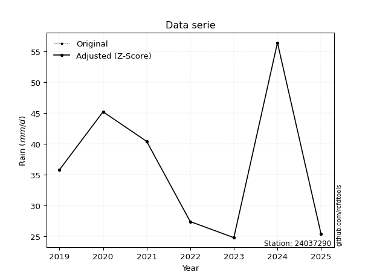</img>

</div>

> If Z-Score is active, values out of range or outliers are replaced with the station mean value.


### 4. Active continuous probability distributions from SciPy (45 of 104 available)

[scipy.stats](https://docs.scipy.org/doc/scipy/reference/stats.html) is a Python´s powerful submodule within the SciPy library for comprehensive statistical analysis, offering over 130 probability distributions (like Normal, Poisson), functions for descriptive stats (mean, variance), hypothesis testing (t-tests, chi-square), random variable generation, and statistical tests, making it essential for data science, modeling, and research. It provides tools to explore, model, and draw conclusions from data efficiently, working seamlessly with NumPy.

<div align="center">

|   id | p_dist             |   n_parameter | fit_method   | label                                                                       | active   | ref                                                                                                        |
|-----:|:-------------------|--------------:|:-------------|:----------------------------------------------------------------------------|:---------|:-----------------------------------------------------------------------------------------------------------|
|    0 | alpha              |             3 | MLE          | Alpha                                                                       | True     | [:mortar_board:](https://docs.scipy.org/doc/scipy/reference/generated/scipy.stats.alpha.html)              |
|    1 | betaprime          |             4 | MLE          | Beta prime                                                                  | True     | [:mortar_board:](https://docs.scipy.org/doc/scipy/reference/generated/scipy.stats.betaprime.html)          |
|    2 | chi2               |             3 | MLE          | Chi²                                                                        | True     | [:mortar_board:](https://docs.scipy.org/doc/scipy/reference/generated/scipy.stats.chi2.html)               |
|    3 | crystalball        |             4 | MLE          | Crystalball                                                                 | True     | [:mortar_board:](https://docs.scipy.org/doc/scipy/reference/generated/scipy.stats.crystalball.html)        |
|    4 | erlang             |             3 | MLE          | Erlang                                                                      | True     | [:mortar_board:](https://docs.scipy.org/doc/scipy/reference/generated/scipy.stats.erlang.html)             |
|    5 | expon              |             2 | MLE          | Exponential                                                                 | True     | [:mortar_board:](https://docs.scipy.org/doc/scipy/reference/generated/scipy.stats.expon.html)              |
|    6 | exponnorm          |             3 | MLE          | Exponentially modified Normal                                               | True     | [:mortar_board:](https://docs.scipy.org/doc/scipy/reference/generated/scipy.stats.exponnorm.html)          |
|    7 | f                  |             4 | MLE          | F                                                                           | True     | [:mortar_board:](https://docs.scipy.org/doc/scipy/reference/generated/scipy.stats.f.html)                  |
|    8 | fatiguelife        |             3 | MLE          | Fatigue-life (Birnbaum-Saunders)                                            | True     | [:mortar_board:](https://docs.scipy.org/doc/scipy/reference/generated/scipy.stats.fatiguelife.html)        |
|    9 | fisk               |             3 | MLE          | Fisk                                                                        | True     | [:mortar_board:](https://docs.scipy.org/doc/scipy/reference/generated/scipy.stats.fisk.html)               |
|   10 | gamma              |             3 | MLE          | Gamma                                                                       | True     | [:mortar_board:](https://docs.scipy.org/doc/scipy/reference/generated/scipy.stats.gamma.html)              |
|   11 | genexpon           |             5 | MLE          | Generalized exponential                                                     | True     | [:mortar_board:](https://docs.scipy.org/doc/scipy/reference/generated/scipy.stats.genexpon.html)           |
|   12 | genlogistic        |             3 | MLE          | Generalized logistic                                                        | True     | [:mortar_board:](https://docs.scipy.org/doc/scipy/reference/generated/scipy.stats.genlogistic.html)        |
|   13 | gibrat             |             2 | MM           | Gibrat                                                                      | True     | [:mortar_board:](https://docs.scipy.org/doc/scipy/reference/generated/scipy.stats.gibrat.html)             |
|   14 | gompertz           |             3 | MLE          | Gompertz (or truncated Gumbel)                                              | True     | [:mortar_board:](https://docs.scipy.org/doc/scipy/reference/generated/scipy.stats.gompertz.html)           |
|   15 | gumbel_l           |             2 | MM           | Gumbel Left Skew                                                            | True     | [:mortar_board:](https://docs.scipy.org/doc/scipy/reference/generated/scipy.stats.gumbel_l.html)           |
|   16 | gumbel_r           |             2 | MM           | Gumbel Right Skew                                                           | True     | [:mortar_board:](https://docs.scipy.org/doc/scipy/reference/generated/scipy.stats.gumbel_r.html)           |
|   17 | halflogistic       |             2 | MM           | Half-logistic                                                               | True     | [:mortar_board:](https://docs.scipy.org/doc/scipy/reference/generated/scipy.stats.halflogistic.html)       |
|   18 | halfnorm           |             2 | MM           | Half Normal                                                                 | True     | [:mortar_board:](https://docs.scipy.org/doc/scipy/reference/generated/scipy.stats.halfnorm.html)           |
|   19 | hypsecant          |             2 | MM           | hyperbolic secant                                                           | True     | [:mortar_board:](https://docs.scipy.org/doc/scipy/reference/generated/scipy.stats.hypsecant.html)          |
|   20 | invgamma           |             3 | MLE          | Inverted gamma                                                              | True     | [:mortar_board:](https://docs.scipy.org/doc/scipy/reference/generated/scipy.stats.invgamma.html)           |
|   21 | invgauss           |             3 | MLE          | Inverse Gaussian                                                            | True     | [:mortar_board:](https://docs.scipy.org/doc/scipy/reference/generated/scipy.stats.invgauss.html)           |
|   22 | invweibull         |             3 | MLE          | Inverted Weibull                                                            | True     | [:mortar_board:](https://docs.scipy.org/doc/scipy/reference/generated/scipy.stats.invweibull.html)         |
|   23 | johnsonsu          |             4 | MLE          | Johnson Su                                                                  | True     | [:mortar_board:](https://docs.scipy.org/doc/scipy/reference/generated/scipy.stats.johnsonsu.html)          |
|   24 | kstwobign          |             2 | MLE          | Limiting distribution of scaled Kolmogorov-Smirnov two-sided test statistic | True     | [:mortar_board:](https://docs.scipy.org/doc/scipy/reference/generated/scipy.stats.kstwobign.html)          |
|   25 | laplace            |             2 | MM           | Laplace                                                                     | True     | [:mortar_board:](https://docs.scipy.org/doc/scipy/reference/generated/scipy.stats.laplace.html)            |
|   26 | laplace_asymmetric |             3 | MLE          | Asymmetric Laplace                                                          | True     | [:mortar_board:](https://docs.scipy.org/doc/scipy/reference/generated/scipy.stats.laplace_asymmetric.html) |
|   27 | loggamma           |             3 | MLE          | Log gamma                                                                   | True     | [:mortar_board:](https://docs.scipy.org/doc/scipy/reference/generated/scipy.stats.loggamma.html)           |
|   28 | logistic           |             2 | MM           | Logistic (or Sech-squared)                                                  | True     | [:mortar_board:](https://docs.scipy.org/doc/scipy/reference/generated/scipy.stats.logistic.html)           |
|   29 | lognorm            |             3 | MLE          | Log Normal                                                                  | True     | [:mortar_board:](https://docs.scipy.org/doc/scipy/reference/generated/scipy.stats.lognorm.html)            |
|   30 | maxwell            |             2 | MM           | Maxwell                                                                     | True     | [:mortar_board:](https://docs.scipy.org/doc/scipy/reference/generated/scipy.stats.maxwell.html)            |
|   31 | mielke             |             4 | MLE          | Mielke Beta-Kappa / Dagum                                                   | True     | [:mortar_board:](https://docs.scipy.org/doc/scipy/reference/generated/scipy.stats.mielke.html)             |
|   32 | moyal              |             2 | MM           | Moyal                                                                       | True     | [:mortar_board:](https://docs.scipy.org/doc/scipy/reference/generated/scipy.stats.moyal.html)              |
|   33 | nakagami           |             3 | MLE          | Nakagami                                                                    | True     | [:mortar_board:](https://docs.scipy.org/doc/scipy/reference/generated/scipy.stats.nakagami.html)           |
|   34 | ncf                |             5 | MLE          | Non-central F distribution                                                  | True     | [:mortar_board:](https://docs.scipy.org/doc/scipy/reference/generated/scipy.stats.ncf.html)                |
|   35 | nct                |             4 | MLE          | Non-central Student’s t                                                     | True     | [:mortar_board:](https://docs.scipy.org/doc/scipy/reference/generated/scipy.stats.nct.html)                |
|   36 | norm               |             2 | MM           | Normal                                                                      | True     | [:mortar_board:](https://docs.scipy.org/doc/scipy/reference/generated/scipy.stats.norm.html)               |
|   37 | pareto             |             3 | MLE          | Pareto                                                                      | True     | [:mortar_board:](https://docs.scipy.org/doc/scipy/reference/generated/scipy.stats.pareto.html)             |
|   38 | pearson3           |             3 | MM           | Pearson type III                                                            | True     | [:mortar_board:](https://docs.scipy.org/doc/scipy/reference/generated/scipy.stats.pearson3.html)           |
|   39 | rayleigh           |             2 | MM           | Rayleigh                                                                    | True     | [:mortar_board:](https://docs.scipy.org/doc/scipy/reference/generated/scipy.stats.rayleigh.html)           |
|   40 | rice               |             3 | MLE          | Rice                                                                        | True     | [:mortar_board:](https://docs.scipy.org/doc/scipy/reference/generated/scipy.stats.rice.html)               |
|   41 | t                  |             3 | MLE          | Student’s t                                                                 | True     | [:mortar_board:](https://docs.scipy.org/doc/scipy/reference/generated/scipy.stats.t.html)                  |
|   42 | truncnorm          |             4 | MLE          | Truncated normal                                                            | True     | [:mortar_board:](https://docs.scipy.org/doc/scipy/reference/generated/scipy.stats.truncnorm.html)          |
|   43 | wald               |             2 | MM           | Wald                                                                        | True     | [:mortar_board:](https://docs.scipy.org/doc/scipy/reference/generated/scipy.stats.wald.html)               |
|   44 | weibull_min        |             3 | MLE          | Weibull minimum                                                             | True     | [:mortar_board:](https://docs.scipy.org/doc/scipy/reference/generated/scipy.stats.weibull_min.html)        |

</div>

> **n_parameter:** # arguments & localization & scale.
>
> **Fit methods:** (MLE) maximum likelihood, (MM) L-moments.
>
>**Inactive:** foldnorm, gennorm, norminvgauss, powernorm, powerlognorm, skewnorm, genextreme, anglit, arcsine, argus, beta, bradford, burr, burr12, cauchy, cosine, halfcauchy, foldcauchy, skewcauchy, wrapcauchy, dgamma, gengamma, exponweib, exponpow, truncexpon, gausshyper, genhalflogistic, genhyperbolic, geninvgauss, halfgennorm, johnsonsb, kappa4, kappa3, ksone, kstwo, loglaplace, levy, levy_l, levy_stable, ncx2, genpareto, truncpareto, lomax, powerlaw, rdist, rel_breitwigner, recipinvgauss, semicircular, studentized_range, trapezoid, triang, truncweibull_min, tukeylambda, uniform, loguniform, vonmises, vonmises_line, weibull_max, dweibull, 


## B. Probability distributions vs. Empirical distributions

A continuous probability distribution (CPD) describes probabilities for variables that can take any value within a range (like rain any time), unlike discrete variables with specific outcomes (like temperature). It uses a Probability Density Function (PDF), a curve where the total area under it equals 1, and the probability of the variable falling within an interval (a to b) is found by calculating the area under the curve between those points. A key feature is that the probability of hitting any single exact value is zero, so probabilities are always expressed for ranges, e.g., $P(a ≤ X ≤ b)$.

<div align="center">

Distributions parameters
|    |   station | p_dist                |   n |             loc |          scale | shape                 | shape1              | shape2                | shape3   |
|---:|----------:|:----------------------|----:|----------------:|---------------:|:----------------------|:--------------------|:----------------------|:---------|
|  0 |  24037290 | alpha                 |   7 |  -130.463       | 2208.82        | 13.40526681071367     |                     |                       |          |
|  1 |  24037290 | betaprime             |   7 |    -7.98058     |  837.159       | 12.236030524854499    | 237.8924984376941   |                       |          |
|  2 |  24037290 | chi2                  |   7 |     3.4749      |    2.66437     | 11.928629684082193    |                     |                       |          |
|  3 |  24037290 | crystalball           |   7 |    35.2571      |   12.4463      | 3894.5146960512348    | 2.14685077740268    |                       |          |
|  4 |  24037290 | erlang                |   7 |    -3.50873     |    4.20694     | 9.207630857007604     |                     |                       |          |
|  5 |  24037290 | expon                 |   7 |    16.8         |   18.4571      |                       |                     |                       |          |
|  6 |  24037290 | exponnorm             |   7 |    32.6186      |   12.1644      | 0.21690714468815003   |                     |                       |          |
|  7 |  24037290 | f                     |   7 |    -3.55389     |   38.7424      | 18.82509983679747     | 1077.9498738100615  |                       |          |
|  8 |  24037290 | fatiguelife           |   7 |    16.8         |    2.27449e-05 | 817.4820142343128     |                     |                       |          |
|  9 |  24037290 | fisk                  |   7 |   -29.7772      |   64.0234      | 8.626946785777365     |                     |                       |          |
| 10 |  24037290 | gamma                 |   7 |    -3.8591      |    4.12799     | 9.459553746571068     |                     |                       |          |
| 11 |  24037290 | genexpon              |   7 |    16.8         |    2.33233     | 0.057726904731520035  | 0.13459739487610273 | 0.13607945378871983   |          |
| 12 |  24037290 | genlogistic           |   7 |   -27.3277      |   10.8578      | 182.40419474387159    |                     |                       |          |
| 13 |  24037290 | gibrat                |   7 |    25.7622      |    5.759       |                       |                     |                       |          |
| 14 |  24037290 | gompertz              |   7 |    16.8         |    4.11648     | 0.0004295158554366835 |                     |                       |          |
| 15 |  24037290 | gumbel_l              |   7 |    40.8587      |    9.70436     |                       |                     |                       |          |
| 16 |  24037290 | gumbel_r              |   7 |    29.6556      |    9.70436     |                       |                     |                       |          |
| 17 |  24037290 | halflogistic          |   7 |    20.5054      |   10.6412      |                       |                     |                       |          |
| 18 |  24037290 | halfnorm              |   7 |    18.7831      |   20.6471      |                       |                     |                       |          |
| 19 |  24037290 | hypsecant             |   7 |    35.2571      |    7.92358     |                       |                     |                       |          |
| 20 |  24037290 | invgamma              |   7 |   -69.8412      | 7402.04        | 71.42483889149992     |                     |                       |          |
| 21 |  24037290 | invgauss              |   7 |   -24.1317      | 1288.68        | 0.046059960112659074  |                     |                       |          |
| 22 |  24037290 | invweibull            |   7 |    16.8         |    1.30539     | 0.04912232513898443   |                     |                       |          |
| 23 |  24037290 | johnsonsu             |   7 |   -36.4251      |    8.85196     | -15.97076130386845    | 5.757944233809031   |                       |          |
| 24 |  24037290 | kstwobign             |   7 |    -8.87407     |   50.4781      |                       |                     |                       |          |
| 25 |  24037290 | laplace               |   7 |    35.2571      |    8.80088     |                       |                     |                       |          |
| 26 |  24037290 | laplace_asymmetric    |   7 |    35.8         |   10.4179      | 1.0264045170396425    |                     |                       |          |
| 27 |  24037290 | loggamma              |   7 | -2635.84        |  388.967       | 960.5527680771295     |                     |                       |          |
| 28 |  24037290 | logistic              |   7 |    35.2571      |    6.86202     |                       |                     |                       |          |
| 29 |  24037290 | lognorm               |   7 |    16.8         |    0.106157    | 12.677564582148745    |                     |                       |          |
| 30 |  24037290 | maxwell               |   7 |     5.76458     |   18.4817      |                       |                     |                       |          |
| 31 |  24037290 | mielke                |   7 |    -0.201752    |   45.9272      | 2.6393329443500746    | 7.9734737505299424  |                       |          |
| 32 |  24037290 | moyal                 |   7 |    28.1395      |    5.60281     |                       |                     |                       |          |
| 33 |  24037290 | nakagami              |   7 |    24.8         |   16.5541      | 0.06752443881964008   |                     |                       |          |
| 34 |  24037290 | ncf                   |   7 |    -0.0493437   |    0.000474773 | 0.0004970221580958659 | 104.3156992430653   | 36.295583213872085    |          |
| 35 |  24037290 | nct                   |   7 |    -3.51417     |   12.192       | 149.2436302446883     | 3.1592909257499056  |                       |          |
| 36 |  24037290 | norm                  |   7 |    35.2571      |   12.4463      |                       |                     |                       |          |
| 37 |  24037290 | pareto                |   7 |    16.782       |    0.0180322   | 0.16798036249036036   |                     |                       |          |
| 38 |  24037290 | pearson3              |   7 |    35.2571      |   12.4464      | 0.19661957060493224   |                     |                       |          |
| 39 |  24037290 | rayleigh              |   7 |    11.4466      |   18.9981      |                       |                     |                       |          |
| 40 |  24037290 | rice                  |   7 |    11.2733      |   15.6239      | 0.99550945275044      |                     |                       |          |
| 41 |  24037290 | t                     |   7 |    35.2571      |   12.4462      | 103899561.0945468     |                     |                       |          |
| 42 |  24037290 | truncnorm             |   7 |    35.2571      |   12.4463      | -341.35036814035544   | 1071.3086196088225  |                       |          |
| 43 |  24037290 | wald                  |   7 |    22.8108      |   12.4463      |                       |                     |                       |          |
| 44 |  24037290 | weibull_min           |   7 |    13.1599      |   24.7709      | 1.7935333340424888    |                     |                       |          |
| 45 |  24037290 | logalpha              |   7 |    -6.64732     |  266.331       | 26.30396630165929     |                     |                       |          |
| 46 |  24037290 | logbetaprime          |   7 |    -6.63365     |  130.083       | 758.7516148272209     | 9745.190045427767   |                       |          |
| 47 |  24037290 | logchi2               |   7 |     2.82138     |    0.954906    | 1.084984714540353     |                     |                       |          |
| 48 |  24037290 | logcrystalball        |   7 |     3.49473     |    0.37905     | 242.86031392359558    | 1106.9705611096142  |                       |          |
| 49 |  24037290 | logerlang             |   7 |    -2.65729     |    0.024392    | 252.0922807474284     |                     |                       |          |
| 50 |  24037290 | logexpon              |   7 |     2.82138     |    0.673351    |                       |                     |                       |          |
| 51 |  24037290 | logexponnorm          |   7 |     3.49438     |    0.379048    | 0.0009191575900197228 |                     |                       |          |
| 52 |  24037290 | logf                  |   7 |  -219.607       |  223.101       | 1635152.6591009772    | 1196633.25674735    |                       |          |
| 53 |  24037290 | logfatiguelife        |   7 |  -113.144       |  116.638       | 0.003245358512236597  |                     |                       |          |
| 54 |  24037290 | logfisk               |   7 |    -7.2859e+06  |    7.28591e+06 | 32411140.817088634    |                     |                       |          |
| 55 |  24037290 | loggamma              |   7 |    -2.89315     |    0.0230595   | 276.88044863031087    |                     |                       |          |
| 56 |  24037290 | loggenexpon           |   7 |     2.82138     |    0.0330096   | 0.018972557285557412  | 4.2558376179759225  | 0.0005275861443463964 |          |
| 57 |  24037290 | loggenlogistic        |   7 |     3.82509     |    0.125189    | 0.32697845415048604   |                     |                       |          |
| 58 |  24037290 | loggibrat             |   7 |     3.20557     |    0.175386    |                       |                     |                       |          |
| 59 |  24037290 | loggompertz           |   7 |     2.82138     |    0.970858    | 0.9504115050261167    |                     |                       |          |
| 60 |  24037290 | loggumbel_l           |   7 |     3.66532     |    0.295544    |                       |                     |                       |          |
| 61 |  24037290 | loggumbel_r           |   7 |     3.32414     |    0.295544    |                       |                     |                       |          |
| 62 |  24037290 | loghalflogistic       |   7 |     3.04545     |    0.324089    |                       |                     |                       |          |
| 63 |  24037290 | loghalfnorm           |   7 |     2.99304     |    0.628774    |                       |                     |                       |          |
| 64 |  24037290 | loghypsecant          |   7 |     3.49473     |    0.241311    |                       |                     |                       |          |
| 65 |  24037290 | loginvgamma           |   7 |    -3.62704     | 2426.98        | 342.0220456441066     |                     |                       |          |
| 66 |  24037290 | loginvgauss           |   7 |     0.290374    |  213.926       | 0.01496090172925816   |                     |                       |          |
| 67 |  24037290 | loginvweibull         |   7 |    -3.20914e+07 |    3.20914e+07 | 84728852.49182302     |                     |                       |          |
| 68 |  24037290 | logjohnsonsu          |   7 |     4.77165     |    0.112833    | 10.23598012399528     | 3.327089892685507   |                       |          |
| 69 |  24037290 | logkstwobign          |   7 |     1.96533     |    1.74753     |                       |                     |                       |          |
| 70 |  24037290 | loglaplace            |   7 |     3.49473     |    0.268029    |                       |                     |                       |          |
| 71 |  24037290 | loglaplace_asymmetric |   7 |     3.69883     |    0.278233    | 1.4319211829738836    |                     |                       |          |
| 72 |  24037290 | logloggamma           |   7 |     3.40897     |    0.436462    | 1.6848864347048202    |                     |                       |          |
| 73 |  24037290 | loglogistic           |   7 |     3.49473     |    0.208981    |                       |                     |                       |          |
| 74 |  24037290 | loglognorm            |   7 |     2.82138     |    0.00489481  | 12.265544313792907    |                     |                       |          |
| 75 |  24037290 | logmaxwell            |   7 |     2.59654     |    0.562856    |                       |                     |                       |          |
| 76 |  24037290 | logmielke             |   7 |     2.82138     |    1.295       | 0.7783840796963756    | 52.20875759027362   |                       |          |
| 77 |  24037290 | logmoyal              |   7 |     3.27796     |    0.170632    |                       |                     |                       |          |
| 78 |  24037290 | lognakagami           |   7 |     3.21084     |    0.35887     | 0.35351066472237364   |                     |                       |          |
| 79 |  24037290 | logncf                |   7 |   -83.9469      |   78.2468      | 153251.0568871993     | 334663.0323402983   | 18007.31897259187     |          |
| 80 |  24037290 | lognct                |   7 |   -10.6946      |    0.352653    | 4708.344675686805     | 40.229270691200355  |                       |          |
| 81 |  24037290 | lognorm               |   7 |     3.49473     |    0.37905     |                       |                     |                       |          |
| 82 |  24037290 | logpareto             |   7 |     2.82068     |    0.000701181 | 0.16788116836281047   |                     |                       |          |
| 83 |  24037290 | logpearson3           |   7 |     3.49473     |    0.37905     | -0.3624904007915438   |                     |                       |          |
| 84 |  24037290 | lograyleigh           |   7 |     2.76959     |    0.578582    |                       |                     |                       |          |
| 85 |  24037290 | logrice               |   7 |     2.60169     |    0.419099    | 1.8326469792030857    |                     |                       |          |
| 86 |  24037290 | logt                  |   7 |     3.49474     |    0.379053    | 45668991.27619438     |                     |                       |          |
| 87 |  24037290 | logtruncnorm          |   7 |    -0.134105    |    1.15134     | 2.9052577663448096    | 3.6189057668003866  |                       |          |
| 88 |  24037290 | logwald               |   7 |     3.11568     |    0.37905     |                       |                     |                       |          |
| 89 |  24037290 | logweibull_min        |   7 |     1.05622     |    2.59793     | 7.760143188811117     |                     |                       |          |

</div>

> **loc** (Location parameter): This shifts the distribution along the x-axis. For many common distributions, like the normal (Gaussian) distribution, loc represents the mean $μ$. For others, like the uniform distribution, it might represent the minimum value, or for the beta distribution, the left end of the support interval.
>
> **scale** (Scale parameter): This determines the width or spread of the distribution. For the normal distribution, scale represents the standard deviation $σ$. For a uniform distribution, it defines the length of the interval (from $loc$ to $loc + scale$).
>
> **shape** (Shape parameters): Refers to parameters that define the specific form of a probability distribution, distinct from its location (loc) and scale (scale). These parameters are required arguments for most distribution functions. For example, a normal (Gaussian) distribution is fully defined by its location (mean) and scale (standard deviation), so it has no specific shape parameters beyond loc and scale. However, other distributions have intrinsic properties that need specification, as Gamma distribution that takes a shape parameter, often named $a$ or $alpha$.


### 0. Cumulative distribution values - CDF (90 evaluated)

> Ordered by x ascending and calculating $log(f(x))$ separately. 

|   id |   Station |   date |    x |   count |    mean |     std |     zscore |   Value_initial |   station |   m |     alpha |   alpha_pdf |   betaprime |   betaprime_pdf |     chi2 |   chi2_pdf |   crystalball |   crystalball_pdf |    erlang |   erlang_pdf |    expon |   expon_pdf |   exponnorm |   exponnorm_pdf |         f |     f_pdf |   fatiguelife |   fatiguelife_pdf |      fisk |   fisk_pdf |     gamma |   gamma_pdf |    genexpon |   genexpon_pdf |   genlogistic |   genlogistic_pdf |   gibrat |   gibrat_pdf |    gompertz |   gompertz_pdf |   gumbel_l |   gumbel_l_pdf |   gumbel_r |   gumbel_r_pdf |   halflogistic |   halflogistic_pdf |   halfnorm |   halfnorm_pdf |   hypsecant |   hypsecant_pdf |   invgamma |   invgamma_pdf |   invgauss |   invgauss_pdf |   invweibull |   invweibull_pdf |   johnsonsu |   johnsonsu_pdf |   kstwobign |   kstwobign_pdf |   laplace |   laplace_pdf |   laplace_asymmetric |   laplace_asymmetric_pdf |   loggamma |   loggamma_pdf |   logistic |   logistic_pdf |   lognorm |   lognorm_pdf |   maxwell |   maxwell_pdf |    mielke |   mielke_pdf |     moyal |   moyal_pdf |   nakagami |   nakagami_pdf |       ncf |    ncf_pdf |       nct |    nct_pdf |      norm |   norm_pdf |   pareto |   pareto_pdf |   pearson3 |   pearson3_pdf |   rayleigh |   rayleigh_pdf |      rice |   rice_pdf |         t |      t_pdf |   truncnorm |   truncnorm_pdf |      wald |   wald_pdf |   weibull_min |   weibull_min_pdf |   logalpha |   logalpha_pdf |   logbetaprime |   logbetaprime_pdf |     logchi2 |   logchi2_pdf |   logcrystalball |   logcrystalball_pdf |   logerlang |   logerlang_pdf |   logexpon |   logexpon_pdf |   logexponnorm |   logexponnorm_pdf |      logf |   logf_pdf |   logfatiguelife |   logfatiguelife_pdf |   logfisk |   logfisk_pdf |   loggenexpon |   loggenexpon_pdf |   loggenlogistic |   loggenlogistic_pdf |   loggibrat |   loggibrat_pdf |   loggompertz |   loggompertz_pdf |   loggumbel_l |   loggumbel_l_pdf |   loggumbel_r |   loggumbel_r_pdf |   loghalflogistic |   loghalflogistic_pdf |   loghalfnorm |   loghalfnorm_pdf |   loghypsecant |   loghypsecant_pdf |   loginvgamma |   loginvgamma_pdf |   loginvgauss |   loginvgauss_pdf |   loginvweibull |   loginvweibull_pdf |   logjohnsonsu |   logjohnsonsu_pdf |   logkstwobign |   logkstwobign_pdf |   loglaplace |   loglaplace_pdf |   loglaplace_asymmetric |   loglaplace_asymmetric_pdf |   logloggamma |   logloggamma_pdf |   loglogistic |   loglogistic_pdf |   loglognorm |   loglognorm_pdf |   logmaxwell |   logmaxwell_pdf |   logmielke |   logmielke_pdf |    logmoyal |   logmoyal_pdf |   lognakagami |   lognakagami_pdf |    logncf |   logncf_pdf |    lognct |   lognct_pdf |   logpareto |   logpareto_pdf |   logpearson3 |   logpearson3_pdf |   lograyleigh |   lograyleigh_pdf |   logrice |   logrice_pdf |     logt |   logt_pdf |   logtruncnorm |   logtruncnorm_pdf |   logwald |   logwald_pdf |   logweibull_min |   logweibull_min_pdf |
|-----:|----------:|-------:|-----:|--------:|--------:|--------:|-----------:|----------------:|----------:|----:|----------:|------------:|------------:|----------------:|---------:|-----------:|--------------:|------------------:|----------:|-------------:|---------:|------------:|------------:|----------------:|----------:|----------:|--------------:|------------------:|----------:|-----------:|----------:|------------:|------------:|---------------:|--------------:|------------------:|---------:|-------------:|------------:|---------------:|-----------:|---------------:|-----------:|---------------:|---------------:|-------------------:|-----------:|---------------:|------------:|----------------:|-----------:|---------------:|-----------:|---------------:|-------------:|-----------------:|------------:|----------------:|------------:|----------------:|----------:|--------------:|---------------------:|-------------------------:|-----------:|---------------:|-----------:|---------------:|----------:|--------------:|----------:|--------------:|----------:|-------------:|----------:|------------:|-----------:|---------------:|----------:|-----------:|----------:|-----------:|----------:|-----------:|---------:|-------------:|-----------:|---------------:|-----------:|---------------:|----------:|-----------:|----------:|-----------:|------------:|----------------:|----------:|-----------:|--------------:|------------------:|-----------:|---------------:|---------------:|-------------------:|------------:|--------------:|-----------------:|---------------------:|------------:|----------------:|-----------:|---------------:|---------------:|-------------------:|----------:|-----------:|-----------------:|---------------------:|----------:|--------------:|--------------:|------------------:|-----------------:|---------------------:|------------:|----------------:|--------------:|------------------:|--------------:|------------------:|--------------:|------------------:|------------------:|----------------------:|--------------:|------------------:|---------------:|-------------------:|--------------:|------------------:|--------------:|------------------:|----------------:|--------------------:|---------------:|-------------------:|---------------:|-------------------:|-------------:|-----------------:|------------------------:|----------------------------:|--------------:|------------------:|--------------:|------------------:|-------------:|-----------------:|-------------:|-----------------:|------------:|----------------:|------------:|---------------:|--------------:|------------------:|----------:|-------------:|----------:|-------------:|------------:|----------------:|--------------:|------------------:|--------------:|------------------:|----------:|--------------:|---------:|-----------:|---------------:|-------------------:|----------:|--------------:|-----------------:|---------------------:|
|    0 |  24037290 |   2025 | 16.8 |       7 | 35.2571 | 13.4436 | -1.37293   |            16.8 |  24037290 |   1 | 0.0554898 |  0.0114098  |   0.0499296 |      0.0120288  | 0.043619 | 0.0129006  |     0.0690453 |        0.0106743  | 0.0490492 |   0.0123469  | 0        |  0.0541796  |    0.06852  |      0.0106919  | 0.0482668 | 0.0122604 |      0.04061  |       6.79414e+09 | 0.0603949 | 0.0105106  | 0.0487557 |  0.0122774  | 2.01971e-09 |     0.0247507  |     0.0447485 |        0.0126952  | 0        |   0          | 2.99137e-09 |    0.000104341 |  0.0803974 |     0.00794234 |  0.0232567 |     0.00901371 |       0        |         0          |   0        |     0          |   0.0617832 |      0.00774852 |  0.0549165 |     0.0115103  |  0.0499115 |     0.0119992  |   0.00555152 |      3.98663e+11 |   0.0535758 |      0.0116273  |   0.0418363 |      0.0139128  | 0.0614003 |    0.00697661 |            0.0867875 |               0.00811631 |  0.0365976 |       0.224963 |  0.0635807 |     0.00867648 |  0.037832 |      0.217255 |  0.050931 |    0.0128787  | 0.0725897 |   0.0112647  | 0.0059421 |  0.00445313 | 0          |    0           | 0.0477358 | 0.0121164  | 0.0682464 | 0.0108205  | 0.0690453 | 0.0106743  | 0        |   9.31559    |  0.0631778 |     0.011073   |  0.0389241 |     0.0142551  | 0.0375184 | 0.013362   | 0.0690442 | 0.0106742  |   0.0690453 |      0.0106743  | 0         | 0          |     0.0315755 |        0.0153094  |  0.0341115 |       0.224739 |      0.0362384 |           0.218758 | 3.71839e-09 |   4.54232e+06 |         0.037832 |             0.217255 |   0.0377831 |        0.229465 |   0        |       1.48511  |      0.0378316 |           0.217255 | 0.0378276 |   0.21763  |        0.0375426 |             0.217447 | 0.0438133 |      0.186363 |   1.26709e-06 |          0.574763 |         0.07268  |             0.189769 | 0           |        0        |   1.20686e-08 |          0.97894  |     0.0559004 |          0.183756 |    0.00416878 |         0.0772997 |          0        |              0        |      0        |          0        |      0.0390377 |           0.161368 |     0.0346618 |          0.227013 |     0.0310241 |          0.22799  |       0.0291957 |            0.272392 |      0.0600252 |           0.202947 |      0.0299377 |           0.324625 |    0.0405434 |         0.151265 |               0.0743012 |                    0.186495 |     0.0577144 |          0.201779 |     0.0383437 |          0.176444 |   0.00717466 |      3.65621e+12 |    0.0161637 |         0.208851 | 1.09013e-07 |       57.7088   | 0.000138339 |     0.00625053 |   0           |          0        | 0.0378742 |     0.218399 | 0.0382443 |     0.220515 |    0        |     239.426     |     0.0470545 |          0.215452 |    0.00399872 |          0.154101 | 0.0267446 |      0.253015 | 0.037831 |   0.217249 |     0          |           0        |  0        |      0        |        0.0486098 |             0.208423 |
|    1 |  24037290 |   2023 | 24.8 |       7 | 35.2571 | 13.4436 | -0.777855  |            24.8 |  24037290 |   2 | 0.205831  |  0.026096   |   0.211092  |      0.0276616  | 0.219855 | 0.0296772  |     0.200404  |        0.0225208  | 0.214309  |   0.0281543  | 0.351723 |  0.0351234  |    0.200453 |      0.0226419  | 0.213308  | 0.0281905 |      0.76592  |       0.0139036   | 0.201468  | 0.0254299  | 0.213721  |  0.0281828  | 0.252316    |     0.0345987  |     0.224561  |        0.0307646  | 0        |   0          | 0.0025663   |    0.000726694 |  0.173977  |     0.016269   |  0.192183  |     0.0326625  |       0.199098 |         0.0451248  |   0.229265 |     0.0370374  |   0.166223  |      0.0200377  |  0.206657  |     0.0262724  |  0.21178   |     0.0278733  |   0.400599   |      0.00225021  |   0.207704  |      0.026652   |   0.234935  |      0.031705   | 0.152386  |    0.0173148  |            0.18339   |               0.0171506  |  0.234976  |       0.82517  |  0.178886  |     0.0214056  |  0.226946 |      0.795084 |  0.213459 |    0.0269454  | 0.200369  |   0.0209877  | 0.177918  |  0.0387103  | 0.00661176 |    2.51332e+11 | 0.212317  | 0.028279   | 0.202327  | 0.0230245  | 0.200404  | 0.0225208  | 0.640925 |   0.00752273 |  0.20285   |     0.0240256  |  0.218876  |     0.0288997  | 0.207511  | 0.0277227  | 0.200403  | 0.0225209  |   0.200404  |      0.0225208  | 0.0315285 | 0.0551214  |     0.227464  |        0.0307199  |  0.238138  |       0.848328 |      0.229676  |           0.81108  | 0.443066    |   0.539731    |         0.226946 |             0.795084 |   0.237117  |        0.82262  |   0.439204 |       0.832844 |      0.226946  |           0.795087 | 0.227208  |   0.795581 |        0.227583  |             0.799368 | 0.20579   |      0.72706  |   0.316008    |          0.940361 |         0.200537 |             0.519934 | 0.000229405 |        0.16325  |   0.374419    |          0.914659 |     0.193345  |          0.586435 |    0.230576   |         1.14465   |          0.249775 |              1.44654  |      0.27095  |          1.19506  |      0.190428  |           0.742903 |     0.239649  |          0.850525 |     0.245296  |          0.88322  |       0.282595  |            0.942898 |      0.207548  |           0.608518 |      0.31004   |           0.960183 |    0.173373  |         0.646844 |               0.197488  |                    0.495693 |     0.207388  |          0.623734 |     0.204496  |          0.77843  |   0.639387   |      0.0783624   |    0.244874  |         0.930797 | 0.392497    |        0.784445 | 0.223468    |     1.35664    |   3.66027e-11 |      29137        | 0.22784   |     0.797186 | 0.22916   |     0.798204 |    0.653984 |       0.148884  |     0.218486  |          0.714421 |    0.252351   |          0.985511 | 0.238443  |      0.839866 | 0.22694  |   0.795064 |     1.6728e-07 |           3.01855  |  0.113795 |      2.73783  |        0.208731  |             0.6672   |
|    2 |  24037290 |   2022 | 27.4 |       7 | 35.2571 | 13.4436 | -0.584454  |            27.4 |  24037290 |   3 | 0.278713  |  0.0297693  |   0.287564  |      0.030914   | 0.300758 | 0.0322516  |     0.263928  |        0.0262623  | 0.291828  |   0.0312139  | 0.436903 |  0.0305084  |    0.264312 |      0.0263959  | 0.290957  | 0.0312752 |      0.798166 |       0.0110886   | 0.273755  | 0.0299971  | 0.291384  |  0.031296   | 0.341556    |     0.0338227  |     0.308333  |        0.033304   | 0.104308 |   0.110491   | 0.00519717  |    0.00136304  |  0.221088  |     0.0200546  |  0.283181  |     0.0368165  |       0.313084 |         0.0423816  |   0.32357  |     0.0354209  |   0.226152  |      0.0262003  |  0.279909  |     0.0298708  |  0.28885   |     0.0311529  |   0.405662   |      0.00169612  |   0.281865  |      0.0301771  |   0.319927  |      0.0333215  | 0.20476   |    0.0232659  |            0.233871  |               0.0218714  |  0.324095  |       0.954994 |  0.2414    |     0.0266869  |  0.313513 |      0.93528  |  0.287511 |    0.0298171  | 0.259357  |   0.0243796  | 0.28542   |  0.0429911  | 0.672502   |    0.0348766   | 0.290314  | 0.0314477  | 0.267204  | 0.0267859  | 0.263928  | 0.0262623  | 0.657473 |   0.00541888 |  0.270307  |     0.0277365  |  0.297128  |     0.0310678  | 0.283181  | 0.030288   | 0.263927  | 0.0262624  |   0.263928  |      0.0262623  | 0.238636  | 0.0833931  |     0.309609  |        0.0322163  |  0.329312  |       0.971879 |      0.317624  |           0.946141 | 0.49278     |   0.461549    |         0.313513 |             0.935281 |   0.325803  |        0.948929 |   0.516383 |       0.718224 |      0.313513  |           0.935285 | 0.313796  |   0.935181 |        0.314577  |             0.939396 | 0.287618  |      0.911464 |   0.409655    |          0.932046 |         0.259432 |             0.666669 | 0.303886    |        3.33133  |   0.463448    |          0.869332 |     0.25997   |          0.753854 |    0.350964   |         1.24342   |          0.387613 |              1.31099  |      0.386407 |          1.11706  |      0.277688  |           1.01024  |     0.33103   |          0.973836 |     0.339362  |          0.993457 |       0.378603  |            0.970879 |      0.275603  |           0.758366 |      0.406     |           0.954929 |    0.251493  |         0.938308 |               0.253642  |                    0.636637 |     0.277229  |          0.778687 |     0.292897  |          0.991038 |   0.64632    |      0.0619679   |    0.342689  |         1.02028  | 0.468691    |        0.745806 | 0.363375    |     1.406      |   0.312044    |          2.16865  | 0.314557  |     0.936078 | 0.315878  |     0.934994 |    0.666954 |       0.114138  |     0.297233  |          0.862821 |    0.354084   |          1.04378  | 0.32818   |      0.953069 | 0.313504 |   0.935261 |     0.265765   |           2.33836  |  0.377226 |      2.26947  |        0.282919  |             0.82092  |
|    3 |  24037290 |   2019 | 35.8 |       7 | 35.2571 | 13.4436 |  0.0403804 |            35.8 |  24037290 |   4 | 0.547852  |  0.0316473  |   0.557639  |      0.0308242  | 0.57075  | 0.0296971  |     0.517395  |        0.0320225  | 0.561448  |   0.0304883  | 0.642783 |  0.0193539  |    0.518597 |      0.0320491  | 0.561078  | 0.0305265 |      0.868224 |       0.00628273  | 0.551533  | 0.0325391  | 0.562105  |  0.0306325  | 0.595084    |     0.0256773  |     0.580576  |        0.0290306  | 0.710758 |   0.0340595  | 0.0420622   |    0.0101      |  0.447754  |     0.0337892  |  0.588067  |     0.0321725  |       0.616075 |         0.0291534  |   0.59016  |     0.0275157  |   0.521791  |      0.0400784  |  0.548588  |     0.0314647  |  0.560205  |     0.0308362  |   0.416138   |      0.000943263 |   0.551171  |      0.0313083  |   0.586256  |      0.0282178  | 0.529909  |    0.0534141  |            0.513028  |               0.047978   |  0.596417  |       1.0001   |  0.519767  |     0.0363755  |  0.586887 |      1.02742  |  0.549668 |    0.0304422  | 0.503065  |   0.0322523  | 0.613711  |  0.031643   | 0.815686   |    0.00973838  | 0.5619    | 0.0306206  | 0.523458  | 0.0320362  | 0.517395  | 0.0320225  | 0.689418 |   0.00274327 |  0.530418  |     0.0318602  |  0.560281  |     0.0296699  | 0.546916  | 0.0305362  | 0.517395  | 0.0320227  |   0.517395  |      0.0320225  | 0.684948  | 0.0300374  |     0.573021  |        0.0287857  |  0.601652  |       0.983037 |      0.590422  |           1.01211  | 0.596675    |   0.32867     |         0.586887 |             1.02742  |   0.595805  |        0.990915 |   0.674889 |       0.482826 |      0.586888  |           1.02742  | 0.586889  |   1.02562  |        0.588546  |             1.02711  | 0.570174  |      1.09021  |   0.640207    |          0.764337 |         0.502564 |             1.15257  | 0.774254    |        0.806903 |   0.674174    |          0.695311 |     0.524817  |          1.19631  |    0.654637   |         0.938448  |          0.675906 |              0.837968 |      0.647749 |          0.823268 |      0.607659  |           1.24436  |     0.603791  |          0.984067 |     0.610553  |          0.955603 |       0.619138  |            0.783704 |      0.529538  |           1.10396  |      0.637965  |           0.750766 |    0.633453  |         1.36757  |               0.496263  |                    1.24561  |     0.53631   |          1.11343  |     0.598257  |          1.15008  |   0.659448   |      0.0395095   |    0.614532  |         0.942482 | 0.658124    |        0.6771   | 0.678007    |     0.890549   |   0.720994    |          1.05082  | 0.587508  |     1.02372  | 0.587783  |     1.0178   |    0.690439 |       0.0686273 |     0.564292  |          1.06637  |    0.623187   |          0.909918 | 0.596637  |      0.98163  | 0.586875 |   1.02742  |     0.713126   |           1.13611  |  0.743002 |      0.766181 |        0.547834  |             1.10441  |
|    4 |  24037290 |   2021 | 40.4 |       7 | 35.2571 | 13.4436 |  0.382551  |            40.4 |  24037290 |   5 | 0.683638  |  0.0269264  |   0.688539  |      0.0257433  | 0.695308 | 0.0242471  |     0.660271  |        0.0294302  | 0.690556  |   0.0253359  | 0.721584 |  0.0150845  |    0.661356 |      0.0293557  | 0.690282  | 0.0253412 |      0.893627 |       0.00484566  | 0.688204  | 0.0263784  | 0.691784  |  0.0254337  | 0.700773    |     0.0203167  |     0.700376  |        0.02295    | 0.82455  |   0.0176389  | 0.123881    |    0.0282392   |  0.61474   |     0.037867   |  0.718569  |     0.0244717  |       0.732822 |         0.0217538  |   0.704885 |     0.0223386  |   0.693458  |      0.0329786  |  0.683448  |     0.0267263  |  0.690793  |     0.0256072  |   0.420021   |      0.000758373 |   0.684973  |      0.0264506  |   0.70355   |      0.0227041  | 0.721268  |    0.0316709  |            0.690487  |               0.0304942  |  0.710335  |       0.872771 |  0.679063  |     0.0317598  |  0.704867 |      0.91045  |  0.680792 |    0.0261897  | 0.650164  |   0.0307532  | 0.737754  |  0.0225415  | 0.853499   |    0.00698477  | 0.691187  | 0.0252862  | 0.665432  | 0.0290429  | 0.660271  | 0.0294302  | 0.700517 |   0.00213004 |  0.670178  |     0.028322   |  0.686926  |     0.0251147  | 0.678742  | 0.0264113  | 0.660272  | 0.0294304  |   0.660271  |      0.0294302  | 0.792419  | 0.0179609  |     0.694501  |        0.023852   |  0.712923  |       0.847623 |      0.706126  |           0.889429 | 0.63388     |   0.288284    |         0.704867 |             0.91045  |   0.708752  |        0.866229 |   0.728315 |       0.403483 |      0.704869  |           0.910452 | 0.704645  |   0.908651 |        0.706351  |             0.90798  | 0.6943    |      0.944177 |   0.725798    |          0.649924 |         0.64956  |             1.24315  | 0.849445    |        0.473852 |   0.752439    |          0.598341 |     0.673737  |          1.23647  |    0.75469    |         0.718696  |          0.764947 |              0.640035 |      0.738342 |          0.675846 |      0.741892  |           0.95619  |     0.715136  |          0.847756 |     0.717894  |          0.81224  |       0.705796  |            0.649286 |      0.665522  |           1.12294  |      0.721291  |           0.627631 |    0.766514  |         0.871124 |               0.672174  |                    1.68715  |     0.672144  |          1.10972  |     0.726442  |          0.95092  |   0.663868   |      0.0338952   |    0.720189  |         0.798952 | 0.738611    |        0.655219 | 0.770788    |     0.652864   |   0.827812    |          0.727932 | 0.704995  |     0.90622  | 0.704553  |     0.90061  |    0.698041 |       0.0577272 |     0.690078  |          0.995963 |    0.724656   |          0.764321 | 0.708681  |      0.861121 | 0.704856 |   0.910458 |     0.829436   |           0.805404 |  0.818266 |      0.501952 |        0.680647  |             1.07045  |
|    5 |  24037290 |   2020 | 45.2 |       7 | 35.2571 | 13.4436 |  0.7396    |            45.2 |  24037290 |   6 | 0.797052  |  0.0202164  |   0.796677  |      0.0192768  | 0.796767 | 0.0180693  |     0.787814  |        0.0232965  | 0.796929  |   0.018968   | 0.78534  |  0.0116302  |    0.788376 |      0.0231653  | 0.796629  | 0.0189554 |      0.914172 |       0.00377204  | 0.796165  | 0.0186728  | 0.798464  |  0.0189977  | 0.785917    |     0.0152971  |     0.795352  |        0.0167619  | 0.888095 |   0.0097934  | 0.346483    |    0.067601    |  0.79074   |     0.0337291  |  0.817475  |     0.0169769  |       0.821149 |         0.0153044  |   0.79926  |     0.0170457  |   0.823179  |      0.0211857  |  0.796065  |     0.0200947  |  0.798092  |     0.0190808  |   0.423332   |      0.000629415 |   0.796293  |      0.0198509  |   0.798704  |      0.017035   | 0.838444  |    0.0183568  |            0.807116  |               0.0190035  |  0.79931   |       0.707698 |  0.80984   |     0.0224423  |  0.798038 |      0.742928 |  0.79238  |    0.020176   | 0.782725  |   0.0237939  | 0.827298  |  0.0151691  | 0.882692   |    0.00530748  | 0.797009  | 0.0188068  | 0.790535  | 0.0227201  | 0.787814  | 0.0232965  | 0.709681 |   0.00171609 |  0.791438  |     0.021926   |  0.793672  |     0.0192955  | 0.791672  | 0.0204934  | 0.787816  | 0.0232965  |   0.787814  |      0.0232965  | 0.860635  | 0.0111259  |     0.795353  |        0.0181741  |  0.799062  |       0.683611 |      0.796984  |           0.72386  | 0.664453    |   0.257257    |         0.798038 |             0.742928 |   0.79719   |        0.704737 |   0.770038 |       0.341519 |      0.79804   |           0.742927 | 0.79764   |   0.741682 |        0.799175  |             0.739418 | 0.789135  |      0.74023  |   0.792534    |          0.539028 |         0.782368 |             1.07878  | 0.892349    |        0.305748 |   0.814324    |          0.503782 |     0.805557  |          1.07741  |    0.824897   |         0.537282  |          0.827841 |              0.485483 |      0.806752 |          0.544357 |      0.832389  |           0.662932 |     0.801232  |          0.682686 |     0.800172  |          0.651683 |       0.771784  |            0.527865 |      0.786138  |           1.00206  |      0.78546   |           0.516743 |    0.846414  |         0.57302  |               0.816043  |                    0.94673  |     0.790032  |          0.968143 |     0.819632  |          0.707411 |   0.667441   |      0.0299244   |    0.801234  |         0.643402 | 0.811178    |        0.637967 | 0.833926    |     0.479553   |   0.895612    |          0.489892 | 0.797724  |     0.739481 | 0.796742  |     0.735654 |    0.704079 |       0.0501602 |     0.793782  |          0.839004 |    0.802141   |          0.615588 | 0.796828  |      0.704533 | 0.798027 |   0.742943 |     0.906535   |           0.579387 |  0.865487 |      0.350297 |        0.793292  |             0.91792  |
|    6 |  24037290 |   2024 | 56.4 |       7 | 35.2571 | 13.4436 |  1.57271   |            56.4 |  24037290 |   7 | 0.943493  |  0.00718858 |   0.93863   |      0.00723886 | 0.93211  | 0.00719071 |     0.955314  |        0.00757279 | 0.937312  |   0.00723671 | 0.882992 |  0.00633946 |    0.954803 |      0.00754432 | 0.93691   | 0.007238  |      0.946746 |       0.00220996  | 0.928479  | 0.00664769 | 0.938542  |  0.00717536 | 0.906934    |     0.00714136 |     0.921592  |        0.00692901 | 0.952686 |   0.00322093 | 0.998449    |    0.00243805  |  0.99299   |     0.00358331 |  0.938426  |     0.00614548 |       0.933712 |         0.00602293 |   0.931529 |     0.00735029 |   0.95591   |      0.00554658 |  0.942317  |     0.00724492 |  0.938339  |     0.00715827 |   0.429268   |      0.000450314 |   0.941209  |      0.00723939 |   0.929434  |      0.00722996 | 0.954748  |    0.00514178 |            0.936016  |               0.00630388 |  0.917977  |       0.374021 |  0.956108  |     0.0061156  |  0.922    |      0.38476  |  0.942602 |    0.00759726 | 0.944324  |   0.00699764 | 0.935999  |  0.00569926 | 0.928602   |    0.00314902  | 0.935786  | 0.00716267 | 0.953574  | 0.00745834 | 0.955314  | 0.00757279 | 0.725441 |   0.00116413 |  0.949991  |     0.00747975 |  0.939158  |     0.00757788 | 0.944499  | 0.00767427 | 0.955315  | 0.00757269 |   0.955314  |      0.00757279 | 0.93942   | 0.00423587 |     0.933864  |        0.00745068 |  0.914051  |       0.366388 |      0.918329  |           0.381193 | 0.715784    |   0.208891    |         0.922    |             0.38476  |   0.915911  |        0.376819 |   0.83447  |       0.24583  |      0.922001  |           0.384756 | 0.921506  |   0.385103 |        0.922394  |             0.382044 | 0.909248  |      0.367071 |   0.888929    |          0.338362 |         0.9445   |             0.395275 | 0.939513    |        0.144974 |   0.905427    |          0.322316 |     0.968679  |          0.367046 |    0.913002   |         0.281173  |          0.909179 |              0.26751  |      0.90169  |          0.323622 |      0.9317    |           0.280872 |     0.915801  |          0.363703 |     0.910311  |          0.355578 |       0.865546  |            0.329977 |      0.951228  |           0.449881 |      0.878219  |           0.329506 |    0.932756  |         0.250885 |               0.941125  |                    0.302999 |     0.947752  |          0.432692 |     0.929113  |          0.315157 |   0.673398   |      0.0242777   |    0.910666  |         0.356242 | 0.948768    |        0.59187  | 0.912726    |     0.254716   |   0.966835    |          0.188332 | 0.921267  |     0.384491 | 0.919962  |     0.385252 |    0.713933 |       0.0396317 |     0.93328   |          0.416808 |    0.907647   |          0.348404 | 0.916103  |      0.380401 | 0.921993 |   0.384779 |     0.999992   |           0.294312 |  0.922373 |      0.184571 |        0.943407  |             0.423767 |

An Empirical Distribution Function (EDF) is a step-function estimate of a true cumulative distribution function (CDF) based on observed sample data, representing the proportion of data points less than or equal to a given value. It is calculated by ordering your data and jumping up by $1/n$ (where $n$ is sample size) at each unique data point, allowing analysis without assuming an underlying population distribution, and it gets closer to the true CDF as the sample size grows.


### 1. Empirical - EDF California (1923)

California´s estimates the true probability distribution of water-related data (like rainfall, streamflow) using observed samples, crucial for risk assessment.

<div align="center">


$P=m/n$


</div>


**1.1. Empirical values**

<div align="center">

|                | 0                   | 1                  | 2                   | 3                  | 4                  | 5                  | 6              |
|:---------------|:--------------------|:-------------------|:--------------------|:-------------------|:-------------------|:-------------------|:---------------|
| date           | 2025                | 2023               | 2022                | 2019               | 2021               | 2020               | 2024           |
| x              | 16.8                | 24.8               | 27.4                | 35.8               | 40.4               | 45.2               | 56.4           |
| m              | 1                   | 2                  | 3                   | 4                  | 5                  | 6                  | 7              |
| empirical_dist | edf_california      | edf_california     | edf_california      | edf_california     | edf_california     | edf_california     | edf_california |
| empirical      | 0.14285714285714285 | 0.2857142857142857 | 0.42857142857142855 | 0.5714285714285714 | 0.7142857142857143 | 0.8571428571428571 | 1.0            |
| empirical_tr   | 1.1666666666666665  | 1.4                | 1.75                | 2.333333333333333  | 3.5                | 6.999999999999997  | inf            |

</div>


**1.2. Kolmogorov-Smirnov fit test (sorted by Δ)**


<div align="center">

|                | 0                   | 1                   | 2                   | 3                   | 4                   | 5                   | 6                   | 7                   | 8                   | 9                   | 10                  | 11                  | 12                  | 13                  | 14                  | 15                  | 16                  | 17                  | 18                  | 19                  | 20                  | 21                  | 22                  | 23                  | 24                  | 25                  | 26                  | 27                  | 28                  | 29                  | 30                  | 31                  | 32                  | 33                  | 34                  | 35                  | 36                  | 37                  | 38                  | 39                  | 40                  | 41                  | 42                  | 43                  | 44                  | 45                  | 46                  | 47                  | 48                  | 49                  | 50                  | 51                  | 52                  | 53                  | 54                  | 55                  | 56                  | 57                  | 58                  | 59                  | 60                  | 61                  | 62                  | 63                  | 64                  | 65                  | 66                  | 67                  | 68                  | 69                  | 70                    | 71                  | 72                  | 73                  | 74                  | 75                  | 76                  | 77                  | 78                  | 79                  | 80                  | 81                  | 82                  | 83                  | 84                  | 85                  | 86                  | 87                  | 88                  | 89                  |
|:---------------|:--------------------|:--------------------|:--------------------|:--------------------|:--------------------|:--------------------|:--------------------|:--------------------|:--------------------|:--------------------|:--------------------|:--------------------|:--------------------|:--------------------|:--------------------|:--------------------|:--------------------|:--------------------|:--------------------|:--------------------|:--------------------|:--------------------|:--------------------|:--------------------|:--------------------|:--------------------|:--------------------|:--------------------|:--------------------|:--------------------|:--------------------|:--------------------|:--------------------|:--------------------|:--------------------|:--------------------|:--------------------|:--------------------|:--------------------|:--------------------|:--------------------|:--------------------|:--------------------|:--------------------|:--------------------|:--------------------|:--------------------|:--------------------|:--------------------|:--------------------|:--------------------|:--------------------|:--------------------|:--------------------|:--------------------|:--------------------|:--------------------|:--------------------|:--------------------|:--------------------|:--------------------|:--------------------|:--------------------|:--------------------|:--------------------|:--------------------|:--------------------|:--------------------|:--------------------|:--------------------|:----------------------|:--------------------|:--------------------|:--------------------|:--------------------|:--------------------|:--------------------|:--------------------|:--------------------|:--------------------|:--------------------|:--------------------|:--------------------|:--------------------|:--------------------|:--------------------|:--------------------|:--------------------|:--------------------|:--------------------|
| station        | 24037290            | 24037290            | 24037290            | 24037290            | 24037290            | 24037290            | 24037290            | 24037290            | 24037290            | 24037290            | 24037290            | 24037290            | 24037290            | 24037290            | 24037290            | 24037290            | 24037290            | 24037290            | 24037290            | 24037290            | 24037290            | 24037290            | 24037290            | 24037290            | 24037290            | 24037290            | 24037290            | 24037290            | 24037290            | 24037290            | 24037290            | 24037290            | 24037290            | 24037290            | 24037290            | 24037290            | 24037290            | 24037290            | 24037290            | 24037290            | 24037290            | 24037290            | 24037290            | 24037290            | 24037290            | 24037290            | 24037290            | 24037290            | 24037290            | 24037290            | 24037290            | 24037290            | 24037290            | 24037290            | 24037290            | 24037290            | 24037290            | 24037290            | 24037290            | 24037290            | 24037290            | 24037290            | 24037290            | 24037290            | 24037290            | 24037290            | 24037290            | 24037290            | 24037290            | 24037290            | 24037290              | 24037290            | 24037290            | 24037290            | 24037290            | 24037290            | 24037290            | 24037290            | 24037290            | 24037290            | 24037290            | 24037290            | 24037290            | 24037290            | 24037290            | 24037290            | 24037290            | 24037290            | 24037290            | 24037290            |
| empirical_dist | edf_california      | edf_california      | edf_california      | edf_california      | edf_california      | edf_california      | edf_california      | edf_california      | edf_california      | edf_california      | edf_california      | edf_california      | edf_california      | edf_california      | edf_california      | edf_california      | edf_california      | edf_california      | edf_california      | edf_california      | edf_california      | edf_california      | edf_california      | edf_california      | edf_california      | edf_california      | edf_california      | edf_california      | edf_california      | edf_california      | edf_california      | edf_california      | edf_california      | edf_california      | edf_california      | edf_california      | edf_california      | edf_california      | edf_california      | edf_california      | edf_california      | edf_california      | edf_california      | edf_california      | edf_california      | edf_california      | edf_california      | edf_california      | edf_california      | edf_california      | edf_california      | edf_california      | edf_california      | edf_california      | edf_california      | edf_california      | edf_california      | edf_california      | edf_california      | edf_california      | edf_california      | edf_california      | edf_california      | edf_california      | edf_california      | edf_california      | edf_california      | edf_california      | edf_california      | edf_california      | edf_california        | edf_california      | edf_california      | edf_california      | edf_california      | edf_california      | edf_california      | edf_california      | edf_california      | edf_california      | edf_california      | edf_california      | edf_california      | edf_california      | edf_california      | edf_california      | edf_california      | edf_california      | edf_california      | edf_california      |
| p_dist         | logerlang           | loggamma            | loggamma            | loginvgamma         | kstwobign           | logalpha            | logbetaprime        | loginvgauss         | lognct              | logfatiguelife      | logncf              | logf                | logexponnorm        | logcrystalball      | lognorm             | lognorm             | logt                | logrice             | weibull_min         | genlogistic         | logkstwobign        | logmaxwell          | chi2                | logpearson3         | rayleigh            | loginvweibull       | loglogistic         | erlang              | gamma               | f                   | ncf                 | loggumbel_r         | lograyleigh         | invgauss            | logfisk             | betaprime           | maxwell             | logmoyal            | loggenexpon         | logmielke           | loggompertz         | genexpon            | halflogistic        | loghalfnorm         | expon               | halfnorm            | loghalflogistic     | moyal               | gumbel_r            | rice                | logweibull_min      | johnsonsu           | invgamma            | alpha               | loghypsecant        | logloggamma         | logjohnsonsu        | fisk                | pearson3            | nct                 | exponnorm           | truncnorm           | norm                | crystalball         | t                   | logexpon            | loggumbel_l         | loggenlogistic      | mielke              | logwald             | loglaplace_asymmetric | loglaplace          | logistic            | laplace_asymmetric  | hypsecant           | gumbel_l            | laplace             | wald                | nakagami            | logchi2             | loggibrat           | logtruncnorm        | lognakagami         | gibrat              | loglognorm          | pareto              | logpareto           | fatiguelife         | invweibull          | gompertz            |
| delta          | 0.10507404104995449 | 0.10625958945147676 | 0.10625958945147676 | 0.1081953007920085  | 0.10864447466415844 | 0.10874565981875954 | 0.11094755839563081 | 0.11183309204500069 | 0.11269360677075668 | 0.11399444552572008 | 0.11401411008248058 | 0.1147752064763709  | 0.11505810432931474 | 0.11505848695013349 | 0.11505855928367942 | 0.11505855928367942 | 0.11506704513200477 | 0.1161125722942757  | 0.11896272365415611 | 0.12023822043721366 | 0.12178107816482742 | 0.12669347673106282 | 0.12781384582653943 | 0.1313383979905296  | 0.13144364920793483 | 0.1344537291689195  | 0.13567470241612856 | 0.1367437078436865  | 0.1371869287345111  | 0.1376147300281455  | 0.13825700192895807 | 0.13868836310508445 | 0.13885842608705903 | 0.1397216581352082  | 0.14095368169390504 | 0.1410072656864454  | 0.14106016025371826 | 0.1427188042170375  | 0.14285587576769826 | 0.14285703384419    | 0.14285713078856171 | 0.1428571408374354  | 0.14285714285714285 | 0.14285714285714285 | 0.14285714285714285 | 0.14285714285714285 | 0.14285714285714285 | 0.14315159385988635 | 0.14539030768166478 | 0.14539079902886115 | 0.1456522477152281  | 0.1467061341377402  | 0.1486619303105679  | 0.14985826500572136 | 0.15088327523927786 | 0.15134240848135683 | 0.1529687011315301  | 0.15481611300199655 | 0.15826401201309326 | 0.16136717269936274 | 0.16425911687749123 | 0.16464336749832614 | 0.16464339229466834 | 0.16464340327669952 | 0.16464429688901555 | 0.16553019988064133 | 0.1686010620823094  | 0.16913968431126475 | 0.16921490078083556 | 0.1719191617963839  | 0.17492979604446274   | 0.17707793065088573 | 0.18717139121639356 | 0.19470082921650256 | 0.20241934641088197 | 0.20748357295109027 | 0.22381106117766308 | 0.2541857402582907  | 0.2791025246218123  | 0.2842159979879466  | 0.28548488046260173 | 0.2857141184342581  | 0.28571428567768303 | 0.3242633456273051  | 0.35367261315674103 | 0.3552110958258188  | 0.3682699906631596  | 0.4802058230954678  | 0.5707320611896465  | 0.5904045726224341  |
| deltao         | 0.48442053926100004 | 0.48442053926100004 | 0.48442053926100004 | 0.48442053926100004 | 0.48442053926100004 | 0.48442053926100004 | 0.48442053926100004 | 0.48442053926100004 | 0.48442053926100004 | 0.48442053926100004 | 0.48442053926100004 | 0.48442053926100004 | 0.48442053926100004 | 0.48442053926100004 | 0.48442053926100004 | 0.48442053926100004 | 0.48442053926100004 | 0.48442053926100004 | 0.48442053926100004 | 0.48442053926100004 | 0.48442053926100004 | 0.48442053926100004 | 0.48442053926100004 | 0.48442053926100004 | 0.48442053926100004 | 0.48442053926100004 | 0.48442053926100004 | 0.48442053926100004 | 0.48442053926100004 | 0.48442053926100004 | 0.48442053926100004 | 0.48442053926100004 | 0.48442053926100004 | 0.48442053926100004 | 0.48442053926100004 | 0.48442053926100004 | 0.48442053926100004 | 0.48442053926100004 | 0.48442053926100004 | 0.48442053926100004 | 0.48442053926100004 | 0.48442053926100004 | 0.48442053926100004 | 0.48442053926100004 | 0.48442053926100004 | 0.48442053926100004 | 0.48442053926100004 | 0.48442053926100004 | 0.48442053926100004 | 0.48442053926100004 | 0.48442053926100004 | 0.48442053926100004 | 0.48442053926100004 | 0.48442053926100004 | 0.48442053926100004 | 0.48442053926100004 | 0.48442053926100004 | 0.48442053926100004 | 0.48442053926100004 | 0.48442053926100004 | 0.48442053926100004 | 0.48442053926100004 | 0.48442053926100004 | 0.48442053926100004 | 0.48442053926100004 | 0.48442053926100004 | 0.48442053926100004 | 0.48442053926100004 | 0.48442053926100004 | 0.48442053926100004 | 0.48442053926100004   | 0.48442053926100004 | 0.48442053926100004 | 0.48442053926100004 | 0.48442053926100004 | 0.48442053926100004 | 0.48442053926100004 | 0.48442053926100004 | 0.48442053926100004 | 0.48442053926100004 | 0.48442053926100004 | 0.48442053926100004 | 0.48442053926100004 | 0.48442053926100004 | 0.48442053926100004 | 0.48442053926100004 | 0.48442053926100004 | 0.48442053926100004 | 0.48442053926100004 | 0.48442053926100004 |
| eval           | Δo > Δ              | Δo > Δ              | Δo > Δ              | Δo > Δ              | Δo > Δ              | Δo > Δ              | Δo > Δ              | Δo > Δ              | Δo > Δ              | Δo > Δ              | Δo > Δ              | Δo > Δ              | Δo > Δ              | Δo > Δ              | Δo > Δ              | Δo > Δ              | Δo > Δ              | Δo > Δ              | Δo > Δ              | Δo > Δ              | Δo > Δ              | Δo > Δ              | Δo > Δ              | Δo > Δ              | Δo > Δ              | Δo > Δ              | Δo > Δ              | Δo > Δ              | Δo > Δ              | Δo > Δ              | Δo > Δ              | Δo > Δ              | Δo > Δ              | Δo > Δ              | Δo > Δ              | Δo > Δ              | Δo > Δ              | Δo > Δ              | Δo > Δ              | Δo > Δ              | Δo > Δ              | Δo > Δ              | Δo > Δ              | Δo > Δ              | Δo > Δ              | Δo > Δ              | Δo > Δ              | Δo > Δ              | Δo > Δ              | Δo > Δ              | Δo > Δ              | Δo > Δ              | Δo > Δ              | Δo > Δ              | Δo > Δ              | Δo > Δ              | Δo > Δ              | Δo > Δ              | Δo > Δ              | Δo > Δ              | Δo > Δ              | Δo > Δ              | Δo > Δ              | Δo > Δ              | Δo > Δ              | Δo > Δ              | Δo > Δ              | Δo > Δ              | Δo > Δ              | Δo > Δ              | Δo > Δ                | Δo > Δ              | Δo > Δ              | Δo > Δ              | Δo > Δ              | Δo > Δ              | Δo > Δ              | Δo > Δ              | Δo > Δ              | Δo > Δ              | Δo > Δ              | Δo > Δ              | Δo > Δ              | Δo > Δ              | Δo > Δ              | Δo > Δ              | Δo > Δ              | Δo > Δ              | Δo <= Δ             | Δo <= Δ             |
| fit            | 1                   | 1                   | 1                   | 1                   | 1                   | 1                   | 1                   | 1                   | 1                   | 1                   | 1                   | 1                   | 1                   | 1                   | 1                   | 1                   | 1                   | 1                   | 1                   | 1                   | 1                   | 1                   | 1                   | 1                   | 1                   | 1                   | 1                   | 1                   | 1                   | 1                   | 1                   | 1                   | 1                   | 1                   | 1                   | 1                   | 1                   | 1                   | 1                   | 1                   | 1                   | 1                   | 1                   | 1                   | 1                   | 1                   | 1                   | 1                   | 1                   | 1                   | 1                   | 1                   | 1                   | 1                   | 1                   | 1                   | 1                   | 1                   | 1                   | 1                   | 1                   | 1                   | 1                   | 1                   | 1                   | 1                   | 1                   | 1                   | 1                   | 1                   | 1                     | 1                   | 1                   | 1                   | 1                   | 1                   | 1                   | 1                   | 1                   | 1                   | 1                   | 1                   | 1                   | 1                   | 1                   | 1                   | 1                   | 1                   | 0                   | 0                   |
| n              | 7                   | 7                   | 7                   | 7                   | 7                   | 7                   | 7                   | 7                   | 7                   | 7                   | 7                   | 7                   | 7                   | 7                   | 7                   | 7                   | 7                   | 7                   | 7                   | 7                   | 7                   | 7                   | 7                   | 7                   | 7                   | 7                   | 7                   | 7                   | 7                   | 7                   | 7                   | 7                   | 7                   | 7                   | 7                   | 7                   | 7                   | 7                   | 7                   | 7                   | 7                   | 7                   | 7                   | 7                   | 7                   | 7                   | 7                   | 7                   | 7                   | 7                   | 7                   | 7                   | 7                   | 7                   | 7                   | 7                   | 7                   | 7                   | 7                   | 7                   | 7                   | 7                   | 7                   | 7                   | 7                   | 7                   | 7                   | 7                   | 7                   | 7                   | 7                     | 7                   | 7                   | 7                   | 7                   | 7                   | 7                   | 7                   | 7                   | 7                   | 7                   | 7                   | 7                   | 7                   | 7                   | 7                   | 7                   | 7                   | 7                   | 7                   |
| best_fit       | 1                   | 0                   | 0                   | 0                   | 0                   | 0                   | 0                   | 0                   | 0                   | 0                   | 0                   | 0                   | 0                   | 0                   | 0                   | 0                   | 0                   | 0                   | 0                   | 0                   | 0                   | 0                   | 0                   | 0                   | 0                   | 0                   | 0                   | 0                   | 0                   | 0                   | 0                   | 0                   | 0                   | 0                   | 0                   | 0                   | 0                   | 0                   | 0                   | 0                   | 0                   | 0                   | 0                   | 0                   | 0                   | 0                   | 0                   | 0                   | 0                   | 0                   | 0                   | 0                   | 0                   | 0                   | 0                   | 0                   | 0                   | 0                   | 0                   | 0                   | 0                   | 0                   | 0                   | 0                   | 0                   | 0                   | 0                   | 0                   | 0                   | 0                   | 0                     | 0                   | 0                   | 0                   | 0                   | 0                   | 0                   | 0                   | 0                   | 0                   | 0                   | 0                   | 0                   | 0                   | 0                   | 0                   | 0                   | 0                   | 0                   | 0                   |
| best_fit_sort  | 1                   | 2                   | 3                   | 4                   | 5                   | 6                   | 7                   | 8                   | 9                   | 10                  | 11                  | 12                  | 13                  | 14                  | 15                  | 16                  | 17                  | 18                  | 19                  | 20                  | 21                  | 22                  | 23                  | 24                  | 25                  | 26                  | 27                  | 28                  | 29                  | 30                  | 31                  | 32                  | 33                  | 34                  | 35                  | 36                  | 37                  | 38                  | 39                  | 40                  | 41                  | 42                  | 43                  | 44                  | 45                  | 46                  | 47                  | 48                  | 49                  | 50                  | 51                  | 52                  | 53                  | 54                  | 55                  | 56                  | 57                  | 58                  | 59                  | 60                  | 61                  | 62                  | 63                  | 64                  | 65                  | 66                  | 67                  | 68                  | 69                  | 70                  | 71                    | 72                  | 73                  | 74                  | 75                  | 76                  | 77                  | 78                  | 79                  | 80                  | 81                  | 82                  | 83                  | 84                  | 85                  | 86                  | 87                  | 88                  | 89                  | 90                  |

</div>


<div align="center">

</img>

</div>


**1.3. Best fit**

<div align="center">

|   id |   station | empirical_dist   | p_dist    |    delta |   deltao | eval   |   fit |   n |   best_fit |   best_fit_sort |
|-----:|----------:|:-----------------|:----------|---------:|---------:|:-------|------:|----:|-----------:|----------------:|
|    0 |  24037290 | edf_california   | logerlang | 0.105074 | 0.484421 | Δo > Δ |     1 |   7 |          1 |               1 |

</div>


<div align="center">

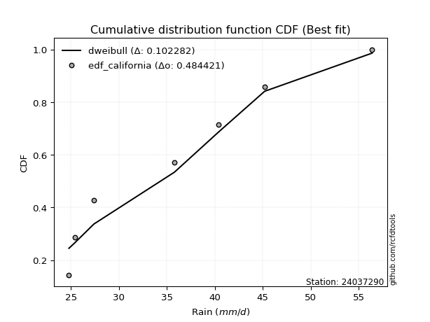</img>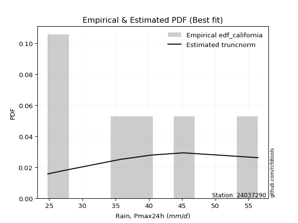</img>

</div>


### 2. Empirical - EDF Hazen (1930)

Hazen method for plotting positions is a formula used to estimate the empirical cumulative probability distribution of flood events or other hydrological data. This formula often results in biased estimations, particularly when extrapolating to extreme events (high return periods).

<div align="center">


$P=(m-0.5)/n$


</div>


**2.1. Empirical values**

<div align="center">

|                | 0                   | 1                   | 2                   | 3         | 4                  | 5                  | 6                  |
|:---------------|:--------------------|:--------------------|:--------------------|:----------|:-------------------|:-------------------|:-------------------|
| date           | 2025                | 2023                | 2022                | 2019      | 2021               | 2020               | 2024               |
| x              | 16.8                | 24.8                | 27.4                | 35.8      | 40.4               | 45.2               | 56.4               |
| m              | 1                   | 2                   | 3                   | 4         | 5                  | 6                  | 7                  |
| empirical_dist | edf_hazen           | edf_hazen           | edf_hazen           | edf_hazen | edf_hazen          | edf_hazen          | edf_hazen          |
| empirical      | 0.07142857142857142 | 0.21428571428571427 | 0.35714285714285715 | 0.5       | 0.6428571428571429 | 0.7857142857142857 | 0.9285714285714286 |
| empirical_tr   | 1.0769230769230769  | 1.2727272727272727  | 1.5555555555555558  | 2.0       | 2.8000000000000003 | 4.666666666666666  | 14.000000000000007 |

</div>


**2.2. Kolmogorov-Smirnov fit test (sorted by Δ)**


<div align="center">

|                | 0                   | 1                   | 2                   | 3                   | 4                   | 5                   | 6                   | 7                   | 8                   | 9                   | 10                  | 11                  | 12                  | 13                  | 14                  | 15                  | 16                  | 17                  | 18                  | 19                  | 20                  | 21                  | 22                  | 23                  | 24                  | 25                  | 26                  | 27                  | 28                  | 29                  | 30                  | 31                  | 32                  | 33                  | 34                  | 35                  | 36                  | 37                  | 38                  | 39                  | 40                  | 41                  | 42                  | 43                  | 44                  | 45                  | 46                  | 47                  | 48                  | 49                  | 50                  | 51                    | 52                  | 53                  | 54                  | 55                  | 56                  | 57                  | 58                  | 59                  | 60                  | 61                  | 62                  | 63                  | 64                  | 65                  | 66                  | 67                  | 68                  | 69                  | 70                  | 71                  | 72                  | 73                  | 74                  | 75                  | 76                  | 77                  | 78                  | 79                  | 80                  | 81                  | 82                  | 83                  | 84                  | 85                  | 86                  | 87                  | 88                  | 89                  |
|:---------------|:--------------------|:--------------------|:--------------------|:--------------------|:--------------------|:--------------------|:--------------------|:--------------------|:--------------------|:--------------------|:--------------------|:--------------------|:--------------------|:--------------------|:--------------------|:--------------------|:--------------------|:--------------------|:--------------------|:--------------------|:--------------------|:--------------------|:--------------------|:--------------------|:--------------------|:--------------------|:--------------------|:--------------------|:--------------------|:--------------------|:--------------------|:--------------------|:--------------------|:--------------------|:--------------------|:--------------------|:--------------------|:--------------------|:--------------------|:--------------------|:--------------------|:--------------------|:--------------------|:--------------------|:--------------------|:--------------------|:--------------------|:--------------------|:--------------------|:--------------------|:--------------------|:----------------------|:--------------------|:--------------------|:--------------------|:--------------------|:--------------------|:--------------------|:--------------------|:--------------------|:--------------------|:--------------------|:--------------------|:--------------------|:--------------------|:--------------------|:--------------------|:--------------------|:--------------------|:--------------------|:--------------------|:--------------------|:--------------------|:--------------------|:--------------------|:--------------------|:--------------------|:--------------------|:--------------------|:--------------------|:--------------------|:--------------------|:--------------------|:--------------------|:--------------------|:--------------------|:--------------------|:--------------------|:--------------------|:--------------------|
| station        | 24037290            | 24037290            | 24037290            | 24037290            | 24037290            | 24037290            | 24037290            | 24037290            | 24037290            | 24037290            | 24037290            | 24037290            | 24037290            | 24037290            | 24037290            | 24037290            | 24037290            | 24037290            | 24037290            | 24037290            | 24037290            | 24037290            | 24037290            | 24037290            | 24037290            | 24037290            | 24037290            | 24037290            | 24037290            | 24037290            | 24037290            | 24037290            | 24037290            | 24037290            | 24037290            | 24037290            | 24037290            | 24037290            | 24037290            | 24037290            | 24037290            | 24037290            | 24037290            | 24037290            | 24037290            | 24037290            | 24037290            | 24037290            | 24037290            | 24037290            | 24037290            | 24037290              | 24037290            | 24037290            | 24037290            | 24037290            | 24037290            | 24037290            | 24037290            | 24037290            | 24037290            | 24037290            | 24037290            | 24037290            | 24037290            | 24037290            | 24037290            | 24037290            | 24037290            | 24037290            | 24037290            | 24037290            | 24037290            | 24037290            | 24037290            | 24037290            | 24037290            | 24037290            | 24037290            | 24037290            | 24037290            | 24037290            | 24037290            | 24037290            | 24037290            | 24037290            | 24037290            | 24037290            | 24037290            | 24037290            |
| empirical_dist | edf_hazen           | edf_hazen           | edf_hazen           | edf_hazen           | edf_hazen           | edf_hazen           | edf_hazen           | edf_hazen           | edf_hazen           | edf_hazen           | edf_hazen           | edf_hazen           | edf_hazen           | edf_hazen           | edf_hazen           | edf_hazen           | edf_hazen           | edf_hazen           | edf_hazen           | edf_hazen           | edf_hazen           | edf_hazen           | edf_hazen           | edf_hazen           | edf_hazen           | edf_hazen           | edf_hazen           | edf_hazen           | edf_hazen           | edf_hazen           | edf_hazen           | edf_hazen           | edf_hazen           | edf_hazen           | edf_hazen           | edf_hazen           | edf_hazen           | edf_hazen           | edf_hazen           | edf_hazen           | edf_hazen           | edf_hazen           | edf_hazen           | edf_hazen           | edf_hazen           | edf_hazen           | edf_hazen           | edf_hazen           | edf_hazen           | edf_hazen           | edf_hazen           | edf_hazen             | edf_hazen           | edf_hazen           | edf_hazen           | edf_hazen           | edf_hazen           | edf_hazen           | edf_hazen           | edf_hazen           | edf_hazen           | edf_hazen           | edf_hazen           | edf_hazen           | edf_hazen           | edf_hazen           | edf_hazen           | edf_hazen           | edf_hazen           | edf_hazen           | edf_hazen           | edf_hazen           | edf_hazen           | edf_hazen           | edf_hazen           | edf_hazen           | edf_hazen           | edf_hazen           | edf_hazen           | edf_hazen           | edf_hazen           | edf_hazen           | edf_hazen           | edf_hazen           | edf_hazen           | edf_hazen           | edf_hazen           | edf_hazen           | edf_hazen           | edf_hazen           |
| p_dist         | rayleigh            | logpearson3         | erlang              | gamma               | f                   | ncf                 | invgauss            | betaprime           | maxwell             | logfisk             | chi2                | weibull_min         | rice                | logweibull_min      | johnsonsu           | invgamma            | alpha               | logloggamma         | genlogistic         | logjohnsonsu        | fisk                | kstwobign           | pearson3            | logt                | lognorm             | lognorm             | logcrystalball      | logexponnorm        | logf                | logncf              | lognct              | gumbel_r            | logfatiguelife      | nct                 | halfnorm            | logbetaprime        | exponnorm           | truncnorm           | norm                | crystalball         | t                   | genexpon            | logerlang           | loggamma            | loggamma            | logrice             | loggumbel_l         | loggenlogistic      | mielke              | loglogistic         | logalpha            | loglaplace_asymmetric | loginvgamma         | loghypsecant        | loginvgauss         | moyal               | logmaxwell          | logistic            | halflogistic        | loginvweibull       | lograyleigh         | laplace_asymmetric  | hypsecant           | loglaplace          | gumbel_l            | logkstwobign        | loggenexpon         | expon               | loghalfnorm         | laplace             | loggumbel_r         | loggompertz         | loghalflogistic     | logmoyal            | logmielke           | wald                | logtruncnorm        | lognakagami         | logexpon            | logchi2             | logwald             | gibrat              | loggibrat           | nakagami            | loglognorm          | pareto              | logpareto           | invweibull          | gompertz            | fatiguelife         |
| delta          | 0.06028083896876413 | 0.06429229384280943 | 0.0653151364151151  | 0.06575835730593971 | 0.06618615859957411 | 0.06682843050038667 | 0.06829308670663681 | 0.069578694257874   | 0.06963158882514686 | 0.07017382968033659 | 0.07075031765225237 | 0.07302052645319124 | 0.07396222760028975 | 0.07422367628665671 | 0.0752775627091688  | 0.0772333588819965  | 0.07842969357714996 | 0.07991383705278543 | 0.08057552481703856 | 0.08154012970295871 | 0.08338754157342515 | 0.0862560366481262  | 0.08683544058452186 | 0.08687483341916913 | 0.08688669017317874 | 0.08688669017317874 | 0.08688683973077471 | 0.08688845570697079 | 0.08688901374944402 | 0.0875082226913847  | 0.08778261245778163 | 0.08806721305082443 | 0.08854635118958853 | 0.08993860127079134 | 0.09016049431933915 | 0.09042156690160108 | 0.09283054544891983 | 0.09321479606975475 | 0.09321482086609695 | 0.09321483184812812 | 0.09321572546044415 | 0.09508388214855445 | 0.0958045109699589  | 0.09641693412244245 | 0.09641693412244245 | 0.09663656976567803 | 0.09717249065373801 | 0.09771111288269335 | 0.09778632935226417 | 0.09825704729021134 | 0.10165193221312518 | 0.10350122461589134   | 0.10379134097183884 | 0.10765852757515104 | 0.11055278890512044 | 0.11371119102593275 | 0.11453226115512938 | 0.11574281978782217 | 0.11607509406061667 | 0.11913818939214071 | 0.12318738836082288 | 0.12327225778793116 | 0.13099077498231057 | 0.13345307059519407 | 0.13605500152251887 | 0.13796481570375208 | 0.1402072491800348  | 0.14278297355837744 | 0.14774892677377582 | 0.1523824897490917  | 0.1546373380387217  | 0.1741736947568303  | 0.17590569793641397 | 0.17800707965985207 | 0.17821177050482997 | 0.18494783253795832 | 0.2142855470056867  | 0.22099369050389261 | 0.22491813701755184 | 0.22878069114193586 | 0.24300157394088961 | 0.2528347741987337  | 0.2742541258204124  | 0.31568628796883824 | 0.42510118458531243 | 0.4266396672543902  | 0.43969856209173097 | 0.499303489761075   | 0.5189760011938627  | 0.5516343945240392  |
| deltao         | 0.48442053926100004 | 0.48442053926100004 | 0.48442053926100004 | 0.48442053926100004 | 0.48442053926100004 | 0.48442053926100004 | 0.48442053926100004 | 0.48442053926100004 | 0.48442053926100004 | 0.48442053926100004 | 0.48442053926100004 | 0.48442053926100004 | 0.48442053926100004 | 0.48442053926100004 | 0.48442053926100004 | 0.48442053926100004 | 0.48442053926100004 | 0.48442053926100004 | 0.48442053926100004 | 0.48442053926100004 | 0.48442053926100004 | 0.48442053926100004 | 0.48442053926100004 | 0.48442053926100004 | 0.48442053926100004 | 0.48442053926100004 | 0.48442053926100004 | 0.48442053926100004 | 0.48442053926100004 | 0.48442053926100004 | 0.48442053926100004 | 0.48442053926100004 | 0.48442053926100004 | 0.48442053926100004 | 0.48442053926100004 | 0.48442053926100004 | 0.48442053926100004 | 0.48442053926100004 | 0.48442053926100004 | 0.48442053926100004 | 0.48442053926100004 | 0.48442053926100004 | 0.48442053926100004 | 0.48442053926100004 | 0.48442053926100004 | 0.48442053926100004 | 0.48442053926100004 | 0.48442053926100004 | 0.48442053926100004 | 0.48442053926100004 | 0.48442053926100004 | 0.48442053926100004   | 0.48442053926100004 | 0.48442053926100004 | 0.48442053926100004 | 0.48442053926100004 | 0.48442053926100004 | 0.48442053926100004 | 0.48442053926100004 | 0.48442053926100004 | 0.48442053926100004 | 0.48442053926100004 | 0.48442053926100004 | 0.48442053926100004 | 0.48442053926100004 | 0.48442053926100004 | 0.48442053926100004 | 0.48442053926100004 | 0.48442053926100004 | 0.48442053926100004 | 0.48442053926100004 | 0.48442053926100004 | 0.48442053926100004 | 0.48442053926100004 | 0.48442053926100004 | 0.48442053926100004 | 0.48442053926100004 | 0.48442053926100004 | 0.48442053926100004 | 0.48442053926100004 | 0.48442053926100004 | 0.48442053926100004 | 0.48442053926100004 | 0.48442053926100004 | 0.48442053926100004 | 0.48442053926100004 | 0.48442053926100004 | 0.48442053926100004 | 0.48442053926100004 | 0.48442053926100004 |
| eval           | Δo > Δ              | Δo > Δ              | Δo > Δ              | Δo > Δ              | Δo > Δ              | Δo > Δ              | Δo > Δ              | Δo > Δ              | Δo > Δ              | Δo > Δ              | Δo > Δ              | Δo > Δ              | Δo > Δ              | Δo > Δ              | Δo > Δ              | Δo > Δ              | Δo > Δ              | Δo > Δ              | Δo > Δ              | Δo > Δ              | Δo > Δ              | Δo > Δ              | Δo > Δ              | Δo > Δ              | Δo > Δ              | Δo > Δ              | Δo > Δ              | Δo > Δ              | Δo > Δ              | Δo > Δ              | Δo > Δ              | Δo > Δ              | Δo > Δ              | Δo > Δ              | Δo > Δ              | Δo > Δ              | Δo > Δ              | Δo > Δ              | Δo > Δ              | Δo > Δ              | Δo > Δ              | Δo > Δ              | Δo > Δ              | Δo > Δ              | Δo > Δ              | Δo > Δ              | Δo > Δ              | Δo > Δ              | Δo > Δ              | Δo > Δ              | Δo > Δ              | Δo > Δ                | Δo > Δ              | Δo > Δ              | Δo > Δ              | Δo > Δ              | Δo > Δ              | Δo > Δ              | Δo > Δ              | Δo > Δ              | Δo > Δ              | Δo > Δ              | Δo > Δ              | Δo > Δ              | Δo > Δ              | Δo > Δ              | Δo > Δ              | Δo > Δ              | Δo > Δ              | Δo > Δ              | Δo > Δ              | Δo > Δ              | Δo > Δ              | Δo > Δ              | Δo > Δ              | Δo > Δ              | Δo > Δ              | Δo > Δ              | Δo > Δ              | Δo > Δ              | Δo > Δ              | Δo > Δ              | Δo > Δ              | Δo > Δ              | Δo > Δ              | Δo > Δ              | Δo > Δ              | Δo <= Δ             | Δo <= Δ             | Δo <= Δ             |
| fit            | 1                   | 1                   | 1                   | 1                   | 1                   | 1                   | 1                   | 1                   | 1                   | 1                   | 1                   | 1                   | 1                   | 1                   | 1                   | 1                   | 1                   | 1                   | 1                   | 1                   | 1                   | 1                   | 1                   | 1                   | 1                   | 1                   | 1                   | 1                   | 1                   | 1                   | 1                   | 1                   | 1                   | 1                   | 1                   | 1                   | 1                   | 1                   | 1                   | 1                   | 1                   | 1                   | 1                   | 1                   | 1                   | 1                   | 1                   | 1                   | 1                   | 1                   | 1                   | 1                     | 1                   | 1                   | 1                   | 1                   | 1                   | 1                   | 1                   | 1                   | 1                   | 1                   | 1                   | 1                   | 1                   | 1                   | 1                   | 1                   | 1                   | 1                   | 1                   | 1                   | 1                   | 1                   | 1                   | 1                   | 1                   | 1                   | 1                   | 1                   | 1                   | 1                   | 1                   | 1                   | 1                   | 1                   | 1                   | 0                   | 0                   | 0                   |
| n              | 7                   | 7                   | 7                   | 7                   | 7                   | 7                   | 7                   | 7                   | 7                   | 7                   | 7                   | 7                   | 7                   | 7                   | 7                   | 7                   | 7                   | 7                   | 7                   | 7                   | 7                   | 7                   | 7                   | 7                   | 7                   | 7                   | 7                   | 7                   | 7                   | 7                   | 7                   | 7                   | 7                   | 7                   | 7                   | 7                   | 7                   | 7                   | 7                   | 7                   | 7                   | 7                   | 7                   | 7                   | 7                   | 7                   | 7                   | 7                   | 7                   | 7                   | 7                   | 7                     | 7                   | 7                   | 7                   | 7                   | 7                   | 7                   | 7                   | 7                   | 7                   | 7                   | 7                   | 7                   | 7                   | 7                   | 7                   | 7                   | 7                   | 7                   | 7                   | 7                   | 7                   | 7                   | 7                   | 7                   | 7                   | 7                   | 7                   | 7                   | 7                   | 7                   | 7                   | 7                   | 7                   | 7                   | 7                   | 7                   | 7                   | 7                   |
| best_fit       | 1                   | 0                   | 0                   | 0                   | 0                   | 0                   | 0                   | 0                   | 0                   | 0                   | 0                   | 0                   | 0                   | 0                   | 0                   | 0                   | 0                   | 0                   | 0                   | 0                   | 0                   | 0                   | 0                   | 0                   | 0                   | 0                   | 0                   | 0                   | 0                   | 0                   | 0                   | 0                   | 0                   | 0                   | 0                   | 0                   | 0                   | 0                   | 0                   | 0                   | 0                   | 0                   | 0                   | 0                   | 0                   | 0                   | 0                   | 0                   | 0                   | 0                   | 0                   | 0                     | 0                   | 0                   | 0                   | 0                   | 0                   | 0                   | 0                   | 0                   | 0                   | 0                   | 0                   | 0                   | 0                   | 0                   | 0                   | 0                   | 0                   | 0                   | 0                   | 0                   | 0                   | 0                   | 0                   | 0                   | 0                   | 0                   | 0                   | 0                   | 0                   | 0                   | 0                   | 0                   | 0                   | 0                   | 0                   | 0                   | 0                   | 0                   |
| best_fit_sort  | 1                   | 2                   | 3                   | 4                   | 5                   | 6                   | 7                   | 8                   | 9                   | 10                  | 11                  | 12                  | 13                  | 14                  | 15                  | 16                  | 17                  | 18                  | 19                  | 20                  | 21                  | 22                  | 23                  | 24                  | 25                  | 26                  | 27                  | 28                  | 29                  | 30                  | 31                  | 32                  | 33                  | 34                  | 35                  | 36                  | 37                  | 38                  | 39                  | 40                  | 41                  | 42                  | 43                  | 44                  | 45                  | 46                  | 47                  | 48                  | 49                  | 50                  | 51                  | 52                    | 53                  | 54                  | 55                  | 56                  | 57                  | 58                  | 59                  | 60                  | 61                  | 62                  | 63                  | 64                  | 65                  | 66                  | 67                  | 68                  | 69                  | 70                  | 71                  | 72                  | 73                  | 74                  | 75                  | 76                  | 77                  | 78                  | 79                  | 80                  | 81                  | 82                  | 83                  | 84                  | 85                  | 86                  | 87                  | 88                  | 89                  | 90                  |

</div>


<div align="center">

</img>

</div>


**2.3. Best fit**

<div align="center">

|   id |   station | empirical_dist   | p_dist   |     delta |   deltao | eval   |   fit |   n |   best_fit |   best_fit_sort |
|-----:|----------:|:-----------------|:---------|----------:|---------:|:-------|------:|----:|-----------:|----------------:|
|    0 |  24037290 | edf_hazen        | rayleigh | 0.0602808 | 0.484421 | Δo > Δ |     1 |   7 |          1 |               1 |

</div>


<div align="center">

</img></img>

</div>


### 3. Empirical - EDF Weibull (1939)

Weibull plotting position formula is an empirical method used to estimate the non-exceedance probability or plotting position for a set of observed data, is often recommended or widely used in practice, particularly in flood frequency analysis.

<div align="center">


$P=m/(n+1)$


</div>


**3.1. Empirical values**

<div align="center">

|                | 0                  | 1                  | 2           | 3           | 4                  | 5           | 6           |
|:---------------|:-------------------|:-------------------|:------------|:------------|:-------------------|:------------|:------------|
| date           | 2025               | 2023               | 2022        | 2019        | 2021               | 2020        | 2024        |
| x              | 16.8               | 24.8               | 27.4        | 35.8        | 40.4               | 45.2        | 56.4        |
| m              | 1                  | 2                  | 3           | 4           | 5                  | 6           | 7           |
| empirical_dist | edf_weibull        | edf_weibull        | edf_weibull | edf_weibull | edf_weibull        | edf_weibull | edf_weibull |
| empirical      | 0.125              | 0.25               | 0.375       | 0.5         | 0.625              | 0.75        | 0.875       |
| empirical_tr   | 1.1428571428571428 | 1.3333333333333333 | 1.6         | 2.0         | 2.6666666666666665 | 4.0         | 8.0         |

</div>


**3.2. Kolmogorov-Smirnov fit test (sorted by Δ)**


<div align="center">

|                | 0                   | 1                   | 2                   | 3                   | 4                   | 5                   | 6                   | 7                   | 8                   | 9                   | 10                  | 11                  | 12                  | 13                  | 14                  | 15                  | 16                  | 17                  | 18                  | 19                  | 20                  | 21                  | 22                  | 23                  | 24                  | 25                  | 26                  | 27                  | 28                  | 29                  | 30                  | 31                  | 32                  | 33                  | 34                  | 35                  | 36                  | 37                  | 38                  | 39                  | 40                  | 41                  | 42                  | 43                  | 44                  | 45                  | 46                  | 47                  | 48                  | 49                  | 50                  | 51                  | 52                  | 53                  | 54                  | 55                    | 56                  | 57                  | 58                  | 59                  | 60                  | 61                  | 62                  | 63                  | 64                  | 65                  | 66                  | 67                  | 68                  | 69                  | 70                  | 71                  | 72                  | 73                  | 74                  | 75                  | 76                  | 77                  | 78                  | 79                  | 80                  | 81                  | 82                  | 83                  | 84                  | 85                  | 86                  | 87                  | 88                  | 89                  |
|:---------------|:--------------------|:--------------------|:--------------------|:--------------------|:--------------------|:--------------------|:--------------------|:--------------------|:--------------------|:--------------------|:--------------------|:--------------------|:--------------------|:--------------------|:--------------------|:--------------------|:--------------------|:--------------------|:--------------------|:--------------------|:--------------------|:--------------------|:--------------------|:--------------------|:--------------------|:--------------------|:--------------------|:--------------------|:--------------------|:--------------------|:--------------------|:--------------------|:--------------------|:--------------------|:--------------------|:--------------------|:--------------------|:--------------------|:--------------------|:--------------------|:--------------------|:--------------------|:--------------------|:--------------------|:--------------------|:--------------------|:--------------------|:--------------------|:--------------------|:--------------------|:--------------------|:--------------------|:--------------------|:--------------------|:--------------------|:----------------------|:--------------------|:--------------------|:--------------------|:--------------------|:--------------------|:--------------------|:--------------------|:--------------------|:--------------------|:--------------------|:--------------------|:--------------------|:--------------------|:--------------------|:--------------------|:--------------------|:--------------------|:--------------------|:--------------------|:--------------------|:--------------------|:--------------------|:--------------------|:--------------------|:--------------------|:--------------------|:--------------------|:--------------------|:--------------------|:--------------------|:--------------------|:--------------------|:--------------------|:--------------------|
| station        | 24037290            | 24037290            | 24037290            | 24037290            | 24037290            | 24037290            | 24037290            | 24037290            | 24037290            | 24037290            | 24037290            | 24037290            | 24037290            | 24037290            | 24037290            | 24037290            | 24037290            | 24037290            | 24037290            | 24037290            | 24037290            | 24037290            | 24037290            | 24037290            | 24037290            | 24037290            | 24037290            | 24037290            | 24037290            | 24037290            | 24037290            | 24037290            | 24037290            | 24037290            | 24037290            | 24037290            | 24037290            | 24037290            | 24037290            | 24037290            | 24037290            | 24037290            | 24037290            | 24037290            | 24037290            | 24037290            | 24037290            | 24037290            | 24037290            | 24037290            | 24037290            | 24037290            | 24037290            | 24037290            | 24037290            | 24037290              | 24037290            | 24037290            | 24037290            | 24037290            | 24037290            | 24037290            | 24037290            | 24037290            | 24037290            | 24037290            | 24037290            | 24037290            | 24037290            | 24037290            | 24037290            | 24037290            | 24037290            | 24037290            | 24037290            | 24037290            | 24037290            | 24037290            | 24037290            | 24037290            | 24037290            | 24037290            | 24037290            | 24037290            | 24037290            | 24037290            | 24037290            | 24037290            | 24037290            | 24037290            |
| empirical_dist | edf_weibull         | edf_weibull         | edf_weibull         | edf_weibull         | edf_weibull         | edf_weibull         | edf_weibull         | edf_weibull         | edf_weibull         | edf_weibull         | edf_weibull         | edf_weibull         | edf_weibull         | edf_weibull         | edf_weibull         | edf_weibull         | edf_weibull         | edf_weibull         | edf_weibull         | edf_weibull         | edf_weibull         | edf_weibull         | edf_weibull         | edf_weibull         | edf_weibull         | edf_weibull         | edf_weibull         | edf_weibull         | edf_weibull         | edf_weibull         | edf_weibull         | edf_weibull         | edf_weibull         | edf_weibull         | edf_weibull         | edf_weibull         | edf_weibull         | edf_weibull         | edf_weibull         | edf_weibull         | edf_weibull         | edf_weibull         | edf_weibull         | edf_weibull         | edf_weibull         | edf_weibull         | edf_weibull         | edf_weibull         | edf_weibull         | edf_weibull         | edf_weibull         | edf_weibull         | edf_weibull         | edf_weibull         | edf_weibull         | edf_weibull           | edf_weibull         | edf_weibull         | edf_weibull         | edf_weibull         | edf_weibull         | edf_weibull         | edf_weibull         | edf_weibull         | edf_weibull         | edf_weibull         | edf_weibull         | edf_weibull         | edf_weibull         | edf_weibull         | edf_weibull         | edf_weibull         | edf_weibull         | edf_weibull         | edf_weibull         | edf_weibull         | edf_weibull         | edf_weibull         | edf_weibull         | edf_weibull         | edf_weibull         | edf_weibull         | edf_weibull         | edf_weibull         | edf_weibull         | edf_weibull         | edf_weibull         | edf_weibull         | edf_weibull         | edf_weibull         |
| p_dist         | logpearson3         | genlogistic         | chi2                | erlang              | gamma               | f                   | ncf                 | rayleigh            | invgauss            | kstwobign           | lognorm             | lognorm             | logcrystalball      | logexponnorm        | logt                | logf                | logfisk             | betaprime           | maxwell             | logncf              | lognct              | logfatiguelife      | logbetaprime        | rice                | logweibull_min      | johnsonsu           | weibull_min         | invgamma            | logerlang           | alpha               | loggamma            | loggamma            | logloggamma         | logrice             | logjohnsonsu        | fisk                | loglogistic         | logalpha            | gumbel_r            | loginvgamma         | pearson3            | nct                 | loginvgauss         | exponnorm           | truncnorm           | norm                | crystalball         | t                   | logmaxwell          | loggumbel_l         | loggenlogistic      | mielke              | loghypsecant        | moyal               | loginvweibull       | loglaplace_asymmetric | lograyleigh         | genexpon            | halflogistic        | halfnorm            | logistic            | logkstwobign        | loggenexpon         | laplace_asymmetric  | loglaplace          | expon               | loghalfnorm         | hypsecant           | gumbel_l            | loggumbel_r         | logmielke           | laplace             | loggompertz         | loghalflogistic     | logmoyal            | logexpon            | logchi2             | wald                | logwald             | logtruncnorm        | lognakagami         | gibrat              | loggibrat           | nakagami            | loglognorm          | pareto              | logpareto           | invweibull          | gompertz            | fatiguelife         |
| delta          | 0.07794546075250924 | 0.08057552481703856 | 0.08138101444453097 | 0.08317227927225795 | 0.08361550016308256 | 0.08404330145671696 | 0.08468557335752952 | 0.0860758964069962  | 0.08615022956377966 | 0.0862560366481262  | 0.0871679917266758  | 0.0871679917266758  | 0.08716800203974637 | 0.08716837572018034 | 0.08716897999963338 | 0.08717236404789899 | 0.0873822531224765  | 0.08743583711501685 | 0.08748873168228971 | 0.0875082226913847  | 0.08778261245778163 | 0.08854635118958853 | 0.09042156690160108 | 0.0918193704574326  | 0.09208081914379956 | 0.09313470556631165 | 0.09342451531353058 | 0.09509050173913935 | 0.0958045109699589  | 0.09628683643429281 | 0.09641693412244245 | 0.09641693412244245 | 0.09777097990992828 | 0.09825542943713285 | 0.09939727256010156 | 0.101244684430568   | 0.10144151045561567 | 0.10165193221312518 | 0.10174327112682213 | 0.10379134097183884 | 0.10469258344166471 | 0.10779574412793419 | 0.11055278890512044 | 0.11068768830606268 | 0.1110719389268976  | 0.1110719637232398  | 0.11107197470527097 | 0.111072868317587   | 0.11453226115512938 | 0.11502963351088086 | 0.1155682557398362  | 0.11564347220940702 | 0.11689180840905777 | 0.11905790228172021 | 0.11913818939214071 | 0.12135836747303419   | 0.12318738836082288 | 0.12499999798029254 | 0.125               | 0.125               | 0.13359996264496501 | 0.13796481570375208 | 0.1402072491800348  | 0.141129400645074   | 0.14151378184869012 | 0.14278297355837744 | 0.14774892677377582 | 0.14884791783945342 | 0.15391214437966172 | 0.1546373380387217  | 0.15812375565092018 | 0.17023963260623454 | 0.1741736947568303  | 0.17590569793641397 | 0.17800707965985207 | 0.1892038513032661  | 0.19306640542765013 | 0.21847145454400504 | 0.24300157394088961 | 0.24999983271997242 | 0.24999999996339733 | 0.27069191705587653 | 0.2742541258204124  | 0.31568628796883824 | 0.38938689887102673 | 0.3909253815401045  | 0.4039842763774453  | 0.4457320611896464  | 0.5011188583367198  | 0.5159201088097535  |
| deltao         | 0.48442053926100004 | 0.48442053926100004 | 0.48442053926100004 | 0.48442053926100004 | 0.48442053926100004 | 0.48442053926100004 | 0.48442053926100004 | 0.48442053926100004 | 0.48442053926100004 | 0.48442053926100004 | 0.48442053926100004 | 0.48442053926100004 | 0.48442053926100004 | 0.48442053926100004 | 0.48442053926100004 | 0.48442053926100004 | 0.48442053926100004 | 0.48442053926100004 | 0.48442053926100004 | 0.48442053926100004 | 0.48442053926100004 | 0.48442053926100004 | 0.48442053926100004 | 0.48442053926100004 | 0.48442053926100004 | 0.48442053926100004 | 0.48442053926100004 | 0.48442053926100004 | 0.48442053926100004 | 0.48442053926100004 | 0.48442053926100004 | 0.48442053926100004 | 0.48442053926100004 | 0.48442053926100004 | 0.48442053926100004 | 0.48442053926100004 | 0.48442053926100004 | 0.48442053926100004 | 0.48442053926100004 | 0.48442053926100004 | 0.48442053926100004 | 0.48442053926100004 | 0.48442053926100004 | 0.48442053926100004 | 0.48442053926100004 | 0.48442053926100004 | 0.48442053926100004 | 0.48442053926100004 | 0.48442053926100004 | 0.48442053926100004 | 0.48442053926100004 | 0.48442053926100004 | 0.48442053926100004 | 0.48442053926100004 | 0.48442053926100004 | 0.48442053926100004   | 0.48442053926100004 | 0.48442053926100004 | 0.48442053926100004 | 0.48442053926100004 | 0.48442053926100004 | 0.48442053926100004 | 0.48442053926100004 | 0.48442053926100004 | 0.48442053926100004 | 0.48442053926100004 | 0.48442053926100004 | 0.48442053926100004 | 0.48442053926100004 | 0.48442053926100004 | 0.48442053926100004 | 0.48442053926100004 | 0.48442053926100004 | 0.48442053926100004 | 0.48442053926100004 | 0.48442053926100004 | 0.48442053926100004 | 0.48442053926100004 | 0.48442053926100004 | 0.48442053926100004 | 0.48442053926100004 | 0.48442053926100004 | 0.48442053926100004 | 0.48442053926100004 | 0.48442053926100004 | 0.48442053926100004 | 0.48442053926100004 | 0.48442053926100004 | 0.48442053926100004 | 0.48442053926100004 |
| eval           | Δo > Δ              | Δo > Δ              | Δo > Δ              | Δo > Δ              | Δo > Δ              | Δo > Δ              | Δo > Δ              | Δo > Δ              | Δo > Δ              | Δo > Δ              | Δo > Δ              | Δo > Δ              | Δo > Δ              | Δo > Δ              | Δo > Δ              | Δo > Δ              | Δo > Δ              | Δo > Δ              | Δo > Δ              | Δo > Δ              | Δo > Δ              | Δo > Δ              | Δo > Δ              | Δo > Δ              | Δo > Δ              | Δo > Δ              | Δo > Δ              | Δo > Δ              | Δo > Δ              | Δo > Δ              | Δo > Δ              | Δo > Δ              | Δo > Δ              | Δo > Δ              | Δo > Δ              | Δo > Δ              | Δo > Δ              | Δo > Δ              | Δo > Δ              | Δo > Δ              | Δo > Δ              | Δo > Δ              | Δo > Δ              | Δo > Δ              | Δo > Δ              | Δo > Δ              | Δo > Δ              | Δo > Δ              | Δo > Δ              | Δo > Δ              | Δo > Δ              | Δo > Δ              | Δo > Δ              | Δo > Δ              | Δo > Δ              | Δo > Δ                | Δo > Δ              | Δo > Δ              | Δo > Δ              | Δo > Δ              | Δo > Δ              | Δo > Δ              | Δo > Δ              | Δo > Δ              | Δo > Δ              | Δo > Δ              | Δo > Δ              | Δo > Δ              | Δo > Δ              | Δo > Δ              | Δo > Δ              | Δo > Δ              | Δo > Δ              | Δo > Δ              | Δo > Δ              | Δo > Δ              | Δo > Δ              | Δo > Δ              | Δo > Δ              | Δo > Δ              | Δo > Δ              | Δo > Δ              | Δo > Δ              | Δo > Δ              | Δo > Δ              | Δo > Δ              | Δo > Δ              | Δo > Δ              | Δo <= Δ             | Δo <= Δ             |
| fit            | 1                   | 1                   | 1                   | 1                   | 1                   | 1                   | 1                   | 1                   | 1                   | 1                   | 1                   | 1                   | 1                   | 1                   | 1                   | 1                   | 1                   | 1                   | 1                   | 1                   | 1                   | 1                   | 1                   | 1                   | 1                   | 1                   | 1                   | 1                   | 1                   | 1                   | 1                   | 1                   | 1                   | 1                   | 1                   | 1                   | 1                   | 1                   | 1                   | 1                   | 1                   | 1                   | 1                   | 1                   | 1                   | 1                   | 1                   | 1                   | 1                   | 1                   | 1                   | 1                   | 1                   | 1                   | 1                   | 1                     | 1                   | 1                   | 1                   | 1                   | 1                   | 1                   | 1                   | 1                   | 1                   | 1                   | 1                   | 1                   | 1                   | 1                   | 1                   | 1                   | 1                   | 1                   | 1                   | 1                   | 1                   | 1                   | 1                   | 1                   | 1                   | 1                   | 1                   | 1                   | 1                   | 1                   | 1                   | 1                   | 0                   | 0                   |
| n              | 7                   | 7                   | 7                   | 7                   | 7                   | 7                   | 7                   | 7                   | 7                   | 7                   | 7                   | 7                   | 7                   | 7                   | 7                   | 7                   | 7                   | 7                   | 7                   | 7                   | 7                   | 7                   | 7                   | 7                   | 7                   | 7                   | 7                   | 7                   | 7                   | 7                   | 7                   | 7                   | 7                   | 7                   | 7                   | 7                   | 7                   | 7                   | 7                   | 7                   | 7                   | 7                   | 7                   | 7                   | 7                   | 7                   | 7                   | 7                   | 7                   | 7                   | 7                   | 7                   | 7                   | 7                   | 7                   | 7                     | 7                   | 7                   | 7                   | 7                   | 7                   | 7                   | 7                   | 7                   | 7                   | 7                   | 7                   | 7                   | 7                   | 7                   | 7                   | 7                   | 7                   | 7                   | 7                   | 7                   | 7                   | 7                   | 7                   | 7                   | 7                   | 7                   | 7                   | 7                   | 7                   | 7                   | 7                   | 7                   | 7                   | 7                   |
| best_fit       | 1                   | 0                   | 0                   | 0                   | 0                   | 0                   | 0                   | 0                   | 0                   | 0                   | 0                   | 0                   | 0                   | 0                   | 0                   | 0                   | 0                   | 0                   | 0                   | 0                   | 0                   | 0                   | 0                   | 0                   | 0                   | 0                   | 0                   | 0                   | 0                   | 0                   | 0                   | 0                   | 0                   | 0                   | 0                   | 0                   | 0                   | 0                   | 0                   | 0                   | 0                   | 0                   | 0                   | 0                   | 0                   | 0                   | 0                   | 0                   | 0                   | 0                   | 0                   | 0                   | 0                   | 0                   | 0                   | 0                     | 0                   | 0                   | 0                   | 0                   | 0                   | 0                   | 0                   | 0                   | 0                   | 0                   | 0                   | 0                   | 0                   | 0                   | 0                   | 0                   | 0                   | 0                   | 0                   | 0                   | 0                   | 0                   | 0                   | 0                   | 0                   | 0                   | 0                   | 0                   | 0                   | 0                   | 0                   | 0                   | 0                   | 0                   |
| best_fit_sort  | 1                   | 2                   | 3                   | 4                   | 5                   | 6                   | 7                   | 8                   | 9                   | 10                  | 11                  | 12                  | 13                  | 14                  | 15                  | 16                  | 17                  | 18                  | 19                  | 20                  | 21                  | 22                  | 23                  | 24                  | 25                  | 26                  | 27                  | 28                  | 29                  | 30                  | 31                  | 32                  | 33                  | 34                  | 35                  | 36                  | 37                  | 38                  | 39                  | 40                  | 41                  | 42                  | 43                  | 44                  | 45                  | 46                  | 47                  | 48                  | 49                  | 50                  | 51                  | 52                  | 53                  | 54                  | 55                  | 56                    | 57                  | 58                  | 59                  | 60                  | 61                  | 62                  | 63                  | 64                  | 65                  | 66                  | 67                  | 68                  | 69                  | 70                  | 71                  | 72                  | 73                  | 74                  | 75                  | 76                  | 77                  | 78                  | 79                  | 80                  | 81                  | 82                  | 83                  | 84                  | 85                  | 86                  | 87                  | 88                  | 89                  | 90                  |

</div>


<div align="center">

</img>

</div>


**3.3. Best fit**

<div align="center">

|   id |   station | empirical_dist   | p_dist      |     delta |   deltao | eval   |   fit |   n |   best_fit |   best_fit_sort |
|-----:|----------:|:-----------------|:------------|----------:|---------:|:-------|------:|----:|-----------:|----------------:|
|    0 |  24037290 | edf_weibull      | logpearson3 | 0.0779455 | 0.484421 | Δo > Δ |     1 |   7 |          1 |               1 |

</div>


<div align="center">

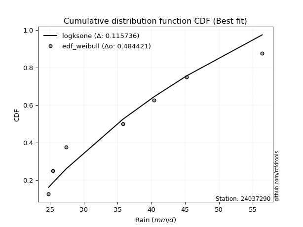</img>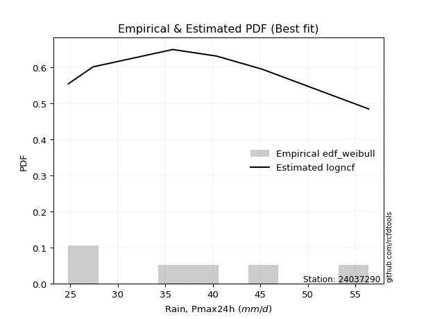</img>

</div>


### 4. Empirical - EDF Beard (1943)

The Beard formula (or Beard´s plotting position formula) in hydrology is used to estimate the empirical non-exceedance probability _(P)_ of a flood event (or other extreme hydrological data point) within a given dataset.

<div align="center">


$P=(m-0.31)/(n+0.38)$


</div>


**4.1. Empirical values**

<div align="center">

|                | 0                   | 1                   | 2                   | 3         | 4                  | 5                  | 6                  |
|:---------------|:--------------------|:--------------------|:--------------------|:----------|:-------------------|:-------------------|:-------------------|
| date           | 2025                | 2023                | 2022                | 2019      | 2021               | 2020               | 2024               |
| x              | 16.8                | 24.8                | 27.4                | 35.8      | 40.4               | 45.2               | 56.4               |
| m              | 1                   | 2                   | 3                   | 4         | 5                  | 6                  | 7                  |
| empirical_dist | edf_beard           | edf_beard           | edf_beard           | edf_beard | edf_beard          | edf_beard          | edf_beard          |
| empirical      | 0.09349593495934959 | 0.22899728997289973 | 0.36449864498644985 | 0.5       | 0.6355013550135502 | 0.7710027100271003 | 0.9065040650406505 |
| empirical_tr   | 1.1031390134529149  | 1.29701230228471    | 1.5735607675906182  | 2.0       | 2.743494423791822  | 4.366863905325444  | 10.695652173913055 |

</div>


**4.2. Kolmogorov-Smirnov fit test (sorted by Δ)**


<div align="center">

|                | 0                   | 1                   | 2                   | 3                   | 4                   | 5                   | 6                   | 7                   | 8                   | 9                   | 10                  | 11                  | 12                  | 13                  | 14                  | 15                  | 16                  | 17                  | 18                  | 19                  | 20                  | 21                  | 22                  | 23                  | 24                  | 25                  | 26                  | 27                  | 28                  | 29                  | 30                  | 31                  | 32                  | 33                  | 34                  | 35                  | 36                  | 37                  | 38                  | 39                  | 40                  | 41                  | 42                  | 43                  | 44                  | 45                  | 46                  | 47                  | 48                  | 49                  | 50                  | 51                  | 52                  | 53                  | 54                    | 55                  | 56                  | 57                  | 58                  | 59                  | 60                  | 61                  | 62                  | 63                  | 64                  | 65                  | 66                  | 67                  | 68                  | 69                  | 70                  | 71                  | 72                  | 73                  | 74                  | 75                  | 76                  | 77                  | 78                  | 79                  | 80                  | 81                  | 82                  | 83                  | 84                  | 85                  | 86                  | 87                  | 88                  | 89                  |
|:---------------|:--------------------|:--------------------|:--------------------|:--------------------|:--------------------|:--------------------|:--------------------|:--------------------|:--------------------|:--------------------|:--------------------|:--------------------|:--------------------|:--------------------|:--------------------|:--------------------|:--------------------|:--------------------|:--------------------|:--------------------|:--------------------|:--------------------|:--------------------|:--------------------|:--------------------|:--------------------|:--------------------|:--------------------|:--------------------|:--------------------|:--------------------|:--------------------|:--------------------|:--------------------|:--------------------|:--------------------|:--------------------|:--------------------|:--------------------|:--------------------|:--------------------|:--------------------|:--------------------|:--------------------|:--------------------|:--------------------|:--------------------|:--------------------|:--------------------|:--------------------|:--------------------|:--------------------|:--------------------|:--------------------|:----------------------|:--------------------|:--------------------|:--------------------|:--------------------|:--------------------|:--------------------|:--------------------|:--------------------|:--------------------|:--------------------|:--------------------|:--------------------|:--------------------|:--------------------|:--------------------|:--------------------|:--------------------|:--------------------|:--------------------|:--------------------|:--------------------|:--------------------|:--------------------|:--------------------|:--------------------|:--------------------|:--------------------|:--------------------|:--------------------|:--------------------|:--------------------|:--------------------|:--------------------|:--------------------|:--------------------|
| station        | 24037290            | 24037290            | 24037290            | 24037290            | 24037290            | 24037290            | 24037290            | 24037290            | 24037290            | 24037290            | 24037290            | 24037290            | 24037290            | 24037290            | 24037290            | 24037290            | 24037290            | 24037290            | 24037290            | 24037290            | 24037290            | 24037290            | 24037290            | 24037290            | 24037290            | 24037290            | 24037290            | 24037290            | 24037290            | 24037290            | 24037290            | 24037290            | 24037290            | 24037290            | 24037290            | 24037290            | 24037290            | 24037290            | 24037290            | 24037290            | 24037290            | 24037290            | 24037290            | 24037290            | 24037290            | 24037290            | 24037290            | 24037290            | 24037290            | 24037290            | 24037290            | 24037290            | 24037290            | 24037290            | 24037290              | 24037290            | 24037290            | 24037290            | 24037290            | 24037290            | 24037290            | 24037290            | 24037290            | 24037290            | 24037290            | 24037290            | 24037290            | 24037290            | 24037290            | 24037290            | 24037290            | 24037290            | 24037290            | 24037290            | 24037290            | 24037290            | 24037290            | 24037290            | 24037290            | 24037290            | 24037290            | 24037290            | 24037290            | 24037290            | 24037290            | 24037290            | 24037290            | 24037290            | 24037290            | 24037290            |
| empirical_dist | edf_beard           | edf_beard           | edf_beard           | edf_beard           | edf_beard           | edf_beard           | edf_beard           | edf_beard           | edf_beard           | edf_beard           | edf_beard           | edf_beard           | edf_beard           | edf_beard           | edf_beard           | edf_beard           | edf_beard           | edf_beard           | edf_beard           | edf_beard           | edf_beard           | edf_beard           | edf_beard           | edf_beard           | edf_beard           | edf_beard           | edf_beard           | edf_beard           | edf_beard           | edf_beard           | edf_beard           | edf_beard           | edf_beard           | edf_beard           | edf_beard           | edf_beard           | edf_beard           | edf_beard           | edf_beard           | edf_beard           | edf_beard           | edf_beard           | edf_beard           | edf_beard           | edf_beard           | edf_beard           | edf_beard           | edf_beard           | edf_beard           | edf_beard           | edf_beard           | edf_beard           | edf_beard           | edf_beard           | edf_beard             | edf_beard           | edf_beard           | edf_beard           | edf_beard           | edf_beard           | edf_beard           | edf_beard           | edf_beard           | edf_beard           | edf_beard           | edf_beard           | edf_beard           | edf_beard           | edf_beard           | edf_beard           | edf_beard           | edf_beard           | edf_beard           | edf_beard           | edf_beard           | edf_beard           | edf_beard           | edf_beard           | edf_beard           | edf_beard           | edf_beard           | edf_beard           | edf_beard           | edf_beard           | edf_beard           | edf_beard           | edf_beard           | edf_beard           | edf_beard           | edf_beard           |
| p_dist         | logpearson3         | rayleigh            | chi2                | erlang              | weibull_min         | gamma               | f                   | ncf                 | invgauss            | logfisk             | betaprime           | maxwell             | genlogistic         | rice                | logweibull_min      | johnsonsu           | invgamma            | alpha               | kstwobign           | logt                | lognorm             | lognorm             | logcrystalball      | logexponnorm        | logf                | logloggamma         | logncf              | lognct              | gumbel_r            | logfatiguelife      | logjohnsonsu        | logbetaprime        | fisk                | halfnorm            | pearson3            | genexpon            | logerlang           | loggamma            | loggamma            | logrice             | nct                 | loglogistic         | exponnorm           | truncnorm           | norm                | crystalball         | t                   | logalpha            | loginvgamma         | loggumbel_l         | loggenlogistic      | mielke              | loghypsecant        | loginvgauss         | loglaplace_asymmetric | moyal               | logmaxwell          | halflogistic        | loginvweibull       | logistic            | lograyleigh         | laplace_asymmetric  | loglaplace          | logkstwobign        | hypsecant           | loggenexpon         | expon               | gumbel_l            | loghalfnorm         | loggumbel_r         | laplace             | logmielke           | loggompertz         | loghalflogistic     | logmoyal            | wald                | logexpon            | logchi2             | logtruncnorm        | lognakagami         | logwald             | gibrat              | loggibrat           | nakagami            | loglognorm          | pareto              | logpareto           | invweibull          | gompertz            | fatiguelife         |
| delta          | 0.0672656144055509  | 0.06737086562295613 | 0.07075031765225237 | 0.0726709242587078  | 0.07302052645319124 | 0.0731141451495324  | 0.0735419464431668  | 0.07418421834397937 | 0.0756488745502295  | 0.07688089810892634 | 0.0769344821014667  | 0.07698737666873956 | 0.08057552481703856 | 0.08131801544388245 | 0.08157946413024941 | 0.0826333505527615  | 0.0845891467255892  | 0.08578548142074266 | 0.0862560366481262  | 0.08687483341916913 | 0.08688669017317874 | 0.08688669017317874 | 0.08688683973077471 | 0.08688845570697079 | 0.08688901374944402 | 0.08726962489637813 | 0.0875082226913847  | 0.08778261245778163 | 0.08806721305082443 | 0.08854635118958853 | 0.0888959175465514  | 0.09042156690160108 | 0.09074332941701785 | 0.09349593495934959 | 0.09419122842811456 | 0.09508388214855445 | 0.0958045109699589  | 0.09641693412244245 | 0.09641693412244245 | 0.09663656976567803 | 0.09729438911438404 | 0.09825704729021134 | 0.10018633329251253 | 0.10057058391334744 | 0.10057060870968965 | 0.10057061969172082 | 0.10057151330403685 | 0.10165193221312518 | 0.10379134097183884 | 0.1045282784973307  | 0.10506690072628605 | 0.10514211719585687 | 0.10765852757515104 | 0.11055278890512044 | 0.11085701245948404   | 0.11371119102593275 | 0.11453226115512938 | 0.11607509406061667 | 0.11913818939214071 | 0.12309860763141486 | 0.12318738836082288 | 0.13062804563152386 | 0.13345307059519407 | 0.13796481570375208 | 0.13834656282590327 | 0.1402072491800348  | 0.14278297355837744 | 0.14341078936611157 | 0.14774892677377582 | 0.1546373380387217  | 0.15973827759268439 | 0.16350019481764452 | 0.1741736947568303  | 0.17590569793641397 | 0.17800707965985207 | 0.19746874451690477 | 0.2102065613303664  | 0.2140691154547504  | 0.22899712269287215 | 0.22899728993629706 | 0.24300157394088961 | 0.2601905620423264  | 0.2742541258204124  | 0.31568628796883824 | 0.41038960889812703 | 0.4119280915672048  | 0.4249869864045456  | 0.47723612623029693 | 0.51162021335027    | 0.5369228188368538  |
| deltao         | 0.48442053926100004 | 0.48442053926100004 | 0.48442053926100004 | 0.48442053926100004 | 0.48442053926100004 | 0.48442053926100004 | 0.48442053926100004 | 0.48442053926100004 | 0.48442053926100004 | 0.48442053926100004 | 0.48442053926100004 | 0.48442053926100004 | 0.48442053926100004 | 0.48442053926100004 | 0.48442053926100004 | 0.48442053926100004 | 0.48442053926100004 | 0.48442053926100004 | 0.48442053926100004 | 0.48442053926100004 | 0.48442053926100004 | 0.48442053926100004 | 0.48442053926100004 | 0.48442053926100004 | 0.48442053926100004 | 0.48442053926100004 | 0.48442053926100004 | 0.48442053926100004 | 0.48442053926100004 | 0.48442053926100004 | 0.48442053926100004 | 0.48442053926100004 | 0.48442053926100004 | 0.48442053926100004 | 0.48442053926100004 | 0.48442053926100004 | 0.48442053926100004 | 0.48442053926100004 | 0.48442053926100004 | 0.48442053926100004 | 0.48442053926100004 | 0.48442053926100004 | 0.48442053926100004 | 0.48442053926100004 | 0.48442053926100004 | 0.48442053926100004 | 0.48442053926100004 | 0.48442053926100004 | 0.48442053926100004 | 0.48442053926100004 | 0.48442053926100004 | 0.48442053926100004 | 0.48442053926100004 | 0.48442053926100004 | 0.48442053926100004   | 0.48442053926100004 | 0.48442053926100004 | 0.48442053926100004 | 0.48442053926100004 | 0.48442053926100004 | 0.48442053926100004 | 0.48442053926100004 | 0.48442053926100004 | 0.48442053926100004 | 0.48442053926100004 | 0.48442053926100004 | 0.48442053926100004 | 0.48442053926100004 | 0.48442053926100004 | 0.48442053926100004 | 0.48442053926100004 | 0.48442053926100004 | 0.48442053926100004 | 0.48442053926100004 | 0.48442053926100004 | 0.48442053926100004 | 0.48442053926100004 | 0.48442053926100004 | 0.48442053926100004 | 0.48442053926100004 | 0.48442053926100004 | 0.48442053926100004 | 0.48442053926100004 | 0.48442053926100004 | 0.48442053926100004 | 0.48442053926100004 | 0.48442053926100004 | 0.48442053926100004 | 0.48442053926100004 | 0.48442053926100004 |
| eval           | Δo > Δ              | Δo > Δ              | Δo > Δ              | Δo > Δ              | Δo > Δ              | Δo > Δ              | Δo > Δ              | Δo > Δ              | Δo > Δ              | Δo > Δ              | Δo > Δ              | Δo > Δ              | Δo > Δ              | Δo > Δ              | Δo > Δ              | Δo > Δ              | Δo > Δ              | Δo > Δ              | Δo > Δ              | Δo > Δ              | Δo > Δ              | Δo > Δ              | Δo > Δ              | Δo > Δ              | Δo > Δ              | Δo > Δ              | Δo > Δ              | Δo > Δ              | Δo > Δ              | Δo > Δ              | Δo > Δ              | Δo > Δ              | Δo > Δ              | Δo > Δ              | Δo > Δ              | Δo > Δ              | Δo > Δ              | Δo > Δ              | Δo > Δ              | Δo > Δ              | Δo > Δ              | Δo > Δ              | Δo > Δ              | Δo > Δ              | Δo > Δ              | Δo > Δ              | Δo > Δ              | Δo > Δ              | Δo > Δ              | Δo > Δ              | Δo > Δ              | Δo > Δ              | Δo > Δ              | Δo > Δ              | Δo > Δ                | Δo > Δ              | Δo > Δ              | Δo > Δ              | Δo > Δ              | Δo > Δ              | Δo > Δ              | Δo > Δ              | Δo > Δ              | Δo > Δ              | Δo > Δ              | Δo > Δ              | Δo > Δ              | Δo > Δ              | Δo > Δ              | Δo > Δ              | Δo > Δ              | Δo > Δ              | Δo > Δ              | Δo > Δ              | Δo > Δ              | Δo > Δ              | Δo > Δ              | Δo > Δ              | Δo > Δ              | Δo > Δ              | Δo > Δ              | Δo > Δ              | Δo > Δ              | Δo > Δ              | Δo > Δ              | Δo > Δ              | Δo > Δ              | Δo > Δ              | Δo <= Δ             | Δo <= Δ             |
| fit            | 1                   | 1                   | 1                   | 1                   | 1                   | 1                   | 1                   | 1                   | 1                   | 1                   | 1                   | 1                   | 1                   | 1                   | 1                   | 1                   | 1                   | 1                   | 1                   | 1                   | 1                   | 1                   | 1                   | 1                   | 1                   | 1                   | 1                   | 1                   | 1                   | 1                   | 1                   | 1                   | 1                   | 1                   | 1                   | 1                   | 1                   | 1                   | 1                   | 1                   | 1                   | 1                   | 1                   | 1                   | 1                   | 1                   | 1                   | 1                   | 1                   | 1                   | 1                   | 1                   | 1                   | 1                   | 1                     | 1                   | 1                   | 1                   | 1                   | 1                   | 1                   | 1                   | 1                   | 1                   | 1                   | 1                   | 1                   | 1                   | 1                   | 1                   | 1                   | 1                   | 1                   | 1                   | 1                   | 1                   | 1                   | 1                   | 1                   | 1                   | 1                   | 1                   | 1                   | 1                   | 1                   | 1                   | 1                   | 1                   | 0                   | 0                   |
| n              | 7                   | 7                   | 7                   | 7                   | 7                   | 7                   | 7                   | 7                   | 7                   | 7                   | 7                   | 7                   | 7                   | 7                   | 7                   | 7                   | 7                   | 7                   | 7                   | 7                   | 7                   | 7                   | 7                   | 7                   | 7                   | 7                   | 7                   | 7                   | 7                   | 7                   | 7                   | 7                   | 7                   | 7                   | 7                   | 7                   | 7                   | 7                   | 7                   | 7                   | 7                   | 7                   | 7                   | 7                   | 7                   | 7                   | 7                   | 7                   | 7                   | 7                   | 7                   | 7                   | 7                   | 7                   | 7                     | 7                   | 7                   | 7                   | 7                   | 7                   | 7                   | 7                   | 7                   | 7                   | 7                   | 7                   | 7                   | 7                   | 7                   | 7                   | 7                   | 7                   | 7                   | 7                   | 7                   | 7                   | 7                   | 7                   | 7                   | 7                   | 7                   | 7                   | 7                   | 7                   | 7                   | 7                   | 7                   | 7                   | 7                   | 7                   |
| best_fit       | 1                   | 0                   | 0                   | 0                   | 0                   | 0                   | 0                   | 0                   | 0                   | 0                   | 0                   | 0                   | 0                   | 0                   | 0                   | 0                   | 0                   | 0                   | 0                   | 0                   | 0                   | 0                   | 0                   | 0                   | 0                   | 0                   | 0                   | 0                   | 0                   | 0                   | 0                   | 0                   | 0                   | 0                   | 0                   | 0                   | 0                   | 0                   | 0                   | 0                   | 0                   | 0                   | 0                   | 0                   | 0                   | 0                   | 0                   | 0                   | 0                   | 0                   | 0                   | 0                   | 0                   | 0                   | 0                     | 0                   | 0                   | 0                   | 0                   | 0                   | 0                   | 0                   | 0                   | 0                   | 0                   | 0                   | 0                   | 0                   | 0                   | 0                   | 0                   | 0                   | 0                   | 0                   | 0                   | 0                   | 0                   | 0                   | 0                   | 0                   | 0                   | 0                   | 0                   | 0                   | 0                   | 0                   | 0                   | 0                   | 0                   | 0                   |
| best_fit_sort  | 1                   | 2                   | 3                   | 4                   | 5                   | 6                   | 7                   | 8                   | 9                   | 10                  | 11                  | 12                  | 13                  | 14                  | 15                  | 16                  | 17                  | 18                  | 19                  | 20                  | 21                  | 22                  | 23                  | 24                  | 25                  | 26                  | 27                  | 28                  | 29                  | 30                  | 31                  | 32                  | 33                  | 34                  | 35                  | 36                  | 37                  | 38                  | 39                  | 40                  | 41                  | 42                  | 43                  | 44                  | 45                  | 46                  | 47                  | 48                  | 49                  | 50                  | 51                  | 52                  | 53                  | 54                  | 55                    | 56                  | 57                  | 58                  | 59                  | 60                  | 61                  | 62                  | 63                  | 64                  | 65                  | 66                  | 67                  | 68                  | 69                  | 70                  | 71                  | 72                  | 73                  | 74                  | 75                  | 76                  | 77                  | 78                  | 79                  | 80                  | 81                  | 82                  | 83                  | 84                  | 85                  | 86                  | 87                  | 88                  | 89                  | 90                  |

</div>


<div align="center">

</img>

</div>


**4.3. Best fit**

<div align="center">

|   id |   station | empirical_dist   | p_dist      |     delta |   deltao | eval   |   fit |   n |   best_fit |   best_fit_sort |
|-----:|----------:|:-----------------|:------------|----------:|---------:|:-------|------:|----:|-----------:|----------------:|
|    0 |  24037290 | edf_beard        | logpearson3 | 0.0672656 | 0.484421 | Δo > Δ |     1 |   7 |          1 |               1 |

</div>


<div align="center">

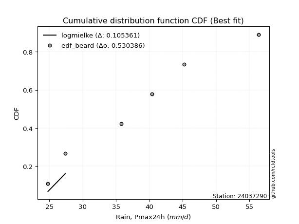</img></img>

</div>


### 5. Empirical - EDF Chegodayev (1955)

The Chegodayev formula is an empirical plotting position formula used in hydrological frequency analysis to estimate the exceedance probability or return period of a specific event from a set of observed data. It is primarily used for plotting observed data points on probability paper to fit a theoretical distribution, particularly for analyzing extreme events like maximum flood flows or rainfall intensities. The constant _b_ value in the generalized plotting position formula is 0.3.

<div align="center">


$P=(m-b)/(n+1-2b)$


</div>


**5.1. Empirical values**

<div align="center">

|                | 0                   | 1                   | 2                   | 3              | 4                  | 5                  | 6                  |
|:---------------|:--------------------|:--------------------|:--------------------|:---------------|:-------------------|:-------------------|:-------------------|
| date           | 2025                | 2023                | 2022                | 2019           | 2021               | 2020               | 2024               |
| x              | 16.8                | 24.8                | 27.4                | 35.8           | 40.4               | 45.2               | 56.4               |
| m              | 1                   | 2                   | 3                   | 4              | 5                  | 6                  | 7                  |
| empirical_dist | edf_chegodayev      | edf_chegodayev      | edf_chegodayev      | edf_chegodayev | edf_chegodayev     | edf_chegodayev     | edf_chegodayev     |
| empirical      | 0.09459459459459459 | 0.22972972972972971 | 0.36486486486486486 | 0.5            | 0.6351351351351351 | 0.7702702702702703 | 0.9054054054054054 |
| empirical_tr   | 1.1044776119402986  | 1.2982456140350878  | 1.574468085106383   | 2.0            | 2.7407407407407405 | 4.352941176470589  | 10.571428571428568 |

</div>


**5.2. Kolmogorov-Smirnov fit test (sorted by Δ)**


<div align="center">

|                | 0                   | 1                   | 2                   | 3                   | 4                   | 5                   | 6                   | 7                   | 8                   | 9                   | 10                  | 11                  | 12                  | 13                  | 14                  | 15                  | 16                  | 17                  | 18                  | 19                  | 20                  | 21                  | 22                  | 23                  | 24                  | 25                  | 26                  | 27                  | 28                  | 29                  | 30                  | 31                  | 32                  | 33                  | 34                  | 35                  | 36                  | 37                  | 38                  | 39                  | 40                  | 41                  | 42                  | 43                  | 44                  | 45                  | 46                  | 47                  | 48                  | 49                  | 50                  | 51                  | 52                  | 53                  | 54                    | 55                  | 56                  | 57                  | 58                  | 59                  | 60                  | 61                  | 62                  | 63                  | 64                  | 65                  | 66                  | 67                  | 68                  | 69                  | 70                  | 71                  | 72                  | 73                  | 74                  | 75                  | 76                  | 77                  | 78                  | 79                  | 80                  | 81                  | 82                  | 83                  | 84                  | 85                  | 86                  | 87                  | 88                  | 89                  |
|:---------------|:--------------------|:--------------------|:--------------------|:--------------------|:--------------------|:--------------------|:--------------------|:--------------------|:--------------------|:--------------------|:--------------------|:--------------------|:--------------------|:--------------------|:--------------------|:--------------------|:--------------------|:--------------------|:--------------------|:--------------------|:--------------------|:--------------------|:--------------------|:--------------------|:--------------------|:--------------------|:--------------------|:--------------------|:--------------------|:--------------------|:--------------------|:--------------------|:--------------------|:--------------------|:--------------------|:--------------------|:--------------------|:--------------------|:--------------------|:--------------------|:--------------------|:--------------------|:--------------------|:--------------------|:--------------------|:--------------------|:--------------------|:--------------------|:--------------------|:--------------------|:--------------------|:--------------------|:--------------------|:--------------------|:----------------------|:--------------------|:--------------------|:--------------------|:--------------------|:--------------------|:--------------------|:--------------------|:--------------------|:--------------------|:--------------------|:--------------------|:--------------------|:--------------------|:--------------------|:--------------------|:--------------------|:--------------------|:--------------------|:--------------------|:--------------------|:--------------------|:--------------------|:--------------------|:--------------------|:--------------------|:--------------------|:--------------------|:--------------------|:--------------------|:--------------------|:--------------------|:--------------------|:--------------------|:--------------------|:--------------------|
| station        | 24037290            | 24037290            | 24037290            | 24037290            | 24037290            | 24037290            | 24037290            | 24037290            | 24037290            | 24037290            | 24037290            | 24037290            | 24037290            | 24037290            | 24037290            | 24037290            | 24037290            | 24037290            | 24037290            | 24037290            | 24037290            | 24037290            | 24037290            | 24037290            | 24037290            | 24037290            | 24037290            | 24037290            | 24037290            | 24037290            | 24037290            | 24037290            | 24037290            | 24037290            | 24037290            | 24037290            | 24037290            | 24037290            | 24037290            | 24037290            | 24037290            | 24037290            | 24037290            | 24037290            | 24037290            | 24037290            | 24037290            | 24037290            | 24037290            | 24037290            | 24037290            | 24037290            | 24037290            | 24037290            | 24037290              | 24037290            | 24037290            | 24037290            | 24037290            | 24037290            | 24037290            | 24037290            | 24037290            | 24037290            | 24037290            | 24037290            | 24037290            | 24037290            | 24037290            | 24037290            | 24037290            | 24037290            | 24037290            | 24037290            | 24037290            | 24037290            | 24037290            | 24037290            | 24037290            | 24037290            | 24037290            | 24037290            | 24037290            | 24037290            | 24037290            | 24037290            | 24037290            | 24037290            | 24037290            | 24037290            |
| empirical_dist | edf_chegodayev      | edf_chegodayev      | edf_chegodayev      | edf_chegodayev      | edf_chegodayev      | edf_chegodayev      | edf_chegodayev      | edf_chegodayev      | edf_chegodayev      | edf_chegodayev      | edf_chegodayev      | edf_chegodayev      | edf_chegodayev      | edf_chegodayev      | edf_chegodayev      | edf_chegodayev      | edf_chegodayev      | edf_chegodayev      | edf_chegodayev      | edf_chegodayev      | edf_chegodayev      | edf_chegodayev      | edf_chegodayev      | edf_chegodayev      | edf_chegodayev      | edf_chegodayev      | edf_chegodayev      | edf_chegodayev      | edf_chegodayev      | edf_chegodayev      | edf_chegodayev      | edf_chegodayev      | edf_chegodayev      | edf_chegodayev      | edf_chegodayev      | edf_chegodayev      | edf_chegodayev      | edf_chegodayev      | edf_chegodayev      | edf_chegodayev      | edf_chegodayev      | edf_chegodayev      | edf_chegodayev      | edf_chegodayev      | edf_chegodayev      | edf_chegodayev      | edf_chegodayev      | edf_chegodayev      | edf_chegodayev      | edf_chegodayev      | edf_chegodayev      | edf_chegodayev      | edf_chegodayev      | edf_chegodayev      | edf_chegodayev        | edf_chegodayev      | edf_chegodayev      | edf_chegodayev      | edf_chegodayev      | edf_chegodayev      | edf_chegodayev      | edf_chegodayev      | edf_chegodayev      | edf_chegodayev      | edf_chegodayev      | edf_chegodayev      | edf_chegodayev      | edf_chegodayev      | edf_chegodayev      | edf_chegodayev      | edf_chegodayev      | edf_chegodayev      | edf_chegodayev      | edf_chegodayev      | edf_chegodayev      | edf_chegodayev      | edf_chegodayev      | edf_chegodayev      | edf_chegodayev      | edf_chegodayev      | edf_chegodayev      | edf_chegodayev      | edf_chegodayev      | edf_chegodayev      | edf_chegodayev      | edf_chegodayev      | edf_chegodayev      | edf_chegodayev      | edf_chegodayev      | edf_chegodayev      |
| p_dist         | logpearson3         | rayleigh            | chi2                | weibull_min         | erlang              | gamma               | f                   | ncf                 | invgauss            | logfisk             | betaprime           | maxwell             | genlogistic         | rice                | logweibull_min      | johnsonsu           | invgamma            | alpha               | kstwobign           | logt                | lognorm             | lognorm             | logcrystalball      | logexponnorm        | logf                | logncf              | logloggamma         | lognct              | gumbel_r            | logfatiguelife      | logjohnsonsu        | logbetaprime        | fisk                | pearson3            | halfnorm            | genexpon            | logerlang           | loggamma            | loggamma            | logrice             | nct                 | loglogistic         | exponnorm           | truncnorm           | norm                | crystalball         | t                   | logalpha            | loginvgamma         | loggumbel_l         | loggenlogistic      | mielke              | loghypsecant        | loginvgauss         | loglaplace_asymmetric | moyal               | logmaxwell          | halflogistic        | loginvweibull       | lograyleigh         | logistic            | laplace_asymmetric  | loglaplace          | logkstwobign        | hypsecant           | loggenexpon         | expon               | gumbel_l            | loghalfnorm         | loggumbel_r         | laplace             | logmielke           | loggompertz         | loghalflogistic     | logmoyal            | wald                | logexpon            | logchi2             | logtruncnorm        | lognakagami         | logwald             | gibrat              | loggibrat           | nakagami            | loglognorm          | pareto              | logpareto           | invweibull          | gompertz            | fatiguelife         |
| delta          | 0.06763183428396591 | 0.06773708550137114 | 0.07075031765225237 | 0.07302052645319124 | 0.07303714413712281 | 0.07348036502794741 | 0.07390816632158181 | 0.07455043822239438 | 0.07601509442864451 | 0.07724711798734135 | 0.0773007019798817  | 0.07735359654715457 | 0.08057552481703856 | 0.08168423532229746 | 0.08194568400866442 | 0.0829995704311765  | 0.08495536660400421 | 0.08615170129915767 | 0.0862560366481262  | 0.08687483341916913 | 0.08688669017317874 | 0.08688669017317874 | 0.08688683973077471 | 0.08688845570697079 | 0.08688901374944402 | 0.0875082226913847  | 0.08763584477479314 | 0.08778261245778163 | 0.08806721305082443 | 0.08854635118958853 | 0.08926213742496641 | 0.09042156690160108 | 0.09110954929543286 | 0.09455744830652957 | 0.09459459459459459 | 0.09508388214855445 | 0.0958045109699589  | 0.09641693412244245 | 0.09641693412244245 | 0.09663656976567803 | 0.09766060899279905 | 0.09825704729021134 | 0.10055255317092754 | 0.10093680379176245 | 0.10093682858810465 | 0.10093683957013583 | 0.10093773318245186 | 0.10165193221312518 | 0.10379134097183884 | 0.10489449837574572 | 0.10543312060470106 | 0.10550833707427187 | 0.10765852757515104 | 0.11055278890512044 | 0.11122323233789905   | 0.11371119102593275 | 0.11453226115512938 | 0.11607509406061667 | 0.11913818939214071 | 0.12318738836082288 | 0.12346482750982987 | 0.13099426550993887 | 0.13345307059519407 | 0.13796481570375208 | 0.13871278270431828 | 0.1402072491800348  | 0.14278297355837744 | 0.14377700924452658 | 0.14774892677377582 | 0.1546373380387217  | 0.1601044974710994  | 0.16276775506081453 | 0.1741736947568303  | 0.17590569793641397 | 0.17800707965985207 | 0.19820118427373476 | 0.2094741215735364  | 0.21333667569792042 | 0.22972956244970213 | 0.22972972969312705 | 0.24300157394088961 | 0.2605567819207414  | 0.2742541258204124  | 0.31568628796883824 | 0.409657169141297   | 0.41119565181037476 | 0.42425454664771556 | 0.4761374665950518  | 0.5112539934718549  | 0.5361903790800238  |
| deltao         | 0.48442053926100004 | 0.48442053926100004 | 0.48442053926100004 | 0.48442053926100004 | 0.48442053926100004 | 0.48442053926100004 | 0.48442053926100004 | 0.48442053926100004 | 0.48442053926100004 | 0.48442053926100004 | 0.48442053926100004 | 0.48442053926100004 | 0.48442053926100004 | 0.48442053926100004 | 0.48442053926100004 | 0.48442053926100004 | 0.48442053926100004 | 0.48442053926100004 | 0.48442053926100004 | 0.48442053926100004 | 0.48442053926100004 | 0.48442053926100004 | 0.48442053926100004 | 0.48442053926100004 | 0.48442053926100004 | 0.48442053926100004 | 0.48442053926100004 | 0.48442053926100004 | 0.48442053926100004 | 0.48442053926100004 | 0.48442053926100004 | 0.48442053926100004 | 0.48442053926100004 | 0.48442053926100004 | 0.48442053926100004 | 0.48442053926100004 | 0.48442053926100004 | 0.48442053926100004 | 0.48442053926100004 | 0.48442053926100004 | 0.48442053926100004 | 0.48442053926100004 | 0.48442053926100004 | 0.48442053926100004 | 0.48442053926100004 | 0.48442053926100004 | 0.48442053926100004 | 0.48442053926100004 | 0.48442053926100004 | 0.48442053926100004 | 0.48442053926100004 | 0.48442053926100004 | 0.48442053926100004 | 0.48442053926100004 | 0.48442053926100004   | 0.48442053926100004 | 0.48442053926100004 | 0.48442053926100004 | 0.48442053926100004 | 0.48442053926100004 | 0.48442053926100004 | 0.48442053926100004 | 0.48442053926100004 | 0.48442053926100004 | 0.48442053926100004 | 0.48442053926100004 | 0.48442053926100004 | 0.48442053926100004 | 0.48442053926100004 | 0.48442053926100004 | 0.48442053926100004 | 0.48442053926100004 | 0.48442053926100004 | 0.48442053926100004 | 0.48442053926100004 | 0.48442053926100004 | 0.48442053926100004 | 0.48442053926100004 | 0.48442053926100004 | 0.48442053926100004 | 0.48442053926100004 | 0.48442053926100004 | 0.48442053926100004 | 0.48442053926100004 | 0.48442053926100004 | 0.48442053926100004 | 0.48442053926100004 | 0.48442053926100004 | 0.48442053926100004 | 0.48442053926100004 |
| eval           | Δo > Δ              | Δo > Δ              | Δo > Δ              | Δo > Δ              | Δo > Δ              | Δo > Δ              | Δo > Δ              | Δo > Δ              | Δo > Δ              | Δo > Δ              | Δo > Δ              | Δo > Δ              | Δo > Δ              | Δo > Δ              | Δo > Δ              | Δo > Δ              | Δo > Δ              | Δo > Δ              | Δo > Δ              | Δo > Δ              | Δo > Δ              | Δo > Δ              | Δo > Δ              | Δo > Δ              | Δo > Δ              | Δo > Δ              | Δo > Δ              | Δo > Δ              | Δo > Δ              | Δo > Δ              | Δo > Δ              | Δo > Δ              | Δo > Δ              | Δo > Δ              | Δo > Δ              | Δo > Δ              | Δo > Δ              | Δo > Δ              | Δo > Δ              | Δo > Δ              | Δo > Δ              | Δo > Δ              | Δo > Δ              | Δo > Δ              | Δo > Δ              | Δo > Δ              | Δo > Δ              | Δo > Δ              | Δo > Δ              | Δo > Δ              | Δo > Δ              | Δo > Δ              | Δo > Δ              | Δo > Δ              | Δo > Δ                | Δo > Δ              | Δo > Δ              | Δo > Δ              | Δo > Δ              | Δo > Δ              | Δo > Δ              | Δo > Δ              | Δo > Δ              | Δo > Δ              | Δo > Δ              | Δo > Δ              | Δo > Δ              | Δo > Δ              | Δo > Δ              | Δo > Δ              | Δo > Δ              | Δo > Δ              | Δo > Δ              | Δo > Δ              | Δo > Δ              | Δo > Δ              | Δo > Δ              | Δo > Δ              | Δo > Δ              | Δo > Δ              | Δo > Δ              | Δo > Δ              | Δo > Δ              | Δo > Δ              | Δo > Δ              | Δo > Δ              | Δo > Δ              | Δo > Δ              | Δo <= Δ             | Δo <= Δ             |
| fit            | 1                   | 1                   | 1                   | 1                   | 1                   | 1                   | 1                   | 1                   | 1                   | 1                   | 1                   | 1                   | 1                   | 1                   | 1                   | 1                   | 1                   | 1                   | 1                   | 1                   | 1                   | 1                   | 1                   | 1                   | 1                   | 1                   | 1                   | 1                   | 1                   | 1                   | 1                   | 1                   | 1                   | 1                   | 1                   | 1                   | 1                   | 1                   | 1                   | 1                   | 1                   | 1                   | 1                   | 1                   | 1                   | 1                   | 1                   | 1                   | 1                   | 1                   | 1                   | 1                   | 1                   | 1                   | 1                     | 1                   | 1                   | 1                   | 1                   | 1                   | 1                   | 1                   | 1                   | 1                   | 1                   | 1                   | 1                   | 1                   | 1                   | 1                   | 1                   | 1                   | 1                   | 1                   | 1                   | 1                   | 1                   | 1                   | 1                   | 1                   | 1                   | 1                   | 1                   | 1                   | 1                   | 1                   | 1                   | 1                   | 0                   | 0                   |
| n              | 7                   | 7                   | 7                   | 7                   | 7                   | 7                   | 7                   | 7                   | 7                   | 7                   | 7                   | 7                   | 7                   | 7                   | 7                   | 7                   | 7                   | 7                   | 7                   | 7                   | 7                   | 7                   | 7                   | 7                   | 7                   | 7                   | 7                   | 7                   | 7                   | 7                   | 7                   | 7                   | 7                   | 7                   | 7                   | 7                   | 7                   | 7                   | 7                   | 7                   | 7                   | 7                   | 7                   | 7                   | 7                   | 7                   | 7                   | 7                   | 7                   | 7                   | 7                   | 7                   | 7                   | 7                   | 7                     | 7                   | 7                   | 7                   | 7                   | 7                   | 7                   | 7                   | 7                   | 7                   | 7                   | 7                   | 7                   | 7                   | 7                   | 7                   | 7                   | 7                   | 7                   | 7                   | 7                   | 7                   | 7                   | 7                   | 7                   | 7                   | 7                   | 7                   | 7                   | 7                   | 7                   | 7                   | 7                   | 7                   | 7                   | 7                   |
| best_fit       | 1                   | 0                   | 0                   | 0                   | 0                   | 0                   | 0                   | 0                   | 0                   | 0                   | 0                   | 0                   | 0                   | 0                   | 0                   | 0                   | 0                   | 0                   | 0                   | 0                   | 0                   | 0                   | 0                   | 0                   | 0                   | 0                   | 0                   | 0                   | 0                   | 0                   | 0                   | 0                   | 0                   | 0                   | 0                   | 0                   | 0                   | 0                   | 0                   | 0                   | 0                   | 0                   | 0                   | 0                   | 0                   | 0                   | 0                   | 0                   | 0                   | 0                   | 0                   | 0                   | 0                   | 0                   | 0                     | 0                   | 0                   | 0                   | 0                   | 0                   | 0                   | 0                   | 0                   | 0                   | 0                   | 0                   | 0                   | 0                   | 0                   | 0                   | 0                   | 0                   | 0                   | 0                   | 0                   | 0                   | 0                   | 0                   | 0                   | 0                   | 0                   | 0                   | 0                   | 0                   | 0                   | 0                   | 0                   | 0                   | 0                   | 0                   |
| best_fit_sort  | 1                   | 2                   | 3                   | 4                   | 5                   | 6                   | 7                   | 8                   | 9                   | 10                  | 11                  | 12                  | 13                  | 14                  | 15                  | 16                  | 17                  | 18                  | 19                  | 20                  | 21                  | 22                  | 23                  | 24                  | 25                  | 26                  | 27                  | 28                  | 29                  | 30                  | 31                  | 32                  | 33                  | 34                  | 35                  | 36                  | 37                  | 38                  | 39                  | 40                  | 41                  | 42                  | 43                  | 44                  | 45                  | 46                  | 47                  | 48                  | 49                  | 50                  | 51                  | 52                  | 53                  | 54                  | 55                    | 56                  | 57                  | 58                  | 59                  | 60                  | 61                  | 62                  | 63                  | 64                  | 65                  | 66                  | 67                  | 68                  | 69                  | 70                  | 71                  | 72                  | 73                  | 74                  | 75                  | 76                  | 77                  | 78                  | 79                  | 80                  | 81                  | 82                  | 83                  | 84                  | 85                  | 86                  | 87                  | 88                  | 89                  | 90                  |

</div>


<div align="center">

</img>

</div>


**5.3. Best fit**

<div align="center">

|   id |   station | empirical_dist   | p_dist      |     delta |   deltao | eval   |   fit |   n |   best_fit |   best_fit_sort |
|-----:|----------:|:-----------------|:------------|----------:|---------:|:-------|------:|----:|-----------:|----------------:|
|    0 |  24037290 | edf_chegodayev   | logpearson3 | 0.0676318 | 0.484421 | Δo > Δ |     1 |   7 |          1 |               1 |

</div>


<div align="center">

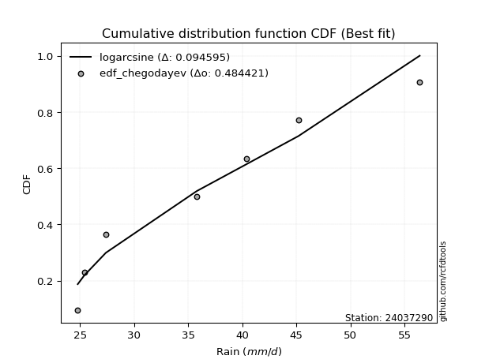</img>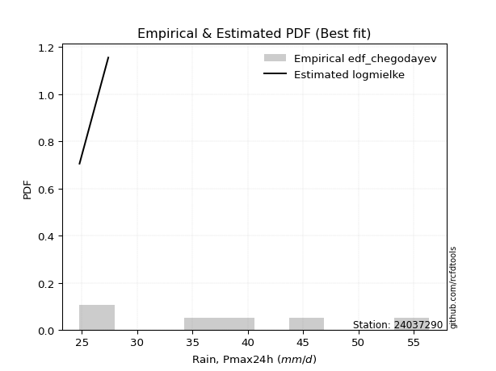</img>

</div>


### 6. Empirical - EDF Blom (1958)

The Blom formula is a specific "plotting position" formula used in hydrology and statistical analysis to estimate the empirical cumulative probability (or non-exceedance probability) of a data series. It is particularly recommended for data that are approximately normally distributed. The constant _a_ is set to 0.375 (or 3/8).

<div align="center">


$P=(m-a)/(n+1-2a)$


</div>


**6.1. Empirical values**

<div align="center">

|                | 0                   | 1                   | 2                  | 3        | 4                  | 5                  | 6                  |
|:---------------|:--------------------|:--------------------|:-------------------|:---------|:-------------------|:-------------------|:-------------------|
| date           | 2025                | 2023                | 2022               | 2019     | 2021               | 2020               | 2024               |
| x              | 16.8                | 24.8                | 27.4               | 35.8     | 40.4               | 45.2               | 56.4               |
| m              | 1                   | 2                   | 3                  | 4        | 5                  | 6                  | 7                  |
| empirical_dist | edf_blom            | edf_blom            | edf_blom           | edf_blom | edf_blom           | edf_blom           | edf_blom           |
| empirical      | 0.08620689655172414 | 0.22413793103448276 | 0.3620689655172414 | 0.5      | 0.6379310344827587 | 0.7758620689655172 | 0.9137931034482759 |
| empirical_tr   | 1.0943396226415094  | 1.288888888888889   | 1.5675675675675675 | 2.0      | 2.7619047619047623 | 4.461538461538462  | 11.600000000000007 |

</div>


**6.2. Kolmogorov-Smirnov fit test (sorted by Δ)**


<div align="center">

|                | 0                   | 1                   | 2                   | 3                   | 4                   | 5                   | 6                   | 7                   | 8                   | 9                   | 10                  | 11                  | 12                  | 13                  | 14                  | 15                  | 16                  | 17                  | 18                  | 19                  | 20                  | 21                  | 22                  | 23                  | 24                  | 25                  | 26                  | 27                  | 28                  | 29                  | 30                  | 31                  | 32                  | 33                  | 34                  | 35                  | 36                  | 37                  | 38                  | 39                  | 40                  | 41                  | 42                  | 43                  | 44                  | 45                  | 46                  | 47                  | 48                  | 49                  | 50                  | 51                  | 52                  | 53                    | 54                  | 55                  | 56                  | 57                  | 58                  | 59                  | 60                  | 61                  | 62                  | 63                  | 64                  | 65                  | 66                  | 67                  | 68                  | 69                  | 70                  | 71                  | 72                  | 73                  | 74                  | 75                  | 76                  | 77                  | 78                  | 79                  | 80                  | 81                  | 82                  | 83                  | 84                  | 85                  | 86                  | 87                  | 88                  | 89                  |
|:---------------|:--------------------|:--------------------|:--------------------|:--------------------|:--------------------|:--------------------|:--------------------|:--------------------|:--------------------|:--------------------|:--------------------|:--------------------|:--------------------|:--------------------|:--------------------|:--------------------|:--------------------|:--------------------|:--------------------|:--------------------|:--------------------|:--------------------|:--------------------|:--------------------|:--------------------|:--------------------|:--------------------|:--------------------|:--------------------|:--------------------|:--------------------|:--------------------|:--------------------|:--------------------|:--------------------|:--------------------|:--------------------|:--------------------|:--------------------|:--------------------|:--------------------|:--------------------|:--------------------|:--------------------|:--------------------|:--------------------|:--------------------|:--------------------|:--------------------|:--------------------|:--------------------|:--------------------|:--------------------|:----------------------|:--------------------|:--------------------|:--------------------|:--------------------|:--------------------|:--------------------|:--------------------|:--------------------|:--------------------|:--------------------|:--------------------|:--------------------|:--------------------|:--------------------|:--------------------|:--------------------|:--------------------|:--------------------|:--------------------|:--------------------|:--------------------|:--------------------|:--------------------|:--------------------|:--------------------|:--------------------|:--------------------|:--------------------|:--------------------|:--------------------|:--------------------|:--------------------|:--------------------|:--------------------|:--------------------|:--------------------|
| station        | 24037290            | 24037290            | 24037290            | 24037290            | 24037290            | 24037290            | 24037290            | 24037290            | 24037290            | 24037290            | 24037290            | 24037290            | 24037290            | 24037290            | 24037290            | 24037290            | 24037290            | 24037290            | 24037290            | 24037290            | 24037290            | 24037290            | 24037290            | 24037290            | 24037290            | 24037290            | 24037290            | 24037290            | 24037290            | 24037290            | 24037290            | 24037290            | 24037290            | 24037290            | 24037290            | 24037290            | 24037290            | 24037290            | 24037290            | 24037290            | 24037290            | 24037290            | 24037290            | 24037290            | 24037290            | 24037290            | 24037290            | 24037290            | 24037290            | 24037290            | 24037290            | 24037290            | 24037290            | 24037290              | 24037290            | 24037290            | 24037290            | 24037290            | 24037290            | 24037290            | 24037290            | 24037290            | 24037290            | 24037290            | 24037290            | 24037290            | 24037290            | 24037290            | 24037290            | 24037290            | 24037290            | 24037290            | 24037290            | 24037290            | 24037290            | 24037290            | 24037290            | 24037290            | 24037290            | 24037290            | 24037290            | 24037290            | 24037290            | 24037290            | 24037290            | 24037290            | 24037290            | 24037290            | 24037290            | 24037290            |
| empirical_dist | edf_blom            | edf_blom            | edf_blom            | edf_blom            | edf_blom            | edf_blom            | edf_blom            | edf_blom            | edf_blom            | edf_blom            | edf_blom            | edf_blom            | edf_blom            | edf_blom            | edf_blom            | edf_blom            | edf_blom            | edf_blom            | edf_blom            | edf_blom            | edf_blom            | edf_blom            | edf_blom            | edf_blom            | edf_blom            | edf_blom            | edf_blom            | edf_blom            | edf_blom            | edf_blom            | edf_blom            | edf_blom            | edf_blom            | edf_blom            | edf_blom            | edf_blom            | edf_blom            | edf_blom            | edf_blom            | edf_blom            | edf_blom            | edf_blom            | edf_blom            | edf_blom            | edf_blom            | edf_blom            | edf_blom            | edf_blom            | edf_blom            | edf_blom            | edf_blom            | edf_blom            | edf_blom            | edf_blom              | edf_blom            | edf_blom            | edf_blom            | edf_blom            | edf_blom            | edf_blom            | edf_blom            | edf_blom            | edf_blom            | edf_blom            | edf_blom            | edf_blom            | edf_blom            | edf_blom            | edf_blom            | edf_blom            | edf_blom            | edf_blom            | edf_blom            | edf_blom            | edf_blom            | edf_blom            | edf_blom            | edf_blom            | edf_blom            | edf_blom            | edf_blom            | edf_blom            | edf_blom            | edf_blom            | edf_blom            | edf_blom            | edf_blom            | edf_blom            | edf_blom            | edf_blom            |
| p_dist         | logpearson3         | rayleigh            | erlang              | gamma               | chi2                | f                   | ncf                 | weibull_min         | invgauss            | logfisk             | betaprime           | maxwell             | rice                | logweibull_min      | johnsonsu           | genlogistic         | invgamma            | alpha               | logloggamma         | kstwobign           | logjohnsonsu        | logt                | lognorm             | lognorm             | logcrystalball      | logexponnorm        | logf                | logncf              | lognct              | gumbel_r            | fisk                | logfatiguelife      | halfnorm            | logbetaprime        | pearson3            | nct                 | genexpon            | logerlang           | loggamma            | loggamma            | logrice             | exponnorm           | truncnorm           | norm                | crystalball         | t                   | loglogistic         | logalpha            | loggumbel_l         | loggenlogistic      | mielke              | loginvgamma         | loghypsecant        | loglaplace_asymmetric | loginvgauss         | moyal               | logmaxwell          | halflogistic        | loginvweibull       | logistic            | lograyleigh         | laplace_asymmetric  | loglaplace          | hypsecant           | logkstwobign        | loggenexpon         | gumbel_l            | expon               | loghalfnorm         | loggumbel_r         | laplace             | logmielke           | loggompertz         | loghalflogistic     | logmoyal            | wald                | logexpon            | logchi2             | logtruncnorm        | lognakagami         | logwald             | gibrat              | loggibrat           | nakagami            | loglognorm          | pareto              | logpareto           | invweibull          | gompertz            | fatiguelife         |
| delta          | 0.06483593493634243 | 0.06494118615374767 | 0.07024124478949934 | 0.07068446568032394 | 0.07075031765225237 | 0.07111226697395834 | 0.0717545388747709  | 0.07302052645319124 | 0.07321919508102104 | 0.07445121863971788 | 0.07450480263225823 | 0.07455769719953109 | 0.07888833597467398 | 0.07914978466104095 | 0.08020367108355303 | 0.08057552481703856 | 0.08215946725638074 | 0.08335580195153419 | 0.08483994542716966 | 0.0862560366481262  | 0.08646623807734294 | 0.08687483341916913 | 0.08688669017317874 | 0.08688669017317874 | 0.08688683973077471 | 0.08688845570697079 | 0.08688901374944402 | 0.0875082226913847  | 0.08778261245778163 | 0.08806721305082443 | 0.08831364994780938 | 0.08854635118958853 | 0.09016049431933915 | 0.09042156690160108 | 0.09176154895890609 | 0.09486470964517557 | 0.09508388214855445 | 0.0958045109699589  | 0.09641693412244245 | 0.09641693412244245 | 0.09663656976567803 | 0.09775665382330406 | 0.09814090444413898 | 0.09814092924048118 | 0.09814094022251235 | 0.09814183383482838 | 0.09825704729021134 | 0.10165193221312518 | 0.10209859902812224 | 0.10263722125707758 | 0.1027124377266484  | 0.10379134097183884 | 0.10765852757515104 | 0.10842733299027557   | 0.11055278890512044 | 0.11371119102593275 | 0.11453226115512938 | 0.11607509406061667 | 0.11913818939214071 | 0.1206689281622064  | 0.12318738836082288 | 0.1281983661623154  | 0.13345307059519407 | 0.1359168833566948  | 0.13796481570375208 | 0.1402072491800348  | 0.1409811098969031  | 0.14278297355837744 | 0.14774892677377582 | 0.1546373380387217  | 0.15730859812347592 | 0.1683595537560615  | 0.1741736947568303  | 0.17590569793641397 | 0.17800707965985207 | 0.1926093855784878  | 0.21506592026878335 | 0.21892847439316737 | 0.22413776375445518 | 0.2241379309978801  | 0.24300157394088961 | 0.2577608825731179  | 0.2742541258204124  | 0.31568628796883824 | 0.41524896783654397 | 0.4167874505056217  | 0.4298463453429625  | 0.48452516463792233 | 0.5140498928194784  | 0.5417821777752707  |
| deltao         | 0.48442053926100004 | 0.48442053926100004 | 0.48442053926100004 | 0.48442053926100004 | 0.48442053926100004 | 0.48442053926100004 | 0.48442053926100004 | 0.48442053926100004 | 0.48442053926100004 | 0.48442053926100004 | 0.48442053926100004 | 0.48442053926100004 | 0.48442053926100004 | 0.48442053926100004 | 0.48442053926100004 | 0.48442053926100004 | 0.48442053926100004 | 0.48442053926100004 | 0.48442053926100004 | 0.48442053926100004 | 0.48442053926100004 | 0.48442053926100004 | 0.48442053926100004 | 0.48442053926100004 | 0.48442053926100004 | 0.48442053926100004 | 0.48442053926100004 | 0.48442053926100004 | 0.48442053926100004 | 0.48442053926100004 | 0.48442053926100004 | 0.48442053926100004 | 0.48442053926100004 | 0.48442053926100004 | 0.48442053926100004 | 0.48442053926100004 | 0.48442053926100004 | 0.48442053926100004 | 0.48442053926100004 | 0.48442053926100004 | 0.48442053926100004 | 0.48442053926100004 | 0.48442053926100004 | 0.48442053926100004 | 0.48442053926100004 | 0.48442053926100004 | 0.48442053926100004 | 0.48442053926100004 | 0.48442053926100004 | 0.48442053926100004 | 0.48442053926100004 | 0.48442053926100004 | 0.48442053926100004 | 0.48442053926100004   | 0.48442053926100004 | 0.48442053926100004 | 0.48442053926100004 | 0.48442053926100004 | 0.48442053926100004 | 0.48442053926100004 | 0.48442053926100004 | 0.48442053926100004 | 0.48442053926100004 | 0.48442053926100004 | 0.48442053926100004 | 0.48442053926100004 | 0.48442053926100004 | 0.48442053926100004 | 0.48442053926100004 | 0.48442053926100004 | 0.48442053926100004 | 0.48442053926100004 | 0.48442053926100004 | 0.48442053926100004 | 0.48442053926100004 | 0.48442053926100004 | 0.48442053926100004 | 0.48442053926100004 | 0.48442053926100004 | 0.48442053926100004 | 0.48442053926100004 | 0.48442053926100004 | 0.48442053926100004 | 0.48442053926100004 | 0.48442053926100004 | 0.48442053926100004 | 0.48442053926100004 | 0.48442053926100004 | 0.48442053926100004 | 0.48442053926100004 |
| eval           | Δo > Δ              | Δo > Δ              | Δo > Δ              | Δo > Δ              | Δo > Δ              | Δo > Δ              | Δo > Δ              | Δo > Δ              | Δo > Δ              | Δo > Δ              | Δo > Δ              | Δo > Δ              | Δo > Δ              | Δo > Δ              | Δo > Δ              | Δo > Δ              | Δo > Δ              | Δo > Δ              | Δo > Δ              | Δo > Δ              | Δo > Δ              | Δo > Δ              | Δo > Δ              | Δo > Δ              | Δo > Δ              | Δo > Δ              | Δo > Δ              | Δo > Δ              | Δo > Δ              | Δo > Δ              | Δo > Δ              | Δo > Δ              | Δo > Δ              | Δo > Δ              | Δo > Δ              | Δo > Δ              | Δo > Δ              | Δo > Δ              | Δo > Δ              | Δo > Δ              | Δo > Δ              | Δo > Δ              | Δo > Δ              | Δo > Δ              | Δo > Δ              | Δo > Δ              | Δo > Δ              | Δo > Δ              | Δo > Δ              | Δo > Δ              | Δo > Δ              | Δo > Δ              | Δo > Δ              | Δo > Δ                | Δo > Δ              | Δo > Δ              | Δo > Δ              | Δo > Δ              | Δo > Δ              | Δo > Δ              | Δo > Δ              | Δo > Δ              | Δo > Δ              | Δo > Δ              | Δo > Δ              | Δo > Δ              | Δo > Δ              | Δo > Δ              | Δo > Δ              | Δo > Δ              | Δo > Δ              | Δo > Δ              | Δo > Δ              | Δo > Δ              | Δo > Δ              | Δo > Δ              | Δo > Δ              | Δo > Δ              | Δo > Δ              | Δo > Δ              | Δo > Δ              | Δo > Δ              | Δo > Δ              | Δo > Δ              | Δo > Δ              | Δo > Δ              | Δo > Δ              | Δo <= Δ             | Δo <= Δ             | Δo <= Δ             |
| fit            | 1                   | 1                   | 1                   | 1                   | 1                   | 1                   | 1                   | 1                   | 1                   | 1                   | 1                   | 1                   | 1                   | 1                   | 1                   | 1                   | 1                   | 1                   | 1                   | 1                   | 1                   | 1                   | 1                   | 1                   | 1                   | 1                   | 1                   | 1                   | 1                   | 1                   | 1                   | 1                   | 1                   | 1                   | 1                   | 1                   | 1                   | 1                   | 1                   | 1                   | 1                   | 1                   | 1                   | 1                   | 1                   | 1                   | 1                   | 1                   | 1                   | 1                   | 1                   | 1                   | 1                   | 1                     | 1                   | 1                   | 1                   | 1                   | 1                   | 1                   | 1                   | 1                   | 1                   | 1                   | 1                   | 1                   | 1                   | 1                   | 1                   | 1                   | 1                   | 1                   | 1                   | 1                   | 1                   | 1                   | 1                   | 1                   | 1                   | 1                   | 1                   | 1                   | 1                   | 1                   | 1                   | 1                   | 1                   | 0                   | 0                   | 0                   |
| n              | 7                   | 7                   | 7                   | 7                   | 7                   | 7                   | 7                   | 7                   | 7                   | 7                   | 7                   | 7                   | 7                   | 7                   | 7                   | 7                   | 7                   | 7                   | 7                   | 7                   | 7                   | 7                   | 7                   | 7                   | 7                   | 7                   | 7                   | 7                   | 7                   | 7                   | 7                   | 7                   | 7                   | 7                   | 7                   | 7                   | 7                   | 7                   | 7                   | 7                   | 7                   | 7                   | 7                   | 7                   | 7                   | 7                   | 7                   | 7                   | 7                   | 7                   | 7                   | 7                   | 7                   | 7                     | 7                   | 7                   | 7                   | 7                   | 7                   | 7                   | 7                   | 7                   | 7                   | 7                   | 7                   | 7                   | 7                   | 7                   | 7                   | 7                   | 7                   | 7                   | 7                   | 7                   | 7                   | 7                   | 7                   | 7                   | 7                   | 7                   | 7                   | 7                   | 7                   | 7                   | 7                   | 7                   | 7                   | 7                   | 7                   | 7                   |
| best_fit       | 1                   | 0                   | 0                   | 0                   | 0                   | 0                   | 0                   | 0                   | 0                   | 0                   | 0                   | 0                   | 0                   | 0                   | 0                   | 0                   | 0                   | 0                   | 0                   | 0                   | 0                   | 0                   | 0                   | 0                   | 0                   | 0                   | 0                   | 0                   | 0                   | 0                   | 0                   | 0                   | 0                   | 0                   | 0                   | 0                   | 0                   | 0                   | 0                   | 0                   | 0                   | 0                   | 0                   | 0                   | 0                   | 0                   | 0                   | 0                   | 0                   | 0                   | 0                   | 0                   | 0                   | 0                     | 0                   | 0                   | 0                   | 0                   | 0                   | 0                   | 0                   | 0                   | 0                   | 0                   | 0                   | 0                   | 0                   | 0                   | 0                   | 0                   | 0                   | 0                   | 0                   | 0                   | 0                   | 0                   | 0                   | 0                   | 0                   | 0                   | 0                   | 0                   | 0                   | 0                   | 0                   | 0                   | 0                   | 0                   | 0                   | 0                   |
| best_fit_sort  | 1                   | 2                   | 3                   | 4                   | 5                   | 6                   | 7                   | 8                   | 9                   | 10                  | 11                  | 12                  | 13                  | 14                  | 15                  | 16                  | 17                  | 18                  | 19                  | 20                  | 21                  | 22                  | 23                  | 24                  | 25                  | 26                  | 27                  | 28                  | 29                  | 30                  | 31                  | 32                  | 33                  | 34                  | 35                  | 36                  | 37                  | 38                  | 39                  | 40                  | 41                  | 42                  | 43                  | 44                  | 45                  | 46                  | 47                  | 48                  | 49                  | 50                  | 51                  | 52                  | 53                  | 54                    | 55                  | 56                  | 57                  | 58                  | 59                  | 60                  | 61                  | 62                  | 63                  | 64                  | 65                  | 66                  | 67                  | 68                  | 69                  | 70                  | 71                  | 72                  | 73                  | 74                  | 75                  | 76                  | 77                  | 78                  | 79                  | 80                  | 81                  | 82                  | 83                  | 84                  | 85                  | 86                  | 87                  | 88                  | 89                  | 90                  |

</div>


<div align="center">

</img>

</div>


**6.3. Best fit**

<div align="center">

|   id |   station | empirical_dist   | p_dist      |     delta |   deltao | eval   |   fit |   n |   best_fit |   best_fit_sort |
|-----:|----------:|:-----------------|:------------|----------:|---------:|:-------|------:|----:|-----------:|----------------:|
|    0 |  24037290 | edf_blom         | logpearson3 | 0.0648359 | 0.484421 | Δo > Δ |     1 |   7 |          1 |               1 |

</div>


<div align="center">

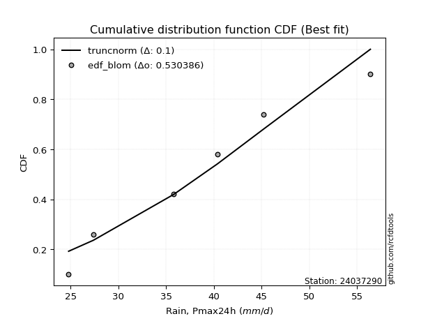</img>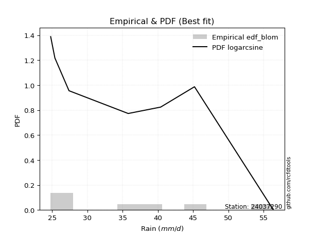</img>

</div>


### 7. Empirical - EDF Tukey (1962)

In hydrology, the Tukey formula is used as a plotting position formula to estimate the empirical probability or frequency of a flood event (or other hydrological data). The formula parameter is given as _c=0.333_ (or 1/3).

<div align="center">


$P=(m-c)/(n+1-2c)$


</div>


**7.1. Empirical values**

<div align="center">

|                | 0                   | 1                   | 2                   | 3         | 4                  | 5                  | 6                  |
|:---------------|:--------------------|:--------------------|:--------------------|:----------|:-------------------|:-------------------|:-------------------|
| date           | 2025                | 2023                | 2022                | 2019      | 2021               | 2020               | 2024               |
| x              | 16.8                | 24.8                | 27.4                | 35.8      | 40.4               | 45.2               | 56.4               |
| m              | 1                   | 2                   | 3                   | 4         | 5                  | 6                  | 7                  |
| empirical_dist | edf_tukey           | edf_tukey           | edf_tukey           | edf_tukey | edf_tukey          | edf_tukey          | edf_tukey          |
| empirical      | 0.09090909090909091 | 0.22727272727272727 | 0.36363636363636365 | 0.5       | 0.6363636363636364 | 0.7727272727272727 | 0.9090909090909091 |
| empirical_tr   | 1.1                 | 1.2941176470588236  | 1.5714285714285714  | 2.0       | 2.75               | 4.3999999999999995 | 10.999999999999996 |

</div>


**7.2. Kolmogorov-Smirnov fit test (sorted by Δ)**


<div align="center">

|                | 0                   | 1                   | 2                   | 3                   | 4                   | 5                   | 6                   | 7                   | 8                   | 9                   | 10                  | 11                  | 12                  | 13                  | 14                  | 15                  | 16                  | 17                  | 18                  | 19                  | 20                  | 21                  | 22                  | 23                  | 24                  | 25                  | 26                  | 27                  | 28                  | 29                  | 30                  | 31                  | 32                  | 33                  | 34                  | 35                  | 36                  | 37                  | 38                  | 39                  | 40                  | 41                  | 42                  | 43                  | 44                  | 45                  | 46                  | 47                  | 48                  | 49                  | 50                  | 51                  | 52                  | 53                    | 54                  | 55                  | 56                  | 57                  | 58                  | 59                  | 60                  | 61                  | 62                  | 63                  | 64                  | 65                  | 66                  | 67                  | 68                  | 69                  | 70                  | 71                  | 72                  | 73                  | 74                  | 75                  | 76                  | 77                  | 78                  | 79                  | 80                  | 81                  | 82                  | 83                  | 84                  | 85                  | 86                  | 87                  | 88                  | 89                  |
|:---------------|:--------------------|:--------------------|:--------------------|:--------------------|:--------------------|:--------------------|:--------------------|:--------------------|:--------------------|:--------------------|:--------------------|:--------------------|:--------------------|:--------------------|:--------------------|:--------------------|:--------------------|:--------------------|:--------------------|:--------------------|:--------------------|:--------------------|:--------------------|:--------------------|:--------------------|:--------------------|:--------------------|:--------------------|:--------------------|:--------------------|:--------------------|:--------------------|:--------------------|:--------------------|:--------------------|:--------------------|:--------------------|:--------------------|:--------------------|:--------------------|:--------------------|:--------------------|:--------------------|:--------------------|:--------------------|:--------------------|:--------------------|:--------------------|:--------------------|:--------------------|:--------------------|:--------------------|:--------------------|:----------------------|:--------------------|:--------------------|:--------------------|:--------------------|:--------------------|:--------------------|:--------------------|:--------------------|:--------------------|:--------------------|:--------------------|:--------------------|:--------------------|:--------------------|:--------------------|:--------------------|:--------------------|:--------------------|:--------------------|:--------------------|:--------------------|:--------------------|:--------------------|:--------------------|:--------------------|:--------------------|:--------------------|:--------------------|:--------------------|:--------------------|:--------------------|:--------------------|:--------------------|:--------------------|:--------------------|:--------------------|
| station        | 24037290            | 24037290            | 24037290            | 24037290            | 24037290            | 24037290            | 24037290            | 24037290            | 24037290            | 24037290            | 24037290            | 24037290            | 24037290            | 24037290            | 24037290            | 24037290            | 24037290            | 24037290            | 24037290            | 24037290            | 24037290            | 24037290            | 24037290            | 24037290            | 24037290            | 24037290            | 24037290            | 24037290            | 24037290            | 24037290            | 24037290            | 24037290            | 24037290            | 24037290            | 24037290            | 24037290            | 24037290            | 24037290            | 24037290            | 24037290            | 24037290            | 24037290            | 24037290            | 24037290            | 24037290            | 24037290            | 24037290            | 24037290            | 24037290            | 24037290            | 24037290            | 24037290            | 24037290            | 24037290              | 24037290            | 24037290            | 24037290            | 24037290            | 24037290            | 24037290            | 24037290            | 24037290            | 24037290            | 24037290            | 24037290            | 24037290            | 24037290            | 24037290            | 24037290            | 24037290            | 24037290            | 24037290            | 24037290            | 24037290            | 24037290            | 24037290            | 24037290            | 24037290            | 24037290            | 24037290            | 24037290            | 24037290            | 24037290            | 24037290            | 24037290            | 24037290            | 24037290            | 24037290            | 24037290            | 24037290            |
| empirical_dist | edf_tukey           | edf_tukey           | edf_tukey           | edf_tukey           | edf_tukey           | edf_tukey           | edf_tukey           | edf_tukey           | edf_tukey           | edf_tukey           | edf_tukey           | edf_tukey           | edf_tukey           | edf_tukey           | edf_tukey           | edf_tukey           | edf_tukey           | edf_tukey           | edf_tukey           | edf_tukey           | edf_tukey           | edf_tukey           | edf_tukey           | edf_tukey           | edf_tukey           | edf_tukey           | edf_tukey           | edf_tukey           | edf_tukey           | edf_tukey           | edf_tukey           | edf_tukey           | edf_tukey           | edf_tukey           | edf_tukey           | edf_tukey           | edf_tukey           | edf_tukey           | edf_tukey           | edf_tukey           | edf_tukey           | edf_tukey           | edf_tukey           | edf_tukey           | edf_tukey           | edf_tukey           | edf_tukey           | edf_tukey           | edf_tukey           | edf_tukey           | edf_tukey           | edf_tukey           | edf_tukey           | edf_tukey             | edf_tukey           | edf_tukey           | edf_tukey           | edf_tukey           | edf_tukey           | edf_tukey           | edf_tukey           | edf_tukey           | edf_tukey           | edf_tukey           | edf_tukey           | edf_tukey           | edf_tukey           | edf_tukey           | edf_tukey           | edf_tukey           | edf_tukey           | edf_tukey           | edf_tukey           | edf_tukey           | edf_tukey           | edf_tukey           | edf_tukey           | edf_tukey           | edf_tukey           | edf_tukey           | edf_tukey           | edf_tukey           | edf_tukey           | edf_tukey           | edf_tukey           | edf_tukey           | edf_tukey           | edf_tukey           | edf_tukey           | edf_tukey           |
| p_dist         | logpearson3         | rayleigh            | chi2                | erlang              | gamma               | f                   | weibull_min         | ncf                 | invgauss            | logfisk             | betaprime           | maxwell             | rice                | genlogistic         | logweibull_min      | johnsonsu           | invgamma            | alpha               | kstwobign           | logloggamma         | logt                | lognorm             | lognorm             | logcrystalball      | logexponnorm        | logf                | logncf              | lognct              | logjohnsonsu        | gumbel_r            | logfatiguelife      | fisk                | logbetaprime        | halfnorm            | pearson3            | genexpon            | logerlang           | loggamma            | loggamma            | nct                 | logrice             | loglogistic         | exponnorm           | truncnorm           | norm                | crystalball         | t                   | logalpha            | loggumbel_l         | loginvgamma         | loggenlogistic      | mielke              | loghypsecant        | loglaplace_asymmetric | loginvgauss         | moyal               | logmaxwell          | halflogistic        | loginvweibull       | logistic            | lograyleigh         | laplace_asymmetric  | loglaplace          | hypsecant           | logkstwobign        | loggenexpon         | gumbel_l            | expon               | loghalfnorm         | loggumbel_r         | laplace             | logmielke           | loggompertz         | loghalflogistic     | logmoyal            | wald                | logexpon            | logchi2             | logtruncnorm        | lognakagami         | logwald             | gibrat              | loggibrat           | nakagami            | loglognorm          | pareto              | logpareto           | invweibull          | gompertz            | fatiguelife         |
| delta          | 0.0664033330554647  | 0.06650858427286993 | 0.07075031765225237 | 0.0718086429086216  | 0.0722518637994462  | 0.0726796650930806  | 0.07302052645319124 | 0.07332193699389317 | 0.0747865932001433  | 0.07601861675884014 | 0.07607220075138049 | 0.07612509531865336 | 0.08045573409379625 | 0.08057552481703856 | 0.08071718278016321 | 0.0817710692026753  | 0.083726865375503   | 0.08492320007065646 | 0.0862560366481262  | 0.08640734354629193 | 0.08687483341916913 | 0.08688669017317874 | 0.08688669017317874 | 0.08688683973077471 | 0.08688845570697079 | 0.08688901374944402 | 0.0875082226913847  | 0.08778261245778163 | 0.0880336361964652  | 0.08806721305082443 | 0.08854635118958853 | 0.08988104806693165 | 0.09042156690160108 | 0.09090909090909091 | 0.09332894707802836 | 0.09508388214855445 | 0.0958045109699589  | 0.09641693412244245 | 0.09641693412244245 | 0.09643210776429784 | 0.09663656976567803 | 0.09825704729021134 | 0.09932405194242633 | 0.09970830256326124 | 0.09970832735960344 | 0.09970833834163462 | 0.09970923195395065 | 0.10165193221312518 | 0.1036659971472445  | 0.10379134097183884 | 0.10420461937619985 | 0.10427983584577066 | 0.10765852757515104 | 0.10999473110939784   | 0.11055278890512044 | 0.11371119102593275 | 0.11453226115512938 | 0.11607509406061667 | 0.11913818939214071 | 0.12223632628132866 | 0.12318738836082288 | 0.12976576428143766 | 0.13345307059519407 | 0.13748428147581707 | 0.13796481570375208 | 0.1402072491800348  | 0.14254850801602537 | 0.14278297355837744 | 0.14774892677377582 | 0.1546373380387217  | 0.15887599624259818 | 0.16522475751781698 | 0.1741736947568303  | 0.17590569793641397 | 0.17800707965985207 | 0.1957441818167323  | 0.21193112403053885 | 0.21579367815492287 | 0.22727255999269969 | 0.2272727272361246  | 0.24300157394088961 | 0.2593282806922402  | 0.2742541258204124  | 0.31568628796883824 | 0.41211417159829944 | 0.4136526542673772  | 0.426711549104718   | 0.4798229702805555  | 0.5124824947003561  | 0.5386473815370262  |
| deltao         | 0.48442053926100004 | 0.48442053926100004 | 0.48442053926100004 | 0.48442053926100004 | 0.48442053926100004 | 0.48442053926100004 | 0.48442053926100004 | 0.48442053926100004 | 0.48442053926100004 | 0.48442053926100004 | 0.48442053926100004 | 0.48442053926100004 | 0.48442053926100004 | 0.48442053926100004 | 0.48442053926100004 | 0.48442053926100004 | 0.48442053926100004 | 0.48442053926100004 | 0.48442053926100004 | 0.48442053926100004 | 0.48442053926100004 | 0.48442053926100004 | 0.48442053926100004 | 0.48442053926100004 | 0.48442053926100004 | 0.48442053926100004 | 0.48442053926100004 | 0.48442053926100004 | 0.48442053926100004 | 0.48442053926100004 | 0.48442053926100004 | 0.48442053926100004 | 0.48442053926100004 | 0.48442053926100004 | 0.48442053926100004 | 0.48442053926100004 | 0.48442053926100004 | 0.48442053926100004 | 0.48442053926100004 | 0.48442053926100004 | 0.48442053926100004 | 0.48442053926100004 | 0.48442053926100004 | 0.48442053926100004 | 0.48442053926100004 | 0.48442053926100004 | 0.48442053926100004 | 0.48442053926100004 | 0.48442053926100004 | 0.48442053926100004 | 0.48442053926100004 | 0.48442053926100004 | 0.48442053926100004 | 0.48442053926100004   | 0.48442053926100004 | 0.48442053926100004 | 0.48442053926100004 | 0.48442053926100004 | 0.48442053926100004 | 0.48442053926100004 | 0.48442053926100004 | 0.48442053926100004 | 0.48442053926100004 | 0.48442053926100004 | 0.48442053926100004 | 0.48442053926100004 | 0.48442053926100004 | 0.48442053926100004 | 0.48442053926100004 | 0.48442053926100004 | 0.48442053926100004 | 0.48442053926100004 | 0.48442053926100004 | 0.48442053926100004 | 0.48442053926100004 | 0.48442053926100004 | 0.48442053926100004 | 0.48442053926100004 | 0.48442053926100004 | 0.48442053926100004 | 0.48442053926100004 | 0.48442053926100004 | 0.48442053926100004 | 0.48442053926100004 | 0.48442053926100004 | 0.48442053926100004 | 0.48442053926100004 | 0.48442053926100004 | 0.48442053926100004 | 0.48442053926100004 |
| eval           | Δo > Δ              | Δo > Δ              | Δo > Δ              | Δo > Δ              | Δo > Δ              | Δo > Δ              | Δo > Δ              | Δo > Δ              | Δo > Δ              | Δo > Δ              | Δo > Δ              | Δo > Δ              | Δo > Δ              | Δo > Δ              | Δo > Δ              | Δo > Δ              | Δo > Δ              | Δo > Δ              | Δo > Δ              | Δo > Δ              | Δo > Δ              | Δo > Δ              | Δo > Δ              | Δo > Δ              | Δo > Δ              | Δo > Δ              | Δo > Δ              | Δo > Δ              | Δo > Δ              | Δo > Δ              | Δo > Δ              | Δo > Δ              | Δo > Δ              | Δo > Δ              | Δo > Δ              | Δo > Δ              | Δo > Δ              | Δo > Δ              | Δo > Δ              | Δo > Δ              | Δo > Δ              | Δo > Δ              | Δo > Δ              | Δo > Δ              | Δo > Δ              | Δo > Δ              | Δo > Δ              | Δo > Δ              | Δo > Δ              | Δo > Δ              | Δo > Δ              | Δo > Δ              | Δo > Δ              | Δo > Δ                | Δo > Δ              | Δo > Δ              | Δo > Δ              | Δo > Δ              | Δo > Δ              | Δo > Δ              | Δo > Δ              | Δo > Δ              | Δo > Δ              | Δo > Δ              | Δo > Δ              | Δo > Δ              | Δo > Δ              | Δo > Δ              | Δo > Δ              | Δo > Δ              | Δo > Δ              | Δo > Δ              | Δo > Δ              | Δo > Δ              | Δo > Δ              | Δo > Δ              | Δo > Δ              | Δo > Δ              | Δo > Δ              | Δo > Δ              | Δo > Δ              | Δo > Δ              | Δo > Δ              | Δo > Δ              | Δo > Δ              | Δo > Δ              | Δo > Δ              | Δo > Δ              | Δo <= Δ             | Δo <= Δ             |
| fit            | 1                   | 1                   | 1                   | 1                   | 1                   | 1                   | 1                   | 1                   | 1                   | 1                   | 1                   | 1                   | 1                   | 1                   | 1                   | 1                   | 1                   | 1                   | 1                   | 1                   | 1                   | 1                   | 1                   | 1                   | 1                   | 1                   | 1                   | 1                   | 1                   | 1                   | 1                   | 1                   | 1                   | 1                   | 1                   | 1                   | 1                   | 1                   | 1                   | 1                   | 1                   | 1                   | 1                   | 1                   | 1                   | 1                   | 1                   | 1                   | 1                   | 1                   | 1                   | 1                   | 1                   | 1                     | 1                   | 1                   | 1                   | 1                   | 1                   | 1                   | 1                   | 1                   | 1                   | 1                   | 1                   | 1                   | 1                   | 1                   | 1                   | 1                   | 1                   | 1                   | 1                   | 1                   | 1                   | 1                   | 1                   | 1                   | 1                   | 1                   | 1                   | 1                   | 1                   | 1                   | 1                   | 1                   | 1                   | 1                   | 0                   | 0                   |
| n              | 7                   | 7                   | 7                   | 7                   | 7                   | 7                   | 7                   | 7                   | 7                   | 7                   | 7                   | 7                   | 7                   | 7                   | 7                   | 7                   | 7                   | 7                   | 7                   | 7                   | 7                   | 7                   | 7                   | 7                   | 7                   | 7                   | 7                   | 7                   | 7                   | 7                   | 7                   | 7                   | 7                   | 7                   | 7                   | 7                   | 7                   | 7                   | 7                   | 7                   | 7                   | 7                   | 7                   | 7                   | 7                   | 7                   | 7                   | 7                   | 7                   | 7                   | 7                   | 7                   | 7                   | 7                     | 7                   | 7                   | 7                   | 7                   | 7                   | 7                   | 7                   | 7                   | 7                   | 7                   | 7                   | 7                   | 7                   | 7                   | 7                   | 7                   | 7                   | 7                   | 7                   | 7                   | 7                   | 7                   | 7                   | 7                   | 7                   | 7                   | 7                   | 7                   | 7                   | 7                   | 7                   | 7                   | 7                   | 7                   | 7                   | 7                   |
| best_fit       | 1                   | 0                   | 0                   | 0                   | 0                   | 0                   | 0                   | 0                   | 0                   | 0                   | 0                   | 0                   | 0                   | 0                   | 0                   | 0                   | 0                   | 0                   | 0                   | 0                   | 0                   | 0                   | 0                   | 0                   | 0                   | 0                   | 0                   | 0                   | 0                   | 0                   | 0                   | 0                   | 0                   | 0                   | 0                   | 0                   | 0                   | 0                   | 0                   | 0                   | 0                   | 0                   | 0                   | 0                   | 0                   | 0                   | 0                   | 0                   | 0                   | 0                   | 0                   | 0                   | 0                   | 0                     | 0                   | 0                   | 0                   | 0                   | 0                   | 0                   | 0                   | 0                   | 0                   | 0                   | 0                   | 0                   | 0                   | 0                   | 0                   | 0                   | 0                   | 0                   | 0                   | 0                   | 0                   | 0                   | 0                   | 0                   | 0                   | 0                   | 0                   | 0                   | 0                   | 0                   | 0                   | 0                   | 0                   | 0                   | 0                   | 0                   |
| best_fit_sort  | 1                   | 2                   | 3                   | 4                   | 5                   | 6                   | 7                   | 8                   | 9                   | 10                  | 11                  | 12                  | 13                  | 14                  | 15                  | 16                  | 17                  | 18                  | 19                  | 20                  | 21                  | 22                  | 23                  | 24                  | 25                  | 26                  | 27                  | 28                  | 29                  | 30                  | 31                  | 32                  | 33                  | 34                  | 35                  | 36                  | 37                  | 38                  | 39                  | 40                  | 41                  | 42                  | 43                  | 44                  | 45                  | 46                  | 47                  | 48                  | 49                  | 50                  | 51                  | 52                  | 53                  | 54                    | 55                  | 56                  | 57                  | 58                  | 59                  | 60                  | 61                  | 62                  | 63                  | 64                  | 65                  | 66                  | 67                  | 68                  | 69                  | 70                  | 71                  | 72                  | 73                  | 74                  | 75                  | 76                  | 77                  | 78                  | 79                  | 80                  | 81                  | 82                  | 83                  | 84                  | 85                  | 86                  | 87                  | 88                  | 89                  | 90                  |

</div>


<div align="center">

</img>

</div>


**7.3. Best fit**

<div align="center">

|   id |   station | empirical_dist   | p_dist      |     delta |   deltao | eval   |   fit |   n |   best_fit |   best_fit_sort |
|-----:|----------:|:-----------------|:------------|----------:|---------:|:-------|------:|----:|-----------:|----------------:|
|    0 |  24037290 | edf_tukey        | logpearson3 | 0.0664033 | 0.484421 | Δo > Δ |     1 |   7 |          1 |               1 |

</div>


<div align="center">

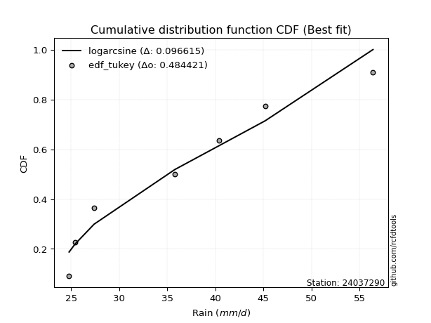</img></img>

</div>


### 8. Empirical - EDF Gringorten (1963)

Gringorten plotting position formula is essential for estimating the probability and return periods of extreme events like floods and heavy rainfall. The constant _a=0.44_.

<div align="center">


$P=(m-a)/(n+1-2a)$


</div>


**8.1. Empirical values**

<div align="center">

|                | 0                   | 1                   | 2                  | 3              | 4                  | 5                  | 6                  |
|:---------------|:--------------------|:--------------------|:-------------------|:---------------|:-------------------|:-------------------|:-------------------|
| date           | 2025                | 2023                | 2022               | 2019           | 2021               | 2020               | 2024               |
| x              | 16.8                | 24.8                | 27.4               | 35.8           | 40.4               | 45.2               | 56.4               |
| m              | 1                   | 2                   | 3                  | 4              | 5                  | 6                  | 7                  |
| empirical_dist | edf_gringorten      | edf_gringorten      | edf_gringorten     | edf_gringorten | edf_gringorten     | edf_gringorten     | edf_gringorten     |
| empirical      | 0.07865168539325844 | 0.21910112359550563 | 0.3595505617977528 | 0.5            | 0.6404494382022471 | 0.7808988764044943 | 0.9213483146067415 |
| empirical_tr   | 1.0853658536585364  | 1.2805755395683454  | 1.5614035087719298 | 2.0            | 2.781249999999999  | 4.564102564102562  | 12.714285714285701 |

</div>


**8.2. Kolmogorov-Smirnov fit test (sorted by Δ)**


<div align="center">

|                | 0                   | 1                   | 2                   | 3                   | 4                   | 5                   | 6                   | 7                   | 8                   | 9                   | 10                  | 11                  | 12                  | 13                  | 14                  | 15                  | 16                  | 17                  | 18                  | 19                  | 20                  | 21                  | 22                  | 23                  | 24                  | 25                  | 26                  | 27                  | 28                  | 29                  | 30                  | 31                  | 32                  | 33                  | 34                  | 35                  | 36                  | 37                  | 38                  | 39                  | 40                  | 41                  | 42                  | 43                  | 44                  | 45                  | 46                  | 47                  | 48                  | 49                  | 50                  | 51                  | 52                    | 53                  | 54                  | 55                  | 56                  | 57                  | 58                  | 59                  | 60                  | 61                  | 62                  | 63                  | 64                  | 65                  | 66                  | 67                  | 68                  | 69                  | 70                  | 71                  | 72                  | 73                  | 74                  | 75                  | 76                  | 77                  | 78                  | 79                  | 80                  | 81                  | 82                  | 83                  | 84                  | 85                  | 86                  | 87                  | 88                  | 89                  |
|:---------------|:--------------------|:--------------------|:--------------------|:--------------------|:--------------------|:--------------------|:--------------------|:--------------------|:--------------------|:--------------------|:--------------------|:--------------------|:--------------------|:--------------------|:--------------------|:--------------------|:--------------------|:--------------------|:--------------------|:--------------------|:--------------------|:--------------------|:--------------------|:--------------------|:--------------------|:--------------------|:--------------------|:--------------------|:--------------------|:--------------------|:--------------------|:--------------------|:--------------------|:--------------------|:--------------------|:--------------------|:--------------------|:--------------------|:--------------------|:--------------------|:--------------------|:--------------------|:--------------------|:--------------------|:--------------------|:--------------------|:--------------------|:--------------------|:--------------------|:--------------------|:--------------------|:--------------------|:----------------------|:--------------------|:--------------------|:--------------------|:--------------------|:--------------------|:--------------------|:--------------------|:--------------------|:--------------------|:--------------------|:--------------------|:--------------------|:--------------------|:--------------------|:--------------------|:--------------------|:--------------------|:--------------------|:--------------------|:--------------------|:--------------------|:--------------------|:--------------------|:--------------------|:--------------------|:--------------------|:--------------------|:--------------------|:--------------------|:--------------------|:--------------------|:--------------------|:--------------------|:--------------------|:--------------------|:--------------------|:--------------------|
| station        | 24037290            | 24037290            | 24037290            | 24037290            | 24037290            | 24037290            | 24037290            | 24037290            | 24037290            | 24037290            | 24037290            | 24037290            | 24037290            | 24037290            | 24037290            | 24037290            | 24037290            | 24037290            | 24037290            | 24037290            | 24037290            | 24037290            | 24037290            | 24037290            | 24037290            | 24037290            | 24037290            | 24037290            | 24037290            | 24037290            | 24037290            | 24037290            | 24037290            | 24037290            | 24037290            | 24037290            | 24037290            | 24037290            | 24037290            | 24037290            | 24037290            | 24037290            | 24037290            | 24037290            | 24037290            | 24037290            | 24037290            | 24037290            | 24037290            | 24037290            | 24037290            | 24037290            | 24037290              | 24037290            | 24037290            | 24037290            | 24037290            | 24037290            | 24037290            | 24037290            | 24037290            | 24037290            | 24037290            | 24037290            | 24037290            | 24037290            | 24037290            | 24037290            | 24037290            | 24037290            | 24037290            | 24037290            | 24037290            | 24037290            | 24037290            | 24037290            | 24037290            | 24037290            | 24037290            | 24037290            | 24037290            | 24037290            | 24037290            | 24037290            | 24037290            | 24037290            | 24037290            | 24037290            | 24037290            | 24037290            |
| empirical_dist | edf_gringorten      | edf_gringorten      | edf_gringorten      | edf_gringorten      | edf_gringorten      | edf_gringorten      | edf_gringorten      | edf_gringorten      | edf_gringorten      | edf_gringorten      | edf_gringorten      | edf_gringorten      | edf_gringorten      | edf_gringorten      | edf_gringorten      | edf_gringorten      | edf_gringorten      | edf_gringorten      | edf_gringorten      | edf_gringorten      | edf_gringorten      | edf_gringorten      | edf_gringorten      | edf_gringorten      | edf_gringorten      | edf_gringorten      | edf_gringorten      | edf_gringorten      | edf_gringorten      | edf_gringorten      | edf_gringorten      | edf_gringorten      | edf_gringorten      | edf_gringorten      | edf_gringorten      | edf_gringorten      | edf_gringorten      | edf_gringorten      | edf_gringorten      | edf_gringorten      | edf_gringorten      | edf_gringorten      | edf_gringorten      | edf_gringorten      | edf_gringorten      | edf_gringorten      | edf_gringorten      | edf_gringorten      | edf_gringorten      | edf_gringorten      | edf_gringorten      | edf_gringorten      | edf_gringorten        | edf_gringorten      | edf_gringorten      | edf_gringorten      | edf_gringorten      | edf_gringorten      | edf_gringorten      | edf_gringorten      | edf_gringorten      | edf_gringorten      | edf_gringorten      | edf_gringorten      | edf_gringorten      | edf_gringorten      | edf_gringorten      | edf_gringorten      | edf_gringorten      | edf_gringorten      | edf_gringorten      | edf_gringorten      | edf_gringorten      | edf_gringorten      | edf_gringorten      | edf_gringorten      | edf_gringorten      | edf_gringorten      | edf_gringorten      | edf_gringorten      | edf_gringorten      | edf_gringorten      | edf_gringorten      | edf_gringorten      | edf_gringorten      | edf_gringorten      | edf_gringorten      | edf_gringorten      | edf_gringorten      | edf_gringorten      |
| p_dist         | rayleigh            | logpearson3         | erlang              | gamma               | f                   | ncf                 | invgauss            | chi2                | logfisk             | betaprime           | maxwell             | weibull_min         | rice                | logweibull_min      | johnsonsu           | invgamma            | genlogistic         | alpha               | logloggamma         | logjohnsonsu        | fisk                | kstwobign           | logt                | lognorm             | lognorm             | logcrystalball      | logexponnorm        | logf                | logncf              | lognct              | gumbel_r            | logfatiguelife      | pearson3            | halfnorm            | logbetaprime        | nct                 | genexpon            | exponnorm           | truncnorm           | norm                | crystalball         | t                   | logerlang           | loggamma            | loggamma            | logrice             | loglogistic         | loggumbel_l         | loggenlogistic      | mielke              | logalpha            | loginvgamma         | loglaplace_asymmetric | loghypsecant        | loginvgauss         | moyal               | logmaxwell          | halflogistic        | logistic            | loginvweibull       | lograyleigh         | laplace_asymmetric  | hypsecant           | loglaplace          | logkstwobign        | gumbel_l            | loggenexpon         | expon               | loghalfnorm         | loggumbel_r         | laplace             | logmielke           | loggompertz         | loghalflogistic     | logmoyal            | wald                | logtruncnorm        | logexpon            | lognakagami         | logchi2             | logwald             | gibrat              | loggibrat           | nakagami            | loglognorm          | pareto              | logpareto           | invweibull          | gompertz            | fatiguelife         |
| delta          | 0.06242278243425908 | 0.06429229384280943 | 0.06772284107001075 | 0.06816606196083536 | 0.06859386325446976 | 0.06923613515528232 | 0.07070079136153246 | 0.07075031765225237 | 0.0719328149202293  | 0.07198639891276964 | 0.07203929348004251 | 0.07302052645319124 | 0.0763699322551854  | 0.07663138094155236 | 0.07768526736406445 | 0.07964106353689215 | 0.08057552481703856 | 0.08083739823204561 | 0.08232154170768108 | 0.08394783435785436 | 0.0857952462283208  | 0.0862560366481262  | 0.08687483341916913 | 0.08688669017317874 | 0.08688669017317874 | 0.08688683973077471 | 0.08688845570697079 | 0.08688901374944402 | 0.0875082226913847  | 0.08778261245778163 | 0.08806721305082443 | 0.08854635118958853 | 0.08924314523941751 | 0.09016049431933915 | 0.09042156690160108 | 0.09234630592568699 | 0.09508388214855445 | 0.09523825010381548 | 0.0956225007246504  | 0.0956225255209926  | 0.09562253650302377 | 0.0956234301153398  | 0.0958045109699589  | 0.09641693412244245 | 0.09641693412244245 | 0.09663656976567803 | 0.09825704729021134 | 0.09958019530863366 | 0.100118817537589   | 0.10019403400715982 | 0.10165193221312518 | 0.10379134097183884 | 0.10590892927078699   | 0.10765852757515104 | 0.11055278890512044 | 0.11371119102593275 | 0.11453226115512938 | 0.11607509406061667 | 0.11815052444271781 | 0.11913818939214071 | 0.12318738836082288 | 0.1256799624428268  | 0.13339847963720622 | 0.13345307059519407 | 0.13796481570375208 | 0.13846270617741452 | 0.1402072491800348  | 0.14278297355837744 | 0.14774892677377582 | 0.1546373380387217  | 0.15479019440398734 | 0.17339636119503862 | 0.1741736947568303  | 0.17590569793641397 | 0.17800707965985207 | 0.18757257813951067 | 0.21910095631547805 | 0.2201027277077605  | 0.22099369050389261 | 0.2239652818321445  | 0.24300157394088961 | 0.25524247885362933 | 0.2742541258204124  | 0.31568628796883824 | 0.42028577527552113 | 0.4218242579445989  | 0.4348831527819397  | 0.4920803757963879  | 0.5165682965389669  | 0.5468189852142479  |
| deltao         | 0.48442053926100004 | 0.48442053926100004 | 0.48442053926100004 | 0.48442053926100004 | 0.48442053926100004 | 0.48442053926100004 | 0.48442053926100004 | 0.48442053926100004 | 0.48442053926100004 | 0.48442053926100004 | 0.48442053926100004 | 0.48442053926100004 | 0.48442053926100004 | 0.48442053926100004 | 0.48442053926100004 | 0.48442053926100004 | 0.48442053926100004 | 0.48442053926100004 | 0.48442053926100004 | 0.48442053926100004 | 0.48442053926100004 | 0.48442053926100004 | 0.48442053926100004 | 0.48442053926100004 | 0.48442053926100004 | 0.48442053926100004 | 0.48442053926100004 | 0.48442053926100004 | 0.48442053926100004 | 0.48442053926100004 | 0.48442053926100004 | 0.48442053926100004 | 0.48442053926100004 | 0.48442053926100004 | 0.48442053926100004 | 0.48442053926100004 | 0.48442053926100004 | 0.48442053926100004 | 0.48442053926100004 | 0.48442053926100004 | 0.48442053926100004 | 0.48442053926100004 | 0.48442053926100004 | 0.48442053926100004 | 0.48442053926100004 | 0.48442053926100004 | 0.48442053926100004 | 0.48442053926100004 | 0.48442053926100004 | 0.48442053926100004 | 0.48442053926100004 | 0.48442053926100004 | 0.48442053926100004   | 0.48442053926100004 | 0.48442053926100004 | 0.48442053926100004 | 0.48442053926100004 | 0.48442053926100004 | 0.48442053926100004 | 0.48442053926100004 | 0.48442053926100004 | 0.48442053926100004 | 0.48442053926100004 | 0.48442053926100004 | 0.48442053926100004 | 0.48442053926100004 | 0.48442053926100004 | 0.48442053926100004 | 0.48442053926100004 | 0.48442053926100004 | 0.48442053926100004 | 0.48442053926100004 | 0.48442053926100004 | 0.48442053926100004 | 0.48442053926100004 | 0.48442053926100004 | 0.48442053926100004 | 0.48442053926100004 | 0.48442053926100004 | 0.48442053926100004 | 0.48442053926100004 | 0.48442053926100004 | 0.48442053926100004 | 0.48442053926100004 | 0.48442053926100004 | 0.48442053926100004 | 0.48442053926100004 | 0.48442053926100004 | 0.48442053926100004 | 0.48442053926100004 |
| eval           | Δo > Δ              | Δo > Δ              | Δo > Δ              | Δo > Δ              | Δo > Δ              | Δo > Δ              | Δo > Δ              | Δo > Δ              | Δo > Δ              | Δo > Δ              | Δo > Δ              | Δo > Δ              | Δo > Δ              | Δo > Δ              | Δo > Δ              | Δo > Δ              | Δo > Δ              | Δo > Δ              | Δo > Δ              | Δo > Δ              | Δo > Δ              | Δo > Δ              | Δo > Δ              | Δo > Δ              | Δo > Δ              | Δo > Δ              | Δo > Δ              | Δo > Δ              | Δo > Δ              | Δo > Δ              | Δo > Δ              | Δo > Δ              | Δo > Δ              | Δo > Δ              | Δo > Δ              | Δo > Δ              | Δo > Δ              | Δo > Δ              | Δo > Δ              | Δo > Δ              | Δo > Δ              | Δo > Δ              | Δo > Δ              | Δo > Δ              | Δo > Δ              | Δo > Δ              | Δo > Δ              | Δo > Δ              | Δo > Δ              | Δo > Δ              | Δo > Δ              | Δo > Δ              | Δo > Δ                | Δo > Δ              | Δo > Δ              | Δo > Δ              | Δo > Δ              | Δo > Δ              | Δo > Δ              | Δo > Δ              | Δo > Δ              | Δo > Δ              | Δo > Δ              | Δo > Δ              | Δo > Δ              | Δo > Δ              | Δo > Δ              | Δo > Δ              | Δo > Δ              | Δo > Δ              | Δo > Δ              | Δo > Δ              | Δo > Δ              | Δo > Δ              | Δo > Δ              | Δo > Δ              | Δo > Δ              | Δo > Δ              | Δo > Δ              | Δo > Δ              | Δo > Δ              | Δo > Δ              | Δo > Δ              | Δo > Δ              | Δo > Δ              | Δo > Δ              | Δo > Δ              | Δo <= Δ             | Δo <= Δ             | Δo <= Δ             |
| fit            | 1                   | 1                   | 1                   | 1                   | 1                   | 1                   | 1                   | 1                   | 1                   | 1                   | 1                   | 1                   | 1                   | 1                   | 1                   | 1                   | 1                   | 1                   | 1                   | 1                   | 1                   | 1                   | 1                   | 1                   | 1                   | 1                   | 1                   | 1                   | 1                   | 1                   | 1                   | 1                   | 1                   | 1                   | 1                   | 1                   | 1                   | 1                   | 1                   | 1                   | 1                   | 1                   | 1                   | 1                   | 1                   | 1                   | 1                   | 1                   | 1                   | 1                   | 1                   | 1                   | 1                     | 1                   | 1                   | 1                   | 1                   | 1                   | 1                   | 1                   | 1                   | 1                   | 1                   | 1                   | 1                   | 1                   | 1                   | 1                   | 1                   | 1                   | 1                   | 1                   | 1                   | 1                   | 1                   | 1                   | 1                   | 1                   | 1                   | 1                   | 1                   | 1                   | 1                   | 1                   | 1                   | 1                   | 1                   | 0                   | 0                   | 0                   |
| n              | 7                   | 7                   | 7                   | 7                   | 7                   | 7                   | 7                   | 7                   | 7                   | 7                   | 7                   | 7                   | 7                   | 7                   | 7                   | 7                   | 7                   | 7                   | 7                   | 7                   | 7                   | 7                   | 7                   | 7                   | 7                   | 7                   | 7                   | 7                   | 7                   | 7                   | 7                   | 7                   | 7                   | 7                   | 7                   | 7                   | 7                   | 7                   | 7                   | 7                   | 7                   | 7                   | 7                   | 7                   | 7                   | 7                   | 7                   | 7                   | 7                   | 7                   | 7                   | 7                   | 7                     | 7                   | 7                   | 7                   | 7                   | 7                   | 7                   | 7                   | 7                   | 7                   | 7                   | 7                   | 7                   | 7                   | 7                   | 7                   | 7                   | 7                   | 7                   | 7                   | 7                   | 7                   | 7                   | 7                   | 7                   | 7                   | 7                   | 7                   | 7                   | 7                   | 7                   | 7                   | 7                   | 7                   | 7                   | 7                   | 7                   | 7                   |
| best_fit       | 1                   | 0                   | 0                   | 0                   | 0                   | 0                   | 0                   | 0                   | 0                   | 0                   | 0                   | 0                   | 0                   | 0                   | 0                   | 0                   | 0                   | 0                   | 0                   | 0                   | 0                   | 0                   | 0                   | 0                   | 0                   | 0                   | 0                   | 0                   | 0                   | 0                   | 0                   | 0                   | 0                   | 0                   | 0                   | 0                   | 0                   | 0                   | 0                   | 0                   | 0                   | 0                   | 0                   | 0                   | 0                   | 0                   | 0                   | 0                   | 0                   | 0                   | 0                   | 0                   | 0                     | 0                   | 0                   | 0                   | 0                   | 0                   | 0                   | 0                   | 0                   | 0                   | 0                   | 0                   | 0                   | 0                   | 0                   | 0                   | 0                   | 0                   | 0                   | 0                   | 0                   | 0                   | 0                   | 0                   | 0                   | 0                   | 0                   | 0                   | 0                   | 0                   | 0                   | 0                   | 0                   | 0                   | 0                   | 0                   | 0                   | 0                   |
| best_fit_sort  | 1                   | 2                   | 3                   | 4                   | 5                   | 6                   | 7                   | 8                   | 9                   | 10                  | 11                  | 12                  | 13                  | 14                  | 15                  | 16                  | 17                  | 18                  | 19                  | 20                  | 21                  | 22                  | 23                  | 24                  | 25                  | 26                  | 27                  | 28                  | 29                  | 30                  | 31                  | 32                  | 33                  | 34                  | 35                  | 36                  | 37                  | 38                  | 39                  | 40                  | 41                  | 42                  | 43                  | 44                  | 45                  | 46                  | 47                  | 48                  | 49                  | 50                  | 51                  | 52                  | 53                    | 54                  | 55                  | 56                  | 57                  | 58                  | 59                  | 60                  | 61                  | 62                  | 63                  | 64                  | 65                  | 66                  | 67                  | 68                  | 69                  | 70                  | 71                  | 72                  | 73                  | 74                  | 75                  | 76                  | 77                  | 78                  | 79                  | 80                  | 81                  | 82                  | 83                  | 84                  | 85                  | 86                  | 87                  | 88                  | 89                  | 90                  |

</div>


<div align="center">

</img>

</div>


**8.3. Best fit**

<div align="center">

|   id |   station | empirical_dist   | p_dist   |     delta |   deltao | eval   |   fit |   n |   best_fit |   best_fit_sort |
|-----:|----------:|:-----------------|:---------|----------:|---------:|:-------|------:|----:|-----------:|----------------:|
|    0 |  24037290 | edf_gringorten   | rayleigh | 0.0624228 | 0.484421 | Δo > Δ |     1 |   7 |          1 |               1 |

</div>


<div align="center">

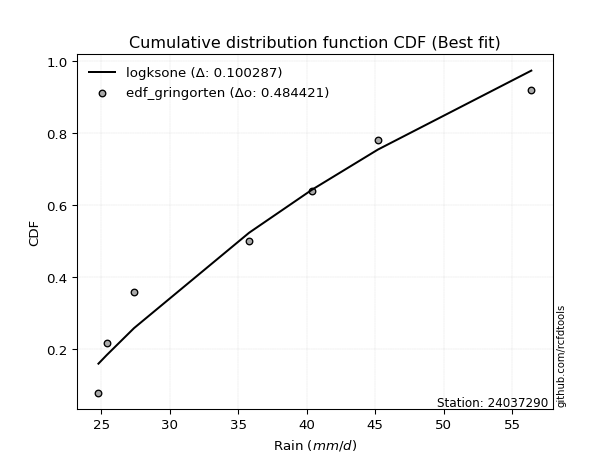</img>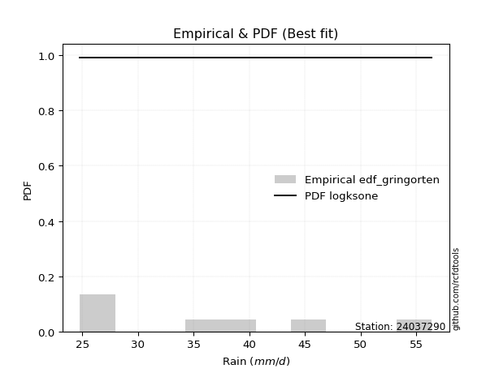</img>

</div>


### 9. Empirical - EDF Filliben (1975)

The specific values of the constants (0.3175) (often denoted as $alpha$) and (0.365) are derived from a method proposed by James J. Filliben in a 1975 paper. This particular formula is the mean value of the $i$-th order statistic of the normal distribution and is considered a robust and effective plotting position formula for the normal probability plot correlation coefficient test for normality.

<div align="center">


$P=(m-0.3175)/(n+0.365)$


</div>


**9.1. Empirical values**

<div align="center">

|                | 0                   | 1                   | 2                   | 3            | 4                  | 5                  | 6                  |
|:---------------|:--------------------|:--------------------|:--------------------|:-------------|:-------------------|:-------------------|:-------------------|
| date           | 2025                | 2023                | 2022                | 2019         | 2021               | 2020               | 2024               |
| x              | 16.8                | 24.8                | 27.4                | 35.8         | 40.4               | 45.2               | 56.4               |
| m              | 1                   | 2                   | 3                   | 4            | 5                  | 6                  | 7                  |
| empirical_dist | edf_filliben        | edf_filliben        | edf_filliben        | edf_filliben | edf_filliben       | edf_filliben       | edf_filliben       |
| empirical      | 0.09266802443991853 | 0.22844534962661237 | 0.36422267481330617 | 0.5          | 0.6357773251866938 | 0.7715546503733877 | 0.9073319755600815 |
| empirical_tr   | 1.1021324354657687  | 1.2960844698636163  | 1.5728777362520021  | 2.0          | 2.7455731593662627 | 4.377414561664191  | 10.791208791208794 |

</div>


**9.2. Kolmogorov-Smirnov fit test (sorted by Δ)**


<div align="center">

|                | 0                   | 1                   | 2                   | 3                   | 4                   | 5                   | 6                   | 7                   | 8                   | 9                   | 10                  | 11                  | 12                  | 13                  | 14                  | 15                  | 16                  | 17                  | 18                  | 19                  | 20                  | 21                  | 22                  | 23                  | 24                  | 25                  | 26                  | 27                  | 28                  | 29                  | 30                  | 31                  | 32                  | 33                  | 34                  | 35                  | 36                  | 37                  | 38                  | 39                  | 40                  | 41                  | 42                  | 43                  | 44                  | 45                  | 46                  | 47                  | 48                  | 49                  | 50                  | 51                  | 52                  | 53                  | 54                    | 55                  | 56                  | 57                  | 58                  | 59                  | 60                  | 61                  | 62                  | 63                  | 64                  | 65                  | 66                  | 67                  | 68                  | 69                  | 70                  | 71                  | 72                  | 73                  | 74                  | 75                  | 76                  | 77                  | 78                  | 79                  | 80                  | 81                  | 82                  | 83                  | 84                  | 85                  | 86                  | 87                  | 88                  | 89                  |
|:---------------|:--------------------|:--------------------|:--------------------|:--------------------|:--------------------|:--------------------|:--------------------|:--------------------|:--------------------|:--------------------|:--------------------|:--------------------|:--------------------|:--------------------|:--------------------|:--------------------|:--------------------|:--------------------|:--------------------|:--------------------|:--------------------|:--------------------|:--------------------|:--------------------|:--------------------|:--------------------|:--------------------|:--------------------|:--------------------|:--------------------|:--------------------|:--------------------|:--------------------|:--------------------|:--------------------|:--------------------|:--------------------|:--------------------|:--------------------|:--------------------|:--------------------|:--------------------|:--------------------|:--------------------|:--------------------|:--------------------|:--------------------|:--------------------|:--------------------|:--------------------|:--------------------|:--------------------|:--------------------|:--------------------|:----------------------|:--------------------|:--------------------|:--------------------|:--------------------|:--------------------|:--------------------|:--------------------|:--------------------|:--------------------|:--------------------|:--------------------|:--------------------|:--------------------|:--------------------|:--------------------|:--------------------|:--------------------|:--------------------|:--------------------|:--------------------|:--------------------|:--------------------|:--------------------|:--------------------|:--------------------|:--------------------|:--------------------|:--------------------|:--------------------|:--------------------|:--------------------|:--------------------|:--------------------|:--------------------|:--------------------|
| station        | 24037290            | 24037290            | 24037290            | 24037290            | 24037290            | 24037290            | 24037290            | 24037290            | 24037290            | 24037290            | 24037290            | 24037290            | 24037290            | 24037290            | 24037290            | 24037290            | 24037290            | 24037290            | 24037290            | 24037290            | 24037290            | 24037290            | 24037290            | 24037290            | 24037290            | 24037290            | 24037290            | 24037290            | 24037290            | 24037290            | 24037290            | 24037290            | 24037290            | 24037290            | 24037290            | 24037290            | 24037290            | 24037290            | 24037290            | 24037290            | 24037290            | 24037290            | 24037290            | 24037290            | 24037290            | 24037290            | 24037290            | 24037290            | 24037290            | 24037290            | 24037290            | 24037290            | 24037290            | 24037290            | 24037290              | 24037290            | 24037290            | 24037290            | 24037290            | 24037290            | 24037290            | 24037290            | 24037290            | 24037290            | 24037290            | 24037290            | 24037290            | 24037290            | 24037290            | 24037290            | 24037290            | 24037290            | 24037290            | 24037290            | 24037290            | 24037290            | 24037290            | 24037290            | 24037290            | 24037290            | 24037290            | 24037290            | 24037290            | 24037290            | 24037290            | 24037290            | 24037290            | 24037290            | 24037290            | 24037290            |
| empirical_dist | edf_filliben        | edf_filliben        | edf_filliben        | edf_filliben        | edf_filliben        | edf_filliben        | edf_filliben        | edf_filliben        | edf_filliben        | edf_filliben        | edf_filliben        | edf_filliben        | edf_filliben        | edf_filliben        | edf_filliben        | edf_filliben        | edf_filliben        | edf_filliben        | edf_filliben        | edf_filliben        | edf_filliben        | edf_filliben        | edf_filliben        | edf_filliben        | edf_filliben        | edf_filliben        | edf_filliben        | edf_filliben        | edf_filliben        | edf_filliben        | edf_filliben        | edf_filliben        | edf_filliben        | edf_filliben        | edf_filliben        | edf_filliben        | edf_filliben        | edf_filliben        | edf_filliben        | edf_filliben        | edf_filliben        | edf_filliben        | edf_filliben        | edf_filliben        | edf_filliben        | edf_filliben        | edf_filliben        | edf_filliben        | edf_filliben        | edf_filliben        | edf_filliben        | edf_filliben        | edf_filliben        | edf_filliben        | edf_filliben          | edf_filliben        | edf_filliben        | edf_filliben        | edf_filliben        | edf_filliben        | edf_filliben        | edf_filliben        | edf_filliben        | edf_filliben        | edf_filliben        | edf_filliben        | edf_filliben        | edf_filliben        | edf_filliben        | edf_filliben        | edf_filliben        | edf_filliben        | edf_filliben        | edf_filliben        | edf_filliben        | edf_filliben        | edf_filliben        | edf_filliben        | edf_filliben        | edf_filliben        | edf_filliben        | edf_filliben        | edf_filliben        | edf_filliben        | edf_filliben        | edf_filliben        | edf_filliben        | edf_filliben        | edf_filliben        | edf_filliben        |
| p_dist         | logpearson3         | rayleigh            | chi2                | erlang              | gamma               | weibull_min         | f                   | ncf                 | invgauss            | logfisk             | betaprime           | maxwell             | genlogistic         | rice                | logweibull_min      | johnsonsu           | invgamma            | alpha               | kstwobign           | logt                | lognorm             | lognorm             | logcrystalball      | logexponnorm        | logf                | logloggamma         | logncf              | lognct              | gumbel_r            | logfatiguelife      | logjohnsonsu        | logbetaprime        | fisk                | halfnorm            | pearson3            | genexpon            | logerlang           | loggamma            | loggamma            | logrice             | nct                 | loglogistic         | exponnorm           | truncnorm           | norm                | crystalball         | t                   | logalpha            | loginvgamma         | loggumbel_l         | loggenlogistic      | mielke              | loghypsecant        | loginvgauss         | loglaplace_asymmetric | moyal               | logmaxwell          | halflogistic        | loginvweibull       | logistic            | lograyleigh         | laplace_asymmetric  | loglaplace          | logkstwobign        | hypsecant           | loggenexpon         | expon               | gumbel_l            | loghalfnorm         | loggumbel_r         | laplace             | logmielke           | loggompertz         | loghalflogistic     | logmoyal            | wald                | logexpon            | logchi2             | logtruncnorm        | lognakagami         | logwald             | gibrat              | loggibrat           | nakagami            | loglognorm          | pareto              | logpareto           | invweibull          | gompertz            | fatiguelife         |
| delta          | 0.06698964423240722 | 0.06709489544981245 | 0.07075031765225237 | 0.07239495408556412 | 0.07283817497638873 | 0.07302052645319124 | 0.07326597627002313 | 0.07390824817083569 | 0.07537290437708583 | 0.07660492793578266 | 0.07665851192832301 | 0.07671140649559588 | 0.08057552481703856 | 0.08104204527073877 | 0.08130349395710573 | 0.08235738037961782 | 0.08431317655244552 | 0.08550951124759898 | 0.0862560366481262  | 0.08687483341916913 | 0.08688669017317874 | 0.08688669017317874 | 0.08688683973077471 | 0.08688845570697079 | 0.08688901374944402 | 0.08699365472323445 | 0.0875082226913847  | 0.08778261245778163 | 0.08806721305082443 | 0.08854635118958853 | 0.08861994737340773 | 0.09042156690160108 | 0.09046735924387417 | 0.09266802443991853 | 0.09391525825497088 | 0.09508388214855445 | 0.0958045109699589  | 0.09641693412244245 | 0.09641693412244245 | 0.09663656976567803 | 0.09701841894124036 | 0.09825704729021134 | 0.09991036311936885 | 0.10029461374020376 | 0.10029463853654597 | 0.10029464951857714 | 0.10029554313089317 | 0.10165193221312518 | 0.10379134097183884 | 0.10425230832418703 | 0.10479093055314237 | 0.10486614702271319 | 0.10765852757515104 | 0.11055278890512044 | 0.11058104228634036   | 0.11371119102593275 | 0.11453226115512938 | 0.11607509406061667 | 0.11913818939214071 | 0.12282263745827118 | 0.12318738836082288 | 0.13035207545838018 | 0.13345307059519407 | 0.13796481570375208 | 0.1380705926527596  | 0.1402072491800348  | 0.14278297355837744 | 0.1431348191929679  | 0.14774892677377582 | 0.1546373380387217  | 0.1594623074195407  | 0.16405213516393188 | 0.1741736947568303  | 0.17590569793641397 | 0.17800707965985207 | 0.1969168041706174  | 0.21075850167665375 | 0.21462105580103777 | 0.22844518234658479 | 0.2284453495900097  | 0.24300157394088961 | 0.2599145918691827  | 0.2742541258204124  | 0.31568628796883824 | 0.4109415492444144  | 0.41248003191349214 | 0.42553892675083294 | 0.4780640367497279  | 0.5118961835234136  | 0.5374747591831411  |
| deltao         | 0.48442053926100004 | 0.48442053926100004 | 0.48442053926100004 | 0.48442053926100004 | 0.48442053926100004 | 0.48442053926100004 | 0.48442053926100004 | 0.48442053926100004 | 0.48442053926100004 | 0.48442053926100004 | 0.48442053926100004 | 0.48442053926100004 | 0.48442053926100004 | 0.48442053926100004 | 0.48442053926100004 | 0.48442053926100004 | 0.48442053926100004 | 0.48442053926100004 | 0.48442053926100004 | 0.48442053926100004 | 0.48442053926100004 | 0.48442053926100004 | 0.48442053926100004 | 0.48442053926100004 | 0.48442053926100004 | 0.48442053926100004 | 0.48442053926100004 | 0.48442053926100004 | 0.48442053926100004 | 0.48442053926100004 | 0.48442053926100004 | 0.48442053926100004 | 0.48442053926100004 | 0.48442053926100004 | 0.48442053926100004 | 0.48442053926100004 | 0.48442053926100004 | 0.48442053926100004 | 0.48442053926100004 | 0.48442053926100004 | 0.48442053926100004 | 0.48442053926100004 | 0.48442053926100004 | 0.48442053926100004 | 0.48442053926100004 | 0.48442053926100004 | 0.48442053926100004 | 0.48442053926100004 | 0.48442053926100004 | 0.48442053926100004 | 0.48442053926100004 | 0.48442053926100004 | 0.48442053926100004 | 0.48442053926100004 | 0.48442053926100004   | 0.48442053926100004 | 0.48442053926100004 | 0.48442053926100004 | 0.48442053926100004 | 0.48442053926100004 | 0.48442053926100004 | 0.48442053926100004 | 0.48442053926100004 | 0.48442053926100004 | 0.48442053926100004 | 0.48442053926100004 | 0.48442053926100004 | 0.48442053926100004 | 0.48442053926100004 | 0.48442053926100004 | 0.48442053926100004 | 0.48442053926100004 | 0.48442053926100004 | 0.48442053926100004 | 0.48442053926100004 | 0.48442053926100004 | 0.48442053926100004 | 0.48442053926100004 | 0.48442053926100004 | 0.48442053926100004 | 0.48442053926100004 | 0.48442053926100004 | 0.48442053926100004 | 0.48442053926100004 | 0.48442053926100004 | 0.48442053926100004 | 0.48442053926100004 | 0.48442053926100004 | 0.48442053926100004 | 0.48442053926100004 |
| eval           | Δo > Δ              | Δo > Δ              | Δo > Δ              | Δo > Δ              | Δo > Δ              | Δo > Δ              | Δo > Δ              | Δo > Δ              | Δo > Δ              | Δo > Δ              | Δo > Δ              | Δo > Δ              | Δo > Δ              | Δo > Δ              | Δo > Δ              | Δo > Δ              | Δo > Δ              | Δo > Δ              | Δo > Δ              | Δo > Δ              | Δo > Δ              | Δo > Δ              | Δo > Δ              | Δo > Δ              | Δo > Δ              | Δo > Δ              | Δo > Δ              | Δo > Δ              | Δo > Δ              | Δo > Δ              | Δo > Δ              | Δo > Δ              | Δo > Δ              | Δo > Δ              | Δo > Δ              | Δo > Δ              | Δo > Δ              | Δo > Δ              | Δo > Δ              | Δo > Δ              | Δo > Δ              | Δo > Δ              | Δo > Δ              | Δo > Δ              | Δo > Δ              | Δo > Δ              | Δo > Δ              | Δo > Δ              | Δo > Δ              | Δo > Δ              | Δo > Δ              | Δo > Δ              | Δo > Δ              | Δo > Δ              | Δo > Δ                | Δo > Δ              | Δo > Δ              | Δo > Δ              | Δo > Δ              | Δo > Δ              | Δo > Δ              | Δo > Δ              | Δo > Δ              | Δo > Δ              | Δo > Δ              | Δo > Δ              | Δo > Δ              | Δo > Δ              | Δo > Δ              | Δo > Δ              | Δo > Δ              | Δo > Δ              | Δo > Δ              | Δo > Δ              | Δo > Δ              | Δo > Δ              | Δo > Δ              | Δo > Δ              | Δo > Δ              | Δo > Δ              | Δo > Δ              | Δo > Δ              | Δo > Δ              | Δo > Δ              | Δo > Δ              | Δo > Δ              | Δo > Δ              | Δo > Δ              | Δo <= Δ             | Δo <= Δ             |
| fit            | 1                   | 1                   | 1                   | 1                   | 1                   | 1                   | 1                   | 1                   | 1                   | 1                   | 1                   | 1                   | 1                   | 1                   | 1                   | 1                   | 1                   | 1                   | 1                   | 1                   | 1                   | 1                   | 1                   | 1                   | 1                   | 1                   | 1                   | 1                   | 1                   | 1                   | 1                   | 1                   | 1                   | 1                   | 1                   | 1                   | 1                   | 1                   | 1                   | 1                   | 1                   | 1                   | 1                   | 1                   | 1                   | 1                   | 1                   | 1                   | 1                   | 1                   | 1                   | 1                   | 1                   | 1                   | 1                     | 1                   | 1                   | 1                   | 1                   | 1                   | 1                   | 1                   | 1                   | 1                   | 1                   | 1                   | 1                   | 1                   | 1                   | 1                   | 1                   | 1                   | 1                   | 1                   | 1                   | 1                   | 1                   | 1                   | 1                   | 1                   | 1                   | 1                   | 1                   | 1                   | 1                   | 1                   | 1                   | 1                   | 0                   | 0                   |
| n              | 7                   | 7                   | 7                   | 7                   | 7                   | 7                   | 7                   | 7                   | 7                   | 7                   | 7                   | 7                   | 7                   | 7                   | 7                   | 7                   | 7                   | 7                   | 7                   | 7                   | 7                   | 7                   | 7                   | 7                   | 7                   | 7                   | 7                   | 7                   | 7                   | 7                   | 7                   | 7                   | 7                   | 7                   | 7                   | 7                   | 7                   | 7                   | 7                   | 7                   | 7                   | 7                   | 7                   | 7                   | 7                   | 7                   | 7                   | 7                   | 7                   | 7                   | 7                   | 7                   | 7                   | 7                   | 7                     | 7                   | 7                   | 7                   | 7                   | 7                   | 7                   | 7                   | 7                   | 7                   | 7                   | 7                   | 7                   | 7                   | 7                   | 7                   | 7                   | 7                   | 7                   | 7                   | 7                   | 7                   | 7                   | 7                   | 7                   | 7                   | 7                   | 7                   | 7                   | 7                   | 7                   | 7                   | 7                   | 7                   | 7                   | 7                   |
| best_fit       | 1                   | 0                   | 0                   | 0                   | 0                   | 0                   | 0                   | 0                   | 0                   | 0                   | 0                   | 0                   | 0                   | 0                   | 0                   | 0                   | 0                   | 0                   | 0                   | 0                   | 0                   | 0                   | 0                   | 0                   | 0                   | 0                   | 0                   | 0                   | 0                   | 0                   | 0                   | 0                   | 0                   | 0                   | 0                   | 0                   | 0                   | 0                   | 0                   | 0                   | 0                   | 0                   | 0                   | 0                   | 0                   | 0                   | 0                   | 0                   | 0                   | 0                   | 0                   | 0                   | 0                   | 0                   | 0                     | 0                   | 0                   | 0                   | 0                   | 0                   | 0                   | 0                   | 0                   | 0                   | 0                   | 0                   | 0                   | 0                   | 0                   | 0                   | 0                   | 0                   | 0                   | 0                   | 0                   | 0                   | 0                   | 0                   | 0                   | 0                   | 0                   | 0                   | 0                   | 0                   | 0                   | 0                   | 0                   | 0                   | 0                   | 0                   |
| best_fit_sort  | 1                   | 2                   | 3                   | 4                   | 5                   | 6                   | 7                   | 8                   | 9                   | 10                  | 11                  | 12                  | 13                  | 14                  | 15                  | 16                  | 17                  | 18                  | 19                  | 20                  | 21                  | 22                  | 23                  | 24                  | 25                  | 26                  | 27                  | 28                  | 29                  | 30                  | 31                  | 32                  | 33                  | 34                  | 35                  | 36                  | 37                  | 38                  | 39                  | 40                  | 41                  | 42                  | 43                  | 44                  | 45                  | 46                  | 47                  | 48                  | 49                  | 50                  | 51                  | 52                  | 53                  | 54                  | 55                    | 56                  | 57                  | 58                  | 59                  | 60                  | 61                  | 62                  | 63                  | 64                  | 65                  | 66                  | 67                  | 68                  | 69                  | 70                  | 71                  | 72                  | 73                  | 74                  | 75                  | 76                  | 77                  | 78                  | 79                  | 80                  | 81                  | 82                  | 83                  | 84                  | 85                  | 86                  | 87                  | 88                  | 89                  | 90                  |

</div>


<div align="center">

</img>

</div>


**9.3. Best fit**

<div align="center">

|   id |   station | empirical_dist   | p_dist      |     delta |   deltao | eval   |   fit |   n |   best_fit |   best_fit_sort |
|-----:|----------:|:-----------------|:------------|----------:|---------:|:-------|------:|----:|-----------:|----------------:|
|    0 |  24037290 | edf_filliben     | logpearson3 | 0.0669896 | 0.484421 | Δo > Δ |     1 |   7 |          1 |               1 |

</div>


<div align="center">

</img>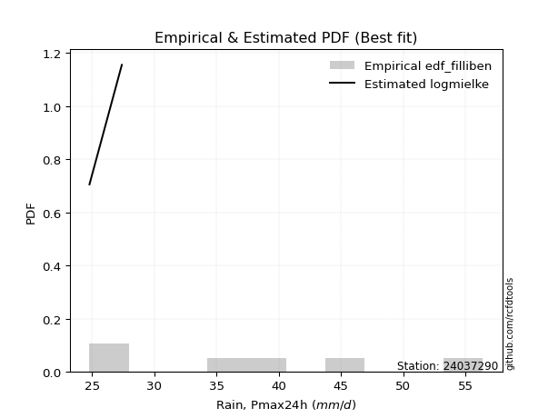</img>

</div>


### 10. Empirical - EDF Jenkinson (1977)

The Jenkinson formula in hydrology is an empirical plotting position formula used to estimate the non-exceedance probability _(P)_ or return period _(T)_ of a given ordered observation within a sample. It is a widely used method in the frequency analysis of extreme events such as floods and rainfall, as it provides a distribution-free way to plot data. _a≈0.31_ and _b≈0.38_ are constants derived to approximate the median of the probability distribution for the given rank.

<div align="center">


$P=(m-a)/(n+b)$


</div>


**10.1. Empirical values**

<div align="center">

|                | 0                   | 1                   | 2                   | 3             | 4                  | 5                  | 6                  |
|:---------------|:--------------------|:--------------------|:--------------------|:--------------|:-------------------|:-------------------|:-------------------|
| date           | 2025                | 2023                | 2022                | 2019          | 2021               | 2020               | 2024               |
| x              | 16.8                | 24.8                | 27.4                | 35.8          | 40.4               | 45.2               | 56.4               |
| m              | 1                   | 2                   | 3                   | 4             | 5                  | 6                  | 7                  |
| empirical_dist | edf_jenkinson       | edf_jenkinson       | edf_jenkinson       | edf_jenkinson | edf_jenkinson      | edf_jenkinson      | edf_jenkinson      |
| empirical      | 0.09349593495934959 | 0.22899728997289973 | 0.36449864498644985 | 0.5           | 0.6355013550135502 | 0.7710027100271003 | 0.9065040650406505 |
| empirical_tr   | 1.1031390134529149  | 1.29701230228471    | 1.5735607675906182  | 2.0           | 2.743494423791822  | 4.366863905325444  | 10.695652173913055 |

</div>


**10.2. Kolmogorov-Smirnov fit test (sorted by Δ)**


<div align="center">

|                | 0                   | 1                   | 2                   | 3                   | 4                   | 5                   | 6                   | 7                   | 8                   | 9                   | 10                  | 11                  | 12                  | 13                  | 14                  | 15                  | 16                  | 17                  | 18                  | 19                  | 20                  | 21                  | 22                  | 23                  | 24                  | 25                  | 26                  | 27                  | 28                  | 29                  | 30                  | 31                  | 32                  | 33                  | 34                  | 35                  | 36                  | 37                  | 38                  | 39                  | 40                  | 41                  | 42                  | 43                  | 44                  | 45                  | 46                  | 47                  | 48                  | 49                  | 50                  | 51                  | 52                  | 53                  | 54                    | 55                  | 56                  | 57                  | 58                  | 59                  | 60                  | 61                  | 62                  | 63                  | 64                  | 65                  | 66                  | 67                  | 68                  | 69                  | 70                  | 71                  | 72                  | 73                  | 74                  | 75                  | 76                  | 77                  | 78                  | 79                  | 80                  | 81                  | 82                  | 83                  | 84                  | 85                  | 86                  | 87                  | 88                  | 89                  |
|:---------------|:--------------------|:--------------------|:--------------------|:--------------------|:--------------------|:--------------------|:--------------------|:--------------------|:--------------------|:--------------------|:--------------------|:--------------------|:--------------------|:--------------------|:--------------------|:--------------------|:--------------------|:--------------------|:--------------------|:--------------------|:--------------------|:--------------------|:--------------------|:--------------------|:--------------------|:--------------------|:--------------------|:--------------------|:--------------------|:--------------------|:--------------------|:--------------------|:--------------------|:--------------------|:--------------------|:--------------------|:--------------------|:--------------------|:--------------------|:--------------------|:--------------------|:--------------------|:--------------------|:--------------------|:--------------------|:--------------------|:--------------------|:--------------------|:--------------------|:--------------------|:--------------------|:--------------------|:--------------------|:--------------------|:----------------------|:--------------------|:--------------------|:--------------------|:--------------------|:--------------------|:--------------------|:--------------------|:--------------------|:--------------------|:--------------------|:--------------------|:--------------------|:--------------------|:--------------------|:--------------------|:--------------------|:--------------------|:--------------------|:--------------------|:--------------------|:--------------------|:--------------------|:--------------------|:--------------------|:--------------------|:--------------------|:--------------------|:--------------------|:--------------------|:--------------------|:--------------------|:--------------------|:--------------------|:--------------------|:--------------------|
| station        | 24037290            | 24037290            | 24037290            | 24037290            | 24037290            | 24037290            | 24037290            | 24037290            | 24037290            | 24037290            | 24037290            | 24037290            | 24037290            | 24037290            | 24037290            | 24037290            | 24037290            | 24037290            | 24037290            | 24037290            | 24037290            | 24037290            | 24037290            | 24037290            | 24037290            | 24037290            | 24037290            | 24037290            | 24037290            | 24037290            | 24037290            | 24037290            | 24037290            | 24037290            | 24037290            | 24037290            | 24037290            | 24037290            | 24037290            | 24037290            | 24037290            | 24037290            | 24037290            | 24037290            | 24037290            | 24037290            | 24037290            | 24037290            | 24037290            | 24037290            | 24037290            | 24037290            | 24037290            | 24037290            | 24037290              | 24037290            | 24037290            | 24037290            | 24037290            | 24037290            | 24037290            | 24037290            | 24037290            | 24037290            | 24037290            | 24037290            | 24037290            | 24037290            | 24037290            | 24037290            | 24037290            | 24037290            | 24037290            | 24037290            | 24037290            | 24037290            | 24037290            | 24037290            | 24037290            | 24037290            | 24037290            | 24037290            | 24037290            | 24037290            | 24037290            | 24037290            | 24037290            | 24037290            | 24037290            | 24037290            |
| empirical_dist | edf_jenkinson       | edf_jenkinson       | edf_jenkinson       | edf_jenkinson       | edf_jenkinson       | edf_jenkinson       | edf_jenkinson       | edf_jenkinson       | edf_jenkinson       | edf_jenkinson       | edf_jenkinson       | edf_jenkinson       | edf_jenkinson       | edf_jenkinson       | edf_jenkinson       | edf_jenkinson       | edf_jenkinson       | edf_jenkinson       | edf_jenkinson       | edf_jenkinson       | edf_jenkinson       | edf_jenkinson       | edf_jenkinson       | edf_jenkinson       | edf_jenkinson       | edf_jenkinson       | edf_jenkinson       | edf_jenkinson       | edf_jenkinson       | edf_jenkinson       | edf_jenkinson       | edf_jenkinson       | edf_jenkinson       | edf_jenkinson       | edf_jenkinson       | edf_jenkinson       | edf_jenkinson       | edf_jenkinson       | edf_jenkinson       | edf_jenkinson       | edf_jenkinson       | edf_jenkinson       | edf_jenkinson       | edf_jenkinson       | edf_jenkinson       | edf_jenkinson       | edf_jenkinson       | edf_jenkinson       | edf_jenkinson       | edf_jenkinson       | edf_jenkinson       | edf_jenkinson       | edf_jenkinson       | edf_jenkinson       | edf_jenkinson         | edf_jenkinson       | edf_jenkinson       | edf_jenkinson       | edf_jenkinson       | edf_jenkinson       | edf_jenkinson       | edf_jenkinson       | edf_jenkinson       | edf_jenkinson       | edf_jenkinson       | edf_jenkinson       | edf_jenkinson       | edf_jenkinson       | edf_jenkinson       | edf_jenkinson       | edf_jenkinson       | edf_jenkinson       | edf_jenkinson       | edf_jenkinson       | edf_jenkinson       | edf_jenkinson       | edf_jenkinson       | edf_jenkinson       | edf_jenkinson       | edf_jenkinson       | edf_jenkinson       | edf_jenkinson       | edf_jenkinson       | edf_jenkinson       | edf_jenkinson       | edf_jenkinson       | edf_jenkinson       | edf_jenkinson       | edf_jenkinson       | edf_jenkinson       |
| p_dist         | logpearson3         | rayleigh            | chi2                | erlang              | weibull_min         | gamma               | f                   | ncf                 | invgauss            | logfisk             | betaprime           | maxwell             | genlogistic         | rice                | logweibull_min      | johnsonsu           | invgamma            | alpha               | kstwobign           | logt                | lognorm             | lognorm             | logcrystalball      | logexponnorm        | logf                | logloggamma         | logncf              | lognct              | gumbel_r            | logfatiguelife      | logjohnsonsu        | logbetaprime        | fisk                | halfnorm            | pearson3            | genexpon            | logerlang           | loggamma            | loggamma            | logrice             | nct                 | loglogistic         | exponnorm           | truncnorm           | norm                | crystalball         | t                   | logalpha            | loginvgamma         | loggumbel_l         | loggenlogistic      | mielke              | loghypsecant        | loginvgauss         | loglaplace_asymmetric | moyal               | logmaxwell          | halflogistic        | loginvweibull       | logistic            | lograyleigh         | laplace_asymmetric  | loglaplace          | logkstwobign        | hypsecant           | loggenexpon         | expon               | gumbel_l            | loghalfnorm         | loggumbel_r         | laplace             | logmielke           | loggompertz         | loghalflogistic     | logmoyal            | wald                | logexpon            | logchi2             | logtruncnorm        | lognakagami         | logwald             | gibrat              | loggibrat           | nakagami            | loglognorm          | pareto              | logpareto           | invweibull          | gompertz            | fatiguelife         |
| delta          | 0.0672656144055509  | 0.06737086562295613 | 0.07075031765225237 | 0.0726709242587078  | 0.07302052645319124 | 0.0731141451495324  | 0.0735419464431668  | 0.07418421834397937 | 0.0756488745502295  | 0.07688089810892634 | 0.0769344821014667  | 0.07698737666873956 | 0.08057552481703856 | 0.08131801544388245 | 0.08157946413024941 | 0.0826333505527615  | 0.0845891467255892  | 0.08578548142074266 | 0.0862560366481262  | 0.08687483341916913 | 0.08688669017317874 | 0.08688669017317874 | 0.08688683973077471 | 0.08688845570697079 | 0.08688901374944402 | 0.08726962489637813 | 0.0875082226913847  | 0.08778261245778163 | 0.08806721305082443 | 0.08854635118958853 | 0.0888959175465514  | 0.09042156690160108 | 0.09074332941701785 | 0.09349593495934959 | 0.09419122842811456 | 0.09508388214855445 | 0.0958045109699589  | 0.09641693412244245 | 0.09641693412244245 | 0.09663656976567803 | 0.09729438911438404 | 0.09825704729021134 | 0.10018633329251253 | 0.10057058391334744 | 0.10057060870968965 | 0.10057061969172082 | 0.10057151330403685 | 0.10165193221312518 | 0.10379134097183884 | 0.1045282784973307  | 0.10506690072628605 | 0.10514211719585687 | 0.10765852757515104 | 0.11055278890512044 | 0.11085701245948404   | 0.11371119102593275 | 0.11453226115512938 | 0.11607509406061667 | 0.11913818939214071 | 0.12309860763141486 | 0.12318738836082288 | 0.13062804563152386 | 0.13345307059519407 | 0.13796481570375208 | 0.13834656282590327 | 0.1402072491800348  | 0.14278297355837744 | 0.14341078936611157 | 0.14774892677377582 | 0.1546373380387217  | 0.15973827759268439 | 0.16350019481764452 | 0.1741736947568303  | 0.17590569793641397 | 0.17800707965985207 | 0.19746874451690477 | 0.2102065613303664  | 0.2140691154547504  | 0.22899712269287215 | 0.22899728993629706 | 0.24300157394088961 | 0.2601905620423264  | 0.2742541258204124  | 0.31568628796883824 | 0.41038960889812703 | 0.4119280915672048  | 0.4249869864045456  | 0.47723612623029693 | 0.51162021335027    | 0.5369228188368538  |
| deltao         | 0.48442053926100004 | 0.48442053926100004 | 0.48442053926100004 | 0.48442053926100004 | 0.48442053926100004 | 0.48442053926100004 | 0.48442053926100004 | 0.48442053926100004 | 0.48442053926100004 | 0.48442053926100004 | 0.48442053926100004 | 0.48442053926100004 | 0.48442053926100004 | 0.48442053926100004 | 0.48442053926100004 | 0.48442053926100004 | 0.48442053926100004 | 0.48442053926100004 | 0.48442053926100004 | 0.48442053926100004 | 0.48442053926100004 | 0.48442053926100004 | 0.48442053926100004 | 0.48442053926100004 | 0.48442053926100004 | 0.48442053926100004 | 0.48442053926100004 | 0.48442053926100004 | 0.48442053926100004 | 0.48442053926100004 | 0.48442053926100004 | 0.48442053926100004 | 0.48442053926100004 | 0.48442053926100004 | 0.48442053926100004 | 0.48442053926100004 | 0.48442053926100004 | 0.48442053926100004 | 0.48442053926100004 | 0.48442053926100004 | 0.48442053926100004 | 0.48442053926100004 | 0.48442053926100004 | 0.48442053926100004 | 0.48442053926100004 | 0.48442053926100004 | 0.48442053926100004 | 0.48442053926100004 | 0.48442053926100004 | 0.48442053926100004 | 0.48442053926100004 | 0.48442053926100004 | 0.48442053926100004 | 0.48442053926100004 | 0.48442053926100004   | 0.48442053926100004 | 0.48442053926100004 | 0.48442053926100004 | 0.48442053926100004 | 0.48442053926100004 | 0.48442053926100004 | 0.48442053926100004 | 0.48442053926100004 | 0.48442053926100004 | 0.48442053926100004 | 0.48442053926100004 | 0.48442053926100004 | 0.48442053926100004 | 0.48442053926100004 | 0.48442053926100004 | 0.48442053926100004 | 0.48442053926100004 | 0.48442053926100004 | 0.48442053926100004 | 0.48442053926100004 | 0.48442053926100004 | 0.48442053926100004 | 0.48442053926100004 | 0.48442053926100004 | 0.48442053926100004 | 0.48442053926100004 | 0.48442053926100004 | 0.48442053926100004 | 0.48442053926100004 | 0.48442053926100004 | 0.48442053926100004 | 0.48442053926100004 | 0.48442053926100004 | 0.48442053926100004 | 0.48442053926100004 |
| eval           | Δo > Δ              | Δo > Δ              | Δo > Δ              | Δo > Δ              | Δo > Δ              | Δo > Δ              | Δo > Δ              | Δo > Δ              | Δo > Δ              | Δo > Δ              | Δo > Δ              | Δo > Δ              | Δo > Δ              | Δo > Δ              | Δo > Δ              | Δo > Δ              | Δo > Δ              | Δo > Δ              | Δo > Δ              | Δo > Δ              | Δo > Δ              | Δo > Δ              | Δo > Δ              | Δo > Δ              | Δo > Δ              | Δo > Δ              | Δo > Δ              | Δo > Δ              | Δo > Δ              | Δo > Δ              | Δo > Δ              | Δo > Δ              | Δo > Δ              | Δo > Δ              | Δo > Δ              | Δo > Δ              | Δo > Δ              | Δo > Δ              | Δo > Δ              | Δo > Δ              | Δo > Δ              | Δo > Δ              | Δo > Δ              | Δo > Δ              | Δo > Δ              | Δo > Δ              | Δo > Δ              | Δo > Δ              | Δo > Δ              | Δo > Δ              | Δo > Δ              | Δo > Δ              | Δo > Δ              | Δo > Δ              | Δo > Δ                | Δo > Δ              | Δo > Δ              | Δo > Δ              | Δo > Δ              | Δo > Δ              | Δo > Δ              | Δo > Δ              | Δo > Δ              | Δo > Δ              | Δo > Δ              | Δo > Δ              | Δo > Δ              | Δo > Δ              | Δo > Δ              | Δo > Δ              | Δo > Δ              | Δo > Δ              | Δo > Δ              | Δo > Δ              | Δo > Δ              | Δo > Δ              | Δo > Δ              | Δo > Δ              | Δo > Δ              | Δo > Δ              | Δo > Δ              | Δo > Δ              | Δo > Δ              | Δo > Δ              | Δo > Δ              | Δo > Δ              | Δo > Δ              | Δo > Δ              | Δo <= Δ             | Δo <= Δ             |
| fit            | 1                   | 1                   | 1                   | 1                   | 1                   | 1                   | 1                   | 1                   | 1                   | 1                   | 1                   | 1                   | 1                   | 1                   | 1                   | 1                   | 1                   | 1                   | 1                   | 1                   | 1                   | 1                   | 1                   | 1                   | 1                   | 1                   | 1                   | 1                   | 1                   | 1                   | 1                   | 1                   | 1                   | 1                   | 1                   | 1                   | 1                   | 1                   | 1                   | 1                   | 1                   | 1                   | 1                   | 1                   | 1                   | 1                   | 1                   | 1                   | 1                   | 1                   | 1                   | 1                   | 1                   | 1                   | 1                     | 1                   | 1                   | 1                   | 1                   | 1                   | 1                   | 1                   | 1                   | 1                   | 1                   | 1                   | 1                   | 1                   | 1                   | 1                   | 1                   | 1                   | 1                   | 1                   | 1                   | 1                   | 1                   | 1                   | 1                   | 1                   | 1                   | 1                   | 1                   | 1                   | 1                   | 1                   | 1                   | 1                   | 0                   | 0                   |
| n              | 7                   | 7                   | 7                   | 7                   | 7                   | 7                   | 7                   | 7                   | 7                   | 7                   | 7                   | 7                   | 7                   | 7                   | 7                   | 7                   | 7                   | 7                   | 7                   | 7                   | 7                   | 7                   | 7                   | 7                   | 7                   | 7                   | 7                   | 7                   | 7                   | 7                   | 7                   | 7                   | 7                   | 7                   | 7                   | 7                   | 7                   | 7                   | 7                   | 7                   | 7                   | 7                   | 7                   | 7                   | 7                   | 7                   | 7                   | 7                   | 7                   | 7                   | 7                   | 7                   | 7                   | 7                   | 7                     | 7                   | 7                   | 7                   | 7                   | 7                   | 7                   | 7                   | 7                   | 7                   | 7                   | 7                   | 7                   | 7                   | 7                   | 7                   | 7                   | 7                   | 7                   | 7                   | 7                   | 7                   | 7                   | 7                   | 7                   | 7                   | 7                   | 7                   | 7                   | 7                   | 7                   | 7                   | 7                   | 7                   | 7                   | 7                   |
| best_fit       | 1                   | 0                   | 0                   | 0                   | 0                   | 0                   | 0                   | 0                   | 0                   | 0                   | 0                   | 0                   | 0                   | 0                   | 0                   | 0                   | 0                   | 0                   | 0                   | 0                   | 0                   | 0                   | 0                   | 0                   | 0                   | 0                   | 0                   | 0                   | 0                   | 0                   | 0                   | 0                   | 0                   | 0                   | 0                   | 0                   | 0                   | 0                   | 0                   | 0                   | 0                   | 0                   | 0                   | 0                   | 0                   | 0                   | 0                   | 0                   | 0                   | 0                   | 0                   | 0                   | 0                   | 0                   | 0                     | 0                   | 0                   | 0                   | 0                   | 0                   | 0                   | 0                   | 0                   | 0                   | 0                   | 0                   | 0                   | 0                   | 0                   | 0                   | 0                   | 0                   | 0                   | 0                   | 0                   | 0                   | 0                   | 0                   | 0                   | 0                   | 0                   | 0                   | 0                   | 0                   | 0                   | 0                   | 0                   | 0                   | 0                   | 0                   |
| best_fit_sort  | 1                   | 2                   | 3                   | 4                   | 5                   | 6                   | 7                   | 8                   | 9                   | 10                  | 11                  | 12                  | 13                  | 14                  | 15                  | 16                  | 17                  | 18                  | 19                  | 20                  | 21                  | 22                  | 23                  | 24                  | 25                  | 26                  | 27                  | 28                  | 29                  | 30                  | 31                  | 32                  | 33                  | 34                  | 35                  | 36                  | 37                  | 38                  | 39                  | 40                  | 41                  | 42                  | 43                  | 44                  | 45                  | 46                  | 47                  | 48                  | 49                  | 50                  | 51                  | 52                  | 53                  | 54                  | 55                    | 56                  | 57                  | 58                  | 59                  | 60                  | 61                  | 62                  | 63                  | 64                  | 65                  | 66                  | 67                  | 68                  | 69                  | 70                  | 71                  | 72                  | 73                  | 74                  | 75                  | 76                  | 77                  | 78                  | 79                  | 80                  | 81                  | 82                  | 83                  | 84                  | 85                  | 86                  | 87                  | 88                  | 89                  | 90                  |

</div>


<div align="center">

</img>

</div>


**10.3. Best fit**

<div align="center">

|   id |   station | empirical_dist   | p_dist      |     delta |   deltao | eval   |   fit |   n |   best_fit |   best_fit_sort |
|-----:|----------:|:-----------------|:------------|----------:|---------:|:-------|------:|----:|-----------:|----------------:|
|    0 |  24037290 | edf_jenkinson    | logpearson3 | 0.0672656 | 0.484421 | Δo > Δ |     1 |   7 |          1 |               1 |

</div>


<div align="center">

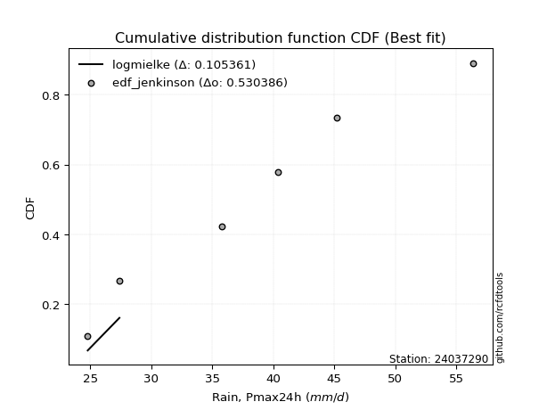</img></img>

</div>


### 11. Empirical - EDF Cunnane (1978)

Cunnane´s work in statistical hydrology has focused on the performance and evaluation of different probability distributions (such as GEV, Gumbel, Lognormal) for flood frequency estimation. _b_ is a constant, typically set to 0.4.

<div align="center">


$P=(m-b)/(n+1-2b)$


</div>


**11.1. Empirical values**

<div align="center">

|                | 0                   | 1                   | 2                  | 3           | 4                  | 5                  | 6                  |
|:---------------|:--------------------|:--------------------|:-------------------|:------------|:-------------------|:-------------------|:-------------------|
| date           | 2025                | 2023                | 2022               | 2019        | 2021               | 2020               | 2024               |
| x              | 16.8                | 24.8                | 27.4               | 35.8        | 40.4               | 45.2               | 56.4               |
| m              | 1                   | 2                   | 3                  | 4           | 5                  | 6                  | 7                  |
| empirical_dist | edf_cunnane         | edf_cunnane         | edf_cunnane        | edf_cunnane | edf_cunnane        | edf_cunnane        | edf_cunnane        |
| empirical      | 0.08333333333333333 | 0.22222222222222224 | 0.3611111111111111 | 0.5         | 0.6388888888888888 | 0.7777777777777777 | 0.9166666666666666 |
| empirical_tr   | 1.090909090909091   | 1.2857142857142856  | 1.565217391304348  | 2.0         | 2.7692307692307687 | 4.499999999999998  | 11.999999999999995 |

</div>


**11.2. Kolmogorov-Smirnov fit test (sorted by Δ)**


<div align="center">

|                | 0                   | 1                   | 2                   | 3                   | 4                   | 5                   | 6                   | 7                   | 8                   | 9                   | 10                  | 11                  | 12                  | 13                  | 14                  | 15                  | 16                  | 17                  | 18                  | 19                  | 20                  | 21                  | 22                  | 23                  | 24                  | 25                  | 26                  | 27                  | 28                  | 29                  | 30                  | 31                  | 32                  | 33                  | 34                  | 35                  | 36                  | 37                  | 38                  | 39                  | 40                  | 41                  | 42                  | 43                  | 44                  | 45                  | 46                  | 47                  | 48                  | 49                  | 50                  | 51                  | 52                    | 53                  | 54                  | 55                  | 56                  | 57                  | 58                  | 59                  | 60                  | 61                  | 62                  | 63                  | 64                  | 65                  | 66                  | 67                  | 68                  | 69                  | 70                  | 71                  | 72                  | 73                  | 74                  | 75                  | 76                  | 77                  | 78                  | 79                  | 80                  | 81                  | 82                  | 83                  | 84                  | 85                  | 86                  | 87                  | 88                  | 89                  |
|:---------------|:--------------------|:--------------------|:--------------------|:--------------------|:--------------------|:--------------------|:--------------------|:--------------------|:--------------------|:--------------------|:--------------------|:--------------------|:--------------------|:--------------------|:--------------------|:--------------------|:--------------------|:--------------------|:--------------------|:--------------------|:--------------------|:--------------------|:--------------------|:--------------------|:--------------------|:--------------------|:--------------------|:--------------------|:--------------------|:--------------------|:--------------------|:--------------------|:--------------------|:--------------------|:--------------------|:--------------------|:--------------------|:--------------------|:--------------------|:--------------------|:--------------------|:--------------------|:--------------------|:--------------------|:--------------------|:--------------------|:--------------------|:--------------------|:--------------------|:--------------------|:--------------------|:--------------------|:----------------------|:--------------------|:--------------------|:--------------------|:--------------------|:--------------------|:--------------------|:--------------------|:--------------------|:--------------------|:--------------------|:--------------------|:--------------------|:--------------------|:--------------------|:--------------------|:--------------------|:--------------------|:--------------------|:--------------------|:--------------------|:--------------------|:--------------------|:--------------------|:--------------------|:--------------------|:--------------------|:--------------------|:--------------------|:--------------------|:--------------------|:--------------------|:--------------------|:--------------------|:--------------------|:--------------------|:--------------------|:--------------------|
| station        | 24037290            | 24037290            | 24037290            | 24037290            | 24037290            | 24037290            | 24037290            | 24037290            | 24037290            | 24037290            | 24037290            | 24037290            | 24037290            | 24037290            | 24037290            | 24037290            | 24037290            | 24037290            | 24037290            | 24037290            | 24037290            | 24037290            | 24037290            | 24037290            | 24037290            | 24037290            | 24037290            | 24037290            | 24037290            | 24037290            | 24037290            | 24037290            | 24037290            | 24037290            | 24037290            | 24037290            | 24037290            | 24037290            | 24037290            | 24037290            | 24037290            | 24037290            | 24037290            | 24037290            | 24037290            | 24037290            | 24037290            | 24037290            | 24037290            | 24037290            | 24037290            | 24037290            | 24037290              | 24037290            | 24037290            | 24037290            | 24037290            | 24037290            | 24037290            | 24037290            | 24037290            | 24037290            | 24037290            | 24037290            | 24037290            | 24037290            | 24037290            | 24037290            | 24037290            | 24037290            | 24037290            | 24037290            | 24037290            | 24037290            | 24037290            | 24037290            | 24037290            | 24037290            | 24037290            | 24037290            | 24037290            | 24037290            | 24037290            | 24037290            | 24037290            | 24037290            | 24037290            | 24037290            | 24037290            | 24037290            |
| empirical_dist | edf_cunnane         | edf_cunnane         | edf_cunnane         | edf_cunnane         | edf_cunnane         | edf_cunnane         | edf_cunnane         | edf_cunnane         | edf_cunnane         | edf_cunnane         | edf_cunnane         | edf_cunnane         | edf_cunnane         | edf_cunnane         | edf_cunnane         | edf_cunnane         | edf_cunnane         | edf_cunnane         | edf_cunnane         | edf_cunnane         | edf_cunnane         | edf_cunnane         | edf_cunnane         | edf_cunnane         | edf_cunnane         | edf_cunnane         | edf_cunnane         | edf_cunnane         | edf_cunnane         | edf_cunnane         | edf_cunnane         | edf_cunnane         | edf_cunnane         | edf_cunnane         | edf_cunnane         | edf_cunnane         | edf_cunnane         | edf_cunnane         | edf_cunnane         | edf_cunnane         | edf_cunnane         | edf_cunnane         | edf_cunnane         | edf_cunnane         | edf_cunnane         | edf_cunnane         | edf_cunnane         | edf_cunnane         | edf_cunnane         | edf_cunnane         | edf_cunnane         | edf_cunnane         | edf_cunnane           | edf_cunnane         | edf_cunnane         | edf_cunnane         | edf_cunnane         | edf_cunnane         | edf_cunnane         | edf_cunnane         | edf_cunnane         | edf_cunnane         | edf_cunnane         | edf_cunnane         | edf_cunnane         | edf_cunnane         | edf_cunnane         | edf_cunnane         | edf_cunnane         | edf_cunnane         | edf_cunnane         | edf_cunnane         | edf_cunnane         | edf_cunnane         | edf_cunnane         | edf_cunnane         | edf_cunnane         | edf_cunnane         | edf_cunnane         | edf_cunnane         | edf_cunnane         | edf_cunnane         | edf_cunnane         | edf_cunnane         | edf_cunnane         | edf_cunnane         | edf_cunnane         | edf_cunnane         | edf_cunnane         | edf_cunnane         |
| p_dist         | rayleigh            | logpearson3         | erlang              | gamma               | f                   | chi2                | ncf                 | invgauss            | weibull_min         | logfisk             | betaprime           | maxwell             | rice                | logweibull_min      | johnsonsu           | genlogistic         | invgamma            | alpha               | logloggamma         | logjohnsonsu        | kstwobign           | logt                | lognorm             | lognorm             | logcrystalball      | logexponnorm        | logf                | fisk                | logncf              | lognct              | gumbel_r            | logfatiguelife      | halfnorm            | logbetaprime        | pearson3            | nct                 | genexpon            | logerlang           | loggamma            | loggamma            | logrice             | exponnorm           | truncnorm           | norm                | crystalball         | t                   | loglogistic         | loggumbel_l         | logalpha            | loggenlogistic      | mielke              | loginvgamma         | loglaplace_asymmetric | loghypsecant        | loginvgauss         | moyal               | logmaxwell          | halflogistic        | loginvweibull       | logistic            | lograyleigh         | laplace_asymmetric  | loglaplace          | hypsecant           | logkstwobign        | gumbel_l            | loggenexpon         | expon               | loghalfnorm         | loggumbel_r         | laplace             | logmielke           | loggompertz         | loghalflogistic     | logmoyal            | wald                | logexpon            | logchi2             | logtruncnorm        | lognakagami         | logwald             | gibrat              | loggibrat           | nakagami            | loglognorm          | pareto              | logpareto           | invweibull          | gompertz            | fatiguelife         |
| delta          | 0.06398333174761739 | 0.06429229384280943 | 0.06928339038336906 | 0.06972661127419366 | 0.07015441256782806 | 0.07075031765225237 | 0.07079668446864062 | 0.07226134067489076 | 0.07302052645319124 | 0.0734933642335876  | 0.07354694822612795 | 0.07359984279340082 | 0.07793048156854371 | 0.07819193025491067 | 0.07924581667742275 | 0.08057552481703856 | 0.08120161285025046 | 0.08239794754540392 | 0.08388209102103938 | 0.08550838367121266 | 0.0862560366481262  | 0.08687483341916913 | 0.08688669017317874 | 0.08688669017317874 | 0.08688683973077471 | 0.08688845570697079 | 0.08688901374944402 | 0.0873557955416791  | 0.0875082226913847  | 0.08778261245778163 | 0.08806721305082443 | 0.08854635118958853 | 0.09016049431933915 | 0.09042156690160108 | 0.09080369455277582 | 0.0939068552390453  | 0.09508388214855445 | 0.0958045109699589  | 0.09641693412244245 | 0.09641693412244245 | 0.09663656976567803 | 0.09679879941717379 | 0.0971830500380087  | 0.0971830748343509  | 0.09718308581638208 | 0.09718397942869811 | 0.09825704729021134 | 0.10114074462199196 | 0.10165193221312518 | 0.1016793668509473  | 0.10175458332051812 | 0.10379134097183884 | 0.1074694785841453    | 0.10765852757515104 | 0.11055278890512044 | 0.11371119102593275 | 0.11453226115512938 | 0.11607509406061667 | 0.11913818939214071 | 0.11971107375607612 | 0.12318738836082288 | 0.12724051175618512 | 0.13345307059519407 | 0.13495902895056452 | 0.13796481570375208 | 0.14002325549077282 | 0.1402072491800348  | 0.14278297355837744 | 0.14774892677377582 | 0.1546373380387217  | 0.15635074371734564 | 0.170275262568322   | 0.1741736947568303  | 0.17590569793641397 | 0.17800707965985207 | 0.19069367676622728 | 0.21698162908104388 | 0.2208441832054279  | 0.22222205494219466 | 0.22222222218561957 | 0.24300157394088961 | 0.25680302816698763 | 0.2742541258204124  | 0.31568628796883824 | 0.4171646766488045  | 0.41870315931788227 | 0.43176205415522306 | 0.48739872785631305 | 0.5150077472256086  | 0.5436978865875313  |
| deltao         | 0.48442053926100004 | 0.48442053926100004 | 0.48442053926100004 | 0.48442053926100004 | 0.48442053926100004 | 0.48442053926100004 | 0.48442053926100004 | 0.48442053926100004 | 0.48442053926100004 | 0.48442053926100004 | 0.48442053926100004 | 0.48442053926100004 | 0.48442053926100004 | 0.48442053926100004 | 0.48442053926100004 | 0.48442053926100004 | 0.48442053926100004 | 0.48442053926100004 | 0.48442053926100004 | 0.48442053926100004 | 0.48442053926100004 | 0.48442053926100004 | 0.48442053926100004 | 0.48442053926100004 | 0.48442053926100004 | 0.48442053926100004 | 0.48442053926100004 | 0.48442053926100004 | 0.48442053926100004 | 0.48442053926100004 | 0.48442053926100004 | 0.48442053926100004 | 0.48442053926100004 | 0.48442053926100004 | 0.48442053926100004 | 0.48442053926100004 | 0.48442053926100004 | 0.48442053926100004 | 0.48442053926100004 | 0.48442053926100004 | 0.48442053926100004 | 0.48442053926100004 | 0.48442053926100004 | 0.48442053926100004 | 0.48442053926100004 | 0.48442053926100004 | 0.48442053926100004 | 0.48442053926100004 | 0.48442053926100004 | 0.48442053926100004 | 0.48442053926100004 | 0.48442053926100004 | 0.48442053926100004   | 0.48442053926100004 | 0.48442053926100004 | 0.48442053926100004 | 0.48442053926100004 | 0.48442053926100004 | 0.48442053926100004 | 0.48442053926100004 | 0.48442053926100004 | 0.48442053926100004 | 0.48442053926100004 | 0.48442053926100004 | 0.48442053926100004 | 0.48442053926100004 | 0.48442053926100004 | 0.48442053926100004 | 0.48442053926100004 | 0.48442053926100004 | 0.48442053926100004 | 0.48442053926100004 | 0.48442053926100004 | 0.48442053926100004 | 0.48442053926100004 | 0.48442053926100004 | 0.48442053926100004 | 0.48442053926100004 | 0.48442053926100004 | 0.48442053926100004 | 0.48442053926100004 | 0.48442053926100004 | 0.48442053926100004 | 0.48442053926100004 | 0.48442053926100004 | 0.48442053926100004 | 0.48442053926100004 | 0.48442053926100004 | 0.48442053926100004 | 0.48442053926100004 |
| eval           | Δo > Δ              | Δo > Δ              | Δo > Δ              | Δo > Δ              | Δo > Δ              | Δo > Δ              | Δo > Δ              | Δo > Δ              | Δo > Δ              | Δo > Δ              | Δo > Δ              | Δo > Δ              | Δo > Δ              | Δo > Δ              | Δo > Δ              | Δo > Δ              | Δo > Δ              | Δo > Δ              | Δo > Δ              | Δo > Δ              | Δo > Δ              | Δo > Δ              | Δo > Δ              | Δo > Δ              | Δo > Δ              | Δo > Δ              | Δo > Δ              | Δo > Δ              | Δo > Δ              | Δo > Δ              | Δo > Δ              | Δo > Δ              | Δo > Δ              | Δo > Δ              | Δo > Δ              | Δo > Δ              | Δo > Δ              | Δo > Δ              | Δo > Δ              | Δo > Δ              | Δo > Δ              | Δo > Δ              | Δo > Δ              | Δo > Δ              | Δo > Δ              | Δo > Δ              | Δo > Δ              | Δo > Δ              | Δo > Δ              | Δo > Δ              | Δo > Δ              | Δo > Δ              | Δo > Δ                | Δo > Δ              | Δo > Δ              | Δo > Δ              | Δo > Δ              | Δo > Δ              | Δo > Δ              | Δo > Δ              | Δo > Δ              | Δo > Δ              | Δo > Δ              | Δo > Δ              | Δo > Δ              | Δo > Δ              | Δo > Δ              | Δo > Δ              | Δo > Δ              | Δo > Δ              | Δo > Δ              | Δo > Δ              | Δo > Δ              | Δo > Δ              | Δo > Δ              | Δo > Δ              | Δo > Δ              | Δo > Δ              | Δo > Δ              | Δo > Δ              | Δo > Δ              | Δo > Δ              | Δo > Δ              | Δo > Δ              | Δo > Δ              | Δo > Δ              | Δo > Δ              | Δo <= Δ             | Δo <= Δ             | Δo <= Δ             |
| fit            | 1                   | 1                   | 1                   | 1                   | 1                   | 1                   | 1                   | 1                   | 1                   | 1                   | 1                   | 1                   | 1                   | 1                   | 1                   | 1                   | 1                   | 1                   | 1                   | 1                   | 1                   | 1                   | 1                   | 1                   | 1                   | 1                   | 1                   | 1                   | 1                   | 1                   | 1                   | 1                   | 1                   | 1                   | 1                   | 1                   | 1                   | 1                   | 1                   | 1                   | 1                   | 1                   | 1                   | 1                   | 1                   | 1                   | 1                   | 1                   | 1                   | 1                   | 1                   | 1                   | 1                     | 1                   | 1                   | 1                   | 1                   | 1                   | 1                   | 1                   | 1                   | 1                   | 1                   | 1                   | 1                   | 1                   | 1                   | 1                   | 1                   | 1                   | 1                   | 1                   | 1                   | 1                   | 1                   | 1                   | 1                   | 1                   | 1                   | 1                   | 1                   | 1                   | 1                   | 1                   | 1                   | 1                   | 1                   | 0                   | 0                   | 0                   |
| n              | 7                   | 7                   | 7                   | 7                   | 7                   | 7                   | 7                   | 7                   | 7                   | 7                   | 7                   | 7                   | 7                   | 7                   | 7                   | 7                   | 7                   | 7                   | 7                   | 7                   | 7                   | 7                   | 7                   | 7                   | 7                   | 7                   | 7                   | 7                   | 7                   | 7                   | 7                   | 7                   | 7                   | 7                   | 7                   | 7                   | 7                   | 7                   | 7                   | 7                   | 7                   | 7                   | 7                   | 7                   | 7                   | 7                   | 7                   | 7                   | 7                   | 7                   | 7                   | 7                   | 7                     | 7                   | 7                   | 7                   | 7                   | 7                   | 7                   | 7                   | 7                   | 7                   | 7                   | 7                   | 7                   | 7                   | 7                   | 7                   | 7                   | 7                   | 7                   | 7                   | 7                   | 7                   | 7                   | 7                   | 7                   | 7                   | 7                   | 7                   | 7                   | 7                   | 7                   | 7                   | 7                   | 7                   | 7                   | 7                   | 7                   | 7                   |
| best_fit       | 1                   | 0                   | 0                   | 0                   | 0                   | 0                   | 0                   | 0                   | 0                   | 0                   | 0                   | 0                   | 0                   | 0                   | 0                   | 0                   | 0                   | 0                   | 0                   | 0                   | 0                   | 0                   | 0                   | 0                   | 0                   | 0                   | 0                   | 0                   | 0                   | 0                   | 0                   | 0                   | 0                   | 0                   | 0                   | 0                   | 0                   | 0                   | 0                   | 0                   | 0                   | 0                   | 0                   | 0                   | 0                   | 0                   | 0                   | 0                   | 0                   | 0                   | 0                   | 0                   | 0                     | 0                   | 0                   | 0                   | 0                   | 0                   | 0                   | 0                   | 0                   | 0                   | 0                   | 0                   | 0                   | 0                   | 0                   | 0                   | 0                   | 0                   | 0                   | 0                   | 0                   | 0                   | 0                   | 0                   | 0                   | 0                   | 0                   | 0                   | 0                   | 0                   | 0                   | 0                   | 0                   | 0                   | 0                   | 0                   | 0                   | 0                   |
| best_fit_sort  | 1                   | 2                   | 3                   | 4                   | 5                   | 6                   | 7                   | 8                   | 9                   | 10                  | 11                  | 12                  | 13                  | 14                  | 15                  | 16                  | 17                  | 18                  | 19                  | 20                  | 21                  | 22                  | 23                  | 24                  | 25                  | 26                  | 27                  | 28                  | 29                  | 30                  | 31                  | 32                  | 33                  | 34                  | 35                  | 36                  | 37                  | 38                  | 39                  | 40                  | 41                  | 42                  | 43                  | 44                  | 45                  | 46                  | 47                  | 48                  | 49                  | 50                  | 51                  | 52                  | 53                    | 54                  | 55                  | 56                  | 57                  | 58                  | 59                  | 60                  | 61                  | 62                  | 63                  | 64                  | 65                  | 66                  | 67                  | 68                  | 69                  | 70                  | 71                  | 72                  | 73                  | 74                  | 75                  | 76                  | 77                  | 78                  | 79                  | 80                  | 81                  | 82                  | 83                  | 84                  | 85                  | 86                  | 87                  | 88                  | 89                  | 90                  |

</div>


<div align="center">

</img>

</div>


**11.3. Best fit**

<div align="center">

|   id |   station | empirical_dist   | p_dist   |     delta |   deltao | eval   |   fit |   n |   best_fit |   best_fit_sort |
|-----:|----------:|:-----------------|:---------|----------:|---------:|:-------|------:|----:|-----------:|----------------:|
|    0 |  24037290 | edf_cunnane      | rayleigh | 0.0639833 | 0.484421 | Δo > Δ |     1 |   7 |          1 |               1 |

</div>


<div align="center">

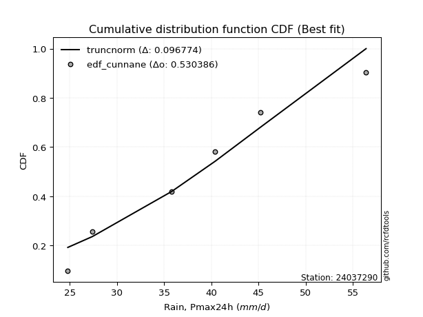</img>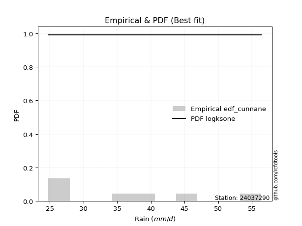</img>

</div>


### 12. Empirical - EDF Adamowski (1981)

The Adamowski formula in hydrology refers to a specific plotting position formula used for estimating the non-parametric empirical distribution of hydrological events (like flood peaks) to calculate their return periods. This formula provides an alternative to traditional parametric methods (like the Gumbel or Log Pearson Type III distributions). 

<div align="center">


$P=(m-0.25)/(n+0.5)$


</div>


**12.1. Empirical values**

<div align="center">

|                | 0                  | 1                   | 2                   | 3             | 4                  | 5                  | 6                  |
|:---------------|:-------------------|:--------------------|:--------------------|:--------------|:-------------------|:-------------------|:-------------------|
| date           | 2025               | 2023                | 2022                | 2019          | 2021               | 2020               | 2024               |
| x              | 16.8               | 24.8                | 27.4                | 35.8          | 40.4               | 45.2               | 56.4               |
| m              | 1                  | 2                   | 3                   | 4             | 5                  | 6                  | 7                  |
| empirical_dist | edf_adamowski      | edf_adamowski       | edf_adamowski       | edf_adamowski | edf_adamowski      | edf_adamowski      | edf_adamowski      |
| empirical      | 0.1                | 0.23333333333333334 | 0.36666666666666664 | 0.5           | 0.6333333333333333 | 0.7666666666666667 | 0.9                |
| empirical_tr   | 1.1111111111111112 | 1.3043478260869565  | 1.5789473684210527  | 2.0           | 2.727272727272727  | 4.2857142857142865 | 10.000000000000002 |

</div>


**12.2. Kolmogorov-Smirnov fit test (sorted by Δ)**


<div align="center">

|                | 0                   | 1                   | 2                   | 3                   | 4                   | 5                   | 6                   | 7                   | 8                   | 9                   | 10                  | 11                  | 12                  | 13                  | 14                  | 15                  | 16                  | 17                  | 18                  | 19                  | 20                  | 21                  | 22                  | 23                  | 24                  | 25                  | 26                  | 27                  | 28                  | 29                  | 30                  | 31                  | 32                  | 33                  | 34                  | 35                  | 36                  | 37                  | 38                  | 39                  | 40                  | 41                  | 42                  | 43                  | 44                  | 45                  | 46                  | 47                  | 48                  | 49                  | 50                  | 51                  | 52                  | 53                  | 54                    | 55                  | 56                  | 57                  | 58                  | 59                  | 60                  | 61                  | 62                  | 63                  | 64                  | 65                  | 66                  | 67                  | 68                  | 69                  | 70                  | 71                  | 72                  | 73                  | 74                  | 75                  | 76                  | 77                  | 78                  | 79                  | 80                  | 81                  | 82                  | 83                  | 84                  | 85                  | 86                  | 87                  | 88                  | 89                  |
|:---------------|:--------------------|:--------------------|:--------------------|:--------------------|:--------------------|:--------------------|:--------------------|:--------------------|:--------------------|:--------------------|:--------------------|:--------------------|:--------------------|:--------------------|:--------------------|:--------------------|:--------------------|:--------------------|:--------------------|:--------------------|:--------------------|:--------------------|:--------------------|:--------------------|:--------------------|:--------------------|:--------------------|:--------------------|:--------------------|:--------------------|:--------------------|:--------------------|:--------------------|:--------------------|:--------------------|:--------------------|:--------------------|:--------------------|:--------------------|:--------------------|:--------------------|:--------------------|:--------------------|:--------------------|:--------------------|:--------------------|:--------------------|:--------------------|:--------------------|:--------------------|:--------------------|:--------------------|:--------------------|:--------------------|:----------------------|:--------------------|:--------------------|:--------------------|:--------------------|:--------------------|:--------------------|:--------------------|:--------------------|:--------------------|:--------------------|:--------------------|:--------------------|:--------------------|:--------------------|:--------------------|:--------------------|:--------------------|:--------------------|:--------------------|:--------------------|:--------------------|:--------------------|:--------------------|:--------------------|:--------------------|:--------------------|:--------------------|:--------------------|:--------------------|:--------------------|:--------------------|:--------------------|:--------------------|:--------------------|:--------------------|
| station        | 24037290            | 24037290            | 24037290            | 24037290            | 24037290            | 24037290            | 24037290            | 24037290            | 24037290            | 24037290            | 24037290            | 24037290            | 24037290            | 24037290            | 24037290            | 24037290            | 24037290            | 24037290            | 24037290            | 24037290            | 24037290            | 24037290            | 24037290            | 24037290            | 24037290            | 24037290            | 24037290            | 24037290            | 24037290            | 24037290            | 24037290            | 24037290            | 24037290            | 24037290            | 24037290            | 24037290            | 24037290            | 24037290            | 24037290            | 24037290            | 24037290            | 24037290            | 24037290            | 24037290            | 24037290            | 24037290            | 24037290            | 24037290            | 24037290            | 24037290            | 24037290            | 24037290            | 24037290            | 24037290            | 24037290              | 24037290            | 24037290            | 24037290            | 24037290            | 24037290            | 24037290            | 24037290            | 24037290            | 24037290            | 24037290            | 24037290            | 24037290            | 24037290            | 24037290            | 24037290            | 24037290            | 24037290            | 24037290            | 24037290            | 24037290            | 24037290            | 24037290            | 24037290            | 24037290            | 24037290            | 24037290            | 24037290            | 24037290            | 24037290            | 24037290            | 24037290            | 24037290            | 24037290            | 24037290            | 24037290            |
| empirical_dist | edf_adamowski       | edf_adamowski       | edf_adamowski       | edf_adamowski       | edf_adamowski       | edf_adamowski       | edf_adamowski       | edf_adamowski       | edf_adamowski       | edf_adamowski       | edf_adamowski       | edf_adamowski       | edf_adamowski       | edf_adamowski       | edf_adamowski       | edf_adamowski       | edf_adamowski       | edf_adamowski       | edf_adamowski       | edf_adamowski       | edf_adamowski       | edf_adamowski       | edf_adamowski       | edf_adamowski       | edf_adamowski       | edf_adamowski       | edf_adamowski       | edf_adamowski       | edf_adamowski       | edf_adamowski       | edf_adamowski       | edf_adamowski       | edf_adamowski       | edf_adamowski       | edf_adamowski       | edf_adamowski       | edf_adamowski       | edf_adamowski       | edf_adamowski       | edf_adamowski       | edf_adamowski       | edf_adamowski       | edf_adamowski       | edf_adamowski       | edf_adamowski       | edf_adamowski       | edf_adamowski       | edf_adamowski       | edf_adamowski       | edf_adamowski       | edf_adamowski       | edf_adamowski       | edf_adamowski       | edf_adamowski       | edf_adamowski         | edf_adamowski       | edf_adamowski       | edf_adamowski       | edf_adamowski       | edf_adamowski       | edf_adamowski       | edf_adamowski       | edf_adamowski       | edf_adamowski       | edf_adamowski       | edf_adamowski       | edf_adamowski       | edf_adamowski       | edf_adamowski       | edf_adamowski       | edf_adamowski       | edf_adamowski       | edf_adamowski       | edf_adamowski       | edf_adamowski       | edf_adamowski       | edf_adamowski       | edf_adamowski       | edf_adamowski       | edf_adamowski       | edf_adamowski       | edf_adamowski       | edf_adamowski       | edf_adamowski       | edf_adamowski       | edf_adamowski       | edf_adamowski       | edf_adamowski       | edf_adamowski       | edf_adamowski       |
| p_dist         | logpearson3         | rayleigh            | chi2                | weibull_min         | erlang              | gamma               | f                   | ncf                 | invgauss            | logfisk             | betaprime           | maxwell             | genlogistic         | rice                | logweibull_min      | johnsonsu           | kstwobign           | invgamma            | logt                | lognorm             | lognorm             | logcrystalball      | logexponnorm        | logf                | logncf              | lognct              | alpha               | gumbel_r            | logfatiguelife      | logloggamma         | logbetaprime        | logjohnsonsu        | fisk                | logerlang           | pearson3            | loggamma            | loggamma            | logrice             | loglogistic         | nct                 | genexpon            | halfnorm            | logalpha            | exponnorm           | truncnorm           | norm                | crystalball         | t                   | loginvgamma         | loggumbel_l         | loggenlogistic      | mielke              | loghypsecant        | loginvgauss         | loglaplace_asymmetric | moyal               | logmaxwell          | halflogistic        | loginvweibull       | lograyleigh         | logistic            | laplace_asymmetric  | loglaplace          | logkstwobign        | loggenexpon         | hypsecant           | expon               | gumbel_l            | loghalfnorm         | loggumbel_r         | logmielke           | laplace             | loggompertz         | loghalflogistic     | logmoyal            | wald                | logexpon            | logchi2             | logtruncnorm        | lognakagami         | logwald             | gibrat              | loggibrat           | nakagami            | loglognorm          | pareto              | logpareto           | invweibull          | gompertz            | fatiguelife         |
| delta          | 0.06943363608576769 | 0.06953888730317292 | 0.07075031765225237 | 0.07302052645319124 | 0.0748389459389246  | 0.0752821668297492  | 0.0757099681233836  | 0.07635224002419616 | 0.0778168962304463  | 0.07904891978914313 | 0.07910250378168349 | 0.07915539834895635 | 0.08057552481703856 | 0.08348603712409924 | 0.0837474858104662  | 0.08480137223297829 | 0.0862560366481262  | 0.086757168405806   | 0.08687483341916913 | 0.08688669017317874 | 0.08688669017317874 | 0.08688683973077471 | 0.08688845570697079 | 0.08688901374944402 | 0.0875082226913847  | 0.08778261245778163 | 0.08795350310095945 | 0.08806721305082443 | 0.08854635118958853 | 0.08943764657659492 | 0.09042156690160108 | 0.0910639392267682  | 0.09291135109723464 | 0.0958045109699589  | 0.09635925010833135 | 0.09641693412244245 | 0.09641693412244245 | 0.09663656976567803 | 0.09825704729021134 | 0.09946241079460083 | 0.09999999798029255 | 0.1                 | 0.10165193221312518 | 0.10235435497272932 | 0.10273860559356424 | 0.10273863038990644 | 0.10273864137193761 | 0.10273953498425364 | 0.10379134097183884 | 0.1066963001775475  | 0.10723492240650284 | 0.10731013887607366 | 0.10855847507572447 | 0.11055278890512044 | 0.11302503413970083   | 0.11371119102593275 | 0.11453226115512938 | 0.11607509406061667 | 0.11913818939214071 | 0.12318738836082288 | 0.12526662931163166 | 0.13279606731174065 | 0.13345307059519407 | 0.13796481570375208 | 0.1402072491800348  | 0.14051458450612006 | 0.14278297355837744 | 0.14557881104632836 | 0.14774892677377582 | 0.1546373380387217  | 0.1591641514572109  | 0.16190629927290118 | 0.1741736947568303  | 0.17590569793641397 | 0.17800707965985207 | 0.20180478787733838 | 0.20587051796993278 | 0.2097330720943168  | 0.23333316605330576 | 0.23333333329673067 | 0.24300157394088961 | 0.26235858372254317 | 0.2742541258204124  | 0.31568628796883824 | 0.4060535655376934  | 0.40759204820677114 | 0.42065094304411194 | 0.47073206118964644 | 0.5094521916700531  | 0.5325867754764202  |
| deltao         | 0.48442053926100004 | 0.48442053926100004 | 0.48442053926100004 | 0.48442053926100004 | 0.48442053926100004 | 0.48442053926100004 | 0.48442053926100004 | 0.48442053926100004 | 0.48442053926100004 | 0.48442053926100004 | 0.48442053926100004 | 0.48442053926100004 | 0.48442053926100004 | 0.48442053926100004 | 0.48442053926100004 | 0.48442053926100004 | 0.48442053926100004 | 0.48442053926100004 | 0.48442053926100004 | 0.48442053926100004 | 0.48442053926100004 | 0.48442053926100004 | 0.48442053926100004 | 0.48442053926100004 | 0.48442053926100004 | 0.48442053926100004 | 0.48442053926100004 | 0.48442053926100004 | 0.48442053926100004 | 0.48442053926100004 | 0.48442053926100004 | 0.48442053926100004 | 0.48442053926100004 | 0.48442053926100004 | 0.48442053926100004 | 0.48442053926100004 | 0.48442053926100004 | 0.48442053926100004 | 0.48442053926100004 | 0.48442053926100004 | 0.48442053926100004 | 0.48442053926100004 | 0.48442053926100004 | 0.48442053926100004 | 0.48442053926100004 | 0.48442053926100004 | 0.48442053926100004 | 0.48442053926100004 | 0.48442053926100004 | 0.48442053926100004 | 0.48442053926100004 | 0.48442053926100004 | 0.48442053926100004 | 0.48442053926100004 | 0.48442053926100004   | 0.48442053926100004 | 0.48442053926100004 | 0.48442053926100004 | 0.48442053926100004 | 0.48442053926100004 | 0.48442053926100004 | 0.48442053926100004 | 0.48442053926100004 | 0.48442053926100004 | 0.48442053926100004 | 0.48442053926100004 | 0.48442053926100004 | 0.48442053926100004 | 0.48442053926100004 | 0.48442053926100004 | 0.48442053926100004 | 0.48442053926100004 | 0.48442053926100004 | 0.48442053926100004 | 0.48442053926100004 | 0.48442053926100004 | 0.48442053926100004 | 0.48442053926100004 | 0.48442053926100004 | 0.48442053926100004 | 0.48442053926100004 | 0.48442053926100004 | 0.48442053926100004 | 0.48442053926100004 | 0.48442053926100004 | 0.48442053926100004 | 0.48442053926100004 | 0.48442053926100004 | 0.48442053926100004 | 0.48442053926100004 |
| eval           | Δo > Δ              | Δo > Δ              | Δo > Δ              | Δo > Δ              | Δo > Δ              | Δo > Δ              | Δo > Δ              | Δo > Δ              | Δo > Δ              | Δo > Δ              | Δo > Δ              | Δo > Δ              | Δo > Δ              | Δo > Δ              | Δo > Δ              | Δo > Δ              | Δo > Δ              | Δo > Δ              | Δo > Δ              | Δo > Δ              | Δo > Δ              | Δo > Δ              | Δo > Δ              | Δo > Δ              | Δo > Δ              | Δo > Δ              | Δo > Δ              | Δo > Δ              | Δo > Δ              | Δo > Δ              | Δo > Δ              | Δo > Δ              | Δo > Δ              | Δo > Δ              | Δo > Δ              | Δo > Δ              | Δo > Δ              | Δo > Δ              | Δo > Δ              | Δo > Δ              | Δo > Δ              | Δo > Δ              | Δo > Δ              | Δo > Δ              | Δo > Δ              | Δo > Δ              | Δo > Δ              | Δo > Δ              | Δo > Δ              | Δo > Δ              | Δo > Δ              | Δo > Δ              | Δo > Δ              | Δo > Δ              | Δo > Δ                | Δo > Δ              | Δo > Δ              | Δo > Δ              | Δo > Δ              | Δo > Δ              | Δo > Δ              | Δo > Δ              | Δo > Δ              | Δo > Δ              | Δo > Δ              | Δo > Δ              | Δo > Δ              | Δo > Δ              | Δo > Δ              | Δo > Δ              | Δo > Δ              | Δo > Δ              | Δo > Δ              | Δo > Δ              | Δo > Δ              | Δo > Δ              | Δo > Δ              | Δo > Δ              | Δo > Δ              | Δo > Δ              | Δo > Δ              | Δo > Δ              | Δo > Δ              | Δo > Δ              | Δo > Δ              | Δo > Δ              | Δo > Δ              | Δo > Δ              | Δo <= Δ             | Δo <= Δ             |
| fit            | 1                   | 1                   | 1                   | 1                   | 1                   | 1                   | 1                   | 1                   | 1                   | 1                   | 1                   | 1                   | 1                   | 1                   | 1                   | 1                   | 1                   | 1                   | 1                   | 1                   | 1                   | 1                   | 1                   | 1                   | 1                   | 1                   | 1                   | 1                   | 1                   | 1                   | 1                   | 1                   | 1                   | 1                   | 1                   | 1                   | 1                   | 1                   | 1                   | 1                   | 1                   | 1                   | 1                   | 1                   | 1                   | 1                   | 1                   | 1                   | 1                   | 1                   | 1                   | 1                   | 1                   | 1                   | 1                     | 1                   | 1                   | 1                   | 1                   | 1                   | 1                   | 1                   | 1                   | 1                   | 1                   | 1                   | 1                   | 1                   | 1                   | 1                   | 1                   | 1                   | 1                   | 1                   | 1                   | 1                   | 1                   | 1                   | 1                   | 1                   | 1                   | 1                   | 1                   | 1                   | 1                   | 1                   | 1                   | 1                   | 0                   | 0                   |
| n              | 7                   | 7                   | 7                   | 7                   | 7                   | 7                   | 7                   | 7                   | 7                   | 7                   | 7                   | 7                   | 7                   | 7                   | 7                   | 7                   | 7                   | 7                   | 7                   | 7                   | 7                   | 7                   | 7                   | 7                   | 7                   | 7                   | 7                   | 7                   | 7                   | 7                   | 7                   | 7                   | 7                   | 7                   | 7                   | 7                   | 7                   | 7                   | 7                   | 7                   | 7                   | 7                   | 7                   | 7                   | 7                   | 7                   | 7                   | 7                   | 7                   | 7                   | 7                   | 7                   | 7                   | 7                   | 7                     | 7                   | 7                   | 7                   | 7                   | 7                   | 7                   | 7                   | 7                   | 7                   | 7                   | 7                   | 7                   | 7                   | 7                   | 7                   | 7                   | 7                   | 7                   | 7                   | 7                   | 7                   | 7                   | 7                   | 7                   | 7                   | 7                   | 7                   | 7                   | 7                   | 7                   | 7                   | 7                   | 7                   | 7                   | 7                   |
| best_fit       | 1                   | 0                   | 0                   | 0                   | 0                   | 0                   | 0                   | 0                   | 0                   | 0                   | 0                   | 0                   | 0                   | 0                   | 0                   | 0                   | 0                   | 0                   | 0                   | 0                   | 0                   | 0                   | 0                   | 0                   | 0                   | 0                   | 0                   | 0                   | 0                   | 0                   | 0                   | 0                   | 0                   | 0                   | 0                   | 0                   | 0                   | 0                   | 0                   | 0                   | 0                   | 0                   | 0                   | 0                   | 0                   | 0                   | 0                   | 0                   | 0                   | 0                   | 0                   | 0                   | 0                   | 0                   | 0                     | 0                   | 0                   | 0                   | 0                   | 0                   | 0                   | 0                   | 0                   | 0                   | 0                   | 0                   | 0                   | 0                   | 0                   | 0                   | 0                   | 0                   | 0                   | 0                   | 0                   | 0                   | 0                   | 0                   | 0                   | 0                   | 0                   | 0                   | 0                   | 0                   | 0                   | 0                   | 0                   | 0                   | 0                   | 0                   |
| best_fit_sort  | 1                   | 2                   | 3                   | 4                   | 5                   | 6                   | 7                   | 8                   | 9                   | 10                  | 11                  | 12                  | 13                  | 14                  | 15                  | 16                  | 17                  | 18                  | 19                  | 20                  | 21                  | 22                  | 23                  | 24                  | 25                  | 26                  | 27                  | 28                  | 29                  | 30                  | 31                  | 32                  | 33                  | 34                  | 35                  | 36                  | 37                  | 38                  | 39                  | 40                  | 41                  | 42                  | 43                  | 44                  | 45                  | 46                  | 47                  | 48                  | 49                  | 50                  | 51                  | 52                  | 53                  | 54                  | 55                    | 56                  | 57                  | 58                  | 59                  | 60                  | 61                  | 62                  | 63                  | 64                  | 65                  | 66                  | 67                  | 68                  | 69                  | 70                  | 71                  | 72                  | 73                  | 74                  | 75                  | 76                  | 77                  | 78                  | 79                  | 80                  | 81                  | 82                  | 83                  | 84                  | 85                  | 86                  | 87                  | 88                  | 89                  | 90                  |

</div>


<div align="center">

</img>

</div>


**12.3. Best fit**

<div align="center">

|   id |   station | empirical_dist   | p_dist      |     delta |   deltao | eval   |   fit |   n |   best_fit |   best_fit_sort |
|-----:|----------:|:-----------------|:------------|----------:|---------:|:-------|------:|----:|-----------:|----------------:|
|    0 |  24037290 | edf_adamowski    | logpearson3 | 0.0694336 | 0.484421 | Δo > Δ |     1 |   7 |          1 |               1 |

</div>


<div align="center">

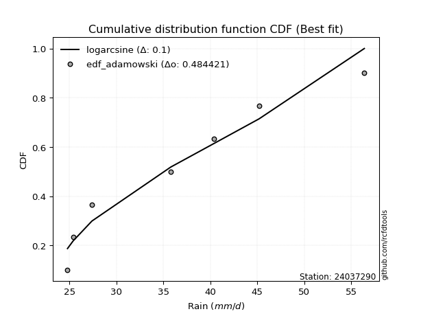</img>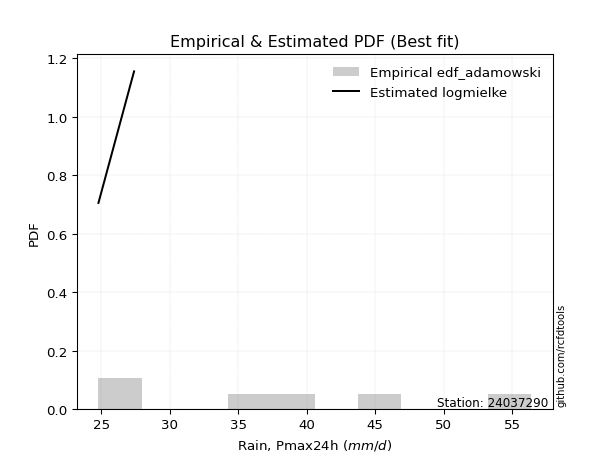</img>

</div>


## C. Best fit & Estimate extreme values for specific return periods - Tr


### 1. Best fit (ordered by delta Δ)

<div align="center">

|   id |   station | empirical_dist   | p_dist      |     delta |   deltao | eval   |   fit |   n |   best_fit |   best_fit_sort |
|-----:|----------:|:-----------------|:------------|----------:|---------:|:-------|------:|----:|-----------:|----------------:|
|    0 |  24037290 | edf_hazen        | rayleigh    | 0.0602808 | 0.484421 | Δo > Δ |     1 |   7 |          1 |               1 |
|    1 |  24037290 | edf_gringorten   | rayleigh    | 0.0624228 | 0.484421 | Δo > Δ |     1 |   7 |          1 |               2 |
|    2 |  24037290 | edf_cunnane      | rayleigh    | 0.0639833 | 0.484421 | Δo > Δ |     1 |   7 |          1 |               3 |
|    3 |  24037290 | edf_blom         | logpearson3 | 0.0648359 | 0.484421 | Δo > Δ |     1 |   7 |          1 |               4 |
|    4 |  24037290 | edf_tukey        | logpearson3 | 0.0664033 | 0.484421 | Δo > Δ |     1 |   7 |          1 |               5 |
|    5 |  24037290 | edf_filliben     | logpearson3 | 0.0669896 | 0.484421 | Δo > Δ |     1 |   7 |          1 |               6 |
|    6 |  24037290 | edf_beard        | logpearson3 | 0.0672656 | 0.484421 | Δo > Δ |     1 |   7 |          1 |               7 |
|    7 |  24037290 | edf_jenkinson    | logpearson3 | 0.0672656 | 0.484421 | Δo > Δ |     1 |   7 |          1 |               8 |
|    8 |  24037290 | edf_chegodayev   | logpearson3 | 0.0676318 | 0.484421 | Δo > Δ |     1 |   7 |          1 |               9 |
|    9 |  24037290 | edf_adamowski    | logpearson3 | 0.0694336 | 0.484421 | Δo > Δ |     1 |   7 |          1 |              10 |
|   10 |  24037290 | edf_weibull      | logpearson3 | 0.0779455 | 0.484421 | Δo > Δ |     1 |   7 |          1 |              11 |
|   11 |  24037290 | edf_california   | logerlang   | 0.105074  | 0.484421 | Δo > Δ |     1 |   7 |          1 |              12 |

</div>

:file_folder:Tables: [bestfit_24037290.csv](table/bestfit_24037290.csv) | [extreme_24037290.csv](table/extreme_24037290.csv)


### 2. Extreme values

In hydrology, a return period (or recurrence interval $Tr$) is the statistical average time between extreme events like floods or droughts of a specific magnitude, indicating how rare an event is, with a 100-year flood, for example, having a 1% chance of occurring in any given year, not that it happens exactly every century. It is a key tool for infrastructure design (like bridges or dams) and risk assessment, calculated from historical data to determine the probability of future events, although it is important to remember it is statistical average, and events can cluster or be missed.

> risk_rate: assuming the return period as the project useful life.

|   id |      tr |   prob_l |     prob_g |   alpha |   betaprime |    chi2 |   crystalball |   erlang |    expon |   exponnorm |       f |   fatiguelife |     fisk |   gamma |   genexpon |   genlogistic |   gibrat |   gompertz |   gumbel_l |   gumbel_r |   halflogistic |   halfnorm |   hypsecant |   invgamma |   invgauss |       invweibull |   johnsonsu |   kstwobign |   laplace |   laplace_asymmetric |   loggamma |   logistic |   lognorm |   maxwell |   mielke |    moyal |   nakagami |     ncf |     nct |    norm |           pareto |   pearson3 |   rayleigh |    rice |       t |   truncnorm |     wald |   weibull_min |   logalpha |   logbetaprime |     logchi2 |   logcrystalball |   logerlang |   logexpon |   logexponnorm |     logf |   logfatiguelife |   logfisk |   loggenexpon |   loggenlogistic |   loggibrat |   loggompertz |   loggumbel_l |   loggumbel_r |   loghalflogistic |   loghalfnorm |   loghypsecant |   loginvgamma |   loginvgauss |   loginvweibull |   logjohnsonsu |   logkstwobign |   loglaplace |   loglaplace_asymmetric |   logloggamma |   loglogistic |   loglognorm |   logmaxwell |   logmielke |   logmoyal |   lognakagami |   logncf |   lognct |         logpareto |   logpearson3 |   lograyleigh |   logrice |     logt |   logtruncnorm |   logwald |   logweibull_min |   station |   n |   risk_rate |
|-----:|--------:|---------:|-----------:|--------:|------------:|--------:|--------------:|---------:|---------:|------------:|--------:|--------------:|---------:|--------:|-----------:|--------------:|---------:|-----------:|-----------:|-----------:|---------------:|-----------:|------------:|-----------:|-----------:|-----------------:|------------:|------------:|----------:|---------------------:|-----------:|-----------:|----------:|----------:|---------:|---------:|-----------:|--------:|--------:|--------:|-----------------:|-----------:|-----------:|--------:|--------:|------------:|---------:|--------------:|-----------:|---------------:|------------:|-----------------:|------------:|-----------:|---------------:|---------:|-----------------:|----------:|--------------:|-----------------:|------------:|--------------:|--------------:|--------------:|------------------:|--------------:|---------------:|--------------:|--------------:|----------------:|---------------:|---------------:|-------------:|------------------------:|--------------:|--------------:|-------------:|-------------:|------------:|-----------:|--------------:|---------:|---------:|------------------:|--------------:|--------------:|----------:|---------:|---------------:|----------:|-----------------:|----------:|----:|------------:|
|    0 |    2    | 0.5      | 0.5        | 34.3087 |     33.9705 | 33.4996 |       35.2571 |  33.8343 |  29.5935 |     35.2202 | 33.8487 |       16.8    |  34.2462 | 33.8228 |    32.363  |       33.1595 |  31.5212 |    47.2082 |    37.3019 |    33.2124 |        32.1959 |    32.7094 |     35.2571 |    34.2782 |    33.8935 |   2287.25        |     34.1925 |     32.9003 |   35.2571 |              35.525  |    32.5865 |    35.2571 |   32.9414 |   34.1927 |  35.7049 |  32.5523 |    25.0894 | 33.8306 | 35.0691 | 35.2571 |     17.8991      |    34.8495 |    33.8151 | 34.2848 | 35.2571 |     35.2571 |  31.2226 |       33.3525 |    32.3884 |        32.7998 |     27.837  |          32.9414 |     32.5776 |    26.7922 |        32.9413 |  32.937  |          32.891  |   33.5968 |       30.2477 |          35.7203 |     29.3988 |       28.5924 |       35.0579 |       30.9526 |           30.0089 |       30.4822 |        32.9414 |       32.3257 |       32.0459 |         31.1346 |        34.8461 |        30.312  |      32.9414 |                 35.9072 |       34.6408 |       32.9414 |  16.8824     |      31.8906 |     28.586  |    30.3366 |       30.2941 |  32.9136 |  32.8903 |     17.5354       |       33.7029 |       31.526  |   32.5226 |  32.9417 |        30.7776 |   29.1325 |          34.2713 |  24037290 |   7 |    0.75     |
|    1 |    2.33 | 0.570815 | 0.429185   | 36.5318 |     36.2301 | 35.8022 |       37.4782 |  36.1087 |  32.4123 |     37.4397 | 36.1205 |       17.2841 |  36.398  | 36.0855 |    34.8745 |       35.4661 |  32.6463 |    48.0275 |    39.2342 |    35.2705 |        34.3119 |    35.1065 |     37.0347 |    36.5124 |    36.1458 | 170267           |     36.4324 |     35.2586 |   36.6012 |              37.0821 |    34.9028 |    37.214  |   35.2467 |   36.5002 |  37.8937 |  34.5005 |    25.5717 | 36.0925 | 37.2889 | 37.4782 |     19.5549      |    37.0794 |    36.1568 | 36.5895 | 37.4782 |     37.4782 |  32.6789 |       35.7235 |    34.7076 |        35.1172 |     33.2025 |          35.2467 |     34.9159 |    29.694  |        35.2466 |  35.2457 |          35.1902 |   35.8211 |       32.8297 |          37.912  |     30.4235 |       31.1684 |       37.183  |       32.9548 |           32.0065 |       32.7907 |        34.7738 |       34.6353 |       34.3685 |         33.7387 |        37.1502 |        32.8907 |      34.3178 |                 37.853  |       36.9197 |       34.9643 |  17.5501     |      34.2123 |     31.5483 |    32.191  |       31.7234 |  35.2236 |  35.2109 |     18.7057       |       36.0197 |       33.8564 |   34.8785 |  35.2471 |        32.1506 |   30.4537 |          36.5513 |  24037290 |   7 |    0.729209 |
|    2 |    5    | 0.8      | 0.2        | 45.3466 |     45.3734 | 45.38   |       45.7322 |  45.3628 |  46.5056 |     45.7103 | 45.3789 |       27.5665 |  45.4071 | 45.2811 |    46.1483 |       45.48   |  39.1238 |    50.6745 |    45.4768 |    44.2116 |        43.8864 |    45.2435 |     44.1646 |    45.3972 |    45.3003 |      2.3814e+13  |     45.388  |     45.2763 |   43.3213 |              44.8323 |    45.2441 |    44.7699 |   45.3199 |   45.5824 |  45.9473 |  43.5248 |    34.2933 | 45.3599 | 45.6225 | 45.7322 |    278.04        |    45.5957 |    45.5315 | 45.6118 | 45.7322 |     45.7322 |  40.8317 |       45.4578 |    45.2622 |        45.3896 |     92.5257 |          45.3199 |     45.3814 |    49.6548 |        45.3198 |  45.3445 |          45.2505 |   45.8816 |       45.8386 |          45.9607 |     37.058  |       43.9614 |       44.9687 |       43.269  |           42.843  |       44.6497 |        43.2071 |       45.1187 |       45.1881 |         47.8279 |        45.8375 |        46.5253 |      42.1116 |                 44.4716 |       45.6726 |       44.011  |   7.8971e+65 |      45.1136 |     44.4165 |    42.3733 |       38.9704 |  45.3398 |  45.4016 | 459266            |       45.5388 |       45.0436 |   45.405  |  45.3205 |        39.0203 |   39.0366 |          45.534  |  24037290 |   7 |    0.67232  |
|    3 |   10    | 0.9      | 0.1        | 51.7262 |     52.1174 | 52.6559 |       51.2078 |  52.2213 |  59.2991 |     51.2205 | 52.2573 |       41.764  |  52.8172 | 52.0867 |    55.4615 |       53.6316 |  46.5074 |    52.1485 |    48.9524 |    51.494  |        51.8376 |    52.7446 |     49.8582 |    51.8414 |    52.1004 |      1.02665e+20 |     51.9203 |     52.9034 |   49.4216 |              51.8676 |    53.9466 |    50.3345 |   53.5439 |   51.974  |  51.741  |  51.3819 |    48.7652 | 52.3228 | 51.2372 | 51.2078 |  16202.2         |    51.4468 |    52.2158 | 51.8716 | 51.2076 |     51.2078 |  49.4837 |       52.5964 |    54.4003 |        53.9482 |    264.147  |          53.5439 |     54.2176 |    79.1882 |        53.5437 |  53.6022 |          53.4804 |   55.0564 |       58.3553 |          51.7362 |     46.4021 |       55.4764 |       49.9896 |       54.0127 |           54.5821 |       56.1083 |        51.3878 |       54.158  |       54.8569 |         63.5507 |        51.5849 |        60.585  |      50.7091 |                 50.8833 |       51.6671 |       52.1387 | inf          |      54.8081 |     52.0632 |    53.8286 |       45.6138 |  53.6252 |  53.7804 |      6.03024e+276 |       52.6374 |       55.2132 |   54.2114 |  53.5447 |        44.7013 |   50.805  |          51.8798 |  24037290 |   7 |    0.651322 |
|    4 |   15    | 0.933333 | 0.0666667  | 55.0861 |     55.6944 | 56.5716 |       53.9401 |  55.8648 |  66.7829 |     53.979  | 55.9177 |       51.0494 |  57.1575 | 55.6995 |    60.7103 |       58.2297 |  51.6002 |    52.816  |    50.5264 |    55.6027 |        56.3373 |    56.6482 |     53.1074 |    55.2363 |    55.7245 |      5.68331e+23 |     55.3706 |     56.9525 |   52.9901 |              55.9831 |    58.9633 |    53.3664 |   58.1902 |   55.2535 |  54.9689 |  55.9417 |    57.953  | 56.0632 | 54.069  | 53.9401 | 180905           |    54.4273 |    55.6599 | 55.0502 | 53.94   |     53.9401 |  55.0397 |       56.329  |    59.7745 |        58.8495 |    502.894  |          58.1901 |     59.3221 |   104.047  |        58.1899 |  58.2722 |          58.1364 |   60.8055 |       66.1309 |          54.9505 |     54.1872 |       62.178  |       52.4443 |       61.2123 |           62.5989 |       63.1909 |        56.7329 |       59.4577 |       60.6611 |         74.6042 |        54.4146 |        69.7017 |      56.5306 |                 55.0542 |       54.6999 |       57.1822 | inf          |      60.5648 |     54.9686 |    61.8477 |       49.5396 |  58.316  |  58.5363 |    inf            |       56.4072 |       61.319  |   59.254  |  58.1911 |        47.5069 |   60.1716 |          55.1484 |  24037290 |   7 |    0.644736 |
|    5 |   20    | 0.95     | 0.05       | 57.3544 |     58.1153 | 59.2405 |       55.7295 |  58.3319 |  72.0927 |     55.7891 | 58.3988 |       57.924  |  60.29   | 58.1449 |    64.3773 |       61.4489 |  55.5952 |    53.2316 |    51.5062 |    58.4795 |        59.4899 |    59.2507 |     55.3996 |    57.5277 |    58.184  |      2.37399e+26 |     57.7021 |     59.6801 |   55.5219 |              58.903  |    62.5244 |    55.4619 |   61.4492 |   57.4299 |  57.2569 |  59.1711 |    64.4087 | 58.6142 | 55.9352 | 55.7295 |      1.00274e+06 |    56.4013 |    57.9491 | 57.1475 | 55.7294 |     55.7295 |  59.1799 |       58.8287 |    63.6362 |        62.3153 |    801.902  |          61.4492 |     62.9499 |   126.287  |        61.449  |  61.55   |          61.405  |   65.1263 |       71.8789 |          57.2275 |     61.1976 |       66.9195 |       54.0327 |       66.8172 |           68.9075 |       68.403  |        60.8349 |       63.2585 |       64.8823 |         83.469  |        56.2475 |        76.6044 |      61.0619 |                 58.2194 |       56.6983 |       60.9505 | inf          |      64.7153 |     56.5177 |    68.2396 |       52.3493 |  61.6104 |  61.8816 |    inf            |       58.9557 |       65.7465 |   62.8168 |  61.4503 |        49.2089 |   68.2578 |          57.3233 |  24037290 |   7 |    0.641514 |
|    6 |   25    | 0.96     | 0.04       | 59.0599 |     59.9377 | 61.2588 |       57.0468 |  60.1894 |  76.2113 |     57.1235 | 60.2682 |       63.3863 |  62.7623 | 59.9855 |    67.1967 |       63.9285 |  58.9257 |    53.5273 |    52.2034 |    60.6954 |        61.9189 |    61.1871 |     57.1736 |    59.2501 |    60.039  |      2.47881e+28 |     59.4558 |     61.7232 |   57.4858 |              61.1679 |    65.2961 |    57.065  |   63.9644 |   59.0457 |  59.0463 |  61.6742 |    69.3178 | 60.5452 | 57.3153 | 57.0468 |      3.78525e+06 |    57.8655 |    59.6499 | 58.6984 | 57.0466 |     57.0468 |  62.4962 |       60.6952 |    66.6688 |        65.0054 |   1156.96   |          63.9644 |     65.776  |   146.762  |        63.9642 |  64.0806 |          63.929  |   68.6379 |       76.4779 |          59.008  |     67.7303 |       70.5904 |       55.1923 |       71.4819 |           74.1983 |       72.558  |        64.2119 |       66.2388 |       68.2255 |         91.0091 |        57.5849 |        82.2189 |      64.8254 |                 60.7992 |       58.1749 |       64      | inf          |      67.9795 |     57.5004 |    73.645  |       54.5446 |  64.1551 |  64.4683 |    inf            |       60.8712 |       69.2418 |   65.5799 |  63.9655 |        50.3578 |   75.5117 |          58.9412 |  24037290 |   7 |    0.639603 |
|    7 |   50    | 0.98     | 0.02       | 64.1198 |     65.3486 | 67.2921 |       60.8188 |  65.7044 |  89.0048 |     60.9552 | 65.8259 |       80.9115 |  70.7444 | 65.4484 |    75.8539 |       71.5666 |  70.6655 |    54.33   |    54.0959 |    67.5215 |        69.4028 |    66.8155 |     62.6736 |    64.3554 |    65.5642 |      4.10298e+34 |     64.659  |     67.7227 |   63.5861 |              68.2033 |    74.0043 |    61.9629 |   71.7511 |   63.7319 |  64.7677 |  69.4449 |    83.8501 | 66.3339 | 61.298  | 60.8188 |      2.34502e+08 |    62.1113 |    64.587  | 63.1677 | 60.8186 |     60.8188 |  73.3239 |       66.1555 |    76.3475 |        73.4167 |   3689.02   |          71.7511 |     74.6676 |   234.052  |        71.7507 |  71.9209 |          71.751  |   80.5837 |       91.6001 |          64.6986 |     96.8401 |       81.9579 |       58.4669 |       87.9995 |           93.1929 |       86.1241 |        75.9209 |       75.7256 |       79.0534 |        118.792  |        61.3509 |       101.199  |      78.0603 |                 69.5649 |       62.4262 |       74.2952 | inf          |      78.4076 |     59.7659 |    93.3084 |       61.4676 |  72.0451 |  72.5039 |    inf            |       66.5359 |       80.4765 |   74.2037 |  71.7524 |        53.0309 |  105.008  |          63.6505 |  24037290 |   7 |    0.63583  |
|    8 |   75    | 0.986667 | 0.0133333  | 66.9478 |     68.3718 | 70.6863 |       62.8427 |  68.7846 |  96.4885 |     63.0181 | 68.9347 |       91.466  |  75.6645 | 68.4981 |    80.868  |       76.0059 |  78.5947 |    54.7359 |    55.053  |    71.489  |        73.7532 |    69.8794 |     65.8878 |    67.2049 |    68.662  |      1.68941e+38 |     67.5654 |     71.0236 |   67.1545 |              72.3187 |    79.1937 |    64.7917 |   76.3129 |   66.2796 |  68.2745 |  73.9891 |    91.8207 | 69.6052 | 63.4549 | 62.8427 |      2.62079e+09 |    64.4217 |    67.273  | 65.5807 | 62.8425 |     62.8427 |  79.9867 |       69.1511 |    82.2233 |        78.4015 |   7355.83   |          76.3129 |     79.9749 |   307.527  |        76.3125 |  76.518  |          76.339  |   88.4085 |      101.07   |          68.1854 |    123.29   |       88.5852 |       60.1961 |       99.3018 |          106.396  |       94.5467 |        83.7284 |       81.4664 |       85.7375 |        138.688  |        63.328  |       113.45   |      87.0217 |                 75.2673 |       64.7192 |       80.9797 | inf          |      84.7336 |     60.7656 |   107.158  |       65.5991 |  76.6756 |  77.2302 |    inf            |       69.6811 |       87.3363 |   79.3012 |  76.3143 |        54.0619 |  128.632  |          66.2224 |  24037290 |   7 |    0.634587 |
|    9 |  100    | 0.99     | 0.01       | 68.9076 |     70.4648 | 73.0447 |       64.2116 |  70.9162 | 101.798  |     64.4165 | 71.0882 |       99.0603 |  79.2826 | 70.6082 |    84.4101 |       79.1479 |  84.737  |    55.0014 |    55.679  |    74.2971 |        76.8323 |    71.9666 |     68.1678 |    69.1775 |    70.8112 |      6.10992e+40 |     69.5781 |     73.2852 |   69.6864 |              75.2386 |    82.928  |    66.7889 |   79.5616 |   68.015  |  70.8509 |  77.2129 |    97.2478 | 71.8861 | 64.922  | 64.2116 |      1.45279e+10 |    65.9973 |    69.103  | 67.2179 | 64.2114 |     64.2116 |  84.8445 |       71.2016 |    86.501  |        81.9766 |  12054.6    |          79.5616 |     83.798  |   373.26   |        79.5612 |  79.7935 |          79.6088 |   94.3863 |      108.085  |          70.7467 |    148.65   |       93.2782 |       61.3547 |      108.168  |          116.856  |      100.751  |        89.7488 |       85.6372 |       90.6533 |        154.753  |        64.6463 |       122.69   |      93.9971 |                 79.5944 |       66.2742 |       86.0582 | inf          |      89.3322 |     61.3955 |   118.212  |       68.5709 |  79.9768 |  80.6042 |    inf            |       71.8484 |       92.3417 |   82.9504 |  79.5631 |        54.6095 |  149.142  |          67.9792 |  24037290 |   7 |    0.633968 |
|   10 |  200    | 0.995    | 0.005      | 73.5005 |     75.3593 | 78.5839 |       67.3168 |  75.8972 | 114.592  |     67.5987 | 76.127  |      117.65   |  88.4759 | 75.5374 |    92.9067 |       86.7014 | 101.448  |    55.5785 |    57.0396 |    81.0481 |        84.2349 |    76.7403 |     73.6605 |    73.7926 |    75.8504 |      8.63869e+46 |     74.288  |     78.4943 |   75.7867 |              82.274  |    92.13   |    71.5799 |   87.4527 |   71.9853 |  77.4028 |  84.9803 |   109.611  | 77.2724 | 68.2758 | 67.3168 |      9.00029e+11 |    69.6097 |    73.29   | 70.9453 | 67.3165 |     67.3168 |  96.9449 |       75.921  |    97.2166 |        90.7455 |  40116.3    |          87.4526 |     93.2313 |   595.265  |        87.4522 |  87.7554 |          87.5591 |  110.426  |      126.051  |          77.259  |    247.28   |      104.557  |       63.9505 |      132.858  |          146.408  |      116.516  |       106.091  |       96.0543 |      103.141  |        201.404  |        67.5764 |       146.936  |     113.188  |                 91.07   |       69.8118 |       99.577  | inf          |     100.814  |     62.7611 |   149.76   |       75.8796 |  88.0071 |  88.8268 |    inf            |       76.8791 |      104.9    |   91.8758 |  87.4544 |        55.4757 |  215.597  |          72.0146 |  24037290 |   7 |    0.633042 |
|   11 |  250    | 0.996    | 0.004      | 74.9467 |     76.8963 | 80.3296 |       68.2657 |  77.46   | 118.71   |     68.5743 | 77.7099 |      123.708  |  91.5886 | 77.0835 |    95.6335 |       89.1298 | 107.444  |    55.7483 |    57.4399 |    83.2184 |        86.6147 |    78.2089 |     75.4286 |    75.2431 |    77.4366 |      8.19815e+48 |     75.7683 |     80.1064 |   77.7506 |              84.5389 |    95.1597 |    73.118  |   90.0168 |   73.2074 |  79.6256 |  87.4808 |   113.395  | 78.9793 | 69.3081 | 68.2657 |      3.39758e+12 |    70.7244 |    74.5789 | 72.0877 | 68.2654 |     68.2657 | 100.948  |       77.3813 |   100.798  |        93.6204 |  59264.3    |          90.0168 |     96.3409 |   691.775  |        90.0163 |  90.3443 |          90.1449 |  116.133  |      132.168  |          79.468  |    296.819  |      108.18   |       64.735  |      141.936  |          157.414  |      121.846  |       111.96   |       99.5266 |      107.367  |        219.208  |        68.4544 |       155.369  |     120.164  |                 95.1055 |       70.8955 |      104.352  | inf          |     104.637  |     63.1738 |   161.61   |       78.2797 |  90.6201 |  91.5069 |    inf            |       78.4467 |      109.1    |   94.7939 |  90.0186 |        55.6559 |  243.551  |          73.2615 |  24037290 |   7 |    0.632858 |
|   12 |  500    | 0.998    | 0.002      | 79.3583 |     81.57   | 85.653  |       71.0797 |  82.2073 | 131.504  |     71.4771 | 82.5241 |      142.713  | 101.773  | 81.7792 |   104.086  |       96.6668 | 128.166  |    56.2351 |    58.5876 |    89.9547 |        94.0013 |    82.5875 |     80.9209 |    79.6593 |    82.2697 |      1.12396e+55 |     80.2751 |     84.9375 |   83.8509 |              91.5743 |   104.8    |    77.8882 |   98.0715 |   76.8544 |  86.9197 |  95.248  |   124.612  | 84.2161 | 72.391  | 71.0797 |      2.10486e+14 |    74.0595 |    78.4245 | 75.4841 | 71.0794 |     71.0797 | 113.677  |       81.7586 |   112.371  |       102.73   | 200801      |          98.0714 |    106.247  |  1103.22   |        98.0709 |  98.4817 |          98.2753 |  135.775  |      152.265  |          86.716  |    557.908  |      119.412  |       67.0375 |      174.257  |          197.127  |      139.226  |       132.345  |      110.713  |      121.192  |        285.126  |        71.0078 |       183.654  |     144.697  |                108.817  |       74.1149 |      120.669  | inf          |     116.929  |     64.4189 |   204.739  |       85.8905 |  98.8388 |  99.9507 |    inf            |       83.1743 |      122.656  |  104.013  |  98.0735 |        56.0236 |  358.876  |          76.9962 |  24037290 |   7 |    0.632489 |
|   13 |  750    | 0.998667 | 0.00133333 | 81.8918 |     84.242  | 88.7057 |       72.6429 |  84.9179 | 138.988  |     73.0965 | 85.2767 |      153.942  | 108.114  | 84.4595 |   109.022  |      101.073  | 141.87   |    56.4953 |    59.2009 |    93.8927 |        98.3194 |    85.0337 |     84.1336 |    82.189  |    85.0394 |      4.34962e+58 |     82.8559 |     87.6515 |   87.4193 |              95.6897 |   110.61   |    80.6751 |  102.853  |   78.8942 |  91.48   |  99.7915 |   130.833  | 87.2421 | 74.1179 | 72.6429 |      2.35239e+15 |    75.9314 |    80.5749 | 77.3757 | 72.6427 |     72.6429 | 121.308  |       84.2191 |   119.472  |       108.194  | 412047      |         102.853  |    112.226  |  1449.56   |       102.853  | 103.316  |         103.107  |  148.755  |      164.822  |          91.2468 |    846.869  |      125.967  |       68.3015 |      196.461  |          224.834  |      149.994  |       145.948  |      117.554  |      129.798  |        332.497  |        72.3929 |       201.746  |     161.308  |                117.737  |       75.9068 |      131.357  | inf          |     124.423  |     65.1366 |   235.123  |       90.4564 | 103.726  | 104.981  |    inf            |       85.8487 |      130.957  |  109.523  | 102.856  |        56.1484 |  452.778  |          79.0943 |  24037290 |   7 |    0.632366 |
|   14 | 1000    | 0.999    | 0.001      | 83.6721 |     86.1135 | 90.8474 |       73.7192 |  86.8147 | 144.297  |     74.2146 | 87.2048 |      161.952  | 112.795  | 86.3349 |   112.521  |      104.198  | 152.358  |    56.6704 |    59.6137 |    96.6861 |       101.382  |    86.723  |     86.4131 |    83.9634 |    86.9821 |      1.52527e+61 |     84.6657 |     89.5317 |   89.9512 |              98.6096 |   114.813  |    82.6514 |  106.281  |   80.304  |  94.8563 | 103.015  |   135.11   | 89.3757 | 75.313  | 73.7192 |      1.304e+16   |    77.2282 |    82.0609 | 78.68   | 73.7189 |     73.7192 | 126.798  |       85.9246 |   124.669  |       112.135  | 687519      |         106.28   |    116.554  |  1759.39   |       106.28   | 106.783  |         106.573  |  158.704  |      174.106  |          94.6009 |   1165.52   |      130.612  |       69.1656 |      213.906  |          246.818  |      157.912  |       156.44   |      122.55   |      136.151  |        370.797  |        73.3323 |       215.315  |     174.238  |                124.506  |       77.1416 |      139.507  | inf          |     129.881  |     65.6458 |   259.377  |       93.7489 | 107.231  | 108.594  |    inf            |       87.7088 |      137.02   |  113.488  | 106.283  |        56.2113 |  535.173  |          80.5485 |  24037290 |   7 |    0.632305 |

<div align="center">

</img>

</div>


<div align="center">

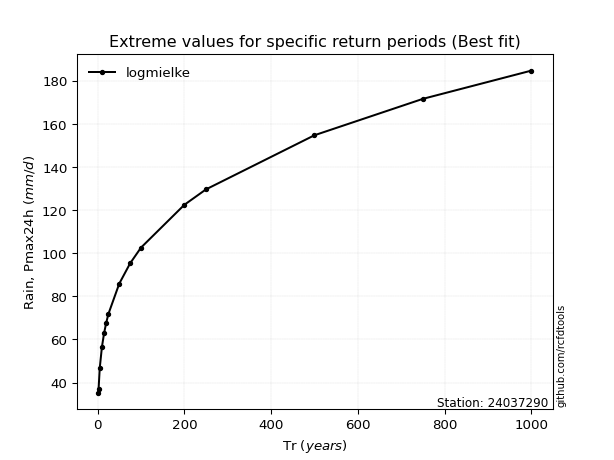</img>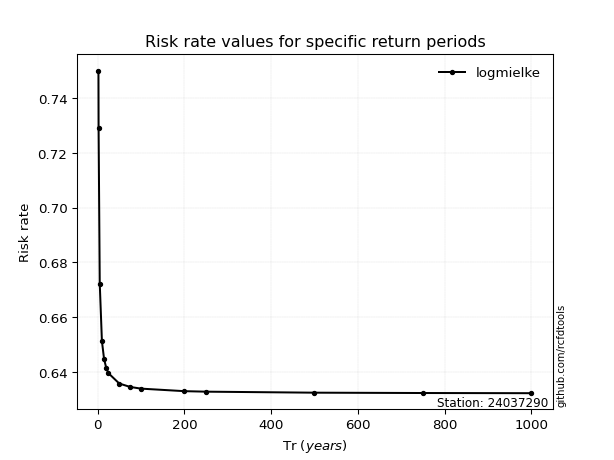</img>

</div>


<sub>**APP DISCLAIMER**: NO WARRANTY - This software is provided by [github.com/rcfdtools](https://github.com/rcfdtools) "as is", without any express or implied warranty, including warranties of merchantability, fitness for a particular purpose, or non-infringement. There is no guarantee that the software will be error-free or operate without interruption. LIMITATION OF LIABILITY - Neither the authors nor copyright holders will be liable for claims or damages arising from the software or its use. You are responsible for determining if the software is appropriate for your use and assume all associated risks, including errors, legal compliance, and data loss. NO PROFESSIONAL ADVICE - The software provides general information and does not offer professional advice. It should not replace consultation with professional advisors.</sub>