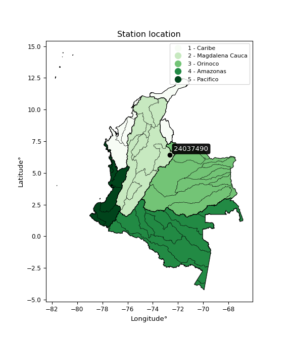

<div align="center">


</div>

# PMax24h Station (Rain, Pmax24h): 24037490

Maximum Precipitation in 24 hours (PMax24h) is the greatest amount of rainfall for a specific duration that is meteorologically possible for a given location, acting as a "worst-case" scenario for extreme storms, crucial for designing safety-critical infrastructure like bridges, river deviations, dams, spillways, and nuclear plants to prevent catastrophic failure. The PMax24h is related with the Probable Maximum Precipitation (PMP) and it is calculated by hydrologists using meteorological data to determine the upper limit of extreme rainfall, often leading to the Probable Maximum Flood (PMF) for flood control design, and is increasingly being studied for climate change impacts. Probable Maximum Precipitation (PMP) is the theoretical upper limit of rainfall, a deterministic estimate for extreme events, while probability distributions (like GEV, Gumbel) describe the likelihood and frequency of various precipitation amounts, including rare ones, showing how often events occur, with PMP representing the extreme end of these distributions, used for critical infrastructure design to ensure safety against the worst conceivable weather, unlike standard statistical forecasts which cover typical probabilities.

The most common probability distributions in hydrology, used for analyzing floods, rainfall, and streamflow, include the Normal, Log-Normal, Gumbel, Gamma (including Log-Pearson Type III), and Generalized Extreme Value (GEV) distributions, often chosen based on the data´s skewness and whether modeling extremes or general conditions, with Gumbel and GEV popular for extreme events like floods, while the Normal distribution serves as a baseline, though often requiring transformations for skewed hydrological data. These distributions help in designing water infrastructure, managing water resources, and forecasting hydrologic events.

> Hydrological data often isn´t perfectly normal (it´s skewed), so different distributions are needed for different applications, such as: **Flood Frequency Analysis**: Using Gumbel, GEV, or Log-Pearson Type III for predicting extreme flood magnitudes and their return periods, **Rainfall Analysis**: Normal for annual totals, but Log-Normal, Weibull, or GEV for intensity or extreme daily rainfall, **Streamflow Modeling**: Gamma and Log-Normal for maximum flows, GEV for minimum flows, and Kappa for daily flows.

<div align="center">

</img>

</div>


## A. General information


### 1. General running parameters

• app_version: _v20260225_. • runtime: _2026-02-27 14:50:08.749431_. • Python version: _3.14.0_. • SciPy version: _1.16.3_. • Pandas version: _2.3.3_. • NumPy version: _2.3.5_. • Stations dataset (station_dataset_file): _dataset/pmax24h_in/automatic_colombia_2003_2025.csv_. • Stations catalog (station_catalog_file): _dataset/CNE.xls_. • Minimum year to eval til year_max (date_min): _1900_. • Maximum year to eval since year_min (date_max): _2025_. • Creates, save and include plots into reports (create_plot): _False_. • Plot only fit distributions with Δo > Δ (plot_only_fit): _True_. • Plot only simple graphs avoiding multiple CDFs and multiple Extreme values plots (plot_only_simple): _False_. • Eval low extreme values, if False, evaluates high extreme values (low_extreme): _False_. • Eval every SciPy distribution as logarithmic (pdist_logarithmic_on): _True_. • Standard deviation normalized (ddof): _1.0_. • Return periods to eval in years (Tr): _[2, 2.33, 5, 10, 15, 20, 25, 50, 75, 100, 200, 250, 500, 750, 1000]_. • Minimum data sample per station, 0 means any (minimum_sample): _5_. • Z-Score maximum threshold to adjust a value, 0 means disable (zscore_max): _3.5_. • Z-Score minimum threshold to adjust a value, 0 means disable (zscore_min): _-2.5_. • Avoid zeros, e.g. rain = 0 (avoid_zeros): _True_. • Avoid null values (avoid_nans): _True_. 

:file_folder:Table: [dataset.csv](../../dataset/pmax24h_in/automatic_colombia_2003_2025.csv)

> Delta Degrees of Freedom (DDOF): is a parameter used in the formulas for calculating variance and standard deviation. When ddof=0, the divisor is $N$ (the total number of observations) and this is used when your data set is the entire population. When ddof=1, the divisor is $N-1$ and this is used when your data set is a sample drawn from a larger population. Using $N-1$ provides an unbiased estimate of the population variance (known as Bessel´s correction).


### 2. Station info and location

|   id |   CODIGO | NOMBRE                          | CATEGORIA    | TECNOLOGIA                              | ESTADO           | FECHA_INSTALACION   |   FECHA_SUSPENSION |   ALTITUD |   LATITUD |   LONGITUD | DEPARTAMENTO   | MUNICIPIO   | AREA_OPERATIVA                              | ENTIDAD                                                     | AREA_HIDROGRAFICA   | ZONA_HIDROGRAFICA   | SUBZONA_HIDROGRAFICA   | CORRIENTE   | Catalogo   |   Version |
|-----:|---------:|:--------------------------------|:-------------|:----------------------------------------|:-----------------|:--------------------|-------------------:|----------:|----------:|-----------:|:---------------|:------------|:--------------------------------------------|:------------------------------------------------------------|:--------------------|:--------------------|:-----------------------|:------------|:-----------|----------:|
|    0 | 24037490 | PUENTE TOTUMO  - AUT [24037490] | Limnimétrica | Automática con Telemetría, Convencional | En Mantenimiento | 15/09/1995          |                nan |      1200 |   6.43797 |   -72.6383 | Boyacá         | Boavita     | Area Operativa 06 - Boyacá-Casanare-Vichada | INSTITUTO DE HIDROLOGIA METEOROLOGIA Y ESTUDIOS AMBIENTALES | Magdalena Cauca     | Sogamoso            | Río Chicamocha         | Nevado      | CNE_IDEAM  |  20251226 |

<div align="center">

Dynamic map: [:earth_americas:Google](http://maps.google.com/maps?q=6.437972222,-72.63830556) [:earth_americas:OSM](https://www.openstreetmap.org/#map=18/6.437972222/-72.63830556&layers=P) [:earth_americas:Bing](https://www.bing.com/maps?cp=6.437972222~-72.63830556&lvl=18) [:earth_americas:Apple](https://maps.apple.com/frame?center=6.437972222%2C-72.63830556&span=0.003%2C0.006)

</div>


<div align="center">

```geojson
{
  "type": "Feature",
  "geometry": {
    "type": "Point", 
    "coordinates": [-72.63830556, 6.437972222]
  }, 
  "properties": {
    "Name": "24037490"
  }
}
```

</div>


### 3. Discrete values table and plot

<div align="center">

|               |           0 |           1 |          2 |           3 |           4 |          5 |
|:--------------|------------:|------------:|-----------:|------------:|------------:|-----------:|
| Date          | 2019        | 2020        | 2021       | 2022        | 2023        | 2025       |
| Value         |   43.2      |   42.2      |   56.2     |   34.8      |   17.6      |    1.2     |
| Value_initial |   43.2      |   42.2      |   56.2     |   34.8      |   17.6      |    1.2     |
| count         |    6        |    6        |    6       |    6        |    6        |    6       |
| mean          |   32.5333   |   32.5333   |   32.5333  |   32.5333   |   32.5333   |   32.5333  |
| std           |   19.8859   |   19.8859   |   19.8859  |   19.8859   |   19.8859   |   19.8859  |
| zscore        |    0.536392 |    0.486106 |    1.19012 |    0.113983 |   -0.750949 |   -1.57565 |


</div>


> The initial value (value_initial) correspond to the initial obtained or null completed value, and value (value) is adjusted only when the initial value is outside the valid range (outlier) definite through the Z-Score value. If Z-Score is active, values out of range or outliers are replaced with the station mean value. A Z-Score (or standard score) measures how many standard deviations a data point is from the mean of a dataset, indicating its relative position; positive scores mean above the mean, negative mean below, and a score of zero is exactly at the mean, allowing for comparison of values from different distributions. It´s calculated using the formula $z=(x–μ)/σ$, where $x$ is the data point, $μ$ is the mean, and $σ$ is the standard deviation, helping identify outliers and understand probability.
>
> <sub>**Note**: In this study, "completing" (filling gaps in) and "extending" (forecasting or lengthening the historical record) rainfall data series are avoided for certain critical analyses because they introduce artificial bias and uncertainty, which can distort the statistics of rare events (extremes), alter day-to-day variability, and compromise the integrity and homogeneity of the original data. Some reasons against Completing/Extending rainfall data are: **Distortion of Extremes and Variability**: The primary issue is that most gap-filling or extension methods rely on averaging or regression with nearby stations, which inherently smooths the data. Rainfall is highly variable in space and time, with a large percentage of zero values and occasional large storms. Infilling methods often underestimate the highest values and overestimate the lowest (zero) values, which severely distorts analyses focused on flood frequency, drought severity, and intensity-duration-frequency (IDF) curves, **Loss of Data Homogeneity**: Infilled or extended data are synthetic estimates, not actual measurements. Combining these estimates with observed data can violate the assumption of data homogeneity, which requires that the data properties do not change over time. Inhomogeneity can lead to incorrect conclusions about long-term trends or changes in climate patterns, **Propagation of Errors**: Errors and biases from the original data (e.g., wind-induced undercatch, instrument errors, site changes) or the data used for imputation can propagate through the analysis, leading to unreliable hydrological models and inaccurate predictions, **Compromised Statistical Integrity**: For statistical analyses, especially those involving the frequency of events, using artificial data can introduce time bias or autocorrelation that doesn´t exist in reality, making it difficult to assess the true probability of events, **Difficulty in Validation**: It is difficult to accurately validate the quality of filled or extended data, especially for past periods where ground-truth measurements are unavailable. The reliability of imputation techniques heavily depends on the density of the surrounding station network and the complexity of the local topography.</sub>


### 4. Active continuous probability distributions from SciPy (80 of 104 available)

A Probability Density Function (PDF) describes the relative likelihood of a continuous random variable falling within a specific range, where the total area under its curve equals 1, and the area over any interval gives the actual probability for that range. Unlike discrete probabilities (like rolling a die), a PDF shows density, not direct probability for a single point (which is zero), with higher points indicating higher likelihood, often visualized as a bell curve for normal distributions.

A log of a probability density function (log-PDF) is simply the logarithm of the PDF´s value, denoted as $log(f(x))$, useful for converting multiplication of probabilities into addition, improving numerical stability with tiny numbers, and connecting to information theory concepts like entropy. Instead of dealing with very small probabilities (e.g., 0.000001), log-PDFs use negative numbers (e.g., $log(0.00001) ≈ -11.51$ that are easier for computers to handle, preventing underflow errors and simplifying complex calculations. In this study, each active probability distribution from SciPy is also evaluated in the $log$ form.

[scipy.stats](https://docs.scipy.org/doc/scipy/reference/stats.html) is a Python´s powerful submodule within the SciPy library for comprehensive statistical analysis, offering over 130 probability distributions (like Normal, Poisson, etc.), functions for descriptive stats (mean, variance), hypothesis testing (t-tests, chi-square), random variable generation, and statistical tests, making it essential for data science, modeling, and research. It provides tools to explore, model, and draw conclusions from data efficiently, working seamlessly with [NumPy](https://numpy.org/).

<div align="center">

|   id | p_dist           |   n_parameter | fit_method   | label                                                                       | active   | ref                                                                                                      |
|-----:|:-----------------|--------------:|:-------------|:----------------------------------------------------------------------------|:---------|:---------------------------------------------------------------------------------------------------------|
|    0 | alpha            |             3 | MLE          | Alpha                                                                       | True     | [:mortar_board:](https://docs.scipy.org/doc/scipy/reference/generated/scipy.stats.alpha.html)            |
|    1 | anglit           |             2 | MM           | Anglit                                                                      | True     | [:mortar_board:](https://docs.scipy.org/doc/scipy/reference/generated/scipy.stats.anglit.html)           |
|    2 | arcsine          |             2 | MM           | Arcsine                                                                     | True     | [:mortar_board:](https://docs.scipy.org/doc/scipy/reference/generated/scipy.stats.arcsine.html)          |
|    3 | argus            |             3 | MLE          | Argus                                                                       | True     | [:mortar_board:](https://docs.scipy.org/doc/scipy/reference/generated/scipy.stats.argus.html)            |
|    4 | beta             |             4 | MLE          | Beta                                                                        | True     | [:mortar_board:](https://docs.scipy.org/doc/scipy/reference/generated/scipy.stats.beta.html)             |
|    5 | betaprime        |             4 | MLE          | Beta prime                                                                  | True     | [:mortar_board:](https://docs.scipy.org/doc/scipy/reference/generated/scipy.stats.betaprime.html)        |
|    6 | bradford         |             3 | MLE          | Bradford                                                                    | True     | [:mortar_board:](https://docs.scipy.org/doc/scipy/reference/generated/scipy.stats.bradford.html)         |
|    7 | burr             |             4 | MLE          | Burr (Type III)                                                             | True     | [:mortar_board:](https://docs.scipy.org/doc/scipy/reference/generated/scipy.stats.burr.html)             |
|    8 | burr12           |             4 | MLE          | Burr (Type III) 12                                                          | True     | [:mortar_board:](https://docs.scipy.org/doc/scipy/reference/generated/scipy.stats.burr12.html)           |
|    9 | cosine           |             2 | MLE          | Cosine                                                                      | True     | [:mortar_board:](https://docs.scipy.org/doc/scipy/reference/generated/scipy.stats.cosine.html)           |
|   10 | crystalball      |             4 | MLE          | Crystalball                                                                 | True     | [:mortar_board:](https://docs.scipy.org/doc/scipy/reference/generated/scipy.stats.crystalball.html)      |
|   11 | dgamma           |             3 | MLE          | Double gamma                                                                | True     | [:mortar_board:](https://docs.scipy.org/doc/scipy/reference/generated/scipy.stats.dgamma.html)           |
|   12 | dweibull         |             3 | MLE          | Double Weibull                                                              | True     | [:mortar_board:](https://docs.scipy.org/doc/scipy/reference/generated/scipy.stats.dweibull.html)         |
|   13 | erlang           |             3 | MLE          | Erlang                                                                      | True     | [:mortar_board:](https://docs.scipy.org/doc/scipy/reference/generated/scipy.stats.erlang.html)           |
|   14 | exponnorm        |             3 | MLE          | Exponentially modified Normal                                               | True     | [:mortar_board:](https://docs.scipy.org/doc/scipy/reference/generated/scipy.stats.exponnorm.html)        |
|   15 | exponpow         |             3 | MLE          | Exponential power                                                           | True     | [:mortar_board:](https://docs.scipy.org/doc/scipy/reference/generated/scipy.stats.exponpow.html)         |
|   16 | exponweib        |             4 | MLE          | Exponentiated Weibull                                                       | True     | [:mortar_board:](https://docs.scipy.org/doc/scipy/reference/generated/scipy.stats.exponweib.html)        |
|   17 | f                |             4 | MLE          | F                                                                           | True     | [:mortar_board:](https://docs.scipy.org/doc/scipy/reference/generated/scipy.stats.f.html)                |
|   18 | fatiguelife      |             3 | MLE          | Fatigue-life (Birnbaum-Saunders)                                            | True     | [:mortar_board:](https://docs.scipy.org/doc/scipy/reference/generated/scipy.stats.fatiguelife.html)      |
|   19 | foldnorm         |             3 | MM           | Fold Normal                                                                 | True     | [:mortar_board:](https://docs.scipy.org/doc/scipy/reference/generated/scipy.stats.foldnorm.html)         |
|   20 | gamma            |             3 | MLE          | Gamma                                                                       | True     | [:mortar_board:](https://docs.scipy.org/doc/scipy/reference/generated/scipy.stats.gamma.html)            |
|   21 | gausshyper       |             6 | MLE          | Gauss hypergeometric                                                        | True     | [:mortar_board:](https://docs.scipy.org/doc/scipy/reference/generated/scipy.stats.gausshyper.html)       |
|   22 | genexpon         |             5 | MLE          | Generalized exponential                                                     | True     | [:mortar_board:](https://docs.scipy.org/doc/scipy/reference/generated/scipy.stats.genexpon.html)         |
|   23 | genextreme       |             3 | MLE          | Generalized exponential                                                     | True     | [:mortar_board:](https://docs.scipy.org/doc/scipy/reference/generated/scipy.stats.genextreme.html)       |
|   24 | gengamma         |             4 | MLE          | Generalized gamma                                                           | True     | [:mortar_board:](https://docs.scipy.org/doc/scipy/reference/generated/scipy.stats.gengamma.html)         |
|   25 | genhalflogistic  |             3 | MLE          | Generalized half-logistic                                                   | True     | [:mortar_board:](https://docs.scipy.org/doc/scipy/reference/generated/scipy.stats.genhalflogistic.html)  |
|   26 | genlogistic      |             3 | MLE          | Generalized logistic                                                        | True     | [:mortar_board:](https://docs.scipy.org/doc/scipy/reference/generated/scipy.stats.genlogistic.html)      |
|   27 | gennorm          |             3 | MLE          | Generalized Normal                                                          | True     | [:mortar_board:](https://docs.scipy.org/doc/scipy/reference/generated/scipy.stats.gennorm.html)          |
|   28 | genpareto        |             3 | MLE          | Generalized Pareto                                                          | True     | [:mortar_board:](https://docs.scipy.org/doc/scipy/reference/generated/scipy.stats.genpareto.html)        |
|   29 | gompertz         |             3 | MLE          | Gompertz (or truncated Gumbel)                                              | True     | [:mortar_board:](https://docs.scipy.org/doc/scipy/reference/generated/scipy.stats.gompertz.html)         |
|   30 | gumbel_l         |             2 | MM           | Gumbel Left Skew                                                            | True     | [:mortar_board:](https://docs.scipy.org/doc/scipy/reference/generated/scipy.stats.gumbel_l.html)         |
|   31 | gumbel_r         |             2 | MM           | Gumbel Right Skew                                                           | True     | [:mortar_board:](https://docs.scipy.org/doc/scipy/reference/generated/scipy.stats.gumbel_r.html)         |
|   32 | halfgennorm      |             3 | MLE          | Upper half of a generalized normal                                          | True     | [:mortar_board:](https://docs.scipy.org/doc/scipy/reference/generated/scipy.stats.halfgennorm.html)      |
|   33 | halflogistic     |             2 | MM           | Half-logistic                                                               | True     | [:mortar_board:](https://docs.scipy.org/doc/scipy/reference/generated/scipy.stats.halflogistic.html)     |
|   34 | halfnorm         |             2 | MM           | Half Normal                                                                 | True     | [:mortar_board:](https://docs.scipy.org/doc/scipy/reference/generated/scipy.stats.halfnorm.html)         |
|   35 | hypsecant        |             2 | MM           | hyperbolic secant                                                           | True     | [:mortar_board:](https://docs.scipy.org/doc/scipy/reference/generated/scipy.stats.hypsecant.html)        |
|   36 | invgamma         |             3 | MLE          | Inverted gamma                                                              | True     | [:mortar_board:](https://docs.scipy.org/doc/scipy/reference/generated/scipy.stats.invgamma.html)         |
|   37 | invgauss         |             3 | MLE          | Inverse Gaussian                                                            | True     | [:mortar_board:](https://docs.scipy.org/doc/scipy/reference/generated/scipy.stats.invgauss.html)         |
|   38 | invweibull       |             3 | MLE          | Inverted Weibull                                                            | True     | [:mortar_board:](https://docs.scipy.org/doc/scipy/reference/generated/scipy.stats.invweibull.html)       |
|   39 | johnsonsb        |             4 | MLE          | Johnson SB                                                                  | True     | [:mortar_board:](https://docs.scipy.org/doc/scipy/reference/generated/scipy.stats.johnsonsb.html)        |
|   40 | johnsonsu        |             4 | MLE          | Johnson Su                                                                  | True     | [:mortar_board:](https://docs.scipy.org/doc/scipy/reference/generated/scipy.stats.johnsonsu.html)        |
|   41 | kappa3           |             3 | MLE          | Kappa 3                                                                     | True     | [:mortar_board:](https://docs.scipy.org/doc/scipy/reference/generated/scipy.stats.kappa3.html)           |
|   42 | kappa4           |             4 | MLE          | Kappa 4                                                                     | True     | [:mortar_board:](https://docs.scipy.org/doc/scipy/reference/generated/scipy.stats.kappa4.html)           |
|   43 | ksone            |             3 | MLE          | Kolmogorov-Smirnov one-sided test statistic distribution                    | True     | [:mortar_board:](https://docs.scipy.org/doc/scipy/reference/generated/scipy.stats.ksone.html)            |
|   44 | kstwobign        |             2 | MLE          | Limiting distribution of scaled Kolmogorov-Smirnov two-sided test statistic | True     | [:mortar_board:](https://docs.scipy.org/doc/scipy/reference/generated/scipy.stats.kstwobign.html)        |
|   45 | laplace          |             2 | MM           | Laplace                                                                     | True     | [:mortar_board:](https://docs.scipy.org/doc/scipy/reference/generated/scipy.stats.laplace.html)          |
|   46 | levy_l           |             2 | MLE          | Left-skewed Levy                                                            | True     | [:mortar_board:](https://docs.scipy.org/doc/scipy/reference/generated/scipy.stats.levy_l.html)           |
|   47 | loggamma         |             3 | MLE          | Log gamma                                                                   | True     | [:mortar_board:](https://docs.scipy.org/doc/scipy/reference/generated/scipy.stats.loggamma.html)         |
|   48 | logistic         |             2 | MM           | Logistic (or Sech-squared)                                                  | True     | [:mortar_board:](https://docs.scipy.org/doc/scipy/reference/generated/scipy.stats.logistic.html)         |
|   49 | loglaplace       |             3 | MLE          | Log-Laplace                                                                 | True     | [:mortar_board:](https://docs.scipy.org/doc/scipy/reference/generated/scipy.stats.loglaplace.html)       |
|   50 | lomax            |             3 | MLE          | Lomax (Pareto of the second kind)                                           | True     | [:mortar_board:](https://docs.scipy.org/doc/scipy/reference/generated/scipy.stats.lomax.html)            |
|   51 | maxwell          |             2 | MM           | Maxwell                                                                     | True     | [:mortar_board:](https://docs.scipy.org/doc/scipy/reference/generated/scipy.stats.maxwell.html)          |
|   52 | mielke           |             4 | MLE          | Mielke Beta-Kappa / Dagum                                                   | True     | [:mortar_board:](https://docs.scipy.org/doc/scipy/reference/generated/scipy.stats.mielke.html)           |
|   53 | moyal            |             2 | MM           | Moyal                                                                       | True     | [:mortar_board:](https://docs.scipy.org/doc/scipy/reference/generated/scipy.stats.moyal.html)            |
|   54 | nakagami         |             3 | MLE          | Nakagami                                                                    | True     | [:mortar_board:](https://docs.scipy.org/doc/scipy/reference/generated/scipy.stats.nakagami.html)         |
|   55 | ncf              |             5 | MLE          | Non-central F distribution                                                  | True     | [:mortar_board:](https://docs.scipy.org/doc/scipy/reference/generated/scipy.stats.ncf.html)              |
|   56 | nct              |             4 | MLE          | Non-central Student’s t                                                     | True     | [:mortar_board:](https://docs.scipy.org/doc/scipy/reference/generated/scipy.stats.nct.html)              |
|   57 | norm             |             2 | MM           | Normal                                                                      | True     | [:mortar_board:](https://docs.scipy.org/doc/scipy/reference/generated/scipy.stats.norm.html)             |
|   58 | pearson3         |             3 | MM           | Pearson type III                                                            | True     | [:mortar_board:](https://docs.scipy.org/doc/scipy/reference/generated/scipy.stats.pearson3.html)         |
|   59 | powerlaw         |             3 | MLE          | Power-function                                                              | True     | [:mortar_board:](https://docs.scipy.org/doc/scipy/reference/generated/scipy.stats.powerlaw.html)         |
|   60 | rayleigh         |             2 | MM           | Rayleigh                                                                    | True     | [:mortar_board:](https://docs.scipy.org/doc/scipy/reference/generated/scipy.stats.rayleigh.html)         |
|   61 | rdist            |             3 | MLE          | R-distributed (symmetric beta)                                              | True     | [:mortar_board:](https://docs.scipy.org/doc/scipy/reference/generated/scipy.stats.rdist.html)            |
|   62 | rice             |             3 | MLE          | Rice                                                                        | True     | [:mortar_board:](https://docs.scipy.org/doc/scipy/reference/generated/scipy.stats.rice.html)             |
|   63 | semicircular     |             2 | MM           | Semicircular                                                                | True     | [:mortar_board:](https://docs.scipy.org/doc/scipy/reference/generated/scipy.stats.semicircular.html)     |
|   64 | skewnorm         |             3 | MLE          | Skew normal                                                                 | True     | [:mortar_board:](https://docs.scipy.org/doc/scipy/reference/generated/scipy.stats.skewnorm.html)         |
|   65 | t                |             3 | MLE          | Student’s t                                                                 | True     | [:mortar_board:](https://docs.scipy.org/doc/scipy/reference/generated/scipy.stats.t.html)                |
|   66 | trapezoid        |             4 | MLE          | Trapezoid                                                                   | True     | [:mortar_board:](https://docs.scipy.org/doc/scipy/reference/generated/scipy.stats.trapezoid.html)        |
|   67 | triang           |             3 | MLE          | Triangular                                                                  | True     | [:mortar_board:](https://docs.scipy.org/doc/scipy/reference/generated/scipy.stats.triang.html)           |
|   68 | truncexpon       |             3 | MLE          | Truncated exponential                                                       | True     | [:mortar_board:](https://docs.scipy.org/doc/scipy/reference/generated/scipy.stats.truncexpon.html)       |
|   69 | truncnorm        |             4 | MLE          | Truncated normal                                                            | True     | [:mortar_board:](https://docs.scipy.org/doc/scipy/reference/generated/scipy.stats.truncnorm.html)        |
|   70 | truncpareto      |             4 | MLE          | Upper truncated Pareto                                                      | True     | [:mortar_board:](https://docs.scipy.org/doc/scipy/reference/generated/scipy.stats.truncpareto.html)      |
|   71 | truncweibull_min |             5 | MLE          | Doubly truncated Weibull minimum                                            | True     | [:mortar_board:](https://docs.scipy.org/doc/scipy/reference/generated/scipy.stats.truncweibull_min.html) |
|   72 | tukeylambda      |             3 | MLE          | Tukey-Lamdba                                                                | True     | [:mortar_board:](https://docs.scipy.org/doc/scipy/reference/generated/scipy.stats.tukeylambda.html)      |
|   73 | uniform          |             2 | MLE          | Uniform                                                                     | True     | [:mortar_board:](https://docs.scipy.org/doc/scipy/reference/generated/scipy.stats.uniform.html)          |
|   74 | vonmises         |             3 | MLE          | Von Mises                                                                   | True     | [:mortar_board:](https://docs.scipy.org/doc/scipy/reference/generated/scipy.stats.vonmises.html)         |
|   75 | vonmises_line    |             3 | MLE          | Von Mises line                                                              | True     | [:mortar_board:](https://docs.scipy.org/doc/scipy/reference/generated/scipy.stats.vonmises_line.html)    |
|   76 | wald             |             2 | MM           | Wald                                                                        | True     | [:mortar_board:](https://docs.scipy.org/doc/scipy/reference/generated/scipy.stats.wald.html)             |
|   77 | weibull_max      |             3 | MLE          | Weibull maximum                                                             | True     | [:mortar_board:](https://docs.scipy.org/doc/scipy/reference/generated/scipy.stats.weibull_max.html)      |
|   78 | weibull_min      |             3 | MLE          | Weibull minimum                                                             | True     | [:mortar_board:](https://docs.scipy.org/doc/scipy/reference/generated/scipy.stats.weibull_min.html)      |
|   79 | wrapcauchy       |             3 | MLE          | Wrapped  Cauchy                                                             | True     | [:mortar_board:](https://docs.scipy.org/doc/scipy/reference/generated/scipy.stats.wrapcauchy.html)       |

</div>

> **n_parameter:** # arguments & localization & scale.
>
> **Fit methods:** (MLE) maximum likelihood, (MM) L-moments.
>
>**Inactive** (With the only purpose of prevent loops, zero divisions, infinite values, over high estimated values or horizontal trending for recurrence intervals estimations, the follow distributions were disabled.)**:** lognorm, norminvgauss, powernorm, powerlognorm, cauchy, halfcauchy, foldcauchy, skewcauchy, chi2, expon, fisk, genhyperbolic, geninvgauss, gibrat, kstwo, laplace_asymmetric, levy, levy_stable, ncx2, pareto, rel_breitwigner, recipinvgauss, studentized_range, loguniform, 


## B. Probability (PDF) vs. Empirical (EDF) distributions functions

A continuous probability distribution (CPD) describes probabilities for variables that can take any value within a range (like rain any time), unlike discrete variables with specific outcomes (like temperature). It uses a Probability Density Function (PDF), a curve where the total area under it equals 1, and the probability of the variable falling within an interval (a to b) is found by calculating the area under the curve between those points. A key feature is that the probability of hitting any single exact value is zero, so probabilities are always expressed for ranges, e.g., $P(a ≤ X ≤ b)$.

<div align="center">

Distributions parameters from station values
|     |   station | p_dist              |   n |             loc |           scale | shape                  | shape1                | shape2              | shape3             |
|----:|----------:|:--------------------|----:|----------------:|----------------:|:-----------------------|:----------------------|:--------------------|:-------------------|
|   0 |  24037490 | alpha               |   6 |    -0.00279391  |     2.94049     | 1.067922625234874e-07  |                       |                     |                    |
|   1 |  24037490 | anglit              |   6 |    32.5333      |    53.1056      |                        |                       |                     |                    |
|   2 |  24037490 | arcsine             |   6 |     6.86067     |    51.3453      |                        |                       |                     |                    |
|   3 |  24037490 | argus               |   6 |   -13.8581      |    72.6145      | 1.4127987166729001     |                       |                     |                    |
|   4 |  24037490 | beta                |   6 |    -4.46731     |    60.6673      | 1.1603226998837368     | 0.7000299026679705    |                     |                    |
|   5 |  24037490 | betaprime           |   6 |  -422.105       | 57262.9         | 612.6943050969255      | 77177.91172090909     |                     |                    |
|   6 |  24037490 | bradford            |   6 |    -5.80792     |    62.0079      | 1.2917588992449599e-05 |                       |                     |                    |
|   7 |  24037490 | burr                |   6 |    -0.270605    |    57.4799      | 193.62493160999924     | 0.005227563197082406  |                     |                    |
|   8 |  24037490 | burr12              |   6 |  -123.633       |   474.741       | 11.411896464718456     | 183151.11674552172    |                     |                    |
|   9 |  24037490 | cosine              |   6 |    31.1587      |    15.0324      |                        |                       |                     |                    |
|  10 |  24037490 | crystalball         |   6 |    32.5333      |    18.1533      | 3588.0258894729386     | 18.835017011402154    |                     |                    |
|  11 |  24037490 | dgamma              |   6 |    37.5297      |    10.2105      | 1.4364208211541438     |                       |                     |                    |
|  12 |  24037490 | dweibull            |   6 |    37.1152      |    15.7509      | 1.2407257712098887     |                       |                     |                    |
|  13 |  24037490 | erlang              |   6 |  -263.487       |     1.13755     | 260.0460367197799      |                       |                     |                    |
|  14 |  24037490 | exponnorm           |   6 |    32.5164      |    18.1532      | 0.000939274978114142   |                       |                     |                    |
|  15 |  24037490 | exponpow            |   6 |     1.2         |     3.6755      | 0.1421782973394079     |                       |                     |                    |
|  16 |  24037490 | exponweib           |   6 |     1.2         |     2.38171     | 1.889200041954626      | 0.27648122734675307   |                     |                    |
|  17 |  24037490 | f                   |   6 | -3024.67        |  3057.27        | 59815.64794502963      | 924716.9154945926     |                     |                    |
|  18 |  24037490 | fatiguelife         |   6 |     1.2         |     2.61327e-05 | 1199.5206969023493     |                       |                     |                    |
|  19 |  24037490 | foldnorm            |   6 |   -69.022       |    17.0489      | 5.9728535086914984     |                       |                     |                    |
|  20 |  24037490 | gamma               |   6 |  -265.01        |     1.15095     | 258.41025355783404     |                       |                     |                    |
|  21 |  24037490 | gausshyper          |   6 |    -5.50553     |    61.7055      | 1.317482400506345      | 0.7455803508751477    | 1.0259361752667602  | 0.7521428222893792 |
|  22 |  24037490 | genexpon            |   6 |     1.19994     |     2.10952     | 0.06720505574436753    | 0.0001375677759190733 | 0.9582303365826947  |                    |
|  23 |  24037490 | genextreme          |   6 |    34.9051      |    23.8605      | 1.1204786124353916     |                       |                     |                    |
|  24 |  24037490 | gengamma            |   6 |  -188.126       |     1.25749     | 148.68683448911506     | 0.9682267171513996    |                     |                    |
|  25 |  24037490 | genhalflogistic     |   6 |     1.2         |    54.6238      | 0.9926190458270208     |                       |                     |                    |
|  26 |  24037490 | genlogistic         |   6 |    49.8647      |     4.68367     | 0.24773878063833416    |                       |                     |                    |
|  27 |  24037490 | gennorm             |   6 |    28.7         |    27.5         | 28075959.94332829      |                       |                     |                    |
|  28 |  24037490 | genpareto           |   6 |    -0.376736    |   113.187       | -2.0005938915110786    |                       |                     |                    |
|  29 |  24037490 | gompertz            |   6 |    17.6         |     8.48468     | 0.036588384760991105   |                       |                     |                    |
|  30 |  24037490 | gumbel_l            |   6 |    40.7033      |    14.1541      |                        |                       |                     |                    |
|  31 |  24037490 | gumbel_r            |   6 |    24.3634      |    14.1541      |                        |                       |                     |                    |
|  32 |  24037490 | halfgennorm         |   6 |     1.2         |     0.805283    | 0.3334751368273926     |                       |                     |                    |
|  33 |  24037490 | halflogistic        |   6 |    11.0175      |    15.5204      |                        |                       |                     |                    |
|  34 |  24037490 | halfnorm            |   6 |     8.50544     |    30.1145      |                        |                       |                     |                    |
|  35 |  24037490 | hypsecant           |   6 |    32.5333      |    11.5567      |                        |                       |                     |                    |
|  36 |  24037490 | invgamma            |   6 |  -171           | 23641.8         | 117.34077628456032     |                       |                     |                    |
|  37 |  24037490 | invgauss            |   6 |  -128.047       | 11381.9         | 0.014077398919086194   |                       |                     |                    |
|  38 |  24037490 | invweibull          |   6 |     1.2         |     3.07461     | 0.04214998729604873    |                       |                     |                    |
|  39 |  24037490 | johnsonsb           |   6 |    -7.26276     |    63.4628      | -0.35747750333104583   | 0.07321491138202535   |                     |                    |
|  40 |  24037490 | johnsonsu           |   6 |    73.5266      |     1.36366     | 8.703882294443858      | 2.1790869279266474    |                     |                    |
|  41 |  24037490 | kappa3              |   6 |     1.2         |    54.8991      | 977.4581632416999      |                       |                     |                    |
|  42 |  24037490 | kappa4              |   6 |     1.14064     |    60.7004      | 0.9807342000435308     | 1.1024545093411864    |                     |                    |
|  43 |  24037490 | ksone               |   6 |     1.0909      |    62.8849      | 1.0                    |                       |                     |                    |
|  44 |  24037490 | kstwobign           |   6 |   -41.1806      |    84.0686      |                        |                       |                     |                    |
|  45 |  24037490 | laplace             |   6 |    32.5333      |    12.8363      |                        |                       |                     |                    |
|  46 |  24037490 | levy_l              |   6 |    58.3047      |     8.7203      |                        |                       |                     |                    |
|  47 |  24037490 | loggamma            |   6 |    50.5607      |     8.84563     | 0.48528531210198034    |                       |                     |                    |
|  48 |  24037490 | logistic            |   6 |    32.5333      |    10.0084      |                        |                       |                     |                    |
|  49 |  24037490 | loglaplace          |   6 |    -0.220492    |    42.4204      | 1.2595641290852537     |                       |                     |                    |
|  50 |  24037490 | lomax               |   6 |     1.2         |     1.29304e+10 | 443229806.0385671      |                       |                     |                    |
|  51 |  24037490 | maxwell             |   6 |   -10.4824      |    26.9561      |                        |                       |                     |                    |
|  52 |  24037490 | mielke              |   6 |     1.19991     |    55.6921      | 0.7504657838294453     | 266.45722732554606    |                     |                    |
|  53 |  24037490 | moyal               |   6 |    22.1521      |     8.17186     |                        |                       |                     |                    |
|  54 |  24037490 | nakagami            |   6 |     1.2         |    38.3867      | 0.4285191918904644     |                       |                     |                    |
|  55 |  24037490 | ncf                 |   6 |     1.2         |     1.21755     | 0.2365695976487321     | 237.42838044812174    | 2.215638919002954   |                    |
|  56 |  24037490 | nct                 |   6 |  -859.886       |    18.0675      | 104720.97600068589     | 49.39298153166766     |                     |                    |
|  57 |  24037490 | norm                |   6 |    32.5333      |    18.1533      |                        |                       |                     |                    |
|  58 |  24037490 | pearson3            |   6 |    32.5333      |    18.1533      | -0.5211910152298167    |                       |                     |                    |
|  59 |  24037490 | powerlaw            |   6 |     1.2         |    55           | 0.1417860832611116     |                       |                     |                    |
|  60 |  24037490 | rayleigh            |   6 |    -2.19499     |    27.7092      |                        |                       |                     |                    |
|  61 |  24037490 | rdist               |   6 |    -3.64546     |    21.2455      | 1.1984476969225843     |                       |                     |                    |
|  62 |  24037490 | rice                |   6 |    -9.84303     |    20.1402      | 1.799872961192973      |                       |                     |                    |
|  63 |  24037490 | semicircular        |   6 |    32.5333      |    36.3066      |                        |                       |                     |                    |
|  64 |  24037490 | skewnorm            |   6 |    56.2         |    29.8333      | -3963552.40823666      |                       |                     |                    |
|  65 |  24037490 | t                   |   6 |    32.5334      |    18.1526      | 8501803.457401026      |                       |                     |                    |
|  66 |  24037490 | trapezoid           |   6 |   -19.7525      |    77.0179      | 1.0                    | 1.0                   |                     |                    |
|  67 |  24037490 | triang              |   6 |   -20.0622      |    76.2622      | 0.999999175091141      |                       |                     |                    |
|  68 |  24037490 | truncexpon          |   6 |    -2.35307     |    94.9882      | 0.6164248748245127     |                       |                     |                    |
|  69 |  24037490 | truncnorm           |   6 |  -122.249       |    27.6685      | -13.892266082300008    | 6.449556893792394     |                     |                    |
|  70 |  24037490 | truncpareto         |   6 |     1.10323     |     0.0967662   | 0.2036463254746423     | 569.3801866768356     |                     |                    |
|  71 |  24037490 | truncweibull_min    |   6 |    -2.3199      |   100.057       | 1.383787530452281      | 0.0010777969828464121 | 0.5848657830783085  |                    |
|  72 |  24037490 | tukeylambda         |   6 |    28.7         |    29.5738      | 1.0754103306426273     |                       |                     |                    |
|  73 |  24037490 | uniform             |   6 |     1.2         |    55           |                        |                       |                     |                    |
|  74 |  24037490 | vonmises            |   6 |    -1.10506     |     1           | 0.9421597266800864     |                       |                     |                    |
|  75 |  24037490 | vonmises_line       |   6 |    27.6332      |     9.09313     | 2.9988235266229063e-06 |                       |                     |                    |
|  76 |  24037490 | wald                |   6 |    14.38        |    18.1533      |                        |                       |                     |                    |
|  77 |  24037490 | weibull_max         |   6 |    56.2         |     1.60262     | 0.30557188698904614    |                       |                     |                    |
|  78 |  24037490 | weibull_min         |   6 |    -2.31798e+08 |     2.31798e+08 | 16033911.899996106     |                       |                     |                    |
|  79 |  24037490 | wrapcauchy          |   6 |     1.2         |     8.75355     | 0.4874061100475465     |                       |                     |                    |
|  80 |  24037490 | logalpha            |   6 |     0.00219463  |     0.43957     | 1.0041902875225792e-07 |                       |                     |                    |
|  81 |  24037490 | loganglit           |   6 |     3.02284     |     3.8611      |                        |                       |                     |                    |
|  82 |  24037490 | logarcsine          |   6 |     1.15627     |     3.73313     |                        |                       |                     |                    |
|  83 |  24037490 | logargus            |   6 |    -1.51996     |     5.63513     | 3.073517906112847      |                       |                     |                    |
|  84 |  24037490 | logbeta             |   6 |    -0.210022    |     4.23894     | 0.3053060273185134     | 0.08107455128895391   |                     |                    |
|  85 |  24037490 | logbetaprime        |   6 |   -30.8718      |   170.507       | 719.2179343240764      | 3618.9486304676393    |                     |                    |
|  86 |  24037490 | logbradford         |   6 |    -0.27138     |     4.30031     | 1.3626491586122552e-05 |                       |                     |                    |
|  87 |  24037490 | logburr             |   6 |    -7.4802      |    11.5311      | 1736.6565947122901     | 0.0056131641935029015 |                     |                    |
|  88 |  24037490 | logburr12           |   6 | -8172.49        |  8183.13        | 16861.22269560822      | 1907393.0161541104    |                     |                    |
|  89 |  24037490 | logcosine           |   6 |     2.74409     |     1.16799     |                        |                       |                     |                    |
|  90 |  24037490 | logcrystalball      |   6 |     3.02284     |     1.31985     | 30.640582898197593     | 1394.0946157824196    |                     |                    |
|  91 |  24037490 | logdgamma           |   6 |     3.74242     |     1.5944      | 0.2313369861381145     |                       |                     |                    |
|  92 |  24037490 | logdweibull         |   6 |     3.74242     |     0.986439    | 0.8448627228593704     |                       |                     |                    |
|  93 |  24037490 | logerlang           |   6 |   -16.9464      |     0.102153    | 195.33868526355013     |                       |                     |                    |
|  94 |  24037490 | logexponnorm        |   6 |     3.02196     |     1.31986     | 0.0006614775333362868  |                       |                     |                    |
|  95 |  24037490 | logexponpow         |   6 |     0.182322    |     4.49372     | 0.8280275370731343     |                       |                     |                    |
|  96 |  24037490 | logexponweib        |   6 |     0.182322    |     4.41471     | 0.11485848077363164    | 6.680661214346355     |                     |                    |
|  97 |  24037490 | logf                |   6 | -2443.52        |  2446.54        | 10701634.040951556     | 18830105.135568634    |                     |                    |
|  98 |  24037490 | logfatiguelife      |   6 |  -878.724       |   881.745       | 0.00149409062420199    |                       |                     |                    |
|  99 |  24037490 | logfoldnorm         |   6 |     0.308154    |     1.11139     | 2.483154602115917      |                       |                     |                    |
| 100 |  24037490 | loggamma            |   6 |   -21.5185      |     0.08271     | 296.4102572915565      |                       |                     |                    |
| 101 |  24037490 | loggausshyper       |   6 |    -0.247473    |     4.27639     | 1.7632655194707376     | 0.5150499335944472    | 0.86976368087723    | 0.5659168903865508 |
| 102 |  24037490 | loggenexpon         |   6 |     0.182322    |     1.22065     | 0.14960214036427438    | 13.372739507047484    | 0.01491126209898187 |                    |
| 103 |  24037490 | loggenextreme       |   6 |     3.15616     |     1.09903     | 1.259259949344075      |                       |                     |                    |
| 104 |  24037490 | loggengamma         |   6 |     0.182322    |     4.38605     | 0.06791437657499425    | 2.221771203700209     |                     |                    |
| 105 |  24037490 | loggenhalflogistic  |   6 |     0.127873    |     4.16994     | 1.0689279950610218     |                       |                     |                    |
| 106 |  24037490 | loggenlogistic      |   6 |     4.02897     |     2.4883e-06  | 2.477220853635622e-06  |                       |                     |                    |
| 107 |  24037490 | loggennorm          |   6 |     3.74242     |     9.37747e-05 | 0.2096774541806019     |                       |                     |                    |
| 108 |  24037490 | loggenpareto        |   6 |    -0.0036909   |    13.5749      | -3.3662722808586025    |                       |                     |                    |
| 109 |  24037490 | loggompertz         |   6 |     0.182321    |     0.75451     | 0.011721444221849606   |                       |                     |                    |
| 110 |  24037490 | loggumbel_l         |   6 |     3.61684     |     1.02909     |                        |                       |                     |                    |
| 111 |  24037490 | loggumbel_r         |   6 |     2.42883     |     1.02909     |                        |                       |                     |                    |
| 112 |  24037490 | loghalfgennorm      |   6 |     0.181471    |     3.8519      | 5196.064881957489      |                       |                     |                    |
| 113 |  24037490 | loghalflogistic     |   6 |     1.45854     |     1.12841     |                        |                       |                     |                    |
| 114 |  24037490 | loghalfnorm         |   6 |     1.27588     |     2.1895      |                        |                       |                     |                    |
| 115 |  24037490 | loghypsecant        |   6 |     3.02284     |     0.840245    |                        |                       |                     |                    |
| 116 |  24037490 | loginvgamma         |   6 |   -22.9129      |  8507.27        | 329.5989203245583      |                       |                     |                    |
| 117 |  24037490 | loginvgauss         |   6 |   -12.1748      |  1661.39        | 0.009121928416149248   |                       |                     |                    |
| 118 |  24037490 | loginvweibull       |   6 |    -1.32753e+08 |     1.32753e+08 | 71281762.90237504      |                       |                     |                    |
| 119 |  24037490 | logjohnsonsb        |   6 |    -0.604251    |     4.63317     | -0.6184029749944129    | 0.149550550485135     |                     |                    |
| 120 |  24037490 | logjohnsonsu        |   6 |     4.02892     |     2.27929e-18 | 2.19523317959999       | 0.09288062828789903   |                     |                    |
| 121 |  24037490 | logkappa3           |   6 |     0.182178    |     3.84672     | 248119.79273416067     |                       |                     |                    |
| 122 |  24037490 | logkappa4           |   6 |    -0.17085     |     4.67206     | 1.0821619005554326     | 1.112457422571787     |                     |                    |
| 123 |  24037490 | logksone            |   6 |    -0.202338    |     4.61591     | 1.0                    |                       |                     |                    |
| 124 |  24037490 | logkstwobign        |   6 |    -3.38718     |     7.31982     |                        |                       |                     |                    |
| 125 |  24037490 | loglaplace          |   6 |     3.02284     |     0.933277    |                        |                       |                     |                    |
| 126 |  24037490 | loglevy_l           |   6 |     4.07862     |     0.205053    |                        |                       |                     |                    |
| 127 |  24037490 | logloggamma         |   6 |     4.02893     |     7.59577e-07 | 7.538177010800455e-07  |                       |                     |                    |
| 128 |  24037490 | loglogistic         |   6 |     3.02284     |     0.727673    |                        |                       |                     |                    |
| 129 |  24037490 | logloglaplace       |   6 |    -6.1049e+07  |     6.1049e+07  | 73399261.89187083      |                       |                     |                    |
| 130 |  24037490 | loglomax            |   6 |     0.182322    |     3.82692e+11 | 153478127993.19623     |                       |                     |                    |
| 131 |  24037490 | logmaxwell          |   6 |    -0.104663    |     1.95987     |                        |                       |                     |                    |
| 132 |  24037490 | logmielke           |   6 |    -6.20709e+07 |     6.2071e+07  | 61014946.80923792      | 13450550628.83966     |                     |                    |
| 133 |  24037490 | logmoyal            |   6 |     2.26806     |     0.594143    |                        |                       |                     |                    |
| 134 |  24037490 | lognakagami         |   6 | -1247.95        |  1250.98        | 224541.25340746052     |                       |                     |                    |
| 135 |  24037490 | logncf              |   6 |   -52.7871      |    54.7343      | 6174.780980275493      | 7190.325610239728     | 119.69346286739949  |                    |
| 136 |  24037490 | lognct              |   6 |   -70.5032      |     1.22439     | 9847.547217315456      | 60.04540624475787     |                     |                    |
| 137 |  24037490 | lognorm             |   6 |     3.02284     |     1.31985     |                        |                       |                     |                    |
| 138 |  24037490 | logpearson3         |   6 |     3.02283     |     1.31986     | -1.5204980930647571    |                       |                     |                    |
| 139 |  24037490 | logpowerlaw         |   6 |     0.182322    |     3.8466      | 0.14958528359524678    |                       |                     |                    |
| 140 |  24037490 | lograyleigh         |   6 |     0.497858    |     2.01463     |                        |                       |                     |                    |
| 141 |  24037490 | logrdist            |   6 |     0.85173     |     2.01617     | 1.0669987314351013     |                       |                     |                    |
| 142 |  24037490 | logrice             |   6 |  -251.894       |     1.32007     | 193.10571703725026     |                       |                     |                    |
| 143 |  24037490 | logsemicircular     |   6 |     3.02283     |     2.63972     |                        |                       |                     |                    |
| 144 |  24037490 | logskewnorm         |   6 |     4.02892     |     1.65959     | -33876477.316353604    |                       |                     |                    |
| 145 |  24037490 | logt                |   6 |     3.75263     |     0.0375427   | 0.3622714256133084     |                       |                     |                    |
| 146 |  24037490 | logtrapezoid        |   6 |    -0.745788    |     5.59966     | 1.0                    | 1.0                   |                     |                    |
| 147 |  24037490 | logtriang           |   6 |    -0.849826    |     4.87876     | 0.999999940334853      |                       |                     |                    |
| 148 |  24037490 | logtruncexpon       |   6 |    -0.210069    |     5.57124     | 0.7608700432133606     |                       |                     |                    |
| 149 |  24037490 | logtruncnorm        |   6 |    -0.537776    |     5.20823     | 0.12797986939574796    | 0.8768222994857549    |                     |                    |
| 150 |  24037490 | logtruncpareto      |   6 |     0.173046    |     0.00927585  | 0.20331521884423936    | 415.6890991200656     |                     |                    |
| 151 |  24037490 | logtruncweibull_min |   6 |    -0.0278472   |     6.58686     | 1.8251017242530576     | 0.003523598372944678  | 0.6158871773416015  |                    |
| 152 |  24037490 | logtukeylambda      |   6 |     3.75252     |     0.00679438  | -2.5866214668774337    |                       |                     |                    |
| 153 |  24037490 | loguniform          |   6 |     0.182322    |     3.8466      |                        |                       |                     |                    |
| 154 |  24037490 | logvonmises         |   6 |    -2.60785     |     1           | 1.568982408390345      |                       |                     |                    |
| 155 |  24037490 | logvonmises_line    |   6 |     3.29196     |     0.989829    | 1.38878899749424       |                       |                     |                    |
| 156 |  24037490 | logwald             |   6 |     1.70304     |     1.3198      |                        |                       |                     |                    |
| 157 |  24037490 | logweibull_max      |   6 |     4.02892     |     0.704914    | 0.38932616386493124    |                       |                     |                    |
| 158 |  24037490 | logweibull_min      |   6 |    -6.56305e+07 |     6.56305e+07 | 91474032.22828475      |                       |                     |                    |
| 159 |  24037490 | logwrapcauchy       |   6 |     0.182303    |     0.612208    | 0.6833338866413058     |                       |                     |                    |

</div>

> **loc** (Location parameter): This shifts the distribution along the x-axis. For many common distributions, like the normal (Gaussian) distribution, loc represents the mean $μ$. For others, like the uniform distribution, it might represent the minimum value, or for the beta distribution, the left end of the support interval.
>
> **scale** (Scale parameter): This determines the width or spread of the distribution. For the normal distribution, scale represents the standard deviation $σ$. For a uniform distribution, it defines the length of the interval (from $loc$ to $loc + scale$).
>
> **shape** (Shape parameters): Refers to parameters that define the specific form of a probability distribution, distinct from its location (loc) and scale (scale). These parameters are required arguments for most distribution functions. For example, a normal (Gaussian) distribution is fully defined by its location (mean) and scale (standard deviation), so it has no specific shape parameters beyond loc and scale. However, other distributions have intrinsic properties that need specification, as Gamma distribution that takes a shape parameter, often named $a$ or $alpha$.


### 0. Cumulative distribution values - CDF (160 evaluated)

Cumulative Distribution Function (CDF), denoted as $F$<sub>$X$</sub>$(x)$, is a function that gives the probability that a random variable $X$ will take a value less than or equal to a specific value, $x$ (i.e., $(P(X≥x)$. It essentially "accumulates" probabilities from a given point up to the far right (positive infinity), providing a complete picture of the distribution´s probabilities for both discrete (like rain) and continuous (like temperature) variables, helping to find probabilities over ranges or above certain values. Each station is evaluated separately ordering the $x$ values ascending, calculating the CDF and PDF values for the activated distributions and their logarithmic forms.

<div align="center">

CDF ordered by x ascending and calculating $log(f(x))$ separately
|   id |   Station |   date |    x |   count |    mean |     std |    zscore |   Value_initial |   station |   m |     alpha |   alpha_pdf |    anglit |   anglit_pdf |   arcsine |   arcsine_pdf |     argus |   argus_pdf |      beta |     beta_pdf |   betaprime |   betaprime_pdf |   bradford |   bradford_pdf |      burr |    burr_pdf |    burr12 |   burr12_pdf |   cosine |   cosine_pdf |   crystalball |   crystalball_pdf |    dgamma |   dgamma_pdf |   dweibull |   dweibull_pdf |    erlang |   erlang_pdf |   exponnorm |   exponnorm_pdf |   exponpow |   exponpow_pdf |   exponweib |   exponweib_pdf |         f |      f_pdf |   fatiguelife |   fatiguelife_pdf |   foldnorm |   foldnorm_pdf |     gamma |   gamma_pdf |   gausshyper |   gausshyper_pdf |   genexpon |   genexpon_pdf |   genextreme |   genextreme_pdf |   gengamma |   gengamma_pdf |   genhalflogistic |   genhalflogistic_pdf |   genlogistic |   genlogistic_pdf |     gennorm |   gennorm_pdf |   genpareto |   genpareto_pdf |    gompertz |   gompertz_pdf |   gumbel_l |   gumbel_l_pdf |   gumbel_r |   gumbel_r_pdf |   halfgennorm |   halfgennorm_pdf |   halflogistic |   halflogistic_pdf |   halfnorm |   halfnorm_pdf |   hypsecant |   hypsecant_pdf |   invgamma |   invgamma_pdf |   invgauss |   invgauss_pdf |   invweibull |   invweibull_pdf |   johnsonsb |   johnsonsb_pdf |   johnsonsu |   johnsonsu_pdf |      kappa3 |   kappa3_pdf |   kappa4 |   kappa4_pdf |      ksone |   ksone_pdf |   kstwobign |   kstwobign_pdf |   laplace |   laplace_pdf |   levy_l |   levy_l_pdf |   loggamma |   loggamma_pdf |   logistic |   logistic_pdf |   loglaplace |   loglaplace_pdf |       lomax |   lomax_pdf |   maxwell |   maxwell_pdf |      mielke |   mielke_pdf |       moyal |   moyal_pdf |    nakagami |   nakagami_pdf |        ncf |     ncf_pdf |       nct |    nct_pdf |     norm |   norm_pdf |   pearson3 |   pearson3_pdf |   powerlaw |   powerlaw_pdf |   rayleigh |   rayleigh_pdf |    rdist |     rdist_pdf |      rice |   rice_pdf |   semicircular |   semicircular_pdf |   skewnorm |   skewnorm_pdf |         t |      t_pdf |   trapezoid |   trapezoid_pdf |    triang |   triang_pdf |   truncexpon |   truncexpon_pdf |   truncnorm |   truncnorm_pdf |   truncpareto |   truncpareto_pdf |   truncweibull_min |   truncweibull_min_pdf |   tukeylambda |   tukeylambda_pdf |   uniform |   uniform_pdf |   vonmises |   vonmises_pdf |   vonmises_line |   vonmises_line_pdf |      wald |   wald_pdf |   weibull_max |   weibull_max_pdf |   weibull_min |   weibull_min_pdf |   wrapcauchy |   wrapcauchy_pdf |   logalpha |   logalpha_pdf |   loganglit |   loganglit_pdf |   logarcsine |   logarcsine_pdf |   logargus |   logargus_pdf |   logbeta |   logbeta_pdf |   logbetaprime |   logbetaprime_pdf |   logbradford |   logbradford_pdf |   logburr |   logburr_pdf |   logburr12 |   logburr12_pdf |   logcosine |   logcosine_pdf |   logcrystalball |   logcrystalball_pdf |   logdgamma |   logdgamma_pdf |   logdweibull |   logdweibull_pdf |   logerlang |   logerlang_pdf |   logexponnorm |   logexponnorm_pdf |   logexponpow |   logexponpow_pdf |   logexponweib |   logexponweib_pdf |      logf |   logf_pdf |   logfatiguelife |   logfatiguelife_pdf |   logfoldnorm |   logfoldnorm_pdf |   loggausshyper |   loggausshyper_pdf |   loggenexpon |   loggenexpon_pdf |   loggenextreme |   loggenextreme_pdf |   loggengamma |   loggengamma_pdf |   loggenhalflogistic |   loggenhalflogistic_pdf |   loggenlogistic |   loggenlogistic_pdf |   loggennorm |   loggennorm_pdf |   loggenpareto |   loggenpareto_pdf |   loggompertz |   loggompertz_pdf |   loggumbel_l |   loggumbel_l_pdf |   loggumbel_r |   loggumbel_r_pdf |   loghalfgennorm |   loghalfgennorm_pdf |   loghalflogistic |   loghalflogistic_pdf |   loghalfnorm |   loghalfnorm_pdf |   loghypsecant |   loghypsecant_pdf |   loginvgamma |   loginvgamma_pdf |   loginvgauss |   loginvgauss_pdf |   loginvweibull |   loginvweibull_pdf |   logjohnsonsb |   logjohnsonsb_pdf |   logjohnsonsu |   logjohnsonsu_pdf |   logkappa3 |   logkappa3_pdf |   logkappa4 |   logkappa4_pdf |   logksone |   logksone_pdf |   logkstwobign |   logkstwobign_pdf |   loglevy_l |   loglevy_l_pdf |   logloggamma |   logloggamma_pdf |   loglogistic |   loglogistic_pdf |   logloglaplace |   logloglaplace_pdf |    loglomax |   loglomax_pdf |   logmaxwell |   logmaxwell_pdf |   logmielke |   logmielke_pdf |   logmoyal |   logmoyal_pdf |   lognakagami |   lognakagami_pdf |    logncf |   logncf_pdf |    lognct |   lognct_pdf |   lognorm |   lognorm_pdf |   logpearson3 |   logpearson3_pdf |   logpowerlaw |   logpowerlaw_pdf |   lograyleigh |   lograyleigh_pdf |   logrdist |   logrdist_pdf |   logrice |   logrice_pdf |   logsemicircular |   logsemicircular_pdf |   logskewnorm |   logskewnorm_pdf |      logt |   logt_pdf |   logtrapezoid |   logtrapezoid_pdf |   logtriang |   logtriang_pdf |   logtruncexpon |   logtruncexpon_pdf |   logtruncnorm |   logtruncnorm_pdf |   logtruncpareto |   logtruncpareto_pdf |   logtruncweibull_min |   logtruncweibull_min_pdf |   logtukeylambda |   logtukeylambda_pdf |   loguniform |   loguniform_pdf |   logvonmises |   logvonmises_pdf |   logvonmises_line |   logvonmises_line_pdf |   logwald |   logwald_pdf |   logweibull_max |   logweibull_max_pdf |   logweibull_min |   logweibull_min_pdf |   logwrapcauchy |   logwrapcauchy_pdf |
|-----:|----------:|-------:|-----:|--------:|--------:|--------:|----------:|----------------:|----------:|----:|----------:|------------:|----------:|-------------:|----------:|--------------:|----------:|------------:|----------:|-------------:|------------:|----------------:|-----------:|---------------:|----------:|------------:|----------:|-------------:|---------:|-------------:|--------------:|------------------:|----------:|-------------:|-----------:|---------------:|----------:|-------------:|------------:|----------------:|-----------:|---------------:|------------:|----------------:|----------:|-----------:|--------------:|------------------:|-----------:|---------------:|----------:|------------:|-------------:|-----------------:|-----------:|---------------:|-------------:|-----------------:|-----------:|---------------:|------------------:|----------------------:|--------------:|------------------:|------------:|--------------:|------------:|----------------:|------------:|---------------:|-----------:|---------------:|-----------:|---------------:|--------------:|------------------:|---------------:|-------------------:|-----------:|---------------:|------------:|----------------:|-----------:|---------------:|-----------:|---------------:|-------------:|-----------------:|------------:|----------------:|------------:|----------------:|------------:|-------------:|---------:|-------------:|-----------:|------------:|------------:|----------------:|----------:|--------------:|---------:|-------------:|-----------:|---------------:|-----------:|---------------:|-------------:|-----------------:|------------:|------------:|----------:|--------------:|------------:|-------------:|------------:|------------:|------------:|---------------:|-----------:|------------:|----------:|-----------:|---------:|-----------:|-----------:|---------------:|-----------:|---------------:|-----------:|---------------:|---------:|--------------:|----------:|-----------:|---------------:|-------------------:|-----------:|---------------:|----------:|-----------:|------------:|----------------:|----------:|-------------:|-------------:|-----------------:|------------:|----------------:|--------------:|------------------:|-------------------:|-----------------------:|--------------:|------------------:|----------:|--------------:|-----------:|---------------:|----------------:|--------------------:|----------:|-----------:|--------------:|------------------:|--------------:|------------------:|-------------:|-----------------:|-----------:|---------------:|------------:|----------------:|-------------:|-----------------:|-----------:|---------------:|----------:|--------------:|---------------:|-------------------:|--------------:|------------------:|----------:|--------------:|------------:|----------------:|------------:|----------------:|-----------------:|---------------------:|------------:|----------------:|--------------:|------------------:|------------:|----------------:|---------------:|-------------------:|--------------:|------------------:|---------------:|-------------------:|----------:|-----------:|-----------------:|---------------------:|--------------:|------------------:|----------------:|--------------------:|--------------:|------------------:|----------------:|--------------------:|--------------:|------------------:|---------------------:|-------------------------:|-----------------:|---------------------:|-------------:|-----------------:|---------------:|-------------------:|--------------:|------------------:|--------------:|------------------:|--------------:|------------------:|-----------------:|---------------------:|------------------:|----------------------:|--------------:|------------------:|---------------:|-------------------:|--------------:|------------------:|--------------:|------------------:|----------------:|--------------------:|---------------:|-------------------:|---------------:|-------------------:|------------:|----------------:|------------:|----------------:|-----------:|---------------:|---------------:|-------------------:|------------:|----------------:|--------------:|------------------:|--------------:|------------------:|----------------:|--------------------:|------------:|---------------:|-------------:|-----------------:|------------:|----------------:|-----------:|---------------:|--------------:|------------------:|----------:|-------------:|----------:|-------------:|----------:|--------------:|--------------:|------------------:|--------------:|------------------:|--------------:|------------------:|-----------:|---------------:|----------:|--------------:|------------------:|----------------------:|--------------:|------------------:|----------:|-----------:|---------------:|-------------------:|------------:|----------------:|----------------:|--------------------:|---------------:|-------------------:|-----------------:|---------------------:|----------------------:|--------------------------:|-----------------:|---------------------:|-------------:|-----------------:|--------------:|------------------:|-------------------:|-----------------------:|----------:|--------------:|-----------------:|---------------------:|-----------------:|---------------------:|----------------:|--------------------:|
|    0 |  24037490 |   2025 |  1.2 |       6 | 32.5333 | 19.8859 | -1.57565  |             1.2 |  24037490 |   1 | 0.0144968 | 0.0816903   | 0.0376898 |    0.0071723 |  0        |     0         | 0.0422299 |  0.00566741 | 0.0439645 |   0.00912661 |   0.0423105 |      0.00513186 |   0.113017 |      0.016127  | 0.0244669 | nan         | 0.0429506 |   0.00384086 | 0.03763  |   0.00624955 |      0.04217  |        0.0049548  | 0.0310202 |   0.00274071 |  0.0309993 |      0.0029778 | 0.0409747 |   0.00516016 |   0.0421688 |      0.0049547  |  0.0049434 |    3.16531e+12 | 4.23475e-09 |     9.96145e+06 | 0.0421915 | 0.00496911 |     0.0323402 |       1.25687e+10 |  0.0318702 |     0.00419582 | 0.0419345 |  0.00521192 |    0.0539921 |        0.0103834 |  1.813e-06 |     0.0318579  |    0.0970757 |       0.00367385 |  0.0427365 |     0.00540131 |       6.81765e-09 |            0.00915353 |     0.0762233 |        0.00403165 | 2.98736e-07 |     0.0181818 |   0.0140288 |      0.00896071 | 0           |      0         |  0.0595182 |     0.00407733 | 0.00587383 |     0.00213192 |    7.0145e-14 |        0.207283   |       0        |         0          |   0        |     0          |   0.0422433 |      0.00364457 |   0.037775 |     0.00545443 |  0.0393212 |     0.00558409 |   0.00831043 |      7.55681e+12 |    0.310473 |     0.00352413  |   0.0721542 |      0.00413982 | 3.97954e-11 |    0.0180874 | 0.018733 |    0.0152606 | 0.00173493 |   0.0159021 |   0.0387509 |      0.00796308 | 0.0435373 |    0.00339173 | 0.304038 |   0.00252935 |  0.0207426 |      0.0380521 |  0.0418589 |     0.00400729 |    0.0238317 |        0.0255355 | 1.86485e-09 |  0.0342781  | 0.0204692 |    0.00506111 | 4.45557e-05 |    0.376966  | 0.000313689 | 0.000266248 | 1.32256e-15 |     5.10475    | 0.00373475 | 1.98953e+12 | 0.0423155 | 0.00496728 | 0.04217  | 0.0049548  |  0.0544216 |     0.00475309 | 0.00341809 |    2.18262e+12 | 0.00747772 |     0.00438865 | 0.582715 |     0.0173169 | 0.0310399 | 0.00583643 |      0.0297959 |         0.00885791 |  0.0652441 |     0.00488878 | 0.0421639 | 0.00495439 |   0.0740099 |      0.00706453 | 0.0777313 |   0.00731171 |    0.0797918 |        0.0220397 |    0.999996 |     6.85739e-07 |      0        |        2.90162    |          0.0253772 |              0.010009  |   8.96299e-08 |         0.0261285 |  0        |     0.0181818 |    0.95305 |      0.0685729 |       0.0373464 |           0.0175027 | 0         | 0          |     0.0525556 |       0.000860172 |     0.0614901 |        0.00411984 |  1.27314e-07 |       0.0527584  |  0.0146737 |      0.550362  |  0.00247034 |       0.0257135 |     0        |         0        |  0.0117306 |      0.0165846 |  0.106955 |   0.0891295   |       0.017531 |          0.0334741 |      0.105505 |          0.232543 | 0.0186087 |    nan        | 0.000825702 |      0.00170282 |   0.0216237 |       0.0568109 |         0.015693 |            0.0298276 |  0.00580301 |     0.00460763  |     0.0259752 |         0.0182307 |   0.0198437 |       0.0373167 |      0.0156936 |          0.0298284 |   5.62681e-15 |        167.864    |    6.32008e-14 |        1747.25     | 0.0160111 |  0.0302702 |        0.0154481 |            0.0295776 |      0        |          0        |      0.00975854 |         0.0401099   |   1.74766e-09 |          0.122559 |       0.0388693 |           0.0260598 |    0.00263215 |       1.43094e+13 |           0.00657464 |                 0.121598 |          0       |            0.0216233 |    0.0208056 |       0.00714502 |      0.0139309 |        0.0761521   |   9.54231e-09 |         0.0155352 |     0.0349039 |         0.0333184 |   0.000140118 |        0.00120813 |         0        |             0.259641 |          0        |              0        |      0        |          0        |      0.0216544 |          0.0257516 |     0.0190087 |         0.0378384 |     0.0180623 |         0.0378604 |        0.037072 |           0.0655875 |       0.19606  |        0.0633478   |      0.0385862 |        0.00202072  | 3.73626e-05 |        0.259949 | 1.80611e-15 |        3.51303  |  0.0833333 |       0.216642 |      0.0287006 |          0.0753867 |    0.181447 |        0.022879 |      0.021984 |         0.0218173 |     0.0197713 |         0.0266333 |      0.00709839 |           0.0085344 | 2.62043e-13 |      0.401049  |  0.000829701 |       0.00863615 |    0.022429 |       0.0220474 | 7.2561e-09 |    2.10135e-07 |     0.0156259 |         0.0297376 | 0.0171633 |    0.0326577 | 0.0161238 |    0.0306018 |  0.015693 |     0.0298276 |     0.0398803 |         0.0344865 |    0.00272804 |       1.47024e+13 |      0        |          0        |   0.387493 |    0.174338    | 0.0157115 |     0.0298531 |          0        |              0        |     0.0204605 |         0.0327632 | 0.0648637 | 0.00658141 |       0.027471 |          0.0591977 |   0.0447573 |       0.0867265 |        0.127658 |            0.314011 |      0.0157098 |           0.29317  |         0        |           31.0231    |            0.00539482 |                 0.0476603 |        0.0614491 |           0.00664799 |     0        |          0.25997 |      0.992991 |         0.0212487 |        1.94761e-10 |              0.0259779 |  0        |      0        |         0.144277 |          0.0282712   |       0.00910545 |             0.012633 |     2.55321e-05 |           1.38194   |
|    1 |  24037490 |   2023 | 17.6 |       6 | 32.5333 | 19.8859 | -0.750949 |            17.6 |  24037490 |   2 | 0.867333  | 0.00746683  | 0.233391  |    0.0159301 |  0.302395 |     0.0152429 | 0.190532  |  0.0126027  | 0.224409  |   0.0126208  |   0.210919  |      0.016025   |   0.3775   |      0.016127  | 0.306507  |   0.0173605 | 0.164366  |   0.0121243  | 0.231583 |   0.0171524  |      0.205361 |        0.0156678  | 0.12706   |   0.0105104  |  0.135644  |      0.0112505 | 0.213067  |   0.016393   |   0.205358  |      0.0156678  |  0.913279  |    0.00320376  | 0.684493    |     0.00825841  | 0.205573  | 0.0156563  |     0.745509  |       0.00645876  |  0.186183  |     0.0157188  | 0.213845  |  0.0162879  |    0.260404  |        0.0141412 |  0.407497  |     0.0189146  |    0.182621  |       0.00717953 |  0.219749  |     0.0166086  |       0.176377    |            0.0126339  |     0.181433  |        0.00958699 | 0.5         |     0.0181818 |   0.173963  |      0.0106968  | 4.82735e-08 |      0.0043123 |  0.177564  |     0.0113588  | 0.199371   |     0.0227145  |    0.514499   |        0.0134926  |       0.208938 |         0.0308093  |   0.237348 |     0.025314   |   0.170654  |      0.0140693  |   0.225374 |     0.0176238  |  0.227609  |     0.0175201  |   0.393817   |      0.000943198 |    0.348385 |     0.00179027  |   0.184138  |      0.0103672  | 0.296633    |    0.0180874 | 0.282409 |    0.0166174 | 0.262529   |   0.0159021 |   0.28743   |      0.0197897  | 0.156216  |    0.0121699  | 0.356531 |   0.00407557 |  0.471363  |      0.280401  |  0.183611  |     0.0149771  |    0.423517  |        0.453796  | 0.430024    |  0.0195377  | 0.219378  |    0.0186709  | 0.399523    |    0.0182821 | 0.186442    | 0.0269475   | 0.370006    |     0.0183009  | 0.707938   | 0.0169761   | 0.205699  | 0.0156725  | 0.205361 | 0.0156678  |  0.196053  |     0.0133757  | 0.842343   |    0.00728247  | 0.225217   |     0.019975   | 1        | 24104.6       | 0.215796  | 0.0167929  |      0.245734  |         0.0159826  |  0.195714  |     0.0115803  | 0.205351  | 0.0156679  |   0.235211  |      0.0125941  | 0.243889  |   0.0129514  |    0.411761  |        0.0185449 |    1        |     4.08626e-08 |      0.894567 |        0.00597713 |          0.268126  |              0.0176595 |   0.301885    |         0.0179202 |  0.298182 |     0.0181818 |    3.45237 |      0.327512  |       0.324391  |           0.0175028 | 0.0445391 | 0.0436692  |     0.0710917 |       0.00148789  |     0.179077  |        0.0112051  |  0.421002    |       0.00907118 |  0.878091  |      0.0422081 |  0.459915   |       0.25816   |     0.473549 |         0.171123 |  0.276148  |      0.320488  |  0.25347  |   0.064064    |       0.461423 |          0.28797   |      0.730013 |          0.232541 | 0.348129  |      0.327945 | 0.18968     |      0.351505   |   0.533711  |       0.271763  |         0.453276 |            0.300187  |  0.0647061  |     0.0730536   |     0.202623  |         0.176814  |   0.470311  |       0.279924  |      0.453277  |          0.300186  |   0.601958    |          0.153953 |    0.681494    |           0.191222 | 0.454015  |  0.299214  |        0.453665  |            0.300831  |      0.428594 |          0.353198 |      0.366797   |         0.252721    |   0.55359     |          0.212552 |       0.285255  |           0.24474   |    0.943325   |       0.0386251   |           0.513078   |                 0.296827 |          0       |            0.313373  |    0.0828773 |       0.073185   |      0.309183  |        0.176756    |   0.329801    |         0.365875  |     0.38306   |         0.28955   |   0.520645    |        0.330214   |         0        |             0.259641 |          0.554248 |              0.306985 |      0.532847 |          0.279763 |      0.441635  |          0.372479  |     0.484195  |         0.280801  |     0.487906  |         0.277868  |        0.45883  |           0.19194   |       0.324708 |        0.0618398   |      0.0488536 |        0.00809941  | 0.698149    |        0.259949 | 0.6805      |        0.251578 |  0.665142  |       0.216642 |      0.541553  |          0.205963  |    0.319322 |        0.124594 |      0.315933 |         0.313538  |     0.44697   |         0.339696  |      0.179243   |           0.215504  | 0.6594      |      0.136599  |  0.48756     |       0.296476   |    0.314267 |       0.30892   | 0.54609    |    0.337807    |     0.452837  |         0.300129  | 0.459392  |    0.290623  | 0.455182  |    0.297843  |  0.453276 |     0.300187  |     0.356327  |         0.262862  |    0.947674   |       0.0527849   |      0.499413 |          0.29231  |   1        |    2.39713e+06 | 0.453334  |     0.300145  |          0.462657 |              0.240754 |     0.48419   |         0.376412  | 0.107516  | 0.0440077  |       0.416463 |          0.230492  |   0.580677  |       0.312383  |        0.796779 |            0.193908 |      0.743825  |           0.239013 |         0.968616 |            0.0337056 |            0.591235   |                 0.332662  |        0.105258  |           0.0457984  |     0.69817  |          0.25997 |      1.19211  |         0.274269  |        0.330042    |              0.368452  |  0.616827 |      0.361714 |         0.296883 |          0.1209      |       0.320411   |             0.365869 |     0.542724    |           0.0727757 |
|    2 |  24037490 |   2022 | 34.8 |       6 | 32.5333 | 19.8859 |  0.113983 |            34.8 |  24037490 |   3 | 0.932667  | 0.0019301   | 0.54263   |    0.0187618 |  0.528141 |     0.0124474 | 0.47777   |  0.0208382  | 0.472464  |   0.0165218  |   0.555041  |      0.0213565  |   0.654884 |      0.0161269 | 0.606475  |   0.0175037 | 0.486482  |   0.0246517  | 0.576728 |   0.0208659  |      0.549684 |        0.0218057  | 0.449418  |   0.0237904  |  0.455759  |      0.022628  | 0.561612  |   0.0213668  |   0.549682  |      0.0218058  |  0.946833  |    0.0012124   | 0.776891    |     0.00358933  | 0.548726  | 0.0216961  |     0.827747  |       0.0035898   |  0.546496  |     0.0232408  | 0.559511  |  0.0212063  |    0.52539   |        0.0167833 |  0.65784   |     0.0109228  |    0.366263  |       0.0153421  |  0.56599   |     0.0209138  |       0.442271    |            0.0189076  |     0.446384  |        0.0227009  | 0.5         |     0.0181818 |   0.384893  |      0.0143674  | 0.214328    |      0.0257244 |  0.482617  |     0.0240878  | 0.619789   |     0.0209475  |    0.673885   |        0.00644894 |       0.644697 |         0.0188257  |   0.61742  |     0.0180972  |   0.562035  |      0.0270218  |   0.578546 |     0.0204405  |  0.577711  |     0.0202906  |   0.404899   |      0.00045923  |    0.379041 |     0.00196389  |   0.460484  |      0.0223239  | 0.607736    |    0.0180874 | 0.577686 |    0.0177975 | 0.536045   |   0.0159021 |   0.612485  |      0.0162898  | 0.580935  |    0.0326468  | 0.457542 |   0.0085878  |  0.656946  |      0.254365  |  0.556378  |     0.0246613  |    0.715661  |        0.304667  | 0.683915    |  0.0108348  | 0.580095  |    0.020373   | 0.684396    |    0.0152861 | 0.644637    | 0.0202446   | 0.637452    |     0.0128625  | 0.896266   | 0.00642803  | 0.549819  | 0.0217804  | 0.549684 | 0.0218057  |  0.515556  |     0.022408   | 0.932512   |    0.00393504  | 0.589864   |     0.0197616  | 1        |     0         | 0.5615    | 0.0209172  |      0.539719  |         0.0175003  |  0.473176  |     0.0206779  | 0.549683  | 0.0218064  |   0.501703  |      0.0183934  | 0.51752   |   0.0188662  |    0.703521  |        0.0154733 |    1        |     1.45485e-09 |      0.960111 |        0.00253008 |          0.591222  |              0.0193705 |   0.608727    |         0.0178442 |  0.610909 |     0.0181818 |    6.09016 |      0.104646  |       0.62544   |           0.0175028 | 0.713584  | 0.0182934  |     0.10995   |       0.00346609  |     0.477153  |        0.0234526  |  0.539641    |       0.00698317 |  0.901385  |      0.0276572 |  0.634746   |       0.249412  |     0.591071 |         0.177758 |  0.605281  |      0.672293  |  0.312074 |   0.1257      |       0.653104 |          0.263615  |      0.88854  |          0.23254  | 0.648394  |      0.57305  | 0.575992    |      0.750255   |   0.711033  |       0.241386  |         0.655098 |            0.279121  |  0.170532   |     0.358163    |     0.388706  |         0.428867  |   0.655341  |       0.253369  |      0.655099  |          0.27912   |   0.698144    |          0.128464 |    0.804854    |           0.1688   | 0.655137  |  0.278071  |        0.655772  |            0.279268  |      0.667653 |          0.326776 |      0.586986   |         0.42774     |   0.686865    |          0.176627 |       0.537246  |           0.553034  |    0.96494    |       0.0255909   |           0.753385   |                 0.421999 |          0       |            0.617746  |    0.203566  |       0.463983   |      0.468845  |        0.329204    |   0.633945    |         0.493255  |     0.608106  |         0.356736  |   0.714254    |        0.233565   |         0.874509 |             0.259641 |          0.728988 |              0.207628 |      0.700952 |          0.212528 |      0.687642  |          0.314892  |     0.667237  |         0.247203  |     0.66796   |         0.242046  |        0.582594 |           0.169008  |       0.383824 |        0.132911    |      0.0577554 |        0.0224037   | 0.875361    |        0.259949 | 0.856995    |        0.269952 |  0.81283   |       0.216642 |      0.66965   |          0.168723  |    0.466447 |        0.386796 |      0.621466 |         0.616754  |     0.673471  |         0.302207  |      0.406821   |           0.489121  | 0.740876    |      0.103921  |  0.676185    |       0.24885    |    0.614226 |       0.603776  | 0.733776   |    0.215535    |     0.654661  |         0.279185  | 0.653315  |    0.2671    | 0.655016  |    0.276039  |  0.655098 |     0.279121  |     0.573855  |         0.374123  |    0.98029    |       0.0435474   |      0.682508 |          0.238721 |   1        |    0           | 0.655122  |     0.27907   |          0.626197 |              0.236318 |     0.77273   |         0.461133  | 0.183035  | 0.324305   |       0.588416 |          0.273974  |   0.81316   |       0.369665  |        0.921202 |            0.171575 |      0.899551  |           0.217535 |         0.988638 |            0.025695  |            0.827148   |                 0.356556  |        0.184713  |           0.342723   |     0.875396 |          0.25997 |      1.44427  |         0.439655  |        0.605971    |              0.398632  |  0.789244 |      0.17254  |         0.422929 |          0.295632    |       0.631728   |             0.51274  |     0.636121    |           0.278181  |
|    3 |  24037490 |   2020 | 42.2 |       6 | 32.5333 | 19.8859 |  0.486106 |            42.2 |  24037490 |   4 | 0.944452  | 0.00131408  | 0.678033  |    0.0175963 |  0.622885 |     0.0133838 | 0.643662  |  0.0238054  | 0.604167  |   0.0192912  |   0.704093  |      0.0184745  |   0.774223 |      0.0161269 | 0.736158  |   0.0175446 | 0.674398  |   0.0251417  | 0.723567 |   0.0184451  |      0.702811 |        0.0190713  | 0.598282  |   0.0248684  |  0.609002  |      0.0234607 | 0.70984   |   0.0182596  |   0.70281   |      0.0190714  |  0.954592  |    0.000907922 | 0.800337    |     0.00280202  | 0.7011    | 0.018987   |     0.851808  |       0.00294518  |  0.709135  |     0.0201058  | 0.706881  |  0.0181951  |    0.655653  |        0.0185712 |  0.729831  |     0.00862464 |    0.5027    |       0.0220402  |  0.710609  |     0.0177795  |       0.596968    |            0.0231083  |     0.637958  |        0.0282458  | 0.5         |     0.0181818 |   0.502452  |      0.0177643  | 0.46631     |      0.0417991 |  0.670948  |     0.0258409  | 0.753065   |     0.0150891  |    0.716239   |        0.00508225 |       0.763505 |         0.0134359  |   0.73681  |     0.0141683  |   0.739729  |      0.0200942  |   0.717639 |     0.0168498  |  0.716106  |     0.0168127  |   0.407969   |      0.00037603  |    0.395478 |     0.00258443  |   0.64152   |      0.0259611  | 0.741582    |    0.0180874 | 0.712112 |    0.0185881 | 0.65372    |   0.0159021 |   0.721124  |      0.0130522  | 0.764541  |    0.0183432  | 0.538178 |   0.0139049  |  0.704433  |      0.237709  |  0.724292  |     0.0199525  |    0.768732  |        0.247802  | 0.754731    |  0.00840734 | 0.718384  |    0.0167451  | 0.79466     |    0.0145455 | 0.769311    | 0.0137148   | 0.72437     |     0.0106474  | 0.934717   | 0.00412312  | 0.702758  | 0.0190479  | 0.702811 | 0.0190713  |  0.681286  |     0.021699   | 0.959204   |    0.00331712  | 0.722929   |     0.0160205  | 1        |     0         | 0.706961  | 0.0179991  |      0.667476  |         0.0169016  |  0.638872  |     0.0239563  | 0.702816  | 0.0190719  |   0.647045  |      0.0208884  | 0.666545  |   0.0214109  |    0.813677  |        0.0143136 |    1        |     3.07601e-10 |      0.976699 |        0.00199231 |          0.734578  |              0.0193172 |   0.741191    |         0.0179787 |  0.745455 |     0.0181818 |    7.29083 |      0.268652  |       0.75496   |           0.0175028 | 0.817129  | 0.0105602  |     0.143812  |       0.00608714  |     0.661052  |        0.025366   |  0.602869    |       0.0109548  |  0.906444  |      0.0248985 |  0.682082   |       0.24121   |     0.625976 |         0.184819 |  0.744891  |      0.768775  |  0.341873 |   0.194811    |       0.70232  |          0.246318  |      0.933375 |          0.23254  | 0.76772   |      0.666854 | 0.721108    |      0.734411   |   0.756104  |       0.225709  |         0.707192 |            0.260519  |  0.499862   |     7.21129e+10 |     0.5       |       102.924     |   0.702639  |       0.236753  |      0.707192  |          0.260517  |   0.72224     |          0.121514 |    0.836551    |           0.159738 | 0.70704   |  0.259593  |        0.707879  |            0.260505  |      0.728049 |          0.298578 |      0.680802   |         0.561846    |   0.719802    |          0.164979 |       0.661741  |           0.757319  |    0.969589   |       0.0226864   |           0.84008    |                 0.480443 |          0       |            0.748464  |    0.5       |      65.2299     |      0.54414   |        0.472675    |   0.727736    |         0.473688  |     0.676898  |         0.354719  |   0.756523    |        0.205121   |         0.924569 |             0.259641 |          0.766586 |              0.182711 |      0.740061 |          0.193205 |      0.744329  |          0.272603  |     0.713226  |         0.229429  |     0.712962  |         0.224396  |        0.614386 |           0.160702  |       0.416167 |        0.217054    |      0.0634922 |        0.0403629   | 0.92548     |        0.259949 | 0.910169    |        0.282964 |  0.8546    |       0.216642 |      0.701097  |          0.15748   |    0.565178 |        0.683126 |      0.752515 |         0.74681   |     0.728867  |         0.271577  |      0.512624   |           0.585973  | 0.760158    |      0.0961885 |  0.722229    |       0.228473   |    0.742398 |       0.729768  | 0.772453   |    0.186214    |     0.70677   |         0.260616  | 0.703182  |    0.249552  | 0.706536  |    0.25768   |  0.707192 |     0.260519  |     0.648532  |         0.399381  |    0.988489   |       0.0415335   |      0.726608 |          0.218549 |   1        |    0           | 0.707207  |     0.260471  |          0.67137  |              0.232035 |     0.862942  |         0.47366   | 0.436319  | 5.73468    |       0.642424 |          0.286272  |   0.885994  |       0.385865  |        0.953717 |            0.165739 |      0.94088   |           0.211161 |         0.993428 |            0.0240342 |            0.89627    |                 0.360252  |        0.440525  |           5.46143    |     0.925519 |          0.25997 |      1.52983  |         0.443565  |        0.679608    |              0.362664  |  0.819546 |      0.142937 |         0.494447 |          0.47324     |       0.729342   |             0.493009 |     0.712678    |           0.560554  |
|    4 |  24037490 |   2019 | 43.2 |       6 | 32.5333 | 19.8859 |  0.536392 |            43.2 |  24037490 |   5 | 0.945736  | 0.00125409  | 0.695499  |    0.0173313 |  0.636389 |     0.0136311 | 0.667613  |  0.0240882  | 0.623705  |   0.019792   |   0.722284  |      0.0179013  |   0.79035  |      0.0161269 | 0.753705  |   0.0175496 | 0.699338  |   0.0247157  | 0.741771 |   0.0179561  |      0.721596 |        0.0184919  | 0.62302   |   0.0245407  |  0.632272  |      0.023039  | 0.727805  |   0.0176661  |   0.721595  |      0.018492   |  0.955484  |    0.000876105 | 0.803097    |     0.00271786  | 0.719804  | 0.0184152  |     0.854716  |       0.00287147  |  0.728908  |     0.0194331  | 0.72479   |  0.0176165  |    0.674386  |        0.0189002 |  0.73832   |     0.00835367 |    0.525321  |       0.0232162  |  0.728101  |     0.0172007  |       0.620409    |            0.0237786  |     0.6663    |        0.0283992  | 0.5         |     0.0181818 |   0.520545  |      0.0184351  | 0.508878    |      0.0432766 |  0.696663  |     0.0255654  | 0.767775   |     0.0143345  |    0.721245   |        0.00493244 |       0.776614 |         0.0127855  |   0.750715 |     0.013644   |   0.759227  |      0.0189033  |   0.734191 |     0.0162527  |  0.732629  |     0.0162303  |   0.40834    |      0.000367038 |    0.398135 |     0.002733    |   0.667548  |      0.0260724  | 0.75967     |    0.0180874 | 0.730768 |    0.0187259 | 0.669622   |   0.0159021 |   0.733958  |      0.0126148  | 0.782188  |    0.0169684  | 0.552637 |   0.0150364  |  0.709974  |      0.235485  |  0.743791  |     0.0190405  |    0.774463  |        0.241661  | 0.762996    |  0.00812403 | 0.734838  |    0.0161597  | 0.809161    |    0.0144583 | 0.782648    | 0.0129648   | 0.734872    |     0.0103578  | 0.938717   | 0.00387931  | 0.72152   | 0.0184697  | 0.721596 | 0.0184919  |  0.702784  |     0.0212838  | 0.962487   |    0.00324922  | 0.738666   |     0.015451   | 1        |     0         | 0.724685  | 0.0174437  |      0.684309  |         0.0167607  |  0.663013  |     0.0243224  | 0.721601  | 0.0184924  |   0.668102  |      0.0212256  | 0.688128  |   0.0217548  |    0.827915  |        0.0141637 |    1        |     2.47977e-10 |      0.978663 |        0.00193548 |          0.75388   |              0.0192853 |   0.759184    |         0.0180087 |  0.763636 |     0.0181818 |    7.60504 |      0.315038  |       0.772463  |           0.0175028 | 0.827331  | 0.00985424 |     0.150194  |       0.006693    |     0.686324  |        0.025156   |  0.614336    |       0.0120108  |  0.907024  |      0.0245917 |  0.687718   |       0.240048  |     0.630317 |         0.185895 |  0.762987  |      0.776357  |  0.346607 |   0.209829    |       0.708061 |          0.243988  |      0.938821 |          0.23254  | 0.783481  |      0.679127 | 0.738185    |      0.723556   |   0.761366  |       0.22363   |         0.713264 |            0.25797   |  0.706289   |     2.01347     |     0.520765  |         0.7333    |   0.708158  |       0.234539  |      0.713264  |          0.257968  |   0.725076    |          0.120679 |    0.840278    |           0.158522 | 0.71309   |  0.257063  |        0.71395   |            0.257937  |      0.734996 |          0.294718 |      0.694251   |         0.587156    |   0.723649    |          0.163543 |       0.679876  |           0.791855  |    0.970116   |       0.0223531   |           0.851432   |                 0.489072 |          0       |            0.76612   |    0.625713  |       2.7204     |      0.555544  |        0.501878    |   0.738774    |         0.468812  |     0.685193  |         0.353569  |   0.761287    |        0.201768   |         0.930649 |             0.259641 |          0.770831 |              0.17982  |      0.744559 |          0.19088  |      0.750652  |          0.267324  |     0.718572  |         0.227107  |     0.718191  |         0.222111  |        0.618138 |           0.159663  |       0.421463 |        0.235764    |      0.0644843 |        0.0444894   | 0.931568    |        0.259949 | 0.916822    |        0.285243 |  0.859673  |       0.216642 |      0.704769  |          0.156115  |    0.581874 |        0.744085 |      0.770211 |         0.764371  |     0.735181  |         0.267551  |      0.526156   |           0.569703  | 0.7624      |      0.095288  |  0.727549    |       0.225885   |    0.759688 |       0.746763  | 0.776775   |    0.182875    |     0.712844  |         0.258071  | 0.708999  |    0.247179  | 0.712542  |    0.255174  |  0.713264 |     0.25797   |     0.657916  |         0.401913  |    0.989459   |       0.0413026   |      0.731697 |          0.216029 |   1        |    0           | 0.713277  |     0.257923  |          0.676797 |              0.231419 |     0.874048  |         0.474768  | 0.580237  | 5.32833    |       0.649146 |          0.287766  |   0.895054  |       0.387833  |        0.95759  |            0.165044 |      0.945816  |           0.21038  |         0.993989 |            0.0238458 |            0.904711   |                 0.360614  |        0.576489  |           5.07479    |     0.931608 |          0.25997 |      1.5402   |         0.442284  |        0.68804     |              0.35734   |  0.822857 |      0.139781 |         0.505952 |          0.510139    |       0.740828   |             0.487751 |     0.726457    |           0.61719   |
|    5 |  24037490 |   2021 | 56.2 |       6 | 32.5333 | 19.8859 |  1.19012  |            56.2 |  24037490 |   6 | 0.958274  | 0.000741735 | 0.888946  |    0.011833  |  0.873333 |     0.0319956 | 0.96932   |  0.0171945  | 1         | 791.585      |   0.899256  |      0.00924852 |   1        |      0.0161269 | 0.982066  |   0.0170504 | 0.940955  |   0.0106016  | 0.923561 |   0.0095829  |      0.903834 |        0.00939458 | 0.859052  |   0.0115562  |  0.859441  |      0.0115958 | 0.901206  |   0.00900494 |   0.903834  |      0.00939461 |  0.964759  |    0.000581609 | 0.832723    |     0.00191676  | 0.901844  | 0.00943947 |     0.886752  |       0.00211092  |  0.914973  |     0.00912943 | 0.898638  |  0.00910099 |    1         |      142.537     |  0.827202  |     0.00551625 |    1         |       2.17684    |  0.897713  |     0.00891471 |       0.998972    |            0.0345882  |     0.944621  |        0.0102648  | 1           |     0.0181818 |   1         | 843075          | 0.967409    |      0.0132917 |  0.94965   |     0.0106318  | 0.899898   |     0.0067059  |    0.77502    |        0.00346975 |       0.896792 |         0.00630669 |   0.886755 |     0.00755936 |   0.918321  |      0.00699035 |   0.893397 |     0.00842235 |  0.892397  |     0.00850113 |   0.412495   |      0.000279935 |    0.990155 |     2.73199e+11 |   0.9506    |      0.0128069  | 0.994799    |    0.0179766 | 1        |    0.500631  | 0.876349   |   0.0159021 |   0.863401  |      0.00752135 | 0.920887  |    0.00616324 | 0.9582   |   0.0486065  |  0.768422  |      0.208244  |  0.914093  |     0.00784605 |    0.829864  |        0.1823    | 0.848216    |  0.00520288 | 0.894056  |    0.00849538 | 0.990562    |    0.0130498 | 0.900899    | 0.00603229  | 0.846392    |     0.00690659 | 0.973377   | 0.00172717  | 0.903612  | 0.00939476 | 0.903834 | 0.00939458 |  0.91928   |     0.0109069  | 1          |    0.00257793  | 0.891458   |     0.00825518 | 1        |     0         | 0.898088  | 0.00916427 |      0.883359  |         0.0132972  |  0.999999  |     0.0267448  | 0.903841  | 0.0093944  |   0.972526  |      0.0256088  | 0.999999  |   0.0262253  |    1         |        0.0123521 |    1        |     1.33751e-11 |      1        |        0.00139994 |          1         |              0.0184667 |   1           |         0.0311442 |  1        |     0.0181818 |    9.72993 |      0.255809  |       0.999998  |           0.0175027 | 0.91383   | 0.00434613 |     0.999959  |       1.76831e+09 |     0.942125  |        0.0114074  |  0.999991    |       0.0527584  |  0.913073  |      0.0215019 |  0.748933   |       0.224613  |     0.681199 |         0.202459 |  0.961539  |      0.626219  |  0.956097 |   3.78169e+12 |       0.76856  |          0.215244  |      0.999997 |          0.23254  | 0.981377  |      0.802029 | 0.900284    |      0.474063   |   0.816919  |       0.198069  |         0.77705  |            0.226053  |  0.857326   |     0.249084    |     0.648305  |         0.364908  |   0.766381  |       0.207504  |      0.77705   |          0.226052  |   0.755601    |          0.111424 |    0.880008    |           0.142893 | 0.776668  |  0.225391  |        0.777702  |            0.225837  |      0.8064   |          0.246991 |      1          |         6.09859e+06 |   0.764536    |          0.147268 |       1         |        1752.93      |    0.975529   |       0.0188783   |           1          |                 5.12513  |          0.99995 |            0.995498  |    0.831396  |       0.302223   |      0.999982  |        1.20868e+10 |   0.851515    |         0.377651  |     0.775182  |         0.326049  |   0.809597    |        0.166169   |         0.998954 |             0.259005 |          0.814058 |              0.149463 |      0.791386 |          0.165304 |      0.813292  |          0.209682  |     0.774726  |         0.19936   |     0.773109  |         0.195036  |        0.658577 |           0.147699  |       0.999999 |        6.58597e+08 |      0.985927  |        1.46081e+15 | 0.999954    |        0.259946 | 1           |        2.3847   |  0.916667  |       0.216642 |      0.743834  |          0.140925  |    0.957753 |        2.07219  |      0.99999  |         0.992407  |     0.799408  |         0.220366  |      0.654642   |           0.415224  | 0.786191    |      0.0857465 |  0.783056    |       0.195869   |    0.983762 |       0.940842  | 0.820255   |    0.148679    |     0.776662  |         0.226193  | 0.770257  |    0.217785  | 0.775668  |    0.223878  |  0.77705  |     0.226053  |     0.766277  |         0.417255  |    1          |       0.0388877   |      0.784757 |          0.187259 |   1        |    0           | 0.777052  |     0.226016  |          0.736628 |              0.222966 |     1         |         0.480771  | 0.836201  | 0.213956   |       0.727058 |          0.304546  |   0.999991  |       0.409938  |        1        |            0.157431 |      1         |           0.201523 |         1        |            0.0219019 |            1          |                 0.363425  |        0.835669  |           0.225767   |     1        |          0.25997 |      1.65242  |         0.403959  |        0.773347    |              0.289271  |  0.85546  |      0.109568 |         0.999998 |          6.93417e+08 |       0.857487   |             0.386997 |     1           |           1.38194   |


</div>

An Empirical Distribution Function (EDF) is a step-function estimate of a true cumulative distribution function (CDF) based on observed sample data, representing the proportion of data points less than or equal to a given value. It is calculated by ordering your data and jumping up by $1/n$ (where $n$ is sample size) at each unique data point, allowing analysis without assuming an underlying population distribution, and it gets closer to the true CDF as the sample size grows. For the empirical probability calculations, the parameter $m$ correspond to the order number which means the position of the $x$ values in an ascending order list.

The Kolmogorov-Smirnov (K-S) test is a non-parametric statistical test used to determine if a sample data set comes from a specific theoretical distribution (one-sample) or if two different samples come from the same underlying distribution (two-sample), by comparing their cumulative distribution functions (CDFs). It calculates the maximum vertical difference (D statistic) between these functions, with a small p-value indicating a significant difference and rejection of the null hypothesis (that the data/samples match).


### 1. EDF California (1923)

California´s estimates the true probability distribution of water-related data (like rainfall, streamflow) using observed samples, crucial for risk assessment.

<div align="center">


$P=m/n$


</div>


**1.1. Empirical values**

<div align="center">

|                | 0                   | 1                  | 2              | 3                  | 4                  | 5              |
|:---------------|:--------------------|:-------------------|:---------------|:-------------------|:-------------------|:---------------|
| date           | 2025                | 2023               | 2022           | 2020               | 2019               | 2021           |
| x              | 1.2                 | 17.6               | 34.8           | 42.2               | 43.2               | 56.2           |
| m              | 1                   | 2                  | 3              | 4                  | 5                  | 6              |
| empirical_dist | edf_california      | edf_california     | edf_california | edf_california     | edf_california     | edf_california |
| empirical      | 0.16666666666666666 | 0.3333333333333333 | 0.5            | 0.6666666666666666 | 0.8333333333333334 | 1.0            |
| empirical_tr   | 1.2                 | 1.4999999999999998 | 2.0            | 2.9999999999999996 | 6.000000000000002  | inf            |

</div>


**1.2. Kolmogorov-Smirnov fit test (sorted by Δ)**


<div align="center">

|                | 0                   | 1                   | 2                   | 3                  | 4                   | 5                  | 6                   | 7                  | 8                   | 9                   | 10                  | 11                 | 12                 | 13                  | 14                  | 15                  | 16                  | 17                  | 18                  | 19                  | 20                 | 21                  | 22                  | 23                  | 24                  | 25                 | 26                 | 27                  | 28                  | 29                 | 30                 | 31                  | 32                 | 33                  | 34                  | 35                  | 36                 | 37                  | 38                 | 39                  | 40                  | 41                  | 42                  | 43                  | 44                  | 45                  | 46                  | 47                 | 48                 | 49                  | 50                  | 51                  | 52                  | 53                  | 54                  | 55                 | 56                 | 57                  | 58                  | 59                  | 60                  | 61                  | 62                  | 63                  | 64                  | 65                  | 66                 | 67                  | 68                  | 69                 | 70                  | 71                  | 72                  | 73                 | 74                  | 75                  | 76                  | 77                 | 78                  | 79                 | 80                  | 81                  | 82                  | 83                 | 84                  | 85                  | 86                 | 87                  | 88                  | 89                  | 90                  | 91                  | 92                  | 93                  | 94                  | 95                  | 96                  | 97                  | 98                  | 99                  | 100                 | 101                 | 102                | 103                 | 104                | 105                | 106                 | 107                | 108                | 109                 | 110                 | 111                | 112                | 113                | 114                 | 115                | 116                | 117                | 118                 | 119                 | 120                 | 121                | 122                | 123                | 124                | 125                 | 126                 | 127                 | 128                | 129                 | 130                | 131                | 132                 | 133                 | 134                 | 135               | 136                | 137                | 138                 | 139                | 140                 | 141                | 142                | 143               | 144                | 145                | 146                | 147                | 148                | 149                | 150                | 151                | 152                | 153                | 154                | 155                | 156                | 157                | 158                | 159              |
|:---------------|:--------------------|:--------------------|:--------------------|:-------------------|:--------------------|:-------------------|:--------------------|:-------------------|:--------------------|:--------------------|:--------------------|:-------------------|:-------------------|:--------------------|:--------------------|:--------------------|:--------------------|:--------------------|:--------------------|:--------------------|:-------------------|:--------------------|:--------------------|:--------------------|:--------------------|:-------------------|:-------------------|:--------------------|:--------------------|:-------------------|:-------------------|:--------------------|:-------------------|:--------------------|:--------------------|:--------------------|:-------------------|:--------------------|:-------------------|:--------------------|:--------------------|:--------------------|:--------------------|:--------------------|:--------------------|:--------------------|:--------------------|:-------------------|:-------------------|:--------------------|:--------------------|:--------------------|:--------------------|:--------------------|:--------------------|:-------------------|:-------------------|:--------------------|:--------------------|:--------------------|:--------------------|:--------------------|:--------------------|:--------------------|:--------------------|:--------------------|:-------------------|:--------------------|:--------------------|:-------------------|:--------------------|:--------------------|:--------------------|:-------------------|:--------------------|:--------------------|:--------------------|:-------------------|:--------------------|:-------------------|:--------------------|:--------------------|:--------------------|:-------------------|:--------------------|:--------------------|:-------------------|:--------------------|:--------------------|:--------------------|:--------------------|:--------------------|:--------------------|:--------------------|:--------------------|:--------------------|:--------------------|:--------------------|:--------------------|:--------------------|:--------------------|:--------------------|:-------------------|:--------------------|:-------------------|:-------------------|:--------------------|:-------------------|:-------------------|:--------------------|:--------------------|:-------------------|:-------------------|:-------------------|:--------------------|:-------------------|:-------------------|:-------------------|:--------------------|:--------------------|:--------------------|:-------------------|:-------------------|:-------------------|:-------------------|:--------------------|:--------------------|:--------------------|:-------------------|:--------------------|:-------------------|:-------------------|:--------------------|:--------------------|:--------------------|:------------------|:-------------------|:-------------------|:--------------------|:-------------------|:--------------------|:-------------------|:-------------------|:------------------|:-------------------|:-------------------|:-------------------|:-------------------|:-------------------|:-------------------|:-------------------|:-------------------|:-------------------|:-------------------|:-------------------|:-------------------|:-------------------|:-------------------|:-------------------|:-----------------|
| station        | 24037490            | 24037490            | 24037490            | 24037490           | 24037490            | 24037490           | 24037490            | 24037490           | 24037490            | 24037490            | 24037490            | 24037490           | 24037490           | 24037490            | 24037490            | 24037490            | 24037490            | 24037490            | 24037490            | 24037490            | 24037490           | 24037490            | 24037490            | 24037490            | 24037490            | 24037490           | 24037490           | 24037490            | 24037490            | 24037490           | 24037490           | 24037490            | 24037490           | 24037490            | 24037490            | 24037490            | 24037490           | 24037490            | 24037490           | 24037490            | 24037490            | 24037490            | 24037490            | 24037490            | 24037490            | 24037490            | 24037490            | 24037490           | 24037490           | 24037490            | 24037490            | 24037490            | 24037490            | 24037490            | 24037490            | 24037490           | 24037490           | 24037490            | 24037490            | 24037490            | 24037490            | 24037490            | 24037490            | 24037490            | 24037490            | 24037490            | 24037490           | 24037490            | 24037490            | 24037490           | 24037490            | 24037490            | 24037490            | 24037490           | 24037490            | 24037490            | 24037490            | 24037490           | 24037490            | 24037490           | 24037490            | 24037490            | 24037490            | 24037490           | 24037490            | 24037490            | 24037490           | 24037490            | 24037490            | 24037490            | 24037490            | 24037490            | 24037490            | 24037490            | 24037490            | 24037490            | 24037490            | 24037490            | 24037490            | 24037490            | 24037490            | 24037490            | 24037490           | 24037490            | 24037490           | 24037490           | 24037490            | 24037490           | 24037490           | 24037490            | 24037490            | 24037490           | 24037490           | 24037490           | 24037490            | 24037490           | 24037490           | 24037490           | 24037490            | 24037490            | 24037490            | 24037490           | 24037490           | 24037490           | 24037490           | 24037490            | 24037490            | 24037490            | 24037490           | 24037490            | 24037490           | 24037490           | 24037490            | 24037490            | 24037490            | 24037490          | 24037490           | 24037490           | 24037490            | 24037490           | 24037490            | 24037490           | 24037490           | 24037490          | 24037490           | 24037490           | 24037490           | 24037490           | 24037490           | 24037490           | 24037490           | 24037490           | 24037490           | 24037490           | 24037490           | 24037490           | 24037490           | 24037490           | 24037490           | 24037490         |
| empirical_dist | edf_california      | edf_california      | edf_california      | edf_california     | edf_california      | edf_california     | edf_california      | edf_california     | edf_california      | edf_california      | edf_california      | edf_california     | edf_california     | edf_california      | edf_california      | edf_california      | edf_california      | edf_california      | edf_california      | edf_california      | edf_california     | edf_california      | edf_california      | edf_california      | edf_california      | edf_california     | edf_california     | edf_california      | edf_california      | edf_california     | edf_california     | edf_california      | edf_california     | edf_california      | edf_california      | edf_california      | edf_california     | edf_california      | edf_california     | edf_california      | edf_california      | edf_california      | edf_california      | edf_california      | edf_california      | edf_california      | edf_california      | edf_california     | edf_california     | edf_california      | edf_california      | edf_california      | edf_california      | edf_california      | edf_california      | edf_california     | edf_california     | edf_california      | edf_california      | edf_california      | edf_california      | edf_california      | edf_california      | edf_california      | edf_california      | edf_california      | edf_california     | edf_california      | edf_california      | edf_california     | edf_california      | edf_california      | edf_california      | edf_california     | edf_california      | edf_california      | edf_california      | edf_california     | edf_california      | edf_california     | edf_california      | edf_california      | edf_california      | edf_california     | edf_california      | edf_california      | edf_california     | edf_california      | edf_california      | edf_california      | edf_california      | edf_california      | edf_california      | edf_california      | edf_california      | edf_california      | edf_california      | edf_california      | edf_california      | edf_california      | edf_california      | edf_california      | edf_california     | edf_california      | edf_california     | edf_california     | edf_california      | edf_california     | edf_california     | edf_california      | edf_california      | edf_california     | edf_california     | edf_california     | edf_california      | edf_california     | edf_california     | edf_california     | edf_california      | edf_california      | edf_california      | edf_california     | edf_california     | edf_california     | edf_california     | edf_california      | edf_california      | edf_california      | edf_california     | edf_california      | edf_california     | edf_california     | edf_california      | edf_california      | edf_california      | edf_california    | edf_california     | edf_california     | edf_california      | edf_california     | edf_california      | edf_california     | edf_california     | edf_california    | edf_california     | edf_california     | edf_california     | edf_california     | edf_california     | edf_california     | edf_california     | edf_california     | edf_california     | edf_california     | edf_california     | edf_california     | edf_california     | edf_california     | edf_california     | edf_california   |
| p_dist         | gengamma            | betaprime           | gamma               | erlang             | invgauss            | nct                | f                   | norm               | crystalball         | exponnorm           | t                   | invgamma           | cosine             | vonmises_line       | rice                | kstwobign           | pearson3            | anglit              | truncweibull_min    | burr                | logmielke          | logloggamma         | triang              | maxwell             | foldnorm            | kappa4             | logburr            | semicircular        | logistic            | loggenextreme      | weibull_min        | bradford            | logargus           | gumbel_l            | loggausshyper       | logweibull_min      | gausshyper         | rayleigh            | gumbel_r           | hypsecant           | ksone               | trapezoid           | argus               | johnsonsu           | logburr12           | moyal               | tukeylambda         | loggompertz        | kappa3             | nakagami            | halfnorm            | uniform             | halflogistic        | genlogistic         | burr12              | skewnorm           | genexpon           | laplace             | lomax               | mielke              | loghypsecant        | logfoldnorm         | arcsine             | loglogistic         | dweibull            | truncexpon          | loghalfnorm        | logwrapcauchy       | beta                | dgamma             | logcosine           | genhalflogistic     | loggumbel_r         | lograyleigh        | loglaplace          | loglaplace          | logmaxwell          | wrapcauchy         | logfatiguelife      | logrice            | logcrystalball      | lognorm             | logexponnorm        | logf               | lognakagami         | lognct              | loggumbel_l        | halfgennorm         | loginvgamma         | logvonmises_line    | loginvgauss         | loghalflogistic     | logncf              | logbetaprime        | loggamma            | loggamma            | logerlang           | logpearson3         | logmoyal            | loggenexpon         | loganglit           | loglevy_l           | loggenhalflogistic | logkstwobign        | logsemicircular    | logexponpow        | logskewnorm         | logtrapezoid       | loggenpareto       | levy_l              | wald                | logwald            | loggennorm         | genextreme         | genpareto           | logtriang          | logtukeylambda     | logt               | logarcsine          | loglomax            | logtruncweibull_min | logweibull_max     | logdgamma          | logksone           | gompertz           | gennorm             | loginvweibull       | logloglaplace       | logexponweib       | exponweib           | logdweibull        | logkappa4          | loghalfgennorm      | logkappa3           | loguniform          | ncf               | logbradford        | logtruncnorm       | logjohnsonsb        | fatiguelife        | johnsonsb           | logtruncexpon      | logbeta            | powerlaw          | alpha              | logalpha           | truncpareto        | exponpow           | invweibull         | loggengamma        | logpowerlaw        | logtruncpareto     | logrdist           | rdist              | weibull_max        | logjohnsonsu       | truncnorm          | loggenlogistic     | logvonmises        | vonmises         |
| delta          | 0.12393019934063022 | 0.12435617579771377 | 0.12473220769103206 | 0.1256920046031148 | 0.12734548059926543 | 0.1276341665211128 | 0.12776039621171337 | 0.1279723296267925 | 0.12797233424180957 | 0.12797500175826038 | 0.12798247424735276 | 0.1288916427222039 | 0.1290366978123345 | 0.12932024348018156 | 0.13562676524286574 | 0.13659873967597858 | 0.13728073569267626 | 0.13783463601576573 | 0.14128941909763415 | 0.14219976338121715 | 0.1442376732710439 | 0.14468264922927446 | 0.14520504073563423 | 0.14619747950578915 | 0.14715067694318767 | 0.1479336424338534 | 0.1483939191665069 | 0.14902476214318305 | 0.14972275401900206 | 0.1534577315689969 | 0.1542563880226613 | 0.15488411430418703 | 0.1549360977454656 | 0.15576900436199342 | 0.15690812487493544 | 0.15756121437107112 | 0.1589474208996018 | 0.15918894502227218 | 0.1607928400070667 | 0.16267970583904096 | 0.16493173676005182 | 0.16523098336849096 | 0.16572075325155455 | 0.16578567411890555 | 0.16584096474062132 | 0.16635297722653714 | 0.16666657703672408 | 0.1666666571243548 | 0.1666666666268713 | 0.16666666666666533 | 0.16666666666666666 | 0.16666666666666666 | 0.16666666666666666 | 0.16703324666473596 | 0.16896738156682278 | 0.1703200041502987 | 0.1727977331755315 | 0.17711689332780126 | 0.18391477166576653 | 0.18439625010690497 | 0.18764165704140634 | 0.19360036143154535 | 0.19694424331773053 | 0.20059185295277826 | 0.20106174162946788 | 0.20352080467615374 | 0.2086139375692776 | 0.20939019826743038 | 0.20962867317730727 | 0.2103132885227066 | 0.21103291015839898 | 0.21292405087572863 | 0.21425417574296923 | 0.2152432072073498 | 0.21566146160792132 | 0.21566146160792132 | 0.21694437022588842 | 0.2189976610472245 | 0.22229787088639053 | 0.2229478285466614 | 0.22295031394282017 | 0.22295033649809015 | 0.22295038227825315 | 0.2233317471059686 | 0.22333820365863033 | 0.22433174172887393 | 0.2248175899471958 | 0.22498023995872551 | 0.22527370940353952 | 0.22665280598854598 | 0.22689096527452413 | 0.22898803154924863 | 0.22974283249685234 | 0.23144006101059467 | 0.23157824919742176 | 0.23157824919742176 | 0.23361931734655217 | 0.23372264995289926 | 0.23377557829064088 | 0.23546381241190595 | 0.25106670120892793 | 0.25145923439367646 | 0.2533846959796291 | 0.25616590234599557 | 0.2633718838232987 | 0.2686250447580764 | 0.27273023402245955 | 0.2729422231744906 | 0.2777893119234577 | 0.28069652738677153 | 0.28879420695483693 | 0.2892437438517178 | 0.2964338225291575 | 0.3080118413599827 | 0.31278798020343446 | 0.3131596100001488 | 0.3152872053122948 | 0.3169646794754095 | 0.31880104299114476 | 0.32606705244007145 | 0.3271479452222843  | 0.3273814686457085 | 0.3294680129825122 | 0.3318083277856482 | 0.3333332850598059 | 0.33333333333333337 | 0.34142274533932526 | 0.34535795294157634 | 0.3481602965894855 | 0.35116011716588275 | 0.3516949023948486 | 0.3569954518598413 | 0.37450902591484436 | 0.37536094548919097 | 0.37539646227758827 | 0.396265954167041 | 0.3966801045211336 | 0.4104917165667838 | 0.41187013703625996 | 0.4121752094859928 | 0.43519822635141575 | 0.4634458511970407 | 0.4867264673707658 | 0.509009221790008 | 0.5340001239731007 | 0.5447575155493585 | 0.5612338452009504 | 0.5799454306742529 | 0.5875051574238908 | 0.6099914197527376 | 0.6143404988579617 | 0.6352827740556724 | 0.6666666646551411 | 0.6666666664769012 | 0.6831397466563569 | 0.7688489844177067 | 0.8333292684425982 | 0.8333333333333334 | 0.9442685377161777 | 8.72992927213569 |
| deltao         | 0.530385761606      | 0.530385761606      | 0.530385761606      | 0.530385761606     | 0.530385761606      | 0.530385761606     | 0.530385761606      | 0.530385761606     | 0.530385761606      | 0.530385761606      | 0.530385761606      | 0.530385761606     | 0.530385761606     | 0.530385761606      | 0.530385761606      | 0.530385761606      | 0.530385761606      | 0.530385761606      | 0.530385761606      | 0.530385761606      | 0.530385761606     | 0.530385761606      | 0.530385761606      | 0.530385761606      | 0.530385761606      | 0.530385761606     | 0.530385761606     | 0.530385761606      | 0.530385761606      | 0.530385761606     | 0.530385761606     | 0.530385761606      | 0.530385761606     | 0.530385761606      | 0.530385761606      | 0.530385761606      | 0.530385761606     | 0.530385761606      | 0.530385761606     | 0.530385761606      | 0.530385761606      | 0.530385761606      | 0.530385761606      | 0.530385761606      | 0.530385761606      | 0.530385761606      | 0.530385761606      | 0.530385761606     | 0.530385761606     | 0.530385761606      | 0.530385761606      | 0.530385761606      | 0.530385761606      | 0.530385761606      | 0.530385761606      | 0.530385761606     | 0.530385761606     | 0.530385761606      | 0.530385761606      | 0.530385761606      | 0.530385761606      | 0.530385761606      | 0.530385761606      | 0.530385761606      | 0.530385761606      | 0.530385761606      | 0.530385761606     | 0.530385761606      | 0.530385761606      | 0.530385761606     | 0.530385761606      | 0.530385761606      | 0.530385761606      | 0.530385761606     | 0.530385761606      | 0.530385761606      | 0.530385761606      | 0.530385761606     | 0.530385761606      | 0.530385761606     | 0.530385761606      | 0.530385761606      | 0.530385761606      | 0.530385761606     | 0.530385761606      | 0.530385761606      | 0.530385761606     | 0.530385761606      | 0.530385761606      | 0.530385761606      | 0.530385761606      | 0.530385761606      | 0.530385761606      | 0.530385761606      | 0.530385761606      | 0.530385761606      | 0.530385761606      | 0.530385761606      | 0.530385761606      | 0.530385761606      | 0.530385761606      | 0.530385761606      | 0.530385761606     | 0.530385761606      | 0.530385761606     | 0.530385761606     | 0.530385761606      | 0.530385761606     | 0.530385761606     | 0.530385761606      | 0.530385761606      | 0.530385761606     | 0.530385761606     | 0.530385761606     | 0.530385761606      | 0.530385761606     | 0.530385761606     | 0.530385761606     | 0.530385761606      | 0.530385761606      | 0.530385761606      | 0.530385761606     | 0.530385761606     | 0.530385761606     | 0.530385761606     | 0.530385761606      | 0.530385761606      | 0.530385761606      | 0.530385761606     | 0.530385761606      | 0.530385761606     | 0.530385761606     | 0.530385761606      | 0.530385761606      | 0.530385761606      | 0.530385761606    | 0.530385761606     | 0.530385761606     | 0.530385761606      | 0.530385761606     | 0.530385761606      | 0.530385761606     | 0.530385761606     | 0.530385761606    | 0.530385761606     | 0.530385761606     | 0.530385761606     | 0.530385761606     | 0.530385761606     | 0.530385761606     | 0.530385761606     | 0.530385761606     | 0.530385761606     | 0.530385761606     | 0.530385761606     | 0.530385761606     | 0.530385761606     | 0.530385761606     | 0.530385761606     | 0.530385761606   |
| eval           | Δo > Δ              | Δo > Δ              | Δo > Δ              | Δo > Δ             | Δo > Δ              | Δo > Δ             | Δo > Δ              | Δo > Δ             | Δo > Δ              | Δo > Δ              | Δo > Δ              | Δo > Δ             | Δo > Δ             | Δo > Δ              | Δo > Δ              | Δo > Δ              | Δo > Δ              | Δo > Δ              | Δo > Δ              | Δo > Δ              | Δo > Δ             | Δo > Δ              | Δo > Δ              | Δo > Δ              | Δo > Δ              | Δo > Δ             | Δo > Δ             | Δo > Δ              | Δo > Δ              | Δo > Δ             | Δo > Δ             | Δo > Δ              | Δo > Δ             | Δo > Δ              | Δo > Δ              | Δo > Δ              | Δo > Δ             | Δo > Δ              | Δo > Δ             | Δo > Δ              | Δo > Δ              | Δo > Δ              | Δo > Δ              | Δo > Δ              | Δo > Δ              | Δo > Δ              | Δo > Δ              | Δo > Δ             | Δo > Δ             | Δo > Δ              | Δo > Δ              | Δo > Δ              | Δo > Δ              | Δo > Δ              | Δo > Δ              | Δo > Δ             | Δo > Δ             | Δo > Δ              | Δo > Δ              | Δo > Δ              | Δo > Δ              | Δo > Δ              | Δo > Δ              | Δo > Δ              | Δo > Δ              | Δo > Δ              | Δo > Δ             | Δo > Δ              | Δo > Δ              | Δo > Δ             | Δo > Δ              | Δo > Δ              | Δo > Δ              | Δo > Δ             | Δo > Δ              | Δo > Δ              | Δo > Δ              | Δo > Δ             | Δo > Δ              | Δo > Δ             | Δo > Δ              | Δo > Δ              | Δo > Δ              | Δo > Δ             | Δo > Δ              | Δo > Δ              | Δo > Δ             | Δo > Δ              | Δo > Δ              | Δo > Δ              | Δo > Δ              | Δo > Δ              | Δo > Δ              | Δo > Δ              | Δo > Δ              | Δo > Δ              | Δo > Δ              | Δo > Δ              | Δo > Δ              | Δo > Δ              | Δo > Δ              | Δo > Δ              | Δo > Δ             | Δo > Δ              | Δo > Δ             | Δo > Δ             | Δo > Δ              | Δo > Δ             | Δo > Δ             | Δo > Δ              | Δo > Δ              | Δo > Δ             | Δo > Δ             | Δo > Δ             | Δo > Δ              | Δo > Δ             | Δo > Δ             | Δo > Δ             | Δo > Δ              | Δo > Δ              | Δo > Δ              | Δo > Δ             | Δo > Δ             | Δo > Δ             | Δo > Δ             | Δo > Δ              | Δo > Δ              | Δo > Δ              | Δo > Δ             | Δo > Δ              | Δo > Δ             | Δo > Δ             | Δo > Δ              | Δo > Δ              | Δo > Δ              | Δo > Δ            | Δo > Δ             | Δo > Δ             | Δo > Δ              | Δo > Δ             | Δo > Δ              | Δo > Δ             | Δo > Δ             | Δo > Δ            | Δo <= Δ            | Δo <= Δ            | Δo <= Δ            | Δo <= Δ            | Δo <= Δ            | Δo <= Δ            | Δo <= Δ            | Δo <= Δ            | Δo <= Δ            | Δo <= Δ            | Δo <= Δ            | Δo <= Δ            | Δo <= Δ            | Δo <= Δ            | Δo <= Δ            | Δo <= Δ          |
| fit            | 1                   | 1                   | 1                   | 1                  | 1                   | 1                  | 1                   | 1                  | 1                   | 1                   | 1                   | 1                  | 1                  | 1                   | 1                   | 1                   | 1                   | 1                   | 1                   | 1                   | 1                  | 1                   | 1                   | 1                   | 1                   | 1                  | 1                  | 1                   | 1                   | 1                  | 1                  | 1                   | 1                  | 1                   | 1                   | 1                   | 1                  | 1                   | 1                  | 1                   | 1                   | 1                   | 1                   | 1                   | 1                   | 1                   | 1                   | 1                  | 1                  | 1                   | 1                   | 1                   | 1                   | 1                   | 1                   | 1                  | 1                  | 1                   | 1                   | 1                   | 1                   | 1                   | 1                   | 1                   | 1                   | 1                   | 1                  | 1                   | 1                   | 1                  | 1                   | 1                   | 1                   | 1                  | 1                   | 1                   | 1                   | 1                  | 1                   | 1                  | 1                   | 1                   | 1                   | 1                  | 1                   | 1                   | 1                  | 1                   | 1                   | 1                   | 1                   | 1                   | 1                   | 1                   | 1                   | 1                   | 1                   | 1                   | 1                   | 1                   | 1                   | 1                   | 1                  | 1                   | 1                  | 1                  | 1                   | 1                  | 1                  | 1                   | 1                   | 1                  | 1                  | 1                  | 1                   | 1                  | 1                  | 1                  | 1                   | 1                   | 1                   | 1                  | 1                  | 1                  | 1                  | 1                   | 1                   | 1                   | 1                  | 1                   | 1                  | 1                  | 1                   | 1                   | 1                   | 1                 | 1                  | 1                  | 1                   | 1                  | 1                   | 1                  | 1                  | 1                 | 0                  | 0                  | 0                  | 0                  | 0                  | 0                  | 0                  | 0                  | 0                  | 0                  | 0                  | 0                  | 0                  | 0                  | 0                  | 0                |
| n              | 6                   | 6                   | 6                   | 6                  | 6                   | 6                  | 6                   | 6                  | 6                   | 6                   | 6                   | 6                  | 6                  | 6                   | 6                   | 6                   | 6                   | 6                   | 6                   | 6                   | 6                  | 6                   | 6                   | 6                   | 6                   | 6                  | 6                  | 6                   | 6                   | 6                  | 6                  | 6                   | 6                  | 6                   | 6                   | 6                   | 6                  | 6                   | 6                  | 6                   | 6                   | 6                   | 6                   | 6                   | 6                   | 6                   | 6                   | 6                  | 6                  | 6                   | 6                   | 6                   | 6                   | 6                   | 6                   | 6                  | 6                  | 6                   | 6                   | 6                   | 6                   | 6                   | 6                   | 6                   | 6                   | 6                   | 6                  | 6                   | 6                   | 6                  | 6                   | 6                   | 6                   | 6                  | 6                   | 6                   | 6                   | 6                  | 6                   | 6                  | 6                   | 6                   | 6                   | 6                  | 6                   | 6                   | 6                  | 6                   | 6                   | 6                   | 6                   | 6                   | 6                   | 6                   | 6                   | 6                   | 6                   | 6                   | 6                   | 6                   | 6                   | 6                   | 6                  | 6                   | 6                  | 6                  | 6                   | 6                  | 6                  | 6                   | 6                   | 6                  | 6                  | 6                  | 6                   | 6                  | 6                  | 6                  | 6                   | 6                   | 6                   | 6                  | 6                  | 6                  | 6                  | 6                   | 6                   | 6                   | 6                  | 6                   | 6                  | 6                  | 6                   | 6                   | 6                   | 6                 | 6                  | 6                  | 6                   | 6                  | 6                   | 6                  | 6                  | 6                 | 6                  | 6                  | 6                  | 6                  | 6                  | 6                  | 6                  | 6                  | 6                  | 6                  | 6                  | 6                  | 6                  | 6                  | 6                  | 6                |
| best_fit       | 1                   | 0                   | 0                   | 0                  | 0                   | 0                  | 0                   | 0                  | 0                   | 0                   | 0                   | 0                  | 0                  | 0                   | 0                   | 0                   | 0                   | 0                   | 0                   | 0                   | 0                  | 0                   | 0                   | 0                   | 0                   | 0                  | 0                  | 0                   | 0                   | 0                  | 0                  | 0                   | 0                  | 0                   | 0                   | 0                   | 0                  | 0                   | 0                  | 0                   | 0                   | 0                   | 0                   | 0                   | 0                   | 0                   | 0                   | 0                  | 0                  | 0                   | 0                   | 0                   | 0                   | 0                   | 0                   | 0                  | 0                  | 0                   | 0                   | 0                   | 0                   | 0                   | 0                   | 0                   | 0                   | 0                   | 0                  | 0                   | 0                   | 0                  | 0                   | 0                   | 0                   | 0                  | 0                   | 0                   | 0                   | 0                  | 0                   | 0                  | 0                   | 0                   | 0                   | 0                  | 0                   | 0                   | 0                  | 0                   | 0                   | 0                   | 0                   | 0                   | 0                   | 0                   | 0                   | 0                   | 0                   | 0                   | 0                   | 0                   | 0                   | 0                   | 0                  | 0                   | 0                  | 0                  | 0                   | 0                  | 0                  | 0                   | 0                   | 0                  | 0                  | 0                  | 0                   | 0                  | 0                  | 0                  | 0                   | 0                   | 0                   | 0                  | 0                  | 0                  | 0                  | 0                   | 0                   | 0                   | 0                  | 0                   | 0                  | 0                  | 0                   | 0                   | 0                   | 0                 | 0                  | 0                  | 0                   | 0                  | 0                   | 0                  | 0                  | 0                 | 0                  | 0                  | 0                  | 0                  | 0                  | 0                  | 0                  | 0                  | 0                  | 0                  | 0                  | 0                  | 0                  | 0                  | 0                  | 0                |
| best_fit_sort  | 1                   | 2                   | 3                   | 4                  | 5                   | 6                  | 7                   | 8                  | 9                   | 10                  | 11                  | 12                 | 13                 | 14                  | 15                  | 16                  | 17                  | 18                  | 19                  | 20                  | 21                 | 22                  | 23                  | 24                  | 25                  | 26                 | 27                 | 28                  | 29                  | 30                 | 31                 | 32                  | 33                 | 34                  | 35                  | 36                  | 37                 | 38                  | 39                 | 40                  | 41                  | 42                  | 43                  | 44                  | 45                  | 46                  | 47                  | 48                 | 49                 | 50                  | 51                  | 52                  | 53                  | 54                  | 55                  | 56                 | 57                 | 58                  | 59                  | 60                  | 61                  | 62                  | 63                  | 64                  | 65                  | 66                  | 67                 | 68                  | 69                  | 70                 | 71                  | 72                  | 73                  | 74                 | 75                  | 76                  | 77                  | 78                 | 79                  | 80                 | 81                  | 82                  | 83                  | 84                 | 85                  | 86                  | 87                 | 88                  | 89                  | 90                  | 91                  | 92                  | 93                  | 94                  | 95                  | 96                  | 97                  | 98                  | 99                  | 100                 | 101                 | 102                 | 103                | 104                 | 105                | 106                | 107                 | 108                | 109                | 110                 | 111                 | 112                | 113                | 114                | 115                 | 116                | 117                | 118                | 119                 | 120                 | 121                 | 122                | 123                | 124                | 125                | 126                 | 127                 | 128                 | 129                | 130                 | 131                | 132                | 133                 | 134                 | 135                 | 136               | 137                | 138                | 139                 | 140                | 141                 | 142                | 143                | 144               | 145                | 146                | 147                | 148                | 149                | 150                | 151                | 152                | 153                | 154                | 155                | 156                | 157                | 158                | 159                | 160              |

</div>


**1.3. Best fit**

<div align="center">

|   id |   station | empirical_dist   | p_dist   |   delta |   deltao | eval   |   fit |   n |   best_fit |   best_fit_sort |
|-----:|----------:|:-----------------|:---------|--------:|---------:|:-------|------:|----:|-----------:|----------------:|
|    0 |  24037490 | edf_california   | gengamma | 0.12393 | 0.530386 | Δo > Δ |     1 |   6 |          1 |               1 |

</div>


### 2. EDF Hazen (1930)

Hazen method for plotting positions is a formula used to estimate the empirical cumulative probability distribution of flood events or other hydrological data. This formula often results in biased estimations, particularly when extrapolating to extreme events (high return periods).

<div align="center">


$P=(m-0.5)/n$


</div>


**2.1. Empirical values**

<div align="center">

|                | 0                   | 1                  | 2                  | 3                  | 4         | 5                  |
|:---------------|:--------------------|:-------------------|:-------------------|:-------------------|:----------|:-------------------|
| date           | 2025                | 2023               | 2022               | 2020               | 2019      | 2021               |
| x              | 1.2                 | 17.6               | 34.8               | 42.2               | 43.2      | 56.2               |
| m              | 1                   | 2                  | 3                  | 4                  | 5         | 6                  |
| empirical_dist | edf_hazen           | edf_hazen          | edf_hazen          | edf_hazen          | edf_hazen | edf_hazen          |
| empirical      | 0.08333333333333333 | 0.25               | 0.4166666666666667 | 0.5833333333333334 | 0.75      | 0.9166666666666666 |
| empirical_tr   | 1.090909090909091   | 1.3333333333333333 | 1.7142857142857144 | 2.4000000000000004 | 4.0       | 11.999999999999995 |

</div>


**2.2. Kolmogorov-Smirnov fit test (sorted by Δ)**


<div align="center">

|                | 0                   | 1                   | 2                   | 3                   | 4                   | 5                   | 6                  | 7                  | 8                   | 9                   | 10                  | 11                  | 12                  | 13                  | 14                  | 15                  | 16                 | 17                 | 18                  | 19                  | 20                 | 21                 | 22                  | 23                  | 24                  | 25                 | 26                  | 27                  | 28                 | 29                 | 30                  | 31                  | 32                  | 33                  | 34                 | 35                  | 36                  | 37                  | 38                  | 39                | 40                  | 41                  | 42                  | 43                  | 44                 | 45                  | 46                | 47                  | 48                 | 49                 | 50                  | 51                 | 52                 | 53                  | 54                  | 55                 | 56                 | 57                  | 58                  | 59                 | 60                  | 61                  | 62                  | 63                  | 64                 | 65                  | 66                 | 67                  | 68                  | 69                  | 70                  | 71                  | 72                 | 73                  | 74                 | 75                  | 76                  | 77                  | 78                  | 79                  | 80                  | 81                 | 82                  | 83                 | 84                  | 85                  | 86                  | 87                  | 88                  | 89                 | 90                 | 91                  | 92                  | 93                 | 94                  | 95             | 96                  | 97                 | 98                 | 99                 | 100                | 101                 | 102                 | 103                 | 104                 | 105                 | 106                | 107                | 108                 | 109                | 110                 | 111                | 112                | 113                | 114               | 115                 | 116                 | 117                 | 118                 | 119                 | 120                | 121                | 122                | 123                | 124                 | 125                 | 126                | 127                | 128                 | 129                 | 130                 | 131                 | 132                | 133                 | 134                | 135                | 136                | 137                | 138                 | 139                 | 140                | 141                | 142                | 143               | 144                | 145                | 146                | 147                | 148                | 149                | 150                | 151                | 152               | 153                | 154                | 155                | 156            | 157                | 158               | 159               |
|:---------------|:--------------------|:--------------------|:--------------------|:--------------------|:--------------------|:--------------------|:-------------------|:-------------------|:--------------------|:--------------------|:--------------------|:--------------------|:--------------------|:--------------------|:--------------------|:--------------------|:-------------------|:-------------------|:--------------------|:--------------------|:-------------------|:-------------------|:--------------------|:--------------------|:--------------------|:-------------------|:--------------------|:--------------------|:-------------------|:-------------------|:--------------------|:--------------------|:--------------------|:--------------------|:-------------------|:--------------------|:--------------------|:--------------------|:--------------------|:------------------|:--------------------|:--------------------|:--------------------|:--------------------|:-------------------|:--------------------|:------------------|:--------------------|:-------------------|:-------------------|:--------------------|:-------------------|:-------------------|:--------------------|:--------------------|:-------------------|:-------------------|:--------------------|:--------------------|:-------------------|:--------------------|:--------------------|:--------------------|:--------------------|:-------------------|:--------------------|:-------------------|:--------------------|:--------------------|:--------------------|:--------------------|:--------------------|:-------------------|:--------------------|:-------------------|:--------------------|:--------------------|:--------------------|:--------------------|:--------------------|:--------------------|:-------------------|:--------------------|:-------------------|:--------------------|:--------------------|:--------------------|:--------------------|:--------------------|:-------------------|:-------------------|:--------------------|:--------------------|:-------------------|:--------------------|:---------------|:--------------------|:-------------------|:-------------------|:-------------------|:-------------------|:--------------------|:--------------------|:--------------------|:--------------------|:--------------------|:-------------------|:-------------------|:--------------------|:-------------------|:--------------------|:-------------------|:-------------------|:-------------------|:------------------|:--------------------|:--------------------|:--------------------|:--------------------|:--------------------|:-------------------|:-------------------|:-------------------|:-------------------|:--------------------|:--------------------|:-------------------|:-------------------|:--------------------|:--------------------|:--------------------|:--------------------|:-------------------|:--------------------|:-------------------|:-------------------|:-------------------|:-------------------|:--------------------|:--------------------|:-------------------|:-------------------|:-------------------|:------------------|:-------------------|:-------------------|:-------------------|:-------------------|:-------------------|:-------------------|:-------------------|:-------------------|:------------------|:-------------------|:-------------------|:-------------------|:---------------|:-------------------|:------------------|:------------------|
| station        | 24037490            | 24037490            | 24037490            | 24037490            | 24037490            | 24037490            | 24037490           | 24037490           | 24037490            | 24037490            | 24037490            | 24037490            | 24037490            | 24037490            | 24037490            | 24037490            | 24037490           | 24037490           | 24037490            | 24037490            | 24037490           | 24037490           | 24037490            | 24037490            | 24037490            | 24037490           | 24037490            | 24037490            | 24037490           | 24037490           | 24037490            | 24037490            | 24037490            | 24037490            | 24037490           | 24037490            | 24037490            | 24037490            | 24037490            | 24037490          | 24037490            | 24037490            | 24037490            | 24037490            | 24037490           | 24037490            | 24037490          | 24037490            | 24037490           | 24037490           | 24037490            | 24037490           | 24037490           | 24037490            | 24037490            | 24037490           | 24037490           | 24037490            | 24037490            | 24037490           | 24037490            | 24037490            | 24037490            | 24037490            | 24037490           | 24037490            | 24037490           | 24037490            | 24037490            | 24037490            | 24037490            | 24037490            | 24037490           | 24037490            | 24037490           | 24037490            | 24037490            | 24037490            | 24037490            | 24037490            | 24037490            | 24037490           | 24037490            | 24037490           | 24037490            | 24037490            | 24037490            | 24037490            | 24037490            | 24037490           | 24037490           | 24037490            | 24037490            | 24037490           | 24037490            | 24037490       | 24037490            | 24037490           | 24037490           | 24037490           | 24037490           | 24037490            | 24037490            | 24037490            | 24037490            | 24037490            | 24037490           | 24037490           | 24037490            | 24037490           | 24037490            | 24037490           | 24037490           | 24037490           | 24037490          | 24037490            | 24037490            | 24037490            | 24037490            | 24037490            | 24037490           | 24037490           | 24037490           | 24037490           | 24037490            | 24037490            | 24037490           | 24037490           | 24037490            | 24037490            | 24037490            | 24037490            | 24037490           | 24037490            | 24037490           | 24037490           | 24037490           | 24037490           | 24037490            | 24037490            | 24037490           | 24037490           | 24037490           | 24037490          | 24037490           | 24037490           | 24037490           | 24037490           | 24037490           | 24037490           | 24037490           | 24037490           | 24037490          | 24037490           | 24037490           | 24037490           | 24037490       | 24037490           | 24037490          | 24037490          |
| empirical_dist | edf_hazen           | edf_hazen           | edf_hazen           | edf_hazen           | edf_hazen           | edf_hazen           | edf_hazen          | edf_hazen          | edf_hazen           | edf_hazen           | edf_hazen           | edf_hazen           | edf_hazen           | edf_hazen           | edf_hazen           | edf_hazen           | edf_hazen          | edf_hazen          | edf_hazen           | edf_hazen           | edf_hazen          | edf_hazen          | edf_hazen           | edf_hazen           | edf_hazen           | edf_hazen          | edf_hazen           | edf_hazen           | edf_hazen          | edf_hazen          | edf_hazen           | edf_hazen           | edf_hazen           | edf_hazen           | edf_hazen          | edf_hazen           | edf_hazen           | edf_hazen           | edf_hazen           | edf_hazen         | edf_hazen           | edf_hazen           | edf_hazen           | edf_hazen           | edf_hazen          | edf_hazen           | edf_hazen         | edf_hazen           | edf_hazen          | edf_hazen          | edf_hazen           | edf_hazen          | edf_hazen          | edf_hazen           | edf_hazen           | edf_hazen          | edf_hazen          | edf_hazen           | edf_hazen           | edf_hazen          | edf_hazen           | edf_hazen           | edf_hazen           | edf_hazen           | edf_hazen          | edf_hazen           | edf_hazen          | edf_hazen           | edf_hazen           | edf_hazen           | edf_hazen           | edf_hazen           | edf_hazen          | edf_hazen           | edf_hazen          | edf_hazen           | edf_hazen           | edf_hazen           | edf_hazen           | edf_hazen           | edf_hazen           | edf_hazen          | edf_hazen           | edf_hazen          | edf_hazen           | edf_hazen           | edf_hazen           | edf_hazen           | edf_hazen           | edf_hazen          | edf_hazen          | edf_hazen           | edf_hazen           | edf_hazen          | edf_hazen           | edf_hazen      | edf_hazen           | edf_hazen          | edf_hazen          | edf_hazen          | edf_hazen          | edf_hazen           | edf_hazen           | edf_hazen           | edf_hazen           | edf_hazen           | edf_hazen          | edf_hazen          | edf_hazen           | edf_hazen          | edf_hazen           | edf_hazen          | edf_hazen          | edf_hazen          | edf_hazen         | edf_hazen           | edf_hazen           | edf_hazen           | edf_hazen           | edf_hazen           | edf_hazen          | edf_hazen          | edf_hazen          | edf_hazen          | edf_hazen           | edf_hazen           | edf_hazen          | edf_hazen          | edf_hazen           | edf_hazen           | edf_hazen           | edf_hazen           | edf_hazen          | edf_hazen           | edf_hazen          | edf_hazen          | edf_hazen          | edf_hazen          | edf_hazen           | edf_hazen           | edf_hazen          | edf_hazen          | edf_hazen          | edf_hazen         | edf_hazen          | edf_hazen          | edf_hazen          | edf_hazen          | edf_hazen          | edf_hazen          | edf_hazen          | edf_hazen          | edf_hazen         | edf_hazen          | edf_hazen          | edf_hazen          | edf_hazen      | edf_hazen          | edf_hazen         | edf_hazen         |
| p_dist         | weibull_min         | argus               | johnsonsu           | genlogistic         | trapezoid           | skewnorm            | gumbel_l           | burr12             | pearson3            | triang              | gausshyper          | arcsine             | dweibull            | ksone               | loggenextreme       | semicircular        | anglit             | beta               | dgamma              | genhalflogistic     | foldnorm           | f                  | exponnorm           | t                   | crystalball         | norm               | nct                 | betaprime           | logistic           | gamma              | rice                | erlang              | gengamma            | hypsecant           | logpearson3        | logburr12           | cosine              | kappa4              | invgauss            | invgamma          | maxwell             | loglevy_l           | loggausshyper       | wrapcauchy          | rayleigh           | truncweibull_min    | laplace           | logargus            | logvonmises_line   | logtrapezoid       | burr                | kappa3             | loggumbel_l        | tukeylambda         | uniform             | loggenpareto       | kstwobign          | logmielke           | halfnorm            | gumbel_r           | logloggamma         | vonmises_line       | logsemicircular     | loggennorm          | logweibull_min     | loggompertz         | loganglit          | levy_l              | nakagami            | genextreme          | moyal               | halflogistic        | genpareto          | logburr             | logtukeylambda     | logt                | logarcsine          | logbetaprime        | logncf              | lognakagami         | bradford            | lognct             | lognorm             | logcrystalball     | logexponnorm        | logrice             | logf                | logerlang           | logfatiguelife      | loggamma           | loggamma           | genexpon            | logweibull_max      | logdgamma          | gompertz            | gennorm        | loginvgamma         | logfoldnorm        | loginvgauss        | loglogistic        | loginvweibull      | logmaxwell          | logloglaplace       | halfgennorm         | lograyleigh         | lomax               | mielke             | logdweibull        | loghypsecant        | loghalfnorm        | truncexpon          | logkstwobign       | logwrapcauchy      | logcosine          | wald              | loggumbel_r         | loglaplace          | loglaplace          | loggenexpon         | loghalflogistic     | logmoyal           | logjohnsonsb       | loggenhalflogistic | johnsonsb          | logexponpow         | logskewnorm         | logwald            | logtriang          | logbeta             | loglomax            | logtruncweibull_min | logksone            | logexponweib       | exponweib           | logkappa4          | loghalfgennorm     | logkappa3          | loguniform         | ncf                 | logbradford         | logtruncnorm       | fatiguelife        | invweibull         | logtruncexpon     | powerlaw           | weibull_max        | alpha              | logalpha           | truncpareto        | exponpow           | logjohnsonsu       | loggengamma        | logpowerlaw       | logtruncpareto     | logrdist           | rdist              | loggenlogistic | truncnorm          | logvonmises       | vonmises          |
| delta          | 0.07771879587681518 | 0.08238741991822118 | 0.08245234078557218 | 0.08369991333140259 | 0.08503604152001781 | 0.08698667081696532 | 0.0876141743607518 | 0.0910649050833009 | 0.09888981346609443 | 0.10085339324023829 | 0.10872365996601213 | 0.11361090998439716 | 0.11772840829613451 | 0.11937804053157813 | 0.12057923826667077 | 0.12305247667531366 | 0.1259637335033657 | 0.1262953398439739 | 0.12697995518937322 | 0.12959071754239526 | 0.1298290864173431 | 0.1320593826256607 | 0.13301517870298268 | 0.13301668176192655 | 0.13301714112063984 | 0.1330171412648547 | 0.13315196980551508 | 0.13837447409097886 | 0.1409585516765267 | 0.1428445446705658 | 0.14483358708998922 | 0.14494572232975272 | 0.14932303952412768 | 0.15639525730024695 | 0.1571883991768705 | 0.15932494393161095 | 0.16006132371027498 | 0.16101954000287005 | 0.16104422664569734 | 0.161879096665897 | 0.16342878529009536 | 0.16812590106034309 | 0.17031948074657927 | 0.17100167933320143 | 0.1731977690951741 | 0.17455511858328981 | 0.181207712641564 | 0.18861416780380885 | 0.1893041357960849 | 0.1896088898411572 | 0.18980805582372856 | 0.1910691860830223 | 0.1914397406151334 | 0.19205992179413772 | 0.19424242424242416 | 0.1944559785901243 | 0.1958184246441022 | 0.19755933081364357 | 0.20075378712874975 | 0.2031223967803411 | 0.20479887257311974 | 0.20877301965461353 | 0.21265731460624177 | 0.21310048919582422 | 0.2150614231141768 | 0.21727852662860042 | 0.2180796388241834 | 0.22070512787960922 | 0.22078531723888933 | 0.22467850802664935 | 0.22797036713254099 | 0.22802984137140242 | 0.2294546468701011 | 0.23172725249984022 | 0.2319538719789615 | 0.23363134614207623 | 0.23546770965781139 | 0.23643739579721507 | 0.23664862899522782 | 0.23799385362827313 | 0.23821744763752034 | 0.2383490853009967 | 0.23843136132968007 | 0.2384313817642409 | 0.23843193677230107 | 0.23845564492225196 | 0.23847034316496535 | 0.23867459954287035 | 0.23910566129418603 | 0.2402789090298439 | 0.2402789090298439 | 0.24117351216867028 | 0.24404813531237513 | 0.2461346796491789 | 0.24999995172647257 | 0.25           | 0.25056989297107285 | 0.2509864949151906 | 0.2512934279512172 | 0.2568042244579795 | 0.2580894120059919 | 0.25951815137098505 | 0.26202461960824297 | 0.26449901187158575 | 0.26584144763453615 | 0.26724810499909984 | 0.2677295834402383 | 0.2683615690615152 | 0.27097499037473965 | 0.2842854237568055 | 0.28685413800948706 | 0.2915527191475833 | 0.2927235316007637 | 0.2943662434917323 | 0.296917754990847 | 0.29758750907630255 | 0.29899479494125464 | 0.29899479494125464 | 0.30359040869364073 | 0.31232136488258194 | 0.3171089116239742 | 0.3285368037029266 | 0.3367180293129624 | 0.3518648930180824 | 0.35195837809140973 | 0.35606356735579286 | 0.3725770771850511 | 0.3964929433334821 | 0.40339313403743243 | 0.40940038577340476 | 0.4104812785556176  | 0.41514166111898154 | 0.4314936299228188 | 0.43449345049921606 | 0.4403287851931746 | 0.4578423592481777 | 0.4586942788225243 | 0.4587297956109216 | 0.47959928750037434 | 0.48001343785446693 | 0.4938250499001171 | 0.4955085428193261 | 0.5041718240905575 | 0.546779184530374 | 0.5923425551233412 | 0.5998064133230235 | 0.6173334573064341 | 0.6280908488826918 | 0.6445671785342838 | 0.6632787640075862 | 0.6855156510843733 | 0.6933247530860709 | 0.697673832191295 | 0.7186161073890056 | 0.7499999979884745 | 0.7499999998102346 | 0.75           | 0.9166626017759315 | 1.027601871049511 | 8.813262605469024 |
| deltao         | 0.530385761606      | 0.530385761606      | 0.530385761606      | 0.530385761606      | 0.530385761606      | 0.530385761606      | 0.530385761606     | 0.530385761606     | 0.530385761606      | 0.530385761606      | 0.530385761606      | 0.530385761606      | 0.530385761606      | 0.530385761606      | 0.530385761606      | 0.530385761606      | 0.530385761606     | 0.530385761606     | 0.530385761606      | 0.530385761606      | 0.530385761606     | 0.530385761606     | 0.530385761606      | 0.530385761606      | 0.530385761606      | 0.530385761606     | 0.530385761606      | 0.530385761606      | 0.530385761606     | 0.530385761606     | 0.530385761606      | 0.530385761606      | 0.530385761606      | 0.530385761606      | 0.530385761606     | 0.530385761606      | 0.530385761606      | 0.530385761606      | 0.530385761606      | 0.530385761606    | 0.530385761606      | 0.530385761606      | 0.530385761606      | 0.530385761606      | 0.530385761606     | 0.530385761606      | 0.530385761606    | 0.530385761606      | 0.530385761606     | 0.530385761606     | 0.530385761606      | 0.530385761606     | 0.530385761606     | 0.530385761606      | 0.530385761606      | 0.530385761606     | 0.530385761606     | 0.530385761606      | 0.530385761606      | 0.530385761606     | 0.530385761606      | 0.530385761606      | 0.530385761606      | 0.530385761606      | 0.530385761606     | 0.530385761606      | 0.530385761606     | 0.530385761606      | 0.530385761606      | 0.530385761606      | 0.530385761606      | 0.530385761606      | 0.530385761606     | 0.530385761606      | 0.530385761606     | 0.530385761606      | 0.530385761606      | 0.530385761606      | 0.530385761606      | 0.530385761606      | 0.530385761606      | 0.530385761606     | 0.530385761606      | 0.530385761606     | 0.530385761606      | 0.530385761606      | 0.530385761606      | 0.530385761606      | 0.530385761606      | 0.530385761606     | 0.530385761606     | 0.530385761606      | 0.530385761606      | 0.530385761606     | 0.530385761606      | 0.530385761606 | 0.530385761606      | 0.530385761606     | 0.530385761606     | 0.530385761606     | 0.530385761606     | 0.530385761606      | 0.530385761606      | 0.530385761606      | 0.530385761606      | 0.530385761606      | 0.530385761606     | 0.530385761606     | 0.530385761606      | 0.530385761606     | 0.530385761606      | 0.530385761606     | 0.530385761606     | 0.530385761606     | 0.530385761606    | 0.530385761606      | 0.530385761606      | 0.530385761606      | 0.530385761606      | 0.530385761606      | 0.530385761606     | 0.530385761606     | 0.530385761606     | 0.530385761606     | 0.530385761606      | 0.530385761606      | 0.530385761606     | 0.530385761606     | 0.530385761606      | 0.530385761606      | 0.530385761606      | 0.530385761606      | 0.530385761606     | 0.530385761606      | 0.530385761606     | 0.530385761606     | 0.530385761606     | 0.530385761606     | 0.530385761606      | 0.530385761606      | 0.530385761606     | 0.530385761606     | 0.530385761606     | 0.530385761606    | 0.530385761606     | 0.530385761606     | 0.530385761606     | 0.530385761606     | 0.530385761606     | 0.530385761606     | 0.530385761606     | 0.530385761606     | 0.530385761606    | 0.530385761606     | 0.530385761606     | 0.530385761606     | 0.530385761606 | 0.530385761606     | 0.530385761606    | 0.530385761606    |
| eval           | Δo > Δ              | Δo > Δ              | Δo > Δ              | Δo > Δ              | Δo > Δ              | Δo > Δ              | Δo > Δ             | Δo > Δ             | Δo > Δ              | Δo > Δ              | Δo > Δ              | Δo > Δ              | Δo > Δ              | Δo > Δ              | Δo > Δ              | Δo > Δ              | Δo > Δ             | Δo > Δ             | Δo > Δ              | Δo > Δ              | Δo > Δ             | Δo > Δ             | Δo > Δ              | Δo > Δ              | Δo > Δ              | Δo > Δ             | Δo > Δ              | Δo > Δ              | Δo > Δ             | Δo > Δ             | Δo > Δ              | Δo > Δ              | Δo > Δ              | Δo > Δ              | Δo > Δ             | Δo > Δ              | Δo > Δ              | Δo > Δ              | Δo > Δ              | Δo > Δ            | Δo > Δ              | Δo > Δ              | Δo > Δ              | Δo > Δ              | Δo > Δ             | Δo > Δ              | Δo > Δ            | Δo > Δ              | Δo > Δ             | Δo > Δ             | Δo > Δ              | Δo > Δ             | Δo > Δ             | Δo > Δ              | Δo > Δ              | Δo > Δ             | Δo > Δ             | Δo > Δ              | Δo > Δ              | Δo > Δ             | Δo > Δ              | Δo > Δ              | Δo > Δ              | Δo > Δ              | Δo > Δ             | Δo > Δ              | Δo > Δ             | Δo > Δ              | Δo > Δ              | Δo > Δ              | Δo > Δ              | Δo > Δ              | Δo > Δ             | Δo > Δ              | Δo > Δ             | Δo > Δ              | Δo > Δ              | Δo > Δ              | Δo > Δ              | Δo > Δ              | Δo > Δ              | Δo > Δ             | Δo > Δ              | Δo > Δ             | Δo > Δ              | Δo > Δ              | Δo > Δ              | Δo > Δ              | Δo > Δ              | Δo > Δ             | Δo > Δ             | Δo > Δ              | Δo > Δ              | Δo > Δ             | Δo > Δ              | Δo > Δ         | Δo > Δ              | Δo > Δ             | Δo > Δ             | Δo > Δ             | Δo > Δ             | Δo > Δ              | Δo > Δ              | Δo > Δ              | Δo > Δ              | Δo > Δ              | Δo > Δ             | Δo > Δ             | Δo > Δ              | Δo > Δ             | Δo > Δ              | Δo > Δ             | Δo > Δ             | Δo > Δ             | Δo > Δ            | Δo > Δ              | Δo > Δ              | Δo > Δ              | Δo > Δ              | Δo > Δ              | Δo > Δ             | Δo > Δ             | Δo > Δ             | Δo > Δ             | Δo > Δ              | Δo > Δ              | Δo > Δ             | Δo > Δ             | Δo > Δ              | Δo > Δ              | Δo > Δ              | Δo > Δ              | Δo > Δ             | Δo > Δ              | Δo > Δ             | Δo > Δ             | Δo > Δ             | Δo > Δ             | Δo > Δ              | Δo > Δ              | Δo > Δ             | Δo > Δ             | Δo > Δ             | Δo <= Δ           | Δo <= Δ            | Δo <= Δ            | Δo <= Δ            | Δo <= Δ            | Δo <= Δ            | Δo <= Δ            | Δo <= Δ            | Δo <= Δ            | Δo <= Δ           | Δo <= Δ            | Δo <= Δ            | Δo <= Δ            | Δo <= Δ        | Δo <= Δ            | Δo <= Δ           | Δo <= Δ           |
| fit            | 1                   | 1                   | 1                   | 1                   | 1                   | 1                   | 1                  | 1                  | 1                   | 1                   | 1                   | 1                   | 1                   | 1                   | 1                   | 1                   | 1                  | 1                  | 1                   | 1                   | 1                  | 1                  | 1                   | 1                   | 1                   | 1                  | 1                   | 1                   | 1                  | 1                  | 1                   | 1                   | 1                   | 1                   | 1                  | 1                   | 1                   | 1                   | 1                   | 1                 | 1                   | 1                   | 1                   | 1                   | 1                  | 1                   | 1                 | 1                   | 1                  | 1                  | 1                   | 1                  | 1                  | 1                   | 1                   | 1                  | 1                  | 1                   | 1                   | 1                  | 1                   | 1                   | 1                   | 1                   | 1                  | 1                   | 1                  | 1                   | 1                   | 1                   | 1                   | 1                   | 1                  | 1                   | 1                  | 1                   | 1                   | 1                   | 1                   | 1                   | 1                   | 1                  | 1                   | 1                  | 1                   | 1                   | 1                   | 1                   | 1                   | 1                  | 1                  | 1                   | 1                   | 1                  | 1                   | 1              | 1                   | 1                  | 1                  | 1                  | 1                  | 1                   | 1                   | 1                   | 1                   | 1                   | 1                  | 1                  | 1                   | 1                  | 1                   | 1                  | 1                  | 1                  | 1                 | 1                   | 1                   | 1                   | 1                   | 1                   | 1                  | 1                  | 1                  | 1                  | 1                   | 1                   | 1                  | 1                  | 1                   | 1                   | 1                   | 1                   | 1                  | 1                   | 1                  | 1                  | 1                  | 1                  | 1                   | 1                   | 1                  | 1                  | 1                  | 0                 | 0                  | 0                  | 0                  | 0                  | 0                  | 0                  | 0                  | 0                  | 0                 | 0                  | 0                  | 0                  | 0              | 0                  | 0                 | 0                 |
| n              | 6                   | 6                   | 6                   | 6                   | 6                   | 6                   | 6                  | 6                  | 6                   | 6                   | 6                   | 6                   | 6                   | 6                   | 6                   | 6                   | 6                  | 6                  | 6                   | 6                   | 6                  | 6                  | 6                   | 6                   | 6                   | 6                  | 6                   | 6                   | 6                  | 6                  | 6                   | 6                   | 6                   | 6                   | 6                  | 6                   | 6                   | 6                   | 6                   | 6                 | 6                   | 6                   | 6                   | 6                   | 6                  | 6                   | 6                 | 6                   | 6                  | 6                  | 6                   | 6                  | 6                  | 6                   | 6                   | 6                  | 6                  | 6                   | 6                   | 6                  | 6                   | 6                   | 6                   | 6                   | 6                  | 6                   | 6                  | 6                   | 6                   | 6                   | 6                   | 6                   | 6                  | 6                   | 6                  | 6                   | 6                   | 6                   | 6                   | 6                   | 6                   | 6                  | 6                   | 6                  | 6                   | 6                   | 6                   | 6                   | 6                   | 6                  | 6                  | 6                   | 6                   | 6                  | 6                   | 6              | 6                   | 6                  | 6                  | 6                  | 6                  | 6                   | 6                   | 6                   | 6                   | 6                   | 6                  | 6                  | 6                   | 6                  | 6                   | 6                  | 6                  | 6                  | 6                 | 6                   | 6                   | 6                   | 6                   | 6                   | 6                  | 6                  | 6                  | 6                  | 6                   | 6                   | 6                  | 6                  | 6                   | 6                   | 6                   | 6                   | 6                  | 6                   | 6                  | 6                  | 6                  | 6                  | 6                   | 6                   | 6                  | 6                  | 6                  | 6                 | 6                  | 6                  | 6                  | 6                  | 6                  | 6                  | 6                  | 6                  | 6                 | 6                  | 6                  | 6                  | 6              | 6                  | 6                 | 6                 |
| best_fit       | 1                   | 0                   | 0                   | 0                   | 0                   | 0                   | 0                  | 0                  | 0                   | 0                   | 0                   | 0                   | 0                   | 0                   | 0                   | 0                   | 0                  | 0                  | 0                   | 0                   | 0                  | 0                  | 0                   | 0                   | 0                   | 0                  | 0                   | 0                   | 0                  | 0                  | 0                   | 0                   | 0                   | 0                   | 0                  | 0                   | 0                   | 0                   | 0                   | 0                 | 0                   | 0                   | 0                   | 0                   | 0                  | 0                   | 0                 | 0                   | 0                  | 0                  | 0                   | 0                  | 0                  | 0                   | 0                   | 0                  | 0                  | 0                   | 0                   | 0                  | 0                   | 0                   | 0                   | 0                   | 0                  | 0                   | 0                  | 0                   | 0                   | 0                   | 0                   | 0                   | 0                  | 0                   | 0                  | 0                   | 0                   | 0                   | 0                   | 0                   | 0                   | 0                  | 0                   | 0                  | 0                   | 0                   | 0                   | 0                   | 0                   | 0                  | 0                  | 0                   | 0                   | 0                  | 0                   | 0              | 0                   | 0                  | 0                  | 0                  | 0                  | 0                   | 0                   | 0                   | 0                   | 0                   | 0                  | 0                  | 0                   | 0                  | 0                   | 0                  | 0                  | 0                  | 0                 | 0                   | 0                   | 0                   | 0                   | 0                   | 0                  | 0                  | 0                  | 0                  | 0                   | 0                   | 0                  | 0                  | 0                   | 0                   | 0                   | 0                   | 0                  | 0                   | 0                  | 0                  | 0                  | 0                  | 0                   | 0                   | 0                  | 0                  | 0                  | 0                 | 0                  | 0                  | 0                  | 0                  | 0                  | 0                  | 0                  | 0                  | 0                 | 0                  | 0                  | 0                  | 0              | 0                  | 0                 | 0                 |
| best_fit_sort  | 1                   | 2                   | 3                   | 4                   | 5                   | 6                   | 7                  | 8                  | 9                   | 10                  | 11                  | 12                  | 13                  | 14                  | 15                  | 16                  | 17                 | 18                 | 19                  | 20                  | 21                 | 22                 | 23                  | 24                  | 25                  | 26                 | 27                  | 28                  | 29                 | 30                 | 31                  | 32                  | 33                  | 34                  | 35                 | 36                  | 37                  | 38                  | 39                  | 40                | 41                  | 42                  | 43                  | 44                  | 45                 | 46                  | 47                | 48                  | 49                 | 50                 | 51                  | 52                 | 53                 | 54                  | 55                  | 56                 | 57                 | 58                  | 59                  | 60                 | 61                  | 62                  | 63                  | 64                  | 65                 | 66                  | 67                 | 68                  | 69                  | 70                  | 71                  | 72                  | 73                 | 74                  | 75                 | 76                  | 77                  | 78                  | 79                  | 80                  | 81                  | 82                 | 83                  | 84                 | 85                  | 86                  | 87                  | 88                  | 89                  | 90                 | 91                 | 92                  | 93                  | 94                 | 95                  | 96             | 97                  | 98                 | 99                 | 100                | 101                | 102                 | 103                 | 104                 | 105                 | 106                 | 107                | 108                | 109                 | 110                | 111                 | 112                | 113                | 114                | 115               | 116                 | 117                 | 118                 | 119                 | 120                 | 121                | 122                | 123                | 124                | 125                 | 126                 | 127                | 128                | 129                 | 130                 | 131                 | 132                 | 133                | 134                 | 135                | 136                | 137                | 138                | 139                 | 140                 | 141                | 142                | 143                | 144               | 145                | 146                | 147                | 148                | 149                | 150                | 151                | 152                | 153               | 154                | 155                | 156                | 157            | 158                | 159               | 160               |

</div>


**2.3. Best fit**

<div align="center">

|   id |   station | empirical_dist   | p_dist      |     delta |   deltao | eval   |   fit |   n |   best_fit |   best_fit_sort |
|-----:|----------:|:-----------------|:------------|----------:|---------:|:-------|------:|----:|-----------:|----------------:|
|    0 |  24037490 | edf_hazen        | weibull_min | 0.0777188 | 0.530386 | Δo > Δ |     1 |   6 |          1 |               1 |

</div>


### 3. EDF Weibull (1939)

Weibull plotting position formula is an empirical method used to estimate the non-exceedance probability or plotting position for a set of observed data, is often recommended or widely used in practice, particularly in flood frequency analysis.

<div align="center">


$P=m/(n+1)$


</div>


**3.1. Empirical values**

<div align="center">

|                | 0                   | 1                  | 2                   | 3                  | 4                  | 5                  |
|:---------------|:--------------------|:-------------------|:--------------------|:-------------------|:-------------------|:-------------------|
| date           | 2025                | 2023               | 2022                | 2020               | 2019               | 2021               |
| x              | 1.2                 | 17.6               | 34.8                | 42.2               | 43.2               | 56.2               |
| m              | 1                   | 2                  | 3                   | 4                  | 5                  | 6                  |
| empirical_dist | edf_weibull         | edf_weibull        | edf_weibull         | edf_weibull        | edf_weibull        | edf_weibull        |
| empirical      | 0.14285714285714285 | 0.2857142857142857 | 0.42857142857142855 | 0.5714285714285714 | 0.7142857142857143 | 0.8571428571428571 |
| empirical_tr   | 1.1666666666666665  | 1.4                | 1.75                | 2.333333333333333  | 3.5                | 6.999999999999997  |

</div>


**3.2. Kolmogorov-Smirnov fit test (sorted by Δ)**


<div align="center">

|                | 0                   | 1                   | 2                  | 3                   | 4                  | 5                  | 6                   | 7                   | 8                   | 9                   | 10                  | 11                 | 12                  | 13                  | 14                  | 15                  | 16                 | 17                  | 18                  | 19                  | 20                  | 21                  | 22                  | 23                  | 24                 | 25                  | 26                 | 27                  | 28                  | 29                  | 30                 | 31                  | 32                  | 33                 | 34                  | 35                  | 36                  | 37                  | 38                 | 39                  | 40                  | 41                 | 42                  | 43                 | 44                  | 45                  | 46                  | 47                 | 48                  | 49                | 50                  | 51                 | 52                  | 53                  | 54                  | 55                 | 56                  | 57                 | 58                  | 59                 | 60                  | 61                  | 62                  | 63                  | 64                 | 65                  | 66                  | 67                  | 68                  | 69                  | 70                  | 71                  | 72                  | 73                  | 74                  | 75                 | 76                  | 77                  | 78                  | 79                 | 80                  | 81                  | 82                  | 83                  | 84                  | 85                 | 86                  | 87                 | 88                 | 89                  | 90                  | 91                  | 92                  | 93                  | 94                  | 95                | 96                  | 97                 | 98                  | 99                  | 100                 | 101                | 102                | 103                | 104               | 105                | 106                | 107               | 108                 | 109                | 110                 | 111                | 112                | 113                 | 114                 | 115                | 116                | 117                | 118                | 119                | 120                | 121                 | 122                | 123                 | 124                 | 125               | 126                 | 127                 | 128                 | 129               | 130                 | 131                | 132                 | 133                 | 134                | 135                | 136                | 137                | 138                | 139                | 140                 | 141                | 142                | 143                | 144                | 145                | 146                | 147                | 148                | 149                | 150                | 151                | 152                | 153                | 154                | 155                | 156                | 157                | 158               | 159               |
|:---------------|:--------------------|:--------------------|:-------------------|:--------------------|:-------------------|:-------------------|:--------------------|:--------------------|:--------------------|:--------------------|:--------------------|:-------------------|:--------------------|:--------------------|:--------------------|:--------------------|:-------------------|:--------------------|:--------------------|:--------------------|:--------------------|:--------------------|:--------------------|:--------------------|:-------------------|:--------------------|:-------------------|:--------------------|:--------------------|:--------------------|:-------------------|:--------------------|:--------------------|:-------------------|:--------------------|:--------------------|:--------------------|:--------------------|:-------------------|:--------------------|:--------------------|:-------------------|:--------------------|:-------------------|:--------------------|:--------------------|:--------------------|:-------------------|:--------------------|:------------------|:--------------------|:-------------------|:--------------------|:--------------------|:--------------------|:-------------------|:--------------------|:-------------------|:--------------------|:-------------------|:--------------------|:--------------------|:--------------------|:--------------------|:-------------------|:--------------------|:--------------------|:--------------------|:--------------------|:--------------------|:--------------------|:--------------------|:--------------------|:--------------------|:--------------------|:-------------------|:--------------------|:--------------------|:--------------------|:-------------------|:--------------------|:--------------------|:--------------------|:--------------------|:--------------------|:-------------------|:--------------------|:-------------------|:-------------------|:--------------------|:--------------------|:--------------------|:--------------------|:--------------------|:--------------------|:------------------|:--------------------|:-------------------|:--------------------|:--------------------|:--------------------|:-------------------|:-------------------|:-------------------|:------------------|:-------------------|:-------------------|:------------------|:--------------------|:-------------------|:--------------------|:-------------------|:-------------------|:--------------------|:--------------------|:-------------------|:-------------------|:-------------------|:-------------------|:-------------------|:-------------------|:--------------------|:-------------------|:--------------------|:--------------------|:------------------|:--------------------|:--------------------|:--------------------|:------------------|:--------------------|:-------------------|:--------------------|:--------------------|:-------------------|:-------------------|:-------------------|:-------------------|:-------------------|:-------------------|:--------------------|:-------------------|:-------------------|:-------------------|:-------------------|:-------------------|:-------------------|:-------------------|:-------------------|:-------------------|:-------------------|:-------------------|:-------------------|:-------------------|:-------------------|:-------------------|:-------------------|:-------------------|:------------------|:------------------|
| station        | 24037490            | 24037490            | 24037490           | 24037490            | 24037490           | 24037490           | 24037490            | 24037490            | 24037490            | 24037490            | 24037490            | 24037490           | 24037490            | 24037490            | 24037490            | 24037490            | 24037490           | 24037490            | 24037490            | 24037490            | 24037490            | 24037490            | 24037490            | 24037490            | 24037490           | 24037490            | 24037490           | 24037490            | 24037490            | 24037490            | 24037490           | 24037490            | 24037490            | 24037490           | 24037490            | 24037490            | 24037490            | 24037490            | 24037490           | 24037490            | 24037490            | 24037490           | 24037490            | 24037490           | 24037490            | 24037490            | 24037490            | 24037490           | 24037490            | 24037490          | 24037490            | 24037490           | 24037490            | 24037490            | 24037490            | 24037490           | 24037490            | 24037490           | 24037490            | 24037490           | 24037490            | 24037490            | 24037490            | 24037490            | 24037490           | 24037490            | 24037490            | 24037490            | 24037490            | 24037490            | 24037490            | 24037490            | 24037490            | 24037490            | 24037490            | 24037490           | 24037490            | 24037490            | 24037490            | 24037490           | 24037490            | 24037490            | 24037490            | 24037490            | 24037490            | 24037490           | 24037490            | 24037490           | 24037490           | 24037490            | 24037490            | 24037490            | 24037490            | 24037490            | 24037490            | 24037490          | 24037490            | 24037490           | 24037490            | 24037490            | 24037490            | 24037490           | 24037490           | 24037490           | 24037490          | 24037490           | 24037490           | 24037490          | 24037490            | 24037490           | 24037490            | 24037490           | 24037490           | 24037490            | 24037490            | 24037490           | 24037490           | 24037490           | 24037490           | 24037490           | 24037490           | 24037490            | 24037490           | 24037490            | 24037490            | 24037490          | 24037490            | 24037490            | 24037490            | 24037490          | 24037490            | 24037490           | 24037490            | 24037490            | 24037490           | 24037490           | 24037490           | 24037490           | 24037490           | 24037490           | 24037490            | 24037490           | 24037490           | 24037490           | 24037490           | 24037490           | 24037490           | 24037490           | 24037490           | 24037490           | 24037490           | 24037490           | 24037490           | 24037490           | 24037490           | 24037490           | 24037490           | 24037490           | 24037490          | 24037490          |
| empirical_dist | edf_weibull         | edf_weibull         | edf_weibull        | edf_weibull         | edf_weibull        | edf_weibull        | edf_weibull         | edf_weibull         | edf_weibull         | edf_weibull         | edf_weibull         | edf_weibull        | edf_weibull         | edf_weibull         | edf_weibull         | edf_weibull         | edf_weibull        | edf_weibull         | edf_weibull         | edf_weibull         | edf_weibull         | edf_weibull         | edf_weibull         | edf_weibull         | edf_weibull        | edf_weibull         | edf_weibull        | edf_weibull         | edf_weibull         | edf_weibull         | edf_weibull        | edf_weibull         | edf_weibull         | edf_weibull        | edf_weibull         | edf_weibull         | edf_weibull         | edf_weibull         | edf_weibull        | edf_weibull         | edf_weibull         | edf_weibull        | edf_weibull         | edf_weibull        | edf_weibull         | edf_weibull         | edf_weibull         | edf_weibull        | edf_weibull         | edf_weibull       | edf_weibull         | edf_weibull        | edf_weibull         | edf_weibull         | edf_weibull         | edf_weibull        | edf_weibull         | edf_weibull        | edf_weibull         | edf_weibull        | edf_weibull         | edf_weibull         | edf_weibull         | edf_weibull         | edf_weibull        | edf_weibull         | edf_weibull         | edf_weibull         | edf_weibull         | edf_weibull         | edf_weibull         | edf_weibull         | edf_weibull         | edf_weibull         | edf_weibull         | edf_weibull        | edf_weibull         | edf_weibull         | edf_weibull         | edf_weibull        | edf_weibull         | edf_weibull         | edf_weibull         | edf_weibull         | edf_weibull         | edf_weibull        | edf_weibull         | edf_weibull        | edf_weibull        | edf_weibull         | edf_weibull         | edf_weibull         | edf_weibull         | edf_weibull         | edf_weibull         | edf_weibull       | edf_weibull         | edf_weibull        | edf_weibull         | edf_weibull         | edf_weibull         | edf_weibull        | edf_weibull        | edf_weibull        | edf_weibull       | edf_weibull        | edf_weibull        | edf_weibull       | edf_weibull         | edf_weibull        | edf_weibull         | edf_weibull        | edf_weibull        | edf_weibull         | edf_weibull         | edf_weibull        | edf_weibull        | edf_weibull        | edf_weibull        | edf_weibull        | edf_weibull        | edf_weibull         | edf_weibull        | edf_weibull         | edf_weibull         | edf_weibull       | edf_weibull         | edf_weibull         | edf_weibull         | edf_weibull       | edf_weibull         | edf_weibull        | edf_weibull         | edf_weibull         | edf_weibull        | edf_weibull        | edf_weibull        | edf_weibull        | edf_weibull        | edf_weibull        | edf_weibull         | edf_weibull        | edf_weibull        | edf_weibull        | edf_weibull        | edf_weibull        | edf_weibull        | edf_weibull        | edf_weibull        | edf_weibull        | edf_weibull        | edf_weibull        | edf_weibull        | edf_weibull        | edf_weibull        | edf_weibull        | edf_weibull        | edf_weibull        | edf_weibull       | edf_weibull       |
| p_dist         | johnsonsu           | genlogistic         | weibull_min        | gumbel_l            | pearson3           | argus              | semicircular        | anglit              | trapezoid           | burr12              | f                   | nct                | exponnorm           | norm                | crystalball         | t                   | loglevy_l          | betaprime           | gamma               | rice                | foldnorm            | erlang              | gengamma            | ksone               | skewnorm           | triang              | wrapcauchy         | genhalflogistic     | beta                | arcsine             | loggenextreme      | gausshyper          | logpearson3         | kappa4             | invgauss            | logburr12           | invgamma            | dweibull            | maxwell            | cosine              | logistic            | loggausshyper      | dgamma              | loggenpareto       | logtrapezoid        | rayleigh            | levy_l              | truncweibull_min   | hypsecant           | logargus          | logvonmises_line    | burr               | kappa3              | loggumbel_l         | tukeylambda         | uniform            | kstwobign           | logmielke          | logarcsine          | halfnorm           | genextreme          | gumbel_r            | logloggamma         | laplace             | genpareto          | vonmises_line       | logsemicircular     | loginvweibull       | logloglaplace       | logweibull_min      | loggompertz         | loganglit           | logweibull_max      | logdweibull         | nakagami            | gennorm            | moyal               | halflogistic        | logburr             | logbetaprime       | logncf              | loggennorm          | lognakagami         | bradford            | lognct              | lognorm            | logcrystalball      | logexponnorm       | logrice            | logf                | logerlang           | logfatiguelife      | loggamma            | loggamma            | genexpon            | loginvgamma       | logfoldnorm         | loginvgauss        | logtukeylambda      | loglogistic         | halfgennorm         | logt               | logmaxwell         | lograyleigh        | lomax             | mielke             | logkstwobign       | logwrapcauchy     | logdgamma           | loghypsecant       | loggenexpon         | loghalfnorm        | truncexpon         | logcosine           | wald                | loggumbel_r        | gompertz           | loglaplace         | loglaplace         | logjohnsonsb       | loghalflogistic    | logmoyal            | johnsonsb          | logexponpow         | loggenhalflogistic  | logskewnorm       | logwald             | logbeta             | loglomax            | logksone          | logtriang           | logexponweib       | logtruncweibull_min | exponweib           | logkappa4          | invweibull         | loghalfgennorm     | logkappa3          | loguniform         | fatiguelife        | logbradford         | ncf                | logtruncnorm       | logtruncexpon      | powerlaw           | weibull_max        | alpha              | logalpha           | truncpareto        | exponpow           | logjohnsonsu       | loggengamma        | logpowerlaw        | logtruncpareto     | logrdist           | rdist              | loggenlogistic     | truncnorm          | logvonmises       | vonmises          |
| delta          | 0.10157612307588976 | 0.10428112221066244 | 0.1066373404036137 | 0.10814995674294581 | 0.1098575032432606 | 0.1121773769152169 | 0.11306122744202407 | 0.11405897159860384 | 0.11538282482916551 | 0.12134833394777517 | 0.12967134351332055 | 0.1313292966874875 | 0.13138118041848834 | 0.13138223603902455 | 0.13138223827547035 | 0.13138697488830697 | 0.1324116153460574 | 0.13266447442124818 | 0.13545264063968487 | 0.13553262053653137 | 0.13770623105832103 | 0.13841136736308735 | 0.13918027613233386 | 0.14112221295052801 | 0.1428561518760495 | 0.14285618398701694 | 0.1428570155432664 | 0.14285713603949718 | 0.14285714284952655 | 0.14285714285714285 | 0.1428571428571429 | 0.14285714285869922 | 0.14528363727210863 | 0.1491147780981082 | 0.14913946474093548 | 0.14967917143738318 | 0.14997433476113514 | 0.15007069214316984 | 0.1515240233853335 | 0.15213889882386344 | 0.15286331358128868 | 0.1584147188418174 | 0.15865425712893882 | 0.1587416928758386 | 0.15984418536255302 | 0.16129300719041223 | 0.16164890833915246 | 0.1631494096587619 | 0.16830001920500892 | 0.176709405899047 | 0.17739937389132304 | 0.1779032939189667 | 0.17916442417826045 | 0.17953497871037155 | 0.18015515988937586 | 0.1823376623376623 | 0.18391366273934034 | 0.1856545689088817 | 0.18783424777262187 | 0.1888490252239879 | 0.18896422231236365 | 0.19121763487557925 | 0.19289411066835788 | 0.19311247454632596 | 0.1937403611558154 | 0.19686825774985167 | 0.19762558528030377 | 0.19856560248218236 | 0.20250081008443344 | 0.20315666120941495 | 0.20537376472383856 | 0.20617487691942155 | 0.20833384959808943 | 0.20883775953770567 | 0.20888055533412747 | 0.2142857142857143 | 0.21606560522777912 | 0.21612507946664056 | 0.21982249059507836 | 0.2245326338924532 | 0.22474386709046595 | 0.22500525110058608 | 0.22608909172351127 | 0.22631268573275848 | 0.22644432339623483 | 0.2265265994249182 | 0.22652661985947903 | 0.2265271748675392 | 0.2265508830174901 | 0.22656558126020349 | 0.22676983763810848 | 0.22720089938942417 | 0.22837414712508203 | 0.22837414712508203 | 0.22926875026390842 | 0.238665131066311 | 0.23908173301042873 | 0.2393886660464553 | 0.24385863388372336 | 0.24489946255321765 | 0.24531395444084342 | 0.2455361080468381 | 0.2476133894662232 | 0.2539366857297743 | 0.255343343094338 | 0.2558248215354764 | 0.2558384334332976 | 0.257009245886478 | 0.25803944155394076 | 0.2590702284699778 | 0.26787612297935504 | 0.2723806618520436 | 0.2749493761047252 | 0.28246148158697043 | 0.28501299308608513 | 0.2856827471715407 | 0.2857142374407583 | 0.2870900330364928 | 0.2870900330364928 | 0.2928225179886409 | 0.3004166029778201 | 0.30520414971921234 | 0.3161506073037967 | 0.31624409237712403 | 0.32481326740820055 | 0.344158805451031 | 0.36067231528028926 | 0.36767884832314673 | 0.37368610005911906 | 0.384258956659895 | 0.38458818142872025 | 0.3957793442085331 | 0.39857651665085575 | 0.39877916478493036 | 0.4284240232884127 | 0.4446480145667479 | 0.4459375973434158 | 0.4467895169177624 | 0.4468250337061597 | 0.4597942571050404 | 0.45996904099575825 | 0.4676945255956125 | 0.4709795006563436 | 0.5110648988160883 | 0.5566282694090555 | 0.5640921276087378 | 0.5816191715921484 | 0.5923765631684061 | 0.6088528928199981 | 0.6275644782933005 | 0.6498013653700876 | 0.6576104673717852 | 0.6619595464770093 | 0.6829018216747199 | 0.7142857122741888 | 0.7142857140959489 | 0.7142857142857143 | 0.8571387922521221 | 1.015697109144749 | 8.872786414992833 |
| deltao         | 0.530385761606      | 0.530385761606      | 0.530385761606     | 0.530385761606      | 0.530385761606     | 0.530385761606     | 0.530385761606      | 0.530385761606      | 0.530385761606      | 0.530385761606      | 0.530385761606      | 0.530385761606     | 0.530385761606      | 0.530385761606      | 0.530385761606      | 0.530385761606      | 0.530385761606     | 0.530385761606      | 0.530385761606      | 0.530385761606      | 0.530385761606      | 0.530385761606      | 0.530385761606      | 0.530385761606      | 0.530385761606     | 0.530385761606      | 0.530385761606     | 0.530385761606      | 0.530385761606      | 0.530385761606      | 0.530385761606     | 0.530385761606      | 0.530385761606      | 0.530385761606     | 0.530385761606      | 0.530385761606      | 0.530385761606      | 0.530385761606      | 0.530385761606     | 0.530385761606      | 0.530385761606      | 0.530385761606     | 0.530385761606      | 0.530385761606     | 0.530385761606      | 0.530385761606      | 0.530385761606      | 0.530385761606     | 0.530385761606      | 0.530385761606    | 0.530385761606      | 0.530385761606     | 0.530385761606      | 0.530385761606      | 0.530385761606      | 0.530385761606     | 0.530385761606      | 0.530385761606     | 0.530385761606      | 0.530385761606     | 0.530385761606      | 0.530385761606      | 0.530385761606      | 0.530385761606      | 0.530385761606     | 0.530385761606      | 0.530385761606      | 0.530385761606      | 0.530385761606      | 0.530385761606      | 0.530385761606      | 0.530385761606      | 0.530385761606      | 0.530385761606      | 0.530385761606      | 0.530385761606     | 0.530385761606      | 0.530385761606      | 0.530385761606      | 0.530385761606     | 0.530385761606      | 0.530385761606      | 0.530385761606      | 0.530385761606      | 0.530385761606      | 0.530385761606     | 0.530385761606      | 0.530385761606     | 0.530385761606     | 0.530385761606      | 0.530385761606      | 0.530385761606      | 0.530385761606      | 0.530385761606      | 0.530385761606      | 0.530385761606    | 0.530385761606      | 0.530385761606     | 0.530385761606      | 0.530385761606      | 0.530385761606      | 0.530385761606     | 0.530385761606     | 0.530385761606     | 0.530385761606    | 0.530385761606     | 0.530385761606     | 0.530385761606    | 0.530385761606      | 0.530385761606     | 0.530385761606      | 0.530385761606     | 0.530385761606     | 0.530385761606      | 0.530385761606      | 0.530385761606     | 0.530385761606     | 0.530385761606     | 0.530385761606     | 0.530385761606     | 0.530385761606     | 0.530385761606      | 0.530385761606     | 0.530385761606      | 0.530385761606      | 0.530385761606    | 0.530385761606      | 0.530385761606      | 0.530385761606      | 0.530385761606    | 0.530385761606      | 0.530385761606     | 0.530385761606      | 0.530385761606      | 0.530385761606     | 0.530385761606     | 0.530385761606     | 0.530385761606     | 0.530385761606     | 0.530385761606     | 0.530385761606      | 0.530385761606     | 0.530385761606     | 0.530385761606     | 0.530385761606     | 0.530385761606     | 0.530385761606     | 0.530385761606     | 0.530385761606     | 0.530385761606     | 0.530385761606     | 0.530385761606     | 0.530385761606     | 0.530385761606     | 0.530385761606     | 0.530385761606     | 0.530385761606     | 0.530385761606     | 0.530385761606    | 0.530385761606    |
| eval           | Δo > Δ              | Δo > Δ              | Δo > Δ             | Δo > Δ              | Δo > Δ             | Δo > Δ             | Δo > Δ              | Δo > Δ              | Δo > Δ              | Δo > Δ              | Δo > Δ              | Δo > Δ             | Δo > Δ              | Δo > Δ              | Δo > Δ              | Δo > Δ              | Δo > Δ             | Δo > Δ              | Δo > Δ              | Δo > Δ              | Δo > Δ              | Δo > Δ              | Δo > Δ              | Δo > Δ              | Δo > Δ             | Δo > Δ              | Δo > Δ             | Δo > Δ              | Δo > Δ              | Δo > Δ              | Δo > Δ             | Δo > Δ              | Δo > Δ              | Δo > Δ             | Δo > Δ              | Δo > Δ              | Δo > Δ              | Δo > Δ              | Δo > Δ             | Δo > Δ              | Δo > Δ              | Δo > Δ             | Δo > Δ              | Δo > Δ             | Δo > Δ              | Δo > Δ              | Δo > Δ              | Δo > Δ             | Δo > Δ              | Δo > Δ            | Δo > Δ              | Δo > Δ             | Δo > Δ              | Δo > Δ              | Δo > Δ              | Δo > Δ             | Δo > Δ              | Δo > Δ             | Δo > Δ              | Δo > Δ             | Δo > Δ              | Δo > Δ              | Δo > Δ              | Δo > Δ              | Δo > Δ             | Δo > Δ              | Δo > Δ              | Δo > Δ              | Δo > Δ              | Δo > Δ              | Δo > Δ              | Δo > Δ              | Δo > Δ              | Δo > Δ              | Δo > Δ              | Δo > Δ             | Δo > Δ              | Δo > Δ              | Δo > Δ              | Δo > Δ             | Δo > Δ              | Δo > Δ              | Δo > Δ              | Δo > Δ              | Δo > Δ              | Δo > Δ             | Δo > Δ              | Δo > Δ             | Δo > Δ             | Δo > Δ              | Δo > Δ              | Δo > Δ              | Δo > Δ              | Δo > Δ              | Δo > Δ              | Δo > Δ            | Δo > Δ              | Δo > Δ             | Δo > Δ              | Δo > Δ              | Δo > Δ              | Δo > Δ             | Δo > Δ             | Δo > Δ             | Δo > Δ            | Δo > Δ             | Δo > Δ             | Δo > Δ            | Δo > Δ              | Δo > Δ             | Δo > Δ              | Δo > Δ             | Δo > Δ             | Δo > Δ              | Δo > Δ              | Δo > Δ             | Δo > Δ             | Δo > Δ             | Δo > Δ             | Δo > Δ             | Δo > Δ             | Δo > Δ              | Δo > Δ             | Δo > Δ              | Δo > Δ              | Δo > Δ            | Δo > Δ              | Δo > Δ              | Δo > Δ              | Δo > Δ            | Δo > Δ              | Δo > Δ             | Δo > Δ              | Δo > Δ              | Δo > Δ             | Δo > Δ             | Δo > Δ             | Δo > Δ             | Δo > Δ             | Δo > Δ             | Δo > Δ              | Δo > Δ             | Δo > Δ             | Δo > Δ             | Δo <= Δ            | Δo <= Δ            | Δo <= Δ            | Δo <= Δ            | Δo <= Δ            | Δo <= Δ            | Δo <= Δ            | Δo <= Δ            | Δo <= Δ            | Δo <= Δ            | Δo <= Δ            | Δo <= Δ            | Δo <= Δ            | Δo <= Δ            | Δo <= Δ           | Δo <= Δ           |
| fit            | 1                   | 1                   | 1                  | 1                   | 1                  | 1                  | 1                   | 1                   | 1                   | 1                   | 1                   | 1                  | 1                   | 1                   | 1                   | 1                   | 1                  | 1                   | 1                   | 1                   | 1                   | 1                   | 1                   | 1                   | 1                  | 1                   | 1                  | 1                   | 1                   | 1                   | 1                  | 1                   | 1                   | 1                  | 1                   | 1                   | 1                   | 1                   | 1                  | 1                   | 1                   | 1                  | 1                   | 1                  | 1                   | 1                   | 1                   | 1                  | 1                   | 1                 | 1                   | 1                  | 1                   | 1                   | 1                   | 1                  | 1                   | 1                  | 1                   | 1                  | 1                   | 1                   | 1                   | 1                   | 1                  | 1                   | 1                   | 1                   | 1                   | 1                   | 1                   | 1                   | 1                   | 1                   | 1                   | 1                  | 1                   | 1                   | 1                   | 1                  | 1                   | 1                   | 1                   | 1                   | 1                   | 1                  | 1                   | 1                  | 1                  | 1                   | 1                   | 1                   | 1                   | 1                   | 1                   | 1                 | 1                   | 1                  | 1                   | 1                   | 1                   | 1                  | 1                  | 1                  | 1                 | 1                  | 1                  | 1                 | 1                   | 1                  | 1                   | 1                  | 1                  | 1                   | 1                   | 1                  | 1                  | 1                  | 1                  | 1                  | 1                  | 1                   | 1                  | 1                   | 1                   | 1                 | 1                   | 1                   | 1                   | 1                 | 1                   | 1                  | 1                   | 1                   | 1                  | 1                  | 1                  | 1                  | 1                  | 1                  | 1                   | 1                  | 1                  | 1                  | 0                  | 0                  | 0                  | 0                  | 0                  | 0                  | 0                  | 0                  | 0                  | 0                  | 0                  | 0                  | 0                  | 0                  | 0                 | 0                 |
| n              | 6                   | 6                   | 6                  | 6                   | 6                  | 6                  | 6                   | 6                   | 6                   | 6                   | 6                   | 6                  | 6                   | 6                   | 6                   | 6                   | 6                  | 6                   | 6                   | 6                   | 6                   | 6                   | 6                   | 6                   | 6                  | 6                   | 6                  | 6                   | 6                   | 6                   | 6                  | 6                   | 6                   | 6                  | 6                   | 6                   | 6                   | 6                   | 6                  | 6                   | 6                   | 6                  | 6                   | 6                  | 6                   | 6                   | 6                   | 6                  | 6                   | 6                 | 6                   | 6                  | 6                   | 6                   | 6                   | 6                  | 6                   | 6                  | 6                   | 6                  | 6                   | 6                   | 6                   | 6                   | 6                  | 6                   | 6                   | 6                   | 6                   | 6                   | 6                   | 6                   | 6                   | 6                   | 6                   | 6                  | 6                   | 6                   | 6                   | 6                  | 6                   | 6                   | 6                   | 6                   | 6                   | 6                  | 6                   | 6                  | 6                  | 6                   | 6                   | 6                   | 6                   | 6                   | 6                   | 6                 | 6                   | 6                  | 6                   | 6                   | 6                   | 6                  | 6                  | 6                  | 6                 | 6                  | 6                  | 6                 | 6                   | 6                  | 6                   | 6                  | 6                  | 6                   | 6                   | 6                  | 6                  | 6                  | 6                  | 6                  | 6                  | 6                   | 6                  | 6                   | 6                   | 6                 | 6                   | 6                   | 6                   | 6                 | 6                   | 6                  | 6                   | 6                   | 6                  | 6                  | 6                  | 6                  | 6                  | 6                  | 6                   | 6                  | 6                  | 6                  | 6                  | 6                  | 6                  | 6                  | 6                  | 6                  | 6                  | 6                  | 6                  | 6                  | 6                  | 6                  | 6                  | 6                  | 6                 | 6                 |
| best_fit       | 1                   | 0                   | 0                  | 0                   | 0                  | 0                  | 0                   | 0                   | 0                   | 0                   | 0                   | 0                  | 0                   | 0                   | 0                   | 0                   | 0                  | 0                   | 0                   | 0                   | 0                   | 0                   | 0                   | 0                   | 0                  | 0                   | 0                  | 0                   | 0                   | 0                   | 0                  | 0                   | 0                   | 0                  | 0                   | 0                   | 0                   | 0                   | 0                  | 0                   | 0                   | 0                  | 0                   | 0                  | 0                   | 0                   | 0                   | 0                  | 0                   | 0                 | 0                   | 0                  | 0                   | 0                   | 0                   | 0                  | 0                   | 0                  | 0                   | 0                  | 0                   | 0                   | 0                   | 0                   | 0                  | 0                   | 0                   | 0                   | 0                   | 0                   | 0                   | 0                   | 0                   | 0                   | 0                   | 0                  | 0                   | 0                   | 0                   | 0                  | 0                   | 0                   | 0                   | 0                   | 0                   | 0                  | 0                   | 0                  | 0                  | 0                   | 0                   | 0                   | 0                   | 0                   | 0                   | 0                 | 0                   | 0                  | 0                   | 0                   | 0                   | 0                  | 0                  | 0                  | 0                 | 0                  | 0                  | 0                 | 0                   | 0                  | 0                   | 0                  | 0                  | 0                   | 0                   | 0                  | 0                  | 0                  | 0                  | 0                  | 0                  | 0                   | 0                  | 0                   | 0                   | 0                 | 0                   | 0                   | 0                   | 0                 | 0                   | 0                  | 0                   | 0                   | 0                  | 0                  | 0                  | 0                  | 0                  | 0                  | 0                   | 0                  | 0                  | 0                  | 0                  | 0                  | 0                  | 0                  | 0                  | 0                  | 0                  | 0                  | 0                  | 0                  | 0                  | 0                  | 0                  | 0                  | 0                 | 0                 |
| best_fit_sort  | 1                   | 2                   | 3                  | 4                   | 5                  | 6                  | 7                   | 8                   | 9                   | 10                  | 11                  | 12                 | 13                  | 14                  | 15                  | 16                  | 17                 | 18                  | 19                  | 20                  | 21                  | 22                  | 23                  | 24                  | 25                 | 26                  | 27                 | 28                  | 29                  | 30                  | 31                 | 32                  | 33                  | 34                 | 35                  | 36                  | 37                  | 38                  | 39                 | 40                  | 41                  | 42                 | 43                  | 44                 | 45                  | 46                  | 47                  | 48                 | 49                  | 50                | 51                  | 52                 | 53                  | 54                  | 55                  | 56                 | 57                  | 58                 | 59                  | 60                 | 61                  | 62                  | 63                  | 64                  | 65                 | 66                  | 67                  | 68                  | 69                  | 70                  | 71                  | 72                  | 73                  | 74                  | 75                  | 76                 | 77                  | 78                  | 79                  | 80                 | 81                  | 82                  | 83                  | 84                  | 85                  | 86                 | 87                  | 88                 | 89                 | 90                  | 91                  | 92                  | 93                  | 94                  | 95                  | 96                | 97                  | 98                 | 99                  | 100                 | 101                 | 102                | 103                | 104                | 105               | 106                | 107                | 108               | 109                 | 110                | 111                 | 112                | 113                | 114                 | 115                 | 116                | 117                | 118                | 119                | 120                | 121                | 122                 | 123                | 124                 | 125                 | 126               | 127                 | 128                 | 129                 | 130               | 131                 | 132                | 133                 | 134                 | 135                | 136                | 137                | 138                | 139                | 140                | 141                 | 142                | 143                | 144                | 145                | 146                | 147                | 148                | 149                | 150                | 151                | 152                | 153                | 154                | 155                | 156                | 157                | 158                | 159               | 160               |

</div>


**3.3. Best fit**

<div align="center">

|   id |   station | empirical_dist   | p_dist    |    delta |   deltao | eval   |   fit |   n |   best_fit |   best_fit_sort |
|-----:|----------:|:-----------------|:----------|---------:|---------:|:-------|------:|----:|-----------:|----------------:|
|    0 |  24037490 | edf_weibull      | johnsonsu | 0.101576 | 0.530386 | Δo > Δ |     1 |   6 |          1 |               1 |

</div>


### 4. EDF Beard (1943)

The Beard formula (or Beard´s plotting position formula) in hydrology is used to estimate the empirical non-exceedance probability _(P)_ of a flood event (or other extreme hydrological data point) within a given dataset.

<div align="center">


$P=(m-0.31)/(n+0.38)$


</div>


**4.1. Empirical values**

<div align="center">

|                | 0                   | 1                   | 2                  | 3                  | 4                  | 5                  |
|:---------------|:--------------------|:--------------------|:-------------------|:-------------------|:-------------------|:-------------------|
| date           | 2025                | 2023                | 2022               | 2020               | 2019               | 2021               |
| x              | 1.2                 | 17.6                | 34.8               | 42.2               | 43.2               | 56.2               |
| m              | 1                   | 2                   | 3                  | 4                  | 5                  | 6                  |
| empirical_dist | edf_beard           | edf_beard           | edf_beard          | edf_beard          | edf_beard          | edf_beard          |
| empirical      | 0.10815047021943573 | 0.26489028213166144 | 0.4216300940438871 | 0.5783699059561128 | 0.7351097178683387 | 0.8918495297805643 |
| empirical_tr   | 1.1212653778558874  | 1.3603411513859276  | 1.7289972899728996 | 2.3717472118959106 | 3.7751479289940844 | 9.246376811594207  |

</div>


**4.2. Kolmogorov-Smirnov fit test (sorted by Δ)**


<div align="center">

|                | 0                   | 1                  | 2                  | 3                   | 4                   | 5                   | 6                  | 7                   | 8                   | 9                   | 10                  | 11                | 12                  | 13                  | 14                  | 15                  | 16                  | 17                  | 18                  | 19                  | 20                 | 21                 | 22                  | 23                  | 24                  | 25                 | 26                  | 27                  | 28                  | 29                  | 30                  | 31                  | 32                  | 33                  | 34                  | 35                 | 36                  | 37                 | 38                 | 39               | 40                  | 41                  | 42                 | 43                  | 44                  | 45                  | 46                  | 47                | 48                 | 49                  | 50                  | 51                  | 52                  | 53                  | 54                  | 55                  | 56                  | 57                  | 58                 | 59                 | 60                  | 61                 | 62                 | 63                 | 64                  | 65                  | 66                  | 67                  | 68                  | 69                  | 70                 | 71                  | 72                  | 73                  | 74                  | 75                 | 76                  | 77                  | 78                 | 79                 | 80                  | 81                  | 82                  | 83                  | 84                  | 85                  | 86                 | 87                 | 88                 | 89                  | 90                  | 91                  | 92                  | 93                  | 94                  | 95                  | 96                  | 97                 | 98                  | 99                  | 100                 | 101                 | 102                 | 103                | 104                | 105                | 106                 | 107                 | 108                | 109                 | 110                 | 111                 | 112                | 113                | 114                 | 115                 | 116                | 117                | 118                | 119                | 120                 | 121                 | 122                 | 123                 | 124                | 125                | 126                | 127                | 128                | 129                | 130                | 131                 | 132                | 133                | 134                 | 135                 | 136                 | 137                 | 138                 | 139                | 140                 | 141                | 142                 | 143                | 144                | 145                | 146                | 147                | 148                | 149                | 150               | 151                | 152                | 153                | 154                | 155                | 156                | 157                | 158                | 159               |
|:---------------|:--------------------|:-------------------|:-------------------|:--------------------|:--------------------|:--------------------|:-------------------|:--------------------|:--------------------|:--------------------|:--------------------|:------------------|:--------------------|:--------------------|:--------------------|:--------------------|:--------------------|:--------------------|:--------------------|:--------------------|:-------------------|:-------------------|:--------------------|:--------------------|:--------------------|:-------------------|:--------------------|:--------------------|:--------------------|:--------------------|:--------------------|:--------------------|:--------------------|:--------------------|:--------------------|:-------------------|:--------------------|:-------------------|:-------------------|:-----------------|:--------------------|:--------------------|:-------------------|:--------------------|:--------------------|:--------------------|:--------------------|:------------------|:-------------------|:--------------------|:--------------------|:--------------------|:--------------------|:--------------------|:--------------------|:--------------------|:--------------------|:--------------------|:-------------------|:-------------------|:--------------------|:-------------------|:-------------------|:-------------------|:--------------------|:--------------------|:--------------------|:--------------------|:--------------------|:--------------------|:-------------------|:--------------------|:--------------------|:--------------------|:--------------------|:-------------------|:--------------------|:--------------------|:-------------------|:-------------------|:--------------------|:--------------------|:--------------------|:--------------------|:--------------------|:--------------------|:-------------------|:-------------------|:-------------------|:--------------------|:--------------------|:--------------------|:--------------------|:--------------------|:--------------------|:--------------------|:--------------------|:-------------------|:--------------------|:--------------------|:--------------------|:--------------------|:--------------------|:-------------------|:-------------------|:-------------------|:--------------------|:--------------------|:-------------------|:--------------------|:--------------------|:--------------------|:-------------------|:-------------------|:--------------------|:--------------------|:-------------------|:-------------------|:-------------------|:-------------------|:--------------------|:--------------------|:--------------------|:--------------------|:-------------------|:-------------------|:-------------------|:-------------------|:-------------------|:-------------------|:-------------------|:--------------------|:-------------------|:-------------------|:--------------------|:--------------------|:--------------------|:--------------------|:--------------------|:-------------------|:--------------------|:-------------------|:--------------------|:-------------------|:-------------------|:-------------------|:-------------------|:-------------------|:-------------------|:-------------------|:------------------|:-------------------|:-------------------|:-------------------|:-------------------|:-------------------|:-------------------|:-------------------|:-------------------|:------------------|
| station        | 24037490            | 24037490           | 24037490           | 24037490            | 24037490            | 24037490            | 24037490           | 24037490            | 24037490            | 24037490            | 24037490            | 24037490          | 24037490            | 24037490            | 24037490            | 24037490            | 24037490            | 24037490            | 24037490            | 24037490            | 24037490           | 24037490           | 24037490            | 24037490            | 24037490            | 24037490           | 24037490            | 24037490            | 24037490            | 24037490            | 24037490            | 24037490            | 24037490            | 24037490            | 24037490            | 24037490           | 24037490            | 24037490           | 24037490           | 24037490         | 24037490            | 24037490            | 24037490           | 24037490            | 24037490            | 24037490            | 24037490            | 24037490          | 24037490           | 24037490            | 24037490            | 24037490            | 24037490            | 24037490            | 24037490            | 24037490            | 24037490            | 24037490            | 24037490           | 24037490           | 24037490            | 24037490           | 24037490           | 24037490           | 24037490            | 24037490            | 24037490            | 24037490            | 24037490            | 24037490            | 24037490           | 24037490            | 24037490            | 24037490            | 24037490            | 24037490           | 24037490            | 24037490            | 24037490           | 24037490           | 24037490            | 24037490            | 24037490            | 24037490            | 24037490            | 24037490            | 24037490           | 24037490           | 24037490           | 24037490            | 24037490            | 24037490            | 24037490            | 24037490            | 24037490            | 24037490            | 24037490            | 24037490           | 24037490            | 24037490            | 24037490            | 24037490            | 24037490            | 24037490           | 24037490           | 24037490           | 24037490            | 24037490            | 24037490           | 24037490            | 24037490            | 24037490            | 24037490           | 24037490           | 24037490            | 24037490            | 24037490           | 24037490           | 24037490           | 24037490           | 24037490            | 24037490            | 24037490            | 24037490            | 24037490           | 24037490           | 24037490           | 24037490           | 24037490           | 24037490           | 24037490           | 24037490            | 24037490           | 24037490           | 24037490            | 24037490            | 24037490            | 24037490            | 24037490            | 24037490           | 24037490            | 24037490           | 24037490            | 24037490           | 24037490           | 24037490           | 24037490           | 24037490           | 24037490           | 24037490           | 24037490          | 24037490           | 24037490           | 24037490           | 24037490           | 24037490           | 24037490           | 24037490           | 24037490           | 24037490          |
| empirical_dist | edf_beard           | edf_beard          | edf_beard          | edf_beard           | edf_beard           | edf_beard           | edf_beard          | edf_beard           | edf_beard           | edf_beard           | edf_beard           | edf_beard         | edf_beard           | edf_beard           | edf_beard           | edf_beard           | edf_beard           | edf_beard           | edf_beard           | edf_beard           | edf_beard          | edf_beard          | edf_beard           | edf_beard           | edf_beard           | edf_beard          | edf_beard           | edf_beard           | edf_beard           | edf_beard           | edf_beard           | edf_beard           | edf_beard           | edf_beard           | edf_beard           | edf_beard          | edf_beard           | edf_beard          | edf_beard          | edf_beard        | edf_beard           | edf_beard           | edf_beard          | edf_beard           | edf_beard           | edf_beard           | edf_beard           | edf_beard         | edf_beard          | edf_beard           | edf_beard           | edf_beard           | edf_beard           | edf_beard           | edf_beard           | edf_beard           | edf_beard           | edf_beard           | edf_beard          | edf_beard          | edf_beard           | edf_beard          | edf_beard          | edf_beard          | edf_beard           | edf_beard           | edf_beard           | edf_beard           | edf_beard           | edf_beard           | edf_beard          | edf_beard           | edf_beard           | edf_beard           | edf_beard           | edf_beard          | edf_beard           | edf_beard           | edf_beard          | edf_beard          | edf_beard           | edf_beard           | edf_beard           | edf_beard           | edf_beard           | edf_beard           | edf_beard          | edf_beard          | edf_beard          | edf_beard           | edf_beard           | edf_beard           | edf_beard           | edf_beard           | edf_beard           | edf_beard           | edf_beard           | edf_beard          | edf_beard           | edf_beard           | edf_beard           | edf_beard           | edf_beard           | edf_beard          | edf_beard          | edf_beard          | edf_beard           | edf_beard           | edf_beard          | edf_beard           | edf_beard           | edf_beard           | edf_beard          | edf_beard          | edf_beard           | edf_beard           | edf_beard          | edf_beard          | edf_beard          | edf_beard          | edf_beard           | edf_beard           | edf_beard           | edf_beard           | edf_beard          | edf_beard          | edf_beard          | edf_beard          | edf_beard          | edf_beard          | edf_beard          | edf_beard           | edf_beard          | edf_beard          | edf_beard           | edf_beard           | edf_beard           | edf_beard           | edf_beard           | edf_beard          | edf_beard           | edf_beard          | edf_beard           | edf_beard          | edf_beard          | edf_beard          | edf_beard          | edf_beard          | edf_beard          | edf_beard          | edf_beard         | edf_beard          | edf_beard          | edf_beard          | edf_beard          | edf_beard          | edf_beard          | edf_beard          | edf_beard          | edf_beard         |
| p_dist         | argus               | trapezoid          | johnsonsu          | genlogistic         | weibull_min         | gumbel_l            | burr12             | pearson3            | skewnorm            | triang              | arcsine             | gausshyper        | beta                | ksone               | genhalflogistic     | loggenextreme       | semicircular        | anglit              | f                   | exponnorm           | t                  | crystalball        | norm                | nct                 | dweibull            | foldnorm           | betaprime           | dgamma              | gamma               | rice                | erlang              | gengamma            | logistic            | logpearson3         | loglevy_l           | logburr12          | cosine              | kappa4             | invgauss           | wrapcauchy       | invgamma            | maxwell             | hypsecant          | loggausshyper       | logtrapezoid        | rayleigh            | truncweibull_min    | loggenpareto      | logargus           | logvonmises_line    | burr                | kappa3              | laplace             | loggumbel_l         | tukeylambda         | uniform             | kstwobign           | logmielke           | halfnorm           | levy_l             | gumbel_r            | logloggamma        | vonmises_line      | logsemicircular    | genextreme          | logweibull_min      | logarcsine          | loggompertz         | loganglit           | genpareto           | nakagami           | loggennorm          | moyal               | halflogistic        | logburr             | logweibull_max     | logbetaprime        | logncf              | lognakagami        | bradford           | loginvweibull       | lognct              | lognorm             | logcrystalball      | logexponnorm        | logrice             | logf               | logerlang          | logfatiguelife     | gennorm             | loggamma            | loggamma            | genexpon            | logtukeylambda      | logloglaplace       | logt                | logdweibull         | loginvgamma        | logfoldnorm         | loginvgauss         | logdgamma           | loglogistic         | halfgennorm         | logmaxwell         | lograyleigh        | lomax              | mielke              | gompertz            | loghypsecant       | logkstwobign        | logwrapcauchy       | loghalfnorm         | truncexpon         | loggenexpon        | logcosine           | wald                | loggumbel_r        | loglaplace         | loglaplace         | loghalflogistic    | logmoyal            | logjohnsonsb        | loggenhalflogistic  | johnsonsb           | logexponpow        | logskewnorm        | logwald            | logbeta            | logtriang          | loglomax           | logksone           | logtruncweibull_min | logexponweib       | exponweib          | logkappa4           | loghalfgennorm      | logkappa3           | loguniform          | logbradford         | ncf                | logtruncnorm        | invweibull         | fatiguelife         | logtruncexpon      | powerlaw           | weibull_max        | alpha              | logalpha           | truncpareto        | exponpow           | logjohnsonsu      | loggengamma        | logpowerlaw        | logtruncpareto     | logrdist           | rdist              | loggenlogistic     | truncnorm          | logvonmises        | vonmises          |
| delta          | 0.07747070427750968 | 0.0806761521914583 | 0.0807521194932655 | 0.08345711862803817 | 0.08581333682098943 | 0.09257760173797236 | 0.1005243303651509 | 0.10291616871571918 | 0.10814947923834228 | 0.10814951134930972 | 0.10815047021943573 | 0.108150470220992 | 0.11140505771231257 | 0.11441461315435769 | 0.11470043541073394 | 0.11561581088945033 | 0.11808904929809322 | 0.12100030612614526 | 0.12709595524844025 | 0.12805175132576224 | 0.1280532543847061 | 0.1280537137434194 | 0.12805371388763426 | 0.12818854242829464 | 0.12924668856054558 | 0.1307648965307796 | 0.13341104671375842 | 0.13783025354631456 | 0.13788111729334535 | 0.13987015971276878 | 0.13998229495253228 | 0.14435961214690723 | 0.14592197905374726 | 0.15222497179965006 | 0.15323561892868176 | 0.1543615165543905 | 0.15509789633305454 | 0.1560561126256496 | 0.1560807992684769 | 0.15611139720154 | 0.15691566928867656 | 0.15846535791287492 | 0.1613586846774675 | 0.16535605336935882 | 0.16678551989009444 | 0.16823434171795365 | 0.16959169120606937 | 0.179565696458463 | 0.1836507404265884 | 0.18434070841886446 | 0.18484462844650812 | 0.18610575870580187 | 0.18617114001878454 | 0.18647631323791297 | 0.18709649441691728 | 0.18927899686520372 | 0.19085499726688177 | 0.19259590343642313 | 0.1957903597515293 | 0.1958879909935068 | 0.19815896940312067 | 0.1998354451958993 | 0.2038095922773931 | 0.2045669198078452 | 0.20978822589498802 | 0.21009799573695637 | 0.21065057277170907 | 0.21231509925137998 | 0.21311621144696297 | 0.21456436473843976 | 0.2158218898616689 | 0.21806391657304466 | 0.22300693975532054 | 0.22306641399418198 | 0.22676382512261978 | 0.2291578531807138 | 0.23147396841999462 | 0.23168520161800737 | 0.2330304262510527 | 0.2332540202602999 | 0.23327227511988957 | 0.23338565792377625 | 0.23346793395245963 | 0.23346795438702045 | 0.23346850939508063 | 0.23349221754503152 | 0.2335069157877449 | 0.2337111721656499 | 0.2341422339169656 | 0.23510971786833867 | 0.23531548165262345 | 0.23531548165262345 | 0.23621008479144984 | 0.23691729935618194 | 0.23720748272214065 | 0.23859477351929667 | 0.24354443217541288 | 0.2456064655938524 | 0.24602306753797015 | 0.24633000057399673 | 0.25109810702639934 | 0.25184079708075907 | 0.25225528896838484 | 0.2545547239937646 | 0.2608780202573157 | 0.2622846776218794 | 0.26276615606301784 | 0.26489023385813404 | 0.2660115629975192 | 0.27666243701592186 | 0.27783324946910226 | 0.27932199637958505 | 0.2818907106322666 | 0.2887001265619793 | 0.28940281611451185 | 0.29195432761362655 | 0.2926240816990821 | 0.2940313675640342 | 0.2940313675640342 | 0.3073579375053615 | 0.31214548424675376 | 0.31364652157126527 | 0.33175460193574197 | 0.33697461088642106 | 0.3370680959597483 | 0.3511001399785724 | 0.3676136498078307 | 0.3885028519057711 | 0.3915295159562617 | 0.3945101036417433 | 0.4002513789873201 | 0.40551785117839717 | 0.4166033477911574 | 0.4196031683675546 | 0.43536535781595415 | 0.45287893187095724 | 0.45373085144530384 | 0.45376636823370115 | 0.46691037552329967 | 0.4746358601231539 | 0.47893476776845567 | 0.4793546872044551 | 0.48061826068766467 | 0.5318889023987126 | 0.5774522729916798 | 0.5849161311913622 | 0.6024431751747726 | 0.6132005667510304 | 0.6296768964026224 | 0.6483884818759248 | 0.670625368952712 | 0.6784344709544095 | 0.6827835500596335 | 0.7037258252573442 | 0.7351097158568131 | 0.7351097176785731 | 0.7351097178683387 | 0.8918454648898292 | 1.0226384436722906 | 8.838079742355125 |
| deltao         | 0.530385761606      | 0.530385761606     | 0.530385761606     | 0.530385761606      | 0.530385761606      | 0.530385761606      | 0.530385761606     | 0.530385761606      | 0.530385761606      | 0.530385761606      | 0.530385761606      | 0.530385761606    | 0.530385761606      | 0.530385761606      | 0.530385761606      | 0.530385761606      | 0.530385761606      | 0.530385761606      | 0.530385761606      | 0.530385761606      | 0.530385761606     | 0.530385761606     | 0.530385761606      | 0.530385761606      | 0.530385761606      | 0.530385761606     | 0.530385761606      | 0.530385761606      | 0.530385761606      | 0.530385761606      | 0.530385761606      | 0.530385761606      | 0.530385761606      | 0.530385761606      | 0.530385761606      | 0.530385761606     | 0.530385761606      | 0.530385761606     | 0.530385761606     | 0.530385761606   | 0.530385761606      | 0.530385761606      | 0.530385761606     | 0.530385761606      | 0.530385761606      | 0.530385761606      | 0.530385761606      | 0.530385761606    | 0.530385761606     | 0.530385761606      | 0.530385761606      | 0.530385761606      | 0.530385761606      | 0.530385761606      | 0.530385761606      | 0.530385761606      | 0.530385761606      | 0.530385761606      | 0.530385761606     | 0.530385761606     | 0.530385761606      | 0.530385761606     | 0.530385761606     | 0.530385761606     | 0.530385761606      | 0.530385761606      | 0.530385761606      | 0.530385761606      | 0.530385761606      | 0.530385761606      | 0.530385761606     | 0.530385761606      | 0.530385761606      | 0.530385761606      | 0.530385761606      | 0.530385761606     | 0.530385761606      | 0.530385761606      | 0.530385761606     | 0.530385761606     | 0.530385761606      | 0.530385761606      | 0.530385761606      | 0.530385761606      | 0.530385761606      | 0.530385761606      | 0.530385761606     | 0.530385761606     | 0.530385761606     | 0.530385761606      | 0.530385761606      | 0.530385761606      | 0.530385761606      | 0.530385761606      | 0.530385761606      | 0.530385761606      | 0.530385761606      | 0.530385761606     | 0.530385761606      | 0.530385761606      | 0.530385761606      | 0.530385761606      | 0.530385761606      | 0.530385761606     | 0.530385761606     | 0.530385761606     | 0.530385761606      | 0.530385761606      | 0.530385761606     | 0.530385761606      | 0.530385761606      | 0.530385761606      | 0.530385761606     | 0.530385761606     | 0.530385761606      | 0.530385761606      | 0.530385761606     | 0.530385761606     | 0.530385761606     | 0.530385761606     | 0.530385761606      | 0.530385761606      | 0.530385761606      | 0.530385761606      | 0.530385761606     | 0.530385761606     | 0.530385761606     | 0.530385761606     | 0.530385761606     | 0.530385761606     | 0.530385761606     | 0.530385761606      | 0.530385761606     | 0.530385761606     | 0.530385761606      | 0.530385761606      | 0.530385761606      | 0.530385761606      | 0.530385761606      | 0.530385761606     | 0.530385761606      | 0.530385761606     | 0.530385761606      | 0.530385761606     | 0.530385761606     | 0.530385761606     | 0.530385761606     | 0.530385761606     | 0.530385761606     | 0.530385761606     | 0.530385761606    | 0.530385761606     | 0.530385761606     | 0.530385761606     | 0.530385761606     | 0.530385761606     | 0.530385761606     | 0.530385761606     | 0.530385761606     | 0.530385761606    |
| eval           | Δo > Δ              | Δo > Δ             | Δo > Δ             | Δo > Δ              | Δo > Δ              | Δo > Δ              | Δo > Δ             | Δo > Δ              | Δo > Δ              | Δo > Δ              | Δo > Δ              | Δo > Δ            | Δo > Δ              | Δo > Δ              | Δo > Δ              | Δo > Δ              | Δo > Δ              | Δo > Δ              | Δo > Δ              | Δo > Δ              | Δo > Δ             | Δo > Δ             | Δo > Δ              | Δo > Δ              | Δo > Δ              | Δo > Δ             | Δo > Δ              | Δo > Δ              | Δo > Δ              | Δo > Δ              | Δo > Δ              | Δo > Δ              | Δo > Δ              | Δo > Δ              | Δo > Δ              | Δo > Δ             | Δo > Δ              | Δo > Δ             | Δo > Δ             | Δo > Δ           | Δo > Δ              | Δo > Δ              | Δo > Δ             | Δo > Δ              | Δo > Δ              | Δo > Δ              | Δo > Δ              | Δo > Δ            | Δo > Δ             | Δo > Δ              | Δo > Δ              | Δo > Δ              | Δo > Δ              | Δo > Δ              | Δo > Δ              | Δo > Δ              | Δo > Δ              | Δo > Δ              | Δo > Δ             | Δo > Δ             | Δo > Δ              | Δo > Δ             | Δo > Δ             | Δo > Δ             | Δo > Δ              | Δo > Δ              | Δo > Δ              | Δo > Δ              | Δo > Δ              | Δo > Δ              | Δo > Δ             | Δo > Δ              | Δo > Δ              | Δo > Δ              | Δo > Δ              | Δo > Δ             | Δo > Δ              | Δo > Δ              | Δo > Δ             | Δo > Δ             | Δo > Δ              | Δo > Δ              | Δo > Δ              | Δo > Δ              | Δo > Δ              | Δo > Δ              | Δo > Δ             | Δo > Δ             | Δo > Δ             | Δo > Δ              | Δo > Δ              | Δo > Δ              | Δo > Δ              | Δo > Δ              | Δo > Δ              | Δo > Δ              | Δo > Δ              | Δo > Δ             | Δo > Δ              | Δo > Δ              | Δo > Δ              | Δo > Δ              | Δo > Δ              | Δo > Δ             | Δo > Δ             | Δo > Δ             | Δo > Δ              | Δo > Δ              | Δo > Δ             | Δo > Δ              | Δo > Δ              | Δo > Δ              | Δo > Δ             | Δo > Δ             | Δo > Δ              | Δo > Δ              | Δo > Δ             | Δo > Δ             | Δo > Δ             | Δo > Δ             | Δo > Δ              | Δo > Δ              | Δo > Δ              | Δo > Δ              | Δo > Δ             | Δo > Δ             | Δo > Δ             | Δo > Δ             | Δo > Δ             | Δo > Δ             | Δo > Δ             | Δo > Δ              | Δo > Δ             | Δo > Δ             | Δo > Δ              | Δo > Δ              | Δo > Δ              | Δo > Δ              | Δo > Δ              | Δo > Δ             | Δo > Δ              | Δo > Δ             | Δo > Δ              | Δo <= Δ            | Δo <= Δ            | Δo <= Δ            | Δo <= Δ            | Δo <= Δ            | Δo <= Δ            | Δo <= Δ            | Δo <= Δ           | Δo <= Δ            | Δo <= Δ            | Δo <= Δ            | Δo <= Δ            | Δo <= Δ            | Δo <= Δ            | Δo <= Δ            | Δo <= Δ            | Δo <= Δ           |
| fit            | 1                   | 1                  | 1                  | 1                   | 1                   | 1                   | 1                  | 1                   | 1                   | 1                   | 1                   | 1                 | 1                   | 1                   | 1                   | 1                   | 1                   | 1                   | 1                   | 1                   | 1                  | 1                  | 1                   | 1                   | 1                   | 1                  | 1                   | 1                   | 1                   | 1                   | 1                   | 1                   | 1                   | 1                   | 1                   | 1                  | 1                   | 1                  | 1                  | 1                | 1                   | 1                   | 1                  | 1                   | 1                   | 1                   | 1                   | 1                 | 1                  | 1                   | 1                   | 1                   | 1                   | 1                   | 1                   | 1                   | 1                   | 1                   | 1                  | 1                  | 1                   | 1                  | 1                  | 1                  | 1                   | 1                   | 1                   | 1                   | 1                   | 1                   | 1                  | 1                   | 1                   | 1                   | 1                   | 1                  | 1                   | 1                   | 1                  | 1                  | 1                   | 1                   | 1                   | 1                   | 1                   | 1                   | 1                  | 1                  | 1                  | 1                   | 1                   | 1                   | 1                   | 1                   | 1                   | 1                   | 1                   | 1                  | 1                   | 1                   | 1                   | 1                   | 1                   | 1                  | 1                  | 1                  | 1                   | 1                   | 1                  | 1                   | 1                   | 1                   | 1                  | 1                  | 1                   | 1                   | 1                  | 1                  | 1                  | 1                  | 1                   | 1                   | 1                   | 1                   | 1                  | 1                  | 1                  | 1                  | 1                  | 1                  | 1                  | 1                   | 1                  | 1                  | 1                   | 1                   | 1                   | 1                   | 1                   | 1                  | 1                   | 1                  | 1                   | 0                  | 0                  | 0                  | 0                  | 0                  | 0                  | 0                  | 0                 | 0                  | 0                  | 0                  | 0                  | 0                  | 0                  | 0                  | 0                  | 0                 |
| n              | 6                   | 6                  | 6                  | 6                   | 6                   | 6                   | 6                  | 6                   | 6                   | 6                   | 6                   | 6                 | 6                   | 6                   | 6                   | 6                   | 6                   | 6                   | 6                   | 6                   | 6                  | 6                  | 6                   | 6                   | 6                   | 6                  | 6                   | 6                   | 6                   | 6                   | 6                   | 6                   | 6                   | 6                   | 6                   | 6                  | 6                   | 6                  | 6                  | 6                | 6                   | 6                   | 6                  | 6                   | 6                   | 6                   | 6                   | 6                 | 6                  | 6                   | 6                   | 6                   | 6                   | 6                   | 6                   | 6                   | 6                   | 6                   | 6                  | 6                  | 6                   | 6                  | 6                  | 6                  | 6                   | 6                   | 6                   | 6                   | 6                   | 6                   | 6                  | 6                   | 6                   | 6                   | 6                   | 6                  | 6                   | 6                   | 6                  | 6                  | 6                   | 6                   | 6                   | 6                   | 6                   | 6                   | 6                  | 6                  | 6                  | 6                   | 6                   | 6                   | 6                   | 6                   | 6                   | 6                   | 6                   | 6                  | 6                   | 6                   | 6                   | 6                   | 6                   | 6                  | 6                  | 6                  | 6                   | 6                   | 6                  | 6                   | 6                   | 6                   | 6                  | 6                  | 6                   | 6                   | 6                  | 6                  | 6                  | 6                  | 6                   | 6                   | 6                   | 6                   | 6                  | 6                  | 6                  | 6                  | 6                  | 6                  | 6                  | 6                   | 6                  | 6                  | 6                   | 6                   | 6                   | 6                   | 6                   | 6                  | 6                   | 6                  | 6                   | 6                  | 6                  | 6                  | 6                  | 6                  | 6                  | 6                  | 6                 | 6                  | 6                  | 6                  | 6                  | 6                  | 6                  | 6                  | 6                  | 6                 |
| best_fit       | 1                   | 0                  | 0                  | 0                   | 0                   | 0                   | 0                  | 0                   | 0                   | 0                   | 0                   | 0                 | 0                   | 0                   | 0                   | 0                   | 0                   | 0                   | 0                   | 0                   | 0                  | 0                  | 0                   | 0                   | 0                   | 0                  | 0                   | 0                   | 0                   | 0                   | 0                   | 0                   | 0                   | 0                   | 0                   | 0                  | 0                   | 0                  | 0                  | 0                | 0                   | 0                   | 0                  | 0                   | 0                   | 0                   | 0                   | 0                 | 0                  | 0                   | 0                   | 0                   | 0                   | 0                   | 0                   | 0                   | 0                   | 0                   | 0                  | 0                  | 0                   | 0                  | 0                  | 0                  | 0                   | 0                   | 0                   | 0                   | 0                   | 0                   | 0                  | 0                   | 0                   | 0                   | 0                   | 0                  | 0                   | 0                   | 0                  | 0                  | 0                   | 0                   | 0                   | 0                   | 0                   | 0                   | 0                  | 0                  | 0                  | 0                   | 0                   | 0                   | 0                   | 0                   | 0                   | 0                   | 0                   | 0                  | 0                   | 0                   | 0                   | 0                   | 0                   | 0                  | 0                  | 0                  | 0                   | 0                   | 0                  | 0                   | 0                   | 0                   | 0                  | 0                  | 0                   | 0                   | 0                  | 0                  | 0                  | 0                  | 0                   | 0                   | 0                   | 0                   | 0                  | 0                  | 0                  | 0                  | 0                  | 0                  | 0                  | 0                   | 0                  | 0                  | 0                   | 0                   | 0                   | 0                   | 0                   | 0                  | 0                   | 0                  | 0                   | 0                  | 0                  | 0                  | 0                  | 0                  | 0                  | 0                  | 0                 | 0                  | 0                  | 0                  | 0                  | 0                  | 0                  | 0                  | 0                  | 0                 |
| best_fit_sort  | 1                   | 2                  | 3                  | 4                   | 5                   | 6                   | 7                  | 8                   | 9                   | 10                  | 11                  | 12                | 13                  | 14                  | 15                  | 16                  | 17                  | 18                  | 19                  | 20                  | 21                 | 22                 | 23                  | 24                  | 25                  | 26                 | 27                  | 28                  | 29                  | 30                  | 31                  | 32                  | 33                  | 34                  | 35                  | 36                 | 37                  | 38                 | 39                 | 40               | 41                  | 42                  | 43                 | 44                  | 45                  | 46                  | 47                  | 48                | 49                 | 50                  | 51                  | 52                  | 53                  | 54                  | 55                  | 56                  | 57                  | 58                  | 59                 | 60                 | 61                  | 62                 | 63                 | 64                 | 65                  | 66                  | 67                  | 68                  | 69                  | 70                  | 71                 | 72                  | 73                  | 74                  | 75                  | 76                 | 77                  | 78                  | 79                 | 80                 | 81                  | 82                  | 83                  | 84                  | 85                  | 86                  | 87                 | 88                 | 89                 | 90                  | 91                  | 92                  | 93                  | 94                  | 95                  | 96                  | 97                  | 98                 | 99                  | 100                 | 101                 | 102                 | 103                 | 104                | 105                | 106                | 107                 | 108                 | 109                | 110                 | 111                 | 112                 | 113                | 114                | 115                 | 116                 | 117                | 118                | 119                | 120                | 121                 | 122                 | 123                 | 124                 | 125                | 126                | 127                | 128                | 129                | 130                | 131                | 132                 | 133                | 134                | 135                 | 136                 | 137                 | 138                 | 139                 | 140                | 141                 | 142                | 143                 | 144                | 145                | 146                | 147                | 148                | 149                | 150                | 151               | 152                | 153                | 154                | 155                | 156                | 157                | 158                | 159                | 160               |

</div>


**4.3. Best fit**

<div align="center">

|   id |   station | empirical_dist   | p_dist   |     delta |   deltao | eval   |   fit |   n |   best_fit |   best_fit_sort |
|-----:|----------:|:-----------------|:---------|----------:|---------:|:-------|------:|----:|-----------:|----------------:|
|    0 |  24037490 | edf_beard        | argus    | 0.0774707 | 0.530386 | Δo > Δ |     1 |   6 |          1 |               1 |

</div>


### 5. EDF Chegodayev (1955)

The Chegodayev formula is an empirical plotting position formula used in hydrological frequency analysis to estimate the exceedance probability or return period of a specific event from a set of observed data. It is primarily used for plotting observed data points on probability paper to fit a theoretical distribution, particularly for analyzing extreme events like maximum flood flows or rainfall intensities. The constant _b_ value in the generalized plotting position formula is 0.3.

<div align="center">


$P=(m-b)/(n+1-2b)$


</div>


**5.1. Empirical values**

<div align="center">

|                | 0                   | 1                  | 2                  | 3                  | 4                 | 5                 |
|:---------------|:--------------------|:-------------------|:-------------------|:-------------------|:------------------|:------------------|
| date           | 2025                | 2023               | 2022               | 2020               | 2019              | 2021              |
| x              | 1.2                 | 17.6               | 34.8               | 42.2               | 43.2              | 56.2              |
| m              | 1                   | 2                  | 3                  | 4                  | 5                 | 6                 |
| empirical_dist | edf_chegodayev      | edf_chegodayev     | edf_chegodayev     | edf_chegodayev     | edf_chegodayev    | edf_chegodayev    |
| empirical      | 0.10937499999999999 | 0.265625           | 0.421875           | 0.578125           | 0.734375          | 0.890625          |
| empirical_tr   | 1.1228070175438596  | 1.3617021276595744 | 1.7297297297297298 | 2.3703703703703702 | 3.764705882352941 | 9.142857142857142 |

</div>


**5.2. Kolmogorov-Smirnov fit test (sorted by Δ)**


<div align="center">

|                | 0                   | 1                   | 2                  | 3                   | 4                 | 5                   | 6                   | 7                 | 8                   | 9                   | 10                  | 11                  | 12                 | 13                  | 14                  | 15                  | 16                  | 17                  | 18                  | 19                  | 20                  | 21                  | 22                  | 23                  | 24                  | 25                  | 26                  | 27                  | 28                  | 29                 | 30                 | 31                  | 32                  | 33                  | 34                  | 35                  | 36                  | 37                  | 38                  | 39                  | 40                 | 41                  | 42                  | 43                  | 44                  | 45                  | 46                 | 47                 | 48                  | 49                 | 50                  | 51                | 52                 | 53                  | 54                 | 55                  | 56                 | 57                  | 58                  | 59                  | 60                 | 61                  | 62                  | 63                  | 64                  | 65                  | 66                 | 67                 | 68                 | 69                 | 70                  | 71                  | 72                  | 73                 | 74                 | 75                  | 76                  | 77                 | 78                  | 79                  | 80                  | 81                  | 82                  | 83                  | 84                  | 85                  | 86                  | 87                  | 88                  | 89             | 90                  | 91                  | 92                  | 93                  | 94                  | 95                  | 96                  | 97                  | 98                  | 99                  | 100                | 101                | 102                 | 103                 | 104                 | 105                 | 106                 | 107                | 108                 | 109                | 110                | 111                | 112                 | 113                 | 114               | 115                | 116                 | 117                | 118                | 119                | 120                | 121                | 122                | 123                | 124                 | 125                 | 126                | 127                 | 128                | 129                 | 130                 | 131                 | 132                | 133                 | 134                | 135                 | 136                 | 137                 | 138                | 139               | 140                | 141                | 142                | 143               | 144                | 145                | 146                | 147                | 148                | 149                | 150                | 151                | 152               | 153                | 154                | 155                | 156            | 157                | 158                | 159              |
|:---------------|:--------------------|:--------------------|:-------------------|:--------------------|:------------------|:--------------------|:--------------------|:------------------|:--------------------|:--------------------|:--------------------|:--------------------|:-------------------|:--------------------|:--------------------|:--------------------|:--------------------|:--------------------|:--------------------|:--------------------|:--------------------|:--------------------|:--------------------|:--------------------|:--------------------|:--------------------|:--------------------|:--------------------|:--------------------|:-------------------|:-------------------|:--------------------|:--------------------|:--------------------|:--------------------|:--------------------|:--------------------|:--------------------|:--------------------|:--------------------|:-------------------|:--------------------|:--------------------|:--------------------|:--------------------|:--------------------|:-------------------|:-------------------|:--------------------|:-------------------|:--------------------|:------------------|:-------------------|:--------------------|:-------------------|:--------------------|:-------------------|:--------------------|:--------------------|:--------------------|:-------------------|:--------------------|:--------------------|:--------------------|:--------------------|:--------------------|:-------------------|:-------------------|:-------------------|:-------------------|:--------------------|:--------------------|:--------------------|:-------------------|:-------------------|:--------------------|:--------------------|:-------------------|:--------------------|:--------------------|:--------------------|:--------------------|:--------------------|:--------------------|:--------------------|:--------------------|:--------------------|:--------------------|:--------------------|:---------------|:--------------------|:--------------------|:--------------------|:--------------------|:--------------------|:--------------------|:--------------------|:--------------------|:--------------------|:--------------------|:-------------------|:-------------------|:--------------------|:--------------------|:--------------------|:--------------------|:--------------------|:-------------------|:--------------------|:-------------------|:-------------------|:-------------------|:--------------------|:--------------------|:------------------|:-------------------|:--------------------|:-------------------|:-------------------|:-------------------|:-------------------|:-------------------|:-------------------|:-------------------|:--------------------|:--------------------|:-------------------|:--------------------|:-------------------|:--------------------|:--------------------|:--------------------|:-------------------|:--------------------|:-------------------|:--------------------|:--------------------|:--------------------|:-------------------|:------------------|:-------------------|:-------------------|:-------------------|:------------------|:-------------------|:-------------------|:-------------------|:-------------------|:-------------------|:-------------------|:-------------------|:-------------------|:------------------|:-------------------|:-------------------|:-------------------|:---------------|:-------------------|:-------------------|:-----------------|
| station        | 24037490            | 24037490            | 24037490           | 24037490            | 24037490          | 24037490            | 24037490            | 24037490          | 24037490            | 24037490            | 24037490            | 24037490            | 24037490           | 24037490            | 24037490            | 24037490            | 24037490            | 24037490            | 24037490            | 24037490            | 24037490            | 24037490            | 24037490            | 24037490            | 24037490            | 24037490            | 24037490            | 24037490            | 24037490            | 24037490           | 24037490           | 24037490            | 24037490            | 24037490            | 24037490            | 24037490            | 24037490            | 24037490            | 24037490            | 24037490            | 24037490           | 24037490            | 24037490            | 24037490            | 24037490            | 24037490            | 24037490           | 24037490           | 24037490            | 24037490           | 24037490            | 24037490          | 24037490           | 24037490            | 24037490           | 24037490            | 24037490           | 24037490            | 24037490            | 24037490            | 24037490           | 24037490            | 24037490            | 24037490            | 24037490            | 24037490            | 24037490           | 24037490           | 24037490           | 24037490           | 24037490            | 24037490            | 24037490            | 24037490           | 24037490           | 24037490            | 24037490            | 24037490           | 24037490            | 24037490            | 24037490            | 24037490            | 24037490            | 24037490            | 24037490            | 24037490            | 24037490            | 24037490            | 24037490            | 24037490       | 24037490            | 24037490            | 24037490            | 24037490            | 24037490            | 24037490            | 24037490            | 24037490            | 24037490            | 24037490            | 24037490           | 24037490           | 24037490            | 24037490            | 24037490            | 24037490            | 24037490            | 24037490           | 24037490            | 24037490           | 24037490           | 24037490           | 24037490            | 24037490            | 24037490          | 24037490           | 24037490            | 24037490           | 24037490           | 24037490           | 24037490           | 24037490           | 24037490           | 24037490           | 24037490            | 24037490            | 24037490           | 24037490            | 24037490           | 24037490            | 24037490            | 24037490            | 24037490           | 24037490            | 24037490           | 24037490            | 24037490            | 24037490            | 24037490           | 24037490          | 24037490           | 24037490           | 24037490           | 24037490          | 24037490           | 24037490           | 24037490           | 24037490           | 24037490           | 24037490           | 24037490           | 24037490           | 24037490          | 24037490           | 24037490           | 24037490           | 24037490       | 24037490           | 24037490           | 24037490         |
| empirical_dist | edf_chegodayev      | edf_chegodayev      | edf_chegodayev     | edf_chegodayev      | edf_chegodayev    | edf_chegodayev      | edf_chegodayev      | edf_chegodayev    | edf_chegodayev      | edf_chegodayev      | edf_chegodayev      | edf_chegodayev      | edf_chegodayev     | edf_chegodayev      | edf_chegodayev      | edf_chegodayev      | edf_chegodayev      | edf_chegodayev      | edf_chegodayev      | edf_chegodayev      | edf_chegodayev      | edf_chegodayev      | edf_chegodayev      | edf_chegodayev      | edf_chegodayev      | edf_chegodayev      | edf_chegodayev      | edf_chegodayev      | edf_chegodayev      | edf_chegodayev     | edf_chegodayev     | edf_chegodayev      | edf_chegodayev      | edf_chegodayev      | edf_chegodayev      | edf_chegodayev      | edf_chegodayev      | edf_chegodayev      | edf_chegodayev      | edf_chegodayev      | edf_chegodayev     | edf_chegodayev      | edf_chegodayev      | edf_chegodayev      | edf_chegodayev      | edf_chegodayev      | edf_chegodayev     | edf_chegodayev     | edf_chegodayev      | edf_chegodayev     | edf_chegodayev      | edf_chegodayev    | edf_chegodayev     | edf_chegodayev      | edf_chegodayev     | edf_chegodayev      | edf_chegodayev     | edf_chegodayev      | edf_chegodayev      | edf_chegodayev      | edf_chegodayev     | edf_chegodayev      | edf_chegodayev      | edf_chegodayev      | edf_chegodayev      | edf_chegodayev      | edf_chegodayev     | edf_chegodayev     | edf_chegodayev     | edf_chegodayev     | edf_chegodayev      | edf_chegodayev      | edf_chegodayev      | edf_chegodayev     | edf_chegodayev     | edf_chegodayev      | edf_chegodayev      | edf_chegodayev     | edf_chegodayev      | edf_chegodayev      | edf_chegodayev      | edf_chegodayev      | edf_chegodayev      | edf_chegodayev      | edf_chegodayev      | edf_chegodayev      | edf_chegodayev      | edf_chegodayev      | edf_chegodayev      | edf_chegodayev | edf_chegodayev      | edf_chegodayev      | edf_chegodayev      | edf_chegodayev      | edf_chegodayev      | edf_chegodayev      | edf_chegodayev      | edf_chegodayev      | edf_chegodayev      | edf_chegodayev      | edf_chegodayev     | edf_chegodayev     | edf_chegodayev      | edf_chegodayev      | edf_chegodayev      | edf_chegodayev      | edf_chegodayev      | edf_chegodayev     | edf_chegodayev      | edf_chegodayev     | edf_chegodayev     | edf_chegodayev     | edf_chegodayev      | edf_chegodayev      | edf_chegodayev    | edf_chegodayev     | edf_chegodayev      | edf_chegodayev     | edf_chegodayev     | edf_chegodayev     | edf_chegodayev     | edf_chegodayev     | edf_chegodayev     | edf_chegodayev     | edf_chegodayev      | edf_chegodayev      | edf_chegodayev     | edf_chegodayev      | edf_chegodayev     | edf_chegodayev      | edf_chegodayev      | edf_chegodayev      | edf_chegodayev     | edf_chegodayev      | edf_chegodayev     | edf_chegodayev      | edf_chegodayev      | edf_chegodayev      | edf_chegodayev     | edf_chegodayev    | edf_chegodayev     | edf_chegodayev     | edf_chegodayev     | edf_chegodayev    | edf_chegodayev     | edf_chegodayev     | edf_chegodayev     | edf_chegodayev     | edf_chegodayev     | edf_chegodayev     | edf_chegodayev     | edf_chegodayev     | edf_chegodayev    | edf_chegodayev     | edf_chegodayev     | edf_chegodayev     | edf_chegodayev | edf_chegodayev     | edf_chegodayev     | edf_chegodayev   |
| p_dist         | argus               | johnsonsu           | trapezoid          | genlogistic         | weibull_min       | gumbel_l            | burr12              | pearson3          | skewnorm            | triang              | arcsine             | gausshyper          | beta               | genhalflogistic     | ksone               | loggenextreme       | semicircular        | anglit              | f                   | exponnorm           | t                   | crystalball         | norm                | nct                 | dweibull            | foldnorm            | betaprime           | gamma               | dgamma              | rice               | erlang             | gengamma            | logistic            | logpearson3         | loglevy_l           | logburr12           | cosine              | wrapcauchy          | kappa4              | invgauss            | invgamma           | maxwell             | hypsecant           | loggausshyper       | logtrapezoid        | rayleigh            | truncweibull_min   | loggenpareto       | logargus            | logvonmises_line   | burr                | kappa3            | loggumbel_l        | laplace             | tukeylambda        | uniform             | kstwobign          | logmielke           | levy_l              | halfnorm            | gumbel_r           | logloggamma         | vonmises_line       | logsemicircular     | genextreme          | logarcsine          | logweibull_min     | loggompertz        | loganglit          | genpareto          | nakagami            | loggennorm          | moyal               | halflogistic       | logburr            | logweibull_max      | logbetaprime        | logncf             | loginvweibull       | lognakagami         | bradford            | lognct              | lognorm             | logcrystalball      | logexponnorm        | logrice             | logf                | logerlang           | logfatiguelife      | gennorm        | loggamma            | loggamma            | genexpon            | logloglaplace       | logtukeylambda      | logt                | logdweibull         | loginvgamma         | logfoldnorm         | loginvgauss         | logdgamma          | loglogistic        | halfgennorm         | logmaxwell          | lograyleigh         | lomax               | mielke              | gompertz           | loghypsecant        | logkstwobign       | logwrapcauchy      | loghalfnorm        | truncexpon          | loggenexpon         | logcosine         | wald               | loggumbel_r         | loglaplace         | loglaplace         | loghalflogistic    | logmoyal           | logjohnsonsb       | loggenhalflogistic | johnsonsb          | logexponpow         | logskewnorm         | logwald            | logbeta             | logtriang          | loglomax            | logksone            | logtruncweibull_min | logexponweib       | exponweib           | logkappa4          | loghalfgennorm      | logkappa3           | loguniform          | logbradford        | ncf               | invweibull         | logtruncnorm       | fatiguelife        | logtruncexpon     | powerlaw           | weibull_max        | alpha              | logalpha           | truncpareto        | exponpow           | logjohnsonsu       | loggengamma        | logpowerlaw       | logtruncpareto     | logrdist           | rdist              | loggenlogistic | truncnorm          | logvonmises        | vonmises         |
| delta          | 0.07869523405807399 | 0.08148683736160406 | 0.0819006819720226 | 0.08419183649637674 | 0.086548054689328 | 0.09282250769408518 | 0.10125904823348947 | 0.103161074671832 | 0.10937400901890659 | 0.10937404112987403 | 0.10937499999999999 | 0.10937500000155631 | 0.1106703398439739 | 0.11396571754239526 | 0.11416970719824482 | 0.11537090493333746 | 0.11784414334198035 | 0.12075540017003239 | 0.12685104929232738 | 0.12780684536964937 | 0.12780834842859323 | 0.12780880778730652 | 0.12780880793152138 | 0.12794363647218177 | 0.12998140642888414 | 0.13100980248689242 | 0.13316614075764555 | 0.13763621133723247 | 0.13856497141465313 | 0.1396252537566559 | 0.1397373889964194 | 0.14411470619079436 | 0.14616688500986008 | 0.15198006584353718 | 0.15250090106034309 | 0.15411661059827764 | 0.15485299037694167 | 0.15537667933320143 | 0.15581120666953674 | 0.15583589331236403 | 0.1566707633325637 | 0.15822045195676204 | 0.16160359063358032 | 0.16511114741324595 | 0.16654061393398156 | 0.16798943576184078 | 0.1693467852499565 | 0.1788309785901243 | 0.18340583447047554 | 0.1840958024627516 | 0.18459972249039525 | 0.185860852749689 | 0.1862314072818001 | 0.18641604597489736 | 0.1868515884608044 | 0.18903409090909085 | 0.1906100913107689 | 0.19235099748031026 | 0.19466346121294253 | 0.19554545379541644 | 0.1979140634470078 | 0.19959053923978642 | 0.20356468632128022 | 0.20432201385173232 | 0.20905350802664935 | 0.20942604299114476 | 0.2098530897808435 | 0.2120701932952671 | 0.2128713054908501 | 0.2138296468701011 | 0.21557698390555602 | 0.21830882252915754 | 0.22276203379920767 | 0.2228215080380691 | 0.2265189191665069 | 0.22842313531237513 | 0.23122906246388175 | 0.2314402956618945 | 0.23204774533932526 | 0.23278552029493982 | 0.23300911430418703 | 0.23314075196766337 | 0.23322302799634675 | 0.23322304843090758 | 0.23322360343896775 | 0.23324731158891865 | 0.23326200983163203 | 0.23346626620953703 | 0.23389732796085272 | 0.234375       | 0.23507057569651058 | 0.23507057569651058 | 0.23596517883533696 | 0.23598295294157634 | 0.23716220531229482 | 0.23883967947540954 | 0.24231990239484857 | 0.24536155963773953 | 0.24577816158185728 | 0.24608509461788386 | 0.2513430129825122 | 0.2515958911246462 | 0.25201038301227197 | 0.25430981803765174 | 0.26063311430120284 | 0.26203977166576653 | 0.26252125010690497 | 0.2656249517264726 | 0.26576665704140634 | 0.2759277191475833 | 0.2770985316007637 | 0.2790770904234722 | 0.28164580467615374 | 0.28796540869364073 | 0.289157910158399 | 0.2917094216575137 | 0.29237917574296923 | 0.2937864616079213 | 0.2937864616079213 | 0.3071130315492486 | 0.3119005782906409 | 0.3129118037029266 | 0.3315096959796291 | 0.3362398930180824 | 0.33633337809140973 | 0.35085523402245955 | 0.3673687438517178 | 0.38776813403743243 | 0.3912846100001488 | 0.39377538577340476 | 0.39951666111898154 | 0.4052729452222843  | 0.4158686299228188 | 0.41886845049921606 | 0.4351204518598413 | 0.45263402591484436 | 0.45348594548919097 | 0.45352146227758827 | 0.4666654695671868 | 0.474390954167041 | 0.4781301574238908 | 0.4782000499001171 | 0.4798835428193261 | 0.531154184530374 | 0.5767175551233412 | 0.5841814133230235 | 0.6017084573064341 | 0.6124658488826918 | 0.6289421785342838 | 0.6476537640075862 | 0.6698906510843733 | 0.6776997530860709 | 0.682048832191295 | 0.7029911073890056 | 0.7343749979884745 | 0.7343749998102346 | 0.734375       | 0.8906209351092649 | 1.0223935377161777 | 8.83930427213569 |
| deltao         | 0.530385761606      | 0.530385761606      | 0.530385761606     | 0.530385761606      | 0.530385761606    | 0.530385761606      | 0.530385761606      | 0.530385761606    | 0.530385761606      | 0.530385761606      | 0.530385761606      | 0.530385761606      | 0.530385761606     | 0.530385761606      | 0.530385761606      | 0.530385761606      | 0.530385761606      | 0.530385761606      | 0.530385761606      | 0.530385761606      | 0.530385761606      | 0.530385761606      | 0.530385761606      | 0.530385761606      | 0.530385761606      | 0.530385761606      | 0.530385761606      | 0.530385761606      | 0.530385761606      | 0.530385761606     | 0.530385761606     | 0.530385761606      | 0.530385761606      | 0.530385761606      | 0.530385761606      | 0.530385761606      | 0.530385761606      | 0.530385761606      | 0.530385761606      | 0.530385761606      | 0.530385761606     | 0.530385761606      | 0.530385761606      | 0.530385761606      | 0.530385761606      | 0.530385761606      | 0.530385761606     | 0.530385761606     | 0.530385761606      | 0.530385761606     | 0.530385761606      | 0.530385761606    | 0.530385761606     | 0.530385761606      | 0.530385761606     | 0.530385761606      | 0.530385761606     | 0.530385761606      | 0.530385761606      | 0.530385761606      | 0.530385761606     | 0.530385761606      | 0.530385761606      | 0.530385761606      | 0.530385761606      | 0.530385761606      | 0.530385761606     | 0.530385761606     | 0.530385761606     | 0.530385761606     | 0.530385761606      | 0.530385761606      | 0.530385761606      | 0.530385761606     | 0.530385761606     | 0.530385761606      | 0.530385761606      | 0.530385761606     | 0.530385761606      | 0.530385761606      | 0.530385761606      | 0.530385761606      | 0.530385761606      | 0.530385761606      | 0.530385761606      | 0.530385761606      | 0.530385761606      | 0.530385761606      | 0.530385761606      | 0.530385761606 | 0.530385761606      | 0.530385761606      | 0.530385761606      | 0.530385761606      | 0.530385761606      | 0.530385761606      | 0.530385761606      | 0.530385761606      | 0.530385761606      | 0.530385761606      | 0.530385761606     | 0.530385761606     | 0.530385761606      | 0.530385761606      | 0.530385761606      | 0.530385761606      | 0.530385761606      | 0.530385761606     | 0.530385761606      | 0.530385761606     | 0.530385761606     | 0.530385761606     | 0.530385761606      | 0.530385761606      | 0.530385761606    | 0.530385761606     | 0.530385761606      | 0.530385761606     | 0.530385761606     | 0.530385761606     | 0.530385761606     | 0.530385761606     | 0.530385761606     | 0.530385761606     | 0.530385761606      | 0.530385761606      | 0.530385761606     | 0.530385761606      | 0.530385761606     | 0.530385761606      | 0.530385761606      | 0.530385761606      | 0.530385761606     | 0.530385761606      | 0.530385761606     | 0.530385761606      | 0.530385761606      | 0.530385761606      | 0.530385761606     | 0.530385761606    | 0.530385761606     | 0.530385761606     | 0.530385761606     | 0.530385761606    | 0.530385761606     | 0.530385761606     | 0.530385761606     | 0.530385761606     | 0.530385761606     | 0.530385761606     | 0.530385761606     | 0.530385761606     | 0.530385761606    | 0.530385761606     | 0.530385761606     | 0.530385761606     | 0.530385761606 | 0.530385761606     | 0.530385761606     | 0.530385761606   |
| eval           | Δo > Δ              | Δo > Δ              | Δo > Δ             | Δo > Δ              | Δo > Δ            | Δo > Δ              | Δo > Δ              | Δo > Δ            | Δo > Δ              | Δo > Δ              | Δo > Δ              | Δo > Δ              | Δo > Δ             | Δo > Δ              | Δo > Δ              | Δo > Δ              | Δo > Δ              | Δo > Δ              | Δo > Δ              | Δo > Δ              | Δo > Δ              | Δo > Δ              | Δo > Δ              | Δo > Δ              | Δo > Δ              | Δo > Δ              | Δo > Δ              | Δo > Δ              | Δo > Δ              | Δo > Δ             | Δo > Δ             | Δo > Δ              | Δo > Δ              | Δo > Δ              | Δo > Δ              | Δo > Δ              | Δo > Δ              | Δo > Δ              | Δo > Δ              | Δo > Δ              | Δo > Δ             | Δo > Δ              | Δo > Δ              | Δo > Δ              | Δo > Δ              | Δo > Δ              | Δo > Δ             | Δo > Δ             | Δo > Δ              | Δo > Δ             | Δo > Δ              | Δo > Δ            | Δo > Δ             | Δo > Δ              | Δo > Δ             | Δo > Δ              | Δo > Δ             | Δo > Δ              | Δo > Δ              | Δo > Δ              | Δo > Δ             | Δo > Δ              | Δo > Δ              | Δo > Δ              | Δo > Δ              | Δo > Δ              | Δo > Δ             | Δo > Δ             | Δo > Δ             | Δo > Δ             | Δo > Δ              | Δo > Δ              | Δo > Δ              | Δo > Δ             | Δo > Δ             | Δo > Δ              | Δo > Δ              | Δo > Δ             | Δo > Δ              | Δo > Δ              | Δo > Δ              | Δo > Δ              | Δo > Δ              | Δo > Δ              | Δo > Δ              | Δo > Δ              | Δo > Δ              | Δo > Δ              | Δo > Δ              | Δo > Δ         | Δo > Δ              | Δo > Δ              | Δo > Δ              | Δo > Δ              | Δo > Δ              | Δo > Δ              | Δo > Δ              | Δo > Δ              | Δo > Δ              | Δo > Δ              | Δo > Δ             | Δo > Δ             | Δo > Δ              | Δo > Δ              | Δo > Δ              | Δo > Δ              | Δo > Δ              | Δo > Δ             | Δo > Δ              | Δo > Δ             | Δo > Δ             | Δo > Δ             | Δo > Δ              | Δo > Δ              | Δo > Δ            | Δo > Δ             | Δo > Δ              | Δo > Δ             | Δo > Δ             | Δo > Δ             | Δo > Δ             | Δo > Δ             | Δo > Δ             | Δo > Δ             | Δo > Δ              | Δo > Δ              | Δo > Δ             | Δo > Δ              | Δo > Δ             | Δo > Δ              | Δo > Δ              | Δo > Δ              | Δo > Δ             | Δo > Δ              | Δo > Δ             | Δo > Δ              | Δo > Δ              | Δo > Δ              | Δo > Δ             | Δo > Δ            | Δo > Δ             | Δo > Δ             | Δo > Δ             | Δo <= Δ           | Δo <= Δ            | Δo <= Δ            | Δo <= Δ            | Δo <= Δ            | Δo <= Δ            | Δo <= Δ            | Δo <= Δ            | Δo <= Δ            | Δo <= Δ           | Δo <= Δ            | Δo <= Δ            | Δo <= Δ            | Δo <= Δ        | Δo <= Δ            | Δo <= Δ            | Δo <= Δ          |
| fit            | 1                   | 1                   | 1                  | 1                   | 1                 | 1                   | 1                   | 1                 | 1                   | 1                   | 1                   | 1                   | 1                  | 1                   | 1                   | 1                   | 1                   | 1                   | 1                   | 1                   | 1                   | 1                   | 1                   | 1                   | 1                   | 1                   | 1                   | 1                   | 1                   | 1                  | 1                  | 1                   | 1                   | 1                   | 1                   | 1                   | 1                   | 1                   | 1                   | 1                   | 1                  | 1                   | 1                   | 1                   | 1                   | 1                   | 1                  | 1                  | 1                   | 1                  | 1                   | 1                 | 1                  | 1                   | 1                  | 1                   | 1                  | 1                   | 1                   | 1                   | 1                  | 1                   | 1                   | 1                   | 1                   | 1                   | 1                  | 1                  | 1                  | 1                  | 1                   | 1                   | 1                   | 1                  | 1                  | 1                   | 1                   | 1                  | 1                   | 1                   | 1                   | 1                   | 1                   | 1                   | 1                   | 1                   | 1                   | 1                   | 1                   | 1              | 1                   | 1                   | 1                   | 1                   | 1                   | 1                   | 1                   | 1                   | 1                   | 1                   | 1                  | 1                  | 1                   | 1                   | 1                   | 1                   | 1                   | 1                  | 1                   | 1                  | 1                  | 1                  | 1                   | 1                   | 1                 | 1                  | 1                   | 1                  | 1                  | 1                  | 1                  | 1                  | 1                  | 1                  | 1                   | 1                   | 1                  | 1                   | 1                  | 1                   | 1                   | 1                   | 1                  | 1                   | 1                  | 1                   | 1                   | 1                   | 1                  | 1                 | 1                  | 1                  | 1                  | 0                 | 0                  | 0                  | 0                  | 0                  | 0                  | 0                  | 0                  | 0                  | 0                 | 0                  | 0                  | 0                  | 0              | 0                  | 0                  | 0                |
| n              | 6                   | 6                   | 6                  | 6                   | 6                 | 6                   | 6                   | 6                 | 6                   | 6                   | 6                   | 6                   | 6                  | 6                   | 6                   | 6                   | 6                   | 6                   | 6                   | 6                   | 6                   | 6                   | 6                   | 6                   | 6                   | 6                   | 6                   | 6                   | 6                   | 6                  | 6                  | 6                   | 6                   | 6                   | 6                   | 6                   | 6                   | 6                   | 6                   | 6                   | 6                  | 6                   | 6                   | 6                   | 6                   | 6                   | 6                  | 6                  | 6                   | 6                  | 6                   | 6                 | 6                  | 6                   | 6                  | 6                   | 6                  | 6                   | 6                   | 6                   | 6                  | 6                   | 6                   | 6                   | 6                   | 6                   | 6                  | 6                  | 6                  | 6                  | 6                   | 6                   | 6                   | 6                  | 6                  | 6                   | 6                   | 6                  | 6                   | 6                   | 6                   | 6                   | 6                   | 6                   | 6                   | 6                   | 6                   | 6                   | 6                   | 6              | 6                   | 6                   | 6                   | 6                   | 6                   | 6                   | 6                   | 6                   | 6                   | 6                   | 6                  | 6                  | 6                   | 6                   | 6                   | 6                   | 6                   | 6                  | 6                   | 6                  | 6                  | 6                  | 6                   | 6                   | 6                 | 6                  | 6                   | 6                  | 6                  | 6                  | 6                  | 6                  | 6                  | 6                  | 6                   | 6                   | 6                  | 6                   | 6                  | 6                   | 6                   | 6                   | 6                  | 6                   | 6                  | 6                   | 6                   | 6                   | 6                  | 6                 | 6                  | 6                  | 6                  | 6                 | 6                  | 6                  | 6                  | 6                  | 6                  | 6                  | 6                  | 6                  | 6                 | 6                  | 6                  | 6                  | 6              | 6                  | 6                  | 6                |
| best_fit       | 1                   | 0                   | 0                  | 0                   | 0                 | 0                   | 0                   | 0                 | 0                   | 0                   | 0                   | 0                   | 0                  | 0                   | 0                   | 0                   | 0                   | 0                   | 0                   | 0                   | 0                   | 0                   | 0                   | 0                   | 0                   | 0                   | 0                   | 0                   | 0                   | 0                  | 0                  | 0                   | 0                   | 0                   | 0                   | 0                   | 0                   | 0                   | 0                   | 0                   | 0                  | 0                   | 0                   | 0                   | 0                   | 0                   | 0                  | 0                  | 0                   | 0                  | 0                   | 0                 | 0                  | 0                   | 0                  | 0                   | 0                  | 0                   | 0                   | 0                   | 0                  | 0                   | 0                   | 0                   | 0                   | 0                   | 0                  | 0                  | 0                  | 0                  | 0                   | 0                   | 0                   | 0                  | 0                  | 0                   | 0                   | 0                  | 0                   | 0                   | 0                   | 0                   | 0                   | 0                   | 0                   | 0                   | 0                   | 0                   | 0                   | 0              | 0                   | 0                   | 0                   | 0                   | 0                   | 0                   | 0                   | 0                   | 0                   | 0                   | 0                  | 0                  | 0                   | 0                   | 0                   | 0                   | 0                   | 0                  | 0                   | 0                  | 0                  | 0                  | 0                   | 0                   | 0                 | 0                  | 0                   | 0                  | 0                  | 0                  | 0                  | 0                  | 0                  | 0                  | 0                   | 0                   | 0                  | 0                   | 0                  | 0                   | 0                   | 0                   | 0                  | 0                   | 0                  | 0                   | 0                   | 0                   | 0                  | 0                 | 0                  | 0                  | 0                  | 0                 | 0                  | 0                  | 0                  | 0                  | 0                  | 0                  | 0                  | 0                  | 0                 | 0                  | 0                  | 0                  | 0              | 0                  | 0                  | 0                |
| best_fit_sort  | 1                   | 2                   | 3                  | 4                   | 5                 | 6                   | 7                   | 8                 | 9                   | 10                  | 11                  | 12                  | 13                 | 14                  | 15                  | 16                  | 17                  | 18                  | 19                  | 20                  | 21                  | 22                  | 23                  | 24                  | 25                  | 26                  | 27                  | 28                  | 29                  | 30                 | 31                 | 32                  | 33                  | 34                  | 35                  | 36                  | 37                  | 38                  | 39                  | 40                  | 41                 | 42                  | 43                  | 44                  | 45                  | 46                  | 47                 | 48                 | 49                  | 50                 | 51                  | 52                | 53                 | 54                  | 55                 | 56                  | 57                 | 58                  | 59                  | 60                  | 61                 | 62                  | 63                  | 64                  | 65                  | 66                  | 67                 | 68                 | 69                 | 70                 | 71                  | 72                  | 73                  | 74                 | 75                 | 76                  | 77                  | 78                 | 79                  | 80                  | 81                  | 82                  | 83                  | 84                  | 85                  | 86                  | 87                  | 88                  | 89                  | 90             | 91                  | 92                  | 93                  | 94                  | 95                  | 96                  | 97                  | 98                  | 99                  | 100                 | 101                | 102                | 103                 | 104                 | 105                 | 106                 | 107                 | 108                | 109                 | 110                | 111                | 112                | 113                 | 114                 | 115               | 116                | 117                 | 118                | 119                | 120                | 121                | 122                | 123                | 124                | 125                 | 126                 | 127                | 128                 | 129                | 130                 | 131                 | 132                 | 133                | 134                 | 135                | 136                 | 137                 | 138                 | 139                | 140               | 141                | 142                | 143                | 144               | 145                | 146                | 147                | 148                | 149                | 150                | 151                | 152                | 153               | 154                | 155                | 156                | 157            | 158                | 159                | 160              |

</div>


**5.3. Best fit**

<div align="center">

|   id |   station | empirical_dist   | p_dist   |     delta |   deltao | eval   |   fit |   n |   best_fit |   best_fit_sort |
|-----:|----------:|:-----------------|:---------|----------:|---------:|:-------|------:|----:|-----------:|----------------:|
|    0 |  24037490 | edf_chegodayev   | argus    | 0.0786952 | 0.530386 | Δo > Δ |     1 |   6 |          1 |               1 |

</div>


### 6. EDF Blom (1958)

The Blom formula is a specific "plotting position" formula used in hydrology and statistical analysis to estimate the empirical cumulative probability (or non-exceedance probability) of a data series. It is particularly recommended for data that are approximately normally distributed. The constant _a_ is set to 0.375 (or 3/8).

<div align="center">


$P=(m-a)/(n+1-2a)$


</div>


**6.1. Empirical values**

<div align="center">

|                | 0                  | 1                  | 2                  | 3                 | 4                 | 5                  |
|:---------------|:-------------------|:-------------------|:-------------------|:------------------|:------------------|:-------------------|
| date           | 2025               | 2023               | 2022               | 2020              | 2019              | 2021               |
| x              | 1.2                | 17.6               | 34.8               | 42.2              | 43.2              | 56.2               |
| m              | 1                  | 2                  | 3                  | 4                 | 5                 | 6                  |
| empirical_dist | edf_blom           | edf_blom           | edf_blom           | edf_blom          | edf_blom          | edf_blom           |
| empirical      | 0.1                | 0.26               | 0.42               | 0.58              | 0.74              | 0.9                |
| empirical_tr   | 1.1111111111111112 | 1.3513513513513513 | 1.7241379310344827 | 2.380952380952381 | 3.846153846153846 | 10.000000000000002 |

</div>


**6.2. Kolmogorov-Smirnov fit test (sorted by Δ)**


<div align="center">

|                | 0                   | 1                   | 2                   | 3                  | 4                   | 5                   | 6                   | 7                   | 8                   | 9                   | 10                  | 11                  | 12                  | 13                  | 14                  | 15                  | 16                  | 17                 | 18                  | 19                 | 20                  | 21                  | 22                  | 23                  | 24                 | 25                  | 26                  | 27                  | 28                 | 29                  | 30                  | 31                  | 32                  | 33                 | 34                  | 35                  | 36                  | 37                  | 38                  | 39                 | 40                  | 41                  | 42                  | 43                  | 44                 | 45                  | 46                 | 47                 | 48                 | 49                  | 50                 | 51                  | 52                  | 53                  | 54                  | 55                  | 56                 | 57                  | 58                  | 59                 | 60                  | 61                  | 62                  | 63                  | 64                 | 65                  | 66                  | 67                 | 68                  | 69                  | 70                  | 71                  | 72                  | 73                  | 74                  | 75                  | 76                  | 77                  | 78                  | 79                  | 80                 | 81                  | 82                 | 83                  | 84                  | 85                  | 86                 | 87                  | 88                  | 89                 | 90                 | 91                  | 92                  | 93             | 94                  | 95                  | 96                  | 97                 | 98                  | 99                 | 100                | 101                | 102                 | 103                 | 104                | 105                 | 106                 | 107               | 108                 | 109                | 110                | 111                | 112                 | 113               | 114                | 115                | 116                 | 117                 | 118                 | 119                 | 120                | 121                | 122                | 123                 | 124                | 125                 | 126                | 127                | 128                | 129                 | 130                 | 131                 | 132                | 133                 | 134                | 135                | 136               | 137                | 138                | 139                 | 140                | 141                | 142                 | 143               | 144                | 145                | 146                | 147                | 148                | 149                | 150                | 151                | 152               | 153                | 154                | 155                | 156            | 157                | 158                | 159              |
|:---------------|:--------------------|:--------------------|:--------------------|:-------------------|:--------------------|:--------------------|:--------------------|:--------------------|:--------------------|:--------------------|:--------------------|:--------------------|:--------------------|:--------------------|:--------------------|:--------------------|:--------------------|:-------------------|:--------------------|:-------------------|:--------------------|:--------------------|:--------------------|:--------------------|:-------------------|:--------------------|:--------------------|:--------------------|:-------------------|:--------------------|:--------------------|:--------------------|:--------------------|:-------------------|:--------------------|:--------------------|:--------------------|:--------------------|:--------------------|:-------------------|:--------------------|:--------------------|:--------------------|:--------------------|:-------------------|:--------------------|:-------------------|:-------------------|:-------------------|:--------------------|:-------------------|:--------------------|:--------------------|:--------------------|:--------------------|:--------------------|:-------------------|:--------------------|:--------------------|:-------------------|:--------------------|:--------------------|:--------------------|:--------------------|:-------------------|:--------------------|:--------------------|:-------------------|:--------------------|:--------------------|:--------------------|:--------------------|:--------------------|:--------------------|:--------------------|:--------------------|:--------------------|:--------------------|:--------------------|:--------------------|:-------------------|:--------------------|:-------------------|:--------------------|:--------------------|:--------------------|:-------------------|:--------------------|:--------------------|:-------------------|:-------------------|:--------------------|:--------------------|:---------------|:--------------------|:--------------------|:--------------------|:-------------------|:--------------------|:-------------------|:-------------------|:-------------------|:--------------------|:--------------------|:-------------------|:--------------------|:--------------------|:------------------|:--------------------|:-------------------|:-------------------|:-------------------|:--------------------|:------------------|:-------------------|:-------------------|:--------------------|:--------------------|:--------------------|:--------------------|:-------------------|:-------------------|:-------------------|:--------------------|:-------------------|:--------------------|:-------------------|:-------------------|:-------------------|:--------------------|:--------------------|:--------------------|:-------------------|:--------------------|:-------------------|:-------------------|:------------------|:-------------------|:-------------------|:--------------------|:-------------------|:-------------------|:--------------------|:------------------|:-------------------|:-------------------|:-------------------|:-------------------|:-------------------|:-------------------|:-------------------|:-------------------|:------------------|:-------------------|:-------------------|:-------------------|:---------------|:-------------------|:-------------------|:-----------------|
| station        | 24037490            | 24037490            | 24037490            | 24037490           | 24037490            | 24037490            | 24037490            | 24037490            | 24037490            | 24037490            | 24037490            | 24037490            | 24037490            | 24037490            | 24037490            | 24037490            | 24037490            | 24037490           | 24037490            | 24037490           | 24037490            | 24037490            | 24037490            | 24037490            | 24037490           | 24037490            | 24037490            | 24037490            | 24037490           | 24037490            | 24037490            | 24037490            | 24037490            | 24037490           | 24037490            | 24037490            | 24037490            | 24037490            | 24037490            | 24037490           | 24037490            | 24037490            | 24037490            | 24037490            | 24037490           | 24037490            | 24037490           | 24037490           | 24037490           | 24037490            | 24037490           | 24037490            | 24037490            | 24037490            | 24037490            | 24037490            | 24037490           | 24037490            | 24037490            | 24037490           | 24037490            | 24037490            | 24037490            | 24037490            | 24037490           | 24037490            | 24037490            | 24037490           | 24037490            | 24037490            | 24037490            | 24037490            | 24037490            | 24037490            | 24037490            | 24037490            | 24037490            | 24037490            | 24037490            | 24037490            | 24037490           | 24037490            | 24037490           | 24037490            | 24037490            | 24037490            | 24037490           | 24037490            | 24037490            | 24037490           | 24037490           | 24037490            | 24037490            | 24037490       | 24037490            | 24037490            | 24037490            | 24037490           | 24037490            | 24037490           | 24037490           | 24037490           | 24037490            | 24037490            | 24037490           | 24037490            | 24037490            | 24037490          | 24037490            | 24037490           | 24037490           | 24037490           | 24037490            | 24037490          | 24037490           | 24037490           | 24037490            | 24037490            | 24037490            | 24037490            | 24037490           | 24037490           | 24037490           | 24037490            | 24037490           | 24037490            | 24037490           | 24037490           | 24037490           | 24037490            | 24037490            | 24037490            | 24037490           | 24037490            | 24037490           | 24037490           | 24037490          | 24037490           | 24037490           | 24037490            | 24037490           | 24037490           | 24037490            | 24037490          | 24037490           | 24037490           | 24037490           | 24037490           | 24037490           | 24037490           | 24037490           | 24037490           | 24037490          | 24037490           | 24037490           | 24037490           | 24037490       | 24037490           | 24037490           | 24037490         |
| empirical_dist | edf_blom            | edf_blom            | edf_blom            | edf_blom           | edf_blom            | edf_blom            | edf_blom            | edf_blom            | edf_blom            | edf_blom            | edf_blom            | edf_blom            | edf_blom            | edf_blom            | edf_blom            | edf_blom            | edf_blom            | edf_blom           | edf_blom            | edf_blom           | edf_blom            | edf_blom            | edf_blom            | edf_blom            | edf_blom           | edf_blom            | edf_blom            | edf_blom            | edf_blom           | edf_blom            | edf_blom            | edf_blom            | edf_blom            | edf_blom           | edf_blom            | edf_blom            | edf_blom            | edf_blom            | edf_blom            | edf_blom           | edf_blom            | edf_blom            | edf_blom            | edf_blom            | edf_blom           | edf_blom            | edf_blom           | edf_blom           | edf_blom           | edf_blom            | edf_blom           | edf_blom            | edf_blom            | edf_blom            | edf_blom            | edf_blom            | edf_blom           | edf_blom            | edf_blom            | edf_blom           | edf_blom            | edf_blom            | edf_blom            | edf_blom            | edf_blom           | edf_blom            | edf_blom            | edf_blom           | edf_blom            | edf_blom            | edf_blom            | edf_blom            | edf_blom            | edf_blom            | edf_blom            | edf_blom            | edf_blom            | edf_blom            | edf_blom            | edf_blom            | edf_blom           | edf_blom            | edf_blom           | edf_blom            | edf_blom            | edf_blom            | edf_blom           | edf_blom            | edf_blom            | edf_blom           | edf_blom           | edf_blom            | edf_blom            | edf_blom       | edf_blom            | edf_blom            | edf_blom            | edf_blom           | edf_blom            | edf_blom           | edf_blom           | edf_blom           | edf_blom            | edf_blom            | edf_blom           | edf_blom            | edf_blom            | edf_blom          | edf_blom            | edf_blom           | edf_blom           | edf_blom           | edf_blom            | edf_blom          | edf_blom           | edf_blom           | edf_blom            | edf_blom            | edf_blom            | edf_blom            | edf_blom           | edf_blom           | edf_blom           | edf_blom            | edf_blom           | edf_blom            | edf_blom           | edf_blom           | edf_blom           | edf_blom            | edf_blom            | edf_blom            | edf_blom           | edf_blom            | edf_blom           | edf_blom           | edf_blom          | edf_blom           | edf_blom           | edf_blom            | edf_blom           | edf_blom           | edf_blom            | edf_blom          | edf_blom           | edf_blom           | edf_blom           | edf_blom           | edf_blom           | edf_blom           | edf_blom           | edf_blom           | edf_blom          | edf_blom           | edf_blom           | edf_blom           | edf_blom       | edf_blom           | edf_blom           | edf_blom         |
| p_dist         | argus               | johnsonsu           | genlogistic         | weibull_min        | trapezoid           | gumbel_l            | burr12              | skewnorm            | triang              | pearson3            | gausshyper          | arcsine             | ksone               | beta                | loggenextreme       | genhalflogistic     | semicircular        | anglit             | dweibull            | f                  | foldnorm            | exponnorm           | t                   | crystalball         | norm               | nct                 | dgamma              | betaprime           | gamma              | rice                | erlang              | logistic            | gengamma            | logpearson3        | logburr12           | cosine              | kappa4              | invgauss            | loglevy_l           | invgamma           | hypsecant           | maxwell             | wrapcauchy          | loggausshyper       | rayleigh           | truncweibull_min    | logtrapezoid       | loggenpareto       | laplace            | logargus            | logvonmises_line   | burr                | kappa3              | loggumbel_l         | tukeylambda         | uniform             | kstwobign          | logmielke           | halfnorm            | gumbel_r           | logloggamma         | levy_l              | vonmises_line       | logsemicircular     | logweibull_min     | loggompertz         | genextreme          | loganglit          | loggennorm          | nakagami            | logarcsine          | genpareto           | moyal               | halflogistic        | logburr             | logbetaprime        | logncf              | logweibull_max      | lognakagami         | bradford            | lognct             | lognorm             | logcrystalball     | logexponnorm        | logrice             | logf                | logtukeylambda     | logerlang           | logfatiguelife      | loggamma           | loggamma           | logt                | genexpon            | gennorm        | loginvweibull       | logloglaplace       | loginvgamma         | logfoldnorm        | loginvgauss         | logdgamma          | logdweibull        | loglogistic        | halfgennorm         | logmaxwell          | gompertz           | lograyleigh         | lomax               | mielke            | loghypsecant        | loghalfnorm        | logkstwobign       | logwrapcauchy      | truncexpon          | logcosine         | wald               | loggenexpon        | loggumbel_r         | loglaplace          | loglaplace          | loghalflogistic     | logmoyal           | logjohnsonsb       | loggenhalflogistic | johnsonsb           | logexponpow        | logskewnorm         | logwald            | logtriang          | logbeta            | loglomax            | logksone            | logtruncweibull_min | logexponweib       | exponweib           | logkappa4          | loghalfgennorm     | logkappa3         | loguniform         | logbradford        | ncf                 | logtruncnorm       | fatiguelife        | invweibull          | logtruncexpon     | powerlaw           | weibull_max        | alpha              | logalpha           | truncpareto        | exponpow           | logjohnsonsu       | loggengamma        | logpowerlaw       | logtruncpareto     | logrdist           | rdist              | loggenlogistic | truncnorm          | logvonmises        | vonmises         |
| delta          | 0.07238741991822117 | 0.07586183736160407 | 0.07856683649637675 | 0.0810521292101486 | 0.08170270818668451 | 0.09094750769408522 | 0.09563404823348948 | 0.09999900901890657 | 0.09999904112987401 | 0.10128607467183204 | 0.10539032663267883 | 0.10814066499717284 | 0.11604470719824483 | 0.11629533984397389 | 0.11724590493333747 | 0.11959071754239525 | 0.11971914334198036 | 0.1226304001700324 | 0.12435640642888415 | 0.1287260492923274 | 0.12913480248689246 | 0.12968184536964938 | 0.12968334842859325 | 0.12968380778730654 | 0.1296838079315214 | 0.12981863647218178 | 0.13293997141465314 | 0.13504114075764556 | 0.1395112113372325 | 0.14150025375665592 | 0.14161238899641942 | 0.14429188500986012 | 0.14598970619079438 | 0.1538550658435372 | 0.15599161059827765 | 0.15672799037694168 | 0.15768620666953675 | 0.15771089331236404 | 0.15812590106034308 | 0.1585457633325637 | 0.15972859063358036 | 0.16009545195676206 | 0.16100167933320142 | 0.16698614741324597 | 0.1698644357618408 | 0.17122178524995652 | 0.1729422231744906 | 0.1844559785901243 | 0.1845410459748974 | 0.18528083447047555 | 0.1859708024627516 | 0.18647472249039526 | 0.18773585274968901 | 0.18810640728180011 | 0.18872658846080442 | 0.19090909090909086 | 0.1924850913107689 | 0.19422599748031028 | 0.19742045379541645 | 0.1997890634470078 | 0.20146553923978644 | 0.20403846121294253 | 0.20543968632128023 | 0.20619701385173234 | 0.2117280897808435 | 0.21394519329526712 | 0.21467850802664934 | 0.2147463054908501 | 0.21643382252915752 | 0.21745198390555603 | 0.21880104299114478 | 0.21945464687010108 | 0.22463703379920769 | 0.22469650803806912 | 0.22839391916650692 | 0.23310406246388177 | 0.23331529566189452 | 0.23404813531237512 | 0.23466052029493983 | 0.23488411430418704 | 0.2350157519676634 | 0.23509802799634677 | 0.2350980484309076 | 0.23509860343896777 | 0.23512231158891866 | 0.23513700983163205 | 0.2352872053122948 | 0.23534126620953705 | 0.23577232796085273 | 0.2369455756965106 | 0.2369455756965106 | 0.23696467947540953 | 0.23784017883533698 | 0.24           | 0.24142274533932528 | 0.24535795294157636 | 0.24723655963773955 | 0.2476531615818573 | 0.24796009461788387 | 0.2494680129825122 | 0.2516949023948486 | 0.2534708911246462 | 0.25449901187158575 | 0.25618481803765175 | 0.2599999517264726 | 0.26250811430120286 | 0.26391477166576655 | 0.264396250106905 | 0.26764165704140636 | 0.2809520904234722 | 0.2815527191475833 | 0.2827235316007637 | 0.28352080467615376 | 0.291032910158399 | 0.2935844216575137 | 0.2935904086936407 | 0.29425417574296925 | 0.29566146160792134 | 0.29566146160792134 | 0.30898803154924864 | 0.3137755782906409 | 0.3185368037029266 | 0.3333846959796291 | 0.34186489301808237 | 0.3419583780914097 | 0.35273023402245957 | 0.3692437438517178 | 0.3931596100001488 | 0.3933931340374324 | 0.39940038577340475 | 0.40514166111898153 | 0.4071479452222843  | 0.4214936299228188 | 0.42449345049921605 | 0.4369954518598413 | 0.4545090259148444 | 0.455360945489191 | 0.4553964622775883 | 0.4700134378544669 | 0.47626595416704104 | 0.4838250499001171 | 0.4855085428193261 | 0.48750515742389083 | 0.536779184530374 | 0.5823425551233412 | 0.5898064133230235 | 0.6073334573064341 | 0.6180908488826918 | 0.6345671785342838 | 0.6532787640075862 | 0.6755156510843733 | 0.6833247530860709 | 0.687673832191295 | 0.7086161073890056 | 0.7399999979884745 | 0.7399999998102346 | 0.74           | 0.8999959351092649 | 1.0242685377161778 | 8.82992927213569 |
| deltao         | 0.530385761606      | 0.530385761606      | 0.530385761606      | 0.530385761606     | 0.530385761606      | 0.530385761606      | 0.530385761606      | 0.530385761606      | 0.530385761606      | 0.530385761606      | 0.530385761606      | 0.530385761606      | 0.530385761606      | 0.530385761606      | 0.530385761606      | 0.530385761606      | 0.530385761606      | 0.530385761606     | 0.530385761606      | 0.530385761606     | 0.530385761606      | 0.530385761606      | 0.530385761606      | 0.530385761606      | 0.530385761606     | 0.530385761606      | 0.530385761606      | 0.530385761606      | 0.530385761606     | 0.530385761606      | 0.530385761606      | 0.530385761606      | 0.530385761606      | 0.530385761606     | 0.530385761606      | 0.530385761606      | 0.530385761606      | 0.530385761606      | 0.530385761606      | 0.530385761606     | 0.530385761606      | 0.530385761606      | 0.530385761606      | 0.530385761606      | 0.530385761606     | 0.530385761606      | 0.530385761606     | 0.530385761606     | 0.530385761606     | 0.530385761606      | 0.530385761606     | 0.530385761606      | 0.530385761606      | 0.530385761606      | 0.530385761606      | 0.530385761606      | 0.530385761606     | 0.530385761606      | 0.530385761606      | 0.530385761606     | 0.530385761606      | 0.530385761606      | 0.530385761606      | 0.530385761606      | 0.530385761606     | 0.530385761606      | 0.530385761606      | 0.530385761606     | 0.530385761606      | 0.530385761606      | 0.530385761606      | 0.530385761606      | 0.530385761606      | 0.530385761606      | 0.530385761606      | 0.530385761606      | 0.530385761606      | 0.530385761606      | 0.530385761606      | 0.530385761606      | 0.530385761606     | 0.530385761606      | 0.530385761606     | 0.530385761606      | 0.530385761606      | 0.530385761606      | 0.530385761606     | 0.530385761606      | 0.530385761606      | 0.530385761606     | 0.530385761606     | 0.530385761606      | 0.530385761606      | 0.530385761606 | 0.530385761606      | 0.530385761606      | 0.530385761606      | 0.530385761606     | 0.530385761606      | 0.530385761606     | 0.530385761606     | 0.530385761606     | 0.530385761606      | 0.530385761606      | 0.530385761606     | 0.530385761606      | 0.530385761606      | 0.530385761606    | 0.530385761606      | 0.530385761606     | 0.530385761606     | 0.530385761606     | 0.530385761606      | 0.530385761606    | 0.530385761606     | 0.530385761606     | 0.530385761606      | 0.530385761606      | 0.530385761606      | 0.530385761606      | 0.530385761606     | 0.530385761606     | 0.530385761606     | 0.530385761606      | 0.530385761606     | 0.530385761606      | 0.530385761606     | 0.530385761606     | 0.530385761606     | 0.530385761606      | 0.530385761606      | 0.530385761606      | 0.530385761606     | 0.530385761606      | 0.530385761606     | 0.530385761606     | 0.530385761606    | 0.530385761606     | 0.530385761606     | 0.530385761606      | 0.530385761606     | 0.530385761606     | 0.530385761606      | 0.530385761606    | 0.530385761606     | 0.530385761606     | 0.530385761606     | 0.530385761606     | 0.530385761606     | 0.530385761606     | 0.530385761606     | 0.530385761606     | 0.530385761606    | 0.530385761606     | 0.530385761606     | 0.530385761606     | 0.530385761606 | 0.530385761606     | 0.530385761606     | 0.530385761606   |
| eval           | Δo > Δ              | Δo > Δ              | Δo > Δ              | Δo > Δ             | Δo > Δ              | Δo > Δ              | Δo > Δ              | Δo > Δ              | Δo > Δ              | Δo > Δ              | Δo > Δ              | Δo > Δ              | Δo > Δ              | Δo > Δ              | Δo > Δ              | Δo > Δ              | Δo > Δ              | Δo > Δ             | Δo > Δ              | Δo > Δ             | Δo > Δ              | Δo > Δ              | Δo > Δ              | Δo > Δ              | Δo > Δ             | Δo > Δ              | Δo > Δ              | Δo > Δ              | Δo > Δ             | Δo > Δ              | Δo > Δ              | Δo > Δ              | Δo > Δ              | Δo > Δ             | Δo > Δ              | Δo > Δ              | Δo > Δ              | Δo > Δ              | Δo > Δ              | Δo > Δ             | Δo > Δ              | Δo > Δ              | Δo > Δ              | Δo > Δ              | Δo > Δ             | Δo > Δ              | Δo > Δ             | Δo > Δ             | Δo > Δ             | Δo > Δ              | Δo > Δ             | Δo > Δ              | Δo > Δ              | Δo > Δ              | Δo > Δ              | Δo > Δ              | Δo > Δ             | Δo > Δ              | Δo > Δ              | Δo > Δ             | Δo > Δ              | Δo > Δ              | Δo > Δ              | Δo > Δ              | Δo > Δ             | Δo > Δ              | Δo > Δ              | Δo > Δ             | Δo > Δ              | Δo > Δ              | Δo > Δ              | Δo > Δ              | Δo > Δ              | Δo > Δ              | Δo > Δ              | Δo > Δ              | Δo > Δ              | Δo > Δ              | Δo > Δ              | Δo > Δ              | Δo > Δ             | Δo > Δ              | Δo > Δ             | Δo > Δ              | Δo > Δ              | Δo > Δ              | Δo > Δ             | Δo > Δ              | Δo > Δ              | Δo > Δ             | Δo > Δ             | Δo > Δ              | Δo > Δ              | Δo > Δ         | Δo > Δ              | Δo > Δ              | Δo > Δ              | Δo > Δ             | Δo > Δ              | Δo > Δ             | Δo > Δ             | Δo > Δ             | Δo > Δ              | Δo > Δ              | Δo > Δ             | Δo > Δ              | Δo > Δ              | Δo > Δ            | Δo > Δ              | Δo > Δ             | Δo > Δ             | Δo > Δ             | Δo > Δ              | Δo > Δ            | Δo > Δ             | Δo > Δ             | Δo > Δ              | Δo > Δ              | Δo > Δ              | Δo > Δ              | Δo > Δ             | Δo > Δ             | Δo > Δ             | Δo > Δ              | Δo > Δ             | Δo > Δ              | Δo > Δ             | Δo > Δ             | Δo > Δ             | Δo > Δ              | Δo > Δ              | Δo > Δ              | Δo > Δ             | Δo > Δ              | Δo > Δ             | Δo > Δ             | Δo > Δ            | Δo > Δ             | Δo > Δ             | Δo > Δ              | Δo > Δ             | Δo > Δ             | Δo > Δ              | Δo <= Δ           | Δo <= Δ            | Δo <= Δ            | Δo <= Δ            | Δo <= Δ            | Δo <= Δ            | Δo <= Δ            | Δo <= Δ            | Δo <= Δ            | Δo <= Δ           | Δo <= Δ            | Δo <= Δ            | Δo <= Δ            | Δo <= Δ        | Δo <= Δ            | Δo <= Δ            | Δo <= Δ          |
| fit            | 1                   | 1                   | 1                   | 1                  | 1                   | 1                   | 1                   | 1                   | 1                   | 1                   | 1                   | 1                   | 1                   | 1                   | 1                   | 1                   | 1                   | 1                  | 1                   | 1                  | 1                   | 1                   | 1                   | 1                   | 1                  | 1                   | 1                   | 1                   | 1                  | 1                   | 1                   | 1                   | 1                   | 1                  | 1                   | 1                   | 1                   | 1                   | 1                   | 1                  | 1                   | 1                   | 1                   | 1                   | 1                  | 1                   | 1                  | 1                  | 1                  | 1                   | 1                  | 1                   | 1                   | 1                   | 1                   | 1                   | 1                  | 1                   | 1                   | 1                  | 1                   | 1                   | 1                   | 1                   | 1                  | 1                   | 1                   | 1                  | 1                   | 1                   | 1                   | 1                   | 1                   | 1                   | 1                   | 1                   | 1                   | 1                   | 1                   | 1                   | 1                  | 1                   | 1                  | 1                   | 1                   | 1                   | 1                  | 1                   | 1                   | 1                  | 1                  | 1                   | 1                   | 1              | 1                   | 1                   | 1                   | 1                  | 1                   | 1                  | 1                  | 1                  | 1                   | 1                   | 1                  | 1                   | 1                   | 1                 | 1                   | 1                  | 1                  | 1                  | 1                   | 1                 | 1                  | 1                  | 1                   | 1                   | 1                   | 1                   | 1                  | 1                  | 1                  | 1                   | 1                  | 1                   | 1                  | 1                  | 1                  | 1                   | 1                   | 1                   | 1                  | 1                   | 1                  | 1                  | 1                 | 1                  | 1                  | 1                   | 1                  | 1                  | 1                   | 0                 | 0                  | 0                  | 0                  | 0                  | 0                  | 0                  | 0                  | 0                  | 0                 | 0                  | 0                  | 0                  | 0              | 0                  | 0                  | 0                |
| n              | 6                   | 6                   | 6                   | 6                  | 6                   | 6                   | 6                   | 6                   | 6                   | 6                   | 6                   | 6                   | 6                   | 6                   | 6                   | 6                   | 6                   | 6                  | 6                   | 6                  | 6                   | 6                   | 6                   | 6                   | 6                  | 6                   | 6                   | 6                   | 6                  | 6                   | 6                   | 6                   | 6                   | 6                  | 6                   | 6                   | 6                   | 6                   | 6                   | 6                  | 6                   | 6                   | 6                   | 6                   | 6                  | 6                   | 6                  | 6                  | 6                  | 6                   | 6                  | 6                   | 6                   | 6                   | 6                   | 6                   | 6                  | 6                   | 6                   | 6                  | 6                   | 6                   | 6                   | 6                   | 6                  | 6                   | 6                   | 6                  | 6                   | 6                   | 6                   | 6                   | 6                   | 6                   | 6                   | 6                   | 6                   | 6                   | 6                   | 6                   | 6                  | 6                   | 6                  | 6                   | 6                   | 6                   | 6                  | 6                   | 6                   | 6                  | 6                  | 6                   | 6                   | 6              | 6                   | 6                   | 6                   | 6                  | 6                   | 6                  | 6                  | 6                  | 6                   | 6                   | 6                  | 6                   | 6                   | 6                 | 6                   | 6                  | 6                  | 6                  | 6                   | 6                 | 6                  | 6                  | 6                   | 6                   | 6                   | 6                   | 6                  | 6                  | 6                  | 6                   | 6                  | 6                   | 6                  | 6                  | 6                  | 6                   | 6                   | 6                   | 6                  | 6                   | 6                  | 6                  | 6                 | 6                  | 6                  | 6                   | 6                  | 6                  | 6                   | 6                 | 6                  | 6                  | 6                  | 6                  | 6                  | 6                  | 6                  | 6                  | 6                 | 6                  | 6                  | 6                  | 6              | 6                  | 6                  | 6                |
| best_fit       | 1                   | 0                   | 0                   | 0                  | 0                   | 0                   | 0                   | 0                   | 0                   | 0                   | 0                   | 0                   | 0                   | 0                   | 0                   | 0                   | 0                   | 0                  | 0                   | 0                  | 0                   | 0                   | 0                   | 0                   | 0                  | 0                   | 0                   | 0                   | 0                  | 0                   | 0                   | 0                   | 0                   | 0                  | 0                   | 0                   | 0                   | 0                   | 0                   | 0                  | 0                   | 0                   | 0                   | 0                   | 0                  | 0                   | 0                  | 0                  | 0                  | 0                   | 0                  | 0                   | 0                   | 0                   | 0                   | 0                   | 0                  | 0                   | 0                   | 0                  | 0                   | 0                   | 0                   | 0                   | 0                  | 0                   | 0                   | 0                  | 0                   | 0                   | 0                   | 0                   | 0                   | 0                   | 0                   | 0                   | 0                   | 0                   | 0                   | 0                   | 0                  | 0                   | 0                  | 0                   | 0                   | 0                   | 0                  | 0                   | 0                   | 0                  | 0                  | 0                   | 0                   | 0              | 0                   | 0                   | 0                   | 0                  | 0                   | 0                  | 0                  | 0                  | 0                   | 0                   | 0                  | 0                   | 0                   | 0                 | 0                   | 0                  | 0                  | 0                  | 0                   | 0                 | 0                  | 0                  | 0                   | 0                   | 0                   | 0                   | 0                  | 0                  | 0                  | 0                   | 0                  | 0                   | 0                  | 0                  | 0                  | 0                   | 0                   | 0                   | 0                  | 0                   | 0                  | 0                  | 0                 | 0                  | 0                  | 0                   | 0                  | 0                  | 0                   | 0                 | 0                  | 0                  | 0                  | 0                  | 0                  | 0                  | 0                  | 0                  | 0                 | 0                  | 0                  | 0                  | 0              | 0                  | 0                  | 0                |
| best_fit_sort  | 1                   | 2                   | 3                   | 4                  | 5                   | 6                   | 7                   | 8                   | 9                   | 10                  | 11                  | 12                  | 13                  | 14                  | 15                  | 16                  | 17                  | 18                 | 19                  | 20                 | 21                  | 22                  | 23                  | 24                  | 25                 | 26                  | 27                  | 28                  | 29                 | 30                  | 31                  | 32                  | 33                  | 34                 | 35                  | 36                  | 37                  | 38                  | 39                  | 40                 | 41                  | 42                  | 43                  | 44                  | 45                 | 46                  | 47                 | 48                 | 49                 | 50                  | 51                 | 52                  | 53                  | 54                  | 55                  | 56                  | 57                 | 58                  | 59                  | 60                 | 61                  | 62                  | 63                  | 64                  | 65                 | 66                  | 67                  | 68                 | 69                  | 70                  | 71                  | 72                  | 73                  | 74                  | 75                  | 76                  | 77                  | 78                  | 79                  | 80                  | 81                 | 82                  | 83                 | 84                  | 85                  | 86                  | 87                 | 88                  | 89                  | 90                 | 91                 | 92                  | 93                  | 94             | 95                  | 96                  | 97                  | 98                 | 99                  | 100                | 101                | 102                | 103                 | 104                 | 105                | 106                 | 107                 | 108               | 109                 | 110                | 111                | 112                | 113                 | 114               | 115                | 116                | 117                 | 118                 | 119                 | 120                 | 121                | 122                | 123                | 124                 | 125                | 126                 | 127                | 128                | 129                | 130                 | 131                 | 132                 | 133                | 134                 | 135                | 136                | 137               | 138                | 139                | 140                 | 141                | 142                | 143                 | 144               | 145                | 146                | 147                | 148                | 149                | 150                | 151                | 152                | 153               | 154                | 155                | 156                | 157            | 158                | 159                | 160              |

</div>


**6.3. Best fit**

<div align="center">

|   id |   station | empirical_dist   | p_dist   |     delta |   deltao | eval   |   fit |   n |   best_fit |   best_fit_sort |
|-----:|----------:|:-----------------|:---------|----------:|---------:|:-------|------:|----:|-----------:|----------------:|
|    0 |  24037490 | edf_blom         | argus    | 0.0723874 | 0.530386 | Δo > Δ |     1 |   6 |          1 |               1 |

</div>


### 7. EDF Tukey (1962)

In hydrology, the Tukey formula is used as a plotting position formula to estimate the empirical probability or frequency of a flood event (or other hydrological data). The formula parameter is given as _c=0.333_ (or 1/3).

<div align="center">


$P=(m-c)/(n+1-2c)$


</div>


**7.1. Empirical values**

<div align="center">

|                | 0                   | 1                  | 2                   | 3                  | 4                  | 5                  |
|:---------------|:--------------------|:-------------------|:--------------------|:-------------------|:-------------------|:-------------------|
| date           | 2025                | 2023               | 2022                | 2020               | 2019               | 2021               |
| x              | 1.2                 | 17.6               | 34.8                | 42.2               | 43.2               | 56.2               |
| m              | 1                   | 2                  | 3                   | 4                  | 5                  | 6                  |
| empirical_dist | edf_tukey           | edf_tukey          | edf_tukey           | edf_tukey          | edf_tukey          | edf_tukey          |
| empirical      | 0.10526315789473684 | 0.2631578947368421 | 0.42105263157894735 | 0.5789473684210527 | 0.7368421052631579 | 0.8947368421052632 |
| empirical_tr   | 1.1176470588235294  | 1.357142857142857  | 1.7272727272727273  | 2.375              | 3.7999999999999994 | 9.5                |

</div>


**7.2. Kolmogorov-Smirnov fit test (sorted by Δ)**


<div align="center">

|                | 0                   | 1                   | 2                   | 3                   | 4                   | 5                   | 6                   | 7                   | 8                   | 9                   | 10                  | 11                  | 12                  | 13                  | 14                  | 15                  | 16                | 17                  | 18                  | 19                  | 20                  | 21                 | 22                  | 23                  | 24                  | 25                  | 26                 | 27                  | 28                  | 29                  | 30                  | 31                  | 32                  | 33                  | 34                 | 35                  | 36                  | 37                 | 38                  | 39                  | 40                  | 41                 | 42                  | 43                 | 44                  | 45                  | 46                  | 47                  | 48                 | 49                  | 50                 | 51                 | 52                  | 53                  | 54                  | 55                 | 56                  | 57                  | 58                 | 59                  | 60                 | 61                  | 62                  | 63                  | 64                  | 65                 | 66                  | 67                  | 68                  | 69                  | 70                  | 71                  | 72                  | 73                  | 74                  | 75                  | 76                 | 77                  | 78                  | 79                  | 80                  | 81                 | 82                  | 83                 | 84                 | 85                 | 86                 | 87                  | 88                  | 89                  | 90                  | 91                  | 92                  | 93                 | 94                 | 95                 | 96                 | 97                  | 98                  | 99                  | 100                 | 101                 | 102                | 103                | 104                | 105                | 106                | 107                | 108               | 109                | 110                | 111                 | 112                | 113                 | 114                 | 115                 | 116                | 117               | 118               | 119                | 120                 | 121                 | 122                 | 123                 | 124                 | 125                | 126                 | 127                | 128                 | 129                 | 130                 | 131                 | 132                | 133                 | 134                 | 135               | 136                | 137                | 138                 | 139                | 140               | 141               | 142               | 143               | 144                | 145                | 146                | 147                | 148                | 149                | 150                | 151                | 152                | 153                | 154                | 155                | 156                | 157               | 158                | 159               |
|:---------------|:--------------------|:--------------------|:--------------------|:--------------------|:--------------------|:--------------------|:--------------------|:--------------------|:--------------------|:--------------------|:--------------------|:--------------------|:--------------------|:--------------------|:--------------------|:--------------------|:------------------|:--------------------|:--------------------|:--------------------|:--------------------|:-------------------|:--------------------|:--------------------|:--------------------|:--------------------|:-------------------|:--------------------|:--------------------|:--------------------|:--------------------|:--------------------|:--------------------|:--------------------|:-------------------|:--------------------|:--------------------|:-------------------|:--------------------|:--------------------|:--------------------|:-------------------|:--------------------|:-------------------|:--------------------|:--------------------|:--------------------|:--------------------|:-------------------|:--------------------|:-------------------|:-------------------|:--------------------|:--------------------|:--------------------|:-------------------|:--------------------|:--------------------|:-------------------|:--------------------|:-------------------|:--------------------|:--------------------|:--------------------|:--------------------|:-------------------|:--------------------|:--------------------|:--------------------|:--------------------|:--------------------|:--------------------|:--------------------|:--------------------|:--------------------|:--------------------|:-------------------|:--------------------|:--------------------|:--------------------|:--------------------|:-------------------|:--------------------|:-------------------|:-------------------|:-------------------|:-------------------|:--------------------|:--------------------|:--------------------|:--------------------|:--------------------|:--------------------|:-------------------|:-------------------|:-------------------|:-------------------|:--------------------|:--------------------|:--------------------|:--------------------|:--------------------|:-------------------|:-------------------|:-------------------|:-------------------|:-------------------|:-------------------|:------------------|:-------------------|:-------------------|:--------------------|:-------------------|:--------------------|:--------------------|:--------------------|:-------------------|:------------------|:------------------|:-------------------|:--------------------|:--------------------|:--------------------|:--------------------|:--------------------|:-------------------|:--------------------|:-------------------|:--------------------|:--------------------|:--------------------|:--------------------|:-------------------|:--------------------|:--------------------|:------------------|:-------------------|:-------------------|:--------------------|:-------------------|:------------------|:------------------|:------------------|:------------------|:-------------------|:-------------------|:-------------------|:-------------------|:-------------------|:-------------------|:-------------------|:-------------------|:-------------------|:-------------------|:-------------------|:-------------------|:-------------------|:------------------|:-------------------|:------------------|
| station        | 24037490            | 24037490            | 24037490            | 24037490            | 24037490            | 24037490            | 24037490            | 24037490            | 24037490            | 24037490            | 24037490            | 24037490            | 24037490            | 24037490            | 24037490            | 24037490            | 24037490          | 24037490            | 24037490            | 24037490            | 24037490            | 24037490           | 24037490            | 24037490            | 24037490            | 24037490            | 24037490           | 24037490            | 24037490            | 24037490            | 24037490            | 24037490            | 24037490            | 24037490            | 24037490           | 24037490            | 24037490            | 24037490           | 24037490            | 24037490            | 24037490            | 24037490           | 24037490            | 24037490           | 24037490            | 24037490            | 24037490            | 24037490            | 24037490           | 24037490            | 24037490           | 24037490           | 24037490            | 24037490            | 24037490            | 24037490           | 24037490            | 24037490            | 24037490           | 24037490            | 24037490           | 24037490            | 24037490            | 24037490            | 24037490            | 24037490           | 24037490            | 24037490            | 24037490            | 24037490            | 24037490            | 24037490            | 24037490            | 24037490            | 24037490            | 24037490            | 24037490           | 24037490            | 24037490            | 24037490            | 24037490            | 24037490           | 24037490            | 24037490           | 24037490           | 24037490           | 24037490           | 24037490            | 24037490            | 24037490            | 24037490            | 24037490            | 24037490            | 24037490           | 24037490           | 24037490           | 24037490           | 24037490            | 24037490            | 24037490            | 24037490            | 24037490            | 24037490           | 24037490           | 24037490           | 24037490           | 24037490           | 24037490           | 24037490          | 24037490           | 24037490           | 24037490            | 24037490           | 24037490            | 24037490            | 24037490            | 24037490           | 24037490          | 24037490          | 24037490           | 24037490            | 24037490            | 24037490            | 24037490            | 24037490            | 24037490           | 24037490            | 24037490           | 24037490            | 24037490            | 24037490            | 24037490            | 24037490           | 24037490            | 24037490            | 24037490          | 24037490           | 24037490           | 24037490            | 24037490           | 24037490          | 24037490          | 24037490          | 24037490          | 24037490           | 24037490           | 24037490           | 24037490           | 24037490           | 24037490           | 24037490           | 24037490           | 24037490           | 24037490           | 24037490           | 24037490           | 24037490           | 24037490          | 24037490           | 24037490          |
| empirical_dist | edf_tukey           | edf_tukey           | edf_tukey           | edf_tukey           | edf_tukey           | edf_tukey           | edf_tukey           | edf_tukey           | edf_tukey           | edf_tukey           | edf_tukey           | edf_tukey           | edf_tukey           | edf_tukey           | edf_tukey           | edf_tukey           | edf_tukey         | edf_tukey           | edf_tukey           | edf_tukey           | edf_tukey           | edf_tukey          | edf_tukey           | edf_tukey           | edf_tukey           | edf_tukey           | edf_tukey          | edf_tukey           | edf_tukey           | edf_tukey           | edf_tukey           | edf_tukey           | edf_tukey           | edf_tukey           | edf_tukey          | edf_tukey           | edf_tukey           | edf_tukey          | edf_tukey           | edf_tukey           | edf_tukey           | edf_tukey          | edf_tukey           | edf_tukey          | edf_tukey           | edf_tukey           | edf_tukey           | edf_tukey           | edf_tukey          | edf_tukey           | edf_tukey          | edf_tukey          | edf_tukey           | edf_tukey           | edf_tukey           | edf_tukey          | edf_tukey           | edf_tukey           | edf_tukey          | edf_tukey           | edf_tukey          | edf_tukey           | edf_tukey           | edf_tukey           | edf_tukey           | edf_tukey          | edf_tukey           | edf_tukey           | edf_tukey           | edf_tukey           | edf_tukey           | edf_tukey           | edf_tukey           | edf_tukey           | edf_tukey           | edf_tukey           | edf_tukey          | edf_tukey           | edf_tukey           | edf_tukey           | edf_tukey           | edf_tukey          | edf_tukey           | edf_tukey          | edf_tukey          | edf_tukey          | edf_tukey          | edf_tukey           | edf_tukey           | edf_tukey           | edf_tukey           | edf_tukey           | edf_tukey           | edf_tukey          | edf_tukey          | edf_tukey          | edf_tukey          | edf_tukey           | edf_tukey           | edf_tukey           | edf_tukey           | edf_tukey           | edf_tukey          | edf_tukey          | edf_tukey          | edf_tukey          | edf_tukey          | edf_tukey          | edf_tukey         | edf_tukey          | edf_tukey          | edf_tukey           | edf_tukey          | edf_tukey           | edf_tukey           | edf_tukey           | edf_tukey          | edf_tukey         | edf_tukey         | edf_tukey          | edf_tukey           | edf_tukey           | edf_tukey           | edf_tukey           | edf_tukey           | edf_tukey          | edf_tukey           | edf_tukey          | edf_tukey           | edf_tukey           | edf_tukey           | edf_tukey           | edf_tukey          | edf_tukey           | edf_tukey           | edf_tukey         | edf_tukey          | edf_tukey          | edf_tukey           | edf_tukey          | edf_tukey         | edf_tukey         | edf_tukey         | edf_tukey         | edf_tukey          | edf_tukey          | edf_tukey          | edf_tukey          | edf_tukey          | edf_tukey          | edf_tukey          | edf_tukey          | edf_tukey          | edf_tukey          | edf_tukey          | edf_tukey          | edf_tukey          | edf_tukey         | edf_tukey          | edf_tukey         |
| p_dist         | argus               | johnsonsu           | trapezoid           | genlogistic         | weibull_min         | gumbel_l            | burr12              | pearson3            | skewnorm            | triang              | gausshyper          | arcsine             | beta                | ksone               | loggenextreme       | genhalflogistic     | semicircular      | anglit              | dweibull            | f                   | exponnorm           | t                  | crystalball         | norm                | nct                 | foldnorm            | betaprime          | dgamma              | gamma               | rice                | erlang              | gengamma            | logistic            | logpearson3         | logburr12          | loglevy_l           | cosine              | kappa4             | invgauss            | invgamma            | wrapcauchy          | maxwell            | hypsecant           | loggausshyper      | logtrapezoid        | rayleigh            | truncweibull_min    | loggenpareto        | logargus           | logvonmises_line    | burr               | laplace            | kappa3              | loggumbel_l         | tukeylambda         | uniform            | kstwobign           | logmielke           | halfnorm           | gumbel_r            | levy_l             | logloggamma         | vonmises_line       | logsemicircular     | logweibull_min      | genextreme         | loggompertz         | logarcsine          | loganglit           | genpareto           | nakagami            | loggennorm          | moyal               | halflogistic        | logburr             | logweibull_max      | logbetaprime       | logncf              | lognakagami         | bradford            | lognct              | lognorm            | logcrystalball      | logexponnorm       | logrice            | logf               | logerlang          | logfatiguelife      | loggamma            | loggamma            | loginvweibull       | logtukeylambda      | genexpon            | gennorm            | logt               | logloglaplace      | loginvgamma        | logdweibull         | logfoldnorm         | loginvgauss         | logdgamma           | loglogistic         | halfgennorm        | logmaxwell         | lograyleigh        | lomax              | gompertz           | mielke             | loghypsecant      | logkstwobign       | logwrapcauchy      | loghalfnorm         | truncexpon         | logcosine           | loggenexpon         | wald                | loggumbel_r        | loglaplace        | loglaplace        | loghalflogistic    | logmoyal            | logjohnsonsb        | loggenhalflogistic  | johnsonsb           | logexponpow         | logskewnorm        | logwald             | logbeta            | logtriang           | loglomax            | logksone            | logtruncweibull_min | logexponweib       | exponweib           | logkappa4           | loghalfgennorm    | logkappa3          | loguniform         | logbradford         | ncf                | logtruncnorm      | invweibull        | fatiguelife       | logtruncexpon     | powerlaw           | weibull_max        | alpha              | logalpha           | truncpareto        | exponpow           | logjohnsonsu       | loggengamma        | logpowerlaw        | logtruncpareto     | logrdist           | rdist              | loggenlogistic     | truncnorm         | logvonmises        | vonmises          |
| delta          | 0.07458339195281083 | 0.07901973209844615 | 0.08065007660773715 | 0.08172473123321883 | 0.08408094942617009 | 0.09200013927303252 | 0.09879194297033156 | 0.10233870625077934 | 0.10526216691364343 | 0.10526219902461087 | 0.10526315789629315 | 0.10708803341822548 | 0.11313744510713175 | 0.11499207561929747 | 0.11619327335439011 | 0.11643282280555312 | 0.118666511763033 | 0.12157776859108504 | 0.12751430116572623 | 0.12767341771338003 | 0.12862921379070202 | 0.1286307168496459 | 0.12863117620835918 | 0.12863117635257404 | 0.12876600489323442 | 0.13018743406583977 | 0.1339885091786982 | 0.13609786615149522 | 0.13845857975828513 | 0.14044762217770856 | 0.14055975741747206 | 0.14493707461184702 | 0.14534451658880743 | 0.15280243426458984 | 0.1549389790193303 | 0.15496800632350094 | 0.15567535879799432 | 0.1566335750905894 | 0.15665826173341668 | 0.15749313175361634 | 0.15784378459635934 | 0.1590428203778147 | 0.16078122221252766 | 0.1659335158342986 | 0.16767906527975374 | 0.16881180418289343 | 0.17016915367100915 | 0.18129808385328217 | 0.1842282028915282 | 0.18491817088380424 | 0.1854220909114479 | 0.1855936775538447 | 0.18668322117074165 | 0.18705377570285275 | 0.18767395688185706 | 0.1898564593301435 | 0.19143245973182155 | 0.19317336590136291 | 0.1963678222164691 | 0.19873643186806045 | 0.1987753033182057 | 0.20041290766083908 | 0.20438705474233287 | 0.20514438227278498 | 0.21067545820189615 | 0.2115206132898072 | 0.21289256171631976 | 0.21353788509640792 | 0.21369367391190275 | 0.21629675213325894 | 0.21639935232660867 | 0.21748645410810488 | 0.22358440222026033 | 0.22364387645912176 | 0.22734128758755956 | 0.23089024057553298 | 0.2320514308849344 | 0.23226266408294716 | 0.23360788871599247 | 0.23383148272523968 | 0.23396312038871603 | 0.2340453964173994 | 0.23404541685196023 | 0.2340459718600204 | 0.2340696800099713 | 0.2340843782526847 | 0.2342886346305897 | 0.23471969638190537 | 0.23589294411756323 | 0.23589294411756323 | 0.23615958744458843 | 0.23633983689124216 | 0.23678754725638962 | 0.2368421052631579 | 0.2380173110543569 | 0.2400947950468395 | 0.2461839280587922 | 0.24643174450011174 | 0.24660053000290993 | 0.24690746303893651 | 0.25052064456145956 | 0.25241825954569885 | 0.2528327514333246 | 0.2551321864587044 | 0.2614554827222555 | 0.2628621400868192 | 0.2631578464633147 | 0.2633436185279576 | 0.266589025462459 | 0.2783948244107412 | 0.2795656368639216 | 0.27989945884452483 | 0.2824681730972064 | 0.28998027857945163 | 0.29043251395679864 | 0.29253179007856633 | 0.2932015441640219 | 0.294608830028974 | 0.294608830028974 | 0.3079353999703013 | 0.31272294671169354 | 0.31537890896608445 | 0.33233206440068175 | 0.33870699828124023 | 0.33880048335456764 | 0.3516776024435122 | 0.36819111227277046 | 0.3902352393005903 | 0.39210697842120146 | 0.39624249103656267 | 0.40198376638213945 | 0.40609531364333695 | 0.4183357351859767 | 0.42133555576237397 | 0.43594282028089393 | 0.453456394335897 | 0.4543083139102436 | 0.4543438306986409 | 0.46748783798823945 | 0.4752133225880937 | 0.480667155163275 | 0.482241999529154 | 0.482350648082484 | 0.533621289793532 | 0.5791846603864992 | 0.5866485185861814 | 0.6041755625695919 | 0.6149329541458497 | 0.6314092837974417 | 0.6501208692707441 | 0.6723577563475311 | 0.6801668583492289 | 0.6845159374544529 | 0.7054582126521636 | 0.7368421032516324 | 0.7368421050733924 | 0.7368421052631579 | 0.894732777214528 | 1.0232159061372303 | 8.835192430030427 |
| deltao         | 0.530385761606      | 0.530385761606      | 0.530385761606      | 0.530385761606      | 0.530385761606      | 0.530385761606      | 0.530385761606      | 0.530385761606      | 0.530385761606      | 0.530385761606      | 0.530385761606      | 0.530385761606      | 0.530385761606      | 0.530385761606      | 0.530385761606      | 0.530385761606      | 0.530385761606    | 0.530385761606      | 0.530385761606      | 0.530385761606      | 0.530385761606      | 0.530385761606     | 0.530385761606      | 0.530385761606      | 0.530385761606      | 0.530385761606      | 0.530385761606     | 0.530385761606      | 0.530385761606      | 0.530385761606      | 0.530385761606      | 0.530385761606      | 0.530385761606      | 0.530385761606      | 0.530385761606     | 0.530385761606      | 0.530385761606      | 0.530385761606     | 0.530385761606      | 0.530385761606      | 0.530385761606      | 0.530385761606     | 0.530385761606      | 0.530385761606     | 0.530385761606      | 0.530385761606      | 0.530385761606      | 0.530385761606      | 0.530385761606     | 0.530385761606      | 0.530385761606     | 0.530385761606     | 0.530385761606      | 0.530385761606      | 0.530385761606      | 0.530385761606     | 0.530385761606      | 0.530385761606      | 0.530385761606     | 0.530385761606      | 0.530385761606     | 0.530385761606      | 0.530385761606      | 0.530385761606      | 0.530385761606      | 0.530385761606     | 0.530385761606      | 0.530385761606      | 0.530385761606      | 0.530385761606      | 0.530385761606      | 0.530385761606      | 0.530385761606      | 0.530385761606      | 0.530385761606      | 0.530385761606      | 0.530385761606     | 0.530385761606      | 0.530385761606      | 0.530385761606      | 0.530385761606      | 0.530385761606     | 0.530385761606      | 0.530385761606     | 0.530385761606     | 0.530385761606     | 0.530385761606     | 0.530385761606      | 0.530385761606      | 0.530385761606      | 0.530385761606      | 0.530385761606      | 0.530385761606      | 0.530385761606     | 0.530385761606     | 0.530385761606     | 0.530385761606     | 0.530385761606      | 0.530385761606      | 0.530385761606      | 0.530385761606      | 0.530385761606      | 0.530385761606     | 0.530385761606     | 0.530385761606     | 0.530385761606     | 0.530385761606     | 0.530385761606     | 0.530385761606    | 0.530385761606     | 0.530385761606     | 0.530385761606      | 0.530385761606     | 0.530385761606      | 0.530385761606      | 0.530385761606      | 0.530385761606     | 0.530385761606    | 0.530385761606    | 0.530385761606     | 0.530385761606      | 0.530385761606      | 0.530385761606      | 0.530385761606      | 0.530385761606      | 0.530385761606     | 0.530385761606      | 0.530385761606     | 0.530385761606      | 0.530385761606      | 0.530385761606      | 0.530385761606      | 0.530385761606     | 0.530385761606      | 0.530385761606      | 0.530385761606    | 0.530385761606     | 0.530385761606     | 0.530385761606      | 0.530385761606     | 0.530385761606    | 0.530385761606    | 0.530385761606    | 0.530385761606    | 0.530385761606     | 0.530385761606     | 0.530385761606     | 0.530385761606     | 0.530385761606     | 0.530385761606     | 0.530385761606     | 0.530385761606     | 0.530385761606     | 0.530385761606     | 0.530385761606     | 0.530385761606     | 0.530385761606     | 0.530385761606    | 0.530385761606     | 0.530385761606    |
| eval           | Δo > Δ              | Δo > Δ              | Δo > Δ              | Δo > Δ              | Δo > Δ              | Δo > Δ              | Δo > Δ              | Δo > Δ              | Δo > Δ              | Δo > Δ              | Δo > Δ              | Δo > Δ              | Δo > Δ              | Δo > Δ              | Δo > Δ              | Δo > Δ              | Δo > Δ            | Δo > Δ              | Δo > Δ              | Δo > Δ              | Δo > Δ              | Δo > Δ             | Δo > Δ              | Δo > Δ              | Δo > Δ              | Δo > Δ              | Δo > Δ             | Δo > Δ              | Δo > Δ              | Δo > Δ              | Δo > Δ              | Δo > Δ              | Δo > Δ              | Δo > Δ              | Δo > Δ             | Δo > Δ              | Δo > Δ              | Δo > Δ             | Δo > Δ              | Δo > Δ              | Δo > Δ              | Δo > Δ             | Δo > Δ              | Δo > Δ             | Δo > Δ              | Δo > Δ              | Δo > Δ              | Δo > Δ              | Δo > Δ             | Δo > Δ              | Δo > Δ             | Δo > Δ             | Δo > Δ              | Δo > Δ              | Δo > Δ              | Δo > Δ             | Δo > Δ              | Δo > Δ              | Δo > Δ             | Δo > Δ              | Δo > Δ             | Δo > Δ              | Δo > Δ              | Δo > Δ              | Δo > Δ              | Δo > Δ             | Δo > Δ              | Δo > Δ              | Δo > Δ              | Δo > Δ              | Δo > Δ              | Δo > Δ              | Δo > Δ              | Δo > Δ              | Δo > Δ              | Δo > Δ              | Δo > Δ             | Δo > Δ              | Δo > Δ              | Δo > Δ              | Δo > Δ              | Δo > Δ             | Δo > Δ              | Δo > Δ             | Δo > Δ             | Δo > Δ             | Δo > Δ             | Δo > Δ              | Δo > Δ              | Δo > Δ              | Δo > Δ              | Δo > Δ              | Δo > Δ              | Δo > Δ             | Δo > Δ             | Δo > Δ             | Δo > Δ             | Δo > Δ              | Δo > Δ              | Δo > Δ              | Δo > Δ              | Δo > Δ              | Δo > Δ             | Δo > Δ             | Δo > Δ             | Δo > Δ             | Δo > Δ             | Δo > Δ             | Δo > Δ            | Δo > Δ             | Δo > Δ             | Δo > Δ              | Δo > Δ             | Δo > Δ              | Δo > Δ              | Δo > Δ              | Δo > Δ             | Δo > Δ            | Δo > Δ            | Δo > Δ             | Δo > Δ              | Δo > Δ              | Δo > Δ              | Δo > Δ              | Δo > Δ              | Δo > Δ             | Δo > Δ              | Δo > Δ             | Δo > Δ              | Δo > Δ              | Δo > Δ              | Δo > Δ              | Δo > Δ             | Δo > Δ              | Δo > Δ              | Δo > Δ            | Δo > Δ             | Δo > Δ             | Δo > Δ              | Δo > Δ             | Δo > Δ            | Δo > Δ            | Δo > Δ            | Δo <= Δ           | Δo <= Δ            | Δo <= Δ            | Δo <= Δ            | Δo <= Δ            | Δo <= Δ            | Δo <= Δ            | Δo <= Δ            | Δo <= Δ            | Δo <= Δ            | Δo <= Δ            | Δo <= Δ            | Δo <= Δ            | Δo <= Δ            | Δo <= Δ           | Δo <= Δ            | Δo <= Δ           |
| fit            | 1                   | 1                   | 1                   | 1                   | 1                   | 1                   | 1                   | 1                   | 1                   | 1                   | 1                   | 1                   | 1                   | 1                   | 1                   | 1                   | 1                 | 1                   | 1                   | 1                   | 1                   | 1                  | 1                   | 1                   | 1                   | 1                   | 1                  | 1                   | 1                   | 1                   | 1                   | 1                   | 1                   | 1                   | 1                  | 1                   | 1                   | 1                  | 1                   | 1                   | 1                   | 1                  | 1                   | 1                  | 1                   | 1                   | 1                   | 1                   | 1                  | 1                   | 1                  | 1                  | 1                   | 1                   | 1                   | 1                  | 1                   | 1                   | 1                  | 1                   | 1                  | 1                   | 1                   | 1                   | 1                   | 1                  | 1                   | 1                   | 1                   | 1                   | 1                   | 1                   | 1                   | 1                   | 1                   | 1                   | 1                  | 1                   | 1                   | 1                   | 1                   | 1                  | 1                   | 1                  | 1                  | 1                  | 1                  | 1                   | 1                   | 1                   | 1                   | 1                   | 1                   | 1                  | 1                  | 1                  | 1                  | 1                   | 1                   | 1                   | 1                   | 1                   | 1                  | 1                  | 1                  | 1                  | 1                  | 1                  | 1                 | 1                  | 1                  | 1                   | 1                  | 1                   | 1                   | 1                   | 1                  | 1                 | 1                 | 1                  | 1                   | 1                   | 1                   | 1                   | 1                   | 1                  | 1                   | 1                  | 1                   | 1                   | 1                   | 1                   | 1                  | 1                   | 1                   | 1                 | 1                  | 1                  | 1                   | 1                  | 1                 | 1                 | 1                 | 0                 | 0                  | 0                  | 0                  | 0                  | 0                  | 0                  | 0                  | 0                  | 0                  | 0                  | 0                  | 0                  | 0                  | 0                 | 0                  | 0                 |
| n              | 6                   | 6                   | 6                   | 6                   | 6                   | 6                   | 6                   | 6                   | 6                   | 6                   | 6                   | 6                   | 6                   | 6                   | 6                   | 6                   | 6                 | 6                   | 6                   | 6                   | 6                   | 6                  | 6                   | 6                   | 6                   | 6                   | 6                  | 6                   | 6                   | 6                   | 6                   | 6                   | 6                   | 6                   | 6                  | 6                   | 6                   | 6                  | 6                   | 6                   | 6                   | 6                  | 6                   | 6                  | 6                   | 6                   | 6                   | 6                   | 6                  | 6                   | 6                  | 6                  | 6                   | 6                   | 6                   | 6                  | 6                   | 6                   | 6                  | 6                   | 6                  | 6                   | 6                   | 6                   | 6                   | 6                  | 6                   | 6                   | 6                   | 6                   | 6                   | 6                   | 6                   | 6                   | 6                   | 6                   | 6                  | 6                   | 6                   | 6                   | 6                   | 6                  | 6                   | 6                  | 6                  | 6                  | 6                  | 6                   | 6                   | 6                   | 6                   | 6                   | 6                   | 6                  | 6                  | 6                  | 6                  | 6                   | 6                   | 6                   | 6                   | 6                   | 6                  | 6                  | 6                  | 6                  | 6                  | 6                  | 6                 | 6                  | 6                  | 6                   | 6                  | 6                   | 6                   | 6                   | 6                  | 6                 | 6                 | 6                  | 6                   | 6                   | 6                   | 6                   | 6                   | 6                  | 6                   | 6                  | 6                   | 6                   | 6                   | 6                   | 6                  | 6                   | 6                   | 6                 | 6                  | 6                  | 6                   | 6                  | 6                 | 6                 | 6                 | 6                 | 6                  | 6                  | 6                  | 6                  | 6                  | 6                  | 6                  | 6                  | 6                  | 6                  | 6                  | 6                  | 6                  | 6                 | 6                  | 6                 |
| best_fit       | 1                   | 0                   | 0                   | 0                   | 0                   | 0                   | 0                   | 0                   | 0                   | 0                   | 0                   | 0                   | 0                   | 0                   | 0                   | 0                   | 0                 | 0                   | 0                   | 0                   | 0                   | 0                  | 0                   | 0                   | 0                   | 0                   | 0                  | 0                   | 0                   | 0                   | 0                   | 0                   | 0                   | 0                   | 0                  | 0                   | 0                   | 0                  | 0                   | 0                   | 0                   | 0                  | 0                   | 0                  | 0                   | 0                   | 0                   | 0                   | 0                  | 0                   | 0                  | 0                  | 0                   | 0                   | 0                   | 0                  | 0                   | 0                   | 0                  | 0                   | 0                  | 0                   | 0                   | 0                   | 0                   | 0                  | 0                   | 0                   | 0                   | 0                   | 0                   | 0                   | 0                   | 0                   | 0                   | 0                   | 0                  | 0                   | 0                   | 0                   | 0                   | 0                  | 0                   | 0                  | 0                  | 0                  | 0                  | 0                   | 0                   | 0                   | 0                   | 0                   | 0                   | 0                  | 0                  | 0                  | 0                  | 0                   | 0                   | 0                   | 0                   | 0                   | 0                  | 0                  | 0                  | 0                  | 0                  | 0                  | 0                 | 0                  | 0                  | 0                   | 0                  | 0                   | 0                   | 0                   | 0                  | 0                 | 0                 | 0                  | 0                   | 0                   | 0                   | 0                   | 0                   | 0                  | 0                   | 0                  | 0                   | 0                   | 0                   | 0                   | 0                  | 0                   | 0                   | 0                 | 0                  | 0                  | 0                   | 0                  | 0                 | 0                 | 0                 | 0                 | 0                  | 0                  | 0                  | 0                  | 0                  | 0                  | 0                  | 0                  | 0                  | 0                  | 0                  | 0                  | 0                  | 0                 | 0                  | 0                 |
| best_fit_sort  | 1                   | 2                   | 3                   | 4                   | 5                   | 6                   | 7                   | 8                   | 9                   | 10                  | 11                  | 12                  | 13                  | 14                  | 15                  | 16                  | 17                | 18                  | 19                  | 20                  | 21                  | 22                 | 23                  | 24                  | 25                  | 26                  | 27                 | 28                  | 29                  | 30                  | 31                  | 32                  | 33                  | 34                  | 35                 | 36                  | 37                  | 38                 | 39                  | 40                  | 41                  | 42                 | 43                  | 44                 | 45                  | 46                  | 47                  | 48                  | 49                 | 50                  | 51                 | 52                 | 53                  | 54                  | 55                  | 56                 | 57                  | 58                  | 59                 | 60                  | 61                 | 62                  | 63                  | 64                  | 65                  | 66                 | 67                  | 68                  | 69                  | 70                  | 71                  | 72                  | 73                  | 74                  | 75                  | 76                  | 77                 | 78                  | 79                  | 80                  | 81                  | 82                 | 83                  | 84                 | 85                 | 86                 | 87                 | 88                  | 89                  | 90                  | 91                  | 92                  | 93                  | 94                 | 95                 | 96                 | 97                 | 98                  | 99                  | 100                 | 101                 | 102                 | 103                | 104                | 105                | 106                | 107                | 108                | 109               | 110                | 111                | 112                 | 113                | 114                 | 115                 | 116                 | 117                | 118               | 119               | 120                | 121                 | 122                 | 123                 | 124                 | 125                 | 126                | 127                 | 128                | 129                 | 130                 | 131                 | 132                 | 133                | 134                 | 135                 | 136               | 137                | 138                | 139                 | 140                | 141               | 142               | 143               | 144               | 145                | 146                | 147                | 148                | 149                | 150                | 151                | 152                | 153                | 154                | 155                | 156                | 157                | 158               | 159                | 160               |

</div>


**7.3. Best fit**

<div align="center">

|   id |   station | empirical_dist   | p_dist   |     delta |   deltao | eval   |   fit |   n |   best_fit |   best_fit_sort |
|-----:|----------:|:-----------------|:---------|----------:|---------:|:-------|------:|----:|-----------:|----------------:|
|    0 |  24037490 | edf_tukey        | argus    | 0.0745834 | 0.530386 | Δo > Δ |     1 |   6 |          1 |               1 |

</div>


### 8. EDF Gringorten (1963)

Gringorten plotting position formula is essential for estimating the probability and return periods of extreme events like floods and heavy rainfall. The constant _a=0.44_.

<div align="center">


$P=(m-a)/(n+1-2a)$


</div>


**8.1. Empirical values**

<div align="center">

|                | 0                   | 1                  | 2                   | 3                  | 4                  | 5                  |
|:---------------|:--------------------|:-------------------|:--------------------|:-------------------|:-------------------|:-------------------|
| date           | 2025                | 2023               | 2022                | 2020               | 2019               | 2021               |
| x              | 1.2                 | 17.6               | 34.8                | 42.2               | 43.2               | 56.2               |
| m              | 1                   | 2                  | 3                   | 4                  | 5                  | 6                  |
| empirical_dist | edf_gringorten      | edf_gringorten     | edf_gringorten      | edf_gringorten     | edf_gringorten     | edf_gringorten     |
| empirical      | 0.09150326797385622 | 0.2549019607843137 | 0.41830065359477125 | 0.5816993464052288 | 0.7450980392156862 | 0.9084967320261437 |
| empirical_tr   | 1.1007194244604317  | 1.3421052631578947 | 1.7191011235955058  | 2.3906250000000004 | 3.9230769230769216 | 10.928571428571415 |

</div>


**8.2. Kolmogorov-Smirnov fit test (sorted by Δ)**


<div align="center">

|                | 0                   | 1                   | 2                   | 3                   | 4                   | 5                   | 6                   | 7                   | 8                   | 9                  | 10                  | 11                  | 12                  | 13                 | 14                  | 15                  | 16                  | 17                  | 18                  | 19                  | 20                  | 21                  | 22                  | 23                  | 24                  | 25                  | 26                 | 27                 | 28                  | 29                  | 30                  | 31                  | 32                 | 33                  | 34                  | 35                  | 36                 | 37                  | 38                  | 39                  | 40                 | 41                  | 42                  | 43                 | 44                  | 45                  | 46                  | 47                  | 48                  | 49                  | 50                | 51                  | 52                 | 53                  | 54                  | 55                 | 56                  | 57                | 58                  | 59                  | 60                  | 61                  | 62                  | 63                  | 64                  | 65                 | 66                  | 67                  | 68                  | 69                  | 70                  | 71                  | 72                  | 73                  | 74                  | 75                  | 76                 | 77                  | 78                 | 79                  | 80                  | 81                  | 82                 | 83                  | 84                 | 85                 | 86                  | 87                  | 88                  | 89                  | 90                  | 91                 | 92                 | 93                 | 94                  | 95                  | 96                  | 97                 | 98                  | 99               | 100                | 101                 | 102                | 103                 | 104                 | 105                | 106                | 107                | 108                | 109                | 110                | 111                | 112              | 113                | 114                | 115               | 116                 | 117                 | 118               | 119                | 120                 | 121                | 122                 | 123                 | 124               | 125                | 126                 | 127                 | 128                | 129                 | 130                 | 131                 | 132                | 133                 | 134              | 135                | 136                | 137               | 138                | 139                 | 140                | 141                | 142                | 143                | 144                | 145                | 146                | 147                | 148                | 149                | 150                | 151                | 152                | 153                | 154                | 155                | 156                | 157                | 158                | 159               |
|:---------------|:--------------------|:--------------------|:--------------------|:--------------------|:--------------------|:--------------------|:--------------------|:--------------------|:--------------------|:-------------------|:--------------------|:--------------------|:--------------------|:-------------------|:--------------------|:--------------------|:--------------------|:--------------------|:--------------------|:--------------------|:--------------------|:--------------------|:--------------------|:--------------------|:--------------------|:--------------------|:-------------------|:-------------------|:--------------------|:--------------------|:--------------------|:--------------------|:-------------------|:--------------------|:--------------------|:--------------------|:-------------------|:--------------------|:--------------------|:--------------------|:-------------------|:--------------------|:--------------------|:-------------------|:--------------------|:--------------------|:--------------------|:--------------------|:--------------------|:--------------------|:------------------|:--------------------|:-------------------|:--------------------|:--------------------|:-------------------|:--------------------|:------------------|:--------------------|:--------------------|:--------------------|:--------------------|:--------------------|:--------------------|:--------------------|:-------------------|:--------------------|:--------------------|:--------------------|:--------------------|:--------------------|:--------------------|:--------------------|:--------------------|:--------------------|:--------------------|:-------------------|:--------------------|:-------------------|:--------------------|:--------------------|:--------------------|:-------------------|:--------------------|:-------------------|:-------------------|:--------------------|:--------------------|:--------------------|:--------------------|:--------------------|:-------------------|:-------------------|:-------------------|:--------------------|:--------------------|:--------------------|:-------------------|:--------------------|:-----------------|:-------------------|:--------------------|:-------------------|:--------------------|:--------------------|:-------------------|:-------------------|:-------------------|:-------------------|:-------------------|:-------------------|:-------------------|:-----------------|:-------------------|:-------------------|:------------------|:--------------------|:--------------------|:------------------|:-------------------|:--------------------|:-------------------|:--------------------|:--------------------|:------------------|:-------------------|:--------------------|:--------------------|:-------------------|:--------------------|:--------------------|:--------------------|:-------------------|:--------------------|:-----------------|:-------------------|:-------------------|:------------------|:-------------------|:--------------------|:-------------------|:-------------------|:-------------------|:-------------------|:-------------------|:-------------------|:-------------------|:-------------------|:-------------------|:-------------------|:-------------------|:-------------------|:-------------------|:-------------------|:-------------------|:-------------------|:-------------------|:-------------------|:-------------------|:------------------|
| station        | 24037490            | 24037490            | 24037490            | 24037490            | 24037490            | 24037490            | 24037490            | 24037490            | 24037490            | 24037490           | 24037490            | 24037490            | 24037490            | 24037490           | 24037490            | 24037490            | 24037490            | 24037490            | 24037490            | 24037490            | 24037490            | 24037490            | 24037490            | 24037490            | 24037490            | 24037490            | 24037490           | 24037490           | 24037490            | 24037490            | 24037490            | 24037490            | 24037490           | 24037490            | 24037490            | 24037490            | 24037490           | 24037490            | 24037490            | 24037490            | 24037490           | 24037490            | 24037490            | 24037490           | 24037490            | 24037490            | 24037490            | 24037490            | 24037490            | 24037490            | 24037490          | 24037490            | 24037490           | 24037490            | 24037490            | 24037490           | 24037490            | 24037490          | 24037490            | 24037490            | 24037490            | 24037490            | 24037490            | 24037490            | 24037490            | 24037490           | 24037490            | 24037490            | 24037490            | 24037490            | 24037490            | 24037490            | 24037490            | 24037490            | 24037490            | 24037490            | 24037490           | 24037490            | 24037490           | 24037490            | 24037490            | 24037490            | 24037490           | 24037490            | 24037490           | 24037490           | 24037490            | 24037490            | 24037490            | 24037490            | 24037490            | 24037490           | 24037490           | 24037490           | 24037490            | 24037490            | 24037490            | 24037490           | 24037490            | 24037490         | 24037490           | 24037490            | 24037490           | 24037490            | 24037490            | 24037490           | 24037490           | 24037490           | 24037490           | 24037490           | 24037490           | 24037490           | 24037490         | 24037490           | 24037490           | 24037490          | 24037490            | 24037490            | 24037490          | 24037490           | 24037490            | 24037490           | 24037490            | 24037490            | 24037490          | 24037490           | 24037490            | 24037490            | 24037490           | 24037490            | 24037490            | 24037490            | 24037490           | 24037490            | 24037490         | 24037490           | 24037490           | 24037490          | 24037490           | 24037490            | 24037490           | 24037490           | 24037490           | 24037490           | 24037490           | 24037490           | 24037490           | 24037490           | 24037490           | 24037490           | 24037490           | 24037490           | 24037490           | 24037490           | 24037490           | 24037490           | 24037490           | 24037490           | 24037490           | 24037490          |
| empirical_dist | edf_gringorten      | edf_gringorten      | edf_gringorten      | edf_gringorten      | edf_gringorten      | edf_gringorten      | edf_gringorten      | edf_gringorten      | edf_gringorten      | edf_gringorten     | edf_gringorten      | edf_gringorten      | edf_gringorten      | edf_gringorten     | edf_gringorten      | edf_gringorten      | edf_gringorten      | edf_gringorten      | edf_gringorten      | edf_gringorten      | edf_gringorten      | edf_gringorten      | edf_gringorten      | edf_gringorten      | edf_gringorten      | edf_gringorten      | edf_gringorten     | edf_gringorten     | edf_gringorten      | edf_gringorten      | edf_gringorten      | edf_gringorten      | edf_gringorten     | edf_gringorten      | edf_gringorten      | edf_gringorten      | edf_gringorten     | edf_gringorten      | edf_gringorten      | edf_gringorten      | edf_gringorten     | edf_gringorten      | edf_gringorten      | edf_gringorten     | edf_gringorten      | edf_gringorten      | edf_gringorten      | edf_gringorten      | edf_gringorten      | edf_gringorten      | edf_gringorten    | edf_gringorten      | edf_gringorten     | edf_gringorten      | edf_gringorten      | edf_gringorten     | edf_gringorten      | edf_gringorten    | edf_gringorten      | edf_gringorten      | edf_gringorten      | edf_gringorten      | edf_gringorten      | edf_gringorten      | edf_gringorten      | edf_gringorten     | edf_gringorten      | edf_gringorten      | edf_gringorten      | edf_gringorten      | edf_gringorten      | edf_gringorten      | edf_gringorten      | edf_gringorten      | edf_gringorten      | edf_gringorten      | edf_gringorten     | edf_gringorten      | edf_gringorten     | edf_gringorten      | edf_gringorten      | edf_gringorten      | edf_gringorten     | edf_gringorten      | edf_gringorten     | edf_gringorten     | edf_gringorten      | edf_gringorten      | edf_gringorten      | edf_gringorten      | edf_gringorten      | edf_gringorten     | edf_gringorten     | edf_gringorten     | edf_gringorten      | edf_gringorten      | edf_gringorten      | edf_gringorten     | edf_gringorten      | edf_gringorten   | edf_gringorten     | edf_gringorten      | edf_gringorten     | edf_gringorten      | edf_gringorten      | edf_gringorten     | edf_gringorten     | edf_gringorten     | edf_gringorten     | edf_gringorten     | edf_gringorten     | edf_gringorten     | edf_gringorten   | edf_gringorten     | edf_gringorten     | edf_gringorten    | edf_gringorten      | edf_gringorten      | edf_gringorten    | edf_gringorten     | edf_gringorten      | edf_gringorten     | edf_gringorten      | edf_gringorten      | edf_gringorten    | edf_gringorten     | edf_gringorten      | edf_gringorten      | edf_gringorten     | edf_gringorten      | edf_gringorten      | edf_gringorten      | edf_gringorten     | edf_gringorten      | edf_gringorten   | edf_gringorten     | edf_gringorten     | edf_gringorten    | edf_gringorten     | edf_gringorten      | edf_gringorten     | edf_gringorten     | edf_gringorten     | edf_gringorten     | edf_gringorten     | edf_gringorten     | edf_gringorten     | edf_gringorten     | edf_gringorten     | edf_gringorten     | edf_gringorten     | edf_gringorten     | edf_gringorten     | edf_gringorten     | edf_gringorten     | edf_gringorten     | edf_gringorten     | edf_gringorten     | edf_gringorten     | edf_gringorten    |
| p_dist         | argus               | johnsonsu           | genlogistic         | weibull_min         | trapezoid           | gumbel_l            | skewnorm            | burr12              | triang              | pearson3           | gausshyper          | arcsine             | ksone               | loggenextreme      | dweibull            | beta                | semicircular        | anglit              | genhalflogistic     | dgamma              | foldnorm            | f                   | exponnorm           | t                   | crystalball         | norm                | nct                | betaprime          | gamma               | logistic            | rice                | erlang              | gengamma           | logpearson3         | logburr12           | hypsecant           | cosine             | kappa4              | invgauss            | invgamma            | maxwell            | loglevy_l           | wrapcauchy          | loggausshyper      | rayleigh            | truncweibull_min    | logtrapezoid        | laplace             | logargus            | logvonmises_line    | burr              | kappa3              | loggenpareto       | loggumbel_l         | tukeylambda         | uniform            | kstwobign           | logmielke         | halfnorm            | gumbel_r            | logloggamma         | vonmises_line       | logsemicircular     | levy_l              | logweibull_min      | loggennorm         | loggompertz         | loganglit           | nakagami            | genextreme          | genpareto           | moyal               | halflogistic        | logarcsine          | logburr             | logtukeylambda      | logbetaprime       | logncf              | logt               | lognakagami         | bradford            | lognct              | lognorm            | logcrystalball      | logexponnorm       | logrice            | logf                | logerlang           | logfatiguelife      | loggamma            | loggamma            | logweibull_max     | genexpon           | gennorm            | logdgamma           | loginvgamma         | logfoldnorm         | loginvgauss        | loginvweibull       | logloglaplace    | gompertz           | loglogistic         | logmaxwell         | halfgennorm         | logdweibull         | lograyleigh        | lomax              | mielke             | loghypsecant       | loghalfnorm        | truncexpon         | logkstwobign       | logwrapcauchy    | logcosine          | wald               | loggumbel_r       | loglaplace          | loglaplace          | loggenexpon       | loghalflogistic    | logmoyal            | logjohnsonsb       | loggenhalflogistic  | johnsonsb           | logexponpow       | logskewnorm        | logwald             | logtriang           | logbeta            | loglomax            | logtruncweibull_min | logksone            | logexponweib       | exponweib           | logkappa4        | loghalfgennorm     | logkappa3          | loguniform        | logbradford        | ncf                 | logtruncnorm       | fatiguelife        | invweibull         | logtruncexpon      | powerlaw           | weibull_max        | alpha              | logalpha           | truncpareto        | exponpow           | logjohnsonsu       | loggengamma        | logpowerlaw        | logtruncpareto     | logrdist           | rdist              | loggenlogistic     | truncnorm          | logvonmises        | vonmises          |
| delta          | 0.07748545913390736 | 0.07755038000125836 | 0.07879795254708877 | 0.07935278280491975 | 0.08340205459191324 | 0.08924816128885638 | 0.09150227699276292 | 0.09269889201140546 | 0.09921940631213372 | 0.0995867282666032 | 0.10708967303790756 | 0.10984001140240157 | 0.11774405360347356 | 0.1189452513385662 | 0.11925836721319785 | 0.12139337905966008 | 0.12141848974720909 | 0.12432974657526114 | 0.12468875675808144 | 0.12784193219896683 | 0.12819509948923852 | 0.13042539569755612 | 0.13138119177487811 | 0.13138269483382198 | 0.13138315419253527 | 0.13138315433675013 | 0.1315179828774105 | 0.1367404871628743 | 0.14121055774246122 | 0.14259253860463128 | 0.14319960016188465 | 0.14331173540164815 | 0.1476890525960231 | 0.15555441224876593 | 0.15769095700350638 | 0.15802924422835152 | 0.1584273367821704 | 0.15938555307476548 | 0.15941023971759277 | 0.16024510973779243 | 0.1617947983619908 | 0.16322394027602927 | 0.16609971854888772 | 0.1686854938184747 | 0.17156378216706952 | 0.17292113165518525 | 0.18143895520063424 | 0.18284169956966856 | 0.18698018087570428 | 0.18767014886798034 | 0.188174068895624 | 0.18943519915491774 | 0.1895540178058105 | 0.18980575368702884 | 0.19042593486603315 | 0.1926084373143196 | 0.19418443771599764 | 0.195925343885539 | 0.19911980020064518 | 0.20148840985223654 | 0.20316488564501517 | 0.20713903272650896 | 0.20789636025696107 | 0.21253519323908632 | 0.21342743618607224 | 0.2147344761239288 | 0.21564453970049585 | 0.21644565189607884 | 0.21915133031078476 | 0.21977654724233553 | 0.22455268608578727 | 0.22633638020443642 | 0.22639585444329785 | 0.22729777501728843 | 0.23009326557173565 | 0.23358785890706607 | 0.2348034088691105 | 0.23501464206712325 | 0.2352653330701808 | 0.23635986670016856 | 0.23658346070941577 | 0.23671509837289212 | 0.2367973744015755 | 0.23679739483613632 | 0.2367979498441965 | 0.2368216579941474 | 0.23683635623686078 | 0.23704061261476578 | 0.23747167436608146 | 0.23864492210173932 | 0.23864492210173932 | 0.2391461745280613 | 0.2395395252405657 | 0.2450980392156863 | 0.24776866657728347 | 0.24893590604296828 | 0.24935250798708603 | 0.2496594410231126 | 0.24991947736546893 | 0.25385468496772 | 0.2549019125107863 | 0.25517023752987494 | 0.2578841644428805 | 0.25959705108727205 | 0.26019163442099225 | 0.2642074607064316 | 0.2656141180709953 | 0.2660955965121337 | 0.2693410034466351 | 0.2826514368287009 | 0.2852201510813825 | 0.2866507583632696 | 0.28782157081645 | 0.2927322565636277 | 0.2952837680627424 | 0.295953522148198 | 0.29736080801315007 | 0.29736080801315007 | 0.298688447909327 | 0.3106873779544774 | 0.31547492469586963 | 0.3236348429186128 | 0.33508404238485784 | 0.34696293223376856 | 0.347056417307096 | 0.3544295804276883 | 0.37094309025694655 | 0.39485895640537755 | 0.3984911732531186 | 0.40449842498909105 | 0.40884729162751304 | 0.41023970033466783 | 0.4265916691385051 | 0.42959148971490235 | 0.43869479826507 | 0.4562083723200731 | 0.4570602918944197 | 0.457095808682817 | 0.4751114770701532 | 0.47796530057226977 | 0.4889230891158034 | 0.4906065820350124 | 0.4960018894500345 | 0.5418772237460603 | 0.5874405943390275 | 0.5949044525387097 | 0.6124314965221204 | 0.6231888880983781 | 0.6396652177499701 | 0.6583768032232725 | 0.6806136903000595 | 0.6884227923017572 | 0.6927718714069813 | 0.7137141466046919 | 0.7450980372041608 | 0.7450980390259209 | 0.7450980392156862 | 0.9084926671354087 | 1.0259678841214064 | 8.821432540109546 |
| deltao         | 0.530385761606      | 0.530385761606      | 0.530385761606      | 0.530385761606      | 0.530385761606      | 0.530385761606      | 0.530385761606      | 0.530385761606      | 0.530385761606      | 0.530385761606     | 0.530385761606      | 0.530385761606      | 0.530385761606      | 0.530385761606     | 0.530385761606      | 0.530385761606      | 0.530385761606      | 0.530385761606      | 0.530385761606      | 0.530385761606      | 0.530385761606      | 0.530385761606      | 0.530385761606      | 0.530385761606      | 0.530385761606      | 0.530385761606      | 0.530385761606     | 0.530385761606     | 0.530385761606      | 0.530385761606      | 0.530385761606      | 0.530385761606      | 0.530385761606     | 0.530385761606      | 0.530385761606      | 0.530385761606      | 0.530385761606     | 0.530385761606      | 0.530385761606      | 0.530385761606      | 0.530385761606     | 0.530385761606      | 0.530385761606      | 0.530385761606     | 0.530385761606      | 0.530385761606      | 0.530385761606      | 0.530385761606      | 0.530385761606      | 0.530385761606      | 0.530385761606    | 0.530385761606      | 0.530385761606     | 0.530385761606      | 0.530385761606      | 0.530385761606     | 0.530385761606      | 0.530385761606    | 0.530385761606      | 0.530385761606      | 0.530385761606      | 0.530385761606      | 0.530385761606      | 0.530385761606      | 0.530385761606      | 0.530385761606     | 0.530385761606      | 0.530385761606      | 0.530385761606      | 0.530385761606      | 0.530385761606      | 0.530385761606      | 0.530385761606      | 0.530385761606      | 0.530385761606      | 0.530385761606      | 0.530385761606     | 0.530385761606      | 0.530385761606     | 0.530385761606      | 0.530385761606      | 0.530385761606      | 0.530385761606     | 0.530385761606      | 0.530385761606     | 0.530385761606     | 0.530385761606      | 0.530385761606      | 0.530385761606      | 0.530385761606      | 0.530385761606      | 0.530385761606     | 0.530385761606     | 0.530385761606     | 0.530385761606      | 0.530385761606      | 0.530385761606      | 0.530385761606     | 0.530385761606      | 0.530385761606   | 0.530385761606     | 0.530385761606      | 0.530385761606     | 0.530385761606      | 0.530385761606      | 0.530385761606     | 0.530385761606     | 0.530385761606     | 0.530385761606     | 0.530385761606     | 0.530385761606     | 0.530385761606     | 0.530385761606   | 0.530385761606     | 0.530385761606     | 0.530385761606    | 0.530385761606      | 0.530385761606      | 0.530385761606    | 0.530385761606     | 0.530385761606      | 0.530385761606     | 0.530385761606      | 0.530385761606      | 0.530385761606    | 0.530385761606     | 0.530385761606      | 0.530385761606      | 0.530385761606     | 0.530385761606      | 0.530385761606      | 0.530385761606      | 0.530385761606     | 0.530385761606      | 0.530385761606   | 0.530385761606     | 0.530385761606     | 0.530385761606    | 0.530385761606     | 0.530385761606      | 0.530385761606     | 0.530385761606     | 0.530385761606     | 0.530385761606     | 0.530385761606     | 0.530385761606     | 0.530385761606     | 0.530385761606     | 0.530385761606     | 0.530385761606     | 0.530385761606     | 0.530385761606     | 0.530385761606     | 0.530385761606     | 0.530385761606     | 0.530385761606     | 0.530385761606     | 0.530385761606     | 0.530385761606     | 0.530385761606    |
| eval           | Δo > Δ              | Δo > Δ              | Δo > Δ              | Δo > Δ              | Δo > Δ              | Δo > Δ              | Δo > Δ              | Δo > Δ              | Δo > Δ              | Δo > Δ             | Δo > Δ              | Δo > Δ              | Δo > Δ              | Δo > Δ             | Δo > Δ              | Δo > Δ              | Δo > Δ              | Δo > Δ              | Δo > Δ              | Δo > Δ              | Δo > Δ              | Δo > Δ              | Δo > Δ              | Δo > Δ              | Δo > Δ              | Δo > Δ              | Δo > Δ             | Δo > Δ             | Δo > Δ              | Δo > Δ              | Δo > Δ              | Δo > Δ              | Δo > Δ             | Δo > Δ              | Δo > Δ              | Δo > Δ              | Δo > Δ             | Δo > Δ              | Δo > Δ              | Δo > Δ              | Δo > Δ             | Δo > Δ              | Δo > Δ              | Δo > Δ             | Δo > Δ              | Δo > Δ              | Δo > Δ              | Δo > Δ              | Δo > Δ              | Δo > Δ              | Δo > Δ            | Δo > Δ              | Δo > Δ             | Δo > Δ              | Δo > Δ              | Δo > Δ             | Δo > Δ              | Δo > Δ            | Δo > Δ              | Δo > Δ              | Δo > Δ              | Δo > Δ              | Δo > Δ              | Δo > Δ              | Δo > Δ              | Δo > Δ             | Δo > Δ              | Δo > Δ              | Δo > Δ              | Δo > Δ              | Δo > Δ              | Δo > Δ              | Δo > Δ              | Δo > Δ              | Δo > Δ              | Δo > Δ              | Δo > Δ             | Δo > Δ              | Δo > Δ             | Δo > Δ              | Δo > Δ              | Δo > Δ              | Δo > Δ             | Δo > Δ              | Δo > Δ             | Δo > Δ             | Δo > Δ              | Δo > Δ              | Δo > Δ              | Δo > Δ              | Δo > Δ              | Δo > Δ             | Δo > Δ             | Δo > Δ             | Δo > Δ              | Δo > Δ              | Δo > Δ              | Δo > Δ             | Δo > Δ              | Δo > Δ           | Δo > Δ             | Δo > Δ              | Δo > Δ             | Δo > Δ              | Δo > Δ              | Δo > Δ             | Δo > Δ             | Δo > Δ             | Δo > Δ             | Δo > Δ             | Δo > Δ             | Δo > Δ             | Δo > Δ           | Δo > Δ             | Δo > Δ             | Δo > Δ            | Δo > Δ              | Δo > Δ              | Δo > Δ            | Δo > Δ             | Δo > Δ              | Δo > Δ             | Δo > Δ              | Δo > Δ              | Δo > Δ            | Δo > Δ             | Δo > Δ              | Δo > Δ              | Δo > Δ             | Δo > Δ              | Δo > Δ              | Δo > Δ              | Δo > Δ             | Δo > Δ              | Δo > Δ           | Δo > Δ             | Δo > Δ             | Δo > Δ            | Δo > Δ             | Δo > Δ              | Δo > Δ             | Δo > Δ             | Δo > Δ             | Δo <= Δ            | Δo <= Δ            | Δo <= Δ            | Δo <= Δ            | Δo <= Δ            | Δo <= Δ            | Δo <= Δ            | Δo <= Δ            | Δo <= Δ            | Δo <= Δ            | Δo <= Δ            | Δo <= Δ            | Δo <= Δ            | Δo <= Δ            | Δo <= Δ            | Δo <= Δ            | Δo <= Δ           |
| fit            | 1                   | 1                   | 1                   | 1                   | 1                   | 1                   | 1                   | 1                   | 1                   | 1                  | 1                   | 1                   | 1                   | 1                  | 1                   | 1                   | 1                   | 1                   | 1                   | 1                   | 1                   | 1                   | 1                   | 1                   | 1                   | 1                   | 1                  | 1                  | 1                   | 1                   | 1                   | 1                   | 1                  | 1                   | 1                   | 1                   | 1                  | 1                   | 1                   | 1                   | 1                  | 1                   | 1                   | 1                  | 1                   | 1                   | 1                   | 1                   | 1                   | 1                   | 1                 | 1                   | 1                  | 1                   | 1                   | 1                  | 1                   | 1                 | 1                   | 1                   | 1                   | 1                   | 1                   | 1                   | 1                   | 1                  | 1                   | 1                   | 1                   | 1                   | 1                   | 1                   | 1                   | 1                   | 1                   | 1                   | 1                  | 1                   | 1                  | 1                   | 1                   | 1                   | 1                  | 1                   | 1                  | 1                  | 1                   | 1                   | 1                   | 1                   | 1                   | 1                  | 1                  | 1                  | 1                   | 1                   | 1                   | 1                  | 1                   | 1                | 1                  | 1                   | 1                  | 1                   | 1                   | 1                  | 1                  | 1                  | 1                  | 1                  | 1                  | 1                  | 1                | 1                  | 1                  | 1                 | 1                   | 1                   | 1                 | 1                  | 1                   | 1                  | 1                   | 1                   | 1                 | 1                  | 1                   | 1                   | 1                  | 1                   | 1                   | 1                   | 1                  | 1                   | 1                | 1                  | 1                  | 1                 | 1                  | 1                   | 1                  | 1                  | 1                  | 0                  | 0                  | 0                  | 0                  | 0                  | 0                  | 0                  | 0                  | 0                  | 0                  | 0                  | 0                  | 0                  | 0                  | 0                  | 0                  | 0                 |
| n              | 6                   | 6                   | 6                   | 6                   | 6                   | 6                   | 6                   | 6                   | 6                   | 6                  | 6                   | 6                   | 6                   | 6                  | 6                   | 6                   | 6                   | 6                   | 6                   | 6                   | 6                   | 6                   | 6                   | 6                   | 6                   | 6                   | 6                  | 6                  | 6                   | 6                   | 6                   | 6                   | 6                  | 6                   | 6                   | 6                   | 6                  | 6                   | 6                   | 6                   | 6                  | 6                   | 6                   | 6                  | 6                   | 6                   | 6                   | 6                   | 6                   | 6                   | 6                 | 6                   | 6                  | 6                   | 6                   | 6                  | 6                   | 6                 | 6                   | 6                   | 6                   | 6                   | 6                   | 6                   | 6                   | 6                  | 6                   | 6                   | 6                   | 6                   | 6                   | 6                   | 6                   | 6                   | 6                   | 6                   | 6                  | 6                   | 6                  | 6                   | 6                   | 6                   | 6                  | 6                   | 6                  | 6                  | 6                   | 6                   | 6                   | 6                   | 6                   | 6                  | 6                  | 6                  | 6                   | 6                   | 6                   | 6                  | 6                   | 6                | 6                  | 6                   | 6                  | 6                   | 6                   | 6                  | 6                  | 6                  | 6                  | 6                  | 6                  | 6                  | 6                | 6                  | 6                  | 6                 | 6                   | 6                   | 6                 | 6                  | 6                   | 6                  | 6                   | 6                   | 6                 | 6                  | 6                   | 6                   | 6                  | 6                   | 6                   | 6                   | 6                  | 6                   | 6                | 6                  | 6                  | 6                 | 6                  | 6                   | 6                  | 6                  | 6                  | 6                  | 6                  | 6                  | 6                  | 6                  | 6                  | 6                  | 6                  | 6                  | 6                  | 6                  | 6                  | 6                  | 6                  | 6                  | 6                  | 6                 |
| best_fit       | 1                   | 0                   | 0                   | 0                   | 0                   | 0                   | 0                   | 0                   | 0                   | 0                  | 0                   | 0                   | 0                   | 0                  | 0                   | 0                   | 0                   | 0                   | 0                   | 0                   | 0                   | 0                   | 0                   | 0                   | 0                   | 0                   | 0                  | 0                  | 0                   | 0                   | 0                   | 0                   | 0                  | 0                   | 0                   | 0                   | 0                  | 0                   | 0                   | 0                   | 0                  | 0                   | 0                   | 0                  | 0                   | 0                   | 0                   | 0                   | 0                   | 0                   | 0                 | 0                   | 0                  | 0                   | 0                   | 0                  | 0                   | 0                 | 0                   | 0                   | 0                   | 0                   | 0                   | 0                   | 0                   | 0                  | 0                   | 0                   | 0                   | 0                   | 0                   | 0                   | 0                   | 0                   | 0                   | 0                   | 0                  | 0                   | 0                  | 0                   | 0                   | 0                   | 0                  | 0                   | 0                  | 0                  | 0                   | 0                   | 0                   | 0                   | 0                   | 0                  | 0                  | 0                  | 0                   | 0                   | 0                   | 0                  | 0                   | 0                | 0                  | 0                   | 0                  | 0                   | 0                   | 0                  | 0                  | 0                  | 0                  | 0                  | 0                  | 0                  | 0                | 0                  | 0                  | 0                 | 0                   | 0                   | 0                 | 0                  | 0                   | 0                  | 0                   | 0                   | 0                 | 0                  | 0                   | 0                   | 0                  | 0                   | 0                   | 0                   | 0                  | 0                   | 0                | 0                  | 0                  | 0                 | 0                  | 0                   | 0                  | 0                  | 0                  | 0                  | 0                  | 0                  | 0                  | 0                  | 0                  | 0                  | 0                  | 0                  | 0                  | 0                  | 0                  | 0                  | 0                  | 0                  | 0                  | 0                 |
| best_fit_sort  | 1                   | 2                   | 3                   | 4                   | 5                   | 6                   | 7                   | 8                   | 9                   | 10                 | 11                  | 12                  | 13                  | 14                 | 15                  | 16                  | 17                  | 18                  | 19                  | 20                  | 21                  | 22                  | 23                  | 24                  | 25                  | 26                  | 27                 | 28                 | 29                  | 30                  | 31                  | 32                  | 33                 | 34                  | 35                  | 36                  | 37                 | 38                  | 39                  | 40                  | 41                 | 42                  | 43                  | 44                 | 45                  | 46                  | 47                  | 48                  | 49                  | 50                  | 51                | 52                  | 53                 | 54                  | 55                  | 56                 | 57                  | 58                | 59                  | 60                  | 61                  | 62                  | 63                  | 64                  | 65                  | 66                 | 67                  | 68                  | 69                  | 70                  | 71                  | 72                  | 73                  | 74                  | 75                  | 76                  | 77                 | 78                  | 79                 | 80                  | 81                  | 82                  | 83                 | 84                  | 85                 | 86                 | 87                  | 88                  | 89                  | 90                  | 91                  | 92                 | 93                 | 94                 | 95                  | 96                  | 97                  | 98                 | 99                  | 100              | 101                | 102                 | 103                | 104                 | 105                 | 106                | 107                | 108                | 109                | 110                | 111                | 112                | 113              | 114                | 115                | 116               | 117                 | 118                 | 119               | 120                | 121                 | 122                | 123                 | 124                 | 125               | 126                | 127                 | 128                 | 129                | 130                 | 131                 | 132                 | 133                | 134                 | 135              | 136                | 137                | 138               | 139                | 140                 | 141                | 142                | 143                | 144                | 145                | 146                | 147                | 148                | 149                | 150                | 151                | 152                | 153                | 154                | 155                | 156                | 157                | 158                | 159                | 160               |

</div>


**8.3. Best fit**

<div align="center">

|   id |   station | empirical_dist   | p_dist   |     delta |   deltao | eval   |   fit |   n |   best_fit |   best_fit_sort |
|-----:|----------:|:-----------------|:---------|----------:|---------:|:-------|------:|----:|-----------:|----------------:|
|    0 |  24037490 | edf_gringorten   | argus    | 0.0774855 | 0.530386 | Δo > Δ |     1 |   6 |          1 |               1 |

</div>


### 9. EDF Filliben (1975)

The specific values of the constants (0.3175) (often denoted as $alpha$) and (0.365) are derived from a method proposed by James J. Filliben in a 1975 paper. This particular formula is the mean value of the $i$-th order statistic of the normal distribution and is considered a robust and effective plotting position formula for the normal probability plot correlation coefficient test for normality.

<div align="center">


$P=(m-0.3175)/(n+0.365)$


</div>


**9.1. Empirical values**

<div align="center">

|                | 0                   | 1                   | 2                  | 3                  | 4                  | 5                  |
|:---------------|:--------------------|:--------------------|:-------------------|:-------------------|:-------------------|:-------------------|
| date           | 2025                | 2023                | 2022               | 2020               | 2019               | 2021               |
| x              | 1.2                 | 17.6                | 34.8               | 42.2               | 43.2               | 56.2               |
| m              | 1                   | 2                   | 3                  | 4                  | 5                  | 6                  |
| empirical_dist | edf_filliben        | edf_filliben        | edf_filliben       | edf_filliben       | edf_filliben       | edf_filliben       |
| empirical      | 0.10722702278083267 | 0.26433621366849963 | 0.4214454045561665 | 0.5785545954438335 | 0.7356637863315004 | 0.8927729772191673 |
| empirical_tr   | 1.1201055873295205  | 1.3593166043780034  | 1.7284453496266123 | 2.3727865796831313 | 3.783060921248143  | 9.326007326007321  |

</div>


**9.2. Kolmogorov-Smirnov fit test (sorted by Δ)**


<div align="center">

|                | 0                   | 1                   | 2                   | 3                   | 4                   | 5                  | 6                  | 7                   | 8                   | 9                   | 10                  | 11                  | 12                  | 13                 | 14                  | 15                  | 16                  | 17                  | 18                  | 19                  | 20                 | 21               | 22                  | 23                  | 24                  | 25                  | 26                  | 27                  | 28                  | 29                  | 30                  | 31                  | 32                 | 33                  | 34                 | 35                 | 36                  | 37                  | 38                 | 39                 | 40                  | 41                  | 42                  | 43                  | 44                  | 45                  | 46                  | 47                  | 48                | 49                  | 50                  | 51                  | 52                  | 53                  | 54                  | 55                  | 56                  | 57                  | 58                 | 59                  | 60                  | 61                 | 62                 | 63                 | 64                  | 65                  | 66                  | 67                  | 68                  | 69                 | 70                 | 71                  | 72                  | 73                  | 74                  | 75                  | 76                  | 77                  | 78                 | 79                 | 80                  | 81                  | 82                  | 83                  | 84                  | 85                 | 86                 | 87                  | 88                 | 89                  | 90                  | 91                  | 92                  | 93                  | 94                 | 95                  | 96                  | 97                | 98                  | 99                  | 100                 | 101                | 102                 | 103                | 104                | 105             | 106                 | 107                 | 108                | 109                 | 110                 | 111                 | 112                | 113                | 114                 | 115                 | 116                | 117                | 118                | 119                | 120                 | 121               | 122                 | 123                | 124                | 125               | 126                | 127                 | 128                | 129                 | 130                | 131                 | 132                | 133                 | 134                 | 135                 | 136                 | 137                 | 138                 | 139                | 140                | 141                | 142                 | 143                | 144                | 145               | 146                | 147                | 148                | 149                | 150                | 151                | 152                | 153                | 154                | 155               | 156                | 157                | 158                | 159               |
|:---------------|:--------------------|:--------------------|:--------------------|:--------------------|:--------------------|:-------------------|:-------------------|:--------------------|:--------------------|:--------------------|:--------------------|:--------------------|:--------------------|:-------------------|:--------------------|:--------------------|:--------------------|:--------------------|:--------------------|:--------------------|:-------------------|:-----------------|:--------------------|:--------------------|:--------------------|:--------------------|:--------------------|:--------------------|:--------------------|:--------------------|:--------------------|:--------------------|:-------------------|:--------------------|:-------------------|:-------------------|:--------------------|:--------------------|:-------------------|:-------------------|:--------------------|:--------------------|:--------------------|:--------------------|:--------------------|:--------------------|:--------------------|:--------------------|:------------------|:--------------------|:--------------------|:--------------------|:--------------------|:--------------------|:--------------------|:--------------------|:--------------------|:--------------------|:-------------------|:--------------------|:--------------------|:-------------------|:-------------------|:-------------------|:--------------------|:--------------------|:--------------------|:--------------------|:--------------------|:-------------------|:-------------------|:--------------------|:--------------------|:--------------------|:--------------------|:--------------------|:--------------------|:--------------------|:-------------------|:-------------------|:--------------------|:--------------------|:--------------------|:--------------------|:--------------------|:-------------------|:-------------------|:--------------------|:-------------------|:--------------------|:--------------------|:--------------------|:--------------------|:--------------------|:-------------------|:--------------------|:--------------------|:------------------|:--------------------|:--------------------|:--------------------|:-------------------|:--------------------|:-------------------|:-------------------|:----------------|:--------------------|:--------------------|:-------------------|:--------------------|:--------------------|:--------------------|:-------------------|:-------------------|:--------------------|:--------------------|:-------------------|:-------------------|:-------------------|:-------------------|:--------------------|:------------------|:--------------------|:-------------------|:-------------------|:------------------|:-------------------|:--------------------|:-------------------|:--------------------|:-------------------|:--------------------|:-------------------|:--------------------|:--------------------|:--------------------|:--------------------|:--------------------|:--------------------|:-------------------|:-------------------|:-------------------|:--------------------|:-------------------|:-------------------|:------------------|:-------------------|:-------------------|:-------------------|:-------------------|:-------------------|:-------------------|:-------------------|:-------------------|:-------------------|:------------------|:-------------------|:-------------------|:-------------------|:------------------|
| station        | 24037490            | 24037490            | 24037490            | 24037490            | 24037490            | 24037490           | 24037490           | 24037490            | 24037490            | 24037490            | 24037490            | 24037490            | 24037490            | 24037490           | 24037490            | 24037490            | 24037490            | 24037490            | 24037490            | 24037490            | 24037490           | 24037490         | 24037490            | 24037490            | 24037490            | 24037490            | 24037490            | 24037490            | 24037490            | 24037490            | 24037490            | 24037490            | 24037490           | 24037490            | 24037490           | 24037490           | 24037490            | 24037490            | 24037490           | 24037490           | 24037490            | 24037490            | 24037490            | 24037490            | 24037490            | 24037490            | 24037490            | 24037490            | 24037490          | 24037490            | 24037490            | 24037490            | 24037490            | 24037490            | 24037490            | 24037490            | 24037490            | 24037490            | 24037490           | 24037490            | 24037490            | 24037490           | 24037490           | 24037490           | 24037490            | 24037490            | 24037490            | 24037490            | 24037490            | 24037490           | 24037490           | 24037490            | 24037490            | 24037490            | 24037490            | 24037490            | 24037490            | 24037490            | 24037490           | 24037490           | 24037490            | 24037490            | 24037490            | 24037490            | 24037490            | 24037490           | 24037490           | 24037490            | 24037490           | 24037490            | 24037490            | 24037490            | 24037490            | 24037490            | 24037490           | 24037490            | 24037490            | 24037490          | 24037490            | 24037490            | 24037490            | 24037490           | 24037490            | 24037490           | 24037490           | 24037490        | 24037490            | 24037490            | 24037490           | 24037490            | 24037490            | 24037490            | 24037490           | 24037490           | 24037490            | 24037490            | 24037490           | 24037490           | 24037490           | 24037490           | 24037490            | 24037490          | 24037490            | 24037490           | 24037490           | 24037490          | 24037490           | 24037490            | 24037490           | 24037490            | 24037490           | 24037490            | 24037490           | 24037490            | 24037490            | 24037490            | 24037490            | 24037490            | 24037490            | 24037490           | 24037490           | 24037490           | 24037490            | 24037490           | 24037490           | 24037490          | 24037490           | 24037490           | 24037490           | 24037490           | 24037490           | 24037490           | 24037490           | 24037490           | 24037490           | 24037490          | 24037490           | 24037490           | 24037490           | 24037490          |
| empirical_dist | edf_filliben        | edf_filliben        | edf_filliben        | edf_filliben        | edf_filliben        | edf_filliben       | edf_filliben       | edf_filliben        | edf_filliben        | edf_filliben        | edf_filliben        | edf_filliben        | edf_filliben        | edf_filliben       | edf_filliben        | edf_filliben        | edf_filliben        | edf_filliben        | edf_filliben        | edf_filliben        | edf_filliben       | edf_filliben     | edf_filliben        | edf_filliben        | edf_filliben        | edf_filliben        | edf_filliben        | edf_filliben        | edf_filliben        | edf_filliben        | edf_filliben        | edf_filliben        | edf_filliben       | edf_filliben        | edf_filliben       | edf_filliben       | edf_filliben        | edf_filliben        | edf_filliben       | edf_filliben       | edf_filliben        | edf_filliben        | edf_filliben        | edf_filliben        | edf_filliben        | edf_filliben        | edf_filliben        | edf_filliben        | edf_filliben      | edf_filliben        | edf_filliben        | edf_filliben        | edf_filliben        | edf_filliben        | edf_filliben        | edf_filliben        | edf_filliben        | edf_filliben        | edf_filliben       | edf_filliben        | edf_filliben        | edf_filliben       | edf_filliben       | edf_filliben       | edf_filliben        | edf_filliben        | edf_filliben        | edf_filliben        | edf_filliben        | edf_filliben       | edf_filliben       | edf_filliben        | edf_filliben        | edf_filliben        | edf_filliben        | edf_filliben        | edf_filliben        | edf_filliben        | edf_filliben       | edf_filliben       | edf_filliben        | edf_filliben        | edf_filliben        | edf_filliben        | edf_filliben        | edf_filliben       | edf_filliben       | edf_filliben        | edf_filliben       | edf_filliben        | edf_filliben        | edf_filliben        | edf_filliben        | edf_filliben        | edf_filliben       | edf_filliben        | edf_filliben        | edf_filliben      | edf_filliben        | edf_filliben        | edf_filliben        | edf_filliben       | edf_filliben        | edf_filliben       | edf_filliben       | edf_filliben    | edf_filliben        | edf_filliben        | edf_filliben       | edf_filliben        | edf_filliben        | edf_filliben        | edf_filliben       | edf_filliben       | edf_filliben        | edf_filliben        | edf_filliben       | edf_filliben       | edf_filliben       | edf_filliben       | edf_filliben        | edf_filliben      | edf_filliben        | edf_filliben       | edf_filliben       | edf_filliben      | edf_filliben       | edf_filliben        | edf_filliben       | edf_filliben        | edf_filliben       | edf_filliben        | edf_filliben       | edf_filliben        | edf_filliben        | edf_filliben        | edf_filliben        | edf_filliben        | edf_filliben        | edf_filliben       | edf_filliben       | edf_filliben       | edf_filliben        | edf_filliben       | edf_filliben       | edf_filliben      | edf_filliben       | edf_filliben       | edf_filliben       | edf_filliben       | edf_filliben       | edf_filliben       | edf_filliben       | edf_filliben       | edf_filliben       | edf_filliben      | edf_filliben       | edf_filliben       | edf_filliben       | edf_filliben      |
| p_dist         | argus               | johnsonsu           | trapezoid           | genlogistic         | weibull_min         | gumbel_l           | burr12             | pearson3            | skewnorm            | triang              | arcsine             | gausshyper          | beta                | ksone              | genhalflogistic     | loggenextreme       | semicircular        | anglit              | f                   | exponnorm           | t                  | crystalball      | norm                | nct                 | dweibull            | foldnorm            | betaprime           | dgamma              | gamma               | rice                | erlang              | gengamma            | logistic           | logpearson3         | loglevy_l          | logburr12          | cosine              | kappa4              | invgauss           | wrapcauchy         | invgamma            | maxwell             | hypsecant           | loggausshyper       | logtrapezoid        | rayleigh            | truncweibull_min    | loggenpareto        | logargus          | logvonmises_line    | burr                | laplace             | kappa3              | loggumbel_l         | tukeylambda         | uniform             | kstwobign           | logmielke           | halfnorm           | levy_l              | gumbel_r            | logloggamma        | vonmises_line      | logsemicircular    | logweibull_min      | genextreme          | logarcsine          | loggompertz         | loganglit           | genpareto          | nakagami           | loggennorm          | moyal               | halflogistic        | logburr             | logweibull_max      | logbetaprime        | logncf              | lognakagami        | bradford           | lognct              | lognorm             | logcrystalball      | logexponnorm        | logrice             | logf               | logerlang          | loginvweibull       | logfatiguelife     | loggamma            | loggamma            | gennorm             | genexpon            | logtukeylambda      | logloglaplace      | logt                | logdweibull         | loginvgamma       | logfoldnorm         | loginvgauss         | logdgamma           | loglogistic        | halfgennorm         | logmaxwell         | lograyleigh        | lomax           | mielke              | gompertz            | loghypsecant       | logkstwobign        | logwrapcauchy       | loghalfnorm         | truncexpon         | loggenexpon        | logcosine           | wald                | loggumbel_r        | loglaplace         | loglaplace         | loghalflogistic    | logmoyal            | logjohnsonsb      | loggenhalflogistic  | johnsonsb          | logexponpow        | logskewnorm       | logwald            | logbeta             | logtriang          | loglomax            | logksone           | logtruncweibull_min | logexponweib       | exponweib           | logkappa4           | loghalfgennorm      | logkappa3           | loguniform          | logbradford         | ncf                | logtruncnorm       | invweibull         | fatiguelife         | logtruncexpon      | powerlaw           | weibull_max       | alpha              | logalpha           | truncpareto        | exponpow           | logjohnsonsu       | loggengamma        | logpowerlaw        | logtruncpareto     | logrdist           | rdist             | loggenlogistic     | truncnorm          | logvonmises        | vonmises          |
| delta          | 0.07654725683890673 | 0.08019805103010369 | 0.08025730363051797 | 0.08290305016487637 | 0.08525926835782763 | 0.0923929122502517 | 0.0999702619019891 | 0.10273147922799852 | 0.10722603179973933 | 0.10722606391070677 | 0.10722702278083267 | 0.10722702278238905 | 0.11195912617547432 | 0.1145993026420783 | 0.11525450387389569 | 0.11580050037717093 | 0.11827373878581382 | 0.12118499561386586 | 0.12728064473616085 | 0.12823644081348284 | 0.1282379438724267 | 0.12823840323114 | 0.12823840337535486 | 0.12837323191601524 | 0.12869262009738378 | 0.13058020704305895 | 0.13359573620147902 | 0.13727618508315276 | 0.13806580678106595 | 0.14005484920048938 | 0.14016698444025288 | 0.14454430163462784 | 0.1457372895660266 | 0.15240966128737066 | 0.1537896873918435 | 0.1545462060421111 | 0.15528258582077514 | 0.15624080211337021 | 0.1562654887561975 | 0.1566654656647018 | 0.15710035877639716 | 0.15865004740059552 | 0.16117399518974684 | 0.16554074285707943 | 0.16697020937781504 | 0.16841903120567425 | 0.16977638069378997 | 0.18011976492162474 | 0.183835429914309 | 0.18452539790658506 | 0.18502931793422872 | 0.18598645053106388 | 0.18629044819352247 | 0.18666100272563357 | 0.18728118390463788 | 0.18946368635292432 | 0.19103968675460237 | 0.19278059292414373 | 0.1959750492392499 | 0.19681143843210985 | 0.19834365889084127 | 0.2000201346836199 | 0.2039942817651137 | 0.2047516092955658 | 0.21028268522467697 | 0.21034229435814977 | 0.21157402021031202 | 0.21249978873910058 | 0.21330090093468357 | 0.2151184332016015 | 0.2160065793493895 | 0.21787922708532406 | 0.22319162924304115 | 0.22325110348190258 | 0.22694851461034038 | 0.22971192164387555 | 0.23165865790771523 | 0.23186989110572798 | 0.2332151157387733 | 0.2334387097480205 | 0.23357034741149685 | 0.23365262344018023 | 0.23365264387474105 | 0.23365319888280123 | 0.23367690703275212 | 0.2336916052754655 | 0.2338958616533705 | 0.23419572255849253 | 0.2343269234046862 | 0.23550017114034405 | 0.23550017114034405 | 0.23566378633150042 | 0.23639477427917044 | 0.23673260986846134 | 0.2381309301607436 | 0.23841008403157607 | 0.24446787961401584 | 0.245791155081573 | 0.24620775702569075 | 0.24651469006171733 | 0.25091341753867874 | 0.2520254865684797 | 0.25243997845610544 | 0.2547394134814852 | 0.2610627097450363 | 0.2624693671096 | 0.26295084555073844 | 0.26433616539497223 | 0.2661962524852398 | 0.27721650547908366 | 0.27838731793226407 | 0.27950668586730565 | 0.2820754001199872 | 0.2892541950251411 | 0.28958750560223245 | 0.29213901710134715 | 0.2928087711868027 | 0.2942160570517548 | 0.2942160570517548 | 0.3075426269930821 | 0.31233017373447436 | 0.314200590034427 | 0.33193929142346257 | 0.3375286793495828 | 0.3376221644229101 | 0.351284829466293 | 0.3677983392955513 | 0.38905692036893286 | 0.3917142054439823 | 0.39506417210490513 | 0.4008054474504819 | 0.4057025406661178  | 0.4171574162543192 | 0.42015723683071643 | 0.43555004730367475 | 0.45306362135867784 | 0.45391554093302444 | 0.45395105772142175 | 0.46709506501102027 | 0.4748205496108745 | 0.4794888362316175 | 0.4802781346430581 | 0.48117232915082647 | 0.5324429708618743 | 0.5780063414548415 | 0.585470199654524 | 0.6029972436379345 | 0.6137546352141923 | 0.6302309648657842 | 0.6489425503390867 | 0.6711794374158737 | 0.6789885394175712 | 0.6833376185227953 | 0.7042798937205059 | 0.7356637843199749 | 0.735663786141735 | 0.7356637863315004 | 0.8927689123284323 | 1.0228231331600113 | 8.837156294916523 |
| deltao         | 0.530385761606      | 0.530385761606      | 0.530385761606      | 0.530385761606      | 0.530385761606      | 0.530385761606     | 0.530385761606     | 0.530385761606      | 0.530385761606      | 0.530385761606      | 0.530385761606      | 0.530385761606      | 0.530385761606      | 0.530385761606     | 0.530385761606      | 0.530385761606      | 0.530385761606      | 0.530385761606      | 0.530385761606      | 0.530385761606      | 0.530385761606     | 0.530385761606   | 0.530385761606      | 0.530385761606      | 0.530385761606      | 0.530385761606      | 0.530385761606      | 0.530385761606      | 0.530385761606      | 0.530385761606      | 0.530385761606      | 0.530385761606      | 0.530385761606     | 0.530385761606      | 0.530385761606     | 0.530385761606     | 0.530385761606      | 0.530385761606      | 0.530385761606     | 0.530385761606     | 0.530385761606      | 0.530385761606      | 0.530385761606      | 0.530385761606      | 0.530385761606      | 0.530385761606      | 0.530385761606      | 0.530385761606      | 0.530385761606    | 0.530385761606      | 0.530385761606      | 0.530385761606      | 0.530385761606      | 0.530385761606      | 0.530385761606      | 0.530385761606      | 0.530385761606      | 0.530385761606      | 0.530385761606     | 0.530385761606      | 0.530385761606      | 0.530385761606     | 0.530385761606     | 0.530385761606     | 0.530385761606      | 0.530385761606      | 0.530385761606      | 0.530385761606      | 0.530385761606      | 0.530385761606     | 0.530385761606     | 0.530385761606      | 0.530385761606      | 0.530385761606      | 0.530385761606      | 0.530385761606      | 0.530385761606      | 0.530385761606      | 0.530385761606     | 0.530385761606     | 0.530385761606      | 0.530385761606      | 0.530385761606      | 0.530385761606      | 0.530385761606      | 0.530385761606     | 0.530385761606     | 0.530385761606      | 0.530385761606     | 0.530385761606      | 0.530385761606      | 0.530385761606      | 0.530385761606      | 0.530385761606      | 0.530385761606     | 0.530385761606      | 0.530385761606      | 0.530385761606    | 0.530385761606      | 0.530385761606      | 0.530385761606      | 0.530385761606     | 0.530385761606      | 0.530385761606     | 0.530385761606     | 0.530385761606  | 0.530385761606      | 0.530385761606      | 0.530385761606     | 0.530385761606      | 0.530385761606      | 0.530385761606      | 0.530385761606     | 0.530385761606     | 0.530385761606      | 0.530385761606      | 0.530385761606     | 0.530385761606     | 0.530385761606     | 0.530385761606     | 0.530385761606      | 0.530385761606    | 0.530385761606      | 0.530385761606     | 0.530385761606     | 0.530385761606    | 0.530385761606     | 0.530385761606      | 0.530385761606     | 0.530385761606      | 0.530385761606     | 0.530385761606      | 0.530385761606     | 0.530385761606      | 0.530385761606      | 0.530385761606      | 0.530385761606      | 0.530385761606      | 0.530385761606      | 0.530385761606     | 0.530385761606     | 0.530385761606     | 0.530385761606      | 0.530385761606     | 0.530385761606     | 0.530385761606    | 0.530385761606     | 0.530385761606     | 0.530385761606     | 0.530385761606     | 0.530385761606     | 0.530385761606     | 0.530385761606     | 0.530385761606     | 0.530385761606     | 0.530385761606    | 0.530385761606     | 0.530385761606     | 0.530385761606     | 0.530385761606    |
| eval           | Δo > Δ              | Δo > Δ              | Δo > Δ              | Δo > Δ              | Δo > Δ              | Δo > Δ             | Δo > Δ             | Δo > Δ              | Δo > Δ              | Δo > Δ              | Δo > Δ              | Δo > Δ              | Δo > Δ              | Δo > Δ             | Δo > Δ              | Δo > Δ              | Δo > Δ              | Δo > Δ              | Δo > Δ              | Δo > Δ              | Δo > Δ             | Δo > Δ           | Δo > Δ              | Δo > Δ              | Δo > Δ              | Δo > Δ              | Δo > Δ              | Δo > Δ              | Δo > Δ              | Δo > Δ              | Δo > Δ              | Δo > Δ              | Δo > Δ             | Δo > Δ              | Δo > Δ             | Δo > Δ             | Δo > Δ              | Δo > Δ              | Δo > Δ             | Δo > Δ             | Δo > Δ              | Δo > Δ              | Δo > Δ              | Δo > Δ              | Δo > Δ              | Δo > Δ              | Δo > Δ              | Δo > Δ              | Δo > Δ            | Δo > Δ              | Δo > Δ              | Δo > Δ              | Δo > Δ              | Δo > Δ              | Δo > Δ              | Δo > Δ              | Δo > Δ              | Δo > Δ              | Δo > Δ             | Δo > Δ              | Δo > Δ              | Δo > Δ             | Δo > Δ             | Δo > Δ             | Δo > Δ              | Δo > Δ              | Δo > Δ              | Δo > Δ              | Δo > Δ              | Δo > Δ             | Δo > Δ             | Δo > Δ              | Δo > Δ              | Δo > Δ              | Δo > Δ              | Δo > Δ              | Δo > Δ              | Δo > Δ              | Δo > Δ             | Δo > Δ             | Δo > Δ              | Δo > Δ              | Δo > Δ              | Δo > Δ              | Δo > Δ              | Δo > Δ             | Δo > Δ             | Δo > Δ              | Δo > Δ             | Δo > Δ              | Δo > Δ              | Δo > Δ              | Δo > Δ              | Δo > Δ              | Δo > Δ             | Δo > Δ              | Δo > Δ              | Δo > Δ            | Δo > Δ              | Δo > Δ              | Δo > Δ              | Δo > Δ             | Δo > Δ              | Δo > Δ             | Δo > Δ             | Δo > Δ          | Δo > Δ              | Δo > Δ              | Δo > Δ             | Δo > Δ              | Δo > Δ              | Δo > Δ              | Δo > Δ             | Δo > Δ             | Δo > Δ              | Δo > Δ              | Δo > Δ             | Δo > Δ             | Δo > Δ             | Δo > Δ             | Δo > Δ              | Δo > Δ            | Δo > Δ              | Δo > Δ             | Δo > Δ             | Δo > Δ            | Δo > Δ             | Δo > Δ              | Δo > Δ             | Δo > Δ              | Δo > Δ             | Δo > Δ              | Δo > Δ             | Δo > Δ              | Δo > Δ              | Δo > Δ              | Δo > Δ              | Δo > Δ              | Δo > Δ              | Δo > Δ             | Δo > Δ             | Δo > Δ             | Δo > Δ              | Δo <= Δ            | Δo <= Δ            | Δo <= Δ           | Δo <= Δ            | Δo <= Δ            | Δo <= Δ            | Δo <= Δ            | Δo <= Δ            | Δo <= Δ            | Δo <= Δ            | Δo <= Δ            | Δo <= Δ            | Δo <= Δ           | Δo <= Δ            | Δo <= Δ            | Δo <= Δ            | Δo <= Δ           |
| fit            | 1                   | 1                   | 1                   | 1                   | 1                   | 1                  | 1                  | 1                   | 1                   | 1                   | 1                   | 1                   | 1                   | 1                  | 1                   | 1                   | 1                   | 1                   | 1                   | 1                   | 1                  | 1                | 1                   | 1                   | 1                   | 1                   | 1                   | 1                   | 1                   | 1                   | 1                   | 1                   | 1                  | 1                   | 1                  | 1                  | 1                   | 1                   | 1                  | 1                  | 1                   | 1                   | 1                   | 1                   | 1                   | 1                   | 1                   | 1                   | 1                 | 1                   | 1                   | 1                   | 1                   | 1                   | 1                   | 1                   | 1                   | 1                   | 1                  | 1                   | 1                   | 1                  | 1                  | 1                  | 1                   | 1                   | 1                   | 1                   | 1                   | 1                  | 1                  | 1                   | 1                   | 1                   | 1                   | 1                   | 1                   | 1                   | 1                  | 1                  | 1                   | 1                   | 1                   | 1                   | 1                   | 1                  | 1                  | 1                   | 1                  | 1                   | 1                   | 1                   | 1                   | 1                   | 1                  | 1                   | 1                   | 1                 | 1                   | 1                   | 1                   | 1                  | 1                   | 1                  | 1                  | 1               | 1                   | 1                   | 1                  | 1                   | 1                   | 1                   | 1                  | 1                  | 1                   | 1                   | 1                  | 1                  | 1                  | 1                  | 1                   | 1                 | 1                   | 1                  | 1                  | 1                 | 1                  | 1                   | 1                  | 1                   | 1                  | 1                   | 1                  | 1                   | 1                   | 1                   | 1                   | 1                   | 1                   | 1                  | 1                  | 1                  | 1                   | 0                  | 0                  | 0                 | 0                  | 0                  | 0                  | 0                  | 0                  | 0                  | 0                  | 0                  | 0                  | 0                 | 0                  | 0                  | 0                  | 0                 |
| n              | 6                   | 6                   | 6                   | 6                   | 6                   | 6                  | 6                  | 6                   | 6                   | 6                   | 6                   | 6                   | 6                   | 6                  | 6                   | 6                   | 6                   | 6                   | 6                   | 6                   | 6                  | 6                | 6                   | 6                   | 6                   | 6                   | 6                   | 6                   | 6                   | 6                   | 6                   | 6                   | 6                  | 6                   | 6                  | 6                  | 6                   | 6                   | 6                  | 6                  | 6                   | 6                   | 6                   | 6                   | 6                   | 6                   | 6                   | 6                   | 6                 | 6                   | 6                   | 6                   | 6                   | 6                   | 6                   | 6                   | 6                   | 6                   | 6                  | 6                   | 6                   | 6                  | 6                  | 6                  | 6                   | 6                   | 6                   | 6                   | 6                   | 6                  | 6                  | 6                   | 6                   | 6                   | 6                   | 6                   | 6                   | 6                   | 6                  | 6                  | 6                   | 6                   | 6                   | 6                   | 6                   | 6                  | 6                  | 6                   | 6                  | 6                   | 6                   | 6                   | 6                   | 6                   | 6                  | 6                   | 6                   | 6                 | 6                   | 6                   | 6                   | 6                  | 6                   | 6                  | 6                  | 6               | 6                   | 6                   | 6                  | 6                   | 6                   | 6                   | 6                  | 6                  | 6                   | 6                   | 6                  | 6                  | 6                  | 6                  | 6                   | 6                 | 6                   | 6                  | 6                  | 6                 | 6                  | 6                   | 6                  | 6                   | 6                  | 6                   | 6                  | 6                   | 6                   | 6                   | 6                   | 6                   | 6                   | 6                  | 6                  | 6                  | 6                   | 6                  | 6                  | 6                 | 6                  | 6                  | 6                  | 6                  | 6                  | 6                  | 6                  | 6                  | 6                  | 6                 | 6                  | 6                  | 6                  | 6                 |
| best_fit       | 1                   | 0                   | 0                   | 0                   | 0                   | 0                  | 0                  | 0                   | 0                   | 0                   | 0                   | 0                   | 0                   | 0                  | 0                   | 0                   | 0                   | 0                   | 0                   | 0                   | 0                  | 0                | 0                   | 0                   | 0                   | 0                   | 0                   | 0                   | 0                   | 0                   | 0                   | 0                   | 0                  | 0                   | 0                  | 0                  | 0                   | 0                   | 0                  | 0                  | 0                   | 0                   | 0                   | 0                   | 0                   | 0                   | 0                   | 0                   | 0                 | 0                   | 0                   | 0                   | 0                   | 0                   | 0                   | 0                   | 0                   | 0                   | 0                  | 0                   | 0                   | 0                  | 0                  | 0                  | 0                   | 0                   | 0                   | 0                   | 0                   | 0                  | 0                  | 0                   | 0                   | 0                   | 0                   | 0                   | 0                   | 0                   | 0                  | 0                  | 0                   | 0                   | 0                   | 0                   | 0                   | 0                  | 0                  | 0                   | 0                  | 0                   | 0                   | 0                   | 0                   | 0                   | 0                  | 0                   | 0                   | 0                 | 0                   | 0                   | 0                   | 0                  | 0                   | 0                  | 0                  | 0               | 0                   | 0                   | 0                  | 0                   | 0                   | 0                   | 0                  | 0                  | 0                   | 0                   | 0                  | 0                  | 0                  | 0                  | 0                   | 0                 | 0                   | 0                  | 0                  | 0                 | 0                  | 0                   | 0                  | 0                   | 0                  | 0                   | 0                  | 0                   | 0                   | 0                   | 0                   | 0                   | 0                   | 0                  | 0                  | 0                  | 0                   | 0                  | 0                  | 0                 | 0                  | 0                  | 0                  | 0                  | 0                  | 0                  | 0                  | 0                  | 0                  | 0                 | 0                  | 0                  | 0                  | 0                 |
| best_fit_sort  | 1                   | 2                   | 3                   | 4                   | 5                   | 6                  | 7                  | 8                   | 9                   | 10                  | 11                  | 12                  | 13                  | 14                 | 15                  | 16                  | 17                  | 18                  | 19                  | 20                  | 21                 | 22               | 23                  | 24                  | 25                  | 26                  | 27                  | 28                  | 29                  | 30                  | 31                  | 32                  | 33                 | 34                  | 35                 | 36                 | 37                  | 38                  | 39                 | 40                 | 41                  | 42                  | 43                  | 44                  | 45                  | 46                  | 47                  | 48                  | 49                | 50                  | 51                  | 52                  | 53                  | 54                  | 55                  | 56                  | 57                  | 58                  | 59                 | 60                  | 61                  | 62                 | 63                 | 64                 | 65                  | 66                  | 67                  | 68                  | 69                  | 70                 | 71                 | 72                  | 73                  | 74                  | 75                  | 76                  | 77                  | 78                  | 79                 | 80                 | 81                  | 82                  | 83                  | 84                  | 85                  | 86                 | 87                 | 88                  | 89                 | 90                  | 91                  | 92                  | 93                  | 94                  | 95                 | 96                  | 97                  | 98                | 99                  | 100                 | 101                 | 102                | 103                 | 104                | 105                | 106             | 107                 | 108                 | 109                | 110                 | 111                 | 112                 | 113                | 114                | 115                 | 116                 | 117                | 118                | 119                | 120                | 121                 | 122               | 123                 | 124                | 125                | 126               | 127                | 128                 | 129                | 130                 | 131                | 132                 | 133                | 134                 | 135                 | 136                 | 137                 | 138                 | 139                 | 140                | 141                | 142                | 143                 | 144                | 145                | 146               | 147                | 148                | 149                | 150                | 151                | 152                | 153                | 154                | 155                | 156               | 157                | 158                | 159                | 160               |

</div>


**9.3. Best fit**

<div align="center">

|   id |   station | empirical_dist   | p_dist   |     delta |   deltao | eval   |   fit |   n |   best_fit |   best_fit_sort |
|-----:|----------:|:-----------------|:---------|----------:|---------:|:-------|------:|----:|-----------:|----------------:|
|    0 |  24037490 | edf_filliben     | argus    | 0.0765473 | 0.530386 | Δo > Δ |     1 |   6 |          1 |               1 |

</div>


### 10. EDF Jenkinson (1977)

The Jenkinson formula in hydrology is an empirical plotting position formula used to estimate the non-exceedance probability _(P)_ or return period _(T)_ of a given ordered observation within a sample. It is a widely used method in the frequency analysis of extreme events such as floods and rainfall, as it provides a distribution-free way to plot data. _a≈0.31_ and _b≈0.38_ are constants derived to approximate the median of the probability distribution for the given rank.

<div align="center">


$P=(m-a)/(n+b)$


</div>


**10.1. Empirical values**

<div align="center">

|                | 0                   | 1                   | 2                  | 3                  | 4                  | 5                  |
|:---------------|:--------------------|:--------------------|:-------------------|:-------------------|:-------------------|:-------------------|
| date           | 2025                | 2023                | 2022               | 2020               | 2019               | 2021               |
| x              | 1.2                 | 17.6                | 34.8               | 42.2               | 43.2               | 56.2               |
| m              | 1                   | 2                   | 3                  | 4                  | 5                  | 6                  |
| empirical_dist | edf_jenkinson       | edf_jenkinson       | edf_jenkinson      | edf_jenkinson      | edf_jenkinson      | edf_jenkinson      |
| empirical      | 0.10815047021943573 | 0.26489028213166144 | 0.4216300940438871 | 0.5783699059561128 | 0.7351097178683387 | 0.8918495297805643 |
| empirical_tr   | 1.1212653778558874  | 1.3603411513859276  | 1.7289972899728996 | 2.3717472118959106 | 3.7751479289940844 | 9.246376811594207  |

</div>


**10.2. Kolmogorov-Smirnov fit test (sorted by Δ)**


<div align="center">

|                | 0                   | 1                  | 2                  | 3                   | 4                   | 5                   | 6                  | 7                   | 8                   | 9                   | 10                  | 11                | 12                  | 13                  | 14                  | 15                  | 16                  | 17                  | 18                  | 19                  | 20                 | 21                 | 22                  | 23                  | 24                  | 25                 | 26                  | 27                  | 28                  | 29                  | 30                  | 31                  | 32                  | 33                  | 34                  | 35                 | 36                  | 37                 | 38                 | 39               | 40                  | 41                  | 42                 | 43                  | 44                  | 45                  | 46                  | 47                | 48                 | 49                  | 50                  | 51                  | 52                  | 53                  | 54                  | 55                  | 56                  | 57                  | 58                 | 59                 | 60                  | 61                 | 62                 | 63                 | 64                  | 65                  | 66                  | 67                  | 68                  | 69                  | 70                 | 71                  | 72                  | 73                  | 74                  | 75                 | 76                  | 77                  | 78                 | 79                 | 80                  | 81                  | 82                  | 83                  | 84                  | 85                  | 86                 | 87                 | 88                 | 89                  | 90                  | 91                  | 92                  | 93                  | 94                  | 95                  | 96                  | 97                 | 98                  | 99                  | 100                 | 101                 | 102                 | 103                | 104                | 105                | 106                 | 107                 | 108                | 109                 | 110                 | 111                 | 112                | 113                | 114                 | 115                 | 116                | 117                | 118                | 119                | 120                 | 121                 | 122                 | 123                 | 124                | 125                | 126                | 127                | 128                | 129                | 130                | 131                 | 132                | 133                | 134                 | 135                 | 136                 | 137                 | 138                 | 139                | 140                 | 141                | 142                 | 143                | 144                | 145                | 146                | 147                | 148                | 149                | 150               | 151                | 152                | 153                | 154                | 155                | 156                | 157                | 158                | 159               |
|:---------------|:--------------------|:-------------------|:-------------------|:--------------------|:--------------------|:--------------------|:-------------------|:--------------------|:--------------------|:--------------------|:--------------------|:------------------|:--------------------|:--------------------|:--------------------|:--------------------|:--------------------|:--------------------|:--------------------|:--------------------|:-------------------|:-------------------|:--------------------|:--------------------|:--------------------|:-------------------|:--------------------|:--------------------|:--------------------|:--------------------|:--------------------|:--------------------|:--------------------|:--------------------|:--------------------|:-------------------|:--------------------|:-------------------|:-------------------|:-----------------|:--------------------|:--------------------|:-------------------|:--------------------|:--------------------|:--------------------|:--------------------|:------------------|:-------------------|:--------------------|:--------------------|:--------------------|:--------------------|:--------------------|:--------------------|:--------------------|:--------------------|:--------------------|:-------------------|:-------------------|:--------------------|:-------------------|:-------------------|:-------------------|:--------------------|:--------------------|:--------------------|:--------------------|:--------------------|:--------------------|:-------------------|:--------------------|:--------------------|:--------------------|:--------------------|:-------------------|:--------------------|:--------------------|:-------------------|:-------------------|:--------------------|:--------------------|:--------------------|:--------------------|:--------------------|:--------------------|:-------------------|:-------------------|:-------------------|:--------------------|:--------------------|:--------------------|:--------------------|:--------------------|:--------------------|:--------------------|:--------------------|:-------------------|:--------------------|:--------------------|:--------------------|:--------------------|:--------------------|:-------------------|:-------------------|:-------------------|:--------------------|:--------------------|:-------------------|:--------------------|:--------------------|:--------------------|:-------------------|:-------------------|:--------------------|:--------------------|:-------------------|:-------------------|:-------------------|:-------------------|:--------------------|:--------------------|:--------------------|:--------------------|:-------------------|:-------------------|:-------------------|:-------------------|:-------------------|:-------------------|:-------------------|:--------------------|:-------------------|:-------------------|:--------------------|:--------------------|:--------------------|:--------------------|:--------------------|:-------------------|:--------------------|:-------------------|:--------------------|:-------------------|:-------------------|:-------------------|:-------------------|:-------------------|:-------------------|:-------------------|:------------------|:-------------------|:-------------------|:-------------------|:-------------------|:-------------------|:-------------------|:-------------------|:-------------------|:------------------|
| station        | 24037490            | 24037490           | 24037490           | 24037490            | 24037490            | 24037490            | 24037490           | 24037490            | 24037490            | 24037490            | 24037490            | 24037490          | 24037490            | 24037490            | 24037490            | 24037490            | 24037490            | 24037490            | 24037490            | 24037490            | 24037490           | 24037490           | 24037490            | 24037490            | 24037490            | 24037490           | 24037490            | 24037490            | 24037490            | 24037490            | 24037490            | 24037490            | 24037490            | 24037490            | 24037490            | 24037490           | 24037490            | 24037490           | 24037490           | 24037490         | 24037490            | 24037490            | 24037490           | 24037490            | 24037490            | 24037490            | 24037490            | 24037490          | 24037490           | 24037490            | 24037490            | 24037490            | 24037490            | 24037490            | 24037490            | 24037490            | 24037490            | 24037490            | 24037490           | 24037490           | 24037490            | 24037490           | 24037490           | 24037490           | 24037490            | 24037490            | 24037490            | 24037490            | 24037490            | 24037490            | 24037490           | 24037490            | 24037490            | 24037490            | 24037490            | 24037490           | 24037490            | 24037490            | 24037490           | 24037490           | 24037490            | 24037490            | 24037490            | 24037490            | 24037490            | 24037490            | 24037490           | 24037490           | 24037490           | 24037490            | 24037490            | 24037490            | 24037490            | 24037490            | 24037490            | 24037490            | 24037490            | 24037490           | 24037490            | 24037490            | 24037490            | 24037490            | 24037490            | 24037490           | 24037490           | 24037490           | 24037490            | 24037490            | 24037490           | 24037490            | 24037490            | 24037490            | 24037490           | 24037490           | 24037490            | 24037490            | 24037490           | 24037490           | 24037490           | 24037490           | 24037490            | 24037490            | 24037490            | 24037490            | 24037490           | 24037490           | 24037490           | 24037490           | 24037490           | 24037490           | 24037490           | 24037490            | 24037490           | 24037490           | 24037490            | 24037490            | 24037490            | 24037490            | 24037490            | 24037490           | 24037490            | 24037490           | 24037490            | 24037490           | 24037490           | 24037490           | 24037490           | 24037490           | 24037490           | 24037490           | 24037490          | 24037490           | 24037490           | 24037490           | 24037490           | 24037490           | 24037490           | 24037490           | 24037490           | 24037490          |
| empirical_dist | edf_jenkinson       | edf_jenkinson      | edf_jenkinson      | edf_jenkinson       | edf_jenkinson       | edf_jenkinson       | edf_jenkinson      | edf_jenkinson       | edf_jenkinson       | edf_jenkinson       | edf_jenkinson       | edf_jenkinson     | edf_jenkinson       | edf_jenkinson       | edf_jenkinson       | edf_jenkinson       | edf_jenkinson       | edf_jenkinson       | edf_jenkinson       | edf_jenkinson       | edf_jenkinson      | edf_jenkinson      | edf_jenkinson       | edf_jenkinson       | edf_jenkinson       | edf_jenkinson      | edf_jenkinson       | edf_jenkinson       | edf_jenkinson       | edf_jenkinson       | edf_jenkinson       | edf_jenkinson       | edf_jenkinson       | edf_jenkinson       | edf_jenkinson       | edf_jenkinson      | edf_jenkinson       | edf_jenkinson      | edf_jenkinson      | edf_jenkinson    | edf_jenkinson       | edf_jenkinson       | edf_jenkinson      | edf_jenkinson       | edf_jenkinson       | edf_jenkinson       | edf_jenkinson       | edf_jenkinson     | edf_jenkinson      | edf_jenkinson       | edf_jenkinson       | edf_jenkinson       | edf_jenkinson       | edf_jenkinson       | edf_jenkinson       | edf_jenkinson       | edf_jenkinson       | edf_jenkinson       | edf_jenkinson      | edf_jenkinson      | edf_jenkinson       | edf_jenkinson      | edf_jenkinson      | edf_jenkinson      | edf_jenkinson       | edf_jenkinson       | edf_jenkinson       | edf_jenkinson       | edf_jenkinson       | edf_jenkinson       | edf_jenkinson      | edf_jenkinson       | edf_jenkinson       | edf_jenkinson       | edf_jenkinson       | edf_jenkinson      | edf_jenkinson       | edf_jenkinson       | edf_jenkinson      | edf_jenkinson      | edf_jenkinson       | edf_jenkinson       | edf_jenkinson       | edf_jenkinson       | edf_jenkinson       | edf_jenkinson       | edf_jenkinson      | edf_jenkinson      | edf_jenkinson      | edf_jenkinson       | edf_jenkinson       | edf_jenkinson       | edf_jenkinson       | edf_jenkinson       | edf_jenkinson       | edf_jenkinson       | edf_jenkinson       | edf_jenkinson      | edf_jenkinson       | edf_jenkinson       | edf_jenkinson       | edf_jenkinson       | edf_jenkinson       | edf_jenkinson      | edf_jenkinson      | edf_jenkinson      | edf_jenkinson       | edf_jenkinson       | edf_jenkinson      | edf_jenkinson       | edf_jenkinson       | edf_jenkinson       | edf_jenkinson      | edf_jenkinson      | edf_jenkinson       | edf_jenkinson       | edf_jenkinson      | edf_jenkinson      | edf_jenkinson      | edf_jenkinson      | edf_jenkinson       | edf_jenkinson       | edf_jenkinson       | edf_jenkinson       | edf_jenkinson      | edf_jenkinson      | edf_jenkinson      | edf_jenkinson      | edf_jenkinson      | edf_jenkinson      | edf_jenkinson      | edf_jenkinson       | edf_jenkinson      | edf_jenkinson      | edf_jenkinson       | edf_jenkinson       | edf_jenkinson       | edf_jenkinson       | edf_jenkinson       | edf_jenkinson      | edf_jenkinson       | edf_jenkinson      | edf_jenkinson       | edf_jenkinson      | edf_jenkinson      | edf_jenkinson      | edf_jenkinson      | edf_jenkinson      | edf_jenkinson      | edf_jenkinson      | edf_jenkinson     | edf_jenkinson      | edf_jenkinson      | edf_jenkinson      | edf_jenkinson      | edf_jenkinson      | edf_jenkinson      | edf_jenkinson      | edf_jenkinson      | edf_jenkinson     |
| p_dist         | argus               | trapezoid          | johnsonsu          | genlogistic         | weibull_min         | gumbel_l            | burr12             | pearson3            | skewnorm            | triang              | arcsine             | gausshyper        | beta                | ksone               | genhalflogistic     | loggenextreme       | semicircular        | anglit              | f                   | exponnorm           | t                  | crystalball        | norm                | nct                 | dweibull            | foldnorm           | betaprime           | dgamma              | gamma               | rice                | erlang              | gengamma            | logistic            | logpearson3         | loglevy_l           | logburr12          | cosine              | kappa4             | invgauss           | wrapcauchy       | invgamma            | maxwell             | hypsecant          | loggausshyper       | logtrapezoid        | rayleigh            | truncweibull_min    | loggenpareto      | logargus           | logvonmises_line    | burr                | kappa3              | laplace             | loggumbel_l         | tukeylambda         | uniform             | kstwobign           | logmielke           | halfnorm           | levy_l             | gumbel_r            | logloggamma        | vonmises_line      | logsemicircular    | genextreme          | logweibull_min      | logarcsine          | loggompertz         | loganglit           | genpareto           | nakagami           | loggennorm          | moyal               | halflogistic        | logburr             | logweibull_max     | logbetaprime        | logncf              | lognakagami        | bradford           | loginvweibull       | lognct              | lognorm             | logcrystalball      | logexponnorm        | logrice             | logf               | logerlang          | logfatiguelife     | gennorm             | loggamma            | loggamma            | genexpon            | logtukeylambda      | logloglaplace       | logt                | logdweibull         | loginvgamma        | logfoldnorm         | loginvgauss         | logdgamma           | loglogistic         | halfgennorm         | logmaxwell         | lograyleigh        | lomax              | mielke              | gompertz            | loghypsecant       | logkstwobign        | logwrapcauchy       | loghalfnorm         | truncexpon         | loggenexpon        | logcosine           | wald                | loggumbel_r        | loglaplace         | loglaplace         | loghalflogistic    | logmoyal            | logjohnsonsb        | loggenhalflogistic  | johnsonsb           | logexponpow        | logskewnorm        | logwald            | logbeta            | logtriang          | loglomax           | logksone           | logtruncweibull_min | logexponweib       | exponweib          | logkappa4           | loghalfgennorm      | logkappa3           | loguniform          | logbradford         | ncf                | logtruncnorm        | invweibull         | fatiguelife         | logtruncexpon      | powerlaw           | weibull_max        | alpha              | logalpha           | truncpareto        | exponpow           | logjohnsonsu      | loggengamma        | logpowerlaw        | logtruncpareto     | logrdist           | rdist              | loggenlogistic     | truncnorm          | logvonmises        | vonmises          |
| delta          | 0.07747070427750968 | 0.0806761521914583 | 0.0807521194932655 | 0.08345711862803817 | 0.08581333682098943 | 0.09257760173797236 | 0.1005243303651509 | 0.10291616871571918 | 0.10814947923834228 | 0.10814951134930972 | 0.10815047021943573 | 0.108150470220992 | 0.11140505771231257 | 0.11441461315435769 | 0.11470043541073394 | 0.11561581088945033 | 0.11808904929809322 | 0.12100030612614526 | 0.12709595524844025 | 0.12805175132576224 | 0.1280532543847061 | 0.1280537137434194 | 0.12805371388763426 | 0.12818854242829464 | 0.12924668856054558 | 0.1307648965307796 | 0.13341104671375842 | 0.13783025354631456 | 0.13788111729334535 | 0.13987015971276878 | 0.13998229495253228 | 0.14435961214690723 | 0.14592197905374726 | 0.15222497179965006 | 0.15323561892868176 | 0.1543615165543905 | 0.15509789633305454 | 0.1560561126256496 | 0.1560807992684769 | 0.15611139720154 | 0.15691566928867656 | 0.15846535791287492 | 0.1613586846774675 | 0.16535605336935882 | 0.16678551989009444 | 0.16823434171795365 | 0.16959169120606937 | 0.179565696458463 | 0.1836507404265884 | 0.18434070841886446 | 0.18484462844650812 | 0.18610575870580187 | 0.18617114001878454 | 0.18647631323791297 | 0.18709649441691728 | 0.18927899686520372 | 0.19085499726688177 | 0.19259590343642313 | 0.1957903597515293 | 0.1958879909935068 | 0.19815896940312067 | 0.1998354451958993 | 0.2038095922773931 | 0.2045669198078452 | 0.20978822589498802 | 0.21009799573695637 | 0.21065057277170907 | 0.21231509925137998 | 0.21311621144696297 | 0.21456436473843976 | 0.2158218898616689 | 0.21806391657304466 | 0.22300693975532054 | 0.22306641399418198 | 0.22676382512261978 | 0.2291578531807138 | 0.23147396841999462 | 0.23168520161800737 | 0.2330304262510527 | 0.2332540202602999 | 0.23327227511988957 | 0.23338565792377625 | 0.23346793395245963 | 0.23346795438702045 | 0.23346850939508063 | 0.23349221754503152 | 0.2335069157877449 | 0.2337111721656499 | 0.2341422339169656 | 0.23510971786833867 | 0.23531548165262345 | 0.23531548165262345 | 0.23621008479144984 | 0.23691729935618194 | 0.23720748272214065 | 0.23859477351929667 | 0.24354443217541288 | 0.2456064655938524 | 0.24602306753797015 | 0.24633000057399673 | 0.25109810702639934 | 0.25184079708075907 | 0.25225528896838484 | 0.2545547239937646 | 0.2608780202573157 | 0.2622846776218794 | 0.26276615606301784 | 0.26489023385813404 | 0.2660115629975192 | 0.27666243701592186 | 0.27783324946910226 | 0.27932199637958505 | 0.2818907106322666 | 0.2887001265619793 | 0.28940281611451185 | 0.29195432761362655 | 0.2926240816990821 | 0.2940313675640342 | 0.2940313675640342 | 0.3073579375053615 | 0.31214548424675376 | 0.31364652157126527 | 0.33175460193574197 | 0.33697461088642106 | 0.3370680959597483 | 0.3511001399785724 | 0.3676136498078307 | 0.3885028519057711 | 0.3915295159562617 | 0.3945101036417433 | 0.4002513789873201 | 0.40551785117839717 | 0.4166033477911574 | 0.4196031683675546 | 0.43536535781595415 | 0.45287893187095724 | 0.45373085144530384 | 0.45376636823370115 | 0.46691037552329967 | 0.4746358601231539 | 0.47893476776845567 | 0.4793546872044551 | 0.48061826068766467 | 0.5318889023987126 | 0.5774522729916798 | 0.5849161311913622 | 0.6024431751747726 | 0.6132005667510304 | 0.6296768964026224 | 0.6483884818759248 | 0.670625368952712 | 0.6784344709544095 | 0.6827835500596335 | 0.7037258252573442 | 0.7351097158568131 | 0.7351097176785731 | 0.7351097178683387 | 0.8918454648898292 | 1.0226384436722906 | 8.838079742355125 |
| deltao         | 0.530385761606      | 0.530385761606     | 0.530385761606     | 0.530385761606      | 0.530385761606      | 0.530385761606      | 0.530385761606     | 0.530385761606      | 0.530385761606      | 0.530385761606      | 0.530385761606      | 0.530385761606    | 0.530385761606      | 0.530385761606      | 0.530385761606      | 0.530385761606      | 0.530385761606      | 0.530385761606      | 0.530385761606      | 0.530385761606      | 0.530385761606     | 0.530385761606     | 0.530385761606      | 0.530385761606      | 0.530385761606      | 0.530385761606     | 0.530385761606      | 0.530385761606      | 0.530385761606      | 0.530385761606      | 0.530385761606      | 0.530385761606      | 0.530385761606      | 0.530385761606      | 0.530385761606      | 0.530385761606     | 0.530385761606      | 0.530385761606     | 0.530385761606     | 0.530385761606   | 0.530385761606      | 0.530385761606      | 0.530385761606     | 0.530385761606      | 0.530385761606      | 0.530385761606      | 0.530385761606      | 0.530385761606    | 0.530385761606     | 0.530385761606      | 0.530385761606      | 0.530385761606      | 0.530385761606      | 0.530385761606      | 0.530385761606      | 0.530385761606      | 0.530385761606      | 0.530385761606      | 0.530385761606     | 0.530385761606     | 0.530385761606      | 0.530385761606     | 0.530385761606     | 0.530385761606     | 0.530385761606      | 0.530385761606      | 0.530385761606      | 0.530385761606      | 0.530385761606      | 0.530385761606      | 0.530385761606     | 0.530385761606      | 0.530385761606      | 0.530385761606      | 0.530385761606      | 0.530385761606     | 0.530385761606      | 0.530385761606      | 0.530385761606     | 0.530385761606     | 0.530385761606      | 0.530385761606      | 0.530385761606      | 0.530385761606      | 0.530385761606      | 0.530385761606      | 0.530385761606     | 0.530385761606     | 0.530385761606     | 0.530385761606      | 0.530385761606      | 0.530385761606      | 0.530385761606      | 0.530385761606      | 0.530385761606      | 0.530385761606      | 0.530385761606      | 0.530385761606     | 0.530385761606      | 0.530385761606      | 0.530385761606      | 0.530385761606      | 0.530385761606      | 0.530385761606     | 0.530385761606     | 0.530385761606     | 0.530385761606      | 0.530385761606      | 0.530385761606     | 0.530385761606      | 0.530385761606      | 0.530385761606      | 0.530385761606     | 0.530385761606     | 0.530385761606      | 0.530385761606      | 0.530385761606     | 0.530385761606     | 0.530385761606     | 0.530385761606     | 0.530385761606      | 0.530385761606      | 0.530385761606      | 0.530385761606      | 0.530385761606     | 0.530385761606     | 0.530385761606     | 0.530385761606     | 0.530385761606     | 0.530385761606     | 0.530385761606     | 0.530385761606      | 0.530385761606     | 0.530385761606     | 0.530385761606      | 0.530385761606      | 0.530385761606      | 0.530385761606      | 0.530385761606      | 0.530385761606     | 0.530385761606      | 0.530385761606     | 0.530385761606      | 0.530385761606     | 0.530385761606     | 0.530385761606     | 0.530385761606     | 0.530385761606     | 0.530385761606     | 0.530385761606     | 0.530385761606    | 0.530385761606     | 0.530385761606     | 0.530385761606     | 0.530385761606     | 0.530385761606     | 0.530385761606     | 0.530385761606     | 0.530385761606     | 0.530385761606    |
| eval           | Δo > Δ              | Δo > Δ             | Δo > Δ             | Δo > Δ              | Δo > Δ              | Δo > Δ              | Δo > Δ             | Δo > Δ              | Δo > Δ              | Δo > Δ              | Δo > Δ              | Δo > Δ            | Δo > Δ              | Δo > Δ              | Δo > Δ              | Δo > Δ              | Δo > Δ              | Δo > Δ              | Δo > Δ              | Δo > Δ              | Δo > Δ             | Δo > Δ             | Δo > Δ              | Δo > Δ              | Δo > Δ              | Δo > Δ             | Δo > Δ              | Δo > Δ              | Δo > Δ              | Δo > Δ              | Δo > Δ              | Δo > Δ              | Δo > Δ              | Δo > Δ              | Δo > Δ              | Δo > Δ             | Δo > Δ              | Δo > Δ             | Δo > Δ             | Δo > Δ           | Δo > Δ              | Δo > Δ              | Δo > Δ             | Δo > Δ              | Δo > Δ              | Δo > Δ              | Δo > Δ              | Δo > Δ            | Δo > Δ             | Δo > Δ              | Δo > Δ              | Δo > Δ              | Δo > Δ              | Δo > Δ              | Δo > Δ              | Δo > Δ              | Δo > Δ              | Δo > Δ              | Δo > Δ             | Δo > Δ             | Δo > Δ              | Δo > Δ             | Δo > Δ             | Δo > Δ             | Δo > Δ              | Δo > Δ              | Δo > Δ              | Δo > Δ              | Δo > Δ              | Δo > Δ              | Δo > Δ             | Δo > Δ              | Δo > Δ              | Δo > Δ              | Δo > Δ              | Δo > Δ             | Δo > Δ              | Δo > Δ              | Δo > Δ             | Δo > Δ             | Δo > Δ              | Δo > Δ              | Δo > Δ              | Δo > Δ              | Δo > Δ              | Δo > Δ              | Δo > Δ             | Δo > Δ             | Δo > Δ             | Δo > Δ              | Δo > Δ              | Δo > Δ              | Δo > Δ              | Δo > Δ              | Δo > Δ              | Δo > Δ              | Δo > Δ              | Δo > Δ             | Δo > Δ              | Δo > Δ              | Δo > Δ              | Δo > Δ              | Δo > Δ              | Δo > Δ             | Δo > Δ             | Δo > Δ             | Δo > Δ              | Δo > Δ              | Δo > Δ             | Δo > Δ              | Δo > Δ              | Δo > Δ              | Δo > Δ             | Δo > Δ             | Δo > Δ              | Δo > Δ              | Δo > Δ             | Δo > Δ             | Δo > Δ             | Δo > Δ             | Δo > Δ              | Δo > Δ              | Δo > Δ              | Δo > Δ              | Δo > Δ             | Δo > Δ             | Δo > Δ             | Δo > Δ             | Δo > Δ             | Δo > Δ             | Δo > Δ             | Δo > Δ              | Δo > Δ             | Δo > Δ             | Δo > Δ              | Δo > Δ              | Δo > Δ              | Δo > Δ              | Δo > Δ              | Δo > Δ             | Δo > Δ              | Δo > Δ             | Δo > Δ              | Δo <= Δ            | Δo <= Δ            | Δo <= Δ            | Δo <= Δ            | Δo <= Δ            | Δo <= Δ            | Δo <= Δ            | Δo <= Δ           | Δo <= Δ            | Δo <= Δ            | Δo <= Δ            | Δo <= Δ            | Δo <= Δ            | Δo <= Δ            | Δo <= Δ            | Δo <= Δ            | Δo <= Δ           |
| fit            | 1                   | 1                  | 1                  | 1                   | 1                   | 1                   | 1                  | 1                   | 1                   | 1                   | 1                   | 1                 | 1                   | 1                   | 1                   | 1                   | 1                   | 1                   | 1                   | 1                   | 1                  | 1                  | 1                   | 1                   | 1                   | 1                  | 1                   | 1                   | 1                   | 1                   | 1                   | 1                   | 1                   | 1                   | 1                   | 1                  | 1                   | 1                  | 1                  | 1                | 1                   | 1                   | 1                  | 1                   | 1                   | 1                   | 1                   | 1                 | 1                  | 1                   | 1                   | 1                   | 1                   | 1                   | 1                   | 1                   | 1                   | 1                   | 1                  | 1                  | 1                   | 1                  | 1                  | 1                  | 1                   | 1                   | 1                   | 1                   | 1                   | 1                   | 1                  | 1                   | 1                   | 1                   | 1                   | 1                  | 1                   | 1                   | 1                  | 1                  | 1                   | 1                   | 1                   | 1                   | 1                   | 1                   | 1                  | 1                  | 1                  | 1                   | 1                   | 1                   | 1                   | 1                   | 1                   | 1                   | 1                   | 1                  | 1                   | 1                   | 1                   | 1                   | 1                   | 1                  | 1                  | 1                  | 1                   | 1                   | 1                  | 1                   | 1                   | 1                   | 1                  | 1                  | 1                   | 1                   | 1                  | 1                  | 1                  | 1                  | 1                   | 1                   | 1                   | 1                   | 1                  | 1                  | 1                  | 1                  | 1                  | 1                  | 1                  | 1                   | 1                  | 1                  | 1                   | 1                   | 1                   | 1                   | 1                   | 1                  | 1                   | 1                  | 1                   | 0                  | 0                  | 0                  | 0                  | 0                  | 0                  | 0                  | 0                 | 0                  | 0                  | 0                  | 0                  | 0                  | 0                  | 0                  | 0                  | 0                 |
| n              | 6                   | 6                  | 6                  | 6                   | 6                   | 6                   | 6                  | 6                   | 6                   | 6                   | 6                   | 6                 | 6                   | 6                   | 6                   | 6                   | 6                   | 6                   | 6                   | 6                   | 6                  | 6                  | 6                   | 6                   | 6                   | 6                  | 6                   | 6                   | 6                   | 6                   | 6                   | 6                   | 6                   | 6                   | 6                   | 6                  | 6                   | 6                  | 6                  | 6                | 6                   | 6                   | 6                  | 6                   | 6                   | 6                   | 6                   | 6                 | 6                  | 6                   | 6                   | 6                   | 6                   | 6                   | 6                   | 6                   | 6                   | 6                   | 6                  | 6                  | 6                   | 6                  | 6                  | 6                  | 6                   | 6                   | 6                   | 6                   | 6                   | 6                   | 6                  | 6                   | 6                   | 6                   | 6                   | 6                  | 6                   | 6                   | 6                  | 6                  | 6                   | 6                   | 6                   | 6                   | 6                   | 6                   | 6                  | 6                  | 6                  | 6                   | 6                   | 6                   | 6                   | 6                   | 6                   | 6                   | 6                   | 6                  | 6                   | 6                   | 6                   | 6                   | 6                   | 6                  | 6                  | 6                  | 6                   | 6                   | 6                  | 6                   | 6                   | 6                   | 6                  | 6                  | 6                   | 6                   | 6                  | 6                  | 6                  | 6                  | 6                   | 6                   | 6                   | 6                   | 6                  | 6                  | 6                  | 6                  | 6                  | 6                  | 6                  | 6                   | 6                  | 6                  | 6                   | 6                   | 6                   | 6                   | 6                   | 6                  | 6                   | 6                  | 6                   | 6                  | 6                  | 6                  | 6                  | 6                  | 6                  | 6                  | 6                 | 6                  | 6                  | 6                  | 6                  | 6                  | 6                  | 6                  | 6                  | 6                 |
| best_fit       | 1                   | 0                  | 0                  | 0                   | 0                   | 0                   | 0                  | 0                   | 0                   | 0                   | 0                   | 0                 | 0                   | 0                   | 0                   | 0                   | 0                   | 0                   | 0                   | 0                   | 0                  | 0                  | 0                   | 0                   | 0                   | 0                  | 0                   | 0                   | 0                   | 0                   | 0                   | 0                   | 0                   | 0                   | 0                   | 0                  | 0                   | 0                  | 0                  | 0                | 0                   | 0                   | 0                  | 0                   | 0                   | 0                   | 0                   | 0                 | 0                  | 0                   | 0                   | 0                   | 0                   | 0                   | 0                   | 0                   | 0                   | 0                   | 0                  | 0                  | 0                   | 0                  | 0                  | 0                  | 0                   | 0                   | 0                   | 0                   | 0                   | 0                   | 0                  | 0                   | 0                   | 0                   | 0                   | 0                  | 0                   | 0                   | 0                  | 0                  | 0                   | 0                   | 0                   | 0                   | 0                   | 0                   | 0                  | 0                  | 0                  | 0                   | 0                   | 0                   | 0                   | 0                   | 0                   | 0                   | 0                   | 0                  | 0                   | 0                   | 0                   | 0                   | 0                   | 0                  | 0                  | 0                  | 0                   | 0                   | 0                  | 0                   | 0                   | 0                   | 0                  | 0                  | 0                   | 0                   | 0                  | 0                  | 0                  | 0                  | 0                   | 0                   | 0                   | 0                   | 0                  | 0                  | 0                  | 0                  | 0                  | 0                  | 0                  | 0                   | 0                  | 0                  | 0                   | 0                   | 0                   | 0                   | 0                   | 0                  | 0                   | 0                  | 0                   | 0                  | 0                  | 0                  | 0                  | 0                  | 0                  | 0                  | 0                 | 0                  | 0                  | 0                  | 0                  | 0                  | 0                  | 0                  | 0                  | 0                 |
| best_fit_sort  | 1                   | 2                  | 3                  | 4                   | 5                   | 6                   | 7                  | 8                   | 9                   | 10                  | 11                  | 12                | 13                  | 14                  | 15                  | 16                  | 17                  | 18                  | 19                  | 20                  | 21                 | 22                 | 23                  | 24                  | 25                  | 26                 | 27                  | 28                  | 29                  | 30                  | 31                  | 32                  | 33                  | 34                  | 35                  | 36                 | 37                  | 38                 | 39                 | 40               | 41                  | 42                  | 43                 | 44                  | 45                  | 46                  | 47                  | 48                | 49                 | 50                  | 51                  | 52                  | 53                  | 54                  | 55                  | 56                  | 57                  | 58                  | 59                 | 60                 | 61                  | 62                 | 63                 | 64                 | 65                  | 66                  | 67                  | 68                  | 69                  | 70                  | 71                 | 72                  | 73                  | 74                  | 75                  | 76                 | 77                  | 78                  | 79                 | 80                 | 81                  | 82                  | 83                  | 84                  | 85                  | 86                  | 87                 | 88                 | 89                 | 90                  | 91                  | 92                  | 93                  | 94                  | 95                  | 96                  | 97                  | 98                 | 99                  | 100                 | 101                 | 102                 | 103                 | 104                | 105                | 106                | 107                 | 108                 | 109                | 110                 | 111                 | 112                 | 113                | 114                | 115                 | 116                 | 117                | 118                | 119                | 120                | 121                 | 122                 | 123                 | 124                 | 125                | 126                | 127                | 128                | 129                | 130                | 131                | 132                 | 133                | 134                | 135                 | 136                 | 137                 | 138                 | 139                 | 140                | 141                 | 142                | 143                 | 144                | 145                | 146                | 147                | 148                | 149                | 150                | 151               | 152                | 153                | 154                | 155                | 156                | 157                | 158                | 159                | 160               |

</div>


**10.3. Best fit**

<div align="center">

|   id |   station | empirical_dist   | p_dist   |     delta |   deltao | eval   |   fit |   n |   best_fit |   best_fit_sort |
|-----:|----------:|:-----------------|:---------|----------:|---------:|:-------|------:|----:|-----------:|----------------:|
|    0 |  24037490 | edf_jenkinson    | argus    | 0.0774707 | 0.530386 | Δo > Δ |     1 |   6 |          1 |               1 |

</div>


### 11. EDF Cunnane (1978)

Cunnane´s work in statistical hydrology has focused on the performance and evaluation of different probability distributions (such as GEV, Gumbel, Lognormal) for flood frequency estimation. _b_ is a constant, typically set to 0.4.

<div align="center">


$P=(m-b)/(n+1-2b)$


</div>


**11.1. Empirical values**

<div align="center">

|                | 0                  | 1                   | 2                   | 3                  | 4                  | 5                  |
|:---------------|:-------------------|:--------------------|:--------------------|:-------------------|:-------------------|:-------------------|
| date           | 2025               | 2023                | 2022                | 2020               | 2019               | 2021               |
| x              | 1.2                | 17.6                | 34.8                | 42.2               | 43.2               | 56.2               |
| m              | 1                  | 2                   | 3                   | 4                  | 5                  | 6                  |
| empirical_dist | edf_cunnane        | edf_cunnane         | edf_cunnane         | edf_cunnane        | edf_cunnane        | edf_cunnane        |
| empirical      | 0.0967741935483871 | 0.25806451612903225 | 0.41935483870967744 | 0.5806451612903226 | 0.7419354838709676 | 0.9032258064516128 |
| empirical_tr   | 1.1071428571428572 | 1.3478260869565217  | 1.7222222222222225  | 2.384615384615385  | 3.8749999999999982 | 10.333333333333318 |

</div>


**11.2. Kolmogorov-Smirnov fit test (sorted by Δ)**


<div align="center">

|                | 0                   | 1                   | 2                   | 3                   | 4                   | 5                   | 6                   | 7                   | 8                   | 9                   | 10                  | 11                  | 12                  | 13                  | 14                  | 15                  | 16                 | 17                 | 18                  | 19                 | 20                  | 21                  | 22                 | 23                 | 24                  | 25                  | 26                  | 27                 | 28                  | 29                  | 30                  | 31                  | 32                  | 33                  | 34                 | 35                  | 36                 | 37                 | 38                 | 39                  | 40                  | 41                 | 42                  | 43                  | 44                  | 45                  | 46                  | 47                  | 48                 | 49                  | 50                  | 51                 | 52                  | 53                  | 54                  | 55                 | 56                  | 57                  | 58                | 59                  | 60                | 61                  | 62                  | 63                  | 64                  | 65                  | 66                  | 67                  | 68                | 69                  | 70                  | 71                  | 72                  | 73                  | 74                  | 75                  | 76                  | 77                  | 78                  | 79                 | 80                  | 81                  | 82                  | 83                  | 84                 | 85                 | 86                  | 87                 | 88                  | 89                  | 90                  | 91                  | 92                  | 93                  | 94                  | 95                 | 96                  | 97                 | 98                  | 99                  | 100                 | 101                 | 102                | 103                | 104                 | 105                | 106                | 107                 | 108                | 109                 | 110                 | 111                | 112                 | 113                 | 114                 | 115                | 116                | 117                | 118                | 119                | 120                 | 121                 | 122                 | 123              | 124                | 125                | 126                 | 127                 | 128                 | 129                | 130                | 131                 | 132                 | 133                | 134                 | 135                | 136                 | 137                 | 138                | 139                | 140                 | 141                 | 142                | 143                | 144               | 145                | 146                | 147                | 148                | 149               | 150                | 151                | 152                | 153                | 154                | 155                | 156                | 157                | 158                | 159               |
|:---------------|:--------------------|:--------------------|:--------------------|:--------------------|:--------------------|:--------------------|:--------------------|:--------------------|:--------------------|:--------------------|:--------------------|:--------------------|:--------------------|:--------------------|:--------------------|:--------------------|:-------------------|:-------------------|:--------------------|:-------------------|:--------------------|:--------------------|:-------------------|:-------------------|:--------------------|:--------------------|:--------------------|:-------------------|:--------------------|:--------------------|:--------------------|:--------------------|:--------------------|:--------------------|:-------------------|:--------------------|:-------------------|:-------------------|:-------------------|:--------------------|:--------------------|:-------------------|:--------------------|:--------------------|:--------------------|:--------------------|:--------------------|:--------------------|:-------------------|:--------------------|:--------------------|:-------------------|:--------------------|:--------------------|:--------------------|:-------------------|:--------------------|:--------------------|:------------------|:--------------------|:------------------|:--------------------|:--------------------|:--------------------|:--------------------|:--------------------|:--------------------|:--------------------|:------------------|:--------------------|:--------------------|:--------------------|:--------------------|:--------------------|:--------------------|:--------------------|:--------------------|:--------------------|:--------------------|:-------------------|:--------------------|:--------------------|:--------------------|:--------------------|:-------------------|:-------------------|:--------------------|:-------------------|:--------------------|:--------------------|:--------------------|:--------------------|:--------------------|:--------------------|:--------------------|:-------------------|:--------------------|:-------------------|:--------------------|:--------------------|:--------------------|:--------------------|:-------------------|:-------------------|:--------------------|:-------------------|:-------------------|:--------------------|:-------------------|:--------------------|:--------------------|:-------------------|:--------------------|:--------------------|:--------------------|:-------------------|:-------------------|:-------------------|:-------------------|:-------------------|:--------------------|:--------------------|:--------------------|:-----------------|:-------------------|:-------------------|:--------------------|:--------------------|:--------------------|:-------------------|:-------------------|:--------------------|:--------------------|:-------------------|:--------------------|:-------------------|:--------------------|:--------------------|:-------------------|:-------------------|:--------------------|:--------------------|:-------------------|:-------------------|:------------------|:-------------------|:-------------------|:-------------------|:-------------------|:------------------|:-------------------|:-------------------|:-------------------|:-------------------|:-------------------|:-------------------|:-------------------|:-------------------|:-------------------|:------------------|
| station        | 24037490            | 24037490            | 24037490            | 24037490            | 24037490            | 24037490            | 24037490            | 24037490            | 24037490            | 24037490            | 24037490            | 24037490            | 24037490            | 24037490            | 24037490            | 24037490            | 24037490           | 24037490           | 24037490            | 24037490           | 24037490            | 24037490            | 24037490           | 24037490           | 24037490            | 24037490            | 24037490            | 24037490           | 24037490            | 24037490            | 24037490            | 24037490            | 24037490            | 24037490            | 24037490           | 24037490            | 24037490           | 24037490           | 24037490           | 24037490            | 24037490            | 24037490           | 24037490            | 24037490            | 24037490            | 24037490            | 24037490            | 24037490            | 24037490           | 24037490            | 24037490            | 24037490           | 24037490            | 24037490            | 24037490            | 24037490           | 24037490            | 24037490            | 24037490          | 24037490            | 24037490          | 24037490            | 24037490            | 24037490            | 24037490            | 24037490            | 24037490            | 24037490            | 24037490          | 24037490            | 24037490            | 24037490            | 24037490            | 24037490            | 24037490            | 24037490            | 24037490            | 24037490            | 24037490            | 24037490           | 24037490            | 24037490            | 24037490            | 24037490            | 24037490           | 24037490           | 24037490            | 24037490           | 24037490            | 24037490            | 24037490            | 24037490            | 24037490            | 24037490            | 24037490            | 24037490           | 24037490            | 24037490           | 24037490            | 24037490            | 24037490            | 24037490            | 24037490           | 24037490           | 24037490            | 24037490           | 24037490           | 24037490            | 24037490           | 24037490            | 24037490            | 24037490           | 24037490            | 24037490            | 24037490            | 24037490           | 24037490           | 24037490           | 24037490           | 24037490           | 24037490            | 24037490            | 24037490            | 24037490         | 24037490           | 24037490           | 24037490            | 24037490            | 24037490            | 24037490           | 24037490           | 24037490            | 24037490            | 24037490           | 24037490            | 24037490           | 24037490            | 24037490            | 24037490           | 24037490           | 24037490            | 24037490            | 24037490           | 24037490           | 24037490          | 24037490           | 24037490           | 24037490           | 24037490           | 24037490          | 24037490           | 24037490           | 24037490           | 24037490           | 24037490           | 24037490           | 24037490           | 24037490           | 24037490           | 24037490          |
| empirical_dist | edf_cunnane         | edf_cunnane         | edf_cunnane         | edf_cunnane         | edf_cunnane         | edf_cunnane         | edf_cunnane         | edf_cunnane         | edf_cunnane         | edf_cunnane         | edf_cunnane         | edf_cunnane         | edf_cunnane         | edf_cunnane         | edf_cunnane         | edf_cunnane         | edf_cunnane        | edf_cunnane        | edf_cunnane         | edf_cunnane        | edf_cunnane         | edf_cunnane         | edf_cunnane        | edf_cunnane        | edf_cunnane         | edf_cunnane         | edf_cunnane         | edf_cunnane        | edf_cunnane         | edf_cunnane         | edf_cunnane         | edf_cunnane         | edf_cunnane         | edf_cunnane         | edf_cunnane        | edf_cunnane         | edf_cunnane        | edf_cunnane        | edf_cunnane        | edf_cunnane         | edf_cunnane         | edf_cunnane        | edf_cunnane         | edf_cunnane         | edf_cunnane         | edf_cunnane         | edf_cunnane         | edf_cunnane         | edf_cunnane        | edf_cunnane         | edf_cunnane         | edf_cunnane        | edf_cunnane         | edf_cunnane         | edf_cunnane         | edf_cunnane        | edf_cunnane         | edf_cunnane         | edf_cunnane       | edf_cunnane         | edf_cunnane       | edf_cunnane         | edf_cunnane         | edf_cunnane         | edf_cunnane         | edf_cunnane         | edf_cunnane         | edf_cunnane         | edf_cunnane       | edf_cunnane         | edf_cunnane         | edf_cunnane         | edf_cunnane         | edf_cunnane         | edf_cunnane         | edf_cunnane         | edf_cunnane         | edf_cunnane         | edf_cunnane         | edf_cunnane        | edf_cunnane         | edf_cunnane         | edf_cunnane         | edf_cunnane         | edf_cunnane        | edf_cunnane        | edf_cunnane         | edf_cunnane        | edf_cunnane         | edf_cunnane         | edf_cunnane         | edf_cunnane         | edf_cunnane         | edf_cunnane         | edf_cunnane         | edf_cunnane        | edf_cunnane         | edf_cunnane        | edf_cunnane         | edf_cunnane         | edf_cunnane         | edf_cunnane         | edf_cunnane        | edf_cunnane        | edf_cunnane         | edf_cunnane        | edf_cunnane        | edf_cunnane         | edf_cunnane        | edf_cunnane         | edf_cunnane         | edf_cunnane        | edf_cunnane         | edf_cunnane         | edf_cunnane         | edf_cunnane        | edf_cunnane        | edf_cunnane        | edf_cunnane        | edf_cunnane        | edf_cunnane         | edf_cunnane         | edf_cunnane         | edf_cunnane      | edf_cunnane        | edf_cunnane        | edf_cunnane         | edf_cunnane         | edf_cunnane         | edf_cunnane        | edf_cunnane        | edf_cunnane         | edf_cunnane         | edf_cunnane        | edf_cunnane         | edf_cunnane        | edf_cunnane         | edf_cunnane         | edf_cunnane        | edf_cunnane        | edf_cunnane         | edf_cunnane         | edf_cunnane        | edf_cunnane        | edf_cunnane       | edf_cunnane        | edf_cunnane        | edf_cunnane        | edf_cunnane        | edf_cunnane       | edf_cunnane        | edf_cunnane        | edf_cunnane        | edf_cunnane        | edf_cunnane        | edf_cunnane        | edf_cunnane        | edf_cunnane        | edf_cunnane        | edf_cunnane       |
| p_dist         | argus               | johnsonsu           | genlogistic         | weibull_min         | trapezoid           | gumbel_l            | burr12              | skewnorm            | triang              | pearson3            | gausshyper          | arcsine             | ksone               | loggenextreme       | beta                | semicircular        | genhalflogistic    | dweibull           | anglit              | foldnorm           | f                   | exponnorm           | t                  | crystalball        | norm                | nct                 | dgamma              | betaprime          | gamma               | rice                | erlang              | logistic            | gengamma            | logpearson3         | logburr12          | cosine              | kappa4             | invgauss           | hypsecant          | invgamma            | loglevy_l           | maxwell            | wrapcauchy          | loggausshyper       | rayleigh            | truncweibull_min    | logtrapezoid        | laplace             | logargus           | loggenpareto        | logvonmises_line    | burr               | kappa3              | loggumbel_l         | tukeylambda         | uniform            | kstwobign           | logmielke           | halfnorm          | gumbel_r            | logloggamma       | vonmises_line       | logsemicircular     | levy_l              | logweibull_min      | loggompertz         | loganglit           | loggennorm          | genextreme        | nakagami            | genpareto           | logarcsine          | moyal               | halflogistic        | logburr             | logbetaprime        | logncf              | logtukeylambda      | lognakagami         | bradford           | lognct              | lognorm             | logcrystalball      | logexponnorm        | logrice            | logf               | logweibull_max      | logerlang          | logt                | logfatiguelife      | loggamma            | loggamma            | genexpon            | gennorm             | loginvweibull       | loginvgamma        | logfoldnorm         | logloglaplace      | loginvgauss         | logdgamma           | loglogistic         | logdweibull         | halfgennorm        | logmaxwell         | gompertz            | lograyleigh        | lomax              | mielke              | loghypsecant       | loghalfnorm         | logkstwobign        | truncexpon         | logwrapcauchy       | logcosine           | wald                | loggumbel_r        | loggenexpon        | loglaplace         | loglaplace         | loghalflogistic    | logmoyal            | logjohnsonsb        | loggenhalflogistic  | johnsonsb        | logexponpow        | logskewnorm        | logwald             | logtriang           | logbeta             | loglomax           | logksone           | logtruncweibull_min | logexponweib        | exponweib          | logkappa4           | loghalfgennorm     | logkappa3           | loguniform          | logbradford        | ncf                | logtruncnorm        | fatiguelife         | invweibull         | logtruncexpon      | powerlaw          | weibull_max        | alpha              | logalpha           | truncpareto        | exponpow          | logjohnsonsu       | loggengamma        | logpowerlaw        | logtruncpareto     | logrdist           | rdist              | loggenlogistic     | truncnorm          | logvonmises        | vonmises          |
| delta          | 0.07432290378918882 | 0.07438782465653981 | 0.07663135262540899 | 0.08040696791982593 | 0.08234786947700706 | 0.09030234640376256 | 0.09375307712631165 | 0.09677320256729383 | 0.09816522119722754 | 0.10064091338150938 | 0.10603548792300138 | 0.10878582628749539 | 0.11668986848856738 | 0.11789106622366002 | 0.11823082371494154 | 0.12036430463230291 | 0.1215262014133629 | 0.1224209225579164 | 0.12327556146035495 | 0.1284896411965698 | 0.12937121058264994 | 0.13032700665997193 | 0.1303285097189158 | 0.1303289690776291 | 0.13032896922184395 | 0.13046379776250433 | 0.13100448754368538 | 0.1356863020479681 | 0.14015637262755504 | 0.14214541504697847 | 0.14225755028674197 | 0.14364672371953746 | 0.14663486748111693 | 0.15450022713385975 | 0.1566367718886002 | 0.15737315166726423 | 0.1583313679598593 | 0.1583560546026866 | 0.1590834293432577 | 0.15919092462288625 | 0.16006138493131072 | 0.1607406132470846 | 0.16293716320416918 | 0.16763130870356852 | 0.17050959705216334 | 0.17186694654027906 | 0.17616802962610334 | 0.18389588468457474 | 0.1859259957607981 | 0.18639146246109195 | 0.18661596375307415 | 0.1871198837807178 | 0.18838101404001156 | 0.18875156857212266 | 0.18937174975112697 | 0.1915542521994134 | 0.19313025260109146 | 0.19487115877063282 | 0.198065615085739 | 0.20043422473733036 | 0.202110700530109 | 0.20608484761160278 | 0.20684217514205488 | 0.20726426766455544 | 0.21237325107116606 | 0.21459035458558967 | 0.21539146678117266 | 0.21578866123883497 | 0.216613991897617 | 0.21809714519587858 | 0.22139013074106872 | 0.22202684944275752 | 0.22528219508953023 | 0.22534166932839167 | 0.22903908045682947 | 0.23374922375420432 | 0.23396045695221707 | 0.23464204402197225 | 0.23530568158526238 | 0.2355292755945096 | 0.23566091325798594 | 0.23574318928666932 | 0.23574320972123014 | 0.23574376472929032 | 0.2357674728792412 | 0.2357821711219546 | 0.23598361918334276 | 0.2359864274998596 | 0.23631951818508698 | 0.23641748925117528 | 0.23759073698683314 | 0.23759073698683314 | 0.23848534012565953 | 0.24193548387096775 | 0.24464855179093803 | 0.2478817209280621 | 0.24829832287217984 | 0.2485837593931891 | 0.24860525590820642 | 0.24882285169218965 | 0.25411605241496876 | 0.25492070884646134 | 0.2564344957425535 | 0.2568299793279743 | 0.25806446785550485 | 0.2631532755915254 | 0.2645599329560891 | 0.26504141139722753 | 0.2682868183317289 | 0.28159725171379474 | 0.28348820301855104 | 0.2841659659664763 | 0.28465901547173145 | 0.29167807144872154 | 0.29422958294783624 | 0.2948993370332918 | 0.2955258925646085 | 0.2963066228982439 | 0.2963066228982439 | 0.3096331928395712 | 0.31442073958096345 | 0.32047228757389423 | 0.33402985726995166 | 0.34380037688905 | 0.3438938619623775 | 0.3533753953127821 | 0.36988890514204037 | 0.39380477129047137 | 0.39532861790840007 | 0.4013358696443725 | 0.4070771449899493 | 0.40779310651260686 | 0.42342911379378656 | 0.4264289343701838 | 0.43764061315016384 | 0.4551541872051669 | 0.45600610677951353 | 0.45604162356791084 | 0.4719489217254347 | 0.4769111154573636 | 0.48576053377108486 | 0.48744402669029385 | 0.4907309638755036 | 0.5387146684013417 | 0.584278038994309 | 0.5917418971939912 | 0.6092689411774018 | 0.6200263327536596 | 0.6365026624052516 | 0.655214247878554 | 0.6774511349553409 | 0.6852602369570386 | 0.6896093160622627 | 0.7105515912599734 | 0.7419354818594422 | 0.7419354836812023 | 0.7419354838709676 | 0.9032217415608778 | 1.0249136990065002 | 8.826703465684078 |
| deltao         | 0.530385761606      | 0.530385761606      | 0.530385761606      | 0.530385761606      | 0.530385761606      | 0.530385761606      | 0.530385761606      | 0.530385761606      | 0.530385761606      | 0.530385761606      | 0.530385761606      | 0.530385761606      | 0.530385761606      | 0.530385761606      | 0.530385761606      | 0.530385761606      | 0.530385761606     | 0.530385761606     | 0.530385761606      | 0.530385761606     | 0.530385761606      | 0.530385761606      | 0.530385761606     | 0.530385761606     | 0.530385761606      | 0.530385761606      | 0.530385761606      | 0.530385761606     | 0.530385761606      | 0.530385761606      | 0.530385761606      | 0.530385761606      | 0.530385761606      | 0.530385761606      | 0.530385761606     | 0.530385761606      | 0.530385761606     | 0.530385761606     | 0.530385761606     | 0.530385761606      | 0.530385761606      | 0.530385761606     | 0.530385761606      | 0.530385761606      | 0.530385761606      | 0.530385761606      | 0.530385761606      | 0.530385761606      | 0.530385761606     | 0.530385761606      | 0.530385761606      | 0.530385761606     | 0.530385761606      | 0.530385761606      | 0.530385761606      | 0.530385761606     | 0.530385761606      | 0.530385761606      | 0.530385761606    | 0.530385761606      | 0.530385761606    | 0.530385761606      | 0.530385761606      | 0.530385761606      | 0.530385761606      | 0.530385761606      | 0.530385761606      | 0.530385761606      | 0.530385761606    | 0.530385761606      | 0.530385761606      | 0.530385761606      | 0.530385761606      | 0.530385761606      | 0.530385761606      | 0.530385761606      | 0.530385761606      | 0.530385761606      | 0.530385761606      | 0.530385761606     | 0.530385761606      | 0.530385761606      | 0.530385761606      | 0.530385761606      | 0.530385761606     | 0.530385761606     | 0.530385761606      | 0.530385761606     | 0.530385761606      | 0.530385761606      | 0.530385761606      | 0.530385761606      | 0.530385761606      | 0.530385761606      | 0.530385761606      | 0.530385761606     | 0.530385761606      | 0.530385761606     | 0.530385761606      | 0.530385761606      | 0.530385761606      | 0.530385761606      | 0.530385761606     | 0.530385761606     | 0.530385761606      | 0.530385761606     | 0.530385761606     | 0.530385761606      | 0.530385761606     | 0.530385761606      | 0.530385761606      | 0.530385761606     | 0.530385761606      | 0.530385761606      | 0.530385761606      | 0.530385761606     | 0.530385761606     | 0.530385761606     | 0.530385761606     | 0.530385761606     | 0.530385761606      | 0.530385761606      | 0.530385761606      | 0.530385761606   | 0.530385761606     | 0.530385761606     | 0.530385761606      | 0.530385761606      | 0.530385761606      | 0.530385761606     | 0.530385761606     | 0.530385761606      | 0.530385761606      | 0.530385761606     | 0.530385761606      | 0.530385761606     | 0.530385761606      | 0.530385761606      | 0.530385761606     | 0.530385761606     | 0.530385761606      | 0.530385761606      | 0.530385761606     | 0.530385761606     | 0.530385761606    | 0.530385761606     | 0.530385761606     | 0.530385761606     | 0.530385761606     | 0.530385761606    | 0.530385761606     | 0.530385761606     | 0.530385761606     | 0.530385761606     | 0.530385761606     | 0.530385761606     | 0.530385761606     | 0.530385761606     | 0.530385761606     | 0.530385761606    |
| eval           | Δo > Δ              | Δo > Δ              | Δo > Δ              | Δo > Δ              | Δo > Δ              | Δo > Δ              | Δo > Δ              | Δo > Δ              | Δo > Δ              | Δo > Δ              | Δo > Δ              | Δo > Δ              | Δo > Δ              | Δo > Δ              | Δo > Δ              | Δo > Δ              | Δo > Δ             | Δo > Δ             | Δo > Δ              | Δo > Δ             | Δo > Δ              | Δo > Δ              | Δo > Δ             | Δo > Δ             | Δo > Δ              | Δo > Δ              | Δo > Δ              | Δo > Δ             | Δo > Δ              | Δo > Δ              | Δo > Δ              | Δo > Δ              | Δo > Δ              | Δo > Δ              | Δo > Δ             | Δo > Δ              | Δo > Δ             | Δo > Δ             | Δo > Δ             | Δo > Δ              | Δo > Δ              | Δo > Δ             | Δo > Δ              | Δo > Δ              | Δo > Δ              | Δo > Δ              | Δo > Δ              | Δo > Δ              | Δo > Δ             | Δo > Δ              | Δo > Δ              | Δo > Δ             | Δo > Δ              | Δo > Δ              | Δo > Δ              | Δo > Δ             | Δo > Δ              | Δo > Δ              | Δo > Δ            | Δo > Δ              | Δo > Δ            | Δo > Δ              | Δo > Δ              | Δo > Δ              | Δo > Δ              | Δo > Δ              | Δo > Δ              | Δo > Δ              | Δo > Δ            | Δo > Δ              | Δo > Δ              | Δo > Δ              | Δo > Δ              | Δo > Δ              | Δo > Δ              | Δo > Δ              | Δo > Δ              | Δo > Δ              | Δo > Δ              | Δo > Δ             | Δo > Δ              | Δo > Δ              | Δo > Δ              | Δo > Δ              | Δo > Δ             | Δo > Δ             | Δo > Δ              | Δo > Δ             | Δo > Δ              | Δo > Δ              | Δo > Δ              | Δo > Δ              | Δo > Δ              | Δo > Δ              | Δo > Δ              | Δo > Δ             | Δo > Δ              | Δo > Δ             | Δo > Δ              | Δo > Δ              | Δo > Δ              | Δo > Δ              | Δo > Δ             | Δo > Δ             | Δo > Δ              | Δo > Δ             | Δo > Δ             | Δo > Δ              | Δo > Δ             | Δo > Δ              | Δo > Δ              | Δo > Δ             | Δo > Δ              | Δo > Δ              | Δo > Δ              | Δo > Δ             | Δo > Δ             | Δo > Δ             | Δo > Δ             | Δo > Δ             | Δo > Δ              | Δo > Δ              | Δo > Δ              | Δo > Δ           | Δo > Δ             | Δo > Δ             | Δo > Δ              | Δo > Δ              | Δo > Δ              | Δo > Δ             | Δo > Δ             | Δo > Δ              | Δo > Δ              | Δo > Δ             | Δo > Δ              | Δo > Δ             | Δo > Δ              | Δo > Δ              | Δo > Δ             | Δo > Δ             | Δo > Δ              | Δo > Δ              | Δo > Δ             | Δo <= Δ            | Δo <= Δ           | Δo <= Δ            | Δo <= Δ            | Δo <= Δ            | Δo <= Δ            | Δo <= Δ           | Δo <= Δ            | Δo <= Δ            | Δo <= Δ            | Δo <= Δ            | Δo <= Δ            | Δo <= Δ            | Δo <= Δ            | Δo <= Δ            | Δo <= Δ            | Δo <= Δ           |
| fit            | 1                   | 1                   | 1                   | 1                   | 1                   | 1                   | 1                   | 1                   | 1                   | 1                   | 1                   | 1                   | 1                   | 1                   | 1                   | 1                   | 1                  | 1                  | 1                   | 1                  | 1                   | 1                   | 1                  | 1                  | 1                   | 1                   | 1                   | 1                  | 1                   | 1                   | 1                   | 1                   | 1                   | 1                   | 1                  | 1                   | 1                  | 1                  | 1                  | 1                   | 1                   | 1                  | 1                   | 1                   | 1                   | 1                   | 1                   | 1                   | 1                  | 1                   | 1                   | 1                  | 1                   | 1                   | 1                   | 1                  | 1                   | 1                   | 1                 | 1                   | 1                 | 1                   | 1                   | 1                   | 1                   | 1                   | 1                   | 1                   | 1                 | 1                   | 1                   | 1                   | 1                   | 1                   | 1                   | 1                   | 1                   | 1                   | 1                   | 1                  | 1                   | 1                   | 1                   | 1                   | 1                  | 1                  | 1                   | 1                  | 1                   | 1                   | 1                   | 1                   | 1                   | 1                   | 1                   | 1                  | 1                   | 1                  | 1                   | 1                   | 1                   | 1                   | 1                  | 1                  | 1                   | 1                  | 1                  | 1                   | 1                  | 1                   | 1                   | 1                  | 1                   | 1                   | 1                   | 1                  | 1                  | 1                  | 1                  | 1                  | 1                   | 1                   | 1                   | 1                | 1                  | 1                  | 1                   | 1                   | 1                   | 1                  | 1                  | 1                   | 1                   | 1                  | 1                   | 1                  | 1                   | 1                   | 1                  | 1                  | 1                   | 1                   | 1                  | 0                  | 0                 | 0                  | 0                  | 0                  | 0                  | 0                 | 0                  | 0                  | 0                  | 0                  | 0                  | 0                  | 0                  | 0                  | 0                  | 0                 |
| n              | 6                   | 6                   | 6                   | 6                   | 6                   | 6                   | 6                   | 6                   | 6                   | 6                   | 6                   | 6                   | 6                   | 6                   | 6                   | 6                   | 6                  | 6                  | 6                   | 6                  | 6                   | 6                   | 6                  | 6                  | 6                   | 6                   | 6                   | 6                  | 6                   | 6                   | 6                   | 6                   | 6                   | 6                   | 6                  | 6                   | 6                  | 6                  | 6                  | 6                   | 6                   | 6                  | 6                   | 6                   | 6                   | 6                   | 6                   | 6                   | 6                  | 6                   | 6                   | 6                  | 6                   | 6                   | 6                   | 6                  | 6                   | 6                   | 6                 | 6                   | 6                 | 6                   | 6                   | 6                   | 6                   | 6                   | 6                   | 6                   | 6                 | 6                   | 6                   | 6                   | 6                   | 6                   | 6                   | 6                   | 6                   | 6                   | 6                   | 6                  | 6                   | 6                   | 6                   | 6                   | 6                  | 6                  | 6                   | 6                  | 6                   | 6                   | 6                   | 6                   | 6                   | 6                   | 6                   | 6                  | 6                   | 6                  | 6                   | 6                   | 6                   | 6                   | 6                  | 6                  | 6                   | 6                  | 6                  | 6                   | 6                  | 6                   | 6                   | 6                  | 6                   | 6                   | 6                   | 6                  | 6                  | 6                  | 6                  | 6                  | 6                   | 6                   | 6                   | 6                | 6                  | 6                  | 6                   | 6                   | 6                   | 6                  | 6                  | 6                   | 6                   | 6                  | 6                   | 6                  | 6                   | 6                   | 6                  | 6                  | 6                   | 6                   | 6                  | 6                  | 6                 | 6                  | 6                  | 6                  | 6                  | 6                 | 6                  | 6                  | 6                  | 6                  | 6                  | 6                  | 6                  | 6                  | 6                  | 6                 |
| best_fit       | 1                   | 0                   | 0                   | 0                   | 0                   | 0                   | 0                   | 0                   | 0                   | 0                   | 0                   | 0                   | 0                   | 0                   | 0                   | 0                   | 0                  | 0                  | 0                   | 0                  | 0                   | 0                   | 0                  | 0                  | 0                   | 0                   | 0                   | 0                  | 0                   | 0                   | 0                   | 0                   | 0                   | 0                   | 0                  | 0                   | 0                  | 0                  | 0                  | 0                   | 0                   | 0                  | 0                   | 0                   | 0                   | 0                   | 0                   | 0                   | 0                  | 0                   | 0                   | 0                  | 0                   | 0                   | 0                   | 0                  | 0                   | 0                   | 0                 | 0                   | 0                 | 0                   | 0                   | 0                   | 0                   | 0                   | 0                   | 0                   | 0                 | 0                   | 0                   | 0                   | 0                   | 0                   | 0                   | 0                   | 0                   | 0                   | 0                   | 0                  | 0                   | 0                   | 0                   | 0                   | 0                  | 0                  | 0                   | 0                  | 0                   | 0                   | 0                   | 0                   | 0                   | 0                   | 0                   | 0                  | 0                   | 0                  | 0                   | 0                   | 0                   | 0                   | 0                  | 0                  | 0                   | 0                  | 0                  | 0                   | 0                  | 0                   | 0                   | 0                  | 0                   | 0                   | 0                   | 0                  | 0                  | 0                  | 0                  | 0                  | 0                   | 0                   | 0                   | 0                | 0                  | 0                  | 0                   | 0                   | 0                   | 0                  | 0                  | 0                   | 0                   | 0                  | 0                   | 0                  | 0                   | 0                   | 0                  | 0                  | 0                   | 0                   | 0                  | 0                  | 0                 | 0                  | 0                  | 0                  | 0                  | 0                 | 0                  | 0                  | 0                  | 0                  | 0                  | 0                  | 0                  | 0                  | 0                  | 0                 |
| best_fit_sort  | 1                   | 2                   | 3                   | 4                   | 5                   | 6                   | 7                   | 8                   | 9                   | 10                  | 11                  | 12                  | 13                  | 14                  | 15                  | 16                  | 17                 | 18                 | 19                  | 20                 | 21                  | 22                  | 23                 | 24                 | 25                  | 26                  | 27                  | 28                 | 29                  | 30                  | 31                  | 32                  | 33                  | 34                  | 35                 | 36                  | 37                 | 38                 | 39                 | 40                  | 41                  | 42                 | 43                  | 44                  | 45                  | 46                  | 47                  | 48                  | 49                 | 50                  | 51                  | 52                 | 53                  | 54                  | 55                  | 56                 | 57                  | 58                  | 59                | 60                  | 61                | 62                  | 63                  | 64                  | 65                  | 66                  | 67                  | 68                  | 69                | 70                  | 71                  | 72                  | 73                  | 74                  | 75                  | 76                  | 77                  | 78                  | 79                  | 80                 | 81                  | 82                  | 83                  | 84                  | 85                 | 86                 | 87                  | 88                 | 89                  | 90                  | 91                  | 92                  | 93                  | 94                  | 95                  | 96                 | 97                  | 98                 | 99                  | 100                 | 101                 | 102                 | 103                | 104                | 105                 | 106                | 107                | 108                 | 109                | 110                 | 111                 | 112                | 113                 | 114                 | 115                 | 116                | 117                | 118                | 119                | 120                | 121                 | 122                 | 123                 | 124              | 125                | 126                | 127                 | 128                 | 129                 | 130                | 131                | 132                 | 133                 | 134                | 135                 | 136                | 137                 | 138                 | 139                | 140                | 141                 | 142                 | 143                | 144                | 145               | 146                | 147                | 148                | 149                | 150               | 151                | 152                | 153                | 154                | 155                | 156                | 157                | 158                | 159                | 160               |

</div>


**11.3. Best fit**

<div align="center">

|   id |   station | empirical_dist   | p_dist   |     delta |   deltao | eval   |   fit |   n |   best_fit |   best_fit_sort |
|-----:|----------:|:-----------------|:---------|----------:|---------:|:-------|------:|----:|-----------:|----------------:|
|    0 |  24037490 | edf_cunnane      | argus    | 0.0743229 | 0.530386 | Δo > Δ |     1 |   6 |          1 |               1 |

</div>


### 12. EDF Adamowski (1981)

The Adamowski formula in hydrology refers to a specific plotting position formula used for estimating the non-parametric empirical distribution of hydrological events (like flood peaks) to calculate their return periods. This formula provides an alternative to traditional parametric methods (like the Gumbel or Log Pearson Type III distributions). 

<div align="center">


$P=(m-0.25)/(n+0.5)$


</div>


**12.1. Empirical values**

<div align="center">

|                | 0                   | 1                  | 2                  | 3                  | 4                  | 5                  |
|:---------------|:--------------------|:-------------------|:-------------------|:-------------------|:-------------------|:-------------------|
| date           | 2025                | 2023               | 2022               | 2020               | 2019               | 2021               |
| x              | 1.2                 | 17.6               | 34.8               | 42.2               | 43.2               | 56.2               |
| m              | 1                   | 2                  | 3                  | 4                  | 5                  | 6                  |
| empirical_dist | edf_adamowski       | edf_adamowski      | edf_adamowski      | edf_adamowski      | edf_adamowski      | edf_adamowski      |
| empirical      | 0.11538461538461539 | 0.2692307692307692 | 0.4230769230769231 | 0.5769230769230769 | 0.7307692307692307 | 0.8846153846153846 |
| empirical_tr   | 1.1304347826086958  | 1.3684210526315788 | 1.7333333333333334 | 2.3636363636363633 | 3.7142857142857135 | 8.666666666666664  |

</div>


**12.2. Kolmogorov-Smirnov fit test (sorted by Δ)**


<div align="center">

|                | 0                   | 1                   | 2                   | 3                   | 4                   | 5                  | 6                   | 7                   | 8                   | 9                   | 10                  | 11                  | 12                  | 13                  | 14                  | 15                  | 16                  | 17                  | 18                 | 19                 | 20                  | 21                  | 22                 | 23                 | 24                  | 25                  | 26                  | 27                 | 28                  | 29                  | 30                  | 31                 | 32                 | 33                 | 34                 | 35                 | 36                  | 37                 | 38                  | 39                  | 40                  | 41                  | 42                  | 43                  | 44                 | 45                 | 46                  | 47                  | 48                  | 49                  | 50                  | 51                  | 52                  | 53                  | 54                 | 55                  | 56                  | 57                  | 58                 | 59                  | 60                  | 61                  | 62                  | 63                  | 64                  | 65                  | 66                  | 67                 | 68                  | 69                  | 70                  | 71                 | 72                 | 73                  | 74                  | 75                  | 76                  | 77                  | 78                  | 79                  | 80                  | 81                  | 82                  | 83                 | 84                  | 85                 | 86                  | 87                  | 88                  | 89                  | 90                  | 91                 | 92                 | 93                 | 94                  | 95                 | 96                  | 97                  | 98                 | 99                 | 100                | 101                | 102                | 103                 | 104                 | 105                 | 106                | 107                 | 108                | 109                | 110                | 111                | 112                 | 113                | 114                | 115                | 116                 | 117                 | 118                 | 119                 | 120                | 121                | 122                | 123                | 124                | 125                | 126                 | 127                 | 128                 | 129                 | 130                | 131                 | 132                | 133                 | 134                | 135                | 136                | 137                | 138                | 139                | 140                 | 141                | 142                 | 143                | 144                | 145                | 146                | 147                | 148                | 149               | 150               | 151                | 152                | 153                | 154                | 155                | 156                | 157                | 158                | 159               |
|:---------------|:--------------------|:--------------------|:--------------------|:--------------------|:--------------------|:-------------------|:--------------------|:--------------------|:--------------------|:--------------------|:--------------------|:--------------------|:--------------------|:--------------------|:--------------------|:--------------------|:--------------------|:--------------------|:-------------------|:-------------------|:--------------------|:--------------------|:-------------------|:-------------------|:--------------------|:--------------------|:--------------------|:-------------------|:--------------------|:--------------------|:--------------------|:-------------------|:-------------------|:-------------------|:-------------------|:-------------------|:--------------------|:-------------------|:--------------------|:--------------------|:--------------------|:--------------------|:--------------------|:--------------------|:-------------------|:-------------------|:--------------------|:--------------------|:--------------------|:--------------------|:--------------------|:--------------------|:--------------------|:--------------------|:-------------------|:--------------------|:--------------------|:--------------------|:-------------------|:--------------------|:--------------------|:--------------------|:--------------------|:--------------------|:--------------------|:--------------------|:--------------------|:-------------------|:--------------------|:--------------------|:--------------------|:-------------------|:-------------------|:--------------------|:--------------------|:--------------------|:--------------------|:--------------------|:--------------------|:--------------------|:--------------------|:--------------------|:--------------------|:-------------------|:--------------------|:-------------------|:--------------------|:--------------------|:--------------------|:--------------------|:--------------------|:-------------------|:-------------------|:-------------------|:--------------------|:-------------------|:--------------------|:--------------------|:-------------------|:-------------------|:-------------------|:-------------------|:-------------------|:--------------------|:--------------------|:--------------------|:-------------------|:--------------------|:-------------------|:-------------------|:-------------------|:-------------------|:--------------------|:-------------------|:-------------------|:-------------------|:--------------------|:--------------------|:--------------------|:--------------------|:-------------------|:-------------------|:-------------------|:-------------------|:-------------------|:-------------------|:--------------------|:--------------------|:--------------------|:--------------------|:-------------------|:--------------------|:-------------------|:--------------------|:-------------------|:-------------------|:-------------------|:-------------------|:-------------------|:-------------------|:--------------------|:-------------------|:--------------------|:-------------------|:-------------------|:-------------------|:-------------------|:-------------------|:-------------------|:------------------|:------------------|:-------------------|:-------------------|:-------------------|:-------------------|:-------------------|:-------------------|:-------------------|:-------------------|:------------------|
| station        | 24037490            | 24037490            | 24037490            | 24037490            | 24037490            | 24037490           | 24037490            | 24037490            | 24037490            | 24037490            | 24037490            | 24037490            | 24037490            | 24037490            | 24037490            | 24037490            | 24037490            | 24037490            | 24037490           | 24037490           | 24037490            | 24037490            | 24037490           | 24037490           | 24037490            | 24037490            | 24037490            | 24037490           | 24037490            | 24037490            | 24037490            | 24037490           | 24037490           | 24037490           | 24037490           | 24037490           | 24037490            | 24037490           | 24037490            | 24037490            | 24037490            | 24037490            | 24037490            | 24037490            | 24037490           | 24037490           | 24037490            | 24037490            | 24037490            | 24037490            | 24037490            | 24037490            | 24037490            | 24037490            | 24037490           | 24037490            | 24037490            | 24037490            | 24037490           | 24037490            | 24037490            | 24037490            | 24037490            | 24037490            | 24037490            | 24037490            | 24037490            | 24037490           | 24037490            | 24037490            | 24037490            | 24037490           | 24037490           | 24037490            | 24037490            | 24037490            | 24037490            | 24037490            | 24037490            | 24037490            | 24037490            | 24037490            | 24037490            | 24037490           | 24037490            | 24037490           | 24037490            | 24037490            | 24037490            | 24037490            | 24037490            | 24037490           | 24037490           | 24037490           | 24037490            | 24037490           | 24037490            | 24037490            | 24037490           | 24037490           | 24037490           | 24037490           | 24037490           | 24037490            | 24037490            | 24037490            | 24037490           | 24037490            | 24037490           | 24037490           | 24037490           | 24037490           | 24037490            | 24037490           | 24037490           | 24037490           | 24037490            | 24037490            | 24037490            | 24037490            | 24037490           | 24037490           | 24037490           | 24037490           | 24037490           | 24037490           | 24037490            | 24037490            | 24037490            | 24037490            | 24037490           | 24037490            | 24037490           | 24037490            | 24037490           | 24037490           | 24037490           | 24037490           | 24037490           | 24037490           | 24037490            | 24037490           | 24037490            | 24037490           | 24037490           | 24037490           | 24037490           | 24037490           | 24037490           | 24037490          | 24037490          | 24037490           | 24037490           | 24037490           | 24037490           | 24037490           | 24037490           | 24037490           | 24037490           | 24037490          |
| empirical_dist | edf_adamowski       | edf_adamowski       | edf_adamowski       | edf_adamowski       | edf_adamowski       | edf_adamowski      | edf_adamowski       | edf_adamowski       | edf_adamowski       | edf_adamowski       | edf_adamowski       | edf_adamowski       | edf_adamowski       | edf_adamowski       | edf_adamowski       | edf_adamowski       | edf_adamowski       | edf_adamowski       | edf_adamowski      | edf_adamowski      | edf_adamowski       | edf_adamowski       | edf_adamowski      | edf_adamowski      | edf_adamowski       | edf_adamowski       | edf_adamowski       | edf_adamowski      | edf_adamowski       | edf_adamowski       | edf_adamowski       | edf_adamowski      | edf_adamowski      | edf_adamowski      | edf_adamowski      | edf_adamowski      | edf_adamowski       | edf_adamowski      | edf_adamowski       | edf_adamowski       | edf_adamowski       | edf_adamowski       | edf_adamowski       | edf_adamowski       | edf_adamowski      | edf_adamowski      | edf_adamowski       | edf_adamowski       | edf_adamowski       | edf_adamowski       | edf_adamowski       | edf_adamowski       | edf_adamowski       | edf_adamowski       | edf_adamowski      | edf_adamowski       | edf_adamowski       | edf_adamowski       | edf_adamowski      | edf_adamowski       | edf_adamowski       | edf_adamowski       | edf_adamowski       | edf_adamowski       | edf_adamowski       | edf_adamowski       | edf_adamowski       | edf_adamowski      | edf_adamowski       | edf_adamowski       | edf_adamowski       | edf_adamowski      | edf_adamowski      | edf_adamowski       | edf_adamowski       | edf_adamowski       | edf_adamowski       | edf_adamowski       | edf_adamowski       | edf_adamowski       | edf_adamowski       | edf_adamowski       | edf_adamowski       | edf_adamowski      | edf_adamowski       | edf_adamowski      | edf_adamowski       | edf_adamowski       | edf_adamowski       | edf_adamowski       | edf_adamowski       | edf_adamowski      | edf_adamowski      | edf_adamowski      | edf_adamowski       | edf_adamowski      | edf_adamowski       | edf_adamowski       | edf_adamowski      | edf_adamowski      | edf_adamowski      | edf_adamowski      | edf_adamowski      | edf_adamowski       | edf_adamowski       | edf_adamowski       | edf_adamowski      | edf_adamowski       | edf_adamowski      | edf_adamowski      | edf_adamowski      | edf_adamowski      | edf_adamowski       | edf_adamowski      | edf_adamowski      | edf_adamowski      | edf_adamowski       | edf_adamowski       | edf_adamowski       | edf_adamowski       | edf_adamowski      | edf_adamowski      | edf_adamowski      | edf_adamowski      | edf_adamowski      | edf_adamowski      | edf_adamowski       | edf_adamowski       | edf_adamowski       | edf_adamowski       | edf_adamowski      | edf_adamowski       | edf_adamowski      | edf_adamowski       | edf_adamowski      | edf_adamowski      | edf_adamowski      | edf_adamowski      | edf_adamowski      | edf_adamowski      | edf_adamowski       | edf_adamowski      | edf_adamowski       | edf_adamowski      | edf_adamowski      | edf_adamowski      | edf_adamowski      | edf_adamowski      | edf_adamowski      | edf_adamowski     | edf_adamowski     | edf_adamowski      | edf_adamowski      | edf_adamowski      | edf_adamowski      | edf_adamowski      | edf_adamowski      | edf_adamowski      | edf_adamowski      | edf_adamowski     |
| p_dist         | argus               | johnsonsu           | genlogistic         | trapezoid           | weibull_min         | gumbel_l           | pearson3            | burr12              | ksone               | skewnorm            | triang              | genhalflogistic     | beta                | arcsine             | loggenextreme       | gausshyper          | semicircular        | anglit              | f                  | exponnorm          | t                   | crystalball         | norm               | nct                | betaprime           | foldnorm            | dweibull            | gamma              | rice                | erlang              | dgamma              | gengamma           | logistic           | loglevy_l          | logpearson3        | wrapcauchy         | logburr12           | cosine             | kappa4              | invgauss            | invgamma            | maxwell             | hypsecant           | loggausshyper       | logtrapezoid       | rayleigh           | truncweibull_min    | loggenpareto        | logargus            | logvonmises_line    | burr                | kappa3              | loggumbel_l         | tukeylambda         | laplace            | uniform             | levy_l              | kstwobign           | logmielke          | halfnorm            | gumbel_r            | logloggamma         | vonmises_line       | logsemicircular     | logarcsine          | genextreme          | logweibull_min      | genpareto          | loggompertz         | loganglit           | nakagami            | loggennorm         | moyal              | halflogistic        | logweibull_max      | logburr             | loginvweibull       | logloglaplace       | logbetaprime        | logncf              | gennorm             | lognakagami         | bradford            | lognct             | lognorm             | logcrystalball     | logexponnorm        | logrice             | logf                | logerlang           | logfatiguelife      | loggamma           | loggamma           | genexpon           | logdweibull         | logtukeylambda     | logt                | loginvgamma         | logfoldnorm        | loginvgauss        | loglogistic        | halfgennorm        | logdgamma          | logmaxwell          | lograyleigh         | lomax               | mielke             | loghypsecant        | gompertz           | logkstwobign       | logwrapcauchy      | loghalfnorm        | truncexpon          | loggenexpon        | logcosine          | wald               | loggumbel_r         | loglaplace          | loglaplace          | loghalflogistic     | logjohnsonsb       | logmoyal           | loggenhalflogistic | johnsonsb          | logexponpow        | logskewnorm        | logwald             | logbeta             | logtriang           | loglomax            | logksone           | logtruncweibull_min | logexponweib       | exponweib           | logkappa4          | loghalfgennorm     | logkappa3          | loguniform         | logbradford        | invweibull         | ncf                 | fatiguelife        | logtruncnorm        | logtruncexpon      | powerlaw           | weibull_max        | alpha              | logalpha           | truncpareto        | exponpow          | logjohnsonsu      | loggengamma        | logpowerlaw        | logtruncpareto     | logrdist           | rdist              | loggenlogistic     | truncnorm          | logvonmises        | vonmises          |
| delta          | 0.08470484944268941 | 0.08509260659237328 | 0.08779760572714596 | 0.08791029735663802 | 0.09015382392009721 | 0.0940244307710083 | 0.10436299774875513 | 0.10486481746425869 | 0.11364968547800054 | 0.11538362440352201 | 0.11538365651448945 | 0.11538460856696973 | 0.11538461537699907 | 0.11538461538461539 | 0.11538461538461542 | 0.11538461538617173 | 0.11664222026505727 | 0.11955347709310932 | 0.1256491262154043 | 0.1266049222927263 | 0.12660642535167016 | 0.12660688471038345 | 0.1266068848545983 | 0.1267417133952587 | 0.13196421768072247 | 0.13221172556381555 | 0.13358717565965336 | 0.1364342882603094 | 0.13842333067973284 | 0.13853546591949634 | 0.14217074064542234 | 0.1429127831138713 | 0.1473688080867832 | 0.1488951318295738 | 0.1507781427666141 | 0.1517709101024322 | 0.15291468752135456 | 0.1536510673000186 | 0.15460928359261367 | 0.15463397023544095 | 0.15546884025564062 | 0.15701852887983897 | 0.16280551371050345 | 0.16390922433632288 | 0.1653386908570585 | 0.1667875126849177 | 0.16814486217303343 | 0.17522520935935504 | 0.18220391139355246 | 0.18289387938582852 | 0.18339779941347217 | 0.18465892967276593 | 0.18502948420487703 | 0.18564966538388133 | 0.1876179690518205 | 0.18783216783216777 | 0.18865384582832714 | 0.18940816823384582 | 0.1911490744033872 | 0.19434353071849336 | 0.19671214037008472 | 0.19838861616286335 | 0.20236276324435715 | 0.20312009077480925 | 0.20431776425613835 | 0.20544773879588007 | 0.20865116670392042 | 0.2102238776393318 | 0.21086827021834403 | 0.21166938241392702 | 0.21437506082863295 | 0.2195107456060806 | 0.2215601107222846 | 0.22161958496114603 | 0.22481736608160585 | 0.22531699608958383 | 0.22603812995470984 | 0.22997333755696092 | 0.23002713938695868 | 0.23023837258497143 | 0.23076923076923078 | 0.23158359721801675 | 0.23180719122726395 | 0.2319388288907403 | 0.23202110491942368 | 0.2320211253539845 | 0.23202168036204468 | 0.23204538851199558 | 0.23206008675470896 | 0.23226434313261396 | 0.23269540488392965 | 0.2338686526195875 | 0.2338686526195875 | 0.2347632557584139 | 0.23631028701023316 | 0.2383641283892179 | 0.24004160255233262 | 0.24415963656081646 | 0.2445762385049342 | 0.2448831715409608 | 0.2503939680477231 | 0.2508084599353489 | 0.2525449360594353 | 0.25310789496072866 | 0.25943119122427977 | 0.26083784858884346 | 0.2613193270299819 | 0.26456473396448327 | 0.2692307209572418 | 0.2723219499168141 | 0.2734927623699945 | 0.2778751673465491 | 0.28044388159923067 | 0.2843596394628715 | 0.2879559870814759 | 0.2905074985805906 | 0.29117725266604616 | 0.29258453853099825 | 0.29258453853099825 | 0.30591110847232555 | 0.3093060344721573 | 0.3106986552137178 | 0.330307772902706  | 0.3326341237873131 | 0.3327276088606405 | 0.3496533109455365 | 0.36616682077479473 | 0.38416236480666316 | 0.39008268692322573 | 0.39016961654263554 | 0.3959108918882123 | 0.4040710221453612  | 0.4122628606920496 | 0.41526268126844684 | 0.4339185287829182 | 0.4514321028379213 | 0.4522840224122679 | 0.4523195392006652 | 0.4654635464902637 | 0.4721205420392754 | 0.47318903109011795 | 0.4762777735885569 | 0.47647400615084906 | 0.5275484152996048 | 0.5731117858925721 | 0.5805756440922543 | 0.5981026880756648 | 0.6088600796519226 | 0.6253364093035145 | 0.644047994776817 | 0.666284881853604 | 0.6740939838553017 | 0.6784430629605258 | 0.6993853381582364 | 0.7307692287577052 | 0.7307692305794653 | 0.7307692307692307 | 0.8846113197246495 | 1.0211916146392546 | 8.845313887520305 |
| deltao         | 0.530385761606      | 0.530385761606      | 0.530385761606      | 0.530385761606      | 0.530385761606      | 0.530385761606     | 0.530385761606      | 0.530385761606      | 0.530385761606      | 0.530385761606      | 0.530385761606      | 0.530385761606      | 0.530385761606      | 0.530385761606      | 0.530385761606      | 0.530385761606      | 0.530385761606      | 0.530385761606      | 0.530385761606     | 0.530385761606     | 0.530385761606      | 0.530385761606      | 0.530385761606     | 0.530385761606     | 0.530385761606      | 0.530385761606      | 0.530385761606      | 0.530385761606     | 0.530385761606      | 0.530385761606      | 0.530385761606      | 0.530385761606     | 0.530385761606     | 0.530385761606     | 0.530385761606     | 0.530385761606     | 0.530385761606      | 0.530385761606     | 0.530385761606      | 0.530385761606      | 0.530385761606      | 0.530385761606      | 0.530385761606      | 0.530385761606      | 0.530385761606     | 0.530385761606     | 0.530385761606      | 0.530385761606      | 0.530385761606      | 0.530385761606      | 0.530385761606      | 0.530385761606      | 0.530385761606      | 0.530385761606      | 0.530385761606     | 0.530385761606      | 0.530385761606      | 0.530385761606      | 0.530385761606     | 0.530385761606      | 0.530385761606      | 0.530385761606      | 0.530385761606      | 0.530385761606      | 0.530385761606      | 0.530385761606      | 0.530385761606      | 0.530385761606     | 0.530385761606      | 0.530385761606      | 0.530385761606      | 0.530385761606     | 0.530385761606     | 0.530385761606      | 0.530385761606      | 0.530385761606      | 0.530385761606      | 0.530385761606      | 0.530385761606      | 0.530385761606      | 0.530385761606      | 0.530385761606      | 0.530385761606      | 0.530385761606     | 0.530385761606      | 0.530385761606     | 0.530385761606      | 0.530385761606      | 0.530385761606      | 0.530385761606      | 0.530385761606      | 0.530385761606     | 0.530385761606     | 0.530385761606     | 0.530385761606      | 0.530385761606     | 0.530385761606      | 0.530385761606      | 0.530385761606     | 0.530385761606     | 0.530385761606     | 0.530385761606     | 0.530385761606     | 0.530385761606      | 0.530385761606      | 0.530385761606      | 0.530385761606     | 0.530385761606      | 0.530385761606     | 0.530385761606     | 0.530385761606     | 0.530385761606     | 0.530385761606      | 0.530385761606     | 0.530385761606     | 0.530385761606     | 0.530385761606      | 0.530385761606      | 0.530385761606      | 0.530385761606      | 0.530385761606     | 0.530385761606     | 0.530385761606     | 0.530385761606     | 0.530385761606     | 0.530385761606     | 0.530385761606      | 0.530385761606      | 0.530385761606      | 0.530385761606      | 0.530385761606     | 0.530385761606      | 0.530385761606     | 0.530385761606      | 0.530385761606     | 0.530385761606     | 0.530385761606     | 0.530385761606     | 0.530385761606     | 0.530385761606     | 0.530385761606      | 0.530385761606     | 0.530385761606      | 0.530385761606     | 0.530385761606     | 0.530385761606     | 0.530385761606     | 0.530385761606     | 0.530385761606     | 0.530385761606    | 0.530385761606    | 0.530385761606     | 0.530385761606     | 0.530385761606     | 0.530385761606     | 0.530385761606     | 0.530385761606     | 0.530385761606     | 0.530385761606     | 0.530385761606    |
| eval           | Δo > Δ              | Δo > Δ              | Δo > Δ              | Δo > Δ              | Δo > Δ              | Δo > Δ             | Δo > Δ              | Δo > Δ              | Δo > Δ              | Δo > Δ              | Δo > Δ              | Δo > Δ              | Δo > Δ              | Δo > Δ              | Δo > Δ              | Δo > Δ              | Δo > Δ              | Δo > Δ              | Δo > Δ             | Δo > Δ             | Δo > Δ              | Δo > Δ              | Δo > Δ             | Δo > Δ             | Δo > Δ              | Δo > Δ              | Δo > Δ              | Δo > Δ             | Δo > Δ              | Δo > Δ              | Δo > Δ              | Δo > Δ             | Δo > Δ             | Δo > Δ             | Δo > Δ             | Δo > Δ             | Δo > Δ              | Δo > Δ             | Δo > Δ              | Δo > Δ              | Δo > Δ              | Δo > Δ              | Δo > Δ              | Δo > Δ              | Δo > Δ             | Δo > Δ             | Δo > Δ              | Δo > Δ              | Δo > Δ              | Δo > Δ              | Δo > Δ              | Δo > Δ              | Δo > Δ              | Δo > Δ              | Δo > Δ             | Δo > Δ              | Δo > Δ              | Δo > Δ              | Δo > Δ             | Δo > Δ              | Δo > Δ              | Δo > Δ              | Δo > Δ              | Δo > Δ              | Δo > Δ              | Δo > Δ              | Δo > Δ              | Δo > Δ             | Δo > Δ              | Δo > Δ              | Δo > Δ              | Δo > Δ             | Δo > Δ             | Δo > Δ              | Δo > Δ              | Δo > Δ              | Δo > Δ              | Δo > Δ              | Δo > Δ              | Δo > Δ              | Δo > Δ              | Δo > Δ              | Δo > Δ              | Δo > Δ             | Δo > Δ              | Δo > Δ             | Δo > Δ              | Δo > Δ              | Δo > Δ              | Δo > Δ              | Δo > Δ              | Δo > Δ             | Δo > Δ             | Δo > Δ             | Δo > Δ              | Δo > Δ             | Δo > Δ              | Δo > Δ              | Δo > Δ             | Δo > Δ             | Δo > Δ             | Δo > Δ             | Δo > Δ             | Δo > Δ              | Δo > Δ              | Δo > Δ              | Δo > Δ             | Δo > Δ              | Δo > Δ             | Δo > Δ             | Δo > Δ             | Δo > Δ             | Δo > Δ              | Δo > Δ             | Δo > Δ             | Δo > Δ             | Δo > Δ              | Δo > Δ              | Δo > Δ              | Δo > Δ              | Δo > Δ             | Δo > Δ             | Δo > Δ             | Δo > Δ             | Δo > Δ             | Δo > Δ             | Δo > Δ              | Δo > Δ              | Δo > Δ              | Δo > Δ              | Δo > Δ             | Δo > Δ              | Δo > Δ             | Δo > Δ              | Δo > Δ             | Δo > Δ             | Δo > Δ             | Δo > Δ             | Δo > Δ             | Δo > Δ             | Δo > Δ              | Δo > Δ             | Δo > Δ              | Δo > Δ             | Δo <= Δ            | Δo <= Δ            | Δo <= Δ            | Δo <= Δ            | Δo <= Δ            | Δo <= Δ           | Δo <= Δ           | Δo <= Δ            | Δo <= Δ            | Δo <= Δ            | Δo <= Δ            | Δo <= Δ            | Δo <= Δ            | Δo <= Δ            | Δo <= Δ            | Δo <= Δ           |
| fit            | 1                   | 1                   | 1                   | 1                   | 1                   | 1                  | 1                   | 1                   | 1                   | 1                   | 1                   | 1                   | 1                   | 1                   | 1                   | 1                   | 1                   | 1                   | 1                  | 1                  | 1                   | 1                   | 1                  | 1                  | 1                   | 1                   | 1                   | 1                  | 1                   | 1                   | 1                   | 1                  | 1                  | 1                  | 1                  | 1                  | 1                   | 1                  | 1                   | 1                   | 1                   | 1                   | 1                   | 1                   | 1                  | 1                  | 1                   | 1                   | 1                   | 1                   | 1                   | 1                   | 1                   | 1                   | 1                  | 1                   | 1                   | 1                   | 1                  | 1                   | 1                   | 1                   | 1                   | 1                   | 1                   | 1                   | 1                   | 1                  | 1                   | 1                   | 1                   | 1                  | 1                  | 1                   | 1                   | 1                   | 1                   | 1                   | 1                   | 1                   | 1                   | 1                   | 1                   | 1                  | 1                   | 1                  | 1                   | 1                   | 1                   | 1                   | 1                   | 1                  | 1                  | 1                  | 1                   | 1                  | 1                   | 1                   | 1                  | 1                  | 1                  | 1                  | 1                  | 1                   | 1                   | 1                   | 1                  | 1                   | 1                  | 1                  | 1                  | 1                  | 1                   | 1                  | 1                  | 1                  | 1                   | 1                   | 1                   | 1                   | 1                  | 1                  | 1                  | 1                  | 1                  | 1                  | 1                   | 1                   | 1                   | 1                   | 1                  | 1                   | 1                  | 1                   | 1                  | 1                  | 1                  | 1                  | 1                  | 1                  | 1                   | 1                  | 1                   | 1                  | 0                  | 0                  | 0                  | 0                  | 0                  | 0                 | 0                 | 0                  | 0                  | 0                  | 0                  | 0                  | 0                  | 0                  | 0                  | 0                 |
| n              | 6                   | 6                   | 6                   | 6                   | 6                   | 6                  | 6                   | 6                   | 6                   | 6                   | 6                   | 6                   | 6                   | 6                   | 6                   | 6                   | 6                   | 6                   | 6                  | 6                  | 6                   | 6                   | 6                  | 6                  | 6                   | 6                   | 6                   | 6                  | 6                   | 6                   | 6                   | 6                  | 6                  | 6                  | 6                  | 6                  | 6                   | 6                  | 6                   | 6                   | 6                   | 6                   | 6                   | 6                   | 6                  | 6                  | 6                   | 6                   | 6                   | 6                   | 6                   | 6                   | 6                   | 6                   | 6                  | 6                   | 6                   | 6                   | 6                  | 6                   | 6                   | 6                   | 6                   | 6                   | 6                   | 6                   | 6                   | 6                  | 6                   | 6                   | 6                   | 6                  | 6                  | 6                   | 6                   | 6                   | 6                   | 6                   | 6                   | 6                   | 6                   | 6                   | 6                   | 6                  | 6                   | 6                  | 6                   | 6                   | 6                   | 6                   | 6                   | 6                  | 6                  | 6                  | 6                   | 6                  | 6                   | 6                   | 6                  | 6                  | 6                  | 6                  | 6                  | 6                   | 6                   | 6                   | 6                  | 6                   | 6                  | 6                  | 6                  | 6                  | 6                   | 6                  | 6                  | 6                  | 6                   | 6                   | 6                   | 6                   | 6                  | 6                  | 6                  | 6                  | 6                  | 6                  | 6                   | 6                   | 6                   | 6                   | 6                  | 6                   | 6                  | 6                   | 6                  | 6                  | 6                  | 6                  | 6                  | 6                  | 6                   | 6                  | 6                   | 6                  | 6                  | 6                  | 6                  | 6                  | 6                  | 6                 | 6                 | 6                  | 6                  | 6                  | 6                  | 6                  | 6                  | 6                  | 6                  | 6                 |
| best_fit       | 1                   | 0                   | 0                   | 0                   | 0                   | 0                  | 0                   | 0                   | 0                   | 0                   | 0                   | 0                   | 0                   | 0                   | 0                   | 0                   | 0                   | 0                   | 0                  | 0                  | 0                   | 0                   | 0                  | 0                  | 0                   | 0                   | 0                   | 0                  | 0                   | 0                   | 0                   | 0                  | 0                  | 0                  | 0                  | 0                  | 0                   | 0                  | 0                   | 0                   | 0                   | 0                   | 0                   | 0                   | 0                  | 0                  | 0                   | 0                   | 0                   | 0                   | 0                   | 0                   | 0                   | 0                   | 0                  | 0                   | 0                   | 0                   | 0                  | 0                   | 0                   | 0                   | 0                   | 0                   | 0                   | 0                   | 0                   | 0                  | 0                   | 0                   | 0                   | 0                  | 0                  | 0                   | 0                   | 0                   | 0                   | 0                   | 0                   | 0                   | 0                   | 0                   | 0                   | 0                  | 0                   | 0                  | 0                   | 0                   | 0                   | 0                   | 0                   | 0                  | 0                  | 0                  | 0                   | 0                  | 0                   | 0                   | 0                  | 0                  | 0                  | 0                  | 0                  | 0                   | 0                   | 0                   | 0                  | 0                   | 0                  | 0                  | 0                  | 0                  | 0                   | 0                  | 0                  | 0                  | 0                   | 0                   | 0                   | 0                   | 0                  | 0                  | 0                  | 0                  | 0                  | 0                  | 0                   | 0                   | 0                   | 0                   | 0                  | 0                   | 0                  | 0                   | 0                  | 0                  | 0                  | 0                  | 0                  | 0                  | 0                   | 0                  | 0                   | 0                  | 0                  | 0                  | 0                  | 0                  | 0                  | 0                 | 0                 | 0                  | 0                  | 0                  | 0                  | 0                  | 0                  | 0                  | 0                  | 0                 |
| best_fit_sort  | 1                   | 2                   | 3                   | 4                   | 5                   | 6                  | 7                   | 8                   | 9                   | 10                  | 11                  | 12                  | 13                  | 14                  | 15                  | 16                  | 17                  | 18                  | 19                 | 20                 | 21                  | 22                  | 23                 | 24                 | 25                  | 26                  | 27                  | 28                 | 29                  | 30                  | 31                  | 32                 | 33                 | 34                 | 35                 | 36                 | 37                  | 38                 | 39                  | 40                  | 41                  | 42                  | 43                  | 44                  | 45                 | 46                 | 47                  | 48                  | 49                  | 50                  | 51                  | 52                  | 53                  | 54                  | 55                 | 56                  | 57                  | 58                  | 59                 | 60                  | 61                  | 62                  | 63                  | 64                  | 65                  | 66                  | 67                  | 68                 | 69                  | 70                  | 71                  | 72                 | 73                 | 74                  | 75                  | 76                  | 77                  | 78                  | 79                  | 80                  | 81                  | 82                  | 83                  | 84                 | 85                  | 86                 | 87                  | 88                  | 89                  | 90                  | 91                  | 92                 | 93                 | 94                 | 95                  | 96                 | 97                  | 98                  | 99                 | 100                | 101                | 102                | 103                | 104                 | 105                 | 106                 | 107                | 108                 | 109                | 110                | 111                | 112                | 113                 | 114                | 115                | 116                | 117                 | 118                 | 119                 | 120                 | 121                | 122                | 123                | 124                | 125                | 126                | 127                 | 128                 | 129                 | 130                 | 131                | 132                 | 133                | 134                 | 135                | 136                | 137                | 138                | 139                | 140                | 141                 | 142                | 143                 | 144                | 145                | 146                | 147                | 148                | 149                | 150               | 151               | 152                | 153                | 154                | 155                | 156                | 157                | 158                | 159                | 160               |

</div>


**12.3. Best fit**

<div align="center">

|   id |   station | empirical_dist   | p_dist   |     delta |   deltao | eval   |   fit |   n |   best_fit |   best_fit_sort |
|-----:|----------:|:-----------------|:---------|----------:|---------:|:-------|------:|----:|-----------:|----------------:|
|    0 |  24037490 | edf_adamowski    | argus    | 0.0847048 | 0.530386 | Δo > Δ |     1 |   6 |          1 |               1 |

</div>


## C. Best fit & Estimate extreme values for specific return periods - Tr

Best fit in probability distribution analysis means finding the theoretical distribution (like Normal, Poisson, Exponential, etc.) that most accurately mirrors your real-world data´s patterns (shape, center, spread) for better predictions, using methods like visual checks (Q-Q plots), goodness-of-fit tests (Kolmogorov-Smirnov, Chi-Squared), and information criteria (AIC) to score and select the simplest, most representative model.


### 1. Best fit (ordered by delta Δ)

:file_folder:Table: [bestfit_24037490.csv](table/bestfit_24037490.csv)

<div align="center">

|   id |   station | empirical_dist   | p_dist      |     delta |   deltao | eval   |   fit |   n |   best_fit |   best_fit_sort |
|-----:|----------:|:-----------------|:------------|----------:|---------:|:-------|------:|----:|-----------:|----------------:|
|    0 |  24037490 | edf_blom         | argus       | 0.0723874 | 0.530386 | Δo > Δ |     1 |   6 |          1 |               1 |
|    1 |  24037490 | edf_cunnane      | argus       | 0.0743229 | 0.530386 | Δo > Δ |     1 |   6 |          1 |               2 |
|    2 |  24037490 | edf_tukey        | argus       | 0.0745834 | 0.530386 | Δo > Δ |     1 |   6 |          1 |               3 |
|    3 |  24037490 | edf_filliben     | argus       | 0.0765473 | 0.530386 | Δo > Δ |     1 |   6 |          1 |               4 |
|    4 |  24037490 | edf_jenkinson    | argus       | 0.0774707 | 0.530386 | Δo > Δ |     1 |   6 |          1 |               5 |
|    5 |  24037490 | edf_beard        | argus       | 0.0774707 | 0.530386 | Δo > Δ |     1 |   6 |          1 |               6 |
|    6 |  24037490 | edf_gringorten   | argus       | 0.0774855 | 0.530386 | Δo > Δ |     1 |   6 |          1 |               7 |
|    7 |  24037490 | edf_hazen        | weibull_min | 0.0777188 | 0.530386 | Δo > Δ |     1 |   6 |          1 |               8 |
|    8 |  24037490 | edf_chegodayev   | argus       | 0.0786952 | 0.530386 | Δo > Δ |     1 |   6 |          1 |               9 |
|    9 |  24037490 | edf_adamowski    | argus       | 0.0847048 | 0.530386 | Δo > Δ |     1 |   6 |          1 |              10 |
|   10 |  24037490 | edf_weibull      | johnsonsu   | 0.101576  | 0.530386 | Δo > Δ |     1 |   6 |          1 |              11 |
|   11 |  24037490 | edf_california   | gengamma    | 0.12393   | 0.530386 | Δo > Δ |     1 |   6 |          1 |              12 |

</div>


### 2. Extreme values and % difference analysis

In hydrology, a return period (or recurrence interval $Tr$) is the statistical average time between extreme events like floods or droughts of a specific magnitude, indicating how rare an event is, with a 100-year flood, for example, having a 1% chance of occurring in any given year, not that it happens exactly every century. It is a key tool for infrastructure design (like bridges or dams) and risk assessment, calculated from historical data to determine the probability of future events, although it is important to remember it is statistical average, and events can cluster or be missed.

The extreme value porcentage difference is evaluated as $pdiff = 1 - (ETrBf / ETr) * 100$, where _ETrBf_ correspond to the bestfit extreme value for a specific recurrence interval and _ETr_ correspond to the extreme value for one of the most used PDFsused in hydrology.

> risk_rate: assuming the return period as the project useful life.

:file_folder:Table: [extreme_24037490.csv](table/extreme_24037490.csv), all PDFs.  
:file_folder:Table: [extremepdiff_24037490.csv](table/extremepdiff_24037490.csv), % difference between bestfit and most used PDFs in Hydrology.

<div align="center">

Extreme values table for only best fit PDFs
|   id |      tr |   prob_l |     prob_g |      alpha |   anglit |   arcsine |   argus |    beta |   betaprime |   bradford |    burr |   burr12 |   cosine |   crystalball |   dgamma |   dweibull |   erlang |   exponnorm |   exponpow |   exponweib |       f |   fatiguelife |   foldnorm |   gamma |   gausshyper |   genexpon |   genextreme |   gengamma |   genhalflogistic |   genlogistic |   gennorm |   genpareto |   gompertz |   gumbel_l |   gumbel_r |   halfgennorm |   halflogistic |   halfnorm |   hypsecant |   invgamma |   invgauss |      invweibull |   johnsonsb |   johnsonsu |   kappa3 |   kappa4 |   ksone |   kstwobign |   laplace |   levy_l |   loggamma |   logistic |   loglaplace |    lomax |   maxwell |   mielke |    moyal |   nakagami |       ncf |     nct |    norm |   pearson3 |   powerlaw |   rayleigh |     rdist |    rice |   semicircular |   skewnorm |       t |   trapezoid |   triang |   truncexpon |   truncnorm |   truncpareto |   truncweibull_min |   tukeylambda |   uniform |   vonmises |   vonmises_line |     wald |   weibull_max |   weibull_min |   wrapcauchy |        logalpha |   loganglit |   logarcsine |   logargus |   logbeta |   logbetaprime |   logbradford |   logburr |   logburr12 |   logcosine |   logcrystalball |   logdgamma |   logdweibull |   logerlang |   logexponnorm |   logexponpow |   logexponweib |      logf |   logfatiguelife |   logfoldnorm |   loggausshyper |   loggenexpon |   loggenextreme |   loggengamma |   loggenhalflogistic |   loggenlogistic |       loggennorm |   loggenpareto |   loggompertz |   loggumbel_l |   loggumbel_r |   loghalfgennorm |   loghalflogistic |   loghalfnorm |   loghypsecant |   loginvgamma |   loginvgauss |    loginvweibull |   logjohnsonsb |   logjohnsonsu |   logkappa3 |   logkappa4 |   logksone |   logkstwobign |   loglevy_l |   logloggamma |   loglogistic |   logloglaplace |         loglomax |   logmaxwell |   logmielke |   logmoyal |   lognakagami |    logncf |    lognct |   lognorm |   logpearson3 |   logpowerlaw |   lograyleigh |   logrdist |   logrice |   logsemicircular |   logskewnorm |             logt |   logtrapezoid |   logtriang |   logtruncexpon |   logtruncnorm |   logtruncpareto |   logtruncweibull_min |   logtukeylambda |   loguniform |   logvonmises |   logvonmises_line |     logwald |   logweibull_max |   logweibull_min |   logwrapcauchy |   station |   n |   risk_rate |
|-----:|--------:|---------:|-----------:|-----------:|---------:|----------:|--------:|--------:|------------:|-----------:|--------:|---------:|---------:|--------------:|---------:|-----------:|---------:|------------:|-----------:|------------:|--------:|--------------:|-----------:|--------:|-------------:|-----------:|-------------:|-----------:|------------------:|--------------:|----------:|------------:|-----------:|-----------:|-----------:|--------------:|---------------:|-----------:|------------:|-----------:|-----------:|----------------:|------------:|------------:|---------:|---------:|--------:|------------:|----------:|---------:|-----------:|-----------:|-------------:|---------:|----------:|---------:|---------:|-----------:|----------:|--------:|--------:|-----------:|-----------:|-----------:|----------:|--------:|---------------:|-----------:|--------:|------------:|---------:|-------------:|------------:|--------------:|-------------------:|--------------:|----------:|-----------:|----------------:|---------:|--------------:|--------------:|-------------:|----------------:|------------:|-------------:|-----------:|----------:|---------------:|--------------:|----------:|------------:|------------:|-----------------:|------------:|--------------:|------------:|---------------:|--------------:|---------------:|----------:|-----------------:|--------------:|----------------:|--------------:|----------------:|--------------:|---------------------:|-----------------:|-----------------:|---------------:|--------------:|--------------:|--------------:|-----------------:|------------------:|--------------:|---------------:|--------------:|--------------:|-----------------:|---------------:|---------------:|------------:|------------:|-----------:|---------------:|------------:|--------------:|--------------:|----------------:|-----------------:|-------------:|------------:|-----------:|--------------:|----------:|----------:|----------:|--------------:|--------------:|--------------:|-----------:|----------:|------------------:|--------------:|-----------------:|---------------:|------------:|----------------:|---------------:|-----------------:|----------------------:|-----------------:|-------------:|--------------:|-------------------:|------------:|-----------------:|-----------------:|----------------:|----------:|----:|------------:|
|    0 |    2    | 0.5      | 0.5        |    4.35678 |  32.5333 |   32.5333 | 35.8545 | 36.4416 |     32.244  |    25.1959 | 28.7102 |  35.3458 |  31.1587 |       32.5333 |  37.5297 |    37.1152 |  31.9486 |     32.5334 |    1.24039 |     5.54071 | 32.5659 |       1.20003 |    32.8085 | 32.0232 |      33.2742 |    22.9174 |      42.0771 |    31.6884 |           37.7373 |       37.0548 |      28.7 |     42.0616 |    42.9942 |    35.5156 |    29.551  |       16.5567 |        28.0684 |    28.8174 |     32.5333 |    31.0535 |    31.0624 | 18373.9         |     55.7227 |     36.5248 |  28.8436 |  30.3897 | 32.5333 |     28.3923 |   32.5333 |  39.1365 |    19.4918 |    32.5333 |      20.5495 |  21.4213 |   30.9807 |  23.314  |  28.5882 |    25.219  |   8.15337 | 32.5247 | 32.5333 |    34.1037 |    1.61422 |    30.4301 | -3.64546  | 31.8936 |        32.5333 |    36.0778 | 32.5334 |     34.7073 |  33.8634 |      22.4814 |   -122.249  |       1.98694 |            30.0738 |       28.7    |   28.7    | -1.10506   |         27.6332 |  26.6488 |       55.717  |       35.7633 |      28.7001 |    1.92303      |     20.5495 |      20.5494 |    29.3817 |   55.6358 |        20.1187 |       6.54544 |   26.035  |     31.3796 |     15.5504 |          20.5495 |     42.2    |       42.2    |     19.5691 |        20.5494 |       9.52158 |         7.182  |   20.5084 |          20.5168 |       21.4966 |         27.7141 |       13.7567 |         32.4209 |       1.24282 |              16.834  |         inf      |     42.2         |        38.0105 |       26.3967 |       25.5252 |       16.5437 |          1.19898 |           14.8532 |       15.6844 |        20.5495 |       18.62   |       18.3839 |     21.8794      |        52.2451 |           56.2 |     1.19983 |     8.49898 |    8.21219 |        14.4473 |     37.6335 |       27.9519 |       20.5495 |         41.3119 |      6.75753     |      18.3559 |     28.2276 |    15.4252 |       20.5798 |   20.233  |   20.446  |   20.5495 |       28.3167 |       1.24571 |       17.6354 |    2.3437  |   20.546  |           20.5493 |       18.3483 |    42.6333       |        24.8728 |     13.4635 |         4.55226 |        6.70375 |          1.28681 |               13.297  |    42.6282       |      8.21219 |     0.0736929 |            26.8956 |     13.3969 |          42.6891 |          26.7736 |         8.21211 |  24037490 |   6 |    0.75     |
|    1 |    2.33 | 0.570815 | 0.429185   |    5.18461 |  36.3067 |   38.1978 | 39.0701 | 40.4342 |     35.5413 |    29.5871 | 32.762  |  38.1441 |  34.517  |       35.7728 |  41.0931 |    40.5789 |  35.2317 |     35.7729 |    1.31754 |     8.43216 | 35.8223 |       2.39744 |    35.8509 | 35.3346 |      37.4642 |    27.7014 |      45.0641 |    35.0311 |           41.0498 |       39.7789 |      28.7 |     45.7838 |    44.6065 |    38.334  |    32.5528 |       22.3106 |        31.1546 |    32.3136 |     35.1259 |    34.423  |    34.4611 |     2.81386e+06 |     56.158  |     39.4362 |  32.7588 |  34.4136 | 36.9866 |     32.32   |   34.4937 |  44.3529 |    25.1489 |    35.3875 |      23.6974 |  25.8767 |   34.3463 |  27.5828 |  31.4298 |    29.9062 |  10.8734  | 35.7677 | 35.7728 |    37.2503 |    2.25428 |    33.8455 |  0.510824 | 35.2464 |        36.5804 |    39.289  | 35.7728 |     38.4363 |  37.5557 |      26.589  |   -117.312  |       2.43824 |            33.746  |       32.6743 |   32.5948 | -0.88939   |         31.6791 |  28.7729 |       55.9587 |       38.6419 |      38.8696 |    2.17636      |     27.0364 |      31.0213 |    33.0211 |   56.1137 |        25.7689 |       8.87552 |   30.1555 |     34.5605 |     20.1865 |          26.007  |     42.2096 |       46.9511 |     25.2686 |        26.0069 |      14.4472  |        10.0697 |   25.9744 |          25.955  |       26.2122 |         33.4816 |       19.099  |         36.8824 |       1.30561 |              21.2051 |         inf      |     42.55        |        44.4805 |       30.6065 |       31.3301 |       20.5785 |          1.19898 |           18.5896 |       20.2239 |        24.812  |       24.0462 |       23.8195 |     32.4763      |        54.9566 |           56.2 |     1.19983 |    11.3305  |   11.3873  |        20.3379 |     42.5446 |       31.943  |       25.2886 |         46.9074 |      9.88938     |      23.4449 |     32.2995 |    18.9651 |       26.0462 |   25.8451 |   25.9342 |   26.007  |       34.518  |       1.31382 |       22.6063 |    3.58823 |   26.0035 |           27.5795 |       21.937  |    43.1254       |        32.6188 |     17.0507 |         6.10892 |        8.78515 |          1.33725 |               16.5476 |    43.1524       |     10.7835  |     0.0864928 |            31.9015 |     15.6341 |          47.9152 |          30.8854 |        24.0356  |  24037490 |   6 |    0.729209 |
|    2 |    5    | 0.8      | 0.2        |   11.6038  |  49.6201 |   53.3029 | 48.6017 | 50.9997 |     47.9356 |    43.7984 | 45.837  |  47.5253 |  46.6188 |       47.8115 |  51.8525 |    51.7944 |  47.6455 |     47.8116 |    3.94074 |    42.0798  | 47.9452 |      27.8338  |    47.1572 | 47.8558 |      49.3969 |    51.6204 |      52.2338 |    47.7542 |           50.0155 |       48.0878 |      28.7 |     53.9391 |    49.896  |    47.439  |    45.5936 |       64.1059 |        45.1193 |    47.0987 |     45.5252 |    47.6212 |    47.7348 |     8.75982e+15 |     56.2    |     48.3895 |  45.4297 |  46.8408 | 51.3988 |     49.0039 |   44.2951 |  52.9951 |    65.8426 |    46.408  |      48.327  |  48.1524 |   47.593  |  42.5676 |  44.5919 |    50.1415 |  24.0224  | 47.8221 | 47.8115 |    48.0858 |   12.599   |    47.5187 | 12.3854   | 47.9004 |        50.3912 |    48.6419 | 47.8111 |     49.1344 |  48.1488 |      41.2493 |    -98.963  |       7.97284 |            45.5972 |       45.4615 |   45.2    | -0.0440765 |         44.7733 |  40.664  |       56.1882 |       47.9416 |      51.905  |    5.68167      |     71.1754 |      93.0294 |    45.2936 |   56.2    |        65.4554 |      23.7805  |   44.2536 |     47.2117 |     51.6923 |          62.4055 |     47.7873 |      102.708  |     66.5928 |        62.4055 |      86.0746  |        33.8171 |   62.537  |          62.2213 |       54.7765 |         50.1364 |       72.4805 |         49.2501 |       2.66376 |              38.7211 |         inf      |     51.5767      |        55.2034 |       49.4846 |       60.7378 |       53.1118 |          1.19898 |           51.3106 |       59.2537 |        52.848  |       64.103  |       64.874  |    180.622       |        56.185  |           56.2 |     1.19983 |    28.0745  |   32.7988  |        86.9337 |     52.1316 |       44.8838 |       56.3513 |         88.5233 |     66.3799      |      61.4218 |     45.5331 |    49.3812 |       62.5151 |   64.7876 |   62.8814 |   62.4055 |       60.9392 |       2.85116 |       61.0907 |   11.52    |   62.4058 |           75.2794 |       36.9093 |    49.9604       |        71.0018 |     33.5781 |        17.8952  |       22.3438  |          2.07698 |               32.2425 |    50.2316       |     26.0391  |     0.16062   |            61.8987 |     37.1131 |          55.3655 |          49      |        47.5889  |  24037490 |   6 |    0.67232  |
|    3 |   10    | 0.9      | 0.1        |   23.3973  |  57.1556 |   56.9495 | 52.7953 | 54.2782 |     56.2806 |    49.9992 | 51.5269 |  52.9821 |  53.9304 |       55.7977 |  60.329  |    60.2295 |  56.0667 |     55.7977 |   14.0447  |   115.236   | 56.006  |      62.9549  |    54.6575 | 56.3504 |      53.503  |    73.3334 |      54.4892 |    56.4588 |           53.27   |       52.838  |      28.7 |     55.635  |    52.8778 |    52.5082 |    56.2152 |      122.23   |        56.7164 |    58.0394 |     53.8293 |    57.0042 |    57.1204 |     4.72673e+23 |     56.2    |     52.9924 |  50.9585 |  51.8463 | 57.6873 |     61.7066 |   53.1926 |  55.0816 |   126.376  |    54.5241 |      92.2856 |  68.3737 |   56.9153 |  49.5973 |  56.0517 |    65.3112 |  35.3911  | 55.8207 | 55.7977 |    54.5512 |   27.3602  |    57.268  | 15.9232   | 56.4101 |        57.4777 |    52.4512 | 55.797  |     53.3131 |  52.2865 |      48.4308 |    -86.7908 |      18.5399  |            50.8477 |       50.9425 |   50.7    |  0.598806  |         50.4867 |  53.2832 |       56.199  |       53.1193 |      54.248  |   33.1236       |    123.103  |     121.273  |    51.4871 |   56.2    |       122.808  |      36.5579  |   50.7512 |     56.1663 |     91.2316 |         111.53   |     70.9863 |      238.652  |    128.789  |       111.531  |     315.154   |        64.9709 |  112.029  |         111.184  |       89.3172 |         54.5638 |      190.067  |         53.3892 |       7.46393 |              47.5277 |         inf      |     83.1519      |        56.1026 |       64.7312 |       87.8061 |      114.968  |         38.3899  |          119.231  |      131.273  |        96.6581 |      126.235  |      130.623  |    730.685       |        56.1992 |           56.2 |     1.19983 |    40.7021  |   52.0386  |       262.739  |     54.7531 |       50.5398 |      101.667  |        157.556  |    373.803       |     120.971  |     51.3293 |   113.609  |      111.757  |  120.164  |  113.363  |  111.53   |       78.2711 |       8.03809 |      124.113  |   15.6344  |  111.541  |          126.021  |       45.6211 |   125.632        |        96.2088 |     43.7537 |        30.7963  |       34.8719  |          4.51593 |               42.6391 |   117.105        |     38.2543  |     0.255879  |           102.531  |     92.891  |          56.0778 |          63.3568 |        52.1524  |  24037490 |   6 |    0.651322 |
|    4 |   15    | 0.933333 | 0.0666667  |   35.1487  |  60.3735 |   57.645  | 54.3253 | 55.1246 |     60.4818 |    52.0661 | 53.4218 |  55.5103 |  57.2608 |       59.783  |  65.0923 |    64.8182 |  60.3249 |     59.783  |   25.8215  |   185.538   | 60.0341 |      85.9248  |    58.4003 | 60.6459 |      54.6324 |    86.0346 |      55.1354 |    60.8821 |           54.2846 |       55.1849 |      28.7 |     55.949  |    54.2341 |    54.804  |    62.2079 |      165.91   |        63.2793 |    63.7328 |     58.5684 |    61.8868 |    61.9834 |     1.08875e+28 |     56.2    |     54.9649 |  52.8014 |  53.4167 | 59.7834 |     68.4501 |   58.3973 |  55.7119 |   175.682  |    58.9462 |     134.734  |  80.2024 |   61.6985 |  52.0004 |  62.7024 |    73.2303 |  41.8677  | 59.8129 | 59.783  |    57.5695 |   35.0093  |    62.2913 | 16.7434   | 60.6806 |        60.2413 |    53.7044 | 59.7821 |     54.6538 |  53.6141 |      50.9506 |    -80.7166 |      25.9555  |            52.6187 |       52.7388 |   52.5333 |  0.939658  |         52.3912 |  61.3867 |       56.1997 |       55.4641 |      54.92   |  191.897        |    155.552  |     127.563  |    53.8822 |   56.2    |       168.664  |      42.1925  |   52.9619 |     60.7624 |    118.176  |         149.015  |     98.557  |      404.584  |    179.89   |       149.016  |     608.849   |        85.4598 |  149.865  |         148.562  |      113.998  |         55.4502 |      313.307  |         54.5333 |      13.836   |              50.5145 |         inf      |    132.538       |        56.1751 |       73.1162 |      103.756  |      177.745  |         43.6489  |          192.138  |      198.586  |       136.42   |      178.529  |      187.238  |   1607.57        |        56.1998 |           56.2 |     1.19983 |    45.7449  |   60.6942  |       472.634  |     55.5706 |       52.4262 |      140.219  |        220.748  |   1027.35        |     171.283  |     53.2639 |   184.252  |      149.344  |  163.951  |  152.206  |  149.015  |       85.9447 |      13.5669  |      178.827  |   16.6473  |  149.037  |          154.064  |       48.9152 |  1167.6          |       106.06   |     47.6322 |        37.3665  |       40.7226  |          7.5935  |               46.7628 |   767.793        |     43.4877  |     0.333246  |           136.614  |    167.432  |          56.1588 |          71.1759 |        53.5162  |  24037490 |   6 |    0.644736 |
|    5 |   20    | 0.95     | 0.05       |   46.8898  |  62.2664 |   57.8899 | 55.1506 | 55.4874 |     63.2464 |    53.0996 | 54.369  |  57.1022 |  59.309  |       62.3929 |  68.417  |    67.9644 |  63.1337 |     62.3928 |   37.5657  |   251.019   | 62.674  |     102.931   |    60.8514 | 63.4795 |      55.1336 |    95.0463 |      55.4363 |    63.8078 |           54.7802 |       56.7474 |      28.7 |     56.0588 |    55.0798 |    56.233  |    66.4037 |      201.502  |        67.8775 |    67.5287 |     61.9116 |    65.1596 |    65.2342 |     1.23408e+31 |     56.2    |     56.1533 |  53.7228 |  54.1735 | 60.8315 |     72.9928 |   62.0901 |  56.0346 |   218.3    |    62.0026 |     176.229  |  88.595  |   64.8729 |  53.2127 |  67.4125 |    78.5146 |  46.4031  | 62.4275 | 62.3929 |    59.4728 |   39.5045  |    65.6301 | 17.069    | 63.4843 |        61.7741 |    54.3293 | 62.3919 |     55.3152 |  54.269  |      52.236  |    -76.7388 |      31.0737  |            53.5089 |       53.6272 |   53.45   |  1.15621   |         53.3434 |  67.4254 |       56.1999 |       56.9237 |      55.2455 | 1110.01         |    178.503  |     129.855  |    55.2059 |   56.2    |       207.864  |      45.3275  |   54.0755 |     63.8113 |    138.561  |         180.152  |    128.328  |      595.669  |    224.307  |       180.153  |     937.305   |       100.572  |  181.328  |         179.621  |      133.749  |         55.77   |      437.203  |         55.0472 |      21.121   |              51.9984 |         inf      |    204.616       |        56.1905 |       78.8788 |      115.116  |      241.149  |         46.5426  |          268.411  |      261.702  |       173.958  |      224.72   |      237.972  |   2792.16        |        56.1999 |           56.2 |     1.19983 |    48.3921  |   65.5479  |       701.943  |     55.994  |       53.3696 |      175.112  |        280.423  |   2104.99        |     215.75   |     54.2316 |   259.501  |      180.573  |  201.127  |  184.636  |  180.152  |       90.4806 |      18.3986  |      227.961  |   17.037   |  180.183  |          172.228  |       50.6454 | 64609.8          |       111.285  |     49.6702 |        41.2661  |       44.0692  |         10.7795  |               48.9662 | 18779.6          |     46.367   |     0.402359  |           167.291  |    259.722  |          56.1807 |          76.5229 |        54.1873  |  24037490 |   6 |    0.641514 |
|    6 |   25    | 0.96     | 0.04       |   58.6268  |  63.5492 |   58.0035 | 55.6774 | 55.6821 |     65.2883 |    53.7197 | 54.9373 |  58.2436 |  60.7454 |       64.3141 |  70.9713 |    70.3521 |  65.2117 |     64.314  |   48.8685  |   312.073   | 64.6183 |     116.443   |    62.6557 | 65.5757 |      55.4092 |   102.036  |      55.6087 |    65.9761 |           55.0741 |       57.9189 |      28.7 |     56.1097 |    55.6823 |    57.2498 |    69.6357 |      231.84   |        71.4201 |    70.353  |     64.499  |    67.6078 |    67.661  |     2.78001e+33 |     56.2    |     56.9795 |  54.2757 |  54.6156 | 61.4604 |     76.3955 |   64.9544 |  56.2372 |   256.34   |    64.3407 |     217.031  |  95.1048 |   67.2296 |  53.9436 |  71.0634 |    82.4478 |  49.8919  | 64.3523 | 64.3141 |    60.8374 |   42.4405  |    68.1108 | 17.2337   | 65.5515 |        62.7685 |    54.7038 | 64.313  |     55.7093 |  54.6592 |      53.0157 |    -73.8106 |      34.7561  |            54.0446 |       54.1559 |   54      |  1.305     |         53.9147 |  72.2622 |       56.2    |       57.9623 |      55.4385 | 6416.78         |    195.953  |     130.932  |    56.0627 |   56.2    |       242.577  |      47.3193  |   54.7465 |     66.0737 |    154.921  |         207.159  |    159.77   |      809.142  |    264.114  |       207.16   |    1286.71    |       112.515  |  208.639  |         206.568  |      150.443  |         55.9209 |      560.291  |         55.333  |      28.998   |              52.8805 |         inf      |    306.503       |        56.1955 |       83.2556 |      123.95   |      305.026  |         48.3702  |          347.266  |      321.356  |       209.963  |      266.626  |      284.486  |   4271.93        |        56.2    |           56.2 |     1.19983 |    50.007   |   68.6444  |       943.994  |     56.2614 |       53.9357 |      207.56   |        337.612  |   3671.91        |     256.073  |     54.8124 |   338.39   |      207.662  |  233.885  |  212.868  |  207.159  |       93.5485 |      22.4261  |      273.017  |   17.2271  |  207.199  |          185.141  |       51.7116 |     3.2985e+07   |       114.519  |     50.9257 |        43.8363  |       46.2299  |         13.8216  |               50.3363 |     2.18653e+06  |     48.1852  |     0.466077  |           195.344  |    369.173  |          56.1893 |          80.5708 |        54.5885  |  24037490 |   6 |    0.639603 |
|    7 |   50    | 0.98     | 0.02       |  117.293   |  66.7069 |   58.1553 | 56.8565 | 56.0077 |     71.1671 |    54.9598 | 56.0795 |  61.3785 |  64.5064 |       69.8156 |  78.7996 |    77.5267 |  71.2104 |     69.8156 |   97.8194  |   569.49    | 70.191  |     159.797   |    67.8226 | 71.6274 |      55.8877 |   123.749  |      55.9311 |    72.2544 |           55.6549 |       61.4123 |      28.7 |     56.1774 |    57.3201 |    60.0102 |    79.5917 |      342.031  |        82.3356 |    78.5622 |     72.521  |    74.8071 |    74.7716 |     4.91595e+40 |     56.2    |     59.1358 |  55.3814 |  55.4623 | 62.7181 |     86.3873 |   73.8519 |  56.6934 |   407.481  |    71.4844 |     414.445  | 115.326  |   74.0645 |  55.413  |  82.3971 |    93.8835 |  60.5948  | 69.8647 | 69.8156 |    64.5765 |   48.8959  |    75.3118 | 17.4846   | 71.4847 |        65.0401 |    55.4521 | 69.8144 |     56.4913 |  55.4336 |      54.5945 |    -65.4253 |      43.8978  |            55.1197 |       55.1995 |   55.1    |  1.64787   |         55.0574 |  88.0547 |       56.2    |       60.7817 |      55.8207 |    4.13119e+07  |    246.523  |     132.385  |    58.0147 |   56.2    |       378.572  |      51.5692  |   56.1039 |     72.6276 |    207.503  |         309.044  |    335.927  |     2160.15   |    423.498  |       309.047  |    3164.63    |       150.331  |  311.81   |         308.284  |      210.693  |         56.1272 |     1153.7    |         55.8408 |      72.7046  |              54.6096 |         inf      |   1667.03        |        56.1996 |       96.4067 |      151.498  |      629.081  |         52.2434  |          767.929  |      583.71   |       376.221  |      438.405  |      478.931  |  15832.5         |        56.2    |           56.2 |     1.19983 |    53.243   |   75.2833  |      2253.2    |     56.8681 |       55.068  |      348.909  |        600.891  |  20677.5         |     420.901  |     55.9773 |   771.419  |      309.891  |  361.065  |  320.088  |  309.044  |      101.014  |      34.569   |      460.859  |   17.4974  |  309.124  |          218.389  |       53.9098 |     3.37838e+41  |       121.219  |     53.5119 |        49.5659  |       50.9318  |         25.3477  |               53.1892 |     8.49126e+29  |     52.0386  |     0.727829  |           303.207  |   1163.77   |          56.1982 |          92.6715 |        55.3915  |  24037490 |   6 |    0.63583  |
|    8 |   75    | 0.986667 | 0.0133333  |  175.952   |  68.0966 |   58.1835 | 57.3183 | 56.0922 |     74.341  |    55.3732 | 56.4754 |  62.9843 |  66.3026 |       72.7676 |  83.3211 |    81.5817 |  74.4587 |     72.7675 |  137.221   |   776.283   | 73.184  |     185.906   |    70.595  | 74.9044 |      56.0187 |   136.451  |      56.03   |    75.6656 |           55.8467 |       63.392  |      28.7 |     56.19   |    58.1494 |    61.4061 |    85.3785 |      418.244  |        88.6808 |    83.0309 |     77.2089 |    78.7887 |    78.6867 |     8.01986e+44 |     56.2    |     60.1754 |  55.75   |  55.7282 | 63.1373 |     91.8848 |   79.0565 |  56.8808 |   523.655  |    75.6103 |     605.075  | 127.155  |   77.7804 |  55.9065 |  89.0249 |   100.109  |  66.7786  | 72.8229 | 72.7676 |    66.4818 |   51.232   |    79.2294 | 17.5413   | 74.6757 |        65.9476 |    55.7015 | 72.7663 |     56.7502 |  55.6899 |      55.1266 |    -60.926  |      47.5916  |            55.4792 |       55.5411 |   55.4667 |  1.77405   |         55.4383 |  97.7726 |       56.2    |       62.2074 |      55.9473 |    2.65645e+11  |    272.734  |     132.656  |    58.7923 |   56.2    |       481.533  |      53.069   |   56.5805 |     76.1855 |    238.579  |         383.029  |    536.71   |     3909.89   |    547.065  |       383.032  |    5096.35    |       172.709  |  386.838  |         382.196  |      252.429  |         56.1669 |     1711.23   |         55.9851 |     119.175   |              55.1674 |         inf      |   6433.8         |        56.1999 |      103.832  |      167.68   |      958.144  |         53.6022  |         1218.07   |      807.794  |       529.017  |      575.207  |      637.142  |  33902.5         |        56.2    |           56.2 |     1.19983 |    54.2975  |   77.636   |      3636.47   |     57.1193 |       55.4455 |      470.968  |        841.894  |  56829.7         |     551.461  |     56.3756 |  1249.01   |      384.15   |  456.395  |  398.523  |  383.029  |      104.224  |      40.3979  |      612.732  |   17.5519  |  383.141  |          233.285  |       54.6628 |     6.60914e+123 |       123.522  |     54.3967 |        51.6692  |       52.6211  |         32.2638  |               54.1748 |     2.53038e+82  |     53.3903  |     0.914819  |           371.065  |   2358.89   |          56.1994 |          99.4662 |        55.6601  |  24037490 |   6 |    0.634587 |
|    9 |  100    | 0.99     | 0.01       |  234.608   |  68.923  |   58.1933 | 57.5746 | 56.1286 |     76.4953 |    55.5799 | 56.6878 |  64.0421 |  67.4283 |       74.7642 |  86.5088 |    84.4051 |  76.6674 |     74.7641 |  170.412   |   952.491   | 75.2095 |     204.693   |    72.4701 | 77.1328 |      56.0767 |   145.462  |      56.077  |    77.9895 |           55.9424 |       64.7795 |      28.7 |     56.1944 |    58.6923 |    62.3191 |    89.4742 |      477.845  |        93.1717 |    86.0752 |     80.5343 |    81.5301 |    81.3748 |     7.68519e+47 |     56.2    |     60.8361 |  55.9343 |  55.8565 | 63.3469 |     95.6514 |   82.7493 |  56.9904 |   621.008  |    78.5233 |     791.428  | 135.547  |   80.3115 |  56.1571 |  93.727  |   104.35   |  71.1381  | 74.8238 | 74.7642 |    67.7312 |   52.4364  |    81.8984 | 17.5637   | 76.8365 |        66.4558 |    55.8261 | 74.7628 |     56.8793 |  55.8178 |      55.3939 |    -57.8829 |      49.582   |            55.6592 |       55.7101 |   55.65   |  1.83875   |         55.6287 | 104.858  |       56.2    |       63.1399 |      56.0106 |    1.70763e+15  |    289.623  |     132.751  |    59.2273 |   56.2    |       567.012  |      53.8352  |   56.8391 |     78.6064 |    260.387  |         442.869  |    757.212  |     6001.62   |    651.18   |       442.874  |    7012.36    |       188.632  |  447.576  |         442.005  |      285.25   |         56.181  |     2239.61   |         56.0506 |     166.282   |              55.4403 |         inf      |  20228.6         |        56.2    |      108.997  |      179.189  |     1290.49   |         54.2947  |         1688.39   |     1007.92   |       673.709  |      692.518  |      774.669  |  58113.2         |        56.2    |           56.2 |     1.19983 |    54.8119  |   78.8397  |      5047.89   |     57.2666 |       55.6343 |      582.065  |       1069.48   | 116441           |     662.882  |     56.5856 |  1758.09   |      444.223  |  535.045  |  462.256  |  442.869  |      106.099  |      43.7706  |      743.954  |   17.5719  |  443.009  |          242.065  |       55.0431 |     9.36479e+271 |       124.687  |     54.8435 |        52.7602  |       53.4903  |         36.7133  |               54.6743 |     4.23407e+171 |     54.0793  |     1.04836   |           415.358  |   3948.42   |          56.1997 |         104.178  |        55.7947  |  24037490 |   6 |    0.633968 |
|   10 |  200    | 0.995    | 0.005      |  469.228   |  70.4841 |   58.2028 | 58.0178 | 56.1735 |     81.4052 |    55.89   | 57.0683 |  66.3622 |  69.7173 |       79.2931 |  94.133  |    91.0499 |  81.7128 |     79.293  |  269.339   |  1493.33    | 79.8075 |     250.679   |    76.7235 | 82.223  |      56.1513 |   167.175  |      56.1436 |    83.3116 |           56.0858 |       68.0856 |      28.7 |     56.1986 |    59.8732 |    64.3036 |    99.3207 |      641.187  |       103.969  |    93.0378 |     88.5456 |    87.8973 |    87.5935 |     1.13097e+55 |     56.2    |     62.2173 |  56.2112 |  56.04   | 63.6613 |    104.327  |   91.6468 |  57.198  |   916.598  |    85.511  |    1511.32   | 155.769  |   86.1023 |  56.5597 | 105.056  |   114.047  |  81.5632  | 79.3629 | 79.2931 |    70.4503 |   54.2896  |    88.0053 | 17.5886   | 81.7452 |        67.3417 |    56.0131 | 79.2915 |     57.0726 |  56.0091 |      55.7961 |    -50.9801 |      52.7636  |            55.9294 |       55.9599 |   55.925  |  1.93718   |         55.9144 | 122.507  |       56.2    |       65.1669 |      56.1054 |    2.91362e+30  |    324.436  |     132.843  |    59.9846 |   56.2    |       823.14   |      55.0053  |   57.3093 |     84.1371 |    311.071  |         615.573  |   1791.74   |    17250.5    |    969.856  |       615.58   |   14311.6     |       227.043  |  623.088  |         614.737  |      376.394  |         56.1951 |     4151.47   |         56.1377 |     351.975   |              55.8375 |         inf      | 666898           |        56.2    |      121.129  |      207.002  |     2640.37   |         55.3505  |         3701.59   |     1672.15   |      1206.24   |     1061.21   |     1215.57   | 212295           |        56.2    |           56.2 |     1.19983 |    55.5535  |   80.6805  |     10743.9    |     57.5468 |       55.9174 |      967.421  |       1903.5    | 655710           |    1009.92   |     56.9516 |  4006.45   |      617.651  |  768.589  |  647.41   |  615.573  |      109.543  |      49.509   |     1159.79   |   17.5923  |  615.8    |          258.171  |       55.6186 |   inf            |       126.452  |     55.519  |        54.4481  |       54.8256  |         45.0845  |               55.432  |   inf            |     55.1294  |     1.32197   |           498.09   |  14245.4    |          56.2    |         115.203  |        55.997   |  24037490 |   6 |    0.633042 |
|   11 |  250    | 0.996    | 0.004      |  586.537   |  70.8815 |   58.204  | 58.1211 | 56.1807 |     82.912  |    55.952  | 57.1671 |  67.0503 |  70.3448 |       80.6771 |  96.5729 |    93.1465 |  83.2644 |     80.677  |  307.121   |  1706.73    | 81.2136 |     265.666   |    78.0233 | 83.7884 |      56.1639 |   174.165  |      56.1561 |    84.9521 |           56.1145 |       69.1426 |      28.7 |     56.1991 |    60.2208 |    64.8875 |   102.486  |      699.941  |       107.44   |    95.1798 |     91.1245 |    89.8853 |    89.5279 |     2.27926e+57 |     56.2    |     62.609  |  56.2672 |  56.0749 | 63.7242 |    107.012  |   94.5111 |  57.252  |  1033.14   |    87.7544 |    1861.23   | 162.278  |   87.8849 |  56.6528 | 108.703  |   117.029  |  84.8994  | 80.7501 | 80.6771 |    71.2498 |   54.667   |    89.8851 | 17.5921   | 83.247  |        67.5496 |    56.0505 | 80.6755 |     57.1112 |  56.0474 |      55.8767 |    -48.8706 |      53.4298  |            55.9835 |       56.0092 |   55.98   |  1.95701   |         55.9716 | 128.345  |       56.2    |       65.7633 |      56.1244 |    1.20335e+38  |    333.945  |     132.854  |    60.1621 |   56.2    |       922.987  |      55.2423  |   57.4331 |     85.8373 |    326.613  |         680.739  |   2383.32   |    24391.3    |   1096.38   |       680.748  |   17742.3     |       239.407  |  689.385  |         679.956  |      409.677  |         56.1968 |     5022.06   |         56.153  |     441.785   |              55.9144 |         inf      |      2.63314e+06 |        56.2    |      124.95   |      215.979  |     3323.67   |         55.564   |         4764.17   |     1953.93   |      1455      |     1211.05   |     1397.82   | 321979           |        56.2    |           56.2 |     1.19983 |    55.695   |   81.0538  |     13573.3    |     57.62   |       55.974  |     1138.81   |       2291.69   |      1.14381e+06 |    1149.66   |     57.0443 |  5222.98   |      683.108  |  858.924  |  717.677  |  680.74   |      110.393  |      50.7656  |     1329.64   |   17.595   |  681.001  |          262.102  |       55.7344 |   inf            |       126.807  |     55.6549 |        54.7932  |       55.0973  |         47.0577  |               55.5848 |   inf            |     55.3419  |     1.38933   |           517.224  |  21778.5    |          56.2    |         118.664  |        56.0376  |  24037490 |   6 |    0.632858 |
|   12 |  500    | 0.998    | 0.002      | 1173.08    |  71.8667 |   58.2055 | 58.3579 | 56.1928 |     87.3983 |    56.076  | 57.436  |  69.0366 |  72.0147 |       84.7815 | 104.115  |    99.5441 |  87.8927 |     84.7813 |  443.663   |  2510.48    | 85.386  |     312.68    |    81.8779 | 88.458  |      56.1858 |   195.878  |      56.1798 |    89.8556 |           56.172  |       72.4127 |      28.7 |     56.1998 |    61.218  |    66.5614 |   112.311  |      902.571  |       118.213  |   101.566  |     99.1351 |    95.9004 |    95.3589 |     3.23593e+64 |     56.2    |     63.6938 |  56.3852 |  56.1417 | 63.85   |    115.058  |  103.409  |  57.3915 |  1476.21   |    94.7118 |    3554.22   | 182.5    |   93.2041 |  56.8847 | 120.032  |   125.919  |  95.2127  | 84.8643 | 84.7815 |    73.5364 |   55.4289  |    95.494  | 17.5975   | 87.7054 |        68.0281 |    56.1253 | 84.7797 |     57.1883 |  56.1237 |      56.0382 |    -42.615  |      54.7934  |            56.0917 |       56.1064 |   56.09   |  1.99674   |         56.0858 | 146.91   |       56.2    |       67.473  |      56.1623 |    1.44568e+76  |    358.742  |     132.869  |    60.5706 |   56.2    |      1298.21   |      55.7195  |   57.7731 |     90.9041 |    371.861  |         917.441  |   5898.59   |    72861.6    |   1581.03   |       917.453  |   33249.4     |       277.793  |  930.453  |         917.007  |      526.707  |         56.1992 |     8872.44   |         56.1804 |     861.773   |              56.0638 |         inf      |      4.5628e+08  |        56.2    |      136.587  |      243.93   |     6789.73   |         55.9937  |        10427.1    |     3108.59   |      2604.99   |     1799.88   |     2127.15   |      1.17292e+06 |        56.2    |           56.2 |    55.7791  |    55.9658  |   81.8055  |     27348.4    |     57.8094 |       56.0873 |     1888.59   |       4078.81   |      6.4411e+06  |    1692.5    |     57.2922 | 11902.3    |      920.929  | 1195.62   |  974.43   |  917.441  |      112.438  |      53.3983  |     1999.13   |   17.5986  |  917.837  |          271.382  |       55.9667 |   inf            |       127.52   |     55.9275 |        55.4914  |       55.6455  |         51.3614  |               55.8916 |   inf            |     55.7693  |     1.53793   |           558.201  |  83987.3    |          56.2    |         129.172  |        56.1187  |  24037490 |   6 |    0.632489 |
|   13 |  750    | 0.998667 | 0.00133333 | 1759.62    |  72.3028 |   58.2058 | 58.4528 | 56.196  |     89.9019 |    56.1173 | 57.5771 |  70.1067 |  72.8239 |       87.0615 | 108.505  |   103.214  |  90.4812 |     87.0613 |  537.303   |  3090.86    | 87.7056 |     340.457   |    84.0192 | 91.0697 |      56.1917 |   208.58   |      56.1872 |    92.6048 |           56.1912 |       74.3197 |      28.7 |     56.1999 |    61.7512 |    67.456  |   118.055  |     1035.77   |       124.511  |   105.134  |    103.821  |    99.321  |    98.6599 |     4.91099e+68 |     56.2    |     64.2499 |  56.4313 |  56.1627 | 63.8919 |    119.578  |  108.613  |  57.4577 |  1802.18   |    98.7766 |    5189.03   | 194.328  |   96.1791 |  56.9969 | 126.658  |   130.884  | 101.217   | 87.15   | 87.0615 |    74.7529 |   55.6849  |    98.6305 | 17.5987   | 90.1849 |        68.2207 |    56.1502 | 87.0596 |     57.214  |  56.1492 |      56.0921 |    -39.14   |      55.2574  |            56.1278 |       56.1383 |   56.1267 |  2.01      |         56.1239 | 158.042  |       56.2    |       68.3867 |      56.1749 |    1.73659e+114 |    370.301  |     132.871  |    60.735  |   56.2    |      1570.71   |      55.8795  |   57.9531 |     93.7336 |    395.992  |        1082.86   |  10141.9    |   139872      |   1940.61   |      1082.87   |   46844.9     |       300.235  | 1099.12   |        1082.8    |      605.606  |         56.1996 |    12205.5    |         56.1882 |    1244.29    |              56.1117 |          56.1275 |      1.86802e+10 |        56.2    |      143.246  |      260.323  |    10308.9    |         56.1377  |        16482.7    |     4029.21   |      3662.41   |     2249.78   |     2695.75   |      2.49738e+06 |        56.2    |           56.2 |    55.9223  |    56.0507  |   82.0576  |     40536.9    |     57.8994 |       56.125  |     2537.96   |       5714.73   |      1.77026e+07 |    2101.21   |     57.4203 | 19269.8    |     1087.18   | 1437.89   | 1155.08   | 1082.86   |      113.309  |      54.3128  |     2511.18   |   17.5994  | 1083.35   |          275.209  |       56.0444 |   inf            |       127.759  |     56.0186 |        55.7264  |       55.8296  |         52.9111  |               55.9942 |   inf            |     55.9125  |     1.59164   |           572.668  | 188659      |          56.2    |         135.164  |        56.1458  |  24037490 |   6 |    0.632366 |
|   14 | 1000    | 0.999    | 0.001      | 2346.16    |  72.5628 |   58.2059 | 58.506  | 56.1973 |     91.6304 |    56.138  | 57.6731 |  70.8302 |  73.3344 |       88.6312 | 111.611  |   105.787  |  92.2707 |     88.6311 |  610.016   |  3557.53    | 89.3033 |     360.272   |    85.4935 | 92.8752 |      56.1944 |   217.591  |      56.1907 |    94.508  |           56.2008 |       75.671  |      28.7 |     56.1999 |    62.1102 |    68.0581 |   122.129  |     1137.09   |       128.979  |   107.598  |    107.146  |   101.71   |   100.959  |     4.53977e+71 |     56.2    |     64.6148 |  56.4586 |  56.1729 | 63.9129 |    122.709  |  112.306  |  57.4993 |  2068.65   |   101.659  |    6787.17   | 202.721  |   98.2354 |  57.0704 | 131.36   |   134.312  | 105.466   | 88.7238 | 88.6312 |    75.5686 |   55.8133  |   100.798  | 17.5992   | 91.8931 |        68.329  |    56.1626 | 88.6293 |     57.2269 |  56.1619 |      56.1191 |    -36.7474 |      55.4912  |            56.1459 |       56.1541 |   56.145  |  2.01663   |         56.143  | 166.049  |       56.2    |       69.0017 |      56.1812 |    2.08599e+152 |    377.366  |     132.872  |    60.8272 |   56.2    |      1791.67   |      55.9596  |   58.0759 |     95.6873 |    412.014  |        1213.77   |  14964.8    |   223291      |   2236.14   |      1213.79   |   59161.6     |       316.157  | 1232.72   |        1214.09   |      666.697  |         56.1998 |    15219.5    |         56.1918 |    1599.77    |              56.1351 |          56.1464 |      3.68422e+11 |        56.2    |      147.91   |      271.971  |    13863.1    |         56.2099  |        22808.2    |     4819.71   |      4663.87   |     2626.65   |     3178.17   |      4.26877e+06 |        56.2    |           56.2 |    55.9941  |    56.0916  |   82.184   |     53242.7    |     57.9561 |       56.1439 |     3129.72   |       7259.59   |      3.62716e+07 |    2440.04   |     57.5068 | 27123.1    |     1218.78   | 1633.19   | 1298.66   | 1213.77   |      113.814  |      54.7772  |     2939.8    |   17.5996  | 1214.35   |          277.383  |       56.0832 |   inf            |       127.878  |     56.0642 |        55.8444  |       55.9219  |         53.7091  |               56.0456 |   inf            |     55.9842  |     1.61928   |           580.053  | 337672      |          56.2    |         139.353  |        56.1593  |  24037490 |   6 |    0.632305 |


</div>


<sub>**APP DISCLAIMER**: NO WARRANTY - This software is provided by [github.com/rcfdtools](https://github.com/rcfdtools) "as is", without any express or implied warranty, including warranties of merchantability, fitness for a particular purpose, or non-infringement. There is no guarantee that the software will be error-free or operate without interruption. LIMITATION OF LIABILITY - Neither the authors nor copyright holders will be liable for claims or damages arising from the software or its use. You are responsible for determining if the software is appropriate for your use and assume all associated risks, including errors, legal compliance, and data loss. NO PROFESSIONAL ADVICE - The software provides general information and does not offer professional advice. It should not replace consultation with professional advisors.</sub>