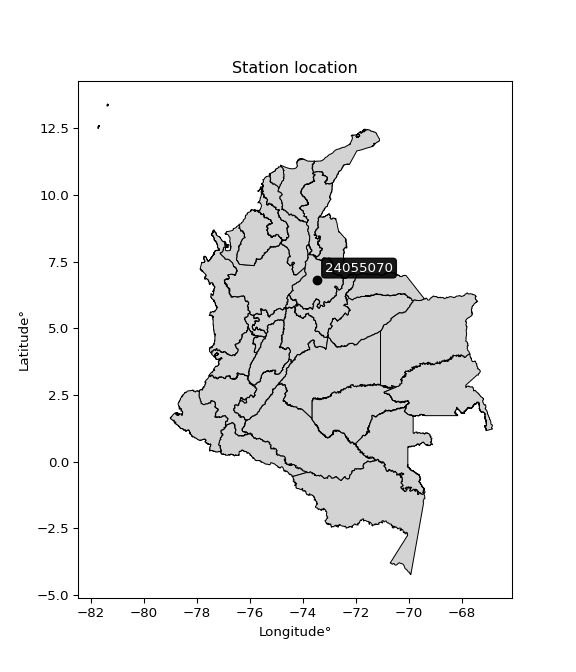

<div align="center">


</div>

# PMP Station (Rain, Pmax24h): 24055070

Probable Maximum Precipitation (PMP) is the greatest amount of rainfall for a specific duration that is meteorologically possible for a given location, acting as a "worst-case" scenario for extreme storms, crucial for designing safety-critical infrastructure like bridges, river deviations, dams, spillways, and nuclear plants to prevent catastrophic failure. PMP is calculated by hydrologists using meteorological data to determine the upper limit of extreme rainfall, often leading to the Probable Maximum Flood (PMF) for flood control design, and is increasingly being studied for climate change impacts. Probable Maximum Precipitation (PMP) is the theoretical upper limit of rainfall, a deterministic estimate for extreme events, while probability distributions (like GEV, Gumbel) describe the likelihood and frequency of various precipitation amounts, including rare ones, showing how often events occur, with PMP representing the extreme end of these distributions, used for critical infrastructure design to ensure safety against the worst conceivable weather, unlike standard statistical forecasts which cover typical probabilities.

The most common probability distributions in hydrology, used for analyzing floods, rainfall, and streamflow, include the Normal, Log-Normal, Gumbel, Gamma (including Log-Pearson Type III), and Generalized Extreme Value (GEV) distributions, often chosen based on the data´s skewness and whether modeling extremes or general conditions, with Gumbel and GEV popular for extreme events like floods, while the Normal distribution serves as a baseline, though often requiring transformations for skewed hydrological data. These distributions help in designing water infrastructure, managing water resources, and forecasting hydrologic events.

> Hydrological data often isn´t perfectly normal (it´s skewed), so different distributions are needed for different applications, such as: **Flood Frequency Analysis**: Using Gumbel, GEV, or Log-Pearson Type III for predicting extreme flood magnitudes and their return periods, **Rainfall Analysis**: Normal for annual totals, but Log-Normal, Weibull, or GEV for intensity or extreme daily rainfall, **Streamflow Modeling**: Gamma and Log-Normal for maximum flows, GEV for minimum flows, and Kappa for daily flows.

<div align="center">

</img>

</div>


## A. General information


### 1. General running parameters

• app_version: _v20260108_. • runtime: _2026-01-08 18:05:13.093906_. • Python version: _3.14.0_. • SciPy version: _1.16.3_. • Pandas version: _2.3.3_. • NumPy version: _2.3.5_. • Stations dataset (station_dataset_file): _dataset/pmax24h_in/automatic_colombia_2003_2024.csv_. • Stations catalog (station_catalog_file): _dataset/CNE.xls_. • Minimum year to eval til year_max (date_min): _1900_. • Maximum year to eval since year_min (date_max): _2024_. • Creates, save and include plots into reports (create_plot): _False_. • Plot only fit distributions with Δo > Δ (plot_only_fit): _True_. • Plot only simple graphs avoiding multiple CDFs and multiple Extreme values plots (plot_only_simple): _False_. • Eval low extreme values, if False, evaluates high extreme values (low_extreme): _False_. • Eval every SciPy distribution as logarithmic (pdist_logarithmic_on): _True_. • Standard deviation normalized (ddof): _1.0_. • Return periods to eval in years (Tr): _[2, 2.33, 5, 10, 15, 20, 25, 50, 75, 100, 200, 250, 500, 750, 1000]_. • Minimum data sample per station, 0 means any (minimum_sample): _5_. • Z-Score maximum threshold to adjust a value, 0 means disable (zscore_max): _3.5_. • Z-Score minimum threshold to adjust a value, 0 means disable (zscore_min): _-2.5_. • Avoid zeros, e.g. rain = 0 (avoid_zeros): _True_. • Avoid null values (avoid_nans): _True_. 

:file_folder:Table: [dataset.csv](../../dataset/pmax24h_in/automatic_colombia_2003_2024.csv)

> Delta Degrees of Freedom (DDOF): is a parameter used in the formulas for calculating variance and standard deviation. When ddof=0, the divisor is $N$ (the total number of observations) and this is used when your data set is the entire population. When ddof=1, the divisor is $N-1$ and this is used when your data set is a sample drawn from a larger population. Using $N-1$ provides an unbiased estimate of the population variance (known as Bessel´s correction).


### 2. Station info and location

|   id |   CODIGO | NOMBRE                                    | CATEGORIA         | TECNOLOGIA                | ESTADO   | FECHA_INSTALACION   |   FECHA_SUSPENSION |   ALTITUD |   LATITUD |   LONGITUD | DEPARTAMENTO   | MUNICIPIO              | AREA_OPERATIVA                         | ENTIDAD                                                     | AREA_HIDROGRAFICA   | ZONA_HIDROGRAFICA   | SUBZONA_HIDROGRAFICA   |   CORRIENTE | Catalogo   |   Version |
|-----:|---------:|:------------------------------------------|:------------------|:--------------------------|:---------|:--------------------|-------------------:|----------:|----------:|-----------:|:---------------|:-----------------------|:---------------------------------------|:------------------------------------------------------------|:--------------------|:--------------------|:-----------------------|------------:|:-----------|----------:|
|    0 | 24055070 | SAN  VICENTE DE CHUCURI  - AUT [24055070] | Agrometeorológica | Automática con Telemetría | Activa   | 25/10/2004          |                nan |      1093 |   6.82339 |   -73.4721 | Santander      | San Vicente De Chucurí | Area Operativa 08 - Santanderes-Arauca | INSTITUTO DE HIDROLOGIA METEOROLOGIA Y ESTUDIOS AMBIENTALES | Magdalena Cauca     | Medio Magdalena     | Río Opón               |         nan | CNE_IDEAM  |  20251226 |

<div align="center">

Dynamic map: [:earth_americas:Google](http://maps.google.com/maps?q=6.82339,-73.47206) [:earth_americas:OSM](https://www.openstreetmap.org/#map=18/6.82339/-73.47206&layers=P) [:earth_americas:Bing](https://www.bing.com/maps?cp=6.82339~-73.47206&lvl=18) [:earth_americas:Apple](https://maps.apple.com/frame?center=6.82339%2C-73.47206&span=0.003%2C0.006)

</div>


<div align="center">

```geojson
{
  "type": "Feature",
  "geometry": {
    "type": "Point", 
    "coordinates": [-73.47206, 6.82339]
  }, 
  "properties": {
    "Name": "24055070"
  }
}
```

</div>


### 3. Discrete values table and plot

<div align="center">

|               |           0 |           1 |           2 |           3 |           4 |           5 |           6 |         7 |
|:--------------|------------:|------------:|------------:|------------:|------------:|------------:|------------:|----------:|
| Date          | 2017        | 2018        | 2019        | 2020        | 2021        | 2022        | 2023        | 2024      |
| Value         |   70.9      |   53.8      |   61.3      |   69.9      |   35.9      |   59.7      |   60        |  409.2    |
| Value_initial |   70.9      |   53.8      |   61.3      |   69.9      |   35.9      |   59.7      |   60        |  409.2    |
| count         |    8        |    8        |    8        |    8        |    8        |    8        |    8        |    8      |
| mean          |  102.588    |  102.588    |  102.588    |  102.588    |  102.588    |  102.588    |  102.588    |  102.588  |
| std           |  124.366    |  124.366    |  124.366    |  124.366    |  124.366    |  124.366    |  124.366    |  124.366  |
| zscore        |   -0.254792 |   -0.392289 |   -0.331983 |   -0.262832 |   -0.536218 |   -0.344848 |   -0.342436 |    2.4654 |


</div>


> The initial value (value_initial) correspond to the initial obtained or null completed value, and value (value) is adjusted only when the initial value is outside the valid range (outlier) definite through the Z-Score value. If Z-Score is active, values out of range or outliers are replaced with the station mean value. A Z-Score (or standard score) measures how many standard deviations a data point is from the mean of a dataset, indicating its relative position; positive scores mean above the mean, negative mean below, and a score of zero is exactly at the mean, allowing for comparison of values from different distributions. It´s calculated using the formula $z=(x–μ)/σ$, where $x$ is the data point, $μ$ is the mean, and $σ$ is the standard deviation, helping identify outliers and understand probability.
>
> <sub>**Note**: In this study, "completing" (filling gaps in) and "extending" (forecasting or lengthening the historical record) rainfall data series are avoided for certain critical analyses because they introduce artificial bias and uncertainty, which can distort the statistics of rare events (extremes), alter day-to-day variability, and compromise the integrity and homogeneity of the original data. Some reasons against Completing/Extending rainfall data are: **Distortion of Extremes and Variability**: The primary issue is that most gap-filling or extension methods rely on averaging or regression with nearby stations, which inherently smooths the data. Rainfall is highly variable in space and time, with a large percentage of zero values and occasional large storms. Infilling methods often underestimate the highest values and overestimate the lowest (zero) values, which severely distorts analyses focused on flood frequency, drought severity, and intensity-duration-frequency (IDF) curves, **Loss of Data Homogeneity**: Infilled or extended data are synthetic estimates, not actual measurements. Combining these estimates with observed data can violate the assumption of data homogeneity, which requires that the data properties do not change over time. Inhomogeneity can lead to incorrect conclusions about long-term trends or changes in climate patterns, **Propagation of Errors**: Errors and biases from the original data (e.g., wind-induced undercatch, instrument errors, site changes) or the data used for imputation can propagate through the analysis, leading to unreliable hydrological models and inaccurate predictions, **Compromised Statistical Integrity**: For statistical analyses, especially those involving the frequency of events, using artificial data can introduce time bias or autocorrelation that doesn´t exist in reality, making it difficult to assess the true probability of events, **Difficulty in Validation**: It is difficult to accurately validate the quality of filled or extended data, especially for past periods where ground-truth measurements are unavailable. The reliability of imputation techniques heavily depends on the density of the surrounding station network and the complexity of the local topography.</sub>


### 4. Active continuous probability distributions from SciPy (43 of 104 available)

A Probability Density Function (PDF) describes the relative likelihood of a continuous random variable falling within a specific range, where the total area under its curve equals 1, and the area over any interval gives the actual probability for that range. Unlike discrete probabilities (like rolling a die), a PDF shows density, not direct probability for a single point (which is zero), with higher points indicating higher likelihood, often visualized as a bell curve for normal distributions.

A log of a probability density function (log-PDF) is simply the logarithm of the PDF´s value, denoted as $log(f(x))$, useful for converting multiplication of probabilities into addition, improving numerical stability with tiny numbers, and connecting to information theory concepts like entropy. Instead of dealing with very small probabilities (e.g., 0.000001), log-PDFs use negative numbers (e.g., $log(0.00001) ≈ -11.51$ that are easier for computers to handle, preventing underflow errors and simplifying complex calculations. In this study, each active probability distribution from SciPy is also evaluated in the $log$ form.

[scipy.stats](https://docs.scipy.org/doc/scipy/reference/stats.html) is a Python´s powerful submodule within the SciPy library for comprehensive statistical analysis, offering over 130 probability distributions (like Normal, Poisson), functions for descriptive stats (mean, variance), hypothesis testing (t-tests, chi-square), random variable generation, and statistical tests, making it essential for data science, modeling, and research. It provides tools to explore, model, and draw conclusions from data efficiently, working seamlessly with NumPy.

<div align="center">

|   id | p_dist             |   n_parameter | fit_method   | label                                                                       | active   | ref                                                                                                        |
|-----:|:-------------------|--------------:|:-------------|:----------------------------------------------------------------------------|:---------|:-----------------------------------------------------------------------------------------------------------|
|    0 | alpha              |             3 | MLE          | Alpha                                                                       | True     | [:mortar_board:](https://docs.scipy.org/doc/scipy/reference/generated/scipy.stats.alpha.html)              |
|    1 | betaprime          |             4 | MLE          | Beta prime                                                                  | True     | [:mortar_board:](https://docs.scipy.org/doc/scipy/reference/generated/scipy.stats.betaprime.html)          |
|    2 | chi2               |             3 | MLE          | Chi²                                                                        | True     | [:mortar_board:](https://docs.scipy.org/doc/scipy/reference/generated/scipy.stats.chi2.html)               |
|    3 | crystalball        |             4 | MLE          | Crystalball                                                                 | True     | [:mortar_board:](https://docs.scipy.org/doc/scipy/reference/generated/scipy.stats.crystalball.html)        |
|    4 | erlang             |             3 | MLE          | Erlang                                                                      | True     | [:mortar_board:](https://docs.scipy.org/doc/scipy/reference/generated/scipy.stats.erlang.html)             |
|    5 | expon              |             2 | MLE          | Exponential                                                                 | True     | [:mortar_board:](https://docs.scipy.org/doc/scipy/reference/generated/scipy.stats.expon.html)              |
|    6 | exponnorm          |             3 | MLE          | Exponentially modified Normal                                               | True     | [:mortar_board:](https://docs.scipy.org/doc/scipy/reference/generated/scipy.stats.exponnorm.html)          |
|    7 | f                  |             4 | MLE          | F                                                                           | True     | [:mortar_board:](https://docs.scipy.org/doc/scipy/reference/generated/scipy.stats.f.html)                  |
|    8 | fatiguelife        |             3 | MLE          | Fatigue-life (Birnbaum-Saunders)                                            | True     | [:mortar_board:](https://docs.scipy.org/doc/scipy/reference/generated/scipy.stats.fatiguelife.html)        |
|    9 | fisk               |             3 | MLE          | Fisk                                                                        | True     | [:mortar_board:](https://docs.scipy.org/doc/scipy/reference/generated/scipy.stats.fisk.html)               |
|   10 | gamma              |             3 | MLE          | Gamma                                                                       | True     | [:mortar_board:](https://docs.scipy.org/doc/scipy/reference/generated/scipy.stats.gamma.html)              |
|   11 | genexpon           |             5 | MLE          | Generalized exponential                                                     | True     | [:mortar_board:](https://docs.scipy.org/doc/scipy/reference/generated/scipy.stats.genexpon.html)           |
|   12 | genlogistic        |             3 | MLE          | Generalized logistic                                                        | True     | [:mortar_board:](https://docs.scipy.org/doc/scipy/reference/generated/scipy.stats.genlogistic.html)        |
|   13 | gibrat             |             2 | MM           | Gibrat                                                                      | True     | [:mortar_board:](https://docs.scipy.org/doc/scipy/reference/generated/scipy.stats.gibrat.html)             |
|   14 | gompertz           |             3 | MLE          | Gompertz (or truncated Gumbel)                                              | True     | [:mortar_board:](https://docs.scipy.org/doc/scipy/reference/generated/scipy.stats.gompertz.html)           |
|   15 | gumbel_l           |             2 | MM           | Gumbel Left Skew                                                            | True     | [:mortar_board:](https://docs.scipy.org/doc/scipy/reference/generated/scipy.stats.gumbel_l.html)           |
|   16 | gumbel_r           |             2 | MM           | Gumbel Right Skew                                                           | True     | [:mortar_board:](https://docs.scipy.org/doc/scipy/reference/generated/scipy.stats.gumbel_r.html)           |
|   17 | halflogistic       |             2 | MM           | Half-logistic                                                               | True     | [:mortar_board:](https://docs.scipy.org/doc/scipy/reference/generated/scipy.stats.halflogistic.html)       |
|   18 | halfnorm           |             2 | MM           | Half Normal                                                                 | True     | [:mortar_board:](https://docs.scipy.org/doc/scipy/reference/generated/scipy.stats.halfnorm.html)           |
|   19 | hypsecant          |             2 | MM           | hyperbolic secant                                                           | True     | [:mortar_board:](https://docs.scipy.org/doc/scipy/reference/generated/scipy.stats.hypsecant.html)          |
|   20 | invgamma           |             3 | MLE          | Inverted gamma                                                              | True     | [:mortar_board:](https://docs.scipy.org/doc/scipy/reference/generated/scipy.stats.invgamma.html)           |
|   21 | invgauss           |             3 | MLE          | Inverse Gaussian                                                            | True     | [:mortar_board:](https://docs.scipy.org/doc/scipy/reference/generated/scipy.stats.invgauss.html)           |
|   22 | invweibull         |             3 | MLE          | Inverted Weibull                                                            | True     | [:mortar_board:](https://docs.scipy.org/doc/scipy/reference/generated/scipy.stats.invweibull.html)         |
|   23 | kstwobign          |             2 | MLE          | Limiting distribution of scaled Kolmogorov-Smirnov two-sided test statistic | True     | [:mortar_board:](https://docs.scipy.org/doc/scipy/reference/generated/scipy.stats.kstwobign.html)          |
|   24 | laplace            |             2 | MM           | Laplace                                                                     | True     | [:mortar_board:](https://docs.scipy.org/doc/scipy/reference/generated/scipy.stats.laplace.html)            |
|   25 | laplace_asymmetric |             3 | MLE          | Asymmetric Laplace                                                          | True     | [:mortar_board:](https://docs.scipy.org/doc/scipy/reference/generated/scipy.stats.laplace_asymmetric.html) |
|   26 | loggamma           |             3 | MLE          | Log gamma                                                                   | True     | [:mortar_board:](https://docs.scipy.org/doc/scipy/reference/generated/scipy.stats.loggamma.html)           |
|   27 | logistic           |             2 | MM           | Logistic (or Sech-squared)                                                  | True     | [:mortar_board:](https://docs.scipy.org/doc/scipy/reference/generated/scipy.stats.logistic.html)           |
|   28 | lognorm            |             3 | MLE          | Log Normal                                                                  | True     | [:mortar_board:](https://docs.scipy.org/doc/scipy/reference/generated/scipy.stats.lognorm.html)            |
|   29 | maxwell            |             2 | MM           | Maxwell                                                                     | True     | [:mortar_board:](https://docs.scipy.org/doc/scipy/reference/generated/scipy.stats.maxwell.html)            |
|   30 | mielke             |             4 | MLE          | Mielke Beta-Kappa / Dagum                                                   | True     | [:mortar_board:](https://docs.scipy.org/doc/scipy/reference/generated/scipy.stats.mielke.html)             |
|   31 | moyal              |             2 | MM           | Moyal                                                                       | True     | [:mortar_board:](https://docs.scipy.org/doc/scipy/reference/generated/scipy.stats.moyal.html)              |
|   32 | nakagami           |             3 | MLE          | Nakagami                                                                    | True     | [:mortar_board:](https://docs.scipy.org/doc/scipy/reference/generated/scipy.stats.nakagami.html)           |
|   33 | ncf                |             5 | MLE          | Non-central F distribution                                                  | True     | [:mortar_board:](https://docs.scipy.org/doc/scipy/reference/generated/scipy.stats.ncf.html)                |
|   34 | nct                |             4 | MLE          | Non-central Student’s t                                                     | True     | [:mortar_board:](https://docs.scipy.org/doc/scipy/reference/generated/scipy.stats.nct.html)                |
|   35 | norm               |             2 | MM           | Normal                                                                      | True     | [:mortar_board:](https://docs.scipy.org/doc/scipy/reference/generated/scipy.stats.norm.html)               |
|   36 | pearson3           |             3 | MM           | Pearson type III                                                            | True     | [:mortar_board:](https://docs.scipy.org/doc/scipy/reference/generated/scipy.stats.pearson3.html)           |
|   37 | rayleigh           |             2 | MM           | Rayleigh                                                                    | True     | [:mortar_board:](https://docs.scipy.org/doc/scipy/reference/generated/scipy.stats.rayleigh.html)           |
|   38 | rice               |             3 | MLE          | Rice                                                                        | True     | [:mortar_board:](https://docs.scipy.org/doc/scipy/reference/generated/scipy.stats.rice.html)               |
|   39 | t                  |             3 | MLE          | Student’s t                                                                 | True     | [:mortar_board:](https://docs.scipy.org/doc/scipy/reference/generated/scipy.stats.t.html)                  |
|   40 | truncnorm          |             4 | MLE          | Truncated normal                                                            | True     | [:mortar_board:](https://docs.scipy.org/doc/scipy/reference/generated/scipy.stats.truncnorm.html)          |
|   41 | wald               |             2 | MM           | Wald                                                                        | True     | [:mortar_board:](https://docs.scipy.org/doc/scipy/reference/generated/scipy.stats.wald.html)               |
|   42 | weibull_min        |             3 | MLE          | Weibull minimum                                                             | True     | [:mortar_board:](https://docs.scipy.org/doc/scipy/reference/generated/scipy.stats.weibull_min.html)        |

</div>

> **n_parameter:** # arguments & localization & scale.
>
> **Fit methods:** (MLE) maximum likelihood, (MM) L-moments.
>
>**Inactive** (With the only purpose of prevent loops, zero divisions, infinite values, over high estimated values or horizontal trending for recurrence intervals estimations, the follow distributions were disabled.)**:** foldnorm, gennorm, norminvgauss, powernorm, powerlognorm, skewnorm, genextreme, anglit, arcsine, argus, beta, bradford, burr, burr12, cauchy, cosine, halfcauchy, foldcauchy, skewcauchy, wrapcauchy, dgamma, gengamma, exponweib, exponpow, truncexpon, gausshyper, genhalflogistic, genhyperbolic, geninvgauss, halfgennorm, johnsonsb, johnsonsu, kappa4, kappa3, ksone, kstwo, loglaplace, levy, levy_l, levy_stable, ncx2, pareto, genpareto, truncpareto, lomax, powerlaw, rdist, rel_breitwigner, recipinvgauss, semicircular, studentized_range, trapezoid, triang, truncweibull_min, tukeylambda, uniform, loguniform, vonmises, vonmises_line, weibull_max, dweibull, 


## B. Probability (PDF) vs. Empirical (EDF) distributions functions

A continuous probability distribution (CPD) describes probabilities for variables that can take any value within a range (like rain any time), unlike discrete variables with specific outcomes (like temperature). It uses a Probability Density Function (PDF), a curve where the total area under it equals 1, and the probability of the variable falling within an interval (a to b) is found by calculating the area under the curve between those points. A key feature is that the probability of hitting any single exact value is zero, so probabilities are always expressed for ranges, e.g., $P(a ≤ X ≤ b)$.

<div align="center">

Distributions parameters from station values
|    |   station | p_dist                |   n |             loc |          scale | shape                  | shape1               | shape2             | shape3   |
|---:|----------:|:----------------------|----:|----------------:|---------------:|:-----------------------|:---------------------|:-------------------|:---------|
|  0 |  24055070 | alpha                 |   8 |       9.09072   |  105.312       | 1.9585310913489073     |                      |                    |          |
|  1 |  24055070 | betaprime             |   8 |      25.796     |    0.26569     | 186.08693705182466     | 1.6537201241060795   |                    |          |
|  2 |  24055070 | chi2                  |   8 |      35.9       |  125.716       | 0.322774958167956      |                      |                    |          |
|  3 |  24055070 | crystalball           |   8 |     102.588     |  116.334       | 9085.912373384572      | 3889.9552601979      |                    |          |
|  4 |  24055070 | erlang                |   8 |      35.9       |   61.8116      | 0.6609123823042236     |                      |                    |          |
|  5 |  24055070 | expon                 |   8 |      35.9       |   66.6875      |                        |                      |                    |          |
|  6 |  24055070 | exponnorm             |   8 |      35.8306    |    0.0222557   | 2978.1936701296345     |                      |                    |          |
|  7 |  24055070 | f                     |   8 |      25.6869    |   29.9399      | 2153.544857775202      | 3.3074017962106472   |                    |          |
|  8 |  24055070 | fatiguelife           |   8 |      31.7191    |   37.0311      | 1.4027698638362156     |                      |                    |          |
|  9 |  24055070 | fisk                  |   8 |      33.3778    |   28.6577      | 1.5924525057967207     |                      |                    |          |
| 10 |  24055070 | gamma                 |   8 |      35.9       |  103.53        | 0.5310424360831326     |                      |                    |          |
| 11 |  24055070 | genexpon              |   8 |      35.9       |   85.7715      | 1.2861699353137694     | 3.72590013263168e-11 | 2.3172684240348325 |          |
| 12 |  24055070 | genlogistic           |   8 |    -289.422     |   46.596       | 1955.0657818499972     |                      |                    |          |
| 13 |  24055070 | gibrat                |   8 |      13.8393    |   53.8285      |                        |                      |                    |          |
| 14 |  24055070 | gompertz              |   8 |      35.9       |    5.10337e+12 | 77147525412.27927      |                      |                    |          |
| 15 |  24055070 | gumbel_l              |   8 |     154.944     |   90.7053      |                        |                      |                    |          |
| 16 |  24055070 | gumbel_r              |   8 |      50.231     |   90.7053      |                        |                      |                    |          |
| 17 |  24055070 | halflogistic          |   8 |     -35.2954    |   99.4615      |                        |                      |                    |          |
| 18 |  24055070 | halfnorm              |   8 |     -51.3932    |  192.986       |                        |                      |                    |          |
| 19 |  24055070 | hypsecant             |   8 |     102.587     |   74.0606      |                        |                      |                    |          |
| 20 |  24055070 | invgamma              |   8 |      25.664     |   49.5267      | 1.6537014762961086     |                      |                    |          |
| 21 |  24055070 | invgauss              |   8 |      30.3289    |   30.3044      | 2.384425707546247      |                      |                    |          |
| 22 |  24055070 | invweibull            |   8 |      20.7353    |   33.5338      | 1.6146476324086856     |                      |                    |          |
| 23 |  24055070 | kstwobign             |   8 |    -155.241     |  307.406       |                        |                      |                    |          |
| 24 |  24055070 | laplace               |   8 |     102.587     |   82.2606      |                        |                      |                    |          |
| 25 |  24055070 | laplace_asymmetric    |   8 |      53.8       |   28.2497      | 0.45750569496974536    |                      |                    |          |
| 26 |  24055070 | loggamma              |   8 |  -35286.7       | 4784.07        | 1632.6872230347076     |                      |                    |          |
| 27 |  24055070 | logistic              |   8 |     102.587     |   64.1383      |                        |                      |                    |          |
| 28 |  24055070 | lognorm               |   8 |      35.9       |    0.411561    | 12.011060640662924     |                      |                    |          |
| 29 |  24055070 | maxwell               |   8 |    -173.075     |  172.746       |                        |                      |                    |          |
| 30 |  24055070 | mielke                |   8 |       9.67262   |    1.11716     | 10350.04780713598      | 2.2761006463959674   |                    |          |
| 31 |  24055070 | moyal                 |   8 |      36.0602    |   52.3687      |                        |                      |                    |          |
| 32 |  24055070 | nakagami              |   8 |      35.9       |  252.378       | 0.18616677830257267    |                      |                    |          |
| 33 |  24055070 | ncf                   |   8 |      -0.0511177 |    3.56433e-05 | 0.00013543444123720227 | 6.790642449280582    | 241.69005715236622 |          |
| 34 |  24055070 | nct                   |   8 |      -0.0834533 |    1.62792     | 2.44469420376838       | 35.27485391959317    |                    |          |
| 35 |  24055070 | norm                  |   8 |     102.587     |  116.334       |                        |                      |                    |          |
| 36 |  24055070 | pearson3              |   8 |     102.588     |  116.334       | 2.2324904099473892     |                      |                    |          |
| 37 |  24055070 | rayleigh              |   8 |    -119.966     |  177.572       |                        |                      |                    |          |
| 38 |  24055070 | rice                  |   8 |     -51.9265    |  136.763       | 0.00020143831205395979 |                      |                    |          |
| 39 |  24055070 | t                     |   8 |      60.1449    |    1.62404     | 0.4086868584112996     |                      |                    |          |
| 40 |  24055070 | truncnorm             |   8 | -150260         | 4186.63        | 35.898996112167495     | 394.22568563755794   |                    |          |
| 41 |  24055070 | wald                  |   8 |     -13.7466    |  116.334       |                        |                      |                    |          |
| 42 |  24055070 | weibull_min           |   8 |      35.9       |   51.5746      | 0.6403819073706123     |                      |                    |          |
| 43 |  24055070 | logalpha              |   8 |       2.59725   |    5.41421     | 3.541260831330791      |                      |                    |          |
| 44 |  24055070 | logbetaprime          |   8 |      -0.964297  |    1.86822     | 262.83852131101753     | 94.40038280032701    |                    |          |
| 45 |  24055070 | logchi2               |   8 |       3.58074   |    0.98032     | 1.0131251455065218     |                      |                    |          |
| 46 |  24055070 | logcrystalball        |   8 |       4.2985    |    0.678213    | 7.578314913245841      | 2908.072975304431    |                    |          |
| 47 |  24055070 | logerlang             |   8 |       3.58074   |    0.538888    | 0.9232868348809646     |                      |                    |          |
| 48 |  24055070 | logexpon              |   8 |       3.58074   |    0.717764    |                        |                      |                    |          |
| 49 |  24055070 | logexponnorm          |   8 |       3.78648   |    0.20403     | 2.509559094196681      |                      |                    |          |
| 50 |  24055070 | logf                  |   8 |       3.08953   |    0.977972    | 15059.1295330836       | 10.763200609092632   |                    |          |
| 51 |  24055070 | logfatiguelife        |   8 |       3.29606   |    0.8486      | 0.6035256955165804     |                      |                    |          |
| 52 |  24055070 | logfisk               |   8 |       3.3157    |    0.811821    | 3.3790556560671394     |                      |                    |          |
| 53 |  24055070 | loggamma              |   8 |       3.58074   |    1.70798     | 0.19161597053756535    |                      |                    |          |
| 54 |  24055070 | loggenexpon           |   8 |       3.58074   |    0.791947    | 0.6236563622695892     | 0.9231494293566991   | 1.4301210394529558 |          |
| 55 |  24055070 | loggenlogistic        |   8 |       1.21498   |    0.395749    | 1245.4156111414586     |                      |                    |          |
| 56 |  24055070 | loggibrat             |   8 |       3.78112   |    0.313809    |                        |                      |                    |          |
| 57 |  24055070 | loggompertz           |   8 |       3.58074   |   11.7921      | 15.484177697173074     |                      |                    |          |
| 58 |  24055070 | loggumbel_l           |   8 |       4.60373   |    0.528801    |                        |                      |                    |          |
| 59 |  24055070 | loggumbel_r           |   8 |       3.99327   |    0.528801    |                        |                      |                    |          |
| 60 |  24055070 | loghalflogistic       |   8 |       3.49466   |    0.579848    |                        |                      |                    |          |
| 61 |  24055070 | loghalfnorm           |   8 |       3.40081   |    1.12509     |                        |                      |                    |          |
| 62 |  24055070 | loghypsecant          |   8 |       4.2985    |    0.431764    |                        |                      |                    |          |
| 63 |  24055070 | loginvgamma           |   8 |       3.08918   |    5.26455     | 5.381572951715846      |                      |                    |          |
| 64 |  24055070 | loginvgauss           |   8 |       3.27748   |    2.72372     | 0.37486454055214824    |                      |                    |          |
| 65 |  24055070 | loginvweibull         |   8 |       2.18698   |    1.80743     | 5.000519723688141      |                      |                    |          |
| 66 |  24055070 | logkstwobign          |   8 |       2.47758   |    2.13452     |                        |                      |                    |          |
| 67 |  24055070 | loglaplace            |   8 |       4.2985    |    0.479569    |                        |                      |                    |          |
| 68 |  24055070 | loglaplace_asymmetric |   8 |       4.08933   |    0.31206     | 0.7194423444130436     |                      |                    |          |
| 69 |  24055070 | logloggamma           |   8 |    -280.649     |   36.0977      | 2681.063607182915      |                      |                    |          |
| 70 |  24055070 | loglogistic           |   8 |       4.2985    |    0.373918    |                        |                      |                    |          |
| 71 |  24055070 | loglognorm            |   8 |       3.58074   |    0.00851771  | 11.571436900714732     |                      |                    |          |
| 72 |  24055070 | logmaxwell            |   8 |       2.69142   |    1.00709     |                        |                      |                    |          |
| 73 |  24055070 | logmielke             |   8 |       3.28062   |    0.80393     | 3.7034854680904754     | 3.2640573650273614   |                    |          |
| 74 |  24055070 | logmoyal              |   8 |       3.91066   |    0.305303    |                        |                      |                    |          |
| 75 |  24055070 | lognakagami           |   8 |       3.58074   |    1.20798     | 0.3253347870212815     |                      |                    |          |
| 76 |  24055070 | logncf                |   8 |       3.10402   |    0.390541    | 224.29363069933106     | 10.764116822276776   | 330.59682052113203 |          |
| 77 |  24055070 | lognct                |   8 |       0.322233  |    0.0390523   | 25.196587719031        | 98.30868644943479    |                    |          |
| 78 |  24055070 | lognorm               |   8 |       4.2985    |    0.678213    |                        |                      |                    |          |
| 79 |  24055070 | logpearson3           |   8 |       4.2985    |    0.678212    | 1.8536333410363053     |                      |                    |          |
| 80 |  24055070 | lograyleigh           |   8 |       3.00104   |    1.03522     |                        |                      |                    |          |
| 81 |  24055070 | logrice               |   8 |       3.28388   |    0.862968    | 0.00032246797138607065 |                      |                    |          |
| 82 |  24055070 | logt                  |   8 |       4.04287   |    0.195487    | 1.2165600821091327     |                      |                    |          |
| 83 |  24055070 | logtruncnorm          |   8 |      -0.345323  |    1.45917     | 2.9678573681278353     | 5.209869068387295    |                    |          |
| 84 |  24055070 | logwald               |   8 |       3.62025   |    0.678245    |                        |                      |                    |          |
| 85 |  24055070 | logweibull_min        |   8 |       3.98527   |    0.892071    | 0.508824679332263      |                      |                    |          |

</div>

> **loc** (Location parameter): This shifts the distribution along the x-axis. For many common distributions, like the normal (Gaussian) distribution, loc represents the mean $μ$. For others, like the uniform distribution, it might represent the minimum value, or for the beta distribution, the left end of the support interval.
>
> **scale** (Scale parameter): This determines the width or spread of the distribution. For the normal distribution, scale represents the standard deviation $σ$. For a uniform distribution, it defines the length of the interval (from $loc$ to $loc + scale$).
>
> **shape** (Shape parameters): Refers to parameters that define the specific form of a probability distribution, distinct from its location (loc) and scale (scale). These parameters are required arguments for most distribution functions. For example, a normal (Gaussian) distribution is fully defined by its location (mean) and scale (standard deviation), so it has no specific shape parameters beyond loc and scale. However, other distributions have intrinsic properties that need specification, as Gamma distribution that takes a shape parameter, often named $a$ or $alpha$.


### 0. Cumulative distribution values - CDF (86 evaluated)

Cumulative Distribution Function (CDF), denoted as $F$<sub>$X$</sub>$(x)$, is a function that gives the probability that a random variable $X$ will take a value less than or equal to a specific value, $x$ (i.e., $(P(X≥x)$. It essentially "accumulates" probabilities from a given point up to the far right (positive infinity), providing a complete picture of the distribution´s probabilities for both discrete (like rain) and continuous (like temperature) variables, helping to find probabilities over ranges or above certain values. Each station is evaluated separately ordering the $x$ values ascending, calculating the CDF and PDF values for the activated distributions and their logarithmic forms.

<div align="center">

CDF ordered by x ascending and calculating $log(f(x))$ separately
|   id |   Station |   date |     x |   count |    mean |     std |    zscore |   Value_initial |   station |   m |     alpha |   alpha_pdf |   betaprime |   betaprime_pdf |       chi2 |    chi2_pdf |   crystalball |   crystalball_pdf |      erlang |     erlang_pdf |    expon |   expon_pdf |   exponnorm |   exponnorm_pdf |         f |       f_pdf |   fatiguelife |   fatiguelife_pdf |      fisk |    fisk_pdf |       gamma |        gamma_pdf |   genexpon |   genexpon_pdf |   genlogistic |   genlogistic_pdf |   gibrat |   gibrat_pdf |    gompertz |   gompertz_pdf |   gumbel_l |   gumbel_l_pdf |   gumbel_r |   gumbel_r_pdf |   halflogistic |   halflogistic_pdf |   halfnorm |   halfnorm_pdf |   hypsecant |   hypsecant_pdf |   invgamma |   invgamma_pdf |   invgauss |   invgauss_pdf |   invweibull |   invweibull_pdf |   kstwobign |   kstwobign_pdf |   laplace |   laplace_pdf |   laplace_asymmetric |   laplace_asymmetric_pdf |   loggamma |   loggamma_pdf |   logistic |   logistic_pdf |   lognorm |   lognorm_pdf |   maxwell |   maxwell_pdf |   mielke |   mielke_pdf |    moyal |   moyal_pdf |    nakagami |   nakagami_pdf |      ncf |    ncf_pdf |       nct |     nct_pdf |     norm |    norm_pdf |   pearson3 |   pearson3_pdf |   rayleigh |   rayleigh_pdf |     rice |    rice_pdf |        t |       t_pdf |   truncnorm |   truncnorm_pdf |     wald |    wald_pdf |   weibull_min |   weibull_min_pdf |   logalpha |   logalpha_pdf |   logbetaprime |   logbetaprime_pdf |     logchi2 |   logchi2_pdf |   logcrystalball |   logcrystalball_pdf |   logerlang |   logerlang_pdf |   logexpon |   logexpon_pdf |   logexponnorm |   logexponnorm_pdf |      logf |   logf_pdf |   logfatiguelife |   logfatiguelife_pdf |   logfisk |   logfisk_pdf |   loggenexpon |   loggenexpon_pdf |   loggenlogistic |   loggenlogistic_pdf |   loggibrat |   loggibrat_pdf |   loggompertz |   loggompertz_pdf |   loggumbel_l |   loggumbel_l_pdf |   loggumbel_r |   loggumbel_r_pdf |   loghalflogistic |   loghalflogistic_pdf |   loghalfnorm |   loghalfnorm_pdf |   loghypsecant |   loghypsecant_pdf |   loginvgamma |   loginvgamma_pdf |   loginvgauss |   loginvgauss_pdf |   loginvweibull |   loginvweibull_pdf |   logkstwobign |   logkstwobign_pdf |   loglaplace |   loglaplace_pdf |   loglaplace_asymmetric |   loglaplace_asymmetric_pdf |   logloggamma |   logloggamma_pdf |   loglogistic |   loglogistic_pdf |   loglognorm |   loglognorm_pdf |   logmaxwell |   logmaxwell_pdf |   logmielke |   logmielke_pdf |   logmoyal |   logmoyal_pdf |   lognakagami |   lognakagami_pdf |    logncf |   logncf_pdf |    lognct |   lognct_pdf |   logpearson3 |   logpearson3_pdf |   lograyleigh |   lograyleigh_pdf |   logrice |   logrice_pdf |     logt |   logt_pdf |   logtruncnorm |   logtruncnorm_pdf |   logwald |   logwald_pdf |   logweibull_min |   logweibull_min_pdf |
|-----:|----------:|-------:|------:|--------:|--------:|--------:|----------:|----------------:|----------:|----:|----------:|------------:|------------:|----------------:|-----------:|------------:|--------------:|------------------:|------------:|---------------:|---------:|------------:|------------:|----------------:|----------:|------------:|--------------:|------------------:|----------:|------------:|------------:|-----------------:|-----------:|---------------:|--------------:|------------------:|---------:|-------------:|------------:|---------------:|-----------:|---------------:|-----------:|---------------:|---------------:|-------------------:|-----------:|---------------:|------------:|----------------:|-----------:|---------------:|-----------:|---------------:|-------------:|-----------------:|------------:|----------------:|----------:|--------------:|---------------------:|-------------------------:|-----------:|---------------:|-----------:|---------------:|----------:|--------------:|----------:|--------------:|---------:|-------------:|---------:|------------:|------------:|---------------:|---------:|-----------:|----------:|------------:|---------:|------------:|-----------:|---------------:|-----------:|---------------:|---------:|------------:|---------:|------------:|------------:|----------------:|---------:|------------:|--------------:|------------------:|-----------:|---------------:|---------------:|-------------------:|------------:|--------------:|-----------------:|---------------------:|------------:|----------------:|-----------:|---------------:|---------------:|-------------------:|----------:|-----------:|-----------------:|---------------------:|----------:|--------------:|--------------:|------------------:|-----------------:|---------------------:|------------:|----------------:|--------------:|------------------:|--------------:|------------------:|--------------:|------------------:|------------------:|----------------------:|--------------:|------------------:|---------------:|-------------------:|--------------:|------------------:|--------------:|------------------:|----------------:|--------------------:|---------------:|-------------------:|-------------:|-----------------:|------------------------:|----------------------------:|--------------:|------------------:|--------------:|------------------:|-------------:|-----------------:|-------------:|-----------------:|------------:|----------------:|-----------:|---------------:|--------------:|------------------:|----------:|-------------:|----------:|-------------:|--------------:|------------------:|--------------:|------------------:|----------:|--------------:|---------:|-----------:|---------------:|-------------------:|----------:|--------------:|-----------------:|---------------------:|
|    0 |  24055070 |   2021 |  35.9 |       8 | 102.588 | 124.366 | -0.536218 |            35.9 |  24055070 |   1 | 0.0250671 | 0.00861806  |   0.0277813 |     0.0116492   | 0.00229636 | 5.21578e+10 |      0.283241 |       0.00290969  | 3.23805e-11 | 3011.88        | 0        | 0.0149953   |  0.00104727 |     0.0150577   | 0.0277815 | 0.0116488   |     0.0299142 |       0.0191674   | 0.0204299 | 0.0126353   | 2.93953e-09 | 219694           | 3.2429e-12 |    0.0149953   |      0.162879 |       0.00634061  | 0.186195 |  0.0121482   | 8.12114e-12 |    0.015117    |   0.235984 |    0.0022672   |   0.310007 |    0.00400272  |       0.343367 |        0.00443438  |   0.348968 |    0.00373237  |    0.245736 |     0.00299814  |  0.0277815 |    0.0116488   |  0.0295621 |    0.0164693   |    0.0272819 |      0.0104618   |    0.165811 |     0.00466879  |  0.222277 |   0.0027021   |            0.0433278 |              0.0033524   | 0.00112116 |     4.8376e+11 |   0.261199 |    0.00300872  |  0.144956 |     0.335994  |  0.309265 |   0.0032518   |      nan |          nan | 0.31657  | 0.00462051  | 5.45853e-07 |    2.86034e+07 | 0.101888 | 0.0104121  | 0.0671965 | 0.010877    | 0.283241 | 0.00290969  |   0.349636 |    0.00634566  |   0.319708 |    0.00336277  | 0.186328 | 0.00382066  | 0.109573 | 0.00184505  |    0        |     0.00858131  | 0.297101 | 0.00837     |   6.96628e-11 |    6278.41        |   0.02478  |      0.32474   |       0.12419  |          0.383193  | 1.34032e-08 |   1.52887e+07 |         0.144956 |            0.335994  | 1.22001e-14 |      25.3647    |   0        |      1.39322   |      0.0276228 |          0.251968  | 0.0263227 |  0.365103  |         0.028648 |            0.439411  | 0.0222581 |     0.27746   |   1.21782e-09 |         0.787498  |        0.0427669 |            0.340191  |    0        |       0         |   1.89517e-13 |         1.31309   |      0.134535 |       0.236477    |      0.112844 |         0.465577  |         0.0740873 |              0.857562 |      0.127057 |         0.700166  |       0.119338 |          0.269968  |     0.0263221 |         0.365098  |     0.0280971 |         0.428498  |       0.0255273 |           0.335941  |      0.0478409 |          0.35725   |     0.111936 |        0.233409  |               0.0353999 |                   0.157677  |      0.151741 |         0.334777  |      0.127909 |         0.298323  |   0.00410708 |      2.36061e+12 |     0.145705 |        0.418332  |   0.0248773 |       0.29515   |  0.0860628 |      0.51405   |   7.03413e-11 |    103063         | 0.0263149 |    0.365075  | 0.0936867 |    0.405246  |     0.0109045 |         0.897358  |      0.145112 |         0.462426  | 0.0574501 |     0.375718  | 0.108796 |  0.250299  |    0           |          0         |  0        |     0         |      0           |           0          |
|    1 |  24055070 |   2018 |  53.8 |       8 | 102.588 | 124.366 | -0.392289 |            53.8 |  24055070 |   2 | 0.354594  | 0.0199255   |   0.366277  |     0.0172903   | 0.695624   | 0.00589806  |      0.337471 |       0.0031406   | 0.437265    |    0.0135112   | 0.23541  | 0.0114653   |  0.237465   |     0.0115044   | 0.366276  | 0.0172904   |     0.354683  |       0.0124193   | 0.368299  | 0.0181416   | 0.418344    |      0.0110711   | 0.23541    |    0.0114653   |      0.290522 |       0.0077044   | 0.382887 |  0.00955004  | 0.237074    |    0.0115331   |   0.279556 |    0.00260431  |   0.382351 |    0.00405267  |       0.420162 |        0.00413961  |   0.414303 |    0.00356366  |    0.304016 |     0.00350872  |  0.366276  |    0.0172904   |  0.374441  |    0.0143898   |    0.359512  |      0.01796     |    0.255806 |     0.00530581  |  0.27631  |   0.00335896  |            0.173083  |              0.013392    | 0.794931   |     0.308146   |   0.318503 |    0.00338423  |  0.322097 |     0.528721  |  0.368583 |   0.00336308  |      nan |          nan | 0.398561 | 0.00450326  | 0.296087    |    0.00615397  | 0.319114 | 0.0123641  | 0.328266  | 0.0151239   | 0.337471 | 0.0031406   |   0.451596 |    0.00511888  |   0.380472 |    0.0034141   | 0.258303 | 0.00419251  | 0.188955 | 0.0119844   |    0.142398 |     0.00736023  | 0.4316   | 0.00666168  |   0.398181    |       0.0109331   |   0.359724 |      1.05121   |       0.332085 |          0.615552  | 0.474031    |   0.516645    |         0.322097 |            0.528721  | 0.565065    |       0.852355  |   0.430847 |      0.792953  |      0.308103  |          1.02916   | 0.363259  |  0.99548   |         0.364927 |            0.90847   | 0.342779  |     1.1369    |   0.365891    |         0.882499  |        0.321419  |            0.92141   |    0.333625 |       1.78165   |   0.417491    |         0.791584  |      0.266924 |       0.430455    |      0.362317 |         0.695607  |         0.399499  |              0.724673 |      0.396575 |         0.619662  |       0.287019 |          0.57827   |     0.363257  |         0.995482  |     0.366541  |         0.922543  |       0.358559  |           1.02263   |      0.29934   |          0.783358  |     0.260204 |        0.542578  |               0.214557  |                   0.95567   |      0.325808 |         0.515262  |      0.302022 |         0.563772  |   0.630671   |      0.0806111   |     0.352022 |        0.572915  |   0.347641  |       1.1071    |  0.376174  |      0.781706  |   0.377596    |         0.590815  | 0.363263  |    0.995521  | 0.333333  |    0.723476  |     0.409857  |         0.823553  |      0.363619 |         0.584449  | 0.281289  |     0.676903  | 0.405293 |  1.56294   |    7.44882e-11 |          2.22966   |  0.397574 |     1.22201   |      2.32629e-08 |           1.3327e+07 |
|    2 |  24055070 |   2022 |  59.7 |       8 | 102.588 | 124.366 | -0.344848 |            59.7 |  24055070 |   3 | 0.462921  | 0.0166998   |   0.458887  |     0.0141554   | 0.726059   | 0.00453693  |      0.356191 |       0.00320399  | 0.509627    |    0.0111503   | 0.300149 | 0.0104945   |  0.302408   |     0.0105246   | 0.458887  | 0.0141555   |     0.420573  |       0.0100598   | 0.466208  | 0.0150555   | 0.477628    |      0.00914996  | 0.300149   |    0.0104945   |      0.336517 |       0.00786336  | 0.436364 |  0.00858809  | 0.302173    |    0.010549    |   0.295259 |    0.00271876  |   0.406216 |    0.00403447  |       0.444278 |        0.00403481  |   0.435151 |    0.00350313  |    0.325186 |     0.00366593  |  0.458887  |    0.0141555   |  0.450401  |    0.0115042   |    0.456223  |      0.0148364   |    0.287448 |     0.00541208  |  0.296856 |   0.00360872  |            0.248438  |              0.0121716   | 0.823257   |     0.240953   |   0.338794 |    0.00349265  |  0.378885 |     0.560905  |  0.388488 |   0.00338301  |      nan |          nan | 0.424898 | 0.00442131  | 0.329182    |    0.00514263  | 0.389985 | 0.011604   | 0.413606  | 0.0137224   | 0.356191 | 0.00320399  |   0.480826 |    0.0047948   |   0.400622 |    0.00341521  | 0.283298 | 0.0042773   | 0.433184 | 0.13885     |    0.184743 |     0.00699709  | 0.469343 | 0.00613848  |   0.456338    |       0.00891483  |   0.465287 |      0.966688  |       0.397493 |          0.638424  | 0.52346     |   0.43761     |         0.378885 |            0.560905  | 0.645014    |       0.690451  |   0.507658 |      0.685938  |      0.415057  |          1.00793   | 0.462804  |  0.909943  |         0.455519 |            0.828566  | 0.459387  |     1.08474   |   0.454207    |         0.812085  |        0.417833  |            0.921048  |    0.492817 |       1.29418   |   0.494619    |         0.69286   |      0.314793 |       0.489848    |      0.434359 |         0.684956  |         0.47211   |              0.6701   |      0.459443 |         0.588073  |       0.351495 |          0.658442  |     0.462803  |         0.909945  |     0.458419  |         0.838879  |       0.461083  |           0.938306  |      0.381393  |          0.787413  |     0.323257 |        0.674057  |               0.341064  |                   1.51915   |      0.381088 |         0.545541  |      0.363687 |         0.618902  |   0.638111   |      0.0636838   |     0.412251 |        0.582518  |   0.460458  |       1.04412   |  0.455484  |      0.738159  |   0.436002    |         0.533977  | 0.462812  |    0.909972  | 0.409644  |    0.738084  |     0.490308  |         0.723813  |      0.424535 |         0.584381  | 0.353105  |     0.699655  | 0.577081 |  1.60422   |    0.208939    |          1.79977   |  0.510341 |     0.954714  |      0.28475     |           1.17207    |
|    3 |  24055070 |   2023 |  60   |       8 | 102.588 | 124.366 | -0.342436 |            60   |  24055070 |   4 | 0.467905  | 0.0165271   |   0.463112  |     0.0140065   | 0.727412   | 0.00448417  |      0.357153 |       0.00320702  | 0.512957    |    0.0110492   | 0.303291 | 0.0104474   |  0.305558   |     0.0104771   | 0.463112  | 0.0140066   |     0.423576  |       0.00996083  | 0.470702  | 0.0149028   | 0.48036     |      0.00907005  | 0.303291   |    0.0104474   |      0.338876 |       0.00786771  | 0.438933 |  0.00854101  | 0.30533     |    0.0105013   |   0.296075 |    0.00272461  |   0.407426 |    0.00403313  |       0.445488 |        0.0040294   |   0.436201 |    0.00349999  |    0.326287 |     0.00367367  |  0.463112  |    0.0140066   |  0.453834  |    0.0113795   |    0.460651  |      0.014683    |    0.289072 |     0.0054162   |  0.29794  |   0.00362191  |            0.252081  |              0.0121126   | 0.824458   |     0.23835    |   0.339843 |    0.0034979   |  0.381699 |     0.56217   |  0.389503 |   0.0033838   |      nan |          nan | 0.426223 | 0.00441669  | 0.330719    |    0.00510214  | 0.393459 | 0.0115576  | 0.417711  | 0.0136404   | 0.357153 | 0.00320703  |   0.482262 |    0.00477913  |   0.401646 |    0.00341506  | 0.284581 | 0.00428111  | 0.477446 | 0.154246    |    0.186839 |     0.00697911  | 0.471181 | 0.00611286  |   0.459       |       0.00883131  |   0.470119 |      0.961175  |       0.400694 |          0.639048  | 0.525645    |   0.434386    |         0.381699 |            0.56217   | 0.648458    |       0.683544  |   0.511085 |      0.681165  |      0.420101  |          1.00433   | 0.467352  |  0.904813  |         0.459661 |            0.824196  | 0.464811  |     1.07954   |   0.458268    |         0.808314  |        0.422446  |            0.919504  |    0.499253 |       1.27367   |   0.498081    |         0.688406  |      0.317256 |       0.492736    |      0.43779  |         0.683852  |         0.475462  |              0.667361 |      0.462387 |         0.586466  |       0.354804 |          0.661854  |     0.467351  |         0.904814  |     0.462612  |         0.834289  |       0.465773  |           0.933001  |      0.385338  |          0.786705  |     0.326654 |        0.68114   |               0.348634  |                   1.5017    |      0.383825 |         0.546739  |      0.366795 |         0.621142  |   0.638428   |      0.0630434   |     0.415171 |        0.582656  |   0.465678  |       1.03877   |  0.459177  |      0.735452  |   0.438673    |         0.531543  | 0.46736   |    0.904841  | 0.413344  |    0.738021  |     0.493924  |         0.71919   |      0.427463 |         0.584085  | 0.356614  |     0.700191  | 0.585078 |  1.58647   |    0.217913    |          1.78107   |  0.515098 |     0.94333   |      0.290534    |           1.13603    |
|    4 |  24055070 |   2019 |  61.3 |       8 | 102.588 | 124.366 | -0.331983 |            61.3 |  24055070 |   5 | 0.488905  | 0.0157827   |   0.480908  |     0.0133768   | 0.7331     | 0.00426876  |      0.361331 |       0.00321997  | 0.527044    |    0.0106283   | 0.316741 | 0.0102457   |  0.319046   |     0.0102736   | 0.480908  | 0.0133769   |     0.436256  |       0.00955111  | 0.48965   | 0.0142518   | 0.491934    |      0.00873889  | 0.316741   |    0.0102457   |      0.349115 |       0.00788252  | 0.449905 |  0.00833938  | 0.318849    |    0.0102969   |   0.299634 |    0.00274997  |   0.412665 |    0.00402686  |       0.450711 |        0.00400587  |   0.440742 |    0.00348633  |    0.331084 |     0.00370687  |  0.480908  |    0.0133769   |  0.468286  |    0.0108608   |    0.479313  |      0.0140305   |    0.296124 |     0.00543263  |  0.302686 |   0.0036796   |            0.267663  |              0.0118603   | 0.829452   |     0.227724   |   0.344405 |    0.00352036  |  0.393805 |     0.56726   |  0.393904 |   0.00338699  |      nan |          nan | 0.431952 | 0.0043962   | 0.337242    |    0.00493571  | 0.40835  | 0.0113502  | 0.435209  | 0.0132785   | 0.361331 | 0.00321997  |   0.488431 |    0.00471206  |   0.406085 |    0.00341422  | 0.290157 | 0.00429708  | 0.647097 | 0.0886583   |    0.195862 |     0.00690173  | 0.479056 | 0.006003    |   0.470253    |       0.00848576  |   0.490461 |      0.936603  |       0.414417 |          0.641214  | 0.534813    |   0.421081    |         0.393805 |            0.56726   | 0.662799    |       0.654831  |   0.52547  |      0.661123  |      0.441447  |          0.986843  | 0.486507  |  0.88221   |         0.477125 |            0.80519   | 0.487696  |     1.05521   |   0.475419    |         0.791906  |        0.442074  |            0.911529  |    0.525643 |       1.18963   |   0.512636    |         0.66966   |      0.32795  |       0.505083    |      0.452394 |         0.678592  |         0.489641  |              0.655561 |      0.474883 |         0.579513  |       0.369142 |          0.675806  |     0.486506  |         0.882211  |     0.480282  |         0.81432   |       0.485522  |           0.909481  |      0.402162  |          0.782862  |     0.341585 |        0.712275  |               0.380041  |                   1.42929   |      0.395597 |         0.551568  |      0.380208 |         0.630217  |   0.639752   |      0.0604416   |     0.427664 |        0.582919  |   0.487686  |       1.01414   |  0.474814  |      0.723395  |   0.449957    |         0.521385  | 0.486515  |    0.882236  | 0.429155  |    0.736998  |     0.50913   |         0.699637  |      0.439967 |         0.58253   | 0.371643  |     0.701921  | 0.618155 |  1.49623   |    0.255249    |          1.70303   |  0.534809 |     0.896255  |      0.313434    |           1.00663    |
|    5 |  24055070 |   2020 |  69.9 |       8 | 102.588 | 124.366 | -0.262832 |            69.9 |  24055070 |   6 | 0.604838  | 0.0113586   |   0.580073  |     0.00987527  | 0.764949   | 0.00323029  |      0.389363 |       0.00329655  | 0.608188    |    0.0083771   | 0.399409 | 0.00900605  |  0.401907   |     0.00902349  | 0.580073  | 0.00987532  |     0.508696  |       0.00744775  | 0.595359  | 0.0105041   | 0.559178    |      0.00701438  | 0.399409   |    0.00900605  |      0.416847 |       0.00782631  | 0.516205 |  0.00711038  | 0.401888    |    0.00904164  |   0.324007 |    0.00291824  |   0.447064 |    0.00396791  |       0.484482 |        0.0038471   |   0.470328 |    0.00339341  |    0.363861 |     0.00391083  |  0.580073  |    0.00987532  |  0.549256  |    0.00815767  |    0.583256  |      0.0103271   |    0.343143 |     0.00548683  |  0.336044 |   0.00408512  |            0.362877  |              0.0103183   | 0.855765   |     0.176599   |   0.375278 |    0.00365529  |  0.469773 |     0.586536  |  0.423092 |   0.00339814  |      nan |          nan | 0.469122 | 0.00424353  | 0.375832    |    0.00410403  | 0.499566 | 0.00983687 | 0.538812  | 0.0108229   | 0.389363 | 0.00329655  |   0.527145 |    0.00429998  |   0.435396 |    0.00339971  | 0.327498 | 0.00438025  | 0.841217 | 0.00660849  |    0.25308  |     0.006411    | 0.527703 | 0.00532412  |   0.53504     |       0.00670646  |   0.60252  |      0.767412  |       0.498659 |          0.637292  | 0.585421    |   0.353395    |         0.469773 |            0.586536  | 0.738462    |       0.504678  |   0.604791 |      0.550612  |      0.561524  |          0.832941  | 0.592587  |  0.732088  |         0.574908 |            0.683892  | 0.614008  |     0.859859  |   0.572471    |         0.685424  |        0.556618  |            0.823835  |    0.653681 |       0.791861  |   0.593489    |         0.564818  |      0.399156 |       0.578823    |      0.538582 |         0.630262  |         0.570858  |              0.581291 |      0.54805  |         0.534444  |       0.46217  |          0.732031  |     0.592586  |         0.732089  |     0.578873  |         0.687168  |       0.59463   |           0.750286  |      0.502217  |          0.735225  |     0.449149 |        0.936568  |               0.54195   |                   1.05602   |      0.469447 |         0.570257  |      0.465665 |         0.665442  |   0.646823   |      0.048196    |     0.50377  |        0.573359  |   0.608961  |       0.826379  |  0.564342  |      0.637912  |   0.51467     |         0.466225  | 0.592598  |    0.732101  | 0.524335  |    0.706438  |     0.593502  |         0.588099  |      0.515366 |         0.563472  | 0.463599  |     0.693761  | 0.769824 |  0.829784  |    0.450472    |          1.28825   |  0.636046 |     0.660002  |      0.414855    |           0.609474   |
|    6 |  24055070 |   2017 |  70.9 |       8 | 102.588 | 124.366 | -0.254792 |            70.9 |  24055070 |   7 | 0.615976  | 0.0109201   |   0.589779  |     0.00953971  | 0.768133   | 0.00314019  |      0.392664 |       0.0033044   | 0.616457    |    0.00816204  | 0.408348 | 0.00887201  |  0.410863   |     0.00888837  | 0.589779  | 0.00953975  |     0.516047  |       0.00725555  | 0.605678  | 0.0101361   | 0.566111    |      0.00685315  | 0.408348   |    0.00887201  |      0.424662 |       0.00780383  | 0.52325  |  0.00697966  | 0.410862    |    0.00890599  |   0.326935 |    0.00293781  |   0.451027 |    0.0039592   |       0.48832  |        0.00382833  |   0.473716 |    0.00338233  |    0.367783 |     0.00393249  |  0.589779  |    0.00953975  |  0.557288  |    0.00790945  |    0.593402  |      0.00996786  |    0.348631 |     0.00548734  |  0.340154 |   0.00413508  |            0.373112  |              0.0101525   | 0.858242   |     0.172175   |   0.37894  |    0.00366933  |  0.478111 |     0.58734   |  0.426491 |   0.00339833  |      nan |          nan | 0.473356 | 0.00422408  | 0.379899    |    0.00402922  | 0.509312 | 0.00965521 | 0.549496  | 0.0105473   | 0.392664 | 0.0033044   |   0.531423 |    0.00425531  |   0.438794 |    0.00339704  | 0.331882 | 0.00438742  | 0.847389 | 0.00576775  |    0.259464 |     0.00635625  | 0.53299  | 0.00525058  |   0.541664    |       0.00654236  |   0.613287 |      0.748606  |       0.507697 |          0.635173  | 0.590397    |   0.347211    |         0.478111 |            0.58734   | 0.745532    |       0.490754  |   0.612535 |      0.539822  |      0.573221  |          0.814019  | 0.60287   |  0.71565   |         0.584529 |            0.6708    | 0.626057  |     0.836605  |   0.582124    |         0.673652  |        0.568233  |            0.811387  |    0.664694 |       0.759024  |   0.601438    |         0.554441  |      0.407432 |       0.586392    |      0.547488 |         0.623703  |         0.579057  |              0.573161 |      0.555605 |         0.52935   |       0.472586 |          0.734499  |     0.602869  |         0.715651  |     0.588537  |         0.673499  |       0.605162  |           0.732732  |      0.512611  |          0.728096  |     0.462652 |        0.964724  |               0.556707  |                   1.02199   |      0.477554 |         0.571104  |      0.475128 |         0.666941  |   0.647501   |      0.0471575   |     0.5119   |        0.571237  |   0.620544  |       0.804553  |  0.573332  |      0.627968  |   0.521254    |         0.460833  | 0.602881  |    0.715661  | 0.534331  |    0.700931  |     0.601776  |         0.576912  |      0.523349 |         0.560508  | 0.473436  |     0.691083  | 0.781191 |  0.77138   |    0.468493    |          1.24932   |  0.645272 |     0.639155  |      0.423338    |           0.58525    |
|    7 |  24055070 |   2024 | 409.2 |       8 | 102.588 | 124.366 |  2.4654   |           409.2 |  24055070 |   8 | 0.979564  | 6.39672e-05 |   0.979002  |     8.61897e-05 | 0.979928   | 0.000112339 |      0.995801 |       0.000106363 | 0.999095    |    1.53565e-05 | 0.996294 | 5.55755e-05 |  0.996422   |     5.39756e-05 | 0.979002  | 8.61897e-05 |     0.979952  |       0.000160618 | 0.983673  | 6.80513e-05 | 0.991955    |      8.60358e-05 | 0.996294   |    5.55755e-05 |      0.999398 |       1.29149e-05 | 0.976924 |  0.000138209 | 0.996458    |    5.35388e-05 |   1        |    1.24666e-08 |   0.981071 |    0.000206697 |       0.977343 |        0.000225221 |   0.982998 |    0.000239611 |    0.989864 |     0.000136834 |  0.979002  |    8.61896e-05 |  0.97453   |    0.000144942 |    0.98103   |      7.80972e-05 |    0.997641 |     5.63517e-05 |  0.987972 |   0.000146224 |            0.997383  |              4.23802e-05 | 0.973223   |     0.0220245  |   0.991678 |    0.000128672 |  0.994293 |     0.0239823 |  0.990077 |   0.000178989 |      nan |          nan | 0.977372 | 0.000215992 | 0.864891    |    0.000609051 | 0.992075 | 5.7676e-05 | 0.990692  | 5.49929e-05 | 0.995801 | 0.000106363 |   0.972385 |    0.000223268 |   0.988207 |    0.000197916 | 0.996601 | 8.37998e-05 | 0.963151 | 4.31441e-05 |    0.959537 |     0.000348083 | 0.972156 | 0.000190299 |   0.971336    |       0.000174665 |   0.975006 |      0.0272787 |       0.991102 |          0.0273281 | 0.882877    |   0.075727    |         0.994293 |            0.0239823 | 0.990858    |       0.0172071 |   0.966303 |      0.0469473 |      0.986038  |          0.0272679 | 0.977051  |  0.0308429 |         0.979307 |            0.0356729 | 0.983024  |     0.0208964 |   0.983681    |         0.0316386 |        0.993283  |            0.0169163 |    0.975139 |       0.0260501 |   0.971246    |         0.0464108 |      0.999999 |       1.51634e-05 |      0.978348 |         0.0404989 |         0.974394  |              0.043595 |      0.979812 |         0.0477661 |       0.988031 |          0.0277154 |     0.97705   |         0.0308431 |     0.978177  |         0.0356789 |       0.976793  |           0.0299675 |      0.991748  |          0.0256216 |     0.986029 |        0.0291333 |               0.992209  |                   0.0179608 |      0.993386 |         0.0270089 |      0.989934 |         0.0266502 |   0.687472   |      0.012573    |     0.987642 |        0.0373141 |   0.979512  |       0.0239923 |  0.974548  |      0.0416683 |   0.94053     |         0.0874362 | 0.977054  |    0.0308395 | 0.991085  |    0.0234624 |     0.971596  |         0.0436294 |      0.985533 |         0.0406744 | 0.993296  |     0.0245786 | 0.979849 |  0.0123341 |    0.995692    |          0.0136833 |  0.969697 |     0.0358307 |      0.781089    |           0.0833974  |


</div>

An Empirical Distribution Function (EDF) is a step-function estimate of a true cumulative distribution function (CDF) based on observed sample data, representing the proportion of data points less than or equal to a given value. It is calculated by ordering your data and jumping up by $1/n$ (where $n$ is sample size) at each unique data point, allowing analysis without assuming an underlying population distribution, and it gets closer to the true CDF as the sample size grows. For the empirical probability calculations, the parameter $m$ correspond to the order number which means the position of the $x$ values in an ascending order list.

The Kolmogorov-Smirnov (K-S) test is a non-parametric statistical test used to determine if a sample data set comes from a specific theoretical distribution (one-sample) or if two different samples come from the same underlying distribution (two-sample), by comparing their cumulative distribution functions (CDFs). It calculates the maximum vertical difference (D statistic) between these functions, with a small p-value indicating a significant difference and rejection of the null hypothesis (that the data/samples match).


### 1. EDF California (1923)

California´s estimates the true probability distribution of water-related data (like rainfall, streamflow) using observed samples, crucial for risk assessment.

<div align="center">


$P=m/n$


</div>


**1.1. Empirical values**

<div align="center">

|                | 0                  | 1                  | 2              | 3              | 4                  | 5              | 6              | 7              |
|:---------------|:-------------------|:-------------------|:---------------|:---------------|:-------------------|:---------------|:---------------|:---------------|
| date           | 2021               | 2018               | 2022           | 2023           | 2019               | 2020           | 2017           | 2024           |
| x              | 35.9               | 53.8               | 59.7           | 60.0           | 61.3               | 69.9           | 70.9           | 409.2          |
| m              | 1                  | 2                  | 3              | 4              | 5                  | 6              | 7              | 8              |
| empirical_dist | edf_california     | edf_california     | edf_california | edf_california | edf_california     | edf_california | edf_california | edf_california |
| empirical      | 0.125              | 0.25               | 0.375          | 0.5            | 0.625              | 0.75           | 0.875          | 1.0            |
| empirical_tr   | 1.1428571428571428 | 1.3333333333333333 | 1.6            | 2.0            | 2.6666666666666665 | 4.0            | 8.0            | inf            |

</div>


**1.2. Kolmogorov-Smirnov fit test (sorted by Δ)**


<div align="center">

|                | 0                   | 1                  | 2                  | 3                   | 4                   | 5                   | 6                   | 7                  | 8                  | 9                  | 10                  | 11                  | 12                  | 13                  | 14                  | 15                 | 16                  | 17                  | 18                  | 19                 | 20                  | 21                 | 22                 | 23                 | 24                 | 25                  | 26                 | 27                  | 28                 | 29                 | 30                 | 31                  | 32                    | 33                  | 34                 | 35                  | 36                 | 37                 | 38                  | 39                  | 40                 | 41                  | 42                  | 43                 | 44                  | 45                  | 46                 | 47                  | 48                  | 49                 | 50                  | 51                  | 52                 | 53                 | 54                  | 55                 | 56                 | 57                  | 58                  | 59                 | 60                 | 61                  | 62                 | 63                  | 64                  | 65                  | 66                 | 67                 | 68                 | 69                 | 70                 | 71                 | 72                  | 73                  | 74                 | 75                  | 76                 | 77                 | 78                 | 79                 | 80                 | 81                 | 82                 | 83                 | 84                 | 85                 |
|:---------------|:--------------------|:-------------------|:-------------------|:--------------------|:--------------------|:--------------------|:--------------------|:-------------------|:-------------------|:-------------------|:--------------------|:--------------------|:--------------------|:--------------------|:--------------------|:-------------------|:--------------------|:--------------------|:--------------------|:-------------------|:--------------------|:-------------------|:-------------------|:-------------------|:-------------------|:--------------------|:-------------------|:--------------------|:-------------------|:-------------------|:-------------------|:--------------------|:----------------------|:--------------------|:-------------------|:--------------------|:-------------------|:-------------------|:--------------------|:--------------------|:-------------------|:--------------------|:--------------------|:-------------------|:--------------------|:--------------------|:-------------------|:--------------------|:--------------------|:-------------------|:--------------------|:--------------------|:-------------------|:-------------------|:--------------------|:-------------------|:-------------------|:--------------------|:--------------------|:-------------------|:-------------------|:--------------------|:-------------------|:--------------------|:--------------------|:--------------------|:-------------------|:-------------------|:-------------------|:-------------------|:-------------------|:-------------------|:--------------------|:--------------------|:-------------------|:--------------------|:-------------------|:-------------------|:-------------------|:-------------------|:-------------------|:-------------------|:-------------------|:-------------------|:-------------------|:-------------------|
| station        | 24055070            | 24055070           | 24055070           | 24055070            | 24055070            | 24055070            | 24055070            | 24055070           | 24055070           | 24055070           | 24055070            | 24055070            | 24055070            | 24055070            | 24055070            | 24055070           | 24055070            | 24055070            | 24055070            | 24055070           | 24055070            | 24055070           | 24055070           | 24055070           | 24055070           | 24055070            | 24055070           | 24055070            | 24055070           | 24055070           | 24055070           | 24055070            | 24055070              | 24055070            | 24055070           | 24055070            | 24055070           | 24055070           | 24055070            | 24055070            | 24055070           | 24055070            | 24055070            | 24055070           | 24055070            | 24055070            | 24055070           | 24055070            | 24055070            | 24055070           | 24055070            | 24055070            | 24055070           | 24055070           | 24055070            | 24055070           | 24055070           | 24055070            | 24055070            | 24055070           | 24055070           | 24055070            | 24055070           | 24055070            | 24055070            | 24055070            | 24055070           | 24055070           | 24055070           | 24055070           | 24055070           | 24055070           | 24055070            | 24055070            | 24055070           | 24055070            | 24055070           | 24055070           | 24055070           | 24055070           | 24055070           | 24055070           | 24055070           | 24055070           | 24055070           | 24055070           |
| empirical_dist | edf_california      | edf_california     | edf_california     | edf_california      | edf_california      | edf_california      | edf_california      | edf_california     | edf_california     | edf_california     | edf_california      | edf_california      | edf_california      | edf_california      | edf_california      | edf_california     | edf_california      | edf_california      | edf_california      | edf_california     | edf_california      | edf_california     | edf_california     | edf_california     | edf_california     | edf_california      | edf_california     | edf_california      | edf_california     | edf_california     | edf_california     | edf_california      | edf_california        | edf_california      | edf_california     | edf_california      | edf_california     | edf_california     | edf_california      | edf_california      | edf_california     | edf_california      | edf_california      | edf_california     | edf_california      | edf_california      | edf_california     | edf_california      | edf_california      | edf_california     | edf_california      | edf_california      | edf_california     | edf_california     | edf_california      | edf_california     | edf_california     | edf_california      | edf_california      | edf_california     | edf_california     | edf_california      | edf_california     | edf_california      | edf_california      | edf_california      | edf_california     | edf_california     | edf_california     | edf_california     | edf_california     | edf_california     | edf_california      | edf_california      | edf_california     | edf_california      | edf_california     | edf_california     | edf_california     | edf_california     | edf_california     | edf_california     | edf_california     | edf_california     | edf_california     | edf_california     |
| p_dist         | t                   | logt               | loggibrat          | logwald             | logfisk             | logmielke           | erlang              | alpha              | logalpha           | logexpon           | fisk                | loginvweibull       | logncf              | logf                | loginvgamma         | logpearson3        | loggompertz         | invweibull          | logchi2             | invgamma           | f                   | betaprime          | loginvgauss        | logfatiguelife     | loggenexpon        | loghalflogistic     | logmoyal           | logexponnorm        | loggenlogistic     | gamma              | logerlang          | invgauss            | loglaplace_asymmetric | loghalfnorm         | nct                | loggumbel_r         | weibull_min        | lognct             | wald                | pearson3            | lograyleigh        | gibrat              | lognakagami         | fatiguelife        | logkstwobign        | logmaxwell          | ncf                | logbetaprime        | loglognorm          | halflogistic       | lognorm             | lognorm             | logcrystalball     | logloggamma        | loglogistic         | halfnorm           | logrice            | moyal               | loghypsecant        | logtruncnorm       | loglaplace         | gumbel_r            | rayleigh           | chi2                | maxwell             | genlogistic         | logweibull_min     | exponnorm          | gompertz           | expon              | genexpon           | loggumbel_l        | norm                | crystalball         | nakagami           | logistic            | laplace_asymmetric | hypsecant          | kstwobign          | laplace            | rice               | loggamma           | loggamma           | gumbel_l           | truncnorm          | mielke             |
| delta          | 0.09121726723589318 | 0.2020810049876436 | 0.210305805896556  | 0.22972773368024357 | 0.24894315449694493 | 0.25445576347807086 | 0.25854261554577096 | 0.2590236730480283 | 0.2617127359556011 | 0.26246494937801   | 0.26932157188384187 | 0.26983760885741037 | 0.27211904667145226 | 0.27213030688801676 | 0.27213120865440354 | 0.2732238101727279 | 0.27356197346755373 | 0.28159815274165134 | 0.28460283333171177 | 0.2852205303942299 | 0.28522054434606026 | 0.2852211337500211 | 0.2864632208942677 | 0.2904706539446271 | 0.2928761451755899 | 0.29594254291411115 | 0.3016675629428317 | 0.30177870024300124 | 0.3067672658296243 | 0.3088892288495636 | 0.3150651776426906 | 0.31771185776224387 | 0.3182927023419557    | 0.31939463034299265 | 0.3255037322166936 | 0.32751167102508794 | 0.3333356826631704 | 0.3406685664714886 | 0.34201007415143425 | 0.34357727292152684 | 0.3516508346141267 | 0.35174977979993916 | 0.35374586341447745 | 0.3589533160016629 | 0.36238915608199085 | 0.36310048022777763 | 0.3656879917022611 | 0.36730291085328703 | 0.38067111337407966 | 0.3866800329024439 | 0.39688892768634926 | 0.39688892768634926 | 0.3968889361615254 | 0.397445853038038  | 0.39987156792133227 | 0.4012838754958808 | 0.4015644772493177 | 0.40164368577662524 | 0.40241353081587206 | 0.4065067091868581 | 0.4123481178032814 | 0.42397284196507473 | 0.4362055005624449 | 0.44562441358583826 | 0.44850941125907956 | 0.45033803231118047 | 0.4516621869349361 | 0.4641371132673435 | 0.4641384295565725 | 0.4666523940562526 | 0.4666524461834073 | 0.4675683213127524 | 0.48233648212949043 | 0.48233648329585005 | 0.4951011841753541 | 0.49605988089971126 | 0.501888252502162  | 0.5072171453173352 | 0.526369331141398  | 0.5348456677343687 | 0.543118421924293  | 0.5449309282049197 | 0.5449309282049197 | 0.5480653812376306 | 0.6155360690448881 | nan                |
| deltao         | 0.4472608134160001  | 0.4472608134160001 | 0.4472608134160001 | 0.4472608134160001  | 0.4472608134160001  | 0.4472608134160001  | 0.4472608134160001  | 0.4472608134160001 | 0.4472608134160001 | 0.4472608134160001 | 0.4472608134160001  | 0.4472608134160001  | 0.4472608134160001  | 0.4472608134160001  | 0.4472608134160001  | 0.4472608134160001 | 0.4472608134160001  | 0.4472608134160001  | 0.4472608134160001  | 0.4472608134160001 | 0.4472608134160001  | 0.4472608134160001 | 0.4472608134160001 | 0.4472608134160001 | 0.4472608134160001 | 0.4472608134160001  | 0.4472608134160001 | 0.4472608134160001  | 0.4472608134160001 | 0.4472608134160001 | 0.4472608134160001 | 0.4472608134160001  | 0.4472608134160001    | 0.4472608134160001  | 0.4472608134160001 | 0.4472608134160001  | 0.4472608134160001 | 0.4472608134160001 | 0.4472608134160001  | 0.4472608134160001  | 0.4472608134160001 | 0.4472608134160001  | 0.4472608134160001  | 0.4472608134160001 | 0.4472608134160001  | 0.4472608134160001  | 0.4472608134160001 | 0.4472608134160001  | 0.4472608134160001  | 0.4472608134160001 | 0.4472608134160001  | 0.4472608134160001  | 0.4472608134160001 | 0.4472608134160001 | 0.4472608134160001  | 0.4472608134160001 | 0.4472608134160001 | 0.4472608134160001  | 0.4472608134160001  | 0.4472608134160001 | 0.4472608134160001 | 0.4472608134160001  | 0.4472608134160001 | 0.4472608134160001  | 0.4472608134160001  | 0.4472608134160001  | 0.4472608134160001 | 0.4472608134160001 | 0.4472608134160001 | 0.4472608134160001 | 0.4472608134160001 | 0.4472608134160001 | 0.4472608134160001  | 0.4472608134160001  | 0.4472608134160001 | 0.4472608134160001  | 0.4472608134160001 | 0.4472608134160001 | 0.4472608134160001 | 0.4472608134160001 | 0.4472608134160001 | 0.4472608134160001 | 0.4472608134160001 | 0.4472608134160001 | 0.4472608134160001 | 0.4472608134160001 |
| eval           | Δo > Δ              | Δo > Δ             | Δo > Δ             | Δo > Δ              | Δo > Δ              | Δo > Δ              | Δo > Δ              | Δo > Δ             | Δo > Δ             | Δo > Δ             | Δo > Δ              | Δo > Δ              | Δo > Δ              | Δo > Δ              | Δo > Δ              | Δo > Δ             | Δo > Δ              | Δo > Δ              | Δo > Δ              | Δo > Δ             | Δo > Δ              | Δo > Δ             | Δo > Δ             | Δo > Δ             | Δo > Δ             | Δo > Δ              | Δo > Δ             | Δo > Δ              | Δo > Δ             | Δo > Δ             | Δo > Δ             | Δo > Δ              | Δo > Δ                | Δo > Δ              | Δo > Δ             | Δo > Δ              | Δo > Δ             | Δo > Δ             | Δo > Δ              | Δo > Δ              | Δo > Δ             | Δo > Δ              | Δo > Δ              | Δo > Δ             | Δo > Δ              | Δo > Δ              | Δo > Δ             | Δo > Δ              | Δo > Δ              | Δo > Δ             | Δo > Δ              | Δo > Δ              | Δo > Δ             | Δo > Δ             | Δo > Δ              | Δo > Δ             | Δo > Δ             | Δo > Δ              | Δo > Δ              | Δo > Δ             | Δo > Δ             | Δo > Δ              | Δo > Δ             | Δo > Δ              | Δo <= Δ             | Δo <= Δ             | Δo <= Δ            | Δo <= Δ            | Δo <= Δ            | Δo <= Δ            | Δo <= Δ            | Δo <= Δ            | Δo <= Δ             | Δo <= Δ             | Δo <= Δ            | Δo <= Δ             | Δo <= Δ            | Δo <= Δ            | Δo <= Δ            | Δo <= Δ            | Δo <= Δ            | Δo <= Δ            | Δo <= Δ            | Δo <= Δ            | Δo <= Δ            | Δo <= Δ            |
| fit            | 1                   | 1                  | 1                  | 1                   | 1                   | 1                   | 1                   | 1                  | 1                  | 1                  | 1                   | 1                   | 1                   | 1                   | 1                   | 1                  | 1                   | 1                   | 1                   | 1                  | 1                   | 1                  | 1                  | 1                  | 1                  | 1                   | 1                  | 1                   | 1                  | 1                  | 1                  | 1                   | 1                     | 1                   | 1                  | 1                   | 1                  | 1                  | 1                   | 1                   | 1                  | 1                   | 1                   | 1                  | 1                   | 1                   | 1                  | 1                   | 1                   | 1                  | 1                   | 1                   | 1                  | 1                  | 1                   | 1                  | 1                  | 1                   | 1                   | 1                  | 1                  | 1                   | 1                  | 1                   | 0                   | 0                   | 0                  | 0                  | 0                  | 0                  | 0                  | 0                  | 0                   | 0                   | 0                  | 0                   | 0                  | 0                  | 0                  | 0                  | 0                  | 0                  | 0                  | 0                  | 0                  | 0                  |
| n              | 8                   | 8                  | 8                  | 8                   | 8                   | 8                   | 8                   | 8                  | 8                  | 8                  | 8                   | 8                   | 8                   | 8                   | 8                   | 8                  | 8                   | 8                   | 8                   | 8                  | 8                   | 8                  | 8                  | 8                  | 8                  | 8                   | 8                  | 8                   | 8                  | 8                  | 8                  | 8                   | 8                     | 8                   | 8                  | 8                   | 8                  | 8                  | 8                   | 8                   | 8                  | 8                   | 8                   | 8                  | 8                   | 8                   | 8                  | 8                   | 8                   | 8                  | 8                   | 8                   | 8                  | 8                  | 8                   | 8                  | 8                  | 8                   | 8                   | 8                  | 8                  | 8                   | 8                  | 8                   | 8                   | 8                   | 8                  | 8                  | 8                  | 8                  | 8                  | 8                  | 8                   | 8                   | 8                  | 8                   | 8                  | 8                  | 8                  | 8                  | 8                  | 8                  | 8                  | 8                  | 8                  | 8                  |
| best_fit       | 1                   | 0                  | 0                  | 0                   | 0                   | 0                   | 0                   | 0                  | 0                  | 0                  | 0                   | 0                   | 0                   | 0                   | 0                   | 0                  | 0                   | 0                   | 0                   | 0                  | 0                   | 0                  | 0                  | 0                  | 0                  | 0                   | 0                  | 0                   | 0                  | 0                  | 0                  | 0                   | 0                     | 0                   | 0                  | 0                   | 0                  | 0                  | 0                   | 0                   | 0                  | 0                   | 0                   | 0                  | 0                   | 0                   | 0                  | 0                   | 0                   | 0                  | 0                   | 0                   | 0                  | 0                  | 0                   | 0                  | 0                  | 0                   | 0                   | 0                  | 0                  | 0                   | 0                  | 0                   | 0                   | 0                   | 0                  | 0                  | 0                  | 0                  | 0                  | 0                  | 0                   | 0                   | 0                  | 0                   | 0                  | 0                  | 0                  | 0                  | 0                  | 0                  | 0                  | 0                  | 0                  | 0                  |
| best_fit_sort  | 1                   | 2                  | 3                  | 4                   | 5                   | 6                   | 7                   | 8                  | 9                  | 10                 | 11                  | 12                  | 13                  | 14                  | 15                  | 16                 | 17                  | 18                  | 19                  | 20                 | 21                  | 22                 | 23                 | 24                 | 25                 | 26                  | 27                 | 28                  | 29                 | 30                 | 31                 | 32                  | 33                    | 34                  | 35                 | 36                  | 37                 | 38                 | 39                  | 40                  | 41                 | 42                  | 43                  | 44                 | 45                  | 46                  | 47                 | 48                  | 49                  | 50                 | 51                  | 52                  | 53                 | 54                 | 55                  | 56                 | 57                 | 58                  | 59                  | 60                 | 61                 | 62                  | 63                 | 64                  | 65                  | 66                  | 67                 | 68                 | 69                 | 70                 | 71                 | 72                 | 73                  | 74                  | 75                 | 76                  | 77                 | 78                 | 79                 | 80                 | 81                 | 82                 | 83                 | 84                 | 85                 | 86                 |

</div>


**1.3. Best fit**

<div align="center">

|   id |   station | empirical_dist   | p_dist   |     delta |   deltao | eval   |   fit |   n |   best_fit |   best_fit_sort |
|-----:|----------:|:-----------------|:---------|----------:|---------:|:-------|------:|----:|-----------:|----------------:|
|    0 |  24055070 | edf_california   | t        | 0.0912173 | 0.447261 | Δo > Δ |     1 |   8 |          1 |               1 |

</div>


### 2. EDF Hazen (1930)

Hazen method for plotting positions is a formula used to estimate the empirical cumulative probability distribution of flood events or other hydrological data. This formula often results in biased estimations, particularly when extrapolating to extreme events (high return periods).

<div align="center">


$P=(m-0.5)/n$


</div>


**2.1. Empirical values**

<div align="center">

|                | 0                  | 1                  | 2                  | 3                  | 4                  | 5         | 6                 | 7         |
|:---------------|:-------------------|:-------------------|:-------------------|:-------------------|:-------------------|:----------|:------------------|:----------|
| date           | 2021               | 2018               | 2022               | 2023               | 2019               | 2020      | 2017              | 2024      |
| x              | 35.9               | 53.8               | 59.7               | 60.0               | 61.3               | 69.9      | 70.9              | 409.2     |
| m              | 1                  | 2                  | 3                  | 4                  | 5                  | 6         | 7                 | 8         |
| empirical_dist | edf_hazen          | edf_hazen          | edf_hazen          | edf_hazen          | edf_hazen          | edf_hazen | edf_hazen         | edf_hazen |
| empirical      | 0.0625             | 0.1875             | 0.3125             | 0.4375             | 0.5625             | 0.6875    | 0.8125            | 0.9375    |
| empirical_tr   | 1.0666666666666667 | 1.2307692307692308 | 1.4545454545454546 | 1.7777777777777777 | 2.2857142857142856 | 3.2       | 5.333333333333333 | 16.0      |

</div>


**2.2. Kolmogorov-Smirnov fit test (sorted by Δ)**


<div align="center">

|                | 0                   | 1                   | 2                   | 3                   | 4                  | 5                   | 6                   | 7                   | 8                   | 9                   | 10                  | 11                 | 12                  | 13                  | 14                 | 15                  | 16                  | 17                  | 18                  | 19                  | 20                 | 21                  | 22                 | 23                  | 24                  | 25                  | 26                 | 27                  | 28                  | 29                    | 30                  | 31                 | 32                 | 33                  | 34                 | 35                 | 36                  | 37                  | 38                 | 39                 | 40                  | 41                  | 42                 | 43                  | 44                  | 45                 | 46                  | 47                 | 48                  | 49                  | 50                 | 51                 | 52                  | 53                 | 54                 | 55                  | 56                  | 57                 | 58                 | 59                  | 60                 | 61                 | 62                  | 63                  | 64                 | 65                 | 66                 | 67                 | 68                 | 69                 | 70                  | 71                  | 72                 | 73                  | 74                  | 75                  | 76                 | 77                  | 78                  | 79                 | 80                  | 81                 | 82                 | 83                 | 84                 | 85                 |
|:---------------|:--------------------|:--------------------|:--------------------|:--------------------|:-------------------|:--------------------|:--------------------|:--------------------|:--------------------|:--------------------|:--------------------|:-------------------|:--------------------|:--------------------|:-------------------|:--------------------|:--------------------|:--------------------|:--------------------|:--------------------|:-------------------|:--------------------|:-------------------|:--------------------|:--------------------|:--------------------|:-------------------|:--------------------|:--------------------|:----------------------|:--------------------|:-------------------|:-------------------|:--------------------|:-------------------|:-------------------|:--------------------|:--------------------|:-------------------|:-------------------|:--------------------|:--------------------|:-------------------|:--------------------|:--------------------|:-------------------|:--------------------|:-------------------|:--------------------|:--------------------|:-------------------|:-------------------|:--------------------|:-------------------|:-------------------|:--------------------|:--------------------|:-------------------|:-------------------|:--------------------|:-------------------|:-------------------|:--------------------|:--------------------|:-------------------|:-------------------|:-------------------|:-------------------|:-------------------|:-------------------|:--------------------|:--------------------|:-------------------|:--------------------|:--------------------|:--------------------|:-------------------|:--------------------|:--------------------|:-------------------|:--------------------|:-------------------|:-------------------|:-------------------|:-------------------|:-------------------|
| station        | 24055070            | 24055070            | 24055070            | 24055070            | 24055070           | 24055070            | 24055070            | 24055070            | 24055070            | 24055070            | 24055070            | 24055070           | 24055070            | 24055070            | 24055070           | 24055070            | 24055070            | 24055070            | 24055070            | 24055070            | 24055070           | 24055070            | 24055070           | 24055070            | 24055070            | 24055070            | 24055070           | 24055070            | 24055070            | 24055070              | 24055070            | 24055070           | 24055070           | 24055070            | 24055070           | 24055070           | 24055070            | 24055070            | 24055070           | 24055070           | 24055070            | 24055070            | 24055070           | 24055070            | 24055070            | 24055070           | 24055070            | 24055070           | 24055070            | 24055070            | 24055070           | 24055070           | 24055070            | 24055070           | 24055070           | 24055070            | 24055070            | 24055070           | 24055070           | 24055070            | 24055070           | 24055070           | 24055070            | 24055070            | 24055070           | 24055070           | 24055070           | 24055070           | 24055070           | 24055070           | 24055070            | 24055070            | 24055070           | 24055070            | 24055070            | 24055070            | 24055070           | 24055070            | 24055070            | 24055070           | 24055070            | 24055070           | 24055070           | 24055070           | 24055070           | 24055070           |
| empirical_dist | edf_hazen           | edf_hazen           | edf_hazen           | edf_hazen           | edf_hazen          | edf_hazen           | edf_hazen           | edf_hazen           | edf_hazen           | edf_hazen           | edf_hazen           | edf_hazen          | edf_hazen           | edf_hazen           | edf_hazen          | edf_hazen           | edf_hazen           | edf_hazen           | edf_hazen           | edf_hazen           | edf_hazen          | edf_hazen           | edf_hazen          | edf_hazen           | edf_hazen           | edf_hazen           | edf_hazen          | edf_hazen           | edf_hazen           | edf_hazen             | edf_hazen           | edf_hazen          | edf_hazen          | edf_hazen           | edf_hazen          | edf_hazen          | edf_hazen           | edf_hazen           | edf_hazen          | edf_hazen          | edf_hazen           | edf_hazen           | edf_hazen          | edf_hazen           | edf_hazen           | edf_hazen          | edf_hazen           | edf_hazen          | edf_hazen           | edf_hazen           | edf_hazen          | edf_hazen          | edf_hazen           | edf_hazen          | edf_hazen          | edf_hazen           | edf_hazen           | edf_hazen          | edf_hazen          | edf_hazen           | edf_hazen          | edf_hazen          | edf_hazen           | edf_hazen           | edf_hazen          | edf_hazen          | edf_hazen          | edf_hazen          | edf_hazen          | edf_hazen          | edf_hazen           | edf_hazen           | edf_hazen          | edf_hazen           | edf_hazen           | edf_hazen           | edf_hazen          | edf_hazen           | edf_hazen           | edf_hazen          | edf_hazen           | edf_hazen          | edf_hazen          | edf_hazen          | edf_hazen          | edf_hazen          |
| p_dist         | t                   | loggibrat           | logfisk             | logmielke           | alpha              | logalpha            | fisk                | loginvweibull       | logncf              | logf                | loginvgamma         | logwald            | invweibull          | logpearson3         | invgamma           | f                   | betaprime           | loginvgauss         | logfatiguelife      | loggompertz         | loggenexpon        | loghalflogistic     | logmoyal           | logexponnorm        | logexpon            | loggenlogistic      | gamma              | erlang              | invgauss            | loglaplace_asymmetric | loghalfnorm         | nct                | logt               | loggumbel_r         | weibull_min        | lognct             | wald                | logchi2             | pearson3           | lograyleigh        | gibrat              | lognakagami         | fatiguelife        | logkstwobign        | logmaxwell          | ncf                | logbetaprime        | halflogistic       | lognorm             | lognorm             | logcrystalball     | logloggamma        | loglogistic         | halfnorm           | logrice            | moyal               | loghypsecant        | logtruncnorm       | loglaplace         | gumbel_r            | rayleigh           | logerlang          | maxwell             | genlogistic         | logweibull_min     | exponnorm          | gompertz           | expon              | genexpon           | loggumbel_l        | norm                | crystalball         | nakagami           | logistic            | laplace_asymmetric  | loglognorm          | hypsecant          | kstwobign           | laplace             | rice               | gumbel_l            | chi2               | truncnorm          | loggamma           | loggamma           | mielke             |
| delta          | 0.15371726723589318 | 0.18031720038207882 | 0.18644315449694493 | 0.19195576347807086 | 0.1965236730480283 | 0.19921273595560107 | 0.20682157188384187 | 0.20733760885741037 | 0.20961904667145226 | 0.20963030688801676 | 0.20963120865440354 | 0.2100740502179596 | 0.21909815274165134 | 0.22235671986600064 | 0.2227205303942299 | 0.22272054434606026 | 0.22272113375002112 | 0.22396322089426768 | 0.22797065394462712 | 0.22999087108693128 | 0.2303761451755899 | 0.23344254291411115 | 0.2391675629428317 | 0.23927870024300124 | 0.24334723681886417 | 0.24426726582962432 | 0.2463892288495636 | 0.24976450528456973 | 0.25521185776224387 | 0.2557927023419557    | 0.25689463034299265 | 0.2630037322166936 | 0.2645810049876436 | 0.26501167102508794 | 0.2708356826631704 | 0.2781685664714886 | 0.27951007415143425 | 0.28653099760377837 | 0.2871360529509006 | 0.2891508346141267 | 0.28924977979993916 | 0.29124586341447745 | 0.2964533160016629 | 0.29988915608199085 | 0.30060048022777763 | 0.3031879917022611 | 0.30480291085328703 | 0.3241800329024439 | 0.33438892768634926 | 0.33438892768634926 | 0.3343889361615254 | 0.334945853038038  | 0.33737156792133227 | 0.3387838754958808 | 0.3390644772493177 | 0.33914368577662524 | 0.33991353081587206 | 0.3440067091868581 | 0.3498481178032814 | 0.36147284196507473 | 0.3737055005624449 | 0.3775651776426906 | 0.38600941125907956 | 0.38783803231118047 | 0.3891621869349361 | 0.4016371132673435 | 0.4016384295565725 | 0.4041523940562526 | 0.4041524461834073 | 0.4050683213127524 | 0.41983648212949043 | 0.41983648329585005 | 0.4326011841753541 | 0.43355988089971126 | 0.43938825250216196 | 0.44317111337407966 | 0.4447171453173352 | 0.46386933114139794 | 0.47234566773436876 | 0.480618421924293  | 0.48556538123763054 | 0.5081244135858383 | 0.5530360690448881 | 0.6074309282049197 | 0.6074309282049197 | nan                |
| deltao         | 0.4472608134160001  | 0.4472608134160001  | 0.4472608134160001  | 0.4472608134160001  | 0.4472608134160001 | 0.4472608134160001  | 0.4472608134160001  | 0.4472608134160001  | 0.4472608134160001  | 0.4472608134160001  | 0.4472608134160001  | 0.4472608134160001 | 0.4472608134160001  | 0.4472608134160001  | 0.4472608134160001 | 0.4472608134160001  | 0.4472608134160001  | 0.4472608134160001  | 0.4472608134160001  | 0.4472608134160001  | 0.4472608134160001 | 0.4472608134160001  | 0.4472608134160001 | 0.4472608134160001  | 0.4472608134160001  | 0.4472608134160001  | 0.4472608134160001 | 0.4472608134160001  | 0.4472608134160001  | 0.4472608134160001    | 0.4472608134160001  | 0.4472608134160001 | 0.4472608134160001 | 0.4472608134160001  | 0.4472608134160001 | 0.4472608134160001 | 0.4472608134160001  | 0.4472608134160001  | 0.4472608134160001 | 0.4472608134160001 | 0.4472608134160001  | 0.4472608134160001  | 0.4472608134160001 | 0.4472608134160001  | 0.4472608134160001  | 0.4472608134160001 | 0.4472608134160001  | 0.4472608134160001 | 0.4472608134160001  | 0.4472608134160001  | 0.4472608134160001 | 0.4472608134160001 | 0.4472608134160001  | 0.4472608134160001 | 0.4472608134160001 | 0.4472608134160001  | 0.4472608134160001  | 0.4472608134160001 | 0.4472608134160001 | 0.4472608134160001  | 0.4472608134160001 | 0.4472608134160001 | 0.4472608134160001  | 0.4472608134160001  | 0.4472608134160001 | 0.4472608134160001 | 0.4472608134160001 | 0.4472608134160001 | 0.4472608134160001 | 0.4472608134160001 | 0.4472608134160001  | 0.4472608134160001  | 0.4472608134160001 | 0.4472608134160001  | 0.4472608134160001  | 0.4472608134160001  | 0.4472608134160001 | 0.4472608134160001  | 0.4472608134160001  | 0.4472608134160001 | 0.4472608134160001  | 0.4472608134160001 | 0.4472608134160001 | 0.4472608134160001 | 0.4472608134160001 | 0.4472608134160001 |
| eval           | Δo > Δ              | Δo > Δ              | Δo > Δ              | Δo > Δ              | Δo > Δ             | Δo > Δ              | Δo > Δ              | Δo > Δ              | Δo > Δ              | Δo > Δ              | Δo > Δ              | Δo > Δ             | Δo > Δ              | Δo > Δ              | Δo > Δ             | Δo > Δ              | Δo > Δ              | Δo > Δ              | Δo > Δ              | Δo > Δ              | Δo > Δ             | Δo > Δ              | Δo > Δ             | Δo > Δ              | Δo > Δ              | Δo > Δ              | Δo > Δ             | Δo > Δ              | Δo > Δ              | Δo > Δ                | Δo > Δ              | Δo > Δ             | Δo > Δ             | Δo > Δ              | Δo > Δ             | Δo > Δ             | Δo > Δ              | Δo > Δ              | Δo > Δ             | Δo > Δ             | Δo > Δ              | Δo > Δ              | Δo > Δ             | Δo > Δ              | Δo > Δ              | Δo > Δ             | Δo > Δ              | Δo > Δ             | Δo > Δ              | Δo > Δ              | Δo > Δ             | Δo > Δ             | Δo > Δ              | Δo > Δ             | Δo > Δ             | Δo > Δ              | Δo > Δ              | Δo > Δ             | Δo > Δ             | Δo > Δ              | Δo > Δ             | Δo > Δ             | Δo > Δ              | Δo > Δ              | Δo > Δ             | Δo > Δ             | Δo > Δ             | Δo > Δ             | Δo > Δ             | Δo > Δ             | Δo > Δ              | Δo > Δ              | Δo > Δ             | Δo > Δ              | Δo > Δ              | Δo > Δ              | Δo > Δ             | Δo <= Δ             | Δo <= Δ             | Δo <= Δ            | Δo <= Δ             | Δo <= Δ            | Δo <= Δ            | Δo <= Δ            | Δo <= Δ            | Δo <= Δ            |
| fit            | 1                   | 1                   | 1                   | 1                   | 1                  | 1                   | 1                   | 1                   | 1                   | 1                   | 1                   | 1                  | 1                   | 1                   | 1                  | 1                   | 1                   | 1                   | 1                   | 1                   | 1                  | 1                   | 1                  | 1                   | 1                   | 1                   | 1                  | 1                   | 1                   | 1                     | 1                   | 1                  | 1                  | 1                   | 1                  | 1                  | 1                   | 1                   | 1                  | 1                  | 1                   | 1                   | 1                  | 1                   | 1                   | 1                  | 1                   | 1                  | 1                   | 1                   | 1                  | 1                  | 1                   | 1                  | 1                  | 1                   | 1                   | 1                  | 1                  | 1                   | 1                  | 1                  | 1                   | 1                   | 1                  | 1                  | 1                  | 1                  | 1                  | 1                  | 1                   | 1                   | 1                  | 1                   | 1                   | 1                   | 1                  | 0                   | 0                   | 0                  | 0                   | 0                  | 0                  | 0                  | 0                  | 0                  |
| n              | 8                   | 8                   | 8                   | 8                   | 8                  | 8                   | 8                   | 8                   | 8                   | 8                   | 8                   | 8                  | 8                   | 8                   | 8                  | 8                   | 8                   | 8                   | 8                   | 8                   | 8                  | 8                   | 8                  | 8                   | 8                   | 8                   | 8                  | 8                   | 8                   | 8                     | 8                   | 8                  | 8                  | 8                   | 8                  | 8                  | 8                   | 8                   | 8                  | 8                  | 8                   | 8                   | 8                  | 8                   | 8                   | 8                  | 8                   | 8                  | 8                   | 8                   | 8                  | 8                  | 8                   | 8                  | 8                  | 8                   | 8                   | 8                  | 8                  | 8                   | 8                  | 8                  | 8                   | 8                   | 8                  | 8                  | 8                  | 8                  | 8                  | 8                  | 8                   | 8                   | 8                  | 8                   | 8                   | 8                   | 8                  | 8                   | 8                   | 8                  | 8                   | 8                  | 8                  | 8                  | 8                  | 8                  |
| best_fit       | 1                   | 0                   | 0                   | 0                   | 0                  | 0                   | 0                   | 0                   | 0                   | 0                   | 0                   | 0                  | 0                   | 0                   | 0                  | 0                   | 0                   | 0                   | 0                   | 0                   | 0                  | 0                   | 0                  | 0                   | 0                   | 0                   | 0                  | 0                   | 0                   | 0                     | 0                   | 0                  | 0                  | 0                   | 0                  | 0                  | 0                   | 0                   | 0                  | 0                  | 0                   | 0                   | 0                  | 0                   | 0                   | 0                  | 0                   | 0                  | 0                   | 0                   | 0                  | 0                  | 0                   | 0                  | 0                  | 0                   | 0                   | 0                  | 0                  | 0                   | 0                  | 0                  | 0                   | 0                   | 0                  | 0                  | 0                  | 0                  | 0                  | 0                  | 0                   | 0                   | 0                  | 0                   | 0                   | 0                   | 0                  | 0                   | 0                   | 0                  | 0                   | 0                  | 0                  | 0                  | 0                  | 0                  |
| best_fit_sort  | 1                   | 2                   | 3                   | 4                   | 5                  | 6                   | 7                   | 8                   | 9                   | 10                  | 11                  | 12                 | 13                  | 14                  | 15                 | 16                  | 17                  | 18                  | 19                  | 20                  | 21                 | 22                  | 23                 | 24                  | 25                  | 26                  | 27                 | 28                  | 29                  | 30                    | 31                  | 32                 | 33                 | 34                  | 35                 | 36                 | 37                  | 38                  | 39                 | 40                 | 41                  | 42                  | 43                 | 44                  | 45                  | 46                 | 47                  | 48                 | 49                  | 50                  | 51                 | 52                 | 53                  | 54                 | 55                 | 56                  | 57                  | 58                 | 59                 | 60                  | 61                 | 62                 | 63                  | 64                  | 65                 | 66                 | 67                 | 68                 | 69                 | 70                 | 71                  | 72                  | 73                 | 74                  | 75                  | 76                  | 77                 | 78                  | 79                  | 80                 | 81                  | 82                 | 83                 | 84                 | 85                 | 86                 |

</div>


**2.3. Best fit**

<div align="center">

|   id |   station | empirical_dist   | p_dist   |    delta |   deltao | eval   |   fit |   n |   best_fit |   best_fit_sort |
|-----:|----------:|:-----------------|:---------|---------:|---------:|:-------|------:|----:|-----------:|----------------:|
|    0 |  24055070 | edf_hazen        | t        | 0.153717 | 0.447261 | Δo > Δ |     1 |   8 |          1 |               1 |

</div>


### 3. EDF Weibull (1939)

Weibull plotting position formula is an empirical method used to estimate the non-exceedance probability or plotting position for a set of observed data, is often recommended or widely used in practice, particularly in flood frequency analysis.

<div align="center">


$P=m/(n+1)$


</div>


**3.1. Empirical values**

<div align="center">

|                | 0                  | 1                  | 2                  | 3                  | 4                  | 5                  | 6                  | 7                  |
|:---------------|:-------------------|:-------------------|:-------------------|:-------------------|:-------------------|:-------------------|:-------------------|:-------------------|
| date           | 2021               | 2018               | 2022               | 2023               | 2019               | 2020               | 2017               | 2024               |
| x              | 35.9               | 53.8               | 59.7               | 60.0               | 61.3               | 69.9               | 70.9               | 409.2              |
| m              | 1                  | 2                  | 3                  | 4                  | 5                  | 6                  | 7                  | 8                  |
| empirical_dist | edf_weibull        | edf_weibull        | edf_weibull        | edf_weibull        | edf_weibull        | edf_weibull        | edf_weibull        | edf_weibull        |
| empirical      | 0.1111111111111111 | 0.2222222222222222 | 0.3333333333333333 | 0.4444444444444444 | 0.5555555555555556 | 0.6666666666666666 | 0.7777777777777778 | 0.8888888888888888 |
| empirical_tr   | 1.125              | 1.2857142857142856 | 1.4999999999999998 | 1.7999999999999998 | 2.25               | 2.9999999999999996 | 4.5                | 8.999999999999996  |

</div>


**3.2. Kolmogorov-Smirnov fit test (sorted by Δ)**


<div align="center">

|                | 0                   | 1                   | 2                  | 3                  | 4                   | 5                   | 6                   | 7                   | 8                   | 9                   | 10                  | 11                 | 12                  | 13                  | 14                 | 15                  | 16                 | 17                  | 18                 | 19                  | 20                 | 21                  | 22                 | 23                  | 24                  | 25                  | 26                 | 27                  | 28                  | 29                    | 30                  | 31                 | 32                  | 33                  | 34                  | 35                  | 36                  | 37                  | 38                  | 39                 | 40                  | 41                  | 42                 | 43                  | 44                 | 45                  | 46                 | 47                 | 48                  | 49                  | 50                  | 51                  | 52                  | 53                 | 54                 | 55                 | 56                  | 57                 | 58                 | 59                 | 60                 | 61                 | 62                  | 63                  | 64                 | 65                 | 66                  | 67                 | 68                 | 69                 | 70                 | 71                  | 72                 | 73                  | 74                  | 75                  | 76                 | 77                  | 78                  | 79                 | 80                  | 81                  | 82                 | 83                 | 84                 | 85                 |
|:---------------|:--------------------|:--------------------|:-------------------|:-------------------|:--------------------|:--------------------|:--------------------|:--------------------|:--------------------|:--------------------|:--------------------|:-------------------|:--------------------|:--------------------|:-------------------|:--------------------|:-------------------|:--------------------|:-------------------|:--------------------|:-------------------|:--------------------|:-------------------|:--------------------|:--------------------|:--------------------|:-------------------|:--------------------|:--------------------|:----------------------|:--------------------|:-------------------|:--------------------|:--------------------|:--------------------|:--------------------|:--------------------|:--------------------|:--------------------|:-------------------|:--------------------|:--------------------|:-------------------|:--------------------|:-------------------|:--------------------|:-------------------|:-------------------|:--------------------|:--------------------|:--------------------|:--------------------|:--------------------|:-------------------|:-------------------|:-------------------|:--------------------|:-------------------|:-------------------|:-------------------|:-------------------|:-------------------|:--------------------|:--------------------|:-------------------|:-------------------|:--------------------|:-------------------|:-------------------|:-------------------|:-------------------|:--------------------|:-------------------|:--------------------|:--------------------|:--------------------|:-------------------|:--------------------|:--------------------|:-------------------|:--------------------|:--------------------|:-------------------|:-------------------|:-------------------|:-------------------|
| station        | 24055070            | 24055070            | 24055070           | 24055070           | 24055070            | 24055070            | 24055070            | 24055070            | 24055070            | 24055070            | 24055070            | 24055070           | 24055070            | 24055070            | 24055070           | 24055070            | 24055070           | 24055070            | 24055070           | 24055070            | 24055070           | 24055070            | 24055070           | 24055070            | 24055070            | 24055070            | 24055070           | 24055070            | 24055070            | 24055070              | 24055070            | 24055070           | 24055070            | 24055070            | 24055070            | 24055070            | 24055070            | 24055070            | 24055070            | 24055070           | 24055070            | 24055070            | 24055070           | 24055070            | 24055070           | 24055070            | 24055070           | 24055070           | 24055070            | 24055070            | 24055070            | 24055070            | 24055070            | 24055070           | 24055070           | 24055070           | 24055070            | 24055070           | 24055070           | 24055070           | 24055070           | 24055070           | 24055070            | 24055070            | 24055070           | 24055070           | 24055070            | 24055070           | 24055070           | 24055070           | 24055070           | 24055070            | 24055070           | 24055070            | 24055070            | 24055070            | 24055070           | 24055070            | 24055070            | 24055070           | 24055070            | 24055070            | 24055070           | 24055070           | 24055070           | 24055070           |
| empirical_dist | edf_weibull         | edf_weibull         | edf_weibull        | edf_weibull        | edf_weibull         | edf_weibull         | edf_weibull         | edf_weibull         | edf_weibull         | edf_weibull         | edf_weibull         | edf_weibull        | edf_weibull         | edf_weibull         | edf_weibull        | edf_weibull         | edf_weibull        | edf_weibull         | edf_weibull        | edf_weibull         | edf_weibull        | edf_weibull         | edf_weibull        | edf_weibull         | edf_weibull         | edf_weibull         | edf_weibull        | edf_weibull         | edf_weibull         | edf_weibull           | edf_weibull         | edf_weibull        | edf_weibull         | edf_weibull         | edf_weibull         | edf_weibull         | edf_weibull         | edf_weibull         | edf_weibull         | edf_weibull        | edf_weibull         | edf_weibull         | edf_weibull        | edf_weibull         | edf_weibull        | edf_weibull         | edf_weibull        | edf_weibull        | edf_weibull         | edf_weibull         | edf_weibull         | edf_weibull         | edf_weibull         | edf_weibull        | edf_weibull        | edf_weibull        | edf_weibull         | edf_weibull        | edf_weibull        | edf_weibull        | edf_weibull        | edf_weibull        | edf_weibull         | edf_weibull         | edf_weibull        | edf_weibull        | edf_weibull         | edf_weibull        | edf_weibull        | edf_weibull        | edf_weibull        | edf_weibull         | edf_weibull        | edf_weibull         | edf_weibull         | edf_weibull         | edf_weibull        | edf_weibull         | edf_weibull         | edf_weibull        | edf_weibull         | edf_weibull         | edf_weibull        | edf_weibull        | edf_weibull        | edf_weibull        |
| p_dist         | logfisk             | logmielke           | loggibrat          | alpha              | logalpha            | fisk                | loginvweibull       | t                   | logncf              | logf                | loginvgamma         | logwald            | invweibull          | logpearson3         | invgamma           | f                   | betaprime          | loginvgauss         | logfatiguelife     | loggompertz         | loggenexpon        | loghalflogistic     | logmoyal           | logexponnorm        | logexpon            | loggenlogistic      | gamma              | erlang              | invgauss            | loglaplace_asymmetric | loghalfnorm         | nct                | loggumbel_r         | weibull_min         | lognct              | logt                | wald                | pearson3            | logchi2             | lograyleigh        | gibrat              | lognakagami         | fatiguelife        | logkstwobign        | logmaxwell         | ncf                 | logbetaprime       | halflogistic       | lognorm             | lognorm             | logcrystalball      | logloggamma         | loglogistic         | halfnorm           | logrice            | moyal              | loghypsecant        | logtruncnorm       | loglaplace         | gumbel_r           | rayleigh           | logerlang          | maxwell             | genlogistic         | logweibull_min     | exponnorm          | gompertz            | expon              | genexpon           | loggumbel_l        | norm               | crystalball         | nakagami           | logistic            | laplace_asymmetric  | loglognorm          | hypsecant          | kstwobign           | laplace             | rice               | gumbel_l            | chi2                | truncnorm          | loggamma           | loggamma           | mielke             |
| delta          | 0.15172093227472272 | 0.15723354125584865 | 0.1594838670487455 | 0.1618014508258061 | 0.16449051373337886 | 0.17209934966161966 | 0.17261538663518816 | 0.17455060056922655 | 0.17489682444923005 | 0.17490808466579455 | 0.17490898643218133 | 0.1770072895146066 | 0.18437593051942913 | 0.18763449764377843 | 0.1879983081720077 | 0.18799832212383805 | 0.1879989115277989 | 0.18924099867204547 | 0.1932484317224049 | 0.19526864886470907 | 0.1956539229533677 | 0.19872032069188894 | 0.2044453407206095 | 0.20455647802077903 | 0.20862501459664196 | 0.20954504360740211 | 0.2116670066273414 | 0.21504228306234752 | 0.22048963554002166 | 0.22107048011973351   | 0.22217240812077044 | 0.2282815099944714 | 0.23028944880286573 | 0.23611346044094816 | 0.24344634424926637 | 0.24374767165431027 | 0.24478785192921204 | 0.24635505069930463 | 0.25180877538155616 | 0.2544286123919045 | 0.25452755757771695 | 0.25652364119225524 | 0.2617310937794407 | 0.26516693385976864 | 0.2658782580055554 | 0.26846576948003886 | 0.2700806886310648 | 0.2894578106802217 | 0.29966670546412705 | 0.29966670546412705 | 0.29966671393930316 | 0.30022363081581577 | 0.30264934569911006 | 0.3040616532736586 | 0.3043422550270955 | 0.304421463554403  | 0.30519130859364985 | 0.3092844869646359 | 0.3151258955810592 | 0.3267506197428525 | 0.3389832783402227 | 0.3428429554204684 | 0.35128718903685735 | 0.35311581008895826 | 0.3544399647127139 | 0.3669148910451213 | 0.36691620733435026 | 0.3694301718340304 | 0.3694302239611851 | 0.3703460990905302 | 0.3851142599072682 | 0.38511426107362784 | 0.3978789619531319 | 0.39883765867748905 | 0.40466603027993975 | 0.40844889115185745 | 0.409994923095113  | 0.42914710891917573 | 0.43762344551214655 | 0.4458961997020708 | 0.45084315901540833 | 0.47340219136361605 | 0.518313846822666  | 0.5727087059826975 | 0.5727087059826975 | nan                |
| deltao         | 0.4472608134160001  | 0.4472608134160001  | 0.4472608134160001 | 0.4472608134160001 | 0.4472608134160001  | 0.4472608134160001  | 0.4472608134160001  | 0.4472608134160001  | 0.4472608134160001  | 0.4472608134160001  | 0.4472608134160001  | 0.4472608134160001 | 0.4472608134160001  | 0.4472608134160001  | 0.4472608134160001 | 0.4472608134160001  | 0.4472608134160001 | 0.4472608134160001  | 0.4472608134160001 | 0.4472608134160001  | 0.4472608134160001 | 0.4472608134160001  | 0.4472608134160001 | 0.4472608134160001  | 0.4472608134160001  | 0.4472608134160001  | 0.4472608134160001 | 0.4472608134160001  | 0.4472608134160001  | 0.4472608134160001    | 0.4472608134160001  | 0.4472608134160001 | 0.4472608134160001  | 0.4472608134160001  | 0.4472608134160001  | 0.4472608134160001  | 0.4472608134160001  | 0.4472608134160001  | 0.4472608134160001  | 0.4472608134160001 | 0.4472608134160001  | 0.4472608134160001  | 0.4472608134160001 | 0.4472608134160001  | 0.4472608134160001 | 0.4472608134160001  | 0.4472608134160001 | 0.4472608134160001 | 0.4472608134160001  | 0.4472608134160001  | 0.4472608134160001  | 0.4472608134160001  | 0.4472608134160001  | 0.4472608134160001 | 0.4472608134160001 | 0.4472608134160001 | 0.4472608134160001  | 0.4472608134160001 | 0.4472608134160001 | 0.4472608134160001 | 0.4472608134160001 | 0.4472608134160001 | 0.4472608134160001  | 0.4472608134160001  | 0.4472608134160001 | 0.4472608134160001 | 0.4472608134160001  | 0.4472608134160001 | 0.4472608134160001 | 0.4472608134160001 | 0.4472608134160001 | 0.4472608134160001  | 0.4472608134160001 | 0.4472608134160001  | 0.4472608134160001  | 0.4472608134160001  | 0.4472608134160001 | 0.4472608134160001  | 0.4472608134160001  | 0.4472608134160001 | 0.4472608134160001  | 0.4472608134160001  | 0.4472608134160001 | 0.4472608134160001 | 0.4472608134160001 | 0.4472608134160001 |
| eval           | Δo > Δ              | Δo > Δ              | Δo > Δ             | Δo > Δ             | Δo > Δ              | Δo > Δ              | Δo > Δ              | Δo > Δ              | Δo > Δ              | Δo > Δ              | Δo > Δ              | Δo > Δ             | Δo > Δ              | Δo > Δ              | Δo > Δ             | Δo > Δ              | Δo > Δ             | Δo > Δ              | Δo > Δ             | Δo > Δ              | Δo > Δ             | Δo > Δ              | Δo > Δ             | Δo > Δ              | Δo > Δ              | Δo > Δ              | Δo > Δ             | Δo > Δ              | Δo > Δ              | Δo > Δ                | Δo > Δ              | Δo > Δ             | Δo > Δ              | Δo > Δ              | Δo > Δ              | Δo > Δ              | Δo > Δ              | Δo > Δ              | Δo > Δ              | Δo > Δ             | Δo > Δ              | Δo > Δ              | Δo > Δ             | Δo > Δ              | Δo > Δ             | Δo > Δ              | Δo > Δ             | Δo > Δ             | Δo > Δ              | Δo > Δ              | Δo > Δ              | Δo > Δ              | Δo > Δ              | Δo > Δ             | Δo > Δ             | Δo > Δ             | Δo > Δ              | Δo > Δ             | Δo > Δ             | Δo > Δ             | Δo > Δ             | Δo > Δ             | Δo > Δ              | Δo > Δ              | Δo > Δ             | Δo > Δ             | Δo > Δ              | Δo > Δ             | Δo > Δ             | Δo > Δ             | Δo > Δ             | Δo > Δ              | Δo > Δ             | Δo > Δ              | Δo > Δ              | Δo > Δ              | Δo > Δ             | Δo > Δ              | Δo > Δ              | Δo > Δ             | Δo <= Δ             | Δo <= Δ             | Δo <= Δ            | Δo <= Δ            | Δo <= Δ            | Δo <= Δ            |
| fit            | 1                   | 1                   | 1                  | 1                  | 1                   | 1                   | 1                   | 1                   | 1                   | 1                   | 1                   | 1                  | 1                   | 1                   | 1                  | 1                   | 1                  | 1                   | 1                  | 1                   | 1                  | 1                   | 1                  | 1                   | 1                   | 1                   | 1                  | 1                   | 1                   | 1                     | 1                   | 1                  | 1                   | 1                   | 1                   | 1                   | 1                   | 1                   | 1                   | 1                  | 1                   | 1                   | 1                  | 1                   | 1                  | 1                   | 1                  | 1                  | 1                   | 1                   | 1                   | 1                   | 1                   | 1                  | 1                  | 1                  | 1                   | 1                  | 1                  | 1                  | 1                  | 1                  | 1                   | 1                   | 1                  | 1                  | 1                   | 1                  | 1                  | 1                  | 1                  | 1                   | 1                  | 1                   | 1                   | 1                   | 1                  | 1                   | 1                   | 1                  | 0                   | 0                   | 0                  | 0                  | 0                  | 0                  |
| n              | 8                   | 8                   | 8                  | 8                  | 8                   | 8                   | 8                   | 8                   | 8                   | 8                   | 8                   | 8                  | 8                   | 8                   | 8                  | 8                   | 8                  | 8                   | 8                  | 8                   | 8                  | 8                   | 8                  | 8                   | 8                   | 8                   | 8                  | 8                   | 8                   | 8                     | 8                   | 8                  | 8                   | 8                   | 8                   | 8                   | 8                   | 8                   | 8                   | 8                  | 8                   | 8                   | 8                  | 8                   | 8                  | 8                   | 8                  | 8                  | 8                   | 8                   | 8                   | 8                   | 8                   | 8                  | 8                  | 8                  | 8                   | 8                  | 8                  | 8                  | 8                  | 8                  | 8                   | 8                   | 8                  | 8                  | 8                   | 8                  | 8                  | 8                  | 8                  | 8                   | 8                  | 8                   | 8                   | 8                   | 8                  | 8                   | 8                   | 8                  | 8                   | 8                   | 8                  | 8                  | 8                  | 8                  |
| best_fit       | 1                   | 0                   | 0                  | 0                  | 0                   | 0                   | 0                   | 0                   | 0                   | 0                   | 0                   | 0                  | 0                   | 0                   | 0                  | 0                   | 0                  | 0                   | 0                  | 0                   | 0                  | 0                   | 0                  | 0                   | 0                   | 0                   | 0                  | 0                   | 0                   | 0                     | 0                   | 0                  | 0                   | 0                   | 0                   | 0                   | 0                   | 0                   | 0                   | 0                  | 0                   | 0                   | 0                  | 0                   | 0                  | 0                   | 0                  | 0                  | 0                   | 0                   | 0                   | 0                   | 0                   | 0                  | 0                  | 0                  | 0                   | 0                  | 0                  | 0                  | 0                  | 0                  | 0                   | 0                   | 0                  | 0                  | 0                   | 0                  | 0                  | 0                  | 0                  | 0                   | 0                  | 0                   | 0                   | 0                   | 0                  | 0                   | 0                   | 0                  | 0                   | 0                   | 0                  | 0                  | 0                  | 0                  |
| best_fit_sort  | 1                   | 2                   | 3                  | 4                  | 5                   | 6                   | 7                   | 8                   | 9                   | 10                  | 11                  | 12                 | 13                  | 14                  | 15                 | 16                  | 17                 | 18                  | 19                 | 20                  | 21                 | 22                  | 23                 | 24                  | 25                  | 26                  | 27                 | 28                  | 29                  | 30                    | 31                  | 32                 | 33                  | 34                  | 35                  | 36                  | 37                  | 38                  | 39                  | 40                 | 41                  | 42                  | 43                 | 44                  | 45                 | 46                  | 47                 | 48                 | 49                  | 50                  | 51                  | 52                  | 53                  | 54                 | 55                 | 56                 | 57                  | 58                 | 59                 | 60                 | 61                 | 62                 | 63                  | 64                  | 65                 | 66                 | 67                  | 68                 | 69                 | 70                 | 71                 | 72                  | 73                 | 74                  | 75                  | 76                  | 77                 | 78                  | 79                  | 80                 | 81                  | 82                  | 83                 | 84                 | 85                 | 86                 |

</div>


**3.3. Best fit**

<div align="center">

|   id |   station | empirical_dist   | p_dist   |    delta |   deltao | eval   |   fit |   n |   best_fit |   best_fit_sort |
|-----:|----------:|:-----------------|:---------|---------:|---------:|:-------|------:|----:|-----------:|----------------:|
|    0 |  24055070 | edf_weibull      | logfisk  | 0.151721 | 0.447261 | Δo > Δ |     1 |   8 |          1 |               1 |

</div>


### 4. EDF Beard (1943)

The Beard formula (or Beard´s plotting position formula) in hydrology is used to estimate the empirical non-exceedance probability _(P)_ of a flood event (or other extreme hydrological data point) within a given dataset.

<div align="center">


$P=(m-0.31)/(n+0.38)$


</div>


**4.1. Empirical values**

<div align="center">

|                | 0                   | 1                   | 2                  | 3                   | 4                  | 5                  | 6                  | 7                  |
|:---------------|:--------------------|:--------------------|:-------------------|:--------------------|:-------------------|:-------------------|:-------------------|:-------------------|
| date           | 2021                | 2018                | 2022               | 2023                | 2019               | 2020               | 2017               | 2024               |
| x              | 35.9                | 53.8                | 59.7               | 60.0                | 61.3               | 69.9               | 70.9               | 409.2              |
| m              | 1                   | 2                   | 3                  | 4                   | 5                  | 6                  | 7                  | 8                  |
| empirical_dist | edf_beard           | edf_beard           | edf_beard          | edf_beard           | edf_beard          | edf_beard          | edf_beard          | edf_beard          |
| empirical      | 0.08233890214797135 | 0.20167064439140808 | 0.3210023866348448 | 0.44033412887828155 | 0.5596658711217184 | 0.6789976133651551 | 0.7983293556085919 | 0.9176610978520287 |
| empirical_tr   | 1.0897269180754225  | 1.2526158445440956  | 1.4727592267135323 | 1.7867803837953091  | 2.2710027100271004 | 3.115241635687732  | 4.958579881656804  | 12.144927536231886 |

</div>


**4.2. Kolmogorov-Smirnov fit test (sorted by Δ)**


<div align="center">

|                | 0                  | 1                  | 2                  | 3                   | 4                   | 5                   | 6                   | 7                   | 8                   | 9                   | 10                 | 11                  | 12                 | 13                  | 14                  | 15                  | 16                  | 17                  | 18                  | 19                 | 20                  | 21                 | 22                  | 23                 | 24                  | 25                 | 26                  | 27                  | 28                  | 29                    | 30                 | 31                  | 32                 | 33                  | 34                  | 35                  | 36                 | 37                  | 38                 | 39                 | 40                 | 41                 | 42                 | 43                 | 44                 | 45                  | 46                 | 47                  | 48                 | 49                 | 50                  | 51                  | 52                  | 53                  | 54                  | 55                 | 56                 | 57                  | 58                  | 59                 | 60                  | 61                 | 62                 | 63                  | 64                  | 65                 | 66                  | 67                  | 68                  | 69                  | 70                 | 71                 | 72                  | 73                 | 74                 | 75                 | 76                  | 77                 | 78                 | 79                  | 80                 | 81                 | 82                 | 83                 | 84                 | 85                 |
|:---------------|:-------------------|:-------------------|:-------------------|:--------------------|:--------------------|:--------------------|:--------------------|:--------------------|:--------------------|:--------------------|:-------------------|:--------------------|:-------------------|:--------------------|:--------------------|:--------------------|:--------------------|:--------------------|:--------------------|:-------------------|:--------------------|:-------------------|:--------------------|:-------------------|:--------------------|:-------------------|:--------------------|:--------------------|:--------------------|:----------------------|:-------------------|:--------------------|:-------------------|:--------------------|:--------------------|:--------------------|:-------------------|:--------------------|:-------------------|:-------------------|:-------------------|:-------------------|:-------------------|:-------------------|:-------------------|:--------------------|:-------------------|:--------------------|:-------------------|:-------------------|:--------------------|:--------------------|:--------------------|:--------------------|:--------------------|:-------------------|:-------------------|:--------------------|:--------------------|:-------------------|:--------------------|:-------------------|:-------------------|:--------------------|:--------------------|:-------------------|:--------------------|:--------------------|:--------------------|:--------------------|:-------------------|:-------------------|:--------------------|:-------------------|:-------------------|:-------------------|:--------------------|:-------------------|:-------------------|:--------------------|:-------------------|:-------------------|:-------------------|:-------------------|:-------------------|:-------------------|
| station        | 24055070           | 24055070           | 24055070           | 24055070            | 24055070            | 24055070            | 24055070            | 24055070            | 24055070            | 24055070            | 24055070           | 24055070            | 24055070           | 24055070            | 24055070            | 24055070            | 24055070            | 24055070            | 24055070            | 24055070           | 24055070            | 24055070           | 24055070            | 24055070           | 24055070            | 24055070           | 24055070            | 24055070            | 24055070            | 24055070              | 24055070           | 24055070            | 24055070           | 24055070            | 24055070            | 24055070            | 24055070           | 24055070            | 24055070           | 24055070           | 24055070           | 24055070           | 24055070           | 24055070           | 24055070           | 24055070            | 24055070           | 24055070            | 24055070           | 24055070           | 24055070            | 24055070            | 24055070            | 24055070            | 24055070            | 24055070           | 24055070           | 24055070            | 24055070            | 24055070           | 24055070            | 24055070           | 24055070           | 24055070            | 24055070            | 24055070           | 24055070            | 24055070            | 24055070            | 24055070            | 24055070           | 24055070           | 24055070            | 24055070           | 24055070           | 24055070           | 24055070            | 24055070           | 24055070           | 24055070            | 24055070           | 24055070           | 24055070           | 24055070           | 24055070           | 24055070           |
| empirical_dist | edf_beard          | edf_beard          | edf_beard          | edf_beard           | edf_beard           | edf_beard           | edf_beard           | edf_beard           | edf_beard           | edf_beard           | edf_beard          | edf_beard           | edf_beard          | edf_beard           | edf_beard           | edf_beard           | edf_beard           | edf_beard           | edf_beard           | edf_beard          | edf_beard           | edf_beard          | edf_beard           | edf_beard          | edf_beard           | edf_beard          | edf_beard           | edf_beard           | edf_beard           | edf_beard             | edf_beard          | edf_beard           | edf_beard          | edf_beard           | edf_beard           | edf_beard           | edf_beard          | edf_beard           | edf_beard          | edf_beard          | edf_beard          | edf_beard          | edf_beard          | edf_beard          | edf_beard          | edf_beard           | edf_beard          | edf_beard           | edf_beard          | edf_beard          | edf_beard           | edf_beard           | edf_beard           | edf_beard           | edf_beard           | edf_beard          | edf_beard          | edf_beard           | edf_beard           | edf_beard          | edf_beard           | edf_beard          | edf_beard          | edf_beard           | edf_beard           | edf_beard          | edf_beard           | edf_beard           | edf_beard           | edf_beard           | edf_beard          | edf_beard          | edf_beard           | edf_beard          | edf_beard          | edf_beard          | edf_beard           | edf_beard          | edf_beard          | edf_beard           | edf_beard          | edf_beard          | edf_beard          | edf_beard          | edf_beard          | edf_beard          |
| p_dist         | t                  | loggibrat          | logfisk            | logmielke           | alpha               | logalpha            | fisk                | loginvweibull       | logncf              | logf                | loginvgamma        | logwald             | invweibull         | logpearson3         | invgamma            | f                   | betaprime           | loginvgauss         | logfatiguelife      | loggompertz        | loggenexpon         | loghalflogistic    | logmoyal            | logexponnorm       | logexpon            | loggenlogistic     | gamma               | erlang              | invgauss            | loglaplace_asymmetric | loghalfnorm        | nct                 | loggumbel_r        | logt                | weibull_min         | lognct              | wald               | pearson3            | logchi2            | lograyleigh        | gibrat             | lognakagami        | fatiguelife        | logkstwobign       | logmaxwell         | ncf                 | logbetaprime       | halflogistic        | lognorm            | lognorm            | logcrystalball      | logloggamma         | loglogistic         | halfnorm            | logrice             | moyal              | loghypsecant       | logtruncnorm        | loglaplace          | gumbel_r           | rayleigh            | logerlang          | maxwell            | genlogistic         | logweibull_min      | exponnorm          | gompertz            | expon               | genexpon            | loggumbel_l         | norm               | crystalball        | nakagami            | logistic           | laplace_asymmetric | loglognorm         | hypsecant           | kstwobign          | laplace            | rice                | gumbel_l           | chi2               | truncnorm          | loggamma           | loggamma           | mielke             |
| delta          | 0.1622196538707381 | 0.171814813747234  | 0.1722725101055368 | 0.17778511908666272 | 0.18235302865662018 | 0.18504209156419293 | 0.19265092749243373 | 0.19316696446600223 | 0.19544840228004412 | 0.19545966249660862 | 0.1954605642629954 | 0.19590340582655152 | 0.2049275083502432 | 0.20818607547459256 | 0.20854988600282176 | 0.20854989995465212 | 0.20855048935861298 | 0.20979257650285954 | 0.21380000955321898 | 0.2158202266955232 | 0.21620550078418177 | 0.219271898522703  | 0.22499691855142356 | 0.2251080558515931 | 0.22917659242745608 | 0.2300966214382162 | 0.23221858445815546 | 0.23559386089316164 | 0.24104121337083573 | 0.2416220579505476    | 0.2427239859515845 | 0.24883308782528546 | 0.2508410266336798 | 0.25607861835279877 | 0.25666503827176224 | 0.26399792208008044 | 0.2653394297600261 | 0.26729715080292926 | 0.2723603532123703 | 0.2749801902227186 | 0.275079135408531  | 0.2770752190230693 | 0.2822826716102548 | 0.2857185116905827 | 0.2864298358363695 | 0.28901734731085293 | 0.2906322664618789 | 0.31000938851103577 | 0.3202182832949411 | 0.3202182832949411 | 0.32021829177011724 | 0.32077520864662984 | 0.32320092352992413 | 0.32461323110447265 | 0.32489383285790957 | 0.3249730413852171 | 0.3257428864244639 | 0.32983606479544997 | 0.33567747341187326 | 0.3473021975736666 | 0.35953485617103675 | 0.3633945332512825 | 0.3718387668676714 | 0.37366738791977233 | 0.37499154254352796 | 0.3874664688759354 | 0.38746778516516434 | 0.38998174966484445 | 0.38998180179199915 | 0.39089767692134425 | 0.4056658377380823 | 0.4056658389044419 | 0.41843053978394595 | 0.4193892365083031 | 0.4252176081107538 | 0.4290004689826716 | 0.43054650092592706 | 0.4496986867499898 | 0.4581750233429606 | 0.46644777753288486 | 0.4713947368462224 | 0.4939537691944302 | 0.5388654246534801 | 0.5932602838135117 | 0.5932602838135117 | nan                |
| deltao         | 0.4472608134160001 | 0.4472608134160001 | 0.4472608134160001 | 0.4472608134160001  | 0.4472608134160001  | 0.4472608134160001  | 0.4472608134160001  | 0.4472608134160001  | 0.4472608134160001  | 0.4472608134160001  | 0.4472608134160001 | 0.4472608134160001  | 0.4472608134160001 | 0.4472608134160001  | 0.4472608134160001  | 0.4472608134160001  | 0.4472608134160001  | 0.4472608134160001  | 0.4472608134160001  | 0.4472608134160001 | 0.4472608134160001  | 0.4472608134160001 | 0.4472608134160001  | 0.4472608134160001 | 0.4472608134160001  | 0.4472608134160001 | 0.4472608134160001  | 0.4472608134160001  | 0.4472608134160001  | 0.4472608134160001    | 0.4472608134160001 | 0.4472608134160001  | 0.4472608134160001 | 0.4472608134160001  | 0.4472608134160001  | 0.4472608134160001  | 0.4472608134160001 | 0.4472608134160001  | 0.4472608134160001 | 0.4472608134160001 | 0.4472608134160001 | 0.4472608134160001 | 0.4472608134160001 | 0.4472608134160001 | 0.4472608134160001 | 0.4472608134160001  | 0.4472608134160001 | 0.4472608134160001  | 0.4472608134160001 | 0.4472608134160001 | 0.4472608134160001  | 0.4472608134160001  | 0.4472608134160001  | 0.4472608134160001  | 0.4472608134160001  | 0.4472608134160001 | 0.4472608134160001 | 0.4472608134160001  | 0.4472608134160001  | 0.4472608134160001 | 0.4472608134160001  | 0.4472608134160001 | 0.4472608134160001 | 0.4472608134160001  | 0.4472608134160001  | 0.4472608134160001 | 0.4472608134160001  | 0.4472608134160001  | 0.4472608134160001  | 0.4472608134160001  | 0.4472608134160001 | 0.4472608134160001 | 0.4472608134160001  | 0.4472608134160001 | 0.4472608134160001 | 0.4472608134160001 | 0.4472608134160001  | 0.4472608134160001 | 0.4472608134160001 | 0.4472608134160001  | 0.4472608134160001 | 0.4472608134160001 | 0.4472608134160001 | 0.4472608134160001 | 0.4472608134160001 | 0.4472608134160001 |
| eval           | Δo > Δ             | Δo > Δ             | Δo > Δ             | Δo > Δ              | Δo > Δ              | Δo > Δ              | Δo > Δ              | Δo > Δ              | Δo > Δ              | Δo > Δ              | Δo > Δ             | Δo > Δ              | Δo > Δ             | Δo > Δ              | Δo > Δ              | Δo > Δ              | Δo > Δ              | Δo > Δ              | Δo > Δ              | Δo > Δ             | Δo > Δ              | Δo > Δ             | Δo > Δ              | Δo > Δ             | Δo > Δ              | Δo > Δ             | Δo > Δ              | Δo > Δ              | Δo > Δ              | Δo > Δ                | Δo > Δ             | Δo > Δ              | Δo > Δ             | Δo > Δ              | Δo > Δ              | Δo > Δ              | Δo > Δ             | Δo > Δ              | Δo > Δ             | Δo > Δ             | Δo > Δ             | Δo > Δ             | Δo > Δ             | Δo > Δ             | Δo > Δ             | Δo > Δ              | Δo > Δ             | Δo > Δ              | Δo > Δ             | Δo > Δ             | Δo > Δ              | Δo > Δ              | Δo > Δ              | Δo > Δ              | Δo > Δ              | Δo > Δ             | Δo > Δ             | Δo > Δ              | Δo > Δ              | Δo > Δ             | Δo > Δ              | Δo > Δ             | Δo > Δ             | Δo > Δ              | Δo > Δ              | Δo > Δ             | Δo > Δ              | Δo > Δ              | Δo > Δ              | Δo > Δ              | Δo > Δ             | Δo > Δ             | Δo > Δ              | Δo > Δ             | Δo > Δ             | Δo > Δ             | Δo > Δ              | Δo <= Δ            | Δo <= Δ            | Δo <= Δ             | Δo <= Δ            | Δo <= Δ            | Δo <= Δ            | Δo <= Δ            | Δo <= Δ            | Δo <= Δ            |
| fit            | 1                  | 1                  | 1                  | 1                   | 1                   | 1                   | 1                   | 1                   | 1                   | 1                   | 1                  | 1                   | 1                  | 1                   | 1                   | 1                   | 1                   | 1                   | 1                   | 1                  | 1                   | 1                  | 1                   | 1                  | 1                   | 1                  | 1                   | 1                   | 1                   | 1                     | 1                  | 1                   | 1                  | 1                   | 1                   | 1                   | 1                  | 1                   | 1                  | 1                  | 1                  | 1                  | 1                  | 1                  | 1                  | 1                   | 1                  | 1                   | 1                  | 1                  | 1                   | 1                   | 1                   | 1                   | 1                   | 1                  | 1                  | 1                   | 1                   | 1                  | 1                   | 1                  | 1                  | 1                   | 1                   | 1                  | 1                   | 1                   | 1                   | 1                   | 1                  | 1                  | 1                   | 1                  | 1                  | 1                  | 1                   | 0                  | 0                  | 0                   | 0                  | 0                  | 0                  | 0                  | 0                  | 0                  |
| n              | 8                  | 8                  | 8                  | 8                   | 8                   | 8                   | 8                   | 8                   | 8                   | 8                   | 8                  | 8                   | 8                  | 8                   | 8                   | 8                   | 8                   | 8                   | 8                   | 8                  | 8                   | 8                  | 8                   | 8                  | 8                   | 8                  | 8                   | 8                   | 8                   | 8                     | 8                  | 8                   | 8                  | 8                   | 8                   | 8                   | 8                  | 8                   | 8                  | 8                  | 8                  | 8                  | 8                  | 8                  | 8                  | 8                   | 8                  | 8                   | 8                  | 8                  | 8                   | 8                   | 8                   | 8                   | 8                   | 8                  | 8                  | 8                   | 8                   | 8                  | 8                   | 8                  | 8                  | 8                   | 8                   | 8                  | 8                   | 8                   | 8                   | 8                   | 8                  | 8                  | 8                   | 8                  | 8                  | 8                  | 8                   | 8                  | 8                  | 8                   | 8                  | 8                  | 8                  | 8                  | 8                  | 8                  |
| best_fit       | 1                  | 0                  | 0                  | 0                   | 0                   | 0                   | 0                   | 0                   | 0                   | 0                   | 0                  | 0                   | 0                  | 0                   | 0                   | 0                   | 0                   | 0                   | 0                   | 0                  | 0                   | 0                  | 0                   | 0                  | 0                   | 0                  | 0                   | 0                   | 0                   | 0                     | 0                  | 0                   | 0                  | 0                   | 0                   | 0                   | 0                  | 0                   | 0                  | 0                  | 0                  | 0                  | 0                  | 0                  | 0                  | 0                   | 0                  | 0                   | 0                  | 0                  | 0                   | 0                   | 0                   | 0                   | 0                   | 0                  | 0                  | 0                   | 0                   | 0                  | 0                   | 0                  | 0                  | 0                   | 0                   | 0                  | 0                   | 0                   | 0                   | 0                   | 0                  | 0                  | 0                   | 0                  | 0                  | 0                  | 0                   | 0                  | 0                  | 0                   | 0                  | 0                  | 0                  | 0                  | 0                  | 0                  |
| best_fit_sort  | 1                  | 2                  | 3                  | 4                   | 5                   | 6                   | 7                   | 8                   | 9                   | 10                  | 11                 | 12                  | 13                 | 14                  | 15                  | 16                  | 17                  | 18                  | 19                  | 20                 | 21                  | 22                 | 23                  | 24                 | 25                  | 26                 | 27                  | 28                  | 29                  | 30                    | 31                 | 32                  | 33                 | 34                  | 35                  | 36                  | 37                 | 38                  | 39                 | 40                 | 41                 | 42                 | 43                 | 44                 | 45                 | 46                  | 47                 | 48                  | 49                 | 50                 | 51                  | 52                  | 53                  | 54                  | 55                  | 56                 | 57                 | 58                  | 59                  | 60                 | 61                  | 62                 | 63                 | 64                  | 65                  | 66                 | 67                  | 68                  | 69                  | 70                  | 71                 | 72                 | 73                  | 74                 | 75                 | 76                 | 77                  | 78                 | 79                 | 80                  | 81                 | 82                 | 83                 | 84                 | 85                 | 86                 |

</div>


**4.3. Best fit**

<div align="center">

|   id |   station | empirical_dist   | p_dist   |   delta |   deltao | eval   |   fit |   n |   best_fit |   best_fit_sort |
|-----:|----------:|:-----------------|:---------|--------:|---------:|:-------|------:|----:|-----------:|----------------:|
|    0 |  24055070 | edf_beard        | t        | 0.16222 | 0.447261 | Δo > Δ |     1 |   8 |          1 |               1 |

</div>


### 5. EDF Chegodayev (1955)

The Chegodayev formula is an empirical plotting position formula used in hydrological frequency analysis to estimate the exceedance probability or return period of a specific event from a set of observed data. It is primarily used for plotting observed data points on probability paper to fit a theoretical distribution, particularly for analyzing extreme events like maximum flood flows or rainfall intensities. The constant _b_ value in the generalized plotting position formula is 0.3.

<div align="center">


$P=(m-b)/(n+1-2b)$


</div>


**5.1. Empirical values**

<div align="center">

|                | 0                   | 1                   | 2                   | 3                   | 4                  | 5                  | 6                  | 7                  |
|:---------------|:--------------------|:--------------------|:--------------------|:--------------------|:-------------------|:-------------------|:-------------------|:-------------------|
| date           | 2021                | 2018                | 2022                | 2023                | 2019               | 2020               | 2017               | 2024               |
| x              | 35.9                | 53.8                | 59.7                | 60.0                | 61.3               | 69.9               | 70.9               | 409.2              |
| m              | 1                   | 2                   | 3                   | 4                   | 5                  | 6                  | 7                  | 8                  |
| empirical_dist | edf_chegodayev      | edf_chegodayev      | edf_chegodayev      | edf_chegodayev      | edf_chegodayev     | edf_chegodayev     | edf_chegodayev     | edf_chegodayev     |
| empirical      | 0.08333333333333333 | 0.20238095238095236 | 0.32142857142857145 | 0.44047619047619047 | 0.5595238095238095 | 0.6785714285714286 | 0.7976190476190476 | 0.9166666666666666 |
| empirical_tr   | 1.090909090909091   | 1.253731343283582   | 1.4736842105263157  | 1.7872340425531914  | 2.27027027027027   | 3.1111111111111116 | 4.941176470588234  | 11.999999999999995 |

</div>


**5.2. Kolmogorov-Smirnov fit test (sorted by Δ)**


<div align="center">

|                | 0                   | 1                   | 2                  | 3                   | 4                   | 5                   | 6                   | 7                   | 8                   | 9                   | 10                 | 11                  | 12                 | 13                  | 14                  | 15                  | 16                  | 17                  | 18                  | 19                  | 20                  | 21                 | 22                  | 23                 | 24                 | 25                  | 26                  | 27                  | 28                  | 29                    | 30                 | 31                  | 32                 | 33                  | 34                  | 35                  | 36                 | 37                 | 38                 | 39                 | 40                 | 41                 | 42                 | 43                 | 44                 | 45                  | 46                 | 47                  | 48                 | 49                 | 50                  | 51                  | 52                  | 53                  | 54                  | 55                 | 56                 | 57                  | 58                  | 59                 | 60                  | 61                  | 62                 | 63                  | 64                  | 65                 | 66                  | 67                  | 68                  | 69                  | 70                 | 71                 | 72                  | 73                 | 74                 | 75                  | 76                  | 77                 | 78                 | 79                  | 80                 | 81                  | 82                 | 83                 | 84                 | 85                 |
|:---------------|:--------------------|:--------------------|:-------------------|:--------------------|:--------------------|:--------------------|:--------------------|:--------------------|:--------------------|:--------------------|:-------------------|:--------------------|:-------------------|:--------------------|:--------------------|:--------------------|:--------------------|:--------------------|:--------------------|:--------------------|:--------------------|:-------------------|:--------------------|:-------------------|:-------------------|:--------------------|:--------------------|:--------------------|:--------------------|:----------------------|:-------------------|:--------------------|:-------------------|:--------------------|:--------------------|:--------------------|:-------------------|:-------------------|:-------------------|:-------------------|:-------------------|:-------------------|:-------------------|:-------------------|:-------------------|:--------------------|:-------------------|:--------------------|:-------------------|:-------------------|:--------------------|:--------------------|:--------------------|:--------------------|:--------------------|:-------------------|:-------------------|:--------------------|:--------------------|:-------------------|:--------------------|:--------------------|:-------------------|:--------------------|:--------------------|:-------------------|:--------------------|:--------------------|:--------------------|:--------------------|:-------------------|:-------------------|:--------------------|:-------------------|:-------------------|:--------------------|:--------------------|:-------------------|:-------------------|:--------------------|:-------------------|:--------------------|:-------------------|:-------------------|:-------------------|:-------------------|
| station        | 24055070            | 24055070            | 24055070           | 24055070            | 24055070            | 24055070            | 24055070            | 24055070            | 24055070            | 24055070            | 24055070           | 24055070            | 24055070           | 24055070            | 24055070            | 24055070            | 24055070            | 24055070            | 24055070            | 24055070            | 24055070            | 24055070           | 24055070            | 24055070           | 24055070           | 24055070            | 24055070            | 24055070            | 24055070            | 24055070              | 24055070           | 24055070            | 24055070           | 24055070            | 24055070            | 24055070            | 24055070           | 24055070           | 24055070           | 24055070           | 24055070           | 24055070           | 24055070           | 24055070           | 24055070           | 24055070            | 24055070           | 24055070            | 24055070           | 24055070           | 24055070            | 24055070            | 24055070            | 24055070            | 24055070            | 24055070           | 24055070           | 24055070            | 24055070            | 24055070           | 24055070            | 24055070            | 24055070           | 24055070            | 24055070            | 24055070           | 24055070            | 24055070            | 24055070            | 24055070            | 24055070           | 24055070           | 24055070            | 24055070           | 24055070           | 24055070            | 24055070            | 24055070           | 24055070           | 24055070            | 24055070           | 24055070            | 24055070           | 24055070           | 24055070           | 24055070           |
| empirical_dist | edf_chegodayev      | edf_chegodayev      | edf_chegodayev     | edf_chegodayev      | edf_chegodayev      | edf_chegodayev      | edf_chegodayev      | edf_chegodayev      | edf_chegodayev      | edf_chegodayev      | edf_chegodayev     | edf_chegodayev      | edf_chegodayev     | edf_chegodayev      | edf_chegodayev      | edf_chegodayev      | edf_chegodayev      | edf_chegodayev      | edf_chegodayev      | edf_chegodayev      | edf_chegodayev      | edf_chegodayev     | edf_chegodayev      | edf_chegodayev     | edf_chegodayev     | edf_chegodayev      | edf_chegodayev      | edf_chegodayev      | edf_chegodayev      | edf_chegodayev        | edf_chegodayev     | edf_chegodayev      | edf_chegodayev     | edf_chegodayev      | edf_chegodayev      | edf_chegodayev      | edf_chegodayev     | edf_chegodayev     | edf_chegodayev     | edf_chegodayev     | edf_chegodayev     | edf_chegodayev     | edf_chegodayev     | edf_chegodayev     | edf_chegodayev     | edf_chegodayev      | edf_chegodayev     | edf_chegodayev      | edf_chegodayev     | edf_chegodayev     | edf_chegodayev      | edf_chegodayev      | edf_chegodayev      | edf_chegodayev      | edf_chegodayev      | edf_chegodayev     | edf_chegodayev     | edf_chegodayev      | edf_chegodayev      | edf_chegodayev     | edf_chegodayev      | edf_chegodayev      | edf_chegodayev     | edf_chegodayev      | edf_chegodayev      | edf_chegodayev     | edf_chegodayev      | edf_chegodayev      | edf_chegodayev      | edf_chegodayev      | edf_chegodayev     | edf_chegodayev     | edf_chegodayev      | edf_chegodayev     | edf_chegodayev     | edf_chegodayev      | edf_chegodayev      | edf_chegodayev     | edf_chegodayev     | edf_chegodayev      | edf_chegodayev     | edf_chegodayev      | edf_chegodayev     | edf_chegodayev     | edf_chegodayev     | edf_chegodayev     |
| p_dist         | t                   | loggibrat           | logfisk            | logmielke           | alpha               | logalpha            | fisk                | loginvweibull       | logncf              | logf                | loginvgamma        | logwald             | invweibull         | logpearson3         | invgamma            | f                   | betaprime           | loginvgauss         | logfatiguelife      | loggompertz         | loggenexpon         | loghalflogistic    | logmoyal            | logexponnorm       | logexpon           | loggenlogistic      | gamma               | erlang              | invgauss            | loglaplace_asymmetric | loghalfnorm        | nct                 | loggumbel_r        | logt                | weibull_min         | lognct              | wald               | pearson3           | logchi2            | lograyleigh        | gibrat             | lognakagami        | fatiguelife        | logkstwobign       | logmaxwell         | ncf                 | logbetaprime       | halflogistic        | lognorm            | lognorm            | logcrystalball      | logloggamma         | loglogistic         | halfnorm            | logrice             | moyal              | loghypsecant       | logtruncnorm        | loglaplace          | gumbel_r           | rayleigh            | logerlang           | maxwell            | genlogistic         | logweibull_min      | exponnorm          | gompertz            | expon               | genexpon            | loggumbel_l         | norm               | crystalball        | nakagami            | logistic           | laplace_asymmetric | loglognorm          | hypsecant           | kstwobign          | laplace            | rice                | gumbel_l           | chi2                | truncnorm          | loggamma           | loggamma           | mielke             |
| delta          | 0.16264583866446458 | 0.17138862895350737 | 0.1715622021159925 | 0.17707481109711842 | 0.18164272066707587 | 0.18433178357464863 | 0.19194061950288943 | 0.19245665647645793 | 0.19473809429049982 | 0.19474935450706432 | 0.1947502562734511 | 0.19519309783700725 | 0.2042172003606989 | 0.20747576748504828 | 0.20783957801327746 | 0.20783959196510782 | 0.20784018136906868 | 0.20908226851331524 | 0.21308970156367468 | 0.21510991870597893 | 0.21549519279463747 | 0.2185615905331587 | 0.22428661056187926 | 0.2243977478620488 | 0.2284662844379118 | 0.22938631344867189 | 0.23150827646861116 | 0.23488355290361737 | 0.24033090538129143 | 0.24091174996100329   | 0.2420136779620402 | 0.24812277983574116 | 0.2501307186441355 | 0.25565243355907213 | 0.25595473028221793 | 0.26328761409053614 | 0.2646291217704818 | 0.2663027196175673 | 0.271650045222826  | 0.2742698822331743 | 0.2743688274189867 | 0.276364911033525  | 0.2815723636207105 | 0.2850082037010384 | 0.2857195278468252 | 0.28830703932130863 | 0.2899219584723346 | 0.30929908052149147 | 0.3195079753053968 | 0.3195079753053968 | 0.31950798378057294 | 0.32006490065708554 | 0.32249061554037983 | 0.32390292311492835 | 0.32418352486836527 | 0.3242627333956728 | 0.3250325784349196 | 0.32912575680590567 | 0.33496716542232896 | 0.3465918895841223 | 0.35882454818149245 | 0.36268422526173827 | 0.3711284588781271 | 0.37295707993022803 | 0.37428123455398365 | 0.3867561608863911 | 0.38675747717562003 | 0.38927144167530014 | 0.38927149380245485 | 0.39018736893179995 | 0.404955529748538  | 0.4049555309148976 | 0.41772023179440165 | 0.4186789285187588 | 0.4245073001212095 | 0.42829016099312733 | 0.42983619293638275 | 0.4489883787604455 | 0.4574647153534163 | 0.46573746954334055 | 0.4706844288566781 | 0.49324346120488594 | 0.5381551166639358 | 0.5925499758239674 | 0.5925499758239674 | nan                |
| deltao         | 0.4472608134160001  | 0.4472608134160001  | 0.4472608134160001 | 0.4472608134160001  | 0.4472608134160001  | 0.4472608134160001  | 0.4472608134160001  | 0.4472608134160001  | 0.4472608134160001  | 0.4472608134160001  | 0.4472608134160001 | 0.4472608134160001  | 0.4472608134160001 | 0.4472608134160001  | 0.4472608134160001  | 0.4472608134160001  | 0.4472608134160001  | 0.4472608134160001  | 0.4472608134160001  | 0.4472608134160001  | 0.4472608134160001  | 0.4472608134160001 | 0.4472608134160001  | 0.4472608134160001 | 0.4472608134160001 | 0.4472608134160001  | 0.4472608134160001  | 0.4472608134160001  | 0.4472608134160001  | 0.4472608134160001    | 0.4472608134160001 | 0.4472608134160001  | 0.4472608134160001 | 0.4472608134160001  | 0.4472608134160001  | 0.4472608134160001  | 0.4472608134160001 | 0.4472608134160001 | 0.4472608134160001 | 0.4472608134160001 | 0.4472608134160001 | 0.4472608134160001 | 0.4472608134160001 | 0.4472608134160001 | 0.4472608134160001 | 0.4472608134160001  | 0.4472608134160001 | 0.4472608134160001  | 0.4472608134160001 | 0.4472608134160001 | 0.4472608134160001  | 0.4472608134160001  | 0.4472608134160001  | 0.4472608134160001  | 0.4472608134160001  | 0.4472608134160001 | 0.4472608134160001 | 0.4472608134160001  | 0.4472608134160001  | 0.4472608134160001 | 0.4472608134160001  | 0.4472608134160001  | 0.4472608134160001 | 0.4472608134160001  | 0.4472608134160001  | 0.4472608134160001 | 0.4472608134160001  | 0.4472608134160001  | 0.4472608134160001  | 0.4472608134160001  | 0.4472608134160001 | 0.4472608134160001 | 0.4472608134160001  | 0.4472608134160001 | 0.4472608134160001 | 0.4472608134160001  | 0.4472608134160001  | 0.4472608134160001 | 0.4472608134160001 | 0.4472608134160001  | 0.4472608134160001 | 0.4472608134160001  | 0.4472608134160001 | 0.4472608134160001 | 0.4472608134160001 | 0.4472608134160001 |
| eval           | Δo > Δ              | Δo > Δ              | Δo > Δ             | Δo > Δ              | Δo > Δ              | Δo > Δ              | Δo > Δ              | Δo > Δ              | Δo > Δ              | Δo > Δ              | Δo > Δ             | Δo > Δ              | Δo > Δ             | Δo > Δ              | Δo > Δ              | Δo > Δ              | Δo > Δ              | Δo > Δ              | Δo > Δ              | Δo > Δ              | Δo > Δ              | Δo > Δ             | Δo > Δ              | Δo > Δ             | Δo > Δ             | Δo > Δ              | Δo > Δ              | Δo > Δ              | Δo > Δ              | Δo > Δ                | Δo > Δ             | Δo > Δ              | Δo > Δ             | Δo > Δ              | Δo > Δ              | Δo > Δ              | Δo > Δ             | Δo > Δ             | Δo > Δ             | Δo > Δ             | Δo > Δ             | Δo > Δ             | Δo > Δ             | Δo > Δ             | Δo > Δ             | Δo > Δ              | Δo > Δ             | Δo > Δ              | Δo > Δ             | Δo > Δ             | Δo > Δ              | Δo > Δ              | Δo > Δ              | Δo > Δ              | Δo > Δ              | Δo > Δ             | Δo > Δ             | Δo > Δ              | Δo > Δ              | Δo > Δ             | Δo > Δ              | Δo > Δ              | Δo > Δ             | Δo > Δ              | Δo > Δ              | Δo > Δ             | Δo > Δ              | Δo > Δ              | Δo > Δ              | Δo > Δ              | Δo > Δ             | Δo > Δ             | Δo > Δ              | Δo > Δ             | Δo > Δ             | Δo > Δ              | Δo > Δ              | Δo <= Δ            | Δo <= Δ            | Δo <= Δ             | Δo <= Δ            | Δo <= Δ             | Δo <= Δ            | Δo <= Δ            | Δo <= Δ            | Δo <= Δ            |
| fit            | 1                   | 1                   | 1                  | 1                   | 1                   | 1                   | 1                   | 1                   | 1                   | 1                   | 1                  | 1                   | 1                  | 1                   | 1                   | 1                   | 1                   | 1                   | 1                   | 1                   | 1                   | 1                  | 1                   | 1                  | 1                  | 1                   | 1                   | 1                   | 1                   | 1                     | 1                  | 1                   | 1                  | 1                   | 1                   | 1                   | 1                  | 1                  | 1                  | 1                  | 1                  | 1                  | 1                  | 1                  | 1                  | 1                   | 1                  | 1                   | 1                  | 1                  | 1                   | 1                   | 1                   | 1                   | 1                   | 1                  | 1                  | 1                   | 1                   | 1                  | 1                   | 1                   | 1                  | 1                   | 1                   | 1                  | 1                   | 1                   | 1                   | 1                   | 1                  | 1                  | 1                   | 1                  | 1                  | 1                   | 1                   | 0                  | 0                  | 0                   | 0                  | 0                   | 0                  | 0                  | 0                  | 0                  |
| n              | 8                   | 8                   | 8                  | 8                   | 8                   | 8                   | 8                   | 8                   | 8                   | 8                   | 8                  | 8                   | 8                  | 8                   | 8                   | 8                   | 8                   | 8                   | 8                   | 8                   | 8                   | 8                  | 8                   | 8                  | 8                  | 8                   | 8                   | 8                   | 8                   | 8                     | 8                  | 8                   | 8                  | 8                   | 8                   | 8                   | 8                  | 8                  | 8                  | 8                  | 8                  | 8                  | 8                  | 8                  | 8                  | 8                   | 8                  | 8                   | 8                  | 8                  | 8                   | 8                   | 8                   | 8                   | 8                   | 8                  | 8                  | 8                   | 8                   | 8                  | 8                   | 8                   | 8                  | 8                   | 8                   | 8                  | 8                   | 8                   | 8                   | 8                   | 8                  | 8                  | 8                   | 8                  | 8                  | 8                   | 8                   | 8                  | 8                  | 8                   | 8                  | 8                   | 8                  | 8                  | 8                  | 8                  |
| best_fit       | 1                   | 0                   | 0                  | 0                   | 0                   | 0                   | 0                   | 0                   | 0                   | 0                   | 0                  | 0                   | 0                  | 0                   | 0                   | 0                   | 0                   | 0                   | 0                   | 0                   | 0                   | 0                  | 0                   | 0                  | 0                  | 0                   | 0                   | 0                   | 0                   | 0                     | 0                  | 0                   | 0                  | 0                   | 0                   | 0                   | 0                  | 0                  | 0                  | 0                  | 0                  | 0                  | 0                  | 0                  | 0                  | 0                   | 0                  | 0                   | 0                  | 0                  | 0                   | 0                   | 0                   | 0                   | 0                   | 0                  | 0                  | 0                   | 0                   | 0                  | 0                   | 0                   | 0                  | 0                   | 0                   | 0                  | 0                   | 0                   | 0                   | 0                   | 0                  | 0                  | 0                   | 0                  | 0                  | 0                   | 0                   | 0                  | 0                  | 0                   | 0                  | 0                   | 0                  | 0                  | 0                  | 0                  |
| best_fit_sort  | 1                   | 2                   | 3                  | 4                   | 5                   | 6                   | 7                   | 8                   | 9                   | 10                  | 11                 | 12                  | 13                 | 14                  | 15                  | 16                  | 17                  | 18                  | 19                  | 20                  | 21                  | 22                 | 23                  | 24                 | 25                 | 26                  | 27                  | 28                  | 29                  | 30                    | 31                 | 32                  | 33                 | 34                  | 35                  | 36                  | 37                 | 38                 | 39                 | 40                 | 41                 | 42                 | 43                 | 44                 | 45                 | 46                  | 47                 | 48                  | 49                 | 50                 | 51                  | 52                  | 53                  | 54                  | 55                  | 56                 | 57                 | 58                  | 59                  | 60                 | 61                  | 62                  | 63                 | 64                  | 65                  | 66                 | 67                  | 68                  | 69                  | 70                  | 71                 | 72                 | 73                  | 74                 | 75                 | 76                  | 77                  | 78                 | 79                 | 80                  | 81                 | 82                  | 83                 | 84                 | 85                 | 86                 |

</div>


**5.3. Best fit**

<div align="center">

|   id |   station | empirical_dist   | p_dist   |    delta |   deltao | eval   |   fit |   n |   best_fit |   best_fit_sort |
|-----:|----------:|:-----------------|:---------|---------:|---------:|:-------|------:|----:|-----------:|----------------:|
|    0 |  24055070 | edf_chegodayev   | t        | 0.162646 | 0.447261 | Δo > Δ |     1 |   8 |          1 |               1 |

</div>


### 6. EDF Blom (1958)

The Blom formula is a specific "plotting position" formula used in hydrology and statistical analysis to estimate the empirical cumulative probability (or non-exceedance probability) of a data series. It is particularly recommended for data that are approximately normally distributed. The constant _a_ is set to 0.375 (or 3/8).

<div align="center">


$P=(m-a)/(n+1-2a)$


</div>


**6.1. Empirical values**

<div align="center">

|                | 0                   | 1                   | 2                  | 3                  | 4                  | 5                  | 6                 | 7                  |
|:---------------|:--------------------|:--------------------|:-------------------|:-------------------|:-------------------|:-------------------|:------------------|:-------------------|
| date           | 2021                | 2018                | 2022               | 2023               | 2019               | 2020               | 2017              | 2024               |
| x              | 35.9                | 53.8                | 59.7               | 60.0               | 61.3               | 69.9               | 70.9              | 409.2              |
| m              | 1                   | 2                   | 3                  | 4                  | 5                  | 6                  | 7                 | 8                  |
| empirical_dist | edf_blom            | edf_blom            | edf_blom           | edf_blom           | edf_blom           | edf_blom           | edf_blom          | edf_blom           |
| empirical      | 0.07575757575757576 | 0.19696969696969696 | 0.3181818181818182 | 0.4393939393939394 | 0.5606060606060606 | 0.6818181818181818 | 0.803030303030303 | 0.9242424242424242 |
| empirical_tr   | 1.0819672131147542  | 1.2452830188679247  | 1.4666666666666666 | 1.783783783783784  | 2.275862068965517  | 3.1428571428571423 | 5.076923076923076 | 13.199999999999992 |

</div>


**6.2. Kolmogorov-Smirnov fit test (sorted by Δ)**


<div align="center">

|                | 0                   | 1                   | 2                  | 3                   | 4                  | 5                   | 6                   | 7                   | 8                   | 9                   | 10                  | 11                  | 12                  | 13                  | 14                  | 15                  | 16                 | 17                  | 18                 | 19                  | 20                 | 21                  | 22                  | 23                  | 24                 | 25                 | 26                  | 27                  | 28                  | 29                    | 30                  | 31                 | 32                 | 33                 | 34                  | 35                  | 36                  | 37                  | 38                 | 39                 | 40                  | 41                  | 42                 | 43                  | 44                 | 45                  | 46                 | 47                 | 48                  | 49                  | 50                  | 51                  | 52                  | 53                 | 54                 | 55                 | 56                  | 57                 | 58                 | 59                 | 60                 | 61                  | 62                  | 63                  | 64                 | 65                 | 66                  | 67                  | 68                  | 69                  | 70                 | 71                  | 72                 | 73                  | 74                  | 75                 | 76                 | 77                  | 78                  | 79                 | 80                 | 81                 | 82                 | 83                 | 84                 | 85                 |
|:---------------|:--------------------|:--------------------|:-------------------|:--------------------|:-------------------|:--------------------|:--------------------|:--------------------|:--------------------|:--------------------|:--------------------|:--------------------|:--------------------|:--------------------|:--------------------|:--------------------|:-------------------|:--------------------|:-------------------|:--------------------|:-------------------|:--------------------|:--------------------|:--------------------|:-------------------|:-------------------|:--------------------|:--------------------|:--------------------|:----------------------|:--------------------|:-------------------|:-------------------|:-------------------|:--------------------|:--------------------|:--------------------|:--------------------|:-------------------|:-------------------|:--------------------|:--------------------|:-------------------|:--------------------|:-------------------|:--------------------|:-------------------|:-------------------|:--------------------|:--------------------|:--------------------|:--------------------|:--------------------|:-------------------|:-------------------|:-------------------|:--------------------|:-------------------|:-------------------|:-------------------|:-------------------|:--------------------|:--------------------|:--------------------|:-------------------|:-------------------|:--------------------|:--------------------|:--------------------|:--------------------|:-------------------|:--------------------|:-------------------|:--------------------|:--------------------|:-------------------|:-------------------|:--------------------|:--------------------|:-------------------|:-------------------|:-------------------|:-------------------|:-------------------|:-------------------|:-------------------|
| station        | 24055070            | 24055070            | 24055070           | 24055070            | 24055070           | 24055070            | 24055070            | 24055070            | 24055070            | 24055070            | 24055070            | 24055070            | 24055070            | 24055070            | 24055070            | 24055070            | 24055070           | 24055070            | 24055070           | 24055070            | 24055070           | 24055070            | 24055070            | 24055070            | 24055070           | 24055070           | 24055070            | 24055070            | 24055070            | 24055070              | 24055070            | 24055070           | 24055070           | 24055070           | 24055070            | 24055070            | 24055070            | 24055070            | 24055070           | 24055070           | 24055070            | 24055070            | 24055070           | 24055070            | 24055070           | 24055070            | 24055070           | 24055070           | 24055070            | 24055070            | 24055070            | 24055070            | 24055070            | 24055070           | 24055070           | 24055070           | 24055070            | 24055070           | 24055070           | 24055070           | 24055070           | 24055070            | 24055070            | 24055070            | 24055070           | 24055070           | 24055070            | 24055070            | 24055070            | 24055070            | 24055070           | 24055070            | 24055070           | 24055070            | 24055070            | 24055070           | 24055070           | 24055070            | 24055070            | 24055070           | 24055070           | 24055070           | 24055070           | 24055070           | 24055070           | 24055070           |
| empirical_dist | edf_blom            | edf_blom            | edf_blom           | edf_blom            | edf_blom           | edf_blom            | edf_blom            | edf_blom            | edf_blom            | edf_blom            | edf_blom            | edf_blom            | edf_blom            | edf_blom            | edf_blom            | edf_blom            | edf_blom           | edf_blom            | edf_blom           | edf_blom            | edf_blom           | edf_blom            | edf_blom            | edf_blom            | edf_blom           | edf_blom           | edf_blom            | edf_blom            | edf_blom            | edf_blom              | edf_blom            | edf_blom           | edf_blom           | edf_blom           | edf_blom            | edf_blom            | edf_blom            | edf_blom            | edf_blom           | edf_blom           | edf_blom            | edf_blom            | edf_blom           | edf_blom            | edf_blom           | edf_blom            | edf_blom           | edf_blom           | edf_blom            | edf_blom            | edf_blom            | edf_blom            | edf_blom            | edf_blom           | edf_blom           | edf_blom           | edf_blom            | edf_blom           | edf_blom           | edf_blom           | edf_blom           | edf_blom            | edf_blom            | edf_blom            | edf_blom           | edf_blom           | edf_blom            | edf_blom            | edf_blom            | edf_blom            | edf_blom           | edf_blom            | edf_blom           | edf_blom            | edf_blom            | edf_blom           | edf_blom           | edf_blom            | edf_blom            | edf_blom           | edf_blom           | edf_blom           | edf_blom           | edf_blom           | edf_blom           | edf_blom           |
| p_dist         | t                   | loggibrat           | logfisk            | logmielke           | alpha              | logalpha            | fisk                | loginvweibull       | logncf              | logf                | loginvgamma         | logwald             | invweibull          | logpearson3         | invgamma            | f                   | betaprime          | loginvgauss         | logfatiguelife     | loggompertz         | loggenexpon        | loghalflogistic     | logmoyal            | logexponnorm        | logexpon           | loggenlogistic     | gamma               | erlang              | invgauss            | loglaplace_asymmetric | loghalfnorm         | nct                | loggumbel_r        | logt               | weibull_min         | lognct              | wald                | pearson3            | logchi2            | lograyleigh        | gibrat              | lognakagami         | fatiguelife        | logkstwobign        | logmaxwell         | ncf                 | logbetaprime       | halflogistic       | lognorm             | lognorm             | logcrystalball      | logloggamma         | loglogistic         | halfnorm           | logrice            | moyal              | loghypsecant        | logtruncnorm       | loglaplace         | gumbel_r           | rayleigh           | logerlang           | maxwell             | genlogistic         | logweibull_min     | exponnorm          | gompertz            | expon               | genexpon            | loggumbel_l         | norm               | crystalball         | nakagami           | logistic            | laplace_asymmetric  | loglognorm         | hypsecant          | kstwobign           | laplace             | rice               | gumbel_l           | chi2               | truncnorm          | loggamma           | loggamma           | mielke             |
| delta          | 0.15939908541771142 | 0.17463538220026065 | 0.1769734575272479 | 0.18248606650837385 | 0.1870539760783313 | 0.18974303898590406 | 0.19735187491414485 | 0.19786791188771335 | 0.20014934970175524 | 0.20016060991831974 | 0.20016151168470653 | 0.20060435324826265 | 0.20962845577195433 | 0.21288702289630368 | 0.21325083342453288 | 0.21325084737636324 | 0.2132514367803241 | 0.21449352392457066 | 0.2185009569749301 | 0.22052117411723432 | 0.2209064482058929 | 0.22397284594441413 | 0.22969786597313469 | 0.22980900327330422 | 0.2338775398491672 | 0.2347975688599273 | 0.23691953187986659 | 0.24029480831487277 | 0.24574216079254685 | 0.2463230053722587    | 0.24742493337329563 | 0.2535340352469966 | 0.2555419740553909 | 0.2588991868058254 | 0.26136598569347336 | 0.26869886950179156 | 0.27004037718173723 | 0.27387847719332487 | 0.2770613006340814 | 0.2796811376444297 | 0.27978008283024214 | 0.28177616644478043 | 0.2869836190319659 | 0.29041945911229383 | 0.2911307832580806 | 0.29371829473256406 | 0.29533321388359   | 0.3147103359327469 | 0.32491923071665224 | 0.32491923071665224 | 0.32491923919182836 | 0.32547615606834096 | 0.32790187095163525 | 0.3293141785261838 | 0.3295947802796207 | 0.3296739888069282 | 0.33044383384617504 | 0.3345370122171611 | 0.3403784208335844 | 0.3520031449953777 | 0.3642358035927479 | 0.36809548067299364 | 0.37653971428938254 | 0.37836833534148345 | 0.3796924899652391 | 0.3921674162976465 | 0.39216873258687546 | 0.39468269708655557 | 0.39468274921371027 | 0.39559862434305537 | 0.4103667851597934 | 0.41036678632615303 | 0.4231314872056571 | 0.42409018393001424 | 0.42991855553246494 | 0.4337014164043827 | 0.4352474483476382 | 0.45439963417170093 | 0.46287597076467174 | 0.471148724954596  | 0.4760956842679335 | 0.4986547166161413 | 0.5435663720751911 | 0.5979612312352227 | 0.5979612312352227 | nan                |
| deltao         | 0.4472608134160001  | 0.4472608134160001  | 0.4472608134160001 | 0.4472608134160001  | 0.4472608134160001 | 0.4472608134160001  | 0.4472608134160001  | 0.4472608134160001  | 0.4472608134160001  | 0.4472608134160001  | 0.4472608134160001  | 0.4472608134160001  | 0.4472608134160001  | 0.4472608134160001  | 0.4472608134160001  | 0.4472608134160001  | 0.4472608134160001 | 0.4472608134160001  | 0.4472608134160001 | 0.4472608134160001  | 0.4472608134160001 | 0.4472608134160001  | 0.4472608134160001  | 0.4472608134160001  | 0.4472608134160001 | 0.4472608134160001 | 0.4472608134160001  | 0.4472608134160001  | 0.4472608134160001  | 0.4472608134160001    | 0.4472608134160001  | 0.4472608134160001 | 0.4472608134160001 | 0.4472608134160001 | 0.4472608134160001  | 0.4472608134160001  | 0.4472608134160001  | 0.4472608134160001  | 0.4472608134160001 | 0.4472608134160001 | 0.4472608134160001  | 0.4472608134160001  | 0.4472608134160001 | 0.4472608134160001  | 0.4472608134160001 | 0.4472608134160001  | 0.4472608134160001 | 0.4472608134160001 | 0.4472608134160001  | 0.4472608134160001  | 0.4472608134160001  | 0.4472608134160001  | 0.4472608134160001  | 0.4472608134160001 | 0.4472608134160001 | 0.4472608134160001 | 0.4472608134160001  | 0.4472608134160001 | 0.4472608134160001 | 0.4472608134160001 | 0.4472608134160001 | 0.4472608134160001  | 0.4472608134160001  | 0.4472608134160001  | 0.4472608134160001 | 0.4472608134160001 | 0.4472608134160001  | 0.4472608134160001  | 0.4472608134160001  | 0.4472608134160001  | 0.4472608134160001 | 0.4472608134160001  | 0.4472608134160001 | 0.4472608134160001  | 0.4472608134160001  | 0.4472608134160001 | 0.4472608134160001 | 0.4472608134160001  | 0.4472608134160001  | 0.4472608134160001 | 0.4472608134160001 | 0.4472608134160001 | 0.4472608134160001 | 0.4472608134160001 | 0.4472608134160001 | 0.4472608134160001 |
| eval           | Δo > Δ              | Δo > Δ              | Δo > Δ             | Δo > Δ              | Δo > Δ             | Δo > Δ              | Δo > Δ              | Δo > Δ              | Δo > Δ              | Δo > Δ              | Δo > Δ              | Δo > Δ              | Δo > Δ              | Δo > Δ              | Δo > Δ              | Δo > Δ              | Δo > Δ             | Δo > Δ              | Δo > Δ             | Δo > Δ              | Δo > Δ             | Δo > Δ              | Δo > Δ              | Δo > Δ              | Δo > Δ             | Δo > Δ             | Δo > Δ              | Δo > Δ              | Δo > Δ              | Δo > Δ                | Δo > Δ              | Δo > Δ             | Δo > Δ             | Δo > Δ             | Δo > Δ              | Δo > Δ              | Δo > Δ              | Δo > Δ              | Δo > Δ             | Δo > Δ             | Δo > Δ              | Δo > Δ              | Δo > Δ             | Δo > Δ              | Δo > Δ             | Δo > Δ              | Δo > Δ             | Δo > Δ             | Δo > Δ              | Δo > Δ              | Δo > Δ              | Δo > Δ              | Δo > Δ              | Δo > Δ             | Δo > Δ             | Δo > Δ             | Δo > Δ              | Δo > Δ             | Δo > Δ             | Δo > Δ             | Δo > Δ             | Δo > Δ              | Δo > Δ              | Δo > Δ              | Δo > Δ             | Δo > Δ             | Δo > Δ              | Δo > Δ              | Δo > Δ              | Δo > Δ              | Δo > Δ             | Δo > Δ              | Δo > Δ             | Δo > Δ              | Δo > Δ              | Δo > Δ             | Δo > Δ             | Δo <= Δ             | Δo <= Δ             | Δo <= Δ            | Δo <= Δ            | Δo <= Δ            | Δo <= Δ            | Δo <= Δ            | Δo <= Δ            | Δo <= Δ            |
| fit            | 1                   | 1                   | 1                  | 1                   | 1                  | 1                   | 1                   | 1                   | 1                   | 1                   | 1                   | 1                   | 1                   | 1                   | 1                   | 1                   | 1                  | 1                   | 1                  | 1                   | 1                  | 1                   | 1                   | 1                   | 1                  | 1                  | 1                   | 1                   | 1                   | 1                     | 1                   | 1                  | 1                  | 1                  | 1                   | 1                   | 1                   | 1                   | 1                  | 1                  | 1                   | 1                   | 1                  | 1                   | 1                  | 1                   | 1                  | 1                  | 1                   | 1                   | 1                   | 1                   | 1                   | 1                  | 1                  | 1                  | 1                   | 1                  | 1                  | 1                  | 1                  | 1                   | 1                   | 1                   | 1                  | 1                  | 1                   | 1                   | 1                   | 1                   | 1                  | 1                   | 1                  | 1                   | 1                   | 1                  | 1                  | 0                   | 0                   | 0                  | 0                  | 0                  | 0                  | 0                  | 0                  | 0                  |
| n              | 8                   | 8                   | 8                  | 8                   | 8                  | 8                   | 8                   | 8                   | 8                   | 8                   | 8                   | 8                   | 8                   | 8                   | 8                   | 8                   | 8                  | 8                   | 8                  | 8                   | 8                  | 8                   | 8                   | 8                   | 8                  | 8                  | 8                   | 8                   | 8                   | 8                     | 8                   | 8                  | 8                  | 8                  | 8                   | 8                   | 8                   | 8                   | 8                  | 8                  | 8                   | 8                   | 8                  | 8                   | 8                  | 8                   | 8                  | 8                  | 8                   | 8                   | 8                   | 8                   | 8                   | 8                  | 8                  | 8                  | 8                   | 8                  | 8                  | 8                  | 8                  | 8                   | 8                   | 8                   | 8                  | 8                  | 8                   | 8                   | 8                   | 8                   | 8                  | 8                   | 8                  | 8                   | 8                   | 8                  | 8                  | 8                   | 8                   | 8                  | 8                  | 8                  | 8                  | 8                  | 8                  | 8                  |
| best_fit       | 1                   | 0                   | 0                  | 0                   | 0                  | 0                   | 0                   | 0                   | 0                   | 0                   | 0                   | 0                   | 0                   | 0                   | 0                   | 0                   | 0                  | 0                   | 0                  | 0                   | 0                  | 0                   | 0                   | 0                   | 0                  | 0                  | 0                   | 0                   | 0                   | 0                     | 0                   | 0                  | 0                  | 0                  | 0                   | 0                   | 0                   | 0                   | 0                  | 0                  | 0                   | 0                   | 0                  | 0                   | 0                  | 0                   | 0                  | 0                  | 0                   | 0                   | 0                   | 0                   | 0                   | 0                  | 0                  | 0                  | 0                   | 0                  | 0                  | 0                  | 0                  | 0                   | 0                   | 0                   | 0                  | 0                  | 0                   | 0                   | 0                   | 0                   | 0                  | 0                   | 0                  | 0                   | 0                   | 0                  | 0                  | 0                   | 0                   | 0                  | 0                  | 0                  | 0                  | 0                  | 0                  | 0                  |
| best_fit_sort  | 1                   | 2                   | 3                  | 4                   | 5                  | 6                   | 7                   | 8                   | 9                   | 10                  | 11                  | 12                  | 13                  | 14                  | 15                  | 16                  | 17                 | 18                  | 19                 | 20                  | 21                 | 22                  | 23                  | 24                  | 25                 | 26                 | 27                  | 28                  | 29                  | 30                    | 31                  | 32                 | 33                 | 34                 | 35                  | 36                  | 37                  | 38                  | 39                 | 40                 | 41                  | 42                  | 43                 | 44                  | 45                 | 46                  | 47                 | 48                 | 49                  | 50                  | 51                  | 52                  | 53                  | 54                 | 55                 | 56                 | 57                  | 58                 | 59                 | 60                 | 61                 | 62                  | 63                  | 64                  | 65                 | 66                 | 67                  | 68                  | 69                  | 70                  | 71                 | 72                  | 73                 | 74                  | 75                  | 76                 | 77                 | 78                  | 79                  | 80                 | 81                 | 82                 | 83                 | 84                 | 85                 | 86                 |

</div>


**6.3. Best fit**

<div align="center">

|   id |   station | empirical_dist   | p_dist   |    delta |   deltao | eval   |   fit |   n |   best_fit |   best_fit_sort |
|-----:|----------:|:-----------------|:---------|---------:|---------:|:-------|------:|----:|-----------:|----------------:|
|    0 |  24055070 | edf_blom         | t        | 0.159399 | 0.447261 | Δo > Δ |     1 |   8 |          1 |               1 |

</div>


### 7. EDF Tukey (1962)

In hydrology, the Tukey formula is used as a plotting position formula to estimate the empirical probability or frequency of a flood event (or other hydrological data). The formula parameter is given as _c=0.333_ (or 1/3).

<div align="center">


$P=(m-c)/(n+1-2c)$


</div>


**7.1. Empirical values**

<div align="center">

|                | 0                  | 1         | 2                  | 3                  | 4                 | 5                  | 6                 | 7                  |
|:---------------|:-------------------|:----------|:-------------------|:-------------------|:------------------|:-------------------|:------------------|:-------------------|
| date           | 2021               | 2018      | 2022               | 2023               | 2019              | 2020               | 2017              | 2024               |
| x              | 35.9               | 53.8      | 59.7               | 60.0               | 61.3              | 69.9               | 70.9              | 409.2              |
| m              | 1                  | 2         | 3                  | 4                  | 5                 | 6                  | 7                 | 8                  |
| empirical_dist | edf_tukey          | edf_tukey | edf_tukey          | edf_tukey          | edf_tukey         | edf_tukey          | edf_tukey         | edf_tukey          |
| empirical      | 0.08               | 0.2       | 0.32               | 0.44               | 0.56              | 0.68               | 0.8               | 0.92               |
| empirical_tr   | 1.0869565217391304 | 1.25      | 1.4705882352941178 | 1.7857142857142856 | 2.272727272727273 | 3.1250000000000004 | 5.000000000000001 | 12.500000000000007 |

</div>


**7.2. Kolmogorov-Smirnov fit test (sorted by Δ)**


<div align="center">

|                | 0                   | 1                   | 2                   | 3                  | 4                   | 5                   | 6                   | 7                   | 8                  | 9                  | 10                 | 11                 | 12                 | 13                  | 14                  | 15                 | 16                  | 17                  | 18                  | 19                  | 20                  | 21                 | 22                  | 23                  | 24                  | 25                  | 26                  | 27                  | 28                 | 29                    | 30                 | 31                  | 32                 | 33                 | 34                 | 35                 | 36                 | 37                 | 38                  | 39                  | 40                 | 41                 | 42                  | 43                 | 44                 | 45                 | 46                 | 47                  | 48                 | 49                 | 50                 | 51                 | 52                 | 53                  | 54                  | 55                 | 56                 | 57                  | 58                  | 59                 | 60                  | 61                 | 62                 | 63                 | 64                  | 65                  | 66                 | 67                  | 68                  | 69                  | 70                 | 71                 | 72                  | 73                 | 74                 | 75                  | 76                  | 77                 | 78                 | 79                  | 80                 | 81                  | 82                 | 83                 | 84                 | 85                 |
|:---------------|:--------------------|:--------------------|:--------------------|:-------------------|:--------------------|:--------------------|:--------------------|:--------------------|:-------------------|:-------------------|:-------------------|:-------------------|:-------------------|:--------------------|:--------------------|:-------------------|:--------------------|:--------------------|:--------------------|:--------------------|:--------------------|:-------------------|:--------------------|:--------------------|:--------------------|:--------------------|:--------------------|:--------------------|:-------------------|:----------------------|:-------------------|:--------------------|:-------------------|:-------------------|:-------------------|:-------------------|:-------------------|:-------------------|:--------------------|:--------------------|:-------------------|:-------------------|:--------------------|:-------------------|:-------------------|:-------------------|:-------------------|:--------------------|:-------------------|:-------------------|:-------------------|:-------------------|:-------------------|:--------------------|:--------------------|:-------------------|:-------------------|:--------------------|:--------------------|:-------------------|:--------------------|:-------------------|:-------------------|:-------------------|:--------------------|:--------------------|:-------------------|:--------------------|:--------------------|:--------------------|:-------------------|:-------------------|:--------------------|:-------------------|:-------------------|:--------------------|:--------------------|:-------------------|:-------------------|:--------------------|:-------------------|:--------------------|:-------------------|:-------------------|:-------------------|:-------------------|
| station        | 24055070            | 24055070            | 24055070            | 24055070           | 24055070            | 24055070            | 24055070            | 24055070            | 24055070           | 24055070           | 24055070           | 24055070           | 24055070           | 24055070            | 24055070            | 24055070           | 24055070            | 24055070            | 24055070            | 24055070            | 24055070            | 24055070           | 24055070            | 24055070            | 24055070            | 24055070            | 24055070            | 24055070            | 24055070           | 24055070              | 24055070           | 24055070            | 24055070           | 24055070           | 24055070           | 24055070           | 24055070           | 24055070           | 24055070            | 24055070            | 24055070           | 24055070           | 24055070            | 24055070           | 24055070           | 24055070           | 24055070           | 24055070            | 24055070           | 24055070           | 24055070           | 24055070           | 24055070           | 24055070            | 24055070            | 24055070           | 24055070           | 24055070            | 24055070            | 24055070           | 24055070            | 24055070           | 24055070           | 24055070           | 24055070            | 24055070            | 24055070           | 24055070            | 24055070            | 24055070            | 24055070           | 24055070           | 24055070            | 24055070           | 24055070           | 24055070            | 24055070            | 24055070           | 24055070           | 24055070            | 24055070           | 24055070            | 24055070           | 24055070           | 24055070           | 24055070           |
| empirical_dist | edf_tukey           | edf_tukey           | edf_tukey           | edf_tukey          | edf_tukey           | edf_tukey           | edf_tukey           | edf_tukey           | edf_tukey          | edf_tukey          | edf_tukey          | edf_tukey          | edf_tukey          | edf_tukey           | edf_tukey           | edf_tukey          | edf_tukey           | edf_tukey           | edf_tukey           | edf_tukey           | edf_tukey           | edf_tukey          | edf_tukey           | edf_tukey           | edf_tukey           | edf_tukey           | edf_tukey           | edf_tukey           | edf_tukey          | edf_tukey             | edf_tukey          | edf_tukey           | edf_tukey          | edf_tukey          | edf_tukey          | edf_tukey          | edf_tukey          | edf_tukey          | edf_tukey           | edf_tukey           | edf_tukey          | edf_tukey          | edf_tukey           | edf_tukey          | edf_tukey          | edf_tukey          | edf_tukey          | edf_tukey           | edf_tukey          | edf_tukey          | edf_tukey          | edf_tukey          | edf_tukey          | edf_tukey           | edf_tukey           | edf_tukey          | edf_tukey          | edf_tukey           | edf_tukey           | edf_tukey          | edf_tukey           | edf_tukey          | edf_tukey          | edf_tukey          | edf_tukey           | edf_tukey           | edf_tukey          | edf_tukey           | edf_tukey           | edf_tukey           | edf_tukey          | edf_tukey          | edf_tukey           | edf_tukey          | edf_tukey          | edf_tukey           | edf_tukey           | edf_tukey          | edf_tukey          | edf_tukey           | edf_tukey          | edf_tukey           | edf_tukey          | edf_tukey          | edf_tukey          | edf_tukey          |
| p_dist         | t                   | loggibrat           | logfisk             | logmielke          | alpha               | logalpha            | fisk                | loginvweibull       | logncf             | logf               | loginvgamma        | logwald            | invweibull         | logpearson3         | invgamma            | f                  | betaprime           | loginvgauss         | logfatiguelife      | loggompertz         | loggenexpon         | loghalflogistic    | logmoyal            | logexponnorm        | logexpon            | loggenlogistic      | gamma               | erlang              | invgauss           | loglaplace_asymmetric | loghalfnorm        | nct                 | loggumbel_r        | logt               | weibull_min        | lognct             | wald               | pearson3           | logchi2             | lograyleigh         | gibrat             | lognakagami        | fatiguelife         | logkstwobign       | logmaxwell         | ncf                | logbetaprime       | halflogistic        | lognorm            | lognorm            | logcrystalball     | logloggamma        | loglogistic        | halfnorm            | logrice             | moyal              | loghypsecant       | logtruncnorm        | loglaplace          | gumbel_r           | rayleigh            | logerlang          | maxwell            | genlogistic        | logweibull_min      | exponnorm           | gompertz           | expon               | genexpon            | loggumbel_l         | norm               | crystalball        | nakagami            | logistic           | laplace_asymmetric | loglognorm          | hypsecant           | kstwobign          | laplace            | rice                | gumbel_l           | chi2                | truncnorm          | loggamma           | loggamma           | mielke             |
| delta          | 0.16121726723589314 | 0.17281720038207882 | 0.17394315449694497 | 0.1794557634780709 | 0.18402367304802836 | 0.18671273595560112 | 0.19432157188384191 | 0.19483760885741042 | 0.1971190466714523 | 0.1971303068880168 | 0.1971312086544036 | 0.1975740502179596 | 0.2065981527416514 | 0.20985671986600063 | 0.21022053039422994 | 0.2102205443460603 | 0.21022113375002116 | 0.21146322089426772 | 0.21547065394462717 | 0.21749087108693127 | 0.21787614517558995 | 0.2209425429141112 | 0.22666756294283175 | 0.22677870024300129 | 0.23084723681886415 | 0.23176726582962437 | 0.23388922884956365 | 0.23726450528456972 | 0.2427118577622439 | 0.24329270234195577   | 0.2443946303429927 | 0.25050373221669364 | 0.252511671025088  | 0.2570810049876436 | 0.2583356826631704 | 0.2656685664714886 | 0.2670100741514343 | 0.2696360529509006 | 0.27403099760377836 | 0.27665083461412676 | 0.2767497797999392 | 0.2787458634144775 | 0.28395331600166296 | 0.2873891560819909 | 0.2881004802277777 | 0.2906879917022611 | 0.2923029108532871 | 0.31168003290244395 | 0.3218889276863493 | 0.3218889276863493 | 0.3218889361615254 | 0.322445853038038  | 0.3248715679213323 | 0.32628387549588084 | 0.32656447724931775 | 0.3266436857766253 | 0.3274135308158721 | 0.33150670918685815 | 0.33734811780328144 | 0.3489728419650748 | 0.36120550056244494 | 0.3650651776426906 | 0.3735094112590796 | 0.3753380323111805 | 0.37666218693493614 | 0.38913711326734357 | 0.3891384295565725 | 0.39165239405625263 | 0.39165244618340733 | 0.39256832131275243 | 0.4073364821294905 | 0.4073364832958501 | 0.42010118417535414 | 0.4210598808997113 | 0.426888252502162  | 0.43067111337407965 | 0.43221714531733524 | 0.451369331141398  | 0.4598456677343688 | 0.46811842192429304 | 0.4730653812376306 | 0.49562441358583825 | 0.5405360690448882 | 0.5949309282049198 | 0.5949309282049198 | nan                |
| deltao         | 0.4472608134160001  | 0.4472608134160001  | 0.4472608134160001  | 0.4472608134160001 | 0.4472608134160001  | 0.4472608134160001  | 0.4472608134160001  | 0.4472608134160001  | 0.4472608134160001 | 0.4472608134160001 | 0.4472608134160001 | 0.4472608134160001 | 0.4472608134160001 | 0.4472608134160001  | 0.4472608134160001  | 0.4472608134160001 | 0.4472608134160001  | 0.4472608134160001  | 0.4472608134160001  | 0.4472608134160001  | 0.4472608134160001  | 0.4472608134160001 | 0.4472608134160001  | 0.4472608134160001  | 0.4472608134160001  | 0.4472608134160001  | 0.4472608134160001  | 0.4472608134160001  | 0.4472608134160001 | 0.4472608134160001    | 0.4472608134160001 | 0.4472608134160001  | 0.4472608134160001 | 0.4472608134160001 | 0.4472608134160001 | 0.4472608134160001 | 0.4472608134160001 | 0.4472608134160001 | 0.4472608134160001  | 0.4472608134160001  | 0.4472608134160001 | 0.4472608134160001 | 0.4472608134160001  | 0.4472608134160001 | 0.4472608134160001 | 0.4472608134160001 | 0.4472608134160001 | 0.4472608134160001  | 0.4472608134160001 | 0.4472608134160001 | 0.4472608134160001 | 0.4472608134160001 | 0.4472608134160001 | 0.4472608134160001  | 0.4472608134160001  | 0.4472608134160001 | 0.4472608134160001 | 0.4472608134160001  | 0.4472608134160001  | 0.4472608134160001 | 0.4472608134160001  | 0.4472608134160001 | 0.4472608134160001 | 0.4472608134160001 | 0.4472608134160001  | 0.4472608134160001  | 0.4472608134160001 | 0.4472608134160001  | 0.4472608134160001  | 0.4472608134160001  | 0.4472608134160001 | 0.4472608134160001 | 0.4472608134160001  | 0.4472608134160001 | 0.4472608134160001 | 0.4472608134160001  | 0.4472608134160001  | 0.4472608134160001 | 0.4472608134160001 | 0.4472608134160001  | 0.4472608134160001 | 0.4472608134160001  | 0.4472608134160001 | 0.4472608134160001 | 0.4472608134160001 | 0.4472608134160001 |
| eval           | Δo > Δ              | Δo > Δ              | Δo > Δ              | Δo > Δ             | Δo > Δ              | Δo > Δ              | Δo > Δ              | Δo > Δ              | Δo > Δ             | Δo > Δ             | Δo > Δ             | Δo > Δ             | Δo > Δ             | Δo > Δ              | Δo > Δ              | Δo > Δ             | Δo > Δ              | Δo > Δ              | Δo > Δ              | Δo > Δ              | Δo > Δ              | Δo > Δ             | Δo > Δ              | Δo > Δ              | Δo > Δ              | Δo > Δ              | Δo > Δ              | Δo > Δ              | Δo > Δ             | Δo > Δ                | Δo > Δ             | Δo > Δ              | Δo > Δ             | Δo > Δ             | Δo > Δ             | Δo > Δ             | Δo > Δ             | Δo > Δ             | Δo > Δ              | Δo > Δ              | Δo > Δ             | Δo > Δ             | Δo > Δ              | Δo > Δ             | Δo > Δ             | Δo > Δ             | Δo > Δ             | Δo > Δ              | Δo > Δ             | Δo > Δ             | Δo > Δ             | Δo > Δ             | Δo > Δ             | Δo > Δ              | Δo > Δ              | Δo > Δ             | Δo > Δ             | Δo > Δ              | Δo > Δ              | Δo > Δ             | Δo > Δ              | Δo > Δ             | Δo > Δ             | Δo > Δ             | Δo > Δ              | Δo > Δ              | Δo > Δ             | Δo > Δ              | Δo > Δ              | Δo > Δ              | Δo > Δ             | Δo > Δ             | Δo > Δ              | Δo > Δ             | Δo > Δ             | Δo > Δ              | Δo > Δ              | Δo <= Δ            | Δo <= Δ            | Δo <= Δ             | Δo <= Δ            | Δo <= Δ             | Δo <= Δ            | Δo <= Δ            | Δo <= Δ            | Δo <= Δ            |
| fit            | 1                   | 1                   | 1                   | 1                  | 1                   | 1                   | 1                   | 1                   | 1                  | 1                  | 1                  | 1                  | 1                  | 1                   | 1                   | 1                  | 1                   | 1                   | 1                   | 1                   | 1                   | 1                  | 1                   | 1                   | 1                   | 1                   | 1                   | 1                   | 1                  | 1                     | 1                  | 1                   | 1                  | 1                  | 1                  | 1                  | 1                  | 1                  | 1                   | 1                   | 1                  | 1                  | 1                   | 1                  | 1                  | 1                  | 1                  | 1                   | 1                  | 1                  | 1                  | 1                  | 1                  | 1                   | 1                   | 1                  | 1                  | 1                   | 1                   | 1                  | 1                   | 1                  | 1                  | 1                  | 1                   | 1                   | 1                  | 1                   | 1                   | 1                   | 1                  | 1                  | 1                   | 1                  | 1                  | 1                   | 1                   | 0                  | 0                  | 0                   | 0                  | 0                   | 0                  | 0                  | 0                  | 0                  |
| n              | 8                   | 8                   | 8                   | 8                  | 8                   | 8                   | 8                   | 8                   | 8                  | 8                  | 8                  | 8                  | 8                  | 8                   | 8                   | 8                  | 8                   | 8                   | 8                   | 8                   | 8                   | 8                  | 8                   | 8                   | 8                   | 8                   | 8                   | 8                   | 8                  | 8                     | 8                  | 8                   | 8                  | 8                  | 8                  | 8                  | 8                  | 8                  | 8                   | 8                   | 8                  | 8                  | 8                   | 8                  | 8                  | 8                  | 8                  | 8                   | 8                  | 8                  | 8                  | 8                  | 8                  | 8                   | 8                   | 8                  | 8                  | 8                   | 8                   | 8                  | 8                   | 8                  | 8                  | 8                  | 8                   | 8                   | 8                  | 8                   | 8                   | 8                   | 8                  | 8                  | 8                   | 8                  | 8                  | 8                   | 8                   | 8                  | 8                  | 8                   | 8                  | 8                   | 8                  | 8                  | 8                  | 8                  |
| best_fit       | 1                   | 0                   | 0                   | 0                  | 0                   | 0                   | 0                   | 0                   | 0                  | 0                  | 0                  | 0                  | 0                  | 0                   | 0                   | 0                  | 0                   | 0                   | 0                   | 0                   | 0                   | 0                  | 0                   | 0                   | 0                   | 0                   | 0                   | 0                   | 0                  | 0                     | 0                  | 0                   | 0                  | 0                  | 0                  | 0                  | 0                  | 0                  | 0                   | 0                   | 0                  | 0                  | 0                   | 0                  | 0                  | 0                  | 0                  | 0                   | 0                  | 0                  | 0                  | 0                  | 0                  | 0                   | 0                   | 0                  | 0                  | 0                   | 0                   | 0                  | 0                   | 0                  | 0                  | 0                  | 0                   | 0                   | 0                  | 0                   | 0                   | 0                   | 0                  | 0                  | 0                   | 0                  | 0                  | 0                   | 0                   | 0                  | 0                  | 0                   | 0                  | 0                   | 0                  | 0                  | 0                  | 0                  |
| best_fit_sort  | 1                   | 2                   | 3                   | 4                  | 5                   | 6                   | 7                   | 8                   | 9                  | 10                 | 11                 | 12                 | 13                 | 14                  | 15                  | 16                 | 17                  | 18                  | 19                  | 20                  | 21                  | 22                 | 23                  | 24                  | 25                  | 26                  | 27                  | 28                  | 29                 | 30                    | 31                 | 32                  | 33                 | 34                 | 35                 | 36                 | 37                 | 38                 | 39                  | 40                  | 41                 | 42                 | 43                  | 44                 | 45                 | 46                 | 47                 | 48                  | 49                 | 50                 | 51                 | 52                 | 53                 | 54                  | 55                  | 56                 | 57                 | 58                  | 59                  | 60                 | 61                  | 62                 | 63                 | 64                 | 65                  | 66                  | 67                 | 68                  | 69                  | 70                  | 71                 | 72                 | 73                  | 74                 | 75                 | 76                  | 77                  | 78                 | 79                 | 80                  | 81                 | 82                  | 83                 | 84                 | 85                 | 86                 |

</div>


**7.3. Best fit**

<div align="center">

|   id |   station | empirical_dist   | p_dist   |    delta |   deltao | eval   |   fit |   n |   best_fit |   best_fit_sort |
|-----:|----------:|:-----------------|:---------|---------:|---------:|:-------|------:|----:|-----------:|----------------:|
|    0 |  24055070 | edf_tukey        | t        | 0.161217 | 0.447261 | Δo > Δ |     1 |   8 |          1 |               1 |

</div>


### 8. EDF Gringorten (1963)

Gringorten plotting position formula is essential for estimating the probability and return periods of extreme events like floods and heavy rainfall. The constant _a=0.44_.

<div align="center">


$P=(m-a)/(n+1-2a)$


</div>


**8.1. Empirical values**

<div align="center">

|                | 0                   | 1                   | 2                  | 3                  | 4                  | 5                  | 6                  | 7                  |
|:---------------|:--------------------|:--------------------|:-------------------|:-------------------|:-------------------|:-------------------|:-------------------|:-------------------|
| date           | 2021                | 2018                | 2022               | 2023               | 2019               | 2020               | 2017               | 2024               |
| x              | 35.9                | 53.8                | 59.7               | 60.0               | 61.3               | 69.9               | 70.9               | 409.2              |
| m              | 1                   | 2                   | 3                  | 4                  | 5                  | 6                  | 7                  | 8                  |
| empirical_dist | edf_gringorten      | edf_gringorten      | edf_gringorten     | edf_gringorten     | edf_gringorten     | edf_gringorten     | edf_gringorten     | edf_gringorten     |
| empirical      | 0.06896551724137932 | 0.19211822660098524 | 0.3152709359605912 | 0.4384236453201971 | 0.5615763546798029 | 0.6847290640394089 | 0.8078817733990148 | 0.9310344827586208 |
| empirical_tr   | 1.0740740740740742  | 1.2378048780487805  | 1.460431654676259  | 1.780701754385965  | 2.2808988764044944 | 3.1718750000000004 | 5.205128205128205  | 14.500000000000018 |

</div>


**8.2. Kolmogorov-Smirnov fit test (sorted by Δ)**


<div align="center">

|                | 0                   | 1                   | 2                   | 3                   | 4                  | 5                   | 6                   | 7                   | 8                   | 9                   | 10                  | 11                  | 12                  | 13                 | 14                 | 15                  | 16                 | 17                  | 18                 | 19                  | 20                 | 21                  | 22                 | 23                  | 24                  | 25                  | 26                 | 27                 | 28                  | 29                    | 30                  | 31                 | 32                 | 33                 | 34                  | 35                  | 36                  | 37                 | 38                 | 39                 | 40                  | 41                  | 42                 | 43                  | 44                 | 45                  | 46                 | 47                 | 48                  | 49                  | 50                  | 51                  | 52                  | 53                 | 54                 | 55                 | 56                  | 57                 | 58                 | 59                 | 60                 | 61                 | 62                  | 63                  | 64                 | 65                 | 66                  | 67                 | 68                 | 69                 | 70                 | 71                  | 72                 | 73                  | 74                  | 75                  | 76                 | 77                  | 78                  | 79                 | 80                  | 81                 | 82                 | 83                 | 84                 | 85                 |
|:---------------|:--------------------|:--------------------|:--------------------|:--------------------|:-------------------|:--------------------|:--------------------|:--------------------|:--------------------|:--------------------|:--------------------|:--------------------|:--------------------|:-------------------|:-------------------|:--------------------|:-------------------|:--------------------|:-------------------|:--------------------|:-------------------|:--------------------|:-------------------|:--------------------|:--------------------|:--------------------|:-------------------|:-------------------|:--------------------|:----------------------|:--------------------|:-------------------|:-------------------|:-------------------|:--------------------|:--------------------|:--------------------|:-------------------|:-------------------|:-------------------|:--------------------|:--------------------|:-------------------|:--------------------|:-------------------|:--------------------|:-------------------|:-------------------|:--------------------|:--------------------|:--------------------|:--------------------|:--------------------|:-------------------|:-------------------|:-------------------|:--------------------|:-------------------|:-------------------|:-------------------|:-------------------|:-------------------|:--------------------|:--------------------|:-------------------|:-------------------|:--------------------|:-------------------|:-------------------|:-------------------|:-------------------|:--------------------|:-------------------|:--------------------|:--------------------|:--------------------|:-------------------|:--------------------|:--------------------|:-------------------|:--------------------|:-------------------|:-------------------|:-------------------|:-------------------|:-------------------|
| station        | 24055070            | 24055070            | 24055070            | 24055070            | 24055070           | 24055070            | 24055070            | 24055070            | 24055070            | 24055070            | 24055070            | 24055070            | 24055070            | 24055070           | 24055070           | 24055070            | 24055070           | 24055070            | 24055070           | 24055070            | 24055070           | 24055070            | 24055070           | 24055070            | 24055070            | 24055070            | 24055070           | 24055070           | 24055070            | 24055070              | 24055070            | 24055070           | 24055070           | 24055070           | 24055070            | 24055070            | 24055070            | 24055070           | 24055070           | 24055070           | 24055070            | 24055070            | 24055070           | 24055070            | 24055070           | 24055070            | 24055070           | 24055070           | 24055070            | 24055070            | 24055070            | 24055070            | 24055070            | 24055070           | 24055070           | 24055070           | 24055070            | 24055070           | 24055070           | 24055070           | 24055070           | 24055070           | 24055070            | 24055070            | 24055070           | 24055070           | 24055070            | 24055070           | 24055070           | 24055070           | 24055070           | 24055070            | 24055070           | 24055070            | 24055070            | 24055070            | 24055070           | 24055070            | 24055070            | 24055070           | 24055070            | 24055070           | 24055070           | 24055070           | 24055070           | 24055070           |
| empirical_dist | edf_gringorten      | edf_gringorten      | edf_gringorten      | edf_gringorten      | edf_gringorten     | edf_gringorten      | edf_gringorten      | edf_gringorten      | edf_gringorten      | edf_gringorten      | edf_gringorten      | edf_gringorten      | edf_gringorten      | edf_gringorten     | edf_gringorten     | edf_gringorten      | edf_gringorten     | edf_gringorten      | edf_gringorten     | edf_gringorten      | edf_gringorten     | edf_gringorten      | edf_gringorten     | edf_gringorten      | edf_gringorten      | edf_gringorten      | edf_gringorten     | edf_gringorten     | edf_gringorten      | edf_gringorten        | edf_gringorten      | edf_gringorten     | edf_gringorten     | edf_gringorten     | edf_gringorten      | edf_gringorten      | edf_gringorten      | edf_gringorten     | edf_gringorten     | edf_gringorten     | edf_gringorten      | edf_gringorten      | edf_gringorten     | edf_gringorten      | edf_gringorten     | edf_gringorten      | edf_gringorten     | edf_gringorten     | edf_gringorten      | edf_gringorten      | edf_gringorten      | edf_gringorten      | edf_gringorten      | edf_gringorten     | edf_gringorten     | edf_gringorten     | edf_gringorten      | edf_gringorten     | edf_gringorten     | edf_gringorten     | edf_gringorten     | edf_gringorten     | edf_gringorten      | edf_gringorten      | edf_gringorten     | edf_gringorten     | edf_gringorten      | edf_gringorten     | edf_gringorten     | edf_gringorten     | edf_gringorten     | edf_gringorten      | edf_gringorten     | edf_gringorten      | edf_gringorten      | edf_gringorten      | edf_gringorten     | edf_gringorten      | edf_gringorten      | edf_gringorten     | edf_gringorten      | edf_gringorten     | edf_gringorten     | edf_gringorten     | edf_gringorten     | edf_gringorten     |
| p_dist         | t                   | loggibrat           | logfisk             | logmielke           | alpha              | logalpha            | fisk                | loginvweibull       | logncf              | logf                | loginvgamma         | logwald             | invweibull          | logpearson3        | invgamma           | f                   | betaprime          | loginvgauss         | logfatiguelife     | loggompertz         | loggenexpon        | loghalflogistic     | logmoyal           | logexponnorm        | logexpon            | loggenlogistic      | gamma              | erlang             | invgauss            | loglaplace_asymmetric | loghalfnorm         | nct                | loggumbel_r        | logt               | weibull_min         | lognct              | wald                | pearson3           | logchi2            | lograyleigh        | gibrat              | lognakagami         | fatiguelife        | logkstwobign        | logmaxwell         | ncf                 | logbetaprime       | halflogistic       | lognorm             | lognorm             | logcrystalball      | logloggamma         | loglogistic         | halfnorm           | logrice            | moyal              | loghypsecant        | logtruncnorm       | loglaplace         | gumbel_r           | rayleigh           | logerlang          | maxwell             | genlogistic         | logweibull_min     | exponnorm          | gompertz            | expon              | genexpon           | loggumbel_l        | norm               | crystalball         | nakagami           | logistic            | laplace_asymmetric  | loglognorm          | hypsecant          | kstwobign           | laplace             | rice               | gumbel_l            | chi2               | truncnorm          | loggamma           | loggamma           | mielke             |
| delta          | 0.15648820319648427 | 0.17754626442148763 | 0.18182492789595972 | 0.18733753687708565 | 0.1919054464470431 | 0.19459450935461586 | 0.20220334528285666 | 0.20271938225642516 | 0.20500082007046705 | 0.20501208028703155 | 0.20501298205341834 | 0.20545582361697437 | 0.21447992614066613 | 0.2177384932650154 | 0.2181023037932447 | 0.21810231774507505 | 0.2181029071490359 | 0.21934499429328247 | 0.2233524273436419 | 0.22537264448594604 | 0.2257579185746047 | 0.22882431631312594 | 0.2345493363418465 | 0.23466047364201603 | 0.23872901021787893 | 0.23964903922863912 | 0.2417710022485784 | 0.2451462786835845 | 0.25059363116125866 | 0.2511744757409705    | 0.25227640374200744 | 0.2583855056157084 | 0.2603934444241027 | 0.2618100690270524 | 0.26621745606218516 | 0.27355033987050337 | 0.27489184755044904 | 0.2806705357095213 | 0.2819127710027931 | 0.2845326080131415 | 0.28463155319895395 | 0.28662763681349224 | 0.2918350894006777 | 0.29527092948100564 | 0.2959822536267924 | 0.29856976510127586 | 0.3001846842523018 | 0.3195618063014587 | 0.32977070108536405 | 0.32977070108536405 | 0.32977070956054017 | 0.33032762643705277 | 0.33275334132034706 | 0.3341656488948956 | 0.3344462506483325 | 0.33452545917564   | 0.33529530421488685 | 0.3393884825858729 | 0.3452298912022962 | 0.3568546153640895 | 0.3690872739614597 | 0.3729469510417054 | 0.38139118465809435 | 0.38321980571019526 | 0.3845439603339509 | 0.3970188866663583 | 0.39702020295558726 | 0.3995341674552674 | 0.3995342195824221 | 0.4004500947117672 | 0.4152182555285052 | 0.41521825669486484 | 0.4279829575743689 | 0.42894165429872605 | 0.43477002590117675 | 0.43855288677309445 | 0.44009891871635   | 0.45925110454041274 | 0.46772744113338355 | 0.4760001953233078 | 0.48094715463664534 | 0.503506186984853  | 0.548417842443903  | 0.6028127016039345 | 0.6028127016039345 | nan                |
| deltao         | 0.4472608134160001  | 0.4472608134160001  | 0.4472608134160001  | 0.4472608134160001  | 0.4472608134160001 | 0.4472608134160001  | 0.4472608134160001  | 0.4472608134160001  | 0.4472608134160001  | 0.4472608134160001  | 0.4472608134160001  | 0.4472608134160001  | 0.4472608134160001  | 0.4472608134160001 | 0.4472608134160001 | 0.4472608134160001  | 0.4472608134160001 | 0.4472608134160001  | 0.4472608134160001 | 0.4472608134160001  | 0.4472608134160001 | 0.4472608134160001  | 0.4472608134160001 | 0.4472608134160001  | 0.4472608134160001  | 0.4472608134160001  | 0.4472608134160001 | 0.4472608134160001 | 0.4472608134160001  | 0.4472608134160001    | 0.4472608134160001  | 0.4472608134160001 | 0.4472608134160001 | 0.4472608134160001 | 0.4472608134160001  | 0.4472608134160001  | 0.4472608134160001  | 0.4472608134160001 | 0.4472608134160001 | 0.4472608134160001 | 0.4472608134160001  | 0.4472608134160001  | 0.4472608134160001 | 0.4472608134160001  | 0.4472608134160001 | 0.4472608134160001  | 0.4472608134160001 | 0.4472608134160001 | 0.4472608134160001  | 0.4472608134160001  | 0.4472608134160001  | 0.4472608134160001  | 0.4472608134160001  | 0.4472608134160001 | 0.4472608134160001 | 0.4472608134160001 | 0.4472608134160001  | 0.4472608134160001 | 0.4472608134160001 | 0.4472608134160001 | 0.4472608134160001 | 0.4472608134160001 | 0.4472608134160001  | 0.4472608134160001  | 0.4472608134160001 | 0.4472608134160001 | 0.4472608134160001  | 0.4472608134160001 | 0.4472608134160001 | 0.4472608134160001 | 0.4472608134160001 | 0.4472608134160001  | 0.4472608134160001 | 0.4472608134160001  | 0.4472608134160001  | 0.4472608134160001  | 0.4472608134160001 | 0.4472608134160001  | 0.4472608134160001  | 0.4472608134160001 | 0.4472608134160001  | 0.4472608134160001 | 0.4472608134160001 | 0.4472608134160001 | 0.4472608134160001 | 0.4472608134160001 |
| eval           | Δo > Δ              | Δo > Δ              | Δo > Δ              | Δo > Δ              | Δo > Δ             | Δo > Δ              | Δo > Δ              | Δo > Δ              | Δo > Δ              | Δo > Δ              | Δo > Δ              | Δo > Δ              | Δo > Δ              | Δo > Δ             | Δo > Δ             | Δo > Δ              | Δo > Δ             | Δo > Δ              | Δo > Δ             | Δo > Δ              | Δo > Δ             | Δo > Δ              | Δo > Δ             | Δo > Δ              | Δo > Δ              | Δo > Δ              | Δo > Δ             | Δo > Δ             | Δo > Δ              | Δo > Δ                | Δo > Δ              | Δo > Δ             | Δo > Δ             | Δo > Δ             | Δo > Δ              | Δo > Δ              | Δo > Δ              | Δo > Δ             | Δo > Δ             | Δo > Δ             | Δo > Δ              | Δo > Δ              | Δo > Δ             | Δo > Δ              | Δo > Δ             | Δo > Δ              | Δo > Δ             | Δo > Δ             | Δo > Δ              | Δo > Δ              | Δo > Δ              | Δo > Δ              | Δo > Δ              | Δo > Δ             | Δo > Δ             | Δo > Δ             | Δo > Δ              | Δo > Δ             | Δo > Δ             | Δo > Δ             | Δo > Δ             | Δo > Δ             | Δo > Δ              | Δo > Δ              | Δo > Δ             | Δo > Δ             | Δo > Δ              | Δo > Δ             | Δo > Δ             | Δo > Δ             | Δo > Δ             | Δo > Δ              | Δo > Δ             | Δo > Δ              | Δo > Δ              | Δo > Δ              | Δo > Δ             | Δo <= Δ             | Δo <= Δ             | Δo <= Δ            | Δo <= Δ             | Δo <= Δ            | Δo <= Δ            | Δo <= Δ            | Δo <= Δ            | Δo <= Δ            |
| fit            | 1                   | 1                   | 1                   | 1                   | 1                  | 1                   | 1                   | 1                   | 1                   | 1                   | 1                   | 1                   | 1                   | 1                  | 1                  | 1                   | 1                  | 1                   | 1                  | 1                   | 1                  | 1                   | 1                  | 1                   | 1                   | 1                   | 1                  | 1                  | 1                   | 1                     | 1                   | 1                  | 1                  | 1                  | 1                   | 1                   | 1                   | 1                  | 1                  | 1                  | 1                   | 1                   | 1                  | 1                   | 1                  | 1                   | 1                  | 1                  | 1                   | 1                   | 1                   | 1                   | 1                   | 1                  | 1                  | 1                  | 1                   | 1                  | 1                  | 1                  | 1                  | 1                  | 1                   | 1                   | 1                  | 1                  | 1                   | 1                  | 1                  | 1                  | 1                  | 1                   | 1                  | 1                   | 1                   | 1                   | 1                  | 0                   | 0                   | 0                  | 0                   | 0                  | 0                  | 0                  | 0                  | 0                  |
| n              | 8                   | 8                   | 8                   | 8                   | 8                  | 8                   | 8                   | 8                   | 8                   | 8                   | 8                   | 8                   | 8                   | 8                  | 8                  | 8                   | 8                  | 8                   | 8                  | 8                   | 8                  | 8                   | 8                  | 8                   | 8                   | 8                   | 8                  | 8                  | 8                   | 8                     | 8                   | 8                  | 8                  | 8                  | 8                   | 8                   | 8                   | 8                  | 8                  | 8                  | 8                   | 8                   | 8                  | 8                   | 8                  | 8                   | 8                  | 8                  | 8                   | 8                   | 8                   | 8                   | 8                   | 8                  | 8                  | 8                  | 8                   | 8                  | 8                  | 8                  | 8                  | 8                  | 8                   | 8                   | 8                  | 8                  | 8                   | 8                  | 8                  | 8                  | 8                  | 8                   | 8                  | 8                   | 8                   | 8                   | 8                  | 8                   | 8                   | 8                  | 8                   | 8                  | 8                  | 8                  | 8                  | 8                  |
| best_fit       | 1                   | 0                   | 0                   | 0                   | 0                  | 0                   | 0                   | 0                   | 0                   | 0                   | 0                   | 0                   | 0                   | 0                  | 0                  | 0                   | 0                  | 0                   | 0                  | 0                   | 0                  | 0                   | 0                  | 0                   | 0                   | 0                   | 0                  | 0                  | 0                   | 0                     | 0                   | 0                  | 0                  | 0                  | 0                   | 0                   | 0                   | 0                  | 0                  | 0                  | 0                   | 0                   | 0                  | 0                   | 0                  | 0                   | 0                  | 0                  | 0                   | 0                   | 0                   | 0                   | 0                   | 0                  | 0                  | 0                  | 0                   | 0                  | 0                  | 0                  | 0                  | 0                  | 0                   | 0                   | 0                  | 0                  | 0                   | 0                  | 0                  | 0                  | 0                  | 0                   | 0                  | 0                   | 0                   | 0                   | 0                  | 0                   | 0                   | 0                  | 0                   | 0                  | 0                  | 0                  | 0                  | 0                  |
| best_fit_sort  | 1                   | 2                   | 3                   | 4                   | 5                  | 6                   | 7                   | 8                   | 9                   | 10                  | 11                  | 12                  | 13                  | 14                 | 15                 | 16                  | 17                 | 18                  | 19                 | 20                  | 21                 | 22                  | 23                 | 24                  | 25                  | 26                  | 27                 | 28                 | 29                  | 30                    | 31                  | 32                 | 33                 | 34                 | 35                  | 36                  | 37                  | 38                 | 39                 | 40                 | 41                  | 42                  | 43                 | 44                  | 45                 | 46                  | 47                 | 48                 | 49                  | 50                  | 51                  | 52                  | 53                  | 54                 | 55                 | 56                 | 57                  | 58                 | 59                 | 60                 | 61                 | 62                 | 63                  | 64                  | 65                 | 66                 | 67                  | 68                 | 69                 | 70                 | 71                 | 72                  | 73                 | 74                  | 75                  | 76                  | 77                 | 78                  | 79                  | 80                 | 81                  | 82                 | 83                 | 84                 | 85                 | 86                 |

</div>


**8.3. Best fit**

<div align="center">

|   id |   station | empirical_dist   | p_dist   |    delta |   deltao | eval   |   fit |   n |   best_fit |   best_fit_sort |
|-----:|----------:|:-----------------|:---------|---------:|---------:|:-------|------:|----:|-----------:|----------------:|
|    0 |  24055070 | edf_gringorten   | t        | 0.156488 | 0.447261 | Δo > Δ |     1 |   8 |          1 |               1 |

</div>


### 9. EDF Filliben (1975)

The specific values of the constants (0.3175) (often denoted as $alpha$) and (0.365) are derived from a method proposed by James J. Filliben in a 1975 paper. This particular formula is the mean value of the $i$-th order statistic of the normal distribution and is considered a robust and effective plotting position formula for the normal probability plot correlation coefficient test for normality.

<div align="center">


$P=(m-0.3175)/(n+0.365)$


</div>


**9.1. Empirical values**

<div align="center">

|                | 0                  | 1                   | 2                  | 3                   | 4                  | 5                  | 6                  | 7                  |
|:---------------|:-------------------|:--------------------|:-------------------|:--------------------|:-------------------|:-------------------|:-------------------|:-------------------|
| date           | 2021               | 2018                | 2022               | 2023                | 2019               | 2020               | 2017               | 2024               |
| x              | 35.9               | 53.8                | 59.7               | 60.0                | 61.3               | 69.9               | 70.9               | 409.2              |
| m              | 1                  | 2                   | 3                  | 4                   | 5                  | 6                  | 7                  | 8                  |
| empirical_dist | edf_filliben       | edf_filliben        | edf_filliben       | edf_filliben        | edf_filliben       | edf_filliben       | edf_filliben       | edf_filliben       |
| empirical      | 0.0815899581589958 | 0.20113568439928273 | 0.3206814106395696 | 0.44022713687985654 | 0.5597728631201434 | 0.6793185893604303 | 0.7988643156007172 | 0.9184100418410042 |
| empirical_tr   | 1.0888382687927107 | 1.2517770295548074  | 1.4720633523977125 | 1.7864388681260008  | 2.271554650373387  | 3.118359739049394  | 4.971768202080237  | 12.256410256410254 |

</div>


**9.2. Kolmogorov-Smirnov fit test (sorted by Δ)**


<div align="center">

|                | 0                   | 1                  | 2                   | 3                  | 4                   | 5                   | 6                   | 7                   | 8                  | 9                  | 10                 | 11                  | 12                 | 13                 | 14                  | 15                 | 16                  | 17                  | 18                  | 19                  | 20                  | 21                 | 22                  | 23                 | 24                  | 25                  | 26                  | 27                 | 28                 | 29                    | 30                 | 31                  | 32                 | 33                  | 34                 | 35                 | 36                 | 37                 | 38                  | 39                  | 40                 | 41                 | 42                  | 43                 | 44                 | 45                 | 46                 | 47                  | 48                 | 49                 | 50                 | 51                 | 52                 | 53                  | 54                  | 55                 | 56                 | 57                  | 58                  | 59                 | 60                  | 61                  | 62                 | 63                 | 64                  | 65                  | 66                 | 67                  | 68                  | 69                  | 70                 | 71                 | 72                  | 73                 | 74                 | 75                 | 76                  | 77                 | 78                 | 79                  | 80                 | 81                 | 82                 | 83                 | 84                 | 85                 |
|:---------------|:--------------------|:-------------------|:--------------------|:-------------------|:--------------------|:--------------------|:--------------------|:--------------------|:-------------------|:-------------------|:-------------------|:--------------------|:-------------------|:-------------------|:--------------------|:-------------------|:--------------------|:--------------------|:--------------------|:--------------------|:--------------------|:-------------------|:--------------------|:-------------------|:--------------------|:--------------------|:--------------------|:-------------------|:-------------------|:----------------------|:-------------------|:--------------------|:-------------------|:--------------------|:-------------------|:-------------------|:-------------------|:-------------------|:--------------------|:--------------------|:-------------------|:-------------------|:--------------------|:-------------------|:-------------------|:-------------------|:-------------------|:--------------------|:-------------------|:-------------------|:-------------------|:-------------------|:-------------------|:--------------------|:--------------------|:-------------------|:-------------------|:--------------------|:--------------------|:-------------------|:--------------------|:--------------------|:-------------------|:-------------------|:--------------------|:--------------------|:-------------------|:--------------------|:--------------------|:--------------------|:-------------------|:-------------------|:--------------------|:-------------------|:-------------------|:-------------------|:--------------------|:-------------------|:-------------------|:--------------------|:-------------------|:-------------------|:-------------------|:-------------------|:-------------------|:-------------------|
| station        | 24055070            | 24055070           | 24055070            | 24055070           | 24055070            | 24055070            | 24055070            | 24055070            | 24055070           | 24055070           | 24055070           | 24055070            | 24055070           | 24055070           | 24055070            | 24055070           | 24055070            | 24055070            | 24055070            | 24055070            | 24055070            | 24055070           | 24055070            | 24055070           | 24055070            | 24055070            | 24055070            | 24055070           | 24055070           | 24055070              | 24055070           | 24055070            | 24055070           | 24055070            | 24055070           | 24055070           | 24055070           | 24055070           | 24055070            | 24055070            | 24055070           | 24055070           | 24055070            | 24055070           | 24055070           | 24055070           | 24055070           | 24055070            | 24055070           | 24055070           | 24055070           | 24055070           | 24055070           | 24055070            | 24055070            | 24055070           | 24055070           | 24055070            | 24055070            | 24055070           | 24055070            | 24055070            | 24055070           | 24055070           | 24055070            | 24055070            | 24055070           | 24055070            | 24055070            | 24055070            | 24055070           | 24055070           | 24055070            | 24055070           | 24055070           | 24055070           | 24055070            | 24055070           | 24055070           | 24055070            | 24055070           | 24055070           | 24055070           | 24055070           | 24055070           | 24055070           |
| empirical_dist | edf_filliben        | edf_filliben       | edf_filliben        | edf_filliben       | edf_filliben        | edf_filliben        | edf_filliben        | edf_filliben        | edf_filliben       | edf_filliben       | edf_filliben       | edf_filliben        | edf_filliben       | edf_filliben       | edf_filliben        | edf_filliben       | edf_filliben        | edf_filliben        | edf_filliben        | edf_filliben        | edf_filliben        | edf_filliben       | edf_filliben        | edf_filliben       | edf_filliben        | edf_filliben        | edf_filliben        | edf_filliben       | edf_filliben       | edf_filliben          | edf_filliben       | edf_filliben        | edf_filliben       | edf_filliben        | edf_filliben       | edf_filliben       | edf_filliben       | edf_filliben       | edf_filliben        | edf_filliben        | edf_filliben       | edf_filliben       | edf_filliben        | edf_filliben       | edf_filliben       | edf_filliben       | edf_filliben       | edf_filliben        | edf_filliben       | edf_filliben       | edf_filliben       | edf_filliben       | edf_filliben       | edf_filliben        | edf_filliben        | edf_filliben       | edf_filliben       | edf_filliben        | edf_filliben        | edf_filliben       | edf_filliben        | edf_filliben        | edf_filliben       | edf_filliben       | edf_filliben        | edf_filliben        | edf_filliben       | edf_filliben        | edf_filliben        | edf_filliben        | edf_filliben       | edf_filliben       | edf_filliben        | edf_filliben       | edf_filliben       | edf_filliben       | edf_filliben        | edf_filliben       | edf_filliben       | edf_filliben        | edf_filliben       | edf_filliben       | edf_filliben       | edf_filliben       | edf_filliben       | edf_filliben       |
| p_dist         | t                   | loggibrat          | logfisk             | logmielke          | alpha               | logalpha            | fisk                | loginvweibull       | logncf             | logf               | loginvgamma        | logwald             | invweibull         | logpearson3        | invgamma            | f                  | betaprime           | loginvgauss         | logfatiguelife      | loggompertz         | loggenexpon         | loghalflogistic    | logmoyal            | logexponnorm       | logexpon            | loggenlogistic      | gamma               | erlang             | invgauss           | loglaplace_asymmetric | loghalfnorm        | nct                 | loggumbel_r        | logt                | weibull_min        | lognct             | wald               | pearson3           | logchi2             | lograyleigh         | gibrat             | lognakagami        | fatiguelife         | logkstwobign       | logmaxwell         | ncf                | logbetaprime       | halflogistic        | lognorm            | lognorm            | logcrystalball     | logloggamma        | loglogistic        | halfnorm            | logrice             | moyal              | loghypsecant       | logtruncnorm        | loglaplace          | gumbel_r           | rayleigh            | logerlang           | maxwell            | genlogistic        | logweibull_min      | exponnorm           | gompertz           | expon               | genexpon            | loggumbel_l         | norm               | crystalball        | nakagami            | logistic           | laplace_asymmetric | loglognorm         | hypsecant           | kstwobign          | laplace            | rice                | gumbel_l           | chi2               | truncnorm          | loggamma           | loggamma           | mielke             |
| delta          | 0.16189867787546286 | 0.1721357897425092 | 0.17280747009766217 | 0.1783200790787881 | 0.18288798864874556 | 0.18557705155631832 | 0.19318588748455912 | 0.19370192445812762 | 0.1959833622721695 | 0.195994622488734  | 0.1959955242551208 | 0.19643836581867688 | 0.2054624683423686 | 0.2087210354667179 | 0.20908484599494714 | 0.2090848599467775 | 0.20908544935073836 | 0.21032753649498492 | 0.21433496954534437 | 0.21635518668764855 | 0.21674046077630715 | 0.2198068585148284 | 0.22553187854354895 | 0.2256430158437185 | 0.22971155241958144 | 0.23063158143034157 | 0.23275354445028085 | 0.236128820885287  | 0.2415761733629611 | 0.24215701794267297   | 0.2432589459437099 | 0.24936804781741084 | 0.2513759866258052 | 0.25639959434807397 | 0.2571999982638876 | 0.2645328820722058 | 0.2658743897521515 | 0.2680460947919048 | 0.27289531320449567 | 0.27551515021484396 | 0.2756140954006564 | 0.2776101790151947 | 0.28281763160238016 | 0.2862534716827081 | 0.2869647958284949 | 0.2895523073029783 | 0.2911672264540043 | 0.31054434850316115 | 0.3207532432870665 | 0.3207532432870665 | 0.3207532517622426 | 0.3213101686387552 | 0.3237358835220495 | 0.32514819109659804 | 0.32542879285003495 | 0.3255080013773425 | 0.3262778464165893 | 0.33037102478757535 | 0.33621243340399865 | 0.347837157565792  | 0.36006981616316214 | 0.36392949324340784 | 0.3723737268597968 | 0.3742023479118977 | 0.37552650253565334 | 0.38800142886806077 | 0.3880027451572897 | 0.39051670965696983 | 0.39051676178412453 | 0.39143263691346963 | 0.4062007977302077 | 0.4062007988965673 | 0.41896549977607134 | 0.4199241965004285 | 0.4257525681028792 | 0.4295354289747969 | 0.43108146091805244 | 0.4502336467421152 | 0.458709983335086  | 0.46698273752501024 | 0.4719296968383478 | 0.4944887291865555 | 0.5394003846456055 | 0.593795243805637  | 0.593795243805637  | nan                |
| deltao         | 0.4472608134160001  | 0.4472608134160001 | 0.4472608134160001  | 0.4472608134160001 | 0.4472608134160001  | 0.4472608134160001  | 0.4472608134160001  | 0.4472608134160001  | 0.4472608134160001 | 0.4472608134160001 | 0.4472608134160001 | 0.4472608134160001  | 0.4472608134160001 | 0.4472608134160001 | 0.4472608134160001  | 0.4472608134160001 | 0.4472608134160001  | 0.4472608134160001  | 0.4472608134160001  | 0.4472608134160001  | 0.4472608134160001  | 0.4472608134160001 | 0.4472608134160001  | 0.4472608134160001 | 0.4472608134160001  | 0.4472608134160001  | 0.4472608134160001  | 0.4472608134160001 | 0.4472608134160001 | 0.4472608134160001    | 0.4472608134160001 | 0.4472608134160001  | 0.4472608134160001 | 0.4472608134160001  | 0.4472608134160001 | 0.4472608134160001 | 0.4472608134160001 | 0.4472608134160001 | 0.4472608134160001  | 0.4472608134160001  | 0.4472608134160001 | 0.4472608134160001 | 0.4472608134160001  | 0.4472608134160001 | 0.4472608134160001 | 0.4472608134160001 | 0.4472608134160001 | 0.4472608134160001  | 0.4472608134160001 | 0.4472608134160001 | 0.4472608134160001 | 0.4472608134160001 | 0.4472608134160001 | 0.4472608134160001  | 0.4472608134160001  | 0.4472608134160001 | 0.4472608134160001 | 0.4472608134160001  | 0.4472608134160001  | 0.4472608134160001 | 0.4472608134160001  | 0.4472608134160001  | 0.4472608134160001 | 0.4472608134160001 | 0.4472608134160001  | 0.4472608134160001  | 0.4472608134160001 | 0.4472608134160001  | 0.4472608134160001  | 0.4472608134160001  | 0.4472608134160001 | 0.4472608134160001 | 0.4472608134160001  | 0.4472608134160001 | 0.4472608134160001 | 0.4472608134160001 | 0.4472608134160001  | 0.4472608134160001 | 0.4472608134160001 | 0.4472608134160001  | 0.4472608134160001 | 0.4472608134160001 | 0.4472608134160001 | 0.4472608134160001 | 0.4472608134160001 | 0.4472608134160001 |
| eval           | Δo > Δ              | Δo > Δ             | Δo > Δ              | Δo > Δ             | Δo > Δ              | Δo > Δ              | Δo > Δ              | Δo > Δ              | Δo > Δ             | Δo > Δ             | Δo > Δ             | Δo > Δ              | Δo > Δ             | Δo > Δ             | Δo > Δ              | Δo > Δ             | Δo > Δ              | Δo > Δ              | Δo > Δ              | Δo > Δ              | Δo > Δ              | Δo > Δ             | Δo > Δ              | Δo > Δ             | Δo > Δ              | Δo > Δ              | Δo > Δ              | Δo > Δ             | Δo > Δ             | Δo > Δ                | Δo > Δ             | Δo > Δ              | Δo > Δ             | Δo > Δ              | Δo > Δ             | Δo > Δ             | Δo > Δ             | Δo > Δ             | Δo > Δ              | Δo > Δ              | Δo > Δ             | Δo > Δ             | Δo > Δ              | Δo > Δ             | Δo > Δ             | Δo > Δ             | Δo > Δ             | Δo > Δ              | Δo > Δ             | Δo > Δ             | Δo > Δ             | Δo > Δ             | Δo > Δ             | Δo > Δ              | Δo > Δ              | Δo > Δ             | Δo > Δ             | Δo > Δ              | Δo > Δ              | Δo > Δ             | Δo > Δ              | Δo > Δ              | Δo > Δ             | Δo > Δ             | Δo > Δ              | Δo > Δ              | Δo > Δ             | Δo > Δ              | Δo > Δ              | Δo > Δ              | Δo > Δ             | Δo > Δ             | Δo > Δ              | Δo > Δ             | Δo > Δ             | Δo > Δ             | Δo > Δ              | Δo <= Δ            | Δo <= Δ            | Δo <= Δ             | Δo <= Δ            | Δo <= Δ            | Δo <= Δ            | Δo <= Δ            | Δo <= Δ            | Δo <= Δ            |
| fit            | 1                   | 1                  | 1                   | 1                  | 1                   | 1                   | 1                   | 1                   | 1                  | 1                  | 1                  | 1                   | 1                  | 1                  | 1                   | 1                  | 1                   | 1                   | 1                   | 1                   | 1                   | 1                  | 1                   | 1                  | 1                   | 1                   | 1                   | 1                  | 1                  | 1                     | 1                  | 1                   | 1                  | 1                   | 1                  | 1                  | 1                  | 1                  | 1                   | 1                   | 1                  | 1                  | 1                   | 1                  | 1                  | 1                  | 1                  | 1                   | 1                  | 1                  | 1                  | 1                  | 1                  | 1                   | 1                   | 1                  | 1                  | 1                   | 1                   | 1                  | 1                   | 1                   | 1                  | 1                  | 1                   | 1                   | 1                  | 1                   | 1                   | 1                   | 1                  | 1                  | 1                   | 1                  | 1                  | 1                  | 1                   | 0                  | 0                  | 0                   | 0                  | 0                  | 0                  | 0                  | 0                  | 0                  |
| n              | 8                   | 8                  | 8                   | 8                  | 8                   | 8                   | 8                   | 8                   | 8                  | 8                  | 8                  | 8                   | 8                  | 8                  | 8                   | 8                  | 8                   | 8                   | 8                   | 8                   | 8                   | 8                  | 8                   | 8                  | 8                   | 8                   | 8                   | 8                  | 8                  | 8                     | 8                  | 8                   | 8                  | 8                   | 8                  | 8                  | 8                  | 8                  | 8                   | 8                   | 8                  | 8                  | 8                   | 8                  | 8                  | 8                  | 8                  | 8                   | 8                  | 8                  | 8                  | 8                  | 8                  | 8                   | 8                   | 8                  | 8                  | 8                   | 8                   | 8                  | 8                   | 8                   | 8                  | 8                  | 8                   | 8                   | 8                  | 8                   | 8                   | 8                   | 8                  | 8                  | 8                   | 8                  | 8                  | 8                  | 8                   | 8                  | 8                  | 8                   | 8                  | 8                  | 8                  | 8                  | 8                  | 8                  |
| best_fit       | 1                   | 0                  | 0                   | 0                  | 0                   | 0                   | 0                   | 0                   | 0                  | 0                  | 0                  | 0                   | 0                  | 0                  | 0                   | 0                  | 0                   | 0                   | 0                   | 0                   | 0                   | 0                  | 0                   | 0                  | 0                   | 0                   | 0                   | 0                  | 0                  | 0                     | 0                  | 0                   | 0                  | 0                   | 0                  | 0                  | 0                  | 0                  | 0                   | 0                   | 0                  | 0                  | 0                   | 0                  | 0                  | 0                  | 0                  | 0                   | 0                  | 0                  | 0                  | 0                  | 0                  | 0                   | 0                   | 0                  | 0                  | 0                   | 0                   | 0                  | 0                   | 0                   | 0                  | 0                  | 0                   | 0                   | 0                  | 0                   | 0                   | 0                   | 0                  | 0                  | 0                   | 0                  | 0                  | 0                  | 0                   | 0                  | 0                  | 0                   | 0                  | 0                  | 0                  | 0                  | 0                  | 0                  |
| best_fit_sort  | 1                   | 2                  | 3                   | 4                  | 5                   | 6                   | 7                   | 8                   | 9                  | 10                 | 11                 | 12                  | 13                 | 14                 | 15                  | 16                 | 17                  | 18                  | 19                  | 20                  | 21                  | 22                 | 23                  | 24                 | 25                  | 26                  | 27                  | 28                 | 29                 | 30                    | 31                 | 32                  | 33                 | 34                  | 35                 | 36                 | 37                 | 38                 | 39                  | 40                  | 41                 | 42                 | 43                  | 44                 | 45                 | 46                 | 47                 | 48                  | 49                 | 50                 | 51                 | 52                 | 53                 | 54                  | 55                  | 56                 | 57                 | 58                  | 59                  | 60                 | 61                  | 62                  | 63                 | 64                 | 65                  | 66                  | 67                 | 68                  | 69                  | 70                  | 71                 | 72                 | 73                  | 74                 | 75                 | 76                 | 77                  | 78                 | 79                 | 80                  | 81                 | 82                 | 83                 | 84                 | 85                 | 86                 |

</div>


**9.3. Best fit**

<div align="center">

|   id |   station | empirical_dist   | p_dist   |    delta |   deltao | eval   |   fit |   n |   best_fit |   best_fit_sort |
|-----:|----------:|:-----------------|:---------|---------:|---------:|:-------|------:|----:|-----------:|----------------:|
|    0 |  24055070 | edf_filliben     | t        | 0.161899 | 0.447261 | Δo > Δ |     1 |   8 |          1 |               1 |

</div>


### 10. EDF Jenkinson (1977)

The Jenkinson formula in hydrology is an empirical plotting position formula used to estimate the non-exceedance probability _(P)_ or return period _(T)_ of a given ordered observation within a sample. It is a widely used method in the frequency analysis of extreme events such as floods and rainfall, as it provides a distribution-free way to plot data. _a≈0.31_ and _b≈0.38_ are constants derived to approximate the median of the probability distribution for the given rank.

<div align="center">


$P=(m-a)/(n+b)$


</div>


**10.1. Empirical values**

<div align="center">

|                | 0                   | 1                   | 2                  | 3                   | 4                  | 5                  | 6                  | 7                  |
|:---------------|:--------------------|:--------------------|:-------------------|:--------------------|:-------------------|:-------------------|:-------------------|:-------------------|
| date           | 2021                | 2018                | 2022               | 2023                | 2019               | 2020               | 2017               | 2024               |
| x              | 35.9                | 53.8                | 59.7               | 60.0                | 61.3               | 69.9               | 70.9               | 409.2              |
| m              | 1                   | 2                   | 3                  | 4                   | 5                  | 6                  | 7                  | 8                  |
| empirical_dist | edf_jenkinson       | edf_jenkinson       | edf_jenkinson      | edf_jenkinson       | edf_jenkinson      | edf_jenkinson      | edf_jenkinson      | edf_jenkinson      |
| empirical      | 0.08233890214797135 | 0.20167064439140808 | 0.3210023866348448 | 0.44033412887828155 | 0.5596658711217184 | 0.6789976133651551 | 0.7983293556085919 | 0.9176610978520287 |
| empirical_tr   | 1.0897269180754225  | 1.2526158445440956  | 1.4727592267135323 | 1.7867803837953091  | 2.2710027100271004 | 3.115241635687732  | 4.958579881656804  | 12.144927536231886 |

</div>


**10.2. Kolmogorov-Smirnov fit test (sorted by Δ)**


<div align="center">

|                | 0                  | 1                  | 2                  | 3                   | 4                   | 5                   | 6                   | 7                   | 8                   | 9                   | 10                 | 11                  | 12                 | 13                  | 14                  | 15                  | 16                  | 17                  | 18                  | 19                 | 20                  | 21                 | 22                  | 23                 | 24                  | 25                 | 26                  | 27                  | 28                  | 29                    | 30                 | 31                  | 32                 | 33                  | 34                  | 35                  | 36                 | 37                  | 38                 | 39                 | 40                 | 41                 | 42                 | 43                 | 44                 | 45                  | 46                 | 47                  | 48                 | 49                 | 50                  | 51                  | 52                  | 53                  | 54                  | 55                 | 56                 | 57                  | 58                  | 59                 | 60                  | 61                 | 62                 | 63                  | 64                  | 65                 | 66                  | 67                  | 68                  | 69                  | 70                 | 71                 | 72                  | 73                 | 74                 | 75                 | 76                  | 77                 | 78                 | 79                  | 80                 | 81                 | 82                 | 83                 | 84                 | 85                 |
|:---------------|:-------------------|:-------------------|:-------------------|:--------------------|:--------------------|:--------------------|:--------------------|:--------------------|:--------------------|:--------------------|:-------------------|:--------------------|:-------------------|:--------------------|:--------------------|:--------------------|:--------------------|:--------------------|:--------------------|:-------------------|:--------------------|:-------------------|:--------------------|:-------------------|:--------------------|:-------------------|:--------------------|:--------------------|:--------------------|:----------------------|:-------------------|:--------------------|:-------------------|:--------------------|:--------------------|:--------------------|:-------------------|:--------------------|:-------------------|:-------------------|:-------------------|:-------------------|:-------------------|:-------------------|:-------------------|:--------------------|:-------------------|:--------------------|:-------------------|:-------------------|:--------------------|:--------------------|:--------------------|:--------------------|:--------------------|:-------------------|:-------------------|:--------------------|:--------------------|:-------------------|:--------------------|:-------------------|:-------------------|:--------------------|:--------------------|:-------------------|:--------------------|:--------------------|:--------------------|:--------------------|:-------------------|:-------------------|:--------------------|:-------------------|:-------------------|:-------------------|:--------------------|:-------------------|:-------------------|:--------------------|:-------------------|:-------------------|:-------------------|:-------------------|:-------------------|:-------------------|
| station        | 24055070           | 24055070           | 24055070           | 24055070            | 24055070            | 24055070            | 24055070            | 24055070            | 24055070            | 24055070            | 24055070           | 24055070            | 24055070           | 24055070            | 24055070            | 24055070            | 24055070            | 24055070            | 24055070            | 24055070           | 24055070            | 24055070           | 24055070            | 24055070           | 24055070            | 24055070           | 24055070            | 24055070            | 24055070            | 24055070              | 24055070           | 24055070            | 24055070           | 24055070            | 24055070            | 24055070            | 24055070           | 24055070            | 24055070           | 24055070           | 24055070           | 24055070           | 24055070           | 24055070           | 24055070           | 24055070            | 24055070           | 24055070            | 24055070           | 24055070           | 24055070            | 24055070            | 24055070            | 24055070            | 24055070            | 24055070           | 24055070           | 24055070            | 24055070            | 24055070           | 24055070            | 24055070           | 24055070           | 24055070            | 24055070            | 24055070           | 24055070            | 24055070            | 24055070            | 24055070            | 24055070           | 24055070           | 24055070            | 24055070           | 24055070           | 24055070           | 24055070            | 24055070           | 24055070           | 24055070            | 24055070           | 24055070           | 24055070           | 24055070           | 24055070           | 24055070           |
| empirical_dist | edf_jenkinson      | edf_jenkinson      | edf_jenkinson      | edf_jenkinson       | edf_jenkinson       | edf_jenkinson       | edf_jenkinson       | edf_jenkinson       | edf_jenkinson       | edf_jenkinson       | edf_jenkinson      | edf_jenkinson       | edf_jenkinson      | edf_jenkinson       | edf_jenkinson       | edf_jenkinson       | edf_jenkinson       | edf_jenkinson       | edf_jenkinson       | edf_jenkinson      | edf_jenkinson       | edf_jenkinson      | edf_jenkinson       | edf_jenkinson      | edf_jenkinson       | edf_jenkinson      | edf_jenkinson       | edf_jenkinson       | edf_jenkinson       | edf_jenkinson         | edf_jenkinson      | edf_jenkinson       | edf_jenkinson      | edf_jenkinson       | edf_jenkinson       | edf_jenkinson       | edf_jenkinson      | edf_jenkinson       | edf_jenkinson      | edf_jenkinson      | edf_jenkinson      | edf_jenkinson      | edf_jenkinson      | edf_jenkinson      | edf_jenkinson      | edf_jenkinson       | edf_jenkinson      | edf_jenkinson       | edf_jenkinson      | edf_jenkinson      | edf_jenkinson       | edf_jenkinson       | edf_jenkinson       | edf_jenkinson       | edf_jenkinson       | edf_jenkinson      | edf_jenkinson      | edf_jenkinson       | edf_jenkinson       | edf_jenkinson      | edf_jenkinson       | edf_jenkinson      | edf_jenkinson      | edf_jenkinson       | edf_jenkinson       | edf_jenkinson      | edf_jenkinson       | edf_jenkinson       | edf_jenkinson       | edf_jenkinson       | edf_jenkinson      | edf_jenkinson      | edf_jenkinson       | edf_jenkinson      | edf_jenkinson      | edf_jenkinson      | edf_jenkinson       | edf_jenkinson      | edf_jenkinson      | edf_jenkinson       | edf_jenkinson      | edf_jenkinson      | edf_jenkinson      | edf_jenkinson      | edf_jenkinson      | edf_jenkinson      |
| p_dist         | t                  | loggibrat          | logfisk            | logmielke           | alpha               | logalpha            | fisk                | loginvweibull       | logncf              | logf                | loginvgamma        | logwald             | invweibull         | logpearson3         | invgamma            | f                   | betaprime           | loginvgauss         | logfatiguelife      | loggompertz        | loggenexpon         | loghalflogistic    | logmoyal            | logexponnorm       | logexpon            | loggenlogistic     | gamma               | erlang              | invgauss            | loglaplace_asymmetric | loghalfnorm        | nct                 | loggumbel_r        | logt                | weibull_min         | lognct              | wald               | pearson3            | logchi2            | lograyleigh        | gibrat             | lognakagami        | fatiguelife        | logkstwobign       | logmaxwell         | ncf                 | logbetaprime       | halflogistic        | lognorm            | lognorm            | logcrystalball      | logloggamma         | loglogistic         | halfnorm            | logrice             | moyal              | loghypsecant       | logtruncnorm        | loglaplace          | gumbel_r           | rayleigh            | logerlang          | maxwell            | genlogistic         | logweibull_min      | exponnorm          | gompertz            | expon               | genexpon            | loggumbel_l         | norm               | crystalball        | nakagami            | logistic           | laplace_asymmetric | loglognorm         | hypsecant           | kstwobign          | laplace            | rice                | gumbel_l           | chi2               | truncnorm          | loggamma           | loggamma           | mielke             |
| delta          | 0.1622196538707381 | 0.171814813747234  | 0.1722725101055368 | 0.17778511908666272 | 0.18235302865662018 | 0.18504209156419293 | 0.19265092749243373 | 0.19316696446600223 | 0.19544840228004412 | 0.19545966249660862 | 0.1954605642629954 | 0.19590340582655152 | 0.2049275083502432 | 0.20818607547459256 | 0.20854988600282176 | 0.20854989995465212 | 0.20855048935861298 | 0.20979257650285954 | 0.21380000955321898 | 0.2158202266955232 | 0.21620550078418177 | 0.219271898522703  | 0.22499691855142356 | 0.2251080558515931 | 0.22917659242745608 | 0.2300966214382162 | 0.23221858445815546 | 0.23559386089316164 | 0.24104121337083573 | 0.2416220579505476    | 0.2427239859515845 | 0.24883308782528546 | 0.2508410266336798 | 0.25607861835279877 | 0.25666503827176224 | 0.26399792208008044 | 0.2653394297600261 | 0.26729715080292926 | 0.2723603532123703 | 0.2749801902227186 | 0.275079135408531  | 0.2770752190230693 | 0.2822826716102548 | 0.2857185116905827 | 0.2864298358363695 | 0.28901734731085293 | 0.2906322664618789 | 0.31000938851103577 | 0.3202182832949411 | 0.3202182832949411 | 0.32021829177011724 | 0.32077520864662984 | 0.32320092352992413 | 0.32461323110447265 | 0.32489383285790957 | 0.3249730413852171 | 0.3257428864244639 | 0.32983606479544997 | 0.33567747341187326 | 0.3473021975736666 | 0.35953485617103675 | 0.3633945332512825 | 0.3718387668676714 | 0.37366738791977233 | 0.37499154254352796 | 0.3874664688759354 | 0.38746778516516434 | 0.38998174966484445 | 0.38998180179199915 | 0.39089767692134425 | 0.4056658377380823 | 0.4056658389044419 | 0.41843053978394595 | 0.4193892365083031 | 0.4252176081107538 | 0.4290004689826716 | 0.43054650092592706 | 0.4496986867499898 | 0.4581750233429606 | 0.46644777753288486 | 0.4713947368462224 | 0.4939537691944302 | 0.5388654246534801 | 0.5932602838135117 | 0.5932602838135117 | nan                |
| deltao         | 0.4472608134160001 | 0.4472608134160001 | 0.4472608134160001 | 0.4472608134160001  | 0.4472608134160001  | 0.4472608134160001  | 0.4472608134160001  | 0.4472608134160001  | 0.4472608134160001  | 0.4472608134160001  | 0.4472608134160001 | 0.4472608134160001  | 0.4472608134160001 | 0.4472608134160001  | 0.4472608134160001  | 0.4472608134160001  | 0.4472608134160001  | 0.4472608134160001  | 0.4472608134160001  | 0.4472608134160001 | 0.4472608134160001  | 0.4472608134160001 | 0.4472608134160001  | 0.4472608134160001 | 0.4472608134160001  | 0.4472608134160001 | 0.4472608134160001  | 0.4472608134160001  | 0.4472608134160001  | 0.4472608134160001    | 0.4472608134160001 | 0.4472608134160001  | 0.4472608134160001 | 0.4472608134160001  | 0.4472608134160001  | 0.4472608134160001  | 0.4472608134160001 | 0.4472608134160001  | 0.4472608134160001 | 0.4472608134160001 | 0.4472608134160001 | 0.4472608134160001 | 0.4472608134160001 | 0.4472608134160001 | 0.4472608134160001 | 0.4472608134160001  | 0.4472608134160001 | 0.4472608134160001  | 0.4472608134160001 | 0.4472608134160001 | 0.4472608134160001  | 0.4472608134160001  | 0.4472608134160001  | 0.4472608134160001  | 0.4472608134160001  | 0.4472608134160001 | 0.4472608134160001 | 0.4472608134160001  | 0.4472608134160001  | 0.4472608134160001 | 0.4472608134160001  | 0.4472608134160001 | 0.4472608134160001 | 0.4472608134160001  | 0.4472608134160001  | 0.4472608134160001 | 0.4472608134160001  | 0.4472608134160001  | 0.4472608134160001  | 0.4472608134160001  | 0.4472608134160001 | 0.4472608134160001 | 0.4472608134160001  | 0.4472608134160001 | 0.4472608134160001 | 0.4472608134160001 | 0.4472608134160001  | 0.4472608134160001 | 0.4472608134160001 | 0.4472608134160001  | 0.4472608134160001 | 0.4472608134160001 | 0.4472608134160001 | 0.4472608134160001 | 0.4472608134160001 | 0.4472608134160001 |
| eval           | Δo > Δ             | Δo > Δ             | Δo > Δ             | Δo > Δ              | Δo > Δ              | Δo > Δ              | Δo > Δ              | Δo > Δ              | Δo > Δ              | Δo > Δ              | Δo > Δ             | Δo > Δ              | Δo > Δ             | Δo > Δ              | Δo > Δ              | Δo > Δ              | Δo > Δ              | Δo > Δ              | Δo > Δ              | Δo > Δ             | Δo > Δ              | Δo > Δ             | Δo > Δ              | Δo > Δ             | Δo > Δ              | Δo > Δ             | Δo > Δ              | Δo > Δ              | Δo > Δ              | Δo > Δ                | Δo > Δ             | Δo > Δ              | Δo > Δ             | Δo > Δ              | Δo > Δ              | Δo > Δ              | Δo > Δ             | Δo > Δ              | Δo > Δ             | Δo > Δ             | Δo > Δ             | Δo > Δ             | Δo > Δ             | Δo > Δ             | Δo > Δ             | Δo > Δ              | Δo > Δ             | Δo > Δ              | Δo > Δ             | Δo > Δ             | Δo > Δ              | Δo > Δ              | Δo > Δ              | Δo > Δ              | Δo > Δ              | Δo > Δ             | Δo > Δ             | Δo > Δ              | Δo > Δ              | Δo > Δ             | Δo > Δ              | Δo > Δ             | Δo > Δ             | Δo > Δ              | Δo > Δ              | Δo > Δ             | Δo > Δ              | Δo > Δ              | Δo > Δ              | Δo > Δ              | Δo > Δ             | Δo > Δ             | Δo > Δ              | Δo > Δ             | Δo > Δ             | Δo > Δ             | Δo > Δ              | Δo <= Δ            | Δo <= Δ            | Δo <= Δ             | Δo <= Δ            | Δo <= Δ            | Δo <= Δ            | Δo <= Δ            | Δo <= Δ            | Δo <= Δ            |
| fit            | 1                  | 1                  | 1                  | 1                   | 1                   | 1                   | 1                   | 1                   | 1                   | 1                   | 1                  | 1                   | 1                  | 1                   | 1                   | 1                   | 1                   | 1                   | 1                   | 1                  | 1                   | 1                  | 1                   | 1                  | 1                   | 1                  | 1                   | 1                   | 1                   | 1                     | 1                  | 1                   | 1                  | 1                   | 1                   | 1                   | 1                  | 1                   | 1                  | 1                  | 1                  | 1                  | 1                  | 1                  | 1                  | 1                   | 1                  | 1                   | 1                  | 1                  | 1                   | 1                   | 1                   | 1                   | 1                   | 1                  | 1                  | 1                   | 1                   | 1                  | 1                   | 1                  | 1                  | 1                   | 1                   | 1                  | 1                   | 1                   | 1                   | 1                   | 1                  | 1                  | 1                   | 1                  | 1                  | 1                  | 1                   | 0                  | 0                  | 0                   | 0                  | 0                  | 0                  | 0                  | 0                  | 0                  |
| n              | 8                  | 8                  | 8                  | 8                   | 8                   | 8                   | 8                   | 8                   | 8                   | 8                   | 8                  | 8                   | 8                  | 8                   | 8                   | 8                   | 8                   | 8                   | 8                   | 8                  | 8                   | 8                  | 8                   | 8                  | 8                   | 8                  | 8                   | 8                   | 8                   | 8                     | 8                  | 8                   | 8                  | 8                   | 8                   | 8                   | 8                  | 8                   | 8                  | 8                  | 8                  | 8                  | 8                  | 8                  | 8                  | 8                   | 8                  | 8                   | 8                  | 8                  | 8                   | 8                   | 8                   | 8                   | 8                   | 8                  | 8                  | 8                   | 8                   | 8                  | 8                   | 8                  | 8                  | 8                   | 8                   | 8                  | 8                   | 8                   | 8                   | 8                   | 8                  | 8                  | 8                   | 8                  | 8                  | 8                  | 8                   | 8                  | 8                  | 8                   | 8                  | 8                  | 8                  | 8                  | 8                  | 8                  |
| best_fit       | 1                  | 0                  | 0                  | 0                   | 0                   | 0                   | 0                   | 0                   | 0                   | 0                   | 0                  | 0                   | 0                  | 0                   | 0                   | 0                   | 0                   | 0                   | 0                   | 0                  | 0                   | 0                  | 0                   | 0                  | 0                   | 0                  | 0                   | 0                   | 0                   | 0                     | 0                  | 0                   | 0                  | 0                   | 0                   | 0                   | 0                  | 0                   | 0                  | 0                  | 0                  | 0                  | 0                  | 0                  | 0                  | 0                   | 0                  | 0                   | 0                  | 0                  | 0                   | 0                   | 0                   | 0                   | 0                   | 0                  | 0                  | 0                   | 0                   | 0                  | 0                   | 0                  | 0                  | 0                   | 0                   | 0                  | 0                   | 0                   | 0                   | 0                   | 0                  | 0                  | 0                   | 0                  | 0                  | 0                  | 0                   | 0                  | 0                  | 0                   | 0                  | 0                  | 0                  | 0                  | 0                  | 0                  |
| best_fit_sort  | 1                  | 2                  | 3                  | 4                   | 5                   | 6                   | 7                   | 8                   | 9                   | 10                  | 11                 | 12                  | 13                 | 14                  | 15                  | 16                  | 17                  | 18                  | 19                  | 20                 | 21                  | 22                 | 23                  | 24                 | 25                  | 26                 | 27                  | 28                  | 29                  | 30                    | 31                 | 32                  | 33                 | 34                  | 35                  | 36                  | 37                 | 38                  | 39                 | 40                 | 41                 | 42                 | 43                 | 44                 | 45                 | 46                  | 47                 | 48                  | 49                 | 50                 | 51                  | 52                  | 53                  | 54                  | 55                  | 56                 | 57                 | 58                  | 59                  | 60                 | 61                  | 62                 | 63                 | 64                  | 65                  | 66                 | 67                  | 68                  | 69                  | 70                  | 71                 | 72                 | 73                  | 74                 | 75                 | 76                 | 77                  | 78                 | 79                 | 80                  | 81                 | 82                 | 83                 | 84                 | 85                 | 86                 |

</div>


**10.3. Best fit**

<div align="center">

|   id |   station | empirical_dist   | p_dist   |   delta |   deltao | eval   |   fit |   n |   best_fit |   best_fit_sort |
|-----:|----------:|:-----------------|:---------|--------:|---------:|:-------|------:|----:|-----------:|----------------:|
|    0 |  24055070 | edf_jenkinson    | t        | 0.16222 | 0.447261 | Δo > Δ |     1 |   8 |          1 |               1 |

</div>


### 11. EDF Cunnane (1978)

Cunnane´s work in statistical hydrology has focused on the performance and evaluation of different probability distributions (such as GEV, Gumbel, Lognormal) for flood frequency estimation. _b_ is a constant, typically set to 0.4.

<div align="center">


$P=(m-b)/(n+1-2b)$


</div>


**11.1. Empirical values**

<div align="center">

|                | 0                   | 1                   | 2                  | 3                  | 4                  | 5                  | 6                  | 7                  |
|:---------------|:--------------------|:--------------------|:-------------------|:-------------------|:-------------------|:-------------------|:-------------------|:-------------------|
| date           | 2021                | 2018                | 2022               | 2023               | 2019               | 2020               | 2017               | 2024               |
| x              | 35.9                | 53.8                | 59.7               | 60.0               | 61.3               | 69.9               | 70.9               | 409.2              |
| m              | 1                   | 2                   | 3                  | 4                  | 5                  | 6                  | 7                  | 8                  |
| empirical_dist | edf_cunnane         | edf_cunnane         | edf_cunnane        | edf_cunnane        | edf_cunnane        | edf_cunnane        | edf_cunnane        | edf_cunnane        |
| empirical      | 0.07317073170731708 | 0.19512195121951223 | 0.3170731707317074 | 0.4390243902439025 | 0.5609756097560976 | 0.6829268292682927 | 0.8048780487804879 | 0.926829268292683  |
| empirical_tr   | 1.0789473684210527  | 1.2424242424242424  | 1.4642857142857144 | 1.782608695652174  | 2.277777777777778  | 3.153846153846154  | 5.125000000000001  | 13.666666666666675 |

</div>


**11.2. Kolmogorov-Smirnov fit test (sorted by Δ)**


<div align="center">

|                | 0                   | 1                   | 2                   | 3                   | 4                   | 5                   | 6                   | 7                   | 8                  | 9                  | 10                 | 11                  | 12                 | 13                 | 14                  | 15                 | 16                  | 17                  | 18                  | 19                  | 20                  | 21                 | 22                  | 23                 | 24                  | 25                  | 26                  | 27                 | 28                  | 29                    | 30                 | 31                  | 32                 | 33                 | 34                 | 35                  | 36                 | 37                  | 38                  | 39                  | 40                 | 41                 | 42                  | 43                 | 44                 | 45                 | 46                 | 47                  | 48                 | 49                 | 50                 | 51                  | 52                 | 53                  | 54                  | 55                 | 56                 | 57                  | 58                  | 59                 | 60                  | 61                  | 62                 | 63                 | 64                  | 65                 | 66                 | 67                  | 68                  | 69                  | 70                 | 71                 | 72                  | 73                 | 74                 | 75                 | 76                  | 77                 | 78                 | 79                  | 80                 | 81                 | 82                 | 83                 | 84                 | 85                 |
|:---------------|:--------------------|:--------------------|:--------------------|:--------------------|:--------------------|:--------------------|:--------------------|:--------------------|:-------------------|:-------------------|:-------------------|:--------------------|:-------------------|:-------------------|:--------------------|:-------------------|:--------------------|:--------------------|:--------------------|:--------------------|:--------------------|:-------------------|:--------------------|:-------------------|:--------------------|:--------------------|:--------------------|:-------------------|:--------------------|:----------------------|:-------------------|:--------------------|:-------------------|:-------------------|:-------------------|:--------------------|:-------------------|:--------------------|:--------------------|:--------------------|:-------------------|:-------------------|:--------------------|:-------------------|:-------------------|:-------------------|:-------------------|:--------------------|:-------------------|:-------------------|:-------------------|:--------------------|:-------------------|:--------------------|:--------------------|:-------------------|:-------------------|:--------------------|:--------------------|:-------------------|:--------------------|:--------------------|:-------------------|:-------------------|:--------------------|:-------------------|:-------------------|:--------------------|:--------------------|:--------------------|:-------------------|:-------------------|:--------------------|:-------------------|:-------------------|:-------------------|:--------------------|:-------------------|:-------------------|:--------------------|:-------------------|:-------------------|:-------------------|:-------------------|:-------------------|:-------------------|
| station        | 24055070            | 24055070            | 24055070            | 24055070            | 24055070            | 24055070            | 24055070            | 24055070            | 24055070           | 24055070           | 24055070           | 24055070            | 24055070           | 24055070           | 24055070            | 24055070           | 24055070            | 24055070            | 24055070            | 24055070            | 24055070            | 24055070           | 24055070            | 24055070           | 24055070            | 24055070            | 24055070            | 24055070           | 24055070            | 24055070              | 24055070           | 24055070            | 24055070           | 24055070           | 24055070           | 24055070            | 24055070           | 24055070            | 24055070            | 24055070            | 24055070           | 24055070           | 24055070            | 24055070           | 24055070           | 24055070           | 24055070           | 24055070            | 24055070           | 24055070           | 24055070           | 24055070            | 24055070           | 24055070            | 24055070            | 24055070           | 24055070           | 24055070            | 24055070            | 24055070           | 24055070            | 24055070            | 24055070           | 24055070           | 24055070            | 24055070           | 24055070           | 24055070            | 24055070            | 24055070            | 24055070           | 24055070           | 24055070            | 24055070           | 24055070           | 24055070           | 24055070            | 24055070           | 24055070           | 24055070            | 24055070           | 24055070           | 24055070           | 24055070           | 24055070           | 24055070           |
| empirical_dist | edf_cunnane         | edf_cunnane         | edf_cunnane         | edf_cunnane         | edf_cunnane         | edf_cunnane         | edf_cunnane         | edf_cunnane         | edf_cunnane        | edf_cunnane        | edf_cunnane        | edf_cunnane         | edf_cunnane        | edf_cunnane        | edf_cunnane         | edf_cunnane        | edf_cunnane         | edf_cunnane         | edf_cunnane         | edf_cunnane         | edf_cunnane         | edf_cunnane        | edf_cunnane         | edf_cunnane        | edf_cunnane         | edf_cunnane         | edf_cunnane         | edf_cunnane        | edf_cunnane         | edf_cunnane           | edf_cunnane        | edf_cunnane         | edf_cunnane        | edf_cunnane        | edf_cunnane        | edf_cunnane         | edf_cunnane        | edf_cunnane         | edf_cunnane         | edf_cunnane         | edf_cunnane        | edf_cunnane        | edf_cunnane         | edf_cunnane        | edf_cunnane        | edf_cunnane        | edf_cunnane        | edf_cunnane         | edf_cunnane        | edf_cunnane        | edf_cunnane        | edf_cunnane         | edf_cunnane        | edf_cunnane         | edf_cunnane         | edf_cunnane        | edf_cunnane        | edf_cunnane         | edf_cunnane         | edf_cunnane        | edf_cunnane         | edf_cunnane         | edf_cunnane        | edf_cunnane        | edf_cunnane         | edf_cunnane        | edf_cunnane        | edf_cunnane         | edf_cunnane         | edf_cunnane         | edf_cunnane        | edf_cunnane        | edf_cunnane         | edf_cunnane        | edf_cunnane        | edf_cunnane        | edf_cunnane         | edf_cunnane        | edf_cunnane        | edf_cunnane         | edf_cunnane        | edf_cunnane        | edf_cunnane        | edf_cunnane        | edf_cunnane        | edf_cunnane        |
| p_dist         | t                   | loggibrat           | logfisk             | logmielke           | alpha               | logalpha            | fisk                | loginvweibull       | logncf             | logf               | loginvgamma        | logwald             | invweibull         | logpearson3        | invgamma            | f                  | betaprime           | loginvgauss         | logfatiguelife      | loggompertz         | loggenexpon         | loghalflogistic    | logmoyal            | logexponnorm       | logexpon            | loggenlogistic      | gamma               | erlang             | invgauss            | loglaplace_asymmetric | loghalfnorm        | nct                 | loggumbel_r        | logt               | weibull_min        | lognct              | wald               | pearson3            | logchi2             | lograyleigh         | gibrat             | lognakagami        | fatiguelife         | logkstwobign       | logmaxwell         | ncf                | logbetaprime       | halflogistic        | lognorm            | lognorm            | logcrystalball     | logloggamma         | loglogistic        | halfnorm            | logrice             | moyal              | loghypsecant       | logtruncnorm        | loglaplace          | gumbel_r           | rayleigh            | logerlang           | maxwell            | genlogistic        | logweibull_min      | exponnorm          | gompertz           | expon               | genexpon            | loggumbel_l         | norm               | crystalball        | nakagami            | logistic           | laplace_asymmetric | loglognorm         | hypsecant           | kstwobign          | laplace            | rice                | gumbel_l           | chi2               | truncnorm          | loggamma           | loggamma           | mielke             |
| delta          | 0.15829043796760045 | 0.17574402965037145 | 0.17882120327743278 | 0.18433381225855872 | 0.18890172182851617 | 0.19159078473608893 | 0.19919962066432972 | 0.19971565763789823 | 0.2019970954519401 | 0.2020083556685046 | 0.2020092574348914 | 0.20245209899844738 | 0.2114762015221392 | 0.2147347686464884 | 0.21509857917471775 | 0.2150985931265481 | 0.21509918253050897 | 0.21634126967475553 | 0.22034870272511498 | 0.22236891986741905 | 0.22275419395607776 | 0.225820591694599  | 0.23154561172331956 | 0.2316567490234891 | 0.23572528559935194 | 0.23664531461011218 | 0.23876727763005146 | 0.2421425540650575 | 0.24758990654273172 | 0.24817075112244358   | 0.2492726791234805 | 0.25538178099718145 | 0.2573897198055758 | 0.2600078342559362 | 0.2632137314436582 | 0.27054661525197643 | 0.2718881229319221 | 0.27646532124358353 | 0.27890904638426617 | 0.28152888339461457 | 0.281627828580427  | 0.2836239121949653 | 0.28883136478215077 | 0.2922672048624787 | 0.2929785290082655 | 0.2955660404827489 | 0.2971809596337749 | 0.31655808168293176 | 0.3267669764668371 | 0.3267669764668371 | 0.3267669849420132 | 0.32732390181852583 | 0.3297496167018201 | 0.33116192427636865 | 0.33144252602980556 | 0.3315217345571131 | 0.3322915795963599 | 0.33638475796734596 | 0.34222616658376925 | 0.3538508907455626 | 0.36608354934293275 | 0.36994322642317834 | 0.3783874600395674 | 0.3802160810916683 | 0.38154023571542395 | 0.3940151620478314 | 0.3940164783370603 | 0.39653044283674044 | 0.39653049496389514 | 0.39744637009324024 | 0.4122145309099783 | 0.4122145320763379 | 0.42497923295584195 | 0.4259379296801991 | 0.4317663012826498 | 0.4355491621545674 | 0.43709519409782305 | 0.4562473799218858 | 0.4647237165148566 | 0.47299647070478085 | 0.4779434300181184 | 0.500502462366326  | 0.545414117825376  | 0.5998089769854075 | 0.5998089769854075 | nan                |
| deltao         | 0.4472608134160001  | 0.4472608134160001  | 0.4472608134160001  | 0.4472608134160001  | 0.4472608134160001  | 0.4472608134160001  | 0.4472608134160001  | 0.4472608134160001  | 0.4472608134160001 | 0.4472608134160001 | 0.4472608134160001 | 0.4472608134160001  | 0.4472608134160001 | 0.4472608134160001 | 0.4472608134160001  | 0.4472608134160001 | 0.4472608134160001  | 0.4472608134160001  | 0.4472608134160001  | 0.4472608134160001  | 0.4472608134160001  | 0.4472608134160001 | 0.4472608134160001  | 0.4472608134160001 | 0.4472608134160001  | 0.4472608134160001  | 0.4472608134160001  | 0.4472608134160001 | 0.4472608134160001  | 0.4472608134160001    | 0.4472608134160001 | 0.4472608134160001  | 0.4472608134160001 | 0.4472608134160001 | 0.4472608134160001 | 0.4472608134160001  | 0.4472608134160001 | 0.4472608134160001  | 0.4472608134160001  | 0.4472608134160001  | 0.4472608134160001 | 0.4472608134160001 | 0.4472608134160001  | 0.4472608134160001 | 0.4472608134160001 | 0.4472608134160001 | 0.4472608134160001 | 0.4472608134160001  | 0.4472608134160001 | 0.4472608134160001 | 0.4472608134160001 | 0.4472608134160001  | 0.4472608134160001 | 0.4472608134160001  | 0.4472608134160001  | 0.4472608134160001 | 0.4472608134160001 | 0.4472608134160001  | 0.4472608134160001  | 0.4472608134160001 | 0.4472608134160001  | 0.4472608134160001  | 0.4472608134160001 | 0.4472608134160001 | 0.4472608134160001  | 0.4472608134160001 | 0.4472608134160001 | 0.4472608134160001  | 0.4472608134160001  | 0.4472608134160001  | 0.4472608134160001 | 0.4472608134160001 | 0.4472608134160001  | 0.4472608134160001 | 0.4472608134160001 | 0.4472608134160001 | 0.4472608134160001  | 0.4472608134160001 | 0.4472608134160001 | 0.4472608134160001  | 0.4472608134160001 | 0.4472608134160001 | 0.4472608134160001 | 0.4472608134160001 | 0.4472608134160001 | 0.4472608134160001 |
| eval           | Δo > Δ              | Δo > Δ              | Δo > Δ              | Δo > Δ              | Δo > Δ              | Δo > Δ              | Δo > Δ              | Δo > Δ              | Δo > Δ             | Δo > Δ             | Δo > Δ             | Δo > Δ              | Δo > Δ             | Δo > Δ             | Δo > Δ              | Δo > Δ             | Δo > Δ              | Δo > Δ              | Δo > Δ              | Δo > Δ              | Δo > Δ              | Δo > Δ             | Δo > Δ              | Δo > Δ             | Δo > Δ              | Δo > Δ              | Δo > Δ              | Δo > Δ             | Δo > Δ              | Δo > Δ                | Δo > Δ             | Δo > Δ              | Δo > Δ             | Δo > Δ             | Δo > Δ             | Δo > Δ              | Δo > Δ             | Δo > Δ              | Δo > Δ              | Δo > Δ              | Δo > Δ             | Δo > Δ             | Δo > Δ              | Δo > Δ             | Δo > Δ             | Δo > Δ             | Δo > Δ             | Δo > Δ              | Δo > Δ             | Δo > Δ             | Δo > Δ             | Δo > Δ              | Δo > Δ             | Δo > Δ              | Δo > Δ              | Δo > Δ             | Δo > Δ             | Δo > Δ              | Δo > Δ              | Δo > Δ             | Δo > Δ              | Δo > Δ              | Δo > Δ             | Δo > Δ             | Δo > Δ              | Δo > Δ             | Δo > Δ             | Δo > Δ              | Δo > Δ              | Δo > Δ              | Δo > Δ             | Δo > Δ             | Δo > Δ              | Δo > Δ             | Δo > Δ             | Δo > Δ             | Δo > Δ              | Δo <= Δ            | Δo <= Δ            | Δo <= Δ             | Δo <= Δ            | Δo <= Δ            | Δo <= Δ            | Δo <= Δ            | Δo <= Δ            | Δo <= Δ            |
| fit            | 1                   | 1                   | 1                   | 1                   | 1                   | 1                   | 1                   | 1                   | 1                  | 1                  | 1                  | 1                   | 1                  | 1                  | 1                   | 1                  | 1                   | 1                   | 1                   | 1                   | 1                   | 1                  | 1                   | 1                  | 1                   | 1                   | 1                   | 1                  | 1                   | 1                     | 1                  | 1                   | 1                  | 1                  | 1                  | 1                   | 1                  | 1                   | 1                   | 1                   | 1                  | 1                  | 1                   | 1                  | 1                  | 1                  | 1                  | 1                   | 1                  | 1                  | 1                  | 1                   | 1                  | 1                   | 1                   | 1                  | 1                  | 1                   | 1                   | 1                  | 1                   | 1                   | 1                  | 1                  | 1                   | 1                  | 1                  | 1                   | 1                   | 1                   | 1                  | 1                  | 1                   | 1                  | 1                  | 1                  | 1                   | 0                  | 0                  | 0                   | 0                  | 0                  | 0                  | 0                  | 0                  | 0                  |
| n              | 8                   | 8                   | 8                   | 8                   | 8                   | 8                   | 8                   | 8                   | 8                  | 8                  | 8                  | 8                   | 8                  | 8                  | 8                   | 8                  | 8                   | 8                   | 8                   | 8                   | 8                   | 8                  | 8                   | 8                  | 8                   | 8                   | 8                   | 8                  | 8                   | 8                     | 8                  | 8                   | 8                  | 8                  | 8                  | 8                   | 8                  | 8                   | 8                   | 8                   | 8                  | 8                  | 8                   | 8                  | 8                  | 8                  | 8                  | 8                   | 8                  | 8                  | 8                  | 8                   | 8                  | 8                   | 8                   | 8                  | 8                  | 8                   | 8                   | 8                  | 8                   | 8                   | 8                  | 8                  | 8                   | 8                  | 8                  | 8                   | 8                   | 8                   | 8                  | 8                  | 8                   | 8                  | 8                  | 8                  | 8                   | 8                  | 8                  | 8                   | 8                  | 8                  | 8                  | 8                  | 8                  | 8                  |
| best_fit       | 1                   | 0                   | 0                   | 0                   | 0                   | 0                   | 0                   | 0                   | 0                  | 0                  | 0                  | 0                   | 0                  | 0                  | 0                   | 0                  | 0                   | 0                   | 0                   | 0                   | 0                   | 0                  | 0                   | 0                  | 0                   | 0                   | 0                   | 0                  | 0                   | 0                     | 0                  | 0                   | 0                  | 0                  | 0                  | 0                   | 0                  | 0                   | 0                   | 0                   | 0                  | 0                  | 0                   | 0                  | 0                  | 0                  | 0                  | 0                   | 0                  | 0                  | 0                  | 0                   | 0                  | 0                   | 0                   | 0                  | 0                  | 0                   | 0                   | 0                  | 0                   | 0                   | 0                  | 0                  | 0                   | 0                  | 0                  | 0                   | 0                   | 0                   | 0                  | 0                  | 0                   | 0                  | 0                  | 0                  | 0                   | 0                  | 0                  | 0                   | 0                  | 0                  | 0                  | 0                  | 0                  | 0                  |
| best_fit_sort  | 1                   | 2                   | 3                   | 4                   | 5                   | 6                   | 7                   | 8                   | 9                  | 10                 | 11                 | 12                  | 13                 | 14                 | 15                  | 16                 | 17                  | 18                  | 19                  | 20                  | 21                  | 22                 | 23                  | 24                 | 25                  | 26                  | 27                  | 28                 | 29                  | 30                    | 31                 | 32                  | 33                 | 34                 | 35                 | 36                  | 37                 | 38                  | 39                  | 40                  | 41                 | 42                 | 43                  | 44                 | 45                 | 46                 | 47                 | 48                  | 49                 | 50                 | 51                 | 52                  | 53                 | 54                  | 55                  | 56                 | 57                 | 58                  | 59                  | 60                 | 61                  | 62                  | 63                 | 64                 | 65                  | 66                 | 67                 | 68                  | 69                  | 70                  | 71                 | 72                 | 73                  | 74                 | 75                 | 76                 | 77                  | 78                 | 79                 | 80                  | 81                 | 82                 | 83                 | 84                 | 85                 | 86                 |

</div>


**11.3. Best fit**

<div align="center">

|   id |   station | empirical_dist   | p_dist   |   delta |   deltao | eval   |   fit |   n |   best_fit |   best_fit_sort |
|-----:|----------:|:-----------------|:---------|--------:|---------:|:-------|------:|----:|-----------:|----------------:|
|    0 |  24055070 | edf_cunnane      | t        | 0.15829 | 0.447261 | Δo > Δ |     1 |   8 |          1 |               1 |

</div>


### 12. EDF Adamowski (1981)

The Adamowski formula in hydrology refers to a specific plotting position formula used for estimating the non-parametric empirical distribution of hydrological events (like flood peaks) to calculate their return periods. This formula provides an alternative to traditional parametric methods (like the Gumbel or Log Pearson Type III distributions). 

<div align="center">


$P=(m-0.25)/(n+0.5)$


</div>


**12.1. Empirical values**

<div align="center">

|                | 0                   | 1                   | 2                  | 3                  | 4                  | 5                  | 6                  | 7                  |
|:---------------|:--------------------|:--------------------|:-------------------|:-------------------|:-------------------|:-------------------|:-------------------|:-------------------|
| date           | 2021                | 2018                | 2022               | 2023               | 2019               | 2020               | 2017               | 2024               |
| x              | 35.9                | 53.8                | 59.7               | 60.0               | 61.3               | 69.9               | 70.9               | 409.2              |
| m              | 1                   | 2                   | 3                  | 4                  | 5                  | 6                  | 7                  | 8                  |
| empirical_dist | edf_adamowski       | edf_adamowski       | edf_adamowski      | edf_adamowski      | edf_adamowski      | edf_adamowski      | edf_adamowski      | edf_adamowski      |
| empirical      | 0.08823529411764706 | 0.20588235294117646 | 0.3235294117647059 | 0.4411764705882353 | 0.5588235294117647 | 0.6764705882352942 | 0.7941176470588235 | 0.9117647058823529 |
| empirical_tr   | 1.096774193548387   | 1.259259259259259   | 1.4782608695652173 | 1.7894736842105263 | 2.2666666666666666 | 3.0909090909090913 | 4.857142857142856  | 11.33333333333333  |

</div>


**12.2. Kolmogorov-Smirnov fit test (sorted by Δ)**


<div align="center">

|                | 0                   | 1                  | 2                   | 3                   | 4                  | 5                   | 6                   | 7                   | 8                   | 9                   | 10                  | 11                  | 12                  | 13                  | 14                  | 15                  | 16                 | 17                  | 18                 | 19                  | 20                 | 21                  | 22                  | 23                  | 24                 | 25                 | 26                  | 27                  | 28                  | 29                    | 30                  | 31                  | 32                  | 33                  | 34                 | 35                  | 36                  | 37                 | 38                 | 39                 | 40                  | 41                  | 42                 | 43                  | 44                 | 45                  | 46                 | 47                 | 48                  | 49                  | 50                  | 51                  | 52                  | 53                 | 54                 | 55                 | 56                  | 57                 | 58                 | 59                 | 60                 | 61                  | 62                  | 63                  | 64                 | 65                 | 66                  | 67                  | 68                  | 69                  | 70                 | 71                  | 72                 | 73                  | 74                  | 75                 | 76                 | 77                  | 78                  | 79                 | 80                  | 81                 | 82                 | 83                 | 84                 | 85                 |
|:---------------|:--------------------|:-------------------|:--------------------|:--------------------|:-------------------|:--------------------|:--------------------|:--------------------|:--------------------|:--------------------|:--------------------|:--------------------|:--------------------|:--------------------|:--------------------|:--------------------|:-------------------|:--------------------|:-------------------|:--------------------|:-------------------|:--------------------|:--------------------|:--------------------|:-------------------|:-------------------|:--------------------|:--------------------|:--------------------|:----------------------|:--------------------|:--------------------|:--------------------|:--------------------|:-------------------|:--------------------|:--------------------|:-------------------|:-------------------|:-------------------|:--------------------|:--------------------|:-------------------|:--------------------|:-------------------|:--------------------|:-------------------|:-------------------|:--------------------|:--------------------|:--------------------|:--------------------|:--------------------|:-------------------|:-------------------|:-------------------|:--------------------|:-------------------|:-------------------|:-------------------|:-------------------|:--------------------|:--------------------|:--------------------|:-------------------|:-------------------|:--------------------|:--------------------|:--------------------|:--------------------|:-------------------|:--------------------|:-------------------|:--------------------|:--------------------|:-------------------|:-------------------|:--------------------|:--------------------|:-------------------|:--------------------|:-------------------|:-------------------|:-------------------|:-------------------|:-------------------|
| station        | 24055070            | 24055070           | 24055070            | 24055070            | 24055070           | 24055070            | 24055070            | 24055070            | 24055070            | 24055070            | 24055070            | 24055070            | 24055070            | 24055070            | 24055070            | 24055070            | 24055070           | 24055070            | 24055070           | 24055070            | 24055070           | 24055070            | 24055070            | 24055070            | 24055070           | 24055070           | 24055070            | 24055070            | 24055070            | 24055070              | 24055070            | 24055070            | 24055070            | 24055070            | 24055070           | 24055070            | 24055070            | 24055070           | 24055070           | 24055070           | 24055070            | 24055070            | 24055070           | 24055070            | 24055070           | 24055070            | 24055070           | 24055070           | 24055070            | 24055070            | 24055070            | 24055070            | 24055070            | 24055070           | 24055070           | 24055070           | 24055070            | 24055070           | 24055070           | 24055070           | 24055070           | 24055070            | 24055070            | 24055070            | 24055070           | 24055070           | 24055070            | 24055070            | 24055070            | 24055070            | 24055070           | 24055070            | 24055070           | 24055070            | 24055070            | 24055070           | 24055070           | 24055070            | 24055070            | 24055070           | 24055070            | 24055070           | 24055070           | 24055070           | 24055070           | 24055070           |
| empirical_dist | edf_adamowski       | edf_adamowski      | edf_adamowski       | edf_adamowski       | edf_adamowski      | edf_adamowski       | edf_adamowski       | edf_adamowski       | edf_adamowski       | edf_adamowski       | edf_adamowski       | edf_adamowski       | edf_adamowski       | edf_adamowski       | edf_adamowski       | edf_adamowski       | edf_adamowski      | edf_adamowski       | edf_adamowski      | edf_adamowski       | edf_adamowski      | edf_adamowski       | edf_adamowski       | edf_adamowski       | edf_adamowski      | edf_adamowski      | edf_adamowski       | edf_adamowski       | edf_adamowski       | edf_adamowski         | edf_adamowski       | edf_adamowski       | edf_adamowski       | edf_adamowski       | edf_adamowski      | edf_adamowski       | edf_adamowski       | edf_adamowski      | edf_adamowski      | edf_adamowski      | edf_adamowski       | edf_adamowski       | edf_adamowski      | edf_adamowski       | edf_adamowski      | edf_adamowski       | edf_adamowski      | edf_adamowski      | edf_adamowski       | edf_adamowski       | edf_adamowski       | edf_adamowski       | edf_adamowski       | edf_adamowski      | edf_adamowski      | edf_adamowski      | edf_adamowski       | edf_adamowski      | edf_adamowski      | edf_adamowski      | edf_adamowski      | edf_adamowski       | edf_adamowski       | edf_adamowski       | edf_adamowski      | edf_adamowski      | edf_adamowski       | edf_adamowski       | edf_adamowski       | edf_adamowski       | edf_adamowski      | edf_adamowski       | edf_adamowski      | edf_adamowski       | edf_adamowski       | edf_adamowski      | edf_adamowski      | edf_adamowski       | edf_adamowski       | edf_adamowski      | edf_adamowski       | edf_adamowski      | edf_adamowski      | edf_adamowski      | edf_adamowski      | edf_adamowski      |
| p_dist         | t                   | logfisk            | loggibrat           | logmielke           | alpha              | logalpha            | fisk                | loginvweibull       | logncf              | logf                | loginvgamma         | logwald             | invweibull          | logpearson3         | invgamma            | f                   | betaprime          | loginvgauss         | logfatiguelife     | loggompertz         | loggenexpon        | loghalflogistic     | logmoyal            | logexponnorm        | logexpon           | loggenlogistic     | gamma               | erlang              | invgauss            | loglaplace_asymmetric | loghalfnorm         | nct                 | loggumbel_r         | weibull_min         | logt               | lognct              | wald                | pearson3           | logchi2            | lograyleigh        | gibrat              | lognakagami         | fatiguelife        | logkstwobign        | logmaxwell         | ncf                 | logbetaprime       | halflogistic       | lognorm             | lognorm             | logcrystalball      | logloggamma         | loglogistic         | halfnorm           | logrice            | moyal              | loghypsecant        | logtruncnorm       | loglaplace         | gumbel_r           | rayleigh           | logerlang           | maxwell             | genlogistic         | logweibull_min     | exponnorm          | gompertz            | expon               | genexpon            | loggumbel_l         | norm               | crystalball         | nakagami           | logistic            | laplace_asymmetric  | loglognorm         | hypsecant          | kstwobign           | laplace             | rice               | gumbel_l            | chi2               | truncnorm          | loggamma           | loggamma           | mielke             |
| delta          | 0.16474667900059903 | 0.1680608015557684 | 0.16928778861737293 | 0.17357341053689435 | 0.1781413201068518 | 0.18083038301442456 | 0.18843921894266535 | 0.18895525591623386 | 0.19123669373027574 | 0.19124795394684024 | 0.19124885571322703 | 0.19169169727678315 | 0.20071579980047483 | 0.20397436692482418 | 0.20433817745305338 | 0.20433819140488374 | 0.2043387808088446 | 0.20558086795309116 | 0.2095883010034506 | 0.21160851814575482 | 0.2119937922344134 | 0.21506018997293463 | 0.22078521000165519 | 0.22089634730182472 | 0.2249648838776877 | 0.2258849128884478 | 0.22800687590838709 | 0.23138215234339327 | 0.23682950482106735 | 0.2374103494007792    | 0.23851227740181613 | 0.24462137927551708 | 0.24662931808391142 | 0.25245332972199386 | 0.2535515932229377 | 0.25978621353031206 | 0.26112772121025773 | 0.2626949199803503 | 0.2681486446626019 | 0.2707684816729502 | 0.27086742685876264 | 0.27286351047330093 | 0.2780709630604864 | 0.28150680314081433 | 0.2822181272866011 | 0.28480563876108456 | 0.2864205579121105 | 0.3057976799612674 | 0.31600657474517274 | 0.31600657474517274 | 0.31600658322034886 | 0.31656350009686146 | 0.31898921498015576 | 0.3204015225547043 | 0.3206821243081412 | 0.3207613328354487 | 0.32153117787469554 | 0.3256243562456816 | 0.3314657648621049 | 0.3430904890238982 | 0.3553231476212684 | 0.35918282470151414 | 0.36762705831790304 | 0.36945567937000395 | 0.3707798339937596 | 0.383254760326167  | 0.38325607661539596 | 0.38577004111507607 | 0.38577009324223077 | 0.38668596837157587 | 0.4014541291883139 | 0.40145413035467353 | 0.4142188312341776 | 0.41517752795853474 | 0.42100589956098544 | 0.4247887604329032 | 0.4263347923761587 | 0.44548697820022143 | 0.45396331479319224 | 0.4622360689831165 | 0.46718302829645403 | 0.4897420606446618 | 0.5346537161037117 | 0.5890485752637433 | 0.5890485752637433 | nan                |
| deltao         | 0.4472608134160001  | 0.4472608134160001 | 0.4472608134160001  | 0.4472608134160001  | 0.4472608134160001 | 0.4472608134160001  | 0.4472608134160001  | 0.4472608134160001  | 0.4472608134160001  | 0.4472608134160001  | 0.4472608134160001  | 0.4472608134160001  | 0.4472608134160001  | 0.4472608134160001  | 0.4472608134160001  | 0.4472608134160001  | 0.4472608134160001 | 0.4472608134160001  | 0.4472608134160001 | 0.4472608134160001  | 0.4472608134160001 | 0.4472608134160001  | 0.4472608134160001  | 0.4472608134160001  | 0.4472608134160001 | 0.4472608134160001 | 0.4472608134160001  | 0.4472608134160001  | 0.4472608134160001  | 0.4472608134160001    | 0.4472608134160001  | 0.4472608134160001  | 0.4472608134160001  | 0.4472608134160001  | 0.4472608134160001 | 0.4472608134160001  | 0.4472608134160001  | 0.4472608134160001 | 0.4472608134160001 | 0.4472608134160001 | 0.4472608134160001  | 0.4472608134160001  | 0.4472608134160001 | 0.4472608134160001  | 0.4472608134160001 | 0.4472608134160001  | 0.4472608134160001 | 0.4472608134160001 | 0.4472608134160001  | 0.4472608134160001  | 0.4472608134160001  | 0.4472608134160001  | 0.4472608134160001  | 0.4472608134160001 | 0.4472608134160001 | 0.4472608134160001 | 0.4472608134160001  | 0.4472608134160001 | 0.4472608134160001 | 0.4472608134160001 | 0.4472608134160001 | 0.4472608134160001  | 0.4472608134160001  | 0.4472608134160001  | 0.4472608134160001 | 0.4472608134160001 | 0.4472608134160001  | 0.4472608134160001  | 0.4472608134160001  | 0.4472608134160001  | 0.4472608134160001 | 0.4472608134160001  | 0.4472608134160001 | 0.4472608134160001  | 0.4472608134160001  | 0.4472608134160001 | 0.4472608134160001 | 0.4472608134160001  | 0.4472608134160001  | 0.4472608134160001 | 0.4472608134160001  | 0.4472608134160001 | 0.4472608134160001 | 0.4472608134160001 | 0.4472608134160001 | 0.4472608134160001 |
| eval           | Δo > Δ              | Δo > Δ             | Δo > Δ              | Δo > Δ              | Δo > Δ             | Δo > Δ              | Δo > Δ              | Δo > Δ              | Δo > Δ              | Δo > Δ              | Δo > Δ              | Δo > Δ              | Δo > Δ              | Δo > Δ              | Δo > Δ              | Δo > Δ              | Δo > Δ             | Δo > Δ              | Δo > Δ             | Δo > Δ              | Δo > Δ             | Δo > Δ              | Δo > Δ              | Δo > Δ              | Δo > Δ             | Δo > Δ             | Δo > Δ              | Δo > Δ              | Δo > Δ              | Δo > Δ                | Δo > Δ              | Δo > Δ              | Δo > Δ              | Δo > Δ              | Δo > Δ             | Δo > Δ              | Δo > Δ              | Δo > Δ             | Δo > Δ             | Δo > Δ             | Δo > Δ              | Δo > Δ              | Δo > Δ             | Δo > Δ              | Δo > Δ             | Δo > Δ              | Δo > Δ             | Δo > Δ             | Δo > Δ              | Δo > Δ              | Δo > Δ              | Δo > Δ              | Δo > Δ              | Δo > Δ             | Δo > Δ             | Δo > Δ             | Δo > Δ              | Δo > Δ             | Δo > Δ             | Δo > Δ             | Δo > Δ             | Δo > Δ              | Δo > Δ              | Δo > Δ              | Δo > Δ             | Δo > Δ             | Δo > Δ              | Δo > Δ              | Δo > Δ              | Δo > Δ              | Δo > Δ             | Δo > Δ              | Δo > Δ             | Δo > Δ              | Δo > Δ              | Δo > Δ             | Δo > Δ             | Δo > Δ              | Δo <= Δ             | Δo <= Δ            | Δo <= Δ             | Δo <= Δ            | Δo <= Δ            | Δo <= Δ            | Δo <= Δ            | Δo <= Δ            |
| fit            | 1                   | 1                  | 1                   | 1                   | 1                  | 1                   | 1                   | 1                   | 1                   | 1                   | 1                   | 1                   | 1                   | 1                   | 1                   | 1                   | 1                  | 1                   | 1                  | 1                   | 1                  | 1                   | 1                   | 1                   | 1                  | 1                  | 1                   | 1                   | 1                   | 1                     | 1                   | 1                   | 1                   | 1                   | 1                  | 1                   | 1                   | 1                  | 1                  | 1                  | 1                   | 1                   | 1                  | 1                   | 1                  | 1                   | 1                  | 1                  | 1                   | 1                   | 1                   | 1                   | 1                   | 1                  | 1                  | 1                  | 1                   | 1                  | 1                  | 1                  | 1                  | 1                   | 1                   | 1                   | 1                  | 1                  | 1                   | 1                   | 1                   | 1                   | 1                  | 1                   | 1                  | 1                   | 1                   | 1                  | 1                  | 1                   | 0                   | 0                  | 0                   | 0                  | 0                  | 0                  | 0                  | 0                  |
| n              | 8                   | 8                  | 8                   | 8                   | 8                  | 8                   | 8                   | 8                   | 8                   | 8                   | 8                   | 8                   | 8                   | 8                   | 8                   | 8                   | 8                  | 8                   | 8                  | 8                   | 8                  | 8                   | 8                   | 8                   | 8                  | 8                  | 8                   | 8                   | 8                   | 8                     | 8                   | 8                   | 8                   | 8                   | 8                  | 8                   | 8                   | 8                  | 8                  | 8                  | 8                   | 8                   | 8                  | 8                   | 8                  | 8                   | 8                  | 8                  | 8                   | 8                   | 8                   | 8                   | 8                   | 8                  | 8                  | 8                  | 8                   | 8                  | 8                  | 8                  | 8                  | 8                   | 8                   | 8                   | 8                  | 8                  | 8                   | 8                   | 8                   | 8                   | 8                  | 8                   | 8                  | 8                   | 8                   | 8                  | 8                  | 8                   | 8                   | 8                  | 8                   | 8                  | 8                  | 8                  | 8                  | 8                  |
| best_fit       | 1                   | 0                  | 0                   | 0                   | 0                  | 0                   | 0                   | 0                   | 0                   | 0                   | 0                   | 0                   | 0                   | 0                   | 0                   | 0                   | 0                  | 0                   | 0                  | 0                   | 0                  | 0                   | 0                   | 0                   | 0                  | 0                  | 0                   | 0                   | 0                   | 0                     | 0                   | 0                   | 0                   | 0                   | 0                  | 0                   | 0                   | 0                  | 0                  | 0                  | 0                   | 0                   | 0                  | 0                   | 0                  | 0                   | 0                  | 0                  | 0                   | 0                   | 0                   | 0                   | 0                   | 0                  | 0                  | 0                  | 0                   | 0                  | 0                  | 0                  | 0                  | 0                   | 0                   | 0                   | 0                  | 0                  | 0                   | 0                   | 0                   | 0                   | 0                  | 0                   | 0                  | 0                   | 0                   | 0                  | 0                  | 0                   | 0                   | 0                  | 0                   | 0                  | 0                  | 0                  | 0                  | 0                  |
| best_fit_sort  | 1                   | 2                  | 3                   | 4                   | 5                  | 6                   | 7                   | 8                   | 9                   | 10                  | 11                  | 12                  | 13                  | 14                  | 15                  | 16                  | 17                 | 18                  | 19                 | 20                  | 21                 | 22                  | 23                  | 24                  | 25                 | 26                 | 27                  | 28                  | 29                  | 30                    | 31                  | 32                  | 33                  | 34                  | 35                 | 36                  | 37                  | 38                 | 39                 | 40                 | 41                  | 42                  | 43                 | 44                  | 45                 | 46                  | 47                 | 48                 | 49                  | 50                  | 51                  | 52                  | 53                  | 54                 | 55                 | 56                 | 57                  | 58                 | 59                 | 60                 | 61                 | 62                  | 63                  | 64                  | 65                 | 66                 | 67                  | 68                  | 69                  | 70                  | 71                 | 72                  | 73                 | 74                  | 75                  | 76                 | 77                 | 78                  | 79                  | 80                 | 81                  | 82                 | 83                 | 84                 | 85                 | 86                 |

</div>


**12.3. Best fit**

<div align="center">

|   id |   station | empirical_dist   | p_dist   |    delta |   deltao | eval   |   fit |   n |   best_fit |   best_fit_sort |
|-----:|----------:|:-----------------|:---------|---------:|---------:|:-------|------:|----:|-----------:|----------------:|
|    0 |  24055070 | edf_adamowski    | t        | 0.164747 | 0.447261 | Δo > Δ |     1 |   8 |          1 |               1 |

</div>


## C. Best fit & Estimate extreme values for specific return periods - Tr

Best fit in probability distribution analysis means finding the theoretical distribution (like Normal, Poisson, Exponential) that most accurately mirrors your real-world data´s patterns (shape, center, spread) for better predictions, using methods like visual checks (Q-Q plots), goodness-of-fit tests (Kolmogorov-Smirnov, Chi-Squared), and information criteria (AIC) to score and select the simplest, most representative model.


### 1. Best fit (ordered by delta Δ)

:file_folder:Table: [bestfit_24055070.csv](table/bestfit_24055070.csv)

<div align="center">

|   id |   station | empirical_dist   | p_dist   |     delta |   deltao | eval   |   fit |   n |   best_fit |   best_fit_sort |
|-----:|----------:|:-----------------|:---------|----------:|---------:|:-------|------:|----:|-----------:|----------------:|
|    0 |  24055070 | edf_california   | t        | 0.0912173 | 0.447261 | Δo > Δ |     1 |   8 |          1 |               1 |
|    1 |  24055070 | edf_weibull      | logfisk  | 0.151721  | 0.447261 | Δo > Δ |     1 |   8 |          1 |               2 |
|    2 |  24055070 | edf_hazen        | t        | 0.153717  | 0.447261 | Δo > Δ |     1 |   8 |          1 |               3 |
|    3 |  24055070 | edf_gringorten   | t        | 0.156488  | 0.447261 | Δo > Δ |     1 |   8 |          1 |               4 |
|    4 |  24055070 | edf_cunnane      | t        | 0.15829   | 0.447261 | Δo > Δ |     1 |   8 |          1 |               5 |
|    5 |  24055070 | edf_blom         | t        | 0.159399  | 0.447261 | Δo > Δ |     1 |   8 |          1 |               6 |
|    6 |  24055070 | edf_tukey        | t        | 0.161217  | 0.447261 | Δo > Δ |     1 |   8 |          1 |               7 |
|    7 |  24055070 | edf_filliben     | t        | 0.161899  | 0.447261 | Δo > Δ |     1 |   8 |          1 |               8 |
|    8 |  24055070 | edf_jenkinson    | t        | 0.16222   | 0.447261 | Δo > Δ |     1 |   8 |          1 |               9 |
|    9 |  24055070 | edf_beard        | t        | 0.16222   | 0.447261 | Δo > Δ |     1 |   8 |          1 |              10 |
|   10 |  24055070 | edf_chegodayev   | t        | 0.162646  | 0.447261 | Δo > Δ |     1 |   8 |          1 |              11 |
|   11 |  24055070 | edf_adamowski    | t        | 0.164747  | 0.447261 | Δo > Δ |     1 |   8 |          1 |              12 |

</div>


### 2. Extreme values and % difference analysis

In hydrology, a return period (or recurrence interval $Tr$) is the statistical average time between extreme events like floods or droughts of a specific magnitude, indicating how rare an event is, with a 100-year flood, for example, having a 1% chance of occurring in any given year, not that it happens exactly every century. It is a key tool for infrastructure design (like bridges or dams) and risk assessment, calculated from historical data to determine the probability of future events, although it is important to remember it is statistical average, and events can cluster or be missed.

> risk_rate: assuming the return period as the project useful life.

:file_folder:Table: [extreme_24055070.csv](table/extreme_24055070.csv), all PDFs.  
:file_folder:Table: [extremepdiff_24055070.csv](table/extremepdiff_24055070.csv), % difference between bestfit and most used PDFs in Hydrology.

<div align="center">

Extreme values table for only best fit PDFs
|   id |      tr |   prob_l |     prob_g |     alpha |   betaprime |      chi2 |   crystalball |   erlang |    expon |   exponnorm |         f |   fatiguelife |      fisk |    gamma |   genexpon |   genlogistic |    gibrat |   gompertz |   gumbel_l |   gumbel_r |   halflogistic |   halfnorm |   hypsecant |   invgamma |   invgauss |   invweibull |   kstwobign |   laplace |   laplace_asymmetric |   loggamma |   logistic |   lognorm |   maxwell |   mielke |    moyal |   nakagami |      ncf |       nct |    norm |   pearson3 |   rayleigh |    rice |                t |   truncnorm |     wald |   weibull_min |    logalpha |   logbetaprime |          logchi2 |   logcrystalball |   logerlang |   logexpon |   logexponnorm |      logf |   logfatiguelife |    logfisk |   loggenexpon |   loggenlogistic |   loggibrat |   loggompertz |   loggumbel_l |   loggumbel_r |   loghalflogistic |   loghalfnorm |   loghypsecant |   loginvgamma |   loginvgauss |   loginvweibull |   logkstwobign |   loglaplace |   loglaplace_asymmetric |   logloggamma |   loglogistic |    loglognorm |   logmaxwell |   logmielke |   logmoyal |   lognakagami |    logncf |   lognct |   logpearson3 |   lograyleigh |   logrice |             logt |   logtruncnorm |    logwald |   logweibull_min |   station |   n |   risk_rate |
|-----:|--------:|---------:|-----------:|----------:|------------:|----------:|--------------:|---------:|---------:|------------:|----------:|--------------:|----------:|---------:|-----------:|--------------:|----------:|-----------:|-----------:|-----------:|---------------:|-----------:|------------:|-----------:|-----------:|-------------:|------------:|----------:|---------------------:|-----------:|-----------:|----------:|----------:|---------:|---------:|-----------:|---------:|----------:|--------:|-----------:|-----------:|--------:|-----------------:|------------:|---------:|--------------:|------------:|---------------:|-----------------:|-----------------:|------------:|-----------:|---------------:|----------:|-----------------:|-----------:|--------------:|-----------------:|------------:|--------------:|--------------:|--------------:|------------------:|--------------:|---------------:|--------------:|--------------:|----------------:|---------------:|-------------:|------------------------:|--------------:|--------------:|--------------:|-------------:|------------:|-----------:|--------------:|----------:|---------:|--------------:|--------------:|----------:|-----------------:|---------------:|-----------:|-----------------:|----------:|----:|------------:|
|    0 |    2    | 0.5      | 0.5        |   62.0121 |     62.7647 |   38.0943 |       102.588 |  58.8478 |  82.1243 |     81.7736 |   62.7647 |       68.7502 |   62.0355 |  62.2351 |    82.1243 |       80.7601 |   67.6678 |    81.7522 |    121.699 |    83.4756 |        73.9742 |     78.774 |     102.587 |    62.7647 |    64.3802 |      62.8142 |     99.1601 |   102.587 |              84.8647 |    37.0007 |    102.587 |   73.5894 |   92.6379 |  62.7682 |  77.3057 |    109.473 |  69.9441 |   66.4672 | 102.587 |    63.7884 |     89.109 | 109.1   |     60.1449      |     116.652 |  64.8768 |       64.9988 |     61.9316 |        70.0473 |     56.7008      |          73.5894 |     50.1175 |    59.0422 |        65.1716 |   62.2539 |          63.096  |    62.0239 |       63.2637 |          65.3992 |     60.0352 |       60.1678 |       82.2629 |       65.8304 |           62.283  |       64.0505 |        73.5894 |       62.254  |       62.8245 |         62.2937 |        69.6897 |      73.5894 |                 67.293  |       73.7384 |       73.5894 |  36.2071      |      69.4423 |     62.0545 |    63.5045 |       67.762  |   62.2533 |  67.5527 |       60.5118 |       68.0283 |   73.6959 |     56.9894      |        72.7628 |    59.065  |     83.0427      |  24055070 |   8 |    0.75     |
|    1 |    2.33 | 0.570815 | 0.429185   |   67.068  |     68.9775 |   40.9342 |       123.347 |  65.6841 |  92.3088 |     91.8962 |   68.9775 |       79.2526 |   67.6558 |  71.592  |    92.3088 |       90.6436 |   78.1839 |    91.8549 |    139.761 |   102.712  |        93.7522 |    101.179 |     119.202 |    68.9775 |    72.6563 |      68.7205 |    113.522  |   115.15  |              94.2948 |    38.1657 |    120.878 |   83.0571 |  114.206  |  67.9535 |  95.5154 |    141.649 |  77.6998 |   72.9766 | 123.347 |    80.6293 |    110.996 | 125.957 |     60.6188      |     134.439 |  78.4893 |       75.6113 |     67.1636 |        78.4398 |     67.14        |          83.0571 |     54.1667 |    65.8824 |        70.6913 |   67.8974 |          69.4846 |    66.6203 |       69.7316 |          71.1264 |     63.831  |       67.2178 |       91.3973 |       73.6428 |           69.8949 |       72.9877 |        81.0737 |       67.8974 |       69.0917 |         67.7699 |        76.9978 |      79.1814 |                 71.9017 |       83.5016 |       81.8702 |  38.3938      |      78.7466 |     66.8683 |    70.617  |       79.3427 |   67.8964 |  74.7525 |       67.32   |       77.2867 |   81.9669 |     59.4682      |        77.5932 |    63.9436 |    102.234       |  24055070 |   8 |    0.729209 |
|    2 |    5    | 0.8      | 0.2        |   97.8446 |    108.473  |   82.6571 |       200.497 | 103.157  | 143.229  |    142.507  |  108.472  |      145.325  |  101.818  | 126.388  |   143.229  |      133.579  |  138.728  |   142.366  |    198.109 |   186.283  |       183.244  |    195.929 |     185.845 |   108.472  |   129.043  |     105.639  |    174.529  |   177.962 |             141.443  |    54.7118 |    191.502 |  130.23   |  199.096  |  97.0367 | 179.864  |    319.892 | 118.408  |  108.777  | 200.497 |   168.655  |    198.62  | 193.443 |     65.6526      |     223.335 | 154.692  |      144.336  |     99.7187 |       122.561  |    183.609       |         130.23   |     80.3545 |   113.97   |       104.71   |  103.387  |         109.821  |    93.6238 |      108.931  |         102.426  |     90.8491 |      115.217  |      128.43   |      119.874  |          117.768  |      126.807  |       119.567  |      103.387  |      108.947  |        102.171  |       117.611  |     114.197  |                100.133  |      132.384  |      123.577  |   2.00948e+64 |     129.171  |     95.9503 |   115.47   |      162.453  |  103.384  | 113.462  |      113.158  |      128.813  |  125.481  |     72.7712      |       105.85   |    99.711  |    522.261       |  24055070 |   8 |    0.67232  |
|    3 |   10    | 0.9      | 0.1        |  141.339  |    162.717  |  157.283  |       251.676 | 139.83   | 189.454  |    188.45   |  162.717  |      218.101  |  147.264  | 182.773  |   189.454  |      168.547  |  207.742  |   188.218  |    230.595 |   254.351  |       257.563  |    266.041 |     239.061 |   162.716  |   203.288  |     155.87   |    220.977  |   234.981 |             184.243  |    96.5423 |    243.514 |  175.505  |  258.838  | 131.157  | 253.303  |    474.496 | 161.359  |  149.592  | 251.676 |   251.589  |    261.098 | 241.562 |     90.4735      |     303.987 | 235.561  |      225.597  |    147.251  |       168.8    |    523.517       |         175.505  |    115.479  |   187.438  |       149.322  |  153.889  |         164.384  |   130.472  |      158.789  |         137.846  |    135.848  |      184.113  |      155.209  |      178.264  |          181.633  |      190.836  |       163.061  |      153.889  |      163.893  |        151.664  |       162.375  |     159.228  |                135.254  |      179.529  |      167.349  | inf           |     182.988  |    137.281  |   177.178  |      282.72   |  153.881  | 155.894  |      179.4    |      185.415  |  169.997  |     93.9508      |       138.37   |   159.773  |   5324.51        |  24055070 |   8 |    0.651322 |
|    4 |   15    | 0.933333 | 0.0666667  |  179.428  |    206.467  |  212.677  |       277.215 | 161.952  | 216.493  |    215.325  |  206.467  |      264.071  |  183.68   | 217.451  |   216.493  |      188.276  |  255.344  |   215.04   |    245.307 |   292.754  |       299.621  |    302.527 |     269.431 |   206.466  |   256.621  |     196.385  |    245.636  |   268.335 |             209.279  |   144.687  |    271.852 |  203.681  |  289.49   | 155.994  | 295.924  |    557.885 | 190.224  |  178.709  | 277.215 |   300.858  |    293.289 | 266.355 |    141.963       |     351.145 | 287.492  |      280.276  |    190.409  |       199.576  |   1000.15        |         203.681  |    142.932  |   250.755  |       183.776  |  197.285  |         207.862  |   162.137  |      196.846  |         162.991  |    179.298  |      240.169  |      169.108  |      222.995  |          232.103  |      236.069  |       194.645  |      197.286  |      208.5    |        194.83   |       192.699  |     193.405  |                161.261  |      208.936  |      197.412  | inf           |     218.792  |    173.935  |   227.154  |      378.331  |  197.271  | 185.27   |      234.294  |      223.691  |  198.785  |    116.911       |       160.96   |   216.268  |  29884.8         |  24055070 |   8 |    0.644736 |
|    5 |   20    | 0.95     | 0.05       |  215.309  |    244.623  |  255.928  |       293.94  | 177.863  | 235.678  |    234.393  |  244.623  |      297.776  |  215.453  | 242.603  |   235.678  |      202.089  |  292.685  |   234.07   |    254.465 |   319.643  |       329.088  |    326.853 |     290.856 |   244.623  |   298.591  |     231.783  |    262.247  |   292     |             227.043  |   197.489  |    291.439 |  224.542  |  309.833  | 176.348  | 326.108  |    614.008 | 212.703  |  202.278  | 293.94  |   336.059  |    314.686 | 282.834 |    225.56        |     384.596 | 326.19   |      322.007  |    232.636  |       223.362  |   1600.92        |         224.542  |    166.346  |   308.267  |       212.941  |  237.401  |         245.495  |   191.736  |      228.918  |         183.28   |    222.902  |      288.98   |      178.382  |      260.841  |          275.605  |      272.037  |       220.541  |      237.402  |      247.64   |        235.228  |       216.257  |     222.016  |                182.693  |      230.731  |      221.292  | inf           |     246.342  |    208.971  |   270.859  |      459.684  |  237.382  | 208.605  |      282.914  |      253.409  |  220.568  |    143.099       |       178.785  |   271.005  | 119627           |  24055070 |   8 |    0.641514 |
|    6 |   25    | 0.96     | 0.04       |  250.004  |    279.114  |  291.359  |       306.252 | 190.307  | 250.559  |    249.183  |  279.114  |      324.431  |  244.222  | 262.373  |   250.559  |      212.729  |  323.814  |   248.831  |    260.981 |   340.355  |       351.791  |    344.952 |     307.437 |   279.114  |   333.363  |     263.843  |    274.689  |   310.355 |             240.821  |   254.277  |    306.423 |  241.251  |  324.936  | 193.936  | 349.504  |    655.928 | 231.411  |  222.463  | 306.252 |   363.479  |    330.583 | 295.078 |    345.709       |     410.537 | 357.187  |      355.974  |    275.129  |       243.035  |   2318.11        |         241.251  |    187.15   |   361.814  |       238.715  |  275.602  |         279.326  |   220.306  |      257.191  |         200.614  |    267.257  |      332.918  |      185.289  |      294.316  |          314.607  |      302.311  |       242.924  |      275.603  |      283.213  |        274.102  |       235.771  |     247.092  |                201.26   |      248.201  |      241.491  | inf           |     269.015  |    243.406  |   310.441  |      531.456  |  275.577  | 228.317  |      327.342  |      278.018  |  238.285  |    173.336       |       193.72   |   324.684  | 384950           |  24055070 |   8 |    0.639603 |
|    7 |   50    | 0.98     | 0.02       |  416.159  |    421.233  |  409.841  |       341.508 | 229.425  | 296.783  |    295.126  |  421.235  |      409.502  |  363.459  | 324.954  |   296.783  |      245.505  |  433.544  |   294.683  |    278.671 |   404.158  |       421.742  |    397.56  |     358.845 |   421.235  |   452.626  |     396.567  |    311.225  |   367.374 |             283.621  |   586.794  |    352.202 |  296.302  |  368.737  | 260.661  | 422.136  |    778.123 | 297.604  |  297.806  | 341.508 |   449.176  |    376.73  | 330.62  |   1617.13        |     491.089 | 458.391  |      469.922  |    506.349  |       311.775  |   7496.34        |         296.302  |    270.091  |   595.05   |       340.42   |  453.838  |         417.37   |   359.269  |      368.414  |         265.008  |    506.7    |      511.33   |      205.418  |      426.928  |          473.017  |      410.819  |       327.816  |      453.84   |      431.651  |        459.916  |       303.857  |     344.528  |                271.851  |      305.811  |      315.363  | inf           |     347.275  |    417.746  |   474.104  |      810.533  |  453.778  | 300.114  |      514.031  |      363.841  |  298.19   |    414.268       |       246.93   |   585.748  |      2.4314e+07  |  24055070 |   8 |    0.63583  |
|    8 |   75    | 0.986667 | 0.0133333  |  577.886  |    536.492  |  483.855  |       360.426 | 252.57   | 323.822  |    322.001  |  536.496  |      460.532  |  460.988  | 362.226  |   323.823  |      264.555  |  507.657  |   321.505  |    287.616 |   441.242  |       462.405  |    426.197 |     388.888 |   536.495  |   529.449  |     504.865  |    331.327  |   400.728 |             308.658  |   984.845  |    378.643 |  330.851  |  392.55   | 310.048  | 464.609  |    844.674 | 342.843  |  352.577  | 360.426 |   499.602  |    401.836 | 349.956 |   4259.23        |     538.189 | 520.668  |      542.183  |    785.432  |       358.016  |  15096           |         330.851  |    334.891  |   796.059  |       418.966  |  624.668  |         528.178  |   501.362  |      454.116  |         311.55   |    780.535  |      652.611  |      216.414  |      529.967  |          599.556  |      485.464  |       390.566  |      624.673  |      554.055  |        643.589  |       349.372  |     418.477  |                324.124  |      341.995  |      367.922  | inf           |     398.994  |    605.023  |   607.312  |     1019.92   |  624.569  | 350.931  |      668.631  |      421.188  |  336.885  |    912.887       |       283.364  |   842.16   |      3.93853e+08 |  24055070 |   8 |    0.634587 |
|    9 |  100    | 0.99     | 0.01       |  738.12   |    637.188  |  538.048  |       373.221 | 269.087  | 343.007  |    341.069  |  637.194  |      497.192  |  546.741  | 388.91   |   343.007  |      278.039  |  565.069  |   340.536  |    293.467 |   467.489  |       491.185  |    445.706 |     410.198 |   637.193  |   586.746  |     599.888  |    345.1    |   424.393 |             326.421  |  1436.72   |    397.311 |  356.474  |  408.77   | 350.769  | 494.742  |    889.973 | 378.301  |  397.231  | 373.221 |   535.489  |    418.94  | 363.129 |   8549.26        |     571.598 | 566.073  |      595.838  |   1126.61   |       393.871  |  24927.7         |         356.474  |    390.157  |   978.637  |       485.456  |  794.491  |         624.387  |   650.889  |      526.597  |         349.351  |   1090.81   |      773.61   |      223.924  |      617.593  |          709.083  |      543.941  |       442.232  |      794.498  |      662.322  |        830.512  |       384.434  |     480.384  |                367.201  |      368.842  |      410.223  | inf           |     438.566  |    809.551  |   723.945  |     1192.69   |  794.346  | 391.703  |      805.464  |      465.352  |  366.084  |   1918.55        |       311.849  |  1097.39   |      3.33543e+09 |  24055070 |   8 |    0.633968 |
|   10 |  200    | 0.995    | 0.005      | 1374.54   |    965.483  |  673.297  |       402.244 | 309.156  | 389.232  |    387.012  |  965.495  |      586.785  |  829.234  | 453.889  |   389.232  |      310.454  |  721.265  |   386.388  |    306.185 |   530.589  |       560.376  |    490.326 |     461.538 |   965.494  |   733.203  |     911.794  |    376.823  |   481.412 |             369.221  |  3672.44   |    442.091 |  422.193  |  445.88   | 472.708  | 567.343  |    993.38  | 476.924  |  528.799  | 402.244 |   622.264  |    458.075 | 393.271 |  46345.2         |     652.064 | 679.174  |      732.891  |   3388.61   |       491.96   |  84629.6         |         422.193  |    563.994  |  1609.5    |       692.285  | 1493.92   |         935.367  |  1345.09   |      751.857  |         460.073  |   2711.54   |     1154.1    |      241.157  |      892.206  |         1061.4    |      705.541  |       596.534  |     1493.94   |     1022.73   |       1634.26   |       479.164  |     669.813  |                495.994  |      437.725  |      532.597  | inf           |     544.493  |   1827.63   |  1105.41   |     1705.55   | 1493.55   | 509.252  |     1260.09   |      584.613  |  442.772  |  28706.5         |       390.36   |  2121.93   |      9.89419e+11 |  24055070 |   8 |    0.633042 |
|   11 |  250    | 0.996    | 0.004      | 1691.82   |   1103.98   |  718.03   |       411.114 | 322.125  | 404.112  |    401.803  | 1104      |      615.952  |  949.523  | 474.984  |   404.112  |      320.875  |  777.309  |   401.149  |    309.927 |   550.875  |       582.62   |    504.052 |     478.065 |  1104      |   782.618  |    1044.17   |    386.64   |   499.768 |             382.999  |  5004.29   |    456.468 |  444.597  |  457.304  | 520.515  | 590.715  |   1025.12  | 513.149  |  579.662  | 411.114 |   650.28   |    470.122 | 402.549 |  79963.8         |     677.959 | 716.59   |      779.269  |   5303.01   |       527.434  | 125884           |         444.597  |    635.108  |  1889.07   |       776.078  | 1862.09   |        1065.66   |  1756.2    |      843.068  |         502.65   |   3759.33   |     1308.99   |      246.476  |     1004.21   |         1208.37   |      764.323  |       656.869  |     1862.12   |     1177.77   |       2074.22   |       512.967  |     745.467  |                546.401  |      461.214  |      579.16   | inf           |     581.989  |   2468.56   |  1266.76   |     1903.78   | 1861.59   | 553.893  |     1454.96   |      627.148  |  469.468  | 100554           |       418.833  |  2639.19   |      7.28205e+12 |  24055070 |   8 |    0.632858 |
|   12 |  500    | 0.998    | 0.002      | 3276.12   |   1675.24   |  859.998  |       437.416 | 362.596  | 450.337  |    447.746  | 1675.27   |      707.38   | 1450.96   | 540.968  |   450.337  |      353.219  |  970.994  |   447.001  |    320.654 |   613.838  |       651.661  |    544.979 |     529.4   |  1675.27   |   942.211  |    1593.87   |    416.061  |   556.786 |             425.799  | 13330.8    |    501.054 |  518.276  |  491.391  | 702.676  | 663.314  |   1119.55  | 641.986  |  770.614  | 437.416 |   737.513  |    506.066 | 430.232 | 435717           |     758.369 | 835.563  |      930.041  |  33146.9    |       651.485  | 436182           |         518.276  |    918.73   |  3106.83   |      1106.73   | 3915.26   |        1599.29   |  4536.99   |     1202.86   |         661.562  |  11627.7    |     1919.55   |      262.382  |     1449.58   |         1807.19   |      970.283  |       886.043  |     3915.33   |     1832.59   |       4670.22   |       629.231  |    1039.42   |                738.047  |      538.464  |      751.078  | inf           |     709.939  |   7234.12   |  1934.23   |     2641.65   | 3913.86   | 718.691  |     2272.52   |      773.351  |  559.074  |      3.13617e+07 |       518.009  |  5280.94   |      5.95353e+15 |  24055070 |   8 |    0.632489 |
|   13 |  750    | 0.998667 | 0.00133333 | 4859.43   |   2138.81   |  944.856  |       452.027 | 386.381  | 477.376  |    474.621  | 2138.85   |      761.362  | 1862.77   | 579.846  |   477.376  |      372.128  | 1099.09   |   473.823  |    326.387 |   650.646  |       692.022  |    567.843 |     559.429 |  2138.85   |  1039.38   |    2043.36   |    432.589  |   590.14  |             450.836  | 23912.6    |    527.102 |  564.358  |  510.457  | 837.928  | 705.781  |   1172.16  | 730.4    |  910.044  | 452.027 |   788.669  |    526.166 | 445.713 |      1.175e+06   |     805.385 | 906.897  |     1022.79   | 151938      |       734.909  | 907452           |         564.358  |   1140.42   |  4156.32   |      1362.08   | 6325.99   |        2029.17   |  8707.18   |     1480.64   |         776.812  |  24535.8    |     2387.88   |      271.299  |     1796.53   |         2286.62   |     1108.63   |      1055.56   |     6326.13   |     2379.23   |       7929.29   |       705.751  |    1262.53   |                879.963  |      586.78   |      874.253  | inf           |     793.401  |  15203.2    |  2477.59   |     3171.53   | 6323.36   | 836.983  |     2948.45   |      869.494  |  616.441  |      5.85396e+09 |       583.805  |  8004.37   |      4.28771e+17 |  24055070 |   8 |    0.632366 |
|   14 | 1000    | 0.999    | 0.001      | 6442.47   |   2543.89   | 1005.76   |       462.087 | 403.301  | 496.561  |    493.689  | 2543.95   |      799.856  | 2225.45   | 607.539  |   496.561  |      385.541  | 1197.11   |   492.854  |    330.245 |   676.756  |       720.652  |    583.633 |     580.735 |  2543.95   |  1109.84   |    2438.08   |    444.039  |   613.805 |             468.599  | 36353.6    |    545.575 |  598.446  |  523.634  | 949.586  | 735.912  |   1208.43  | 799.822  | 1023.94   | 462.087 |   825.015  |    540.056 | 456.411 |      2.37539e+06 |     838.735 | 958.209  |     1090.57   | 604271      |       799.549  |      1.52937e+06 |         598.446  |   1329.56   |  5109.58   |      1578.25   | 9089.62   |        2403.19   | 14531.2    |     1715.76   |         870.541  |  43448.8    |     2781.22   |      277.471  |     2091.9    |         2701.98   |     1215.53   |      1195.17   |     9089.84   |     2866.27   |      11857.6    |       764.153  |    1449.3    |                996.912  |      622.519  |      973.662  | inf           |     856.754  |  27306.4    |  2953.38   |     3598.02   | 9085.41   | 932.698  |     3546.12   |      942.832  |  659.489  |      8.03365e+11 |       633.953  | 10795.7    |      1.04413e+19 |  24055070 |   8 |    0.632305 |


</div>


<sub>**APP DISCLAIMER**: NO WARRANTY - This software is provided by [github.com/rcfdtools](https://github.com/rcfdtools) "as is", without any express or implied warranty, including warranties of merchantability, fitness for a particular purpose, or non-infringement. There is no guarantee that the software will be error-free or operate without interruption. LIMITATION OF LIABILITY - Neither the authors nor copyright holders will be liable for claims or damages arising from the software or its use. You are responsible for determining if the software is appropriate for your use and assume all associated risks, including errors, legal compliance, and data loss. NO PROFESSIONAL ADVICE - The software provides general information and does not offer professional advice. It should not replace consultation with professional advisors.</sub>