<div align="center">


</div>

# PMP Station (Rain, Pmax24h): 24055080

Probable Maximum Precipitation (PMP) is the greatest amount of rainfall for a specific duration that is meteorologically possible for a given location, acting as a "worst-case" scenario for extreme storms, crucial for designing safety-critical infrastructure like bridges, river deviations, dams, spillways, and nuclear plants to prevent catastrophic failure. PMP is calculated by hydrologists using meteorological data to determine the upper limit of extreme rainfall, often leading to the Probable Maximum Flood (PMF) for flood control design, and is increasingly being studied for climate change impacts. Probable Maximum Precipitation (PMP) is the theoretical upper limit of rainfall, a deterministic estimate for extreme events, while probability distributions (like GEV, Gumbel) describe the likelihood and frequency of various precipitation amounts, including rare ones, showing how often events occur, with PMP representing the extreme end of these distributions, used for critical infrastructure design to ensure safety against the worst conceivable weather, unlike standard statistical forecasts which cover typical probabilities.

The most common probability distributions in hydrology, used for analyzing floods, rainfall, and streamflow, include the Normal, Log-Normal, Gumbel, Gamma (including Log-Pearson Type III), and Generalized Extreme Value (GEV) distributions, often chosen based on the data´s skewness and whether modeling extremes or general conditions, with Gumbel and GEV popular for extreme events like floods, while the Normal distribution serves as a baseline, though often requiring transformations for skewed hydrological data. These distributions help in designing water infrastructure, managing water resources, and forecasting hydrologic events.

> Hydrological data often isn´t perfectly normal (it´s skewed), so different distributions are needed for different applications, such as: **Flood Frequency Analysis**: Using Gumbel, GEV, or Log-Pearson Type III for predicting extreme flood magnitudes and their return periods, **Rainfall Analysis**: Normal for annual totals, but Log-Normal, Weibull, or GEV for intensity or extreme daily rainfall, **Streamflow Modeling**: Gamma and Log-Normal for maximum flows, GEV for minimum flows, and Kappa for daily flows.

<div align="center">

</img>

</div>


## A. General information


### 1. General running parameters

• app_version: _v20260103_. • runtime: _2026-01-05 16:20:51.132608_. • Python version: _3.14.0_. • SciPy version: _1.16.3_. • Pandas version: _2.3.3_. • NumPy version: _2.3.5_. • Stations dataset (station_dataset_file): _dataset/pmax24h_in/automatic_colombia_2003_2024.csv_. • Stations catalog (station_catalog_file): _dataset/CNE.xls_. • Minimum year to eval til year_max (date_min): _1900_. • Maximum year to eval since year_min (date_max): _2024_. • Creates, save and include plots into reports (create_plot): _True_. • Plot only fit distributions with Δo > Δ (plot_only_fit): _True_. • Plot only simple graphs avoiding multiple CDFs and multiple Extreme values plots (plot_only_simple): _True_. • Eval low extreme values, if False, evaluates high extreme values (low_extreme): _False_. • Eval every SciPy distribution as logarithmic (pdist_logarithmic_on): _True_. • Standard deviation normalized (ddof): _1.0_. • Return periods to eval in years (Tr): _[2, 2.33, 5, 10, 15, 20, 25, 50, 75, 100, 200, 250, 500, 750, 1000]_. • Minimum data sample per station, 0 means any (minimum_sample): _5_. • Z-Score maximum threshold to adjust a value, 0 means disable (zscore_max): _3.5_. • Z-Score minimum threshold to adjust a value, 0 means disable (zscore_min): _-2.5_. • Avoid zeros, e.g. rain = 0 (avoid_zeros): _True_. • Avoid null values (avoid_nans): _True_. 

[:file_folder:Dataset file](../../dataset/pmax24h_in/automatic_colombia_2003_2024.csv)

> Delta Degrees of Freedom (DDOF): is a parameter used in the formulas for calculating variance and standard deviation. When ddof=0, the divisor is $N$ (the total number of observations) and this is used when your data set is the entire population. When ddof=1, the divisor is $N-1$ and this is used when your data set is a sample drawn from a larger population. Using $N-1$ provides an unbiased estimate of the population variance (known as Bessel´s correction).


### 2. Station info and location

|   id |   CODIGO | NOMBRE                               | CATEGORIA         | TECNOLOGIA                | ESTADO   | FECHA_INSTALACION   |   FECHA_SUSPENSION |   ALTITUD |   LATITUD |   LONGITUD | DEPARTAMENTO   | MUNICIPIO       | AREA_OPERATIVA                         | ENTIDAD                                                     | AREA_HIDROGRAFICA   | ZONA_HIDROGRAFICA   | SUBZONA_HIDROGRAFICA   |   CORRIENTE | Catalogo   |   Version |
|-----:|---------:|:-------------------------------------|:------------------|:--------------------------|:---------|:--------------------|-------------------:|----------:|----------:|-----------:|:---------------|:----------------|:---------------------------------------|:------------------------------------------------------------|:--------------------|:--------------------|:-----------------------|------------:|:-----------|----------:|
|    0 | 24055080 | VIZCAINA LA LIZAMA  - AUT [24055080] | Agrometeorológica | Automática con Telemetría | Activa   | 25/10/2004          |                nan |        94 |   6.98297 |   -73.7049 | Santander      | Barrancabermeja | Area Operativa 08 - Santanderes-Arauca | INSTITUTO DE HIDROLOGIA METEOROLOGIA Y ESTUDIOS AMBIENTALES | Magdalena Cauca     | Sogamoso            | Río Sogamoso           |         nan | CNE_IDEAM  |  20251226 |

<div align="center">

Dynamic map: [:earth_americas:Google](http://maps.google.com/maps?q=6.98297,-73.70489) [:earth_americas:OSM](https://www.openstreetmap.org/#map=18/6.98297/-73.70489&layers=P) [:earth_americas:Bing](https://www.bing.com/maps?cp=6.98297~-73.70489&lvl=18) [:earth_americas:Apple](https://maps.apple.com/frame?center=6.98297%2C-73.70489&span=0.003%2C0.006)

</div>


<div align="center">

```geojson
{
  "type": "Feature",
  "geometry": {
    "type": "Point", 
    "coordinates": [-73.70489, 6.98297]
  }, 
  "properties": {
    "Name": "24055080"
  }
}
```

</div>


### 3. Discrete values table and plot

<div align="center">

|               |            0 |           1 |           2 |           3 |           4 |          5 |           6 |          7 |
|:--------------|-------------:|------------:|------------:|------------:|------------:|-----------:|------------:|-----------:|
| Date          | 2017         | 2018        | 2019        | 2020        | 2021        | 2022       | 2023        | 2024       |
| Value         |   66.5       |   71.8      |   86.1      |   40.4      |   85.9      |  106.7     |   49.7      |    1.8     |
| Value_initial |   66.5       |   71.8      |   86.1      |   40.4      |   85.9      |  106.7     |   49.7      |    1.8     |
| count         |    8         |    8        |    8        |    8        |    8        |    8       |    8        |    8       |
| mean          |   63.6125    |   63.6125   |   63.6125   |   63.6125   |   63.6125   |   63.6125  |   63.6125   |   63.6125  |
| std           |   32.7054    |   32.7054   |   32.7054   |   32.7054   |   32.7054   |   32.7054  |   32.7054   |   32.7054  |
| zscore        |    0.0882883 |    0.250341 |    0.687578 |   -0.709746 |    0.681463 |    1.31744 |   -0.425389 |   -1.88998 |


</div>


<div align="center">

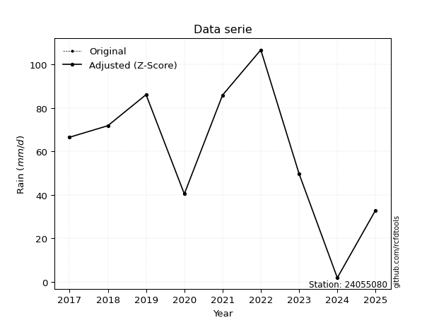</img>

</div>


> The initial value (value_initial) correspond to the initial obtained or null completed value, and value (value) is adjusted only when the initial value is outside the valid range (outlier) definite through the Z-Score value. If Z-Score is active, values out of range or outliers are replaced with the station mean value. A Z-Score (or standard score) measures how many standard deviations a data point is from the mean of a dataset, indicating its relative position; positive scores mean above the mean, negative mean below, and a score of zero is exactly at the mean, allowing for comparison of values from different distributions. It´s calculated using the formula $z=(x–μ)/σ$, where $x$ is the data point, $μ$ is the mean, and $σ$ is the standard deviation, helping identify outliers and understand probability.
>
> <sub>**Note**: In this study, "completing" (filling gaps in) and "extending" (forecasting or lengthening the historical record) rainfall data series are avoided for certain critical analyses because they introduce artificial bias and uncertainty, which can distort the statistics of rare events (extremes), alter day-to-day variability, and compromise the integrity and homogeneity of the original data. Some reasons against Completing/Extending rainfall data are: **Distortion of Extremes and Variability**: The primary issue is that most gap-filling or extension methods rely on averaging or regression with nearby stations, which inherently smooths the data. Rainfall is highly variable in space and time, with a large percentage of zero values and occasional large storms. Infilling methods often underestimate the highest values and overestimate the lowest (zero) values, which severely distorts analyses focused on flood frequency, drought severity, and intensity-duration-frequency (IDF) curves, **Loss of Data Homogeneity**: Infilled or extended data are synthetic estimates, not actual measurements. Combining these estimates with observed data can violate the assumption of data homogeneity, which requires that the data properties do not change over time. Inhomogeneity can lead to incorrect conclusions about long-term trends or changes in climate patterns, **Propagation of Errors**: Errors and biases from the original data (e.g., wind-induced undercatch, instrument errors, site changes) or the data used for imputation can propagate through the analysis, leading to unreliable hydrological models and inaccurate predictions, **Compromised Statistical Integrity**: For statistical analyses, especially those involving the frequency of events, using artificial data can introduce time bias or autocorrelation that doesn´t exist in reality, making it difficult to assess the true probability of events, **Difficulty in Validation**: It is difficult to accurately validate the quality of filled or extended data, especially for past periods where ground-truth measurements are unavailable. The reliability of imputation techniques heavily depends on the density of the surrounding station network and the complexity of the local topography.</sub>


### 4. Active continuous probability distributions from SciPy (44 of 104 available)

A Probability Density Function (PDF) describes the relative likelihood of a continuous random variable falling within a specific range, where the total area under its curve equals 1, and the area over any interval gives the actual probability for that range. Unlike discrete probabilities (like rolling a die), a PDF shows density, not direct probability for a single point (which is zero), with higher points indicating higher likelihood, often visualized as a bell curve for normal distributions.

A log of a probability density function (log-PDF) is simply the logarithm of the PDF´s value, denoted as $log(f(x))$, useful for converting multiplication of probabilities into addition, improving numerical stability with tiny numbers, and connecting to information theory concepts like entropy. Instead of dealing with very small probabilities (e.g., 0.000001), log-PDFs use negative numbers (e.g., $log(0.00001) ≈ -11.51$ that are easier for computers to handle, preventing underflow errors and simplifying complex calculations. In this study, each active probability distribution from SciPy is also evaluated in the $log$ form.

[scipy.stats](https://docs.scipy.org/doc/scipy/reference/stats.html) is a Python´s powerful submodule within the SciPy library for comprehensive statistical analysis, offering over 130 probability distributions (like Normal, Poisson), functions for descriptive stats (mean, variance), hypothesis testing (t-tests, chi-square), random variable generation, and statistical tests, making it essential for data science, modeling, and research. It provides tools to explore, model, and draw conclusions from data efficiently, working seamlessly with NumPy.

<div align="center">

|   id | p_dist             |   n_parameter | fit_method   | label                                                                       | active   | ref                                                                                                        |
|-----:|:-------------------|--------------:|:-------------|:----------------------------------------------------------------------------|:---------|:-----------------------------------------------------------------------------------------------------------|
|    0 | alpha              |             3 | MLE          | Alpha                                                                       | True     | [:mortar_board:](https://docs.scipy.org/doc/scipy/reference/generated/scipy.stats.alpha.html)              |
|    1 | betaprime          |             4 | MLE          | Beta prime                                                                  | True     | [:mortar_board:](https://docs.scipy.org/doc/scipy/reference/generated/scipy.stats.betaprime.html)          |
|    2 | chi2               |             3 | MLE          | Chi²                                                                        | True     | [:mortar_board:](https://docs.scipy.org/doc/scipy/reference/generated/scipy.stats.chi2.html)               |
|    3 | crystalball        |             4 | MLE          | Crystalball                                                                 | True     | [:mortar_board:](https://docs.scipy.org/doc/scipy/reference/generated/scipy.stats.crystalball.html)        |
|    4 | erlang             |             3 | MLE          | Erlang                                                                      | True     | [:mortar_board:](https://docs.scipy.org/doc/scipy/reference/generated/scipy.stats.erlang.html)             |
|    5 | expon              |             2 | MLE          | Exponential                                                                 | True     | [:mortar_board:](https://docs.scipy.org/doc/scipy/reference/generated/scipy.stats.expon.html)              |
|    6 | exponnorm          |             3 | MLE          | Exponentially modified Normal                                               | True     | [:mortar_board:](https://docs.scipy.org/doc/scipy/reference/generated/scipy.stats.exponnorm.html)          |
|    7 | f                  |             4 | MLE          | F                                                                           | True     | [:mortar_board:](https://docs.scipy.org/doc/scipy/reference/generated/scipy.stats.f.html)                  |
|    8 | fatiguelife        |             3 | MLE          | Fatigue-life (Birnbaum-Saunders)                                            | True     | [:mortar_board:](https://docs.scipy.org/doc/scipy/reference/generated/scipy.stats.fatiguelife.html)        |
|    9 | fisk               |             3 | MLE          | Fisk                                                                        | True     | [:mortar_board:](https://docs.scipy.org/doc/scipy/reference/generated/scipy.stats.fisk.html)               |
|   10 | gamma              |             3 | MLE          | Gamma                                                                       | True     | [:mortar_board:](https://docs.scipy.org/doc/scipy/reference/generated/scipy.stats.gamma.html)              |
|   11 | genexpon           |             5 | MLE          | Generalized exponential                                                     | True     | [:mortar_board:](https://docs.scipy.org/doc/scipy/reference/generated/scipy.stats.genexpon.html)           |
|   12 | genlogistic        |             3 | MLE          | Generalized logistic                                                        | True     | [:mortar_board:](https://docs.scipy.org/doc/scipy/reference/generated/scipy.stats.genlogistic.html)        |
|   13 | gibrat             |             2 | MM           | Gibrat                                                                      | True     | [:mortar_board:](https://docs.scipy.org/doc/scipy/reference/generated/scipy.stats.gibrat.html)             |
|   14 | gompertz           |             3 | MLE          | Gompertz (or truncated Gumbel)                                              | True     | [:mortar_board:](https://docs.scipy.org/doc/scipy/reference/generated/scipy.stats.gompertz.html)           |
|   15 | gumbel_l           |             2 | MM           | Gumbel Left Skew                                                            | True     | [:mortar_board:](https://docs.scipy.org/doc/scipy/reference/generated/scipy.stats.gumbel_l.html)           |
|   16 | gumbel_r           |             2 | MM           | Gumbel Right Skew                                                           | True     | [:mortar_board:](https://docs.scipy.org/doc/scipy/reference/generated/scipy.stats.gumbel_r.html)           |
|   17 | halflogistic       |             2 | MM           | Half-logistic                                                               | True     | [:mortar_board:](https://docs.scipy.org/doc/scipy/reference/generated/scipy.stats.halflogistic.html)       |
|   18 | halfnorm           |             2 | MM           | Half Normal                                                                 | True     | [:mortar_board:](https://docs.scipy.org/doc/scipy/reference/generated/scipy.stats.halfnorm.html)           |
|   19 | hypsecant          |             2 | MM           | hyperbolic secant                                                           | True     | [:mortar_board:](https://docs.scipy.org/doc/scipy/reference/generated/scipy.stats.hypsecant.html)          |
|   20 | invgamma           |             3 | MLE          | Inverted gamma                                                              | True     | [:mortar_board:](https://docs.scipy.org/doc/scipy/reference/generated/scipy.stats.invgamma.html)           |
|   21 | invgauss           |             3 | MLE          | Inverse Gaussian                                                            | True     | [:mortar_board:](https://docs.scipy.org/doc/scipy/reference/generated/scipy.stats.invgauss.html)           |
|   22 | invweibull         |             3 | MLE          | Inverted Weibull                                                            | True     | [:mortar_board:](https://docs.scipy.org/doc/scipy/reference/generated/scipy.stats.invweibull.html)         |
|   23 | johnsonsu          |             4 | MLE          | Johnson Su                                                                  | True     | [:mortar_board:](https://docs.scipy.org/doc/scipy/reference/generated/scipy.stats.johnsonsu.html)          |
|   24 | kstwobign          |             2 | MLE          | Limiting distribution of scaled Kolmogorov-Smirnov two-sided test statistic | True     | [:mortar_board:](https://docs.scipy.org/doc/scipy/reference/generated/scipy.stats.kstwobign.html)          |
|   25 | laplace            |             2 | MM           | Laplace                                                                     | True     | [:mortar_board:](https://docs.scipy.org/doc/scipy/reference/generated/scipy.stats.laplace.html)            |
|   26 | laplace_asymmetric |             3 | MLE          | Asymmetric Laplace                                                          | True     | [:mortar_board:](https://docs.scipy.org/doc/scipy/reference/generated/scipy.stats.laplace_asymmetric.html) |
|   27 | loggamma           |             3 | MLE          | Log gamma                                                                   | True     | [:mortar_board:](https://docs.scipy.org/doc/scipy/reference/generated/scipy.stats.loggamma.html)           |
|   28 | logistic           |             2 | MM           | Logistic (or Sech-squared)                                                  | True     | [:mortar_board:](https://docs.scipy.org/doc/scipy/reference/generated/scipy.stats.logistic.html)           |
|   29 | lognorm            |             3 | MLE          | Log Normal                                                                  | True     | [:mortar_board:](https://docs.scipy.org/doc/scipy/reference/generated/scipy.stats.lognorm.html)            |
|   30 | maxwell            |             2 | MM           | Maxwell                                                                     | True     | [:mortar_board:](https://docs.scipy.org/doc/scipy/reference/generated/scipy.stats.maxwell.html)            |
|   31 | mielke             |             4 | MLE          | Mielke Beta-Kappa / Dagum                                                   | True     | [:mortar_board:](https://docs.scipy.org/doc/scipy/reference/generated/scipy.stats.mielke.html)             |
|   32 | moyal              |             2 | MM           | Moyal                                                                       | True     | [:mortar_board:](https://docs.scipy.org/doc/scipy/reference/generated/scipy.stats.moyal.html)              |
|   33 | nakagami           |             3 | MLE          | Nakagami                                                                    | True     | [:mortar_board:](https://docs.scipy.org/doc/scipy/reference/generated/scipy.stats.nakagami.html)           |
|   34 | ncf                |             5 | MLE          | Non-central F distribution                                                  | True     | [:mortar_board:](https://docs.scipy.org/doc/scipy/reference/generated/scipy.stats.ncf.html)                |
|   35 | nct                |             4 | MLE          | Non-central Student’s t                                                     | True     | [:mortar_board:](https://docs.scipy.org/doc/scipy/reference/generated/scipy.stats.nct.html)                |
|   36 | norm               |             2 | MM           | Normal                                                                      | True     | [:mortar_board:](https://docs.scipy.org/doc/scipy/reference/generated/scipy.stats.norm.html)               |
|   37 | pearson3           |             3 | MM           | Pearson type III                                                            | True     | [:mortar_board:](https://docs.scipy.org/doc/scipy/reference/generated/scipy.stats.pearson3.html)           |
|   38 | rayleigh           |             2 | MM           | Rayleigh                                                                    | True     | [:mortar_board:](https://docs.scipy.org/doc/scipy/reference/generated/scipy.stats.rayleigh.html)           |
|   39 | rice               |             3 | MLE          | Rice                                                                        | True     | [:mortar_board:](https://docs.scipy.org/doc/scipy/reference/generated/scipy.stats.rice.html)               |
|   40 | t                  |             3 | MLE          | Student’s t                                                                 | True     | [:mortar_board:](https://docs.scipy.org/doc/scipy/reference/generated/scipy.stats.t.html)                  |
|   41 | truncnorm          |             4 | MLE          | Truncated normal                                                            | True     | [:mortar_board:](https://docs.scipy.org/doc/scipy/reference/generated/scipy.stats.truncnorm.html)          |
|   42 | wald               |             2 | MM           | Wald                                                                        | True     | [:mortar_board:](https://docs.scipy.org/doc/scipy/reference/generated/scipy.stats.wald.html)               |
|   43 | weibull_min        |             3 | MLE          | Weibull minimum                                                             | True     | [:mortar_board:](https://docs.scipy.org/doc/scipy/reference/generated/scipy.stats.weibull_min.html)        |

</div>

> **n_parameter:** # arguments & localization & scale.
>
> **Fit methods:** (MLE) maximum likelihood, (MM) L-moments.
>
>**Inactive** (With the only purpose of prevent loops, zero divisions, infinite values, over high estimated values or horizontal trending for recurrence intervals estimations, the follow distributions were disabled.)**:** foldnorm, gennorm, norminvgauss, powernorm, powerlognorm, skewnorm, genextreme, anglit, arcsine, argus, beta, bradford, burr, burr12, cauchy, cosine, halfcauchy, foldcauchy, skewcauchy, wrapcauchy, dgamma, gengamma, exponweib, exponpow, truncexpon, gausshyper, genhalflogistic, genhyperbolic, geninvgauss, halfgennorm, johnsonsb, kappa4, kappa3, ksone, kstwo, loglaplace, levy, levy_l, levy_stable, ncx2, pareto, genpareto, truncpareto, lomax, powerlaw, rdist, rel_breitwigner, recipinvgauss, semicircular, studentized_range, trapezoid, triang, truncweibull_min, tukeylambda, uniform, loguniform, vonmises, vonmises_line, weibull_max, dweibull, 


## B. Probability (PDF) vs. Empirical (EDF) distributions functions

A continuous probability distribution (CPD) describes probabilities for variables that can take any value within a range (like rain any time), unlike discrete variables with specific outcomes (like temperature). It uses a Probability Density Function (PDF), a curve where the total area under it equals 1, and the probability of the variable falling within an interval (a to b) is found by calculating the area under the curve between those points. A key feature is that the probability of hitting any single exact value is zero, so probabilities are always expressed for ranges, e.g., $P(a ≤ X ≤ b)$.

<div align="center">

Distributions parameters from station values
|    |   station | p_dist                |   n |              loc |           scale | shape                  | shape1                | shape2                | shape3   |
|---:|----------:|:----------------------|----:|-----------------:|----------------:|:-----------------------|:----------------------|:----------------------|:---------|
|  0 |  24055080 | alpha                 |   8 |     -0.00812747  |     5.11075     | 1.8991376416398123e-09 |                       |                       |          |
|  1 |  24055080 | betaprime             |   8 |  -1026.32        | 61861.1         | 1271.7583994165902     | 72181.71294698288     |                       |          |
|  2 |  24055080 | chi2                  |   8 |      1.8         |     3.78041     | 0.3842314064529134     |                       |                       |          |
|  3 |  24055080 | crystalball           |   8 |     63.6125      |    30.5931      | 3293.815892352337      | 9241.10101444276      |                       |          |
|  4 |  24055080 | erlang                |   8 |   -455.827       |     1.91579     | 270.9237220111871      |                       |                       |          |
|  5 |  24055080 | expon                 |   8 |      1.8         |    61.8125      |                        |                       |                       |          |
|  6 |  24055080 | exponnorm             |   8 |     63.5888      |    30.5931      | 0.0007724731217637034  |                       |                       |          |
|  7 |  24055080 | f                     |   8 |  -6554.98        |  6618.48        | 138366.4197565606      | 278781.24716148514    |                       |          |
|  8 |  24055080 | fatiguelife           |   8 |      1.8         |     8.8751e-05  | 960.9426437188653      |                       |                       |          |
|  9 |  24055080 | fisk                  |   8 |     -5.13465e+07 |     5.13465e+07 | 2947654.042775831      |                       |                       |          |
| 10 |  24055080 | gamma                 |   8 |   -456.268       |     1.94392     | 267.2714241484507      |                       |                       |          |
| 11 |  24055080 | genexpon              |   8 |      1.79994     |     2.49818     | 0.04035613172402477    | 7.763243590816811e-08 | 2.3546713466219815    |          |
| 12 |  24055080 | genlogistic           |   8 |     89.5708      |     9.22761     | 0.31036595188689087    |                       |                       |          |
| 13 |  24055080 | gibrat                |   8 |     40.2738      |    14.1556      |                        |                       |                       |          |
| 14 |  24055080 | gompertz              |   8 |     40.4         |    24.1241      | 0.2261433596036962     |                       |                       |          |
| 15 |  24055080 | gumbel_l              |   8 |     77.381       |    23.8533      |                        |                       |                       |          |
| 16 |  24055080 | gumbel_r              |   8 |     49.844       |    23.8533      |                        |                       |                       |          |
| 17 |  24055080 | halflogistic          |   8 |     27.3526      |    26.156       |                        |                       |                       |          |
| 18 |  24055080 | halfnorm              |   8 |     23.1192      |    50.7508      |                        |                       |                       |          |
| 19 |  24055080 | hypsecant             |   8 |     63.6125      |    19.4762      |                        |                       |                       |          |
| 20 |  24055080 | invgamma              |   8 |   -308.921       | 49393.2         | 133.65863070067792     |                       |                       |          |
| 21 |  24055080 | invgauss              |   8 |   -179.498       | 12845.5         | 0.018818691954031783   |                       |                       |          |
| 22 |  24055080 | invweibull            |   8 |      1.8         |     2.67738     | 0.046357778227152806   |                       |                       |          |
| 23 |  24055080 | johnsonsu             |   8 |    148.375       |     5.12361     | 9.491737803276532      | 2.7631211137526295    |                       |          |
| 24 |  24055080 | kstwobign             |   8 |    -70.377       |   153.333       |                        |                       |                       |          |
| 25 |  24055080 | laplace               |   8 |     63.6125      |    21.6326      |                        |                       |                       |          |
| 26 |  24055080 | laplace_asymmetric    |   8 |     71.8         |    22.9305      | 1.19433883019143       |                       |                       |          |
| 27 |  24055080 | loggamma              |   8 |     79.833       |    23.6516      | 0.9370519147615595     |                       |                       |          |
| 28 |  24055080 | logistic              |   8 |     63.6125      |    16.8668      |                        |                       |                       |          |
| 29 |  24055080 | lognorm               |   8 |      1.8         |     0.439132    | 13.315577119940015     |                       |                       |          |
| 30 |  24055080 | maxwell               |   8 |     -8.88024     |    45.4281      |                        |                       |                       |          |
| 31 |  24055080 | mielke                |   8 |    -11.1507      |   118.31        | 1.6430237469508588     | 1127.1951041740713    |                       |          |
| 32 |  24055080 | moyal                 |   8 |     46.1174      |    13.7717      |                        |                       |                       |          |
| 33 |  24055080 | nakagami              |   8 | -14248.6         | 14312.2         | 54611.42358938152      |                       |                       |          |
| 34 |  24055080 | ncf                   |   8 |     -0.0205811   |     1.01451e-05 | 1.0102382197156826e-06 | 11.69934427386345     | 5.492026755616367     |          |
| 35 |  24055080 | nct                   |   8 |  -1647.72        |    30.5269      | 282384.17020695587     | 56.05972234617485     |                       |          |
| 36 |  24055080 | norm                  |   8 |     63.6125      |    30.5931      |                        |                       |                       |          |
| 37 |  24055080 | pearson3              |   8 |     63.6125      |    30.5931      | -0.6476941330465161    |                       |                       |          |
| 38 |  24055080 | rayleigh              |   8 |      5.08615     |    46.6973      |                        |                       |                       |          |
| 39 |  24055080 | rice                  |   8 |     29.5606      |    22.0356      | 1.6007476655300779     |                       |                       |          |
| 40 |  24055080 | t                     |   8 |     63.6125      |    30.593       | 450334.5477550777      |                       |                       |          |
| 41 |  24055080 | truncnorm             |   8 |    -35.9242      |    16.4963      | -11.497856590209587    | 8.645833626620927     |                       |          |
| 42 |  24055080 | wald                  |   8 |     33.0195      |    30.593       |                        |                       |                       |          |
| 43 |  24055080 | weibull_min           |   8 |   -861.451       |   938.969       | 37.757306917387716     |                       |                       |          |
| 44 |  24055080 | logalpha              |   8 |    -20.9044      |   415.883       | 16.972884168000697     |                       |                       |          |
| 45 |  24055080 | logbetaprime          |   8 |    -31.7682      |    90.2537      | 1014.5514419693777     | 2577.9145120679586    |                       |          |
| 46 |  24055080 | logchi2               |   8 |    -21.184       |     0.0344096   | 725.7525934108089      |                       |                       |          |
| 47 |  24055080 | logcrystalball        |   8 |      3.7803      |     1.24159     | 9.597132509648954      | 22.363176575103996    |                       |          |
| 48 |  24055080 | logerlang             |   8 |    -11.619       |     0.121991    | 125.85792127343379     |                       |                       |          |
| 49 |  24055080 | logexpon              |   8 |      0.587787    |     3.19252     |                        |                       |                       |          |
| 50 |  24055080 | logexponnorm          |   8 |      3.77964     |     1.24159     | 0.0005364868295969405  |                       |                       |          |
| 51 |  24055080 | logf                  |   8 |  -2704.21        |  2708           | 38665889.86834892      | 12474374.863634262    |                       |          |
| 52 |  24055080 | logfatiguelife        |   8 |   -840.074       |   843.852       | 0.0014646472427178132  |                       |                       |          |
| 53 |  24055080 | logfisk               |   8 | -30905.5         | 30909.6         | 58522.569492181385     |                       |                       |          |
| 54 |  24055080 | loggamma              |   8 |    -18.506       |     0.0814001   | 273.4554054961376      |                       |                       |          |
| 55 |  24055080 | loggenexpon           |   8 |      0.587698    |     0.272435    | 0.021049632166323357   | 13.242313648516273    | 0.0007148434215162526 |          |
| 56 |  24055080 | loggenlogistic        |   8 |      4.67005     |     2.06034e-06 | 2.300779686364217e-06  |                       |                       |          |
| 57 |  24055080 | loggibrat             |   8 |      2.83314     |     0.574489    |                        |                       |                       |          |
| 58 |  24055080 | loggompertz           |   8 |      0.324529    |     0.601437    | 0.001514681296113687   |                       |                       |          |
| 59 |  24055080 | loggumbel_l           |   8 |      4.33908     |     0.968061    |                        |                       |                       |          |
| 60 |  24055080 | loggumbel_r           |   8 |      3.22152     |     0.968061    |                        |                       |                       |          |
| 61 |  24055080 | loghalflogistic       |   8 |      2.30868     |     1.06154     |                        |                       |                       |          |
| 62 |  24055080 | loghalfnorm           |   8 |      2.13692     |     2.05968     |                        |                       |                       |          |
| 63 |  24055080 | loghypsecant          |   8 |      3.7803      |     0.790419    |                        |                       |                       |          |
| 64 |  24055080 | loginvgamma           |   8 |    -28.2415      | 18296.1         | 572.9634039449327      |                       |                       |          |
| 65 |  24055080 | loginvgauss           |   8 |    -10.5988      |  1413.17        | 0.010133199350196895   |                       |                       |          |
| 66 |  24055080 | loginvweibull         |   8 |     -3.81582e+08 |     3.81582e+08 | 233255319.61741674     |                       |                       |          |
| 67 |  24055080 | logjohnsonsu          |   8 |      4.71804     |     0.00121294  | 5.561882543311995      | 0.8344793833511237    |                       |          |
| 68 |  24055080 | logkstwobign          |   8 |     -2.92791     |     7.68947     |                        |                       |                       |          |
| 69 |  24055080 | loglaplace            |   8 |      3.7803      |     0.877934    |                        |                       |                       |          |
| 70 |  24055080 | loglaplace_asymmetric |   8 |      4.45551     |     0.371001    | 2.2620906679056167     |                       |                       |          |
| 71 |  24055080 | logloggamma           |   8 |      4.67006     |     2.45641e-07 | 2.7577658453074295e-07 |                       |                       |          |
| 72 |  24055080 | loglogistic           |   8 |      3.7803      |     0.684523    |                        |                       |                       |          |
| 73 |  24055080 | loglognorm            |   8 |      0.587787    |     0.0313398   | 12.576633014220084     |                       |                       |          |
| 74 |  24055080 | logmaxwell            |   8 |      0.838281    |     1.84364     |                        |                       |                       |          |
| 75 |  24055080 | logmielke             |   8 |     -3.29318e+07 |     3.29318e+07 | 34943976.85307446      | 7182618785.651192     |                       |          |
| 76 |  24055080 | logmoyal              |   8 |      3.07028     |     0.55891     |                        |                       |                       |          |
| 77 |  24055080 | lognakagami           |   8 |  -1487.87        |  1491.65        | 360231.32370556984     |                       |                       |          |
| 78 |  24055080 | logncf                |   8 |    -56.2477      |    59.8781      | 5700.289346378995      | 18397.948879465293    | 12.553770866891156    |          |
| 79 |  24055080 | lognct                |   8 |   -105.175       |     1.22056     | 104890.69691264076     | 89.26633492555567     |                       |          |
| 80 |  24055080 | lognorm               |   8 |      3.7803      |     1.24159     |                        |                       |                       |          |
| 81 |  24055080 | logpearson3           |   8 |      3.7803      |     1.24159     | -2.0264503168193015    |                       |                       |          |
| 82 |  24055080 | lograyleigh           |   8 |      1.40504     |     1.89518     |                        |                       |                       |          |
| 83 |  24055080 | logrice               |   8 |   -559.107       |     1.24154     | 453.37710087297853     |                       |                       |          |
| 84 |  24055080 | logt                  |   8 |      4.3015      |     0.252015    | 1.0734316218554794     |                       |                       |          |
| 85 |  24055080 | logtruncnorm          |   8 |      0.449986    |     4.68876     | 0.0043909122313766785  | 0.9000313378396494    |                       |          |
| 86 |  24055080 | logwald               |   8 |      2.53871     |     1.2416      |                        |                       |                       |          |
| 87 |  24055080 | logweibull_min        |   8 |     -3.29103e+07 |     3.29103e+07 | 55187802.915181875     |                       |                       |          |

</div>

> **loc** (Location parameter): This shifts the distribution along the x-axis. For many common distributions, like the normal (Gaussian) distribution, loc represents the mean $μ$. For others, like the uniform distribution, it might represent the minimum value, or for the beta distribution, the left end of the support interval.
>
> **scale** (Scale parameter): This determines the width or spread of the distribution. For the normal distribution, scale represents the standard deviation $σ$. For a uniform distribution, it defines the length of the interval (from $loc$ to $loc + scale$).
>
> **shape** (Shape parameters): Refers to parameters that define the specific form of a probability distribution, distinct from its location (loc) and scale (scale). These parameters are required arguments for most distribution functions. For example, a normal (Gaussian) distribution is fully defined by its location (mean) and scale (standard deviation), so it has no specific shape parameters beyond loc and scale. However, other distributions have intrinsic properties that need specification, as Gamma distribution that takes a shape parameter, often named $a$ or $alpha$.


### 0. Cumulative distribution values - CDF (88 evaluated)

Cumulative Distribution Function (CDF), denoted as $F$<sub>$X$</sub>$(x)$, is a function that gives the probability that a random variable $X$ will take a value less than or equal to a specific value, $x$ (i.e., $(P(X≥x)$. It essentially "accumulates" probabilities from a given point up to the far right (positive infinity), providing a complete picture of the distribution´s probabilities for both discrete (like rain) and continuous (like temperature) variables, helping to find probabilities over ranges or above certain values. Each station is evaluated separately ordering the $x$ values ascending, calculating the CDF and PDF values for the activated distributions and their logarithmic forms.

<div align="center">

CDF ordered by x ascending and calculating $log(f(x))$ separately
|   id |   Station |   date |     x |   count |    mean |     std |     zscore |   Value_initial |   station |   m |      alpha |   alpha_pdf |   betaprime |   betaprime_pdf |        chi2 |    chi2_pdf |   crystalball |   crystalball_pdf |    erlang |   erlang_pdf |    expon |   expon_pdf |   exponnorm |   exponnorm_pdf |         f |      f_pdf |   fatiguelife |   fatiguelife_pdf |      fisk |   fisk_pdf |     gamma |   gamma_pdf |    genexpon |   genexpon_pdf |   genlogistic |   genlogistic_pdf |      gibrat |   gibrat_pdf |    gompertz |   gompertz_pdf |   gumbel_l |   gumbel_l_pdf |    gumbel_r |   gumbel_r_pdf |   halflogistic |   halflogistic_pdf |   halfnorm |   halfnorm_pdf |   hypsecant |   hypsecant_pdf |   invgamma |   invgamma_pdf |   invgauss |   invgauss_pdf |   invweibull |   invweibull_pdf |   johnsonsu |   johnsonsu_pdf |   kstwobign |   kstwobign_pdf |   laplace |   laplace_pdf |   laplace_asymmetric |   laplace_asymmetric_pdf |   loggamma |   loggamma_pdf |   logistic |   logistic_pdf |    lognorm |   lognorm_pdf |    maxwell |   maxwell_pdf |    mielke |   mielke_pdf |       moyal |   moyal_pdf |   nakagami |   nakagami_pdf |       ncf |    ncf_pdf |      nct |    nct_pdf |      norm |   norm_pdf |   pearson3 |   pearson3_pdf |   rayleigh |   rayleigh_pdf |      rice |   rice_pdf |         t |      t_pdf |   truncnorm |   truncnorm_pdf |     wald |   wald_pdf |   weibull_min |   weibull_min_pdf |   logalpha |   logalpha_pdf |   logbetaprime |   logbetaprime_pdf |    logchi2 |   logchi2_pdf |   logcrystalball |   logcrystalball_pdf |   logerlang |   logerlang_pdf |   logexpon |   logexpon_pdf |   logexponnorm |   logexponnorm_pdf |       logf |   logf_pdf |   logfatiguelife |   logfatiguelife_pdf |    logfisk |   logfisk_pdf |   loggenexpon |   loggenexpon_pdf |   loggenlogistic |   loggenlogistic_pdf |   loggibrat |   loggibrat_pdf |   loggompertz |   loggompertz_pdf |   loggumbel_l |   loggumbel_l_pdf |   loggumbel_r |   loggumbel_r_pdf |   loghalflogistic |   loghalflogistic_pdf |   loghalfnorm |   loghalfnorm_pdf |   loghypsecant |   loghypsecant_pdf |   loginvgamma |   loginvgamma_pdf |   loginvgauss |   loginvgauss_pdf |   loginvweibull |   loginvweibull_pdf |   logjohnsonsu |   logjohnsonsu_pdf |   logkstwobign |   logkstwobign_pdf |   loglaplace |   loglaplace_pdf |   loglaplace_asymmetric |   loglaplace_asymmetric_pdf |   logloggamma |   logloggamma_pdf |   loglogistic |   loglogistic_pdf |   loglognorm |   loglognorm_pdf |   logmaxwell |   logmaxwell_pdf |   logmielke |   logmielke_pdf |    logmoyal |   logmoyal_pdf |   lognakagami |   lognakagami_pdf |     logncf |   logncf_pdf |     lognct |   lognct_pdf |   logpearson3 |   logpearson3_pdf |   lograyleigh |   lograyleigh_pdf |    logrice |   logrice_pdf |      logt |   logt_pdf |   logtruncnorm |   logtruncnorm_pdf |   logwald |   logwald_pdf |   logweibull_min |   logweibull_min_pdf |
|-----:|----------:|-------:|------:|--------:|--------:|--------:|-----------:|----------------:|----------:|----:|-----------:|------------:|------------:|----------------:|------------:|------------:|--------------:|------------------:|----------:|-------------:|---------:|------------:|------------:|----------------:|----------:|-----------:|--------------:|------------------:|----------:|-----------:|----------:|------------:|------------:|---------------:|--------------:|------------------:|------------:|-------------:|------------:|---------------:|-----------:|---------------:|------------:|---------------:|---------------:|-------------------:|-----------:|---------------:|------------:|----------------:|-----------:|---------------:|-----------:|---------------:|-------------:|-----------------:|------------:|----------------:|------------:|----------------:|----------:|--------------:|---------------------:|-------------------------:|-----------:|---------------:|-----------:|---------------:|-----------:|--------------:|-----------:|--------------:|----------:|-------------:|------------:|------------:|-----------:|---------------:|----------:|-----------:|---------:|-----------:|----------:|-----------:|-----------:|---------------:|-----------:|---------------:|----------:|-----------:|----------:|-----------:|------------:|----------------:|---------:|-----------:|--------------:|------------------:|-----------:|---------------:|---------------:|-------------------:|-----------:|--------------:|-----------------:|---------------------:|------------:|----------------:|-----------:|---------------:|---------------:|-------------------:|-----------:|-----------:|-----------------:|---------------------:|-----------:|--------------:|--------------:|------------------:|-----------------:|---------------------:|------------:|----------------:|--------------:|------------------:|--------------:|------------------:|--------------:|------------------:|------------------:|----------------------:|--------------:|------------------:|---------------:|-------------------:|--------------:|------------------:|--------------:|------------------:|----------------:|--------------------:|---------------:|-------------------:|---------------:|-------------------:|-------------:|-----------------:|------------------------:|----------------------------:|--------------:|------------------:|--------------:|------------------:|-------------:|-----------------:|-------------:|-----------------:|------------:|----------------:|------------:|---------------:|--------------:|------------------:|-----------:|-------------:|-----------:|-------------:|--------------:|------------------:|--------------:|------------------:|-----------:|--------------:|----------:|-----------:|---------------:|-------------------:|----------:|--------------:|-----------------:|---------------------:|
|    0 |  24055080 |   2024 |   1.8 |       8 | 63.6125 | 32.7054 | -1.88998   |             1.8 |  24055080 |   1 | 0.00470531 | 0.0229668   |    0.020913 |      0.00169694 | 0.000724418 | 6.26775e+11 |     0.0216671 |        0.00169365 | 0.0222444 |   0.00182776 | 0        |  0.016178   |   0.0216674 |      0.00169367 | 0.0221054 | 0.00172635 |      0.018196 |       2.12962e+09 | 0.0242363 | 0.00135762 | 0.0229546 |  0.00186233 | 9.04928e-07 |     0.0161542  |     0.0522273 |        0.00175651 | 0           |  0           | 0           |     0          |  0.0411911 |     0.00169079 | 0.000556247 |    0.000174763 |       0        |         0          |   0        |     0          |   0.0266246 |      0.00136544 |  0.0181944 |     0.00176225 |   0.020613 |     0.00202297 |   0.00382827 |      4.44812e+12 |   0.0454201 |      0.00179915 |   0.0203359 |      0.00285571 | 0.0287095 |    0.00132714 |            0.0456285 |               0.00166608 |  0.0070835 |      0.0162134 |  0.0249714 |     0.00144353 | 0.00506559 |     0.0117821 | 0.00339937 |   0.000944335 | 0.0263939 |   0.00334852 | 5.79838e-07 | 5.45464e-07 |  0.0216953 |     0.00169635 | 0.0804589 | 0.00909554 | 0.021715 | 0.00169644 | 0.0216671 | 0.00169365 |  0.0359425 |     0.00185296 |   0        |     0          | 0         | 0          | 0.0216672 | 0.00169364 |    0.988897 |     0.00176984  | 0        | 0          |     0.0409516 |        0.00175397 | 0.00871558 |      0.0212768 |     0.00630965 |          0.0146192 | 0.00559047 |     0.0133537 |       0.00506558 |            0.0117821 |  0.00718091 |       0.0169903 |   0        |      0.313233  |      0.0050658 |          0.0117825 | 0.00518357 |  0.0119903 |       0.00484938 |             0.011428 | 0.00126884 |    0.00239958 |   6.81706e-06 |         0.0772756 |         0        |            0.0116986 |    0        |        0        |   0.000831459 |        0.00389822 |     0.0205392 |         0.0209974 |   2.52996e-07 |       3.96978e-06 |          0        |              0        |      0        |          0        |      0.0112127 |          0.0141829 |    0.00615151 |         0.0149367 |    0.00792653 |         0.0194813 |       0.0108008 |           0.0298963 |      0.0356628 |          0.0158538 |      0.0149928 |          0.0460718 |    0.0131736 |        0.0150052 |              0.00833652 |                  0.00993343 |     0.0102231 |         0.0114773 |    0.00934191 |         0.0135199 |   0.00407616 |      8.62918e+12 |     0        |         0        |   0.0129419 |       0.0137327 | 3.11166e-20 |    2.39104e-18 |    0.00508722 |         0.0118253 | 0.00588055 |    0.0135763 | 0.00509106 |    0.0118411 |     0.0282719 |         0.0226079 |      0        |          0        | 0.00506423 |     0.0117798 | 0.0179817 | 0.00518028 |       0.031736 |           0.270684 |  0        |      0        |       0.00221743 |           0.00371433 |
|    1 |  24055080 |   2020 |  40.4 |       8 | 63.6125 | 32.7054 | -0.709746  |            40.4 |  24055080 |   2 | 0.899353   | 0.0024775   |    0.226952 |      0.00991886 | 0.999702    | 4.48617e-05 |     0.224001  |        0.00977856 | 0.237678  |   0.010104   | 0.464454 |  0.00866403 |   0.224002  |      0.00977858 | 0.226369  | 0.00980756 |      0.753735 |       0.00280239  | 0.18551   | 0.00867399 | 0.238682  |  0.0100495  | 0.463965    |     0.00865926 |     0.191028  |        0.0063941  | 1.17837e-06 |  4.59114e-05 | 1.54776e-12 |     0.00937418 |  0.191176  |     0.00719443 | 0.226333    |    0.0140976   |       0.244369 |         0.0179745  |   0.266522 |     0.0148361  |   0.187683  |      0.00908783 |  0.246478  |     0.0106342  |   0.266396 |     0.0109254  |   0.413274   |      0.000438582 |   0.198447  |      0.00712273 |   0.326407  |      0.0109825  | 0.170985  |    0.00790403 |            0.186788  |               0.00682037 |  0.491891  |      0.296768  |  0.201617  |     0.00954342 | 0.47384    |     0.320625  | 0.241422   |   0.0114756   | 0.2554    |   0.00814009 | 0.218437    | 0.0167178   |  0.22418   |     0.00977902 | 0.449715  | 0.00844211 | 0.224149 | 0.00977771 | 0.224001  | 0.00977856 |  0.208855  |     0.00809807 |   0.248693 |     0.0121669  | 0.0341105 | 0.0063778  | 0.224     | 0.00977855 |    0.999998 |     5.43372e-07 | 0.103687 | 0.0333734  |     0.195941  |        0.00734133 | 0.52764    |      0.273433  |     0.486149   |          0.303229  | 0.479562   |     0.304624  |       0.47384    |            0.320626  |  0.501437   |       0.291889  |   0.622611 |      0.11821   |      0.473841  |          0.320624  | 0.471531   |  0.319217  |       0.474341   |             0.322145 | 0.314811   |    0.40841    |   0.57512     |         0.200733  |         0        |            0.377502  |    0.659115 |        0.423678 |   0.337925    |        0.45562    |     0.40318   |         0.318206  |   0.542939    |       0.342545    |          0.574879 |              0.31535  |      0.551744 |          0.290581 |      0.467248  |          0.400581  |    0.496784   |         0.298926  |    0.513856   |         0.277369  |       0.508599  |           0.210197  |      0.262484  |          0.266874  |      0.55242   |          0.193592  |    0.455688  |        0.519045  |              0.339552   |                  0.404595   |     0.336087  |         0.377319  |    0.47028    |         0.363928  |   0.642662   |      0.00953712  |     0.50774  |         0.312646 |   0.351286  |       0.372749  | 0.568746    |    0.345812    |    0.473942   |         0.320363  | 0.48185    |    0.31005   | 0.474049   |    0.320153  |     0.342885  |         0.276685  |      0.519268 |          0.307011 | 0.473841   |     0.320638  | 0.119119  | 0.18905    |       0.808609 |           0.213008 |  0.640581 |      0.354931 |       0.335878   |           0.455817   |
|    2 |  24055080 |   2023 |  49.7 |       8 | 63.6125 | 32.7054 | -0.425389  |            49.7 |  24055080 |   3 | 0.91811    | 0.00164163  |    0.328613 |      0.0118287  | 0.999925    | 1.1014e-05  |     0.324641  |        0.0117592  | 0.340244  |   0.011828   | 0.539261 |  0.00745381 |   0.324642  |      0.0117593  | 0.327089  | 0.0117454  |      0.777718 |       0.00237691  | 0.279777  | 0.0115676  | 0.340583  |  0.0117418  | 0.538739    |     0.00745134 |     0.260505  |        0.00864705 | 0.342143    |  0.0389647   | 0.100907    |     0.0123926  |  0.268998  |     0.00960251 | 0.365659    |    0.0154223   |       0.402974 |         0.0160118  |   0.399548 |     0.0137066  |   0.289806  |      0.0129079  |  0.352902  |     0.0120947  |   0.374158 |     0.0120846  |   0.416927   |      0.000353003 |   0.274713  |      0.00932615 |   0.428154  |      0.0107804  | 0.262823  |    0.0121494  |            0.262317  |               0.00957825 |  0.553039  |      0.292387  |  0.304737  |     0.0125615  | 0.540321   |     0.319674  | 0.354776   |   0.012717    | 0.335405  |   0.00905622 | 0.379925    | 0.0172992   |  0.3248    |     0.0117543  | 0.523848  | 0.0074958  | 0.324765 | 0.011755   | 0.324641  | 0.0117592  |  0.294209  |     0.010254   |   0.366427 |     0.0129623  | 0.120537  | 0.0122211  | 0.32464   | 0.0117592  |    1        |     3.41407e-08 | 0.40339  | 0.0267944  |     0.274762  |        0.00965476 | 0.583356   |      0.263628  |     0.548727   |          0.29965   | 0.542491   |     0.301621  |       0.540321   |            0.319674  |  0.561395   |       0.285857  |   0.646324 |      0.110783  |      0.540321  |          0.319672  | 0.53969    |  0.318326  |       0.541121   |             0.321018 | 0.404809   |    0.456184   |   0.615781    |         0.19159   |         0        |            0.475767  |    0.733886 |        0.305947 |   0.441546    |        0.542354   |     0.472343  |         0.348466  |   0.610737    |       0.311083    |          0.636556 |              0.280157 |      0.609611 |          0.267882 |      0.55041   |          0.397671  |    0.558241   |         0.293206  |    0.570573   |         0.269284  |       0.551192  |           0.200703  |      0.32777   |          0.371141  |      0.591532  |          0.183847  |    0.566701  |        0.493544  |              0.434627   |                  0.517882   |     0.424097  |         0.476126  |    0.54578    |         0.362156  |   0.644574   |      0.00892481  |     0.571327 |         0.300139 |   0.437656  |       0.464397  | 0.635867    |    0.302129    |    0.540367   |         0.319389  | 0.545951   |    0.307434  | 0.540425   |    0.319139  |     0.405337  |         0.327681  |      0.581354 |          0.291509 | 0.540325   |     0.319686  | 0.174383  | 0.371928   |       0.852056 |           0.206384 |  0.705604 |      0.276748 |       0.439716   |           0.544292   |
|    3 |  24055080 |   2017 |  66.5 |       8 | 63.6125 | 32.7054 |  0.0882883 |            66.5 |  24055080 |   4 | 0.938748   | 0.000919165 |    0.54103  |      0.0128477  | 0.999993    | 9.36406e-07 |     0.537598  |        0.0129823  | 0.549528  |   0.0124997  | 0.64891  |  0.00567991 |   0.537599  |      0.0129823  | 0.539127  | 0.0128934  |      0.81287  |       0.00184592  | 0.504718  | 0.0143505  | 0.548266  |  0.0124088  | 0.648372    |     0.00568029 |     0.449124  |        0.0139604  | 0.731266    |  0.0125778   | 0.356638    |     0.0177932  |  0.469381  |     0.0140969  | 0.608082    |    0.0126812   |       0.634161 |         0.0114284  |   0.607327 |     0.0109104  |   0.54702   |      0.0161656  |  0.560781  |     0.0120765  |   0.577713 |     0.0116242  |   0.422006   |      0.000260864 |   0.466624  |      0.0133901  |   0.597081  |      0.00914509 | 0.562477  |    0.0202252  |            0.484438  |               0.0176888  |  0.635984  |      0.275313  |  0.542694  |     0.0147139  | 0.631481   |     0.303704  | 0.568768   |   0.0122065   | 0.500647  |   0.0105933  | 0.633286    | 0.0123341   |  0.537595  |     0.0129692  | 0.635668  | 0.00584755 | 0.53761  | 0.0129741  | 0.537598  | 0.0129823  |  0.494766  |     0.0132739  |   0.578868 |     0.0118605  | 0.399409  | 0.0196551  | 0.537597  | 0.0129823  |    1        |     1.02883e-10 | 0.703237 | 0.011344   |     0.472912  |        0.0137342  | 0.65724    |      0.242588  |     0.633842   |          0.282776  | 0.628271   |     0.285323  |       0.631481   |            0.303704  |  0.642206   |       0.267383  |   0.677156 |      0.101125  |      0.631481  |          0.303702  | 0.630376   |  0.302624  |       0.632615   |             0.304629 | 0.541373   |    0.470095   |   0.669486    |         0.176974  |         0        |            0.658594  |    0.80641  |        0.201232 |   0.611855    |        0.611733   |     0.578389  |         0.376147  |   0.6942      |       0.26174     |          0.711156 |              0.232801 |      0.68283  |          0.234891 |      0.660607  |          0.352528  |    0.641153   |         0.274304  |    0.646375   |         0.249957  |       0.607416  |           0.18511   |      0.469914  |          0.637356  |      0.642942  |          0.169101  |    0.689015  |        0.354223  |              0.614904   |                  0.732692   |     0.588092  |         0.660241  |    0.647721   |         0.33334   |   0.647062   |      0.00818428  |     0.655036 |         0.273233 |   0.596109  |       0.632531  | 0.715188    |    0.243683    |    0.631444   |         0.303427  | 0.633408   |    0.290859  | 0.631426   |    0.30316   |     0.513128  |         0.416337  |      0.662199 |          0.262603 | 0.631488   |     0.303714  | 0.373216  | 1.09794    |       0.910762 |           0.196769 |  0.774194 |      0.199527 |       0.610941   |           0.6159     |
|    4 |  24055080 |   2018 |  71.8 |       8 | 63.6125 | 32.7054 |  0.250341  |            71.8 |  24055080 |   5 | 0.943261   | 0.00078882  |    0.608088 |      0.0123984  | 0.999997    | 4.3592e-07  |     0.605506  |        0.0125815  | 0.614572  |   0.0119928  | 0.677759 |  0.00521319 |   0.605507  |      0.0125815  | 0.606533  | 0.0124822  |      0.822308 |       0.0017182   | 0.580087  | 0.0139836  | 0.612865  |  0.0119165  | 0.677225    |     0.00521419 |     0.527323  |        0.01548    | 0.788349    |  0.00918373  | 0.453913    |     0.0188137  |  0.546783  |     0.0150364  | 0.671436    |    0.0112126   |       0.690892 |         0.00999137 |   0.662548 |     0.00992437 |   0.630037  |      0.0149986  |  0.62315   |     0.0114165  |   0.637509 |     0.0109052  |   0.423334   |      0.000240991 |   0.540133  |      0.0142904  |   0.64377   |      0.00846745 | 0.657549  |    0.0158303  |            0.587874  |               0.0214657  |  0.656856  |      0.268959  |  0.619027  |     0.013982   | 0.654516   |     0.296904  | 0.63154    |   0.0114441   | 0.558014  |   0.0110527  | 0.693882    | 0.0105519   |  0.605431  |     0.0125679  | 0.665399  | 0.00537647 | 0.605475 | 0.0125735  | 0.605506  | 0.0125815  |  0.566226  |     0.0136254  |   0.63959  |     0.0110263  | 0.504659  | 0.0198519  | 0.605506  | 0.0125816  |    1        |     1.32918e-11 | 0.756509 | 0.00888243 |     0.547977  |        0.014521   | 0.67559    |      0.235935  |     0.655283   |          0.276299  | 0.649911   |     0.278948  |       0.654516   |            0.296904  |  0.662463   |       0.26086   |   0.684818 |      0.0987252 |      0.654515  |          0.296902  | 0.653332   |  0.295924  |       0.655716   |             0.297696 | 0.577144   |    0.462067   |   0.6829      |         0.172864  |         0        |            0.717476  |    0.821066 |        0.181449 |   0.658795    |        0.610879   |     0.607363  |         0.379175  |   0.713767    |       0.248622    |          0.728554 |              0.221004 |      0.700507 |          0.226147 |      0.686985  |          0.335203  |    0.661931   |         0.26752   |    0.665302   |         0.2436    |       0.621443  |           0.180712  |      0.522893  |          0.74829   |      0.655756  |          0.165098  |    0.715025  |        0.324597  |              0.673735   |                  0.802793   |     0.640964  |         0.7196    |    0.67284    |         0.321576  |   0.647682   |      0.00800896  |     0.675667 |         0.264761 |   0.646641  |       0.68615   | 0.733326    |    0.229477    |    0.654457   |         0.296636  | 0.655463   |    0.284249  | 0.654419   |    0.296373  |     0.546089  |         0.443649  |      0.682008 |          0.253993 | 0.654523   |     0.296912  | 0.464793  | 1.26538    |       0.925752 |           0.194188 |  0.78888  |      0.183793 |       0.658213   |           0.615314   |
|    5 |  24055080 |   2021 |  85.9 |       8 | 63.6125 | 32.7054 |  0.681463  |            85.9 |  24055080 |   6 | 0.952561   | 0.000551554 |    0.766503 |      0.00979636 | 1           | 5.82255e-08 |     0.766851  |        0.0100009  | 0.767188  |   0.0094217  | 0.743485 |  0.0041499  |   0.766851  |      0.0100009  | 0.766521  | 0.0099181  |      0.844472 |       0.00143835  | 0.756313  | 0.0105803  | 0.764793  |  0.00940292 | 0.742973    |     0.00415208 |     0.753548  |        0.0151605  | 0.879074    |  0.00440814  | 0.717741    |     0.017446   |  0.760508  |     0.0143498  | 0.802067    |    0.00741642  |       0.807289 |         0.00665782 |   0.783928 |     0.00731482 |   0.803743  |      0.00945036 |  0.76653   |     0.00876958 |   0.773642 |     0.00829341 |   0.426428   |      0.000200341 |   0.745862  |      0.0141292  |   0.750016  |      0.00660731 | 0.821546  |    0.00824934 |            0.802265  |               0.0102991  |  0.703575  |      0.251629  |  0.789411  |     0.00985609 | 0.706074   |     0.27743   | 0.774215   |   0.00867291  | 0.722211  |   0.0122267  | 0.813512    | 0.00664602  |  0.766607  |     0.00999204 | 0.733141  | 0.0042679  | 0.766726 | 0.00999634 | 0.766851  | 0.0100009  |  0.753264  |     0.0123317  |   0.776305 |     0.00829009 | 0.758055  | 0.0150195  | 0.76685   | 0.0100009  |    1        |     3.47439e-14 | 0.850476 | 0.00492157 |     0.753083  |        0.0137647  | 0.716405   |      0.219063  |     0.703273   |          0.258421  | 0.698393   |     0.261233  |       0.706074   |            0.27743   |  0.707716   |       0.243456  |   0.702032 |      0.0933334 |      0.706074  |          0.277429  | 0.704738   |  0.276721  |       0.707387   |             0.277897 | 0.65713    |    0.426585   |   0.713011    |         0.162947  |         0        |            0.876523  |    0.850069 |        0.143877 |   0.765257    |        0.566244   |     0.675378  |         0.37728   |   0.755642    |       0.218707    |          0.765799 |              0.194788 |      0.73923  |          0.205836 |      0.743158  |          0.290814  |    0.70831    |         0.249315  |    0.707535   |         0.227161  |       0.652902  |           0.170151  |      0.687517  |          1.11537   |      0.684512  |          0.155648  |    0.767667  |        0.264636  |              0.834208   |                  0.994005   |     0.783891  |         0.880061  |    0.727702   |         0.289475  |   0.649084   |      0.00762647  |     0.72125  |         0.243377 |   0.782149  |       0.829938  | 0.771653    |    0.198608    |    0.705971   |         0.277197  | 0.70483    |    0.265748  | 0.705887   |    0.276954  |     0.631888  |         0.515352  |      0.725669 |          0.232814 | 0.706084   |     0.277437  | 0.67529   | 0.946881   |       0.960024 |           0.188088 |  0.818928 |      0.152568 |       0.765462   |           0.570341   |
|    6 |  24055080 |   2019 |  86.1 |       8 | 63.6125 | 32.7054 |  0.687578  |            86.1 |  24055080 |   7 | 0.952671   | 0.000548999 |    0.768457 |      0.00974949 | 1           | 5.65968e-08 |     0.768846  |        0.00995318 | 0.769067  |   0.00937696 | 0.744313 |  0.00413649 |   0.768847  |      0.00995316 | 0.7685    | 0.009871   |      0.844759 |       0.00143489  | 0.758423  | 0.010518   | 0.766669  |  0.00935903 | 0.743802    |     0.00413869 |     0.756573  |        0.0150885  | 0.879951    |  0.00436645  | 0.721223    |     0.0173742  |  0.763373  |     0.0142975  | 0.803546    |    0.00736806  |       0.808617 |         0.00661681 |   0.785387 |     0.00727919 |   0.805625  |      0.00937135 |  0.76828   |     0.0087271  |   0.775297 |     0.00825296 |   0.426468   |      0.000199863 |   0.748684  |      0.0140912  |   0.751335  |      0.00658149 | 0.823188  |    0.00817342 |            0.804314  |               0.0101923  |  0.70416   |      0.251384  |  0.791376  |     0.00978845 | 0.706719   |     0.277149  | 0.775945   |   0.00862983  | 0.724658  |   0.0122429  | 0.814837    | 0.00660058  |  0.768601  |     0.00994443 | 0.733993  | 0.00425371 | 0.76872  | 0.00994868 | 0.768846  | 0.00995318 |  0.755726  |     0.0122886  |   0.777959 |     0.00824916 | 0.761049  | 0.0149132  | 0.768846  | 0.00995319 |    1        |     3.1766e-14  | 0.851456 | 0.00488313 |     0.755831  |        0.0137175  | 0.716914   |      0.218834  |     0.703874   |          0.258167  | 0.699      |     0.26098   |       0.706719   |            0.277149  |  0.708282   |       0.243213  |   0.702249 |      0.0932654 |      0.706719  |          0.277147  | 0.705382   |  0.276443  |       0.708033   |             0.27761  | 0.658122   |    0.425994   |   0.71339     |         0.162816  |         0        |            0.878802  |    0.850403 |        0.143457 |   0.766573    |        0.565252   |     0.676255  |         0.377166  |   0.75615     |       0.218329    |          0.766252 |              0.194462 |      0.739708 |          0.205574 |      0.743834  |          0.290222  |    0.70889    |         0.249061  |    0.708063   |         0.226935  |       0.653298  |           0.170012  |      0.690118  |          1.12118   |      0.684874  |          0.155525  |    0.768282  |        0.263936  |              0.836523   |                  0.996763   |     0.78594   |         0.882362  |    0.728374   |         0.289026  |   0.649101   |      0.00762175  |     0.721815 |         0.243088 |   0.784081  |       0.831989  | 0.772115    |    0.19823     |    0.706615   |         0.276916  | 0.705447   |    0.265483  | 0.70653    |    0.276673  |     0.633088  |         0.516362  |      0.72621  |          0.232532 | 0.706728   |     0.277155  | 0.677483  | 0.939287   |       0.960462 |           0.188008 |  0.819283 |      0.152208 |       0.766787   |           0.569334   |
|    7 |  24055080 |   2022 | 106.7 |       8 | 63.6125 | 32.7054 |  1.31744   |           106.7 |  24055080 |   8 | 0.9618     | 0.000357711 |    0.917529 |      0.00480588 | 1           | 3.1104e-09  |     0.920495  |        0.00483673 | 0.913504  |   0.00473883 | 0.81678  |  0.00296413 |   0.920495  |      0.00483671 | 0.919279  | 0.00483477 |      0.871049 |       0.00113439  | 0.911059  | 0.00465172 | 0.911494  |  0.00478404 | 0.816324    |     0.00296715 |     0.95594   |        0.00434495 | 0.938945    |  0.00181793  | 0.963312    |     0.00537066 |  0.967231  |     0.00469591 | 0.911904    |    0.00352557  |       0.90814  |         0.00335069 |   0.900419 |     0.00405082 |   0.930601  |      0.00353514 |  0.90374   |     0.00456576 |   0.903774 |     0.00437082 |   0.430149   |      0.000160367 |   0.962006  |      0.005438   |   0.861177  |      0.00417806 | 0.931774  |    0.00315384 |            0.933076  |               0.00348574 |  0.755533  |      0.227064  |  0.92788   |     0.00396748 | 0.763189   |     0.248557  | 0.909274   |   0.00446785  | 0.993615  |   0.0136815  | 0.911731    | 0.00319161  |  0.920205  |     0.00484061 | 0.808071  | 0.00300694 | 0.920351 | 0.004839   | 0.920495  | 0.00483673 |  0.944596  |     0.00553141 |   0.906287 |     0.00436688 | 0.954289  | 0.00451499 | 0.920495  | 0.00483672 |    1        |     1.41799e-18 | 0.921652 | 0.00231124 |     0.958241  |        0.00517209 | 0.761536   |      0.196978  |     0.756596   |          0.2328    | 0.752334   |     0.235671  |       0.763189   |            0.248557  |  0.757942   |       0.219358  |   0.721598 |      0.0872046 |      0.763188  |          0.248556  | 0.761738   |  0.24821   |       0.76456    |             0.248631 | 0.742896   |    0.361626   |   0.747008    |         0.150569  |         0.999972 |            1.11666   |    0.877452 |        0.110523 |   0.874949    |        0.432588   |     0.75526   |         0.355851  |   0.799347    |       0.184928    |          0.804847 |              0.165901 |      0.781247 |          0.181843 |      0.800272  |          0.236429  |    0.759678   |         0.223993  |    0.754437   |         0.205139  |       0.688388  |           0.157128  |      0.972165  |          1.11066   |      0.71702   |          0.144201  |    0.818513  |        0.206721  |              0.955799   |                  0.269503   |     0.999954  |         1.12263   |    0.785795   |         0.245895  |   0.650691   |      0.00720932  |     0.77104  |         0.215636 |   0.984308  |       1.00399   | 0.811074    |    0.165818    |    0.763041   |         0.248381  | 0.759614   |    0.238878  | 0.762908   |    0.248182  |     0.754593  |         0.620261  |      0.773268 |          0.206107 | 0.763199   |     0.24856   | 0.815074  | 0.410939   |       1        |           0.180613 |  0.848667 |      0.123019 |       0.875824   |           0.434385   |


</div>

An Empirical Distribution Function (EDF) is a step-function estimate of a true cumulative distribution function (CDF) based on observed sample data, representing the proportion of data points less than or equal to a given value. It is calculated by ordering your data and jumping up by $1/n$ (where $n$ is sample size) at each unique data point, allowing analysis without assuming an underlying population distribution, and it gets closer to the true CDF as the sample size grows. For the empirical probability calculations, the parameter $m$ correspond to the order number which means the position of the $x$ values in an ascending order list.

The Kolmogorov-Smirnov (K-S) test is a non-parametric statistical test used to determine if a sample data set comes from a specific theoretical distribution (one-sample) or if two different samples come from the same underlying distribution (two-sample), by comparing their cumulative distribution functions (CDFs). It calculates the maximum vertical difference (D statistic) between these functions, with a small p-value indicating a significant difference and rejection of the null hypothesis (that the data/samples match).


### 1. EDF California (1923)

California´s estimates the true probability distribution of water-related data (like rainfall, streamflow) using observed samples, crucial for risk assessment.

<div align="center">


$P=m/n$


</div>


**1.1. Empirical values**

<div align="center">

|                | 0                  | 1                  | 2              | 3              | 4                  | 5              | 6              | 7              |
|:---------------|:-------------------|:-------------------|:---------------|:---------------|:-------------------|:---------------|:---------------|:---------------|
| date           | 2024               | 2020               | 2023           | 2017           | 2018               | 2021           | 2019           | 2022           |
| x              | 1.8                | 40.4               | 49.7           | 66.5           | 71.8               | 85.9           | 86.1           | 106.7          |
| m              | 1                  | 2                  | 3              | 4              | 5                  | 6              | 7              | 8              |
| empirical_dist | edf_california     | edf_california     | edf_california | edf_california | edf_california     | edf_california | edf_california | edf_california |
| empirical      | 0.125              | 0.25               | 0.375          | 0.5            | 0.625              | 0.75           | 0.875          | 1.0            |
| empirical_tr   | 1.1428571428571428 | 1.3333333333333333 | 1.6            | 2.0            | 2.6666666666666665 | 4.0            | 8.0            | inf            |

</div>


**1.2. Kolmogorov-Smirnov fit test (sorted by Δ)**


<div align="center">

|                | 0                   | 1                   | 2                   | 3                   | 4                   | 5                  | 6                   | 7                   | 8                  | 9                   | 10                  | 11                  | 12                  | 13                  | 14                  | 15                 | 16                  | 17                  | 18                  | 19                  | 20                    | 21                  | 22                  | 23                  | 24                  | 25                  | 26                  | 27                 | 28                 | 29                  | 30                  | 31                  | 32                  | 33                  | 34                  | 35                 | 36                  | 37                 | 38                 | 39                  | 40                  | 41                  | 42                  | 43                  | 44                 | 45                  | 46                  | 47                  | 48                  | 49                  | 50                 | 51                  | 52                 | 53                  | 54                 | 55                  | 56                  | 57                 | 58                  | 59                 | 60                  | 61                  | 62                  | 63                  | 64                  | 65                 | 66                 | 67                  | 68                  | 69                  | 70                 | 71                  | 72                  | 73                  | 74                  | 75                 | 76                 | 77                 | 78                 | 79                 | 80                 | 81                 | 82                 | 83                 | 84                 | 85                 | 86                 | 87                 |
|:---------------|:--------------------|:--------------------|:--------------------|:--------------------|:--------------------|:-------------------|:--------------------|:--------------------|:-------------------|:--------------------|:--------------------|:--------------------|:--------------------|:--------------------|:--------------------|:-------------------|:--------------------|:--------------------|:--------------------|:--------------------|:----------------------|:--------------------|:--------------------|:--------------------|:--------------------|:--------------------|:--------------------|:-------------------|:-------------------|:--------------------|:--------------------|:--------------------|:--------------------|:--------------------|:--------------------|:-------------------|:--------------------|:-------------------|:-------------------|:--------------------|:--------------------|:--------------------|:--------------------|:--------------------|:-------------------|:--------------------|:--------------------|:--------------------|:--------------------|:--------------------|:-------------------|:--------------------|:-------------------|:--------------------|:-------------------|:--------------------|:--------------------|:-------------------|:--------------------|:-------------------|:--------------------|:--------------------|:--------------------|:--------------------|:--------------------|:-------------------|:-------------------|:--------------------|:--------------------|:--------------------|:-------------------|:--------------------|:--------------------|:--------------------|:--------------------|:-------------------|:-------------------|:-------------------|:-------------------|:-------------------|:-------------------|:-------------------|:-------------------|:-------------------|:-------------------|:-------------------|:-------------------|:-------------------|
| station        | 24055080            | 24055080            | 24055080            | 24055080            | 24055080            | 24055080           | 24055080            | 24055080            | 24055080           | 24055080            | 24055080            | 24055080            | 24055080            | 24055080            | 24055080            | 24055080           | 24055080            | 24055080            | 24055080            | 24055080            | 24055080              | 24055080            | 24055080            | 24055080            | 24055080            | 24055080            | 24055080            | 24055080           | 24055080           | 24055080            | 24055080            | 24055080            | 24055080            | 24055080            | 24055080            | 24055080           | 24055080            | 24055080           | 24055080           | 24055080            | 24055080            | 24055080            | 24055080            | 24055080            | 24055080           | 24055080            | 24055080            | 24055080            | 24055080            | 24055080            | 24055080           | 24055080            | 24055080           | 24055080            | 24055080           | 24055080            | 24055080            | 24055080           | 24055080            | 24055080           | 24055080            | 24055080            | 24055080            | 24055080            | 24055080            | 24055080           | 24055080           | 24055080            | 24055080            | 24055080            | 24055080           | 24055080            | 24055080            | 24055080            | 24055080            | 24055080           | 24055080           | 24055080           | 24055080           | 24055080           | 24055080           | 24055080           | 24055080           | 24055080           | 24055080           | 24055080           | 24055080           | 24055080           |
| empirical_dist | edf_california      | edf_california      | edf_california      | edf_california      | edf_california      | edf_california     | edf_california      | edf_california      | edf_california     | edf_california      | edf_california      | edf_california      | edf_california      | edf_california      | edf_california      | edf_california     | edf_california      | edf_california      | edf_california      | edf_california      | edf_california        | edf_california      | edf_california      | edf_california      | edf_california      | edf_california      | edf_california      | edf_california     | edf_california     | edf_california      | edf_california      | edf_california      | edf_california      | edf_california      | edf_california      | edf_california     | edf_california      | edf_california     | edf_california     | edf_california      | edf_california      | edf_california      | edf_california      | edf_california      | edf_california     | edf_california      | edf_california      | edf_california      | edf_california      | edf_california      | edf_california     | edf_california      | edf_california     | edf_california      | edf_california     | edf_california      | edf_california      | edf_california     | edf_california      | edf_california     | edf_california      | edf_california      | edf_california      | edf_california      | edf_california      | edf_california     | edf_california     | edf_california      | edf_california      | edf_california      | edf_california     | edf_california      | edf_california      | edf_california      | edf_california      | edf_california     | edf_california     | edf_california     | edf_california     | edf_california     | edf_california     | edf_california     | edf_california     | edf_california     | edf_california     | edf_california     | edf_california     | edf_california     |
| p_dist         | hypsecant           | logistic            | invgauss            | erlang              | exponnorm           | crystalball        | norm                | t                   | nct                | nakagami            | f                   | betaprime           | invgamma            | gamma               | gumbel_l            | logmielke          | laplace             | laplace_asymmetric  | logloggamma         | fisk                | loglaplace_asymmetric | genlogistic         | weibull_min         | pearson3            | maxwell             | logweibull_min      | gumbel_r            | halfnorm           | rayleigh           | loggompertz         | johnsonsu           | moyal               | halflogistic        | kstwobign           | mielke              | logjohnsonsu       | ncf                 | logt               | wald               | loglaplace          | genexpon            | expon               | loghypsecant        | loglogistic         | logfatiguelife     | logrice             | logcrystalball      | lognorm             | lognorm             | logexponnorm        | lognakagami        | lognct              | logf               | logncf              | logbetaprime       | loggamma            | loggamma            | loggumbel_l        | logpearson3         | loginvgamma        | logchi2             | gibrat              | logerlang           | rice                | logfisk             | logmaxwell         | loginvgauss        | lograyleigh         | gompertz            | logalpha            | loggumbel_r        | loghalfnorm         | logkstwobign        | loginvweibull       | logmoyal            | loghalflogistic    | loggenexpon        | logexpon           | logwald            | loglognorm         | loggibrat          | fatiguelife        | logtruncnorm       | invweibull         | alpha              | chi2               | truncnorm          | loggenlogistic     |
| delta          | 0.09837537395681763 | 0.10002855999667504 | 0.10438699492500776 | 0.10593258088179525 | 0.10615318982763378 | 0.1061538992086819 | 0.10615390519919599 | 0.10615413709573085 | 0.1062799507727833 | 0.10639907875343202 | 0.10649991301517359 | 0.10654260450586772 | 0.10680556048293512 | 0.10833105593362968 | 0.11162687554667272 | 0.1120580720558712 | 0.11217705225311114 | 0.11268297862632493 | 0.11477685894422217 | 0.11657746076492759 | 0.11666348164560021   | 0.11842658604170408 | 0.11916899236334388 | 0.11927390986785069 | 0.12160063252601214 | 0.12417551015924255 | 0.12444375346220315 | 0.125              | 0.125              | 0.12505082590890448 | 0.12631563532712553 | 0.13328637826390355 | 0.13416059756669907 | 0.13882256966645157 | 0.15034196839434566 | 0.1848820040465794 | 0.19971530853675712 | 0.2006173184555775 | 0.2032368262780324 | 0.20568752058831719 | 0.21396492338291817 | 0.21445435828653514 | 0.21724791270531207 | 0.22027966896204704 | 0.2354398982883541 | 0.23680089760765366 | 0.23681106171473343 | 0.23681110547736095 | 0.23681110547736095 | 0.23681205005576966 | 0.2369594088105651 | 0.23709174429642366 | 0.2382618970910385 | 0.24038594461817586 | 0.2434041008015967 | 0.24446747843767658 | 0.24446747843767658 | 0.2447399947463742 | 0.24540701595163972 | 0.246784051939695  | 0.24766585388768114 | 0.24999882162839246 | 0.25143721303795674 | 0.25446311358489926 | 0.25710407646214073 | 0.2577402702076158 | 0.263855956929395  | 0.26926833457472843 | 0.27409304290470193 | 0.27763953663585705 | 0.2929392287039888 | 0.30174406660146114 | 0.30241976200263054 | 0.31161233438215785 | 0.31874609852098157 | 0.3248787050651999 | 0.3251204591937231 | 0.3726114578235695 | 0.3905808129528674 | 0.3926624782213157 | 0.4091148395453641 | 0.5037352685900842 | 0.5586087478997007 | 0.5698512213853012 | 0.6493532687691153 | 0.7497017296805094 | 0.8638970545267229 | 0.875              |
| deltao         | 0.4472608134160001  | 0.4472608134160001  | 0.4472608134160001  | 0.4472608134160001  | 0.4472608134160001  | 0.4472608134160001 | 0.4472608134160001  | 0.4472608134160001  | 0.4472608134160001 | 0.4472608134160001  | 0.4472608134160001  | 0.4472608134160001  | 0.4472608134160001  | 0.4472608134160001  | 0.4472608134160001  | 0.4472608134160001 | 0.4472608134160001  | 0.4472608134160001  | 0.4472608134160001  | 0.4472608134160001  | 0.4472608134160001    | 0.4472608134160001  | 0.4472608134160001  | 0.4472608134160001  | 0.4472608134160001  | 0.4472608134160001  | 0.4472608134160001  | 0.4472608134160001 | 0.4472608134160001 | 0.4472608134160001  | 0.4472608134160001  | 0.4472608134160001  | 0.4472608134160001  | 0.4472608134160001  | 0.4472608134160001  | 0.4472608134160001 | 0.4472608134160001  | 0.4472608134160001 | 0.4472608134160001 | 0.4472608134160001  | 0.4472608134160001  | 0.4472608134160001  | 0.4472608134160001  | 0.4472608134160001  | 0.4472608134160001 | 0.4472608134160001  | 0.4472608134160001  | 0.4472608134160001  | 0.4472608134160001  | 0.4472608134160001  | 0.4472608134160001 | 0.4472608134160001  | 0.4472608134160001 | 0.4472608134160001  | 0.4472608134160001 | 0.4472608134160001  | 0.4472608134160001  | 0.4472608134160001 | 0.4472608134160001  | 0.4472608134160001 | 0.4472608134160001  | 0.4472608134160001  | 0.4472608134160001  | 0.4472608134160001  | 0.4472608134160001  | 0.4472608134160001 | 0.4472608134160001 | 0.4472608134160001  | 0.4472608134160001  | 0.4472608134160001  | 0.4472608134160001 | 0.4472608134160001  | 0.4472608134160001  | 0.4472608134160001  | 0.4472608134160001  | 0.4472608134160001 | 0.4472608134160001 | 0.4472608134160001 | 0.4472608134160001 | 0.4472608134160001 | 0.4472608134160001 | 0.4472608134160001 | 0.4472608134160001 | 0.4472608134160001 | 0.4472608134160001 | 0.4472608134160001 | 0.4472608134160001 | 0.4472608134160001 |
| eval           | Δo > Δ              | Δo > Δ              | Δo > Δ              | Δo > Δ              | Δo > Δ              | Δo > Δ             | Δo > Δ              | Δo > Δ              | Δo > Δ             | Δo > Δ              | Δo > Δ              | Δo > Δ              | Δo > Δ              | Δo > Δ              | Δo > Δ              | Δo > Δ             | Δo > Δ              | Δo > Δ              | Δo > Δ              | Δo > Δ              | Δo > Δ                | Δo > Δ              | Δo > Δ              | Δo > Δ              | Δo > Δ              | Δo > Δ              | Δo > Δ              | Δo > Δ             | Δo > Δ             | Δo > Δ              | Δo > Δ              | Δo > Δ              | Δo > Δ              | Δo > Δ              | Δo > Δ              | Δo > Δ             | Δo > Δ              | Δo > Δ             | Δo > Δ             | Δo > Δ              | Δo > Δ              | Δo > Δ              | Δo > Δ              | Δo > Δ              | Δo > Δ             | Δo > Δ              | Δo > Δ              | Δo > Δ              | Δo > Δ              | Δo > Δ              | Δo > Δ             | Δo > Δ              | Δo > Δ             | Δo > Δ              | Δo > Δ             | Δo > Δ              | Δo > Δ              | Δo > Δ             | Δo > Δ              | Δo > Δ             | Δo > Δ              | Δo > Δ              | Δo > Δ              | Δo > Δ              | Δo > Δ              | Δo > Δ             | Δo > Δ             | Δo > Δ              | Δo > Δ              | Δo > Δ              | Δo > Δ             | Δo > Δ              | Δo > Δ              | Δo > Δ              | Δo > Δ              | Δo > Δ             | Δo > Δ             | Δo > Δ             | Δo > Δ             | Δo > Δ             | Δo > Δ             | Δo <= Δ            | Δo <= Δ            | Δo <= Δ            | Δo <= Δ            | Δo <= Δ            | Δo <= Δ            | Δo <= Δ            |
| fit            | 1                   | 1                   | 1                   | 1                   | 1                   | 1                  | 1                   | 1                   | 1                  | 1                   | 1                   | 1                   | 1                   | 1                   | 1                   | 1                  | 1                   | 1                   | 1                   | 1                   | 1                     | 1                   | 1                   | 1                   | 1                   | 1                   | 1                   | 1                  | 1                  | 1                   | 1                   | 1                   | 1                   | 1                   | 1                   | 1                  | 1                   | 1                  | 1                  | 1                   | 1                   | 1                   | 1                   | 1                   | 1                  | 1                   | 1                   | 1                   | 1                   | 1                   | 1                  | 1                   | 1                  | 1                   | 1                  | 1                   | 1                   | 1                  | 1                   | 1                  | 1                   | 1                   | 1                   | 1                   | 1                   | 1                  | 1                  | 1                   | 1                   | 1                   | 1                  | 1                   | 1                   | 1                   | 1                   | 1                  | 1                  | 1                  | 1                  | 1                  | 1                  | 0                  | 0                  | 0                  | 0                  | 0                  | 0                  | 0                  |
| n              | 8                   | 8                   | 8                   | 8                   | 8                   | 8                  | 8                   | 8                   | 8                  | 8                   | 8                   | 8                   | 8                   | 8                   | 8                   | 8                  | 8                   | 8                   | 8                   | 8                   | 8                     | 8                   | 8                   | 8                   | 8                   | 8                   | 8                   | 8                  | 8                  | 8                   | 8                   | 8                   | 8                   | 8                   | 8                   | 8                  | 8                   | 8                  | 8                  | 8                   | 8                   | 8                   | 8                   | 8                   | 8                  | 8                   | 8                   | 8                   | 8                   | 8                   | 8                  | 8                   | 8                  | 8                   | 8                  | 8                   | 8                   | 8                  | 8                   | 8                  | 8                   | 8                   | 8                   | 8                   | 8                   | 8                  | 8                  | 8                   | 8                   | 8                   | 8                  | 8                   | 8                   | 8                   | 8                   | 8                  | 8                  | 8                  | 8                  | 8                  | 8                  | 8                  | 8                  | 8                  | 8                  | 8                  | 8                  | 8                  |
| best_fit       | 1                   | 0                   | 0                   | 0                   | 0                   | 0                  | 0                   | 0                   | 0                  | 0                   | 0                   | 0                   | 0                   | 0                   | 0                   | 0                  | 0                   | 0                   | 0                   | 0                   | 0                     | 0                   | 0                   | 0                   | 0                   | 0                   | 0                   | 0                  | 0                  | 0                   | 0                   | 0                   | 0                   | 0                   | 0                   | 0                  | 0                   | 0                  | 0                  | 0                   | 0                   | 0                   | 0                   | 0                   | 0                  | 0                   | 0                   | 0                   | 0                   | 0                   | 0                  | 0                   | 0                  | 0                   | 0                  | 0                   | 0                   | 0                  | 0                   | 0                  | 0                   | 0                   | 0                   | 0                   | 0                   | 0                  | 0                  | 0                   | 0                   | 0                   | 0                  | 0                   | 0                   | 0                   | 0                   | 0                  | 0                  | 0                  | 0                  | 0                  | 0                  | 0                  | 0                  | 0                  | 0                  | 0                  | 0                  | 0                  |
| best_fit_sort  | 1                   | 2                   | 3                   | 4                   | 5                   | 6                  | 7                   | 8                   | 9                  | 10                  | 11                  | 12                  | 13                  | 14                  | 15                  | 16                 | 17                  | 18                  | 19                  | 20                  | 21                    | 22                  | 23                  | 24                  | 25                  | 26                  | 27                  | 28                 | 29                 | 30                  | 31                  | 32                  | 33                  | 34                  | 35                  | 36                 | 37                  | 38                 | 39                 | 40                  | 41                  | 42                  | 43                  | 44                  | 45                 | 46                  | 47                  | 48                  | 49                  | 50                  | 51                 | 52                  | 53                 | 54                  | 55                 | 56                  | 57                  | 58                 | 59                  | 60                 | 61                  | 62                  | 63                  | 64                  | 65                  | 66                 | 67                 | 68                  | 69                  | 70                  | 71                 | 72                  | 73                  | 74                  | 75                  | 76                 | 77                 | 78                 | 79                 | 80                 | 81                 | 82                 | 83                 | 84                 | 85                 | 86                 | 87                 | 88                 |

</div>


**1.3. Best fit**

<div align="center">

|   id |   station | empirical_dist   | p_dist    |     delta |   deltao | eval   |   fit |   n |   best_fit |   best_fit_sort |
|-----:|----------:|:-----------------|:----------|----------:|---------:|:-------|------:|----:|-----------:|----------------:|
|    0 |  24055080 | edf_california   | hypsecant | 0.0983754 | 0.447261 | Δo > Δ |     1 |   8 |          1 |               1 |

</div>


<div align="center">

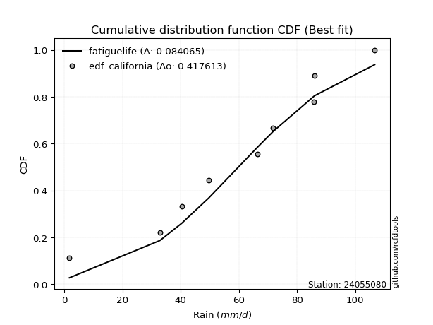</img>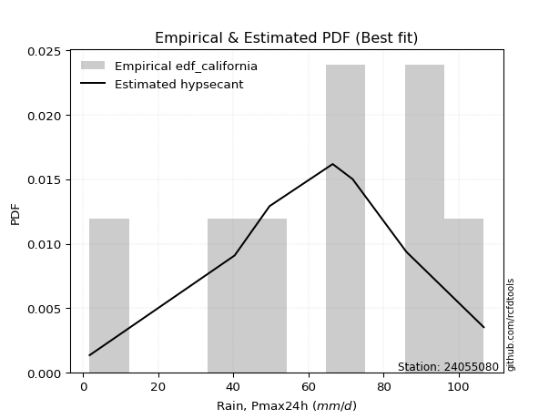</img>

</div>


### 2. EDF Hazen (1930)

Hazen method for plotting positions is a formula used to estimate the empirical cumulative probability distribution of flood events or other hydrological data. This formula often results in biased estimations, particularly when extrapolating to extreme events (high return periods).

<div align="center">


$P=(m-0.5)/n$


</div>


**2.1. Empirical values**

<div align="center">

|                | 0                  | 1                  | 2                  | 3                  | 4                  | 5         | 6                 | 7         |
|:---------------|:-------------------|:-------------------|:-------------------|:-------------------|:-------------------|:----------|:------------------|:----------|
| date           | 2024               | 2020               | 2023               | 2017               | 2018               | 2021      | 2019              | 2022      |
| x              | 1.8                | 40.4               | 49.7               | 66.5               | 71.8               | 85.9      | 86.1              | 106.7     |
| m              | 1                  | 2                  | 3                  | 4                  | 5                  | 6         | 7                 | 8         |
| empirical_dist | edf_hazen          | edf_hazen          | edf_hazen          | edf_hazen          | edf_hazen          | edf_hazen | edf_hazen         | edf_hazen |
| empirical      | 0.0625             | 0.1875             | 0.3125             | 0.4375             | 0.5625             | 0.6875    | 0.8125            | 0.9375    |
| empirical_tr   | 1.0666666666666667 | 1.2307692307692308 | 1.4545454545454546 | 1.7777777777777777 | 2.2857142857142856 | 3.2       | 5.333333333333333 | 16.0      |

</div>


**2.2. Kolmogorov-Smirnov fit test (sorted by Δ)**


<div align="center">

|                | 0                   | 1                   | 2                  | 3                   | 4                   | 5                   | 6                   | 7                   | 8                  | 9                   | 10                 | 11                 | 12                  | 13                  | 14                  | 15                  | 16                  | 17                  | 18                 | 19                  | 20                 | 21                 | 22                  | 23                  | 24                 | 25                 | 26                  | 27                  | 28                 | 29                 | 30                  | 31                  | 32                 | 33                  | 34                    | 35                  | 36                  | 37                  | 38                  | 39                  | 40                  | 41                  | 42                 | 43                 | 44                 | 45                  | 46                  | 47                 | 48                  | 49                 | 50                  | 51                  | 52                  | 53                  | 54                 | 55                 | 56                 | 57                  | 58                 | 59                  | 60                 | 61                  | 62                 | 63                 | 64                 | 65                  | 66                 | 67                 | 68                 | 69                  | 70                  | 71                 | 72                  | 73                  | 74                  | 75                 | 76                 | 77                 | 78                 | 79                 | 80                 | 81                 | 82                 | 83                 | 84                 | 85                 | 86                 | 87                 |
|:---------------|:--------------------|:--------------------|:-------------------|:--------------------|:--------------------|:--------------------|:--------------------|:--------------------|:-------------------|:--------------------|:-------------------|:-------------------|:--------------------|:--------------------|:--------------------|:--------------------|:--------------------|:--------------------|:-------------------|:--------------------|:-------------------|:-------------------|:--------------------|:--------------------|:-------------------|:-------------------|:--------------------|:--------------------|:-------------------|:-------------------|:--------------------|:--------------------|:-------------------|:--------------------|:----------------------|:--------------------|:--------------------|:--------------------|:--------------------|:--------------------|:--------------------|:--------------------|:-------------------|:-------------------|:-------------------|:--------------------|:--------------------|:-------------------|:--------------------|:-------------------|:--------------------|:--------------------|:--------------------|:--------------------|:-------------------|:-------------------|:-------------------|:--------------------|:-------------------|:--------------------|:-------------------|:--------------------|:-------------------|:-------------------|:-------------------|:--------------------|:-------------------|:-------------------|:-------------------|:--------------------|:--------------------|:-------------------|:--------------------|:--------------------|:--------------------|:-------------------|:-------------------|:-------------------|:-------------------|:-------------------|:-------------------|:-------------------|:-------------------|:-------------------|:-------------------|:-------------------|:-------------------|:-------------------|
| station        | 24055080            | 24055080            | 24055080           | 24055080            | 24055080            | 24055080            | 24055080            | 24055080            | 24055080           | 24055080            | 24055080           | 24055080           | 24055080            | 24055080            | 24055080            | 24055080            | 24055080            | 24055080            | 24055080           | 24055080            | 24055080           | 24055080           | 24055080            | 24055080            | 24055080           | 24055080           | 24055080            | 24055080            | 24055080           | 24055080           | 24055080            | 24055080            | 24055080           | 24055080            | 24055080              | 24055080            | 24055080            | 24055080            | 24055080            | 24055080            | 24055080            | 24055080            | 24055080           | 24055080           | 24055080           | 24055080            | 24055080            | 24055080           | 24055080            | 24055080           | 24055080            | 24055080            | 24055080            | 24055080            | 24055080           | 24055080           | 24055080           | 24055080            | 24055080           | 24055080            | 24055080           | 24055080            | 24055080           | 24055080           | 24055080           | 24055080            | 24055080           | 24055080           | 24055080           | 24055080            | 24055080            | 24055080           | 24055080            | 24055080            | 24055080            | 24055080           | 24055080           | 24055080           | 24055080           | 24055080           | 24055080           | 24055080           | 24055080           | 24055080           | 24055080           | 24055080           | 24055080           | 24055080           |
| empirical_dist | edf_hazen           | edf_hazen           | edf_hazen          | edf_hazen           | edf_hazen           | edf_hazen           | edf_hazen           | edf_hazen           | edf_hazen          | edf_hazen           | edf_hazen          | edf_hazen          | edf_hazen           | edf_hazen           | edf_hazen           | edf_hazen           | edf_hazen           | edf_hazen           | edf_hazen          | edf_hazen           | edf_hazen          | edf_hazen          | edf_hazen           | edf_hazen           | edf_hazen          | edf_hazen          | edf_hazen           | edf_hazen           | edf_hazen          | edf_hazen          | edf_hazen           | edf_hazen           | edf_hazen          | edf_hazen           | edf_hazen             | edf_hazen           | edf_hazen           | edf_hazen           | edf_hazen           | edf_hazen           | edf_hazen           | edf_hazen           | edf_hazen          | edf_hazen          | edf_hazen          | edf_hazen           | edf_hazen           | edf_hazen          | edf_hazen           | edf_hazen          | edf_hazen           | edf_hazen           | edf_hazen           | edf_hazen           | edf_hazen          | edf_hazen          | edf_hazen          | edf_hazen           | edf_hazen          | edf_hazen           | edf_hazen          | edf_hazen           | edf_hazen          | edf_hazen          | edf_hazen          | edf_hazen           | edf_hazen          | edf_hazen          | edf_hazen          | edf_hazen           | edf_hazen           | edf_hazen          | edf_hazen           | edf_hazen           | edf_hazen           | edf_hazen          | edf_hazen          | edf_hazen          | edf_hazen          | edf_hazen          | edf_hazen          | edf_hazen          | edf_hazen          | edf_hazen          | edf_hazen          | edf_hazen          | edf_hazen          | edf_hazen          |
| p_dist         | johnsonsu           | weibull_min         | pearson3           | genlogistic         | fisk                | gumbel_l            | mielke              | nakagami            | t                  | norm                | crystalball        | exponnorm          | nct                 | f                   | betaprime           | logistic            | gamma               | erlang              | laplace_asymmetric | hypsecant           | logjohnsonsu       | invgamma           | maxwell             | laplace             | logt               | invgauss           | rayleigh            | logloggamma         | kstwobign          | logmielke          | halfnorm            | gumbel_r            | logweibull_min     | loggompertz         | loglaplace_asymmetric | logpearson3         | rice                | logfisk             | moyal               | halflogistic        | gompertz            | loggumbel_l         | ncf                | wald               | loglaplace         | genexpon            | expon               | loghypsecant       | loglogistic         | logf               | lognorm             | lognorm             | logcrystalball      | logexponnorm        | logrice            | lognakagami        | lognct             | logfatiguelife      | logchi2            | gibrat              | logncf             | logbetaprime        | loggamma           | loggamma           | loginvgamma        | logerlang           | logmaxwell         | loginvweibull      | loginvgauss        | lograyleigh         | logalpha            | loggumbel_r        | loghalfnorm         | logkstwobign        | logmoyal            | loghalflogistic    | loggenexpon        | logexpon           | logwald            | loglognorm         | loggibrat          | invweibull         | fatiguelife        | logtruncnorm       | alpha              | chi2               | loggenlogistic     | truncnorm          |
| delta          | 0.06381563532712553 | 0.06558276870112667 | 0.0657640487895883 | 0.06604847690513338 | 0.06881270321457511 | 0.07300837184231723 | 0.08784196839434566 | 0.10009457368817098 | 0.1000974253699567 | 0.10009798194388708 | 0.100097987347189  | 0.1000991706016714 | 0.10010963363488146 | 0.10162706032734836 | 0.10352953572267987 | 0.10519424036969804 | 0.11076647478789237 | 0.11202760203584261 | 0.1147653313688487 | 0.11624320827262757 | 0.1223820040465794 | 0.1232809578370514 | 0.13126795399307556 | 0.13404564140368558 | 0.1381173184555775 | 0.1402130290218937 | 0.14136756751944834 | 0.15059210606947704 | 0.1595811493279955 | 0.1637857799499114 | 0.16982733193411914 | 0.17058163446708963 | 0.173441425984054  | 0.17435451299862548 | 0.17740376443958472   | 0.18290701595163972 | 0.19196311358489926 | 0.19460407646214073 | 0.19578637826390355 | 0.19666059756669907 | 0.21159304290470196 | 0.21568034185391516 | 0.2622153085367571 | 0.2657368262780324 | 0.2681875205883172 | 0.27646492338291817 | 0.27695435828653514 | 0.2797479127053121 | 0.28277966896204704 | 0.284031368173628  | 0.28634015705083427 | 0.28634015705083427 | 0.28634019152495266 | 0.28634063910995694 | 0.2863414025811846 | 0.286442478735176  | 0.2865487364936813 | 0.28684107485137944 | 0.2920620087219021 | 0.29376599163909445 | 0.2943497699702111 | 0.29864852781793005 | 0.3043913886267755 | 0.3043913886267755 | 0.309284051939695  | 0.31393721303795674 | 0.3202402702076158 | 0.321099396639248  | 0.326355956929395  | 0.33176833457472843 | 0.34013953663585705 | 0.3554392287039888 | 0.36424406660146114 | 0.36491976200263054 | 0.38124609852098157 | 0.3873787050651999 | 0.3876204591937231 | 0.4351114578235695 | 0.4530808129528674 | 0.4551624782213157 | 0.4716148395453641 | 0.5073512213853012 | 0.5662352685900842 | 0.6211087478997007 | 0.7118532687691153 | 0.8122017296805094 | 0.8125             | 0.9263970545267229 |
| deltao         | 0.4472608134160001  | 0.4472608134160001  | 0.4472608134160001 | 0.4472608134160001  | 0.4472608134160001  | 0.4472608134160001  | 0.4472608134160001  | 0.4472608134160001  | 0.4472608134160001 | 0.4472608134160001  | 0.4472608134160001 | 0.4472608134160001 | 0.4472608134160001  | 0.4472608134160001  | 0.4472608134160001  | 0.4472608134160001  | 0.4472608134160001  | 0.4472608134160001  | 0.4472608134160001 | 0.4472608134160001  | 0.4472608134160001 | 0.4472608134160001 | 0.4472608134160001  | 0.4472608134160001  | 0.4472608134160001 | 0.4472608134160001 | 0.4472608134160001  | 0.4472608134160001  | 0.4472608134160001 | 0.4472608134160001 | 0.4472608134160001  | 0.4472608134160001  | 0.4472608134160001 | 0.4472608134160001  | 0.4472608134160001    | 0.4472608134160001  | 0.4472608134160001  | 0.4472608134160001  | 0.4472608134160001  | 0.4472608134160001  | 0.4472608134160001  | 0.4472608134160001  | 0.4472608134160001 | 0.4472608134160001 | 0.4472608134160001 | 0.4472608134160001  | 0.4472608134160001  | 0.4472608134160001 | 0.4472608134160001  | 0.4472608134160001 | 0.4472608134160001  | 0.4472608134160001  | 0.4472608134160001  | 0.4472608134160001  | 0.4472608134160001 | 0.4472608134160001 | 0.4472608134160001 | 0.4472608134160001  | 0.4472608134160001 | 0.4472608134160001  | 0.4472608134160001 | 0.4472608134160001  | 0.4472608134160001 | 0.4472608134160001 | 0.4472608134160001 | 0.4472608134160001  | 0.4472608134160001 | 0.4472608134160001 | 0.4472608134160001 | 0.4472608134160001  | 0.4472608134160001  | 0.4472608134160001 | 0.4472608134160001  | 0.4472608134160001  | 0.4472608134160001  | 0.4472608134160001 | 0.4472608134160001 | 0.4472608134160001 | 0.4472608134160001 | 0.4472608134160001 | 0.4472608134160001 | 0.4472608134160001 | 0.4472608134160001 | 0.4472608134160001 | 0.4472608134160001 | 0.4472608134160001 | 0.4472608134160001 | 0.4472608134160001 |
| eval           | Δo > Δ              | Δo > Δ              | Δo > Δ             | Δo > Δ              | Δo > Δ              | Δo > Δ              | Δo > Δ              | Δo > Δ              | Δo > Δ             | Δo > Δ              | Δo > Δ             | Δo > Δ             | Δo > Δ              | Δo > Δ              | Δo > Δ              | Δo > Δ              | Δo > Δ              | Δo > Δ              | Δo > Δ             | Δo > Δ              | Δo > Δ             | Δo > Δ             | Δo > Δ              | Δo > Δ              | Δo > Δ             | Δo > Δ             | Δo > Δ              | Δo > Δ              | Δo > Δ             | Δo > Δ             | Δo > Δ              | Δo > Δ              | Δo > Δ             | Δo > Δ              | Δo > Δ                | Δo > Δ              | Δo > Δ              | Δo > Δ              | Δo > Δ              | Δo > Δ              | Δo > Δ              | Δo > Δ              | Δo > Δ             | Δo > Δ             | Δo > Δ             | Δo > Δ              | Δo > Δ              | Δo > Δ             | Δo > Δ              | Δo > Δ             | Δo > Δ              | Δo > Δ              | Δo > Δ              | Δo > Δ              | Δo > Δ             | Δo > Δ             | Δo > Δ             | Δo > Δ              | Δo > Δ             | Δo > Δ              | Δo > Δ             | Δo > Δ              | Δo > Δ             | Δo > Δ             | Δo > Δ             | Δo > Δ              | Δo > Δ             | Δo > Δ             | Δo > Δ             | Δo > Δ              | Δo > Δ              | Δo > Δ             | Δo > Δ              | Δo > Δ              | Δo > Δ              | Δo > Δ             | Δo > Δ             | Δo > Δ             | Δo <= Δ            | Δo <= Δ            | Δo <= Δ            | Δo <= Δ            | Δo <= Δ            | Δo <= Δ            | Δo <= Δ            | Δo <= Δ            | Δo <= Δ            | Δo <= Δ            |
| fit            | 1                   | 1                   | 1                  | 1                   | 1                   | 1                   | 1                   | 1                   | 1                  | 1                   | 1                  | 1                  | 1                   | 1                   | 1                   | 1                   | 1                   | 1                   | 1                  | 1                   | 1                  | 1                  | 1                   | 1                   | 1                  | 1                  | 1                   | 1                   | 1                  | 1                  | 1                   | 1                   | 1                  | 1                   | 1                     | 1                   | 1                   | 1                   | 1                   | 1                   | 1                   | 1                   | 1                  | 1                  | 1                  | 1                   | 1                   | 1                  | 1                   | 1                  | 1                   | 1                   | 1                   | 1                   | 1                  | 1                  | 1                  | 1                   | 1                  | 1                   | 1                  | 1                   | 1                  | 1                  | 1                  | 1                   | 1                  | 1                  | 1                  | 1                   | 1                   | 1                  | 1                   | 1                   | 1                   | 1                  | 1                  | 1                  | 0                  | 0                  | 0                  | 0                  | 0                  | 0                  | 0                  | 0                  | 0                  | 0                  |
| n              | 8                   | 8                   | 8                  | 8                   | 8                   | 8                   | 8                   | 8                   | 8                  | 8                   | 8                  | 8                  | 8                   | 8                   | 8                   | 8                   | 8                   | 8                   | 8                  | 8                   | 8                  | 8                  | 8                   | 8                   | 8                  | 8                  | 8                   | 8                   | 8                  | 8                  | 8                   | 8                   | 8                  | 8                   | 8                     | 8                   | 8                   | 8                   | 8                   | 8                   | 8                   | 8                   | 8                  | 8                  | 8                  | 8                   | 8                   | 8                  | 8                   | 8                  | 8                   | 8                   | 8                   | 8                   | 8                  | 8                  | 8                  | 8                   | 8                  | 8                   | 8                  | 8                   | 8                  | 8                  | 8                  | 8                   | 8                  | 8                  | 8                  | 8                   | 8                   | 8                  | 8                   | 8                   | 8                   | 8                  | 8                  | 8                  | 8                  | 8                  | 8                  | 8                  | 8                  | 8                  | 8                  | 8                  | 8                  | 8                  |
| best_fit       | 1                   | 0                   | 0                  | 0                   | 0                   | 0                   | 0                   | 0                   | 0                  | 0                   | 0                  | 0                  | 0                   | 0                   | 0                   | 0                   | 0                   | 0                   | 0                  | 0                   | 0                  | 0                  | 0                   | 0                   | 0                  | 0                  | 0                   | 0                   | 0                  | 0                  | 0                   | 0                   | 0                  | 0                   | 0                     | 0                   | 0                   | 0                   | 0                   | 0                   | 0                   | 0                   | 0                  | 0                  | 0                  | 0                   | 0                   | 0                  | 0                   | 0                  | 0                   | 0                   | 0                   | 0                   | 0                  | 0                  | 0                  | 0                   | 0                  | 0                   | 0                  | 0                   | 0                  | 0                  | 0                  | 0                   | 0                  | 0                  | 0                  | 0                   | 0                   | 0                  | 0                   | 0                   | 0                   | 0                  | 0                  | 0                  | 0                  | 0                  | 0                  | 0                  | 0                  | 0                  | 0                  | 0                  | 0                  | 0                  |
| best_fit_sort  | 1                   | 2                   | 3                  | 4                   | 5                   | 6                   | 7                   | 8                   | 9                  | 10                  | 11                 | 12                 | 13                  | 14                  | 15                  | 16                  | 17                  | 18                  | 19                 | 20                  | 21                 | 22                 | 23                  | 24                  | 25                 | 26                 | 27                  | 28                  | 29                 | 30                 | 31                  | 32                  | 33                 | 34                  | 35                    | 36                  | 37                  | 38                  | 39                  | 40                  | 41                  | 42                  | 43                 | 44                 | 45                 | 46                  | 47                  | 48                 | 49                  | 50                 | 51                  | 52                  | 53                  | 54                  | 55                 | 56                 | 57                 | 58                  | 59                 | 60                  | 61                 | 62                  | 63                 | 64                 | 65                 | 66                  | 67                 | 68                 | 69                 | 70                  | 71                  | 72                 | 73                  | 74                  | 75                  | 76                 | 77                 | 78                 | 79                 | 80                 | 81                 | 82                 | 83                 | 84                 | 85                 | 86                 | 87                 | 88                 |

</div>


**2.3. Best fit**

<div align="center">

|   id |   station | empirical_dist   | p_dist    |     delta |   deltao | eval   |   fit |   n |   best_fit |   best_fit_sort |
|-----:|----------:|:-----------------|:----------|----------:|---------:|:-------|------:|----:|-----------:|----------------:|
|    0 |  24055080 | edf_hazen        | johnsonsu | 0.0638156 | 0.447261 | Δo > Δ |     1 |   8 |          1 |               1 |

</div>


<div align="center">

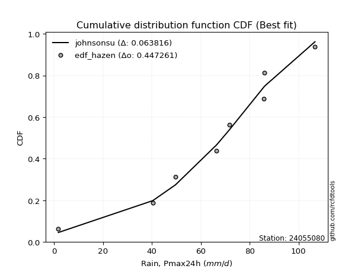</img>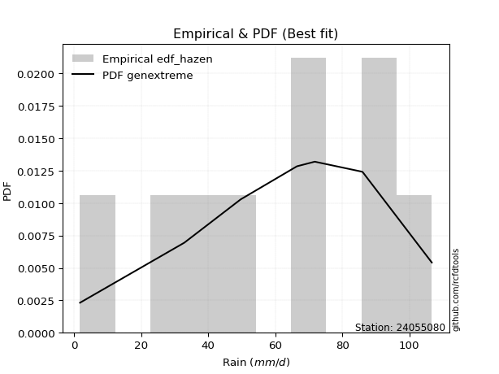</img>

</div>


### 3. EDF Weibull (1939)

Weibull plotting position formula is an empirical method used to estimate the non-exceedance probability or plotting position for a set of observed data, is often recommended or widely used in practice, particularly in flood frequency analysis.

<div align="center">


$P=m/(n+1)$


</div>


**3.1. Empirical values**

<div align="center">

|                | 0                  | 1                  | 2                  | 3                  | 4                  | 5                  | 6                  | 7                  |
|:---------------|:-------------------|:-------------------|:-------------------|:-------------------|:-------------------|:-------------------|:-------------------|:-------------------|
| date           | 2024               | 2020               | 2023               | 2017               | 2018               | 2021               | 2019               | 2022               |
| x              | 1.8                | 40.4               | 49.7               | 66.5               | 71.8               | 85.9               | 86.1               | 106.7              |
| m              | 1                  | 2                  | 3                  | 4                  | 5                  | 6                  | 7                  | 8                  |
| empirical_dist | edf_weibull        | edf_weibull        | edf_weibull        | edf_weibull        | edf_weibull        | edf_weibull        | edf_weibull        | edf_weibull        |
| empirical      | 0.1111111111111111 | 0.2222222222222222 | 0.3333333333333333 | 0.4444444444444444 | 0.5555555555555556 | 0.6666666666666666 | 0.7777777777777778 | 0.8888888888888888 |
| empirical_tr   | 1.125              | 1.2857142857142856 | 1.4999999999999998 | 1.7999999999999998 | 2.25               | 2.9999999999999996 | 4.5                | 8.999999999999996  |

</div>


**3.2. Kolmogorov-Smirnov fit test (sorted by Δ)**


<div align="center">

|                | 0                   | 1                   | 2                   | 3                   | 4                   | 5                   | 6                  | 7                   | 8                  | 9                   | 10                  | 11                  | 12                  | 13                  | 14                  | 15                  | 16                  | 17                  | 18                  | 19                  | 20                  | 21                  | 22                  | 23                  | 24                  | 25                  | 26                  | 27                  | 28                  | 29                  | 30                  | 31                  | 32                  | 33                 | 34                  | 35                  | 36                    | 37                  | 38                  | 39                  | 40                  | 41                 | 42                  | 43                  | 44                  | 45                  | 46                  | 47                  | 48                 | 49                  | 50                  | 51                  | 52                  | 53                 | 54                  | 55                 | 56                  | 57                  | 58                 | 59                 | 60                  | 61                 | 62                 | 63                 | 64                  | 65                 | 66                 | 67                  | 68                 | 69                 | 70                  | 71                 | 72                 | 73                  | 74                  | 75                 | 76                 | 77                 | 78                 | 79                 | 80                 | 81                  | 82                 | 83                 | 84                 | 85                 | 86                 | 87                 |
|:---------------|:--------------------|:--------------------|:--------------------|:--------------------|:--------------------|:--------------------|:-------------------|:--------------------|:-------------------|:--------------------|:--------------------|:--------------------|:--------------------|:--------------------|:--------------------|:--------------------|:--------------------|:--------------------|:--------------------|:--------------------|:--------------------|:--------------------|:--------------------|:--------------------|:--------------------|:--------------------|:--------------------|:--------------------|:--------------------|:--------------------|:--------------------|:--------------------|:--------------------|:-------------------|:--------------------|:--------------------|:----------------------|:--------------------|:--------------------|:--------------------|:--------------------|:-------------------|:--------------------|:--------------------|:--------------------|:--------------------|:--------------------|:--------------------|:-------------------|:--------------------|:--------------------|:--------------------|:--------------------|:-------------------|:--------------------|:-------------------|:--------------------|:--------------------|:-------------------|:-------------------|:--------------------|:-------------------|:-------------------|:-------------------|:--------------------|:-------------------|:-------------------|:--------------------|:-------------------|:-------------------|:--------------------|:-------------------|:-------------------|:--------------------|:--------------------|:-------------------|:-------------------|:-------------------|:-------------------|:-------------------|:-------------------|:--------------------|:-------------------|:-------------------|:-------------------|:-------------------|:-------------------|:-------------------|
| station        | 24055080            | 24055080            | 24055080            | 24055080            | 24055080            | 24055080            | 24055080           | 24055080            | 24055080           | 24055080            | 24055080            | 24055080            | 24055080            | 24055080            | 24055080            | 24055080            | 24055080            | 24055080            | 24055080            | 24055080            | 24055080            | 24055080            | 24055080            | 24055080            | 24055080            | 24055080            | 24055080            | 24055080            | 24055080            | 24055080            | 24055080            | 24055080            | 24055080            | 24055080           | 24055080            | 24055080            | 24055080              | 24055080            | 24055080            | 24055080            | 24055080            | 24055080           | 24055080            | 24055080            | 24055080            | 24055080            | 24055080            | 24055080            | 24055080           | 24055080            | 24055080            | 24055080            | 24055080            | 24055080           | 24055080            | 24055080           | 24055080            | 24055080            | 24055080           | 24055080           | 24055080            | 24055080           | 24055080           | 24055080           | 24055080            | 24055080           | 24055080           | 24055080            | 24055080           | 24055080           | 24055080            | 24055080           | 24055080           | 24055080            | 24055080            | 24055080           | 24055080           | 24055080           | 24055080           | 24055080           | 24055080           | 24055080            | 24055080           | 24055080           | 24055080           | 24055080           | 24055080           | 24055080           |
| empirical_dist | edf_weibull         | edf_weibull         | edf_weibull         | edf_weibull         | edf_weibull         | edf_weibull         | edf_weibull        | edf_weibull         | edf_weibull        | edf_weibull         | edf_weibull         | edf_weibull         | edf_weibull         | edf_weibull         | edf_weibull         | edf_weibull         | edf_weibull         | edf_weibull         | edf_weibull         | edf_weibull         | edf_weibull         | edf_weibull         | edf_weibull         | edf_weibull         | edf_weibull         | edf_weibull         | edf_weibull         | edf_weibull         | edf_weibull         | edf_weibull         | edf_weibull         | edf_weibull         | edf_weibull         | edf_weibull        | edf_weibull         | edf_weibull         | edf_weibull           | edf_weibull         | edf_weibull         | edf_weibull         | edf_weibull         | edf_weibull        | edf_weibull         | edf_weibull         | edf_weibull         | edf_weibull         | edf_weibull         | edf_weibull         | edf_weibull        | edf_weibull         | edf_weibull         | edf_weibull         | edf_weibull         | edf_weibull        | edf_weibull         | edf_weibull        | edf_weibull         | edf_weibull         | edf_weibull        | edf_weibull        | edf_weibull         | edf_weibull        | edf_weibull        | edf_weibull        | edf_weibull         | edf_weibull        | edf_weibull        | edf_weibull         | edf_weibull        | edf_weibull        | edf_weibull         | edf_weibull        | edf_weibull        | edf_weibull         | edf_weibull         | edf_weibull        | edf_weibull        | edf_weibull        | edf_weibull        | edf_weibull        | edf_weibull        | edf_weibull         | edf_weibull        | edf_weibull        | edf_weibull        | edf_weibull        | edf_weibull        | edf_weibull        |
| p_dist         | johnsonsu           | weibull_min         | pearson3            | genlogistic         | logjohnsonsu        | fisk                | gumbel_l           | betaprime           | f                  | nakagami            | nct                 | t                   | norm                | crystalball         | exponnorm           | gamma               | mielke              | erlang              | invgamma            | logistic            | maxwell             | invgauss            | rayleigh            | laplace_asymmetric  | hypsecant           | logloggamma         | logpearson3         | logfisk             | logmielke           | kstwobign           | laplace             | logt                | halfnorm            | gumbel_r           | logweibull_min      | loggompertz         | loglaplace_asymmetric | loggumbel_l         | moyal               | halflogistic        | rice                | ncf                | gompertz            | genexpon            | expon               | loglaplace          | loghypsecant        | loglogistic         | logf               | lognorm             | lognorm             | logcrystalball      | logexponnorm        | logrice            | lognakagami         | lognct             | logfatiguelife      | logchi2             | wald               | logncf             | logbetaprime        | loggamma           | loggamma           | loginvgamma        | logerlang           | logmaxwell         | loginvweibull      | gibrat              | loginvgauss        | lograyleigh        | logalpha            | loggumbel_r        | loghalfnorm        | logkstwobign        | logmoyal            | loghalflogistic    | loggenexpon        | logexpon           | logwald            | loglognorm         | loggibrat          | invweibull          | fatiguelife        | logtruncnorm       | alpha              | chi2               | loggenlogistic     | truncnorm          |
| delta          | 0.07919563833889132 | 0.08641610203446004 | 0.08659738212292167 | 0.08688181023846675 | 0.08765978182435719 | 0.08964603654790848 | 0.0938417051756506 | 0.09983614185324308 | 0.0998545077231141 | 0.09994060499352686 | 0.10005887656555756 | 0.10018378131830497 | 0.10018401522730558 | 0.10018402122759984 | 0.10018473603858014 | 0.10382203034344795 | 0.10472619933895888 | 0.10508315759139819 | 0.11633651339260698 | 0.12274443016200709 | 0.12432350954863114 | 0.13326858457744928 | 0.13442312307500393 | 0.13559866470218207 | 0.13707654160596094 | 0.14364766162503262 | 0.14468988459120158 | 0.14599296535102957 | 0.15166408600386194 | 0.15263670488355108 | 0.15487897473701895 | 0.15895065178891082 | 0.16288288748967472 | 0.1636371900226452 | 0.16649698153960957 | 0.16741006855418106 | 0.1704593199951403    | 0.18095811963169295 | 0.18884193381945913 | 0.18971615312225465 | 0.21279644691823257 | 0.2274930863145349 | 0.23242637623803528 | 0.24174270116069596 | 0.24223213606431293 | 0.24457066162772922 | 0.24502569048308986 | 0.24805744673982483 | 0.2493091459514058 | 0.25161793482861206 | 0.25161793482861206 | 0.25161796930273045 | 0.25161841688773473 | 0.2516191803589624 | 0.25172025651295377 | 0.2518265142714591 | 0.25211885262915723 | 0.25733978649967987 | 0.258792381833588  | 0.2596275477479889 | 0.26392630559570784 | 0.2696691664045533 | 0.2696691664045533 | 0.2745618297174728 | 0.27921499081573453 | 0.2855180479853936 | 0.2863771744170258 | 0.28682154719465003 | 0.2916337347071728 | 0.2970461123525062 | 0.30541731441363484 | 0.3207170064817666 | 0.3295218443792389 | 0.33019753978040833 | 0.34652387629875936 | 0.3526564828429777 | 0.3528982369715009 | 0.4003892356013473 | 0.4183585907306452 | 0.4204402559990935 | 0.4368926173231419 | 0.45874011027419004 | 0.531513046367862  | 0.5863865256774785 | 0.677131046546893  | 0.7774795074582872 | 0.7777777777777778 | 0.8777859434156119 |
| deltao         | 0.4472608134160001  | 0.4472608134160001  | 0.4472608134160001  | 0.4472608134160001  | 0.4472608134160001  | 0.4472608134160001  | 0.4472608134160001 | 0.4472608134160001  | 0.4472608134160001 | 0.4472608134160001  | 0.4472608134160001  | 0.4472608134160001  | 0.4472608134160001  | 0.4472608134160001  | 0.4472608134160001  | 0.4472608134160001  | 0.4472608134160001  | 0.4472608134160001  | 0.4472608134160001  | 0.4472608134160001  | 0.4472608134160001  | 0.4472608134160001  | 0.4472608134160001  | 0.4472608134160001  | 0.4472608134160001  | 0.4472608134160001  | 0.4472608134160001  | 0.4472608134160001  | 0.4472608134160001  | 0.4472608134160001  | 0.4472608134160001  | 0.4472608134160001  | 0.4472608134160001  | 0.4472608134160001 | 0.4472608134160001  | 0.4472608134160001  | 0.4472608134160001    | 0.4472608134160001  | 0.4472608134160001  | 0.4472608134160001  | 0.4472608134160001  | 0.4472608134160001 | 0.4472608134160001  | 0.4472608134160001  | 0.4472608134160001  | 0.4472608134160001  | 0.4472608134160001  | 0.4472608134160001  | 0.4472608134160001 | 0.4472608134160001  | 0.4472608134160001  | 0.4472608134160001  | 0.4472608134160001  | 0.4472608134160001 | 0.4472608134160001  | 0.4472608134160001 | 0.4472608134160001  | 0.4472608134160001  | 0.4472608134160001 | 0.4472608134160001 | 0.4472608134160001  | 0.4472608134160001 | 0.4472608134160001 | 0.4472608134160001 | 0.4472608134160001  | 0.4472608134160001 | 0.4472608134160001 | 0.4472608134160001  | 0.4472608134160001 | 0.4472608134160001 | 0.4472608134160001  | 0.4472608134160001 | 0.4472608134160001 | 0.4472608134160001  | 0.4472608134160001  | 0.4472608134160001 | 0.4472608134160001 | 0.4472608134160001 | 0.4472608134160001 | 0.4472608134160001 | 0.4472608134160001 | 0.4472608134160001  | 0.4472608134160001 | 0.4472608134160001 | 0.4472608134160001 | 0.4472608134160001 | 0.4472608134160001 | 0.4472608134160001 |
| eval           | Δo > Δ              | Δo > Δ              | Δo > Δ              | Δo > Δ              | Δo > Δ              | Δo > Δ              | Δo > Δ             | Δo > Δ              | Δo > Δ             | Δo > Δ              | Δo > Δ              | Δo > Δ              | Δo > Δ              | Δo > Δ              | Δo > Δ              | Δo > Δ              | Δo > Δ              | Δo > Δ              | Δo > Δ              | Δo > Δ              | Δo > Δ              | Δo > Δ              | Δo > Δ              | Δo > Δ              | Δo > Δ              | Δo > Δ              | Δo > Δ              | Δo > Δ              | Δo > Δ              | Δo > Δ              | Δo > Δ              | Δo > Δ              | Δo > Δ              | Δo > Δ             | Δo > Δ              | Δo > Δ              | Δo > Δ                | Δo > Δ              | Δo > Δ              | Δo > Δ              | Δo > Δ              | Δo > Δ             | Δo > Δ              | Δo > Δ              | Δo > Δ              | Δo > Δ              | Δo > Δ              | Δo > Δ              | Δo > Δ             | Δo > Δ              | Δo > Δ              | Δo > Δ              | Δo > Δ              | Δo > Δ             | Δo > Δ              | Δo > Δ             | Δo > Δ              | Δo > Δ              | Δo > Δ             | Δo > Δ             | Δo > Δ              | Δo > Δ             | Δo > Δ             | Δo > Δ             | Δo > Δ              | Δo > Δ             | Δo > Δ             | Δo > Δ              | Δo > Δ             | Δo > Δ             | Δo > Δ              | Δo > Δ             | Δo > Δ             | Δo > Δ              | Δo > Δ              | Δo > Δ             | Δo > Δ             | Δo > Δ             | Δo > Δ             | Δo > Δ             | Δo > Δ             | Δo <= Δ             | Δo <= Δ            | Δo <= Δ            | Δo <= Δ            | Δo <= Δ            | Δo <= Δ            | Δo <= Δ            |
| fit            | 1                   | 1                   | 1                   | 1                   | 1                   | 1                   | 1                  | 1                   | 1                  | 1                   | 1                   | 1                   | 1                   | 1                   | 1                   | 1                   | 1                   | 1                   | 1                   | 1                   | 1                   | 1                   | 1                   | 1                   | 1                   | 1                   | 1                   | 1                   | 1                   | 1                   | 1                   | 1                   | 1                   | 1                  | 1                   | 1                   | 1                     | 1                   | 1                   | 1                   | 1                   | 1                  | 1                   | 1                   | 1                   | 1                   | 1                   | 1                   | 1                  | 1                   | 1                   | 1                   | 1                   | 1                  | 1                   | 1                  | 1                   | 1                   | 1                  | 1                  | 1                   | 1                  | 1                  | 1                  | 1                   | 1                  | 1                  | 1                   | 1                  | 1                  | 1                   | 1                  | 1                  | 1                   | 1                   | 1                  | 1                  | 1                  | 1                  | 1                  | 1                  | 0                   | 0                  | 0                  | 0                  | 0                  | 0                  | 0                  |
| n              | 8                   | 8                   | 8                   | 8                   | 8                   | 8                   | 8                  | 8                   | 8                  | 8                   | 8                   | 8                   | 8                   | 8                   | 8                   | 8                   | 8                   | 8                   | 8                   | 8                   | 8                   | 8                   | 8                   | 8                   | 8                   | 8                   | 8                   | 8                   | 8                   | 8                   | 8                   | 8                   | 8                   | 8                  | 8                   | 8                   | 8                     | 8                   | 8                   | 8                   | 8                   | 8                  | 8                   | 8                   | 8                   | 8                   | 8                   | 8                   | 8                  | 8                   | 8                   | 8                   | 8                   | 8                  | 8                   | 8                  | 8                   | 8                   | 8                  | 8                  | 8                   | 8                  | 8                  | 8                  | 8                   | 8                  | 8                  | 8                   | 8                  | 8                  | 8                   | 8                  | 8                  | 8                   | 8                   | 8                  | 8                  | 8                  | 8                  | 8                  | 8                  | 8                   | 8                  | 8                  | 8                  | 8                  | 8                  | 8                  |
| best_fit       | 1                   | 0                   | 0                   | 0                   | 0                   | 0                   | 0                  | 0                   | 0                  | 0                   | 0                   | 0                   | 0                   | 0                   | 0                   | 0                   | 0                   | 0                   | 0                   | 0                   | 0                   | 0                   | 0                   | 0                   | 0                   | 0                   | 0                   | 0                   | 0                   | 0                   | 0                   | 0                   | 0                   | 0                  | 0                   | 0                   | 0                     | 0                   | 0                   | 0                   | 0                   | 0                  | 0                   | 0                   | 0                   | 0                   | 0                   | 0                   | 0                  | 0                   | 0                   | 0                   | 0                   | 0                  | 0                   | 0                  | 0                   | 0                   | 0                  | 0                  | 0                   | 0                  | 0                  | 0                  | 0                   | 0                  | 0                  | 0                   | 0                  | 0                  | 0                   | 0                  | 0                  | 0                   | 0                   | 0                  | 0                  | 0                  | 0                  | 0                  | 0                  | 0                   | 0                  | 0                  | 0                  | 0                  | 0                  | 0                  |
| best_fit_sort  | 1                   | 2                   | 3                   | 4                   | 5                   | 6                   | 7                  | 8                   | 9                  | 10                  | 11                  | 12                  | 13                  | 14                  | 15                  | 16                  | 17                  | 18                  | 19                  | 20                  | 21                  | 22                  | 23                  | 24                  | 25                  | 26                  | 27                  | 28                  | 29                  | 30                  | 31                  | 32                  | 33                  | 34                 | 35                  | 36                  | 37                    | 38                  | 39                  | 40                  | 41                  | 42                 | 43                  | 44                  | 45                  | 46                  | 47                  | 48                  | 49                 | 50                  | 51                  | 52                  | 53                  | 54                 | 55                  | 56                 | 57                  | 58                  | 59                 | 60                 | 61                  | 62                 | 63                 | 64                 | 65                  | 66                 | 67                 | 68                  | 69                 | 70                 | 71                  | 72                 | 73                 | 74                  | 75                  | 76                 | 77                 | 78                 | 79                 | 80                 | 81                 | 82                  | 83                 | 84                 | 85                 | 86                 | 87                 | 88                 |

</div>


**3.3. Best fit**

<div align="center">

|   id |   station | empirical_dist   | p_dist    |     delta |   deltao | eval   |   fit |   n |   best_fit |   best_fit_sort |
|-----:|----------:|:-----------------|:----------|----------:|---------:|:-------|------:|----:|-----------:|----------------:|
|    0 |  24055080 | edf_weibull      | johnsonsu | 0.0791956 | 0.447261 | Δo > Δ |     1 |   8 |          1 |               1 |

</div>


<div align="center">

</img>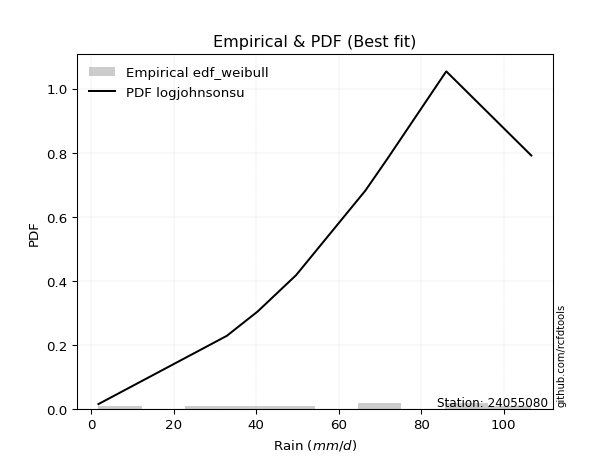</img>

</div>


### 4. EDF Beard (1943)

The Beard formula (or Beard´s plotting position formula) in hydrology is used to estimate the empirical non-exceedance probability _(P)_ of a flood event (or other extreme hydrological data point) within a given dataset.

<div align="center">


$P=(m-0.31)/(n+0.38)$


</div>


**4.1. Empirical values**

<div align="center">

|                | 0                   | 1                   | 2                  | 3                   | 4                  | 5                  | 6                  | 7                  |
|:---------------|:--------------------|:--------------------|:-------------------|:--------------------|:-------------------|:-------------------|:-------------------|:-------------------|
| date           | 2024                | 2020                | 2023               | 2017                | 2018               | 2021               | 2019               | 2022               |
| x              | 1.8                 | 40.4                | 49.7               | 66.5                | 71.8               | 85.9               | 86.1               | 106.7              |
| m              | 1                   | 2                   | 3                  | 4                   | 5                  | 6                  | 7                  | 8                  |
| empirical_dist | edf_beard           | edf_beard           | edf_beard          | edf_beard           | edf_beard          | edf_beard          | edf_beard          | edf_beard          |
| empirical      | 0.08233890214797135 | 0.20167064439140808 | 0.3210023866348448 | 0.44033412887828155 | 0.5596658711217184 | 0.6789976133651551 | 0.7983293556085919 | 0.9176610978520287 |
| empirical_tr   | 1.0897269180754225  | 1.2526158445440956  | 1.4727592267135323 | 1.7867803837953091  | 2.2710027100271004 | 3.115241635687732  | 4.958579881656804  | 12.144927536231886 |

</div>


**4.2. Kolmogorov-Smirnov fit test (sorted by Δ)**


<div align="center">

|                | 0                   | 1                  | 2                   | 3                   | 4                   | 5                   | 6                   | 7                   | 8                   | 9                   | 10                  | 11                  | 12                 | 13                  | 14                  | 15                  | 16                  | 17                  | 18                  | 19                  | 20                  | 21                 | 22                 | 23                  | 24                 | 25                 | 26                  | 27                 | 28                 | 29                  | 30                  | 31                 | 32                  | 33                  | 34                  | 35                    | 36                  | 37                 | 38                  | 39                  | 40                  | 41                  | 42                  | 43                 | 44                 | 45                  | 46                  | 47                 | 48                  | 49                 | 50                 | 51                 | 52                 | 53                  | 54                  | 55                 | 56                 | 57                  | 58                 | 59                  | 60                  | 61                 | 62                 | 63                 | 64                 | 65                  | 66                 | 67                  | 68                 | 69                  | 70                  | 71                 | 72                  | 73                  | 74                 | 75                 | 76                  | 77                  | 78                 | 79                  | 80                 | 81                  | 82                 | 83                 | 84                 | 85                 | 86                 | 87                 |
|:---------------|:--------------------|:-------------------|:--------------------|:--------------------|:--------------------|:--------------------|:--------------------|:--------------------|:--------------------|:--------------------|:--------------------|:--------------------|:-------------------|:--------------------|:--------------------|:--------------------|:--------------------|:--------------------|:--------------------|:--------------------|:--------------------|:-------------------|:-------------------|:--------------------|:-------------------|:-------------------|:--------------------|:-------------------|:-------------------|:--------------------|:--------------------|:-------------------|:--------------------|:--------------------|:--------------------|:----------------------|:--------------------|:-------------------|:--------------------|:--------------------|:--------------------|:--------------------|:--------------------|:-------------------|:-------------------|:--------------------|:--------------------|:-------------------|:--------------------|:-------------------|:-------------------|:-------------------|:-------------------|:--------------------|:--------------------|:-------------------|:-------------------|:--------------------|:-------------------|:--------------------|:--------------------|:-------------------|:-------------------|:-------------------|:-------------------|:--------------------|:-------------------|:--------------------|:-------------------|:--------------------|:--------------------|:-------------------|:--------------------|:--------------------|:-------------------|:-------------------|:--------------------|:--------------------|:-------------------|:--------------------|:-------------------|:--------------------|:-------------------|:-------------------|:-------------------|:-------------------|:-------------------|:-------------------|
| station        | 24055080            | 24055080           | 24055080            | 24055080            | 24055080            | 24055080            | 24055080            | 24055080            | 24055080            | 24055080            | 24055080            | 24055080            | 24055080           | 24055080            | 24055080            | 24055080            | 24055080            | 24055080            | 24055080            | 24055080            | 24055080            | 24055080           | 24055080           | 24055080            | 24055080           | 24055080           | 24055080            | 24055080           | 24055080           | 24055080            | 24055080            | 24055080           | 24055080            | 24055080            | 24055080            | 24055080              | 24055080            | 24055080           | 24055080            | 24055080            | 24055080            | 24055080            | 24055080            | 24055080           | 24055080           | 24055080            | 24055080            | 24055080           | 24055080            | 24055080           | 24055080           | 24055080           | 24055080           | 24055080            | 24055080            | 24055080           | 24055080           | 24055080            | 24055080           | 24055080            | 24055080            | 24055080           | 24055080           | 24055080           | 24055080           | 24055080            | 24055080           | 24055080            | 24055080           | 24055080            | 24055080            | 24055080           | 24055080            | 24055080            | 24055080           | 24055080           | 24055080            | 24055080            | 24055080           | 24055080            | 24055080           | 24055080            | 24055080           | 24055080           | 24055080           | 24055080           | 24055080           | 24055080           |
| empirical_dist | edf_beard           | edf_beard          | edf_beard           | edf_beard           | edf_beard           | edf_beard           | edf_beard           | edf_beard           | edf_beard           | edf_beard           | edf_beard           | edf_beard           | edf_beard          | edf_beard           | edf_beard           | edf_beard           | edf_beard           | edf_beard           | edf_beard           | edf_beard           | edf_beard           | edf_beard          | edf_beard          | edf_beard           | edf_beard          | edf_beard          | edf_beard           | edf_beard          | edf_beard          | edf_beard           | edf_beard           | edf_beard          | edf_beard           | edf_beard           | edf_beard           | edf_beard             | edf_beard           | edf_beard          | edf_beard           | edf_beard           | edf_beard           | edf_beard           | edf_beard           | edf_beard          | edf_beard          | edf_beard           | edf_beard           | edf_beard          | edf_beard           | edf_beard          | edf_beard          | edf_beard          | edf_beard          | edf_beard           | edf_beard           | edf_beard          | edf_beard          | edf_beard           | edf_beard          | edf_beard           | edf_beard           | edf_beard          | edf_beard          | edf_beard          | edf_beard          | edf_beard           | edf_beard          | edf_beard           | edf_beard          | edf_beard           | edf_beard           | edf_beard          | edf_beard           | edf_beard           | edf_beard          | edf_beard          | edf_beard           | edf_beard           | edf_beard          | edf_beard           | edf_beard          | edf_beard           | edf_beard          | edf_beard          | edf_beard          | edf_beard          | edf_beard          | edf_beard          |
| p_dist         | johnsonsu           | weibull_min        | pearson3            | genlogistic         | mielke              | fisk                | gumbel_l            | nakagami            | t                   | norm                | crystalball         | exponnorm           | nct                | f                   | betaprime           | gamma               | logjohnsonsu        | erlang              | logistic            | invgamma            | laplace_asymmetric  | hypsecant          | maxwell            | invgauss            | rayleigh           | laplace            | logt                | logloggamma        | logmielke          | kstwobign           | logpearson3         | halfnorm           | gumbel_r            | logweibull_min      | loggompertz         | loglaplace_asymmetric | logfisk             | moyal              | halflogistic        | rice                | loggumbel_l         | gompertz            | ncf                 | loglaplace         | genexpon           | expon               | wald                | loghypsecant       | loglogistic         | logf               | lognorm            | lognorm            | logcrystalball     | logexponnorm        | logrice             | lognakagami        | lognct             | logfatiguelife      | logchi2            | logncf              | logbetaprime        | loggamma           | loggamma           | gibrat             | loginvgamma        | logerlang           | logmaxwell         | loginvweibull       | loginvgauss        | lograyleigh         | logalpha            | loggumbel_r        | loghalfnorm         | logkstwobign        | logmoyal           | loghalflogistic    | loggenexpon         | logexpon            | logwald            | loglognorm          | loggibrat          | invweibull          | fatiguelife        | logtruncnorm       | alpha              | chi2               | loggenlogistic     | truncnorm          |
| delta          | 0.06686469164040287 | 0.0740851553359716 | 0.07426643542443323 | 0.07455086353997831 | 0.07595399037581907 | 0.07731508984942004 | 0.08151075847716216 | 0.09726044480988943 | 0.09726329649167514 | 0.09726385306560553 | 0.09726385846890745 | 0.09726504172338984 | 0.0972755047565999 | 0.09879293144906681 | 0.10069540684439832 | 0.10793234590961082 | 0.10821135965517126 | 0.10919347315756106 | 0.11041348346351865 | 0.12044682895876985 | 0.12326771800369363 | 0.1247455949074725 | 0.128433825114794  | 0.13737890014361215 | 0.1385334386411668 | 0.1425480280385305 | 0.14661970509042233 | 0.1477579771911955 | 0.1557744015700248 | 0.15674702044971395 | 0.16524146242201565 | 0.1669932030558376 | 0.16774750558880808 | 0.17060729710577244 | 0.17152038412034393 | 0.17456963556130317   | 0.17476517431416938 | 0.192952249385622  | 0.19382646868841752 | 0.20046550021974407 | 0.20150969746250708 | 0.22009542953954678 | 0.24804466414534904 | 0.2540168761969091 | 0.2622942789915101 | 0.26278371389512706 | 0.26290269739975086 | 0.265577268313904  | 0.26860902457063895 | 0.2698607237822199 | 0.2721695126594262 | 0.2721695126594262 | 0.2721695471335446 | 0.27216999471854886 | 0.27217075818977654 | 0.2722718343437679 | 0.2723780921022732 | 0.27267043045997136 | 0.277891364330494  | 0.28017912557880303 | 0.28447788342652197 | 0.2902207442353674 | 0.2902207442353674 | 0.2909318627608129 | 0.2951134075482869 | 0.29976656864654866 | 0.3060696258162077 | 0.30692875224783994 | 0.3121853125379869 | 0.31759769018332035 | 0.32596889224444897 | 0.3412685843125807 | 0.35007342221005305 | 0.35074911761122246 | 0.3670754541295735 | 0.3732080606737918 | 0.37344981480231504 | 0.42094081343216144 | 0.4389101685614593 | 0.44099183382990764 | 0.457444195153956  | 0.48751231923732985 | 0.5520646241986762 | 0.6069381035082926 | 0.6976826243777072 | 0.7980310852891013 | 0.7983293556085919 | 0.9065581523787516 |
| deltao         | 0.4472608134160001  | 0.4472608134160001 | 0.4472608134160001  | 0.4472608134160001  | 0.4472608134160001  | 0.4472608134160001  | 0.4472608134160001  | 0.4472608134160001  | 0.4472608134160001  | 0.4472608134160001  | 0.4472608134160001  | 0.4472608134160001  | 0.4472608134160001 | 0.4472608134160001  | 0.4472608134160001  | 0.4472608134160001  | 0.4472608134160001  | 0.4472608134160001  | 0.4472608134160001  | 0.4472608134160001  | 0.4472608134160001  | 0.4472608134160001 | 0.4472608134160001 | 0.4472608134160001  | 0.4472608134160001 | 0.4472608134160001 | 0.4472608134160001  | 0.4472608134160001 | 0.4472608134160001 | 0.4472608134160001  | 0.4472608134160001  | 0.4472608134160001 | 0.4472608134160001  | 0.4472608134160001  | 0.4472608134160001  | 0.4472608134160001    | 0.4472608134160001  | 0.4472608134160001 | 0.4472608134160001  | 0.4472608134160001  | 0.4472608134160001  | 0.4472608134160001  | 0.4472608134160001  | 0.4472608134160001 | 0.4472608134160001 | 0.4472608134160001  | 0.4472608134160001  | 0.4472608134160001 | 0.4472608134160001  | 0.4472608134160001 | 0.4472608134160001 | 0.4472608134160001 | 0.4472608134160001 | 0.4472608134160001  | 0.4472608134160001  | 0.4472608134160001 | 0.4472608134160001 | 0.4472608134160001  | 0.4472608134160001 | 0.4472608134160001  | 0.4472608134160001  | 0.4472608134160001 | 0.4472608134160001 | 0.4472608134160001 | 0.4472608134160001 | 0.4472608134160001  | 0.4472608134160001 | 0.4472608134160001  | 0.4472608134160001 | 0.4472608134160001  | 0.4472608134160001  | 0.4472608134160001 | 0.4472608134160001  | 0.4472608134160001  | 0.4472608134160001 | 0.4472608134160001 | 0.4472608134160001  | 0.4472608134160001  | 0.4472608134160001 | 0.4472608134160001  | 0.4472608134160001 | 0.4472608134160001  | 0.4472608134160001 | 0.4472608134160001 | 0.4472608134160001 | 0.4472608134160001 | 0.4472608134160001 | 0.4472608134160001 |
| eval           | Δo > Δ              | Δo > Δ             | Δo > Δ              | Δo > Δ              | Δo > Δ              | Δo > Δ              | Δo > Δ              | Δo > Δ              | Δo > Δ              | Δo > Δ              | Δo > Δ              | Δo > Δ              | Δo > Δ             | Δo > Δ              | Δo > Δ              | Δo > Δ              | Δo > Δ              | Δo > Δ              | Δo > Δ              | Δo > Δ              | Δo > Δ              | Δo > Δ             | Δo > Δ             | Δo > Δ              | Δo > Δ             | Δo > Δ             | Δo > Δ              | Δo > Δ             | Δo > Δ             | Δo > Δ              | Δo > Δ              | Δo > Δ             | Δo > Δ              | Δo > Δ              | Δo > Δ              | Δo > Δ                | Δo > Δ              | Δo > Δ             | Δo > Δ              | Δo > Δ              | Δo > Δ              | Δo > Δ              | Δo > Δ              | Δo > Δ             | Δo > Δ             | Δo > Δ              | Δo > Δ              | Δo > Δ             | Δo > Δ              | Δo > Δ             | Δo > Δ             | Δo > Δ             | Δo > Δ             | Δo > Δ              | Δo > Δ              | Δo > Δ             | Δo > Δ             | Δo > Δ              | Δo > Δ             | Δo > Δ              | Δo > Δ              | Δo > Δ             | Δo > Δ             | Δo > Δ             | Δo > Δ             | Δo > Δ              | Δo > Δ             | Δo > Δ              | Δo > Δ             | Δo > Δ              | Δo > Δ              | Δo > Δ             | Δo > Δ              | Δo > Δ              | Δo > Δ             | Δo > Δ             | Δo > Δ              | Δo > Δ              | Δo > Δ             | Δo > Δ              | Δo <= Δ            | Δo <= Δ             | Δo <= Δ            | Δo <= Δ            | Δo <= Δ            | Δo <= Δ            | Δo <= Δ            | Δo <= Δ            |
| fit            | 1                   | 1                  | 1                   | 1                   | 1                   | 1                   | 1                   | 1                   | 1                   | 1                   | 1                   | 1                   | 1                  | 1                   | 1                   | 1                   | 1                   | 1                   | 1                   | 1                   | 1                   | 1                  | 1                  | 1                   | 1                  | 1                  | 1                   | 1                  | 1                  | 1                   | 1                   | 1                  | 1                   | 1                   | 1                   | 1                     | 1                   | 1                  | 1                   | 1                   | 1                   | 1                   | 1                   | 1                  | 1                  | 1                   | 1                   | 1                  | 1                   | 1                  | 1                  | 1                  | 1                  | 1                   | 1                   | 1                  | 1                  | 1                   | 1                  | 1                   | 1                   | 1                  | 1                  | 1                  | 1                  | 1                   | 1                  | 1                   | 1                  | 1                   | 1                   | 1                  | 1                   | 1                   | 1                  | 1                  | 1                   | 1                   | 1                  | 1                   | 0                  | 0                   | 0                  | 0                  | 0                  | 0                  | 0                  | 0                  |
| n              | 8                   | 8                  | 8                   | 8                   | 8                   | 8                   | 8                   | 8                   | 8                   | 8                   | 8                   | 8                   | 8                  | 8                   | 8                   | 8                   | 8                   | 8                   | 8                   | 8                   | 8                   | 8                  | 8                  | 8                   | 8                  | 8                  | 8                   | 8                  | 8                  | 8                   | 8                   | 8                  | 8                   | 8                   | 8                   | 8                     | 8                   | 8                  | 8                   | 8                   | 8                   | 8                   | 8                   | 8                  | 8                  | 8                   | 8                   | 8                  | 8                   | 8                  | 8                  | 8                  | 8                  | 8                   | 8                   | 8                  | 8                  | 8                   | 8                  | 8                   | 8                   | 8                  | 8                  | 8                  | 8                  | 8                   | 8                  | 8                   | 8                  | 8                   | 8                   | 8                  | 8                   | 8                   | 8                  | 8                  | 8                   | 8                   | 8                  | 8                   | 8                  | 8                   | 8                  | 8                  | 8                  | 8                  | 8                  | 8                  |
| best_fit       | 1                   | 0                  | 0                   | 0                   | 0                   | 0                   | 0                   | 0                   | 0                   | 0                   | 0                   | 0                   | 0                  | 0                   | 0                   | 0                   | 0                   | 0                   | 0                   | 0                   | 0                   | 0                  | 0                  | 0                   | 0                  | 0                  | 0                   | 0                  | 0                  | 0                   | 0                   | 0                  | 0                   | 0                   | 0                   | 0                     | 0                   | 0                  | 0                   | 0                   | 0                   | 0                   | 0                   | 0                  | 0                  | 0                   | 0                   | 0                  | 0                   | 0                  | 0                  | 0                  | 0                  | 0                   | 0                   | 0                  | 0                  | 0                   | 0                  | 0                   | 0                   | 0                  | 0                  | 0                  | 0                  | 0                   | 0                  | 0                   | 0                  | 0                   | 0                   | 0                  | 0                   | 0                   | 0                  | 0                  | 0                   | 0                   | 0                  | 0                   | 0                  | 0                   | 0                  | 0                  | 0                  | 0                  | 0                  | 0                  |
| best_fit_sort  | 1                   | 2                  | 3                   | 4                   | 5                   | 6                   | 7                   | 8                   | 9                   | 10                  | 11                  | 12                  | 13                 | 14                  | 15                  | 16                  | 17                  | 18                  | 19                  | 20                  | 21                  | 22                 | 23                 | 24                  | 25                 | 26                 | 27                  | 28                 | 29                 | 30                  | 31                  | 32                 | 33                  | 34                  | 35                  | 36                    | 37                  | 38                 | 39                  | 40                  | 41                  | 42                  | 43                  | 44                 | 45                 | 46                  | 47                  | 48                 | 49                  | 50                 | 51                 | 52                 | 53                 | 54                  | 55                  | 56                 | 57                 | 58                  | 59                 | 60                  | 61                  | 62                 | 63                 | 64                 | 65                 | 66                  | 67                 | 68                  | 69                 | 70                  | 71                  | 72                 | 73                  | 74                  | 75                 | 76                 | 77                  | 78                  | 79                 | 80                  | 81                 | 82                  | 83                 | 84                 | 85                 | 86                 | 87                 | 88                 |

</div>


**4.3. Best fit**

<div align="center">

|   id |   station | empirical_dist   | p_dist    |     delta |   deltao | eval   |   fit |   n |   best_fit |   best_fit_sort |
|-----:|----------:|:-----------------|:----------|----------:|---------:|:-------|------:|----:|-----------:|----------------:|
|    0 |  24055080 | edf_beard        | johnsonsu | 0.0668647 | 0.447261 | Δo > Δ |     1 |   8 |          1 |               1 |

</div>


<div align="center">

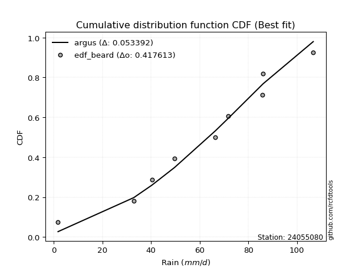</img>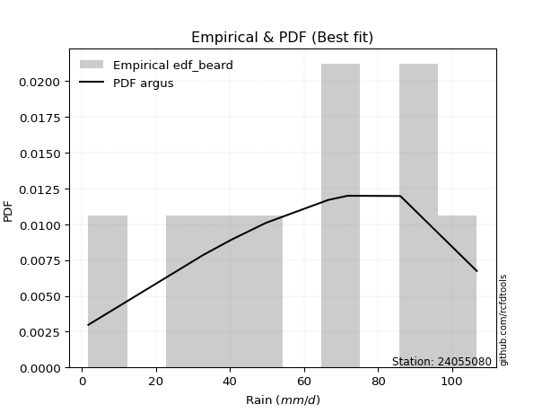</img>

</div>


### 5. EDF Chegodayev (1955)

The Chegodayev formula is an empirical plotting position formula used in hydrological frequency analysis to estimate the exceedance probability or return period of a specific event from a set of observed data. It is primarily used for plotting observed data points on probability paper to fit a theoretical distribution, particularly for analyzing extreme events like maximum flood flows or rainfall intensities. The constant _b_ value in the generalized plotting position formula is 0.3.

<div align="center">


$P=(m-b)/(n+1-2b)$


</div>


**5.1. Empirical values**

<div align="center">

|                | 0                   | 1                   | 2                   | 3                   | 4                  | 5                  | 6                  | 7                  |
|:---------------|:--------------------|:--------------------|:--------------------|:--------------------|:-------------------|:-------------------|:-------------------|:-------------------|
| date           | 2024                | 2020                | 2023                | 2017                | 2018               | 2021               | 2019               | 2022               |
| x              | 1.8                 | 40.4                | 49.7                | 66.5                | 71.8               | 85.9               | 86.1               | 106.7              |
| m              | 1                   | 2                   | 3                   | 4                   | 5                  | 6                  | 7                  | 8                  |
| empirical_dist | edf_chegodayev      | edf_chegodayev      | edf_chegodayev      | edf_chegodayev      | edf_chegodayev     | edf_chegodayev     | edf_chegodayev     | edf_chegodayev     |
| empirical      | 0.08333333333333333 | 0.20238095238095236 | 0.32142857142857145 | 0.44047619047619047 | 0.5595238095238095 | 0.6785714285714286 | 0.7976190476190476 | 0.9166666666666666 |
| empirical_tr   | 1.090909090909091   | 1.253731343283582   | 1.4736842105263157  | 1.7872340425531914  | 2.27027027027027   | 3.1111111111111116 | 4.941176470588234  | 11.999999999999995 |

</div>


**5.2. Kolmogorov-Smirnov fit test (sorted by Δ)**


<div align="center">

|                | 0                   | 1                   | 2                  | 3                   | 4                   | 5                   | 6                   | 7                   | 8                   | 9                   | 10                  | 11                  | 12                  | 13                 | 14                 | 15                  | 16                 | 17                  | 18                  | 19                  | 20                 | 21                  | 22                 | 23                  | 24                  | 25                  | 26                  | 27                  | 28                 | 29                  | 30                  | 31                  | 32                  | 33                  | 34                 | 35                  | 36                    | 37                  | 38                 | 39                 | 40                 | 41                 | 42                  | 43                  | 44                  | 45                 | 46                  | 47                  | 48                  | 49                 | 50                  | 51                  | 52                 | 53                  | 54                  | 55                 | 56                  | 57                 | 58                 | 59                 | 60                 | 61                 | 62                 | 63                 | 64                  | 65                 | 66                 | 67                 | 68                 | 69                 | 70                 | 71                 | 72                 | 73                 | 74                  | 75                  | 76                 | 77                 | 78                  | 79                 | 80                  | 81                  | 82                 | 83                 | 84                 | 85                 | 86                 | 87                 |
|:---------------|:--------------------|:--------------------|:-------------------|:--------------------|:--------------------|:--------------------|:--------------------|:--------------------|:--------------------|:--------------------|:--------------------|:--------------------|:--------------------|:-------------------|:-------------------|:--------------------|:-------------------|:--------------------|:--------------------|:--------------------|:-------------------|:--------------------|:-------------------|:--------------------|:--------------------|:--------------------|:--------------------|:--------------------|:-------------------|:--------------------|:--------------------|:--------------------|:--------------------|:--------------------|:-------------------|:--------------------|:----------------------|:--------------------|:-------------------|:-------------------|:-------------------|:-------------------|:--------------------|:--------------------|:--------------------|:-------------------|:--------------------|:--------------------|:--------------------|:-------------------|:--------------------|:--------------------|:-------------------|:--------------------|:--------------------|:-------------------|:--------------------|:-------------------|:-------------------|:-------------------|:-------------------|:-------------------|:-------------------|:-------------------|:--------------------|:-------------------|:-------------------|:-------------------|:-------------------|:-------------------|:-------------------|:-------------------|:-------------------|:-------------------|:--------------------|:--------------------|:-------------------|:-------------------|:--------------------|:-------------------|:--------------------|:--------------------|:-------------------|:-------------------|:-------------------|:-------------------|:-------------------|:-------------------|
| station        | 24055080            | 24055080            | 24055080           | 24055080            | 24055080            | 24055080            | 24055080            | 24055080            | 24055080            | 24055080            | 24055080            | 24055080            | 24055080            | 24055080           | 24055080           | 24055080            | 24055080           | 24055080            | 24055080            | 24055080            | 24055080           | 24055080            | 24055080           | 24055080            | 24055080            | 24055080            | 24055080            | 24055080            | 24055080           | 24055080            | 24055080            | 24055080            | 24055080            | 24055080            | 24055080           | 24055080            | 24055080              | 24055080            | 24055080           | 24055080           | 24055080           | 24055080           | 24055080            | 24055080            | 24055080            | 24055080           | 24055080            | 24055080            | 24055080            | 24055080           | 24055080            | 24055080            | 24055080           | 24055080            | 24055080            | 24055080           | 24055080            | 24055080           | 24055080           | 24055080           | 24055080           | 24055080           | 24055080           | 24055080           | 24055080            | 24055080           | 24055080           | 24055080           | 24055080           | 24055080           | 24055080           | 24055080           | 24055080           | 24055080           | 24055080            | 24055080            | 24055080           | 24055080           | 24055080            | 24055080           | 24055080            | 24055080            | 24055080           | 24055080           | 24055080           | 24055080           | 24055080           | 24055080           |
| empirical_dist | edf_chegodayev      | edf_chegodayev      | edf_chegodayev     | edf_chegodayev      | edf_chegodayev      | edf_chegodayev      | edf_chegodayev      | edf_chegodayev      | edf_chegodayev      | edf_chegodayev      | edf_chegodayev      | edf_chegodayev      | edf_chegodayev      | edf_chegodayev     | edf_chegodayev     | edf_chegodayev      | edf_chegodayev     | edf_chegodayev      | edf_chegodayev      | edf_chegodayev      | edf_chegodayev     | edf_chegodayev      | edf_chegodayev     | edf_chegodayev      | edf_chegodayev      | edf_chegodayev      | edf_chegodayev      | edf_chegodayev      | edf_chegodayev     | edf_chegodayev      | edf_chegodayev      | edf_chegodayev      | edf_chegodayev      | edf_chegodayev      | edf_chegodayev     | edf_chegodayev      | edf_chegodayev        | edf_chegodayev      | edf_chegodayev     | edf_chegodayev     | edf_chegodayev     | edf_chegodayev     | edf_chegodayev      | edf_chegodayev      | edf_chegodayev      | edf_chegodayev     | edf_chegodayev      | edf_chegodayev      | edf_chegodayev      | edf_chegodayev     | edf_chegodayev      | edf_chegodayev      | edf_chegodayev     | edf_chegodayev      | edf_chegodayev      | edf_chegodayev     | edf_chegodayev      | edf_chegodayev     | edf_chegodayev     | edf_chegodayev     | edf_chegodayev     | edf_chegodayev     | edf_chegodayev     | edf_chegodayev     | edf_chegodayev      | edf_chegodayev     | edf_chegodayev     | edf_chegodayev     | edf_chegodayev     | edf_chegodayev     | edf_chegodayev     | edf_chegodayev     | edf_chegodayev     | edf_chegodayev     | edf_chegodayev      | edf_chegodayev      | edf_chegodayev     | edf_chegodayev     | edf_chegodayev      | edf_chegodayev     | edf_chegodayev      | edf_chegodayev      | edf_chegodayev     | edf_chegodayev     | edf_chegodayev     | edf_chegodayev     | edf_chegodayev     | edf_chegodayev     |
| p_dist         | johnsonsu           | weibull_min         | pearson3           | genlogistic         | mielke              | fisk                | gumbel_l            | nakagami            | t                   | norm                | crystalball         | exponnorm           | nct                 | f                  | betaprime          | logjohnsonsu        | gamma              | erlang              | logistic            | invgamma            | laplace_asymmetric | hypsecant           | maxwell            | invgauss            | rayleigh            | laplace             | logt                | logloggamma         | logmielke          | kstwobign           | logpearson3         | halfnorm            | gumbel_r            | logweibull_min      | loggompertz        | logfisk             | loglaplace_asymmetric | moyal               | halflogistic       | loggumbel_l        | rice               | gompertz           | ncf                 | loglaplace          | genexpon            | expon              | wald                | loghypsecant        | loglogistic         | logf               | lognorm             | lognorm             | logcrystalball     | logexponnorm        | logrice             | lognakagami        | lognct              | logfatiguelife     | logchi2            | logncf             | logbetaprime       | loggamma           | loggamma           | gibrat             | loginvgamma         | logerlang          | logmaxwell         | loginvweibull      | loginvgauss        | lograyleigh        | logalpha           | loggumbel_r        | loghalfnorm        | logkstwobign       | logmoyal            | loghalflogistic     | loggenexpon        | logexpon           | logwald             | loglognorm         | loggibrat           | invweibull          | fatiguelife        | logtruncnorm       | alpha              | chi2               | loggenlogistic     | truncnorm          |
| delta          | 0.06729087643412934 | 0.07451134012969807 | 0.0746926202181597 | 0.07497704833370478 | 0.07694842156118109 | 0.07774127464314651 | 0.08193694327088863 | 0.09711838321198052 | 0.09712123489376623 | 0.09712179146769662 | 0.09712179687099853 | 0.09712298012548093 | 0.09713344315869099 | 0.0986508698511579 | 0.1005533452464894 | 0.10750105166562696 | 0.1077902843117019 | 0.10905141155965214 | 0.11083966825724512 | 0.12030476736086093 | 0.1236939027974201 | 0.12517177970119897 | 0.1282917635168851 | 0.13723683854570323 | 0.13839137704325788 | 0.14297421283225697 | 0.14704588988414896 | 0.14761591559328657 | 0.1556323399721159 | 0.15660495885180503 | 0.16453115443247135 | 0.16685114145792868 | 0.16760544399089916 | 0.17046523550786352 | 0.171378322522435  | 0.17377074312880736 | 0.17442757396339426   | 0.19281018778771308 | 0.1936844070905086 | 0.2007993894729628 | 0.2008916850134707 | 0.2205216143332734 | 0.24733435615580476 | 0.25330656820736486 | 0.26158397100196584 | 0.2620734059055828 | 0.26276063580184195 | 0.26486696032435975 | 0.26789871658109465 | 0.2691504157926756 | 0.27145920466988194 | 0.27145920466988194 | 0.2714592391440003 | 0.27145968672900456 | 0.27146045020023224 | 0.2715615263542236 | 0.27166778411272896 | 0.2719601224704271 | 0.2771810563409497 | 0.2794688175892588 | 0.2837675754369777 | 0.2895104362458232 | 0.2895104362458232 | 0.290789801162904  | 0.29440309955874266 | 0.2990562606570044 | 0.3053593178266635 | 0.3062184442582957 | 0.3114750045484427 | 0.3168873821937761 | 0.3252585842549047 | 0.3405582763230365 | 0.3493631142205088 | 0.3500388096216782 | 0.36636514614002924 | 0.37249775268424756 | 0.3727395068127708 | 0.4202305054426172 | 0.43819986057191507 | 0.4402815258403634 | 0.45673388716441177 | 0.48651788805196783 | 0.5513543162091319 | 0.6062277955187484 | 0.6969723163881629 | 0.7973207772995571 | 0.7976190476190476 | 0.9055637211933896 |
| deltao         | 0.4472608134160001  | 0.4472608134160001  | 0.4472608134160001 | 0.4472608134160001  | 0.4472608134160001  | 0.4472608134160001  | 0.4472608134160001  | 0.4472608134160001  | 0.4472608134160001  | 0.4472608134160001  | 0.4472608134160001  | 0.4472608134160001  | 0.4472608134160001  | 0.4472608134160001 | 0.4472608134160001 | 0.4472608134160001  | 0.4472608134160001 | 0.4472608134160001  | 0.4472608134160001  | 0.4472608134160001  | 0.4472608134160001 | 0.4472608134160001  | 0.4472608134160001 | 0.4472608134160001  | 0.4472608134160001  | 0.4472608134160001  | 0.4472608134160001  | 0.4472608134160001  | 0.4472608134160001 | 0.4472608134160001  | 0.4472608134160001  | 0.4472608134160001  | 0.4472608134160001  | 0.4472608134160001  | 0.4472608134160001 | 0.4472608134160001  | 0.4472608134160001    | 0.4472608134160001  | 0.4472608134160001 | 0.4472608134160001 | 0.4472608134160001 | 0.4472608134160001 | 0.4472608134160001  | 0.4472608134160001  | 0.4472608134160001  | 0.4472608134160001 | 0.4472608134160001  | 0.4472608134160001  | 0.4472608134160001  | 0.4472608134160001 | 0.4472608134160001  | 0.4472608134160001  | 0.4472608134160001 | 0.4472608134160001  | 0.4472608134160001  | 0.4472608134160001 | 0.4472608134160001  | 0.4472608134160001 | 0.4472608134160001 | 0.4472608134160001 | 0.4472608134160001 | 0.4472608134160001 | 0.4472608134160001 | 0.4472608134160001 | 0.4472608134160001  | 0.4472608134160001 | 0.4472608134160001 | 0.4472608134160001 | 0.4472608134160001 | 0.4472608134160001 | 0.4472608134160001 | 0.4472608134160001 | 0.4472608134160001 | 0.4472608134160001 | 0.4472608134160001  | 0.4472608134160001  | 0.4472608134160001 | 0.4472608134160001 | 0.4472608134160001  | 0.4472608134160001 | 0.4472608134160001  | 0.4472608134160001  | 0.4472608134160001 | 0.4472608134160001 | 0.4472608134160001 | 0.4472608134160001 | 0.4472608134160001 | 0.4472608134160001 |
| eval           | Δo > Δ              | Δo > Δ              | Δo > Δ             | Δo > Δ              | Δo > Δ              | Δo > Δ              | Δo > Δ              | Δo > Δ              | Δo > Δ              | Δo > Δ              | Δo > Δ              | Δo > Δ              | Δo > Δ              | Δo > Δ             | Δo > Δ             | Δo > Δ              | Δo > Δ             | Δo > Δ              | Δo > Δ              | Δo > Δ              | Δo > Δ             | Δo > Δ              | Δo > Δ             | Δo > Δ              | Δo > Δ              | Δo > Δ              | Δo > Δ              | Δo > Δ              | Δo > Δ             | Δo > Δ              | Δo > Δ              | Δo > Δ              | Δo > Δ              | Δo > Δ              | Δo > Δ             | Δo > Δ              | Δo > Δ                | Δo > Δ              | Δo > Δ             | Δo > Δ             | Δo > Δ             | Δo > Δ             | Δo > Δ              | Δo > Δ              | Δo > Δ              | Δo > Δ             | Δo > Δ              | Δo > Δ              | Δo > Δ              | Δo > Δ             | Δo > Δ              | Δo > Δ              | Δo > Δ             | Δo > Δ              | Δo > Δ              | Δo > Δ             | Δo > Δ              | Δo > Δ             | Δo > Δ             | Δo > Δ             | Δo > Δ             | Δo > Δ             | Δo > Δ             | Δo > Δ             | Δo > Δ              | Δo > Δ             | Δo > Δ             | Δo > Δ             | Δo > Δ             | Δo > Δ             | Δo > Δ             | Δo > Δ             | Δo > Δ             | Δo > Δ             | Δo > Δ              | Δo > Δ              | Δo > Δ             | Δo > Δ             | Δo > Δ              | Δo > Δ             | Δo <= Δ             | Δo <= Δ             | Δo <= Δ            | Δo <= Δ            | Δo <= Δ            | Δo <= Δ            | Δo <= Δ            | Δo <= Δ            |
| fit            | 1                   | 1                   | 1                  | 1                   | 1                   | 1                   | 1                   | 1                   | 1                   | 1                   | 1                   | 1                   | 1                   | 1                  | 1                  | 1                   | 1                  | 1                   | 1                   | 1                   | 1                  | 1                   | 1                  | 1                   | 1                   | 1                   | 1                   | 1                   | 1                  | 1                   | 1                   | 1                   | 1                   | 1                   | 1                  | 1                   | 1                     | 1                   | 1                  | 1                  | 1                  | 1                  | 1                   | 1                   | 1                   | 1                  | 1                   | 1                   | 1                   | 1                  | 1                   | 1                   | 1                  | 1                   | 1                   | 1                  | 1                   | 1                  | 1                  | 1                  | 1                  | 1                  | 1                  | 1                  | 1                   | 1                  | 1                  | 1                  | 1                  | 1                  | 1                  | 1                  | 1                  | 1                  | 1                   | 1                   | 1                  | 1                  | 1                   | 1                  | 0                   | 0                   | 0                  | 0                  | 0                  | 0                  | 0                  | 0                  |
| n              | 8                   | 8                   | 8                  | 8                   | 8                   | 8                   | 8                   | 8                   | 8                   | 8                   | 8                   | 8                   | 8                   | 8                  | 8                  | 8                   | 8                  | 8                   | 8                   | 8                   | 8                  | 8                   | 8                  | 8                   | 8                   | 8                   | 8                   | 8                   | 8                  | 8                   | 8                   | 8                   | 8                   | 8                   | 8                  | 8                   | 8                     | 8                   | 8                  | 8                  | 8                  | 8                  | 8                   | 8                   | 8                   | 8                  | 8                   | 8                   | 8                   | 8                  | 8                   | 8                   | 8                  | 8                   | 8                   | 8                  | 8                   | 8                  | 8                  | 8                  | 8                  | 8                  | 8                  | 8                  | 8                   | 8                  | 8                  | 8                  | 8                  | 8                  | 8                  | 8                  | 8                  | 8                  | 8                   | 8                   | 8                  | 8                  | 8                   | 8                  | 8                   | 8                   | 8                  | 8                  | 8                  | 8                  | 8                  | 8                  |
| best_fit       | 1                   | 0                   | 0                  | 0                   | 0                   | 0                   | 0                   | 0                   | 0                   | 0                   | 0                   | 0                   | 0                   | 0                  | 0                  | 0                   | 0                  | 0                   | 0                   | 0                   | 0                  | 0                   | 0                  | 0                   | 0                   | 0                   | 0                   | 0                   | 0                  | 0                   | 0                   | 0                   | 0                   | 0                   | 0                  | 0                   | 0                     | 0                   | 0                  | 0                  | 0                  | 0                  | 0                   | 0                   | 0                   | 0                  | 0                   | 0                   | 0                   | 0                  | 0                   | 0                   | 0                  | 0                   | 0                   | 0                  | 0                   | 0                  | 0                  | 0                  | 0                  | 0                  | 0                  | 0                  | 0                   | 0                  | 0                  | 0                  | 0                  | 0                  | 0                  | 0                  | 0                  | 0                  | 0                   | 0                   | 0                  | 0                  | 0                   | 0                  | 0                   | 0                   | 0                  | 0                  | 0                  | 0                  | 0                  | 0                  |
| best_fit_sort  | 1                   | 2                   | 3                  | 4                   | 5                   | 6                   | 7                   | 8                   | 9                   | 10                  | 11                  | 12                  | 13                  | 14                 | 15                 | 16                  | 17                 | 18                  | 19                  | 20                  | 21                 | 22                  | 23                 | 24                  | 25                  | 26                  | 27                  | 28                  | 29                 | 30                  | 31                  | 32                  | 33                  | 34                  | 35                 | 36                  | 37                    | 38                  | 39                 | 40                 | 41                 | 42                 | 43                  | 44                  | 45                  | 46                 | 47                  | 48                  | 49                  | 50                 | 51                  | 52                  | 53                 | 54                  | 55                  | 56                 | 57                  | 58                 | 59                 | 60                 | 61                 | 62                 | 63                 | 64                 | 65                  | 66                 | 67                 | 68                 | 69                 | 70                 | 71                 | 72                 | 73                 | 74                 | 75                  | 76                  | 77                 | 78                 | 79                  | 80                 | 81                  | 82                  | 83                 | 84                 | 85                 | 86                 | 87                 | 88                 |

</div>


**5.3. Best fit**

<div align="center">

|   id |   station | empirical_dist   | p_dist    |     delta |   deltao | eval   |   fit |   n |   best_fit |   best_fit_sort |
|-----:|----------:|:-----------------|:----------|----------:|---------:|:-------|------:|----:|-----------:|----------------:|
|    0 |  24055080 | edf_chegodayev   | johnsonsu | 0.0672909 | 0.447261 | Δo > Δ |     1 |   8 |          1 |               1 |

</div>


<div align="center">

</img></img>

</div>


### 6. EDF Blom (1958)

The Blom formula is a specific "plotting position" formula used in hydrology and statistical analysis to estimate the empirical cumulative probability (or non-exceedance probability) of a data series. It is particularly recommended for data that are approximately normally distributed. The constant _a_ is set to 0.375 (or 3/8).

<div align="center">


$P=(m-a)/(n+1-2a)$


</div>


**6.1. Empirical values**

<div align="center">

|                | 0                   | 1                   | 2                  | 3                  | 4                  | 5                  | 6                 | 7                  |
|:---------------|:--------------------|:--------------------|:-------------------|:-------------------|:-------------------|:-------------------|:------------------|:-------------------|
| date           | 2024                | 2020                | 2023               | 2017               | 2018               | 2021               | 2019              | 2022               |
| x              | 1.8                 | 40.4                | 49.7               | 66.5               | 71.8               | 85.9               | 86.1              | 106.7              |
| m              | 1                   | 2                   | 3                  | 4                  | 5                  | 6                  | 7                 | 8                  |
| empirical_dist | edf_blom            | edf_blom            | edf_blom           | edf_blom           | edf_blom           | edf_blom           | edf_blom          | edf_blom           |
| empirical      | 0.07575757575757576 | 0.19696969696969696 | 0.3181818181818182 | 0.4393939393939394 | 0.5606060606060606 | 0.6818181818181818 | 0.803030303030303 | 0.9242424242424242 |
| empirical_tr   | 1.0819672131147542  | 1.2452830188679247  | 1.4666666666666666 | 1.783783783783784  | 2.275862068965517  | 3.1428571428571423 | 5.076923076923076 | 13.199999999999992 |

</div>


**6.2. Kolmogorov-Smirnov fit test (sorted by Δ)**


<div align="center">

|                | 0                   | 1                  | 2                   | 3                   | 4                   | 5                   | 6                   | 7                   | 8                  | 9                   | 10                 | 11                 | 12                  | 13                  | 14                  | 15                  | 16                  | 17                  | 18                  | 19                  | 20                 | 21                 | 22                  | 23                 | 24                  | 25                 | 26                  | 27                  | 28                  | 29                 | 30                  | 31                  | 32                  | 33                 | 34                  | 35                    | 36                  | 37                  | 38                  | 39                  | 40                 | 41                  | 42                  | 43                 | 44                 | 45                 | 46                 | 47                 | 48                 | 49                  | 50                 | 51                 | 52                 | 53                 | 54                  | 55                 | 56                 | 57                 | 58                 | 59                  | 60                 | 61                  | 62                  | 63                  | 64                  | 65                 | 66                  | 67                  | 68                  | 69                  | 70                 | 71                  | 72                 | 73                 | 74                 | 75                  | 76                  | 77                  | 78                  | 79                  | 80                  | 81                 | 82                 | 83                 | 84                 | 85                 | 86                 | 87                 |
|:---------------|:--------------------|:-------------------|:--------------------|:--------------------|:--------------------|:--------------------|:--------------------|:--------------------|:-------------------|:--------------------|:-------------------|:-------------------|:--------------------|:--------------------|:--------------------|:--------------------|:--------------------|:--------------------|:--------------------|:--------------------|:-------------------|:-------------------|:--------------------|:-------------------|:--------------------|:-------------------|:--------------------|:--------------------|:--------------------|:-------------------|:--------------------|:--------------------|:--------------------|:-------------------|:--------------------|:----------------------|:--------------------|:--------------------|:--------------------|:--------------------|:-------------------|:--------------------|:--------------------|:-------------------|:-------------------|:-------------------|:-------------------|:-------------------|:-------------------|:--------------------|:-------------------|:-------------------|:-------------------|:-------------------|:--------------------|:-------------------|:-------------------|:-------------------|:-------------------|:--------------------|:-------------------|:--------------------|:--------------------|:--------------------|:--------------------|:-------------------|:--------------------|:--------------------|:--------------------|:--------------------|:-------------------|:--------------------|:-------------------|:-------------------|:-------------------|:--------------------|:--------------------|:--------------------|:--------------------|:--------------------|:--------------------|:-------------------|:-------------------|:-------------------|:-------------------|:-------------------|:-------------------|:-------------------|
| station        | 24055080            | 24055080           | 24055080            | 24055080            | 24055080            | 24055080            | 24055080            | 24055080            | 24055080           | 24055080            | 24055080           | 24055080           | 24055080            | 24055080            | 24055080            | 24055080            | 24055080            | 24055080            | 24055080            | 24055080            | 24055080           | 24055080           | 24055080            | 24055080           | 24055080            | 24055080           | 24055080            | 24055080            | 24055080            | 24055080           | 24055080            | 24055080            | 24055080            | 24055080           | 24055080            | 24055080              | 24055080            | 24055080            | 24055080            | 24055080            | 24055080           | 24055080            | 24055080            | 24055080           | 24055080           | 24055080           | 24055080           | 24055080           | 24055080           | 24055080            | 24055080           | 24055080           | 24055080           | 24055080           | 24055080            | 24055080           | 24055080           | 24055080           | 24055080           | 24055080            | 24055080           | 24055080            | 24055080            | 24055080            | 24055080            | 24055080           | 24055080            | 24055080            | 24055080            | 24055080            | 24055080           | 24055080            | 24055080           | 24055080           | 24055080           | 24055080            | 24055080            | 24055080            | 24055080            | 24055080            | 24055080            | 24055080           | 24055080           | 24055080           | 24055080           | 24055080           | 24055080           | 24055080           |
| empirical_dist | edf_blom            | edf_blom           | edf_blom            | edf_blom            | edf_blom            | edf_blom            | edf_blom            | edf_blom            | edf_blom           | edf_blom            | edf_blom           | edf_blom           | edf_blom            | edf_blom            | edf_blom            | edf_blom            | edf_blom            | edf_blom            | edf_blom            | edf_blom            | edf_blom           | edf_blom           | edf_blom            | edf_blom           | edf_blom            | edf_blom           | edf_blom            | edf_blom            | edf_blom            | edf_blom           | edf_blom            | edf_blom            | edf_blom            | edf_blom           | edf_blom            | edf_blom              | edf_blom            | edf_blom            | edf_blom            | edf_blom            | edf_blom           | edf_blom            | edf_blom            | edf_blom           | edf_blom           | edf_blom           | edf_blom           | edf_blom           | edf_blom           | edf_blom            | edf_blom           | edf_blom           | edf_blom           | edf_blom           | edf_blom            | edf_blom           | edf_blom           | edf_blom           | edf_blom           | edf_blom            | edf_blom           | edf_blom            | edf_blom            | edf_blom            | edf_blom            | edf_blom           | edf_blom            | edf_blom            | edf_blom            | edf_blom            | edf_blom           | edf_blom            | edf_blom           | edf_blom           | edf_blom           | edf_blom            | edf_blom            | edf_blom            | edf_blom            | edf_blom            | edf_blom            | edf_blom           | edf_blom           | edf_blom           | edf_blom           | edf_blom           | edf_blom           | edf_blom           |
| p_dist         | johnsonsu           | weibull_min        | pearson3            | genlogistic         | fisk                | mielke              | gumbel_l            | nakagami            | t                  | norm                | crystalball        | exponnorm          | nct                 | f                   | betaprime           | logistic            | gamma               | erlang              | logjohnsonsu        | laplace_asymmetric  | invgamma           | hypsecant          | maxwell             | invgauss           | rayleigh            | laplace            | logt                | logloggamma         | logmielke           | kstwobign          | halfnorm            | gumbel_r            | logpearson3         | logweibull_min     | loggompertz         | loglaplace_asymmetric | logfisk             | moyal               | halflogistic        | rice                | loggumbel_l        | gompertz            | ncf                 | loglaplace         | wald               | genexpon           | expon              | loghypsecant       | loglogistic        | logf                | lognorm            | lognorm            | logcrystalball     | logexponnorm       | logrice             | lognakagami        | lognct             | logfatiguelife     | logchi2            | logncf              | logbetaprime       | gibrat              | loggamma            | loggamma            | loginvgamma         | logerlang          | logmaxwell          | loginvweibull       | loginvgauss         | lograyleigh         | logalpha           | loggumbel_r         | loghalfnorm        | logkstwobign       | logmoyal           | loghalflogistic     | loggenexpon         | logexpon            | logwald             | loglognorm          | loggibrat           | invweibull         | fatiguelife        | logtruncnorm       | alpha              | chi2               | loggenlogistic     | truncnorm          |
| delta          | 0.06404412318737618 | 0.0712645868829449 | 0.07144586697140654 | 0.07173029508695161 | 0.07449452139639334 | 0.07837227142464864 | 0.07869019002413546 | 0.09820063429423159 | 0.0982034859760173 | 0.09820404254994769 | 0.0982040479532496 | 0.098205231207732  | 0.09821569424094206 | 0.09973312093340897 | 0.10163559632874047 | 0.10759291501049195 | 0.10887253539395297 | 0.11013366264190322 | 0.11291230707688238 | 0.12044714955066693 | 0.121387018443112  | 0.1219250264544458 | 0.12937401459913617 | 0.1383190896279543 | 0.13947362812550895 | 0.1397274595855038 | 0.14379913663739569 | 0.14869816667553765 | 0.15671459105436697 | 0.1576872099340561 | 0.16793339254017975 | 0.16868769507315023 | 0.16994240984372677 | 0.1715474865901146 | 0.17246057360468608 | 0.17550982504564533   | 0.18134650070456493 | 0.19389243886996416 | 0.19476665817275968 | 0.19764493176671744 | 0.2062106448842182 | 0.21727486108652014 | 0.25274561156706016 | 0.2587178236186202 | 0.263842886884093  | 0.2669952264132212 | 0.2674846613168382 | 0.2702782157356151 | 0.2733099719923501 | 0.27456167120393105 | 0.2768704600811373 | 0.2768704600811373 | 0.2768704945552557 | 0.27687094214026   | 0.27687170561148766 | 0.276972781765479  | 0.2770790395239843 | 0.2773713778816825 | 0.2825923117522051 | 0.28488007300051416 | 0.2891788308482331 | 0.29187205224515506 | 0.29492169165707854 | 0.29492169165707854 | 0.29981435496999803 | 0.3044675160682598 | 0.31077057323791885 | 0.31162969966955106 | 0.31688625995969805 | 0.32229863760503147 | 0.3306698396661601 | 0.34596953173429185 | 0.3547743696317642 | 0.3554500650329336 | 0.3717764015512846 | 0.37790900809550293 | 0.37815076222402616 | 0.42564176085387256 | 0.44361111598317043 | 0.44569278125161876 | 0.46214514257566713 | 0.4940936456277254 | 0.5567655716203872 | 0.6116390509300038 | 0.7023835717994182 | 0.8027320327108125 | 0.803030303030303  | 0.9131394787691471 |
| deltao         | 0.4472608134160001  | 0.4472608134160001 | 0.4472608134160001  | 0.4472608134160001  | 0.4472608134160001  | 0.4472608134160001  | 0.4472608134160001  | 0.4472608134160001  | 0.4472608134160001 | 0.4472608134160001  | 0.4472608134160001 | 0.4472608134160001 | 0.4472608134160001  | 0.4472608134160001  | 0.4472608134160001  | 0.4472608134160001  | 0.4472608134160001  | 0.4472608134160001  | 0.4472608134160001  | 0.4472608134160001  | 0.4472608134160001 | 0.4472608134160001 | 0.4472608134160001  | 0.4472608134160001 | 0.4472608134160001  | 0.4472608134160001 | 0.4472608134160001  | 0.4472608134160001  | 0.4472608134160001  | 0.4472608134160001 | 0.4472608134160001  | 0.4472608134160001  | 0.4472608134160001  | 0.4472608134160001 | 0.4472608134160001  | 0.4472608134160001    | 0.4472608134160001  | 0.4472608134160001  | 0.4472608134160001  | 0.4472608134160001  | 0.4472608134160001 | 0.4472608134160001  | 0.4472608134160001  | 0.4472608134160001 | 0.4472608134160001 | 0.4472608134160001 | 0.4472608134160001 | 0.4472608134160001 | 0.4472608134160001 | 0.4472608134160001  | 0.4472608134160001 | 0.4472608134160001 | 0.4472608134160001 | 0.4472608134160001 | 0.4472608134160001  | 0.4472608134160001 | 0.4472608134160001 | 0.4472608134160001 | 0.4472608134160001 | 0.4472608134160001  | 0.4472608134160001 | 0.4472608134160001  | 0.4472608134160001  | 0.4472608134160001  | 0.4472608134160001  | 0.4472608134160001 | 0.4472608134160001  | 0.4472608134160001  | 0.4472608134160001  | 0.4472608134160001  | 0.4472608134160001 | 0.4472608134160001  | 0.4472608134160001 | 0.4472608134160001 | 0.4472608134160001 | 0.4472608134160001  | 0.4472608134160001  | 0.4472608134160001  | 0.4472608134160001  | 0.4472608134160001  | 0.4472608134160001  | 0.4472608134160001 | 0.4472608134160001 | 0.4472608134160001 | 0.4472608134160001 | 0.4472608134160001 | 0.4472608134160001 | 0.4472608134160001 |
| eval           | Δo > Δ              | Δo > Δ             | Δo > Δ              | Δo > Δ              | Δo > Δ              | Δo > Δ              | Δo > Δ              | Δo > Δ              | Δo > Δ             | Δo > Δ              | Δo > Δ             | Δo > Δ             | Δo > Δ              | Δo > Δ              | Δo > Δ              | Δo > Δ              | Δo > Δ              | Δo > Δ              | Δo > Δ              | Δo > Δ              | Δo > Δ             | Δo > Δ             | Δo > Δ              | Δo > Δ             | Δo > Δ              | Δo > Δ             | Δo > Δ              | Δo > Δ              | Δo > Δ              | Δo > Δ             | Δo > Δ              | Δo > Δ              | Δo > Δ              | Δo > Δ             | Δo > Δ              | Δo > Δ                | Δo > Δ              | Δo > Δ              | Δo > Δ              | Δo > Δ              | Δo > Δ             | Δo > Δ              | Δo > Δ              | Δo > Δ             | Δo > Δ             | Δo > Δ             | Δo > Δ             | Δo > Δ             | Δo > Δ             | Δo > Δ              | Δo > Δ             | Δo > Δ             | Δo > Δ             | Δo > Δ             | Δo > Δ              | Δo > Δ             | Δo > Δ             | Δo > Δ             | Δo > Δ             | Δo > Δ              | Δo > Δ             | Δo > Δ              | Δo > Δ              | Δo > Δ              | Δo > Δ              | Δo > Δ             | Δo > Δ              | Δo > Δ              | Δo > Δ              | Δo > Δ              | Δo > Δ             | Δo > Δ              | Δo > Δ             | Δo > Δ             | Δo > Δ             | Δo > Δ              | Δo > Δ              | Δo > Δ              | Δo > Δ              | Δo > Δ              | Δo <= Δ             | Δo <= Δ            | Δo <= Δ            | Δo <= Δ            | Δo <= Δ            | Δo <= Δ            | Δo <= Δ            | Δo <= Δ            |
| fit            | 1                   | 1                  | 1                   | 1                   | 1                   | 1                   | 1                   | 1                   | 1                  | 1                   | 1                  | 1                  | 1                   | 1                   | 1                   | 1                   | 1                   | 1                   | 1                   | 1                   | 1                  | 1                  | 1                   | 1                  | 1                   | 1                  | 1                   | 1                   | 1                   | 1                  | 1                   | 1                   | 1                   | 1                  | 1                   | 1                     | 1                   | 1                   | 1                   | 1                   | 1                  | 1                   | 1                   | 1                  | 1                  | 1                  | 1                  | 1                  | 1                  | 1                   | 1                  | 1                  | 1                  | 1                  | 1                   | 1                  | 1                  | 1                  | 1                  | 1                   | 1                  | 1                   | 1                   | 1                   | 1                   | 1                  | 1                   | 1                   | 1                   | 1                   | 1                  | 1                   | 1                  | 1                  | 1                  | 1                   | 1                   | 1                   | 1                   | 1                   | 0                   | 0                  | 0                  | 0                  | 0                  | 0                  | 0                  | 0                  |
| n              | 8                   | 8                  | 8                   | 8                   | 8                   | 8                   | 8                   | 8                   | 8                  | 8                   | 8                  | 8                  | 8                   | 8                   | 8                   | 8                   | 8                   | 8                   | 8                   | 8                   | 8                  | 8                  | 8                   | 8                  | 8                   | 8                  | 8                   | 8                   | 8                   | 8                  | 8                   | 8                   | 8                   | 8                  | 8                   | 8                     | 8                   | 8                   | 8                   | 8                   | 8                  | 8                   | 8                   | 8                  | 8                  | 8                  | 8                  | 8                  | 8                  | 8                   | 8                  | 8                  | 8                  | 8                  | 8                   | 8                  | 8                  | 8                  | 8                  | 8                   | 8                  | 8                   | 8                   | 8                   | 8                   | 8                  | 8                   | 8                   | 8                   | 8                   | 8                  | 8                   | 8                  | 8                  | 8                  | 8                   | 8                   | 8                   | 8                   | 8                   | 8                   | 8                  | 8                  | 8                  | 8                  | 8                  | 8                  | 8                  |
| best_fit       | 1                   | 0                  | 0                   | 0                   | 0                   | 0                   | 0                   | 0                   | 0                  | 0                   | 0                  | 0                  | 0                   | 0                   | 0                   | 0                   | 0                   | 0                   | 0                   | 0                   | 0                  | 0                  | 0                   | 0                  | 0                   | 0                  | 0                   | 0                   | 0                   | 0                  | 0                   | 0                   | 0                   | 0                  | 0                   | 0                     | 0                   | 0                   | 0                   | 0                   | 0                  | 0                   | 0                   | 0                  | 0                  | 0                  | 0                  | 0                  | 0                  | 0                   | 0                  | 0                  | 0                  | 0                  | 0                   | 0                  | 0                  | 0                  | 0                  | 0                   | 0                  | 0                   | 0                   | 0                   | 0                   | 0                  | 0                   | 0                   | 0                   | 0                   | 0                  | 0                   | 0                  | 0                  | 0                  | 0                   | 0                   | 0                   | 0                   | 0                   | 0                   | 0                  | 0                  | 0                  | 0                  | 0                  | 0                  | 0                  |
| best_fit_sort  | 1                   | 2                  | 3                   | 4                   | 5                   | 6                   | 7                   | 8                   | 9                  | 10                  | 11                 | 12                 | 13                  | 14                  | 15                  | 16                  | 17                  | 18                  | 19                  | 20                  | 21                 | 22                 | 23                  | 24                 | 25                  | 26                 | 27                  | 28                  | 29                  | 30                 | 31                  | 32                  | 33                  | 34                 | 35                  | 36                    | 37                  | 38                  | 39                  | 40                  | 41                 | 42                  | 43                  | 44                 | 45                 | 46                 | 47                 | 48                 | 49                 | 50                  | 51                 | 52                 | 53                 | 54                 | 55                  | 56                 | 57                 | 58                 | 59                 | 60                  | 61                 | 62                  | 63                  | 64                  | 65                  | 66                 | 67                  | 68                  | 69                  | 70                  | 71                 | 72                  | 73                 | 74                 | 75                 | 76                  | 77                  | 78                  | 79                  | 80                  | 81                  | 82                 | 83                 | 84                 | 85                 | 86                 | 87                 | 88                 |

</div>


**6.3. Best fit**

<div align="center">

|   id |   station | empirical_dist   | p_dist    |     delta |   deltao | eval   |   fit |   n |   best_fit |   best_fit_sort |
|-----:|----------:|:-----------------|:----------|----------:|---------:|:-------|------:|----:|-----------:|----------------:|
|    0 |  24055080 | edf_blom         | johnsonsu | 0.0640441 | 0.447261 | Δo > Δ |     1 |   8 |          1 |               1 |

</div>


<div align="center">

</img>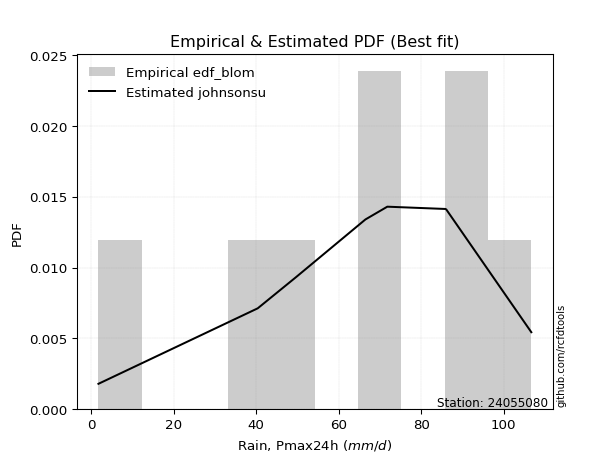</img>

</div>


### 7. EDF Tukey (1962)

In hydrology, the Tukey formula is used as a plotting position formula to estimate the empirical probability or frequency of a flood event (or other hydrological data). The formula parameter is given as _c=0.333_ (or 1/3).

<div align="center">


$P=(m-c)/(n+1-2c)$


</div>


**7.1. Empirical values**

<div align="center">

|                | 0                  | 1         | 2                  | 3                  | 4                 | 5                  | 6                 | 7                  |
|:---------------|:-------------------|:----------|:-------------------|:-------------------|:------------------|:-------------------|:------------------|:-------------------|
| date           | 2024               | 2020      | 2023               | 2017               | 2018              | 2021               | 2019              | 2022               |
| x              | 1.8                | 40.4      | 49.7               | 66.5               | 71.8              | 85.9               | 86.1              | 106.7              |
| m              | 1                  | 2         | 3                  | 4                  | 5                 | 6                  | 7                 | 8                  |
| empirical_dist | edf_tukey          | edf_tukey | edf_tukey          | edf_tukey          | edf_tukey         | edf_tukey          | edf_tukey         | edf_tukey          |
| empirical      | 0.08               | 0.2       | 0.32               | 0.44               | 0.56              | 0.68               | 0.8               | 0.92               |
| empirical_tr   | 1.0869565217391304 | 1.25      | 1.4705882352941178 | 1.7857142857142856 | 2.272727272727273 | 3.1250000000000004 | 5.000000000000001 | 12.500000000000007 |

</div>


**7.2. Kolmogorov-Smirnov fit test (sorted by Δ)**


<div align="center">

|                | 0                  | 1                   | 2                   | 3                   | 4                  | 5                   | 6                   | 7                   | 8                   | 9                   | 10                 | 11                  | 12                  | 13                  | 14                  | 15                  | 16                  | 17                  | 18                  | 19                 | 20                  | 21                  | 22                  | 23                 | 24                  | 25                  | 26                  | 27                  | 28                  | 29                 | 30                  | 31                  | 32                  | 33                  | 34                  | 35                    | 36                  | 37                  | 38                  | 39                  | 40                  | 41                  | 42                 | 43                 | 44                 | 45                  | 46                  | 47                  | 48                 | 49                 | 50                  | 51                  | 52                  | 53                  | 54                 | 55                  | 56                 | 57                  | 58                  | 59                 | 60                  | 61                  | 62                 | 63                 | 64                 | 65                  | 66                 | 67                 | 68                 | 69                 | 70                  | 71                 | 72                 | 73                  | 74                  | 75                 | 76                 | 77                 | 78                 | 79                 | 80                 | 81                  | 82                 | 83                 | 84                 | 85                 | 86                 | 87                 |
|:---------------|:-------------------|:--------------------|:--------------------|:--------------------|:-------------------|:--------------------|:--------------------|:--------------------|:--------------------|:--------------------|:-------------------|:--------------------|:--------------------|:--------------------|:--------------------|:--------------------|:--------------------|:--------------------|:--------------------|:-------------------|:--------------------|:--------------------|:--------------------|:-------------------|:--------------------|:--------------------|:--------------------|:--------------------|:--------------------|:-------------------|:--------------------|:--------------------|:--------------------|:--------------------|:--------------------|:----------------------|:--------------------|:--------------------|:--------------------|:--------------------|:--------------------|:--------------------|:-------------------|:-------------------|:-------------------|:--------------------|:--------------------|:--------------------|:-------------------|:-------------------|:--------------------|:--------------------|:--------------------|:--------------------|:-------------------|:--------------------|:-------------------|:--------------------|:--------------------|:-------------------|:--------------------|:--------------------|:-------------------|:-------------------|:-------------------|:--------------------|:-------------------|:-------------------|:-------------------|:-------------------|:--------------------|:-------------------|:-------------------|:--------------------|:--------------------|:-------------------|:-------------------|:-------------------|:-------------------|:-------------------|:-------------------|:--------------------|:-------------------|:-------------------|:-------------------|:-------------------|:-------------------|:-------------------|
| station        | 24055080           | 24055080            | 24055080            | 24055080            | 24055080           | 24055080            | 24055080            | 24055080            | 24055080            | 24055080            | 24055080           | 24055080            | 24055080            | 24055080            | 24055080            | 24055080            | 24055080            | 24055080            | 24055080            | 24055080           | 24055080            | 24055080            | 24055080            | 24055080           | 24055080            | 24055080            | 24055080            | 24055080            | 24055080            | 24055080           | 24055080            | 24055080            | 24055080            | 24055080            | 24055080            | 24055080              | 24055080            | 24055080            | 24055080            | 24055080            | 24055080            | 24055080            | 24055080           | 24055080           | 24055080           | 24055080            | 24055080            | 24055080            | 24055080           | 24055080           | 24055080            | 24055080            | 24055080            | 24055080            | 24055080           | 24055080            | 24055080           | 24055080            | 24055080            | 24055080           | 24055080            | 24055080            | 24055080           | 24055080           | 24055080           | 24055080            | 24055080           | 24055080           | 24055080           | 24055080           | 24055080            | 24055080           | 24055080           | 24055080            | 24055080            | 24055080           | 24055080           | 24055080           | 24055080           | 24055080           | 24055080           | 24055080            | 24055080           | 24055080           | 24055080           | 24055080           | 24055080           | 24055080           |
| empirical_dist | edf_tukey          | edf_tukey           | edf_tukey           | edf_tukey           | edf_tukey          | edf_tukey           | edf_tukey           | edf_tukey           | edf_tukey           | edf_tukey           | edf_tukey          | edf_tukey           | edf_tukey           | edf_tukey           | edf_tukey           | edf_tukey           | edf_tukey           | edf_tukey           | edf_tukey           | edf_tukey          | edf_tukey           | edf_tukey           | edf_tukey           | edf_tukey          | edf_tukey           | edf_tukey           | edf_tukey           | edf_tukey           | edf_tukey           | edf_tukey          | edf_tukey           | edf_tukey           | edf_tukey           | edf_tukey           | edf_tukey           | edf_tukey             | edf_tukey           | edf_tukey           | edf_tukey           | edf_tukey           | edf_tukey           | edf_tukey           | edf_tukey          | edf_tukey          | edf_tukey          | edf_tukey           | edf_tukey           | edf_tukey           | edf_tukey          | edf_tukey          | edf_tukey           | edf_tukey           | edf_tukey           | edf_tukey           | edf_tukey          | edf_tukey           | edf_tukey          | edf_tukey           | edf_tukey           | edf_tukey          | edf_tukey           | edf_tukey           | edf_tukey          | edf_tukey          | edf_tukey          | edf_tukey           | edf_tukey          | edf_tukey          | edf_tukey          | edf_tukey          | edf_tukey           | edf_tukey          | edf_tukey          | edf_tukey           | edf_tukey           | edf_tukey          | edf_tukey          | edf_tukey          | edf_tukey          | edf_tukey          | edf_tukey          | edf_tukey           | edf_tukey          | edf_tukey          | edf_tukey          | edf_tukey          | edf_tukey          | edf_tukey          |
| p_dist         | johnsonsu          | weibull_min         | pearson3            | genlogistic         | mielke             | fisk                | gumbel_l            | nakagami            | t                   | norm                | crystalball        | exponnorm           | nct                 | f                   | betaprime           | gamma               | logistic            | erlang              | logjohnsonsu        | invgamma           | laplace_asymmetric  | hypsecant           | maxwell             | invgauss           | rayleigh            | laplace             | logt                | logloggamma         | logmielke           | kstwobign          | logpearson3         | halfnorm            | gumbel_r            | logweibull_min      | loggompertz         | loglaplace_asymmetric | logfisk             | moyal               | halflogistic        | rice                | loggumbel_l         | gompertz            | ncf                | loglaplace         | wald               | genexpon            | expon               | loghypsecant        | loglogistic        | logf               | lognorm             | lognorm             | logcrystalball      | logexponnorm        | logrice            | lognakagami         | lognct             | logfatiguelife      | logchi2             | logncf             | logbetaprime        | gibrat              | loggamma           | loggamma           | loginvgamma        | logerlang           | logmaxwell         | loginvweibull      | loginvgauss        | lograyleigh        | logalpha            | loggumbel_r        | loghalfnorm        | logkstwobign        | logmoyal            | loghalflogistic    | loggenexpon        | logexpon           | logwald            | loglognorm         | loggibrat          | invweibull          | fatiguelife        | logtruncnorm       | alpha              | chi2               | loggenlogistic     | truncnorm          |
| delta          | 0.0658623050055579 | 0.07308276870112662 | 0.07326404878958825 | 0.07354847690513333 | 0.0753419683943457 | 0.07631270321457506 | 0.08050837184231718 | 0.09759457368817098 | 0.09759742536995669 | 0.09759798194388708 | 0.097597987347189  | 0.09759917060167139 | 0.09760963363488145 | 0.09912706032734836 | 0.10102953572267986 | 0.10826647478789236 | 0.10941109682867367 | 0.10952760203584261 | 0.10988200404657944 | 0.1207809578370514 | 0.12226533136884865 | 0.12374320827262753 | 0.12876795399307556 | 0.1377130290218937 | 0.13886756751944834 | 0.14154564140368553 | 0.14561731845557752 | 0.14809210606947704 | 0.15610853044830636 | 0.1570811493279955 | 0.16691210681342383 | 0.16732733193411914 | 0.16808163446708962 | 0.17094142598405399 | 0.17185451299862547 | 0.17490376443958472   | 0.17710407646214077 | 0.19328637826390355 | 0.19416059756669907 | 0.19946311358489927 | 0.20318034185391515 | 0.21909304290470197 | 0.2497153085367571 | 0.2556875205883172 | 0.2632368262780324 | 0.26396492338291816 | 0.26445435828653513 | 0.26724791270531206 | 0.270279668962047  | 0.271531368173628  | 0.27384015705083425 | 0.27384015705083425 | 0.27384019152495265 | 0.27384063910995693 | 0.2738414025811846 | 0.27394247873517596 | 0.2740487364936813 | 0.27434107485137943 | 0.27956200872190207 | 0.2818497699702111 | 0.28614852781793004 | 0.29126599163909445 | 0.2918913886267755 | 0.2918913886267755 | 0.296784051939695  | 0.30143721303795673 | 0.3077402702076158 | 0.308599396639248  | 0.313855956929395  | 0.3192683345747284 | 0.32763953663585704 | 0.3429392287039888 | 0.3517440666014611 | 0.35241976200263053 | 0.36874609852098156 | 0.3748787050651999 | 0.3751204591937231 | 0.4226114578235695 | 0.4405808129528674 | 0.4426624782213157 | 0.4591148395453641 | 0.48985122138530124 | 0.5537352685900843 | 0.6086087478997007 | 0.6993532687691153 | 0.7997017296805093 | 0.8                | 0.908897054526723  |
| deltao         | 0.4472608134160001 | 0.4472608134160001  | 0.4472608134160001  | 0.4472608134160001  | 0.4472608134160001 | 0.4472608134160001  | 0.4472608134160001  | 0.4472608134160001  | 0.4472608134160001  | 0.4472608134160001  | 0.4472608134160001 | 0.4472608134160001  | 0.4472608134160001  | 0.4472608134160001  | 0.4472608134160001  | 0.4472608134160001  | 0.4472608134160001  | 0.4472608134160001  | 0.4472608134160001  | 0.4472608134160001 | 0.4472608134160001  | 0.4472608134160001  | 0.4472608134160001  | 0.4472608134160001 | 0.4472608134160001  | 0.4472608134160001  | 0.4472608134160001  | 0.4472608134160001  | 0.4472608134160001  | 0.4472608134160001 | 0.4472608134160001  | 0.4472608134160001  | 0.4472608134160001  | 0.4472608134160001  | 0.4472608134160001  | 0.4472608134160001    | 0.4472608134160001  | 0.4472608134160001  | 0.4472608134160001  | 0.4472608134160001  | 0.4472608134160001  | 0.4472608134160001  | 0.4472608134160001 | 0.4472608134160001 | 0.4472608134160001 | 0.4472608134160001  | 0.4472608134160001  | 0.4472608134160001  | 0.4472608134160001 | 0.4472608134160001 | 0.4472608134160001  | 0.4472608134160001  | 0.4472608134160001  | 0.4472608134160001  | 0.4472608134160001 | 0.4472608134160001  | 0.4472608134160001 | 0.4472608134160001  | 0.4472608134160001  | 0.4472608134160001 | 0.4472608134160001  | 0.4472608134160001  | 0.4472608134160001 | 0.4472608134160001 | 0.4472608134160001 | 0.4472608134160001  | 0.4472608134160001 | 0.4472608134160001 | 0.4472608134160001 | 0.4472608134160001 | 0.4472608134160001  | 0.4472608134160001 | 0.4472608134160001 | 0.4472608134160001  | 0.4472608134160001  | 0.4472608134160001 | 0.4472608134160001 | 0.4472608134160001 | 0.4472608134160001 | 0.4472608134160001 | 0.4472608134160001 | 0.4472608134160001  | 0.4472608134160001 | 0.4472608134160001 | 0.4472608134160001 | 0.4472608134160001 | 0.4472608134160001 | 0.4472608134160001 |
| eval           | Δo > Δ             | Δo > Δ              | Δo > Δ              | Δo > Δ              | Δo > Δ             | Δo > Δ              | Δo > Δ              | Δo > Δ              | Δo > Δ              | Δo > Δ              | Δo > Δ             | Δo > Δ              | Δo > Δ              | Δo > Δ              | Δo > Δ              | Δo > Δ              | Δo > Δ              | Δo > Δ              | Δo > Δ              | Δo > Δ             | Δo > Δ              | Δo > Δ              | Δo > Δ              | Δo > Δ             | Δo > Δ              | Δo > Δ              | Δo > Δ              | Δo > Δ              | Δo > Δ              | Δo > Δ             | Δo > Δ              | Δo > Δ              | Δo > Δ              | Δo > Δ              | Δo > Δ              | Δo > Δ                | Δo > Δ              | Δo > Δ              | Δo > Δ              | Δo > Δ              | Δo > Δ              | Δo > Δ              | Δo > Δ             | Δo > Δ             | Δo > Δ             | Δo > Δ              | Δo > Δ              | Δo > Δ              | Δo > Δ             | Δo > Δ             | Δo > Δ              | Δo > Δ              | Δo > Δ              | Δo > Δ              | Δo > Δ             | Δo > Δ              | Δo > Δ             | Δo > Δ              | Δo > Δ              | Δo > Δ             | Δo > Δ              | Δo > Δ              | Δo > Δ             | Δo > Δ             | Δo > Δ             | Δo > Δ              | Δo > Δ             | Δo > Δ             | Δo > Δ             | Δo > Δ             | Δo > Δ              | Δo > Δ             | Δo > Δ             | Δo > Δ              | Δo > Δ              | Δo > Δ             | Δo > Δ             | Δo > Δ             | Δo > Δ             | Δo > Δ             | Δo <= Δ            | Δo <= Δ             | Δo <= Δ            | Δo <= Δ            | Δo <= Δ            | Δo <= Δ            | Δo <= Δ            | Δo <= Δ            |
| fit            | 1                  | 1                   | 1                   | 1                   | 1                  | 1                   | 1                   | 1                   | 1                   | 1                   | 1                  | 1                   | 1                   | 1                   | 1                   | 1                   | 1                   | 1                   | 1                   | 1                  | 1                   | 1                   | 1                   | 1                  | 1                   | 1                   | 1                   | 1                   | 1                   | 1                  | 1                   | 1                   | 1                   | 1                   | 1                   | 1                     | 1                   | 1                   | 1                   | 1                   | 1                   | 1                   | 1                  | 1                  | 1                  | 1                   | 1                   | 1                   | 1                  | 1                  | 1                   | 1                   | 1                   | 1                   | 1                  | 1                   | 1                  | 1                   | 1                   | 1                  | 1                   | 1                   | 1                  | 1                  | 1                  | 1                   | 1                  | 1                  | 1                  | 1                  | 1                   | 1                  | 1                  | 1                   | 1                   | 1                  | 1                  | 1                  | 1                  | 1                  | 0                  | 0                   | 0                  | 0                  | 0                  | 0                  | 0                  | 0                  |
| n              | 8                  | 8                   | 8                   | 8                   | 8                  | 8                   | 8                   | 8                   | 8                   | 8                   | 8                  | 8                   | 8                   | 8                   | 8                   | 8                   | 8                   | 8                   | 8                   | 8                  | 8                   | 8                   | 8                   | 8                  | 8                   | 8                   | 8                   | 8                   | 8                   | 8                  | 8                   | 8                   | 8                   | 8                   | 8                   | 8                     | 8                   | 8                   | 8                   | 8                   | 8                   | 8                   | 8                  | 8                  | 8                  | 8                   | 8                   | 8                   | 8                  | 8                  | 8                   | 8                   | 8                   | 8                   | 8                  | 8                   | 8                  | 8                   | 8                   | 8                  | 8                   | 8                   | 8                  | 8                  | 8                  | 8                   | 8                  | 8                  | 8                  | 8                  | 8                   | 8                  | 8                  | 8                   | 8                   | 8                  | 8                  | 8                  | 8                  | 8                  | 8                  | 8                   | 8                  | 8                  | 8                  | 8                  | 8                  | 8                  |
| best_fit       | 1                  | 0                   | 0                   | 0                   | 0                  | 0                   | 0                   | 0                   | 0                   | 0                   | 0                  | 0                   | 0                   | 0                   | 0                   | 0                   | 0                   | 0                   | 0                   | 0                  | 0                   | 0                   | 0                   | 0                  | 0                   | 0                   | 0                   | 0                   | 0                   | 0                  | 0                   | 0                   | 0                   | 0                   | 0                   | 0                     | 0                   | 0                   | 0                   | 0                   | 0                   | 0                   | 0                  | 0                  | 0                  | 0                   | 0                   | 0                   | 0                  | 0                  | 0                   | 0                   | 0                   | 0                   | 0                  | 0                   | 0                  | 0                   | 0                   | 0                  | 0                   | 0                   | 0                  | 0                  | 0                  | 0                   | 0                  | 0                  | 0                  | 0                  | 0                   | 0                  | 0                  | 0                   | 0                   | 0                  | 0                  | 0                  | 0                  | 0                  | 0                  | 0                   | 0                  | 0                  | 0                  | 0                  | 0                  | 0                  |
| best_fit_sort  | 1                  | 2                   | 3                   | 4                   | 5                  | 6                   | 7                   | 8                   | 9                   | 10                  | 11                 | 12                  | 13                  | 14                  | 15                  | 16                  | 17                  | 18                  | 19                  | 20                 | 21                  | 22                  | 23                  | 24                 | 25                  | 26                  | 27                  | 28                  | 29                  | 30                 | 31                  | 32                  | 33                  | 34                  | 35                  | 36                    | 37                  | 38                  | 39                  | 40                  | 41                  | 42                  | 43                 | 44                 | 45                 | 46                  | 47                  | 48                  | 49                 | 50                 | 51                  | 52                  | 53                  | 54                  | 55                 | 56                  | 57                 | 58                  | 59                  | 60                 | 61                  | 62                  | 63                 | 64                 | 65                 | 66                  | 67                 | 68                 | 69                 | 70                 | 71                  | 72                 | 73                 | 74                  | 75                  | 76                 | 77                 | 78                 | 79                 | 80                 | 81                 | 82                  | 83                 | 84                 | 85                 | 86                 | 87                 | 88                 |

</div>


**7.3. Best fit**

<div align="center">

|   id |   station | empirical_dist   | p_dist    |     delta |   deltao | eval   |   fit |   n |   best_fit |   best_fit_sort |
|-----:|----------:|:-----------------|:----------|----------:|---------:|:-------|------:|----:|-----------:|----------------:|
|    0 |  24055080 | edf_tukey        | johnsonsu | 0.0658623 | 0.447261 | Δo > Δ |     1 |   8 |          1 |               1 |

</div>


<div align="center">

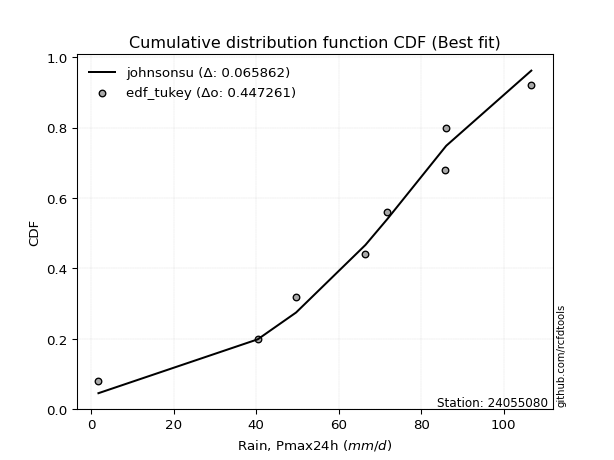</img></img>

</div>


### 8. EDF Gringorten (1963)

Gringorten plotting position formula is essential for estimating the probability and return periods of extreme events like floods and heavy rainfall. The constant _a=0.44_.

<div align="center">


$P=(m-a)/(n+1-2a)$


</div>


**8.1. Empirical values**

<div align="center">

|                | 0                   | 1                   | 2                  | 3                  | 4                  | 5                  | 6                  | 7                  |
|:---------------|:--------------------|:--------------------|:-------------------|:-------------------|:-------------------|:-------------------|:-------------------|:-------------------|
| date           | 2024                | 2020                | 2023               | 2017               | 2018               | 2021               | 2019               | 2022               |
| x              | 1.8                 | 40.4                | 49.7               | 66.5               | 71.8               | 85.9               | 86.1               | 106.7              |
| m              | 1                   | 2                   | 3                  | 4                  | 5                  | 6                  | 7                  | 8                  |
| empirical_dist | edf_gringorten      | edf_gringorten      | edf_gringorten     | edf_gringorten     | edf_gringorten     | edf_gringorten     | edf_gringorten     | edf_gringorten     |
| empirical      | 0.06896551724137932 | 0.19211822660098524 | 0.3152709359605912 | 0.4384236453201971 | 0.5615763546798029 | 0.6847290640394089 | 0.8078817733990148 | 0.9310344827586208 |
| empirical_tr   | 1.0740740740740742  | 1.2378048780487805  | 1.460431654676259  | 1.780701754385965  | 2.2808988764044944 | 3.1718750000000004 | 5.205128205128205  | 14.500000000000018 |

</div>


**8.2. Kolmogorov-Smirnov fit test (sorted by Δ)**


<div align="center">

|                | 0                   | 1                   | 2                   | 3                   | 4                   | 5                   | 6                   | 7                   | 8                   | 9                   | 10                  | 11                  | 12                  | 13                  | 14                  | 15                 | 16                  | 17                  | 18                  | 19                  | 20                  | 21                  | 22                  | 23                  | 24                  | 25                  | 26                 | 27                  | 28                  | 29                  | 30                  | 31                 | 32                  | 33                  | 34                 | 35                    | 36                 | 37                  | 38                  | 39                  | 40                  | 41                  | 42                 | 43                 | 44                 | 45                  | 46                  | 47                  | 48                 | 49                  | 50                  | 51                  | 52                 | 53                 | 54                  | 55                 | 56                 | 57                  | 58                 | 59                 | 60                  | 61                  | 62                 | 63                 | 64                 | 65                  | 66                 | 67                 | 68                 | 69                 | 70                  | 71                 | 72                 | 73                  | 74                  | 75                 | 76                 | 77                 | 78                 | 79                 | 80                 | 81                 | 82                 | 83                 | 84                 | 85                 | 86                 | 87                 |
|:---------------|:--------------------|:--------------------|:--------------------|:--------------------|:--------------------|:--------------------|:--------------------|:--------------------|:--------------------|:--------------------|:--------------------|:--------------------|:--------------------|:--------------------|:--------------------|:-------------------|:--------------------|:--------------------|:--------------------|:--------------------|:--------------------|:--------------------|:--------------------|:--------------------|:--------------------|:--------------------|:-------------------|:--------------------|:--------------------|:--------------------|:--------------------|:-------------------|:--------------------|:--------------------|:-------------------|:----------------------|:-------------------|:--------------------|:--------------------|:--------------------|:--------------------|:--------------------|:-------------------|:-------------------|:-------------------|:--------------------|:--------------------|:--------------------|:-------------------|:--------------------|:--------------------|:--------------------|:-------------------|:-------------------|:--------------------|:-------------------|:-------------------|:--------------------|:-------------------|:-------------------|:--------------------|:--------------------|:-------------------|:-------------------|:-------------------|:--------------------|:-------------------|:-------------------|:-------------------|:-------------------|:--------------------|:-------------------|:-------------------|:--------------------|:--------------------|:-------------------|:-------------------|:-------------------|:-------------------|:-------------------|:-------------------|:-------------------|:-------------------|:-------------------|:-------------------|:-------------------|:-------------------|:-------------------|
| station        | 24055080            | 24055080            | 24055080            | 24055080            | 24055080            | 24055080            | 24055080            | 24055080            | 24055080            | 24055080            | 24055080            | 24055080            | 24055080            | 24055080            | 24055080            | 24055080           | 24055080            | 24055080            | 24055080            | 24055080            | 24055080            | 24055080            | 24055080            | 24055080            | 24055080            | 24055080            | 24055080           | 24055080            | 24055080            | 24055080            | 24055080            | 24055080           | 24055080            | 24055080            | 24055080           | 24055080              | 24055080           | 24055080            | 24055080            | 24055080            | 24055080            | 24055080            | 24055080           | 24055080           | 24055080           | 24055080            | 24055080            | 24055080            | 24055080           | 24055080            | 24055080            | 24055080            | 24055080           | 24055080           | 24055080            | 24055080           | 24055080           | 24055080            | 24055080           | 24055080           | 24055080            | 24055080            | 24055080           | 24055080           | 24055080           | 24055080            | 24055080           | 24055080           | 24055080           | 24055080           | 24055080            | 24055080           | 24055080           | 24055080            | 24055080            | 24055080           | 24055080           | 24055080           | 24055080           | 24055080           | 24055080           | 24055080           | 24055080           | 24055080           | 24055080           | 24055080           | 24055080           | 24055080           |
| empirical_dist | edf_gringorten      | edf_gringorten      | edf_gringorten      | edf_gringorten      | edf_gringorten      | edf_gringorten      | edf_gringorten      | edf_gringorten      | edf_gringorten      | edf_gringorten      | edf_gringorten      | edf_gringorten      | edf_gringorten      | edf_gringorten      | edf_gringorten      | edf_gringorten     | edf_gringorten      | edf_gringorten      | edf_gringorten      | edf_gringorten      | edf_gringorten      | edf_gringorten      | edf_gringorten      | edf_gringorten      | edf_gringorten      | edf_gringorten      | edf_gringorten     | edf_gringorten      | edf_gringorten      | edf_gringorten      | edf_gringorten      | edf_gringorten     | edf_gringorten      | edf_gringorten      | edf_gringorten     | edf_gringorten        | edf_gringorten     | edf_gringorten      | edf_gringorten      | edf_gringorten      | edf_gringorten      | edf_gringorten      | edf_gringorten     | edf_gringorten     | edf_gringorten     | edf_gringorten      | edf_gringorten      | edf_gringorten      | edf_gringorten     | edf_gringorten      | edf_gringorten      | edf_gringorten      | edf_gringorten     | edf_gringorten     | edf_gringorten      | edf_gringorten     | edf_gringorten     | edf_gringorten      | edf_gringorten     | edf_gringorten     | edf_gringorten      | edf_gringorten      | edf_gringorten     | edf_gringorten     | edf_gringorten     | edf_gringorten      | edf_gringorten     | edf_gringorten     | edf_gringorten     | edf_gringorten     | edf_gringorten      | edf_gringorten     | edf_gringorten     | edf_gringorten      | edf_gringorten      | edf_gringorten     | edf_gringorten     | edf_gringorten     | edf_gringorten     | edf_gringorten     | edf_gringorten     | edf_gringorten     | edf_gringorten     | edf_gringorten     | edf_gringorten     | edf_gringorten     | edf_gringorten     | edf_gringorten     |
| p_dist         | johnsonsu           | weibull_min         | pearson3            | genlogistic         | fisk                | gumbel_l            | mielke              | nakagami            | t                   | norm                | crystalball         | exponnorm           | nct                 | f                   | betaprime           | logistic           | gamma               | erlang              | laplace_asymmetric  | logjohnsonsu        | hypsecant           | invgamma            | maxwell             | laplace             | invgauss            | rayleigh            | logt               | logloggamma         | kstwobign           | logmielke           | halfnorm            | gumbel_r           | logweibull_min      | loggompertz         | logpearson3        | loglaplace_asymmetric | logfisk            | rice                | moyal               | halflogistic        | loggumbel_l         | gompertz            | ncf                | loglaplace         | wald               | genexpon            | expon               | loghypsecant        | loglogistic        | logf                | lognorm             | lognorm             | logcrystalball     | logexponnorm       | logrice             | lognakagami        | lognct             | logfatiguelife      | logchi2            | logncf             | gibrat              | logbetaprime        | loggamma           | loggamma           | loginvgamma        | logerlang           | logmaxwell         | loginvweibull      | loginvgauss        | lograyleigh        | logalpha            | loggumbel_r        | loghalfnorm        | logkstwobign        | logmoyal            | loghalflogistic    | loggenexpon        | logexpon           | logwald            | loglognorm         | loggibrat          | invweibull         | fatiguelife        | logtruncnorm       | alpha              | chi2               | loggenlogistic     | truncnorm          |
| delta          | 0.06113324096614903 | 0.06835370466171775 | 0.06853498475017938 | 0.06881941286572446 | 0.07158363917516619 | 0.07577930780290831 | 0.08322374179336045 | 0.09917092836797387 | 0.09917378004975957 | 0.09917433662368996 | 0.09917434202699188 | 0.09917552528147427 | 0.09918598831468434 | 0.10070341500715124 | 0.10260589040248275 | 0.1046820327892648 | 0.10984282946769525 | 0.11110395671564549 | 0.11753626732943978 | 0.11776377744559419 | 0.11901414423321865 | 0.12235731251685428 | 0.13034430867287844 | 0.13681657736427666 | 0.13928938370169658 | 0.14044392219925123 | 0.1408882544161687 | 0.14966846074927992 | 0.15865750400779838 | 0.15916755334892616 | 0.16890368661392202 | 0.1696579891468925 | 0.17251778066385687 | 0.17343086767842836 | 0.1764414987102605 | 0.1764801191193876    | 0.1881385592207615 | 0.19473404954549045 | 0.19486273294370643 | 0.19573695224650195 | 0.21106211525292992 | 0.21436397886529315 | 0.2575970819357719 | 0.263569293987332  | 0.2648131809578353 | 0.27184669678193296 | 0.27233613168554993 | 0.27512968610432686 | 0.2781614423610618 | 0.27941314157264274 | 0.28172193044984906 | 0.28172193044984906 | 0.2817219649239674 | 0.2817224125089717 | 0.28172317598019936 | 0.2818242521341907 | 0.2819305098926961 | 0.28222284825039423 | 0.2874437821209168 | 0.2897315433692259 | 0.29284234631889733 | 0.29403030121694484 | 0.2997731620257903 | 0.2997731620257903 | 0.3046658253387098 | 0.30931898643697153 | 0.3156220436066306 | 0.3164811700382628 | 0.3217377303284098 | 0.3271501079737432 | 0.33552131003487184 | 0.3508210021030036 | 0.3596258400004759 | 0.36030153540164533 | 0.37662787191999636 | 0.3827604784642147 | 0.3830022325927379 | 0.4304932312225843 | 0.4484625863518822 | 0.4505442516203305 | 0.4669966129443789 | 0.500885704143922  | 0.561617041989099  | 0.6164905212987155 | 0.70723504216813   | 0.8075835030795242 | 0.8078817733990148 | 0.9199315372853436 |
| deltao         | 0.4472608134160001  | 0.4472608134160001  | 0.4472608134160001  | 0.4472608134160001  | 0.4472608134160001  | 0.4472608134160001  | 0.4472608134160001  | 0.4472608134160001  | 0.4472608134160001  | 0.4472608134160001  | 0.4472608134160001  | 0.4472608134160001  | 0.4472608134160001  | 0.4472608134160001  | 0.4472608134160001  | 0.4472608134160001 | 0.4472608134160001  | 0.4472608134160001  | 0.4472608134160001  | 0.4472608134160001  | 0.4472608134160001  | 0.4472608134160001  | 0.4472608134160001  | 0.4472608134160001  | 0.4472608134160001  | 0.4472608134160001  | 0.4472608134160001 | 0.4472608134160001  | 0.4472608134160001  | 0.4472608134160001  | 0.4472608134160001  | 0.4472608134160001 | 0.4472608134160001  | 0.4472608134160001  | 0.4472608134160001 | 0.4472608134160001    | 0.4472608134160001 | 0.4472608134160001  | 0.4472608134160001  | 0.4472608134160001  | 0.4472608134160001  | 0.4472608134160001  | 0.4472608134160001 | 0.4472608134160001 | 0.4472608134160001 | 0.4472608134160001  | 0.4472608134160001  | 0.4472608134160001  | 0.4472608134160001 | 0.4472608134160001  | 0.4472608134160001  | 0.4472608134160001  | 0.4472608134160001 | 0.4472608134160001 | 0.4472608134160001  | 0.4472608134160001 | 0.4472608134160001 | 0.4472608134160001  | 0.4472608134160001 | 0.4472608134160001 | 0.4472608134160001  | 0.4472608134160001  | 0.4472608134160001 | 0.4472608134160001 | 0.4472608134160001 | 0.4472608134160001  | 0.4472608134160001 | 0.4472608134160001 | 0.4472608134160001 | 0.4472608134160001 | 0.4472608134160001  | 0.4472608134160001 | 0.4472608134160001 | 0.4472608134160001  | 0.4472608134160001  | 0.4472608134160001 | 0.4472608134160001 | 0.4472608134160001 | 0.4472608134160001 | 0.4472608134160001 | 0.4472608134160001 | 0.4472608134160001 | 0.4472608134160001 | 0.4472608134160001 | 0.4472608134160001 | 0.4472608134160001 | 0.4472608134160001 | 0.4472608134160001 |
| eval           | Δo > Δ              | Δo > Δ              | Δo > Δ              | Δo > Δ              | Δo > Δ              | Δo > Δ              | Δo > Δ              | Δo > Δ              | Δo > Δ              | Δo > Δ              | Δo > Δ              | Δo > Δ              | Δo > Δ              | Δo > Δ              | Δo > Δ              | Δo > Δ             | Δo > Δ              | Δo > Δ              | Δo > Δ              | Δo > Δ              | Δo > Δ              | Δo > Δ              | Δo > Δ              | Δo > Δ              | Δo > Δ              | Δo > Δ              | Δo > Δ             | Δo > Δ              | Δo > Δ              | Δo > Δ              | Δo > Δ              | Δo > Δ             | Δo > Δ              | Δo > Δ              | Δo > Δ             | Δo > Δ                | Δo > Δ             | Δo > Δ              | Δo > Δ              | Δo > Δ              | Δo > Δ              | Δo > Δ              | Δo > Δ             | Δo > Δ             | Δo > Δ             | Δo > Δ              | Δo > Δ              | Δo > Δ              | Δo > Δ             | Δo > Δ              | Δo > Δ              | Δo > Δ              | Δo > Δ             | Δo > Δ             | Δo > Δ              | Δo > Δ             | Δo > Δ             | Δo > Δ              | Δo > Δ             | Δo > Δ             | Δo > Δ              | Δo > Δ              | Δo > Δ             | Δo > Δ             | Δo > Δ             | Δo > Δ              | Δo > Δ             | Δo > Δ             | Δo > Δ             | Δo > Δ             | Δo > Δ              | Δo > Δ             | Δo > Δ             | Δo > Δ              | Δo > Δ              | Δo > Δ             | Δo > Δ             | Δo > Δ             | Δo <= Δ            | Δo <= Δ            | Δo <= Δ            | Δo <= Δ            | Δo <= Δ            | Δo <= Δ            | Δo <= Δ            | Δo <= Δ            | Δo <= Δ            | Δo <= Δ            |
| fit            | 1                   | 1                   | 1                   | 1                   | 1                   | 1                   | 1                   | 1                   | 1                   | 1                   | 1                   | 1                   | 1                   | 1                   | 1                   | 1                  | 1                   | 1                   | 1                   | 1                   | 1                   | 1                   | 1                   | 1                   | 1                   | 1                   | 1                  | 1                   | 1                   | 1                   | 1                   | 1                  | 1                   | 1                   | 1                  | 1                     | 1                  | 1                   | 1                   | 1                   | 1                   | 1                   | 1                  | 1                  | 1                  | 1                   | 1                   | 1                   | 1                  | 1                   | 1                   | 1                   | 1                  | 1                  | 1                   | 1                  | 1                  | 1                   | 1                  | 1                  | 1                   | 1                   | 1                  | 1                  | 1                  | 1                   | 1                  | 1                  | 1                  | 1                  | 1                   | 1                  | 1                  | 1                   | 1                   | 1                  | 1                  | 1                  | 0                  | 0                  | 0                  | 0                  | 0                  | 0                  | 0                  | 0                  | 0                  | 0                  |
| n              | 8                   | 8                   | 8                   | 8                   | 8                   | 8                   | 8                   | 8                   | 8                   | 8                   | 8                   | 8                   | 8                   | 8                   | 8                   | 8                  | 8                   | 8                   | 8                   | 8                   | 8                   | 8                   | 8                   | 8                   | 8                   | 8                   | 8                  | 8                   | 8                   | 8                   | 8                   | 8                  | 8                   | 8                   | 8                  | 8                     | 8                  | 8                   | 8                   | 8                   | 8                   | 8                   | 8                  | 8                  | 8                  | 8                   | 8                   | 8                   | 8                  | 8                   | 8                   | 8                   | 8                  | 8                  | 8                   | 8                  | 8                  | 8                   | 8                  | 8                  | 8                   | 8                   | 8                  | 8                  | 8                  | 8                   | 8                  | 8                  | 8                  | 8                  | 8                   | 8                  | 8                  | 8                   | 8                   | 8                  | 8                  | 8                  | 8                  | 8                  | 8                  | 8                  | 8                  | 8                  | 8                  | 8                  | 8                  | 8                  |
| best_fit       | 1                   | 0                   | 0                   | 0                   | 0                   | 0                   | 0                   | 0                   | 0                   | 0                   | 0                   | 0                   | 0                   | 0                   | 0                   | 0                  | 0                   | 0                   | 0                   | 0                   | 0                   | 0                   | 0                   | 0                   | 0                   | 0                   | 0                  | 0                   | 0                   | 0                   | 0                   | 0                  | 0                   | 0                   | 0                  | 0                     | 0                  | 0                   | 0                   | 0                   | 0                   | 0                   | 0                  | 0                  | 0                  | 0                   | 0                   | 0                   | 0                  | 0                   | 0                   | 0                   | 0                  | 0                  | 0                   | 0                  | 0                  | 0                   | 0                  | 0                  | 0                   | 0                   | 0                  | 0                  | 0                  | 0                   | 0                  | 0                  | 0                  | 0                  | 0                   | 0                  | 0                  | 0                   | 0                   | 0                  | 0                  | 0                  | 0                  | 0                  | 0                  | 0                  | 0                  | 0                  | 0                  | 0                  | 0                  | 0                  |
| best_fit_sort  | 1                   | 2                   | 3                   | 4                   | 5                   | 6                   | 7                   | 8                   | 9                   | 10                  | 11                  | 12                  | 13                  | 14                  | 15                  | 16                 | 17                  | 18                  | 19                  | 20                  | 21                  | 22                  | 23                  | 24                  | 25                  | 26                  | 27                 | 28                  | 29                  | 30                  | 31                  | 32                 | 33                  | 34                  | 35                 | 36                    | 37                 | 38                  | 39                  | 40                  | 41                  | 42                  | 43                 | 44                 | 45                 | 46                  | 47                  | 48                  | 49                 | 50                  | 51                  | 52                  | 53                 | 54                 | 55                  | 56                 | 57                 | 58                  | 59                 | 60                 | 61                  | 62                  | 63                 | 64                 | 65                 | 66                  | 67                 | 68                 | 69                 | 70                 | 71                  | 72                 | 73                 | 74                  | 75                  | 76                 | 77                 | 78                 | 79                 | 80                 | 81                 | 82                 | 83                 | 84                 | 85                 | 86                 | 87                 | 88                 |

</div>


**8.3. Best fit**

<div align="center">

|   id |   station | empirical_dist   | p_dist    |     delta |   deltao | eval   |   fit |   n |   best_fit |   best_fit_sort |
|-----:|----------:|:-----------------|:----------|----------:|---------:|:-------|------:|----:|-----------:|----------------:|
|    0 |  24055080 | edf_gringorten   | johnsonsu | 0.0611332 | 0.447261 | Δo > Δ |     1 |   8 |          1 |               1 |

</div>


<div align="center">

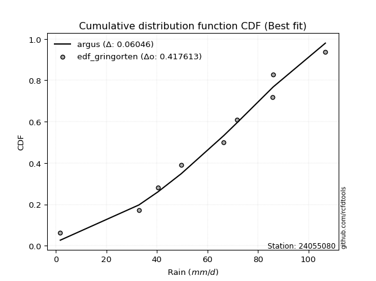</img></img>

</div>


### 9. EDF Filliben (1975)

The specific values of the constants (0.3175) (often denoted as $alpha$) and (0.365) are derived from a method proposed by James J. Filliben in a 1975 paper. This particular formula is the mean value of the $i$-th order statistic of the normal distribution and is considered a robust and effective plotting position formula for the normal probability plot correlation coefficient test for normality.

<div align="center">


$P=(m-0.3175)/(n+0.365)$


</div>


**9.1. Empirical values**

<div align="center">

|                | 0                  | 1                   | 2                  | 3                   | 4                  | 5                  | 6                  | 7                  |
|:---------------|:-------------------|:--------------------|:-------------------|:--------------------|:-------------------|:-------------------|:-------------------|:-------------------|
| date           | 2024               | 2020                | 2023               | 2017                | 2018               | 2021               | 2019               | 2022               |
| x              | 1.8                | 40.4                | 49.7               | 66.5                | 71.8               | 85.9               | 86.1               | 106.7              |
| m              | 1                  | 2                   | 3                  | 4                   | 5                  | 6                  | 7                  | 8                  |
| empirical_dist | edf_filliben       | edf_filliben        | edf_filliben       | edf_filliben        | edf_filliben       | edf_filliben       | edf_filliben       | edf_filliben       |
| empirical      | 0.0815899581589958 | 0.20113568439928273 | 0.3206814106395696 | 0.44022713687985654 | 0.5597728631201434 | 0.6793185893604303 | 0.7988643156007172 | 0.9184100418410042 |
| empirical_tr   | 1.0888382687927107 | 1.2517770295548074  | 1.4720633523977125 | 1.7864388681260008  | 2.271554650373387  | 3.118359739049394  | 4.971768202080237  | 12.256410256410254 |

</div>


**9.2. Kolmogorov-Smirnov fit test (sorted by Δ)**


<div align="center">

|                | 0                   | 1                   | 2                   | 3                   | 4                   | 5                   | 6                   | 7                   | 8                   | 9                   | 10                  | 11                  | 12                  | 13                  | 14                  | 15                  | 16                  | 17                  | 18                 | 19                  | 20                  | 21                  | 22                  | 23                  | 24                 | 25                  | 26                  | 27                 | 28                  | 29                  | 30                  | 31                 | 32                 | 33                  | 34                  | 35                    | 36                 | 37                 | 38                  | 39                  | 40                  | 41                  | 42                 | 43                  | 44                 | 45                  | 46                 | 47                 | 48                  | 49                 | 50                 | 51                 | 52                  | 53                  | 54                 | 55                 | 56                  | 57                 | 58                 | 59                  | 60                 | 61                  | 62                  | 63                 | 64                  | 65                 | 66                  | 67                  | 68                  | 69                 | 70                 | 71                  | 72                 | 73                 | 74                 | 75                  | 76                  | 77                  | 78                  | 79                  | 80                  | 81                  | 82                 | 83                 | 84                 | 85                 | 86                 | 87                 |
|:---------------|:--------------------|:--------------------|:--------------------|:--------------------|:--------------------|:--------------------|:--------------------|:--------------------|:--------------------|:--------------------|:--------------------|:--------------------|:--------------------|:--------------------|:--------------------|:--------------------|:--------------------|:--------------------|:-------------------|:--------------------|:--------------------|:--------------------|:--------------------|:--------------------|:-------------------|:--------------------|:--------------------|:-------------------|:--------------------|:--------------------|:--------------------|:-------------------|:-------------------|:--------------------|:--------------------|:----------------------|:-------------------|:-------------------|:--------------------|:--------------------|:--------------------|:--------------------|:-------------------|:--------------------|:-------------------|:--------------------|:-------------------|:-------------------|:--------------------|:-------------------|:-------------------|:-------------------|:--------------------|:--------------------|:-------------------|:-------------------|:--------------------|:-------------------|:-------------------|:--------------------|:-------------------|:--------------------|:--------------------|:-------------------|:--------------------|:-------------------|:--------------------|:--------------------|:--------------------|:-------------------|:-------------------|:--------------------|:-------------------|:-------------------|:-------------------|:--------------------|:--------------------|:--------------------|:--------------------|:--------------------|:--------------------|:--------------------|:-------------------|:-------------------|:-------------------|:-------------------|:-------------------|:-------------------|
| station        | 24055080            | 24055080            | 24055080            | 24055080            | 24055080            | 24055080            | 24055080            | 24055080            | 24055080            | 24055080            | 24055080            | 24055080            | 24055080            | 24055080            | 24055080            | 24055080            | 24055080            | 24055080            | 24055080           | 24055080            | 24055080            | 24055080            | 24055080            | 24055080            | 24055080           | 24055080            | 24055080            | 24055080           | 24055080            | 24055080            | 24055080            | 24055080           | 24055080           | 24055080            | 24055080            | 24055080              | 24055080           | 24055080           | 24055080            | 24055080            | 24055080            | 24055080            | 24055080           | 24055080            | 24055080           | 24055080            | 24055080           | 24055080           | 24055080            | 24055080           | 24055080           | 24055080           | 24055080            | 24055080            | 24055080           | 24055080           | 24055080            | 24055080           | 24055080           | 24055080            | 24055080           | 24055080            | 24055080            | 24055080           | 24055080            | 24055080           | 24055080            | 24055080            | 24055080            | 24055080           | 24055080           | 24055080            | 24055080           | 24055080           | 24055080           | 24055080            | 24055080            | 24055080            | 24055080            | 24055080            | 24055080            | 24055080            | 24055080           | 24055080           | 24055080           | 24055080           | 24055080           | 24055080           |
| empirical_dist | edf_filliben        | edf_filliben        | edf_filliben        | edf_filliben        | edf_filliben        | edf_filliben        | edf_filliben        | edf_filliben        | edf_filliben        | edf_filliben        | edf_filliben        | edf_filliben        | edf_filliben        | edf_filliben        | edf_filliben        | edf_filliben        | edf_filliben        | edf_filliben        | edf_filliben       | edf_filliben        | edf_filliben        | edf_filliben        | edf_filliben        | edf_filliben        | edf_filliben       | edf_filliben        | edf_filliben        | edf_filliben       | edf_filliben        | edf_filliben        | edf_filliben        | edf_filliben       | edf_filliben       | edf_filliben        | edf_filliben        | edf_filliben          | edf_filliben       | edf_filliben       | edf_filliben        | edf_filliben        | edf_filliben        | edf_filliben        | edf_filliben       | edf_filliben        | edf_filliben       | edf_filliben        | edf_filliben       | edf_filliben       | edf_filliben        | edf_filliben       | edf_filliben       | edf_filliben       | edf_filliben        | edf_filliben        | edf_filliben       | edf_filliben       | edf_filliben        | edf_filliben       | edf_filliben       | edf_filliben        | edf_filliben       | edf_filliben        | edf_filliben        | edf_filliben       | edf_filliben        | edf_filliben       | edf_filliben        | edf_filliben        | edf_filliben        | edf_filliben       | edf_filliben       | edf_filliben        | edf_filliben       | edf_filliben       | edf_filliben       | edf_filliben        | edf_filliben        | edf_filliben        | edf_filliben        | edf_filliben        | edf_filliben        | edf_filliben        | edf_filliben       | edf_filliben       | edf_filliben       | edf_filliben       | edf_filliben       | edf_filliben       |
| p_dist         | johnsonsu           | weibull_min         | pearson3            | genlogistic         | mielke              | fisk                | gumbel_l            | nakagami            | t                   | norm                | crystalball         | exponnorm           | nct                 | f                   | betaprime           | gamma               | logjohnsonsu        | erlang              | logistic           | invgamma            | laplace_asymmetric  | hypsecant           | maxwell             | invgauss            | rayleigh           | laplace             | logt                | logloggamma        | logmielke           | kstwobign           | logpearson3         | halfnorm           | gumbel_r           | logweibull_min      | loggompertz         | loglaplace_asymmetric | logfisk            | moyal              | halflogistic        | rice                | loggumbel_l         | gompertz            | ncf                | loglaplace          | genexpon           | wald                | expon              | loghypsecant       | loglogistic         | logf               | lognorm            | lognorm            | logcrystalball      | logexponnorm        | logrice            | lognakagami        | lognct              | logfatiguelife     | logchi2            | logncf              | logbetaprime       | loggamma            | loggamma            | gibrat             | loginvgamma         | logerlang          | logmaxwell          | loginvweibull       | loginvgauss         | lograyleigh        | logalpha           | loggumbel_r         | loghalfnorm        | logkstwobign       | logmoyal           | loghalflogistic     | loggenexpon         | logexpon            | logwald             | loglognorm          | loggibrat           | invweibull          | fatiguelife        | logtruncnorm       | alpha              | chi2               | loggenlogistic     | truncnorm          |
| delta          | 0.06654371564512762 | 0.07376417934069635 | 0.07394545942915798 | 0.07422988754470305 | 0.07520504638684355 | 0.07699411385414479 | 0.08118978248188691 | 0.09736743680831444 | 0.09737028849010015 | 0.09737084506403054 | 0.09737085046733246 | 0.09737203372181485 | 0.09738249675502492 | 0.09889992344749182 | 0.10080239884282333 | 0.10803933790803583 | 0.10874631964729664 | 0.10930046515598607 | 0.1100925074682434 | 0.12055382095719486 | 0.12294674200841837 | 0.12442461891219725 | 0.12854081711321902 | 0.13748589214203716 | 0.1386404306395918 | 0.14222705204325525 | 0.14629872909514713 | 0.1478649691896205 | 0.15588139356844982 | 0.15685401244813896 | 0.16577642241414103 | 0.1671001950542626 | 0.1678544975872331 | 0.17071428910419745 | 0.17162737611876894 | 0.17467662755972818   | 0.1755141183031449 | 0.193059241384047  | 0.19393346068684253 | 0.20014452422446888 | 0.20204465745463243 | 0.21977445354427158 | 0.2485796241374744 | 0.25455183618903443 | 0.2628292389836354 | 0.26300968939817587 | 0.2633186738872524 | 0.2661122283060293 | 0.26914398456276434 | 0.2703956837743453 | 0.2727044726515515 | 0.2727044726515515 | 0.27270450712566996 | 0.27270495471067424 | 0.2727057181819019 | 0.2728067943358933 | 0.27291305209439853 | 0.2732053904520967 | 0.2784263243226194 | 0.28071408557092836 | 0.2850128434186473 | 0.29075570422749275 | 0.29075570422749275 | 0.2910388547592379 | 0.29564836754041224 | 0.300301528638674  | 0.30660458580833305 | 0.30746371223996527 | 0.31272027253011225 | 0.3181326501754457 | 0.3265038522365743 | 0.34180354430470605 | 0.3506083822021784 | 0.3512840776033478 | 0.3676104141216988 | 0.37374302066591714 | 0.37398477479444037 | 0.42147577342428677 | 0.43944512855358464 | 0.44152679382203297 | 0.45797915514608134 | 0.48826126322630536 | 0.5525995841908015 | 0.607473063500418  | 0.6982175843698325 | 0.7985660452812267 | 0.7988643156007172 | 0.9073070963677271 |
| deltao         | 0.4472608134160001  | 0.4472608134160001  | 0.4472608134160001  | 0.4472608134160001  | 0.4472608134160001  | 0.4472608134160001  | 0.4472608134160001  | 0.4472608134160001  | 0.4472608134160001  | 0.4472608134160001  | 0.4472608134160001  | 0.4472608134160001  | 0.4472608134160001  | 0.4472608134160001  | 0.4472608134160001  | 0.4472608134160001  | 0.4472608134160001  | 0.4472608134160001  | 0.4472608134160001 | 0.4472608134160001  | 0.4472608134160001  | 0.4472608134160001  | 0.4472608134160001  | 0.4472608134160001  | 0.4472608134160001 | 0.4472608134160001  | 0.4472608134160001  | 0.4472608134160001 | 0.4472608134160001  | 0.4472608134160001  | 0.4472608134160001  | 0.4472608134160001 | 0.4472608134160001 | 0.4472608134160001  | 0.4472608134160001  | 0.4472608134160001    | 0.4472608134160001 | 0.4472608134160001 | 0.4472608134160001  | 0.4472608134160001  | 0.4472608134160001  | 0.4472608134160001  | 0.4472608134160001 | 0.4472608134160001  | 0.4472608134160001 | 0.4472608134160001  | 0.4472608134160001 | 0.4472608134160001 | 0.4472608134160001  | 0.4472608134160001 | 0.4472608134160001 | 0.4472608134160001 | 0.4472608134160001  | 0.4472608134160001  | 0.4472608134160001 | 0.4472608134160001 | 0.4472608134160001  | 0.4472608134160001 | 0.4472608134160001 | 0.4472608134160001  | 0.4472608134160001 | 0.4472608134160001  | 0.4472608134160001  | 0.4472608134160001 | 0.4472608134160001  | 0.4472608134160001 | 0.4472608134160001  | 0.4472608134160001  | 0.4472608134160001  | 0.4472608134160001 | 0.4472608134160001 | 0.4472608134160001  | 0.4472608134160001 | 0.4472608134160001 | 0.4472608134160001 | 0.4472608134160001  | 0.4472608134160001  | 0.4472608134160001  | 0.4472608134160001  | 0.4472608134160001  | 0.4472608134160001  | 0.4472608134160001  | 0.4472608134160001 | 0.4472608134160001 | 0.4472608134160001 | 0.4472608134160001 | 0.4472608134160001 | 0.4472608134160001 |
| eval           | Δo > Δ              | Δo > Δ              | Δo > Δ              | Δo > Δ              | Δo > Δ              | Δo > Δ              | Δo > Δ              | Δo > Δ              | Δo > Δ              | Δo > Δ              | Δo > Δ              | Δo > Δ              | Δo > Δ              | Δo > Δ              | Δo > Δ              | Δo > Δ              | Δo > Δ              | Δo > Δ              | Δo > Δ             | Δo > Δ              | Δo > Δ              | Δo > Δ              | Δo > Δ              | Δo > Δ              | Δo > Δ             | Δo > Δ              | Δo > Δ              | Δo > Δ             | Δo > Δ              | Δo > Δ              | Δo > Δ              | Δo > Δ             | Δo > Δ             | Δo > Δ              | Δo > Δ              | Δo > Δ                | Δo > Δ             | Δo > Δ             | Δo > Δ              | Δo > Δ              | Δo > Δ              | Δo > Δ              | Δo > Δ             | Δo > Δ              | Δo > Δ             | Δo > Δ              | Δo > Δ             | Δo > Δ             | Δo > Δ              | Δo > Δ             | Δo > Δ             | Δo > Δ             | Δo > Δ              | Δo > Δ              | Δo > Δ             | Δo > Δ             | Δo > Δ              | Δo > Δ             | Δo > Δ             | Δo > Δ              | Δo > Δ             | Δo > Δ              | Δo > Δ              | Δo > Δ             | Δo > Δ              | Δo > Δ             | Δo > Δ              | Δo > Δ              | Δo > Δ              | Δo > Δ             | Δo > Δ             | Δo > Δ              | Δo > Δ             | Δo > Δ             | Δo > Δ             | Δo > Δ              | Δo > Δ              | Δo > Δ              | Δo > Δ              | Δo > Δ              | Δo <= Δ             | Δo <= Δ             | Δo <= Δ            | Δo <= Δ            | Δo <= Δ            | Δo <= Δ            | Δo <= Δ            | Δo <= Δ            |
| fit            | 1                   | 1                   | 1                   | 1                   | 1                   | 1                   | 1                   | 1                   | 1                   | 1                   | 1                   | 1                   | 1                   | 1                   | 1                   | 1                   | 1                   | 1                   | 1                  | 1                   | 1                   | 1                   | 1                   | 1                   | 1                  | 1                   | 1                   | 1                  | 1                   | 1                   | 1                   | 1                  | 1                  | 1                   | 1                   | 1                     | 1                  | 1                  | 1                   | 1                   | 1                   | 1                   | 1                  | 1                   | 1                  | 1                   | 1                  | 1                  | 1                   | 1                  | 1                  | 1                  | 1                   | 1                   | 1                  | 1                  | 1                   | 1                  | 1                  | 1                   | 1                  | 1                   | 1                   | 1                  | 1                   | 1                  | 1                   | 1                   | 1                   | 1                  | 1                  | 1                   | 1                  | 1                  | 1                  | 1                   | 1                   | 1                   | 1                   | 1                   | 0                   | 0                   | 0                  | 0                  | 0                  | 0                  | 0                  | 0                  |
| n              | 8                   | 8                   | 8                   | 8                   | 8                   | 8                   | 8                   | 8                   | 8                   | 8                   | 8                   | 8                   | 8                   | 8                   | 8                   | 8                   | 8                   | 8                   | 8                  | 8                   | 8                   | 8                   | 8                   | 8                   | 8                  | 8                   | 8                   | 8                  | 8                   | 8                   | 8                   | 8                  | 8                  | 8                   | 8                   | 8                     | 8                  | 8                  | 8                   | 8                   | 8                   | 8                   | 8                  | 8                   | 8                  | 8                   | 8                  | 8                  | 8                   | 8                  | 8                  | 8                  | 8                   | 8                   | 8                  | 8                  | 8                   | 8                  | 8                  | 8                   | 8                  | 8                   | 8                   | 8                  | 8                   | 8                  | 8                   | 8                   | 8                   | 8                  | 8                  | 8                   | 8                  | 8                  | 8                  | 8                   | 8                   | 8                   | 8                   | 8                   | 8                   | 8                   | 8                  | 8                  | 8                  | 8                  | 8                  | 8                  |
| best_fit       | 1                   | 0                   | 0                   | 0                   | 0                   | 0                   | 0                   | 0                   | 0                   | 0                   | 0                   | 0                   | 0                   | 0                   | 0                   | 0                   | 0                   | 0                   | 0                  | 0                   | 0                   | 0                   | 0                   | 0                   | 0                  | 0                   | 0                   | 0                  | 0                   | 0                   | 0                   | 0                  | 0                  | 0                   | 0                   | 0                     | 0                  | 0                  | 0                   | 0                   | 0                   | 0                   | 0                  | 0                   | 0                  | 0                   | 0                  | 0                  | 0                   | 0                  | 0                  | 0                  | 0                   | 0                   | 0                  | 0                  | 0                   | 0                  | 0                  | 0                   | 0                  | 0                   | 0                   | 0                  | 0                   | 0                  | 0                   | 0                   | 0                   | 0                  | 0                  | 0                   | 0                  | 0                  | 0                  | 0                   | 0                   | 0                   | 0                   | 0                   | 0                   | 0                   | 0                  | 0                  | 0                  | 0                  | 0                  | 0                  |
| best_fit_sort  | 1                   | 2                   | 3                   | 4                   | 5                   | 6                   | 7                   | 8                   | 9                   | 10                  | 11                  | 12                  | 13                  | 14                  | 15                  | 16                  | 17                  | 18                  | 19                 | 20                  | 21                  | 22                  | 23                  | 24                  | 25                 | 26                  | 27                  | 28                 | 29                  | 30                  | 31                  | 32                 | 33                 | 34                  | 35                  | 36                    | 37                 | 38                 | 39                  | 40                  | 41                  | 42                  | 43                 | 44                  | 45                 | 46                  | 47                 | 48                 | 49                  | 50                 | 51                 | 52                 | 53                  | 54                  | 55                 | 56                 | 57                  | 58                 | 59                 | 60                  | 61                 | 62                  | 63                  | 64                 | 65                  | 66                 | 67                  | 68                  | 69                  | 70                 | 71                 | 72                  | 73                 | 74                 | 75                 | 76                  | 77                  | 78                  | 79                  | 80                  | 81                  | 82                  | 83                 | 84                 | 85                 | 86                 | 87                 | 88                 |

</div>


**9.3. Best fit**

<div align="center">

|   id |   station | empirical_dist   | p_dist    |     delta |   deltao | eval   |   fit |   n |   best_fit |   best_fit_sort |
|-----:|----------:|:-----------------|:----------|----------:|---------:|:-------|------:|----:|-----------:|----------------:|
|    0 |  24055080 | edf_filliben     | johnsonsu | 0.0665437 | 0.447261 | Δo > Δ |     1 |   8 |          1 |               1 |

</div>


<div align="center">

</img></img>

</div>


### 10. EDF Jenkinson (1977)

The Jenkinson formula in hydrology is an empirical plotting position formula used to estimate the non-exceedance probability _(P)_ or return period _(T)_ of a given ordered observation within a sample. It is a widely used method in the frequency analysis of extreme events such as floods and rainfall, as it provides a distribution-free way to plot data. _a≈0.31_ and _b≈0.38_ are constants derived to approximate the median of the probability distribution for the given rank.

<div align="center">


$P=(m-a)/(n+b)$


</div>


**10.1. Empirical values**

<div align="center">

|                | 0                   | 1                   | 2                  | 3                   | 4                  | 5                  | 6                  | 7                  |
|:---------------|:--------------------|:--------------------|:-------------------|:--------------------|:-------------------|:-------------------|:-------------------|:-------------------|
| date           | 2024                | 2020                | 2023               | 2017                | 2018               | 2021               | 2019               | 2022               |
| x              | 1.8                 | 40.4                | 49.7               | 66.5                | 71.8               | 85.9               | 86.1               | 106.7              |
| m              | 1                   | 2                   | 3                  | 4                   | 5                  | 6                  | 7                  | 8                  |
| empirical_dist | edf_jenkinson       | edf_jenkinson       | edf_jenkinson      | edf_jenkinson       | edf_jenkinson      | edf_jenkinson      | edf_jenkinson      | edf_jenkinson      |
| empirical      | 0.08233890214797135 | 0.20167064439140808 | 0.3210023866348448 | 0.44033412887828155 | 0.5596658711217184 | 0.6789976133651551 | 0.7983293556085919 | 0.9176610978520287 |
| empirical_tr   | 1.0897269180754225  | 1.2526158445440956  | 1.4727592267135323 | 1.7867803837953091  | 2.2710027100271004 | 3.115241635687732  | 4.958579881656804  | 12.144927536231886 |

</div>


**10.2. Kolmogorov-Smirnov fit test (sorted by Δ)**


<div align="center">

|                | 0                   | 1                  | 2                   | 3                   | 4                   | 5                   | 6                   | 7                   | 8                   | 9                   | 10                  | 11                  | 12                 | 13                  | 14                  | 15                  | 16                  | 17                  | 18                  | 19                  | 20                  | 21                 | 22                 | 23                  | 24                 | 25                 | 26                  | 27                 | 28                 | 29                  | 30                  | 31                 | 32                  | 33                  | 34                  | 35                    | 36                  | 37                 | 38                  | 39                  | 40                  | 41                  | 42                  | 43                 | 44                 | 45                  | 46                  | 47                 | 48                  | 49                 | 50                 | 51                 | 52                 | 53                  | 54                  | 55                 | 56                 | 57                  | 58                 | 59                  | 60                  | 61                 | 62                 | 63                 | 64                 | 65                  | 66                 | 67                  | 68                 | 69                  | 70                  | 71                 | 72                  | 73                  | 74                 | 75                 | 76                  | 77                  | 78                 | 79                  | 80                 | 81                  | 82                 | 83                 | 84                 | 85                 | 86                 | 87                 |
|:---------------|:--------------------|:-------------------|:--------------------|:--------------------|:--------------------|:--------------------|:--------------------|:--------------------|:--------------------|:--------------------|:--------------------|:--------------------|:-------------------|:--------------------|:--------------------|:--------------------|:--------------------|:--------------------|:--------------------|:--------------------|:--------------------|:-------------------|:-------------------|:--------------------|:-------------------|:-------------------|:--------------------|:-------------------|:-------------------|:--------------------|:--------------------|:-------------------|:--------------------|:--------------------|:--------------------|:----------------------|:--------------------|:-------------------|:--------------------|:--------------------|:--------------------|:--------------------|:--------------------|:-------------------|:-------------------|:--------------------|:--------------------|:-------------------|:--------------------|:-------------------|:-------------------|:-------------------|:-------------------|:--------------------|:--------------------|:-------------------|:-------------------|:--------------------|:-------------------|:--------------------|:--------------------|:-------------------|:-------------------|:-------------------|:-------------------|:--------------------|:-------------------|:--------------------|:-------------------|:--------------------|:--------------------|:-------------------|:--------------------|:--------------------|:-------------------|:-------------------|:--------------------|:--------------------|:-------------------|:--------------------|:-------------------|:--------------------|:-------------------|:-------------------|:-------------------|:-------------------|:-------------------|:-------------------|
| station        | 24055080            | 24055080           | 24055080            | 24055080            | 24055080            | 24055080            | 24055080            | 24055080            | 24055080            | 24055080            | 24055080            | 24055080            | 24055080           | 24055080            | 24055080            | 24055080            | 24055080            | 24055080            | 24055080            | 24055080            | 24055080            | 24055080           | 24055080           | 24055080            | 24055080           | 24055080           | 24055080            | 24055080           | 24055080           | 24055080            | 24055080            | 24055080           | 24055080            | 24055080            | 24055080            | 24055080              | 24055080            | 24055080           | 24055080            | 24055080            | 24055080            | 24055080            | 24055080            | 24055080           | 24055080           | 24055080            | 24055080            | 24055080           | 24055080            | 24055080           | 24055080           | 24055080           | 24055080           | 24055080            | 24055080            | 24055080           | 24055080           | 24055080            | 24055080           | 24055080            | 24055080            | 24055080           | 24055080           | 24055080           | 24055080           | 24055080            | 24055080           | 24055080            | 24055080           | 24055080            | 24055080            | 24055080           | 24055080            | 24055080            | 24055080           | 24055080           | 24055080            | 24055080            | 24055080           | 24055080            | 24055080           | 24055080            | 24055080           | 24055080           | 24055080           | 24055080           | 24055080           | 24055080           |
| empirical_dist | edf_jenkinson       | edf_jenkinson      | edf_jenkinson       | edf_jenkinson       | edf_jenkinson       | edf_jenkinson       | edf_jenkinson       | edf_jenkinson       | edf_jenkinson       | edf_jenkinson       | edf_jenkinson       | edf_jenkinson       | edf_jenkinson      | edf_jenkinson       | edf_jenkinson       | edf_jenkinson       | edf_jenkinson       | edf_jenkinson       | edf_jenkinson       | edf_jenkinson       | edf_jenkinson       | edf_jenkinson      | edf_jenkinson      | edf_jenkinson       | edf_jenkinson      | edf_jenkinson      | edf_jenkinson       | edf_jenkinson      | edf_jenkinson      | edf_jenkinson       | edf_jenkinson       | edf_jenkinson      | edf_jenkinson       | edf_jenkinson       | edf_jenkinson       | edf_jenkinson         | edf_jenkinson       | edf_jenkinson      | edf_jenkinson       | edf_jenkinson       | edf_jenkinson       | edf_jenkinson       | edf_jenkinson       | edf_jenkinson      | edf_jenkinson      | edf_jenkinson       | edf_jenkinson       | edf_jenkinson      | edf_jenkinson       | edf_jenkinson      | edf_jenkinson      | edf_jenkinson      | edf_jenkinson      | edf_jenkinson       | edf_jenkinson       | edf_jenkinson      | edf_jenkinson      | edf_jenkinson       | edf_jenkinson      | edf_jenkinson       | edf_jenkinson       | edf_jenkinson      | edf_jenkinson      | edf_jenkinson      | edf_jenkinson      | edf_jenkinson       | edf_jenkinson      | edf_jenkinson       | edf_jenkinson      | edf_jenkinson       | edf_jenkinson       | edf_jenkinson      | edf_jenkinson       | edf_jenkinson       | edf_jenkinson      | edf_jenkinson      | edf_jenkinson       | edf_jenkinson       | edf_jenkinson      | edf_jenkinson       | edf_jenkinson      | edf_jenkinson       | edf_jenkinson      | edf_jenkinson      | edf_jenkinson      | edf_jenkinson      | edf_jenkinson      | edf_jenkinson      |
| p_dist         | johnsonsu           | weibull_min        | pearson3            | genlogistic         | mielke              | fisk                | gumbel_l            | nakagami            | t                   | norm                | crystalball         | exponnorm           | nct                | f                   | betaprime           | gamma               | logjohnsonsu        | erlang              | logistic            | invgamma            | laplace_asymmetric  | hypsecant          | maxwell            | invgauss            | rayleigh           | laplace            | logt                | logloggamma        | logmielke          | kstwobign           | logpearson3         | halfnorm           | gumbel_r            | logweibull_min      | loggompertz         | loglaplace_asymmetric | logfisk             | moyal              | halflogistic        | rice                | loggumbel_l         | gompertz            | ncf                 | loglaplace         | genexpon           | expon               | wald                | loghypsecant       | loglogistic         | logf               | lognorm            | lognorm            | logcrystalball     | logexponnorm        | logrice             | lognakagami        | lognct             | logfatiguelife      | logchi2            | logncf              | logbetaprime        | loggamma           | loggamma           | gibrat             | loginvgamma        | logerlang           | logmaxwell         | loginvweibull       | loginvgauss        | lograyleigh         | logalpha            | loggumbel_r        | loghalfnorm         | logkstwobign        | logmoyal           | loghalflogistic    | loggenexpon         | logexpon            | logwald            | loglognorm          | loggibrat          | invweibull          | fatiguelife        | logtruncnorm       | alpha              | chi2               | loggenlogistic     | truncnorm          |
| delta          | 0.06686469164040287 | 0.0740851553359716 | 0.07426643542443323 | 0.07455086353997831 | 0.07595399037581907 | 0.07731508984942004 | 0.08151075847716216 | 0.09726044480988943 | 0.09726329649167514 | 0.09726385306560553 | 0.09726385846890745 | 0.09726504172338984 | 0.0972755047565999 | 0.09879293144906681 | 0.10069540684439832 | 0.10793234590961082 | 0.10821135965517126 | 0.10919347315756106 | 0.11041348346351865 | 0.12044682895876985 | 0.12326771800369363 | 0.1247455949074725 | 0.128433825114794  | 0.13737890014361215 | 0.1385334386411668 | 0.1425480280385305 | 0.14661970509042233 | 0.1477579771911955 | 0.1557744015700248 | 0.15674702044971395 | 0.16524146242201565 | 0.1669932030558376 | 0.16774750558880808 | 0.17060729710577244 | 0.17152038412034393 | 0.17456963556130317   | 0.17476517431416938 | 0.192952249385622  | 0.19382646868841752 | 0.20046550021974407 | 0.20150969746250708 | 0.22009542953954678 | 0.24804466414534904 | 0.2540168761969091 | 0.2622942789915101 | 0.26278371389512706 | 0.26290269739975086 | 0.265577268313904  | 0.26860902457063895 | 0.2698607237822199 | 0.2721695126594262 | 0.2721695126594262 | 0.2721695471335446 | 0.27216999471854886 | 0.27217075818977654 | 0.2722718343437679 | 0.2723780921022732 | 0.27267043045997136 | 0.277891364330494  | 0.28017912557880303 | 0.28447788342652197 | 0.2902207442353674 | 0.2902207442353674 | 0.2909318627608129 | 0.2951134075482869 | 0.29976656864654866 | 0.3060696258162077 | 0.30692875224783994 | 0.3121853125379869 | 0.31759769018332035 | 0.32596889224444897 | 0.3412685843125807 | 0.35007342221005305 | 0.35074911761122246 | 0.3670754541295735 | 0.3732080606737918 | 0.37344981480231504 | 0.42094081343216144 | 0.4389101685614593 | 0.44099183382990764 | 0.457444195153956  | 0.48751231923732985 | 0.5520646241986762 | 0.6069381035082926 | 0.6976826243777072 | 0.7980310852891013 | 0.7983293556085919 | 0.9065581523787516 |
| deltao         | 0.4472608134160001  | 0.4472608134160001 | 0.4472608134160001  | 0.4472608134160001  | 0.4472608134160001  | 0.4472608134160001  | 0.4472608134160001  | 0.4472608134160001  | 0.4472608134160001  | 0.4472608134160001  | 0.4472608134160001  | 0.4472608134160001  | 0.4472608134160001 | 0.4472608134160001  | 0.4472608134160001  | 0.4472608134160001  | 0.4472608134160001  | 0.4472608134160001  | 0.4472608134160001  | 0.4472608134160001  | 0.4472608134160001  | 0.4472608134160001 | 0.4472608134160001 | 0.4472608134160001  | 0.4472608134160001 | 0.4472608134160001 | 0.4472608134160001  | 0.4472608134160001 | 0.4472608134160001 | 0.4472608134160001  | 0.4472608134160001  | 0.4472608134160001 | 0.4472608134160001  | 0.4472608134160001  | 0.4472608134160001  | 0.4472608134160001    | 0.4472608134160001  | 0.4472608134160001 | 0.4472608134160001  | 0.4472608134160001  | 0.4472608134160001  | 0.4472608134160001  | 0.4472608134160001  | 0.4472608134160001 | 0.4472608134160001 | 0.4472608134160001  | 0.4472608134160001  | 0.4472608134160001 | 0.4472608134160001  | 0.4472608134160001 | 0.4472608134160001 | 0.4472608134160001 | 0.4472608134160001 | 0.4472608134160001  | 0.4472608134160001  | 0.4472608134160001 | 0.4472608134160001 | 0.4472608134160001  | 0.4472608134160001 | 0.4472608134160001  | 0.4472608134160001  | 0.4472608134160001 | 0.4472608134160001 | 0.4472608134160001 | 0.4472608134160001 | 0.4472608134160001  | 0.4472608134160001 | 0.4472608134160001  | 0.4472608134160001 | 0.4472608134160001  | 0.4472608134160001  | 0.4472608134160001 | 0.4472608134160001  | 0.4472608134160001  | 0.4472608134160001 | 0.4472608134160001 | 0.4472608134160001  | 0.4472608134160001  | 0.4472608134160001 | 0.4472608134160001  | 0.4472608134160001 | 0.4472608134160001  | 0.4472608134160001 | 0.4472608134160001 | 0.4472608134160001 | 0.4472608134160001 | 0.4472608134160001 | 0.4472608134160001 |
| eval           | Δo > Δ              | Δo > Δ             | Δo > Δ              | Δo > Δ              | Δo > Δ              | Δo > Δ              | Δo > Δ              | Δo > Δ              | Δo > Δ              | Δo > Δ              | Δo > Δ              | Δo > Δ              | Δo > Δ             | Δo > Δ              | Δo > Δ              | Δo > Δ              | Δo > Δ              | Δo > Δ              | Δo > Δ              | Δo > Δ              | Δo > Δ              | Δo > Δ             | Δo > Δ             | Δo > Δ              | Δo > Δ             | Δo > Δ             | Δo > Δ              | Δo > Δ             | Δo > Δ             | Δo > Δ              | Δo > Δ              | Δo > Δ             | Δo > Δ              | Δo > Δ              | Δo > Δ              | Δo > Δ                | Δo > Δ              | Δo > Δ             | Δo > Δ              | Δo > Δ              | Δo > Δ              | Δo > Δ              | Δo > Δ              | Δo > Δ             | Δo > Δ             | Δo > Δ              | Δo > Δ              | Δo > Δ             | Δo > Δ              | Δo > Δ             | Δo > Δ             | Δo > Δ             | Δo > Δ             | Δo > Δ              | Δo > Δ              | Δo > Δ             | Δo > Δ             | Δo > Δ              | Δo > Δ             | Δo > Δ              | Δo > Δ              | Δo > Δ             | Δo > Δ             | Δo > Δ             | Δo > Δ             | Δo > Δ              | Δo > Δ             | Δo > Δ              | Δo > Δ             | Δo > Δ              | Δo > Δ              | Δo > Δ             | Δo > Δ              | Δo > Δ              | Δo > Δ             | Δo > Δ             | Δo > Δ              | Δo > Δ              | Δo > Δ             | Δo > Δ              | Δo <= Δ            | Δo <= Δ             | Δo <= Δ            | Δo <= Δ            | Δo <= Δ            | Δo <= Δ            | Δo <= Δ            | Δo <= Δ            |
| fit            | 1                   | 1                  | 1                   | 1                   | 1                   | 1                   | 1                   | 1                   | 1                   | 1                   | 1                   | 1                   | 1                  | 1                   | 1                   | 1                   | 1                   | 1                   | 1                   | 1                   | 1                   | 1                  | 1                  | 1                   | 1                  | 1                  | 1                   | 1                  | 1                  | 1                   | 1                   | 1                  | 1                   | 1                   | 1                   | 1                     | 1                   | 1                  | 1                   | 1                   | 1                   | 1                   | 1                   | 1                  | 1                  | 1                   | 1                   | 1                  | 1                   | 1                  | 1                  | 1                  | 1                  | 1                   | 1                   | 1                  | 1                  | 1                   | 1                  | 1                   | 1                   | 1                  | 1                  | 1                  | 1                  | 1                   | 1                  | 1                   | 1                  | 1                   | 1                   | 1                  | 1                   | 1                   | 1                  | 1                  | 1                   | 1                   | 1                  | 1                   | 0                  | 0                   | 0                  | 0                  | 0                  | 0                  | 0                  | 0                  |
| n              | 8                   | 8                  | 8                   | 8                   | 8                   | 8                   | 8                   | 8                   | 8                   | 8                   | 8                   | 8                   | 8                  | 8                   | 8                   | 8                   | 8                   | 8                   | 8                   | 8                   | 8                   | 8                  | 8                  | 8                   | 8                  | 8                  | 8                   | 8                  | 8                  | 8                   | 8                   | 8                  | 8                   | 8                   | 8                   | 8                     | 8                   | 8                  | 8                   | 8                   | 8                   | 8                   | 8                   | 8                  | 8                  | 8                   | 8                   | 8                  | 8                   | 8                  | 8                  | 8                  | 8                  | 8                   | 8                   | 8                  | 8                  | 8                   | 8                  | 8                   | 8                   | 8                  | 8                  | 8                  | 8                  | 8                   | 8                  | 8                   | 8                  | 8                   | 8                   | 8                  | 8                   | 8                   | 8                  | 8                  | 8                   | 8                   | 8                  | 8                   | 8                  | 8                   | 8                  | 8                  | 8                  | 8                  | 8                  | 8                  |
| best_fit       | 1                   | 0                  | 0                   | 0                   | 0                   | 0                   | 0                   | 0                   | 0                   | 0                   | 0                   | 0                   | 0                  | 0                   | 0                   | 0                   | 0                   | 0                   | 0                   | 0                   | 0                   | 0                  | 0                  | 0                   | 0                  | 0                  | 0                   | 0                  | 0                  | 0                   | 0                   | 0                  | 0                   | 0                   | 0                   | 0                     | 0                   | 0                  | 0                   | 0                   | 0                   | 0                   | 0                   | 0                  | 0                  | 0                   | 0                   | 0                  | 0                   | 0                  | 0                  | 0                  | 0                  | 0                   | 0                   | 0                  | 0                  | 0                   | 0                  | 0                   | 0                   | 0                  | 0                  | 0                  | 0                  | 0                   | 0                  | 0                   | 0                  | 0                   | 0                   | 0                  | 0                   | 0                   | 0                  | 0                  | 0                   | 0                   | 0                  | 0                   | 0                  | 0                   | 0                  | 0                  | 0                  | 0                  | 0                  | 0                  |
| best_fit_sort  | 1                   | 2                  | 3                   | 4                   | 5                   | 6                   | 7                   | 8                   | 9                   | 10                  | 11                  | 12                  | 13                 | 14                  | 15                  | 16                  | 17                  | 18                  | 19                  | 20                  | 21                  | 22                 | 23                 | 24                  | 25                 | 26                 | 27                  | 28                 | 29                 | 30                  | 31                  | 32                 | 33                  | 34                  | 35                  | 36                    | 37                  | 38                 | 39                  | 40                  | 41                  | 42                  | 43                  | 44                 | 45                 | 46                  | 47                  | 48                 | 49                  | 50                 | 51                 | 52                 | 53                 | 54                  | 55                  | 56                 | 57                 | 58                  | 59                 | 60                  | 61                  | 62                 | 63                 | 64                 | 65                 | 66                  | 67                 | 68                  | 69                 | 70                  | 71                  | 72                 | 73                  | 74                  | 75                 | 76                 | 77                  | 78                  | 79                 | 80                  | 81                 | 82                  | 83                 | 84                 | 85                 | 86                 | 87                 | 88                 |

</div>


**10.3. Best fit**

<div align="center">

|   id |   station | empirical_dist   | p_dist    |     delta |   deltao | eval   |   fit |   n |   best_fit |   best_fit_sort |
|-----:|----------:|:-----------------|:----------|----------:|---------:|:-------|------:|----:|-----------:|----------------:|
|    0 |  24055080 | edf_jenkinson    | johnsonsu | 0.0668647 | 0.447261 | Δo > Δ |     1 |   8 |          1 |               1 |

</div>


<div align="center">

</img>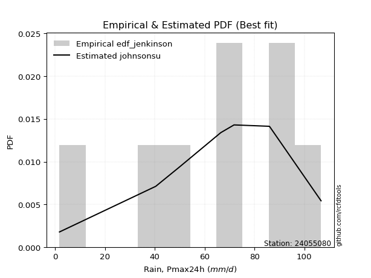</img>

</div>


### 11. EDF Cunnane (1978)

Cunnane´s work in statistical hydrology has focused on the performance and evaluation of different probability distributions (such as GEV, Gumbel, Lognormal) for flood frequency estimation. _b_ is a constant, typically set to 0.4.

<div align="center">


$P=(m-b)/(n+1-2b)$


</div>


**11.1. Empirical values**

<div align="center">

|                | 0                   | 1                   | 2                  | 3                  | 4                  | 5                  | 6                  | 7                  |
|:---------------|:--------------------|:--------------------|:-------------------|:-------------------|:-------------------|:-------------------|:-------------------|:-------------------|
| date           | 2024                | 2020                | 2023               | 2017               | 2018               | 2021               | 2019               | 2022               |
| x              | 1.8                 | 40.4                | 49.7               | 66.5               | 71.8               | 85.9               | 86.1               | 106.7              |
| m              | 1                   | 2                   | 3                  | 4                  | 5                  | 6                  | 7                  | 8                  |
| empirical_dist | edf_cunnane         | edf_cunnane         | edf_cunnane        | edf_cunnane        | edf_cunnane        | edf_cunnane        | edf_cunnane        | edf_cunnane        |
| empirical      | 0.07317073170731708 | 0.19512195121951223 | 0.3170731707317074 | 0.4390243902439025 | 0.5609756097560976 | 0.6829268292682927 | 0.8048780487804879 | 0.926829268292683  |
| empirical_tr   | 1.0789473684210527  | 1.2424242424242424  | 1.4642857142857144 | 1.782608695652174  | 2.277777777777778  | 3.153846153846154  | 5.125000000000001  | 13.666666666666675 |

</div>


**11.2. Kolmogorov-Smirnov fit test (sorted by Δ)**


<div align="center">

|                | 0                   | 1                   | 2                   | 3                   | 4                   | 5                  | 6                   | 7                   | 8                  | 9                   | 10                 | 11                 | 12                  | 13                  | 14                  | 15                  | 16                  | 17                  | 18                  | 19                  | 20                  | 21                 | 22                  | 23                  | 24                 | 25                  | 26                  | 27                  | 28                  | 29                 | 30                  | 31                  | 32                 | 33                 | 34                  | 35                    | 36                 | 37                  | 38                  | 39                  | 40                  | 41                  | 42                  | 43                  | 44                 | 45                 | 46                 | 47                 | 48                  | 49                 | 50                 | 51                 | 52                  | 53                  | 54                 | 55                 | 56                  | 57                 | 58                 | 59                  | 60                 | 61                  | 62                  | 63                  | 64                  | 65                 | 66                  | 67                  | 68                  | 69                  | 70                 | 71                  | 72                 | 73                 | 74                 | 75                  | 76                  | 77                  | 78                  | 79                  | 80                  | 81                  | 82                 | 83                 | 84                 | 85                 | 86                 | 87                 |
|:---------------|:--------------------|:--------------------|:--------------------|:--------------------|:--------------------|:-------------------|:--------------------|:--------------------|:-------------------|:--------------------|:-------------------|:-------------------|:--------------------|:--------------------|:--------------------|:--------------------|:--------------------|:--------------------|:--------------------|:--------------------|:--------------------|:-------------------|:--------------------|:--------------------|:-------------------|:--------------------|:--------------------|:--------------------|:--------------------|:-------------------|:--------------------|:--------------------|:-------------------|:-------------------|:--------------------|:----------------------|:-------------------|:--------------------|:--------------------|:--------------------|:--------------------|:--------------------|:--------------------|:--------------------|:-------------------|:-------------------|:-------------------|:-------------------|:--------------------|:-------------------|:-------------------|:-------------------|:--------------------|:--------------------|:-------------------|:-------------------|:--------------------|:-------------------|:-------------------|:--------------------|:-------------------|:--------------------|:--------------------|:--------------------|:--------------------|:-------------------|:--------------------|:--------------------|:--------------------|:--------------------|:-------------------|:--------------------|:-------------------|:-------------------|:-------------------|:--------------------|:--------------------|:--------------------|:--------------------|:--------------------|:--------------------|:--------------------|:-------------------|:-------------------|:-------------------|:-------------------|:-------------------|:-------------------|
| station        | 24055080            | 24055080            | 24055080            | 24055080            | 24055080            | 24055080           | 24055080            | 24055080            | 24055080           | 24055080            | 24055080           | 24055080           | 24055080            | 24055080            | 24055080            | 24055080            | 24055080            | 24055080            | 24055080            | 24055080            | 24055080            | 24055080           | 24055080            | 24055080            | 24055080           | 24055080            | 24055080            | 24055080            | 24055080            | 24055080           | 24055080            | 24055080            | 24055080           | 24055080           | 24055080            | 24055080              | 24055080           | 24055080            | 24055080            | 24055080            | 24055080            | 24055080            | 24055080            | 24055080            | 24055080           | 24055080           | 24055080           | 24055080           | 24055080            | 24055080           | 24055080           | 24055080           | 24055080            | 24055080            | 24055080           | 24055080           | 24055080            | 24055080           | 24055080           | 24055080            | 24055080           | 24055080            | 24055080            | 24055080            | 24055080            | 24055080           | 24055080            | 24055080            | 24055080            | 24055080            | 24055080           | 24055080            | 24055080           | 24055080           | 24055080           | 24055080            | 24055080            | 24055080            | 24055080            | 24055080            | 24055080            | 24055080            | 24055080           | 24055080           | 24055080           | 24055080           | 24055080           | 24055080           |
| empirical_dist | edf_cunnane         | edf_cunnane         | edf_cunnane         | edf_cunnane         | edf_cunnane         | edf_cunnane        | edf_cunnane         | edf_cunnane         | edf_cunnane        | edf_cunnane         | edf_cunnane        | edf_cunnane        | edf_cunnane         | edf_cunnane         | edf_cunnane         | edf_cunnane         | edf_cunnane         | edf_cunnane         | edf_cunnane         | edf_cunnane         | edf_cunnane         | edf_cunnane        | edf_cunnane         | edf_cunnane         | edf_cunnane        | edf_cunnane         | edf_cunnane         | edf_cunnane         | edf_cunnane         | edf_cunnane        | edf_cunnane         | edf_cunnane         | edf_cunnane        | edf_cunnane        | edf_cunnane         | edf_cunnane           | edf_cunnane        | edf_cunnane         | edf_cunnane         | edf_cunnane         | edf_cunnane         | edf_cunnane         | edf_cunnane         | edf_cunnane         | edf_cunnane        | edf_cunnane        | edf_cunnane        | edf_cunnane        | edf_cunnane         | edf_cunnane        | edf_cunnane        | edf_cunnane        | edf_cunnane         | edf_cunnane         | edf_cunnane        | edf_cunnane        | edf_cunnane         | edf_cunnane        | edf_cunnane        | edf_cunnane         | edf_cunnane        | edf_cunnane         | edf_cunnane         | edf_cunnane         | edf_cunnane         | edf_cunnane        | edf_cunnane         | edf_cunnane         | edf_cunnane         | edf_cunnane         | edf_cunnane        | edf_cunnane         | edf_cunnane        | edf_cunnane        | edf_cunnane        | edf_cunnane         | edf_cunnane         | edf_cunnane         | edf_cunnane         | edf_cunnane         | edf_cunnane         | edf_cunnane         | edf_cunnane        | edf_cunnane        | edf_cunnane        | edf_cunnane        | edf_cunnane        | edf_cunnane        |
| p_dist         | johnsonsu           | weibull_min         | pearson3            | genlogistic         | fisk                | gumbel_l           | mielke              | nakagami            | t                  | norm                | crystalball        | exponnorm          | nct                 | f                   | betaprime           | logistic            | gamma               | erlang              | logjohnsonsu        | laplace_asymmetric  | hypsecant           | invgamma           | maxwell             | laplace             | invgauss           | rayleigh            | logt                | logloggamma         | logmielke           | kstwobign          | halfnorm            | gumbel_r            | logweibull_min     | logpearson3        | loggompertz         | loglaplace_asymmetric | logfisk            | moyal               | halflogistic        | rice                | loggumbel_l         | gompertz            | ncf                 | loglaplace          | wald               | genexpon           | expon              | loghypsecant       | loglogistic         | logf               | lognorm            | lognorm            | logcrystalball      | logexponnorm        | logrice            | lognakagami        | lognct              | logfatiguelife     | logchi2            | logncf              | logbetaprime       | gibrat              | loggamma            | loggamma            | loginvgamma         | logerlang          | logmaxwell          | loginvweibull       | loginvgauss         | lograyleigh         | logalpha           | loggumbel_r         | loghalfnorm        | logkstwobign       | logmoyal           | loghalflogistic     | loggenexpon         | logexpon            | logwald             | loglognorm          | loggibrat           | invweibull          | fatiguelife        | logtruncnorm       | alpha              | chi2               | loggenlogistic     | truncnorm          |
| delta          | 0.06293547573726521 | 0.07015593943283394 | 0.07033721952129557 | 0.07062164763684065 | 0.07338587394628238 | 0.0775815425740245 | 0.08022001717483351 | 0.09857018344426849 | 0.0985730351260542 | 0.09857359169998459 | 0.0985735971032865 | 0.0985747803577689 | 0.09858524339097896 | 0.10010267008344587 | 0.10200514547877737 | 0.10648426756038099 | 0.10924208454398987 | 0.11050321179194011 | 0.11476005282706725 | 0.11933850210055597 | 0.12081637900433484 | 0.1217565675931489 | 0.12974356374917306 | 0.13861881213539284 | 0.1386886387779912 | 0.13984317727554585 | 0.14269048918728489 | 0.14906771582557454 | 0.15708414020440387 | 0.158056759084093  | 0.16830294169021665 | 0.16905724422318713 | 0.1719170357401515 | 0.1722362842443227 | 0.17283012275472298 | 0.17587937419568223   | 0.1839333447548237 | 0.19426198802000105 | 0.19513620732279657 | 0.19653628431660664 | 0.20805839063440293 | 0.21616621363640934 | 0.25459335731724486 | 0.26056556936880493 | 0.2642124360341299 | 0.2688429721634059 | 0.2693324070670229 | 0.2721259614857998 | 0.27515771774253484 | 0.2764094169541158 | 0.278718205831322  | 0.278718205831322  | 0.27871824030544046 | 0.27871868789044474 | 0.2787194513616724 | 0.2788205275156638 | 0.27892678527416903 | 0.2792191236318672 | 0.2844400575023899 | 0.28672781875069886 | 0.2910265765984178 | 0.29224160139519195 | 0.29676943740726325 | 0.29676943740726325 | 0.30166210072018274 | 0.3063152618184445 | 0.31261831898810355 | 0.31347744541973577 | 0.31873400570988275 | 0.32414638335521617 | 0.3325175854163448 | 0.34781727748447655 | 0.3566221153819489 | 0.3572978107831183 | 0.3736241473014693 | 0.37975675384568763 | 0.37999850797421086 | 0.42748950660405727 | 0.44545886173335514 | 0.44754052700180347 | 0.46399288832585184 | 0.49668048967798417 | 0.558613317370572  | 0.6134867966801885 | 0.704231317549603  | 0.8045797784609972 | 0.8048780487804879 | 0.9157263228194059 |
| deltao         | 0.4472608134160001  | 0.4472608134160001  | 0.4472608134160001  | 0.4472608134160001  | 0.4472608134160001  | 0.4472608134160001 | 0.4472608134160001  | 0.4472608134160001  | 0.4472608134160001 | 0.4472608134160001  | 0.4472608134160001 | 0.4472608134160001 | 0.4472608134160001  | 0.4472608134160001  | 0.4472608134160001  | 0.4472608134160001  | 0.4472608134160001  | 0.4472608134160001  | 0.4472608134160001  | 0.4472608134160001  | 0.4472608134160001  | 0.4472608134160001 | 0.4472608134160001  | 0.4472608134160001  | 0.4472608134160001 | 0.4472608134160001  | 0.4472608134160001  | 0.4472608134160001  | 0.4472608134160001  | 0.4472608134160001 | 0.4472608134160001  | 0.4472608134160001  | 0.4472608134160001 | 0.4472608134160001 | 0.4472608134160001  | 0.4472608134160001    | 0.4472608134160001 | 0.4472608134160001  | 0.4472608134160001  | 0.4472608134160001  | 0.4472608134160001  | 0.4472608134160001  | 0.4472608134160001  | 0.4472608134160001  | 0.4472608134160001 | 0.4472608134160001 | 0.4472608134160001 | 0.4472608134160001 | 0.4472608134160001  | 0.4472608134160001 | 0.4472608134160001 | 0.4472608134160001 | 0.4472608134160001  | 0.4472608134160001  | 0.4472608134160001 | 0.4472608134160001 | 0.4472608134160001  | 0.4472608134160001 | 0.4472608134160001 | 0.4472608134160001  | 0.4472608134160001 | 0.4472608134160001  | 0.4472608134160001  | 0.4472608134160001  | 0.4472608134160001  | 0.4472608134160001 | 0.4472608134160001  | 0.4472608134160001  | 0.4472608134160001  | 0.4472608134160001  | 0.4472608134160001 | 0.4472608134160001  | 0.4472608134160001 | 0.4472608134160001 | 0.4472608134160001 | 0.4472608134160001  | 0.4472608134160001  | 0.4472608134160001  | 0.4472608134160001  | 0.4472608134160001  | 0.4472608134160001  | 0.4472608134160001  | 0.4472608134160001 | 0.4472608134160001 | 0.4472608134160001 | 0.4472608134160001 | 0.4472608134160001 | 0.4472608134160001 |
| eval           | Δo > Δ              | Δo > Δ              | Δo > Δ              | Δo > Δ              | Δo > Δ              | Δo > Δ             | Δo > Δ              | Δo > Δ              | Δo > Δ             | Δo > Δ              | Δo > Δ             | Δo > Δ             | Δo > Δ              | Δo > Δ              | Δo > Δ              | Δo > Δ              | Δo > Δ              | Δo > Δ              | Δo > Δ              | Δo > Δ              | Δo > Δ              | Δo > Δ             | Δo > Δ              | Δo > Δ              | Δo > Δ             | Δo > Δ              | Δo > Δ              | Δo > Δ              | Δo > Δ              | Δo > Δ             | Δo > Δ              | Δo > Δ              | Δo > Δ             | Δo > Δ             | Δo > Δ              | Δo > Δ                | Δo > Δ             | Δo > Δ              | Δo > Δ              | Δo > Δ              | Δo > Δ              | Δo > Δ              | Δo > Δ              | Δo > Δ              | Δo > Δ             | Δo > Δ             | Δo > Δ             | Δo > Δ             | Δo > Δ              | Δo > Δ             | Δo > Δ             | Δo > Δ             | Δo > Δ              | Δo > Δ              | Δo > Δ             | Δo > Δ             | Δo > Δ              | Δo > Δ             | Δo > Δ             | Δo > Δ              | Δo > Δ             | Δo > Δ              | Δo > Δ              | Δo > Δ              | Δo > Δ              | Δo > Δ             | Δo > Δ              | Δo > Δ              | Δo > Δ              | Δo > Δ              | Δo > Δ             | Δo > Δ              | Δo > Δ             | Δo > Δ             | Δo > Δ             | Δo > Δ              | Δo > Δ              | Δo > Δ              | Δo > Δ              | Δo <= Δ             | Δo <= Δ             | Δo <= Δ             | Δo <= Δ            | Δo <= Δ            | Δo <= Δ            | Δo <= Δ            | Δo <= Δ            | Δo <= Δ            |
| fit            | 1                   | 1                   | 1                   | 1                   | 1                   | 1                  | 1                   | 1                   | 1                  | 1                   | 1                  | 1                  | 1                   | 1                   | 1                   | 1                   | 1                   | 1                   | 1                   | 1                   | 1                   | 1                  | 1                   | 1                   | 1                  | 1                   | 1                   | 1                   | 1                   | 1                  | 1                   | 1                   | 1                  | 1                  | 1                   | 1                     | 1                  | 1                   | 1                   | 1                   | 1                   | 1                   | 1                   | 1                   | 1                  | 1                  | 1                  | 1                  | 1                   | 1                  | 1                  | 1                  | 1                   | 1                   | 1                  | 1                  | 1                   | 1                  | 1                  | 1                   | 1                  | 1                   | 1                   | 1                   | 1                   | 1                  | 1                   | 1                   | 1                   | 1                   | 1                  | 1                   | 1                  | 1                  | 1                  | 1                   | 1                   | 1                   | 1                   | 0                   | 0                   | 0                   | 0                  | 0                  | 0                  | 0                  | 0                  | 0                  |
| n              | 8                   | 8                   | 8                   | 8                   | 8                   | 8                  | 8                   | 8                   | 8                  | 8                   | 8                  | 8                  | 8                   | 8                   | 8                   | 8                   | 8                   | 8                   | 8                   | 8                   | 8                   | 8                  | 8                   | 8                   | 8                  | 8                   | 8                   | 8                   | 8                   | 8                  | 8                   | 8                   | 8                  | 8                  | 8                   | 8                     | 8                  | 8                   | 8                   | 8                   | 8                   | 8                   | 8                   | 8                   | 8                  | 8                  | 8                  | 8                  | 8                   | 8                  | 8                  | 8                  | 8                   | 8                   | 8                  | 8                  | 8                   | 8                  | 8                  | 8                   | 8                  | 8                   | 8                   | 8                   | 8                   | 8                  | 8                   | 8                   | 8                   | 8                   | 8                  | 8                   | 8                  | 8                  | 8                  | 8                   | 8                   | 8                   | 8                   | 8                   | 8                   | 8                   | 8                  | 8                  | 8                  | 8                  | 8                  | 8                  |
| best_fit       | 1                   | 0                   | 0                   | 0                   | 0                   | 0                  | 0                   | 0                   | 0                  | 0                   | 0                  | 0                  | 0                   | 0                   | 0                   | 0                   | 0                   | 0                   | 0                   | 0                   | 0                   | 0                  | 0                   | 0                   | 0                  | 0                   | 0                   | 0                   | 0                   | 0                  | 0                   | 0                   | 0                  | 0                  | 0                   | 0                     | 0                  | 0                   | 0                   | 0                   | 0                   | 0                   | 0                   | 0                   | 0                  | 0                  | 0                  | 0                  | 0                   | 0                  | 0                  | 0                  | 0                   | 0                   | 0                  | 0                  | 0                   | 0                  | 0                  | 0                   | 0                  | 0                   | 0                   | 0                   | 0                   | 0                  | 0                   | 0                   | 0                   | 0                   | 0                  | 0                   | 0                  | 0                  | 0                  | 0                   | 0                   | 0                   | 0                   | 0                   | 0                   | 0                   | 0                  | 0                  | 0                  | 0                  | 0                  | 0                  |
| best_fit_sort  | 1                   | 2                   | 3                   | 4                   | 5                   | 6                  | 7                   | 8                   | 9                  | 10                  | 11                 | 12                 | 13                  | 14                  | 15                  | 16                  | 17                  | 18                  | 19                  | 20                  | 21                  | 22                 | 23                  | 24                  | 25                 | 26                  | 27                  | 28                  | 29                  | 30                 | 31                  | 32                  | 33                 | 34                 | 35                  | 36                    | 37                 | 38                  | 39                  | 40                  | 41                  | 42                  | 43                  | 44                  | 45                 | 46                 | 47                 | 48                 | 49                  | 50                 | 51                 | 52                 | 53                  | 54                  | 55                 | 56                 | 57                  | 58                 | 59                 | 60                  | 61                 | 62                  | 63                  | 64                  | 65                  | 66                 | 67                  | 68                  | 69                  | 70                  | 71                 | 72                  | 73                 | 74                 | 75                 | 76                  | 77                  | 78                  | 79                  | 80                  | 81                  | 82                  | 83                 | 84                 | 85                 | 86                 | 87                 | 88                 |

</div>


**11.3. Best fit**

<div align="center">

|   id |   station | empirical_dist   | p_dist    |     delta |   deltao | eval   |   fit |   n |   best_fit |   best_fit_sort |
|-----:|----------:|:-----------------|:----------|----------:|---------:|:-------|------:|----:|-----------:|----------------:|
|    0 |  24055080 | edf_cunnane      | johnsonsu | 0.0629355 | 0.447261 | Δo > Δ |     1 |   8 |          1 |               1 |

</div>


<div align="center">

</img></img>

</div>


### 12. EDF Adamowski (1981)

The Adamowski formula in hydrology refers to a specific plotting position formula used for estimating the non-parametric empirical distribution of hydrological events (like flood peaks) to calculate their return periods. This formula provides an alternative to traditional parametric methods (like the Gumbel or Log Pearson Type III distributions). 

<div align="center">


$P=(m-0.25)/(n+0.5)$


</div>


**12.1. Empirical values**

<div align="center">

|                | 0                   | 1                   | 2                  | 3                  | 4                  | 5                  | 6                  | 7                  |
|:---------------|:--------------------|:--------------------|:-------------------|:-------------------|:-------------------|:-------------------|:-------------------|:-------------------|
| date           | 2024                | 2020                | 2023               | 2017               | 2018               | 2021               | 2019               | 2022               |
| x              | 1.8                 | 40.4                | 49.7               | 66.5               | 71.8               | 85.9               | 86.1               | 106.7              |
| m              | 1                   | 2                   | 3                  | 4                  | 5                  | 6                  | 7                  | 8                  |
| empirical_dist | edf_adamowski       | edf_adamowski       | edf_adamowski      | edf_adamowski      | edf_adamowski      | edf_adamowski      | edf_adamowski      | edf_adamowski      |
| empirical      | 0.08823529411764706 | 0.20588235294117646 | 0.3235294117647059 | 0.4411764705882353 | 0.5588235294117647 | 0.6764705882352942 | 0.7941176470588235 | 0.9117647058823529 |
| empirical_tr   | 1.096774193548387   | 1.259259259259259   | 1.4782608695652173 | 1.7894736842105263 | 2.2666666666666666 | 3.0909090909090913 | 4.857142857142856  | 11.33333333333333  |

</div>


**12.2. Kolmogorov-Smirnov fit test (sorted by Δ)**


<div align="center">

|                | 0                   | 1                   | 2                   | 3                   | 4                   | 5                  | 6                   | 7                  | 8                   | 9                  | 10                  | 11                  | 12                  | 13                  | 14                  | 15                  | 16                  | 17                  | 18                  | 19                  | 20                  | 21                  | 22                  | 23                  | 24                  | 25                  | 26                  | 27                 | 28                  | 29                  | 30                  | 31                  | 32                  | 33                  | 34                 | 35                 | 36                    | 37                  | 38                 | 39                 | 40                  | 41                  | 42                  | 43                  | 44                 | 45                 | 46                 | 47                  | 48                 | 49                  | 50                 | 51                 | 52                 | 53                 | 54                  | 55                 | 56                  | 57                 | 58                 | 59                  | 60                 | 61                  | 62                  | 63                  | 64                  | 65                 | 66                  | 67                  | 68                  | 69                  | 70                 | 71                  | 72                 | 73                 | 74                 | 75                  | 76                  | 77                  | 78                  | 79                  | 80                  | 81                 | 82                 | 83                 | 84                 | 85                 | 86                 | 87                 |
|:---------------|:--------------------|:--------------------|:--------------------|:--------------------|:--------------------|:-------------------|:--------------------|:-------------------|:--------------------|:-------------------|:--------------------|:--------------------|:--------------------|:--------------------|:--------------------|:--------------------|:--------------------|:--------------------|:--------------------|:--------------------|:--------------------|:--------------------|:--------------------|:--------------------|:--------------------|:--------------------|:--------------------|:-------------------|:--------------------|:--------------------|:--------------------|:--------------------|:--------------------|:--------------------|:-------------------|:-------------------|:----------------------|:--------------------|:-------------------|:-------------------|:--------------------|:--------------------|:--------------------|:--------------------|:-------------------|:-------------------|:-------------------|:--------------------|:-------------------|:--------------------|:-------------------|:-------------------|:-------------------|:-------------------|:--------------------|:-------------------|:--------------------|:-------------------|:-------------------|:--------------------|:-------------------|:--------------------|:--------------------|:--------------------|:--------------------|:-------------------|:--------------------|:--------------------|:--------------------|:--------------------|:-------------------|:--------------------|:-------------------|:-------------------|:-------------------|:--------------------|:--------------------|:--------------------|:--------------------|:--------------------|:--------------------|:-------------------|:-------------------|:-------------------|:-------------------|:-------------------|:-------------------|:-------------------|
| station        | 24055080            | 24055080            | 24055080            | 24055080            | 24055080            | 24055080           | 24055080            | 24055080           | 24055080            | 24055080           | 24055080            | 24055080            | 24055080            | 24055080            | 24055080            | 24055080            | 24055080            | 24055080            | 24055080            | 24055080            | 24055080            | 24055080            | 24055080            | 24055080            | 24055080            | 24055080            | 24055080            | 24055080           | 24055080            | 24055080            | 24055080            | 24055080            | 24055080            | 24055080            | 24055080           | 24055080           | 24055080              | 24055080            | 24055080           | 24055080           | 24055080            | 24055080            | 24055080            | 24055080            | 24055080           | 24055080           | 24055080           | 24055080            | 24055080           | 24055080            | 24055080           | 24055080           | 24055080           | 24055080           | 24055080            | 24055080           | 24055080            | 24055080           | 24055080           | 24055080            | 24055080           | 24055080            | 24055080            | 24055080            | 24055080            | 24055080           | 24055080            | 24055080            | 24055080            | 24055080            | 24055080           | 24055080            | 24055080           | 24055080           | 24055080           | 24055080            | 24055080            | 24055080            | 24055080            | 24055080            | 24055080            | 24055080           | 24055080           | 24055080           | 24055080           | 24055080           | 24055080           | 24055080           |
| empirical_dist | edf_adamowski       | edf_adamowski       | edf_adamowski       | edf_adamowski       | edf_adamowski       | edf_adamowski      | edf_adamowski       | edf_adamowski      | edf_adamowski       | edf_adamowski      | edf_adamowski       | edf_adamowski       | edf_adamowski       | edf_adamowski       | edf_adamowski       | edf_adamowski       | edf_adamowski       | edf_adamowski       | edf_adamowski       | edf_adamowski       | edf_adamowski       | edf_adamowski       | edf_adamowski       | edf_adamowski       | edf_adamowski       | edf_adamowski       | edf_adamowski       | edf_adamowski      | edf_adamowski       | edf_adamowski       | edf_adamowski       | edf_adamowski       | edf_adamowski       | edf_adamowski       | edf_adamowski      | edf_adamowski      | edf_adamowski         | edf_adamowski       | edf_adamowski      | edf_adamowski      | edf_adamowski       | edf_adamowski       | edf_adamowski       | edf_adamowski       | edf_adamowski      | edf_adamowski      | edf_adamowski      | edf_adamowski       | edf_adamowski      | edf_adamowski       | edf_adamowski      | edf_adamowski      | edf_adamowski      | edf_adamowski      | edf_adamowski       | edf_adamowski      | edf_adamowski       | edf_adamowski      | edf_adamowski      | edf_adamowski       | edf_adamowski      | edf_adamowski       | edf_adamowski       | edf_adamowski       | edf_adamowski       | edf_adamowski      | edf_adamowski       | edf_adamowski       | edf_adamowski       | edf_adamowski       | edf_adamowski      | edf_adamowski       | edf_adamowski      | edf_adamowski      | edf_adamowski      | edf_adamowski       | edf_adamowski       | edf_adamowski       | edf_adamowski       | edf_adamowski       | edf_adamowski       | edf_adamowski      | edf_adamowski      | edf_adamowski      | edf_adamowski      | edf_adamowski      | edf_adamowski      | edf_adamowski      |
| p_dist         | johnsonsu           | weibull_min         | pearson3            | genlogistic         | fisk                | mielke             | gumbel_l            | nakagami           | t                   | norm               | crystalball         | exponnorm           | nct                 | f                   | betaprime           | logjohnsonsu        | gamma               | erlang              | logistic            | invgamma            | laplace_asymmetric  | hypsecant           | maxwell             | invgauss            | rayleigh            | laplace             | logloggamma         | logt               | logmielke           | kstwobign           | logpearson3         | halfnorm            | gumbel_r            | logfisk             | logweibull_min     | loggompertz        | loglaplace_asymmetric | moyal               | halflogistic       | loggumbel_l        | rice                | gompertz            | ncf                 | loglaplace          | genexpon           | expon              | loghypsecant       | wald                | loglogistic        | logf                | lognorm            | lognorm            | logcrystalball     | logexponnorm       | logrice             | lognakagami        | lognct              | logfatiguelife     | logchi2            | logncf              | logbetaprime       | loggamma            | loggamma            | gibrat              | loginvgamma         | logerlang          | logmaxwell          | loginvweibull       | loginvgauss         | lograyleigh         | logalpha           | loggumbel_r         | loghalfnorm        | logkstwobign       | logmoyal           | loghalflogistic     | loggenexpon         | logexpon            | logwald             | loglognorm          | loggibrat           | invweibull         | fatiguelife        | logtruncnorm       | alpha              | chi2               | loggenlogistic     | truncnorm          |
| delta          | 0.06939171677026379 | 0.07661218046583251 | 0.07679346055429415 | 0.07707788866983922 | 0.07984211497928095 | 0.0818503823454948 | 0.08403778360702308 | 0.0964181030999357 | 0.09642095478172141 | 0.0964215113556518 | 0.09642151675895372 | 0.09642270001343611 | 0.09643316304664618 | 0.09795058973911308 | 0.09985306513444459 | 0.10399965110540288 | 0.10709000419965709 | 0.10835113144760733 | 0.11294050859337956 | 0.11960448724881612 | 0.12579474313355454 | 0.12727262003733342 | 0.12759148340484028 | 0.13653655843365842 | 0.13769109693121306 | 0.14507505316839142 | 0.14691563548124176 | 0.1491467302202834 | 0.15493205986007108 | 0.15590467873976022 | 0.16102975387224727 | 0.16615086134588386 | 0.16690516387885435 | 0.16886878234449365 | 0.1697649553958187 | 0.1706780424103902 | 0.17372729385134944   | 0.19210990767566827 | 0.1929841269784638 | 0.1972979889127387 | 0.20299252534960516 | 0.22262245466940786 | 0.24383295559558066 | 0.24980516764714072 | 0.2580825704417417 | 0.2585720053453587 | 0.2613655597641356 | 0.26206035568979713 | 0.2643973160208706 | 0.26564901523245155 | 0.2679578041096578 | 0.2679578041096578 | 0.2679578385837762 | 0.2679582861687805 | 0.26795904964000816 | 0.2680601257939995 | 0.26816638355250483 | 0.268458721910203  | 0.2736796557807256 | 0.27596741702903466 | 0.2802661748767536 | 0.28600903568559904 | 0.28600903568559904 | 0.29008952105085917 | 0.29090169899851853 | 0.2955548600967803 | 0.30185791726643935 | 0.30271704369807156 | 0.30797360398821855 | 0.31338598163355197 | 0.3217571836946806 | 0.33705687576281235 | 0.3458617136602847 | 0.3465374090614541 | 0.3628637455798051 | 0.36899635212402343 | 0.36923810625254666 | 0.41672910488239306 | 0.43469846001169093 | 0.43678012528013926 | 0.45323248660418763 | 0.4816159272676541 | 0.5478529156489078 | 0.6027263949585242 | 0.6934709158279388 | 0.7938193767393329 | 0.7941176470588235 | 0.9006617604090759 |
| deltao         | 0.4472608134160001  | 0.4472608134160001  | 0.4472608134160001  | 0.4472608134160001  | 0.4472608134160001  | 0.4472608134160001 | 0.4472608134160001  | 0.4472608134160001 | 0.4472608134160001  | 0.4472608134160001 | 0.4472608134160001  | 0.4472608134160001  | 0.4472608134160001  | 0.4472608134160001  | 0.4472608134160001  | 0.4472608134160001  | 0.4472608134160001  | 0.4472608134160001  | 0.4472608134160001  | 0.4472608134160001  | 0.4472608134160001  | 0.4472608134160001  | 0.4472608134160001  | 0.4472608134160001  | 0.4472608134160001  | 0.4472608134160001  | 0.4472608134160001  | 0.4472608134160001 | 0.4472608134160001  | 0.4472608134160001  | 0.4472608134160001  | 0.4472608134160001  | 0.4472608134160001  | 0.4472608134160001  | 0.4472608134160001 | 0.4472608134160001 | 0.4472608134160001    | 0.4472608134160001  | 0.4472608134160001 | 0.4472608134160001 | 0.4472608134160001  | 0.4472608134160001  | 0.4472608134160001  | 0.4472608134160001  | 0.4472608134160001 | 0.4472608134160001 | 0.4472608134160001 | 0.4472608134160001  | 0.4472608134160001 | 0.4472608134160001  | 0.4472608134160001 | 0.4472608134160001 | 0.4472608134160001 | 0.4472608134160001 | 0.4472608134160001  | 0.4472608134160001 | 0.4472608134160001  | 0.4472608134160001 | 0.4472608134160001 | 0.4472608134160001  | 0.4472608134160001 | 0.4472608134160001  | 0.4472608134160001  | 0.4472608134160001  | 0.4472608134160001  | 0.4472608134160001 | 0.4472608134160001  | 0.4472608134160001  | 0.4472608134160001  | 0.4472608134160001  | 0.4472608134160001 | 0.4472608134160001  | 0.4472608134160001 | 0.4472608134160001 | 0.4472608134160001 | 0.4472608134160001  | 0.4472608134160001  | 0.4472608134160001  | 0.4472608134160001  | 0.4472608134160001  | 0.4472608134160001  | 0.4472608134160001 | 0.4472608134160001 | 0.4472608134160001 | 0.4472608134160001 | 0.4472608134160001 | 0.4472608134160001 | 0.4472608134160001 |
| eval           | Δo > Δ              | Δo > Δ              | Δo > Δ              | Δo > Δ              | Δo > Δ              | Δo > Δ             | Δo > Δ              | Δo > Δ             | Δo > Δ              | Δo > Δ             | Δo > Δ              | Δo > Δ              | Δo > Δ              | Δo > Δ              | Δo > Δ              | Δo > Δ              | Δo > Δ              | Δo > Δ              | Δo > Δ              | Δo > Δ              | Δo > Δ              | Δo > Δ              | Δo > Δ              | Δo > Δ              | Δo > Δ              | Δo > Δ              | Δo > Δ              | Δo > Δ             | Δo > Δ              | Δo > Δ              | Δo > Δ              | Δo > Δ              | Δo > Δ              | Δo > Δ              | Δo > Δ             | Δo > Δ             | Δo > Δ                | Δo > Δ              | Δo > Δ             | Δo > Δ             | Δo > Δ              | Δo > Δ              | Δo > Δ              | Δo > Δ              | Δo > Δ             | Δo > Δ             | Δo > Δ             | Δo > Δ              | Δo > Δ             | Δo > Δ              | Δo > Δ             | Δo > Δ             | Δo > Δ             | Δo > Δ             | Δo > Δ              | Δo > Δ             | Δo > Δ              | Δo > Δ             | Δo > Δ             | Δo > Δ              | Δo > Δ             | Δo > Δ              | Δo > Δ              | Δo > Δ              | Δo > Δ              | Δo > Δ             | Δo > Δ              | Δo > Δ              | Δo > Δ              | Δo > Δ              | Δo > Δ             | Δo > Δ              | Δo > Δ             | Δo > Δ             | Δo > Δ             | Δo > Δ              | Δo > Δ              | Δo > Δ              | Δo > Δ              | Δo > Δ              | Δo <= Δ             | Δo <= Δ            | Δo <= Δ            | Δo <= Δ            | Δo <= Δ            | Δo <= Δ            | Δo <= Δ            | Δo <= Δ            |
| fit            | 1                   | 1                   | 1                   | 1                   | 1                   | 1                  | 1                   | 1                  | 1                   | 1                  | 1                   | 1                   | 1                   | 1                   | 1                   | 1                   | 1                   | 1                   | 1                   | 1                   | 1                   | 1                   | 1                   | 1                   | 1                   | 1                   | 1                   | 1                  | 1                   | 1                   | 1                   | 1                   | 1                   | 1                   | 1                  | 1                  | 1                     | 1                   | 1                  | 1                  | 1                   | 1                   | 1                   | 1                   | 1                  | 1                  | 1                  | 1                   | 1                  | 1                   | 1                  | 1                  | 1                  | 1                  | 1                   | 1                  | 1                   | 1                  | 1                  | 1                   | 1                  | 1                   | 1                   | 1                   | 1                   | 1                  | 1                   | 1                   | 1                   | 1                   | 1                  | 1                   | 1                  | 1                  | 1                  | 1                   | 1                   | 1                   | 1                   | 1                   | 0                   | 0                  | 0                  | 0                  | 0                  | 0                  | 0                  | 0                  |
| n              | 8                   | 8                   | 8                   | 8                   | 8                   | 8                  | 8                   | 8                  | 8                   | 8                  | 8                   | 8                   | 8                   | 8                   | 8                   | 8                   | 8                   | 8                   | 8                   | 8                   | 8                   | 8                   | 8                   | 8                   | 8                   | 8                   | 8                   | 8                  | 8                   | 8                   | 8                   | 8                   | 8                   | 8                   | 8                  | 8                  | 8                     | 8                   | 8                  | 8                  | 8                   | 8                   | 8                   | 8                   | 8                  | 8                  | 8                  | 8                   | 8                  | 8                   | 8                  | 8                  | 8                  | 8                  | 8                   | 8                  | 8                   | 8                  | 8                  | 8                   | 8                  | 8                   | 8                   | 8                   | 8                   | 8                  | 8                   | 8                   | 8                   | 8                   | 8                  | 8                   | 8                  | 8                  | 8                  | 8                   | 8                   | 8                   | 8                   | 8                   | 8                   | 8                  | 8                  | 8                  | 8                  | 8                  | 8                  | 8                  |
| best_fit       | 1                   | 0                   | 0                   | 0                   | 0                   | 0                  | 0                   | 0                  | 0                   | 0                  | 0                   | 0                   | 0                   | 0                   | 0                   | 0                   | 0                   | 0                   | 0                   | 0                   | 0                   | 0                   | 0                   | 0                   | 0                   | 0                   | 0                   | 0                  | 0                   | 0                   | 0                   | 0                   | 0                   | 0                   | 0                  | 0                  | 0                     | 0                   | 0                  | 0                  | 0                   | 0                   | 0                   | 0                   | 0                  | 0                  | 0                  | 0                   | 0                  | 0                   | 0                  | 0                  | 0                  | 0                  | 0                   | 0                  | 0                   | 0                  | 0                  | 0                   | 0                  | 0                   | 0                   | 0                   | 0                   | 0                  | 0                   | 0                   | 0                   | 0                   | 0                  | 0                   | 0                  | 0                  | 0                  | 0                   | 0                   | 0                   | 0                   | 0                   | 0                   | 0                  | 0                  | 0                  | 0                  | 0                  | 0                  | 0                  |
| best_fit_sort  | 1                   | 2                   | 3                   | 4                   | 5                   | 6                  | 7                   | 8                  | 9                   | 10                 | 11                  | 12                  | 13                  | 14                  | 15                  | 16                  | 17                  | 18                  | 19                  | 20                  | 21                  | 22                  | 23                  | 24                  | 25                  | 26                  | 27                  | 28                 | 29                  | 30                  | 31                  | 32                  | 33                  | 34                  | 35                 | 36                 | 37                    | 38                  | 39                 | 40                 | 41                  | 42                  | 43                  | 44                  | 45                 | 46                 | 47                 | 48                  | 49                 | 50                  | 51                 | 52                 | 53                 | 54                 | 55                  | 56                 | 57                  | 58                 | 59                 | 60                  | 61                 | 62                  | 63                  | 64                  | 65                  | 66                 | 67                  | 68                  | 69                  | 70                  | 71                 | 72                  | 73                 | 74                 | 75                 | 76                  | 77                  | 78                  | 79                  | 80                  | 81                  | 82                 | 83                 | 84                 | 85                 | 86                 | 87                 | 88                 |

</div>


**12.3. Best fit**

<div align="center">

|   id |   station | empirical_dist   | p_dist    |     delta |   deltao | eval   |   fit |   n |   best_fit |   best_fit_sort |
|-----:|----------:|:-----------------|:----------|----------:|---------:|:-------|------:|----:|-----------:|----------------:|
|    0 |  24055080 | edf_adamowski    | johnsonsu | 0.0693917 | 0.447261 | Δo > Δ |     1 |   8 |          1 |               1 |

</div>


<div align="center">

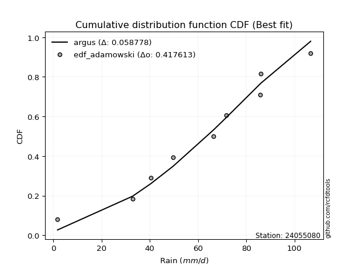</img></img>

</div>


## C. Best fit & Estimate extreme values for specific return periods - Tr

Best fit in probability distribution analysis means finding the theoretical distribution (like Normal, Poisson, Exponential) that most accurately mirrors your real-world data´s patterns (shape, center, spread) for better predictions, using methods like visual checks (Q-Q plots), goodness-of-fit tests (Kolmogorov-Smirnov, Chi-Squared), and information criteria (AIC) to score and select the simplest, most representative model.


### 1. Best fit (ordered by delta Δ)

<div align="center">

|   id |   station | empirical_dist   | p_dist    |     delta |   deltao | eval   |   fit |   n |   best_fit |   best_fit_sort |
|-----:|----------:|:-----------------|:----------|----------:|---------:|:-------|------:|----:|-----------:|----------------:|
|    0 |  24055080 | edf_gringorten   | johnsonsu | 0.0611332 | 0.447261 | Δo > Δ |     1 |   8 |          1 |               1 |
|    1 |  24055080 | edf_cunnane      | johnsonsu | 0.0629355 | 0.447261 | Δo > Δ |     1 |   8 |          1 |               2 |
|    2 |  24055080 | edf_hazen        | johnsonsu | 0.0638156 | 0.447261 | Δo > Δ |     1 |   8 |          1 |               3 |
|    3 |  24055080 | edf_blom         | johnsonsu | 0.0640441 | 0.447261 | Δo > Δ |     1 |   8 |          1 |               4 |
|    4 |  24055080 | edf_tukey        | johnsonsu | 0.0658623 | 0.447261 | Δo > Δ |     1 |   8 |          1 |               5 |
|    5 |  24055080 | edf_filliben     | johnsonsu | 0.0665437 | 0.447261 | Δo > Δ |     1 |   8 |          1 |               6 |
|    6 |  24055080 | edf_beard        | johnsonsu | 0.0668647 | 0.447261 | Δo > Δ |     1 |   8 |          1 |               7 |
|    7 |  24055080 | edf_jenkinson    | johnsonsu | 0.0668647 | 0.447261 | Δo > Δ |     1 |   8 |          1 |               8 |
|    8 |  24055080 | edf_chegodayev   | johnsonsu | 0.0672909 | 0.447261 | Δo > Δ |     1 |   8 |          1 |               9 |
|    9 |  24055080 | edf_adamowski    | johnsonsu | 0.0693917 | 0.447261 | Δo > Δ |     1 |   8 |          1 |              10 |
|   10 |  24055080 | edf_weibull      | johnsonsu | 0.0791956 | 0.447261 | Δo > Δ |     1 |   8 |          1 |              11 |
|   11 |  24055080 | edf_california   | hypsecant | 0.0983754 | 0.447261 | Δo > Δ |     1 |   8 |          1 |              12 |

</div>

:file_folder:Tables: [bestfit_24055080.csv](table/bestfit_24055080.csv) | [extreme_24055080.csv](table/extreme_24055080.csv)


### 2. Extreme values

In hydrology, a return period (or recurrence interval $Tr$) is the statistical average time between extreme events like floods or droughts of a specific magnitude, indicating how rare an event is, with a 100-year flood, for example, having a 1% chance of occurring in any given year, not that it happens exactly every century. It is a key tool for infrastructure design (like bridges or dams) and risk assessment, calculated from historical data to determine the probability of future events, although it is important to remember it is statistical average, and events can cluster or be missed.

> risk_rate: assuming the return period as the project useful life.

|   id |      tr |   prob_l |     prob_g |      alpha |   betaprime |     chi2 |   crystalball |   erlang |    expon |   exponnorm |        f |   fatiguelife |     fisk |    gamma |   genexpon |   genlogistic |   gibrat |   gompertz |   gumbel_l |   gumbel_r |   halflogistic |   halfnorm |   hypsecant |   invgamma |   invgauss |       invweibull |   johnsonsu |   kstwobign |   laplace |   laplace_asymmetric |   loggamma |   logistic |   lognorm |   maxwell |   mielke |    moyal |   nakagami |      ncf |      nct |     norm |   pearson3 |   rayleigh |     rice |        t |   truncnorm |     wald |   weibull_min |   logalpha |   logbetaprime |   logchi2 |   logcrystalball |   logerlang |         logexpon |   logexponnorm |      logf |   logfatiguelife |   logfisk |   loggenexpon |   loggenlogistic |        loggibrat |   loggompertz |   loggumbel_l |   loggumbel_r |   loghalflogistic |   loghalfnorm |   loghypsecant |   loginvgamma |   loginvgauss |    loginvweibull |   logjohnsonsu |   logkstwobign |   loglaplace |   loglaplace_asymmetric |   logloggamma |   loglogistic |   loglognorm |   logmaxwell |   logmielke |   logmoyal |   lognakagami |    logncf |    lognct |   logpearson3 |   lograyleigh |   logrice |            logt |   logtruncnorm |     logwald |   logweibull_min |   station |   n |   risk_rate |
|-----:|--------:|---------:|-----------:|-----------:|------------:|---------:|--------------:|---------:|---------:|------------:|---------:|--------------:|---------:|---------:|-----------:|--------------:|---------:|-----------:|-----------:|-----------:|---------------:|-----------:|------------:|-----------:|-----------:|-----------------:|------------:|------------:|----------:|---------------------:|-----------:|-----------:|----------:|----------:|---------:|---------:|-----------:|---------:|---------:|---------:|-----------:|-----------:|---------:|---------:|------------:|---------:|--------------:|-----------:|---------------:|----------:|-----------------:|------------:|-----------------:|---------------:|----------:|-----------------:|----------:|--------------:|-----------------:|-----------------:|--------------:|--------------:|--------------:|------------------:|--------------:|---------------:|--------------:|--------------:|-----------------:|---------------:|---------------:|-------------:|------------------------:|--------------:|--------------:|-------------:|-------------:|------------:|-----------:|--------------:|----------:|----------:|--------------:|--------------:|----------:|----------------:|---------------:|------------:|-----------------:|----------:|----:|------------:|
|    0 |    2    | 0.5      | 0.5        |    7.56909 |     63.3209 |  1.93501 |       63.6125 |  62.568  |  44.6452 |     63.6124 |  63.4757 |       1.80009 |  66.1713 |  62.6389 |    44.7079 |       70.0086 |  54.4294 |    74.2324 |    68.6385 |    58.5865 |        56.0879 |    57.3501 |     63.6125 |    61.5501 |    59.9874 |   7268.2         |     68.9496 |     56.5173 |   63.6125 |              67.3659 |    41.5194 |    63.6125 |   43.8293 |   60.996  |  66.4389 |  56.964  |    63.6099 |  46.5848 |  63.6098 |  63.6125 |    66.8937 |    60.068  |  71.5654 |  63.6125 |  -35.9242   |  53.6955 |       68.4478 |    36.5368 |        42.2886 |   43.2036 |          43.8293 |     40.2016 |     16.4557      |        43.8293 |   43.9037 |          43.7448 |   60.9219 |       28.1253 |          inf     |     30.1935      |       55.1616 |       53.7464 |       35.7421 |           32.2946 |       33.993  |        43.8293 |       40.8371 |       38.4355 |     38.7868      |        69.5641 |        31.0529 |      43.8293 |                 55.9019 |       57.5503 |       43.8293 |      1.8573  |      39.4137 |     56.346  |    33.4643 |       43.8183 |   42.8349 |   43.8062 |       64.4089 |       37.9567 |   43.829  |    73.8101      |        10.6891 |     29.3071 |          55.3119 |  24055080 |   8 |    0.75     |
|    1 |    2.33 | 0.570815 | 0.429185   |    9.00792 |     68.8313 |  2.07315 |       69.0719 |  68.2115 |  54.0852 |     69.0718 |  68.9705 |       4.40996 |  71.1389 |  68.3266 |    54.1618 |       74.5561 |  57.1949 |    77.94   |    73.3882 |    63.6452 |        61.289  |    63.2422 |     67.9816 |    67.3339 |    65.9083 | 704873           |     73.9277 |     63.681  |   66.9162 |              70.9935 |    52.8291 |    68.4226 |   54.7001 |   66.6679 |  72.9531 |  61.7527 |    69.0748 |  56.258  |  69.0726 |  69.0719 |    72.1367 |    65.8238 |  75.1699 |  69.0719 |  -32.9804   |  57.2753 |       73.3647 |    47.4026 |        53.5211 |   54.6238 |          54.7    |     51.3697 |     26.7955      |        54.7001 |   54.8506 |          54.5413 |   70.8252 |       39.5446 |          inf     |     33.7797      |       62.1648 |       65.1725 |       43.8876 |           39.8846 |       43.1758 |        52.3326 |       51.8853 |       49.7448 |     54.8726      |        76.2374 |        44.4756 |      50.1181 |                 62.4748 |       64.7571 |       53.2775 |      2.41921 |      49.6154 |     63.8376 |    40.6429 |       54.697  |   53.9078 |   54.6911 |       75.8203 |       47.9444 |   54.6992 |    78.0768      |        14.2584 |     33.8897 |          62.2856 |  24055080 |   8 |    0.729209 |
|    2 |    5    | 0.8      | 0.2        |   20.1648  |     89.4749 |  3.67277 |       89.3603 |  89.5424 | 101.283  |     89.3602 |  89.426  |      59.8501  |  90.3198 |  89.8271 |   101.429  |       89.1003 |  73.1166 |    90.9145 |    88.7324 |    85.6225 |        84.8232 |    88.159  |     85.5071 |    89.9126 |    89.2121 |      3.01736e+14 |     89.8559 |     94.1108 |   83.4342 |              85.6813 |   131.307  |    86.9949 |  124.617  |   88.992  |  92.1344 |  83.9344 |    89.3899 | 104.075  |  89.3755 |  89.3603 |    89.8373 |    88.8668 |  88.8496 |  89.3603 |  -22.0405   |  77.3148 |       89.4278 |   131.198  |       129.962  |  132.286  |         124.617  |    130.702  |    306.722       |       124.618  |  125.442  |         123.868  |  126.696  |      155.972  |          inf     |     64.4587      |       91.4845 |      121.482  |      107.078  |          103.661  |      118.689  |       106.578  |      129.041  |      135.195  |    247.709       |        94.1135 |       204.58   |      97.9783 |                 82.9339 |       87.4706 |      113.211  |    inf       |     122.768  |     87.7464 |    99.9876 |      124.713  |  127.499  |  124.801  |      114.545  |      122.147  |  124.612  |   103.097       |        38.8044 |     76.4322 |          91.4084 |  24055080 |   8 |    0.67232  |
|    3 |   10    | 0.9      | 0.1        |   40.6627  |    103.314  |  6.19081 |      102.819  | 104.006  | 144.129  |    102.819  | 103.027  |     136.399   | 104.446  | 104.408  |   144.337  |       97.9295 |  91.2655 |    98.6428 |    97.2755 |   103.523  |       104.367  |   106.597  |     99.5018 |   105.893  |   105.85   |      3.23497e+21 |     98.505  |    117.279  |   98.4288 |              98.9892 |   243.432  |   100.673  |  215.177  |  104.703  |  99.8104 | 103.247  |   102.872  | 149.656  | 102.845  | 102.819  |   100.091  |   105.297  |  98.0892 | 102.819  |  -14.7833   |  98.5814 |       98.4903 |   270.298  |       236.542  |  240.559  |         215.177  |    247.767  |   2804.07        |       215.178  |  217.187  |         213.533  |  194.438  |      416.935  |          inf     |    134.636       |      113.455  |      171.825  |      221.41   |          229.138  |      250.835  |       188.073  |      240.699  |      272.327  |    845.456       |       101.05   |       653.818  |     180.059  |                 93.328  |       97.146  |      197.226  |    inf       |     232.267  |     98.0475 |   218.947  |      215.476  |  226.954  |  215.784  |      131.996  |      237.944  |  215.162  |   151.846       |        62.9764 |    181.181  |         113.172  |  24055080 |   8 |    0.651322 |
|    4 |   15    | 0.933333 | 0.0666667  |   61.0875  |    110.263  |  7.98373 |      109.535  | 111.318  | 169.191  |    109.535  | 109.823  |     186.463   | 112.142  | 111.78   |   169.437  |      102.402  | 103.784  |   102.23   |   101.144  |   113.622  |       115.428  |   116.192  |    107.488  |   114.186  |   114.519  |      2.99415e+25 |    102.335  |    129.579  |  107.2    |             106.774  |   332.58   |   108.125  |  282.6    |  112.763  | 102.294  | 114.455  |   109.601  | 178.061  | 109.568  | 109.535  |   104.784  |   113.762  | 102.733  | 109.535  |  -11.1618   | 112.238  |      102.623  |   393.703  |       319.933  |  325.301  |         282.599  |    342.985  |  10232.1         |       282.602  |  285.639  |         280.248  |  245.546  |      692.685  |          inf     |    223.769       |      125.073  |      201.038  |      333.578  |          358.957  |      370.259  |       260.072  |      330.462  |      390.668  |   1690.01        |       103.473  |      1211.53   |     257.046  |                 99.7453 |      100.344  |      266.879  |    inf       |     322.154  |    101.466  |   345.054  |      283.088  |  303.135  |  283.608  |      137.828  |      335.494  |  282.577  |   216.567       |        74.6685 |    315.367  |         124.666  |  24055080 |   8 |    0.644736 |
|    5 |   20    | 0.95     | 0.05       |   81.4943  |    114.829  |  9.36206 |      113.934  | 116.141  | 186.974  |    113.934  | 114.277  |     223.529   | 117.462  | 116.642  |   187.245  |      105.409  | 113.604  |   104.487  |   103.553  |   120.693  |       123.177  |   122.589  |    113.123  |   119.737  |   120.331  |      1.79245e+28 |    104.684  |    137.864  |  113.423  |             112.297  |   408.577  |   113.276  |  337.826  |  118.113  | 103.523  | 122.393  |   114.008  | 199.165  | 113.97   | 113.934  |   107.71   |   119.389  | 105.784  | 113.934  |   -8.79019  | 122.415  |      105.204  |   506.597  |       390.339  |  396.867  |         337.826  |    425.32   |  25634.9         |       337.829  |  341.778  |         334.881  |  288.525  |      970.983  |          inf     |    333.331       |      132.898  |      221.679  |      444.457  |          491.618  |      480.019  |       326.888  |      407.565  |      496.885  |   2744.74        |       104.77   |      1835.63   |     330.902  |                104.564  |      101.939  |      328.928  |    inf       |     400.271  |    103.173  |   476.205  |      338.488  |  366.621  |  339.206  |      140.734  |      421.561  |  337.797  |   304.957       |        81.4626 |    476.637  |         132.402  |  24055080 |   8 |    0.641514 |
|    6 |   25    | 0.96     | 0.04       |  101.894   |    118.199  | 10.4817  |      117.171  | 119.708  | 200.767  |    117.171  | 117.557  |     252.98    | 121.531  | 120.239  |   201.058  |      107.676  | 121.79   |   106.102  |   105.266  |   126.14   |       129.147  |   127.349  |    117.483  |   123.885  |   124.68   |      2.46945e+30 |    106.337  |    144.07   |  118.25   |             116.581  |   475.758  |   117.216  |  385.265  |  122.085  | 104.256  | 128.546  |   117.253  | 216.133  | 117.211  | 117.171  |   109.79   |   123.57   | 108.034  | 117.171  |   -7.04434  | 130.566  |      107.045  |   611.768  |       452.15   |  459.713  |         385.265  |    498.866  |  52265.9         |       385.269  |  390.043  |         381.802  |  326.417  |     1248.11   |          inf     |    464.686       |      138.764  |      237.645  |      554.407  |          626.411  |      582.304  |       390.17   |      476.122  |      594.393  |   3987.75        |       105.601  |      2505.83   |     402.513  |                108.462  |      102.894  |      385.967  |    inf       |     470.279  |    104.196  |   611.275  |      386.087  |  421.834  |  386.991  |      142.471  |      499.512  |  385.23   |   426.117       |        85.8889 |    663.53   |         138.197  |  24055080 |   8 |    0.639603 |
|    7 |   50    | 0.98     | 0.02       |  203.86    |    127.885  | 14.1857  |      126.443  | 130.004  | 243.612  |    126.443  | 126.959  |     347.471   | 133.965  | 130.621  |   243.966  |      114.478  | 150.646  |   110.525  |   109.918  |   142.918  |       147.543  |   141.183  |    131.002  |   136.06   |   137.462  |      9.60103e+36 |    110.738  |    162.295  |  133.245  |             129.889  |   738.253  |   129.255  |  561.274  |  133.603  | 105.713  | 147.646  |   126.546  | 272.548  | 126.492  | 126.443  |   115.411  |   135.705  | 114.497  | 126.443  |   -2.04493  | 157.18   |      112.061  |  1065.65   |       690.69   |  702.373  |         561.274  |    791.795  | 477817           |       561.282  |  569.391  |         555.86   |  475.889  |     2588.62   |          inf     |   1498.88        |      156.025  |      287.025  |     1095.36   |         1321.59   |     1020.92   |       675.355  |      747.034  |     1003.06   |  12602.9         |       107.495  |      6249.74   |     739.714  |                121.52   |      104.801  |      629.132  |    inf       |     750.536  |    106.248  |  1327.05   |      562.765  |  631.3    |  564.463  |      145.92   |      817.415  |  561.216  |  2129.4         |        95.6253 |   1954.13   |         155.241  |  24055080 |   8 |    0.63583  |
|    8 |   75    | 0.986667 | 0.0133333  |  305.812   |    133.105  | 16.4789  |      131.418  | 135.579  | 268.675  |    131.418  | 132.009  |     404.378   | 141.146  | 136.242  |   269.066  |      118.352  | 170.136  |   112.78   |   112.271  |   152.671  |       158.236  |   148.714  |    138.903  |   142.78   |   144.526  |      6.49401e+40 |    112.91   |    172.321  |  142.016  |             137.674  |   936.507  |   136.208  |  686.845  |  139.866  | 106.196  | 158.816  |   131.533  | 308.435  | 131.472  | 131.418  |   118.226  |   142.308  | 117.974  | 131.418  |    0.637593 | 173.558  |      114.607  |  1448.85   |       868.443  |  883.311  |         686.845  |   1017.79   |      1.74356e+06 |       686.855  |  697.556  |         680.024  |  591.661  |     3851.14   |          inf     |   3305.83        |      165.555  |      315.778  |     1627.21   |         2039.74   |     1385.89   |       930.638  |      954.352  |     1336.58   |  24600.2         |       108.271  |     10333.3    |    1055.99   |                129.876  |      105.436  |      834.249  |    inf       |     967.716  |    106.954  |  2088.11   |      688.871  |  784.462  |  691.217  |      147.055  |     1068.59   |  686.768  | 10016.3         |        99.1579 |   3798.49   |         164.645  |  24055080 |   8 |    0.634587 |
|    9 |  100    | 0.99     | 0.01       |  407.76    |    136.644  | 18.1512  |      134.783  | 139.369  | 286.457  |    134.783  | 135.426  |     445.325   | 146.216  | 140.064  |   286.874  |      121.073  | 185.234  |   114.261  |   113.809  |   159.573  |       165.804  |   153.845  |    144.507  |   147.401  |   149.387  |      3.33716e+43 |    114.308  |    179.191  |  148.24   |             143.197  |  1100.9    |   141.118  |  787.344  |  144.131  | 106.438  | 166.74   |   134.907  | 335.323  | 134.84   | 134.783  |   120.054  |   146.806  | 120.33   | 134.783  |    2.45194  | 185.498  |      116.276  |  1790.34   |      1014.61   | 1032.16   |         787.344  |   1207.72   |      4.36822e+06 |       787.355  |  800.234  |         779.394  |  689.985  |     5048.75   |          inf     |   6100.81        |      172.102  |      336.126  |     2153.28   |         2773.16   |     1706.69   |      1168.31   |     1127.76   |     1627.08   |  39493.1         |       108.719  |     14583.5    |    1359.4    |                136.151  |      105.753  |     1018.17   |    inf       |    1150.61   |    107.329  |  2880.2    |      789.826  |  908.929  |  792.733  |      147.618  |     1282.59   |  787.251  | 45421.4         |       100.982  |   6166.94   |         171.102  |  24055080 |   8 |    0.633968 |
|   10 |  200    | 0.995    | 0.005      |  815.545   |    144.7    | 22.307   |      142.415  | 148.025  | 329.302  |    142.415  | 143.183  |     545.554   | 158.378  | 148.793  |   329.782  |      127.568  | 226.31   |   117.495  |   117.154  |   176.167  |       184      |   165.578  |    158.008  |   158.118  |   160.662  |      1.09792e+50 |    117.284  |    195.014  |  163.234  |             156.505  |  1592.79   |   152.894  | 1073.22   |  153.89   | 106.802  | 185.832  |   142.56   | 405.441  | 142.481  | 142.415  |   123.974  |   157.097  | 125.682  | 142.415  |    6.56746  | 215.241  |      119.913  |  2928.36   |      1446.84   | 1472.61   |        1073.22   |   1787.23   |      3.99345e+07 |      1073.24   | 1092.72   |        1062.07   |  997.706  |     9384.82   |          inf     |  32312           |      187.24   |      384.99   |     4222.54   |         5803.46   |     2747.71   |      2020.77   |     1653.44   |     2561.34   | 123243           |       109.545  |     32246.4    |    2498.23   |                152.543  |      106.229  |     1642.03   |    inf       |    1709.76   |    107.991  |  6250.71   |     1077.11   | 1270.77   | 1081.79   |      148.453  |     1947.55   | 1073.08   |     1.54961e+07 |       103.794  |  20620.5    |         186.023  |  24055080 |   8 |    0.633042 |
|   11 |  250    | 0.996    | 0.004      | 1019.44    |    147.169  | 23.6772  |      144.747  | 150.687  | 343.095  |    144.747  | 145.555  |     578.219   | 162.282  | 151.478  |   343.596  |      129.646  | 241.048  |   118.45   |   118.138  |   181.501  |       189.849  |   169.188  |    162.354  |   161.459  |   164.178  |      1.36695e+52 |    118.142  |    199.911  |  168.061  |             160.789  |  1784.36   |   156.675  | 1179.77   |  156.894  | 106.878  | 191.978  |   144.899  | 429.747  | 144.816  | 144.747  |   125.112  |   160.265  | 127.32   | 144.748  |    7.82514  | 225.08   |      120.986  |  3415.17   |      1613.47   | 1642.51   |        1179.77   |   2016.79   |      8.14207e+07 |      1179.79   | 1201.86   |        1167.43   | 1123.11   |    11359.3    |          inf     |  58766.4         |      191.942  |      400.676  |     5243.24   |         7358.55   |     3181.23   |      2410.57   |     1860.57   |     2948.57   | 177687           |       109.754  |     41222.3    |    3038.88   |                158.229  |      106.324  |     1914.33   |    inf       |    1931.44   |    108.161  |  8021.56   |     1184.23   | 1408.22   | 1189.62   |      148.618  |     2214.76   | 1179.62   |     2.63214e+08 |       104.368  |  30741.9    |         190.656  |  24055080 |   8 |    0.632858 |
|   12 |  500    | 0.998    | 0.002      | 2038.89    |    154.513  | 28.0155  |      151.664  | 158.626  | 385.94   |    151.664  | 152.594  |     680.689   | 174.392  | 159.485  |   386.504  |      136.081  | 291.983  |   121.197  |   120.959  |   198.059  |       208.006  |   179.951  |    175.854  |   171.555  |   174.801  |      4.35279e+58 |    120.553  |    214.586  |  183.056  |             174.097  |  2503.76   |   168.4    | 1562.11   |  165.859  | 107.046  | 211.07   |   151.836  | 511.195  | 151.741  | 151.664  |   128.322  |   169.718  | 132.184  | 151.665  |   11.5548   | 256.367  |      124.068  |  5441.54   |      2232.68   | 2274.26   |        1562.1    |   2894.43   |      7.44351e+08 |      1562.13   | 1593.98   |        1545.54   | 1621.41   |    20086.2    |          inf     | 464374           |      206.088  |      449.275  |    10266.8    |        15374.8    |     4923.73   |      4169.3    |     2648.41   |     4503.09   | 553124           |       110.272  |     86048.4    |    5584.68   |                177.279  |      106.514  |     3080.88   |    inf       |    2778.94   |    108.618  | 17408.4    |     1568.72   | 1911.14   | 1576.87   |      148.944  |     3250.36   | 1561.88   |     2.32568e+14 |       105.526  | 109442      |         204.587  |  24055080 |   8 |    0.632489 |
|   13 |  750    | 0.998667 | 0.00133333 | 3058.33    |    158.606  | 30.6027  |      155.507  | 163.066  | 411.003  |    155.507  | 156.507  |     741.233   | 181.466  | 163.962  |   411.603  |      139.836  | 325.668  |   122.67   |   122.466  |   207.739  |       218.62   |   185.964  |    183.751  |   177.287  |   180.83   |      2.75691e+62 |    121.81   |    222.83   |  191.827  |             181.882  |  3025.91   |   175.25   | 1825.72   |  170.872  | 107.117  | 222.238  |   155.69   | 563.36   | 155.588  | 155.507  |   130.004  |   175.004  | 134.889  | 155.507  |   13.6267   | 275.126  |      125.719  |  7094.75   |      2676.85   | 2727.76   |        1825.72   |   3544.46   |      2.71614e+09 |      1825.75   | 1864.71   |        1806.29   | 2009.37   |    27631.3    |          106.575 |      1.82212e+06 |      214.071  |      477.623  |    15207      |        23653.3    |     6284.5    |      5744.46   |     3228.76   |     5719.35   |      1.0743e+06  |       110.505  |    130104      |    7972.51   |                189.469  |      106.578  |     4068.29   |    inf       |    3406.03   |    108.857  | 27390.3    |     1833.93   | 2265.66   | 1844.15   |      149.051  |     4028.06   | 1825.45   |     1.26816e+20 |       105.916  | 234326      |         212.445  |  24055080 |   8 |    0.632366 |
|   14 | 1000    | 0.999    | 0.001      | 4077.78    |    161.429  | 32.4574  |      158.152  | 166.135  | 428.786  |    158.152  | 159.203  |     784.42    | 186.483  | 167.058  |   429.412  |      142.497  | 351.445  |   123.663  |   123.481  |   214.605  |       226.149  |   190.116  |    189.354  |   181.286  |   185.035  |      1.37114e+65 |    122.644  |    228.542  |  198.05   |             187.405  |  3449.21   |   180.108  | 2032.65   |  174.338  | 107.16   | 230.162  |   158.343  | 602.569  | 158.237  | 158.152  |   131.12   |   178.656  | 136.753  | 158.153  |   15.0532   | 288.62   |      126.832  |  8540.32   |      3034.31   | 3092.89   |        2032.65   |   4078.24   |      6.80489e+09 |      2032.69   | 2077.4    |        2011      | 2339.55   |    34446.5    |          106.607 |      5.18697e+06 |      219.617  |      497.702  |    20093.8    |        32106.7    |     7438.05   |      7211.13   |     3703.78   |     6753.68   |      1.72041e+06 |       110.647  |    173253      |   10263.2    |                198.622  |      106.609  |     4954.9    |    inf       |    3920.35   |    109.018  | 37779.5    |     2042.16   | 2547.84   | 2054.08   |      149.105  |     4671.72   | 2032.33   |     5.10328e+25 |       106.111  | 405188      |         217.903  |  24055080 |   8 |    0.632305 |

<div align="center">

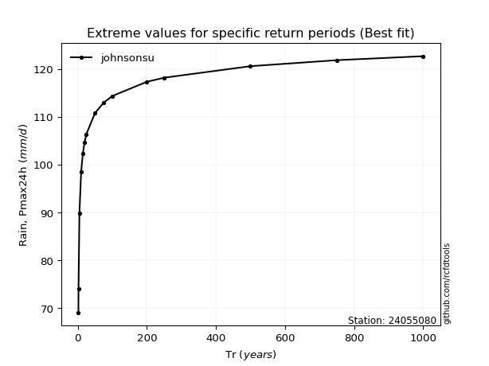</img>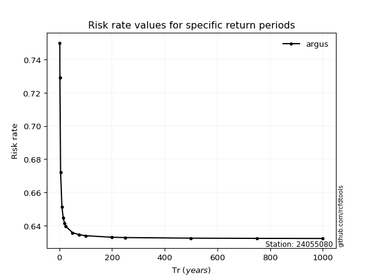</img>

</div>


<sub>**APP DISCLAIMER**: NO WARRANTY - This software is provided by [github.com/rcfdtools](https://github.com/rcfdtools) "as is", without any express or implied warranty, including warranties of merchantability, fitness for a particular purpose, or non-infringement. There is no guarantee that the software will be error-free or operate without interruption. LIMITATION OF LIABILITY - Neither the authors nor copyright holders will be liable for claims or damages arising from the software or its use. You are responsible for determining if the software is appropriate for your use and assume all associated risks, including errors, legal compliance, and data loss. NO PROFESSIONAL ADVICE - The software provides general information and does not offer professional advice. It should not replace consultation with professional advisors.</sub>