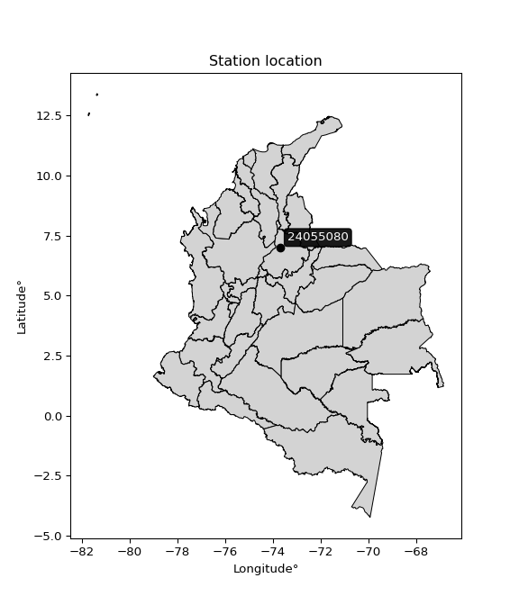

<div align="center">


</div>

# PMP Station (rain, Pmax24h): 24055080

Probable Maximum Precipitation (PMP) is the greatest amount of rainfall for a specific duration that is meteorologically possible for a given location, acting as a "worst-case" scenario for extreme storms, crucial for designing safety-critical infrastructure like bridges, river deviations, dams, spillways, and nuclear plants to prevent catastrophic failure. PMP is calculated by hydrologists using meteorological data to determine the upper limit of extreme rainfall, often leading to the Probable Maximum Flood (PMF) for flood control design, and is increasingly being studied for climate change impacts.

<div align="center">

</img>

</div>


## A. General information


### 1. General running parameters

• app_version: _v20251227_. • runtime: _2025-12-27 09:02:11.367833_. • Python version: _3.14.0_. • SciPy version: _1.16.3_. • Pandas version: _2.3.3_. • NumPy version: _2.3.5_. • Stations dataset (station_dataset_file): _dataset/pmax24h_in/automatic_colombia_2003_2024_filter.csv_. • Stations catalog (station_catalog_file): _dataset/CNE_IDEAM.xls_. • Minimum year to eval til year_max (date_min): _2003_. • Maximum year to eval since year_min (date_max): _2024_. • Creates, save and include plots into reports (create_plot): _False_. • Plot only fit distributions with Δo > Δ (plot_only_fit): _True_. • Eval low extreme values, if False, evaluates high extreme values (low_extreme): _False_. • Eval every SciPy distribution as logarithmic (pdist_logarithmic_on): _True_. • Standard deviation normalized (ddof): _1.0_. • Return periods to eval in years (Tr): _[2, 2.33, 5, 10, 15, 20, 25, 50, 75, 100, 200, 250, 500, 750, 1000]_. • Minimum data sample per station, 0 means any (minimum_sample): _5_. • Z-Score threshold to adjust a value, 0 means disable (zscore): _3.5_. • Avoid zeros, e.g. rain = 0 (avoid_zeros): _True_. • Avoid null values (avoid_nans): _True_. [:file_folder:Dataset file.](../../dataset/pmax24h_in/automatic_colombia_2003_2024_filter.csv)

> Delta Degrees of Freedom (DDOF): is a parameter used in the formulas for calculating variance and standard deviation. When ddof=0, the divisor is $N$ (the total number of observations) and this is used when your data set is the entire population. When ddof=1, the divisor is $N-1$ and this is used when your data set is a sample drawn from a larger population. Using $N-1$ provides an unbiased estimate of the population variance (known as Bessel´s correction).


### 2. Station info and location

|   id |   CODIGO | NOMBRE                               | CATEGORIA         | TECNOLOGIA                | ESTADO   | FECHA_INSTALACION   |   FECHA_SUSPENSION |   ALTITUD |   LATITUD |   LONGITUD | DEPARTAMENTO   | MUNICIPIO       | AREA_OPERATIVA                         | ENTIDAD                                                     | AREA_HIDROGRAFICA   | ZONA_HIDROGRAFICA   | SUBZONA_HIDROGRAFICA   |   CORRIENTE | Catalogo   |
|-----:|---------:|:-------------------------------------|:------------------|:--------------------------|:---------|:--------------------|-------------------:|----------:|----------:|-----------:|:---------------|:----------------|:---------------------------------------|:------------------------------------------------------------|:--------------------|:--------------------|:-----------------------|------------:|:-----------|
|    0 | 24055080 | VIZCAINA LA LIZAMA  - AUT [24055080] | Agrometeorológica | Automática con Telemetría | Activa   | 25/10/2004          |                nan |        94 |   6.98297 |   -73.7049 | Santander      | Barrancabermeja | Area Operativa 08 - Santanderes-Arauca | INSTITUTO DE HIDROLOGIA METEOROLOGIA Y ESTUDIOS AMBIENTALES | Magdalena Cauca     | Sogamoso            | Río Sogamoso           |         nan | CNE_IDEAM  |

<div align="center">

Map location in: [:earth_americas:Google](http://maps.google.com/maps?q=6.98297,-73.70489) [:earth_americas:OSM](https://www.openstreetmap.org/#map=18/6.98297/-73.70489&layers=P) [:earth_americas:Bing](https://www.bing.com/maps?cp=6.98297~-73.70489&lvl=18) [:earth_americas:Apple](https://maps.apple.com/frame?center=6.98297%2C-73.70489&span=0.003%2C0.006)

</div>


<div align="center">

```geojson
{
  "type": "Feature",
  "geometry": {
    "type": "Point", 
    "coordinates": [-73.70489, 6.98297]
  }, 
  "properties": {
    "Name": "24055080"
  }
}
```

</div>


### 3. Discrete values table and plot

|               |           0 |           1 |          2 |          3 |           4 |          5 |
|:--------------|------------:|------------:|-----------:|-----------:|------------:|-----------:|
| Date          | 2017        | 2018        | 2019       | 2020       | 2021        | 2022       |
| Value         |   66.5      |   71.8      |   86.1     |   40.4     |   85.9      |  106.7     |
| Value_initial |   66.5      |   71.8      |   86.1     |   40.4     |   85.9      |  106.7     |
| count         |    6        |    6        |    6       |    6       |    6        |    6       |
| mean          |   76.2333   |   76.2333   |   76.2333  |   76.2333  |   76.2333   |   76.2333  |
| std           |   22.4385   |   22.4385   |   22.4385  |   22.4385  |   22.4385   |   22.4385  |
| zscore        |   -0.433778 |   -0.197577 |    0.43972 |   -1.59696 |    0.430807 |    1.35778 |

> The initial value (value_initial) correspond to the initial obtained or null completed value, and value (value) is adjusted only when the initial value is outside the valid range definite through the Z-Score value. If Z-Score is active, values out of range or outliers are replaced with the station mean value


### 4. Active continuous probability distributions from SciPy (45 of 104 available)

[scipy.stats](https://docs.scipy.org/doc/scipy/reference/stats.html) is a Python´s powerful submodule within the SciPy library for comprehensive statistical analysis, offering over 130 probability distributions (like Normal, Poisson), functions for descriptive stats (mean, variance), hypothesis testing (t-tests, chi-square), random variable generation, and statistical tests, making it essential for data science, modeling, and research. It provides tools to explore, model, and draw conclusions from data efficiently, working seamlessly with NumPy.

<div align="center">

|   id | p_dist             |   n_parameter | fit_method   | label                                                                       | active   | ref                                                                                                        |
|-----:|:-------------------|--------------:|:-------------|:----------------------------------------------------------------------------|:---------|:-----------------------------------------------------------------------------------------------------------|
|    0 | alpha              |             3 | MLE          | Alpha                                                                       | True     | [:mortar_board:](https://docs.scipy.org/doc/scipy/reference/generated/scipy.stats.alpha.html)              |
|    1 | betaprime          |             4 | MLE          | Beta prime                                                                  | True     | [:mortar_board:](https://docs.scipy.org/doc/scipy/reference/generated/scipy.stats.betaprime.html)          |
|    2 | chi2               |             3 | MLE          | Chi²                                                                        | True     | [:mortar_board:](https://docs.scipy.org/doc/scipy/reference/generated/scipy.stats.chi2.html)               |
|    3 | crystalball        |             4 | MLE          | Crystalball                                                                 | True     | [:mortar_board:](https://docs.scipy.org/doc/scipy/reference/generated/scipy.stats.crystalball.html)        |
|    4 | erlang             |             3 | MLE          | Erlang                                                                      | True     | [:mortar_board:](https://docs.scipy.org/doc/scipy/reference/generated/scipy.stats.erlang.html)             |
|    5 | expon              |             2 | MLE          | Exponential                                                                 | True     | [:mortar_board:](https://docs.scipy.org/doc/scipy/reference/generated/scipy.stats.expon.html)              |
|    6 | exponnorm          |             3 | MLE          | Exponentially modified Normal                                               | True     | [:mortar_board:](https://docs.scipy.org/doc/scipy/reference/generated/scipy.stats.exponnorm.html)          |
|    7 | f                  |             4 | MLE          | F                                                                           | True     | [:mortar_board:](https://docs.scipy.org/doc/scipy/reference/generated/scipy.stats.f.html)                  |
|    8 | fatiguelife        |             3 | MLE          | Fatigue-life (Birnbaum-Saunders)                                            | True     | [:mortar_board:](https://docs.scipy.org/doc/scipy/reference/generated/scipy.stats.fatiguelife.html)        |
|    9 | fisk               |             3 | MLE          | Fisk                                                                        | True     | [:mortar_board:](https://docs.scipy.org/doc/scipy/reference/generated/scipy.stats.fisk.html)               |
|   10 | gamma              |             3 | MLE          | Gamma                                                                       | True     | [:mortar_board:](https://docs.scipy.org/doc/scipy/reference/generated/scipy.stats.gamma.html)              |
|   11 | genexpon           |             5 | MLE          | Generalized exponential                                                     | True     | [:mortar_board:](https://docs.scipy.org/doc/scipy/reference/generated/scipy.stats.genexpon.html)           |
|   12 | genlogistic        |             3 | MLE          | Generalized logistic                                                        | True     | [:mortar_board:](https://docs.scipy.org/doc/scipy/reference/generated/scipy.stats.genlogistic.html)        |
|   13 | gibrat             |             2 | MM           | Gibrat                                                                      | True     | [:mortar_board:](https://docs.scipy.org/doc/scipy/reference/generated/scipy.stats.gibrat.html)             |
|   14 | gompertz           |             3 | MLE          | Gompertz (or truncated Gumbel)                                              | True     | [:mortar_board:](https://docs.scipy.org/doc/scipy/reference/generated/scipy.stats.gompertz.html)           |
|   15 | gumbel_l           |             2 | MM           | Gumbel Left Skew                                                            | True     | [:mortar_board:](https://docs.scipy.org/doc/scipy/reference/generated/scipy.stats.gumbel_l.html)           |
|   16 | gumbel_r           |             2 | MM           | Gumbel Right Skew                                                           | True     | [:mortar_board:](https://docs.scipy.org/doc/scipy/reference/generated/scipy.stats.gumbel_r.html)           |
|   17 | halflogistic       |             2 | MM           | Half-logistic                                                               | True     | [:mortar_board:](https://docs.scipy.org/doc/scipy/reference/generated/scipy.stats.halflogistic.html)       |
|   18 | halfnorm           |             2 | MM           | Half Normal                                                                 | True     | [:mortar_board:](https://docs.scipy.org/doc/scipy/reference/generated/scipy.stats.halfnorm.html)           |
|   19 | hypsecant          |             2 | MM           | hyperbolic secant                                                           | True     | [:mortar_board:](https://docs.scipy.org/doc/scipy/reference/generated/scipy.stats.hypsecant.html)          |
|   20 | invgamma           |             3 | MLE          | Inverted gamma                                                              | True     | [:mortar_board:](https://docs.scipy.org/doc/scipy/reference/generated/scipy.stats.invgamma.html)           |
|   21 | invgauss           |             3 | MLE          | Inverse Gaussian                                                            | True     | [:mortar_board:](https://docs.scipy.org/doc/scipy/reference/generated/scipy.stats.invgauss.html)           |
|   22 | invweibull         |             3 | MLE          | Inverted Weibull                                                            | True     | [:mortar_board:](https://docs.scipy.org/doc/scipy/reference/generated/scipy.stats.invweibull.html)         |
|   23 | johnsonsu          |             4 | MLE          | Johnson Su                                                                  | True     | [:mortar_board:](https://docs.scipy.org/doc/scipy/reference/generated/scipy.stats.johnsonsu.html)          |
|   24 | kstwobign          |             2 | MLE          | Limiting distribution of scaled Kolmogorov-Smirnov two-sided test statistic | True     | [:mortar_board:](https://docs.scipy.org/doc/scipy/reference/generated/scipy.stats.kstwobign.html)          |
|   25 | laplace            |             2 | MM           | Laplace                                                                     | True     | [:mortar_board:](https://docs.scipy.org/doc/scipy/reference/generated/scipy.stats.laplace.html)            |
|   26 | laplace_asymmetric |             3 | MLE          | Asymmetric Laplace                                                          | True     | [:mortar_board:](https://docs.scipy.org/doc/scipy/reference/generated/scipy.stats.laplace_asymmetric.html) |
|   27 | loggamma           |             3 | MLE          | Log gamma                                                                   | True     | [:mortar_board:](https://docs.scipy.org/doc/scipy/reference/generated/scipy.stats.loggamma.html)           |
|   28 | logistic           |             2 | MM           | Logistic (or Sech-squared)                                                  | True     | [:mortar_board:](https://docs.scipy.org/doc/scipy/reference/generated/scipy.stats.logistic.html)           |
|   29 | lognorm            |             3 | MLE          | Log Normal                                                                  | True     | [:mortar_board:](https://docs.scipy.org/doc/scipy/reference/generated/scipy.stats.lognorm.html)            |
|   30 | maxwell            |             2 | MM           | Maxwell                                                                     | True     | [:mortar_board:](https://docs.scipy.org/doc/scipy/reference/generated/scipy.stats.maxwell.html)            |
|   31 | mielke             |             4 | MLE          | Mielke Beta-Kappa / Dagum                                                   | True     | [:mortar_board:](https://docs.scipy.org/doc/scipy/reference/generated/scipy.stats.mielke.html)             |
|   32 | moyal              |             2 | MM           | Moyal                                                                       | True     | [:mortar_board:](https://docs.scipy.org/doc/scipy/reference/generated/scipy.stats.moyal.html)              |
|   33 | nakagami           |             3 | MLE          | Nakagami                                                                    | True     | [:mortar_board:](https://docs.scipy.org/doc/scipy/reference/generated/scipy.stats.nakagami.html)           |
|   34 | ncf                |             5 | MLE          | Non-central F distribution                                                  | True     | [:mortar_board:](https://docs.scipy.org/doc/scipy/reference/generated/scipy.stats.ncf.html)                |
|   35 | nct                |             4 | MLE          | Non-central Student’s t                                                     | True     | [:mortar_board:](https://docs.scipy.org/doc/scipy/reference/generated/scipy.stats.nct.html)                |
|   36 | norm               |             2 | MM           | Normal                                                                      | True     | [:mortar_board:](https://docs.scipy.org/doc/scipy/reference/generated/scipy.stats.norm.html)               |
|   37 | pareto             |             3 | MLE          | Pareto                                                                      | True     | [:mortar_board:](https://docs.scipy.org/doc/scipy/reference/generated/scipy.stats.pareto.html)             |
|   38 | pearson3           |             3 | MM           | Pearson type III                                                            | True     | [:mortar_board:](https://docs.scipy.org/doc/scipy/reference/generated/scipy.stats.pearson3.html)           |
|   39 | rayleigh           |             2 | MM           | Rayleigh                                                                    | True     | [:mortar_board:](https://docs.scipy.org/doc/scipy/reference/generated/scipy.stats.rayleigh.html)           |
|   40 | rice               |             3 | MLE          | Rice                                                                        | True     | [:mortar_board:](https://docs.scipy.org/doc/scipy/reference/generated/scipy.stats.rice.html)               |
|   41 | t                  |             3 | MLE          | Student’s t                                                                 | True     | [:mortar_board:](https://docs.scipy.org/doc/scipy/reference/generated/scipy.stats.t.html)                  |
|   42 | truncnorm          |             4 | MLE          | Truncated normal                                                            | True     | [:mortar_board:](https://docs.scipy.org/doc/scipy/reference/generated/scipy.stats.truncnorm.html)          |
|   43 | wald               |             2 | MM           | Wald                                                                        | True     | [:mortar_board:](https://docs.scipy.org/doc/scipy/reference/generated/scipy.stats.wald.html)               |
|   44 | weibull_min        |             3 | MLE          | Weibull minimum                                                             | True     | [:mortar_board:](https://docs.scipy.org/doc/scipy/reference/generated/scipy.stats.weibull_min.html)        |

</div>

> **n_parameter:** # arguments & localization & scale.
>
> **Fit methods:** (MLE) maximum likelihood, (MM) L-moments.
>
>**Inactive:** foldnorm, gennorm, norminvgauss, powernorm, powerlognorm, skewnorm, genextreme, anglit, arcsine, argus, beta, bradford, burr, burr12, cauchy, cosine, halfcauchy, foldcauchy, skewcauchy, wrapcauchy, dgamma, gengamma, exponweib, exponpow, truncexpon, gausshyper, genhalflogistic, genhyperbolic, geninvgauss, halfgennorm, johnsonsb, kappa4, kappa3, ksone, kstwo, loglaplace, levy, levy_l, levy_stable, ncx2, genpareto, truncpareto, lomax, powerlaw, rdist, rel_breitwigner, recipinvgauss, semicircular, studentized_range, trapezoid, triang, truncweibull_min, tukeylambda, uniform, loguniform, vonmises, vonmises_line, weibull_max, dweibull, 


## B. Probability distributions vs. Empirical distributions

A continuous probability distribution (CPD) describes probabilities for variables that can take any value within a range (like rain any time), unlike discrete variables with specific outcomes (like temperature). It uses a Probability Density Function (PDF), a curve where the total area under it equals 1, and the probability of the variable falling within an interval (a to b) is found by calculating the area under the curve between those points. A key feature is that the probability of hitting any single exact value is zero, so probabilities are always expressed for ranges, e.g., $P(a ≤ X ≤ b)$.

<div align="center">

Distributions parameters from station values
|    |   station | p_dist                |   n |               loc |            scale | shape                  | shape1                 | shape2                | shape3   |
|---:|----------:|:----------------------|----:|------------------:|-----------------:|:-----------------------|:-----------------------|:----------------------|:---------|
|  0 |  24055080 | alpha                 |   6 |    -337.362       |   8056.19        | 19.540202721219444     |                        |                       |          |
|  1 |  24055080 | betaprime             |   6 |      -0.412561    |     71.7893      | 22.956319221997113     | 22.16536393855911      |                       |          |
|  2 |  24055080 | chi2                  |   6 |      40.4         |      1.3473      | 0.8664950836971363     |                        |                       |          |
|  3 |  24055080 | crystalball           |   6 |      76.2333      |     20.4835      | 908.8809404820079      | 13364.16060738306      |                       |          |
|  4 |  24055080 | erlang                |   6 |    -265.899       |      1.26473     | 270.3795272288478      |                        |                       |          |
|  5 |  24055080 | expon                 |   6 |      40.4         |     35.8333      |                        |                        |                       |          |
|  6 |  24055080 | exponnorm             |   6 |      76.2158      |     20.4834      | 0.0008532685685565903  |                        |                       |          |
|  7 |  24055080 | f                     |   6 |   -5192           |   5268.19        | 141378.85493516136     | 1888813.6696812185     |                       |          |
|  8 |  24055080 | fatiguelife           |   6 |      40.4         |      6.6178e-05  | 660.5864835007164      |                        |                       |          |
|  9 |  24055080 | fisk                  |   6 |      -7.22096e+08 |      7.22096e+08 | 61236062.115330815     |                        |                       |          |
| 10 |  24055080 | gamma                 |   6 |    -273.603       |      1.22996     | 284.4083638927964      |                        |                       |          |
| 11 |  24055080 | genexpon              |   6 |      40.1979      |      0.94171     | 0.02614470928839898    | 3.6743022153140566e-08 | 1.6001905284438105    |          |
| 12 |  24055080 | genlogistic           |   6 |      85.7609      |      9.32812     | 0.5873711376467563     |                        |                       |          |
| 13 |  24055080 | gibrat                |   6 |      60.6071      |      9.47782     |                        |                        |                       |          |
| 14 |  24055080 | gompertz              |   6 |      46.7753      |      2.16912     | 4.9998720605654125e-12 |                        |                       |          |
| 15 |  24055080 | gumbel_l              |   6 |      85.452       |     15.9709      |                        |                        |                       |          |
| 16 |  24055080 | gumbel_r              |   6 |      67.0147      |     15.9709      |                        |                        |                       |          |
| 17 |  24055080 | halflogistic          |   6 |      51.9557      |     17.5126      |                        |                        |                       |          |
| 18 |  24055080 | halfnorm              |   6 |      49.1212      |     33.98        |                        |                        |                       |          |
| 19 |  24055080 | hypsecant             |   6 |      76.2333      |     13.0402      |                        |                        |                       |          |
| 20 |  24055080 | invgamma              |   6 |    -156.975       |  27886.2         | 120.7253500849146      |                        |                       |          |
| 21 |  24055080 | invgauss              |   6 |     -14.3431      |   1412.96        | 0.06374600832236388    |                        |                       |          |
| 22 |  24055080 | invweibull            |   6 |      40.4         |      1.63528     | 0.04722441593618499    |                        |                       |          |
| 23 |  24055080 | johnsonsu             |   6 |     184.969       |     23.5577      | 12.032204267787833     | 5.425570984024247      |                       |          |
| 24 |  24055080 | kstwobign             |   6 |      -7.04342     |     95.2033      |                        |                        |                       |          |
| 25 |  24055080 | laplace               |   6 |      76.2333      |     14.484       |                        |                        |                       |          |
| 26 |  24055080 | laplace_asymmetric    |   6 |      85.9         |     14.3286      | 1.3926817467004589     |                        |                       |          |
| 27 |  24055080 | loggamma              |   6 |      26.5432      |     39.0616      | 4.056751460059438      |                        |                       |          |
| 28 |  24055080 | logistic              |   6 |      76.2333      |     11.2931      |                        |                        |                       |          |
| 29 |  24055080 | lognorm               |   6 |      40.4         |      0.0964052   | 13.526424687856021     |                        |                       |          |
| 30 |  24055080 | maxwell               |   6 |      27.6961      |     30.4162      |                        |                        |                       |          |
| 31 |  24055080 | mielke                |   6 |      40.4         |     66.8805      | 0.7756301604799046     | 11.346871003885553     |                       |          |
| 32 |  24055080 | moyal                 |   6 |      64.5196      |      9.2208      |                        |                        |                       |          |
| 33 |  24055080 | nakagami              |   6 |      66.5         |     25.0492      | 0.19692131107138905    |                        |                       |          |
| 34 |  24055080 | ncf                   |   6 |      -2.46653     |      3.26792e-05 | 2.315037915405427e-05  | 969.9152343266076      | 55.65994901497916     |          |
| 35 |  24055080 | nct                   |   6 |    1238.9         |     20.4474      | 453195.11691334506     | -56.86103854055408     |                       |          |
| 36 |  24055080 | norm                  |   6 |      76.2333      |     20.4835      |                        |                        |                       |          |
| 37 |  24055080 | pareto                |   6 |      40.2876      |      0.112375    | 0.20348091954822012    |                        |                       |          |
| 38 |  24055080 | pearson3              |   6 |      76.2333      |     20.4834      | -0.32725862888149737   |                        |                       |          |
| 39 |  24055080 | rayleigh              |   6 |      37.0473      |     31.266       |                        |                        |                       |          |
| 40 |  24055080 | rice                  |   6 |      27.8063      |     22.5927      | 1.8483768211851803     |                        |                       |          |
| 41 |  24055080 | t                     |   6 |      76.2302      |     20.4835      | 3141992.7142276377     |                        |                       |          |
| 42 |  24055080 | truncnorm             |   6 |      76.2333      |     20.4835      | -557.5900365948555     | 6307.404048514574      |                       |          |
| 43 |  24055080 | wald                  |   6 |      55.7499      |     20.4835      |                        |                        |                       |          |
| 44 |  24055080 | weibull_min           |   6 |     -17.5045      |    101.82        | 5.392181829282841      |                        |                       |          |
| 45 |  24055080 | logalpha              |   6 |      -6.98587     |    407.554       | 36.17888814251664      |                        |                       |          |
| 46 |  24055080 | logbetaprime          |   6 |     -98.4656      |     82.108       | 253068.95652523194     | 202212.1793918215      |                       |          |
| 47 |  24055080 | logchi2               |   6 |       3.69883     |      0.996543    | 1.0202320702843348     |                        |                       |          |
| 48 |  24055080 | logcrystalball        |   6 |       4.29144     |      0.304625    | 910.4741191830834      | 46.0189114950352       |                       |          |
| 49 |  24055080 | logerlang             |   6 |      -0.588287    |      0.0199389   | 244.57274259403954     |                        |                       |          |
| 50 |  24055080 | logexpon              |   6 |       3.69883     |      0.592609    |                        |                        |                       |          |
| 51 |  24055080 | logexponnorm          |   6 |       4.29131     |      0.304625    | 0.00042502176000213743 |                        |                       |          |
| 52 |  24055080 | logf                  |   6 |    -241.985       |    246.277       | 1453451.4659441686     | 13001502.971207246     |                       |          |
| 53 |  24055080 | logfatiguelife        |   6 |    -211.37        |    215.662       | 0.0014083758526199403  |                        |                       |          |
| 54 |  24055080 | logfisk               |   6 |      -1.89694e+07 |      1.89694e+07 | 112677100.40341075     |                        |                       |          |
| 55 |  24055080 | loggamma              |   6 |      -0.667124    |      0.0197528   | 250.7836803890301      |                        |                       |          |
| 56 |  24055080 | loggenexpon           |   6 |       3.69633     |      0.00439703  | 0.002705469843673209   | 1.9647216953329147     | 2.800098258311241e-05 |          |
| 57 |  24055080 | loggenlogistic        |   6 |       4.55884     |      0.0783186   | 0.26517714297726513    |                        |                       |          |
| 58 |  24055080 | loggibrat             |   6 |       4.05907     |      0.140937    |                        |                        |                       |          |
| 59 |  24055080 | loggompertz           |   6 |       3.69883     |      0.270503    | 0.0763489882484325     |                        |                       |          |
| 60 |  24055080 | loggumbel_l           |   6 |       4.42854     |      0.237515    |                        |                        |                       |          |
| 61 |  24055080 | loggumbel_r           |   6 |       4.15434     |      0.237515    |                        |                        |                       |          |
| 62 |  24055080 | loghalflogistic       |   6 |       3.93039     |      0.26044     |                        |                        |                       |          |
| 63 |  24055080 | loghalfnorm           |   6 |       3.88826     |      0.505311    |                        |                        |                       |          |
| 64 |  24055080 | loghypsecant          |   6 |       4.29144     |      0.19393     |                        |                        |                       |          |
| 65 |  24055080 | loginvgamma           |   6 |      -6.69529     |  13550.3         | 1234.7177294449752     |                        |                       |          |
| 66 |  24055080 | loginvgauss           |   6 |       1.04929     |    314.845       | 0.010290986053289219   |                        |                       |          |
| 67 |  24055080 | loginvweibull         |   6 | -117859           | 117864           | 351033.1487056917      |                        |                       |          |
| 68 |  24055080 | logjohnsonsu          |   6 |       4.90341     |      0.0233245   | 7.656322761441436      | 1.9945639001762976     |                       |          |
| 69 |  24055080 | logkstwobign          |   6 |       2.93758     |      1.54658     |                        |                        |                       |          |
| 70 |  24055080 | loglaplace            |   6 |       4.29144     |      0.215403    |                        |                        |                       |          |
| 71 |  24055080 | loglaplace_asymmetric |   6 |       4.45551     |      0.184938    | 1.5374231085202488     |                        |                       |          |
| 72 |  24055080 | logloggamma           |   6 |       4.58616     |      0.136112    | 0.4617910804863061     |                        |                       |          |
| 73 |  24055080 | loglogistic           |   6 |       4.29144     |      0.167949    |                        |                        |                       |          |
| 74 |  24055080 | loglognorm            |   6 |       3.69883     |      0.00203277  | 13.038977754033326     |                        |                       |          |
| 75 |  24055080 | logmaxwell            |   6 |       3.5696      |      0.452342    |                        |                        |                       |          |
| 76 |  24055080 | logmielke             |   6 |       3.69883     |      1.02077     | 0.8193717520317203     | 20.462966088882247     |                       |          |
| 77 |  24055080 | logmoyal              |   6 |       4.11723     |      0.13713     |                        |                        |                       |          |
| 78 |  24055080 | lognakagami           |   6 |       4.1972      |      0.222319    | 0.11329632573482845    |                        |                       |          |
| 79 |  24055080 | logncf                |   6 |      -4.27384     |      8.53494     | 1093.4233463696237     | 1318.1497361589932     | 0.03374734614917292   |          |
| 80 |  24055080 | lognct                |   6 |      -9.80016     |      0.284177    | 6652.094732440477      | 49.57770665145212      |                       |          |
| 81 |  24055080 | lognorm               |   6 |       4.29144     |      0.304625    |                        |                        |                       |          |
| 82 |  24055080 | logpareto             |   6 |       3.69693     |      0.00190132  | 0.20338642840519275    |                        |                       |          |
| 83 |  24055080 | logpearson3           |   6 |       4.29144     |      0.304625    | -0.8610813979367251    |                        |                       |          |
| 84 |  24055080 | lograyleigh           |   6 |       3.70866     |      0.464989    |                        |                        |                       |          |
| 85 |  24055080 | logrice               |   6 |       3.47644     |      0.327453    | 2.2494405074049335     |                        |                       |          |
| 86 |  24055080 | logt                  |   6 |       4.29152     |      0.304545    | 3436.946580543945      |                        |                       |          |
| 87 |  24055080 | logtruncnorm          |   6 |      -0.105138    |      1.69761     | 2.240755092332084      | 2.9268114643259233     |                       |          |
| 88 |  24055080 | logwald               |   6 |       3.98685     |      0.304593    |                        |                        |                       |          |
| 89 |  24055080 | logweibull_min        |   6 |      -1.07286e+07 |      1.07286e+07 | 46749131.56065622      |                        |                       |          |

</div>

> **loc** (Location parameter): This shifts the distribution along the x-axis. For many common distributions, like the normal (Gaussian) distribution, loc represents the mean $μ$. For others, like the uniform distribution, it might represent the minimum value, or for the beta distribution, the left end of the support interval.
>
> **scale** (Scale parameter): This determines the width or spread of the distribution. For the normal distribution, scale represents the standard deviation $σ$. For a uniform distribution, it defines the length of the interval (from $loc$ to $loc + scale$).
>
> **shape** (Shape parameters): Refers to parameters that define the specific form of a probability distribution, distinct from its location (loc) and scale (scale). These parameters are required arguments for most distribution functions. For example, a normal (Gaussian) distribution is fully defined by its location (mean) and scale (standard deviation), so it has no specific shape parameters beyond loc and scale. However, other distributions have intrinsic properties that need specification, as Gamma distribution that takes a shape parameter, often named $a$ or $alpha$.


### 0. Cumulative distribution values - CDF (90 evaluated)

Cumulative Distribution Function (CDF), denoted as $F$<sub>$X$</sub>$(x)$, is a function that gives the probability that a random variable $X$ will take a value less than or equal to a specific value, $x$ (i.e., $(P(X≥x)$. It essentially "accumulates" probabilities from a given point up to the far right (positive infinity), providing a complete picture of the distribution´s probabilities for both discrete (like rain) and continuous (like temperature) variables, helping to find probabilities over ranges or above certain values.

<div align="center">

CDF ordered by x ascending and calculating $log(f(x))$ separately
|   id |   Station |   date |     x |   count |    mean |     std |    zscore |   Value_initial |   station |   m |     alpha |   alpha_pdf |   betaprime |   betaprime_pdf |        chi2 |    chi2_pdf |   crystalball |   crystalball_pdf |    erlang |   erlang_pdf |    expon |   expon_pdf |   exponnorm |   exponnorm_pdf |         f |      f_pdf |   fatiguelife |   fatiguelife_pdf |      fisk |   fisk_pdf |     gamma |   gamma_pdf |   genexpon |   genexpon_pdf |   genlogistic |   genlogistic_pdf |   gibrat |   gibrat_pdf |    gompertz |   gompertz_pdf |   gumbel_l |   gumbel_l_pdf |   gumbel_r |   gumbel_r_pdf |   halflogistic |   halflogistic_pdf |   halfnorm |   halfnorm_pdf |   hypsecant |   hypsecant_pdf |   invgamma |   invgamma_pdf |   invgauss |   invgauss_pdf |   invweibull |   invweibull_pdf |   johnsonsu |   johnsonsu_pdf |   kstwobign |   kstwobign_pdf |   laplace |   laplace_pdf |   laplace_asymmetric |   laplace_asymmetric_pdf |   loggamma |   loggamma_pdf |   logistic |   logistic_pdf |   lognorm |   lognorm_pdf |   maxwell |   maxwell_pdf |      mielke |   mielke_pdf |       moyal |   moyal_pdf |    nakagami |   nakagami_pdf |       ncf |    ncf_pdf |       nct |    nct_pdf |      norm |   norm_pdf |   pareto |   pareto_pdf |   pearson3 |   pearson3_pdf |   rayleigh |   rayleigh_pdf |      rice |   rice_pdf |         t |      t_pdf |   truncnorm |   truncnorm_pdf |     wald |   wald_pdf |   weibull_min |   weibull_min_pdf |   logalpha |   logalpha_pdf |   logbetaprime |   logbetaprime_pdf |     logchi2 |   logchi2_pdf |   logcrystalball |   logcrystalball_pdf |   logerlang |   logerlang_pdf |   logexpon |   logexpon_pdf |   logexponnorm |   logexponnorm_pdf |      logf |   logf_pdf |   logfatiguelife |   logfatiguelife_pdf |   logfisk |   logfisk_pdf |   loggenexpon |   loggenexpon_pdf |   loggenlogistic |   loggenlogistic_pdf |   loggibrat |   loggibrat_pdf |   loggompertz |   loggompertz_pdf |   loggumbel_l |   loggumbel_l_pdf |   loggumbel_r |   loggumbel_r_pdf |   loghalflogistic |   loghalflogistic_pdf |   loghalfnorm |   loghalfnorm_pdf |   loghypsecant |   loghypsecant_pdf |   loginvgamma |   loginvgamma_pdf |   loginvgauss |   loginvgauss_pdf |   loginvweibull |   loginvweibull_pdf |   logjohnsonsu |   logjohnsonsu_pdf |   logkstwobign |   logkstwobign_pdf |   loglaplace |   loglaplace_pdf |   loglaplace_asymmetric |   loglaplace_asymmetric_pdf |   logloggamma |   logloggamma_pdf |   loglogistic |   loglogistic_pdf |   loglognorm |   loglognorm_pdf |   logmaxwell |   logmaxwell_pdf |   logmielke |   logmielke_pdf |    logmoyal |   logmoyal_pdf |   lognakagami |   lognakagami_pdf |   logncf |   logncf_pdf |    lognct |   lognct_pdf |   logpareto |   logpareto_pdf |   logpearson3 |   logpearson3_pdf |   lograyleigh |   lograyleigh_pdf |   logrice |   logrice_pdf |     logt |   logt_pdf |   logtruncnorm |   logtruncnorm_pdf |   logwald |   logwald_pdf |   logweibull_min |   logweibull_min_pdf |
|-----:|----------:|-------:|------:|--------:|--------:|--------:|----------:|----------------:|----------:|----:|----------:|------------:|------------:|----------------:|------------:|------------:|--------------:|------------------:|----------:|-------------:|---------:|------------:|------------:|----------------:|----------:|-----------:|--------------:|------------------:|----------:|-----------:|----------:|------------:|-----------:|---------------:|--------------:|------------------:|---------:|-------------:|------------:|---------------:|-----------:|---------------:|-----------:|---------------:|---------------:|-------------------:|-----------:|---------------:|------------:|----------------:|-----------:|---------------:|-----------:|---------------:|-------------:|-----------------:|------------:|----------------:|------------:|----------------:|----------:|--------------:|---------------------:|-------------------------:|-----------:|---------------:|-----------:|---------------:|----------:|--------------:|----------:|--------------:|------------:|-------------:|------------:|------------:|------------:|---------------:|----------:|-----------:|----------:|-----------:|----------:|-----------:|---------:|-------------:|-----------:|---------------:|-----------:|---------------:|----------:|-----------:|----------:|-----------:|------------:|----------------:|---------:|-----------:|--------------:|------------------:|-----------:|---------------:|---------------:|-------------------:|------------:|--------------:|-----------------:|---------------------:|------------:|----------------:|-----------:|---------------:|---------------:|-------------------:|----------:|-----------:|-----------------:|---------------------:|----------:|--------------:|--------------:|------------------:|-----------------:|---------------------:|------------:|----------------:|--------------:|------------------:|--------------:|------------------:|--------------:|------------------:|------------------:|----------------------:|--------------:|------------------:|---------------:|-------------------:|--------------:|------------------:|--------------:|------------------:|----------------:|--------------------:|---------------:|-------------------:|---------------:|-------------------:|-------------:|-----------------:|------------------------:|----------------------------:|--------------:|------------------:|--------------:|------------------:|-------------:|-----------------:|-------------:|-----------------:|------------:|----------------:|------------:|---------------:|--------------:|------------------:|---------:|-------------:|----------:|-------------:|------------:|----------------:|--------------:|------------------:|--------------:|------------------:|----------:|--------------:|---------:|-----------:|---------------:|-------------------:|----------:|--------------:|-----------------:|---------------------:|
|    0 |  24055080 |   2020 |  40.4 |       6 | 76.2333 | 22.4385 | -1.59696  |            40.4 |  24055080 |   1 | 0.0370564 |  0.00457102 |   0.0230966 |      0.00439259 | 5.44899e-07 | 3.32248e+07 |     0.0401128 |        0.00421663 | 0.0393968 |   0.00440566 | 0        |  0.027907   |   0.0401125 |      0.00421662 | 0.0404742 | 0.00425584 |     0.0425049 |       1.52485e+09 | 0.0423296 | 0.00343774 | 0.0384468 |  0.00432395 | 0.00559403 |     0.0276077  |      0.057223 |        0.00357557 | 0        |   0          | 0           |    0           |  0.0578148 |     0.00351329 | 0.00502494 |     0.00166545 |       0        |         0          |   0        |     0          |   0.0407269 |      0.00311467 |   0.035586 |     0.00459723 |  0.0297626 |     0.00508489 |    0.0085066 |      2.69507e+11 |   0.0539402 |      0.00405756 |   0.0350018 |      0.00659228 | 0.0421238 |    0.0029083  |            0.0674811 |               0.00338163 |  0.0263389 |       0.212396 |  0.0401937 |     0.00341607 | 0.0258653 |      0.197405 | 0.0183949 |    0.00419389 | 1.41511e-06 |   0.570665   | 0.000216996 | 0.000171411 | 0           |    0           | 0.0315128 | 0.00451231 | 0.0401249 | 0.00421663 | 0.0401128 | 0.00421663 | 0        |  1.81073     |  0.0485425 |     0.00416198 | 0.00573291 |     0.00341003 | 0.0295914 | 0.0049121  | 0.0401263 | 0.00421777 |   0.0401128 |      0.00421663 | 0        | 0          |     0.0465528 |        0.00423258 |  0.0247157 |       0.206654 |       0.025958 |           0.197971 | 1.16926e-08 |    1.3431e+07 |        0.0258652 |             0.197405 |   0.0255481 |        0.208057 |   0        |       1.68745  |      0.0258647 |           0.197402 | 0.0256215 |   0.196201 |        0.0252829 |             0.194781 | 0.0232393 |      0.134832 |    0.00154787 |          0.621454 |        0.0543722 |             0.184094 |    0        |        0        |   1.96813e-07 |          0.282249 |     0.0452606 |           0.18618 |    0.00110702 |          0.031722 |          0        |              0        |      0        |          0        |      0.0299538 |           0.154228 |     0.0264368 |          0.210838 |     0.0262646 |          0.22807  |       0.0277046 |            0.295905 |       0.0555   |           0.185482 |      0.0312919 |           0.377534 |    0.0319266 |         0.148218 |               0.0490897 |                    0.172652 |     0.0556074 |          0.18847  |     0.0285118 |          0.164925 |    0.0126834 |      5.65913e+12 |   0.00605135 |         0.138201 | 1.31218e-09 |       72.873    | 4.26952e-06 |    0.000343451 |   0           |       0           | 0.119954 |     0.432489 | 0.0273875 |     0.206474 |    0        |     106.971     |     0.0437787 |          0.203887 |      0        |          0        | 0.0214695 |      0.219647 | 0.02586  |   0.197246 |    6.99224e-05 |           1.76597  |  0        |      0        |        0.0406243 |             0.173373 |
|    1 |  24055080 |   2017 |  66.5 |       6 | 76.2333 | 22.4385 | -0.433778 |            66.5 |  24055080 |   2 | 0.341749  |  0.0181335  |   0.361744  |      0.0187015  | 0.999992    | 3.11411e-06 |     0.317329  |        0.0173971  | 0.328639  |   0.0177155  | 0.517306 |  0.0134705  |   0.31733   |      0.0173971  | 0.318905  | 0.017406   |     0.829116  |       0.00462402  | 0.28789   | 0.0173855  | 0.325435  |  0.0176885  | 0.518199   |     0.0133762  |      0.277215 |        0.0154908  | 0.317323 |   0.0604704  | 4.44756e-08 |    2.05063e-08 |  0.263053  |     0.0140847  | 0.356026   |     0.0230223  |       0.392923 |         0.0241429  |   0.390958 |     0.0206024  |   0.281822  |      0.0188969  |   0.346189 |     0.0183355  |  0.379409  |     0.0188226  |    0.415872  |      0.000660195 |   0.292972  |      0.0154489  |   0.410521  |      0.0174986  | 0.255342  |    0.0176292  |            0.24958   |               0.012507   |  0.394988  |       1.24582  |  0.296946  |     0.0184864  | 0.378527  |      1.24843  | 0.346846  |    0.0189214  | 0.481983    |   0.014323   | 0.369092    | 0.0259613   | 7.81856e-07 |    2.16685e+07 | 0.345239  | 0.0183767  | 0.317306  | 0.0173951  | 0.317329  | 0.0173971  | 0.670246 |  0.00255981  |  0.302358  |     0.0161953  | 0.358334   |     0.0193326  | 0.331539  | 0.0177037  | 0.317384  | 0.0173983  |   0.317329  |      0.0173971  | 0.386382 | 0.0413111  |     0.298455  |        0.0159624  |  0.395512  |       1.25524  |       0.377462 |           1.2409   | 0.512514    |    0.443321   |        0.378527  |             1.24843  |   0.392651  |        1.24825  |   0.568712 |       0.727778 |      0.378524  |           1.24843  | 0.37764   |   1.24792  |        0.377633  |             1.25173  | 0.314731  |      1.2811   |    0.485592   |          1.04849  |        0.293148  |             0.982857 |    0.491968 |        2.88762  |   0.333382    |          1.18755  |     0.314481  |           1.08977 |    0.433923   |          1.52528  |          0.471681 |              1.4927   |      0.459058 |          1.30982  |      0.351075  |           1.46497  |     0.392345  |          1.24289  |     0.407418  |          1.21718  |       0.443598  |            1.07389  |       0.298394 |           0.979071 |      0.479186  |           1.03463  |    0.322827  |         1.49872  |               0.283285  |                    0.996332 |     0.296376  |          0.966659 |     0.363292  |          1.37727  |    0.663474  |      0.0561629   |   0.411879   |         1.29687  | 0.555737    |        0.913684 | 0.455013    |    1.64419     |   0.000451138 |       1.15094e+11 | 0.448831 |     0.807047 | 0.382935  |     1.23621  |    0.678061 |       0.130885  |     0.330261  |          1.08903  |      0.424166 |          1.30111  | 0.38909   |      1.23876  | 0.378409 |   1.24852  |    0.637282    |           0.876145 |  0.509692 |      2.12934  |        0.304984  |             1.10183  |
|    2 |  24055080 |   2018 |  71.8 |       6 | 76.2333 | 22.4385 | -0.197577 |            71.8 |  24055080 |   3 | 0.440657  |  0.0189849  |   0.460484  |      0.0183612  | 0.999999    | 3.92298e-07 |     0.414324  |        0.0190254  | 0.426478  |   0.019013   | 0.583671 |  0.0116185  |   0.414325  |      0.0190255  | 0.415852  | 0.0189978  |     0.851466  |       0.00384612  | 0.387889  | 0.0201349  | 0.423259  |  0.0190346  | 0.584124   |     0.011546   |      0.368707 |        0.0189697  | 0.566051 |   0.0351527  | 5.12052e-07 |    2.36066e-07 |  0.34647   |     0.017406   | 0.476592   |     0.0221152  |       0.512837 |         0.0210419  |   0.495493 |     0.0187927  |   0.393809  |      0.0230641  |   0.44579  |     0.0190398  |  0.478734  |     0.018466   |    0.419056  |      0.000548156 |   0.38156   |      0.0178934  |   0.50092   |      0.0165035  | 0.368162  |    0.0254185  |            0.325504  |               0.0163117  |  0.492211  |       1.27715  |  0.403099  |     0.0213059  | 0.477024  |      1.30744  | 0.448601  |    0.0192761  | 0.55629     |   0.0137387  | 0.500422    | 0.0232325   | 0.427993    |    0.0315707   | 0.444716  | 0.0189554  | 0.414293  | 0.0190242  | 0.414324  | 0.0190254  | 0.682373 |  0.00205097  |  0.394215  |     0.0183437  | 0.460837   |     0.0191675  | 0.428776  | 0.0188153  | 0.414384  | 0.019026   |   0.414324  |      0.0190254  | 0.565669 | 0.0272529  |     0.389214  |        0.0181817  |  0.493304  |       1.28226  |       0.475352 |           1.29936  | 0.544701    |    0.397704   |        0.477024  |             1.30744  |   0.490133  |        1.28137  |   0.62106  |       0.639443 |      0.477021  |           1.30745  | 0.476115  |   1.30738  |        0.476408  |             1.31127  | 0.420042  |      1.44701  |    0.563678   |          0.984214 |        0.378433  |             1.2485   |    0.663284 |        1.69936  |   0.430772    |          1.3464   |     0.406347  |           1.30335 |    0.546333   |          1.39053  |          0.577996 |              1.27845  |      0.554621 |          1.1801   |      0.471227  |           1.63466  |     0.489476  |          1.2777   |     0.501346  |          1.22113  |       0.523682  |            1.00891  |       0.382125 |           1.20757  |      0.555751  |           0.958654 |    0.460869  |         2.13957  |               0.370981  |                    1.30476  |     0.379316  |          1.2006   |     0.473894  |          1.48449  |    0.66747   |      0.0484458   |   0.510842   |         1.27243  | 0.624881    |        0.89036  | 0.572169    |    1.40099     |   0.64797     |       1.89166     | 0.510817 |     0.806382 | 0.480222  |     1.28854  |    0.687265 |       0.110244  |     0.420364  |          1.25629  |      0.522313 |          1.24876  | 0.48606   |      1.27813  | 0.476919 |   1.30767  |    0.700743    |           0.780577 |  0.644077 |      1.42922  |        0.3984    |             1.33212  |
|    3 |  24055080 |   2021 |  85.9 |       6 | 76.2333 | 22.4385 |  0.430807 |            85.9 |  24055080 |   4 | 0.693785  |  0.0157794  |   0.690051  |      0.0136185  | 1           | 1.69743e-09 |     0.68151   |        0.0174239  | 0.687572  |   0.0167015  | 0.719103 |  0.00783898 |   0.681512  |      0.0174239  | 0.682111  | 0.017337   |     0.8953    |       0.00250299  | 0.676893  | 0.0185472  | 0.685376  |  0.016807   | 0.718839   |     0.00780588 |      0.668464 |        0.020889   | 0.836844 |   0.00974301 | 0.000340642 |    0.000157015 |  0.642439  |     0.0230252  | 0.736006   |     0.0141256  |       0.748325 |         0.0125626  |   0.72091  |     0.0130715  |   0.716916  |      0.018958   |   0.697171 |     0.0155315  |  0.709497  |     0.0136568  |    0.425432  |      0.000377376 |   0.656635  |      0.0195955  |   0.703682  |      0.0120343  | 0.74348   |    0.0177106  |            0.659813  |               0.0330648  |  0.708079  |       1.07364  |  0.70182   |     0.0185306  | 0.702279  |      1.13743  | 0.699624  |    0.015395   | 0.741094    |   0.0124756  | 0.753759    | 0.0129203   | 0.701057    |    0.0128893   | 0.693795  | 0.0153635  | 0.68148   | 0.0174253  | 0.68151   | 0.0174239  | 0.705397 |  0.00131425  |  0.666299  |     0.0187256  | 0.704973   |     0.0147437  | 0.686474  | 0.0165268  | 0.681563  | 0.0174226  |   0.68151   |      0.0174239  | 0.805057 | 0.0101117  |     0.662709  |        0.0191154  |  0.709031  |       1.06781  |       0.699424 |           1.13354  | 0.608429    |    0.318236   |        0.702279  |             1.13743  |   0.706918  |        1.0789   |   0.719992 |       0.4725   |      0.702276  |           1.13744  | 0.701451  |   1.13836  |        0.702273  |             1.13993  | 0.677527  |      1.29779  |    0.721789   |          0.768902 |        0.657755  |             1.76826  |    0.848099 |        0.596587 |   0.688106    |          1.4314   |     0.670226  |           1.54025 |    0.752643   |          0.900464 |          0.763132 |              0.801778 |      0.736421 |          0.845235 |      0.739168  |           1.19943  |     0.70605   |          1.08002  |     0.704547  |          1.00148  |       0.684389  |            0.772987 |       0.643582 |           1.64941  |      0.707907  |           0.733319 |    0.764029  |         1.09549  |               0.696982  |                    2.45133  |     0.642405  |          1.6745   |     0.723735  |          1.1905   |    0.674996  |      0.0365917   |   0.717917   |         0.998836 | 0.780437    |        0.845967 | 0.768929    |    0.818569    |   0.840119    |       0.649496    | 0.650263 |     0.733825 | 0.701636  |     1.11725  |    0.704012 |       0.0796026 |     0.666725  |          1.41467  |      0.722481 |          0.955624 | 0.704015  |      1.09411  | 0.702223 |   1.13768  |    0.823042    |           0.591114 |  0.816843 |      0.630563 |        0.670432  |             1.594    |
|    4 |  24055080 |   2019 |  86.1 |       6 | 76.2333 | 22.4385 |  0.43972  |            86.1 |  24055080 |   5 | 0.696932  |  0.0156922  |   0.692766  |      0.013534   | 1           | 1.57209e-09 |     0.684987  |        0.017343   | 0.690904  |   0.0166176  | 0.720666 |  0.00779535 |   0.684989  |      0.017343   | 0.68557   | 0.0172561  |     0.895799  |       0.00248887  | 0.680591  | 0.0184351  | 0.688729  |  0.0167234  | 0.720396   |     0.00776266 |      0.672632 |        0.0207922  | 0.838778 |   0.00959183 | 0.000373538 |    0.000172175 |  0.647043  |     0.0230152  | 0.738819   |     0.0140031  |       0.750827 |         0.0124555  |   0.723516 |     0.0129883  |   0.720689  |      0.0187744  |   0.700269 |     0.0154428  |  0.71222   |     0.01357    |    0.425507  |      0.000375713 |   0.66055   |      0.0195476  |   0.706082  |      0.0119654  | 0.746998  |    0.0174677  |            0.666362  |               0.0324282  |  0.71057   |       1.06902  |  0.705513  |     0.0183974  | 0.704918  |      1.1328   | 0.702694  |    0.0153069  | 0.743588    |   0.0124548  | 0.75633     | 0.0127944   | 0.703623    |    0.0127781   | 0.696859  | 0.0152767  | 0.684957  | 0.0173444  | 0.684987  | 0.017343   | 0.705659 |  0.00130735  |  0.670038  |     0.0186636  | 0.707913   |     0.0146566  | 0.689771  | 0.016447   | 0.68504   | 0.0173417  |   0.684987  |      0.017343   | 0.807066 | 0.00998543 |     0.666527  |        0.0190601  |  0.711509  |       1.0631   |       0.702055 |           1.129    | 0.609168    |    0.317386   |        0.704918  |             1.1328   |   0.709422  |        1.07426  |   0.721089 |       0.47065  |      0.704916  |           1.1328   | 0.704093  |   1.13374  |        0.704919  |             1.13526  | 0.680537  |      1.29138  |    0.723573   |          0.765791 |        0.661867  |             1.76833  |    0.849478 |        0.5895   |   0.691431    |          1.42837  |     0.673806  |           1.53852 |    0.75473    |          0.894162 |          0.76499  |              0.796326 |      0.738382 |          0.840888 |      0.741945  |           1.18961  |     0.708556  |          1.07543  |     0.706871  |          0.997162 |       0.686182  |            0.769664 |       0.64742  |           1.65158  |      0.709609  |           0.730287 |    0.766563  |         1.08373  |               0.702706  |                    2.47146  |     0.646302  |          1.67685  |     0.726495  |          1.1831   |    0.675081  |      0.0364753   |   0.720234   |         0.994055 | 0.782404    |        0.84538  | 0.770825    |    0.812247    |   0.841622    |       0.643203    | 0.651968 |     0.732323 | 0.704229  |     1.11275  |    0.704197 |       0.079309  |     0.670013  |          1.41321  |      0.724698 |          0.950951 | 0.706554  |      1.08963  | 0.704863 |   1.13304  |    0.824415    |           0.588944 |  0.818303 |      0.624502 |        0.674136  |             1.59214  |
|    5 |  24055080 |   2022 | 106.7 |       6 | 76.2333 | 22.4385 |  1.35778  |           106.7 |  24055080 |   6 | 0.918966  |  0.00613295 |   0.887406  |      0.00590008 | 1           | 6.09176e-13 |     0.931543  |        0.00644337 | 0.926705  |   0.00631699 | 0.842799 |  0.00438699 |   0.931544  |      0.00644331 | 0.931014  | 0.00643643 |     0.935139  |       0.00144645  | 0.924382  | 0.00592771 | 0.926337  |  0.00636711 | 0.84218    |     0.00438157 |      0.942561 |        0.00568615 | 0.943142 |   0.00247753 | 0.993098    |    0.0158329   |  0.977237  |     0.00539122 | 0.92004    |     0.00480087 |       0.915905 |         0.00460008 |   0.909828 |     0.00558756 |   0.938644  |      0.0046761  |   0.918057 |     0.00603757 |  0.904589  |     0.0056471  |    0.431888  |      0.00025828  |   0.949304  |      0.00692186 |   0.88489   |      0.00577495 | 0.938984  |    0.00421265 |            0.954948  |               0.00437888 |  0.888099  |       0.579057 |  0.936897  |     0.00523513 | 0.893026  |      0.605005 | 0.919573  |    0.00606609 | 0.950426    |   0.00583414 | 0.919117    | 0.00437084  | 0.882358    |    0.00561644  | 0.914078  | 0.00613596 | 0.931545  | 0.00644424 | 0.931543  | 0.00644337 | 0.727079 |  0.000836202 |  0.942137  |     0.00681727 | 0.916377   |     0.00595828 | 0.925787  | 0.00642202 | 0.931562  | 0.00644194 |   0.931543  |      0.00644337 | 0.927014 | 0.00318245 |     0.946058  |        0.00683776 |  0.887504  |       0.573207 |       0.89033  |           0.609841 | 0.669837    |    0.252201   |        0.893026  |             0.605005 |   0.887816  |        0.581624 |   0.805795 |       0.327712 |      0.893025  |           0.60501  | 0.892484  |   0.60655  |        0.893244  |             0.604829 | 0.883955  |      0.60931  |    0.857041   |          0.482822 |        0.944187  |             0.622529 |    0.928771 |        0.22273  |   0.932185    |          0.693765 |     0.936967  |           0.73355 |    0.892216   |          0.428412 |          0.889591 |              0.40053  |      0.878158 |          0.477137 |      0.910221  |           0.456833 |     0.887447  |          0.584137 |     0.874425  |          0.563802 |       0.819708  |            0.485354 |       0.953026 |           0.83432  |      0.837483  |           0.47008  |    0.913767  |         0.400333 |               0.950029  |                    0.41542  |     0.951616  |          0.799237 |     0.905008  |          0.511871 |    0.68194   |      0.0281678   |   0.884335   |         0.541453 | 0.94825     |        0.587806 | 0.894       |    0.384216    |   0.934913    |       0.281288    | 0.791211 |     0.555758 | 0.889893  |     0.603269 |    0.718806 |       0.0587724 |     0.923115  |          0.79858  |      0.882023 |          0.524566 | 0.888606  |      0.59529  | 0.892998 |   0.605032 |    0.931279    |           0.41608  |  0.908874 |      0.27632  |        0.942464  |             0.715865 |


</div>

An Empirical Distribution Function (EDF) is a step-function estimate of a true cumulative distribution function (CDF) based on observed sample data, representing the proportion of data points less than or equal to a given value. It is calculated by ordering your data and jumping up by $1/n$ (where $n$ is sample size) at each unique data point, allowing analysis without assuming an underlying population distribution, and it gets closer to the true CDF as the sample size grows.


### 1. Empirical - EDF California (1923)

California´s estimates the true probability distribution of water-related data (like rainfall, streamflow) using observed samples, crucial for risk assessment.

<div align="center">


$P=m/n$


</div>


**1.1. Empirical values**

<div align="center">

|                | 0                   | 1                  | 2              | 3                  | 4                  | 5              |
|:---------------|:--------------------|:-------------------|:---------------|:-------------------|:-------------------|:---------------|
| date           | 2020                | 2017               | 2018           | 2021               | 2019               | 2022           |
| x              | 40.4                | 66.5               | 71.8           | 85.9               | 86.1               | 106.7          |
| m              | 1                   | 2                  | 3              | 4                  | 5                  | 6              |
| empirical_dist | edf_california      | edf_california     | edf_california | edf_california     | edf_california     | edf_california |
| empirical      | 0.16666666666666666 | 0.3333333333333333 | 0.5            | 0.6666666666666666 | 0.8333333333333334 | 1.0            |
| empirical_tr   | 1.2                 | 1.4999999999999998 | 2.0            | 2.9999999999999996 | 6.000000000000002  | inf            |

</div>


**1.2. Kolmogorov-Smirnov fit test (sorted by Δ)**


<div align="center">

|                | 0                   | 1                   | 2                     | 3                   | 4                   | 5                   | 6                   | 7                   | 8                 | 9                   | 10               | 11                 | 12                  | 13                  | 14                 | 15                 | 16                  | 17                  | 18                  | 19                  | 20                  | 21                  | 22                  | 23                  | 24                  | 25                 | 26                  | 27                  | 28                 | 29                 | 30                 | 31                 | 32                  | 33                 | 34                  | 35                  | 36                  | 37                  | 38                  | 39                  | 40                  | 41                 | 42                  | 43                  | 44                  | 45                  | 46                  | 47                 | 48                  | 49                  | 50                  | 51                  | 52                  | 53                  | 54                  | 55                  | 56                  | 57                  | 58                  | 59                  | 60                  | 61                  | 62                  | 63                  | 64                | 65                  | 66                  | 67                 | 68                 | 69                  | 70                | 71                 | 72                 | 73                  | 74                  | 75                | 76                  | 77                  | 78                  | 79                 | 80                 | 81                  | 82                  | 83                  | 84                 | 85                 | 86                  | 87                 | 88                 | 89                 |
|:---------------|:--------------------|:--------------------|:----------------------|:--------------------|:--------------------|:--------------------|:--------------------|:--------------------|:------------------|:--------------------|:-----------------|:-------------------|:--------------------|:--------------------|:-------------------|:-------------------|:--------------------|:--------------------|:--------------------|:--------------------|:--------------------|:--------------------|:--------------------|:--------------------|:--------------------|:-------------------|:--------------------|:--------------------|:-------------------|:-------------------|:-------------------|:-------------------|:--------------------|:-------------------|:--------------------|:--------------------|:--------------------|:--------------------|:--------------------|:--------------------|:--------------------|:-------------------|:--------------------|:--------------------|:--------------------|:--------------------|:--------------------|:-------------------|:--------------------|:--------------------|:--------------------|:--------------------|:--------------------|:--------------------|:--------------------|:--------------------|:--------------------|:--------------------|:--------------------|:--------------------|:--------------------|:--------------------|:--------------------|:--------------------|:------------------|:--------------------|:--------------------|:-------------------|:-------------------|:--------------------|:------------------|:-------------------|:-------------------|:--------------------|:--------------------|:------------------|:--------------------|:--------------------|:--------------------|:-------------------|:-------------------|:--------------------|:--------------------|:--------------------|:-------------------|:-------------------|:--------------------|:-------------------|:-------------------|:-------------------|
| station        | 24055080            | 24055080            | 24055080              | 24055080            | 24055080            | 24055080            | 24055080            | 24055080            | 24055080          | 24055080            | 24055080         | 24055080           | 24055080            | 24055080            | 24055080           | 24055080           | 24055080            | 24055080            | 24055080            | 24055080            | 24055080            | 24055080            | 24055080            | 24055080            | 24055080            | 24055080           | 24055080            | 24055080            | 24055080           | 24055080           | 24055080           | 24055080           | 24055080            | 24055080           | 24055080            | 24055080            | 24055080            | 24055080            | 24055080            | 24055080            | 24055080            | 24055080           | 24055080            | 24055080            | 24055080            | 24055080            | 24055080            | 24055080           | 24055080            | 24055080            | 24055080            | 24055080            | 24055080            | 24055080            | 24055080            | 24055080            | 24055080            | 24055080            | 24055080            | 24055080            | 24055080            | 24055080            | 24055080            | 24055080            | 24055080          | 24055080            | 24055080            | 24055080           | 24055080           | 24055080            | 24055080          | 24055080           | 24055080           | 24055080            | 24055080            | 24055080          | 24055080            | 24055080            | 24055080            | 24055080           | 24055080           | 24055080            | 24055080            | 24055080            | 24055080           | 24055080           | 24055080            | 24055080           | 24055080           | 24055080           |
| empirical_dist | edf_california      | edf_california      | edf_california        | edf_california      | edf_california      | edf_california      | edf_california      | edf_california      | edf_california    | edf_california      | edf_california   | edf_california     | edf_california      | edf_california      | edf_california     | edf_california     | edf_california      | edf_california      | edf_california      | edf_california      | edf_california      | edf_california      | edf_california      | edf_california      | edf_california      | edf_california     | edf_california      | edf_california      | edf_california     | edf_california     | edf_california     | edf_california     | edf_california      | edf_california     | edf_california      | edf_california      | edf_california      | edf_california      | edf_california      | edf_california      | edf_california      | edf_california     | edf_california      | edf_california      | edf_california      | edf_california      | edf_california      | edf_california     | edf_california      | edf_california      | edf_california      | edf_california      | edf_california      | edf_california      | edf_california      | edf_california      | edf_california      | edf_california      | edf_california      | edf_california      | edf_california      | edf_california      | edf_california      | edf_california      | edf_california    | edf_california      | edf_california      | edf_california     | edf_california     | edf_california      | edf_california    | edf_california     | edf_california     | edf_california      | edf_california      | edf_california    | edf_california      | edf_california      | edf_california      | edf_california     | edf_california     | edf_california      | edf_california      | edf_california      | edf_california     | edf_california     | edf_california      | edf_california     | edf_california     | edf_california     |
| p_dist         | hypsecant           | logistic            | loglaplace_asymmetric | kstwobign           | laplace             | invgamma            | loglaplace          | alpha               | ncf               | loghypsecant        | invgauss         | loglogistic        | lognct              | loginvgamma         | loggamma           | loggamma           | loginvgauss         | logbetaprime        | lognorm             | lognorm             | logcrystalball      | logexponnorm        | logt                | logf                | logerlang           | logfatiguelife     | logalpha            | erlang              | rice               | betaprime          | gamma              | logrice            | f                   | maxwell            | t                   | exponnorm           | truncnorm           | norm                | crystalball         | nct                 | fisk                | logfisk            | logweibull_min      | loggumbel_l         | logmaxwell          | genlogistic         | rayleigh            | gumbel_r           | logkstwobign        | pearson3            | logpearson3         | loggenexpon         | loggumbel_r         | moyal               | logmoyal            | mielke              | loggompertz         | lograyleigh         | halfnorm            | halflogistic        | loghalfnorm         | loghalflogistic     | wald                | weibull_min         | gibrat            | loggenlogistic      | johnsonsu           | laplace_asymmetric | logwald            | loginvweibull       | loggibrat         | expon              | genexpon           | logjohnsonsu        | gumbel_l            | logloggamma       | logncf              | logmielke           | logexpon            | logtruncnorm       | loglognorm         | logchi2             | lognakagami         | nakagami            | pareto             | logpareto          | fatiguelife         | invweibull         | chi2               | gompertz           |
| delta          | 0.12593974453409068 | 0.12782083297748337 | 0.13062767267901088   | 0.13166483485958302 | 0.13183797836469346 | 0.13306441657980217 | 0.13474003121603637 | 0.13640099296096297 | 0.136473859647691 | 0.13671288753205363 | 0.13690409997312 | 0.1381548191737389 | 0.13927917433297196 | 0.14022984264169358 | 0.1403278116653641 | 0.1403278116653641 | 0.14040207137730723 | 0.14070862613304053 | 0.14080138564214728 | 0.14080138564214728 | 0.14080145177894887 | 0.14080201158025119 | 0.14080671298893604 | 0.14104517151358162 | 0.14111853122056972 | 0.1413838081126049 | 0.14195096646843286 | 0.14242946971822024 | 0.1435622158815707 | 0.1435700653931011 | 0.1446044776217883 | 0.1451971522869139 | 0.14776325569825777 | 0.1482717353347528 | 0.14829341836394738 | 0.14834481562798463 | 0.14834662522809006 | 0.14834663578558605 | 0.14834664028104094 | 0.14837643470392237 | 0.15274221214587835 | 0.1527960048866518 | 0.15919694852513244 | 0.15952684044177567 | 0.16061532077431812 | 0.16070099672630833 | 0.16093376011122948 | 0.1616417263277301 | 0.16251732800619023 | 0.16329563380056433 | 0.16332038104272717 | 0.16511879203870042 | 0.16555964957363078 | 0.16644967077187836 | 0.16666239714905665 | 0.16666525155514408 | 0.16666646985348663 | 0.16666666666666666 | 0.16666666666666666 | 0.16666666666666666 | 0.16666666666666666 | 0.16666666666666666 | 0.16666666666666666 | 0.16680641946046715 | 0.170177824692601 | 0.17146584391793995 | 0.17278351720568674 | 0.1744964153415453 | 0.1763589873116707 | 0.18029224155172807 | 0.181432679312319 | 0.1839725346737408 | 0.1848661662799232 | 0.18591313552013333 | 0.18629020368239613 | 0.187031818734532 | 0.20878866104163618 | 0.22240336135135202 | 0.23537911460182154 | 0.3039488009739118 | 0.3301401834297059 | 0.33016255196879496 | 0.33288219580140127 | 0.33333255147769125 | 0.3369123590499629 | 0.3447275410846666 | 0.49578222571929714 | 0.5681121500450818 | 0.6666587026446664 | 0.8329597955753473 |
| deltao         | 0.530385761606      | 0.530385761606      | 0.530385761606        | 0.530385761606      | 0.530385761606      | 0.530385761606      | 0.530385761606      | 0.530385761606      | 0.530385761606    | 0.530385761606      | 0.530385761606   | 0.530385761606     | 0.530385761606      | 0.530385761606      | 0.530385761606     | 0.530385761606     | 0.530385761606      | 0.530385761606      | 0.530385761606      | 0.530385761606      | 0.530385761606      | 0.530385761606      | 0.530385761606      | 0.530385761606      | 0.530385761606      | 0.530385761606     | 0.530385761606      | 0.530385761606      | 0.530385761606     | 0.530385761606     | 0.530385761606     | 0.530385761606     | 0.530385761606      | 0.530385761606     | 0.530385761606      | 0.530385761606      | 0.530385761606      | 0.530385761606      | 0.530385761606      | 0.530385761606      | 0.530385761606      | 0.530385761606     | 0.530385761606      | 0.530385761606      | 0.530385761606      | 0.530385761606      | 0.530385761606      | 0.530385761606     | 0.530385761606      | 0.530385761606      | 0.530385761606      | 0.530385761606      | 0.530385761606      | 0.530385761606      | 0.530385761606      | 0.530385761606      | 0.530385761606      | 0.530385761606      | 0.530385761606      | 0.530385761606      | 0.530385761606      | 0.530385761606      | 0.530385761606      | 0.530385761606      | 0.530385761606    | 0.530385761606      | 0.530385761606      | 0.530385761606     | 0.530385761606     | 0.530385761606      | 0.530385761606    | 0.530385761606     | 0.530385761606     | 0.530385761606      | 0.530385761606      | 0.530385761606    | 0.530385761606      | 0.530385761606      | 0.530385761606      | 0.530385761606     | 0.530385761606     | 0.530385761606      | 0.530385761606      | 0.530385761606      | 0.530385761606     | 0.530385761606     | 0.530385761606      | 0.530385761606     | 0.530385761606     | 0.530385761606     |
| eval           | Δo > Δ              | Δo > Δ              | Δo > Δ                | Δo > Δ              | Δo > Δ              | Δo > Δ              | Δo > Δ              | Δo > Δ              | Δo > Δ            | Δo > Δ              | Δo > Δ           | Δo > Δ             | Δo > Δ              | Δo > Δ              | Δo > Δ             | Δo > Δ             | Δo > Δ              | Δo > Δ              | Δo > Δ              | Δo > Δ              | Δo > Δ              | Δo > Δ              | Δo > Δ              | Δo > Δ              | Δo > Δ              | Δo > Δ             | Δo > Δ              | Δo > Δ              | Δo > Δ             | Δo > Δ             | Δo > Δ             | Δo > Δ             | Δo > Δ              | Δo > Δ             | Δo > Δ              | Δo > Δ              | Δo > Δ              | Δo > Δ              | Δo > Δ              | Δo > Δ              | Δo > Δ              | Δo > Δ             | Δo > Δ              | Δo > Δ              | Δo > Δ              | Δo > Δ              | Δo > Δ              | Δo > Δ             | Δo > Δ              | Δo > Δ              | Δo > Δ              | Δo > Δ              | Δo > Δ              | Δo > Δ              | Δo > Δ              | Δo > Δ              | Δo > Δ              | Δo > Δ              | Δo > Δ              | Δo > Δ              | Δo > Δ              | Δo > Δ              | Δo > Δ              | Δo > Δ              | Δo > Δ            | Δo > Δ              | Δo > Δ              | Δo > Δ             | Δo > Δ             | Δo > Δ              | Δo > Δ            | Δo > Δ             | Δo > Δ             | Δo > Δ              | Δo > Δ              | Δo > Δ            | Δo > Δ              | Δo > Δ              | Δo > Δ              | Δo > Δ             | Δo > Δ             | Δo > Δ              | Δo > Δ              | Δo > Δ              | Δo > Δ             | Δo > Δ             | Δo > Δ              | Δo <= Δ            | Δo <= Δ            | Δo <= Δ            |
| fit            | 1                   | 1                   | 1                     | 1                   | 1                   | 1                   | 1                   | 1                   | 1                 | 1                   | 1                | 1                  | 1                   | 1                   | 1                  | 1                  | 1                   | 1                   | 1                   | 1                   | 1                   | 1                   | 1                   | 1                   | 1                   | 1                  | 1                   | 1                   | 1                  | 1                  | 1                  | 1                  | 1                   | 1                  | 1                   | 1                   | 1                   | 1                   | 1                   | 1                   | 1                   | 1                  | 1                   | 1                   | 1                   | 1                   | 1                   | 1                  | 1                   | 1                   | 1                   | 1                   | 1                   | 1                   | 1                   | 1                   | 1                   | 1                   | 1                   | 1                   | 1                   | 1                   | 1                   | 1                   | 1                 | 1                   | 1                   | 1                  | 1                  | 1                   | 1                 | 1                  | 1                  | 1                   | 1                   | 1                 | 1                   | 1                   | 1                   | 1                  | 1                  | 1                   | 1                   | 1                   | 1                  | 1                  | 1                   | 0                  | 0                  | 0                  |
| n              | 6                   | 6                   | 6                     | 6                   | 6                   | 6                   | 6                   | 6                   | 6                 | 6                   | 6                | 6                  | 6                   | 6                   | 6                  | 6                  | 6                   | 6                   | 6                   | 6                   | 6                   | 6                   | 6                   | 6                   | 6                   | 6                  | 6                   | 6                   | 6                  | 6                  | 6                  | 6                  | 6                   | 6                  | 6                   | 6                   | 6                   | 6                   | 6                   | 6                   | 6                   | 6                  | 6                   | 6                   | 6                   | 6                   | 6                   | 6                  | 6                   | 6                   | 6                   | 6                   | 6                   | 6                   | 6                   | 6                   | 6                   | 6                   | 6                   | 6                   | 6                   | 6                   | 6                   | 6                   | 6                 | 6                   | 6                   | 6                  | 6                  | 6                   | 6                 | 6                  | 6                  | 6                   | 6                   | 6                 | 6                   | 6                   | 6                   | 6                  | 6                  | 6                   | 6                   | 6                   | 6                  | 6                  | 6                   | 6                  | 6                  | 6                  |
| best_fit       | 1                   | 0                   | 0                     | 0                   | 0                   | 0                   | 0                   | 0                   | 0                 | 0                   | 0                | 0                  | 0                   | 0                   | 0                  | 0                  | 0                   | 0                   | 0                   | 0                   | 0                   | 0                   | 0                   | 0                   | 0                   | 0                  | 0                   | 0                   | 0                  | 0                  | 0                  | 0                  | 0                   | 0                  | 0                   | 0                   | 0                   | 0                   | 0                   | 0                   | 0                   | 0                  | 0                   | 0                   | 0                   | 0                   | 0                   | 0                  | 0                   | 0                   | 0                   | 0                   | 0                   | 0                   | 0                   | 0                   | 0                   | 0                   | 0                   | 0                   | 0                   | 0                   | 0                   | 0                   | 0                 | 0                   | 0                   | 0                  | 0                  | 0                   | 0                 | 0                  | 0                  | 0                   | 0                   | 0                 | 0                   | 0                   | 0                   | 0                  | 0                  | 0                   | 0                   | 0                   | 0                  | 0                  | 0                   | 0                  | 0                  | 0                  |
| best_fit_sort  | 1                   | 2                   | 3                     | 4                   | 5                   | 6                   | 7                   | 8                   | 9                 | 10                  | 11               | 12                 | 13                  | 14                  | 15                 | 16                 | 17                  | 18                  | 19                  | 20                  | 21                  | 22                  | 23                  | 24                  | 25                  | 26                 | 27                  | 28                  | 29                 | 30                 | 31                 | 32                 | 33                  | 34                 | 35                  | 36                  | 37                  | 38                  | 39                  | 40                  | 41                  | 42                 | 43                  | 44                  | 45                  | 46                  | 47                  | 48                 | 49                  | 50                  | 51                  | 52                  | 53                  | 54                  | 55                  | 56                  | 57                  | 58                  | 59                  | 60                  | 61                  | 62                  | 63                  | 64                  | 65                | 66                  | 67                  | 68                 | 69                 | 70                  | 71                | 72                 | 73                 | 74                  | 75                  | 76                | 77                  | 78                  | 79                  | 80                 | 81                 | 82                  | 83                  | 84                  | 85                 | 86                 | 87                  | 88                 | 89                 | 90                 |

</div>


**1.3. Best fit**

<div align="center">

|   id |   station | empirical_dist   | p_dist    |   delta |   deltao | eval   |   fit |   n |   best_fit |   best_fit_sort |
|-----:|----------:|:-----------------|:----------|--------:|---------:|:-------|------:|----:|-----------:|----------------:|
|    0 |  24055080 | edf_california   | hypsecant | 0.12594 | 0.530386 | Δo > Δ |     1 |   6 |          1 |               1 |

</div>


### 2. Empirical - EDF Hazen (1930)

Hazen method for plotting positions is a formula used to estimate the empirical cumulative probability distribution of flood events or other hydrological data. This formula often results in biased estimations, particularly when extrapolating to extreme events (high return periods).

<div align="center">


$P=(m-0.5)/n$


</div>


**2.1. Empirical values**

<div align="center">

|                | 0                   | 1                  | 2                  | 3                  | 4         | 5                  |
|:---------------|:--------------------|:-------------------|:-------------------|:-------------------|:----------|:-------------------|
| date           | 2020                | 2017               | 2018               | 2021               | 2019      | 2022               |
| x              | 40.4                | 66.5               | 71.8               | 85.9               | 86.1      | 106.7              |
| m              | 1                   | 2                  | 3                  | 4                  | 5         | 6                  |
| empirical_dist | edf_hazen           | edf_hazen          | edf_hazen          | edf_hazen          | edf_hazen | edf_hazen          |
| empirical      | 0.08333333333333333 | 0.25               | 0.4166666666666667 | 0.5833333333333334 | 0.75      | 0.9166666666666666 |
| empirical_tr   | 1.090909090909091   | 1.3333333333333333 | 1.7142857142857144 | 2.4000000000000004 | 4.0       | 11.999999999999995 |

</div>


**2.2. Kolmogorov-Smirnov fit test (sorted by Δ)**


<div align="center">

|                | 0                   | 1                  | 2                   | 3                   | 4                  | 5                   | 6                   | 7                   | 8                   | 9                   | 10                  | 11                | 12                  | 13                  | 14                  | 15                  | 16                  | 17                  | 18                  | 19                  | 20                  | 21                  | 22                  | 23                  | 24                  | 25                  | 26                  | 27                  | 28                    | 29                  | 30                  | 31                  | 32                  | 33                 | 34                 | 35                  | 36                 | 37                  | 38                  | 39                  | 40                  | 41                  | 42                  | 43                  | 44                  | 45                  | 46                  | 47                  | 48                  | 49                 | 50                 | 51                  | 52                 | 53                  | 54                  | 55                 | 56                 | 57                  | 58                 | 59                  | 60                  | 61                  | 62                  | 63                  | 64                  | 65                  | 66                 | 67                 | 68                  | 69                 | 70                  | 71                | 72                  | 73                  | 74                | 75                | 76                  | 77                  | 78                 | 79                 | 80                  | 81                  | 82                 | 83                  | 84                  | 85                 | 86                 | 87                 | 88                 | 89                 |
|:---------------|:--------------------|:-------------------|:--------------------|:--------------------|:-------------------|:--------------------|:--------------------|:--------------------|:--------------------|:--------------------|:--------------------|:------------------|:--------------------|:--------------------|:--------------------|:--------------------|:--------------------|:--------------------|:--------------------|:--------------------|:--------------------|:--------------------|:--------------------|:--------------------|:--------------------|:--------------------|:--------------------|:--------------------|:----------------------|:--------------------|:--------------------|:--------------------|:--------------------|:-------------------|:-------------------|:--------------------|:-------------------|:--------------------|:--------------------|:--------------------|:--------------------|:--------------------|:--------------------|:--------------------|:--------------------|:--------------------|:--------------------|:--------------------|:--------------------|:-------------------|:-------------------|:--------------------|:-------------------|:--------------------|:--------------------|:-------------------|:-------------------|:--------------------|:-------------------|:--------------------|:--------------------|:--------------------|:--------------------|:--------------------|:--------------------|:--------------------|:-------------------|:-------------------|:--------------------|:-------------------|:--------------------|:------------------|:--------------------|:--------------------|:------------------|:------------------|:--------------------|:--------------------|:-------------------|:-------------------|:--------------------|:--------------------|:-------------------|:--------------------|:--------------------|:-------------------|:-------------------|:-------------------|:-------------------|:-------------------|
| station        | 24055080            | 24055080           | 24055080            | 24055080            | 24055080           | 24055080            | 24055080            | 24055080            | 24055080            | 24055080            | 24055080            | 24055080          | 24055080            | 24055080            | 24055080            | 24055080            | 24055080            | 24055080            | 24055080            | 24055080            | 24055080            | 24055080            | 24055080            | 24055080            | 24055080            | 24055080            | 24055080            | 24055080            | 24055080              | 24055080            | 24055080            | 24055080            | 24055080            | 24055080           | 24055080           | 24055080            | 24055080           | 24055080            | 24055080            | 24055080            | 24055080            | 24055080            | 24055080            | 24055080            | 24055080            | 24055080            | 24055080            | 24055080            | 24055080            | 24055080           | 24055080           | 24055080            | 24055080           | 24055080            | 24055080            | 24055080           | 24055080           | 24055080            | 24055080           | 24055080            | 24055080            | 24055080            | 24055080            | 24055080            | 24055080            | 24055080            | 24055080           | 24055080           | 24055080            | 24055080           | 24055080            | 24055080          | 24055080            | 24055080            | 24055080          | 24055080          | 24055080            | 24055080            | 24055080           | 24055080           | 24055080            | 24055080            | 24055080           | 24055080            | 24055080            | 24055080           | 24055080           | 24055080           | 24055080           | 24055080           |
| empirical_dist | edf_hazen           | edf_hazen          | edf_hazen           | edf_hazen           | edf_hazen          | edf_hazen           | edf_hazen           | edf_hazen           | edf_hazen           | edf_hazen           | edf_hazen           | edf_hazen         | edf_hazen           | edf_hazen           | edf_hazen           | edf_hazen           | edf_hazen           | edf_hazen           | edf_hazen           | edf_hazen           | edf_hazen           | edf_hazen           | edf_hazen           | edf_hazen           | edf_hazen           | edf_hazen           | edf_hazen           | edf_hazen           | edf_hazen             | edf_hazen           | edf_hazen           | edf_hazen           | edf_hazen           | edf_hazen          | edf_hazen          | edf_hazen           | edf_hazen          | edf_hazen           | edf_hazen           | edf_hazen           | edf_hazen           | edf_hazen           | edf_hazen           | edf_hazen           | edf_hazen           | edf_hazen           | edf_hazen           | edf_hazen           | edf_hazen           | edf_hazen          | edf_hazen          | edf_hazen           | edf_hazen          | edf_hazen           | edf_hazen           | edf_hazen          | edf_hazen          | edf_hazen           | edf_hazen          | edf_hazen           | edf_hazen           | edf_hazen           | edf_hazen           | edf_hazen           | edf_hazen           | edf_hazen           | edf_hazen          | edf_hazen          | edf_hazen           | edf_hazen          | edf_hazen           | edf_hazen         | edf_hazen           | edf_hazen           | edf_hazen         | edf_hazen         | edf_hazen           | edf_hazen           | edf_hazen          | edf_hazen          | edf_hazen           | edf_hazen           | edf_hazen          | edf_hazen           | edf_hazen           | edf_hazen          | edf_hazen          | edf_hazen          | edf_hazen          | edf_hazen          |
| p_dist         | pearson3            | logpearson3        | weibull_min         | genlogistic         | loggumbel_l        | logweibull_min      | loggenlogistic      | johnsonsu           | laplace_asymmetric  | fisk                | logfisk             | nct               | crystalball         | norm                | truncnorm           | exponnorm           | t                   | f                   | gamma               | logjohnsonsu        | gumbel_l            | rice                | logloggamma         | erlang              | loggompertz         | alpha               | ncf                 | betaprime           | loglaplace_asymmetric | invgamma            | maxwell             | logistic            | rayleigh            | logbetaprime       | logfatiguelife     | logf                | logt               | logexponnorm        | logcrystalball      | lognorm             | lognorm             | invgauss            | lognct              | hypsecant           | logrice             | loglogistic         | halfnorm            | loginvgamma         | logerlang           | loggamma           | loggamma           | logalpha            | gumbel_r           | loghypsecant        | loginvgauss         | laplace            | kstwobign          | logmaxwell          | halflogistic       | moyal               | lograyleigh         | loglaplace          | loggumbel_r         | loginvweibull       | logncf              | logmoyal            | loghalfnorm        | loghalflogistic    | wald                | logkstwobign       | mielke              | loggenexpon       | nakagami            | gibrat              | lognakagami       | logwald           | logchi2             | loggibrat           | expon              | genexpon           | logmielke           | logexpon            | logtruncnorm       | loglognorm          | pareto              | logpareto          | invweibull         | fatiguelife        | gompertz           | chi2               |
| delta          | 0.08296541654908507 | 0.0833913706775814 | 0.08347308612713378 | 0.08513082570908748 | 0.0868931524936466 | 0.08709819996439083 | 0.08813251058460658 | 0.08945018387235337 | 0.09116308200821199 | 0.09355952732191342 | 0.09419331603096348 | 0.098146582299801 | 0.09817665384059715 | 0.09817665829277566 | 0.09817666891874555 | 0.09817847405391678 | 0.09823013438735828 | 0.09877741879626456 | 0.10204246984719956 | 0.10257980218679996 | 0.10295687034906276 | 0.10314038302030792 | 0.10369848540119864 | 0.10423860831469434 | 0.10477277608878233 | 0.11045183195909025 | 0.11046211349121104 | 0.11174407509609668 | 0.11364818689602874   | 0.11383814021980565 | 0.11629086896635143 | 0.11848633455246393 | 0.12163924090786626 | 0.1274623721410913 | 0.1276325694687762 | 0.12763958080830562 | 0.1284092916200455 | 0.12852392128299056 | 0.12852675674760633 | 0.12852683456502867 | 0.12852683456502867 | 0.12940858515150572 | 0.13293510595221242 | 0.13358276632953126 | 0.13909000597433513 | 0.14040154421125073 | 0.14095788869331904 | 0.14234480406518474 | 0.14265109704481072 | 0.1449881818989664 | 0.1449881818989664 | 0.14551231169049117 | 0.1526730072771123 | 0.15583418103291258 | 0.15741787023264797 | 0.1601471483617588 | 0.1605205734300572 | 0.16187912261688758 | 0.1649921556348647 | 0.17042524566368666 | 0.17416580031924933 | 0.18069539475373197 | 0.18392250910993146 | 0.19359757854863424 | 0.19883117763811575 | 0.20501282648733254 | 0.2090580481403443 | 0.2216811400164393 | 0.22172334296808238 | 0.2291862389652607 | 0.23198252444254558 | 0.235591785446435 | 0.24999921814435794 | 0.25351115802593427 | 0.256785668103787 | 0.259692320645004 | 0.26251401658219153 | 0.26476601264565225 | 0.2673058680070741 | 0.2681994996132565 | 0.30573669468468534 | 0.31871244793515485 | 0.3872821343072451 | 0.41347351676303923 | 0.42024569238329623 | 0.4280608744179999 | 0.4847788167117484 | 0.5791155590526305 | 0.7496264622420139 | 0.7499920359779998 |
| deltao         | 0.530385761606      | 0.530385761606     | 0.530385761606      | 0.530385761606      | 0.530385761606     | 0.530385761606      | 0.530385761606      | 0.530385761606      | 0.530385761606      | 0.530385761606      | 0.530385761606      | 0.530385761606    | 0.530385761606      | 0.530385761606      | 0.530385761606      | 0.530385761606      | 0.530385761606      | 0.530385761606      | 0.530385761606      | 0.530385761606      | 0.530385761606      | 0.530385761606      | 0.530385761606      | 0.530385761606      | 0.530385761606      | 0.530385761606      | 0.530385761606      | 0.530385761606      | 0.530385761606        | 0.530385761606      | 0.530385761606      | 0.530385761606      | 0.530385761606      | 0.530385761606     | 0.530385761606     | 0.530385761606      | 0.530385761606     | 0.530385761606      | 0.530385761606      | 0.530385761606      | 0.530385761606      | 0.530385761606      | 0.530385761606      | 0.530385761606      | 0.530385761606      | 0.530385761606      | 0.530385761606      | 0.530385761606      | 0.530385761606      | 0.530385761606     | 0.530385761606     | 0.530385761606      | 0.530385761606     | 0.530385761606      | 0.530385761606      | 0.530385761606     | 0.530385761606     | 0.530385761606      | 0.530385761606     | 0.530385761606      | 0.530385761606      | 0.530385761606      | 0.530385761606      | 0.530385761606      | 0.530385761606      | 0.530385761606      | 0.530385761606     | 0.530385761606     | 0.530385761606      | 0.530385761606     | 0.530385761606      | 0.530385761606    | 0.530385761606      | 0.530385761606      | 0.530385761606    | 0.530385761606    | 0.530385761606      | 0.530385761606      | 0.530385761606     | 0.530385761606     | 0.530385761606      | 0.530385761606      | 0.530385761606     | 0.530385761606      | 0.530385761606      | 0.530385761606     | 0.530385761606     | 0.530385761606     | 0.530385761606     | 0.530385761606     |
| eval           | Δo > Δ              | Δo > Δ             | Δo > Δ              | Δo > Δ              | Δo > Δ             | Δo > Δ              | Δo > Δ              | Δo > Δ              | Δo > Δ              | Δo > Δ              | Δo > Δ              | Δo > Δ            | Δo > Δ              | Δo > Δ              | Δo > Δ              | Δo > Δ              | Δo > Δ              | Δo > Δ              | Δo > Δ              | Δo > Δ              | Δo > Δ              | Δo > Δ              | Δo > Δ              | Δo > Δ              | Δo > Δ              | Δo > Δ              | Δo > Δ              | Δo > Δ              | Δo > Δ                | Δo > Δ              | Δo > Δ              | Δo > Δ              | Δo > Δ              | Δo > Δ             | Δo > Δ             | Δo > Δ              | Δo > Δ             | Δo > Δ              | Δo > Δ              | Δo > Δ              | Δo > Δ              | Δo > Δ              | Δo > Δ              | Δo > Δ              | Δo > Δ              | Δo > Δ              | Δo > Δ              | Δo > Δ              | Δo > Δ              | Δo > Δ             | Δo > Δ             | Δo > Δ              | Δo > Δ             | Δo > Δ              | Δo > Δ              | Δo > Δ             | Δo > Δ             | Δo > Δ              | Δo > Δ             | Δo > Δ              | Δo > Δ              | Δo > Δ              | Δo > Δ              | Δo > Δ              | Δo > Δ              | Δo > Δ              | Δo > Δ             | Δo > Δ             | Δo > Δ              | Δo > Δ             | Δo > Δ              | Δo > Δ            | Δo > Δ              | Δo > Δ              | Δo > Δ            | Δo > Δ            | Δo > Δ              | Δo > Δ              | Δo > Δ             | Δo > Δ             | Δo > Δ              | Δo > Δ              | Δo > Δ             | Δo > Δ              | Δo > Δ              | Δo > Δ             | Δo > Δ             | Δo <= Δ            | Δo <= Δ            | Δo <= Δ            |
| fit            | 1                   | 1                  | 1                   | 1                   | 1                  | 1                   | 1                   | 1                   | 1                   | 1                   | 1                   | 1                 | 1                   | 1                   | 1                   | 1                   | 1                   | 1                   | 1                   | 1                   | 1                   | 1                   | 1                   | 1                   | 1                   | 1                   | 1                   | 1                   | 1                     | 1                   | 1                   | 1                   | 1                   | 1                  | 1                  | 1                   | 1                  | 1                   | 1                   | 1                   | 1                   | 1                   | 1                   | 1                   | 1                   | 1                   | 1                   | 1                   | 1                   | 1                  | 1                  | 1                   | 1                  | 1                   | 1                   | 1                  | 1                  | 1                   | 1                  | 1                   | 1                   | 1                   | 1                   | 1                   | 1                   | 1                   | 1                  | 1                  | 1                   | 1                  | 1                   | 1                 | 1                   | 1                   | 1                 | 1                 | 1                   | 1                   | 1                  | 1                  | 1                   | 1                   | 1                  | 1                   | 1                   | 1                  | 1                  | 0                  | 0                  | 0                  |
| n              | 6                   | 6                  | 6                   | 6                   | 6                  | 6                   | 6                   | 6                   | 6                   | 6                   | 6                   | 6                 | 6                   | 6                   | 6                   | 6                   | 6                   | 6                   | 6                   | 6                   | 6                   | 6                   | 6                   | 6                   | 6                   | 6                   | 6                   | 6                   | 6                     | 6                   | 6                   | 6                   | 6                   | 6                  | 6                  | 6                   | 6                  | 6                   | 6                   | 6                   | 6                   | 6                   | 6                   | 6                   | 6                   | 6                   | 6                   | 6                   | 6                   | 6                  | 6                  | 6                   | 6                  | 6                   | 6                   | 6                  | 6                  | 6                   | 6                  | 6                   | 6                   | 6                   | 6                   | 6                   | 6                   | 6                   | 6                  | 6                  | 6                   | 6                  | 6                   | 6                 | 6                   | 6                   | 6                 | 6                 | 6                   | 6                   | 6                  | 6                  | 6                   | 6                   | 6                  | 6                   | 6                   | 6                  | 6                  | 6                  | 6                  | 6                  |
| best_fit       | 1                   | 0                  | 0                   | 0                   | 0                  | 0                   | 0                   | 0                   | 0                   | 0                   | 0                   | 0                 | 0                   | 0                   | 0                   | 0                   | 0                   | 0                   | 0                   | 0                   | 0                   | 0                   | 0                   | 0                   | 0                   | 0                   | 0                   | 0                   | 0                     | 0                   | 0                   | 0                   | 0                   | 0                  | 0                  | 0                   | 0                  | 0                   | 0                   | 0                   | 0                   | 0                   | 0                   | 0                   | 0                   | 0                   | 0                   | 0                   | 0                   | 0                  | 0                  | 0                   | 0                  | 0                   | 0                   | 0                  | 0                  | 0                   | 0                  | 0                   | 0                   | 0                   | 0                   | 0                   | 0                   | 0                   | 0                  | 0                  | 0                   | 0                  | 0                   | 0                 | 0                   | 0                   | 0                 | 0                 | 0                   | 0                   | 0                  | 0                  | 0                   | 0                   | 0                  | 0                   | 0                   | 0                  | 0                  | 0                  | 0                  | 0                  |
| best_fit_sort  | 1                   | 2                  | 3                   | 4                   | 5                  | 6                   | 7                   | 8                   | 9                   | 10                  | 11                  | 12                | 13                  | 14                  | 15                  | 16                  | 17                  | 18                  | 19                  | 20                  | 21                  | 22                  | 23                  | 24                  | 25                  | 26                  | 27                  | 28                  | 29                    | 30                  | 31                  | 32                  | 33                  | 34                 | 35                 | 36                  | 37                 | 38                  | 39                  | 40                  | 41                  | 42                  | 43                  | 44                  | 45                  | 46                  | 47                  | 48                  | 49                  | 50                 | 51                 | 52                  | 53                 | 54                  | 55                  | 56                 | 57                 | 58                  | 59                 | 60                  | 61                  | 62                  | 63                  | 64                  | 65                  | 66                  | 67                 | 68                 | 69                  | 70                 | 71                  | 72                | 73                  | 74                  | 75                | 76                | 77                  | 78                  | 79                 | 80                 | 81                  | 82                  | 83                 | 84                  | 85                  | 86                 | 87                 | 88                 | 89                 | 90                 |

</div>


**2.3. Best fit**

<div align="center">

|   id |   station | empirical_dist   | p_dist   |     delta |   deltao | eval   |   fit |   n |   best_fit |   best_fit_sort |
|-----:|----------:|:-----------------|:---------|----------:|---------:|:-------|------:|----:|-----------:|----------------:|
|    0 |  24055080 | edf_hazen        | pearson3 | 0.0829654 | 0.530386 | Δo > Δ |     1 |   6 |          1 |               1 |

</div>


### 3. Empirical - EDF Weibull (1939)

Weibull plotting position formula is an empirical method used to estimate the non-exceedance probability or plotting position for a set of observed data, is often recommended or widely used in practice, particularly in flood frequency analysis.

<div align="center">


$P=m/(n+1)$


</div>


**3.1. Empirical values**

<div align="center">

|                | 0                   | 1                  | 2                   | 3                  | 4                  | 5                  |
|:---------------|:--------------------|:-------------------|:--------------------|:-------------------|:-------------------|:-------------------|
| date           | 2020                | 2017               | 2018                | 2021               | 2019               | 2022               |
| x              | 40.4                | 66.5               | 71.8                | 85.9               | 86.1               | 106.7              |
| m              | 1                   | 2                  | 3                   | 4                  | 5                  | 6                  |
| empirical_dist | edf_weibull         | edf_weibull        | edf_weibull         | edf_weibull        | edf_weibull        | edf_weibull        |
| empirical      | 0.14285714285714285 | 0.2857142857142857 | 0.42857142857142855 | 0.5714285714285714 | 0.7142857142857143 | 0.8571428571428571 |
| empirical_tr   | 1.1666666666666665  | 1.4                | 1.75                | 2.333333333333333  | 3.5                | 6.999999999999997  |

</div>


**3.2. Kolmogorov-Smirnov fit test (sorted by Δ)**


<div align="center">

|                | 0                   | 1                   | 2                  | 3                   | 4                  | 5                   | 6                   | 7                   | 8                   | 9                   | 10                  | 11                  | 12                  | 13                  | 14                  | 15                  | 16                  | 17                  | 18                  | 19                  | 20                 | 21                  | 22                  | 23                  | 24                  | 25                  | 26                  | 27                    | 28                  | 29                  | 30                 | 31                  | 32                 | 33                 | 34                  | 35                  | 36                  | 37                  | 38                  | 39                 | 40                 | 41                  | 42                 | 43                 | 44                  | 45                  | 46                  | 47                  | 48                  | 49                  | 50                  | 51                  | 52                  | 53                  | 54                  | 55                 | 56                  | 57                  | 58                  | 59                  | 60                  | 61                 | 62                  | 63                  | 64                  | 65                  | 66                  | 67                | 68                  | 69                  | 70                 | 71                  | 72                  | 73                 | 74                  | 75                  | 76                  | 77                  | 78                 | 79                  | 80                  | 81                  | 82                 | 83                  | 84                  | 85                 | 86                  | 87                 | 88                 | 89                 |
|:---------------|:--------------------|:--------------------|:-------------------|:--------------------|:-------------------|:--------------------|:--------------------|:--------------------|:--------------------|:--------------------|:--------------------|:--------------------|:--------------------|:--------------------|:--------------------|:--------------------|:--------------------|:--------------------|:--------------------|:--------------------|:-------------------|:--------------------|:--------------------|:--------------------|:--------------------|:--------------------|:--------------------|:----------------------|:--------------------|:--------------------|:-------------------|:--------------------|:-------------------|:-------------------|:--------------------|:--------------------|:--------------------|:--------------------|:--------------------|:-------------------|:-------------------|:--------------------|:-------------------|:-------------------|:--------------------|:--------------------|:--------------------|:--------------------|:--------------------|:--------------------|:--------------------|:--------------------|:--------------------|:--------------------|:--------------------|:-------------------|:--------------------|:--------------------|:--------------------|:--------------------|:--------------------|:-------------------|:--------------------|:--------------------|:--------------------|:--------------------|:--------------------|:------------------|:--------------------|:--------------------|:-------------------|:--------------------|:--------------------|:-------------------|:--------------------|:--------------------|:--------------------|:--------------------|:-------------------|:--------------------|:--------------------|:--------------------|:-------------------|:--------------------|:--------------------|:-------------------|:--------------------|:-------------------|:-------------------|:-------------------|
| station        | 24055080            | 24055080            | 24055080           | 24055080            | 24055080           | 24055080            | 24055080            | 24055080            | 24055080            | 24055080            | 24055080            | 24055080            | 24055080            | 24055080            | 24055080            | 24055080            | 24055080            | 24055080            | 24055080            | 24055080            | 24055080           | 24055080            | 24055080            | 24055080            | 24055080            | 24055080            | 24055080            | 24055080              | 24055080            | 24055080            | 24055080           | 24055080            | 24055080           | 24055080           | 24055080            | 24055080            | 24055080            | 24055080            | 24055080            | 24055080           | 24055080           | 24055080            | 24055080           | 24055080           | 24055080            | 24055080            | 24055080            | 24055080            | 24055080            | 24055080            | 24055080            | 24055080            | 24055080            | 24055080            | 24055080            | 24055080           | 24055080            | 24055080            | 24055080            | 24055080            | 24055080            | 24055080           | 24055080            | 24055080            | 24055080            | 24055080            | 24055080            | 24055080          | 24055080            | 24055080            | 24055080           | 24055080            | 24055080            | 24055080           | 24055080            | 24055080            | 24055080            | 24055080            | 24055080           | 24055080            | 24055080            | 24055080            | 24055080           | 24055080            | 24055080            | 24055080           | 24055080            | 24055080           | 24055080           | 24055080           |
| empirical_dist | edf_weibull         | edf_weibull         | edf_weibull        | edf_weibull         | edf_weibull        | edf_weibull         | edf_weibull         | edf_weibull         | edf_weibull         | edf_weibull         | edf_weibull         | edf_weibull         | edf_weibull         | edf_weibull         | edf_weibull         | edf_weibull         | edf_weibull         | edf_weibull         | edf_weibull         | edf_weibull         | edf_weibull        | edf_weibull         | edf_weibull         | edf_weibull         | edf_weibull         | edf_weibull         | edf_weibull         | edf_weibull           | edf_weibull         | edf_weibull         | edf_weibull        | edf_weibull         | edf_weibull        | edf_weibull        | edf_weibull         | edf_weibull         | edf_weibull         | edf_weibull         | edf_weibull         | edf_weibull        | edf_weibull        | edf_weibull         | edf_weibull        | edf_weibull        | edf_weibull         | edf_weibull         | edf_weibull         | edf_weibull         | edf_weibull         | edf_weibull         | edf_weibull         | edf_weibull         | edf_weibull         | edf_weibull         | edf_weibull         | edf_weibull        | edf_weibull         | edf_weibull         | edf_weibull         | edf_weibull         | edf_weibull         | edf_weibull        | edf_weibull         | edf_weibull         | edf_weibull         | edf_weibull         | edf_weibull         | edf_weibull       | edf_weibull         | edf_weibull         | edf_weibull        | edf_weibull         | edf_weibull         | edf_weibull        | edf_weibull         | edf_weibull         | edf_weibull         | edf_weibull         | edf_weibull        | edf_weibull         | edf_weibull         | edf_weibull         | edf_weibull        | edf_weibull         | edf_weibull         | edf_weibull        | edf_weibull         | edf_weibull        | edf_weibull        | edf_weibull        |
| p_dist         | loggenlogistic      | johnsonsu           | logloggamma        | pearson3            | logjohnsonsu       | weibull_min         | genlogistic         | loggumbel_l         | logpearson3         | logweibull_min      | laplace_asymmetric  | fisk                | nct                 | crystalball         | norm                | truncnorm           | exponnorm           | t                   | f                   | gamma               | rice               | erlang              | logfisk             | betaprime           | gumbel_l            | alpha               | ncf                 | loglaplace_asymmetric | invgamma            | logbetaprime        | maxwell            | logf                | lognct             | logistic           | logt                | logfatiguelife      | logexponnorm        | lognorm             | lognorm             | logcrystalball     | kstwobign          | logrice             | loginvgauss        | loginvgamma        | logerlang           | loggamma            | loggamma            | rayleigh            | logalpha            | invgauss            | loggompertz         | hypsecant           | logmaxwell          | halfnorm            | lograyleigh         | loglogistic        | loginvweibull       | logncf              | gumbel_r            | loghypsecant        | laplace             | loghalfnorm        | halflogistic        | loggumbel_r         | moyal               | loghalflogistic     | loglaplace          | logkstwobign      | mielke              | logmoyal            | loggenexpon        | logchi2             | expon               | genexpon           | wald                | logwald             | gibrat              | logmielke           | loggibrat          | logexpon            | lognakagami         | nakagami            | logtruncnorm       | loglognorm          | pareto              | logpareto          | invweibull          | fatiguelife        | gompertz           | chi2               |
| delta          | 0.08848497354626123 | 0.09216067296910047 | 0.0944734822536415 | 0.09487017845384704 | 0.0958829994296857 | 0.09630434915739633 | 0.09703558761384945 | 0.09879791439840857 | 0.09907846970814863 | 0.10223284391774048 | 0.10306784391297386 | 0.10546428922667539 | 0.11005134420456297 | 0.11008141574535912 | 0.11008142019753764 | 0.11008143082350752 | 0.11008323595867875 | 0.11013489629212025 | 0.11068218070102653 | 0.11394723175196153 | 0.1150451449250699 | 0.11614337021945631 | 0.11961782230173164 | 0.11976054158357728 | 0.12009458423570196 | 0.12235659386385223 | 0.12236687539597302 | 0.1255529488007907    | 0.12574290212456762 | 0.12799567795886269 | 0.1281956308711134 | 0.13002216198719063 | 0.1302073008828748 | 0.1303910964572259 | 0.13079405125490107 | 0.13084476117839405 | 0.13084777765344902 | 0.13084994277382644 | 0.13084994277382644 | 0.1308500311925357 | 0.1322531817785062 | 0.13258654487420207 | 0.1331187091817646 | 0.1346213635307688 | 0.13548931272560105 | 0.13664997826705405 | 0.13664997826705405 | 0.13712423630170567 | 0.13760266331924143 | 0.13806847220973018 | 0.14285694604396282 | 0.14548752823429323 | 0.14648828842069372 | 0.14948145691506232 | 0.15105206011504668 | 0.1523063061160127 | 0.15788329283434854 | 0.16311689192383005 | 0.16457776918187428 | 0.16773894293767455 | 0.17205191026652078 | 0.1733437624260586 | 0.17689691753962666 | 0.18121486640764906 | 0.18233000756844864 | 0.19170321124139023 | 0.19260015665849395 | 0.193471953250975 | 0.19626823872825988 | 0.19749997639743377 | 0.1998774997321493 | 0.22679973086790584 | 0.23159158229278842 | 0.2324852138989708 | 0.23362810487284436 | 0.24541471325174924 | 0.26541591993069624 | 0.27002240897039964 | 0.2766707745504142 | 0.28299816222086915 | 0.28526314818235365 | 0.28571350385864364 | 0.3515678485929594 | 0.37775923104875353 | 0.38453140666901053 | 0.3923465887037142 | 0.42525500718793885 | 0.5434012733383448 | 0.7139121765277282 | 0.7142777502637141 |
| deltao         | 0.530385761606      | 0.530385761606      | 0.530385761606     | 0.530385761606      | 0.530385761606     | 0.530385761606      | 0.530385761606      | 0.530385761606      | 0.530385761606      | 0.530385761606      | 0.530385761606      | 0.530385761606      | 0.530385761606      | 0.530385761606      | 0.530385761606      | 0.530385761606      | 0.530385761606      | 0.530385761606      | 0.530385761606      | 0.530385761606      | 0.530385761606     | 0.530385761606      | 0.530385761606      | 0.530385761606      | 0.530385761606      | 0.530385761606      | 0.530385761606      | 0.530385761606        | 0.530385761606      | 0.530385761606      | 0.530385761606     | 0.530385761606      | 0.530385761606     | 0.530385761606     | 0.530385761606      | 0.530385761606      | 0.530385761606      | 0.530385761606      | 0.530385761606      | 0.530385761606     | 0.530385761606     | 0.530385761606      | 0.530385761606     | 0.530385761606     | 0.530385761606      | 0.530385761606      | 0.530385761606      | 0.530385761606      | 0.530385761606      | 0.530385761606      | 0.530385761606      | 0.530385761606      | 0.530385761606      | 0.530385761606      | 0.530385761606      | 0.530385761606     | 0.530385761606      | 0.530385761606      | 0.530385761606      | 0.530385761606      | 0.530385761606      | 0.530385761606     | 0.530385761606      | 0.530385761606      | 0.530385761606      | 0.530385761606      | 0.530385761606      | 0.530385761606    | 0.530385761606      | 0.530385761606      | 0.530385761606     | 0.530385761606      | 0.530385761606      | 0.530385761606     | 0.530385761606      | 0.530385761606      | 0.530385761606      | 0.530385761606      | 0.530385761606     | 0.530385761606      | 0.530385761606      | 0.530385761606      | 0.530385761606     | 0.530385761606      | 0.530385761606      | 0.530385761606     | 0.530385761606      | 0.530385761606     | 0.530385761606     | 0.530385761606     |
| eval           | Δo > Δ              | Δo > Δ              | Δo > Δ             | Δo > Δ              | Δo > Δ             | Δo > Δ              | Δo > Δ              | Δo > Δ              | Δo > Δ              | Δo > Δ              | Δo > Δ              | Δo > Δ              | Δo > Δ              | Δo > Δ              | Δo > Δ              | Δo > Δ              | Δo > Δ              | Δo > Δ              | Δo > Δ              | Δo > Δ              | Δo > Δ             | Δo > Δ              | Δo > Δ              | Δo > Δ              | Δo > Δ              | Δo > Δ              | Δo > Δ              | Δo > Δ                | Δo > Δ              | Δo > Δ              | Δo > Δ             | Δo > Δ              | Δo > Δ             | Δo > Δ             | Δo > Δ              | Δo > Δ              | Δo > Δ              | Δo > Δ              | Δo > Δ              | Δo > Δ             | Δo > Δ             | Δo > Δ              | Δo > Δ             | Δo > Δ             | Δo > Δ              | Δo > Δ              | Δo > Δ              | Δo > Δ              | Δo > Δ              | Δo > Δ              | Δo > Δ              | Δo > Δ              | Δo > Δ              | Δo > Δ              | Δo > Δ              | Δo > Δ             | Δo > Δ              | Δo > Δ              | Δo > Δ              | Δo > Δ              | Δo > Δ              | Δo > Δ             | Δo > Δ              | Δo > Δ              | Δo > Δ              | Δo > Δ              | Δo > Δ              | Δo > Δ            | Δo > Δ              | Δo > Δ              | Δo > Δ             | Δo > Δ              | Δo > Δ              | Δo > Δ             | Δo > Δ              | Δo > Δ              | Δo > Δ              | Δo > Δ              | Δo > Δ             | Δo > Δ              | Δo > Δ              | Δo > Δ              | Δo > Δ             | Δo > Δ              | Δo > Δ              | Δo > Δ             | Δo > Δ              | Δo <= Δ            | Δo <= Δ            | Δo <= Δ            |
| fit            | 1                   | 1                   | 1                  | 1                   | 1                  | 1                   | 1                   | 1                   | 1                   | 1                   | 1                   | 1                   | 1                   | 1                   | 1                   | 1                   | 1                   | 1                   | 1                   | 1                   | 1                  | 1                   | 1                   | 1                   | 1                   | 1                   | 1                   | 1                     | 1                   | 1                   | 1                  | 1                   | 1                  | 1                  | 1                   | 1                   | 1                   | 1                   | 1                   | 1                  | 1                  | 1                   | 1                  | 1                  | 1                   | 1                   | 1                   | 1                   | 1                   | 1                   | 1                   | 1                   | 1                   | 1                   | 1                   | 1                  | 1                   | 1                   | 1                   | 1                   | 1                   | 1                  | 1                   | 1                   | 1                   | 1                   | 1                   | 1                 | 1                   | 1                   | 1                  | 1                   | 1                   | 1                  | 1                   | 1                   | 1                   | 1                   | 1                  | 1                   | 1                   | 1                   | 1                  | 1                   | 1                   | 1                  | 1                   | 0                  | 0                  | 0                  |
| n              | 6                   | 6                   | 6                  | 6                   | 6                  | 6                   | 6                   | 6                   | 6                   | 6                   | 6                   | 6                   | 6                   | 6                   | 6                   | 6                   | 6                   | 6                   | 6                   | 6                   | 6                  | 6                   | 6                   | 6                   | 6                   | 6                   | 6                   | 6                     | 6                   | 6                   | 6                  | 6                   | 6                  | 6                  | 6                   | 6                   | 6                   | 6                   | 6                   | 6                  | 6                  | 6                   | 6                  | 6                  | 6                   | 6                   | 6                   | 6                   | 6                   | 6                   | 6                   | 6                   | 6                   | 6                   | 6                   | 6                  | 6                   | 6                   | 6                   | 6                   | 6                   | 6                  | 6                   | 6                   | 6                   | 6                   | 6                   | 6                 | 6                   | 6                   | 6                  | 6                   | 6                   | 6                  | 6                   | 6                   | 6                   | 6                   | 6                  | 6                   | 6                   | 6                   | 6                  | 6                   | 6                   | 6                  | 6                   | 6                  | 6                  | 6                  |
| best_fit       | 1                   | 0                   | 0                  | 0                   | 0                  | 0                   | 0                   | 0                   | 0                   | 0                   | 0                   | 0                   | 0                   | 0                   | 0                   | 0                   | 0                   | 0                   | 0                   | 0                   | 0                  | 0                   | 0                   | 0                   | 0                   | 0                   | 0                   | 0                     | 0                   | 0                   | 0                  | 0                   | 0                  | 0                  | 0                   | 0                   | 0                   | 0                   | 0                   | 0                  | 0                  | 0                   | 0                  | 0                  | 0                   | 0                   | 0                   | 0                   | 0                   | 0                   | 0                   | 0                   | 0                   | 0                   | 0                   | 0                  | 0                   | 0                   | 0                   | 0                   | 0                   | 0                  | 0                   | 0                   | 0                   | 0                   | 0                   | 0                 | 0                   | 0                   | 0                  | 0                   | 0                   | 0                  | 0                   | 0                   | 0                   | 0                   | 0                  | 0                   | 0                   | 0                   | 0                  | 0                   | 0                   | 0                  | 0                   | 0                  | 0                  | 0                  |
| best_fit_sort  | 1                   | 2                   | 3                  | 4                   | 5                  | 6                   | 7                   | 8                   | 9                   | 10                  | 11                  | 12                  | 13                  | 14                  | 15                  | 16                  | 17                  | 18                  | 19                  | 20                  | 21                 | 22                  | 23                  | 24                  | 25                  | 26                  | 27                  | 28                    | 29                  | 30                  | 31                 | 32                  | 33                 | 34                 | 35                  | 36                  | 37                  | 38                  | 39                  | 40                 | 41                 | 42                  | 43                 | 44                 | 45                  | 46                  | 47                  | 48                  | 49                  | 50                  | 51                  | 52                  | 53                  | 54                  | 55                  | 56                 | 57                  | 58                  | 59                  | 60                  | 61                  | 62                 | 63                  | 64                  | 65                  | 66                  | 67                  | 68                | 69                  | 70                  | 71                 | 72                  | 73                  | 74                 | 75                  | 76                  | 77                  | 78                  | 79                 | 80                  | 81                  | 82                  | 83                 | 84                  | 85                  | 86                 | 87                  | 88                 | 89                 | 90                 |

</div>


**3.3. Best fit**

<div align="center">

|   id |   station | empirical_dist   | p_dist         |    delta |   deltao | eval   |   fit |   n |   best_fit |   best_fit_sort |
|-----:|----------:|:-----------------|:---------------|---------:|---------:|:-------|------:|----:|-----------:|----------------:|
|    0 |  24055080 | edf_weibull      | loggenlogistic | 0.088485 | 0.530386 | Δo > Δ |     1 |   6 |          1 |               1 |

</div>


### 4. Empirical - EDF Beard (1943)

The Beard formula (or Beard´s plotting position formula) in hydrology is used to estimate the empirical non-exceedance probability _(P)_ of a flood event (or other extreme hydrological data point) within a given dataset.

<div align="center">


$P=(m-0.31)/(n+0.38)$


</div>


**4.1. Empirical values**

<div align="center">

|                | 0                   | 1                   | 2                  | 3                  | 4                  | 5                  |
|:---------------|:--------------------|:--------------------|:-------------------|:-------------------|:-------------------|:-------------------|
| date           | 2020                | 2017                | 2018               | 2021               | 2019               | 2022               |
| x              | 40.4                | 66.5                | 71.8               | 85.9               | 86.1               | 106.7              |
| m              | 1                   | 2                   | 3                  | 4                  | 5                  | 6                  |
| empirical_dist | edf_beard           | edf_beard           | edf_beard          | edf_beard          | edf_beard          | edf_beard          |
| empirical      | 0.10815047021943573 | 0.26489028213166144 | 0.4216300940438871 | 0.5783699059561128 | 0.7351097178683387 | 0.8918495297805643 |
| empirical_tr   | 1.1212653778558874  | 1.3603411513859276  | 1.7289972899728996 | 2.3717472118959106 | 3.7751479289940844 | 9.246376811594207  |

</div>


**4.2. Kolmogorov-Smirnov fit test (sorted by Δ)**


<div align="center">

|                | 0                   | 1                   | 2                   | 3                   | 4                   | 5                   | 6                   | 7                   | 8                   | 9                   | 10                  | 11                  | 12                  | 13                  | 14                  | 15                 | 16                  | 17                 | 18                  | 19                  | 20                  | 21                  | 22                  | 23                  | 24                  | 25                  | 26                 | 27                 | 28                    | 29                 | 30                  | 31                  | 32                  | 33                  | 34                  | 35                  | 36                  | 37                 | 38                  | 39                  | 40                  | 41                  | 42                  | 43                 | 44                  | 45                  | 46                  | 47              | 48                  | 49                 | 50                  | 51                 | 52                  | 53                  | 54                  | 55                  | 56                 | 57                  | 58                  | 59                  | 60                  | 61                  | 62                 | 63                  | 64                  | 65                  | 66                  | 67                  | 68                  | 69                  | 70                  | 71                  | 72                 | 73                 | 74                 | 75                 | 76                 | 77                 | 78                 | 79                 | 80                 | 81                 | 82                 | 83                 | 84                 | 85                  | 86                  | 87                | 88                 | 89                 |
|:---------------|:--------------------|:--------------------|:--------------------|:--------------------|:--------------------|:--------------------|:--------------------|:--------------------|:--------------------|:--------------------|:--------------------|:--------------------|:--------------------|:--------------------|:--------------------|:-------------------|:--------------------|:-------------------|:--------------------|:--------------------|:--------------------|:--------------------|:--------------------|:--------------------|:--------------------|:--------------------|:-------------------|:-------------------|:----------------------|:-------------------|:--------------------|:--------------------|:--------------------|:--------------------|:--------------------|:--------------------|:--------------------|:-------------------|:--------------------|:--------------------|:--------------------|:--------------------|:--------------------|:-------------------|:--------------------|:--------------------|:--------------------|:----------------|:--------------------|:-------------------|:--------------------|:-------------------|:--------------------|:--------------------|:--------------------|:--------------------|:-------------------|:--------------------|:--------------------|:--------------------|:--------------------|:--------------------|:-------------------|:--------------------|:--------------------|:--------------------|:--------------------|:--------------------|:--------------------|:--------------------|:--------------------|:--------------------|:-------------------|:-------------------|:-------------------|:-------------------|:-------------------|:-------------------|:-------------------|:-------------------|:-------------------|:-------------------|:-------------------|:-------------------|:-------------------|:--------------------|:--------------------|:------------------|:-------------------|:-------------------|
| station        | 24055080            | 24055080            | 24055080            | 24055080            | 24055080            | 24055080            | 24055080            | 24055080            | 24055080            | 24055080            | 24055080            | 24055080            | 24055080            | 24055080            | 24055080            | 24055080           | 24055080            | 24055080           | 24055080            | 24055080            | 24055080            | 24055080            | 24055080            | 24055080            | 24055080            | 24055080            | 24055080           | 24055080           | 24055080              | 24055080           | 24055080            | 24055080            | 24055080            | 24055080            | 24055080            | 24055080            | 24055080            | 24055080           | 24055080            | 24055080            | 24055080            | 24055080            | 24055080            | 24055080           | 24055080            | 24055080            | 24055080            | 24055080        | 24055080            | 24055080           | 24055080            | 24055080           | 24055080            | 24055080            | 24055080            | 24055080            | 24055080           | 24055080            | 24055080            | 24055080            | 24055080            | 24055080            | 24055080           | 24055080            | 24055080            | 24055080            | 24055080            | 24055080            | 24055080            | 24055080            | 24055080            | 24055080            | 24055080           | 24055080           | 24055080           | 24055080           | 24055080           | 24055080           | 24055080           | 24055080           | 24055080           | 24055080           | 24055080           | 24055080           | 24055080           | 24055080            | 24055080            | 24055080          | 24055080           | 24055080           |
| empirical_dist | edf_beard           | edf_beard           | edf_beard           | edf_beard           | edf_beard           | edf_beard           | edf_beard           | edf_beard           | edf_beard           | edf_beard           | edf_beard           | edf_beard           | edf_beard           | edf_beard           | edf_beard           | edf_beard          | edf_beard           | edf_beard          | edf_beard           | edf_beard           | edf_beard           | edf_beard           | edf_beard           | edf_beard           | edf_beard           | edf_beard           | edf_beard          | edf_beard          | edf_beard             | edf_beard          | edf_beard           | edf_beard           | edf_beard           | edf_beard           | edf_beard           | edf_beard           | edf_beard           | edf_beard          | edf_beard           | edf_beard           | edf_beard           | edf_beard           | edf_beard           | edf_beard          | edf_beard           | edf_beard           | edf_beard           | edf_beard       | edf_beard           | edf_beard          | edf_beard           | edf_beard          | edf_beard           | edf_beard           | edf_beard           | edf_beard           | edf_beard          | edf_beard           | edf_beard           | edf_beard           | edf_beard           | edf_beard           | edf_beard          | edf_beard           | edf_beard           | edf_beard           | edf_beard           | edf_beard           | edf_beard           | edf_beard           | edf_beard           | edf_beard           | edf_beard          | edf_beard          | edf_beard          | edf_beard          | edf_beard          | edf_beard          | edf_beard          | edf_beard          | edf_beard          | edf_beard          | edf_beard          | edf_beard          | edf_beard          | edf_beard           | edf_beard           | edf_beard         | edf_beard          | edf_beard          |
| p_dist         | johnsonsu           | loggenlogistic      | weibull_min         | logjohnsonsu        | pearson3            | gumbel_l            | logpearson3         | logloggamma         | genlogistic         | loggumbel_l         | logweibull_min      | laplace_asymmetric  | fisk                | logfisk             | nct                 | crystalball        | norm                | truncnorm          | exponnorm           | t                   | f                   | gamma               | rice                | erlang              | loggompertz         | betaprime           | alpha              | ncf                | loglaplace_asymmetric | invgamma           | logbetaprime        | maxwell             | logf                | lognct              | logistic            | logt                | logfatiguelife      | logexponnorm       | lognorm             | lognorm             | logcrystalball      | logrice             | rayleigh            | loginvgamma        | logerlang           | loggamma            | loggamma            | logalpha        | invgauss            | hypsecant          | loginvgauss         | halfnorm           | loglogistic         | kstwobign           | logmaxwell          | gumbel_r            | lograyleigh        | loghypsecant        | laplace             | halflogistic        | loggumbel_r         | moyal               | loginvweibull      | logncf              | loglaplace          | logmoyal            | loghalfnorm         | loghalflogistic     | logkstwobign        | mielke              | loggenexpon         | wald                | logwald            | logchi2            | expon              | genexpon           | gibrat             | lognakagami        | nakagami           | loggibrat          | logmielke          | logexpon           | logtruncnorm       | loglognorm         | pareto             | logpareto           | invweibull          | fatiguelife       | gompertz           | chi2               |
| delta          | 0.07826555920269451 | 0.07938520530202653 | 0.08433942523549987 | 0.08768952005513864 | 0.08792884392630562 | 0.08806658821740143 | 0.08835479805480195 | 0.08880820326953731 | 0.09009425308630803 | 0.09185657987086715 | 0.09206162734161139 | 0.09612650938543243 | 0.09852295469913397 | 0.09915674340818403 | 0.10311000967702155 | 0.1031400812178177 | 0.10314008566999622 | 0.1031400962959661 | 0.10314190143113733 | 0.10319356176457883 | 0.10374084617348511 | 0.10700589722442011 | 0.10810381039752848 | 0.10920203569191489 | 0.10973620346600288 | 0.11168103976117216 | 0.1154152593363108 | 0.1154255408684316 | 0.11861161427324929   | 0.1188015675970262 | 0.12105434343132127 | 0.12125429634357199 | 0.12308082745964921 | 0.12326596635533338 | 0.12344976192968449 | 0.12385271672735965 | 0.12390342665085263 | 0.1239064431259076 | 0.12390860824628502 | 0.12390860824628502 | 0.12390869666499427 | 0.12564521034666065 | 0.12660266828508682 | 0.1276800290032274 | 0.12854797819805963 | 0.13009789976730496 | 0.13009789976730496 | 0.1306613287917 | 0.13112713768218875 | 0.1385461937067518 | 0.14252758810098654 | 0.1425401223875209 | 0.14536497158847128 | 0.14563029129839578 | 0.14698884048522615 | 0.15763643465433286 | 0.1592755181875879 | 0.16079760841013313 | 0.16511057573897936 | 0.16995558301208524 | 0.17427353188010763 | 0.17538867304090722 | 0.1787072964169728 | 0.18394089550645432 | 0.18565882213095253 | 0.19055864186989235 | 0.19416776600868285 | 0.20679085788477786 | 0.21429595683359925 | 0.21709224231088414 | 0.22070150331477356 | 0.22668677034530293 | 0.2448020385133426 | 0.2476237344505301 | 0.2524155858754127 | 0.2533092174815951 | 0.2584745854031548 | 0.2644391445997294 | 0.2648895002760194 | 0.2697294400228728 | 0.2908464125530239 | 0.3038221658034934 | 0.3723918521755837 | 0.3985832346313778 | 0.4053554102516348 | 0.41317059228633846 | 0.45996167982564606 | 0.564225276920969 | 0.7347361801103526 | 0.7351017538463384 |
| deltao         | 0.530385761606      | 0.530385761606      | 0.530385761606      | 0.530385761606      | 0.530385761606      | 0.530385761606      | 0.530385761606      | 0.530385761606      | 0.530385761606      | 0.530385761606      | 0.530385761606      | 0.530385761606      | 0.530385761606      | 0.530385761606      | 0.530385761606      | 0.530385761606     | 0.530385761606      | 0.530385761606     | 0.530385761606      | 0.530385761606      | 0.530385761606      | 0.530385761606      | 0.530385761606      | 0.530385761606      | 0.530385761606      | 0.530385761606      | 0.530385761606     | 0.530385761606     | 0.530385761606        | 0.530385761606     | 0.530385761606      | 0.530385761606      | 0.530385761606      | 0.530385761606      | 0.530385761606      | 0.530385761606      | 0.530385761606      | 0.530385761606     | 0.530385761606      | 0.530385761606      | 0.530385761606      | 0.530385761606      | 0.530385761606      | 0.530385761606     | 0.530385761606      | 0.530385761606      | 0.530385761606      | 0.530385761606  | 0.530385761606      | 0.530385761606     | 0.530385761606      | 0.530385761606     | 0.530385761606      | 0.530385761606      | 0.530385761606      | 0.530385761606      | 0.530385761606     | 0.530385761606      | 0.530385761606      | 0.530385761606      | 0.530385761606      | 0.530385761606      | 0.530385761606     | 0.530385761606      | 0.530385761606      | 0.530385761606      | 0.530385761606      | 0.530385761606      | 0.530385761606      | 0.530385761606      | 0.530385761606      | 0.530385761606      | 0.530385761606     | 0.530385761606     | 0.530385761606     | 0.530385761606     | 0.530385761606     | 0.530385761606     | 0.530385761606     | 0.530385761606     | 0.530385761606     | 0.530385761606     | 0.530385761606     | 0.530385761606     | 0.530385761606     | 0.530385761606      | 0.530385761606      | 0.530385761606    | 0.530385761606     | 0.530385761606     |
| eval           | Δo > Δ              | Δo > Δ              | Δo > Δ              | Δo > Δ              | Δo > Δ              | Δo > Δ              | Δo > Δ              | Δo > Δ              | Δo > Δ              | Δo > Δ              | Δo > Δ              | Δo > Δ              | Δo > Δ              | Δo > Δ              | Δo > Δ              | Δo > Δ             | Δo > Δ              | Δo > Δ             | Δo > Δ              | Δo > Δ              | Δo > Δ              | Δo > Δ              | Δo > Δ              | Δo > Δ              | Δo > Δ              | Δo > Δ              | Δo > Δ             | Δo > Δ             | Δo > Δ                | Δo > Δ             | Δo > Δ              | Δo > Δ              | Δo > Δ              | Δo > Δ              | Δo > Δ              | Δo > Δ              | Δo > Δ              | Δo > Δ             | Δo > Δ              | Δo > Δ              | Δo > Δ              | Δo > Δ              | Δo > Δ              | Δo > Δ             | Δo > Δ              | Δo > Δ              | Δo > Δ              | Δo > Δ          | Δo > Δ              | Δo > Δ             | Δo > Δ              | Δo > Δ             | Δo > Δ              | Δo > Δ              | Δo > Δ              | Δo > Δ              | Δo > Δ             | Δo > Δ              | Δo > Δ              | Δo > Δ              | Δo > Δ              | Δo > Δ              | Δo > Δ             | Δo > Δ              | Δo > Δ              | Δo > Δ              | Δo > Δ              | Δo > Δ              | Δo > Δ              | Δo > Δ              | Δo > Δ              | Δo > Δ              | Δo > Δ             | Δo > Δ             | Δo > Δ             | Δo > Δ             | Δo > Δ             | Δo > Δ             | Δo > Δ             | Δo > Δ             | Δo > Δ             | Δo > Δ             | Δo > Δ             | Δo > Δ             | Δo > Δ             | Δo > Δ              | Δo > Δ              | Δo <= Δ           | Δo <= Δ            | Δo <= Δ            |
| fit            | 1                   | 1                   | 1                   | 1                   | 1                   | 1                   | 1                   | 1                   | 1                   | 1                   | 1                   | 1                   | 1                   | 1                   | 1                   | 1                  | 1                   | 1                  | 1                   | 1                   | 1                   | 1                   | 1                   | 1                   | 1                   | 1                   | 1                  | 1                  | 1                     | 1                  | 1                   | 1                   | 1                   | 1                   | 1                   | 1                   | 1                   | 1                  | 1                   | 1                   | 1                   | 1                   | 1                   | 1                  | 1                   | 1                   | 1                   | 1               | 1                   | 1                  | 1                   | 1                  | 1                   | 1                   | 1                   | 1                   | 1                  | 1                   | 1                   | 1                   | 1                   | 1                   | 1                  | 1                   | 1                   | 1                   | 1                   | 1                   | 1                   | 1                   | 1                   | 1                   | 1                  | 1                  | 1                  | 1                  | 1                  | 1                  | 1                  | 1                  | 1                  | 1                  | 1                  | 1                  | 1                  | 1                   | 1                   | 0                 | 0                  | 0                  |
| n              | 6                   | 6                   | 6                   | 6                   | 6                   | 6                   | 6                   | 6                   | 6                   | 6                   | 6                   | 6                   | 6                   | 6                   | 6                   | 6                  | 6                   | 6                  | 6                   | 6                   | 6                   | 6                   | 6                   | 6                   | 6                   | 6                   | 6                  | 6                  | 6                     | 6                  | 6                   | 6                   | 6                   | 6                   | 6                   | 6                   | 6                   | 6                  | 6                   | 6                   | 6                   | 6                   | 6                   | 6                  | 6                   | 6                   | 6                   | 6               | 6                   | 6                  | 6                   | 6                  | 6                   | 6                   | 6                   | 6                   | 6                  | 6                   | 6                   | 6                   | 6                   | 6                   | 6                  | 6                   | 6                   | 6                   | 6                   | 6                   | 6                   | 6                   | 6                   | 6                   | 6                  | 6                  | 6                  | 6                  | 6                  | 6                  | 6                  | 6                  | 6                  | 6                  | 6                  | 6                  | 6                  | 6                   | 6                   | 6                 | 6                  | 6                  |
| best_fit       | 1                   | 0                   | 0                   | 0                   | 0                   | 0                   | 0                   | 0                   | 0                   | 0                   | 0                   | 0                   | 0                   | 0                   | 0                   | 0                  | 0                   | 0                  | 0                   | 0                   | 0                   | 0                   | 0                   | 0                   | 0                   | 0                   | 0                  | 0                  | 0                     | 0                  | 0                   | 0                   | 0                   | 0                   | 0                   | 0                   | 0                   | 0                  | 0                   | 0                   | 0                   | 0                   | 0                   | 0                  | 0                   | 0                   | 0                   | 0               | 0                   | 0                  | 0                   | 0                  | 0                   | 0                   | 0                   | 0                   | 0                  | 0                   | 0                   | 0                   | 0                   | 0                   | 0                  | 0                   | 0                   | 0                   | 0                   | 0                   | 0                   | 0                   | 0                   | 0                   | 0                  | 0                  | 0                  | 0                  | 0                  | 0                  | 0                  | 0                  | 0                  | 0                  | 0                  | 0                  | 0                  | 0                   | 0                   | 0                 | 0                  | 0                  |
| best_fit_sort  | 1                   | 2                   | 3                   | 4                   | 5                   | 6                   | 7                   | 8                   | 9                   | 10                  | 11                  | 12                  | 13                  | 14                  | 15                  | 16                 | 17                  | 18                 | 19                  | 20                  | 21                  | 22                  | 23                  | 24                  | 25                  | 26                  | 27                 | 28                 | 29                    | 30                 | 31                  | 32                  | 33                  | 34                  | 35                  | 36                  | 37                  | 38                 | 39                  | 40                  | 41                  | 42                  | 43                  | 44                 | 45                  | 46                  | 47                  | 48              | 49                  | 50                 | 51                  | 52                 | 53                  | 54                  | 55                  | 56                  | 57                 | 58                  | 59                  | 60                  | 61                  | 62                  | 63                 | 64                  | 65                  | 66                  | 67                  | 68                  | 69                  | 70                  | 71                  | 72                  | 73                 | 74                 | 75                 | 76                 | 77                 | 78                 | 79                 | 80                 | 81                 | 82                 | 83                 | 84                 | 85                 | 86                  | 87                  | 88                | 89                 | 90                 |

</div>


**4.3. Best fit**

<div align="center">

|   id |   station | empirical_dist   | p_dist    |     delta |   deltao | eval   |   fit |   n |   best_fit |   best_fit_sort |
|-----:|----------:|:-----------------|:----------|----------:|---------:|:-------|------:|----:|-----------:|----------------:|
|    0 |  24055080 | edf_beard        | johnsonsu | 0.0782656 | 0.530386 | Δo > Δ |     1 |   6 |          1 |               1 |

</div>


### 5. Empirical - EDF Chegodayev (1955)

The Chegodayev formula is an empirical plotting position formula used in hydrological frequency analysis to estimate the exceedance probability or return period of a specific event from a set of observed data. It is primarily used for plotting observed data points on probability paper to fit a theoretical distribution, particularly for analyzing extreme events like maximum flood flows or rainfall intensities. The constant _b_ value in the generalized plotting position formula is 0.3.

<div align="center">


$P=(m-b)/(n+1-2b)$


</div>


**5.1. Empirical values**

<div align="center">

|                | 0                   | 1                  | 2                  | 3                  | 4                 | 5                 |
|:---------------|:--------------------|:-------------------|:-------------------|:-------------------|:------------------|:------------------|
| date           | 2020                | 2017               | 2018               | 2021               | 2019              | 2022              |
| x              | 40.4                | 66.5               | 71.8               | 85.9               | 86.1              | 106.7             |
| m              | 1                   | 2                  | 3                  | 4                  | 5                 | 6                 |
| empirical_dist | edf_chegodayev      | edf_chegodayev     | edf_chegodayev     | edf_chegodayev     | edf_chegodayev    | edf_chegodayev    |
| empirical      | 0.10937499999999999 | 0.265625           | 0.421875           | 0.578125           | 0.734375          | 0.890625          |
| empirical_tr   | 1.1228070175438596  | 1.3617021276595744 | 1.7297297297297298 | 2.3703703703703702 | 3.764705882352941 | 9.142857142857142 |

</div>


**5.2. Kolmogorov-Smirnov fit test (sorted by Δ)**


<div align="center">

|                | 0                   | 1                   | 2                   | 3                   | 4                   | 5                   | 6                   | 7                   | 8                   | 9                   | 10                 | 11                  | 12                  | 13                  | 14                  | 15                  | 16                  | 17                  | 18                  | 19                  | 20                  | 21                  | 22                 | 23                 | 24                 | 25                  | 26                  | 27                  | 28                    | 29                  | 30                  | 31                 | 32                  | 33                 | 34                 | 35                  | 36                  | 37                  | 38                  | 39                  | 40                  | 41                  | 42                  | 43                 | 44                  | 45                  | 46                  | 47                  | 48                  | 49                  | 50                  | 51                 | 52                 | 53                 | 54                  | 55                  | 56                  | 57                  | 58                  | 59                  | 60                  | 61                  | 62                  | 63                  | 64                  | 65                  | 66                 | 67                 | 68                 | 69                  | 70                | 71                  | 72                  | 73                  | 74                 | 75                 | 76                  | 77                  | 78                  | 79                 | 80                  | 81                  | 82                 | 83                  | 84                  | 85                 | 86                  | 87                 | 88                 | 89                 |
|:---------------|:--------------------|:--------------------|:--------------------|:--------------------|:--------------------|:--------------------|:--------------------|:--------------------|:--------------------|:--------------------|:-------------------|:--------------------|:--------------------|:--------------------|:--------------------|:--------------------|:--------------------|:--------------------|:--------------------|:--------------------|:--------------------|:--------------------|:-------------------|:-------------------|:-------------------|:--------------------|:--------------------|:--------------------|:----------------------|:--------------------|:--------------------|:-------------------|:--------------------|:-------------------|:-------------------|:--------------------|:--------------------|:--------------------|:--------------------|:--------------------|:--------------------|:--------------------|:--------------------|:-------------------|:--------------------|:--------------------|:--------------------|:--------------------|:--------------------|:--------------------|:--------------------|:-------------------|:-------------------|:-------------------|:--------------------|:--------------------|:--------------------|:--------------------|:--------------------|:--------------------|:--------------------|:--------------------|:--------------------|:--------------------|:--------------------|:--------------------|:-------------------|:-------------------|:-------------------|:--------------------|:------------------|:--------------------|:--------------------|:--------------------|:-------------------|:-------------------|:--------------------|:--------------------|:--------------------|:-------------------|:--------------------|:--------------------|:-------------------|:--------------------|:--------------------|:-------------------|:--------------------|:-------------------|:-------------------|:-------------------|
| station        | 24055080            | 24055080            | 24055080            | 24055080            | 24055080            | 24055080            | 24055080            | 24055080            | 24055080            | 24055080            | 24055080           | 24055080            | 24055080            | 24055080            | 24055080            | 24055080            | 24055080            | 24055080            | 24055080            | 24055080            | 24055080            | 24055080            | 24055080           | 24055080           | 24055080           | 24055080            | 24055080            | 24055080            | 24055080              | 24055080            | 24055080            | 24055080           | 24055080            | 24055080           | 24055080           | 24055080            | 24055080            | 24055080            | 24055080            | 24055080            | 24055080            | 24055080            | 24055080            | 24055080           | 24055080            | 24055080            | 24055080            | 24055080            | 24055080            | 24055080            | 24055080            | 24055080           | 24055080           | 24055080           | 24055080            | 24055080            | 24055080            | 24055080            | 24055080            | 24055080            | 24055080            | 24055080            | 24055080            | 24055080            | 24055080            | 24055080            | 24055080           | 24055080           | 24055080           | 24055080            | 24055080          | 24055080            | 24055080            | 24055080            | 24055080           | 24055080           | 24055080            | 24055080            | 24055080            | 24055080           | 24055080            | 24055080            | 24055080           | 24055080            | 24055080            | 24055080           | 24055080            | 24055080           | 24055080           | 24055080           |
| empirical_dist | edf_chegodayev      | edf_chegodayev      | edf_chegodayev      | edf_chegodayev      | edf_chegodayev      | edf_chegodayev      | edf_chegodayev      | edf_chegodayev      | edf_chegodayev      | edf_chegodayev      | edf_chegodayev     | edf_chegodayev      | edf_chegodayev      | edf_chegodayev      | edf_chegodayev      | edf_chegodayev      | edf_chegodayev      | edf_chegodayev      | edf_chegodayev      | edf_chegodayev      | edf_chegodayev      | edf_chegodayev      | edf_chegodayev     | edf_chegodayev     | edf_chegodayev     | edf_chegodayev      | edf_chegodayev      | edf_chegodayev      | edf_chegodayev        | edf_chegodayev      | edf_chegodayev      | edf_chegodayev     | edf_chegodayev      | edf_chegodayev     | edf_chegodayev     | edf_chegodayev      | edf_chegodayev      | edf_chegodayev      | edf_chegodayev      | edf_chegodayev      | edf_chegodayev      | edf_chegodayev      | edf_chegodayev      | edf_chegodayev     | edf_chegodayev      | edf_chegodayev      | edf_chegodayev      | edf_chegodayev      | edf_chegodayev      | edf_chegodayev      | edf_chegodayev      | edf_chegodayev     | edf_chegodayev     | edf_chegodayev     | edf_chegodayev      | edf_chegodayev      | edf_chegodayev      | edf_chegodayev      | edf_chegodayev      | edf_chegodayev      | edf_chegodayev      | edf_chegodayev      | edf_chegodayev      | edf_chegodayev      | edf_chegodayev      | edf_chegodayev      | edf_chegodayev     | edf_chegodayev     | edf_chegodayev     | edf_chegodayev      | edf_chegodayev    | edf_chegodayev      | edf_chegodayev      | edf_chegodayev      | edf_chegodayev     | edf_chegodayev     | edf_chegodayev      | edf_chegodayev      | edf_chegodayev      | edf_chegodayev     | edf_chegodayev      | edf_chegodayev      | edf_chegodayev     | edf_chegodayev      | edf_chegodayev      | edf_chegodayev     | edf_chegodayev      | edf_chegodayev     | edf_chegodayev     | edf_chegodayev     |
| p_dist         | johnsonsu           | loggenlogistic      | weibull_min         | logjohnsonsu        | gumbel_l            | logloggamma         | pearson3            | logpearson3         | genlogistic         | loggumbel_l         | logweibull_min     | laplace_asymmetric  | fisk                | logfisk             | nct                 | crystalball         | norm                | truncnorm           | exponnorm           | t                   | f                   | gamma               | rice               | erlang             | loggompertz        | betaprime           | alpha               | ncf                 | loglaplace_asymmetric | invgamma            | logbetaprime        | maxwell            | logf                | lognct             | logistic           | logt                | logfatiguelife      | logexponnorm        | lognorm             | lognorm             | logcrystalball      | logrice             | rayleigh            | loginvgamma        | logerlang           | loggamma            | loggamma            | logalpha            | invgauss            | hypsecant           | loginvgauss         | halfnorm           | kstwobign          | loglogistic        | logmaxwell          | gumbel_r            | lograyleigh         | loghypsecant        | laplace             | halflogistic        | loggumbel_r         | moyal               | loginvweibull       | logncf              | loglaplace          | logmoyal            | loghalfnorm        | loghalflogistic    | logkstwobign       | mielke              | loggenexpon       | wald                | logwald             | logchi2             | expon              | genexpon           | gibrat              | lognakagami         | nakagami            | loggibrat          | logmielke           | logexpon            | logtruncnorm       | loglognorm          | pareto              | logpareto          | invweibull          | fatiguelife        | gompertz           | chi2               |
| delta          | 0.07851046515880733 | 0.07963011125813935 | 0.08458433119161268 | 0.08695480218679996 | 0.08733187034906276 | 0.08807348540119864 | 0.08817374988241844 | 0.08859970401091477 | 0.09033915904242085 | 0.09210148582697997 | 0.0923065332977242 | 0.09637141534154531 | 0.09876786065524679 | 0.09940164936429685 | 0.10335491563313437 | 0.10338498717393052 | 0.10338499162610904 | 0.10338500225207892 | 0.10338680738725015 | 0.10343846772069165 | 0.10398575212959793 | 0.10725080318053293 | 0.1083487163536413 | 0.1094469416480277 | 0.1099811094221157 | 0.11192594571728498 | 0.11566016529242362 | 0.11567044682454442 | 0.1188565202293621    | 0.11904647355313902 | 0.12129924938743408 | 0.1214992022996848 | 0.12332573341576203 | 0.1235108723114462 | 0.1236946678857973 | 0.12409762268347246 | 0.12414833260696545 | 0.12415134908202041 | 0.12415351420239784 | 0.12415351420239784 | 0.12415360262110708 | 0.12589011630277347 | 0.12684757424119963 | 0.1279249349593402 | 0.12879288415417245 | 0.12995354969562545 | 0.12995354969562545 | 0.13090623474781282 | 0.13137204363830157 | 0.13879109966286463 | 0.14179287023264797 | 0.1427850283436337 | 0.1448955734300572 | 0.1456098775445841 | 0.14625412261688758 | 0.15788134061044568 | 0.15854080031924933 | 0.16104251436624595 | 0.16535548169509218 | 0.17020048896819806 | 0.17451843783622045 | 0.17563357899702003 | 0.17797257854863424 | 0.18320617763811575 | 0.18590372808706535 | 0.19080354782600517 | 0.1934330481403443 | 0.2060561400164393 | 0.2135612389652607 | 0.21635752444254558 | 0.219966785446435 | 0.22693167630141575 | 0.24406732064500403 | 0.24688901658219153 | 0.2516808680070741 | 0.2525744996132565 | 0.25871949135926764 | 0.26517386246806796 | 0.26562421814435794 | 0.2699743459789856 | 0.29011169468468534 | 0.30308744793515485 | 0.3716571343072451 | 0.39784851676303923 | 0.40462069238329623 | 0.4124358744179999 | 0.45873715004508175 | 0.5634905590526305 | 0.7340014622420139 | 0.7343670359779998 |
| deltao         | 0.530385761606      | 0.530385761606      | 0.530385761606      | 0.530385761606      | 0.530385761606      | 0.530385761606      | 0.530385761606      | 0.530385761606      | 0.530385761606      | 0.530385761606      | 0.530385761606     | 0.530385761606      | 0.530385761606      | 0.530385761606      | 0.530385761606      | 0.530385761606      | 0.530385761606      | 0.530385761606      | 0.530385761606      | 0.530385761606      | 0.530385761606      | 0.530385761606      | 0.530385761606     | 0.530385761606     | 0.530385761606     | 0.530385761606      | 0.530385761606      | 0.530385761606      | 0.530385761606        | 0.530385761606      | 0.530385761606      | 0.530385761606     | 0.530385761606      | 0.530385761606     | 0.530385761606     | 0.530385761606      | 0.530385761606      | 0.530385761606      | 0.530385761606      | 0.530385761606      | 0.530385761606      | 0.530385761606      | 0.530385761606      | 0.530385761606     | 0.530385761606      | 0.530385761606      | 0.530385761606      | 0.530385761606      | 0.530385761606      | 0.530385761606      | 0.530385761606      | 0.530385761606     | 0.530385761606     | 0.530385761606     | 0.530385761606      | 0.530385761606      | 0.530385761606      | 0.530385761606      | 0.530385761606      | 0.530385761606      | 0.530385761606      | 0.530385761606      | 0.530385761606      | 0.530385761606      | 0.530385761606      | 0.530385761606      | 0.530385761606     | 0.530385761606     | 0.530385761606     | 0.530385761606      | 0.530385761606    | 0.530385761606      | 0.530385761606      | 0.530385761606      | 0.530385761606     | 0.530385761606     | 0.530385761606      | 0.530385761606      | 0.530385761606      | 0.530385761606     | 0.530385761606      | 0.530385761606      | 0.530385761606     | 0.530385761606      | 0.530385761606      | 0.530385761606     | 0.530385761606      | 0.530385761606     | 0.530385761606     | 0.530385761606     |
| eval           | Δo > Δ              | Δo > Δ              | Δo > Δ              | Δo > Δ              | Δo > Δ              | Δo > Δ              | Δo > Δ              | Δo > Δ              | Δo > Δ              | Δo > Δ              | Δo > Δ             | Δo > Δ              | Δo > Δ              | Δo > Δ              | Δo > Δ              | Δo > Δ              | Δo > Δ              | Δo > Δ              | Δo > Δ              | Δo > Δ              | Δo > Δ              | Δo > Δ              | Δo > Δ             | Δo > Δ             | Δo > Δ             | Δo > Δ              | Δo > Δ              | Δo > Δ              | Δo > Δ                | Δo > Δ              | Δo > Δ              | Δo > Δ             | Δo > Δ              | Δo > Δ             | Δo > Δ             | Δo > Δ              | Δo > Δ              | Δo > Δ              | Δo > Δ              | Δo > Δ              | Δo > Δ              | Δo > Δ              | Δo > Δ              | Δo > Δ             | Δo > Δ              | Δo > Δ              | Δo > Δ              | Δo > Δ              | Δo > Δ              | Δo > Δ              | Δo > Δ              | Δo > Δ             | Δo > Δ             | Δo > Δ             | Δo > Δ              | Δo > Δ              | Δo > Δ              | Δo > Δ              | Δo > Δ              | Δo > Δ              | Δo > Δ              | Δo > Δ              | Δo > Δ              | Δo > Δ              | Δo > Δ              | Δo > Δ              | Δo > Δ             | Δo > Δ             | Δo > Δ             | Δo > Δ              | Δo > Δ            | Δo > Δ              | Δo > Δ              | Δo > Δ              | Δo > Δ             | Δo > Δ             | Δo > Δ              | Δo > Δ              | Δo > Δ              | Δo > Δ             | Δo > Δ              | Δo > Δ              | Δo > Δ             | Δo > Δ              | Δo > Δ              | Δo > Δ             | Δo > Δ              | Δo <= Δ            | Δo <= Δ            | Δo <= Δ            |
| fit            | 1                   | 1                   | 1                   | 1                   | 1                   | 1                   | 1                   | 1                   | 1                   | 1                   | 1                  | 1                   | 1                   | 1                   | 1                   | 1                   | 1                   | 1                   | 1                   | 1                   | 1                   | 1                   | 1                  | 1                  | 1                  | 1                   | 1                   | 1                   | 1                     | 1                   | 1                   | 1                  | 1                   | 1                  | 1                  | 1                   | 1                   | 1                   | 1                   | 1                   | 1                   | 1                   | 1                   | 1                  | 1                   | 1                   | 1                   | 1                   | 1                   | 1                   | 1                   | 1                  | 1                  | 1                  | 1                   | 1                   | 1                   | 1                   | 1                   | 1                   | 1                   | 1                   | 1                   | 1                   | 1                   | 1                   | 1                  | 1                  | 1                  | 1                   | 1                 | 1                   | 1                   | 1                   | 1                  | 1                  | 1                   | 1                   | 1                   | 1                  | 1                   | 1                   | 1                  | 1                   | 1                   | 1                  | 1                   | 0                  | 0                  | 0                  |
| n              | 6                   | 6                   | 6                   | 6                   | 6                   | 6                   | 6                   | 6                   | 6                   | 6                   | 6                  | 6                   | 6                   | 6                   | 6                   | 6                   | 6                   | 6                   | 6                   | 6                   | 6                   | 6                   | 6                  | 6                  | 6                  | 6                   | 6                   | 6                   | 6                     | 6                   | 6                   | 6                  | 6                   | 6                  | 6                  | 6                   | 6                   | 6                   | 6                   | 6                   | 6                   | 6                   | 6                   | 6                  | 6                   | 6                   | 6                   | 6                   | 6                   | 6                   | 6                   | 6                  | 6                  | 6                  | 6                   | 6                   | 6                   | 6                   | 6                   | 6                   | 6                   | 6                   | 6                   | 6                   | 6                   | 6                   | 6                  | 6                  | 6                  | 6                   | 6                 | 6                   | 6                   | 6                   | 6                  | 6                  | 6                   | 6                   | 6                   | 6                  | 6                   | 6                   | 6                  | 6                   | 6                   | 6                  | 6                   | 6                  | 6                  | 6                  |
| best_fit       | 1                   | 0                   | 0                   | 0                   | 0                   | 0                   | 0                   | 0                   | 0                   | 0                   | 0                  | 0                   | 0                   | 0                   | 0                   | 0                   | 0                   | 0                   | 0                   | 0                   | 0                   | 0                   | 0                  | 0                  | 0                  | 0                   | 0                   | 0                   | 0                     | 0                   | 0                   | 0                  | 0                   | 0                  | 0                  | 0                   | 0                   | 0                   | 0                   | 0                   | 0                   | 0                   | 0                   | 0                  | 0                   | 0                   | 0                   | 0                   | 0                   | 0                   | 0                   | 0                  | 0                  | 0                  | 0                   | 0                   | 0                   | 0                   | 0                   | 0                   | 0                   | 0                   | 0                   | 0                   | 0                   | 0                   | 0                  | 0                  | 0                  | 0                   | 0                 | 0                   | 0                   | 0                   | 0                  | 0                  | 0                   | 0                   | 0                   | 0                  | 0                   | 0                   | 0                  | 0                   | 0                   | 0                  | 0                   | 0                  | 0                  | 0                  |
| best_fit_sort  | 1                   | 2                   | 3                   | 4                   | 5                   | 6                   | 7                   | 8                   | 9                   | 10                  | 11                 | 12                  | 13                  | 14                  | 15                  | 16                  | 17                  | 18                  | 19                  | 20                  | 21                  | 22                  | 23                 | 24                 | 25                 | 26                  | 27                  | 28                  | 29                    | 30                  | 31                  | 32                 | 33                  | 34                 | 35                 | 36                  | 37                  | 38                  | 39                  | 40                  | 41                  | 42                  | 43                  | 44                 | 45                  | 46                  | 47                  | 48                  | 49                  | 50                  | 51                  | 52                 | 53                 | 54                 | 55                  | 56                  | 57                  | 58                  | 59                  | 60                  | 61                  | 62                  | 63                  | 64                  | 65                  | 66                  | 67                 | 68                 | 69                 | 70                  | 71                | 72                  | 73                  | 74                  | 75                 | 76                 | 77                  | 78                  | 79                  | 80                 | 81                  | 82                  | 83                 | 84                  | 85                  | 86                 | 87                  | 88                 | 89                 | 90                 |

</div>


**5.3. Best fit**

<div align="center">

|   id |   station | empirical_dist   | p_dist    |     delta |   deltao | eval   |   fit |   n |   best_fit |   best_fit_sort |
|-----:|----------:|:-----------------|:----------|----------:|---------:|:-------|------:|----:|-----------:|----------------:|
|    0 |  24055080 | edf_chegodayev   | johnsonsu | 0.0785105 | 0.530386 | Δo > Δ |     1 |   6 |          1 |               1 |

</div>


### 6. Empirical - EDF Blom (1958)

The Blom formula is a specific "plotting position" formula used in hydrology and statistical analysis to estimate the empirical cumulative probability (or non-exceedance probability) of a data series. It is particularly recommended for data that are approximately normally distributed. The constant _a_ is set to 0.375 (or 3/8).

<div align="center">


$P=(m-a)/(n+1-2a)$


</div>


**6.1. Empirical values**

<div align="center">

|                | 0                  | 1                  | 2                  | 3                 | 4                 | 5                  |
|:---------------|:-------------------|:-------------------|:-------------------|:------------------|:------------------|:-------------------|
| date           | 2020               | 2017               | 2018               | 2021              | 2019              | 2022               |
| x              | 40.4               | 66.5               | 71.8               | 85.9              | 86.1              | 106.7              |
| m              | 1                  | 2                  | 3                  | 4                 | 5                 | 6                  |
| empirical_dist | edf_blom           | edf_blom           | edf_blom           | edf_blom          | edf_blom          | edf_blom           |
| empirical      | 0.1                | 0.26               | 0.42               | 0.58              | 0.74              | 0.9                |
| empirical_tr   | 1.1111111111111112 | 1.3513513513513513 | 1.7241379310344827 | 2.380952380952381 | 3.846153846153846 | 10.000000000000002 |

</div>


**6.2. Kolmogorov-Smirnov fit test (sorted by Δ)**


<div align="center">

|                | 0                   | 1                   | 2                   | 3                   | 4                   | 5                   | 6                   | 7                   | 8                   | 9                   | 10                  | 11                  | 12                  | 13                  | 14                  | 15                  | 16                  | 17                  | 18                  | 19                  | 20                  | 21                  | 22                  | 23                  | 24                  | 25                  | 26                  | 27                  | 28                    | 29                  | 30                  | 31                  | 32                  | 33                  | 34                 | 35                  | 36                  | 37                  | 38                  | 39                  | 40                  | 41                  | 42                  | 43                 | 44                  | 45                 | 46                 | 47                 | 48                  | 49                  | 50                  | 51                  | 52                  | 53                 | 54                  | 55                  | 56                | 57                  | 58                  | 59                 | 60                  | 61                  | 62                  | 63                  | 64                  | 65                  | 66                  | 67                  | 68                  | 69                  | 70                 | 71                | 72                  | 73                 | 74                 | 75                 | 76                 | 77                  | 78                 | 79                  | 80                  | 81                  | 82                 | 83                 | 84                 | 85                 | 86                 | 87                 | 88                 | 89                 |
|:---------------|:--------------------|:--------------------|:--------------------|:--------------------|:--------------------|:--------------------|:--------------------|:--------------------|:--------------------|:--------------------|:--------------------|:--------------------|:--------------------|:--------------------|:--------------------|:--------------------|:--------------------|:--------------------|:--------------------|:--------------------|:--------------------|:--------------------|:--------------------|:--------------------|:--------------------|:--------------------|:--------------------|:--------------------|:----------------------|:--------------------|:--------------------|:--------------------|:--------------------|:--------------------|:-------------------|:--------------------|:--------------------|:--------------------|:--------------------|:--------------------|:--------------------|:--------------------|:--------------------|:-------------------|:--------------------|:-------------------|:-------------------|:-------------------|:--------------------|:--------------------|:--------------------|:--------------------|:--------------------|:-------------------|:--------------------|:--------------------|:------------------|:--------------------|:--------------------|:-------------------|:--------------------|:--------------------|:--------------------|:--------------------|:--------------------|:--------------------|:--------------------|:--------------------|:--------------------|:--------------------|:-------------------|:------------------|:--------------------|:-------------------|:-------------------|:-------------------|:-------------------|:--------------------|:-------------------|:--------------------|:--------------------|:--------------------|:-------------------|:-------------------|:-------------------|:-------------------|:-------------------|:-------------------|:-------------------|:-------------------|
| station        | 24055080            | 24055080            | 24055080            | 24055080            | 24055080            | 24055080            | 24055080            | 24055080            | 24055080            | 24055080            | 24055080            | 24055080            | 24055080            | 24055080            | 24055080            | 24055080            | 24055080            | 24055080            | 24055080            | 24055080            | 24055080            | 24055080            | 24055080            | 24055080            | 24055080            | 24055080            | 24055080            | 24055080            | 24055080              | 24055080            | 24055080            | 24055080            | 24055080            | 24055080            | 24055080           | 24055080            | 24055080            | 24055080            | 24055080            | 24055080            | 24055080            | 24055080            | 24055080            | 24055080           | 24055080            | 24055080           | 24055080           | 24055080           | 24055080            | 24055080            | 24055080            | 24055080            | 24055080            | 24055080           | 24055080            | 24055080            | 24055080          | 24055080            | 24055080            | 24055080           | 24055080            | 24055080            | 24055080            | 24055080            | 24055080            | 24055080            | 24055080            | 24055080            | 24055080            | 24055080            | 24055080           | 24055080          | 24055080            | 24055080           | 24055080           | 24055080           | 24055080           | 24055080            | 24055080           | 24055080            | 24055080            | 24055080            | 24055080           | 24055080           | 24055080           | 24055080           | 24055080           | 24055080           | 24055080           | 24055080           |
| empirical_dist | edf_blom            | edf_blom            | edf_blom            | edf_blom            | edf_blom            | edf_blom            | edf_blom            | edf_blom            | edf_blom            | edf_blom            | edf_blom            | edf_blom            | edf_blom            | edf_blom            | edf_blom            | edf_blom            | edf_blom            | edf_blom            | edf_blom            | edf_blom            | edf_blom            | edf_blom            | edf_blom            | edf_blom            | edf_blom            | edf_blom            | edf_blom            | edf_blom            | edf_blom              | edf_blom            | edf_blom            | edf_blom            | edf_blom            | edf_blom            | edf_blom           | edf_blom            | edf_blom            | edf_blom            | edf_blom            | edf_blom            | edf_blom            | edf_blom            | edf_blom            | edf_blom           | edf_blom            | edf_blom           | edf_blom           | edf_blom           | edf_blom            | edf_blom            | edf_blom            | edf_blom            | edf_blom            | edf_blom           | edf_blom            | edf_blom            | edf_blom          | edf_blom            | edf_blom            | edf_blom           | edf_blom            | edf_blom            | edf_blom            | edf_blom            | edf_blom            | edf_blom            | edf_blom            | edf_blom            | edf_blom            | edf_blom            | edf_blom           | edf_blom          | edf_blom            | edf_blom           | edf_blom           | edf_blom           | edf_blom           | edf_blom            | edf_blom           | edf_blom            | edf_blom            | edf_blom            | edf_blom           | edf_blom           | edf_blom           | edf_blom           | edf_blom           | edf_blom           | edf_blom           | edf_blom           |
| p_dist         | loggenlogistic      | johnsonsu           | weibull_min         | pearson3            | logpearson3         | genlogistic         | loggumbel_l         | logweibull_min      | logjohnsonsu        | gumbel_l            | logloggamma         | laplace_asymmetric  | fisk                | logfisk             | nct                 | crystalball         | norm                | truncnorm           | exponnorm           | t                   | f                   | gamma               | rice                | erlang              | loggompertz         | betaprime           | alpha               | ncf                 | loglaplace_asymmetric | invgamma            | logbetaprime        | maxwell             | logf                | logistic            | logt               | logfatiguelife      | logexponnorm        | lognorm             | lognorm             | logcrystalball      | lognct              | rayleigh            | logrice             | invgauss           | loginvgamma         | logerlang          | loggamma           | loggamma           | logalpha            | hypsecant           | halfnorm            | loglogistic         | loginvgauss         | kstwobign          | logmaxwell          | gumbel_r            | loghypsecant      | laplace             | lograyleigh         | halflogistic       | moyal               | loggumbel_r         | loginvweibull       | loglaplace          | logncf              | logmoyal            | loghalfnorm         | loghalflogistic     | logkstwobign        | mielke              | wald               | loggenexpon       | logwald             | logchi2            | gibrat             | expon              | genexpon           | nakagami            | lognakagami        | loggibrat           | logmielke           | logexpon            | logtruncnorm       | loglognorm         | pareto             | logpareto          | invweibull         | fatiguelife        | gompertz           | chi2               |
| delta          | 0.07813251058460657 | 0.07945018387235336 | 0.08270933119161272 | 0.08629874988241848 | 0.08672470401091481 | 0.08846415904242089 | 0.09022648582698001 | 0.09043153329772424 | 0.09257980218679995 | 0.09295687034906275 | 0.09369848540119863 | 0.09449641534154529 | 0.09689286065524683 | 0.09752664936429689 | 0.10147991563313441 | 0.10150998717393056 | 0.10150999162610908 | 0.10151000225207896 | 0.10151180738725019 | 0.10156346772069169 | 0.10211075212959797 | 0.10537580318053297 | 0.10647371635364133 | 0.10757194164802775 | 0.10810610942211574 | 0.11005094571728502 | 0.11378516529242366 | 0.11379544682454446 | 0.11698152022936215   | 0.11717147355313906 | 0.11942424938743412 | 0.11962420229968485 | 0.12145073341576207 | 0.12181966788579734 | 0.1222226226834725 | 0.12227333260696549 | 0.12227634908202045 | 0.12227851420239788 | 0.12227851420239788 | 0.12227860262110712 | 0.12293510595221241 | 0.12497257424119967 | 0.12909000597433512 | 0.1294970436383016 | 0.13234480406518473 | 0.1326510970448107 | 0.1349881818989664 | 0.1349881818989664 | 0.13551231169049116 | 0.13691609966286467 | 0.14091002834363375 | 0.14373487754458414 | 0.14741787023264796 | 0.1505205734300572 | 0.15187912261688757 | 0.15600634061044572 | 0.159167514366246 | 0.16348048169509222 | 0.16416580031924932 | 0.1683254889681981 | 0.17375857899702007 | 0.17392250910993146 | 0.18359757854863423 | 0.18402872808706539 | 0.18883117763811574 | 0.19501282648733254 | 0.19905804814034428 | 0.21168114001643928 | 0.21918623896526068 | 0.22198252444254557 | 0.2250566763014158 | 0.225591785446435 | 0.24969232064500402 | 0.2525140165821915 | 0.2568444913592677 | 0.2573058680070741 | 0.2581994996132565 | 0.25999921814435795 | 0.2601190014371204 | 0.26809934597898566 | 0.29573669468468533 | 0.30871244793515484 | 0.3772821343072451 | 0.4034735167630392 | 0.4102456923832962 | 0.4180608744179999 | 0.4681121500450818 | 0.5691155590526304 | 0.7396264622420139 | 0.7399920359779998 |
| deltao         | 0.530385761606      | 0.530385761606      | 0.530385761606      | 0.530385761606      | 0.530385761606      | 0.530385761606      | 0.530385761606      | 0.530385761606      | 0.530385761606      | 0.530385761606      | 0.530385761606      | 0.530385761606      | 0.530385761606      | 0.530385761606      | 0.530385761606      | 0.530385761606      | 0.530385761606      | 0.530385761606      | 0.530385761606      | 0.530385761606      | 0.530385761606      | 0.530385761606      | 0.530385761606      | 0.530385761606      | 0.530385761606      | 0.530385761606      | 0.530385761606      | 0.530385761606      | 0.530385761606        | 0.530385761606      | 0.530385761606      | 0.530385761606      | 0.530385761606      | 0.530385761606      | 0.530385761606     | 0.530385761606      | 0.530385761606      | 0.530385761606      | 0.530385761606      | 0.530385761606      | 0.530385761606      | 0.530385761606      | 0.530385761606      | 0.530385761606     | 0.530385761606      | 0.530385761606     | 0.530385761606     | 0.530385761606     | 0.530385761606      | 0.530385761606      | 0.530385761606      | 0.530385761606      | 0.530385761606      | 0.530385761606     | 0.530385761606      | 0.530385761606      | 0.530385761606    | 0.530385761606      | 0.530385761606      | 0.530385761606     | 0.530385761606      | 0.530385761606      | 0.530385761606      | 0.530385761606      | 0.530385761606      | 0.530385761606      | 0.530385761606      | 0.530385761606      | 0.530385761606      | 0.530385761606      | 0.530385761606     | 0.530385761606    | 0.530385761606      | 0.530385761606     | 0.530385761606     | 0.530385761606     | 0.530385761606     | 0.530385761606      | 0.530385761606     | 0.530385761606      | 0.530385761606      | 0.530385761606      | 0.530385761606     | 0.530385761606     | 0.530385761606     | 0.530385761606     | 0.530385761606     | 0.530385761606     | 0.530385761606     | 0.530385761606     |
| eval           | Δo > Δ              | Δo > Δ              | Δo > Δ              | Δo > Δ              | Δo > Δ              | Δo > Δ              | Δo > Δ              | Δo > Δ              | Δo > Δ              | Δo > Δ              | Δo > Δ              | Δo > Δ              | Δo > Δ              | Δo > Δ              | Δo > Δ              | Δo > Δ              | Δo > Δ              | Δo > Δ              | Δo > Δ              | Δo > Δ              | Δo > Δ              | Δo > Δ              | Δo > Δ              | Δo > Δ              | Δo > Δ              | Δo > Δ              | Δo > Δ              | Δo > Δ              | Δo > Δ                | Δo > Δ              | Δo > Δ              | Δo > Δ              | Δo > Δ              | Δo > Δ              | Δo > Δ             | Δo > Δ              | Δo > Δ              | Δo > Δ              | Δo > Δ              | Δo > Δ              | Δo > Δ              | Δo > Δ              | Δo > Δ              | Δo > Δ             | Δo > Δ              | Δo > Δ             | Δo > Δ             | Δo > Δ             | Δo > Δ              | Δo > Δ              | Δo > Δ              | Δo > Δ              | Δo > Δ              | Δo > Δ             | Δo > Δ              | Δo > Δ              | Δo > Δ            | Δo > Δ              | Δo > Δ              | Δo > Δ             | Δo > Δ              | Δo > Δ              | Δo > Δ              | Δo > Δ              | Δo > Δ              | Δo > Δ              | Δo > Δ              | Δo > Δ              | Δo > Δ              | Δo > Δ              | Δo > Δ             | Δo > Δ            | Δo > Δ              | Δo > Δ             | Δo > Δ             | Δo > Δ             | Δo > Δ             | Δo > Δ              | Δo > Δ             | Δo > Δ              | Δo > Δ              | Δo > Δ              | Δo > Δ             | Δo > Δ             | Δo > Δ             | Δo > Δ             | Δo > Δ             | Δo <= Δ            | Δo <= Δ            | Δo <= Δ            |
| fit            | 1                   | 1                   | 1                   | 1                   | 1                   | 1                   | 1                   | 1                   | 1                   | 1                   | 1                   | 1                   | 1                   | 1                   | 1                   | 1                   | 1                   | 1                   | 1                   | 1                   | 1                   | 1                   | 1                   | 1                   | 1                   | 1                   | 1                   | 1                   | 1                     | 1                   | 1                   | 1                   | 1                   | 1                   | 1                  | 1                   | 1                   | 1                   | 1                   | 1                   | 1                   | 1                   | 1                   | 1                  | 1                   | 1                  | 1                  | 1                  | 1                   | 1                   | 1                   | 1                   | 1                   | 1                  | 1                   | 1                   | 1                 | 1                   | 1                   | 1                  | 1                   | 1                   | 1                   | 1                   | 1                   | 1                   | 1                   | 1                   | 1                   | 1                   | 1                  | 1                 | 1                   | 1                  | 1                  | 1                  | 1                  | 1                   | 1                  | 1                   | 1                   | 1                   | 1                  | 1                  | 1                  | 1                  | 1                  | 0                  | 0                  | 0                  |
| n              | 6                   | 6                   | 6                   | 6                   | 6                   | 6                   | 6                   | 6                   | 6                   | 6                   | 6                   | 6                   | 6                   | 6                   | 6                   | 6                   | 6                   | 6                   | 6                   | 6                   | 6                   | 6                   | 6                   | 6                   | 6                   | 6                   | 6                   | 6                   | 6                     | 6                   | 6                   | 6                   | 6                   | 6                   | 6                  | 6                   | 6                   | 6                   | 6                   | 6                   | 6                   | 6                   | 6                   | 6                  | 6                   | 6                  | 6                  | 6                  | 6                   | 6                   | 6                   | 6                   | 6                   | 6                  | 6                   | 6                   | 6                 | 6                   | 6                   | 6                  | 6                   | 6                   | 6                   | 6                   | 6                   | 6                   | 6                   | 6                   | 6                   | 6                   | 6                  | 6                 | 6                   | 6                  | 6                  | 6                  | 6                  | 6                   | 6                  | 6                   | 6                   | 6                   | 6                  | 6                  | 6                  | 6                  | 6                  | 6                  | 6                  | 6                  |
| best_fit       | 1                   | 0                   | 0                   | 0                   | 0                   | 0                   | 0                   | 0                   | 0                   | 0                   | 0                   | 0                   | 0                   | 0                   | 0                   | 0                   | 0                   | 0                   | 0                   | 0                   | 0                   | 0                   | 0                   | 0                   | 0                   | 0                   | 0                   | 0                   | 0                     | 0                   | 0                   | 0                   | 0                   | 0                   | 0                  | 0                   | 0                   | 0                   | 0                   | 0                   | 0                   | 0                   | 0                   | 0                  | 0                   | 0                  | 0                  | 0                  | 0                   | 0                   | 0                   | 0                   | 0                   | 0                  | 0                   | 0                   | 0                 | 0                   | 0                   | 0                  | 0                   | 0                   | 0                   | 0                   | 0                   | 0                   | 0                   | 0                   | 0                   | 0                   | 0                  | 0                 | 0                   | 0                  | 0                  | 0                  | 0                  | 0                   | 0                  | 0                   | 0                   | 0                   | 0                  | 0                  | 0                  | 0                  | 0                  | 0                  | 0                  | 0                  |
| best_fit_sort  | 1                   | 2                   | 3                   | 4                   | 5                   | 6                   | 7                   | 8                   | 9                   | 10                  | 11                  | 12                  | 13                  | 14                  | 15                  | 16                  | 17                  | 18                  | 19                  | 20                  | 21                  | 22                  | 23                  | 24                  | 25                  | 26                  | 27                  | 28                  | 29                    | 30                  | 31                  | 32                  | 33                  | 34                  | 35                 | 36                  | 37                  | 38                  | 39                  | 40                  | 41                  | 42                  | 43                  | 44                 | 45                  | 46                 | 47                 | 48                 | 49                  | 50                  | 51                  | 52                  | 53                  | 54                 | 55                  | 56                  | 57                | 58                  | 59                  | 60                 | 61                  | 62                  | 63                  | 64                  | 65                  | 66                  | 67                  | 68                  | 69                  | 70                  | 71                 | 72                | 73                  | 74                 | 75                 | 76                 | 77                 | 78                  | 79                 | 80                  | 81                  | 82                  | 83                 | 84                 | 85                 | 86                 | 87                 | 88                 | 89                 | 90                 |

</div>


**6.3. Best fit**

<div align="center">

|   id |   station | empirical_dist   | p_dist         |     delta |   deltao | eval   |   fit |   n |   best_fit |   best_fit_sort |
|-----:|----------:|:-----------------|:---------------|----------:|---------:|:-------|------:|----:|-----------:|----------------:|
|    0 |  24055080 | edf_blom         | loggenlogistic | 0.0781325 | 0.530386 | Δo > Δ |     1 |   6 |          1 |               1 |

</div>


### 7. Empirical - EDF Tukey (1962)

In hydrology, the Tukey formula is used as a plotting position formula to estimate the empirical probability or frequency of a flood event (or other hydrological data). The formula parameter is given as _c=0.333_ (or 1/3).

<div align="center">


$P=(m-c)/(n+1-2c)$


</div>


**7.1. Empirical values**

<div align="center">

|                | 0                   | 1                  | 2                   | 3                  | 4                  | 5                  |
|:---------------|:--------------------|:-------------------|:--------------------|:-------------------|:-------------------|:-------------------|
| date           | 2020                | 2017               | 2018                | 2021               | 2019               | 2022               |
| x              | 40.4                | 66.5               | 71.8                | 85.9               | 86.1               | 106.7              |
| m              | 1                   | 2                  | 3                   | 4                  | 5                  | 6                  |
| empirical_dist | edf_tukey           | edf_tukey          | edf_tukey           | edf_tukey          | edf_tukey          | edf_tukey          |
| empirical      | 0.10526315789473684 | 0.2631578947368421 | 0.42105263157894735 | 0.5789473684210527 | 0.7368421052631579 | 0.8947368421052632 |
| empirical_tr   | 1.1176470588235294  | 1.357142857142857  | 1.7272727272727273  | 2.375              | 3.7999999999999994 | 9.5                |

</div>


**7.2. Kolmogorov-Smirnov fit test (sorted by Δ)**


<div align="center">

|                | 0                   | 1                   | 2                   | 3                   | 4                   | 5                   | 6                   | 7                   | 8                   | 9                   | 10                  | 11                  | 12                  | 13                 | 14                  | 15                  | 16                  | 17                  | 18                  | 19                | 20                  | 21                  | 22                  | 23                  | 24                  | 25                  | 26                  | 27                  | 28                    | 29                  | 30                  | 31                  | 32                  | 33                  | 34                  | 35                  | 36                 | 37                  | 38                  | 39                  | 40                  | 41                  | 42                  | 43                  | 44                  | 45                  | 46                 | 47                 | 48                  | 49                  | 50                  | 51                  | 52                  | 53                  | 54                 | 55                  | 56                 | 57                  | 58                  | 59                 | 60                 | 61                  | 62                  | 63                 | 64                  | 65                  | 66                 | 67                 | 68                 | 69                 | 70                 | 71                 | 72                  | 73                  | 74                  | 75                 | 76                | 77                  | 78                  | 79                  | 80                  | 81                  | 82                | 83                  | 84                  | 85                 | 86                 | 87                 | 88                 | 89                 |
|:---------------|:--------------------|:--------------------|:--------------------|:--------------------|:--------------------|:--------------------|:--------------------|:--------------------|:--------------------|:--------------------|:--------------------|:--------------------|:--------------------|:-------------------|:--------------------|:--------------------|:--------------------|:--------------------|:--------------------|:------------------|:--------------------|:--------------------|:--------------------|:--------------------|:--------------------|:--------------------|:--------------------|:--------------------|:----------------------|:--------------------|:--------------------|:--------------------|:--------------------|:--------------------|:--------------------|:--------------------|:-------------------|:--------------------|:--------------------|:--------------------|:--------------------|:--------------------|:--------------------|:--------------------|:--------------------|:--------------------|:-------------------|:-------------------|:--------------------|:--------------------|:--------------------|:--------------------|:--------------------|:--------------------|:-------------------|:--------------------|:-------------------|:--------------------|:--------------------|:-------------------|:-------------------|:--------------------|:--------------------|:-------------------|:--------------------|:--------------------|:-------------------|:-------------------|:-------------------|:-------------------|:-------------------|:-------------------|:--------------------|:--------------------|:--------------------|:-------------------|:------------------|:--------------------|:--------------------|:--------------------|:--------------------|:--------------------|:------------------|:--------------------|:--------------------|:-------------------|:-------------------|:-------------------|:-------------------|:-------------------|
| station        | 24055080            | 24055080            | 24055080            | 24055080            | 24055080            | 24055080            | 24055080            | 24055080            | 24055080            | 24055080            | 24055080            | 24055080            | 24055080            | 24055080           | 24055080            | 24055080            | 24055080            | 24055080            | 24055080            | 24055080          | 24055080            | 24055080            | 24055080            | 24055080            | 24055080            | 24055080            | 24055080            | 24055080            | 24055080              | 24055080            | 24055080            | 24055080            | 24055080            | 24055080            | 24055080            | 24055080            | 24055080           | 24055080            | 24055080            | 24055080            | 24055080            | 24055080            | 24055080            | 24055080            | 24055080            | 24055080            | 24055080           | 24055080           | 24055080            | 24055080            | 24055080            | 24055080            | 24055080            | 24055080            | 24055080           | 24055080            | 24055080           | 24055080            | 24055080            | 24055080           | 24055080           | 24055080            | 24055080            | 24055080           | 24055080            | 24055080            | 24055080           | 24055080           | 24055080           | 24055080           | 24055080           | 24055080           | 24055080            | 24055080            | 24055080            | 24055080           | 24055080          | 24055080            | 24055080            | 24055080            | 24055080            | 24055080            | 24055080          | 24055080            | 24055080            | 24055080           | 24055080           | 24055080           | 24055080           | 24055080           |
| empirical_dist | edf_tukey           | edf_tukey           | edf_tukey           | edf_tukey           | edf_tukey           | edf_tukey           | edf_tukey           | edf_tukey           | edf_tukey           | edf_tukey           | edf_tukey           | edf_tukey           | edf_tukey           | edf_tukey          | edf_tukey           | edf_tukey           | edf_tukey           | edf_tukey           | edf_tukey           | edf_tukey         | edf_tukey           | edf_tukey           | edf_tukey           | edf_tukey           | edf_tukey           | edf_tukey           | edf_tukey           | edf_tukey           | edf_tukey             | edf_tukey           | edf_tukey           | edf_tukey           | edf_tukey           | edf_tukey           | edf_tukey           | edf_tukey           | edf_tukey          | edf_tukey           | edf_tukey           | edf_tukey           | edf_tukey           | edf_tukey           | edf_tukey           | edf_tukey           | edf_tukey           | edf_tukey           | edf_tukey          | edf_tukey          | edf_tukey           | edf_tukey           | edf_tukey           | edf_tukey           | edf_tukey           | edf_tukey           | edf_tukey          | edf_tukey           | edf_tukey          | edf_tukey           | edf_tukey           | edf_tukey          | edf_tukey          | edf_tukey           | edf_tukey           | edf_tukey          | edf_tukey           | edf_tukey           | edf_tukey          | edf_tukey          | edf_tukey          | edf_tukey          | edf_tukey          | edf_tukey          | edf_tukey           | edf_tukey           | edf_tukey           | edf_tukey          | edf_tukey         | edf_tukey           | edf_tukey           | edf_tukey           | edf_tukey           | edf_tukey           | edf_tukey         | edf_tukey           | edf_tukey           | edf_tukey          | edf_tukey          | edf_tukey          | edf_tukey          | edf_tukey          |
| p_dist         | johnsonsu           | loggenlogistic      | weibull_min         | pearson3            | logpearson3         | logjohnsonsu        | genlogistic         | gumbel_l            | logloggamma         | loggumbel_l         | logweibull_min      | laplace_asymmetric  | fisk                | logfisk            | nct                 | crystalball         | norm                | truncnorm           | exponnorm           | t                 | f                   | gamma               | rice                | erlang              | loggompertz         | betaprime           | alpha               | ncf                 | loglaplace_asymmetric | invgamma            | logbetaprime        | maxwell             | logf                | lognct              | logistic            | logt                | logfatiguelife     | logexponnorm        | lognorm             | lognorm             | logcrystalball      | logrice             | rayleigh            | loginvgamma         | logerlang           | invgauss            | loggamma           | loggamma           | logalpha            | hypsecant           | halfnorm            | loginvgauss         | loglogistic         | kstwobign           | logmaxwell         | gumbel_r            | loghypsecant       | lograyleigh         | laplace             | halflogistic       | loggumbel_r        | moyal               | loginvweibull       | loglaplace         | logncf              | logmoyal            | loghalfnorm        | loghalflogistic    | logkstwobign       | mielke             | loggenexpon        | wald               | logwald             | logchi2             | expon               | genexpon           | gibrat            | lognakagami         | nakagami            | loggibrat           | logmielke           | logexpon            | logtruncnorm      | loglognorm          | pareto              | logpareto          | invweibull         | fatiguelife        | gompertz           | chi2               |
| delta          | 0.07768809673775467 | 0.07880774283708669 | 0.08376196277056003 | 0.08735138146136578 | 0.08777733558986212 | 0.08942190744995782 | 0.08951679062136819 | 0.08979897561222061 | 0.09054059066435649 | 0.09127911740592731 | 0.09148416487667155 | 0.09554904692049265 | 0.09794549223419413 | 0.0985792809432442 | 0.10253254721208171 | 0.10256261875287787 | 0.10256262320505638 | 0.10256263383102626 | 0.10256443896619749 | 0.102616099299639 | 0.10316338370854528 | 0.10642843475948027 | 0.10752634793258864 | 0.10862457322697505 | 0.10915874100106304 | 0.11110357729623233 | 0.11483779687137097 | 0.11484807840349176 | 0.11803415180830945   | 0.11822410513208637 | 0.12047688096638143 | 0.12067683387863215 | 0.12250336499470937 | 0.12268850389039354 | 0.12287229946474465 | 0.12327525426241981 | 0.1233259641859128 | 0.12332898066096776 | 0.12333114578134519 | 0.12333114578134519 | 0.12333123420005443 | 0.12593211123749304 | 0.12602520582014698 | 0.12918690932834265 | 0.12949320230796862 | 0.13054967521724892 | 0.1318302871621243 | 0.1318302871621243 | 0.13235441695364908 | 0.13796873124181197 | 0.14196265992258106 | 0.14425997549580588 | 0.14478750912353144 | 0.14736267869321512 | 0.1487212278800455 | 0.15705897218939302 | 0.1602201459451933 | 0.16100790558240724 | 0.16453311327403952 | 0.1693781205471454 | 0.1736960694151678 | 0.17481121057596738 | 0.18043968381179215 | 0.1850813596660127 | 0.18567328290127366 | 0.19185493175049045 | 0.1959001534035022 | 0.2085232452795972 | 0.2160283442284186 | 0.2188246297057035 | 0.2224338907095929 | 0.2261093078803631 | 0.24653442590816194 | 0.24935612184534944 | 0.25414797327023203 | 0.2550416048764144 | 0.257897122938215 | 0.26270675720491005 | 0.26315711288120003 | 0.26915197755793296 | 0.29257879994784325 | 0.30555455319831276 | 0.374124239570403 | 0.40031562202619714 | 0.40708779764645414 | 0.4149029796811578 | 0.4628489921503449 | 0.5659576643157884 | 0.7364685675051718 | 0.7368341412411576 |
| deltao         | 0.530385761606      | 0.530385761606      | 0.530385761606      | 0.530385761606      | 0.530385761606      | 0.530385761606      | 0.530385761606      | 0.530385761606      | 0.530385761606      | 0.530385761606      | 0.530385761606      | 0.530385761606      | 0.530385761606      | 0.530385761606     | 0.530385761606      | 0.530385761606      | 0.530385761606      | 0.530385761606      | 0.530385761606      | 0.530385761606    | 0.530385761606      | 0.530385761606      | 0.530385761606      | 0.530385761606      | 0.530385761606      | 0.530385761606      | 0.530385761606      | 0.530385761606      | 0.530385761606        | 0.530385761606      | 0.530385761606      | 0.530385761606      | 0.530385761606      | 0.530385761606      | 0.530385761606      | 0.530385761606      | 0.530385761606     | 0.530385761606      | 0.530385761606      | 0.530385761606      | 0.530385761606      | 0.530385761606      | 0.530385761606      | 0.530385761606      | 0.530385761606      | 0.530385761606      | 0.530385761606     | 0.530385761606     | 0.530385761606      | 0.530385761606      | 0.530385761606      | 0.530385761606      | 0.530385761606      | 0.530385761606      | 0.530385761606     | 0.530385761606      | 0.530385761606     | 0.530385761606      | 0.530385761606      | 0.530385761606     | 0.530385761606     | 0.530385761606      | 0.530385761606      | 0.530385761606     | 0.530385761606      | 0.530385761606      | 0.530385761606     | 0.530385761606     | 0.530385761606     | 0.530385761606     | 0.530385761606     | 0.530385761606     | 0.530385761606      | 0.530385761606      | 0.530385761606      | 0.530385761606     | 0.530385761606    | 0.530385761606      | 0.530385761606      | 0.530385761606      | 0.530385761606      | 0.530385761606      | 0.530385761606    | 0.530385761606      | 0.530385761606      | 0.530385761606     | 0.530385761606     | 0.530385761606     | 0.530385761606     | 0.530385761606     |
| eval           | Δo > Δ              | Δo > Δ              | Δo > Δ              | Δo > Δ              | Δo > Δ              | Δo > Δ              | Δo > Δ              | Δo > Δ              | Δo > Δ              | Δo > Δ              | Δo > Δ              | Δo > Δ              | Δo > Δ              | Δo > Δ             | Δo > Δ              | Δo > Δ              | Δo > Δ              | Δo > Δ              | Δo > Δ              | Δo > Δ            | Δo > Δ              | Δo > Δ              | Δo > Δ              | Δo > Δ              | Δo > Δ              | Δo > Δ              | Δo > Δ              | Δo > Δ              | Δo > Δ                | Δo > Δ              | Δo > Δ              | Δo > Δ              | Δo > Δ              | Δo > Δ              | Δo > Δ              | Δo > Δ              | Δo > Δ             | Δo > Δ              | Δo > Δ              | Δo > Δ              | Δo > Δ              | Δo > Δ              | Δo > Δ              | Δo > Δ              | Δo > Δ              | Δo > Δ              | Δo > Δ             | Δo > Δ             | Δo > Δ              | Δo > Δ              | Δo > Δ              | Δo > Δ              | Δo > Δ              | Δo > Δ              | Δo > Δ             | Δo > Δ              | Δo > Δ             | Δo > Δ              | Δo > Δ              | Δo > Δ             | Δo > Δ             | Δo > Δ              | Δo > Δ              | Δo > Δ             | Δo > Δ              | Δo > Δ              | Δo > Δ             | Δo > Δ             | Δo > Δ             | Δo > Δ             | Δo > Δ             | Δo > Δ             | Δo > Δ              | Δo > Δ              | Δo > Δ              | Δo > Δ             | Δo > Δ            | Δo > Δ              | Δo > Δ              | Δo > Δ              | Δo > Δ              | Δo > Δ              | Δo > Δ            | Δo > Δ              | Δo > Δ              | Δo > Δ             | Δo > Δ             | Δo <= Δ            | Δo <= Δ            | Δo <= Δ            |
| fit            | 1                   | 1                   | 1                   | 1                   | 1                   | 1                   | 1                   | 1                   | 1                   | 1                   | 1                   | 1                   | 1                   | 1                  | 1                   | 1                   | 1                   | 1                   | 1                   | 1                 | 1                   | 1                   | 1                   | 1                   | 1                   | 1                   | 1                   | 1                   | 1                     | 1                   | 1                   | 1                   | 1                   | 1                   | 1                   | 1                   | 1                  | 1                   | 1                   | 1                   | 1                   | 1                   | 1                   | 1                   | 1                   | 1                   | 1                  | 1                  | 1                   | 1                   | 1                   | 1                   | 1                   | 1                   | 1                  | 1                   | 1                  | 1                   | 1                   | 1                  | 1                  | 1                   | 1                   | 1                  | 1                   | 1                   | 1                  | 1                  | 1                  | 1                  | 1                  | 1                  | 1                   | 1                   | 1                   | 1                  | 1                 | 1                   | 1                   | 1                   | 1                   | 1                   | 1                 | 1                   | 1                   | 1                  | 1                  | 0                  | 0                  | 0                  |
| n              | 6                   | 6                   | 6                   | 6                   | 6                   | 6                   | 6                   | 6                   | 6                   | 6                   | 6                   | 6                   | 6                   | 6                  | 6                   | 6                   | 6                   | 6                   | 6                   | 6                 | 6                   | 6                   | 6                   | 6                   | 6                   | 6                   | 6                   | 6                   | 6                     | 6                   | 6                   | 6                   | 6                   | 6                   | 6                   | 6                   | 6                  | 6                   | 6                   | 6                   | 6                   | 6                   | 6                   | 6                   | 6                   | 6                   | 6                  | 6                  | 6                   | 6                   | 6                   | 6                   | 6                   | 6                   | 6                  | 6                   | 6                  | 6                   | 6                   | 6                  | 6                  | 6                   | 6                   | 6                  | 6                   | 6                   | 6                  | 6                  | 6                  | 6                  | 6                  | 6                  | 6                   | 6                   | 6                   | 6                  | 6                 | 6                   | 6                   | 6                   | 6                   | 6                   | 6                 | 6                   | 6                   | 6                  | 6                  | 6                  | 6                  | 6                  |
| best_fit       | 1                   | 0                   | 0                   | 0                   | 0                   | 0                   | 0                   | 0                   | 0                   | 0                   | 0                   | 0                   | 0                   | 0                  | 0                   | 0                   | 0                   | 0                   | 0                   | 0                 | 0                   | 0                   | 0                   | 0                   | 0                   | 0                   | 0                   | 0                   | 0                     | 0                   | 0                   | 0                   | 0                   | 0                   | 0                   | 0                   | 0                  | 0                   | 0                   | 0                   | 0                   | 0                   | 0                   | 0                   | 0                   | 0                   | 0                  | 0                  | 0                   | 0                   | 0                   | 0                   | 0                   | 0                   | 0                  | 0                   | 0                  | 0                   | 0                   | 0                  | 0                  | 0                   | 0                   | 0                  | 0                   | 0                   | 0                  | 0                  | 0                  | 0                  | 0                  | 0                  | 0                   | 0                   | 0                   | 0                  | 0                 | 0                   | 0                   | 0                   | 0                   | 0                   | 0                 | 0                   | 0                   | 0                  | 0                  | 0                  | 0                  | 0                  |
| best_fit_sort  | 1                   | 2                   | 3                   | 4                   | 5                   | 6                   | 7                   | 8                   | 9                   | 10                  | 11                  | 12                  | 13                  | 14                 | 15                  | 16                  | 17                  | 18                  | 19                  | 20                | 21                  | 22                  | 23                  | 24                  | 25                  | 26                  | 27                  | 28                  | 29                    | 30                  | 31                  | 32                  | 33                  | 34                  | 35                  | 36                  | 37                 | 38                  | 39                  | 40                  | 41                  | 42                  | 43                  | 44                  | 45                  | 46                  | 47                 | 48                 | 49                  | 50                  | 51                  | 52                  | 53                  | 54                  | 55                 | 56                  | 57                 | 58                  | 59                  | 60                 | 61                 | 62                  | 63                  | 64                 | 65                  | 66                  | 67                 | 68                 | 69                 | 70                 | 71                 | 72                 | 73                  | 74                  | 75                  | 76                 | 77                | 78                  | 79                  | 80                  | 81                  | 82                  | 83                | 84                  | 85                  | 86                 | 87                 | 88                 | 89                 | 90                 |

</div>


**7.3. Best fit**

<div align="center">

|   id |   station | empirical_dist   | p_dist    |     delta |   deltao | eval   |   fit |   n |   best_fit |   best_fit_sort |
|-----:|----------:|:-----------------|:----------|----------:|---------:|:-------|------:|----:|-----------:|----------------:|
|    0 |  24055080 | edf_tukey        | johnsonsu | 0.0776881 | 0.530386 | Δo > Δ |     1 |   6 |          1 |               1 |

</div>


### 8. Empirical - EDF Gringorten (1963)

Gringorten plotting position formula is essential for estimating the probability and return periods of extreme events like floods and heavy rainfall. The constant _a=0.44_.

<div align="center">


$P=(m-a)/(n+1-2a)$


</div>


**8.1. Empirical values**

<div align="center">

|                | 0                   | 1                  | 2                   | 3                  | 4                  | 5                  |
|:---------------|:--------------------|:-------------------|:--------------------|:-------------------|:-------------------|:-------------------|
| date           | 2020                | 2017               | 2018                | 2021               | 2019               | 2022               |
| x              | 40.4                | 66.5               | 71.8                | 85.9               | 86.1               | 106.7              |
| m              | 1                   | 2                  | 3                   | 4                  | 5                  | 6                  |
| empirical_dist | edf_gringorten      | edf_gringorten     | edf_gringorten      | edf_gringorten     | edf_gringorten     | edf_gringorten     |
| empirical      | 0.09150326797385622 | 0.2549019607843137 | 0.41830065359477125 | 0.5816993464052288 | 0.7450980392156862 | 0.9084967320261437 |
| empirical_tr   | 1.1007194244604317  | 1.3421052631578947 | 1.7191011235955058  | 2.3906250000000004 | 3.9230769230769216 | 10.928571428571415 |

</div>


**8.2. Kolmogorov-Smirnov fit test (sorted by Δ)**


<div align="center">

|                | 0                   | 1                   | 2                   | 3                   | 4                   | 5                   | 6                   | 7                  | 8                   | 9                   | 10                  | 11                  | 12                  | 13                  | 14                  | 15                  | 16                  | 17                  | 18                  | 19                  | 20                  | 21                  | 22                 | 23                 | 24                 | 25                  | 26                  | 27                  | 28                    | 29                  | 30                | 31                 | 32                  | 33                 | 34                  | 35                  | 36                  | 37                  | 38                  | 39                  | 40                  | 41                  | 42                 | 43                  | 44                  | 45                  | 46                | 47                 | 48                 | 49                 | 50                  | 51                 | 52                  | 53                  | 54                 | 55                  | 56                  | 57                  | 58                  | 59                  | 60                  | 61                  | 62                  | 63                  | 64                  | 65                  | 66                  | 67                  | 68                  | 69                  | 70                  | 71                 | 72                 | 73                  | 74                  | 75                 | 76                  | 77                 | 78                 | 79                 | 80                  | 81                  | 82                 | 83                 | 84                 | 85                 | 86                 | 87                 | 88                 | 89                 |
|:---------------|:--------------------|:--------------------|:--------------------|:--------------------|:--------------------|:--------------------|:--------------------|:-------------------|:--------------------|:--------------------|:--------------------|:--------------------|:--------------------|:--------------------|:--------------------|:--------------------|:--------------------|:--------------------|:--------------------|:--------------------|:--------------------|:--------------------|:-------------------|:-------------------|:-------------------|:--------------------|:--------------------|:--------------------|:----------------------|:--------------------|:------------------|:-------------------|:--------------------|:-------------------|:--------------------|:--------------------|:--------------------|:--------------------|:--------------------|:--------------------|:--------------------|:--------------------|:-------------------|:--------------------|:--------------------|:--------------------|:------------------|:-------------------|:-------------------|:-------------------|:--------------------|:-------------------|:--------------------|:--------------------|:-------------------|:--------------------|:--------------------|:--------------------|:--------------------|:--------------------|:--------------------|:--------------------|:--------------------|:--------------------|:--------------------|:--------------------|:--------------------|:--------------------|:--------------------|:--------------------|:--------------------|:-------------------|:-------------------|:--------------------|:--------------------|:-------------------|:--------------------|:-------------------|:-------------------|:-------------------|:--------------------|:--------------------|:-------------------|:-------------------|:-------------------|:-------------------|:-------------------|:-------------------|:-------------------|:-------------------|
| station        | 24055080            | 24055080            | 24055080            | 24055080            | 24055080            | 24055080            | 24055080            | 24055080           | 24055080            | 24055080            | 24055080            | 24055080            | 24055080            | 24055080            | 24055080            | 24055080            | 24055080            | 24055080            | 24055080            | 24055080            | 24055080            | 24055080            | 24055080           | 24055080           | 24055080           | 24055080            | 24055080            | 24055080            | 24055080              | 24055080            | 24055080          | 24055080           | 24055080            | 24055080           | 24055080            | 24055080            | 24055080            | 24055080            | 24055080            | 24055080            | 24055080            | 24055080            | 24055080           | 24055080            | 24055080            | 24055080            | 24055080          | 24055080           | 24055080           | 24055080           | 24055080            | 24055080           | 24055080            | 24055080            | 24055080           | 24055080            | 24055080            | 24055080            | 24055080            | 24055080            | 24055080            | 24055080            | 24055080            | 24055080            | 24055080            | 24055080            | 24055080            | 24055080            | 24055080            | 24055080            | 24055080            | 24055080           | 24055080           | 24055080            | 24055080            | 24055080           | 24055080            | 24055080           | 24055080           | 24055080           | 24055080            | 24055080            | 24055080           | 24055080           | 24055080           | 24055080           | 24055080           | 24055080           | 24055080           | 24055080           |
| empirical_dist | edf_gringorten      | edf_gringorten      | edf_gringorten      | edf_gringorten      | edf_gringorten      | edf_gringorten      | edf_gringorten      | edf_gringorten     | edf_gringorten      | edf_gringorten      | edf_gringorten      | edf_gringorten      | edf_gringorten      | edf_gringorten      | edf_gringorten      | edf_gringorten      | edf_gringorten      | edf_gringorten      | edf_gringorten      | edf_gringorten      | edf_gringorten      | edf_gringorten      | edf_gringorten     | edf_gringorten     | edf_gringorten     | edf_gringorten      | edf_gringorten      | edf_gringorten      | edf_gringorten        | edf_gringorten      | edf_gringorten    | edf_gringorten     | edf_gringorten      | edf_gringorten     | edf_gringorten      | edf_gringorten      | edf_gringorten      | edf_gringorten      | edf_gringorten      | edf_gringorten      | edf_gringorten      | edf_gringorten      | edf_gringorten     | edf_gringorten      | edf_gringorten      | edf_gringorten      | edf_gringorten    | edf_gringorten     | edf_gringorten     | edf_gringorten     | edf_gringorten      | edf_gringorten     | edf_gringorten      | edf_gringorten      | edf_gringorten     | edf_gringorten      | edf_gringorten      | edf_gringorten      | edf_gringorten      | edf_gringorten      | edf_gringorten      | edf_gringorten      | edf_gringorten      | edf_gringorten      | edf_gringorten      | edf_gringorten      | edf_gringorten      | edf_gringorten      | edf_gringorten      | edf_gringorten      | edf_gringorten      | edf_gringorten     | edf_gringorten     | edf_gringorten      | edf_gringorten      | edf_gringorten     | edf_gringorten      | edf_gringorten     | edf_gringorten     | edf_gringorten     | edf_gringorten      | edf_gringorten      | edf_gringorten     | edf_gringorten     | edf_gringorten     | edf_gringorten     | edf_gringorten     | edf_gringorten     | edf_gringorten     | edf_gringorten     |
| p_dist         | weibull_min         | loggenlogistic      | johnsonsu           | pearson3            | logpearson3         | genlogistic         | loggumbel_l         | logweibull_min     | laplace_asymmetric  | fisk                | logfisk             | logjohnsonsu        | gumbel_l            | logloggamma         | nct                 | crystalball         | norm                | truncnorm           | exponnorm           | t                   | f                   | gamma               | rice               | erlang             | loggompertz        | betaprime           | alpha               | ncf                 | loglaplace_asymmetric | invgamma            | maxwell           | logistic           | logbetaprime        | logfatiguelife     | logf                | rayleigh            | logt                | logexponnorm        | logcrystalball      | lognorm             | lognorm             | invgauss            | lognct             | logrice             | hypsecant           | loginvgamma         | logerlang         | halfnorm           | loggamma           | loggamma           | logalpha            | loglogistic        | loginvgauss         | gumbel_r            | kstwobign          | logmaxwell          | loghypsecant        | laplace             | halflogistic        | lograyleigh         | moyal               | loggumbel_r         | loglaplace          | loginvweibull       | logncf              | logmoyal            | loghalfnorm         | loghalflogistic     | wald                | logkstwobign        | mielke              | loggenexpon        | logwald            | nakagami            | gibrat              | logchi2            | lognakagami         | expon              | genexpon           | loggibrat          | logmielke           | logexpon            | logtruncnorm       | loglognorm         | pareto             | logpareto          | invweibull         | fatiguelife        | gompertz           | chi2               |
| delta          | 0.08100998478638388 | 0.08323054980029276 | 0.08454822308803955 | 0.08459940347718964 | 0.08502535760568597 | 0.08676481263719205 | 0.08852713942175117 | 0.0887321868924954 | 0.09279706893631656 | 0.09519351425001799 | 0.09582730295906805 | 0.09767784140248614 | 0.09805490956474894 | 0.09879652461688482 | 0.09978056922790557 | 0.09981064076870172 | 0.09981064522088023 | 0.09981065584685012 | 0.09981246098202134 | 0.09986412131546285 | 0.10041140572436913 | 0.10367645677530413 | 0.1047743699484125 | 0.1058725952427989 | 0.1064067630168869 | 0.10835159931205618 | 0.11208581888719482 | 0.11209610041931561 | 0.1152821738241333    | 0.11547212714791022 | 0.117924855894456 | 0.1201203214805685 | 0.12256041135677759 | 0.1227306086844625 | 0.12273762002399191 | 0.12327322783597083 | 0.12350733083573179 | 0.12362196049867685 | 0.12362479596329262 | 0.12362487378071496 | 0.12362487378071496 | 0.12779769723307277 | 0.1280331451678987 | 0.13418804519002142 | 0.13521675325763582 | 0.13744284328087103 | 0.137749136260497 | 0.1392106819384049 | 0.1400862211146527 | 0.1400862211146527 | 0.14061035090617746 | 0.1420355311393553 | 0.15251590944833426 | 0.15430699420521687 | 0.1556186126457435 | 0.15697716183257387 | 0.15746816796101715 | 0.16178113528986338 | 0.16662614256296926 | 0.16926383953493562 | 0.17205923259179123 | 0.17902054832561776 | 0.18232938168183654 | 0.18869561776432053 | 0.19392921685380204 | 0.20011086570301884 | 0.20415608735603058 | 0.21677917923212559 | 0.22335732989618695 | 0.22428427818094698 | 0.22708056365823187 | 0.2306898246621213 | 0.2547903598606903 | 0.25490117892867165 | 0.25514514495403884 | 0.2576120557978778 | 0.25841965503189157 | 0.2624039072227604 | 0.2632975388289428 | 0.2663999995737568 | 0.30083473390037163 | 0.31381048715084114 | 0.3823801735229314 | 0.4085715559787255 | 0.4153437315989825 | 0.4231589136336862 | 0.4766088820712254 | 0.5742135982683167 | 0.7447245014577001 | 0.7450900751936861 |
| deltao         | 0.530385761606      | 0.530385761606      | 0.530385761606      | 0.530385761606      | 0.530385761606      | 0.530385761606      | 0.530385761606      | 0.530385761606     | 0.530385761606      | 0.530385761606      | 0.530385761606      | 0.530385761606      | 0.530385761606      | 0.530385761606      | 0.530385761606      | 0.530385761606      | 0.530385761606      | 0.530385761606      | 0.530385761606      | 0.530385761606      | 0.530385761606      | 0.530385761606      | 0.530385761606     | 0.530385761606     | 0.530385761606     | 0.530385761606      | 0.530385761606      | 0.530385761606      | 0.530385761606        | 0.530385761606      | 0.530385761606    | 0.530385761606     | 0.530385761606      | 0.530385761606     | 0.530385761606      | 0.530385761606      | 0.530385761606      | 0.530385761606      | 0.530385761606      | 0.530385761606      | 0.530385761606      | 0.530385761606      | 0.530385761606     | 0.530385761606      | 0.530385761606      | 0.530385761606      | 0.530385761606    | 0.530385761606     | 0.530385761606     | 0.530385761606     | 0.530385761606      | 0.530385761606     | 0.530385761606      | 0.530385761606      | 0.530385761606     | 0.530385761606      | 0.530385761606      | 0.530385761606      | 0.530385761606      | 0.530385761606      | 0.530385761606      | 0.530385761606      | 0.530385761606      | 0.530385761606      | 0.530385761606      | 0.530385761606      | 0.530385761606      | 0.530385761606      | 0.530385761606      | 0.530385761606      | 0.530385761606      | 0.530385761606     | 0.530385761606     | 0.530385761606      | 0.530385761606      | 0.530385761606     | 0.530385761606      | 0.530385761606     | 0.530385761606     | 0.530385761606     | 0.530385761606      | 0.530385761606      | 0.530385761606     | 0.530385761606     | 0.530385761606     | 0.530385761606     | 0.530385761606     | 0.530385761606     | 0.530385761606     | 0.530385761606     |
| eval           | Δo > Δ              | Δo > Δ              | Δo > Δ              | Δo > Δ              | Δo > Δ              | Δo > Δ              | Δo > Δ              | Δo > Δ             | Δo > Δ              | Δo > Δ              | Δo > Δ              | Δo > Δ              | Δo > Δ              | Δo > Δ              | Δo > Δ              | Δo > Δ              | Δo > Δ              | Δo > Δ              | Δo > Δ              | Δo > Δ              | Δo > Δ              | Δo > Δ              | Δo > Δ             | Δo > Δ             | Δo > Δ             | Δo > Δ              | Δo > Δ              | Δo > Δ              | Δo > Δ                | Δo > Δ              | Δo > Δ            | Δo > Δ             | Δo > Δ              | Δo > Δ             | Δo > Δ              | Δo > Δ              | Δo > Δ              | Δo > Δ              | Δo > Δ              | Δo > Δ              | Δo > Δ              | Δo > Δ              | Δo > Δ             | Δo > Δ              | Δo > Δ              | Δo > Δ              | Δo > Δ            | Δo > Δ             | Δo > Δ             | Δo > Δ             | Δo > Δ              | Δo > Δ             | Δo > Δ              | Δo > Δ              | Δo > Δ             | Δo > Δ              | Δo > Δ              | Δo > Δ              | Δo > Δ              | Δo > Δ              | Δo > Δ              | Δo > Δ              | Δo > Δ              | Δo > Δ              | Δo > Δ              | Δo > Δ              | Δo > Δ              | Δo > Δ              | Δo > Δ              | Δo > Δ              | Δo > Δ              | Δo > Δ             | Δo > Δ             | Δo > Δ              | Δo > Δ              | Δo > Δ             | Δo > Δ              | Δo > Δ             | Δo > Δ             | Δo > Δ             | Δo > Δ              | Δo > Δ              | Δo > Δ             | Δo > Δ             | Δo > Δ             | Δo > Δ             | Δo > Δ             | Δo <= Δ            | Δo <= Δ            | Δo <= Δ            |
| fit            | 1                   | 1                   | 1                   | 1                   | 1                   | 1                   | 1                   | 1                  | 1                   | 1                   | 1                   | 1                   | 1                   | 1                   | 1                   | 1                   | 1                   | 1                   | 1                   | 1                   | 1                   | 1                   | 1                  | 1                  | 1                  | 1                   | 1                   | 1                   | 1                     | 1                   | 1                 | 1                  | 1                   | 1                  | 1                   | 1                   | 1                   | 1                   | 1                   | 1                   | 1                   | 1                   | 1                  | 1                   | 1                   | 1                   | 1                 | 1                  | 1                  | 1                  | 1                   | 1                  | 1                   | 1                   | 1                  | 1                   | 1                   | 1                   | 1                   | 1                   | 1                   | 1                   | 1                   | 1                   | 1                   | 1                   | 1                   | 1                   | 1                   | 1                   | 1                   | 1                  | 1                  | 1                   | 1                   | 1                  | 1                   | 1                  | 1                  | 1                  | 1                   | 1                   | 1                  | 1                  | 1                  | 1                  | 1                  | 0                  | 0                  | 0                  |
| n              | 6                   | 6                   | 6                   | 6                   | 6                   | 6                   | 6                   | 6                  | 6                   | 6                   | 6                   | 6                   | 6                   | 6                   | 6                   | 6                   | 6                   | 6                   | 6                   | 6                   | 6                   | 6                   | 6                  | 6                  | 6                  | 6                   | 6                   | 6                   | 6                     | 6                   | 6                 | 6                  | 6                   | 6                  | 6                   | 6                   | 6                   | 6                   | 6                   | 6                   | 6                   | 6                   | 6                  | 6                   | 6                   | 6                   | 6                 | 6                  | 6                  | 6                  | 6                   | 6                  | 6                   | 6                   | 6                  | 6                   | 6                   | 6                   | 6                   | 6                   | 6                   | 6                   | 6                   | 6                   | 6                   | 6                   | 6                   | 6                   | 6                   | 6                   | 6                   | 6                  | 6                  | 6                   | 6                   | 6                  | 6                   | 6                  | 6                  | 6                  | 6                   | 6                   | 6                  | 6                  | 6                  | 6                  | 6                  | 6                  | 6                  | 6                  |
| best_fit       | 1                   | 0                   | 0                   | 0                   | 0                   | 0                   | 0                   | 0                  | 0                   | 0                   | 0                   | 0                   | 0                   | 0                   | 0                   | 0                   | 0                   | 0                   | 0                   | 0                   | 0                   | 0                   | 0                  | 0                  | 0                  | 0                   | 0                   | 0                   | 0                     | 0                   | 0                 | 0                  | 0                   | 0                  | 0                   | 0                   | 0                   | 0                   | 0                   | 0                   | 0                   | 0                   | 0                  | 0                   | 0                   | 0                   | 0                 | 0                  | 0                  | 0                  | 0                   | 0                  | 0                   | 0                   | 0                  | 0                   | 0                   | 0                   | 0                   | 0                   | 0                   | 0                   | 0                   | 0                   | 0                   | 0                   | 0                   | 0                   | 0                   | 0                   | 0                   | 0                  | 0                  | 0                   | 0                   | 0                  | 0                   | 0                  | 0                  | 0                  | 0                   | 0                   | 0                  | 0                  | 0                  | 0                  | 0                  | 0                  | 0                  | 0                  |
| best_fit_sort  | 1                   | 2                   | 3                   | 4                   | 5                   | 6                   | 7                   | 8                  | 9                   | 10                  | 11                  | 12                  | 13                  | 14                  | 15                  | 16                  | 17                  | 18                  | 19                  | 20                  | 21                  | 22                  | 23                 | 24                 | 25                 | 26                  | 27                  | 28                  | 29                    | 30                  | 31                | 32                 | 33                  | 34                 | 35                  | 36                  | 37                  | 38                  | 39                  | 40                  | 41                  | 42                  | 43                 | 44                  | 45                  | 46                  | 47                | 48                 | 49                 | 50                 | 51                  | 52                 | 53                  | 54                  | 55                 | 56                  | 57                  | 58                  | 59                  | 60                  | 61                  | 62                  | 63                  | 64                  | 65                  | 66                  | 67                  | 68                  | 69                  | 70                  | 71                  | 72                 | 73                 | 74                  | 75                  | 76                 | 77                  | 78                 | 79                 | 80                 | 81                  | 82                  | 83                 | 84                 | 85                 | 86                 | 87                 | 88                 | 89                 | 90                 |

</div>


**8.3. Best fit**

<div align="center">

|   id |   station | empirical_dist   | p_dist      |   delta |   deltao | eval   |   fit |   n |   best_fit |   best_fit_sort |
|-----:|----------:|:-----------------|:------------|--------:|---------:|:-------|------:|----:|-----------:|----------------:|
|    0 |  24055080 | edf_gringorten   | weibull_min | 0.08101 | 0.530386 | Δo > Δ |     1 |   6 |          1 |               1 |

</div>


### 9. Empirical - EDF Filliben (1975)

The specific values of the constants (0.3175) (often denoted as $alpha$) and (0.365) are derived from a method proposed by James J. Filliben in a 1975 paper. This particular formula is the mean value of the $i$-th order statistic of the normal distribution and is considered a robust and effective plotting position formula for the normal probability plot correlation coefficient test for normality.

<div align="center">


$P=(m-0.3175)/(n+0.365)$


</div>


**9.1. Empirical values**

<div align="center">

|                | 0                   | 1                   | 2                  | 3                  | 4                  | 5                  |
|:---------------|:--------------------|:--------------------|:-------------------|:-------------------|:-------------------|:-------------------|
| date           | 2020                | 2017                | 2018               | 2021               | 2019               | 2022               |
| x              | 40.4                | 66.5                | 71.8               | 85.9               | 86.1               | 106.7              |
| m              | 1                   | 2                   | 3                  | 4                  | 5                  | 6                  |
| empirical_dist | edf_filliben        | edf_filliben        | edf_filliben       | edf_filliben       | edf_filliben       | edf_filliben       |
| empirical      | 0.10722702278083267 | 0.26433621366849963 | 0.4214454045561665 | 0.5785545954438335 | 0.7356637863315004 | 0.8927729772191673 |
| empirical_tr   | 1.1201055873295205  | 1.3593166043780034  | 1.7284453496266123 | 2.3727865796831313 | 3.783060921248143  | 9.326007326007321  |

</div>


**9.2. Kolmogorov-Smirnov fit test (sorted by Δ)**


<div align="center">

|                | 0                   | 1                   | 2                   | 3                   | 4                  | 5                   | 6                   | 7                   | 8                   | 9                   | 10                  | 11                  | 12                  | 13                  | 14                 | 15                  | 16                  | 17                  | 18                  | 19                  | 20                  | 21                  | 22                  | 23                  | 24                  | 25                 | 26                  | 27                  | 28                    | 29                  | 30                  | 31                  | 32                  | 33                  | 34                  | 35                  | 36                  | 37                  | 38                  | 39                  | 40                  | 41               | 42                  | 43                 | 44                  | 45                  | 46                  | 47                 | 48                  | 49                  | 50                  | 51                  | 52                  | 53                  | 54                  | 55                 | 56                 | 57                  | 58                 | 59                  | 60                  | 61                  | 62                 | 63                  | 64                  | 65                 | 66                  | 67                  | 68                  | 69                  | 70                  | 71                  | 72                 | 73                 | 74                 | 75                 | 76                  | 77                 | 78                  | 79                  | 80                 | 81                 | 82                 | 83                 | 84                 | 85                  | 86                | 87                 | 88                 | 89                 |
|:---------------|:--------------------|:--------------------|:--------------------|:--------------------|:-------------------|:--------------------|:--------------------|:--------------------|:--------------------|:--------------------|:--------------------|:--------------------|:--------------------|:--------------------|:-------------------|:--------------------|:--------------------|:--------------------|:--------------------|:--------------------|:--------------------|:--------------------|:--------------------|:--------------------|:--------------------|:-------------------|:--------------------|:--------------------|:----------------------|:--------------------|:--------------------|:--------------------|:--------------------|:--------------------|:--------------------|:--------------------|:--------------------|:--------------------|:--------------------|:--------------------|:--------------------|:-----------------|:--------------------|:-------------------|:--------------------|:--------------------|:--------------------|:-------------------|:--------------------|:--------------------|:--------------------|:--------------------|:--------------------|:--------------------|:--------------------|:-------------------|:-------------------|:--------------------|:-------------------|:--------------------|:--------------------|:--------------------|:-------------------|:--------------------|:--------------------|:-------------------|:--------------------|:--------------------|:--------------------|:--------------------|:--------------------|:--------------------|:-------------------|:-------------------|:-------------------|:-------------------|:--------------------|:-------------------|:--------------------|:--------------------|:-------------------|:-------------------|:-------------------|:-------------------|:-------------------|:--------------------|:------------------|:-------------------|:-------------------|:-------------------|
| station        | 24055080            | 24055080            | 24055080            | 24055080            | 24055080           | 24055080            | 24055080            | 24055080            | 24055080            | 24055080            | 24055080            | 24055080            | 24055080            | 24055080            | 24055080           | 24055080            | 24055080            | 24055080            | 24055080            | 24055080            | 24055080            | 24055080            | 24055080            | 24055080            | 24055080            | 24055080           | 24055080            | 24055080            | 24055080              | 24055080            | 24055080            | 24055080            | 24055080            | 24055080            | 24055080            | 24055080            | 24055080            | 24055080            | 24055080            | 24055080            | 24055080            | 24055080         | 24055080            | 24055080           | 24055080            | 24055080            | 24055080            | 24055080           | 24055080            | 24055080            | 24055080            | 24055080            | 24055080            | 24055080            | 24055080            | 24055080           | 24055080           | 24055080            | 24055080           | 24055080            | 24055080            | 24055080            | 24055080           | 24055080            | 24055080            | 24055080           | 24055080            | 24055080            | 24055080            | 24055080            | 24055080            | 24055080            | 24055080           | 24055080           | 24055080           | 24055080           | 24055080            | 24055080           | 24055080            | 24055080            | 24055080           | 24055080           | 24055080           | 24055080           | 24055080           | 24055080            | 24055080          | 24055080           | 24055080           | 24055080           |
| empirical_dist | edf_filliben        | edf_filliben        | edf_filliben        | edf_filliben        | edf_filliben       | edf_filliben        | edf_filliben        | edf_filliben        | edf_filliben        | edf_filliben        | edf_filliben        | edf_filliben        | edf_filliben        | edf_filliben        | edf_filliben       | edf_filliben        | edf_filliben        | edf_filliben        | edf_filliben        | edf_filliben        | edf_filliben        | edf_filliben        | edf_filliben        | edf_filliben        | edf_filliben        | edf_filliben       | edf_filliben        | edf_filliben        | edf_filliben          | edf_filliben        | edf_filliben        | edf_filliben        | edf_filliben        | edf_filliben        | edf_filliben        | edf_filliben        | edf_filliben        | edf_filliben        | edf_filliben        | edf_filliben        | edf_filliben        | edf_filliben     | edf_filliben        | edf_filliben       | edf_filliben        | edf_filliben        | edf_filliben        | edf_filliben       | edf_filliben        | edf_filliben        | edf_filliben        | edf_filliben        | edf_filliben        | edf_filliben        | edf_filliben        | edf_filliben       | edf_filliben       | edf_filliben        | edf_filliben       | edf_filliben        | edf_filliben        | edf_filliben        | edf_filliben       | edf_filliben        | edf_filliben        | edf_filliben       | edf_filliben        | edf_filliben        | edf_filliben        | edf_filliben        | edf_filliben        | edf_filliben        | edf_filliben       | edf_filliben       | edf_filliben       | edf_filliben       | edf_filliben        | edf_filliben       | edf_filliben        | edf_filliben        | edf_filliben       | edf_filliben       | edf_filliben       | edf_filliben       | edf_filliben       | edf_filliben        | edf_filliben      | edf_filliben       | edf_filliben       | edf_filliben       |
| p_dist         | johnsonsu           | loggenlogistic      | weibull_min         | pearson3            | logpearson3        | logjohnsonsu        | gumbel_l            | logloggamma         | genlogistic         | loggumbel_l         | logweibull_min      | laplace_asymmetric  | fisk                | logfisk             | nct                | crystalball         | norm                | truncnorm           | exponnorm           | t                   | f                   | gamma               | rice                | erlang              | loggompertz         | betaprime          | alpha               | ncf                 | loglaplace_asymmetric | invgamma            | logbetaprime        | maxwell             | logf                | lognct              | logistic            | logt                | logfatiguelife      | logexponnorm        | lognorm             | lognorm             | logcrystalball      | logrice          | rayleigh            | loginvgamma        | logerlang           | loggamma            | loggamma            | invgauss           | logalpha            | hypsecant           | halfnorm            | loginvgauss         | loglogistic         | kstwobign           | logmaxwell          | gumbel_r           | lograyleigh        | loghypsecant        | laplace            | halflogistic        | loggumbel_r         | moyal               | loginvweibull      | logncf              | loglaplace          | logmoyal           | loghalfnorm         | loghalflogistic     | logkstwobign        | mielke              | loggenexpon         | wald                | logwald            | logchi2            | expon              | genexpon           | gibrat              | lognakagami        | nakagami            | loggibrat           | logmielke          | logexpon           | logtruncnorm       | loglognorm         | pareto             | logpareto           | invweibull        | fatiguelife        | gompertz           | chi2               |
| delta          | 0.07808086971497386 | 0.07920051581430587 | 0.08415473574777921 | 0.08774415443858496 | 0.0881701085670813 | 0.08824358851830039 | 0.08862065668056318 | 0.08936227173269906 | 0.08990956359858737 | 0.09167189038314649 | 0.09187693785389073 | 0.09594181989771183 | 0.09833826521141331 | 0.09897205392046338 | 0.1029253201893009 | 0.10295539173009705 | 0.10295539618227556 | 0.10295540680824544 | 0.10295721194341667 | 0.10300887227685818 | 0.10355615668576446 | 0.10682120773669945 | 0.10791912090980782 | 0.10901734620419423 | 0.10955151397828222 | 0.1114963502734515 | 0.11523056984859015 | 0.11524085138071094 | 0.11842692478552863   | 0.11861687810930555 | 0.12086965394360061 | 0.12106960685585133 | 0.12289613797192855 | 0.12308127686761272 | 0.12326507244196383 | 0.12366802723963899 | 0.12371873716313198 | 0.12372175363818694 | 0.12372391875856437 | 0.12372391875856437 | 0.12372400717727361 | 0.12546052085894 | 0.12641797879736616 | 0.1280085903966851 | 0.12836328871033897 | 0.13065196823046676 | 0.13065196823046676 | 0.1309424481944681 | 0.13117609802199154 | 0.13836150421903115 | 0.14235543289980024 | 0.14308165656414834 | 0.14518028210075062 | 0.14618435976155758 | 0.14754290894838795 | 0.1574517451666122 | 0.1598295866507497 | 0.16061291892241247 | 0.1649258862512587 | 0.16977089352436459 | 0.17408884239238698 | 0.17520398355318656 | 0.1792613648801346 | 0.18449496396961612 | 0.18547413264323187 | 0.1906766128188329 | 0.19472183447184466 | 0.20734492634793966 | 0.21485002529676106 | 0.21764631077404595 | 0.22125557177793537 | 0.22650208085758228 | 0.2453561069765044 | 0.2481778029136919 | 0.2529696543385745 | 0.2538632859447569 | 0.25828989591543416 | 0.2638850761365676 | 0.26433543181285757 | 0.26954475053515214 | 0.2914004810161857 | 0.3043762342666552 | 0.3729459206387455 | 0.3991373030945396 | 0.4059094787147966 | 0.41372466074950026 | 0.460885127264249 | 0.5647793453841308 | 0.7352902485735143 | 0.7356558223095002 |
| deltao         | 0.530385761606      | 0.530385761606      | 0.530385761606      | 0.530385761606      | 0.530385761606     | 0.530385761606      | 0.530385761606      | 0.530385761606      | 0.530385761606      | 0.530385761606      | 0.530385761606      | 0.530385761606      | 0.530385761606      | 0.530385761606      | 0.530385761606     | 0.530385761606      | 0.530385761606      | 0.530385761606      | 0.530385761606      | 0.530385761606      | 0.530385761606      | 0.530385761606      | 0.530385761606      | 0.530385761606      | 0.530385761606      | 0.530385761606     | 0.530385761606      | 0.530385761606      | 0.530385761606        | 0.530385761606      | 0.530385761606      | 0.530385761606      | 0.530385761606      | 0.530385761606      | 0.530385761606      | 0.530385761606      | 0.530385761606      | 0.530385761606      | 0.530385761606      | 0.530385761606      | 0.530385761606      | 0.530385761606   | 0.530385761606      | 0.530385761606     | 0.530385761606      | 0.530385761606      | 0.530385761606      | 0.530385761606     | 0.530385761606      | 0.530385761606      | 0.530385761606      | 0.530385761606      | 0.530385761606      | 0.530385761606      | 0.530385761606      | 0.530385761606     | 0.530385761606     | 0.530385761606      | 0.530385761606     | 0.530385761606      | 0.530385761606      | 0.530385761606      | 0.530385761606     | 0.530385761606      | 0.530385761606      | 0.530385761606     | 0.530385761606      | 0.530385761606      | 0.530385761606      | 0.530385761606      | 0.530385761606      | 0.530385761606      | 0.530385761606     | 0.530385761606     | 0.530385761606     | 0.530385761606     | 0.530385761606      | 0.530385761606     | 0.530385761606      | 0.530385761606      | 0.530385761606     | 0.530385761606     | 0.530385761606     | 0.530385761606     | 0.530385761606     | 0.530385761606      | 0.530385761606    | 0.530385761606     | 0.530385761606     | 0.530385761606     |
| eval           | Δo > Δ              | Δo > Δ              | Δo > Δ              | Δo > Δ              | Δo > Δ             | Δo > Δ              | Δo > Δ              | Δo > Δ              | Δo > Δ              | Δo > Δ              | Δo > Δ              | Δo > Δ              | Δo > Δ              | Δo > Δ              | Δo > Δ             | Δo > Δ              | Δo > Δ              | Δo > Δ              | Δo > Δ              | Δo > Δ              | Δo > Δ              | Δo > Δ              | Δo > Δ              | Δo > Δ              | Δo > Δ              | Δo > Δ             | Δo > Δ              | Δo > Δ              | Δo > Δ                | Δo > Δ              | Δo > Δ              | Δo > Δ              | Δo > Δ              | Δo > Δ              | Δo > Δ              | Δo > Δ              | Δo > Δ              | Δo > Δ              | Δo > Δ              | Δo > Δ              | Δo > Δ              | Δo > Δ           | Δo > Δ              | Δo > Δ             | Δo > Δ              | Δo > Δ              | Δo > Δ              | Δo > Δ             | Δo > Δ              | Δo > Δ              | Δo > Δ              | Δo > Δ              | Δo > Δ              | Δo > Δ              | Δo > Δ              | Δo > Δ             | Δo > Δ             | Δo > Δ              | Δo > Δ             | Δo > Δ              | Δo > Δ              | Δo > Δ              | Δo > Δ             | Δo > Δ              | Δo > Δ              | Δo > Δ             | Δo > Δ              | Δo > Δ              | Δo > Δ              | Δo > Δ              | Δo > Δ              | Δo > Δ              | Δo > Δ             | Δo > Δ             | Δo > Δ             | Δo > Δ             | Δo > Δ              | Δo > Δ             | Δo > Δ              | Δo > Δ              | Δo > Δ             | Δo > Δ             | Δo > Δ             | Δo > Δ             | Δo > Δ             | Δo > Δ              | Δo > Δ            | Δo <= Δ            | Δo <= Δ            | Δo <= Δ            |
| fit            | 1                   | 1                   | 1                   | 1                   | 1                  | 1                   | 1                   | 1                   | 1                   | 1                   | 1                   | 1                   | 1                   | 1                   | 1                  | 1                   | 1                   | 1                   | 1                   | 1                   | 1                   | 1                   | 1                   | 1                   | 1                   | 1                  | 1                   | 1                   | 1                     | 1                   | 1                   | 1                   | 1                   | 1                   | 1                   | 1                   | 1                   | 1                   | 1                   | 1                   | 1                   | 1                | 1                   | 1                  | 1                   | 1                   | 1                   | 1                  | 1                   | 1                   | 1                   | 1                   | 1                   | 1                   | 1                   | 1                  | 1                  | 1                   | 1                  | 1                   | 1                   | 1                   | 1                  | 1                   | 1                   | 1                  | 1                   | 1                   | 1                   | 1                   | 1                   | 1                   | 1                  | 1                  | 1                  | 1                  | 1                   | 1                  | 1                   | 1                   | 1                  | 1                  | 1                  | 1                  | 1                  | 1                   | 1                 | 0                  | 0                  | 0                  |
| n              | 6                   | 6                   | 6                   | 6                   | 6                  | 6                   | 6                   | 6                   | 6                   | 6                   | 6                   | 6                   | 6                   | 6                   | 6                  | 6                   | 6                   | 6                   | 6                   | 6                   | 6                   | 6                   | 6                   | 6                   | 6                   | 6                  | 6                   | 6                   | 6                     | 6                   | 6                   | 6                   | 6                   | 6                   | 6                   | 6                   | 6                   | 6                   | 6                   | 6                   | 6                   | 6                | 6                   | 6                  | 6                   | 6                   | 6                   | 6                  | 6                   | 6                   | 6                   | 6                   | 6                   | 6                   | 6                   | 6                  | 6                  | 6                   | 6                  | 6                   | 6                   | 6                   | 6                  | 6                   | 6                   | 6                  | 6                   | 6                   | 6                   | 6                   | 6                   | 6                   | 6                  | 6                  | 6                  | 6                  | 6                   | 6                  | 6                   | 6                   | 6                  | 6                  | 6                  | 6                  | 6                  | 6                   | 6                 | 6                  | 6                  | 6                  |
| best_fit       | 1                   | 0                   | 0                   | 0                   | 0                  | 0                   | 0                   | 0                   | 0                   | 0                   | 0                   | 0                   | 0                   | 0                   | 0                  | 0                   | 0                   | 0                   | 0                   | 0                   | 0                   | 0                   | 0                   | 0                   | 0                   | 0                  | 0                   | 0                   | 0                     | 0                   | 0                   | 0                   | 0                   | 0                   | 0                   | 0                   | 0                   | 0                   | 0                   | 0                   | 0                   | 0                | 0                   | 0                  | 0                   | 0                   | 0                   | 0                  | 0                   | 0                   | 0                   | 0                   | 0                   | 0                   | 0                   | 0                  | 0                  | 0                   | 0                  | 0                   | 0                   | 0                   | 0                  | 0                   | 0                   | 0                  | 0                   | 0                   | 0                   | 0                   | 0                   | 0                   | 0                  | 0                  | 0                  | 0                  | 0                   | 0                  | 0                   | 0                   | 0                  | 0                  | 0                  | 0                  | 0                  | 0                   | 0                 | 0                  | 0                  | 0                  |
| best_fit_sort  | 1                   | 2                   | 3                   | 4                   | 5                  | 6                   | 7                   | 8                   | 9                   | 10                  | 11                  | 12                  | 13                  | 14                  | 15                 | 16                  | 17                  | 18                  | 19                  | 20                  | 21                  | 22                  | 23                  | 24                  | 25                  | 26                 | 27                  | 28                  | 29                    | 30                  | 31                  | 32                  | 33                  | 34                  | 35                  | 36                  | 37                  | 38                  | 39                  | 40                  | 41                  | 42               | 43                  | 44                 | 45                  | 46                  | 47                  | 48                 | 49                  | 50                  | 51                  | 52                  | 53                  | 54                  | 55                  | 56                 | 57                 | 58                  | 59                 | 60                  | 61                  | 62                  | 63                 | 64                  | 65                  | 66                 | 67                  | 68                  | 69                  | 70                  | 71                  | 72                  | 73                 | 74                 | 75                 | 76                 | 77                  | 78                 | 79                  | 80                  | 81                 | 82                 | 83                 | 84                 | 85                 | 86                  | 87                | 88                 | 89                 | 90                 |

</div>


**9.3. Best fit**

<div align="center">

|   id |   station | empirical_dist   | p_dist    |     delta |   deltao | eval   |   fit |   n |   best_fit |   best_fit_sort |
|-----:|----------:|:-----------------|:----------|----------:|---------:|:-------|------:|----:|-----------:|----------------:|
|    0 |  24055080 | edf_filliben     | johnsonsu | 0.0780809 | 0.530386 | Δo > Δ |     1 |   6 |          1 |               1 |

</div>


### 10. Empirical - EDF Jenkinson (1977)

The Jenkinson formula in hydrology is an empirical plotting position formula used to estimate the non-exceedance probability _(P)_ or return period _(T)_ of a given ordered observation within a sample. It is a widely used method in the frequency analysis of extreme events such as floods and rainfall, as it provides a distribution-free way to plot data. _a≈0.31_ and _b≈0.38_ are constants derived to approximate the median of the probability distribution for the given rank.

<div align="center">


$P=(m-a)/(n+b)$


</div>


**10.1. Empirical values**

<div align="center">

|                | 0                   | 1                   | 2                  | 3                  | 4                  | 5                  |
|:---------------|:--------------------|:--------------------|:-------------------|:-------------------|:-------------------|:-------------------|
| date           | 2020                | 2017                | 2018               | 2021               | 2019               | 2022               |
| x              | 40.4                | 66.5                | 71.8               | 85.9               | 86.1               | 106.7              |
| m              | 1                   | 2                   | 3                  | 4                  | 5                  | 6                  |
| empirical_dist | edf_jenkinson       | edf_jenkinson       | edf_jenkinson      | edf_jenkinson      | edf_jenkinson      | edf_jenkinson      |
| empirical      | 0.10815047021943573 | 0.26489028213166144 | 0.4216300940438871 | 0.5783699059561128 | 0.7351097178683387 | 0.8918495297805643 |
| empirical_tr   | 1.1212653778558874  | 1.3603411513859276  | 1.7289972899728996 | 2.3717472118959106 | 3.7751479289940844 | 9.246376811594207  |

</div>


**10.2. Kolmogorov-Smirnov fit test (sorted by Δ)**


<div align="center">

|                | 0                   | 1                   | 2                   | 3                   | 4                   | 5                   | 6                   | 7                   | 8                   | 9                   | 10                  | 11                  | 12                  | 13                  | 14                  | 15                 | 16                  | 17                 | 18                  | 19                  | 20                  | 21                  | 22                  | 23                  | 24                  | 25                  | 26                 | 27                 | 28                    | 29                 | 30                  | 31                  | 32                  | 33                  | 34                  | 35                  | 36                  | 37                 | 38                  | 39                  | 40                  | 41                  | 42                  | 43                 | 44                  | 45                  | 46                  | 47              | 48                  | 49                 | 50                  | 51                 | 52                  | 53                  | 54                  | 55                  | 56                 | 57                  | 58                  | 59                  | 60                  | 61                  | 62                 | 63                  | 64                  | 65                  | 66                  | 67                  | 68                  | 69                  | 70                  | 71                  | 72                 | 73                 | 74                 | 75                 | 76                 | 77                 | 78                 | 79                 | 80                 | 81                 | 82                 | 83                 | 84                 | 85                  | 86                  | 87                | 88                 | 89                 |
|:---------------|:--------------------|:--------------------|:--------------------|:--------------------|:--------------------|:--------------------|:--------------------|:--------------------|:--------------------|:--------------------|:--------------------|:--------------------|:--------------------|:--------------------|:--------------------|:-------------------|:--------------------|:-------------------|:--------------------|:--------------------|:--------------------|:--------------------|:--------------------|:--------------------|:--------------------|:--------------------|:-------------------|:-------------------|:----------------------|:-------------------|:--------------------|:--------------------|:--------------------|:--------------------|:--------------------|:--------------------|:--------------------|:-------------------|:--------------------|:--------------------|:--------------------|:--------------------|:--------------------|:-------------------|:--------------------|:--------------------|:--------------------|:----------------|:--------------------|:-------------------|:--------------------|:-------------------|:--------------------|:--------------------|:--------------------|:--------------------|:-------------------|:--------------------|:--------------------|:--------------------|:--------------------|:--------------------|:-------------------|:--------------------|:--------------------|:--------------------|:--------------------|:--------------------|:--------------------|:--------------------|:--------------------|:--------------------|:-------------------|:-------------------|:-------------------|:-------------------|:-------------------|:-------------------|:-------------------|:-------------------|:-------------------|:-------------------|:-------------------|:-------------------|:-------------------|:--------------------|:--------------------|:------------------|:-------------------|:-------------------|
| station        | 24055080            | 24055080            | 24055080            | 24055080            | 24055080            | 24055080            | 24055080            | 24055080            | 24055080            | 24055080            | 24055080            | 24055080            | 24055080            | 24055080            | 24055080            | 24055080           | 24055080            | 24055080           | 24055080            | 24055080            | 24055080            | 24055080            | 24055080            | 24055080            | 24055080            | 24055080            | 24055080           | 24055080           | 24055080              | 24055080           | 24055080            | 24055080            | 24055080            | 24055080            | 24055080            | 24055080            | 24055080            | 24055080           | 24055080            | 24055080            | 24055080            | 24055080            | 24055080            | 24055080           | 24055080            | 24055080            | 24055080            | 24055080        | 24055080            | 24055080           | 24055080            | 24055080           | 24055080            | 24055080            | 24055080            | 24055080            | 24055080           | 24055080            | 24055080            | 24055080            | 24055080            | 24055080            | 24055080           | 24055080            | 24055080            | 24055080            | 24055080            | 24055080            | 24055080            | 24055080            | 24055080            | 24055080            | 24055080           | 24055080           | 24055080           | 24055080           | 24055080           | 24055080           | 24055080           | 24055080           | 24055080           | 24055080           | 24055080           | 24055080           | 24055080           | 24055080            | 24055080            | 24055080          | 24055080           | 24055080           |
| empirical_dist | edf_jenkinson       | edf_jenkinson       | edf_jenkinson       | edf_jenkinson       | edf_jenkinson       | edf_jenkinson       | edf_jenkinson       | edf_jenkinson       | edf_jenkinson       | edf_jenkinson       | edf_jenkinson       | edf_jenkinson       | edf_jenkinson       | edf_jenkinson       | edf_jenkinson       | edf_jenkinson      | edf_jenkinson       | edf_jenkinson      | edf_jenkinson       | edf_jenkinson       | edf_jenkinson       | edf_jenkinson       | edf_jenkinson       | edf_jenkinson       | edf_jenkinson       | edf_jenkinson       | edf_jenkinson      | edf_jenkinson      | edf_jenkinson         | edf_jenkinson      | edf_jenkinson       | edf_jenkinson       | edf_jenkinson       | edf_jenkinson       | edf_jenkinson       | edf_jenkinson       | edf_jenkinson       | edf_jenkinson      | edf_jenkinson       | edf_jenkinson       | edf_jenkinson       | edf_jenkinson       | edf_jenkinson       | edf_jenkinson      | edf_jenkinson       | edf_jenkinson       | edf_jenkinson       | edf_jenkinson   | edf_jenkinson       | edf_jenkinson      | edf_jenkinson       | edf_jenkinson      | edf_jenkinson       | edf_jenkinson       | edf_jenkinson       | edf_jenkinson       | edf_jenkinson      | edf_jenkinson       | edf_jenkinson       | edf_jenkinson       | edf_jenkinson       | edf_jenkinson       | edf_jenkinson      | edf_jenkinson       | edf_jenkinson       | edf_jenkinson       | edf_jenkinson       | edf_jenkinson       | edf_jenkinson       | edf_jenkinson       | edf_jenkinson       | edf_jenkinson       | edf_jenkinson      | edf_jenkinson      | edf_jenkinson      | edf_jenkinson      | edf_jenkinson      | edf_jenkinson      | edf_jenkinson      | edf_jenkinson      | edf_jenkinson      | edf_jenkinson      | edf_jenkinson      | edf_jenkinson      | edf_jenkinson      | edf_jenkinson       | edf_jenkinson       | edf_jenkinson     | edf_jenkinson      | edf_jenkinson      |
| p_dist         | johnsonsu           | loggenlogistic      | weibull_min         | logjohnsonsu        | pearson3            | gumbel_l            | logpearson3         | logloggamma         | genlogistic         | loggumbel_l         | logweibull_min      | laplace_asymmetric  | fisk                | logfisk             | nct                 | crystalball        | norm                | truncnorm          | exponnorm           | t                   | f                   | gamma               | rice                | erlang              | loggompertz         | betaprime           | alpha              | ncf                | loglaplace_asymmetric | invgamma           | logbetaprime        | maxwell             | logf                | lognct              | logistic            | logt                | logfatiguelife      | logexponnorm       | lognorm             | lognorm             | logcrystalball      | logrice             | rayleigh            | loginvgamma        | logerlang           | loggamma            | loggamma            | logalpha        | invgauss            | hypsecant          | loginvgauss         | halfnorm           | loglogistic         | kstwobign           | logmaxwell          | gumbel_r            | lograyleigh        | loghypsecant        | laplace             | halflogistic        | loggumbel_r         | moyal               | loginvweibull      | logncf              | loglaplace          | logmoyal            | loghalfnorm         | loghalflogistic     | logkstwobign        | mielke              | loggenexpon         | wald                | logwald            | logchi2            | expon              | genexpon           | gibrat             | lognakagami        | nakagami           | loggibrat          | logmielke          | logexpon           | logtruncnorm       | loglognorm         | pareto             | logpareto           | invweibull          | fatiguelife       | gompertz           | chi2               |
| delta          | 0.07826555920269451 | 0.07938520530202653 | 0.08433942523549987 | 0.08768952005513864 | 0.08792884392630562 | 0.08806658821740143 | 0.08835479805480195 | 0.08880820326953731 | 0.09009425308630803 | 0.09185657987086715 | 0.09206162734161139 | 0.09612650938543243 | 0.09852295469913397 | 0.09915674340818403 | 0.10311000967702155 | 0.1031400812178177 | 0.10314008566999622 | 0.1031400962959661 | 0.10314190143113733 | 0.10319356176457883 | 0.10374084617348511 | 0.10700589722442011 | 0.10810381039752848 | 0.10920203569191489 | 0.10973620346600288 | 0.11168103976117216 | 0.1154152593363108 | 0.1154255408684316 | 0.11861161427324929   | 0.1188015675970262 | 0.12105434343132127 | 0.12125429634357199 | 0.12308082745964921 | 0.12326596635533338 | 0.12344976192968449 | 0.12385271672735965 | 0.12390342665085263 | 0.1239064431259076 | 0.12390860824628502 | 0.12390860824628502 | 0.12390869666499427 | 0.12564521034666065 | 0.12660266828508682 | 0.1276800290032274 | 0.12854797819805963 | 0.13009789976730496 | 0.13009789976730496 | 0.1306613287917 | 0.13112713768218875 | 0.1385461937067518 | 0.14252758810098654 | 0.1425401223875209 | 0.14536497158847128 | 0.14563029129839578 | 0.14698884048522615 | 0.15763643465433286 | 0.1592755181875879 | 0.16079760841013313 | 0.16511057573897936 | 0.16995558301208524 | 0.17427353188010763 | 0.17538867304090722 | 0.1787072964169728 | 0.18394089550645432 | 0.18565882213095253 | 0.19055864186989235 | 0.19416776600868285 | 0.20679085788477786 | 0.21429595683359925 | 0.21709224231088414 | 0.22070150331477356 | 0.22668677034530293 | 0.2448020385133426 | 0.2476237344505301 | 0.2524155858754127 | 0.2533092174815951 | 0.2584745854031548 | 0.2644391445997294 | 0.2648895002760194 | 0.2697294400228728 | 0.2908464125530239 | 0.3038221658034934 | 0.3723918521755837 | 0.3985832346313778 | 0.4053554102516348 | 0.41317059228633846 | 0.45996167982564606 | 0.564225276920969 | 0.7347361801103526 | 0.7351017538463384 |
| deltao         | 0.530385761606      | 0.530385761606      | 0.530385761606      | 0.530385761606      | 0.530385761606      | 0.530385761606      | 0.530385761606      | 0.530385761606      | 0.530385761606      | 0.530385761606      | 0.530385761606      | 0.530385761606      | 0.530385761606      | 0.530385761606      | 0.530385761606      | 0.530385761606     | 0.530385761606      | 0.530385761606     | 0.530385761606      | 0.530385761606      | 0.530385761606      | 0.530385761606      | 0.530385761606      | 0.530385761606      | 0.530385761606      | 0.530385761606      | 0.530385761606     | 0.530385761606     | 0.530385761606        | 0.530385761606     | 0.530385761606      | 0.530385761606      | 0.530385761606      | 0.530385761606      | 0.530385761606      | 0.530385761606      | 0.530385761606      | 0.530385761606     | 0.530385761606      | 0.530385761606      | 0.530385761606      | 0.530385761606      | 0.530385761606      | 0.530385761606     | 0.530385761606      | 0.530385761606      | 0.530385761606      | 0.530385761606  | 0.530385761606      | 0.530385761606     | 0.530385761606      | 0.530385761606     | 0.530385761606      | 0.530385761606      | 0.530385761606      | 0.530385761606      | 0.530385761606     | 0.530385761606      | 0.530385761606      | 0.530385761606      | 0.530385761606      | 0.530385761606      | 0.530385761606     | 0.530385761606      | 0.530385761606      | 0.530385761606      | 0.530385761606      | 0.530385761606      | 0.530385761606      | 0.530385761606      | 0.530385761606      | 0.530385761606      | 0.530385761606     | 0.530385761606     | 0.530385761606     | 0.530385761606     | 0.530385761606     | 0.530385761606     | 0.530385761606     | 0.530385761606     | 0.530385761606     | 0.530385761606     | 0.530385761606     | 0.530385761606     | 0.530385761606     | 0.530385761606      | 0.530385761606      | 0.530385761606    | 0.530385761606     | 0.530385761606     |
| eval           | Δo > Δ              | Δo > Δ              | Δo > Δ              | Δo > Δ              | Δo > Δ              | Δo > Δ              | Δo > Δ              | Δo > Δ              | Δo > Δ              | Δo > Δ              | Δo > Δ              | Δo > Δ              | Δo > Δ              | Δo > Δ              | Δo > Δ              | Δo > Δ             | Δo > Δ              | Δo > Δ             | Δo > Δ              | Δo > Δ              | Δo > Δ              | Δo > Δ              | Δo > Δ              | Δo > Δ              | Δo > Δ              | Δo > Δ              | Δo > Δ             | Δo > Δ             | Δo > Δ                | Δo > Δ             | Δo > Δ              | Δo > Δ              | Δo > Δ              | Δo > Δ              | Δo > Δ              | Δo > Δ              | Δo > Δ              | Δo > Δ             | Δo > Δ              | Δo > Δ              | Δo > Δ              | Δo > Δ              | Δo > Δ              | Δo > Δ             | Δo > Δ              | Δo > Δ              | Δo > Δ              | Δo > Δ          | Δo > Δ              | Δo > Δ             | Δo > Δ              | Δo > Δ             | Δo > Δ              | Δo > Δ              | Δo > Δ              | Δo > Δ              | Δo > Δ             | Δo > Δ              | Δo > Δ              | Δo > Δ              | Δo > Δ              | Δo > Δ              | Δo > Δ             | Δo > Δ              | Δo > Δ              | Δo > Δ              | Δo > Δ              | Δo > Δ              | Δo > Δ              | Δo > Δ              | Δo > Δ              | Δo > Δ              | Δo > Δ             | Δo > Δ             | Δo > Δ             | Δo > Δ             | Δo > Δ             | Δo > Δ             | Δo > Δ             | Δo > Δ             | Δo > Δ             | Δo > Δ             | Δo > Δ             | Δo > Δ             | Δo > Δ             | Δo > Δ              | Δo > Δ              | Δo <= Δ           | Δo <= Δ            | Δo <= Δ            |
| fit            | 1                   | 1                   | 1                   | 1                   | 1                   | 1                   | 1                   | 1                   | 1                   | 1                   | 1                   | 1                   | 1                   | 1                   | 1                   | 1                  | 1                   | 1                  | 1                   | 1                   | 1                   | 1                   | 1                   | 1                   | 1                   | 1                   | 1                  | 1                  | 1                     | 1                  | 1                   | 1                   | 1                   | 1                   | 1                   | 1                   | 1                   | 1                  | 1                   | 1                   | 1                   | 1                   | 1                   | 1                  | 1                   | 1                   | 1                   | 1               | 1                   | 1                  | 1                   | 1                  | 1                   | 1                   | 1                   | 1                   | 1                  | 1                   | 1                   | 1                   | 1                   | 1                   | 1                  | 1                   | 1                   | 1                   | 1                   | 1                   | 1                   | 1                   | 1                   | 1                   | 1                  | 1                  | 1                  | 1                  | 1                  | 1                  | 1                  | 1                  | 1                  | 1                  | 1                  | 1                  | 1                  | 1                   | 1                   | 0                 | 0                  | 0                  |
| n              | 6                   | 6                   | 6                   | 6                   | 6                   | 6                   | 6                   | 6                   | 6                   | 6                   | 6                   | 6                   | 6                   | 6                   | 6                   | 6                  | 6                   | 6                  | 6                   | 6                   | 6                   | 6                   | 6                   | 6                   | 6                   | 6                   | 6                  | 6                  | 6                     | 6                  | 6                   | 6                   | 6                   | 6                   | 6                   | 6                   | 6                   | 6                  | 6                   | 6                   | 6                   | 6                   | 6                   | 6                  | 6                   | 6                   | 6                   | 6               | 6                   | 6                  | 6                   | 6                  | 6                   | 6                   | 6                   | 6                   | 6                  | 6                   | 6                   | 6                   | 6                   | 6                   | 6                  | 6                   | 6                   | 6                   | 6                   | 6                   | 6                   | 6                   | 6                   | 6                   | 6                  | 6                  | 6                  | 6                  | 6                  | 6                  | 6                  | 6                  | 6                  | 6                  | 6                  | 6                  | 6                  | 6                   | 6                   | 6                 | 6                  | 6                  |
| best_fit       | 1                   | 0                   | 0                   | 0                   | 0                   | 0                   | 0                   | 0                   | 0                   | 0                   | 0                   | 0                   | 0                   | 0                   | 0                   | 0                  | 0                   | 0                  | 0                   | 0                   | 0                   | 0                   | 0                   | 0                   | 0                   | 0                   | 0                  | 0                  | 0                     | 0                  | 0                   | 0                   | 0                   | 0                   | 0                   | 0                   | 0                   | 0                  | 0                   | 0                   | 0                   | 0                   | 0                   | 0                  | 0                   | 0                   | 0                   | 0               | 0                   | 0                  | 0                   | 0                  | 0                   | 0                   | 0                   | 0                   | 0                  | 0                   | 0                   | 0                   | 0                   | 0                   | 0                  | 0                   | 0                   | 0                   | 0                   | 0                   | 0                   | 0                   | 0                   | 0                   | 0                  | 0                  | 0                  | 0                  | 0                  | 0                  | 0                  | 0                  | 0                  | 0                  | 0                  | 0                  | 0                  | 0                   | 0                   | 0                 | 0                  | 0                  |
| best_fit_sort  | 1                   | 2                   | 3                   | 4                   | 5                   | 6                   | 7                   | 8                   | 9                   | 10                  | 11                  | 12                  | 13                  | 14                  | 15                  | 16                 | 17                  | 18                 | 19                  | 20                  | 21                  | 22                  | 23                  | 24                  | 25                  | 26                  | 27                 | 28                 | 29                    | 30                 | 31                  | 32                  | 33                  | 34                  | 35                  | 36                  | 37                  | 38                 | 39                  | 40                  | 41                  | 42                  | 43                  | 44                 | 45                  | 46                  | 47                  | 48              | 49                  | 50                 | 51                  | 52                 | 53                  | 54                  | 55                  | 56                  | 57                 | 58                  | 59                  | 60                  | 61                  | 62                  | 63                 | 64                  | 65                  | 66                  | 67                  | 68                  | 69                  | 70                  | 71                  | 72                  | 73                 | 74                 | 75                 | 76                 | 77                 | 78                 | 79                 | 80                 | 81                 | 82                 | 83                 | 84                 | 85                 | 86                  | 87                  | 88                | 89                 | 90                 |

</div>


**10.3. Best fit**

<div align="center">

|   id |   station | empirical_dist   | p_dist    |     delta |   deltao | eval   |   fit |   n |   best_fit |   best_fit_sort |
|-----:|----------:|:-----------------|:----------|----------:|---------:|:-------|------:|----:|-----------:|----------------:|
|    0 |  24055080 | edf_jenkinson    | johnsonsu | 0.0782656 | 0.530386 | Δo > Δ |     1 |   6 |          1 |               1 |

</div>


### 11. Empirical - EDF Cunnane (1978)

Cunnane´s work in statistical hydrology has focused on the performance and evaluation of different probability distributions (such as GEV, Gumbel, Lognormal) for flood frequency estimation. _b_ is a constant, typically set to 0.4.

<div align="center">


$P=(m-b)/(n+1-2b)$


</div>


**11.1. Empirical values**

<div align="center">

|                | 0                  | 1                   | 2                   | 3                  | 4                  | 5                  |
|:---------------|:-------------------|:--------------------|:--------------------|:-------------------|:-------------------|:-------------------|
| date           | 2020               | 2017                | 2018                | 2021               | 2019               | 2022               |
| x              | 40.4               | 66.5                | 71.8                | 85.9               | 86.1               | 106.7              |
| m              | 1                  | 2                   | 3                   | 4                  | 5                  | 6                  |
| empirical_dist | edf_cunnane        | edf_cunnane         | edf_cunnane         | edf_cunnane        | edf_cunnane        | edf_cunnane        |
| empirical      | 0.0967741935483871 | 0.25806451612903225 | 0.41935483870967744 | 0.5806451612903226 | 0.7419354838709676 | 0.9032258064516128 |
| empirical_tr   | 1.1071428571428572 | 1.3478260869565217  | 1.7222222222222225  | 2.384615384615385  | 3.8749999999999982 | 10.333333333333318 |

</div>


**11.2. Kolmogorov-Smirnov fit test (sorted by Δ)**


<div align="center">

|                | 0                   | 1                   | 2                   | 3                   | 4                   | 5                   | 6                   | 7                   | 8                   | 9                  | 10                 | 11                  | 12                  | 13                  | 14                  | 15                 | 16                  | 17                 | 18                  | 19                  | 20                  | 21                  | 22                  | 23                  | 24                  | 25                  | 26                | 27                 | 28                    | 29                 | 30                  | 31                  | 32                  | 33                  | 34                  | 35                  | 36                  | 37                  | 38                  | 39                  | 40                  | 41                  | 42                  | 43                  | 44                 | 45                  | 46                | 47                  | 48                  | 49                  | 50                 | 51                  | 52                  | 53                  | 54                  | 55                  | 56                  | 57                  | 58                  | 59                  | 60                  | 61                 | 62                  | 63                | 64                 | 65                 | 66                  | 67                  | 68                  | 69                  | 70                  | 71                  | 72                 | 73                 | 74                | 75                 | 76                  | 77                  | 78                  | 79                | 80                 | 81                 | 82                  | 83                | 84                | 85                  | 86                 | 87                 | 88                 | 89                 |
|:---------------|:--------------------|:--------------------|:--------------------|:--------------------|:--------------------|:--------------------|:--------------------|:--------------------|:--------------------|:-------------------|:-------------------|:--------------------|:--------------------|:--------------------|:--------------------|:-------------------|:--------------------|:-------------------|:--------------------|:--------------------|:--------------------|:--------------------|:--------------------|:--------------------|:--------------------|:--------------------|:------------------|:-------------------|:----------------------|:-------------------|:--------------------|:--------------------|:--------------------|:--------------------|:--------------------|:--------------------|:--------------------|:--------------------|:--------------------|:--------------------|:--------------------|:--------------------|:--------------------|:--------------------|:-------------------|:--------------------|:------------------|:--------------------|:--------------------|:--------------------|:-------------------|:--------------------|:--------------------|:--------------------|:--------------------|:--------------------|:--------------------|:--------------------|:--------------------|:--------------------|:--------------------|:-------------------|:--------------------|:------------------|:-------------------|:-------------------|:--------------------|:--------------------|:--------------------|:--------------------|:--------------------|:--------------------|:-------------------|:-------------------|:------------------|:-------------------|:--------------------|:--------------------|:--------------------|:------------------|:-------------------|:-------------------|:--------------------|:------------------|:------------------|:--------------------|:-------------------|:-------------------|:-------------------|:-------------------|
| station        | 24055080            | 24055080            | 24055080            | 24055080            | 24055080            | 24055080            | 24055080            | 24055080            | 24055080            | 24055080           | 24055080           | 24055080            | 24055080            | 24055080            | 24055080            | 24055080           | 24055080            | 24055080           | 24055080            | 24055080            | 24055080            | 24055080            | 24055080            | 24055080            | 24055080            | 24055080            | 24055080          | 24055080           | 24055080              | 24055080           | 24055080            | 24055080            | 24055080            | 24055080            | 24055080            | 24055080            | 24055080            | 24055080            | 24055080            | 24055080            | 24055080            | 24055080            | 24055080            | 24055080            | 24055080           | 24055080            | 24055080          | 24055080            | 24055080            | 24055080            | 24055080           | 24055080            | 24055080            | 24055080            | 24055080            | 24055080            | 24055080            | 24055080            | 24055080            | 24055080            | 24055080            | 24055080           | 24055080            | 24055080          | 24055080           | 24055080           | 24055080            | 24055080            | 24055080            | 24055080            | 24055080            | 24055080            | 24055080           | 24055080           | 24055080          | 24055080           | 24055080            | 24055080            | 24055080            | 24055080          | 24055080           | 24055080           | 24055080            | 24055080          | 24055080          | 24055080            | 24055080           | 24055080           | 24055080           | 24055080           |
| empirical_dist | edf_cunnane         | edf_cunnane         | edf_cunnane         | edf_cunnane         | edf_cunnane         | edf_cunnane         | edf_cunnane         | edf_cunnane         | edf_cunnane         | edf_cunnane        | edf_cunnane        | edf_cunnane         | edf_cunnane         | edf_cunnane         | edf_cunnane         | edf_cunnane        | edf_cunnane         | edf_cunnane        | edf_cunnane         | edf_cunnane         | edf_cunnane         | edf_cunnane         | edf_cunnane         | edf_cunnane         | edf_cunnane         | edf_cunnane         | edf_cunnane       | edf_cunnane        | edf_cunnane           | edf_cunnane        | edf_cunnane         | edf_cunnane         | edf_cunnane         | edf_cunnane         | edf_cunnane         | edf_cunnane         | edf_cunnane         | edf_cunnane         | edf_cunnane         | edf_cunnane         | edf_cunnane         | edf_cunnane         | edf_cunnane         | edf_cunnane         | edf_cunnane        | edf_cunnane         | edf_cunnane       | edf_cunnane         | edf_cunnane         | edf_cunnane         | edf_cunnane        | edf_cunnane         | edf_cunnane         | edf_cunnane         | edf_cunnane         | edf_cunnane         | edf_cunnane         | edf_cunnane         | edf_cunnane         | edf_cunnane         | edf_cunnane         | edf_cunnane        | edf_cunnane         | edf_cunnane       | edf_cunnane        | edf_cunnane        | edf_cunnane         | edf_cunnane         | edf_cunnane         | edf_cunnane         | edf_cunnane         | edf_cunnane         | edf_cunnane        | edf_cunnane        | edf_cunnane       | edf_cunnane        | edf_cunnane         | edf_cunnane         | edf_cunnane         | edf_cunnane       | edf_cunnane        | edf_cunnane        | edf_cunnane         | edf_cunnane       | edf_cunnane       | edf_cunnane         | edf_cunnane        | edf_cunnane        | edf_cunnane        | edf_cunnane        |
| p_dist         | loggenlogistic      | johnsonsu           | weibull_min         | pearson3            | logpearson3         | genlogistic         | loggumbel_l         | logweibull_min      | laplace_asymmetric  | logjohnsonsu       | gumbel_l           | logloggamma         | fisk                | logfisk             | nct                 | crystalball        | norm                | truncnorm          | exponnorm           | t                   | f                   | gamma               | rice                | erlang              | loggompertz         | betaprime           | alpha             | ncf                | loglaplace_asymmetric | invgamma           | maxwell             | logbetaprime        | logf                | logistic            | logt                | logfatiguelife      | logexponnorm        | lognorm             | lognorm             | logcrystalball      | rayleigh            | lognct              | invgauss            | logrice             | loginvgamma        | logerlang           | hypsecant         | loggamma            | loggamma            | logalpha            | halfnorm           | loglogistic         | loginvgauss         | kstwobign           | logmaxwell          | gumbel_r            | loghypsecant        | laplace             | lograyleigh         | halflogistic        | moyal               | loggumbel_r        | loglaplace          | loginvweibull     | logncf             | logmoyal           | loghalfnorm         | loghalflogistic     | logkstwobign        | mielke              | wald                | loggenexpon         | logwald            | logchi2            | gibrat            | nakagami           | expon               | lognakagami         | genexpon            | loggibrat         | logmielke          | logexpon           | logtruncnorm        | loglognorm        | pareto            | logpareto           | invweibull         | fatiguelife        | gompertz           | chi2               |
| delta          | 0.08006799445557422 | 0.08138566774332101 | 0.08206416990129006 | 0.08565358859209582 | 0.08607954272059215 | 0.08781899775209823 | 0.08958132453665735 | 0.08978637200740158 | 0.09385125405122274 | 0.0945152860577676 | 0.0948923542200304 | 0.09563396927216627 | 0.09624769936492417 | 0.09688148807397423 | 0.10083475434281175 | 0.1008648258836079 | 0.10086483033578642 | 0.1008648409617563 | 0.10086664609692753 | 0.10091830643036903 | 0.10146559083927531 | 0.10473064189021031 | 0.10582855506331867 | 0.10692678035770509 | 0.10746094813179308 | 0.10940578442696236 | 0.113140004002101 | 0.1131502855342218 | 0.11633635893903949   | 0.1165263122628164 | 0.11897904100936219 | 0.11939785601205904 | 0.12080557212543941 | 0.12117450659547468 | 0.12157746139314984 | 0.12162817131664283 | 0.12163118779169779 | 0.12163335291207522 | 0.12163335291207522 | 0.12163344133078446 | 0.12432741295087701 | 0.12487058982318017 | 0.12885188234797895 | 0.13102548984530288 | 0.1342802879361525 | 0.13458658091577846 | 0.136270938372542 | 0.13692366576993414 | 0.13692366576993414 | 0.13744779556145892 | 0.1402648670533111 | 0.14308971625426148 | 0.14935335410361572 | 0.15245605730102496 | 0.15381460648785533 | 0.15536117932012306 | 0.15852235307592333 | 0.16283532040476956 | 0.16610128419021708 | 0.16768032767787544 | 0.17311341770669741 | 0.1758579929808992 | 0.18338356679674273 | 0.185533062419602 | 0.1907666615090835 | 0.1969483103583003 | 0.20099353201131204 | 0.21361662388740704 | 0.22112172283622844 | 0.22391800831351333 | 0.22441151501109313 | 0.22752726931740275 | 0.2516278045159718 | 0.2544495004531593 | 0.256199330068945 | 0.2580637342733902 | 0.25924135187804187 | 0.25947384014679775 | 0.26013498348422426 | 0.267454184688663 | 0.2976721785556531 | 0.3106479318061226 | 0.37921761817821287 | 0.405409000634007 | 0.412181176254264 | 0.41999635828896764 | 0.4713379564966945 | 0.5710510429235982 | 0.7415619461129815 | 0.7419275198489675 |
| deltao         | 0.530385761606      | 0.530385761606      | 0.530385761606      | 0.530385761606      | 0.530385761606      | 0.530385761606      | 0.530385761606      | 0.530385761606      | 0.530385761606      | 0.530385761606     | 0.530385761606     | 0.530385761606      | 0.530385761606      | 0.530385761606      | 0.530385761606      | 0.530385761606     | 0.530385761606      | 0.530385761606     | 0.530385761606      | 0.530385761606      | 0.530385761606      | 0.530385761606      | 0.530385761606      | 0.530385761606      | 0.530385761606      | 0.530385761606      | 0.530385761606    | 0.530385761606     | 0.530385761606        | 0.530385761606     | 0.530385761606      | 0.530385761606      | 0.530385761606      | 0.530385761606      | 0.530385761606      | 0.530385761606      | 0.530385761606      | 0.530385761606      | 0.530385761606      | 0.530385761606      | 0.530385761606      | 0.530385761606      | 0.530385761606      | 0.530385761606      | 0.530385761606     | 0.530385761606      | 0.530385761606    | 0.530385761606      | 0.530385761606      | 0.530385761606      | 0.530385761606     | 0.530385761606      | 0.530385761606      | 0.530385761606      | 0.530385761606      | 0.530385761606      | 0.530385761606      | 0.530385761606      | 0.530385761606      | 0.530385761606      | 0.530385761606      | 0.530385761606     | 0.530385761606      | 0.530385761606    | 0.530385761606     | 0.530385761606     | 0.530385761606      | 0.530385761606      | 0.530385761606      | 0.530385761606      | 0.530385761606      | 0.530385761606      | 0.530385761606     | 0.530385761606     | 0.530385761606    | 0.530385761606     | 0.530385761606      | 0.530385761606      | 0.530385761606      | 0.530385761606    | 0.530385761606     | 0.530385761606     | 0.530385761606      | 0.530385761606    | 0.530385761606    | 0.530385761606      | 0.530385761606     | 0.530385761606     | 0.530385761606     | 0.530385761606     |
| eval           | Δo > Δ              | Δo > Δ              | Δo > Δ              | Δo > Δ              | Δo > Δ              | Δo > Δ              | Δo > Δ              | Δo > Δ              | Δo > Δ              | Δo > Δ             | Δo > Δ             | Δo > Δ              | Δo > Δ              | Δo > Δ              | Δo > Δ              | Δo > Δ             | Δo > Δ              | Δo > Δ             | Δo > Δ              | Δo > Δ              | Δo > Δ              | Δo > Δ              | Δo > Δ              | Δo > Δ              | Δo > Δ              | Δo > Δ              | Δo > Δ            | Δo > Δ             | Δo > Δ                | Δo > Δ             | Δo > Δ              | Δo > Δ              | Δo > Δ              | Δo > Δ              | Δo > Δ              | Δo > Δ              | Δo > Δ              | Δo > Δ              | Δo > Δ              | Δo > Δ              | Δo > Δ              | Δo > Δ              | Δo > Δ              | Δo > Δ              | Δo > Δ             | Δo > Δ              | Δo > Δ            | Δo > Δ              | Δo > Δ              | Δo > Δ              | Δo > Δ             | Δo > Δ              | Δo > Δ              | Δo > Δ              | Δo > Δ              | Δo > Δ              | Δo > Δ              | Δo > Δ              | Δo > Δ              | Δo > Δ              | Δo > Δ              | Δo > Δ             | Δo > Δ              | Δo > Δ            | Δo > Δ             | Δo > Δ             | Δo > Δ              | Δo > Δ              | Δo > Δ              | Δo > Δ              | Δo > Δ              | Δo > Δ              | Δo > Δ             | Δo > Δ             | Δo > Δ            | Δo > Δ             | Δo > Δ              | Δo > Δ              | Δo > Δ              | Δo > Δ            | Δo > Δ             | Δo > Δ             | Δo > Δ              | Δo > Δ            | Δo > Δ            | Δo > Δ              | Δo > Δ             | Δo <= Δ            | Δo <= Δ            | Δo <= Δ            |
| fit            | 1                   | 1                   | 1                   | 1                   | 1                   | 1                   | 1                   | 1                   | 1                   | 1                  | 1                  | 1                   | 1                   | 1                   | 1                   | 1                  | 1                   | 1                  | 1                   | 1                   | 1                   | 1                   | 1                   | 1                   | 1                   | 1                   | 1                 | 1                  | 1                     | 1                  | 1                   | 1                   | 1                   | 1                   | 1                   | 1                   | 1                   | 1                   | 1                   | 1                   | 1                   | 1                   | 1                   | 1                   | 1                  | 1                   | 1                 | 1                   | 1                   | 1                   | 1                  | 1                   | 1                   | 1                   | 1                   | 1                   | 1                   | 1                   | 1                   | 1                   | 1                   | 1                  | 1                   | 1                 | 1                  | 1                  | 1                   | 1                   | 1                   | 1                   | 1                   | 1                   | 1                  | 1                  | 1                 | 1                  | 1                   | 1                   | 1                   | 1                 | 1                  | 1                  | 1                   | 1                 | 1                 | 1                   | 1                  | 0                  | 0                  | 0                  |
| n              | 6                   | 6                   | 6                   | 6                   | 6                   | 6                   | 6                   | 6                   | 6                   | 6                  | 6                  | 6                   | 6                   | 6                   | 6                   | 6                  | 6                   | 6                  | 6                   | 6                   | 6                   | 6                   | 6                   | 6                   | 6                   | 6                   | 6                 | 6                  | 6                     | 6                  | 6                   | 6                   | 6                   | 6                   | 6                   | 6                   | 6                   | 6                   | 6                   | 6                   | 6                   | 6                   | 6                   | 6                   | 6                  | 6                   | 6                 | 6                   | 6                   | 6                   | 6                  | 6                   | 6                   | 6                   | 6                   | 6                   | 6                   | 6                   | 6                   | 6                   | 6                   | 6                  | 6                   | 6                 | 6                  | 6                  | 6                   | 6                   | 6                   | 6                   | 6                   | 6                   | 6                  | 6                  | 6                 | 6                  | 6                   | 6                   | 6                   | 6                 | 6                  | 6                  | 6                   | 6                 | 6                 | 6                   | 6                  | 6                  | 6                  | 6                  |
| best_fit       | 1                   | 0                   | 0                   | 0                   | 0                   | 0                   | 0                   | 0                   | 0                   | 0                  | 0                  | 0                   | 0                   | 0                   | 0                   | 0                  | 0                   | 0                  | 0                   | 0                   | 0                   | 0                   | 0                   | 0                   | 0                   | 0                   | 0                 | 0                  | 0                     | 0                  | 0                   | 0                   | 0                   | 0                   | 0                   | 0                   | 0                   | 0                   | 0                   | 0                   | 0                   | 0                   | 0                   | 0                   | 0                  | 0                   | 0                 | 0                   | 0                   | 0                   | 0                  | 0                   | 0                   | 0                   | 0                   | 0                   | 0                   | 0                   | 0                   | 0                   | 0                   | 0                  | 0                   | 0                 | 0                  | 0                  | 0                   | 0                   | 0                   | 0                   | 0                   | 0                   | 0                  | 0                  | 0                 | 0                  | 0                   | 0                   | 0                   | 0                 | 0                  | 0                  | 0                   | 0                 | 0                 | 0                   | 0                  | 0                  | 0                  | 0                  |
| best_fit_sort  | 1                   | 2                   | 3                   | 4                   | 5                   | 6                   | 7                   | 8                   | 9                   | 10                 | 11                 | 12                  | 13                  | 14                  | 15                  | 16                 | 17                  | 18                 | 19                  | 20                  | 21                  | 22                  | 23                  | 24                  | 25                  | 26                  | 27                | 28                 | 29                    | 30                 | 31                  | 32                  | 33                  | 34                  | 35                  | 36                  | 37                  | 38                  | 39                  | 40                  | 41                  | 42                  | 43                  | 44                  | 45                 | 46                  | 47                | 48                  | 49                  | 50                  | 51                 | 52                  | 53                  | 54                  | 55                  | 56                  | 57                  | 58                  | 59                  | 60                  | 61                  | 62                 | 63                  | 64                | 65                 | 66                 | 67                  | 68                  | 69                  | 70                  | 71                  | 72                  | 73                 | 74                 | 75                | 76                 | 77                  | 78                  | 79                  | 80                | 81                 | 82                 | 83                  | 84                | 85                | 86                  | 87                 | 88                 | 89                 | 90                 |

</div>


**11.3. Best fit**

<div align="center">

|   id |   station | empirical_dist   | p_dist         |    delta |   deltao | eval   |   fit |   n |   best_fit |   best_fit_sort |
|-----:|----------:|:-----------------|:---------------|---------:|---------:|:-------|------:|----:|-----------:|----------------:|
|    0 |  24055080 | edf_cunnane      | loggenlogistic | 0.080068 | 0.530386 | Δo > Δ |     1 |   6 |          1 |               1 |

</div>


### 12. Empirical - EDF Adamowski (1981)

The Adamowski formula in hydrology refers to a specific plotting position formula used for estimating the non-parametric empirical distribution of hydrological events (like flood peaks) to calculate their return periods. This formula provides an alternative to traditional parametric methods (like the Gumbel or Log Pearson Type III distributions). 

<div align="center">


$P=(m-0.25)/(n+0.5)$


</div>


**12.1. Empirical values**

<div align="center">

|                | 0                   | 1                  | 2                  | 3                  | 4                  | 5                  |
|:---------------|:--------------------|:-------------------|:-------------------|:-------------------|:-------------------|:-------------------|
| date           | 2020                | 2017               | 2018               | 2021               | 2019               | 2022               |
| x              | 40.4                | 66.5               | 71.8               | 85.9               | 86.1               | 106.7              |
| m              | 1                   | 2                  | 3                  | 4                  | 5                  | 6                  |
| empirical_dist | edf_adamowski       | edf_adamowski      | edf_adamowski      | edf_adamowski      | edf_adamowski      | edf_adamowski      |
| empirical      | 0.11538461538461539 | 0.2692307692307692 | 0.4230769230769231 | 0.5769230769230769 | 0.7307692307692307 | 0.8846153846153846 |
| empirical_tr   | 1.1304347826086958  | 1.3684210526315788 | 1.7333333333333334 | 2.3636363636363633 | 3.7142857142857135 | 8.666666666666664  |

</div>


**12.2. Kolmogorov-Smirnov fit test (sorted by Δ)**


<div align="center">

|                | 0                   | 1                   | 2                   | 3                   | 4                   | 5                   | 6                  | 7                   | 8                   | 9                  | 10                  | 11                  | 12                  | 13                  | 14                 | 15                  | 16                  | 17                  | 18                  | 19                  | 20                  | 21                  | 22                  | 23                  | 24                  | 25                  | 26                  | 27                  | 28                    | 29                  | 30                  | 31                  | 32                  | 33                  | 34                  | 35                 | 36                  | 37                  | 38                  | 39                  | 40                 | 41                 | 42                  | 43                  | 44                  | 45                  | 46                  | 47                  | 48                 | 49                  | 50                  | 51                | 52                  | 53                  | 54                  | 55                 | 56                 | 57                  | 58                 | 59                 | 60                  | 61                  | 62                  | 63                  | 64                  | 65                  | 66                 | 67                  | 68                  | 69                  | 70                  | 71                  | 72                 | 73                  | 74                 | 75                 | 76                  | 77                 | 78                  | 79                  | 80                 | 81                  | 82                 | 83               | 84                | 85                 | 86                  | 87                 | 88                 | 89                 |
|:---------------|:--------------------|:--------------------|:--------------------|:--------------------|:--------------------|:--------------------|:-------------------|:--------------------|:--------------------|:-------------------|:--------------------|:--------------------|:--------------------|:--------------------|:-------------------|:--------------------|:--------------------|:--------------------|:--------------------|:--------------------|:--------------------|:--------------------|:--------------------|:--------------------|:--------------------|:--------------------|:--------------------|:--------------------|:----------------------|:--------------------|:--------------------|:--------------------|:--------------------|:--------------------|:--------------------|:-------------------|:--------------------|:--------------------|:--------------------|:--------------------|:-------------------|:-------------------|:--------------------|:--------------------|:--------------------|:--------------------|:--------------------|:--------------------|:-------------------|:--------------------|:--------------------|:------------------|:--------------------|:--------------------|:--------------------|:-------------------|:-------------------|:--------------------|:-------------------|:-------------------|:--------------------|:--------------------|:--------------------|:--------------------|:--------------------|:--------------------|:-------------------|:--------------------|:--------------------|:--------------------|:--------------------|:--------------------|:-------------------|:--------------------|:-------------------|:-------------------|:--------------------|:-------------------|:--------------------|:--------------------|:-------------------|:--------------------|:-------------------|:-----------------|:------------------|:-------------------|:--------------------|:-------------------|:-------------------|:-------------------|
| station        | 24055080            | 24055080            | 24055080            | 24055080            | 24055080            | 24055080            | 24055080           | 24055080            | 24055080            | 24055080           | 24055080            | 24055080            | 24055080            | 24055080            | 24055080           | 24055080            | 24055080            | 24055080            | 24055080            | 24055080            | 24055080            | 24055080            | 24055080            | 24055080            | 24055080            | 24055080            | 24055080            | 24055080            | 24055080              | 24055080            | 24055080            | 24055080            | 24055080            | 24055080            | 24055080            | 24055080           | 24055080            | 24055080            | 24055080            | 24055080            | 24055080           | 24055080           | 24055080            | 24055080            | 24055080            | 24055080            | 24055080            | 24055080            | 24055080           | 24055080            | 24055080            | 24055080          | 24055080            | 24055080            | 24055080            | 24055080           | 24055080           | 24055080            | 24055080           | 24055080           | 24055080            | 24055080            | 24055080            | 24055080            | 24055080            | 24055080            | 24055080           | 24055080            | 24055080            | 24055080            | 24055080            | 24055080            | 24055080           | 24055080            | 24055080           | 24055080           | 24055080            | 24055080           | 24055080            | 24055080            | 24055080           | 24055080            | 24055080           | 24055080         | 24055080          | 24055080           | 24055080            | 24055080           | 24055080           | 24055080           |
| empirical_dist | edf_adamowski       | edf_adamowski       | edf_adamowski       | edf_adamowski       | edf_adamowski       | edf_adamowski       | edf_adamowski      | edf_adamowski       | edf_adamowski       | edf_adamowski      | edf_adamowski       | edf_adamowski       | edf_adamowski       | edf_adamowski       | edf_adamowski      | edf_adamowski       | edf_adamowski       | edf_adamowski       | edf_adamowski       | edf_adamowski       | edf_adamowski       | edf_adamowski       | edf_adamowski       | edf_adamowski       | edf_adamowski       | edf_adamowski       | edf_adamowski       | edf_adamowski       | edf_adamowski         | edf_adamowski       | edf_adamowski       | edf_adamowski       | edf_adamowski       | edf_adamowski       | edf_adamowski       | edf_adamowski      | edf_adamowski       | edf_adamowski       | edf_adamowski       | edf_adamowski       | edf_adamowski      | edf_adamowski      | edf_adamowski       | edf_adamowski       | edf_adamowski       | edf_adamowski       | edf_adamowski       | edf_adamowski       | edf_adamowski      | edf_adamowski       | edf_adamowski       | edf_adamowski     | edf_adamowski       | edf_adamowski       | edf_adamowski       | edf_adamowski      | edf_adamowski      | edf_adamowski       | edf_adamowski      | edf_adamowski      | edf_adamowski       | edf_adamowski       | edf_adamowski       | edf_adamowski       | edf_adamowski       | edf_adamowski       | edf_adamowski      | edf_adamowski       | edf_adamowski       | edf_adamowski       | edf_adamowski       | edf_adamowski       | edf_adamowski      | edf_adamowski       | edf_adamowski      | edf_adamowski      | edf_adamowski       | edf_adamowski      | edf_adamowski       | edf_adamowski       | edf_adamowski      | edf_adamowski       | edf_adamowski      | edf_adamowski    | edf_adamowski     | edf_adamowski      | edf_adamowski       | edf_adamowski      | edf_adamowski      | edf_adamowski      |
| p_dist         | johnsonsu           | loggenlogistic      | logjohnsonsu        | logloggamma         | weibull_min         | pearson3            | logpearson3        | genlogistic         | gumbel_l            | loggumbel_l        | logweibull_min      | laplace_asymmetric  | fisk                | logfisk             | nct                | crystalball         | norm                | truncnorm           | exponnorm           | t                   | f                   | gamma               | rice                | erlang              | betaprime           | loggompertz         | alpha               | ncf                 | loglaplace_asymmetric | invgamma            | logbetaprime        | maxwell             | logf                | lognct              | logistic            | logt               | logfatiguelife      | logexponnorm        | lognorm             | lognorm             | logcrystalball     | logrice            | rayleigh            | loginvgamma         | logerlang           | loggamma            | loggamma            | logalpha            | invgauss           | loginvgauss         | hypsecant           | kstwobign         | logmaxwell          | halfnorm            | loglogistic         | lograyleigh        | gumbel_r           | loghypsecant        | laplace            | halflogistic       | loginvweibull       | loggumbel_r         | moyal               | logncf              | loglaplace          | loghalfnorm         | logmoyal           | loghalflogistic     | logkstwobign        | mielke              | loggenexpon         | wald                | logwald            | logchi2             | expon              | genexpon           | gibrat              | lognakagami        | nakagami            | loggibrat           | logmielke          | logexpon            | logtruncnorm       | loglognorm       | pareto            | logpareto          | invweibull          | fatiguelife        | gompertz           | chi2               |
| delta          | 0.07971238823573046 | 0.08083203433506247 | 0.08334903295603069 | 0.08446771617042936 | 0.08578625426853581 | 0.08937567295934157 | 0.0898016270878379 | 0.09154108211934397 | 0.09262205676317448 | 0.0933034089039031 | 0.09350845637464733 | 0.09757333841846838 | 0.09996978373216991 | 0.10060357244121998 | 0.1045568387100575 | 0.10458691025085365 | 0.10458691470303216 | 0.10458692532900205 | 0.10458873046417327 | 0.10464039079761478 | 0.10518767520652106 | 0.10845272625745606 | 0.10955063943056442 | 0.11064886472495084 | 0.11312786879420811 | 0.11538441857143537 | 0.11686208836934675 | 0.11687236990146754 | 0.12005844330628523   | 0.12024839663006215 | 0.12250117246435721 | 0.12270112537660793 | 0.12452765649268516 | 0.12471279538836932 | 0.12489659096272043 | 0.1252995457603956 | 0.12535025568388858 | 0.12535327215894354 | 0.12535543727932097 | 0.12535543727932097 | 0.1253555256980302 | 0.1270920393796966 | 0.12804949731812276 | 0.12912685803626334 | 0.12999480723109558 | 0.13115547277254858 | 0.13115547277254858 | 0.13210815782473595 | 0.1325739667152247 | 0.13818710100187875 | 0.13999302273978775 | 0.141289804199288 | 0.14264835338611837 | 0.14398695142055684 | 0.14681180062150723 | 0.1549350310884801 | 0.1590832636873688 | 0.16224443744316908 | 0.1665574047720153 | 0.1714024120451212 | 0.17436680931786502 | 0.17572036091314358 | 0.17683550207394316 | 0.17960040840734653 | 0.18710565116398847 | 0.18982727890957507 | 0.1920054709029283 | 0.20245037078567008 | 0.20995546973449147 | 0.21275175521177636 | 0.21636101621566578 | 0.22813359937833888 | 0.2404615514142348 | 0.24328324735142232 | 0.2480750987763049 | 0.2489687303824873 | 0.25992141443619077 | 0.2687796316988372 | 0.26922998737512716 | 0.27117626905590875 | 0.2865059254539161 | 0.29948167870438563 | 0.3680513650764759 | 0.39424274753227 | 0.401014923152527 | 0.4088301051872307 | 0.45272753466046634 | 0.5598847898218613 | 0.7303956930112446 | 0.7307612667472305 |
| deltao         | 0.530385761606      | 0.530385761606      | 0.530385761606      | 0.530385761606      | 0.530385761606      | 0.530385761606      | 0.530385761606     | 0.530385761606      | 0.530385761606      | 0.530385761606     | 0.530385761606      | 0.530385761606      | 0.530385761606      | 0.530385761606      | 0.530385761606     | 0.530385761606      | 0.530385761606      | 0.530385761606      | 0.530385761606      | 0.530385761606      | 0.530385761606      | 0.530385761606      | 0.530385761606      | 0.530385761606      | 0.530385761606      | 0.530385761606      | 0.530385761606      | 0.530385761606      | 0.530385761606        | 0.530385761606      | 0.530385761606      | 0.530385761606      | 0.530385761606      | 0.530385761606      | 0.530385761606      | 0.530385761606     | 0.530385761606      | 0.530385761606      | 0.530385761606      | 0.530385761606      | 0.530385761606     | 0.530385761606     | 0.530385761606      | 0.530385761606      | 0.530385761606      | 0.530385761606      | 0.530385761606      | 0.530385761606      | 0.530385761606     | 0.530385761606      | 0.530385761606      | 0.530385761606    | 0.530385761606      | 0.530385761606      | 0.530385761606      | 0.530385761606     | 0.530385761606     | 0.530385761606      | 0.530385761606     | 0.530385761606     | 0.530385761606      | 0.530385761606      | 0.530385761606      | 0.530385761606      | 0.530385761606      | 0.530385761606      | 0.530385761606     | 0.530385761606      | 0.530385761606      | 0.530385761606      | 0.530385761606      | 0.530385761606      | 0.530385761606     | 0.530385761606      | 0.530385761606     | 0.530385761606     | 0.530385761606      | 0.530385761606     | 0.530385761606      | 0.530385761606      | 0.530385761606     | 0.530385761606      | 0.530385761606     | 0.530385761606   | 0.530385761606    | 0.530385761606     | 0.530385761606      | 0.530385761606     | 0.530385761606     | 0.530385761606     |
| eval           | Δo > Δ              | Δo > Δ              | Δo > Δ              | Δo > Δ              | Δo > Δ              | Δo > Δ              | Δo > Δ             | Δo > Δ              | Δo > Δ              | Δo > Δ             | Δo > Δ              | Δo > Δ              | Δo > Δ              | Δo > Δ              | Δo > Δ             | Δo > Δ              | Δo > Δ              | Δo > Δ              | Δo > Δ              | Δo > Δ              | Δo > Δ              | Δo > Δ              | Δo > Δ              | Δo > Δ              | Δo > Δ              | Δo > Δ              | Δo > Δ              | Δo > Δ              | Δo > Δ                | Δo > Δ              | Δo > Δ              | Δo > Δ              | Δo > Δ              | Δo > Δ              | Δo > Δ              | Δo > Δ             | Δo > Δ              | Δo > Δ              | Δo > Δ              | Δo > Δ              | Δo > Δ             | Δo > Δ             | Δo > Δ              | Δo > Δ              | Δo > Δ              | Δo > Δ              | Δo > Δ              | Δo > Δ              | Δo > Δ             | Δo > Δ              | Δo > Δ              | Δo > Δ            | Δo > Δ              | Δo > Δ              | Δo > Δ              | Δo > Δ             | Δo > Δ             | Δo > Δ              | Δo > Δ             | Δo > Δ             | Δo > Δ              | Δo > Δ              | Δo > Δ              | Δo > Δ              | Δo > Δ              | Δo > Δ              | Δo > Δ             | Δo > Δ              | Δo > Δ              | Δo > Δ              | Δo > Δ              | Δo > Δ              | Δo > Δ             | Δo > Δ              | Δo > Δ             | Δo > Δ             | Δo > Δ              | Δo > Δ             | Δo > Δ              | Δo > Δ              | Δo > Δ             | Δo > Δ              | Δo > Δ             | Δo > Δ           | Δo > Δ            | Δo > Δ             | Δo > Δ              | Δo <= Δ            | Δo <= Δ            | Δo <= Δ            |
| fit            | 1                   | 1                   | 1                   | 1                   | 1                   | 1                   | 1                  | 1                   | 1                   | 1                  | 1                   | 1                   | 1                   | 1                   | 1                  | 1                   | 1                   | 1                   | 1                   | 1                   | 1                   | 1                   | 1                   | 1                   | 1                   | 1                   | 1                   | 1                   | 1                     | 1                   | 1                   | 1                   | 1                   | 1                   | 1                   | 1                  | 1                   | 1                   | 1                   | 1                   | 1                  | 1                  | 1                   | 1                   | 1                   | 1                   | 1                   | 1                   | 1                  | 1                   | 1                   | 1                 | 1                   | 1                   | 1                   | 1                  | 1                  | 1                   | 1                  | 1                  | 1                   | 1                   | 1                   | 1                   | 1                   | 1                   | 1                  | 1                   | 1                   | 1                   | 1                   | 1                   | 1                  | 1                   | 1                  | 1                  | 1                   | 1                  | 1                   | 1                   | 1                  | 1                   | 1                  | 1                | 1                 | 1                  | 1                   | 0                  | 0                  | 0                  |
| n              | 6                   | 6                   | 6                   | 6                   | 6                   | 6                   | 6                  | 6                   | 6                   | 6                  | 6                   | 6                   | 6                   | 6                   | 6                  | 6                   | 6                   | 6                   | 6                   | 6                   | 6                   | 6                   | 6                   | 6                   | 6                   | 6                   | 6                   | 6                   | 6                     | 6                   | 6                   | 6                   | 6                   | 6                   | 6                   | 6                  | 6                   | 6                   | 6                   | 6                   | 6                  | 6                  | 6                   | 6                   | 6                   | 6                   | 6                   | 6                   | 6                  | 6                   | 6                   | 6                 | 6                   | 6                   | 6                   | 6                  | 6                  | 6                   | 6                  | 6                  | 6                   | 6                   | 6                   | 6                   | 6                   | 6                   | 6                  | 6                   | 6                   | 6                   | 6                   | 6                   | 6                  | 6                   | 6                  | 6                  | 6                   | 6                  | 6                   | 6                   | 6                  | 6                   | 6                  | 6                | 6                 | 6                  | 6                   | 6                  | 6                  | 6                  |
| best_fit       | 1                   | 0                   | 0                   | 0                   | 0                   | 0                   | 0                  | 0                   | 0                   | 0                  | 0                   | 0                   | 0                   | 0                   | 0                  | 0                   | 0                   | 0                   | 0                   | 0                   | 0                   | 0                   | 0                   | 0                   | 0                   | 0                   | 0                   | 0                   | 0                     | 0                   | 0                   | 0                   | 0                   | 0                   | 0                   | 0                  | 0                   | 0                   | 0                   | 0                   | 0                  | 0                  | 0                   | 0                   | 0                   | 0                   | 0                   | 0                   | 0                  | 0                   | 0                   | 0                 | 0                   | 0                   | 0                   | 0                  | 0                  | 0                   | 0                  | 0                  | 0                   | 0                   | 0                   | 0                   | 0                   | 0                   | 0                  | 0                   | 0                   | 0                   | 0                   | 0                   | 0                  | 0                   | 0                  | 0                  | 0                   | 0                  | 0                   | 0                   | 0                  | 0                   | 0                  | 0                | 0                 | 0                  | 0                   | 0                  | 0                  | 0                  |
| best_fit_sort  | 1                   | 2                   | 3                   | 4                   | 5                   | 6                   | 7                  | 8                   | 9                   | 10                 | 11                  | 12                  | 13                  | 14                  | 15                 | 16                  | 17                  | 18                  | 19                  | 20                  | 21                  | 22                  | 23                  | 24                  | 25                  | 26                  | 27                  | 28                  | 29                    | 30                  | 31                  | 32                  | 33                  | 34                  | 35                  | 36                 | 37                  | 38                  | 39                  | 40                  | 41                 | 42                 | 43                  | 44                  | 45                  | 46                  | 47                  | 48                  | 49                 | 50                  | 51                  | 52                | 53                  | 54                  | 55                  | 56                 | 57                 | 58                  | 59                 | 60                 | 61                  | 62                  | 63                  | 64                  | 65                  | 66                  | 67                 | 68                  | 69                  | 70                  | 71                  | 72                  | 73                 | 74                  | 75                 | 76                 | 77                  | 78                 | 79                  | 80                  | 81                 | 82                  | 83                 | 84               | 85                | 86                 | 87                  | 88                 | 89                 | 90                 |

</div>


**12.3. Best fit**

<div align="center">

|   id |   station | empirical_dist   | p_dist    |     delta |   deltao | eval   |   fit |   n |   best_fit |   best_fit_sort |
|-----:|----------:|:-----------------|:----------|----------:|---------:|:-------|------:|----:|-----------:|----------------:|
|    0 |  24055080 | edf_adamowski    | johnsonsu | 0.0797124 | 0.530386 | Δo > Δ |     1 |   6 |          1 |               1 |

</div>


## C. Best fit & Estimate extreme values for specific return periods - Tr


### 1. Best fit (ordered by delta Δ)

<div align="center">

|   id |   station | empirical_dist   | p_dist         |     delta |   deltao | eval   |   fit |   n |   best_fit |   best_fit_sort |
|-----:|----------:|:-----------------|:---------------|----------:|---------:|:-------|------:|----:|-----------:|----------------:|
|    0 |  24055080 | edf_tukey        | johnsonsu      | 0.0776881 | 0.530386 | Δo > Δ |     1 |   6 |          1 |               1 |
|    1 |  24055080 | edf_filliben     | johnsonsu      | 0.0780809 | 0.530386 | Δo > Δ |     1 |   6 |          1 |               2 |
|    2 |  24055080 | edf_blom         | loggenlogistic | 0.0781325 | 0.530386 | Δo > Δ |     1 |   6 |          1 |               3 |
|    3 |  24055080 | edf_jenkinson    | johnsonsu      | 0.0782656 | 0.530386 | Δo > Δ |     1 |   6 |          1 |               4 |
|    4 |  24055080 | edf_beard        | johnsonsu      | 0.0782656 | 0.530386 | Δo > Δ |     1 |   6 |          1 |               5 |
|    5 |  24055080 | edf_chegodayev   | johnsonsu      | 0.0785105 | 0.530386 | Δo > Δ |     1 |   6 |          1 |               6 |
|    6 |  24055080 | edf_adamowski    | johnsonsu      | 0.0797124 | 0.530386 | Δo > Δ |     1 |   6 |          1 |               7 |
|    7 |  24055080 | edf_cunnane      | loggenlogistic | 0.080068  | 0.530386 | Δo > Δ |     1 |   6 |          1 |               8 |
|    8 |  24055080 | edf_gringorten   | weibull_min    | 0.08101   | 0.530386 | Δo > Δ |     1 |   6 |          1 |               9 |
|    9 |  24055080 | edf_hazen        | pearson3       | 0.0829654 | 0.530386 | Δo > Δ |     1 |   6 |          1 |              10 |
|   10 |  24055080 | edf_weibull      | loggenlogistic | 0.088485  | 0.530386 | Δo > Δ |     1 |   6 |          1 |              11 |
|   11 |  24055080 | edf_california   | hypsecant      | 0.12594   | 0.530386 | Δo > Δ |     1 |   6 |          1 |              12 |

</div>

:file_folder:Tables: [bestfit_24055080.csv](table/bestfit_24055080.csv) | [extreme_24055080.csv](table/extreme_24055080.csv)


### 2. Extreme values

In hydrology, a return period (or recurrence interval $Tr$) is the statistical average time between extreme events like floods or droughts of a specific magnitude, indicating how rare an event is, with a 100-year flood, for example, having a 1% chance of occurring in any given year, not that it happens exactly every century. It is a key tool for infrastructure design (like bridges or dams) and risk assessment, calculated from historical data to determine the probability of future events, although it is important to remember it is statistical average, and events can cluster or be missed.

> risk_rate: assuming the return period as the project useful life.

|   id |      tr |   prob_l |     prob_g |    alpha |   betaprime |    chi2 |   crystalball |   erlang |    expon |   exponnorm |        f |   fatiguelife |     fisk |    gamma |   genexpon |   genlogistic |   gibrat |   gompertz |   gumbel_l |   gumbel_r |   halflogistic |   halfnorm |   hypsecant |   invgamma |   invgauss |       invweibull |   johnsonsu |   kstwobign |   laplace |   laplace_asymmetric |   loggamma |   logistic |   lognorm |   maxwell |   mielke |    moyal |   nakagami |      ncf |      nct |     norm |           pareto |   pearson3 |   rayleigh |     rice |        t |   truncnorm |     wald |   weibull_min |   logalpha |   logbetaprime |          logchi2 |   logcrystalball |   logerlang |   logexpon |   logexponnorm |     logf |   logfatiguelife |   logfisk |   loggenexpon |   loggenlogistic |   loggibrat |   loggompertz |   loggumbel_l |   loggumbel_r |   loghalflogistic |   loghalfnorm |   loghypsecant |   loginvgamma |   loginvgauss |   loginvweibull |   logjohnsonsu |   logkstwobign |   loglaplace |   loglaplace_asymmetric |   logloggamma |   loglogistic |    loglognorm |   logmaxwell |   logmielke |   logmoyal |   lognakagami |   logncf |   lognct |      logpareto |   logpearson3 |   lograyleigh |   logrice |     logt |   logtruncnorm |   logwald |   logweibull_min |   station |   n |   risk_rate |
|-----:|--------:|---------:|-----------:|---------:|------------:|--------:|--------------:|---------:|---------:|------------:|---------:|--------------:|---------:|---------:|-----------:|--------------:|---------:|-----------:|-----------:|-----------:|---------------:|-----------:|------------:|-----------:|-----------:|-----------------:|------------:|------------:|----------:|---------------------:|-----------:|-----------:|----------:|----------:|---------:|---------:|-----------:|---------:|---------:|---------:|-----------------:|-----------:|-----------:|---------:|---------:|------------:|---------:|--------------:|-----------:|---------------:|-----------------:|-----------------:|------------:|-----------:|---------------:|---------:|-----------------:|----------:|--------------:|-----------------:|------------:|--------------:|--------------:|--------------:|------------------:|--------------:|---------------:|--------------:|--------------:|----------------:|---------------:|---------------:|-------------:|------------------------:|--------------:|--------------:|--------------:|-------------:|------------:|-----------:|--------------:|---------:|---------:|---------------:|--------------:|--------------:|----------:|---------:|---------------:|----------:|-----------------:|----------:|----:|------------:|
|    0 |    2    | 0.5      | 0.5        |  74.9263 |     73.9774 | 40.8624 |       76.2333 |  75.6373 |  65.2378 |     76.2333 |  76.1644 |       40.4001 |  77.1795 |  75.7969 |    65.1645 |       78.1772 |  70.0849 |    102.424 |    79.5984 |    72.8682 |        71.1953 |    72.0404 |     76.2333 |    74.6531 |    72.9583 |   3879.17        |     78.0498 |     71.7443 |   76.2333 |              80.3655 |    72.2394 |    76.2333 |   73.0715 |   74.4815 |  67.7647 |  71.7819 |    74.4012 |  74.7274 |  76.2352 |  76.2333 |     43.6766      |    77.3488 |    73.8601 |  75.5636 |  76.2302 |     76.2333 |  69.5934 |       77.625  |    72.1761 |        73.1734 |     64.6868      |          73.0715 |     72.3552 |    60.922  |        73.0717 |  73.1223 |          73.102  |   75.8073 |       67.4244 |          78.2636 |     66.6871 |       75.4752 |       76.8214 |       69.5046 |           67.7967 |       68.6545 |        73.0715 |       72.394  |       71.7209 |         70.1535 |        78.4007 |         67.863 |      73.0715 |                 78.1589 |       78.5495 |       73.0715 |  40.4822      |      71.1923 |     62.608  |    68.3907 |       68.1353 |  70.8442 |  72.9098 |   42.7068      |       76.2977 |       70.5374 |   72.5874 |  73.0771 |        57.7574 |   66.2016 |          77.1019 |  24055080 |   6 |    0.75     |
|    1 |    2.33 | 0.570815 | 0.429185   |  78.7262 |     78.0615 | 41.0585 |       79.8886 |  79.3592 |  70.7103 |     79.8885 |  79.8311 |       41.3198 |  80.5423 |  79.509  |    70.6654 |       81.3909 |  71.9365 |    102.856 |    82.7786 |    76.2553 |        74.6777 |    75.9854 |     79.1587 |    78.4606 |    76.9496 | 342431           |     81.5936 |     76.1922 |   78.4453 |              83.0087 |    76.3992 |    79.4539 |   77.1537 |   78.279  |  72.8613 |  74.9881 |    77.6491 |  78.572  |  79.8905 |  79.8886 |     47.466       |    80.9495 |    77.7139 |  79.3377 |  79.8855 |     79.8886 |  71.9903 |       81.2036 |    76.321  |        77.2883 |     76.9051      |          77.1537 |     76.5083 |    66.6929 |        77.1538 |  77.2074 |          77.1741 |   79.5356 |       72.3245 |          81.7218 |     68.5487 |       79.2635 |       80.5419 |       73.0953 |           71.4003 |       72.8027 |        76.3206 |       76.5595 |       76.0653 |         75.331  |        82.1238 |         72.948 |      75.5153 |                 81.1586 |       82.2356 |       76.6565 |  41.2502      |      75.3287 |     67.6099 |    71.7308 |       69.4667 |  77.4045 |  77.0501 |   45.5412      |       80.2903 |       74.6982 |   76.7565 |  77.1588 |        61.8873 |   68.6036 |          80.707  |  24055080 |   6 |    0.729209 |
|    2 |    5    | 0.8      | 0.2        |  93.4834 |     95.3485 | 42.2996 |       93.4727 |  93.4272 |  98.0715 |     93.4725 |  93.4738 |       60.8555 |  93.5267 |  93.5339 |    98.1685 |       92.9612 |  82.5968 |    104.252 |    93.0523 |    90.9701 |        90.4348 |    92.6683 |     90.8928 |    93.3629 |    93.4288 |      1.01774e+14 |     93.8122 |     95.0858 |   89.5049 |              91.365  |    94.418  |    91.8889 |   94.4261 |   93.2261 |  90.7323 |  89.8398 |    95.1362 |  93.7267 |  93.4739 |  93.4727 |    346.297       |    93.7167 |    93.1422 |  93.5668 |  93.4696 |     93.4726 |  85.4076 |       93.7104 |    94.3871 |        94.7391 |    214.864       |          94.4261 |     94.4945 |   104.857  |        94.4263 |  94.5001 |          94.409  |   95.7346 |       96.1666 |          93.4204 |     80.3238 |       93.3118 |       93.8376 |       90.9764 |           90.2548 |       93.3021 |        90.8719 |       94.5693 |       95.5485 |        102.642  |        94.4891 |         99.154 |      89.0154 |                 90.3051 |       94.4364 |       92.2281 |   1.26382e+53 |      94.0805 |     87.9168 |    89.4599 |       81.3273 | 108.424  |  94.6608 | 7284.27        |       94.8135 |       93.9635 |   94.6276 |  94.43   |        82.7111 |   83.7524 |          93.5459 |  24055080 |   6 |    0.67232  |
|    3 |   10    | 0.9      | 0.1        | 103.864  |    108.951  | 43.6497 |      102.484  | 102.966  | 122.909  |    102.484  | 102.538  |       87.8293 | 103.089  | 103.039  |   123.135  |      100.94   |  94.7483 |    105.029 |    98.7722 |   102.955  |       103.521  |   105.013  |    100.263  |   103.947  |   105.904  |      8.10709e+20 |    101.155  |    109.471  |   99.5444 |              98.4965 |   109.01   |   101.047  |  107.968  |  103.745  | 100.038  | 102.77   |   110.06   | 104.545  | 102.484  | 102.484  |   9268.89        |   101.662  |   104.143  | 103.128  | 102.481  |    102.484  |  99.6466 |      101.348  |   109.158  |       108.463  |    625.225       |         107.968  |    109.057  |   158.121  |       107.968  | 108.066  |         107.927  |  109.739  |      118.099  |         100.994  |     96.2319 |      102.423  |      102.169  |      108.727  |          109.644  |      112.104  |       104.46   |      109.122  |      112.104  |        132.054  |       101.383  |        125.256 |     103.349  |                 98.1574 |      101.358  |      105.685  | inf           |     110.012  |     99.4558 |   108.429  |       96.375  | 136.545  | 108.567  |    5.95257e+69 |      103.868  |      110.665  |  108.844  | 107.973  |        99.3999 |  103.503  |         101.559  |  24055080 |   6 |    0.651322 |
|    4 |   15    | 0.933333 | 0.0666667  | 109.234  |    116.484  | 44.4974 |      106.981  | 107.789  | 137.438  |    106.981  | 107.065  |      105.471  | 108.299  | 107.842  |   137.739  |      105.185  | 103.13   |    105.38  |   101.363  |   109.717  |       110.926  |   111.438  |    105.61   |   109.451  |   112.623  |      6.3457e+24  |    104.61   |    117.108  |  105.417  |             102.668  |   117.228  |   106.037  |  115.435  |  109.142  | 104.082  | 110.275  |   118.081  | 110.175  | 106.98   | 106.981  |  67731.2         |   105.474  |   109.811  | 107.924  | 106.978  |    106.981  | 108.79   |      104.978  |   117.534  |       116.046  |   1209.02        |         115.435  |    117.258  |   201.068  |       115.435  | 115.549  |         115.384  |  118.213  |      131.345  |         104.992  |    109.005  |      106.878  |      106.182  |      120.229  |          122.409  |      123.342  |       113.106  |      117.307  |      121.727  |        152.227  |       104.445  |        141.8   |     112.782  |                103.064  |      104.515  |      113.825  | inf           |     119.206  |    104.191  |   121.231  |      106.109  | 153.53   | 116.27   |  inf           |      108.129  |      120.398  |  116.747  | 115.442  |       107.23   |  118.578  |         105.411  |  24055080 |   6 |    0.644736 |
|    5 |   20    | 0.95     | 0.05       | 112.822  |    121.714  | 45.1176 |      109.926  | 110.969  | 147.747  |    109.925  | 110.031  |      118.532  | 111.9    | 111.01   |   148.102  |      108.094  | 109.705  |    105.599 |   102.975  |   114.451  |       116.114  |   115.721  |    109.383  |   113.139  |   117.209  |      3.37822e+27 |    106.801  |    122.252  |  109.584  |             105.628  |   122.987  |   109.485  |  120.603  |  112.724  | 106.627  | 115.59   |   123.475  | 113.947  | 109.925  | 109.926  | 278356           |   107.915  |   113.578  | 111.073  | 109.923  |    109.926  | 115.604  |      107.292  |   123.428  |       121.3    |   1952.1         |         120.603  |    123.004  |   238.442  |       120.603  | 120.73   |         120.546  |  124.449  |      140.978  |         107.75   |    120.201  |      109.758  |      108.759  |      128.999  |          132.228  |      131.453  |       119.633  |      123.038  |      128.597  |        168.158  |       106.32   |        154.16  |     119.992  |                106.693  |      106.487  |      119.816  | inf           |     125.728  |    107.021  |   131.202  |      113.302  | 165.913  | 121.616  |  inf           |      110.812  |      127.337  |  122.24   | 120.612  |       111.808  |  131.222  |         107.882  |  24055080 |   6 |    0.641514 |
|    6 |   25    | 0.96     | 0.04       | 115.5    |    125.723  | 45.6076 |      112.093  | 113.322  | 155.743  |    112.093  | 112.216  |      128.91   | 114.655  | 113.353  |   156.139  |      110.308  | 115.186  |    105.755 |   104.122  |   118.098  |       120.112  |   118.908  |    112.302  |   115.897  |   120.681  |      4.25192e+29 |    108.379  |    126.105  |  112.816  |             107.924  |   127.428  |   112.123  |  124.554  |  115.383  | 108.482  | 119.709  |   127.501  | 116.766  | 112.092  | 112.093  | 833334           |   109.686  |   116.378  | 113.395  | 112.09   |    112.093  | 121.062  |      108.966  |   127.988  |       125.321  |   2845.79        |         124.554  |    127.435  |   272.153  |       124.554  | 124.691  |         124.494  |  129.441  |      148.598  |         109.869  |    130.408  |      111.86   |      110.631  |      136.189  |          140.327  |      137.833  |       124.941  |      127.457  |      133.966  |        181.558  |       107.637  |        164.118 |     125.9    |                109.595  |      107.893  |      124.61   | inf           |     130.8    |    109.012  |   139.491  |      119.022  | 175.734  | 125.711  |  inf           |      112.728  |      132.749  |  126.453  | 124.566  |       114.818  |  142.316  |         109.675  |  24055080 |   6 |    0.639603 |
|    7 |   50    | 0.98     | 0.02       | 123.349  |    138.002  | 47.1698 |      118.301  | 120.113  | 180.581  |    118.301  | 118.475  |      162.206  | 123.072  | 120.114  |   181.106  |      117.034  | 134.506  |    106.178 |   107.237  |   129.332  |       132.428  |   128.17   |    121.354  |   124.005  |   131.084  |      1.25133e+36 |    112.738  |    137.421  |  122.856  |             115.055  |   141.172  |   120.184  |  136.601  |  123.095  | 113.878  | 132.498  |   139.236  | 125.044  | 118.299  | 118.301  |      2.51305e+07 |   114.627  |   124.503  | 120.057  | 118.298  |    118.301  | 138.881  |      113.624  |   142.176  |       137.595  |   9399.42        |         136.601  |    141.149  |   410.398  |       136.601  | 136.772  |         136.531  |  145.968  |      173.174  |         116.452  |    173.812  |      117.788  |      115.876  |      160.953  |          168.535  |      158.189  |       142.945  |      141.12   |      150.966  |        229.925  |       111.121  |        197.237 |     146.173  |                119.125  |      111.725  |      140.48   | inf           |     146.696  |    114.529  |   168.711  |      137.483  | 207.59   | 138.236  |  inf           |      117.923  |      149.8    |  139.356  | 136.621  |       121.551  |  185.495  |         114.695  |  24055080 |   6 |    0.63583  |
|    8 |   75    | 0.986667 | 0.0133333  | 127.673  |    145.116  | 48.1062 |      121.632  | 123.79   | 195.11   |    121.632  | 121.835  |      182.258  | 127.933  | 123.774  |   195.71   |      120.902  | 147.556  |    106.392 |   108.812  |   135.862  |       139.588  |   133.213  |    126.644  |   128.487  |   136.955  |      7.19906e+39 |    114.983  |    143.646  |  128.728  |             119.227  |   149.225  |   124.84   |  143.538  |  127.288  | 116.921  | 139.976  |   145.627  | 129.61   | 121.629  | 121.632  |      1.84329e+08 |   117.202  |   128.923  | 123.639  | 121.629  |    121.632  | 149.847  |      116.044  |   150.543  |       144.675  |  19165.6         |         143.538  |    149.183  |   521.866  |       143.538  | 143.732  |         143.465  |  156.459  |      188.234  |         120.363  |    211.034  |      120.914  |      118.622  |      177.367  |          187.47   |      170.506  |       154.644  |      149.12   |      161.194  |        263.757  |       112.824  |        218.228 |     159.514  |                125.079  |      113.672  |      150.551  | inf           |     156.134  |    117.516  |   188.558  |      148.734  | 227.27   | 145.475  |  inf           |      120.524  |      159.979  |  146.826  | 143.565  |       124.042  |  218.347  |         117.321  |  24055080 |   6 |    0.634587 |
|    9 |  100    | 0.99     | 0.01       | 130.645  |    150.153  | 48.7787 |      123.885  | 126.29   | 205.419  |    123.885  | 124.109  |      196.687  | 131.365  | 126.262  |   206.072  |      123.628  | 157.664  |    106.532 |   109.842  |   140.483  |       144.655  |   136.648  |    130.396  |   131.573  |   141.043  |      3.29908e+42 |    116.465  |    147.912  |  132.895  |             122.187  |   154.962  |   128.127  |  148.428  |  130.144  | 119.073  | 145.282  |   149.977  | 132.749  | 123.881  | 123.885  |      7.57882e+08 |   118.913  |   131.935  | 126.065  | 123.882  |    123.885  | 157.841  |      117.652  |   156.529  |       149.671  |  31929.7         |         148.428  |    154.906  |   618.869  |       148.429  | 148.639  |         148.354  |  164.316  |      199.246  |         123.183  |    245.264  |      123.006  |      120.454  |      189.985  |          202.144  |      179.443  |       163.519  |      154.816  |      168.599  |        290.67   |       113.913  |        233.886 |     169.711  |                129.483  |      114.948  |      158.093  | inf           |     162.909  |    119.596  |   204.039  |      156.911  | 241.744  | 150.59   |  inf           |      122.205  |      167.307  |  152.108  | 148.461  |       125.341  |  245.911  |         119.07   |  24055080 |   6 |    0.633968 |
|   10 |  200    | 0.995    | 0.005      | 137.527  |    162.294  | 50.4225 |      128.995  | 131.999  | 230.256  |    128.995  | 129.269  |      232.005  | 139.598  | 131.943  |   231.039  |      130.158  | 185.167  |    106.836 |   112.082  |   151.594  |       156.838  |   144.504  |    139.435  |   138.736  |   150.673  |      8.24109e+48 |    119.725  |    157.736  |  142.935  |             129.318  |   168.91   |   136.011  |  160.148  |  136.678  | 124.325  | 158.065  |   159.908  | 140.018  | 128.99   | 128.995  |      2.28561e+10 |   122.705  |   138.826  | 131.575  | 128.992  |    128.995  | 177.755  |      121.212  |   171.164  |       161.658  | 110753           |         160.148  |    168.82   |   933.236  |       160.149  | 160.402  |         160.075  |  184.811  |      226.955  |         130.178  |    369.186  |      127.687  |      124.532  |      224.119  |          242.295  |      201.681  |       187.048  |      168.657  |      187.01   |        367.149  |       116.209  |        274.357 |     197.039  |                140.743  |      117.734  |      177.761  | inf           |     179.534  |    124.613  |   246.761  |      177.277  | 278.484  | 162.886  |  inf           |      125.785  |      185.362  |  164.818  | 160.197  |       127.36   |  330.661  |         122.964  |  24055080 |   6 |    0.633042 |
|   11 |  250    | 0.996    | 0.004      | 139.671  |    166.215  | 50.9576 |      130.557  | 133.755  | 238.252  |    130.557  | 130.846  |      243.516  | 142.241  | 133.69   |   239.076  |      132.252  | 195.034  |    106.926 |   112.741  |   155.165  |       160.755  |   146.921  |    142.345  |   140.972  |   153.717  |      9.39111e+50 |    120.693  |    160.777  |  146.167  |             131.614  |   173.447  |   138.543  |  163.911  |  138.69   | 126.051  | 162.18   |   162.958  | 142.282  | 130.551  | 130.557  |      6.84327e+10 |   123.839  |   140.947  | 133.261  | 130.554  |    130.557  | 184.344  |      122.278  |   175.95   |       165.512  | 165888           |         163.911  |    173.346  |  1065.18   |       163.912  | 164.18   |         163.839  |  191.918  |      236.244  |         132.498  |    427.535  |      129.1    |      125.759  |      236.346  |          256.827  |      209.061  |       195.32   |      173.157  |      193.122  |        395.781  |       116.864  |        288.248 |     206.742  |                144.572  |      118.556  |      184.581  | inf           |     184.985  |    126.255  |   262.334  |      184.033  | 290.906  | 166.845  |  inf           |      126.814  |      191.303  |  168.914  | 163.966  |       127.774  |  364.695  |         124.134  |  24055080 |   6 |    0.632858 |
|   12 |  500    | 0.998    | 0.002      | 146.144  |    178.466  | 52.6354 |      135.188  | 138.991  | 263.09   |    135.188  | 135.527  |      279.624  | 150.439  | 138.9    |   264.043  |      138.743  | 229.137  |    107.182 |   114.629  |   166.252  |       172.911  |   154.127  |    151.384  |   147.734  |   163.026  |      2.27192e+57 |    123.491  |    169.888  |  156.206  |             138.745  |   187.719  |   146.393  |  175.598  |  144.692  | 131.573  | 174.963  |   172.03   | 149.111  | 135.181  | 135.188  |      2.06379e+12 |   127.137  |   147.276  | 138.266  | 135.185  |    135.188  | 205.292  |      125.377  |   191.088  |       177.494  | 587341           |         175.598  |    187.583  |  1606.25   |       175.598  | 175.916  |         175.532  |  215.745  |      266.3    |         139.942  |    709.922  |      133.242  |      129.341  |      278.709  |          307.719  |      232.709  |       223.422  |      187.307  |      212.737  |        499.663  |       118.687  |        334.234 |     240.033  |                157.143  |      120.921  |      207.439  | inf           |     202.257  |    131.51   |   317.26   |      205.656  | 331.468  | 179.173  |  inf           |      129.682  |      210.184  |  181.677  | 175.675  |       128.614  |  497.982  |         127.549  |  24055080 |   6 |    0.632489 |
|   13 |  750    | 0.998667 | 0.00133333 | 149.816  |    185.699  | 53.6262 |      137.761  | 141.919  | 277.619  |    137.76   | 138.128  |      300.958  | 155.228  | 141.812  |   278.647  |      142.533  | 251.691  |    107.319 |   115.639  |   172.732  |       180.018  |   158.153  |    156.672  |   151.579  |   168.382  |      1.22541e+61 |    124.999  |    175.007  |  162.079  |             142.917  |   196.208  |   150.98   |  182.447  |  148.049  | 134.934  | 182.44   |   177.085  | 152.981  | 137.752  | 137.761  |      1.51377e+13 |   128.926  |   150.815  | 141.049  | 137.758  |    137.761  | 217.852  |      127.062  |   200.15   |       184.525  |      1.23751e+06 |         182.447  |    196.051  |  2042.53   |       182.447  | 182.796  |         182.387  |  231.012  |      284.758  |         144.476  |    992.803  |      135.512  |      131.297  |      306.909  |          342.021  |      247.066  |       241.7    |      195.72   |      224.681  |        572.601  |       119.626  |        363.214 |     261.94   |                164.997  |      122.19   |      222.082  | inf           |     212.61   |    134.722  |   354.576  |      218.759  | 356.657  | 186.42   |  inf           |      131.159  |      221.543  |  189.185  | 182.539  |       128.898  |  600.243  |         129.412  |  24055080 |   6 |    0.632366 |
|   14 | 1000    | 0.999    | 0.001      | 152.377  |    190.867  | 54.3329 |      139.532  | 143.943  | 287.928  |    139.532  | 139.919  |      316.176  | 158.624  | 143.825  |   289.009  |      145.221  | 268.95   |    107.412 |   116.318  |   177.33   |       185.059  |   160.933  |    160.423  |   154.263  |   172.148  |      5.43818e+63 |    126.018  |    178.553  |  166.246  |             145.877  |   202.301  |   154.232  |  187.317  |  150.369  | 137.384  | 187.746  |   180.571  | 155.676  | 139.523  | 139.532  |      6.22396e+13 |   130.14   |   153.26   | 142.966  | 139.529  |    139.532  | 226.886  |      128.207  |   206.68   |       189.529  |      2.10451e+06 |         187.317  |    202.128  |  2422.19   |       187.317  | 187.689  |         187.262  |  242.489  |      298.26   |         147.777  |   1283.29   |      137.063  |      132.631  |      328.626  |          368.647  |      257.495  |       255.568  |      201.756  |      233.38   |        630.706  |       120.243  |        384.752 |     278.685  |                170.807  |      123.046  |      233.089  | inf           |     220.074  |    137.075  |   383.686  |      228.263  | 375.219  | 191.584  |  inf           |      132.127  |      229.749  |  194.536  | 187.42   |       129.04   |  686.553  |         130.682  |  24055080 |   6 |    0.632305 |

<sub>**APP DISCLAIMER**: NO WARRANTY - This software is provided by [github.com/rcfdtools](https://github.com/rcfdtools) "as is", without any express or implied warranty, including warranties of merchantability, fitness for a particular purpose, or non-infringement. There is no guarantee that the software will be error-free or operate without interruption. LIMITATION OF LIABILITY - Neither the authors nor copyright holders will be liable for claims or damages arising from the software or its use. You are responsible for determining if the software is appropriate for your use and assume all associated risks, including errors, legal compliance, and data loss. NO PROFESSIONAL ADVICE - The software provides general information and does not offer professional advice. It should not replace consultation with professional advisors.</sub>