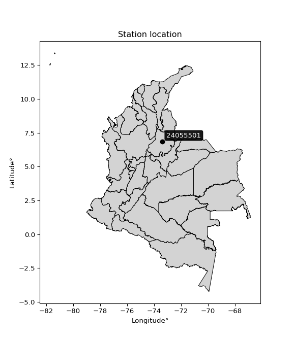

<div align="center">


</div>

# Station (rain, Pmax24h): 24055501

Probable Maximum Precipitation (PMP) is the greatest amount of rainfall for a specific duration that is meteorologically possible for a given location, acting as a "worst-case" scenario for extreme storms, crucial for designing safety-critical infrastructure like bridges, river deviations, dams, spillways, and nuclear plants to prevent catastrophic failure. PMP is calculated by hydrologists using meteorological data to determine the upper limit of extreme rainfall, often leading to the Probable Maximum Flood (PMF) for flood control design, and is increasingly being studied for climate change impacts.

<div align="center">

</img>

</div>


## A. General information


### 1. General running parameters

• app_version: _v20251226_. • runtime: _2025-12-26 15:38:16.554582_. • Python version: _3.14.0_. • SciPy version: _1.16.3_. • Pandas version: _2.3.3_. • NumPy version: _2.3.5_. • Stations dataset (station_dataset_file): _dataset/pmax24h_in/automatic_colombia_2003_2024.csv_. • Stations catalog (station_catalog_file): _dataset/CNE_IDEAM.xls_. • Minimum year to eval til year_max (date_min): _2003_. • Maximum year to eval since year_min (date_max): _2024_. • Creates, save and include plots into reports (create_plot): _False_. • Plot only fit distributions with Δo > Δ (plot_only_fit): _True_. • Eval low extreme values, if False, evaluates high extreme values (low_extreme): _False_. • Eval every SciPy distribution as logarithmic (pdist_logarithmic_on): _True_. • Standard deviation normalized (ddof): _1.0_. • Return periods to eval in years (Tr): _[2, 2.33, 5, 10, 15, 20, 25, 50, 75, 100, 200, 250, 500, 750, 1000]_. • Minimum data sample per station, 0 means any (minimum_sample): _5_. • Z-Score threshold to adjust a value, 0 means disable (zscore): _3.5_. • Avoid zeros, e.g. rain = 0 (avoid_zeros): _True_. • Avoid null values (avoid_nans): _True_. [:file_folder:Dataset file.](../../dataset/pmax24h_in/automatic_colombia_2003_2024.csv)


### 2. Station info and location

|   id |   CODIGO | NOMBRE                     | CATEGORIA               | TECNOLOGIA                | ESTADO   | FECHA_INSTALACION   |   FECHA_SUSPENSION |   ALTITUD |   LATITUD |   LONGITUD | DEPARTAMENTO   | MUNICIPIO              | AREA_OPERATIVA                         | ENTIDAD                                    | AREA_HIDROGRAFICA   | ZONA_HIDROGRAFICA   | SUBZONA_HIDROGRAFICA   |   CORRIENTE | OBSERVACION                                                                                                                                                                                                                                                   |   SUBRED | Catalogo   |
|-----:|---------:|:---------------------------|:------------------------|:--------------------------|:---------|:--------------------|-------------------:|----------:|----------:|-----------:|:---------------|:-----------------------|:---------------------------------------|:-------------------------------------------|:--------------------|:--------------------|:-----------------------|------------:|:--------------------------------------------------------------------------------------------------------------------------------------------------------------------------------------------------------------------------------------------------------------|---------:|:-----------|
|    0 | 24055501 | CHUCURI  - AUT  [24055501] | Climatológica Principal | Automática con Telemetría | Activa   | 08/05/2013          |                nan |      1362 |   6.86357 |   -73.3841 | Santander      | San Vicente De Chucurí | Area Operativa 08 - Santanderes-Arauca | CENTRO NACIONAL DE INVESTIGACIONES DE CAFE | Magdalena Cauca     | Sogamoso            | Río Sogamoso           |         nan | Mediante orfeo 20191040002573 se hace entrega del archivo Excel que contiene el catálogo de estaciones automáticas de Cenicafé, el cual comprende 103 estaciones, con el fin de que se actualice su metadata en el Catálogo Nacional de estaciones del IDEAM. |      nan | CNE_OE     |

<div align="center">

Map location in: [:earth_americas:Google](http://maps.google.com/maps?q=6.863566667,-73.38411667) [:earth_americas:OSM](https://www.openstreetmap.org/#map=18/6.863566667/-73.38411667&layers=P) [:earth_americas:Bing](https://www.bing.com/maps?cp=6.863566667~-73.38411667&lvl=18) [:earth_americas:Apple](https://maps.apple.com/frame?center=6.863566667%2C-73.38411667&span=0.003%2C0.006)

</div>


<div align="center">

```geojson
{
  "type": "Feature",
  "geometry": {
    "type": "Point", 
    "coordinates": [-73.38411667, 6.863566667]
  }, 
  "properties": {
    "Name": "24055501"
  }
}
```

</div>


### 3. Discrete values table and plot

|               |           0 |          1 |          2 |           3 |            4 |          5 |
|:--------------|------------:|-----------:|-----------:|------------:|-------------:|-----------:|
| Date          | 2018        | 2019       | 2020       | 2021        | 2022         | 2023       |
| Value         |   39.5      |  106.4     |   68.6     |   69.7      |   65.5       |   37.6     |
| Value_initial |   39.5      |  106.4     |   68.6     |   69.7      |   65.5       |   37.6     |
| count         |    6        |    6       |    6       |    6        |    6         |    6       |
| mean          |   64.55     |   64.55    |   64.55    |   64.55     |   64.55      |   64.55    |
| std           |   25.096    |   25.096   |   25.096   |   25.096    |   25.096     |   25.096   |
| zscore        |   -0.998166 |    1.66759 |    0.16138 |    0.205212 |    0.0378546 |   -1.07387 |
> If Z-Score is active, values out of range or outliers are replaced with the station mean value.


### 4. Active continuous probability distributions from SciPy (45 of 104 available)

[scipy.stats](https://docs.scipy.org/doc/scipy/reference/stats.html) is a Python´s powerful submodule within the SciPy library for comprehensive statistical analysis, offering over 130 probability distributions (like Normal, Poisson), functions for descriptive stats (mean, variance), hypothesis testing (t-tests, chi-square), random variable generation, and statistical tests, making it essential for data science, modeling, and research. It provides tools to explore, model, and draw conclusions from data efficiently, working seamlessly with NumPy.

<div align="center">

|   id | p_dist             |   n_parameter | fit_method   | label                                                                       | active   | ref                                                                                                        |
|-----:|:-------------------|--------------:|:-------------|:----------------------------------------------------------------------------|:---------|:-----------------------------------------------------------------------------------------------------------|
|    0 | alpha              |             3 | MLE          | Alpha                                                                       | True     | [:mortar_board:](https://docs.scipy.org/doc/scipy/reference/generated/scipy.stats.alpha.html)              |
|    1 | betaprime          |             4 | MLE          | Beta prime                                                                  | True     | [:mortar_board:](https://docs.scipy.org/doc/scipy/reference/generated/scipy.stats.betaprime.html)          |
|    2 | chi2               |             3 | MLE          | Chi²                                                                        | True     | [:mortar_board:](https://docs.scipy.org/doc/scipy/reference/generated/scipy.stats.chi2.html)               |
|    3 | crystalball        |             4 | MLE          | Crystalball                                                                 | True     | [:mortar_board:](https://docs.scipy.org/doc/scipy/reference/generated/scipy.stats.crystalball.html)        |
|    4 | erlang             |             3 | MLE          | Erlang                                                                      | True     | [:mortar_board:](https://docs.scipy.org/doc/scipy/reference/generated/scipy.stats.erlang.html)             |
|    5 | expon              |             2 | MLE          | Exponential                                                                 | True     | [:mortar_board:](https://docs.scipy.org/doc/scipy/reference/generated/scipy.stats.expon.html)              |
|    6 | exponnorm          |             3 | MLE          | Exponentially modified Normal                                               | True     | [:mortar_board:](https://docs.scipy.org/doc/scipy/reference/generated/scipy.stats.exponnorm.html)          |
|    7 | f                  |             4 | MLE          | F                                                                           | True     | [:mortar_board:](https://docs.scipy.org/doc/scipy/reference/generated/scipy.stats.f.html)                  |
|    8 | fatiguelife        |             3 | MLE          | Fatigue-life (Birnbaum-Saunders)                                            | True     | [:mortar_board:](https://docs.scipy.org/doc/scipy/reference/generated/scipy.stats.fatiguelife.html)        |
|    9 | fisk               |             3 | MLE          | Fisk                                                                        | True     | [:mortar_board:](https://docs.scipy.org/doc/scipy/reference/generated/scipy.stats.fisk.html)               |
|   10 | gamma              |             3 | MLE          | Gamma                                                                       | True     | [:mortar_board:](https://docs.scipy.org/doc/scipy/reference/generated/scipy.stats.gamma.html)              |
|   11 | genexpon           |             5 | MLE          | Generalized exponential                                                     | True     | [:mortar_board:](https://docs.scipy.org/doc/scipy/reference/generated/scipy.stats.genexpon.html)           |
|   12 | genlogistic        |             3 | MLE          | Generalized logistic                                                        | True     | [:mortar_board:](https://docs.scipy.org/doc/scipy/reference/generated/scipy.stats.genlogistic.html)        |
|   13 | gibrat             |             2 | MM           | Gibrat                                                                      | True     | [:mortar_board:](https://docs.scipy.org/doc/scipy/reference/generated/scipy.stats.gibrat.html)             |
|   14 | gompertz           |             3 | MLE          | Gompertz (or truncated Gumbel)                                              | True     | [:mortar_board:](https://docs.scipy.org/doc/scipy/reference/generated/scipy.stats.gompertz.html)           |
|   15 | gumbel_l           |             2 | MM           | Gumbel Left Skew                                                            | True     | [:mortar_board:](https://docs.scipy.org/doc/scipy/reference/generated/scipy.stats.gumbel_l.html)           |
|   16 | gumbel_r           |             2 | MM           | Gumbel Right Skew                                                           | True     | [:mortar_board:](https://docs.scipy.org/doc/scipy/reference/generated/scipy.stats.gumbel_r.html)           |
|   17 | halflogistic       |             2 | MM           | Half-logistic                                                               | True     | [:mortar_board:](https://docs.scipy.org/doc/scipy/reference/generated/scipy.stats.halflogistic.html)       |
|   18 | halfnorm           |             2 | MM           | Half Normal                                                                 | True     | [:mortar_board:](https://docs.scipy.org/doc/scipy/reference/generated/scipy.stats.halfnorm.html)           |
|   19 | hypsecant          |             2 | MM           | hyperbolic secant                                                           | True     | [:mortar_board:](https://docs.scipy.org/doc/scipy/reference/generated/scipy.stats.hypsecant.html)          |
|   20 | invgamma           |             3 | MLE          | Inverted gamma                                                              | True     | [:mortar_board:](https://docs.scipy.org/doc/scipy/reference/generated/scipy.stats.invgamma.html)           |
|   21 | invgauss           |             3 | MLE          | Inverse Gaussian                                                            | True     | [:mortar_board:](https://docs.scipy.org/doc/scipy/reference/generated/scipy.stats.invgauss.html)           |
|   22 | invweibull         |             3 | MLE          | Inverted Weibull                                                            | True     | [:mortar_board:](https://docs.scipy.org/doc/scipy/reference/generated/scipy.stats.invweibull.html)         |
|   23 | johnsonsu          |             4 | MLE          | Johnson Su                                                                  | True     | [:mortar_board:](https://docs.scipy.org/doc/scipy/reference/generated/scipy.stats.johnsonsu.html)          |
|   24 | kstwobign          |             2 | MLE          | Limiting distribution of scaled Kolmogorov-Smirnov two-sided test statistic | True     | [:mortar_board:](https://docs.scipy.org/doc/scipy/reference/generated/scipy.stats.kstwobign.html)          |
|   25 | laplace            |             2 | MM           | Laplace                                                                     | True     | [:mortar_board:](https://docs.scipy.org/doc/scipy/reference/generated/scipy.stats.laplace.html)            |
|   26 | laplace_asymmetric |             3 | MLE          | Asymmetric Laplace                                                          | True     | [:mortar_board:](https://docs.scipy.org/doc/scipy/reference/generated/scipy.stats.laplace_asymmetric.html) |
|   27 | loggamma           |             3 | MLE          | Log gamma                                                                   | True     | [:mortar_board:](https://docs.scipy.org/doc/scipy/reference/generated/scipy.stats.loggamma.html)           |
|   28 | logistic           |             2 | MM           | Logistic (or Sech-squared)                                                  | True     | [:mortar_board:](https://docs.scipy.org/doc/scipy/reference/generated/scipy.stats.logistic.html)           |
|   29 | lognorm            |             3 | MLE          | Log Normal                                                                  | True     | [:mortar_board:](https://docs.scipy.org/doc/scipy/reference/generated/scipy.stats.lognorm.html)            |
|   30 | maxwell            |             2 | MM           | Maxwell                                                                     | True     | [:mortar_board:](https://docs.scipy.org/doc/scipy/reference/generated/scipy.stats.maxwell.html)            |
|   31 | mielke             |             4 | MLE          | Mielke Beta-Kappa / Dagum                                                   | True     | [:mortar_board:](https://docs.scipy.org/doc/scipy/reference/generated/scipy.stats.mielke.html)             |
|   32 | moyal              |             2 | MM           | Moyal                                                                       | True     | [:mortar_board:](https://docs.scipy.org/doc/scipy/reference/generated/scipy.stats.moyal.html)              |
|   33 | nakagami           |             3 | MLE          | Nakagami                                                                    | True     | [:mortar_board:](https://docs.scipy.org/doc/scipy/reference/generated/scipy.stats.nakagami.html)           |
|   34 | ncf                |             5 | MLE          | Non-central F distribution                                                  | True     | [:mortar_board:](https://docs.scipy.org/doc/scipy/reference/generated/scipy.stats.ncf.html)                |
|   35 | nct                |             4 | MLE          | Non-central Student’s t                                                     | True     | [:mortar_board:](https://docs.scipy.org/doc/scipy/reference/generated/scipy.stats.nct.html)                |
|   36 | norm               |             2 | MM           | Normal                                                                      | True     | [:mortar_board:](https://docs.scipy.org/doc/scipy/reference/generated/scipy.stats.norm.html)               |
|   37 | pareto             |             3 | MLE          | Pareto                                                                      | True     | [:mortar_board:](https://docs.scipy.org/doc/scipy/reference/generated/scipy.stats.pareto.html)             |
|   38 | pearson3           |             3 | MM           | Pearson type III                                                            | True     | [:mortar_board:](https://docs.scipy.org/doc/scipy/reference/generated/scipy.stats.pearson3.html)           |
|   39 | rayleigh           |             2 | MM           | Rayleigh                                                                    | True     | [:mortar_board:](https://docs.scipy.org/doc/scipy/reference/generated/scipy.stats.rayleigh.html)           |
|   40 | rice               |             3 | MLE          | Rice                                                                        | True     | [:mortar_board:](https://docs.scipy.org/doc/scipy/reference/generated/scipy.stats.rice.html)               |
|   41 | t                  |             3 | MLE          | Student’s t                                                                 | True     | [:mortar_board:](https://docs.scipy.org/doc/scipy/reference/generated/scipy.stats.t.html)                  |
|   42 | truncnorm          |             4 | MLE          | Truncated normal                                                            | True     | [:mortar_board:](https://docs.scipy.org/doc/scipy/reference/generated/scipy.stats.truncnorm.html)          |
|   43 | wald               |             2 | MM           | Wald                                                                        | True     | [:mortar_board:](https://docs.scipy.org/doc/scipy/reference/generated/scipy.stats.wald.html)               |
|   44 | weibull_min        |             3 | MLE          | Weibull minimum                                                             | True     | [:mortar_board:](https://docs.scipy.org/doc/scipy/reference/generated/scipy.stats.weibull_min.html)        |

</div>

> **n_parameter:** # arguments & localization & scale.
>
> **Fit methods:** (MLE) maximum likelihood, (MM) L-moments.
>
>**Inactive:** foldnorm, gennorm, norminvgauss, powernorm, powerlognorm, skewnorm, genextreme, anglit, arcsine, argus, beta, bradford, burr, burr12, cauchy, cosine, halfcauchy, foldcauchy, skewcauchy, wrapcauchy, dgamma, gengamma, exponweib, exponpow, truncexpon, gausshyper, genhalflogistic, genhyperbolic, geninvgauss, halfgennorm, johnsonsb, kappa4, kappa3, ksone, kstwo, loglaplace, levy, levy_l, levy_stable, ncx2, genpareto, truncpareto, lomax, powerlaw, rdist, rel_breitwigner, recipinvgauss, semicircular, studentized_range, trapezoid, triang, truncweibull_min, tukeylambda, uniform, loguniform, vonmises, vonmises_line, weibull_max, dweibull, 


## B. Probability distributions vs. Empirical distributions

A continuous probability distribution (CPD) describes probabilities for variables that can take any value within a range (like rain any time), unlike discrete variables with specific outcomes (like temperature). It uses a Probability Density Function (PDF), a curve where the total area under it equals 1, and the probability of the variable falling within an interval (a to b) is found by calculating the area under the curve between those points. A key feature is that the probability of hitting any single exact value is zero, so probabilities are always expressed for ranges, e.g., $P(a ≤ X ≤ b)$.

<div align="center">

Distributions parameters
|    |   station | p_dist                |   n |             loc |         scale | shape                 | shape1             | shape2              | shape3   |
|---:|----------:|:----------------------|----:|----------------:|--------------:|:----------------------|:-------------------|:--------------------|:---------|
|  0 |  24055501 | alpha                 |   6 |   -68.5806      | 784.737       | 6.064017209766251     |                    |                     |          |
|  1 |  24055501 | betaprime             |   6 |    37.581       | 106.227       | 0.5019444056813667    | 3.187402508320268  |                     |          |
|  2 |  24055501 | chi2                  |   6 |    37.6         |   3.13297     | 0.3307071890466594    |                    |                     |          |
|  3 |  24055501 | crystalball           |   6 |    64.55        |  22.9094      | 13708.944152950859    | 5436.751532002592  |                     |          |
|  4 |  24055501 | erlang                |   6 |    37.6         |  27.3583      | 0.15968266760844252   |                    |                     |          |
|  5 |  24055501 | expon                 |   6 |    37.6         |  26.95        |                       |                    |                     |          |
|  6 |  24055501 | exponnorm             |   6 |    44.9279      |  13.93        | 1.4086130089492208    |                    |                     |          |
|  7 |  24055501 | f                     |   6 |    -0.395944    |  61.8715      | 26.567004394951965    | 41.72698078461943  |                     |          |
|  8 |  24055501 | fatiguelife           |   6 |    37.6         |   1.75639e-05 | 1178.56646866243      |                    |                     |          |
|  9 |  24055501 | fisk                  |   6 |    -0.117906    |  61.2333      | 4.671349693483116     |                    |                     |          |
| 10 |  24055501 | gamma                 |   6 |    37.6         |  22.9566      | 0.17409931811376367   |                    |                     |          |
| 11 |  24055501 | genexpon              |   6 |    37.6         |   9.1324e+10  | 27344861196.75314     | 67088393.19770457  | 6952792755.337463   |          |
| 12 |  24055501 | genlogistic           |   6 |   -67.9537      |  18.5306      | 711.0077130259206     |                    |                     |          |
| 13 |  24055501 | gibrat                |   6 |    47.073       |  10.6004      |                       |                    |                     |          |
| 14 |  24055501 | gompertz              |   6 |    37.6         |  89.2302      | 2.500932363077211     |                    |                     |          |
| 15 |  24055501 | gumbel_l              |   6 |    74.8605      |  17.8624      |                       |                    |                     |          |
| 16 |  24055501 | gumbel_r              |   6 |    54.2395      |  17.8624      |                       |                    |                     |          |
| 17 |  24055501 | halflogistic          |   6 |    37.397       |  19.5868      |                       |                    |                     |          |
| 18 |  24055501 | halfnorm              |   6 |    34.2269      |  38.0044      |                       |                    |                     |          |
| 19 |  24055501 | hypsecant             |   6 |    64.55        |  14.5846      |                       |                    |                     |          |
| 20 |  24055501 | invgamma              |   6 |    -8.1958      | 688.179       | 10.432465218854842    |                    |                     |          |
| 21 |  24055501 | invgauss              |   6 |    29.611       |  41.0833      | 0.8504440626453225    |                    |                     |          |
| 22 |  24055501 | invweibull            |   6 |    37.6         |   1.65296     | 0.04733368665950212   |                    |                     |          |
| 23 |  24055501 | johnsonsu             |   6 |    37.5971      |   0.00203413  | -2.3224293441220842   | 0.2986114736677318 |                     |          |
| 24 |  24055501 | kstwobign             |   6 |   -10.7951      |  86.3244      |                       |                    |                     |          |
| 25 |  24055501 | laplace               |   6 |    64.55        |  16.1994      |                       |                    |                     |          |
| 26 |  24055501 | laplace_asymmetric    |   6 |    68.6         |  16.6495      | 1.1289949744148031    |                    |                     |          |
| 27 |  24055501 | loggamma              |   6 | -6561           | 903.672       | 1528.3646003052281    |                    |                     |          |
| 28 |  24055501 | logistic              |   6 |    64.55        |  12.6306      |                       |                    |                     |          |
| 29 |  24055501 | lognorm               |   6 |    37.6         |   0.0543543   | 13.31449207890349     |                    |                     |          |
| 30 |  24055501 | maxwell               |   6 |    10.2642      |  34.0186      |                       |                    |                     |          |
| 31 |  24055501 | mielke                |   6 |    -2.48984     |  10.7462      | 578.4265308883972     | 3.235940412077686  |                     |          |
| 32 |  24055501 | moyal                 |   6 |    51.4489      |  10.3129      |                       |                    |                     |          |
| 33 |  24055501 | nakagami              |   6 |    37.6         |  41.9387      | 0.06570031169236942   |                    |                     |          |
| 34 |  24055501 | ncf                   |   6 |    -0.349065    |  56.4777      | 26.524958668493454    | 41.24460583556619  | 2.5013814754604624  |          |
| 35 |  24055501 | nct                   |   6 |    -8.87422     |  10.6382      | 7.728834981373634     | 6.256060357077033  |                     |          |
| 36 |  24055501 | norm                  |   6 |    64.55        |  22.9094      |                       |                    |                     |          |
| 37 |  24055501 | pareto                |   6 |    37.5311      |   0.0689311   | 0.2103695530693049    |                    |                     |          |
| 38 |  24055501 | pearson3              |   6 |    64.55        |  22.9094      | 0.5296311446399427    |                    |                     |          |
| 39 |  24055501 | rayleigh              |   6 |    20.7229      |  34.969       |                       |                    |                     |          |
| 40 |  24055501 | rice                  |   6 |    24.6459      |  32.536       | 0.000865120225807053  |                    |                     |          |
| 41 |  24055501 | t                     |   6 |    64.5456      |  22.9067      | 1339167.3223617394    |                    |                     |          |
| 42 |  24055501 | truncnorm             |   6 |     9.80713     |  14.0952      | -335.67529519938626   | 6.85290102509828   |                     |          |
| 43 |  24055501 | wald                  |   6 |    41.6405      |  22.9095      |                       |                    |                     |          |
| 44 |  24055501 | weibull_min           |   6 |    37.6         |  33.8002      | 0.6306426887737926    |                    |                     |          |
| 45 |  24055501 | logalpha              |   6 |    -4.5145      | 206.764       | 24.03684755080677     |                    |                     |          |
| 46 |  24055501 | logbetaprime          |   6 |    -1.02302     |   3.94634     | 390.7330365105064     | 301.09881652101717 |                     |          |
| 47 |  24055501 | logchi2               |   6 |     3.627       |   0.987686    | 1.0634843755179881    |                    |                     |          |
| 48 |  24055501 | logcrystalball        |   6 |     4.10418     |   0.357968    | 544.8773383725297     | 1.7289456776549592 |                     |          |
| 49 |  24055501 | logerlang             |   6 |   -55.4713      |   0.00215124  | 27693.534233519633    |                    |                     |          |
| 50 |  24055501 | logexpon              |   6 |     3.627       |   0.477171    |                       |                    |                     |          |
| 51 |  24055501 | logexponnorm          |   6 |     4.10365     |   0.357968    | 0.0014592709834319764 |                    |                     |          |
| 52 |  24055501 | logf                  |   6 |   -70.0901      |  74.1929      | 239942.7397398717     | 133628.55278898726 |                     |          |
| 53 |  24055501 | logfatiguelife        |   6 |     3.627       |   5.61016e-08 | 2924.2701252807647    |                    |                     |          |
| 54 |  24055501 | logfisk               |   6 |    -7.13263e+06 |   7.13264e+06 | 32341615.937475093    |                    |                     |          |
| 55 |  24055501 | loggamma              |   6 |   -55.5686      |   0.00214775  | 27783.848568237758    |                    |                     |          |
| 56 |  24055501 | loggenexpon           |   6 |     3.62684     |   0.00412272  | 0.005965748929296702  | 3.11033258880448   | 9.4702521450581e-06 |          |
| 57 |  24055501 | loggenlogistic        |   6 |     4.22912     |   0.182742    | 0.6920847748864651    |                    |                     |          |
| 58 |  24055501 | loggibrat             |   6 |     3.8311      |   0.165628    |                       |                    |                     |          |
| 59 |  24055501 | loggompertz           |   6 |     3.627       |   0.810913    | 1.0306413923740607    |                    |                     |          |
| 60 |  24055501 | loggumbel_l           |   6 |     4.26528     |   0.279107    |                       |                    |                     |          |
| 61 |  24055501 | loggumbel_r           |   6 |     3.94307     |   0.279107    |                       |                    |                     |          |
| 62 |  24055501 | loghalflogistic       |   6 |     3.67994     |   0.306023    |                       |                    |                     |          |
| 63 |  24055501 | loghalfnorm           |   6 |     3.63033     |   0.593879    |                       |                    |                     |          |
| 64 |  24055501 | loghypsecant          |   6 |     4.10418     |   0.22789     |                       |                    |                     |          |
| 65 |  24055501 | loginvgamma           |   6 |    -0.833616    | 921.106       | 187.63608100310194    |                    |                     |          |
| 66 |  24055501 | loginvgauss           |   6 |     2.08491     |  59.9174      | 0.03369694405148152   |                    |                     |          |
| 67 |  24055501 | loginvweibull         |   6 |    -1.62481e+07 |   1.62481e+07 | 49424911.62783918     |                    |                     |          |
| 68 |  24055501 | logjohnsonsu          |   6 |     4.23527     |   0.0123926   | 0.37225571395130613   | 0.3248229348223059 |                     |          |
| 69 |  24055501 | logkstwobign          |   6 |     2.82308     |   1.4602      |                       |                    |                     |          |
| 70 |  24055501 | loglaplace            |   6 |     4.10418     |   0.253122    |                       |                    |                     |          |
| 71 |  24055501 | loglaplace_asymmetric |   6 |     4.22829     |   0.253456    | 1.2743492065860784    |                    |                     |          |
| 72 |  24055501 | logloggamma           |   6 |   -42.651       |   7.63976     | 455.349314564877      |                    |                     |          |
| 73 |  24055501 | loglogistic           |   6 |     4.10418     |   0.197358    |                       |                    |                     |          |
| 74 |  24055501 | loglognorm            |   6 |     3.627       |   0.00129382  | 12.872515817786367    |                    |                     |          |
| 75 |  24055501 | logmaxwell            |   6 |     3.25594     |   0.531553    |                       |                    |                     |          |
| 76 |  24055501 | logmielke             |   6 |     3.627       |   0.769177    | 0.5622314413137333    | 6.64932671230421   |                     |          |
| 77 |  24055501 | logmoyal              |   6 |     3.89947     |   0.161142    |                       |                    |                     |          |
| 78 |  24055501 | lognakagami           |   6 |     3.627       |   0.659293    | 0.2993370655068736    |                    |                     |          |
| 79 |  24055501 | logncf                |   6 |     1.68678     |   0.0132283   | 1.5863820976282348    | 200.03627133508098 | 285.5832313540594   |          |
| 80 |  24055501 | lognct                |   6 |    -8.6225      |   0.239962    | 1140.5522138106949    | 53.00224209805707  |                     |          |
| 81 |  24055501 | lognorm               |   6 |     4.10418     |   0.357969    |                       |                    |                     |          |
| 82 |  24055501 | logpareto             |   6 |     3.62574     |   0.00125989  | 0.20785664486891176   |                    |                     |          |
| 83 |  24055501 | logpearson3           |   6 |     4.10418     |   0.357968    | -0.01221846030047762  |                    |                     |          |
| 84 |  24055501 | lograyleigh           |   6 |     3.41936     |   0.546403    |                       |                    |                     |          |
| 85 |  24055501 | logrice               |   6 |     3.41512     |   0.431219    | 1.114679655056212     |                    |                     |          |
| 86 |  24055501 | logt                  |   6 |     4.10417     |   0.357969    | 904473899.5392928     |                    |                     |          |
| 87 |  24055501 | logtruncnorm          |   6 |    -0.126684    |   0.722203    | 6.030109392809887     | 10.051651508146698 |                     |          |
| 88 |  24055501 | logwald               |   6 |     3.7462      |   0.357977    |                       |                    |                     |          |
| 89 |  24055501 | logweibull_min        |   6 |     3.627       |   0.449322    | 0.393294894321082     |                    |                     |          |

</div>

> **loc** (Location parameter): This shifts the distribution along the x-axis. For many common distributions, like the normal (Gaussian) distribution, loc represents the mean $μ$. For others, like the uniform distribution, it might represent the minimum value, or for the beta distribution, the left end of the support interval.
>
> **scale** (Scale parameter): This determines the width or spread of the distribution. For the normal distribution, scale represents the standard deviation $σ$. For a uniform distribution, it defines the length of the interval (from $loc$ to $loc + scale$).
>
> **shape** (Shape parameters): Refers to parameters that define the specific form of a probability distribution, distinct from its location (loc) and scale (scale). These parameters are required arguments for most distribution functions. For example, a normal (Gaussian) distribution is fully defined by its location (mean) and scale (standard deviation), so it has no specific shape parameters beyond loc and scale. However, other distributions have intrinsic properties that need specification, as Gamma distribution that takes a shape parameter, often named $a$ or $alpha$.


### 0. Cumulative distribution values - CDF (90 evaluated)

> Ordered by x ascending and calculating $log(f(x))$ separately. 

|   id |   Station |   date |     x |   count |   mean |    std |     zscore |   Value_initial |   station |   m |     alpha |   alpha_pdf |   betaprime |   betaprime_pdf |       chi2 |    chi2_pdf |   crystalball |   crystalball_pdf |     erlang |   erlang_pdf |     expon |   expon_pdf |   exponnorm |   exponnorm_pdf |         f |      f_pdf |   fatiguelife |   fatiguelife_pdf |      fisk |   fisk_pdf |      gamma |   gamma_pdf |    genexpon |   genexpon_pdf |   genlogistic |   genlogistic_pdf |   gibrat |   gibrat_pdf |    gompertz |   gompertz_pdf |   gumbel_l |   gumbel_l_pdf |   gumbel_r |   gumbel_r_pdf |   halflogistic |   halflogistic_pdf |   halfnorm |   halfnorm_pdf |   hypsecant |   hypsecant_pdf |   invgamma |   invgamma_pdf |   invgauss |   invgauss_pdf |   invweibull |   invweibull_pdf |   johnsonsu |   johnsonsu_pdf |   kstwobign |   kstwobign_pdf |   laplace |   laplace_pdf |   laplace_asymmetric |   laplace_asymmetric_pdf |   loggamma |   loggamma_pdf |   logistic |   logistic_pdf |   lognorm |   lognorm_pdf |   maxwell |   maxwell_pdf |   mielke |   mielke_pdf |     moyal |   moyal_pdf |   nakagami |   nakagami_pdf |       ncf |    ncf_pdf |       nct |   nct_pdf |     norm |   norm_pdf |   pareto |   pareto_pdf |   pearson3 |   pearson3_pdf |   rayleigh |   rayleigh_pdf |      rice |   rice_pdf |        t |      t_pdf |   truncnorm |   truncnorm_pdf |     wald |   wald_pdf |   weibull_min |   weibull_min_pdf |   logalpha |   logalpha_pdf |   logbetaprime |   logbetaprime_pdf |     logchi2 |   logchi2_pdf |   logcrystalball |   logcrystalball_pdf |   logerlang |   logerlang_pdf |   logexpon |   logexpon_pdf |   logexponnorm |   logexponnorm_pdf |      logf |   logf_pdf |   logfatiguelife |   logfatiguelife_pdf |   logfisk |   logfisk_pdf |   loggenexpon |   loggenexpon_pdf |   loggenlogistic |   loggenlogistic_pdf |   loggibrat |   loggibrat_pdf |   loggompertz |   loggompertz_pdf |   loggumbel_l |   loggumbel_l_pdf |   loggumbel_r |   loggumbel_r_pdf |   loghalflogistic |   loghalflogistic_pdf |   loghalfnorm |   loghalfnorm_pdf |   loghypsecant |   loghypsecant_pdf |   loginvgamma |   loginvgamma_pdf |   loginvgauss |   loginvgauss_pdf |   loginvweibull |   loginvweibull_pdf |   logjohnsonsu |   logjohnsonsu_pdf |   logkstwobign |   logkstwobign_pdf |   loglaplace |   loglaplace_pdf |   loglaplace_asymmetric |   loglaplace_asymmetric_pdf |   logloggamma |   logloggamma_pdf |   loglogistic |   loglogistic_pdf |   loglognorm |   loglognorm_pdf |   logmaxwell |   logmaxwell_pdf |   logmielke |   logmielke_pdf |   logmoyal |   logmoyal_pdf |   lognakagami |   lognakagami_pdf |    logncf |   logncf_pdf |    lognct |   lognct_pdf |   logpareto |   logpareto_pdf |   logpearson3 |   logpearson3_pdf |   lograyleigh |   lograyleigh_pdf |   logrice |   logrice_pdf |      logt |   logt_pdf |   logtruncnorm |   logtruncnorm_pdf |   logwald |   logwald_pdf |   logweibull_min |   logweibull_min_pdf |
|-----:|----------:|-------:|------:|--------:|-------:|-------:|-----------:|----------------:|----------:|----:|----------:|------------:|------------:|----------------:|-----------:|------------:|--------------:|------------------:|-----------:|-------------:|----------:|------------:|------------:|----------------:|----------:|-----------:|--------------:|------------------:|----------:|-----------:|-----------:|------------:|------------:|---------------:|--------------:|------------------:|---------:|-------------:|------------:|---------------:|-----------:|---------------:|-----------:|---------------:|---------------:|-------------------:|-----------:|---------------:|------------:|----------------:|-----------:|---------------:|-----------:|---------------:|-------------:|-----------------:|------------:|----------------:|------------:|----------------:|----------:|--------------:|---------------------:|-------------------------:|-----------:|---------------:|-----------:|---------------:|----------:|--------------:|----------:|--------------:|---------:|-------------:|----------:|------------:|-----------:|---------------:|----------:|-----------:|----------:|----------:|---------:|-----------:|---------:|-------------:|-----------:|---------------:|-----------:|---------------:|----------:|-----------:|---------:|-----------:|------------:|----------------:|---------:|-----------:|--------------:|------------------:|-----------:|---------------:|---------------:|-------------------:|------------:|--------------:|-----------------:|---------------------:|------------:|----------------:|-----------:|---------------:|---------------:|-------------------:|----------:|-----------:|-----------------:|---------------------:|----------:|--------------:|--------------:|------------------:|-----------------:|---------------------:|------------:|----------------:|--------------:|------------------:|--------------:|------------------:|--------------:|------------------:|------------------:|----------------------:|--------------:|------------------:|---------------:|-------------------:|--------------:|------------------:|--------------:|------------------:|----------------:|--------------------:|---------------:|-------------------:|---------------:|-------------------:|-------------:|-----------------:|------------------------:|----------------------------:|--------------:|------------------:|--------------:|------------------:|-------------:|-----------------:|-------------:|-----------------:|------------:|----------------:|-----------:|---------------:|--------------:|------------------:|----------:|-------------:|----------:|-------------:|------------:|----------------:|--------------:|------------------:|--------------:|------------------:|----------:|--------------:|----------:|-----------:|---------------:|-------------------:|----------:|--------------:|-----------------:|---------------------:|
|    0 |  24055501 |   2023 |  37.6 |       6 |  64.55 | 25.096 | -1.07387   |            37.6 |  24055501 |   1 | 0.0923259 |  0.0115189  |   0.0255055 |      0.674759   | 0.00364014 | 8.47114e+10 |      0.119723 |        0.00871759 | 0.00349002 |  7.84324e+10 | 0         |  0.0371058  |   0.0971265 |      0.0103098  | 0.0930314 | 0.0117965  |     0.0312644 |       1.79883e+10 | 0.0941885 | 0.0105665  | 0.00215515 | 5.28062e+10 | 3.59344e-12 |    0.299427    |     0.0921705 |        0.0118386  | 0        |   0          | 1.33155e-08 |     0.0280279  |   0.116785 |    0.00614046  |  0.0789918 |     0.0112254  |     0.00518232 |         0.0255268  |  0.0707243 |     0.020912   |   0.0994987 |      0.00671162 |  0.0876939 |     0.0127     |  0.0681363 |     0.0245253  |   0.00834073 |      2.65957e+11 |   0.0241292 |      4.74191    |   0.0882433 |      0.0124914  | 0.0947241 |    0.00584738 |             0.107707 |               0.00572993 |  0.0910323 |       0.45992  |   0.105864 |     0.00749423 | 0.0912661 |      0.458374 |  0.114105 |    0.0109659  |      nan |          nan | 0.0503416 |   0.0111545 | 0.00732768 |    1.35511e+11 | 0.0928722 | 0.0117924  | 0.0881165 | 0.0118868 | 0.119723 | 0.00871759 | 0        |  3.05188     |   0.108208 |     0.0104245  |   0.10994  |     0.0122843  | 0.0762005 | 0.0113046  | 0.119734 | 0.00871918 |    0.975684 |     0.00405109  | 0        | 0          |    1.2978e-10 |    11518.6        |  0.0869971 |       0.493909 |       0.103175 |           0.505125 | 7.78078e-09 |   4.65826e+06 |        0.0912659 |             0.458373 |   0.0910364 |        0.459942 |  0         |       2.09568  |      0.0912662 |           0.458373 | 0.0911638 |   0.460999 |        0.0870878 |          3.03053e+13 | 0.0998206 |      0.407438 |    0.00023709 |          1.44698  |        0.0997034 |             0.364102 |    0        |        0        |   1.15129e-07 |          1.27096  |     0.0965962 |          0.328809 |     0.044907  |          0.499284 |          0        |              0        |     0         |          0        |      0.0780443 |           0.339044 |     0.0873164 |          0.503436 |     0.0826209 |          0.545397 |       0.0821951 |            0.624735 |       0.131862 |          0.114059  |      0.0777427 |           0.690489 |    0.0759036 |         0.299869 |               0.0961889 |                    0.297807 |     0.0924256 |          0.452941 |      0.081826 |          0.380681 |    0.0128876 |      5.81204e+12 |    0.0783294 |         0.573298 | 6.85942e-06 |    7664.69      |  0.0198629 |       0.382887 |   6.41619e-10 |     864962        | 0.0906732 |     0.528264 | 0.0898035 |     0.469316 |    0        |     164.98      |     0.0915233 |          0.456854 |     0.0696617 |          0.647042 | 0.063369  |      0.584046 | 0.0912675 |   0.458378 |     0          |           0        |  0        |      0        |       1.2548e-06 |          1.11128e+09 |
|    1 |  24055501 |   2018 |  39.5 |       6 |  64.55 | 25.096 | -0.998166  |            39.5 |  24055501 |   2 | 0.115722  |  0.0130976  |   0.253309  |      0.0634     | 0.849354   | 0.0568424   |      0.137101 |        0.00957798 | 0.695825   |  0.055073    | 0.0680731 |  0.0345798  |   0.118069  |      0.0117381  | 0.116923  | 0.0133371  |     0.609903  |       0.0281794   | 0.115684  | 0.0120623  | 0.69182    | 0.0590659   | 0.433913    |    0.169558    |     0.116236  |        0.0134792  | 0        |   0          | 0.0524011   |     0.0271308  |   0.12901  |    0.00673509  |  0.102052  |     0.0130392  |     0.053633   |         0.025454   |  0.110353  |     0.0207934  |   0.113071  |      0.00759074 |  0.113578  |     0.0145193  |  0.118802  |     0.0282676  |   0.370305   |      0.00916459  |   0.471054  |      0.0624377  |   0.113586  |      0.0141571  | 0.106512  |    0.00657504 |             0.119163 |               0.00633939 |  0.115844  |       0.547634 |   0.12097  |     0.00841894 | 0.115988  |      0.545538 |  0.135906 |    0.011974   |      nan |          nan | 0.0742897 |   0.0140405 | 0.57637    |    0.0398557   | 0.116758  | 0.013335   | 0.112369  | 0.0136258 | 0.137101 | 0.00957798 | 0.505984 |  0.0527829   |   0.129096 |     0.0115578  |   0.134256 |     0.0132939  | 0.0989692 | 0.0126432  | 0.137115 | 0.00957979 |    0.982424 |     0.00307747  | 0        | 0          |    0.150219   |        0.0459123  |  0.113787  |       0.59371  |       0.130141 |           0.589174 | 0.15693     |   1.66534     |        0.115987  |             0.545538 |   0.115849  |        0.547658 |  0.0981527 |       1.88999  |      0.115988  |           0.545538 | 0.116032  |   0.548868 |        0.625726  |          1.23212     | 0.121779  |      0.484939 |    0.0710414  |          1.42386  |        0.119257  |             0.43074  |    0        |        0        |   0.0625557   |          1.26614  |     0.114152  |          0.384705 |     0.0742181 |          0.691572 |          0        |              0        |     0.0617044 |          1.3395   |      0.096631  |           0.417542 |     0.114623  |          0.605068 |     0.112356  |          0.66105  |       0.116401  |            0.761522 |       0.137816 |          0.127932  |      0.115656  |           0.844054 |    0.0922238 |         0.364345 |               0.112049  |                    0.346912 |     0.116825  |          0.537933 |      0.10266  |          0.466771 |    0.611332  |      0.604037    |    0.109404  |         0.686662 | 0.213373    |       2.43354   |  0.0456514 |       0.671508 |   0.164322    |          1.99301  | 0.119234  |     0.630723 | 0.115158  |     0.560232 |    0.535791 |       1.90854   |     0.116156  |          0.543458 |     0.104669  |          0.770528 | 0.0951055 |      0.701818 | 0.115989  |   0.545543 |     0          |           0        |  0        |      0        |       0.342502   |          2.19955     |
|    2 |  24055501 |   2022 |  65.5 |       6 |  64.55 | 25.096 |  0.0378546 |            65.5 |  24055501 |   3 | 0.583671  |  0.0170297  |   0.758588  |      0.00754628 | 0.999486   | 9.5213e-05  |      0.516538 |        0.0173989  | 0.960709   |  0.0022268   | 0.644863  |  0.0131776  |   0.579115  |      0.0178892  | 0.581087  | 0.0168382  |     0.857554  |       0.00431602  | 0.580069  | 0.0173411  | 0.967697   | 0.00206902  | 0.999767    |    6.98099e-05 |     0.588794  |        0.0168238  | 0.709845 |   0.0185809  | 0.600697    |     0.0152998  |   0.446851 |    0.0183365   |  0.587206  |     0.0175013  |     0.615295   |         0.0158631  |  0.589425  |     0.0149647  |   0.520719  |      0.0217788  |  0.597583  |     0.0163069  |  0.669618  |     0.0118882  |   0.416948   |      0.000618805 |   0.767076  |      0.00327255 |   0.584544  |      0.0165401  | 0.528479  |    0.0291073  |             0.475171 |               0.0252788  |  0.586856  |       1.08691  |   0.518795 |     0.0197652  | 0.586109  |      1.0884   |  0.548854 |    0.0165481  |      nan |          nan | 0.612864  |   0.0172217 | 0.818948   |    0.00375314  | 0.580999  | 0.0168388  | 0.58909   | 0.0166307 | 0.516538 | 0.0173989  | 0.717316 |  0.00212622  |   0.551579 |     0.0171098  |   0.559487 |     0.0161305  | 0.545401  | 0.0175443  | 0.516618 | 0.0174008  |    0.999961 |     1.15277e-05 | 0.684144 | 0.0163707  |    0.587719   |        0.00825716 |  0.603111  |       1.05403  |       0.582605 |           0.976927 | 0.522079    |   0.414889    |        0.586109  |             1.0884   |   0.586871  |        1.0869   |  0.687516  |       0.654868 |      0.586108  |           1.0884   | 0.587338  |   1.08583  |        0.858952  |          0.21676     | 0.578723  |      1.10548  |    0.657131   |          0.82584  |        0.562941  |             1.20254  |    0.773641 |        0.857495 |   0.636812    |          0.915223 |     0.523911  |          1.26593  |     0.653926  |          0.995182 |          0.675277 |              0.888824 |     0.647119  |          0.872627 |      0.606716  |           1.31901  |     0.606039  |          1.04317  |     0.617445  |          0.995321 |       0.630151  |            0.885192 |       0.370468 |          2.24514   |      0.648202  |           0.881917 |    0.632416  |         1.4522   |               0.536341  |                    1.66054  |     0.583303  |          1.09317  |      0.597386 |          1.21868  |    0.681138  |      0.0499769   |    0.613818  |         0.998786 | 0.824824    |       0.749841  |  0.677332  |       0.944728 |   0.668167    |          0.611079 | 0.606639  |     0.999608 | 0.590942  |     1.07643  |    0.718017 |       0.105359  |     0.585353  |          1.08982  |     0.622498  |          0.964363 | 0.607037  |      1.02623  | 0.586111  |   1.0884   |     0          |           0        |  0.742416 |      0.813565 |       0.662658   |          0.259748    |
|    3 |  24055501 |   2020 |  68.6 |       6 |  64.55 | 25.096 |  0.16138   |            68.6 |  24055501 |   4 | 0.634409  |  0.0156826  |   0.780439  |      0.00658191 | 0.999709   | 5.31671e-05 |      0.570161 |        0.0171439  | 0.966955   |  0.00181979  | 0.683451  |  0.0117458  |   0.632413  |      0.0164591  | 0.631351  | 0.0155692  |     0.870179  |       0.00384249  | 0.631508  | 0.015819   | 0.973444   | 0.00165702  | 0.999908    |    2.75383e-05 |     0.638835  |        0.0154435  | 0.760658 |   0.0144194  | 0.646157    |     0.0140373  |   0.505569 |    0.0194963   |  0.639187  |     0.0160154  |     0.662094   |         0.014337   |  0.634244  |     0.0139467  |   0.587277  |      0.0210098  |  0.645876  |     0.0148422  |  0.704153  |     0.0104293  |   0.418767   |      0.000556571 |   0.776585  |      0.0028771  |   0.633928  |      0.0153069  | 0.610603  |    0.0240377  |             0.560368 |               0.0298113  |  0.636264  |       1.04726  |   0.579482 |     0.019293   | 0.635601  |      1.04945  |  0.599128 |    0.0158532  |      nan |          nan | 0.663287  |   0.0153192 | 0.830021   |    0.00340164  | 0.631263  | 0.0155688  | 0.638421  | 0.0151829 | 0.570161 | 0.0171439  | 0.723498 |  0.00187221  |   0.603407 |     0.0162895  |   0.6083   |     0.0153361  | 0.598488  | 0.0166714  | 0.570245 | 0.0171453  |    0.999985 |     4.71884e-06 | 0.730202 | 0.0134612  |    0.612067   |        0.00747296 |  0.650681  |       1.00124  |       0.626938 |           0.938706 | 0.540687    |   0.390384    |        0.635602  |             1.04945  |   0.636278  |        1.04725  |  0.716377  |       0.594384 |      0.635601  |           1.04945  | 0.636689  |   1.04593  |        0.868543  |          0.19846     | 0.628833  |      1.05832  |    0.693837   |          0.761932 |        0.617984  |             1.17288  |    0.809123 |        0.685147 |   0.677854    |          0.859436 |     0.583506  |          1.30703  |     0.697741  |          0.899734 |          0.714312 |              0.800198 |     0.686008  |          0.809275 |      0.665378  |           1.21246  |     0.653068  |          0.98882  |     0.662069  |          0.933286 |       0.669517  |            0.81708  |       0.578381 |          8.93373   |      0.687427  |           0.814417 |    0.693792  |         1.20972  |               0.618897  |                    1.91614  |     0.633082  |          1.05698  |      0.652238 |          1.1493   |    0.683355  |      0.0459977   |    0.658739  |         0.942596 | 0.857723    |       0.671423  |  0.718482  |       0.836319 |   0.695474    |          0.570371 | 0.651645  |     0.94528  | 0.639773  |     1.03296  |    0.722658 |       0.0956725 |     0.634928  |          1.05158  |     0.665758  |          0.90562  | 0.65329   |      0.972567 | 0.635604  |   1.04944  |     0.00012848 |           8.56698  |  0.776884 |      0.681961 |       0.674178   |          0.238989    |
|    4 |  24055501 |   2021 |  69.7 |       6 |  64.55 | 25.096 |  0.205212  |            69.7 |  24055501 |   5 | 0.651383  |  0.015179   |   0.787512  |      0.00628093 | 0.999762   | 4.33274e-05 |      0.588932 |        0.0169794  | 0.968889   |  0.00169759  | 0.696112  |  0.011276   |   0.650216  |      0.0159061  | 0.648217  | 0.0150939  |     0.874322  |       0.0036919   | 0.648597  | 0.0152495  | 0.975199   | 0.00153465  | 0.999934    |    1.97963e-05 |     0.655543  |        0.0149346  | 0.775852 |   0.0132261  | 0.661357    |     0.0136009  |   0.527202 |    0.0198275   |  0.656503  |     0.0154668  |     0.677573   |         0.0138077  |  0.649384  |     0.0135807  |   0.610134  |      0.0205317  |  0.661913  |     0.0143167  |  0.715366  |     0.00996252 |   0.419368   |      0.000537383 |   0.779682  |      0.00275645 |   0.650517  |      0.0148535  | 0.636167  |    0.0224596  |             0.591967 |               0.0276685  |  0.652788  |       1.03     |   0.600546 |     0.0189928  | 0.652162  |      1.03238  |  0.616407 |    0.0155609  |      nan |          nan | 0.679777  |   0.0146636 | 0.833702   |    0.00329161  | 0.648128  | 0.0150932  | 0.654832  | 0.0146563 | 0.588932 | 0.0169794  | 0.725515 |  0.001795    |   0.62114  |     0.0159474  |   0.624998 |     0.0150197  | 0.616633  | 0.0163163  | 0.589018 | 0.0169806  |    0.999989 |     3.39736e-06 | 0.74452  | 0.0125846  |    0.620149   |        0.00722364 |  0.666443  |       0.980245 |       0.641749 |           0.923169 | 0.546835    |   0.382546    |        0.652163  |             1.03238  |   0.652803  |        1.02999  |  0.725677  |       0.574895 |      0.652162  |           1.03238  | 0.653192  |   1.02859  |        0.871654  |          0.192664    | 0.645506  |      1.03758  |    0.705785   |          0.740297 |        0.636509  |             1.15561  |    0.819625 |        0.63603  |   0.691369    |          0.839692 |     0.604362  |          1.3144   |     0.711793  |          0.867004 |          0.726807 |              0.770778 |     0.698708  |          0.787458 |      0.684324  |           1.16906  |     0.66863   |          0.967481 |     0.676733  |          0.910218 |       0.682326  |            0.793377 |       0.722274 |          7.13128   |      0.700197  |           0.791095 |    0.712444  |         1.13604  |               0.648192  |                    1.76885  |     0.64977   |          1.04074  |      0.67029  |          1.1198   |    0.684076  |      0.0447687   |    0.673566  |         0.921406 | 0.868173    |       0.642259  |  0.731503  |       0.800918 |   0.70444     |          0.556941 | 0.666518  |     0.92447  | 0.656061  |     1.01461  |    0.724156 |       0.0927082 |     0.651525  |          1.03472  |     0.679994  |          0.884099 | 0.668598  |      0.951981 | 0.652165  |   1.03238  |     0.127737   |           7.49959  |  0.787418 |      0.642853 |       0.677928   |          0.232525    |
|    5 |  24055501 |   2019 | 106.4 |       6 |  64.55 | 25.096 |  1.66759   |           106.4 |  24055501 |   6 | 0.942867  |  0.00293793 |   0.913974  |      0.00180383 | 1          | 6.55747e-08 |      0.966132 |        0.00328296 | 0.994938   |  0.0002339   | 0.922143  |  0.00288896 |   0.943912  |      0.00285816 | 0.944272  | 0.00304324 |     0.953454  |       0.00118865  | 0.929966  | 0.00285626 | 0.996898   | 0.0001653   | 1           |    3.25729e-10 |     0.943376  |        0.00296741 | 0.957481 |   0.00152623 | 0.945312    |     0.00331389 |   0.997107 |    0.000946609 |  0.947501  |     0.00286053 |     0.942667   |         0.00284322 |  0.942445  |     0.00345915 |   0.963924  |      0.0024683  |  0.936506  |     0.00293699 |  0.911059  |     0.00258888 |   0.432485   |      0.000249405 |   0.841043  |      0.00105149 |   0.949868  |      0.00315353 | 0.962243  |    0.00233079 |             0.966123 |               0.00229719 |  0.941773  |       0.322983 |   0.964885 |     0.00268254 | 0.942123  |      0.323501 |  0.953701 |    0.00345453 |      nan |          nan | 0.944468  |   0.002688  | 0.914085   |    0.00147828  | 0.94416   | 0.00304457 | 0.935365  | 0.0029657 | 0.966132 | 0.00328296 | 0.76613  |  0.000714387 |   0.953532 |     0.00327128 |   0.950286 |     0.00348319 | 0.957443  | 0.00328667 | 0.966163 | 0.00328088 |    1        |     1.79521e-12 | 0.945763 | 0.00203056 |    0.791022   |        0.00299886 |  0.935453  |       0.309292 |       0.914174 |           0.357207 | 0.675257    |   0.241843    |        0.942123  |             0.3235   |   0.941777  |        0.322963 |  0.886951  |       0.236915 |      0.942123  |           0.323501 | 0.941668  |   0.322647 |        0.929556  |          0.0954969   | 0.925351  |      0.313213 |    0.913063   |          0.282357 |        0.941524  |             0.297318 |    0.947277 |        0.128667 |   0.931876    |          0.312267 |     0.985314  |          0.222092 |     0.928035  |          0.24833  |          0.923611 |              0.240086 |     0.919179  |          0.292623 |      0.946313  |           0.234469 |     0.933916  |          0.307975 |     0.925108  |          0.301682 |       0.899815  |            0.288948 |       0.960025 |          0.0647458 |      0.917658  |           0.28481  |    0.945931  |         0.213609 |               0.958059  |                    0.210874 |     0.94341   |          0.325594 |      0.945465 |          0.261256 |    0.698356  |      0.0260307   |    0.929646  |         0.311786 | 0.989396    |       0.0633491 |  0.92642   |       0.227658 |   0.876375    |          0.278708 | 0.923926  |     0.315991 | 0.93929   |     0.320665 |    0.752476 |       0.0494013 |     0.942473  |          0.324042 |     0.926299  |          0.308039 | 0.934037  |      0.316412 | 0.942124  |   0.323498 |     0.980577   |           0.182405 |  0.932348 |      0.166978 |       0.751215   |          0.130859    |

An Empirical Distribution Function (EDF) is a step-function estimate of a true cumulative distribution function (CDF) based on observed sample data, representing the proportion of data points less than or equal to a given value. It is calculated by ordering your data and jumping up by $1/n$ (where $n$ is sample size) at each unique data point, allowing analysis without assuming an underlying population distribution, and it gets closer to the true CDF as the sample size grows.


### 1. Empirical - EDF California (1923)

California´s estimates the true probability distribution of water-related data (like rainfall, streamflow) using observed samples, crucial for risk assessment.

<div align="center">


$P=m/n$


</div>


**1.1. Empirical values**

<div align="center">

|                | 0                   | 1                  | 2              | 3                  | 4                  | 5              |
|:---------------|:--------------------|:-------------------|:---------------|:-------------------|:-------------------|:---------------|
| date           | 2023                | 2018               | 2022           | 2020               | 2021               | 2019           |
| x              | 37.6                | 39.5               | 65.5           | 68.6               | 69.7               | 106.4          |
| m              | 1                   | 2                  | 3              | 4                  | 5                  | 6              |
| empirical_dist | edf_california      | edf_california     | edf_california | edf_california     | edf_california     | edf_california |
| empirical      | 0.16666666666666666 | 0.3333333333333333 | 0.5            | 0.6666666666666666 | 0.8333333333333334 | 1.0            |
| empirical_tr   | 1.2                 | 1.4999999999999998 | 2.0            | 2.9999999999999996 | 6.000000000000002  | inf            |

</div>


**1.2. Kolmogorov-Smirnov fit test (sorted by Δ)**


<div align="center">

|                | 0                   | 1                   | 2                   | 3                  | 4                   | 5                  | 6                   | 7                   | 8                   | 9                   | 10                 | 11                  | 12                  | 13                  | 14                  | 15                  | 16                  | 17                 | 18                  | 19                  | 20                 | 21                  | 22                  | 23                  | 24                  | 25                  | 26                  | 27                  | 28                  | 29                  | 30                  | 31                  | 32                  | 33                  | 34                  | 35                  | 36                  | 37                    | 38                 | 39                  | 40                  | 41                  | 42                 | 43                  | 44                  | 45                 | 46                  | 47                  | 48                 | 49                  | 50                  | 51                  | 52                  | 53                 | 54                  | 55                  | 56                  | 57                  | 58                 | 59                 | 60                 | 61                  | 62                 | 63                 | 64                  | 65                 | 66                 | 67                  | 68                 | 69                 | 70                 | 71                  | 72                  | 73                  | 74                 | 75                 | 76                 | 77                 | 78                 | 79                 | 80                  | 81                 | 82                 | 83                 | 84                  | 85                 | 86                 | 87                 | 88                 | 89             |
|:---------------|:--------------------|:--------------------|:--------------------|:-------------------|:--------------------|:-------------------|:--------------------|:--------------------|:--------------------|:--------------------|:-------------------|:--------------------|:--------------------|:--------------------|:--------------------|:--------------------|:--------------------|:-------------------|:--------------------|:--------------------|:-------------------|:--------------------|:--------------------|:--------------------|:--------------------|:--------------------|:--------------------|:--------------------|:--------------------|:--------------------|:--------------------|:--------------------|:--------------------|:--------------------|:--------------------|:--------------------|:--------------------|:----------------------|:-------------------|:--------------------|:--------------------|:--------------------|:-------------------|:--------------------|:--------------------|:-------------------|:--------------------|:--------------------|:-------------------|:--------------------|:--------------------|:--------------------|:--------------------|:-------------------|:--------------------|:--------------------|:--------------------|:--------------------|:-------------------|:-------------------|:-------------------|:--------------------|:-------------------|:-------------------|:--------------------|:-------------------|:-------------------|:--------------------|:-------------------|:-------------------|:-------------------|:--------------------|:--------------------|:--------------------|:-------------------|:-------------------|:-------------------|:-------------------|:-------------------|:-------------------|:--------------------|:-------------------|:-------------------|:-------------------|:--------------------|:-------------------|:-------------------|:-------------------|:-------------------|:---------------|
| station        | 24055501            | 24055501            | 24055501            | 24055501           | 24055501            | 24055501           | 24055501            | 24055501            | 24055501            | 24055501            | 24055501           | 24055501            | 24055501            | 24055501            | 24055501            | 24055501            | 24055501            | 24055501           | 24055501            | 24055501            | 24055501           | 24055501            | 24055501            | 24055501            | 24055501            | 24055501            | 24055501            | 24055501            | 24055501            | 24055501            | 24055501            | 24055501            | 24055501            | 24055501            | 24055501            | 24055501            | 24055501            | 24055501              | 24055501           | 24055501            | 24055501            | 24055501            | 24055501           | 24055501            | 24055501            | 24055501           | 24055501            | 24055501            | 24055501           | 24055501            | 24055501            | 24055501            | 24055501            | 24055501           | 24055501            | 24055501            | 24055501            | 24055501            | 24055501           | 24055501           | 24055501           | 24055501            | 24055501           | 24055501           | 24055501            | 24055501           | 24055501           | 24055501            | 24055501           | 24055501           | 24055501           | 24055501            | 24055501            | 24055501            | 24055501           | 24055501           | 24055501           | 24055501           | 24055501           | 24055501           | 24055501            | 24055501           | 24055501           | 24055501           | 24055501            | 24055501           | 24055501           | 24055501           | 24055501           | 24055501       |
| empirical_dist | edf_california      | edf_california      | edf_california      | edf_california     | edf_california      | edf_california     | edf_california      | edf_california      | edf_california      | edf_california      | edf_california     | edf_california      | edf_california      | edf_california      | edf_california      | edf_california      | edf_california      | edf_california     | edf_california      | edf_california      | edf_california     | edf_california      | edf_california      | edf_california      | edf_california      | edf_california      | edf_california      | edf_california      | edf_california      | edf_california      | edf_california      | edf_california      | edf_california      | edf_california      | edf_california      | edf_california      | edf_california      | edf_california        | edf_california     | edf_california      | edf_california      | edf_california      | edf_california     | edf_california      | edf_california      | edf_california     | edf_california      | edf_california      | edf_california     | edf_california      | edf_california      | edf_california      | edf_california      | edf_california     | edf_california      | edf_california      | edf_california      | edf_california      | edf_california     | edf_california     | edf_california     | edf_california      | edf_california     | edf_california     | edf_california      | edf_california     | edf_california     | edf_california      | edf_california     | edf_california     | edf_california     | edf_california      | edf_california      | edf_california      | edf_california     | edf_california     | edf_california     | edf_california     | edf_california     | edf_california     | edf_california      | edf_california     | edf_california     | edf_california     | edf_california      | edf_california     | edf_california     | edf_california     | edf_california     | edf_california |
| p_dist         | lognakagami         | logjohnsonsu        | logbetaprime        | rayleigh           | logfisk             | pearson3           | weibull_min         | loggenlogistic      | logncf              | invgauss            | exponnorm          | f                   | logloggamma         | ncf                 | maxwell             | loginvweibull       | genlogistic         | logpearson3        | logf                | logt                | logexponnorm       | lognorm             | lognorm             | logcrystalball      | logerlang           | loggamma            | loggamma            | alpha               | fisk                | logkstwobign        | lognct              | loginvgamma         | logalpha            | kstwobign           | invgamma            | nct                 | loginvgauss         | loglaplace_asymmetric | halfnorm           | hypsecant           | logmaxwell          | laplace             | lograyleigh        | loggumbel_l         | loglogistic         | gumbel_r           | logistic            | pareto              | rice               | logexpon            | loghypsecant        | logrice             | loglaplace          | laplace_asymmetric | t                   | norm                | crystalball         | logpareto           | logweibull_min     | betaprime          | moyal              | loggumbel_r         | loggenexpon        | expon              | johnsonsu           | loggompertz        | loghalfnorm        | halflogistic        | gompertz           | logmoyal           | loglognorm         | gumbel_l            | nakagami            | logchi2             | logmielke          | loghalflogistic    | wald               | gibrat             | loggibrat          | logwald            | fatiguelife         | logfatiguelife     | erlang             | gamma              | genexpon            | chi2               | invweibull         | logtruncnorm       | truncnorm          | mielke         |
| delta          | 0.16901144456634645 | 0.19551768859988267 | 0.20319274303491264 | 0.2083357576932422 | 0.21155458665201654 | 0.2121936886999667 | 0.21318441250582532 | 0.21407654275697924 | 0.21409937435956267 | 0.21453137455269877 | 0.2152640102248488 | 0.21641013270568832 | 0.21650810232531273 | 0.21657507046772906 | 0.21692588340814412 | 0.21693227969427928 | 0.21709712412789867 | 0.2171775074723108 | 0.21730100178946166 | 0.21734415382424516 | 0.2173457061324969 | 0.21734574189493294 | 0.21734574189493294 | 0.21734596759573482 | 0.21748442553510017 | 0.21748963783722375 | 0.21748963783722375 | 0.21761089939903358 | 0.21764946653152523 | 0.21767701632265646 | 0.21817506671890943 | 0.21870997116770424 | 0.21954651489119015 | 0.21974736373295417 | 0.21975546854836697 | 0.22096460545056776 | 0.22097687503939104 | 0.2212840215915533    | 0.2229807932516447 | 0.22319979013039082 | 0.22392945921668905 | 0.22682144977068563 | 0.2286640038505428 | 0.22897170911221054 | 0.23067308390209007 | 0.2312809297707633 | 0.23278778592996996 | 0.23386961476985535 | 0.2343641766865855 | 0.23518062656574973 | 0.23670231142945053 | 0.23822779858940826 | 0.24110955708348203 | 0.2413661120068532 | 0.24431559044514128 | 0.24440148631377245 | 0.24440148976109033 | 0.24752431720271872 | 0.2487846896746475 | 0.2585882812257293 | 0.2590435867364894 | 0.25911519552066287 | 0.2622919455918992 | 0.2652602083625592 | 0.26707593365650395 | 0.2707775862583489 | 0.2716289240093259 | 0.27970032219018476 | 0.2809322017082933 | 0.2876818865437139 | 0.3016437795024387 | 0.30613159786782074 | 0.31894822641272214 | 0.32474288211057367 | 0.3248238318681683 | 0.3333333333333333 | 0.3333333333333333 | 0.3333333333333333 | 0.3333333333333333 | 0.3333333333333333 | 0.35755352799392837 | 0.3589515937209524 | 0.4607089929129874 | 0.4676968387328204 | 0.49976735756362534 | 0.5160209540436826 | 0.5675147750268145 | 0.7055961408101649 | 0.8090170890085371 | nan            |
| deltao         | 0.530385761606      | 0.530385761606      | 0.530385761606      | 0.530385761606     | 0.530385761606      | 0.530385761606     | 0.530385761606      | 0.530385761606      | 0.530385761606      | 0.530385761606      | 0.530385761606     | 0.530385761606      | 0.530385761606      | 0.530385761606      | 0.530385761606      | 0.530385761606      | 0.530385761606      | 0.530385761606     | 0.530385761606      | 0.530385761606      | 0.530385761606     | 0.530385761606      | 0.530385761606      | 0.530385761606      | 0.530385761606      | 0.530385761606      | 0.530385761606      | 0.530385761606      | 0.530385761606      | 0.530385761606      | 0.530385761606      | 0.530385761606      | 0.530385761606      | 0.530385761606      | 0.530385761606      | 0.530385761606      | 0.530385761606      | 0.530385761606        | 0.530385761606     | 0.530385761606      | 0.530385761606      | 0.530385761606      | 0.530385761606     | 0.530385761606      | 0.530385761606      | 0.530385761606     | 0.530385761606      | 0.530385761606      | 0.530385761606     | 0.530385761606      | 0.530385761606      | 0.530385761606      | 0.530385761606      | 0.530385761606     | 0.530385761606      | 0.530385761606      | 0.530385761606      | 0.530385761606      | 0.530385761606     | 0.530385761606     | 0.530385761606     | 0.530385761606      | 0.530385761606     | 0.530385761606     | 0.530385761606      | 0.530385761606     | 0.530385761606     | 0.530385761606      | 0.530385761606     | 0.530385761606     | 0.530385761606     | 0.530385761606      | 0.530385761606      | 0.530385761606      | 0.530385761606     | 0.530385761606     | 0.530385761606     | 0.530385761606     | 0.530385761606     | 0.530385761606     | 0.530385761606      | 0.530385761606     | 0.530385761606     | 0.530385761606     | 0.530385761606      | 0.530385761606     | 0.530385761606     | 0.530385761606     | 0.530385761606     | 0.530385761606 |
| eval           | Δo > Δ              | Δo > Δ              | Δo > Δ              | Δo > Δ             | Δo > Δ              | Δo > Δ             | Δo > Δ              | Δo > Δ              | Δo > Δ              | Δo > Δ              | Δo > Δ             | Δo > Δ              | Δo > Δ              | Δo > Δ              | Δo > Δ              | Δo > Δ              | Δo > Δ              | Δo > Δ             | Δo > Δ              | Δo > Δ              | Δo > Δ             | Δo > Δ              | Δo > Δ              | Δo > Δ              | Δo > Δ              | Δo > Δ              | Δo > Δ              | Δo > Δ              | Δo > Δ              | Δo > Δ              | Δo > Δ              | Δo > Δ              | Δo > Δ              | Δo > Δ              | Δo > Δ              | Δo > Δ              | Δo > Δ              | Δo > Δ                | Δo > Δ             | Δo > Δ              | Δo > Δ              | Δo > Δ              | Δo > Δ             | Δo > Δ              | Δo > Δ              | Δo > Δ             | Δo > Δ              | Δo > Δ              | Δo > Δ             | Δo > Δ              | Δo > Δ              | Δo > Δ              | Δo > Δ              | Δo > Δ             | Δo > Δ              | Δo > Δ              | Δo > Δ              | Δo > Δ              | Δo > Δ             | Δo > Δ             | Δo > Δ             | Δo > Δ              | Δo > Δ             | Δo > Δ             | Δo > Δ              | Δo > Δ             | Δo > Δ             | Δo > Δ              | Δo > Δ             | Δo > Δ             | Δo > Δ             | Δo > Δ              | Δo > Δ              | Δo > Δ              | Δo > Δ             | Δo > Δ             | Δo > Δ             | Δo > Δ             | Δo > Δ             | Δo > Δ             | Δo > Δ              | Δo > Δ             | Δo > Δ             | Δo > Δ             | Δo > Δ              | Δo > Δ             | Δo <= Δ            | Δo <= Δ            | Δo <= Δ            | Δo <= Δ        |
| fit            | 1                   | 1                   | 1                   | 1                  | 1                   | 1                  | 1                   | 1                   | 1                   | 1                   | 1                  | 1                   | 1                   | 1                   | 1                   | 1                   | 1                   | 1                  | 1                   | 1                   | 1                  | 1                   | 1                   | 1                   | 1                   | 1                   | 1                   | 1                   | 1                   | 1                   | 1                   | 1                   | 1                   | 1                   | 1                   | 1                   | 1                   | 1                     | 1                  | 1                   | 1                   | 1                   | 1                  | 1                   | 1                   | 1                  | 1                   | 1                   | 1                  | 1                   | 1                   | 1                   | 1                   | 1                  | 1                   | 1                   | 1                   | 1                   | 1                  | 1                  | 1                  | 1                   | 1                  | 1                  | 1                   | 1                  | 1                  | 1                   | 1                  | 1                  | 1                  | 1                   | 1                   | 1                   | 1                  | 1                  | 1                  | 1                  | 1                  | 1                  | 1                   | 1                  | 1                  | 1                  | 1                   | 1                  | 0                  | 0                  | 0                  | 0              |
| n              | 6                   | 6                   | 6                   | 6                  | 6                   | 6                  | 6                   | 6                   | 6                   | 6                   | 6                  | 6                   | 6                   | 6                   | 6                   | 6                   | 6                   | 6                  | 6                   | 6                   | 6                  | 6                   | 6                   | 6                   | 6                   | 6                   | 6                   | 6                   | 6                   | 6                   | 6                   | 6                   | 6                   | 6                   | 6                   | 6                   | 6                   | 6                     | 6                  | 6                   | 6                   | 6                   | 6                  | 6                   | 6                   | 6                  | 6                   | 6                   | 6                  | 6                   | 6                   | 6                   | 6                   | 6                  | 6                   | 6                   | 6                   | 6                   | 6                  | 6                  | 6                  | 6                   | 6                  | 6                  | 6                   | 6                  | 6                  | 6                   | 6                  | 6                  | 6                  | 6                   | 6                   | 6                   | 6                  | 6                  | 6                  | 6                  | 6                  | 6                  | 6                   | 6                  | 6                  | 6                  | 6                   | 6                  | 6                  | 6                  | 6                  | 6              |
| best_fit       | 1                   | 0                   | 0                   | 0                  | 0                   | 0                  | 0                   | 0                   | 0                   | 0                   | 0                  | 0                   | 0                   | 0                   | 0                   | 0                   | 0                   | 0                  | 0                   | 0                   | 0                  | 0                   | 0                   | 0                   | 0                   | 0                   | 0                   | 0                   | 0                   | 0                   | 0                   | 0                   | 0                   | 0                   | 0                   | 0                   | 0                   | 0                     | 0                  | 0                   | 0                   | 0                   | 0                  | 0                   | 0                   | 0                  | 0                   | 0                   | 0                  | 0                   | 0                   | 0                   | 0                   | 0                  | 0                   | 0                   | 0                   | 0                   | 0                  | 0                  | 0                  | 0                   | 0                  | 0                  | 0                   | 0                  | 0                  | 0                   | 0                  | 0                  | 0                  | 0                   | 0                   | 0                   | 0                  | 0                  | 0                  | 0                  | 0                  | 0                  | 0                   | 0                  | 0                  | 0                  | 0                   | 0                  | 0                  | 0                  | 0                  | 0              |
| best_fit_sort  | 1                   | 2                   | 3                   | 4                  | 5                   | 6                  | 7                   | 8                   | 9                   | 10                  | 11                 | 12                  | 13                  | 14                  | 15                  | 16                  | 17                  | 18                 | 19                  | 20                  | 21                 | 22                  | 23                  | 24                  | 25                  | 26                  | 27                  | 28                  | 29                  | 30                  | 31                  | 32                  | 33                  | 34                  | 35                  | 36                  | 37                  | 38                    | 39                 | 40                  | 41                  | 42                  | 43                 | 44                  | 45                  | 46                 | 47                  | 48                  | 49                 | 50                  | 51                  | 52                  | 53                  | 54                 | 55                  | 56                  | 57                  | 58                  | 59                 | 60                 | 61                 | 62                  | 63                 | 64                 | 65                  | 66                 | 67                 | 68                  | 69                 | 70                 | 71                 | 72                  | 73                  | 74                  | 75                 | 76                 | 77                 | 78                 | 79                 | 80                 | 81                  | 82                 | 83                 | 84                 | 85                  | 86                 | 87                 | 88                 | 89                 | 90             |

</div>


**1.3. Best fit**

<div align="center">

|   id |   station | empirical_dist   | p_dist      |    delta |   deltao | eval   |   fit |   n |   best_fit |   best_fit_sort |
|-----:|----------:|:-----------------|:------------|---------:|---------:|:-------|------:|----:|-----------:|----------------:|
|    0 |  24055501 | edf_california   | lognakagami | 0.169011 | 0.530386 | Δo > Δ |     1 |   6 |          1 |               1 |

</div>


### 2. Empirical - EDF Hazen (1930)

Hazen method for plotting positions is a formula used to estimate the empirical cumulative probability distribution of flood events or other hydrological data. This formula often results in biased estimations, particularly when extrapolating to extreme events (high return periods).

<div align="center">


$P=(m-0.5)/n$


</div>


**2.1. Empirical values**

<div align="center">

|                | 0                   | 1                  | 2                  | 3                  | 4         | 5                  |
|:---------------|:--------------------|:-------------------|:-------------------|:-------------------|:----------|:-------------------|
| date           | 2023                | 2018               | 2022               | 2020               | 2021      | 2019               |
| x              | 37.6                | 39.5               | 65.5               | 68.6               | 69.7      | 106.4              |
| m              | 1                   | 2                  | 3                  | 4                  | 5         | 6                  |
| empirical_dist | edf_hazen           | edf_hazen          | edf_hazen          | edf_hazen          | edf_hazen | edf_hazen          |
| empirical      | 0.08333333333333333 | 0.25               | 0.4166666666666667 | 0.5833333333333334 | 0.75      | 0.9166666666666666 |
| empirical_tr   | 1.090909090909091   | 1.3333333333333333 | 1.7142857142857144 | 2.4000000000000004 | 4.0       | 11.999999999999995 |

</div>


**2.2. Kolmogorov-Smirnov fit test (sorted by Δ)**


<div align="center">

|                | 0                   | 1                   | 2                   | 3                     | 4                   | 5                   | 6                   | 7                   | 8                   | 9                  | 10                  | 11                  | 12                 | 13                  | 14                  | 15                  | 16                  | 17                  | 18                  | 19                  | 20                  | 21                  | 22                 | 23                  | 24                  | 25                  | 26                  | 27                  | 28                  | 29                  | 30                  | 31                  | 32                  | 33                 | 34                  | 35                  | 36                  | 37                  | 38                  | 39                  | 40                  | 41                  | 42                 | 43                  | 44                 | 45                  | 46                  | 47                | 48                  | 49                  | 50                  | 51                 | 52                  | 53                  | 54                  | 55                 | 56                  | 57                  | 58                  | 59                  | 60                  | 61                  | 62                 | 63                 | 64                 | 65                  | 66                  | 67                 | 68                  | 69                  | 70                 | 71                  | 72                  | 73                 | 74                 | 75                  | 76                  | 77                 | 78                  | 79                  | 80                 | 81                  | 82                 | 83                 | 84                 | 85                 | 86                | 87                 | 88                 | 89             |
|:---------------|:--------------------|:--------------------|:--------------------|:----------------------|:--------------------|:--------------------|:--------------------|:--------------------|:--------------------|:-------------------|:--------------------|:--------------------|:-------------------|:--------------------|:--------------------|:--------------------|:--------------------|:--------------------|:--------------------|:--------------------|:--------------------|:--------------------|:-------------------|:--------------------|:--------------------|:--------------------|:--------------------|:--------------------|:--------------------|:--------------------|:--------------------|:--------------------|:--------------------|:-------------------|:--------------------|:--------------------|:--------------------|:--------------------|:--------------------|:--------------------|:--------------------|:--------------------|:-------------------|:--------------------|:-------------------|:--------------------|:--------------------|:------------------|:--------------------|:--------------------|:--------------------|:-------------------|:--------------------|:--------------------|:--------------------|:-------------------|:--------------------|:--------------------|:--------------------|:--------------------|:--------------------|:--------------------|:-------------------|:-------------------|:-------------------|:--------------------|:--------------------|:-------------------|:--------------------|:--------------------|:-------------------|:--------------------|:--------------------|:-------------------|:-------------------|:--------------------|:--------------------|:-------------------|:--------------------|:--------------------|:-------------------|:--------------------|:-------------------|:-------------------|:-------------------|:-------------------|:------------------|:-------------------|:-------------------|:---------------|
| station        | 24055501            | 24055501            | 24055501            | 24055501              | 24055501            | 24055501            | 24055501            | 24055501            | 24055501            | 24055501           | 24055501            | 24055501            | 24055501           | 24055501            | 24055501            | 24055501            | 24055501            | 24055501            | 24055501            | 24055501            | 24055501            | 24055501            | 24055501           | 24055501            | 24055501            | 24055501            | 24055501            | 24055501            | 24055501            | 24055501            | 24055501            | 24055501            | 24055501            | 24055501           | 24055501            | 24055501            | 24055501            | 24055501            | 24055501            | 24055501            | 24055501            | 24055501            | 24055501           | 24055501            | 24055501           | 24055501            | 24055501            | 24055501          | 24055501            | 24055501            | 24055501            | 24055501           | 24055501            | 24055501            | 24055501            | 24055501           | 24055501            | 24055501            | 24055501            | 24055501            | 24055501            | 24055501            | 24055501           | 24055501           | 24055501           | 24055501            | 24055501            | 24055501           | 24055501            | 24055501            | 24055501           | 24055501            | 24055501            | 24055501           | 24055501           | 24055501            | 24055501            | 24055501           | 24055501            | 24055501            | 24055501           | 24055501            | 24055501           | 24055501           | 24055501           | 24055501           | 24055501          | 24055501           | 24055501           | 24055501       |
| empirical_dist | edf_hazen           | edf_hazen           | edf_hazen           | edf_hazen             | edf_hazen           | edf_hazen           | edf_hazen           | edf_hazen           | edf_hazen           | edf_hazen          | edf_hazen           | edf_hazen           | edf_hazen          | edf_hazen           | edf_hazen           | edf_hazen           | edf_hazen           | edf_hazen           | edf_hazen           | edf_hazen           | edf_hazen           | edf_hazen           | edf_hazen          | edf_hazen           | edf_hazen           | edf_hazen           | edf_hazen           | edf_hazen           | edf_hazen           | edf_hazen           | edf_hazen           | edf_hazen           | edf_hazen           | edf_hazen          | edf_hazen           | edf_hazen           | edf_hazen           | edf_hazen           | edf_hazen           | edf_hazen           | edf_hazen           | edf_hazen           | edf_hazen          | edf_hazen           | edf_hazen          | edf_hazen           | edf_hazen           | edf_hazen         | edf_hazen           | edf_hazen           | edf_hazen           | edf_hazen          | edf_hazen           | edf_hazen           | edf_hazen           | edf_hazen          | edf_hazen           | edf_hazen           | edf_hazen           | edf_hazen           | edf_hazen           | edf_hazen           | edf_hazen          | edf_hazen          | edf_hazen          | edf_hazen           | edf_hazen           | edf_hazen          | edf_hazen           | edf_hazen           | edf_hazen          | edf_hazen           | edf_hazen           | edf_hazen          | edf_hazen          | edf_hazen           | edf_hazen           | edf_hazen          | edf_hazen           | edf_hazen           | edf_hazen          | edf_hazen           | edf_hazen          | edf_hazen          | edf_hazen          | edf_hazen          | edf_hazen         | edf_hazen          | edf_hazen          | edf_hazen      |
| p_dist         | logjohnsonsu        | maxwell             | pearson3            | loglaplace_asymmetric | hypsecant           | rayleigh            | laplace             | loggumbel_l         | loggenlogistic      | logistic           | rice                | laplace_asymmetric  | t                  | norm                | crystalball         | logfisk             | exponnorm           | fisk                | ncf                 | f                   | logbetaprime        | logloggamma         | alpha              | kstwobign           | logpearson3         | logexponnorm        | lognorm             | lognorm             | logcrystalball      | logt                | loggamma            | loggamma            | logerlang           | gumbel_r           | logf                | weibull_min         | genlogistic         | nct                 | halfnorm            | lognct              | loglogistic         | invgamma            | logalpha           | loginvgamma         | logncf             | loghypsecant        | logrice             | moyal             | logmaxwell          | gompertz            | halflogistic        | loginvgauss        | lograyleigh         | loginvweibull       | loglaplace          | loggompertz        | gumbel_l            | expon               | loghalfnorm         | logkstwobign        | loggumbel_r         | loggenexpon         | logchi2            | logweibull_min     | lognakagami        | invgauss            | loghalflogistic     | logmoyal           | wald                | logexpon            | gibrat             | pareto              | logpareto           | logwald            | betaprime          | johnsonsu           | loggibrat           | loglognorm         | nakagami            | logmielke           | fatiguelife        | logfatiguelife      | invweibull         | erlang             | gamma              | genexpon           | chi2              | logtruncnorm       | truncnorm          | mielke         |
| delta          | 0.11218435526654935 | 0.13359255007481075 | 0.13491264957545118 | 0.13795068825822      | 0.13986645679705745 | 0.14282058904540912 | 0.14348811643735232 | 0.14563837577887717 | 0.14627393403386785 | 0.1494544525966366 | 0.15103084335325218 | 0.15803277867351984 | 0.1609822571118079 | 0.16106815298043908 | 0.16106815642775696 | 0.16205658768158188 | 0.16244804122169548 | 0.16340253355047835 | 0.16433229368227414 | 0.16442048563777306 | 0.16593809610437021 | 0.16663607780919182 | 0.1670039790091134 | 0.16787752988787114 | 0.16868583676732746 | 0.16944164391308264 | 0.16944187328355304 | 0.16944187328355304 | 0.16944203669393937 | 0.16944437193409084 | 0.17018980818230517 | 0.17018980818230517 | 0.17020465071974628 | 0.1705397749983762 | 0.17067143773761634 | 0.17105202763585808 | 0.17212715491207814 | 0.17242303702234035 | 0.17275804487126983 | 0.17427569963210215 | 0.18071920783446288 | 0.18091652830387012 | 0.1864438396741524 | 0.18937188670791133 | 0.1899718896518217 | 0.19004912127926737 | 0.19037058166486948 | 0.196197711774928 | 0.19715164366353172 | 0.19759886837495996 | 0.19862847125951127 | 0.2007787210238527 | 0.20583140794948768 | 0.21348437175166174 | 0.21574939380924546 | 0.2201452302666012 | 0.22279826453448737 | 0.22819591262426236 | 0.23045276809977305 | 0.23153554443519814 | 0.23725953648503723 | 0.24046408978207784 | 0.2414095487772403 | 0.2459915172497778 | 0.2515007549946557 | 0.25295146861996703 | 0.25860991320406584 | 0.2606654532854709 | 0.26747686478853944 | 0.27084883913978103 | 0.2931780077482738 | 0.30064922571911573 | 0.30135005345470206 | 0.3257492709736773 | 0.3419216145590626 | 0.35040926698983726 | 0.35697423795109845 | 0.3613322480187866 | 0.40228155974605545 | 0.40815716520150164 | 0.4408868613272617 | 0.44228492705428574 | 0.4841814416934811 | 0.5440423262463208 | 0.5510301720661537 | 0.5831006908969587 | 0.599354287377016 | 0.6222628074768315 | 0.8923504223418703 | nan            |
| deltao         | 0.530385761606      | 0.530385761606      | 0.530385761606      | 0.530385761606        | 0.530385761606      | 0.530385761606      | 0.530385761606      | 0.530385761606      | 0.530385761606      | 0.530385761606     | 0.530385761606      | 0.530385761606      | 0.530385761606     | 0.530385761606      | 0.530385761606      | 0.530385761606      | 0.530385761606      | 0.530385761606      | 0.530385761606      | 0.530385761606      | 0.530385761606      | 0.530385761606      | 0.530385761606     | 0.530385761606      | 0.530385761606      | 0.530385761606      | 0.530385761606      | 0.530385761606      | 0.530385761606      | 0.530385761606      | 0.530385761606      | 0.530385761606      | 0.530385761606      | 0.530385761606     | 0.530385761606      | 0.530385761606      | 0.530385761606      | 0.530385761606      | 0.530385761606      | 0.530385761606      | 0.530385761606      | 0.530385761606      | 0.530385761606     | 0.530385761606      | 0.530385761606     | 0.530385761606      | 0.530385761606      | 0.530385761606    | 0.530385761606      | 0.530385761606      | 0.530385761606      | 0.530385761606     | 0.530385761606      | 0.530385761606      | 0.530385761606      | 0.530385761606     | 0.530385761606      | 0.530385761606      | 0.530385761606      | 0.530385761606      | 0.530385761606      | 0.530385761606      | 0.530385761606     | 0.530385761606     | 0.530385761606     | 0.530385761606      | 0.530385761606      | 0.530385761606     | 0.530385761606      | 0.530385761606      | 0.530385761606     | 0.530385761606      | 0.530385761606      | 0.530385761606     | 0.530385761606     | 0.530385761606      | 0.530385761606      | 0.530385761606     | 0.530385761606      | 0.530385761606      | 0.530385761606     | 0.530385761606      | 0.530385761606     | 0.530385761606     | 0.530385761606     | 0.530385761606     | 0.530385761606    | 0.530385761606     | 0.530385761606     | 0.530385761606 |
| eval           | Δo > Δ              | Δo > Δ              | Δo > Δ              | Δo > Δ                | Δo > Δ              | Δo > Δ              | Δo > Δ              | Δo > Δ              | Δo > Δ              | Δo > Δ             | Δo > Δ              | Δo > Δ              | Δo > Δ             | Δo > Δ              | Δo > Δ              | Δo > Δ              | Δo > Δ              | Δo > Δ              | Δo > Δ              | Δo > Δ              | Δo > Δ              | Δo > Δ              | Δo > Δ             | Δo > Δ              | Δo > Δ              | Δo > Δ              | Δo > Δ              | Δo > Δ              | Δo > Δ              | Δo > Δ              | Δo > Δ              | Δo > Δ              | Δo > Δ              | Δo > Δ             | Δo > Δ              | Δo > Δ              | Δo > Δ              | Δo > Δ              | Δo > Δ              | Δo > Δ              | Δo > Δ              | Δo > Δ              | Δo > Δ             | Δo > Δ              | Δo > Δ             | Δo > Δ              | Δo > Δ              | Δo > Δ            | Δo > Δ              | Δo > Δ              | Δo > Δ              | Δo > Δ             | Δo > Δ              | Δo > Δ              | Δo > Δ              | Δo > Δ             | Δo > Δ              | Δo > Δ              | Δo > Δ              | Δo > Δ              | Δo > Δ              | Δo > Δ              | Δo > Δ             | Δo > Δ             | Δo > Δ             | Δo > Δ              | Δo > Δ              | Δo > Δ             | Δo > Δ              | Δo > Δ              | Δo > Δ             | Δo > Δ              | Δo > Δ              | Δo > Δ             | Δo > Δ             | Δo > Δ              | Δo > Δ              | Δo > Δ             | Δo > Δ              | Δo > Δ              | Δo > Δ             | Δo > Δ              | Δo > Δ             | Δo <= Δ            | Δo <= Δ            | Δo <= Δ            | Δo <= Δ           | Δo <= Δ            | Δo <= Δ            | Δo <= Δ        |
| fit            | 1                   | 1                   | 1                   | 1                     | 1                   | 1                   | 1                   | 1                   | 1                   | 1                  | 1                   | 1                   | 1                  | 1                   | 1                   | 1                   | 1                   | 1                   | 1                   | 1                   | 1                   | 1                   | 1                  | 1                   | 1                   | 1                   | 1                   | 1                   | 1                   | 1                   | 1                   | 1                   | 1                   | 1                  | 1                   | 1                   | 1                   | 1                   | 1                   | 1                   | 1                   | 1                   | 1                  | 1                   | 1                  | 1                   | 1                   | 1                 | 1                   | 1                   | 1                   | 1                  | 1                   | 1                   | 1                   | 1                  | 1                   | 1                   | 1                   | 1                   | 1                   | 1                   | 1                  | 1                  | 1                  | 1                   | 1                   | 1                  | 1                   | 1                   | 1                  | 1                   | 1                   | 1                  | 1                  | 1                   | 1                   | 1                  | 1                   | 1                   | 1                  | 1                   | 1                  | 0                  | 0                  | 0                  | 0                 | 0                  | 0                  | 0              |
| n              | 6                   | 6                   | 6                   | 6                     | 6                   | 6                   | 6                   | 6                   | 6                   | 6                  | 6                   | 6                   | 6                  | 6                   | 6                   | 6                   | 6                   | 6                   | 6                   | 6                   | 6                   | 6                   | 6                  | 6                   | 6                   | 6                   | 6                   | 6                   | 6                   | 6                   | 6                   | 6                   | 6                   | 6                  | 6                   | 6                   | 6                   | 6                   | 6                   | 6                   | 6                   | 6                   | 6                  | 6                   | 6                  | 6                   | 6                   | 6                 | 6                   | 6                   | 6                   | 6                  | 6                   | 6                   | 6                   | 6                  | 6                   | 6                   | 6                   | 6                   | 6                   | 6                   | 6                  | 6                  | 6                  | 6                   | 6                   | 6                  | 6                   | 6                   | 6                  | 6                   | 6                   | 6                  | 6                  | 6                   | 6                   | 6                  | 6                   | 6                   | 6                  | 6                   | 6                  | 6                  | 6                  | 6                  | 6                 | 6                  | 6                  | 6              |
| best_fit       | 1                   | 0                   | 0                   | 0                     | 0                   | 0                   | 0                   | 0                   | 0                   | 0                  | 0                   | 0                   | 0                  | 0                   | 0                   | 0                   | 0                   | 0                   | 0                   | 0                   | 0                   | 0                   | 0                  | 0                   | 0                   | 0                   | 0                   | 0                   | 0                   | 0                   | 0                   | 0                   | 0                   | 0                  | 0                   | 0                   | 0                   | 0                   | 0                   | 0                   | 0                   | 0                   | 0                  | 0                   | 0                  | 0                   | 0                   | 0                 | 0                   | 0                   | 0                   | 0                  | 0                   | 0                   | 0                   | 0                  | 0                   | 0                   | 0                   | 0                   | 0                   | 0                   | 0                  | 0                  | 0                  | 0                   | 0                   | 0                  | 0                   | 0                   | 0                  | 0                   | 0                   | 0                  | 0                  | 0                   | 0                   | 0                  | 0                   | 0                   | 0                  | 0                   | 0                  | 0                  | 0                  | 0                  | 0                 | 0                  | 0                  | 0              |
| best_fit_sort  | 1                   | 2                   | 3                   | 4                     | 5                   | 6                   | 7                   | 8                   | 9                   | 10                 | 11                  | 12                  | 13                 | 14                  | 15                  | 16                  | 17                  | 18                  | 19                  | 20                  | 21                  | 22                  | 23                 | 24                  | 25                  | 26                  | 27                  | 28                  | 29                  | 30                  | 31                  | 32                  | 33                  | 34                 | 35                  | 36                  | 37                  | 38                  | 39                  | 40                  | 41                  | 42                  | 43                 | 44                  | 45                 | 46                  | 47                  | 48                | 49                  | 50                  | 51                  | 52                 | 53                  | 54                  | 55                  | 56                 | 57                  | 58                  | 59                  | 60                  | 61                  | 62                  | 63                 | 64                 | 65                 | 66                  | 67                  | 68                 | 69                  | 70                  | 71                 | 72                  | 73                  | 74                 | 75                 | 76                  | 77                  | 78                 | 79                  | 80                  | 81                 | 82                  | 83                 | 84                 | 85                 | 86                 | 87                | 88                 | 89                 | 90             |

</div>


**2.3. Best fit**

<div align="center">

|   id |   station | empirical_dist   | p_dist       |    delta |   deltao | eval   |   fit |   n |   best_fit |   best_fit_sort |
|-----:|----------:|:-----------------|:-------------|---------:|---------:|:-------|------:|----:|-----------:|----------------:|
|    0 |  24055501 | edf_hazen        | logjohnsonsu | 0.112184 | 0.530386 | Δo > Δ |     1 |   6 |          1 |               1 |

</div>


### 3. Empirical - EDF Weibull (1939)

Weibull plotting position formula is an empirical method used to estimate the non-exceedance probability or plotting position for a set of observed data, is often recommended or widely used in practice, particularly in flood frequency analysis.

<div align="center">


$P=m/(n+1)$


</div>


**3.1. Empirical values**

<div align="center">

|                | 0                   | 1                  | 2                   | 3                  | 4                  | 5                  |
|:---------------|:--------------------|:-------------------|:--------------------|:-------------------|:-------------------|:-------------------|
| date           | 2023                | 2018               | 2022                | 2020               | 2021               | 2019               |
| x              | 37.6                | 39.5               | 65.5                | 68.6               | 69.7               | 106.4              |
| m              | 1                   | 2                  | 3                   | 4                  | 5                  | 6                  |
| empirical_dist | edf_weibull         | edf_weibull        | edf_weibull         | edf_weibull        | edf_weibull        | edf_weibull        |
| empirical      | 0.14285714285714285 | 0.2857142857142857 | 0.42857142857142855 | 0.5714285714285714 | 0.7142857142857143 | 0.8571428571428571 |
| empirical_tr   | 1.1666666666666665  | 1.4                | 1.75                | 2.333333333333333  | 3.5                | 6.999999999999997  |

</div>


**3.2. Kolmogorov-Smirnov fit test (sorted by Δ)**


<div align="center">

|                | 0                   | 1                  | 2                   | 3                   | 4                   | 5                   | 6                   | 7                  | 8                   | 9                   | 10                  | 11                  | 12                  | 13                 | 14                 | 15                 | 16                  | 17                  | 18                  | 19                  | 20                  | 21                  | 22                  | 23                  | 24                 | 25                  | 26                  | 27                  | 28                  | 29                 | 30                  | 31                 | 32                  | 33                  | 34                  | 35                  | 36                    | 37                  | 38                  | 39                  | 40                  | 41                  | 42                  | 43                  | 44                 | 45                  | 46                  | 47                  | 48                  | 49                 | 50                  | 51                  | 52                  | 53                 | 54                 | 55                  | 56                  | 57                 | 58                  | 59                  | 60                  | 61                  | 62                  | 63                  | 64                  | 65                  | 66                  | 67                  | 68                 | 69                 | 70                 | 71                  | 72                 | 73                 | 74                 | 75                  | 76                 | 77                 | 78                 | 79                 | 80                  | 81                 | 82                 | 83                 | 84                 | 85                 | 86                 | 87                 | 88                 | 89             |
|:---------------|:--------------------|:-------------------|:--------------------|:--------------------|:--------------------|:--------------------|:--------------------|:-------------------|:--------------------|:--------------------|:--------------------|:--------------------|:--------------------|:-------------------|:-------------------|:-------------------|:--------------------|:--------------------|:--------------------|:--------------------|:--------------------|:--------------------|:--------------------|:--------------------|:-------------------|:--------------------|:--------------------|:--------------------|:--------------------|:-------------------|:--------------------|:-------------------|:--------------------|:--------------------|:--------------------|:--------------------|:----------------------|:--------------------|:--------------------|:--------------------|:--------------------|:--------------------|:--------------------|:--------------------|:-------------------|:--------------------|:--------------------|:--------------------|:--------------------|:-------------------|:--------------------|:--------------------|:--------------------|:-------------------|:-------------------|:--------------------|:--------------------|:-------------------|:--------------------|:--------------------|:--------------------|:--------------------|:--------------------|:--------------------|:--------------------|:--------------------|:--------------------|:--------------------|:-------------------|:-------------------|:-------------------|:--------------------|:-------------------|:-------------------|:-------------------|:--------------------|:-------------------|:-------------------|:-------------------|:-------------------|:--------------------|:-------------------|:-------------------|:-------------------|:-------------------|:-------------------|:-------------------|:-------------------|:-------------------|:---------------|
| station        | 24055501            | 24055501           | 24055501            | 24055501            | 24055501            | 24055501            | 24055501            | 24055501           | 24055501            | 24055501            | 24055501            | 24055501            | 24055501            | 24055501           | 24055501           | 24055501           | 24055501            | 24055501            | 24055501            | 24055501            | 24055501            | 24055501            | 24055501            | 24055501            | 24055501           | 24055501            | 24055501            | 24055501            | 24055501            | 24055501           | 24055501            | 24055501           | 24055501            | 24055501            | 24055501            | 24055501            | 24055501              | 24055501            | 24055501            | 24055501            | 24055501            | 24055501            | 24055501            | 24055501            | 24055501           | 24055501            | 24055501            | 24055501            | 24055501            | 24055501           | 24055501            | 24055501            | 24055501            | 24055501           | 24055501           | 24055501            | 24055501            | 24055501           | 24055501            | 24055501            | 24055501            | 24055501            | 24055501            | 24055501            | 24055501            | 24055501            | 24055501            | 24055501            | 24055501           | 24055501           | 24055501           | 24055501            | 24055501           | 24055501           | 24055501           | 24055501            | 24055501           | 24055501           | 24055501           | 24055501           | 24055501            | 24055501           | 24055501           | 24055501           | 24055501           | 24055501           | 24055501           | 24055501           | 24055501           | 24055501       |
| empirical_dist | edf_weibull         | edf_weibull        | edf_weibull         | edf_weibull         | edf_weibull         | edf_weibull         | edf_weibull         | edf_weibull        | edf_weibull         | edf_weibull         | edf_weibull         | edf_weibull         | edf_weibull         | edf_weibull        | edf_weibull        | edf_weibull        | edf_weibull         | edf_weibull         | edf_weibull         | edf_weibull         | edf_weibull         | edf_weibull         | edf_weibull         | edf_weibull         | edf_weibull        | edf_weibull         | edf_weibull         | edf_weibull         | edf_weibull         | edf_weibull        | edf_weibull         | edf_weibull        | edf_weibull         | edf_weibull         | edf_weibull         | edf_weibull         | edf_weibull           | edf_weibull         | edf_weibull         | edf_weibull         | edf_weibull         | edf_weibull         | edf_weibull         | edf_weibull         | edf_weibull        | edf_weibull         | edf_weibull         | edf_weibull         | edf_weibull         | edf_weibull        | edf_weibull         | edf_weibull         | edf_weibull         | edf_weibull        | edf_weibull        | edf_weibull         | edf_weibull         | edf_weibull        | edf_weibull         | edf_weibull         | edf_weibull         | edf_weibull         | edf_weibull         | edf_weibull         | edf_weibull         | edf_weibull         | edf_weibull         | edf_weibull         | edf_weibull        | edf_weibull        | edf_weibull        | edf_weibull         | edf_weibull        | edf_weibull        | edf_weibull        | edf_weibull         | edf_weibull        | edf_weibull        | edf_weibull        | edf_weibull        | edf_weibull         | edf_weibull        | edf_weibull        | edf_weibull        | edf_weibull        | edf_weibull        | edf_weibull        | edf_weibull        | edf_weibull        | edf_weibull    |
| p_dist         | logjohnsonsu        | t                  | crystalball         | norm                | maxwell             | rayleigh            | logbetaprime        | pearson3           | weibull_min         | logfisk             | logistic            | loggenlogistic      | laplace_asymmetric  | exponnorm          | f                  | logloggamma        | ncf                 | genlogistic         | logpearson3         | logf                | logt                | logexponnorm        | lognorm             | lognorm             | logcrystalball     | logerlang           | loggamma            | loggamma            | alpha               | fisk               | lognct              | loggumbel_l        | kstwobign           | invgamma            | hypsecant           | nct                 | loglaplace_asymmetric | logalpha            | halfnorm            | loginvgamma         | logncf              | laplace             | logchi2             | loglogistic         | gumbel_r           | logmaxwell          | rice                | gumbel_l            | loginvgauss         | loghypsecant       | logrice             | lograyleigh         | loginvweibull       | loglaplace         | moyal              | expon               | logkstwobign        | loggompertz        | loghalfnorm         | loggumbel_r         | loggenexpon         | halflogistic        | gompertz            | logweibull_min      | lognakagami         | invgauss            | logmoyal            | logexpon            | loghalflogistic    | wald               | gibrat             | pareto              | logpareto          | logwald            | loglognorm         | betaprime           | johnsonsu          | loggibrat          | nakagami           | logmielke          | invweibull          | fatiguelife        | logfatiguelife     | erlang             | gamma              | chi2               | genexpon           | logtruncnorm       | truncnorm          | mielke         |
| delta          | 0.14789864098083505 | 0.1485989387274873 | 0.14861300220614604 | 0.14861300333265393 | 0.14980868192717586 | 0.15145872060265653 | 0.15557369541586502 | 0.1566186475376934 | 0.15914726573109622 | 0.16393553903296892 | 0.16474390875227934 | 0.16645749513793162 | 0.16655150393542867 | 0.1676449626058012 | 0.1687910850866407 | 0.1688890547062651 | 0.16895602284868144 | 0.16947807650885105 | 0.16955845985326318 | 0.16968195417041404 | 0.16972510620519754 | 0.16972665851344929 | 0.16972669427588533 | 0.16972669427588533 | 0.1697269199766872 | 0.16986537791605255 | 0.16987059021817613 | 0.16987059021817613 | 0.16999185177998596 | 0.1700304189124776 | 0.17055601909986182 | 0.1715621151087398 | 0.17212831611390655 | 0.17213642092931936 | 0.17264344703095577 | 0.17334555783152014 | 0.1736649739725057    | 0.17453907776939054 | 0.17536174563259707 | 0.17746712480314947 | 0.17806712774705985 | 0.17920240215163802 | 0.18188573925343077 | 0.18305403628304245 | 0.1836618821517157 | 0.18524688175876985 | 0.18674512906753787 | 0.18708397882020167 | 0.18887395911909083 | 0.1890832638104029 | 0.19060875097036065 | 0.19392664604472581 | 0.20157960984689988 | 0.2038446319044836 | 0.2114245391174418 | 0.21764116074351159 | 0.21963078253043627 | 0.2231585386393013 | 0.22400987639027828 | 0.22535477458027536 | 0.22855932787731598 | 0.23208127457113717 | 0.23331315408924566 | 0.23408675534501594 | 0.23959599308989382 | 0.24104670671520517 | 0.24876069138070905 | 0.25894407723501917 | 0.2857142857142857 | 0.2857142857142857 | 0.2857142857142857 | 0.28874446381435387 | 0.2894452915499402 | 0.3138445090689154 | 0.3256179623045009 | 0.33001685265430075 | 0.3385045050850754 | 0.3450694760463366 | 0.3903767978412936 | 0.3962524032967398 | 0.42465763216967156 | 0.4289820994224998 | 0.4303801651495239 | 0.5321375643415589 | 0.5391254101613918 | 0.5709143029872277 | 0.5711959289921968 | 0.5865485217625458 | 0.8328266128180608 | nan            |
| deltao         | 0.530385761606      | 0.530385761606     | 0.530385761606      | 0.530385761606      | 0.530385761606      | 0.530385761606      | 0.530385761606      | 0.530385761606     | 0.530385761606      | 0.530385761606      | 0.530385761606      | 0.530385761606      | 0.530385761606      | 0.530385761606     | 0.530385761606     | 0.530385761606     | 0.530385761606      | 0.530385761606      | 0.530385761606      | 0.530385761606      | 0.530385761606      | 0.530385761606      | 0.530385761606      | 0.530385761606      | 0.530385761606     | 0.530385761606      | 0.530385761606      | 0.530385761606      | 0.530385761606      | 0.530385761606     | 0.530385761606      | 0.530385761606     | 0.530385761606      | 0.530385761606      | 0.530385761606      | 0.530385761606      | 0.530385761606        | 0.530385761606      | 0.530385761606      | 0.530385761606      | 0.530385761606      | 0.530385761606      | 0.530385761606      | 0.530385761606      | 0.530385761606     | 0.530385761606      | 0.530385761606      | 0.530385761606      | 0.530385761606      | 0.530385761606     | 0.530385761606      | 0.530385761606      | 0.530385761606      | 0.530385761606     | 0.530385761606     | 0.530385761606      | 0.530385761606      | 0.530385761606     | 0.530385761606      | 0.530385761606      | 0.530385761606      | 0.530385761606      | 0.530385761606      | 0.530385761606      | 0.530385761606      | 0.530385761606      | 0.530385761606      | 0.530385761606      | 0.530385761606     | 0.530385761606     | 0.530385761606     | 0.530385761606      | 0.530385761606     | 0.530385761606     | 0.530385761606     | 0.530385761606      | 0.530385761606     | 0.530385761606     | 0.530385761606     | 0.530385761606     | 0.530385761606      | 0.530385761606     | 0.530385761606     | 0.530385761606     | 0.530385761606     | 0.530385761606     | 0.530385761606     | 0.530385761606     | 0.530385761606     | 0.530385761606 |
| eval           | Δo > Δ              | Δo > Δ             | Δo > Δ              | Δo > Δ              | Δo > Δ              | Δo > Δ              | Δo > Δ              | Δo > Δ             | Δo > Δ              | Δo > Δ              | Δo > Δ              | Δo > Δ              | Δo > Δ              | Δo > Δ             | Δo > Δ             | Δo > Δ             | Δo > Δ              | Δo > Δ              | Δo > Δ              | Δo > Δ              | Δo > Δ              | Δo > Δ              | Δo > Δ              | Δo > Δ              | Δo > Δ             | Δo > Δ              | Δo > Δ              | Δo > Δ              | Δo > Δ              | Δo > Δ             | Δo > Δ              | Δo > Δ             | Δo > Δ              | Δo > Δ              | Δo > Δ              | Δo > Δ              | Δo > Δ                | Δo > Δ              | Δo > Δ              | Δo > Δ              | Δo > Δ              | Δo > Δ              | Δo > Δ              | Δo > Δ              | Δo > Δ             | Δo > Δ              | Δo > Δ              | Δo > Δ              | Δo > Δ              | Δo > Δ             | Δo > Δ              | Δo > Δ              | Δo > Δ              | Δo > Δ             | Δo > Δ             | Δo > Δ              | Δo > Δ              | Δo > Δ             | Δo > Δ              | Δo > Δ              | Δo > Δ              | Δo > Δ              | Δo > Δ              | Δo > Δ              | Δo > Δ              | Δo > Δ              | Δo > Δ              | Δo > Δ              | Δo > Δ             | Δo > Δ             | Δo > Δ             | Δo > Δ              | Δo > Δ             | Δo > Δ             | Δo > Δ             | Δo > Δ              | Δo > Δ             | Δo > Δ             | Δo > Δ             | Δo > Δ             | Δo > Δ              | Δo > Δ             | Δo > Δ             | Δo <= Δ            | Δo <= Δ            | Δo <= Δ            | Δo <= Δ            | Δo <= Δ            | Δo <= Δ            | Δo <= Δ        |
| fit            | 1                   | 1                  | 1                   | 1                   | 1                   | 1                   | 1                   | 1                  | 1                   | 1                   | 1                   | 1                   | 1                   | 1                  | 1                  | 1                  | 1                   | 1                   | 1                   | 1                   | 1                   | 1                   | 1                   | 1                   | 1                  | 1                   | 1                   | 1                   | 1                   | 1                  | 1                   | 1                  | 1                   | 1                   | 1                   | 1                   | 1                     | 1                   | 1                   | 1                   | 1                   | 1                   | 1                   | 1                   | 1                  | 1                   | 1                   | 1                   | 1                   | 1                  | 1                   | 1                   | 1                   | 1                  | 1                  | 1                   | 1                   | 1                  | 1                   | 1                   | 1                   | 1                   | 1                   | 1                   | 1                   | 1                   | 1                   | 1                   | 1                  | 1                  | 1                  | 1                   | 1                  | 1                  | 1                  | 1                   | 1                  | 1                  | 1                  | 1                  | 1                   | 1                  | 1                  | 0                  | 0                  | 0                  | 0                  | 0                  | 0                  | 0              |
| n              | 6                   | 6                  | 6                   | 6                   | 6                   | 6                   | 6                   | 6                  | 6                   | 6                   | 6                   | 6                   | 6                   | 6                  | 6                  | 6                  | 6                   | 6                   | 6                   | 6                   | 6                   | 6                   | 6                   | 6                   | 6                  | 6                   | 6                   | 6                   | 6                   | 6                  | 6                   | 6                  | 6                   | 6                   | 6                   | 6                   | 6                     | 6                   | 6                   | 6                   | 6                   | 6                   | 6                   | 6                   | 6                  | 6                   | 6                   | 6                   | 6                   | 6                  | 6                   | 6                   | 6                   | 6                  | 6                  | 6                   | 6                   | 6                  | 6                   | 6                   | 6                   | 6                   | 6                   | 6                   | 6                   | 6                   | 6                   | 6                   | 6                  | 6                  | 6                  | 6                   | 6                  | 6                  | 6                  | 6                   | 6                  | 6                  | 6                  | 6                  | 6                   | 6                  | 6                  | 6                  | 6                  | 6                  | 6                  | 6                  | 6                  | 6              |
| best_fit       | 1                   | 0                  | 0                   | 0                   | 0                   | 0                   | 0                   | 0                  | 0                   | 0                   | 0                   | 0                   | 0                   | 0                  | 0                  | 0                  | 0                   | 0                   | 0                   | 0                   | 0                   | 0                   | 0                   | 0                   | 0                  | 0                   | 0                   | 0                   | 0                   | 0                  | 0                   | 0                  | 0                   | 0                   | 0                   | 0                   | 0                     | 0                   | 0                   | 0                   | 0                   | 0                   | 0                   | 0                   | 0                  | 0                   | 0                   | 0                   | 0                   | 0                  | 0                   | 0                   | 0                   | 0                  | 0                  | 0                   | 0                   | 0                  | 0                   | 0                   | 0                   | 0                   | 0                   | 0                   | 0                   | 0                   | 0                   | 0                   | 0                  | 0                  | 0                  | 0                   | 0                  | 0                  | 0                  | 0                   | 0                  | 0                  | 0                  | 0                  | 0                   | 0                  | 0                  | 0                  | 0                  | 0                  | 0                  | 0                  | 0                  | 0              |
| best_fit_sort  | 1                   | 2                  | 3                   | 4                   | 5                   | 6                   | 7                   | 8                  | 9                   | 10                  | 11                  | 12                  | 13                  | 14                 | 15                 | 16                 | 17                  | 18                  | 19                  | 20                  | 21                  | 22                  | 23                  | 24                  | 25                 | 26                  | 27                  | 28                  | 29                  | 30                 | 31                  | 32                 | 33                  | 34                  | 35                  | 36                  | 37                    | 38                  | 39                  | 40                  | 41                  | 42                  | 43                  | 44                  | 45                 | 46                  | 47                  | 48                  | 49                  | 50                 | 51                  | 52                  | 53                  | 54                 | 55                 | 56                  | 57                  | 58                 | 59                  | 60                  | 61                  | 62                  | 63                  | 64                  | 65                  | 66                  | 67                  | 68                  | 69                 | 70                 | 71                 | 72                  | 73                 | 74                 | 75                 | 76                  | 77                 | 78                 | 79                 | 80                 | 81                  | 82                 | 83                 | 84                 | 85                 | 86                 | 87                 | 88                 | 89                 | 90             |

</div>


**3.3. Best fit**

<div align="center">

|   id |   station | empirical_dist   | p_dist       |    delta |   deltao | eval   |   fit |   n |   best_fit |   best_fit_sort |
|-----:|----------:|:-----------------|:-------------|---------:|---------:|:-------|------:|----:|-----------:|----------------:|
|    0 |  24055501 | edf_weibull      | logjohnsonsu | 0.147899 | 0.530386 | Δo > Δ |     1 |   6 |          1 |               1 |

</div>


### 4. Empirical - EDF Beard (1943)

The Beard formula (or Beard´s plotting position formula) in hydrology is used to estimate the empirical non-exceedance probability _(P)_ of a flood event (or other extreme hydrological data point) within a given dataset.

<div align="center">


$P=(m-0.31)/(n+0.38)$


</div>


**4.1. Empirical values**

<div align="center">

|                | 0                   | 1                   | 2                  | 3                  | 4                  | 5                  |
|:---------------|:--------------------|:--------------------|:-------------------|:-------------------|:-------------------|:-------------------|
| date           | 2023                | 2018                | 2022               | 2020               | 2021               | 2019               |
| x              | 37.6                | 39.5                | 65.5               | 68.6               | 69.7               | 106.4              |
| m              | 1                   | 2                   | 3                  | 4                  | 5                  | 6                  |
| empirical_dist | edf_beard           | edf_beard           | edf_beard          | edf_beard          | edf_beard          | edf_beard          |
| empirical      | 0.10815047021943573 | 0.26489028213166144 | 0.4216300940438871 | 0.5783699059561128 | 0.7351097178683387 | 0.8918495297805643 |
| empirical_tr   | 1.1212653778558874  | 1.3603411513859276  | 1.7289972899728996 | 2.3717472118959106 | 3.7751479289940844 | 9.246376811594207  |

</div>


**4.2. Kolmogorov-Smirnov fit test (sorted by Δ)**


<div align="center">

|                | 0                  | 1                  | 2                   | 3                   | 4                   | 5                   | 6                  | 7                  | 8                   | 9                   | 10                  | 11                 | 12                    | 13                  | 14                  | 15                  | 16                 | 17                 | 18                  | 19                  | 20                  | 21                  | 22                 | 23                  | 24                 | 25                 | 26                 | 27                  | 28                 | 29                  | 30                  | 31                  | 32                  | 33                 | 34                 | 35                  | 36                 | 37                 | 38                 | 39                 | 40                  | 41                  | 42                  | 43                 | 44                  | 45                  | 46                  | 47                  | 48                  | 49                  | 50                  | 51                  | 52                 | 53                  | 54                 | 55                 | 56                  | 57                  | 58                  | 59                 | 60                 | 61                  | 62                 | 63                  | 64                  | 65                 | 66                 | 67                  | 68                  | 69                 | 70                  | 71                 | 72                 | 73                  | 74                 | 75                 | 76                  | 77                | 78                | 79                 | 80                  | 81                 | 82                 | 83                 | 84                 | 85                 | 86                 | 87                 | 88                | 89             |
|:---------------|:-------------------|:-------------------|:--------------------|:--------------------|:--------------------|:--------------------|:-------------------|:-------------------|:--------------------|:--------------------|:--------------------|:-------------------|:----------------------|:--------------------|:--------------------|:--------------------|:-------------------|:-------------------|:--------------------|:--------------------|:--------------------|:--------------------|:-------------------|:--------------------|:-------------------|:-------------------|:-------------------|:--------------------|:-------------------|:--------------------|:--------------------|:--------------------|:--------------------|:-------------------|:-------------------|:--------------------|:-------------------|:-------------------|:-------------------|:-------------------|:--------------------|:--------------------|:--------------------|:-------------------|:--------------------|:--------------------|:--------------------|:--------------------|:--------------------|:--------------------|:--------------------|:--------------------|:-------------------|:--------------------|:-------------------|:-------------------|:--------------------|:--------------------|:--------------------|:-------------------|:-------------------|:--------------------|:-------------------|:--------------------|:--------------------|:-------------------|:-------------------|:--------------------|:--------------------|:-------------------|:--------------------|:-------------------|:-------------------|:--------------------|:-------------------|:-------------------|:--------------------|:------------------|:------------------|:-------------------|:--------------------|:-------------------|:-------------------|:-------------------|:-------------------|:-------------------|:-------------------|:-------------------|:------------------|:---------------|
| station        | 24055501           | 24055501           | 24055501            | 24055501            | 24055501            | 24055501            | 24055501           | 24055501           | 24055501            | 24055501            | 24055501            | 24055501           | 24055501              | 24055501            | 24055501            | 24055501            | 24055501           | 24055501           | 24055501            | 24055501            | 24055501            | 24055501            | 24055501           | 24055501            | 24055501           | 24055501           | 24055501           | 24055501            | 24055501           | 24055501            | 24055501            | 24055501            | 24055501            | 24055501           | 24055501           | 24055501            | 24055501           | 24055501           | 24055501           | 24055501           | 24055501            | 24055501            | 24055501            | 24055501           | 24055501            | 24055501            | 24055501            | 24055501            | 24055501            | 24055501            | 24055501            | 24055501            | 24055501           | 24055501            | 24055501           | 24055501           | 24055501            | 24055501            | 24055501            | 24055501           | 24055501           | 24055501            | 24055501           | 24055501            | 24055501            | 24055501           | 24055501           | 24055501            | 24055501            | 24055501           | 24055501            | 24055501           | 24055501           | 24055501            | 24055501           | 24055501           | 24055501            | 24055501          | 24055501          | 24055501           | 24055501            | 24055501           | 24055501           | 24055501           | 24055501           | 24055501           | 24055501           | 24055501           | 24055501          | 24055501       |
| empirical_dist | edf_beard          | edf_beard          | edf_beard           | edf_beard           | edf_beard           | edf_beard           | edf_beard          | edf_beard          | edf_beard           | edf_beard           | edf_beard           | edf_beard          | edf_beard             | edf_beard           | edf_beard           | edf_beard           | edf_beard          | edf_beard          | edf_beard           | edf_beard           | edf_beard           | edf_beard           | edf_beard          | edf_beard           | edf_beard          | edf_beard          | edf_beard          | edf_beard           | edf_beard          | edf_beard           | edf_beard           | edf_beard           | edf_beard           | edf_beard          | edf_beard          | edf_beard           | edf_beard          | edf_beard          | edf_beard          | edf_beard          | edf_beard           | edf_beard           | edf_beard           | edf_beard          | edf_beard           | edf_beard           | edf_beard           | edf_beard           | edf_beard           | edf_beard           | edf_beard           | edf_beard           | edf_beard          | edf_beard           | edf_beard          | edf_beard          | edf_beard           | edf_beard           | edf_beard           | edf_beard          | edf_beard          | edf_beard           | edf_beard          | edf_beard           | edf_beard           | edf_beard          | edf_beard          | edf_beard           | edf_beard           | edf_beard          | edf_beard           | edf_beard          | edf_beard          | edf_beard           | edf_beard          | edf_beard          | edf_beard           | edf_beard         | edf_beard         | edf_beard          | edf_beard           | edf_beard          | edf_beard          | edf_beard          | edf_beard          | edf_beard          | edf_beard          | edf_beard          | edf_beard         | edf_beard      |
| p_dist         | logjohnsonsu       | maxwell            | pearson3            | rayleigh            | logistic            | loggenlogistic      | laplace_asymmetric | t                  | norm                | crystalball         | loggumbel_l         | hypsecant          | loglaplace_asymmetric | logfisk             | exponnorm           | laplace             | fisk               | ncf                | f                   | logbetaprime        | logloggamma         | alpha               | kstwobign          | logpearson3         | logexponnorm       | lognorm            | lognorm            | logcrystalball      | logt               | loggamma            | loggamma            | logerlang           | gumbel_r            | logf               | rice               | weibull_min         | genlogistic        | nct                | halfnorm           | lognct             | loglogistic         | invgamma            | logalpha            | loginvgamma        | logncf              | loghypsecant        | logrice             | moyal               | logmaxwell          | loginvgauss         | lograyleigh         | gumbel_l            | loginvweibull      | loglaplace          | halflogistic       | gompertz           | loggompertz         | logchi2             | expon               | loghalfnorm        | logkstwobign       | loggumbel_r         | loggenexpon        | logweibull_min      | lognakagami         | invgauss           | logmoyal           | loghalflogistic     | wald                | logexpon           | gibrat              | pareto             | logpareto          | logwald             | betaprime          | johnsonsu          | loglognorm          | loggibrat         | nakagami          | logmielke          | fatiguelife         | logfatiguelife     | invweibull         | erlang             | gamma              | genexpon           | chi2               | logtruncnorm       | truncnorm         | mielke         |
| delta          | 0.1270746373982108 | 0.1289846783445516 | 0.13579464395506913 | 0.13785716166818868 | 0.14391990516965508 | 0.14563349155530736 | 0.1457275003528044 | 0.1460919749801466 | 0.14617787084877776 | 0.14617787429609563 | 0.15073811152611555 | 0.1518194434483315 | 0.15284097038988143   | 0.15709316030436143 | 0.15748461384447504 | 0.15837839856901376 | 0.1584391061732579 | 0.1593688663050537 | 0.15945705826055262 | 0.16097466872714977 | 0.16167265043197138 | 0.16204055163189296 | 0.1629141025106507 | 0.16372240939010702 | 0.1644782165358622 | 0.1644784459063326 | 0.1644784459063326 | 0.16447860931671893 | 0.1644809445568704 | 0.16522638080508473 | 0.16522638080508473 | 0.16524122334252583 | 0.16557634762115575 | 0.1657080103603959 | 0.1659211254849136 | 0.16608860025863764 | 0.1671637275348577 | 0.1674596096451199 | 0.1677946174940494 | 0.1693122722548817 | 0.17575578045724244 | 0.17595310092664967 | 0.18148041229693196 | 0.1844084593306909 | 0.18500846227460127 | 0.18508569390204693 | 0.18540715428764903 | 0.19123428439770757 | 0.19218821628631128 | 0.19581529364663225 | 0.20086798057226724 | 0.20790798240282604 | 0.2085209443744413 | 0.21078596643202502 | 0.2112572709885129 | 0.2124891505066214 | 0.21518180288938077 | 0.21659241189113798 | 0.22323248524704192 | 0.2254893407225526 | 0.2265721170579777 | 0.23229610910781678 | 0.2355006624048574 | 0.24102808987255736 | 0.24653732761743524 | 0.2479880412427466 | 0.2557020259082505 | 0.26489028213166144 | 0.26489028213166144 | 0.2658854117625606 | 0.28821458037105335 | 0.2956857983418953 | 0.2963866260774816 | 0.32078584359645684 | 0.3369581871818422 | 0.3454458396126168 | 0.34644196588712517 | 0.352010810573878 | 0.397318132368835 | 0.4031937378242812 | 0.43592343395004124 | 0.4373214996770653 | 0.4593643048073788 | 0.5390788988691002 | 0.5460667446889333 | 0.5781372635197382 | 0.5844640052453546 | 0.6073725253451702 | 0.867533285455768 | nan            |
| deltao         | 0.530385761606     | 0.530385761606     | 0.530385761606      | 0.530385761606      | 0.530385761606      | 0.530385761606      | 0.530385761606     | 0.530385761606     | 0.530385761606      | 0.530385761606      | 0.530385761606      | 0.530385761606     | 0.530385761606        | 0.530385761606      | 0.530385761606      | 0.530385761606      | 0.530385761606     | 0.530385761606     | 0.530385761606      | 0.530385761606      | 0.530385761606      | 0.530385761606      | 0.530385761606     | 0.530385761606      | 0.530385761606     | 0.530385761606     | 0.530385761606     | 0.530385761606      | 0.530385761606     | 0.530385761606      | 0.530385761606      | 0.530385761606      | 0.530385761606      | 0.530385761606     | 0.530385761606     | 0.530385761606      | 0.530385761606     | 0.530385761606     | 0.530385761606     | 0.530385761606     | 0.530385761606      | 0.530385761606      | 0.530385761606      | 0.530385761606     | 0.530385761606      | 0.530385761606      | 0.530385761606      | 0.530385761606      | 0.530385761606      | 0.530385761606      | 0.530385761606      | 0.530385761606      | 0.530385761606     | 0.530385761606      | 0.530385761606     | 0.530385761606     | 0.530385761606      | 0.530385761606      | 0.530385761606      | 0.530385761606     | 0.530385761606     | 0.530385761606      | 0.530385761606     | 0.530385761606      | 0.530385761606      | 0.530385761606     | 0.530385761606     | 0.530385761606      | 0.530385761606      | 0.530385761606     | 0.530385761606      | 0.530385761606     | 0.530385761606     | 0.530385761606      | 0.530385761606     | 0.530385761606     | 0.530385761606      | 0.530385761606    | 0.530385761606    | 0.530385761606     | 0.530385761606      | 0.530385761606     | 0.530385761606     | 0.530385761606     | 0.530385761606     | 0.530385761606     | 0.530385761606     | 0.530385761606     | 0.530385761606    | 0.530385761606 |
| eval           | Δo > Δ             | Δo > Δ             | Δo > Δ              | Δo > Δ              | Δo > Δ              | Δo > Δ              | Δo > Δ             | Δo > Δ             | Δo > Δ              | Δo > Δ              | Δo > Δ              | Δo > Δ             | Δo > Δ                | Δo > Δ              | Δo > Δ              | Δo > Δ              | Δo > Δ             | Δo > Δ             | Δo > Δ              | Δo > Δ              | Δo > Δ              | Δo > Δ              | Δo > Δ             | Δo > Δ              | Δo > Δ             | Δo > Δ             | Δo > Δ             | Δo > Δ              | Δo > Δ             | Δo > Δ              | Δo > Δ              | Δo > Δ              | Δo > Δ              | Δo > Δ             | Δo > Δ             | Δo > Δ              | Δo > Δ             | Δo > Δ             | Δo > Δ             | Δo > Δ             | Δo > Δ              | Δo > Δ              | Δo > Δ              | Δo > Δ             | Δo > Δ              | Δo > Δ              | Δo > Δ              | Δo > Δ              | Δo > Δ              | Δo > Δ              | Δo > Δ              | Δo > Δ              | Δo > Δ             | Δo > Δ              | Δo > Δ             | Δo > Δ             | Δo > Δ              | Δo > Δ              | Δo > Δ              | Δo > Δ             | Δo > Δ             | Δo > Δ              | Δo > Δ             | Δo > Δ              | Δo > Δ              | Δo > Δ             | Δo > Δ             | Δo > Δ              | Δo > Δ              | Δo > Δ             | Δo > Δ              | Δo > Δ             | Δo > Δ             | Δo > Δ              | Δo > Δ             | Δo > Δ             | Δo > Δ              | Δo > Δ            | Δo > Δ            | Δo > Δ             | Δo > Δ              | Δo > Δ             | Δo > Δ             | Δo <= Δ            | Δo <= Δ            | Δo <= Δ            | Δo <= Δ            | Δo <= Δ            | Δo <= Δ           | Δo <= Δ        |
| fit            | 1                  | 1                  | 1                   | 1                   | 1                   | 1                   | 1                  | 1                  | 1                   | 1                   | 1                   | 1                  | 1                     | 1                   | 1                   | 1                   | 1                  | 1                  | 1                   | 1                   | 1                   | 1                   | 1                  | 1                   | 1                  | 1                  | 1                  | 1                   | 1                  | 1                   | 1                   | 1                   | 1                   | 1                  | 1                  | 1                   | 1                  | 1                  | 1                  | 1                  | 1                   | 1                   | 1                   | 1                  | 1                   | 1                   | 1                   | 1                   | 1                   | 1                   | 1                   | 1                   | 1                  | 1                   | 1                  | 1                  | 1                   | 1                   | 1                   | 1                  | 1                  | 1                   | 1                  | 1                   | 1                   | 1                  | 1                  | 1                   | 1                   | 1                  | 1                   | 1                  | 1                  | 1                   | 1                  | 1                  | 1                   | 1                 | 1                 | 1                  | 1                   | 1                  | 1                  | 0                  | 0                  | 0                  | 0                  | 0                  | 0                 | 0              |
| n              | 6                  | 6                  | 6                   | 6                   | 6                   | 6                   | 6                  | 6                  | 6                   | 6                   | 6                   | 6                  | 6                     | 6                   | 6                   | 6                   | 6                  | 6                  | 6                   | 6                   | 6                   | 6                   | 6                  | 6                   | 6                  | 6                  | 6                  | 6                   | 6                  | 6                   | 6                   | 6                   | 6                   | 6                  | 6                  | 6                   | 6                  | 6                  | 6                  | 6                  | 6                   | 6                   | 6                   | 6                  | 6                   | 6                   | 6                   | 6                   | 6                   | 6                   | 6                   | 6                   | 6                  | 6                   | 6                  | 6                  | 6                   | 6                   | 6                   | 6                  | 6                  | 6                   | 6                  | 6                   | 6                   | 6                  | 6                  | 6                   | 6                   | 6                  | 6                   | 6                  | 6                  | 6                   | 6                  | 6                  | 6                   | 6                 | 6                 | 6                  | 6                   | 6                  | 6                  | 6                  | 6                  | 6                  | 6                  | 6                  | 6                 | 6              |
| best_fit       | 1                  | 0                  | 0                   | 0                   | 0                   | 0                   | 0                  | 0                  | 0                   | 0                   | 0                   | 0                  | 0                     | 0                   | 0                   | 0                   | 0                  | 0                  | 0                   | 0                   | 0                   | 0                   | 0                  | 0                   | 0                  | 0                  | 0                  | 0                   | 0                  | 0                   | 0                   | 0                   | 0                   | 0                  | 0                  | 0                   | 0                  | 0                  | 0                  | 0                  | 0                   | 0                   | 0                   | 0                  | 0                   | 0                   | 0                   | 0                   | 0                   | 0                   | 0                   | 0                   | 0                  | 0                   | 0                  | 0                  | 0                   | 0                   | 0                   | 0                  | 0                  | 0                   | 0                  | 0                   | 0                   | 0                  | 0                  | 0                   | 0                   | 0                  | 0                   | 0                  | 0                  | 0                   | 0                  | 0                  | 0                   | 0                 | 0                 | 0                  | 0                   | 0                  | 0                  | 0                  | 0                  | 0                  | 0                  | 0                  | 0                 | 0              |
| best_fit_sort  | 1                  | 2                  | 3                   | 4                   | 5                   | 6                   | 7                  | 8                  | 9                   | 10                  | 11                  | 12                 | 13                    | 14                  | 15                  | 16                  | 17                 | 18                 | 19                  | 20                  | 21                  | 22                  | 23                 | 24                  | 25                 | 26                 | 27                 | 28                  | 29                 | 30                  | 31                  | 32                  | 33                  | 34                 | 35                 | 36                  | 37                 | 38                 | 39                 | 40                 | 41                  | 42                  | 43                  | 44                 | 45                  | 46                  | 47                  | 48                  | 49                  | 50                  | 51                  | 52                  | 53                 | 54                  | 55                 | 56                 | 57                  | 58                  | 59                  | 60                 | 61                 | 62                  | 63                 | 64                  | 65                  | 66                 | 67                 | 68                  | 69                  | 70                 | 71                  | 72                 | 73                 | 74                  | 75                 | 76                 | 77                  | 78                | 79                | 80                 | 81                  | 82                 | 83                 | 84                 | 85                 | 86                 | 87                 | 88                 | 89                | 90             |

</div>


**4.3. Best fit**

<div align="center">

|   id |   station | empirical_dist   | p_dist       |    delta |   deltao | eval   |   fit |   n |   best_fit |   best_fit_sort |
|-----:|----------:|:-----------------|:-------------|---------:|---------:|:-------|------:|----:|-----------:|----------------:|
|    0 |  24055501 | edf_beard        | logjohnsonsu | 0.127075 | 0.530386 | Δo > Δ |     1 |   6 |          1 |               1 |

</div>


### 5. Empirical - EDF Chegodayev (1955)

The Chegodayev formula is an empirical plotting position formula used in hydrological frequency analysis to estimate the exceedance probability or return period of a specific event from a set of observed data. It is primarily used for plotting observed data points on probability paper to fit a theoretical distribution, particularly for analyzing extreme events like maximum flood flows or rainfall intensities. The constant _b_ value in the generalized plotting position formula is 0.3.

<div align="center">


$P=(m-b)/(n+1-2b)$


</div>


**5.1. Empirical values**

<div align="center">

|                | 0                   | 1                  | 2                  | 3                  | 4                 | 5                 |
|:---------------|:--------------------|:-------------------|:-------------------|:-------------------|:------------------|:------------------|
| date           | 2023                | 2018               | 2022               | 2020               | 2021              | 2019              |
| x              | 37.6                | 39.5               | 65.5               | 68.6               | 69.7              | 106.4             |
| m              | 1                   | 2                  | 3                  | 4                  | 5                 | 6                 |
| empirical_dist | edf_chegodayev      | edf_chegodayev     | edf_chegodayev     | edf_chegodayev     | edf_chegodayev    | edf_chegodayev    |
| empirical      | 0.10937499999999999 | 0.265625           | 0.421875           | 0.578125           | 0.734375          | 0.890625          |
| empirical_tr   | 1.1228070175438596  | 1.3617021276595744 | 1.7297297297297298 | 2.3703703703703702 | 3.764705882352941 | 9.142857142857142 |

</div>


**5.2. Kolmogorov-Smirnov fit test (sorted by Δ)**


<div align="center">

|                | 0                   | 1                   | 2                  | 3                  | 4                   | 5                  | 6                   | 7                   | 8                   | 9                   | 10                 | 11                  | 12                    | 13                  | 14                  | 15                  | 16                  | 17                  | 18                  | 19                 | 20                 | 21                 | 22                  | 23                  | 24                  | 25                  | 26                  | 27                  | 28                  | 29                  | 30                  | 31                  | 32                  | 33                  | 34                  | 35                  | 36                  | 37                  | 38                  | 39                  | 40                  | 41                 | 42                  | 43                  | 44                 | 45                  | 46                  | 47                 | 48                 | 49                  | 50                  | 51                  | 52                  | 53                  | 54                  | 55                  | 56                 | 57                  | 58                  | 59                  | 60                  | 61                 | 62                  | 63                 | 64                  | 65                  | 66                 | 67              | 68             | 69                 | 70                 | 71                 | 72                  | 73                  | 74                 | 75                  | 76                 | 77                  | 78                  | 79                 | 80                  | 81                 | 82                  | 83                 | 84                 | 85                 | 86                | 87                 | 88                 | 89             |
|:---------------|:--------------------|:--------------------|:-------------------|:-------------------|:--------------------|:-------------------|:--------------------|:--------------------|:--------------------|:--------------------|:-------------------|:--------------------|:----------------------|:--------------------|:--------------------|:--------------------|:--------------------|:--------------------|:--------------------|:-------------------|:-------------------|:-------------------|:--------------------|:--------------------|:--------------------|:--------------------|:--------------------|:--------------------|:--------------------|:--------------------|:--------------------|:--------------------|:--------------------|:--------------------|:--------------------|:--------------------|:--------------------|:--------------------|:--------------------|:--------------------|:--------------------|:-------------------|:--------------------|:--------------------|:-------------------|:--------------------|:--------------------|:-------------------|:-------------------|:--------------------|:--------------------|:--------------------|:--------------------|:--------------------|:--------------------|:--------------------|:-------------------|:--------------------|:--------------------|:--------------------|:--------------------|:-------------------|:--------------------|:-------------------|:--------------------|:--------------------|:-------------------|:----------------|:---------------|:-------------------|:-------------------|:-------------------|:--------------------|:--------------------|:-------------------|:--------------------|:-------------------|:--------------------|:--------------------|:-------------------|:--------------------|:-------------------|:--------------------|:-------------------|:-------------------|:-------------------|:------------------|:-------------------|:-------------------|:---------------|
| station        | 24055501            | 24055501            | 24055501           | 24055501           | 24055501            | 24055501           | 24055501            | 24055501            | 24055501            | 24055501            | 24055501           | 24055501            | 24055501              | 24055501            | 24055501            | 24055501            | 24055501            | 24055501            | 24055501            | 24055501           | 24055501           | 24055501           | 24055501            | 24055501            | 24055501            | 24055501            | 24055501            | 24055501            | 24055501            | 24055501            | 24055501            | 24055501            | 24055501            | 24055501            | 24055501            | 24055501            | 24055501            | 24055501            | 24055501            | 24055501            | 24055501            | 24055501           | 24055501            | 24055501            | 24055501           | 24055501            | 24055501            | 24055501           | 24055501           | 24055501            | 24055501            | 24055501            | 24055501            | 24055501            | 24055501            | 24055501            | 24055501           | 24055501            | 24055501            | 24055501            | 24055501            | 24055501           | 24055501            | 24055501           | 24055501            | 24055501            | 24055501           | 24055501        | 24055501       | 24055501           | 24055501           | 24055501           | 24055501            | 24055501            | 24055501           | 24055501            | 24055501           | 24055501            | 24055501            | 24055501           | 24055501            | 24055501           | 24055501            | 24055501           | 24055501           | 24055501           | 24055501          | 24055501           | 24055501           | 24055501       |
| empirical_dist | edf_chegodayev      | edf_chegodayev      | edf_chegodayev     | edf_chegodayev     | edf_chegodayev      | edf_chegodayev     | edf_chegodayev      | edf_chegodayev      | edf_chegodayev      | edf_chegodayev      | edf_chegodayev     | edf_chegodayev      | edf_chegodayev        | edf_chegodayev      | edf_chegodayev      | edf_chegodayev      | edf_chegodayev      | edf_chegodayev      | edf_chegodayev      | edf_chegodayev     | edf_chegodayev     | edf_chegodayev     | edf_chegodayev      | edf_chegodayev      | edf_chegodayev      | edf_chegodayev      | edf_chegodayev      | edf_chegodayev      | edf_chegodayev      | edf_chegodayev      | edf_chegodayev      | edf_chegodayev      | edf_chegodayev      | edf_chegodayev      | edf_chegodayev      | edf_chegodayev      | edf_chegodayev      | edf_chegodayev      | edf_chegodayev      | edf_chegodayev      | edf_chegodayev      | edf_chegodayev     | edf_chegodayev      | edf_chegodayev      | edf_chegodayev     | edf_chegodayev      | edf_chegodayev      | edf_chegodayev     | edf_chegodayev     | edf_chegodayev      | edf_chegodayev      | edf_chegodayev      | edf_chegodayev      | edf_chegodayev      | edf_chegodayev      | edf_chegodayev      | edf_chegodayev     | edf_chegodayev      | edf_chegodayev      | edf_chegodayev      | edf_chegodayev      | edf_chegodayev     | edf_chegodayev      | edf_chegodayev     | edf_chegodayev      | edf_chegodayev      | edf_chegodayev     | edf_chegodayev  | edf_chegodayev | edf_chegodayev     | edf_chegodayev     | edf_chegodayev     | edf_chegodayev      | edf_chegodayev      | edf_chegodayev     | edf_chegodayev      | edf_chegodayev     | edf_chegodayev      | edf_chegodayev      | edf_chegodayev     | edf_chegodayev      | edf_chegodayev     | edf_chegodayev      | edf_chegodayev     | edf_chegodayev     | edf_chegodayev     | edf_chegodayev    | edf_chegodayev     | edf_chegodayev     | edf_chegodayev |
| p_dist         | logjohnsonsu        | maxwell             | pearson3           | rayleigh           | logistic            | t                  | norm                | crystalball         | loggenlogistic      | laplace_asymmetric  | loggumbel_l        | hypsecant           | loglaplace_asymmetric | logfisk             | exponnorm           | fisk                | laplace             | ncf                 | f                   | logbetaprime       | logloggamma        | alpha              | kstwobign           | logpearson3         | logexponnorm        | lognorm             | lognorm             | logcrystalball      | logt                | loggamma            | loggamma            | logerlang           | gumbel_r            | logf                | weibull_min         | rice                | genlogistic         | nct                 | halfnorm            | lognct              | loglogistic         | invgamma           | logalpha            | loginvgamma         | logncf             | loghypsecant        | logrice             | moyal              | logmaxwell         | loginvgauss         | lograyleigh         | gumbel_l            | loginvweibull       | loglaplace          | halflogistic        | gompertz            | loggompertz        | logchi2             | expon               | loghalfnorm         | logkstwobign        | loggumbel_r        | loggenexpon         | logweibull_min     | lognakagami         | invgauss            | logmoyal           | loghalflogistic | wald           | logexpon           | gibrat             | pareto             | logpareto           | logwald             | betaprime          | johnsonsu           | loglognorm         | loggibrat           | nakagami            | logmielke          | fatiguelife         | logfatiguelife     | invweibull          | erlang             | gamma              | genexpon           | chi2              | logtruncnorm       | truncnorm          | mielke         |
| delta          | 0.12780935526654935 | 0.12971939621289016 | 0.1365293618234077 | 0.1376122557120758 | 0.14465462303799365 | 0.1453572571118079 | 0.14544315298043908 | 0.14544315642775696 | 0.14636820942364592 | 0.14646221822114297 | 0.1514728293944541 | 0.15255416131667007 | 0.15357568825822      | 0.15684825434824856 | 0.15723970788836217 | 0.15819420021714503 | 0.15911311643735232 | 0.15912396034894083 | 0.15921215230443975 | 0.1607297627710369 | 0.1614277444758585 | 0.1617956456757801 | 0.16266919655453782 | 0.16347750343399414 | 0.16423331057974933 | 0.16423353995021972 | 0.16423353995021972 | 0.16423370336060605 | 0.16423603860075753 | 0.16498147484897185 | 0.16498147484897185 | 0.16499631738641296 | 0.16533144166504288 | 0.16546310440428302 | 0.16584369430252477 | 0.16665584335325218 | 0.16691882157874482 | 0.16721470368900704 | 0.16754971153793652 | 0.16906736629876884 | 0.17551087450112957 | 0.1757081949705368 | 0.18123550634081909 | 0.18416355337457802 | 0.1847635563184884 | 0.18484078794593406 | 0.18516224833153616 | 0.1913352534031561 | 0.1919433103301984 | 0.19557038769051938 | 0.20062307461615436 | 0.20717326453448737 | 0.20827603841832842 | 0.21054106047591215 | 0.21199198885685147 | 0.21322386837495996 | 0.2149368969332679 | 0.21536788211057367 | 0.22298757929092905 | 0.22524443476643974 | 0.22632721110186482 | 0.2320512031517039 | 0.23525575644874452 | 0.2407831839164445 | 0.24629242166132237 | 0.24774313528663372 | 0.2554571199521376 | 0.265625        | 0.265625       | 0.2656405058064477 | 0.2879696744149405 | 0.2954408923857824 | 0.29614172012136875 | 0.32054093764034397 | 0.3367132812257293 | 0.34520093365650395 | 0.3457072480187866 | 0.35176590461776513 | 0.39707322641272214 | 0.4029488318681683 | 0.43567852799392837 | 0.4370765937209524 | 0.45813977502681447 | 0.5388339929129874 | 0.5458218387328204 | 0.5778923575636253 | 0.583729287377016 | 0.6066378074768315 | 0.8663087556752037 | nan            |
| deltao         | 0.530385761606      | 0.530385761606      | 0.530385761606     | 0.530385761606     | 0.530385761606      | 0.530385761606     | 0.530385761606      | 0.530385761606      | 0.530385761606      | 0.530385761606      | 0.530385761606     | 0.530385761606      | 0.530385761606        | 0.530385761606      | 0.530385761606      | 0.530385761606      | 0.530385761606      | 0.530385761606      | 0.530385761606      | 0.530385761606     | 0.530385761606     | 0.530385761606     | 0.530385761606      | 0.530385761606      | 0.530385761606      | 0.530385761606      | 0.530385761606      | 0.530385761606      | 0.530385761606      | 0.530385761606      | 0.530385761606      | 0.530385761606      | 0.530385761606      | 0.530385761606      | 0.530385761606      | 0.530385761606      | 0.530385761606      | 0.530385761606      | 0.530385761606      | 0.530385761606      | 0.530385761606      | 0.530385761606     | 0.530385761606      | 0.530385761606      | 0.530385761606     | 0.530385761606      | 0.530385761606      | 0.530385761606     | 0.530385761606     | 0.530385761606      | 0.530385761606      | 0.530385761606      | 0.530385761606      | 0.530385761606      | 0.530385761606      | 0.530385761606      | 0.530385761606     | 0.530385761606      | 0.530385761606      | 0.530385761606      | 0.530385761606      | 0.530385761606     | 0.530385761606      | 0.530385761606     | 0.530385761606      | 0.530385761606      | 0.530385761606     | 0.530385761606  | 0.530385761606 | 0.530385761606     | 0.530385761606     | 0.530385761606     | 0.530385761606      | 0.530385761606      | 0.530385761606     | 0.530385761606      | 0.530385761606     | 0.530385761606      | 0.530385761606      | 0.530385761606     | 0.530385761606      | 0.530385761606     | 0.530385761606      | 0.530385761606     | 0.530385761606     | 0.530385761606     | 0.530385761606    | 0.530385761606     | 0.530385761606     | 0.530385761606 |
| eval           | Δo > Δ              | Δo > Δ              | Δo > Δ             | Δo > Δ             | Δo > Δ              | Δo > Δ             | Δo > Δ              | Δo > Δ              | Δo > Δ              | Δo > Δ              | Δo > Δ             | Δo > Δ              | Δo > Δ                | Δo > Δ              | Δo > Δ              | Δo > Δ              | Δo > Δ              | Δo > Δ              | Δo > Δ              | Δo > Δ             | Δo > Δ             | Δo > Δ             | Δo > Δ              | Δo > Δ              | Δo > Δ              | Δo > Δ              | Δo > Δ              | Δo > Δ              | Δo > Δ              | Δo > Δ              | Δo > Δ              | Δo > Δ              | Δo > Δ              | Δo > Δ              | Δo > Δ              | Δo > Δ              | Δo > Δ              | Δo > Δ              | Δo > Δ              | Δo > Δ              | Δo > Δ              | Δo > Δ             | Δo > Δ              | Δo > Δ              | Δo > Δ             | Δo > Δ              | Δo > Δ              | Δo > Δ             | Δo > Δ             | Δo > Δ              | Δo > Δ              | Δo > Δ              | Δo > Δ              | Δo > Δ              | Δo > Δ              | Δo > Δ              | Δo > Δ             | Δo > Δ              | Δo > Δ              | Δo > Δ              | Δo > Δ              | Δo > Δ             | Δo > Δ              | Δo > Δ             | Δo > Δ              | Δo > Δ              | Δo > Δ             | Δo > Δ          | Δo > Δ         | Δo > Δ             | Δo > Δ             | Δo > Δ             | Δo > Δ              | Δo > Δ              | Δo > Δ             | Δo > Δ              | Δo > Δ             | Δo > Δ              | Δo > Δ              | Δo > Δ             | Δo > Δ              | Δo > Δ             | Δo > Δ              | Δo <= Δ            | Δo <= Δ            | Δo <= Δ            | Δo <= Δ           | Δo <= Δ            | Δo <= Δ            | Δo <= Δ        |
| fit            | 1                   | 1                   | 1                  | 1                  | 1                   | 1                  | 1                   | 1                   | 1                   | 1                   | 1                  | 1                   | 1                     | 1                   | 1                   | 1                   | 1                   | 1                   | 1                   | 1                  | 1                  | 1                  | 1                   | 1                   | 1                   | 1                   | 1                   | 1                   | 1                   | 1                   | 1                   | 1                   | 1                   | 1                   | 1                   | 1                   | 1                   | 1                   | 1                   | 1                   | 1                   | 1                  | 1                   | 1                   | 1                  | 1                   | 1                   | 1                  | 1                  | 1                   | 1                   | 1                   | 1                   | 1                   | 1                   | 1                   | 1                  | 1                   | 1                   | 1                   | 1                   | 1                  | 1                   | 1                  | 1                   | 1                   | 1                  | 1               | 1              | 1                  | 1                  | 1                  | 1                   | 1                   | 1                  | 1                   | 1                  | 1                   | 1                   | 1                  | 1                   | 1                  | 1                   | 0                  | 0                  | 0                  | 0                 | 0                  | 0                  | 0              |
| n              | 6                   | 6                   | 6                  | 6                  | 6                   | 6                  | 6                   | 6                   | 6                   | 6                   | 6                  | 6                   | 6                     | 6                   | 6                   | 6                   | 6                   | 6                   | 6                   | 6                  | 6                  | 6                  | 6                   | 6                   | 6                   | 6                   | 6                   | 6                   | 6                   | 6                   | 6                   | 6                   | 6                   | 6                   | 6                   | 6                   | 6                   | 6                   | 6                   | 6                   | 6                   | 6                  | 6                   | 6                   | 6                  | 6                   | 6                   | 6                  | 6                  | 6                   | 6                   | 6                   | 6                   | 6                   | 6                   | 6                   | 6                  | 6                   | 6                   | 6                   | 6                   | 6                  | 6                   | 6                  | 6                   | 6                   | 6                  | 6               | 6              | 6                  | 6                  | 6                  | 6                   | 6                   | 6                  | 6                   | 6                  | 6                   | 6                   | 6                  | 6                   | 6                  | 6                   | 6                  | 6                  | 6                  | 6                 | 6                  | 6                  | 6              |
| best_fit       | 1                   | 0                   | 0                  | 0                  | 0                   | 0                  | 0                   | 0                   | 0                   | 0                   | 0                  | 0                   | 0                     | 0                   | 0                   | 0                   | 0                   | 0                   | 0                   | 0                  | 0                  | 0                  | 0                   | 0                   | 0                   | 0                   | 0                   | 0                   | 0                   | 0                   | 0                   | 0                   | 0                   | 0                   | 0                   | 0                   | 0                   | 0                   | 0                   | 0                   | 0                   | 0                  | 0                   | 0                   | 0                  | 0                   | 0                   | 0                  | 0                  | 0                   | 0                   | 0                   | 0                   | 0                   | 0                   | 0                   | 0                  | 0                   | 0                   | 0                   | 0                   | 0                  | 0                   | 0                  | 0                   | 0                   | 0                  | 0               | 0              | 0                  | 0                  | 0                  | 0                   | 0                   | 0                  | 0                   | 0                  | 0                   | 0                   | 0                  | 0                   | 0                  | 0                   | 0                  | 0                  | 0                  | 0                 | 0                  | 0                  | 0              |
| best_fit_sort  | 1                   | 2                   | 3                  | 4                  | 5                   | 6                  | 7                   | 8                   | 9                   | 10                  | 11                 | 12                  | 13                    | 14                  | 15                  | 16                  | 17                  | 18                  | 19                  | 20                 | 21                 | 22                 | 23                  | 24                  | 25                  | 26                  | 27                  | 28                  | 29                  | 30                  | 31                  | 32                  | 33                  | 34                  | 35                  | 36                  | 37                  | 38                  | 39                  | 40                  | 41                  | 42                 | 43                  | 44                  | 45                 | 46                  | 47                  | 48                 | 49                 | 50                  | 51                  | 52                  | 53                  | 54                  | 55                  | 56                  | 57                 | 58                  | 59                  | 60                  | 61                  | 62                 | 63                  | 64                 | 65                  | 66                  | 67                 | 68              | 69             | 70                 | 71                 | 72                 | 73                  | 74                  | 75                 | 76                  | 77                 | 78                  | 79                  | 80                 | 81                  | 82                 | 83                  | 84                 | 85                 | 86                 | 87                | 88                 | 89                 | 90             |

</div>


**5.3. Best fit**

<div align="center">

|   id |   station | empirical_dist   | p_dist       |    delta |   deltao | eval   |   fit |   n |   best_fit |   best_fit_sort |
|-----:|----------:|:-----------------|:-------------|---------:|---------:|:-------|------:|----:|-----------:|----------------:|
|    0 |  24055501 | edf_chegodayev   | logjohnsonsu | 0.127809 | 0.530386 | Δo > Δ |     1 |   6 |          1 |               1 |

</div>


### 6. Empirical - EDF Blom (1958)

The Blom formula is a specific "plotting position" formula used in hydrology and statistical analysis to estimate the empirical cumulative probability (or non-exceedance probability) of a data series. It is particularly recommended for data that are approximately normally distributed. The constant _a_ is set to 0.375 (or 3/8).

<div align="center">


$P=(m-a)/(n+1-2a)$


</div>


**6.1. Empirical values**

<div align="center">

|                | 0                  | 1                  | 2                  | 3                 | 4                 | 5                  |
|:---------------|:-------------------|:-------------------|:-------------------|:------------------|:------------------|:-------------------|
| date           | 2023               | 2018               | 2022               | 2020              | 2021              | 2019               |
| x              | 37.6               | 39.5               | 65.5               | 68.6              | 69.7              | 106.4              |
| m              | 1                  | 2                  | 3                  | 4                 | 5                 | 6                  |
| empirical_dist | edf_blom           | edf_blom           | edf_blom           | edf_blom          | edf_blom          | edf_blom           |
| empirical      | 0.1                | 0.26               | 0.42               | 0.58              | 0.74              | 0.9                |
| empirical_tr   | 1.1111111111111112 | 1.3513513513513513 | 1.7241379310344827 | 2.380952380952381 | 3.846153846153846 | 10.000000000000002 |

</div>


**6.2. Kolmogorov-Smirnov fit test (sorted by Δ)**


<div align="center">

|                | 0                   | 1                   | 2                   | 3                   | 4                   | 5                   | 6                   | 7                   | 8                     | 9                   | 10                 | 11                  | 12                  | 13                  | 14                  | 15                  | 16                  | 17                  | 18                  | 19                  | 20                  | 21                  | 22                 | 23                  | 24                  | 25                  | 26                  | 27                  | 28                  | 29                  | 30                  | 31                  | 32                  | 33                 | 34                  | 35                  | 36                  | 37                  | 38                  | 39                  | 40                  | 41                  | 42                 | 43                  | 44                 | 45                  | 46                  | 47                 | 48                  | 49                 | 50                  | 51                  | 52                  | 53                  | 54                  | 55                  | 56                 | 57                 | 58                  | 59                  | 60                  | 61                  | 62                  | 63                 | 64                  | 65                  | 66                 | 67              | 68                  | 69                  | 70                 | 71                  | 72                  | 73                | 74                 | 75                  | 76                 | 77                  | 78                  | 79                  | 80                 | 81                  | 82                 | 83                 | 84                 | 85                 | 86                | 87                 | 88                 | 89             |
|:---------------|:--------------------|:--------------------|:--------------------|:--------------------|:--------------------|:--------------------|:--------------------|:--------------------|:----------------------|:--------------------|:-------------------|:--------------------|:--------------------|:--------------------|:--------------------|:--------------------|:--------------------|:--------------------|:--------------------|:--------------------|:--------------------|:--------------------|:-------------------|:--------------------|:--------------------|:--------------------|:--------------------|:--------------------|:--------------------|:--------------------|:--------------------|:--------------------|:--------------------|:-------------------|:--------------------|:--------------------|:--------------------|:--------------------|:--------------------|:--------------------|:--------------------|:--------------------|:-------------------|:--------------------|:-------------------|:--------------------|:--------------------|:-------------------|:--------------------|:-------------------|:--------------------|:--------------------|:--------------------|:--------------------|:--------------------|:--------------------|:-------------------|:-------------------|:--------------------|:--------------------|:--------------------|:--------------------|:--------------------|:-------------------|:--------------------|:--------------------|:-------------------|:----------------|:--------------------|:--------------------|:-------------------|:--------------------|:--------------------|:------------------|:-------------------|:--------------------|:-------------------|:--------------------|:--------------------|:--------------------|:-------------------|:--------------------|:-------------------|:-------------------|:-------------------|:-------------------|:------------------|:-------------------|:-------------------|:---------------|
| station        | 24055501            | 24055501            | 24055501            | 24055501            | 24055501            | 24055501            | 24055501            | 24055501            | 24055501              | 24055501            | 24055501           | 24055501            | 24055501            | 24055501            | 24055501            | 24055501            | 24055501            | 24055501            | 24055501            | 24055501            | 24055501            | 24055501            | 24055501           | 24055501            | 24055501            | 24055501            | 24055501            | 24055501            | 24055501            | 24055501            | 24055501            | 24055501            | 24055501            | 24055501           | 24055501            | 24055501            | 24055501            | 24055501            | 24055501            | 24055501            | 24055501            | 24055501            | 24055501           | 24055501            | 24055501           | 24055501            | 24055501            | 24055501           | 24055501            | 24055501           | 24055501            | 24055501            | 24055501            | 24055501            | 24055501            | 24055501            | 24055501           | 24055501           | 24055501            | 24055501            | 24055501            | 24055501            | 24055501            | 24055501           | 24055501            | 24055501            | 24055501           | 24055501        | 24055501            | 24055501            | 24055501           | 24055501            | 24055501            | 24055501          | 24055501           | 24055501            | 24055501           | 24055501            | 24055501            | 24055501            | 24055501           | 24055501            | 24055501           | 24055501           | 24055501           | 24055501           | 24055501          | 24055501           | 24055501           | 24055501       |
| empirical_dist | edf_blom            | edf_blom            | edf_blom            | edf_blom            | edf_blom            | edf_blom            | edf_blom            | edf_blom            | edf_blom              | edf_blom            | edf_blom           | edf_blom            | edf_blom            | edf_blom            | edf_blom            | edf_blom            | edf_blom            | edf_blom            | edf_blom            | edf_blom            | edf_blom            | edf_blom            | edf_blom           | edf_blom            | edf_blom            | edf_blom            | edf_blom            | edf_blom            | edf_blom            | edf_blom            | edf_blom            | edf_blom            | edf_blom            | edf_blom           | edf_blom            | edf_blom            | edf_blom            | edf_blom            | edf_blom            | edf_blom            | edf_blom            | edf_blom            | edf_blom           | edf_blom            | edf_blom           | edf_blom            | edf_blom            | edf_blom           | edf_blom            | edf_blom           | edf_blom            | edf_blom            | edf_blom            | edf_blom            | edf_blom            | edf_blom            | edf_blom           | edf_blom           | edf_blom            | edf_blom            | edf_blom            | edf_blom            | edf_blom            | edf_blom           | edf_blom            | edf_blom            | edf_blom           | edf_blom        | edf_blom            | edf_blom            | edf_blom           | edf_blom            | edf_blom            | edf_blom          | edf_blom           | edf_blom            | edf_blom           | edf_blom            | edf_blom            | edf_blom            | edf_blom           | edf_blom            | edf_blom           | edf_blom           | edf_blom           | edf_blom           | edf_blom          | edf_blom           | edf_blom           | edf_blom       |
| p_dist         | logjohnsonsu        | maxwell             | pearson3            | logistic            | rayleigh            | loggenlogistic      | loggumbel_l         | hypsecant           | loglaplace_asymmetric | laplace_asymmetric  | t                  | norm                | crystalball         | laplace             | logfisk             | exponnorm           | fisk                | ncf                 | rice                | f                   | logbetaprime        | logloggamma         | alpha              | kstwobign           | logpearson3         | logexponnorm        | lognorm             | lognorm             | logcrystalball      | logt                | loggamma            | loggamma            | logerlang           | gumbel_r           | logf                | weibull_min         | genlogistic         | nct                 | halfnorm            | lognct              | loglogistic         | invgamma            | logalpha           | loginvgamma         | logncf             | loghypsecant        | logrice             | moyal              | logmaxwell          | loginvgauss        | lograyleigh         | halflogistic        | gompertz            | loginvweibull       | loglaplace          | gumbel_l            | loggompertz        | logchi2            | expon               | loghalfnorm         | logkstwobign        | loggumbel_r         | loggenexpon         | logweibull_min     | lognakagami         | invgauss            | logmoyal           | loghalflogistic | wald                | logexpon            | gibrat             | pareto              | logpareto           | logwald           | betaprime          | johnsonsu           | loglognorm         | loggibrat           | nakagami            | logmielke           | fatiguelife        | logfatiguelife      | invweibull         | erlang             | gamma              | genexpon           | chi2              | logtruncnorm       | truncnorm          | mielke         |
| delta          | 0.12218435526654936 | 0.12885364953694384 | 0.13157931624211788 | 0.13945445259663658 | 0.13948725571207582 | 0.14294060070053455 | 0.14584782939445412 | 0.14692916131667008 | 0.14795068825822      | 0.14803277867351983 | 0.1509822571118079 | 0.15106815298043907 | 0.15106815642775695 | 0.15348811643735233 | 0.15872325434824858 | 0.15911470788836218 | 0.16006920021714505 | 0.16099896034894084 | 0.16103084335325218 | 0.16108715230443976 | 0.16260476277103691 | 0.16330274447585852 | 0.1636706456757801 | 0.16454419655453784 | 0.16535250343399416 | 0.16610831057974934 | 0.16610853995021974 | 0.16610853995021974 | 0.16610870336060607 | 0.16611103860075754 | 0.16685647484897187 | 0.16685647484897187 | 0.16687131738641298 | 0.1672064416650429 | 0.16733810440428304 | 0.16771869430252478 | 0.16879382157874484 | 0.16908970368900705 | 0.16942471153793653 | 0.17094236629876886 | 0.17738587450112958 | 0.17758319497053682 | 0.1831105063408191 | 0.18603855337457803 | 0.1866385563184884 | 0.18671578794593408 | 0.18703724833153618 | 0.1928643784415947 | 0.19381831033019842 | 0.1974453876905194 | 0.20249807461615438 | 0.20636698885685148 | 0.20759886837495997 | 0.21015103841832844 | 0.21241606047591216 | 0.21279826453448736 | 0.2168118969332679 | 0.2247428821105737 | 0.22486257929092907 | 0.22711943476643975 | 0.22820221110186484 | 0.23392620315170393 | 0.23713075644874454 | 0.2426581839164445 | 0.24816742166132238 | 0.24961813528663374 | 0.2573321199521376 | 0.26            | 0.26414353145520614 | 0.26751550580644773 | 0.2898446744149405 | 0.29731589238578243 | 0.29801672012136876 | 0.322415937640344 | 0.3385882812257293 | 0.34707593365650397 | 0.3513322480187866 | 0.35364090461776515 | 0.39894822641272215 | 0.40482383186816834 | 0.4375535279939284 | 0.43895159372095244 | 0.4675147750268145 | 0.5407089929129874 | 0.5476968387328205 | 0.5797673575636253 | 0.589354287377016 | 0.6122628074768315 | 0.8756837556752037 | nan            |
| deltao         | 0.530385761606      | 0.530385761606      | 0.530385761606      | 0.530385761606      | 0.530385761606      | 0.530385761606      | 0.530385761606      | 0.530385761606      | 0.530385761606        | 0.530385761606      | 0.530385761606     | 0.530385761606      | 0.530385761606      | 0.530385761606      | 0.530385761606      | 0.530385761606      | 0.530385761606      | 0.530385761606      | 0.530385761606      | 0.530385761606      | 0.530385761606      | 0.530385761606      | 0.530385761606     | 0.530385761606      | 0.530385761606      | 0.530385761606      | 0.530385761606      | 0.530385761606      | 0.530385761606      | 0.530385761606      | 0.530385761606      | 0.530385761606      | 0.530385761606      | 0.530385761606     | 0.530385761606      | 0.530385761606      | 0.530385761606      | 0.530385761606      | 0.530385761606      | 0.530385761606      | 0.530385761606      | 0.530385761606      | 0.530385761606     | 0.530385761606      | 0.530385761606     | 0.530385761606      | 0.530385761606      | 0.530385761606     | 0.530385761606      | 0.530385761606     | 0.530385761606      | 0.530385761606      | 0.530385761606      | 0.530385761606      | 0.530385761606      | 0.530385761606      | 0.530385761606     | 0.530385761606     | 0.530385761606      | 0.530385761606      | 0.530385761606      | 0.530385761606      | 0.530385761606      | 0.530385761606     | 0.530385761606      | 0.530385761606      | 0.530385761606     | 0.530385761606  | 0.530385761606      | 0.530385761606      | 0.530385761606     | 0.530385761606      | 0.530385761606      | 0.530385761606    | 0.530385761606     | 0.530385761606      | 0.530385761606     | 0.530385761606      | 0.530385761606      | 0.530385761606      | 0.530385761606     | 0.530385761606      | 0.530385761606     | 0.530385761606     | 0.530385761606     | 0.530385761606     | 0.530385761606    | 0.530385761606     | 0.530385761606     | 0.530385761606 |
| eval           | Δo > Δ              | Δo > Δ              | Δo > Δ              | Δo > Δ              | Δo > Δ              | Δo > Δ              | Δo > Δ              | Δo > Δ              | Δo > Δ                | Δo > Δ              | Δo > Δ             | Δo > Δ              | Δo > Δ              | Δo > Δ              | Δo > Δ              | Δo > Δ              | Δo > Δ              | Δo > Δ              | Δo > Δ              | Δo > Δ              | Δo > Δ              | Δo > Δ              | Δo > Δ             | Δo > Δ              | Δo > Δ              | Δo > Δ              | Δo > Δ              | Δo > Δ              | Δo > Δ              | Δo > Δ              | Δo > Δ              | Δo > Δ              | Δo > Δ              | Δo > Δ             | Δo > Δ              | Δo > Δ              | Δo > Δ              | Δo > Δ              | Δo > Δ              | Δo > Δ              | Δo > Δ              | Δo > Δ              | Δo > Δ             | Δo > Δ              | Δo > Δ             | Δo > Δ              | Δo > Δ              | Δo > Δ             | Δo > Δ              | Δo > Δ             | Δo > Δ              | Δo > Δ              | Δo > Δ              | Δo > Δ              | Δo > Δ              | Δo > Δ              | Δo > Δ             | Δo > Δ             | Δo > Δ              | Δo > Δ              | Δo > Δ              | Δo > Δ              | Δo > Δ              | Δo > Δ             | Δo > Δ              | Δo > Δ              | Δo > Δ             | Δo > Δ          | Δo > Δ              | Δo > Δ              | Δo > Δ             | Δo > Δ              | Δo > Δ              | Δo > Δ            | Δo > Δ             | Δo > Δ              | Δo > Δ             | Δo > Δ              | Δo > Δ              | Δo > Δ              | Δo > Δ             | Δo > Δ              | Δo > Δ             | Δo <= Δ            | Δo <= Δ            | Δo <= Δ            | Δo <= Δ           | Δo <= Δ            | Δo <= Δ            | Δo <= Δ        |
| fit            | 1                   | 1                   | 1                   | 1                   | 1                   | 1                   | 1                   | 1                   | 1                     | 1                   | 1                  | 1                   | 1                   | 1                   | 1                   | 1                   | 1                   | 1                   | 1                   | 1                   | 1                   | 1                   | 1                  | 1                   | 1                   | 1                   | 1                   | 1                   | 1                   | 1                   | 1                   | 1                   | 1                   | 1                  | 1                   | 1                   | 1                   | 1                   | 1                   | 1                   | 1                   | 1                   | 1                  | 1                   | 1                  | 1                   | 1                   | 1                  | 1                   | 1                  | 1                   | 1                   | 1                   | 1                   | 1                   | 1                   | 1                  | 1                  | 1                   | 1                   | 1                   | 1                   | 1                   | 1                  | 1                   | 1                   | 1                  | 1               | 1                   | 1                   | 1                  | 1                   | 1                   | 1                 | 1                  | 1                   | 1                  | 1                   | 1                   | 1                   | 1                  | 1                   | 1                  | 0                  | 0                  | 0                  | 0                 | 0                  | 0                  | 0              |
| n              | 6                   | 6                   | 6                   | 6                   | 6                   | 6                   | 6                   | 6                   | 6                     | 6                   | 6                  | 6                   | 6                   | 6                   | 6                   | 6                   | 6                   | 6                   | 6                   | 6                   | 6                   | 6                   | 6                  | 6                   | 6                   | 6                   | 6                   | 6                   | 6                   | 6                   | 6                   | 6                   | 6                   | 6                  | 6                   | 6                   | 6                   | 6                   | 6                   | 6                   | 6                   | 6                   | 6                  | 6                   | 6                  | 6                   | 6                   | 6                  | 6                   | 6                  | 6                   | 6                   | 6                   | 6                   | 6                   | 6                   | 6                  | 6                  | 6                   | 6                   | 6                   | 6                   | 6                   | 6                  | 6                   | 6                   | 6                  | 6               | 6                   | 6                   | 6                  | 6                   | 6                   | 6                 | 6                  | 6                   | 6                  | 6                   | 6                   | 6                   | 6                  | 6                   | 6                  | 6                  | 6                  | 6                  | 6                 | 6                  | 6                  | 6              |
| best_fit       | 1                   | 0                   | 0                   | 0                   | 0                   | 0                   | 0                   | 0                   | 0                     | 0                   | 0                  | 0                   | 0                   | 0                   | 0                   | 0                   | 0                   | 0                   | 0                   | 0                   | 0                   | 0                   | 0                  | 0                   | 0                   | 0                   | 0                   | 0                   | 0                   | 0                   | 0                   | 0                   | 0                   | 0                  | 0                   | 0                   | 0                   | 0                   | 0                   | 0                   | 0                   | 0                   | 0                  | 0                   | 0                  | 0                   | 0                   | 0                  | 0                   | 0                  | 0                   | 0                   | 0                   | 0                   | 0                   | 0                   | 0                  | 0                  | 0                   | 0                   | 0                   | 0                   | 0                   | 0                  | 0                   | 0                   | 0                  | 0               | 0                   | 0                   | 0                  | 0                   | 0                   | 0                 | 0                  | 0                   | 0                  | 0                   | 0                   | 0                   | 0                  | 0                   | 0                  | 0                  | 0                  | 0                  | 0                 | 0                  | 0                  | 0              |
| best_fit_sort  | 1                   | 2                   | 3                   | 4                   | 5                   | 6                   | 7                   | 8                   | 9                     | 10                  | 11                 | 12                  | 13                  | 14                  | 15                  | 16                  | 17                  | 18                  | 19                  | 20                  | 21                  | 22                  | 23                 | 24                  | 25                  | 26                  | 27                  | 28                  | 29                  | 30                  | 31                  | 32                  | 33                  | 34                 | 35                  | 36                  | 37                  | 38                  | 39                  | 40                  | 41                  | 42                  | 43                 | 44                  | 45                 | 46                  | 47                  | 48                 | 49                  | 50                 | 51                  | 52                  | 53                  | 54                  | 55                  | 56                  | 57                 | 58                 | 59                  | 60                  | 61                  | 62                  | 63                  | 64                 | 65                  | 66                  | 67                 | 68              | 69                  | 70                  | 71                 | 72                  | 73                  | 74                | 75                 | 76                  | 77                 | 78                  | 79                  | 80                  | 81                 | 82                  | 83                 | 84                 | 85                 | 86                 | 87                | 88                 | 89                 | 90             |

</div>


**6.3. Best fit**

<div align="center">

|   id |   station | empirical_dist   | p_dist       |    delta |   deltao | eval   |   fit |   n |   best_fit |   best_fit_sort |
|-----:|----------:|:-----------------|:-------------|---------:|---------:|:-------|------:|----:|-----------:|----------------:|
|    0 |  24055501 | edf_blom         | logjohnsonsu | 0.122184 | 0.530386 | Δo > Δ |     1 |   6 |          1 |               1 |

</div>


### 7. Empirical - EDF Tukey (1962)

In hydrology, the Tukey formula is used as a plotting position formula to estimate the empirical probability or frequency of a flood event (or other hydrological data). The formula parameter is given as _c=0.333_ (or 1/3).

<div align="center">


$P=(m-c)/(n+1-2c)$


</div>


**7.1. Empirical values**

<div align="center">

|                | 0                   | 1                  | 2                   | 3                  | 4                  | 5                  |
|:---------------|:--------------------|:-------------------|:--------------------|:-------------------|:-------------------|:-------------------|
| date           | 2023                | 2018               | 2022                | 2020               | 2021               | 2019               |
| x              | 37.6                | 39.5               | 65.5                | 68.6               | 69.7               | 106.4              |
| m              | 1                   | 2                  | 3                   | 4                  | 5                  | 6                  |
| empirical_dist | edf_tukey           | edf_tukey          | edf_tukey           | edf_tukey          | edf_tukey          | edf_tukey          |
| empirical      | 0.10526315789473684 | 0.2631578947368421 | 0.42105263157894735 | 0.5789473684210527 | 0.7368421052631579 | 0.8947368421052632 |
| empirical_tr   | 1.1176470588235294  | 1.357142857142857  | 1.7272727272727273  | 2.375              | 3.7999999999999994 | 9.5                |

</div>


**7.2. Kolmogorov-Smirnov fit test (sorted by Δ)**


<div align="center">

|                | 0                   | 1                   | 2                   | 3                   | 4                   | 5                 | 6                  | 7                   | 8                   | 9                  | 10                 | 11                  | 12                    | 13                 | 14                  | 15                  | 16                 | 17                  | 18                 | 19                  | 20                  | 21                  | 22                  | 23                  | 24                 | 25                  | 26                  | 27                  | 28                 | 29                  | 30                 | 31                 | 32                  | 33                  | 34                  | 35                  | 36                  | 37                 | 38                  | 39                 | 40                  | 41                  | 42                  | 43                  | 44                  | 45                  | 46                  | 47                  | 48                  | 49                  | 50                  | 51                  | 52                  | 53                  | 54                  | 55                 | 56                  | 57                  | 58                 | 59                 | 60                  | 61                  | 62                  | 63                  | 64                  | 65                  | 66                  | 67                 | 68                 | 69                  | 70                  | 71                  | 72                 | 73                 | 74                  | 75                 | 76                 | 77                 | 78                 | 79                | 80                | 81                 | 82                  | 83               | 84                 | 85                | 86                 | 87                 | 88                 | 89             |
|:---------------|:--------------------|:--------------------|:--------------------|:--------------------|:--------------------|:------------------|:-------------------|:--------------------|:--------------------|:-------------------|:-------------------|:--------------------|:----------------------|:-------------------|:--------------------|:--------------------|:-------------------|:--------------------|:-------------------|:--------------------|:--------------------|:--------------------|:--------------------|:--------------------|:-------------------|:--------------------|:--------------------|:--------------------|:-------------------|:--------------------|:-------------------|:-------------------|:--------------------|:--------------------|:--------------------|:--------------------|:--------------------|:-------------------|:--------------------|:-------------------|:--------------------|:--------------------|:--------------------|:--------------------|:--------------------|:--------------------|:--------------------|:--------------------|:--------------------|:--------------------|:--------------------|:--------------------|:--------------------|:--------------------|:--------------------|:-------------------|:--------------------|:--------------------|:-------------------|:-------------------|:--------------------|:--------------------|:--------------------|:--------------------|:--------------------|:--------------------|:--------------------|:-------------------|:-------------------|:--------------------|:--------------------|:--------------------|:-------------------|:-------------------|:--------------------|:-------------------|:-------------------|:-------------------|:-------------------|:------------------|:------------------|:-------------------|:--------------------|:-----------------|:-------------------|:------------------|:-------------------|:-------------------|:-------------------|:---------------|
| station        | 24055501            | 24055501            | 24055501            | 24055501            | 24055501            | 24055501          | 24055501           | 24055501            | 24055501            | 24055501           | 24055501           | 24055501            | 24055501              | 24055501           | 24055501            | 24055501            | 24055501           | 24055501            | 24055501           | 24055501            | 24055501            | 24055501            | 24055501            | 24055501            | 24055501           | 24055501            | 24055501            | 24055501            | 24055501           | 24055501            | 24055501           | 24055501           | 24055501            | 24055501            | 24055501            | 24055501            | 24055501            | 24055501           | 24055501            | 24055501           | 24055501            | 24055501            | 24055501            | 24055501            | 24055501            | 24055501            | 24055501            | 24055501            | 24055501            | 24055501            | 24055501            | 24055501            | 24055501            | 24055501            | 24055501            | 24055501           | 24055501            | 24055501            | 24055501           | 24055501           | 24055501            | 24055501            | 24055501            | 24055501            | 24055501            | 24055501            | 24055501            | 24055501           | 24055501           | 24055501            | 24055501            | 24055501            | 24055501           | 24055501           | 24055501            | 24055501           | 24055501           | 24055501           | 24055501           | 24055501          | 24055501          | 24055501           | 24055501            | 24055501         | 24055501           | 24055501          | 24055501           | 24055501           | 24055501           | 24055501       |
| empirical_dist | edf_tukey           | edf_tukey           | edf_tukey           | edf_tukey           | edf_tukey           | edf_tukey         | edf_tukey          | edf_tukey           | edf_tukey           | edf_tukey          | edf_tukey          | edf_tukey           | edf_tukey             | edf_tukey          | edf_tukey           | edf_tukey           | edf_tukey          | edf_tukey           | edf_tukey          | edf_tukey           | edf_tukey           | edf_tukey           | edf_tukey           | edf_tukey           | edf_tukey          | edf_tukey           | edf_tukey           | edf_tukey           | edf_tukey          | edf_tukey           | edf_tukey          | edf_tukey          | edf_tukey           | edf_tukey           | edf_tukey           | edf_tukey           | edf_tukey           | edf_tukey          | edf_tukey           | edf_tukey          | edf_tukey           | edf_tukey           | edf_tukey           | edf_tukey           | edf_tukey           | edf_tukey           | edf_tukey           | edf_tukey           | edf_tukey           | edf_tukey           | edf_tukey           | edf_tukey           | edf_tukey           | edf_tukey           | edf_tukey           | edf_tukey          | edf_tukey           | edf_tukey           | edf_tukey          | edf_tukey          | edf_tukey           | edf_tukey           | edf_tukey           | edf_tukey           | edf_tukey           | edf_tukey           | edf_tukey           | edf_tukey          | edf_tukey          | edf_tukey           | edf_tukey           | edf_tukey           | edf_tukey          | edf_tukey          | edf_tukey           | edf_tukey          | edf_tukey          | edf_tukey          | edf_tukey          | edf_tukey         | edf_tukey         | edf_tukey          | edf_tukey           | edf_tukey        | edf_tukey          | edf_tukey         | edf_tukey          | edf_tukey          | edf_tukey          | edf_tukey      |
| p_dist         | logjohnsonsu        | maxwell             | pearson3            | rayleigh            | logistic            | loggenlogistic    | laplace_asymmetric | t                   | norm                | crystalball        | loggumbel_l        | hypsecant           | loglaplace_asymmetric | laplace            | logfisk             | exponnorm           | fisk               | ncf                 | f                  | logbetaprime        | logloggamma         | alpha               | kstwobign           | rice                | logpearson3        | logexponnorm        | lognorm             | lognorm             | logcrystalball     | logt                | loggamma           | loggamma           | logerlang           | gumbel_r            | logf                | weibull_min         | genlogistic         | nct                | halfnorm            | lognct             | loglogistic         | invgamma            | logalpha            | loginvgamma         | logncf              | loghypsecant        | logrice             | moyal               | logmaxwell          | loginvgauss         | lograyleigh         | loginvweibull       | halflogistic        | gumbel_l            | gompertz            | loglaplace         | loggompertz         | logchi2             | expon              | loghalfnorm        | logkstwobign        | loggumbel_r         | loggenexpon         | logweibull_min      | lognakagami         | invgauss            | logmoyal            | loghalflogistic    | wald               | logexpon            | gibrat              | pareto              | logpareto          | logwald            | betaprime           | johnsonsu          | loglognorm         | loggibrat          | nakagami           | logmielke         | fatiguelife       | logfatiguelife     | invweibull          | erlang           | gamma              | genexpon          | chi2               | logtruncnorm       | truncnorm          | mielke         |
| delta          | 0.12534225000339144 | 0.12780101795799648 | 0.13406225656024978 | 0.13843462413312846 | 0.14218751777483574 | 0.143901104160488 | 0.1448748839366777 | 0.14782436237496577 | 0.14791025824359694 | 0.1479102616909148 | 0.1490057241312962 | 0.15008705605351216 | 0.15110858299506208   | 0.1566460111741944 | 0.15767062276930122 | 0.15806207630941482 | 0.1590165686381977 | 0.15994632876999348 | 0.1600345207254924 | 0.16155213119208955 | 0.16225011289691116 | 0.16261801409683274 | 0.16349156497559048 | 0.16418873809009427 | 0.1642998718550468 | 0.16505567900080198 | 0.16505590837127238 | 0.16505590837127238 | 0.1650560717816587 | 0.16505840702181018 | 0.1658038432700245 | 0.1658038432700245 | 0.16581868580746562 | 0.16615381008609553 | 0.16628547282533568 | 0.16666606272357742 | 0.16774118999979748 | 0.1680370721100597 | 0.16837207995898917 | 0.1698897347198215 | 0.17633324292218222 | 0.17653056339158946 | 0.18205787476187174 | 0.18498592179563067 | 0.18558592473954105 | 0.18566315636698671 | 0.18598461675258882 | 0.19181174686264735 | 0.19276567875125106 | 0.19639275611157203 | 0.20144544303720702 | 0.20909840683938108 | 0.20952488359369356 | 0.20964036979764522 | 0.21075676311180205 | 0.2113634288969648 | 0.21575926535432055 | 0.21947972421583684 | 0.2238099477119817 | 0.2260668031874924 | 0.22714957952291748 | 0.23287357157275657 | 0.23607812486979718 | 0.24160555233749714 | 0.24711479008237502 | 0.24856550370768637 | 0.25627948837319026 | 0.2631578947368421 | 0.2631578947368421 | 0.26646287422750037 | 0.28879204283599313 | 0.29626326080683507 | 0.2969640885424214 | 0.3213633060613966 | 0.33753564964678195 | 0.3460233020775566 | 0.3481743532819445 | 0.3525882730388178 | 0.3978955948337748 | 0.403771200289221 | 0.436500896414981 | 0.4378989621420051 | 0.46225161713207763 | 0.53965636133404 | 0.5466442071538731 | 0.578714725984678 | 0.5861963926401739 | 0.6091049127399893 | 0.8704205977804669 | nan            |
| deltao         | 0.530385761606      | 0.530385761606      | 0.530385761606      | 0.530385761606      | 0.530385761606      | 0.530385761606    | 0.530385761606     | 0.530385761606      | 0.530385761606      | 0.530385761606     | 0.530385761606     | 0.530385761606      | 0.530385761606        | 0.530385761606     | 0.530385761606      | 0.530385761606      | 0.530385761606     | 0.530385761606      | 0.530385761606     | 0.530385761606      | 0.530385761606      | 0.530385761606      | 0.530385761606      | 0.530385761606      | 0.530385761606     | 0.530385761606      | 0.530385761606      | 0.530385761606      | 0.530385761606     | 0.530385761606      | 0.530385761606     | 0.530385761606     | 0.530385761606      | 0.530385761606      | 0.530385761606      | 0.530385761606      | 0.530385761606      | 0.530385761606     | 0.530385761606      | 0.530385761606     | 0.530385761606      | 0.530385761606      | 0.530385761606      | 0.530385761606      | 0.530385761606      | 0.530385761606      | 0.530385761606      | 0.530385761606      | 0.530385761606      | 0.530385761606      | 0.530385761606      | 0.530385761606      | 0.530385761606      | 0.530385761606      | 0.530385761606      | 0.530385761606     | 0.530385761606      | 0.530385761606      | 0.530385761606     | 0.530385761606     | 0.530385761606      | 0.530385761606      | 0.530385761606      | 0.530385761606      | 0.530385761606      | 0.530385761606      | 0.530385761606      | 0.530385761606     | 0.530385761606     | 0.530385761606      | 0.530385761606      | 0.530385761606      | 0.530385761606     | 0.530385761606     | 0.530385761606      | 0.530385761606     | 0.530385761606     | 0.530385761606     | 0.530385761606     | 0.530385761606    | 0.530385761606    | 0.530385761606     | 0.530385761606      | 0.530385761606   | 0.530385761606     | 0.530385761606    | 0.530385761606     | 0.530385761606     | 0.530385761606     | 0.530385761606 |
| eval           | Δo > Δ              | Δo > Δ              | Δo > Δ              | Δo > Δ              | Δo > Δ              | Δo > Δ            | Δo > Δ             | Δo > Δ              | Δo > Δ              | Δo > Δ             | Δo > Δ             | Δo > Δ              | Δo > Δ                | Δo > Δ             | Δo > Δ              | Δo > Δ              | Δo > Δ             | Δo > Δ              | Δo > Δ             | Δo > Δ              | Δo > Δ              | Δo > Δ              | Δo > Δ              | Δo > Δ              | Δo > Δ             | Δo > Δ              | Δo > Δ              | Δo > Δ              | Δo > Δ             | Δo > Δ              | Δo > Δ             | Δo > Δ             | Δo > Δ              | Δo > Δ              | Δo > Δ              | Δo > Δ              | Δo > Δ              | Δo > Δ             | Δo > Δ              | Δo > Δ             | Δo > Δ              | Δo > Δ              | Δo > Δ              | Δo > Δ              | Δo > Δ              | Δo > Δ              | Δo > Δ              | Δo > Δ              | Δo > Δ              | Δo > Δ              | Δo > Δ              | Δo > Δ              | Δo > Δ              | Δo > Δ              | Δo > Δ              | Δo > Δ             | Δo > Δ              | Δo > Δ              | Δo > Δ             | Δo > Δ             | Δo > Δ              | Δo > Δ              | Δo > Δ              | Δo > Δ              | Δo > Δ              | Δo > Δ              | Δo > Δ              | Δo > Δ             | Δo > Δ             | Δo > Δ              | Δo > Δ              | Δo > Δ              | Δo > Δ             | Δo > Δ             | Δo > Δ              | Δo > Δ             | Δo > Δ             | Δo > Δ             | Δo > Δ             | Δo > Δ            | Δo > Δ            | Δo > Δ             | Δo > Δ              | Δo <= Δ          | Δo <= Δ            | Δo <= Δ           | Δo <= Δ            | Δo <= Δ            | Δo <= Δ            | Δo <= Δ        |
| fit            | 1                   | 1                   | 1                   | 1                   | 1                   | 1                 | 1                  | 1                   | 1                   | 1                  | 1                  | 1                   | 1                     | 1                  | 1                   | 1                   | 1                  | 1                   | 1                  | 1                   | 1                   | 1                   | 1                   | 1                   | 1                  | 1                   | 1                   | 1                   | 1                  | 1                   | 1                  | 1                  | 1                   | 1                   | 1                   | 1                   | 1                   | 1                  | 1                   | 1                  | 1                   | 1                   | 1                   | 1                   | 1                   | 1                   | 1                   | 1                   | 1                   | 1                   | 1                   | 1                   | 1                   | 1                   | 1                   | 1                  | 1                   | 1                   | 1                  | 1                  | 1                   | 1                   | 1                   | 1                   | 1                   | 1                   | 1                   | 1                  | 1                  | 1                   | 1                   | 1                   | 1                  | 1                  | 1                   | 1                  | 1                  | 1                  | 1                  | 1                 | 1                 | 1                  | 1                   | 0                | 0                  | 0                 | 0                  | 0                  | 0                  | 0              |
| n              | 6                   | 6                   | 6                   | 6                   | 6                   | 6                 | 6                  | 6                   | 6                   | 6                  | 6                  | 6                   | 6                     | 6                  | 6                   | 6                   | 6                  | 6                   | 6                  | 6                   | 6                   | 6                   | 6                   | 6                   | 6                  | 6                   | 6                   | 6                   | 6                  | 6                   | 6                  | 6                  | 6                   | 6                   | 6                   | 6                   | 6                   | 6                  | 6                   | 6                  | 6                   | 6                   | 6                   | 6                   | 6                   | 6                   | 6                   | 6                   | 6                   | 6                   | 6                   | 6                   | 6                   | 6                   | 6                   | 6                  | 6                   | 6                   | 6                  | 6                  | 6                   | 6                   | 6                   | 6                   | 6                   | 6                   | 6                   | 6                  | 6                  | 6                   | 6                   | 6                   | 6                  | 6                  | 6                   | 6                  | 6                  | 6                  | 6                  | 6                 | 6                 | 6                  | 6                   | 6                | 6                  | 6                 | 6                  | 6                  | 6                  | 6              |
| best_fit       | 1                   | 0                   | 0                   | 0                   | 0                   | 0                 | 0                  | 0                   | 0                   | 0                  | 0                  | 0                   | 0                     | 0                  | 0                   | 0                   | 0                  | 0                   | 0                  | 0                   | 0                   | 0                   | 0                   | 0                   | 0                  | 0                   | 0                   | 0                   | 0                  | 0                   | 0                  | 0                  | 0                   | 0                   | 0                   | 0                   | 0                   | 0                  | 0                   | 0                  | 0                   | 0                   | 0                   | 0                   | 0                   | 0                   | 0                   | 0                   | 0                   | 0                   | 0                   | 0                   | 0                   | 0                   | 0                   | 0                  | 0                   | 0                   | 0                  | 0                  | 0                   | 0                   | 0                   | 0                   | 0                   | 0                   | 0                   | 0                  | 0                  | 0                   | 0                   | 0                   | 0                  | 0                  | 0                   | 0                  | 0                  | 0                  | 0                  | 0                 | 0                 | 0                  | 0                   | 0                | 0                  | 0                 | 0                  | 0                  | 0                  | 0              |
| best_fit_sort  | 1                   | 2                   | 3                   | 4                   | 5                   | 6                 | 7                  | 8                   | 9                   | 10                 | 11                 | 12                  | 13                    | 14                 | 15                  | 16                  | 17                 | 18                  | 19                 | 20                  | 21                  | 22                  | 23                  | 24                  | 25                 | 26                  | 27                  | 28                  | 29                 | 30                  | 31                 | 32                 | 33                  | 34                  | 35                  | 36                  | 37                  | 38                 | 39                  | 40                 | 41                  | 42                  | 43                  | 44                  | 45                  | 46                  | 47                  | 48                  | 49                  | 50                  | 51                  | 52                  | 53                  | 54                  | 55                  | 56                 | 57                  | 58                  | 59                 | 60                 | 61                  | 62                  | 63                  | 64                  | 65                  | 66                  | 67                  | 68                 | 69                 | 70                  | 71                  | 72                  | 73                 | 74                 | 75                  | 76                 | 77                 | 78                 | 79                 | 80                | 81                | 82                 | 83                  | 84               | 85                 | 86                | 87                 | 88                 | 89                 | 90             |

</div>


**7.3. Best fit**

<div align="center">

|   id |   station | empirical_dist   | p_dist       |    delta |   deltao | eval   |   fit |   n |   best_fit |   best_fit_sort |
|-----:|----------:|:-----------------|:-------------|---------:|---------:|:-------|------:|----:|-----------:|----------------:|
|    0 |  24055501 | edf_tukey        | logjohnsonsu | 0.125342 | 0.530386 | Δo > Δ |     1 |   6 |          1 |               1 |

</div>


### 8. Empirical - EDF Gringorten (1963)

Gringorten plotting position formula is essential for estimating the probability and return periods of extreme events like floods and heavy rainfall. The constant _a=0.44_.

<div align="center">


$P=(m-a)/(n+1-2a)$


</div>


**8.1. Empirical values**

<div align="center">

|                | 0                   | 1                  | 2                   | 3                  | 4                  | 5                  |
|:---------------|:--------------------|:-------------------|:--------------------|:-------------------|:-------------------|:-------------------|
| date           | 2023                | 2018               | 2022                | 2020               | 2021               | 2019               |
| x              | 37.6                | 39.5               | 65.5                | 68.6               | 69.7               | 106.4              |
| m              | 1                   | 2                  | 3                   | 4                  | 5                  | 6                  |
| empirical_dist | edf_gringorten      | edf_gringorten     | edf_gringorten      | edf_gringorten     | edf_gringorten     | edf_gringorten     |
| empirical      | 0.09150326797385622 | 0.2549019607843137 | 0.41830065359477125 | 0.5816993464052288 | 0.7450980392156862 | 0.9084967320261437 |
| empirical_tr   | 1.1007194244604317  | 1.3421052631578947 | 1.7191011235955058  | 2.3906250000000004 | 3.9230769230769216 | 10.928571428571415 |

</div>


**8.2. Kolmogorov-Smirnov fit test (sorted by Δ)**


<div align="center">

|                | 0                   | 1                   | 2                  | 3                   | 4                   | 5                   | 6                     | 7                   | 8                   | 9                   | 10                  | 11                  | 12                 | 13                  | 14                  | 15                 | 16                 | 17                  | 18                  | 19                 | 20                  | 21                  | 22                  | 23                  | 24                 | 25                  | 26                  | 27                  | 28                 | 29                  | 30                 | 31                 | 32                 | 33                  | 34                  | 35                  | 36                  | 37                  | 38                  | 39                  | 40                 | 41                  | 42                  | 43                  | 44                  | 45                 | 46                 | 47                  | 48                  | 49                  | 50                  | 51                  | 52                 | 53                  | 54                 | 55                  | 56                  | 57                 | 58                  | 59                  | 60                  | 61                  | 62                  | 63                  | 64                  | 65                  | 66                 | 67                  | 68                  | 69                  | 70                 | 71                  | 72                 | 73                 | 74                  | 75                 | 76                 | 77                 | 78                 | 79                  | 80                 | 81                  | 82                  | 83                 | 84                 | 85                 | 86                 | 87                 | 88                 | 89             |
|:---------------|:--------------------|:--------------------|:-------------------|:--------------------|:--------------------|:--------------------|:----------------------|:--------------------|:--------------------|:--------------------|:--------------------|:--------------------|:-------------------|:--------------------|:--------------------|:-------------------|:-------------------|:--------------------|:--------------------|:-------------------|:--------------------|:--------------------|:--------------------|:--------------------|:-------------------|:--------------------|:--------------------|:--------------------|:-------------------|:--------------------|:-------------------|:-------------------|:-------------------|:--------------------|:--------------------|:--------------------|:--------------------|:--------------------|:--------------------|:--------------------|:-------------------|:--------------------|:--------------------|:--------------------|:--------------------|:-------------------|:-------------------|:--------------------|:--------------------|:--------------------|:--------------------|:--------------------|:-------------------|:--------------------|:-------------------|:--------------------|:--------------------|:-------------------|:--------------------|:--------------------|:--------------------|:--------------------|:--------------------|:--------------------|:--------------------|:--------------------|:-------------------|:--------------------|:--------------------|:--------------------|:-------------------|:--------------------|:-------------------|:-------------------|:--------------------|:-------------------|:-------------------|:-------------------|:-------------------|:--------------------|:-------------------|:--------------------|:--------------------|:-------------------|:-------------------|:-------------------|:-------------------|:-------------------|:-------------------|:---------------|
| station        | 24055501            | 24055501            | 24055501           | 24055501            | 24055501            | 24055501            | 24055501              | 24055501            | 24055501            | 24055501            | 24055501            | 24055501            | 24055501           | 24055501            | 24055501            | 24055501           | 24055501           | 24055501            | 24055501            | 24055501           | 24055501            | 24055501            | 24055501            | 24055501            | 24055501           | 24055501            | 24055501            | 24055501            | 24055501           | 24055501            | 24055501           | 24055501           | 24055501           | 24055501            | 24055501            | 24055501            | 24055501            | 24055501            | 24055501            | 24055501            | 24055501           | 24055501            | 24055501            | 24055501            | 24055501            | 24055501           | 24055501           | 24055501            | 24055501            | 24055501            | 24055501            | 24055501            | 24055501           | 24055501            | 24055501           | 24055501            | 24055501            | 24055501           | 24055501            | 24055501            | 24055501            | 24055501            | 24055501            | 24055501            | 24055501            | 24055501            | 24055501           | 24055501            | 24055501            | 24055501            | 24055501           | 24055501            | 24055501           | 24055501           | 24055501            | 24055501           | 24055501           | 24055501           | 24055501           | 24055501            | 24055501           | 24055501            | 24055501            | 24055501           | 24055501           | 24055501           | 24055501           | 24055501           | 24055501           | 24055501       |
| empirical_dist | edf_gringorten      | edf_gringorten      | edf_gringorten     | edf_gringorten      | edf_gringorten      | edf_gringorten      | edf_gringorten        | edf_gringorten      | edf_gringorten      | edf_gringorten      | edf_gringorten      | edf_gringorten      | edf_gringorten     | edf_gringorten      | edf_gringorten      | edf_gringorten     | edf_gringorten     | edf_gringorten      | edf_gringorten      | edf_gringorten     | edf_gringorten      | edf_gringorten      | edf_gringorten      | edf_gringorten      | edf_gringorten     | edf_gringorten      | edf_gringorten      | edf_gringorten      | edf_gringorten     | edf_gringorten      | edf_gringorten     | edf_gringorten     | edf_gringorten     | edf_gringorten      | edf_gringorten      | edf_gringorten      | edf_gringorten      | edf_gringorten      | edf_gringorten      | edf_gringorten      | edf_gringorten     | edf_gringorten      | edf_gringorten      | edf_gringorten      | edf_gringorten      | edf_gringorten     | edf_gringorten     | edf_gringorten      | edf_gringorten      | edf_gringorten      | edf_gringorten      | edf_gringorten      | edf_gringorten     | edf_gringorten      | edf_gringorten     | edf_gringorten      | edf_gringorten      | edf_gringorten     | edf_gringorten      | edf_gringorten      | edf_gringorten      | edf_gringorten      | edf_gringorten      | edf_gringorten      | edf_gringorten      | edf_gringorten      | edf_gringorten     | edf_gringorten      | edf_gringorten      | edf_gringorten      | edf_gringorten     | edf_gringorten      | edf_gringorten     | edf_gringorten     | edf_gringorten      | edf_gringorten     | edf_gringorten     | edf_gringorten     | edf_gringorten     | edf_gringorten      | edf_gringorten     | edf_gringorten      | edf_gringorten      | edf_gringorten     | edf_gringorten     | edf_gringorten     | edf_gringorten     | edf_gringorten     | edf_gringorten     | edf_gringorten |
| p_dist         | logjohnsonsu        | maxwell             | pearson3           | loggumbel_l         | rayleigh            | hypsecant           | loglaplace_asymmetric | logistic            | loggenlogistic      | laplace             | laplace_asymmetric  | rice                | t                  | norm                | crystalball         | logfisk            | exponnorm          | fisk                | ncf                 | f                  | logbetaprime        | logloggamma         | alpha               | kstwobign           | logpearson3        | logexponnorm        | lognorm             | lognorm             | logcrystalball     | logt                | loggamma           | loggamma           | logerlang          | gumbel_r            | logf                | weibull_min         | genlogistic         | nct                 | halfnorm            | lognct              | loglogistic        | invgamma            | logalpha            | loginvgamma         | logncf              | loghypsecant       | logrice            | moyal               | logmaxwell          | loginvgauss         | halflogistic        | gompertz            | lograyleigh        | loginvweibull       | loglaplace         | gumbel_l            | loggompertz         | expon              | loghalfnorm         | logkstwobign        | logchi2             | loggumbel_r         | loggenexpon         | logweibull_min      | lognakagami         | invgauss            | loghalflogistic    | logmoyal            | wald                | logexpon            | gibrat             | pareto              | logpareto          | logwald            | betaprime           | johnsonsu          | loggibrat          | loglognorm         | nakagami           | logmielke           | fatiguelife        | logfatiguelife      | invweibull          | erlang             | gamma              | genexpon           | chi2               | logtruncnorm       | truncnorm          | mielke         |
| delta          | 0.11708631605086306 | 0.13055299594217257 | 0.1332786626473466 | 0.14074979017876782 | 0.14118660211730455 | 0.14183112210098378 | 0.1428526490425337    | 0.14455249181232277 | 0.14463994710576328 | 0.14839007722166603 | 0.15313081788920602 | 0.15593280413756588 | 0.1560802963274941 | 0.15616619219612526 | 0.15616619564344314 | 0.1604226007534773 | 0.1608140542935909 | 0.16176854662237378 | 0.16269830675416957 | 0.1627864987096685 | 0.16430410917626564 | 0.16500209088108725 | 0.16536999208100883 | 0.16624354295976657 | 0.1670518498392229 | 0.16780765698497807 | 0.16780788635544847 | 0.16780788635544847 | 0.1678080497658348 | 0.16781038500598627 | 0.1685558212542006 | 0.1685558212542006 | 0.1685706637916417 | 0.16890578807027162 | 0.16903745080951177 | 0.16941804070775351 | 0.17049316798397357 | 0.17078905009423578 | 0.17112405794316526 | 0.17264171270399759 | 0.1790852209063583 | 0.17928254137576555 | 0.18480985274604783 | 0.18773789977980676 | 0.18833790272371714 | 0.1884151343511628 | 0.1887365947367649 | 0.19456372484682344 | 0.19551765673542715 | 0.19914473409574812 | 0.20126894964116518 | 0.20250082915927367 | 0.2041974210213831 | 0.21185038482355717 | 0.2141154068811409 | 0.21789630375017355 | 0.21851124333849664 | 0.2265619256961578 | 0.22881878117166848 | 0.22990155750709357 | 0.23323961413671734 | 0.23562554955693266 | 0.23883010285397327 | 0.24435753032167323 | 0.24986676806655111 | 0.25131748169186247 | 0.2569759262759613 | 0.25903146635736635 | 0.26584287786043487 | 0.26921485221167646 | 0.2915440208201692 | 0.29901523879101116 | 0.2997160665265975 | 0.3241152840455727 | 0.34028762763095804 | 0.3487752800617327 | 0.3553402510229939 | 0.3564302872344729 | 0.4006475728179509 | 0.40652317827339707 | 0.4392528743991571 | 0.44065094012618117 | 0.47601150705295814 | 0.5424083393182162 | 0.5493961851380491 | 0.5814667039688541 | 0.5944523265927023 | 0.6173608466925177 | 0.8841804877013475 | nan            |
| deltao         | 0.530385761606      | 0.530385761606      | 0.530385761606     | 0.530385761606      | 0.530385761606      | 0.530385761606      | 0.530385761606        | 0.530385761606      | 0.530385761606      | 0.530385761606      | 0.530385761606      | 0.530385761606      | 0.530385761606     | 0.530385761606      | 0.530385761606      | 0.530385761606     | 0.530385761606     | 0.530385761606      | 0.530385761606      | 0.530385761606     | 0.530385761606      | 0.530385761606      | 0.530385761606      | 0.530385761606      | 0.530385761606     | 0.530385761606      | 0.530385761606      | 0.530385761606      | 0.530385761606     | 0.530385761606      | 0.530385761606     | 0.530385761606     | 0.530385761606     | 0.530385761606      | 0.530385761606      | 0.530385761606      | 0.530385761606      | 0.530385761606      | 0.530385761606      | 0.530385761606      | 0.530385761606     | 0.530385761606      | 0.530385761606      | 0.530385761606      | 0.530385761606      | 0.530385761606     | 0.530385761606     | 0.530385761606      | 0.530385761606      | 0.530385761606      | 0.530385761606      | 0.530385761606      | 0.530385761606     | 0.530385761606      | 0.530385761606     | 0.530385761606      | 0.530385761606      | 0.530385761606     | 0.530385761606      | 0.530385761606      | 0.530385761606      | 0.530385761606      | 0.530385761606      | 0.530385761606      | 0.530385761606      | 0.530385761606      | 0.530385761606     | 0.530385761606      | 0.530385761606      | 0.530385761606      | 0.530385761606     | 0.530385761606      | 0.530385761606     | 0.530385761606     | 0.530385761606      | 0.530385761606     | 0.530385761606     | 0.530385761606     | 0.530385761606     | 0.530385761606      | 0.530385761606     | 0.530385761606      | 0.530385761606      | 0.530385761606     | 0.530385761606     | 0.530385761606     | 0.530385761606     | 0.530385761606     | 0.530385761606     | 0.530385761606 |
| eval           | Δo > Δ              | Δo > Δ              | Δo > Δ             | Δo > Δ              | Δo > Δ              | Δo > Δ              | Δo > Δ                | Δo > Δ              | Δo > Δ              | Δo > Δ              | Δo > Δ              | Δo > Δ              | Δo > Δ             | Δo > Δ              | Δo > Δ              | Δo > Δ             | Δo > Δ             | Δo > Δ              | Δo > Δ              | Δo > Δ             | Δo > Δ              | Δo > Δ              | Δo > Δ              | Δo > Δ              | Δo > Δ             | Δo > Δ              | Δo > Δ              | Δo > Δ              | Δo > Δ             | Δo > Δ              | Δo > Δ             | Δo > Δ             | Δo > Δ             | Δo > Δ              | Δo > Δ              | Δo > Δ              | Δo > Δ              | Δo > Δ              | Δo > Δ              | Δo > Δ              | Δo > Δ             | Δo > Δ              | Δo > Δ              | Δo > Δ              | Δo > Δ              | Δo > Δ             | Δo > Δ             | Δo > Δ              | Δo > Δ              | Δo > Δ              | Δo > Δ              | Δo > Δ              | Δo > Δ             | Δo > Δ              | Δo > Δ             | Δo > Δ              | Δo > Δ              | Δo > Δ             | Δo > Δ              | Δo > Δ              | Δo > Δ              | Δo > Δ              | Δo > Δ              | Δo > Δ              | Δo > Δ              | Δo > Δ              | Δo > Δ             | Δo > Δ              | Δo > Δ              | Δo > Δ              | Δo > Δ             | Δo > Δ              | Δo > Δ             | Δo > Δ             | Δo > Δ              | Δo > Δ             | Δo > Δ             | Δo > Δ             | Δo > Δ             | Δo > Δ              | Δo > Δ             | Δo > Δ              | Δo > Δ              | Δo <= Δ            | Δo <= Δ            | Δo <= Δ            | Δo <= Δ            | Δo <= Δ            | Δo <= Δ            | Δo <= Δ        |
| fit            | 1                   | 1                   | 1                  | 1                   | 1                   | 1                   | 1                     | 1                   | 1                   | 1                   | 1                   | 1                   | 1                  | 1                   | 1                   | 1                  | 1                  | 1                   | 1                   | 1                  | 1                   | 1                   | 1                   | 1                   | 1                  | 1                   | 1                   | 1                   | 1                  | 1                   | 1                  | 1                  | 1                  | 1                   | 1                   | 1                   | 1                   | 1                   | 1                   | 1                   | 1                  | 1                   | 1                   | 1                   | 1                   | 1                  | 1                  | 1                   | 1                   | 1                   | 1                   | 1                   | 1                  | 1                   | 1                  | 1                   | 1                   | 1                  | 1                   | 1                   | 1                   | 1                   | 1                   | 1                   | 1                   | 1                   | 1                  | 1                   | 1                   | 1                   | 1                  | 1                   | 1                  | 1                  | 1                   | 1                  | 1                  | 1                  | 1                  | 1                   | 1                  | 1                   | 1                   | 0                  | 0                  | 0                  | 0                  | 0                  | 0                  | 0              |
| n              | 6                   | 6                   | 6                  | 6                   | 6                   | 6                   | 6                     | 6                   | 6                   | 6                   | 6                   | 6                   | 6                  | 6                   | 6                   | 6                  | 6                  | 6                   | 6                   | 6                  | 6                   | 6                   | 6                   | 6                   | 6                  | 6                   | 6                   | 6                   | 6                  | 6                   | 6                  | 6                  | 6                  | 6                   | 6                   | 6                   | 6                   | 6                   | 6                   | 6                   | 6                  | 6                   | 6                   | 6                   | 6                   | 6                  | 6                  | 6                   | 6                   | 6                   | 6                   | 6                   | 6                  | 6                   | 6                  | 6                   | 6                   | 6                  | 6                   | 6                   | 6                   | 6                   | 6                   | 6                   | 6                   | 6                   | 6                  | 6                   | 6                   | 6                   | 6                  | 6                   | 6                  | 6                  | 6                   | 6                  | 6                  | 6                  | 6                  | 6                   | 6                  | 6                   | 6                   | 6                  | 6                  | 6                  | 6                  | 6                  | 6                  | 6              |
| best_fit       | 1                   | 0                   | 0                  | 0                   | 0                   | 0                   | 0                     | 0                   | 0                   | 0                   | 0                   | 0                   | 0                  | 0                   | 0                   | 0                  | 0                  | 0                   | 0                   | 0                  | 0                   | 0                   | 0                   | 0                   | 0                  | 0                   | 0                   | 0                   | 0                  | 0                   | 0                  | 0                  | 0                  | 0                   | 0                   | 0                   | 0                   | 0                   | 0                   | 0                   | 0                  | 0                   | 0                   | 0                   | 0                   | 0                  | 0                  | 0                   | 0                   | 0                   | 0                   | 0                   | 0                  | 0                   | 0                  | 0                   | 0                   | 0                  | 0                   | 0                   | 0                   | 0                   | 0                   | 0                   | 0                   | 0                   | 0                  | 0                   | 0                   | 0                   | 0                  | 0                   | 0                  | 0                  | 0                   | 0                  | 0                  | 0                  | 0                  | 0                   | 0                  | 0                   | 0                   | 0                  | 0                  | 0                  | 0                  | 0                  | 0                  | 0              |
| best_fit_sort  | 1                   | 2                   | 3                  | 4                   | 5                   | 6                   | 7                     | 8                   | 9                   | 10                  | 11                  | 12                  | 13                 | 14                  | 15                  | 16                 | 17                 | 18                  | 19                  | 20                 | 21                  | 22                  | 23                  | 24                  | 25                 | 26                  | 27                  | 28                  | 29                 | 30                  | 31                 | 32                 | 33                 | 34                  | 35                  | 36                  | 37                  | 38                  | 39                  | 40                  | 41                 | 42                  | 43                  | 44                  | 45                  | 46                 | 47                 | 48                  | 49                  | 50                  | 51                  | 52                  | 53                 | 54                  | 55                 | 56                  | 57                  | 58                 | 59                  | 60                  | 61                  | 62                  | 63                  | 64                  | 65                  | 66                  | 67                 | 68                  | 69                  | 70                  | 71                 | 72                  | 73                 | 74                 | 75                  | 76                 | 77                 | 78                 | 79                 | 80                  | 81                 | 82                  | 83                  | 84                 | 85                 | 86                 | 87                 | 88                 | 89                 | 90             |

</div>


**8.3. Best fit**

<div align="center">

|   id |   station | empirical_dist   | p_dist       |    delta |   deltao | eval   |   fit |   n |   best_fit |   best_fit_sort |
|-----:|----------:|:-----------------|:-------------|---------:|---------:|:-------|------:|----:|-----------:|----------------:|
|    0 |  24055501 | edf_gringorten   | logjohnsonsu | 0.117086 | 0.530386 | Δo > Δ |     1 |   6 |          1 |               1 |

</div>


### 9. Empirical - EDF Filliben (1975)

The specific values of the constants (0.3175) (often denoted as $alpha$) and (0.365) are derived from a method proposed by James J. Filliben in a 1975 paper. This particular formula is the mean value of the $i$-th order statistic of the normal distribution and is considered a robust and effective plotting position formula for the normal probability plot correlation coefficient test for normality.

<div align="center">


$P=(m-0.3175)/(n+0.365)$


</div>


**9.1. Empirical values**

<div align="center">

|                | 0                   | 1                   | 2                  | 3                  | 4                  | 5                  |
|:---------------|:--------------------|:--------------------|:-------------------|:-------------------|:-------------------|:-------------------|
| date           | 2023                | 2018                | 2022               | 2020               | 2021               | 2019               |
| x              | 37.6                | 39.5                | 65.5               | 68.6               | 69.7               | 106.4              |
| m              | 1                   | 2                   | 3                  | 4                  | 5                  | 6                  |
| empirical_dist | edf_filliben        | edf_filliben        | edf_filliben       | edf_filliben       | edf_filliben       | edf_filliben       |
| empirical      | 0.10722702278083267 | 0.26433621366849963 | 0.4214454045561665 | 0.5785545954438335 | 0.7356637863315004 | 0.8927729772191673 |
| empirical_tr   | 1.1201055873295205  | 1.3593166043780034  | 1.7284453496266123 | 2.3727865796831313 | 3.783060921248143  | 9.326007326007321  |

</div>


**9.2. Kolmogorov-Smirnov fit test (sorted by Δ)**


<div align="center">

|                | 0                   | 1                  | 2                   | 3                   | 4                   | 5                   | 6                  | 7                   | 8                  | 9                   | 10                  | 11                 | 12                    | 13                  | 14                  | 15                  | 16                 | 17                 | 18                  | 19                  | 20                  | 21                  | 22                 | 23                  | 24                 | 25                 | 26                 | 27                  | 28                | 29                 | 30                  | 31                  | 32                  | 33                  | 34                 | 35                  | 36                 | 37                 | 38               | 39                  | 40                  | 41                  | 42                  | 43                 | 44                  | 45                  | 46                  | 47                  | 48                  | 49                  | 50                  | 51                 | 52                 | 53                 | 54                  | 55                 | 56                  | 57                  | 58                  | 59                 | 60                 | 61                  | 62                | 63                  | 64                  | 65                 | 66                 | 67                  | 68                  | 69                 | 70                  | 71                 | 72                 | 73                  | 74                 | 75                 | 76                | 77                 | 78                 | 79                 | 80                  | 81                 | 82                  | 83                 | 84                 | 85                 | 86                 | 87                 | 88                 | 89             |
|:---------------|:--------------------|:-------------------|:--------------------|:--------------------|:--------------------|:--------------------|:-------------------|:--------------------|:-------------------|:--------------------|:--------------------|:-------------------|:----------------------|:--------------------|:--------------------|:--------------------|:-------------------|:-------------------|:--------------------|:--------------------|:--------------------|:--------------------|:-------------------|:--------------------|:-------------------|:-------------------|:-------------------|:--------------------|:------------------|:-------------------|:--------------------|:--------------------|:--------------------|:--------------------|:-------------------|:--------------------|:-------------------|:-------------------|:-----------------|:--------------------|:--------------------|:--------------------|:--------------------|:-------------------|:--------------------|:--------------------|:--------------------|:--------------------|:--------------------|:--------------------|:--------------------|:-------------------|:-------------------|:-------------------|:--------------------|:-------------------|:--------------------|:--------------------|:--------------------|:-------------------|:-------------------|:--------------------|:------------------|:--------------------|:--------------------|:-------------------|:-------------------|:--------------------|:--------------------|:-------------------|:--------------------|:-------------------|:-------------------|:--------------------|:-------------------|:-------------------|:------------------|:-------------------|:-------------------|:-------------------|:--------------------|:-------------------|:--------------------|:-------------------|:-------------------|:-------------------|:-------------------|:-------------------|:-------------------|:---------------|
| station        | 24055501            | 24055501           | 24055501            | 24055501            | 24055501            | 24055501            | 24055501           | 24055501            | 24055501           | 24055501            | 24055501            | 24055501           | 24055501              | 24055501            | 24055501            | 24055501            | 24055501           | 24055501           | 24055501            | 24055501            | 24055501            | 24055501            | 24055501           | 24055501            | 24055501           | 24055501           | 24055501           | 24055501            | 24055501          | 24055501           | 24055501            | 24055501            | 24055501            | 24055501            | 24055501           | 24055501            | 24055501           | 24055501           | 24055501         | 24055501            | 24055501            | 24055501            | 24055501            | 24055501           | 24055501            | 24055501            | 24055501            | 24055501            | 24055501            | 24055501            | 24055501            | 24055501           | 24055501           | 24055501           | 24055501            | 24055501           | 24055501            | 24055501            | 24055501            | 24055501           | 24055501           | 24055501            | 24055501          | 24055501            | 24055501            | 24055501           | 24055501           | 24055501            | 24055501            | 24055501           | 24055501            | 24055501           | 24055501           | 24055501            | 24055501           | 24055501           | 24055501          | 24055501           | 24055501           | 24055501           | 24055501            | 24055501           | 24055501            | 24055501           | 24055501           | 24055501           | 24055501           | 24055501           | 24055501           | 24055501       |
| empirical_dist | edf_filliben        | edf_filliben       | edf_filliben        | edf_filliben        | edf_filliben        | edf_filliben        | edf_filliben       | edf_filliben        | edf_filliben       | edf_filliben        | edf_filliben        | edf_filliben       | edf_filliben          | edf_filliben        | edf_filliben        | edf_filliben        | edf_filliben       | edf_filliben       | edf_filliben        | edf_filliben        | edf_filliben        | edf_filliben        | edf_filliben       | edf_filliben        | edf_filliben       | edf_filliben       | edf_filliben       | edf_filliben        | edf_filliben      | edf_filliben       | edf_filliben        | edf_filliben        | edf_filliben        | edf_filliben        | edf_filliben       | edf_filliben        | edf_filliben       | edf_filliben       | edf_filliben     | edf_filliben        | edf_filliben        | edf_filliben        | edf_filliben        | edf_filliben       | edf_filliben        | edf_filliben        | edf_filliben        | edf_filliben        | edf_filliben        | edf_filliben        | edf_filliben        | edf_filliben       | edf_filliben       | edf_filliben       | edf_filliben        | edf_filliben       | edf_filliben        | edf_filliben        | edf_filliben        | edf_filliben       | edf_filliben       | edf_filliben        | edf_filliben      | edf_filliben        | edf_filliben        | edf_filliben       | edf_filliben       | edf_filliben        | edf_filliben        | edf_filliben       | edf_filliben        | edf_filliben       | edf_filliben       | edf_filliben        | edf_filliben       | edf_filliben       | edf_filliben      | edf_filliben       | edf_filliben       | edf_filliben       | edf_filliben        | edf_filliben       | edf_filliben        | edf_filliben       | edf_filliben       | edf_filliben       | edf_filliben       | edf_filliben       | edf_filliben       | edf_filliben   |
| p_dist         | logjohnsonsu        | maxwell            | pearson3            | rayleigh            | logistic            | loggenlogistic      | laplace_asymmetric | t                   | norm               | crystalball         | loggumbel_l         | hypsecant          | loglaplace_asymmetric | logfisk             | exponnorm           | laplace             | fisk               | ncf                | f                   | logbetaprime        | logloggamma         | alpha               | kstwobign          | logpearson3         | logexponnorm       | lognorm            | lognorm            | logcrystalball      | logt              | rice               | loggamma            | loggamma            | logerlang           | gumbel_r            | logf               | weibull_min         | genlogistic        | nct                | halfnorm         | lognct              | loglogistic         | invgamma            | logalpha            | loginvgamma        | logncf              | loghypsecant        | logrice             | moyal               | logmaxwell          | loginvgauss         | lograyleigh         | gumbel_l           | loginvweibull      | halflogistic       | loglaplace          | gompertz           | loggompertz         | logchi2             | expon               | loghalfnorm        | logkstwobign       | loggumbel_r         | loggenexpon       | logweibull_min      | lognakagami         | invgauss           | logmoyal           | loghalflogistic     | wald                | logexpon           | gibrat              | pareto             | logpareto          | logwald             | betaprime          | johnsonsu          | loglognorm        | loggibrat          | nakagami           | logmielke          | fatiguelife         | logfatiguelife     | invweibull          | erlang             | gamma              | genexpon           | chi2               | logtruncnorm       | truncnorm          | mielke         |
| delta          | 0.12652056893504898 | 0.1284306098813898 | 0.13524057549190732 | 0.13804185115590928 | 0.14336583670649328 | 0.14507942309214555 | 0.1451734318896426 | 0.14664604344330834 | 0.1467319393119395 | 0.14673194275925738 | 0.15018404306295374 | 0.1512653749851697 | 0.15228690192671962   | 0.15727784979208204 | 0.15766930333219564 | 0.15782433010585195 | 0.1586237956609785 | 0.1595535557927743 | 0.15964174774827322 | 0.16115935821487037 | 0.16185733991969198 | 0.16222524111961356 | 0.1630987919983713 | 0.16390709887782762 | 0.1646629060235828 | 0.1646631353940532 | 0.1646631353940532 | 0.16466329880443953 | 0.164665634044591 | 0.1653670570217518 | 0.16541107029280533 | 0.16541107029280533 | 0.16542591283024644 | 0.16576103710887635 | 0.1658926998481165 | 0.16627328974635824 | 0.1673484170225783 | 0.1676442991328405 | 0.16797930698177 | 0.16949696174260231 | 0.17594046994496304 | 0.17613779041437028 | 0.18166510178465256 | 0.1845931488184115 | 0.18519315176232187 | 0.18527038338976753 | 0.18559184377536964 | 0.19141897388542817 | 0.19237290577403188 | 0.19599998313435285 | 0.20105267005998784 | 0.2084620508659878 | 0.2087056338621619 | 0.2107032025253511 | 0.21097065591974562 | 0.2119350820434596 | 0.21536649237710137 | 0.21751585932974093 | 0.22341717473476252 | 0.2256740302102732 | 0.2267568065456983 | 0.23248079859553739 | 0.235685351892578 | 0.24121277936027796 | 0.24672201710515584 | 0.2481727307304672 | 0.2558867153959711 | 0.26433621366849963 | 0.26433621366849963 | 0.2660701012502812 | 0.28839926985877395 | 0.2958704878296159 | 0.2965713155652022 | 0.32097053308417745 | 0.3371428766695628 | 0.3456305291003374 | 0.346996034350287 | 0.3521955000615986 | 0.3975028218565556 | 0.4033784273120018 | 0.43610812343776184 | 0.4375061891647859 | 0.46028775224598173 | 0.5392635883568209 | 0.5462514341766539 | 0.5783219530074588 | 0.5850180737085164 | 0.6079265938083319 | 0.8684567328943711 | nan            |
| deltao         | 0.530385761606      | 0.530385761606     | 0.530385761606      | 0.530385761606      | 0.530385761606      | 0.530385761606      | 0.530385761606     | 0.530385761606      | 0.530385761606     | 0.530385761606      | 0.530385761606      | 0.530385761606     | 0.530385761606        | 0.530385761606      | 0.530385761606      | 0.530385761606      | 0.530385761606     | 0.530385761606     | 0.530385761606      | 0.530385761606      | 0.530385761606      | 0.530385761606      | 0.530385761606     | 0.530385761606      | 0.530385761606     | 0.530385761606     | 0.530385761606     | 0.530385761606      | 0.530385761606    | 0.530385761606     | 0.530385761606      | 0.530385761606      | 0.530385761606      | 0.530385761606      | 0.530385761606     | 0.530385761606      | 0.530385761606     | 0.530385761606     | 0.530385761606   | 0.530385761606      | 0.530385761606      | 0.530385761606      | 0.530385761606      | 0.530385761606     | 0.530385761606      | 0.530385761606      | 0.530385761606      | 0.530385761606      | 0.530385761606      | 0.530385761606      | 0.530385761606      | 0.530385761606     | 0.530385761606     | 0.530385761606     | 0.530385761606      | 0.530385761606     | 0.530385761606      | 0.530385761606      | 0.530385761606      | 0.530385761606     | 0.530385761606     | 0.530385761606      | 0.530385761606    | 0.530385761606      | 0.530385761606      | 0.530385761606     | 0.530385761606     | 0.530385761606      | 0.530385761606      | 0.530385761606     | 0.530385761606      | 0.530385761606     | 0.530385761606     | 0.530385761606      | 0.530385761606     | 0.530385761606     | 0.530385761606    | 0.530385761606     | 0.530385761606     | 0.530385761606     | 0.530385761606      | 0.530385761606     | 0.530385761606      | 0.530385761606     | 0.530385761606     | 0.530385761606     | 0.530385761606     | 0.530385761606     | 0.530385761606     | 0.530385761606 |
| eval           | Δo > Δ              | Δo > Δ             | Δo > Δ              | Δo > Δ              | Δo > Δ              | Δo > Δ              | Δo > Δ             | Δo > Δ              | Δo > Δ             | Δo > Δ              | Δo > Δ              | Δo > Δ             | Δo > Δ                | Δo > Δ              | Δo > Δ              | Δo > Δ              | Δo > Δ             | Δo > Δ             | Δo > Δ              | Δo > Δ              | Δo > Δ              | Δo > Δ              | Δo > Δ             | Δo > Δ              | Δo > Δ             | Δo > Δ             | Δo > Δ             | Δo > Δ              | Δo > Δ            | Δo > Δ             | Δo > Δ              | Δo > Δ              | Δo > Δ              | Δo > Δ              | Δo > Δ             | Δo > Δ              | Δo > Δ             | Δo > Δ             | Δo > Δ           | Δo > Δ              | Δo > Δ              | Δo > Δ              | Δo > Δ              | Δo > Δ             | Δo > Δ              | Δo > Δ              | Δo > Δ              | Δo > Δ              | Δo > Δ              | Δo > Δ              | Δo > Δ              | Δo > Δ             | Δo > Δ             | Δo > Δ             | Δo > Δ              | Δo > Δ             | Δo > Δ              | Δo > Δ              | Δo > Δ              | Δo > Δ             | Δo > Δ             | Δo > Δ              | Δo > Δ            | Δo > Δ              | Δo > Δ              | Δo > Δ             | Δo > Δ             | Δo > Δ              | Δo > Δ              | Δo > Δ             | Δo > Δ              | Δo > Δ             | Δo > Δ             | Δo > Δ              | Δo > Δ             | Δo > Δ             | Δo > Δ            | Δo > Δ             | Δo > Δ             | Δo > Δ             | Δo > Δ              | Δo > Δ             | Δo > Δ              | Δo <= Δ            | Δo <= Δ            | Δo <= Δ            | Δo <= Δ            | Δo <= Δ            | Δo <= Δ            | Δo <= Δ        |
| fit            | 1                   | 1                  | 1                   | 1                   | 1                   | 1                   | 1                  | 1                   | 1                  | 1                   | 1                   | 1                  | 1                     | 1                   | 1                   | 1                   | 1                  | 1                  | 1                   | 1                   | 1                   | 1                   | 1                  | 1                   | 1                  | 1                  | 1                  | 1                   | 1                 | 1                  | 1                   | 1                   | 1                   | 1                   | 1                  | 1                   | 1                  | 1                  | 1                | 1                   | 1                   | 1                   | 1                   | 1                  | 1                   | 1                   | 1                   | 1                   | 1                   | 1                   | 1                   | 1                  | 1                  | 1                  | 1                   | 1                  | 1                   | 1                   | 1                   | 1                  | 1                  | 1                   | 1                 | 1                   | 1                   | 1                  | 1                  | 1                   | 1                   | 1                  | 1                   | 1                  | 1                  | 1                   | 1                  | 1                  | 1                 | 1                  | 1                  | 1                  | 1                   | 1                  | 1                   | 0                  | 0                  | 0                  | 0                  | 0                  | 0                  | 0              |
| n              | 6                   | 6                  | 6                   | 6                   | 6                   | 6                   | 6                  | 6                   | 6                  | 6                   | 6                   | 6                  | 6                     | 6                   | 6                   | 6                   | 6                  | 6                  | 6                   | 6                   | 6                   | 6                   | 6                  | 6                   | 6                  | 6                  | 6                  | 6                   | 6                 | 6                  | 6                   | 6                   | 6                   | 6                   | 6                  | 6                   | 6                  | 6                  | 6                | 6                   | 6                   | 6                   | 6                   | 6                  | 6                   | 6                   | 6                   | 6                   | 6                   | 6                   | 6                   | 6                  | 6                  | 6                  | 6                   | 6                  | 6                   | 6                   | 6                   | 6                  | 6                  | 6                   | 6                 | 6                   | 6                   | 6                  | 6                  | 6                   | 6                   | 6                  | 6                   | 6                  | 6                  | 6                   | 6                  | 6                  | 6                 | 6                  | 6                  | 6                  | 6                   | 6                  | 6                   | 6                  | 6                  | 6                  | 6                  | 6                  | 6                  | 6              |
| best_fit       | 1                   | 0                  | 0                   | 0                   | 0                   | 0                   | 0                  | 0                   | 0                  | 0                   | 0                   | 0                  | 0                     | 0                   | 0                   | 0                   | 0                  | 0                  | 0                   | 0                   | 0                   | 0                   | 0                  | 0                   | 0                  | 0                  | 0                  | 0                   | 0                 | 0                  | 0                   | 0                   | 0                   | 0                   | 0                  | 0                   | 0                  | 0                  | 0                | 0                   | 0                   | 0                   | 0                   | 0                  | 0                   | 0                   | 0                   | 0                   | 0                   | 0                   | 0                   | 0                  | 0                  | 0                  | 0                   | 0                  | 0                   | 0                   | 0                   | 0                  | 0                  | 0                   | 0                 | 0                   | 0                   | 0                  | 0                  | 0                   | 0                   | 0                  | 0                   | 0                  | 0                  | 0                   | 0                  | 0                  | 0                 | 0                  | 0                  | 0                  | 0                   | 0                  | 0                   | 0                  | 0                  | 0                  | 0                  | 0                  | 0                  | 0              |
| best_fit_sort  | 1                   | 2                  | 3                   | 4                   | 5                   | 6                   | 7                  | 8                   | 9                  | 10                  | 11                  | 12                 | 13                    | 14                  | 15                  | 16                  | 17                 | 18                 | 19                  | 20                  | 21                  | 22                  | 23                 | 24                  | 25                 | 26                 | 27                 | 28                  | 29                | 30                 | 31                  | 32                  | 33                  | 34                  | 35                 | 36                  | 37                 | 38                 | 39               | 40                  | 41                  | 42                  | 43                  | 44                 | 45                  | 46                  | 47                  | 48                  | 49                  | 50                  | 51                  | 52                 | 53                 | 54                 | 55                  | 56                 | 57                  | 58                  | 59                  | 60                 | 61                 | 62                  | 63                | 64                  | 65                  | 66                 | 67                 | 68                  | 69                  | 70                 | 71                  | 72                 | 73                 | 74                  | 75                 | 76                 | 77                | 78                 | 79                 | 80                 | 81                  | 82                 | 83                  | 84                 | 85                 | 86                 | 87                 | 88                 | 89                 | 90             |

</div>


**9.3. Best fit**

<div align="center">

|   id |   station | empirical_dist   | p_dist       |    delta |   deltao | eval   |   fit |   n |   best_fit |   best_fit_sort |
|-----:|----------:|:-----------------|:-------------|---------:|---------:|:-------|------:|----:|-----------:|----------------:|
|    0 |  24055501 | edf_filliben     | logjohnsonsu | 0.126521 | 0.530386 | Δo > Δ |     1 |   6 |          1 |               1 |

</div>


### 10. Empirical - EDF Jenkinson (1977)

The Jenkinson formula in hydrology is an empirical plotting position formula used to estimate the non-exceedance probability _(P)_ or return period _(T)_ of a given ordered observation within a sample. It is a widely used method in the frequency analysis of extreme events such as floods and rainfall, as it provides a distribution-free way to plot data. _a≈0.31_ and _b≈0.38_ are constants derived to approximate the median of the probability distribution for the given rank.

<div align="center">


$P=(m-a)/(n+b)$


</div>


**10.1. Empirical values**

<div align="center">

|                | 0                   | 1                   | 2                  | 3                  | 4                  | 5                  |
|:---------------|:--------------------|:--------------------|:-------------------|:-------------------|:-------------------|:-------------------|
| date           | 2023                | 2018                | 2022               | 2020               | 2021               | 2019               |
| x              | 37.6                | 39.5                | 65.5               | 68.6               | 69.7               | 106.4              |
| m              | 1                   | 2                   | 3                  | 4                  | 5                  | 6                  |
| empirical_dist | edf_jenkinson       | edf_jenkinson       | edf_jenkinson      | edf_jenkinson      | edf_jenkinson      | edf_jenkinson      |
| empirical      | 0.10815047021943573 | 0.26489028213166144 | 0.4216300940438871 | 0.5783699059561128 | 0.7351097178683387 | 0.8918495297805643 |
| empirical_tr   | 1.1212653778558874  | 1.3603411513859276  | 1.7289972899728996 | 2.3717472118959106 | 3.7751479289940844 | 9.246376811594207  |

</div>


**10.2. Kolmogorov-Smirnov fit test (sorted by Δ)**


<div align="center">

|                | 0                  | 1                  | 2                   | 3                   | 4                   | 5                   | 6                  | 7                  | 8                   | 9                   | 10                  | 11                 | 12                    | 13                  | 14                  | 15                  | 16                 | 17                 | 18                  | 19                  | 20                  | 21                  | 22                 | 23                  | 24                 | 25                 | 26                 | 27                  | 28                 | 29                  | 30                  | 31                  | 32                  | 33                 | 34                 | 35                  | 36                 | 37                 | 38                 | 39                 | 40                  | 41                  | 42                  | 43                 | 44                  | 45                  | 46                  | 47                  | 48                  | 49                  | 50                  | 51                  | 52                 | 53                  | 54                 | 55                 | 56                  | 57                  | 58                  | 59                 | 60                 | 61                  | 62                 | 63                  | 64                  | 65                 | 66                 | 67                  | 68                  | 69                 | 70                  | 71                 | 72                 | 73                  | 74                 | 75                 | 76                  | 77                | 78                | 79                 | 80                  | 81                 | 82                 | 83                 | 84                 | 85                 | 86                 | 87                 | 88                | 89             |
|:---------------|:-------------------|:-------------------|:--------------------|:--------------------|:--------------------|:--------------------|:-------------------|:-------------------|:--------------------|:--------------------|:--------------------|:-------------------|:----------------------|:--------------------|:--------------------|:--------------------|:-------------------|:-------------------|:--------------------|:--------------------|:--------------------|:--------------------|:-------------------|:--------------------|:-------------------|:-------------------|:-------------------|:--------------------|:-------------------|:--------------------|:--------------------|:--------------------|:--------------------|:-------------------|:-------------------|:--------------------|:-------------------|:-------------------|:-------------------|:-------------------|:--------------------|:--------------------|:--------------------|:-------------------|:--------------------|:--------------------|:--------------------|:--------------------|:--------------------|:--------------------|:--------------------|:--------------------|:-------------------|:--------------------|:-------------------|:-------------------|:--------------------|:--------------------|:--------------------|:-------------------|:-------------------|:--------------------|:-------------------|:--------------------|:--------------------|:-------------------|:-------------------|:--------------------|:--------------------|:-------------------|:--------------------|:-------------------|:-------------------|:--------------------|:-------------------|:-------------------|:--------------------|:------------------|:------------------|:-------------------|:--------------------|:-------------------|:-------------------|:-------------------|:-------------------|:-------------------|:-------------------|:-------------------|:------------------|:---------------|
| station        | 24055501           | 24055501           | 24055501            | 24055501            | 24055501            | 24055501            | 24055501           | 24055501           | 24055501            | 24055501            | 24055501            | 24055501           | 24055501              | 24055501            | 24055501            | 24055501            | 24055501           | 24055501           | 24055501            | 24055501            | 24055501            | 24055501            | 24055501           | 24055501            | 24055501           | 24055501           | 24055501           | 24055501            | 24055501           | 24055501            | 24055501            | 24055501            | 24055501            | 24055501           | 24055501           | 24055501            | 24055501           | 24055501           | 24055501           | 24055501           | 24055501            | 24055501            | 24055501            | 24055501           | 24055501            | 24055501            | 24055501            | 24055501            | 24055501            | 24055501            | 24055501            | 24055501            | 24055501           | 24055501            | 24055501           | 24055501           | 24055501            | 24055501            | 24055501            | 24055501           | 24055501           | 24055501            | 24055501           | 24055501            | 24055501            | 24055501           | 24055501           | 24055501            | 24055501            | 24055501           | 24055501            | 24055501           | 24055501           | 24055501            | 24055501           | 24055501           | 24055501            | 24055501          | 24055501          | 24055501           | 24055501            | 24055501           | 24055501           | 24055501           | 24055501           | 24055501           | 24055501           | 24055501           | 24055501          | 24055501       |
| empirical_dist | edf_jenkinson      | edf_jenkinson      | edf_jenkinson       | edf_jenkinson       | edf_jenkinson       | edf_jenkinson       | edf_jenkinson      | edf_jenkinson      | edf_jenkinson       | edf_jenkinson       | edf_jenkinson       | edf_jenkinson      | edf_jenkinson         | edf_jenkinson       | edf_jenkinson       | edf_jenkinson       | edf_jenkinson      | edf_jenkinson      | edf_jenkinson       | edf_jenkinson       | edf_jenkinson       | edf_jenkinson       | edf_jenkinson      | edf_jenkinson       | edf_jenkinson      | edf_jenkinson      | edf_jenkinson      | edf_jenkinson       | edf_jenkinson      | edf_jenkinson       | edf_jenkinson       | edf_jenkinson       | edf_jenkinson       | edf_jenkinson      | edf_jenkinson      | edf_jenkinson       | edf_jenkinson      | edf_jenkinson      | edf_jenkinson      | edf_jenkinson      | edf_jenkinson       | edf_jenkinson       | edf_jenkinson       | edf_jenkinson      | edf_jenkinson       | edf_jenkinson       | edf_jenkinson       | edf_jenkinson       | edf_jenkinson       | edf_jenkinson       | edf_jenkinson       | edf_jenkinson       | edf_jenkinson      | edf_jenkinson       | edf_jenkinson      | edf_jenkinson      | edf_jenkinson       | edf_jenkinson       | edf_jenkinson       | edf_jenkinson      | edf_jenkinson      | edf_jenkinson       | edf_jenkinson      | edf_jenkinson       | edf_jenkinson       | edf_jenkinson      | edf_jenkinson      | edf_jenkinson       | edf_jenkinson       | edf_jenkinson      | edf_jenkinson       | edf_jenkinson      | edf_jenkinson      | edf_jenkinson       | edf_jenkinson      | edf_jenkinson      | edf_jenkinson       | edf_jenkinson     | edf_jenkinson     | edf_jenkinson      | edf_jenkinson       | edf_jenkinson      | edf_jenkinson      | edf_jenkinson      | edf_jenkinson      | edf_jenkinson      | edf_jenkinson      | edf_jenkinson      | edf_jenkinson     | edf_jenkinson  |
| p_dist         | logjohnsonsu       | maxwell            | pearson3            | rayleigh            | logistic            | loggenlogistic      | laplace_asymmetric | t                  | norm                | crystalball         | loggumbel_l         | hypsecant          | loglaplace_asymmetric | logfisk             | exponnorm           | laplace             | fisk               | ncf                | f                   | logbetaprime        | logloggamma         | alpha               | kstwobign          | logpearson3         | logexponnorm       | lognorm            | lognorm            | logcrystalball      | logt               | loggamma            | loggamma            | logerlang           | gumbel_r            | logf               | rice               | weibull_min         | genlogistic        | nct                | halfnorm           | lognct             | loglogistic         | invgamma            | logalpha            | loginvgamma        | logncf              | loghypsecant        | logrice             | moyal               | logmaxwell          | loginvgauss         | lograyleigh         | gumbel_l            | loginvweibull      | loglaplace          | halflogistic       | gompertz           | loggompertz         | logchi2             | expon               | loghalfnorm        | logkstwobign       | loggumbel_r         | loggenexpon        | logweibull_min      | lognakagami         | invgauss           | logmoyal           | loghalflogistic     | wald                | logexpon           | gibrat              | pareto             | logpareto          | logwald             | betaprime          | johnsonsu          | loglognorm          | loggibrat         | nakagami          | logmielke          | fatiguelife         | logfatiguelife     | invweibull         | erlang             | gamma              | genexpon           | chi2               | logtruncnorm       | truncnorm         | mielke         |
| delta          | 0.1270746373982108 | 0.1289846783445516 | 0.13579464395506913 | 0.13785716166818868 | 0.14391990516965508 | 0.14563349155530736 | 0.1457275003528044 | 0.1460919749801466 | 0.14617787084877776 | 0.14617787429609563 | 0.15073811152611555 | 0.1518194434483315 | 0.15284097038988143   | 0.15709316030436143 | 0.15748461384447504 | 0.15837839856901376 | 0.1584391061732579 | 0.1593688663050537 | 0.15945705826055262 | 0.16097466872714977 | 0.16167265043197138 | 0.16204055163189296 | 0.1629141025106507 | 0.16372240939010702 | 0.1644782165358622 | 0.1644784459063326 | 0.1644784459063326 | 0.16447860931671893 | 0.1644809445568704 | 0.16522638080508473 | 0.16522638080508473 | 0.16524122334252583 | 0.16557634762115575 | 0.1657080103603959 | 0.1659211254849136 | 0.16608860025863764 | 0.1671637275348577 | 0.1674596096451199 | 0.1677946174940494 | 0.1693122722548817 | 0.17575578045724244 | 0.17595310092664967 | 0.18148041229693196 | 0.1844084593306909 | 0.18500846227460127 | 0.18508569390204693 | 0.18540715428764903 | 0.19123428439770757 | 0.19218821628631128 | 0.19581529364663225 | 0.20086798057226724 | 0.20790798240282604 | 0.2085209443744413 | 0.21078596643202502 | 0.2112572709885129 | 0.2124891505066214 | 0.21518180288938077 | 0.21659241189113798 | 0.22323248524704192 | 0.2254893407225526 | 0.2265721170579777 | 0.23229610910781678 | 0.2355006624048574 | 0.24102808987255736 | 0.24653732761743524 | 0.2479880412427466 | 0.2557020259082505 | 0.26489028213166144 | 0.26489028213166144 | 0.2658854117625606 | 0.28821458037105335 | 0.2956857983418953 | 0.2963866260774816 | 0.32078584359645684 | 0.3369581871818422 | 0.3454458396126168 | 0.34644196588712517 | 0.352010810573878 | 0.397318132368835 | 0.4031937378242812 | 0.43592343395004124 | 0.4373214996770653 | 0.4593643048073788 | 0.5390788988691002 | 0.5460667446889333 | 0.5781372635197382 | 0.5844640052453546 | 0.6073725253451702 | 0.867533285455768 | nan            |
| deltao         | 0.530385761606     | 0.530385761606     | 0.530385761606      | 0.530385761606      | 0.530385761606      | 0.530385761606      | 0.530385761606     | 0.530385761606     | 0.530385761606      | 0.530385761606      | 0.530385761606      | 0.530385761606     | 0.530385761606        | 0.530385761606      | 0.530385761606      | 0.530385761606      | 0.530385761606     | 0.530385761606     | 0.530385761606      | 0.530385761606      | 0.530385761606      | 0.530385761606      | 0.530385761606     | 0.530385761606      | 0.530385761606     | 0.530385761606     | 0.530385761606     | 0.530385761606      | 0.530385761606     | 0.530385761606      | 0.530385761606      | 0.530385761606      | 0.530385761606      | 0.530385761606     | 0.530385761606     | 0.530385761606      | 0.530385761606     | 0.530385761606     | 0.530385761606     | 0.530385761606     | 0.530385761606      | 0.530385761606      | 0.530385761606      | 0.530385761606     | 0.530385761606      | 0.530385761606      | 0.530385761606      | 0.530385761606      | 0.530385761606      | 0.530385761606      | 0.530385761606      | 0.530385761606      | 0.530385761606     | 0.530385761606      | 0.530385761606     | 0.530385761606     | 0.530385761606      | 0.530385761606      | 0.530385761606      | 0.530385761606     | 0.530385761606     | 0.530385761606      | 0.530385761606     | 0.530385761606      | 0.530385761606      | 0.530385761606     | 0.530385761606     | 0.530385761606      | 0.530385761606      | 0.530385761606     | 0.530385761606      | 0.530385761606     | 0.530385761606     | 0.530385761606      | 0.530385761606     | 0.530385761606     | 0.530385761606      | 0.530385761606    | 0.530385761606    | 0.530385761606     | 0.530385761606      | 0.530385761606     | 0.530385761606     | 0.530385761606     | 0.530385761606     | 0.530385761606     | 0.530385761606     | 0.530385761606     | 0.530385761606    | 0.530385761606 |
| eval           | Δo > Δ             | Δo > Δ             | Δo > Δ              | Δo > Δ              | Δo > Δ              | Δo > Δ              | Δo > Δ             | Δo > Δ             | Δo > Δ              | Δo > Δ              | Δo > Δ              | Δo > Δ             | Δo > Δ                | Δo > Δ              | Δo > Δ              | Δo > Δ              | Δo > Δ             | Δo > Δ             | Δo > Δ              | Δo > Δ              | Δo > Δ              | Δo > Δ              | Δo > Δ             | Δo > Δ              | Δo > Δ             | Δo > Δ             | Δo > Δ             | Δo > Δ              | Δo > Δ             | Δo > Δ              | Δo > Δ              | Δo > Δ              | Δo > Δ              | Δo > Δ             | Δo > Δ             | Δo > Δ              | Δo > Δ             | Δo > Δ             | Δo > Δ             | Δo > Δ             | Δo > Δ              | Δo > Δ              | Δo > Δ              | Δo > Δ             | Δo > Δ              | Δo > Δ              | Δo > Δ              | Δo > Δ              | Δo > Δ              | Δo > Δ              | Δo > Δ              | Δo > Δ              | Δo > Δ             | Δo > Δ              | Δo > Δ             | Δo > Δ             | Δo > Δ              | Δo > Δ              | Δo > Δ              | Δo > Δ             | Δo > Δ             | Δo > Δ              | Δo > Δ             | Δo > Δ              | Δo > Δ              | Δo > Δ             | Δo > Δ             | Δo > Δ              | Δo > Δ              | Δo > Δ             | Δo > Δ              | Δo > Δ             | Δo > Δ             | Δo > Δ              | Δo > Δ             | Δo > Δ             | Δo > Δ              | Δo > Δ            | Δo > Δ            | Δo > Δ             | Δo > Δ              | Δo > Δ             | Δo > Δ             | Δo <= Δ            | Δo <= Δ            | Δo <= Δ            | Δo <= Δ            | Δo <= Δ            | Δo <= Δ           | Δo <= Δ        |
| fit            | 1                  | 1                  | 1                   | 1                   | 1                   | 1                   | 1                  | 1                  | 1                   | 1                   | 1                   | 1                  | 1                     | 1                   | 1                   | 1                   | 1                  | 1                  | 1                   | 1                   | 1                   | 1                   | 1                  | 1                   | 1                  | 1                  | 1                  | 1                   | 1                  | 1                   | 1                   | 1                   | 1                   | 1                  | 1                  | 1                   | 1                  | 1                  | 1                  | 1                  | 1                   | 1                   | 1                   | 1                  | 1                   | 1                   | 1                   | 1                   | 1                   | 1                   | 1                   | 1                   | 1                  | 1                   | 1                  | 1                  | 1                   | 1                   | 1                   | 1                  | 1                  | 1                   | 1                  | 1                   | 1                   | 1                  | 1                  | 1                   | 1                   | 1                  | 1                   | 1                  | 1                  | 1                   | 1                  | 1                  | 1                   | 1                 | 1                 | 1                  | 1                   | 1                  | 1                  | 0                  | 0                  | 0                  | 0                  | 0                  | 0                 | 0              |
| n              | 6                  | 6                  | 6                   | 6                   | 6                   | 6                   | 6                  | 6                  | 6                   | 6                   | 6                   | 6                  | 6                     | 6                   | 6                   | 6                   | 6                  | 6                  | 6                   | 6                   | 6                   | 6                   | 6                  | 6                   | 6                  | 6                  | 6                  | 6                   | 6                  | 6                   | 6                   | 6                   | 6                   | 6                  | 6                  | 6                   | 6                  | 6                  | 6                  | 6                  | 6                   | 6                   | 6                   | 6                  | 6                   | 6                   | 6                   | 6                   | 6                   | 6                   | 6                   | 6                   | 6                  | 6                   | 6                  | 6                  | 6                   | 6                   | 6                   | 6                  | 6                  | 6                   | 6                  | 6                   | 6                   | 6                  | 6                  | 6                   | 6                   | 6                  | 6                   | 6                  | 6                  | 6                   | 6                  | 6                  | 6                   | 6                 | 6                 | 6                  | 6                   | 6                  | 6                  | 6                  | 6                  | 6                  | 6                  | 6                  | 6                 | 6              |
| best_fit       | 1                  | 0                  | 0                   | 0                   | 0                   | 0                   | 0                  | 0                  | 0                   | 0                   | 0                   | 0                  | 0                     | 0                   | 0                   | 0                   | 0                  | 0                  | 0                   | 0                   | 0                   | 0                   | 0                  | 0                   | 0                  | 0                  | 0                  | 0                   | 0                  | 0                   | 0                   | 0                   | 0                   | 0                  | 0                  | 0                   | 0                  | 0                  | 0                  | 0                  | 0                   | 0                   | 0                   | 0                  | 0                   | 0                   | 0                   | 0                   | 0                   | 0                   | 0                   | 0                   | 0                  | 0                   | 0                  | 0                  | 0                   | 0                   | 0                   | 0                  | 0                  | 0                   | 0                  | 0                   | 0                   | 0                  | 0                  | 0                   | 0                   | 0                  | 0                   | 0                  | 0                  | 0                   | 0                  | 0                  | 0                   | 0                 | 0                 | 0                  | 0                   | 0                  | 0                  | 0                  | 0                  | 0                  | 0                  | 0                  | 0                 | 0              |
| best_fit_sort  | 1                  | 2                  | 3                   | 4                   | 5                   | 6                   | 7                  | 8                  | 9                   | 10                  | 11                  | 12                 | 13                    | 14                  | 15                  | 16                  | 17                 | 18                 | 19                  | 20                  | 21                  | 22                  | 23                 | 24                  | 25                 | 26                 | 27                 | 28                  | 29                 | 30                  | 31                  | 32                  | 33                  | 34                 | 35                 | 36                  | 37                 | 38                 | 39                 | 40                 | 41                  | 42                  | 43                  | 44                 | 45                  | 46                  | 47                  | 48                  | 49                  | 50                  | 51                  | 52                  | 53                 | 54                  | 55                 | 56                 | 57                  | 58                  | 59                  | 60                 | 61                 | 62                  | 63                 | 64                  | 65                  | 66                 | 67                 | 68                  | 69                  | 70                 | 71                  | 72                 | 73                 | 74                  | 75                 | 76                 | 77                  | 78                | 79                | 80                 | 81                  | 82                 | 83                 | 84                 | 85                 | 86                 | 87                 | 88                 | 89                | 90             |

</div>


**10.3. Best fit**

<div align="center">

|   id |   station | empirical_dist   | p_dist       |    delta |   deltao | eval   |   fit |   n |   best_fit |   best_fit_sort |
|-----:|----------:|:-----------------|:-------------|---------:|---------:|:-------|------:|----:|-----------:|----------------:|
|    0 |  24055501 | edf_jenkinson    | logjohnsonsu | 0.127075 | 0.530386 | Δo > Δ |     1 |   6 |          1 |               1 |

</div>


### 11. Empirical - EDF Cunnane (1978)

Cunnane´s work in statistical hydrology has focused on the performance and evaluation of different probability distributions (such as GEV, Gumbel, Lognormal) for flood frequency estimation. _b_ is a constant, typically set to 0.4.

<div align="center">


$P=(m-b)/(n+1-2b)$


</div>


**11.1. Empirical values**

<div align="center">

|                | 0                  | 1                   | 2                   | 3                  | 4                  | 5                  |
|:---------------|:-------------------|:--------------------|:--------------------|:-------------------|:-------------------|:-------------------|
| date           | 2023               | 2018                | 2022                | 2020               | 2021               | 2019               |
| x              | 37.6               | 39.5                | 65.5                | 68.6               | 69.7               | 106.4              |
| m              | 1                  | 2                   | 3                   | 4                  | 5                  | 6                  |
| empirical_dist | edf_cunnane        | edf_cunnane         | edf_cunnane         | edf_cunnane        | edf_cunnane        | edf_cunnane        |
| empirical      | 0.0967741935483871 | 0.25806451612903225 | 0.41935483870967744 | 0.5806451612903226 | 0.7419354838709676 | 0.9032258064516128 |
| empirical_tr   | 1.1071428571428572 | 1.3478260869565217  | 1.7222222222222225  | 2.384615384615385  | 3.8749999999999982 | 10.333333333333318 |

</div>


**11.2. Kolmogorov-Smirnov fit test (sorted by Δ)**


<div align="center">

|                | 0                  | 1                  | 2                   | 3                   | 4                   | 5                  | 6                   | 7                   | 8                     | 9                   | 10                  | 11                  | 12                  | 13                 | 14                  | 15                  | 16                  | 17                 | 18                 | 19                 | 20                  | 21                  | 22                  | 23                  | 24                 | 25                 | 26                  | 27                  | 28                  | 29                 | 30                  | 31                  | 32                  | 33                  | 34                 | 35                  | 36                 | 37                 | 38                  | 39                 | 40                  | 41                  | 42                  | 43                  | 44                  | 45                  | 46                  | 47                  | 48                  | 49                  | 50                  | 51                  | 52                 | 53                | 54                 | 55                | 56                  | 57                  | 58                 | 59                  | 60                 | 61                  | 62                 | 63                  | 64                  | 65                 | 66                  | 67                  | 68                 | 69                 | 70                  | 71                | 72                 | 73                  | 74                  | 75                 | 76                  | 77                 | 78                 | 79                 | 80                  | 81                | 82                  | 83               | 84                 | 85                | 86                 | 87                 | 88                 | 89             |
|:---------------|:-------------------|:-------------------|:--------------------|:--------------------|:--------------------|:-------------------|:--------------------|:--------------------|:----------------------|:--------------------|:--------------------|:--------------------|:--------------------|:-------------------|:--------------------|:--------------------|:--------------------|:-------------------|:-------------------|:-------------------|:--------------------|:--------------------|:--------------------|:--------------------|:-------------------|:-------------------|:--------------------|:--------------------|:--------------------|:-------------------|:--------------------|:--------------------|:--------------------|:--------------------|:-------------------|:--------------------|:-------------------|:-------------------|:--------------------|:-------------------|:--------------------|:--------------------|:--------------------|:--------------------|:--------------------|:--------------------|:--------------------|:--------------------|:--------------------|:--------------------|:--------------------|:--------------------|:-------------------|:------------------|:-------------------|:------------------|:--------------------|:--------------------|:-------------------|:--------------------|:-------------------|:--------------------|:-------------------|:--------------------|:--------------------|:-------------------|:--------------------|:--------------------|:-------------------|:-------------------|:--------------------|:------------------|:-------------------|:--------------------|:--------------------|:-------------------|:--------------------|:-------------------|:-------------------|:-------------------|:--------------------|:------------------|:--------------------|:-----------------|:-------------------|:------------------|:-------------------|:-------------------|:-------------------|:---------------|
| station        | 24055501           | 24055501           | 24055501            | 24055501            | 24055501            | 24055501           | 24055501            | 24055501            | 24055501              | 24055501            | 24055501            | 24055501            | 24055501            | 24055501           | 24055501            | 24055501            | 24055501            | 24055501           | 24055501           | 24055501           | 24055501            | 24055501            | 24055501            | 24055501            | 24055501           | 24055501           | 24055501            | 24055501            | 24055501            | 24055501           | 24055501            | 24055501            | 24055501            | 24055501            | 24055501           | 24055501            | 24055501           | 24055501           | 24055501            | 24055501           | 24055501            | 24055501            | 24055501            | 24055501            | 24055501            | 24055501            | 24055501            | 24055501            | 24055501            | 24055501            | 24055501            | 24055501            | 24055501           | 24055501          | 24055501           | 24055501          | 24055501            | 24055501            | 24055501           | 24055501            | 24055501           | 24055501            | 24055501           | 24055501            | 24055501            | 24055501           | 24055501            | 24055501            | 24055501           | 24055501           | 24055501            | 24055501          | 24055501           | 24055501            | 24055501            | 24055501           | 24055501            | 24055501           | 24055501           | 24055501           | 24055501            | 24055501          | 24055501            | 24055501         | 24055501           | 24055501          | 24055501           | 24055501           | 24055501           | 24055501       |
| empirical_dist | edf_cunnane        | edf_cunnane        | edf_cunnane         | edf_cunnane         | edf_cunnane         | edf_cunnane        | edf_cunnane         | edf_cunnane         | edf_cunnane           | edf_cunnane         | edf_cunnane         | edf_cunnane         | edf_cunnane         | edf_cunnane        | edf_cunnane         | edf_cunnane         | edf_cunnane         | edf_cunnane        | edf_cunnane        | edf_cunnane        | edf_cunnane         | edf_cunnane         | edf_cunnane         | edf_cunnane         | edf_cunnane        | edf_cunnane        | edf_cunnane         | edf_cunnane         | edf_cunnane         | edf_cunnane        | edf_cunnane         | edf_cunnane         | edf_cunnane         | edf_cunnane         | edf_cunnane        | edf_cunnane         | edf_cunnane        | edf_cunnane        | edf_cunnane         | edf_cunnane        | edf_cunnane         | edf_cunnane         | edf_cunnane         | edf_cunnane         | edf_cunnane         | edf_cunnane         | edf_cunnane         | edf_cunnane         | edf_cunnane         | edf_cunnane         | edf_cunnane         | edf_cunnane         | edf_cunnane        | edf_cunnane       | edf_cunnane        | edf_cunnane       | edf_cunnane         | edf_cunnane         | edf_cunnane        | edf_cunnane         | edf_cunnane        | edf_cunnane         | edf_cunnane        | edf_cunnane         | edf_cunnane         | edf_cunnane        | edf_cunnane         | edf_cunnane         | edf_cunnane        | edf_cunnane        | edf_cunnane         | edf_cunnane       | edf_cunnane        | edf_cunnane         | edf_cunnane         | edf_cunnane        | edf_cunnane         | edf_cunnane        | edf_cunnane        | edf_cunnane        | edf_cunnane         | edf_cunnane       | edf_cunnane         | edf_cunnane      | edf_cunnane        | edf_cunnane       | edf_cunnane        | edf_cunnane        | edf_cunnane        | edf_cunnane    |
| p_dist         | logjohnsonsu       | maxwell            | pearson3            | rayleigh            | logistic            | loggenlogistic     | loggumbel_l         | hypsecant           | loglaplace_asymmetric | laplace_asymmetric  | laplace             | t                   | norm                | crystalball        | rice                | logfisk             | exponnorm           | fisk               | ncf                | f                  | logbetaprime        | logloggamma         | alpha               | kstwobign           | logpearson3        | logexponnorm       | lognorm             | lognorm             | logcrystalball      | logt               | loggamma            | loggamma            | logerlang           | gumbel_r            | logf               | weibull_min         | genlogistic        | nct                | halfnorm            | lognct             | loglogistic         | invgamma            | logalpha            | loginvgamma         | logncf              | loghypsecant        | logrice             | moyal               | logmaxwell          | loginvgauss         | lograyleigh         | halflogistic        | gompertz           | loginvweibull     | loglaplace         | gumbel_l          | loggompertz         | expon               | loghalfnorm        | logchi2             | logkstwobign       | loggumbel_r         | loggenexpon        | logweibull_min      | lognakagami         | invgauss           | logmoyal            | loghalflogistic     | wald               | logexpon           | gibrat              | pareto            | logpareto          | logwald             | betaprime           | johnsonsu          | loglognorm          | loggibrat          | nakagami           | logmielke          | fatiguelife         | logfatiguelife    | invweibull          | erlang           | gamma              | genexpon          | chi2               | logtruncnorm       | truncnorm          | mielke         |
| delta          | 0.1202488713955816 | 0.1294988108272664 | 0.13222447753244043 | 0.14013241700239837 | 0.14138993646760423 | 0.1435857619908571 | 0.14391234552348636 | 0.14499367744570232 | 0.14601520438725224   | 0.14996826254448747 | 0.15155263256638457 | 0.15291774098277555 | 0.15300363685140672 | 0.1530036402987246 | 0.15909535948228443 | 0.15936841563857113 | 0.15975986917868473 | 0.1607143615074676 | 0.1616441216392634 | 0.1617323135947623 | 0.16324992406135946 | 0.16394790576618107 | 0.16431580696610265 | 0.16518935784486038 | 0.1659976647243167 | 0.1667534718700719 | 0.16675370124054228 | 0.16675370124054228 | 0.16675386465092862 | 0.1667561998910801 | 0.16750163613929442 | 0.16750163613929442 | 0.16751647867673553 | 0.16785160295536544 | 0.1679832656946056 | 0.16836385559284733 | 0.1694389828690674 | 0.1697348649793296 | 0.17006987282825908 | 0.1715875275890914 | 0.17803103579145213 | 0.17822835626085937 | 0.18375566763114165 | 0.18668371466490058 | 0.18728371760881096 | 0.18736094923625662 | 0.18768240962185873 | 0.19350953973191726 | 0.19446347162052097 | 0.19809054898084194 | 0.20314323590647693 | 0.20443150498588372 | 0.2056633845039922 | 0.210796199708651 | 0.2130612217662347 | 0.214733748405455 | 0.21745705822359046 | 0.22550774058125161 | 0.2277645960567623 | 0.22796868856218644 | 0.2288473723921874 | 0.23457136444202648 | 0.2377759177390671 | 0.24330334520676705 | 0.24881258295164493 | 0.2502632965769563 | 0.25797728124246017 | 0.25806451612903225 | 0.2647886927455287 | 0.2681606670967703 | 0.29048983570526304 | 0.297961053676105 | 0.2986618814116913 | 0.32306109893066653 | 0.33923344251605186 | 0.3477210949468265 | 0.35326773188975436 | 0.3542860659080877 | 0.3995933877030447 | 0.4054689931584909 | 0.43819868928425093 | 0.439596755011275 | 0.47074058147842723 | 0.54135415420331 | 0.5483420000231429 | 0.580412518853948 | 0.5912897712479838 | 0.6141982913477991 | 0.8789095621268166 | nan            |
| deltao         | 0.530385761606     | 0.530385761606     | 0.530385761606      | 0.530385761606      | 0.530385761606      | 0.530385761606     | 0.530385761606      | 0.530385761606      | 0.530385761606        | 0.530385761606      | 0.530385761606      | 0.530385761606      | 0.530385761606      | 0.530385761606     | 0.530385761606      | 0.530385761606      | 0.530385761606      | 0.530385761606     | 0.530385761606     | 0.530385761606     | 0.530385761606      | 0.530385761606      | 0.530385761606      | 0.530385761606      | 0.530385761606     | 0.530385761606     | 0.530385761606      | 0.530385761606      | 0.530385761606      | 0.530385761606     | 0.530385761606      | 0.530385761606      | 0.530385761606      | 0.530385761606      | 0.530385761606     | 0.530385761606      | 0.530385761606     | 0.530385761606     | 0.530385761606      | 0.530385761606     | 0.530385761606      | 0.530385761606      | 0.530385761606      | 0.530385761606      | 0.530385761606      | 0.530385761606      | 0.530385761606      | 0.530385761606      | 0.530385761606      | 0.530385761606      | 0.530385761606      | 0.530385761606      | 0.530385761606     | 0.530385761606    | 0.530385761606     | 0.530385761606    | 0.530385761606      | 0.530385761606      | 0.530385761606     | 0.530385761606      | 0.530385761606     | 0.530385761606      | 0.530385761606     | 0.530385761606      | 0.530385761606      | 0.530385761606     | 0.530385761606      | 0.530385761606      | 0.530385761606     | 0.530385761606     | 0.530385761606      | 0.530385761606    | 0.530385761606     | 0.530385761606      | 0.530385761606      | 0.530385761606     | 0.530385761606      | 0.530385761606     | 0.530385761606     | 0.530385761606     | 0.530385761606      | 0.530385761606    | 0.530385761606      | 0.530385761606   | 0.530385761606     | 0.530385761606    | 0.530385761606     | 0.530385761606     | 0.530385761606     | 0.530385761606 |
| eval           | Δo > Δ             | Δo > Δ             | Δo > Δ              | Δo > Δ              | Δo > Δ              | Δo > Δ             | Δo > Δ              | Δo > Δ              | Δo > Δ                | Δo > Δ              | Δo > Δ              | Δo > Δ              | Δo > Δ              | Δo > Δ             | Δo > Δ              | Δo > Δ              | Δo > Δ              | Δo > Δ             | Δo > Δ             | Δo > Δ             | Δo > Δ              | Δo > Δ              | Δo > Δ              | Δo > Δ              | Δo > Δ             | Δo > Δ             | Δo > Δ              | Δo > Δ              | Δo > Δ              | Δo > Δ             | Δo > Δ              | Δo > Δ              | Δo > Δ              | Δo > Δ              | Δo > Δ             | Δo > Δ              | Δo > Δ             | Δo > Δ             | Δo > Δ              | Δo > Δ             | Δo > Δ              | Δo > Δ              | Δo > Δ              | Δo > Δ              | Δo > Δ              | Δo > Δ              | Δo > Δ              | Δo > Δ              | Δo > Δ              | Δo > Δ              | Δo > Δ              | Δo > Δ              | Δo > Δ             | Δo > Δ            | Δo > Δ             | Δo > Δ            | Δo > Δ              | Δo > Δ              | Δo > Δ             | Δo > Δ              | Δo > Δ             | Δo > Δ              | Δo > Δ             | Δo > Δ              | Δo > Δ              | Δo > Δ             | Δo > Δ              | Δo > Δ              | Δo > Δ             | Δo > Δ             | Δo > Δ              | Δo > Δ            | Δo > Δ             | Δo > Δ              | Δo > Δ              | Δo > Δ             | Δo > Δ              | Δo > Δ             | Δo > Δ             | Δo > Δ             | Δo > Δ              | Δo > Δ            | Δo > Δ              | Δo <= Δ          | Δo <= Δ            | Δo <= Δ           | Δo <= Δ            | Δo <= Δ            | Δo <= Δ            | Δo <= Δ        |
| fit            | 1                  | 1                  | 1                   | 1                   | 1                   | 1                  | 1                   | 1                   | 1                     | 1                   | 1                   | 1                   | 1                   | 1                  | 1                   | 1                   | 1                   | 1                  | 1                  | 1                  | 1                   | 1                   | 1                   | 1                   | 1                  | 1                  | 1                   | 1                   | 1                   | 1                  | 1                   | 1                   | 1                   | 1                   | 1                  | 1                   | 1                  | 1                  | 1                   | 1                  | 1                   | 1                   | 1                   | 1                   | 1                   | 1                   | 1                   | 1                   | 1                   | 1                   | 1                   | 1                   | 1                  | 1                 | 1                  | 1                 | 1                   | 1                   | 1                  | 1                   | 1                  | 1                   | 1                  | 1                   | 1                   | 1                  | 1                   | 1                   | 1                  | 1                  | 1                   | 1                 | 1                  | 1                   | 1                   | 1                  | 1                   | 1                  | 1                  | 1                  | 1                   | 1                 | 1                   | 0                | 0                  | 0                 | 0                  | 0                  | 0                  | 0              |
| n              | 6                  | 6                  | 6                   | 6                   | 6                   | 6                  | 6                   | 6                   | 6                     | 6                   | 6                   | 6                   | 6                   | 6                  | 6                   | 6                   | 6                   | 6                  | 6                  | 6                  | 6                   | 6                   | 6                   | 6                   | 6                  | 6                  | 6                   | 6                   | 6                   | 6                  | 6                   | 6                   | 6                   | 6                   | 6                  | 6                   | 6                  | 6                  | 6                   | 6                  | 6                   | 6                   | 6                   | 6                   | 6                   | 6                   | 6                   | 6                   | 6                   | 6                   | 6                   | 6                   | 6                  | 6                 | 6                  | 6                 | 6                   | 6                   | 6                  | 6                   | 6                  | 6                   | 6                  | 6                   | 6                   | 6                  | 6                   | 6                   | 6                  | 6                  | 6                   | 6                 | 6                  | 6                   | 6                   | 6                  | 6                   | 6                  | 6                  | 6                  | 6                   | 6                 | 6                   | 6                | 6                  | 6                 | 6                  | 6                  | 6                  | 6              |
| best_fit       | 1                  | 0                  | 0                   | 0                   | 0                   | 0                  | 0                   | 0                   | 0                     | 0                   | 0                   | 0                   | 0                   | 0                  | 0                   | 0                   | 0                   | 0                  | 0                  | 0                  | 0                   | 0                   | 0                   | 0                   | 0                  | 0                  | 0                   | 0                   | 0                   | 0                  | 0                   | 0                   | 0                   | 0                   | 0                  | 0                   | 0                  | 0                  | 0                   | 0                  | 0                   | 0                   | 0                   | 0                   | 0                   | 0                   | 0                   | 0                   | 0                   | 0                   | 0                   | 0                   | 0                  | 0                 | 0                  | 0                 | 0                   | 0                   | 0                  | 0                   | 0                  | 0                   | 0                  | 0                   | 0                   | 0                  | 0                   | 0                   | 0                  | 0                  | 0                   | 0                 | 0                  | 0                   | 0                   | 0                  | 0                   | 0                  | 0                  | 0                  | 0                   | 0                 | 0                   | 0                | 0                  | 0                 | 0                  | 0                  | 0                  | 0              |
| best_fit_sort  | 1                  | 2                  | 3                   | 4                   | 5                   | 6                  | 7                   | 8                   | 9                     | 10                  | 11                  | 12                  | 13                  | 14                 | 15                  | 16                  | 17                  | 18                 | 19                 | 20                 | 21                  | 22                  | 23                  | 24                  | 25                 | 26                 | 27                  | 28                  | 29                  | 30                 | 31                  | 32                  | 33                  | 34                  | 35                 | 36                  | 37                 | 38                 | 39                  | 40                 | 41                  | 42                  | 43                  | 44                  | 45                  | 46                  | 47                  | 48                  | 49                  | 50                  | 51                  | 52                  | 53                 | 54                | 55                 | 56                | 57                  | 58                  | 59                 | 60                  | 61                 | 62                  | 63                 | 64                  | 65                  | 66                 | 67                  | 68                  | 69                 | 70                 | 71                  | 72                | 73                 | 74                  | 75                  | 76                 | 77                  | 78                 | 79                 | 80                 | 81                  | 82                | 83                  | 84               | 85                 | 86                | 87                 | 88                 | 89                 | 90             |

</div>


**11.3. Best fit**

<div align="center">

|   id |   station | empirical_dist   | p_dist       |    delta |   deltao | eval   |   fit |   n |   best_fit |   best_fit_sort |
|-----:|----------:|:-----------------|:-------------|---------:|---------:|:-------|------:|----:|-----------:|----------------:|
|    0 |  24055501 | edf_cunnane      | logjohnsonsu | 0.120249 | 0.530386 | Δo > Δ |     1 |   6 |          1 |               1 |

</div>


### 12. Empirical - EDF Adamowski (1981)

The Adamowski formula in hydrology refers to a specific plotting position formula used for estimating the non-parametric empirical distribution of hydrological events (like flood peaks) to calculate their return periods. This formula provides an alternative to traditional parametric methods (like the Gumbel or Log Pearson Type III distributions). 

<div align="center">


$P=(m-0.25)/(n+0.5)$


</div>


**12.1. Empirical values**

<div align="center">

|                | 0                   | 1                  | 2                  | 3                  | 4                  | 5                  |
|:---------------|:--------------------|:-------------------|:-------------------|:-------------------|:-------------------|:-------------------|
| date           | 2023                | 2018               | 2022               | 2020               | 2021               | 2019               |
| x              | 37.6                | 39.5               | 65.5               | 68.6               | 69.7               | 106.4              |
| m              | 1                   | 2                  | 3                  | 4                  | 5                  | 6                  |
| empirical_dist | edf_adamowski       | edf_adamowski      | edf_adamowski      | edf_adamowski      | edf_adamowski      | edf_adamowski      |
| empirical      | 0.11538461538461539 | 0.2692307692307692 | 0.4230769230769231 | 0.5769230769230769 | 0.7307692307692307 | 0.8846153846153846 |
| empirical_tr   | 1.1304347826086958  | 1.3684210526315788 | 1.7333333333333334 | 2.3636363636363633 | 3.7142857142857135 | 8.666666666666664  |

</div>


**12.2. Kolmogorov-Smirnov fit test (sorted by Δ)**


<div align="center">

|                | 0                   | 1                   | 2                   | 3                  | 4                   | 5                  | 6                   | 7                   | 8                   | 9                  | 10                  | 11                 | 12                 | 13                 | 14                  | 15                    | 16                  | 17                  | 18                  | 19                  | 20                | 21                  | 22                  | 23                  | 24                  | 25                  | 26                  | 27                  | 28                  | 29                  | 30                  | 31                 | 32                  | 33                 | 34                  | 35                  | 36                  | 37                 | 38                  | 39                 | 40                 | 41                  | 42                | 43                  | 44                  | 45                | 46                 | 47                  | 48                 | 49                  | 50                 | 51                 | 52                  | 53                  | 54                  | 55                  | 56                 | 57                  | 58                  | 59                  | 60                  | 61                  | 62                  | 63                  | 64                 | 65                  | 66                  | 67                  | 68                 | 69                 | 70                 | 71                  | 72                 | 73                 | 74                 | 75                 | 76                 | 77                  | 78                  | 79                  | 80                 | 81                  | 82                  | 83                 | 84                 | 85                 | 86                 | 87                 | 88                 | 89             |
|:---------------|:--------------------|:--------------------|:--------------------|:-------------------|:--------------------|:-------------------|:--------------------|:--------------------|:--------------------|:-------------------|:--------------------|:-------------------|:-------------------|:-------------------|:--------------------|:----------------------|:--------------------|:--------------------|:--------------------|:--------------------|:------------------|:--------------------|:--------------------|:--------------------|:--------------------|:--------------------|:--------------------|:--------------------|:--------------------|:--------------------|:--------------------|:-------------------|:--------------------|:-------------------|:--------------------|:--------------------|:--------------------|:-------------------|:--------------------|:-------------------|:-------------------|:--------------------|:------------------|:--------------------|:--------------------|:------------------|:-------------------|:--------------------|:-------------------|:--------------------|:-------------------|:-------------------|:--------------------|:--------------------|:--------------------|:--------------------|:-------------------|:--------------------|:--------------------|:--------------------|:--------------------|:--------------------|:--------------------|:--------------------|:-------------------|:--------------------|:--------------------|:--------------------|:-------------------|:-------------------|:-------------------|:--------------------|:-------------------|:-------------------|:-------------------|:-------------------|:-------------------|:--------------------|:--------------------|:--------------------|:-------------------|:--------------------|:--------------------|:-------------------|:-------------------|:-------------------|:-------------------|:-------------------|:-------------------|:---------------|
| station        | 24055501            | 24055501            | 24055501            | 24055501           | 24055501            | 24055501           | 24055501            | 24055501            | 24055501            | 24055501           | 24055501            | 24055501           | 24055501           | 24055501           | 24055501            | 24055501              | 24055501            | 24055501            | 24055501            | 24055501            | 24055501          | 24055501            | 24055501            | 24055501            | 24055501            | 24055501            | 24055501            | 24055501            | 24055501            | 24055501            | 24055501            | 24055501           | 24055501            | 24055501           | 24055501            | 24055501            | 24055501            | 24055501           | 24055501            | 24055501           | 24055501           | 24055501            | 24055501          | 24055501            | 24055501            | 24055501          | 24055501           | 24055501            | 24055501           | 24055501            | 24055501           | 24055501           | 24055501            | 24055501            | 24055501            | 24055501            | 24055501           | 24055501            | 24055501            | 24055501            | 24055501            | 24055501            | 24055501            | 24055501            | 24055501           | 24055501            | 24055501            | 24055501            | 24055501           | 24055501           | 24055501           | 24055501            | 24055501           | 24055501           | 24055501           | 24055501           | 24055501           | 24055501            | 24055501            | 24055501            | 24055501           | 24055501            | 24055501            | 24055501           | 24055501           | 24055501           | 24055501           | 24055501           | 24055501           | 24055501       |
| empirical_dist | edf_adamowski       | edf_adamowski       | edf_adamowski       | edf_adamowski      | edf_adamowski       | edf_adamowski      | edf_adamowski       | edf_adamowski       | edf_adamowski       | edf_adamowski      | edf_adamowski       | edf_adamowski      | edf_adamowski      | edf_adamowski      | edf_adamowski       | edf_adamowski         | edf_adamowski       | edf_adamowski       | edf_adamowski       | edf_adamowski       | edf_adamowski     | edf_adamowski       | edf_adamowski       | edf_adamowski       | edf_adamowski       | edf_adamowski       | edf_adamowski       | edf_adamowski       | edf_adamowski       | edf_adamowski       | edf_adamowski       | edf_adamowski      | edf_adamowski       | edf_adamowski      | edf_adamowski       | edf_adamowski       | edf_adamowski       | edf_adamowski      | edf_adamowski       | edf_adamowski      | edf_adamowski      | edf_adamowski       | edf_adamowski     | edf_adamowski       | edf_adamowski       | edf_adamowski     | edf_adamowski      | edf_adamowski       | edf_adamowski      | edf_adamowski       | edf_adamowski      | edf_adamowski      | edf_adamowski       | edf_adamowski       | edf_adamowski       | edf_adamowski       | edf_adamowski      | edf_adamowski       | edf_adamowski       | edf_adamowski       | edf_adamowski       | edf_adamowski       | edf_adamowski       | edf_adamowski       | edf_adamowski      | edf_adamowski       | edf_adamowski       | edf_adamowski       | edf_adamowski      | edf_adamowski      | edf_adamowski      | edf_adamowski       | edf_adamowski      | edf_adamowski      | edf_adamowski      | edf_adamowski      | edf_adamowski      | edf_adamowski       | edf_adamowski       | edf_adamowski       | edf_adamowski      | edf_adamowski       | edf_adamowski       | edf_adamowski      | edf_adamowski      | edf_adamowski      | edf_adamowski      | edf_adamowski      | edf_adamowski      | edf_adamowski  |
| p_dist         | logjohnsonsu        | maxwell             | rayleigh            | pearson3           | t                   | norm               | crystalball         | logistic            | loggenlogistic      | laplace_asymmetric | loggumbel_l         | logfisk            | exponnorm          | hypsecant          | fisk                | loglaplace_asymmetric | ncf                 | f                   | logbetaprime        | logloggamma         | alpha             | kstwobign           | logpearson3         | laplace             | logexponnorm        | lognorm             | lognorm             | logcrystalball      | logt                | loggamma            | loggamma            | logerlang          | logf                | weibull_min        | genlogistic         | nct                 | halfnorm            | gumbel_r           | lognct              | rice               | loglogistic        | invgamma            | logalpha          | loginvgamma         | logncf              | loghypsecant      | logrice            | logmaxwell          | loginvgauss        | moyal               | lograyleigh        | gumbel_l           | loginvweibull       | loglaplace          | logchi2             | loggompertz         | halflogistic       | gompertz            | expon               | loghalfnorm         | logkstwobign        | loggumbel_r         | loggenexpon         | logweibull_min      | lognakagami        | invgauss            | logmoyal            | logexpon            | loghalflogistic    | wald               | gibrat             | pareto              | logpareto          | logwald            | betaprime          | loglognorm         | johnsonsu          | loggibrat           | nakagami            | logmielke           | fatiguelife        | logfatiguelife      | invweibull          | erlang             | gamma              | genexpon           | chi2               | logtruncnorm       | truncnorm          | mielke         |
| delta          | 0.13141512449731857 | 0.13332516544365938 | 0.13641033263515273 | 0.1401351310541769 | 0.14175148788103864 | 0.1418373837496698 | 0.14183738719698769 | 0.14826039226876286 | 0.14997397865441514 | 0.1500679874519122 | 0.15507859862522333 | 0.1556463312713255 | 0.1560377848114391 | 0.1561599305474393 | 0.15699227714022196 | 0.1571814574889892    | 0.15792203727201776 | 0.15801022922751667 | 0.15952783969411383 | 0.16022582139893543 | 0.160593722598857 | 0.16146727347761475 | 0.16227558035707107 | 0.16271888566812154 | 0.16303138750282625 | 0.16303161687329665 | 0.16303161687329665 | 0.16303178028368298 | 0.16303411552383446 | 0.16377955177204878 | 0.16377955177204878 | 0.1637943943094899 | 0.16426118132735995 | 0.1646417712256017 | 0.16571689850182175 | 0.16601278061208397 | 0.16634778846101345 | 0.1671783656681992 | 0.16786544322184577 | 0.1702616125840214 | 0.1743089514242065 | 0.17450627189361373 | 0.180033583263896 | 0.18296163029765494 | 0.18356163324156533 | 0.183638864869011 | 0.1839603252546131 | 0.19074138725327533 | 0.1943684646135963 | 0.19494102263392532 | 0.1994211515392313 | 0.2035674953037181 | 0.20707411534140535 | 0.20933913739898907 | 0.20935826672595825 | 0.21373497385634482 | 0.2155977580876207 | 0.21682963760572918 | 0.22178565621400598 | 0.22404251168951667 | 0.22512528802494175 | 0.23084928007478084 | 0.23405383337182145 | 0.23958126083952141 | 0.2450904985843993 | 0.24654121220971065 | 0.25425519687521453 | 0.26443858272952464 | 0.2692307692307692 | 0.2692307692307692 | 0.2867677513380174 | 0.29423896930885934 | 0.2949397970444457 | 0.3193390145634209 | 0.3355113581488062 | 0.3421014787880174 | 0.3439990105795809 | 0.35056398154084206 | 0.39587130333579906 | 0.40174690879124525 | 0.4344766049170053 | 0.43587467064402935 | 0.45213015964219905 | 0.5376320698360644 | 0.5446199156558973 | 0.5766904344867023 | 0.5801235181462467 | 0.6030320382460622 | 0.8602991402905883 | nan            |
| deltao         | 0.530385761606      | 0.530385761606      | 0.530385761606      | 0.530385761606     | 0.530385761606      | 0.530385761606     | 0.530385761606      | 0.530385761606      | 0.530385761606      | 0.530385761606     | 0.530385761606      | 0.530385761606     | 0.530385761606     | 0.530385761606     | 0.530385761606      | 0.530385761606        | 0.530385761606      | 0.530385761606      | 0.530385761606      | 0.530385761606      | 0.530385761606    | 0.530385761606      | 0.530385761606      | 0.530385761606      | 0.530385761606      | 0.530385761606      | 0.530385761606      | 0.530385761606      | 0.530385761606      | 0.530385761606      | 0.530385761606      | 0.530385761606     | 0.530385761606      | 0.530385761606     | 0.530385761606      | 0.530385761606      | 0.530385761606      | 0.530385761606     | 0.530385761606      | 0.530385761606     | 0.530385761606     | 0.530385761606      | 0.530385761606    | 0.530385761606      | 0.530385761606      | 0.530385761606    | 0.530385761606     | 0.530385761606      | 0.530385761606     | 0.530385761606      | 0.530385761606     | 0.530385761606     | 0.530385761606      | 0.530385761606      | 0.530385761606      | 0.530385761606      | 0.530385761606     | 0.530385761606      | 0.530385761606      | 0.530385761606      | 0.530385761606      | 0.530385761606      | 0.530385761606      | 0.530385761606      | 0.530385761606     | 0.530385761606      | 0.530385761606      | 0.530385761606      | 0.530385761606     | 0.530385761606     | 0.530385761606     | 0.530385761606      | 0.530385761606     | 0.530385761606     | 0.530385761606     | 0.530385761606     | 0.530385761606     | 0.530385761606      | 0.530385761606      | 0.530385761606      | 0.530385761606     | 0.530385761606      | 0.530385761606      | 0.530385761606     | 0.530385761606     | 0.530385761606     | 0.530385761606     | 0.530385761606     | 0.530385761606     | 0.530385761606 |
| eval           | Δo > Δ              | Δo > Δ              | Δo > Δ              | Δo > Δ             | Δo > Δ              | Δo > Δ             | Δo > Δ              | Δo > Δ              | Δo > Δ              | Δo > Δ             | Δo > Δ              | Δo > Δ             | Δo > Δ             | Δo > Δ             | Δo > Δ              | Δo > Δ                | Δo > Δ              | Δo > Δ              | Δo > Δ              | Δo > Δ              | Δo > Δ            | Δo > Δ              | Δo > Δ              | Δo > Δ              | Δo > Δ              | Δo > Δ              | Δo > Δ              | Δo > Δ              | Δo > Δ              | Δo > Δ              | Δo > Δ              | Δo > Δ             | Δo > Δ              | Δo > Δ             | Δo > Δ              | Δo > Δ              | Δo > Δ              | Δo > Δ             | Δo > Δ              | Δo > Δ             | Δo > Δ             | Δo > Δ              | Δo > Δ            | Δo > Δ              | Δo > Δ              | Δo > Δ            | Δo > Δ             | Δo > Δ              | Δo > Δ             | Δo > Δ              | Δo > Δ             | Δo > Δ             | Δo > Δ              | Δo > Δ              | Δo > Δ              | Δo > Δ              | Δo > Δ             | Δo > Δ              | Δo > Δ              | Δo > Δ              | Δo > Δ              | Δo > Δ              | Δo > Δ              | Δo > Δ              | Δo > Δ             | Δo > Δ              | Δo > Δ              | Δo > Δ              | Δo > Δ             | Δo > Δ             | Δo > Δ             | Δo > Δ              | Δo > Δ             | Δo > Δ             | Δo > Δ             | Δo > Δ             | Δo > Δ             | Δo > Δ              | Δo > Δ              | Δo > Δ              | Δo > Δ             | Δo > Δ              | Δo > Δ              | Δo <= Δ            | Δo <= Δ            | Δo <= Δ            | Δo <= Δ            | Δo <= Δ            | Δo <= Δ            | Δo <= Δ        |
| fit            | 1                   | 1                   | 1                   | 1                  | 1                   | 1                  | 1                   | 1                   | 1                   | 1                  | 1                   | 1                  | 1                  | 1                  | 1                   | 1                     | 1                   | 1                   | 1                   | 1                   | 1                 | 1                   | 1                   | 1                   | 1                   | 1                   | 1                   | 1                   | 1                   | 1                   | 1                   | 1                  | 1                   | 1                  | 1                   | 1                   | 1                   | 1                  | 1                   | 1                  | 1                  | 1                   | 1                 | 1                   | 1                   | 1                 | 1                  | 1                   | 1                  | 1                   | 1                  | 1                  | 1                   | 1                   | 1                   | 1                   | 1                  | 1                   | 1                   | 1                   | 1                   | 1                   | 1                   | 1                   | 1                  | 1                   | 1                   | 1                   | 1                  | 1                  | 1                  | 1                   | 1                  | 1                  | 1                  | 1                  | 1                  | 1                   | 1                   | 1                   | 1                  | 1                   | 1                   | 0                  | 0                  | 0                  | 0                  | 0                  | 0                  | 0              |
| n              | 6                   | 6                   | 6                   | 6                  | 6                   | 6                  | 6                   | 6                   | 6                   | 6                  | 6                   | 6                  | 6                  | 6                  | 6                   | 6                     | 6                   | 6                   | 6                   | 6                   | 6                 | 6                   | 6                   | 6                   | 6                   | 6                   | 6                   | 6                   | 6                   | 6                   | 6                   | 6                  | 6                   | 6                  | 6                   | 6                   | 6                   | 6                  | 6                   | 6                  | 6                  | 6                   | 6                 | 6                   | 6                   | 6                 | 6                  | 6                   | 6                  | 6                   | 6                  | 6                  | 6                   | 6                   | 6                   | 6                   | 6                  | 6                   | 6                   | 6                   | 6                   | 6                   | 6                   | 6                   | 6                  | 6                   | 6                   | 6                   | 6                  | 6                  | 6                  | 6                   | 6                  | 6                  | 6                  | 6                  | 6                  | 6                   | 6                   | 6                   | 6                  | 6                   | 6                   | 6                  | 6                  | 6                  | 6                  | 6                  | 6                  | 6              |
| best_fit       | 1                   | 0                   | 0                   | 0                  | 0                   | 0                  | 0                   | 0                   | 0                   | 0                  | 0                   | 0                  | 0                  | 0                  | 0                   | 0                     | 0                   | 0                   | 0                   | 0                   | 0                 | 0                   | 0                   | 0                   | 0                   | 0                   | 0                   | 0                   | 0                   | 0                   | 0                   | 0                  | 0                   | 0                  | 0                   | 0                   | 0                   | 0                  | 0                   | 0                  | 0                  | 0                   | 0                 | 0                   | 0                   | 0                 | 0                  | 0                   | 0                  | 0                   | 0                  | 0                  | 0                   | 0                   | 0                   | 0                   | 0                  | 0                   | 0                   | 0                   | 0                   | 0                   | 0                   | 0                   | 0                  | 0                   | 0                   | 0                   | 0                  | 0                  | 0                  | 0                   | 0                  | 0                  | 0                  | 0                  | 0                  | 0                   | 0                   | 0                   | 0                  | 0                   | 0                   | 0                  | 0                  | 0                  | 0                  | 0                  | 0                  | 0              |
| best_fit_sort  | 1                   | 2                   | 3                   | 4                  | 5                   | 6                  | 7                   | 8                   | 9                   | 10                 | 11                  | 12                 | 13                 | 14                 | 15                  | 16                    | 17                  | 18                  | 19                  | 20                  | 21                | 22                  | 23                  | 24                  | 25                  | 26                  | 27                  | 28                  | 29                  | 30                  | 31                  | 32                 | 33                  | 34                 | 35                  | 36                  | 37                  | 38                 | 39                  | 40                 | 41                 | 42                  | 43                | 44                  | 45                  | 46                | 47                 | 48                  | 49                 | 50                  | 51                 | 52                 | 53                  | 54                  | 55                  | 56                  | 57                 | 58                  | 59                  | 60                  | 61                  | 62                  | 63                  | 64                  | 65                 | 66                  | 67                  | 68                  | 69                 | 70                 | 71                 | 72                  | 73                 | 74                 | 75                 | 76                 | 77                 | 78                  | 79                  | 80                  | 81                 | 82                  | 83                  | 84                 | 85                 | 86                 | 87                 | 88                 | 89                 | 90             |

</div>


**12.3. Best fit**

<div align="center">

|   id |   station | empirical_dist   | p_dist       |    delta |   deltao | eval   |   fit |   n |   best_fit |   best_fit_sort |
|-----:|----------:|:-----------------|:-------------|---------:|---------:|:-------|------:|----:|-----------:|----------------:|
|    0 |  24055501 | edf_adamowski    | logjohnsonsu | 0.131415 | 0.530386 | Δo > Δ |     1 |   6 |          1 |               1 |

</div>


## C. Best fit & Estimate extreme values for specific return periods - Tr


### 1. Best fit (ordered by delta Δ)

<div align="center">

|   id |   station | empirical_dist   | p_dist       |    delta |   deltao | eval   |   fit |   n |   best_fit |   best_fit_sort |
|-----:|----------:|:-----------------|:-------------|---------:|---------:|:-------|------:|----:|-----------:|----------------:|
|    0 |  24055501 | edf_hazen        | logjohnsonsu | 0.112184 | 0.530386 | Δo > Δ |     1 |   6 |          1 |               1 |
|    1 |  24055501 | edf_gringorten   | logjohnsonsu | 0.117086 | 0.530386 | Δo > Δ |     1 |   6 |          1 |               2 |
|    2 |  24055501 | edf_cunnane      | logjohnsonsu | 0.120249 | 0.530386 | Δo > Δ |     1 |   6 |          1 |               3 |
|    3 |  24055501 | edf_blom         | logjohnsonsu | 0.122184 | 0.530386 | Δo > Δ |     1 |   6 |          1 |               4 |
|    4 |  24055501 | edf_tukey        | logjohnsonsu | 0.125342 | 0.530386 | Δo > Δ |     1 |   6 |          1 |               5 |
|    5 |  24055501 | edf_filliben     | logjohnsonsu | 0.126521 | 0.530386 | Δo > Δ |     1 |   6 |          1 |               6 |
|    6 |  24055501 | edf_beard        | logjohnsonsu | 0.127075 | 0.530386 | Δo > Δ |     1 |   6 |          1 |               7 |
|    7 |  24055501 | edf_jenkinson    | logjohnsonsu | 0.127075 | 0.530386 | Δo > Δ |     1 |   6 |          1 |               8 |
|    8 |  24055501 | edf_chegodayev   | logjohnsonsu | 0.127809 | 0.530386 | Δo > Δ |     1 |   6 |          1 |               9 |
|    9 |  24055501 | edf_adamowski    | logjohnsonsu | 0.131415 | 0.530386 | Δo > Δ |     1 |   6 |          1 |              10 |
|   10 |  24055501 | edf_weibull      | logjohnsonsu | 0.147899 | 0.530386 | Δo > Δ |     1 |   6 |          1 |              11 |
|   11 |  24055501 | edf_california   | lognakagami  | 0.169011 | 0.530386 | Δo > Δ |     1 |   6 |          1 |              12 |

</div>

:file_folder:Tables: [bestfit_24055501.csv](table/bestfit_24055501.csv) | [extreme_24055501.csv](table/extreme_24055501.csv)


### 2. Extreme values

In hydrology, a return period (or recurrence interval $Tr$) is the statistical average time between extreme events like floods or droughts of a specific magnitude, indicating how rare an event is, with a 100-year flood, for example, having a 1% chance of occurring in any given year, not that it happens exactly every century. It is a key tool for infrastructure design (like bridges or dams) and risk assessment, calculated from historical data to determine the probability of future events, although it is important to remember it is statistical average, and events can cluster or be missed.

> risk_rate: assuming the return period as the project useful life.

|   id |      tr |   prob_l |     prob_g |    alpha |   betaprime |    chi2 |   crystalball |   erlang |    expon |   exponnorm |        f |   fatiguelife |     fisk |    gamma |   genexpon |   genlogistic |   gibrat |   gompertz |   gumbel_l |   gumbel_r |   halflogistic |   halfnorm |   hypsecant |   invgamma |   invgauss |       invweibull |   johnsonsu |   kstwobign |   laplace |   laplace_asymmetric |   loggamma |   logistic |   lognorm |   maxwell |   mielke |    moyal |   nakagami |      ncf |      nct |     norm |           pareto |   pearson3 |   rayleigh |     rice |        t |   truncnorm |     wald |   weibull_min |   logalpha |   logbetaprime |          logchi2 |   logcrystalball |   logerlang |   logexpon |   logexponnorm |     logf |   logfatiguelife |   logfisk |   loggenexpon |   loggenlogistic |   loggibrat |   loggompertz |   loggumbel_l |   loggumbel_r |   loghalflogistic |   loghalfnorm |   loghypsecant |   loginvgamma |   loginvgauss |   loginvweibull |    logjohnsonsu |   logkstwobign |   loglaplace |   loglaplace_asymmetric |   logloggamma |   loglogistic |    loglognorm |   logmaxwell |   logmielke |   logmoyal |   lognakagami |   logncf |   lognct |     logpareto |   logpearson3 |   lograyleigh |   logrice |     logt |   logtruncnorm |   logwald |   logweibull_min |   station |   n |   risk_rate |
|-----:|--------:|---------:|-----------:|---------:|------------:|--------:|--------------:|---------:|---------:|------------:|---------:|--------------:|---------:|---------:|-----------:|--------------:|---------:|-----------:|-----------:|-----------:|---------------:|-----------:|------------:|-----------:|-----------:|-----------------:|------------:|------------:|----------:|---------------------:|-----------:|-----------:|----------:|----------:|---------:|---------:|-----------:|---------:|---------:|---------:|-----------------:|-----------:|-----------:|---------:|---------:|------------:|---------:|--------------:|-----------:|---------------:|-----------------:|-----------------:|------------:|-----------:|---------------:|---------:|-----------------:|----------:|--------------:|-----------------:|------------:|--------------:|--------------:|--------------:|------------------:|--------------:|---------------:|--------------:|--------------:|----------------:|----------------:|---------------:|-------------:|------------------------:|--------------:|--------------:|--------------:|-------------:|------------:|-----------:|--------------:|---------:|---------:|--------------:|--------------:|--------------:|----------:|---------:|---------------:|----------:|-----------------:|----------:|----:|------------:|
|    0 |    2    | 0.5      | 0.5        |  60.8281 |     46.1598 | 37.6608 |       64.55   |  37.8277 |  56.2803 |     61.2638 |  60.9072 |       37.6    |  61.1154 |  37.8774 |    39.9144 |       60.5137 |  57.6733 |    59.4288 |    68.3137 |    60.7863 |        58.9152 |    59.8605 |     64.55   |    59.9334 |    54.4019 |   3848.96        |     40.0239 |     60.6447 |   64.55   |              66.4574 |    60.5487 |    64.55   |   60.5928 |   62.5906 |  57.2407 |  59.5713 |    38.2441 |  60.9124 |  60.4662 |  64.55   |     39.3905      |    62.5364 |    61.8957 |  62.9541 |  64.5456 |     9.80713 |  57.1237 |       56.5025 |    59.5891 |        60.3045 |     62.2211      |          60.5928 |     60.5479 |    52.3396 |        60.5928 |  60.5191 |          37.6    |   61.07   |       55.4481 |          62.1629 |     54.4199 |       57.0593 |       64.263  |       57.1321 |           55.4865 |       56.3111 |        60.5928 |       59.3898 |       58.5911 |         57.3138 |    67.8808      |        56.3457 |      60.5928 |                 64.0323 |       60.7545 |       60.5928 |  37.6487      |      58.7658 |     47.0494 |    56.0577 |       52.0356 |  59.1378 |  60.2989 |  38.9045      |       60.637  |       58.1311 |   59.2627 |  60.5926 |        74.327  |   53.9542 |     44.878       |  24055501 |   6 |    0.75     |
|    1 |    2.33 | 0.570815 | 0.429185   |  64.7518 |     49.5284 | 37.737  |       68.6382 |  38.1269 |  60.3961 |     65.0386 |  64.8942 |       38.3769 |  64.9701 |  38.2007 |    40.4243 |       64.4453 |  59.7443 |    63.5964 |    71.8704 |    64.5745 |        62.8101 |    64.2727 |     67.8218 |    63.8947 |    58.4006 | 336477           |     42.0085 |     64.6777 |   67.024  |              68.9547 |    64.5445 |    68.152  |   64.5897 |   66.838  |  61.2937 |  63.1573 |    39.365  |  64.8993 |  64.417  |  68.6382 |     41.3739      |    66.6331 |    66.2059 |  66.9644 |  68.6333 |    12.3224  |  59.8044 |       63.5206 |    63.5491 |        64.7176 |     74.4001      |          64.5897 |     64.5436 |    56.2963 |        64.5897 |  64.5152 |          38.1788 |   65.0343 |       59.4702 |          65.9307 |     56.2096 |       61.1255 |       67.9356 |       60.616  |           58.9679 |       60.3307 |        63.771  |       63.3577 |       62.5788 |         61.4522 |    68.5412      |        60.3238 |      62.981  |                 66.8313 |       64.7582 |       64.1009 |  38.0869      |      62.7982 |     49.939  |    59.2884 |       56.7774 |  63.2334 |  64.2941 |  40.4263      |       64.6353 |       62.181  |   63.2652 |  64.5896 |        75.638  |   56.2622 |     50.4295      |  24055501 |   6 |    0.729209 |
|    2 |    5    | 0.8      | 0.2        |  81.6831 |     71.7755 | 38.815  |       83.8311 |  42.5944 |  80.9744 |     81.3306 |  81.9481 |       54.8808 |  82.2715 |  42.4543 |    42.9727 |       81.5229 |  71.6671 |    81.934  |    83.3609 |    81.0321 |        80.4335 |    82.9315 |     80.9457 |    81.6014 |    80.1106 |      9.5601e+13  |     78.2488 |     81.8093 |   79.3934 |              80.2152 |    81.8797 |    82.0598 |   81.8959 |   83.5553 |  82.3285 |  79.7679 |    60.8512 |  81.9591 |  81.9959 |  83.8311 |    182.407       |    83.0094 |    83.4615 |  83.0194 |  83.8243 |    21.6699  |  74.8109 |      109.485  |    81.4174 |        84.9072 |    211.848       |          81.8959 |     81.8786 |    81.0432 |        81.896  |  81.8637 |          52.8163 |   82.9099 |       80.6621 |          81.9179 |     67.72   |       80.622  |       81.2965 |       78.3914 |           77.6601 |       80.7545 |        78.2856 |       81.3951 |       81.5016 |         83.1917 |    70.8169      |        80.6012 |      76.4096 |                 77.9858 |       81.9641 |       79.6604 |   1.16498e+30 |      81.5438 |     63.4341 |    76.8582 |       85.0496 |  82.3291 |  81.8395 | 685.624       |       81.9132 |       81.4244 |   81.5611 |  81.8958 |        82.4683 |   71.1301 |    169.659       |  24055501 |   6 |    0.67232  |
|    3 |   10    | 0.9      | 0.1        |  95.5056 |     99.4085 | 40.7065 |       93.9096 |  50.6538 |  99.6547 |     95.0473 |  95.5318 |       77.6684 |  97.8905 |  49.6305 |    45.2854 |       95.4303 |  85.2578 |    95.8392 |    89.7583 |    94.4365 |        95.069  |    96.7385 |     91.4255 |    96.6165 |   102.405  |      7.34106e+20 |    214.977  |     94.8528 |   90.622  |              90.4372 |    95.9103 |    92.3023 |   95.864  |   95.3201 | 104.477  |  94.2301 |    97.6108 |  95.5545 |  96.9579 |  93.9096 |   3945.53        |    94.9003 |    95.7651 |  94.467  |  93.9017 |    27.8708  |  90.7363 |      164.447  |    96.7302 |       102.502  |    621.585       |          95.864  |     95.909  |   112.813  |        95.8641 |  95.9189 |          82.6756 |   99.1464 |      101.86   |          95.4895 |     83.7414 |       97.3994 |       89.8431 |       96.6565 |           97.6126 |      100.2    |        92.2143 |       97.01   |       98.8699 |        106.468  |    76.457       |       100.499  |      91.0637 |                 89.5133 |       95.7033 |       93.4864 | inf           |      98.0002 |     73.5608 |    96.3453 |      116.677  |  99.4648 |  96.2918 |   9.65312e+36 |       95.8189 |       98.684  |   97.1614 |  95.8638 |        89.0819 |   91.2276 |   1591.96        |  24055501 |   6 |    0.651322 |
|    4 |   15    | 0.933333 | 0.0666667  | 103.4    |    119.113  | 42.1017 |       98.939  |  56.6529 | 110.582  |    103.009  | 103.105  |       92.5719 | 107.613  |  54.857  |    46.638  |      103.276  |  94.6321 |   103.07   |    92.6555 |   101.999  |       103.351  |   103.924  |     97.4062 |   105.347  |   116.484  |      5.6284e+24  |    407.588  |    101.777  |   97.1903 |              96.4166 |   103.798  |    97.883  |  103.702  |  101.356  | 119.433  | 102.623  |   121.156  | 103.137  | 105.726  |  98.939  |  26891.7         |   101.148  |   102.104  | 100.365  |  98.9305 |    30.9652  | 100.963  |      201.65   |   105.683  |       112.889  |   1204.96        |         103.701  |    103.796  |   136.894  |       103.702  | 103.825  |         110.83   |  109.294  |      115.266  |         103.678  |     96.9508 |      106.902  |       94.0038 |      108.781  |          111.098  |      112.107  |       101.247  |      106.2    |      109.492  |        122.368  |    84.3735      |       112.988  |     100.906  |                 97.031  |      103.357  |      102.004  | inf           |     107.694  |     79.0268 |   109.847  |      137.839  | 109.799  | 104.513  |   4.3045e+250 |      103.607  |      108.96   |  106.164  | 103.701  |        93.1411 |  107.035  |  10772           |  24055501 |   6 |    0.644736 |
|    5 |   20    | 0.95     | 0.05       | 108.995  |    134.851  | 43.1887 |      102.233  |  61.3418 | 118.335  |    108.655  | 108.382  |      103.606  | 114.891  |  58.9092 |    47.5975 |      108.77   | 101.985  |   107.867  |    94.4589 |   107.294  |       109.154  |   108.714  |    101.625  |   111.582  |   126.892  |      2.95325e+27 |    636.4    |    106.442  |  101.851  |             100.659  |   109.315  |   101.74   |  109.178  |  105.363  | 131.132  | 108.567  |   137.739  | 108.422  | 112.029  | 102.233  | 105455           |   105.355  |   106.318  | 104.286  | 102.224  |    32.9916  | 108.584  |      230.132  |   112.095  |       120.368  |   1947.47        |         109.178  |    109.314  |   157.037  |       109.178  | 109.358  |         137.686  |  116.908  |      125.265  |         109.709  |    108.755  |      113.525  |       96.6903 |      118.164  |          121.641  |      120.821  |       108.147  |      112.808  |      117.304  |        134.893  |    94.3271      |       122.264  |     108.528  |                102.745  |      108.683  |      108.341  | inf           |     114.65   |     82.8834 |   120.538  |      154.101  | 117.34   | 110.306  | inf           |      109.042  |      116.375  |  112.549  | 109.178  |        96.1092 |  120.571  |  56415.2         |  24055501 |   6 |    0.641514 |
|    6 |   25    | 0.96     | 0.04       | 113.352  |    148.148  | 44.0779 |      104.657  |  65.1849 | 124.349  |    113.033  | 112.437  |      112.373  | 120.789  |  62.216  |    48.3418 |      113.001  | 108.116  |   111.418  |    95.7422 |   111.373  |       113.625  |   112.278  |    104.891  |   116.459  |   135.187  |      3.67577e+29 |    891.099  |    109.936  |  105.465  |             103.95   |   113.566  |   104.691  |  113.394  |  108.337  | 140.902  | 113.175  |   150.363  | 112.483  | 116.984  | 104.657  | 304531           |   108.51   |   109.449  | 107.199  | 104.648  |    34.4834  | 114.688  |      253.363  |   117.12   |       126.25   |   2840.16        |         113.394  |    113.564  |   174.681  |       113.394  | 113.622  |         163.592  |  123.089  |      133.312  |         114.544  |    119.687  |      118.601  |       98.6487 |      125.94   |          130.442  |      127.741  |       113.808  |      118      |      123.543  |        145.409  |   106.36        |       129.708  |     114.835  |                107.407  |      112.77   |      113.453  | inf           |     120.104  |     85.9184 |   129.536  |      167.453  | 123.329  | 114.79   | inf           |      113.223  |      122.209  |  117.511  | 113.394  |        98.4628 |  132.637  | 244325           |  24055501 |   6 |    0.639603 |
|    7 |   50    | 0.98     | 0.02       | 127.101  |    196.253  | 47.047  |      111.6    |  78.0457 | 143.029  |    126.634  | 124.905  |      140.502  | 140.749  |  73.2206 |    50.6533 |      126.036  | 129.725  |   121.624  |    99.2258 |   123.938  |       127.4    |   122.638  |    115.014  |   131.927  |   162.069  |      1.04521e+36 |   2392.5    |    120.196  |  116.694  |             114.172  |   126.685  |   113.706  |  126.388  |  116.962  | 175.722  | 127.478  |   187.767  | 124.976  | 132.86   | 111.6    |      8.21369e+06 |   117.822  |   118.536  | 115.654  | 111.59   |    38.7551  | 134.618  |      331.555  |   133.1    |       145.067  |   9376.99        |         126.387  |    126.683  |   243.158  |       126.388  | 126.788  |         284.437  |  144.074  |      160.024  |         130.613  |    167.758  |      134.06   |      104.167  |      153.259  |          161.766  |      150.189  |       133.313  |      134.59   |      144.047  |        183.239  |   206.961       |       154.29   |     136.858  |                123.284  |      125.303  |      130.616  | inf           |     137.433  |     95.932  |   161.976  |      213.255  | 142.831  | 128.756  | inf           |      126.091  |      140.855  |  133.054  | 126.387  |       106.069  |  181.098  |      6.8467e+07  |  24055501 |   6 |    0.63583  |
|    8 |   75    | 0.986667 | 0.0133333  | 135.371  |    229.822  | 48.8993 |      115.326  |  86.0843 | 153.956  |    134.59   | 132.16   |      157.443  | 153.746  |  80.0675 |    52.0053 |      133.612  | 144.32   |   127.095  |   100.987  |   131.241  |       135.408  |   128.278  |    120.931  |   141.254  |   178.495  |      5.89423e+39 |   4097.12   |    125.841  |  123.262  |             120.151  |   134.346  |   118.913  |  133.963  |  121.652  | 199.724  | 135.842  |   208.292  | 132.247  | 142.56   | 115.326  |      5.64409e+07 |   122.989  |   123.48   | 120.254  | 115.315  |    41.0472  | 146.882  |      381.312  |   142.765  |       156.52   |  19097.6         |         133.963  |    134.344  |   295.062  |       133.963  | 134.48   |         396.882  |  157.786  |      176.919  |         140.872  |    210.727  |      142.911  |      107.074  |      171.784  |          183.326  |      164.026  |       146.224  |      144.679  |      156.923  |        209.599  |   422.212       |       169.749  |     151.65   |                133.638  |      132.566  |      141.687  | inf           |     147.882  |    102.438  |   184.591  |      243.258  | 154.953  | 136.995  | inf           |      133.581  |      152.168  |  142.275  | 133.963  |       110.731  |  219.351  |      4.1649e+09  |  24055501 |   6 |    0.634587 |
|    9 |  100    | 0.99     | 0.01       | 141.373  |    256.427  | 50.2547 |      117.845  |  91.9716 | 161.709  |    140.235  | 137.309  |      169.632  | 163.637  |  85.0717 |    52.9645 |      138.974  | 155.626  |   130.782  |   102.14   |   136.409  |       141.076  |   132.12   |    125.127  |   148.019  |   190.429  |      2.66318e+42 |   5904.86   |    129.708  |  127.923  |             124.394  |   139.791  |   122.589  |  139.342  |  124.846  | 218.64   | 141.776  |   222.268  | 137.409  | 149.658  | 117.845  |      2.21562e+08 |   126.552  |   126.849  | 123.388  | 117.835  |    42.5974  | 155.823  |      418.33   |   149.785  |       164.87   |  31779.7         |         139.342  |    139.789  |   338.478  |       139.343  | 139.95   |         504.382  |  168.247  |      189.506  |         148.588  |    251.443  |      149.114  |      109.02   |      186.234  |          200.3    |      174.174  |       156.134  |      152.031  |      166.494  |        230.516  |   875.691       |       181.226  |     163.105  |                141.507  |      137.704  |      150.064  | inf           |     155.45   |    107.453  |   202.525  |      266.072  | 163.91   | 142.889  | inf           |      138.895  |      160.391  |  148.888  | 139.342  |       114.137  |  252.243  |      1.13075e+11 |  24055501 |   6 |    0.633968 |
|   10 |  200    | 0.995    | 0.005      | 156.389  |    331.487  | 53.6355 |      123.561  | 106.669  | 180.39   |    153.836  | 149.762  |      199.469  | 190.036  |  97.5371 |    55.2753 |      151.866  | 186.385  |   139.087  |   104.644  |   148.836  |       154.701  |   140.907  |    135.237  |   164.886  |   220.032  |      6.43019e+48 |  13566.9    |    138.617  |  139.151  |             134.616  |   152.985  |   131.408  |  152.359  |  132.154  | 271.677  | 156.073  |   254.107  | 149.897  | 167.589  | 123.561  |      5.97658e+09 |   134.839  |   134.556  | 130.559  | 123.549  |    46.1139  | 178.096  |      513.125  |   167.321  |       185.825  | 109822           |         152.359  |    152.983  |   471.166  |       152.359  | 153.209  |         906.928  |  196.254  |      221.986  |         168.843  |    406.598  |      163.821  |      113.37   |      226.143  |          247.82   |      199.809  |       182.855  |      170.48   |      191.18   |        289.749  | 16479.5         |       210.699  |     194.386  |                162.424  |      150.074  |      172.234  | inf           |     174.254  |    121.29   |   253.221  |      326.562  | 186.824  | 157.296  | inf           |      151.735  |      180.917  |  165.106  | 152.359  |       122.692  |  357.244  |      1.29741e+15 |  24055501 |   6 |    0.633042 |
|   11 |  250    | 0.996    | 0.004      | 161.416  |    359.378  | 54.7531 |      125.307  | 111.531  | 186.403  |    158.215  | 153.795  |      209.193  | 199.383  | 101.654  |    56.0192 |      156.01   | 197.422  |   141.604  |   105.381  |   152.83   |       159.082  |   143.61   |    138.492  |   170.501  |   229.794  |      7.24783e+50 |  17502.2    |    141.374  |  142.766  |             137.907  |   157.263  |   134.239  |  156.575  |  134.404  | 291.295  | 160.676  |   263.851  | 153.942  | 173.634  | 125.307  |      1.72631e+10 |   137.429  |   136.928  | 132.766  | 125.296  |    47.1885  | 185.464  |      545.271  |   173.168  |       192.841  | 164257           |         156.575  |    157.261  |   524.103  |       156.575  | 157.51   |        1098.04   |  206.199  |      233.118  |         175.91   |    483.123  |      168.489  |      114.683  |      240.709  |          265.374  |      208.431  |       192.394  |      176.657  |      199.652  |        311.855  | 70134.3         |       220.757  |     205.681  |                169.795  |      154.061  |      180.024  | inf           |     180.488  |    126.385  |   272.103  |      347.785  | 194.633  | 162.005  | inf           |      155.887  |      187.749  |  170.419  | 156.574  |       125.553  |  400.837  |      4.07595e+16 |  24055501 |   6 |    0.632858 |
|   12 |  500    | 0.998    | 0.002      | 177.738  |    459.693  | 58.299  |      130.487  | 126.963  | 205.084  |    171.816  | 166.43   |      239.697  | 231.394  | 114.707  |    58.3297 |      168.873  | 235.564  |   148.999  |   107.493  |   165.23   |       172.678  |   151.669  |    148.601  |   188.579  |   260.754  |      1.69491e+57 |  37275.2    |    149.635  |  153.994  |             148.128  |   170.674  |   143.019  |  169.774  |  141.116  | 361.586  | 174.973  |   292.732  | 166.62   | 193.351  | 130.487  |      4.65668e+11 |   145.268  |   144.006  | 139.352  | 130.475  |    50.3753  | 208.894  |      649.983  |   192.016  |       215.542  | 578611           |         169.774  |    170.672  |   729.557  |       169.774  | 170.999  |        2000.44   |  240.364  |      269.917  |         199.755  |    876.76   |      182.805  |      118.532  |      292.169  |          328.182  |      236.406  |       225.317  |      196.649  |      227.754  |        391.793  |     7.41257e+07 |       253.868  |     245.128  |                194.893  |      166.489  |      206.497  | inf           |     200.448  |    144.771  |   340.213  |      419.524  | 220.363  | 176.886  | inf           |      168.875  |      209.707  |  187.24   | 169.774  |       134.784  |  578.046  |      7.66295e+21 |  24055501 |   6 |    0.632489 |
|   13 |  750    | 0.998667 | 0.00133333 | 187.848  |    529.38   | 60.4178 |      133.364  | 136.189  | 216.011  |    179.772  | 173.912  |      257.72   | 252.422  | 122.501  |    59.6812 |      176.393  | 260.789  |   153.056  |   108.622  |   172.478  |       180.626  |   156.172  |    154.515  |   199.632  |   279.268  |      8.96231e+60 |  56746.1    |    154.277  |  160.563  |             154.108  |   178.618  |   148.149  |  177.581  |  144.871  | 410.229  | 183.336  |   308.748  | 174.13   | 205.6    | 133.364  |      3.19987e+12 |   149.726  |   147.965  | 143.035  | 133.352  |    52.1456  | 222.941  |      714.537  |   203.554  |       229.497  |      1.21503e+06 |         177.581  |    178.616  |   885.289  |       177.581  | 178.992  |        2851.31   |  262.886  |      293.071  |         215.15   |   1300.32   |      191.057  |      120.641  |      327.207  |          371.575  |      253.638  |       247.129  |      208.945  |      245.54   |        447.707  |     5.20935e+10 |       274.602  |     271.622  |                211.261  |      173.802  |      223.73   | inf           |     212.559  |    157.724  |   387.706  |      465.801  | 236.527  | 185.783  | inf           |      176.546  |      223.086  |  197.314  | 177.581  |       140.434  |  719.931  |      2.66091e+25 |  24055501 |   6 |    0.632366 |
|   14 | 1000    | 0.999    | 0.001      | 195.304  |    584.507  | 61.9382 |      135.345  | 142.811  | 223.764  |    185.417  | 179.268  |      270.576  | 268.483  | 128.092  |    60.6401 |      181.727  | 280.092  |   155.827  |   109.382  |   177.62   |       186.264  |   159.281  |    158.711  |   207.702  |   292.568  |      3.92177e+63 |  75792.9    |    157.492  |  165.223  |             158.35   |   184.303  |   151.787  |  183.164  |  147.466  | 448.625  | 189.269  |   319.759  | 179.507  | 214.635  | 135.345  |      1.25613e+13 |   152.839  |   150.7    | 145.58   | 135.333  |    53.3645  | 233.046  |      761.773  |   211.984  |       239.718  |      2.06107e+06 |         183.164  |    184.302  |  1015.55   |       183.164  | 184.715  |        3671.47   |  280.126  |      310.263  |         226.78   |   1758.08   |      196.863  |      122.082  |      354.58   |          405.791  |      266.267  |       263.874  |      217.956  |      258.808  |        492.142  |     2.65807e+13 |       289.951  |     292.139  |                223.701  |      179.013  |      236.816  | inf           |     221.355  |    168.128  |   425.371  |      500.679  | 248.531  | 192.188  | inf           |      182.026  |      232.828  |  204.573  | 183.164  |       144.558  |  843.071  |      1.41017e+28 |  24055501 |   6 |    0.632305 |

<sub>**APP DISCLAIMER**: NO WARRANTY - This software is provided by [github.com/rcfdtools](https://github.com/rcfdtools) "as is", without any express or implied warranty, including warranties of merchantability, fitness for a particular purpose, or non-infringement. There is no guarantee that the software will be error-free or operate without interruption. LIMITATION OF LIABILITY - Neither the authors nor copyright holders will be liable for claims or damages arising from the software or its use. You are responsible for determining if the software is appropriate for your use and assume all associated risks, including errors, legal compliance, and data loss. NO PROFESSIONAL ADVICE - The software provides general information and does not offer professional advice. It should not replace consultation with professional advisors.</sub>