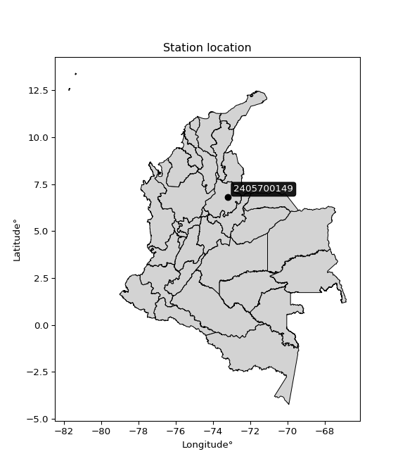

<div align="center">


</div>

# PMax24h Station (Rain): 2405700149

Maximum Precipitation in 24 hours (PMax24h) is the greatest amount of rainfall for a specific duration that is meteorologically possible for a given location, acting as a "worst-case" scenario for extreme storms, crucial for designing safety-critical infrastructure like bridges, river deviations, dams, spillways, and nuclear plants to prevent catastrophic failure. The PMax24h is related with the Probable Maximum Precipitation (PMP) and it is calculated by hydrologists using meteorological data to determine the upper limit of extreme rainfall, often leading to the Probable Maximum Flood (PMF) for flood control design, and is increasingly being studied for climate change impacts. Probable Maximum Precipitation (PMP) is the theoretical upper limit of rainfall, a deterministic estimate for extreme events, while probability distributions (like GEV, Gumbel) describe the likelihood and frequency of various precipitation amounts, including rare ones, showing how often events occur, with PMP representing the extreme end of these distributions, used for critical infrastructure design to ensure safety against the worst conceivable weather, unlike standard statistical forecasts which cover typical probabilities.

The most common probability distributions in hydrology, used for analyzing floods, rainfall, and streamflow, include the Normal, Log-Normal, Gumbel, Gamma (including Log-Pearson Type III), and Generalized Extreme Value (GEV) distributions, often chosen based on the data´s skewness and whether modeling extremes or general conditions, with Gumbel and GEV popular for extreme events like floods, while the Normal distribution serves as a baseline, though often requiring transformations for skewed hydrological data. These distributions help in designing water infrastructure, managing water resources, and forecasting hydrologic events.

> Hydrological data often isn´t perfectly normal (it´s skewed), so different distributions are needed for different applications, such as: **Flood Frequency Analysis**: Using Gumbel, GEV, or Log-Pearson Type III for predicting extreme flood magnitudes and their return periods, **Rainfall Analysis**: Normal for annual totals, but Log-Normal, Weibull, or GEV for intensity or extreme daily rainfall, **Streamflow Modeling**: Gamma and Log-Normal for maximum flows, GEV for minimum flows, and Kappa for daily flows.

<div align="center">

</img>

</div>


## A. General information


### 1. General running parameters

• app_version: _v20260225_. • runtime: _2026-02-28 16:54:07.457399_. • Python version: _3.14.0_. • SciPy version: _1.16.3_. • Pandas version: _2.3.3_. • NumPy version: _2.3.5_. • Stations dataset (station_dataset_file): _dataset/pmax24h_in/automatic_colombia_2003_2025.csv_. • Stations catalog (station_catalog_file): _dataset/CNE.xls_. • Minimum year to eval til year_max (date_min): _1900_. • Maximum year to eval since year_min (date_max): _2025_. • Creates, save and include plots into reports (create_plot): _False_. • Plot only fit distributions with Δo > Δ (plot_only_fit): _True_. • Plot only simple graphs avoiding multiple CDFs and multiple Extreme values plots (plot_only_simple): _False_. • Eval low extreme values, if False, evaluates high extreme values (low_extreme): _False_. • Eval every SciPy distribution as logarithmic (pdist_logarithmic_on): _True_. • Standard deviation normalized (ddof): _1.0_. • Return periods to eval in years (Tr): _[2, 2.33, 5, 10, 15, 20, 25, 50, 75, 100, 200, 250, 500, 750, 1000]_. • Minimum data sample per station, 0 means any (minimum_sample): _5_. • Z-Score maximum threshold to adjust a value, 0 means disable (zscore_max): _3.5_. • Z-Score minimum threshold to adjust a value, 0 means disable (zscore_min): _-2.5_. • Avoid zeros, e.g. rain = 0 (avoid_zeros): _True_. • Avoid null values (avoid_nans): _True_. 

:file_folder:Table: [dataset.csv](../../dataset/pmax24h_in/automatic_colombia_2003_2025.csv)

> Delta Degrees of Freedom (DDOF): is a parameter used in the formulas for calculating variance and standard deviation. When ddof=0, the divisor is $N$ (the total number of observations) and this is used when your data set is the entire population. When ddof=1, the divisor is $N-1$ and this is used when your data set is a sample drawn from a larger population. Using $N-1$ provides an unbiased estimate of the population variance (known as Bessel´s correction).


### 2. Station info and location

|   id |     CODIGO | NOMBRE                         | CATEGORIA    | TECNOLOGIA                              | ESTADO           | FECHA_INSTALACION   | FECHA_SUSPENSION   |   ALTITUD |   LATITUD |   LONGITUD | DEPARTAMENTO   | MUNICIPIO   | AREA_OPERATIVA                         | ENTIDAD                                                     | AREA_HIDROGRAFICA   | ZONA_HIDROGRAFICA   | SUBZONA_HIDROGRAFICA   | CORRIENTE   | Catalogo   |   Version |
|-----:|-----------:|:-------------------------------|:-------------|:----------------------------------------|:-----------------|:--------------------|:-------------------|----------:|----------:|-----------:|:---------------|:------------|:---------------------------------------|:------------------------------------------------------------|:--------------------|:--------------------|:-----------------------|:------------|:-----------|----------:|
|    0 | 2405700149 | EL JUNCAL - AUT   [2405700149] | Limnigráfica | Automática con Telemetría, Convencional | En Mantenimiento | 12/04/2018          | 05/08/2025         |       329 |   6.79378 |   -73.1986 | Santander      | Los Santos  | Area Operativa 08 - Santanderes-Arauca | INSTITUTO DE HIDROLOGIA METEOROLOGIA Y ESTUDIOS AMBIENTALES | Magdalena Cauca     | Sogamoso            | Río Sogamoso           | Sogamoso    | CNE_IDEAM  |  20251226 |

<div align="center">

Dynamic map: [:earth_americas:Google](http://maps.google.com/maps?q=6.793777778,-73.198638889) [:earth_americas:OSM](https://www.openstreetmap.org/#map=18/6.793777778/-73.198638889&layers=P) [:earth_americas:Bing](https://www.bing.com/maps?cp=6.793777778~-73.198638889&lvl=18) [:earth_americas:Apple](https://maps.apple.com/frame?center=6.793777778%2C-73.198638889&span=0.003%2C0.006)

</div>


<div align="center">

```geojson
{
  "type": "Feature",
  "geometry": {
    "type": "Point", 
    "coordinates": [-73.198638889, 6.793777778]
  }, 
  "properties": {
    "Name": "2405700149"
  }
}
```

</div>


### 3. Discrete values table and plot

<div align="center">

|               |           0 |           1 |          2 |           3 |           4 |            5 |          6 |
|:--------------|------------:|------------:|-----------:|------------:|------------:|-------------:|-----------:|
| Date          | 2019        | 2020        | 2021       | 2022        | 2023        | 2024         | 2025       |
| Value         |   62        |   41.4      |   81.8     |   62.8      |   44        |   51.2       |    1.2     |
| Value_initial |   62        |   41.4      |   81.8     |   62.8      |   44        |   51.2       |    1.2     |
| count         |    7        |    7        |    7       |    7        |    7        |    7         |    7       |
| mean          |   49.2      |   49.2      |   49.2     |   49.2      |   49.2      |   49.2       |   49.2     |
| std           |   25.1907   |   25.1907   |   25.1907  |   25.1907   |   25.1907   |   25.1907    |   25.1907  |
| zscore        |    0.508123 |   -0.309638 |    1.29413 |    0.539881 |   -0.206425 |    0.0793943 |   -1.90546 |


</div>


> The initial value (value_initial) correspond to the initial obtained or null completed value, and value (value) is adjusted only when the initial value is outside the valid range (outlier) definite through the Z-Score value. If Z-Score is active, values out of range or outliers are replaced with the station mean value. A Z-Score (or standard score) measures how many standard deviations a data point is from the mean of a dataset, indicating its relative position; positive scores mean above the mean, negative mean below, and a score of zero is exactly at the mean, allowing for comparison of values from different distributions. It´s calculated using the formula $z=(x–μ)/σ$, where $x$ is the data point, $μ$ is the mean, and $σ$ is the standard deviation, helping identify outliers and understand probability.
>
> <sub>**Note**: In this study, "completing" (filling gaps in) and "extending" (forecasting or lengthening the historical record) rainfall data series are avoided for certain critical analyses because they introduce artificial bias and uncertainty, which can distort the statistics of rare events (extremes), alter day-to-day variability, and compromise the integrity and homogeneity of the original data. Some reasons against Completing/Extending rainfall data are: **Distortion of Extremes and Variability**: The primary issue is that most gap-filling or extension methods rely on averaging or regression with nearby stations, which inherently smooths the data. Rainfall is highly variable in space and time, with a large percentage of zero values and occasional large storms. Infilling methods often underestimate the highest values and overestimate the lowest (zero) values, which severely distorts analyses focused on flood frequency, drought severity, and intensity-duration-frequency (IDF) curves, **Loss of Data Homogeneity**: Infilled or extended data are synthetic estimates, not actual measurements. Combining these estimates with observed data can violate the assumption of data homogeneity, which requires that the data properties do not change over time. Inhomogeneity can lead to incorrect conclusions about long-term trends or changes in climate patterns, **Propagation of Errors**: Errors and biases from the original data (e.g., wind-induced undercatch, instrument errors, site changes) or the data used for imputation can propagate through the analysis, leading to unreliable hydrological models and inaccurate predictions, **Compromised Statistical Integrity**: For statistical analyses, especially those involving the frequency of events, using artificial data can introduce time bias or autocorrelation that doesn´t exist in reality, making it difficult to assess the true probability of events, **Difficulty in Validation**: It is difficult to accurately validate the quality of filled or extended data, especially for past periods where ground-truth measurements are unavailable. The reliability of imputation techniques heavily depends on the density of the surrounding station network and the complexity of the local topography.</sub>


### 4. Active continuous probability distributions from SciPy (80 of 104 available)

A Probability Density Function (PDF) describes the relative likelihood of a continuous random variable falling within a specific range, where the total area under its curve equals 1, and the area over any interval gives the actual probability for that range. Unlike discrete probabilities (like rolling a die), a PDF shows density, not direct probability for a single point (which is zero), with higher points indicating higher likelihood, often visualized as a bell curve for normal distributions.

A log of a probability density function (log-PDF) is simply the logarithm of the PDF´s value, denoted as $log(f(x))$, useful for converting multiplication of probabilities into addition, improving numerical stability with tiny numbers, and connecting to information theory concepts like entropy. Instead of dealing with very small probabilities (e.g., 0.000001), log-PDFs use negative numbers (e.g., $log(0.00001) ≈ -11.51$ that are easier for computers to handle, preventing underflow errors and simplifying complex calculations. In this study, each active probability distribution from SciPy is also evaluated in the $log$ form.

[scipy.stats](https://docs.scipy.org/doc/scipy/reference/stats.html) is a Python´s powerful submodule within the SciPy library for comprehensive statistical analysis, offering over 130 probability distributions (like Normal, Poisson, etc.), functions for descriptive stats (mean, variance), hypothesis testing (t-tests, chi-square), random variable generation, and statistical tests, making it essential for data science, modeling, and research. It provides tools to explore, model, and draw conclusions from data efficiently, working seamlessly with [NumPy](https://numpy.org/).

<div align="center">

|   id | p_dist           |   n_parameter | fit_method   | label                                                                       | active   | ref                                                                                                      |
|-----:|:-----------------|--------------:|:-------------|:----------------------------------------------------------------------------|:---------|:---------------------------------------------------------------------------------------------------------|
|    0 | alpha            |             3 | MLE          | Alpha                                                                       | True     | [:mortar_board:](https://docs.scipy.org/doc/scipy/reference/generated/scipy.stats.alpha.html)            |
|    1 | anglit           |             2 | MM           | Anglit                                                                      | True     | [:mortar_board:](https://docs.scipy.org/doc/scipy/reference/generated/scipy.stats.anglit.html)           |
|    2 | arcsine          |             2 | MM           | Arcsine                                                                     | True     | [:mortar_board:](https://docs.scipy.org/doc/scipy/reference/generated/scipy.stats.arcsine.html)          |
|    3 | argus            |             3 | MLE          | Argus                                                                       | True     | [:mortar_board:](https://docs.scipy.org/doc/scipy/reference/generated/scipy.stats.argus.html)            |
|    4 | beta             |             4 | MLE          | Beta                                                                        | True     | [:mortar_board:](https://docs.scipy.org/doc/scipy/reference/generated/scipy.stats.beta.html)             |
|    5 | betaprime        |             4 | MLE          | Beta prime                                                                  | True     | [:mortar_board:](https://docs.scipy.org/doc/scipy/reference/generated/scipy.stats.betaprime.html)        |
|    6 | bradford         |             3 | MLE          | Bradford                                                                    | True     | [:mortar_board:](https://docs.scipy.org/doc/scipy/reference/generated/scipy.stats.bradford.html)         |
|    7 | burr             |             4 | MLE          | Burr (Type III)                                                             | True     | [:mortar_board:](https://docs.scipy.org/doc/scipy/reference/generated/scipy.stats.burr.html)             |
|    8 | burr12           |             4 | MLE          | Burr (Type III) 12                                                          | True     | [:mortar_board:](https://docs.scipy.org/doc/scipy/reference/generated/scipy.stats.burr12.html)           |
|    9 | cosine           |             2 | MLE          | Cosine                                                                      | True     | [:mortar_board:](https://docs.scipy.org/doc/scipy/reference/generated/scipy.stats.cosine.html)           |
|   10 | crystalball      |             4 | MLE          | Crystalball                                                                 | True     | [:mortar_board:](https://docs.scipy.org/doc/scipy/reference/generated/scipy.stats.crystalball.html)      |
|   11 | dgamma           |             3 | MLE          | Double gamma                                                                | True     | [:mortar_board:](https://docs.scipy.org/doc/scipy/reference/generated/scipy.stats.dgamma.html)           |
|   12 | dweibull         |             3 | MLE          | Double Weibull                                                              | True     | [:mortar_board:](https://docs.scipy.org/doc/scipy/reference/generated/scipy.stats.dweibull.html)         |
|   13 | erlang           |             3 | MLE          | Erlang                                                                      | True     | [:mortar_board:](https://docs.scipy.org/doc/scipy/reference/generated/scipy.stats.erlang.html)           |
|   14 | exponnorm        |             3 | MLE          | Exponentially modified Normal                                               | True     | [:mortar_board:](https://docs.scipy.org/doc/scipy/reference/generated/scipy.stats.exponnorm.html)        |
|   15 | exponpow         |             3 | MLE          | Exponential power                                                           | True     | [:mortar_board:](https://docs.scipy.org/doc/scipy/reference/generated/scipy.stats.exponpow.html)         |
|   16 | exponweib        |             4 | MLE          | Exponentiated Weibull                                                       | True     | [:mortar_board:](https://docs.scipy.org/doc/scipy/reference/generated/scipy.stats.exponweib.html)        |
|   17 | f                |             4 | MLE          | F                                                                           | True     | [:mortar_board:](https://docs.scipy.org/doc/scipy/reference/generated/scipy.stats.f.html)                |
|   18 | fatiguelife      |             3 | MLE          | Fatigue-life (Birnbaum-Saunders)                                            | True     | [:mortar_board:](https://docs.scipy.org/doc/scipy/reference/generated/scipy.stats.fatiguelife.html)      |
|   19 | foldnorm         |             3 | MM           | Fold Normal                                                                 | True     | [:mortar_board:](https://docs.scipy.org/doc/scipy/reference/generated/scipy.stats.foldnorm.html)         |
|   20 | gamma            |             3 | MLE          | Gamma                                                                       | True     | [:mortar_board:](https://docs.scipy.org/doc/scipy/reference/generated/scipy.stats.gamma.html)            |
|   21 | gausshyper       |             6 | MLE          | Gauss hypergeometric                                                        | True     | [:mortar_board:](https://docs.scipy.org/doc/scipy/reference/generated/scipy.stats.gausshyper.html)       |
|   22 | genexpon         |             5 | MLE          | Generalized exponential                                                     | True     | [:mortar_board:](https://docs.scipy.org/doc/scipy/reference/generated/scipy.stats.genexpon.html)         |
|   23 | genextreme       |             3 | MLE          | Generalized exponential                                                     | True     | [:mortar_board:](https://docs.scipy.org/doc/scipy/reference/generated/scipy.stats.genextreme.html)       |
|   24 | gengamma         |             4 | MLE          | Generalized gamma                                                           | True     | [:mortar_board:](https://docs.scipy.org/doc/scipy/reference/generated/scipy.stats.gengamma.html)         |
|   25 | genhalflogistic  |             3 | MLE          | Generalized half-logistic                                                   | True     | [:mortar_board:](https://docs.scipy.org/doc/scipy/reference/generated/scipy.stats.genhalflogistic.html)  |
|   26 | genlogistic      |             3 | MLE          | Generalized logistic                                                        | True     | [:mortar_board:](https://docs.scipy.org/doc/scipy/reference/generated/scipy.stats.genlogistic.html)      |
|   27 | gennorm          |             3 | MLE          | Generalized Normal                                                          | True     | [:mortar_board:](https://docs.scipy.org/doc/scipy/reference/generated/scipy.stats.gennorm.html)          |
|   28 | genpareto        |             3 | MLE          | Generalized Pareto                                                          | True     | [:mortar_board:](https://docs.scipy.org/doc/scipy/reference/generated/scipy.stats.genpareto.html)        |
|   29 | gompertz         |             3 | MLE          | Gompertz (or truncated Gumbel)                                              | True     | [:mortar_board:](https://docs.scipy.org/doc/scipy/reference/generated/scipy.stats.gompertz.html)         |
|   30 | gumbel_l         |             2 | MM           | Gumbel Left Skew                                                            | True     | [:mortar_board:](https://docs.scipy.org/doc/scipy/reference/generated/scipy.stats.gumbel_l.html)         |
|   31 | gumbel_r         |             2 | MM           | Gumbel Right Skew                                                           | True     | [:mortar_board:](https://docs.scipy.org/doc/scipy/reference/generated/scipy.stats.gumbel_r.html)         |
|   32 | halfgennorm      |             3 | MLE          | Upper half of a generalized normal                                          | True     | [:mortar_board:](https://docs.scipy.org/doc/scipy/reference/generated/scipy.stats.halfgennorm.html)      |
|   33 | halflogistic     |             2 | MM           | Half-logistic                                                               | True     | [:mortar_board:](https://docs.scipy.org/doc/scipy/reference/generated/scipy.stats.halflogistic.html)     |
|   34 | halfnorm         |             2 | MM           | Half Normal                                                                 | True     | [:mortar_board:](https://docs.scipy.org/doc/scipy/reference/generated/scipy.stats.halfnorm.html)         |
|   35 | hypsecant        |             2 | MM           | hyperbolic secant                                                           | True     | [:mortar_board:](https://docs.scipy.org/doc/scipy/reference/generated/scipy.stats.hypsecant.html)        |
|   36 | invgamma         |             3 | MLE          | Inverted gamma                                                              | True     | [:mortar_board:](https://docs.scipy.org/doc/scipy/reference/generated/scipy.stats.invgamma.html)         |
|   37 | invgauss         |             3 | MLE          | Inverse Gaussian                                                            | True     | [:mortar_board:](https://docs.scipy.org/doc/scipy/reference/generated/scipy.stats.invgauss.html)         |
|   38 | invweibull       |             3 | MLE          | Inverted Weibull                                                            | True     | [:mortar_board:](https://docs.scipy.org/doc/scipy/reference/generated/scipy.stats.invweibull.html)       |
|   39 | johnsonsb        |             4 | MLE          | Johnson SB                                                                  | True     | [:mortar_board:](https://docs.scipy.org/doc/scipy/reference/generated/scipy.stats.johnsonsb.html)        |
|   40 | johnsonsu        |             4 | MLE          | Johnson Su                                                                  | True     | [:mortar_board:](https://docs.scipy.org/doc/scipy/reference/generated/scipy.stats.johnsonsu.html)        |
|   41 | kappa3           |             3 | MLE          | Kappa 3                                                                     | True     | [:mortar_board:](https://docs.scipy.org/doc/scipy/reference/generated/scipy.stats.kappa3.html)           |
|   42 | kappa4           |             4 | MLE          | Kappa 4                                                                     | True     | [:mortar_board:](https://docs.scipy.org/doc/scipy/reference/generated/scipy.stats.kappa4.html)           |
|   43 | ksone            |             3 | MLE          | Kolmogorov-Smirnov one-sided test statistic distribution                    | True     | [:mortar_board:](https://docs.scipy.org/doc/scipy/reference/generated/scipy.stats.ksone.html)            |
|   44 | kstwobign        |             2 | MLE          | Limiting distribution of scaled Kolmogorov-Smirnov two-sided test statistic | True     | [:mortar_board:](https://docs.scipy.org/doc/scipy/reference/generated/scipy.stats.kstwobign.html)        |
|   45 | laplace          |             2 | MM           | Laplace                                                                     | True     | [:mortar_board:](https://docs.scipy.org/doc/scipy/reference/generated/scipy.stats.laplace.html)          |
|   46 | levy_l           |             2 | MLE          | Left-skewed Levy                                                            | True     | [:mortar_board:](https://docs.scipy.org/doc/scipy/reference/generated/scipy.stats.levy_l.html)           |
|   47 | loggamma         |             3 | MLE          | Log gamma                                                                   | True     | [:mortar_board:](https://docs.scipy.org/doc/scipy/reference/generated/scipy.stats.loggamma.html)         |
|   48 | logistic         |             2 | MM           | Logistic (or Sech-squared)                                                  | True     | [:mortar_board:](https://docs.scipy.org/doc/scipy/reference/generated/scipy.stats.logistic.html)         |
|   49 | loglaplace       |             3 | MLE          | Log-Laplace                                                                 | True     | [:mortar_board:](https://docs.scipy.org/doc/scipy/reference/generated/scipy.stats.loglaplace.html)       |
|   50 | lomax            |             3 | MLE          | Lomax (Pareto of the second kind)                                           | True     | [:mortar_board:](https://docs.scipy.org/doc/scipy/reference/generated/scipy.stats.lomax.html)            |
|   51 | maxwell          |             2 | MM           | Maxwell                                                                     | True     | [:mortar_board:](https://docs.scipy.org/doc/scipy/reference/generated/scipy.stats.maxwell.html)          |
|   52 | mielke           |             4 | MLE          | Mielke Beta-Kappa / Dagum                                                   | True     | [:mortar_board:](https://docs.scipy.org/doc/scipy/reference/generated/scipy.stats.mielke.html)           |
|   53 | moyal            |             2 | MM           | Moyal                                                                       | True     | [:mortar_board:](https://docs.scipy.org/doc/scipy/reference/generated/scipy.stats.moyal.html)            |
|   54 | nakagami         |             3 | MLE          | Nakagami                                                                    | True     | [:mortar_board:](https://docs.scipy.org/doc/scipy/reference/generated/scipy.stats.nakagami.html)         |
|   55 | ncf              |             5 | MLE          | Non-central F distribution                                                  | True     | [:mortar_board:](https://docs.scipy.org/doc/scipy/reference/generated/scipy.stats.ncf.html)              |
|   56 | nct              |             4 | MLE          | Non-central Student’s t                                                     | True     | [:mortar_board:](https://docs.scipy.org/doc/scipy/reference/generated/scipy.stats.nct.html)              |
|   57 | norm             |             2 | MM           | Normal                                                                      | True     | [:mortar_board:](https://docs.scipy.org/doc/scipy/reference/generated/scipy.stats.norm.html)             |
|   58 | pearson3         |             3 | MM           | Pearson type III                                                            | True     | [:mortar_board:](https://docs.scipy.org/doc/scipy/reference/generated/scipy.stats.pearson3.html)         |
|   59 | powerlaw         |             3 | MLE          | Power-function                                                              | True     | [:mortar_board:](https://docs.scipy.org/doc/scipy/reference/generated/scipy.stats.powerlaw.html)         |
|   60 | rayleigh         |             2 | MM           | Rayleigh                                                                    | True     | [:mortar_board:](https://docs.scipy.org/doc/scipy/reference/generated/scipy.stats.rayleigh.html)         |
|   61 | rdist            |             3 | MLE          | R-distributed (symmetric beta)                                              | True     | [:mortar_board:](https://docs.scipy.org/doc/scipy/reference/generated/scipy.stats.rdist.html)            |
|   62 | rice             |             3 | MLE          | Rice                                                                        | True     | [:mortar_board:](https://docs.scipy.org/doc/scipy/reference/generated/scipy.stats.rice.html)             |
|   63 | semicircular     |             2 | MM           | Semicircular                                                                | True     | [:mortar_board:](https://docs.scipy.org/doc/scipy/reference/generated/scipy.stats.semicircular.html)     |
|   64 | skewnorm         |             3 | MLE          | Skew normal                                                                 | True     | [:mortar_board:](https://docs.scipy.org/doc/scipy/reference/generated/scipy.stats.skewnorm.html)         |
|   65 | t                |             3 | MLE          | Student’s t                                                                 | True     | [:mortar_board:](https://docs.scipy.org/doc/scipy/reference/generated/scipy.stats.t.html)                |
|   66 | trapezoid        |             4 | MLE          | Trapezoid                                                                   | True     | [:mortar_board:](https://docs.scipy.org/doc/scipy/reference/generated/scipy.stats.trapezoid.html)        |
|   67 | triang           |             3 | MLE          | Triangular                                                                  | True     | [:mortar_board:](https://docs.scipy.org/doc/scipy/reference/generated/scipy.stats.triang.html)           |
|   68 | truncexpon       |             3 | MLE          | Truncated exponential                                                       | True     | [:mortar_board:](https://docs.scipy.org/doc/scipy/reference/generated/scipy.stats.truncexpon.html)       |
|   69 | truncnorm        |             4 | MLE          | Truncated normal                                                            | True     | [:mortar_board:](https://docs.scipy.org/doc/scipy/reference/generated/scipy.stats.truncnorm.html)        |
|   70 | truncpareto      |             4 | MLE          | Upper truncated Pareto                                                      | True     | [:mortar_board:](https://docs.scipy.org/doc/scipy/reference/generated/scipy.stats.truncpareto.html)      |
|   71 | truncweibull_min |             5 | MLE          | Doubly truncated Weibull minimum                                            | True     | [:mortar_board:](https://docs.scipy.org/doc/scipy/reference/generated/scipy.stats.truncweibull_min.html) |
|   72 | tukeylambda      |             3 | MLE          | Tukey-Lamdba                                                                | True     | [:mortar_board:](https://docs.scipy.org/doc/scipy/reference/generated/scipy.stats.tukeylambda.html)      |
|   73 | uniform          |             2 | MLE          | Uniform                                                                     | True     | [:mortar_board:](https://docs.scipy.org/doc/scipy/reference/generated/scipy.stats.uniform.html)          |
|   74 | vonmises         |             3 | MLE          | Von Mises                                                                   | True     | [:mortar_board:](https://docs.scipy.org/doc/scipy/reference/generated/scipy.stats.vonmises.html)         |
|   75 | vonmises_line    |             3 | MLE          | Von Mises line                                                              | True     | [:mortar_board:](https://docs.scipy.org/doc/scipy/reference/generated/scipy.stats.vonmises_line.html)    |
|   76 | wald             |             2 | MM           | Wald                                                                        | True     | [:mortar_board:](https://docs.scipy.org/doc/scipy/reference/generated/scipy.stats.wald.html)             |
|   77 | weibull_max      |             3 | MLE          | Weibull maximum                                                             | True     | [:mortar_board:](https://docs.scipy.org/doc/scipy/reference/generated/scipy.stats.weibull_max.html)      |
|   78 | weibull_min      |             3 | MLE          | Weibull minimum                                                             | True     | [:mortar_board:](https://docs.scipy.org/doc/scipy/reference/generated/scipy.stats.weibull_min.html)      |
|   79 | wrapcauchy       |             3 | MLE          | Wrapped  Cauchy                                                             | True     | [:mortar_board:](https://docs.scipy.org/doc/scipy/reference/generated/scipy.stats.wrapcauchy.html)       |

</div>

> **n_parameter:** # arguments & localization & scale.
>
> **Fit methods:** (MLE) maximum likelihood, (MM) L-moments.
>
>**Inactive** (With the only purpose of prevent loops, zero divisions, infinite values, over high estimated values or horizontal trending for recurrence intervals estimations, the follow distributions were disabled.)**:** lognorm, norminvgauss, powernorm, powerlognorm, cauchy, halfcauchy, foldcauchy, skewcauchy, chi2, expon, fisk, genhyperbolic, geninvgauss, gibrat, kstwo, laplace_asymmetric, levy, levy_stable, ncx2, pareto, rel_breitwigner, recipinvgauss, studentized_range, loguniform, 


## B. Probability (PDF) vs. Empirical (EDF) distributions functions

A continuous probability distribution (CPD) describes probabilities for variables that can take any value within a range (like rain any time), unlike discrete variables with specific outcomes (like temperature). It uses a Probability Density Function (PDF), a curve where the total area under it equals 1, and the probability of the variable falling within an interval (a to b) is found by calculating the area under the curve between those points. A key feature is that the probability of hitting any single exact value is zero, so probabilities are always expressed for ranges, e.g., $P(a ≤ X ≤ b)$.

<div align="center">

Distributions parameters from station values
|     |    station | p_dist              |   n |              loc |           scale | shape                 | shape1                | shape2                | shape3             |
|----:|-----------:|:--------------------|----:|-----------------:|----------------:|:----------------------|:----------------------|:----------------------|:-------------------|
|   0 | 2405700149 | alpha               |   7 |   -481.323       | 11087.1         | 20.957471134070744    |                       |                       |                    |
|   1 | 2405700149 | anglit              |   7 |     49.2         |    68.2264      |                       |                       |                       |                    |
|   2 | 2405700149 | arcsine             |   7 |     16.2176      |    65.9649      |                       |                       |                       |                    |
|   3 | 2405700149 | argus               |   7 |    -17.1771      |   102.005       | 1.4616140222248535    |                       |                       |                    |
|   4 | 2405700149 | beta                |   7 |    -63.0989      |   144.899       | 2.7061666499744352    | 0.6603766416501355    |                       |                    |
|   5 | 2405700149 | betaprime           |   7 |   -798.467       | 44917.4         | 1294.2181368498514    | 68577.27349174736     |                       |                    |
|   6 | 2405700149 | bradford            |   7 |     -9.29359     |    91.0936      | 9.189369591317142e-07 |                       |                       |                    |
|   7 | 2405700149 | burr                |   7 |     -3.52674     |    86.4559      | 244.2137283870478     | 0.005541806670369315  |                       |                    |
|   8 | 2405700149 | burr12              |   7 |   -749.409       |  1005.85        | 43.19352796583131     | 12125.26516926305     |                       |                    |
|   9 | 2405700149 | cosine              |   7 |     46.2676      |    20.5616      |                       |                       |                       |                    |
|  10 | 2405700149 | crystalball         |   7 |     49.2         |    23.3221      | 16064.21760084652     | 740.0096846749973     |                       |                    |
|  11 | 2405700149 | dgamma              |   7 |     51.2         |    21.6502      | 0.5547276147994984    |                       |                       |                    |
|  12 | 2405700149 | dweibull            |   7 |     51.2         |    19.4522      | 0.9054623587129715    |                       |                       |                    |
|  13 | 2405700149 | erlang              |   7 |   -333.386       |     1.54248     | 248.08764671611505    |                       |                       |                    |
|  14 | 2405700149 | exponnorm           |   7 |     49.1814      |    23.322       | 0.0008032761618275505 |                       |                       |                    |
|  15 | 2405700149 | exponpow            |   7 |      1.2         |     3.53228     | 0.1041665257517436    |                       |                       |                    |
|  16 | 2405700149 | exponweib           |   7 |      1.2         |     3.0092      | 3.6352960072654152    | 0.06576332227539573   |                       |                    |
|  17 | 2405700149 | f                   |   7 | -11801.8         | 11850.9         | 655361.1095838436     | 2419415.480490193     |                       |                    |
|  18 | 2405700149 | fatiguelife         |   7 |      1.2         |     7.17196e-05 | 715.9765238524878     |                       |                       |                    |
|  19 | 2405700149 | foldnorm            |   7 |    -65.9869      |    21.3096      | 5.427756280882897     |                       |                       |                    |
|  20 | 2405700149 | gamma               |   7 |   -346.859       |     1.47146     | 269.03354607389593    |                       |                       |                    |
|  21 | 2405700149 | gausshyper          |   7 |     -6.158       |    87.958       | 1.519948290657947     | 0.7157361412797598    | 0.5697470100022108    | 1.1957269769607413 |
|  22 | 2405700149 | genexpon            |   7 |      1.2         |     2.19663     | 0.04581695301501697   | 5.227243668553116e-08 | 2.502733981234646     |                    |
|  23 | 2405700149 | genextreme          |   7 |     45.4953      |    26.3067      | 0.6615337891064641    |                       |                       |                    |
|  24 | 2405700149 | gengamma            |   7 |   -184.976       |     0.9184      | 125.56214511424241    | 0.8725641735916194    |                       |                    |
|  25 | 2405700149 | genhalflogistic     |   7 |     -6.99566     |   101.084       | 1.1383888341228368    |                       |                       |                    |
|  26 | 2405700149 | genlogistic         |   7 |     64.8596      |     7.98886     | 0.40353122744207837   |                       |                       |                    |
|  27 | 2405700149 | gennorm             |   7 |     51.2         |    18.1251      | 1.041241971826837     |                       |                       |                    |
|  28 | 2405700149 | genpareto           |   7 |     -0.354961    |   131.993       | -1.6066361530696005   |                       |                       |                    |
|  29 | 2405700149 | gompertz            |   7 |     41.4         |    22.2794      | 0.6710529292575504    |                       |                       |                    |
|  30 | 2405700149 | gumbel_l            |   7 |     59.6962      |    18.1842      |                       |                       |                       |                    |
|  31 | 2405700149 | gumbel_r            |   7 |     38.7038      |    18.1842      |                       |                       |                       |                    |
|  32 | 2405700149 | halfgennorm         |   7 |      1.2         |     3.59852     | 0.39826335245236005   |                       |                       |                    |
|  33 | 2405700149 | halflogistic        |   7 |     21.5579      |    19.9396      |                       |                       |                       |                    |
|  34 | 2405700149 | halfnorm            |   7 |     18.3307      |    38.6889      |                       |                       |                       |                    |
|  35 | 2405700149 | hypsecant           |   7 |     49.2         |    14.8473      |                       |                       |                       |                    |
|  36 | 2405700149 | invgamma            |   7 |   -253.721       | 47190.3         | 157.08965981019935    |                       |                       |                    |
|  37 | 2405700149 | invgauss            |   7 |   -154.346       | 12929.7         | 0.015745589149469844  |                       |                       |                    |
|  38 | 2405700149 | invweibull          |   7 |      1.2         |     4.09308     | 0.04405755581409608   |                       |                       |                    |
|  39 | 2405700149 | johnsonsb           |   7 |      1.2         |    81.0006      | 0.4352287335890529    | 0.0706956134044672    |                       |                    |
|  40 | 2405700149 | johnsonsu           |   7 |    115.837       |     5.69292     | 9.004282822891714     | 2.9087016486354553    |                       |                    |
|  41 | 2405700149 | kappa3              |   7 |      1.19995     |    80.6         | 8323352.570754357     |                       |                       |                    |
|  42 | 2405700149 | kappa4              |   7 |     -6.69401     |    92.866       | 1.0931058803950093    | 1.045907617834705     |                       |                    |
|  43 | 2405700149 | ksone               |   7 |     -6.86        |    96.72        | 1.0                   |                       |                       |                    |
|  44 | 2405700149 | kstwobign           |   7 |    -56.5662      |   121.051       |                       |                       |                       |                    |
|  45 | 2405700149 | laplace             |   7 |     49.2         |    16.4912      |                       |                       |                       |                    |
|  46 | 2405700149 | levy_l              |   7 |     85.05        |    14.4401      |                       |                       |                       |                    |
|  47 | 2405700149 | loggamma            |   7 |     58.4272      |    19.3005      | 1.0630134297891707    |                       |                       |                    |
|  48 | 2405700149 | logistic            |   7 |     49.2         |    12.8581      |                       |                       |                       |                    |
|  49 | 2405700149 | loglaplace          |   7 |     -0.150512    |    51.3505      | 1.4395800505823817    |                       |                       |                    |
|  50 | 2405700149 | lomax               |   7 |      1.2         |     5.48359e+10 | 1296384322.5969162    |                       |                       |                    |
|  51 | 2405700149 | maxwell             |   7 |     -6.06357     |    34.6313      |                       |                       |                       |                    |
|  52 | 2405700149 | mielke              |   7 |      1.2         |    83.8019      | 0.14136447757000825   | 217.018079031649      |                       |                    |
|  53 | 2405700149 | moyal               |   7 |     35.8629      |    10.4986      |                       |                       |                       |                    |
|  54 | 2405700149 | nakagami            |   7 | -12164.3         | 12213.5         | 68364.9003941502      |                       |                       |                    |
|  55 | 2405700149 | ncf                 |   7 |    -50.8601      |   100.382       | 21.657249880157146    | 12812.8271158061      | 0.012761883493375266  |                    |
|  56 | 2405700149 | nct                 |   7 |  -1496.96        |    23.225       | 249251.12396755765    | 66.57254977414244     |                       |                    |
|  57 | 2405700149 | norm                |   7 |     49.2         |    23.3221      |                       |                       |                       |                    |
|  58 | 2405700149 | pearson3            |   7 |     49.2         |    23.3221      | -0.8101740801079884   |                       |                       |                    |
|  59 | 2405700149 | powerlaw            |   7 |      1.2         |    80.6         | 0.16358975555217173   |                       |                       |                    |
|  60 | 2405700149 | rayleigh            |   7 |      4.58349     |    35.5988      |                       |                       |                       |                    |
|  61 | 2405700149 | rdist               |   7 |     -6.07844     |    50.0784      | 0.9939464058873245    |                       |                       |                    |
|  62 | 2405700149 | rice                |   7 |     34.4129      |    14.9553      | 0.994532700866629     |                       |                       |                    |
|  63 | 2405700149 | semicircular        |   7 |     49.2         |    46.6442      |                       |                       |                       |                    |
|  64 | 2405700149 | skewnorm            |   7 |     75.7559      |    35.3431      | -3.171343492016611    |                       |                       |                    |
|  65 | 2405700149 | t                   |   7 |     52.5931      |    21.6093      | 7.757619035561689     |                       |                       |                    |
|  66 | 2405700149 | trapezoid           |   7 |    -16.9744      |    98.9473      | 1.0                   | 1.0                   |                       |                    |
|  67 | 2405700149 | triang              |   7 |    -16.8277      |    98.6277      | 0.9999997763273654    |                       |                       |                    |
|  68 | 2405700149 | truncexpon          |   7 |     -5.55677     |   136.796       | 0.6385910432478662    |                       |                       |                    |
|  69 | 2405700149 | truncnorm           |   7 |     17.5285      |    12.1937      | -9.412912730457313    | 5.2708599236449345    |                       |                    |
|  70 | 2405700149 | truncpareto         |   7 |      1.14789     |     0.0521086   | 0.16781487476676185   | 1547.7693532615742    |                       |                    |
|  71 | 2405700149 | truncweibull_min    |   7 |     -2.61678     |   139.278       | 1.4340283717793012    | 0.0012633451698549152 | 0.6061022311600504    |                    |
|  72 | 2405700149 | tukeylambda         |   7 |    -14.4248      |   115.54        | 1.2007259515520263    |                       |                       |                    |
|  73 | 2405700149 | uniform             |   7 |      1.2         |    80.6         |                       |                       |                       |                    |
|  74 | 2405700149 | vonmises            |   7 |      0.150065    |     1           | 1.3094489049272109    |                       |                       |                    |
|  75 | 2405700149 | vonmises_line       |   7 |     52.3976      |    16.2967      | 1.0777882258911031    |                       |                       |                    |
|  76 | 2405700149 | wald                |   7 |     25.8779      |    23.3221      |                       |                       |                       |                    |
|  77 | 2405700149 | weibull_max         |   7 |     81.8         |     1.59937     | 0.32242887369857576   |                       |                       |                    |
|  78 | 2405700149 | weibull_min         |   7 |   -746.772       |   806.435       | 43.04968846599941     |                       |                       |                    |
|  79 | 2405700149 | wrapcauchy          |   7 |      1.19532     |    12.8287      | 3.872248239403459e-05 |                       |                       |                    |
|  80 | 2405700149 | logalpha            |   7 |    -33.4566      |   900.155       | 24.43829144153557     |                       |                       |                    |
|  81 | 2405700149 | loganglit           |   7 |      3.47099     |     3.97774     |                       |                       |                       |                    |
|  82 | 2405700149 | logarcsine          |   7 |      1.54804     |     3.84589     |                       |                       |                       |                    |
|  83 | 2405700149 | logargus            |   7 |     -1.3956      |     5.86443     | 3.348843204086976     |                       |                       |                    |
|  84 | 2405700149 | logbeta             |   7 |     -0.248406    |     4.65268     | 0.13789658651942144   | 0.02699987193399898   |                       |                    |
|  85 | 2405700149 | logbetaprime        |   7 |    -35.6396      |   521.045       | 809.4166734063053     | 10791.364628584051    |                       |                    |
|  86 | 2405700149 | logbradford         |   7 |     -0.321917    |     4.72623     | 0.000300550437576111  |                       |                       |                    |
|  87 | 2405700149 | logburr             |   7 |     -0.00657181  |     4.46602     | 224.3967773940617     | 0.008216925776655504  |                       |                    |
|  88 | 2405700149 | logburr12           |   7 |  -4599.98        |  4607.98        | 10043.834321361384    | 6061.7366308893215    |                       |                    |
|  89 | 2405700149 | logcosine           |   7 |      3.11067     |     1.26645     |                       |                       |                       |                    |
|  90 | 2405700149 | logcrystalball      |   7 |      3.47099     |     1.35973     | 10.12816004993089     | 2611.4427560098657    |                       |                    |
|  91 | 2405700149 | logdgamma           |   7 |      4.13996     |     0.847825    | 0.9063784385417404    |                       |                       |                    |
|  92 | 2405700149 | logdweibull         |   7 |      4.12713     |     0.87593     | 0.8742956566920375    |                       |                       |                    |
|  93 | 2405700149 | logerlang           |   7 |    -21.1332      |     0.0868711   | 282.8731581490031     |                       |                       |                    |
|  94 | 2405700149 | logexponnorm        |   7 |      3.47008     |     1.35973     | 0.0006625430478696478 |                       |                       |                    |
|  95 | 2405700149 | logexponpow         |   7 |      0.182322    |     5.41116     | 0.17974320143460762   |                       |                       |                    |
|  96 | 2405700149 | logexponweib        |   7 |     -4.81212e+07 |     4.81212e+07 | 0.022575844218979974  | 2219983170.737962     |                       |                    |
|  97 | 2405700149 | logf                |   7 |  -5323.88        |  5327.35        | 94231865.92300147     | 45216116.64996517     |                       |                    |
|  98 | 2405700149 | logfatiguelife      |   7 |  -1036.83        |  1040.29        | 0.0013010398656762498 |                       |                       |                    |
|  99 | 2405700149 | logfoldnorm         |   7 |      0.21764     |     1.10365     | 2.995242108562472     |                       |                       |                    |
| 100 | 2405700149 | loggamma            |   7 |    -20.0419      |     0.0933681   | 251.81896395835793    |                       |                       |                    |
| 101 | 2405700149 | loggausshyper       |   7 |     -0.326456    |     4.73073     | 1.6060539585452438    | 0.4106938334702289    | 0.9784429341096327    | 0.5762428729592652 |
| 102 | 2405700149 | loggenexpon         |   7 |     -0.538144    |     0.114761    | 0.0006427954211456199 | 1.3305852136988516    | 0.0010802148355369572 |                    |
| 103 | 2405700149 | loggenextreme       |   7 |      3.51261     |     1.0761      | 1.2068403512372603    |                       |                       |                    |
| 104 | 2405700149 | loggengamma         |   7 |      0.182322    |     4.75353     | 0.0726392951769434    | 2.4614613325824832    |                       |                    |
| 105 | 2405700149 | loggenhalflogistic  |   7 |     -0.215808    |     9.90621     | 2.144162495203908     |                       |                       |                    |
| 106 | 2405700149 | loggenlogistic      |   7 |      4.40434     |     6.66692e-06 | 7.133337829408831e-06 |                       |                       |                    |
| 107 | 2405700149 | loggennorm          |   7 |      4.12713     |     0.00484998  | 0.3075714960691108    |                       |                       |                    |
| 108 | 2405700149 | loggenpareto        |   7 |     -0.00672682  |    13.5983      | -3.0828189686235534   |                       |                       |                    |
| 109 | 2405700149 | loggompertz         |   7 |     -0.429387    |     0.638128    | 0.0010239176186427586 |                       |                       |                    |
| 110 | 2405700149 | loggumbel_l         |   7 |      4.08294     |     1.06018     |                       |                       |                       |                    |
| 111 | 2405700149 | loggumbel_r         |   7 |      2.85903     |     1.06018     |                       |                       |                       |                    |
| 112 | 2405700149 | loghalfgennorm      |   7 |      0.182321    |     4.2222      | 167635.50000338245    |                       |                       |                    |
| 113 | 2405700149 | loghalflogistic     |   7 |      1.85937     |     1.16253     |                       |                       |                       |                    |
| 114 | 2405700149 | loghalfnorm         |   7 |      1.67121     |     2.25567     |                       |                       |                       |                    |
| 115 | 2405700149 | loghypsecant        |   7 |      3.47099     |     0.865634    |                       |                       |                       |                    |
| 116 | 2405700149 | loginvgamma         |   7 |    -25.7546      | 11598.9         | 398.5489088900255     |                       |                       |                    |
| 117 | 2405700149 | loginvgauss         |   7 |    -13.0113      |  1772.44        | 0.009253868699647514  |                       |                       |                    |
| 118 | 2405700149 | loginvweibull       |   7 |     -4.79555e+07 |     4.79555e+07 | 27375726.01980301     |                       |                       |                    |
| 119 | 2405700149 | logjohnsonsb        |   7 |     -0.679358    |     5.08364     | -1.3814604484187116   | 0.16886465845055315   |                       |                    |
| 120 | 2405700149 | logjohnsonsu        |   7 |      4.13711     |     0.0104325   | 0.6722490852208041    | 0.30326111260300226   |                       |                    |
| 121 | 2405700149 | logkappa3           |   7 |      0.182319    |     4.22196     | 19655982.272131927    |                       |                       |                    |
| 122 | 2405700149 | logkappa4           |   7 |     -0.200687    |     5.08666     | 1.081534705631226     | 1.1046032661134646    |                       |                    |
| 123 | 2405700149 | logksone            |   7 |     -0.239874    |     5.06635     | 1.0                   |                       |                       |                    |
| 124 | 2405700149 | logkstwobign        |   7 |     -3.65085     |     8.14995     |                       |                       |                       |                    |
| 125 | 2405700149 | loglaplace          |   7 |      3.47099     |     0.961477    |                       |                       |                       |                    |
| 126 | 2405700149 | loglevy_l           |   7 |      4.45623     |     0.229818    |                       |                       |                       |                    |
| 127 | 2405700149 | logloggamma         |   7 |      4.4043      |     2.3273e-06  | 2.490607450360909e-06 |                       |                       |                    |
| 128 | 2405700149 | loglogistic         |   7 |      3.47099     |     0.749661    |                       |                       |                       |                    |
| 129 | 2405700149 | logloglaplace       |   7 |     -0.00151407  |     3.93726     | 2.0879027379639257    |                       |                       |                    |
| 130 | 2405700149 | loglomax            |   7 |      0.182322    |     1.72668e+12 | 465434526717.6967     |                       |                       |                    |
| 131 | 2405700149 | logmaxwell          |   7 |      0.249011    |     2.01907     |                       |                       |                       |                    |
| 132 | 2405700149 | logmielke           |   7 |     -6.0439e+07  |     6.0439e+07  | 63825199.085401185    | 15640171947.706917    |                       |                    |
| 133 | 2405700149 | logmoyal            |   7 |      2.6934      |     0.612095    |                       |                       |                       |                    |
| 134 | 2405700149 | lognakagami         |   7 |      0.182322    |     3.99983     | 0.2029183066156105    |                       |                       |                    |
| 135 | 2405700149 | logncf              |   7 |    -53.5665      |    26.5348      | 3309.108802655638     | 11502.88585997841     | 3801.9232037955535    |                    |
| 136 | 2405700149 | lognct              |   7 |   -102.402       |     1.34073     | 93673.66425300553     | 78.96539950740322     |                       |                    |
| 137 | 2405700149 | lognorm             |   7 |      3.47099     |     1.35973     |                       |                       |                       |                    |
| 138 | 2405700149 | logpearson3         |   7 |      3.47099     |     1.35974     | -1.9335266602573304   |                       |                       |                    |
| 139 | 2405700149 | logpowerlaw         |   7 |      0.182322    |     4.22196     | 0.1743534941810172    |                       |                       |                    |
| 140 | 2405700149 | lograyleigh         |   7 |      0.869736    |     2.0755      |                       |                       |                       |                    |
| 141 | 2405700149 | logrdist            |   7 |      0.892631    |     0.71031     | 1.4432936981438393    |                       |                       |                    |
| 142 | 2405700149 | logrice             |   7 |   -829.826       |     1.35971     | 612.847023148963      |                       |                       |                    |
| 143 | 2405700149 | logsemicircular     |   7 |      3.47099     |     2.71949     |                       |                       |                       |                    |
| 144 | 2405700149 | logskewnorm         |   7 |      4.40428     |     1.6492      | -15806213.808347248   |                       |                       |                    |
| 145 | 2405700149 | logt                |   7 |      3.9984      |     0.220464    | 1.0256135474699617    |                       |                       |                    |
| 146 | 2405700149 | logtrapezoid        |   7 |     -0.39367     |     5.76886     | 1.0                   | 1.0                   |                       |                    |
| 147 | 2405700149 | logtriang           |   7 |     -0.439456    |     4.84374     | 0.9999992422634811    |                       |                       |                    |
| 148 | 2405700149 | logtruncexpon       |   7 |     -0.249326    |     5.98283     | 0.7778259855085108    |                       |                       |                    |
| 149 | 2405700149 | logtruncnorm        |   7 |      0.955434    |     3.74633     | -0.20636519415175383  | 12.507742097870807    |                       |                    |
| 150 | 2405700149 | logtruncpareto      |   7 |      0.178659    |     0.00366253  | 0.16778439538684484   | 1153.7416351759634    |                       |                    |
| 151 | 2405700149 | logtruncweibull_min |   7 |     -0.031476    |     8.19208     | 1.8790941672206891    | 0.00433045487722835   | 0.5414687311704527    |                    |
| 152 | 2405700149 | logtukeylambda      |   7 |      2.33001     |     1.83936     | 0.8448868408934422    |                       |                       |                    |
| 153 | 2405700149 | loguniform          |   7 |      0.182322    |     4.22196     |                       |                       |                       |                    |
| 154 | 2405700149 | logvonmises         |   7 |     -2.13911     |     1           | 2.215459538671701     |                       |                       |                    |
| 155 | 2405700149 | logvonmises_line    |   7 |      3.8828      |     1.1779      | 1.8800090220245038    |                       |                       |                    |
| 156 | 2405700149 | logwald             |   7 |      2.11123     |     1.35975     |                       |                       |                       |                    |
| 157 | 2405700149 | logweibull_max      |   7 |      4.40428     |     1.40105     | 0.5930524404983211    |                       |                       |                    |
| 158 | 2405700149 | logweibull_min      |   7 | -26063.4         | 26067.4         | 41061.99204658009     |                       |                       |                    |
| 159 | 2405700149 | logwrapcauchy       |   7 |      0.182319    |     0.671946    | 0.6613303835352111    |                       |                       |                    |

</div>

> **loc** (Location parameter): This shifts the distribution along the x-axis. For many common distributions, like the normal (Gaussian) distribution, loc represents the mean $μ$. For others, like the uniform distribution, it might represent the minimum value, or for the beta distribution, the left end of the support interval.
>
> **scale** (Scale parameter): This determines the width or spread of the distribution. For the normal distribution, scale represents the standard deviation $σ$. For a uniform distribution, it defines the length of the interval (from $loc$ to $loc + scale$).
>
> **shape** (Shape parameters): Refers to parameters that define the specific form of a probability distribution, distinct from its location (loc) and scale (scale). These parameters are required arguments for most distribution functions. For example, a normal (Gaussian) distribution is fully defined by its location (mean) and scale (standard deviation), so it has no specific shape parameters beyond loc and scale. However, other distributions have intrinsic properties that need specification, as Gamma distribution that takes a shape parameter, often named $a$ or $alpha$.


### 0. Cumulative distribution values - CDF (160 evaluated)

Cumulative Distribution Function (CDF), denoted as $F$<sub>$X$</sub>$(x)$, is a function that gives the probability that a random variable $X$ will take a value less than or equal to a specific value, $x$ (i.e., $(P(X≥x)$. It essentially "accumulates" probabilities from a given point up to the far right (positive infinity), providing a complete picture of the distribution´s probabilities for both discrete (like rain) and continuous (like temperature) variables, helping to find probabilities over ranges or above certain values. Each station is evaluated separately ordering the $x$ values ascending, calculating the CDF and PDF values for the activated distributions and their logarithmic forms.

<div align="center">

CDF ordered by x ascending and calculating $log(f(x))$ separately
|   id |    Station |   date |    x |   count |   mean |     std |     zscore |   Value_initial |    station |   m |     alpha |   alpha_pdf |     anglit |   anglit_pdf |   arcsine |   arcsine_pdf |     argus |   argus_pdf |      beta |      beta_pdf |   betaprime |   betaprime_pdf |   bradford |   bradford_pdf |      burr |    burr_pdf |    burr12 |   burr12_pdf |   cosine |   cosine_pdf |   crystalball |   crystalball_pdf |    dgamma |       dgamma_pdf |   dweibull |   dweibull_pdf |   erlang |   erlang_pdf |   exponnorm |   exponnorm_pdf |   exponpow |   exponpow_pdf |   exponweib |   exponweib_pdf |         f |      f_pdf |   fatiguelife |   fatiguelife_pdf |   foldnorm |   foldnorm_pdf |     gamma |   gamma_pdf |   gausshyper |   gausshyper_pdf |    genexpon |   genexpon_pdf |   genextreme |   genextreme_pdf |   gengamma |   gengamma_pdf |   genhalflogistic |   genhalflogistic_pdf |   genlogistic |   genlogistic_pdf |   gennorm |   gennorm_pdf |   genpareto |   genpareto_pdf |    gompertz |   gompertz_pdf |   gumbel_l |   gumbel_l_pdf |    gumbel_r |   gumbel_r_pdf |   halfgennorm |   halfgennorm_pdf |   halflogistic |   halflogistic_pdf |   halfnorm |   halfnorm_pdf |   hypsecant |   hypsecant_pdf |   invgamma |   invgamma_pdf |   invgauss |   invgauss_pdf |   invweibull |   invweibull_pdf |   johnsonsb |   johnsonsb_pdf |   johnsonsu |   johnsonsu_pdf |      kappa3 |   kappa3_pdf |      kappa4 |   kappa4_pdf |     ksone |   ksone_pdf |   kstwobign |   kstwobign_pdf |   laplace |   laplace_pdf |   levy_l |   levy_l_pdf |   loggamma |   loggamma_pdf |   logistic |   logistic_pdf |   loglaplace |   loglaplace_pdf |      lomax |   lomax_pdf |   maxwell |   maxwell_pdf |     mielke |   mielke_pdf |       moyal |   moyal_pdf |   nakagami |   nakagami_pdf |       ncf |    ncf_pdf |       nct |    nct_pdf |      norm |   norm_pdf |   pearson3 |   pearson3_pdf |   powerlaw |   powerlaw_pdf |   rayleigh |   rayleigh_pdf |    rdist |       rdist_pdf |      rice |   rice_pdf |   semicircular |   semicircular_pdf |   skewnorm |   skewnorm_pdf |         t |      t_pdf |   trapezoid |   trapezoid_pdf |    triang |   triang_pdf |   truncexpon |   truncexpon_pdf |   truncnorm |   truncnorm_pdf |   truncpareto |   truncpareto_pdf |   truncweibull_min |   truncweibull_min_pdf |   tukeylambda |   tukeylambda_pdf |   uniform |   uniform_pdf |   vonmises |   vonmises_pdf |   vonmises_line |   vonmises_line_pdf |     wald |   wald_pdf |   weibull_max |   weibull_max_pdf |   weibull_min |   weibull_min_pdf |   wrapcauchy |   wrapcauchy_pdf |   logalpha |   logalpha_pdf |   loganglit |   loganglit_pdf |   logarcsine |   logarcsine_pdf |   logargus |   logargus_pdf |   logbeta |   logbeta_pdf |   logbetaprime |   logbetaprime_pdf |   logbradford |   logbradford_pdf |    logburr |   logburr_pdf |   logburr12 |   logburr12_pdf |   logcosine |   logcosine_pdf |   logcrystalball |   logcrystalball_pdf |   logdgamma |   logdgamma_pdf |   logdweibull |   logdweibull_pdf |   logerlang |   logerlang_pdf |   logexponnorm |   logexponnorm_pdf |   logexponpow |   logexponpow_pdf |   logexponweib |   logexponweib_pdf |       logf |   logf_pdf |   logfatiguelife |   logfatiguelife_pdf |   logfoldnorm |   logfoldnorm_pdf |   loggausshyper |   loggausshyper_pdf |   loggenexpon |   loggenexpon_pdf |   loggenextreme |   loggenextreme_pdf |   loggengamma |   loggengamma_pdf |   loggenhalflogistic |   loggenhalflogistic_pdf |   loggenlogistic |   loggenlogistic_pdf |   loggennorm |   loggennorm_pdf |   loggenpareto |   loggenpareto_pdf |   loggompertz |   loggompertz_pdf |   loggumbel_l |   loggumbel_l_pdf |   loggumbel_r |   loggumbel_r_pdf |   loghalfgennorm |   loghalfgennorm_pdf |   loghalflogistic |   loghalflogistic_pdf |   loghalfnorm |   loghalfnorm_pdf |   loghypsecant |   loghypsecant_pdf |   loginvgamma |   loginvgamma_pdf |   loginvgauss |   loginvgauss_pdf |   loginvweibull |   loginvweibull_pdf |   logjohnsonsb |   logjohnsonsb_pdf |   logjohnsonsu |   logjohnsonsu_pdf |   logkappa3 |   logkappa3_pdf |   logkappa4 |   logkappa4_pdf |   logksone |   logksone_pdf |   logkstwobign |   logkstwobign_pdf |   loglevy_l |   loglevy_l_pdf |   logloggamma |   logloggamma_pdf |   loglogistic |   loglogistic_pdf |   logloglaplace |   logloglaplace_pdf |    loglomax |   loglomax_pdf |   logmaxwell |   logmaxwell_pdf |   logmielke |   logmielke_pdf |    logmoyal |   logmoyal_pdf |   lognakagami |   lognakagami_pdf |     logncf |   logncf_pdf |     lognct |   lognct_pdf |    lognorm |   lognorm_pdf |   logpearson3 |   logpearson3_pdf |   logpowerlaw |   logpowerlaw_pdf |   lograyleigh |   lograyleigh_pdf |    logrdist |   logrdist_pdf |    logrice |   logrice_pdf |   logsemicircular |   logsemicircular_pdf |   logskewnorm |   logskewnorm_pdf |      logt |   logt_pdf |   logtrapezoid |   logtrapezoid_pdf |   logtriang |   logtriang_pdf |   logtruncexpon |   logtruncexpon_pdf |   logtruncnorm |   logtruncnorm_pdf |   logtruncpareto |   logtruncpareto_pdf |   logtruncweibull_min |   logtruncweibull_min_pdf |   logtukeylambda |   logtukeylambda_pdf |   loguniform |   loguniform_pdf |   logvonmises |   logvonmises_pdf |   logvonmises_line |   logvonmises_line_pdf |   logwald |   logwald_pdf |   logweibull_max |   logweibull_max_pdf |   logweibull_min |   logweibull_min_pdf |   logwrapcauchy |   logwrapcauchy_pdf |
|-----:|-----------:|-------:|-----:|--------:|-------:|--------:|-----------:|----------------:|-----------:|----:|----------:|------------:|-----------:|-------------:|----------:|--------------:|----------:|------------:|----------:|--------------:|------------:|----------------:|-----------:|---------------:|----------:|------------:|----------:|-------------:|---------:|-------------:|--------------:|------------------:|----------:|-----------------:|-----------:|---------------:|---------:|-------------:|------------:|----------------:|-----------:|---------------:|------------:|----------------:|----------:|-----------:|--------------:|------------------:|-----------:|---------------:|----------:|------------:|-------------:|-----------------:|------------:|---------------:|-------------:|-----------------:|-----------:|---------------:|------------------:|----------------------:|--------------:|------------------:|----------:|--------------:|------------:|----------------:|------------:|---------------:|-----------:|---------------:|------------:|---------------:|--------------:|------------------:|---------------:|-------------------:|-----------:|---------------:|------------:|----------------:|-----------:|---------------:|-----------:|---------------:|-------------:|-----------------:|------------:|----------------:|------------:|----------------:|------------:|-------------:|------------:|-------------:|----------:|------------:|------------:|----------------:|----------:|--------------:|---------:|-------------:|-----------:|---------------:|-----------:|---------------:|-------------:|-----------------:|-----------:|------------:|----------:|--------------:|-----------:|-------------:|------------:|------------:|-----------:|---------------:|----------:|-----------:|----------:|-----------:|----------:|-----------:|-----------:|---------------:|-----------:|---------------:|-----------:|---------------:|---------:|----------------:|----------:|-----------:|---------------:|-------------------:|-----------:|---------------:|----------:|-----------:|------------:|----------------:|----------:|-------------:|-------------:|-----------------:|------------:|----------------:|--------------:|------------------:|-------------------:|-----------------------:|--------------:|------------------:|----------:|--------------:|-----------:|---------------:|----------------:|--------------------:|---------:|-----------:|--------------:|------------------:|--------------:|------------------:|-------------:|-----------------:|-----------:|---------------:|------------:|----------------:|-------------:|-----------------:|-----------:|---------------:|----------:|--------------:|---------------:|-------------------:|--------------:|------------------:|-----------:|--------------:|------------:|----------------:|------------:|----------------:|-----------------:|---------------------:|------------:|----------------:|--------------:|------------------:|------------:|----------------:|---------------:|-------------------:|--------------:|------------------:|---------------:|-------------------:|-----------:|-----------:|-----------------:|---------------------:|--------------:|------------------:|----------------:|--------------------:|--------------:|------------------:|----------------:|--------------------:|--------------:|------------------:|---------------------:|-------------------------:|-----------------:|---------------------:|-------------:|-----------------:|---------------:|-------------------:|--------------:|------------------:|--------------:|------------------:|--------------:|------------------:|-----------------:|---------------------:|------------------:|----------------------:|--------------:|------------------:|---------------:|-------------------:|--------------:|------------------:|--------------:|------------------:|----------------:|--------------------:|---------------:|-------------------:|---------------:|-------------------:|------------:|----------------:|------------:|----------------:|-----------:|---------------:|---------------:|-------------------:|------------:|----------------:|--------------:|------------------:|--------------:|------------------:|----------------:|--------------------:|------------:|---------------:|-------------:|-----------------:|------------:|----------------:|------------:|---------------:|--------------:|------------------:|-----------:|-------------:|-----------:|-------------:|-----------:|--------------:|--------------:|------------------:|--------------:|------------------:|--------------:|------------------:|------------:|---------------:|-----------:|--------------:|------------------:|----------------------:|--------------:|------------------:|----------:|-----------:|---------------:|-------------------:|------------:|----------------:|----------------:|--------------------:|---------------:|-------------------:|-----------------:|---------------------:|----------------------:|--------------------------:|-----------------:|---------------------:|-------------:|-----------------:|--------------:|------------------:|-------------------:|-----------------------:|----------:|--------------:|-----------------:|---------------------:|-----------------:|---------------------:|----------------:|--------------------:|
|    0 | 2405700149 |   2025 |  1.2 |       7 |   49.2 | 25.1907 | -1.90546   |             1.2 | 2405700149 |   1 | 0.0216917 |  0.00246972 | 0.00668586 |   0.00238891 |  0        |    0          | 0.0307896 |  0.00338126 | 0.0638052 |    0.00285811 |   0.0201513 |      0.00213162 |   0.115196 |      0.0109777 | 0.0195755 | nan         | 0.0384205 |   0.00216786 | 0.021722 |   0.00323642 |     0.0197886 |        0.00205743 | 0.0185981 |      0.000985681 |  0.0476402 |     0.00202821 | 0.020311 |   0.00220911 |   0.0197879 |      0.00205737 |   0.020526 |    9.62786e+12 |  0.00011891 |     1.22544e+11 | 0.0197815 | 0.00206208 |      0.051577 |       1.63547e+09 |  0.0114569 |     0.00140796 | 0.0203614 |  0.00222012 |    0.0204498 |       0.00417771 | 5.16911e-08 |     0.0208578  |    0.0450344 |       0.00251074 |  0.0171491 |     0.00209012 |         0.0425078 |            0.0054395  |     0.0401274 |        0.0020262  | 0.0260856 |    0.00157941 |   0.0118231 |      0.00763101 | 0           |     0          |  0.0392875 |     0.00211753 | 0.000383884 |    0.000166041 |   2.50293e-12 |        0.0826136  |       0        |         0          |   0        |     0          |   0.0250969 |      0.00168858 |  0.0161057 |     0.00209167 |  0.0181632 |     0.00231109 |   0.00547576 |      5.6578e+12  |  0.00768443 |      6.7361e+12 |   0.0403032 |      0.00219725 | 5.79386e-07 |    0.0124069 | 2.53718e-15 |    0.247092  | 0.0833333 |   0.0103391 |   0.0233131 |      0.00396917 | 0.0272204 |    0.0016506  | 0.321848 |   0.00181153 |  0.0104317 |       0.020646 |  0.0233611 |     0.00177439 |    0.0163492 |        0.0170043 | 1.6832e-10 |  0.0236412  | 0.0024218 |   0.000991473 | 0.00327539 |  2.08527e+12 | 1.87513e-07 | 2.50897e-07 |  0.0197385 |     0.00205274 | 0.0327132 | 0.00374644 | 0.0198031 | 0.00205928 | 0.0197886 | 0.00205743 |  0.0365069 |     0.00230201 | 0.00134085 |    9.87864e+11 |   0        |     0          | 0.546234 |      0.00639786 | 0         | 0          |       0        |         0          |  0.0349025 |     0.00243974 | 0.0228039 | 0.00162524 |   0.0337375 |      0.00371264 | 0.0334106 |   0.00370658 |     0.102112 |       0.0147423  |   0.0902714 |     0.0133474   |      0        |       4.54584     |          0.0146806 |              0.0055676 |      0.577761 |        0.00498329 |  0        |     0.0124069 |   0.840166 |      0.206765  |     4.61754e-12 |          0.00253308 | 0        | 0          |     0.029038  |       0.000411116 |     0.0384131 |        0.00216786 |  5.80584e-05 |        0.0124071 |  0.0101413 |      0.0214628 |    0        |        0        |     0        |         0        | 0.00486685 |     0.00737276 |  0.119942 |   0.0417266   |     0.00939916 |          0.0188624 |      0.106704 |          0.21161  | 0.00293153 |    nan        | 0.000236192 |     0.000515632 |   0.0146189 |       0.0407972 |       0.00779002 |            0.0157477 |  0.00375826 |      0.00450803 |     0.0120281 |        0.00993642 |   0.0102594 |       0.0205186 |     0.00778998 |          0.0157477 |   0.000780281 |       5.05304e+12 |      0.0119779 |           0.012475 | 0.00795901 |  0.0160208 |       0.00756869 |            0.0154732 |      0        |          0        |       0.0130183 |         0.0412639   |      0.03178  |         0.0812949 |       0.0265907 |           0.0189294 |   0.000861052 |       5.54681e+12 |            0.0210109 |               0.0552086  |         0        |            0.0116813 |    0.0104955 |       0.00481961 |      0.0141086 |        0.0757473   |    0.00164514 |        0.00417788 |     0.0249272 |         0.0232167 |   3.77159e-06 |       4.44261e-05 |         0        |             0.236844 |          0        |              0        |      0        |          0        |      0.0142515 |          0.0164582 |    0.00911868 |         0.0196711 |     0.0131478 |         0.0268248 |       0.0153979 |           0.0366852 |      0.0494904 |        0.0241386   |       0.090343 |          0.0124877 | 5.37326e-07 |        0.236857 | 0.000436411 |        0.372481 |  0.0833333 |       0.197381 |      0.0201657 |          0.0534189 |    0.183375 |       0.0210711 |     0.0109081 |         0.0116736 |     0.0122868 |         0.0161884 |     0.000832654 |          0.00945682 | 7.11879e-14 |      0.269555  |     0        |         0        |   0.0114141 |       0.0120536 | 7.40565e-15 |    3.71777e-13 |    8.5755e-08 |       1.25389e+09 | 0.00852152 |    0.0173251 | 0.00788403 |    0.0159092 | 0.00779002 |     0.0157477 |     0.0323799 |          0.024242 |    0.00100979 |       6.34323e+12 |      0        |          0        | 1.42546e-12 |        13044.3 | 0.00778799 |     0.0157444 |          0        |              0        |     0.0104673 |         0.0182631 | 0.0171628 | 0.00460216 |       0.009969 |          0.0346151 |   0.0164782 |       0.0530035 |        0.128759 |            0.287665 |    1.26755e-13 |           0.179193 |         0        |           66.044     |            0.00377369 |                 0.0343248 |        0.0042436 |             0.16307  |     0        |         0.236857 |       0.99303 |         0.0132073 |        3.61507e-11 |             0.00982221 |  0        |      0        |         0.146085 |            0.0394722 |       0.00259012 |           0.00407532 |     3.44756e-06 |            1.16189  |
|    1 | 2405700149 |   2020 | 41.4 |       7 |   49.2 | 25.1907 | -0.309638  |            41.4 | 2405700149 |   2 | 0.400166  |  0.0156782  | 0.386668   |   0.0142756  |  0.424003 |    0.00993264 | 0.337052  |  0.0123234  | 0.272542  |    0.00827552 |   0.373964  |      0.0160292  |   0.5565   |      0.0109777 | 0.412331  |   0.0124212 | 0.311334  |   0.01403    | 0.424997 |   0.0152649  |     0.369021  |        0.0161753  | 0.189004  |      0.0130398   |  0.292094  |     0.0145068  | 0.379949 |   0.0158888  |   0.369018  |      0.0161754  |   0.927678 |    0.000875577 |  0.265749   |     0.000824341 | 0.369739  | 0.0161826  |      0.852143 |       0.00300342  |  0.348861  |     0.0173611  | 0.383212  |  0.0160206  |    0.332992  |       0.0106612  | 0.567635    |     0.0090182  |    0.313577  |       0.0125331  |  0.391728  |     0.0164386  |         0.332723  |            0.00966817 |     0.29944   |        0.0143633  | 0.285275  |    0.0165502  |   0.357108  |      0.00990465 | 5.18065e-12 |     0.0301199  |  0.306234  |     0.0139492  | 0.422233    |    0.0200201   |   0.608694    |        0.00604675 |       0.460193 |         0.0197653  |   0.449009 |     0.0172642  |   0.339977  |      0.0187863  |  0.401453  |     0.0165178  |  0.400871  |     0.0157722  |   0.404847   |      0.00040121  |  0.667921   |      0.00126754 |   0.310794  |      0.013761   | 0.498759    |    0.0124069 | 0.512459    |    0.011859  | 0.498966  |   0.0103391 |   0.470909  |      0.0133017  | 0.311572  |    0.0188932  | 0.43482  |   0.00445536 |  0.575869  |       0.262463 |  0.352831  |     0.0177585  |    0.6154    |        0.40001   | 0.613404   |  0.00913958 | 0.401971  |   0.0169188   | 0.901365   |  0.00316968  | 0.442368    | 0.0217323   |  0.368185  |     0.0161434  | 0.431131  | 0.0135831  | 0.369172  | 0.0161748  | 0.369021  | 0.0161753  |  0.324728  |     0.0141167  | 0.892438   |    0.00363168  |   0.414208 |     0.0170182  | 0.896077 |      0.0200409  | 0.0647389 | 0.018016   |       0.394041 |         0.0134562  |  0.330976  |     0.0140606  | 0.309459  | 0.0154047  |   0.348047  |      0.0119246  | 0.348547  |   0.0119719  |     0.615612 |       0.0109886  |   0.974867  |     0.00481447  |      0.949092 |       0.001928    |          0.451851  |              0.0133604 |      0.780216 |        0.00512383 |  0.498759 |     0.0124069 |   7.01235  |      0.0324157 |     0.277441    |          0.0172666  | 0.493108 | 0.0289651  |     0.0588597 |       0.00133062  |     0.311342  |        0.0140305  |  0.498786    |        0.0124052 |  0.589963  |      0.25315   |    0.563257 |        0.249379 |     0.541884 |         0.166976 | 0.43936    |     0.578808   |  0.198811 |   0.036279    |     0.582214   |          0.272723  |      0.855923 |          0.211563 | 0.717394   |      0.354644 | 0.41525     |     0.684496    |   0.651007  |       0.236923  |       0.5736     |            0.28839   |  0.282091   |      0.362539   |     0.300793  |        0.330921   |   0.584249  |       0.264881  |     0.573601   |          0.28839   |   0.782581    |       0.0258313   |      0.478645  |           0.498507 | 0.574639   |  0.287558  |       0.57572    |            0.289359  |      0.571881 |          0.355592 |       0.479586  |         0.304559    |      0.63274  |         0.169479  |       0.449398  |           0.437364  |   0.956522    |       0.0306477   |            0.418994  |               0.282312   |         0        |            0.516293  |    0.150789  |       0.252305   |      0.454491  |        0.259842    |    0.496014   |        0.541977   |     0.50949   |         0.329562  |   0.642393    |       0.268157    |         0        |             0.236844 |          0.664963 |              0.239917 |      0.637039 |          0.233856 |      0.591488  |          0.352635  |    0.594179   |         0.261481  |     0.601414  |         0.240054  |       0.575292  |           0.18157   |      0.143146  |        0.0646955   |       0.256504 |          0.235966  | 0.838701    |        0.236857 | 0.821397    |        0.239409 |  0.782251  |       0.197381 |      0.613872  |          0.167662  |    0.424492 |       0.260558  |     0.482482  |         0.516339  |     0.583351  |         0.324217  |     0.445318    |          0.249619   | 0.614989    |      0.103778  |     0.602306 |         0.266232 |   0.480197  |       0.507101  | 0.666351    |    0.256073    |    0.731305   |       0.0733789   | 0.576854   |    0.277952  | 0.573893   |    0.287644  | 0.5736     |     0.28839   |     0.447247  |          0.324937 |    0.969797   |       0.0477519   |      0.611373 |          0.257438 | 1           |            0   | 0.57358    |     0.288398  |          0.558976 |              0.233085 |     0.679662  |         0.444263  | 0.21307   | 0.569319   |       0.509297 |          0.247414  |   0.738579  |       0.354853  |        0.89755  |            0.159165 |    0.604623    |           0.139329 |         0.986784 |            0.0215316 |            0.761309   |                 0.338774  |        0.834748  |             0.231294 |     0.838701 |         0.236857 |       1.28327 |         0.452209  |        0.433089    |             0.414656   |  0.732889 |      0.224009 |         0.521046 |            0.295812  |       0.496537   |           0.544244   |     0.612033    |            0.180631 |
|    2 | 2405700149 |   2023 | 44   |       7 |   49.2 | 25.1907 | -0.206425  |            44   | 2405700149 |   3 | 0.441195  |  0.0158535  | 0.424078   |   0.0144871  |  0.449605 |    0.00977312 | 0.369956  |  0.0129883  | 0.294766  |    0.00882708 |   0.416254  |      0.0164708  |   0.585042 |      0.0109777 | 0.444953  |   0.0126706 | 0.34937   |   0.015224   | 0.464931 |   0.0154338  |     0.411782  |        0.0166858  | 0.227534  |      0.0168673   |  0.332955  |     0.0170252  | 0.421771 |   0.0162521  |   0.411778  |      0.0166858  |   0.929866 |    0.000809525 |  0.267831   |     0.000778053 | 0.41251   | 0.0166867  |      0.859696 |       0.00280964  |  0.394971  |     0.0180686  | 0.425368  |  0.0163763  |    0.361194  |       0.0110352  | 0.590458    |     0.00854216 |    0.347363  |       0.0134561  |  0.434861  |     0.0167071  |         0.358448  |            0.0101266  |     0.33883   |        0.0159437  | 0.331583  |    0.0191279  |   0.383183  |      0.0101566  | 0.079708    |     0.0311502  |  0.344147  |     0.0152139  | 0.473631    |    0.0194651   |   0.623904    |        0.00566008 |       0.510018 |         0.0185531  |   0.492976 |     0.0165487  |   0.390729  |      0.020188   |  0.444654  |     0.0166798  |  0.442073  |     0.0158924  |   0.405857   |      0.000376737 |  0.671213   |      0.00126652 |   0.348084  |      0.0149207  | 0.531017    |    0.0124069 | 0.543252    |    0.0118289 | 0.525848  |   0.0103391 |   0.505025  |      0.0129311  | 0.364778  |    0.0221195  | 0.446886 |   0.00483437 |  0.591775  |       0.259764 |  0.400253  |     0.0186691  |    0.639008  |        0.375455  | 0.636451   |  0.00859472 | 0.446022  |   0.0169349   | 0.909386   |  0.00300362  | 0.497308    | 0.0204852   |  0.410864  |     0.0166553  | 0.466343  | 0.0134858  | 0.41193   | 0.016684   | 0.411782  | 0.0166858  |  0.362744  |     0.0151171  | 0.901635   |    0.00344622  |   0.458273 |     0.0168495  | 1        | 235873          | 0.118922  | 0.0235038  |       0.429176 |         0.0135633  |  0.368818  |     0.0150445  | 0.3508    | 0.0163658  |   0.379741  |      0.0124558  | 0.380369  |   0.0125064  |     0.643913 |       0.0107817  |   0.985031  |     0.0031002   |      0.953924 |       0.00179209  |          0.486741  |              0.0134739 |      0.793561 |        0.00514201 |  0.531017 |     0.0124069 |   7.44736  |      0.394635  |     0.324655    |          0.0190118  | 0.562005 | 0.0241874  |     0.062506  |       0.0014782   |     0.349378  |        0.0152244  |  0.53104     |        0.0124052 |  0.605284  |      0.249865  |    0.578414 |        0.248289 |     0.552077 |         0.167773 | 0.475965   |     0.623424   |  0.201107 |   0.0392238   |     0.598739   |          0.269784  |      0.868809 |          0.211562 | 0.739144   |      0.359525 | 0.458181    |     0.72436     |   0.66535   |       0.233984  |       0.591087   |            0.285716  |  0.305153   |      0.395349   |     0.321857  |        0.361447   |   0.600294  |       0.261911  |     0.591088   |          0.285716  |   0.78414     |       0.0253619   |      0.509992  |           0.531154 | 0.592016   |  0.284864  |       0.593262   |            0.286577  |      0.593421 |          0.351519 |       0.49869   |         0.323202    |      0.642988 |         0.167029  |       0.477068  |           0.471808  |   0.958356    |       0.0296003   |            0.436841  |               0.304298   |         0        |            0.551061  |    0.167692  |       0.305431   |      0.470821  |        0.276822    |    0.529489   |        0.556654   |     0.529722  |         0.334653  |   0.658463    |       0.259519    |         0        |             0.236844 |          0.679323 |              0.231615 |      0.651107 |          0.228098 |      0.612737  |          0.344896  |    0.610002   |         0.25801   |     0.615934  |         0.236705  |       0.586264  |           0.17871   |      0.147285  |        0.0714379   |       0.272292 |          0.2852    | 0.853127    |        0.236857 | 0.836032    |        0.241195 |  0.794273  |       0.197381 |      0.624001  |          0.164907  |    0.441306 |       0.292585  |     0.51498   |         0.551117  |     0.602955  |         0.319345  |     0.460657    |          0.254063   | 0.621258    |      0.102087  |     0.618382 |         0.261586 |   0.512099  |       0.54079   | 0.681634    |    0.245798    |    0.73574    |       0.0722394   | 0.5937     |    0.275137  | 0.591334   |    0.284965  | 0.591087   |     0.285716  |     0.467466  |          0.339059 |    0.972685   |       0.0470842   |      0.626902 |          0.252426 | 1           |            0   | 0.591068   |     0.285724  |          0.573157 |              0.232537 |     0.706923  |         0.450783  | 0.252954  | 0.749156   |       0.524478 |          0.251075  |   0.760351  |       0.360045  |        0.907196 |            0.157553 |    0.613058    |           0.137647 |         0.988082 |            0.0211074 |            0.782017   |                 0.341174  |        0.84879   |             0.229761 |     0.853128 |         0.236857 |       1.31155 |         0.47603   |        0.45849     |             0.419088   |  0.746114 |      0.210401 |         0.539734 |            0.318331  |       0.530154   |           0.559048   |     0.623853    |            0.208541 |
|    3 | 2405700149 |   2024 | 51.2 |       7 |   49.2 | 25.1907 |  0.0793943 |            51.2 | 2405700149 |   4 | 0.55465   |  0.0154509  | 0.529297   |   0.0146319  |  0.519314 |    0.00966868 | 0.470084  |  0.0148153  | 0.364454  |    0.0105973  |   0.5365    |      0.0166761  |   0.664082 |      0.0109777 | 0.538548  |   0.0133182 | 0.470038  |   0.0181539  | 0.575993 |   0.0152592  |     0.53417   |        0.017043   | 0.5       | 113010           |  0.5       |     0.670323   | 0.539762 |   0.0162828  |   0.534167  |      0.0170431  |   0.935146 |    0.000665187 |  0.27304    |     0.00067402  | 0.534839  | 0.0170259  |      0.87823  |       0.00235701  |  0.528496  |     0.0186734  | 0.544123  |  0.0163664  |    0.444618  |       0.0121664  | 0.647566    |     0.00735101 |    0.453254  |       0.0159172  |  0.554978  |     0.016408   |         0.436513  |            0.0116185  |     0.469041  |        0.0200628  | 0.5       |    0.0280375  |   0.4592    |      0.0110001  | 0.30979     |     0.0322751  |  0.465667  |     0.0184163  | 0.604725    |    0.0167269   |   0.661308    |        0.00476924 |       0.631134 |         0.0150873  |   0.604441 |     0.0143754  |   0.542749  |      0.0212459  |  0.563549  |     0.0161066  |  0.555279  |     0.0153489  |   0.408363   |      0.000322263 |  0.680473   |      0.00132033 |   0.466381  |      0.0178199  | 0.620347    |    0.0124069 | 0.628208    |    0.0117778 | 0.600289  |   0.0103391 |   0.593675  |      0.0116421  | 0.557106  |    0.0268564  | 0.486333 |   0.00621905 |  0.630536  |       0.251377 |  0.538808  |     0.0193258  |    0.691651  |        0.320704  | 0.693353   |  0.00724949 | 0.565542  |   0.0160539   | 0.929596   |  0.00262824  | 0.630018    | 0.0162993   |  0.53306   |     0.0170215  | 0.561129  | 0.0127359  | 0.534292  | 0.0170378  | 0.53417   | 0.017043   |  0.480405  |     0.0174152  | 0.924863   |    0.00302596  |   0.575732 |     0.0156066  | 1        |      0          | 0.326816  | 0.0325862  |       0.527289 |         0.0136359  |  0.486304  |     0.0174898  | 0.475114  | 0.0178358  |   0.474717  |      0.0139266  | 0.475744  |   0.0139868  |     0.719534 |       0.0102289  |   0.997122  |     0.000722739 |      0.965697 |       0.00149483  |          0.584569  |              0.013674  |      0.830792 |        0.00520286 |  0.620347 |     0.0124069 |   8.77668  |      0.272261  |     0.473838    |          0.0218042  | 0.700224 | 0.0150686  |     0.0750285 |       0.00204748  |     0.470049  |        0.018154   |  0.620358    |        0.0124055 |  0.642449  |      0.240288  |    0.615778 |        0.244567 |     0.577701 |         0.17059  | 0.579177   |     0.73915    |  0.207786 |   0.0499068   |     0.63896    |          0.260578  |      0.900871 |          0.21156  | 0.794547   |      0.371616 | 0.573837    |     0.792926    |   0.700194  |       0.225602  |       0.633748   |            0.27675   |  0.372382   |      0.497945   |     0.383779  |        0.46377    |   0.639327  |       0.252813  |     0.633749   |          0.27675   |   0.787899    |       0.0242589   |      0.597189  |           0.62197  | 0.63453    |  0.275869  |       0.636033   |            0.277325  |      0.645676 |          0.3371   |       0.552019  |         0.385063    |      0.667825 |         0.16068   |       0.556142  |           0.577073  |   0.962652    |       0.0271128   |            0.488182  |               0.379088   |         0        |            0.648069  |    0.230128  |       0.561286   |      0.516805  |        0.334526    |    0.615693   |        0.576548   |     0.581201  |         0.343817  |   0.696151    |       0.237826    |         0        |             0.236844 |          0.71289  |              0.211516 |      0.684585 |          0.213702 |      0.663235  |          0.320418  |    0.648357   |         0.247807  |     0.651109  |         0.227229  |       0.612792  |           0.171315  |      0.159823  |        0.0965241   |       0.331465 |          0.545639  | 0.889023    |        0.236857 | 0.872986    |        0.24681  |  0.824186  |       0.197381 |      0.648466  |          0.157933  |    0.493621 |       0.408417  |     0.605656  |         0.648156  |     0.650208  |         0.303387  |     0.499999    |          0.265147   | 0.636418    |      0.0980034 |     0.657075 |         0.248758 |   0.600978  |       0.634649  | 0.717003    |    0.221223    |    0.746479   |       0.0695023   | 0.634748   |    0.266104  | 0.633882   |    0.276004  | 0.633748   |     0.27675   |     0.521648  |          0.37654  |    0.979699   |       0.0455089   |      0.664158 |          0.239036 | 1           |            0   | 0.63373    |     0.276759  |          0.608265 |              0.230651 |     0.776334  |         0.464664  | 0.411398  | 1.34359    |       0.563218 |          0.260182  |   0.815894  |       0.372964  |        0.930773 |            0.153612 |    0.633597    |           0.133397 |         0.991205 |            0.0201166 |            0.83415    |                 0.346736  |        0.883277  |             0.225137 |     0.889024 |         0.236857 |       1.38751 |         0.522959  |        0.522317    |             0.421056   |  0.775681 |      0.180723 |         0.593183 |            0.392119  |       0.61673    |           0.578993   |     0.662693    |            0.314735 |
|    4 | 2405700149 |   2019 | 62   |       7 |   49.2 | 25.1907 |  0.508123  |            62   | 2405700149 |   5 | 0.709276  |  0.0128713  | 0.683239   |   0.0136373  |  0.626863 |    0.0104716  | 0.643545  |  0.0171662  | 0.497498  |    0.0143319  |   0.706444  |      0.0143273  |   0.782641 |      0.0109777 | 0.687202  |   0.0141934 | 0.677816  |   0.0194246  | 0.732012 |   0.0133235  |     0.708441  |        0.0147141  | 0.823466  |      0.011924    |  0.721994  |     0.0136809  | 0.704974 |   0.013895   |   0.708439  |      0.0147142  |   0.941476 |    0.000517644 |  0.27968    |     0.000562505 | 0.708824  | 0.0146817  |      0.900775 |       0.00184547  |  0.71847   |     0.0158385  | 0.709749  |  0.0138854  |    0.587218  |       0.0143961  | 0.71865     |     0.00586835 |    0.641076  |       0.0185223  |  0.718917  |     0.0135677  |         0.577773  |            0.0147776  |     0.698824  |        0.0207749  | 0.73082   |    0.0156469  |   0.587556  |      0.0129653  | 0.639626    |     0.0273631  |  0.6786    |     0.020062   | 0.757505    |    0.0115693   |   0.707195    |        0.00378547 |       0.76746  |         0.0103063  |   0.740988 |     0.0109069  |   0.745634  |      0.0153661  |  0.722901  |     0.0130757  |  0.708146  |     0.0126768  |   0.411513   |      0.000264772 |  0.696069   |      0.00163061 |   0.67182   |      0.0194144  | 0.754341    |    0.0124069 | 0.755398    |    0.011798  | 0.711952  |   0.0103391 |   0.707345  |      0.00938184 | 0.769918  |    0.0139518  | 0.571346 |   0.0100151  |  0.677394  |       0.237747 |  0.730169  |     0.0153228  |    0.747308  |        0.262816  | 0.762451   |  0.00561593 | 0.723324  |   0.0128999   | 0.955654   |  0.00222197  | 0.773345    | 0.0104994   |  0.707221  |     0.0147163  | 0.688326  | 0.010685   | 0.708492  | 0.014707   | 0.708441  | 0.0147141  |  0.676384  |     0.0181693  | 0.95493    |    0.00256935  |   0.727655 |     0.0123391  | 1        |      0          | 0.670874  | 0.0279379  |       0.672482 |         0.0131245  |  0.685698  |     0.018657   | 0.662405  | 0.0160848  |   0.637038  |      0.0161328  | 0.638793  |   0.0162073  |     0.825757 |       0.00945237 |   0.999867  |     4.23117e-05 |      0.980078 |       0.00118987  |          0.7327    |              0.0137108 |      0.887654 |        0.0053388  |  0.754342 |     0.0124069 |  10.1744   |      0.223022  |     0.697789    |          0.0182336  | 0.820228 | 0.00805199 |     0.105322  |       0.00386022  |     0.677823  |        0.0194239  |  0.754341    |        0.0124062 |  0.687086  |      0.225735  |    0.661979 |        0.237842 |     0.61084  |         0.176102 | 0.733732   |     0.867462   |  0.219724 |   0.0800382   |     0.687447   |          0.24551   |      0.941362 |          0.211557 | 0.867126   |      0.386784 | 0.726072    |     0.773708    |   0.7422    |       0.21299   |       0.685295   |            0.261151  |  0.48847    |      0.808671   |     0.5       |       38.2795     |   0.68637   |       0.238244  |     0.685295   |          0.261151  |   0.792418    |       0.0229854   |      0.728925  |           0.759172 | 0.685907   |  0.260277  |       0.687653   |            0.261347  |      0.707842 |          0.311232 |       0.637769  |         0.530894    |      0.697777 |         0.152239  |       0.684041  |           0.776625  |   0.967558    |       0.0242      |            0.575772  |               0.562472   |         0        |            0.79535   |    0.5       |      12.4155     |      0.592478  |        0.476979    |    0.725047   |        0.556767   |     0.647452  |         0.346691  |   0.739068    |       0.210784    |         0        |             0.236844 |          0.751048 |              0.18749  |      0.723747 |          0.195547 |      0.721023  |          0.282578  |    0.694335   |         0.232179  |     0.693295  |         0.21328   |       0.644654  |           0.161569  |      0.184151  |        0.171528    |       0.660769 |          7.69332   | 0.934356    |        0.236857 | 0.921207    |        0.258258 |  0.861964  |       0.197381 |      0.677838  |          0.148977  |    0.596656 |       0.714462  |     0.743328  |         0.795489  |     0.705839  |         0.276966  |     0.547176    |          0.228998   | 0.6547      |      0.0930774 |     0.702967 |         0.23047  |   0.735593  |       0.776806  | 0.756557    |    0.192571    |    0.759465   |       0.0662292   | 0.684293   |    0.250991  | 0.685289   |    0.260449  | 0.685295   |     0.261151  |     0.598621  |          0.42869  |    0.988232   |       0.043678    |      0.708172 |          0.220675 | 1           |            0   | 0.685279   |     0.261161  |          0.652098 |              0.227179 |     0.866547  |         0.477017  | 0.669218  | 1.08485    |       0.614117 |          0.271685  |   0.888839  |       0.389279  |        0.959708 |            0.148776 |    0.658606    |           0.127917 |         0.994944 |            0.0189825 |            0.901122   |                 0.352935  |        0.925623  |             0.216731 |     0.934357 |         0.236857 |       1.49071 |         0.548447  |        0.601702    |             0.405193   |  0.807244 |      0.150255 |         0.682149 |            0.558352  |       0.726503   |           0.558538   |     0.745882    |            0.590684 |
|    5 | 2405700149 |   2022 | 62.8 |       7 |   49.2 | 25.1907 |  0.539881  |            62.8 | 2405700149 |   6 | 0.719472  |  0.0126173  | 0.694098   |   0.0135076  |  0.635289 |    0.0105934  | 0.65733   |  0.0172953  | 0.509107  |    0.014693   |   0.717797  |      0.014054   |   0.791423 |      0.0109777 | 0.698581  |   0.0142544 | 0.693299  |   0.0192761  | 0.742586 |   0.0131107  |     0.7201    |        0.0144312  | 0.832682  |      0.0111316   |  0.73269   |     0.0130659  | 0.715984 |   0.0136307  |   0.720098  |      0.0144313  |   0.941887 |    0.00050896  |  0.280127   |     0.000555738 | 0.720457  | 0.0143985  |      0.902238 |       0.0018136   |  0.731001  |     0.0154874  | 0.720749  |  0.013614   |    0.598819  |       0.0146076  | 0.723306    |     0.00577124 |    0.655932  |       0.0186152  |  0.729656  |     0.01328    |         0.589715  |            0.0150776  |     0.715291  |        0.0203811  | 0.74306   |    0.0149576  |   0.598009  |      0.0131688  | 0.661239    |     0.0266624  |  0.694596  |     0.0199209  | 0.766614    |    0.0112045   |   0.7102      |        0.00372504 |       0.775579 |         0.00999214 |   0.749611 |     0.010653   |   0.757696  |      0.0147887  |  0.733247  |     0.0127874  |  0.718186  |     0.012423   |   0.411724   |      0.000261316 |  0.69739    |      0.00167253 |   0.687312  |      0.0193099  | 0.764267    |    0.0124069 | 0.764839    |    0.0118054 | 0.720223  |   0.0103391 |   0.714782  |      0.00921175 | 0.780813  |    0.0132912  | 0.579527 |   0.0104418  |  0.680435  |       0.236727 |  0.74225   |     0.0148789  |    0.750655  |        0.259335  | 0.766902   |  0.00551071 | 0.73353   |   0.0126155   | 0.957422   |  0.00219717  | 0.781599    | 0.0101377   |  0.718882  |     0.0144353  | 0.696803  | 0.0105069  | 0.720146  | 0.0144241  | 0.7201    | 0.0144312  |  0.69087   |     0.0180396  | 0.956974   |    0.00254141  |   0.737416 |     0.0120627  | 1        |      0          | 0.692836  | 0.0269586  |       0.682954 |         0.0130554  |  0.700573  |     0.0185224  | 0.675156  | 0.0157904  |   0.650009  |      0.0162962  | 0.651824  |   0.0163718  |     0.833297 |       0.00939726 |   0.999898  |     3.32361e-05 |      0.981023 |       0.00117186  |          0.743666  |              0.0137029 |      0.89193  |        0.00535221 |  0.764268 |     0.0124069 |  10.4279   |      0.390648  |     0.712158    |          0.0176864  | 0.826533 | 0.00771298 |     0.108501  |       0.00408941  |     0.693305  |        0.0192754  |  0.764266    |        0.0124063 |  0.689973  |      0.224677  |    0.665025 |        0.237312 |     0.613101 |         0.176561 | 0.744892   |     0.873447   |  0.220772 |   0.083602    |     0.690588   |          0.24438   |      0.944074 |          0.211557 | 0.872091   |      0.387796 | 0.735949    |     0.766958    |   0.744925  |       0.212071  |       0.688635   |            0.259953  |  0.5        |     14.007      |     0.512292  |        0.827867   |   0.689417  |       0.237161  |     0.688636   |          0.259954  |   0.792713    |       0.0229045   |      0.738723  |           0.769376 | 0.689236   |  0.259082  |       0.690996   |            0.260125  |      0.71182  |          0.30924  |       0.644673  |         0.546332    |      0.699725 |         0.15166   |       0.694112  |           0.794482  |   0.967867    |       0.0240136   |            0.583109  |               0.582254   |         0        |            0.806335  |    0.558721  |       3.2252     |      0.598691  |        0.492489    |    0.732164   |        0.553363   |     0.651896  |         0.346486  |   0.741759    |       0.209008    |         0        |             0.236844 |          0.753442 |              0.185941 |      0.726246 |          0.194337 |      0.724628  |          0.279894  |    0.697304   |         0.23104   |     0.696023  |         0.212279  |       0.646721  |           0.160906  |      0.186408  |        0.180732    |       0.774605 |          8.41828   | 0.937393    |        0.236857 | 0.924524    |        0.259343 |  0.864495  |       0.197381 |      0.679744  |          0.148374  |    0.606026 |       0.747685  |     0.753597  |         0.806478  |     0.709378  |         0.275006  |     0.550098    |          0.226816   | 0.655892    |      0.0927605 |     0.705914 |         0.22918  |   0.74562   |       0.787394  | 0.759014    |    0.190755    |    0.760312   |       0.0660167   | 0.687504   |    0.249848  | 0.688621   |    0.259257  | 0.688635   |     0.259953  |     0.604141  |          0.432369 |    0.988791   |       0.0435612   |      0.710993 |          0.219402 | 1           |            0   | 0.688619   |     0.259964  |          0.655008 |              0.226902 |     0.872666  |         0.477626  | 0.682777  | 1.03038    |       0.617605 |          0.272455  |   0.893837  |       0.390372  |        0.961614 |            0.148457 |    0.660244    |           0.127546 |         0.995187 |            0.0189108 |            0.905649   |                 0.353318  |        0.928397  |             0.21601  |     0.937393 |         0.236857 |       1.49774 |         0.548611  |        0.606886    |             0.403445   |  0.809159 |      0.148449 |         0.689415 |            0.575282  |       0.733642   |           0.555056   |     0.753628    |            0.617778 |
|    6 | 2405700149 |   2021 | 81.8 |       7 |   49.2 | 25.1907 |  1.29413   |            81.8 | 2405700149 |   7 | 0.89774   |  0.0062368  | 0.908342   |   0.00845838 |  0.95148  |    0.0635591  | 0.975155  |  0.0118228  | 1         | 1940.54       |   0.913199  |      0.00647791 |   1        |      0.0109777 | 0.982149  |   0.0149742 | 0.959584  |   0.00673767 | 0.932225 |   0.00652785 |     0.918916  |        0.00643963 | 0.946569  |      0.00300501  |  0.889228  |     0.00494005 | 0.907115 |   0.00648058 |   0.918916  |      0.00643967 |   0.949979 |    0.000357755 |  0.289422   |     0.000433134 | 0.918795  | 0.00642794 |      0.930649 |       0.00122446  |  0.934154  |     0.00601009 | 0.910353  |  0.0063626  |    1         |     342.527      | 0.813839    |     0.00388292 |    0.975345  |       0.0106325  |  0.912231  |     0.00607264 |         1         |            1.72138    |     0.955308  |        0.00516899 | 0.916255  |    0.00499492 |   1         |   8009.53       | 0.968034    |     0.00590289 |  0.965685  |     0.00636363 | 0.910754    |    0.00468206  |   0.769629    |        0.00262438 |       0.907049 |         0.004445   |   0.899099 |     0.00536978 |   0.929446  |      0.00471318 |  0.90886   |     0.00590256 |  0.894018  |     0.00620638 |   0.416048   |      0.000199437 |  0.791095   |      0.0509606  |   0.961352  |      0.00706296 | 0.999998    |    0.0124069 | 0.995718    |    0.0138372 | 0.916667  |   0.0103391 |   0.853442  |      0.00552903 | 0.930745  |    0.00419952 | 0.964958 |   0.0280582  |  0.740003  |       0.213293 |  0.926584  |     0.00529053 |    0.810588  |        0.197001  | 0.851248   |  0.00351666 | 0.907817  |   0.00593452  | 0.994508   |  0.0017439   | 0.910691    | 0.00423556  |  0.918117  |     0.00647232 | 0.854934  | 0.00619474 | 0.918872  | 0.00643815 | 0.918916  | 0.00643963 |  0.952296  |     0.00755039 | 1          |    0.00202965  |   0.904863 |     0.00579677 | 1        |      0          | 0.970818  | 0.00471204 |       0.905443 |         0.00976151 |  0.956358  |     0.00653618 | 0.892703  | 0.00708231 |   0.996509  |      0.0201775  | 1         |   0.0202783  |     1        |       0.00817863 |   1         |     3.03386e-08 |      1        |       0.000856304 |          1         |              0.0131828 |      1        |        0.00864255 |  1        |     0.0124069 |  13.4874   |      0.398923  |     0.923443    |          0.0058005  | 0.920899 | 0.0030653  |     0.999971  |       6.68725e+08 |     0.959581  |        0.0067378  |  0.999996    |        0.0124071 |  0.746311  |      0.201102  |    0.726112 |        0.224224 |     0.661306 |         0.189327 | 0.969604   |     0.668437   |  0.682257 |   8.30413e+12 |     0.751853   |          0.218402  |      0.999993 |          0.211553 | 0.976863   |      0.384706 | 0.906523    |     0.483175    |   0.798306  |       0.191287  |       0.753763   |            0.231822  |  0.656154   |      0.452795   |     0.653125  |        0.400115   |   0.74893   |       0.212455  |     0.753763   |          0.231822  |   0.798556    |       0.0213437   |      0.969677  |           0.868155 | 0.754143   |  0.231034  |       0.756101   |            0.231495  |      0.787625 |          0.262862 |       1         |         1.69934e+08 |      0.738207 |         0.139441  |       1         |         504.204     |   0.973728    |       0.0204024   |            1         |               3.6658e+07 |         0.999937 |            1.06973   |    0.809717  |       0.386349   |      0.999993  |        4.42364e+09 |    0.863845   |        0.425662   |     0.741807  |         0.329761  |   0.792304    |       0.173986    |         0.999946 |             0.236829 |          0.798534 |              0.155842 |      0.77435  |          0.169776 |      0.791229  |          0.224254  |    0.755083   |         0.205591  |     0.749276  |         0.190271  |       0.687428  |           0.147079  |      0.999999  |        9.30596e+08 |       0.968982 |          0.0793377 | 0.999999    |        0.236857 | 1           |        6.37424  |  0.916667  |       0.197381 |      0.717319  |          0.135951  |    0.964556 |       1.76853   |     0.999973  |         1.07013   |     0.776425  |         0.231557  |     0.604618    |          0.187371   | 0.679556    |      0.0863761 |     0.762857 |         0.201362 |   0.985579  |       1.01119   | 0.804753    |    0.156268    |    0.777199   |       0.0618104   | 0.750156   |    0.223356  | 0.753579   |    0.231251  | 0.753763   |     0.231822  |     0.72886   |          0.512509 |    1          |       0.0412969   |      0.765448 |          0.192454 | 1           |            0   | 0.753749   |     0.231833  |          0.714111 |              0.219878 |     1         |         0.4838    | 0.843991  | 0.330793   |       0.69172  |          0.28834   |   0.999999  |       0.412904  |        1        |            0.142041 |    0.692939    |           0.119823 |         1        |            0.0175368 |            1          |                 0.360305  |        0.982652  |             0.18889  |     1        |         0.236857 |       1.63928 |         0.509195  |        0.707308    |             0.351925   |  0.843968 |      0.116508 |         1        |       647753         |       0.865489   |           0.425057   |     1           |            1.16189  |


</div>

An Empirical Distribution Function (EDF) is a step-function estimate of a true cumulative distribution function (CDF) based on observed sample data, representing the proportion of data points less than or equal to a given value. It is calculated by ordering your data and jumping up by $1/n$ (where $n$ is sample size) at each unique data point, allowing analysis without assuming an underlying population distribution, and it gets closer to the true CDF as the sample size grows. For the empirical probability calculations, the parameter $m$ correspond to the order number which means the position of the $x$ values in an ascending order list.

The Kolmogorov-Smirnov (K-S) test is a non-parametric statistical test used to determine if a sample data set comes from a specific theoretical distribution (one-sample) or if two different samples come from the same underlying distribution (two-sample), by comparing their cumulative distribution functions (CDFs). It calculates the maximum vertical difference (D statistic) between these functions, with a small p-value indicating a significant difference and rejection of the null hypothesis (that the data/samples match).


### 1. EDF California (1923)

California´s estimates the true probability distribution of water-related data (like rainfall, streamflow) using observed samples, crucial for risk assessment.

<div align="center">


$P=m/n$


</div>


**1.1. Empirical values**

<div align="center">

|                | 0                   | 1                  | 2                   | 3                  | 4                  | 5                  | 6              |
|:---------------|:--------------------|:-------------------|:--------------------|:-------------------|:-------------------|:-------------------|:---------------|
| date           | 2025                | 2020               | 2023                | 2024               | 2019               | 2022               | 2021           |
| x              | 1.2                 | 41.4               | 44.0                | 51.2               | 62.0               | 62.8               | 81.8           |
| m              | 1                   | 2                  | 3                   | 4                  | 5                  | 6                  | 7              |
| empirical_dist | edf_california      | edf_california     | edf_california      | edf_california     | edf_california     | edf_california     | edf_california |
| empirical      | 0.14285714285714285 | 0.2857142857142857 | 0.42857142857142855 | 0.5714285714285714 | 0.7142857142857143 | 0.8571428571428571 | 1.0            |
| empirical_tr   | 1.1666666666666665  | 1.4                | 1.75                | 2.333333333333333  | 3.5                | 6.999999999999997  | inf            |

</div>


**1.2. Kolmogorov-Smirnov fit test (sorted by Δ)**


<div align="center">

|                | 0                   | 1                   | 2                   | 3                   | 4                   | 5                   | 6                   | 7                   | 8                   | 9                   | 10                  | 11                  | 12                  | 13                  | 14                  | 15                  | 16                  | 17                  | 18                  | 19                  | 20                  | 21                  | 22                  | 23                  | 24                  | 25                  | 26                  | 27                  | 28                  | 29                  | 30                  | 31                  | 32                  | 33                  | 34                  | 35                  | 36                  | 37                  | 38                  | 39                  | 40                  | 41                  | 42                  | 43                  | 44                  | 45                  | 46                  | 47                  | 48                  | 49                  | 50                  | 51                  | 52                  | 53                  | 54                  | 55                  | 56                  | 57                  | 58                  | 59                  | 60                  | 61                  | 62                  | 63                  | 64                  | 65                  | 66                  | 67                  | 68                  | 69                  | 70                  | 71                  | 72                  | 73                  | 74                  | 75                  | 76                  | 77                  | 78                  | 79                  | 80                  | 81                  | 82                  | 83                  | 84                  | 85                  | 86                  | 87                  | 88                  | 89                  | 90                  | 91                  | 92                  | 93                  | 94                  | 95                  | 96                  | 97                  | 98                  | 99                  | 100                 | 101                 | 102                 | 103                 | 104                 | 105                 | 106                 | 107                 | 108                 | 109                 | 110                 | 111                 | 112                 | 113                 | 114                 | 115                 | 116                 | 117                 | 118                 | 119                 | 120                 | 121                 | 122                 | 123                 | 124                 | 125                 | 126                 | 127                 | 128                 | 129                 | 130                 | 131                 | 132                 | 133                 | 134                 | 135                 | 136                 | 137                 | 138                 | 139                 | 140                 | 141                 | 142                 | 143                 | 144                 | 145                 | 146                 | 147                 | 148                 | 149                 | 150                 | 151                 | 152                 | 153                 | 154                 | 155                 | 156                 | 157                 | 158                 | 159                 |
|:---------------|:--------------------|:--------------------|:--------------------|:--------------------|:--------------------|:--------------------|:--------------------|:--------------------|:--------------------|:--------------------|:--------------------|:--------------------|:--------------------|:--------------------|:--------------------|:--------------------|:--------------------|:--------------------|:--------------------|:--------------------|:--------------------|:--------------------|:--------------------|:--------------------|:--------------------|:--------------------|:--------------------|:--------------------|:--------------------|:--------------------|:--------------------|:--------------------|:--------------------|:--------------------|:--------------------|:--------------------|:--------------------|:--------------------|:--------------------|:--------------------|:--------------------|:--------------------|:--------------------|:--------------------|:--------------------|:--------------------|:--------------------|:--------------------|:--------------------|:--------------------|:--------------------|:--------------------|:--------------------|:--------------------|:--------------------|:--------------------|:--------------------|:--------------------|:--------------------|:--------------------|:--------------------|:--------------------|:--------------------|:--------------------|:--------------------|:--------------------|:--------------------|:--------------------|:--------------------|:--------------------|:--------------------|:--------------------|:--------------------|:--------------------|:--------------------|:--------------------|:--------------------|:--------------------|:--------------------|:--------------------|:--------------------|:--------------------|:--------------------|:--------------------|:--------------------|:--------------------|:--------------------|:--------------------|:--------------------|:--------------------|:--------------------|:--------------------|:--------------------|:--------------------|:--------------------|:--------------------|:--------------------|:--------------------|:--------------------|:--------------------|:--------------------|:--------------------|:--------------------|:--------------------|:--------------------|:--------------------|:--------------------|:--------------------|:--------------------|:--------------------|:--------------------|:--------------------|:--------------------|:--------------------|:--------------------|:--------------------|:--------------------|:--------------------|:--------------------|:--------------------|:--------------------|:--------------------|:--------------------|:--------------------|:--------------------|:--------------------|:--------------------|:--------------------|:--------------------|:--------------------|:--------------------|:--------------------|:--------------------|:--------------------|:--------------------|:--------------------|:--------------------|:--------------------|:--------------------|:--------------------|:--------------------|:--------------------|:--------------------|:--------------------|:--------------------|:--------------------|:--------------------|:--------------------|:--------------------|:--------------------|:--------------------|:--------------------|:--------------------|:--------------------|:--------------------|:--------------------|:--------------------|:--------------------|:--------------------|:--------------------|
| station        | 2405700149          | 2405700149          | 2405700149          | 2405700149          | 2405700149          | 2405700149          | 2405700149          | 2405700149          | 2405700149          | 2405700149          | 2405700149          | 2405700149          | 2405700149          | 2405700149          | 2405700149          | 2405700149          | 2405700149          | 2405700149          | 2405700149          | 2405700149          | 2405700149          | 2405700149          | 2405700149          | 2405700149          | 2405700149          | 2405700149          | 2405700149          | 2405700149          | 2405700149          | 2405700149          | 2405700149          | 2405700149          | 2405700149          | 2405700149          | 2405700149          | 2405700149          | 2405700149          | 2405700149          | 2405700149          | 2405700149          | 2405700149          | 2405700149          | 2405700149          | 2405700149          | 2405700149          | 2405700149          | 2405700149          | 2405700149          | 2405700149          | 2405700149          | 2405700149          | 2405700149          | 2405700149          | 2405700149          | 2405700149          | 2405700149          | 2405700149          | 2405700149          | 2405700149          | 2405700149          | 2405700149          | 2405700149          | 2405700149          | 2405700149          | 2405700149          | 2405700149          | 2405700149          | 2405700149          | 2405700149          | 2405700149          | 2405700149          | 2405700149          | 2405700149          | 2405700149          | 2405700149          | 2405700149          | 2405700149          | 2405700149          | 2405700149          | 2405700149          | 2405700149          | 2405700149          | 2405700149          | 2405700149          | 2405700149          | 2405700149          | 2405700149          | 2405700149          | 2405700149          | 2405700149          | 2405700149          | 2405700149          | 2405700149          | 2405700149          | 2405700149          | 2405700149          | 2405700149          | 2405700149          | 2405700149          | 2405700149          | 2405700149          | 2405700149          | 2405700149          | 2405700149          | 2405700149          | 2405700149          | 2405700149          | 2405700149          | 2405700149          | 2405700149          | 2405700149          | 2405700149          | 2405700149          | 2405700149          | 2405700149          | 2405700149          | 2405700149          | 2405700149          | 2405700149          | 2405700149          | 2405700149          | 2405700149          | 2405700149          | 2405700149          | 2405700149          | 2405700149          | 2405700149          | 2405700149          | 2405700149          | 2405700149          | 2405700149          | 2405700149          | 2405700149          | 2405700149          | 2405700149          | 2405700149          | 2405700149          | 2405700149          | 2405700149          | 2405700149          | 2405700149          | 2405700149          | 2405700149          | 2405700149          | 2405700149          | 2405700149          | 2405700149          | 2405700149          | 2405700149          | 2405700149          | 2405700149          | 2405700149          | 2405700149          | 2405700149          | 2405700149          | 2405700149          | 2405700149          | 2405700149          | 2405700149          | 2405700149          |
| empirical_dist | edf_california      | edf_california      | edf_california      | edf_california      | edf_california      | edf_california      | edf_california      | edf_california      | edf_california      | edf_california      | edf_california      | edf_california      | edf_california      | edf_california      | edf_california      | edf_california      | edf_california      | edf_california      | edf_california      | edf_california      | edf_california      | edf_california      | edf_california      | edf_california      | edf_california      | edf_california      | edf_california      | edf_california      | edf_california      | edf_california      | edf_california      | edf_california      | edf_california      | edf_california      | edf_california      | edf_california      | edf_california      | edf_california      | edf_california      | edf_california      | edf_california      | edf_california      | edf_california      | edf_california      | edf_california      | edf_california      | edf_california      | edf_california      | edf_california      | edf_california      | edf_california      | edf_california      | edf_california      | edf_california      | edf_california      | edf_california      | edf_california      | edf_california      | edf_california      | edf_california      | edf_california      | edf_california      | edf_california      | edf_california      | edf_california      | edf_california      | edf_california      | edf_california      | edf_california      | edf_california      | edf_california      | edf_california      | edf_california      | edf_california      | edf_california      | edf_california      | edf_california      | edf_california      | edf_california      | edf_california      | edf_california      | edf_california      | edf_california      | edf_california      | edf_california      | edf_california      | edf_california      | edf_california      | edf_california      | edf_california      | edf_california      | edf_california      | edf_california      | edf_california      | edf_california      | edf_california      | edf_california      | edf_california      | edf_california      | edf_california      | edf_california      | edf_california      | edf_california      | edf_california      | edf_california      | edf_california      | edf_california      | edf_california      | edf_california      | edf_california      | edf_california      | edf_california      | edf_california      | edf_california      | edf_california      | edf_california      | edf_california      | edf_california      | edf_california      | edf_california      | edf_california      | edf_california      | edf_california      | edf_california      | edf_california      | edf_california      | edf_california      | edf_california      | edf_california      | edf_california      | edf_california      | edf_california      | edf_california      | edf_california      | edf_california      | edf_california      | edf_california      | edf_california      | edf_california      | edf_california      | edf_california      | edf_california      | edf_california      | edf_california      | edf_california      | edf_california      | edf_california      | edf_california      | edf_california      | edf_california      | edf_california      | edf_california      | edf_california      | edf_california      | edf_california      | edf_california      | edf_california      | edf_california      | edf_california      | edf_california      |
| p_dist         | laplace             | gennorm             | hypsecant           | logistic            | dweibull            | invgamma            | gengamma            | foldnorm            | gamma               | f                   | nct                 | crystalball         | norm                | exponnorm           | alpha               | nakagami            | invgauss            | cosine              | betaprime           | maxwell             | erlang              | genlogistic         | gumbel_r            | logburr12           | rayleigh            | vonmises_line       | logargus            | skewnorm            | moyal               | burr                | ncf                 | gumbel_l            | anglit              | halfnorm            | loggenextreme       | weibull_min         | burr12              | truncweibull_min    | pearson3            | johnsonsu           | semicircular        | halflogistic        | logt                | t                   | kstwobign           | logexponweib        | logmielke           | logloggamma         | argus               | dgamma              | genextreme          | triang              | trapezoid           | wald                | loggompertz         | logweibull_min      | loggausshyper       | kappa3              | uniform             | wrapcauchy          | ksone               | arcsine             | kappa4              | logweibull_max      | logjohnsonsu        | loglevy_l           | loggumbel_l         | gausshyper          | loggenpareto        | genpareto           | genhalflogistic     | bradford            | logpearson3         | loggenhalflogistic  | loganglit           | levy_l              | genexpon            | logsemicircular     | logfoldnorm         | logrice             | lognorm             | logcrystalball      | logexponnorm        | lognct              | logf                | logfatiguelife      | loggamma            | loggamma            | logncf              | logvonmises_line    | logbetaprime        | loglogistic         | logerlang           | logalpha            | loghypsecant        | logtrapezoid        | loginvgamma         | rice                | loginvweibull       | loginvgauss         | logmaxwell          | logtruncnorm        | halfgennorm         | lograyleigh         | logwrapcauchy       | lomax               | logkstwobign        | loglomax            | loglaplace          | loglaplace          | truncexpon          | logarcsine          | loggennorm          | logdweibull         | loggenexpon         | beta                | gompertz            | loghalfnorm         | loggumbel_r         | logdgamma           | logcosine           | loghalflogistic     | logmoyal            | johnsonsb           | logskewnorm         | logloglaplace       | logburr             | lognakagami         | logwald             | logtriang           | logtruncweibull_min | tukeylambda         | logksone            | logexponpow         | logkappa4           | logtukeylambda      | logkappa3           | loguniform          | fatiguelife         | logbradford         | invweibull          | powerlaw            | rdist               | logtruncexpon       | mielke              | logbeta             | exponpow            | truncpareto         | logjohnsonsb        | loggengamma         | logpowerlaw         | truncnorm           | logtruncpareto      | exponweib           | logrdist            | weibull_max         | loggenlogistic      | loghalfgennorm      | logvonmises         | vonmises            |
| delta          | 0.1156367461190843  | 0.11677150831912647 | 0.11776023972473629 | 0.11949599854747003 | 0.12445257218029482 | 0.1267513952706646  | 0.12748658131961732 | 0.13140022475672203 | 0.13639349077369867 | 0.13668574908070907 | 0.13699732774503404 | 0.1370430351823274  | 0.13704303621744407 | 0.13704480422980603 | 0.1376706230168564  | 0.13826048489057619 | 0.13895707992856365 | 0.13928241413310827 | 0.13934559343243225 | 0.14043534551562825 | 0.1411584623183284  | 0.14185217891598767 | 0.1424732589831575  | 0.14262095133627634 | 0.14285714285714285 | 0.14498445603921617 | 0.15364598326787526 | 0.15657009852912163 | 0.1566537350485694  | 0.1585613973469494  | 0.16033956921721015 | 0.16254661497474665 | 0.16304522008607658 | 0.16329511978672456 | 0.1636840972882152  | 0.1638377032078686  | 0.16384377425604846 | 0.16613694834731924 | 0.16627315867063353 | 0.16983066536732483 | 0.17418877027875568 | 0.1744789741935333  | 0.1756179216046056  | 0.18198656580863226 | 0.18519440377367097 | 0.1929305895166118  | 0.1944828107468537  | 0.19676809978911153 | 0.19981244701044032 | 0.20103770669352716 | 0.2012110866530875  | 0.20531865921509107 | 0.20713357955094003 | 0.2073935293696063  | 0.21029980967844752 | 0.21082317692234587 | 0.21247007095494053 | 0.2130445319292651  | 0.2130450194966324  | 0.2130720913463952  | 0.21325180196147936 | 0.22185418452702632 | 0.22674460344983183 | 0.23533219436461206 | 0.23996318394676247 | 0.25111695097897047 | 0.25819306461070246 | 0.25832372019167826 | 0.2584515285329282  | 0.25913395047298526 | 0.2674281657659803  | 0.2707857030067302  | 0.2711400202063148  | 0.2740341022544126  | 0.2775424190651625  | 0.2776158791517368  | 0.28192071135218744 | 0.28588886158838234 | 0.2861671421198584  | 0.2878661649637535  | 0.28788593135069573 | 0.28788594203609374 | 0.2878865449335547  | 0.28817885160571544 | 0.2889250688791628  | 0.2900053748278395  | 0.290154667770005   | 0.290154667770005   | 0.2911394244662394  | 0.2926922882561147  | 0.2965002046255355  | 0.2976369955134264  | 0.29853437978869635 | 0.30424893078044    | 0.305773244632364   | 0.30827998446452753 | 0.3084651783477115  | 0.3096491497261358  | 0.31257154929838027 | 0.31569925156999235 | 0.3165915640457133  | 0.3189082629889357  | 0.3229798445491717  | 0.325659184933046   | 0.32631845448423    | 0.32768950215632886 | 0.32815799720857475 | 0.3292742285107474  | 0.3296855745421705  | 0.3296855745421705  | 0.3298981710386427  | 0.3386942191421538  | 0.3413009746768934  | 0.34687531702162855 | 0.347025687476323   | 0.3480356302432954  | 0.34886342779361806 | 0.3513243570779825  | 0.3566784814902787  | 0.3571428571428708  | 0.3652931737929135  | 0.37924880014306706 | 0.38063679042583465 | 0.38220699040813133 | 0.3939476143142834  | 0.39538217744947457 | 0.4316800611219994  | 0.4455908980579102  | 0.4471749497836778  | 0.45286474359735973 | 0.47559454622394204 | 0.49450162551948906 | 0.4965367188568506  | 0.4968671834054833  | 0.5356822555387244  | 0.549034063670418   | 0.5529863172224354  | 0.552986919771078   | 0.5664289406008493  | 0.570208521780384   | 0.5839518780235862  | 0.6067237350925759  | 0.6103624546328285  | 0.6118360550572994  | 0.6156509436256828  | 0.6363704160529399  | 0.6419634637026728  | 0.663377314151832   | 0.6707344743146638  | 0.6708072991688167  | 0.6840823208053761  | 0.6891523625145054  | 0.7010692544579231  | 0.7105784633848387  | 0.7142857142857143  | 0.7486422538057887  | 0.8571428571428571  | 0.8571428571428571  | 0.997559767105683   | 12.4874389036785    |
| deltao         | 0.48442053926100004 | 0.48442053926100004 | 0.48442053926100004 | 0.48442053926100004 | 0.48442053926100004 | 0.48442053926100004 | 0.48442053926100004 | 0.48442053926100004 | 0.48442053926100004 | 0.48442053926100004 | 0.48442053926100004 | 0.48442053926100004 | 0.48442053926100004 | 0.48442053926100004 | 0.48442053926100004 | 0.48442053926100004 | 0.48442053926100004 | 0.48442053926100004 | 0.48442053926100004 | 0.48442053926100004 | 0.48442053926100004 | 0.48442053926100004 | 0.48442053926100004 | 0.48442053926100004 | 0.48442053926100004 | 0.48442053926100004 | 0.48442053926100004 | 0.48442053926100004 | 0.48442053926100004 | 0.48442053926100004 | 0.48442053926100004 | 0.48442053926100004 | 0.48442053926100004 | 0.48442053926100004 | 0.48442053926100004 | 0.48442053926100004 | 0.48442053926100004 | 0.48442053926100004 | 0.48442053926100004 | 0.48442053926100004 | 0.48442053926100004 | 0.48442053926100004 | 0.48442053926100004 | 0.48442053926100004 | 0.48442053926100004 | 0.48442053926100004 | 0.48442053926100004 | 0.48442053926100004 | 0.48442053926100004 | 0.48442053926100004 | 0.48442053926100004 | 0.48442053926100004 | 0.48442053926100004 | 0.48442053926100004 | 0.48442053926100004 | 0.48442053926100004 | 0.48442053926100004 | 0.48442053926100004 | 0.48442053926100004 | 0.48442053926100004 | 0.48442053926100004 | 0.48442053926100004 | 0.48442053926100004 | 0.48442053926100004 | 0.48442053926100004 | 0.48442053926100004 | 0.48442053926100004 | 0.48442053926100004 | 0.48442053926100004 | 0.48442053926100004 | 0.48442053926100004 | 0.48442053926100004 | 0.48442053926100004 | 0.48442053926100004 | 0.48442053926100004 | 0.48442053926100004 | 0.48442053926100004 | 0.48442053926100004 | 0.48442053926100004 | 0.48442053926100004 | 0.48442053926100004 | 0.48442053926100004 | 0.48442053926100004 | 0.48442053926100004 | 0.48442053926100004 | 0.48442053926100004 | 0.48442053926100004 | 0.48442053926100004 | 0.48442053926100004 | 0.48442053926100004 | 0.48442053926100004 | 0.48442053926100004 | 0.48442053926100004 | 0.48442053926100004 | 0.48442053926100004 | 0.48442053926100004 | 0.48442053926100004 | 0.48442053926100004 | 0.48442053926100004 | 0.48442053926100004 | 0.48442053926100004 | 0.48442053926100004 | 0.48442053926100004 | 0.48442053926100004 | 0.48442053926100004 | 0.48442053926100004 | 0.48442053926100004 | 0.48442053926100004 | 0.48442053926100004 | 0.48442053926100004 | 0.48442053926100004 | 0.48442053926100004 | 0.48442053926100004 | 0.48442053926100004 | 0.48442053926100004 | 0.48442053926100004 | 0.48442053926100004 | 0.48442053926100004 | 0.48442053926100004 | 0.48442053926100004 | 0.48442053926100004 | 0.48442053926100004 | 0.48442053926100004 | 0.48442053926100004 | 0.48442053926100004 | 0.48442053926100004 | 0.48442053926100004 | 0.48442053926100004 | 0.48442053926100004 | 0.48442053926100004 | 0.48442053926100004 | 0.48442053926100004 | 0.48442053926100004 | 0.48442053926100004 | 0.48442053926100004 | 0.48442053926100004 | 0.48442053926100004 | 0.48442053926100004 | 0.48442053926100004 | 0.48442053926100004 | 0.48442053926100004 | 0.48442053926100004 | 0.48442053926100004 | 0.48442053926100004 | 0.48442053926100004 | 0.48442053926100004 | 0.48442053926100004 | 0.48442053926100004 | 0.48442053926100004 | 0.48442053926100004 | 0.48442053926100004 | 0.48442053926100004 | 0.48442053926100004 | 0.48442053926100004 | 0.48442053926100004 | 0.48442053926100004 | 0.48442053926100004 | 0.48442053926100004 | 0.48442053926100004 | 0.48442053926100004 |
| eval           | Δo > Δ              | Δo > Δ              | Δo > Δ              | Δo > Δ              | Δo > Δ              | Δo > Δ              | Δo > Δ              | Δo > Δ              | Δo > Δ              | Δo > Δ              | Δo > Δ              | Δo > Δ              | Δo > Δ              | Δo > Δ              | Δo > Δ              | Δo > Δ              | Δo > Δ              | Δo > Δ              | Δo > Δ              | Δo > Δ              | Δo > Δ              | Δo > Δ              | Δo > Δ              | Δo > Δ              | Δo > Δ              | Δo > Δ              | Δo > Δ              | Δo > Δ              | Δo > Δ              | Δo > Δ              | Δo > Δ              | Δo > Δ              | Δo > Δ              | Δo > Δ              | Δo > Δ              | Δo > Δ              | Δo > Δ              | Δo > Δ              | Δo > Δ              | Δo > Δ              | Δo > Δ              | Δo > Δ              | Δo > Δ              | Δo > Δ              | Δo > Δ              | Δo > Δ              | Δo > Δ              | Δo > Δ              | Δo > Δ              | Δo > Δ              | Δo > Δ              | Δo > Δ              | Δo > Δ              | Δo > Δ              | Δo > Δ              | Δo > Δ              | Δo > Δ              | Δo > Δ              | Δo > Δ              | Δo > Δ              | Δo > Δ              | Δo > Δ              | Δo > Δ              | Δo > Δ              | Δo > Δ              | Δo > Δ              | Δo > Δ              | Δo > Δ              | Δo > Δ              | Δo > Δ              | Δo > Δ              | Δo > Δ              | Δo > Δ              | Δo > Δ              | Δo > Δ              | Δo > Δ              | Δo > Δ              | Δo > Δ              | Δo > Δ              | Δo > Δ              | Δo > Δ              | Δo > Δ              | Δo > Δ              | Δo > Δ              | Δo > Δ              | Δo > Δ              | Δo > Δ              | Δo > Δ              | Δo > Δ              | Δo > Δ              | Δo > Δ              | Δo > Δ              | Δo > Δ              | Δo > Δ              | Δo > Δ              | Δo > Δ              | Δo > Δ              | Δo > Δ              | Δo > Δ              | Δo > Δ              | Δo > Δ              | Δo > Δ              | Δo > Δ              | Δo > Δ              | Δo > Δ              | Δo > Δ              | Δo > Δ              | Δo > Δ              | Δo > Δ              | Δo > Δ              | Δo > Δ              | Δo > Δ              | Δo > Δ              | Δo > Δ              | Δo > Δ              | Δo > Δ              | Δo > Δ              | Δo > Δ              | Δo > Δ              | Δo > Δ              | Δo > Δ              | Δo > Δ              | Δo > Δ              | Δo > Δ              | Δo > Δ              | Δo > Δ              | Δo > Δ              | Δo > Δ              | Δo > Δ              | Δo > Δ              | Δo > Δ              | Δo <= Δ             | Δo <= Δ             | Δo <= Δ             | Δo <= Δ             | Δo <= Δ             | Δo <= Δ             | Δo <= Δ             | Δo <= Δ             | Δo <= Δ             | Δo <= Δ             | Δo <= Δ             | Δo <= Δ             | Δo <= Δ             | Δo <= Δ             | Δo <= Δ             | Δo <= Δ             | Δo <= Δ             | Δo <= Δ             | Δo <= Δ             | Δo <= Δ             | Δo <= Δ             | Δo <= Δ             | Δo <= Δ             | Δo <= Δ             | Δo <= Δ             | Δo <= Δ             | Δo <= Δ             | Δo <= Δ             | Δo <= Δ             |
| fit            | 1                   | 1                   | 1                   | 1                   | 1                   | 1                   | 1                   | 1                   | 1                   | 1                   | 1                   | 1                   | 1                   | 1                   | 1                   | 1                   | 1                   | 1                   | 1                   | 1                   | 1                   | 1                   | 1                   | 1                   | 1                   | 1                   | 1                   | 1                   | 1                   | 1                   | 1                   | 1                   | 1                   | 1                   | 1                   | 1                   | 1                   | 1                   | 1                   | 1                   | 1                   | 1                   | 1                   | 1                   | 1                   | 1                   | 1                   | 1                   | 1                   | 1                   | 1                   | 1                   | 1                   | 1                   | 1                   | 1                   | 1                   | 1                   | 1                   | 1                   | 1                   | 1                   | 1                   | 1                   | 1                   | 1                   | 1                   | 1                   | 1                   | 1                   | 1                   | 1                   | 1                   | 1                   | 1                   | 1                   | 1                   | 1                   | 1                   | 1                   | 1                   | 1                   | 1                   | 1                   | 1                   | 1                   | 1                   | 1                   | 1                   | 1                   | 1                   | 1                   | 1                   | 1                   | 1                   | 1                   | 1                   | 1                   | 1                   | 1                   | 1                   | 1                   | 1                   | 1                   | 1                   | 1                   | 1                   | 1                   | 1                   | 1                   | 1                   | 1                   | 1                   | 1                   | 1                   | 1                   | 1                   | 1                   | 1                   | 1                   | 1                   | 1                   | 1                   | 1                   | 1                   | 1                   | 1                   | 1                   | 1                   | 1                   | 1                   | 0                   | 0                   | 0                   | 0                   | 0                   | 0                   | 0                   | 0                   | 0                   | 0                   | 0                   | 0                   | 0                   | 0                   | 0                   | 0                   | 0                   | 0                   | 0                   | 0                   | 0                   | 0                   | 0                   | 0                   | 0                   | 0                   | 0                   | 0                   | 0                   |
| n              | 7                   | 7                   | 7                   | 7                   | 7                   | 7                   | 7                   | 7                   | 7                   | 7                   | 7                   | 7                   | 7                   | 7                   | 7                   | 7                   | 7                   | 7                   | 7                   | 7                   | 7                   | 7                   | 7                   | 7                   | 7                   | 7                   | 7                   | 7                   | 7                   | 7                   | 7                   | 7                   | 7                   | 7                   | 7                   | 7                   | 7                   | 7                   | 7                   | 7                   | 7                   | 7                   | 7                   | 7                   | 7                   | 7                   | 7                   | 7                   | 7                   | 7                   | 7                   | 7                   | 7                   | 7                   | 7                   | 7                   | 7                   | 7                   | 7                   | 7                   | 7                   | 7                   | 7                   | 7                   | 7                   | 7                   | 7                   | 7                   | 7                   | 7                   | 7                   | 7                   | 7                   | 7                   | 7                   | 7                   | 7                   | 7                   | 7                   | 7                   | 7                   | 7                   | 7                   | 7                   | 7                   | 7                   | 7                   | 7                   | 7                   | 7                   | 7                   | 7                   | 7                   | 7                   | 7                   | 7                   | 7                   | 7                   | 7                   | 7                   | 7                   | 7                   | 7                   | 7                   | 7                   | 7                   | 7                   | 7                   | 7                   | 7                   | 7                   | 7                   | 7                   | 7                   | 7                   | 7                   | 7                   | 7                   | 7                   | 7                   | 7                   | 7                   | 7                   | 7                   | 7                   | 7                   | 7                   | 7                   | 7                   | 7                   | 7                   | 7                   | 7                   | 7                   | 7                   | 7                   | 7                   | 7                   | 7                   | 7                   | 7                   | 7                   | 7                   | 7                   | 7                   | 7                   | 7                   | 7                   | 7                   | 7                   | 7                   | 7                   | 7                   | 7                   | 7                   | 7                   | 7                   | 7                   | 7                   | 7                   |
| best_fit       | 1                   | 0                   | 0                   | 0                   | 0                   | 0                   | 0                   | 0                   | 0                   | 0                   | 0                   | 0                   | 0                   | 0                   | 0                   | 0                   | 0                   | 0                   | 0                   | 0                   | 0                   | 0                   | 0                   | 0                   | 0                   | 0                   | 0                   | 0                   | 0                   | 0                   | 0                   | 0                   | 0                   | 0                   | 0                   | 0                   | 0                   | 0                   | 0                   | 0                   | 0                   | 0                   | 0                   | 0                   | 0                   | 0                   | 0                   | 0                   | 0                   | 0                   | 0                   | 0                   | 0                   | 0                   | 0                   | 0                   | 0                   | 0                   | 0                   | 0                   | 0                   | 0                   | 0                   | 0                   | 0                   | 0                   | 0                   | 0                   | 0                   | 0                   | 0                   | 0                   | 0                   | 0                   | 0                   | 0                   | 0                   | 0                   | 0                   | 0                   | 0                   | 0                   | 0                   | 0                   | 0                   | 0                   | 0                   | 0                   | 0                   | 0                   | 0                   | 0                   | 0                   | 0                   | 0                   | 0                   | 0                   | 0                   | 0                   | 0                   | 0                   | 0                   | 0                   | 0                   | 0                   | 0                   | 0                   | 0                   | 0                   | 0                   | 0                   | 0                   | 0                   | 0                   | 0                   | 0                   | 0                   | 0                   | 0                   | 0                   | 0                   | 0                   | 0                   | 0                   | 0                   | 0                   | 0                   | 0                   | 0                   | 0                   | 0                   | 0                   | 0                   | 0                   | 0                   | 0                   | 0                   | 0                   | 0                   | 0                   | 0                   | 0                   | 0                   | 0                   | 0                   | 0                   | 0                   | 0                   | 0                   | 0                   | 0                   | 0                   | 0                   | 0                   | 0                   | 0                   | 0                   | 0                   | 0                   | 0                   |
| best_fit_sort  | 1                   | 2                   | 3                   | 4                   | 5                   | 6                   | 7                   | 8                   | 9                   | 10                  | 11                  | 12                  | 13                  | 14                  | 15                  | 16                  | 17                  | 18                  | 19                  | 20                  | 21                  | 22                  | 23                  | 24                  | 25                  | 26                  | 27                  | 28                  | 29                  | 30                  | 31                  | 32                  | 33                  | 34                  | 35                  | 36                  | 37                  | 38                  | 39                  | 40                  | 41                  | 42                  | 43                  | 44                  | 45                  | 46                  | 47                  | 48                  | 49                  | 50                  | 51                  | 52                  | 53                  | 54                  | 55                  | 56                  | 57                  | 58                  | 59                  | 60                  | 61                  | 62                  | 63                  | 64                  | 65                  | 66                  | 67                  | 68                  | 69                  | 70                  | 71                  | 72                  | 73                  | 74                  | 75                  | 76                  | 77                  | 78                  | 79                  | 80                  | 81                  | 82                  | 83                  | 84                  | 85                  | 86                  | 87                  | 88                  | 89                  | 90                  | 91                  | 92                  | 93                  | 94                  | 95                  | 96                  | 97                  | 98                  | 99                  | 100                 | 101                 | 102                 | 103                 | 104                 | 105                 | 106                 | 107                 | 108                 | 109                 | 110                 | 111                 | 112                 | 113                 | 114                 | 115                 | 116                 | 117                 | 118                 | 119                 | 120                 | 121                 | 122                 | 123                 | 124                 | 125                 | 126                 | 127                 | 128                 | 129                 | 130                 | 131                 | 132                 | 133                 | 134                 | 135                 | 136                 | 137                 | 138                 | 139                 | 140                 | 141                 | 142                 | 143                 | 144                 | 145                 | 146                 | 147                 | 148                 | 149                 | 150                 | 151                 | 152                 | 153                 | 154                 | 155                 | 156                 | 157                 | 158                 | 159                 | 160                 |

</div>


**1.3. Best fit**

<div align="center">

|   id |    station | empirical_dist   | p_dist   |    delta |   deltao | eval   |   fit |   n |   best_fit |   best_fit_sort |
|-----:|-----------:|:-----------------|:---------|---------:|---------:|:-------|------:|----:|-----------:|----------------:|
|    0 | 2405700149 | edf_california   | laplace  | 0.115637 | 0.484421 | Δo > Δ |     1 |   7 |          1 |               1 |

</div>


### 2. EDF Hazen (1930)

Hazen method for plotting positions is a formula used to estimate the empirical cumulative probability distribution of flood events or other hydrological data. This formula often results in biased estimations, particularly when extrapolating to extreme events (high return periods).

<div align="center">


$P=(m-0.5)/n$


</div>


**2.1. Empirical values**

<div align="center">

|                | 0                   | 1                   | 2                   | 3         | 4                  | 5                  | 6                  |
|:---------------|:--------------------|:--------------------|:--------------------|:----------|:-------------------|:-------------------|:-------------------|
| date           | 2025                | 2020                | 2023                | 2024      | 2019               | 2022               | 2021               |
| x              | 1.2                 | 41.4                | 44.0                | 51.2      | 62.0               | 62.8               | 81.8               |
| m              | 1                   | 2                   | 3                   | 4         | 5                  | 6                  | 7                  |
| empirical_dist | edf_hazen           | edf_hazen           | edf_hazen           | edf_hazen | edf_hazen          | edf_hazen          | edf_hazen          |
| empirical      | 0.07142857142857142 | 0.21428571428571427 | 0.35714285714285715 | 0.5       | 0.6428571428571429 | 0.7857142857142857 | 0.9285714285714286 |
| empirical_tr   | 1.0769230769230769  | 1.2727272727272727  | 1.5555555555555558  | 2.0       | 2.8000000000000003 | 4.666666666666666  | 14.000000000000007 |

</div>


**2.2. Kolmogorov-Smirnov fit test (sorted by Δ)**


<div align="center">

|                | 0                   | 1                   | 2                   | 3                   | 4                   | 5                   | 6                   | 7                   | 8                   | 9                   | 10                  | 11                  | 12                  | 13                  | 14                  | 15                  | 16                  | 17                  | 18                  | 19                  | 20                  | 21                  | 22                  | 23                  | 24                  | 25                  | 26                  | 27                  | 28                  | 29                  | 30                  | 31                  | 32                  | 33                  | 34                  | 35                  | 36                  | 37                  | 38                  | 39                  | 40                  | 41                  | 42                  | 43                  | 44                  | 45                  | 46                  | 47                  | 48                  | 49                  | 50                  | 51                  | 52                  | 53                  | 54                  | 55                  | 56                  | 57                  | 58                  | 59                  | 60                  | 61                  | 62                  | 63                  | 64                  | 65                  | 66                  | 67                  | 68                  | 69                  | 70                  | 71                  | 72                  | 73                  | 74                  | 75                  | 76                  | 77                  | 78                  | 79                  | 80                  | 81                  | 82                  | 83                  | 84                  | 85                  | 86                  | 87                  | 88                  | 89                  | 90                  | 91                  | 92                  | 93                  | 94                  | 95                  | 96                  | 97                  | 98                  | 99                  | 100                 | 101                 | 102                 | 103                 | 104                 | 105                 | 106                 | 107                 | 108                 | 109                 | 110                 | 111                 | 112                 | 113                 | 114                 | 115                 | 116                 | 117                 | 118                 | 119                 | 120                 | 121                 | 122                 | 123                 | 124                 | 125                 | 126                 | 127                 | 128                 | 129                 | 130                 | 131                 | 132                 | 133                 | 134                 | 135                 | 136                 | 137                 | 138                 | 139                 | 140                 | 141                 | 142                 | 143                 | 144                 | 145                 | 146                 | 147                 | 148                 | 149                 | 150                 | 151                 | 152                 | 153                 | 154                 | 155                 | 156                 | 157                 | 158                 | 159                 |
|:---------------|:--------------------|:--------------------|:--------------------|:--------------------|:--------------------|:--------------------|:--------------------|:--------------------|:--------------------|:--------------------|:--------------------|:--------------------|:--------------------|:--------------------|:--------------------|:--------------------|:--------------------|:--------------------|:--------------------|:--------------------|:--------------------|:--------------------|:--------------------|:--------------------|:--------------------|:--------------------|:--------------------|:--------------------|:--------------------|:--------------------|:--------------------|:--------------------|:--------------------|:--------------------|:--------------------|:--------------------|:--------------------|:--------------------|:--------------------|:--------------------|:--------------------|:--------------------|:--------------------|:--------------------|:--------------------|:--------------------|:--------------------|:--------------------|:--------------------|:--------------------|:--------------------|:--------------------|:--------------------|:--------------------|:--------------------|:--------------------|:--------------------|:--------------------|:--------------------|:--------------------|:--------------------|:--------------------|:--------------------|:--------------------|:--------------------|:--------------------|:--------------------|:--------------------|:--------------------|:--------------------|:--------------------|:--------------------|:--------------------|:--------------------|:--------------------|:--------------------|:--------------------|:--------------------|:--------------------|:--------------------|:--------------------|:--------------------|:--------------------|:--------------------|:--------------------|:--------------------|:--------------------|:--------------------|:--------------------|:--------------------|:--------------------|:--------------------|:--------------------|:--------------------|:--------------------|:--------------------|:--------------------|:--------------------|:--------------------|:--------------------|:--------------------|:--------------------|:--------------------|:--------------------|:--------------------|:--------------------|:--------------------|:--------------------|:--------------------|:--------------------|:--------------------|:--------------------|:--------------------|:--------------------|:--------------------|:--------------------|:--------------------|:--------------------|:--------------------|:--------------------|:--------------------|:--------------------|:--------------------|:--------------------|:--------------------|:--------------------|:--------------------|:--------------------|:--------------------|:--------------------|:--------------------|:--------------------|:--------------------|:--------------------|:--------------------|:--------------------|:--------------------|:--------------------|:--------------------|:--------------------|:--------------------|:--------------------|:--------------------|:--------------------|:--------------------|:--------------------|:--------------------|:--------------------|:--------------------|:--------------------|:--------------------|:--------------------|:--------------------|:--------------------|:--------------------|:--------------------|:--------------------|:--------------------|:--------------------|:--------------------|
| station        | 2405700149          | 2405700149          | 2405700149          | 2405700149          | 2405700149          | 2405700149          | 2405700149          | 2405700149          | 2405700149          | 2405700149          | 2405700149          | 2405700149          | 2405700149          | 2405700149          | 2405700149          | 2405700149          | 2405700149          | 2405700149          | 2405700149          | 2405700149          | 2405700149          | 2405700149          | 2405700149          | 2405700149          | 2405700149          | 2405700149          | 2405700149          | 2405700149          | 2405700149          | 2405700149          | 2405700149          | 2405700149          | 2405700149          | 2405700149          | 2405700149          | 2405700149          | 2405700149          | 2405700149          | 2405700149          | 2405700149          | 2405700149          | 2405700149          | 2405700149          | 2405700149          | 2405700149          | 2405700149          | 2405700149          | 2405700149          | 2405700149          | 2405700149          | 2405700149          | 2405700149          | 2405700149          | 2405700149          | 2405700149          | 2405700149          | 2405700149          | 2405700149          | 2405700149          | 2405700149          | 2405700149          | 2405700149          | 2405700149          | 2405700149          | 2405700149          | 2405700149          | 2405700149          | 2405700149          | 2405700149          | 2405700149          | 2405700149          | 2405700149          | 2405700149          | 2405700149          | 2405700149          | 2405700149          | 2405700149          | 2405700149          | 2405700149          | 2405700149          | 2405700149          | 2405700149          | 2405700149          | 2405700149          | 2405700149          | 2405700149          | 2405700149          | 2405700149          | 2405700149          | 2405700149          | 2405700149          | 2405700149          | 2405700149          | 2405700149          | 2405700149          | 2405700149          | 2405700149          | 2405700149          | 2405700149          | 2405700149          | 2405700149          | 2405700149          | 2405700149          | 2405700149          | 2405700149          | 2405700149          | 2405700149          | 2405700149          | 2405700149          | 2405700149          | 2405700149          | 2405700149          | 2405700149          | 2405700149          | 2405700149          | 2405700149          | 2405700149          | 2405700149          | 2405700149          | 2405700149          | 2405700149          | 2405700149          | 2405700149          | 2405700149          | 2405700149          | 2405700149          | 2405700149          | 2405700149          | 2405700149          | 2405700149          | 2405700149          | 2405700149          | 2405700149          | 2405700149          | 2405700149          | 2405700149          | 2405700149          | 2405700149          | 2405700149          | 2405700149          | 2405700149          | 2405700149          | 2405700149          | 2405700149          | 2405700149          | 2405700149          | 2405700149          | 2405700149          | 2405700149          | 2405700149          | 2405700149          | 2405700149          | 2405700149          | 2405700149          | 2405700149          | 2405700149          | 2405700149          | 2405700149          | 2405700149          | 2405700149          |
| empirical_dist | edf_hazen           | edf_hazen           | edf_hazen           | edf_hazen           | edf_hazen           | edf_hazen           | edf_hazen           | edf_hazen           | edf_hazen           | edf_hazen           | edf_hazen           | edf_hazen           | edf_hazen           | edf_hazen           | edf_hazen           | edf_hazen           | edf_hazen           | edf_hazen           | edf_hazen           | edf_hazen           | edf_hazen           | edf_hazen           | edf_hazen           | edf_hazen           | edf_hazen           | edf_hazen           | edf_hazen           | edf_hazen           | edf_hazen           | edf_hazen           | edf_hazen           | edf_hazen           | edf_hazen           | edf_hazen           | edf_hazen           | edf_hazen           | edf_hazen           | edf_hazen           | edf_hazen           | edf_hazen           | edf_hazen           | edf_hazen           | edf_hazen           | edf_hazen           | edf_hazen           | edf_hazen           | edf_hazen           | edf_hazen           | edf_hazen           | edf_hazen           | edf_hazen           | edf_hazen           | edf_hazen           | edf_hazen           | edf_hazen           | edf_hazen           | edf_hazen           | edf_hazen           | edf_hazen           | edf_hazen           | edf_hazen           | edf_hazen           | edf_hazen           | edf_hazen           | edf_hazen           | edf_hazen           | edf_hazen           | edf_hazen           | edf_hazen           | edf_hazen           | edf_hazen           | edf_hazen           | edf_hazen           | edf_hazen           | edf_hazen           | edf_hazen           | edf_hazen           | edf_hazen           | edf_hazen           | edf_hazen           | edf_hazen           | edf_hazen           | edf_hazen           | edf_hazen           | edf_hazen           | edf_hazen           | edf_hazen           | edf_hazen           | edf_hazen           | edf_hazen           | edf_hazen           | edf_hazen           | edf_hazen           | edf_hazen           | edf_hazen           | edf_hazen           | edf_hazen           | edf_hazen           | edf_hazen           | edf_hazen           | edf_hazen           | edf_hazen           | edf_hazen           | edf_hazen           | edf_hazen           | edf_hazen           | edf_hazen           | edf_hazen           | edf_hazen           | edf_hazen           | edf_hazen           | edf_hazen           | edf_hazen           | edf_hazen           | edf_hazen           | edf_hazen           | edf_hazen           | edf_hazen           | edf_hazen           | edf_hazen           | edf_hazen           | edf_hazen           | edf_hazen           | edf_hazen           | edf_hazen           | edf_hazen           | edf_hazen           | edf_hazen           | edf_hazen           | edf_hazen           | edf_hazen           | edf_hazen           | edf_hazen           | edf_hazen           | edf_hazen           | edf_hazen           | edf_hazen           | edf_hazen           | edf_hazen           | edf_hazen           | edf_hazen           | edf_hazen           | edf_hazen           | edf_hazen           | edf_hazen           | edf_hazen           | edf_hazen           | edf_hazen           | edf_hazen           | edf_hazen           | edf_hazen           | edf_hazen           | edf_hazen           | edf_hazen           | edf_hazen           | edf_hazen           | edf_hazen           | edf_hazen           | edf_hazen           | edf_hazen           |
| p_dist         | vonmises_line       | dweibull            | genlogistic         | gennorm             | gumbel_l            | burr12              | weibull_min         | johnsonsu           | logt                | pearson3            | t                   | skewnorm            | hypsecant           | laplace             | argus               | genextreme          | triang              | foldnorm            | trapezoid           | logistic            | nakagami            | exponnorm           | crystalball         | norm                | nct                 | f                   | betaprime           | erlang              | logjohnsonsu        | gamma               | anglit              | gengamma            | semicircular        | dgamma              | alpha               | invgauss            | gausshyper          | invgamma            | maxwell             | genpareto           | genhalflogistic     | burr                | rayleigh            | logburr12           | loggenhalflogistic  | gumbel_r            | arcsine             | loglevy_l           | cosine              | ncf                 | logvonmises_line    | logargus            | moyal               | logpearson3         | halfnorm            | loggenextreme       | truncweibull_min    | rice                | loggenpareto        | halflogistic        | levy_l              | kstwobign           | logexponweib        | loggausshyper       | logmielke           | logloggamma         | loggennorm          | logdweibull         | beta                | gompertz            | wald                | loggompertz         | logweibull_min      | kappa3              | uniform             | wrapcauchy          | ksone               | logdgamma           | logtrapezoid        | loggumbel_l         | kappa4              | logweibull_max      | logloglaplace       | logarcsine          | bradford            | logsemicircular     | loganglit           | genexpon            | logfoldnorm         | logrice             | lognorm             | logcrystalball      | logexponnorm        | lognct              | logf                | loginvweibull       | logfatiguelife      | loggamma            | loggamma            | logncf              | logbetaprime        | loglogistic         | logerlang           | logalpha            | loghypsecant        | loginvgamma         | loginvgauss         | logmaxwell          | logtruncnorm        | halfgennorm         | lograyleigh         | logwrapcauchy       | lomax               | logkstwobign        | loglomax            | loglaplace          | loglaplace          | truncexpon          | loggenexpon         | loghalfnorm         | loggumbel_r         | logcosine           | loghalflogistic     | logmoyal            | johnsonsb           | logskewnorm         | logburr             | invweibull          | lognakagami         | logwald             | logtriang           | logtruncweibull_min | logbeta             | tukeylambda         | logksone            | logexponpow         | logjohnsonsb        | logkappa4           | logtukeylambda      | logkappa3           | loguniform          | fatiguelife         | exponweib           | logbradford         | weibull_max         | powerlaw            | rdist               | logtruncexpon       | mielke              | exponpow            | truncpareto         | loggengamma         | logpowerlaw         | truncnorm           | logtruncpareto      | loggenlogistic      | logrdist            | loghalfgennorm      | logvonmises         | vonmises            |
| delta          | 0.07355588461064477 | 0.07913697751913495 | 0.08515387006928257 | 0.08796255115187923 | 0.09194799005082913 | 0.09704871170980131 | 0.09705610299111903 | 0.09840209393875343 | 0.1041893501760342  | 0.11044274657669292 | 0.11055799438006086 | 0.11669052487316803 | 0.12569130215868593 | 0.12706056777279218 | 0.12838387558186892 | 0.12978251522451612 | 0.13426141760724883 | 0.13457541543412269 | 0.13570500812236863 | 0.13854501696345858 | 0.15389923731561342 | 0.15473229194491603 | 0.15473548683306773 | 0.1547354876295551  | 0.15488663446160125 | 0.1554531896734522  | 0.15967814692574098 | 0.16566294761511505 | 0.16853461251819107 | 0.16892627740374141 | 0.17238266063203103 | 0.1774424049396596  | 0.1797548623217258  | 0.18060838975263138 | 0.1858805202521064  | 0.18658532242437223 | 0.18689514876310687 | 0.18716777780835417 | 0.18768504184366255 | 0.18770537904441387 | 0.19599959433740888 | 0.1980455375203444  | 0.19992240481752857 | 0.20096476066809402 | 0.20470788386431607 | 0.20794749725959707 | 0.20971741560945048 | 0.21020590582949042 | 0.2107109855616797  | 0.21684540127157384 | 0.2212637168275433  | 0.2250745546964467  | 0.2280823064771408  | 0.2329610532100014  | 0.234723691215296   | 0.23511266871678663 | 0.23756551977589066 | 0.23822057829756438 | 0.2402055431857478  | 0.24590754562210473 | 0.25041909091489645 | 0.2566229752022424  | 0.2643591609451832  | 0.26530017240595327 | 0.2659113821754251  | 0.268196671217683   | 0.269872403248322   | 0.27544674559305715 | 0.276607058814724   | 0.27743485636504667 | 0.2788221007981777  | 0.2817283811070189  | 0.28225174835091726 | 0.2844731033578365  | 0.28447359092520386 | 0.28450066277496666 | 0.2846803733900508  | 0.2857142857142994  | 0.29501089024275506 | 0.2952046221651964  | 0.2981731748784032  | 0.30676076579318345 | 0.3239536060209032  | 0.32759783900934525 | 0.3422142744353016  | 0.34469048320226525 | 0.3489709904937339  | 0.35334928278075883 | 0.3575957135484298  | 0.3592947363923249  | 0.35931450277926713 | 0.35931451346466514 | 0.3593151163621261  | 0.35960742303428683 | 0.3603536403077342  | 0.36100611538311533 | 0.3614339462564109  | 0.3615832391985764  | 0.3615832391985764  | 0.3625679958948108  | 0.3679287760541069  | 0.36906556694199777 | 0.36996295121726774 | 0.3756775022090114  | 0.3772018160609354  | 0.3798937497762829  | 0.38712782299856374 | 0.3880201354742847  | 0.3903368344175071  | 0.3944084159777431  | 0.3970877563616174  | 0.3977470259128014  | 0.39911807358490026 | 0.39958656863714614 | 0.4007027999393188  | 0.4011141459707419  | 0.4011141459707419  | 0.4013267424672141  | 0.4184542589048944  | 0.4227529285065539  | 0.4281070529188501  | 0.4367217452214849  | 0.45067737157163845 | 0.45206536185440604 | 0.4536355618367027  | 0.4653761857428548  | 0.5031086325505708  | 0.5125233065950148  | 0.5170194694864816  | 0.5186035212122492  | 0.5242933150259311  | 0.5470231176525134  | 0.5649418446243685  | 0.5659301969480605  | 0.567965290285422   | 0.5682957548340547  | 0.5993059028860924  | 0.6071108269672958  | 0.6204626350989894  | 0.6244148886510068  | 0.6244154911996493  | 0.6378575120294206  | 0.6391498919562673  | 0.6416370932089553  | 0.6772136823772174  | 0.6781523065211473  | 0.6817910260613999  | 0.6832646264858708  | 0.6870795150542542  | 0.7133920351312442  | 0.7348058855804034  | 0.742235870597388   | 0.7555108922339475  | 0.7605809339430768  | 0.7724978258864945  | 0.7857142857142857  | 0.7857142857142857  | 0.7857142857142857  | 1.0689883385342545  | 12.558867475107071  |
| deltao         | 0.48442053926100004 | 0.48442053926100004 | 0.48442053926100004 | 0.48442053926100004 | 0.48442053926100004 | 0.48442053926100004 | 0.48442053926100004 | 0.48442053926100004 | 0.48442053926100004 | 0.48442053926100004 | 0.48442053926100004 | 0.48442053926100004 | 0.48442053926100004 | 0.48442053926100004 | 0.48442053926100004 | 0.48442053926100004 | 0.48442053926100004 | 0.48442053926100004 | 0.48442053926100004 | 0.48442053926100004 | 0.48442053926100004 | 0.48442053926100004 | 0.48442053926100004 | 0.48442053926100004 | 0.48442053926100004 | 0.48442053926100004 | 0.48442053926100004 | 0.48442053926100004 | 0.48442053926100004 | 0.48442053926100004 | 0.48442053926100004 | 0.48442053926100004 | 0.48442053926100004 | 0.48442053926100004 | 0.48442053926100004 | 0.48442053926100004 | 0.48442053926100004 | 0.48442053926100004 | 0.48442053926100004 | 0.48442053926100004 | 0.48442053926100004 | 0.48442053926100004 | 0.48442053926100004 | 0.48442053926100004 | 0.48442053926100004 | 0.48442053926100004 | 0.48442053926100004 | 0.48442053926100004 | 0.48442053926100004 | 0.48442053926100004 | 0.48442053926100004 | 0.48442053926100004 | 0.48442053926100004 | 0.48442053926100004 | 0.48442053926100004 | 0.48442053926100004 | 0.48442053926100004 | 0.48442053926100004 | 0.48442053926100004 | 0.48442053926100004 | 0.48442053926100004 | 0.48442053926100004 | 0.48442053926100004 | 0.48442053926100004 | 0.48442053926100004 | 0.48442053926100004 | 0.48442053926100004 | 0.48442053926100004 | 0.48442053926100004 | 0.48442053926100004 | 0.48442053926100004 | 0.48442053926100004 | 0.48442053926100004 | 0.48442053926100004 | 0.48442053926100004 | 0.48442053926100004 | 0.48442053926100004 | 0.48442053926100004 | 0.48442053926100004 | 0.48442053926100004 | 0.48442053926100004 | 0.48442053926100004 | 0.48442053926100004 | 0.48442053926100004 | 0.48442053926100004 | 0.48442053926100004 | 0.48442053926100004 | 0.48442053926100004 | 0.48442053926100004 | 0.48442053926100004 | 0.48442053926100004 | 0.48442053926100004 | 0.48442053926100004 | 0.48442053926100004 | 0.48442053926100004 | 0.48442053926100004 | 0.48442053926100004 | 0.48442053926100004 | 0.48442053926100004 | 0.48442053926100004 | 0.48442053926100004 | 0.48442053926100004 | 0.48442053926100004 | 0.48442053926100004 | 0.48442053926100004 | 0.48442053926100004 | 0.48442053926100004 | 0.48442053926100004 | 0.48442053926100004 | 0.48442053926100004 | 0.48442053926100004 | 0.48442053926100004 | 0.48442053926100004 | 0.48442053926100004 | 0.48442053926100004 | 0.48442053926100004 | 0.48442053926100004 | 0.48442053926100004 | 0.48442053926100004 | 0.48442053926100004 | 0.48442053926100004 | 0.48442053926100004 | 0.48442053926100004 | 0.48442053926100004 | 0.48442053926100004 | 0.48442053926100004 | 0.48442053926100004 | 0.48442053926100004 | 0.48442053926100004 | 0.48442053926100004 | 0.48442053926100004 | 0.48442053926100004 | 0.48442053926100004 | 0.48442053926100004 | 0.48442053926100004 | 0.48442053926100004 | 0.48442053926100004 | 0.48442053926100004 | 0.48442053926100004 | 0.48442053926100004 | 0.48442053926100004 | 0.48442053926100004 | 0.48442053926100004 | 0.48442053926100004 | 0.48442053926100004 | 0.48442053926100004 | 0.48442053926100004 | 0.48442053926100004 | 0.48442053926100004 | 0.48442053926100004 | 0.48442053926100004 | 0.48442053926100004 | 0.48442053926100004 | 0.48442053926100004 | 0.48442053926100004 | 0.48442053926100004 | 0.48442053926100004 | 0.48442053926100004 | 0.48442053926100004 | 0.48442053926100004 |
| eval           | Δo > Δ              | Δo > Δ              | Δo > Δ              | Δo > Δ              | Δo > Δ              | Δo > Δ              | Δo > Δ              | Δo > Δ              | Δo > Δ              | Δo > Δ              | Δo > Δ              | Δo > Δ              | Δo > Δ              | Δo > Δ              | Δo > Δ              | Δo > Δ              | Δo > Δ              | Δo > Δ              | Δo > Δ              | Δo > Δ              | Δo > Δ              | Δo > Δ              | Δo > Δ              | Δo > Δ              | Δo > Δ              | Δo > Δ              | Δo > Δ              | Δo > Δ              | Δo > Δ              | Δo > Δ              | Δo > Δ              | Δo > Δ              | Δo > Δ              | Δo > Δ              | Δo > Δ              | Δo > Δ              | Δo > Δ              | Δo > Δ              | Δo > Δ              | Δo > Δ              | Δo > Δ              | Δo > Δ              | Δo > Δ              | Δo > Δ              | Δo > Δ              | Δo > Δ              | Δo > Δ              | Δo > Δ              | Δo > Δ              | Δo > Δ              | Δo > Δ              | Δo > Δ              | Δo > Δ              | Δo > Δ              | Δo > Δ              | Δo > Δ              | Δo > Δ              | Δo > Δ              | Δo > Δ              | Δo > Δ              | Δo > Δ              | Δo > Δ              | Δo > Δ              | Δo > Δ              | Δo > Δ              | Δo > Δ              | Δo > Δ              | Δo > Δ              | Δo > Δ              | Δo > Δ              | Δo > Δ              | Δo > Δ              | Δo > Δ              | Δo > Δ              | Δo > Δ              | Δo > Δ              | Δo > Δ              | Δo > Δ              | Δo > Δ              | Δo > Δ              | Δo > Δ              | Δo > Δ              | Δo > Δ              | Δo > Δ              | Δo > Δ              | Δo > Δ              | Δo > Δ              | Δo > Δ              | Δo > Δ              | Δo > Δ              | Δo > Δ              | Δo > Δ              | Δo > Δ              | Δo > Δ              | Δo > Δ              | Δo > Δ              | Δo > Δ              | Δo > Δ              | Δo > Δ              | Δo > Δ              | Δo > Δ              | Δo > Δ              | Δo > Δ              | Δo > Δ              | Δo > Δ              | Δo > Δ              | Δo > Δ              | Δo > Δ              | Δo > Δ              | Δo > Δ              | Δo > Δ              | Δo > Δ              | Δo > Δ              | Δo > Δ              | Δo > Δ              | Δo > Δ              | Δo > Δ              | Δo > Δ              | Δo > Δ              | Δo > Δ              | Δo > Δ              | Δo > Δ              | Δo > Δ              | Δo > Δ              | Δo > Δ              | Δo > Δ              | Δo <= Δ             | Δo <= Δ             | Δo <= Δ             | Δo <= Δ             | Δo <= Δ             | Δo <= Δ             | Δo <= Δ             | Δo <= Δ             | Δo <= Δ             | Δo <= Δ             | Δo <= Δ             | Δo <= Δ             | Δo <= Δ             | Δo <= Δ             | Δo <= Δ             | Δo <= Δ             | Δo <= Δ             | Δo <= Δ             | Δo <= Δ             | Δo <= Δ             | Δo <= Δ             | Δo <= Δ             | Δo <= Δ             | Δo <= Δ             | Δo <= Δ             | Δo <= Δ             | Δo <= Δ             | Δo <= Δ             | Δo <= Δ             | Δo <= Δ             | Δo <= Δ             | Δo <= Δ             | Δo <= Δ             | Δo <= Δ             |
| fit            | 1                   | 1                   | 1                   | 1                   | 1                   | 1                   | 1                   | 1                   | 1                   | 1                   | 1                   | 1                   | 1                   | 1                   | 1                   | 1                   | 1                   | 1                   | 1                   | 1                   | 1                   | 1                   | 1                   | 1                   | 1                   | 1                   | 1                   | 1                   | 1                   | 1                   | 1                   | 1                   | 1                   | 1                   | 1                   | 1                   | 1                   | 1                   | 1                   | 1                   | 1                   | 1                   | 1                   | 1                   | 1                   | 1                   | 1                   | 1                   | 1                   | 1                   | 1                   | 1                   | 1                   | 1                   | 1                   | 1                   | 1                   | 1                   | 1                   | 1                   | 1                   | 1                   | 1                   | 1                   | 1                   | 1                   | 1                   | 1                   | 1                   | 1                   | 1                   | 1                   | 1                   | 1                   | 1                   | 1                   | 1                   | 1                   | 1                   | 1                   | 1                   | 1                   | 1                   | 1                   | 1                   | 1                   | 1                   | 1                   | 1                   | 1                   | 1                   | 1                   | 1                   | 1                   | 1                   | 1                   | 1                   | 1                   | 1                   | 1                   | 1                   | 1                   | 1                   | 1                   | 1                   | 1                   | 1                   | 1                   | 1                   | 1                   | 1                   | 1                   | 1                   | 1                   | 1                   | 1                   | 1                   | 1                   | 1                   | 1                   | 1                   | 1                   | 1                   | 1                   | 1                   | 1                   | 0                   | 0                   | 0                   | 0                   | 0                   | 0                   | 0                   | 0                   | 0                   | 0                   | 0                   | 0                   | 0                   | 0                   | 0                   | 0                   | 0                   | 0                   | 0                   | 0                   | 0                   | 0                   | 0                   | 0                   | 0                   | 0                   | 0                   | 0                   | 0                   | 0                   | 0                   | 0                   | 0                   | 0                   |
| n              | 7                   | 7                   | 7                   | 7                   | 7                   | 7                   | 7                   | 7                   | 7                   | 7                   | 7                   | 7                   | 7                   | 7                   | 7                   | 7                   | 7                   | 7                   | 7                   | 7                   | 7                   | 7                   | 7                   | 7                   | 7                   | 7                   | 7                   | 7                   | 7                   | 7                   | 7                   | 7                   | 7                   | 7                   | 7                   | 7                   | 7                   | 7                   | 7                   | 7                   | 7                   | 7                   | 7                   | 7                   | 7                   | 7                   | 7                   | 7                   | 7                   | 7                   | 7                   | 7                   | 7                   | 7                   | 7                   | 7                   | 7                   | 7                   | 7                   | 7                   | 7                   | 7                   | 7                   | 7                   | 7                   | 7                   | 7                   | 7                   | 7                   | 7                   | 7                   | 7                   | 7                   | 7                   | 7                   | 7                   | 7                   | 7                   | 7                   | 7                   | 7                   | 7                   | 7                   | 7                   | 7                   | 7                   | 7                   | 7                   | 7                   | 7                   | 7                   | 7                   | 7                   | 7                   | 7                   | 7                   | 7                   | 7                   | 7                   | 7                   | 7                   | 7                   | 7                   | 7                   | 7                   | 7                   | 7                   | 7                   | 7                   | 7                   | 7                   | 7                   | 7                   | 7                   | 7                   | 7                   | 7                   | 7                   | 7                   | 7                   | 7                   | 7                   | 7                   | 7                   | 7                   | 7                   | 7                   | 7                   | 7                   | 7                   | 7                   | 7                   | 7                   | 7                   | 7                   | 7                   | 7                   | 7                   | 7                   | 7                   | 7                   | 7                   | 7                   | 7                   | 7                   | 7                   | 7                   | 7                   | 7                   | 7                   | 7                   | 7                   | 7                   | 7                   | 7                   | 7                   | 7                   | 7                   | 7                   | 7                   |
| best_fit       | 1                   | 0                   | 0                   | 0                   | 0                   | 0                   | 0                   | 0                   | 0                   | 0                   | 0                   | 0                   | 0                   | 0                   | 0                   | 0                   | 0                   | 0                   | 0                   | 0                   | 0                   | 0                   | 0                   | 0                   | 0                   | 0                   | 0                   | 0                   | 0                   | 0                   | 0                   | 0                   | 0                   | 0                   | 0                   | 0                   | 0                   | 0                   | 0                   | 0                   | 0                   | 0                   | 0                   | 0                   | 0                   | 0                   | 0                   | 0                   | 0                   | 0                   | 0                   | 0                   | 0                   | 0                   | 0                   | 0                   | 0                   | 0                   | 0                   | 0                   | 0                   | 0                   | 0                   | 0                   | 0                   | 0                   | 0                   | 0                   | 0                   | 0                   | 0                   | 0                   | 0                   | 0                   | 0                   | 0                   | 0                   | 0                   | 0                   | 0                   | 0                   | 0                   | 0                   | 0                   | 0                   | 0                   | 0                   | 0                   | 0                   | 0                   | 0                   | 0                   | 0                   | 0                   | 0                   | 0                   | 0                   | 0                   | 0                   | 0                   | 0                   | 0                   | 0                   | 0                   | 0                   | 0                   | 0                   | 0                   | 0                   | 0                   | 0                   | 0                   | 0                   | 0                   | 0                   | 0                   | 0                   | 0                   | 0                   | 0                   | 0                   | 0                   | 0                   | 0                   | 0                   | 0                   | 0                   | 0                   | 0                   | 0                   | 0                   | 0                   | 0                   | 0                   | 0                   | 0                   | 0                   | 0                   | 0                   | 0                   | 0                   | 0                   | 0                   | 0                   | 0                   | 0                   | 0                   | 0                   | 0                   | 0                   | 0                   | 0                   | 0                   | 0                   | 0                   | 0                   | 0                   | 0                   | 0                   | 0                   |
| best_fit_sort  | 1                   | 2                   | 3                   | 4                   | 5                   | 6                   | 7                   | 8                   | 9                   | 10                  | 11                  | 12                  | 13                  | 14                  | 15                  | 16                  | 17                  | 18                  | 19                  | 20                  | 21                  | 22                  | 23                  | 24                  | 25                  | 26                  | 27                  | 28                  | 29                  | 30                  | 31                  | 32                  | 33                  | 34                  | 35                  | 36                  | 37                  | 38                  | 39                  | 40                  | 41                  | 42                  | 43                  | 44                  | 45                  | 46                  | 47                  | 48                  | 49                  | 50                  | 51                  | 52                  | 53                  | 54                  | 55                  | 56                  | 57                  | 58                  | 59                  | 60                  | 61                  | 62                  | 63                  | 64                  | 65                  | 66                  | 67                  | 68                  | 69                  | 70                  | 71                  | 72                  | 73                  | 74                  | 75                  | 76                  | 77                  | 78                  | 79                  | 80                  | 81                  | 82                  | 83                  | 84                  | 85                  | 86                  | 87                  | 88                  | 89                  | 90                  | 91                  | 92                  | 93                  | 94                  | 95                  | 96                  | 97                  | 98                  | 99                  | 100                 | 101                 | 102                 | 103                 | 104                 | 105                 | 106                 | 107                 | 108                 | 109                 | 110                 | 111                 | 112                 | 113                 | 114                 | 115                 | 116                 | 117                 | 118                 | 119                 | 120                 | 121                 | 122                 | 123                 | 124                 | 125                 | 126                 | 127                 | 128                 | 129                 | 130                 | 131                 | 132                 | 133                 | 134                 | 135                 | 136                 | 137                 | 138                 | 139                 | 140                 | 141                 | 142                 | 143                 | 144                 | 145                 | 146                 | 147                 | 148                 | 149                 | 150                 | 151                 | 152                 | 153                 | 154                 | 155                 | 156                 | 157                 | 158                 | 159                 | 160                 |

</div>


**2.3. Best fit**

<div align="center">

|   id |    station | empirical_dist   | p_dist        |     delta |   deltao | eval   |   fit |   n |   best_fit |   best_fit_sort |
|-----:|-----------:|:-----------------|:--------------|----------:|---------:|:-------|------:|----:|-----------:|----------------:|
|    0 | 2405700149 | edf_hazen        | vonmises_line | 0.0735559 | 0.484421 | Δo > Δ |     1 |   7 |          1 |               1 |

</div>


### 3. EDF Weibull (1939)

Weibull plotting position formula is an empirical method used to estimate the non-exceedance probability or plotting position for a set of observed data, is often recommended or widely used in practice, particularly in flood frequency analysis.

<div align="center">


$P=m/(n+1)$


</div>


**3.1. Empirical values**

<div align="center">

|                | 0                  | 1                  | 2           | 3           | 4                  | 5           | 6           |
|:---------------|:-------------------|:-------------------|:------------|:------------|:-------------------|:------------|:------------|
| date           | 2025               | 2020               | 2023        | 2024        | 2019               | 2022        | 2021        |
| x              | 1.2                | 41.4               | 44.0        | 51.2        | 62.0               | 62.8        | 81.8        |
| m              | 1                  | 2                  | 3           | 4           | 5                  | 6           | 7           |
| empirical_dist | edf_weibull        | edf_weibull        | edf_weibull | edf_weibull | edf_weibull        | edf_weibull | edf_weibull |
| empirical      | 0.125              | 0.25               | 0.375       | 0.5         | 0.625              | 0.75        | 0.875       |
| empirical_tr   | 1.1428571428571428 | 1.3333333333333333 | 1.6         | 2.0         | 2.6666666666666665 | 4.0         | 8.0         |

</div>


**3.2. Kolmogorov-Smirnov fit test (sorted by Δ)**


<div align="center">

|                | 0                   | 1                   | 2                   | 3                   | 4                   | 5                   | 6                   | 7                   | 8                   | 9                   | 10                  | 11                  | 12                  | 13                  | 14                  | 15                  | 16                  | 17                  | 18                  | 19                  | 20                  | 21                  | 22                  | 23                  | 24                  | 25                  | 26                  | 27                  | 28                  | 29                  | 30                  | 31                  | 32                  | 33                  | 34                  | 35                  | 36                  | 37                  | 38                  | 39                  | 40                  | 41                  | 42                  | 43                  | 44                  | 45                  | 46                  | 47                  | 48                  | 49                  | 50                  | 51                  | 52                  | 53                  | 54                  | 55                  | 56                  | 57                  | 58                  | 59                  | 60                  | 61                  | 62                  | 63                  | 64                  | 65                  | 66                  | 67                  | 68                  | 69                  | 70                  | 71                  | 72                  | 73                  | 74                  | 75                  | 76                  | 77                  | 78                  | 79                  | 80                  | 81                  | 82                  | 83                  | 84                  | 85                  | 86                  | 87                  | 88                  | 89                  | 90                  | 91                  | 92                  | 93                  | 94                  | 95                  | 96                  | 97                  | 98                  | 99                  | 100                 | 101                 | 102                 | 103                 | 104                 | 105                 | 106                 | 107                 | 108                 | 109                 | 110                 | 111                 | 112                 | 113                 | 114                 | 115                 | 116                 | 117                 | 118                 | 119                 | 120                 | 121                 | 122                 | 123                 | 124                 | 125                 | 126                 | 127                 | 128                 | 129                 | 130                 | 131                 | 132                 | 133                 | 134                 | 135                 | 136                 | 137                 | 138                 | 139                 | 140                 | 141                 | 142                 | 143                 | 144                 | 145                 | 146                 | 147                 | 148                 | 149                 | 150                 | 151                 | 152                 | 153                 | 154                 | 155                 | 156                 | 157                 | 158                 | 159                 |
|:---------------|:--------------------|:--------------------|:--------------------|:--------------------|:--------------------|:--------------------|:--------------------|:--------------------|:--------------------|:--------------------|:--------------------|:--------------------|:--------------------|:--------------------|:--------------------|:--------------------|:--------------------|:--------------------|:--------------------|:--------------------|:--------------------|:--------------------|:--------------------|:--------------------|:--------------------|:--------------------|:--------------------|:--------------------|:--------------------|:--------------------|:--------------------|:--------------------|:--------------------|:--------------------|:--------------------|:--------------------|:--------------------|:--------------------|:--------------------|:--------------------|:--------------------|:--------------------|:--------------------|:--------------------|:--------------------|:--------------------|:--------------------|:--------------------|:--------------------|:--------------------|:--------------------|:--------------------|:--------------------|:--------------------|:--------------------|:--------------------|:--------------------|:--------------------|:--------------------|:--------------------|:--------------------|:--------------------|:--------------------|:--------------------|:--------------------|:--------------------|:--------------------|:--------------------|:--------------------|:--------------------|:--------------------|:--------------------|:--------------------|:--------------------|:--------------------|:--------------------|:--------------------|:--------------------|:--------------------|:--------------------|:--------------------|:--------------------|:--------------------|:--------------------|:--------------------|:--------------------|:--------------------|:--------------------|:--------------------|:--------------------|:--------------------|:--------------------|:--------------------|:--------------------|:--------------------|:--------------------|:--------------------|:--------------------|:--------------------|:--------------------|:--------------------|:--------------------|:--------------------|:--------------------|:--------------------|:--------------------|:--------------------|:--------------------|:--------------------|:--------------------|:--------------------|:--------------------|:--------------------|:--------------------|:--------------------|:--------------------|:--------------------|:--------------------|:--------------------|:--------------------|:--------------------|:--------------------|:--------------------|:--------------------|:--------------------|:--------------------|:--------------------|:--------------------|:--------------------|:--------------------|:--------------------|:--------------------|:--------------------|:--------------------|:--------------------|:--------------------|:--------------------|:--------------------|:--------------------|:--------------------|:--------------------|:--------------------|:--------------------|:--------------------|:--------------------|:--------------------|:--------------------|:--------------------|:--------------------|:--------------------|:--------------------|:--------------------|:--------------------|:--------------------|:--------------------|:--------------------|:--------------------|:--------------------|:--------------------|:--------------------|
| station        | 2405700149          | 2405700149          | 2405700149          | 2405700149          | 2405700149          | 2405700149          | 2405700149          | 2405700149          | 2405700149          | 2405700149          | 2405700149          | 2405700149          | 2405700149          | 2405700149          | 2405700149          | 2405700149          | 2405700149          | 2405700149          | 2405700149          | 2405700149          | 2405700149          | 2405700149          | 2405700149          | 2405700149          | 2405700149          | 2405700149          | 2405700149          | 2405700149          | 2405700149          | 2405700149          | 2405700149          | 2405700149          | 2405700149          | 2405700149          | 2405700149          | 2405700149          | 2405700149          | 2405700149          | 2405700149          | 2405700149          | 2405700149          | 2405700149          | 2405700149          | 2405700149          | 2405700149          | 2405700149          | 2405700149          | 2405700149          | 2405700149          | 2405700149          | 2405700149          | 2405700149          | 2405700149          | 2405700149          | 2405700149          | 2405700149          | 2405700149          | 2405700149          | 2405700149          | 2405700149          | 2405700149          | 2405700149          | 2405700149          | 2405700149          | 2405700149          | 2405700149          | 2405700149          | 2405700149          | 2405700149          | 2405700149          | 2405700149          | 2405700149          | 2405700149          | 2405700149          | 2405700149          | 2405700149          | 2405700149          | 2405700149          | 2405700149          | 2405700149          | 2405700149          | 2405700149          | 2405700149          | 2405700149          | 2405700149          | 2405700149          | 2405700149          | 2405700149          | 2405700149          | 2405700149          | 2405700149          | 2405700149          | 2405700149          | 2405700149          | 2405700149          | 2405700149          | 2405700149          | 2405700149          | 2405700149          | 2405700149          | 2405700149          | 2405700149          | 2405700149          | 2405700149          | 2405700149          | 2405700149          | 2405700149          | 2405700149          | 2405700149          | 2405700149          | 2405700149          | 2405700149          | 2405700149          | 2405700149          | 2405700149          | 2405700149          | 2405700149          | 2405700149          | 2405700149          | 2405700149          | 2405700149          | 2405700149          | 2405700149          | 2405700149          | 2405700149          | 2405700149          | 2405700149          | 2405700149          | 2405700149          | 2405700149          | 2405700149          | 2405700149          | 2405700149          | 2405700149          | 2405700149          | 2405700149          | 2405700149          | 2405700149          | 2405700149          | 2405700149          | 2405700149          | 2405700149          | 2405700149          | 2405700149          | 2405700149          | 2405700149          | 2405700149          | 2405700149          | 2405700149          | 2405700149          | 2405700149          | 2405700149          | 2405700149          | 2405700149          | 2405700149          | 2405700149          | 2405700149          | 2405700149          | 2405700149          | 2405700149          |
| empirical_dist | edf_weibull         | edf_weibull         | edf_weibull         | edf_weibull         | edf_weibull         | edf_weibull         | edf_weibull         | edf_weibull         | edf_weibull         | edf_weibull         | edf_weibull         | edf_weibull         | edf_weibull         | edf_weibull         | edf_weibull         | edf_weibull         | edf_weibull         | edf_weibull         | edf_weibull         | edf_weibull         | edf_weibull         | edf_weibull         | edf_weibull         | edf_weibull         | edf_weibull         | edf_weibull         | edf_weibull         | edf_weibull         | edf_weibull         | edf_weibull         | edf_weibull         | edf_weibull         | edf_weibull         | edf_weibull         | edf_weibull         | edf_weibull         | edf_weibull         | edf_weibull         | edf_weibull         | edf_weibull         | edf_weibull         | edf_weibull         | edf_weibull         | edf_weibull         | edf_weibull         | edf_weibull         | edf_weibull         | edf_weibull         | edf_weibull         | edf_weibull         | edf_weibull         | edf_weibull         | edf_weibull         | edf_weibull         | edf_weibull         | edf_weibull         | edf_weibull         | edf_weibull         | edf_weibull         | edf_weibull         | edf_weibull         | edf_weibull         | edf_weibull         | edf_weibull         | edf_weibull         | edf_weibull         | edf_weibull         | edf_weibull         | edf_weibull         | edf_weibull         | edf_weibull         | edf_weibull         | edf_weibull         | edf_weibull         | edf_weibull         | edf_weibull         | edf_weibull         | edf_weibull         | edf_weibull         | edf_weibull         | edf_weibull         | edf_weibull         | edf_weibull         | edf_weibull         | edf_weibull         | edf_weibull         | edf_weibull         | edf_weibull         | edf_weibull         | edf_weibull         | edf_weibull         | edf_weibull         | edf_weibull         | edf_weibull         | edf_weibull         | edf_weibull         | edf_weibull         | edf_weibull         | edf_weibull         | edf_weibull         | edf_weibull         | edf_weibull         | edf_weibull         | edf_weibull         | edf_weibull         | edf_weibull         | edf_weibull         | edf_weibull         | edf_weibull         | edf_weibull         | edf_weibull         | edf_weibull         | edf_weibull         | edf_weibull         | edf_weibull         | edf_weibull         | edf_weibull         | edf_weibull         | edf_weibull         | edf_weibull         | edf_weibull         | edf_weibull         | edf_weibull         | edf_weibull         | edf_weibull         | edf_weibull         | edf_weibull         | edf_weibull         | edf_weibull         | edf_weibull         | edf_weibull         | edf_weibull         | edf_weibull         | edf_weibull         | edf_weibull         | edf_weibull         | edf_weibull         | edf_weibull         | edf_weibull         | edf_weibull         | edf_weibull         | edf_weibull         | edf_weibull         | edf_weibull         | edf_weibull         | edf_weibull         | edf_weibull         | edf_weibull         | edf_weibull         | edf_weibull         | edf_weibull         | edf_weibull         | edf_weibull         | edf_weibull         | edf_weibull         | edf_weibull         | edf_weibull         | edf_weibull         | edf_weibull         | edf_weibull         |
| p_dist         | genlogistic         | johnsonsu           | burr12              | weibull_min         | pearson3            | skewnorm            | gumbel_l            | dweibull            | argus               | genextreme          | t                   | logistic            | gennorm             | foldnorm            | nakagami            | exponnorm           | crystalball         | norm                | nct                 | f                   | hypsecant           | trapezoid           | logt                | betaprime           | triang              | vonmises_line       | erlang              | gamma               | anglit              | gengamma            | semicircular        | laplace             | alpha               | invgauss            | gausshyper          | invgamma            | maxwell             | genpareto           | genhalflogistic     | burr                | rayleigh            | logburr12           | logjohnsonsu        | loggenhalflogistic  | gumbel_r            | arcsine             | loglevy_l           | cosine              | ncf                 | logvonmises_line    | logargus            | moyal               | levy_l              | logpearson3         | dgamma              | halfnorm            | loggenextreme       | truncweibull_min    | loggenpareto        | halflogistic        | kstwobign           | logexponweib        | loggausshyper       | logmielke           | logloggamma         | logdweibull         | beta                | wald                | loggompertz         | logweibull_min      | kappa3              | uniform             | wrapcauchy          | ksone               | logdgamma           | rice                | logtrapezoid        | loggumbel_l         | kappa4              | loggennorm          | logloglaplace       | logweibull_max      | logarcsine          | gompertz            | bradford            | logsemicircular     | loganglit           | genexpon            | logfoldnorm         | logrice             | lognorm             | logcrystalball      | logexponnorm        | lognct              | logf                | loginvweibull       | logfatiguelife      | loggamma            | loggamma            | logncf              | logbetaprime        | loglogistic         | logerlang           | logalpha            | loghypsecant        | loginvgamma         | loginvgauss         | logmaxwell          | logtruncnorm        | halfgennorm         | lograyleigh         | logwrapcauchy       | lomax               | logkstwobign        | loglomax            | loglaplace          | loglaplace          | truncexpon          | loggenexpon         | loghalfnorm         | loggumbel_r         | logcosine           | loghalflogistic     | logmoyal            | johnsonsb           | logskewnorm         | invweibull          | logburr             | lognakagami         | logwald             | logtriang           | logtruncweibull_min | logbeta             | tukeylambda         | logksone            | logexponpow         | logjohnsonsb        | logkappa4           | logtukeylambda      | exponweib           | logkappa3           | loguniform          | fatiguelife         | logbradford         | weibull_max         | powerlaw            | rdist               | logtruncexpon       | mielke              | exponpow            | truncpareto         | loggengamma         | logpowerlaw         | truncnorm           | logtruncpareto      | loggenlogistic      | logrdist            | loghalfgennorm      | logvonmises         | vonmises            |
| delta          | 0.08487259240123327 | 0.08635153649606075 | 0.08657950381211629 | 0.08658689786090194 | 0.08849307056715305 | 0.09009752107726514 | 0.09068454614326504 | 0.09699412037627786 | 0.10015505668608149 | 0.10034535578247306 | 0.10219614376555036 | 0.10516858655751926 | 0.10581969400902214 | 0.11354308189957918 | 0.11818495160132769 | 0.1190180062306303  | 0.119021201118782   | 0.11902120191526938 | 0.11917234874731553 | 0.11973890395916648 | 0.12063448279064781 | 0.12150908813440098 | 0.12204649303317705 | 0.12396386121145525 | 0.12499974940642533 | 0.12499999999538246 | 0.12994866190082932 | 0.1332119916894557  | 0.1366683749177453  | 0.14172811922537387 | 0.14404057660744007 | 0.14491771062993508 | 0.1501662345378207  | 0.1508710367100865  | 0.15118086304882117 | 0.15145349209406844 | 0.15197075612937683 | 0.15199109333012817 | 0.16028530862312318 | 0.16233125180605867 | 0.16420811910324284 | 0.1652504749538083  | 0.16853461251819107 | 0.16899359815003034 | 0.17223321154531135 | 0.17400312989516475 | 0.1744916201152047  | 0.17499669984739397 | 0.1811311155572881  | 0.18308869115719928 | 0.18936026898216096 | 0.19236802076285509 | 0.19684766234346784 | 0.19724676749571568 | 0.1984655326097743  | 0.19900940550101026 | 0.1993983830025009  | 0.20185123406160493 | 0.20449125747146207 | 0.210193259907819   | 0.22090868948795667 | 0.2286448752308975  | 0.22958588669166757 | 0.2301970964611394  | 0.23248238550339723 | 0.23770779431702282 | 0.24089277310043833 | 0.243107815083892   | 0.24601409539273322 | 0.24653746263663157 | 0.2487588176435508  | 0.2487593052109181  | 0.2487863770606809  | 0.24896608767576506 | 0.2500000000000137  | 0.2560777211547072  | 0.25929660452846937 | 0.2594903364509107  | 0.2624588891641175  | 0.269872403248322   | 0.27038217744947457 | 0.27104648007889776 | 0.29188355329505955 | 0.2952919992221895  | 0.3064999887210159  | 0.30897619748797955 | 0.3132567047794482  | 0.31763499706647313 | 0.3218814278341441  | 0.3235804506780392  | 0.32360021706498143 | 0.32360022775037944 | 0.3236008306478404  | 0.32389313732000113 | 0.3246393545934485  | 0.32529182966882964 | 0.3257196605421252  | 0.3258689534842907  | 0.3258689534842907  | 0.3268537101805251  | 0.3322144903398212  | 0.33335128122771207 | 0.33424866550298205 | 0.3399632164947257  | 0.3414875303466497  | 0.3441794640619972  | 0.35141353728427804 | 0.352305849759999   | 0.3546225487032214  | 0.3586941302634574  | 0.3613734706473317  | 0.3620327401985157  | 0.36340378787061456 | 0.36387228292286045 | 0.3649885142250331  | 0.3653998602564562  | 0.3653998602564562  | 0.3656124567529284  | 0.3827399731906087  | 0.3870386427922682  | 0.3923927672045644  | 0.4010074595071992  | 0.41496308585735275 | 0.41635107614012035 | 0.41792127612241703 | 0.4296619000285691  | 0.4589518780235862  | 0.4673943468362851  | 0.4813051837721959  | 0.4828892354979635  | 0.48857902931164543 | 0.5113088319382277  | 0.5292275589100828  | 0.5302159112337748  | 0.5322510045711363  | 0.532581469119769   | 0.5635916171718067  | 0.5713965412530101  | 0.5847483493847037  | 0.5855784633848387  | 0.5887006029367211  | 0.5887012054853636  | 0.602143226315135   | 0.6059228074946696  | 0.6414993966629317  | 0.6424380208068616  | 0.6460767403471142  | 0.6475503407715851  | 0.6513652293399685  | 0.6776777494169585  | 0.6990915998661177  | 0.7065215848831023  | 0.7197966065196618  | 0.7248666482287911  | 0.7367835401722088  | 0.75                | 0.75                | 0.75                | 1.0332740528199686  | 12.6124389036785    |
| deltao         | 0.48442053926100004 | 0.48442053926100004 | 0.48442053926100004 | 0.48442053926100004 | 0.48442053926100004 | 0.48442053926100004 | 0.48442053926100004 | 0.48442053926100004 | 0.48442053926100004 | 0.48442053926100004 | 0.48442053926100004 | 0.48442053926100004 | 0.48442053926100004 | 0.48442053926100004 | 0.48442053926100004 | 0.48442053926100004 | 0.48442053926100004 | 0.48442053926100004 | 0.48442053926100004 | 0.48442053926100004 | 0.48442053926100004 | 0.48442053926100004 | 0.48442053926100004 | 0.48442053926100004 | 0.48442053926100004 | 0.48442053926100004 | 0.48442053926100004 | 0.48442053926100004 | 0.48442053926100004 | 0.48442053926100004 | 0.48442053926100004 | 0.48442053926100004 | 0.48442053926100004 | 0.48442053926100004 | 0.48442053926100004 | 0.48442053926100004 | 0.48442053926100004 | 0.48442053926100004 | 0.48442053926100004 | 0.48442053926100004 | 0.48442053926100004 | 0.48442053926100004 | 0.48442053926100004 | 0.48442053926100004 | 0.48442053926100004 | 0.48442053926100004 | 0.48442053926100004 | 0.48442053926100004 | 0.48442053926100004 | 0.48442053926100004 | 0.48442053926100004 | 0.48442053926100004 | 0.48442053926100004 | 0.48442053926100004 | 0.48442053926100004 | 0.48442053926100004 | 0.48442053926100004 | 0.48442053926100004 | 0.48442053926100004 | 0.48442053926100004 | 0.48442053926100004 | 0.48442053926100004 | 0.48442053926100004 | 0.48442053926100004 | 0.48442053926100004 | 0.48442053926100004 | 0.48442053926100004 | 0.48442053926100004 | 0.48442053926100004 | 0.48442053926100004 | 0.48442053926100004 | 0.48442053926100004 | 0.48442053926100004 | 0.48442053926100004 | 0.48442053926100004 | 0.48442053926100004 | 0.48442053926100004 | 0.48442053926100004 | 0.48442053926100004 | 0.48442053926100004 | 0.48442053926100004 | 0.48442053926100004 | 0.48442053926100004 | 0.48442053926100004 | 0.48442053926100004 | 0.48442053926100004 | 0.48442053926100004 | 0.48442053926100004 | 0.48442053926100004 | 0.48442053926100004 | 0.48442053926100004 | 0.48442053926100004 | 0.48442053926100004 | 0.48442053926100004 | 0.48442053926100004 | 0.48442053926100004 | 0.48442053926100004 | 0.48442053926100004 | 0.48442053926100004 | 0.48442053926100004 | 0.48442053926100004 | 0.48442053926100004 | 0.48442053926100004 | 0.48442053926100004 | 0.48442053926100004 | 0.48442053926100004 | 0.48442053926100004 | 0.48442053926100004 | 0.48442053926100004 | 0.48442053926100004 | 0.48442053926100004 | 0.48442053926100004 | 0.48442053926100004 | 0.48442053926100004 | 0.48442053926100004 | 0.48442053926100004 | 0.48442053926100004 | 0.48442053926100004 | 0.48442053926100004 | 0.48442053926100004 | 0.48442053926100004 | 0.48442053926100004 | 0.48442053926100004 | 0.48442053926100004 | 0.48442053926100004 | 0.48442053926100004 | 0.48442053926100004 | 0.48442053926100004 | 0.48442053926100004 | 0.48442053926100004 | 0.48442053926100004 | 0.48442053926100004 | 0.48442053926100004 | 0.48442053926100004 | 0.48442053926100004 | 0.48442053926100004 | 0.48442053926100004 | 0.48442053926100004 | 0.48442053926100004 | 0.48442053926100004 | 0.48442053926100004 | 0.48442053926100004 | 0.48442053926100004 | 0.48442053926100004 | 0.48442053926100004 | 0.48442053926100004 | 0.48442053926100004 | 0.48442053926100004 | 0.48442053926100004 | 0.48442053926100004 | 0.48442053926100004 | 0.48442053926100004 | 0.48442053926100004 | 0.48442053926100004 | 0.48442053926100004 | 0.48442053926100004 | 0.48442053926100004 | 0.48442053926100004 | 0.48442053926100004 | 0.48442053926100004 |
| eval           | Δo > Δ              | Δo > Δ              | Δo > Δ              | Δo > Δ              | Δo > Δ              | Δo > Δ              | Δo > Δ              | Δo > Δ              | Δo > Δ              | Δo > Δ              | Δo > Δ              | Δo > Δ              | Δo > Δ              | Δo > Δ              | Δo > Δ              | Δo > Δ              | Δo > Δ              | Δo > Δ              | Δo > Δ              | Δo > Δ              | Δo > Δ              | Δo > Δ              | Δo > Δ              | Δo > Δ              | Δo > Δ              | Δo > Δ              | Δo > Δ              | Δo > Δ              | Δo > Δ              | Δo > Δ              | Δo > Δ              | Δo > Δ              | Δo > Δ              | Δo > Δ              | Δo > Δ              | Δo > Δ              | Δo > Δ              | Δo > Δ              | Δo > Δ              | Δo > Δ              | Δo > Δ              | Δo > Δ              | Δo > Δ              | Δo > Δ              | Δo > Δ              | Δo > Δ              | Δo > Δ              | Δo > Δ              | Δo > Δ              | Δo > Δ              | Δo > Δ              | Δo > Δ              | Δo > Δ              | Δo > Δ              | Δo > Δ              | Δo > Δ              | Δo > Δ              | Δo > Δ              | Δo > Δ              | Δo > Δ              | Δo > Δ              | Δo > Δ              | Δo > Δ              | Δo > Δ              | Δo > Δ              | Δo > Δ              | Δo > Δ              | Δo > Δ              | Δo > Δ              | Δo > Δ              | Δo > Δ              | Δo > Δ              | Δo > Δ              | Δo > Δ              | Δo > Δ              | Δo > Δ              | Δo > Δ              | Δo > Δ              | Δo > Δ              | Δo > Δ              | Δo > Δ              | Δo > Δ              | Δo > Δ              | Δo > Δ              | Δo > Δ              | Δo > Δ              | Δo > Δ              | Δo > Δ              | Δo > Δ              | Δo > Δ              | Δo > Δ              | Δo > Δ              | Δo > Δ              | Δo > Δ              | Δo > Δ              | Δo > Δ              | Δo > Δ              | Δo > Δ              | Δo > Δ              | Δo > Δ              | Δo > Δ              | Δo > Δ              | Δo > Δ              | Δo > Δ              | Δo > Δ              | Δo > Δ              | Δo > Δ              | Δo > Δ              | Δo > Δ              | Δo > Δ              | Δo > Δ              | Δo > Δ              | Δo > Δ              | Δo > Δ              | Δo > Δ              | Δo > Δ              | Δo > Δ              | Δo > Δ              | Δo > Δ              | Δo > Δ              | Δo > Δ              | Δo > Δ              | Δo > Δ              | Δo > Δ              | Δo > Δ              | Δo > Δ              | Δo > Δ              | Δo > Δ              | Δo > Δ              | Δo > Δ              | Δo <= Δ             | Δo <= Δ             | Δo <= Δ             | Δo <= Δ             | Δo <= Δ             | Δo <= Δ             | Δo <= Δ             | Δo <= Δ             | Δo <= Δ             | Δo <= Δ             | Δo <= Δ             | Δo <= Δ             | Δo <= Δ             | Δo <= Δ             | Δo <= Δ             | Δo <= Δ             | Δo <= Δ             | Δo <= Δ             | Δo <= Δ             | Δo <= Δ             | Δo <= Δ             | Δo <= Δ             | Δo <= Δ             | Δo <= Δ             | Δo <= Δ             | Δo <= Δ             | Δo <= Δ             | Δo <= Δ             | Δo <= Δ             | Δo <= Δ             |
| fit            | 1                   | 1                   | 1                   | 1                   | 1                   | 1                   | 1                   | 1                   | 1                   | 1                   | 1                   | 1                   | 1                   | 1                   | 1                   | 1                   | 1                   | 1                   | 1                   | 1                   | 1                   | 1                   | 1                   | 1                   | 1                   | 1                   | 1                   | 1                   | 1                   | 1                   | 1                   | 1                   | 1                   | 1                   | 1                   | 1                   | 1                   | 1                   | 1                   | 1                   | 1                   | 1                   | 1                   | 1                   | 1                   | 1                   | 1                   | 1                   | 1                   | 1                   | 1                   | 1                   | 1                   | 1                   | 1                   | 1                   | 1                   | 1                   | 1                   | 1                   | 1                   | 1                   | 1                   | 1                   | 1                   | 1                   | 1                   | 1                   | 1                   | 1                   | 1                   | 1                   | 1                   | 1                   | 1                   | 1                   | 1                   | 1                   | 1                   | 1                   | 1                   | 1                   | 1                   | 1                   | 1                   | 1                   | 1                   | 1                   | 1                   | 1                   | 1                   | 1                   | 1                   | 1                   | 1                   | 1                   | 1                   | 1                   | 1                   | 1                   | 1                   | 1                   | 1                   | 1                   | 1                   | 1                   | 1                   | 1                   | 1                   | 1                   | 1                   | 1                   | 1                   | 1                   | 1                   | 1                   | 1                   | 1                   | 1                   | 1                   | 1                   | 1                   | 1                   | 1                   | 1                   | 1                   | 1                   | 1                   | 1                   | 1                   | 0                   | 0                   | 0                   | 0                   | 0                   | 0                   | 0                   | 0                   | 0                   | 0                   | 0                   | 0                   | 0                   | 0                   | 0                   | 0                   | 0                   | 0                   | 0                   | 0                   | 0                   | 0                   | 0                   | 0                   | 0                   | 0                   | 0                   | 0                   | 0                   | 0                   |
| n              | 7                   | 7                   | 7                   | 7                   | 7                   | 7                   | 7                   | 7                   | 7                   | 7                   | 7                   | 7                   | 7                   | 7                   | 7                   | 7                   | 7                   | 7                   | 7                   | 7                   | 7                   | 7                   | 7                   | 7                   | 7                   | 7                   | 7                   | 7                   | 7                   | 7                   | 7                   | 7                   | 7                   | 7                   | 7                   | 7                   | 7                   | 7                   | 7                   | 7                   | 7                   | 7                   | 7                   | 7                   | 7                   | 7                   | 7                   | 7                   | 7                   | 7                   | 7                   | 7                   | 7                   | 7                   | 7                   | 7                   | 7                   | 7                   | 7                   | 7                   | 7                   | 7                   | 7                   | 7                   | 7                   | 7                   | 7                   | 7                   | 7                   | 7                   | 7                   | 7                   | 7                   | 7                   | 7                   | 7                   | 7                   | 7                   | 7                   | 7                   | 7                   | 7                   | 7                   | 7                   | 7                   | 7                   | 7                   | 7                   | 7                   | 7                   | 7                   | 7                   | 7                   | 7                   | 7                   | 7                   | 7                   | 7                   | 7                   | 7                   | 7                   | 7                   | 7                   | 7                   | 7                   | 7                   | 7                   | 7                   | 7                   | 7                   | 7                   | 7                   | 7                   | 7                   | 7                   | 7                   | 7                   | 7                   | 7                   | 7                   | 7                   | 7                   | 7                   | 7                   | 7                   | 7                   | 7                   | 7                   | 7                   | 7                   | 7                   | 7                   | 7                   | 7                   | 7                   | 7                   | 7                   | 7                   | 7                   | 7                   | 7                   | 7                   | 7                   | 7                   | 7                   | 7                   | 7                   | 7                   | 7                   | 7                   | 7                   | 7                   | 7                   | 7                   | 7                   | 7                   | 7                   | 7                   | 7                   | 7                   |
| best_fit       | 1                   | 0                   | 0                   | 0                   | 0                   | 0                   | 0                   | 0                   | 0                   | 0                   | 0                   | 0                   | 0                   | 0                   | 0                   | 0                   | 0                   | 0                   | 0                   | 0                   | 0                   | 0                   | 0                   | 0                   | 0                   | 0                   | 0                   | 0                   | 0                   | 0                   | 0                   | 0                   | 0                   | 0                   | 0                   | 0                   | 0                   | 0                   | 0                   | 0                   | 0                   | 0                   | 0                   | 0                   | 0                   | 0                   | 0                   | 0                   | 0                   | 0                   | 0                   | 0                   | 0                   | 0                   | 0                   | 0                   | 0                   | 0                   | 0                   | 0                   | 0                   | 0                   | 0                   | 0                   | 0                   | 0                   | 0                   | 0                   | 0                   | 0                   | 0                   | 0                   | 0                   | 0                   | 0                   | 0                   | 0                   | 0                   | 0                   | 0                   | 0                   | 0                   | 0                   | 0                   | 0                   | 0                   | 0                   | 0                   | 0                   | 0                   | 0                   | 0                   | 0                   | 0                   | 0                   | 0                   | 0                   | 0                   | 0                   | 0                   | 0                   | 0                   | 0                   | 0                   | 0                   | 0                   | 0                   | 0                   | 0                   | 0                   | 0                   | 0                   | 0                   | 0                   | 0                   | 0                   | 0                   | 0                   | 0                   | 0                   | 0                   | 0                   | 0                   | 0                   | 0                   | 0                   | 0                   | 0                   | 0                   | 0                   | 0                   | 0                   | 0                   | 0                   | 0                   | 0                   | 0                   | 0                   | 0                   | 0                   | 0                   | 0                   | 0                   | 0                   | 0                   | 0                   | 0                   | 0                   | 0                   | 0                   | 0                   | 0                   | 0                   | 0                   | 0                   | 0                   | 0                   | 0                   | 0                   | 0                   |
| best_fit_sort  | 1                   | 2                   | 3                   | 4                   | 5                   | 6                   | 7                   | 8                   | 9                   | 10                  | 11                  | 12                  | 13                  | 14                  | 15                  | 16                  | 17                  | 18                  | 19                  | 20                  | 21                  | 22                  | 23                  | 24                  | 25                  | 26                  | 27                  | 28                  | 29                  | 30                  | 31                  | 32                  | 33                  | 34                  | 35                  | 36                  | 37                  | 38                  | 39                  | 40                  | 41                  | 42                  | 43                  | 44                  | 45                  | 46                  | 47                  | 48                  | 49                  | 50                  | 51                  | 52                  | 53                  | 54                  | 55                  | 56                  | 57                  | 58                  | 59                  | 60                  | 61                  | 62                  | 63                  | 64                  | 65                  | 66                  | 67                  | 68                  | 69                  | 70                  | 71                  | 72                  | 73                  | 74                  | 75                  | 76                  | 77                  | 78                  | 79                  | 80                  | 81                  | 82                  | 83                  | 84                  | 85                  | 86                  | 87                  | 88                  | 89                  | 90                  | 91                  | 92                  | 93                  | 94                  | 95                  | 96                  | 97                  | 98                  | 99                  | 100                 | 101                 | 102                 | 103                 | 104                 | 105                 | 106                 | 107                 | 108                 | 109                 | 110                 | 111                 | 112                 | 113                 | 114                 | 115                 | 116                 | 117                 | 118                 | 119                 | 120                 | 121                 | 122                 | 123                 | 124                 | 125                 | 126                 | 127                 | 128                 | 129                 | 130                 | 131                 | 132                 | 133                 | 134                 | 135                 | 136                 | 137                 | 138                 | 139                 | 140                 | 141                 | 142                 | 143                 | 144                 | 145                 | 146                 | 147                 | 148                 | 149                 | 150                 | 151                 | 152                 | 153                 | 154                 | 155                 | 156                 | 157                 | 158                 | 159                 | 160                 |

</div>


**3.3. Best fit**

<div align="center">

|   id |    station | empirical_dist   | p_dist      |     delta |   deltao | eval   |   fit |   n |   best_fit |   best_fit_sort |
|-----:|-----------:|:-----------------|:------------|----------:|---------:|:-------|------:|----:|-----------:|----------------:|
|    0 | 2405700149 | edf_weibull      | genlogistic | 0.0848726 | 0.484421 | Δo > Δ |     1 |   7 |          1 |               1 |

</div>


### 4. EDF Beard (1943)

The Beard formula (or Beard´s plotting position formula) in hydrology is used to estimate the empirical non-exceedance probability _(P)_ of a flood event (or other extreme hydrological data point) within a given dataset.

<div align="center">


$P=(m-0.31)/(n+0.38)$


</div>


**4.1. Empirical values**

<div align="center">

|                | 0                   | 1                   | 2                   | 3         | 4                  | 5                  | 6                  |
|:---------------|:--------------------|:--------------------|:--------------------|:----------|:-------------------|:-------------------|:-------------------|
| date           | 2025                | 2020                | 2023                | 2024      | 2019               | 2022               | 2021               |
| x              | 1.2                 | 41.4                | 44.0                | 51.2      | 62.0               | 62.8               | 81.8               |
| m              | 1                   | 2                   | 3                   | 4         | 5                  | 6                  | 7                  |
| empirical_dist | edf_beard           | edf_beard           | edf_beard           | edf_beard | edf_beard          | edf_beard          | edf_beard          |
| empirical      | 0.09349593495934959 | 0.22899728997289973 | 0.36449864498644985 | 0.5       | 0.6355013550135502 | 0.7710027100271003 | 0.9065040650406505 |
| empirical_tr   | 1.1031390134529149  | 1.29701230228471    | 1.5735607675906182  | 2.0       | 2.743494423791822  | 4.366863905325444  | 10.695652173913055 |

</div>


**4.2. Kolmogorov-Smirnov fit test (sorted by Δ)**


<div align="center">

|                | 0                   | 1                   | 2                   | 3                   | 4                   | 5                   | 6                   | 7                   | 8                   | 9                   | 10                  | 11                  | 12                  | 13                  | 14                  | 15                  | 16                  | 17                  | 18                  | 19                  | 20                  | 21                  | 22                  | 23                  | 24                  | 25                  | 26                  | 27                  | 28                  | 29                  | 30                  | 31                  | 32                  | 33                  | 34                  | 35                  | 36                  | 37                  | 38                  | 39                  | 40                  | 41                  | 42                  | 43                  | 44                  | 45                  | 46                  | 47                  | 48                  | 49                  | 50                  | 51                  | 52                  | 53                  | 54                  | 55                  | 56                  | 57                  | 58                  | 59                  | 60                  | 61                  | 62                  | 63                  | 64                  | 65                  | 66                  | 67                  | 68                  | 69                  | 70                  | 71                  | 72                  | 73                  | 74                  | 75                  | 76                  | 77                  | 78                  | 79                  | 80                  | 81                  | 82                  | 83                  | 84                  | 85                  | 86                  | 87                  | 88                  | 89                  | 90                  | 91                  | 92                  | 93                  | 94                  | 95                  | 96                  | 97                  | 98                  | 99                  | 100                 | 101                 | 102                 | 103                 | 104                 | 105                 | 106                 | 107                 | 108                 | 109                 | 110                 | 111                 | 112                 | 113                 | 114                 | 115                 | 116                 | 117                 | 118                 | 119                 | 120                 | 121                 | 122                 | 123                 | 124                 | 125                 | 126                 | 127                 | 128                 | 129                 | 130                 | 131                 | 132                 | 133                 | 134                 | 135                 | 136                 | 137                 | 138                 | 139                 | 140                 | 141                 | 142                 | 143                 | 144                 | 145                 | 146                 | 147                 | 148                 | 149                 | 150                 | 151                 | 152                 | 153                 | 154                 | 155                 | 156                 | 157                 | 158                 | 159                 |
|:---------------|:--------------------|:--------------------|:--------------------|:--------------------|:--------------------|:--------------------|:--------------------|:--------------------|:--------------------|:--------------------|:--------------------|:--------------------|:--------------------|:--------------------|:--------------------|:--------------------|:--------------------|:--------------------|:--------------------|:--------------------|:--------------------|:--------------------|:--------------------|:--------------------|:--------------------|:--------------------|:--------------------|:--------------------|:--------------------|:--------------------|:--------------------|:--------------------|:--------------------|:--------------------|:--------------------|:--------------------|:--------------------|:--------------------|:--------------------|:--------------------|:--------------------|:--------------------|:--------------------|:--------------------|:--------------------|:--------------------|:--------------------|:--------------------|:--------------------|:--------------------|:--------------------|:--------------------|:--------------------|:--------------------|:--------------------|:--------------------|:--------------------|:--------------------|:--------------------|:--------------------|:--------------------|:--------------------|:--------------------|:--------------------|:--------------------|:--------------------|:--------------------|:--------------------|:--------------------|:--------------------|:--------------------|:--------------------|:--------------------|:--------------------|:--------------------|:--------------------|:--------------------|:--------------------|:--------------------|:--------------------|:--------------------|:--------------------|:--------------------|:--------------------|:--------------------|:--------------------|:--------------------|:--------------------|:--------------------|:--------------------|:--------------------|:--------------------|:--------------------|:--------------------|:--------------------|:--------------------|:--------------------|:--------------------|:--------------------|:--------------------|:--------------------|:--------------------|:--------------------|:--------------------|:--------------------|:--------------------|:--------------------|:--------------------|:--------------------|:--------------------|:--------------------|:--------------------|:--------------------|:--------------------|:--------------------|:--------------------|:--------------------|:--------------------|:--------------------|:--------------------|:--------------------|:--------------------|:--------------------|:--------------------|:--------------------|:--------------------|:--------------------|:--------------------|:--------------------|:--------------------|:--------------------|:--------------------|:--------------------|:--------------------|:--------------------|:--------------------|:--------------------|:--------------------|:--------------------|:--------------------|:--------------------|:--------------------|:--------------------|:--------------------|:--------------------|:--------------------|:--------------------|:--------------------|:--------------------|:--------------------|:--------------------|:--------------------|:--------------------|:--------------------|:--------------------|:--------------------|:--------------------|:--------------------|:--------------------|:--------------------|
| station        | 2405700149          | 2405700149          | 2405700149          | 2405700149          | 2405700149          | 2405700149          | 2405700149          | 2405700149          | 2405700149          | 2405700149          | 2405700149          | 2405700149          | 2405700149          | 2405700149          | 2405700149          | 2405700149          | 2405700149          | 2405700149          | 2405700149          | 2405700149          | 2405700149          | 2405700149          | 2405700149          | 2405700149          | 2405700149          | 2405700149          | 2405700149          | 2405700149          | 2405700149          | 2405700149          | 2405700149          | 2405700149          | 2405700149          | 2405700149          | 2405700149          | 2405700149          | 2405700149          | 2405700149          | 2405700149          | 2405700149          | 2405700149          | 2405700149          | 2405700149          | 2405700149          | 2405700149          | 2405700149          | 2405700149          | 2405700149          | 2405700149          | 2405700149          | 2405700149          | 2405700149          | 2405700149          | 2405700149          | 2405700149          | 2405700149          | 2405700149          | 2405700149          | 2405700149          | 2405700149          | 2405700149          | 2405700149          | 2405700149          | 2405700149          | 2405700149          | 2405700149          | 2405700149          | 2405700149          | 2405700149          | 2405700149          | 2405700149          | 2405700149          | 2405700149          | 2405700149          | 2405700149          | 2405700149          | 2405700149          | 2405700149          | 2405700149          | 2405700149          | 2405700149          | 2405700149          | 2405700149          | 2405700149          | 2405700149          | 2405700149          | 2405700149          | 2405700149          | 2405700149          | 2405700149          | 2405700149          | 2405700149          | 2405700149          | 2405700149          | 2405700149          | 2405700149          | 2405700149          | 2405700149          | 2405700149          | 2405700149          | 2405700149          | 2405700149          | 2405700149          | 2405700149          | 2405700149          | 2405700149          | 2405700149          | 2405700149          | 2405700149          | 2405700149          | 2405700149          | 2405700149          | 2405700149          | 2405700149          | 2405700149          | 2405700149          | 2405700149          | 2405700149          | 2405700149          | 2405700149          | 2405700149          | 2405700149          | 2405700149          | 2405700149          | 2405700149          | 2405700149          | 2405700149          | 2405700149          | 2405700149          | 2405700149          | 2405700149          | 2405700149          | 2405700149          | 2405700149          | 2405700149          | 2405700149          | 2405700149          | 2405700149          | 2405700149          | 2405700149          | 2405700149          | 2405700149          | 2405700149          | 2405700149          | 2405700149          | 2405700149          | 2405700149          | 2405700149          | 2405700149          | 2405700149          | 2405700149          | 2405700149          | 2405700149          | 2405700149          | 2405700149          | 2405700149          | 2405700149          | 2405700149          | 2405700149          | 2405700149          |
| empirical_dist | edf_beard           | edf_beard           | edf_beard           | edf_beard           | edf_beard           | edf_beard           | edf_beard           | edf_beard           | edf_beard           | edf_beard           | edf_beard           | edf_beard           | edf_beard           | edf_beard           | edf_beard           | edf_beard           | edf_beard           | edf_beard           | edf_beard           | edf_beard           | edf_beard           | edf_beard           | edf_beard           | edf_beard           | edf_beard           | edf_beard           | edf_beard           | edf_beard           | edf_beard           | edf_beard           | edf_beard           | edf_beard           | edf_beard           | edf_beard           | edf_beard           | edf_beard           | edf_beard           | edf_beard           | edf_beard           | edf_beard           | edf_beard           | edf_beard           | edf_beard           | edf_beard           | edf_beard           | edf_beard           | edf_beard           | edf_beard           | edf_beard           | edf_beard           | edf_beard           | edf_beard           | edf_beard           | edf_beard           | edf_beard           | edf_beard           | edf_beard           | edf_beard           | edf_beard           | edf_beard           | edf_beard           | edf_beard           | edf_beard           | edf_beard           | edf_beard           | edf_beard           | edf_beard           | edf_beard           | edf_beard           | edf_beard           | edf_beard           | edf_beard           | edf_beard           | edf_beard           | edf_beard           | edf_beard           | edf_beard           | edf_beard           | edf_beard           | edf_beard           | edf_beard           | edf_beard           | edf_beard           | edf_beard           | edf_beard           | edf_beard           | edf_beard           | edf_beard           | edf_beard           | edf_beard           | edf_beard           | edf_beard           | edf_beard           | edf_beard           | edf_beard           | edf_beard           | edf_beard           | edf_beard           | edf_beard           | edf_beard           | edf_beard           | edf_beard           | edf_beard           | edf_beard           | edf_beard           | edf_beard           | edf_beard           | edf_beard           | edf_beard           | edf_beard           | edf_beard           | edf_beard           | edf_beard           | edf_beard           | edf_beard           | edf_beard           | edf_beard           | edf_beard           | edf_beard           | edf_beard           | edf_beard           | edf_beard           | edf_beard           | edf_beard           | edf_beard           | edf_beard           | edf_beard           | edf_beard           | edf_beard           | edf_beard           | edf_beard           | edf_beard           | edf_beard           | edf_beard           | edf_beard           | edf_beard           | edf_beard           | edf_beard           | edf_beard           | edf_beard           | edf_beard           | edf_beard           | edf_beard           | edf_beard           | edf_beard           | edf_beard           | edf_beard           | edf_beard           | edf_beard           | edf_beard           | edf_beard           | edf_beard           | edf_beard           | edf_beard           | edf_beard           | edf_beard           | edf_beard           | edf_beard           | edf_beard           | edf_beard           |
| p_dist         | genlogistic         | gumbel_l            | burr12              | weibull_min         | johnsonsu           | dweibull            | vonmises_line       | gennorm             | pearson3            | t                   | skewnorm            | hypsecant           | logt                | argus               | genextreme          | triang              | foldnorm            | trapezoid           | logistic            | laplace             | nakagami            | exponnorm           | crystalball         | norm                | nct                 | f                   | betaprime           | erlang              | gamma               | anglit              | gengamma            | semicircular        | logjohnsonsu        | alpha               | invgauss            | gausshyper          | invgamma            | maxwell             | genpareto           | genhalflogistic     | burr                | rayleigh            | logburr12           | dgamma              | loggenhalflogistic  | gumbel_r            | arcsine             | loglevy_l           | cosine              | ncf                 | logvonmises_line    | logargus            | moyal               | logpearson3         | halfnorm            | loggenextreme       | truncweibull_min    | loggenpareto        | levy_l              | halflogistic        | kstwobign           | rice                | logexponweib        | loggausshyper       | logmielke           | logloggamma         | logdweibull         | beta                | wald                | loggompertz         | logweibull_min      | kappa3              | uniform             | wrapcauchy          | loggennorm          | ksone               | logdgamma           | logtrapezoid        | loggumbel_l         | kappa4              | gompertz            | logweibull_max      | logloglaplace       | logarcsine          | bradford            | logsemicircular     | loganglit           | genexpon            | logfoldnorm         | logrice             | lognorm             | logcrystalball      | logexponnorm        | lognct              | logf                | loginvweibull       | logfatiguelife      | loggamma            | loggamma            | logncf              | logbetaprime        | loglogistic         | logerlang           | logalpha            | loghypsecant        | loginvgamma         | loginvgauss         | logmaxwell          | logtruncnorm        | halfgennorm         | lograyleigh         | logwrapcauchy       | lomax               | logkstwobign        | loglomax            | loglaplace          | loglaplace          | truncexpon          | loggenexpon         | loghalfnorm         | loggumbel_r         | logcosine           | loghalflogistic     | logmoyal            | johnsonsb           | logskewnorm         | logburr             | invweibull          | lognakagami         | logwald             | logtriang           | logtruncweibull_min | logbeta             | tukeylambda         | logksone            | logexponpow         | logjohnsonsb        | logkappa4           | logtukeylambda      | logkappa3           | loguniform          | exponweib           | fatiguelife         | logbradford         | weibull_max         | powerlaw            | rdist               | logtruncexpon       | mielke              | exponpow            | truncpareto         | loggengamma         | logpowerlaw         | truncnorm           | logtruncpareto      | loggenlogistic      | logrdist            | loghalfgennorm      | logvonmises         | vonmises            |
| delta          | 0.07044229438209712 | 0.07723641436364367 | 0.08233713602261586 | 0.08234452730393357 | 0.08369051825156804 | 0.08649276536272765 | 0.09349593495473205 | 0.09531833899547193 | 0.09573117088950747 | 0.09584641869287547 | 0.10197894918598258 | 0.11097972647150048 | 0.1115451380196269  | 0.11367229989468353 | 0.11507093953733072 | 0.11954984192006338 | 0.11986383974693723 | 0.12099343243518323 | 0.12383344127627313 | 0.13441635561638487 | 0.13918766162842797 | 0.14002071625773058 | 0.14002391114588228 | 0.14002391194236966 | 0.1401750587744158  | 0.14074161398626675 | 0.14496657123855552 | 0.1509513719279296  | 0.15421470171655596 | 0.15767108494484558 | 0.16273082925247415 | 0.16504328663454035 | 0.16853461251819107 | 0.17116894456492096 | 0.17187374673718678 | 0.17218357307592147 | 0.17245620212116872 | 0.1729734661564771  | 0.17299380335722847 | 0.18128801865022348 | 0.18333396183315895 | 0.18521082913034312 | 0.18625318498090856 | 0.18796417759622408 | 0.18999630817713062 | 0.19323592157241162 | 0.19500583992226503 | 0.19549433014230497 | 0.19599940987449424 | 0.2021338255843884  | 0.20409140118429955 | 0.21036297900926124 | 0.21337073078995536 | 0.21824947752281595 | 0.22001211552811054 | 0.22040109302960117 | 0.2228539440887052  | 0.22549396749856235 | 0.22835172738411824 | 0.23119596993491928 | 0.24191139951505694 | 0.24557636614115708 | 0.24964758525799777 | 0.2505885967187679  | 0.2511998064882397  | 0.2534850955304975  | 0.2587105043441231  | 0.26189548312753863 | 0.2641105251109923  | 0.2670168054198335  | 0.26754017266373187 | 0.2697615276706511  | 0.26976201523801835 | 0.26978908708778115 | 0.269872403248322   | 0.2699687977028653  | 0.271002710027114   | 0.28029931455556967 | 0.280493046478011   | 0.28346159919121783 | 0.28479064420863937 | 0.29204919010599806 | 0.3018862424901251  | 0.31288626332215985 | 0.3275026987481162  | 0.32997890751507986 | 0.3342594148065485  | 0.33863770709357344 | 0.3428841378612444  | 0.3445831607051395  | 0.34460292709208173 | 0.34460293777747975 | 0.3446035406749407  | 0.34489584734710144 | 0.3456420646205488  | 0.34629453969592994 | 0.3467223705692255  | 0.346871663511391   | 0.346871663511391   | 0.3478564202076254  | 0.3532172003669215  | 0.3543539912548124  | 0.35525137553008235 | 0.360965926521826   | 0.36249024037375    | 0.3651821740890975  | 0.37241624731137835 | 0.3733085597870993  | 0.3756252587303217  | 0.3796968402905577  | 0.382376180674432   | 0.383035450225616   | 0.38440649789771486 | 0.38487499294996075 | 0.3859912242521334  | 0.3864025702835565  | 0.3864025702835565  | 0.3866151667800287  | 0.403742683217709   | 0.4080413528193685  | 0.4133954772316647  | 0.4220101695342995  | 0.43596579588445306 | 0.43735378616722065 | 0.43892398614951733 | 0.4506646100556694  | 0.4883970568633854  | 0.49045594306423673 | 0.5023078937992962  | 0.5038919455250638  | 0.5095817393387457  | 0.532311541965328   | 0.5502302689371831  | 0.5512186212608751  | 0.5532537145982366  | 0.5535841791468693  | 0.584594327198907   | 0.5923992512801104  | 0.605751059411804   | 0.6097033129638214  | 0.609703915512464   | 0.617082528425489   | 0.6231459363422353  | 0.62692551752177    | 0.662502106690032   | 0.6634407308339619  | 0.6670794503742145  | 0.6685530507986854  | 0.6723679393670688  | 0.6986804594440588  | 0.720094309893218   | 0.7275242949102027  | 0.7407993165467621  | 0.7458693582558914  | 0.7577862501993091  | 0.7710027100271003  | 0.7710027100271003  | 0.7710027100271003  | 1.0542767628470688  | 12.58093483863785   |
| deltao         | 0.48442053926100004 | 0.48442053926100004 | 0.48442053926100004 | 0.48442053926100004 | 0.48442053926100004 | 0.48442053926100004 | 0.48442053926100004 | 0.48442053926100004 | 0.48442053926100004 | 0.48442053926100004 | 0.48442053926100004 | 0.48442053926100004 | 0.48442053926100004 | 0.48442053926100004 | 0.48442053926100004 | 0.48442053926100004 | 0.48442053926100004 | 0.48442053926100004 | 0.48442053926100004 | 0.48442053926100004 | 0.48442053926100004 | 0.48442053926100004 | 0.48442053926100004 | 0.48442053926100004 | 0.48442053926100004 | 0.48442053926100004 | 0.48442053926100004 | 0.48442053926100004 | 0.48442053926100004 | 0.48442053926100004 | 0.48442053926100004 | 0.48442053926100004 | 0.48442053926100004 | 0.48442053926100004 | 0.48442053926100004 | 0.48442053926100004 | 0.48442053926100004 | 0.48442053926100004 | 0.48442053926100004 | 0.48442053926100004 | 0.48442053926100004 | 0.48442053926100004 | 0.48442053926100004 | 0.48442053926100004 | 0.48442053926100004 | 0.48442053926100004 | 0.48442053926100004 | 0.48442053926100004 | 0.48442053926100004 | 0.48442053926100004 | 0.48442053926100004 | 0.48442053926100004 | 0.48442053926100004 | 0.48442053926100004 | 0.48442053926100004 | 0.48442053926100004 | 0.48442053926100004 | 0.48442053926100004 | 0.48442053926100004 | 0.48442053926100004 | 0.48442053926100004 | 0.48442053926100004 | 0.48442053926100004 | 0.48442053926100004 | 0.48442053926100004 | 0.48442053926100004 | 0.48442053926100004 | 0.48442053926100004 | 0.48442053926100004 | 0.48442053926100004 | 0.48442053926100004 | 0.48442053926100004 | 0.48442053926100004 | 0.48442053926100004 | 0.48442053926100004 | 0.48442053926100004 | 0.48442053926100004 | 0.48442053926100004 | 0.48442053926100004 | 0.48442053926100004 | 0.48442053926100004 | 0.48442053926100004 | 0.48442053926100004 | 0.48442053926100004 | 0.48442053926100004 | 0.48442053926100004 | 0.48442053926100004 | 0.48442053926100004 | 0.48442053926100004 | 0.48442053926100004 | 0.48442053926100004 | 0.48442053926100004 | 0.48442053926100004 | 0.48442053926100004 | 0.48442053926100004 | 0.48442053926100004 | 0.48442053926100004 | 0.48442053926100004 | 0.48442053926100004 | 0.48442053926100004 | 0.48442053926100004 | 0.48442053926100004 | 0.48442053926100004 | 0.48442053926100004 | 0.48442053926100004 | 0.48442053926100004 | 0.48442053926100004 | 0.48442053926100004 | 0.48442053926100004 | 0.48442053926100004 | 0.48442053926100004 | 0.48442053926100004 | 0.48442053926100004 | 0.48442053926100004 | 0.48442053926100004 | 0.48442053926100004 | 0.48442053926100004 | 0.48442053926100004 | 0.48442053926100004 | 0.48442053926100004 | 0.48442053926100004 | 0.48442053926100004 | 0.48442053926100004 | 0.48442053926100004 | 0.48442053926100004 | 0.48442053926100004 | 0.48442053926100004 | 0.48442053926100004 | 0.48442053926100004 | 0.48442053926100004 | 0.48442053926100004 | 0.48442053926100004 | 0.48442053926100004 | 0.48442053926100004 | 0.48442053926100004 | 0.48442053926100004 | 0.48442053926100004 | 0.48442053926100004 | 0.48442053926100004 | 0.48442053926100004 | 0.48442053926100004 | 0.48442053926100004 | 0.48442053926100004 | 0.48442053926100004 | 0.48442053926100004 | 0.48442053926100004 | 0.48442053926100004 | 0.48442053926100004 | 0.48442053926100004 | 0.48442053926100004 | 0.48442053926100004 | 0.48442053926100004 | 0.48442053926100004 | 0.48442053926100004 | 0.48442053926100004 | 0.48442053926100004 | 0.48442053926100004 | 0.48442053926100004 | 0.48442053926100004 | 0.48442053926100004 |
| eval           | Δo > Δ              | Δo > Δ              | Δo > Δ              | Δo > Δ              | Δo > Δ              | Δo > Δ              | Δo > Δ              | Δo > Δ              | Δo > Δ              | Δo > Δ              | Δo > Δ              | Δo > Δ              | Δo > Δ              | Δo > Δ              | Δo > Δ              | Δo > Δ              | Δo > Δ              | Δo > Δ              | Δo > Δ              | Δo > Δ              | Δo > Δ              | Δo > Δ              | Δo > Δ              | Δo > Δ              | Δo > Δ              | Δo > Δ              | Δo > Δ              | Δo > Δ              | Δo > Δ              | Δo > Δ              | Δo > Δ              | Δo > Δ              | Δo > Δ              | Δo > Δ              | Δo > Δ              | Δo > Δ              | Δo > Δ              | Δo > Δ              | Δo > Δ              | Δo > Δ              | Δo > Δ              | Δo > Δ              | Δo > Δ              | Δo > Δ              | Δo > Δ              | Δo > Δ              | Δo > Δ              | Δo > Δ              | Δo > Δ              | Δo > Δ              | Δo > Δ              | Δo > Δ              | Δo > Δ              | Δo > Δ              | Δo > Δ              | Δo > Δ              | Δo > Δ              | Δo > Δ              | Δo > Δ              | Δo > Δ              | Δo > Δ              | Δo > Δ              | Δo > Δ              | Δo > Δ              | Δo > Δ              | Δo > Δ              | Δo > Δ              | Δo > Δ              | Δo > Δ              | Δo > Δ              | Δo > Δ              | Δo > Δ              | Δo > Δ              | Δo > Δ              | Δo > Δ              | Δo > Δ              | Δo > Δ              | Δo > Δ              | Δo > Δ              | Δo > Δ              | Δo > Δ              | Δo > Δ              | Δo > Δ              | Δo > Δ              | Δo > Δ              | Δo > Δ              | Δo > Δ              | Δo > Δ              | Δo > Δ              | Δo > Δ              | Δo > Δ              | Δo > Δ              | Δo > Δ              | Δo > Δ              | Δo > Δ              | Δo > Δ              | Δo > Δ              | Δo > Δ              | Δo > Δ              | Δo > Δ              | Δo > Δ              | Δo > Δ              | Δo > Δ              | Δo > Δ              | Δo > Δ              | Δo > Δ              | Δo > Δ              | Δo > Δ              | Δo > Δ              | Δo > Δ              | Δo > Δ              | Δo > Δ              | Δo > Δ              | Δo > Δ              | Δo > Δ              | Δo > Δ              | Δo > Δ              | Δo > Δ              | Δo > Δ              | Δo > Δ              | Δo > Δ              | Δo > Δ              | Δo > Δ              | Δo > Δ              | Δo > Δ              | Δo > Δ              | Δo <= Δ             | Δo <= Δ             | Δo <= Δ             | Δo <= Δ             | Δo <= Δ             | Δo <= Δ             | Δo <= Δ             | Δo <= Δ             | Δo <= Δ             | Δo <= Δ             | Δo <= Δ             | Δo <= Δ             | Δo <= Δ             | Δo <= Δ             | Δo <= Δ             | Δo <= Δ             | Δo <= Δ             | Δo <= Δ             | Δo <= Δ             | Δo <= Δ             | Δo <= Δ             | Δo <= Δ             | Δo <= Δ             | Δo <= Δ             | Δo <= Δ             | Δo <= Δ             | Δo <= Δ             | Δo <= Δ             | Δo <= Δ             | Δo <= Δ             | Δo <= Δ             | Δo <= Δ             | Δo <= Δ             | Δo <= Δ             |
| fit            | 1                   | 1                   | 1                   | 1                   | 1                   | 1                   | 1                   | 1                   | 1                   | 1                   | 1                   | 1                   | 1                   | 1                   | 1                   | 1                   | 1                   | 1                   | 1                   | 1                   | 1                   | 1                   | 1                   | 1                   | 1                   | 1                   | 1                   | 1                   | 1                   | 1                   | 1                   | 1                   | 1                   | 1                   | 1                   | 1                   | 1                   | 1                   | 1                   | 1                   | 1                   | 1                   | 1                   | 1                   | 1                   | 1                   | 1                   | 1                   | 1                   | 1                   | 1                   | 1                   | 1                   | 1                   | 1                   | 1                   | 1                   | 1                   | 1                   | 1                   | 1                   | 1                   | 1                   | 1                   | 1                   | 1                   | 1                   | 1                   | 1                   | 1                   | 1                   | 1                   | 1                   | 1                   | 1                   | 1                   | 1                   | 1                   | 1                   | 1                   | 1                   | 1                   | 1                   | 1                   | 1                   | 1                   | 1                   | 1                   | 1                   | 1                   | 1                   | 1                   | 1                   | 1                   | 1                   | 1                   | 1                   | 1                   | 1                   | 1                   | 1                   | 1                   | 1                   | 1                   | 1                   | 1                   | 1                   | 1                   | 1                   | 1                   | 1                   | 1                   | 1                   | 1                   | 1                   | 1                   | 1                   | 1                   | 1                   | 1                   | 1                   | 1                   | 1                   | 1                   | 1                   | 1                   | 0                   | 0                   | 0                   | 0                   | 0                   | 0                   | 0                   | 0                   | 0                   | 0                   | 0                   | 0                   | 0                   | 0                   | 0                   | 0                   | 0                   | 0                   | 0                   | 0                   | 0                   | 0                   | 0                   | 0                   | 0                   | 0                   | 0                   | 0                   | 0                   | 0                   | 0                   | 0                   | 0                   | 0                   |
| n              | 7                   | 7                   | 7                   | 7                   | 7                   | 7                   | 7                   | 7                   | 7                   | 7                   | 7                   | 7                   | 7                   | 7                   | 7                   | 7                   | 7                   | 7                   | 7                   | 7                   | 7                   | 7                   | 7                   | 7                   | 7                   | 7                   | 7                   | 7                   | 7                   | 7                   | 7                   | 7                   | 7                   | 7                   | 7                   | 7                   | 7                   | 7                   | 7                   | 7                   | 7                   | 7                   | 7                   | 7                   | 7                   | 7                   | 7                   | 7                   | 7                   | 7                   | 7                   | 7                   | 7                   | 7                   | 7                   | 7                   | 7                   | 7                   | 7                   | 7                   | 7                   | 7                   | 7                   | 7                   | 7                   | 7                   | 7                   | 7                   | 7                   | 7                   | 7                   | 7                   | 7                   | 7                   | 7                   | 7                   | 7                   | 7                   | 7                   | 7                   | 7                   | 7                   | 7                   | 7                   | 7                   | 7                   | 7                   | 7                   | 7                   | 7                   | 7                   | 7                   | 7                   | 7                   | 7                   | 7                   | 7                   | 7                   | 7                   | 7                   | 7                   | 7                   | 7                   | 7                   | 7                   | 7                   | 7                   | 7                   | 7                   | 7                   | 7                   | 7                   | 7                   | 7                   | 7                   | 7                   | 7                   | 7                   | 7                   | 7                   | 7                   | 7                   | 7                   | 7                   | 7                   | 7                   | 7                   | 7                   | 7                   | 7                   | 7                   | 7                   | 7                   | 7                   | 7                   | 7                   | 7                   | 7                   | 7                   | 7                   | 7                   | 7                   | 7                   | 7                   | 7                   | 7                   | 7                   | 7                   | 7                   | 7                   | 7                   | 7                   | 7                   | 7                   | 7                   | 7                   | 7                   | 7                   | 7                   | 7                   |
| best_fit       | 1                   | 0                   | 0                   | 0                   | 0                   | 0                   | 0                   | 0                   | 0                   | 0                   | 0                   | 0                   | 0                   | 0                   | 0                   | 0                   | 0                   | 0                   | 0                   | 0                   | 0                   | 0                   | 0                   | 0                   | 0                   | 0                   | 0                   | 0                   | 0                   | 0                   | 0                   | 0                   | 0                   | 0                   | 0                   | 0                   | 0                   | 0                   | 0                   | 0                   | 0                   | 0                   | 0                   | 0                   | 0                   | 0                   | 0                   | 0                   | 0                   | 0                   | 0                   | 0                   | 0                   | 0                   | 0                   | 0                   | 0                   | 0                   | 0                   | 0                   | 0                   | 0                   | 0                   | 0                   | 0                   | 0                   | 0                   | 0                   | 0                   | 0                   | 0                   | 0                   | 0                   | 0                   | 0                   | 0                   | 0                   | 0                   | 0                   | 0                   | 0                   | 0                   | 0                   | 0                   | 0                   | 0                   | 0                   | 0                   | 0                   | 0                   | 0                   | 0                   | 0                   | 0                   | 0                   | 0                   | 0                   | 0                   | 0                   | 0                   | 0                   | 0                   | 0                   | 0                   | 0                   | 0                   | 0                   | 0                   | 0                   | 0                   | 0                   | 0                   | 0                   | 0                   | 0                   | 0                   | 0                   | 0                   | 0                   | 0                   | 0                   | 0                   | 0                   | 0                   | 0                   | 0                   | 0                   | 0                   | 0                   | 0                   | 0                   | 0                   | 0                   | 0                   | 0                   | 0                   | 0                   | 0                   | 0                   | 0                   | 0                   | 0                   | 0                   | 0                   | 0                   | 0                   | 0                   | 0                   | 0                   | 0                   | 0                   | 0                   | 0                   | 0                   | 0                   | 0                   | 0                   | 0                   | 0                   | 0                   |
| best_fit_sort  | 1                   | 2                   | 3                   | 4                   | 5                   | 6                   | 7                   | 8                   | 9                   | 10                  | 11                  | 12                  | 13                  | 14                  | 15                  | 16                  | 17                  | 18                  | 19                  | 20                  | 21                  | 22                  | 23                  | 24                  | 25                  | 26                  | 27                  | 28                  | 29                  | 30                  | 31                  | 32                  | 33                  | 34                  | 35                  | 36                  | 37                  | 38                  | 39                  | 40                  | 41                  | 42                  | 43                  | 44                  | 45                  | 46                  | 47                  | 48                  | 49                  | 50                  | 51                  | 52                  | 53                  | 54                  | 55                  | 56                  | 57                  | 58                  | 59                  | 60                  | 61                  | 62                  | 63                  | 64                  | 65                  | 66                  | 67                  | 68                  | 69                  | 70                  | 71                  | 72                  | 73                  | 74                  | 75                  | 76                  | 77                  | 78                  | 79                  | 80                  | 81                  | 82                  | 83                  | 84                  | 85                  | 86                  | 87                  | 88                  | 89                  | 90                  | 91                  | 92                  | 93                  | 94                  | 95                  | 96                  | 97                  | 98                  | 99                  | 100                 | 101                 | 102                 | 103                 | 104                 | 105                 | 106                 | 107                 | 108                 | 109                 | 110                 | 111                 | 112                 | 113                 | 114                 | 115                 | 116                 | 117                 | 118                 | 119                 | 120                 | 121                 | 122                 | 123                 | 124                 | 125                 | 126                 | 127                 | 128                 | 129                 | 130                 | 131                 | 132                 | 133                 | 134                 | 135                 | 136                 | 137                 | 138                 | 139                 | 140                 | 141                 | 142                 | 143                 | 144                 | 145                 | 146                 | 147                 | 148                 | 149                 | 150                 | 151                 | 152                 | 153                 | 154                 | 155                 | 156                 | 157                 | 158                 | 159                 | 160                 |

</div>


**4.3. Best fit**

<div align="center">

|   id |    station | empirical_dist   | p_dist      |     delta |   deltao | eval   |   fit |   n |   best_fit |   best_fit_sort |
|-----:|-----------:|:-----------------|:------------|----------:|---------:|:-------|------:|----:|-----------:|----------------:|
|    0 | 2405700149 | edf_beard        | genlogistic | 0.0704423 | 0.484421 | Δo > Δ |     1 |   7 |          1 |               1 |

</div>


### 5. EDF Chegodayev (1955)

The Chegodayev formula is an empirical plotting position formula used in hydrological frequency analysis to estimate the exceedance probability or return period of a specific event from a set of observed data. It is primarily used for plotting observed data points on probability paper to fit a theoretical distribution, particularly for analyzing extreme events like maximum flood flows or rainfall intensities. The constant _b_ value in the generalized plotting position formula is 0.3.

<div align="center">


$P=(m-b)/(n+1-2b)$


</div>


**5.1. Empirical values**

<div align="center">

|                | 0                   | 1                   | 2                   | 3              | 4                  | 5                  | 6                  |
|:---------------|:--------------------|:--------------------|:--------------------|:---------------|:-------------------|:-------------------|:-------------------|
| date           | 2025                | 2020                | 2023                | 2024           | 2019               | 2022               | 2021               |
| x              | 1.2                 | 41.4                | 44.0                | 51.2           | 62.0               | 62.8               | 81.8               |
| m              | 1                   | 2                   | 3                   | 4              | 5                  | 6                  | 7                  |
| empirical_dist | edf_chegodayev      | edf_chegodayev      | edf_chegodayev      | edf_chegodayev | edf_chegodayev     | edf_chegodayev     | edf_chegodayev     |
| empirical      | 0.09459459459459459 | 0.22972972972972971 | 0.36486486486486486 | 0.5            | 0.6351351351351351 | 0.7702702702702703 | 0.9054054054054054 |
| empirical_tr   | 1.1044776119402986  | 1.2982456140350878  | 1.574468085106383   | 2.0            | 2.7407407407407405 | 4.352941176470589  | 10.571428571428568 |

</div>


**5.2. Kolmogorov-Smirnov fit test (sorted by Δ)**


<div align="center">

|                | 0                   | 1                   | 2                   | 3                   | 4                   | 5                   | 6                   | 7                   | 8                   | 9                   | 10                  | 11                  | 12                  | 13                  | 14                  | 15                  | 16                  | 17                  | 18                  | 19                  | 20                  | 21                  | 22                  | 23                  | 24                  | 25                  | 26                  | 27                  | 28                  | 29                  | 30                  | 31                  | 32                  | 33                  | 34                  | 35                  | 36                  | 37                  | 38                  | 39                  | 40                  | 41                  | 42                  | 43                  | 44                  | 45                  | 46                  | 47                  | 48                  | 49                  | 50                  | 51                  | 52                  | 53                  | 54                  | 55                  | 56                  | 57                  | 58                  | 59                  | 60                  | 61                  | 62                  | 63                  | 64                  | 65                  | 66                  | 67                  | 68                  | 69                  | 70                  | 71                  | 72                  | 73                  | 74                  | 75                  | 76                  | 77                  | 78                  | 79                  | 80                  | 81                  | 82                  | 83                  | 84                  | 85                  | 86                  | 87                  | 88                  | 89                  | 90                  | 91                  | 92                  | 93                  | 94                  | 95                  | 96                  | 97                  | 98                  | 99                  | 100                 | 101                 | 102                 | 103                 | 104                 | 105                 | 106                 | 107                 | 108                 | 109                 | 110                 | 111                 | 112                 | 113                 | 114                 | 115                 | 116                 | 117                 | 118                 | 119                 | 120                 | 121                 | 122                 | 123                 | 124                 | 125                 | 126                 | 127                 | 128                 | 129                 | 130                 | 131                 | 132                 | 133                 | 134                 | 135                 | 136                 | 137                 | 138                 | 139                 | 140                 | 141                 | 142                 | 143                 | 144                 | 145                 | 146                 | 147                 | 148                 | 149                 | 150                 | 151                 | 152                 | 153                 | 154                 | 155                 | 156                 | 157                 | 158                 | 159                 |
|:---------------|:--------------------|:--------------------|:--------------------|:--------------------|:--------------------|:--------------------|:--------------------|:--------------------|:--------------------|:--------------------|:--------------------|:--------------------|:--------------------|:--------------------|:--------------------|:--------------------|:--------------------|:--------------------|:--------------------|:--------------------|:--------------------|:--------------------|:--------------------|:--------------------|:--------------------|:--------------------|:--------------------|:--------------------|:--------------------|:--------------------|:--------------------|:--------------------|:--------------------|:--------------------|:--------------------|:--------------------|:--------------------|:--------------------|:--------------------|:--------------------|:--------------------|:--------------------|:--------------------|:--------------------|:--------------------|:--------------------|:--------------------|:--------------------|:--------------------|:--------------------|:--------------------|:--------------------|:--------------------|:--------------------|:--------------------|:--------------------|:--------------------|:--------------------|:--------------------|:--------------------|:--------------------|:--------------------|:--------------------|:--------------------|:--------------------|:--------------------|:--------------------|:--------------------|:--------------------|:--------------------|:--------------------|:--------------------|:--------------------|:--------------------|:--------------------|:--------------------|:--------------------|:--------------------|:--------------------|:--------------------|:--------------------|:--------------------|:--------------------|:--------------------|:--------------------|:--------------------|:--------------------|:--------------------|:--------------------|:--------------------|:--------------------|:--------------------|:--------------------|:--------------------|:--------------------|:--------------------|:--------------------|:--------------------|:--------------------|:--------------------|:--------------------|:--------------------|:--------------------|:--------------------|:--------------------|:--------------------|:--------------------|:--------------------|:--------------------|:--------------------|:--------------------|:--------------------|:--------------------|:--------------------|:--------------------|:--------------------|:--------------------|:--------------------|:--------------------|:--------------------|:--------------------|:--------------------|:--------------------|:--------------------|:--------------------|:--------------------|:--------------------|:--------------------|:--------------------|:--------------------|:--------------------|:--------------------|:--------------------|:--------------------|:--------------------|:--------------------|:--------------------|:--------------------|:--------------------|:--------------------|:--------------------|:--------------------|:--------------------|:--------------------|:--------------------|:--------------------|:--------------------|:--------------------|:--------------------|:--------------------|:--------------------|:--------------------|:--------------------|:--------------------|:--------------------|:--------------------|:--------------------|:--------------------|:--------------------|:--------------------|
| station        | 2405700149          | 2405700149          | 2405700149          | 2405700149          | 2405700149          | 2405700149          | 2405700149          | 2405700149          | 2405700149          | 2405700149          | 2405700149          | 2405700149          | 2405700149          | 2405700149          | 2405700149          | 2405700149          | 2405700149          | 2405700149          | 2405700149          | 2405700149          | 2405700149          | 2405700149          | 2405700149          | 2405700149          | 2405700149          | 2405700149          | 2405700149          | 2405700149          | 2405700149          | 2405700149          | 2405700149          | 2405700149          | 2405700149          | 2405700149          | 2405700149          | 2405700149          | 2405700149          | 2405700149          | 2405700149          | 2405700149          | 2405700149          | 2405700149          | 2405700149          | 2405700149          | 2405700149          | 2405700149          | 2405700149          | 2405700149          | 2405700149          | 2405700149          | 2405700149          | 2405700149          | 2405700149          | 2405700149          | 2405700149          | 2405700149          | 2405700149          | 2405700149          | 2405700149          | 2405700149          | 2405700149          | 2405700149          | 2405700149          | 2405700149          | 2405700149          | 2405700149          | 2405700149          | 2405700149          | 2405700149          | 2405700149          | 2405700149          | 2405700149          | 2405700149          | 2405700149          | 2405700149          | 2405700149          | 2405700149          | 2405700149          | 2405700149          | 2405700149          | 2405700149          | 2405700149          | 2405700149          | 2405700149          | 2405700149          | 2405700149          | 2405700149          | 2405700149          | 2405700149          | 2405700149          | 2405700149          | 2405700149          | 2405700149          | 2405700149          | 2405700149          | 2405700149          | 2405700149          | 2405700149          | 2405700149          | 2405700149          | 2405700149          | 2405700149          | 2405700149          | 2405700149          | 2405700149          | 2405700149          | 2405700149          | 2405700149          | 2405700149          | 2405700149          | 2405700149          | 2405700149          | 2405700149          | 2405700149          | 2405700149          | 2405700149          | 2405700149          | 2405700149          | 2405700149          | 2405700149          | 2405700149          | 2405700149          | 2405700149          | 2405700149          | 2405700149          | 2405700149          | 2405700149          | 2405700149          | 2405700149          | 2405700149          | 2405700149          | 2405700149          | 2405700149          | 2405700149          | 2405700149          | 2405700149          | 2405700149          | 2405700149          | 2405700149          | 2405700149          | 2405700149          | 2405700149          | 2405700149          | 2405700149          | 2405700149          | 2405700149          | 2405700149          | 2405700149          | 2405700149          | 2405700149          | 2405700149          | 2405700149          | 2405700149          | 2405700149          | 2405700149          | 2405700149          | 2405700149          | 2405700149          | 2405700149          | 2405700149          |
| empirical_dist | edf_chegodayev      | edf_chegodayev      | edf_chegodayev      | edf_chegodayev      | edf_chegodayev      | edf_chegodayev      | edf_chegodayev      | edf_chegodayev      | edf_chegodayev      | edf_chegodayev      | edf_chegodayev      | edf_chegodayev      | edf_chegodayev      | edf_chegodayev      | edf_chegodayev      | edf_chegodayev      | edf_chegodayev      | edf_chegodayev      | edf_chegodayev      | edf_chegodayev      | edf_chegodayev      | edf_chegodayev      | edf_chegodayev      | edf_chegodayev      | edf_chegodayev      | edf_chegodayev      | edf_chegodayev      | edf_chegodayev      | edf_chegodayev      | edf_chegodayev      | edf_chegodayev      | edf_chegodayev      | edf_chegodayev      | edf_chegodayev      | edf_chegodayev      | edf_chegodayev      | edf_chegodayev      | edf_chegodayev      | edf_chegodayev      | edf_chegodayev      | edf_chegodayev      | edf_chegodayev      | edf_chegodayev      | edf_chegodayev      | edf_chegodayev      | edf_chegodayev      | edf_chegodayev      | edf_chegodayev      | edf_chegodayev      | edf_chegodayev      | edf_chegodayev      | edf_chegodayev      | edf_chegodayev      | edf_chegodayev      | edf_chegodayev      | edf_chegodayev      | edf_chegodayev      | edf_chegodayev      | edf_chegodayev      | edf_chegodayev      | edf_chegodayev      | edf_chegodayev      | edf_chegodayev      | edf_chegodayev      | edf_chegodayev      | edf_chegodayev      | edf_chegodayev      | edf_chegodayev      | edf_chegodayev      | edf_chegodayev      | edf_chegodayev      | edf_chegodayev      | edf_chegodayev      | edf_chegodayev      | edf_chegodayev      | edf_chegodayev      | edf_chegodayev      | edf_chegodayev      | edf_chegodayev      | edf_chegodayev      | edf_chegodayev      | edf_chegodayev      | edf_chegodayev      | edf_chegodayev      | edf_chegodayev      | edf_chegodayev      | edf_chegodayev      | edf_chegodayev      | edf_chegodayev      | edf_chegodayev      | edf_chegodayev      | edf_chegodayev      | edf_chegodayev      | edf_chegodayev      | edf_chegodayev      | edf_chegodayev      | edf_chegodayev      | edf_chegodayev      | edf_chegodayev      | edf_chegodayev      | edf_chegodayev      | edf_chegodayev      | edf_chegodayev      | edf_chegodayev      | edf_chegodayev      | edf_chegodayev      | edf_chegodayev      | edf_chegodayev      | edf_chegodayev      | edf_chegodayev      | edf_chegodayev      | edf_chegodayev      | edf_chegodayev      | edf_chegodayev      | edf_chegodayev      | edf_chegodayev      | edf_chegodayev      | edf_chegodayev      | edf_chegodayev      | edf_chegodayev      | edf_chegodayev      | edf_chegodayev      | edf_chegodayev      | edf_chegodayev      | edf_chegodayev      | edf_chegodayev      | edf_chegodayev      | edf_chegodayev      | edf_chegodayev      | edf_chegodayev      | edf_chegodayev      | edf_chegodayev      | edf_chegodayev      | edf_chegodayev      | edf_chegodayev      | edf_chegodayev      | edf_chegodayev      | edf_chegodayev      | edf_chegodayev      | edf_chegodayev      | edf_chegodayev      | edf_chegodayev      | edf_chegodayev      | edf_chegodayev      | edf_chegodayev      | edf_chegodayev      | edf_chegodayev      | edf_chegodayev      | edf_chegodayev      | edf_chegodayev      | edf_chegodayev      | edf_chegodayev      | edf_chegodayev      | edf_chegodayev      | edf_chegodayev      | edf_chegodayev      | edf_chegodayev      | edf_chegodayev      | edf_chegodayev      | edf_chegodayev      |
| p_dist         | genlogistic         | gumbel_l            | burr12              | weibull_min         | johnsonsu           | dweibull            | vonmises_line       | pearson3            | t                   | gennorm             | skewnorm            | hypsecant           | logt                | argus               | genextreme          | triang              | foldnorm            | trapezoid           | logistic            | laplace             | nakagami            | exponnorm           | crystalball         | norm                | nct                 | f                   | betaprime           | erlang              | gamma               | anglit              | gengamma            | semicircular        | logjohnsonsu        | alpha               | invgauss            | gausshyper          | invgamma            | maxwell             | genpareto           | genhalflogistic     | burr                | rayleigh            | logburr12           | dgamma              | loggenhalflogistic  | gumbel_r            | arcsine             | loglevy_l           | cosine              | ncf                 | logvonmises_line    | logargus            | moyal               | logpearson3         | halfnorm            | loggenextreme       | truncweibull_min    | loggenpareto        | levy_l              | halflogistic        | kstwobign           | rice                | logexponweib        | loggausshyper       | logmielke           | logloggamma         | logdweibull         | beta                | wald                | loggompertz         | logweibull_min      | kappa3              | uniform             | wrapcauchy          | ksone               | loggennorm          | logdgamma           | logtrapezoid        | loggumbel_l         | kappa4              | gompertz            | logweibull_max      | logloglaplace       | logarcsine          | bradford            | logsemicircular     | loganglit           | genexpon            | logfoldnorm         | logrice             | lognorm             | logcrystalball      | logexponnorm        | lognct              | logf                | loginvweibull       | logfatiguelife      | loggamma            | loggamma            | logncf              | logbetaprime        | loglogistic         | logerlang           | logalpha            | loghypsecant        | loginvgamma         | loginvgauss         | logmaxwell          | logtruncnorm        | halfgennorm         | lograyleigh         | logwrapcauchy       | lomax               | logkstwobign        | loglomax            | loglaplace          | loglaplace          | truncexpon          | loggenexpon         | loghalfnorm         | loggumbel_r         | logcosine           | loghalflogistic     | logmoyal            | johnsonsb           | logskewnorm         | logburr             | invweibull          | lognakagami         | logwald             | logtriang           | logtruncweibull_min | logbeta             | tukeylambda         | logksone            | logexponpow         | logjohnsonsb        | logkappa4           | logtukeylambda      | logkappa3           | loguniform          | exponweib           | fatiguelife         | logbradford         | weibull_max         | powerlaw            | rdist               | logtruncexpon       | mielke              | exponpow            | truncpareto         | loggengamma         | logpowerlaw         | truncnorm           | logtruncpareto      | loggenlogistic      | logrdist            | loghalfgennorm      | logvonmises         | vonmises            |
| delta          | 0.06970985462526713 | 0.07650397460681368 | 0.08160469626578587 | 0.08161208754710358 | 0.08295807849473802 | 0.08685898524114277 | 0.09459459458997704 | 0.09499873113267748 | 0.09511397893604545 | 0.09568455887388705 | 0.10124650942915259 | 0.11049934765551273 | 0.11191135789804191 | 0.11293986013785351 | 0.1143384997805007  | 0.11881740216323339 | 0.11913139999010725 | 0.12026099267835322 | 0.12310100151944314 | 0.1347825754948     | 0.13845522187159798 | 0.1392882765009006  | 0.1392914713890523  | 0.13929147218553967 | 0.1394426190175858  | 0.14000917422943676 | 0.14423413148172554 | 0.1502189321710996  | 0.15348226195972597 | 0.1569386451880156  | 0.16199838949564416 | 0.16431084687771036 | 0.16853461251819107 | 0.17043650480809097 | 0.1711413069803568  | 0.17145113331909145 | 0.17172376236433873 | 0.1722410263996471  | 0.17226136360039845 | 0.18055557889339346 | 0.18260152207632896 | 0.18447838937351313 | 0.18552074522407858 | 0.1883303974746392  | 0.18926386842030063 | 0.19250348181558163 | 0.19427340016543504 | 0.19476189038547498 | 0.19526697011766425 | 0.2014013858275584  | 0.20335896142746956 | 0.20963053925243125 | 0.21263829103312537 | 0.21751703776598597 | 0.21927967577128055 | 0.21966865327277119 | 0.22212150433187522 | 0.22476152774173236 | 0.22725306774887327 | 0.2304635301780893  | 0.24117895975822695 | 0.24594258601957208 | 0.24891514550116778 | 0.24985615696193786 | 0.2504673667314097  | 0.2527526557736675  | 0.2579780645872931  | 0.2611630433707086  | 0.2633780853541623  | 0.2662843656630035  | 0.26680773290690185 | 0.2690290879138211  | 0.2690295754811884  | 0.2690566473309512  | 0.26923635794603534 | 0.269872403248322   | 0.270270270270284   | 0.27956687479873965 | 0.27976060672118097 | 0.2827291594343878  | 0.2851568640870544  | 0.29131675034916804 | 0.30078758285487994 | 0.31215382356532984 | 0.3267702589912862  | 0.32924646775824984 | 0.3335269750497185  | 0.3379052673367434  | 0.34215169810441437 | 0.3438507209483095  | 0.3438704873352517  | 0.34387049802064973 | 0.3438711009181107  | 0.3441634075902714  | 0.3449096248637188  | 0.3455620999390999  | 0.3459899308123955  | 0.34613922375456097 | 0.34613922375456097 | 0.3471239804507954  | 0.3524847606100915  | 0.35362155149798236 | 0.35451893577325233 | 0.360233486764996   | 0.36175780061692    | 0.36444973433226746 | 0.37168380755454833 | 0.3725761200302693  | 0.3748928189734917  | 0.3789644005337277  | 0.381643740917602   | 0.382303010468786   | 0.38367405814088484 | 0.38414255319313073 | 0.3852587844953034  | 0.3856701305267265  | 0.3856701305267265  | 0.3858827270231987  | 0.403010243460879   | 0.40730891306253847 | 0.4126630374748347  | 0.42127772977746947 | 0.43523335612762304 | 0.43662134641039063 | 0.4381915463926873  | 0.44993217029883936 | 0.4876646171065554  | 0.4893572834289916  | 0.5015754540424662  | 0.5031595057682338  | 0.5088492995819157  | 0.531579102208498   | 0.5494978291803531  | 0.550486181504045   | 0.5525212748414066  | 0.5528517393900393  | 0.583861887442077   | 0.5916668115232804  | 0.6050186196549739  | 0.6089708732069914  | 0.6089714757556339  | 0.6159838687902439  | 0.6224134965854052  | 0.6261930777649399  | 0.6617696669332019  | 0.6627082910771319  | 0.6663470106173844  | 0.6678206110418554  | 0.6716354996102388  | 0.6979480196872287  | 0.719361870136388   | 0.7267918551533726  | 0.7400668767899321  | 0.7451369184990614  | 0.7570538104424791  | 0.7702702702702703  | 0.7702702702702703  | 0.7702702702702703  | 1.053544323090239   | 12.582033498273095  |
| deltao         | 0.48442053926100004 | 0.48442053926100004 | 0.48442053926100004 | 0.48442053926100004 | 0.48442053926100004 | 0.48442053926100004 | 0.48442053926100004 | 0.48442053926100004 | 0.48442053926100004 | 0.48442053926100004 | 0.48442053926100004 | 0.48442053926100004 | 0.48442053926100004 | 0.48442053926100004 | 0.48442053926100004 | 0.48442053926100004 | 0.48442053926100004 | 0.48442053926100004 | 0.48442053926100004 | 0.48442053926100004 | 0.48442053926100004 | 0.48442053926100004 | 0.48442053926100004 | 0.48442053926100004 | 0.48442053926100004 | 0.48442053926100004 | 0.48442053926100004 | 0.48442053926100004 | 0.48442053926100004 | 0.48442053926100004 | 0.48442053926100004 | 0.48442053926100004 | 0.48442053926100004 | 0.48442053926100004 | 0.48442053926100004 | 0.48442053926100004 | 0.48442053926100004 | 0.48442053926100004 | 0.48442053926100004 | 0.48442053926100004 | 0.48442053926100004 | 0.48442053926100004 | 0.48442053926100004 | 0.48442053926100004 | 0.48442053926100004 | 0.48442053926100004 | 0.48442053926100004 | 0.48442053926100004 | 0.48442053926100004 | 0.48442053926100004 | 0.48442053926100004 | 0.48442053926100004 | 0.48442053926100004 | 0.48442053926100004 | 0.48442053926100004 | 0.48442053926100004 | 0.48442053926100004 | 0.48442053926100004 | 0.48442053926100004 | 0.48442053926100004 | 0.48442053926100004 | 0.48442053926100004 | 0.48442053926100004 | 0.48442053926100004 | 0.48442053926100004 | 0.48442053926100004 | 0.48442053926100004 | 0.48442053926100004 | 0.48442053926100004 | 0.48442053926100004 | 0.48442053926100004 | 0.48442053926100004 | 0.48442053926100004 | 0.48442053926100004 | 0.48442053926100004 | 0.48442053926100004 | 0.48442053926100004 | 0.48442053926100004 | 0.48442053926100004 | 0.48442053926100004 | 0.48442053926100004 | 0.48442053926100004 | 0.48442053926100004 | 0.48442053926100004 | 0.48442053926100004 | 0.48442053926100004 | 0.48442053926100004 | 0.48442053926100004 | 0.48442053926100004 | 0.48442053926100004 | 0.48442053926100004 | 0.48442053926100004 | 0.48442053926100004 | 0.48442053926100004 | 0.48442053926100004 | 0.48442053926100004 | 0.48442053926100004 | 0.48442053926100004 | 0.48442053926100004 | 0.48442053926100004 | 0.48442053926100004 | 0.48442053926100004 | 0.48442053926100004 | 0.48442053926100004 | 0.48442053926100004 | 0.48442053926100004 | 0.48442053926100004 | 0.48442053926100004 | 0.48442053926100004 | 0.48442053926100004 | 0.48442053926100004 | 0.48442053926100004 | 0.48442053926100004 | 0.48442053926100004 | 0.48442053926100004 | 0.48442053926100004 | 0.48442053926100004 | 0.48442053926100004 | 0.48442053926100004 | 0.48442053926100004 | 0.48442053926100004 | 0.48442053926100004 | 0.48442053926100004 | 0.48442053926100004 | 0.48442053926100004 | 0.48442053926100004 | 0.48442053926100004 | 0.48442053926100004 | 0.48442053926100004 | 0.48442053926100004 | 0.48442053926100004 | 0.48442053926100004 | 0.48442053926100004 | 0.48442053926100004 | 0.48442053926100004 | 0.48442053926100004 | 0.48442053926100004 | 0.48442053926100004 | 0.48442053926100004 | 0.48442053926100004 | 0.48442053926100004 | 0.48442053926100004 | 0.48442053926100004 | 0.48442053926100004 | 0.48442053926100004 | 0.48442053926100004 | 0.48442053926100004 | 0.48442053926100004 | 0.48442053926100004 | 0.48442053926100004 | 0.48442053926100004 | 0.48442053926100004 | 0.48442053926100004 | 0.48442053926100004 | 0.48442053926100004 | 0.48442053926100004 | 0.48442053926100004 | 0.48442053926100004 | 0.48442053926100004 | 0.48442053926100004 |
| eval           | Δo > Δ              | Δo > Δ              | Δo > Δ              | Δo > Δ              | Δo > Δ              | Δo > Δ              | Δo > Δ              | Δo > Δ              | Δo > Δ              | Δo > Δ              | Δo > Δ              | Δo > Δ              | Δo > Δ              | Δo > Δ              | Δo > Δ              | Δo > Δ              | Δo > Δ              | Δo > Δ              | Δo > Δ              | Δo > Δ              | Δo > Δ              | Δo > Δ              | Δo > Δ              | Δo > Δ              | Δo > Δ              | Δo > Δ              | Δo > Δ              | Δo > Δ              | Δo > Δ              | Δo > Δ              | Δo > Δ              | Δo > Δ              | Δo > Δ              | Δo > Δ              | Δo > Δ              | Δo > Δ              | Δo > Δ              | Δo > Δ              | Δo > Δ              | Δo > Δ              | Δo > Δ              | Δo > Δ              | Δo > Δ              | Δo > Δ              | Δo > Δ              | Δo > Δ              | Δo > Δ              | Δo > Δ              | Δo > Δ              | Δo > Δ              | Δo > Δ              | Δo > Δ              | Δo > Δ              | Δo > Δ              | Δo > Δ              | Δo > Δ              | Δo > Δ              | Δo > Δ              | Δo > Δ              | Δo > Δ              | Δo > Δ              | Δo > Δ              | Δo > Δ              | Δo > Δ              | Δo > Δ              | Δo > Δ              | Δo > Δ              | Δo > Δ              | Δo > Δ              | Δo > Δ              | Δo > Δ              | Δo > Δ              | Δo > Δ              | Δo > Δ              | Δo > Δ              | Δo > Δ              | Δo > Δ              | Δo > Δ              | Δo > Δ              | Δo > Δ              | Δo > Δ              | Δo > Δ              | Δo > Δ              | Δo > Δ              | Δo > Δ              | Δo > Δ              | Δo > Δ              | Δo > Δ              | Δo > Δ              | Δo > Δ              | Δo > Δ              | Δo > Δ              | Δo > Δ              | Δo > Δ              | Δo > Δ              | Δo > Δ              | Δo > Δ              | Δo > Δ              | Δo > Δ              | Δo > Δ              | Δo > Δ              | Δo > Δ              | Δo > Δ              | Δo > Δ              | Δo > Δ              | Δo > Δ              | Δo > Δ              | Δo > Δ              | Δo > Δ              | Δo > Δ              | Δo > Δ              | Δo > Δ              | Δo > Δ              | Δo > Δ              | Δo > Δ              | Δo > Δ              | Δo > Δ              | Δo > Δ              | Δo > Δ              | Δo > Δ              | Δo > Δ              | Δo > Δ              | Δo > Δ              | Δo > Δ              | Δo > Δ              | Δo > Δ              | Δo <= Δ             | Δo <= Δ             | Δo <= Δ             | Δo <= Δ             | Δo <= Δ             | Δo <= Δ             | Δo <= Δ             | Δo <= Δ             | Δo <= Δ             | Δo <= Δ             | Δo <= Δ             | Δo <= Δ             | Δo <= Δ             | Δo <= Δ             | Δo <= Δ             | Δo <= Δ             | Δo <= Δ             | Δo <= Δ             | Δo <= Δ             | Δo <= Δ             | Δo <= Δ             | Δo <= Δ             | Δo <= Δ             | Δo <= Δ             | Δo <= Δ             | Δo <= Δ             | Δo <= Δ             | Δo <= Δ             | Δo <= Δ             | Δo <= Δ             | Δo <= Δ             | Δo <= Δ             | Δo <= Δ             | Δo <= Δ             |
| fit            | 1                   | 1                   | 1                   | 1                   | 1                   | 1                   | 1                   | 1                   | 1                   | 1                   | 1                   | 1                   | 1                   | 1                   | 1                   | 1                   | 1                   | 1                   | 1                   | 1                   | 1                   | 1                   | 1                   | 1                   | 1                   | 1                   | 1                   | 1                   | 1                   | 1                   | 1                   | 1                   | 1                   | 1                   | 1                   | 1                   | 1                   | 1                   | 1                   | 1                   | 1                   | 1                   | 1                   | 1                   | 1                   | 1                   | 1                   | 1                   | 1                   | 1                   | 1                   | 1                   | 1                   | 1                   | 1                   | 1                   | 1                   | 1                   | 1                   | 1                   | 1                   | 1                   | 1                   | 1                   | 1                   | 1                   | 1                   | 1                   | 1                   | 1                   | 1                   | 1                   | 1                   | 1                   | 1                   | 1                   | 1                   | 1                   | 1                   | 1                   | 1                   | 1                   | 1                   | 1                   | 1                   | 1                   | 1                   | 1                   | 1                   | 1                   | 1                   | 1                   | 1                   | 1                   | 1                   | 1                   | 1                   | 1                   | 1                   | 1                   | 1                   | 1                   | 1                   | 1                   | 1                   | 1                   | 1                   | 1                   | 1                   | 1                   | 1                   | 1                   | 1                   | 1                   | 1                   | 1                   | 1                   | 1                   | 1                   | 1                   | 1                   | 1                   | 1                   | 1                   | 1                   | 1                   | 0                   | 0                   | 0                   | 0                   | 0                   | 0                   | 0                   | 0                   | 0                   | 0                   | 0                   | 0                   | 0                   | 0                   | 0                   | 0                   | 0                   | 0                   | 0                   | 0                   | 0                   | 0                   | 0                   | 0                   | 0                   | 0                   | 0                   | 0                   | 0                   | 0                   | 0                   | 0                   | 0                   | 0                   |
| n              | 7                   | 7                   | 7                   | 7                   | 7                   | 7                   | 7                   | 7                   | 7                   | 7                   | 7                   | 7                   | 7                   | 7                   | 7                   | 7                   | 7                   | 7                   | 7                   | 7                   | 7                   | 7                   | 7                   | 7                   | 7                   | 7                   | 7                   | 7                   | 7                   | 7                   | 7                   | 7                   | 7                   | 7                   | 7                   | 7                   | 7                   | 7                   | 7                   | 7                   | 7                   | 7                   | 7                   | 7                   | 7                   | 7                   | 7                   | 7                   | 7                   | 7                   | 7                   | 7                   | 7                   | 7                   | 7                   | 7                   | 7                   | 7                   | 7                   | 7                   | 7                   | 7                   | 7                   | 7                   | 7                   | 7                   | 7                   | 7                   | 7                   | 7                   | 7                   | 7                   | 7                   | 7                   | 7                   | 7                   | 7                   | 7                   | 7                   | 7                   | 7                   | 7                   | 7                   | 7                   | 7                   | 7                   | 7                   | 7                   | 7                   | 7                   | 7                   | 7                   | 7                   | 7                   | 7                   | 7                   | 7                   | 7                   | 7                   | 7                   | 7                   | 7                   | 7                   | 7                   | 7                   | 7                   | 7                   | 7                   | 7                   | 7                   | 7                   | 7                   | 7                   | 7                   | 7                   | 7                   | 7                   | 7                   | 7                   | 7                   | 7                   | 7                   | 7                   | 7                   | 7                   | 7                   | 7                   | 7                   | 7                   | 7                   | 7                   | 7                   | 7                   | 7                   | 7                   | 7                   | 7                   | 7                   | 7                   | 7                   | 7                   | 7                   | 7                   | 7                   | 7                   | 7                   | 7                   | 7                   | 7                   | 7                   | 7                   | 7                   | 7                   | 7                   | 7                   | 7                   | 7                   | 7                   | 7                   | 7                   |
| best_fit       | 1                   | 0                   | 0                   | 0                   | 0                   | 0                   | 0                   | 0                   | 0                   | 0                   | 0                   | 0                   | 0                   | 0                   | 0                   | 0                   | 0                   | 0                   | 0                   | 0                   | 0                   | 0                   | 0                   | 0                   | 0                   | 0                   | 0                   | 0                   | 0                   | 0                   | 0                   | 0                   | 0                   | 0                   | 0                   | 0                   | 0                   | 0                   | 0                   | 0                   | 0                   | 0                   | 0                   | 0                   | 0                   | 0                   | 0                   | 0                   | 0                   | 0                   | 0                   | 0                   | 0                   | 0                   | 0                   | 0                   | 0                   | 0                   | 0                   | 0                   | 0                   | 0                   | 0                   | 0                   | 0                   | 0                   | 0                   | 0                   | 0                   | 0                   | 0                   | 0                   | 0                   | 0                   | 0                   | 0                   | 0                   | 0                   | 0                   | 0                   | 0                   | 0                   | 0                   | 0                   | 0                   | 0                   | 0                   | 0                   | 0                   | 0                   | 0                   | 0                   | 0                   | 0                   | 0                   | 0                   | 0                   | 0                   | 0                   | 0                   | 0                   | 0                   | 0                   | 0                   | 0                   | 0                   | 0                   | 0                   | 0                   | 0                   | 0                   | 0                   | 0                   | 0                   | 0                   | 0                   | 0                   | 0                   | 0                   | 0                   | 0                   | 0                   | 0                   | 0                   | 0                   | 0                   | 0                   | 0                   | 0                   | 0                   | 0                   | 0                   | 0                   | 0                   | 0                   | 0                   | 0                   | 0                   | 0                   | 0                   | 0                   | 0                   | 0                   | 0                   | 0                   | 0                   | 0                   | 0                   | 0                   | 0                   | 0                   | 0                   | 0                   | 0                   | 0                   | 0                   | 0                   | 0                   | 0                   | 0                   |
| best_fit_sort  | 1                   | 2                   | 3                   | 4                   | 5                   | 6                   | 7                   | 8                   | 9                   | 10                  | 11                  | 12                  | 13                  | 14                  | 15                  | 16                  | 17                  | 18                  | 19                  | 20                  | 21                  | 22                  | 23                  | 24                  | 25                  | 26                  | 27                  | 28                  | 29                  | 30                  | 31                  | 32                  | 33                  | 34                  | 35                  | 36                  | 37                  | 38                  | 39                  | 40                  | 41                  | 42                  | 43                  | 44                  | 45                  | 46                  | 47                  | 48                  | 49                  | 50                  | 51                  | 52                  | 53                  | 54                  | 55                  | 56                  | 57                  | 58                  | 59                  | 60                  | 61                  | 62                  | 63                  | 64                  | 65                  | 66                  | 67                  | 68                  | 69                  | 70                  | 71                  | 72                  | 73                  | 74                  | 75                  | 76                  | 77                  | 78                  | 79                  | 80                  | 81                  | 82                  | 83                  | 84                  | 85                  | 86                  | 87                  | 88                  | 89                  | 90                  | 91                  | 92                  | 93                  | 94                  | 95                  | 96                  | 97                  | 98                  | 99                  | 100                 | 101                 | 102                 | 103                 | 104                 | 105                 | 106                 | 107                 | 108                 | 109                 | 110                 | 111                 | 112                 | 113                 | 114                 | 115                 | 116                 | 117                 | 118                 | 119                 | 120                 | 121                 | 122                 | 123                 | 124                 | 125                 | 126                 | 127                 | 128                 | 129                 | 130                 | 131                 | 132                 | 133                 | 134                 | 135                 | 136                 | 137                 | 138                 | 139                 | 140                 | 141                 | 142                 | 143                 | 144                 | 145                 | 146                 | 147                 | 148                 | 149                 | 150                 | 151                 | 152                 | 153                 | 154                 | 155                 | 156                 | 157                 | 158                 | 159                 | 160                 |

</div>


**5.3. Best fit**

<div align="center">

|   id |    station | empirical_dist   | p_dist      |     delta |   deltao | eval   |   fit |   n |   best_fit |   best_fit_sort |
|-----:|-----------:|:-----------------|:------------|----------:|---------:|:-------|------:|----:|-----------:|----------------:|
|    0 | 2405700149 | edf_chegodayev   | genlogistic | 0.0697099 | 0.484421 | Δo > Δ |     1 |   7 |          1 |               1 |

</div>


### 6. EDF Blom (1958)

The Blom formula is a specific "plotting position" formula used in hydrology and statistical analysis to estimate the empirical cumulative probability (or non-exceedance probability) of a data series. It is particularly recommended for data that are approximately normally distributed. The constant _a_ is set to 0.375 (or 3/8).

<div align="center">


$P=(m-a)/(n+1-2a)$


</div>


**6.1. Empirical values**

<div align="center">

|                | 0                   | 1                   | 2                  | 3        | 4                  | 5                  | 6                  |
|:---------------|:--------------------|:--------------------|:-------------------|:---------|:-------------------|:-------------------|:-------------------|
| date           | 2025                | 2020                | 2023               | 2024     | 2019               | 2022               | 2021               |
| x              | 1.2                 | 41.4                | 44.0               | 51.2     | 62.0               | 62.8               | 81.8               |
| m              | 1                   | 2                   | 3                  | 4        | 5                  | 6                  | 7                  |
| empirical_dist | edf_blom            | edf_blom            | edf_blom           | edf_blom | edf_blom           | edf_blom           | edf_blom           |
| empirical      | 0.08620689655172414 | 0.22413793103448276 | 0.3620689655172414 | 0.5      | 0.6379310344827587 | 0.7758620689655172 | 0.9137931034482759 |
| empirical_tr   | 1.0943396226415094  | 1.288888888888889   | 1.5675675675675675 | 2.0      | 2.7619047619047623 | 4.461538461538462  | 11.600000000000007 |

</div>


**6.2. Kolmogorov-Smirnov fit test (sorted by Δ)**


<div align="center">

|                | 0                   | 1                   | 2                   | 3                   | 4                   | 5                   | 6                   | 7                   | 8                   | 9                   | 10                  | 11                  | 12                  | 13                  | 14                  | 15                  | 16                  | 17                  | 18                  | 19                  | 20                  | 21                  | 22                  | 23                  | 24                  | 25                  | 26                  | 27                  | 28                  | 29                  | 30                  | 31                  | 32                  | 33                  | 34                  | 35                  | 36                  | 37                  | 38                  | 39                  | 40                  | 41                  | 42                  | 43                  | 44                  | 45                  | 46                  | 47                  | 48                  | 49                  | 50                  | 51                  | 52                  | 53                  | 54                  | 55                  | 56                  | 57                  | 58                  | 59                  | 60                  | 61                  | 62                  | 63                  | 64                  | 65                  | 66                  | 67                  | 68                  | 69                  | 70                  | 71                  | 72                  | 73                  | 74                  | 75                  | 76                  | 77                  | 78                  | 79                  | 80                  | 81                  | 82                  | 83                  | 84                  | 85                  | 86                  | 87                  | 88                  | 89                  | 90                  | 91                  | 92                  | 93                  | 94                  | 95                  | 96                  | 97                  | 98                  | 99                  | 100                 | 101                 | 102                 | 103                 | 104                 | 105                 | 106                 | 107                 | 108                 | 109                 | 110                 | 111                 | 112                 | 113                 | 114                 | 115                 | 116                 | 117                 | 118                 | 119                 | 120                 | 121                 | 122                 | 123                 | 124                 | 125                 | 126                 | 127                 | 128                 | 129                 | 130                 | 131                 | 132                 | 133                 | 134                 | 135                 | 136                 | 137                 | 138                 | 139                 | 140                 | 141                 | 142                 | 143                 | 144                 | 145                 | 146                 | 147                 | 148                 | 149                 | 150                 | 151                 | 152                 | 153                 | 154                 | 155                 | 156                 | 157                 | 158                 | 159                 |
|:---------------|:--------------------|:--------------------|:--------------------|:--------------------|:--------------------|:--------------------|:--------------------|:--------------------|:--------------------|:--------------------|:--------------------|:--------------------|:--------------------|:--------------------|:--------------------|:--------------------|:--------------------|:--------------------|:--------------------|:--------------------|:--------------------|:--------------------|:--------------------|:--------------------|:--------------------|:--------------------|:--------------------|:--------------------|:--------------------|:--------------------|:--------------------|:--------------------|:--------------------|:--------------------|:--------------------|:--------------------|:--------------------|:--------------------|:--------------------|:--------------------|:--------------------|:--------------------|:--------------------|:--------------------|:--------------------|:--------------------|:--------------------|:--------------------|:--------------------|:--------------------|:--------------------|:--------------------|:--------------------|:--------------------|:--------------------|:--------------------|:--------------------|:--------------------|:--------------------|:--------------------|:--------------------|:--------------------|:--------------------|:--------------------|:--------------------|:--------------------|:--------------------|:--------------------|:--------------------|:--------------------|:--------------------|:--------------------|:--------------------|:--------------------|:--------------------|:--------------------|:--------------------|:--------------------|:--------------------|:--------------------|:--------------------|:--------------------|:--------------------|:--------------------|:--------------------|:--------------------|:--------------------|:--------------------|:--------------------|:--------------------|:--------------------|:--------------------|:--------------------|:--------------------|:--------------------|:--------------------|:--------------------|:--------------------|:--------------------|:--------------------|:--------------------|:--------------------|:--------------------|:--------------------|:--------------------|:--------------------|:--------------------|:--------------------|:--------------------|:--------------------|:--------------------|:--------------------|:--------------------|:--------------------|:--------------------|:--------------------|:--------------------|:--------------------|:--------------------|:--------------------|:--------------------|:--------------------|:--------------------|:--------------------|:--------------------|:--------------------|:--------------------|:--------------------|:--------------------|:--------------------|:--------------------|:--------------------|:--------------------|:--------------------|:--------------------|:--------------------|:--------------------|:--------------------|:--------------------|:--------------------|:--------------------|:--------------------|:--------------------|:--------------------|:--------------------|:--------------------|:--------------------|:--------------------|:--------------------|:--------------------|:--------------------|:--------------------|:--------------------|:--------------------|:--------------------|:--------------------|:--------------------|:--------------------|:--------------------|:--------------------|
| station        | 2405700149          | 2405700149          | 2405700149          | 2405700149          | 2405700149          | 2405700149          | 2405700149          | 2405700149          | 2405700149          | 2405700149          | 2405700149          | 2405700149          | 2405700149          | 2405700149          | 2405700149          | 2405700149          | 2405700149          | 2405700149          | 2405700149          | 2405700149          | 2405700149          | 2405700149          | 2405700149          | 2405700149          | 2405700149          | 2405700149          | 2405700149          | 2405700149          | 2405700149          | 2405700149          | 2405700149          | 2405700149          | 2405700149          | 2405700149          | 2405700149          | 2405700149          | 2405700149          | 2405700149          | 2405700149          | 2405700149          | 2405700149          | 2405700149          | 2405700149          | 2405700149          | 2405700149          | 2405700149          | 2405700149          | 2405700149          | 2405700149          | 2405700149          | 2405700149          | 2405700149          | 2405700149          | 2405700149          | 2405700149          | 2405700149          | 2405700149          | 2405700149          | 2405700149          | 2405700149          | 2405700149          | 2405700149          | 2405700149          | 2405700149          | 2405700149          | 2405700149          | 2405700149          | 2405700149          | 2405700149          | 2405700149          | 2405700149          | 2405700149          | 2405700149          | 2405700149          | 2405700149          | 2405700149          | 2405700149          | 2405700149          | 2405700149          | 2405700149          | 2405700149          | 2405700149          | 2405700149          | 2405700149          | 2405700149          | 2405700149          | 2405700149          | 2405700149          | 2405700149          | 2405700149          | 2405700149          | 2405700149          | 2405700149          | 2405700149          | 2405700149          | 2405700149          | 2405700149          | 2405700149          | 2405700149          | 2405700149          | 2405700149          | 2405700149          | 2405700149          | 2405700149          | 2405700149          | 2405700149          | 2405700149          | 2405700149          | 2405700149          | 2405700149          | 2405700149          | 2405700149          | 2405700149          | 2405700149          | 2405700149          | 2405700149          | 2405700149          | 2405700149          | 2405700149          | 2405700149          | 2405700149          | 2405700149          | 2405700149          | 2405700149          | 2405700149          | 2405700149          | 2405700149          | 2405700149          | 2405700149          | 2405700149          | 2405700149          | 2405700149          | 2405700149          | 2405700149          | 2405700149          | 2405700149          | 2405700149          | 2405700149          | 2405700149          | 2405700149          | 2405700149          | 2405700149          | 2405700149          | 2405700149          | 2405700149          | 2405700149          | 2405700149          | 2405700149          | 2405700149          | 2405700149          | 2405700149          | 2405700149          | 2405700149          | 2405700149          | 2405700149          | 2405700149          | 2405700149          | 2405700149          | 2405700149          | 2405700149          |
| empirical_dist | edf_blom            | edf_blom            | edf_blom            | edf_blom            | edf_blom            | edf_blom            | edf_blom            | edf_blom            | edf_blom            | edf_blom            | edf_blom            | edf_blom            | edf_blom            | edf_blom            | edf_blom            | edf_blom            | edf_blom            | edf_blom            | edf_blom            | edf_blom            | edf_blom            | edf_blom            | edf_blom            | edf_blom            | edf_blom            | edf_blom            | edf_blom            | edf_blom            | edf_blom            | edf_blom            | edf_blom            | edf_blom            | edf_blom            | edf_blom            | edf_blom            | edf_blom            | edf_blom            | edf_blom            | edf_blom            | edf_blom            | edf_blom            | edf_blom            | edf_blom            | edf_blom            | edf_blom            | edf_blom            | edf_blom            | edf_blom            | edf_blom            | edf_blom            | edf_blom            | edf_blom            | edf_blom            | edf_blom            | edf_blom            | edf_blom            | edf_blom            | edf_blom            | edf_blom            | edf_blom            | edf_blom            | edf_blom            | edf_blom            | edf_blom            | edf_blom            | edf_blom            | edf_blom            | edf_blom            | edf_blom            | edf_blom            | edf_blom            | edf_blom            | edf_blom            | edf_blom            | edf_blom            | edf_blom            | edf_blom            | edf_blom            | edf_blom            | edf_blom            | edf_blom            | edf_blom            | edf_blom            | edf_blom            | edf_blom            | edf_blom            | edf_blom            | edf_blom            | edf_blom            | edf_blom            | edf_blom            | edf_blom            | edf_blom            | edf_blom            | edf_blom            | edf_blom            | edf_blom            | edf_blom            | edf_blom            | edf_blom            | edf_blom            | edf_blom            | edf_blom            | edf_blom            | edf_blom            | edf_blom            | edf_blom            | edf_blom            | edf_blom            | edf_blom            | edf_blom            | edf_blom            | edf_blom            | edf_blom            | edf_blom            | edf_blom            | edf_blom            | edf_blom            | edf_blom            | edf_blom            | edf_blom            | edf_blom            | edf_blom            | edf_blom            | edf_blom            | edf_blom            | edf_blom            | edf_blom            | edf_blom            | edf_blom            | edf_blom            | edf_blom            | edf_blom            | edf_blom            | edf_blom            | edf_blom            | edf_blom            | edf_blom            | edf_blom            | edf_blom            | edf_blom            | edf_blom            | edf_blom            | edf_blom            | edf_blom            | edf_blom            | edf_blom            | edf_blom            | edf_blom            | edf_blom            | edf_blom            | edf_blom            | edf_blom            | edf_blom            | edf_blom            | edf_blom            | edf_blom            | edf_blom            | edf_blom            | edf_blom            |
| p_dist         | genlogistic         | gumbel_l            | dweibull            | vonmises_line       | burr12              | weibull_min         | johnsonsu           | gennorm             | pearson3            | t                   | skewnorm            | logt                | hypsecant           | argus               | genextreme          | triang              | foldnorm            | trapezoid           | logistic            | laplace             | nakagami            | exponnorm           | crystalball         | norm                | nct                 | f                   | betaprime           | erlang              | gamma               | anglit              | gengamma            | logjohnsonsu        | semicircular        | alpha               | invgauss            | gausshyper          | invgamma            | maxwell             | genpareto           | dgamma              | genhalflogistic     | burr                | rayleigh            | logburr12           | loggenhalflogistic  | gumbel_r            | arcsine             | loglevy_l           | cosine              | ncf                 | logvonmises_line    | logargus            | moyal               | logpearson3         | halfnorm            | loggenextreme       | truncweibull_min    | loggenpareto        | levy_l              | halflogistic        | rice                | kstwobign           | logexponweib        | loggausshyper       | logmielke           | logloggamma         | logdweibull         | beta                | wald                | loggennorm          | loggompertz         | logweibull_min      | kappa3              | uniform             | wrapcauchy          | ksone               | logdgamma           | gompertz            | logtrapezoid        | loggumbel_l         | kappa4              | logweibull_max      | logloglaplace       | logarcsine          | bradford            | logsemicircular     | loganglit           | genexpon            | logfoldnorm         | logrice             | lognorm             | logcrystalball      | logexponnorm        | lognct              | logf                | loginvweibull       | logfatiguelife      | loggamma            | loggamma            | logncf              | logbetaprime        | loglogistic         | logerlang           | logalpha            | loghypsecant        | loginvgamma         | loginvgauss         | logmaxwell          | logtruncnorm        | halfgennorm         | lograyleigh         | logwrapcauchy       | lomax               | logkstwobign        | loglomax            | loglaplace          | loglaplace          | truncexpon          | loggenexpon         | loghalfnorm         | loggumbel_r         | logcosine           | loghalflogistic     | logmoyal            | johnsonsb           | logskewnorm         | logburr             | invweibull          | lognakagami         | logwald             | logtriang           | logtruncweibull_min | logbeta             | tukeylambda         | logksone            | logexponpow         | logjohnsonsb        | logkappa4           | logtukeylambda      | logkappa3           | loguniform          | exponweib           | fatiguelife         | logbradford         | weibull_max         | powerlaw            | rdist               | logtruncexpon       | mielke              | exponpow            | truncpareto         | loggengamma         | logpowerlaw         | truncnorm           | logtruncpareto      | loggenlogistic      | logrdist            | loghalfgennorm      | logvonmises         | vonmises            |
| delta          | 0.07530165332051408 | 0.08209577330206064 | 0.08406308589351918 | 0.0862068965471066  | 0.08719649496103282 | 0.08720388624235054 | 0.08854987718998497 | 0.09288865952626346 | 0.10059052982792444 | 0.1007057776312924  | 0.10683830812439954 | 0.10911545855041843 | 0.11583908540991744 | 0.11853165883310046 | 0.11993029847574765 | 0.12440920085848034 | 0.1247231986853542  | 0.12585279137360017 | 0.1286928002146901  | 0.1319866761471764  | 0.14404702056684493 | 0.14488007519614754 | 0.14488327008429924 | 0.14488327088078662 | 0.14503441771283276 | 0.1456009729246837  | 0.1498259301769725  | 0.15581073086634656 | 0.15907406065497293 | 0.16253044388326254 | 0.1675901881908911  | 0.16853461251819107 | 0.1699026455729573  | 0.17602830350333792 | 0.17673310567560374 | 0.1770429320143384  | 0.17731556105958568 | 0.17783282509489406 | 0.1778531622956454  | 0.1855344981270156  | 0.18614737758864042 | 0.1881933207715759  | 0.19007018806876008 | 0.19111254391932553 | 0.19485566711554758 | 0.1980952805108286  | 0.199865198860682   | 0.20035368908072193 | 0.2008587688129112  | 0.20699318452280535 | 0.20895076012271652 | 0.2152223379476782  | 0.21823008972837232 | 0.22310883646123292 | 0.2248714744665275  | 0.22526045196801814 | 0.22771330302712217 | 0.2303533264369793  | 0.2356407657917437  | 0.23605532887333625 | 0.2431466866719486  | 0.2467707584534739  | 0.25450694419641473 | 0.2554479556571848  | 0.25605916542665663 | 0.25834445446891446 | 0.26356986328254006 | 0.26675484206595557 | 0.26896988404940925 | 0.269872403248322   | 0.27187616435825046 | 0.2723995316021488  | 0.274620886609068   | 0.27462137417643534 | 0.27464844602619815 | 0.2748281566412823  | 0.27586206896553095 | 0.2823609647394309  | 0.2851586734939866  | 0.2853524054164279  | 0.28832095812963476 | 0.296908549044415   | 0.3091752808977505  | 0.3177456222605768  | 0.33236205768653315 | 0.3348382664534968  | 0.33911877374496546 | 0.3434970660319904  | 0.3477434967996613  | 0.34944251964355644 | 0.34946228603049867 | 0.3494622967158967  | 0.34946289961335764 | 0.34975520628551837 | 0.35050142355896574 | 0.3511538986343469  | 0.35158172950764244 | 0.3517310224498079  | 0.3517310224498079  | 0.35271577914604235 | 0.35807655930533844 | 0.3592133501932293  | 0.3601107344684993  | 0.36582528546024295 | 0.36734959931216693 | 0.3700415330275144  | 0.3772756062497953  | 0.37816791872551625 | 0.38048461766873864 | 0.38455619922897466 | 0.38723553961284896 | 0.38789480916403296 | 0.3892658568361318  | 0.3897343518883777  | 0.3908505831905503  | 0.39126192922197345 | 0.39126192922197345 | 0.39147452571844565 | 0.40860204215612594 | 0.4129007117577854  | 0.41825483617008163 | 0.4268695284727164  | 0.44082515482287    | 0.4422131451056376  | 0.44378334508793427 | 0.4555239689940863  | 0.49325641580180235 | 0.49774498147186214 | 0.5071672527377131  | 0.5087513044634807  | 0.5144410982771627  | 0.537170900903745   | 0.5550896278756     | 0.556077980199292   | 0.5581130735366535  | 0.5584435380852862  | 0.589453686137324   | 0.5972586102185273  | 0.6106104183502209  | 0.6145626719022383  | 0.6145632744508809  | 0.6243715668331145  | 0.6280052952806522  | 0.6317848764601869  | 0.6673614656284489  | 0.6683000897723789  | 0.6719388093126314  | 0.6734124097371024  | 0.6772272983054858  | 0.7035398183824757  | 0.7249536688316349  | 0.7323836538486196  | 0.7456586754851791  | 0.7507287171943083  | 0.762645609137726   | 0.7758620689655172  | 0.7758620689655172  | 0.7758620689655172  | 1.0591361217854858  | 12.573645800230224  |
| deltao         | 0.48442053926100004 | 0.48442053926100004 | 0.48442053926100004 | 0.48442053926100004 | 0.48442053926100004 | 0.48442053926100004 | 0.48442053926100004 | 0.48442053926100004 | 0.48442053926100004 | 0.48442053926100004 | 0.48442053926100004 | 0.48442053926100004 | 0.48442053926100004 | 0.48442053926100004 | 0.48442053926100004 | 0.48442053926100004 | 0.48442053926100004 | 0.48442053926100004 | 0.48442053926100004 | 0.48442053926100004 | 0.48442053926100004 | 0.48442053926100004 | 0.48442053926100004 | 0.48442053926100004 | 0.48442053926100004 | 0.48442053926100004 | 0.48442053926100004 | 0.48442053926100004 | 0.48442053926100004 | 0.48442053926100004 | 0.48442053926100004 | 0.48442053926100004 | 0.48442053926100004 | 0.48442053926100004 | 0.48442053926100004 | 0.48442053926100004 | 0.48442053926100004 | 0.48442053926100004 | 0.48442053926100004 | 0.48442053926100004 | 0.48442053926100004 | 0.48442053926100004 | 0.48442053926100004 | 0.48442053926100004 | 0.48442053926100004 | 0.48442053926100004 | 0.48442053926100004 | 0.48442053926100004 | 0.48442053926100004 | 0.48442053926100004 | 0.48442053926100004 | 0.48442053926100004 | 0.48442053926100004 | 0.48442053926100004 | 0.48442053926100004 | 0.48442053926100004 | 0.48442053926100004 | 0.48442053926100004 | 0.48442053926100004 | 0.48442053926100004 | 0.48442053926100004 | 0.48442053926100004 | 0.48442053926100004 | 0.48442053926100004 | 0.48442053926100004 | 0.48442053926100004 | 0.48442053926100004 | 0.48442053926100004 | 0.48442053926100004 | 0.48442053926100004 | 0.48442053926100004 | 0.48442053926100004 | 0.48442053926100004 | 0.48442053926100004 | 0.48442053926100004 | 0.48442053926100004 | 0.48442053926100004 | 0.48442053926100004 | 0.48442053926100004 | 0.48442053926100004 | 0.48442053926100004 | 0.48442053926100004 | 0.48442053926100004 | 0.48442053926100004 | 0.48442053926100004 | 0.48442053926100004 | 0.48442053926100004 | 0.48442053926100004 | 0.48442053926100004 | 0.48442053926100004 | 0.48442053926100004 | 0.48442053926100004 | 0.48442053926100004 | 0.48442053926100004 | 0.48442053926100004 | 0.48442053926100004 | 0.48442053926100004 | 0.48442053926100004 | 0.48442053926100004 | 0.48442053926100004 | 0.48442053926100004 | 0.48442053926100004 | 0.48442053926100004 | 0.48442053926100004 | 0.48442053926100004 | 0.48442053926100004 | 0.48442053926100004 | 0.48442053926100004 | 0.48442053926100004 | 0.48442053926100004 | 0.48442053926100004 | 0.48442053926100004 | 0.48442053926100004 | 0.48442053926100004 | 0.48442053926100004 | 0.48442053926100004 | 0.48442053926100004 | 0.48442053926100004 | 0.48442053926100004 | 0.48442053926100004 | 0.48442053926100004 | 0.48442053926100004 | 0.48442053926100004 | 0.48442053926100004 | 0.48442053926100004 | 0.48442053926100004 | 0.48442053926100004 | 0.48442053926100004 | 0.48442053926100004 | 0.48442053926100004 | 0.48442053926100004 | 0.48442053926100004 | 0.48442053926100004 | 0.48442053926100004 | 0.48442053926100004 | 0.48442053926100004 | 0.48442053926100004 | 0.48442053926100004 | 0.48442053926100004 | 0.48442053926100004 | 0.48442053926100004 | 0.48442053926100004 | 0.48442053926100004 | 0.48442053926100004 | 0.48442053926100004 | 0.48442053926100004 | 0.48442053926100004 | 0.48442053926100004 | 0.48442053926100004 | 0.48442053926100004 | 0.48442053926100004 | 0.48442053926100004 | 0.48442053926100004 | 0.48442053926100004 | 0.48442053926100004 | 0.48442053926100004 | 0.48442053926100004 | 0.48442053926100004 | 0.48442053926100004 | 0.48442053926100004 |
| eval           | Δo > Δ              | Δo > Δ              | Δo > Δ              | Δo > Δ              | Δo > Δ              | Δo > Δ              | Δo > Δ              | Δo > Δ              | Δo > Δ              | Δo > Δ              | Δo > Δ              | Δo > Δ              | Δo > Δ              | Δo > Δ              | Δo > Δ              | Δo > Δ              | Δo > Δ              | Δo > Δ              | Δo > Δ              | Δo > Δ              | Δo > Δ              | Δo > Δ              | Δo > Δ              | Δo > Δ              | Δo > Δ              | Δo > Δ              | Δo > Δ              | Δo > Δ              | Δo > Δ              | Δo > Δ              | Δo > Δ              | Δo > Δ              | Δo > Δ              | Δo > Δ              | Δo > Δ              | Δo > Δ              | Δo > Δ              | Δo > Δ              | Δo > Δ              | Δo > Δ              | Δo > Δ              | Δo > Δ              | Δo > Δ              | Δo > Δ              | Δo > Δ              | Δo > Δ              | Δo > Δ              | Δo > Δ              | Δo > Δ              | Δo > Δ              | Δo > Δ              | Δo > Δ              | Δo > Δ              | Δo > Δ              | Δo > Δ              | Δo > Δ              | Δo > Δ              | Δo > Δ              | Δo > Δ              | Δo > Δ              | Δo > Δ              | Δo > Δ              | Δo > Δ              | Δo > Δ              | Δo > Δ              | Δo > Δ              | Δo > Δ              | Δo > Δ              | Δo > Δ              | Δo > Δ              | Δo > Δ              | Δo > Δ              | Δo > Δ              | Δo > Δ              | Δo > Δ              | Δo > Δ              | Δo > Δ              | Δo > Δ              | Δo > Δ              | Δo > Δ              | Δo > Δ              | Δo > Δ              | Δo > Δ              | Δo > Δ              | Δo > Δ              | Δo > Δ              | Δo > Δ              | Δo > Δ              | Δo > Δ              | Δo > Δ              | Δo > Δ              | Δo > Δ              | Δo > Δ              | Δo > Δ              | Δo > Δ              | Δo > Δ              | Δo > Δ              | Δo > Δ              | Δo > Δ              | Δo > Δ              | Δo > Δ              | Δo > Δ              | Δo > Δ              | Δo > Δ              | Δo > Δ              | Δo > Δ              | Δo > Δ              | Δo > Δ              | Δo > Δ              | Δo > Δ              | Δo > Δ              | Δo > Δ              | Δo > Δ              | Δo > Δ              | Δo > Δ              | Δo > Δ              | Δo > Δ              | Δo > Δ              | Δo > Δ              | Δo > Δ              | Δo > Δ              | Δo > Δ              | Δo > Δ              | Δo > Δ              | Δo > Δ              | Δo > Δ              | Δo <= Δ             | Δo <= Δ             | Δo <= Δ             | Δo <= Δ             | Δo <= Δ             | Δo <= Δ             | Δo <= Δ             | Δo <= Δ             | Δo <= Δ             | Δo <= Δ             | Δo <= Δ             | Δo <= Δ             | Δo <= Δ             | Δo <= Δ             | Δo <= Δ             | Δo <= Δ             | Δo <= Δ             | Δo <= Δ             | Δo <= Δ             | Δo <= Δ             | Δo <= Δ             | Δo <= Δ             | Δo <= Δ             | Δo <= Δ             | Δo <= Δ             | Δo <= Δ             | Δo <= Δ             | Δo <= Δ             | Δo <= Δ             | Δo <= Δ             | Δo <= Δ             | Δo <= Δ             | Δo <= Δ             | Δo <= Δ             |
| fit            | 1                   | 1                   | 1                   | 1                   | 1                   | 1                   | 1                   | 1                   | 1                   | 1                   | 1                   | 1                   | 1                   | 1                   | 1                   | 1                   | 1                   | 1                   | 1                   | 1                   | 1                   | 1                   | 1                   | 1                   | 1                   | 1                   | 1                   | 1                   | 1                   | 1                   | 1                   | 1                   | 1                   | 1                   | 1                   | 1                   | 1                   | 1                   | 1                   | 1                   | 1                   | 1                   | 1                   | 1                   | 1                   | 1                   | 1                   | 1                   | 1                   | 1                   | 1                   | 1                   | 1                   | 1                   | 1                   | 1                   | 1                   | 1                   | 1                   | 1                   | 1                   | 1                   | 1                   | 1                   | 1                   | 1                   | 1                   | 1                   | 1                   | 1                   | 1                   | 1                   | 1                   | 1                   | 1                   | 1                   | 1                   | 1                   | 1                   | 1                   | 1                   | 1                   | 1                   | 1                   | 1                   | 1                   | 1                   | 1                   | 1                   | 1                   | 1                   | 1                   | 1                   | 1                   | 1                   | 1                   | 1                   | 1                   | 1                   | 1                   | 1                   | 1                   | 1                   | 1                   | 1                   | 1                   | 1                   | 1                   | 1                   | 1                   | 1                   | 1                   | 1                   | 1                   | 1                   | 1                   | 1                   | 1                   | 1                   | 1                   | 1                   | 1                   | 1                   | 1                   | 1                   | 1                   | 0                   | 0                   | 0                   | 0                   | 0                   | 0                   | 0                   | 0                   | 0                   | 0                   | 0                   | 0                   | 0                   | 0                   | 0                   | 0                   | 0                   | 0                   | 0                   | 0                   | 0                   | 0                   | 0                   | 0                   | 0                   | 0                   | 0                   | 0                   | 0                   | 0                   | 0                   | 0                   | 0                   | 0                   |
| n              | 7                   | 7                   | 7                   | 7                   | 7                   | 7                   | 7                   | 7                   | 7                   | 7                   | 7                   | 7                   | 7                   | 7                   | 7                   | 7                   | 7                   | 7                   | 7                   | 7                   | 7                   | 7                   | 7                   | 7                   | 7                   | 7                   | 7                   | 7                   | 7                   | 7                   | 7                   | 7                   | 7                   | 7                   | 7                   | 7                   | 7                   | 7                   | 7                   | 7                   | 7                   | 7                   | 7                   | 7                   | 7                   | 7                   | 7                   | 7                   | 7                   | 7                   | 7                   | 7                   | 7                   | 7                   | 7                   | 7                   | 7                   | 7                   | 7                   | 7                   | 7                   | 7                   | 7                   | 7                   | 7                   | 7                   | 7                   | 7                   | 7                   | 7                   | 7                   | 7                   | 7                   | 7                   | 7                   | 7                   | 7                   | 7                   | 7                   | 7                   | 7                   | 7                   | 7                   | 7                   | 7                   | 7                   | 7                   | 7                   | 7                   | 7                   | 7                   | 7                   | 7                   | 7                   | 7                   | 7                   | 7                   | 7                   | 7                   | 7                   | 7                   | 7                   | 7                   | 7                   | 7                   | 7                   | 7                   | 7                   | 7                   | 7                   | 7                   | 7                   | 7                   | 7                   | 7                   | 7                   | 7                   | 7                   | 7                   | 7                   | 7                   | 7                   | 7                   | 7                   | 7                   | 7                   | 7                   | 7                   | 7                   | 7                   | 7                   | 7                   | 7                   | 7                   | 7                   | 7                   | 7                   | 7                   | 7                   | 7                   | 7                   | 7                   | 7                   | 7                   | 7                   | 7                   | 7                   | 7                   | 7                   | 7                   | 7                   | 7                   | 7                   | 7                   | 7                   | 7                   | 7                   | 7                   | 7                   | 7                   |
| best_fit       | 1                   | 0                   | 0                   | 0                   | 0                   | 0                   | 0                   | 0                   | 0                   | 0                   | 0                   | 0                   | 0                   | 0                   | 0                   | 0                   | 0                   | 0                   | 0                   | 0                   | 0                   | 0                   | 0                   | 0                   | 0                   | 0                   | 0                   | 0                   | 0                   | 0                   | 0                   | 0                   | 0                   | 0                   | 0                   | 0                   | 0                   | 0                   | 0                   | 0                   | 0                   | 0                   | 0                   | 0                   | 0                   | 0                   | 0                   | 0                   | 0                   | 0                   | 0                   | 0                   | 0                   | 0                   | 0                   | 0                   | 0                   | 0                   | 0                   | 0                   | 0                   | 0                   | 0                   | 0                   | 0                   | 0                   | 0                   | 0                   | 0                   | 0                   | 0                   | 0                   | 0                   | 0                   | 0                   | 0                   | 0                   | 0                   | 0                   | 0                   | 0                   | 0                   | 0                   | 0                   | 0                   | 0                   | 0                   | 0                   | 0                   | 0                   | 0                   | 0                   | 0                   | 0                   | 0                   | 0                   | 0                   | 0                   | 0                   | 0                   | 0                   | 0                   | 0                   | 0                   | 0                   | 0                   | 0                   | 0                   | 0                   | 0                   | 0                   | 0                   | 0                   | 0                   | 0                   | 0                   | 0                   | 0                   | 0                   | 0                   | 0                   | 0                   | 0                   | 0                   | 0                   | 0                   | 0                   | 0                   | 0                   | 0                   | 0                   | 0                   | 0                   | 0                   | 0                   | 0                   | 0                   | 0                   | 0                   | 0                   | 0                   | 0                   | 0                   | 0                   | 0                   | 0                   | 0                   | 0                   | 0                   | 0                   | 0                   | 0                   | 0                   | 0                   | 0                   | 0                   | 0                   | 0                   | 0                   | 0                   |
| best_fit_sort  | 1                   | 2                   | 3                   | 4                   | 5                   | 6                   | 7                   | 8                   | 9                   | 10                  | 11                  | 12                  | 13                  | 14                  | 15                  | 16                  | 17                  | 18                  | 19                  | 20                  | 21                  | 22                  | 23                  | 24                  | 25                  | 26                  | 27                  | 28                  | 29                  | 30                  | 31                  | 32                  | 33                  | 34                  | 35                  | 36                  | 37                  | 38                  | 39                  | 40                  | 41                  | 42                  | 43                  | 44                  | 45                  | 46                  | 47                  | 48                  | 49                  | 50                  | 51                  | 52                  | 53                  | 54                  | 55                  | 56                  | 57                  | 58                  | 59                  | 60                  | 61                  | 62                  | 63                  | 64                  | 65                  | 66                  | 67                  | 68                  | 69                  | 70                  | 71                  | 72                  | 73                  | 74                  | 75                  | 76                  | 77                  | 78                  | 79                  | 80                  | 81                  | 82                  | 83                  | 84                  | 85                  | 86                  | 87                  | 88                  | 89                  | 90                  | 91                  | 92                  | 93                  | 94                  | 95                  | 96                  | 97                  | 98                  | 99                  | 100                 | 101                 | 102                 | 103                 | 104                 | 105                 | 106                 | 107                 | 108                 | 109                 | 110                 | 111                 | 112                 | 113                 | 114                 | 115                 | 116                 | 117                 | 118                 | 119                 | 120                 | 121                 | 122                 | 123                 | 124                 | 125                 | 126                 | 127                 | 128                 | 129                 | 130                 | 131                 | 132                 | 133                 | 134                 | 135                 | 136                 | 137                 | 138                 | 139                 | 140                 | 141                 | 142                 | 143                 | 144                 | 145                 | 146                 | 147                 | 148                 | 149                 | 150                 | 151                 | 152                 | 153                 | 154                 | 155                 | 156                 | 157                 | 158                 | 159                 | 160                 |

</div>


**6.3. Best fit**

<div align="center">

|   id |    station | empirical_dist   | p_dist      |     delta |   deltao | eval   |   fit |   n |   best_fit |   best_fit_sort |
|-----:|-----------:|:-----------------|:------------|----------:|---------:|:-------|------:|----:|-----------:|----------------:|
|    0 | 2405700149 | edf_blom         | genlogistic | 0.0753017 | 0.484421 | Δo > Δ |     1 |   7 |          1 |               1 |

</div>


### 7. EDF Tukey (1962)

In hydrology, the Tukey formula is used as a plotting position formula to estimate the empirical probability or frequency of a flood event (or other hydrological data). The formula parameter is given as _c=0.333_ (or 1/3).

<div align="center">


$P=(m-c)/(n+1-2c)$


</div>


**7.1. Empirical values**

<div align="center">

|                | 0                   | 1                   | 2                   | 3         | 4                  | 5                  | 6                  |
|:---------------|:--------------------|:--------------------|:--------------------|:----------|:-------------------|:-------------------|:-------------------|
| date           | 2025                | 2020                | 2023                | 2024      | 2019               | 2022               | 2021               |
| x              | 1.2                 | 41.4                | 44.0                | 51.2      | 62.0               | 62.8               | 81.8               |
| m              | 1                   | 2                   | 3                   | 4         | 5                  | 6                  | 7                  |
| empirical_dist | edf_tukey           | edf_tukey           | edf_tukey           | edf_tukey | edf_tukey          | edf_tukey          | edf_tukey          |
| empirical      | 0.09090909090909091 | 0.22727272727272727 | 0.36363636363636365 | 0.5       | 0.6363636363636364 | 0.7727272727272727 | 0.9090909090909091 |
| empirical_tr   | 1.1                 | 1.2941176470588236  | 1.5714285714285714  | 2.0       | 2.75               | 4.3999999999999995 | 10.999999999999996 |

</div>


**7.2. Kolmogorov-Smirnov fit test (sorted by Δ)**


<div align="center">

|                | 0                   | 1                   | 2                   | 3                   | 4                   | 5                   | 6                   | 7                   | 8                   | 9                   | 10                  | 11                  | 12                  | 13                  | 14                  | 15                  | 16                  | 17                  | 18                  | 19                  | 20                  | 21                  | 22                  | 23                  | 24                  | 25                  | 26                  | 27                  | 28                  | 29                  | 30                  | 31                  | 32                  | 33                  | 34                  | 35                  | 36                  | 37                  | 38                  | 39                  | 40                  | 41                  | 42                  | 43                  | 44                  | 45                  | 46                  | 47                  | 48                  | 49                  | 50                  | 51                  | 52                  | 53                  | 54                  | 55                  | 56                  | 57                  | 58                  | 59                  | 60                  | 61                  | 62                  | 63                  | 64                  | 65                  | 66                  | 67                  | 68                  | 69                  | 70                  | 71                  | 72                  | 73                  | 74                  | 75                  | 76                  | 77                  | 78                  | 79                  | 80                  | 81                  | 82                  | 83                  | 84                  | 85                  | 86                  | 87                  | 88                  | 89                  | 90                  | 91                  | 92                  | 93                  | 94                  | 95                  | 96                  | 97                  | 98                  | 99                  | 100                 | 101                 | 102                 | 103                 | 104                 | 105                 | 106                 | 107                 | 108                 | 109                 | 110                 | 111                 | 112                 | 113                 | 114                 | 115                 | 116                 | 117                 | 118                 | 119                 | 120                 | 121                 | 122                 | 123                 | 124                 | 125                 | 126                 | 127                 | 128                 | 129                 | 130                 | 131                 | 132                 | 133                 | 134                 | 135                 | 136                 | 137                 | 138                 | 139                 | 140                 | 141                 | 142                 | 143                 | 144                 | 145                 | 146                 | 147                 | 148                 | 149                 | 150                 | 151                 | 152                 | 153                 | 154                 | 155                 | 156                 | 157                 | 158                 | 159                 |
|:---------------|:--------------------|:--------------------|:--------------------|:--------------------|:--------------------|:--------------------|:--------------------|:--------------------|:--------------------|:--------------------|:--------------------|:--------------------|:--------------------|:--------------------|:--------------------|:--------------------|:--------------------|:--------------------|:--------------------|:--------------------|:--------------------|:--------------------|:--------------------|:--------------------|:--------------------|:--------------------|:--------------------|:--------------------|:--------------------|:--------------------|:--------------------|:--------------------|:--------------------|:--------------------|:--------------------|:--------------------|:--------------------|:--------------------|:--------------------|:--------------------|:--------------------|:--------------------|:--------------------|:--------------------|:--------------------|:--------------------|:--------------------|:--------------------|:--------------------|:--------------------|:--------------------|:--------------------|:--------------------|:--------------------|:--------------------|:--------------------|:--------------------|:--------------------|:--------------------|:--------------------|:--------------------|:--------------------|:--------------------|:--------------------|:--------------------|:--------------------|:--------------------|:--------------------|:--------------------|:--------------------|:--------------------|:--------------------|:--------------------|:--------------------|:--------------------|:--------------------|:--------------------|:--------------------|:--------------------|:--------------------|:--------------------|:--------------------|:--------------------|:--------------------|:--------------------|:--------------------|:--------------------|:--------------------|:--------------------|:--------------------|:--------------------|:--------------------|:--------------------|:--------------------|:--------------------|:--------------------|:--------------------|:--------------------|:--------------------|:--------------------|:--------------------|:--------------------|:--------------------|:--------------------|:--------------------|:--------------------|:--------------------|:--------------------|:--------------------|:--------------------|:--------------------|:--------------------|:--------------------|:--------------------|:--------------------|:--------------------|:--------------------|:--------------------|:--------------------|:--------------------|:--------------------|:--------------------|:--------------------|:--------------------|:--------------------|:--------------------|:--------------------|:--------------------|:--------------------|:--------------------|:--------------------|:--------------------|:--------------------|:--------------------|:--------------------|:--------------------|:--------------------|:--------------------|:--------------------|:--------------------|:--------------------|:--------------------|:--------------------|:--------------------|:--------------------|:--------------------|:--------------------|:--------------------|:--------------------|:--------------------|:--------------------|:--------------------|:--------------------|:--------------------|:--------------------|:--------------------|:--------------------|:--------------------|:--------------------|:--------------------|
| station        | 2405700149          | 2405700149          | 2405700149          | 2405700149          | 2405700149          | 2405700149          | 2405700149          | 2405700149          | 2405700149          | 2405700149          | 2405700149          | 2405700149          | 2405700149          | 2405700149          | 2405700149          | 2405700149          | 2405700149          | 2405700149          | 2405700149          | 2405700149          | 2405700149          | 2405700149          | 2405700149          | 2405700149          | 2405700149          | 2405700149          | 2405700149          | 2405700149          | 2405700149          | 2405700149          | 2405700149          | 2405700149          | 2405700149          | 2405700149          | 2405700149          | 2405700149          | 2405700149          | 2405700149          | 2405700149          | 2405700149          | 2405700149          | 2405700149          | 2405700149          | 2405700149          | 2405700149          | 2405700149          | 2405700149          | 2405700149          | 2405700149          | 2405700149          | 2405700149          | 2405700149          | 2405700149          | 2405700149          | 2405700149          | 2405700149          | 2405700149          | 2405700149          | 2405700149          | 2405700149          | 2405700149          | 2405700149          | 2405700149          | 2405700149          | 2405700149          | 2405700149          | 2405700149          | 2405700149          | 2405700149          | 2405700149          | 2405700149          | 2405700149          | 2405700149          | 2405700149          | 2405700149          | 2405700149          | 2405700149          | 2405700149          | 2405700149          | 2405700149          | 2405700149          | 2405700149          | 2405700149          | 2405700149          | 2405700149          | 2405700149          | 2405700149          | 2405700149          | 2405700149          | 2405700149          | 2405700149          | 2405700149          | 2405700149          | 2405700149          | 2405700149          | 2405700149          | 2405700149          | 2405700149          | 2405700149          | 2405700149          | 2405700149          | 2405700149          | 2405700149          | 2405700149          | 2405700149          | 2405700149          | 2405700149          | 2405700149          | 2405700149          | 2405700149          | 2405700149          | 2405700149          | 2405700149          | 2405700149          | 2405700149          | 2405700149          | 2405700149          | 2405700149          | 2405700149          | 2405700149          | 2405700149          | 2405700149          | 2405700149          | 2405700149          | 2405700149          | 2405700149          | 2405700149          | 2405700149          | 2405700149          | 2405700149          | 2405700149          | 2405700149          | 2405700149          | 2405700149          | 2405700149          | 2405700149          | 2405700149          | 2405700149          | 2405700149          | 2405700149          | 2405700149          | 2405700149          | 2405700149          | 2405700149          | 2405700149          | 2405700149          | 2405700149          | 2405700149          | 2405700149          | 2405700149          | 2405700149          | 2405700149          | 2405700149          | 2405700149          | 2405700149          | 2405700149          | 2405700149          | 2405700149          | 2405700149          | 2405700149          |
| empirical_dist | edf_tukey           | edf_tukey           | edf_tukey           | edf_tukey           | edf_tukey           | edf_tukey           | edf_tukey           | edf_tukey           | edf_tukey           | edf_tukey           | edf_tukey           | edf_tukey           | edf_tukey           | edf_tukey           | edf_tukey           | edf_tukey           | edf_tukey           | edf_tukey           | edf_tukey           | edf_tukey           | edf_tukey           | edf_tukey           | edf_tukey           | edf_tukey           | edf_tukey           | edf_tukey           | edf_tukey           | edf_tukey           | edf_tukey           | edf_tukey           | edf_tukey           | edf_tukey           | edf_tukey           | edf_tukey           | edf_tukey           | edf_tukey           | edf_tukey           | edf_tukey           | edf_tukey           | edf_tukey           | edf_tukey           | edf_tukey           | edf_tukey           | edf_tukey           | edf_tukey           | edf_tukey           | edf_tukey           | edf_tukey           | edf_tukey           | edf_tukey           | edf_tukey           | edf_tukey           | edf_tukey           | edf_tukey           | edf_tukey           | edf_tukey           | edf_tukey           | edf_tukey           | edf_tukey           | edf_tukey           | edf_tukey           | edf_tukey           | edf_tukey           | edf_tukey           | edf_tukey           | edf_tukey           | edf_tukey           | edf_tukey           | edf_tukey           | edf_tukey           | edf_tukey           | edf_tukey           | edf_tukey           | edf_tukey           | edf_tukey           | edf_tukey           | edf_tukey           | edf_tukey           | edf_tukey           | edf_tukey           | edf_tukey           | edf_tukey           | edf_tukey           | edf_tukey           | edf_tukey           | edf_tukey           | edf_tukey           | edf_tukey           | edf_tukey           | edf_tukey           | edf_tukey           | edf_tukey           | edf_tukey           | edf_tukey           | edf_tukey           | edf_tukey           | edf_tukey           | edf_tukey           | edf_tukey           | edf_tukey           | edf_tukey           | edf_tukey           | edf_tukey           | edf_tukey           | edf_tukey           | edf_tukey           | edf_tukey           | edf_tukey           | edf_tukey           | edf_tukey           | edf_tukey           | edf_tukey           | edf_tukey           | edf_tukey           | edf_tukey           | edf_tukey           | edf_tukey           | edf_tukey           | edf_tukey           | edf_tukey           | edf_tukey           | edf_tukey           | edf_tukey           | edf_tukey           | edf_tukey           | edf_tukey           | edf_tukey           | edf_tukey           | edf_tukey           | edf_tukey           | edf_tukey           | edf_tukey           | edf_tukey           | edf_tukey           | edf_tukey           | edf_tukey           | edf_tukey           | edf_tukey           | edf_tukey           | edf_tukey           | edf_tukey           | edf_tukey           | edf_tukey           | edf_tukey           | edf_tukey           | edf_tukey           | edf_tukey           | edf_tukey           | edf_tukey           | edf_tukey           | edf_tukey           | edf_tukey           | edf_tukey           | edf_tukey           | edf_tukey           | edf_tukey           | edf_tukey           | edf_tukey           | edf_tukey           | edf_tukey           |
| p_dist         | genlogistic         | gumbel_l            | burr12              | weibull_min         | johnsonsu           | dweibull            | vonmises_line       | gennorm             | pearson3            | t                   | skewnorm            | logt                | hypsecant           | argus               | genextreme          | triang              | foldnorm            | trapezoid           | logistic            | laplace             | nakagami            | exponnorm           | crystalball         | norm                | nct                 | f                   | betaprime           | erlang              | gamma               | anglit              | gengamma            | semicircular        | logjohnsonsu        | alpha               | invgauss            | gausshyper          | invgamma            | maxwell             | genpareto           | genhalflogistic     | burr                | rayleigh            | dgamma              | logburr12           | loggenhalflogistic  | gumbel_r            | arcsine             | loglevy_l           | cosine              | ncf                 | logvonmises_line    | logargus            | moyal               | logpearson3         | halfnorm            | loggenextreme       | truncweibull_min    | loggenpareto        | levy_l              | halflogistic        | kstwobign           | rice                | logexponweib        | loggausshyper       | logmielke           | logloggamma         | logdweibull         | beta                | wald                | loggompertz         | logweibull_min      | loggennorm          | kappa3              | uniform             | wrapcauchy          | ksone               | logdgamma           | logtrapezoid        | loggumbel_l         | gompertz            | kappa4              | logweibull_max      | logloglaplace       | logarcsine          | bradford            | logsemicircular     | loganglit           | genexpon            | logfoldnorm         | logrice             | lognorm             | logcrystalball      | logexponnorm        | lognct              | logf                | loginvweibull       | logfatiguelife      | loggamma            | loggamma            | logncf              | logbetaprime        | loglogistic         | logerlang           | logalpha            | loghypsecant        | loginvgamma         | loginvgauss         | logmaxwell          | logtruncnorm        | halfgennorm         | lograyleigh         | logwrapcauchy       | lomax               | logkstwobign        | loglomax            | loglaplace          | loglaplace          | truncexpon          | loggenexpon         | loghalfnorm         | loggumbel_r         | logcosine           | loghalflogistic     | logmoyal            | johnsonsb           | logskewnorm         | logburr             | invweibull          | lognakagami         | logwald             | logtriang           | logtruncweibull_min | logbeta             | tukeylambda         | logksone            | logexponpow         | logjohnsonsb        | logkappa4           | logtukeylambda      | logkappa3           | loguniform          | exponweib           | fatiguelife         | logbradford         | weibull_max         | powerlaw            | rdist               | logtruncexpon       | mielke              | exponpow            | truncpareto         | loggengamma         | logpowerlaw         | truncnorm           | logtruncpareto      | loggenlogistic      | logrdist            | loghalfgennorm      | logvonmises         | vonmises            |
| delta          | 0.07216685708226958 | 0.07896097706381613 | 0.08406169872278832 | 0.08406909000410603 | 0.08541508095174044 | 0.0856304840126415  | 0.09090909090447337 | 0.09445605764538578 | 0.09745573358967993 | 0.09757098139304787 | 0.10370351188615504 | 0.1106828566695407  | 0.11270428917167294 | 0.11539686259485593 | 0.11679550223750312 | 0.12127440462023584 | 0.1215884024471097  | 0.12271799513535564 | 0.1255580039764456  | 0.13355407426629873 | 0.14091222432860043 | 0.14174527895790304 | 0.14174847384605474 | 0.14174847464254212 | 0.14189962147458826 | 0.1424661766864392  | 0.14669113393872799 | 0.15267593462810206 | 0.15593926441672842 | 0.15939564764501804 | 0.1644553919526466  | 0.1667678493347128  | 0.16853461251819107 | 0.17289350726509342 | 0.17359830943735924 | 0.17390813577609388 | 0.17418076482134118 | 0.17469802885664956 | 0.17471836605740088 | 0.1830125813503959  | 0.1850585245333314  | 0.18693539183051558 | 0.18710189624613793 | 0.18797774768108103 | 0.19172087087730308 | 0.19496048427258408 | 0.1967304026224375  | 0.19721889284247743 | 0.1977239725746667  | 0.20385838828456085 | 0.20581596388447201 | 0.2120875417094337  | 0.21509529349012782 | 0.21997404022298842 | 0.221736678228283   | 0.22212565572977364 | 0.22457850678887767 | 0.2272185301987348  | 0.23093857143437693 | 0.23292053263509174 | 0.2436359622152294  | 0.24471408479107087 | 0.2513721479581702  | 0.2523131594189403  | 0.2529243691884121  | 0.25520965823067    | 0.26043506704429553 | 0.26362004582771104 | 0.2658350878111647  | 0.26874136812000593 | 0.2692647353639043  | 0.269872403248322   | 0.2714860903708235  | 0.27148657793819087 | 0.27151364978795367 | 0.2716933604030378  | 0.2727272727272864  | 0.2820238772557421  | 0.2822176091781834  | 0.28392836285855316 | 0.28518616189139023 | 0.29377375280617046 | 0.30447308654038363 | 0.31461082602233226 | 0.3292272614482886  | 0.33170347021525226 | 0.33598397750672093 | 0.34036226979374584 | 0.3446087005614168  | 0.3463077234053119  | 0.34632748979225414 | 0.34632750047765215 | 0.3463281033751131  | 0.34662041004727384 | 0.3473666273207212  | 0.34801910239610234 | 0.3484469332693979  | 0.3485962262115634  | 0.3485962262115634  | 0.3495809829077978  | 0.3549417630670939  | 0.3560785539549848  | 0.35697593823025475 | 0.3626904892219984  | 0.3642148030739224  | 0.3669067367892699  | 0.37414081001155075 | 0.3750331224872717  | 0.3773498214304941  | 0.38142140299073013 | 0.3841007433746044  | 0.38476001292578843 | 0.38613106059788727 | 0.38659955565013315 | 0.3877157869523058  | 0.3881271329837289  | 0.3881271329837289  | 0.3883397294802011  | 0.4054672459178814  | 0.4097659155195409  | 0.4151200399318371  | 0.4237347322344719  | 0.43769035858462546 | 0.43907834886739305 | 0.44064854884968974 | 0.4523891727558418  | 0.4901216195635578  | 0.4930427871144953  | 0.5040324564994686  | 0.5056165082252362  | 0.5113063020389181  | 0.5340361046655004  | 0.5519548316373555  | 0.5529431839610475  | 0.554978277298409   | 0.5553087418470417  | 0.5863188898990794  | 0.5941238139802828  | 0.6074756221119764  | 0.6114278756639938  | 0.6114284782126364  | 0.6196693724757476  | 0.6248704990424077  | 0.6286500802219424  | 0.6642266693902044  | 0.6651652935341343  | 0.6688040130743869  | 0.6702776134988578  | 0.6740925020672413  | 0.7004050221442312  | 0.7218188725933904  | 0.7292488576103751  | 0.7425238792469345  | 0.7475939209560638  | 0.7595108128994815  | 0.7727272727272727  | 0.7727272727272727  | 0.7727272727272727  | 1.0560013255472414  | 12.578347994587592  |
| deltao         | 0.48442053926100004 | 0.48442053926100004 | 0.48442053926100004 | 0.48442053926100004 | 0.48442053926100004 | 0.48442053926100004 | 0.48442053926100004 | 0.48442053926100004 | 0.48442053926100004 | 0.48442053926100004 | 0.48442053926100004 | 0.48442053926100004 | 0.48442053926100004 | 0.48442053926100004 | 0.48442053926100004 | 0.48442053926100004 | 0.48442053926100004 | 0.48442053926100004 | 0.48442053926100004 | 0.48442053926100004 | 0.48442053926100004 | 0.48442053926100004 | 0.48442053926100004 | 0.48442053926100004 | 0.48442053926100004 | 0.48442053926100004 | 0.48442053926100004 | 0.48442053926100004 | 0.48442053926100004 | 0.48442053926100004 | 0.48442053926100004 | 0.48442053926100004 | 0.48442053926100004 | 0.48442053926100004 | 0.48442053926100004 | 0.48442053926100004 | 0.48442053926100004 | 0.48442053926100004 | 0.48442053926100004 | 0.48442053926100004 | 0.48442053926100004 | 0.48442053926100004 | 0.48442053926100004 | 0.48442053926100004 | 0.48442053926100004 | 0.48442053926100004 | 0.48442053926100004 | 0.48442053926100004 | 0.48442053926100004 | 0.48442053926100004 | 0.48442053926100004 | 0.48442053926100004 | 0.48442053926100004 | 0.48442053926100004 | 0.48442053926100004 | 0.48442053926100004 | 0.48442053926100004 | 0.48442053926100004 | 0.48442053926100004 | 0.48442053926100004 | 0.48442053926100004 | 0.48442053926100004 | 0.48442053926100004 | 0.48442053926100004 | 0.48442053926100004 | 0.48442053926100004 | 0.48442053926100004 | 0.48442053926100004 | 0.48442053926100004 | 0.48442053926100004 | 0.48442053926100004 | 0.48442053926100004 | 0.48442053926100004 | 0.48442053926100004 | 0.48442053926100004 | 0.48442053926100004 | 0.48442053926100004 | 0.48442053926100004 | 0.48442053926100004 | 0.48442053926100004 | 0.48442053926100004 | 0.48442053926100004 | 0.48442053926100004 | 0.48442053926100004 | 0.48442053926100004 | 0.48442053926100004 | 0.48442053926100004 | 0.48442053926100004 | 0.48442053926100004 | 0.48442053926100004 | 0.48442053926100004 | 0.48442053926100004 | 0.48442053926100004 | 0.48442053926100004 | 0.48442053926100004 | 0.48442053926100004 | 0.48442053926100004 | 0.48442053926100004 | 0.48442053926100004 | 0.48442053926100004 | 0.48442053926100004 | 0.48442053926100004 | 0.48442053926100004 | 0.48442053926100004 | 0.48442053926100004 | 0.48442053926100004 | 0.48442053926100004 | 0.48442053926100004 | 0.48442053926100004 | 0.48442053926100004 | 0.48442053926100004 | 0.48442053926100004 | 0.48442053926100004 | 0.48442053926100004 | 0.48442053926100004 | 0.48442053926100004 | 0.48442053926100004 | 0.48442053926100004 | 0.48442053926100004 | 0.48442053926100004 | 0.48442053926100004 | 0.48442053926100004 | 0.48442053926100004 | 0.48442053926100004 | 0.48442053926100004 | 0.48442053926100004 | 0.48442053926100004 | 0.48442053926100004 | 0.48442053926100004 | 0.48442053926100004 | 0.48442053926100004 | 0.48442053926100004 | 0.48442053926100004 | 0.48442053926100004 | 0.48442053926100004 | 0.48442053926100004 | 0.48442053926100004 | 0.48442053926100004 | 0.48442053926100004 | 0.48442053926100004 | 0.48442053926100004 | 0.48442053926100004 | 0.48442053926100004 | 0.48442053926100004 | 0.48442053926100004 | 0.48442053926100004 | 0.48442053926100004 | 0.48442053926100004 | 0.48442053926100004 | 0.48442053926100004 | 0.48442053926100004 | 0.48442053926100004 | 0.48442053926100004 | 0.48442053926100004 | 0.48442053926100004 | 0.48442053926100004 | 0.48442053926100004 | 0.48442053926100004 | 0.48442053926100004 | 0.48442053926100004 |
| eval           | Δo > Δ              | Δo > Δ              | Δo > Δ              | Δo > Δ              | Δo > Δ              | Δo > Δ              | Δo > Δ              | Δo > Δ              | Δo > Δ              | Δo > Δ              | Δo > Δ              | Δo > Δ              | Δo > Δ              | Δo > Δ              | Δo > Δ              | Δo > Δ              | Δo > Δ              | Δo > Δ              | Δo > Δ              | Δo > Δ              | Δo > Δ              | Δo > Δ              | Δo > Δ              | Δo > Δ              | Δo > Δ              | Δo > Δ              | Δo > Δ              | Δo > Δ              | Δo > Δ              | Δo > Δ              | Δo > Δ              | Δo > Δ              | Δo > Δ              | Δo > Δ              | Δo > Δ              | Δo > Δ              | Δo > Δ              | Δo > Δ              | Δo > Δ              | Δo > Δ              | Δo > Δ              | Δo > Δ              | Δo > Δ              | Δo > Δ              | Δo > Δ              | Δo > Δ              | Δo > Δ              | Δo > Δ              | Δo > Δ              | Δo > Δ              | Δo > Δ              | Δo > Δ              | Δo > Δ              | Δo > Δ              | Δo > Δ              | Δo > Δ              | Δo > Δ              | Δo > Δ              | Δo > Δ              | Δo > Δ              | Δo > Δ              | Δo > Δ              | Δo > Δ              | Δo > Δ              | Δo > Δ              | Δo > Δ              | Δo > Δ              | Δo > Δ              | Δo > Δ              | Δo > Δ              | Δo > Δ              | Δo > Δ              | Δo > Δ              | Δo > Δ              | Δo > Δ              | Δo > Δ              | Δo > Δ              | Δo > Δ              | Δo > Δ              | Δo > Δ              | Δo > Δ              | Δo > Δ              | Δo > Δ              | Δo > Δ              | Δo > Δ              | Δo > Δ              | Δo > Δ              | Δo > Δ              | Δo > Δ              | Δo > Δ              | Δo > Δ              | Δo > Δ              | Δo > Δ              | Δo > Δ              | Δo > Δ              | Δo > Δ              | Δo > Δ              | Δo > Δ              | Δo > Δ              | Δo > Δ              | Δo > Δ              | Δo > Δ              | Δo > Δ              | Δo > Δ              | Δo > Δ              | Δo > Δ              | Δo > Δ              | Δo > Δ              | Δo > Δ              | Δo > Δ              | Δo > Δ              | Δo > Δ              | Δo > Δ              | Δo > Δ              | Δo > Δ              | Δo > Δ              | Δo > Δ              | Δo > Δ              | Δo > Δ              | Δo > Δ              | Δo > Δ              | Δo > Δ              | Δo > Δ              | Δo > Δ              | Δo > Δ              | Δo > Δ              | Δo <= Δ             | Δo <= Δ             | Δo <= Δ             | Δo <= Δ             | Δo <= Δ             | Δo <= Δ             | Δo <= Δ             | Δo <= Δ             | Δo <= Δ             | Δo <= Δ             | Δo <= Δ             | Δo <= Δ             | Δo <= Δ             | Δo <= Δ             | Δo <= Δ             | Δo <= Δ             | Δo <= Δ             | Δo <= Δ             | Δo <= Δ             | Δo <= Δ             | Δo <= Δ             | Δo <= Δ             | Δo <= Δ             | Δo <= Δ             | Δo <= Δ             | Δo <= Δ             | Δo <= Δ             | Δo <= Δ             | Δo <= Δ             | Δo <= Δ             | Δo <= Δ             | Δo <= Δ             | Δo <= Δ             | Δo <= Δ             |
| fit            | 1                   | 1                   | 1                   | 1                   | 1                   | 1                   | 1                   | 1                   | 1                   | 1                   | 1                   | 1                   | 1                   | 1                   | 1                   | 1                   | 1                   | 1                   | 1                   | 1                   | 1                   | 1                   | 1                   | 1                   | 1                   | 1                   | 1                   | 1                   | 1                   | 1                   | 1                   | 1                   | 1                   | 1                   | 1                   | 1                   | 1                   | 1                   | 1                   | 1                   | 1                   | 1                   | 1                   | 1                   | 1                   | 1                   | 1                   | 1                   | 1                   | 1                   | 1                   | 1                   | 1                   | 1                   | 1                   | 1                   | 1                   | 1                   | 1                   | 1                   | 1                   | 1                   | 1                   | 1                   | 1                   | 1                   | 1                   | 1                   | 1                   | 1                   | 1                   | 1                   | 1                   | 1                   | 1                   | 1                   | 1                   | 1                   | 1                   | 1                   | 1                   | 1                   | 1                   | 1                   | 1                   | 1                   | 1                   | 1                   | 1                   | 1                   | 1                   | 1                   | 1                   | 1                   | 1                   | 1                   | 1                   | 1                   | 1                   | 1                   | 1                   | 1                   | 1                   | 1                   | 1                   | 1                   | 1                   | 1                   | 1                   | 1                   | 1                   | 1                   | 1                   | 1                   | 1                   | 1                   | 1                   | 1                   | 1                   | 1                   | 1                   | 1                   | 1                   | 1                   | 1                   | 1                   | 0                   | 0                   | 0                   | 0                   | 0                   | 0                   | 0                   | 0                   | 0                   | 0                   | 0                   | 0                   | 0                   | 0                   | 0                   | 0                   | 0                   | 0                   | 0                   | 0                   | 0                   | 0                   | 0                   | 0                   | 0                   | 0                   | 0                   | 0                   | 0                   | 0                   | 0                   | 0                   | 0                   | 0                   |
| n              | 7                   | 7                   | 7                   | 7                   | 7                   | 7                   | 7                   | 7                   | 7                   | 7                   | 7                   | 7                   | 7                   | 7                   | 7                   | 7                   | 7                   | 7                   | 7                   | 7                   | 7                   | 7                   | 7                   | 7                   | 7                   | 7                   | 7                   | 7                   | 7                   | 7                   | 7                   | 7                   | 7                   | 7                   | 7                   | 7                   | 7                   | 7                   | 7                   | 7                   | 7                   | 7                   | 7                   | 7                   | 7                   | 7                   | 7                   | 7                   | 7                   | 7                   | 7                   | 7                   | 7                   | 7                   | 7                   | 7                   | 7                   | 7                   | 7                   | 7                   | 7                   | 7                   | 7                   | 7                   | 7                   | 7                   | 7                   | 7                   | 7                   | 7                   | 7                   | 7                   | 7                   | 7                   | 7                   | 7                   | 7                   | 7                   | 7                   | 7                   | 7                   | 7                   | 7                   | 7                   | 7                   | 7                   | 7                   | 7                   | 7                   | 7                   | 7                   | 7                   | 7                   | 7                   | 7                   | 7                   | 7                   | 7                   | 7                   | 7                   | 7                   | 7                   | 7                   | 7                   | 7                   | 7                   | 7                   | 7                   | 7                   | 7                   | 7                   | 7                   | 7                   | 7                   | 7                   | 7                   | 7                   | 7                   | 7                   | 7                   | 7                   | 7                   | 7                   | 7                   | 7                   | 7                   | 7                   | 7                   | 7                   | 7                   | 7                   | 7                   | 7                   | 7                   | 7                   | 7                   | 7                   | 7                   | 7                   | 7                   | 7                   | 7                   | 7                   | 7                   | 7                   | 7                   | 7                   | 7                   | 7                   | 7                   | 7                   | 7                   | 7                   | 7                   | 7                   | 7                   | 7                   | 7                   | 7                   | 7                   |
| best_fit       | 1                   | 0                   | 0                   | 0                   | 0                   | 0                   | 0                   | 0                   | 0                   | 0                   | 0                   | 0                   | 0                   | 0                   | 0                   | 0                   | 0                   | 0                   | 0                   | 0                   | 0                   | 0                   | 0                   | 0                   | 0                   | 0                   | 0                   | 0                   | 0                   | 0                   | 0                   | 0                   | 0                   | 0                   | 0                   | 0                   | 0                   | 0                   | 0                   | 0                   | 0                   | 0                   | 0                   | 0                   | 0                   | 0                   | 0                   | 0                   | 0                   | 0                   | 0                   | 0                   | 0                   | 0                   | 0                   | 0                   | 0                   | 0                   | 0                   | 0                   | 0                   | 0                   | 0                   | 0                   | 0                   | 0                   | 0                   | 0                   | 0                   | 0                   | 0                   | 0                   | 0                   | 0                   | 0                   | 0                   | 0                   | 0                   | 0                   | 0                   | 0                   | 0                   | 0                   | 0                   | 0                   | 0                   | 0                   | 0                   | 0                   | 0                   | 0                   | 0                   | 0                   | 0                   | 0                   | 0                   | 0                   | 0                   | 0                   | 0                   | 0                   | 0                   | 0                   | 0                   | 0                   | 0                   | 0                   | 0                   | 0                   | 0                   | 0                   | 0                   | 0                   | 0                   | 0                   | 0                   | 0                   | 0                   | 0                   | 0                   | 0                   | 0                   | 0                   | 0                   | 0                   | 0                   | 0                   | 0                   | 0                   | 0                   | 0                   | 0                   | 0                   | 0                   | 0                   | 0                   | 0                   | 0                   | 0                   | 0                   | 0                   | 0                   | 0                   | 0                   | 0                   | 0                   | 0                   | 0                   | 0                   | 0                   | 0                   | 0                   | 0                   | 0                   | 0                   | 0                   | 0                   | 0                   | 0                   | 0                   |
| best_fit_sort  | 1                   | 2                   | 3                   | 4                   | 5                   | 6                   | 7                   | 8                   | 9                   | 10                  | 11                  | 12                  | 13                  | 14                  | 15                  | 16                  | 17                  | 18                  | 19                  | 20                  | 21                  | 22                  | 23                  | 24                  | 25                  | 26                  | 27                  | 28                  | 29                  | 30                  | 31                  | 32                  | 33                  | 34                  | 35                  | 36                  | 37                  | 38                  | 39                  | 40                  | 41                  | 42                  | 43                  | 44                  | 45                  | 46                  | 47                  | 48                  | 49                  | 50                  | 51                  | 52                  | 53                  | 54                  | 55                  | 56                  | 57                  | 58                  | 59                  | 60                  | 61                  | 62                  | 63                  | 64                  | 65                  | 66                  | 67                  | 68                  | 69                  | 70                  | 71                  | 72                  | 73                  | 74                  | 75                  | 76                  | 77                  | 78                  | 79                  | 80                  | 81                  | 82                  | 83                  | 84                  | 85                  | 86                  | 87                  | 88                  | 89                  | 90                  | 91                  | 92                  | 93                  | 94                  | 95                  | 96                  | 97                  | 98                  | 99                  | 100                 | 101                 | 102                 | 103                 | 104                 | 105                 | 106                 | 107                 | 108                 | 109                 | 110                 | 111                 | 112                 | 113                 | 114                 | 115                 | 116                 | 117                 | 118                 | 119                 | 120                 | 121                 | 122                 | 123                 | 124                 | 125                 | 126                 | 127                 | 128                 | 129                 | 130                 | 131                 | 132                 | 133                 | 134                 | 135                 | 136                 | 137                 | 138                 | 139                 | 140                 | 141                 | 142                 | 143                 | 144                 | 145                 | 146                 | 147                 | 148                 | 149                 | 150                 | 151                 | 152                 | 153                 | 154                 | 155                 | 156                 | 157                 | 158                 | 159                 | 160                 |

</div>


**7.3. Best fit**

<div align="center">

|   id |    station | empirical_dist   | p_dist      |     delta |   deltao | eval   |   fit |   n |   best_fit |   best_fit_sort |
|-----:|-----------:|:-----------------|:------------|----------:|---------:|:-------|------:|----:|-----------:|----------------:|
|    0 | 2405700149 | edf_tukey        | genlogistic | 0.0721669 | 0.484421 | Δo > Δ |     1 |   7 |          1 |               1 |

</div>


### 8. EDF Gringorten (1963)

Gringorten plotting position formula is essential for estimating the probability and return periods of extreme events like floods and heavy rainfall. The constant _a=0.44_.

<div align="center">


$P=(m-a)/(n+1-2a)$


</div>


**8.1. Empirical values**

<div align="center">

|                | 0                   | 1                   | 2                  | 3              | 4                  | 5                  | 6                  |
|:---------------|:--------------------|:--------------------|:-------------------|:---------------|:-------------------|:-------------------|:-------------------|
| date           | 2025                | 2020                | 2023               | 2024           | 2019               | 2022               | 2021               |
| x              | 1.2                 | 41.4                | 44.0               | 51.2           | 62.0               | 62.8               | 81.8               |
| m              | 1                   | 2                   | 3                  | 4              | 5                  | 6                  | 7                  |
| empirical_dist | edf_gringorten      | edf_gringorten      | edf_gringorten     | edf_gringorten | edf_gringorten     | edf_gringorten     | edf_gringorten     |
| empirical      | 0.07865168539325844 | 0.21910112359550563 | 0.3595505617977528 | 0.5            | 0.6404494382022471 | 0.7808988764044943 | 0.9213483146067415 |
| empirical_tr   | 1.0853658536585364  | 1.2805755395683454  | 1.5614035087719298 | 2.0            | 2.781249999999999  | 4.564102564102562  | 12.714285714285701 |

</div>


**8.2. Kolmogorov-Smirnov fit test (sorted by Δ)**


<div align="center">

|                | 0                   | 1                   | 2                   | 3                   | 4                   | 5                   | 6                   | 7                   | 8                   | 9                   | 10                  | 11                  | 12                  | 13                  | 14                  | 15                  | 16                  | 17                  | 18                  | 19                  | 20                  | 21                  | 22                  | 23                  | 24                  | 25                  | 26                  | 27                  | 28                  | 29                  | 30                  | 31                  | 32                  | 33                  | 34                  | 35                  | 36                  | 37                  | 38                  | 39                  | 40                  | 41                  | 42                  | 43                  | 44                  | 45                  | 46                  | 47                  | 48                  | 49                  | 50                  | 51                  | 52                  | 53                  | 54                  | 55                  | 56                  | 57                  | 58                  | 59                  | 60                  | 61                  | 62                  | 63                  | 64                  | 65                  | 66                  | 67                  | 68                  | 69                  | 70                  | 71                  | 72                  | 73                  | 74                  | 75                  | 76                  | 77                  | 78                  | 79                  | 80                  | 81                  | 82                  | 83                  | 84                  | 85                  | 86                  | 87                  | 88                  | 89                  | 90                  | 91                  | 92                  | 93                  | 94                  | 95                  | 96                  | 97                  | 98                  | 99                  | 100                 | 101                 | 102                 | 103                 | 104                 | 105                 | 106                 | 107                 | 108                 | 109                 | 110                 | 111                 | 112                 | 113                 | 114                 | 115                 | 116                 | 117                 | 118                 | 119                 | 120                 | 121                 | 122                 | 123                 | 124                 | 125                 | 126                 | 127                 | 128                 | 129                 | 130                 | 131                 | 132                 | 133                 | 134                 | 135                 | 136                 | 137                 | 138                 | 139                 | 140                 | 141                 | 142                 | 143                 | 144                 | 145                 | 146                 | 147                 | 148                 | 149                 | 150                 | 151                 | 152                 | 153                 | 154                 | 155                 | 156                 | 157                 | 158                 | 159                 |
|:---------------|:--------------------|:--------------------|:--------------------|:--------------------|:--------------------|:--------------------|:--------------------|:--------------------|:--------------------|:--------------------|:--------------------|:--------------------|:--------------------|:--------------------|:--------------------|:--------------------|:--------------------|:--------------------|:--------------------|:--------------------|:--------------------|:--------------------|:--------------------|:--------------------|:--------------------|:--------------------|:--------------------|:--------------------|:--------------------|:--------------------|:--------------------|:--------------------|:--------------------|:--------------------|:--------------------|:--------------------|:--------------------|:--------------------|:--------------------|:--------------------|:--------------------|:--------------------|:--------------------|:--------------------|:--------------------|:--------------------|:--------------------|:--------------------|:--------------------|:--------------------|:--------------------|:--------------------|:--------------------|:--------------------|:--------------------|:--------------------|:--------------------|:--------------------|:--------------------|:--------------------|:--------------------|:--------------------|:--------------------|:--------------------|:--------------------|:--------------------|:--------------------|:--------------------|:--------------------|:--------------------|:--------------------|:--------------------|:--------------------|:--------------------|:--------------------|:--------------------|:--------------------|:--------------------|:--------------------|:--------------------|:--------------------|:--------------------|:--------------------|:--------------------|:--------------------|:--------------------|:--------------------|:--------------------|:--------------------|:--------------------|:--------------------|:--------------------|:--------------------|:--------------------|:--------------------|:--------------------|:--------------------|:--------------------|:--------------------|:--------------------|:--------------------|:--------------------|:--------------------|:--------------------|:--------------------|:--------------------|:--------------------|:--------------------|:--------------------|:--------------------|:--------------------|:--------------------|:--------------------|:--------------------|:--------------------|:--------------------|:--------------------|:--------------------|:--------------------|:--------------------|:--------------------|:--------------------|:--------------------|:--------------------|:--------------------|:--------------------|:--------------------|:--------------------|:--------------------|:--------------------|:--------------------|:--------------------|:--------------------|:--------------------|:--------------------|:--------------------|:--------------------|:--------------------|:--------------------|:--------------------|:--------------------|:--------------------|:--------------------|:--------------------|:--------------------|:--------------------|:--------------------|:--------------------|:--------------------|:--------------------|:--------------------|:--------------------|:--------------------|:--------------------|:--------------------|:--------------------|:--------------------|:--------------------|:--------------------|:--------------------|
| station        | 2405700149          | 2405700149          | 2405700149          | 2405700149          | 2405700149          | 2405700149          | 2405700149          | 2405700149          | 2405700149          | 2405700149          | 2405700149          | 2405700149          | 2405700149          | 2405700149          | 2405700149          | 2405700149          | 2405700149          | 2405700149          | 2405700149          | 2405700149          | 2405700149          | 2405700149          | 2405700149          | 2405700149          | 2405700149          | 2405700149          | 2405700149          | 2405700149          | 2405700149          | 2405700149          | 2405700149          | 2405700149          | 2405700149          | 2405700149          | 2405700149          | 2405700149          | 2405700149          | 2405700149          | 2405700149          | 2405700149          | 2405700149          | 2405700149          | 2405700149          | 2405700149          | 2405700149          | 2405700149          | 2405700149          | 2405700149          | 2405700149          | 2405700149          | 2405700149          | 2405700149          | 2405700149          | 2405700149          | 2405700149          | 2405700149          | 2405700149          | 2405700149          | 2405700149          | 2405700149          | 2405700149          | 2405700149          | 2405700149          | 2405700149          | 2405700149          | 2405700149          | 2405700149          | 2405700149          | 2405700149          | 2405700149          | 2405700149          | 2405700149          | 2405700149          | 2405700149          | 2405700149          | 2405700149          | 2405700149          | 2405700149          | 2405700149          | 2405700149          | 2405700149          | 2405700149          | 2405700149          | 2405700149          | 2405700149          | 2405700149          | 2405700149          | 2405700149          | 2405700149          | 2405700149          | 2405700149          | 2405700149          | 2405700149          | 2405700149          | 2405700149          | 2405700149          | 2405700149          | 2405700149          | 2405700149          | 2405700149          | 2405700149          | 2405700149          | 2405700149          | 2405700149          | 2405700149          | 2405700149          | 2405700149          | 2405700149          | 2405700149          | 2405700149          | 2405700149          | 2405700149          | 2405700149          | 2405700149          | 2405700149          | 2405700149          | 2405700149          | 2405700149          | 2405700149          | 2405700149          | 2405700149          | 2405700149          | 2405700149          | 2405700149          | 2405700149          | 2405700149          | 2405700149          | 2405700149          | 2405700149          | 2405700149          | 2405700149          | 2405700149          | 2405700149          | 2405700149          | 2405700149          | 2405700149          | 2405700149          | 2405700149          | 2405700149          | 2405700149          | 2405700149          | 2405700149          | 2405700149          | 2405700149          | 2405700149          | 2405700149          | 2405700149          | 2405700149          | 2405700149          | 2405700149          | 2405700149          | 2405700149          | 2405700149          | 2405700149          | 2405700149          | 2405700149          | 2405700149          | 2405700149          | 2405700149          | 2405700149          |
| empirical_dist | edf_gringorten      | edf_gringorten      | edf_gringorten      | edf_gringorten      | edf_gringorten      | edf_gringorten      | edf_gringorten      | edf_gringorten      | edf_gringorten      | edf_gringorten      | edf_gringorten      | edf_gringorten      | edf_gringorten      | edf_gringorten      | edf_gringorten      | edf_gringorten      | edf_gringorten      | edf_gringorten      | edf_gringorten      | edf_gringorten      | edf_gringorten      | edf_gringorten      | edf_gringorten      | edf_gringorten      | edf_gringorten      | edf_gringorten      | edf_gringorten      | edf_gringorten      | edf_gringorten      | edf_gringorten      | edf_gringorten      | edf_gringorten      | edf_gringorten      | edf_gringorten      | edf_gringorten      | edf_gringorten      | edf_gringorten      | edf_gringorten      | edf_gringorten      | edf_gringorten      | edf_gringorten      | edf_gringorten      | edf_gringorten      | edf_gringorten      | edf_gringorten      | edf_gringorten      | edf_gringorten      | edf_gringorten      | edf_gringorten      | edf_gringorten      | edf_gringorten      | edf_gringorten      | edf_gringorten      | edf_gringorten      | edf_gringorten      | edf_gringorten      | edf_gringorten      | edf_gringorten      | edf_gringorten      | edf_gringorten      | edf_gringorten      | edf_gringorten      | edf_gringorten      | edf_gringorten      | edf_gringorten      | edf_gringorten      | edf_gringorten      | edf_gringorten      | edf_gringorten      | edf_gringorten      | edf_gringorten      | edf_gringorten      | edf_gringorten      | edf_gringorten      | edf_gringorten      | edf_gringorten      | edf_gringorten      | edf_gringorten      | edf_gringorten      | edf_gringorten      | edf_gringorten      | edf_gringorten      | edf_gringorten      | edf_gringorten      | edf_gringorten      | edf_gringorten      | edf_gringorten      | edf_gringorten      | edf_gringorten      | edf_gringorten      | edf_gringorten      | edf_gringorten      | edf_gringorten      | edf_gringorten      | edf_gringorten      | edf_gringorten      | edf_gringorten      | edf_gringorten      | edf_gringorten      | edf_gringorten      | edf_gringorten      | edf_gringorten      | edf_gringorten      | edf_gringorten      | edf_gringorten      | edf_gringorten      | edf_gringorten      | edf_gringorten      | edf_gringorten      | edf_gringorten      | edf_gringorten      | edf_gringorten      | edf_gringorten      | edf_gringorten      | edf_gringorten      | edf_gringorten      | edf_gringorten      | edf_gringorten      | edf_gringorten      | edf_gringorten      | edf_gringorten      | edf_gringorten      | edf_gringorten      | edf_gringorten      | edf_gringorten      | edf_gringorten      | edf_gringorten      | edf_gringorten      | edf_gringorten      | edf_gringorten      | edf_gringorten      | edf_gringorten      | edf_gringorten      | edf_gringorten      | edf_gringorten      | edf_gringorten      | edf_gringorten      | edf_gringorten      | edf_gringorten      | edf_gringorten      | edf_gringorten      | edf_gringorten      | edf_gringorten      | edf_gringorten      | edf_gringorten      | edf_gringorten      | edf_gringorten      | edf_gringorten      | edf_gringorten      | edf_gringorten      | edf_gringorten      | edf_gringorten      | edf_gringorten      | edf_gringorten      | edf_gringorten      | edf_gringorten      | edf_gringorten      | edf_gringorten      | edf_gringorten      | edf_gringorten      |
| p_dist         | vonmises_line       | genlogistic         | dweibull            | gumbel_l            | gennorm             | burr12              | weibull_min         | johnsonsu           | pearson3            | t                   | logt                | skewnorm            | hypsecant           | argus               | genextreme          | triang              | laplace             | foldnorm            | trapezoid           | logistic            | nakagami            | exponnorm           | crystalball         | norm                | nct                 | f                   | betaprime           | erlang              | gamma               | anglit              | logjohnsonsu        | gengamma            | semicircular        | alpha               | invgauss            | gausshyper          | invgamma            | maxwell             | genpareto           | dgamma              | genhalflogistic     | burr                | rayleigh            | logburr12           | loggenhalflogistic  | gumbel_r            | arcsine             | loglevy_l           | cosine              | ncf                 | logvonmises_line    | logargus            | moyal               | logpearson3         | halfnorm            | loggenextreme       | truncweibull_min    | loggenpareto        | rice                | halflogistic        | levy_l              | kstwobign           | logexponweib        | loggausshyper       | logmielke           | logloggamma         | logdweibull         | loggennorm          | beta                | wald                | loggompertz         | logweibull_min      | kappa3              | uniform             | wrapcauchy          | gompertz            | ksone               | logdgamma           | logtrapezoid        | loggumbel_l         | kappa4              | logweibull_max      | logloglaplace       | logarcsine          | bradford            | logsemicircular     | loganglit           | genexpon            | logfoldnorm         | logrice             | lognorm             | logcrystalball      | logexponnorm        | lognct              | logf                | loginvweibull       | logfatiguelife      | loggamma            | loggamma            | logncf              | logbetaprime        | loglogistic         | logerlang           | logalpha            | loghypsecant        | loginvgamma         | loginvgauss         | logmaxwell          | logtruncnorm        | halfgennorm         | lograyleigh         | logwrapcauchy       | lomax               | logkstwobign        | loglomax            | loglaplace          | loglaplace          | truncexpon          | loggenexpon         | loghalfnorm         | loggumbel_r         | logcosine           | loghalflogistic     | logmoyal            | johnsonsb           | logskewnorm         | logburr             | invweibull          | lognakagami         | logwald             | logtriang           | logtruncweibull_min | logbeta             | tukeylambda         | logksone            | logexponpow         | logjohnsonsb        | logkappa4           | logtukeylambda      | logkappa3           | loguniform          | exponweib           | fatiguelife         | logbradford         | weibull_max         | powerlaw            | rdist               | logtruncexpon       | mielke              | exponpow            | truncpareto         | loggengamma         | logpowerlaw         | truncnorm           | logtruncpareto      | loggenlogistic      | loghalfgennorm      | logrdist            | logvonmises         | vonmises            |
| delta          | 0.0786516853886409  | 0.08033846075949122 | 0.08154468217403077 | 0.08713258074103777 | 0.09037025580677505 | 0.09223330240000996 | 0.09224069368132767 | 0.09358668462896202 | 0.10562733726690157 | 0.10574258507026946 | 0.10659705483092985 | 0.11187511556337668 | 0.12087589284889458 | 0.12356846627207752 | 0.12496710591472471 | 0.12944600829745748 | 0.129468272427688   | 0.12976000612433133 | 0.13088959881257722 | 0.13372960765366723 | 0.14908382800582207 | 0.14991688263512468 | 0.14992007752327638 | 0.14992007831976376 | 0.1500712251518099  | 0.15063778036366085 | 0.15486273761594962 | 0.1608475383053237  | 0.16411086809395006 | 0.16756725132223968 | 0.16853461251819107 | 0.17262699562986825 | 0.17493945301193445 | 0.18106511094231506 | 0.18176991311458088 | 0.18207973945331546 | 0.18235236849856282 | 0.1828696325338712  | 0.18288996973462246 | 0.1830160944075272  | 0.19118418502761747 | 0.19323012821055305 | 0.19510699550773722 | 0.19614935135830266 | 0.19989247455452472 | 0.20313208794980572 | 0.20490200629965913 | 0.20539049651969907 | 0.20589557625188834 | 0.2120299919617825  | 0.2140406028628562  | 0.22025914538665534 | 0.22326689716734946 | 0.22814564390021005 | 0.22990828190550464 | 0.23029725940699527 | 0.2327501104660993  | 0.23539013387595645 | 0.24062828295246003 | 0.24109213631231338 | 0.2431959769502094  | 0.251807565892451   | 0.2595437516353919  | 0.260484763096162   | 0.2610959728656338  | 0.2633812619078916  | 0.2686066707215171  | 0.269872403248322   | 0.2717916495049326  | 0.2740066914883864  | 0.2769129717972276  | 0.27743633904112597 | 0.2796576940480452  | 0.27965818161541245 | 0.27968525346517525 | 0.2798425610199423  | 0.2798649640802594  | 0.280898876404508   | 0.29019548093296377 | 0.2903892128554051  | 0.29335776556861193 | 0.30194535648339216 | 0.31673049205621606 | 0.32278242969955395 | 0.3373988651255103  | 0.33987507389247396 | 0.3441555811839426  | 0.34853387347096754 | 0.3527803042386385  | 0.3544793270825336  | 0.35449909346947583 | 0.35449910415487385 | 0.3544997070523348  | 0.35479201372449554 | 0.3555382309979429  | 0.35619070607332404 | 0.3566185369466196  | 0.3567678298887851  | 0.3567678298887851  | 0.3577525865850195  | 0.3631133667443156  | 0.3642501576322065  | 0.36514754190747645 | 0.3708620928992201  | 0.3723864067511441  | 0.3750783404664916  | 0.38231241368877245 | 0.3832047261644934  | 0.3855214251077158  | 0.3895930066679518  | 0.3922723470518261  | 0.3929316166030101  | 0.39430266427510896 | 0.39477115932735485 | 0.3958873906295275  | 0.3962987366609506  | 0.3962987366609506  | 0.3965113331574228  | 0.4136388495951031  | 0.4179375191967626  | 0.4232916436090588  | 0.4319063359116936  | 0.44586196226184716 | 0.44724995254461475 | 0.44882015252691143 | 0.4605607764330635  | 0.4982932232407795  | 0.5053001926303278  | 0.5122040601766903  | 0.5137881119024579  | 0.5194779057161398  | 0.5422077083427221  | 0.5601264353145771  | 0.5611147876382692  | 0.5631498809756307  | 0.5634803455242634  | 0.594490493576301   | 0.6022954176575045  | 0.6156472257891981  | 0.6195994793412155  | 0.619600081889858   | 0.63192677799158    | 0.6330421027196294  | 0.636821683899164   | 0.6723982730674259  | 0.673336897211356   | 0.6769756167516086  | 0.6784492171760795  | 0.682264105744463   | 0.7085766258214529  | 0.7299904762706121  | 0.7374204612875968  | 0.7506954829241562  | 0.7557655246332855  | 0.7676824165767032  | 0.7808988764044943  | 0.7808988764044943  | 0.7808988764044944  | 1.064172929224463   | 12.56609058907176   |
| deltao         | 0.48442053926100004 | 0.48442053926100004 | 0.48442053926100004 | 0.48442053926100004 | 0.48442053926100004 | 0.48442053926100004 | 0.48442053926100004 | 0.48442053926100004 | 0.48442053926100004 | 0.48442053926100004 | 0.48442053926100004 | 0.48442053926100004 | 0.48442053926100004 | 0.48442053926100004 | 0.48442053926100004 | 0.48442053926100004 | 0.48442053926100004 | 0.48442053926100004 | 0.48442053926100004 | 0.48442053926100004 | 0.48442053926100004 | 0.48442053926100004 | 0.48442053926100004 | 0.48442053926100004 | 0.48442053926100004 | 0.48442053926100004 | 0.48442053926100004 | 0.48442053926100004 | 0.48442053926100004 | 0.48442053926100004 | 0.48442053926100004 | 0.48442053926100004 | 0.48442053926100004 | 0.48442053926100004 | 0.48442053926100004 | 0.48442053926100004 | 0.48442053926100004 | 0.48442053926100004 | 0.48442053926100004 | 0.48442053926100004 | 0.48442053926100004 | 0.48442053926100004 | 0.48442053926100004 | 0.48442053926100004 | 0.48442053926100004 | 0.48442053926100004 | 0.48442053926100004 | 0.48442053926100004 | 0.48442053926100004 | 0.48442053926100004 | 0.48442053926100004 | 0.48442053926100004 | 0.48442053926100004 | 0.48442053926100004 | 0.48442053926100004 | 0.48442053926100004 | 0.48442053926100004 | 0.48442053926100004 | 0.48442053926100004 | 0.48442053926100004 | 0.48442053926100004 | 0.48442053926100004 | 0.48442053926100004 | 0.48442053926100004 | 0.48442053926100004 | 0.48442053926100004 | 0.48442053926100004 | 0.48442053926100004 | 0.48442053926100004 | 0.48442053926100004 | 0.48442053926100004 | 0.48442053926100004 | 0.48442053926100004 | 0.48442053926100004 | 0.48442053926100004 | 0.48442053926100004 | 0.48442053926100004 | 0.48442053926100004 | 0.48442053926100004 | 0.48442053926100004 | 0.48442053926100004 | 0.48442053926100004 | 0.48442053926100004 | 0.48442053926100004 | 0.48442053926100004 | 0.48442053926100004 | 0.48442053926100004 | 0.48442053926100004 | 0.48442053926100004 | 0.48442053926100004 | 0.48442053926100004 | 0.48442053926100004 | 0.48442053926100004 | 0.48442053926100004 | 0.48442053926100004 | 0.48442053926100004 | 0.48442053926100004 | 0.48442053926100004 | 0.48442053926100004 | 0.48442053926100004 | 0.48442053926100004 | 0.48442053926100004 | 0.48442053926100004 | 0.48442053926100004 | 0.48442053926100004 | 0.48442053926100004 | 0.48442053926100004 | 0.48442053926100004 | 0.48442053926100004 | 0.48442053926100004 | 0.48442053926100004 | 0.48442053926100004 | 0.48442053926100004 | 0.48442053926100004 | 0.48442053926100004 | 0.48442053926100004 | 0.48442053926100004 | 0.48442053926100004 | 0.48442053926100004 | 0.48442053926100004 | 0.48442053926100004 | 0.48442053926100004 | 0.48442053926100004 | 0.48442053926100004 | 0.48442053926100004 | 0.48442053926100004 | 0.48442053926100004 | 0.48442053926100004 | 0.48442053926100004 | 0.48442053926100004 | 0.48442053926100004 | 0.48442053926100004 | 0.48442053926100004 | 0.48442053926100004 | 0.48442053926100004 | 0.48442053926100004 | 0.48442053926100004 | 0.48442053926100004 | 0.48442053926100004 | 0.48442053926100004 | 0.48442053926100004 | 0.48442053926100004 | 0.48442053926100004 | 0.48442053926100004 | 0.48442053926100004 | 0.48442053926100004 | 0.48442053926100004 | 0.48442053926100004 | 0.48442053926100004 | 0.48442053926100004 | 0.48442053926100004 | 0.48442053926100004 | 0.48442053926100004 | 0.48442053926100004 | 0.48442053926100004 | 0.48442053926100004 | 0.48442053926100004 | 0.48442053926100004 | 0.48442053926100004 | 0.48442053926100004 |
| eval           | Δo > Δ              | Δo > Δ              | Δo > Δ              | Δo > Δ              | Δo > Δ              | Δo > Δ              | Δo > Δ              | Δo > Δ              | Δo > Δ              | Δo > Δ              | Δo > Δ              | Δo > Δ              | Δo > Δ              | Δo > Δ              | Δo > Δ              | Δo > Δ              | Δo > Δ              | Δo > Δ              | Δo > Δ              | Δo > Δ              | Δo > Δ              | Δo > Δ              | Δo > Δ              | Δo > Δ              | Δo > Δ              | Δo > Δ              | Δo > Δ              | Δo > Δ              | Δo > Δ              | Δo > Δ              | Δo > Δ              | Δo > Δ              | Δo > Δ              | Δo > Δ              | Δo > Δ              | Δo > Δ              | Δo > Δ              | Δo > Δ              | Δo > Δ              | Δo > Δ              | Δo > Δ              | Δo > Δ              | Δo > Δ              | Δo > Δ              | Δo > Δ              | Δo > Δ              | Δo > Δ              | Δo > Δ              | Δo > Δ              | Δo > Δ              | Δo > Δ              | Δo > Δ              | Δo > Δ              | Δo > Δ              | Δo > Δ              | Δo > Δ              | Δo > Δ              | Δo > Δ              | Δo > Δ              | Δo > Δ              | Δo > Δ              | Δo > Δ              | Δo > Δ              | Δo > Δ              | Δo > Δ              | Δo > Δ              | Δo > Δ              | Δo > Δ              | Δo > Δ              | Δo > Δ              | Δo > Δ              | Δo > Δ              | Δo > Δ              | Δo > Δ              | Δo > Δ              | Δo > Δ              | Δo > Δ              | Δo > Δ              | Δo > Δ              | Δo > Δ              | Δo > Δ              | Δo > Δ              | Δo > Δ              | Δo > Δ              | Δo > Δ              | Δo > Δ              | Δo > Δ              | Δo > Δ              | Δo > Δ              | Δo > Δ              | Δo > Δ              | Δo > Δ              | Δo > Δ              | Δo > Δ              | Δo > Δ              | Δo > Δ              | Δo > Δ              | Δo > Δ              | Δo > Δ              | Δo > Δ              | Δo > Δ              | Δo > Δ              | Δo > Δ              | Δo > Δ              | Δo > Δ              | Δo > Δ              | Δo > Δ              | Δo > Δ              | Δo > Δ              | Δo > Δ              | Δo > Δ              | Δo > Δ              | Δo > Δ              | Δo > Δ              | Δo > Δ              | Δo > Δ              | Δo > Δ              | Δo > Δ              | Δo > Δ              | Δo > Δ              | Δo > Δ              | Δo > Δ              | Δo > Δ              | Δo > Δ              | Δo > Δ              | Δo > Δ              | Δo <= Δ             | Δo <= Δ             | Δo <= Δ             | Δo <= Δ             | Δo <= Δ             | Δo <= Δ             | Δo <= Δ             | Δo <= Δ             | Δo <= Δ             | Δo <= Δ             | Δo <= Δ             | Δo <= Δ             | Δo <= Δ             | Δo <= Δ             | Δo <= Δ             | Δo <= Δ             | Δo <= Δ             | Δo <= Δ             | Δo <= Δ             | Δo <= Δ             | Δo <= Δ             | Δo <= Δ             | Δo <= Δ             | Δo <= Δ             | Δo <= Δ             | Δo <= Δ             | Δo <= Δ             | Δo <= Δ             | Δo <= Δ             | Δo <= Δ             | Δo <= Δ             | Δo <= Δ             | Δo <= Δ             | Δo <= Δ             |
| fit            | 1                   | 1                   | 1                   | 1                   | 1                   | 1                   | 1                   | 1                   | 1                   | 1                   | 1                   | 1                   | 1                   | 1                   | 1                   | 1                   | 1                   | 1                   | 1                   | 1                   | 1                   | 1                   | 1                   | 1                   | 1                   | 1                   | 1                   | 1                   | 1                   | 1                   | 1                   | 1                   | 1                   | 1                   | 1                   | 1                   | 1                   | 1                   | 1                   | 1                   | 1                   | 1                   | 1                   | 1                   | 1                   | 1                   | 1                   | 1                   | 1                   | 1                   | 1                   | 1                   | 1                   | 1                   | 1                   | 1                   | 1                   | 1                   | 1                   | 1                   | 1                   | 1                   | 1                   | 1                   | 1                   | 1                   | 1                   | 1                   | 1                   | 1                   | 1                   | 1                   | 1                   | 1                   | 1                   | 1                   | 1                   | 1                   | 1                   | 1                   | 1                   | 1                   | 1                   | 1                   | 1                   | 1                   | 1                   | 1                   | 1                   | 1                   | 1                   | 1                   | 1                   | 1                   | 1                   | 1                   | 1                   | 1                   | 1                   | 1                   | 1                   | 1                   | 1                   | 1                   | 1                   | 1                   | 1                   | 1                   | 1                   | 1                   | 1                   | 1                   | 1                   | 1                   | 1                   | 1                   | 1                   | 1                   | 1                   | 1                   | 1                   | 1                   | 1                   | 1                   | 1                   | 1                   | 0                   | 0                   | 0                   | 0                   | 0                   | 0                   | 0                   | 0                   | 0                   | 0                   | 0                   | 0                   | 0                   | 0                   | 0                   | 0                   | 0                   | 0                   | 0                   | 0                   | 0                   | 0                   | 0                   | 0                   | 0                   | 0                   | 0                   | 0                   | 0                   | 0                   | 0                   | 0                   | 0                   | 0                   |
| n              | 7                   | 7                   | 7                   | 7                   | 7                   | 7                   | 7                   | 7                   | 7                   | 7                   | 7                   | 7                   | 7                   | 7                   | 7                   | 7                   | 7                   | 7                   | 7                   | 7                   | 7                   | 7                   | 7                   | 7                   | 7                   | 7                   | 7                   | 7                   | 7                   | 7                   | 7                   | 7                   | 7                   | 7                   | 7                   | 7                   | 7                   | 7                   | 7                   | 7                   | 7                   | 7                   | 7                   | 7                   | 7                   | 7                   | 7                   | 7                   | 7                   | 7                   | 7                   | 7                   | 7                   | 7                   | 7                   | 7                   | 7                   | 7                   | 7                   | 7                   | 7                   | 7                   | 7                   | 7                   | 7                   | 7                   | 7                   | 7                   | 7                   | 7                   | 7                   | 7                   | 7                   | 7                   | 7                   | 7                   | 7                   | 7                   | 7                   | 7                   | 7                   | 7                   | 7                   | 7                   | 7                   | 7                   | 7                   | 7                   | 7                   | 7                   | 7                   | 7                   | 7                   | 7                   | 7                   | 7                   | 7                   | 7                   | 7                   | 7                   | 7                   | 7                   | 7                   | 7                   | 7                   | 7                   | 7                   | 7                   | 7                   | 7                   | 7                   | 7                   | 7                   | 7                   | 7                   | 7                   | 7                   | 7                   | 7                   | 7                   | 7                   | 7                   | 7                   | 7                   | 7                   | 7                   | 7                   | 7                   | 7                   | 7                   | 7                   | 7                   | 7                   | 7                   | 7                   | 7                   | 7                   | 7                   | 7                   | 7                   | 7                   | 7                   | 7                   | 7                   | 7                   | 7                   | 7                   | 7                   | 7                   | 7                   | 7                   | 7                   | 7                   | 7                   | 7                   | 7                   | 7                   | 7                   | 7                   | 7                   |
| best_fit       | 1                   | 0                   | 0                   | 0                   | 0                   | 0                   | 0                   | 0                   | 0                   | 0                   | 0                   | 0                   | 0                   | 0                   | 0                   | 0                   | 0                   | 0                   | 0                   | 0                   | 0                   | 0                   | 0                   | 0                   | 0                   | 0                   | 0                   | 0                   | 0                   | 0                   | 0                   | 0                   | 0                   | 0                   | 0                   | 0                   | 0                   | 0                   | 0                   | 0                   | 0                   | 0                   | 0                   | 0                   | 0                   | 0                   | 0                   | 0                   | 0                   | 0                   | 0                   | 0                   | 0                   | 0                   | 0                   | 0                   | 0                   | 0                   | 0                   | 0                   | 0                   | 0                   | 0                   | 0                   | 0                   | 0                   | 0                   | 0                   | 0                   | 0                   | 0                   | 0                   | 0                   | 0                   | 0                   | 0                   | 0                   | 0                   | 0                   | 0                   | 0                   | 0                   | 0                   | 0                   | 0                   | 0                   | 0                   | 0                   | 0                   | 0                   | 0                   | 0                   | 0                   | 0                   | 0                   | 0                   | 0                   | 0                   | 0                   | 0                   | 0                   | 0                   | 0                   | 0                   | 0                   | 0                   | 0                   | 0                   | 0                   | 0                   | 0                   | 0                   | 0                   | 0                   | 0                   | 0                   | 0                   | 0                   | 0                   | 0                   | 0                   | 0                   | 0                   | 0                   | 0                   | 0                   | 0                   | 0                   | 0                   | 0                   | 0                   | 0                   | 0                   | 0                   | 0                   | 0                   | 0                   | 0                   | 0                   | 0                   | 0                   | 0                   | 0                   | 0                   | 0                   | 0                   | 0                   | 0                   | 0                   | 0                   | 0                   | 0                   | 0                   | 0                   | 0                   | 0                   | 0                   | 0                   | 0                   | 0                   |
| best_fit_sort  | 1                   | 2                   | 3                   | 4                   | 5                   | 6                   | 7                   | 8                   | 9                   | 10                  | 11                  | 12                  | 13                  | 14                  | 15                  | 16                  | 17                  | 18                  | 19                  | 20                  | 21                  | 22                  | 23                  | 24                  | 25                  | 26                  | 27                  | 28                  | 29                  | 30                  | 31                  | 32                  | 33                  | 34                  | 35                  | 36                  | 37                  | 38                  | 39                  | 40                  | 41                  | 42                  | 43                  | 44                  | 45                  | 46                  | 47                  | 48                  | 49                  | 50                  | 51                  | 52                  | 53                  | 54                  | 55                  | 56                  | 57                  | 58                  | 59                  | 60                  | 61                  | 62                  | 63                  | 64                  | 65                  | 66                  | 67                  | 68                  | 69                  | 70                  | 71                  | 72                  | 73                  | 74                  | 75                  | 76                  | 77                  | 78                  | 79                  | 80                  | 81                  | 82                  | 83                  | 84                  | 85                  | 86                  | 87                  | 88                  | 89                  | 90                  | 91                  | 92                  | 93                  | 94                  | 95                  | 96                  | 97                  | 98                  | 99                  | 100                 | 101                 | 102                 | 103                 | 104                 | 105                 | 106                 | 107                 | 108                 | 109                 | 110                 | 111                 | 112                 | 113                 | 114                 | 115                 | 116                 | 117                 | 118                 | 119                 | 120                 | 121                 | 122                 | 123                 | 124                 | 125                 | 126                 | 127                 | 128                 | 129                 | 130                 | 131                 | 132                 | 133                 | 134                 | 135                 | 136                 | 137                 | 138                 | 139                 | 140                 | 141                 | 142                 | 143                 | 144                 | 145                 | 146                 | 147                 | 148                 | 149                 | 150                 | 151                 | 152                 | 153                 | 154                 | 155                 | 156                 | 157                 | 158                 | 159                 | 160                 |

</div>


**8.3. Best fit**

<div align="center">

|   id |    station | empirical_dist   | p_dist        |     delta |   deltao | eval   |   fit |   n |   best_fit |   best_fit_sort |
|-----:|-----------:|:-----------------|:--------------|----------:|---------:|:-------|------:|----:|-----------:|----------------:|
|    0 | 2405700149 | edf_gringorten   | vonmises_line | 0.0786517 | 0.484421 | Δo > Δ |     1 |   7 |          1 |               1 |

</div>


### 9. EDF Filliben (1975)

The specific values of the constants (0.3175) (often denoted as $alpha$) and (0.365) are derived from a method proposed by James J. Filliben in a 1975 paper. This particular formula is the mean value of the $i$-th order statistic of the normal distribution and is considered a robust and effective plotting position formula for the normal probability plot correlation coefficient test for normality.

<div align="center">


$P=(m-0.3175)/(n+0.365)$


</div>


**9.1. Empirical values**

<div align="center">

|                | 0                   | 1                   | 2                   | 3            | 4                  | 5                  | 6                  |
|:---------------|:--------------------|:--------------------|:--------------------|:-------------|:-------------------|:-------------------|:-------------------|
| date           | 2025                | 2020                | 2023                | 2024         | 2019               | 2022               | 2021               |
| x              | 1.2                 | 41.4                | 44.0                | 51.2         | 62.0               | 62.8               | 81.8               |
| m              | 1                   | 2                   | 3                   | 4            | 5                  | 6                  | 7                  |
| empirical_dist | edf_filliben        | edf_filliben        | edf_filliben        | edf_filliben | edf_filliben       | edf_filliben       | edf_filliben       |
| empirical      | 0.09266802443991853 | 0.22844534962661237 | 0.36422267481330617 | 0.5          | 0.6357773251866938 | 0.7715546503733877 | 0.9073319755600815 |
| empirical_tr   | 1.1021324354657687  | 1.2960844698636163  | 1.5728777362520021  | 2.0          | 2.7455731593662627 | 4.377414561664191  | 10.791208791208794 |

</div>


**9.2. Kolmogorov-Smirnov fit test (sorted by Δ)**


<div align="center">

|                | 0                   | 1                   | 2                   | 3                   | 4                   | 5                   | 6                   | 7                   | 8                   | 9                   | 10                  | 11                  | 12                  | 13                  | 14                  | 15                  | 16                  | 17                  | 18                  | 19                  | 20                  | 21                  | 22                  | 23                  | 24                  | 25                  | 26                  | 27                  | 28                  | 29                  | 30                  | 31                  | 32                  | 33                  | 34                  | 35                  | 36                  | 37                  | 38                  | 39                  | 40                  | 41                  | 42                  | 43                  | 44                  | 45                  | 46                  | 47                  | 48                  | 49                  | 50                  | 51                  | 52                  | 53                  | 54                  | 55                  | 56                  | 57                  | 58                  | 59                  | 60                  | 61                  | 62                  | 63                  | 64                  | 65                  | 66                  | 67                  | 68                  | 69                  | 70                  | 71                  | 72                  | 73                  | 74                  | 75                  | 76                  | 77                  | 78                  | 79                  | 80                  | 81                  | 82                  | 83                  | 84                  | 85                  | 86                  | 87                  | 88                  | 89                  | 90                  | 91                  | 92                  | 93                  | 94                  | 95                  | 96                  | 97                  | 98                  | 99                  | 100                 | 101                 | 102                 | 103                 | 104                 | 105                 | 106                 | 107                 | 108                 | 109                 | 110                 | 111                 | 112                 | 113                 | 114                 | 115                 | 116                 | 117                 | 118                 | 119                 | 120                 | 121                 | 122                 | 123                 | 124                 | 125                 | 126                 | 127                 | 128                 | 129                 | 130                 | 131                 | 132                 | 133                 | 134                 | 135                 | 136                 | 137                 | 138                 | 139                 | 140                 | 141                 | 142                 | 143                 | 144                 | 145                 | 146                 | 147                 | 148                 | 149                 | 150                 | 151                 | 152                 | 153                 | 154                 | 155                 | 156                 | 157                 | 158                 | 159                 |
|:---------------|:--------------------|:--------------------|:--------------------|:--------------------|:--------------------|:--------------------|:--------------------|:--------------------|:--------------------|:--------------------|:--------------------|:--------------------|:--------------------|:--------------------|:--------------------|:--------------------|:--------------------|:--------------------|:--------------------|:--------------------|:--------------------|:--------------------|:--------------------|:--------------------|:--------------------|:--------------------|:--------------------|:--------------------|:--------------------|:--------------------|:--------------------|:--------------------|:--------------------|:--------------------|:--------------------|:--------------------|:--------------------|:--------------------|:--------------------|:--------------------|:--------------------|:--------------------|:--------------------|:--------------------|:--------------------|:--------------------|:--------------------|:--------------------|:--------------------|:--------------------|:--------------------|:--------------------|:--------------------|:--------------------|:--------------------|:--------------------|:--------------------|:--------------------|:--------------------|:--------------------|:--------------------|:--------------------|:--------------------|:--------------------|:--------------------|:--------------------|:--------------------|:--------------------|:--------------------|:--------------------|:--------------------|:--------------------|:--------------------|:--------------------|:--------------------|:--------------------|:--------------------|:--------------------|:--------------------|:--------------------|:--------------------|:--------------------|:--------------------|:--------------------|:--------------------|:--------------------|:--------------------|:--------------------|:--------------------|:--------------------|:--------------------|:--------------------|:--------------------|:--------------------|:--------------------|:--------------------|:--------------------|:--------------------|:--------------------|:--------------------|:--------------------|:--------------------|:--------------------|:--------------------|:--------------------|:--------------------|:--------------------|:--------------------|:--------------------|:--------------------|:--------------------|:--------------------|:--------------------|:--------------------|:--------------------|:--------------------|:--------------------|:--------------------|:--------------------|:--------------------|:--------------------|:--------------------|:--------------------|:--------------------|:--------------------|:--------------------|:--------------------|:--------------------|:--------------------|:--------------------|:--------------------|:--------------------|:--------------------|:--------------------|:--------------------|:--------------------|:--------------------|:--------------------|:--------------------|:--------------------|:--------------------|:--------------------|:--------------------|:--------------------|:--------------------|:--------------------|:--------------------|:--------------------|:--------------------|:--------------------|:--------------------|:--------------------|:--------------------|:--------------------|:--------------------|:--------------------|:--------------------|:--------------------|:--------------------|:--------------------|
| station        | 2405700149          | 2405700149          | 2405700149          | 2405700149          | 2405700149          | 2405700149          | 2405700149          | 2405700149          | 2405700149          | 2405700149          | 2405700149          | 2405700149          | 2405700149          | 2405700149          | 2405700149          | 2405700149          | 2405700149          | 2405700149          | 2405700149          | 2405700149          | 2405700149          | 2405700149          | 2405700149          | 2405700149          | 2405700149          | 2405700149          | 2405700149          | 2405700149          | 2405700149          | 2405700149          | 2405700149          | 2405700149          | 2405700149          | 2405700149          | 2405700149          | 2405700149          | 2405700149          | 2405700149          | 2405700149          | 2405700149          | 2405700149          | 2405700149          | 2405700149          | 2405700149          | 2405700149          | 2405700149          | 2405700149          | 2405700149          | 2405700149          | 2405700149          | 2405700149          | 2405700149          | 2405700149          | 2405700149          | 2405700149          | 2405700149          | 2405700149          | 2405700149          | 2405700149          | 2405700149          | 2405700149          | 2405700149          | 2405700149          | 2405700149          | 2405700149          | 2405700149          | 2405700149          | 2405700149          | 2405700149          | 2405700149          | 2405700149          | 2405700149          | 2405700149          | 2405700149          | 2405700149          | 2405700149          | 2405700149          | 2405700149          | 2405700149          | 2405700149          | 2405700149          | 2405700149          | 2405700149          | 2405700149          | 2405700149          | 2405700149          | 2405700149          | 2405700149          | 2405700149          | 2405700149          | 2405700149          | 2405700149          | 2405700149          | 2405700149          | 2405700149          | 2405700149          | 2405700149          | 2405700149          | 2405700149          | 2405700149          | 2405700149          | 2405700149          | 2405700149          | 2405700149          | 2405700149          | 2405700149          | 2405700149          | 2405700149          | 2405700149          | 2405700149          | 2405700149          | 2405700149          | 2405700149          | 2405700149          | 2405700149          | 2405700149          | 2405700149          | 2405700149          | 2405700149          | 2405700149          | 2405700149          | 2405700149          | 2405700149          | 2405700149          | 2405700149          | 2405700149          | 2405700149          | 2405700149          | 2405700149          | 2405700149          | 2405700149          | 2405700149          | 2405700149          | 2405700149          | 2405700149          | 2405700149          | 2405700149          | 2405700149          | 2405700149          | 2405700149          | 2405700149          | 2405700149          | 2405700149          | 2405700149          | 2405700149          | 2405700149          | 2405700149          | 2405700149          | 2405700149          | 2405700149          | 2405700149          | 2405700149          | 2405700149          | 2405700149          | 2405700149          | 2405700149          | 2405700149          | 2405700149          | 2405700149          | 2405700149          |
| empirical_dist | edf_filliben        | edf_filliben        | edf_filliben        | edf_filliben        | edf_filliben        | edf_filliben        | edf_filliben        | edf_filliben        | edf_filliben        | edf_filliben        | edf_filliben        | edf_filliben        | edf_filliben        | edf_filliben        | edf_filliben        | edf_filliben        | edf_filliben        | edf_filliben        | edf_filliben        | edf_filliben        | edf_filliben        | edf_filliben        | edf_filliben        | edf_filliben        | edf_filliben        | edf_filliben        | edf_filliben        | edf_filliben        | edf_filliben        | edf_filliben        | edf_filliben        | edf_filliben        | edf_filliben        | edf_filliben        | edf_filliben        | edf_filliben        | edf_filliben        | edf_filliben        | edf_filliben        | edf_filliben        | edf_filliben        | edf_filliben        | edf_filliben        | edf_filliben        | edf_filliben        | edf_filliben        | edf_filliben        | edf_filliben        | edf_filliben        | edf_filliben        | edf_filliben        | edf_filliben        | edf_filliben        | edf_filliben        | edf_filliben        | edf_filliben        | edf_filliben        | edf_filliben        | edf_filliben        | edf_filliben        | edf_filliben        | edf_filliben        | edf_filliben        | edf_filliben        | edf_filliben        | edf_filliben        | edf_filliben        | edf_filliben        | edf_filliben        | edf_filliben        | edf_filliben        | edf_filliben        | edf_filliben        | edf_filliben        | edf_filliben        | edf_filliben        | edf_filliben        | edf_filliben        | edf_filliben        | edf_filliben        | edf_filliben        | edf_filliben        | edf_filliben        | edf_filliben        | edf_filliben        | edf_filliben        | edf_filliben        | edf_filliben        | edf_filliben        | edf_filliben        | edf_filliben        | edf_filliben        | edf_filliben        | edf_filliben        | edf_filliben        | edf_filliben        | edf_filliben        | edf_filliben        | edf_filliben        | edf_filliben        | edf_filliben        | edf_filliben        | edf_filliben        | edf_filliben        | edf_filliben        | edf_filliben        | edf_filliben        | edf_filliben        | edf_filliben        | edf_filliben        | edf_filliben        | edf_filliben        | edf_filliben        | edf_filliben        | edf_filliben        | edf_filliben        | edf_filliben        | edf_filliben        | edf_filliben        | edf_filliben        | edf_filliben        | edf_filliben        | edf_filliben        | edf_filliben        | edf_filliben        | edf_filliben        | edf_filliben        | edf_filliben        | edf_filliben        | edf_filliben        | edf_filliben        | edf_filliben        | edf_filliben        | edf_filliben        | edf_filliben        | edf_filliben        | edf_filliben        | edf_filliben        | edf_filliben        | edf_filliben        | edf_filliben        | edf_filliben        | edf_filliben        | edf_filliben        | edf_filliben        | edf_filliben        | edf_filliben        | edf_filliben        | edf_filliben        | edf_filliben        | edf_filliben        | edf_filliben        | edf_filliben        | edf_filliben        | edf_filliben        | edf_filliben        | edf_filliben        | edf_filliben        | edf_filliben        | edf_filliben        |
| p_dist         | genlogistic         | gumbel_l            | burr12              | weibull_min         | johnsonsu           | dweibull            | vonmises_line       | gennorm             | pearson3            | t                   | skewnorm            | logt                | hypsecant           | argus               | genextreme          | triang              | foldnorm            | trapezoid           | logistic            | laplace             | nakagami            | exponnorm           | crystalball         | norm                | nct                 | f                   | betaprime           | erlang              | gamma               | anglit              | gengamma            | semicircular        | logjohnsonsu        | alpha               | invgauss            | gausshyper          | invgamma            | maxwell             | genpareto           | genhalflogistic     | burr                | rayleigh            | logburr12           | dgamma              | loggenhalflogistic  | gumbel_r            | arcsine             | loglevy_l           | cosine              | ncf                 | logvonmises_line    | logargus            | moyal               | logpearson3         | halfnorm            | loggenextreme       | truncweibull_min    | loggenpareto        | levy_l              | halflogistic        | kstwobign           | rice                | logexponweib        | loggausshyper       | logmielke           | logloggamma         | logdweibull         | beta                | wald                | loggompertz         | logweibull_min      | loggennorm          | kappa3              | uniform             | wrapcauchy          | ksone               | logdgamma           | logtrapezoid        | loggumbel_l         | kappa4              | gompertz            | logweibull_max      | logloglaplace       | logarcsine          | bradford            | logsemicircular     | loganglit           | genexpon            | logfoldnorm         | logrice             | lognorm             | logcrystalball      | logexponnorm        | lognct              | logf                | loginvweibull       | logfatiguelife      | loggamma            | loggamma            | logncf              | logbetaprime        | loglogistic         | logerlang           | logalpha            | loghypsecant        | loginvgamma         | loginvgauss         | logmaxwell          | logtruncnorm        | halfgennorm         | lograyleigh         | logwrapcauchy       | lomax               | logkstwobign        | loglomax            | loglaplace          | loglaplace          | truncexpon          | loggenexpon         | loghalfnorm         | loggumbel_r         | logcosine           | loghalflogistic     | logmoyal            | johnsonsb           | logskewnorm         | logburr             | invweibull          | lognakagami         | logwald             | logtriang           | logtruncweibull_min | logbeta             | tukeylambda         | logksone            | logexponpow         | logjohnsonsb        | logkappa4           | logtukeylambda      | logkappa3           | loguniform          | exponweib           | fatiguelife         | logbradford         | weibull_max         | powerlaw            | rdist               | logtruncexpon       | mielke              | exponpow            | truncpareto         | loggengamma         | logpowerlaw         | truncnorm           | logtruncpareto      | loggenlogistic      | logrdist            | loghalfgennorm      | logvonmises         | vonmises            |
| delta          | 0.07099423472838448 | 0.07778835470993103 | 0.08288907636890322 | 0.08289646765022093 | 0.0842424585978554  | 0.08621679518958403 | 0.09266802443530099 | 0.0950423688223283  | 0.09628311123579483 | 0.09639835903916283 | 0.10253088953226994 | 0.11126916784648322 | 0.11153166681778784 | 0.11422424024097089 | 0.11562287988361808 | 0.12010178226635074 | 0.1204157800932246  | 0.1215453727814706  | 0.12438538162256049 | 0.13414038544324125 | 0.13973960197471533 | 0.14057265660401794 | 0.14057585149216964 | 0.14057585228865702 | 0.14072699912070316 | 0.1412935543325541  | 0.14551851158484289 | 0.15150331227421696 | 0.15476664206284332 | 0.15822302529113294 | 0.1632827695987615  | 0.1655952269808277  | 0.16853461251819107 | 0.17172088491120832 | 0.17242568708347414 | 0.17273551342220883 | 0.17300814246745608 | 0.17352540650276446 | 0.17354574370351583 | 0.18183995899651084 | 0.1838859021794463  | 0.18576276947663048 | 0.18680512532719593 | 0.18768820742308046 | 0.19054824852341798 | 0.19378786191869898 | 0.1955577802685524  | 0.19604627048859233 | 0.1965513502207816  | 0.20268576593067575 | 0.20464334153058691 | 0.2109149193555486  | 0.21392267113624272 | 0.21880141786910332 | 0.2205640558743979  | 0.22095303337588854 | 0.22340588443499257 | 0.2260459078448497  | 0.2291796379035493  | 0.23174791028120664 | 0.2424633398613443  | 0.2453003959680134  | 0.25019952560428516 | 0.25114053706505524 | 0.25175174683452706 | 0.25403703587678483 | 0.2592624446904105  | 0.262447423473826   | 0.26466246545727967 | 0.2675687457661209  | 0.26809211301001923 | 0.269872403248322   | 0.27031346801693845 | 0.2703139555843057  | 0.2703410274340685  | 0.27052073804915266 | 0.2715546503734014  | 0.28085125490185703 | 0.28104498682429835 | 0.2840135395375052  | 0.2845146740354957  | 0.2926011304522854  | 0.30271415300955606 | 0.3134382036684472  | 0.3280546390944036  | 0.3305308478613672  | 0.3348113551528359  | 0.3391896474398608  | 0.34343607820753175 | 0.34513510105142686 | 0.3451548674383691  | 0.3451548781237671  | 0.34515548102122806 | 0.3454477876933888  | 0.34619400496683617 | 0.3468464800422173  | 0.34727431091551286 | 0.34742360385767834 | 0.34742360385767834 | 0.3484083605539128  | 0.35376914071320886 | 0.35490593160109973 | 0.3558033158763697  | 0.3615178668681134  | 0.36304218072003736 | 0.36573411443538484 | 0.3729681876576657  | 0.3738605001333867  | 0.37617719907660907 | 0.3802487806368451  | 0.3829281210207194  | 0.3835873905719034  | 0.3849584382440022  | 0.3854269332962481  | 0.38654316459842075 | 0.3869545106298439  | 0.3869545106298439  | 0.3871671071263161  | 0.40429462356399637 | 0.40859329316565585 | 0.41394741757795206 | 0.42256210988058684 | 0.4365177362307404  | 0.437905726513508   | 0.4394759264958047  | 0.45121655040195674 | 0.4889489972096728  | 0.4912838535836677  | 0.5028598341455836  | 0.5044438858713511  | 0.5101336796850331  | 0.5328634823116154  | 0.5507822092834704  | 0.5517705616071624  | 0.5538056549445239  | 0.5541361194931567  | 0.5851462675451944  | 0.5929511916263978  | 0.6063029997580913  | 0.6102552533101088  | 0.6102558558587513  | 0.6179104389449201  | 0.6236978766885226  | 0.6274774578680573  | 0.6630540470363193  | 0.6639926711802493  | 0.6676313907205018  | 0.6691049911449728  | 0.6729198797133562  | 0.6992323997903461  | 0.7206462502395053  | 0.72807623525649    | 0.7413512568930495  | 0.7464212986021788  | 0.7583381905455965  | 0.7715546503733877  | 0.7715546503733877  | 0.7715546503733877  | 1.0548287031933563  | 12.580106928118418  |
| deltao         | 0.48442053926100004 | 0.48442053926100004 | 0.48442053926100004 | 0.48442053926100004 | 0.48442053926100004 | 0.48442053926100004 | 0.48442053926100004 | 0.48442053926100004 | 0.48442053926100004 | 0.48442053926100004 | 0.48442053926100004 | 0.48442053926100004 | 0.48442053926100004 | 0.48442053926100004 | 0.48442053926100004 | 0.48442053926100004 | 0.48442053926100004 | 0.48442053926100004 | 0.48442053926100004 | 0.48442053926100004 | 0.48442053926100004 | 0.48442053926100004 | 0.48442053926100004 | 0.48442053926100004 | 0.48442053926100004 | 0.48442053926100004 | 0.48442053926100004 | 0.48442053926100004 | 0.48442053926100004 | 0.48442053926100004 | 0.48442053926100004 | 0.48442053926100004 | 0.48442053926100004 | 0.48442053926100004 | 0.48442053926100004 | 0.48442053926100004 | 0.48442053926100004 | 0.48442053926100004 | 0.48442053926100004 | 0.48442053926100004 | 0.48442053926100004 | 0.48442053926100004 | 0.48442053926100004 | 0.48442053926100004 | 0.48442053926100004 | 0.48442053926100004 | 0.48442053926100004 | 0.48442053926100004 | 0.48442053926100004 | 0.48442053926100004 | 0.48442053926100004 | 0.48442053926100004 | 0.48442053926100004 | 0.48442053926100004 | 0.48442053926100004 | 0.48442053926100004 | 0.48442053926100004 | 0.48442053926100004 | 0.48442053926100004 | 0.48442053926100004 | 0.48442053926100004 | 0.48442053926100004 | 0.48442053926100004 | 0.48442053926100004 | 0.48442053926100004 | 0.48442053926100004 | 0.48442053926100004 | 0.48442053926100004 | 0.48442053926100004 | 0.48442053926100004 | 0.48442053926100004 | 0.48442053926100004 | 0.48442053926100004 | 0.48442053926100004 | 0.48442053926100004 | 0.48442053926100004 | 0.48442053926100004 | 0.48442053926100004 | 0.48442053926100004 | 0.48442053926100004 | 0.48442053926100004 | 0.48442053926100004 | 0.48442053926100004 | 0.48442053926100004 | 0.48442053926100004 | 0.48442053926100004 | 0.48442053926100004 | 0.48442053926100004 | 0.48442053926100004 | 0.48442053926100004 | 0.48442053926100004 | 0.48442053926100004 | 0.48442053926100004 | 0.48442053926100004 | 0.48442053926100004 | 0.48442053926100004 | 0.48442053926100004 | 0.48442053926100004 | 0.48442053926100004 | 0.48442053926100004 | 0.48442053926100004 | 0.48442053926100004 | 0.48442053926100004 | 0.48442053926100004 | 0.48442053926100004 | 0.48442053926100004 | 0.48442053926100004 | 0.48442053926100004 | 0.48442053926100004 | 0.48442053926100004 | 0.48442053926100004 | 0.48442053926100004 | 0.48442053926100004 | 0.48442053926100004 | 0.48442053926100004 | 0.48442053926100004 | 0.48442053926100004 | 0.48442053926100004 | 0.48442053926100004 | 0.48442053926100004 | 0.48442053926100004 | 0.48442053926100004 | 0.48442053926100004 | 0.48442053926100004 | 0.48442053926100004 | 0.48442053926100004 | 0.48442053926100004 | 0.48442053926100004 | 0.48442053926100004 | 0.48442053926100004 | 0.48442053926100004 | 0.48442053926100004 | 0.48442053926100004 | 0.48442053926100004 | 0.48442053926100004 | 0.48442053926100004 | 0.48442053926100004 | 0.48442053926100004 | 0.48442053926100004 | 0.48442053926100004 | 0.48442053926100004 | 0.48442053926100004 | 0.48442053926100004 | 0.48442053926100004 | 0.48442053926100004 | 0.48442053926100004 | 0.48442053926100004 | 0.48442053926100004 | 0.48442053926100004 | 0.48442053926100004 | 0.48442053926100004 | 0.48442053926100004 | 0.48442053926100004 | 0.48442053926100004 | 0.48442053926100004 | 0.48442053926100004 | 0.48442053926100004 | 0.48442053926100004 | 0.48442053926100004 | 0.48442053926100004 |
| eval           | Δo > Δ              | Δo > Δ              | Δo > Δ              | Δo > Δ              | Δo > Δ              | Δo > Δ              | Δo > Δ              | Δo > Δ              | Δo > Δ              | Δo > Δ              | Δo > Δ              | Δo > Δ              | Δo > Δ              | Δo > Δ              | Δo > Δ              | Δo > Δ              | Δo > Δ              | Δo > Δ              | Δo > Δ              | Δo > Δ              | Δo > Δ              | Δo > Δ              | Δo > Δ              | Δo > Δ              | Δo > Δ              | Δo > Δ              | Δo > Δ              | Δo > Δ              | Δo > Δ              | Δo > Δ              | Δo > Δ              | Δo > Δ              | Δo > Δ              | Δo > Δ              | Δo > Δ              | Δo > Δ              | Δo > Δ              | Δo > Δ              | Δo > Δ              | Δo > Δ              | Δo > Δ              | Δo > Δ              | Δo > Δ              | Δo > Δ              | Δo > Δ              | Δo > Δ              | Δo > Δ              | Δo > Δ              | Δo > Δ              | Δo > Δ              | Δo > Δ              | Δo > Δ              | Δo > Δ              | Δo > Δ              | Δo > Δ              | Δo > Δ              | Δo > Δ              | Δo > Δ              | Δo > Δ              | Δo > Δ              | Δo > Δ              | Δo > Δ              | Δo > Δ              | Δo > Δ              | Δo > Δ              | Δo > Δ              | Δo > Δ              | Δo > Δ              | Δo > Δ              | Δo > Δ              | Δo > Δ              | Δo > Δ              | Δo > Δ              | Δo > Δ              | Δo > Δ              | Δo > Δ              | Δo > Δ              | Δo > Δ              | Δo > Δ              | Δo > Δ              | Δo > Δ              | Δo > Δ              | Δo > Δ              | Δo > Δ              | Δo > Δ              | Δo > Δ              | Δo > Δ              | Δo > Δ              | Δo > Δ              | Δo > Δ              | Δo > Δ              | Δo > Δ              | Δo > Δ              | Δo > Δ              | Δo > Δ              | Δo > Δ              | Δo > Δ              | Δo > Δ              | Δo > Δ              | Δo > Δ              | Δo > Δ              | Δo > Δ              | Δo > Δ              | Δo > Δ              | Δo > Δ              | Δo > Δ              | Δo > Δ              | Δo > Δ              | Δo > Δ              | Δo > Δ              | Δo > Δ              | Δo > Δ              | Δo > Δ              | Δo > Δ              | Δo > Δ              | Δo > Δ              | Δo > Δ              | Δo > Δ              | Δo > Δ              | Δo > Δ              | Δo > Δ              | Δo > Δ              | Δo > Δ              | Δo > Δ              | Δo > Δ              | Δo > Δ              | Δo <= Δ             | Δo <= Δ             | Δo <= Δ             | Δo <= Δ             | Δo <= Δ             | Δo <= Δ             | Δo <= Δ             | Δo <= Δ             | Δo <= Δ             | Δo <= Δ             | Δo <= Δ             | Δo <= Δ             | Δo <= Δ             | Δo <= Δ             | Δo <= Δ             | Δo <= Δ             | Δo <= Δ             | Δo <= Δ             | Δo <= Δ             | Δo <= Δ             | Δo <= Δ             | Δo <= Δ             | Δo <= Δ             | Δo <= Δ             | Δo <= Δ             | Δo <= Δ             | Δo <= Δ             | Δo <= Δ             | Δo <= Δ             | Δo <= Δ             | Δo <= Δ             | Δo <= Δ             | Δo <= Δ             | Δo <= Δ             |
| fit            | 1                   | 1                   | 1                   | 1                   | 1                   | 1                   | 1                   | 1                   | 1                   | 1                   | 1                   | 1                   | 1                   | 1                   | 1                   | 1                   | 1                   | 1                   | 1                   | 1                   | 1                   | 1                   | 1                   | 1                   | 1                   | 1                   | 1                   | 1                   | 1                   | 1                   | 1                   | 1                   | 1                   | 1                   | 1                   | 1                   | 1                   | 1                   | 1                   | 1                   | 1                   | 1                   | 1                   | 1                   | 1                   | 1                   | 1                   | 1                   | 1                   | 1                   | 1                   | 1                   | 1                   | 1                   | 1                   | 1                   | 1                   | 1                   | 1                   | 1                   | 1                   | 1                   | 1                   | 1                   | 1                   | 1                   | 1                   | 1                   | 1                   | 1                   | 1                   | 1                   | 1                   | 1                   | 1                   | 1                   | 1                   | 1                   | 1                   | 1                   | 1                   | 1                   | 1                   | 1                   | 1                   | 1                   | 1                   | 1                   | 1                   | 1                   | 1                   | 1                   | 1                   | 1                   | 1                   | 1                   | 1                   | 1                   | 1                   | 1                   | 1                   | 1                   | 1                   | 1                   | 1                   | 1                   | 1                   | 1                   | 1                   | 1                   | 1                   | 1                   | 1                   | 1                   | 1                   | 1                   | 1                   | 1                   | 1                   | 1                   | 1                   | 1                   | 1                   | 1                   | 1                   | 1                   | 0                   | 0                   | 0                   | 0                   | 0                   | 0                   | 0                   | 0                   | 0                   | 0                   | 0                   | 0                   | 0                   | 0                   | 0                   | 0                   | 0                   | 0                   | 0                   | 0                   | 0                   | 0                   | 0                   | 0                   | 0                   | 0                   | 0                   | 0                   | 0                   | 0                   | 0                   | 0                   | 0                   | 0                   |
| n              | 7                   | 7                   | 7                   | 7                   | 7                   | 7                   | 7                   | 7                   | 7                   | 7                   | 7                   | 7                   | 7                   | 7                   | 7                   | 7                   | 7                   | 7                   | 7                   | 7                   | 7                   | 7                   | 7                   | 7                   | 7                   | 7                   | 7                   | 7                   | 7                   | 7                   | 7                   | 7                   | 7                   | 7                   | 7                   | 7                   | 7                   | 7                   | 7                   | 7                   | 7                   | 7                   | 7                   | 7                   | 7                   | 7                   | 7                   | 7                   | 7                   | 7                   | 7                   | 7                   | 7                   | 7                   | 7                   | 7                   | 7                   | 7                   | 7                   | 7                   | 7                   | 7                   | 7                   | 7                   | 7                   | 7                   | 7                   | 7                   | 7                   | 7                   | 7                   | 7                   | 7                   | 7                   | 7                   | 7                   | 7                   | 7                   | 7                   | 7                   | 7                   | 7                   | 7                   | 7                   | 7                   | 7                   | 7                   | 7                   | 7                   | 7                   | 7                   | 7                   | 7                   | 7                   | 7                   | 7                   | 7                   | 7                   | 7                   | 7                   | 7                   | 7                   | 7                   | 7                   | 7                   | 7                   | 7                   | 7                   | 7                   | 7                   | 7                   | 7                   | 7                   | 7                   | 7                   | 7                   | 7                   | 7                   | 7                   | 7                   | 7                   | 7                   | 7                   | 7                   | 7                   | 7                   | 7                   | 7                   | 7                   | 7                   | 7                   | 7                   | 7                   | 7                   | 7                   | 7                   | 7                   | 7                   | 7                   | 7                   | 7                   | 7                   | 7                   | 7                   | 7                   | 7                   | 7                   | 7                   | 7                   | 7                   | 7                   | 7                   | 7                   | 7                   | 7                   | 7                   | 7                   | 7                   | 7                   | 7                   |
| best_fit       | 1                   | 0                   | 0                   | 0                   | 0                   | 0                   | 0                   | 0                   | 0                   | 0                   | 0                   | 0                   | 0                   | 0                   | 0                   | 0                   | 0                   | 0                   | 0                   | 0                   | 0                   | 0                   | 0                   | 0                   | 0                   | 0                   | 0                   | 0                   | 0                   | 0                   | 0                   | 0                   | 0                   | 0                   | 0                   | 0                   | 0                   | 0                   | 0                   | 0                   | 0                   | 0                   | 0                   | 0                   | 0                   | 0                   | 0                   | 0                   | 0                   | 0                   | 0                   | 0                   | 0                   | 0                   | 0                   | 0                   | 0                   | 0                   | 0                   | 0                   | 0                   | 0                   | 0                   | 0                   | 0                   | 0                   | 0                   | 0                   | 0                   | 0                   | 0                   | 0                   | 0                   | 0                   | 0                   | 0                   | 0                   | 0                   | 0                   | 0                   | 0                   | 0                   | 0                   | 0                   | 0                   | 0                   | 0                   | 0                   | 0                   | 0                   | 0                   | 0                   | 0                   | 0                   | 0                   | 0                   | 0                   | 0                   | 0                   | 0                   | 0                   | 0                   | 0                   | 0                   | 0                   | 0                   | 0                   | 0                   | 0                   | 0                   | 0                   | 0                   | 0                   | 0                   | 0                   | 0                   | 0                   | 0                   | 0                   | 0                   | 0                   | 0                   | 0                   | 0                   | 0                   | 0                   | 0                   | 0                   | 0                   | 0                   | 0                   | 0                   | 0                   | 0                   | 0                   | 0                   | 0                   | 0                   | 0                   | 0                   | 0                   | 0                   | 0                   | 0                   | 0                   | 0                   | 0                   | 0                   | 0                   | 0                   | 0                   | 0                   | 0                   | 0                   | 0                   | 0                   | 0                   | 0                   | 0                   | 0                   |
| best_fit_sort  | 1                   | 2                   | 3                   | 4                   | 5                   | 6                   | 7                   | 8                   | 9                   | 10                  | 11                  | 12                  | 13                  | 14                  | 15                  | 16                  | 17                  | 18                  | 19                  | 20                  | 21                  | 22                  | 23                  | 24                  | 25                  | 26                  | 27                  | 28                  | 29                  | 30                  | 31                  | 32                  | 33                  | 34                  | 35                  | 36                  | 37                  | 38                  | 39                  | 40                  | 41                  | 42                  | 43                  | 44                  | 45                  | 46                  | 47                  | 48                  | 49                  | 50                  | 51                  | 52                  | 53                  | 54                  | 55                  | 56                  | 57                  | 58                  | 59                  | 60                  | 61                  | 62                  | 63                  | 64                  | 65                  | 66                  | 67                  | 68                  | 69                  | 70                  | 71                  | 72                  | 73                  | 74                  | 75                  | 76                  | 77                  | 78                  | 79                  | 80                  | 81                  | 82                  | 83                  | 84                  | 85                  | 86                  | 87                  | 88                  | 89                  | 90                  | 91                  | 92                  | 93                  | 94                  | 95                  | 96                  | 97                  | 98                  | 99                  | 100                 | 101                 | 102                 | 103                 | 104                 | 105                 | 106                 | 107                 | 108                 | 109                 | 110                 | 111                 | 112                 | 113                 | 114                 | 115                 | 116                 | 117                 | 118                 | 119                 | 120                 | 121                 | 122                 | 123                 | 124                 | 125                 | 126                 | 127                 | 128                 | 129                 | 130                 | 131                 | 132                 | 133                 | 134                 | 135                 | 136                 | 137                 | 138                 | 139                 | 140                 | 141                 | 142                 | 143                 | 144                 | 145                 | 146                 | 147                 | 148                 | 149                 | 150                 | 151                 | 152                 | 153                 | 154                 | 155                 | 156                 | 157                 | 158                 | 159                 | 160                 |

</div>


**9.3. Best fit**

<div align="center">

|   id |    station | empirical_dist   | p_dist      |     delta |   deltao | eval   |   fit |   n |   best_fit |   best_fit_sort |
|-----:|-----------:|:-----------------|:------------|----------:|---------:|:-------|------:|----:|-----------:|----------------:|
|    0 | 2405700149 | edf_filliben     | genlogistic | 0.0709942 | 0.484421 | Δo > Δ |     1 |   7 |          1 |               1 |

</div>


### 10. EDF Jenkinson (1977)

The Jenkinson formula in hydrology is an empirical plotting position formula used to estimate the non-exceedance probability _(P)_ or return period _(T)_ of a given ordered observation within a sample. It is a widely used method in the frequency analysis of extreme events such as floods and rainfall, as it provides a distribution-free way to plot data. _a≈0.31_ and _b≈0.38_ are constants derived to approximate the median of the probability distribution for the given rank.

<div align="center">


$P=(m-a)/(n+b)$


</div>


**10.1. Empirical values**

<div align="center">

|                | 0                   | 1                   | 2                   | 3             | 4                  | 5                  | 6                  |
|:---------------|:--------------------|:--------------------|:--------------------|:--------------|:-------------------|:-------------------|:-------------------|
| date           | 2025                | 2020                | 2023                | 2024          | 2019               | 2022               | 2021               |
| x              | 1.2                 | 41.4                | 44.0                | 51.2          | 62.0               | 62.8               | 81.8               |
| m              | 1                   | 2                   | 3                   | 4             | 5                  | 6                  | 7                  |
| empirical_dist | edf_jenkinson       | edf_jenkinson       | edf_jenkinson       | edf_jenkinson | edf_jenkinson      | edf_jenkinson      | edf_jenkinson      |
| empirical      | 0.09349593495934959 | 0.22899728997289973 | 0.36449864498644985 | 0.5           | 0.6355013550135502 | 0.7710027100271003 | 0.9065040650406505 |
| empirical_tr   | 1.1031390134529149  | 1.29701230228471    | 1.5735607675906182  | 2.0           | 2.743494423791822  | 4.366863905325444  | 10.695652173913055 |

</div>


**10.2. Kolmogorov-Smirnov fit test (sorted by Δ)**


<div align="center">

|                | 0                   | 1                   | 2                   | 3                   | 4                   | 5                   | 6                   | 7                   | 8                   | 9                   | 10                  | 11                  | 12                  | 13                  | 14                  | 15                  | 16                  | 17                  | 18                  | 19                  | 20                  | 21                  | 22                  | 23                  | 24                  | 25                  | 26                  | 27                  | 28                  | 29                  | 30                  | 31                  | 32                  | 33                  | 34                  | 35                  | 36                  | 37                  | 38                  | 39                  | 40                  | 41                  | 42                  | 43                  | 44                  | 45                  | 46                  | 47                  | 48                  | 49                  | 50                  | 51                  | 52                  | 53                  | 54                  | 55                  | 56                  | 57                  | 58                  | 59                  | 60                  | 61                  | 62                  | 63                  | 64                  | 65                  | 66                  | 67                  | 68                  | 69                  | 70                  | 71                  | 72                  | 73                  | 74                  | 75                  | 76                  | 77                  | 78                  | 79                  | 80                  | 81                  | 82                  | 83                  | 84                  | 85                  | 86                  | 87                  | 88                  | 89                  | 90                  | 91                  | 92                  | 93                  | 94                  | 95                  | 96                  | 97                  | 98                  | 99                  | 100                 | 101                 | 102                 | 103                 | 104                 | 105                 | 106                 | 107                 | 108                 | 109                 | 110                 | 111                 | 112                 | 113                 | 114                 | 115                 | 116                 | 117                 | 118                 | 119                 | 120                 | 121                 | 122                 | 123                 | 124                 | 125                 | 126                 | 127                 | 128                 | 129                 | 130                 | 131                 | 132                 | 133                 | 134                 | 135                 | 136                 | 137                 | 138                 | 139                 | 140                 | 141                 | 142                 | 143                 | 144                 | 145                 | 146                 | 147                 | 148                 | 149                 | 150                 | 151                 | 152                 | 153                 | 154                 | 155                 | 156                 | 157                 | 158                 | 159                 |
|:---------------|:--------------------|:--------------------|:--------------------|:--------------------|:--------------------|:--------------------|:--------------------|:--------------------|:--------------------|:--------------------|:--------------------|:--------------------|:--------------------|:--------------------|:--------------------|:--------------------|:--------------------|:--------------------|:--------------------|:--------------------|:--------------------|:--------------------|:--------------------|:--------------------|:--------------------|:--------------------|:--------------------|:--------------------|:--------------------|:--------------------|:--------------------|:--------------------|:--------------------|:--------------------|:--------------------|:--------------------|:--------------------|:--------------------|:--------------------|:--------------------|:--------------------|:--------------------|:--------------------|:--------------------|:--------------------|:--------------------|:--------------------|:--------------------|:--------------------|:--------------------|:--------------------|:--------------------|:--------------------|:--------------------|:--------------------|:--------------------|:--------------------|:--------------------|:--------------------|:--------------------|:--------------------|:--------------------|:--------------------|:--------------------|:--------------------|:--------------------|:--------------------|:--------------------|:--------------------|:--------------------|:--------------------|:--------------------|:--------------------|:--------------------|:--------------------|:--------------------|:--------------------|:--------------------|:--------------------|:--------------------|:--------------------|:--------------------|:--------------------|:--------------------|:--------------------|:--------------------|:--------------------|:--------------------|:--------------------|:--------------------|:--------------------|:--------------------|:--------------------|:--------------------|:--------------------|:--------------------|:--------------------|:--------------------|:--------------------|:--------------------|:--------------------|:--------------------|:--------------------|:--------------------|:--------------------|:--------------------|:--------------------|:--------------------|:--------------------|:--------------------|:--------------------|:--------------------|:--------------------|:--------------------|:--------------------|:--------------------|:--------------------|:--------------------|:--------------------|:--------------------|:--------------------|:--------------------|:--------------------|:--------------------|:--------------------|:--------------------|:--------------------|:--------------------|:--------------------|:--------------------|:--------------------|:--------------------|:--------------------|:--------------------|:--------------------|:--------------------|:--------------------|:--------------------|:--------------------|:--------------------|:--------------------|:--------------------|:--------------------|:--------------------|:--------------------|:--------------------|:--------------------|:--------------------|:--------------------|:--------------------|:--------------------|:--------------------|:--------------------|:--------------------|:--------------------|:--------------------|:--------------------|:--------------------|:--------------------|:--------------------|
| station        | 2405700149          | 2405700149          | 2405700149          | 2405700149          | 2405700149          | 2405700149          | 2405700149          | 2405700149          | 2405700149          | 2405700149          | 2405700149          | 2405700149          | 2405700149          | 2405700149          | 2405700149          | 2405700149          | 2405700149          | 2405700149          | 2405700149          | 2405700149          | 2405700149          | 2405700149          | 2405700149          | 2405700149          | 2405700149          | 2405700149          | 2405700149          | 2405700149          | 2405700149          | 2405700149          | 2405700149          | 2405700149          | 2405700149          | 2405700149          | 2405700149          | 2405700149          | 2405700149          | 2405700149          | 2405700149          | 2405700149          | 2405700149          | 2405700149          | 2405700149          | 2405700149          | 2405700149          | 2405700149          | 2405700149          | 2405700149          | 2405700149          | 2405700149          | 2405700149          | 2405700149          | 2405700149          | 2405700149          | 2405700149          | 2405700149          | 2405700149          | 2405700149          | 2405700149          | 2405700149          | 2405700149          | 2405700149          | 2405700149          | 2405700149          | 2405700149          | 2405700149          | 2405700149          | 2405700149          | 2405700149          | 2405700149          | 2405700149          | 2405700149          | 2405700149          | 2405700149          | 2405700149          | 2405700149          | 2405700149          | 2405700149          | 2405700149          | 2405700149          | 2405700149          | 2405700149          | 2405700149          | 2405700149          | 2405700149          | 2405700149          | 2405700149          | 2405700149          | 2405700149          | 2405700149          | 2405700149          | 2405700149          | 2405700149          | 2405700149          | 2405700149          | 2405700149          | 2405700149          | 2405700149          | 2405700149          | 2405700149          | 2405700149          | 2405700149          | 2405700149          | 2405700149          | 2405700149          | 2405700149          | 2405700149          | 2405700149          | 2405700149          | 2405700149          | 2405700149          | 2405700149          | 2405700149          | 2405700149          | 2405700149          | 2405700149          | 2405700149          | 2405700149          | 2405700149          | 2405700149          | 2405700149          | 2405700149          | 2405700149          | 2405700149          | 2405700149          | 2405700149          | 2405700149          | 2405700149          | 2405700149          | 2405700149          | 2405700149          | 2405700149          | 2405700149          | 2405700149          | 2405700149          | 2405700149          | 2405700149          | 2405700149          | 2405700149          | 2405700149          | 2405700149          | 2405700149          | 2405700149          | 2405700149          | 2405700149          | 2405700149          | 2405700149          | 2405700149          | 2405700149          | 2405700149          | 2405700149          | 2405700149          | 2405700149          | 2405700149          | 2405700149          | 2405700149          | 2405700149          | 2405700149          | 2405700149          | 2405700149          |
| empirical_dist | edf_jenkinson       | edf_jenkinson       | edf_jenkinson       | edf_jenkinson       | edf_jenkinson       | edf_jenkinson       | edf_jenkinson       | edf_jenkinson       | edf_jenkinson       | edf_jenkinson       | edf_jenkinson       | edf_jenkinson       | edf_jenkinson       | edf_jenkinson       | edf_jenkinson       | edf_jenkinson       | edf_jenkinson       | edf_jenkinson       | edf_jenkinson       | edf_jenkinson       | edf_jenkinson       | edf_jenkinson       | edf_jenkinson       | edf_jenkinson       | edf_jenkinson       | edf_jenkinson       | edf_jenkinson       | edf_jenkinson       | edf_jenkinson       | edf_jenkinson       | edf_jenkinson       | edf_jenkinson       | edf_jenkinson       | edf_jenkinson       | edf_jenkinson       | edf_jenkinson       | edf_jenkinson       | edf_jenkinson       | edf_jenkinson       | edf_jenkinson       | edf_jenkinson       | edf_jenkinson       | edf_jenkinson       | edf_jenkinson       | edf_jenkinson       | edf_jenkinson       | edf_jenkinson       | edf_jenkinson       | edf_jenkinson       | edf_jenkinson       | edf_jenkinson       | edf_jenkinson       | edf_jenkinson       | edf_jenkinson       | edf_jenkinson       | edf_jenkinson       | edf_jenkinson       | edf_jenkinson       | edf_jenkinson       | edf_jenkinson       | edf_jenkinson       | edf_jenkinson       | edf_jenkinson       | edf_jenkinson       | edf_jenkinson       | edf_jenkinson       | edf_jenkinson       | edf_jenkinson       | edf_jenkinson       | edf_jenkinson       | edf_jenkinson       | edf_jenkinson       | edf_jenkinson       | edf_jenkinson       | edf_jenkinson       | edf_jenkinson       | edf_jenkinson       | edf_jenkinson       | edf_jenkinson       | edf_jenkinson       | edf_jenkinson       | edf_jenkinson       | edf_jenkinson       | edf_jenkinson       | edf_jenkinson       | edf_jenkinson       | edf_jenkinson       | edf_jenkinson       | edf_jenkinson       | edf_jenkinson       | edf_jenkinson       | edf_jenkinson       | edf_jenkinson       | edf_jenkinson       | edf_jenkinson       | edf_jenkinson       | edf_jenkinson       | edf_jenkinson       | edf_jenkinson       | edf_jenkinson       | edf_jenkinson       | edf_jenkinson       | edf_jenkinson       | edf_jenkinson       | edf_jenkinson       | edf_jenkinson       | edf_jenkinson       | edf_jenkinson       | edf_jenkinson       | edf_jenkinson       | edf_jenkinson       | edf_jenkinson       | edf_jenkinson       | edf_jenkinson       | edf_jenkinson       | edf_jenkinson       | edf_jenkinson       | edf_jenkinson       | edf_jenkinson       | edf_jenkinson       | edf_jenkinson       | edf_jenkinson       | edf_jenkinson       | edf_jenkinson       | edf_jenkinson       | edf_jenkinson       | edf_jenkinson       | edf_jenkinson       | edf_jenkinson       | edf_jenkinson       | edf_jenkinson       | edf_jenkinson       | edf_jenkinson       | edf_jenkinson       | edf_jenkinson       | edf_jenkinson       | edf_jenkinson       | edf_jenkinson       | edf_jenkinson       | edf_jenkinson       | edf_jenkinson       | edf_jenkinson       | edf_jenkinson       | edf_jenkinson       | edf_jenkinson       | edf_jenkinson       | edf_jenkinson       | edf_jenkinson       | edf_jenkinson       | edf_jenkinson       | edf_jenkinson       | edf_jenkinson       | edf_jenkinson       | edf_jenkinson       | edf_jenkinson       | edf_jenkinson       | edf_jenkinson       | edf_jenkinson       | edf_jenkinson       | edf_jenkinson       |
| p_dist         | genlogistic         | gumbel_l            | burr12              | weibull_min         | johnsonsu           | dweibull            | vonmises_line       | gennorm             | pearson3            | t                   | skewnorm            | hypsecant           | logt                | argus               | genextreme          | triang              | foldnorm            | trapezoid           | logistic            | laplace             | nakagami            | exponnorm           | crystalball         | norm                | nct                 | f                   | betaprime           | erlang              | gamma               | anglit              | gengamma            | semicircular        | logjohnsonsu        | alpha               | invgauss            | gausshyper          | invgamma            | maxwell             | genpareto           | genhalflogistic     | burr                | rayleigh            | logburr12           | dgamma              | loggenhalflogistic  | gumbel_r            | arcsine             | loglevy_l           | cosine              | ncf                 | logvonmises_line    | logargus            | moyal               | logpearson3         | halfnorm            | loggenextreme       | truncweibull_min    | loggenpareto        | levy_l              | halflogistic        | kstwobign           | rice                | logexponweib        | loggausshyper       | logmielke           | logloggamma         | logdweibull         | beta                | wald                | loggompertz         | logweibull_min      | kappa3              | uniform             | wrapcauchy          | loggennorm          | ksone               | logdgamma           | logtrapezoid        | loggumbel_l         | kappa4              | gompertz            | logweibull_max      | logloglaplace       | logarcsine          | bradford            | logsemicircular     | loganglit           | genexpon            | logfoldnorm         | logrice             | lognorm             | logcrystalball      | logexponnorm        | lognct              | logf                | loginvweibull       | logfatiguelife      | loggamma            | loggamma            | logncf              | logbetaprime        | loglogistic         | logerlang           | logalpha            | loghypsecant        | loginvgamma         | loginvgauss         | logmaxwell          | logtruncnorm        | halfgennorm         | lograyleigh         | logwrapcauchy       | lomax               | logkstwobign        | loglomax            | loglaplace          | loglaplace          | truncexpon          | loggenexpon         | loghalfnorm         | loggumbel_r         | logcosine           | loghalflogistic     | logmoyal            | johnsonsb           | logskewnorm         | logburr             | invweibull          | lognakagami         | logwald             | logtriang           | logtruncweibull_min | logbeta             | tukeylambda         | logksone            | logexponpow         | logjohnsonsb        | logkappa4           | logtukeylambda      | logkappa3           | loguniform          | exponweib           | fatiguelife         | logbradford         | weibull_max         | powerlaw            | rdist               | logtruncexpon       | mielke              | exponpow            | truncpareto         | loggengamma         | logpowerlaw         | truncnorm           | logtruncpareto      | loggenlogistic      | logrdist            | loghalfgennorm      | logvonmises         | vonmises            |
| delta          | 0.07044229438209712 | 0.07723641436364367 | 0.08233713602261586 | 0.08234452730393357 | 0.08369051825156804 | 0.08649276536272765 | 0.09349593495473205 | 0.09531833899547193 | 0.09573117088950747 | 0.09584641869287547 | 0.10197894918598258 | 0.11097972647150048 | 0.1115451380196269  | 0.11367229989468353 | 0.11507093953733072 | 0.11954984192006338 | 0.11986383974693723 | 0.12099343243518323 | 0.12383344127627313 | 0.13441635561638487 | 0.13918766162842797 | 0.14002071625773058 | 0.14002391114588228 | 0.14002391194236966 | 0.1401750587744158  | 0.14074161398626675 | 0.14496657123855552 | 0.1509513719279296  | 0.15421470171655596 | 0.15767108494484558 | 0.16273082925247415 | 0.16504328663454035 | 0.16853461251819107 | 0.17116894456492096 | 0.17187374673718678 | 0.17218357307592147 | 0.17245620212116872 | 0.1729734661564771  | 0.17299380335722847 | 0.18128801865022348 | 0.18333396183315895 | 0.18521082913034312 | 0.18625318498090856 | 0.18796417759622408 | 0.18999630817713062 | 0.19323592157241162 | 0.19500583992226503 | 0.19549433014230497 | 0.19599940987449424 | 0.2021338255843884  | 0.20409140118429955 | 0.21036297900926124 | 0.21337073078995536 | 0.21824947752281595 | 0.22001211552811054 | 0.22040109302960117 | 0.2228539440887052  | 0.22549396749856235 | 0.22835172738411824 | 0.23119596993491928 | 0.24191139951505694 | 0.24557636614115708 | 0.24964758525799777 | 0.2505885967187679  | 0.2511998064882397  | 0.2534850955304975  | 0.2587105043441231  | 0.26189548312753863 | 0.2641105251109923  | 0.2670168054198335  | 0.26754017266373187 | 0.2697615276706511  | 0.26976201523801835 | 0.26978908708778115 | 0.269872403248322   | 0.2699687977028653  | 0.271002710027114   | 0.28029931455556967 | 0.280493046478011   | 0.28346159919121783 | 0.28479064420863937 | 0.29204919010599806 | 0.3018862424901251  | 0.31288626332215985 | 0.3275026987481162  | 0.32997890751507986 | 0.3342594148065485  | 0.33863770709357344 | 0.3428841378612444  | 0.3445831607051395  | 0.34460292709208173 | 0.34460293777747975 | 0.3446035406749407  | 0.34489584734710144 | 0.3456420646205488  | 0.34629453969592994 | 0.3467223705692255  | 0.346871663511391   | 0.346871663511391   | 0.3478564202076254  | 0.3532172003669215  | 0.3543539912548124  | 0.35525137553008235 | 0.360965926521826   | 0.36249024037375    | 0.3651821740890975  | 0.37241624731137835 | 0.3733085597870993  | 0.3756252587303217  | 0.3796968402905577  | 0.382376180674432   | 0.383035450225616   | 0.38440649789771486 | 0.38487499294996075 | 0.3859912242521334  | 0.3864025702835565  | 0.3864025702835565  | 0.3866151667800287  | 0.403742683217709   | 0.4080413528193685  | 0.4133954772316647  | 0.4220101695342995  | 0.43596579588445306 | 0.43735378616722065 | 0.43892398614951733 | 0.4506646100556694  | 0.4883970568633854  | 0.49045594306423673 | 0.5023078937992962  | 0.5038919455250638  | 0.5095817393387457  | 0.532311541965328   | 0.5502302689371831  | 0.5512186212608751  | 0.5532537145982366  | 0.5535841791468693  | 0.584594327198907   | 0.5923992512801104  | 0.605751059411804   | 0.6097033129638214  | 0.609703915512464   | 0.617082528425489   | 0.6231459363422353  | 0.62692551752177    | 0.662502106690032   | 0.6634407308339619  | 0.6670794503742145  | 0.6685530507986854  | 0.6723679393670688  | 0.6986804594440588  | 0.720094309893218   | 0.7275242949102027  | 0.7407993165467621  | 0.7458693582558914  | 0.7577862501993091  | 0.7710027100271003  | 0.7710027100271003  | 0.7710027100271003  | 1.0542767628470688  | 12.58093483863785   |
| deltao         | 0.48442053926100004 | 0.48442053926100004 | 0.48442053926100004 | 0.48442053926100004 | 0.48442053926100004 | 0.48442053926100004 | 0.48442053926100004 | 0.48442053926100004 | 0.48442053926100004 | 0.48442053926100004 | 0.48442053926100004 | 0.48442053926100004 | 0.48442053926100004 | 0.48442053926100004 | 0.48442053926100004 | 0.48442053926100004 | 0.48442053926100004 | 0.48442053926100004 | 0.48442053926100004 | 0.48442053926100004 | 0.48442053926100004 | 0.48442053926100004 | 0.48442053926100004 | 0.48442053926100004 | 0.48442053926100004 | 0.48442053926100004 | 0.48442053926100004 | 0.48442053926100004 | 0.48442053926100004 | 0.48442053926100004 | 0.48442053926100004 | 0.48442053926100004 | 0.48442053926100004 | 0.48442053926100004 | 0.48442053926100004 | 0.48442053926100004 | 0.48442053926100004 | 0.48442053926100004 | 0.48442053926100004 | 0.48442053926100004 | 0.48442053926100004 | 0.48442053926100004 | 0.48442053926100004 | 0.48442053926100004 | 0.48442053926100004 | 0.48442053926100004 | 0.48442053926100004 | 0.48442053926100004 | 0.48442053926100004 | 0.48442053926100004 | 0.48442053926100004 | 0.48442053926100004 | 0.48442053926100004 | 0.48442053926100004 | 0.48442053926100004 | 0.48442053926100004 | 0.48442053926100004 | 0.48442053926100004 | 0.48442053926100004 | 0.48442053926100004 | 0.48442053926100004 | 0.48442053926100004 | 0.48442053926100004 | 0.48442053926100004 | 0.48442053926100004 | 0.48442053926100004 | 0.48442053926100004 | 0.48442053926100004 | 0.48442053926100004 | 0.48442053926100004 | 0.48442053926100004 | 0.48442053926100004 | 0.48442053926100004 | 0.48442053926100004 | 0.48442053926100004 | 0.48442053926100004 | 0.48442053926100004 | 0.48442053926100004 | 0.48442053926100004 | 0.48442053926100004 | 0.48442053926100004 | 0.48442053926100004 | 0.48442053926100004 | 0.48442053926100004 | 0.48442053926100004 | 0.48442053926100004 | 0.48442053926100004 | 0.48442053926100004 | 0.48442053926100004 | 0.48442053926100004 | 0.48442053926100004 | 0.48442053926100004 | 0.48442053926100004 | 0.48442053926100004 | 0.48442053926100004 | 0.48442053926100004 | 0.48442053926100004 | 0.48442053926100004 | 0.48442053926100004 | 0.48442053926100004 | 0.48442053926100004 | 0.48442053926100004 | 0.48442053926100004 | 0.48442053926100004 | 0.48442053926100004 | 0.48442053926100004 | 0.48442053926100004 | 0.48442053926100004 | 0.48442053926100004 | 0.48442053926100004 | 0.48442053926100004 | 0.48442053926100004 | 0.48442053926100004 | 0.48442053926100004 | 0.48442053926100004 | 0.48442053926100004 | 0.48442053926100004 | 0.48442053926100004 | 0.48442053926100004 | 0.48442053926100004 | 0.48442053926100004 | 0.48442053926100004 | 0.48442053926100004 | 0.48442053926100004 | 0.48442053926100004 | 0.48442053926100004 | 0.48442053926100004 | 0.48442053926100004 | 0.48442053926100004 | 0.48442053926100004 | 0.48442053926100004 | 0.48442053926100004 | 0.48442053926100004 | 0.48442053926100004 | 0.48442053926100004 | 0.48442053926100004 | 0.48442053926100004 | 0.48442053926100004 | 0.48442053926100004 | 0.48442053926100004 | 0.48442053926100004 | 0.48442053926100004 | 0.48442053926100004 | 0.48442053926100004 | 0.48442053926100004 | 0.48442053926100004 | 0.48442053926100004 | 0.48442053926100004 | 0.48442053926100004 | 0.48442053926100004 | 0.48442053926100004 | 0.48442053926100004 | 0.48442053926100004 | 0.48442053926100004 | 0.48442053926100004 | 0.48442053926100004 | 0.48442053926100004 | 0.48442053926100004 | 0.48442053926100004 | 0.48442053926100004 |
| eval           | Δo > Δ              | Δo > Δ              | Δo > Δ              | Δo > Δ              | Δo > Δ              | Δo > Δ              | Δo > Δ              | Δo > Δ              | Δo > Δ              | Δo > Δ              | Δo > Δ              | Δo > Δ              | Δo > Δ              | Δo > Δ              | Δo > Δ              | Δo > Δ              | Δo > Δ              | Δo > Δ              | Δo > Δ              | Δo > Δ              | Δo > Δ              | Δo > Δ              | Δo > Δ              | Δo > Δ              | Δo > Δ              | Δo > Δ              | Δo > Δ              | Δo > Δ              | Δo > Δ              | Δo > Δ              | Δo > Δ              | Δo > Δ              | Δo > Δ              | Δo > Δ              | Δo > Δ              | Δo > Δ              | Δo > Δ              | Δo > Δ              | Δo > Δ              | Δo > Δ              | Δo > Δ              | Δo > Δ              | Δo > Δ              | Δo > Δ              | Δo > Δ              | Δo > Δ              | Δo > Δ              | Δo > Δ              | Δo > Δ              | Δo > Δ              | Δo > Δ              | Δo > Δ              | Δo > Δ              | Δo > Δ              | Δo > Δ              | Δo > Δ              | Δo > Δ              | Δo > Δ              | Δo > Δ              | Δo > Δ              | Δo > Δ              | Δo > Δ              | Δo > Δ              | Δo > Δ              | Δo > Δ              | Δo > Δ              | Δo > Δ              | Δo > Δ              | Δo > Δ              | Δo > Δ              | Δo > Δ              | Δo > Δ              | Δo > Δ              | Δo > Δ              | Δo > Δ              | Δo > Δ              | Δo > Δ              | Δo > Δ              | Δo > Δ              | Δo > Δ              | Δo > Δ              | Δo > Δ              | Δo > Δ              | Δo > Δ              | Δo > Δ              | Δo > Δ              | Δo > Δ              | Δo > Δ              | Δo > Δ              | Δo > Δ              | Δo > Δ              | Δo > Δ              | Δo > Δ              | Δo > Δ              | Δo > Δ              | Δo > Δ              | Δo > Δ              | Δo > Δ              | Δo > Δ              | Δo > Δ              | Δo > Δ              | Δo > Δ              | Δo > Δ              | Δo > Δ              | Δo > Δ              | Δo > Δ              | Δo > Δ              | Δo > Δ              | Δo > Δ              | Δo > Δ              | Δo > Δ              | Δo > Δ              | Δo > Δ              | Δo > Δ              | Δo > Δ              | Δo > Δ              | Δo > Δ              | Δo > Δ              | Δo > Δ              | Δo > Δ              | Δo > Δ              | Δo > Δ              | Δo > Δ              | Δo > Δ              | Δo > Δ              | Δo > Δ              | Δo <= Δ             | Δo <= Δ             | Δo <= Δ             | Δo <= Δ             | Δo <= Δ             | Δo <= Δ             | Δo <= Δ             | Δo <= Δ             | Δo <= Δ             | Δo <= Δ             | Δo <= Δ             | Δo <= Δ             | Δo <= Δ             | Δo <= Δ             | Δo <= Δ             | Δo <= Δ             | Δo <= Δ             | Δo <= Δ             | Δo <= Δ             | Δo <= Δ             | Δo <= Δ             | Δo <= Δ             | Δo <= Δ             | Δo <= Δ             | Δo <= Δ             | Δo <= Δ             | Δo <= Δ             | Δo <= Δ             | Δo <= Δ             | Δo <= Δ             | Δo <= Δ             | Δo <= Δ             | Δo <= Δ             | Δo <= Δ             |
| fit            | 1                   | 1                   | 1                   | 1                   | 1                   | 1                   | 1                   | 1                   | 1                   | 1                   | 1                   | 1                   | 1                   | 1                   | 1                   | 1                   | 1                   | 1                   | 1                   | 1                   | 1                   | 1                   | 1                   | 1                   | 1                   | 1                   | 1                   | 1                   | 1                   | 1                   | 1                   | 1                   | 1                   | 1                   | 1                   | 1                   | 1                   | 1                   | 1                   | 1                   | 1                   | 1                   | 1                   | 1                   | 1                   | 1                   | 1                   | 1                   | 1                   | 1                   | 1                   | 1                   | 1                   | 1                   | 1                   | 1                   | 1                   | 1                   | 1                   | 1                   | 1                   | 1                   | 1                   | 1                   | 1                   | 1                   | 1                   | 1                   | 1                   | 1                   | 1                   | 1                   | 1                   | 1                   | 1                   | 1                   | 1                   | 1                   | 1                   | 1                   | 1                   | 1                   | 1                   | 1                   | 1                   | 1                   | 1                   | 1                   | 1                   | 1                   | 1                   | 1                   | 1                   | 1                   | 1                   | 1                   | 1                   | 1                   | 1                   | 1                   | 1                   | 1                   | 1                   | 1                   | 1                   | 1                   | 1                   | 1                   | 1                   | 1                   | 1                   | 1                   | 1                   | 1                   | 1                   | 1                   | 1                   | 1                   | 1                   | 1                   | 1                   | 1                   | 1                   | 1                   | 1                   | 1                   | 0                   | 0                   | 0                   | 0                   | 0                   | 0                   | 0                   | 0                   | 0                   | 0                   | 0                   | 0                   | 0                   | 0                   | 0                   | 0                   | 0                   | 0                   | 0                   | 0                   | 0                   | 0                   | 0                   | 0                   | 0                   | 0                   | 0                   | 0                   | 0                   | 0                   | 0                   | 0                   | 0                   | 0                   |
| n              | 7                   | 7                   | 7                   | 7                   | 7                   | 7                   | 7                   | 7                   | 7                   | 7                   | 7                   | 7                   | 7                   | 7                   | 7                   | 7                   | 7                   | 7                   | 7                   | 7                   | 7                   | 7                   | 7                   | 7                   | 7                   | 7                   | 7                   | 7                   | 7                   | 7                   | 7                   | 7                   | 7                   | 7                   | 7                   | 7                   | 7                   | 7                   | 7                   | 7                   | 7                   | 7                   | 7                   | 7                   | 7                   | 7                   | 7                   | 7                   | 7                   | 7                   | 7                   | 7                   | 7                   | 7                   | 7                   | 7                   | 7                   | 7                   | 7                   | 7                   | 7                   | 7                   | 7                   | 7                   | 7                   | 7                   | 7                   | 7                   | 7                   | 7                   | 7                   | 7                   | 7                   | 7                   | 7                   | 7                   | 7                   | 7                   | 7                   | 7                   | 7                   | 7                   | 7                   | 7                   | 7                   | 7                   | 7                   | 7                   | 7                   | 7                   | 7                   | 7                   | 7                   | 7                   | 7                   | 7                   | 7                   | 7                   | 7                   | 7                   | 7                   | 7                   | 7                   | 7                   | 7                   | 7                   | 7                   | 7                   | 7                   | 7                   | 7                   | 7                   | 7                   | 7                   | 7                   | 7                   | 7                   | 7                   | 7                   | 7                   | 7                   | 7                   | 7                   | 7                   | 7                   | 7                   | 7                   | 7                   | 7                   | 7                   | 7                   | 7                   | 7                   | 7                   | 7                   | 7                   | 7                   | 7                   | 7                   | 7                   | 7                   | 7                   | 7                   | 7                   | 7                   | 7                   | 7                   | 7                   | 7                   | 7                   | 7                   | 7                   | 7                   | 7                   | 7                   | 7                   | 7                   | 7                   | 7                   | 7                   |
| best_fit       | 1                   | 0                   | 0                   | 0                   | 0                   | 0                   | 0                   | 0                   | 0                   | 0                   | 0                   | 0                   | 0                   | 0                   | 0                   | 0                   | 0                   | 0                   | 0                   | 0                   | 0                   | 0                   | 0                   | 0                   | 0                   | 0                   | 0                   | 0                   | 0                   | 0                   | 0                   | 0                   | 0                   | 0                   | 0                   | 0                   | 0                   | 0                   | 0                   | 0                   | 0                   | 0                   | 0                   | 0                   | 0                   | 0                   | 0                   | 0                   | 0                   | 0                   | 0                   | 0                   | 0                   | 0                   | 0                   | 0                   | 0                   | 0                   | 0                   | 0                   | 0                   | 0                   | 0                   | 0                   | 0                   | 0                   | 0                   | 0                   | 0                   | 0                   | 0                   | 0                   | 0                   | 0                   | 0                   | 0                   | 0                   | 0                   | 0                   | 0                   | 0                   | 0                   | 0                   | 0                   | 0                   | 0                   | 0                   | 0                   | 0                   | 0                   | 0                   | 0                   | 0                   | 0                   | 0                   | 0                   | 0                   | 0                   | 0                   | 0                   | 0                   | 0                   | 0                   | 0                   | 0                   | 0                   | 0                   | 0                   | 0                   | 0                   | 0                   | 0                   | 0                   | 0                   | 0                   | 0                   | 0                   | 0                   | 0                   | 0                   | 0                   | 0                   | 0                   | 0                   | 0                   | 0                   | 0                   | 0                   | 0                   | 0                   | 0                   | 0                   | 0                   | 0                   | 0                   | 0                   | 0                   | 0                   | 0                   | 0                   | 0                   | 0                   | 0                   | 0                   | 0                   | 0                   | 0                   | 0                   | 0                   | 0                   | 0                   | 0                   | 0                   | 0                   | 0                   | 0                   | 0                   | 0                   | 0                   | 0                   |
| best_fit_sort  | 1                   | 2                   | 3                   | 4                   | 5                   | 6                   | 7                   | 8                   | 9                   | 10                  | 11                  | 12                  | 13                  | 14                  | 15                  | 16                  | 17                  | 18                  | 19                  | 20                  | 21                  | 22                  | 23                  | 24                  | 25                  | 26                  | 27                  | 28                  | 29                  | 30                  | 31                  | 32                  | 33                  | 34                  | 35                  | 36                  | 37                  | 38                  | 39                  | 40                  | 41                  | 42                  | 43                  | 44                  | 45                  | 46                  | 47                  | 48                  | 49                  | 50                  | 51                  | 52                  | 53                  | 54                  | 55                  | 56                  | 57                  | 58                  | 59                  | 60                  | 61                  | 62                  | 63                  | 64                  | 65                  | 66                  | 67                  | 68                  | 69                  | 70                  | 71                  | 72                  | 73                  | 74                  | 75                  | 76                  | 77                  | 78                  | 79                  | 80                  | 81                  | 82                  | 83                  | 84                  | 85                  | 86                  | 87                  | 88                  | 89                  | 90                  | 91                  | 92                  | 93                  | 94                  | 95                  | 96                  | 97                  | 98                  | 99                  | 100                 | 101                 | 102                 | 103                 | 104                 | 105                 | 106                 | 107                 | 108                 | 109                 | 110                 | 111                 | 112                 | 113                 | 114                 | 115                 | 116                 | 117                 | 118                 | 119                 | 120                 | 121                 | 122                 | 123                 | 124                 | 125                 | 126                 | 127                 | 128                 | 129                 | 130                 | 131                 | 132                 | 133                 | 134                 | 135                 | 136                 | 137                 | 138                 | 139                 | 140                 | 141                 | 142                 | 143                 | 144                 | 145                 | 146                 | 147                 | 148                 | 149                 | 150                 | 151                 | 152                 | 153                 | 154                 | 155                 | 156                 | 157                 | 158                 | 159                 | 160                 |

</div>


**10.3. Best fit**

<div align="center">

|   id |    station | empirical_dist   | p_dist      |     delta |   deltao | eval   |   fit |   n |   best_fit |   best_fit_sort |
|-----:|-----------:|:-----------------|:------------|----------:|---------:|:-------|------:|----:|-----------:|----------------:|
|    0 | 2405700149 | edf_jenkinson    | genlogistic | 0.0704423 | 0.484421 | Δo > Δ |     1 |   7 |          1 |               1 |

</div>


### 11. EDF Cunnane (1978)

Cunnane´s work in statistical hydrology has focused on the performance and evaluation of different probability distributions (such as GEV, Gumbel, Lognormal) for flood frequency estimation. _b_ is a constant, typically set to 0.4.

<div align="center">


$P=(m-b)/(n+1-2b)$


</div>


**11.1. Empirical values**

<div align="center">

|                | 0                   | 1                   | 2                  | 3           | 4                  | 5                  | 6                  |
|:---------------|:--------------------|:--------------------|:-------------------|:------------|:-------------------|:-------------------|:-------------------|
| date           | 2025                | 2020                | 2023               | 2024        | 2019               | 2022               | 2021               |
| x              | 1.2                 | 41.4                | 44.0               | 51.2        | 62.0               | 62.8               | 81.8               |
| m              | 1                   | 2                   | 3                  | 4           | 5                  | 6                  | 7                  |
| empirical_dist | edf_cunnane         | edf_cunnane         | edf_cunnane        | edf_cunnane | edf_cunnane        | edf_cunnane        | edf_cunnane        |
| empirical      | 0.08333333333333333 | 0.22222222222222224 | 0.3611111111111111 | 0.5         | 0.6388888888888888 | 0.7777777777777777 | 0.9166666666666666 |
| empirical_tr   | 1.090909090909091   | 1.2857142857142856  | 1.565217391304348  | 2.0         | 2.7692307692307687 | 4.499999999999998  | 11.999999999999995 |

</div>


**11.2. Kolmogorov-Smirnov fit test (sorted by Δ)**


<div align="center">

|                | 0                   | 1                   | 2                   | 3                   | 4                   | 5                   | 6                   | 7                   | 8                   | 9                   | 10                  | 11                  | 12                  | 13                  | 14                  | 15                  | 16                  | 17                  | 18                  | 19                  | 20                  | 21                  | 22                  | 23                  | 24                  | 25                  | 26                  | 27                  | 28                  | 29                  | 30                  | 31                  | 32                  | 33                  | 34                  | 35                  | 36                  | 37                  | 38                  | 39                  | 40                  | 41                  | 42                  | 43                  | 44                  | 45                  | 46                  | 47                  | 48                  | 49                  | 50                  | 51                  | 52                  | 53                  | 54                  | 55                  | 56                  | 57                  | 58                  | 59                  | 60                  | 61                  | 62                  | 63                  | 64                  | 65                  | 66                  | 67                  | 68                  | 69                  | 70                  | 71                  | 72                  | 73                  | 74                  | 75                  | 76                  | 77                  | 78                  | 79                  | 80                  | 81                  | 82                  | 83                  | 84                  | 85                  | 86                  | 87                  | 88                  | 89                  | 90                  | 91                  | 92                  | 93                  | 94                  | 95                  | 96                  | 97                  | 98                  | 99                  | 100                 | 101                 | 102                 | 103                 | 104                 | 105                 | 106                 | 107                 | 108                 | 109                 | 110                 | 111                 | 112                 | 113                 | 114                 | 115                 | 116                 | 117                 | 118                 | 119                 | 120                 | 121                 | 122                 | 123                 | 124                 | 125                 | 126                 | 127                 | 128                 | 129                 | 130                 | 131                 | 132                 | 133                 | 134                 | 135                 | 136                 | 137                 | 138                 | 139                 | 140                 | 141                 | 142                 | 143                 | 144                 | 145                 | 146                 | 147                 | 148                 | 149                 | 150                 | 151                 | 152                 | 153                 | 154                 | 155                 | 156                 | 157                 | 158                 | 159                 |
|:---------------|:--------------------|:--------------------|:--------------------|:--------------------|:--------------------|:--------------------|:--------------------|:--------------------|:--------------------|:--------------------|:--------------------|:--------------------|:--------------------|:--------------------|:--------------------|:--------------------|:--------------------|:--------------------|:--------------------|:--------------------|:--------------------|:--------------------|:--------------------|:--------------------|:--------------------|:--------------------|:--------------------|:--------------------|:--------------------|:--------------------|:--------------------|:--------------------|:--------------------|:--------------------|:--------------------|:--------------------|:--------------------|:--------------------|:--------------------|:--------------------|:--------------------|:--------------------|:--------------------|:--------------------|:--------------------|:--------------------|:--------------------|:--------------------|:--------------------|:--------------------|:--------------------|:--------------------|:--------------------|:--------------------|:--------------------|:--------------------|:--------------------|:--------------------|:--------------------|:--------------------|:--------------------|:--------------------|:--------------------|:--------------------|:--------------------|:--------------------|:--------------------|:--------------------|:--------------------|:--------------------|:--------------------|:--------------------|:--------------------|:--------------------|:--------------------|:--------------------|:--------------------|:--------------------|:--------------------|:--------------------|:--------------------|:--------------------|:--------------------|:--------------------|:--------------------|:--------------------|:--------------------|:--------------------|:--------------------|:--------------------|:--------------------|:--------------------|:--------------------|:--------------------|:--------------------|:--------------------|:--------------------|:--------------------|:--------------------|:--------------------|:--------------------|:--------------------|:--------------------|:--------------------|:--------------------|:--------------------|:--------------------|:--------------------|:--------------------|:--------------------|:--------------------|:--------------------|:--------------------|:--------------------|:--------------------|:--------------------|:--------------------|:--------------------|:--------------------|:--------------------|:--------------------|:--------------------|:--------------------|:--------------------|:--------------------|:--------------------|:--------------------|:--------------------|:--------------------|:--------------------|:--------------------|:--------------------|:--------------------|:--------------------|:--------------------|:--------------------|:--------------------|:--------------------|:--------------------|:--------------------|:--------------------|:--------------------|:--------------------|:--------------------|:--------------------|:--------------------|:--------------------|:--------------------|:--------------------|:--------------------|:--------------------|:--------------------|:--------------------|:--------------------|:--------------------|:--------------------|:--------------------|:--------------------|:--------------------|:--------------------|
| station        | 2405700149          | 2405700149          | 2405700149          | 2405700149          | 2405700149          | 2405700149          | 2405700149          | 2405700149          | 2405700149          | 2405700149          | 2405700149          | 2405700149          | 2405700149          | 2405700149          | 2405700149          | 2405700149          | 2405700149          | 2405700149          | 2405700149          | 2405700149          | 2405700149          | 2405700149          | 2405700149          | 2405700149          | 2405700149          | 2405700149          | 2405700149          | 2405700149          | 2405700149          | 2405700149          | 2405700149          | 2405700149          | 2405700149          | 2405700149          | 2405700149          | 2405700149          | 2405700149          | 2405700149          | 2405700149          | 2405700149          | 2405700149          | 2405700149          | 2405700149          | 2405700149          | 2405700149          | 2405700149          | 2405700149          | 2405700149          | 2405700149          | 2405700149          | 2405700149          | 2405700149          | 2405700149          | 2405700149          | 2405700149          | 2405700149          | 2405700149          | 2405700149          | 2405700149          | 2405700149          | 2405700149          | 2405700149          | 2405700149          | 2405700149          | 2405700149          | 2405700149          | 2405700149          | 2405700149          | 2405700149          | 2405700149          | 2405700149          | 2405700149          | 2405700149          | 2405700149          | 2405700149          | 2405700149          | 2405700149          | 2405700149          | 2405700149          | 2405700149          | 2405700149          | 2405700149          | 2405700149          | 2405700149          | 2405700149          | 2405700149          | 2405700149          | 2405700149          | 2405700149          | 2405700149          | 2405700149          | 2405700149          | 2405700149          | 2405700149          | 2405700149          | 2405700149          | 2405700149          | 2405700149          | 2405700149          | 2405700149          | 2405700149          | 2405700149          | 2405700149          | 2405700149          | 2405700149          | 2405700149          | 2405700149          | 2405700149          | 2405700149          | 2405700149          | 2405700149          | 2405700149          | 2405700149          | 2405700149          | 2405700149          | 2405700149          | 2405700149          | 2405700149          | 2405700149          | 2405700149          | 2405700149          | 2405700149          | 2405700149          | 2405700149          | 2405700149          | 2405700149          | 2405700149          | 2405700149          | 2405700149          | 2405700149          | 2405700149          | 2405700149          | 2405700149          | 2405700149          | 2405700149          | 2405700149          | 2405700149          | 2405700149          | 2405700149          | 2405700149          | 2405700149          | 2405700149          | 2405700149          | 2405700149          | 2405700149          | 2405700149          | 2405700149          | 2405700149          | 2405700149          | 2405700149          | 2405700149          | 2405700149          | 2405700149          | 2405700149          | 2405700149          | 2405700149          | 2405700149          | 2405700149          | 2405700149          | 2405700149          |
| empirical_dist | edf_cunnane         | edf_cunnane         | edf_cunnane         | edf_cunnane         | edf_cunnane         | edf_cunnane         | edf_cunnane         | edf_cunnane         | edf_cunnane         | edf_cunnane         | edf_cunnane         | edf_cunnane         | edf_cunnane         | edf_cunnane         | edf_cunnane         | edf_cunnane         | edf_cunnane         | edf_cunnane         | edf_cunnane         | edf_cunnane         | edf_cunnane         | edf_cunnane         | edf_cunnane         | edf_cunnane         | edf_cunnane         | edf_cunnane         | edf_cunnane         | edf_cunnane         | edf_cunnane         | edf_cunnane         | edf_cunnane         | edf_cunnane         | edf_cunnane         | edf_cunnane         | edf_cunnane         | edf_cunnane         | edf_cunnane         | edf_cunnane         | edf_cunnane         | edf_cunnane         | edf_cunnane         | edf_cunnane         | edf_cunnane         | edf_cunnane         | edf_cunnane         | edf_cunnane         | edf_cunnane         | edf_cunnane         | edf_cunnane         | edf_cunnane         | edf_cunnane         | edf_cunnane         | edf_cunnane         | edf_cunnane         | edf_cunnane         | edf_cunnane         | edf_cunnane         | edf_cunnane         | edf_cunnane         | edf_cunnane         | edf_cunnane         | edf_cunnane         | edf_cunnane         | edf_cunnane         | edf_cunnane         | edf_cunnane         | edf_cunnane         | edf_cunnane         | edf_cunnane         | edf_cunnane         | edf_cunnane         | edf_cunnane         | edf_cunnane         | edf_cunnane         | edf_cunnane         | edf_cunnane         | edf_cunnane         | edf_cunnane         | edf_cunnane         | edf_cunnane         | edf_cunnane         | edf_cunnane         | edf_cunnane         | edf_cunnane         | edf_cunnane         | edf_cunnane         | edf_cunnane         | edf_cunnane         | edf_cunnane         | edf_cunnane         | edf_cunnane         | edf_cunnane         | edf_cunnane         | edf_cunnane         | edf_cunnane         | edf_cunnane         | edf_cunnane         | edf_cunnane         | edf_cunnane         | edf_cunnane         | edf_cunnane         | edf_cunnane         | edf_cunnane         | edf_cunnane         | edf_cunnane         | edf_cunnane         | edf_cunnane         | edf_cunnane         | edf_cunnane         | edf_cunnane         | edf_cunnane         | edf_cunnane         | edf_cunnane         | edf_cunnane         | edf_cunnane         | edf_cunnane         | edf_cunnane         | edf_cunnane         | edf_cunnane         | edf_cunnane         | edf_cunnane         | edf_cunnane         | edf_cunnane         | edf_cunnane         | edf_cunnane         | edf_cunnane         | edf_cunnane         | edf_cunnane         | edf_cunnane         | edf_cunnane         | edf_cunnane         | edf_cunnane         | edf_cunnane         | edf_cunnane         | edf_cunnane         | edf_cunnane         | edf_cunnane         | edf_cunnane         | edf_cunnane         | edf_cunnane         | edf_cunnane         | edf_cunnane         | edf_cunnane         | edf_cunnane         | edf_cunnane         | edf_cunnane         | edf_cunnane         | edf_cunnane         | edf_cunnane         | edf_cunnane         | edf_cunnane         | edf_cunnane         | edf_cunnane         | edf_cunnane         | edf_cunnane         | edf_cunnane         | edf_cunnane         | edf_cunnane         | edf_cunnane         | edf_cunnane         |
| p_dist         | genlogistic         | dweibull            | vonmises_line       | gumbel_l            | burr12              | weibull_min         | johnsonsu           | gennorm             | pearson3            | t                   | logt                | skewnorm            | hypsecant           | argus               | genextreme          | triang              | foldnorm            | trapezoid           | logistic            | laplace             | nakagami            | exponnorm           | crystalball         | norm                | nct                 | f                   | betaprime           | erlang              | gamma               | anglit              | logjohnsonsu        | gengamma            | semicircular        | alpha               | invgauss            | gausshyper          | invgamma            | maxwell             | genpareto           | dgamma              | genhalflogistic     | burr                | rayleigh            | logburr12           | loggenhalflogistic  | gumbel_r            | arcsine             | loglevy_l           | cosine              | ncf                 | logvonmises_line    | logargus            | moyal               | logpearson3         | halfnorm            | loggenextreme       | truncweibull_min    | loggenpareto        | halflogistic        | levy_l              | rice                | kstwobign           | logexponweib        | loggausshyper       | logmielke           | logloggamma         | logdweibull         | beta                | loggennorm          | wald                | loggompertz         | logweibull_min      | kappa3              | uniform             | wrapcauchy          | ksone               | logdgamma           | gompertz            | logtrapezoid        | loggumbel_l         | kappa4              | logweibull_max      | logloglaplace       | logarcsine          | bradford            | logsemicircular     | loganglit           | genexpon            | logfoldnorm         | logrice             | lognorm             | logcrystalball      | logexponnorm        | lognct              | logf                | loginvweibull       | logfatiguelife      | loggamma            | loggamma            | logncf              | logbetaprime        | loglogistic         | logerlang           | logalpha            | loghypsecant        | loginvgamma         | loginvgauss         | logmaxwell          | logtruncnorm        | halfgennorm         | lograyleigh         | logwrapcauchy       | lomax               | logkstwobign        | loglomax            | loglaplace          | loglaplace          | truncexpon          | loggenexpon         | loghalfnorm         | loggumbel_r         | logcosine           | loghalflogistic     | logmoyal            | johnsonsb           | logskewnorm         | logburr             | invweibull          | lognakagami         | logwald             | logtriang           | logtruncweibull_min | logbeta             | tukeylambda         | logksone            | logexponpow         | logjohnsonsb        | logkappa4           | logtukeylambda      | logkappa3           | loguniform          | exponweib           | fatiguelife         | logbradford         | weibull_max         | powerlaw            | rdist               | logtruncexpon       | mielke              | exponpow            | truncpareto         | loggengamma         | logpowerlaw         | truncnorm           | logtruncpareto      | loggenlogistic      | loghalfgennorm      | logrdist            | logvonmises         | vonmises            |
| delta          | 0.07721736213277461 | 0.08310523148738902 | 0.08333333332871579 | 0.08401148211432116 | 0.08911220377329335 | 0.08911959505461106 | 0.09046558600224541 | 0.0919308051201333  | 0.10250623864018496 | 0.10262148644355285 | 0.10815760414428816 | 0.10875401693666006 | 0.11775479422217797 | 0.1204473676453609  | 0.1218460072880081  | 0.12632490967074086 | 0.12663890749761472 | 0.1277685001858606  | 0.13060850902695062 | 0.13102882174104624 | 0.14596272937910545 | 0.14679578400840806 | 0.14679897889655977 | 0.14679897969304714 | 0.1469501265250933  | 0.14751668173694424 | 0.151741638989233   | 0.15772643967860708 | 0.16098976946723345 | 0.16444615269552307 | 0.16853461251819107 | 0.16950589700315163 | 0.17181835438521784 | 0.17794401231559845 | 0.17864881448786427 | 0.17895864082659885 | 0.1792312698718462  | 0.1797485339071546  | 0.17976887110790585 | 0.18457664372088545 | 0.18806308640090086 | 0.19010902958383644 | 0.1919858968810206  | 0.19302825273158605 | 0.1967713759278081  | 0.2000109893230891  | 0.20178090767294252 | 0.20226939789298246 | 0.20277447762517173 | 0.20890889333506588 | 0.21086646893497704 | 0.21713804675993872 | 0.22014579854063285 | 0.22502454527349344 | 0.22678718327878802 | 0.22717616078027866 | 0.2296290118393827  | 0.23226903524923984 | 0.23797103768559677 | 0.23851432901013453 | 0.24218883226581833 | 0.24868646726573443 | 0.2564226530086753  | 0.25736366446944536 | 0.2579748742389172  | 0.26026016328117496 | 0.2654855720948005  | 0.268670550878216   | 0.269872403248322   | 0.2708855928616698  | 0.273791873170511   | 0.27431524041440936 | 0.2765365954213286  | 0.27653708298869584 | 0.27656415483845864 | 0.2767438654535428  | 0.2777777777777914  | 0.2814031103333006  | 0.28707438230624716 | 0.2872681142286885  | 0.2902366669418953  | 0.29882425785667555 | 0.3120488441161412  | 0.31966133107283734 | 0.3342777664987937  | 0.33675397526575734 | 0.341034482557226   | 0.3454127748442509  | 0.3496592056119219  | 0.351358228455817   | 0.3513779948427592  | 0.35137800552815723 | 0.3513786084256182  | 0.3516709150977789  | 0.3524171323712263  | 0.3530696074466074  | 0.353497438319903   | 0.35364673126206847 | 0.35364673126206847 | 0.3546314879583029  | 0.359992268117599   | 0.36112905900548986 | 0.36202644328075984 | 0.3677409942725035  | 0.3692653081244275  | 0.37195724183977497 | 0.37919131506205583 | 0.3800836275377768  | 0.3824003264809992  | 0.3864719080412352  | 0.3891512484251095  | 0.3898105179762935  | 0.39118156564839235 | 0.39165006070063824 | 0.3927662920028109  | 0.393177638034234   | 0.393177638034234   | 0.3933902345307062  | 0.4105177509683865  | 0.414816420570046   | 0.4201705449823422  | 0.42878523728497697 | 0.44274086363513054 | 0.44412885391789814 | 0.4456990539001948  | 0.45743967780634687 | 0.4951721246140629  | 0.5006185446902529  | 0.5090829615499737  | 0.5106670132757413  | 0.5163568070894232  | 0.5390866097160055  | 0.5570053366878605  | 0.5579936890115526  | 0.5600287823489141  | 0.5603592468975468  | 0.5913693949495844  | 0.5991743190307879  | 0.6125261271624814  | 0.6164783807144989  | 0.6164789832631414  | 0.6272451300515052  | 0.6299210040929127  | 0.6337005852724474  | 0.6692771744407093  | 0.6702157985846394  | 0.6738545181248919  | 0.6753281185493629  | 0.6791430071177463  | 0.7054555271947363  | 0.7268693776438955  | 0.7342993626608801  | 0.7475743842974396  | 0.7526444260065689  | 0.7645613179499866  | 0.7777777777777777  | 0.7777777777777777  | 0.7777777777777778  | 1.0610518305977463  | 12.570772237011834  |
| deltao         | 0.48442053926100004 | 0.48442053926100004 | 0.48442053926100004 | 0.48442053926100004 | 0.48442053926100004 | 0.48442053926100004 | 0.48442053926100004 | 0.48442053926100004 | 0.48442053926100004 | 0.48442053926100004 | 0.48442053926100004 | 0.48442053926100004 | 0.48442053926100004 | 0.48442053926100004 | 0.48442053926100004 | 0.48442053926100004 | 0.48442053926100004 | 0.48442053926100004 | 0.48442053926100004 | 0.48442053926100004 | 0.48442053926100004 | 0.48442053926100004 | 0.48442053926100004 | 0.48442053926100004 | 0.48442053926100004 | 0.48442053926100004 | 0.48442053926100004 | 0.48442053926100004 | 0.48442053926100004 | 0.48442053926100004 | 0.48442053926100004 | 0.48442053926100004 | 0.48442053926100004 | 0.48442053926100004 | 0.48442053926100004 | 0.48442053926100004 | 0.48442053926100004 | 0.48442053926100004 | 0.48442053926100004 | 0.48442053926100004 | 0.48442053926100004 | 0.48442053926100004 | 0.48442053926100004 | 0.48442053926100004 | 0.48442053926100004 | 0.48442053926100004 | 0.48442053926100004 | 0.48442053926100004 | 0.48442053926100004 | 0.48442053926100004 | 0.48442053926100004 | 0.48442053926100004 | 0.48442053926100004 | 0.48442053926100004 | 0.48442053926100004 | 0.48442053926100004 | 0.48442053926100004 | 0.48442053926100004 | 0.48442053926100004 | 0.48442053926100004 | 0.48442053926100004 | 0.48442053926100004 | 0.48442053926100004 | 0.48442053926100004 | 0.48442053926100004 | 0.48442053926100004 | 0.48442053926100004 | 0.48442053926100004 | 0.48442053926100004 | 0.48442053926100004 | 0.48442053926100004 | 0.48442053926100004 | 0.48442053926100004 | 0.48442053926100004 | 0.48442053926100004 | 0.48442053926100004 | 0.48442053926100004 | 0.48442053926100004 | 0.48442053926100004 | 0.48442053926100004 | 0.48442053926100004 | 0.48442053926100004 | 0.48442053926100004 | 0.48442053926100004 | 0.48442053926100004 | 0.48442053926100004 | 0.48442053926100004 | 0.48442053926100004 | 0.48442053926100004 | 0.48442053926100004 | 0.48442053926100004 | 0.48442053926100004 | 0.48442053926100004 | 0.48442053926100004 | 0.48442053926100004 | 0.48442053926100004 | 0.48442053926100004 | 0.48442053926100004 | 0.48442053926100004 | 0.48442053926100004 | 0.48442053926100004 | 0.48442053926100004 | 0.48442053926100004 | 0.48442053926100004 | 0.48442053926100004 | 0.48442053926100004 | 0.48442053926100004 | 0.48442053926100004 | 0.48442053926100004 | 0.48442053926100004 | 0.48442053926100004 | 0.48442053926100004 | 0.48442053926100004 | 0.48442053926100004 | 0.48442053926100004 | 0.48442053926100004 | 0.48442053926100004 | 0.48442053926100004 | 0.48442053926100004 | 0.48442053926100004 | 0.48442053926100004 | 0.48442053926100004 | 0.48442053926100004 | 0.48442053926100004 | 0.48442053926100004 | 0.48442053926100004 | 0.48442053926100004 | 0.48442053926100004 | 0.48442053926100004 | 0.48442053926100004 | 0.48442053926100004 | 0.48442053926100004 | 0.48442053926100004 | 0.48442053926100004 | 0.48442053926100004 | 0.48442053926100004 | 0.48442053926100004 | 0.48442053926100004 | 0.48442053926100004 | 0.48442053926100004 | 0.48442053926100004 | 0.48442053926100004 | 0.48442053926100004 | 0.48442053926100004 | 0.48442053926100004 | 0.48442053926100004 | 0.48442053926100004 | 0.48442053926100004 | 0.48442053926100004 | 0.48442053926100004 | 0.48442053926100004 | 0.48442053926100004 | 0.48442053926100004 | 0.48442053926100004 | 0.48442053926100004 | 0.48442053926100004 | 0.48442053926100004 | 0.48442053926100004 | 0.48442053926100004 | 0.48442053926100004 |
| eval           | Δo > Δ              | Δo > Δ              | Δo > Δ              | Δo > Δ              | Δo > Δ              | Δo > Δ              | Δo > Δ              | Δo > Δ              | Δo > Δ              | Δo > Δ              | Δo > Δ              | Δo > Δ              | Δo > Δ              | Δo > Δ              | Δo > Δ              | Δo > Δ              | Δo > Δ              | Δo > Δ              | Δo > Δ              | Δo > Δ              | Δo > Δ              | Δo > Δ              | Δo > Δ              | Δo > Δ              | Δo > Δ              | Δo > Δ              | Δo > Δ              | Δo > Δ              | Δo > Δ              | Δo > Δ              | Δo > Δ              | Δo > Δ              | Δo > Δ              | Δo > Δ              | Δo > Δ              | Δo > Δ              | Δo > Δ              | Δo > Δ              | Δo > Δ              | Δo > Δ              | Δo > Δ              | Δo > Δ              | Δo > Δ              | Δo > Δ              | Δo > Δ              | Δo > Δ              | Δo > Δ              | Δo > Δ              | Δo > Δ              | Δo > Δ              | Δo > Δ              | Δo > Δ              | Δo > Δ              | Δo > Δ              | Δo > Δ              | Δo > Δ              | Δo > Δ              | Δo > Δ              | Δo > Δ              | Δo > Δ              | Δo > Δ              | Δo > Δ              | Δo > Δ              | Δo > Δ              | Δo > Δ              | Δo > Δ              | Δo > Δ              | Δo > Δ              | Δo > Δ              | Δo > Δ              | Δo > Δ              | Δo > Δ              | Δo > Δ              | Δo > Δ              | Δo > Δ              | Δo > Δ              | Δo > Δ              | Δo > Δ              | Δo > Δ              | Δo > Δ              | Δo > Δ              | Δo > Δ              | Δo > Δ              | Δo > Δ              | Δo > Δ              | Δo > Δ              | Δo > Δ              | Δo > Δ              | Δo > Δ              | Δo > Δ              | Δo > Δ              | Δo > Δ              | Δo > Δ              | Δo > Δ              | Δo > Δ              | Δo > Δ              | Δo > Δ              | Δo > Δ              | Δo > Δ              | Δo > Δ              | Δo > Δ              | Δo > Δ              | Δo > Δ              | Δo > Δ              | Δo > Δ              | Δo > Δ              | Δo > Δ              | Δo > Δ              | Δo > Δ              | Δo > Δ              | Δo > Δ              | Δo > Δ              | Δo > Δ              | Δo > Δ              | Δo > Δ              | Δo > Δ              | Δo > Δ              | Δo > Δ              | Δo > Δ              | Δo > Δ              | Δo > Δ              | Δo > Δ              | Δo > Δ              | Δo > Δ              | Δo > Δ              | Δo > Δ              | Δo <= Δ             | Δo <= Δ             | Δo <= Δ             | Δo <= Δ             | Δo <= Δ             | Δo <= Δ             | Δo <= Δ             | Δo <= Δ             | Δo <= Δ             | Δo <= Δ             | Δo <= Δ             | Δo <= Δ             | Δo <= Δ             | Δo <= Δ             | Δo <= Δ             | Δo <= Δ             | Δo <= Δ             | Δo <= Δ             | Δo <= Δ             | Δo <= Δ             | Δo <= Δ             | Δo <= Δ             | Δo <= Δ             | Δo <= Δ             | Δo <= Δ             | Δo <= Δ             | Δo <= Δ             | Δo <= Δ             | Δo <= Δ             | Δo <= Δ             | Δo <= Δ             | Δo <= Δ             | Δo <= Δ             | Δo <= Δ             |
| fit            | 1                   | 1                   | 1                   | 1                   | 1                   | 1                   | 1                   | 1                   | 1                   | 1                   | 1                   | 1                   | 1                   | 1                   | 1                   | 1                   | 1                   | 1                   | 1                   | 1                   | 1                   | 1                   | 1                   | 1                   | 1                   | 1                   | 1                   | 1                   | 1                   | 1                   | 1                   | 1                   | 1                   | 1                   | 1                   | 1                   | 1                   | 1                   | 1                   | 1                   | 1                   | 1                   | 1                   | 1                   | 1                   | 1                   | 1                   | 1                   | 1                   | 1                   | 1                   | 1                   | 1                   | 1                   | 1                   | 1                   | 1                   | 1                   | 1                   | 1                   | 1                   | 1                   | 1                   | 1                   | 1                   | 1                   | 1                   | 1                   | 1                   | 1                   | 1                   | 1                   | 1                   | 1                   | 1                   | 1                   | 1                   | 1                   | 1                   | 1                   | 1                   | 1                   | 1                   | 1                   | 1                   | 1                   | 1                   | 1                   | 1                   | 1                   | 1                   | 1                   | 1                   | 1                   | 1                   | 1                   | 1                   | 1                   | 1                   | 1                   | 1                   | 1                   | 1                   | 1                   | 1                   | 1                   | 1                   | 1                   | 1                   | 1                   | 1                   | 1                   | 1                   | 1                   | 1                   | 1                   | 1                   | 1                   | 1                   | 1                   | 1                   | 1                   | 1                   | 1                   | 1                   | 1                   | 0                   | 0                   | 0                   | 0                   | 0                   | 0                   | 0                   | 0                   | 0                   | 0                   | 0                   | 0                   | 0                   | 0                   | 0                   | 0                   | 0                   | 0                   | 0                   | 0                   | 0                   | 0                   | 0                   | 0                   | 0                   | 0                   | 0                   | 0                   | 0                   | 0                   | 0                   | 0                   | 0                   | 0                   |
| n              | 7                   | 7                   | 7                   | 7                   | 7                   | 7                   | 7                   | 7                   | 7                   | 7                   | 7                   | 7                   | 7                   | 7                   | 7                   | 7                   | 7                   | 7                   | 7                   | 7                   | 7                   | 7                   | 7                   | 7                   | 7                   | 7                   | 7                   | 7                   | 7                   | 7                   | 7                   | 7                   | 7                   | 7                   | 7                   | 7                   | 7                   | 7                   | 7                   | 7                   | 7                   | 7                   | 7                   | 7                   | 7                   | 7                   | 7                   | 7                   | 7                   | 7                   | 7                   | 7                   | 7                   | 7                   | 7                   | 7                   | 7                   | 7                   | 7                   | 7                   | 7                   | 7                   | 7                   | 7                   | 7                   | 7                   | 7                   | 7                   | 7                   | 7                   | 7                   | 7                   | 7                   | 7                   | 7                   | 7                   | 7                   | 7                   | 7                   | 7                   | 7                   | 7                   | 7                   | 7                   | 7                   | 7                   | 7                   | 7                   | 7                   | 7                   | 7                   | 7                   | 7                   | 7                   | 7                   | 7                   | 7                   | 7                   | 7                   | 7                   | 7                   | 7                   | 7                   | 7                   | 7                   | 7                   | 7                   | 7                   | 7                   | 7                   | 7                   | 7                   | 7                   | 7                   | 7                   | 7                   | 7                   | 7                   | 7                   | 7                   | 7                   | 7                   | 7                   | 7                   | 7                   | 7                   | 7                   | 7                   | 7                   | 7                   | 7                   | 7                   | 7                   | 7                   | 7                   | 7                   | 7                   | 7                   | 7                   | 7                   | 7                   | 7                   | 7                   | 7                   | 7                   | 7                   | 7                   | 7                   | 7                   | 7                   | 7                   | 7                   | 7                   | 7                   | 7                   | 7                   | 7                   | 7                   | 7                   | 7                   |
| best_fit       | 1                   | 0                   | 0                   | 0                   | 0                   | 0                   | 0                   | 0                   | 0                   | 0                   | 0                   | 0                   | 0                   | 0                   | 0                   | 0                   | 0                   | 0                   | 0                   | 0                   | 0                   | 0                   | 0                   | 0                   | 0                   | 0                   | 0                   | 0                   | 0                   | 0                   | 0                   | 0                   | 0                   | 0                   | 0                   | 0                   | 0                   | 0                   | 0                   | 0                   | 0                   | 0                   | 0                   | 0                   | 0                   | 0                   | 0                   | 0                   | 0                   | 0                   | 0                   | 0                   | 0                   | 0                   | 0                   | 0                   | 0                   | 0                   | 0                   | 0                   | 0                   | 0                   | 0                   | 0                   | 0                   | 0                   | 0                   | 0                   | 0                   | 0                   | 0                   | 0                   | 0                   | 0                   | 0                   | 0                   | 0                   | 0                   | 0                   | 0                   | 0                   | 0                   | 0                   | 0                   | 0                   | 0                   | 0                   | 0                   | 0                   | 0                   | 0                   | 0                   | 0                   | 0                   | 0                   | 0                   | 0                   | 0                   | 0                   | 0                   | 0                   | 0                   | 0                   | 0                   | 0                   | 0                   | 0                   | 0                   | 0                   | 0                   | 0                   | 0                   | 0                   | 0                   | 0                   | 0                   | 0                   | 0                   | 0                   | 0                   | 0                   | 0                   | 0                   | 0                   | 0                   | 0                   | 0                   | 0                   | 0                   | 0                   | 0                   | 0                   | 0                   | 0                   | 0                   | 0                   | 0                   | 0                   | 0                   | 0                   | 0                   | 0                   | 0                   | 0                   | 0                   | 0                   | 0                   | 0                   | 0                   | 0                   | 0                   | 0                   | 0                   | 0                   | 0                   | 0                   | 0                   | 0                   | 0                   | 0                   |
| best_fit_sort  | 1                   | 2                   | 3                   | 4                   | 5                   | 6                   | 7                   | 8                   | 9                   | 10                  | 11                  | 12                  | 13                  | 14                  | 15                  | 16                  | 17                  | 18                  | 19                  | 20                  | 21                  | 22                  | 23                  | 24                  | 25                  | 26                  | 27                  | 28                  | 29                  | 30                  | 31                  | 32                  | 33                  | 34                  | 35                  | 36                  | 37                  | 38                  | 39                  | 40                  | 41                  | 42                  | 43                  | 44                  | 45                  | 46                  | 47                  | 48                  | 49                  | 50                  | 51                  | 52                  | 53                  | 54                  | 55                  | 56                  | 57                  | 58                  | 59                  | 60                  | 61                  | 62                  | 63                  | 64                  | 65                  | 66                  | 67                  | 68                  | 69                  | 70                  | 71                  | 72                  | 73                  | 74                  | 75                  | 76                  | 77                  | 78                  | 79                  | 80                  | 81                  | 82                  | 83                  | 84                  | 85                  | 86                  | 87                  | 88                  | 89                  | 90                  | 91                  | 92                  | 93                  | 94                  | 95                  | 96                  | 97                  | 98                  | 99                  | 100                 | 101                 | 102                 | 103                 | 104                 | 105                 | 106                 | 107                 | 108                 | 109                 | 110                 | 111                 | 112                 | 113                 | 114                 | 115                 | 116                 | 117                 | 118                 | 119                 | 120                 | 121                 | 122                 | 123                 | 124                 | 125                 | 126                 | 127                 | 128                 | 129                 | 130                 | 131                 | 132                 | 133                 | 134                 | 135                 | 136                 | 137                 | 138                 | 139                 | 140                 | 141                 | 142                 | 143                 | 144                 | 145                 | 146                 | 147                 | 148                 | 149                 | 150                 | 151                 | 152                 | 153                 | 154                 | 155                 | 156                 | 157                 | 158                 | 159                 | 160                 |

</div>


**11.3. Best fit**

<div align="center">

|   id |    station | empirical_dist   | p_dist      |     delta |   deltao | eval   |   fit |   n |   best_fit |   best_fit_sort |
|-----:|-----------:|:-----------------|:------------|----------:|---------:|:-------|------:|----:|-----------:|----------------:|
|    0 | 2405700149 | edf_cunnane      | genlogistic | 0.0772174 | 0.484421 | Δo > Δ |     1 |   7 |          1 |               1 |

</div>


### 12. EDF Adamowski (1981)

The Adamowski formula in hydrology refers to a specific plotting position formula used for estimating the non-parametric empirical distribution of hydrological events (like flood peaks) to calculate their return periods. This formula provides an alternative to traditional parametric methods (like the Gumbel or Log Pearson Type III distributions). 

<div align="center">


$P=(m-0.25)/(n+0.5)$


</div>


**12.1. Empirical values**

<div align="center">

|                | 0                  | 1                   | 2                   | 3             | 4                  | 5                  | 6                  |
|:---------------|:-------------------|:--------------------|:--------------------|:--------------|:-------------------|:-------------------|:-------------------|
| date           | 2025               | 2020                | 2023                | 2024          | 2019               | 2022               | 2021               |
| x              | 1.2                | 41.4                | 44.0                | 51.2          | 62.0               | 62.8               | 81.8               |
| m              | 1                  | 2                   | 3                   | 4             | 5                  | 6                  | 7                  |
| empirical_dist | edf_adamowski      | edf_adamowski       | edf_adamowski       | edf_adamowski | edf_adamowski      | edf_adamowski      | edf_adamowski      |
| empirical      | 0.1                | 0.23333333333333334 | 0.36666666666666664 | 0.5           | 0.6333333333333333 | 0.7666666666666667 | 0.9                |
| empirical_tr   | 1.1111111111111112 | 1.3043478260869565  | 1.5789473684210527  | 2.0           | 2.727272727272727  | 4.2857142857142865 | 10.000000000000002 |

</div>


**12.2. Kolmogorov-Smirnov fit test (sorted by Δ)**


<div align="center">

|                | 0                   | 1                   | 2                   | 3                   | 4                   | 5                   | 6                   | 7                   | 8                   | 9                   | 10                  | 11                  | 12                  | 13                  | 14                  | 15                  | 16                  | 17                  | 18                  | 19                  | 20                  | 21                  | 22                  | 23                  | 24                  | 25                  | 26                  | 27                  | 28                  | 29                  | 30                  | 31                  | 32                  | 33                  | 34                  | 35                  | 36                  | 37                  | 38                  | 39                  | 40                  | 41                  | 42                  | 43                  | 44                  | 45                  | 46                  | 47                  | 48                  | 49                  | 50                  | 51                  | 52                  | 53                  | 54                  | 55                  | 56                  | 57                  | 58                  | 59                  | 60                  | 61                  | 62                  | 63                  | 64                  | 65                  | 66                  | 67                  | 68                  | 69                  | 70                  | 71                  | 72                  | 73                  | 74                  | 75                  | 76                  | 77                  | 78                  | 79                  | 80                  | 81                  | 82                  | 83                  | 84                  | 85                  | 86                  | 87                  | 88                  | 89                  | 90                  | 91                  | 92                  | 93                  | 94                  | 95                  | 96                  | 97                  | 98                  | 99                  | 100                 | 101                 | 102                 | 103                 | 104                 | 105                 | 106                 | 107                 | 108                 | 109                 | 110                 | 111                 | 112                 | 113                 | 114                 | 115                 | 116                 | 117                 | 118                 | 119                 | 120                 | 121                 | 122                 | 123                 | 124                 | 125                 | 126                 | 127                 | 128                 | 129                 | 130                 | 131                 | 132                 | 133                 | 134                 | 135                 | 136                 | 137                 | 138                 | 139                 | 140                 | 141                 | 142                 | 143                 | 144                 | 145                 | 146                 | 147                 | 148                 | 149                 | 150                 | 151                 | 152                 | 153                 | 154                 | 155                 | 156                 | 157                 | 158                 | 159                 |
|:---------------|:--------------------|:--------------------|:--------------------|:--------------------|:--------------------|:--------------------|:--------------------|:--------------------|:--------------------|:--------------------|:--------------------|:--------------------|:--------------------|:--------------------|:--------------------|:--------------------|:--------------------|:--------------------|:--------------------|:--------------------|:--------------------|:--------------------|:--------------------|:--------------------|:--------------------|:--------------------|:--------------------|:--------------------|:--------------------|:--------------------|:--------------------|:--------------------|:--------------------|:--------------------|:--------------------|:--------------------|:--------------------|:--------------------|:--------------------|:--------------------|:--------------------|:--------------------|:--------------------|:--------------------|:--------------------|:--------------------|:--------------------|:--------------------|:--------------------|:--------------------|:--------------------|:--------------------|:--------------------|:--------------------|:--------------------|:--------------------|:--------------------|:--------------------|:--------------------|:--------------------|:--------------------|:--------------------|:--------------------|:--------------------|:--------------------|:--------------------|:--------------------|:--------------------|:--------------------|:--------------------|:--------------------|:--------------------|:--------------------|:--------------------|:--------------------|:--------------------|:--------------------|:--------------------|:--------------------|:--------------------|:--------------------|:--------------------|:--------------------|:--------------------|:--------------------|:--------------------|:--------------------|:--------------------|:--------------------|:--------------------|:--------------------|:--------------------|:--------------------|:--------------------|:--------------------|:--------------------|:--------------------|:--------------------|:--------------------|:--------------------|:--------------------|:--------------------|:--------------------|:--------------------|:--------------------|:--------------------|:--------------------|:--------------------|:--------------------|:--------------------|:--------------------|:--------------------|:--------------------|:--------------------|:--------------------|:--------------------|:--------------------|:--------------------|:--------------------|:--------------------|:--------------------|:--------------------|:--------------------|:--------------------|:--------------------|:--------------------|:--------------------|:--------------------|:--------------------|:--------------------|:--------------------|:--------------------|:--------------------|:--------------------|:--------------------|:--------------------|:--------------------|:--------------------|:--------------------|:--------------------|:--------------------|:--------------------|:--------------------|:--------------------|:--------------------|:--------------------|:--------------------|:--------------------|:--------------------|:--------------------|:--------------------|:--------------------|:--------------------|:--------------------|:--------------------|:--------------------|:--------------------|:--------------------|:--------------------|:--------------------|
| station        | 2405700149          | 2405700149          | 2405700149          | 2405700149          | 2405700149          | 2405700149          | 2405700149          | 2405700149          | 2405700149          | 2405700149          | 2405700149          | 2405700149          | 2405700149          | 2405700149          | 2405700149          | 2405700149          | 2405700149          | 2405700149          | 2405700149          | 2405700149          | 2405700149          | 2405700149          | 2405700149          | 2405700149          | 2405700149          | 2405700149          | 2405700149          | 2405700149          | 2405700149          | 2405700149          | 2405700149          | 2405700149          | 2405700149          | 2405700149          | 2405700149          | 2405700149          | 2405700149          | 2405700149          | 2405700149          | 2405700149          | 2405700149          | 2405700149          | 2405700149          | 2405700149          | 2405700149          | 2405700149          | 2405700149          | 2405700149          | 2405700149          | 2405700149          | 2405700149          | 2405700149          | 2405700149          | 2405700149          | 2405700149          | 2405700149          | 2405700149          | 2405700149          | 2405700149          | 2405700149          | 2405700149          | 2405700149          | 2405700149          | 2405700149          | 2405700149          | 2405700149          | 2405700149          | 2405700149          | 2405700149          | 2405700149          | 2405700149          | 2405700149          | 2405700149          | 2405700149          | 2405700149          | 2405700149          | 2405700149          | 2405700149          | 2405700149          | 2405700149          | 2405700149          | 2405700149          | 2405700149          | 2405700149          | 2405700149          | 2405700149          | 2405700149          | 2405700149          | 2405700149          | 2405700149          | 2405700149          | 2405700149          | 2405700149          | 2405700149          | 2405700149          | 2405700149          | 2405700149          | 2405700149          | 2405700149          | 2405700149          | 2405700149          | 2405700149          | 2405700149          | 2405700149          | 2405700149          | 2405700149          | 2405700149          | 2405700149          | 2405700149          | 2405700149          | 2405700149          | 2405700149          | 2405700149          | 2405700149          | 2405700149          | 2405700149          | 2405700149          | 2405700149          | 2405700149          | 2405700149          | 2405700149          | 2405700149          | 2405700149          | 2405700149          | 2405700149          | 2405700149          | 2405700149          | 2405700149          | 2405700149          | 2405700149          | 2405700149          | 2405700149          | 2405700149          | 2405700149          | 2405700149          | 2405700149          | 2405700149          | 2405700149          | 2405700149          | 2405700149          | 2405700149          | 2405700149          | 2405700149          | 2405700149          | 2405700149          | 2405700149          | 2405700149          | 2405700149          | 2405700149          | 2405700149          | 2405700149          | 2405700149          | 2405700149          | 2405700149          | 2405700149          | 2405700149          | 2405700149          | 2405700149          | 2405700149          | 2405700149          |
| empirical_dist | edf_adamowski       | edf_adamowski       | edf_adamowski       | edf_adamowski       | edf_adamowski       | edf_adamowski       | edf_adamowski       | edf_adamowski       | edf_adamowski       | edf_adamowski       | edf_adamowski       | edf_adamowski       | edf_adamowski       | edf_adamowski       | edf_adamowski       | edf_adamowski       | edf_adamowski       | edf_adamowski       | edf_adamowski       | edf_adamowski       | edf_adamowski       | edf_adamowski       | edf_adamowski       | edf_adamowski       | edf_adamowski       | edf_adamowski       | edf_adamowski       | edf_adamowski       | edf_adamowski       | edf_adamowski       | edf_adamowski       | edf_adamowski       | edf_adamowski       | edf_adamowski       | edf_adamowski       | edf_adamowski       | edf_adamowski       | edf_adamowski       | edf_adamowski       | edf_adamowski       | edf_adamowski       | edf_adamowski       | edf_adamowski       | edf_adamowski       | edf_adamowski       | edf_adamowski       | edf_adamowski       | edf_adamowski       | edf_adamowski       | edf_adamowski       | edf_adamowski       | edf_adamowski       | edf_adamowski       | edf_adamowski       | edf_adamowski       | edf_adamowski       | edf_adamowski       | edf_adamowski       | edf_adamowski       | edf_adamowski       | edf_adamowski       | edf_adamowski       | edf_adamowski       | edf_adamowski       | edf_adamowski       | edf_adamowski       | edf_adamowski       | edf_adamowski       | edf_adamowski       | edf_adamowski       | edf_adamowski       | edf_adamowski       | edf_adamowski       | edf_adamowski       | edf_adamowski       | edf_adamowski       | edf_adamowski       | edf_adamowski       | edf_adamowski       | edf_adamowski       | edf_adamowski       | edf_adamowski       | edf_adamowski       | edf_adamowski       | edf_adamowski       | edf_adamowski       | edf_adamowski       | edf_adamowski       | edf_adamowski       | edf_adamowski       | edf_adamowski       | edf_adamowski       | edf_adamowski       | edf_adamowski       | edf_adamowski       | edf_adamowski       | edf_adamowski       | edf_adamowski       | edf_adamowski       | edf_adamowski       | edf_adamowski       | edf_adamowski       | edf_adamowski       | edf_adamowski       | edf_adamowski       | edf_adamowski       | edf_adamowski       | edf_adamowski       | edf_adamowski       | edf_adamowski       | edf_adamowski       | edf_adamowski       | edf_adamowski       | edf_adamowski       | edf_adamowski       | edf_adamowski       | edf_adamowski       | edf_adamowski       | edf_adamowski       | edf_adamowski       | edf_adamowski       | edf_adamowski       | edf_adamowski       | edf_adamowski       | edf_adamowski       | edf_adamowski       | edf_adamowski       | edf_adamowski       | edf_adamowski       | edf_adamowski       | edf_adamowski       | edf_adamowski       | edf_adamowski       | edf_adamowski       | edf_adamowski       | edf_adamowski       | edf_adamowski       | edf_adamowski       | edf_adamowski       | edf_adamowski       | edf_adamowski       | edf_adamowski       | edf_adamowski       | edf_adamowski       | edf_adamowski       | edf_adamowski       | edf_adamowski       | edf_adamowski       | edf_adamowski       | edf_adamowski       | edf_adamowski       | edf_adamowski       | edf_adamowski       | edf_adamowski       | edf_adamowski       | edf_adamowski       | edf_adamowski       | edf_adamowski       | edf_adamowski       | edf_adamowski       |
| p_dist         | genlogistic         | gumbel_l            | burr12              | weibull_min         | johnsonsu           | dweibull            | pearson3            | t                   | gennorm             | skewnorm            | vonmises_line       | argus               | genextreme          | hypsecant           | logt                | triang              | foldnorm            | trapezoid           | logistic            | nakagami            | exponnorm           | crystalball         | norm                | nct                 | f                   | laplace             | betaprime           | erlang              | gamma               | anglit              | gengamma            | semicircular        | alpha               | invgauss            | gausshyper          | invgamma            | logjohnsonsu        | maxwell             | genpareto           | genhalflogistic     | burr                | rayleigh            | logburr12           | loggenhalflogistic  | gumbel_r            | dgamma              | arcsine             | loglevy_l           | cosine              | ncf                 | logvonmises_line    | logargus            | moyal               | logpearson3         | halfnorm            | loggenextreme       | truncweibull_min    | loggenpareto        | levy_l              | halflogistic        | kstwobign           | logexponweib        | loggausshyper       | logmielke           | rice                | logloggamma         | logdweibull         | beta                | wald                | loggompertz         | logweibull_min      | kappa3              | uniform             | wrapcauchy          | ksone               | logdgamma           | loggennorm          | logtrapezoid        | loggumbel_l         | kappa4              | gompertz            | logweibull_max      | logloglaplace       | logarcsine          | bradford            | logsemicircular     | loganglit           | genexpon            | logfoldnorm         | logrice             | lognorm             | logcrystalball      | logexponnorm        | lognct              | logf                | loginvweibull       | logfatiguelife      | loggamma            | loggamma            | logncf              | logbetaprime        | loglogistic         | logerlang           | logalpha            | loghypsecant        | loginvgamma         | loginvgauss         | logmaxwell          | logtruncnorm        | halfgennorm         | lograyleigh         | logwrapcauchy       | lomax               | logkstwobign        | loglomax            | loglaplace          | loglaplace          | truncexpon          | loggenexpon         | loghalfnorm         | loggumbel_r         | logcosine           | loghalflogistic     | logmoyal            | johnsonsb           | logskewnorm         | invweibull          | logburr             | lognakagami         | logwald             | logtriang           | logtruncweibull_min | logbeta             | tukeylambda         | logksone            | logexponpow         | logjohnsonsb        | logkappa4           | logtukeylambda      | logkappa3           | loguniform          | exponweib           | fatiguelife         | logbradford         | weibull_max         | powerlaw            | rdist               | logtruncexpon       | mielke              | exponpow            | truncpareto         | loggengamma         | logpowerlaw         | truncnorm           | logtruncpareto      | logrdist            | loggenlogistic      | loghalfgennorm      | logvonmises         | vonmises            |
| delta          | 0.06610625102166351 | 0.07290037100321006 | 0.07800109266218225 | 0.07800848394349996 | 0.07935447489113445 | 0.08866078704294456 | 0.09139512752907386 | 0.09151037533244188 | 0.09748636067568883 | 0.09764290582554896 | 0.09999999999538246 | 0.10933625653424994 | 0.11073489617689714 | 0.11230114945731451 | 0.11371315969984369 | 0.11521379855962977 | 0.11552779638650362 | 0.11665738907474965 | 0.11949739791583952 | 0.13485161826799436 | 0.13568467289729697 | 0.13568786778544867 | 0.13568786858193604 | 0.1358390154139822  | 0.13640557062583314 | 0.13658437729660178 | 0.1406305278781219  | 0.14661532856749598 | 0.14987865835612235 | 0.15333504158441197 | 0.15839478589204053 | 0.16070724327410674 | 0.16683290120448735 | 0.16753770337675317 | 0.1678475297154879  | 0.1681201587607351  | 0.16853461251819107 | 0.1686374227960435  | 0.1686577599967949  | 0.1769519752897899  | 0.17899791847272534 | 0.1808747857699095  | 0.18191714162047495 | 0.185660264816697   | 0.188899878211978   | 0.19013219927644098 | 0.19066979656183142 | 0.19115828678187136 | 0.19166336651406063 | 0.19779778222395478 | 0.19975535782386594 | 0.20602693564882762 | 0.20903468742952175 | 0.21391343416238234 | 0.21567607216767692 | 0.21606504966916756 | 0.2185179007282716  | 0.22115792413812874 | 0.22184766234346784 | 0.22685992657448567 | 0.23757535615462333 | 0.24531154189756416 | 0.24625255335833424 | 0.24686376312780606 | 0.24774438782137387 | 0.2491490521700639  | 0.25437446098368954 | 0.25755943976710505 | 0.2597744817505587  | 0.2626807620593999  | 0.26320412930329823 | 0.26542548431021745 | 0.26542597187758477 | 0.26545304372734757 | 0.2656327543424317  | 0.26666666666668043 | 0.269872403248322   | 0.27596327119513603 | 0.27615700311757735 | 0.2791255558307842  | 0.28695866588885616 | 0.2877131467455644  | 0.2953821774494746  | 0.3085502199617262  | 0.3231666553876826  | 0.3256428641546462  | 0.3299233714461149  | 0.3343016637331398  | 0.33854809450081075 | 0.34024711734470586 | 0.3402668837316481  | 0.3402668944170461  | 0.34026749731450706 | 0.3405598039866678  | 0.34130602126011517 | 0.3419584963354963  | 0.34238632720879186 | 0.34253562015095734 | 0.34253562015095734 | 0.3435203768471918  | 0.34888115700648786 | 0.35001794789437873 | 0.3509153321696487  | 0.3566298831613924  | 0.35815419701331636 | 0.36084613072866384 | 0.3680802039509447  | 0.3689725164266657  | 0.37128921536988807 | 0.3753607969301241  | 0.3780401373139984  | 0.3786994068651824  | 0.3800704545372812  | 0.3805389495895271  | 0.38165518089169975 | 0.3820665269231229  | 0.3820665269231229  | 0.3822791234195951  | 0.39940663985727537 | 0.40370530945893485 | 0.40905943387123106 | 0.41767412617386585 | 0.4316297525240194  | 0.433017742806787   | 0.4345879427890837  | 0.44632856669523574 | 0.48395187802358625 | 0.4840610135029518  | 0.49797185043886255 | 0.49955590216463014 | 0.505245695978312   | 0.5279754986048943  | 0.5458942255767495  | 0.5468825779004414  | 0.548917671237803   | 0.5492481357864356  | 0.5802582838384734  | 0.5880632079196768  | 0.6014150160513703  | 0.6053672696033878  | 0.6053678721520304  | 0.6105784633848386  | 0.6188098929818016  | 0.6225894741613363  | 0.6581660633295984  | 0.6591046874735282  | 0.6627434070137808  | 0.6642170074382518  | 0.6680318960066352  | 0.6943444160836252  | 0.7157582665327844  | 0.723188251549769   | 0.7364632731863285  | 0.7415333148954577  | 0.7534502068388755  | 0.7666666666666666  | 0.7666666666666667  | 0.7666666666666667  | 1.0499407194866353  | 12.5874389036785    |
| deltao         | 0.48442053926100004 | 0.48442053926100004 | 0.48442053926100004 | 0.48442053926100004 | 0.48442053926100004 | 0.48442053926100004 | 0.48442053926100004 | 0.48442053926100004 | 0.48442053926100004 | 0.48442053926100004 | 0.48442053926100004 | 0.48442053926100004 | 0.48442053926100004 | 0.48442053926100004 | 0.48442053926100004 | 0.48442053926100004 | 0.48442053926100004 | 0.48442053926100004 | 0.48442053926100004 | 0.48442053926100004 | 0.48442053926100004 | 0.48442053926100004 | 0.48442053926100004 | 0.48442053926100004 | 0.48442053926100004 | 0.48442053926100004 | 0.48442053926100004 | 0.48442053926100004 | 0.48442053926100004 | 0.48442053926100004 | 0.48442053926100004 | 0.48442053926100004 | 0.48442053926100004 | 0.48442053926100004 | 0.48442053926100004 | 0.48442053926100004 | 0.48442053926100004 | 0.48442053926100004 | 0.48442053926100004 | 0.48442053926100004 | 0.48442053926100004 | 0.48442053926100004 | 0.48442053926100004 | 0.48442053926100004 | 0.48442053926100004 | 0.48442053926100004 | 0.48442053926100004 | 0.48442053926100004 | 0.48442053926100004 | 0.48442053926100004 | 0.48442053926100004 | 0.48442053926100004 | 0.48442053926100004 | 0.48442053926100004 | 0.48442053926100004 | 0.48442053926100004 | 0.48442053926100004 | 0.48442053926100004 | 0.48442053926100004 | 0.48442053926100004 | 0.48442053926100004 | 0.48442053926100004 | 0.48442053926100004 | 0.48442053926100004 | 0.48442053926100004 | 0.48442053926100004 | 0.48442053926100004 | 0.48442053926100004 | 0.48442053926100004 | 0.48442053926100004 | 0.48442053926100004 | 0.48442053926100004 | 0.48442053926100004 | 0.48442053926100004 | 0.48442053926100004 | 0.48442053926100004 | 0.48442053926100004 | 0.48442053926100004 | 0.48442053926100004 | 0.48442053926100004 | 0.48442053926100004 | 0.48442053926100004 | 0.48442053926100004 | 0.48442053926100004 | 0.48442053926100004 | 0.48442053926100004 | 0.48442053926100004 | 0.48442053926100004 | 0.48442053926100004 | 0.48442053926100004 | 0.48442053926100004 | 0.48442053926100004 | 0.48442053926100004 | 0.48442053926100004 | 0.48442053926100004 | 0.48442053926100004 | 0.48442053926100004 | 0.48442053926100004 | 0.48442053926100004 | 0.48442053926100004 | 0.48442053926100004 | 0.48442053926100004 | 0.48442053926100004 | 0.48442053926100004 | 0.48442053926100004 | 0.48442053926100004 | 0.48442053926100004 | 0.48442053926100004 | 0.48442053926100004 | 0.48442053926100004 | 0.48442053926100004 | 0.48442053926100004 | 0.48442053926100004 | 0.48442053926100004 | 0.48442053926100004 | 0.48442053926100004 | 0.48442053926100004 | 0.48442053926100004 | 0.48442053926100004 | 0.48442053926100004 | 0.48442053926100004 | 0.48442053926100004 | 0.48442053926100004 | 0.48442053926100004 | 0.48442053926100004 | 0.48442053926100004 | 0.48442053926100004 | 0.48442053926100004 | 0.48442053926100004 | 0.48442053926100004 | 0.48442053926100004 | 0.48442053926100004 | 0.48442053926100004 | 0.48442053926100004 | 0.48442053926100004 | 0.48442053926100004 | 0.48442053926100004 | 0.48442053926100004 | 0.48442053926100004 | 0.48442053926100004 | 0.48442053926100004 | 0.48442053926100004 | 0.48442053926100004 | 0.48442053926100004 | 0.48442053926100004 | 0.48442053926100004 | 0.48442053926100004 | 0.48442053926100004 | 0.48442053926100004 | 0.48442053926100004 | 0.48442053926100004 | 0.48442053926100004 | 0.48442053926100004 | 0.48442053926100004 | 0.48442053926100004 | 0.48442053926100004 | 0.48442053926100004 | 0.48442053926100004 | 0.48442053926100004 | 0.48442053926100004 |
| eval           | Δo > Δ              | Δo > Δ              | Δo > Δ              | Δo > Δ              | Δo > Δ              | Δo > Δ              | Δo > Δ              | Δo > Δ              | Δo > Δ              | Δo > Δ              | Δo > Δ              | Δo > Δ              | Δo > Δ              | Δo > Δ              | Δo > Δ              | Δo > Δ              | Δo > Δ              | Δo > Δ              | Δo > Δ              | Δo > Δ              | Δo > Δ              | Δo > Δ              | Δo > Δ              | Δo > Δ              | Δo > Δ              | Δo > Δ              | Δo > Δ              | Δo > Δ              | Δo > Δ              | Δo > Δ              | Δo > Δ              | Δo > Δ              | Δo > Δ              | Δo > Δ              | Δo > Δ              | Δo > Δ              | Δo > Δ              | Δo > Δ              | Δo > Δ              | Δo > Δ              | Δo > Δ              | Δo > Δ              | Δo > Δ              | Δo > Δ              | Δo > Δ              | Δo > Δ              | Δo > Δ              | Δo > Δ              | Δo > Δ              | Δo > Δ              | Δo > Δ              | Δo > Δ              | Δo > Δ              | Δo > Δ              | Δo > Δ              | Δo > Δ              | Δo > Δ              | Δo > Δ              | Δo > Δ              | Δo > Δ              | Δo > Δ              | Δo > Δ              | Δo > Δ              | Δo > Δ              | Δo > Δ              | Δo > Δ              | Δo > Δ              | Δo > Δ              | Δo > Δ              | Δo > Δ              | Δo > Δ              | Δo > Δ              | Δo > Δ              | Δo > Δ              | Δo > Δ              | Δo > Δ              | Δo > Δ              | Δo > Δ              | Δo > Δ              | Δo > Δ              | Δo > Δ              | Δo > Δ              | Δo > Δ              | Δo > Δ              | Δo > Δ              | Δo > Δ              | Δo > Δ              | Δo > Δ              | Δo > Δ              | Δo > Δ              | Δo > Δ              | Δo > Δ              | Δo > Δ              | Δo > Δ              | Δo > Δ              | Δo > Δ              | Δo > Δ              | Δo > Δ              | Δo > Δ              | Δo > Δ              | Δo > Δ              | Δo > Δ              | Δo > Δ              | Δo > Δ              | Δo > Δ              | Δo > Δ              | Δo > Δ              | Δo > Δ              | Δo > Δ              | Δo > Δ              | Δo > Δ              | Δo > Δ              | Δo > Δ              | Δo > Δ              | Δo > Δ              | Δo > Δ              | Δo > Δ              | Δo > Δ              | Δo > Δ              | Δo > Δ              | Δo > Δ              | Δo > Δ              | Δo > Δ              | Δo > Δ              | Δo > Δ              | Δo > Δ              | Δo > Δ              | Δo > Δ              | Δo <= Δ             | Δo <= Δ             | Δo <= Δ             | Δo <= Δ             | Δo <= Δ             | Δo <= Δ             | Δo <= Δ             | Δo <= Δ             | Δo <= Δ             | Δo <= Δ             | Δo <= Δ             | Δo <= Δ             | Δo <= Δ             | Δo <= Δ             | Δo <= Δ             | Δo <= Δ             | Δo <= Δ             | Δo <= Δ             | Δo <= Δ             | Δo <= Δ             | Δo <= Δ             | Δo <= Δ             | Δo <= Δ             | Δo <= Δ             | Δo <= Δ             | Δo <= Δ             | Δo <= Δ             | Δo <= Δ             | Δo <= Δ             | Δo <= Δ             | Δo <= Δ             | Δo <= Δ             |
| fit            | 1                   | 1                   | 1                   | 1                   | 1                   | 1                   | 1                   | 1                   | 1                   | 1                   | 1                   | 1                   | 1                   | 1                   | 1                   | 1                   | 1                   | 1                   | 1                   | 1                   | 1                   | 1                   | 1                   | 1                   | 1                   | 1                   | 1                   | 1                   | 1                   | 1                   | 1                   | 1                   | 1                   | 1                   | 1                   | 1                   | 1                   | 1                   | 1                   | 1                   | 1                   | 1                   | 1                   | 1                   | 1                   | 1                   | 1                   | 1                   | 1                   | 1                   | 1                   | 1                   | 1                   | 1                   | 1                   | 1                   | 1                   | 1                   | 1                   | 1                   | 1                   | 1                   | 1                   | 1                   | 1                   | 1                   | 1                   | 1                   | 1                   | 1                   | 1                   | 1                   | 1                   | 1                   | 1                   | 1                   | 1                   | 1                   | 1                   | 1                   | 1                   | 1                   | 1                   | 1                   | 1                   | 1                   | 1                   | 1                   | 1                   | 1                   | 1                   | 1                   | 1                   | 1                   | 1                   | 1                   | 1                   | 1                   | 1                   | 1                   | 1                   | 1                   | 1                   | 1                   | 1                   | 1                   | 1                   | 1                   | 1                   | 1                   | 1                   | 1                   | 1                   | 1                   | 1                   | 1                   | 1                   | 1                   | 1                   | 1                   | 1                   | 1                   | 1                   | 1                   | 1                   | 1                   | 1                   | 1                   | 0                   | 0                   | 0                   | 0                   | 0                   | 0                   | 0                   | 0                   | 0                   | 0                   | 0                   | 0                   | 0                   | 0                   | 0                   | 0                   | 0                   | 0                   | 0                   | 0                   | 0                   | 0                   | 0                   | 0                   | 0                   | 0                   | 0                   | 0                   | 0                   | 0                   | 0                   | 0                   |
| n              | 7                   | 7                   | 7                   | 7                   | 7                   | 7                   | 7                   | 7                   | 7                   | 7                   | 7                   | 7                   | 7                   | 7                   | 7                   | 7                   | 7                   | 7                   | 7                   | 7                   | 7                   | 7                   | 7                   | 7                   | 7                   | 7                   | 7                   | 7                   | 7                   | 7                   | 7                   | 7                   | 7                   | 7                   | 7                   | 7                   | 7                   | 7                   | 7                   | 7                   | 7                   | 7                   | 7                   | 7                   | 7                   | 7                   | 7                   | 7                   | 7                   | 7                   | 7                   | 7                   | 7                   | 7                   | 7                   | 7                   | 7                   | 7                   | 7                   | 7                   | 7                   | 7                   | 7                   | 7                   | 7                   | 7                   | 7                   | 7                   | 7                   | 7                   | 7                   | 7                   | 7                   | 7                   | 7                   | 7                   | 7                   | 7                   | 7                   | 7                   | 7                   | 7                   | 7                   | 7                   | 7                   | 7                   | 7                   | 7                   | 7                   | 7                   | 7                   | 7                   | 7                   | 7                   | 7                   | 7                   | 7                   | 7                   | 7                   | 7                   | 7                   | 7                   | 7                   | 7                   | 7                   | 7                   | 7                   | 7                   | 7                   | 7                   | 7                   | 7                   | 7                   | 7                   | 7                   | 7                   | 7                   | 7                   | 7                   | 7                   | 7                   | 7                   | 7                   | 7                   | 7                   | 7                   | 7                   | 7                   | 7                   | 7                   | 7                   | 7                   | 7                   | 7                   | 7                   | 7                   | 7                   | 7                   | 7                   | 7                   | 7                   | 7                   | 7                   | 7                   | 7                   | 7                   | 7                   | 7                   | 7                   | 7                   | 7                   | 7                   | 7                   | 7                   | 7                   | 7                   | 7                   | 7                   | 7                   | 7                   |
| best_fit       | 1                   | 0                   | 0                   | 0                   | 0                   | 0                   | 0                   | 0                   | 0                   | 0                   | 0                   | 0                   | 0                   | 0                   | 0                   | 0                   | 0                   | 0                   | 0                   | 0                   | 0                   | 0                   | 0                   | 0                   | 0                   | 0                   | 0                   | 0                   | 0                   | 0                   | 0                   | 0                   | 0                   | 0                   | 0                   | 0                   | 0                   | 0                   | 0                   | 0                   | 0                   | 0                   | 0                   | 0                   | 0                   | 0                   | 0                   | 0                   | 0                   | 0                   | 0                   | 0                   | 0                   | 0                   | 0                   | 0                   | 0                   | 0                   | 0                   | 0                   | 0                   | 0                   | 0                   | 0                   | 0                   | 0                   | 0                   | 0                   | 0                   | 0                   | 0                   | 0                   | 0                   | 0                   | 0                   | 0                   | 0                   | 0                   | 0                   | 0                   | 0                   | 0                   | 0                   | 0                   | 0                   | 0                   | 0                   | 0                   | 0                   | 0                   | 0                   | 0                   | 0                   | 0                   | 0                   | 0                   | 0                   | 0                   | 0                   | 0                   | 0                   | 0                   | 0                   | 0                   | 0                   | 0                   | 0                   | 0                   | 0                   | 0                   | 0                   | 0                   | 0                   | 0                   | 0                   | 0                   | 0                   | 0                   | 0                   | 0                   | 0                   | 0                   | 0                   | 0                   | 0                   | 0                   | 0                   | 0                   | 0                   | 0                   | 0                   | 0                   | 0                   | 0                   | 0                   | 0                   | 0                   | 0                   | 0                   | 0                   | 0                   | 0                   | 0                   | 0                   | 0                   | 0                   | 0                   | 0                   | 0                   | 0                   | 0                   | 0                   | 0                   | 0                   | 0                   | 0                   | 0                   | 0                   | 0                   | 0                   |
| best_fit_sort  | 1                   | 2                   | 3                   | 4                   | 5                   | 6                   | 7                   | 8                   | 9                   | 10                  | 11                  | 12                  | 13                  | 14                  | 15                  | 16                  | 17                  | 18                  | 19                  | 20                  | 21                  | 22                  | 23                  | 24                  | 25                  | 26                  | 27                  | 28                  | 29                  | 30                  | 31                  | 32                  | 33                  | 34                  | 35                  | 36                  | 37                  | 38                  | 39                  | 40                  | 41                  | 42                  | 43                  | 44                  | 45                  | 46                  | 47                  | 48                  | 49                  | 50                  | 51                  | 52                  | 53                  | 54                  | 55                  | 56                  | 57                  | 58                  | 59                  | 60                  | 61                  | 62                  | 63                  | 64                  | 65                  | 66                  | 67                  | 68                  | 69                  | 70                  | 71                  | 72                  | 73                  | 74                  | 75                  | 76                  | 77                  | 78                  | 79                  | 80                  | 81                  | 82                  | 83                  | 84                  | 85                  | 86                  | 87                  | 88                  | 89                  | 90                  | 91                  | 92                  | 93                  | 94                  | 95                  | 96                  | 97                  | 98                  | 99                  | 100                 | 101                 | 102                 | 103                 | 104                 | 105                 | 106                 | 107                 | 108                 | 109                 | 110                 | 111                 | 112                 | 113                 | 114                 | 115                 | 116                 | 117                 | 118                 | 119                 | 120                 | 121                 | 122                 | 123                 | 124                 | 125                 | 126                 | 127                 | 128                 | 129                 | 130                 | 131                 | 132                 | 133                 | 134                 | 135                 | 136                 | 137                 | 138                 | 139                 | 140                 | 141                 | 142                 | 143                 | 144                 | 145                 | 146                 | 147                 | 148                 | 149                 | 150                 | 151                 | 152                 | 153                 | 154                 | 155                 | 156                 | 157                 | 158                 | 159                 | 160                 |

</div>


**12.3. Best fit**

<div align="center">

|   id |    station | empirical_dist   | p_dist      |     delta |   deltao | eval   |   fit |   n |   best_fit |   best_fit_sort |
|-----:|-----------:|:-----------------|:------------|----------:|---------:|:-------|------:|----:|-----------:|----------------:|
|    0 | 2405700149 | edf_adamowski    | genlogistic | 0.0661063 | 0.484421 | Δo > Δ |     1 |   7 |          1 |               1 |

</div>


## C. Best fit & Estimate extreme values for specific return periods - Tr

Best fit in probability distribution analysis means finding the theoretical distribution (like Normal, Poisson, Exponential, etc.) that most accurately mirrors your real-world data´s patterns (shape, center, spread) for better predictions, using methods like visual checks (Q-Q plots), goodness-of-fit tests (Kolmogorov-Smirnov, Chi-Squared), and information criteria (AIC) to score and select the simplest, most representative model.


### 1. Best fit (ordered by delta Δ)

:file_folder:Table: [bestfit_2405700149.csv](table/bestfit_2405700149.csv)

<div align="center">

|   id |    station | empirical_dist   | p_dist        |     delta |   deltao | eval   |   fit |   n |   best_fit |   best_fit_sort |
|-----:|-----------:|:-----------------|:--------------|----------:|---------:|:-------|------:|----:|-----------:|----------------:|
|    0 | 2405700149 | edf_adamowski    | genlogistic   | 0.0661063 | 0.484421 | Δo > Δ |     1 |   7 |          1 |               1 |
|    1 | 2405700149 | edf_chegodayev   | genlogistic   | 0.0697099 | 0.484421 | Δo > Δ |     1 |   7 |          1 |               2 |
|    2 | 2405700149 | edf_jenkinson    | genlogistic   | 0.0704423 | 0.484421 | Δo > Δ |     1 |   7 |          1 |               3 |
|    3 | 2405700149 | edf_beard        | genlogistic   | 0.0704423 | 0.484421 | Δo > Δ |     1 |   7 |          1 |               4 |
|    4 | 2405700149 | edf_filliben     | genlogistic   | 0.0709942 | 0.484421 | Δo > Δ |     1 |   7 |          1 |               5 |
|    5 | 2405700149 | edf_tukey        | genlogistic   | 0.0721669 | 0.484421 | Δo > Δ |     1 |   7 |          1 |               6 |
|    6 | 2405700149 | edf_hazen        | vonmises_line | 0.0735559 | 0.484421 | Δo > Δ |     1 |   7 |          1 |               7 |
|    7 | 2405700149 | edf_blom         | genlogistic   | 0.0753017 | 0.484421 | Δo > Δ |     1 |   7 |          1 |               8 |
|    8 | 2405700149 | edf_cunnane      | genlogistic   | 0.0772174 | 0.484421 | Δo > Δ |     1 |   7 |          1 |               9 |
|    9 | 2405700149 | edf_gringorten   | vonmises_line | 0.0786517 | 0.484421 | Δo > Δ |     1 |   7 |          1 |              10 |
|   10 | 2405700149 | edf_weibull      | genlogistic   | 0.0848726 | 0.484421 | Δo > Δ |     1 |   7 |          1 |              11 |
|   11 | 2405700149 | edf_california   | laplace       | 0.115637  | 0.484421 | Δo > Δ |     1 |   7 |          1 |              12 |

</div>


### 2. Extreme values and % difference analysis

In hydrology, a return period (or recurrence interval $Tr$) is the statistical average time between extreme events like floods or droughts of a specific magnitude, indicating how rare an event is, with a 100-year flood, for example, having a 1% chance of occurring in any given year, not that it happens exactly every century. It is a key tool for infrastructure design (like bridges or dams) and risk assessment, calculated from historical data to determine the probability of future events, although it is important to remember it is statistical average, and events can cluster or be missed.

The extreme value porcentage difference is evaluated as $pdiff = 1 - (ETrBf / ETr) * 100$, where _ETrBf_ correspond to the bestfit extreme value for a specific recurrence interval and _ETr_ correspond to the extreme value for one of the most used PDFsused in hydrology.

> risk_rate: assuming the return period as the project useful life.

:file_folder:Table: [extreme_2405700149.csv](table/extreme_2405700149.csv), all PDFs.  
:file_folder:Table: [extremepdiff_2405700149.csv](table/extremepdiff_2405700149.csv), % difference between bestfit and most used PDFs in Hydrology.

<div align="center">

Extreme values table for only best fit PDFs
|   id |      tr |   prob_l |     prob_g |    alpha |   anglit |   arcsine |   argus |    beta |   betaprime |   bradford |    burr |   burr12 |   cosine |   crystalball |   dgamma |   dweibull |   erlang |   exponnorm |   exponpow |       exponweib |        f |   fatiguelife |   foldnorm |    gamma |   gausshyper |   genexpon |   genextreme |   gengamma |   genhalflogistic |   genlogistic |   gennorm |   genpareto |   gompertz |   gumbel_l |   gumbel_r |   halfgennorm |   halflogistic |   halfnorm |   hypsecant |   invgamma |   invgauss |      invweibull |   johnsonsb |   johnsonsu |   kappa3 |   kappa4 |   ksone |   kstwobign |   laplace |   levy_l |   loggamma |   logistic |   loglaplace |    lomax |   maxwell |   mielke |    moyal |   nakagami |      ncf |      nct |     norm |   pearson3 |   powerlaw |   rayleigh |    rdist |    rice |   semicircular |   skewnorm |        t |   trapezoid |   triang |   truncexpon |   truncnorm |   truncpareto |   truncweibull_min |   tukeylambda |   uniform |   vonmises |   vonmises_line |     wald |   weibull_max |   weibull_min |   wrapcauchy |   logalpha |   loganglit |   logarcsine |   logargus |   logbeta |   logbetaprime |   logbradford |   logburr |   logburr12 |   logcosine |   logcrystalball |   logdgamma |   logdweibull |   logerlang |   logexponnorm |   logexponpow |   logexponweib |      logf |   logfatiguelife |   logfoldnorm |   loggausshyper |   loggenexpon |   loggenextreme |   loggengamma |   loggenhalflogistic |   loggenlogistic |       loggennorm |   loggenpareto |   loggompertz |   loggumbel_l |   loggumbel_r |   loghalfgennorm |   loghalflogistic |   loghalfnorm |   loghypsecant |   loginvgamma |   loginvgauss |    loginvweibull |   logjohnsonsb |     logjohnsonsu |   logkappa3 |   logkappa4 |   logksone |   logkstwobign |   loglevy_l |   logloggamma |   loglogistic |    logloglaplace |         loglomax |   logmaxwell |   logmielke |   logmoyal |      lognakagami |    logncf |    lognct |   lognorm |   logpearson3 |   logpowerlaw |   lograyleigh |   logrdist |   logrice |   logsemicircular |   logskewnorm |            logt |   logtrapezoid |   logtriang |   logtruncexpon |   logtruncnorm |   logtruncpareto |   logtruncweibull_min |   logtukeylambda |   loguniform |   logvonmises |   logvonmises_line |     logwald |   logweibull_max |   logweibull_min |   logwrapcauchy |    station |   n |   risk_rate |
|-----:|--------:|---------:|-----------:|---------:|---------:|----------:|--------:|--------:|------------:|-----------:|--------:|---------:|---------:|--------------:|---------:|-----------:|---------:|------------:|-----------:|----------------:|---------:|--------------:|-----------:|---------:|-------------:|-----------:|-------------:|-----------:|------------------:|--------------:|----------:|------------:|-----------:|-----------:|-----------:|--------------:|---------------:|-----------:|------------:|-----------:|-----------:|----------------:|------------:|------------:|---------:|---------:|--------:|------------:|----------:|---------:|-----------:|-----------:|-------------:|---------:|----------:|---------:|---------:|-----------:|---------:|---------:|---------:|-----------:|-----------:|-----------:|---------:|--------:|---------------:|-----------:|---------:|------------:|---------:|-------------:|------------:|--------------:|-------------------:|--------------:|----------:|-----------:|----------------:|---------:|--------------:|--------------:|-------------:|-----------:|------------:|-------------:|-----------:|----------:|---------------:|--------------:|----------:|------------:|------------:|-----------------:|------------:|--------------:|------------:|---------------:|--------------:|---------------:|----------:|-----------------:|--------------:|----------------:|--------------:|----------------:|--------------:|---------------------:|-----------------:|-----------------:|---------------:|--------------:|--------------:|--------------:|-----------------:|------------------:|--------------:|---------------:|--------------:|--------------:|-----------------:|---------------:|-----------------:|------------:|------------:|-----------:|---------------:|------------:|--------------:|--------------:|-----------------:|-----------------:|-------------:|------------:|-----------:|-----------------:|----------:|----------:|----------:|--------------:|--------------:|--------------:|-----------:|----------:|------------------:|--------------:|----------------:|---------------:|------------:|----------------:|---------------:|-----------------:|----------------------:|-----------------:|-------------:|--------------:|-------------------:|------------:|-----------------:|-----------------:|----------------:|-----------:|----:|------------:|
|    0 |    2    | 0.5      | 0.5        |  47.7083 |  49.2    |   49.2    | 53.1865 | 62.1741 |     49.0193 |    36.2532 | 48.2777 |  52.8272 |  46.2676 |       49.2    |  51.2    |    51.2    |  48.7713 |     49.2002 |    1.20748 | 15066           |  49.1591 |       1.20007 |    49.6766 |  48.5211 |      55.61   |    34.432  |      54.0572 |    47.8872 |           56.3761 |       52.7174 |   51.2    |     54.8233 |    57.2067 |    53.0315 |    45.3685 |       26.8593 |        43.4637 |    44.426  |     49.2    |    47.3212 |    47.6526 | 16786.4         |     1.37135 |     53.0552 |  1.19995 |  40.35   | 41.5    |     43.6123 |   49.2    |  53.3091 |    31.1517 |    49.2    |      32.1684 |  30.5195 |   47.2053 |   1.2    |  44.1316 |    49.2622 |  46.5118 |  49.1923 |  49.2    |    52.3167 |    2.36462 |    46.4979 | -6.07844 | 56.4311 |        49.2    |    51.9782 |  52.5931 |     52.9919 |  52.9126 |      31.2638 |     17.5285 |       1.85359 |            44.9827 |    -14.4248   |   41.5    |   0.150065 |         52.3976 |  41.6399 |       81.2868 |       52.8266 |      41.4978 |    29.2899 |     32.1685 |      32.1685 |    45.6904 |      81.8 |        30.7819 |       7.69845 |   21.3284 |     46.5556 |     22.436  |          32.1684 |     62.8    |       62      |     30.3047 |        32.1684 |  1.3979       |        43.1719 |   32.04   |          31.97   |       33.8974 |         44.1783 |       19.9684 |         46.1246 |       1.29962 |              52.7796 |         inf      |     62           |        48.6019 |       41.705  |       40.2202 |       25.7286 |           1.2    |           23.0242 |       24.3526 |        32.1684 |       29.1564 |       27.5248 |     27.8602      |        81.6837 |     59.7281      |         1.2 |     10.1849 |    9.90757 |        22.0614 |     51.9907 |       42.8029 |       32.1684 |     51.2001      |     15.7018      |      28.6369 |     43.015  |    23.9385 |      4.46129     |   31.5243 |   32.1164 |   32.1684 |       48.2831 |       1.29896 |       27.4797 |    2.44155 |   32.1708 |           32.1684 |       26.8941 |    54.5109      |        39.8664 |     19.798  |         5.13449 |        20.4717 |          1.25235 |               18.2716 |          10.278  |      9.90757 |      0.117759 |            48.5602 |     20.7015 |          38.4397 |          41.6638 |         9.90756 | 2405700149 |   7 |    0.75     |
|    1 |    2.33 | 0.570815 | 0.429185   |  52.2516 |  54.0478 |   56.4773 | 57.6616 | 66.7355 |     53.2703 |    42.704  | 53.6043 |  56.5341 |  50.8611 |       53.3618 |  51.7249 |    53.6415 |  53.1198 |     53.362  |    1.23216 | 74672.1         |  53.3246 |       2.37091 |    53.4793 |  52.8405 |      60.8489 |    41.754  |      58.1418 |    52.1696 |           61.5264 |       56.0492 |   53.8998 |     60.693  |    59.5708 |    56.6523 |    49.225  |       35.6078 |        47.4287 |    48.9177 |     52.5307 |    51.6523 |    52.2178 |     2.06751e+06 |     3.28794 |     56.8069 |  1.19995 |  46.3324 | 48.3493 |     49.2678 |   51.7186 |  61.9469 |    40.6117 |    52.8669 |      37.2564 |  36.9795 |   51.5292 |   1.2    |  47.7822 |    53.4303 |  51.964  |  53.3553 |  53.3618 |    56.2453 |    3.81715 |    50.8857 |  5.0163  | 58.6366 |        54.3993 |    55.8758 |  56.5796 |     57.7826 |  57.6878 |      37.3829 |     19.7044 |       2.29052 |            50.1935 |     -0.193962 |   47.2077 |   0.328701 |         55.6592 |  44.3689 |       81.5342 |       56.5336 |      47.2063 |    38.4049 |     42.6754 |      49.1694 |    50.6207 |      81.8 |        39.7107 |      10.7587  |   26.8011 |     51.0051 |     29.7727 |          41.0024 |     69.4181 |       68.6647 |     39.361  |        41.0023 |  1.71198      |        49.027  |   40.8493 |          40.7051 |       41.2761 |         53.6775 |       29.1239 |         52.4952 |       1.41854 |              61.4497 |         inf      |     63.0505      |        59.0956 |       47.3476 |       49.6736 |       32.2153 |           1.2    |           29.0122 |       31.6431 |        39.0629 |       37.8901 |       36.5048 |     40.3949      |        81.7595 |     61.0413      |         1.2 |     13.9579 |   14.1834  |        32.2848 |     59.6526 |       48.4425 |       39.8361 |     69.0292      |     27.6698      |      36.8474 |     48.7633 |    29.6163 |      7.52241     |   40.5117 |   40.9597 |   41.0024 |       58.0219 |       1.42151 |       35.4907 |    2.76173 |   41.0052 |           43.5592 |       32.1183 |    57.2836      |        52.7119 |     25.0306 |         7.08793 |        32.6586 |          1.2873  |               23.061  |          13.7394 |     13.3602  |      0.134092 |            57.4981 |     24.2717 |          48.2374 |          47.2778 |        30.5268  | 2405700149 |   7 |    0.729209 |
|    2 |    5    | 0.8      | 0.2        |  69.8422 |  71.1519 |   75.8833 | 70.8626 | 77.4107 |     69.1949 |    63.5813 | 69.7876 |  68.6274 |  67.4142 |       68.8284 |  60.1881 |    68.862  |  69.5685 |     68.8285 |    3.56646 |     2.1266e+07  |  68.8147 |      27.2418  |    67.6112 |  69.1679 |      74.7544 |    78.3623 |      70.5188 |    68.5733 |           74.5206 |       67.2821 |   67.0879 |     75.6107 |    68.6543 |    68.3498 |    65.979  |       94.6455 |        65.3696 |    67.9126 |     65.891  |    68.4945 |    70.0981 |     2.49811e+15 |    81.9432  |     68.9045 |  1.19995 |  65.774  | 70.516  |     73.291  |   64.3107 |  76.2578 |   110.722  |    67.0252 |      77.6319 |  69.2778 |   68.5476 |  18.487  |  64.6921 |    68.9243 |  73.9977 |  68.8279 |  68.8284 |    69.1619 |   21.8034  |    68.4522 | 34.5249  | 67.2713 |        72.1425 |    68.433  |  71.835  |     71.5267 |  71.3876 |      59.3018 |     27.791  |       8.76172 |            66.9195 |     45.2511   |   65.68   |   1.02386  |         68.4207 |  59.6457 |       81.7847 |       68.6273 |      65.6803 |   108.961  |    115.68   |     152.426  |    66.8364 |      81.8 |       103.391  |      31.7836  |   51.9556 |     68.4998 |     82.5289 |         101.025  |    124.913  |      136.964  |    105.712  |       101.025  | 87.5774       |        67.7937 |  100.914  |          99.9356 |       85.8148 |         76.6736 |      132.555  |         70.6954 |       3.66609 |              78.4706 |         inf      |     79.8615      |        79.3123 |       71.3533 |       98.2448 |       85.5619 |           1.2    |           82.5759 |       95.7723 |        85.1242 |      103.17   |      108.845  |    202.894       |        81.7992 |     63.0066      |         1.2 |     37.8439 |   45.2953  |       162.715  |     74.9109 |       66.4062 |       90.9433 |    448.051       |    470.149       |      99.3841 |     67.129  |    79.3771 |    120.43        |  103.718  |  101.168  |  101.025  |       93.4696 |       3.8821  |       98.8333 |    4.00677 |  101.03   |          122.56   |       53.8637 |    73.5323      |       117.467  |     49.0536 |        23.0991  |       227.339  |          1.8866  |               46.3743 |          35.6628 |     35.1592  |      0.220033 |           109.943  |     59.145  |          73.155  |          71.1232 |        67.1327  | 2405700149 |   7 |    0.67232  |
|    3 |   10    | 0.9      | 0.1        |  82.1656 |  80.833  |   80.5682 | 76.6415 | 80.2947 |     79.8696 |    72.6907 | 76.4539 |  75.439  |  77.4151 |       79.0885 |  70.9855 |    84.102  |  80.7326 |     79.0885 |   20.6877  |     7.16964e+08 |  79.0995 |      61.5822  |    76.986  |  80.2399 |      79.1422 |   111.594  |      76.2877 |    79.8869 |           78.6906 |       74.5219 |   78.8215 |     79.7677 |    74.5672 |    74.8624 |    79.6249 |      170.329  |        80.2687 |    81.9683 |     76.5596 |    80.3542 |    82.7862 |     6.23591e+22 |    82.2001  |     75.5443 |  1.19995 |  74.1477 | 80.188  |     91.5816 |   75.7416 |  79.7128 |   218.689  |    77.4522 |     151.173  |  98.5973 |   80.5243 |  40.9713 |  79.4147 |    79.2061 |  90.2015 |  79.0935 |  79.0885 |    76.3444 |   43.5279  |    80.9774 | 41.5921  | 73.2625 |        81.2468 |    75.5125 |  82.8621 |     76.8952 |  76.7388 |      70.0889 |     33.1554 |      23.2122  |            74.2959 |     64.304    |   73.74   |   1.55537  |         78.2128 |  75.8579 |       81.7985 |       75.4392 |      73.7404 |   224.914  |    203.416  |     200.3    |    74.8318 |      81.8 |       196.838  |      50.9897  |   67.4512 |     80.7242 |    152.8    |         183.746  |    218.329  |      280.542  |    206.501  |       183.745  |  2.52381e+06  |        75.9186 |  183.84   |         181.413  |      139.452  |         80.8287 |      392.268  |         77.1147 |      11.555   |              81.1181 |         inf      |    123.534       |        81.5024 |       89.6637 |      143.619  |      189.583  |           1.2    |          196.838  |      217.34   |       158.557  |      205.629  |      233.53   |    755.402       |        81.7999 |     65.0596      |         1.2 |     57.0558 |   75.1765  |       557.491  |     79.1453 |       74.1323 |      167.028  |   4960.09        |   6151.82        |     199.788  |     75.0497 |   187.275  |   1259.7         |  194.856  |  184.357  |  183.746  |      111.084  |      12.0547  |      205.139  |    4.56921 |  183.754  |          208.39   |       66.489  |   105.538       |       160.638  |     63.7976 |        42.0429  |       932.841  |          4.18143 |               61.8032 |          55.1734 |     53.6286  |      0.314487 |           177.152  |    152.203  |          79.2624 |          89.2802 |        74.843   | 2405700149 |   7 |    0.651322 |
|    4 |   15    | 0.933333 | 0.0666667  |  88.5237 |  84.9671 |   81.4617 | 78.7458 | 80.9894 |     85.2296 |    75.7271 | 78.6323 |  78.5426 |  81.9706 |       84.2085 |  77.9018 |    93.3687 |  86.3796 |     84.2085 |   48.5665  |     3.89223e+09 |  84.2346 |      84.0414  |    81.6642 |  85.8373 |      80.2941 |   131.034  |      78.4798 |    85.6636 |           79.8786 |       78.2772 |   85.6171 |     80.7405 |    77.415  |    77.8118 |    87.3238 |      224.527  |        88.7003 |    89.2829 |     82.648  |    86.4895 |    89.374  |     9.29795e+26 |    82.2005  |     78.5037 |  1.19995 |  76.8859 | 83.412  |    101.292  |   82.4282 |  80.7565 |   308.551  |    83.1334 |     223.245  | 115.748  |   86.6694 |  52.6395 |  87.9591 |    84.3381 |  98.7745 |  84.2168 |  84.2085 |    79.5409 |   54.0657  |    87.4309 | 42.9303  | 76.3049 |        84.7972 |    78.7953 |  88.8223 |     78.6177 |  78.4557 |      73.8823 |     35.8323 |      34.1143  |            76.7804 |     70.4249   |   76.4267 |   1.85683  |         83.605  |  86.2687 |       81.7996 |       78.5428 |      76.4271 |   326.284  |    258.857  |     211.011  |    77.8963 |      81.8 |       272.165  |      59.6912  |   73.3636 |     86.9567 |    202.293  |         247.662  |    303.922  |      436.629  |    289.66   |       247.661  |  4.55208e+10  |        78.6492 |  247.993  |         244.313  |      177.684  |         81.4368 |      687.041  |         78.9561 |      22.0109  |              81.5239 |         inf      |    177.917       |        81.7146 |       99.4371 |      170.566  |      296.988  |           1.2    |          321.811  |      332.927  |       226.125  |      292.376  |      345.897  |   1585.91        |        81.8    |     67.8292      |         1.2 |     64.9566 |   89.0071  |      1071.91   |     80.471  |       76.6948 |      232.615  |  30740.2         |  27686.7         |     285.867  |     77.6793 |   308.195  |   4438.34        |  267.474  |  248.742  |  247.662  |      117.363  |      20.5849  |      298.851  |    4.73544 |  247.671  |          256.315  |       71.2588 |   148.323       |       177.609  |     69.4105 |        52.0617  |      1934.6    |          7.43925 |               67.9016 |          64.2563 |     61.7327  |      0.382235 |           231.154  |    279.274  |          80.5473 |          98.9633 |        77.1755  | 2405700149 |   7 |    0.644736 |
|    5 |   20    | 0.95     | 0.05       |  92.7658 |  87.3989 |   81.7764 | 79.8798 | 81.2767 |     88.7517 |    77.2453 | 79.7139 |  80.4803 |  84.7721 |       87.5614 |  82.9832 |   100.066  |  90.1051 |     87.5615 |   81.8598  |     1.1523e+10  |  87.5983 |     100.67    |    84.7278 |  89.5291 |      80.7932 |   144.826  |      79.6875 |    89.4942 |           80.4287 |       80.825  |   90.4142 |     81.1327 |    79.2354 |    79.6476 |    92.7143 |      267.51   |        94.6077 |    94.1596 |     86.9432 |    90.5887 |    93.7827 |     7.77242e+29 |    82.2006  |     80.3254 |  1.19995 |  78.2364 | 85.024  |    107.833  |   87.1724 |  81.291  |   387.215  |    87.06   |     294.379  | 127.917  |   90.7477 |  59.5005 |  94.0103 |    87.6993 | 104.567  |  87.572  |  87.5614 |    81.5003 |   60.1064  |    91.7204 | 43.3994  | 78.3122 |        86.7665 |    80.875  |  92.94   |     79.4675 |  79.3027 |      75.8192 |     37.5854 |      41.8744  |            78.0287 |     73.4154   |   77.77   |   2.06756  |         87.1877 |  94.0268 |       81.7998 |       80.4806 |      77.7704 |   417.923  |    298.288  |     214.918  |    79.5837 |      81.8 |       336.836  |      64.5839  |   76.4744 |     91.0769 |    240.392  |         301.132  |    384.766  |      602.444  |    362.08   |       301.131  |  3.02865e+14  |        80.0491 |  301.702  |         296.911  |      208.237  |         81.6196 |      997.696  |         79.8009 |      33.8628  |              81.6536 |         inf      |    243.154       |        81.7648 |      106.052  |      189.835  |      406.659  |           1.2    |          454.13   |      442.416  |       290.471  |      369.227  |      449.33   |   2665.67        |        81.8    |     71.2205      |         1.2 |     69.1553 |   96.8492  |      1665      |     81.1585 |       77.9738 |      292.457  | 141504           |  80495.5         |     362.599  |     78.9922 |   438.578  |  10347.4         |  329.383  |  302.66   |  301.132  |      120.611  |      27.8893  |      383.765  |    4.81027 |  301.143  |          287.499  |       73.7633 |   207.032       |       186.629  |     72.3586 |        58.1039  |      3141.35   |         11.1183  |               71.1542 |          69.5113 |     66.233   |      0.438298 |           279.297  |    439.006  |          81.0378 |         105.514  |        78.3277  | 2405700149 |   7 |    0.641514 |
|    6 |   25    | 0.96     | 0.04       |  95.9291 |  89.047  |   81.9224 | 80.6035 | 81.4271 |     91.3505 |    78.1563 | 80.3606 |  81.862  |  86.7368 |       90.0297 |  87.0036 |   105.321  |  92.8615 |     90.0297 |  117.905   |     2.53305e+10 |  90.075  |     113.881   |    86.9831 |  92.26   |      81.0632 |   155.525  |      80.469  |    92.3382 |           80.7425 |       82.7548 |   94.1227 |     81.3337 |    80.5515 |    80.9541 |    96.8665 |      303.474  |        99.1591 |    97.7881 |     90.2673 |    93.6481 |    97.0765 |     1.38482e+32 |    82.2006  |     81.6108 |  1.19995 |  79.0382 | 85.9912 |    112.732  |   90.8523 |  81.6264 |   458.057  |    90.0639 |     364.824  | 137.356  |   93.7754 |  63.983  |  98.7007 |    90.1737 | 108.923  |  90.042  |  90.0297 |    82.8769 |   64.0003  |    94.9074 | 43.6164  | 79.7966 |        88.044  |    82.3752 |  96.0964 |     79.9737 |  79.8073 |      76.9946 |     38.8759 |      47.5529  |            78.7796 |     75.18     |   78.576  |   2.22669  |         89.747  | 100.241  |       81.7999 |       81.8623 |      78.5764 |   502.461  |    328.371  |     216.755  |    80.6738 |      81.8 |       394.269  |      67.71    |   78.3975 |     94.1274 |    271.315  |         347.739  |    462.254  |      776.461  |    427.059  |       347.738  |  8.30533e+17  |        80.9181 |  348.541  |         342.746  |      234.037  |         81.6952 |     1316.72   |         80.2779 |      46.5546  |              81.7102 |         inf      |    320.002       |        81.7823 |      111.025  |      204.859  |      518.042  |           1.2    |          592.139  |      546.645  |       352.591  |      439.077  |      545.974  |   3976.69        |        81.8    |     75.1637      |         1.2 |     71.7349 |  101.882   |      2315.66   |     81.5929 |       78.7405 |      348.434  | 539289           | 184200           |     432.603  |     79.7794 |   576.512  |  19464.6         |  384.087  |  349.691  |  347.739  |      122.604  |      33.8849  |      462.128  |    4.85152 |  347.751  |          309.731  |       75.3063 |   287.917       |       192.22   |     74.1742 |        62.1217  |      4502.45   |         14.8667  |               73.1743 |          72.9505 |     69.0892  |      0.487609 |           324.036  |    630.687  |          81.2806 |         110.438  |        79.018   | 2405700149 |   7 |    0.639603 |
|    7 |   50    | 0.98     | 0.02       | 105.184  |  93.1038 |   82.1174 | 82.2221 | 81.6697 |     98.821  |    79.9782 | 81.6574 |  85.6243 |  91.8813 |       97.0977 |  99.8308 |   121.943  | 100.82   |     97.0977 |  307.317   |     2.29189e+11 |  97.1696 |     156.271   |    93.4412 | 100.143  |      81.5204 |   188.756  |      82.2522 |   100.597  |           81.3251 |       88.5809 |  105.581  |     81.6469 |    84.2049 |    84.5004 |   109.657  |      430.077  |       113.183  |   108.335  |    100.573  |   102.611  |   106.739  |     1.18893e+39 |    82.2006  |     85.0465 |  1.19995 |  80.6135 | 87.9256 |    127.12   |  102.283  |  82.3818 |   744.033  |    99.2416 |     710.424  | 166.675  |  102.556  |  73.842  | 113.261  |    97.2606 | 121.826  |  97.1155 |  97.0977 |    86.5205 |   72.4363  |   104.159  | 43.9048  | 84.0744 |        90.9625 |    86.5484 | 105.828  |     80.9784 |  80.8088 |      79.3762 |     42.5713 |      61.9345  |            80.2864 |     78.6163   |   80.188  |   2.66195  |         96.0028 | 120.53   |       81.8    |       85.6247 |      80.1884 |   859.792  |    415.991  |     219.233  |    83.1509 |      81.8 |       620.314  |      74.4235  |   82.4787 |    102.933  |    372.465  |         525.073  |    819.202  |     1741.86   |    687.637  |       525.071  |  1.88674e+31  |        82.8282 |  526.919  |         517.076  |      326.998  |         81.7806 |     2950.28   |         81.1452 |     115.208   |              81.7801 |         inf      |    910.806       |        81.7979 |      125.734  |      251.913  |     1092.03   |           1.2    |         1341.24   |     1011      |       643.019  |      726.221  |      963.933  |  13635           |        81.8    |    102.862       |         1.2 |     76.9505 |  112.747   |      6100.34   |     82.5797 |       80.2723 |      594.982  |      9.74678e+07 |      2.41023e+06 |     721.812  |     81.3546 |  1347.39   | 122693           |  597.449  |  528.87   |  525.074  |      126.73   |      51.5395  |      792.519  |    4.92279 |  525.087  |          367.183  |       78.4871 |  1457.33        |       203.815  |     77.9134 |        71.1724  |     12781.7    |         30.6905  |               77.3753 |          80.6675 |     75.1765  |      0.68627  |           521.439  |   2058.46   |          81.641  |         124.994  |        80.4023  | 2405700149 |   7 |    0.63583  |
|    8 |   75    | 0.986667 | 0.0133333  | 110.273  |  94.8892 |   82.1535 | 82.8557 | 81.7295 |    102.847  |    80.5854 | 82.1085 |  87.5333 |  94.338  |      100.89   | 107.518  |   131.847  | 105.131  |    100.89   |  489.441   |     7.23345e+11 | 100.978  |     181.8     |    96.9065 | 104.411  |      81.6414 |   208.196  |      82.9653 |   105.098  |           81.5018 |       91.9147 |  112.247  |     81.7202 |    86.0936 |    86.2937 |   117.092  |      514.786  |       121.334  |   114.076  |    106.596  |   107.546  |   112.067  |     1.27445e+43 |    82.2006  |     86.7498 |  1.19995 |  81.1255 | 88.5704 |    135.035  |  108.97   |  82.6922 |   967.581  |   104.542  |    1049.12   | 183.826  |  107.33   |  77.4107 | 121.776  |   101.064  | 129.015  | 100.911  | 100.89   |    88.3    |   75.4506  |   109.192  | 43.9579  | 86.384  |        92.1283 |    88.7236 | 111.55   |     81.311  |  81.1403 |      80.1794 |     44.5542 |      67.8439  |            80.7902 |     79.7222   |   80.7253 |   2.85239  |         98.4259 | 133.015  |       81.8    |       87.5338 |      80.7257 |  1153.97   |    461.626  |     219.696  |    84.1353 |      81.8 |       792.22   |      76.8061  |   84.0443 |    107.696  |    433.314  |         655.01   |   1146.3    |     2828.45   |    889.897  |       655.006  |  9.28791e+40  |        83.5924 |  657.747  |         644.77   |      391.28   |         81.7928 |     4579.79   |         81.3996 |     185.953   |              81.7917 |         inf      |   1941.79        |        81.7994 |      133.899  |      279.677  |     1684.53   |           1.2    |         2157.33   |     1412.92   |       913.531  |      955.468  |     1316.3    |  27905.9         |        81.8    |    146.288       |         1.2 |     78.6663 |  116.62    |     10394.6    |     82.9886 |       80.7825 |      810.438  |      5.02692e+09 |      1.08474e+07 |     953.462  |     81.8884 |  2213.57   | 334380           |  758.115  |  660.344  |  655.01   |      128.166  |      59.8258  |     1062.79   |    4.942   |  655.024  |          393.009  |       79.5763 |  7199.75        |       207.806  |     79.1924 |        74.5251  |     22520.9    |         41.1761  |               78.8247 |          83.5797 |     77.3225  |      0.847625 |           690.181  |   4262.54   |          81.7202 |         133.069  |        80.8661  | 2405700149 |   7 |    0.634587 |
|    9 |  100    | 0.99     | 0.01       | 113.765  |  95.9508 |   82.1662 | 83.2073 | 81.7544 |    105.577  |    80.8891 | 82.3521 |  88.7844 |  95.8779 |      103.455  | 113.037  |   138.945  | 108.062  |    103.455  |  658.955   |     1.55363e+12 | 103.554  |     200.169   |    99.2502 | 107.312  |      81.6939 |   221.988  |      83.3654 |   108.171  |           81.5855 |       94.2599 |  116.961  |     81.7497 |    87.3427 |    87.4667 |   122.354  |      579.754  |       127.104  |   117.987  |    110.868  |   110.936  |   115.727  |     9.07238e+45 |    82.2006  |     87.85   |  1.19995 |  81.3775 | 88.8928 |    140.459  |  113.714  |  82.8736 |  1156.84   |   108.285  |    1383.41   | 195.995  |  110.582  |  79.2508 | 127.817  |   103.636  | 133.985  | 103.479  | 103.455  |    89.4369 |   76.9973  |   112.621  | 43.9764  | 87.9511 |        92.7812 |    90.1733 | 115.653  |     81.4769 |  81.3056 |      80.5827 |     45.8953 |      71.0489  |            81.0423 |     80.264    |   80.994  |   2.95631  |         99.6879 | 142.117  |       81.8    |       88.7848 |      80.9944 |  1411.55   |    491.102  |     219.858  |    84.6854 |      81.8 |       935.292  |      78.0259  |   84.9509 |    110.929  |    476.423  |         760.671  |   1455.5    |     4008.86   |   1060.39   |       760.666  |  4.74794e+48  |        84.0345 |  764.196  |         748.593  |      441.779  |         81.7964 |     6181.69   |         81.5174 |     256.07    |              81.7956 |         inf      |   3562.16        |        81.7998 |      139.525  |      299.473  |     2289.35   |           1.2    |         3020      |     1774.8    |      1171.92   |     1152.29   |     1629.32   |  46327.5         |        81.8    |    211.988       |         1.2 |     79.5069 |  118.606   |     14975.9    |     83.2286 |       81.0375 |     1008.04   |      1.36321e+11 |      3.15374e+07 |    1152.49   |     82.1665 |  3148.14   | 661672           |  891.017  |  767.349  |  760.671  |      128.903  |      64.5726  |     1297.99   |    4.9504  |  760.685  |          408.257  |       80.1266 | 35064           |       209.826  |     79.8381 |        76.2705  |     33108.1    |         48.2507  |               79.5589 |          85.13   |     78.4183  |      0.988934 |           833.914  |   7246.93   |          81.751  |         138.632  |        81.0988  | 2405700149 |   7 |    0.633968 |
|   10 |  200    | 0.995    | 0.005      | 121.842  |  97.9565 |   82.1784 | 83.815  | 81.784  |    111.79   |    81.3446 | 82.7927 |  91.5102 |  99.0088 |      109.274  | 126.511  |   156.266  | 114.759  |    109.274  | 1234.16    |     8.46534e+12 | 109.399  |     245.133   |   104.567  | 113.94   |      81.7597 |   255.22   |      84.0648 |   115.225  |           81.7028 |       99.8675 |  128.275  |     81.7835 |    90.0927 |    90.0163 |   135.004  |      753.217  |       140.975  |   126.932  |    121.161  |   118.782  |   124.205  |     6.53391e+52 |    82.2006  |     90.1996 |  1.19995 |  81.7479 | 89.3764 |    152.951  |  125.145  |  83.2173 |  1739.9    |   117.262  |    2693.92   | 225.314  |  118.022  |  82.0827 | 142.372  |   109.472  | 145.577  | 109.302  | 109.274  |    91.824  |   79.3678  |   120.466  | 43.9941  | 91.5188 |        93.9194 |    93.4052 | 125.764  |     81.7252 |  81.5531 |      81.19   |     48.9374 |      76.2     |            81.4209 |     81.0565   |   81.397  |   3.12089  |        101.626  | 164.791  |       81.8    |       91.5106 |      81.3973 |  2246.19   |    552.023  |     220.015  |    85.6422 |      81.8 |      1365.35   |      79.892   |   86.7391 |    118.297  |    577.755  |        1067.88   |   2590.73   |     9427.92   |   1582.4    |      1067.87   |  1.05752e+70  |        84.868  | 1073.95   |        1050.41   |      581.813  |         81.7993 |    12291.8    |         81.6778 |     522.533   |              81.799  |          81.4224 |  19798.1         |        81.8    |      152.581  |      347.468  |     4786.47   |           1.2    |         6780.04   |     2989.81   |      2135.52   |     1771.72   |     2664.5    | 156705           |        81.8    |   1005.49        |         1.2 |     80.7253 |  121.649   |     34725.5    |     83.6852 |       81.4198 |     1701.34   |      3.30229e+15 |      4.12662e+08 |    1778.33   |     82.6416 |  7354.99   |      3.14341e+06 | 1287.02   | 1078.85   | 1067.88   |      130.043  |      72.5755  |     2050.82   |    4.96102 | 1067.89   |          436.269  |       80.959  |     1.81334e+07 |       212.885  |     80.8144 |        78.9788  |     79812.2    |         62.182   |               80.6722 |          87.6279 |     80.0913  |      1.42149  |          1212.74   |  27181.2    |          81.7848 |         151.538  |        81.4487  | 2405700149 |   7 |    0.633042 |
|   11 |  250    | 0.996    | 0.004      | 124.354  |  98.467  |   82.1798 | 83.9566 | 81.7886 |    113.694  |    81.4357 | 82.9082 |  92.3139 |  99.8671 |      111.052  | 130.894  |   161.903  | 116.819  |    111.052  | 1477.21    |     1.40605e+13 | 111.186  |     259.786   |   106.191  | 115.978  |      81.7705 |   265.919  |      84.2294 |   117.404  |           81.7247 |      101.664  |  131.904  |     81.7885 |    90.9103 |    90.7664 |   139.071  |      814.237  |       145.435  |   129.684  |    124.474  |   121.224  |   126.844  |     1.04651e+55 |    82.2006  |     90.8792 |  1.19995 |  81.8203 | 89.4731 |    156.817  |  128.825  |  83.3068 |  1972.6    |   120.144  |    3338.58   | 234.753  |  120.312  |  82.6601 | 147.057  |   111.256  | 149.21   | 111.082  | 111.052  |    92.5021 |   79.8493  |   122.882  | 43.9963  | 92.6123 |        94.1864 |    94.3789 | 129.106  |     81.7748 |  81.6026 |      81.3118 |     49.8671 |      77.2828  |            81.4967 |     81.211    |   81.4776 |   3.15473  |        102.019  | 172.292  |       81.8    |       92.3143 |      81.4779 |  2594.31   |    568.698  |     220.033  |    85.8662 |      81.8 |      1533.41   |      80.2705  |   87.2425 |    120.557  |    609.119  |        1184.52   |   3120.11   |    12467      |   1789.64   |      1184.52   |  5.14467e+77  |        85.0854 | 1191.65   |        1165      |      632.887  |         81.7996 |    15192.5    |         81.7067 |     647.496   |              81.7994 |          81.4989 |  37266.6         |        81.8    |      156.65   |      363.002  |     6067.21   |          80.4485 |         8793.18   |     3510.12   |      2590.57   |     2023.67   |     3103.53   | 231861           |        81.8    |   2223.25        |         1.2 |     80.9588 |  122.267   |     45049.1    |     83.8045 |       81.4963 |     2012.64   |      1.85921e+17 |      9.44307e+08 |    2032.35   |     82.7595 |  9665.4    |      5.0723e+06  | 1440.62   | 1197.26   | 1184.52   |      130.279  |      74.3163  |     2360.91   |    4.96278 | 1184.54   |          443.114  |       81.1265 |     3.98906e+08 |       213.502  |     81.0108 |        79.5338  |    104586      |         65.5757  |               80.8966 |          88.1636 |     80.4302  |      1.57728  |          1326.28   |  42092.2    |          81.7896 |         155.559  |        81.5189  | 2405700149 |   7 |    0.632858 |
|   12 |  500    | 0.998    | 0.002      | 131.928  |  99.7327 |   82.1818 | 84.2813 | 81.796  |    119.357  |    81.6178 | 83.2243 |  94.6222 | 102.151  |      116.325  | 144.622  |   179.581  | 122.964  |    116.325  | 2443.74    |     6.14748e+13 | 116.486  |     305.755   |   111.009  | 122.057  |      81.7888 |   299.151  |      84.6095 |   123.932  |           81.7658 |      107.229  |  143.143  |     81.7962 |    93.2742 |    92.9169 |   151.693  |     1020.22   |       159.276  |   137.889  |    134.765  |   128.592  |   134.808  |     7.28247e+61 |    82.2006  |     92.7956 |  1.19995 |  81.9624 | 89.6666 |    168.402  |  140.256  |  83.5378 |  2868.57   |   129.083  |    6501.22   | 264.072  |  127.146  |  83.8415 | 161.612  |   116.546  | 160.229  | 116.36   | 116.325  |    94.3785 |   80.8196  |   130.087  | 43.9991  | 95.8632 |        94.8012 |    97.2328 | 139.824  |     81.8739 |  81.7013 |      81.5557 |     52.6239 |      79.5034  |            81.6483 |     81.5137   |   81.6388 |   3.22298  |        102.806  | 196.143  |       81.8    |       94.6225 |      81.6391 |  4001.23   |    612.251  |     220.058  |    86.3816 |      81.8 |      2166.4    |      81.033   |   88.6901 |    127.277  |    701.132  |        1610.86   |   5563.32   |    30042      |   2583.26   |      1610.84   |  1.06377e+104 |        85.652  | 1622.12   |        1583.81   |      812.258  |         81.7998 |    28611      |         81.7596 |    1211.17    |              81.7999 |          81.6519 | 347139           |        81.8    |      168.927  |      411.49   |    12664.8    |          81.1307 |        19706.5    |     5663.33   |      4720.41   |     3014.31   |     4908.65   | 782205           |        81.8    | 115884           |         1.2 |     81.4077 |  123.512   |     98273.6    |     84.1132 |       81.6492 |     3389.14   |      1.17223e+24 |      1.23561e+10 |    3027.12   |     83.0702 | 22580.8    |      2.10629e+07 | 2014.62   | 1630.5    | 1610.86   |      130.765  |      77.9507  |     3593.66   |    4.96577 | 1610.87   |          459.286  |       81.4626 |     1.69949e+15 |       214.739  |     81.4048 |        80.6576  |    233965      |         73.1131  |               81.3471 |          89.2966 |     81.1122  |      2.02604  |          1606.05   | 169094      |          81.7968 |         167.688  |        81.6593  | 2405700149 |   7 |    0.632489 |
|   13 |  750    | 0.998667 | 0.00133333 | 136.218  | 100.293  |   82.1821 | 84.4114 | 81.7978 |    122.513  |    81.6786 | 83.3911 |  95.8585 | 103.258  |      119.254  | 152.721  |   190.032  | 126.402  |    119.254  | 3175.4     |     1.36898e+14 | 119.431  |     332.915   |   113.686  | 125.456  |      81.7936 |   318.59   |      84.763  |   127.6    |           81.7785 |      110.478  |  149.694  |     81.798  |    94.5489 |    94.0662 |   159.072  |     1152.45   |       167.367  |   142.472  |    140.785  |   132.767  |   139.32   |     7.28475e+65 |    82.2006  |     93.7992 |  1.19995 |  82.0085 | 89.731  |    174.91   |  146.942  |  83.6474 |  3536.95   |   134.305  |    9600.69   | 281.223  |  130.968  |  84.2675 | 170.125  |   119.485  | 166.512  | 119.293  | 119.254  |    95.3371 |   81.1453  |   134.117  | 43.9996  | 97.6738 |        95.0487 |    98.7986 | 146.368  |     81.9069 |  81.7342 |      81.6371 |     54.1554 |      80.2603  |            81.6989 |     81.612    |   81.6925 |   3.24585  |        103.069  | 210.444  |       81.8    |       95.8587 |      81.6929 |  5110.23   |    632.584  |     220.063  |    86.5888 |      81.8 |      2627.12   |      81.2887  |   89.4894 |    131.021  |    750.598  |        1910.84   |   7806.57   |    50634.1    |   3171.72   |      1910.83   |  1.18187e+121 |        85.9258 | 1925.27   |        1878.5    |      933.026  |         81.8    |    40784.2    |         81.7753 |    1704.72    |              81.7999 |          81.7028 |      1.5598e+06  |        81.8    |      175.878  |      440.008  |    19473.3    |          81.3594 |        31585.6    |     7398.31   |      6705.19   |     3771.4    |     6357.87   |      1.59237e+06 |        81.8    |      5.50107e+06 |         1.2 |     81.5491 |  123.93    |    152313      |     84.26   |       81.7002 |     4595.32   |      1.69046e+29 |      5.56094e+10 |    3782.75   |     83.2287 | 37094.5    |      4.65676e+07 | 2428.77   | 1935.73   | 1910.84   |      130.933  |      79.2092  |     4545.33   |    4.96656 | 1910.85   |          465.96   |       81.5749 |     5.93609e+21 |       215.152  |     81.5364 |        81.0363  |    366675      |         75.8713  |               81.4978 |          89.7028 |     81.3408  |      2.22855  |          1716.6    | 389248      |          81.7984 |         174.553  |        81.7062  | 2405700149 |   7 |    0.632366 |
|   14 | 1000    | 0.999    | 0.001      | 139.207  | 100.627  |   82.1823 | 84.4844 | 81.7986 |    124.691  |    81.7089 | 83.5047 |  96.6915 | 103.956  |      121.271  | 158.493  |   197.493  | 128.778  |    121.271  | 3777.18    |     2.35723e+14 | 121.459  |     352.29    |   115.528  | 127.806  |      81.7957 |   332.383  |      84.8495 |   130.143  |           81.7845 |      112.781  |  154.333  |     81.7988 |    95.4111 |    94.8397 |   164.306  |     1251.61   |       173.107  |   145.638  |    145.057  |   135.677  |   142.464  |     5.01033e+68 |    82.2006  |     94.4663 |  1.19995 |  82.0312 | 89.7633 |    179.419  |  151.686  |  83.7163 |  4088.06   |   138.008  |   12659.8    | 293.392  |  133.609  |  84.5039 | 176.166  |   121.508  | 170.906  | 121.312  | 121.271  |    95.9636 |   81.3086  |   136.902  | 43.9998  | 98.9223 |        95.1877 |    99.8693 | 151.149  |     81.9234 |  81.7507 |      81.6778 |     55.2097 |      80.642   |            81.7242 |     81.6604   |   81.7194 |   3.25729  |        103.2    | 220.731  |       81.8    |       96.6917 |      81.7197 |  6057.85   |    645.022  |     220.065  |    86.7052 |      81.8 |      3001.17   |      81.4169  |   90.0455 |    133.603  |    783.582  |        2149.26   |   9929.49   |    73564.4    |   3655.11   |      2149.25   |  7.5662e+133  |        86.1004 | 2166.32   |        2112.72   |     1026.46   |         81.8    |    52117.5    |         81.7825 |    2151.8     |              81.8    |          81.7283 |      4.97106e+06 |        81.8    |      180.717  |      460.306  |    26422.5    |          81.474  |        44138.7    |     8897.86   |      8601.27   |     4405.56   |     7610.15   |      2.63653e+06 |        81.8    |      2.35319e+08 |         1.2 |     81.6173 |  124.14    |    206337      |     84.3525 |       81.7257 |     5702.78   |      3.51501e+33 |      1.61677e+11 |    4412.62   |     83.3351 | 52754.4    |      8.04775e+07 | 2763.16   | 2178.51   | 2149.26   |      131.019  |      79.8476  |     5346.53   |    4.96691 | 2149.27   |          469.752  |       81.6311 |     1.82533e+28 |       215.36   |     81.6023 |        81.2265  |    499984      |         77.3005  |               81.5733 |          89.9149 |     81.4554  |      2.34118  |          1775.28   | 709080      |          81.799  |         179.331  |        81.7296  | 2405700149 |   7 |    0.632305 |


</div>


<sub>**APP DISCLAIMER**: NO WARRANTY - This software is provided by [github.com/rcfdtools](https://github.com/rcfdtools) "as is", without any express or implied warranty, including warranties of merchantability, fitness for a particular purpose, or non-infringement. There is no guarantee that the software will be error-free or operate without interruption. LIMITATION OF LIABILITY - Neither the authors nor copyright holders will be liable for claims or damages arising from the software or its use. You are responsible for determining if the software is appropriate for your use and assume all associated risks, including errors, legal compliance, and data loss. NO PROFESSIONAL ADVICE - The software provides general information and does not offer professional advice. It should not replace consultation with professional advisors.</sub>