<div align="center">


</div>

# PMax24h Station (Rain): 25010010

Maximum Precipitation in 24 hours (PMax24h) is the greatest amount of rainfall for a specific duration that is meteorologically possible for a given location, acting as a "worst-case" scenario for extreme storms, crucial for designing safety-critical infrastructure like bridges, river deviations, dams, spillways, and nuclear plants to prevent catastrophic failure. The PMax24h is related with the Probable Maximum Precipitation (PMP) and it is calculated by hydrologists using meteorological data to determine the upper limit of extreme rainfall, often leading to the Probable Maximum Flood (PMF) for flood control design, and is increasingly being studied for climate change impacts. Probable Maximum Precipitation (PMP) is the theoretical upper limit of rainfall, a deterministic estimate for extreme events, while probability distributions (like GEV, Gumbel) describe the likelihood and frequency of various precipitation amounts, including rare ones, showing how often events occur, with PMP representing the extreme end of these distributions, used for critical infrastructure design to ensure safety against the worst conceivable weather, unlike standard statistical forecasts which cover typical probabilities.

The most common probability distributions in hydrology, used for analyzing floods, rainfall, and streamflow, include the Normal, Log-Normal, Gumbel, Gamma (including Log-Pearson Type III), and Generalized Extreme Value (GEV) distributions, often chosen based on the data´s skewness and whether modeling extremes or general conditions, with Gumbel and GEV popular for extreme events like floods, while the Normal distribution serves as a baseline, though often requiring transformations for skewed hydrological data. These distributions help in designing water infrastructure, managing water resources, and forecasting hydrologic events.

> Hydrological data often isn´t perfectly normal (it´s skewed), so different distributions are needed for different applications, such as: **Flood Frequency Analysis**: Using Gumbel, GEV, or Log-Pearson Type III for predicting extreme flood magnitudes and their return periods, **Rainfall Analysis**: Normal for annual totals, but Log-Normal, Weibull, or GEV for intensity or extreme daily rainfall, **Streamflow Modeling**: Gamma and Log-Normal for maximum flows, GEV for minimum flows, and Kappa for daily flows.

<div align="center">

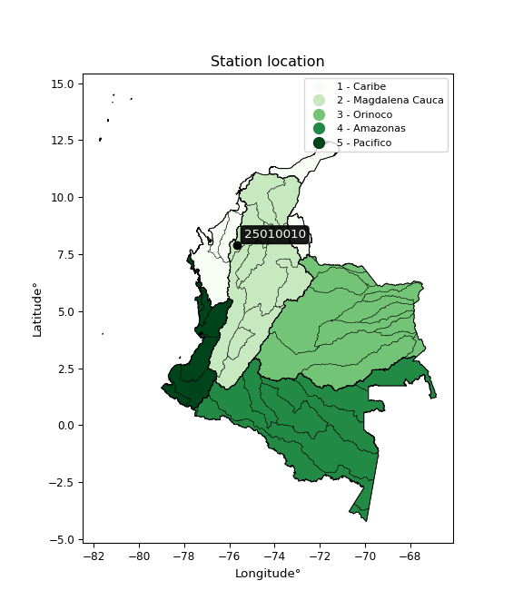</img>

</div>


## A. General information


### 1. General running parameters

• app_version: _v20260312_. • runtime: _2026-03-12 07:15:23.203550_. • Python version: _3.14.0_. • SciPy version: _1.16.3_. • Pandas version: _2.3.3_. • NumPy version: _2.3.5_. • Stations dataset (station_dataset_file): _dataset/pmax24h_in/automatic_colombia_2003_2025.csv_. • Stations catalog (station_catalog_file): _dataset/CNE.xls_. • Minimum year to eval til year_max (date_min): _1900_. • Maximum year to eval since year_min (date_max): _2025_. • Creates, save and include plots into reports (create_plot): _True_. • Plot only fit distributions with Δo > Δ (plot_only_fit): _True_. • Plot only simple graphs avoiding multiple CDFs and multiple Extreme values plots (plot_only_simple): _True_. • Eval low extreme values, if False, evaluates high extreme values (low_extreme): _False_. • Eval every SciPy distribution as logarithmic (pdist_logarithmic_on): _True_. • Standard deviation normalized (ddof): _1.0_. • Return periods to eval in years (Tr): _[2, 2.33, 5, 10, 15, 20, 25, 50, 75, 100, 200, 250, 500, 750, 1000]_. • Minimum data sample per station, 0 means any (minimum_sample): _5_. • Z-Score maximum threshold to adjust a value, 0 means disable (zscore_max): _3.5_. • Z-Score minimum threshold to adjust a value, 0 means disable (zscore_min): _-2.5_. • Avoid zeros, e.g. rain = 0 (avoid_zeros): _True_. • Avoid null values (avoid_nans): _True_. 

:file_folder:Table: [dataset.csv](../../dataset/pmax24h_in/automatic_colombia_2003_2025.csv)

> Delta Degrees of Freedom (DDOF): is a parameter used in the formulas for calculating variance and standard deviation. When ddof=0, the divisor is $N$ (the total number of observations) and this is used when your data set is the entire population. When ddof=1, the divisor is $N-1$ and this is used when your data set is a sample drawn from a larger population. Using $N-1$ provides an unbiased estimate of the population variance (known as Bessel´s correction).


### 2. Station info and location

|   id |   CODIGO | NOMBRE                             | CATEGORIA               | TECNOLOGIA                              | ESTADO   | FECHA_INSTALACION   |   FECHA_SUSPENSION |   ALTITUD |   LATITUD |   LONGITUD | DEPARTAMENTO   | MUNICIPIO         | AREA_OPERATIVA                              | ENTIDAD                                                     | AREA_HIDROGRAFICA   | ZONA_HIDROGRAFICA                | SUBZONA_HIDROGRAFICA   |   CORRIENTE | Catalogo   |   Version |
|-----:|---------:|:-----------------------------------|:------------------------|:----------------------------------------|:---------|:--------------------|-------------------:|----------:|----------:|-----------:|:---------------|:------------------|:--------------------------------------------|:------------------------------------------------------------|:--------------------|:---------------------------------|:-----------------------|------------:|:-----------|----------:|
|    0 | 25010010 | PUERTO LIBERTADOR - AUT [25010010] | Climatológica Principal | Automática con Telemetría, Convencional | Activa   | 15/05/1989          |                nan |        55 |   7.89028 |     -75.68 | Cordoba        | Puerto Libertador | Area Operativa 02 - Atlántico-Bolivar-Sucre | INSTITUTO DE HIDROLOGIA METEOROLOGIA Y ESTUDIOS AMBIENTALES | Magdalena Cauca     | Bajo Magdalena- Cauca -San Jorge | Alto San Jorge         |         nan | CNE_IDEAM  |  20251226 |

<div align="center">

Dynamic map: [:earth_americas:Google](http://maps.google.com/maps?q=7.890277778,-75.68) [:earth_americas:OSM](https://www.openstreetmap.org/#map=18/7.890277778/-75.68&layers=P) [:earth_americas:Bing](https://www.bing.com/maps?cp=7.890277778~-75.68&lvl=18) [:earth_americas:Apple](https://maps.apple.com/frame?center=7.890277778%2C-75.68&span=0.003%2C0.006)

</div>


<div align="center">

```geojson
{
  "type": "Feature",
  "geometry": {
    "type": "Point", 
    "coordinates": [-75.68, 7.890277778]
  }, 
  "properties": {
    "Name": "25010010"
  }
}
```

</div>


### 3. Discrete values table and plot

<div align="center">

|               |             0 |           1 |          2 |           3 |          4 |
|:--------------|--------------:|------------:|-----------:|------------:|-----------:|
| Date          | 2021          | 2022        | 2023       | 2024        | 2025       |
| Value         |  100.6        |  124.6      |   51.6     |  106.4      |  120.4     |
| Value_initial |  100.6        |  124.6      |   51.6     |  106.4      |  120.4     |
| count         |    5          |    5        |    5       |    5        |    5       |
| mean          |  100.72       |  100.72     |  100.72    |  100.72     |  100.72    |
| std           |   29.1659     |   29.1659   |   29.1659  |   29.1659   |   29.1659  |
| zscore        |   -0.00411439 |    0.818763 |   -1.68416 |    0.194748 |    0.67476 |


</div>


<div align="center">

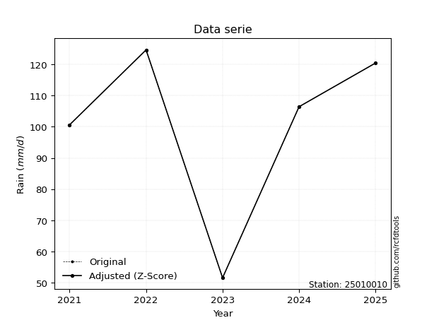</img>

</div>


> The initial value (value_initial) correspond to the initial obtained or null completed value, and value (value) is adjusted only when the initial value is outside the valid range (outlier) definite through the Z-Score value. If Z-Score is active, values out of range or outliers are replaced with the station mean value. A Z-Score (or standard score) measures how many standard deviations a data point is from the mean of a dataset, indicating its relative position; positive scores mean above the mean, negative mean below, and a score of zero is exactly at the mean, allowing for comparison of values from different distributions. It´s calculated using the formula $z=(x–μ)/σ$, where $x$ is the data point, $μ$ is the mean, and $σ$ is the standard deviation, helping identify outliers and understand probability.
>
> <sub>**Note**: In this study, "completing" (filling gaps in) and "extending" (forecasting or lengthening the historical record) rainfall data series are avoided for certain critical analyses because they introduce artificial bias and uncertainty, which can distort the statistics of rare events (extremes), alter day-to-day variability, and compromise the integrity and homogeneity of the original data. Some reasons against Completing/Extending rainfall data are: **Distortion of Extremes and Variability**: The primary issue is that most gap-filling or extension methods rely on averaging or regression with nearby stations, which inherently smooths the data. Rainfall is highly variable in space and time, with a large percentage of zero values and occasional large storms. Infilling methods often underestimate the highest values and overestimate the lowest (zero) values, which severely distorts analyses focused on flood frequency, drought severity, and intensity-duration-frequency (IDF) curves, **Loss of Data Homogeneity**: Infilled or extended data are synthetic estimates, not actual measurements. Combining these estimates with observed data can violate the assumption of data homogeneity, which requires that the data properties do not change over time. Inhomogeneity can lead to incorrect conclusions about long-term trends or changes in climate patterns, **Propagation of Errors**: Errors and biases from the original data (e.g., wind-induced undercatch, instrument errors, site changes) or the data used for imputation can propagate through the analysis, leading to unreliable hydrological models and inaccurate predictions, **Compromised Statistical Integrity**: For statistical analyses, especially those involving the frequency of events, using artificial data can introduce time bias or autocorrelation that doesn´t exist in reality, making it difficult to assess the true probability of events, **Difficulty in Validation**: It is difficult to accurately validate the quality of filled or extended data, especially for past periods where ground-truth measurements are unavailable. The reliability of imputation techniques heavily depends on the density of the surrounding station network and the complexity of the local topography.</sub>


### 4. Active continuous probability distributions from SciPy (80 of 104 available)

A Probability Density Function (PDF) describes the relative likelihood of a continuous random variable falling within a specific range, where the total area under its curve equals 1, and the area over any interval gives the actual probability for that range. Unlike discrete probabilities (like rolling a die), a PDF shows density, not direct probability for a single point (which is zero), with higher points indicating higher likelihood, often visualized as a bell curve for normal distributions.

A log of a probability density function (log-PDF) is simply the logarithm of the PDF´s value, denoted as $log(f(x))$, useful for converting multiplication of probabilities into addition, improving numerical stability with tiny numbers, and connecting to information theory concepts like entropy. Instead of dealing with very small probabilities (e.g., 0.000001), log-PDFs use negative numbers (e.g., $log(0.00001) ≈ -11.51$ that are easier for computers to handle, preventing underflow errors and simplifying complex calculations. In this study, each active probability distribution from SciPy is also evaluated in the $log$ form.

[scipy.stats](https://docs.scipy.org/doc/scipy/reference/stats.html) is a Python´s powerful submodule within the SciPy library for comprehensive statistical analysis, offering over 130 probability distributions (like Normal, Poisson, etc.), functions for descriptive stats (mean, variance), hypothesis testing (t-tests, chi-square), random variable generation, and statistical tests, making it essential for data science, modeling, and research. It provides tools to explore, model, and draw conclusions from data efficiently, working seamlessly with [NumPy](https://numpy.org/).

<div align="center">

|   id | p_dist           |   n_parameter | fit_method   | label                                                                       | active   | ref                                                                                                      |
|-----:|:-----------------|--------------:|:-------------|:----------------------------------------------------------------------------|:---------|:---------------------------------------------------------------------------------------------------------|
|    0 | alpha            |             3 | MLE          | Alpha                                                                       | True     | [:mortar_board:](https://docs.scipy.org/doc/scipy/reference/generated/scipy.stats.alpha.html)            |
|    1 | anglit           |             2 | MM           | Anglit                                                                      | True     | [:mortar_board:](https://docs.scipy.org/doc/scipy/reference/generated/scipy.stats.anglit.html)           |
|    2 | arcsine          |             2 | MM           | Arcsine                                                                     | True     | [:mortar_board:](https://docs.scipy.org/doc/scipy/reference/generated/scipy.stats.arcsine.html)          |
|    3 | argus            |             3 | MLE          | Argus                                                                       | True     | [:mortar_board:](https://docs.scipy.org/doc/scipy/reference/generated/scipy.stats.argus.html)            |
|    4 | beta             |             4 | MLE          | Beta                                                                        | True     | [:mortar_board:](https://docs.scipy.org/doc/scipy/reference/generated/scipy.stats.beta.html)             |
|    5 | betaprime        |             4 | MLE          | Beta prime                                                                  | True     | [:mortar_board:](https://docs.scipy.org/doc/scipy/reference/generated/scipy.stats.betaprime.html)        |
|    6 | bradford         |             3 | MLE          | Bradford                                                                    | True     | [:mortar_board:](https://docs.scipy.org/doc/scipy/reference/generated/scipy.stats.bradford.html)         |
|    7 | burr             |             4 | MLE          | Burr (Type III)                                                             | True     | [:mortar_board:](https://docs.scipy.org/doc/scipy/reference/generated/scipy.stats.burr.html)             |
|    8 | burr12           |             4 | MLE          | Burr (Type III) 12                                                          | True     | [:mortar_board:](https://docs.scipy.org/doc/scipy/reference/generated/scipy.stats.burr12.html)           |
|    9 | cosine           |             2 | MLE          | Cosine                                                                      | True     | [:mortar_board:](https://docs.scipy.org/doc/scipy/reference/generated/scipy.stats.cosine.html)           |
|   10 | crystalball      |             4 | MLE          | Crystalball                                                                 | True     | [:mortar_board:](https://docs.scipy.org/doc/scipy/reference/generated/scipy.stats.crystalball.html)      |
|   11 | dgamma           |             3 | MLE          | Double gamma                                                                | True     | [:mortar_board:](https://docs.scipy.org/doc/scipy/reference/generated/scipy.stats.dgamma.html)           |
|   12 | dweibull         |             3 | MLE          | Double Weibull                                                              | True     | [:mortar_board:](https://docs.scipy.org/doc/scipy/reference/generated/scipy.stats.dweibull.html)         |
|   13 | erlang           |             3 | MLE          | Erlang                                                                      | True     | [:mortar_board:](https://docs.scipy.org/doc/scipy/reference/generated/scipy.stats.erlang.html)           |
|   14 | exponnorm        |             3 | MLE          | Exponentially modified Normal                                               | True     | [:mortar_board:](https://docs.scipy.org/doc/scipy/reference/generated/scipy.stats.exponnorm.html)        |
|   15 | exponpow         |             3 | MLE          | Exponential power                                                           | True     | [:mortar_board:](https://docs.scipy.org/doc/scipy/reference/generated/scipy.stats.exponpow.html)         |
|   16 | exponweib        |             4 | MLE          | Exponentiated Weibull                                                       | True     | [:mortar_board:](https://docs.scipy.org/doc/scipy/reference/generated/scipy.stats.exponweib.html)        |
|   17 | f                |             4 | MLE          | F                                                                           | True     | [:mortar_board:](https://docs.scipy.org/doc/scipy/reference/generated/scipy.stats.f.html)                |
|   18 | fatiguelife      |             3 | MLE          | Fatigue-life (Birnbaum-Saunders)                                            | True     | [:mortar_board:](https://docs.scipy.org/doc/scipy/reference/generated/scipy.stats.fatiguelife.html)      |
|   19 | foldnorm         |             3 | MM           | Fold Normal                                                                 | True     | [:mortar_board:](https://docs.scipy.org/doc/scipy/reference/generated/scipy.stats.foldnorm.html)         |
|   20 | gamma            |             3 | MLE          | Gamma                                                                       | True     | [:mortar_board:](https://docs.scipy.org/doc/scipy/reference/generated/scipy.stats.gamma.html)            |
|   21 | gausshyper       |             6 | MLE          | Gauss hypergeometric                                                        | True     | [:mortar_board:](https://docs.scipy.org/doc/scipy/reference/generated/scipy.stats.gausshyper.html)       |
|   22 | genexpon         |             5 | MLE          | Generalized exponential                                                     | True     | [:mortar_board:](https://docs.scipy.org/doc/scipy/reference/generated/scipy.stats.genexpon.html)         |
|   23 | genextreme       |             3 | MLE          | Generalized exponential                                                     | True     | [:mortar_board:](https://docs.scipy.org/doc/scipy/reference/generated/scipy.stats.genextreme.html)       |
|   24 | gengamma         |             4 | MLE          | Generalized gamma                                                           | True     | [:mortar_board:](https://docs.scipy.org/doc/scipy/reference/generated/scipy.stats.gengamma.html)         |
|   25 | genhalflogistic  |             3 | MLE          | Generalized half-logistic                                                   | True     | [:mortar_board:](https://docs.scipy.org/doc/scipy/reference/generated/scipy.stats.genhalflogistic.html)  |
|   26 | genlogistic      |             3 | MLE          | Generalized logistic                                                        | True     | [:mortar_board:](https://docs.scipy.org/doc/scipy/reference/generated/scipy.stats.genlogistic.html)      |
|   27 | gennorm          |             3 | MLE          | Generalized Normal                                                          | True     | [:mortar_board:](https://docs.scipy.org/doc/scipy/reference/generated/scipy.stats.gennorm.html)          |
|   28 | genpareto        |             3 | MLE          | Generalized Pareto                                                          | True     | [:mortar_board:](https://docs.scipy.org/doc/scipy/reference/generated/scipy.stats.genpareto.html)        |
|   29 | gompertz         |             3 | MLE          | Gompertz (or truncated Gumbel)                                              | True     | [:mortar_board:](https://docs.scipy.org/doc/scipy/reference/generated/scipy.stats.gompertz.html)         |
|   30 | gumbel_l         |             2 | MM           | Gumbel Left Skew                                                            | True     | [:mortar_board:](https://docs.scipy.org/doc/scipy/reference/generated/scipy.stats.gumbel_l.html)         |
|   31 | gumbel_r         |             2 | MM           | Gumbel Right Skew                                                           | True     | [:mortar_board:](https://docs.scipy.org/doc/scipy/reference/generated/scipy.stats.gumbel_r.html)         |
|   32 | halfgennorm      |             3 | MLE          | Upper half of a generalized normal                                          | True     | [:mortar_board:](https://docs.scipy.org/doc/scipy/reference/generated/scipy.stats.halfgennorm.html)      |
|   33 | halflogistic     |             2 | MM           | Half-logistic                                                               | True     | [:mortar_board:](https://docs.scipy.org/doc/scipy/reference/generated/scipy.stats.halflogistic.html)     |
|   34 | halfnorm         |             2 | MM           | Half Normal                                                                 | True     | [:mortar_board:](https://docs.scipy.org/doc/scipy/reference/generated/scipy.stats.halfnorm.html)         |
|   35 | hypsecant        |             2 | MM           | hyperbolic secant                                                           | True     | [:mortar_board:](https://docs.scipy.org/doc/scipy/reference/generated/scipy.stats.hypsecant.html)        |
|   36 | invgamma         |             3 | MLE          | Inverted gamma                                                              | True     | [:mortar_board:](https://docs.scipy.org/doc/scipy/reference/generated/scipy.stats.invgamma.html)         |
|   37 | invgauss         |             3 | MLE          | Inverse Gaussian                                                            | True     | [:mortar_board:](https://docs.scipy.org/doc/scipy/reference/generated/scipy.stats.invgauss.html)         |
|   38 | invweibull       |             3 | MLE          | Inverted Weibull                                                            | True     | [:mortar_board:](https://docs.scipy.org/doc/scipy/reference/generated/scipy.stats.invweibull.html)       |
|   39 | johnsonsb        |             4 | MLE          | Johnson SB                                                                  | True     | [:mortar_board:](https://docs.scipy.org/doc/scipy/reference/generated/scipy.stats.johnsonsb.html)        |
|   40 | johnsonsu        |             4 | MLE          | Johnson Su                                                                  | True     | [:mortar_board:](https://docs.scipy.org/doc/scipy/reference/generated/scipy.stats.johnsonsu.html)        |
|   41 | kappa3           |             3 | MLE          | Kappa 3                                                                     | True     | [:mortar_board:](https://docs.scipy.org/doc/scipy/reference/generated/scipy.stats.kappa3.html)           |
|   42 | kappa4           |             4 | MLE          | Kappa 4                                                                     | True     | [:mortar_board:](https://docs.scipy.org/doc/scipy/reference/generated/scipy.stats.kappa4.html)           |
|   43 | ksone            |             3 | MLE          | Kolmogorov-Smirnov one-sided test statistic distribution                    | True     | [:mortar_board:](https://docs.scipy.org/doc/scipy/reference/generated/scipy.stats.ksone.html)            |
|   44 | kstwobign        |             2 | MLE          | Limiting distribution of scaled Kolmogorov-Smirnov two-sided test statistic | True     | [:mortar_board:](https://docs.scipy.org/doc/scipy/reference/generated/scipy.stats.kstwobign.html)        |
|   45 | laplace          |             2 | MM           | Laplace                                                                     | True     | [:mortar_board:](https://docs.scipy.org/doc/scipy/reference/generated/scipy.stats.laplace.html)          |
|   46 | levy_l           |             2 | MLE          | Left-skewed Levy                                                            | True     | [:mortar_board:](https://docs.scipy.org/doc/scipy/reference/generated/scipy.stats.levy_l.html)           |
|   47 | loggamma         |             3 | MLE          | Log gamma                                                                   | True     | [:mortar_board:](https://docs.scipy.org/doc/scipy/reference/generated/scipy.stats.loggamma.html)         |
|   48 | logistic         |             2 | MM           | Logistic (or Sech-squared)                                                  | True     | [:mortar_board:](https://docs.scipy.org/doc/scipy/reference/generated/scipy.stats.logistic.html)         |
|   49 | loglaplace       |             3 | MLE          | Log-Laplace                                                                 | True     | [:mortar_board:](https://docs.scipy.org/doc/scipy/reference/generated/scipy.stats.loglaplace.html)       |
|   50 | lomax            |             3 | MLE          | Lomax (Pareto of the second kind)                                           | True     | [:mortar_board:](https://docs.scipy.org/doc/scipy/reference/generated/scipy.stats.lomax.html)            |
|   51 | maxwell          |             2 | MM           | Maxwell                                                                     | True     | [:mortar_board:](https://docs.scipy.org/doc/scipy/reference/generated/scipy.stats.maxwell.html)          |
|   52 | mielke           |             4 | MLE          | Mielke Beta-Kappa / Dagum                                                   | True     | [:mortar_board:](https://docs.scipy.org/doc/scipy/reference/generated/scipy.stats.mielke.html)           |
|   53 | moyal            |             2 | MM           | Moyal                                                                       | True     | [:mortar_board:](https://docs.scipy.org/doc/scipy/reference/generated/scipy.stats.moyal.html)            |
|   54 | nakagami         |             3 | MLE          | Nakagami                                                                    | True     | [:mortar_board:](https://docs.scipy.org/doc/scipy/reference/generated/scipy.stats.nakagami.html)         |
|   55 | ncf              |             5 | MLE          | Non-central F distribution                                                  | True     | [:mortar_board:](https://docs.scipy.org/doc/scipy/reference/generated/scipy.stats.ncf.html)              |
|   56 | nct              |             4 | MLE          | Non-central Student’s t                                                     | True     | [:mortar_board:](https://docs.scipy.org/doc/scipy/reference/generated/scipy.stats.nct.html)              |
|   57 | norm             |             2 | MM           | Normal                                                                      | True     | [:mortar_board:](https://docs.scipy.org/doc/scipy/reference/generated/scipy.stats.norm.html)             |
|   58 | pearson3         |             3 | MM           | Pearson type III                                                            | True     | [:mortar_board:](https://docs.scipy.org/doc/scipy/reference/generated/scipy.stats.pearson3.html)         |
|   59 | powerlaw         |             3 | MLE          | Power-function                                                              | True     | [:mortar_board:](https://docs.scipy.org/doc/scipy/reference/generated/scipy.stats.powerlaw.html)         |
|   60 | rayleigh         |             2 | MM           | Rayleigh                                                                    | True     | [:mortar_board:](https://docs.scipy.org/doc/scipy/reference/generated/scipy.stats.rayleigh.html)         |
|   61 | rdist            |             3 | MLE          | R-distributed (symmetric beta)                                              | True     | [:mortar_board:](https://docs.scipy.org/doc/scipy/reference/generated/scipy.stats.rdist.html)            |
|   62 | rice             |             3 | MLE          | Rice                                                                        | True     | [:mortar_board:](https://docs.scipy.org/doc/scipy/reference/generated/scipy.stats.rice.html)             |
|   63 | semicircular     |             2 | MM           | Semicircular                                                                | True     | [:mortar_board:](https://docs.scipy.org/doc/scipy/reference/generated/scipy.stats.semicircular.html)     |
|   64 | skewnorm         |             3 | MLE          | Skew normal                                                                 | True     | [:mortar_board:](https://docs.scipy.org/doc/scipy/reference/generated/scipy.stats.skewnorm.html)         |
|   65 | t                |             3 | MLE          | Student’s t                                                                 | True     | [:mortar_board:](https://docs.scipy.org/doc/scipy/reference/generated/scipy.stats.t.html)                |
|   66 | trapezoid        |             4 | MLE          | Trapezoid                                                                   | True     | [:mortar_board:](https://docs.scipy.org/doc/scipy/reference/generated/scipy.stats.trapezoid.html)        |
|   67 | triang           |             3 | MLE          | Triangular                                                                  | True     | [:mortar_board:](https://docs.scipy.org/doc/scipy/reference/generated/scipy.stats.triang.html)           |
|   68 | truncexpon       |             3 | MLE          | Truncated exponential                                                       | True     | [:mortar_board:](https://docs.scipy.org/doc/scipy/reference/generated/scipy.stats.truncexpon.html)       |
|   69 | truncnorm        |             4 | MLE          | Truncated normal                                                            | True     | [:mortar_board:](https://docs.scipy.org/doc/scipy/reference/generated/scipy.stats.truncnorm.html)        |
|   70 | truncpareto      |             4 | MLE          | Upper truncated Pareto                                                      | True     | [:mortar_board:](https://docs.scipy.org/doc/scipy/reference/generated/scipy.stats.truncpareto.html)      |
|   71 | truncweibull_min |             5 | MLE          | Doubly truncated Weibull minimum                                            | True     | [:mortar_board:](https://docs.scipy.org/doc/scipy/reference/generated/scipy.stats.truncweibull_min.html) |
|   72 | tukeylambda      |             3 | MLE          | Tukey-Lamdba                                                                | True     | [:mortar_board:](https://docs.scipy.org/doc/scipy/reference/generated/scipy.stats.tukeylambda.html)      |
|   73 | uniform          |             2 | MLE          | Uniform                                                                     | True     | [:mortar_board:](https://docs.scipy.org/doc/scipy/reference/generated/scipy.stats.uniform.html)          |
|   74 | vonmises         |             3 | MLE          | Von Mises                                                                   | True     | [:mortar_board:](https://docs.scipy.org/doc/scipy/reference/generated/scipy.stats.vonmises.html)         |
|   75 | vonmises_line    |             3 | MLE          | Von Mises line                                                              | True     | [:mortar_board:](https://docs.scipy.org/doc/scipy/reference/generated/scipy.stats.vonmises_line.html)    |
|   76 | wald             |             2 | MM           | Wald                                                                        | True     | [:mortar_board:](https://docs.scipy.org/doc/scipy/reference/generated/scipy.stats.wald.html)             |
|   77 | weibull_max      |             3 | MLE          | Weibull maximum                                                             | True     | [:mortar_board:](https://docs.scipy.org/doc/scipy/reference/generated/scipy.stats.weibull_max.html)      |
|   78 | weibull_min      |             3 | MLE          | Weibull minimum                                                             | True     | [:mortar_board:](https://docs.scipy.org/doc/scipy/reference/generated/scipy.stats.weibull_min.html)      |
|   79 | wrapcauchy       |             3 | MLE          | Wrapped  Cauchy                                                             | True     | [:mortar_board:](https://docs.scipy.org/doc/scipy/reference/generated/scipy.stats.wrapcauchy.html)       |

</div>

> **n_parameter:** # arguments & localization & scale.
>
> **Fit methods:** (MLE) maximum likelihood, (MM) L-moments.
>
>**Inactive** (With the only purpose of prevent loops, zero divisions, infinite values, over high estimated values or horizontal trending for recurrence intervals estimations, the follow distributions were disabled.)**:** lognorm, norminvgauss, powernorm, powerlognorm, cauchy, halfcauchy, foldcauchy, skewcauchy, chi2, expon, fisk, genhyperbolic, geninvgauss, gibrat, kstwo, laplace_asymmetric, levy, levy_stable, ncx2, pareto, rel_breitwigner, recipinvgauss, studentized_range, loguniform, 


## B. Probability (PDF) vs. Empirical (EDF) distributions functions

A continuous probability distribution (CPD) describes probabilities for variables that can take any value within a range (like rain any time), unlike discrete variables with specific outcomes (like temperature). It uses a Probability Density Function (PDF), a curve where the total area under it equals 1, and the probability of the variable falling within an interval (a to b) is found by calculating the area under the curve between those points. A key feature is that the probability of hitting any single exact value is zero, so probabilities are always expressed for ranges, e.g., $P(a ≤ X ≤ b)$.

<div align="center">

Distributions parameters from station values
|     |   station | p_dist              |   n |             loc |            scale | shape                  | shape1                 | shape2                | shape3             |
|----:|----------:|:--------------------|----:|----------------:|-----------------:|:-----------------------|:-----------------------|:----------------------|:-------------------|
|   0 |  25010010 | alpha               |   5 |  -459.742       |  10976.5         | 19.65410529245012      |                        |                       |                    |
|   1 |  25010010 | anglit              |   5 |   100.72        |     76.3143      |                        |                        |                       |                    |
|   2 |  25010010 | arcsine             |   5 |    63.8277      |     73.7846      |                        |                        |                       |                    |
|   3 |  25010010 | argus               |   5 |    16.6637      |    110.507       | 2.608501947985214      |                        |                       |                    |
|   4 |  25010010 | beta                |   5 |    45.1485      |     79.4515      | 0.5786227652803636     | 0.20062479044757775    |                       |                    |
|   5 |  25010010 | betaprime           |   5 |     3.59826     |   2140.54        | 10.747787928477663     | 237.74253459284586     |                       |                    |
|   6 |  25010010 | bradford            |   5 |    51.6         |     73.0001      | 1.0940006872655932     |                        |                       |                    |
|   7 |  25010010 | burr                |   5 |    -2.42605     |    129.096       | 192.38358070434006     | 0.018987582033560678   |                       |                    |
|   8 |  25010010 | burr12              |   5 |     1.01868     |     50.2874      | 789.3971603387531      | 0.0019839838521091566  |                       |                    |
|   9 |  25010010 | cosine              |   5 |    96.7388      |     22.1029      |                        |                        |                       |                    |
|  10 |  25010010 | crystalball         |   5 |   100.72        |     26.0868      | 8392.756992612227      | 1115.7248376788584     |                       |                    |
|  11 |  25010010 | dgamma              |   5 |   106.4         |     19.2148      | 0.9188239459942359     |                        |                       |                    |
|  12 |  25010010 | dweibull            |   5 |   106.4         |     20.8632      | 0.918095437196486      |                        |                       |                    |
|  13 |  25010010 | erlang              |   5 |  -320.994       |      1.76674     | 238.31843303437358     |                        |                       |                    |
|  14 |  25010010 | exponnorm           |   5 |   100.702       |     26.0867      | 0.0007076640656079659  |                        |                       |                    |
|  15 |  25010010 | exponpow            |   5 |    51.6         |      1.67828     | 0.09791000937437744    |                        |                       |                    |
|  16 |  25010010 | exponweib           |   5 |    51.6         |      1.42494     | 1.3104701876315963     | 0.10621991663003101    |                       |                    |
|  17 |  25010010 | f                   |   5 | -9624.66        |   9725.23        | 295745.0887491831      | 4058452.8811962847     |                       |                    |
|  18 |  25010010 | fatiguelife         |   5 |    51.6         |      2.43076e-06 | 4307.901617167185      |                        |                       |                    |
|  19 |  25010010 | foldnorm            |   5 |   104.179       |      1.39294     | 2.836664697398525e-07  |                        |                       |                    |
|  20 |  25010010 | gamma               |   5 |  -370.593       |      1.5363      | 306.7281628247663      |                        |                       |                    |
|  21 |  25010010 | gausshyper          |   5 |    49.4842      |     75.1158      | 1.1453717611301757     | 0.6329539653503948     | 1.0782223605564338    | 1.1293622741091829 |
|  22 |  25010010 | genexpon            |   5 |    51.6         |      1.47367     | 0.02996480838522165    | 8.140917626149579e-08  | 1.6864939014085167    |                    |
|  23 |  25010010 | genextreme          |   5 |    97.4141      |     35.2812      | 1.2977739866122007     |                        |                       |                    |
|  24 |  25010010 | gengamma            |   5 |    51.6         |      1.28723     | 1.2616274350091032     | 0.25870966561666336    |                       |                    |
|  25 |  25010010 | genhalflogistic     |   5 |    45.8963      |     84.1336      | 1.0689910581506015     |                        |                       |                    |
|  26 |  25010010 | genlogistic         |   5 |   124.6         |      1.15601e-05 | 4.84639641913728e-07   |                        |                       |                    |
|  27 |  25010010 | gennorm             |   5 |   106.4         |      0.284638    | 0.3162319068054239     |                        |                       |                    |
|  28 |  25010010 | genpareto           |   5 |    -1.34642     |    331.982       | -2.635896420237575     |                        |                       |                    |
|  29 |  25010010 | gompertz            |   5 |   100.6         |      6.56164     | 0.06862817062869248    |                        |                       |                    |
|  30 |  25010010 | gumbel_l            |   5 |   112.46        |     20.3398      |                        |                        |                       |                    |
|  31 |  25010010 | gumbel_r            |   5 |    88.9795      |     20.3398      |                        |                        |                       |                    |
|  32 |  25010010 | halfgennorm         |   5 |    51.6         |      1.36301     | 0.337778916010131      |                        |                       |                    |
|  33 |  25010010 | halflogistic        |   5 |    69.8011      |     22.3033      |                        |                        |                       |                    |
|  34 |  25010010 | halfnorm            |   5 |    66.1913      |     43.2753      |                        |                        |                       |                    |
|  35 |  25010010 | hypsecant           |   5 |   100.72        |     16.6074      |                        |                        |                       |                    |
|  36 |  25010010 | invgamma            |   5 |  -354.578       | 120630           | 265.4866518055801      |                        |                       |                    |
|  37 |  25010010 | invgauss            |   5 |   -46.1095      |   3334.41        | 0.04368405056142374    |                        |                       |                    |
|  38 |  25010010 | invweibull          |   5 |    51.6         |      1.50943     | 0.04445791134347182    |                        |                       |                    |
|  39 |  25010010 | johnsonsb           |   5 |    51.5968      |     73.0032      | -0.23543323002794742   | 0.09944829587390873    |                       |                    |
|  40 |  25010010 | johnsonsu           |   5 |   124.6         |      3.46364e-12 | 3.542953590955078      | 0.1680757240235084     |                       |                    |
|  41 |  25010010 | kappa3              |   5 |    51.6         |    108.21        | 531.0064922539837      |                        |                       |                    |
|  42 |  25010010 | kappa4              |   5 |    44.6536      |     84.4906      | 1.0898148743006069     | 1.0567567408355778     |                       |                    |
|  43 |  25010010 | ksone               |   5 |    44.3         |     87.6         | 1.0                    |                        |                       |                    |
|  44 |  25010010 | kstwobign           |   5 |   -15.95        |    132.99        |                        |                        |                       |                    |
|  45 |  25010010 | laplace             |   5 |   100.72        |     18.4462      |                        |                        |                       |                    |
|  46 |  25010010 | levy_l              |   5 |   125.694       |      4.13746     |                        |                        |                       |                    |
|  47 |  25010010 | loggamma            |   5 |   124.6         |      1.22451e-05 | 5.136274247356227e-07  |                        |                       |                    |
|  48 |  25010010 | logistic            |   5 |   100.72        |     14.3824      |                        |                        |                       |                    |
|  49 |  25010010 | loglaplace          |   5 |    -0.339518    |    106.74        | 4.731039326843654      |                        |                       |                    |
|  50 |  25010010 | lomax               |   5 |    51.6         |      9.07652e+08 | 8488725.602999538      |                        |                       |                    |
|  51 |  25010010 | maxwell             |   5 |    38.9052      |     38.7367      |                        |                        |                       |                    |
|  52 |  25010010 | mielke              |   5 |     1.84591     |    122.799       | 3.79424797525812       | 18639.343350870593     |                       |                    |
|  53 |  25010010 | moyal               |   5 |    85.8019      |     11.7432      |                        |                        |                       |                    |
|  54 |  25010010 | nakagami            |   5 |   100.6         |     15.0437      | 0.20302423195847363    |                        |                       |                    |
|  55 |  25010010 | ncf                 |   5 |     5.842       |     93.459       | 20.70189770005588      | 136.5552801999543      | 0.13585856452163378   |                    |
|  56 |  25010010 | nct                 |   5 | -1525.24        |     25.9989      | 199547.39671394782     | 62.53951766833891      |                       |                    |
|  57 |  25010010 | norm                |   5 |   100.72        |     26.0868      |                        |                        |                       |                    |
|  58 |  25010010 | pearson3            |   5 |   100.72        |     26.0868      | -1.093834423949703     |                        |                       |                    |
|  59 |  25010010 | powerlaw            |   5 |    51.6         |     73           | 0.1329326176565009     |                        |                       |                    |
|  60 |  25010010 | rayleigh            |   5 |    50.8144      |     39.8189      |                        |                        |                       |                    |
|  61 |  25010010 | rdist               |   5 |    51.6         |      2.13163e-14 | 1.7877263692706107     |                        |                       |                    |
|  62 |  25010010 | rice                |   5 |    31.9214      |     28.1838      | 2.1944294084419718     |                        |                       |                    |
|  63 |  25010010 | semicircular        |   5 |   100.72        |     52.1736      |                        |                        |                       |                    |
|  64 |  25010010 | skewnorm            |   5 |   124.6         |     35.3669      | -20787538.179262385    |                        |                       |                    |
|  65 |  25010010 | t                   |   5 |   100.719       |     26.0866      | 784977.8679315557      |                        |                       |                    |
|  66 |  25010010 | trapezoid           |   5 |    26.9354      |    110.677       | 0.9999999999999999     | 1.0                    |                       |                    |
|  67 |  25010010 | triang              |   5 |    29.6879      |     94.9121      | 0.9999994064124829     |                        |                       |                    |
|  68 |  25010010 | truncexpon          |   5 |    51.6         |     95.114       | 0.7675000566747612     |                        |                       |                    |
|  69 |  25010010 | truncnorm           |   5 |    31.9144      |     29.1413      | 2.3569471640721797     | 3726.843680377893      |                       |                    |
|  70 |  25010010 | truncpareto         |   5 |    51.096       |      0.504003    | 0.26053285587132935    | 145.84054738091308     |                       |                    |
|  71 |  25010010 | truncweibull_min    |   5 |    51.5685      |    118.526       | 1.0020386134610542     | 0.00026595006717308365 | 0.6161642044737348    |                    |
|  72 |  25010010 | tukeylambda         |   5 |    51.6         |      1.20908e-14 | 1.699244999230216      |                        |                       |                    |
|  73 |  25010010 | uniform             |   5 |    51.6         |     73           |                        |                        |                       |                    |
|  74 |  25010010 | vonmises            |   5 |     0.192864    |      1           | 1.70675954600832       |                        |                       |                    |
|  75 |  25010010 | vonmises_line       |   5 |   106.973       |     17.6256      | 0.9813016938527908     |                        |                       |                    |
|  76 |  25010010 | wald                |   5 |    74.6332      |     26.0868      |                        |                        |                       |                    |
|  77 |  25010010 | weibull_max         |   5 |   124.6         |     27.6607      | 0.9454191465547968     |                        |                       |                    |
|  78 |  25010010 | weibull_min         |   5 |    -2.15518e+09 |      2.15518e+09 | 126742118.7778956      |                        |                       |                    |
|  79 |  25010010 | wrapcauchy          |   5 |    51.6         |     11.6183      | 0.7103751018750777     |                        |                       |                    |
|  80 |  25010010 | logalpha            |   5 |    -8.12704     |    482.633       | 38.04214886931567      |                        |                       |                    |
|  81 |  25010010 | loganglit           |   5 |     4.56756     |      0.941078    |                        |                        |                       |                    |
|  82 |  25010010 | logarcsine          |   5 |     4.11262     |      0.909885    |                        |                        |                       |                    |
|  83 |  25010010 | logargus            |   5 |     3.51121     |      1.34198     | 2.8861091418311107     |                        |                       |                    |
|  84 |  25010010 | logbeta             |   5 |     3.76889     |      1.05622     | 0.2961734245031206     | 0.08952646722691274    |                       |                    |
|  85 |  25010010 | logbetaprime        |   5 |    -3.89005     |    107.34        | 705.4681559765477      | 8952.99931830835       |                       |                    |
|  86 |  25010010 | logbradford         |   5 |     3.94352     |      0.8816      | 1.086084200950133      |                        |                       |                    |
|  87 |  25010010 | logburr             |   5 |     2.33795     |      2.49396     | 1247.357724226888      | 0.006457270687809331   |                       |                    |
|  88 |  25010010 | logburr12           |   5 |  -170.265       |    177.032       | 916.8884389686912      | 47338.90491287633      |                       |                    |
|  89 |  25010010 | logcosine           |   5 |     4.51113     |      0.274692    |                        |                        |                       |                    |
|  90 |  25010010 | logcrystalball      |   5 |     4.56756     |      0.321692    | 69.72457466705725      | 1377.9395312340544     |                       |                    |
|  91 |  25010010 | logdgamma           |   5 |     4.66721     |      0.344836    | 0.3672838374331224     |                        |                       |                    |
|  92 |  25010010 | logdweibull         |   5 |     4.66721     |      0.257217    | 0.8936198024239461     |                        |                       |                    |
|  93 |  25010010 | logerlang           |   5 |     3.94352     |      1.04164     | 0.5568829955728498     |                        |                       |                    |
|  94 |  25010010 | logexponnorm        |   5 |     4.56734     |      0.321693    | 0.0006792702765579183  |                        |                       |                    |
|  95 |  25010010 | logexponpow         |   5 |    -2.42666e+07 |      2.42666e+07 | 109674532.5716224      |                        |                       |                    |
|  96 |  25010010 | logexponweib        |   5 |    -1.55063e+07 |      1.55063e+07 | 0.12092995141987167    | 473630332.3009391      |                       |                    |
|  97 |  25010010 | logf                |   5 |   -57.5791      |     62.1488      | 84947.11892372154      | 556614.6735048959      |                       |                    |
|  98 |  25010010 | logfatiguelife      |   5 |  -235.289       |    239.856       | 0.0013417199203037402  |                        |                       |                    |
|  99 |  25010010 | logfoldnorm         |   5 |     4.06049     |      0.625771    | 7.5537499729738065e-06 |                        |                       |                    |
| 100 |  25010010 | loggamma            |   5 |     3.94352     |      0.811587    | 0.7011634064060506     |                        |                       |                    |
| 101 |  25010010 | loggausshyper       |   5 |     3.91743     |      0.907676    | 1.2868945096611613     | 0.5984673155847269     | 1.0196131973367906    | 1.1079899136234588 |
| 102 |  25010010 | loggenexpon         |   5 |     3.88345     |      0.0106582   | 0.0041824234849002166  | 3.2903906599883124     | 8.821298372652963e-05 |                    |
| 103 |  25010010 | loggenextreme       |   5 |     4.58288     |      0.307793    | 1.2706743944961898     |                        |                       |                    |
| 104 |  25010010 | loggengamma         |   5 |     3.94352     |      1.74263     | 0.2816451305563096     | 0.5481500500860925     |                       |                    |
| 105 |  25010010 | loggenhalflogistic  |   5 |     3.92999     |      1.07814     | 1.2044731361768144     |                        |                       |                    |
| 106 |  25010010 | loggenlogistic      |   5 |     4.82513     |      1.79635e-06 | 7.024802388209707e-06  |                        |                       |                    |
| 107 |  25010010 | loggennorm          |   5 |     4.66719     |      0.233193    | 0.9819886783120604     |                        |                       |                    |
| 108 |  25010010 | loggenpareto        |   5 |    -0.0151121   |     14.3533      | -2.9654246612673933    |                        |                       |                    |
| 109 |  25010010 | loggompertz         |   5 |     3.92441     |      0.206752    | 0.02448357969155678    |                        |                       |                    |
| 110 |  25010010 | loggumbel_l         |   5 |     4.71234     |      0.250822    |                        |                        |                       |                    |
| 111 |  25010010 | loggumbel_r         |   5 |     4.42278     |      0.250822    |                        |                        |                       |                    |
| 112 |  25010010 | loghalfgennorm      |   5 |     3.94352     |      0.881954    | 19019.406141215703     |                        |                       |                    |
| 113 |  25010010 | loghalflogistic     |   5 |     4.18626     |      0.275052    |                        |                        |                       |                    |
| 114 |  25010010 | loghalfnorm         |   5 |     4.14174     |      0.533681    |                        |                        |                       |                    |
| 115 |  25010010 | loghypsecant        |   5 |     4.56756     |      0.204796    |                        |                        |                       |                    |
| 116 |  25010010 | loginvgamma         |   5 |    -6.44606     |  12143.1         | 1103.9904102581345     |                        |                       |                    |
| 117 |  25010010 | loginvgauss         |   5 |     1.12358     |    326.773       | 0.010518318699628285   |                        |                       |                    |
| 118 |  25010010 | loginvweibull       |   5 |  -239.249       |    243.705       | 622.9097054068134      |                        |                       |                    |
| 119 |  25010010 | logjohnsonsb        |   5 |     2.80921     |      2.01589     | -0.5061874503640089    | 0.12720835208081027    |                       |                    |
| 120 |  25010010 | logjohnsonsu        |   5 |     4.82511     |      2.31943e-12 | 3.5860970320154237     | 0.17806267849780888    |                       |                    |
| 121 |  25010010 | logkappa3           |   5 |     3.94352     |      0.881313    | 5118.261064813498      |                        |                       |                    |
| 122 |  25010010 | logkappa4           |   5 |     3.87189     |      1.03798     | 1.074375107396415      | 1.0888876105968677     |                       |                    |
| 123 |  25010010 | logksone            |   5 |     3.85536     |      1.0579      | 1.0                    |                        |                       |                    |
| 124 |  25010010 | logkstwobign        |   5 |     3.09098     |      1.68285     |                        |                        |                       |                    |
| 125 |  25010010 | loglaplace          |   5 |     4.56756     |      0.227471    |                        |                        |                       |                    |
| 126 |  25010010 | loglevy_l           |   5 |     4.83452     |      0.0355018   |                        |                        |                       |                    |
| 127 |  25010010 | logloggamma         |   5 |     4.83301     |      4.04123e-06 | 1.5124736004486008e-05 |                        |                       |                    |
| 128 |  25010010 | loglogistic         |   5 |     4.56756     |      0.177358    |                        |                        |                       |                    |
| 129 |  25010010 | logloglaplace       |   5 |     0.00772487  |      4.65948     | 20.74001435277021      |                        |                       |                    |
| 130 |  25010010 | loglomax            |   5 |     3.94352     |      4.13272e+10 | 16355220068.65641      |                        |                       |                    |
| 131 |  25010010 | logmaxwell          |   5 |     3.80529     |      0.477685    |                        |                        |                       |                    |
| 132 |  25010010 | logmielke           |   5 |    -1.58732e+07 |      1.58732e+07 | 60380892.672705635     | 20347523142.731796     |                       |                    |
| 133 |  25010010 | logmoyal            |   5 |     4.3836      |      0.144812    |                        |                        |                       |                    |
| 134 |  25010010 | lognakagami         |   5 |     4.61115     |      0.126587    | 0.14984463084035132    |                        |                       |                    |
| 135 |  25010010 | logncf              |   5 |   -57.8025      |     57.0296      | 117494.09931486513     | 195740.1208173216      | 10999.493465701427    |                    |
| 136 |  25010010 | lognct              |   5 |   -13.1725      |      0.250963    | 3469.1163777938        | 70.66599324406232      |                       |                    |
| 137 |  25010010 | lognorm             |   5 |     4.56756     |      0.321692    |                        |                        |                       |                    |
| 138 |  25010010 | logpearson3         |   5 |     4.56756     |      0.321692    | -1.2840083409032192    |                        |                       |                    |
| 139 |  25010010 | logpowerlaw         |   5 |     3.94352     |      0.881587    | 0.13990121643944103    |                        |                       |                    |
| 140 |  25010010 | lograyleigh         |   5 |     3.9521      |      0.491064    |                        |                        |                       |                    |
| 141 |  25010010 | logrdist            |   5 |     5.10528     |      0.49413     | 1.0486638346206005     |                        |                       |                    |
| 142 |  25010010 | logrice             |   5 |     3.67879     |      0.344822    | 2.348147797270274      |                        |                       |                    |
| 143 |  25010010 | logsemicircular     |   5 |     4.56756     |      0.643384    |                        |                        |                       |                    |
| 144 |  25010010 | logskewnorm         |   5 |     4.82511     |      0.412059    | -15081273.003526326    |                        |                       |                    |
| 145 |  25010010 | logt                |   5 |     4.56763     |      0.321643    | 6461.204805962745      |                        |                       |                    |
| 146 |  25010010 | logtrapezoid        |   5 |     3.65768     |      1.36482     | 1.0                    | 1.0                    |                       |                    |
| 147 |  25010010 | logtriang           |   5 |     3.74711     |      1.07853     | 0.9999999863793625     |                        |                       |                    |
| 148 |  25010010 | logtruncexpon       |   5 |     3.94351     |      0.915673    | 0.9627922675368108     |                        |                       |                    |
| 149 |  25010010 | logtruncnorm        |   5 |    -0.0810674   |      1.06208     | 4.417949175668322      | 4.619399996191045      |                       |                    |
| 150 |  25010010 | logtruncpareto      |   5 |     3.93709     |      0.00643533  | 0.26044460617546117    | 137.99177273037574     |                       |                    |
| 151 |  25010010 | logtruncweibull_min |   5 |     3.94352     |      1.10041     | 0.7349602579073988     | 7.750707844710621e-16  | 0.8011488210935058    |                    |
| 152 |  25010010 | logtukeylambda      |   5 |     4.71813     |      0.177128    | 1.6557158971041934     |                        |                       |                    |
| 153 |  25010010 | loguniform          |   5 |     3.94352     |      0.881587    |                        |                        |                       |                    |
| 154 |  25010010 | logvonmises         |   5 |    -1.70828     |      1           | 10.190216577158294     |                        |                       |                    |
| 155 |  25010010 | logvonmises_line    |   5 |     4.65047     |      0.225028    | 1.0913873184702512     |                        |                       |                    |
| 156 |  25010010 | logwald             |   5 |     4.2459      |      0.321658    |                        |                        |                       |                    |
| 157 |  25010010 | logweibull_max      |   5 |     4.82511     |      0.363236    | 0.8994029710182361     |                        |                       |                    |
| 158 |  25010010 | logweibull_min      |   5 |    -6.90118e+07 |      6.90118e+07 | 388898629.87826216     |                        |                       |                    |
| 159 |  25010010 | logwrapcauchy       |   5 |     3.94352     |      0.140309    | 0.525                  |                        |                       |                    |

</div>

> **loc** (Location parameter): This shifts the distribution along the x-axis. For many common distributions, like the normal (Gaussian) distribution, loc represents the mean $μ$. For others, like the uniform distribution, it might represent the minimum value, or for the beta distribution, the left end of the support interval.
>
> **scale** (Scale parameter): This determines the width or spread of the distribution. For the normal distribution, scale represents the standard deviation $σ$. For a uniform distribution, it defines the length of the interval (from $loc$ to $loc + scale$).
>
> **shape** (Shape parameters): Refers to parameters that define the specific form of a probability distribution, distinct from its location (loc) and scale (scale). These parameters are required arguments for most distribution functions. For example, a normal (Gaussian) distribution is fully defined by its location (mean) and scale (standard deviation), so it has no specific shape parameters beyond loc and scale. However, other distributions have intrinsic properties that need specification, as Gamma distribution that takes a shape parameter, often named $a$ or $alpha$.


### 0. Cumulative distribution values - CDF (160 evaluated)

Cumulative Distribution Function (CDF), denoted as $F$<sub>$X$</sub>$(x)$, is a function that gives the probability that a random variable $X$ will take a value less than or equal to a specific value, $x$ (i.e., $(P(X≥x)$. It essentially "accumulates" probabilities from a given point up to the far right (positive infinity), providing a complete picture of the distribution´s probabilities for both discrete (like rain) and continuous (like temperature) variables, helping to find probabilities over ranges or above certain values. Each station is evaluated separately ordering the $x$ values ascending, calculating the CDF and PDF values for the activated distributions and their logarithmic forms.

<div align="center">

CDF ordered by x ascending and calculating $log(f(x))$ separately
|   id |   Station |   date |     x |   count |   mean |     std |      zscore |   Value_initial |   station |   m |     alpha |   alpha_pdf |    anglit |   anglit_pdf |   arcsine |   arcsine_pdf |     argus |   argus_pdf |      beta |    beta_pdf |   betaprime |   betaprime_pdf |    bradford |   bradford_pdf |      burr |   burr_pdf |     burr12 |   burr12_pdf |    cosine |   cosine_pdf |   crystalball |   crystalball_pdf |    dgamma |   dgamma_pdf |   dweibull |   dweibull_pdf |    erlang |   erlang_pdf |   exponnorm |   exponnorm_pdf |   exponpow |   exponpow_pdf |   exponweib |   exponweib_pdf |         f |      f_pdf |   fatiguelife |   fatiguelife_pdf |   foldnorm |   foldnorm_pdf |     gamma |   gamma_pdf |   gausshyper |   gausshyper_pdf |    genexpon |   genexpon_pdf |   genextreme |   genextreme_pdf |    gengamma |   gengamma_pdf |   genhalflogistic |   genhalflogistic_pdf |   genlogistic |   genlogistic_pdf |   gennorm |   gennorm_pdf |   genpareto |   genpareto_pdf |    gompertz |   gompertz_pdf |   gumbel_l |   gumbel_l_pdf |   gumbel_r |   gumbel_r_pdf |   halfgennorm |   halfgennorm_pdf |   halflogistic |   halflogistic_pdf |   halfnorm |   halfnorm_pdf |   hypsecant |   hypsecant_pdf |   invgamma |   invgamma_pdf |   invgauss |   invgauss_pdf |   invweibull |   invweibull_pdf |   johnsonsb |   johnsonsb_pdf |   johnsonsu |   johnsonsu_pdf |      kappa3 |   kappa3_pdf |      kappa4 |   kappa4_pdf |     ksone |   ksone_pdf |   kstwobign |   kstwobign_pdf |   laplace |   laplace_pdf |   levy_l |   levy_l_pdf |    loggamma |   loggamma_pdf |   logistic |   logistic_pdf |   loglaplace |   loglaplace_pdf |       lomax |   lomax_pdf |    maxwell |   maxwell_pdf |    mielke |   mielke_pdf |       moyal |   moyal_pdf |    nakagami |   nakagami_pdf |       ncf |    ncf_pdf |       nct |    nct_pdf |     norm |   norm_pdf |   pearson3 |   pearson3_pdf |   powerlaw |   powerlaw_pdf |    rayleigh |   rayleigh_pdf |       rdist |   rdist_pdf |      rice |   rice_pdf |   semicircular |   semicircular_pdf |   skewnorm |   skewnorm_pdf |         t |      t_pdf |   trapezoid |   trapezoid_pdf |    triang |   triang_pdf |   truncexpon |   truncexpon_pdf |   truncnorm |   truncnorm_pdf |   truncpareto |   truncpareto_pdf |   truncweibull_min |   truncweibull_min_pdf |   tukeylambda |   tukeylambda_pdf |   uniform |   uniform_pdf |   vonmises |   vonmises_pdf |   vonmises_line |   vonmises_line_pdf |     wald |   wald_pdf |   weibull_max |   weibull_max_pdf |   weibull_min |   weibull_min_pdf |   wrapcauchy |   wrapcauchy_pdf |   logalpha |   logalpha_pdf |   loganglit |   loganglit_pdf |   logarcsine |   logarcsine_pdf |   logargus |   logargus_pdf |   logbeta |   logbeta_pdf |   logbetaprime |   logbetaprime_pdf |   logbradford |   logbradford_pdf |   logburr |   logburr_pdf |   logburr12 |   logburr12_pdf |   logcosine |   logcosine_pdf |   logcrystalball |   logcrystalball_pdf |   logdgamma |   logdgamma_pdf |   logdweibull |   logdweibull_pdf |   logerlang |   logerlang_pdf |   logexponnorm |   logexponnorm_pdf |   logexponpow |   logexponpow_pdf |   logexponweib |   logexponweib_pdf |      logf |   logf_pdf |   logfatiguelife |   logfatiguelife_pdf |   logfoldnorm |   logfoldnorm_pdf |   loggausshyper |   loggausshyper_pdf |   loggenexpon |   loggenexpon_pdf |   loggenextreme |   loggenextreme_pdf |   loggengamma |   loggengamma_pdf |   loggenhalflogistic |   loggenhalflogistic_pdf |   loggenlogistic |   loggenlogistic_pdf |   loggennorm |   loggennorm_pdf |   loggenpareto |   loggenpareto_pdf |   loggompertz |   loggompertz_pdf |   loggumbel_l |   loggumbel_l_pdf |   loggumbel_r |   loggumbel_r_pdf |   loghalfgennorm |   loghalfgennorm_pdf |   loghalflogistic |   loghalflogistic_pdf |   loghalfnorm |   loghalfnorm_pdf |   loghypsecant |   loghypsecant_pdf |   loginvgamma |   loginvgamma_pdf |   loginvgauss |   loginvgauss_pdf |   loginvweibull |   loginvweibull_pdf |   logjohnsonsb |   logjohnsonsb_pdf |   logjohnsonsu |   logjohnsonsu_pdf |   logkappa3 |   logkappa3_pdf |   logkappa4 |   logkappa4_pdf |   logksone |   logksone_pdf |   logkstwobign |   logkstwobign_pdf |   loglevy_l |   loglevy_l_pdf |   logloggamma |   logloggamma_pdf |   loglogistic |   loglogistic_pdf |   logloglaplace |   logloglaplace_pdf |    loglomax |   loglomax_pdf |   logmaxwell |   logmaxwell_pdf |   logmielke |   logmielke_pdf |    logmoyal |   logmoyal_pdf |   lognakagami |   lognakagami_pdf |    logncf |   logncf_pdf |    lognct |   lognct_pdf |   lognorm |   lognorm_pdf |   logpearson3 |   logpearson3_pdf |   logpowerlaw |   logpowerlaw_pdf |   lograyleigh |   lograyleigh_pdf |    logrdist |   logrdist_pdf |   logrice |   logrice_pdf |   logsemicircular |   logsemicircular_pdf |   logskewnorm |   logskewnorm_pdf |      logt |   logt_pdf |   logtrapezoid |   logtrapezoid_pdf |   logtriang |   logtriang_pdf |   logtruncexpon |   logtruncexpon_pdf |   logtruncnorm |   logtruncnorm_pdf |   logtruncpareto |   logtruncpareto_pdf |   logtruncweibull_min |   logtruncweibull_min_pdf |   logtukeylambda |   logtukeylambda_pdf |   loguniform |   loguniform_pdf |   logvonmises |   logvonmises_pdf |   logvonmises_line |   logvonmises_line_pdf |   logwald |   logwald_pdf |   logweibull_max |   logweibull_max_pdf |   logweibull_min |   logweibull_min_pdf |   logwrapcauchy |   logwrapcauchy_pdf |
|-----:|----------:|-------:|------:|--------:|-------:|--------:|------------:|----------------:|----------:|----:|----------:|------------:|----------:|-------------:|----------:|--------------:|----------:|------------:|----------:|------------:|------------:|----------------:|------------:|---------------:|----------:|-----------:|-----------:|-------------:|----------:|-------------:|--------------:|------------------:|----------:|-------------:|-----------:|---------------:|----------:|-------------:|------------:|----------------:|-----------:|---------------:|------------:|----------------:|----------:|-----------:|--------------:|------------------:|-----------:|---------------:|----------:|------------:|-------------:|-----------------:|------------:|---------------:|-------------:|-----------------:|------------:|---------------:|------------------:|----------------------:|--------------:|------------------:|----------:|--------------:|------------:|----------------:|------------:|---------------:|-----------:|---------------:|-----------:|---------------:|--------------:|------------------:|---------------:|-------------------:|-----------:|---------------:|------------:|----------------:|-----------:|---------------:|-----------:|---------------:|-------------:|-----------------:|------------:|----------------:|------------:|----------------:|------------:|-------------:|------------:|-------------:|----------:|------------:|------------:|----------------:|----------:|--------------:|---------:|-------------:|------------:|---------------:|-----------:|---------------:|-------------:|-----------------:|------------:|------------:|-----------:|--------------:|----------:|-------------:|------------:|------------:|------------:|---------------:|----------:|-----------:|----------:|-----------:|---------:|-----------:|-----------:|---------------:|-----------:|---------------:|------------:|---------------:|------------:|------------:|----------:|-----------:|---------------:|-------------------:|-----------:|---------------:|----------:|-----------:|------------:|----------------:|----------:|-------------:|-------------:|-----------------:|------------:|----------------:|--------------:|------------------:|-------------------:|-----------------------:|--------------:|------------------:|----------:|--------------:|-----------:|---------------:|----------------:|--------------------:|---------:|-----------:|--------------:|------------------:|--------------:|------------------:|-------------:|-----------------:|-----------:|---------------:|------------:|----------------:|-------------:|-----------------:|-----------:|---------------:|----------:|--------------:|---------------:|-------------------:|--------------:|------------------:|----------:|--------------:|------------:|----------------:|------------:|----------------:|-----------------:|---------------------:|------------:|----------------:|--------------:|------------------:|------------:|----------------:|---------------:|-------------------:|--------------:|------------------:|---------------:|-------------------:|----------:|-----------:|-----------------:|---------------------:|--------------:|------------------:|----------------:|--------------------:|--------------:|------------------:|----------------:|--------------------:|--------------:|------------------:|---------------------:|-------------------------:|-----------------:|---------------------:|-------------:|-----------------:|---------------:|-------------------:|--------------:|------------------:|--------------:|------------------:|--------------:|------------------:|-----------------:|---------------------:|------------------:|----------------------:|--------------:|------------------:|---------------:|-------------------:|--------------:|------------------:|--------------:|------------------:|----------------:|--------------------:|---------------:|-------------------:|---------------:|-------------------:|------------:|----------------:|------------:|----------------:|-----------:|---------------:|---------------:|-------------------:|------------:|----------------:|--------------:|------------------:|--------------:|------------------:|----------------:|--------------------:|------------:|---------------:|-------------:|-----------------:|------------:|----------------:|------------:|---------------:|--------------:|------------------:|----------:|-------------:|----------:|-------------:|----------:|--------------:|--------------:|------------------:|--------------:|------------------:|--------------:|------------------:|------------:|---------------:|----------:|--------------:|------------------:|----------------------:|--------------:|------------------:|----------:|-----------:|---------------:|-------------------:|------------:|----------------:|----------------:|--------------------:|---------------:|-------------------:|-----------------:|---------------------:|----------------------:|--------------------------:|-----------------:|---------------------:|-------------:|-----------------:|--------------:|------------------:|-------------------:|-----------------------:|----------:|--------------:|-----------------:|---------------------:|-----------------:|---------------------:|----------------:|--------------------:|
|    0 |  25010010 |   2023 |  51.6 |       5 | 100.72 | 29.1659 | -1.68416    |            51.6 |  25010010 |   1 | 0.0349975 |  0.00324359 | 0.0199573 |    0.0036652 |  0        |    0          | 0.0296407 |  0.00195143 | 0.0698572 | 0.00654121  |   0.0269454 |      0.0033744  | 3.86146e-07 |     0.020277   | 0.0415028 | 0.00280616 | 0.00910589 |   0.030376   | 0.0331764 |   0.00393048 |      0.029854 |        0.00259776 | 0.0246077 |   0.00130916 |  0.0441559 |     0.00179533 | 0.0337852 |   0.00298662 |   0.0298532 |      0.00259771 |  0.0391382 |    5.39029e+11 |   0.0100132 |     1.9321e+11  | 0.0306034 | 0.00265018 |     0.0274223 |       1.70634e+12 |   0        |    0           | 0.0307035 |  0.0027745  |    0.0173723 |       0.00930381 | 1.63032e-07 |     0.0203334  |     0.117576 |       0.00265672 | 1.94557e-05 |    8.93639e+08 |         0.0351735 |            0.00639934 |      0        |        0.00196486 | 0.0599186 |    0.00121461 |    0.186908 |     0.0042256   | 0           |      0         |  0.0489396 |     0.00234624 | 0.00186889 |    0.000577249 |   4.11645e-13 |        0.128453   |       0        |         0          |   0        |     0          |   0.0330345 |      0.00198558 |  0.0299183 |     0.00282772 |  0.0336022 |     0.00375366 |    0.0131059 |      3.55454e+11 |    0.108862 |     5.75407     |   0.0418178 |     0.000205691 | 2.22165e-07 |   0.00913271 | 2.29232e-15 |    0.245571  | 0.0833333 |   0.0114155 |   0.0413563 |      0.005243   | 0.0348734 |    0.00189055 | 0.186805 |   0.00123731 | 2.18999e-11 |   34577.3      |  0.0318212 |     0.00214211 |    0.0321761 |         0.141451 | 3.03943e-07 |  0.0093524  | 0.00906521 |    0.00209653 | 0.0324534 |   0.00247489 | 1.78822e-05 | 1.47065e-05 | 0           |    0           | 0.0296242 | 0.00366788 | 0.0300147 | 0.00260693 | 0.029854 | 0.00259776 |  0.0506487 |      0.0025056 | 0.00743907 |    1.39175e+11 | 0.000194598 |    0.000495373 | 2.01462e-07 | 1.16374e+14 | 0.0255063 | 0.00293404 |     0.00842363 |         0.00411317 |  0.0390105 |     0.00268044 | 0.0298567 | 0.00259796 |   0.0496632 |      0.00402708 | 0.0532995 |   0.00486485 |  5.46449e-09 |       0.0196214  | 0           |      0          |      0        |        0.711089   |        5.95686e-09 |              0.0180917 |      0.999177 |       8.21817e+13 |  0        |     0.0136986 |    8.89444 |       0.172949 |     1.04826e-11 |          0.00269553 | 0        | 0          |     0.0818416 |        0.00265296 |     0.0282785 |        0.00163927 |  3.81759e-08 |       0.080897   |  0.0260605 |       0.200456 |   0.0148796 |        0.257303 |     0        |         0        |  0.0195666 |       0.108622 |  0.14629  |   0.281808    |      0.0268705 |           0.19828  |   1.86848e-06 |          1.67546  | 0.0288066 |      0.144511 |   0.0185714 |       0.0968311 |   0.0311198 |        0.303876 |        0.0261979 |             0.188941 |   0.0128885 |      0.0459277  |     0.0402164 |          0.12516  | 3.10083e-09 |     3.88841e+06 |      0.0261983 |           0.188943 |     0.0217309 |         0.0981988 |      0.0371222 |           0.137119 | 0.0261678 |   0.188996 |        0.0262004 |             0.189373 |      0        |          0        |      0.00972677 |         0.475616    |     0.0277889 |          0.530695 |       0.0630425 |            0.155548 |    0.00434638 |       1.51098e+12 |           0.00632154 |                 0.470858 |         0        |             0.124442 |    0.0247651 |         0.101696 |       0.436891 |        0.215397    |    0.00236851 |          0.129582 |     0.0455738 |          0.177493 |     0.0011613 |         0.0312902 |         0        |              1.13388 |          0        |              0        |      0        |          0        |      0.0302134 |           0.147308 |      0.027249 |          0.20474  |     0.0297595 |          0.235171 |       0.0243323 |            0.231595 |       0.317706 |        0.0914291   |      0.0993733 |        0.0352846   | 9.39315e-08 |         1.13278 | 1.41218e-15 |        12.3328  |  0.0833333 |       0.945265 |      0.0404367 |           0.408569 |    0.158216 |       0.0876134 |     0.0358289 |          0.134093 |     0.0287896 |          0.157651 |       0.0150878 |           0.0795066 | 1.05571e-09 |       0.395749 |   0.00628592 |         0.134144 |   0.0345282 |        0.131344 | 4.88204e-06 |    0.000367546 |   0           |       0           | 0.0270881 |     0.194226 | 0.0280995 |     0.201168 |  0.026198 |      0.188941 |     0.0489514 |          0.185093 |    0.00724136 |       2.28124e+12 |      0        |          0        | 0           |    0           | 0.0233501 |      0.209833 |        0.00311508 |              0.240813 |     0.0323978 |          0.196349 | 0.0261897 |   0.18883  |      0.0438634 |           0.306905 |   0.0331646 |        0.337702 |      2.5269e-05 |            1.76661  |    0           |            0       |      1.53586e-16 |            55.9868   |           4.14276e-13 |              11674.7      |      0           |              0       |     0        |          1.13432 |       1.02527 |          0.176276 |        1.69774e-09 |               0.179803 |  0        |      0        |         0.108617 |             0.245995 |        0.0135944 |            0.0760846 |        0        |            3.64176  |
|    1 |  25010010 |   2021 | 100.6 |       5 | 100.72 | 29.1659 | -0.00411439 |           100.6 |  25010010 |   2 | 0.525989  |  0.013917   | 0.498428  |    0.0131036 |  0.498965 |    0.00862813 | 0.360577  |  0.0162875  | 0.322974  | 0.00642943  |   0.540971  |      0.0130859  | 0.745011    |     0.0116916  | 0.438677  | 0.0155538  | 0.657001   |   0.00539448 | 0.555466  |   0.0142917  |      0.498165 |        0.0152927  | 0.350765  |   0.0201219  |  0.367189  |     0.0179445  | 0.516593  |   0.0146001  |   0.498164  |      0.0152928  |  0.951234  |    0.000545161 |   0.706194  |     0.000888091 | 0.500757  | 0.0152292  |     0.851346  |       0.00246475  |   0        |    0           | 0.507086  |  0.0148242  |    0.56837   |       0.0124374  | 0.630771    |     0.00750769 |     0.40316  |       0.0117586  | 0.881976    |    0.00147503  |         0.504627  |            0.014526   |      0        |        0.0153279  | 0.279691  |    0.0177751  |    0.46684  |     0.00842788  | 4.20817e-08 |      0.010459  |  0.427737  |     0.0157038  | 0.568484   |    0.0157853   |   0.659832    |        0.00449202 |       0.598276 |         0.014394   |   0.573451 |     0.0134406  |   0.4977    |      0.0191663  |  0.50335   |     0.0142703  |  0.55492   |     0.0129562  |    0.424579  |      0.000330004 |    0.434691 |     0.00242964  |   0.0614152 |     0.000849587 | 0.447503    |   0.00913271 | 0.674378    |    0.0130804 | 0.642694  |   0.0114155 |   0.573845  |      0.0108942  | 0.496758  |    0.0269302  | 0.315298 |   0.00594468 | 0.703981    |       0.442657 |  0.497914  |     0.017382   |    0.587195  |         1.81476  | 0.367622    |  0.00591425 | 0.531287   |    0.0146979  | 0.437428  |   0.0168065  | 0.594343    | 0.0157001   | 6.25316e-07 |    1.78672e+07 | 0.541357  | 0.0125162  | 0.498201  | 0.0152698  | 0.498165 | 0.0152927  |  0.425445  |      0.0148799 | 0.948387   |    0.00257289  | 0.542339    |    0.0143704   | 1           | 0           | 0.507486  | 0.0148693  |     0.498536   |         0.0122019  |  0.497391  |     0.0179204  | 0.498185  | 0.0152928  |   0.443     |      0.0120275  | 0.558209  |   0.0157437  |  0.751364    |       0.0117218  | 9.70793e-05 |      0.0923995  |      0.959256 |        0.00219119 |        0.735815    |              0.0121553 |      1        |       0           |  0.671233 |     0.0136986 |   16.4422  |       0.462441 |     0.380283    |          0.0180069  | 0.666261 | 0.0153988  |     0.41711   |        0.0143673  |     0.40061   |        0.018042   |  0.53205     |       0.00311361 |  0.561003  |       1.17272  |   0.546254  |        1.05805  |     0.530546 |         0.702904 |  0.411172  |       1.78148  |  0.302307 |   0.337991    |      0.556202  |           1.18977  |   0.816281    |          0.919326 | 0.474015  |      1.67955  |   0.46486   |       1.75424   |   0.614629  |        1.12081  |        0.553893  |             1.2288   |   0.223612  |      1.60627    |     0.386968  |          1.58095  | 0.710366    |     0.385655    |      0.553894  |           1.2288   |     0.428334  |         1.78934   |      0.437113  |           1.61371  | 0.551382  |   1.22139  |        0.554576  |             1.2278   |      0.621129 |          0.865713 |      0.589887   |         1.18893     |     0.617388  |          0.859417 |       0.403755  |            1.34692  |    0.851409   |       0.122633    |           0.532845   |                 1.38933  |         0        |             1.69372  |    0.394465  |         1.66249  |       0.650681 |        0.550567    |    0.479942   |          1.70617  |     0.487282  |          1.36555  |     0.623821  |         1.17364   |         0        |              1.13388 |          0.648316 |              1.05377  |      0.620905 |          1.01547  |      0.567246  |           1.51972  |      0.565305 |          1.1806   |     0.576709  |          1.09613  |       0.509857  |            0.877306 |       0.407055 |        0.258121    |      0.150801  |        0.194734    | 0.756278    |         1.13278 | 0.743741    |         1.1126  |  0.714421  |       0.945265 |      0.611852  |           0.814593 |    0.309867 |       0.657662  |     0.435909  |          1.63144  |     0.561137  |          1.3885   |       0.389006  |           1.75261   | 0.232191    |       0.30386  |   0.584024   |         1.14559  |   0.437649  |        1.6648   | 0.64853     |    1.1318      |   4.62148e-05 |       1.55938e+10 | 0.555303  |     1.21577  | 0.557467  |     1.19695  |  0.553893 |      1.2288   |     0.469093  |          1.29995  |    0.961856   |       0.201556    |      0.593672 |          1.1105   | 2.79662e-09 |    1.33647e+07 | 0.56035   |      1.19081  |        0.543099   |              0.987212 |     0.603595  |          1.69214  | 0.553821  |   1.22897  |      0.488049  |           1.02373  |   0.641806  |        1.48559  |      0.83742    |            0.852101 |    2.62792e-06 |            7.09575 |      0.971463    |             0.159155 |           0.873017    |                  0.666348 |      1.87615e-09 |              5.64564 |     0.757305 |          1.13432 |       1.54547 |          1.24874  |        0.437638    |               1.56873  |  0.717094 |      1.01675  |         0.537278 |             1.4031   |        0.445226  |            1.84199   |        0.600343 |            0.669416 |
|    2 |  25010010 |   2024 | 106.4 |       5 | 100.72 | 29.1659 |  0.194748   |           106.4 |  25010010 |   3 | 0.604832  |  0.0131878  | 0.574154  |    0.0129588 |  0.549203 |    0.0087322  | 0.467436  |  0.020685   | 0.363594  | 0.00769138  |   0.614203  |      0.0121137  | 0.811178    |     0.0111336  | 0.535837  | 0.0179861  | 0.686102   |   0.00466507 | 0.63694   |   0.0137243  |      0.586182 |        0.0149346  | 0.5       |   0.417646   |  0.5       |     0.384329   | 0.599899  |   0.0140239  |   0.586181  |      0.0149347  |  0.95417   |    0.000470313 |   0.711053  |     0.000791006 | 0.588333  | 0.0148481  |     0.864809  |       0.00218555  |   0.889152 |    0.160694    | 0.591901  |  0.0143142  |    0.642734  |       0.0132762  | 0.671846    |     0.0066725  |     0.47997  |       0.0149162  | 0.889908    |    0.00126876  |         0.594685  |            0.0166109  |      0        |        0.0195472  | 0.5       |    0.237782   |    0.519958 |     0.0100064   | 0.092878    |      0.0229636 |  0.523997  |     0.0173724  | 0.653993   |    0.0136542   |   0.684255    |        0.00394782 |       0.675333 |         0.0121939  |   0.647182 |     0.011974   |   0.606805  |      0.0180979  |  0.584776  |     0.0137139  |  0.627265  |     0.0119393  |    0.426387  |      0.000294863 |    0.449942 |     0.00288095  |   0.0672609 |     0.00120236  | 0.500473    |   0.00913271 | 0.750413    |    0.0131494 | 0.708904  |   0.0114155 |   0.634275  |      0.00992974 | 0.632514  |    0.0199221  | 0.356696 |   0.00860181 | 0.727669    |       0.403282 |  0.597468  |     0.0167218  |    0.677354  |         1.41841  | 0.401011    |  0.00560199 | 0.613886   |    0.0137045  | 0.543189  |   0.0197122  | 0.677396    | 0.0129615   | 0.532839    |    0.036378    | 0.611304  | 0.01156    | 0.586084  | 0.014912   | 0.586182 | 0.0149346  |  0.516672  |      0.0165032 | 0.962596   |    0.00233505  | 0.622563    |    0.0132321   | 1           | 0           | 0.592647  | 0.014389   |     0.56917    |         0.0121294  |  0.606829  |     0.0197623  | 0.586202  | 0.0149346  |   0.515506  |      0.0129745  | 0.653257  |   0.0170314  |  0.817319    |       0.0110284  | 0.425378    |      0.0566677  |      0.971102 |        0.00190559 |        0.804626    |              0.0115772 |      1        |       0           |  0.750685 |     0.0136986 |   17.2424  |       0.345394 |     0.489018    |          0.0191764  | 0.742474 | 0.0111611  |     0.510085  |        0.0178372  |     0.513196  |        0.0206092  |  0.55362     |       0.00452837 |  0.625329  |       1.11771  |   0.605093  |        1.03887  |     0.570288 |         0.717082 |  0.523182  |       2.2238   |  0.323469 |   0.425926    |      0.621642  |           1.14004  |   0.86686     |          0.885764 | 0.576769  |      1.99446  |   0.567766  |       1.90027   |   0.676067  |        1.06776  |        0.621624  |             1.18205  |   0.500002  |      1.0185e+09 |     0.5       |         60.0167   | 0.731039    |     0.352625    |      0.621625  |           1.18205  |     0.538016  |         2.11747   |      0.537509  |           1.97955  | 0.618729  |   1.17586  |        0.622235  |             1.1805   |      0.66773  |          0.796891 |      0.660018   |         1.32344     |     0.663995  |          0.802553 |       0.489639  |            1.74262  |    0.857963   |       0.111533    |           0.617045   |                 1.62799  |         0        |             2.10882  |    0.500031  |         2.12719  |       0.684695 |        0.67337     |    0.578971   |          1.81145  |     0.566262  |          1.44448  |     0.685651  |         1.03163   |         0        |              1.13388 |          0.703544 |              0.918054 |      0.675178 |          0.920765 |      0.649103  |           1.38686  |      0.630058 |          1.1249   |     0.636515  |          1.03426  |       0.557791  |            0.831569 |       0.423642 |        0.342299    |      0.163812  |        0.278617    | 0.819774    |         1.13278 | 0.806653    |         1.13367 |  0.767406  |       0.945265 |      0.655833  |           0.754272 |    0.354945 |       0.987812  |     0.537657  |          2.01224  |     0.636874  |          1.30395  |       0.500001  |           2.22557   | 0.249036    |       0.297193 |   0.646149   |         1.06776  |   0.541661  |        2.06046  | 0.707213    |    0.964267    |   0.629318    |       3.27969     | 0.622283  |     1.16849  | 0.623347  |     1.1484   |  0.621624 |      1.18205  |     0.5453    |          1.41527  |    0.972766   |       0.188053    |      0.653649 |          1.02709  | 0.145476    |    1.38593     | 0.62583   |      1.14046  |        0.598201   |              0.977547 |     0.701568  |          1.79926  | 0.621562  |   1.18223  |      0.54712   |           1.08391  |   0.72778   |        1.58196  |      0.883751   |            0.801504 |    0.354621    |            5.61217 |      0.979944    |             0.143911 |           0.909196    |                  0.625258 |      0.271673    |              4.56099 |     0.820888 |          1.13432 |       1.61438 |          1.20377  |        0.526671    |               1.59021  |  0.767639 |      0.797645 |         0.623309 |             1.67828  |        0.554276  |            2.02964   |        0.646013 |            0.998065 |
|    3 |  25010010 |   2025 | 120.4 |       5 | 100.72 | 29.1659 |  0.67476    |           120.4 |  25010010 |   4 | 0.76845   |  0.00994019 | 0.746599  |    0.0113991 |  0.679103 |    0.0102007  | 0.834532  |  0.0300329  | 0.5323    | 0.0227716   |   0.762458  |      0.00896166 | 0.958705    |     0.0099835  | 0.833719  | 0.0247934  | 0.741806   |   0.00338722 | 0.810026  |   0.0106547  |      0.774697 |        0.0115055  | 0.778503  |   0.0122255  |  0.750044  |     0.0113647  | 0.775116  |   0.0106519  |   0.774697  |      0.0115055  |  0.959815  |    0.000346679 |   0.720873  |     0.000624633 | 0.775534  | 0.0114169  |     0.89158   |       0.00167019  |   1        |    2.04677e-30 | 0.771428  |  0.0109417  |    0.863273  |       0.0209118  | 0.753142    |     0.00501948 |     0.788878 |       0.034322   | 0.905079    |    0.000927537 |         0.87886   |            0.0253472  |      0        |        0.0351548  | 0.815171  |    0.00772254 |    0.724778 |     0.0248603   | 0.73663     |      0.0563063 |  0.77179   |     0.0165772  | 0.807866   |    0.00847431  |   0.732334    |        0.00298913 |       0.812499 |         0.00761874 |   0.789666 |     0.00841335 |   0.811105  |      0.0107182  |  0.757042  |     0.0105774  |  0.77261   |     0.00873318 |    0.430061  |      0.000234501 |    0.517006 |     0.0100137   |   0.105641  |     0.00730879  | 0.628331    |   0.00913271 | 0.9382      |    0.0139434 | 0.868721  |   0.0114155 |   0.756103  |      0.00747991 | 0.827961  |    0.00932653 | 0.623346 |   0.0450741  | 0.772836    |       0.330366 |  0.797111  |     0.0112446  |    0.812622  |         0.823746 | 0.474521    |  0.00491449 | 0.781017   |    0.00997083 | 0.875032  |   0.0280048  | 0.818705    | 0.00758491  | 0.834004    |    0.01272     | 0.75311   | 0.00862316 | 0.774355  | 0.0114954  | 0.774697 | 0.0115055  |  0.759073  |      0.0170346 | 0.992154   |    0.001917    | 0.782807    |    0.00953206  | 1           | 0           | 0.773573  | 0.0110499  |     0.734312   |         0.0113006  |  0.905469  |     0.0224017  | 0.774713  | 0.0115051  |   0.713149  |      0.0152603  | 0.913454  |   0.0201396  |  0.96089     |       0.00951889 | 0.870076    |      0.0147885  |      0.994198 |        0.00143382 |        0.957531    |              0.0102913 |      1        |       0           |  0.942466 |     0.0136986 |   19.8252  |       0.270139 |     0.7357      |          0.0146282  | 0.854314 | 0.00559567 |     0.845106  |        0.0320149  |     0.80601   |        0.0187089  |  0.737882    |       0.0386199  |  0.751901  |       0.915364 |   0.728435  |        0.945228 |     0.663274 |         0.803013 |  0.854103  |       2.92987  |  0.414231 |   1.56237     |      0.751275  |           0.940453 |   0.972168    |          0.819766 | 0.874751  |      2.87243  |   0.798708  |       1.69002   |   0.797514  |        0.883528 |        0.756162  |             0.974721 |   0.852032  |      0.800598   |     0.702604  |          1.11697  | 0.770729    |     0.292029    |      0.756162  |           0.974719 |     0.820858  |         2.20293   |      0.836006  |           2.7068   | 0.752766  |   0.973123 |        0.756536  |             0.972619 |      0.756826 |          0.645279 |      0.865411   |         2.36291     |     0.754699  |          0.662841 |       0.806798  |            3.97531  |    0.870499   |       0.0923142   |           0.875034   |                 2.83673  |         0        |             3.41963  |    0.703057  |         1.24437  |       0.811602 |        1.85282     |    0.796672   |          1.59063  |     0.745224  |          1.38892  |     0.794103  |         0.729897  |         0        |              1.13388 |          0.800137 |              0.654022 |      0.7761   |          0.7136   |      0.793546  |           0.938891 |      0.757288 |          0.918274 |     0.753019  |          0.84097  |       0.653265  |            0.709956 |       0.50394  |        1.50556     |      0.23979   |        1.61359     | 0.959801    |         1.13278 | 0.952692    |         1.26832 |  0.884254  |       0.945265 |      0.740665  |           0.618535 |    0.632608 |       5.48205   |     0.853938  |          3.19596  |     0.778819  |          0.971255 |       0.709514  |           1.25958   | 0.284889    |       0.283004 |   0.76494    |         0.846362 |   0.866847  |        3.29745  | 0.806369    |    0.655277    |   0.863053    |       1.10467     | 0.755279  |     0.964193 | 0.753997  |     0.947675 |  0.756162 |      0.974721 |     0.729793  |          1.52335  |    0.994465   |       0.164201    |      0.767429 |          0.8089   | 0.274023    |    0.852129    | 0.75545   |      0.939731 |        0.716393   |              0.928002 |     0.933681  |          1.92964  | 0.756121  |   0.974867 |      0.68931   |           1.21664  |   0.936468  |        1.7945   |      0.976431   |            0.700288 |    0.894432    |            3.3129  |      0.996048    |             0.118161 |           0.981537    |                  0.547882 |      0.829045    |              4.71113 |     0.961105 |          1.13432 |       1.75144 |          0.992251 |        0.709245    |               1.29874  |  0.845182 |      0.487938 |         0.88719  |             2.78546  |        0.802436  |            1.80547   |        0.880459 |            3.19936  |
|    4 |  25010010 |   2022 | 124.6 |       5 | 100.72 | 29.1659 |  0.818763   |           124.6 |  25010010 |   5 | 0.80778   |  0.00878573 | 0.792886  |    0.0106202 |  0.724097 |    0.0113193  | 0.953989  |  0.0249059  | 0.999392  | 6.91573e+09 |   0.798003  |      0.00796777 | 0.999999    |     0.00968341 | 0.941891  | 0.0259287  | 0.755416   |   0.00309962 | 0.852174  |   0.00939912 |      0.820011 |        0.0100584  | 0.824134  |   0.00961806 |  0.793056  |     0.00920909 | 0.817147  |   0.00935555 |   0.820011  |      0.0100584  |  0.961213  |    0.000319863 |   0.723417  |     0.000587283 | 0.8205    | 0.00998187 |     0.898333  |       0.00154768  |   1        |    1.22395e-47 | 0.814607  |  0.00961044 |    1         |    3942.62       | 0.773349    |     0.00460861 |     1        |     129.788      | 0.908816    |    0.000853525 |         1         |            0.254534   |      0.999994 |        0.0419232  | 0.843115  |    0.00574091 |    0.999999 |     2.40249e+07 | 0.925132    |      0.030358  |  0.837384  |     0.0145218  | 0.840672   |    0.00717321  |   0.74442     |        0.00277029 |       0.842142 |         0.00651915 |   0.822888 |     0.00741523 |   0.8516    |      0.00861558 |  0.798969  |     0.00938118 |  0.807188  |     0.00773748 |    0.431017  |      0.000220918 |    0.999595 |     8.97795e+09 |   0.999686  |     4.36346e+07 | 0.666688    |   0.00913271 | 0.999869    |    0.019659  | 0.916667  |   0.0114155 |   0.786031  |      0.00677636 | 0.862993  |    0.00742738 | 0.948232 |   0.107017   | 0.783863    |       0.312966 |  0.840287  |     0.0093312  |    0.838842  |         0.708479 | 0.494762    |  0.00472519 | 0.820275   |    0.00872495 | 0.998598  |   0.0308346  | 0.847995    | 0.00639318  | 0.880654    |    0.00962045  | 0.787412  | 0.00771502 | 0.819637  | 0.0100534  | 0.820011 | 0.0100584  |  0.827977  |      0.0156283 | 1          |    0.00182099  | 0.820371    |    0.00835932  | 1           | 0           | 0.817183  | 0.00970569 |     0.780862   |         0.0108488  |  1         |     0.0225602  | 0.820025  | 0.0100579  |   0.778682  |      0.015946   | 0.999999  |   0.0210721  |  1           |       0.00910771 | 0.920225    |      0.00944832 |      1        |        0.00133133 |        1           |              0.0099339 |      1        |       0           |  1        |     0.0136986 |   20.0874  |       0.144078 |     0.792094    |          0.0122192  | 0.875723 | 0.00463552 |     1         |        0.233486   |     0.877472  |        0.0151277  |  1           |       0.080897   |  0.782126  |       0.847102 |   0.760211  |        0.907374 |     0.691552 |         0.848775 |  0.94935   |       2.49573  |  0.966449 |   6.40378e+12 |      0.78234   |           0.870821 |   0.99999     |          0.803166 | 0.978034  |      3.06571  |   0.853147  |       1.4752    |   0.826729  |        0.819762 |        0.788319  |             0.900091 |   0.876194  |      0.620809   |     0.738087  |          0.958412 | 0.780493    |     0.277649    |      0.788319  |           0.900089 |     0.890971  |         1.85133   |      0.924092  |           2.311    | 0.784893  |   0.899975 |        0.788621  |             0.898015 |      0.778249 |          0.604397 |      1          |         1.60089e+06 |     0.776739  |          0.622696 |       1         |         8134.47     |    0.873589   |       0.0879567   |           1          |               948.045    |         0.999931 |             3.91012  |    0.74276   |         1.07564  |       0.999996 |        2.61477e+09 |    0.848126   |          1.40244  |     0.791471  |          1.30334  |     0.817843  |         0.655668  |         0.999614 |              1.13347 |          0.821471 |              0.591132 |      0.799621 |          0.6586   |      0.823637  |           0.817775 |      0.787585 |          0.848361 |     0.780812  |          0.779837 |       0.676993  |            0.673996 |       0.999977 |        2.76571e+10 |      0.999703  |        6.07028e+07 | 0.998643    |         1.13169 | 0.99993     |         2.25594 |  0.916667  |       0.945265 |      0.761242  |           0.581798 |    0.947941 |      12.484     |     0.970867  |          3.63358  |     0.810326  |          0.866595 |       0.749514  |           1.07841   | 0.294527    |       0.27919  |   0.792817   |         0.779519 |   0.987575  |        3.7011   | 0.827627    |    0.585813    |   0.896593    |       0.861584    | 0.787101  |     0.891171 | 0.78529   |     0.876885 |  0.788319 |      0.900091 |     0.781567  |          1.49043  |    1          |       0.158692    |      0.794078 |          0.745494 | 0.302311    |    0.800524    | 0.786481  |      0.869631 |        0.747859   |              0.906749 |     1         |          1.93634  | 0.788282  |   0.900218 |      0.731658  |           1.25345  |   0.999011  |        1.85345  |      0.999999   |            0.674549 |    0.999999    |            2.85539 |      1           |             0.11244  |           0.999998    |                  0.529075 |      0.999985    |              5.6419  |     1        |          1.13432 |       1.78415 |          0.915326 |        0.751546    |               1.16693  |  0.860887 |      0.429586 |         1        |            73.0563   |        0.860176  |            1.55018   |        1        |            3.64176  |


</div>

An Empirical Distribution Function (EDF) is a step-function estimate of a true cumulative distribution function (CDF) based on observed sample data, representing the proportion of data points less than or equal to a given value. It is calculated by ordering your data and jumping up by $1/n$ (where $n$ is sample size) at each unique data point, allowing analysis without assuming an underlying population distribution, and it gets closer to the true CDF as the sample size grows. For the empirical probability calculations, the parameter $m$ correspond to the order number which means the position of the $x$ values in an ascending order list.

The Kolmogorov-Smirnov (K-S) test is a non-parametric statistical test used to determine if a sample data set comes from a specific theoretical distribution (one-sample) or if two different samples come from the same underlying distribution (two-sample), by comparing their cumulative distribution functions (CDFs). It calculates the maximum vertical difference (D statistic) between these functions, with a small p-value indicating a significant difference and rejection of the null hypothesis (that the data/samples match).


### 1. EDF California (1923)

California´s estimates the true probability distribution of water-related data (like rainfall, streamflow) using observed samples, crucial for risk assessment.

<div align="center">


$P=m/n$


</div>


**1.1. Empirical values**

<div align="center">

|                | 0              | 1                  | 2              | 3                 | 4              |
|:---------------|:---------------|:-------------------|:---------------|:------------------|:---------------|
| date           | 2023           | 2021               | 2024           | 2025              | 2022           |
| x              | 51.6           | 100.6              | 106.4          | 120.4             | 124.6          |
| m              | 1              | 2                  | 3              | 4                 | 5              |
| empirical_dist | edf_california | edf_california     | edf_california | edf_california    | edf_california |
| empirical      | 0.2            | 0.4                | 0.6            | 0.8               | 1.0            |
| empirical_tr   | 1.25           | 1.6666666666666667 | 2.5            | 5.000000000000001 | inf            |

</div>


**1.2. Kolmogorov-Smirnov fit test (sorted by Δ)**


<div align="center">

|                | 0                   | 1                  | 2                   | 3                  | 4                   | 5                   | 6                   | 7                   | 8                   | 9                  | 10                  | 11                  | 12                  | 13                  | 14                  | 15                 | 16                  | 17                 | 18                 | 19                  | 20                  | 21                  | 22                  | 23                  | 24                  | 25                  | 26                  | 27                  | 28                  | 29                  | 30                  | 31                  | 32                  | 33                  | 34                  | 35                  | 36                 | 37                  | 38                  | 39                  | 40                 | 41                 | 42                 | 43                  | 44                  | 45                  | 46                 | 47                  | 48                  | 49                  | 50                 | 51                 | 52                  | 53                 | 54                 | 55                  | 56                  | 57                 | 58                 | 59                 | 60                 | 61                  | 62                  | 63                  | 64                  | 65                  | 66                 | 67                 | 68                  | 69                 | 70                 | 71                  | 72                  | 73                  | 74                  | 75                  | 76                 | 77                  | 78                  | 79                  | 80                  | 81                  | 82                 | 83                  | 84                  | 85                  | 86                 | 87                  | 88                  | 89                  | 90                  | 91                 | 92                 | 93                  | 94                  | 95                  | 96                  | 97                  | 98                 | 99                  | 100                | 101                 | 102                 | 103                 | 104                | 105                | 106                 | 107                | 108                 | 109                | 110                | 111                | 112                | 113                | 114                | 115                | 116                | 117                 | 118                | 119                | 120                | 121                 | 122                | 123                | 124                | 125                | 126                | 127                | 128                 | 129                 | 130                 | 131                | 132                | 133                 | 134                | 135                | 136                 | 137                | 138                 | 139                 | 140                | 141                | 142                | 143                | 144                | 145                | 146                | 147                | 148                | 149                | 150                | 151                | 152                | 153                | 154                | 155                | 156                | 157                | 158                | 159                |
|:---------------|:--------------------|:-------------------|:--------------------|:-------------------|:--------------------|:--------------------|:--------------------|:--------------------|:--------------------|:-------------------|:--------------------|:--------------------|:--------------------|:--------------------|:--------------------|:-------------------|:--------------------|:-------------------|:-------------------|:--------------------|:--------------------|:--------------------|:--------------------|:--------------------|:--------------------|:--------------------|:--------------------|:--------------------|:--------------------|:--------------------|:--------------------|:--------------------|:--------------------|:--------------------|:--------------------|:--------------------|:-------------------|:--------------------|:--------------------|:--------------------|:-------------------|:-------------------|:-------------------|:--------------------|:--------------------|:--------------------|:-------------------|:--------------------|:--------------------|:--------------------|:-------------------|:-------------------|:--------------------|:-------------------|:-------------------|:--------------------|:--------------------|:-------------------|:-------------------|:-------------------|:-------------------|:--------------------|:--------------------|:--------------------|:--------------------|:--------------------|:-------------------|:-------------------|:--------------------|:-------------------|:-------------------|:--------------------|:--------------------|:--------------------|:--------------------|:--------------------|:-------------------|:--------------------|:--------------------|:--------------------|:--------------------|:--------------------|:-------------------|:--------------------|:--------------------|:--------------------|:-------------------|:--------------------|:--------------------|:--------------------|:--------------------|:-------------------|:-------------------|:--------------------|:--------------------|:--------------------|:--------------------|:--------------------|:-------------------|:--------------------|:-------------------|:--------------------|:--------------------|:--------------------|:-------------------|:-------------------|:--------------------|:-------------------|:--------------------|:-------------------|:-------------------|:-------------------|:-------------------|:-------------------|:-------------------|:-------------------|:-------------------|:--------------------|:-------------------|:-------------------|:-------------------|:--------------------|:-------------------|:-------------------|:-------------------|:-------------------|:-------------------|:-------------------|:--------------------|:--------------------|:--------------------|:-------------------|:-------------------|:--------------------|:-------------------|:-------------------|:--------------------|:-------------------|:--------------------|:--------------------|:-------------------|:-------------------|:-------------------|:-------------------|:-------------------|:-------------------|:-------------------|:-------------------|:-------------------|:-------------------|:-------------------|:-------------------|:-------------------|:-------------------|:-------------------|:-------------------|:-------------------|:-------------------|:-------------------|:-------------------|
| station        | 25010010            | 25010010           | 25010010            | 25010010           | 25010010            | 25010010            | 25010010            | 25010010            | 25010010            | 25010010           | 25010010            | 25010010            | 25010010            | 25010010            | 25010010            | 25010010           | 25010010            | 25010010           | 25010010           | 25010010            | 25010010            | 25010010            | 25010010            | 25010010            | 25010010            | 25010010            | 25010010            | 25010010            | 25010010            | 25010010            | 25010010            | 25010010            | 25010010            | 25010010            | 25010010            | 25010010            | 25010010           | 25010010            | 25010010            | 25010010            | 25010010           | 25010010           | 25010010           | 25010010            | 25010010            | 25010010            | 25010010           | 25010010            | 25010010            | 25010010            | 25010010           | 25010010           | 25010010            | 25010010           | 25010010           | 25010010            | 25010010            | 25010010           | 25010010           | 25010010           | 25010010           | 25010010            | 25010010            | 25010010            | 25010010            | 25010010            | 25010010           | 25010010           | 25010010            | 25010010           | 25010010           | 25010010            | 25010010            | 25010010            | 25010010            | 25010010            | 25010010           | 25010010            | 25010010            | 25010010            | 25010010            | 25010010            | 25010010           | 25010010            | 25010010            | 25010010            | 25010010           | 25010010            | 25010010            | 25010010            | 25010010            | 25010010           | 25010010           | 25010010            | 25010010            | 25010010            | 25010010            | 25010010            | 25010010           | 25010010            | 25010010           | 25010010            | 25010010            | 25010010            | 25010010           | 25010010           | 25010010            | 25010010           | 25010010            | 25010010           | 25010010           | 25010010           | 25010010           | 25010010           | 25010010           | 25010010           | 25010010           | 25010010            | 25010010           | 25010010           | 25010010           | 25010010            | 25010010           | 25010010           | 25010010           | 25010010           | 25010010           | 25010010           | 25010010            | 25010010            | 25010010            | 25010010           | 25010010           | 25010010            | 25010010           | 25010010           | 25010010            | 25010010           | 25010010            | 25010010            | 25010010           | 25010010           | 25010010           | 25010010           | 25010010           | 25010010           | 25010010           | 25010010           | 25010010           | 25010010           | 25010010           | 25010010           | 25010010           | 25010010           | 25010010           | 25010010           | 25010010           | 25010010           | 25010010           | 25010010           |
| empirical_dist | edf_california      | edf_california     | edf_california      | edf_california     | edf_california      | edf_california      | edf_california      | edf_california      | edf_california      | edf_california     | edf_california      | edf_california      | edf_california      | edf_california      | edf_california      | edf_california     | edf_california      | edf_california     | edf_california     | edf_california      | edf_california      | edf_california      | edf_california      | edf_california      | edf_california      | edf_california      | edf_california      | edf_california      | edf_california      | edf_california      | edf_california      | edf_california      | edf_california      | edf_california      | edf_california      | edf_california      | edf_california     | edf_california      | edf_california      | edf_california      | edf_california     | edf_california     | edf_california     | edf_california      | edf_california      | edf_california      | edf_california     | edf_california      | edf_california      | edf_california      | edf_california     | edf_california     | edf_california      | edf_california     | edf_california     | edf_california      | edf_california      | edf_california     | edf_california     | edf_california     | edf_california     | edf_california      | edf_california      | edf_california      | edf_california      | edf_california      | edf_california     | edf_california     | edf_california      | edf_california     | edf_california     | edf_california      | edf_california      | edf_california      | edf_california      | edf_california      | edf_california     | edf_california      | edf_california      | edf_california      | edf_california      | edf_california      | edf_california     | edf_california      | edf_california      | edf_california      | edf_california     | edf_california      | edf_california      | edf_california      | edf_california      | edf_california     | edf_california     | edf_california      | edf_california      | edf_california      | edf_california      | edf_california      | edf_california     | edf_california      | edf_california     | edf_california      | edf_california      | edf_california      | edf_california     | edf_california     | edf_california      | edf_california     | edf_california      | edf_california     | edf_california     | edf_california     | edf_california     | edf_california     | edf_california     | edf_california     | edf_california     | edf_california      | edf_california     | edf_california     | edf_california     | edf_california      | edf_california     | edf_california     | edf_california     | edf_california     | edf_california     | edf_california     | edf_california      | edf_california      | edf_california      | edf_california     | edf_california     | edf_california      | edf_california     | edf_california     | edf_california      | edf_california     | edf_california      | edf_california      | edf_california     | edf_california     | edf_california     | edf_california     | edf_california     | edf_california     | edf_california     | edf_california     | edf_california     | edf_california     | edf_california     | edf_california     | edf_california     | edf_california     | edf_california     | edf_california     | edf_california     | edf_california     | edf_california     | edf_california     |
| p_dist         | genpareto           | weibull_max        | genextreme          | loggenextreme      | logweibull_max      | gennorm             | triang              | burr                | skewnorm            | gumbel_l           | logexponweib        | logloggamma         | genhalflogistic     | laplace             | logmielke           | cosine             | hypsecant           | mielke             | logistic           | argus               | logburr             | weibull_min         | pearson3            | dgamma              | loghypsecant        | logexponpow         | f                   | t                   | exponnorm           | norm                | crystalball         | nct                 | logargus            | logburr12           | gausshyper          | rice                | erlang             | gamma               | logweibull_min      | logdgamma           | loglaplace         | loglaplace         | loglogistic        | loggausshyper       | maxwell             | alpha               | invgauss           | loggenhalflogistic  | loggompertz         | gumbel_r            | rayleigh           | moyal              | wrapcauchy          | halfnorm           | halflogistic       | logwrapcauchy       | invgamma            | betaprime          | logskewnorm        | lograyleigh        | dweibull           | anglit              | logmaxwell          | vonmises_line       | loggumbel_l         | logfatiguelife      | logexponnorm       | lognorm            | logcrystalball      | logt               | loginvgamma        | ncf                 | logncf              | logrice             | kstwobign           | logcosine           | lognct             | logf                | logbetaprime        | logalpha            | logpearson3         | semicircular        | loginvgauss        | loghalfnorm         | trapezoid           | logfoldnorm         | loggenexpon        | loggumbel_r         | genexpon            | logkstwobign        | loganglit           | logtriang          | ksone              | levy_l              | loglevy_l           | loghalflogistic     | logvonmises_line    | logmoyal            | logloglaplace      | loggenpareto        | logsemicircular    | burr12              | loggennorm          | halfgennorm         | logdweibull        | wald               | beta                | logtrapezoid       | uniform             | kappa4             | arcsine            | johnsonsb          | logjohnsonsb       | loggamma           | loggamma           | exponweib          | logarcsine         | logerlang           | logksone           | logwald            | loginvweibull      | kappa3              | truncweibull_min   | logkappa4          | bradford           | truncexpon         | logkappa3          | loguniform         | logbeta             | truncnorm           | lognakagami         | logtruncnorm       | nakagami           | logtukeylambda      | foldnorm           | logbradford        | logtruncexpon       | fatiguelife        | loggengamma         | logtruncweibull_min | gengamma           | lomax              | gompertz           | powerlaw           | exponpow           | truncpareto        | logjohnsonsu       | logpowerlaw        | invweibull         | logtruncpareto     | rdist              | johnsonsu          | logrdist           | loglomax           | tukeylambda        | genlogistic        | loggenlogistic     | loghalfgennorm     | logvonmises        | vonmises           |
| delta          | 0.08004219939895008 | 0.1181584482172715 | 0.12002956120876257 | 0.136957511331942  | 0.13727760714109627 | 0.15688499994289473 | 0.15820909152962004 | 0.15849717586068607 | 0.16098947730662386 | 0.1626158332405121 | 0.16287781361800277 | 0.16417114838614366 | 0.16482653158690233 | 0.16512664134688448 | 0.16547175007047582 | 0.166823619944662  | 0.16696548346813794 | 0.1675466359413449 | 0.1681787556117226 | 0.17035926880519764 | 0.17119342360326098 | 0.17172145339927836 | 0.17202345522154616 | 0.17586590266907387 | 0.17636252276918807 | 0.17826905357447825 | 0.17950009366851238 | 0.17997511486870155 | 0.17998936777011454 | 0.17998948022709804 | 0.17998948645168678 | 0.18036261204304316 | 0.18043335638664165 | 0.18142864227596836 | 0.18262766257710858 | 0.18281697988207957 | 0.1828526706622441 | 0.18539322961937332 | 0.18640562333619992 | 0.18711152086589383 | 0.1871947754308534 | 0.1871947754308534 | 0.1896740773294231 | 0.19027323072131014 | 0.19093479053354795 | 0.19222027796636199 | 0.1928116186012211 | 0.19367846212561277 | 0.19763148838494915 | 0.19813111075010884 | 0.1998054015305654 | 0.1999821177628552 | 0.19999996182409666 | 0.2                | 0.2                | 0.20034288889741603 | 0.20103053882068989 | 0.2019973404476778 | 0.2035951781406008 | 0.2059221576814796 | 0.206943813604894  | 0.20711383276942708 | 0.20718293667273724 | 0.20790616678347917 | 0.20852905884536055 | 0.21137911935297493 | 0.2116813677680479 | 0.2116813775055244 | 0.21168144856700477 | 0.21171828350695   | 0.2124154667706879 | 0.21258788071979096 | 0.21289853453375607 | 0.21351866593758329 | 0.21396921323527562 | 0.21462873824231288 | 0.2147103189666706 | 0.21510696206666324 | 0.21766026957432882 | 0.21787356923453327 | 0.21843264308714616 | 0.21913757133433154 | 0.2191882126961212 | 0.22090524005694467 | 0.22131776000698034 | 0.22175070406399644 | 0.2232607328833437 | 0.22382139366211973 | 0.23077142734942202 | 0.23875820000389958 | 0.23978916066523337 | 0.2418064674477547 | 0.2426940639269406 | 0.24330405508818032 | 0.24505537220611695 | 0.24831592270364378 | 0.24845389505547633 | 0.24852982482031183 | 0.2504864548630985 | 0.25068096073508506 | 0.2521405090443555 | 0.25700058125457315 | 0.25724009233264544 | 0.25983249147973864 | 0.2619126989418208 | 0.2662605426986089 | 0.26769962119556934 | 0.2683419952634931 | 0.27123287671232865 | 0.2743784630044873 | 0.2759025169910476 | 0.282993965928767  | 0.2960601462386032 | 0.3039812345667424 | 0.3039812345667424 | 0.3061940245373729 | 0.3084476267982976 | 0.31036587076864797 | 0.3144212040916784 | 0.317094489755542  | 0.3230069358496144 | 0.33331177445569005 | 0.3358150641700167 | 0.3437405845519854 | 0.3450113485737929 | 0.3513637344716015 | 0.3562778951184915 | 0.3573054449100139 | 0.38576887634961265 | 0.39990292066404465 | 0.39995378518790964 | 0.3999973720762923 | 0.399999374684244  | 0.39999999812384746 | 0.4                | 0.4162805652667929 | 0.43741995303337133 | 0.451346269353497  | 0.45140886077276954 | 0.4730169760751609  | 0.4819758702919652 | 0.5052381650794924 | 0.5071219719412365 | 0.5483874622410699 | 0.5512336496374661 | 0.5592561692148296 | 0.5602104799769425 | 0.5618555984799456 | 0.5689834239145061 | 0.571462583155823  | 0.6                | 0.6943594927288086 | 0.6976885246477734 | 0.7054726002347573 | 0.799176554666839  | 0.8                | 0.8                | 0.8                | 1.1454690362051898 | 19.087385018347437 |
| deltao         | 0.5865427407550001  | 0.5865427407550001 | 0.5865427407550001  | 0.5865427407550001 | 0.5865427407550001  | 0.5865427407550001  | 0.5865427407550001  | 0.5865427407550001  | 0.5865427407550001  | 0.5865427407550001 | 0.5865427407550001  | 0.5865427407550001  | 0.5865427407550001  | 0.5865427407550001  | 0.5865427407550001  | 0.5865427407550001 | 0.5865427407550001  | 0.5865427407550001 | 0.5865427407550001 | 0.5865427407550001  | 0.5865427407550001  | 0.5865427407550001  | 0.5865427407550001  | 0.5865427407550001  | 0.5865427407550001  | 0.5865427407550001  | 0.5865427407550001  | 0.5865427407550001  | 0.5865427407550001  | 0.5865427407550001  | 0.5865427407550001  | 0.5865427407550001  | 0.5865427407550001  | 0.5865427407550001  | 0.5865427407550001  | 0.5865427407550001  | 0.5865427407550001 | 0.5865427407550001  | 0.5865427407550001  | 0.5865427407550001  | 0.5865427407550001 | 0.5865427407550001 | 0.5865427407550001 | 0.5865427407550001  | 0.5865427407550001  | 0.5865427407550001  | 0.5865427407550001 | 0.5865427407550001  | 0.5865427407550001  | 0.5865427407550001  | 0.5865427407550001 | 0.5865427407550001 | 0.5865427407550001  | 0.5865427407550001 | 0.5865427407550001 | 0.5865427407550001  | 0.5865427407550001  | 0.5865427407550001 | 0.5865427407550001 | 0.5865427407550001 | 0.5865427407550001 | 0.5865427407550001  | 0.5865427407550001  | 0.5865427407550001  | 0.5865427407550001  | 0.5865427407550001  | 0.5865427407550001 | 0.5865427407550001 | 0.5865427407550001  | 0.5865427407550001 | 0.5865427407550001 | 0.5865427407550001  | 0.5865427407550001  | 0.5865427407550001  | 0.5865427407550001  | 0.5865427407550001  | 0.5865427407550001 | 0.5865427407550001  | 0.5865427407550001  | 0.5865427407550001  | 0.5865427407550001  | 0.5865427407550001  | 0.5865427407550001 | 0.5865427407550001  | 0.5865427407550001  | 0.5865427407550001  | 0.5865427407550001 | 0.5865427407550001  | 0.5865427407550001  | 0.5865427407550001  | 0.5865427407550001  | 0.5865427407550001 | 0.5865427407550001 | 0.5865427407550001  | 0.5865427407550001  | 0.5865427407550001  | 0.5865427407550001  | 0.5865427407550001  | 0.5865427407550001 | 0.5865427407550001  | 0.5865427407550001 | 0.5865427407550001  | 0.5865427407550001  | 0.5865427407550001  | 0.5865427407550001 | 0.5865427407550001 | 0.5865427407550001  | 0.5865427407550001 | 0.5865427407550001  | 0.5865427407550001 | 0.5865427407550001 | 0.5865427407550001 | 0.5865427407550001 | 0.5865427407550001 | 0.5865427407550001 | 0.5865427407550001 | 0.5865427407550001 | 0.5865427407550001  | 0.5865427407550001 | 0.5865427407550001 | 0.5865427407550001 | 0.5865427407550001  | 0.5865427407550001 | 0.5865427407550001 | 0.5865427407550001 | 0.5865427407550001 | 0.5865427407550001 | 0.5865427407550001 | 0.5865427407550001  | 0.5865427407550001  | 0.5865427407550001  | 0.5865427407550001 | 0.5865427407550001 | 0.5865427407550001  | 0.5865427407550001 | 0.5865427407550001 | 0.5865427407550001  | 0.5865427407550001 | 0.5865427407550001  | 0.5865427407550001  | 0.5865427407550001 | 0.5865427407550001 | 0.5865427407550001 | 0.5865427407550001 | 0.5865427407550001 | 0.5865427407550001 | 0.5865427407550001 | 0.5865427407550001 | 0.5865427407550001 | 0.5865427407550001 | 0.5865427407550001 | 0.5865427407550001 | 0.5865427407550001 | 0.5865427407550001 | 0.5865427407550001 | 0.5865427407550001 | 0.5865427407550001 | 0.5865427407550001 | 0.5865427407550001 | 0.5865427407550001 |
| eval           | Δo > Δ              | Δo > Δ             | Δo > Δ              | Δo > Δ             | Δo > Δ              | Δo > Δ              | Δo > Δ              | Δo > Δ              | Δo > Δ              | Δo > Δ             | Δo > Δ              | Δo > Δ              | Δo > Δ              | Δo > Δ              | Δo > Δ              | Δo > Δ             | Δo > Δ              | Δo > Δ             | Δo > Δ             | Δo > Δ              | Δo > Δ              | Δo > Δ              | Δo > Δ              | Δo > Δ              | Δo > Δ              | Δo > Δ              | Δo > Δ              | Δo > Δ              | Δo > Δ              | Δo > Δ              | Δo > Δ              | Δo > Δ              | Δo > Δ              | Δo > Δ              | Δo > Δ              | Δo > Δ              | Δo > Δ             | Δo > Δ              | Δo > Δ              | Δo > Δ              | Δo > Δ             | Δo > Δ             | Δo > Δ             | Δo > Δ              | Δo > Δ              | Δo > Δ              | Δo > Δ             | Δo > Δ              | Δo > Δ              | Δo > Δ              | Δo > Δ             | Δo > Δ             | Δo > Δ              | Δo > Δ             | Δo > Δ             | Δo > Δ              | Δo > Δ              | Δo > Δ             | Δo > Δ             | Δo > Δ             | Δo > Δ             | Δo > Δ              | Δo > Δ              | Δo > Δ              | Δo > Δ              | Δo > Δ              | Δo > Δ             | Δo > Δ             | Δo > Δ              | Δo > Δ             | Δo > Δ             | Δo > Δ              | Δo > Δ              | Δo > Δ              | Δo > Δ              | Δo > Δ              | Δo > Δ             | Δo > Δ              | Δo > Δ              | Δo > Δ              | Δo > Δ              | Δo > Δ              | Δo > Δ             | Δo > Δ              | Δo > Δ              | Δo > Δ              | Δo > Δ             | Δo > Δ              | Δo > Δ              | Δo > Δ              | Δo > Δ              | Δo > Δ             | Δo > Δ             | Δo > Δ              | Δo > Δ              | Δo > Δ              | Δo > Δ              | Δo > Δ              | Δo > Δ             | Δo > Δ              | Δo > Δ             | Δo > Δ              | Δo > Δ              | Δo > Δ              | Δo > Δ             | Δo > Δ             | Δo > Δ              | Δo > Δ             | Δo > Δ              | Δo > Δ             | Δo > Δ             | Δo > Δ             | Δo > Δ             | Δo > Δ             | Δo > Δ             | Δo > Δ             | Δo > Δ             | Δo > Δ              | Δo > Δ             | Δo > Δ             | Δo > Δ             | Δo > Δ              | Δo > Δ             | Δo > Δ             | Δo > Δ             | Δo > Δ             | Δo > Δ             | Δo > Δ             | Δo > Δ              | Δo > Δ              | Δo > Δ              | Δo > Δ             | Δo > Δ             | Δo > Δ              | Δo > Δ             | Δo > Δ             | Δo > Δ              | Δo > Δ             | Δo > Δ              | Δo > Δ              | Δo > Δ             | Δo > Δ             | Δo > Δ             | Δo > Δ             | Δo > Δ             | Δo > Δ             | Δo > Δ             | Δo > Δ             | Δo > Δ             | Δo > Δ             | Δo <= Δ            | Δo <= Δ            | Δo <= Δ            | Δo <= Δ            | Δo <= Δ            | Δo <= Δ            | Δo <= Δ            | Δo <= Δ            | Δo <= Δ            | Δo <= Δ            |
| fit            | 1                   | 1                  | 1                   | 1                  | 1                   | 1                   | 1                   | 1                   | 1                   | 1                  | 1                   | 1                   | 1                   | 1                   | 1                   | 1                  | 1                   | 1                  | 1                  | 1                   | 1                   | 1                   | 1                   | 1                   | 1                   | 1                   | 1                   | 1                   | 1                   | 1                   | 1                   | 1                   | 1                   | 1                   | 1                   | 1                   | 1                  | 1                   | 1                   | 1                   | 1                  | 1                  | 1                  | 1                   | 1                   | 1                   | 1                  | 1                   | 1                   | 1                   | 1                  | 1                  | 1                   | 1                  | 1                  | 1                   | 1                   | 1                  | 1                  | 1                  | 1                  | 1                   | 1                   | 1                   | 1                   | 1                   | 1                  | 1                  | 1                   | 1                  | 1                  | 1                   | 1                   | 1                   | 1                   | 1                   | 1                  | 1                   | 1                   | 1                   | 1                   | 1                   | 1                  | 1                   | 1                   | 1                   | 1                  | 1                   | 1                   | 1                   | 1                   | 1                  | 1                  | 1                   | 1                   | 1                   | 1                   | 1                   | 1                  | 1                   | 1                  | 1                   | 1                   | 1                   | 1                  | 1                  | 1                   | 1                  | 1                   | 1                  | 1                  | 1                  | 1                  | 1                  | 1                  | 1                  | 1                  | 1                   | 1                  | 1                  | 1                  | 1                   | 1                  | 1                  | 1                  | 1                  | 1                  | 1                  | 1                   | 1                   | 1                   | 1                  | 1                  | 1                   | 1                  | 1                  | 1                   | 1                  | 1                   | 1                   | 1                  | 1                  | 1                  | 1                  | 1                  | 1                  | 1                  | 1                  | 1                  | 1                  | 0                  | 0                  | 0                  | 0                  | 0                  | 0                  | 0                  | 0                  | 0                  | 0                  |
| n              | 5                   | 5                  | 5                   | 5                  | 5                   | 5                   | 5                   | 5                   | 5                   | 5                  | 5                   | 5                   | 5                   | 5                   | 5                   | 5                  | 5                   | 5                  | 5                  | 5                   | 5                   | 5                   | 5                   | 5                   | 5                   | 5                   | 5                   | 5                   | 5                   | 5                   | 5                   | 5                   | 5                   | 5                   | 5                   | 5                   | 5                  | 5                   | 5                   | 5                   | 5                  | 5                  | 5                  | 5                   | 5                   | 5                   | 5                  | 5                   | 5                   | 5                   | 5                  | 5                  | 5                   | 5                  | 5                  | 5                   | 5                   | 5                  | 5                  | 5                  | 5                  | 5                   | 5                   | 5                   | 5                   | 5                   | 5                  | 5                  | 5                   | 5                  | 5                  | 5                   | 5                   | 5                   | 5                   | 5                   | 5                  | 5                   | 5                   | 5                   | 5                   | 5                   | 5                  | 5                   | 5                   | 5                   | 5                  | 5                   | 5                   | 5                   | 5                   | 5                  | 5                  | 5                   | 5                   | 5                   | 5                   | 5                   | 5                  | 5                   | 5                  | 5                   | 5                   | 5                   | 5                  | 5                  | 5                   | 5                  | 5                   | 5                  | 5                  | 5                  | 5                  | 5                  | 5                  | 5                  | 5                  | 5                   | 5                  | 5                  | 5                  | 5                   | 5                  | 5                  | 5                  | 5                  | 5                  | 5                  | 5                   | 5                   | 5                   | 5                  | 5                  | 5                   | 5                  | 5                  | 5                   | 5                  | 5                   | 5                   | 5                  | 5                  | 5                  | 5                  | 5                  | 5                  | 5                  | 5                  | 5                  | 5                  | 5                  | 5                  | 5                  | 5                  | 5                  | 5                  | 5                  | 5                  | 5                  | 5                  |
| best_fit       | 1                   | 0                  | 0                   | 0                  | 0                   | 0                   | 0                   | 0                   | 0                   | 0                  | 0                   | 0                   | 0                   | 0                   | 0                   | 0                  | 0                   | 0                  | 0                  | 0                   | 0                   | 0                   | 0                   | 0                   | 0                   | 0                   | 0                   | 0                   | 0                   | 0                   | 0                   | 0                   | 0                   | 0                   | 0                   | 0                   | 0                  | 0                   | 0                   | 0                   | 0                  | 0                  | 0                  | 0                   | 0                   | 0                   | 0                  | 0                   | 0                   | 0                   | 0                  | 0                  | 0                   | 0                  | 0                  | 0                   | 0                   | 0                  | 0                  | 0                  | 0                  | 0                   | 0                   | 0                   | 0                   | 0                   | 0                  | 0                  | 0                   | 0                  | 0                  | 0                   | 0                   | 0                   | 0                   | 0                   | 0                  | 0                   | 0                   | 0                   | 0                   | 0                   | 0                  | 0                   | 0                   | 0                   | 0                  | 0                   | 0                   | 0                   | 0                   | 0                  | 0                  | 0                   | 0                   | 0                   | 0                   | 0                   | 0                  | 0                   | 0                  | 0                   | 0                   | 0                   | 0                  | 0                  | 0                   | 0                  | 0                   | 0                  | 0                  | 0                  | 0                  | 0                  | 0                  | 0                  | 0                  | 0                   | 0                  | 0                  | 0                  | 0                   | 0                  | 0                  | 0                  | 0                  | 0                  | 0                  | 0                   | 0                   | 0                   | 0                  | 0                  | 0                   | 0                  | 0                  | 0                   | 0                  | 0                   | 0                   | 0                  | 0                  | 0                  | 0                  | 0                  | 0                  | 0                  | 0                  | 0                  | 0                  | 0                  | 0                  | 0                  | 0                  | 0                  | 0                  | 0                  | 0                  | 0                  | 0                  |
| best_fit_sort  | 1                   | 2                  | 3                   | 4                  | 5                   | 6                   | 7                   | 8                   | 9                   | 10                 | 11                  | 12                  | 13                  | 14                  | 15                  | 16                 | 17                  | 18                 | 19                 | 20                  | 21                  | 22                  | 23                  | 24                  | 25                  | 26                  | 27                  | 28                  | 29                  | 30                  | 31                  | 32                  | 33                  | 34                  | 35                  | 36                  | 37                 | 38                  | 39                  | 40                  | 41                 | 42                 | 43                 | 44                  | 45                  | 46                  | 47                 | 48                  | 49                  | 50                  | 51                 | 52                 | 53                  | 54                 | 55                 | 56                  | 57                  | 58                 | 59                 | 60                 | 61                 | 62                  | 63                  | 64                  | 65                  | 66                  | 67                 | 68                 | 69                  | 70                 | 71                 | 72                  | 73                  | 74                  | 75                  | 76                  | 77                 | 78                  | 79                  | 80                  | 81                  | 82                  | 83                 | 84                  | 85                  | 86                  | 87                 | 88                  | 89                  | 90                  | 91                  | 92                 | 93                 | 94                  | 95                  | 96                  | 97                  | 98                  | 99                 | 100                 | 101                | 102                 | 103                 | 104                 | 105                | 106                | 107                 | 108                | 109                 | 110                | 111                | 112                | 113                | 114                | 115                | 116                | 117                | 118                 | 119                | 120                | 121                | 122                 | 123                | 124                | 125                | 126                | 127                | 128                | 129                 | 130                 | 131                 | 132                | 133                | 134                 | 135                | 136                | 137                 | 138                | 139                 | 140                 | 141                | 142                | 143                | 144                | 145                | 146                | 147                | 148                | 149                | 150                | 151                | 152                | 153                | 154                | 155                | 156                | 157                | 158                | 159                | 160                |

</div>


**1.3. Best fit**

<div align="center">

|   id |   station | empirical_dist   | p_dist    |     delta |   deltao | eval   |   fit |   n |   best_fit |   best_fit_sort |
|-----:|----------:|:-----------------|:----------|----------:|---------:|:-------|------:|----:|-----------:|----------------:|
|    0 |  25010010 | edf_california   | genpareto | 0.0800422 | 0.586543 | Δo > Δ |     1 |   5 |          1 |               1 |

</div>


<div align="center">

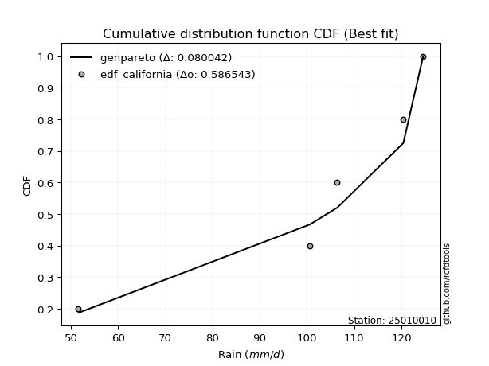</img>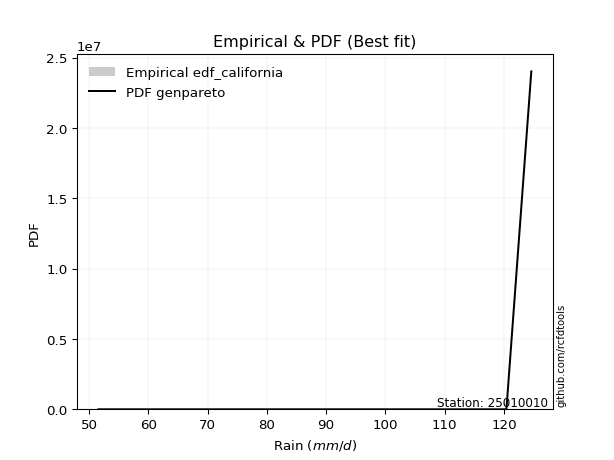</img>

</div>


### 2. EDF Hazen (1930)

Hazen method for plotting positions is a formula used to estimate the empirical cumulative probability distribution of flood events or other hydrological data. This formula often results in biased estimations, particularly when extrapolating to extreme events (high return periods).

<div align="center">


$P=(m-0.5)/n$


</div>


**2.1. Empirical values**

<div align="center">

|                | 0                  | 1                  | 2         | 3                 | 4                  |
|:---------------|:-------------------|:-------------------|:----------|:------------------|:-------------------|
| date           | 2023               | 2021               | 2024      | 2025              | 2022               |
| x              | 51.6               | 100.6              | 106.4     | 120.4             | 124.6              |
| m              | 1                  | 2                  | 3         | 4                 | 5                  |
| empirical_dist | edf_hazen          | edf_hazen          | edf_hazen | edf_hazen         | edf_hazen          |
| empirical      | 0.1                | 0.3                | 0.5       | 0.7               | 0.9                |
| empirical_tr   | 1.1111111111111112 | 1.4285714285714286 | 2.0       | 3.333333333333333 | 10.000000000000002 |

</div>


**2.2. Kolmogorov-Smirnov fit test (sorted by Δ)**


<div align="center">

|                | 0                   | 1                   | 2                   | 3                   | 4                   | 5                  | 6                   | 7                   | 8                   | 9                  | 10                  | 11                 | 12                 | 13                  | 14                  | 15                  | 16                 | 17                  | 18                  | 19                  | 20                  | 21                  | 22                 | 23                  | 24                 | 25                  | 26                 | 27                  | 28                  | 29                  | 30                  | 31                 | 32                  | 33                  | 34                 | 35                  | 36                 | 37                  | 38                  | 39                  | 40                  | 41                  | 42                  | 43                 | 44                  | 45                  | 46                  | 47                  | 48                  | 49                  | 50                 | 51                  | 52                  | 53                  | 54                  | 55                 | 56                  | 57                  | 58                 | 59                  | 60                 | 61                  | 62                 | 63                  | 64                  | 65                 | 66                  | 67                  | 68                 | 69                  | 70                  | 71                 | 72                 | 73                 | 74                  | 75                  | 76                  | 77                 | 78                 | 79                  | 80                 | 81                  | 82                  | 83                  | 84                 | 85                 | 86                 | 87                 | 88                  | 89                 | 90                  | 91                  | 92                 | 93                 | 94                 | 95                 | 96                 | 97                 | 98                 | 99                 | 100                | 101                | 102                | 103                 | 104                 | 105                 | 106                | 107                 | 108                | 109                | 110                 | 111                 | 112                | 113                 | 114                | 115                 | 116                | 117                | 118                 | 119                | 120                | 121                 | 122                | 123                 | 124                 | 125                | 126                | 127                | 128                | 129                 | 130                 | 131                 | 132                 | 133                 | 134                 | 135                 | 136                 | 137                 | 138                | 139                | 140                | 141                | 142                | 143                 | 144                | 145                | 146                | 147                | 148                | 149                | 150                | 151                | 152                | 153                | 154                | 155                | 156                | 157                | 158                | 159                |
|:---------------|:--------------------|:--------------------|:--------------------|:--------------------|:--------------------|:-------------------|:--------------------|:--------------------|:--------------------|:-------------------|:--------------------|:-------------------|:-------------------|:--------------------|:--------------------|:--------------------|:-------------------|:--------------------|:--------------------|:--------------------|:--------------------|:--------------------|:-------------------|:--------------------|:-------------------|:--------------------|:-------------------|:--------------------|:--------------------|:--------------------|:--------------------|:-------------------|:--------------------|:--------------------|:-------------------|:--------------------|:-------------------|:--------------------|:--------------------|:--------------------|:--------------------|:--------------------|:--------------------|:-------------------|:--------------------|:--------------------|:--------------------|:--------------------|:--------------------|:--------------------|:-------------------|:--------------------|:--------------------|:--------------------|:--------------------|:-------------------|:--------------------|:--------------------|:-------------------|:--------------------|:-------------------|:--------------------|:-------------------|:--------------------|:--------------------|:-------------------|:--------------------|:--------------------|:-------------------|:--------------------|:--------------------|:-------------------|:-------------------|:-------------------|:--------------------|:--------------------|:--------------------|:-------------------|:-------------------|:--------------------|:-------------------|:--------------------|:--------------------|:--------------------|:-------------------|:-------------------|:-------------------|:-------------------|:--------------------|:-------------------|:--------------------|:--------------------|:-------------------|:-------------------|:-------------------|:-------------------|:-------------------|:-------------------|:-------------------|:-------------------|:-------------------|:-------------------|:-------------------|:--------------------|:--------------------|:--------------------|:-------------------|:--------------------|:-------------------|:-------------------|:--------------------|:--------------------|:-------------------|:--------------------|:-------------------|:--------------------|:-------------------|:-------------------|:--------------------|:-------------------|:-------------------|:--------------------|:-------------------|:--------------------|:--------------------|:-------------------|:-------------------|:-------------------|:-------------------|:--------------------|:--------------------|:--------------------|:--------------------|:--------------------|:--------------------|:--------------------|:--------------------|:--------------------|:-------------------|:-------------------|:-------------------|:-------------------|:-------------------|:--------------------|:-------------------|:-------------------|:-------------------|:-------------------|:-------------------|:-------------------|:-------------------|:-------------------|:-------------------|:-------------------|:-------------------|:-------------------|:-------------------|:-------------------|:-------------------|:-------------------|
| station        | 25010010            | 25010010            | 25010010            | 25010010            | 25010010            | 25010010           | 25010010            | 25010010            | 25010010            | 25010010           | 25010010            | 25010010           | 25010010           | 25010010            | 25010010            | 25010010            | 25010010           | 25010010            | 25010010            | 25010010            | 25010010            | 25010010            | 25010010           | 25010010            | 25010010           | 25010010            | 25010010           | 25010010            | 25010010            | 25010010            | 25010010            | 25010010           | 25010010            | 25010010            | 25010010           | 25010010            | 25010010           | 25010010            | 25010010            | 25010010            | 25010010            | 25010010            | 25010010            | 25010010           | 25010010            | 25010010            | 25010010            | 25010010            | 25010010            | 25010010            | 25010010           | 25010010            | 25010010            | 25010010            | 25010010            | 25010010           | 25010010            | 25010010            | 25010010           | 25010010            | 25010010           | 25010010            | 25010010           | 25010010            | 25010010            | 25010010           | 25010010            | 25010010            | 25010010           | 25010010            | 25010010            | 25010010           | 25010010           | 25010010           | 25010010            | 25010010            | 25010010            | 25010010           | 25010010           | 25010010            | 25010010           | 25010010            | 25010010            | 25010010            | 25010010           | 25010010           | 25010010           | 25010010           | 25010010            | 25010010           | 25010010            | 25010010            | 25010010           | 25010010           | 25010010           | 25010010           | 25010010           | 25010010           | 25010010           | 25010010           | 25010010           | 25010010           | 25010010           | 25010010            | 25010010            | 25010010            | 25010010           | 25010010            | 25010010           | 25010010           | 25010010            | 25010010            | 25010010           | 25010010            | 25010010           | 25010010            | 25010010           | 25010010           | 25010010            | 25010010           | 25010010           | 25010010            | 25010010           | 25010010            | 25010010            | 25010010           | 25010010           | 25010010           | 25010010           | 25010010            | 25010010            | 25010010            | 25010010            | 25010010            | 25010010            | 25010010            | 25010010            | 25010010            | 25010010           | 25010010           | 25010010           | 25010010           | 25010010           | 25010010            | 25010010           | 25010010           | 25010010           | 25010010           | 25010010           | 25010010           | 25010010           | 25010010           | 25010010           | 25010010           | 25010010           | 25010010           | 25010010           | 25010010           | 25010010           | 25010010           |
| empirical_dist | edf_hazen           | edf_hazen           | edf_hazen           | edf_hazen           | edf_hazen           | edf_hazen          | edf_hazen           | edf_hazen           | edf_hazen           | edf_hazen          | edf_hazen           | edf_hazen          | edf_hazen          | edf_hazen           | edf_hazen           | edf_hazen           | edf_hazen          | edf_hazen           | edf_hazen           | edf_hazen           | edf_hazen           | edf_hazen           | edf_hazen          | edf_hazen           | edf_hazen          | edf_hazen           | edf_hazen          | edf_hazen           | edf_hazen           | edf_hazen           | edf_hazen           | edf_hazen          | edf_hazen           | edf_hazen           | edf_hazen          | edf_hazen           | edf_hazen          | edf_hazen           | edf_hazen           | edf_hazen           | edf_hazen           | edf_hazen           | edf_hazen           | edf_hazen          | edf_hazen           | edf_hazen           | edf_hazen           | edf_hazen           | edf_hazen           | edf_hazen           | edf_hazen          | edf_hazen           | edf_hazen           | edf_hazen           | edf_hazen           | edf_hazen          | edf_hazen           | edf_hazen           | edf_hazen          | edf_hazen           | edf_hazen          | edf_hazen           | edf_hazen          | edf_hazen           | edf_hazen           | edf_hazen          | edf_hazen           | edf_hazen           | edf_hazen          | edf_hazen           | edf_hazen           | edf_hazen          | edf_hazen          | edf_hazen          | edf_hazen           | edf_hazen           | edf_hazen           | edf_hazen          | edf_hazen          | edf_hazen           | edf_hazen          | edf_hazen           | edf_hazen           | edf_hazen           | edf_hazen          | edf_hazen          | edf_hazen          | edf_hazen          | edf_hazen           | edf_hazen          | edf_hazen           | edf_hazen           | edf_hazen          | edf_hazen          | edf_hazen          | edf_hazen          | edf_hazen          | edf_hazen          | edf_hazen          | edf_hazen          | edf_hazen          | edf_hazen          | edf_hazen          | edf_hazen           | edf_hazen           | edf_hazen           | edf_hazen          | edf_hazen           | edf_hazen          | edf_hazen          | edf_hazen           | edf_hazen           | edf_hazen          | edf_hazen           | edf_hazen          | edf_hazen           | edf_hazen          | edf_hazen          | edf_hazen           | edf_hazen          | edf_hazen          | edf_hazen           | edf_hazen          | edf_hazen           | edf_hazen           | edf_hazen          | edf_hazen          | edf_hazen          | edf_hazen          | edf_hazen           | edf_hazen           | edf_hazen           | edf_hazen           | edf_hazen           | edf_hazen           | edf_hazen           | edf_hazen           | edf_hazen           | edf_hazen          | edf_hazen          | edf_hazen          | edf_hazen          | edf_hazen          | edf_hazen           | edf_hazen          | edf_hazen          | edf_hazen          | edf_hazen          | edf_hazen          | edf_hazen          | edf_hazen          | edf_hazen          | edf_hazen          | edf_hazen          | edf_hazen          | edf_hazen          | edf_hazen          | edf_hazen          | edf_hazen          | edf_hazen          |
| p_dist         | dgamma              | genextreme          | weibull_min         | loggenextreme       | dweibull            | vonmises_line      | gennorm             | pearson3            | gumbel_l            | logexponpow        | argus               | logexponweib       | burr               | trapezoid           | levy_l              | loglevy_l           | weibull_max        | logweibull_min      | logvonmises_line    | logloglaplace       | logdgamma           | logloggamma         | logargus           | loggennorm          | logdweibull        | logburr12           | genpareto          | logmielke           | beta                | logpearson3         | logburr             | mielke             | loggompertz         | johnsonsb           | loggumbel_l        | logtrapezoid        | laplace            | hypsecant           | logistic            | exponnorm           | crystalball         | norm                | t                   | nct                | anglit              | semicircular        | arcsine             | f                   | invgamma            | genhalflogistic     | skewnorm           | gamma               | rice                | erlang              | logjohnsonsb        | loginvweibull      | alpha               | logarcsine          | maxwell            | wrapcauchy          | loggenhalflogistic | kappa3              | logweibull_max     | betaprime           | ncf                 | rayleigh           | logsemicircular     | loganglit           | logf               | logt                | logcrystalball      | lognorm            | logexponnorm       | logfatiguelife     | invgauss            | logncf              | cosine              | logbetaprime       | lognct             | triang              | logrice            | logalpha            | loglogistic         | loginvgamma         | loghypsecant       | gausshyper         | gumbel_r           | halfnorm           | kstwobign           | loginvgauss        | logmaxwell          | logbeta             | loglaplace         | loglaplace         | loggausshyper      | lograyleigh        | moyal              | halflogistic       | truncnorm          | lognakagami        | logtruncnorm       | nakagami           | logtukeylambda     | logwrapcauchy       | logskewnorm         | logkstwobign        | logcosine          | loggenexpon         | loghalfnorm        | logfoldnorm        | loggumbel_r         | genexpon            | logtriang          | ksone               | loghalflogistic    | logmoyal            | loggenpareto       | burr12             | halfgennorm         | wald               | uniform            | kappa4              | foldnorm           | loggamma            | loggamma            | lomax              | exponweib          | gompertz           | logerlang          | logksone            | logwald             | truncweibull_min    | logkappa4           | bradford            | truncexpon          | logkappa3           | loguniform          | logjohnsonsu        | invweibull         | logbradford        | logtruncexpon      | fatiguelife        | loggengamma        | logtruncweibull_min | gengamma           | johnsonsu          | logrdist           | loglomax           | powerlaw           | exponpow           | truncpareto        | logpowerlaw        | logtruncpareto     | rdist              | genlogistic        | loggenlogistic     | loghalfgennorm     | tukeylambda        | logvonmises        | vonmises           |
| delta          | 0.07850262784465056 | 0.10315956642072599 | 0.10600995443847694 | 0.10679759858972582 | 0.10694381360489402 | 0.1079061667834792 | 0.11517114165246478 | 0.12544481416762226 | 0.12773708874048678 | 0.128334042554972  | 0.13453168514805725 | 0.1371134451361672 | 0.1386774501904195 | 0.14299997130369407 | 0.14330405508818034 | 0.14505537220611697 | 0.1451060741736352 | 0.14522582390962774 | 0.14845389505547635 | 0.15048645486309853 | 0.15203197724808648 | 0.15393835998520233 | 0.1541027864997626 | 0.15724009233264546 | 0.1619126989418208 | 0.16486026046406071 | 0.1668397246059603 | 0.16684731220504734 | 0.16769962119556925 | 0.16909306589877998 | 0.17475133093142448 | 0.1750322875307756 | 0.17994159090971934 | 0.18299396592876693 | 0.1872815879432977 | 0.18804946483655538 | 0.1967578476176614 | 0.19770000700099188 | 0.19791413103017413 | 0.19816350100367897 | 0.19816485962409258 | 0.19816486159927904 | 0.19818457028659958 | 0.1982009441603746 | 0.19842755869822398 | 0.19853576753020358 | 0.19896461365292661 | 0.20075682975030223 | 0.20335018009091804 | 0.20462674674836373 | 0.2054692215449786 | 0.20708580676397798 | 0.20748580742200623 | 0.21659311262640385 | 0.21770568899693257 | 0.2230069358496144 | 0.22598880058112286 | 0.23054644207958092 | 0.2312873830687307 | 0.23205048281579105 | 0.2328454141167337 | 0.23331177445569007 | 0.2372776071410963 | 0.24097056566908798 | 0.24135739251547045 | 0.2423385962069911 | 0.24309938370930667 | 0.24625376023982432 | 0.2513822792993446 | 0.25382104534498046 | 0.25389334271126024 | 0.2538934760929515 | 0.2538939473798783 | 0.2545759573013557 | 0.25491997841233643 | 0.25530332899169156 | 0.25546554183791564 | 0.2562016919560111 | 0.2574665948844233 | 0.25820909152962007 | 0.2603502553643327 | 0.26100308585005866 | 0.26113702225316765 | 0.26530519602136243 | 0.2672463565133612 | 0.26837047239742   | 0.2684842038229586 | 0.2734514015319793 | 0.27384482783977243 | 0.2767085299577961 | 0.28402428732357327 | 0.28576887634961257 | 0.2871947754308534 | 0.2871947754308534 | 0.2898867885567416 | 0.2936719370691519 | 0.2943427576748712 | 0.2982755050971592 | 0.2999029206640446 | 0.2999537851879096 | 0.2999973720762923 | 0.299999374684244  | 0.2999999981238474 | 0.30034288889741606 | 0.30359517814060083 | 0.31185217782612135 | 0.3146287382423129 | 0.31738753243407386 | 0.3209052400569447 | 0.321128727088873  | 0.32382139366211976 | 0.33077142734942205 | 0.3418064674477547 | 0.34269406392694063 | 0.3483159227036438 | 0.34852982482031186 | 0.3506809607350851 | 0.3570005812545732 | 0.35983249147973867 | 0.3662605426986089 | 0.3712328767123287 | 0.37437846300448735 | 0.3891524307424803 | 0.40398123456674245 | 0.40398123456674245 | 0.4052381650794924 | 0.4061940245373729 | 0.4071219719412365 | 0.410365870768648  | 0.41442120409167843 | 0.41709448975554203 | 0.43581506417001675 | 0.44374058455198545 | 0.44501134857379293 | 0.45136373447160155 | 0.45627789511849154 | 0.45730544491001396 | 0.46021047997694237 | 0.4689834239145061 | 0.516280565266793  | 0.5374199530333714 | 0.551346269353497  | 0.5514088607727696 | 0.5730169760751609  | 0.5819758702919653 | 0.5943594927288085 | 0.5976885246477734 | 0.6054726002347575 | 0.6483874622410699 | 0.6512336496374662 | 0.6592561692148295 | 0.6618555984799457 | 0.671462583155823  | 0.7                | 0.7                | 0.7                | 0.7                | 0.899176554666839  | 1.24546903620519   | 19.187385018347438 |
| deltao         | 0.5865427407550001  | 0.5865427407550001  | 0.5865427407550001  | 0.5865427407550001  | 0.5865427407550001  | 0.5865427407550001 | 0.5865427407550001  | 0.5865427407550001  | 0.5865427407550001  | 0.5865427407550001 | 0.5865427407550001  | 0.5865427407550001 | 0.5865427407550001 | 0.5865427407550001  | 0.5865427407550001  | 0.5865427407550001  | 0.5865427407550001 | 0.5865427407550001  | 0.5865427407550001  | 0.5865427407550001  | 0.5865427407550001  | 0.5865427407550001  | 0.5865427407550001 | 0.5865427407550001  | 0.5865427407550001 | 0.5865427407550001  | 0.5865427407550001 | 0.5865427407550001  | 0.5865427407550001  | 0.5865427407550001  | 0.5865427407550001  | 0.5865427407550001 | 0.5865427407550001  | 0.5865427407550001  | 0.5865427407550001 | 0.5865427407550001  | 0.5865427407550001 | 0.5865427407550001  | 0.5865427407550001  | 0.5865427407550001  | 0.5865427407550001  | 0.5865427407550001  | 0.5865427407550001  | 0.5865427407550001 | 0.5865427407550001  | 0.5865427407550001  | 0.5865427407550001  | 0.5865427407550001  | 0.5865427407550001  | 0.5865427407550001  | 0.5865427407550001 | 0.5865427407550001  | 0.5865427407550001  | 0.5865427407550001  | 0.5865427407550001  | 0.5865427407550001 | 0.5865427407550001  | 0.5865427407550001  | 0.5865427407550001 | 0.5865427407550001  | 0.5865427407550001 | 0.5865427407550001  | 0.5865427407550001 | 0.5865427407550001  | 0.5865427407550001  | 0.5865427407550001 | 0.5865427407550001  | 0.5865427407550001  | 0.5865427407550001 | 0.5865427407550001  | 0.5865427407550001  | 0.5865427407550001 | 0.5865427407550001 | 0.5865427407550001 | 0.5865427407550001  | 0.5865427407550001  | 0.5865427407550001  | 0.5865427407550001 | 0.5865427407550001 | 0.5865427407550001  | 0.5865427407550001 | 0.5865427407550001  | 0.5865427407550001  | 0.5865427407550001  | 0.5865427407550001 | 0.5865427407550001 | 0.5865427407550001 | 0.5865427407550001 | 0.5865427407550001  | 0.5865427407550001 | 0.5865427407550001  | 0.5865427407550001  | 0.5865427407550001 | 0.5865427407550001 | 0.5865427407550001 | 0.5865427407550001 | 0.5865427407550001 | 0.5865427407550001 | 0.5865427407550001 | 0.5865427407550001 | 0.5865427407550001 | 0.5865427407550001 | 0.5865427407550001 | 0.5865427407550001  | 0.5865427407550001  | 0.5865427407550001  | 0.5865427407550001 | 0.5865427407550001  | 0.5865427407550001 | 0.5865427407550001 | 0.5865427407550001  | 0.5865427407550001  | 0.5865427407550001 | 0.5865427407550001  | 0.5865427407550001 | 0.5865427407550001  | 0.5865427407550001 | 0.5865427407550001 | 0.5865427407550001  | 0.5865427407550001 | 0.5865427407550001 | 0.5865427407550001  | 0.5865427407550001 | 0.5865427407550001  | 0.5865427407550001  | 0.5865427407550001 | 0.5865427407550001 | 0.5865427407550001 | 0.5865427407550001 | 0.5865427407550001  | 0.5865427407550001  | 0.5865427407550001  | 0.5865427407550001  | 0.5865427407550001  | 0.5865427407550001  | 0.5865427407550001  | 0.5865427407550001  | 0.5865427407550001  | 0.5865427407550001 | 0.5865427407550001 | 0.5865427407550001 | 0.5865427407550001 | 0.5865427407550001 | 0.5865427407550001  | 0.5865427407550001 | 0.5865427407550001 | 0.5865427407550001 | 0.5865427407550001 | 0.5865427407550001 | 0.5865427407550001 | 0.5865427407550001 | 0.5865427407550001 | 0.5865427407550001 | 0.5865427407550001 | 0.5865427407550001 | 0.5865427407550001 | 0.5865427407550001 | 0.5865427407550001 | 0.5865427407550001 | 0.5865427407550001 |
| eval           | Δo > Δ              | Δo > Δ              | Δo > Δ              | Δo > Δ              | Δo > Δ              | Δo > Δ             | Δo > Δ              | Δo > Δ              | Δo > Δ              | Δo > Δ             | Δo > Δ              | Δo > Δ             | Δo > Δ             | Δo > Δ              | Δo > Δ              | Δo > Δ              | Δo > Δ             | Δo > Δ              | Δo > Δ              | Δo > Δ              | Δo > Δ              | Δo > Δ              | Δo > Δ             | Δo > Δ              | Δo > Δ             | Δo > Δ              | Δo > Δ             | Δo > Δ              | Δo > Δ              | Δo > Δ              | Δo > Δ              | Δo > Δ             | Δo > Δ              | Δo > Δ              | Δo > Δ             | Δo > Δ              | Δo > Δ             | Δo > Δ              | Δo > Δ              | Δo > Δ              | Δo > Δ              | Δo > Δ              | Δo > Δ              | Δo > Δ             | Δo > Δ              | Δo > Δ              | Δo > Δ              | Δo > Δ              | Δo > Δ              | Δo > Δ              | Δo > Δ             | Δo > Δ              | Δo > Δ              | Δo > Δ              | Δo > Δ              | Δo > Δ             | Δo > Δ              | Δo > Δ              | Δo > Δ             | Δo > Δ              | Δo > Δ             | Δo > Δ              | Δo > Δ             | Δo > Δ              | Δo > Δ              | Δo > Δ             | Δo > Δ              | Δo > Δ              | Δo > Δ             | Δo > Δ              | Δo > Δ              | Δo > Δ             | Δo > Δ             | Δo > Δ             | Δo > Δ              | Δo > Δ              | Δo > Δ              | Δo > Δ             | Δo > Δ             | Δo > Δ              | Δo > Δ             | Δo > Δ              | Δo > Δ              | Δo > Δ              | Δo > Δ             | Δo > Δ             | Δo > Δ             | Δo > Δ             | Δo > Δ              | Δo > Δ             | Δo > Δ              | Δo > Δ              | Δo > Δ             | Δo > Δ             | Δo > Δ             | Δo > Δ             | Δo > Δ             | Δo > Δ             | Δo > Δ             | Δo > Δ             | Δo > Δ             | Δo > Δ             | Δo > Δ             | Δo > Δ              | Δo > Δ              | Δo > Δ              | Δo > Δ             | Δo > Δ              | Δo > Δ             | Δo > Δ             | Δo > Δ              | Δo > Δ              | Δo > Δ             | Δo > Δ              | Δo > Δ             | Δo > Δ              | Δo > Δ             | Δo > Δ             | Δo > Δ              | Δo > Δ             | Δo > Δ             | Δo > Δ              | Δo > Δ             | Δo > Δ              | Δo > Δ              | Δo > Δ             | Δo > Δ             | Δo > Δ             | Δo > Δ             | Δo > Δ              | Δo > Δ              | Δo > Δ              | Δo > Δ              | Δo > Δ              | Δo > Δ              | Δo > Δ              | Δo > Δ              | Δo > Δ              | Δo > Δ             | Δo > Δ             | Δo > Δ             | Δo > Δ             | Δo > Δ             | Δo > Δ              | Δo > Δ             | Δo <= Δ            | Δo <= Δ            | Δo <= Δ            | Δo <= Δ            | Δo <= Δ            | Δo <= Δ            | Δo <= Δ            | Δo <= Δ            | Δo <= Δ            | Δo <= Δ            | Δo <= Δ            | Δo <= Δ            | Δo <= Δ            | Δo <= Δ            | Δo <= Δ            |
| fit            | 1                   | 1                   | 1                   | 1                   | 1                   | 1                  | 1                   | 1                   | 1                   | 1                  | 1                   | 1                  | 1                  | 1                   | 1                   | 1                   | 1                  | 1                   | 1                   | 1                   | 1                   | 1                   | 1                  | 1                   | 1                  | 1                   | 1                  | 1                   | 1                   | 1                   | 1                   | 1                  | 1                   | 1                   | 1                  | 1                   | 1                  | 1                   | 1                   | 1                   | 1                   | 1                   | 1                   | 1                  | 1                   | 1                   | 1                   | 1                   | 1                   | 1                   | 1                  | 1                   | 1                   | 1                   | 1                   | 1                  | 1                   | 1                   | 1                  | 1                   | 1                  | 1                   | 1                  | 1                   | 1                   | 1                  | 1                   | 1                   | 1                  | 1                   | 1                   | 1                  | 1                  | 1                  | 1                   | 1                   | 1                   | 1                  | 1                  | 1                   | 1                  | 1                   | 1                   | 1                   | 1                  | 1                  | 1                  | 1                  | 1                   | 1                  | 1                   | 1                   | 1                  | 1                  | 1                  | 1                  | 1                  | 1                  | 1                  | 1                  | 1                  | 1                  | 1                  | 1                   | 1                   | 1                   | 1                  | 1                   | 1                  | 1                  | 1                   | 1                   | 1                  | 1                   | 1                  | 1                   | 1                  | 1                  | 1                   | 1                  | 1                  | 1                   | 1                  | 1                   | 1                   | 1                  | 1                  | 1                  | 1                  | 1                   | 1                   | 1                   | 1                   | 1                   | 1                   | 1                   | 1                   | 1                   | 1                  | 1                  | 1                  | 1                  | 1                  | 1                   | 1                  | 0                  | 0                  | 0                  | 0                  | 0                  | 0                  | 0                  | 0                  | 0                  | 0                  | 0                  | 0                  | 0                  | 0                  | 0                  |
| n              | 5                   | 5                   | 5                   | 5                   | 5                   | 5                  | 5                   | 5                   | 5                   | 5                  | 5                   | 5                  | 5                  | 5                   | 5                   | 5                   | 5                  | 5                   | 5                   | 5                   | 5                   | 5                   | 5                  | 5                   | 5                  | 5                   | 5                  | 5                   | 5                   | 5                   | 5                   | 5                  | 5                   | 5                   | 5                  | 5                   | 5                  | 5                   | 5                   | 5                   | 5                   | 5                   | 5                   | 5                  | 5                   | 5                   | 5                   | 5                   | 5                   | 5                   | 5                  | 5                   | 5                   | 5                   | 5                   | 5                  | 5                   | 5                   | 5                  | 5                   | 5                  | 5                   | 5                  | 5                   | 5                   | 5                  | 5                   | 5                   | 5                  | 5                   | 5                   | 5                  | 5                  | 5                  | 5                   | 5                   | 5                   | 5                  | 5                  | 5                   | 5                  | 5                   | 5                   | 5                   | 5                  | 5                  | 5                  | 5                  | 5                   | 5                  | 5                   | 5                   | 5                  | 5                  | 5                  | 5                  | 5                  | 5                  | 5                  | 5                  | 5                  | 5                  | 5                  | 5                   | 5                   | 5                   | 5                  | 5                   | 5                  | 5                  | 5                   | 5                   | 5                  | 5                   | 5                  | 5                   | 5                  | 5                  | 5                   | 5                  | 5                  | 5                   | 5                  | 5                   | 5                   | 5                  | 5                  | 5                  | 5                  | 5                   | 5                   | 5                   | 5                   | 5                   | 5                   | 5                   | 5                   | 5                   | 5                  | 5                  | 5                  | 5                  | 5                  | 5                   | 5                  | 5                  | 5                  | 5                  | 5                  | 5                  | 5                  | 5                  | 5                  | 5                  | 5                  | 5                  | 5                  | 5                  | 5                  | 5                  |
| best_fit       | 1                   | 0                   | 0                   | 0                   | 0                   | 0                  | 0                   | 0                   | 0                   | 0                  | 0                   | 0                  | 0                  | 0                   | 0                   | 0                   | 0                  | 0                   | 0                   | 0                   | 0                   | 0                   | 0                  | 0                   | 0                  | 0                   | 0                  | 0                   | 0                   | 0                   | 0                   | 0                  | 0                   | 0                   | 0                  | 0                   | 0                  | 0                   | 0                   | 0                   | 0                   | 0                   | 0                   | 0                  | 0                   | 0                   | 0                   | 0                   | 0                   | 0                   | 0                  | 0                   | 0                   | 0                   | 0                   | 0                  | 0                   | 0                   | 0                  | 0                   | 0                  | 0                   | 0                  | 0                   | 0                   | 0                  | 0                   | 0                   | 0                  | 0                   | 0                   | 0                  | 0                  | 0                  | 0                   | 0                   | 0                   | 0                  | 0                  | 0                   | 0                  | 0                   | 0                   | 0                   | 0                  | 0                  | 0                  | 0                  | 0                   | 0                  | 0                   | 0                   | 0                  | 0                  | 0                  | 0                  | 0                  | 0                  | 0                  | 0                  | 0                  | 0                  | 0                  | 0                   | 0                   | 0                   | 0                  | 0                   | 0                  | 0                  | 0                   | 0                   | 0                  | 0                   | 0                  | 0                   | 0                  | 0                  | 0                   | 0                  | 0                  | 0                   | 0                  | 0                   | 0                   | 0                  | 0                  | 0                  | 0                  | 0                   | 0                   | 0                   | 0                   | 0                   | 0                   | 0                   | 0                   | 0                   | 0                  | 0                  | 0                  | 0                  | 0                  | 0                   | 0                  | 0                  | 0                  | 0                  | 0                  | 0                  | 0                  | 0                  | 0                  | 0                  | 0                  | 0                  | 0                  | 0                  | 0                  | 0                  |
| best_fit_sort  | 1                   | 2                   | 3                   | 4                   | 5                   | 6                  | 7                   | 8                   | 9                   | 10                 | 11                  | 12                 | 13                 | 14                  | 15                  | 16                  | 17                 | 18                  | 19                  | 20                  | 21                  | 22                  | 23                 | 24                  | 25                 | 26                  | 27                 | 28                  | 29                  | 30                  | 31                  | 32                 | 33                  | 34                  | 35                 | 36                  | 37                 | 38                  | 39                  | 40                  | 41                  | 42                  | 43                  | 44                 | 45                  | 46                  | 47                  | 48                  | 49                  | 50                  | 51                 | 52                  | 53                  | 54                  | 55                  | 56                 | 57                  | 58                  | 59                 | 60                  | 61                 | 62                  | 63                 | 64                  | 65                  | 66                 | 67                  | 68                  | 69                 | 70                  | 71                  | 72                 | 73                 | 74                 | 75                  | 76                  | 77                  | 78                 | 79                 | 80                  | 81                 | 82                  | 83                  | 84                  | 85                 | 86                 | 87                 | 88                 | 89                  | 90                 | 91                  | 92                  | 93                 | 94                 | 95                 | 96                 | 97                 | 98                 | 99                 | 100                | 101                | 102                | 103                | 104                 | 105                 | 106                 | 107                | 108                 | 109                | 110                | 111                 | 112                 | 113                | 114                 | 115                | 116                 | 117                | 118                | 119                 | 120                | 121                | 122                 | 123                | 124                 | 125                 | 126                | 127                | 128                | 129                | 130                 | 131                 | 132                 | 133                 | 134                 | 135                 | 136                 | 137                 | 138                 | 139                | 140                | 141                | 142                | 143                | 144                 | 145                | 146                | 147                | 148                | 149                | 150                | 151                | 152                | 153                | 154                | 155                | 156                | 157                | 158                | 159                | 160                |

</div>


**2.3. Best fit**

<div align="center">

|   id |   station | empirical_dist   | p_dist   |     delta |   deltao | eval   |   fit |   n |   best_fit |   best_fit_sort |
|-----:|----------:|:-----------------|:---------|----------:|---------:|:-------|------:|----:|-----------:|----------------:|
|    0 |  25010010 | edf_hazen        | dgamma   | 0.0785026 | 0.586543 | Δo > Δ |     1 |   5 |          1 |               1 |

</div>


<div align="center">

</img></img>

</div>


### 3. EDF Weibull (1939)

Weibull plotting position formula is an empirical method used to estimate the non-exceedance probability or plotting position for a set of observed data, is often recommended or widely used in practice, particularly in flood frequency analysis.

<div align="center">


$P=m/(n+1)$


</div>


**3.1. Empirical values**

<div align="center">

|                | 0                   | 1                  | 2           | 3                  | 4                  |
|:---------------|:--------------------|:-------------------|:------------|:-------------------|:-------------------|
| date           | 2023                | 2021               | 2024        | 2025               | 2022               |
| x              | 51.6                | 100.6              | 106.4       | 120.4              | 124.6              |
| m              | 1                   | 2                  | 3           | 4                  | 5                  |
| empirical_dist | edf_weibull         | edf_weibull        | edf_weibull | edf_weibull        | edf_weibull        |
| empirical      | 0.16666666666666666 | 0.3333333333333333 | 0.5         | 0.6666666666666666 | 0.8333333333333334 |
| empirical_tr   | 1.2                 | 1.4999999999999998 | 2.0         | 2.9999999999999996 | 6.000000000000002  |

</div>


**3.2. Kolmogorov-Smirnov fit test (sorted by Δ)**


<div align="center">

|                | 0                   | 1                   | 2                  | 3                   | 4                  | 5                   | 6                   | 7                   | 8                   | 9                   | 10                  | 11                 | 12                 | 13                  | 14                  | 15                  | 16                  | 17                  | 18                  | 19                 | 20                  | 21                 | 22                  | 23                  | 24                  | 25                  | 26                  | 27                  | 28                  | 29                  | 30                  | 31                 | 32                  | 33                  | 34                  | 35                  | 36                  | 37                  | 38                  | 39                  | 40                 | 41                  | 42                  | 43                  | 44                  | 45                 | 46                  | 47                  | 48                  | 49                 | 50                  | 51                  | 52                  | 53                 | 54                  | 55                  | 56                  | 57                  | 58                  | 59                 | 60                  | 61                 | 62                  | 63                  | 64                  | 65                 | 66                  | 67                  | 68                 | 69                 | 70                  | 71                  | 72                  | 73                 | 74                  | 75                  | 76                 | 77                  | 78                  | 79                  | 80                  | 81                 | 82                  | 83                 | 84                 | 85                  | 86                  | 87                 | 88                  | 89                  | 90                  | 91                  | 92                 | 93                 | 94                 | 95                 | 96                 | 97                 | 98                  | 99                 | 100                | 101                | 102                 | 103                | 104                | 105                 | 106                | 107                | 108                | 109                | 110                 | 111                 | 112                 | 113                 | 114                | 115                 | 116                 | 117                | 118                | 119                 | 120                 | 121                 | 122                | 123                | 124                | 125                | 126                | 127                | 128                | 129                | 130                 | 131                | 132                | 133                | 134                | 135                | 136                | 137                 | 138                 | 139                | 140                | 141                | 142                | 143                | 144                | 145                 | 146                | 147                | 148                | 149                | 150                | 151                | 152                | 153                | 154                | 155                | 156                | 157                | 158                | 159                |
|:---------------|:--------------------|:--------------------|:-------------------|:--------------------|:-------------------|:--------------------|:--------------------|:--------------------|:--------------------|:--------------------|:--------------------|:-------------------|:-------------------|:--------------------|:--------------------|:--------------------|:--------------------|:--------------------|:--------------------|:-------------------|:--------------------|:-------------------|:--------------------|:--------------------|:--------------------|:--------------------|:--------------------|:--------------------|:--------------------|:--------------------|:--------------------|:-------------------|:--------------------|:--------------------|:--------------------|:--------------------|:--------------------|:--------------------|:--------------------|:--------------------|:-------------------|:--------------------|:--------------------|:--------------------|:--------------------|:-------------------|:--------------------|:--------------------|:--------------------|:-------------------|:--------------------|:--------------------|:--------------------|:-------------------|:--------------------|:--------------------|:--------------------|:--------------------|:--------------------|:-------------------|:--------------------|:-------------------|:--------------------|:--------------------|:--------------------|:-------------------|:--------------------|:--------------------|:-------------------|:-------------------|:--------------------|:--------------------|:--------------------|:-------------------|:--------------------|:--------------------|:-------------------|:--------------------|:--------------------|:--------------------|:--------------------|:-------------------|:--------------------|:-------------------|:-------------------|:--------------------|:--------------------|:-------------------|:--------------------|:--------------------|:--------------------|:--------------------|:-------------------|:-------------------|:-------------------|:-------------------|:-------------------|:-------------------|:--------------------|:-------------------|:-------------------|:-------------------|:--------------------|:-------------------|:-------------------|:--------------------|:-------------------|:-------------------|:-------------------|:-------------------|:--------------------|:--------------------|:--------------------|:--------------------|:-------------------|:--------------------|:--------------------|:-------------------|:-------------------|:--------------------|:--------------------|:--------------------|:-------------------|:-------------------|:-------------------|:-------------------|:-------------------|:-------------------|:-------------------|:-------------------|:--------------------|:-------------------|:-------------------|:-------------------|:-------------------|:-------------------|:-------------------|:--------------------|:--------------------|:-------------------|:-------------------|:-------------------|:-------------------|:-------------------|:-------------------|:--------------------|:-------------------|:-------------------|:-------------------|:-------------------|:-------------------|:-------------------|:-------------------|:-------------------|:-------------------|:-------------------|:-------------------|:-------------------|:-------------------|:-------------------|
| station        | 25010010            | 25010010            | 25010010           | 25010010            | 25010010           | 25010010            | 25010010            | 25010010            | 25010010            | 25010010            | 25010010            | 25010010           | 25010010           | 25010010            | 25010010            | 25010010            | 25010010            | 25010010            | 25010010            | 25010010           | 25010010            | 25010010           | 25010010            | 25010010            | 25010010            | 25010010            | 25010010            | 25010010            | 25010010            | 25010010            | 25010010            | 25010010           | 25010010            | 25010010            | 25010010            | 25010010            | 25010010            | 25010010            | 25010010            | 25010010            | 25010010           | 25010010            | 25010010            | 25010010            | 25010010            | 25010010           | 25010010            | 25010010            | 25010010            | 25010010           | 25010010            | 25010010            | 25010010            | 25010010           | 25010010            | 25010010            | 25010010            | 25010010            | 25010010            | 25010010           | 25010010            | 25010010           | 25010010            | 25010010            | 25010010            | 25010010           | 25010010            | 25010010            | 25010010           | 25010010           | 25010010            | 25010010            | 25010010            | 25010010           | 25010010            | 25010010            | 25010010           | 25010010            | 25010010            | 25010010            | 25010010            | 25010010           | 25010010            | 25010010           | 25010010           | 25010010            | 25010010            | 25010010           | 25010010            | 25010010            | 25010010            | 25010010            | 25010010           | 25010010           | 25010010           | 25010010           | 25010010           | 25010010           | 25010010            | 25010010           | 25010010           | 25010010           | 25010010            | 25010010           | 25010010           | 25010010            | 25010010           | 25010010           | 25010010           | 25010010           | 25010010            | 25010010            | 25010010            | 25010010            | 25010010           | 25010010            | 25010010            | 25010010           | 25010010           | 25010010            | 25010010            | 25010010            | 25010010           | 25010010           | 25010010           | 25010010           | 25010010           | 25010010           | 25010010           | 25010010           | 25010010            | 25010010           | 25010010           | 25010010           | 25010010           | 25010010           | 25010010           | 25010010            | 25010010            | 25010010           | 25010010           | 25010010           | 25010010           | 25010010           | 25010010           | 25010010            | 25010010           | 25010010           | 25010010           | 25010010           | 25010010           | 25010010           | 25010010           | 25010010           | 25010010           | 25010010           | 25010010           | 25010010           | 25010010           | 25010010           |
| empirical_dist | edf_weibull         | edf_weibull         | edf_weibull        | edf_weibull         | edf_weibull        | edf_weibull         | edf_weibull         | edf_weibull         | edf_weibull         | edf_weibull         | edf_weibull         | edf_weibull        | edf_weibull        | edf_weibull         | edf_weibull         | edf_weibull         | edf_weibull         | edf_weibull         | edf_weibull         | edf_weibull        | edf_weibull         | edf_weibull        | edf_weibull         | edf_weibull         | edf_weibull         | edf_weibull         | edf_weibull         | edf_weibull         | edf_weibull         | edf_weibull         | edf_weibull         | edf_weibull        | edf_weibull         | edf_weibull         | edf_weibull         | edf_weibull         | edf_weibull         | edf_weibull         | edf_weibull         | edf_weibull         | edf_weibull        | edf_weibull         | edf_weibull         | edf_weibull         | edf_weibull         | edf_weibull        | edf_weibull         | edf_weibull         | edf_weibull         | edf_weibull        | edf_weibull         | edf_weibull         | edf_weibull         | edf_weibull        | edf_weibull         | edf_weibull         | edf_weibull         | edf_weibull         | edf_weibull         | edf_weibull        | edf_weibull         | edf_weibull        | edf_weibull         | edf_weibull         | edf_weibull         | edf_weibull        | edf_weibull         | edf_weibull         | edf_weibull        | edf_weibull        | edf_weibull         | edf_weibull         | edf_weibull         | edf_weibull        | edf_weibull         | edf_weibull         | edf_weibull        | edf_weibull         | edf_weibull         | edf_weibull         | edf_weibull         | edf_weibull        | edf_weibull         | edf_weibull        | edf_weibull        | edf_weibull         | edf_weibull         | edf_weibull        | edf_weibull         | edf_weibull         | edf_weibull         | edf_weibull         | edf_weibull        | edf_weibull        | edf_weibull        | edf_weibull        | edf_weibull        | edf_weibull        | edf_weibull         | edf_weibull        | edf_weibull        | edf_weibull        | edf_weibull         | edf_weibull        | edf_weibull        | edf_weibull         | edf_weibull        | edf_weibull        | edf_weibull        | edf_weibull        | edf_weibull         | edf_weibull         | edf_weibull         | edf_weibull         | edf_weibull        | edf_weibull         | edf_weibull         | edf_weibull        | edf_weibull        | edf_weibull         | edf_weibull         | edf_weibull         | edf_weibull        | edf_weibull        | edf_weibull        | edf_weibull        | edf_weibull        | edf_weibull        | edf_weibull        | edf_weibull        | edf_weibull         | edf_weibull        | edf_weibull        | edf_weibull        | edf_weibull        | edf_weibull        | edf_weibull        | edf_weibull         | edf_weibull         | edf_weibull        | edf_weibull        | edf_weibull        | edf_weibull        | edf_weibull        | edf_weibull        | edf_weibull         | edf_weibull        | edf_weibull        | edf_weibull        | edf_weibull        | edf_weibull        | edf_weibull        | edf_weibull        | edf_weibull        | edf_weibull        | edf_weibull        | edf_weibull        | edf_weibull        | edf_weibull        | edf_weibull        |
| p_dist         | pearson3            | trapezoid           | gumbel_l           | dweibull            | logdweibull        | logpearson3         | weibull_min         | loggennorm          | dgamma              | levy_l              | loglevy_l           | logburr12          | gennorm            | logloglaplace       | logweibull_min      | loggumbel_l         | logexponpow         | logtrapezoid        | laplace             | loggompertz        | hypsecant           | logistic           | exponnorm           | crystalball         | norm                | t                   | nct                 | anglit              | semicircular        | beta                | johnsonsb           | logjohnsonsb       | genpareto           | kappa3              | logvonmises_line    | vonmises_line       | genextreme          | loggenextreme       | arcsine             | burr                | f                  | argus               | logexponweib        | invgamma            | gamma               | rice               | loginvweibull       | weibull_max         | erlang              | logdgamma          | logloggamma         | logargus            | alpha               | logarcsine         | maxwell             | wrapcauchy          | logmielke           | betaprime           | ncf                 | logburr            | mielke              | loggenhalflogistic | rayleigh            | logsemicircular     | genhalflogistic     | loganglit          | logf                | logt                | logweibull_max     | logcrystalball     | lognorm             | logexponnorm        | logfatiguelife      | invgauss           | logncf              | cosine              | logbetaprime       | lognct              | logrice             | logalpha            | loglogistic         | loginvgamma        | loghypsecant        | gausshyper         | gumbel_r           | skewnorm            | halfnorm            | kstwobign          | loginvgauss         | triang              | logmaxwell          | logbeta             | loglaplace         | loglaplace         | loggausshyper      | lograyleigh        | moyal              | halflogistic       | logwrapcauchy       | logskewnorm        | logkstwobign       | logcosine          | loggenexpon         | loghalfnorm        | logfoldnorm        | loggumbel_r         | genexpon           | logtriang          | ksone              | loghalflogistic    | logmoyal            | loggenpareto        | burr12              | halfgennorm         | wald               | truncnorm           | lognakagami         | logtruncnorm       | nakagami           | logtukeylambda      | uniform             | lomax               | kappa4             | loggamma           | loggamma           | exponweib          | logerlang          | logksone           | logwald            | foldnorm           | invweibull          | truncweibull_min   | gompertz           | logkappa4          | bradford           | truncexpon         | logkappa3          | loguniform          | logjohnsonsu        | logbradford        | logtruncexpon      | fatiguelife        | loggengamma        | logrdist           | loglomax           | logtruncweibull_min | gengamma           | johnsonsu          | powerlaw           | exponpow           | truncpareto        | logpowerlaw        | logtruncpareto     | loggenlogistic     | genlogistic        | loghalfgennorm     | rdist              | tukeylambda        | logvonmises        | vonmises           |
| delta          | 0.11601797384667047 | 0.11700342419782617 | 0.1177271004469419 | 0.12251073424391033 | 0.1264502459595963 | 0.13575973256544666 | 0.13934328777181026 | 0.14190156503394902 | 0.14205894673462632 | 0.14330405508818034 | 0.14505537220611697 | 0.148095308942635  | 0.1485044749857981 | 0.15157883301382108 | 0.15307229000286657 | 0.15394825460996436 | 0.15419160252071662 | 0.15471613150322205 | 0.16342451428432808 | 0.1642981550516158 | 0.16436667366765856 | 0.1645807976968408 | 0.16483016767034564 | 0.16483152629075926 | 0.16483152826594571 | 0.16485123695326626 | 0.16486761082704127 | 0.16509422536489066 | 0.16520243419687025 | 0.16605853775450563 | 0.16626121599982158 | 0.1666440387401874 | 0.16666578117113584 | 0.16666644450163814 | 0.16666666496892976 | 0.16666666665618404 | 0.16666666666615826 | 0.16666666666638863 | 0.16666666666666666 | 0.16705212966250993 | 0.1674234964169689 | 0.16786501848139057 | 0.16933977119746058 | 0.17001684675758472 | 0.17375247343064465 | 0.1741524740886729 | 0.17652380856783517 | 0.17843940750696852 | 0.18325977929307052 | 0.1853653105814198 | 0.18727169331853566 | 0.18743611983309594 | 0.19265546724778954 | 0.1972131087462476 | 0.19795404973539737 | 0.19871714948245772 | 0.20018064553838066 | 0.20763723233575465 | 0.20802405918213712 | 0.2080846642647578 | 0.20836562086410892 | 0.2083675374561612 | 0.20900526287365778 | 0.20976605037597335 | 0.21219284854277143 | 0.212920426906491  | 0.21804894596601126 | 0.22048771201164713 | 0.2205228776228947 | 0.2205600093779269 | 0.22056014275961816 | 0.22056061404654498 | 0.22124262396802236 | 0.2215866450790031 | 0.22196999565835823 | 0.22213220850458232 | 0.2228683586226778 | 0.22413326155108998 | 0.22701692203099938 | 0.22766975251672533 | 0.22780368891983432 | 0.2319718626880291 | 0.23391302318002788 | 0.2350371390640867 | 0.2351508704896253 | 0.23880255487831192 | 0.24011806819864595 | 0.2405114945064391 | 0.24337519662446278 | 0.24678754915391388 | 0.25069095399023994 | 0.25243554301627924 | 0.2538614420975201 | 0.2538614420975201 | 0.2565534552234083 | 0.2603386037358186 | 0.2610094243415379 | 0.2649421717638259 | 0.26700955556408273 | 0.2702618448072675 | 0.278518844492788  | 0.2812954049089796 | 0.28405419910074053 | 0.2875719067236114 | 0.2877953937555397 | 0.29048806032878643 | 0.2974380940160887 | 0.3084731341144214 | 0.3093607305936073 | 0.3149825893703105 | 0.31519649148697854 | 0.31734762740175176 | 0.32366724792123985 | 0.32649915814640534 | 0.3329272093652756 | 0.33323625399737794 | 0.33328711852124293 | 0.3333307054096256 | 0.3333327080175773 | 0.33333333145718075 | 0.33789954337899536 | 0.33857149841282574 | 0.341045129671154  | 0.3706479012334091 | 0.3706479012334091 | 0.3728606912040396 | 0.3770325374353147 | 0.3810878707583451 | 0.3837611564222087 | 0.3891524307424803 | 0.40231675724783944 | 0.4024817308366834 | 0.4071219719412365 | 0.4104072512186521 | 0.4116780152404596 | 0.4180304011382682 | 0.4229445617851582 | 0.42397211157668063 | 0.42687714664360904 | 0.4829472319334596 | 0.504086619700038  | 0.5180129360201637 | 0.5180755274394362 | 0.5310218579811068 | 0.5388059335680908 | 0.5396836427418277  | 0.5486425369586319 | 0.5610261593954752 | 0.6150541289077367 | 0.6179003163041328 | 0.6259228358814963 | 0.6285222651466122 | 0.6381292498224898 | 0.6666666666666666 | 0.6666666666666666 | 0.6666666666666666 | 0.6666666666666667 | 0.8325098880001723 | 1.2121357028718567 | 19.254051685014105 |
| deltao         | 0.5865427407550001  | 0.5865427407550001  | 0.5865427407550001 | 0.5865427407550001  | 0.5865427407550001 | 0.5865427407550001  | 0.5865427407550001  | 0.5865427407550001  | 0.5865427407550001  | 0.5865427407550001  | 0.5865427407550001  | 0.5865427407550001 | 0.5865427407550001 | 0.5865427407550001  | 0.5865427407550001  | 0.5865427407550001  | 0.5865427407550001  | 0.5865427407550001  | 0.5865427407550001  | 0.5865427407550001 | 0.5865427407550001  | 0.5865427407550001 | 0.5865427407550001  | 0.5865427407550001  | 0.5865427407550001  | 0.5865427407550001  | 0.5865427407550001  | 0.5865427407550001  | 0.5865427407550001  | 0.5865427407550001  | 0.5865427407550001  | 0.5865427407550001 | 0.5865427407550001  | 0.5865427407550001  | 0.5865427407550001  | 0.5865427407550001  | 0.5865427407550001  | 0.5865427407550001  | 0.5865427407550001  | 0.5865427407550001  | 0.5865427407550001 | 0.5865427407550001  | 0.5865427407550001  | 0.5865427407550001  | 0.5865427407550001  | 0.5865427407550001 | 0.5865427407550001  | 0.5865427407550001  | 0.5865427407550001  | 0.5865427407550001 | 0.5865427407550001  | 0.5865427407550001  | 0.5865427407550001  | 0.5865427407550001 | 0.5865427407550001  | 0.5865427407550001  | 0.5865427407550001  | 0.5865427407550001  | 0.5865427407550001  | 0.5865427407550001 | 0.5865427407550001  | 0.5865427407550001 | 0.5865427407550001  | 0.5865427407550001  | 0.5865427407550001  | 0.5865427407550001 | 0.5865427407550001  | 0.5865427407550001  | 0.5865427407550001 | 0.5865427407550001 | 0.5865427407550001  | 0.5865427407550001  | 0.5865427407550001  | 0.5865427407550001 | 0.5865427407550001  | 0.5865427407550001  | 0.5865427407550001 | 0.5865427407550001  | 0.5865427407550001  | 0.5865427407550001  | 0.5865427407550001  | 0.5865427407550001 | 0.5865427407550001  | 0.5865427407550001 | 0.5865427407550001 | 0.5865427407550001  | 0.5865427407550001  | 0.5865427407550001 | 0.5865427407550001  | 0.5865427407550001  | 0.5865427407550001  | 0.5865427407550001  | 0.5865427407550001 | 0.5865427407550001 | 0.5865427407550001 | 0.5865427407550001 | 0.5865427407550001 | 0.5865427407550001 | 0.5865427407550001  | 0.5865427407550001 | 0.5865427407550001 | 0.5865427407550001 | 0.5865427407550001  | 0.5865427407550001 | 0.5865427407550001 | 0.5865427407550001  | 0.5865427407550001 | 0.5865427407550001 | 0.5865427407550001 | 0.5865427407550001 | 0.5865427407550001  | 0.5865427407550001  | 0.5865427407550001  | 0.5865427407550001  | 0.5865427407550001 | 0.5865427407550001  | 0.5865427407550001  | 0.5865427407550001 | 0.5865427407550001 | 0.5865427407550001  | 0.5865427407550001  | 0.5865427407550001  | 0.5865427407550001 | 0.5865427407550001 | 0.5865427407550001 | 0.5865427407550001 | 0.5865427407550001 | 0.5865427407550001 | 0.5865427407550001 | 0.5865427407550001 | 0.5865427407550001  | 0.5865427407550001 | 0.5865427407550001 | 0.5865427407550001 | 0.5865427407550001 | 0.5865427407550001 | 0.5865427407550001 | 0.5865427407550001  | 0.5865427407550001  | 0.5865427407550001 | 0.5865427407550001 | 0.5865427407550001 | 0.5865427407550001 | 0.5865427407550001 | 0.5865427407550001 | 0.5865427407550001  | 0.5865427407550001 | 0.5865427407550001 | 0.5865427407550001 | 0.5865427407550001 | 0.5865427407550001 | 0.5865427407550001 | 0.5865427407550001 | 0.5865427407550001 | 0.5865427407550001 | 0.5865427407550001 | 0.5865427407550001 | 0.5865427407550001 | 0.5865427407550001 | 0.5865427407550001 |
| eval           | Δo > Δ              | Δo > Δ              | Δo > Δ             | Δo > Δ              | Δo > Δ             | Δo > Δ              | Δo > Δ              | Δo > Δ              | Δo > Δ              | Δo > Δ              | Δo > Δ              | Δo > Δ             | Δo > Δ             | Δo > Δ              | Δo > Δ              | Δo > Δ              | Δo > Δ              | Δo > Δ              | Δo > Δ              | Δo > Δ             | Δo > Δ              | Δo > Δ             | Δo > Δ              | Δo > Δ              | Δo > Δ              | Δo > Δ              | Δo > Δ              | Δo > Δ              | Δo > Δ              | Δo > Δ              | Δo > Δ              | Δo > Δ             | Δo > Δ              | Δo > Δ              | Δo > Δ              | Δo > Δ              | Δo > Δ              | Δo > Δ              | Δo > Δ              | Δo > Δ              | Δo > Δ             | Δo > Δ              | Δo > Δ              | Δo > Δ              | Δo > Δ              | Δo > Δ             | Δo > Δ              | Δo > Δ              | Δo > Δ              | Δo > Δ             | Δo > Δ              | Δo > Δ              | Δo > Δ              | Δo > Δ             | Δo > Δ              | Δo > Δ              | Δo > Δ              | Δo > Δ              | Δo > Δ              | Δo > Δ             | Δo > Δ              | Δo > Δ             | Δo > Δ              | Δo > Δ              | Δo > Δ              | Δo > Δ             | Δo > Δ              | Δo > Δ              | Δo > Δ             | Δo > Δ             | Δo > Δ              | Δo > Δ              | Δo > Δ              | Δo > Δ             | Δo > Δ              | Δo > Δ              | Δo > Δ             | Δo > Δ              | Δo > Δ              | Δo > Δ              | Δo > Δ              | Δo > Δ             | Δo > Δ              | Δo > Δ             | Δo > Δ             | Δo > Δ              | Δo > Δ              | Δo > Δ             | Δo > Δ              | Δo > Δ              | Δo > Δ              | Δo > Δ              | Δo > Δ             | Δo > Δ             | Δo > Δ             | Δo > Δ             | Δo > Δ             | Δo > Δ             | Δo > Δ              | Δo > Δ             | Δo > Δ             | Δo > Δ             | Δo > Δ              | Δo > Δ             | Δo > Δ             | Δo > Δ              | Δo > Δ             | Δo > Δ             | Δo > Δ             | Δo > Δ             | Δo > Δ              | Δo > Δ              | Δo > Δ              | Δo > Δ              | Δo > Δ             | Δo > Δ              | Δo > Δ              | Δo > Δ             | Δo > Δ             | Δo > Δ              | Δo > Δ              | Δo > Δ              | Δo > Δ             | Δo > Δ             | Δo > Δ             | Δo > Δ             | Δo > Δ             | Δo > Δ             | Δo > Δ             | Δo > Δ             | Δo > Δ              | Δo > Δ             | Δo > Δ             | Δo > Δ             | Δo > Δ             | Δo > Δ             | Δo > Δ             | Δo > Δ              | Δo > Δ              | Δo > Δ             | Δo > Δ             | Δo > Δ             | Δo > Δ             | Δo > Δ             | Δo > Δ             | Δo > Δ              | Δo > Δ             | Δo > Δ             | Δo <= Δ            | Δo <= Δ            | Δo <= Δ            | Δo <= Δ            | Δo <= Δ            | Δo <= Δ            | Δo <= Δ            | Δo <= Δ            | Δo <= Δ            | Δo <= Δ            | Δo <= Δ            | Δo <= Δ            |
| fit            | 1                   | 1                   | 1                  | 1                   | 1                  | 1                   | 1                   | 1                   | 1                   | 1                   | 1                   | 1                  | 1                  | 1                   | 1                   | 1                   | 1                   | 1                   | 1                   | 1                  | 1                   | 1                  | 1                   | 1                   | 1                   | 1                   | 1                   | 1                   | 1                   | 1                   | 1                   | 1                  | 1                   | 1                   | 1                   | 1                   | 1                   | 1                   | 1                   | 1                   | 1                  | 1                   | 1                   | 1                   | 1                   | 1                  | 1                   | 1                   | 1                   | 1                  | 1                   | 1                   | 1                   | 1                  | 1                   | 1                   | 1                   | 1                   | 1                   | 1                  | 1                   | 1                  | 1                   | 1                   | 1                   | 1                  | 1                   | 1                   | 1                  | 1                  | 1                   | 1                   | 1                   | 1                  | 1                   | 1                   | 1                  | 1                   | 1                   | 1                   | 1                   | 1                  | 1                   | 1                  | 1                  | 1                   | 1                   | 1                  | 1                   | 1                   | 1                   | 1                   | 1                  | 1                  | 1                  | 1                  | 1                  | 1                  | 1                   | 1                  | 1                  | 1                  | 1                   | 1                  | 1                  | 1                   | 1                  | 1                  | 1                  | 1                  | 1                   | 1                   | 1                   | 1                   | 1                  | 1                   | 1                   | 1                  | 1                  | 1                   | 1                   | 1                   | 1                  | 1                  | 1                  | 1                  | 1                  | 1                  | 1                  | 1                  | 1                   | 1                  | 1                  | 1                  | 1                  | 1                  | 1                  | 1                   | 1                   | 1                  | 1                  | 1                  | 1                  | 1                  | 1                  | 1                   | 1                  | 1                  | 0                  | 0                  | 0                  | 0                  | 0                  | 0                  | 0                  | 0                  | 0                  | 0                  | 0                  | 0                  |
| n              | 5                   | 5                   | 5                  | 5                   | 5                  | 5                   | 5                   | 5                   | 5                   | 5                   | 5                   | 5                  | 5                  | 5                   | 5                   | 5                   | 5                   | 5                   | 5                   | 5                  | 5                   | 5                  | 5                   | 5                   | 5                   | 5                   | 5                   | 5                   | 5                   | 5                   | 5                   | 5                  | 5                   | 5                   | 5                   | 5                   | 5                   | 5                   | 5                   | 5                   | 5                  | 5                   | 5                   | 5                   | 5                   | 5                  | 5                   | 5                   | 5                   | 5                  | 5                   | 5                   | 5                   | 5                  | 5                   | 5                   | 5                   | 5                   | 5                   | 5                  | 5                   | 5                  | 5                   | 5                   | 5                   | 5                  | 5                   | 5                   | 5                  | 5                  | 5                   | 5                   | 5                   | 5                  | 5                   | 5                   | 5                  | 5                   | 5                   | 5                   | 5                   | 5                  | 5                   | 5                  | 5                  | 5                   | 5                   | 5                  | 5                   | 5                   | 5                   | 5                   | 5                  | 5                  | 5                  | 5                  | 5                  | 5                  | 5                   | 5                  | 5                  | 5                  | 5                   | 5                  | 5                  | 5                   | 5                  | 5                  | 5                  | 5                  | 5                   | 5                   | 5                   | 5                   | 5                  | 5                   | 5                   | 5                  | 5                  | 5                   | 5                   | 5                   | 5                  | 5                  | 5                  | 5                  | 5                  | 5                  | 5                  | 5                  | 5                   | 5                  | 5                  | 5                  | 5                  | 5                  | 5                  | 5                   | 5                   | 5                  | 5                  | 5                  | 5                  | 5                  | 5                  | 5                   | 5                  | 5                  | 5                  | 5                  | 5                  | 5                  | 5                  | 5                  | 5                  | 5                  | 5                  | 5                  | 5                  | 5                  |
| best_fit       | 1                   | 0                   | 0                  | 0                   | 0                  | 0                   | 0                   | 0                   | 0                   | 0                   | 0                   | 0                  | 0                  | 0                   | 0                   | 0                   | 0                   | 0                   | 0                   | 0                  | 0                   | 0                  | 0                   | 0                   | 0                   | 0                   | 0                   | 0                   | 0                   | 0                   | 0                   | 0                  | 0                   | 0                   | 0                   | 0                   | 0                   | 0                   | 0                   | 0                   | 0                  | 0                   | 0                   | 0                   | 0                   | 0                  | 0                   | 0                   | 0                   | 0                  | 0                   | 0                   | 0                   | 0                  | 0                   | 0                   | 0                   | 0                   | 0                   | 0                  | 0                   | 0                  | 0                   | 0                   | 0                   | 0                  | 0                   | 0                   | 0                  | 0                  | 0                   | 0                   | 0                   | 0                  | 0                   | 0                   | 0                  | 0                   | 0                   | 0                   | 0                   | 0                  | 0                   | 0                  | 0                  | 0                   | 0                   | 0                  | 0                   | 0                   | 0                   | 0                   | 0                  | 0                  | 0                  | 0                  | 0                  | 0                  | 0                   | 0                  | 0                  | 0                  | 0                   | 0                  | 0                  | 0                   | 0                  | 0                  | 0                  | 0                  | 0                   | 0                   | 0                   | 0                   | 0                  | 0                   | 0                   | 0                  | 0                  | 0                   | 0                   | 0                   | 0                  | 0                  | 0                  | 0                  | 0                  | 0                  | 0                  | 0                  | 0                   | 0                  | 0                  | 0                  | 0                  | 0                  | 0                  | 0                   | 0                   | 0                  | 0                  | 0                  | 0                  | 0                  | 0                  | 0                   | 0                  | 0                  | 0                  | 0                  | 0                  | 0                  | 0                  | 0                  | 0                  | 0                  | 0                  | 0                  | 0                  | 0                  |
| best_fit_sort  | 1                   | 2                   | 3                  | 4                   | 5                  | 6                   | 7                   | 8                   | 9                   | 10                  | 11                  | 12                 | 13                 | 14                  | 15                  | 16                  | 17                  | 18                  | 19                  | 20                 | 21                  | 22                 | 23                  | 24                  | 25                  | 26                  | 27                  | 28                  | 29                  | 30                  | 31                  | 32                 | 33                  | 34                  | 35                  | 36                  | 37                  | 38                  | 39                  | 40                  | 41                 | 42                  | 43                  | 44                  | 45                  | 46                 | 47                  | 48                  | 49                  | 50                 | 51                  | 52                  | 53                  | 54                 | 55                  | 56                  | 57                  | 58                  | 59                  | 60                 | 61                  | 62                 | 63                  | 64                  | 65                  | 66                 | 67                  | 68                  | 69                 | 70                 | 71                  | 72                  | 73                  | 74                 | 75                  | 76                  | 77                 | 78                  | 79                  | 80                  | 81                  | 82                 | 83                  | 84                 | 85                 | 86                  | 87                  | 88                 | 89                  | 90                  | 91                  | 92                  | 93                 | 94                 | 95                 | 96                 | 97                 | 98                 | 99                  | 100                | 101                | 102                | 103                 | 104                | 105                | 106                 | 107                | 108                | 109                | 110                | 111                 | 112                 | 113                 | 114                 | 115                | 116                 | 117                 | 118                | 119                | 120                 | 121                 | 122                 | 123                | 124                | 125                | 126                | 127                | 128                | 129                | 130                | 131                 | 132                | 133                | 134                | 135                | 136                | 137                | 138                 | 139                 | 140                | 141                | 142                | 143                | 144                | 145                | 146                 | 147                | 148                | 149                | 150                | 151                | 152                | 153                | 154                | 155                | 156                | 157                | 158                | 159                | 160                |

</div>


**3.3. Best fit**

<div align="center">

|   id |   station | empirical_dist   | p_dist   |    delta |   deltao | eval   |   fit |   n |   best_fit |   best_fit_sort |
|-----:|----------:|:-----------------|:---------|---------:|---------:|:-------|------:|----:|-----------:|----------------:|
|    0 |  25010010 | edf_weibull      | pearson3 | 0.116018 | 0.586543 | Δo > Δ |     1 |   5 |          1 |               1 |

</div>


<div align="center">

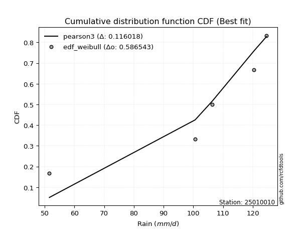</img>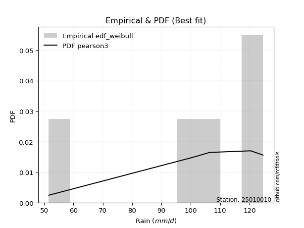</img>

</div>


### 4. EDF Beard (1943)

The Beard formula (or Beard´s plotting position formula) in hydrology is used to estimate the empirical non-exceedance probability _(P)_ of a flood event (or other extreme hydrological data point) within a given dataset.

<div align="center">


$P=(m-0.31)/(n+0.38)$


</div>


**4.1. Empirical values**

<div align="center">

|                | 0                   | 1                  | 2         | 3                  | 4                  |
|:---------------|:--------------------|:-------------------|:----------|:-------------------|:-------------------|
| date           | 2023                | 2021               | 2024      | 2025               | 2022               |
| x              | 51.6                | 100.6              | 106.4     | 120.4              | 124.6              |
| m              | 1                   | 2                  | 3         | 4                  | 5                  |
| empirical_dist | edf_beard           | edf_beard          | edf_beard | edf_beard          | edf_beard          |
| empirical      | 0.12825278810408922 | 0.3141263940520446 | 0.5       | 0.6858736059479554 | 0.8717472118959109 |
| empirical_tr   | 1.1471215351812367  | 1.4579945799457996 | 2.0       | 3.183431952662722  | 7.797101449275368  |

</div>


**4.2. Kolmogorov-Smirnov fit test (sorted by Δ)**


<div align="center">

|                | 0                   | 1                   | 2                   | 3                   | 4                   | 5                   | 6                   | 7                  | 8                   | 9                   | 10                  | 11                 | 12                 | 13                 | 14                  | 15                  | 16                  | 17                  | 18                  | 19                  | 20                  | 21                  | 22                  | 23                  | 24                  | 25                 | 26                 | 27                 | 28                  | 29                  | 30                 | 31                  | 32                  | 33                  | 34                  | 35                  | 36                 | 37                  | 38                  | 39                 | 40                  | 41                  | 42                  | 43                  | 44                  | 45                 | 46                 | 47                  | 48                 | 49                  | 50                  | 51                  | 52                 | 53                  | 54                  | 55                 | 56                  | 57                  | 58                  | 59                  | 60                  | 61                  | 62                  | 63                  | 64                  | 65                  | 66                  | 67                  | 68                  | 69                  | 70                 | 71                  | 72                  | 73                  | 74                 | 75                  | 76                 | 77                  | 78                  | 79                  | 80                  | 81                  | 82                  | 83                 | 84                  | 85                 | 86                 | 87                  | 88                 | 89                  | 90                  | 91                  | 92                 | 93                 | 94                  | 95                  | 96                 | 97                 | 98                 | 99                 | 100                | 101                | 102                | 103                | 104                | 105                 | 106                 | 107                 | 108                | 109                | 110                 | 111                | 112                | 113                | 114                | 115                 | 116                 | 117                 | 118                 | 119                | 120                 | 121                | 122                 | 123                | 124                | 125                | 126                | 127                 | 128                | 129                | 130                | 131                | 132                | 133                | 134                | 135                 | 136                | 137                | 138                 | 139                | 140                | 141                | 142                | 143                 | 144                | 145                | 146                | 147                | 148                | 149                | 150                | 151                | 152                | 153                | 154                | 155                | 156                | 157                | 158                | 159                |
|:---------------|:--------------------|:--------------------|:--------------------|:--------------------|:--------------------|:--------------------|:--------------------|:-------------------|:--------------------|:--------------------|:--------------------|:-------------------|:-------------------|:-------------------|:--------------------|:--------------------|:--------------------|:--------------------|:--------------------|:--------------------|:--------------------|:--------------------|:--------------------|:--------------------|:--------------------|:-------------------|:-------------------|:-------------------|:--------------------|:--------------------|:-------------------|:--------------------|:--------------------|:--------------------|:--------------------|:--------------------|:-------------------|:--------------------|:--------------------|:-------------------|:--------------------|:--------------------|:--------------------|:--------------------|:--------------------|:-------------------|:-------------------|:--------------------|:-------------------|:--------------------|:--------------------|:--------------------|:-------------------|:--------------------|:--------------------|:-------------------|:--------------------|:--------------------|:--------------------|:--------------------|:--------------------|:--------------------|:--------------------|:--------------------|:--------------------|:--------------------|:--------------------|:--------------------|:--------------------|:--------------------|:-------------------|:--------------------|:--------------------|:--------------------|:-------------------|:--------------------|:-------------------|:--------------------|:--------------------|:--------------------|:--------------------|:--------------------|:--------------------|:-------------------|:--------------------|:-------------------|:-------------------|:--------------------|:-------------------|:--------------------|:--------------------|:--------------------|:-------------------|:-------------------|:--------------------|:--------------------|:-------------------|:-------------------|:-------------------|:-------------------|:-------------------|:-------------------|:-------------------|:-------------------|:-------------------|:--------------------|:--------------------|:--------------------|:-------------------|:-------------------|:--------------------|:-------------------|:-------------------|:-------------------|:-------------------|:--------------------|:--------------------|:--------------------|:--------------------|:-------------------|:--------------------|:-------------------|:--------------------|:-------------------|:-------------------|:-------------------|:-------------------|:--------------------|:-------------------|:-------------------|:-------------------|:-------------------|:-------------------|:-------------------|:-------------------|:--------------------|:-------------------|:-------------------|:--------------------|:-------------------|:-------------------|:-------------------|:-------------------|:--------------------|:-------------------|:-------------------|:-------------------|:-------------------|:-------------------|:-------------------|:-------------------|:-------------------|:-------------------|:-------------------|:-------------------|:-------------------|:-------------------|:-------------------|:-------------------|:-------------------|
| station        | 25010010            | 25010010            | 25010010            | 25010010            | 25010010            | 25010010            | 25010010            | 25010010           | 25010010            | 25010010            | 25010010            | 25010010           | 25010010           | 25010010           | 25010010            | 25010010            | 25010010            | 25010010            | 25010010            | 25010010            | 25010010            | 25010010            | 25010010            | 25010010            | 25010010            | 25010010           | 25010010           | 25010010           | 25010010            | 25010010            | 25010010           | 25010010            | 25010010            | 25010010            | 25010010            | 25010010            | 25010010           | 25010010            | 25010010            | 25010010           | 25010010            | 25010010            | 25010010            | 25010010            | 25010010            | 25010010           | 25010010           | 25010010            | 25010010           | 25010010            | 25010010            | 25010010            | 25010010           | 25010010            | 25010010            | 25010010           | 25010010            | 25010010            | 25010010            | 25010010            | 25010010            | 25010010            | 25010010            | 25010010            | 25010010            | 25010010            | 25010010            | 25010010            | 25010010            | 25010010            | 25010010           | 25010010            | 25010010            | 25010010            | 25010010           | 25010010            | 25010010           | 25010010            | 25010010            | 25010010            | 25010010            | 25010010            | 25010010            | 25010010           | 25010010            | 25010010           | 25010010           | 25010010            | 25010010           | 25010010            | 25010010            | 25010010            | 25010010           | 25010010           | 25010010            | 25010010            | 25010010           | 25010010           | 25010010           | 25010010           | 25010010           | 25010010           | 25010010           | 25010010           | 25010010           | 25010010            | 25010010            | 25010010            | 25010010           | 25010010           | 25010010            | 25010010           | 25010010           | 25010010           | 25010010           | 25010010            | 25010010            | 25010010            | 25010010            | 25010010           | 25010010            | 25010010           | 25010010            | 25010010           | 25010010           | 25010010           | 25010010           | 25010010            | 25010010           | 25010010           | 25010010           | 25010010           | 25010010           | 25010010           | 25010010           | 25010010            | 25010010           | 25010010           | 25010010            | 25010010           | 25010010           | 25010010           | 25010010           | 25010010            | 25010010           | 25010010           | 25010010           | 25010010           | 25010010           | 25010010           | 25010010           | 25010010           | 25010010           | 25010010           | 25010010           | 25010010           | 25010010           | 25010010           | 25010010           | 25010010           |
| empirical_dist | edf_beard           | edf_beard           | edf_beard           | edf_beard           | edf_beard           | edf_beard           | edf_beard           | edf_beard          | edf_beard           | edf_beard           | edf_beard           | edf_beard          | edf_beard          | edf_beard          | edf_beard           | edf_beard           | edf_beard           | edf_beard           | edf_beard           | edf_beard           | edf_beard           | edf_beard           | edf_beard           | edf_beard           | edf_beard           | edf_beard          | edf_beard          | edf_beard          | edf_beard           | edf_beard           | edf_beard          | edf_beard           | edf_beard           | edf_beard           | edf_beard           | edf_beard           | edf_beard          | edf_beard           | edf_beard           | edf_beard          | edf_beard           | edf_beard           | edf_beard           | edf_beard           | edf_beard           | edf_beard          | edf_beard          | edf_beard           | edf_beard          | edf_beard           | edf_beard           | edf_beard           | edf_beard          | edf_beard           | edf_beard           | edf_beard          | edf_beard           | edf_beard           | edf_beard           | edf_beard           | edf_beard           | edf_beard           | edf_beard           | edf_beard           | edf_beard           | edf_beard           | edf_beard           | edf_beard           | edf_beard           | edf_beard           | edf_beard          | edf_beard           | edf_beard           | edf_beard           | edf_beard          | edf_beard           | edf_beard          | edf_beard           | edf_beard           | edf_beard           | edf_beard           | edf_beard           | edf_beard           | edf_beard          | edf_beard           | edf_beard          | edf_beard          | edf_beard           | edf_beard          | edf_beard           | edf_beard           | edf_beard           | edf_beard          | edf_beard          | edf_beard           | edf_beard           | edf_beard          | edf_beard          | edf_beard          | edf_beard          | edf_beard          | edf_beard          | edf_beard          | edf_beard          | edf_beard          | edf_beard           | edf_beard           | edf_beard           | edf_beard          | edf_beard          | edf_beard           | edf_beard          | edf_beard          | edf_beard          | edf_beard          | edf_beard           | edf_beard           | edf_beard           | edf_beard           | edf_beard          | edf_beard           | edf_beard          | edf_beard           | edf_beard          | edf_beard          | edf_beard          | edf_beard          | edf_beard           | edf_beard          | edf_beard          | edf_beard          | edf_beard          | edf_beard          | edf_beard          | edf_beard          | edf_beard           | edf_beard          | edf_beard          | edf_beard           | edf_beard          | edf_beard          | edf_beard          | edf_beard          | edf_beard           | edf_beard          | edf_beard          | edf_beard          | edf_beard          | edf_beard          | edf_beard          | edf_beard          | edf_beard          | edf_beard          | edf_beard          | edf_beard          | edf_beard          | edf_beard          | edf_beard          | edf_beard          | edf_beard          |
| p_dist         | dweibull            | dgamma              | pearson3            | gumbel_l            | weibull_min         | logloglaplace       | logvonmises_line    | vonmises_line      | genextreme          | loggenextreme       | trapezoid           | loggennorm         | gennorm            | logweibull_min     | logdweibull         | logexponpow         | levy_l              | loglevy_l           | burr                | argus               | logexponweib        | logburr12           | genpareto           | beta                | logpearson3         | weibull_max        | loggompertz        | logdgamma          | logloggamma         | logargus            | johnsonsb          | loggumbel_l         | logtrapezoid        | logmielke           | laplace             | hypsecant           | logistic           | exponnorm           | crystalball         | norm               | t                   | nct                 | anglit              | semicircular        | arcsine             | f                  | logburr            | mielke              | invgamma           | logjohnsonsb        | gamma               | genhalflogistic     | rice               | loginvweibull       | erlang              | kappa3             | alpha               | logarcsine          | maxwell             | wrapcauchy          | loggenhalflogistic  | skewnorm            | logweibull_max      | betaprime           | ncf                 | rayleigh            | logsemicircular     | loganglit           | logf                | logt                | logcrystalball     | lognorm             | logexponnorm        | logfatiguelife      | invgauss           | logncf              | cosine             | logbetaprime        | lognct              | triang              | logrice             | logalpha            | loglogistic         | loginvgamma        | loghypsecant        | gausshyper         | gumbel_r           | halfnorm            | kstwobign          | loginvgauss         | logmaxwell          | logbeta             | loglaplace         | loglaplace         | loggausshyper       | lograyleigh         | moyal              | halflogistic       | logwrapcauchy      | logskewnorm        | logkstwobign       | logcosine          | loggenexpon        | loghalfnorm        | logfoldnorm        | loggumbel_r         | truncnorm           | lognakagami         | logtruncnorm       | nakagami           | logtukeylambda      | genexpon           | logtriang          | ksone              | loghalflogistic    | logmoyal            | loggenpareto        | burr12              | halfgennorm         | wald               | uniform             | kappa4             | lomax               | foldnorm           | loggamma           | loggamma           | exponweib          | logerlang           | logksone           | logwald            | gompertz           | truncweibull_min   | logkappa4          | bradford           | truncexpon         | invweibull          | logkappa3          | loguniform         | logjohnsonsu        | logbradford        | logtruncexpon      | fatiguelife        | loggengamma        | logtruncweibull_min | gengamma           | logrdist           | loglomax           | johnsonsu          | powerlaw           | exponpow           | truncpareto        | logpowerlaw        | logtruncpareto     | rdist              | genlogistic        | loggenlogistic     | loghalfgennorm     | tukeylambda        | logvonmises        | vonmises           |
| delta          | 0.08409685568133289 | 0.10364506817204888 | 0.11131842011557763 | 0.11361069468844215 | 0.12013634849052146 | 0.12223366675900937 | 0.12825278640635232 | 0.1282527880936066 | 0.12825278810358076 | 0.12825278810381113 | 0.12887357725164944 | 0.1289873042285563 | 0.1292975357045093 | 0.1310994298575831 | 0.13365991083773165 | 0.13498466323942782 | 0.14330405508818034 | 0.14505537220611697 | 0.14784519038122113 | 0.14865807920010177 | 0.15013283191617177 | 0.15073386641201608 | 0.15271333055391567 | 0.15357322714352473 | 0.15496667184673535 | 0.1592324682256797 | 0.1658151968576747 | 0.166158371300131  | 0.16806475403724686 | 0.16822918055180713 | 0.1688675718767224 | 0.17315519389125306 | 0.17392307078451075 | 0.18097370625709186 | 0.18263145356561677 | 0.18357361294894725 | 0.1837877369781295 | 0.18403710695163433 | 0.18403846557204795 | 0.1840384675472344 | 0.18405817623455495 | 0.18407455010832996 | 0.18430116464617935 | 0.18440937347815894 | 0.18483821960088198 | 0.1866304356982576 | 0.188877724983469  | 0.18915868158282012 | 0.1892237860388734 | 0.18945290089284336 | 0.19295941271193334 | 0.19298590926148262 | 0.1933594133699616 | 0.19573074784912387 | 0.20246671857435922 | 0.2050589863516009 | 0.21186240652907823 | 0.21642004802753628 | 0.21716098901668607 | 0.21792408876374642 | 0.21871902006468907 | 0.21959561559702312 | 0.22315121308905167 | 0.22684417161704334 | 0.22723099846342582 | 0.22821220215494648 | 0.22897298965726204 | 0.23212736618777968 | 0.23725588524729996 | 0.23969465129293582 | 0.2397669486592156 | 0.23976708204090685 | 0.23976755332783367 | 0.24044956324931105 | 0.2407935843602918 | 0.24117693493964693 | 0.241339147785871  | 0.24207529790396648 | 0.24334020083237867 | 0.24408269747757544 | 0.24622386131228807 | 0.24687669179801403 | 0.24701062820112302 | 0.2511788019693178 | 0.25311996246131657 | 0.2542440783453754 | 0.254357809770914  | 0.25932500747993464 | 0.2597184337877278 | 0.26258213590575147 | 0.26989789327152863 | 0.27164248229756804 | 0.2730683813788088 | 0.2730683813788088 | 0.27576039450469697 | 0.27954554301710727 | 0.2802163636228266 | 0.2841491110451146 | 0.2862164948453714 | 0.2894687840885562 | 0.2977257837740767 | 0.3005023441902683 | 0.3032611383820292 | 0.3067788460049001 | 0.3070023330368284 | 0.30969499961007513 | 0.31402931471608925 | 0.31408017923995424 | 0.3141237661283369 | 0.3141257687362886 | 0.31412639217589206 | 0.3166450332973774 | 0.3276800733957101 | 0.328567669874896  | 0.3341895286515992 | 0.33440343076826723 | 0.33655456668304046 | 0.34287418720252855 | 0.34570609742769404 | 0.3521341486465643 | 0.35710648266028405 | 0.3602520689524427 | 0.37698537697540324 | 0.3891524307424803 | 0.3898548405146978 | 0.3898548405146978 | 0.3920676304853283 | 0.39623947671660337 | 0.4002948100396338 | 0.4029680957034974 | 0.4071219719412365 | 0.4216886701179721 | 0.4296141904999408 | 0.4308849545217483 | 0.4372373404195569 | 0.44073063581041694 | 0.4421515010664469 | 0.4431790508579693 | 0.44608408592489784 | 0.5021541712147484 | 0.5232935589813268 | 0.5372198753014523 | 0.537282466720725  | 0.5588905820231163  | 0.5678494762399207 | 0.5694357365436843 | 0.5772198121306682 | 0.580233098676764  | 0.6342610681890253 | 0.6371072555854216 | 0.6451297751627849 | 0.647729204427901  | 0.6573361891037783 | 0.6858736059479553 | 0.6858736059479554 | 0.6858736059479554 | 0.6858736059479554 | 0.8709237665627497 | 1.2313426421531453 | 19.215637806451525 |
| deltao         | 0.5865427407550001  | 0.5865427407550001  | 0.5865427407550001  | 0.5865427407550001  | 0.5865427407550001  | 0.5865427407550001  | 0.5865427407550001  | 0.5865427407550001 | 0.5865427407550001  | 0.5865427407550001  | 0.5865427407550001  | 0.5865427407550001 | 0.5865427407550001 | 0.5865427407550001 | 0.5865427407550001  | 0.5865427407550001  | 0.5865427407550001  | 0.5865427407550001  | 0.5865427407550001  | 0.5865427407550001  | 0.5865427407550001  | 0.5865427407550001  | 0.5865427407550001  | 0.5865427407550001  | 0.5865427407550001  | 0.5865427407550001 | 0.5865427407550001 | 0.5865427407550001 | 0.5865427407550001  | 0.5865427407550001  | 0.5865427407550001 | 0.5865427407550001  | 0.5865427407550001  | 0.5865427407550001  | 0.5865427407550001  | 0.5865427407550001  | 0.5865427407550001 | 0.5865427407550001  | 0.5865427407550001  | 0.5865427407550001 | 0.5865427407550001  | 0.5865427407550001  | 0.5865427407550001  | 0.5865427407550001  | 0.5865427407550001  | 0.5865427407550001 | 0.5865427407550001 | 0.5865427407550001  | 0.5865427407550001 | 0.5865427407550001  | 0.5865427407550001  | 0.5865427407550001  | 0.5865427407550001 | 0.5865427407550001  | 0.5865427407550001  | 0.5865427407550001 | 0.5865427407550001  | 0.5865427407550001  | 0.5865427407550001  | 0.5865427407550001  | 0.5865427407550001  | 0.5865427407550001  | 0.5865427407550001  | 0.5865427407550001  | 0.5865427407550001  | 0.5865427407550001  | 0.5865427407550001  | 0.5865427407550001  | 0.5865427407550001  | 0.5865427407550001  | 0.5865427407550001 | 0.5865427407550001  | 0.5865427407550001  | 0.5865427407550001  | 0.5865427407550001 | 0.5865427407550001  | 0.5865427407550001 | 0.5865427407550001  | 0.5865427407550001  | 0.5865427407550001  | 0.5865427407550001  | 0.5865427407550001  | 0.5865427407550001  | 0.5865427407550001 | 0.5865427407550001  | 0.5865427407550001 | 0.5865427407550001 | 0.5865427407550001  | 0.5865427407550001 | 0.5865427407550001  | 0.5865427407550001  | 0.5865427407550001  | 0.5865427407550001 | 0.5865427407550001 | 0.5865427407550001  | 0.5865427407550001  | 0.5865427407550001 | 0.5865427407550001 | 0.5865427407550001 | 0.5865427407550001 | 0.5865427407550001 | 0.5865427407550001 | 0.5865427407550001 | 0.5865427407550001 | 0.5865427407550001 | 0.5865427407550001  | 0.5865427407550001  | 0.5865427407550001  | 0.5865427407550001 | 0.5865427407550001 | 0.5865427407550001  | 0.5865427407550001 | 0.5865427407550001 | 0.5865427407550001 | 0.5865427407550001 | 0.5865427407550001  | 0.5865427407550001  | 0.5865427407550001  | 0.5865427407550001  | 0.5865427407550001 | 0.5865427407550001  | 0.5865427407550001 | 0.5865427407550001  | 0.5865427407550001 | 0.5865427407550001 | 0.5865427407550001 | 0.5865427407550001 | 0.5865427407550001  | 0.5865427407550001 | 0.5865427407550001 | 0.5865427407550001 | 0.5865427407550001 | 0.5865427407550001 | 0.5865427407550001 | 0.5865427407550001 | 0.5865427407550001  | 0.5865427407550001 | 0.5865427407550001 | 0.5865427407550001  | 0.5865427407550001 | 0.5865427407550001 | 0.5865427407550001 | 0.5865427407550001 | 0.5865427407550001  | 0.5865427407550001 | 0.5865427407550001 | 0.5865427407550001 | 0.5865427407550001 | 0.5865427407550001 | 0.5865427407550001 | 0.5865427407550001 | 0.5865427407550001 | 0.5865427407550001 | 0.5865427407550001 | 0.5865427407550001 | 0.5865427407550001 | 0.5865427407550001 | 0.5865427407550001 | 0.5865427407550001 | 0.5865427407550001 |
| eval           | Δo > Δ              | Δo > Δ              | Δo > Δ              | Δo > Δ              | Δo > Δ              | Δo > Δ              | Δo > Δ              | Δo > Δ             | Δo > Δ              | Δo > Δ              | Δo > Δ              | Δo > Δ             | Δo > Δ             | Δo > Δ             | Δo > Δ              | Δo > Δ              | Δo > Δ              | Δo > Δ              | Δo > Δ              | Δo > Δ              | Δo > Δ              | Δo > Δ              | Δo > Δ              | Δo > Δ              | Δo > Δ              | Δo > Δ             | Δo > Δ             | Δo > Δ             | Δo > Δ              | Δo > Δ              | Δo > Δ             | Δo > Δ              | Δo > Δ              | Δo > Δ              | Δo > Δ              | Δo > Δ              | Δo > Δ             | Δo > Δ              | Δo > Δ              | Δo > Δ             | Δo > Δ              | Δo > Δ              | Δo > Δ              | Δo > Δ              | Δo > Δ              | Δo > Δ             | Δo > Δ             | Δo > Δ              | Δo > Δ             | Δo > Δ              | Δo > Δ              | Δo > Δ              | Δo > Δ             | Δo > Δ              | Δo > Δ              | Δo > Δ             | Δo > Δ              | Δo > Δ              | Δo > Δ              | Δo > Δ              | Δo > Δ              | Δo > Δ              | Δo > Δ              | Δo > Δ              | Δo > Δ              | Δo > Δ              | Δo > Δ              | Δo > Δ              | Δo > Δ              | Δo > Δ              | Δo > Δ             | Δo > Δ              | Δo > Δ              | Δo > Δ              | Δo > Δ             | Δo > Δ              | Δo > Δ             | Δo > Δ              | Δo > Δ              | Δo > Δ              | Δo > Δ              | Δo > Δ              | Δo > Δ              | Δo > Δ             | Δo > Δ              | Δo > Δ             | Δo > Δ             | Δo > Δ              | Δo > Δ             | Δo > Δ              | Δo > Δ              | Δo > Δ              | Δo > Δ             | Δo > Δ             | Δo > Δ              | Δo > Δ              | Δo > Δ             | Δo > Δ             | Δo > Δ             | Δo > Δ             | Δo > Δ             | Δo > Δ             | Δo > Δ             | Δo > Δ             | Δo > Δ             | Δo > Δ              | Δo > Δ              | Δo > Δ              | Δo > Δ             | Δo > Δ             | Δo > Δ              | Δo > Δ             | Δo > Δ             | Δo > Δ             | Δo > Δ             | Δo > Δ              | Δo > Δ              | Δo > Δ              | Δo > Δ              | Δo > Δ             | Δo > Δ              | Δo > Δ             | Δo > Δ              | Δo > Δ             | Δo > Δ             | Δo > Δ             | Δo > Δ             | Δo > Δ              | Δo > Δ             | Δo > Δ             | Δo > Δ             | Δo > Δ             | Δo > Δ             | Δo > Δ             | Δo > Δ             | Δo > Δ              | Δo > Δ             | Δo > Δ             | Δo > Δ              | Δo > Δ             | Δo > Δ             | Δo > Δ             | Δo > Δ             | Δo > Δ              | Δo > Δ             | Δo > Δ             | Δo > Δ             | Δo > Δ             | Δo <= Δ            | Δo <= Δ            | Δo <= Δ            | Δo <= Δ            | Δo <= Δ            | Δo <= Δ            | Δo <= Δ            | Δo <= Δ            | Δo <= Δ            | Δo <= Δ            | Δo <= Δ            | Δo <= Δ            |
| fit            | 1                   | 1                   | 1                   | 1                   | 1                   | 1                   | 1                   | 1                  | 1                   | 1                   | 1                   | 1                  | 1                  | 1                  | 1                   | 1                   | 1                   | 1                   | 1                   | 1                   | 1                   | 1                   | 1                   | 1                   | 1                   | 1                  | 1                  | 1                  | 1                   | 1                   | 1                  | 1                   | 1                   | 1                   | 1                   | 1                   | 1                  | 1                   | 1                   | 1                  | 1                   | 1                   | 1                   | 1                   | 1                   | 1                  | 1                  | 1                   | 1                  | 1                   | 1                   | 1                   | 1                  | 1                   | 1                   | 1                  | 1                   | 1                   | 1                   | 1                   | 1                   | 1                   | 1                   | 1                   | 1                   | 1                   | 1                   | 1                   | 1                   | 1                   | 1                  | 1                   | 1                   | 1                   | 1                  | 1                   | 1                  | 1                   | 1                   | 1                   | 1                   | 1                   | 1                   | 1                  | 1                   | 1                  | 1                  | 1                   | 1                  | 1                   | 1                   | 1                   | 1                  | 1                  | 1                   | 1                   | 1                  | 1                  | 1                  | 1                  | 1                  | 1                  | 1                  | 1                  | 1                  | 1                   | 1                   | 1                   | 1                  | 1                  | 1                   | 1                  | 1                  | 1                  | 1                  | 1                   | 1                   | 1                   | 1                   | 1                  | 1                   | 1                  | 1                   | 1                  | 1                  | 1                  | 1                  | 1                   | 1                  | 1                  | 1                  | 1                  | 1                  | 1                  | 1                  | 1                   | 1                  | 1                  | 1                   | 1                  | 1                  | 1                  | 1                  | 1                   | 1                  | 1                  | 1                  | 1                  | 0                  | 0                  | 0                  | 0                  | 0                  | 0                  | 0                  | 0                  | 0                  | 0                  | 0                  | 0                  |
| n              | 5                   | 5                   | 5                   | 5                   | 5                   | 5                   | 5                   | 5                  | 5                   | 5                   | 5                   | 5                  | 5                  | 5                  | 5                   | 5                   | 5                   | 5                   | 5                   | 5                   | 5                   | 5                   | 5                   | 5                   | 5                   | 5                  | 5                  | 5                  | 5                   | 5                   | 5                  | 5                   | 5                   | 5                   | 5                   | 5                   | 5                  | 5                   | 5                   | 5                  | 5                   | 5                   | 5                   | 5                   | 5                   | 5                  | 5                  | 5                   | 5                  | 5                   | 5                   | 5                   | 5                  | 5                   | 5                   | 5                  | 5                   | 5                   | 5                   | 5                   | 5                   | 5                   | 5                   | 5                   | 5                   | 5                   | 5                   | 5                   | 5                   | 5                   | 5                  | 5                   | 5                   | 5                   | 5                  | 5                   | 5                  | 5                   | 5                   | 5                   | 5                   | 5                   | 5                   | 5                  | 5                   | 5                  | 5                  | 5                   | 5                  | 5                   | 5                   | 5                   | 5                  | 5                  | 5                   | 5                   | 5                  | 5                  | 5                  | 5                  | 5                  | 5                  | 5                  | 5                  | 5                  | 5                   | 5                   | 5                   | 5                  | 5                  | 5                   | 5                  | 5                  | 5                  | 5                  | 5                   | 5                   | 5                   | 5                   | 5                  | 5                   | 5                  | 5                   | 5                  | 5                  | 5                  | 5                  | 5                   | 5                  | 5                  | 5                  | 5                  | 5                  | 5                  | 5                  | 5                   | 5                  | 5                  | 5                   | 5                  | 5                  | 5                  | 5                  | 5                   | 5                  | 5                  | 5                  | 5                  | 5                  | 5                  | 5                  | 5                  | 5                  | 5                  | 5                  | 5                  | 5                  | 5                  | 5                  | 5                  |
| best_fit       | 1                   | 0                   | 0                   | 0                   | 0                   | 0                   | 0                   | 0                  | 0                   | 0                   | 0                   | 0                  | 0                  | 0                  | 0                   | 0                   | 0                   | 0                   | 0                   | 0                   | 0                   | 0                   | 0                   | 0                   | 0                   | 0                  | 0                  | 0                  | 0                   | 0                   | 0                  | 0                   | 0                   | 0                   | 0                   | 0                   | 0                  | 0                   | 0                   | 0                  | 0                   | 0                   | 0                   | 0                   | 0                   | 0                  | 0                  | 0                   | 0                  | 0                   | 0                   | 0                   | 0                  | 0                   | 0                   | 0                  | 0                   | 0                   | 0                   | 0                   | 0                   | 0                   | 0                   | 0                   | 0                   | 0                   | 0                   | 0                   | 0                   | 0                   | 0                  | 0                   | 0                   | 0                   | 0                  | 0                   | 0                  | 0                   | 0                   | 0                   | 0                   | 0                   | 0                   | 0                  | 0                   | 0                  | 0                  | 0                   | 0                  | 0                   | 0                   | 0                   | 0                  | 0                  | 0                   | 0                   | 0                  | 0                  | 0                  | 0                  | 0                  | 0                  | 0                  | 0                  | 0                  | 0                   | 0                   | 0                   | 0                  | 0                  | 0                   | 0                  | 0                  | 0                  | 0                  | 0                   | 0                   | 0                   | 0                   | 0                  | 0                   | 0                  | 0                   | 0                  | 0                  | 0                  | 0                  | 0                   | 0                  | 0                  | 0                  | 0                  | 0                  | 0                  | 0                  | 0                   | 0                  | 0                  | 0                   | 0                  | 0                  | 0                  | 0                  | 0                   | 0                  | 0                  | 0                  | 0                  | 0                  | 0                  | 0                  | 0                  | 0                  | 0                  | 0                  | 0                  | 0                  | 0                  | 0                  | 0                  |
| best_fit_sort  | 1                   | 2                   | 3                   | 4                   | 5                   | 6                   | 7                   | 8                  | 9                   | 10                  | 11                  | 12                 | 13                 | 14                 | 15                  | 16                  | 17                  | 18                  | 19                  | 20                  | 21                  | 22                  | 23                  | 24                  | 25                  | 26                 | 27                 | 28                 | 29                  | 30                  | 31                 | 32                  | 33                  | 34                  | 35                  | 36                  | 37                 | 38                  | 39                  | 40                 | 41                  | 42                  | 43                  | 44                  | 45                  | 46                 | 47                 | 48                  | 49                 | 50                  | 51                  | 52                  | 53                 | 54                  | 55                  | 56                 | 57                  | 58                  | 59                  | 60                  | 61                  | 62                  | 63                  | 64                  | 65                  | 66                  | 67                  | 68                  | 69                  | 70                  | 71                 | 72                  | 73                  | 74                  | 75                 | 76                  | 77                 | 78                  | 79                  | 80                  | 81                  | 82                  | 83                  | 84                 | 85                  | 86                 | 87                 | 88                  | 89                 | 90                  | 91                  | 92                  | 93                 | 94                 | 95                  | 96                  | 97                 | 98                 | 99                 | 100                | 101                | 102                | 103                | 104                | 105                | 106                 | 107                 | 108                 | 109                | 110                | 111                 | 112                | 113                | 114                | 115                | 116                 | 117                 | 118                 | 119                 | 120                | 121                 | 122                | 123                 | 124                | 125                | 126                | 127                | 128                 | 129                | 130                | 131                | 132                | 133                | 134                | 135                | 136                 | 137                | 138                | 139                 | 140                | 141                | 142                | 143                | 144                 | 145                | 146                | 147                | 148                | 149                | 150                | 151                | 152                | 153                | 154                | 155                | 156                | 157                | 158                | 159                | 160                |

</div>


**4.3. Best fit**

<div align="center">

|   id |   station | empirical_dist   | p_dist   |     delta |   deltao | eval   |   fit |   n |   best_fit |   best_fit_sort |
|-----:|----------:|:-----------------|:---------|----------:|---------:|:-------|------:|----:|-----------:|----------------:|
|    0 |  25010010 | edf_beard        | dweibull | 0.0840969 | 0.586543 | Δo > Δ |     1 |   5 |          1 |               1 |

</div>


<div align="center">

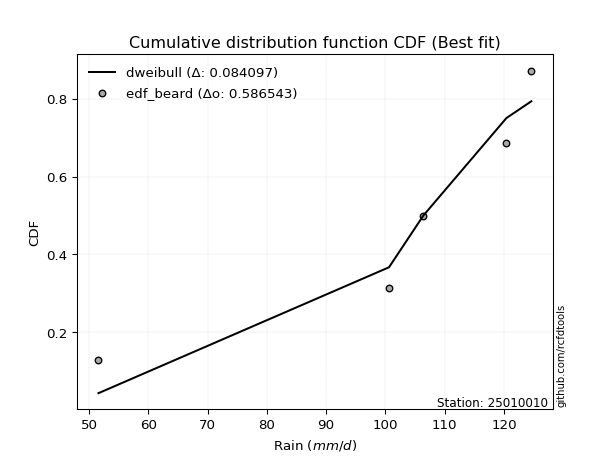</img>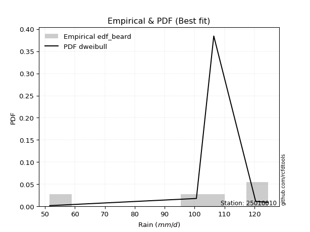</img>

</div>


### 5. EDF Chegodayev (1955)

The Chegodayev formula is an empirical plotting position formula used in hydrological frequency analysis to estimate the exceedance probability or return period of a specific event from a set of observed data. It is primarily used for plotting observed data points on probability paper to fit a theoretical distribution, particularly for analyzing extreme events like maximum flood flows or rainfall intensities. The constant _b_ value in the generalized plotting position formula is 0.3.

<div align="center">


$P=(m-b)/(n+1-2b)$


</div>


**5.1. Empirical values**

<div align="center">

|                | 0                   | 1                   | 2              | 3                  | 4                  |
|:---------------|:--------------------|:--------------------|:---------------|:-------------------|:-------------------|
| date           | 2023                | 2021                | 2024           | 2025               | 2022               |
| x              | 51.6                | 100.6               | 106.4          | 120.4              | 124.6              |
| m              | 1                   | 2                   | 3              | 4                  | 5                  |
| empirical_dist | edf_chegodayev      | edf_chegodayev      | edf_chegodayev | edf_chegodayev     | edf_chegodayev     |
| empirical      | 0.12962962962962962 | 0.31481481481481477 | 0.5            | 0.6851851851851851 | 0.8703703703703703 |
| empirical_tr   | 1.148936170212766   | 1.4594594594594594  | 2.0            | 3.1764705882352935 | 7.714285714285713  |

</div>


**5.2. Kolmogorov-Smirnov fit test (sorted by Δ)**


<div align="center">

|                | 0                  | 1                   | 2                   | 3                  | 4                   | 5                   | 6                  | 7                  | 8                   | 9                  | 10                  | 11                  | 12                  | 13                  | 14                  | 15                  | 16                  | 17                  | 18                  | 19                  | 20                  | 21                  | 22                  | 23                 | 24                 | 25                  | 26                  | 27                  | 28                 | 29                  | 30                  | 31                 | 32                 | 33                  | 34                  | 35                 | 36                  | 37                  | 38                 | 39                  | 40                 | 41                 | 42                 | 43                 | 44                  | 45                  | 46                  | 47                  | 48                 | 49                  | 50                 | 51                  | 52                  | 53                  | 54                  | 55                 | 56                  | 57                  | 58                  | 59                  | 60                  | 61                  | 62                  | 63                 | 64                  | 65                  | 66                 | 67                  | 68                 | 69                  | 70                  | 71                 | 72                  | 73                 | 74                  | 75                  | 76                  | 77                  | 78                  | 79                 | 80                  | 81                  | 82                  | 83                  | 84                 | 85                  | 86                  | 87                 | 88                  | 89                 | 90                 | 91                  | 92                  | 93                  | 94                 | 95                 | 96                  | 97                  | 98                 | 99                  | 100                 | 101                 | 102                | 103                | 104                 | 105                | 106                | 107                | 108                 | 109                 | 110                | 111                | 112                 | 113                 | 114                 | 115                | 116                | 117                | 118                | 119                 | 120                | 121                 | 122                | 123                | 124                | 125                | 126                 | 127                | 128                 | 129                 | 130                | 131                 | 132                 | 133                 | 134                 | 135                | 136                 | 137                | 138                 | 139                | 140                | 141                | 142                | 143                 | 144                | 145                | 146                | 147                | 148                | 149                | 150                | 151                | 152                | 153                | 154                | 155                | 156                | 157                | 158                | 159                |
|:---------------|:-------------------|:--------------------|:--------------------|:-------------------|:--------------------|:--------------------|:-------------------|:-------------------|:--------------------|:-------------------|:--------------------|:--------------------|:--------------------|:--------------------|:--------------------|:--------------------|:--------------------|:--------------------|:--------------------|:--------------------|:--------------------|:--------------------|:--------------------|:-------------------|:-------------------|:--------------------|:--------------------|:--------------------|:-------------------|:--------------------|:--------------------|:-------------------|:-------------------|:--------------------|:--------------------|:-------------------|:--------------------|:--------------------|:-------------------|:--------------------|:-------------------|:-------------------|:-------------------|:-------------------|:--------------------|:--------------------|:--------------------|:--------------------|:-------------------|:--------------------|:-------------------|:--------------------|:--------------------|:--------------------|:--------------------|:-------------------|:--------------------|:--------------------|:--------------------|:--------------------|:--------------------|:--------------------|:--------------------|:-------------------|:--------------------|:--------------------|:-------------------|:--------------------|:-------------------|:--------------------|:--------------------|:-------------------|:--------------------|:-------------------|:--------------------|:--------------------|:--------------------|:--------------------|:--------------------|:-------------------|:--------------------|:--------------------|:--------------------|:--------------------|:-------------------|:--------------------|:--------------------|:-------------------|:--------------------|:-------------------|:-------------------|:--------------------|:--------------------|:--------------------|:-------------------|:-------------------|:--------------------|:--------------------|:-------------------|:--------------------|:--------------------|:--------------------|:-------------------|:-------------------|:--------------------|:-------------------|:-------------------|:-------------------|:--------------------|:--------------------|:-------------------|:-------------------|:--------------------|:--------------------|:--------------------|:-------------------|:-------------------|:-------------------|:-------------------|:--------------------|:-------------------|:--------------------|:-------------------|:-------------------|:-------------------|:-------------------|:--------------------|:-------------------|:--------------------|:--------------------|:-------------------|:--------------------|:--------------------|:--------------------|:--------------------|:-------------------|:--------------------|:-------------------|:--------------------|:-------------------|:-------------------|:-------------------|:-------------------|:--------------------|:-------------------|:-------------------|:-------------------|:-------------------|:-------------------|:-------------------|:-------------------|:-------------------|:-------------------|:-------------------|:-------------------|:-------------------|:-------------------|:-------------------|:-------------------|:-------------------|
| station        | 25010010           | 25010010            | 25010010            | 25010010           | 25010010            | 25010010            | 25010010           | 25010010           | 25010010            | 25010010           | 25010010            | 25010010            | 25010010            | 25010010            | 25010010            | 25010010            | 25010010            | 25010010            | 25010010            | 25010010            | 25010010            | 25010010            | 25010010            | 25010010           | 25010010           | 25010010            | 25010010            | 25010010            | 25010010           | 25010010            | 25010010            | 25010010           | 25010010           | 25010010            | 25010010            | 25010010           | 25010010            | 25010010            | 25010010           | 25010010            | 25010010           | 25010010           | 25010010           | 25010010           | 25010010            | 25010010            | 25010010            | 25010010            | 25010010           | 25010010            | 25010010           | 25010010            | 25010010            | 25010010            | 25010010            | 25010010           | 25010010            | 25010010            | 25010010            | 25010010            | 25010010            | 25010010            | 25010010            | 25010010           | 25010010            | 25010010            | 25010010           | 25010010            | 25010010           | 25010010            | 25010010            | 25010010           | 25010010            | 25010010           | 25010010            | 25010010            | 25010010            | 25010010            | 25010010            | 25010010           | 25010010            | 25010010            | 25010010            | 25010010            | 25010010           | 25010010            | 25010010            | 25010010           | 25010010            | 25010010           | 25010010           | 25010010            | 25010010            | 25010010            | 25010010           | 25010010           | 25010010            | 25010010            | 25010010           | 25010010            | 25010010            | 25010010            | 25010010           | 25010010           | 25010010            | 25010010           | 25010010           | 25010010           | 25010010            | 25010010            | 25010010           | 25010010           | 25010010            | 25010010            | 25010010            | 25010010           | 25010010           | 25010010           | 25010010           | 25010010            | 25010010           | 25010010            | 25010010           | 25010010           | 25010010           | 25010010           | 25010010            | 25010010           | 25010010            | 25010010            | 25010010           | 25010010            | 25010010            | 25010010            | 25010010            | 25010010           | 25010010            | 25010010           | 25010010            | 25010010           | 25010010           | 25010010           | 25010010           | 25010010            | 25010010           | 25010010           | 25010010           | 25010010           | 25010010           | 25010010           | 25010010           | 25010010           | 25010010           | 25010010           | 25010010           | 25010010           | 25010010           | 25010010           | 25010010           | 25010010           |
| empirical_dist | edf_chegodayev     | edf_chegodayev      | edf_chegodayev      | edf_chegodayev     | edf_chegodayev      | edf_chegodayev      | edf_chegodayev     | edf_chegodayev     | edf_chegodayev      | edf_chegodayev     | edf_chegodayev      | edf_chegodayev      | edf_chegodayev      | edf_chegodayev      | edf_chegodayev      | edf_chegodayev      | edf_chegodayev      | edf_chegodayev      | edf_chegodayev      | edf_chegodayev      | edf_chegodayev      | edf_chegodayev      | edf_chegodayev      | edf_chegodayev     | edf_chegodayev     | edf_chegodayev      | edf_chegodayev      | edf_chegodayev      | edf_chegodayev     | edf_chegodayev      | edf_chegodayev      | edf_chegodayev     | edf_chegodayev     | edf_chegodayev      | edf_chegodayev      | edf_chegodayev     | edf_chegodayev      | edf_chegodayev      | edf_chegodayev     | edf_chegodayev      | edf_chegodayev     | edf_chegodayev     | edf_chegodayev     | edf_chegodayev     | edf_chegodayev      | edf_chegodayev      | edf_chegodayev      | edf_chegodayev      | edf_chegodayev     | edf_chegodayev      | edf_chegodayev     | edf_chegodayev      | edf_chegodayev      | edf_chegodayev      | edf_chegodayev      | edf_chegodayev     | edf_chegodayev      | edf_chegodayev      | edf_chegodayev      | edf_chegodayev      | edf_chegodayev      | edf_chegodayev      | edf_chegodayev      | edf_chegodayev     | edf_chegodayev      | edf_chegodayev      | edf_chegodayev     | edf_chegodayev      | edf_chegodayev     | edf_chegodayev      | edf_chegodayev      | edf_chegodayev     | edf_chegodayev      | edf_chegodayev     | edf_chegodayev      | edf_chegodayev      | edf_chegodayev      | edf_chegodayev      | edf_chegodayev      | edf_chegodayev     | edf_chegodayev      | edf_chegodayev      | edf_chegodayev      | edf_chegodayev      | edf_chegodayev     | edf_chegodayev      | edf_chegodayev      | edf_chegodayev     | edf_chegodayev      | edf_chegodayev     | edf_chegodayev     | edf_chegodayev      | edf_chegodayev      | edf_chegodayev      | edf_chegodayev     | edf_chegodayev     | edf_chegodayev      | edf_chegodayev      | edf_chegodayev     | edf_chegodayev      | edf_chegodayev      | edf_chegodayev      | edf_chegodayev     | edf_chegodayev     | edf_chegodayev      | edf_chegodayev     | edf_chegodayev     | edf_chegodayev     | edf_chegodayev      | edf_chegodayev      | edf_chegodayev     | edf_chegodayev     | edf_chegodayev      | edf_chegodayev      | edf_chegodayev      | edf_chegodayev     | edf_chegodayev     | edf_chegodayev     | edf_chegodayev     | edf_chegodayev      | edf_chegodayev     | edf_chegodayev      | edf_chegodayev     | edf_chegodayev     | edf_chegodayev     | edf_chegodayev     | edf_chegodayev      | edf_chegodayev     | edf_chegodayev      | edf_chegodayev      | edf_chegodayev     | edf_chegodayev      | edf_chegodayev      | edf_chegodayev      | edf_chegodayev      | edf_chegodayev     | edf_chegodayev      | edf_chegodayev     | edf_chegodayev      | edf_chegodayev     | edf_chegodayev     | edf_chegodayev     | edf_chegodayev     | edf_chegodayev      | edf_chegodayev     | edf_chegodayev     | edf_chegodayev     | edf_chegodayev     | edf_chegodayev     | edf_chegodayev     | edf_chegodayev     | edf_chegodayev     | edf_chegodayev     | edf_chegodayev     | edf_chegodayev     | edf_chegodayev     | edf_chegodayev     | edf_chegodayev     | edf_chegodayev     | edf_chegodayev     |
| p_dist         | dweibull           | dgamma              | pearson3            | gumbel_l           | weibull_min         | logloglaplace       | loggennorm         | trapezoid          | logvonmises_line    | vonmises_line      | genextreme          | loggenextreme       | gennorm             | logweibull_min      | logdweibull         | logexponpow         | levy_l              | loglevy_l           | burr                | argus               | logburr12           | logexponweib        | genpareto           | beta               | logpearson3        | weibull_max         | loggompertz         | logdgamma           | johnsonsb          | logloggamma         | logargus            | loggumbel_l        | logtrapezoid       | logmielke           | laplace             | hypsecant          | logistic            | exponnorm           | crystalball        | norm                | t                  | nct                | anglit             | semicircular       | arcsine             | f                   | logjohnsonsb        | invgamma            | logburr            | mielke              | gamma              | rice                | genhalflogistic     | loginvweibull       | erlang              | kappa3             | alpha               | logarcsine          | maxwell             | wrapcauchy          | loggenhalflogistic  | skewnorm            | logweibull_max      | betaprime          | ncf                 | rayleigh            | logsemicircular    | loganglit           | logf               | logt                | logcrystalball      | lognorm            | logexponnorm        | logfatiguelife     | invgauss            | logncf              | cosine              | logbetaprime        | lognct              | triang             | logrice             | logalpha            | loglogistic         | loginvgamma         | loghypsecant       | gausshyper          | gumbel_r            | halfnorm           | kstwobign           | loginvgauss        | logmaxwell         | logbeta             | loglaplace          | loglaplace          | loggausshyper      | lograyleigh        | moyal               | halflogistic        | logwrapcauchy      | logskewnorm         | logkstwobign        | logcosine           | loggenexpon        | loghalfnorm        | logfoldnorm         | loggumbel_r        | truncnorm          | lognakagami        | logtruncnorm        | nakagami            | logtukeylambda     | genexpon           | logtriang           | ksone               | loghalflogistic     | logmoyal           | loggenpareto       | burr12             | halfgennorm        | wald                | uniform            | kappa4              | lomax              | foldnorm           | loggamma           | loggamma           | exponweib           | logerlang          | logksone            | logwald             | gompertz           | truncweibull_min    | logkappa4           | bradford            | truncexpon          | invweibull         | logkappa3           | loguniform         | logjohnsonsu        | logbradford        | logtruncexpon      | fatiguelife        | loggengamma        | logtruncweibull_min | gengamma           | logrdist           | loglomax           | johnsonsu          | powerlaw           | exponpow           | truncpareto        | logpowerlaw        | logtruncpareto     | loggenlogistic     | genlogistic        | loghalfgennorm     | rdist              | tukeylambda        | logvonmises        | vonmises           |
| delta          | 0.0854736972068733 | 0.10502190969758929 | 0.11062999935280748 | 0.112922273925672  | 0.12082476925329177 | 0.12085682523346886 | 0.1276104627030158 | 0.1281851564888793 | 0.12962962793189273 | 0.129629629619147  | 0.12962962962912128 | 0.12962962962935165 | 0.12998595646727962 | 0.13041100909481296 | 0.13228306931219114 | 0.13567308400219813 | 0.14330405508818034 | 0.14505537220611697 | 0.14853361114399144 | 0.14934649996287208 | 0.15004544564924593 | 0.15082125267894209 | 0.15202490979114552 | 0.1528848063807544 | 0.1542782510839652 | 0.15992088898845003 | 0.16512677609490456 | 0.16684679206290132 | 0.1681791511139521 | 0.16875317480001717 | 0.16891760131457745 | 0.1724667731284829 | 0.1732346500217406 | 0.18166212701986217 | 0.18194303280284663 | 0.1828851921861771 | 0.18309931621535935 | 0.18334868618886419 | 0.1833500448092778 | 0.18335004678446426 | 0.1833697554717848 | 0.1833861293455598 | 0.1836127438834092 | 0.1837209527153888 | 0.18414979883811183 | 0.18594201493548745 | 0.18807605936730296 | 0.18853536527610326 | 0.1895661457462393 | 0.18984710234559043 | 0.1922709919491632 | 0.19267099260719145 | 0.19367433002425294 | 0.19504232708635372 | 0.20177829781158907 | 0.2036821448260604 | 0.21117398576630808 | 0.21573162726476613 | 0.21647256825391592 | 0.21723566800097627 | 0.21803059930191893 | 0.22028403635979343 | 0.22246279232628152 | 0.2261557508542732 | 0.22654257770065567 | 0.22752378139217633 | 0.2282845688944919 | 0.23143894542500953 | 0.2365674644845298 | 0.23900623053016568 | 0.23907852789644546 | 0.2390786612781367 | 0.23907913256506352 | 0.2397611424865409 | 0.24010516359752165 | 0.24048851417687678 | 0.24065072702310086 | 0.24138687714119633 | 0.24265178006960852 | 0.2433942767148053 | 0.24553544054951792 | 0.24618827103524388 | 0.24632220743835287 | 0.25049038120654765 | 0.2524315416985464 | 0.25355565758260523 | 0.25366938900814384 | 0.2586365867171645 | 0.25903001302495765 | 0.2618937151429813 | 0.2692094725087585 | 0.27095406153479773 | 0.27237996061603864 | 0.27237996061603864 | 0.2750719737419268 | 0.2788571222543371 | 0.27952794286005644 | 0.28346069028234444 | 0.2855280740826013 | 0.28878036332578605 | 0.29703736301130657 | 0.29981392342749813 | 0.3025727176192591 | 0.3060904252421299 | 0.30631391227405824 | 0.309006578847305  | 0.3147177354788594 | 0.3147686000027244 | 0.31481218689110707 | 0.31481418949905876 | 0.3148148129386622 | 0.3159566125346073 | 0.32699165263293994 | 0.32787924911212585 | 0.33350110788882903 | 0.3337150100054971 | 0.3358661459202703 | 0.3421857664397584 | 0.3450176766649239 | 0.35144572788379413 | 0.3564180618975139 | 0.35956364818967257 | 0.3756085354498627 | 0.3891524307424803 | 0.3891664197519277 | 0.3891664197519277 | 0.39137920972255813 | 0.3955510559538332 | 0.39960638927686365 | 0.40227967494072725 | 0.4071219719412365 | 0.42100024935520197 | 0.42892576973717067 | 0.43019653375897815 | 0.43654891965678677 | 0.4393537942848764 | 0.44146308030367676 | 0.4424906300951992 | 0.44539566516212753 | 0.5014657504519782 | 0.5226051382185566 | 0.5365314545386822 | 0.5365940459579548 | 0.5582021612603462  | 0.5671610554771505 | 0.5680588950181438 | 0.5758429706051278 | 0.5795446779139937 | 0.6335726474262552 | 0.6364188348226514 | 0.6444413544000148 | 0.6470407836651308 | 0.6566477683410082 | 0.6851851851851851 | 0.6851851851851851 | 0.6851851851851851 | 0.6851851851851852 | 0.8695469250372093 | 1.2306542213903753 | 19.217014647977066 |
| deltao         | 0.5865427407550001 | 0.5865427407550001  | 0.5865427407550001  | 0.5865427407550001 | 0.5865427407550001  | 0.5865427407550001  | 0.5865427407550001 | 0.5865427407550001 | 0.5865427407550001  | 0.5865427407550001 | 0.5865427407550001  | 0.5865427407550001  | 0.5865427407550001  | 0.5865427407550001  | 0.5865427407550001  | 0.5865427407550001  | 0.5865427407550001  | 0.5865427407550001  | 0.5865427407550001  | 0.5865427407550001  | 0.5865427407550001  | 0.5865427407550001  | 0.5865427407550001  | 0.5865427407550001 | 0.5865427407550001 | 0.5865427407550001  | 0.5865427407550001  | 0.5865427407550001  | 0.5865427407550001 | 0.5865427407550001  | 0.5865427407550001  | 0.5865427407550001 | 0.5865427407550001 | 0.5865427407550001  | 0.5865427407550001  | 0.5865427407550001 | 0.5865427407550001  | 0.5865427407550001  | 0.5865427407550001 | 0.5865427407550001  | 0.5865427407550001 | 0.5865427407550001 | 0.5865427407550001 | 0.5865427407550001 | 0.5865427407550001  | 0.5865427407550001  | 0.5865427407550001  | 0.5865427407550001  | 0.5865427407550001 | 0.5865427407550001  | 0.5865427407550001 | 0.5865427407550001  | 0.5865427407550001  | 0.5865427407550001  | 0.5865427407550001  | 0.5865427407550001 | 0.5865427407550001  | 0.5865427407550001  | 0.5865427407550001  | 0.5865427407550001  | 0.5865427407550001  | 0.5865427407550001  | 0.5865427407550001  | 0.5865427407550001 | 0.5865427407550001  | 0.5865427407550001  | 0.5865427407550001 | 0.5865427407550001  | 0.5865427407550001 | 0.5865427407550001  | 0.5865427407550001  | 0.5865427407550001 | 0.5865427407550001  | 0.5865427407550001 | 0.5865427407550001  | 0.5865427407550001  | 0.5865427407550001  | 0.5865427407550001  | 0.5865427407550001  | 0.5865427407550001 | 0.5865427407550001  | 0.5865427407550001  | 0.5865427407550001  | 0.5865427407550001  | 0.5865427407550001 | 0.5865427407550001  | 0.5865427407550001  | 0.5865427407550001 | 0.5865427407550001  | 0.5865427407550001 | 0.5865427407550001 | 0.5865427407550001  | 0.5865427407550001  | 0.5865427407550001  | 0.5865427407550001 | 0.5865427407550001 | 0.5865427407550001  | 0.5865427407550001  | 0.5865427407550001 | 0.5865427407550001  | 0.5865427407550001  | 0.5865427407550001  | 0.5865427407550001 | 0.5865427407550001 | 0.5865427407550001  | 0.5865427407550001 | 0.5865427407550001 | 0.5865427407550001 | 0.5865427407550001  | 0.5865427407550001  | 0.5865427407550001 | 0.5865427407550001 | 0.5865427407550001  | 0.5865427407550001  | 0.5865427407550001  | 0.5865427407550001 | 0.5865427407550001 | 0.5865427407550001 | 0.5865427407550001 | 0.5865427407550001  | 0.5865427407550001 | 0.5865427407550001  | 0.5865427407550001 | 0.5865427407550001 | 0.5865427407550001 | 0.5865427407550001 | 0.5865427407550001  | 0.5865427407550001 | 0.5865427407550001  | 0.5865427407550001  | 0.5865427407550001 | 0.5865427407550001  | 0.5865427407550001  | 0.5865427407550001  | 0.5865427407550001  | 0.5865427407550001 | 0.5865427407550001  | 0.5865427407550001 | 0.5865427407550001  | 0.5865427407550001 | 0.5865427407550001 | 0.5865427407550001 | 0.5865427407550001 | 0.5865427407550001  | 0.5865427407550001 | 0.5865427407550001 | 0.5865427407550001 | 0.5865427407550001 | 0.5865427407550001 | 0.5865427407550001 | 0.5865427407550001 | 0.5865427407550001 | 0.5865427407550001 | 0.5865427407550001 | 0.5865427407550001 | 0.5865427407550001 | 0.5865427407550001 | 0.5865427407550001 | 0.5865427407550001 | 0.5865427407550001 |
| eval           | Δo > Δ             | Δo > Δ              | Δo > Δ              | Δo > Δ             | Δo > Δ              | Δo > Δ              | Δo > Δ             | Δo > Δ             | Δo > Δ              | Δo > Δ             | Δo > Δ              | Δo > Δ              | Δo > Δ              | Δo > Δ              | Δo > Δ              | Δo > Δ              | Δo > Δ              | Δo > Δ              | Δo > Δ              | Δo > Δ              | Δo > Δ              | Δo > Δ              | Δo > Δ              | Δo > Δ             | Δo > Δ             | Δo > Δ              | Δo > Δ              | Δo > Δ              | Δo > Δ             | Δo > Δ              | Δo > Δ              | Δo > Δ             | Δo > Δ             | Δo > Δ              | Δo > Δ              | Δo > Δ             | Δo > Δ              | Δo > Δ              | Δo > Δ             | Δo > Δ              | Δo > Δ             | Δo > Δ             | Δo > Δ             | Δo > Δ             | Δo > Δ              | Δo > Δ              | Δo > Δ              | Δo > Δ              | Δo > Δ             | Δo > Δ              | Δo > Δ             | Δo > Δ              | Δo > Δ              | Δo > Δ              | Δo > Δ              | Δo > Δ             | Δo > Δ              | Δo > Δ              | Δo > Δ              | Δo > Δ              | Δo > Δ              | Δo > Δ              | Δo > Δ              | Δo > Δ             | Δo > Δ              | Δo > Δ              | Δo > Δ             | Δo > Δ              | Δo > Δ             | Δo > Δ              | Δo > Δ              | Δo > Δ             | Δo > Δ              | Δo > Δ             | Δo > Δ              | Δo > Δ              | Δo > Δ              | Δo > Δ              | Δo > Δ              | Δo > Δ             | Δo > Δ              | Δo > Δ              | Δo > Δ              | Δo > Δ              | Δo > Δ             | Δo > Δ              | Δo > Δ              | Δo > Δ             | Δo > Δ              | Δo > Δ             | Δo > Δ             | Δo > Δ              | Δo > Δ              | Δo > Δ              | Δo > Δ             | Δo > Δ             | Δo > Δ              | Δo > Δ              | Δo > Δ             | Δo > Δ              | Δo > Δ              | Δo > Δ              | Δo > Δ             | Δo > Δ             | Δo > Δ              | Δo > Δ             | Δo > Δ             | Δo > Δ             | Δo > Δ              | Δo > Δ              | Δo > Δ             | Δo > Δ             | Δo > Δ              | Δo > Δ              | Δo > Δ              | Δo > Δ             | Δo > Δ             | Δo > Δ             | Δo > Δ             | Δo > Δ              | Δo > Δ             | Δo > Δ              | Δo > Δ             | Δo > Δ             | Δo > Δ             | Δo > Δ             | Δo > Δ              | Δo > Δ             | Δo > Δ              | Δo > Δ              | Δo > Δ             | Δo > Δ              | Δo > Δ              | Δo > Δ              | Δo > Δ              | Δo > Δ             | Δo > Δ              | Δo > Δ             | Δo > Δ              | Δo > Δ             | Δo > Δ             | Δo > Δ             | Δo > Δ             | Δo > Δ              | Δo > Δ             | Δo > Δ             | Δo > Δ             | Δo > Δ             | Δo <= Δ            | Δo <= Δ            | Δo <= Δ            | Δo <= Δ            | Δo <= Δ            | Δo <= Δ            | Δo <= Δ            | Δo <= Δ            | Δo <= Δ            | Δo <= Δ            | Δo <= Δ            | Δo <= Δ            |
| fit            | 1                  | 1                   | 1                   | 1                  | 1                   | 1                   | 1                  | 1                  | 1                   | 1                  | 1                   | 1                   | 1                   | 1                   | 1                   | 1                   | 1                   | 1                   | 1                   | 1                   | 1                   | 1                   | 1                   | 1                  | 1                  | 1                   | 1                   | 1                   | 1                  | 1                   | 1                   | 1                  | 1                  | 1                   | 1                   | 1                  | 1                   | 1                   | 1                  | 1                   | 1                  | 1                  | 1                  | 1                  | 1                   | 1                   | 1                   | 1                   | 1                  | 1                   | 1                  | 1                   | 1                   | 1                   | 1                   | 1                  | 1                   | 1                   | 1                   | 1                   | 1                   | 1                   | 1                   | 1                  | 1                   | 1                   | 1                  | 1                   | 1                  | 1                   | 1                   | 1                  | 1                   | 1                  | 1                   | 1                   | 1                   | 1                   | 1                   | 1                  | 1                   | 1                   | 1                   | 1                   | 1                  | 1                   | 1                   | 1                  | 1                   | 1                  | 1                  | 1                   | 1                   | 1                   | 1                  | 1                  | 1                   | 1                   | 1                  | 1                   | 1                   | 1                   | 1                  | 1                  | 1                   | 1                  | 1                  | 1                  | 1                   | 1                   | 1                  | 1                  | 1                   | 1                   | 1                   | 1                  | 1                  | 1                  | 1                  | 1                   | 1                  | 1                   | 1                  | 1                  | 1                  | 1                  | 1                   | 1                  | 1                   | 1                   | 1                  | 1                   | 1                   | 1                   | 1                   | 1                  | 1                   | 1                  | 1                   | 1                  | 1                  | 1                  | 1                  | 1                   | 1                  | 1                  | 1                  | 1                  | 0                  | 0                  | 0                  | 0                  | 0                  | 0                  | 0                  | 0                  | 0                  | 0                  | 0                  | 0                  |
| n              | 5                  | 5                   | 5                   | 5                  | 5                   | 5                   | 5                  | 5                  | 5                   | 5                  | 5                   | 5                   | 5                   | 5                   | 5                   | 5                   | 5                   | 5                   | 5                   | 5                   | 5                   | 5                   | 5                   | 5                  | 5                  | 5                   | 5                   | 5                   | 5                  | 5                   | 5                   | 5                  | 5                  | 5                   | 5                   | 5                  | 5                   | 5                   | 5                  | 5                   | 5                  | 5                  | 5                  | 5                  | 5                   | 5                   | 5                   | 5                   | 5                  | 5                   | 5                  | 5                   | 5                   | 5                   | 5                   | 5                  | 5                   | 5                   | 5                   | 5                   | 5                   | 5                   | 5                   | 5                  | 5                   | 5                   | 5                  | 5                   | 5                  | 5                   | 5                   | 5                  | 5                   | 5                  | 5                   | 5                   | 5                   | 5                   | 5                   | 5                  | 5                   | 5                   | 5                   | 5                   | 5                  | 5                   | 5                   | 5                  | 5                   | 5                  | 5                  | 5                   | 5                   | 5                   | 5                  | 5                  | 5                   | 5                   | 5                  | 5                   | 5                   | 5                   | 5                  | 5                  | 5                   | 5                  | 5                  | 5                  | 5                   | 5                   | 5                  | 5                  | 5                   | 5                   | 5                   | 5                  | 5                  | 5                  | 5                  | 5                   | 5                  | 5                   | 5                  | 5                  | 5                  | 5                  | 5                   | 5                  | 5                   | 5                   | 5                  | 5                   | 5                   | 5                   | 5                   | 5                  | 5                   | 5                  | 5                   | 5                  | 5                  | 5                  | 5                  | 5                   | 5                  | 5                  | 5                  | 5                  | 5                  | 5                  | 5                  | 5                  | 5                  | 5                  | 5                  | 5                  | 5                  | 5                  | 5                  | 5                  |
| best_fit       | 1                  | 0                   | 0                   | 0                  | 0                   | 0                   | 0                  | 0                  | 0                   | 0                  | 0                   | 0                   | 0                   | 0                   | 0                   | 0                   | 0                   | 0                   | 0                   | 0                   | 0                   | 0                   | 0                   | 0                  | 0                  | 0                   | 0                   | 0                   | 0                  | 0                   | 0                   | 0                  | 0                  | 0                   | 0                   | 0                  | 0                   | 0                   | 0                  | 0                   | 0                  | 0                  | 0                  | 0                  | 0                   | 0                   | 0                   | 0                   | 0                  | 0                   | 0                  | 0                   | 0                   | 0                   | 0                   | 0                  | 0                   | 0                   | 0                   | 0                   | 0                   | 0                   | 0                   | 0                  | 0                   | 0                   | 0                  | 0                   | 0                  | 0                   | 0                   | 0                  | 0                   | 0                  | 0                   | 0                   | 0                   | 0                   | 0                   | 0                  | 0                   | 0                   | 0                   | 0                   | 0                  | 0                   | 0                   | 0                  | 0                   | 0                  | 0                  | 0                   | 0                   | 0                   | 0                  | 0                  | 0                   | 0                   | 0                  | 0                   | 0                   | 0                   | 0                  | 0                  | 0                   | 0                  | 0                  | 0                  | 0                   | 0                   | 0                  | 0                  | 0                   | 0                   | 0                   | 0                  | 0                  | 0                  | 0                  | 0                   | 0                  | 0                   | 0                  | 0                  | 0                  | 0                  | 0                   | 0                  | 0                   | 0                   | 0                  | 0                   | 0                   | 0                   | 0                   | 0                  | 0                   | 0                  | 0                   | 0                  | 0                  | 0                  | 0                  | 0                   | 0                  | 0                  | 0                  | 0                  | 0                  | 0                  | 0                  | 0                  | 0                  | 0                  | 0                  | 0                  | 0                  | 0                  | 0                  | 0                  |
| best_fit_sort  | 1                  | 2                   | 3                   | 4                  | 5                   | 6                   | 7                  | 8                  | 9                   | 10                 | 11                  | 12                  | 13                  | 14                  | 15                  | 16                  | 17                  | 18                  | 19                  | 20                  | 21                  | 22                  | 23                  | 24                 | 25                 | 26                  | 27                  | 28                  | 29                 | 30                  | 31                  | 32                 | 33                 | 34                  | 35                  | 36                 | 37                  | 38                  | 39                 | 40                  | 41                 | 42                 | 43                 | 44                 | 45                  | 46                  | 47                  | 48                  | 49                 | 50                  | 51                 | 52                  | 53                  | 54                  | 55                  | 56                 | 57                  | 58                  | 59                  | 60                  | 61                  | 62                  | 63                  | 64                 | 65                  | 66                  | 67                 | 68                  | 69                 | 70                  | 71                  | 72                 | 73                  | 74                 | 75                  | 76                  | 77                  | 78                  | 79                  | 80                 | 81                  | 82                  | 83                  | 84                  | 85                 | 86                  | 87                  | 88                 | 89                  | 90                 | 91                 | 92                  | 93                  | 94                  | 95                 | 96                 | 97                  | 98                  | 99                 | 100                 | 101                 | 102                 | 103                | 104                | 105                 | 106                | 107                | 108                | 109                 | 110                 | 111                | 112                | 113                 | 114                 | 115                 | 116                | 117                | 118                | 119                | 120                 | 121                | 122                 | 123                | 124                | 125                | 126                | 127                 | 128                | 129                 | 130                 | 131                | 132                 | 133                 | 134                 | 135                 | 136                | 137                 | 138                | 139                 | 140                | 141                | 142                | 143                | 144                 | 145                | 146                | 147                | 148                | 149                | 150                | 151                | 152                | 153                | 154                | 155                | 156                | 157                | 158                | 159                | 160                |

</div>


**5.3. Best fit**

<div align="center">

|   id |   station | empirical_dist   | p_dist   |     delta |   deltao | eval   |   fit |   n |   best_fit |   best_fit_sort |
|-----:|----------:|:-----------------|:---------|----------:|---------:|:-------|------:|----:|-----------:|----------------:|
|    0 |  25010010 | edf_chegodayev   | dweibull | 0.0854737 | 0.586543 | Δo > Δ |     1 |   5 |          1 |               1 |

</div>


<div align="center">

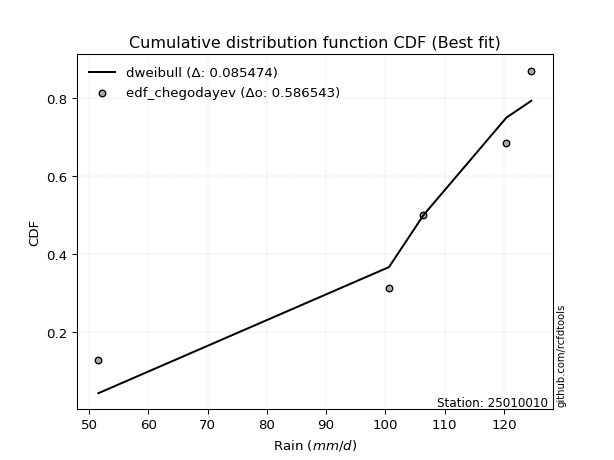</img>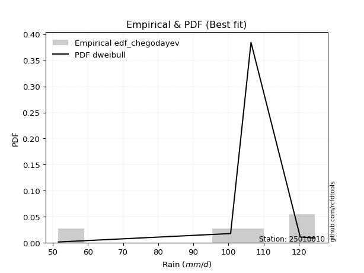</img>

</div>


### 6. EDF Blom (1958)

The Blom formula is a specific "plotting position" formula used in hydrology and statistical analysis to estimate the empirical cumulative probability (or non-exceedance probability) of a data series. It is particularly recommended for data that are approximately normally distributed. The constant _a_ is set to 0.375 (or 3/8).

<div align="center">


$P=(m-a)/(n+1-2a)$


</div>


**6.1. Empirical values**

<div align="center">

|                | 0                   | 1                   | 2        | 3                  | 4                  |
|:---------------|:--------------------|:--------------------|:---------|:-------------------|:-------------------|
| date           | 2023                | 2021                | 2024     | 2025               | 2022               |
| x              | 51.6                | 100.6               | 106.4    | 120.4              | 124.6              |
| m              | 1                   | 2                   | 3        | 4                  | 5                  |
| empirical_dist | edf_blom            | edf_blom            | edf_blom | edf_blom           | edf_blom           |
| empirical      | 0.11904761904761904 | 0.30952380952380953 | 0.5      | 0.6904761904761905 | 0.8809523809523809 |
| empirical_tr   | 1.135135135135135   | 1.4482758620689655  | 2.0      | 3.230769230769231  | 8.399999999999999  |

</div>


**6.2. Kolmogorov-Smirnov fit test (sorted by Δ)**


<div align="center">

|                | 0                   | 1                   | 2                   | 3                   | 4                   | 5                   | 6                  | 7                   | 8                   | 9                   | 10                  | 11                  | 12                  | 13                 | 14                  | 15                  | 16                 | 17                  | 18                  | 19                  | 20                  | 21                  | 22                  | 23                  | 24                  | 25                  | 26                  | 27                  | 28                 | 29                 | 30                  | 31                  | 32                  | 33                  | 34                  | 35                 | 36                  | 37                  | 38                 | 39                  | 40                  | 41                 | 42                  | 43                  | 44                  | 45                  | 46                  | 47                 | 48                 | 49                  | 50                  | 51                  | 52                  | 53                 | 54                 | 55                  | 56                 | 57                  | 58                  | 59                  | 60                 | 61                  | 62                  | 63                  | 64                 | 65                  | 66                  | 67                  | 68                  | 69                 | 70                 | 71                  | 72                  | 73                  | 74                 | 75                 | 76                 | 77                  | 78                  | 79                  | 80                  | 81                 | 82                 | 83                 | 84                  | 85                  | 86                 | 87                  | 88                 | 89                  | 90                 | 91                 | 92                 | 93                 | 94                  | 95                  | 96                 | 97                 | 98                 | 99                 | 100                | 101                 | 102                | 103                 | 104                 | 105                 | 106                | 107                 | 108                 | 109                | 110                | 111                | 112                | 113                | 114                 | 115                | 116                 | 117                 | 118                | 119                 | 120                 | 121                | 122                | 123                | 124                | 125                | 126                 | 127                 | 128                | 129                | 130                | 131                | 132                | 133                | 134                | 135                | 136                | 137                | 138                | 139                | 140                | 141                | 142                | 143                 | 144                | 145                | 146                | 147                | 148                | 149                | 150                | 151                | 152                | 153                | 154                | 155                | 156                | 157                | 158                | 159                |
|:---------------|:--------------------|:--------------------|:--------------------|:--------------------|:--------------------|:--------------------|:-------------------|:--------------------|:--------------------|:--------------------|:--------------------|:--------------------|:--------------------|:-------------------|:--------------------|:--------------------|:-------------------|:--------------------|:--------------------|:--------------------|:--------------------|:--------------------|:--------------------|:--------------------|:--------------------|:--------------------|:--------------------|:--------------------|:-------------------|:-------------------|:--------------------|:--------------------|:--------------------|:--------------------|:--------------------|:-------------------|:--------------------|:--------------------|:-------------------|:--------------------|:--------------------|:-------------------|:--------------------|:--------------------|:--------------------|:--------------------|:--------------------|:-------------------|:-------------------|:--------------------|:--------------------|:--------------------|:--------------------|:-------------------|:-------------------|:--------------------|:-------------------|:--------------------|:--------------------|:--------------------|:-------------------|:--------------------|:--------------------|:--------------------|:-------------------|:--------------------|:--------------------|:--------------------|:--------------------|:-------------------|:-------------------|:--------------------|:--------------------|:--------------------|:-------------------|:-------------------|:-------------------|:--------------------|:--------------------|:--------------------|:--------------------|:-------------------|:-------------------|:-------------------|:--------------------|:--------------------|:-------------------|:--------------------|:-------------------|:--------------------|:-------------------|:-------------------|:-------------------|:-------------------|:--------------------|:--------------------|:-------------------|:-------------------|:-------------------|:-------------------|:-------------------|:--------------------|:-------------------|:--------------------|:--------------------|:--------------------|:-------------------|:--------------------|:--------------------|:-------------------|:-------------------|:-------------------|:-------------------|:-------------------|:--------------------|:-------------------|:--------------------|:--------------------|:-------------------|:--------------------|:--------------------|:-------------------|:-------------------|:-------------------|:-------------------|:-------------------|:--------------------|:--------------------|:-------------------|:-------------------|:-------------------|:-------------------|:-------------------|:-------------------|:-------------------|:-------------------|:-------------------|:-------------------|:-------------------|:-------------------|:-------------------|:-------------------|:-------------------|:--------------------|:-------------------|:-------------------|:-------------------|:-------------------|:-------------------|:-------------------|:-------------------|:-------------------|:-------------------|:-------------------|:-------------------|:-------------------|:-------------------|:-------------------|:-------------------|:-------------------|
| station        | 25010010            | 25010010            | 25010010            | 25010010            | 25010010            | 25010010            | 25010010           | 25010010            | 25010010            | 25010010            | 25010010            | 25010010            | 25010010            | 25010010           | 25010010            | 25010010            | 25010010           | 25010010            | 25010010            | 25010010            | 25010010            | 25010010            | 25010010            | 25010010            | 25010010            | 25010010            | 25010010            | 25010010            | 25010010           | 25010010           | 25010010            | 25010010            | 25010010            | 25010010            | 25010010            | 25010010           | 25010010            | 25010010            | 25010010           | 25010010            | 25010010            | 25010010           | 25010010            | 25010010            | 25010010            | 25010010            | 25010010            | 25010010           | 25010010           | 25010010            | 25010010            | 25010010            | 25010010            | 25010010           | 25010010           | 25010010            | 25010010           | 25010010            | 25010010            | 25010010            | 25010010           | 25010010            | 25010010            | 25010010            | 25010010           | 25010010            | 25010010            | 25010010            | 25010010            | 25010010           | 25010010           | 25010010            | 25010010            | 25010010            | 25010010           | 25010010           | 25010010           | 25010010            | 25010010            | 25010010            | 25010010            | 25010010           | 25010010           | 25010010           | 25010010            | 25010010            | 25010010           | 25010010            | 25010010           | 25010010            | 25010010           | 25010010           | 25010010           | 25010010           | 25010010            | 25010010            | 25010010           | 25010010           | 25010010           | 25010010           | 25010010           | 25010010            | 25010010           | 25010010            | 25010010            | 25010010            | 25010010           | 25010010            | 25010010            | 25010010           | 25010010           | 25010010           | 25010010           | 25010010           | 25010010            | 25010010           | 25010010            | 25010010            | 25010010           | 25010010            | 25010010            | 25010010           | 25010010           | 25010010           | 25010010           | 25010010           | 25010010            | 25010010            | 25010010           | 25010010           | 25010010           | 25010010           | 25010010           | 25010010           | 25010010           | 25010010           | 25010010           | 25010010           | 25010010           | 25010010           | 25010010           | 25010010           | 25010010           | 25010010            | 25010010           | 25010010           | 25010010           | 25010010           | 25010010           | 25010010           | 25010010           | 25010010           | 25010010           | 25010010           | 25010010           | 25010010           | 25010010           | 25010010           | 25010010           | 25010010           |
| empirical_dist | edf_blom            | edf_blom            | edf_blom            | edf_blom            | edf_blom            | edf_blom            | edf_blom           | edf_blom            | edf_blom            | edf_blom            | edf_blom            | edf_blom            | edf_blom            | edf_blom           | edf_blom            | edf_blom            | edf_blom           | edf_blom            | edf_blom            | edf_blom            | edf_blom            | edf_blom            | edf_blom            | edf_blom            | edf_blom            | edf_blom            | edf_blom            | edf_blom            | edf_blom           | edf_blom           | edf_blom            | edf_blom            | edf_blom            | edf_blom            | edf_blom            | edf_blom           | edf_blom            | edf_blom            | edf_blom           | edf_blom            | edf_blom            | edf_blom           | edf_blom            | edf_blom            | edf_blom            | edf_blom            | edf_blom            | edf_blom           | edf_blom           | edf_blom            | edf_blom            | edf_blom            | edf_blom            | edf_blom           | edf_blom           | edf_blom            | edf_blom           | edf_blom            | edf_blom            | edf_blom            | edf_blom           | edf_blom            | edf_blom            | edf_blom            | edf_blom           | edf_blom            | edf_blom            | edf_blom            | edf_blom            | edf_blom           | edf_blom           | edf_blom            | edf_blom            | edf_blom            | edf_blom           | edf_blom           | edf_blom           | edf_blom            | edf_blom            | edf_blom            | edf_blom            | edf_blom           | edf_blom           | edf_blom           | edf_blom            | edf_blom            | edf_blom           | edf_blom            | edf_blom           | edf_blom            | edf_blom           | edf_blom           | edf_blom           | edf_blom           | edf_blom            | edf_blom            | edf_blom           | edf_blom           | edf_blom           | edf_blom           | edf_blom           | edf_blom            | edf_blom           | edf_blom            | edf_blom            | edf_blom            | edf_blom           | edf_blom            | edf_blom            | edf_blom           | edf_blom           | edf_blom           | edf_blom           | edf_blom           | edf_blom            | edf_blom           | edf_blom            | edf_blom            | edf_blom           | edf_blom            | edf_blom            | edf_blom           | edf_blom           | edf_blom           | edf_blom           | edf_blom           | edf_blom            | edf_blom            | edf_blom           | edf_blom           | edf_blom           | edf_blom           | edf_blom           | edf_blom           | edf_blom           | edf_blom           | edf_blom           | edf_blom           | edf_blom           | edf_blom           | edf_blom           | edf_blom           | edf_blom           | edf_blom            | edf_blom           | edf_blom           | edf_blom           | edf_blom           | edf_blom           | edf_blom           | edf_blom           | edf_blom           | edf_blom           | edf_blom           | edf_blom           | edf_blom           | edf_blom           | edf_blom           | edf_blom           | edf_blom           |
| p_dist         | dweibull            | dgamma              | weibull_min         | pearson3            | gumbel_l            | vonmises_line       | genextreme         | loggenextreme       | gennorm             | logvonmises_line    | logexponpow         | logloglaplace       | trapezoid           | logweibull_min     | loggennorm          | logdweibull         | burr               | levy_l              | argus               | loglevy_l           | logexponweib        | weibull_max         | logburr12           | genpareto           | beta                | logpearson3         | logdgamma           | logloggamma         | logargus           | loggompertz        | johnsonsb           | logmielke           | loggumbel_l         | logtrapezoid        | logburr             | mielke             | laplace             | hypsecant           | logistic           | exponnorm           | crystalball         | norm               | t                   | nct                 | anglit              | semicircular        | arcsine             | f                  | invgamma           | genhalflogistic     | gamma               | rice                | logjohnsonsb        | loginvweibull      | erlang             | kappa3              | skewnorm           | alpha               | logarcsine          | maxwell             | wrapcauchy         | loggenhalflogistic  | logweibull_max      | betaprime           | ncf                | rayleigh            | logsemicircular     | loganglit           | logf                | logt               | logcrystalball     | lognorm             | logexponnorm        | logfatiguelife      | invgauss           | logncf             | cosine             | logbetaprime        | lognct              | triang              | logrice             | logalpha           | loglogistic        | loginvgamma        | loghypsecant        | gausshyper          | gumbel_r           | halfnorm            | kstwobign          | loginvgauss         | logmaxwell         | logbeta            | loglaplace         | loglaplace         | loggausshyper       | lograyleigh         | moyal              | halflogistic       | logwrapcauchy      | logskewnorm        | logkstwobign       | logcosine           | loggenexpon        | truncnorm           | lognakagami         | logtruncnorm        | nakagami           | logtukeylambda      | loghalfnorm         | logfoldnorm        | loggumbel_r        | genexpon           | logtriang          | ksone              | loghalflogistic     | logmoyal           | loggenpareto        | burr12              | halfgennorm        | wald                | uniform             | kappa4             | lomax              | foldnorm           | loggamma           | loggamma           | exponweib           | logerlang           | logksone           | gompertz           | logwald            | truncweibull_min   | logkappa4          | bradford           | truncexpon         | logkappa3          | loguniform         | invweibull         | logjohnsonsu       | logbradford        | logtruncexpon      | fatiguelife        | loggengamma        | logtruncweibull_min | gengamma           | logrdist           | johnsonsu          | loglomax           | powerlaw           | exponpow           | truncpareto        | logpowerlaw        | logtruncpareto     | rdist              | genlogistic        | loggenlogistic     | loghalfgennorm     | tukeylambda        | logvonmises        | vonmises           |
| delta          | 0.08789619455727493 | 0.09443989911557871 | 0.11553376396228643 | 0.11592100464381272 | 0.11821327921667724 | 0.11904761903713644 | 0.1190476190471107 | 0.11904761904734107 | 0.12469495117627427 | 0.12940627600785726 | 0.13038207871119278 | 0.13143883581547944 | 0.13347616177988453 | 0.1357020143858182 | 0.13819247328502637 | 0.14286507989420172 | 0.1432426058529861 | 0.14330405508818034 | 0.14405549467186674 | 0.14505537220611697 | 0.14553024738793674 | 0.15462988369744468 | 0.15533645094025117 | 0.15731591508215076 | 0.15817581167175976 | 0.15956925637497044 | 0.16155578677189597 | 0.16346216950901182 | 0.1636265960235721 | 0.1704177813859098 | 0.17347015640495744 | 0.17637112172885683 | 0.17775777841948814 | 0.17852565531274583 | 0.18427514045523397 | 0.1845560970545851 | 0.18723403809385186 | 0.18817619747718234 | 0.1883903215063646 | 0.18863969147986942 | 0.18864105010028304 | 0.1886410520754695 | 0.18866076076279004 | 0.18867713463656505 | 0.18890374917441444 | 0.18901195800639403 | 0.18944080412911707 | 0.1912330202264927 | 0.1938263705671085 | 0.19510293722455418 | 0.19756199724016843 | 0.19796199789819668 | 0.19865806994931354 | 0.2039593168019953 | 0.2070693031025943 | 0.21426415540807098 | 0.2149930310687881 | 0.21646499105731332 | 0.22102263255577137 | 0.22176357354492116 | 0.2225266732919815 | 0.22332160459292416 | 0.22775379761728676 | 0.23144675614527843 | 0.2318335829916609 | 0.23281478668318156 | 0.23357557418549713 | 0.23672995071601477 | 0.24185846977553505 | 0.2442972358211709 | 0.2443695331874507 | 0.24436966656914194 | 0.24437013785606876 | 0.24505214777754614 | 0.2453961688885269 | 0.245779519467882  | 0.2459417323141061 | 0.24667788243220157 | 0.24794278536061376 | 0.24868528200581053 | 0.25082644584052316 | 0.2514792763262491 | 0.2516132127293581 | 0.2557813864975529 | 0.25772254698955166 | 0.25884666287361047 | 0.2589603942991491 | 0.26392759200816973 | 0.2643210183159629 | 0.26718472043398656 | 0.2745004777997637 | 0.2762450668258031 | 0.2776709659070439 | 0.2776709659070439 | 0.28036297903293206 | 0.28414812754534235 | 0.2848189481510617 | 0.2887516955733497 | 0.2908190793736065 | 0.2940713686167913 | 0.3023283683023118 | 0.30510492871850337 | 0.3078637229102643 | 0.30942673018785416 | 0.30947759471171915 | 0.30952118160010184 | 0.3095231842080535 | 0.30952380764765697 | 0.31138143053313516 | 0.3116049175650635 | 0.3142975841383102 | 0.3212476178256125 | 0.3322826579239452 | 0.3331702544031311 | 0.33879211317983426 | 0.3390060152965023 | 0.34115715121127554 | 0.34747677173076363 | 0.3503086819559291 | 0.35673673317479937 | 0.36170906718851914 | 0.3648546534806778 | 0.3861905460318733 | 0.3891524307424803 | 0.3944574250429329 | 0.3944574250429329 | 0.39667021501356337 | 0.40084206124483845 | 0.4048973945678689 | 0.4071219719412365 | 0.4075706802317325 | 0.4262912546462072 | 0.4342167750281759 | 0.4354875390499834 | 0.441839924947792  | 0.446754085594682  | 0.4477816353862044 | 0.449935804866887  | 0.4506866704531329 | 0.5067567557429834 | 0.5278961435095618 | 0.5418224598296875 | 0.54188505124896   | 0.5634931665513514  | 0.5724520607681557 | 0.5786409056001544 | 0.584835683204999  | 0.5864249811871383 | 0.6388636527172604 | 0.6417098401136566 | 0.6497323596910201 | 0.6523317889561361 | 0.6619387736320135 | 0.6904761904761905 | 0.6904761904761905 | 0.6904761904761905 | 0.6904761904761905 | 0.8801289356192199 | 1.2359452266813804 | 19.206432637395057 |
| deltao         | 0.5865427407550001  | 0.5865427407550001  | 0.5865427407550001  | 0.5865427407550001  | 0.5865427407550001  | 0.5865427407550001  | 0.5865427407550001 | 0.5865427407550001  | 0.5865427407550001  | 0.5865427407550001  | 0.5865427407550001  | 0.5865427407550001  | 0.5865427407550001  | 0.5865427407550001 | 0.5865427407550001  | 0.5865427407550001  | 0.5865427407550001 | 0.5865427407550001  | 0.5865427407550001  | 0.5865427407550001  | 0.5865427407550001  | 0.5865427407550001  | 0.5865427407550001  | 0.5865427407550001  | 0.5865427407550001  | 0.5865427407550001  | 0.5865427407550001  | 0.5865427407550001  | 0.5865427407550001 | 0.5865427407550001 | 0.5865427407550001  | 0.5865427407550001  | 0.5865427407550001  | 0.5865427407550001  | 0.5865427407550001  | 0.5865427407550001 | 0.5865427407550001  | 0.5865427407550001  | 0.5865427407550001 | 0.5865427407550001  | 0.5865427407550001  | 0.5865427407550001 | 0.5865427407550001  | 0.5865427407550001  | 0.5865427407550001  | 0.5865427407550001  | 0.5865427407550001  | 0.5865427407550001 | 0.5865427407550001 | 0.5865427407550001  | 0.5865427407550001  | 0.5865427407550001  | 0.5865427407550001  | 0.5865427407550001 | 0.5865427407550001 | 0.5865427407550001  | 0.5865427407550001 | 0.5865427407550001  | 0.5865427407550001  | 0.5865427407550001  | 0.5865427407550001 | 0.5865427407550001  | 0.5865427407550001  | 0.5865427407550001  | 0.5865427407550001 | 0.5865427407550001  | 0.5865427407550001  | 0.5865427407550001  | 0.5865427407550001  | 0.5865427407550001 | 0.5865427407550001 | 0.5865427407550001  | 0.5865427407550001  | 0.5865427407550001  | 0.5865427407550001 | 0.5865427407550001 | 0.5865427407550001 | 0.5865427407550001  | 0.5865427407550001  | 0.5865427407550001  | 0.5865427407550001  | 0.5865427407550001 | 0.5865427407550001 | 0.5865427407550001 | 0.5865427407550001  | 0.5865427407550001  | 0.5865427407550001 | 0.5865427407550001  | 0.5865427407550001 | 0.5865427407550001  | 0.5865427407550001 | 0.5865427407550001 | 0.5865427407550001 | 0.5865427407550001 | 0.5865427407550001  | 0.5865427407550001  | 0.5865427407550001 | 0.5865427407550001 | 0.5865427407550001 | 0.5865427407550001 | 0.5865427407550001 | 0.5865427407550001  | 0.5865427407550001 | 0.5865427407550001  | 0.5865427407550001  | 0.5865427407550001  | 0.5865427407550001 | 0.5865427407550001  | 0.5865427407550001  | 0.5865427407550001 | 0.5865427407550001 | 0.5865427407550001 | 0.5865427407550001 | 0.5865427407550001 | 0.5865427407550001  | 0.5865427407550001 | 0.5865427407550001  | 0.5865427407550001  | 0.5865427407550001 | 0.5865427407550001  | 0.5865427407550001  | 0.5865427407550001 | 0.5865427407550001 | 0.5865427407550001 | 0.5865427407550001 | 0.5865427407550001 | 0.5865427407550001  | 0.5865427407550001  | 0.5865427407550001 | 0.5865427407550001 | 0.5865427407550001 | 0.5865427407550001 | 0.5865427407550001 | 0.5865427407550001 | 0.5865427407550001 | 0.5865427407550001 | 0.5865427407550001 | 0.5865427407550001 | 0.5865427407550001 | 0.5865427407550001 | 0.5865427407550001 | 0.5865427407550001 | 0.5865427407550001 | 0.5865427407550001  | 0.5865427407550001 | 0.5865427407550001 | 0.5865427407550001 | 0.5865427407550001 | 0.5865427407550001 | 0.5865427407550001 | 0.5865427407550001 | 0.5865427407550001 | 0.5865427407550001 | 0.5865427407550001 | 0.5865427407550001 | 0.5865427407550001 | 0.5865427407550001 | 0.5865427407550001 | 0.5865427407550001 | 0.5865427407550001 |
| eval           | Δo > Δ              | Δo > Δ              | Δo > Δ              | Δo > Δ              | Δo > Δ              | Δo > Δ              | Δo > Δ             | Δo > Δ              | Δo > Δ              | Δo > Δ              | Δo > Δ              | Δo > Δ              | Δo > Δ              | Δo > Δ             | Δo > Δ              | Δo > Δ              | Δo > Δ             | Δo > Δ              | Δo > Δ              | Δo > Δ              | Δo > Δ              | Δo > Δ              | Δo > Δ              | Δo > Δ              | Δo > Δ              | Δo > Δ              | Δo > Δ              | Δo > Δ              | Δo > Δ             | Δo > Δ             | Δo > Δ              | Δo > Δ              | Δo > Δ              | Δo > Δ              | Δo > Δ              | Δo > Δ             | Δo > Δ              | Δo > Δ              | Δo > Δ             | Δo > Δ              | Δo > Δ              | Δo > Δ             | Δo > Δ              | Δo > Δ              | Δo > Δ              | Δo > Δ              | Δo > Δ              | Δo > Δ             | Δo > Δ             | Δo > Δ              | Δo > Δ              | Δo > Δ              | Δo > Δ              | Δo > Δ             | Δo > Δ             | Δo > Δ              | Δo > Δ             | Δo > Δ              | Δo > Δ              | Δo > Δ              | Δo > Δ             | Δo > Δ              | Δo > Δ              | Δo > Δ              | Δo > Δ             | Δo > Δ              | Δo > Δ              | Δo > Δ              | Δo > Δ              | Δo > Δ             | Δo > Δ             | Δo > Δ              | Δo > Δ              | Δo > Δ              | Δo > Δ             | Δo > Δ             | Δo > Δ             | Δo > Δ              | Δo > Δ              | Δo > Δ              | Δo > Δ              | Δo > Δ             | Δo > Δ             | Δo > Δ             | Δo > Δ              | Δo > Δ              | Δo > Δ             | Δo > Δ              | Δo > Δ             | Δo > Δ              | Δo > Δ             | Δo > Δ             | Δo > Δ             | Δo > Δ             | Δo > Δ              | Δo > Δ              | Δo > Δ             | Δo > Δ             | Δo > Δ             | Δo > Δ             | Δo > Δ             | Δo > Δ              | Δo > Δ             | Δo > Δ              | Δo > Δ              | Δo > Δ              | Δo > Δ             | Δo > Δ              | Δo > Δ              | Δo > Δ             | Δo > Δ             | Δo > Δ             | Δo > Δ             | Δo > Δ             | Δo > Δ              | Δo > Δ             | Δo > Δ              | Δo > Δ              | Δo > Δ             | Δo > Δ              | Δo > Δ              | Δo > Δ             | Δo > Δ             | Δo > Δ             | Δo > Δ             | Δo > Δ             | Δo > Δ              | Δo > Δ              | Δo > Δ             | Δo > Δ             | Δo > Δ             | Δo > Δ             | Δo > Δ             | Δo > Δ             | Δo > Δ             | Δo > Δ             | Δo > Δ             | Δo > Δ             | Δo > Δ             | Δo > Δ             | Δo > Δ             | Δo > Δ             | Δo > Δ             | Δo > Δ              | Δo > Δ             | Δo > Δ             | Δo > Δ             | Δo > Δ             | Δo <= Δ            | Δo <= Δ            | Δo <= Δ            | Δo <= Δ            | Δo <= Δ            | Δo <= Δ            | Δo <= Δ            | Δo <= Δ            | Δo <= Δ            | Δo <= Δ            | Δo <= Δ            | Δo <= Δ            |
| fit            | 1                   | 1                   | 1                   | 1                   | 1                   | 1                   | 1                  | 1                   | 1                   | 1                   | 1                   | 1                   | 1                   | 1                  | 1                   | 1                   | 1                  | 1                   | 1                   | 1                   | 1                   | 1                   | 1                   | 1                   | 1                   | 1                   | 1                   | 1                   | 1                  | 1                  | 1                   | 1                   | 1                   | 1                   | 1                   | 1                  | 1                   | 1                   | 1                  | 1                   | 1                   | 1                  | 1                   | 1                   | 1                   | 1                   | 1                   | 1                  | 1                  | 1                   | 1                   | 1                   | 1                   | 1                  | 1                  | 1                   | 1                  | 1                   | 1                   | 1                   | 1                  | 1                   | 1                   | 1                   | 1                  | 1                   | 1                   | 1                   | 1                   | 1                  | 1                  | 1                   | 1                   | 1                   | 1                  | 1                  | 1                  | 1                   | 1                   | 1                   | 1                   | 1                  | 1                  | 1                  | 1                   | 1                   | 1                  | 1                   | 1                  | 1                   | 1                  | 1                  | 1                  | 1                  | 1                   | 1                   | 1                  | 1                  | 1                  | 1                  | 1                  | 1                   | 1                  | 1                   | 1                   | 1                   | 1                  | 1                   | 1                   | 1                  | 1                  | 1                  | 1                  | 1                  | 1                   | 1                  | 1                   | 1                   | 1                  | 1                   | 1                   | 1                  | 1                  | 1                  | 1                  | 1                  | 1                   | 1                   | 1                  | 1                  | 1                  | 1                  | 1                  | 1                  | 1                  | 1                  | 1                  | 1                  | 1                  | 1                  | 1                  | 1                  | 1                  | 1                   | 1                  | 1                  | 1                  | 1                  | 0                  | 0                  | 0                  | 0                  | 0                  | 0                  | 0                  | 0                  | 0                  | 0                  | 0                  | 0                  |
| n              | 5                   | 5                   | 5                   | 5                   | 5                   | 5                   | 5                  | 5                   | 5                   | 5                   | 5                   | 5                   | 5                   | 5                  | 5                   | 5                   | 5                  | 5                   | 5                   | 5                   | 5                   | 5                   | 5                   | 5                   | 5                   | 5                   | 5                   | 5                   | 5                  | 5                  | 5                   | 5                   | 5                   | 5                   | 5                   | 5                  | 5                   | 5                   | 5                  | 5                   | 5                   | 5                  | 5                   | 5                   | 5                   | 5                   | 5                   | 5                  | 5                  | 5                   | 5                   | 5                   | 5                   | 5                  | 5                  | 5                   | 5                  | 5                   | 5                   | 5                   | 5                  | 5                   | 5                   | 5                   | 5                  | 5                   | 5                   | 5                   | 5                   | 5                  | 5                  | 5                   | 5                   | 5                   | 5                  | 5                  | 5                  | 5                   | 5                   | 5                   | 5                   | 5                  | 5                  | 5                  | 5                   | 5                   | 5                  | 5                   | 5                  | 5                   | 5                  | 5                  | 5                  | 5                  | 5                   | 5                   | 5                  | 5                  | 5                  | 5                  | 5                  | 5                   | 5                  | 5                   | 5                   | 5                   | 5                  | 5                   | 5                   | 5                  | 5                  | 5                  | 5                  | 5                  | 5                   | 5                  | 5                   | 5                   | 5                  | 5                   | 5                   | 5                  | 5                  | 5                  | 5                  | 5                  | 5                   | 5                   | 5                  | 5                  | 5                  | 5                  | 5                  | 5                  | 5                  | 5                  | 5                  | 5                  | 5                  | 5                  | 5                  | 5                  | 5                  | 5                   | 5                  | 5                  | 5                  | 5                  | 5                  | 5                  | 5                  | 5                  | 5                  | 5                  | 5                  | 5                  | 5                  | 5                  | 5                  | 5                  |
| best_fit       | 1                   | 0                   | 0                   | 0                   | 0                   | 0                   | 0                  | 0                   | 0                   | 0                   | 0                   | 0                   | 0                   | 0                  | 0                   | 0                   | 0                  | 0                   | 0                   | 0                   | 0                   | 0                   | 0                   | 0                   | 0                   | 0                   | 0                   | 0                   | 0                  | 0                  | 0                   | 0                   | 0                   | 0                   | 0                   | 0                  | 0                   | 0                   | 0                  | 0                   | 0                   | 0                  | 0                   | 0                   | 0                   | 0                   | 0                   | 0                  | 0                  | 0                   | 0                   | 0                   | 0                   | 0                  | 0                  | 0                   | 0                  | 0                   | 0                   | 0                   | 0                  | 0                   | 0                   | 0                   | 0                  | 0                   | 0                   | 0                   | 0                   | 0                  | 0                  | 0                   | 0                   | 0                   | 0                  | 0                  | 0                  | 0                   | 0                   | 0                   | 0                   | 0                  | 0                  | 0                  | 0                   | 0                   | 0                  | 0                   | 0                  | 0                   | 0                  | 0                  | 0                  | 0                  | 0                   | 0                   | 0                  | 0                  | 0                  | 0                  | 0                  | 0                   | 0                  | 0                   | 0                   | 0                   | 0                  | 0                   | 0                   | 0                  | 0                  | 0                  | 0                  | 0                  | 0                   | 0                  | 0                   | 0                   | 0                  | 0                   | 0                   | 0                  | 0                  | 0                  | 0                  | 0                  | 0                   | 0                   | 0                  | 0                  | 0                  | 0                  | 0                  | 0                  | 0                  | 0                  | 0                  | 0                  | 0                  | 0                  | 0                  | 0                  | 0                  | 0                   | 0                  | 0                  | 0                  | 0                  | 0                  | 0                  | 0                  | 0                  | 0                  | 0                  | 0                  | 0                  | 0                  | 0                  | 0                  | 0                  |
| best_fit_sort  | 1                   | 2                   | 3                   | 4                   | 5                   | 6                   | 7                  | 8                   | 9                   | 10                  | 11                  | 12                  | 13                  | 14                 | 15                  | 16                  | 17                 | 18                  | 19                  | 20                  | 21                  | 22                  | 23                  | 24                  | 25                  | 26                  | 27                  | 28                  | 29                 | 30                 | 31                  | 32                  | 33                  | 34                  | 35                  | 36                 | 37                  | 38                  | 39                 | 40                  | 41                  | 42                 | 43                  | 44                  | 45                  | 46                  | 47                  | 48                 | 49                 | 50                  | 51                  | 52                  | 53                  | 54                 | 55                 | 56                  | 57                 | 58                  | 59                  | 60                  | 61                 | 62                  | 63                  | 64                  | 65                 | 66                  | 67                  | 68                  | 69                  | 70                 | 71                 | 72                  | 73                  | 74                  | 75                 | 76                 | 77                 | 78                  | 79                  | 80                  | 81                  | 82                 | 83                 | 84                 | 85                  | 86                  | 87                 | 88                  | 89                 | 90                  | 91                 | 92                 | 93                 | 94                 | 95                  | 96                  | 97                 | 98                 | 99                 | 100                | 101                | 102                 | 103                | 104                 | 105                 | 106                 | 107                | 108                 | 109                 | 110                | 111                | 112                | 113                | 114                | 115                 | 116                | 117                 | 118                 | 119                | 120                 | 121                 | 122                | 123                | 124                | 125                | 126                | 127                 | 128                 | 129                | 130                | 131                | 132                | 133                | 134                | 135                | 136                | 137                | 138                | 139                | 140                | 141                | 142                | 143                | 144                 | 145                | 146                | 147                | 148                | 149                | 150                | 151                | 152                | 153                | 154                | 155                | 156                | 157                | 158                | 159                | 160                |

</div>


**6.3. Best fit**

<div align="center">

|   id |   station | empirical_dist   | p_dist   |     delta |   deltao | eval   |   fit |   n |   best_fit |   best_fit_sort |
|-----:|----------:|:-----------------|:---------|----------:|---------:|:-------|------:|----:|-----------:|----------------:|
|    0 |  25010010 | edf_blom         | dweibull | 0.0878962 | 0.586543 | Δo > Δ |     1 |   5 |          1 |               1 |

</div>


<div align="center">

</img>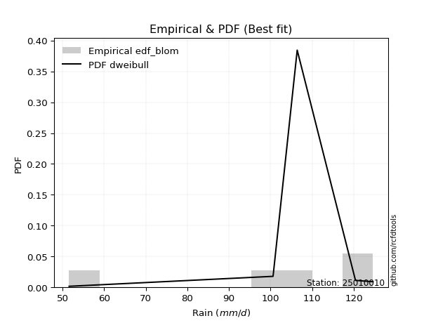</img>

</div>


### 7. EDF Tukey (1962)

In hydrology, the Tukey formula is used as a plotting position formula to estimate the empirical probability or frequency of a flood event (or other hydrological data). The formula parameter is given as _c=0.333_ (or 1/3).

<div align="center">


$P=(m-c)/(n+1-2c)$


</div>


**7.1. Empirical values**

<div align="center">

|                | 0                  | 1                  | 2         | 3         | 4         |
|:---------------|:-------------------|:-------------------|:----------|:----------|:----------|
| date           | 2023               | 2021               | 2024      | 2025      | 2022      |
| x              | 51.6               | 100.6              | 106.4     | 120.4     | 124.6     |
| m              | 1                  | 2                  | 3         | 4         | 5         |
| empirical_dist | edf_tukey          | edf_tukey          | edf_tukey | edf_tukey | edf_tukey |
| empirical      | 0.125              | 0.3125             | 0.5       | 0.6875    | 0.875     |
| empirical_tr   | 1.1428571428571428 | 1.4545454545454546 | 2.0       | 3.2       | 8.0       |

</div>


**7.2. Kolmogorov-Smirnov fit test (sorted by Δ)**


<div align="center">

|                | 0                  | 1                   | 2                   | 3                   | 4                  | 5                  | 6                   | 7                  | 8                   | 9                  | 10                  | 11                  | 12                  | 13                  | 14                  | 15                 | 16                  | 17                  | 18                  | 19                 | 20                 | 21                 | 22                 | 23                 | 24                  | 25                  | 26                  | 27                 | 28                  | 29                  | 30                  | 31                  | 32                  | 33                 | 34                 | 35                  | 36                  | 37                  | 38                  | 39                  | 40                  | 41                  | 42                  | 43                  | 44                 | 45                  | 46                  | 47                  | 48                  | 49                  | 50                  | 51                  | 52                  | 53                  | 54                  | 55                  | 56                  | 57                  | 58                 | 59                 | 60                  | 61                 | 62                 | 63                  | 64                  | 65                 | 66                  | 67                 | 68                  | 69                  | 70                  | 71                  | 72                 | 73                  | 74                  | 75                  | 76                  | 77                 | 78                 | 79                  | 80                 | 81                  | 82                  | 83                 | 84                 | 85                 | 86                 | 87                  | 88                 | 89                 | 90                  | 91                 | 92                 | 93                 | 94                 | 95                 | 96                 | 97                 | 98                  | 99                 | 100                 | 101                | 102                 | 103                | 104                | 105                 | 106                | 107                | 108                | 109                | 110                 | 111                 | 112                | 113                | 114                | 115                 | 116                | 117                 | 118                 | 119                | 120                | 121                 | 122                | 123                | 124                 | 125                 | 126                | 127                | 128                | 129                | 130                | 131                 | 132                 | 133                | 134                 | 135                | 136                 | 137                 | 138                | 139                | 140                | 141                | 142                | 143                 | 144                | 145                | 146                | 147                | 148                | 149                | 150                | 151                | 152                | 153                | 154                | 155                | 156                | 157                | 158                | 159                |
|:---------------|:-------------------|:--------------------|:--------------------|:--------------------|:-------------------|:-------------------|:--------------------|:-------------------|:--------------------|:-------------------|:--------------------|:--------------------|:--------------------|:--------------------|:--------------------|:-------------------|:--------------------|:--------------------|:--------------------|:-------------------|:-------------------|:-------------------|:-------------------|:-------------------|:--------------------|:--------------------|:--------------------|:-------------------|:--------------------|:--------------------|:--------------------|:--------------------|:--------------------|:-------------------|:-------------------|:--------------------|:--------------------|:--------------------|:--------------------|:--------------------|:--------------------|:--------------------|:--------------------|:--------------------|:-------------------|:--------------------|:--------------------|:--------------------|:--------------------|:--------------------|:--------------------|:--------------------|:--------------------|:--------------------|:--------------------|:--------------------|:--------------------|:--------------------|:-------------------|:-------------------|:--------------------|:-------------------|:-------------------|:--------------------|:--------------------|:-------------------|:--------------------|:-------------------|:--------------------|:--------------------|:--------------------|:--------------------|:-------------------|:--------------------|:--------------------|:--------------------|:--------------------|:-------------------|:-------------------|:--------------------|:-------------------|:--------------------|:--------------------|:-------------------|:-------------------|:-------------------|:-------------------|:--------------------|:-------------------|:-------------------|:--------------------|:-------------------|:-------------------|:-------------------|:-------------------|:-------------------|:-------------------|:-------------------|:--------------------|:-------------------|:--------------------|:-------------------|:--------------------|:-------------------|:-------------------|:--------------------|:-------------------|:-------------------|:-------------------|:-------------------|:--------------------|:--------------------|:-------------------|:-------------------|:-------------------|:--------------------|:-------------------|:--------------------|:--------------------|:-------------------|:-------------------|:--------------------|:-------------------|:-------------------|:--------------------|:--------------------|:-------------------|:-------------------|:-------------------|:-------------------|:-------------------|:--------------------|:--------------------|:-------------------|:--------------------|:-------------------|:--------------------|:--------------------|:-------------------|:-------------------|:-------------------|:-------------------|:-------------------|:--------------------|:-------------------|:-------------------|:-------------------|:-------------------|:-------------------|:-------------------|:-------------------|:-------------------|:-------------------|:-------------------|:-------------------|:-------------------|:-------------------|:-------------------|:-------------------|:-------------------|
| station        | 25010010           | 25010010            | 25010010            | 25010010            | 25010010           | 25010010           | 25010010            | 25010010           | 25010010            | 25010010           | 25010010            | 25010010            | 25010010            | 25010010            | 25010010            | 25010010           | 25010010            | 25010010            | 25010010            | 25010010           | 25010010           | 25010010           | 25010010           | 25010010           | 25010010            | 25010010            | 25010010            | 25010010           | 25010010            | 25010010            | 25010010            | 25010010            | 25010010            | 25010010           | 25010010           | 25010010            | 25010010            | 25010010            | 25010010            | 25010010            | 25010010            | 25010010            | 25010010            | 25010010            | 25010010           | 25010010            | 25010010            | 25010010            | 25010010            | 25010010            | 25010010            | 25010010            | 25010010            | 25010010            | 25010010            | 25010010            | 25010010            | 25010010            | 25010010           | 25010010           | 25010010            | 25010010           | 25010010           | 25010010            | 25010010            | 25010010           | 25010010            | 25010010           | 25010010            | 25010010            | 25010010            | 25010010            | 25010010           | 25010010            | 25010010            | 25010010            | 25010010            | 25010010           | 25010010           | 25010010            | 25010010           | 25010010            | 25010010            | 25010010           | 25010010           | 25010010           | 25010010           | 25010010            | 25010010           | 25010010           | 25010010            | 25010010           | 25010010           | 25010010           | 25010010           | 25010010           | 25010010           | 25010010           | 25010010            | 25010010           | 25010010            | 25010010           | 25010010            | 25010010           | 25010010           | 25010010            | 25010010           | 25010010           | 25010010           | 25010010           | 25010010            | 25010010            | 25010010           | 25010010           | 25010010           | 25010010            | 25010010           | 25010010            | 25010010            | 25010010           | 25010010           | 25010010            | 25010010           | 25010010           | 25010010            | 25010010            | 25010010           | 25010010           | 25010010           | 25010010           | 25010010           | 25010010            | 25010010            | 25010010           | 25010010            | 25010010           | 25010010            | 25010010            | 25010010           | 25010010           | 25010010           | 25010010           | 25010010           | 25010010            | 25010010           | 25010010           | 25010010           | 25010010           | 25010010           | 25010010           | 25010010           | 25010010           | 25010010           | 25010010           | 25010010           | 25010010           | 25010010           | 25010010           | 25010010           | 25010010           |
| empirical_dist | edf_tukey          | edf_tukey           | edf_tukey           | edf_tukey           | edf_tukey          | edf_tukey          | edf_tukey           | edf_tukey          | edf_tukey           | edf_tukey          | edf_tukey           | edf_tukey           | edf_tukey           | edf_tukey           | edf_tukey           | edf_tukey          | edf_tukey           | edf_tukey           | edf_tukey           | edf_tukey          | edf_tukey          | edf_tukey          | edf_tukey          | edf_tukey          | edf_tukey           | edf_tukey           | edf_tukey           | edf_tukey          | edf_tukey           | edf_tukey           | edf_tukey           | edf_tukey           | edf_tukey           | edf_tukey          | edf_tukey          | edf_tukey           | edf_tukey           | edf_tukey           | edf_tukey           | edf_tukey           | edf_tukey           | edf_tukey           | edf_tukey           | edf_tukey           | edf_tukey          | edf_tukey           | edf_tukey           | edf_tukey           | edf_tukey           | edf_tukey           | edf_tukey           | edf_tukey           | edf_tukey           | edf_tukey           | edf_tukey           | edf_tukey           | edf_tukey           | edf_tukey           | edf_tukey          | edf_tukey          | edf_tukey           | edf_tukey          | edf_tukey          | edf_tukey           | edf_tukey           | edf_tukey          | edf_tukey           | edf_tukey          | edf_tukey           | edf_tukey           | edf_tukey           | edf_tukey           | edf_tukey          | edf_tukey           | edf_tukey           | edf_tukey           | edf_tukey           | edf_tukey          | edf_tukey          | edf_tukey           | edf_tukey          | edf_tukey           | edf_tukey           | edf_tukey          | edf_tukey          | edf_tukey          | edf_tukey          | edf_tukey           | edf_tukey          | edf_tukey          | edf_tukey           | edf_tukey          | edf_tukey          | edf_tukey          | edf_tukey          | edf_tukey          | edf_tukey          | edf_tukey          | edf_tukey           | edf_tukey          | edf_tukey           | edf_tukey          | edf_tukey           | edf_tukey          | edf_tukey          | edf_tukey           | edf_tukey          | edf_tukey          | edf_tukey          | edf_tukey          | edf_tukey           | edf_tukey           | edf_tukey          | edf_tukey          | edf_tukey          | edf_tukey           | edf_tukey          | edf_tukey           | edf_tukey           | edf_tukey          | edf_tukey          | edf_tukey           | edf_tukey          | edf_tukey          | edf_tukey           | edf_tukey           | edf_tukey          | edf_tukey          | edf_tukey          | edf_tukey          | edf_tukey          | edf_tukey           | edf_tukey           | edf_tukey          | edf_tukey           | edf_tukey          | edf_tukey           | edf_tukey           | edf_tukey          | edf_tukey          | edf_tukey          | edf_tukey          | edf_tukey          | edf_tukey           | edf_tukey          | edf_tukey          | edf_tukey          | edf_tukey          | edf_tukey          | edf_tukey          | edf_tukey          | edf_tukey          | edf_tukey          | edf_tukey          | edf_tukey          | edf_tukey          | edf_tukey          | edf_tukey          | edf_tukey          | edf_tukey          |
| p_dist         | dweibull           | dgamma              | pearson3            | gumbel_l            | weibull_min        | vonmises_line      | genextreme          | loggenextreme      | logvonmises_line    | logloglaplace      | gennorm             | trapezoid           | loggennorm          | logweibull_min      | logexponpow         | logdweibull        | levy_l              | loglevy_l           | burr                | argus              | logexponweib       | logburr12          | genpareto          | beta               | logpearson3         | weibull_max         | logdgamma           | logloggamma        | logargus            | loggompertz         | johnsonsb           | loggumbel_l         | logtrapezoid        | logmielke          | laplace            | hypsecant           | logistic            | exponnorm           | crystalball         | norm                | t                   | nct                 | anglit              | semicircular        | arcsine            | logburr             | mielke              | f                   | invgamma            | genhalflogistic     | logjohnsonsb        | gamma               | rice                | loginvweibull       | erlang              | kappa3              | alpha               | skewnorm            | logarcsine         | maxwell            | wrapcauchy          | loggenhalflogistic | logweibull_max     | betaprime           | ncf                 | rayleigh           | logsemicircular     | loganglit          | logf                | logt                | logcrystalball      | lognorm             | logexponnorm       | logfatiguelife      | invgauss            | logncf              | cosine              | logbetaprime       | lognct             | triang              | logrice            | logalpha            | loglogistic         | loginvgamma        | loghypsecant       | gausshyper         | gumbel_r           | halfnorm            | kstwobign          | loginvgauss        | logmaxwell          | logbeta            | loglaplace         | loglaplace         | loggausshyper      | lograyleigh        | moyal              | halflogistic       | logwrapcauchy       | logskewnorm        | logkstwobign        | logcosine          | loggenexpon         | loghalfnorm        | logfoldnorm        | loggumbel_r         | truncnorm          | lognakagami        | logtruncnorm       | nakagami           | logtukeylambda      | genexpon            | logtriang          | ksone              | loghalflogistic    | logmoyal            | loggenpareto       | burr12              | halfgennorm         | wald               | uniform            | kappa4              | lomax              | foldnorm           | loggamma            | loggamma            | exponweib          | logerlang          | logksone           | logwald            | gompertz           | truncweibull_min    | logkappa4           | bradford           | truncexpon          | logkappa3          | invweibull          | loguniform          | logjohnsonsu       | logbradford        | logtruncexpon      | fatiguelife        | loggengamma        | logtruncweibull_min | gengamma           | logrdist           | loglomax           | johnsonsu          | powerlaw           | exponpow           | truncpareto        | logpowerlaw        | logtruncpareto     | rdist              | genlogistic        | loggenlogistic     | loghalfgennorm     | tukeylambda        | logvonmises        | vonmises           |
| delta          | 0.081943813604894  | 0.10039228006795967 | 0.11294481416762225 | 0.11523708874048677 | 0.1185099544384769 | 0.1249999999895174 | 0.12499999999949163 | 0.124999999999722  | 0.12513764712629682 | 0.1254864548630985 | 0.12767114165246474 | 0.13049997130369406 | 0.13224009233264544 | 0.13272582390962773 | 0.13335826918738325 | 0.1369126989418208 | 0.14330405508818034 | 0.14505537220611697 | 0.14621879632917656 | 0.1470316851480572 | 0.1485064378641272 | 0.1523602604640607 | 0.1543397246059603 | 0.1551996211955693 | 0.15659306589877997 | 0.15760607417363515 | 0.16453197724808644 | 0.1664383599852023 | 0.16660278649976257 | 0.16744159090971933 | 0.17049396592876698 | 0.17478158794329768 | 0.17554946483655537 | 0.1793473122050473 | 0.1842578476176614 | 0.18520000700099187 | 0.18541413103017412 | 0.18566350100367895 | 0.18566485962409257 | 0.18566486159927903 | 0.18568457028659957 | 0.18570094416037458 | 0.18592755869822397 | 0.18603576753020357 | 0.1864646136529266 | 0.18725133093142443 | 0.18753228753077555 | 0.18825682975030222 | 0.19085018009091803 | 0.19212674674836372 | 0.19270568899693258 | 0.19458580676397796 | 0.19498580742200622 | 0.19800693584961437 | 0.20409311262640384 | 0.20831177445569005 | 0.21348880058112285 | 0.21796922154497855 | 0.2180464420795809 | 0.2187873830687307 | 0.21955048281579104 | 0.2203454141167337 | 0.2247776071410963 | 0.22847056566908797 | 0.22885739251547044 | 0.2298385962069911 | 0.23059938370930666 | 0.2337537602398243 | 0.23888227929934458 | 0.24132104534498044 | 0.24139334271126023 | 0.24139347609295148 | 0.2413939473798783 | 0.24207595730135567 | 0.24241997841233642 | 0.24280332899169155 | 0.24296554183791563 | 0.2437016919560111 | 0.2449665948844233 | 0.24570909152962006 | 0.2478502553643327 | 0.24850308585005865 | 0.24863702225316764 | 0.2528051960213624 | 0.2547463565133612 | 0.25587047239742   | 0.2559842038229586 | 0.26095140153197927 | 0.2613448278397724 | 0.2642085299577961 | 0.27152428732357325 | 0.2732688763496126 | 0.2746947754308534 | 0.2746947754308534 | 0.2773867885567416 | 0.2811719370691519 | 0.2818427576748712 | 0.2857755050971592 | 0.28784288889741605 | 0.2910951781406008 | 0.29935217782612134 | 0.3021287382423129 | 0.30488753243407385 | 0.3084052400569447 | 0.308628727088873  | 0.31132139366211975 | 0.3124029206640446 | 0.3124537851879096 | 0.3124973720762923 | 0.312499374684244  | 0.31249999812384743 | 0.31827142734942204 | 0.3293064674477547 | 0.3301940639269406 | 0.3358159227036438 | 0.33602982482031185 | 0.3381809607350851 | 0.34450058125457317 | 0.34733249147973866 | 0.3537605426986089 | 0.3587328767123287 | 0.36187846300448734 | 0.3802381650794924 | 0.3891524307424803 | 0.39148123456674244 | 0.39148123456674244 | 0.3936940245373729 | 0.397865870768648  | 0.4019212040916784 | 0.404594489755542  | 0.4071219719412365 | 0.42331506417001674 | 0.43124058455198544 | 0.4325113485737929 | 0.43886373447160154 | 0.4437778951184915 | 0.44398342391450607 | 0.44480544491001395 | 0.4477104799769424 | 0.5037805652667929 | 0.5249199530333714 | 0.538846269353497  | 0.5389088607727696 | 0.5605169760751609  | 0.5694758702919652 | 0.5726885246477734 | 0.5804726002347573 | 0.5818594927288085 | 0.63588746224107   | 0.6387336496374661 | 0.6467561692148296 | 0.6493555984799456 | 0.658962583155823  | 0.6875             | 0.6875             | 0.6875             | 0.6875             | 0.874176554666839  | 1.23296903620519   | 19.212385018347437 |
| deltao         | 0.5865427407550001 | 0.5865427407550001  | 0.5865427407550001  | 0.5865427407550001  | 0.5865427407550001 | 0.5865427407550001 | 0.5865427407550001  | 0.5865427407550001 | 0.5865427407550001  | 0.5865427407550001 | 0.5865427407550001  | 0.5865427407550001  | 0.5865427407550001  | 0.5865427407550001  | 0.5865427407550001  | 0.5865427407550001 | 0.5865427407550001  | 0.5865427407550001  | 0.5865427407550001  | 0.5865427407550001 | 0.5865427407550001 | 0.5865427407550001 | 0.5865427407550001 | 0.5865427407550001 | 0.5865427407550001  | 0.5865427407550001  | 0.5865427407550001  | 0.5865427407550001 | 0.5865427407550001  | 0.5865427407550001  | 0.5865427407550001  | 0.5865427407550001  | 0.5865427407550001  | 0.5865427407550001 | 0.5865427407550001 | 0.5865427407550001  | 0.5865427407550001  | 0.5865427407550001  | 0.5865427407550001  | 0.5865427407550001  | 0.5865427407550001  | 0.5865427407550001  | 0.5865427407550001  | 0.5865427407550001  | 0.5865427407550001 | 0.5865427407550001  | 0.5865427407550001  | 0.5865427407550001  | 0.5865427407550001  | 0.5865427407550001  | 0.5865427407550001  | 0.5865427407550001  | 0.5865427407550001  | 0.5865427407550001  | 0.5865427407550001  | 0.5865427407550001  | 0.5865427407550001  | 0.5865427407550001  | 0.5865427407550001 | 0.5865427407550001 | 0.5865427407550001  | 0.5865427407550001 | 0.5865427407550001 | 0.5865427407550001  | 0.5865427407550001  | 0.5865427407550001 | 0.5865427407550001  | 0.5865427407550001 | 0.5865427407550001  | 0.5865427407550001  | 0.5865427407550001  | 0.5865427407550001  | 0.5865427407550001 | 0.5865427407550001  | 0.5865427407550001  | 0.5865427407550001  | 0.5865427407550001  | 0.5865427407550001 | 0.5865427407550001 | 0.5865427407550001  | 0.5865427407550001 | 0.5865427407550001  | 0.5865427407550001  | 0.5865427407550001 | 0.5865427407550001 | 0.5865427407550001 | 0.5865427407550001 | 0.5865427407550001  | 0.5865427407550001 | 0.5865427407550001 | 0.5865427407550001  | 0.5865427407550001 | 0.5865427407550001 | 0.5865427407550001 | 0.5865427407550001 | 0.5865427407550001 | 0.5865427407550001 | 0.5865427407550001 | 0.5865427407550001  | 0.5865427407550001 | 0.5865427407550001  | 0.5865427407550001 | 0.5865427407550001  | 0.5865427407550001 | 0.5865427407550001 | 0.5865427407550001  | 0.5865427407550001 | 0.5865427407550001 | 0.5865427407550001 | 0.5865427407550001 | 0.5865427407550001  | 0.5865427407550001  | 0.5865427407550001 | 0.5865427407550001 | 0.5865427407550001 | 0.5865427407550001  | 0.5865427407550001 | 0.5865427407550001  | 0.5865427407550001  | 0.5865427407550001 | 0.5865427407550001 | 0.5865427407550001  | 0.5865427407550001 | 0.5865427407550001 | 0.5865427407550001  | 0.5865427407550001  | 0.5865427407550001 | 0.5865427407550001 | 0.5865427407550001 | 0.5865427407550001 | 0.5865427407550001 | 0.5865427407550001  | 0.5865427407550001  | 0.5865427407550001 | 0.5865427407550001  | 0.5865427407550001 | 0.5865427407550001  | 0.5865427407550001  | 0.5865427407550001 | 0.5865427407550001 | 0.5865427407550001 | 0.5865427407550001 | 0.5865427407550001 | 0.5865427407550001  | 0.5865427407550001 | 0.5865427407550001 | 0.5865427407550001 | 0.5865427407550001 | 0.5865427407550001 | 0.5865427407550001 | 0.5865427407550001 | 0.5865427407550001 | 0.5865427407550001 | 0.5865427407550001 | 0.5865427407550001 | 0.5865427407550001 | 0.5865427407550001 | 0.5865427407550001 | 0.5865427407550001 | 0.5865427407550001 |
| eval           | Δo > Δ             | Δo > Δ              | Δo > Δ              | Δo > Δ              | Δo > Δ             | Δo > Δ             | Δo > Δ              | Δo > Δ             | Δo > Δ              | Δo > Δ             | Δo > Δ              | Δo > Δ              | Δo > Δ              | Δo > Δ              | Δo > Δ              | Δo > Δ             | Δo > Δ              | Δo > Δ              | Δo > Δ              | Δo > Δ             | Δo > Δ             | Δo > Δ             | Δo > Δ             | Δo > Δ             | Δo > Δ              | Δo > Δ              | Δo > Δ              | Δo > Δ             | Δo > Δ              | Δo > Δ              | Δo > Δ              | Δo > Δ              | Δo > Δ              | Δo > Δ             | Δo > Δ             | Δo > Δ              | Δo > Δ              | Δo > Δ              | Δo > Δ              | Δo > Δ              | Δo > Δ              | Δo > Δ              | Δo > Δ              | Δo > Δ              | Δo > Δ             | Δo > Δ              | Δo > Δ              | Δo > Δ              | Δo > Δ              | Δo > Δ              | Δo > Δ              | Δo > Δ              | Δo > Δ              | Δo > Δ              | Δo > Δ              | Δo > Δ              | Δo > Δ              | Δo > Δ              | Δo > Δ             | Δo > Δ             | Δo > Δ              | Δo > Δ             | Δo > Δ             | Δo > Δ              | Δo > Δ              | Δo > Δ             | Δo > Δ              | Δo > Δ             | Δo > Δ              | Δo > Δ              | Δo > Δ              | Δo > Δ              | Δo > Δ             | Δo > Δ              | Δo > Δ              | Δo > Δ              | Δo > Δ              | Δo > Δ             | Δo > Δ             | Δo > Δ              | Δo > Δ             | Δo > Δ              | Δo > Δ              | Δo > Δ             | Δo > Δ             | Δo > Δ             | Δo > Δ             | Δo > Δ              | Δo > Δ             | Δo > Δ             | Δo > Δ              | Δo > Δ             | Δo > Δ             | Δo > Δ             | Δo > Δ             | Δo > Δ             | Δo > Δ             | Δo > Δ             | Δo > Δ              | Δo > Δ             | Δo > Δ              | Δo > Δ             | Δo > Δ              | Δo > Δ             | Δo > Δ             | Δo > Δ              | Δo > Δ             | Δo > Δ             | Δo > Δ             | Δo > Δ             | Δo > Δ              | Δo > Δ              | Δo > Δ             | Δo > Δ             | Δo > Δ             | Δo > Δ              | Δo > Δ             | Δo > Δ              | Δo > Δ              | Δo > Δ             | Δo > Δ             | Δo > Δ              | Δo > Δ             | Δo > Δ             | Δo > Δ              | Δo > Δ              | Δo > Δ             | Δo > Δ             | Δo > Δ             | Δo > Δ             | Δo > Δ             | Δo > Δ              | Δo > Δ              | Δo > Δ             | Δo > Δ              | Δo > Δ             | Δo > Δ              | Δo > Δ              | Δo > Δ             | Δo > Δ             | Δo > Δ             | Δo > Δ             | Δo > Δ             | Δo > Δ              | Δo > Δ             | Δo > Δ             | Δo > Δ             | Δo > Δ             | Δo <= Δ            | Δo <= Δ            | Δo <= Δ            | Δo <= Δ            | Δo <= Δ            | Δo <= Δ            | Δo <= Δ            | Δo <= Δ            | Δo <= Δ            | Δo <= Δ            | Δo <= Δ            | Δo <= Δ            |
| fit            | 1                  | 1                   | 1                   | 1                   | 1                  | 1                  | 1                   | 1                  | 1                   | 1                  | 1                   | 1                   | 1                   | 1                   | 1                   | 1                  | 1                   | 1                   | 1                   | 1                  | 1                  | 1                  | 1                  | 1                  | 1                   | 1                   | 1                   | 1                  | 1                   | 1                   | 1                   | 1                   | 1                   | 1                  | 1                  | 1                   | 1                   | 1                   | 1                   | 1                   | 1                   | 1                   | 1                   | 1                   | 1                  | 1                   | 1                   | 1                   | 1                   | 1                   | 1                   | 1                   | 1                   | 1                   | 1                   | 1                   | 1                   | 1                   | 1                  | 1                  | 1                   | 1                  | 1                  | 1                   | 1                   | 1                  | 1                   | 1                  | 1                   | 1                   | 1                   | 1                   | 1                  | 1                   | 1                   | 1                   | 1                   | 1                  | 1                  | 1                   | 1                  | 1                   | 1                   | 1                  | 1                  | 1                  | 1                  | 1                   | 1                  | 1                  | 1                   | 1                  | 1                  | 1                  | 1                  | 1                  | 1                  | 1                  | 1                   | 1                  | 1                   | 1                  | 1                   | 1                  | 1                  | 1                   | 1                  | 1                  | 1                  | 1                  | 1                   | 1                   | 1                  | 1                  | 1                  | 1                   | 1                  | 1                   | 1                   | 1                  | 1                  | 1                   | 1                  | 1                  | 1                   | 1                   | 1                  | 1                  | 1                  | 1                  | 1                  | 1                   | 1                   | 1                  | 1                   | 1                  | 1                   | 1                   | 1                  | 1                  | 1                  | 1                  | 1                  | 1                   | 1                  | 1                  | 1                  | 1                  | 0                  | 0                  | 0                  | 0                  | 0                  | 0                  | 0                  | 0                  | 0                  | 0                  | 0                  | 0                  |
| n              | 5                  | 5                   | 5                   | 5                   | 5                  | 5                  | 5                   | 5                  | 5                   | 5                  | 5                   | 5                   | 5                   | 5                   | 5                   | 5                  | 5                   | 5                   | 5                   | 5                  | 5                  | 5                  | 5                  | 5                  | 5                   | 5                   | 5                   | 5                  | 5                   | 5                   | 5                   | 5                   | 5                   | 5                  | 5                  | 5                   | 5                   | 5                   | 5                   | 5                   | 5                   | 5                   | 5                   | 5                   | 5                  | 5                   | 5                   | 5                   | 5                   | 5                   | 5                   | 5                   | 5                   | 5                   | 5                   | 5                   | 5                   | 5                   | 5                  | 5                  | 5                   | 5                  | 5                  | 5                   | 5                   | 5                  | 5                   | 5                  | 5                   | 5                   | 5                   | 5                   | 5                  | 5                   | 5                   | 5                   | 5                   | 5                  | 5                  | 5                   | 5                  | 5                   | 5                   | 5                  | 5                  | 5                  | 5                  | 5                   | 5                  | 5                  | 5                   | 5                  | 5                  | 5                  | 5                  | 5                  | 5                  | 5                  | 5                   | 5                  | 5                   | 5                  | 5                   | 5                  | 5                  | 5                   | 5                  | 5                  | 5                  | 5                  | 5                   | 5                   | 5                  | 5                  | 5                  | 5                   | 5                  | 5                   | 5                   | 5                  | 5                  | 5                   | 5                  | 5                  | 5                   | 5                   | 5                  | 5                  | 5                  | 5                  | 5                  | 5                   | 5                   | 5                  | 5                   | 5                  | 5                   | 5                   | 5                  | 5                  | 5                  | 5                  | 5                  | 5                   | 5                  | 5                  | 5                  | 5                  | 5                  | 5                  | 5                  | 5                  | 5                  | 5                  | 5                  | 5                  | 5                  | 5                  | 5                  | 5                  |
| best_fit       | 1                  | 0                   | 0                   | 0                   | 0                  | 0                  | 0                   | 0                  | 0                   | 0                  | 0                   | 0                   | 0                   | 0                   | 0                   | 0                  | 0                   | 0                   | 0                   | 0                  | 0                  | 0                  | 0                  | 0                  | 0                   | 0                   | 0                   | 0                  | 0                   | 0                   | 0                   | 0                   | 0                   | 0                  | 0                  | 0                   | 0                   | 0                   | 0                   | 0                   | 0                   | 0                   | 0                   | 0                   | 0                  | 0                   | 0                   | 0                   | 0                   | 0                   | 0                   | 0                   | 0                   | 0                   | 0                   | 0                   | 0                   | 0                   | 0                  | 0                  | 0                   | 0                  | 0                  | 0                   | 0                   | 0                  | 0                   | 0                  | 0                   | 0                   | 0                   | 0                   | 0                  | 0                   | 0                   | 0                   | 0                   | 0                  | 0                  | 0                   | 0                  | 0                   | 0                   | 0                  | 0                  | 0                  | 0                  | 0                   | 0                  | 0                  | 0                   | 0                  | 0                  | 0                  | 0                  | 0                  | 0                  | 0                  | 0                   | 0                  | 0                   | 0                  | 0                   | 0                  | 0                  | 0                   | 0                  | 0                  | 0                  | 0                  | 0                   | 0                   | 0                  | 0                  | 0                  | 0                   | 0                  | 0                   | 0                   | 0                  | 0                  | 0                   | 0                  | 0                  | 0                   | 0                   | 0                  | 0                  | 0                  | 0                  | 0                  | 0                   | 0                   | 0                  | 0                   | 0                  | 0                   | 0                   | 0                  | 0                  | 0                  | 0                  | 0                  | 0                   | 0                  | 0                  | 0                  | 0                  | 0                  | 0                  | 0                  | 0                  | 0                  | 0                  | 0                  | 0                  | 0                  | 0                  | 0                  | 0                  |
| best_fit_sort  | 1                  | 2                   | 3                   | 4                   | 5                  | 6                  | 7                   | 8                  | 9                   | 10                 | 11                  | 12                  | 13                  | 14                  | 15                  | 16                 | 17                  | 18                  | 19                  | 20                 | 21                 | 22                 | 23                 | 24                 | 25                  | 26                  | 27                  | 28                 | 29                  | 30                  | 31                  | 32                  | 33                  | 34                 | 35                 | 36                  | 37                  | 38                  | 39                  | 40                  | 41                  | 42                  | 43                  | 44                  | 45                 | 46                  | 47                  | 48                  | 49                  | 50                  | 51                  | 52                  | 53                  | 54                  | 55                  | 56                  | 57                  | 58                  | 59                 | 60                 | 61                  | 62                 | 63                 | 64                  | 65                  | 66                 | 67                  | 68                 | 69                  | 70                  | 71                  | 72                  | 73                 | 74                  | 75                  | 76                  | 77                  | 78                 | 79                 | 80                  | 81                 | 82                  | 83                  | 84                 | 85                 | 86                 | 87                 | 88                  | 89                 | 90                 | 91                  | 92                 | 93                 | 94                 | 95                 | 96                 | 97                 | 98                 | 99                  | 100                | 101                 | 102                | 103                 | 104                | 105                | 106                 | 107                | 108                | 109                | 110                | 111                 | 112                 | 113                | 114                | 115                | 116                 | 117                | 118                 | 119                 | 120                | 121                | 122                 | 123                | 124                | 125                 | 126                 | 127                | 128                | 129                | 130                | 131                | 132                 | 133                 | 134                | 135                 | 136                | 137                 | 138                 | 139                | 140                | 141                | 142                | 143                | 144                 | 145                | 146                | 147                | 148                | 149                | 150                | 151                | 152                | 153                | 154                | 155                | 156                | 157                | 158                | 159                | 160                |

</div>


**7.3. Best fit**

<div align="center">

|   id |   station | empirical_dist   | p_dist   |     delta |   deltao | eval   |   fit |   n |   best_fit |   best_fit_sort |
|-----:|----------:|:-----------------|:---------|----------:|---------:|:-------|------:|----:|-----------:|----------------:|
|    0 |  25010010 | edf_tukey        | dweibull | 0.0819438 | 0.586543 | Δo > Δ |     1 |   5 |          1 |               1 |

</div>


<div align="center">

</img></img>

</div>


### 8. EDF Gringorten (1963)

Gringorten plotting position formula is essential for estimating the probability and return periods of extreme events like floods and heavy rainfall. The constant _a=0.44_.

<div align="center">


$P=(m-a)/(n+1-2a)$


</div>


**8.1. Empirical values**

<div align="center">

|                | 0                   | 1                  | 2              | 3                 | 4                  |
|:---------------|:--------------------|:-------------------|:---------------|:------------------|:-------------------|
| date           | 2023                | 2021               | 2024           | 2025              | 2022               |
| x              | 51.6                | 100.6              | 106.4          | 120.4             | 124.6              |
| m              | 1                   | 2                  | 3              | 4                 | 5                  |
| empirical_dist | edf_gringorten      | edf_gringorten     | edf_gringorten | edf_gringorten    | edf_gringorten     |
| empirical      | 0.10937500000000001 | 0.3046875          | 0.5            | 0.6953125         | 0.8906249999999999 |
| empirical_tr   | 1.1228070175438596  | 1.4382022471910112 | 2.0            | 3.282051282051282 | 9.142857142857133  |

</div>


**8.2. Kolmogorov-Smirnov fit test (sorted by Δ)**


<div align="center">

|                | 0                   | 1                   | 2                   | 3                   | 4                  | 5                   | 6                   | 7                   | 8                   | 9                   | 10                  | 11                  | 12                  | 13                 | 14                  | 15                 | 16                 | 17                  | 18                  | 19                  | 20                  | 21                  | 22                  | 23                 | 24                  | 25                 | 26                 | 27                 | 28                  | 29                 | 30                  | 31                  | 32                  | 33                  | 34                  | 35                  | 36                 | 37                  | 38                  | 39                  | 40                  | 41                  | 42                  | 43                  | 44                  | 45                  | 46                 | 47                  | 48                  | 49                  | 50                  | 51                  | 52                  | 53                  | 54                  | 55                  | 56                  | 57                  | 58                 | 59                 | 60                  | 61                 | 62                 | 63                  | 64                  | 65                 | 66                  | 67                 | 68                  | 69                  | 70                  | 71                  | 72                 | 73                  | 74                 | 75                  | 76                  | 77                 | 78                 | 79                  | 80                 | 81                  | 82                  | 83                 | 84                 | 85                 | 86                 | 87                  | 88                 | 89                 | 90                  | 91                 | 92                 | 93                 | 94                 | 95                 | 96                 | 97                 | 98                  | 99                 | 100                | 101                | 102                | 103                | 104                 | 105                 | 106                | 107                 | 108                | 109                | 110                 | 111                 | 112                | 113                | 114                | 115                 | 116                | 117                 | 118                 | 119                | 120                | 121                 | 122                | 123                 | 124                 | 125                 | 126                | 127                | 128                | 129                | 130                | 131                 | 132                 | 133                | 134                 | 135                | 136                 | 137                | 138                 | 139                | 140                | 141                | 142                | 143                 | 144                | 145                | 146                | 147                | 148                | 149                | 150                | 151                | 152                | 153                | 154                | 155                | 156                | 157                | 158                | 159                |
|:---------------|:--------------------|:--------------------|:--------------------|:--------------------|:-------------------|:--------------------|:--------------------|:--------------------|:--------------------|:--------------------|:--------------------|:--------------------|:--------------------|:-------------------|:--------------------|:-------------------|:-------------------|:--------------------|:--------------------|:--------------------|:--------------------|:--------------------|:--------------------|:-------------------|:--------------------|:-------------------|:-------------------|:-------------------|:--------------------|:-------------------|:--------------------|:--------------------|:--------------------|:--------------------|:--------------------|:--------------------|:-------------------|:--------------------|:--------------------|:--------------------|:--------------------|:--------------------|:--------------------|:--------------------|:--------------------|:--------------------|:-------------------|:--------------------|:--------------------|:--------------------|:--------------------|:--------------------|:--------------------|:--------------------|:--------------------|:--------------------|:--------------------|:--------------------|:-------------------|:-------------------|:--------------------|:-------------------|:-------------------|:--------------------|:--------------------|:-------------------|:--------------------|:-------------------|:--------------------|:--------------------|:--------------------|:--------------------|:-------------------|:--------------------|:-------------------|:--------------------|:--------------------|:-------------------|:-------------------|:--------------------|:-------------------|:--------------------|:--------------------|:-------------------|:-------------------|:-------------------|:-------------------|:--------------------|:-------------------|:-------------------|:--------------------|:-------------------|:-------------------|:-------------------|:-------------------|:-------------------|:-------------------|:-------------------|:--------------------|:-------------------|:-------------------|:-------------------|:-------------------|:-------------------|:--------------------|:--------------------|:-------------------|:--------------------|:-------------------|:-------------------|:--------------------|:--------------------|:-------------------|:-------------------|:-------------------|:--------------------|:-------------------|:--------------------|:--------------------|:-------------------|:-------------------|:--------------------|:-------------------|:--------------------|:--------------------|:--------------------|:-------------------|:-------------------|:-------------------|:-------------------|:-------------------|:--------------------|:--------------------|:-------------------|:--------------------|:-------------------|:--------------------|:-------------------|:--------------------|:-------------------|:-------------------|:-------------------|:-------------------|:--------------------|:-------------------|:-------------------|:-------------------|:-------------------|:-------------------|:-------------------|:-------------------|:-------------------|:-------------------|:-------------------|:-------------------|:-------------------|:-------------------|:-------------------|:-------------------|:-------------------|
| station        | 25010010            | 25010010            | 25010010            | 25010010            | 25010010           | 25010010            | 25010010            | 25010010            | 25010010            | 25010010            | 25010010            | 25010010            | 25010010            | 25010010           | 25010010            | 25010010           | 25010010           | 25010010            | 25010010            | 25010010            | 25010010            | 25010010            | 25010010            | 25010010           | 25010010            | 25010010           | 25010010           | 25010010           | 25010010            | 25010010           | 25010010            | 25010010            | 25010010            | 25010010            | 25010010            | 25010010            | 25010010           | 25010010            | 25010010            | 25010010            | 25010010            | 25010010            | 25010010            | 25010010            | 25010010            | 25010010            | 25010010           | 25010010            | 25010010            | 25010010            | 25010010            | 25010010            | 25010010            | 25010010            | 25010010            | 25010010            | 25010010            | 25010010            | 25010010           | 25010010           | 25010010            | 25010010           | 25010010           | 25010010            | 25010010            | 25010010           | 25010010            | 25010010           | 25010010            | 25010010            | 25010010            | 25010010            | 25010010           | 25010010            | 25010010           | 25010010            | 25010010            | 25010010           | 25010010           | 25010010            | 25010010           | 25010010            | 25010010            | 25010010           | 25010010           | 25010010           | 25010010           | 25010010            | 25010010           | 25010010           | 25010010            | 25010010           | 25010010           | 25010010           | 25010010           | 25010010           | 25010010           | 25010010           | 25010010            | 25010010           | 25010010           | 25010010           | 25010010           | 25010010           | 25010010            | 25010010            | 25010010           | 25010010            | 25010010           | 25010010           | 25010010            | 25010010            | 25010010           | 25010010           | 25010010           | 25010010            | 25010010           | 25010010            | 25010010            | 25010010           | 25010010           | 25010010            | 25010010           | 25010010            | 25010010            | 25010010            | 25010010           | 25010010           | 25010010           | 25010010           | 25010010           | 25010010            | 25010010            | 25010010           | 25010010            | 25010010           | 25010010            | 25010010           | 25010010            | 25010010           | 25010010           | 25010010           | 25010010           | 25010010            | 25010010           | 25010010           | 25010010           | 25010010           | 25010010           | 25010010           | 25010010           | 25010010           | 25010010           | 25010010           | 25010010           | 25010010           | 25010010           | 25010010           | 25010010           | 25010010           |
| empirical_dist | edf_gringorten      | edf_gringorten      | edf_gringorten      | edf_gringorten      | edf_gringorten     | edf_gringorten      | edf_gringorten      | edf_gringorten      | edf_gringorten      | edf_gringorten      | edf_gringorten      | edf_gringorten      | edf_gringorten      | edf_gringorten     | edf_gringorten      | edf_gringorten     | edf_gringorten     | edf_gringorten      | edf_gringorten      | edf_gringorten      | edf_gringorten      | edf_gringorten      | edf_gringorten      | edf_gringorten     | edf_gringorten      | edf_gringorten     | edf_gringorten     | edf_gringorten     | edf_gringorten      | edf_gringorten     | edf_gringorten      | edf_gringorten      | edf_gringorten      | edf_gringorten      | edf_gringorten      | edf_gringorten      | edf_gringorten     | edf_gringorten      | edf_gringorten      | edf_gringorten      | edf_gringorten      | edf_gringorten      | edf_gringorten      | edf_gringorten      | edf_gringorten      | edf_gringorten      | edf_gringorten     | edf_gringorten      | edf_gringorten      | edf_gringorten      | edf_gringorten      | edf_gringorten      | edf_gringorten      | edf_gringorten      | edf_gringorten      | edf_gringorten      | edf_gringorten      | edf_gringorten      | edf_gringorten     | edf_gringorten     | edf_gringorten      | edf_gringorten     | edf_gringorten     | edf_gringorten      | edf_gringorten      | edf_gringorten     | edf_gringorten      | edf_gringorten     | edf_gringorten      | edf_gringorten      | edf_gringorten      | edf_gringorten      | edf_gringorten     | edf_gringorten      | edf_gringorten     | edf_gringorten      | edf_gringorten      | edf_gringorten     | edf_gringorten     | edf_gringorten      | edf_gringorten     | edf_gringorten      | edf_gringorten      | edf_gringorten     | edf_gringorten     | edf_gringorten     | edf_gringorten     | edf_gringorten      | edf_gringorten     | edf_gringorten     | edf_gringorten      | edf_gringorten     | edf_gringorten     | edf_gringorten     | edf_gringorten     | edf_gringorten     | edf_gringorten     | edf_gringorten     | edf_gringorten      | edf_gringorten     | edf_gringorten     | edf_gringorten     | edf_gringorten     | edf_gringorten     | edf_gringorten      | edf_gringorten      | edf_gringorten     | edf_gringorten      | edf_gringorten     | edf_gringorten     | edf_gringorten      | edf_gringorten      | edf_gringorten     | edf_gringorten     | edf_gringorten     | edf_gringorten      | edf_gringorten     | edf_gringorten      | edf_gringorten      | edf_gringorten     | edf_gringorten     | edf_gringorten      | edf_gringorten     | edf_gringorten      | edf_gringorten      | edf_gringorten      | edf_gringorten     | edf_gringorten     | edf_gringorten     | edf_gringorten     | edf_gringorten     | edf_gringorten      | edf_gringorten      | edf_gringorten     | edf_gringorten      | edf_gringorten     | edf_gringorten      | edf_gringorten     | edf_gringorten      | edf_gringorten     | edf_gringorten     | edf_gringorten     | edf_gringorten     | edf_gringorten      | edf_gringorten     | edf_gringorten     | edf_gringorten     | edf_gringorten     | edf_gringorten     | edf_gringorten     | edf_gringorten     | edf_gringorten     | edf_gringorten     | edf_gringorten     | edf_gringorten     | edf_gringorten     | edf_gringorten     | edf_gringorten     | edf_gringorten     | edf_gringorten     |
| p_dist         | dgamma              | dweibull            | vonmises_line       | genextreme          | weibull_min        | loggenextreme       | gennorm             | pearson3            | gumbel_l            | logexponpow         | trapezoid           | burr                | logvonmises_line    | argus              | logweibull_min      | logexponweib       | logloglaplace      | levy_l              | loglevy_l           | loggennorm          | weibull_max         | logdweibull         | logdgamma           | logloggamma        | logargus            | logburr12          | genpareto          | beta               | logpearson3         | logmielke          | loggompertz         | johnsonsb           | logburr             | mielke              | loggumbel_l         | logtrapezoid        | laplace            | hypsecant           | logistic            | exponnorm           | crystalball         | norm                | t                   | nct                 | anglit              | semicircular        | arcsine            | f                   | invgamma            | genhalflogistic     | gamma               | rice                | logjohnsonsb        | skewnorm            | erlang              | loginvweibull       | alpha               | kappa3              | logarcsine         | maxwell            | wrapcauchy          | loggenhalflogistic | logweibull_max     | betaprime           | ncf                 | rayleigh           | logsemicircular     | loganglit          | logf                | logt                | logcrystalball      | lognorm             | logexponnorm       | logfatiguelife      | invgauss           | logncf              | cosine              | logbetaprime       | lognct             | triang              | logrice            | logalpha            | loglogistic         | loginvgamma        | loghypsecant       | gausshyper         | gumbel_r           | halfnorm            | kstwobign          | loginvgauss        | logmaxwell          | logbeta            | loglaplace         | loglaplace         | loggausshyper      | lograyleigh        | moyal              | halflogistic       | logwrapcauchy       | logskewnorm        | truncnorm          | lognakagami        | logtruncnorm       | nakagami           | logtukeylambda      | logkstwobign        | logcosine          | loggenexpon         | loghalfnorm        | logfoldnorm        | loggumbel_r         | genexpon            | logtriang          | ksone              | loghalflogistic    | logmoyal            | loggenpareto       | burr12              | halfgennorm         | wald               | uniform            | kappa4              | foldnorm           | lomax               | loggamma            | loggamma            | exponweib          | logerlang          | gompertz           | logksone           | logwald            | truncweibull_min    | logkappa4           | bradford           | truncexpon          | logkappa3          | loguniform          | logjohnsonsu       | invweibull          | logbradford        | logtruncexpon      | fatiguelife        | loggengamma        | logtruncweibull_min | gengamma           | logrdist           | johnsonsu          | loglomax           | powerlaw           | exponpow           | truncpareto        | logpowerlaw        | logtruncpareto     | rdist              | genlogistic        | loggenlogistic     | loghalfgennorm     | tukeylambda        | logvonmises        | vonmises           |
| delta          | 0.08476728006795968 | 0.09756881360489389 | 0.10937499998951741 | 0.10937499999949174 | 0.1106974544384769 | 0.11148509858972577 | 0.11985864165246474 | 0.12075731416762225 | 0.12304958874048677 | 0.12554576918738325 | 0.13831247130369406 | 0.13840629632917656 | 0.13907889505547621 | 0.1392191851480572 | 0.14053832390962773 | 0.1406939378641272 | 0.1411114548630984 | 0.14330405508818034 | 0.14505537220611697 | 0.14786509233264533 | 0.14979357417363515 | 0.15253769894182068 | 0.15671947724808644 | 0.1586258599852023 | 0.15879028649976257 | 0.1601727604640607 | 0.1621522246059603 | 0.1630121211955693 | 0.16440556589877997 | 0.1715348122050473 | 0.17525409090971933 | 0.17830646592876698 | 0.17943883093142443 | 0.17971978753077555 | 0.18259408794329768 | 0.18336196483655537 | 0.1920703476176614 | 0.19301250700099187 | 0.19322663103017412 | 0.19347600100367895 | 0.19347735962409257 | 0.19347736159927903 | 0.19349707028659957 | 0.19351344416037458 | 0.19374005869822397 | 0.19384826753020357 | 0.1942771136529266 | 0.19606932975030222 | 0.19866268009091803 | 0.19993924674836372 | 0.20239830676397796 | 0.20279830742200622 | 0.20833068899693258 | 0.21015672154497855 | 0.21190561262640384 | 0.21363193584961426 | 0.22130130058112285 | 0.22393677445568994 | 0.2258589420795809 | 0.2265998830687307 | 0.22736298281579104 | 0.2281579141167337 | 0.2325901071410963 | 0.23628306566908797 | 0.23666989251547044 | 0.2376510962069911 | 0.23841188370930666 | 0.2415662602398243 | 0.24669477929934458 | 0.24913354534498044 | 0.24920584271126023 | 0.24920597609295148 | 0.2492064473798783 | 0.24988845730135567 | 0.2502324784123364 | 0.25061582899169155 | 0.25077804183791563 | 0.2515141919560111 | 0.2527790948844233 | 0.25352159152962006 | 0.2556627553643327 | 0.25631558585005865 | 0.25644952225316764 | 0.2606176960213624 | 0.2625588565133612 | 0.26368297239742   | 0.2637967038229586 | 0.26876390153197927 | 0.2691573278397724 | 0.2720210299577961 | 0.27933678732357325 | 0.2810813763496126 | 0.2825072754308534 | 0.2825072754308534 | 0.2851992885567416 | 0.2889844370691519 | 0.2896552576748712 | 0.2935880050971592 | 0.29565538889741605 | 0.2989076781406008 | 0.3045904206640446 | 0.3046412851879096 | 0.3046848720762923 | 0.304686874684244  | 0.30468749812384743 | 0.30716467782612134 | 0.3099412382423129 | 0.31270003243407385 | 0.3162177400569447 | 0.316441227088873  | 0.31913389366211975 | 0.32608392734942204 | 0.3371189674477547 | 0.3380065639269406 | 0.3436284227036438 | 0.34384232482031185 | 0.3459934607350851 | 0.35231308125457317 | 0.35514499147973866 | 0.3615730426986089 | 0.3665453767123287 | 0.36969096300448734 | 0.3891524307424803 | 0.39586316507949226 | 0.39929373456674244 | 0.39929373456674244 | 0.4015065245373729 | 0.405678370768648  | 0.4071219719412365 | 0.4097337040916784 | 0.412406989755542  | 0.43112756417001674 | 0.43905308455198544 | 0.4403238485737929 | 0.44667623447160154 | 0.4515903951184915 | 0.45261794491001395 | 0.4555229799769424 | 0.45960842391450596 | 0.5115930652667929 | 0.5327324530333714 | 0.546658769353497  | 0.5467213607727696 | 0.5683294760751609  | 0.5772883702919652 | 0.5883135246477733 | 0.5896719927288085 | 0.5960976002347573 | 0.64369996224107   | 0.6465461496374661 | 0.6545686692148296 | 0.6571680984799456 | 0.666775083155823  | 0.6953125          | 0.6953125          | 0.6953125          | 0.6953125          | 0.889801554666839  | 1.24078153620519   | 19.196760018347437 |
| deltao         | 0.5865427407550001  | 0.5865427407550001  | 0.5865427407550001  | 0.5865427407550001  | 0.5865427407550001 | 0.5865427407550001  | 0.5865427407550001  | 0.5865427407550001  | 0.5865427407550001  | 0.5865427407550001  | 0.5865427407550001  | 0.5865427407550001  | 0.5865427407550001  | 0.5865427407550001 | 0.5865427407550001  | 0.5865427407550001 | 0.5865427407550001 | 0.5865427407550001  | 0.5865427407550001  | 0.5865427407550001  | 0.5865427407550001  | 0.5865427407550001  | 0.5865427407550001  | 0.5865427407550001 | 0.5865427407550001  | 0.5865427407550001 | 0.5865427407550001 | 0.5865427407550001 | 0.5865427407550001  | 0.5865427407550001 | 0.5865427407550001  | 0.5865427407550001  | 0.5865427407550001  | 0.5865427407550001  | 0.5865427407550001  | 0.5865427407550001  | 0.5865427407550001 | 0.5865427407550001  | 0.5865427407550001  | 0.5865427407550001  | 0.5865427407550001  | 0.5865427407550001  | 0.5865427407550001  | 0.5865427407550001  | 0.5865427407550001  | 0.5865427407550001  | 0.5865427407550001 | 0.5865427407550001  | 0.5865427407550001  | 0.5865427407550001  | 0.5865427407550001  | 0.5865427407550001  | 0.5865427407550001  | 0.5865427407550001  | 0.5865427407550001  | 0.5865427407550001  | 0.5865427407550001  | 0.5865427407550001  | 0.5865427407550001 | 0.5865427407550001 | 0.5865427407550001  | 0.5865427407550001 | 0.5865427407550001 | 0.5865427407550001  | 0.5865427407550001  | 0.5865427407550001 | 0.5865427407550001  | 0.5865427407550001 | 0.5865427407550001  | 0.5865427407550001  | 0.5865427407550001  | 0.5865427407550001  | 0.5865427407550001 | 0.5865427407550001  | 0.5865427407550001 | 0.5865427407550001  | 0.5865427407550001  | 0.5865427407550001 | 0.5865427407550001 | 0.5865427407550001  | 0.5865427407550001 | 0.5865427407550001  | 0.5865427407550001  | 0.5865427407550001 | 0.5865427407550001 | 0.5865427407550001 | 0.5865427407550001 | 0.5865427407550001  | 0.5865427407550001 | 0.5865427407550001 | 0.5865427407550001  | 0.5865427407550001 | 0.5865427407550001 | 0.5865427407550001 | 0.5865427407550001 | 0.5865427407550001 | 0.5865427407550001 | 0.5865427407550001 | 0.5865427407550001  | 0.5865427407550001 | 0.5865427407550001 | 0.5865427407550001 | 0.5865427407550001 | 0.5865427407550001 | 0.5865427407550001  | 0.5865427407550001  | 0.5865427407550001 | 0.5865427407550001  | 0.5865427407550001 | 0.5865427407550001 | 0.5865427407550001  | 0.5865427407550001  | 0.5865427407550001 | 0.5865427407550001 | 0.5865427407550001 | 0.5865427407550001  | 0.5865427407550001 | 0.5865427407550001  | 0.5865427407550001  | 0.5865427407550001 | 0.5865427407550001 | 0.5865427407550001  | 0.5865427407550001 | 0.5865427407550001  | 0.5865427407550001  | 0.5865427407550001  | 0.5865427407550001 | 0.5865427407550001 | 0.5865427407550001 | 0.5865427407550001 | 0.5865427407550001 | 0.5865427407550001  | 0.5865427407550001  | 0.5865427407550001 | 0.5865427407550001  | 0.5865427407550001 | 0.5865427407550001  | 0.5865427407550001 | 0.5865427407550001  | 0.5865427407550001 | 0.5865427407550001 | 0.5865427407550001 | 0.5865427407550001 | 0.5865427407550001  | 0.5865427407550001 | 0.5865427407550001 | 0.5865427407550001 | 0.5865427407550001 | 0.5865427407550001 | 0.5865427407550001 | 0.5865427407550001 | 0.5865427407550001 | 0.5865427407550001 | 0.5865427407550001 | 0.5865427407550001 | 0.5865427407550001 | 0.5865427407550001 | 0.5865427407550001 | 0.5865427407550001 | 0.5865427407550001 |
| eval           | Δo > Δ              | Δo > Δ              | Δo > Δ              | Δo > Δ              | Δo > Δ             | Δo > Δ              | Δo > Δ              | Δo > Δ              | Δo > Δ              | Δo > Δ              | Δo > Δ              | Δo > Δ              | Δo > Δ              | Δo > Δ             | Δo > Δ              | Δo > Δ             | Δo > Δ             | Δo > Δ              | Δo > Δ              | Δo > Δ              | Δo > Δ              | Δo > Δ              | Δo > Δ              | Δo > Δ             | Δo > Δ              | Δo > Δ             | Δo > Δ             | Δo > Δ             | Δo > Δ              | Δo > Δ             | Δo > Δ              | Δo > Δ              | Δo > Δ              | Δo > Δ              | Δo > Δ              | Δo > Δ              | Δo > Δ             | Δo > Δ              | Δo > Δ              | Δo > Δ              | Δo > Δ              | Δo > Δ              | Δo > Δ              | Δo > Δ              | Δo > Δ              | Δo > Δ              | Δo > Δ             | Δo > Δ              | Δo > Δ              | Δo > Δ              | Δo > Δ              | Δo > Δ              | Δo > Δ              | Δo > Δ              | Δo > Δ              | Δo > Δ              | Δo > Δ              | Δo > Δ              | Δo > Δ             | Δo > Δ             | Δo > Δ              | Δo > Δ             | Δo > Δ             | Δo > Δ              | Δo > Δ              | Δo > Δ             | Δo > Δ              | Δo > Δ             | Δo > Δ              | Δo > Δ              | Δo > Δ              | Δo > Δ              | Δo > Δ             | Δo > Δ              | Δo > Δ             | Δo > Δ              | Δo > Δ              | Δo > Δ             | Δo > Δ             | Δo > Δ              | Δo > Δ             | Δo > Δ              | Δo > Δ              | Δo > Δ             | Δo > Δ             | Δo > Δ             | Δo > Δ             | Δo > Δ              | Δo > Δ             | Δo > Δ             | Δo > Δ              | Δo > Δ             | Δo > Δ             | Δo > Δ             | Δo > Δ             | Δo > Δ             | Δo > Δ             | Δo > Δ             | Δo > Δ              | Δo > Δ             | Δo > Δ             | Δo > Δ             | Δo > Δ             | Δo > Δ             | Δo > Δ              | Δo > Δ              | Δo > Δ             | Δo > Δ              | Δo > Δ             | Δo > Δ             | Δo > Δ              | Δo > Δ              | Δo > Δ             | Δo > Δ             | Δo > Δ             | Δo > Δ              | Δo > Δ             | Δo > Δ              | Δo > Δ              | Δo > Δ             | Δo > Δ             | Δo > Δ              | Δo > Δ             | Δo > Δ              | Δo > Δ              | Δo > Δ              | Δo > Δ             | Δo > Δ             | Δo > Δ             | Δo > Δ             | Δo > Δ             | Δo > Δ              | Δo > Δ              | Δo > Δ             | Δo > Δ              | Δo > Δ             | Δo > Δ              | Δo > Δ             | Δo > Δ              | Δo > Δ             | Δo > Δ             | Δo > Δ             | Δo > Δ             | Δo > Δ              | Δo > Δ             | Δo <= Δ            | Δo <= Δ            | Δo <= Δ            | Δo <= Δ            | Δo <= Δ            | Δo <= Δ            | Δo <= Δ            | Δo <= Δ            | Δo <= Δ            | Δo <= Δ            | Δo <= Δ            | Δo <= Δ            | Δo <= Δ            | Δo <= Δ            | Δo <= Δ            |
| fit            | 1                   | 1                   | 1                   | 1                   | 1                  | 1                   | 1                   | 1                   | 1                   | 1                   | 1                   | 1                   | 1                   | 1                  | 1                   | 1                  | 1                  | 1                   | 1                   | 1                   | 1                   | 1                   | 1                   | 1                  | 1                   | 1                  | 1                  | 1                  | 1                   | 1                  | 1                   | 1                   | 1                   | 1                   | 1                   | 1                   | 1                  | 1                   | 1                   | 1                   | 1                   | 1                   | 1                   | 1                   | 1                   | 1                   | 1                  | 1                   | 1                   | 1                   | 1                   | 1                   | 1                   | 1                   | 1                   | 1                   | 1                   | 1                   | 1                  | 1                  | 1                   | 1                  | 1                  | 1                   | 1                   | 1                  | 1                   | 1                  | 1                   | 1                   | 1                   | 1                   | 1                  | 1                   | 1                  | 1                   | 1                   | 1                  | 1                  | 1                   | 1                  | 1                   | 1                   | 1                  | 1                  | 1                  | 1                  | 1                   | 1                  | 1                  | 1                   | 1                  | 1                  | 1                  | 1                  | 1                  | 1                  | 1                  | 1                   | 1                  | 1                  | 1                  | 1                  | 1                  | 1                   | 1                   | 1                  | 1                   | 1                  | 1                  | 1                   | 1                   | 1                  | 1                  | 1                  | 1                   | 1                  | 1                   | 1                   | 1                  | 1                  | 1                   | 1                  | 1                   | 1                   | 1                   | 1                  | 1                  | 1                  | 1                  | 1                  | 1                   | 1                   | 1                  | 1                   | 1                  | 1                   | 1                  | 1                   | 1                  | 1                  | 1                  | 1                  | 1                   | 1                  | 0                  | 0                  | 0                  | 0                  | 0                  | 0                  | 0                  | 0                  | 0                  | 0                  | 0                  | 0                  | 0                  | 0                  | 0                  |
| n              | 5                   | 5                   | 5                   | 5                   | 5                  | 5                   | 5                   | 5                   | 5                   | 5                   | 5                   | 5                   | 5                   | 5                  | 5                   | 5                  | 5                  | 5                   | 5                   | 5                   | 5                   | 5                   | 5                   | 5                  | 5                   | 5                  | 5                  | 5                  | 5                   | 5                  | 5                   | 5                   | 5                   | 5                   | 5                   | 5                   | 5                  | 5                   | 5                   | 5                   | 5                   | 5                   | 5                   | 5                   | 5                   | 5                   | 5                  | 5                   | 5                   | 5                   | 5                   | 5                   | 5                   | 5                   | 5                   | 5                   | 5                   | 5                   | 5                  | 5                  | 5                   | 5                  | 5                  | 5                   | 5                   | 5                  | 5                   | 5                  | 5                   | 5                   | 5                   | 5                   | 5                  | 5                   | 5                  | 5                   | 5                   | 5                  | 5                  | 5                   | 5                  | 5                   | 5                   | 5                  | 5                  | 5                  | 5                  | 5                   | 5                  | 5                  | 5                   | 5                  | 5                  | 5                  | 5                  | 5                  | 5                  | 5                  | 5                   | 5                  | 5                  | 5                  | 5                  | 5                  | 5                   | 5                   | 5                  | 5                   | 5                  | 5                  | 5                   | 5                   | 5                  | 5                  | 5                  | 5                   | 5                  | 5                   | 5                   | 5                  | 5                  | 5                   | 5                  | 5                   | 5                   | 5                   | 5                  | 5                  | 5                  | 5                  | 5                  | 5                   | 5                   | 5                  | 5                   | 5                  | 5                   | 5                  | 5                   | 5                  | 5                  | 5                  | 5                  | 5                   | 5                  | 5                  | 5                  | 5                  | 5                  | 5                  | 5                  | 5                  | 5                  | 5                  | 5                  | 5                  | 5                  | 5                  | 5                  | 5                  |
| best_fit       | 1                   | 0                   | 0                   | 0                   | 0                  | 0                   | 0                   | 0                   | 0                   | 0                   | 0                   | 0                   | 0                   | 0                  | 0                   | 0                  | 0                  | 0                   | 0                   | 0                   | 0                   | 0                   | 0                   | 0                  | 0                   | 0                  | 0                  | 0                  | 0                   | 0                  | 0                   | 0                   | 0                   | 0                   | 0                   | 0                   | 0                  | 0                   | 0                   | 0                   | 0                   | 0                   | 0                   | 0                   | 0                   | 0                   | 0                  | 0                   | 0                   | 0                   | 0                   | 0                   | 0                   | 0                   | 0                   | 0                   | 0                   | 0                   | 0                  | 0                  | 0                   | 0                  | 0                  | 0                   | 0                   | 0                  | 0                   | 0                  | 0                   | 0                   | 0                   | 0                   | 0                  | 0                   | 0                  | 0                   | 0                   | 0                  | 0                  | 0                   | 0                  | 0                   | 0                   | 0                  | 0                  | 0                  | 0                  | 0                   | 0                  | 0                  | 0                   | 0                  | 0                  | 0                  | 0                  | 0                  | 0                  | 0                  | 0                   | 0                  | 0                  | 0                  | 0                  | 0                  | 0                   | 0                   | 0                  | 0                   | 0                  | 0                  | 0                   | 0                   | 0                  | 0                  | 0                  | 0                   | 0                  | 0                   | 0                   | 0                  | 0                  | 0                   | 0                  | 0                   | 0                   | 0                   | 0                  | 0                  | 0                  | 0                  | 0                  | 0                   | 0                   | 0                  | 0                   | 0                  | 0                   | 0                  | 0                   | 0                  | 0                  | 0                  | 0                  | 0                   | 0                  | 0                  | 0                  | 0                  | 0                  | 0                  | 0                  | 0                  | 0                  | 0                  | 0                  | 0                  | 0                  | 0                  | 0                  | 0                  |
| best_fit_sort  | 1                   | 2                   | 3                   | 4                   | 5                  | 6                   | 7                   | 8                   | 9                   | 10                  | 11                  | 12                  | 13                  | 14                 | 15                  | 16                 | 17                 | 18                  | 19                  | 20                  | 21                  | 22                  | 23                  | 24                 | 25                  | 26                 | 27                 | 28                 | 29                  | 30                 | 31                  | 32                  | 33                  | 34                  | 35                  | 36                  | 37                 | 38                  | 39                  | 40                  | 41                  | 42                  | 43                  | 44                  | 45                  | 46                  | 47                 | 48                  | 49                  | 50                  | 51                  | 52                  | 53                  | 54                  | 55                  | 56                  | 57                  | 58                  | 59                 | 60                 | 61                  | 62                 | 63                 | 64                  | 65                  | 66                 | 67                  | 68                 | 69                  | 70                  | 71                  | 72                  | 73                 | 74                  | 75                 | 76                  | 77                  | 78                 | 79                 | 80                  | 81                 | 82                  | 83                  | 84                 | 85                 | 86                 | 87                 | 88                  | 89                 | 90                 | 91                  | 92                 | 93                 | 94                 | 95                 | 96                 | 97                 | 98                 | 99                  | 100                | 101                | 102                | 103                | 104                | 105                 | 106                 | 107                | 108                 | 109                | 110                | 111                 | 112                 | 113                | 114                | 115                | 116                 | 117                | 118                 | 119                 | 120                | 121                | 122                 | 123                | 124                 | 125                 | 126                 | 127                | 128                | 129                | 130                | 131                | 132                 | 133                 | 134                | 135                 | 136                | 137                 | 138                | 139                 | 140                | 141                | 142                | 143                | 144                 | 145                | 146                | 147                | 148                | 149                | 150                | 151                | 152                | 153                | 154                | 155                | 156                | 157                | 158                | 159                | 160                |

</div>


**8.3. Best fit**

<div align="center">

|   id |   station | empirical_dist   | p_dist   |     delta |   deltao | eval   |   fit |   n |   best_fit |   best_fit_sort |
|-----:|----------:|:-----------------|:---------|----------:|---------:|:-------|------:|----:|-----------:|----------------:|
|    0 |  25010010 | edf_gringorten   | dgamma   | 0.0847673 | 0.586543 | Δo > Δ |     1 |   5 |          1 |               1 |

</div>


<div align="center">

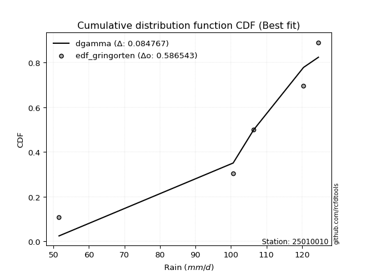</img></img>

</div>


### 9. EDF Filliben (1975)

The specific values of the constants (0.3175) (often denoted as $alpha$) and (0.365) are derived from a method proposed by James J. Filliben in a 1975 paper. This particular formula is the mean value of the $i$-th order statistic of the normal distribution and is considered a robust and effective plotting position formula for the normal probability plot correlation coefficient test for normality.

<div align="center">


$P=(m-0.3175)/(n+0.365)$


</div>


**9.1. Empirical values**

<div align="center">

|                | 0                   | 1                  | 2            | 3                  | 4                  |
|:---------------|:--------------------|:-------------------|:-------------|:-------------------|:-------------------|
| date           | 2023                | 2021               | 2024         | 2025               | 2022               |
| x              | 51.6                | 100.6              | 106.4        | 120.4              | 124.6              |
| m              | 1                   | 2                  | 3            | 4                  | 5                  |
| empirical_dist | edf_filliben        | edf_filliben       | edf_filliben | edf_filliben       | edf_filliben       |
| empirical      | 0.12721342031686858 | 0.3136067101584343 | 0.5          | 0.6863932898415657 | 0.8727865796831314 |
| empirical_tr   | 1.1457554725040042  | 1.456890699253225  | 2.0          | 3.188707280832095  | 7.860805860805863  |

</div>


**9.2. Kolmogorov-Smirnov fit test (sorted by Δ)**


<div align="center">

|                | 0                   | 1                   | 2                   | 3                  | 4                   | 5                   | 6                   | 7                   | 8                   | 9                   | 10                  | 11                  | 12                 | 13                  | 14                  | 15                  | 16                  | 17                  | 18                 | 19                  | 20                  | 21                  | 22                  | 23                  | 24                 | 25                  | 26                  | 27                  | 28                  | 29                 | 30                  | 31                 | 32                 | 33                  | 34                  | 35                 | 36                  | 37                  | 38                 | 39                  | 40                 | 41                 | 42                 | 43                 | 44                  | 45                  | 46                  | 47                 | 48                  | 49                 | 50                 | 51                 | 52                  | 53                 | 54                  | 55                 | 56                  | 57                  | 58                 | 59                  | 60                  | 61                  | 62                  | 63                 | 64                  | 65                  | 66                  | 67                  | 68                 | 69                  | 70                  | 71                 | 72                  | 73                 | 74                  | 75                  | 76                  | 77                  | 78                  | 79                  | 80                  | 81                  | 82                  | 83                  | 84                 | 85                 | 86                  | 87                 | 88                  | 89                 | 90                 | 91                 | 92                  | 93                  | 94                 | 95                 | 96                  | 97                  | 98                 | 99                  | 100                 | 101                | 102                | 103                | 104                 | 105                | 106                | 107                | 108                | 109                 | 110                | 111                 | 112                 | 113                 | 114                | 115                | 116                | 117                | 118                | 119                | 120                | 121                 | 122                | 123                | 124                 | 125                 | 126                | 127                | 128                 | 129                 | 130                | 131                 | 132                 | 133                 | 134                 | 135                | 136                 | 137                 | 138                | 139                | 140                | 141                | 142                | 143                 | 144                | 145                | 146                | 147                | 148                | 149                | 150                | 151                | 152                | 153                | 154                | 155                | 156                | 157                | 158                | 159                |
|:---------------|:--------------------|:--------------------|:--------------------|:-------------------|:--------------------|:--------------------|:--------------------|:--------------------|:--------------------|:--------------------|:--------------------|:--------------------|:-------------------|:--------------------|:--------------------|:--------------------|:--------------------|:--------------------|:-------------------|:--------------------|:--------------------|:--------------------|:--------------------|:--------------------|:-------------------|:--------------------|:--------------------|:--------------------|:--------------------|:-------------------|:--------------------|:-------------------|:-------------------|:--------------------|:--------------------|:-------------------|:--------------------|:--------------------|:-------------------|:--------------------|:-------------------|:-------------------|:-------------------|:-------------------|:--------------------|:--------------------|:--------------------|:-------------------|:--------------------|:-------------------|:-------------------|:-------------------|:--------------------|:-------------------|:--------------------|:-------------------|:--------------------|:--------------------|:-------------------|:--------------------|:--------------------|:--------------------|:--------------------|:-------------------|:--------------------|:--------------------|:--------------------|:--------------------|:-------------------|:--------------------|:--------------------|:-------------------|:--------------------|:-------------------|:--------------------|:--------------------|:--------------------|:--------------------|:--------------------|:--------------------|:--------------------|:--------------------|:--------------------|:--------------------|:-------------------|:-------------------|:--------------------|:-------------------|:--------------------|:-------------------|:-------------------|:-------------------|:--------------------|:--------------------|:-------------------|:-------------------|:--------------------|:--------------------|:-------------------|:--------------------|:--------------------|:-------------------|:-------------------|:-------------------|:--------------------|:-------------------|:-------------------|:-------------------|:-------------------|:--------------------|:-------------------|:--------------------|:--------------------|:--------------------|:-------------------|:-------------------|:-------------------|:-------------------|:-------------------|:-------------------|:-------------------|:--------------------|:-------------------|:-------------------|:--------------------|:--------------------|:-------------------|:-------------------|:--------------------|:--------------------|:-------------------|:--------------------|:--------------------|:--------------------|:--------------------|:-------------------|:--------------------|:--------------------|:-------------------|:-------------------|:-------------------|:-------------------|:-------------------|:--------------------|:-------------------|:-------------------|:-------------------|:-------------------|:-------------------|:-------------------|:-------------------|:-------------------|:-------------------|:-------------------|:-------------------|:-------------------|:-------------------|:-------------------|:-------------------|:-------------------|
| station        | 25010010            | 25010010            | 25010010            | 25010010           | 25010010            | 25010010            | 25010010            | 25010010            | 25010010            | 25010010            | 25010010            | 25010010            | 25010010           | 25010010            | 25010010            | 25010010            | 25010010            | 25010010            | 25010010           | 25010010            | 25010010            | 25010010            | 25010010            | 25010010            | 25010010           | 25010010            | 25010010            | 25010010            | 25010010            | 25010010           | 25010010            | 25010010           | 25010010           | 25010010            | 25010010            | 25010010           | 25010010            | 25010010            | 25010010           | 25010010            | 25010010           | 25010010           | 25010010           | 25010010           | 25010010            | 25010010            | 25010010            | 25010010           | 25010010            | 25010010           | 25010010           | 25010010           | 25010010            | 25010010           | 25010010            | 25010010           | 25010010            | 25010010            | 25010010           | 25010010            | 25010010            | 25010010            | 25010010            | 25010010           | 25010010            | 25010010            | 25010010            | 25010010            | 25010010           | 25010010            | 25010010            | 25010010           | 25010010            | 25010010           | 25010010            | 25010010            | 25010010            | 25010010            | 25010010            | 25010010            | 25010010            | 25010010            | 25010010            | 25010010            | 25010010           | 25010010           | 25010010            | 25010010           | 25010010            | 25010010           | 25010010           | 25010010           | 25010010            | 25010010            | 25010010           | 25010010           | 25010010            | 25010010            | 25010010           | 25010010            | 25010010            | 25010010           | 25010010           | 25010010           | 25010010            | 25010010           | 25010010           | 25010010           | 25010010           | 25010010            | 25010010           | 25010010            | 25010010            | 25010010            | 25010010           | 25010010           | 25010010           | 25010010           | 25010010           | 25010010           | 25010010           | 25010010            | 25010010           | 25010010           | 25010010            | 25010010            | 25010010           | 25010010           | 25010010            | 25010010            | 25010010           | 25010010            | 25010010            | 25010010            | 25010010            | 25010010           | 25010010            | 25010010            | 25010010           | 25010010           | 25010010           | 25010010           | 25010010           | 25010010            | 25010010           | 25010010           | 25010010           | 25010010           | 25010010           | 25010010           | 25010010           | 25010010           | 25010010           | 25010010           | 25010010           | 25010010           | 25010010           | 25010010           | 25010010           | 25010010           |
| empirical_dist | edf_filliben        | edf_filliben        | edf_filliben        | edf_filliben       | edf_filliben        | edf_filliben        | edf_filliben        | edf_filliben        | edf_filliben        | edf_filliben        | edf_filliben        | edf_filliben        | edf_filliben       | edf_filliben        | edf_filliben        | edf_filliben        | edf_filliben        | edf_filliben        | edf_filliben       | edf_filliben        | edf_filliben        | edf_filliben        | edf_filliben        | edf_filliben        | edf_filliben       | edf_filliben        | edf_filliben        | edf_filliben        | edf_filliben        | edf_filliben       | edf_filliben        | edf_filliben       | edf_filliben       | edf_filliben        | edf_filliben        | edf_filliben       | edf_filliben        | edf_filliben        | edf_filliben       | edf_filliben        | edf_filliben       | edf_filliben       | edf_filliben       | edf_filliben       | edf_filliben        | edf_filliben        | edf_filliben        | edf_filliben       | edf_filliben        | edf_filliben       | edf_filliben       | edf_filliben       | edf_filliben        | edf_filliben       | edf_filliben        | edf_filliben       | edf_filliben        | edf_filliben        | edf_filliben       | edf_filliben        | edf_filliben        | edf_filliben        | edf_filliben        | edf_filliben       | edf_filliben        | edf_filliben        | edf_filliben        | edf_filliben        | edf_filliben       | edf_filliben        | edf_filliben        | edf_filliben       | edf_filliben        | edf_filliben       | edf_filliben        | edf_filliben        | edf_filliben        | edf_filliben        | edf_filliben        | edf_filliben        | edf_filliben        | edf_filliben        | edf_filliben        | edf_filliben        | edf_filliben       | edf_filliben       | edf_filliben        | edf_filliben       | edf_filliben        | edf_filliben       | edf_filliben       | edf_filliben       | edf_filliben        | edf_filliben        | edf_filliben       | edf_filliben       | edf_filliben        | edf_filliben        | edf_filliben       | edf_filliben        | edf_filliben        | edf_filliben       | edf_filliben       | edf_filliben       | edf_filliben        | edf_filliben       | edf_filliben       | edf_filliben       | edf_filliben       | edf_filliben        | edf_filliben       | edf_filliben        | edf_filliben        | edf_filliben        | edf_filliben       | edf_filliben       | edf_filliben       | edf_filliben       | edf_filliben       | edf_filliben       | edf_filliben       | edf_filliben        | edf_filliben       | edf_filliben       | edf_filliben        | edf_filliben        | edf_filliben       | edf_filliben       | edf_filliben        | edf_filliben        | edf_filliben       | edf_filliben        | edf_filliben        | edf_filliben        | edf_filliben        | edf_filliben       | edf_filliben        | edf_filliben        | edf_filliben       | edf_filliben       | edf_filliben       | edf_filliben       | edf_filliben       | edf_filliben        | edf_filliben       | edf_filliben       | edf_filliben       | edf_filliben       | edf_filliben       | edf_filliben       | edf_filliben       | edf_filliben       | edf_filliben       | edf_filliben       | edf_filliben       | edf_filliben       | edf_filliben       | edf_filliben       | edf_filliben       | edf_filliben       |
| p_dist         | dweibull            | dgamma              | pearson3            | gumbel_l           | weibull_min         | logloglaplace       | logvonmises_line    | vonmises_line       | genextreme          | loggenextreme       | gennorm             | trapezoid           | loggennorm         | logweibull_min      | logexponpow         | logdweibull         | levy_l              | loglevy_l           | burr               | argus               | logexponweib        | logburr12           | genpareto           | beta                | logpearson3        | weibull_max         | logdgamma           | loggompertz         | logloggamma         | logargus           | johnsonsb           | loggumbel_l        | logtrapezoid       | logmielke           | laplace             | hypsecant          | logistic            | exponnorm           | crystalball        | norm                | t                  | nct                | anglit             | semicircular       | arcsine             | f                   | logburr             | mielke             | invgamma            | logjohnsonsb       | genhalflogistic    | gamma              | rice                | loginvweibull      | erlang              | kappa3             | alpha               | logarcsine          | maxwell            | wrapcauchy          | skewnorm            | loggenhalflogistic  | logweibull_max      | betaprime          | ncf                 | rayleigh            | logsemicircular     | loganglit           | logf               | logt                | logcrystalball      | lognorm            | logexponnorm        | logfatiguelife     | invgauss            | logncf              | cosine              | logbetaprime        | lognct              | triang              | logrice             | logalpha            | loglogistic         | loginvgamma         | loghypsecant       | gausshyper         | gumbel_r            | halfnorm           | kstwobign           | loginvgauss        | logmaxwell         | logbeta            | loglaplace          | loglaplace          | loggausshyper      | lograyleigh        | moyal               | halflogistic        | logwrapcauchy      | logskewnorm         | logkstwobign        | logcosine          | loggenexpon        | loghalfnorm        | logfoldnorm         | loggumbel_r        | truncnorm          | lognakagami        | logtruncnorm       | nakagami            | logtukeylambda     | genexpon            | logtriang           | ksone               | loghalflogistic    | logmoyal           | loggenpareto       | burr12             | halfgennorm        | wald               | uniform            | kappa4              | lomax              | foldnorm           | loggamma            | loggamma            | exponweib          | logerlang          | logksone            | logwald             | gompertz           | truncweibull_min    | logkappa4           | bradford            | truncexpon          | invweibull         | logkappa3           | loguniform          | logjohnsonsu       | logbradford        | logtruncexpon      | fatiguelife        | loggengamma        | logtruncweibull_min | gengamma           | logrdist           | loglomax           | johnsonsu          | powerlaw           | exponpow           | truncpareto        | logpowerlaw        | logtruncpareto     | rdist              | genlogistic        | loggenlogistic     | loghalfgennorm     | tukeylambda        | logvonmises        | vonmises           |
| delta          | 0.08305748789411226 | 0.10260570038482825 | 0.11183810400918798 | 0.1141303785820525 | 0.11961666459691123 | 0.12327303454622995 | 0.12721341861913169 | 0.12721342030638597 | 0.12721342031636018 | 0.12721342031659055 | 0.12877785181089907 | 0.12939326114525979 | 0.1300266720157769 | 0.13161911375119345 | 0.13446497934581758 | 0.13469927862495223 | 0.14330405508818034 | 0.14505537220611697 | 0.1473255064876109 | 0.14813839530649153 | 0.14961314802256154 | 0.15125355030562643 | 0.15323301444752602 | 0.15409291103713496 | 0.1554863557403457 | 0.15871278433206948 | 0.16563868740652077 | 0.16633488075128505 | 0.16754507014363662 | 0.1677094966581969 | 0.16938725577033265 | 0.1736748777848634 | 0.1744427546781211 | 0.18045402236348163 | 0.18315113745922712 | 0.1840932968425576 | 0.18430742087173985 | 0.18455679084524468 | 0.1845581494656583 | 0.18455815144084475 | 0.1845778601281653 | 0.1845942340019403 | 0.1848208485397897 | 0.1849290573717693 | 0.18535790349449233 | 0.18715011959186795 | 0.18835804108985876 | 0.1886389976892099 | 0.18974346993248375 | 0.190492268680064  | 0.1924662253678724 | 0.1934790966055437 | 0.19387909726357194 | 0.1962504317427342 | 0.20298640246796956 | 0.2060983541388215 | 0.21238209042268857 | 0.21693973192114663 | 0.2176806729102964 | 0.21844377265735676 | 0.21907593170341289 | 0.21923870395829942 | 0.22367089698266202 | 0.2273638555106537 | 0.22775068235703616 | 0.22873188604855682 | 0.22949267355087238 | 0.23264705008139003 | 0.2377755691409103 | 0.24021433518654617 | 0.24028663255282595 | 0.2402867659345172 | 0.24028723722144402 | 0.2409692471429214 | 0.24131326825390215 | 0.24169661883325727 | 0.24185883167948136 | 0.24259498179757683 | 0.24385988472598902 | 0.24460238137118578 | 0.24674354520589842 | 0.24739637569162437 | 0.24753031209473336 | 0.25169848586292815 | 0.2536396463549269 | 0.2547637622389857 | 0.25487749366452433 | 0.259844691373545  | 0.26023811768133814 | 0.2631018197993618 | 0.270417577165139  | 0.2721621661911783 | 0.27358806527241913 | 0.27358806527241913 | 0.2762800783983073 | 0.2800652269107176 | 0.28073604751643694 | 0.28466879493872493 | 0.2867361787389818 | 0.28998846798216654 | 0.29824546766768706 | 0.3010220280838786 | 0.3037808222756396 | 0.3072985298985104 | 0.30752201693043874 | 0.3102146835036855 | 0.3135096308224789 | 0.3135604953463439 | 0.3136040822347266 | 0.31360608484267827 | 0.3136067082822817 | 0.31716471719098777 | 0.32819975728932044 | 0.32908735376850634 | 0.3347092125452095 | 0.3349231146618776 | 0.3370742505766508 | 0.3433938710961389 | 0.3462257813213044 | 0.3526538325401746 | 0.3576261665538944 | 0.36077175284605306 | 0.3780247447626238 | 0.3891524307424803 | 0.39037452440830817 | 0.39037452440830817 | 0.3925873143789386 | 0.3967591606102137 | 0.40081449393324414 | 0.40348777959710774 | 0.4071219719412365 | 0.42220835401158247 | 0.43013387439355116 | 0.43140463841535864 | 0.43775702431316726 | 0.4417700035976375 | 0.44267118496005725 | 0.44369873475157967 | 0.4466037698185081 | 0.5026738551083587 | 0.5238132428749371 | 0.5377395591950627 | 0.5378021506143353 | 0.5594102659167266  | 0.568369160133531  | 0.5704751043309049 | 0.5782591799178889 | 0.5807527825703742 | 0.6347807520826356 | 0.6376269394790319 | 0.6456494590563953 | 0.6482488883215114 | 0.6578558729973887 | 0.6863932898415657 | 0.6863932898415657 | 0.6863932898415657 | 0.6863932898415657 | 0.8719631343499704 | 1.2318623260467556 | 19.214598438664304 |
| deltao         | 0.5865427407550001  | 0.5865427407550001  | 0.5865427407550001  | 0.5865427407550001 | 0.5865427407550001  | 0.5865427407550001  | 0.5865427407550001  | 0.5865427407550001  | 0.5865427407550001  | 0.5865427407550001  | 0.5865427407550001  | 0.5865427407550001  | 0.5865427407550001 | 0.5865427407550001  | 0.5865427407550001  | 0.5865427407550001  | 0.5865427407550001  | 0.5865427407550001  | 0.5865427407550001 | 0.5865427407550001  | 0.5865427407550001  | 0.5865427407550001  | 0.5865427407550001  | 0.5865427407550001  | 0.5865427407550001 | 0.5865427407550001  | 0.5865427407550001  | 0.5865427407550001  | 0.5865427407550001  | 0.5865427407550001 | 0.5865427407550001  | 0.5865427407550001 | 0.5865427407550001 | 0.5865427407550001  | 0.5865427407550001  | 0.5865427407550001 | 0.5865427407550001  | 0.5865427407550001  | 0.5865427407550001 | 0.5865427407550001  | 0.5865427407550001 | 0.5865427407550001 | 0.5865427407550001 | 0.5865427407550001 | 0.5865427407550001  | 0.5865427407550001  | 0.5865427407550001  | 0.5865427407550001 | 0.5865427407550001  | 0.5865427407550001 | 0.5865427407550001 | 0.5865427407550001 | 0.5865427407550001  | 0.5865427407550001 | 0.5865427407550001  | 0.5865427407550001 | 0.5865427407550001  | 0.5865427407550001  | 0.5865427407550001 | 0.5865427407550001  | 0.5865427407550001  | 0.5865427407550001  | 0.5865427407550001  | 0.5865427407550001 | 0.5865427407550001  | 0.5865427407550001  | 0.5865427407550001  | 0.5865427407550001  | 0.5865427407550001 | 0.5865427407550001  | 0.5865427407550001  | 0.5865427407550001 | 0.5865427407550001  | 0.5865427407550001 | 0.5865427407550001  | 0.5865427407550001  | 0.5865427407550001  | 0.5865427407550001  | 0.5865427407550001  | 0.5865427407550001  | 0.5865427407550001  | 0.5865427407550001  | 0.5865427407550001  | 0.5865427407550001  | 0.5865427407550001 | 0.5865427407550001 | 0.5865427407550001  | 0.5865427407550001 | 0.5865427407550001  | 0.5865427407550001 | 0.5865427407550001 | 0.5865427407550001 | 0.5865427407550001  | 0.5865427407550001  | 0.5865427407550001 | 0.5865427407550001 | 0.5865427407550001  | 0.5865427407550001  | 0.5865427407550001 | 0.5865427407550001  | 0.5865427407550001  | 0.5865427407550001 | 0.5865427407550001 | 0.5865427407550001 | 0.5865427407550001  | 0.5865427407550001 | 0.5865427407550001 | 0.5865427407550001 | 0.5865427407550001 | 0.5865427407550001  | 0.5865427407550001 | 0.5865427407550001  | 0.5865427407550001  | 0.5865427407550001  | 0.5865427407550001 | 0.5865427407550001 | 0.5865427407550001 | 0.5865427407550001 | 0.5865427407550001 | 0.5865427407550001 | 0.5865427407550001 | 0.5865427407550001  | 0.5865427407550001 | 0.5865427407550001 | 0.5865427407550001  | 0.5865427407550001  | 0.5865427407550001 | 0.5865427407550001 | 0.5865427407550001  | 0.5865427407550001  | 0.5865427407550001 | 0.5865427407550001  | 0.5865427407550001  | 0.5865427407550001  | 0.5865427407550001  | 0.5865427407550001 | 0.5865427407550001  | 0.5865427407550001  | 0.5865427407550001 | 0.5865427407550001 | 0.5865427407550001 | 0.5865427407550001 | 0.5865427407550001 | 0.5865427407550001  | 0.5865427407550001 | 0.5865427407550001 | 0.5865427407550001 | 0.5865427407550001 | 0.5865427407550001 | 0.5865427407550001 | 0.5865427407550001 | 0.5865427407550001 | 0.5865427407550001 | 0.5865427407550001 | 0.5865427407550001 | 0.5865427407550001 | 0.5865427407550001 | 0.5865427407550001 | 0.5865427407550001 | 0.5865427407550001 |
| eval           | Δo > Δ              | Δo > Δ              | Δo > Δ              | Δo > Δ             | Δo > Δ              | Δo > Δ              | Δo > Δ              | Δo > Δ              | Δo > Δ              | Δo > Δ              | Δo > Δ              | Δo > Δ              | Δo > Δ             | Δo > Δ              | Δo > Δ              | Δo > Δ              | Δo > Δ              | Δo > Δ              | Δo > Δ             | Δo > Δ              | Δo > Δ              | Δo > Δ              | Δo > Δ              | Δo > Δ              | Δo > Δ             | Δo > Δ              | Δo > Δ              | Δo > Δ              | Δo > Δ              | Δo > Δ             | Δo > Δ              | Δo > Δ             | Δo > Δ             | Δo > Δ              | Δo > Δ              | Δo > Δ             | Δo > Δ              | Δo > Δ              | Δo > Δ             | Δo > Δ              | Δo > Δ             | Δo > Δ             | Δo > Δ             | Δo > Δ             | Δo > Δ              | Δo > Δ              | Δo > Δ              | Δo > Δ             | Δo > Δ              | Δo > Δ             | Δo > Δ             | Δo > Δ             | Δo > Δ              | Δo > Δ             | Δo > Δ              | Δo > Δ             | Δo > Δ              | Δo > Δ              | Δo > Δ             | Δo > Δ              | Δo > Δ              | Δo > Δ              | Δo > Δ              | Δo > Δ             | Δo > Δ              | Δo > Δ              | Δo > Δ              | Δo > Δ              | Δo > Δ             | Δo > Δ              | Δo > Δ              | Δo > Δ             | Δo > Δ              | Δo > Δ             | Δo > Δ              | Δo > Δ              | Δo > Δ              | Δo > Δ              | Δo > Δ              | Δo > Δ              | Δo > Δ              | Δo > Δ              | Δo > Δ              | Δo > Δ              | Δo > Δ             | Δo > Δ             | Δo > Δ              | Δo > Δ             | Δo > Δ              | Δo > Δ             | Δo > Δ             | Δo > Δ             | Δo > Δ              | Δo > Δ              | Δo > Δ             | Δo > Δ             | Δo > Δ              | Δo > Δ              | Δo > Δ             | Δo > Δ              | Δo > Δ              | Δo > Δ             | Δo > Δ             | Δo > Δ             | Δo > Δ              | Δo > Δ             | Δo > Δ             | Δo > Δ             | Δo > Δ             | Δo > Δ              | Δo > Δ             | Δo > Δ              | Δo > Δ              | Δo > Δ              | Δo > Δ             | Δo > Δ             | Δo > Δ             | Δo > Δ             | Δo > Δ             | Δo > Δ             | Δo > Δ             | Δo > Δ              | Δo > Δ             | Δo > Δ             | Δo > Δ              | Δo > Δ              | Δo > Δ             | Δo > Δ             | Δo > Δ              | Δo > Δ              | Δo > Δ             | Δo > Δ              | Δo > Δ              | Δo > Δ              | Δo > Δ              | Δo > Δ             | Δo > Δ              | Δo > Δ              | Δo > Δ             | Δo > Δ             | Δo > Δ             | Δo > Δ             | Δo > Δ             | Δo > Δ              | Δo > Δ             | Δo > Δ             | Δo > Δ             | Δo > Δ             | Δo <= Δ            | Δo <= Δ            | Δo <= Δ            | Δo <= Δ            | Δo <= Δ            | Δo <= Δ            | Δo <= Δ            | Δo <= Δ            | Δo <= Δ            | Δo <= Δ            | Δo <= Δ            | Δo <= Δ            |
| fit            | 1                   | 1                   | 1                   | 1                  | 1                   | 1                   | 1                   | 1                   | 1                   | 1                   | 1                   | 1                   | 1                  | 1                   | 1                   | 1                   | 1                   | 1                   | 1                  | 1                   | 1                   | 1                   | 1                   | 1                   | 1                  | 1                   | 1                   | 1                   | 1                   | 1                  | 1                   | 1                  | 1                  | 1                   | 1                   | 1                  | 1                   | 1                   | 1                  | 1                   | 1                  | 1                  | 1                  | 1                  | 1                   | 1                   | 1                   | 1                  | 1                   | 1                  | 1                  | 1                  | 1                   | 1                  | 1                   | 1                  | 1                   | 1                   | 1                  | 1                   | 1                   | 1                   | 1                   | 1                  | 1                   | 1                   | 1                   | 1                   | 1                  | 1                   | 1                   | 1                  | 1                   | 1                  | 1                   | 1                   | 1                   | 1                   | 1                   | 1                   | 1                   | 1                   | 1                   | 1                   | 1                  | 1                  | 1                   | 1                  | 1                   | 1                  | 1                  | 1                  | 1                   | 1                   | 1                  | 1                  | 1                   | 1                   | 1                  | 1                   | 1                   | 1                  | 1                  | 1                  | 1                   | 1                  | 1                  | 1                  | 1                  | 1                   | 1                  | 1                   | 1                   | 1                   | 1                  | 1                  | 1                  | 1                  | 1                  | 1                  | 1                  | 1                   | 1                  | 1                  | 1                   | 1                   | 1                  | 1                  | 1                   | 1                   | 1                  | 1                   | 1                   | 1                   | 1                   | 1                  | 1                   | 1                   | 1                  | 1                  | 1                  | 1                  | 1                  | 1                   | 1                  | 1                  | 1                  | 1                  | 0                  | 0                  | 0                  | 0                  | 0                  | 0                  | 0                  | 0                  | 0                  | 0                  | 0                  | 0                  |
| n              | 5                   | 5                   | 5                   | 5                  | 5                   | 5                   | 5                   | 5                   | 5                   | 5                   | 5                   | 5                   | 5                  | 5                   | 5                   | 5                   | 5                   | 5                   | 5                  | 5                   | 5                   | 5                   | 5                   | 5                   | 5                  | 5                   | 5                   | 5                   | 5                   | 5                  | 5                   | 5                  | 5                  | 5                   | 5                   | 5                  | 5                   | 5                   | 5                  | 5                   | 5                  | 5                  | 5                  | 5                  | 5                   | 5                   | 5                   | 5                  | 5                   | 5                  | 5                  | 5                  | 5                   | 5                  | 5                   | 5                  | 5                   | 5                   | 5                  | 5                   | 5                   | 5                   | 5                   | 5                  | 5                   | 5                   | 5                   | 5                   | 5                  | 5                   | 5                   | 5                  | 5                   | 5                  | 5                   | 5                   | 5                   | 5                   | 5                   | 5                   | 5                   | 5                   | 5                   | 5                   | 5                  | 5                  | 5                   | 5                  | 5                   | 5                  | 5                  | 5                  | 5                   | 5                   | 5                  | 5                  | 5                   | 5                   | 5                  | 5                   | 5                   | 5                  | 5                  | 5                  | 5                   | 5                  | 5                  | 5                  | 5                  | 5                   | 5                  | 5                   | 5                   | 5                   | 5                  | 5                  | 5                  | 5                  | 5                  | 5                  | 5                  | 5                   | 5                  | 5                  | 5                   | 5                   | 5                  | 5                  | 5                   | 5                   | 5                  | 5                   | 5                   | 5                   | 5                   | 5                  | 5                   | 5                   | 5                  | 5                  | 5                  | 5                  | 5                  | 5                   | 5                  | 5                  | 5                  | 5                  | 5                  | 5                  | 5                  | 5                  | 5                  | 5                  | 5                  | 5                  | 5                  | 5                  | 5                  | 5                  |
| best_fit       | 1                   | 0                   | 0                   | 0                  | 0                   | 0                   | 0                   | 0                   | 0                   | 0                   | 0                   | 0                   | 0                  | 0                   | 0                   | 0                   | 0                   | 0                   | 0                  | 0                   | 0                   | 0                   | 0                   | 0                   | 0                  | 0                   | 0                   | 0                   | 0                   | 0                  | 0                   | 0                  | 0                  | 0                   | 0                   | 0                  | 0                   | 0                   | 0                  | 0                   | 0                  | 0                  | 0                  | 0                  | 0                   | 0                   | 0                   | 0                  | 0                   | 0                  | 0                  | 0                  | 0                   | 0                  | 0                   | 0                  | 0                   | 0                   | 0                  | 0                   | 0                   | 0                   | 0                   | 0                  | 0                   | 0                   | 0                   | 0                   | 0                  | 0                   | 0                   | 0                  | 0                   | 0                  | 0                   | 0                   | 0                   | 0                   | 0                   | 0                   | 0                   | 0                   | 0                   | 0                   | 0                  | 0                  | 0                   | 0                  | 0                   | 0                  | 0                  | 0                  | 0                   | 0                   | 0                  | 0                  | 0                   | 0                   | 0                  | 0                   | 0                   | 0                  | 0                  | 0                  | 0                   | 0                  | 0                  | 0                  | 0                  | 0                   | 0                  | 0                   | 0                   | 0                   | 0                  | 0                  | 0                  | 0                  | 0                  | 0                  | 0                  | 0                   | 0                  | 0                  | 0                   | 0                   | 0                  | 0                  | 0                   | 0                   | 0                  | 0                   | 0                   | 0                   | 0                   | 0                  | 0                   | 0                   | 0                  | 0                  | 0                  | 0                  | 0                  | 0                   | 0                  | 0                  | 0                  | 0                  | 0                  | 0                  | 0                  | 0                  | 0                  | 0                  | 0                  | 0                  | 0                  | 0                  | 0                  | 0                  |
| best_fit_sort  | 1                   | 2                   | 3                   | 4                  | 5                   | 6                   | 7                   | 8                   | 9                   | 10                  | 11                  | 12                  | 13                 | 14                  | 15                  | 16                  | 17                  | 18                  | 19                 | 20                  | 21                  | 22                  | 23                  | 24                  | 25                 | 26                  | 27                  | 28                  | 29                  | 30                 | 31                  | 32                 | 33                 | 34                  | 35                  | 36                 | 37                  | 38                  | 39                 | 40                  | 41                 | 42                 | 43                 | 44                 | 45                  | 46                  | 47                  | 48                 | 49                  | 50                 | 51                 | 52                 | 53                  | 54                 | 55                  | 56                 | 57                  | 58                  | 59                 | 60                  | 61                  | 62                  | 63                  | 64                 | 65                  | 66                  | 67                  | 68                  | 69                 | 70                  | 71                  | 72                 | 73                  | 74                 | 75                  | 76                  | 77                  | 78                  | 79                  | 80                  | 81                  | 82                  | 83                  | 84                  | 85                 | 86                 | 87                  | 88                 | 89                  | 90                 | 91                 | 92                 | 93                  | 94                  | 95                 | 96                 | 97                  | 98                  | 99                 | 100                 | 101                 | 102                | 103                | 104                | 105                 | 106                | 107                | 108                | 109                | 110                 | 111                | 112                 | 113                 | 114                 | 115                | 116                | 117                | 118                | 119                | 120                | 121                | 122                 | 123                | 124                | 125                 | 126                 | 127                | 128                | 129                 | 130                 | 131                | 132                 | 133                 | 134                 | 135                 | 136                | 137                 | 138                 | 139                | 140                | 141                | 142                | 143                | 144                 | 145                | 146                | 147                | 148                | 149                | 150                | 151                | 152                | 153                | 154                | 155                | 156                | 157                | 158                | 159                | 160                |

</div>


**9.3. Best fit**

<div align="center">

|   id |   station | empirical_dist   | p_dist   |     delta |   deltao | eval   |   fit |   n |   best_fit |   best_fit_sort |
|-----:|----------:|:-----------------|:---------|----------:|---------:|:-------|------:|----:|-----------:|----------------:|
|    0 |  25010010 | edf_filliben     | dweibull | 0.0830575 | 0.586543 | Δo > Δ |     1 |   5 |          1 |               1 |

</div>


<div align="center">

</img></img>

</div>


### 10. EDF Jenkinson (1977)

The Jenkinson formula in hydrology is an empirical plotting position formula used to estimate the non-exceedance probability _(P)_ or return period _(T)_ of a given ordered observation within a sample. It is a widely used method in the frequency analysis of extreme events such as floods and rainfall, as it provides a distribution-free way to plot data. _a≈0.31_ and _b≈0.38_ are constants derived to approximate the median of the probability distribution for the given rank.

<div align="center">


$P=(m-a)/(n+b)$


</div>


**10.1. Empirical values**

<div align="center">

|                | 0                   | 1                  | 2             | 3                  | 4                  |
|:---------------|:--------------------|:-------------------|:--------------|:-------------------|:-------------------|
| date           | 2023                | 2021               | 2024          | 2025               | 2022               |
| x              | 51.6                | 100.6              | 106.4         | 120.4              | 124.6              |
| m              | 1                   | 2                  | 3             | 4                  | 5                  |
| empirical_dist | edf_jenkinson       | edf_jenkinson      | edf_jenkinson | edf_jenkinson      | edf_jenkinson      |
| empirical      | 0.12825278810408922 | 0.3141263940520446 | 0.5           | 0.6858736059479554 | 0.8717472118959109 |
| empirical_tr   | 1.1471215351812367  | 1.4579945799457996 | 2.0           | 3.183431952662722  | 7.797101449275368  |

</div>


**10.2. Kolmogorov-Smirnov fit test (sorted by Δ)**


<div align="center">

|                | 0                   | 1                   | 2                   | 3                   | 4                   | 5                   | 6                   | 7                  | 8                   | 9                   | 10                  | 11                 | 12                 | 13                 | 14                  | 15                  | 16                  | 17                  | 18                  | 19                  | 20                  | 21                  | 22                  | 23                  | 24                  | 25                 | 26                 | 27                 | 28                  | 29                  | 30                 | 31                  | 32                  | 33                  | 34                  | 35                  | 36                 | 37                  | 38                  | 39                 | 40                  | 41                  | 42                  | 43                  | 44                  | 45                 | 46                 | 47                  | 48                 | 49                  | 50                  | 51                  | 52                 | 53                  | 54                  | 55                 | 56                  | 57                  | 58                  | 59                  | 60                  | 61                  | 62                  | 63                  | 64                  | 65                  | 66                  | 67                  | 68                  | 69                  | 70                 | 71                  | 72                  | 73                  | 74                 | 75                  | 76                 | 77                  | 78                  | 79                  | 80                  | 81                  | 82                  | 83                 | 84                  | 85                 | 86                 | 87                  | 88                 | 89                  | 90                  | 91                  | 92                 | 93                 | 94                  | 95                  | 96                 | 97                 | 98                 | 99                 | 100                | 101                | 102                | 103                | 104                | 105                 | 106                 | 107                 | 108                | 109                | 110                 | 111                | 112                | 113                | 114                | 115                 | 116                 | 117                 | 118                 | 119                | 120                 | 121                | 122                 | 123                | 124                | 125                | 126                | 127                 | 128                | 129                | 130                | 131                | 132                | 133                | 134                | 135                 | 136                | 137                | 138                 | 139                | 140                | 141                | 142                | 143                 | 144                | 145                | 146                | 147                | 148                | 149                | 150                | 151                | 152                | 153                | 154                | 155                | 156                | 157                | 158                | 159                |
|:---------------|:--------------------|:--------------------|:--------------------|:--------------------|:--------------------|:--------------------|:--------------------|:-------------------|:--------------------|:--------------------|:--------------------|:-------------------|:-------------------|:-------------------|:--------------------|:--------------------|:--------------------|:--------------------|:--------------------|:--------------------|:--------------------|:--------------------|:--------------------|:--------------------|:--------------------|:-------------------|:-------------------|:-------------------|:--------------------|:--------------------|:-------------------|:--------------------|:--------------------|:--------------------|:--------------------|:--------------------|:-------------------|:--------------------|:--------------------|:-------------------|:--------------------|:--------------------|:--------------------|:--------------------|:--------------------|:-------------------|:-------------------|:--------------------|:-------------------|:--------------------|:--------------------|:--------------------|:-------------------|:--------------------|:--------------------|:-------------------|:--------------------|:--------------------|:--------------------|:--------------------|:--------------------|:--------------------|:--------------------|:--------------------|:--------------------|:--------------------|:--------------------|:--------------------|:--------------------|:--------------------|:-------------------|:--------------------|:--------------------|:--------------------|:-------------------|:--------------------|:-------------------|:--------------------|:--------------------|:--------------------|:--------------------|:--------------------|:--------------------|:-------------------|:--------------------|:-------------------|:-------------------|:--------------------|:-------------------|:--------------------|:--------------------|:--------------------|:-------------------|:-------------------|:--------------------|:--------------------|:-------------------|:-------------------|:-------------------|:-------------------|:-------------------|:-------------------|:-------------------|:-------------------|:-------------------|:--------------------|:--------------------|:--------------------|:-------------------|:-------------------|:--------------------|:-------------------|:-------------------|:-------------------|:-------------------|:--------------------|:--------------------|:--------------------|:--------------------|:-------------------|:--------------------|:-------------------|:--------------------|:-------------------|:-------------------|:-------------------|:-------------------|:--------------------|:-------------------|:-------------------|:-------------------|:-------------------|:-------------------|:-------------------|:-------------------|:--------------------|:-------------------|:-------------------|:--------------------|:-------------------|:-------------------|:-------------------|:-------------------|:--------------------|:-------------------|:-------------------|:-------------------|:-------------------|:-------------------|:-------------------|:-------------------|:-------------------|:-------------------|:-------------------|:-------------------|:-------------------|:-------------------|:-------------------|:-------------------|:-------------------|
| station        | 25010010            | 25010010            | 25010010            | 25010010            | 25010010            | 25010010            | 25010010            | 25010010           | 25010010            | 25010010            | 25010010            | 25010010           | 25010010           | 25010010           | 25010010            | 25010010            | 25010010            | 25010010            | 25010010            | 25010010            | 25010010            | 25010010            | 25010010            | 25010010            | 25010010            | 25010010           | 25010010           | 25010010           | 25010010            | 25010010            | 25010010           | 25010010            | 25010010            | 25010010            | 25010010            | 25010010            | 25010010           | 25010010            | 25010010            | 25010010           | 25010010            | 25010010            | 25010010            | 25010010            | 25010010            | 25010010           | 25010010           | 25010010            | 25010010           | 25010010            | 25010010            | 25010010            | 25010010           | 25010010            | 25010010            | 25010010           | 25010010            | 25010010            | 25010010            | 25010010            | 25010010            | 25010010            | 25010010            | 25010010            | 25010010            | 25010010            | 25010010            | 25010010            | 25010010            | 25010010            | 25010010           | 25010010            | 25010010            | 25010010            | 25010010           | 25010010            | 25010010           | 25010010            | 25010010            | 25010010            | 25010010            | 25010010            | 25010010            | 25010010           | 25010010            | 25010010           | 25010010           | 25010010            | 25010010           | 25010010            | 25010010            | 25010010            | 25010010           | 25010010           | 25010010            | 25010010            | 25010010           | 25010010           | 25010010           | 25010010           | 25010010           | 25010010           | 25010010           | 25010010           | 25010010           | 25010010            | 25010010            | 25010010            | 25010010           | 25010010           | 25010010            | 25010010           | 25010010           | 25010010           | 25010010           | 25010010            | 25010010            | 25010010            | 25010010            | 25010010           | 25010010            | 25010010           | 25010010            | 25010010           | 25010010           | 25010010           | 25010010           | 25010010            | 25010010           | 25010010           | 25010010           | 25010010           | 25010010           | 25010010           | 25010010           | 25010010            | 25010010           | 25010010           | 25010010            | 25010010           | 25010010           | 25010010           | 25010010           | 25010010            | 25010010           | 25010010           | 25010010           | 25010010           | 25010010           | 25010010           | 25010010           | 25010010           | 25010010           | 25010010           | 25010010           | 25010010           | 25010010           | 25010010           | 25010010           | 25010010           |
| empirical_dist | edf_jenkinson       | edf_jenkinson       | edf_jenkinson       | edf_jenkinson       | edf_jenkinson       | edf_jenkinson       | edf_jenkinson       | edf_jenkinson      | edf_jenkinson       | edf_jenkinson       | edf_jenkinson       | edf_jenkinson      | edf_jenkinson      | edf_jenkinson      | edf_jenkinson       | edf_jenkinson       | edf_jenkinson       | edf_jenkinson       | edf_jenkinson       | edf_jenkinson       | edf_jenkinson       | edf_jenkinson       | edf_jenkinson       | edf_jenkinson       | edf_jenkinson       | edf_jenkinson      | edf_jenkinson      | edf_jenkinson      | edf_jenkinson       | edf_jenkinson       | edf_jenkinson      | edf_jenkinson       | edf_jenkinson       | edf_jenkinson       | edf_jenkinson       | edf_jenkinson       | edf_jenkinson      | edf_jenkinson       | edf_jenkinson       | edf_jenkinson      | edf_jenkinson       | edf_jenkinson       | edf_jenkinson       | edf_jenkinson       | edf_jenkinson       | edf_jenkinson      | edf_jenkinson      | edf_jenkinson       | edf_jenkinson      | edf_jenkinson       | edf_jenkinson       | edf_jenkinson       | edf_jenkinson      | edf_jenkinson       | edf_jenkinson       | edf_jenkinson      | edf_jenkinson       | edf_jenkinson       | edf_jenkinson       | edf_jenkinson       | edf_jenkinson       | edf_jenkinson       | edf_jenkinson       | edf_jenkinson       | edf_jenkinson       | edf_jenkinson       | edf_jenkinson       | edf_jenkinson       | edf_jenkinson       | edf_jenkinson       | edf_jenkinson      | edf_jenkinson       | edf_jenkinson       | edf_jenkinson       | edf_jenkinson      | edf_jenkinson       | edf_jenkinson      | edf_jenkinson       | edf_jenkinson       | edf_jenkinson       | edf_jenkinson       | edf_jenkinson       | edf_jenkinson       | edf_jenkinson      | edf_jenkinson       | edf_jenkinson      | edf_jenkinson      | edf_jenkinson       | edf_jenkinson      | edf_jenkinson       | edf_jenkinson       | edf_jenkinson       | edf_jenkinson      | edf_jenkinson      | edf_jenkinson       | edf_jenkinson       | edf_jenkinson      | edf_jenkinson      | edf_jenkinson      | edf_jenkinson      | edf_jenkinson      | edf_jenkinson      | edf_jenkinson      | edf_jenkinson      | edf_jenkinson      | edf_jenkinson       | edf_jenkinson       | edf_jenkinson       | edf_jenkinson      | edf_jenkinson      | edf_jenkinson       | edf_jenkinson      | edf_jenkinson      | edf_jenkinson      | edf_jenkinson      | edf_jenkinson       | edf_jenkinson       | edf_jenkinson       | edf_jenkinson       | edf_jenkinson      | edf_jenkinson       | edf_jenkinson      | edf_jenkinson       | edf_jenkinson      | edf_jenkinson      | edf_jenkinson      | edf_jenkinson      | edf_jenkinson       | edf_jenkinson      | edf_jenkinson      | edf_jenkinson      | edf_jenkinson      | edf_jenkinson      | edf_jenkinson      | edf_jenkinson      | edf_jenkinson       | edf_jenkinson      | edf_jenkinson      | edf_jenkinson       | edf_jenkinson      | edf_jenkinson      | edf_jenkinson      | edf_jenkinson      | edf_jenkinson       | edf_jenkinson      | edf_jenkinson      | edf_jenkinson      | edf_jenkinson      | edf_jenkinson      | edf_jenkinson      | edf_jenkinson      | edf_jenkinson      | edf_jenkinson      | edf_jenkinson      | edf_jenkinson      | edf_jenkinson      | edf_jenkinson      | edf_jenkinson      | edf_jenkinson      | edf_jenkinson      |
| p_dist         | dweibull            | dgamma              | pearson3            | gumbel_l            | weibull_min         | logloglaplace       | logvonmises_line    | vonmises_line      | genextreme          | loggenextreme       | trapezoid           | loggennorm         | gennorm            | logweibull_min     | logdweibull         | logexponpow         | levy_l              | loglevy_l           | burr                | argus               | logexponweib        | logburr12           | genpareto           | beta                | logpearson3         | weibull_max        | loggompertz        | logdgamma          | logloggamma         | logargus            | johnsonsb          | loggumbel_l         | logtrapezoid        | logmielke           | laplace             | hypsecant           | logistic           | exponnorm           | crystalball         | norm               | t                   | nct                 | anglit              | semicircular        | arcsine             | f                  | logburr            | mielke              | invgamma           | logjohnsonsb        | gamma               | genhalflogistic     | rice               | loginvweibull       | erlang              | kappa3             | alpha               | logarcsine          | maxwell             | wrapcauchy          | loggenhalflogistic  | skewnorm            | logweibull_max      | betaprime           | ncf                 | rayleigh            | logsemicircular     | loganglit           | logf                | logt                | logcrystalball     | lognorm             | logexponnorm        | logfatiguelife      | invgauss           | logncf              | cosine             | logbetaprime        | lognct              | triang              | logrice             | logalpha            | loglogistic         | loginvgamma        | loghypsecant        | gausshyper         | gumbel_r           | halfnorm            | kstwobign          | loginvgauss         | logmaxwell          | logbeta             | loglaplace         | loglaplace         | loggausshyper       | lograyleigh         | moyal              | halflogistic       | logwrapcauchy      | logskewnorm        | logkstwobign       | logcosine          | loggenexpon        | loghalfnorm        | logfoldnorm        | loggumbel_r         | truncnorm           | lognakagami         | logtruncnorm       | nakagami           | logtukeylambda      | genexpon           | logtriang          | ksone              | loghalflogistic    | logmoyal            | loggenpareto        | burr12              | halfgennorm         | wald               | uniform             | kappa4             | lomax               | foldnorm           | loggamma           | loggamma           | exponweib          | logerlang           | logksone           | logwald            | gompertz           | truncweibull_min   | logkappa4          | bradford           | truncexpon         | invweibull          | logkappa3          | loguniform         | logjohnsonsu        | logbradford        | logtruncexpon      | fatiguelife        | loggengamma        | logtruncweibull_min | gengamma           | logrdist           | loglomax           | johnsonsu          | powerlaw           | exponpow           | truncpareto        | logpowerlaw        | logtruncpareto     | rdist              | genlogistic        | loggenlogistic     | loghalfgennorm     | tukeylambda        | logvonmises        | vonmises           |
| delta          | 0.08409685568133289 | 0.10364506817204888 | 0.11131842011557763 | 0.11361069468844215 | 0.12013634849052146 | 0.12223366675900937 | 0.12825278640635232 | 0.1282527880936066 | 0.12825278810358076 | 0.12825278810381113 | 0.12887357725164944 | 0.1289873042285563 | 0.1292975357045093 | 0.1310994298575831 | 0.13365991083773165 | 0.13498466323942782 | 0.14330405508818034 | 0.14505537220611697 | 0.14784519038122113 | 0.14865807920010177 | 0.15013283191617177 | 0.15073386641201608 | 0.15271333055391567 | 0.15357322714352473 | 0.15496667184673535 | 0.1592324682256797 | 0.1658151968576747 | 0.166158371300131  | 0.16806475403724686 | 0.16822918055180713 | 0.1688675718767224 | 0.17315519389125306 | 0.17392307078451075 | 0.18097370625709186 | 0.18263145356561677 | 0.18357361294894725 | 0.1837877369781295 | 0.18403710695163433 | 0.18403846557204795 | 0.1840384675472344 | 0.18405817623455495 | 0.18407455010832996 | 0.18430116464617935 | 0.18440937347815894 | 0.18483821960088198 | 0.1866304356982576 | 0.188877724983469  | 0.18915868158282012 | 0.1892237860388734 | 0.18945290089284336 | 0.19295941271193334 | 0.19298590926148262 | 0.1933594133699616 | 0.19573074784912387 | 0.20246671857435922 | 0.2050589863516009 | 0.21186240652907823 | 0.21642004802753628 | 0.21716098901668607 | 0.21792408876374642 | 0.21871902006468907 | 0.21959561559702312 | 0.22315121308905167 | 0.22684417161704334 | 0.22723099846342582 | 0.22821220215494648 | 0.22897298965726204 | 0.23212736618777968 | 0.23725588524729996 | 0.23969465129293582 | 0.2397669486592156 | 0.23976708204090685 | 0.23976755332783367 | 0.24044956324931105 | 0.2407935843602918 | 0.24117693493964693 | 0.241339147785871  | 0.24207529790396648 | 0.24334020083237867 | 0.24408269747757544 | 0.24622386131228807 | 0.24687669179801403 | 0.24701062820112302 | 0.2511788019693178 | 0.25311996246131657 | 0.2542440783453754 | 0.254357809770914  | 0.25932500747993464 | 0.2597184337877278 | 0.26258213590575147 | 0.26989789327152863 | 0.27164248229756804 | 0.2730683813788088 | 0.2730683813788088 | 0.27576039450469697 | 0.27954554301710727 | 0.2802163636228266 | 0.2841491110451146 | 0.2862164948453714 | 0.2894687840885562 | 0.2977257837740767 | 0.3005023441902683 | 0.3032611383820292 | 0.3067788460049001 | 0.3070023330368284 | 0.30969499961007513 | 0.31402931471608925 | 0.31408017923995424 | 0.3141237661283369 | 0.3141257687362886 | 0.31412639217589206 | 0.3166450332973774 | 0.3276800733957101 | 0.328567669874896  | 0.3341895286515992 | 0.33440343076826723 | 0.33655456668304046 | 0.34287418720252855 | 0.34570609742769404 | 0.3521341486465643 | 0.35710648266028405 | 0.3602520689524427 | 0.37698537697540324 | 0.3891524307424803 | 0.3898548405146978 | 0.3898548405146978 | 0.3920676304853283 | 0.39623947671660337 | 0.4002948100396338 | 0.4029680957034974 | 0.4071219719412365 | 0.4216886701179721 | 0.4296141904999408 | 0.4308849545217483 | 0.4372373404195569 | 0.44073063581041694 | 0.4421515010664469 | 0.4431790508579693 | 0.44608408592489784 | 0.5021541712147484 | 0.5232935589813268 | 0.5372198753014523 | 0.537282466720725  | 0.5588905820231163  | 0.5678494762399207 | 0.5694357365436843 | 0.5772198121306682 | 0.580233098676764  | 0.6342610681890253 | 0.6371072555854216 | 0.6451297751627849 | 0.647729204427901  | 0.6573361891037783 | 0.6858736059479553 | 0.6858736059479554 | 0.6858736059479554 | 0.6858736059479554 | 0.8709237665627497 | 1.2313426421531453 | 19.215637806451525 |
| deltao         | 0.5865427407550001  | 0.5865427407550001  | 0.5865427407550001  | 0.5865427407550001  | 0.5865427407550001  | 0.5865427407550001  | 0.5865427407550001  | 0.5865427407550001 | 0.5865427407550001  | 0.5865427407550001  | 0.5865427407550001  | 0.5865427407550001 | 0.5865427407550001 | 0.5865427407550001 | 0.5865427407550001  | 0.5865427407550001  | 0.5865427407550001  | 0.5865427407550001  | 0.5865427407550001  | 0.5865427407550001  | 0.5865427407550001  | 0.5865427407550001  | 0.5865427407550001  | 0.5865427407550001  | 0.5865427407550001  | 0.5865427407550001 | 0.5865427407550001 | 0.5865427407550001 | 0.5865427407550001  | 0.5865427407550001  | 0.5865427407550001 | 0.5865427407550001  | 0.5865427407550001  | 0.5865427407550001  | 0.5865427407550001  | 0.5865427407550001  | 0.5865427407550001 | 0.5865427407550001  | 0.5865427407550001  | 0.5865427407550001 | 0.5865427407550001  | 0.5865427407550001  | 0.5865427407550001  | 0.5865427407550001  | 0.5865427407550001  | 0.5865427407550001 | 0.5865427407550001 | 0.5865427407550001  | 0.5865427407550001 | 0.5865427407550001  | 0.5865427407550001  | 0.5865427407550001  | 0.5865427407550001 | 0.5865427407550001  | 0.5865427407550001  | 0.5865427407550001 | 0.5865427407550001  | 0.5865427407550001  | 0.5865427407550001  | 0.5865427407550001  | 0.5865427407550001  | 0.5865427407550001  | 0.5865427407550001  | 0.5865427407550001  | 0.5865427407550001  | 0.5865427407550001  | 0.5865427407550001  | 0.5865427407550001  | 0.5865427407550001  | 0.5865427407550001  | 0.5865427407550001 | 0.5865427407550001  | 0.5865427407550001  | 0.5865427407550001  | 0.5865427407550001 | 0.5865427407550001  | 0.5865427407550001 | 0.5865427407550001  | 0.5865427407550001  | 0.5865427407550001  | 0.5865427407550001  | 0.5865427407550001  | 0.5865427407550001  | 0.5865427407550001 | 0.5865427407550001  | 0.5865427407550001 | 0.5865427407550001 | 0.5865427407550001  | 0.5865427407550001 | 0.5865427407550001  | 0.5865427407550001  | 0.5865427407550001  | 0.5865427407550001 | 0.5865427407550001 | 0.5865427407550001  | 0.5865427407550001  | 0.5865427407550001 | 0.5865427407550001 | 0.5865427407550001 | 0.5865427407550001 | 0.5865427407550001 | 0.5865427407550001 | 0.5865427407550001 | 0.5865427407550001 | 0.5865427407550001 | 0.5865427407550001  | 0.5865427407550001  | 0.5865427407550001  | 0.5865427407550001 | 0.5865427407550001 | 0.5865427407550001  | 0.5865427407550001 | 0.5865427407550001 | 0.5865427407550001 | 0.5865427407550001 | 0.5865427407550001  | 0.5865427407550001  | 0.5865427407550001  | 0.5865427407550001  | 0.5865427407550001 | 0.5865427407550001  | 0.5865427407550001 | 0.5865427407550001  | 0.5865427407550001 | 0.5865427407550001 | 0.5865427407550001 | 0.5865427407550001 | 0.5865427407550001  | 0.5865427407550001 | 0.5865427407550001 | 0.5865427407550001 | 0.5865427407550001 | 0.5865427407550001 | 0.5865427407550001 | 0.5865427407550001 | 0.5865427407550001  | 0.5865427407550001 | 0.5865427407550001 | 0.5865427407550001  | 0.5865427407550001 | 0.5865427407550001 | 0.5865427407550001 | 0.5865427407550001 | 0.5865427407550001  | 0.5865427407550001 | 0.5865427407550001 | 0.5865427407550001 | 0.5865427407550001 | 0.5865427407550001 | 0.5865427407550001 | 0.5865427407550001 | 0.5865427407550001 | 0.5865427407550001 | 0.5865427407550001 | 0.5865427407550001 | 0.5865427407550001 | 0.5865427407550001 | 0.5865427407550001 | 0.5865427407550001 | 0.5865427407550001 |
| eval           | Δo > Δ              | Δo > Δ              | Δo > Δ              | Δo > Δ              | Δo > Δ              | Δo > Δ              | Δo > Δ              | Δo > Δ             | Δo > Δ              | Δo > Δ              | Δo > Δ              | Δo > Δ             | Δo > Δ             | Δo > Δ             | Δo > Δ              | Δo > Δ              | Δo > Δ              | Δo > Δ              | Δo > Δ              | Δo > Δ              | Δo > Δ              | Δo > Δ              | Δo > Δ              | Δo > Δ              | Δo > Δ              | Δo > Δ             | Δo > Δ             | Δo > Δ             | Δo > Δ              | Δo > Δ              | Δo > Δ             | Δo > Δ              | Δo > Δ              | Δo > Δ              | Δo > Δ              | Δo > Δ              | Δo > Δ             | Δo > Δ              | Δo > Δ              | Δo > Δ             | Δo > Δ              | Δo > Δ              | Δo > Δ              | Δo > Δ              | Δo > Δ              | Δo > Δ             | Δo > Δ             | Δo > Δ              | Δo > Δ             | Δo > Δ              | Δo > Δ              | Δo > Δ              | Δo > Δ             | Δo > Δ              | Δo > Δ              | Δo > Δ             | Δo > Δ              | Δo > Δ              | Δo > Δ              | Δo > Δ              | Δo > Δ              | Δo > Δ              | Δo > Δ              | Δo > Δ              | Δo > Δ              | Δo > Δ              | Δo > Δ              | Δo > Δ              | Δo > Δ              | Δo > Δ              | Δo > Δ             | Δo > Δ              | Δo > Δ              | Δo > Δ              | Δo > Δ             | Δo > Δ              | Δo > Δ             | Δo > Δ              | Δo > Δ              | Δo > Δ              | Δo > Δ              | Δo > Δ              | Δo > Δ              | Δo > Δ             | Δo > Δ              | Δo > Δ             | Δo > Δ             | Δo > Δ              | Δo > Δ             | Δo > Δ              | Δo > Δ              | Δo > Δ              | Δo > Δ             | Δo > Δ             | Δo > Δ              | Δo > Δ              | Δo > Δ             | Δo > Δ             | Δo > Δ             | Δo > Δ             | Δo > Δ             | Δo > Δ             | Δo > Δ             | Δo > Δ             | Δo > Δ             | Δo > Δ              | Δo > Δ              | Δo > Δ              | Δo > Δ             | Δo > Δ             | Δo > Δ              | Δo > Δ             | Δo > Δ             | Δo > Δ             | Δo > Δ             | Δo > Δ              | Δo > Δ              | Δo > Δ              | Δo > Δ              | Δo > Δ             | Δo > Δ              | Δo > Δ             | Δo > Δ              | Δo > Δ             | Δo > Δ             | Δo > Δ             | Δo > Δ             | Δo > Δ              | Δo > Δ             | Δo > Δ             | Δo > Δ             | Δo > Δ             | Δo > Δ             | Δo > Δ             | Δo > Δ             | Δo > Δ              | Δo > Δ             | Δo > Δ             | Δo > Δ              | Δo > Δ             | Δo > Δ             | Δo > Δ             | Δo > Δ             | Δo > Δ              | Δo > Δ             | Δo > Δ             | Δo > Δ             | Δo > Δ             | Δo <= Δ            | Δo <= Δ            | Δo <= Δ            | Δo <= Δ            | Δo <= Δ            | Δo <= Δ            | Δo <= Δ            | Δo <= Δ            | Δo <= Δ            | Δo <= Δ            | Δo <= Δ            | Δo <= Δ            |
| fit            | 1                   | 1                   | 1                   | 1                   | 1                   | 1                   | 1                   | 1                  | 1                   | 1                   | 1                   | 1                  | 1                  | 1                  | 1                   | 1                   | 1                   | 1                   | 1                   | 1                   | 1                   | 1                   | 1                   | 1                   | 1                   | 1                  | 1                  | 1                  | 1                   | 1                   | 1                  | 1                   | 1                   | 1                   | 1                   | 1                   | 1                  | 1                   | 1                   | 1                  | 1                   | 1                   | 1                   | 1                   | 1                   | 1                  | 1                  | 1                   | 1                  | 1                   | 1                   | 1                   | 1                  | 1                   | 1                   | 1                  | 1                   | 1                   | 1                   | 1                   | 1                   | 1                   | 1                   | 1                   | 1                   | 1                   | 1                   | 1                   | 1                   | 1                   | 1                  | 1                   | 1                   | 1                   | 1                  | 1                   | 1                  | 1                   | 1                   | 1                   | 1                   | 1                   | 1                   | 1                  | 1                   | 1                  | 1                  | 1                   | 1                  | 1                   | 1                   | 1                   | 1                  | 1                  | 1                   | 1                   | 1                  | 1                  | 1                  | 1                  | 1                  | 1                  | 1                  | 1                  | 1                  | 1                   | 1                   | 1                   | 1                  | 1                  | 1                   | 1                  | 1                  | 1                  | 1                  | 1                   | 1                   | 1                   | 1                   | 1                  | 1                   | 1                  | 1                   | 1                  | 1                  | 1                  | 1                  | 1                   | 1                  | 1                  | 1                  | 1                  | 1                  | 1                  | 1                  | 1                   | 1                  | 1                  | 1                   | 1                  | 1                  | 1                  | 1                  | 1                   | 1                  | 1                  | 1                  | 1                  | 0                  | 0                  | 0                  | 0                  | 0                  | 0                  | 0                  | 0                  | 0                  | 0                  | 0                  | 0                  |
| n              | 5                   | 5                   | 5                   | 5                   | 5                   | 5                   | 5                   | 5                  | 5                   | 5                   | 5                   | 5                  | 5                  | 5                  | 5                   | 5                   | 5                   | 5                   | 5                   | 5                   | 5                   | 5                   | 5                   | 5                   | 5                   | 5                  | 5                  | 5                  | 5                   | 5                   | 5                  | 5                   | 5                   | 5                   | 5                   | 5                   | 5                  | 5                   | 5                   | 5                  | 5                   | 5                   | 5                   | 5                   | 5                   | 5                  | 5                  | 5                   | 5                  | 5                   | 5                   | 5                   | 5                  | 5                   | 5                   | 5                  | 5                   | 5                   | 5                   | 5                   | 5                   | 5                   | 5                   | 5                   | 5                   | 5                   | 5                   | 5                   | 5                   | 5                   | 5                  | 5                   | 5                   | 5                   | 5                  | 5                   | 5                  | 5                   | 5                   | 5                   | 5                   | 5                   | 5                   | 5                  | 5                   | 5                  | 5                  | 5                   | 5                  | 5                   | 5                   | 5                   | 5                  | 5                  | 5                   | 5                   | 5                  | 5                  | 5                  | 5                  | 5                  | 5                  | 5                  | 5                  | 5                  | 5                   | 5                   | 5                   | 5                  | 5                  | 5                   | 5                  | 5                  | 5                  | 5                  | 5                   | 5                   | 5                   | 5                   | 5                  | 5                   | 5                  | 5                   | 5                  | 5                  | 5                  | 5                  | 5                   | 5                  | 5                  | 5                  | 5                  | 5                  | 5                  | 5                  | 5                   | 5                  | 5                  | 5                   | 5                  | 5                  | 5                  | 5                  | 5                   | 5                  | 5                  | 5                  | 5                  | 5                  | 5                  | 5                  | 5                  | 5                  | 5                  | 5                  | 5                  | 5                  | 5                  | 5                  | 5                  |
| best_fit       | 1                   | 0                   | 0                   | 0                   | 0                   | 0                   | 0                   | 0                  | 0                   | 0                   | 0                   | 0                  | 0                  | 0                  | 0                   | 0                   | 0                   | 0                   | 0                   | 0                   | 0                   | 0                   | 0                   | 0                   | 0                   | 0                  | 0                  | 0                  | 0                   | 0                   | 0                  | 0                   | 0                   | 0                   | 0                   | 0                   | 0                  | 0                   | 0                   | 0                  | 0                   | 0                   | 0                   | 0                   | 0                   | 0                  | 0                  | 0                   | 0                  | 0                   | 0                   | 0                   | 0                  | 0                   | 0                   | 0                  | 0                   | 0                   | 0                   | 0                   | 0                   | 0                   | 0                   | 0                   | 0                   | 0                   | 0                   | 0                   | 0                   | 0                   | 0                  | 0                   | 0                   | 0                   | 0                  | 0                   | 0                  | 0                   | 0                   | 0                   | 0                   | 0                   | 0                   | 0                  | 0                   | 0                  | 0                  | 0                   | 0                  | 0                   | 0                   | 0                   | 0                  | 0                  | 0                   | 0                   | 0                  | 0                  | 0                  | 0                  | 0                  | 0                  | 0                  | 0                  | 0                  | 0                   | 0                   | 0                   | 0                  | 0                  | 0                   | 0                  | 0                  | 0                  | 0                  | 0                   | 0                   | 0                   | 0                   | 0                  | 0                   | 0                  | 0                   | 0                  | 0                  | 0                  | 0                  | 0                   | 0                  | 0                  | 0                  | 0                  | 0                  | 0                  | 0                  | 0                   | 0                  | 0                  | 0                   | 0                  | 0                  | 0                  | 0                  | 0                   | 0                  | 0                  | 0                  | 0                  | 0                  | 0                  | 0                  | 0                  | 0                  | 0                  | 0                  | 0                  | 0                  | 0                  | 0                  | 0                  |
| best_fit_sort  | 1                   | 2                   | 3                   | 4                   | 5                   | 6                   | 7                   | 8                  | 9                   | 10                  | 11                  | 12                 | 13                 | 14                 | 15                  | 16                  | 17                  | 18                  | 19                  | 20                  | 21                  | 22                  | 23                  | 24                  | 25                  | 26                 | 27                 | 28                 | 29                  | 30                  | 31                 | 32                  | 33                  | 34                  | 35                  | 36                  | 37                 | 38                  | 39                  | 40                 | 41                  | 42                  | 43                  | 44                  | 45                  | 46                 | 47                 | 48                  | 49                 | 50                  | 51                  | 52                  | 53                 | 54                  | 55                  | 56                 | 57                  | 58                  | 59                  | 60                  | 61                  | 62                  | 63                  | 64                  | 65                  | 66                  | 67                  | 68                  | 69                  | 70                  | 71                 | 72                  | 73                  | 74                  | 75                 | 76                  | 77                 | 78                  | 79                  | 80                  | 81                  | 82                  | 83                  | 84                 | 85                  | 86                 | 87                 | 88                  | 89                 | 90                  | 91                  | 92                  | 93                 | 94                 | 95                  | 96                  | 97                 | 98                 | 99                 | 100                | 101                | 102                | 103                | 104                | 105                | 106                 | 107                 | 108                 | 109                | 110                | 111                 | 112                | 113                | 114                | 115                | 116                 | 117                 | 118                 | 119                 | 120                | 121                 | 122                | 123                 | 124                | 125                | 126                | 127                | 128                 | 129                | 130                | 131                | 132                | 133                | 134                | 135                | 136                 | 137                | 138                | 139                 | 140                | 141                | 142                | 143                | 144                 | 145                | 146                | 147                | 148                | 149                | 150                | 151                | 152                | 153                | 154                | 155                | 156                | 157                | 158                | 159                | 160                |

</div>


**10.3. Best fit**

<div align="center">

|   id |   station | empirical_dist   | p_dist   |     delta |   deltao | eval   |   fit |   n |   best_fit |   best_fit_sort |
|-----:|----------:|:-----------------|:---------|----------:|---------:|:-------|------:|----:|-----------:|----------------:|
|    0 |  25010010 | edf_jenkinson    | dweibull | 0.0840969 | 0.586543 | Δo > Δ |     1 |   5 |          1 |               1 |

</div>


<div align="center">

</img></img>

</div>


### 11. EDF Cunnane (1978)

Cunnane´s work in statistical hydrology has focused on the performance and evaluation of different probability distributions (such as GEV, Gumbel, Lognormal) for flood frequency estimation. _b_ is a constant, typically set to 0.4.

<div align="center">


$P=(m-b)/(n+1-2b)$


</div>


**11.1. Empirical values**

<div align="center">

|                | 0                   | 1                  | 2           | 3                  | 4                  |
|:---------------|:--------------------|:-------------------|:------------|:-------------------|:-------------------|
| date           | 2023                | 2021               | 2024        | 2025               | 2022               |
| x              | 51.6                | 100.6              | 106.4       | 120.4              | 124.6              |
| m              | 1                   | 2                  | 3           | 4                  | 5                  |
| empirical_dist | edf_cunnane         | edf_cunnane        | edf_cunnane | edf_cunnane        | edf_cunnane        |
| empirical      | 0.11538461538461538 | 0.3076923076923077 | 0.5         | 0.6923076923076923 | 0.8846153846153845 |
| empirical_tr   | 1.1304347826086958  | 1.4444444444444444 | 2.0         | 3.25               | 8.666666666666655  |

</div>


**11.2. Kolmogorov-Smirnov fit test (sorted by Δ)**


<div align="center">

|                | 0                   | 1                   | 2                  | 3                   | 4                   | 5                   | 6                   | 7                   | 8                   | 9                   | 10                 | 11                  | 12                  | 13                  | 14                  | 15                 | 16                 | 17                  | 18                  | 19                  | 20                  | 21                  | 22                 | 23                  | 24                  | 25                  | 26                  | 27                 | 28                  | 29                  | 30                 | 31                  | 32                  | 33                  | 34                  | 35                  | 36                 | 37                  | 38                 | 39                  | 40                  | 41                  | 42                  | 43                  | 44                  | 45                  | 46                 | 47                  | 48                  | 49                 | 50                  | 51                 | 52                  | 53                  | 54                  | 55                  | 56                  | 57                  | 58                 | 59                  | 60                  | 61                  | 62                  | 63                  | 64                  | 65                 | 66                  | 67                 | 68                  | 69                  | 70                  | 71                  | 72                  | 73                  | 74                 | 75                  | 76                  | 77                 | 78                  | 79                  | 80                 | 81                  | 82                  | 83                 | 84                 | 85                 | 86                 | 87                  | 88                 | 89                 | 90                  | 91                 | 92                 | 93                 | 94                 | 95                 | 96                 | 97                 | 98                  | 99                 | 100                | 101                | 102                 | 103                | 104                | 105                | 106                 | 107                 | 108                | 109                | 110                 | 111                 | 112                | 113                | 114                | 115                 | 116                 | 117                 | 118                 | 119                | 120                 | 121                 | 122                | 123                 | 124                 | 125                 | 126                | 127                | 128                | 129                | 130                | 131                 | 132                 | 133                | 134                 | 135                | 136                 | 137                | 138                 | 139                | 140                | 141                | 142                | 143                 | 144                | 145                | 146                | 147                | 148                | 149                | 150                | 151                | 152                | 153                | 154                | 155                | 156                | 157                | 158                | 159                |
|:---------------|:--------------------|:--------------------|:-------------------|:--------------------|:--------------------|:--------------------|:--------------------|:--------------------|:--------------------|:--------------------|:-------------------|:--------------------|:--------------------|:--------------------|:--------------------|:-------------------|:-------------------|:--------------------|:--------------------|:--------------------|:--------------------|:--------------------|:-------------------|:--------------------|:--------------------|:--------------------|:--------------------|:-------------------|:--------------------|:--------------------|:-------------------|:--------------------|:--------------------|:--------------------|:--------------------|:--------------------|:-------------------|:--------------------|:-------------------|:--------------------|:--------------------|:--------------------|:--------------------|:--------------------|:--------------------|:--------------------|:-------------------|:--------------------|:--------------------|:-------------------|:--------------------|:-------------------|:--------------------|:--------------------|:--------------------|:--------------------|:--------------------|:--------------------|:-------------------|:--------------------|:--------------------|:--------------------|:--------------------|:--------------------|:--------------------|:-------------------|:--------------------|:-------------------|:--------------------|:--------------------|:--------------------|:--------------------|:--------------------|:--------------------|:-------------------|:--------------------|:--------------------|:-------------------|:--------------------|:--------------------|:-------------------|:--------------------|:--------------------|:-------------------|:-------------------|:-------------------|:-------------------|:--------------------|:-------------------|:-------------------|:--------------------|:-------------------|:-------------------|:-------------------|:-------------------|:-------------------|:-------------------|:-------------------|:--------------------|:-------------------|:-------------------|:-------------------|:--------------------|:-------------------|:-------------------|:-------------------|:--------------------|:--------------------|:-------------------|:-------------------|:--------------------|:--------------------|:-------------------|:-------------------|:-------------------|:--------------------|:--------------------|:--------------------|:--------------------|:-------------------|:--------------------|:--------------------|:-------------------|:--------------------|:--------------------|:--------------------|:-------------------|:-------------------|:-------------------|:-------------------|:-------------------|:--------------------|:--------------------|:-------------------|:--------------------|:-------------------|:--------------------|:-------------------|:--------------------|:-------------------|:-------------------|:-------------------|:-------------------|:--------------------|:-------------------|:-------------------|:-------------------|:-------------------|:-------------------|:-------------------|:-------------------|:-------------------|:-------------------|:-------------------|:-------------------|:-------------------|:-------------------|:-------------------|:-------------------|:-------------------|
| station        | 25010010            | 25010010            | 25010010           | 25010010            | 25010010            | 25010010            | 25010010            | 25010010            | 25010010            | 25010010            | 25010010           | 25010010            | 25010010            | 25010010            | 25010010            | 25010010           | 25010010           | 25010010            | 25010010            | 25010010            | 25010010            | 25010010            | 25010010           | 25010010            | 25010010            | 25010010            | 25010010            | 25010010           | 25010010            | 25010010            | 25010010           | 25010010            | 25010010            | 25010010            | 25010010            | 25010010            | 25010010           | 25010010            | 25010010           | 25010010            | 25010010            | 25010010            | 25010010            | 25010010            | 25010010            | 25010010            | 25010010           | 25010010            | 25010010            | 25010010           | 25010010            | 25010010           | 25010010            | 25010010            | 25010010            | 25010010            | 25010010            | 25010010            | 25010010           | 25010010            | 25010010            | 25010010            | 25010010            | 25010010            | 25010010            | 25010010           | 25010010            | 25010010           | 25010010            | 25010010            | 25010010            | 25010010            | 25010010            | 25010010            | 25010010           | 25010010            | 25010010            | 25010010           | 25010010            | 25010010            | 25010010           | 25010010            | 25010010            | 25010010           | 25010010           | 25010010           | 25010010           | 25010010            | 25010010           | 25010010           | 25010010            | 25010010           | 25010010           | 25010010           | 25010010           | 25010010           | 25010010           | 25010010           | 25010010            | 25010010           | 25010010           | 25010010           | 25010010            | 25010010           | 25010010           | 25010010           | 25010010            | 25010010            | 25010010           | 25010010           | 25010010            | 25010010            | 25010010           | 25010010           | 25010010           | 25010010            | 25010010            | 25010010            | 25010010            | 25010010           | 25010010            | 25010010            | 25010010           | 25010010            | 25010010            | 25010010            | 25010010           | 25010010           | 25010010           | 25010010           | 25010010           | 25010010            | 25010010            | 25010010           | 25010010            | 25010010           | 25010010            | 25010010           | 25010010            | 25010010           | 25010010           | 25010010           | 25010010           | 25010010            | 25010010           | 25010010           | 25010010           | 25010010           | 25010010           | 25010010           | 25010010           | 25010010           | 25010010           | 25010010           | 25010010           | 25010010           | 25010010           | 25010010           | 25010010           | 25010010           |
| empirical_dist | edf_cunnane         | edf_cunnane         | edf_cunnane        | edf_cunnane         | edf_cunnane         | edf_cunnane         | edf_cunnane         | edf_cunnane         | edf_cunnane         | edf_cunnane         | edf_cunnane        | edf_cunnane         | edf_cunnane         | edf_cunnane         | edf_cunnane         | edf_cunnane        | edf_cunnane        | edf_cunnane         | edf_cunnane         | edf_cunnane         | edf_cunnane         | edf_cunnane         | edf_cunnane        | edf_cunnane         | edf_cunnane         | edf_cunnane         | edf_cunnane         | edf_cunnane        | edf_cunnane         | edf_cunnane         | edf_cunnane        | edf_cunnane         | edf_cunnane         | edf_cunnane         | edf_cunnane         | edf_cunnane         | edf_cunnane        | edf_cunnane         | edf_cunnane        | edf_cunnane         | edf_cunnane         | edf_cunnane         | edf_cunnane         | edf_cunnane         | edf_cunnane         | edf_cunnane         | edf_cunnane        | edf_cunnane         | edf_cunnane         | edf_cunnane        | edf_cunnane         | edf_cunnane        | edf_cunnane         | edf_cunnane         | edf_cunnane         | edf_cunnane         | edf_cunnane         | edf_cunnane         | edf_cunnane        | edf_cunnane         | edf_cunnane         | edf_cunnane         | edf_cunnane         | edf_cunnane         | edf_cunnane         | edf_cunnane        | edf_cunnane         | edf_cunnane        | edf_cunnane         | edf_cunnane         | edf_cunnane         | edf_cunnane         | edf_cunnane         | edf_cunnane         | edf_cunnane        | edf_cunnane         | edf_cunnane         | edf_cunnane        | edf_cunnane         | edf_cunnane         | edf_cunnane        | edf_cunnane         | edf_cunnane         | edf_cunnane        | edf_cunnane        | edf_cunnane        | edf_cunnane        | edf_cunnane         | edf_cunnane        | edf_cunnane        | edf_cunnane         | edf_cunnane        | edf_cunnane        | edf_cunnane        | edf_cunnane        | edf_cunnane        | edf_cunnane        | edf_cunnane        | edf_cunnane         | edf_cunnane        | edf_cunnane        | edf_cunnane        | edf_cunnane         | edf_cunnane        | edf_cunnane        | edf_cunnane        | edf_cunnane         | edf_cunnane         | edf_cunnane        | edf_cunnane        | edf_cunnane         | edf_cunnane         | edf_cunnane        | edf_cunnane        | edf_cunnane        | edf_cunnane         | edf_cunnane         | edf_cunnane         | edf_cunnane         | edf_cunnane        | edf_cunnane         | edf_cunnane         | edf_cunnane        | edf_cunnane         | edf_cunnane         | edf_cunnane         | edf_cunnane        | edf_cunnane        | edf_cunnane        | edf_cunnane        | edf_cunnane        | edf_cunnane         | edf_cunnane         | edf_cunnane        | edf_cunnane         | edf_cunnane        | edf_cunnane         | edf_cunnane        | edf_cunnane         | edf_cunnane        | edf_cunnane        | edf_cunnane        | edf_cunnane        | edf_cunnane         | edf_cunnane        | edf_cunnane        | edf_cunnane        | edf_cunnane        | edf_cunnane        | edf_cunnane        | edf_cunnane        | edf_cunnane        | edf_cunnane        | edf_cunnane        | edf_cunnane        | edf_cunnane        | edf_cunnane        | edf_cunnane        | edf_cunnane        | edf_cunnane        |
| p_dist         | dgamma              | dweibull            | weibull_min        | vonmises_line       | genextreme          | loggenextreme       | pearson3            | gumbel_l            | gennorm             | logexponpow         | logvonmises_line   | logloglaplace       | trapezoid           | logweibull_min      | burr                | loggennorm         | argus              | levy_l              | logexponweib        | loglevy_l           | logdweibull         | weibull_max         | logburr12          | genpareto           | logdgamma           | beta                | logpearson3         | logloggamma        | logargus            | loggompertz         | logmielke          | johnsonsb           | loggumbel_l         | logtrapezoid        | logburr             | mielke              | laplace            | hypsecant           | logistic           | exponnorm           | crystalball         | norm                | t                   | nct                 | anglit              | semicircular        | arcsine            | f                   | invgamma            | genhalflogistic    | gamma               | rice               | logjohnsonsb        | loginvweibull       | erlang              | skewnorm            | kappa3              | alpha               | logarcsine         | maxwell             | wrapcauchy          | loggenhalflogistic  | logweibull_max      | betaprime           | ncf                 | rayleigh           | logsemicircular     | loganglit          | logf                | logt                | logcrystalball      | lognorm             | logexponnorm        | logfatiguelife      | invgauss           | logncf              | cosine              | logbetaprime       | lognct              | triang              | logrice            | logalpha            | loglogistic         | loginvgamma        | loghypsecant       | gausshyper         | gumbel_r           | halfnorm            | kstwobign          | loginvgauss        | logmaxwell          | logbeta            | loglaplace         | loglaplace         | loggausshyper      | lograyleigh        | moyal              | halflogistic       | logwrapcauchy       | logskewnorm        | logkstwobign       | logcosine          | truncnorm           | lognakagami        | logtruncnorm       | nakagami           | logtukeylambda      | loggenexpon         | loghalfnorm        | logfoldnorm        | loggumbel_r         | genexpon            | logtriang          | ksone              | loghalflogistic    | logmoyal            | loggenpareto        | burr12              | halfgennorm         | wald               | uniform             | kappa4              | foldnorm           | lomax               | loggamma            | loggamma            | exponweib          | logerlang          | logksone           | gompertz           | logwald            | truncweibull_min    | logkappa4           | bradford           | truncexpon          | logkappa3          | loguniform          | logjohnsonsu       | invweibull          | logbradford        | logtruncexpon      | fatiguelife        | loggengamma        | logtruncweibull_min | gengamma           | logrdist           | johnsonsu          | loglomax           | powerlaw           | exponpow           | truncpareto        | logpowerlaw        | logtruncpareto     | rdist              | genlogistic        | loggenlogistic     | loghalfgennorm     | tukeylambda        | logvonmises        | vonmises           |
| delta          | 0.09077689545257504 | 0.09155919822027847 | 0.1137022621307846 | 0.11538461537413278 | 0.11538461538410716 | 0.11538461538433753 | 0.11775250647531454 | 0.12004478104817906 | 0.12286344934477245 | 0.12855057687969096 | 0.1330692796708608 | 0.13510183947848298 | 0.13530766361138635 | 0.13753351621732002 | 0.14141110402148427 | 0.1418554769480299 | 0.1422239928403649 | 0.14330405508818034 | 0.14369874555643491 | 0.14505537220611697 | 0.14652808355720526 | 0.15279838186594286 | 0.157167952771753  | 0.15914741691365258 | 0.15972428494039415 | 0.16000731350326158 | 0.16140075820647226 | 0.16163066767751   | 0.16179509419207028 | 0.17224928321741162 | 0.174539619897355  | 0.17530165823645927 | 0.17958928025098997 | 0.18035715714424766 | 0.18244363862373214 | 0.18272459522308326 | 0.1890655399253537 | 0.19000769930868416 | 0.1902218233378664 | 0.19047119331137125 | 0.19047255193178486 | 0.19047255390697132 | 0.19049226259429186 | 0.19050863646806687 | 0.19073525100591626 | 0.19084345983789586 | 0.1912723059606189 | 0.19306452205799451 | 0.19565787239861032 | 0.196934439056056  | 0.19939349907167025 | 0.1997934997296985 | 0.20232107361231721 | 0.20762232046499884 | 0.20890080493409613 | 0.21316152923728626 | 0.21792715907107452 | 0.21829649288881514 | 0.2228541343872732 | 0.22359507537642298 | 0.22435817512348333 | 0.22515310642442599 | 0.22958529944878858 | 0.23327825797678026 | 0.23366508482316273 | 0.2346462885146834 | 0.23540707601699895 | 0.2385614525475166 | 0.24368997160703687 | 0.24612873765267274 | 0.24620103501895252 | 0.24620116840064377 | 0.24620163968757058 | 0.24688364960904796 | 0.2472276707200287 | 0.24761102129938384 | 0.24777323414560792 | 0.2485093842637034 | 0.24977428719211558 | 0.25051678383731235 | 0.252657947672025  | 0.25331077815775094 | 0.25344471456085993 | 0.2576128883290547 | 0.2595540488210535 | 0.2606781647051123 | 0.2607918961306509 | 0.26575909383967156 | 0.2661525201474647 | 0.2690162222654884 | 0.27633197963126555 | 0.2780765686573049 | 0.2795024677385457 | 0.2795024677385457 | 0.2821944808644339 | 0.2859796293768442 | 0.2866504499825635 | 0.2905831974048515 | 0.29265058120510834 | 0.2959028704482931 | 0.3041598701338136 | 0.3069364305500052 | 0.30759522835635233 | 0.3076460928802173 | 0.3076896797686    | 0.3076916823765517 | 0.30769230581615514 | 0.30969522474176614 | 0.313212932364637  | 0.3134364193965653 | 0.31612908596981204 | 0.32307911965711433 | 0.334114159755447  | 0.3350017562346329 | 0.3406236150113361 | 0.34083751712800414 | 0.34298865304277737 | 0.34930827356226546 | 0.35214018378743095 | 0.3585682350063012 | 0.36354056902002096 | 0.36668615531217963 | 0.3891524307424803 | 0.38985354969487684 | 0.39628892687443473 | 0.39628892687443473 | 0.3985017168450652 | 0.4026735630763403 | 0.4067288963993707 | 0.4071219719412365 | 0.4094021820632343 | 0.42812275647770903 | 0.43604827685967773 | 0.4373190408814852 | 0.44367142677929383 | 0.4485855874261838 | 0.44961313721770624 | 0.4525181722846347 | 0.45359880852989054 | 0.5085882575744852 | 0.5297276453410636 | 0.5436539616611893 | 0.5437165530804619 | 0.5653246683828532  | 0.5742835625996575 | 0.5823039092631579 | 0.5866671850365008 | 0.5900879848501419 | 0.6406951545487622 | 0.6435413419451584 | 0.6515638615225219 | 0.6541632907876379 | 0.6637702754635153 | 0.6923076923076923 | 0.6923076923076923 | 0.6923076923076923 | 0.6923076923076923 | 0.8837919392822235 | 1.2377767285128822 | 19.202769633732053 |
| deltao         | 0.5865427407550001  | 0.5865427407550001  | 0.5865427407550001 | 0.5865427407550001  | 0.5865427407550001  | 0.5865427407550001  | 0.5865427407550001  | 0.5865427407550001  | 0.5865427407550001  | 0.5865427407550001  | 0.5865427407550001 | 0.5865427407550001  | 0.5865427407550001  | 0.5865427407550001  | 0.5865427407550001  | 0.5865427407550001 | 0.5865427407550001 | 0.5865427407550001  | 0.5865427407550001  | 0.5865427407550001  | 0.5865427407550001  | 0.5865427407550001  | 0.5865427407550001 | 0.5865427407550001  | 0.5865427407550001  | 0.5865427407550001  | 0.5865427407550001  | 0.5865427407550001 | 0.5865427407550001  | 0.5865427407550001  | 0.5865427407550001 | 0.5865427407550001  | 0.5865427407550001  | 0.5865427407550001  | 0.5865427407550001  | 0.5865427407550001  | 0.5865427407550001 | 0.5865427407550001  | 0.5865427407550001 | 0.5865427407550001  | 0.5865427407550001  | 0.5865427407550001  | 0.5865427407550001  | 0.5865427407550001  | 0.5865427407550001  | 0.5865427407550001  | 0.5865427407550001 | 0.5865427407550001  | 0.5865427407550001  | 0.5865427407550001 | 0.5865427407550001  | 0.5865427407550001 | 0.5865427407550001  | 0.5865427407550001  | 0.5865427407550001  | 0.5865427407550001  | 0.5865427407550001  | 0.5865427407550001  | 0.5865427407550001 | 0.5865427407550001  | 0.5865427407550001  | 0.5865427407550001  | 0.5865427407550001  | 0.5865427407550001  | 0.5865427407550001  | 0.5865427407550001 | 0.5865427407550001  | 0.5865427407550001 | 0.5865427407550001  | 0.5865427407550001  | 0.5865427407550001  | 0.5865427407550001  | 0.5865427407550001  | 0.5865427407550001  | 0.5865427407550001 | 0.5865427407550001  | 0.5865427407550001  | 0.5865427407550001 | 0.5865427407550001  | 0.5865427407550001  | 0.5865427407550001 | 0.5865427407550001  | 0.5865427407550001  | 0.5865427407550001 | 0.5865427407550001 | 0.5865427407550001 | 0.5865427407550001 | 0.5865427407550001  | 0.5865427407550001 | 0.5865427407550001 | 0.5865427407550001  | 0.5865427407550001 | 0.5865427407550001 | 0.5865427407550001 | 0.5865427407550001 | 0.5865427407550001 | 0.5865427407550001 | 0.5865427407550001 | 0.5865427407550001  | 0.5865427407550001 | 0.5865427407550001 | 0.5865427407550001 | 0.5865427407550001  | 0.5865427407550001 | 0.5865427407550001 | 0.5865427407550001 | 0.5865427407550001  | 0.5865427407550001  | 0.5865427407550001 | 0.5865427407550001 | 0.5865427407550001  | 0.5865427407550001  | 0.5865427407550001 | 0.5865427407550001 | 0.5865427407550001 | 0.5865427407550001  | 0.5865427407550001  | 0.5865427407550001  | 0.5865427407550001  | 0.5865427407550001 | 0.5865427407550001  | 0.5865427407550001  | 0.5865427407550001 | 0.5865427407550001  | 0.5865427407550001  | 0.5865427407550001  | 0.5865427407550001 | 0.5865427407550001 | 0.5865427407550001 | 0.5865427407550001 | 0.5865427407550001 | 0.5865427407550001  | 0.5865427407550001  | 0.5865427407550001 | 0.5865427407550001  | 0.5865427407550001 | 0.5865427407550001  | 0.5865427407550001 | 0.5865427407550001  | 0.5865427407550001 | 0.5865427407550001 | 0.5865427407550001 | 0.5865427407550001 | 0.5865427407550001  | 0.5865427407550001 | 0.5865427407550001 | 0.5865427407550001 | 0.5865427407550001 | 0.5865427407550001 | 0.5865427407550001 | 0.5865427407550001 | 0.5865427407550001 | 0.5865427407550001 | 0.5865427407550001 | 0.5865427407550001 | 0.5865427407550001 | 0.5865427407550001 | 0.5865427407550001 | 0.5865427407550001 | 0.5865427407550001 |
| eval           | Δo > Δ              | Δo > Δ              | Δo > Δ             | Δo > Δ              | Δo > Δ              | Δo > Δ              | Δo > Δ              | Δo > Δ              | Δo > Δ              | Δo > Δ              | Δo > Δ             | Δo > Δ              | Δo > Δ              | Δo > Δ              | Δo > Δ              | Δo > Δ             | Δo > Δ             | Δo > Δ              | Δo > Δ              | Δo > Δ              | Δo > Δ              | Δo > Δ              | Δo > Δ             | Δo > Δ              | Δo > Δ              | Δo > Δ              | Δo > Δ              | Δo > Δ             | Δo > Δ              | Δo > Δ              | Δo > Δ             | Δo > Δ              | Δo > Δ              | Δo > Δ              | Δo > Δ              | Δo > Δ              | Δo > Δ             | Δo > Δ              | Δo > Δ             | Δo > Δ              | Δo > Δ              | Δo > Δ              | Δo > Δ              | Δo > Δ              | Δo > Δ              | Δo > Δ              | Δo > Δ             | Δo > Δ              | Δo > Δ              | Δo > Δ             | Δo > Δ              | Δo > Δ             | Δo > Δ              | Δo > Δ              | Δo > Δ              | Δo > Δ              | Δo > Δ              | Δo > Δ              | Δo > Δ             | Δo > Δ              | Δo > Δ              | Δo > Δ              | Δo > Δ              | Δo > Δ              | Δo > Δ              | Δo > Δ             | Δo > Δ              | Δo > Δ             | Δo > Δ              | Δo > Δ              | Δo > Δ              | Δo > Δ              | Δo > Δ              | Δo > Δ              | Δo > Δ             | Δo > Δ              | Δo > Δ              | Δo > Δ             | Δo > Δ              | Δo > Δ              | Δo > Δ             | Δo > Δ              | Δo > Δ              | Δo > Δ             | Δo > Δ             | Δo > Δ             | Δo > Δ             | Δo > Δ              | Δo > Δ             | Δo > Δ             | Δo > Δ              | Δo > Δ             | Δo > Δ             | Δo > Δ             | Δo > Δ             | Δo > Δ             | Δo > Δ             | Δo > Δ             | Δo > Δ              | Δo > Δ             | Δo > Δ             | Δo > Δ             | Δo > Δ              | Δo > Δ             | Δo > Δ             | Δo > Δ             | Δo > Δ              | Δo > Δ              | Δo > Δ             | Δo > Δ             | Δo > Δ              | Δo > Δ              | Δo > Δ             | Δo > Δ             | Δo > Δ             | Δo > Δ              | Δo > Δ              | Δo > Δ              | Δo > Δ              | Δo > Δ             | Δo > Δ              | Δo > Δ              | Δo > Δ             | Δo > Δ              | Δo > Δ              | Δo > Δ              | Δo > Δ             | Δo > Δ             | Δo > Δ             | Δo > Δ             | Δo > Δ             | Δo > Δ              | Δo > Δ              | Δo > Δ             | Δo > Δ              | Δo > Δ             | Δo > Δ              | Δo > Δ             | Δo > Δ              | Δo > Δ             | Δo > Δ             | Δo > Δ             | Δo > Δ             | Δo > Δ              | Δo > Δ             | Δo > Δ             | Δo <= Δ            | Δo <= Δ            | Δo <= Δ            | Δo <= Δ            | Δo <= Δ            | Δo <= Δ            | Δo <= Δ            | Δo <= Δ            | Δo <= Δ            | Δo <= Δ            | Δo <= Δ            | Δo <= Δ            | Δo <= Δ            | Δo <= Δ            |
| fit            | 1                   | 1                   | 1                  | 1                   | 1                   | 1                   | 1                   | 1                   | 1                   | 1                   | 1                  | 1                   | 1                   | 1                   | 1                   | 1                  | 1                  | 1                   | 1                   | 1                   | 1                   | 1                   | 1                  | 1                   | 1                   | 1                   | 1                   | 1                  | 1                   | 1                   | 1                  | 1                   | 1                   | 1                   | 1                   | 1                   | 1                  | 1                   | 1                  | 1                   | 1                   | 1                   | 1                   | 1                   | 1                   | 1                   | 1                  | 1                   | 1                   | 1                  | 1                   | 1                  | 1                   | 1                   | 1                   | 1                   | 1                   | 1                   | 1                  | 1                   | 1                   | 1                   | 1                   | 1                   | 1                   | 1                  | 1                   | 1                  | 1                   | 1                   | 1                   | 1                   | 1                   | 1                   | 1                  | 1                   | 1                   | 1                  | 1                   | 1                   | 1                  | 1                   | 1                   | 1                  | 1                  | 1                  | 1                  | 1                   | 1                  | 1                  | 1                   | 1                  | 1                  | 1                  | 1                  | 1                  | 1                  | 1                  | 1                   | 1                  | 1                  | 1                  | 1                   | 1                  | 1                  | 1                  | 1                   | 1                   | 1                  | 1                  | 1                   | 1                   | 1                  | 1                  | 1                  | 1                   | 1                   | 1                   | 1                   | 1                  | 1                   | 1                   | 1                  | 1                   | 1                   | 1                   | 1                  | 1                  | 1                  | 1                  | 1                  | 1                   | 1                   | 1                  | 1                   | 1                  | 1                   | 1                  | 1                   | 1                  | 1                  | 1                  | 1                  | 1                   | 1                  | 1                  | 0                  | 0                  | 0                  | 0                  | 0                  | 0                  | 0                  | 0                  | 0                  | 0                  | 0                  | 0                  | 0                  | 0                  |
| n              | 5                   | 5                   | 5                  | 5                   | 5                   | 5                   | 5                   | 5                   | 5                   | 5                   | 5                  | 5                   | 5                   | 5                   | 5                   | 5                  | 5                  | 5                   | 5                   | 5                   | 5                   | 5                   | 5                  | 5                   | 5                   | 5                   | 5                   | 5                  | 5                   | 5                   | 5                  | 5                   | 5                   | 5                   | 5                   | 5                   | 5                  | 5                   | 5                  | 5                   | 5                   | 5                   | 5                   | 5                   | 5                   | 5                   | 5                  | 5                   | 5                   | 5                  | 5                   | 5                  | 5                   | 5                   | 5                   | 5                   | 5                   | 5                   | 5                  | 5                   | 5                   | 5                   | 5                   | 5                   | 5                   | 5                  | 5                   | 5                  | 5                   | 5                   | 5                   | 5                   | 5                   | 5                   | 5                  | 5                   | 5                   | 5                  | 5                   | 5                   | 5                  | 5                   | 5                   | 5                  | 5                  | 5                  | 5                  | 5                   | 5                  | 5                  | 5                   | 5                  | 5                  | 5                  | 5                  | 5                  | 5                  | 5                  | 5                   | 5                  | 5                  | 5                  | 5                   | 5                  | 5                  | 5                  | 5                   | 5                   | 5                  | 5                  | 5                   | 5                   | 5                  | 5                  | 5                  | 5                   | 5                   | 5                   | 5                   | 5                  | 5                   | 5                   | 5                  | 5                   | 5                   | 5                   | 5                  | 5                  | 5                  | 5                  | 5                  | 5                   | 5                   | 5                  | 5                   | 5                  | 5                   | 5                  | 5                   | 5                  | 5                  | 5                  | 5                  | 5                   | 5                  | 5                  | 5                  | 5                  | 5                  | 5                  | 5                  | 5                  | 5                  | 5                  | 5                  | 5                  | 5                  | 5                  | 5                  | 5                  |
| best_fit       | 1                   | 0                   | 0                  | 0                   | 0                   | 0                   | 0                   | 0                   | 0                   | 0                   | 0                  | 0                   | 0                   | 0                   | 0                   | 0                  | 0                  | 0                   | 0                   | 0                   | 0                   | 0                   | 0                  | 0                   | 0                   | 0                   | 0                   | 0                  | 0                   | 0                   | 0                  | 0                   | 0                   | 0                   | 0                   | 0                   | 0                  | 0                   | 0                  | 0                   | 0                   | 0                   | 0                   | 0                   | 0                   | 0                   | 0                  | 0                   | 0                   | 0                  | 0                   | 0                  | 0                   | 0                   | 0                   | 0                   | 0                   | 0                   | 0                  | 0                   | 0                   | 0                   | 0                   | 0                   | 0                   | 0                  | 0                   | 0                  | 0                   | 0                   | 0                   | 0                   | 0                   | 0                   | 0                  | 0                   | 0                   | 0                  | 0                   | 0                   | 0                  | 0                   | 0                   | 0                  | 0                  | 0                  | 0                  | 0                   | 0                  | 0                  | 0                   | 0                  | 0                  | 0                  | 0                  | 0                  | 0                  | 0                  | 0                   | 0                  | 0                  | 0                  | 0                   | 0                  | 0                  | 0                  | 0                   | 0                   | 0                  | 0                  | 0                   | 0                   | 0                  | 0                  | 0                  | 0                   | 0                   | 0                   | 0                   | 0                  | 0                   | 0                   | 0                  | 0                   | 0                   | 0                   | 0                  | 0                  | 0                  | 0                  | 0                  | 0                   | 0                   | 0                  | 0                   | 0                  | 0                   | 0                  | 0                   | 0                  | 0                  | 0                  | 0                  | 0                   | 0                  | 0                  | 0                  | 0                  | 0                  | 0                  | 0                  | 0                  | 0                  | 0                  | 0                  | 0                  | 0                  | 0                  | 0                  | 0                  |
| best_fit_sort  | 1                   | 2                   | 3                  | 4                   | 5                   | 6                   | 7                   | 8                   | 9                   | 10                  | 11                 | 12                  | 13                  | 14                  | 15                  | 16                 | 17                 | 18                  | 19                  | 20                  | 21                  | 22                  | 23                 | 24                  | 25                  | 26                  | 27                  | 28                 | 29                  | 30                  | 31                 | 32                  | 33                  | 34                  | 35                  | 36                  | 37                 | 38                  | 39                 | 40                  | 41                  | 42                  | 43                  | 44                  | 45                  | 46                  | 47                 | 48                  | 49                  | 50                 | 51                  | 52                 | 53                  | 54                  | 55                  | 56                  | 57                  | 58                  | 59                 | 60                  | 61                  | 62                  | 63                  | 64                  | 65                  | 66                 | 67                  | 68                 | 69                  | 70                  | 71                  | 72                  | 73                  | 74                  | 75                 | 76                  | 77                  | 78                 | 79                  | 80                  | 81                 | 82                  | 83                  | 84                 | 85                 | 86                 | 87                 | 88                  | 89                 | 90                 | 91                  | 92                 | 93                 | 94                 | 95                 | 96                 | 97                 | 98                 | 99                  | 100                | 101                | 102                | 103                 | 104                | 105                | 106                | 107                 | 108                 | 109                | 110                | 111                 | 112                 | 113                | 114                | 115                | 116                 | 117                 | 118                 | 119                 | 120                | 121                 | 122                 | 123                | 124                 | 125                 | 126                 | 127                | 128                | 129                | 130                | 131                | 132                 | 133                 | 134                | 135                 | 136                | 137                 | 138                | 139                 | 140                | 141                | 142                | 143                | 144                 | 145                | 146                | 147                | 148                | 149                | 150                | 151                | 152                | 153                | 154                | 155                | 156                | 157                | 158                | 159                | 160                |

</div>


**11.3. Best fit**

<div align="center">

|   id |   station | empirical_dist   | p_dist   |     delta |   deltao | eval   |   fit |   n |   best_fit |   best_fit_sort |
|-----:|----------:|:-----------------|:---------|----------:|---------:|:-------|------:|----:|-----------:|----------------:|
|    0 |  25010010 | edf_cunnane      | dgamma   | 0.0907769 | 0.586543 | Δo > Δ |     1 |   5 |          1 |               1 |

</div>


<div align="center">

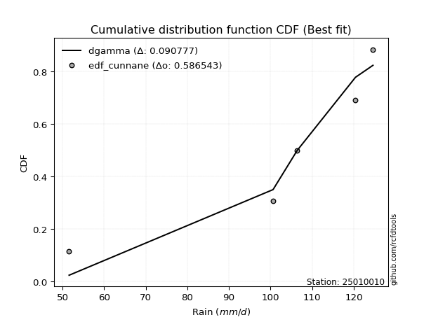</img>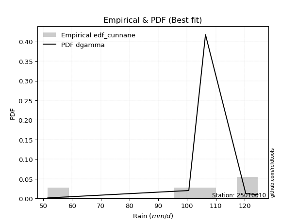</img>

</div>


### 12. EDF Adamowski (1981)

The Adamowski formula in hydrology refers to a specific plotting position formula used for estimating the non-parametric empirical distribution of hydrological events (like flood peaks) to calculate their return periods. This formula provides an alternative to traditional parametric methods (like the Gumbel or Log Pearson Type III distributions). 

<div align="center">


$P=(m-0.25)/(n+0.5)$


</div>


**12.1. Empirical values**

<div align="center">

|                | 0                   | 1                  | 2             | 3                  | 4                  |
|:---------------|:--------------------|:-------------------|:--------------|:-------------------|:-------------------|
| date           | 2023                | 2021               | 2024          | 2025               | 2022               |
| x              | 51.6                | 100.6              | 106.4         | 120.4              | 124.6              |
| m              | 1                   | 2                  | 3             | 4                  | 5                  |
| empirical_dist | edf_adamowski       | edf_adamowski      | edf_adamowski | edf_adamowski      | edf_adamowski      |
| empirical      | 0.13636363636363635 | 0.3181818181818182 | 0.5           | 0.6818181818181818 | 0.8636363636363636 |
| empirical_tr   | 1.1578947368421053  | 1.4666666666666666 | 2.0           | 3.1428571428571423 | 7.333333333333334  |

</div>


**12.2. Kolmogorov-Smirnov fit test (sorted by Δ)**


<div align="center">

|                | 0                   | 1                   | 2                  | 3                   | 4                   | 5                   | 6                   | 7                   | 8                   | 9                   | 10                  | 11                  | 12                  | 13                  | 14                  | 15                  | 16                  | 17                  | 18                  | 19                  | 20                  | 21                 | 22                 | 23                  | 24                  | 25                  | 26                  | 27                  | 28                 | 29                 | 30                  | 31                  | 32                 | 33                  | 34                 | 35                  | 36                  | 37                 | 38                  | 39                 | 40                 | 41                 | 42                 | 43                  | 44                  | 45                  | 46                  | 47                  | 48                 | 49                  | 50                 | 51                  | 52                 | 53                 | 54                 | 55                  | 56                  | 57                  | 58                 | 59                  | 60                  | 61                  | 62                 | 63                  | 64                  | 65                  | 66                  | 67                  | 68                 | 69                  | 70                  | 71                 | 72                  | 73                 | 74                  | 75                  | 76                  | 77                  | 78                  | 79                  | 80                  | 81                  | 82                  | 83                  | 84                  | 85                 | 86                  | 87                 | 88                  | 89                 | 90                 | 91                 | 92                  | 93                  | 94                 | 95                 | 96                  | 97                  | 98                 | 99                  | 100                 | 101                | 102                | 103                | 104                 | 105                | 106                 | 107                | 108                | 109                | 110                 | 111                | 112                 | 113                 | 114                | 115                | 116                | 117                | 118                | 119                | 120                | 121                 | 122                | 123                 | 124                 | 125                | 126                | 127                | 128                 | 129                 | 130                | 131                 | 132                 | 133                 | 134                | 135                 | 136                 | 137                 | 138                | 139                 | 140                | 141                | 142                | 143                 | 144                | 145                | 146                | 147                | 148                | 149                | 150                | 151                | 152                | 153                | 154                | 155                | 156                | 157                | 158                | 159                |
|:---------------|:--------------------|:--------------------|:-------------------|:--------------------|:--------------------|:--------------------|:--------------------|:--------------------|:--------------------|:--------------------|:--------------------|:--------------------|:--------------------|:--------------------|:--------------------|:--------------------|:--------------------|:--------------------|:--------------------|:--------------------|:--------------------|:-------------------|:-------------------|:--------------------|:--------------------|:--------------------|:--------------------|:--------------------|:-------------------|:-------------------|:--------------------|:--------------------|:-------------------|:--------------------|:-------------------|:--------------------|:--------------------|:-------------------|:--------------------|:-------------------|:-------------------|:-------------------|:-------------------|:--------------------|:--------------------|:--------------------|:--------------------|:--------------------|:-------------------|:--------------------|:-------------------|:--------------------|:-------------------|:-------------------|:-------------------|:--------------------|:--------------------|:--------------------|:-------------------|:--------------------|:--------------------|:--------------------|:-------------------|:--------------------|:--------------------|:--------------------|:--------------------|:--------------------|:-------------------|:--------------------|:--------------------|:-------------------|:--------------------|:-------------------|:--------------------|:--------------------|:--------------------|:--------------------|:--------------------|:--------------------|:--------------------|:--------------------|:--------------------|:--------------------|:--------------------|:-------------------|:--------------------|:-------------------|:--------------------|:-------------------|:-------------------|:-------------------|:--------------------|:--------------------|:-------------------|:-------------------|:--------------------|:--------------------|:-------------------|:--------------------|:--------------------|:-------------------|:-------------------|:-------------------|:--------------------|:-------------------|:--------------------|:-------------------|:-------------------|:-------------------|:--------------------|:-------------------|:--------------------|:--------------------|:-------------------|:-------------------|:-------------------|:-------------------|:-------------------|:-------------------|:-------------------|:--------------------|:-------------------|:--------------------|:--------------------|:-------------------|:-------------------|:-------------------|:--------------------|:--------------------|:-------------------|:--------------------|:--------------------|:--------------------|:-------------------|:--------------------|:--------------------|:--------------------|:-------------------|:--------------------|:-------------------|:-------------------|:-------------------|:--------------------|:-------------------|:-------------------|:-------------------|:-------------------|:-------------------|:-------------------|:-------------------|:-------------------|:-------------------|:-------------------|:-------------------|:-------------------|:-------------------|:-------------------|:-------------------|:-------------------|
| station        | 25010010            | 25010010            | 25010010           | 25010010            | 25010010            | 25010010            | 25010010            | 25010010            | 25010010            | 25010010            | 25010010            | 25010010            | 25010010            | 25010010            | 25010010            | 25010010            | 25010010            | 25010010            | 25010010            | 25010010            | 25010010            | 25010010           | 25010010           | 25010010            | 25010010            | 25010010            | 25010010            | 25010010            | 25010010           | 25010010           | 25010010            | 25010010            | 25010010           | 25010010            | 25010010           | 25010010            | 25010010            | 25010010           | 25010010            | 25010010           | 25010010           | 25010010           | 25010010           | 25010010            | 25010010            | 25010010            | 25010010            | 25010010            | 25010010           | 25010010            | 25010010           | 25010010            | 25010010           | 25010010           | 25010010           | 25010010            | 25010010            | 25010010            | 25010010           | 25010010            | 25010010            | 25010010            | 25010010           | 25010010            | 25010010            | 25010010            | 25010010            | 25010010            | 25010010           | 25010010            | 25010010            | 25010010           | 25010010            | 25010010           | 25010010            | 25010010            | 25010010            | 25010010            | 25010010            | 25010010            | 25010010            | 25010010            | 25010010            | 25010010            | 25010010            | 25010010           | 25010010            | 25010010           | 25010010            | 25010010           | 25010010           | 25010010           | 25010010            | 25010010            | 25010010           | 25010010           | 25010010            | 25010010            | 25010010           | 25010010            | 25010010            | 25010010           | 25010010           | 25010010           | 25010010            | 25010010           | 25010010            | 25010010           | 25010010           | 25010010           | 25010010            | 25010010           | 25010010            | 25010010            | 25010010           | 25010010           | 25010010           | 25010010           | 25010010           | 25010010           | 25010010           | 25010010            | 25010010           | 25010010            | 25010010            | 25010010           | 25010010           | 25010010           | 25010010            | 25010010            | 25010010           | 25010010            | 25010010            | 25010010            | 25010010           | 25010010            | 25010010            | 25010010            | 25010010           | 25010010            | 25010010           | 25010010           | 25010010           | 25010010            | 25010010           | 25010010           | 25010010           | 25010010           | 25010010           | 25010010           | 25010010           | 25010010           | 25010010           | 25010010           | 25010010           | 25010010           | 25010010           | 25010010           | 25010010           | 25010010           |
| empirical_dist | edf_adamowski       | edf_adamowski       | edf_adamowski      | edf_adamowski       | edf_adamowski       | edf_adamowski       | edf_adamowski       | edf_adamowski       | edf_adamowski       | edf_adamowski       | edf_adamowski       | edf_adamowski       | edf_adamowski       | edf_adamowski       | edf_adamowski       | edf_adamowski       | edf_adamowski       | edf_adamowski       | edf_adamowski       | edf_adamowski       | edf_adamowski       | edf_adamowski      | edf_adamowski      | edf_adamowski       | edf_adamowski       | edf_adamowski       | edf_adamowski       | edf_adamowski       | edf_adamowski      | edf_adamowski      | edf_adamowski       | edf_adamowski       | edf_adamowski      | edf_adamowski       | edf_adamowski      | edf_adamowski       | edf_adamowski       | edf_adamowski      | edf_adamowski       | edf_adamowski      | edf_adamowski      | edf_adamowski      | edf_adamowski      | edf_adamowski       | edf_adamowski       | edf_adamowski       | edf_adamowski       | edf_adamowski       | edf_adamowski      | edf_adamowski       | edf_adamowski      | edf_adamowski       | edf_adamowski      | edf_adamowski      | edf_adamowski      | edf_adamowski       | edf_adamowski       | edf_adamowski       | edf_adamowski      | edf_adamowski       | edf_adamowski       | edf_adamowski       | edf_adamowski      | edf_adamowski       | edf_adamowski       | edf_adamowski       | edf_adamowski       | edf_adamowski       | edf_adamowski      | edf_adamowski       | edf_adamowski       | edf_adamowski      | edf_adamowski       | edf_adamowski      | edf_adamowski       | edf_adamowski       | edf_adamowski       | edf_adamowski       | edf_adamowski       | edf_adamowski       | edf_adamowski       | edf_adamowski       | edf_adamowski       | edf_adamowski       | edf_adamowski       | edf_adamowski      | edf_adamowski       | edf_adamowski      | edf_adamowski       | edf_adamowski      | edf_adamowski      | edf_adamowski      | edf_adamowski       | edf_adamowski       | edf_adamowski      | edf_adamowski      | edf_adamowski       | edf_adamowski       | edf_adamowski      | edf_adamowski       | edf_adamowski       | edf_adamowski      | edf_adamowski      | edf_adamowski      | edf_adamowski       | edf_adamowski      | edf_adamowski       | edf_adamowski      | edf_adamowski      | edf_adamowski      | edf_adamowski       | edf_adamowski      | edf_adamowski       | edf_adamowski       | edf_adamowski      | edf_adamowski      | edf_adamowski      | edf_adamowski      | edf_adamowski      | edf_adamowski      | edf_adamowski      | edf_adamowski       | edf_adamowski      | edf_adamowski       | edf_adamowski       | edf_adamowski      | edf_adamowski      | edf_adamowski      | edf_adamowski       | edf_adamowski       | edf_adamowski      | edf_adamowski       | edf_adamowski       | edf_adamowski       | edf_adamowski      | edf_adamowski       | edf_adamowski       | edf_adamowski       | edf_adamowski      | edf_adamowski       | edf_adamowski      | edf_adamowski      | edf_adamowski      | edf_adamowski       | edf_adamowski      | edf_adamowski      | edf_adamowski      | edf_adamowski      | edf_adamowski      | edf_adamowski      | edf_adamowski      | edf_adamowski      | edf_adamowski      | edf_adamowski      | edf_adamowski      | edf_adamowski      | edf_adamowski      | edf_adamowski      | edf_adamowski      | edf_adamowski      |
| p_dist         | dweibull            | pearson3            | gumbel_l           | dgamma              | loggennorm          | logloglaplace       | weibull_min         | trapezoid           | logdweibull         | logweibull_min      | gennorm             | logvonmises_line    | vonmises_line       | genextreme          | loggenextreme       | logexponpow         | levy_l              | loglevy_l           | logburr12           | genpareto           | beta                | logpearson3        | burr               | argus               | logexponweib        | loggompertz         | weibull_max         | johnsonsb           | loggumbel_l        | logtrapezoid       | logdgamma           | logloggamma         | logargus           | laplace             | hypsecant          | logistic            | exponnorm           | crystalball        | norm                | t                  | nct                | anglit             | semicircular       | arcsine             | logjohnsonsb        | f                   | logmielke           | invgamma            | gamma              | rice                | loginvweibull      | logburr             | mielke             | kappa3             | genhalflogistic    | erlang              | alpha               | logarcsine          | maxwell            | wrapcauchy          | loggenhalflogistic  | logweibull_max      | betaprime          | ncf                 | skewnorm            | rayleigh            | logsemicircular     | loganglit           | logf               | logt                | logcrystalball      | lognorm            | logexponnorm        | logfatiguelife     | invgauss            | logncf              | cosine              | logbetaprime        | lognct              | triang              | logrice             | logalpha            | loglogistic         | loginvgamma         | loghypsecant        | gausshyper         | gumbel_r            | halfnorm           | kstwobign           | loginvgauss        | logmaxwell         | logbeta            | loglaplace          | loglaplace          | loggausshyper      | lograyleigh        | moyal               | halflogistic        | logwrapcauchy      | logskewnorm         | logkstwobign        | logcosine          | loggenexpon        | loghalfnorm        | logfoldnorm         | loggumbel_r        | genexpon            | truncnorm          | lognakagami        | logtruncnorm       | nakagami            | logtukeylambda     | logtriang           | ksone               | loghalflogistic    | logmoyal           | loggenpareto       | burr12             | halfgennorm        | wald               | uniform            | kappa4              | lomax              | loggamma            | loggamma            | exponweib          | foldnorm           | logerlang          | logksone            | logwald             | gompertz           | truncweibull_min    | logkappa4           | bradford            | invweibull         | truncexpon          | logkappa3           | loguniform          | logjohnsonsu       | logbradford         | logtruncexpon      | fatiguelife        | loggengamma        | logtruncweibull_min | logrdist           | gengamma           | loglomax           | johnsonsu          | powerlaw           | exponpow           | truncpareto        | logpowerlaw        | logtruncpareto     | loggenlogistic     | genlogistic        | loghalfgennorm     | rdist              | tukeylambda        | logvonmises        | vonmises           |
| delta          | 0.09220770394088003 | 0.10726299598580408 | 0.1095552705586686 | 0.11175591643159602 | 0.12087645596900909 | 0.12127580271079078 | 0.12419177262029513 | 0.12481815312187589 | 0.12554906257818443 | 0.12704400572780955 | 0.13335295983428297 | 0.13636363466589946 | 0.13636363635315374 | 0.13636363636312798 | 0.13636363636335835 | 0.13904008736920148 | 0.14330405508818034 | 0.14505537220611697 | 0.14667844228224253 | 0.14865790642414212 | 0.14951780301375106 | 0.1509112477169618 | 0.1519006145109948 | 0.15271350332987543 | 0.15418825604594544 | 0.16175977272790115 | 0.16328789235545338 | 0.16481214774694875 | 0.1690997697614795 | 0.1698676466547372 | 0.17021379542990467 | 0.17212017816702052 | 0.1722846046815808 | 0.17857602943584322 | 0.1795181888191737 | 0.17973231284835595 | 0.17998168282186078 | 0.1799830414422744 | 0.17998304341746085 | 0.1800027521047814 | 0.1800191259785564 | 0.1802457405164058 | 0.1803539493483854 | 0.18078279547110843 | 0.18134205263329622 | 0.18257501156848405 | 0.18502913038686553 | 0.18516836190909985 | 0.1889039885821598 | 0.18930398924018804 | 0.1916753237193503 | 0.19293314911324266 | 0.1932141057125938 | 0.1969481380920537 | 0.1970413333912563 | 0.19841129444458566 | 0.20780698239930467 | 0.21236462389776273 | 0.2131055648869125 | 0.21386866463397286 | 0.21466359593491552 | 0.21909578895927811 | 0.2227887474872698 | 0.22317557433365226 | 0.22365103972679679 | 0.22415677802517292 | 0.22491756552748848 | 0.22807194205800613 | 0.2332004611175264 | 0.23563922716316227 | 0.23571152452944205 | 0.2357116579111333 | 0.23571212919806012 | 0.2363941391195375 | 0.23673816023051825 | 0.23712151080987337 | 0.23728372365609746 | 0.23801987377419292 | 0.23928477670260512 | 0.24002727334780188 | 0.24216843718251452 | 0.24282126766824047 | 0.24295520407134946 | 0.24712337783954424 | 0.24906453833154302 | 0.2501886542156018 | 0.25030238564114043 | 0.2552695833501611 | 0.25566300965795424 | 0.2585267117759779 | 0.2658424691417551 | 0.2675870581677944 | 0.26901295724903523 | 0.26901295724903523 | 0.2717049703749234 | 0.2754901188873337 | 0.27616093949305304 | 0.28009368691534103 | 0.2821610707155979 | 0.28541335995878264 | 0.29367035964430316 | 0.2964469200604947 | 0.2992057142522557 | 0.3027234218751265 | 0.30294690890705483 | 0.3056395754803016 | 0.31258960916760387 | 0.3180847388458628 | 0.3181356033697278 | 0.3181791902581105 | 0.31818119286606217 | 0.3181818163056656 | 0.32362464926593654 | 0.32451224574512244 | 0.3301341045218256 | 0.3303480066384937 | 0.3324991425532669 | 0.338818763072755  | 0.3416506732979205 | 0.3480787245167907 | 0.3530510585305105 | 0.35619664482266916 | 0.368874528715856  | 0.38579941638492427 | 0.38579941638492427 | 0.3880122063555547 | 0.3891524307424803 | 0.3921840525868298 | 0.39623938590986024 | 0.39891267157372384 | 0.4071219719412365 | 0.41763324598819856 | 0.42555876637016726 | 0.42682953039197474 | 0.4326197875508697 | 0.43318191628978336 | 0.43809607693667335 | 0.43912362672819577 | 0.4420286617951242 | 0.49809874708497476 | 0.5192381348515531 | 0.5331644511716789 | 0.5332270425909513 | 0.5548351578933428  | 0.5613248882841371 | 0.563794052110147  | 0.5691089638711211 | 0.5761776745469903 | 0.6302056440592518 | 0.6330518314556479 | 0.6410743510330115 | 0.6436737802981274 | 0.6532807649740049 | 0.6818181818181818 | 0.6818181818181818 | 0.6818181818181818 | 0.6818181818181819 | 0.8628129183032026 | 1.2272872180233718 | 19.223748654711073 |
| deltao         | 0.5865427407550001  | 0.5865427407550001  | 0.5865427407550001 | 0.5865427407550001  | 0.5865427407550001  | 0.5865427407550001  | 0.5865427407550001  | 0.5865427407550001  | 0.5865427407550001  | 0.5865427407550001  | 0.5865427407550001  | 0.5865427407550001  | 0.5865427407550001  | 0.5865427407550001  | 0.5865427407550001  | 0.5865427407550001  | 0.5865427407550001  | 0.5865427407550001  | 0.5865427407550001  | 0.5865427407550001  | 0.5865427407550001  | 0.5865427407550001 | 0.5865427407550001 | 0.5865427407550001  | 0.5865427407550001  | 0.5865427407550001  | 0.5865427407550001  | 0.5865427407550001  | 0.5865427407550001 | 0.5865427407550001 | 0.5865427407550001  | 0.5865427407550001  | 0.5865427407550001 | 0.5865427407550001  | 0.5865427407550001 | 0.5865427407550001  | 0.5865427407550001  | 0.5865427407550001 | 0.5865427407550001  | 0.5865427407550001 | 0.5865427407550001 | 0.5865427407550001 | 0.5865427407550001 | 0.5865427407550001  | 0.5865427407550001  | 0.5865427407550001  | 0.5865427407550001  | 0.5865427407550001  | 0.5865427407550001 | 0.5865427407550001  | 0.5865427407550001 | 0.5865427407550001  | 0.5865427407550001 | 0.5865427407550001 | 0.5865427407550001 | 0.5865427407550001  | 0.5865427407550001  | 0.5865427407550001  | 0.5865427407550001 | 0.5865427407550001  | 0.5865427407550001  | 0.5865427407550001  | 0.5865427407550001 | 0.5865427407550001  | 0.5865427407550001  | 0.5865427407550001  | 0.5865427407550001  | 0.5865427407550001  | 0.5865427407550001 | 0.5865427407550001  | 0.5865427407550001  | 0.5865427407550001 | 0.5865427407550001  | 0.5865427407550001 | 0.5865427407550001  | 0.5865427407550001  | 0.5865427407550001  | 0.5865427407550001  | 0.5865427407550001  | 0.5865427407550001  | 0.5865427407550001  | 0.5865427407550001  | 0.5865427407550001  | 0.5865427407550001  | 0.5865427407550001  | 0.5865427407550001 | 0.5865427407550001  | 0.5865427407550001 | 0.5865427407550001  | 0.5865427407550001 | 0.5865427407550001 | 0.5865427407550001 | 0.5865427407550001  | 0.5865427407550001  | 0.5865427407550001 | 0.5865427407550001 | 0.5865427407550001  | 0.5865427407550001  | 0.5865427407550001 | 0.5865427407550001  | 0.5865427407550001  | 0.5865427407550001 | 0.5865427407550001 | 0.5865427407550001 | 0.5865427407550001  | 0.5865427407550001 | 0.5865427407550001  | 0.5865427407550001 | 0.5865427407550001 | 0.5865427407550001 | 0.5865427407550001  | 0.5865427407550001 | 0.5865427407550001  | 0.5865427407550001  | 0.5865427407550001 | 0.5865427407550001 | 0.5865427407550001 | 0.5865427407550001 | 0.5865427407550001 | 0.5865427407550001 | 0.5865427407550001 | 0.5865427407550001  | 0.5865427407550001 | 0.5865427407550001  | 0.5865427407550001  | 0.5865427407550001 | 0.5865427407550001 | 0.5865427407550001 | 0.5865427407550001  | 0.5865427407550001  | 0.5865427407550001 | 0.5865427407550001  | 0.5865427407550001  | 0.5865427407550001  | 0.5865427407550001 | 0.5865427407550001  | 0.5865427407550001  | 0.5865427407550001  | 0.5865427407550001 | 0.5865427407550001  | 0.5865427407550001 | 0.5865427407550001 | 0.5865427407550001 | 0.5865427407550001  | 0.5865427407550001 | 0.5865427407550001 | 0.5865427407550001 | 0.5865427407550001 | 0.5865427407550001 | 0.5865427407550001 | 0.5865427407550001 | 0.5865427407550001 | 0.5865427407550001 | 0.5865427407550001 | 0.5865427407550001 | 0.5865427407550001 | 0.5865427407550001 | 0.5865427407550001 | 0.5865427407550001 | 0.5865427407550001 |
| eval           | Δo > Δ              | Δo > Δ              | Δo > Δ             | Δo > Δ              | Δo > Δ              | Δo > Δ              | Δo > Δ              | Δo > Δ              | Δo > Δ              | Δo > Δ              | Δo > Δ              | Δo > Δ              | Δo > Δ              | Δo > Δ              | Δo > Δ              | Δo > Δ              | Δo > Δ              | Δo > Δ              | Δo > Δ              | Δo > Δ              | Δo > Δ              | Δo > Δ             | Δo > Δ             | Δo > Δ              | Δo > Δ              | Δo > Δ              | Δo > Δ              | Δo > Δ              | Δo > Δ             | Δo > Δ             | Δo > Δ              | Δo > Δ              | Δo > Δ             | Δo > Δ              | Δo > Δ             | Δo > Δ              | Δo > Δ              | Δo > Δ             | Δo > Δ              | Δo > Δ             | Δo > Δ             | Δo > Δ             | Δo > Δ             | Δo > Δ              | Δo > Δ              | Δo > Δ              | Δo > Δ              | Δo > Δ              | Δo > Δ             | Δo > Δ              | Δo > Δ             | Δo > Δ              | Δo > Δ             | Δo > Δ             | Δo > Δ             | Δo > Δ              | Δo > Δ              | Δo > Δ              | Δo > Δ             | Δo > Δ              | Δo > Δ              | Δo > Δ              | Δo > Δ             | Δo > Δ              | Δo > Δ              | Δo > Δ              | Δo > Δ              | Δo > Δ              | Δo > Δ             | Δo > Δ              | Δo > Δ              | Δo > Δ             | Δo > Δ              | Δo > Δ             | Δo > Δ              | Δo > Δ              | Δo > Δ              | Δo > Δ              | Δo > Δ              | Δo > Δ              | Δo > Δ              | Δo > Δ              | Δo > Δ              | Δo > Δ              | Δo > Δ              | Δo > Δ             | Δo > Δ              | Δo > Δ             | Δo > Δ              | Δo > Δ             | Δo > Δ             | Δo > Δ             | Δo > Δ              | Δo > Δ              | Δo > Δ             | Δo > Δ             | Δo > Δ              | Δo > Δ              | Δo > Δ             | Δo > Δ              | Δo > Δ              | Δo > Δ             | Δo > Δ             | Δo > Δ             | Δo > Δ              | Δo > Δ             | Δo > Δ              | Δo > Δ             | Δo > Δ             | Δo > Δ             | Δo > Δ              | Δo > Δ             | Δo > Δ              | Δo > Δ              | Δo > Δ             | Δo > Δ             | Δo > Δ             | Δo > Δ             | Δo > Δ             | Δo > Δ             | Δo > Δ             | Δo > Δ              | Δo > Δ             | Δo > Δ              | Δo > Δ              | Δo > Δ             | Δo > Δ             | Δo > Δ             | Δo > Δ              | Δo > Δ              | Δo > Δ             | Δo > Δ              | Δo > Δ              | Δo > Δ              | Δo > Δ             | Δo > Δ              | Δo > Δ              | Δo > Δ              | Δo > Δ             | Δo > Δ              | Δo > Δ             | Δo > Δ             | Δo > Δ             | Δo > Δ              | Δo > Δ             | Δo > Δ             | Δo > Δ             | Δo > Δ             | Δo <= Δ            | Δo <= Δ            | Δo <= Δ            | Δo <= Δ            | Δo <= Δ            | Δo <= Δ            | Δo <= Δ            | Δo <= Δ            | Δo <= Δ            | Δo <= Δ            | Δo <= Δ            | Δo <= Δ            |
| fit            | 1                   | 1                   | 1                  | 1                   | 1                   | 1                   | 1                   | 1                   | 1                   | 1                   | 1                   | 1                   | 1                   | 1                   | 1                   | 1                   | 1                   | 1                   | 1                   | 1                   | 1                   | 1                  | 1                  | 1                   | 1                   | 1                   | 1                   | 1                   | 1                  | 1                  | 1                   | 1                   | 1                  | 1                   | 1                  | 1                   | 1                   | 1                  | 1                   | 1                  | 1                  | 1                  | 1                  | 1                   | 1                   | 1                   | 1                   | 1                   | 1                  | 1                   | 1                  | 1                   | 1                  | 1                  | 1                  | 1                   | 1                   | 1                   | 1                  | 1                   | 1                   | 1                   | 1                  | 1                   | 1                   | 1                   | 1                   | 1                   | 1                  | 1                   | 1                   | 1                  | 1                   | 1                  | 1                   | 1                   | 1                   | 1                   | 1                   | 1                   | 1                   | 1                   | 1                   | 1                   | 1                   | 1                  | 1                   | 1                  | 1                   | 1                  | 1                  | 1                  | 1                   | 1                   | 1                  | 1                  | 1                   | 1                   | 1                  | 1                   | 1                   | 1                  | 1                  | 1                  | 1                   | 1                  | 1                   | 1                  | 1                  | 1                  | 1                   | 1                  | 1                   | 1                   | 1                  | 1                  | 1                  | 1                  | 1                  | 1                  | 1                  | 1                   | 1                  | 1                   | 1                   | 1                  | 1                  | 1                  | 1                   | 1                   | 1                  | 1                   | 1                   | 1                   | 1                  | 1                   | 1                   | 1                   | 1                  | 1                   | 1                  | 1                  | 1                  | 1                   | 1                  | 1                  | 1                  | 1                  | 0                  | 0                  | 0                  | 0                  | 0                  | 0                  | 0                  | 0                  | 0                  | 0                  | 0                  | 0                  |
| n              | 5                   | 5                   | 5                  | 5                   | 5                   | 5                   | 5                   | 5                   | 5                   | 5                   | 5                   | 5                   | 5                   | 5                   | 5                   | 5                   | 5                   | 5                   | 5                   | 5                   | 5                   | 5                  | 5                  | 5                   | 5                   | 5                   | 5                   | 5                   | 5                  | 5                  | 5                   | 5                   | 5                  | 5                   | 5                  | 5                   | 5                   | 5                  | 5                   | 5                  | 5                  | 5                  | 5                  | 5                   | 5                   | 5                   | 5                   | 5                   | 5                  | 5                   | 5                  | 5                   | 5                  | 5                  | 5                  | 5                   | 5                   | 5                   | 5                  | 5                   | 5                   | 5                   | 5                  | 5                   | 5                   | 5                   | 5                   | 5                   | 5                  | 5                   | 5                   | 5                  | 5                   | 5                  | 5                   | 5                   | 5                   | 5                   | 5                   | 5                   | 5                   | 5                   | 5                   | 5                   | 5                   | 5                  | 5                   | 5                  | 5                   | 5                  | 5                  | 5                  | 5                   | 5                   | 5                  | 5                  | 5                   | 5                   | 5                  | 5                   | 5                   | 5                  | 5                  | 5                  | 5                   | 5                  | 5                   | 5                  | 5                  | 5                  | 5                   | 5                  | 5                   | 5                   | 5                  | 5                  | 5                  | 5                  | 5                  | 5                  | 5                  | 5                   | 5                  | 5                   | 5                   | 5                  | 5                  | 5                  | 5                   | 5                   | 5                  | 5                   | 5                   | 5                   | 5                  | 5                   | 5                   | 5                   | 5                  | 5                   | 5                  | 5                  | 5                  | 5                   | 5                  | 5                  | 5                  | 5                  | 5                  | 5                  | 5                  | 5                  | 5                  | 5                  | 5                  | 5                  | 5                  | 5                  | 5                  | 5                  |
| best_fit       | 1                   | 0                   | 0                  | 0                   | 0                   | 0                   | 0                   | 0                   | 0                   | 0                   | 0                   | 0                   | 0                   | 0                   | 0                   | 0                   | 0                   | 0                   | 0                   | 0                   | 0                   | 0                  | 0                  | 0                   | 0                   | 0                   | 0                   | 0                   | 0                  | 0                  | 0                   | 0                   | 0                  | 0                   | 0                  | 0                   | 0                   | 0                  | 0                   | 0                  | 0                  | 0                  | 0                  | 0                   | 0                   | 0                   | 0                   | 0                   | 0                  | 0                   | 0                  | 0                   | 0                  | 0                  | 0                  | 0                   | 0                   | 0                   | 0                  | 0                   | 0                   | 0                   | 0                  | 0                   | 0                   | 0                   | 0                   | 0                   | 0                  | 0                   | 0                   | 0                  | 0                   | 0                  | 0                   | 0                   | 0                   | 0                   | 0                   | 0                   | 0                   | 0                   | 0                   | 0                   | 0                   | 0                  | 0                   | 0                  | 0                   | 0                  | 0                  | 0                  | 0                   | 0                   | 0                  | 0                  | 0                   | 0                   | 0                  | 0                   | 0                   | 0                  | 0                  | 0                  | 0                   | 0                  | 0                   | 0                  | 0                  | 0                  | 0                   | 0                  | 0                   | 0                   | 0                  | 0                  | 0                  | 0                  | 0                  | 0                  | 0                  | 0                   | 0                  | 0                   | 0                   | 0                  | 0                  | 0                  | 0                   | 0                   | 0                  | 0                   | 0                   | 0                   | 0                  | 0                   | 0                   | 0                   | 0                  | 0                   | 0                  | 0                  | 0                  | 0                   | 0                  | 0                  | 0                  | 0                  | 0                  | 0                  | 0                  | 0                  | 0                  | 0                  | 0                  | 0                  | 0                  | 0                  | 0                  | 0                  |
| best_fit_sort  | 1                   | 2                   | 3                  | 4                   | 5                   | 6                   | 7                   | 8                   | 9                   | 10                  | 11                  | 12                  | 13                  | 14                  | 15                  | 16                  | 17                  | 18                  | 19                  | 20                  | 21                  | 22                 | 23                 | 24                  | 25                  | 26                  | 27                  | 28                  | 29                 | 30                 | 31                  | 32                  | 33                 | 34                  | 35                 | 36                  | 37                  | 38                 | 39                  | 40                 | 41                 | 42                 | 43                 | 44                  | 45                  | 46                  | 47                  | 48                  | 49                 | 50                  | 51                 | 52                  | 53                 | 54                 | 55                 | 56                  | 57                  | 58                  | 59                 | 60                  | 61                  | 62                  | 63                 | 64                  | 65                  | 66                  | 67                  | 68                  | 69                 | 70                  | 71                  | 72                 | 73                  | 74                 | 75                  | 76                  | 77                  | 78                  | 79                  | 80                  | 81                  | 82                  | 83                  | 84                  | 85                  | 86                 | 87                  | 88                 | 89                  | 90                 | 91                 | 92                 | 93                  | 94                  | 95                 | 96                 | 97                  | 98                  | 99                 | 100                 | 101                 | 102                | 103                | 104                | 105                 | 106                | 107                 | 108                | 109                | 110                | 111                 | 112                | 113                 | 114                 | 115                | 116                | 117                | 118                | 119                | 120                | 121                | 122                 | 123                | 124                 | 125                 | 126                | 127                | 128                | 129                 | 130                 | 131                | 132                 | 133                 | 134                 | 135                | 136                 | 137                 | 138                 | 139                | 140                 | 141                | 142                | 143                | 144                 | 145                | 146                | 147                | 148                | 149                | 150                | 151                | 152                | 153                | 154                | 155                | 156                | 157                | 158                | 159                | 160                |

</div>


**12.3. Best fit**

<div align="center">

|   id |   station | empirical_dist   | p_dist   |     delta |   deltao | eval   |   fit |   n |   best_fit |   best_fit_sort |
|-----:|----------:|:-----------------|:---------|----------:|---------:|:-------|------:|----:|-----------:|----------------:|
|    0 |  25010010 | edf_adamowski    | dweibull | 0.0922077 | 0.586543 | Δo > Δ |     1 |   5 |          1 |               1 |

</div>


<div align="center">

</img></img>

</div>


## C. Best fit & Estimate extreme values for specific return periods - Tr

Best fit in probability distribution analysis means finding the theoretical distribution (like Normal, Poisson, Exponential, etc.) that most accurately mirrors your real-world data´s patterns (shape, center, spread) for better predictions, using methods like visual checks (Q-Q plots), goodness-of-fit tests (Kolmogorov-Smirnov, Chi-Squared), and information criteria (AIC) to score and select the simplest, most representative model.


### 1. Best fit (ordered by delta Δ)

:file_folder:Table: [bestfit_25010010.csv](table/bestfit_25010010.csv)

<div align="center">

|   id |   station | empirical_dist   | p_dist    |     delta |   deltao | eval   |   fit |   n |   best_fit |   best_fit_sort |
|-----:|----------:|:-----------------|:----------|----------:|---------:|:-------|------:|----:|-----------:|----------------:|
|    0 |  25010010 | edf_hazen        | dgamma    | 0.0785026 | 0.586543 | Δo > Δ |     1 |   5 |          1 |               1 |
|    1 |  25010010 | edf_california   | genpareto | 0.0800422 | 0.586543 | Δo > Δ |     1 |   5 |          1 |               2 |
|    2 |  25010010 | edf_tukey        | dweibull  | 0.0819438 | 0.586543 | Δo > Δ |     1 |   5 |          1 |               3 |
|    3 |  25010010 | edf_filliben     | dweibull  | 0.0830575 | 0.586543 | Δo > Δ |     1 |   5 |          1 |               4 |
|    4 |  25010010 | edf_jenkinson    | dweibull  | 0.0840969 | 0.586543 | Δo > Δ |     1 |   5 |          1 |               5 |
|    5 |  25010010 | edf_beard        | dweibull  | 0.0840969 | 0.586543 | Δo > Δ |     1 |   5 |          1 |               6 |
|    6 |  25010010 | edf_gringorten   | dgamma    | 0.0847673 | 0.586543 | Δo > Δ |     1 |   5 |          1 |               7 |
|    7 |  25010010 | edf_chegodayev   | dweibull  | 0.0854737 | 0.586543 | Δo > Δ |     1 |   5 |          1 |               8 |
|    8 |  25010010 | edf_blom         | dweibull  | 0.0878962 | 0.586543 | Δo > Δ |     1 |   5 |          1 |               9 |
|    9 |  25010010 | edf_cunnane      | dgamma    | 0.0907769 | 0.586543 | Δo > Δ |     1 |   5 |          1 |              10 |
|   10 |  25010010 | edf_adamowski    | dweibull  | 0.0922077 | 0.586543 | Δo > Δ |     1 |   5 |          1 |              11 |
|   11 |  25010010 | edf_weibull      | pearson3  | 0.116018  | 0.586543 | Δo > Δ |     1 |   5 |          1 |              12 |

</div>


### 2. Extreme values and % difference analysis

In hydrology, a return period (or recurrence interval $Tr$) is the statistical average time between extreme events like floods or droughts of a specific magnitude, indicating how rare an event is, with a 100-year flood, for example, having a 1% chance of occurring in any given year, not that it happens exactly every century. It is a key tool for infrastructure design (like bridges or dams) and risk assessment, calculated from historical data to determine the probability of future events, although it is important to remember it is statistical average, and events can cluster or be missed.

The extreme value porcentage difference is evaluated as $pdiff = 1 - (ETrBf / ETr) * 100$, where _ETrBf_ correspond to the bestfit extreme value for a specific recurrence interval and _ETr_ correspond to the extreme value for one of the most used PDFsused in hydrology.

> risk_rate: assuming the return period as the project useful life.

:file_folder:Table: [extreme_25010010.csv](table/extreme_25010010.csv), all PDFs.  
:file_folder:Table: [extremepdiff_25010010.csv](table/extremepdiff_25010010.csv), % difference between bestfit and most used PDFs in Hydrology.

<div align="center">

Extreme values table for only best fit PDFs
|   id |      tr |   prob_l |     prob_g |    alpha |   anglit |   arcsine |   argus |    beta |   betaprime |   bradford |    burr |   burr12 |   cosine |   crystalball |   dgamma |   dweibull |   erlang |   exponnorm |   exponpow |        exponweib |       f |   fatiguelife |   foldnorm |   gamma |   gausshyper |   genexpon |   genextreme |   gengamma |   genhalflogistic |   genlogistic |   gennorm |   genpareto |   gompertz |   gumbel_l |   gumbel_r |   halfgennorm |   halflogistic |   halfnorm |   hypsecant |   invgamma |   invgauss |       invweibull |   johnsonsb |   johnsonsu |   kappa3 |   kappa4 |    ksone |   kstwobign |   laplace |   levy_l |   loggamma |   logistic |   loglaplace |   lomax |   maxwell |    mielke |    moyal |   nakagami |      ncf |     nct |    norm |   pearson3 |   powerlaw |   rayleigh |   rdist |    rice |   semicircular |   skewnorm |       t |   trapezoid |   triang |   truncexpon |   truncnorm |   truncpareto |   truncweibull_min |   tukeylambda |   uniform |   vonmises |   vonmises_line |     wald |   weibull_max |   weibull_min |   wrapcauchy |   logalpha |   loganglit |   logarcsine |   logargus |   logbeta |   logbetaprime |   logbradford |   logburr |   logburr12 |   logcosine |   logcrystalball |   logdgamma |   logdweibull |   logerlang |   logexponnorm |   logexponpow |   logexponweib |     logf |   logfatiguelife |   logfoldnorm |   loggausshyper |   loggenexpon |   loggenextreme |      loggengamma |   loggenhalflogistic |   loggenlogistic |   loggennorm |   loggenpareto |   loggompertz |   loggumbel_l |   loggumbel_r |   loghalfgennorm |   loghalflogistic |   loghalfnorm |   loghypsecant |   loginvgamma |   loginvgauss |   loginvweibull |   logjohnsonsb |   logjohnsonsu |   logkappa3 |   logkappa4 |   logksone |   logkstwobign |   loglevy_l |   logloggamma |   loglogistic |   logloglaplace |         loglomax |   logmaxwell |   logmielke |   logmoyal |   lognakagami |   logncf |   lognct |   lognorm |   logpearson3 |   logpowerlaw |   lograyleigh |   logrdist |   logrice |   logsemicircular |   logskewnorm |     logt |   logtrapezoid |   logtriang |   logtruncexpon |   logtruncnorm |   logtruncpareto |   logtruncweibull_min |   logtukeylambda |   loguniform |   logvonmises |   logvonmises_line |   logwald |   logweibull_max |   logweibull_min |   logwrapcauchy |   station |   n |   risk_rate |
|-----:|--------:|---------:|-----------:|---------:|---------:|----------:|--------:|--------:|------------:|-----------:|--------:|---------:|---------:|--------------:|---------:|-----------:|---------:|------------:|-----------:|-----------------:|--------:|--------------:|-----------:|--------:|-------------:|-----------:|-------------:|-----------:|------------------:|--------------:|----------:|------------:|-----------:|-----------:|-----------:|--------------:|---------------:|-----------:|------------:|-----------:|-----------:|-----------------:|------------:|------------:|---------:|---------:|---------:|------------:|----------:|---------:|-----------:|-----------:|-------------:|--------:|----------:|----------:|---------:|-----------:|---------:|--------:|--------:|-----------:|-----------:|-----------:|--------:|--------:|---------------:|-----------:|--------:|------------:|---------:|-------------:|------------:|--------------:|-------------------:|--------------:|----------:|-----------:|----------------:|---------:|--------------:|--------------:|-------------:|-----------:|------------:|-------------:|-----------:|----------:|---------------:|--------------:|----------:|------------:|------------:|-----------------:|------------:|--------------:|------------:|---------------:|--------------:|---------------:|---------:|-----------------:|--------------:|----------------:|--------------:|----------------:|-----------------:|---------------------:|-----------------:|-------------:|---------------:|--------------:|--------------:|--------------:|-----------------:|------------------:|--------------:|---------------:|--------------:|--------------:|----------------:|---------------:|---------------:|------------:|------------:|-----------:|---------------:|------------:|--------------:|--------------:|----------------:|-----------------:|-------------:|------------:|-----------:|--------------:|---------:|---------:|----------:|--------------:|--------------:|--------------:|-----------:|----------:|------------------:|--------------:|---------:|---------------:|------------:|----------------:|---------------:|-----------------:|----------------------:|-----------------:|-------------:|--------------:|-------------------:|----------:|-----------------:|-----------------:|----------------:|----------:|----:|------------:|
|    0 |    2    | 0.5      | 0.5        |  98.7414 |  100.72  |   100.72  | 107.928 | 118.785 |     97.5149 |    81.4317 | 104.357 |  79.302  |  96.7388 |       100.72  |  106.4   |    106.4   |  99.4652 |     100.72  |    51.6024 |     52.0744      | 100.55  |       51.6    |    105.119 | 100.122 |      94.9805 |    85.689  |      107.704 |    52.6486 |           100.28  |           inf |   106.4   |     104.337 |    116.394 |    105.006 |    96.4343 |       75.5923 |        94.3037 |    95.3801 |     100.72  |    100.365 |     96.448 |   5794.82        |     118.344 |     124.598 |  106.348 |  87.2691 |  88.1    |     94.1092 |   100.72  |  116.599 |    71.8844 |    100.72  |      96.309  | 125.714 |   98.4889 |   1.84591 |  95.0508 |    105.542 |  97.3505 | 100.718 | 100.72  |    105.382 |    51.997  |    97.6976 |    51.6 | 100.097 |        100.72  |    100.745 | 100.719 |     105.196 |  96.8009 |      81.262  |     107.8   |       53.95   |            82.6256 |          51.6 |   88.1    |   0.192864 |         106.973 |  92.2637 |       105.828 |       105.756 |       88.1   |    95.5595 |      96.309 |      96.3089 |    105.274 |   123.86  |        95.9974 |       74.0094 |   102.132 |     102.598 |     91.0249 |           96.309 |     106.4   |       106.4   |     68.8677 |        96.3089 |       104.461 |        104.332 |  96.4792 |          96.2534 |       88.4612 |         92.8662 |       88.4724 |         107.025 |     52.1611      |              98.1766 |          inf     |      106.398 |        67.0478 |       101.779 |       101.536 |       91.3513 |           51.6   |           88.982  |       90.1709 |         96.309 |       95.2509 |       93.9459 |         99.4811 |        120.073 |        124.519 |      51.6   |     80.4746 |    80.1833 |        88.5586 |     116.336 |       104.356 |        96.309 |         106.4   |    297.378       |      93.6953 |     104.185 |    89.8059 |       103.225 |   96.156 |   95.921 |    96.309 |       102.973 |       51.9218 |       92.7852 |    164.891 |   95.6737 |            96.309 |       94.3658 |  96.3151 |        101.774 |     90.8988 |         72.3901 |        109.359 |          53.1492 |               66.3017 |          111.959 |      80.1833 |      0.181177 |            104.634 |   86.7729 |          97.8509 |          103.543 |         80.1833 |  25010010 |   5 |    0.75     |
|    1 |    2.33 | 0.570815 | 0.429185   | 103.859  |  106.142 |   108.86  | 110.974 | 121.845 |    102.911  |    86.62   | 108.3   |  87.3202 | 101.677  |       105.375 |  108.755 |    109.094 | 104.347  |     105.375 |    51.6113 |     53.9649      | 105.226 |       53.0365 |    105.28  | 104.937 |     100.796  |    93.1998 |      111.77  |    53.6451 |           104.937 |           inf |   107.233 |     111.052 |    117.592 |    109.056 |   100.748  |       84.5199 |        98.7388 |   100.404  |     104.446 |    105.387 |    101.836 | 677458           |     123.48  |     124.599 |  114.102 |  92.6767 |  94.3034 |    100.322  |   103.537 |  119.074 |    78.9995 |    104.822 |      99.7135 | 142.044 |  103.325  |   1.84591 |  99.1341 |    107.507 | 102.987  | 105.38  | 105.375 |    109.614 |    52.6753 |   102.606  |    51.6 | 104.893 |        106.536 |    104.552 | 105.374 |     110.554 | 101.396  |      86.3242 |     109.313 |       55.0408 |            87.7447 |          51.6 |   93.2695 |   0.345004 |         110.69  |  95.3162 |       109.6   |       109.142 |      109.669 |   101.448  |     102.969 |     106.478  |    108.617 |   124.465 |       101.847  |       78.7955 |   106.081 |     106.571 |     96.7857 |          101.999 |     106.531 |       109.795 |     76.004  |       101.999  |       108.03  |        108.153 | 102.219  |         101.944  |       95.1272 |         98.9788 |       95.4348 |         110.939 |     53.0101      |             103.289  |          inf     |      110.304 |        84.0243 |       105.921 |       106.736 |       96.3421 |           51.6   |           93.9843 |       95.9346 |        100.837 |      101.071  |      100.062  |        108.094  |        123.456 |        124.57  |      51.6   |     85.9149 |    86.421  |        95.8023 |     118.833 |       108.115 |       101.305 |         110.128 |    437.425       |      99.4534 |     107.877 |    94.4438 |       104.73  |  101.896 |  101.731 |   101.999 |       108.314 |       52.4334 |       98.5747 |    183.256 |  101.49   |           103.47  |       98.6455 | 102.005  |        108.726 |     95.7716 |         76.8616 |        110.969 |          53.8783 |               70.4673 |          113.755 |      85.3487 |      0.191734 |            109.419 |   90.1011 |         102.946  |          107.267 |         95.6393 |  25010010 |   5 |    0.729209 |
|    2 |    5    | 0.8      | 0.2        | 123.726  |  125.274 |   130.567 | 119.25  | 124.538 |    124.852  |   105.4    | 119.02  | inf      | 119.471  |       122.675 |  122.254 |    125.368 | 122.82   |     122.675 |    52.696  |    528.539       | 122.615 |       83.5526 |    105.964 | 123.117 |     117.032  |   130.752  |      120.719 |    69.9231 |           117.085 |           inf |   118.575 |     122.79  |    121.576 |    122.14  |   119.488  |      149.011  |       118.806  |   121.651  |     119.39  |    124.71  |    123.684 |      6.77994e+14 |     124.599 |     124.6   |  139.197 | 110.16   | 114.38   |    126.715  |   117.622 |  123.174 |   131.482  |    120.658 |     118.628  | 223.688 |  122.361  |   1.84591 | 118.049  |    117.936 | 126.27   | 122.709 | 122.675 |    122.85  |    65.2241 |   122.254  |    51.6 | 122.879 |        126.382 |    115.64  | 122.674 |     125.928 | 114.58   |     104.842  |     116.539 |       65.3757 |           106.001  |          51.6 |  110      |   0.931004 |         125.257 | 112.404  |       118.94  |       120.081 |      121.756 |   127.329  |     130.367 |     139.159  |    118.206 |   124.6   |       127.219  |       98.8446 |   117.186 |     120.492 |    120.74   |          126.255 |     114.389 |       134.35  |    134.183  |       126.255  |       119.281 |        118.812 | 126.755  |         126.215  |      129.34   |        116.63   |      129.525  |         120.192 |     74.3684      |             116.938  |          inf     |      132.344 |       119.602  |       120.653 |       125.424 |      121.389  |           51.6   |          120.375  |      124.672  |        121.242 |      126.471  |      127.799  |        155.1    |        124.594 |        124.599 |      51.6   |    105.777  |   110.133  |       133.788  |     123.088 |       118.319 |       123.154 |         131.325 |   3011.92        |     125.767  |     117.887 |   119.253  |       114.798 |  126.451 |  126.753 |   126.255 |       126.161 |       61.7073 |      125.604  |    244.228 |  126.591  |           132.161 |      112.248  | 126.26   |        131.422 |    111.25   |         96.3761 |        117.206 |          61.2064 |               90.7554 |          119.656 |     104.459  |      0.236841 |            130.334 |  111.233  |         116.347  |          120.238 |        117.056  |  25010010 |   5 |    0.67232  |
|    3 |   10    | 0.9      | 0.1        | 137.698  |  136.103 |   135.807 | 122.612 | 124.598 |    141.125  |   114.646  | 123.002 | inf      | 130.221  |       134.152 |  135     |    141.434 | 135.364  |     134.152 |    61.9268 |  10011           | 134.163 |      125.688  |    106.47  | 135.428 |     122.023  |   164.841  |      123.134 |   115.214  |           121.219 |           inf |   139.093 |     124.309 |    123.844 |    129.425 |   134.752  |      238.153  |       135.472  |   137.373  |     131.323 |    138.128 |    139.867 |      1.45178e+22 |     124.6   |     124.6   |  150.147 | 117.625  | 123.14   |    146.81   |   130.408 |  124.164 |   215.163  |    132.321 |     138.887  | 297.803 |  135.758  | 121.282   | 134.517  |    126.763 | 143.911  | 134.206 | 134.152 |    129.638 |    84.6451 |   136.264  |    51.6 | 134.913 |        136.566 |    120.156 | 134.15  |     131.933 | 119.729  |     114.209  |     122.675 |       80.801  |           114.937  |          51.6 |  117.3    |   1.36752  |         136.377 | 130.538  |       122.041 |       126.171 |      123.323 |   148.716  |     148.992 |     148.448  |    122.33  |   124.6   |       147.782  |      110.507  |   121.45  |     129.021 |    137.999  |          145.449 |     130.23  |       164.895 |    239.207  |       145.449  |       125.221 |        123.363 | 146.245  |         145.441  |      162.356  |        122.02   |      161.24   |         122.883 |    181.625       |             121.426  |          inf     |      156.378 |       123.949  |       129.805 |       137.213 |      146.529  |           51.6   |          147.84   |      151.347  |        140.463 |      147.244  |      151.715  |        208.211  |        124.6   |        124.6   |     114.209 |    115.328  |   122.422  |       172.523  |     124.138 |       122.102 |       142.203 |         154.963 |  17358.1         |     148.359  |     121.594 |   146.105  |       125.101 |  145.977 |  146.834 |   145.449 |       135.779 |       78.1525 |      149.293  |    262.889 |  146.735  |           149.844 |      118.312  | 145.455  |        141.523 |    117.954  |        108.604  |        120.603 |          73.8314 |              104.859  |          122.196 |     114.086  |      0.27291  |            149.061 |  139.105  |         120.947  |          128.128 |        121.123  |  25010010 |   5 |    0.651322 |
|    4 |   15    | 0.933333 | 0.0666667  | 144.923  |  140.727 |   136.806 | 123.805 | 124.6   |    149.783  |   117.882  | 124.272 | inf      | 135.118  |       139.879 |  142.537 |    151.149 | 141.71   |     139.878 |    78.1659 |  40323.8         | 139.929 |      153.245  |    106.734 | 141.647 |     123.236  |   184.782  |      123.754 |   164.016  |           122.449 |           inf |   156.076 |     124.5   |    124.88  |    132.724 |   143.363  |      304.904  |       144.903  |   145.554  |     138.133 |    145.011 |    148.478 |      1.9852e+26  |     124.6   |     124.6   |  153.797 | 120.05   | 126.06   |    157.478  |   137.887 |  124.463 |   289.184  |    138.676 |     152.306  | 341.157 |  142.631  | 122.433   | 144.074  |    131.499 | 153.425  | 139.944 | 139.879 |    132.489 |    95.0431 |   143.483  |    51.6 | 140.94  |        140.537 |    121.642 | 139.877 |     133.859 | 121.382  |     117.548  |     126.105 |       90.3565 |           118.072  |          51.6 |  119.733  |   1.61355  |         142.348 | 142.183  |       122.965 |       128.929 |      123.764 |   160.921  |     157.734 |     150.289  |    123.826 |   124.6   |       159.364  |      114.906  |   122.81  |     133.081 |    146.658  |          156.093 |     142.691 |       186.895 |    340.807  |       156.093  |       127.81  |        125.11  | 157.078  |         156.108  |      182.746  |        123.281  |      180.548  |         123.594 |    424.677       |             122.683  |          inf     |      172.49  |       124.404  |       134.188 |       142.91  |      162.946  |           51.6   |          166.075  |      167.414  |        152.769 |      159.015  |      165.745  |        245.882  |        124.6   |        124.6   |     117.619 |    118.548  |   126.816  |       197.457  |     124.457 |       123.294 |       153.795 |         171.159 |  48357           |     161.482  |     122.762 |   164.38   |       131.142 |  156.84  |  158.071 |   156.093 |       139.835 |       88.4029 |      163.193  |    266.821 |  157.993  |           157.365 |      120.378  | 156.101  |        144.926 |    120.19   |        113.438  |        121.86  |          82.8397 |              110.681  |          123.021 |     117.488  |      0.293142 |            160.533 |  160.584  |         122.306  |          131.869 |        122.31   |  25010010 |   5 |    0.644736 |
|    5 |   20    | 0.95     | 0.05       | 149.75   |  143.447 |   137.158 | 124.441 | 124.6   |    155.651  |   119.531  | 124.916 | inf      | 138.13   |       143.629 |  147.907 |    158.15  | 145.898  |     143.629 |    98.404  |  96780.8         | 143.706 |      173.647  |    106.909 | 145.747 |     123.733  |   198.93   |      124.024 |   212.117  |           123.033 |           inf |   170.537 |     124.553 |    125.527 |    134.777 |   149.393  |      359.184  |       151.511  |   151.009  |     142.937 |    149.587 |    154.316 |      1.56192e+29 |     124.6   |     124.6   |  155.622 | 121.242  | 127.52   |    164.664  |   143.194 |  124.617 |   357.551  |    143.068 |     162.606  | 371.917 |  147.193  | 122.996   | 150.842  |    134.681 | 159.925  | 143.702 | 143.629 |    134.175 |   101.23   |   148.281  |    51.6 | 144.894 |        142.74  |    122.382 | 143.627 |     134.81  | 122.197  |     119.263  |     128.475 |       96.5935 |           119.67   |          51.6 |  120.95   |   1.78921  |         146.195 | 150.861  |       123.405 |       130.646 |      123.977 |   169.54   |     163.115 |     150.943  |    124.632 |   124.6   |       167.478  |      117.213  |   123.48  |     135.673 |    152.251  |          163.481 |     152.959 |       204.648 |    440.353  |       163.481  |       129.388 |        126.11  | 164.61   |         163.517  |      197.745  |        123.782  |      194.658  |         123.909 |    909.82        |             123.255  |          inf     |      184.948 |       124.516  |       136.994 |       146.575 |      175.524  |           51.6   |          180.175  |      179.064  |        162.093 |      167.291  |      175.812  |        276.264  |        124.6   |        124.6   |     119.363 |    120.144  |   129.072  |       216.255  |     124.621 |       123.879 |       162.354 |         183.886 | 100037           |     170.826  |     123.334 |   178.69   |       135.39  |  164.394 |  165.914 |   163.481 |       142.22  |       95.0605 |      173.14   |    268.267 |  165.842  |           161.698 |      121.422  | 163.491  |        146.635 |    121.308  |        116.028  |        122.515 |          89.2748 |              113.854  |          123.427 |     119.227  |      0.307305 |            168.672 |  178.719  |         122.946  |          134.253 |        122.888  |  25010010 |   5 |    0.641514 |
|    6 |   25    | 0.96     | 0.04       | 153.353  |  145.291 |   137.321 | 124.845 | 124.6   |    160.073  |   120.53   | 125.317 | inf      | 140.241  |       146.39  |  152.083 |    163.636 | 148.996  |     146.39  |   120.937  | 181055           | 146.488 |      189.858  |    107.04  | 148.779 |     123.99   |   209.904  |      124.172 |   258.595  |           123.372 |           inf |   183.204 |     124.574 |    125.988 |    136.238 |   154.037  |      405.386  |       156.601  |   155.068  |     146.656 |    152.992 |    158.718 |      2.65599e+31 |     124.6   |     124.6   |  156.717 | 121.947  | 128.396  |    170.047  |   147.31  |  124.713 |   422.017  |    146.428 |     171.073  | 395.777 |  150.58   | 123.331   | 156.089  |    137.057 | 164.85   | 146.469 | 146.39  |    135.33  |   105.298  |   151.846  |    51.6 | 147.808 |        144.169 |    122.826 | 146.388 |     135.376 | 122.682  |     120.307  |     130.279 |      100.941  |           120.64   |          51.6 |  121.68   |   1.92705  |         148.868 | 157.812  |       123.661 |       131.867 |      124.103 |   176.224  |     166.866 |     151.247  |    125.147 |   124.6   |       173.735  |      118.634  |   123.879 |     137.549 |    156.3    |          169.143 |     161.772 |       219.779 |    538.493  |       169.143  |       130.494 |        126.784 | 170.387  |         169.195  |      209.697  |        124.036  |      205.858  |         124.083 |   1805.17        |             123.577  |          inf     |      195.243 |       124.557  |       139.028 |       149.241 |      185.87   |           51.6   |          191.85   |      188.254  |        169.698 |      173.69   |      183.71   |        302.214  |        124.6   |        124.6   |     120.421 |    121.091  |   130.445  |       231.497  |     124.723 |       124.226 |       169.223 |         194.54  | 175808           |     178.112  |     123.674 |   190.632  |       138.659 |  170.19  |  171.946 |   169.143 |       143.841 |       99.6835 |      180.922  |    268.958 |  171.873  |           164.573 |      122.051  | 169.154  |        147.662 |    121.979  |        117.643  |        122.917 |          94.0409 |              115.849  |          123.668 |     120.283  |      0.31823  |            174.762 |  194.712  |         123.315  |          135.976 |        123.232  |  25010010 |   5 |    0.639603 |
|    7 |   50    | 0.98     | 0.02       | 163.91   |  149.828 |   137.54  | 125.742 | 124.6   |    173.223  |   122.55   | 126.24  | inf      | 145.772  |       154.296 |  165.099 |    180.938 | 157.945  |     154.296 |   245.031  |      1.0043e+06  | 154.456 |      241.869  |    107.42  | 157.526 |     124.396  |   243.993  |      124.428 |   465.828  |           124.021 |           inf |   231.147 |     124.596 |    127.244 |    140.205 |   168.344  |      572.804  |       172.287  |   166.865  |     158.183 |    162.912 |    171.815 |      1.97492e+38 |     124.6   |     124.6   |  158.907 | 123.327  | 130.148  |    185.853  |   160.096 |  124.929 |   709.945  |    156.694 |     200.289  | 469.891 |  160.401  | 123.993   | 172.376  |    143.979 | 179.635  | 154.392 | 154.296 |    138.253 |   114.308  |   162.194  |    51.6 | 156.165 |        147.433 |    123.713 | 154.294 |     136.5   | 123.646  |     122.429  |     135.706 |      111.329  |           122.604  |          51.6 |  123.14   |   2.35909  |         155.127 | 180.506  |       124.154 |       135.183 |      124.352 |   197.107  |     176.469 |     151.655  |    126.297 |   124.6   |       193.091  |      121.559  |   124.68  |     142.771 |    167.42   |          186.464 |     194.282 |       275.553 |   1017.06   |       186.464  |       133.427 |        128.471 | 188.091  |         186.575  |      248.7    |        124.422  |      242.192  |         124.388 |  26018           |             124.161  |          inf     |      231.118 |       124.594  |       144.708 |       156.722 |      221.734  |          122.463 |          232.795  |      217.734  |        195.621 |      193.577  |      208.873  |        398.58   |        124.6   |        124.6   |     122.566 |    122.938  |   133.234  |       282.755  |     124.955 |       124.912 |       192.06  |         232.642 |      1.0132e+06  |     201.045  |     124.347 |   233.036  |       148.659 |  187.962 |  190.521 |   186.464 |       147.871 |      110.672  |      205.549  |    269.917 |  190.413  |           171.333 |      123.32   | 186.482  |        149.723 |    123.322  |        121.017  |        123.743 |         106.442  |              120.063  |          124.142 |     122.422  |      0.352091 |            190.693 |  257.584  |         124.01   |          140.764 |        123.917  |  25010010 |   5 |    0.63583  |
|    8 |   75    | 0.986667 | 0.0133333  | 169.725  |  151.825 |   137.58  | 126.092 | 124.6   |    180.583  |   123.23   | 126.651 | inf      | 148.413  |       158.538 |  172.738 |    191.22  | 162.792  |     158.538 |   369.455  |      2.40484e+06 | 158.733 |      273.192  |    107.626 | 162.26  |     124.492  |   263.934  |      124.499 |   640.994  |           124.226 |           inf |   265.625 |     124.599 |    127.88  |    142.211 |   176.66   |      688.31   |       181.406  |   173.286  |     164.92  |    168.341 |    179.151 |      1.94726e+42 |     124.6   |     124.6   |  159.637 | 123.772  | 130.732  |    194.55   |   167.575 |  125.018 |   965.281  |    162.623 |     219.641  | 513.245 |  165.741  | 124.212   | 181.9    |    147.749 | 188      | 158.643 | 158.538 |    139.602 |   117.589  |   167.824  |    51.6 | 160.656 |        148.737 |    124.009 | 158.536 |     136.872 | 123.965  |     123.147  |     138.768 |      115.389  |           123.265  |          51.6 |  123.627  |   2.59749  |         157.46  | 194.471  |       124.311 |       136.86  |      124.435 |   209.478  |     180.869 |     151.73   |    126.747 |   124.6   |       204.425  |      122.56   |   124.964 |     145.488 |    173.006  |          196.478 |     217.321 |       315.414 |   1484.49   |       196.478  |       134.87  |        129.254 | 198.346  |         196.628  |      272.901  |        124.51   |      264.605  |         124.474 | 182304           |             124.331  |          inf     |      255.15  |       124.598  |       147.671 |       160.647 |      245.679  |          123.185 |          260.501  |      235.678  |        212.566 |      205.284  |      224.119  |        468.212  |        124.6   |        124.6   |     123.29  |    123.53   |   134.177  |       315.648  |     125.051 |       125.139 |       206.629 |         259.027 |      2.82263e+06 |     214.73   |     124.569 |   262.078  |       154.407 |  198.262 |  201.34  |   196.478 |       149.677 |      114.945  |      220.327  |    270.106 |  201.188  |           174.111 |      123.745  | 196.501  |        150.411 |    123.77   |        122.187  |        124.025 |         111.706  |              121.538  |          124.297 |     123.144  |      0.372001 |            197.287 |  305.985  |         124.225  |          143.249 |        124.144  |  25010010 |   5 |    0.634587 |
|    9 |  100    | 0.99     | 0.01       | 173.721  |  153.013 |   137.594 | 126.285 | 124.6   |    185.684  |   123.571  | 126.911 | inf      | 150.068  |       161.407 |  178.166 |    198.579 | 166.089  |     161.407 |   488.045  |      4.26736e+06 | 161.627 |      295.731  |    107.767 | 165.477 |     124.532  |   278.082  |      124.531 |   794.417  |           124.326 |           inf |   293.156 |     124.599 |    128.297 |    143.523 |   182.546  |      778.507  |       187.859  |   177.661  |     169.699 |    172.056 |    184.238 |      1.30657e+45 |     124.6   |     124.6   |  160.002 | 123.991  | 131.024  |    200.508  |   172.882 |  125.07  |  1201.69   |    166.809 |     234.495  | 544.005 |  169.379  | 124.321   | 188.657  |    150.315 | 193.835  | 161.518 | 161.407 |    140.434 |   119.284  |   171.659  |    51.6 | 163.696 |        149.468 |    124.157 | 161.405 |     137.058 | 124.124  |     123.508  |     140.893 |      117.548  |           123.598  |          51.6 |  123.87   |   2.74785  |         158.662 | 204.652  |       124.387 |       137.957 |      124.476 |   218.351  |     183.537 |     151.757  |    126.997 |   124.6   |       212.496  |      123.065  |   125.12  |     147.293 |    176.602  |          203.554 |     235.712 |       347.531 |   1945.71   |       203.554  |       135.8   |        129.743 | 205.602  |         203.735  |      290.722  |        124.544  |      281.06   |         124.513 | 864421           |             124.41   |          inf     |      273.73  |       124.599  |       149.643 |       163.268 |      264.173  |          123.548 |          282.081  |      248.742  |        225.469 |      213.649  |      235.204  |        524.762  |        124.6   |        124.6   |     123.653 |    123.818  |   134.651  |       340.367  |     125.106 |       125.251 |       217.575 |         279.902 |      5.83922e+06 |     224.58   |     124.682 |   284.851  |       158.446 |  205.552 |  209.019 |   203.554 |       150.768 |      117.214  |      230.998  |    270.174 |  208.825  |           175.686 |      123.958  | 203.581  |        150.756 |    123.994  |        122.781  |        124.168 |         114.607  |              122.289  |          124.374 |     123.506  |      0.386233 |            200.818 |  346.915  |         124.328  |          144.898 |        124.258  |  25010010 |   5 |    0.633968 |
|   10 |  200    | 0.995    | 0.005      | 182.975  |  155.256 |   137.608 | 126.618 | 124.6   |    197.625  |   124.085  | 127.475 | inf      | 153.433  |       167.915 |  191.268 |    216.502 | 173.622  |     167.915 |   903.232  |      1.49352e+07 | 168.193 |      350.9    |    108.089 | 172.823 |     124.577  |   312.171  |      124.572 |  1282.03   |           124.47  |           inf |   370.598 |     124.6   |    129.204 |    146.375 |   196.695  |     1025.22   |       203.375  |   187.667  |     181.211 |    180.613 |    196.156 |      8.16268e+51 |     124.6   |     124.6   |  160.564 | 124.31   | 131.462  |    214.232  |   185.668 |  125.169 |  2043.41   |    176.85  |     274.542  | 618.12  |  177.7    | 124.483   | 204.937  |    156.174 | 207.62   | 168.042 | 167.915 |    142.097 |   121.899  |   180.435  |    51.6 | 170.6   |        150.741 |    124.378 | 167.914 |     137.335 | 124.362  |     124.053  |     145.87  |      120.962  |           124.098  |          51.6 |  124.235  |   3.01941  |         160.493 | 230.014  |       124.498 |       140.341 |      124.538 |   240.125  |     188.686 |     151.782  |    127.429 |   124.6   |       232.106  |      123.83   |   125.41  |     151.294 |    184.146  |          220.564 |     288.031 |       440.496 |   3758.02   |       220.564  |       137.781 |        130.752 | 223.072  |         220.825  |      335.979  |        124.582  |      322.689  |         124.564 |      6.70015e+07 |             124.518  |          inf     |      324.345 |       124.6    |       154.022 |       169.112 |      314.534  |          124.094 |          341.564  |      281.408  |        259.861 |      234.065  |      262.925  |        690.409  |        124.6   |        124.6   |     124.2   |    124.233  |   135.365  |       404.919  |     125.212 |       125.42  |       246.256 |         338.887 |      3.36522e+07 |     248.85   |     124.864 |   348.182  |       168.062 |  223.112 |  227.594 |   220.564 |       152.88  |      120.793  |      257.402  |    270.242 |  227.259  |           178.466 |      124.279  | 220.604  |        151.273 |    124.33   |        123.684  |        124.383 |         119.344  |              123.434  |          124.488 |     124.052  |      0.421044 |            206.372 |  474.28   |         124.475  |          148.548 |        124.429  |  25010010 |   5 |    0.633042 |
|   11 |  250    | 0.996    | 0.004      | 185.857  |  155.827 |   137.609 | 126.695 | 124.6   |    201.379  |   124.188  | 127.645 | inf      | 154.356  |       169.904 |  195.491 |    222.326 | 175.939  |     169.904 |  1082.9    |      2.16247e+07 | 170.2   |      368.88   |    108.188 | 175.08  |     124.584  |   323.146  |      124.579 |  1479.65   |           124.497 |           inf |   399.037 |     124.6   |    129.472 |    147.214 |   201.244  |     1113.81   |       208.363  |   190.745  |     184.917 |    183.264 |    199.905 |      1.24897e+54 |     124.6   |     124.6   |  160.685 | 124.373  | 131.55   |    218.479  |   189.784 |  125.194 |  2426.21   |    180.074 |     288.837  | 641.979 |  180.262  | 124.516   | 210.178  |    157.973 | 211.99   | 170.035 | 169.904 |    142.547 |   122.432  |   183.136  |    51.6 | 172.711 |        151.039 |    124.423 | 169.902 |     137.391 | 124.41   |     124.162  |     147.431 |      121.671  |           124.198  |          51.6 |  124.308  |   3.07991  |         160.863 | 238.404  |       124.519 |       141.043 |      124.551 |   247.268  |     190.019 |     151.785  |    127.53  |   124.6   |       238.481  |      123.983  |   125.488 |     152.492 |    186.269  |          226.04  |     307.598 |       475.875 |   4652.74   |       226.04   |       138.353 |        131.036 | 228.705  |         226.33   |      351.271  |        124.588  |      336.712  |         124.573 |      3.25782e+08 |             124.537  |          124.475 |      342.583 |       124.6    |       155.335 |       170.871 |      332.682  |          124.203 |          363.235  |      292.296  |        272.012 |      240.729  |      272.176  |        754.115  |        124.6   |        124.6   |     124.31  |    124.313  |   135.509  |       427.276  |     125.24  |       125.454 |       256.243 |         360.9   |      5.91413e+07 |     256.836  |     124.906 |   371.427  |       171.127 |  228.777 |  233.609 |   226.04  |       153.432 |      121.536  |      266.121  |    270.251 |  233.214  |           179.124 |      124.343  | 226.085  |        151.377 |    124.398  |        123.866  |        124.426 |         120.351  |              123.666  |          124.511 |     124.161  |      0.432445 |            207.516 |  525.975  |         124.502  |          149.64  |        124.463  |  25010010 |   5 |    0.632858 |
|   12 |  500    | 0.998    | 0.002      | 194.557  |  157.243 |   137.612 | 126.873 | 124.6   |    212.805  |   124.394  | 128.152 | inf      | 156.811  |       175.802 |  208.627 |    240.564 | 182.853  |     175.802 |  1814.04   |      6.27065e+07 | 176.154 |      425.283  |    108.484 | 181.812 |     124.595  |   357.235  |      124.591 |  2242.76   |           124.551 |           inf |   498.975 |     124.6   |    130.239 |    149.619 |   215.363  |     1418.85   |       223.844  |   199.922  |     196.429 |    191.231 |    211.322 |      7.54166e+60 |     124.6   |     124.6   |  160.965 | 124.494  | 131.725  |    231.207  |   202.57  |  125.26  |  4144.46   |    190.072 |     338.164  | 716.094 |  187.906  | 124.581   | 226.457  |    163.327 | 225.392  | 175.947 | 175.802 |    143.735 |   123.509  |   191.196  |    51.6 | 178.977 |        151.727 |    124.511 | 175.801 |     137.502 | 124.505  |     124.381  |     152.163 |      123.117  |           124.399  |          51.6 |  124.454  |   3.20542  |         161.603 | 265.083  |       124.561 |       143.054 |      124.575 |   269.929  |     193.366 |     151.789  |    127.76  |   124.6   |       258.518  |      124.292  |   125.705 |     155.98  |    192.041  |          243.093 |     378.399 |       606.542 |   9071.39   |       243.093  |       139.969 |        131.822 | 246.27   |         243.477  |      401.122  |        124.596  |      382.301  |         124.589 |      7.77386e+10 |             124.573  |          124.538 |      406.137 |       124.6    |       159.164 |       176.015 |      395.953  |          124.423 |          439.649  |      327.322  |        313.501 |      261.767  |      302.014  |        991.969  |        124.6   |        124.6   |     124.529 |    124.467  |   135.796  |       501.944  |     125.311 |       125.521 |       289.866 |         440.745 |      3.40839e+08 |     282.224  |     125.012 |   454.004  |       180.573 |  246.448 |  252.439 |   243.093 |       154.839 |      123.049  |      293.933  |    270.263 |  251.823  |           180.65  |      124.471  | 243.155  |        151.584 |    124.532  |        124.232  |        124.513 |         122.431  |              124.131  |          124.556 |     124.381  |      0.468603 |            209.829 |  730.85   |         124.555  |          152.813 |        124.532  |  25010010 |   5 |    0.632489 |
|   13 |  750    | 0.998667 | 0.00133333 | 199.493  |  157.87  |   137.612 | 126.944 | 124.6   |    219.344  |   124.462  | 128.44  | inf      | 158.001  |       179.078 |  216.32  |    251.329 | 186.72   |     179.078 |  2380.66   |      1.11002e+08 | 179.463 |      458.608  |    108.649 | 185.576 |     124.597  |   377.175  |      124.595 |  2807.98   |           124.568 |           inf |   565.971 |     124.6   |    130.649 |    150.905 |   223.617  |     1619      |       232.895  |   205.049  |     203.162 |    195.724 |    217.861 |      6.94354e+64 |     124.6   |     124.6   |  161.09  | 124.533  | 131.783  |    238.357  |   210.049 |  125.292 |  5676.04   |    195.913 |     370.837  | 759.448 |  192.181  | 124.602   | 235.98   |    166.31  | 233.134  | 179.232 | 179.078 |    144.308 |   123.871  |   195.703  |    51.6 | 182.461 |        152.004 |    124.541 | 179.077 |     137.539 | 124.537  |     124.454  |     154.854 |      123.607  |           124.466  |          51.6 |  124.503  |   3.24821  |         161.85  | 281.079  |       124.575 |       144.129 |      124.584 |   283.541  |     194.866 |     151.79   |    127.853 |   124.6   |       270.426  |      124.395  |   125.82  |     157.876 |    194.902  |          253.116 |     427.911 |       700.237 |  13440.8    |       253.116  |       140.817 |        132.226 | 256.612  |         253.561  |      431.991  |        124.598  |      410.449  |         124.593 |      2.83438e+12 |             124.583  |          124.56  |      448.719 |       124.6    |       161.25  |       178.827 |      438.377  |          124.496 |          491.564  |      348.686  |        340.645 |      274.33   |      320.291  |       1164.56   |        124.6   |        124.6   |     124.603 |    124.516  |   135.891  |       549.478  |     125.345 |       125.543 |       311.516 |         496.962 |      9.49524e+08 |     297.502  |     125.064 |   510.576  |       186.055 |  256.856 |  263.579 |   253.116 |       155.486 |      123.562  |      310.734  |    270.265 |  262.803  |           181.267 |      124.514  | 253.19   |        151.653 |    124.577  |        124.354  |        124.542 |         123.143  |              124.287  |          124.571 |     124.454  |      0.490351 |            210.608 |  890.196  |         124.571  |          154.537 |        124.554  |  25010010 |   5 |    0.632366 |
|   14 | 1000    | 0.999    | 0.001      | 202.935  |  158.243 |   137.612 | 126.983 | 124.6   |    223.927  |   124.497  | 128.642 | inf      | 158.752  |       181.334 |  221.782 |    259.008 | 189.395  |     181.334 |  2853.11   |      1.63152e+08 | 181.741 |      482.38   |    108.763 | 188.176 |     124.598  |   391.324  |      124.597 |  3269.19   |           124.577 |           inf |   617.514 |     124.6   |    130.925 |    151.77  |   229.472  |     1771.1    |       239.315  |   208.59   |     207.94  |    198.846 |    222.445 |      4.50278e+67 |     124.6   |     124.6   |  161.17  | 124.552  | 131.812  |    243.311  |   215.356 |  125.312 |  7098.46   |    200.056 |     395.916  | 790.208 |  195.136  | 124.613   | 242.737  |    168.367 | 238.592  | 181.493 | 181.334 |    144.668 |   124.053  |   198.818  |    51.6 | 184.861 |        152.159 |    124.556 | 181.333 |     137.557 | 124.553  |     124.49   |     156.731 |      123.854  |           124.499  |          51.6 |  124.527  |   3.26971  |         161.974 | 292.585  |       124.581 |       144.852 |      124.588 |   293.371  |     195.766 |     151.791  |    127.905 |   124.6   |       278.966  |      124.446  |   125.9   |     159.166 |    196.728  |          260.256 |     467.241 |       775.924 |  17783.5    |       260.256  |       141.381 |        132.493 | 263.986  |         260.746  |      454.685  |        124.599  |      431.108  |         124.595 |      4.334e+13   |             124.588  |          124.57  |      481.644 |       124.6    |       162.669 |       180.746 |      471.197  |          124.533 |          532.065  |      364.249  |        361.318 |      283.369  |      333.647  |       1304.98   |        124.6   |        124.6   |     124.639 |    124.539  |   135.939  |       585.023  |     125.366 |       125.555 |       327.842 |         541.923 |      1.9643e+09  |     308.542  |     125.098 |   554.94   |       189.928 |  264.28  |  271.545 |   260.256 |       155.881 |      123.82   |      322.902  |    270.266 |  270.642  |           181.615 |      124.536  | 260.339  |        151.687 |    124.599  |        124.416  |        124.556 |         123.504  |              124.365  |          124.578 |     124.49   |      0.506084 |            210.999 | 1025.89   |         124.579  |          155.708 |        124.566  |  25010010 |   5 |    0.632305 |


</div>


<div align="center">

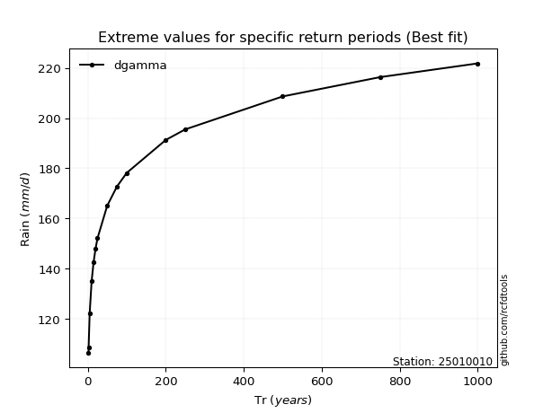</img>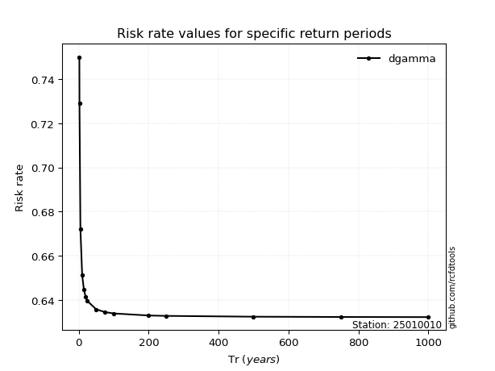</img>

</div>


<sub>**APP DISCLAIMER**: NO WARRANTY - This software is provided by [github.com/rcfdtools](https://github.com/rcfdtools) "as is", without any express or implied warranty, including warranties of merchantability, fitness for a particular purpose, or non-infringement. There is no guarantee that the software will be error-free or operate without interruption. LIMITATION OF LIABILITY - Neither the authors nor copyright holders will be liable for claims or damages arising from the software or its use. You are responsible for determining if the software is appropriate for your use and assume all associated risks, including errors, legal compliance, and data loss. NO PROFESSIONAL ADVICE - The software provides general information and does not offer professional advice. It should not replace consultation with professional advisors.</sub>